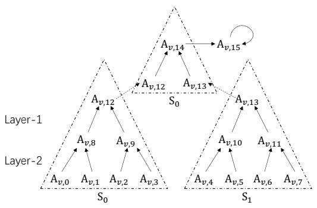
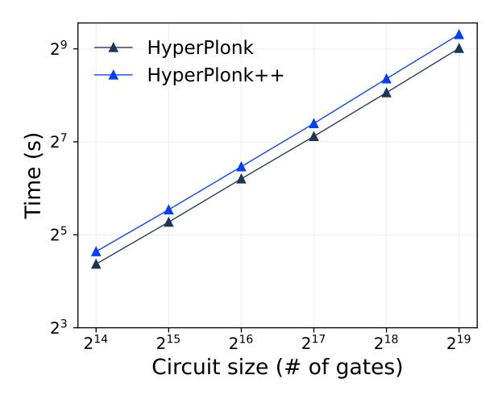
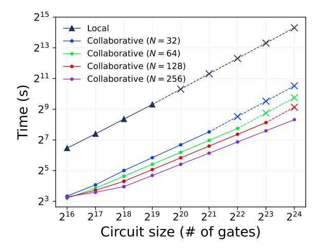
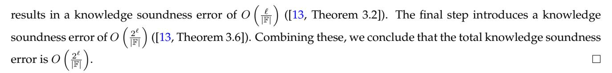

# Scalable Collaborative zk-SNARK and Its Application to Fully Distributed Proof Delegation

Xuanming Liu $^{1,*,\dagger}$ , Zhelei Zhou $^{1,\dagger}$ , Yinghao Wang $^{1,\dagger}$ , Yanxin Pang $^{3,*}$ , Jinye He $^{4,*}$ , Bingsheng Zhang $^{1,\dagger,\boxtimes}$ , Xiaohu Yang $^{1,\dagger,\boxtimes}$ , and Jiaheng Zhang $^2$ 

<sup>1</sup>Zhejiang University
<sup>2</sup>National University of Singapore
<sup>3</sup>Tsinghua University
<sup>4</sup>University of Virginia

June 1, 2025

#### Abstract

Collaborative zk-SNARK (USENIX'22) allows multiple parties to compute a proof over distributed witness. It offers a promising application called proof delegation (USENIX'23), where a client delegates the tedious proof generation to many servers while ensuring no one can learn the witness. Unfortunately, existing works suffer from significant efficiency issues and face challenges when scaling to complex applications.

In this work, we introduce the first scalable collaborative zk-SNARK for general circuits, built upon Hyper-Plonk (Eurocrypt'23). Our result overcomes existing barriers, offering fully distributed workload and small communication. For data-parallel circuits, the communication overhead is even sublinear. We propose several efficient collaborative and distributed protocols for multivariate primitives, which form the main building blocks of our results and may be of independent interest. In addition, we design a new permutation check protocol for Plonk arithmetization, which is MPC-friendly and suitable for collaborative zk-SNARKs.

With 128 servers jointly generating a proof for a circuit of size  $2^{21}$  gates, the experiment demonstrates over  $30 \times$  speedup and reduced RAM requirements compared to a local prover, while the witness is still private. Previous works were unable to achieve such savings in both time and memory efficiency. Moreover, our protocol performs well under various network conditions, making it practical for real-world applications.

<sup>\*</sup>Part of the work was done when Xuanming, Yanxin and Jinye were visiting the National University of Singapore.

<sup>&</sup>lt;sup>†</sup>The authors are with the State Key Laboratory of Blockchain and Data Security & Hangzhou High-Tech Zone (Binjiang) Institute of Blockchain and Data Security, Hangzhou, China.

<sup>&</sup>lt;sup>‡</sup>Emails: {hinsliu, zl\_zhou, asternight, bingsheng, yangxh}@zju.edu.cn, jhzhang@nus.edu.sg, pangyx21@mails.tsinghua.edu.cn, qfn5bh@virginia.edu.

# **Contents**

| 1 | Introduction                                             | 1  |
|---|----------------------------------------------------------|----|
|   | 1.1<br>Our contributions                                 | 1  |
|   | 1.2<br>Related works                                     | 2  |
| 2 | Preliminary                                              | 3  |
|   | 2.1<br>Packed (Shamir's) secret sharing<br>              | 3  |
|   | 2.2<br>Collaborative zk-SNARK                            | 4  |
|   |                                                          |    |
| 3 | Technical Overview                                       | 4  |
|   | 3.1<br>Background of this work                           | 4  |
|   | 3.2<br>Collaborative protocols with PSS<br>              | 5  |
|   | 3.3<br>Collaborative proof for HyperPlonk<br>            | 6  |
|   |                                                          |    |
| 4 | Collaborative Multivariate Primitives                    | 8  |
|   | 4.1<br>Collaborative sumcheck<br>                        | 8  |
|   | 4.2<br>Collaborative multilinear PCS                     | 9  |
|   | 4.3<br>Collaborative prodcheck                           | 10 |
| 5 | Scalable Collaborative zk-SNARK                          | 11 |
|   | 5.1<br>MPC-friendly permcheck<br>                        | 11 |
|   | 5.2<br>Collaborative proof for general circuit<br>       | 12 |
|   | 5.3<br>Collaborative proof for data-parallel circuit<br> | 13 |
|   |                                                          |    |
| 6 | Experimental Evaluation                                  | 14 |
|   | 6.1<br>Experimental setup                                | 14 |
|   | 6.2<br>Evaluation for general circuits                   | 14 |
|   | 6.3<br>Evaluation for data-parallel circuits             | 17 |
|   |                                                          |    |
| 7 | Conclusion & Discussion                                  | 17 |
|   | Acknowledgement                                          | 18 |
|   |                                                          |    |
|   | References                                               | 18 |
|   |                                                          |    |
| A | Additional Preliminary                                   | 22 |
|   | A.1<br>Interactive argument of knowledge                 | 22 |
|   | A.2<br>Collaborative zk-SNARK                            | 22 |
|   | A.3<br>Multiparty computation<br>                        | 23 |
|   | A.4<br>Multivariate polynomial commitment<br>            | 23 |
| B | Helper Functionalities                                   | 23 |
|   | B.1<br>Generating double random shares<br>               | 23 |
|   | B.2<br>PSS multiplication                                | 24 |
|   | B.3<br>Converting PSS to SSS<br>                         | 24 |
|   | B.4<br>Collaborative MSM                                 | 25 |
|   |                                                          |    |
| C | Multivariate Primitives                                  | 25 |
|   | C.1<br>Multilinear PCS<br>                               | 26 |
|   | C.2<br>Sumcheck<br>                                      | 26 |
|   | C.3<br>Zerocheck<br>                                     | 27 |
|   | C.4<br>Prodcheck<br>                                     | 27 |
|   | C.5<br>Permcheck                                         | 27 |

| D | Distributed Protocols                        | 27 |
|---|----------------------------------------------|----|
|   | D.1<br>Distributed multilinear PCS           | 27 |
|   | D.2<br>Distributed sumcheck<br>              | 27 |
|   | D.3<br>Distributed zerocheck<br>             | 28 |
|   | D.4<br>Our distributed prodcheck             | 28 |
|   | D.5<br>Our distributed permcheck<br>         | 31 |
| E | Collaborative Protocols                      | 31 |
|   | E.1<br>Our collaborative multilinear PCS<br> | 31 |
|   | E.2<br>Our collaborative sumcheck            | 32 |
|   | E.3<br>Our collaborative zerocheck           | 33 |
|   | E.4<br>Our collaborative prodcheck           | 33 |
|   | E.5<br>Our collaborative permcheck<br>       | 34 |
| F | Collaborative Proof for HyperPlonk++         | 34 |
|   | F.1<br>HyperPlonk++                          | 34 |
|   | F.2<br>Collaborative HyperPlonk++<br>        | 35 |
| G | ´<br>USENIX Security 25 Artifact Appendix    | 35 |

### <span id="page-3-0"></span>1 Introduction

Given the arithmetic circuit  $\mathcal{C}$  and some public inputs x, a zero-knowledge Succinct Non-interactive ARgument of Knowledge (zk-SNARK) allows a prover  $\mathcal{P}$  to generate a concise proof that convinces a verifier  $\mathcal{V}$  that  $\mathcal{P}'$ s private witness w satisfies  $\mathcal{C}(x,w)=1$ , without revealing any information about w. This technique enables trustworthy applications while preserving sensitive information, such as blockchain [61, 39], machine learning [64, 40, 42, 49], and program execution [2, 7]. Collaborative zk-SNARK, introduced by Ozdemir and Boneh [45], allows multiple parties, each holding a secret-shared w, to collaboratively generate the proof via multiparty computation (MPC), while preserving the privacy of w. Some representative applications include verifiable aggregate statistics [45] and publicly auditable MPC [5].

**Application to proof delegation.** Recently, another promising application of collaborative zk-SNARK is explored by Garg et al. [27], introducing the concept of *proof delegation*: Although with various technical breakthroughs and improvements [33, 8, 41, 34], currently, proof generation still remains prohibitively expensive for ordinary clients. For example, experiments showcase that even with HyperPlonk [13], a prover-efficient zk-SNARK, it still takes several hours and over 300 GB of RAM to generate a proof for a general-purpose virtual machine [9] with  $|\mathcal{C}| \approx 2^{27}$ . Handling such burdens is even challenging for a powerful server, let alone lightweight clients. To address this issue, in [27], the authors propose a framework called zkSaaS, allowing the client to delegate this task to a group of untrusted servers, each of which only holds a secret-shared w and runs a collaborative zk-SNARK together to generate a proof for the client. A highlight of this scheme is that the client does not need to involve in the collaborative proof, and no server is able to access the client's private information w. For instance, consider a client who wants to generate a proof for the integrity of her machine learning inference [64], but the device is resource-constrained. As a use case of collaborative zk-SNARKs, she can delegate the task to service providers without leaking her private input.

**Scalability.** However, not all collaborative zk-SNARKs are suitable for proof delegation, primarily because many of them have significant *scalability* limitations. We posit that if a collaborative zk-SNARK satisfies all of the following efficiency properties, it is considered well-suited for proof delegation:

- Fully distributed workload: First, during the collaborative zk-SNARK, as the number of parties increases, the time complexity for each party should decrease accordingly, so that proof delegation becomes meaningful, as it can generate proofs more quickly than the client would locally. Moreover, the space complexity also tends to improve linearly with the number of parties. As a result, memory will not become the key bottleneck for handling complex applications. This is crucial: while it is possibly tolerable to wait longer during the collaborative proof, we cannot always add more RAM to support larger circuits.
- *Small communication:* Finally, the communication should stay as small as possible, so as not to affect the efficiency.

We note these properties also benefit other previously mentioned applications of collaborative zk-SNARKs [45, 5]. Unfortunately, existing collaborative zk-SNARKs [45, 27] are not *scalable*. Specifically, in [45], each party has the same time and space complexity as the local prover, making the collaborative proof very costly; zkSaaS [27] *partially* addresses this issue: most servers in their protocols achieve the desired properties, but a leader server still incurs the same time and space complexity as the local prover, along with significant communication overhead. Our experiment (Tab. 4) showcases that their efficiency improvement is limited due to the leader server becoming a new bottleneck. Additionally, some previous work, such as [39, 50], also attempts to achieve these properties, but their approaches sacrifice the privacy of witness and therefore do not meet the desired requirements. Therefore, in this work, we ask the following question:

Can we construct a collaborative zk-SNARK that has (i) fully distributed workload, and (ii) concretely small communication?

### <span id="page-3-1"></span>1.1 Our contributions

We provide affirmative answer to the above question, and our contributions are summarized as follows:

**Collaborative multivariate primitives.** Firstly, we identify the problems hindering [45, 27] from achieving scalability (§3.1), one of the most important being the use of *univariate* SNARKs like Plonk [25]. In contrast, we turn to *multivariate* SNARKs, such as HyperPlonk [13]. As shown before, while the prover is already efficient, large circuits still face time and space bottlenecks, which is the main focus of proof delegation. This motivates us to improve proof delegation efficiency for them. Based on *packed secret sharing* (PSS) [23], we design a toolbox of highly-efficient *collaborative* protocols (§4), allowing servers, each with *secret-shared* polynomials, to compute key

<span id="page-4-1"></span>

| System        | Comp. Model   | Scheme           | Time per Party                            |                                           | Space per Party                           |                                           | Comm. per Party    |                                         | Privacy?  |
|---------------|---------------|------------------|-------------------------------------------|-------------------------------------------|-------------------------------------------|-------------------------------------------|--------------------|-----------------------------------------|-----------|
| System        | Comp. Woder   | Scheme           | $S_0$                                     | $S_i$                                     | $S_0$                                     | $S_i$                                     | $S_0$              | $S_i$                                   | 1 iivacy: |
| zkBridge [61] | Data-parallel | Virgo [66]       | 0(                                        | $\frac{T_{\mathcal{P}}}{N}$               | 0(                                        | $\frac{S_{\mathcal{P}}}{N}$               | 0                  | $\left(\frac{ \mathcal{C} }{N}\right)$  | Х         |
| Pianist [39]  | General       | Plonk [25]       | 0(                                        | $\frac{T_{\mathcal{P}}}{N}$               | 0 (                                       | $\frac{S_{\mathcal{P}}}{N}$               | C                  | P(1)                                    | Х         |
| Hekaton [50]  | General       | Mirage [38]      | $O\left(\frac{T_{\mathcal{P}}}{N}\right)$ |                                           | $O\left(\frac{S_{\mathcal{P}}}{N}\right)$ |                                           | O(1)               |                                         | Х         |
| DFS [36]      | R1CS          | DFS [36]         | 0 (                                       | $T_{\mathcal{P}})$                        | O (                                       | $S_{\mathcal{P}})$                        | O(le               | $\log  \mathcal{C} )$                   | 1         |
| zkSaaS [27]   | R1CS          | Groth16 [33]     | $O(T_{\mathcal{P}})$                      | $O\left(\frac{T_{\mathcal{P}}}{N}\right)$ | $O(S_{\mathcal{P}})$                      | $O\left(\frac{S_{\mathcal{P}}}{N}\right)$ | $O( \mathcal{C} )$ | $O\left(\frac{ \mathcal{C} }{N}\right)$ | 1         |
| ZROUGO [27]   | General       | Plonk [25]       | $O(T_{\mathcal{P}})$                      | $O\left(\frac{T_{\mathcal{P}}}{N}\right)$ | $O(S_{\mathcal{P}})$                      | $O\left(\frac{S_{\mathcal{P}}}{N}\right)$ | $O( \mathcal{C} )$ | $O\left(\frac{ \mathcal{C} }{N}\right)$ | 1         |
| This work     | Data-parallel | HyperPlonk [13]  | 0(                                        | $\frac{T_{\mathcal{P}}}{N}$               | 0 (                                       | $\frac{S_{\mathcal{P}}}{N}$               | O(le               | $\log  \mathcal{C} )$                   | 1         |
| THIS WOLK     | General       | 11yperrionk [13] | 0(                                        | $\frac{T_{\mathcal{P}}}{N}$               | 0 (                                       | $\frac{S_{\mathcal{P}}}{N}$               | 0                  | $\left(\frac{ \mathcal{C} }{N}\right)$  | ✓         |

Table 1: Comparisons of leading systems aiming to *distribute* zk-SNARK workload. **Schemes** represent the targeted underlying zk-SNARKs of these systems.  $T_{\mathcal{P}}, S_{\mathcal{P}}$  denote the time complexity and space complexity of a local prover  $\mathcal{P}$ .  $|\mathcal{C}|$  represents the size of the circuit.  $S_0, S_i$  denote the leader server and other servers in [27] which have different properties.

primitives of these SNARKs, such as *sumcheck* and *polynomial commitment*. Notably, to the best of our knowledge, we are *the first* to study these multivariate primitives over *secret-shared* witness. This toolbox may serve as independent interests.

MPC-friendly permcheck. For *Plonk arithmetization* [25], a most common circuit representation, *permcheck* is another key primitive. We analyze the difficulties of computing this with an MPC protocol, deeming it MPC-unfriendly. Instead, we propose a new MPC-friendly permcheck scheme (§5.1) that transforms the check on secret-shared polynomials to public inputs, significantly improving the efficiency of collaborative proof. Replacing the original component with this, we obtain HyperPlonk++, an MPC-friendly variant of [13].

**Mixed-mode collaborative proofs.** With the above construction, we design an efficient *distributed* protocol for permcheck (§5.2). Hence, the final collaborative proof is a *mixed-mode* of two protocol categories, offering faster computation and lower communication than the purely PSS-based protocols in [27]. The distributed permcheck combines two new constructions, *layered* distributed sumcheck and polynomial commitment, achieving speed-up without increasing the proof size.

**Implementation and evaluation.** Combining everything, we make a significant advance in this field, obtaining scalable collaborative zk-SNARK for HyperPlonk++ (§5.2). In a collaborative proof for a circuit C, with N *low-memory* servers:

- If  $\mathcal{C}$  is a general circuit with arbitrary form, (i) the workload is *fully distributed*, with each server having the same time and space complexity; (ii) the communication per server is  $O\left(\frac{|\mathcal{C}|}{N}\right)$ . Concretely, with N=128, the collaborative proof can handle  $16\times$  larger circuits compared to a local prover, and achieve over  $30\times$  speedup for large circuits. The communication is not a bottleneck even in a WAN: for  $|\mathcal{C}|=2^{21}$ , N=128, the cost per server is under 50 MB. In addition, we eliminate significant pre-processing needs.
- If the circuit is data-parallel, consisting of many identical sub-copies, we additionally achieve total communication *sublinear* in  $|\mathcal{C}|$ . This kind of circuits have wide real-world applications, such as blockchain rollups and bridges [61, 39], verifiable ECDSA and AES [6, 19], and verifiable machine learning [40, 3, 47]. Experiment further demonstrates the advantage through specific applications.

### <span id="page-4-0"></span>1.2 Related works

There is a line of work that focuses on distributing a local prover  $\mathcal{P}$ 's workload among machines or parties, thereby efficiently scaling the corresponding SNARKs to larger circuits. Tab. 1 summarizes the properties of leading related works.

Witness is exposed. *Distributed zk-SNARKs* [59, 61, 39, 50] demonstrate how to enable several machines to work in tandem to generate a proof. For instance, [61, 39, 50] design distributed zk-SNARKs for Plonk [25], Mirage [38] and Virgo [66], respectively. These works effectively divide the workload, and [39, 50] even achieve sublinear communication relative to the circuit size. However, as they assume machines are honest and directly expose the witness in plain, they are unsuitable for our purposes where the witness is sensitive.

**Witness is secret-shared.** Recently, works such as [51, 18, 45, 14, 27, 63, 36, 60] explore using MPC to compute proofs *without* revealing the witness, with [45] formalizing the collaborative zk-SNARK framework. Note that, many of them (e.g., [45, 60], EOS and its follow-ups [14, 63]) fail to achieve scalability, as each party retains  $\mathcal{P}$ 's complexity and incurs large communication cost. While we work in a semi-honest setting, some works [45, 14, 63] consider malicious security.

In [27], Garg et al. introduce zkSaaS and design customized collaborative proofs for [33, 25], using PSS to distribute  $\mathcal{P}$ 's workload among parties. However, their work relies heavily on a powerful leader with high complexity and communication cost, limiting its scalability. Our goal is to eliminate this bottleneck. See §3.1 for detailed analysis of [27].

More recently, in a concurrent and independent work, Hu et al. [36] improve upon EOS [14] and explore faster proof delegation. Their model differs significantly from ours: each party in their protocol still undertakes the *same* complexity as  $\mathcal{P}$ , but they additionally assume that each party has multiple machines and achieve acceleration through parallel computing; In contrast, we do not make such assumptions. Furthermore, the techniques differ a lot, for instance, their focus is a customized SNARK for R1CS [52] called DFS, while our goal is collaborative SNARK for general circuits [13]. Nevertheless, we note both works share some similar observations, such as the suitability of multivariate SNARKs for proof delegation.

# <span id="page-5-0"></span>2 Preliminary

We provide additional preliminaries, including the definitions for argument of knowledge, Polynomial Commitment Scheme (PCS) and Multi-Party Computation (MPC), in Appx. A. We use the term *collaborative* to describe protocols that operate on inputs that are secret-shared, and *distributed* to describe computations performed on inputs that are all public.

**Notations.** We use  $\lambda$  to denote the security parameter, and  $\operatorname{negl}(\lambda)$  to denote a negligible function in  $\lambda$ . Let  $\mathbb F$  be a finite field with prime order such that  $|\mathbb F|^{-1} = \operatorname{negl}(\lambda)$ . Let  $(\mathbb G, \mathbb G_T)$  be multiplicative cyclic groups. "PPT" stands for probabilistic polynomial time. Bold letters, e.g., x, are used to denote vectors and bit-strings. For a positive integer n > 1, we use [n] to denote the set  $\{1, \ldots, n\}$ . For positive integers a, b such that  $a \leq b$ , we use [a, b] to denote the set  $\{a, \ldots, b\}$ , and x[a:b] to denote  $\{x_a, \ldots, x_b\}$ . Let  $\mathbb{1}_j$  denote j consecutive 1's.

**Multilinear extension (MLE).** A polynomial f is *multilinear* if it is a multivariate polynomial whose degree in each variable is at most one. An  $\ell$ -variate multilinear polynomial f's evaluations on  $\{0,1\}^{\ell}$  can be represented as a hypercube  $A_f$ , and we use  $A_f[b]$  to denote the element in  $A_f$  indexed by  $b \in \{0,1\}^{\ell}$ . On the other hand, the MLE of a hypercube  $A_f$  of size  $2^{\ell}$  is defined as  $f : \mathbb{F}^{\ell} \to \mathbb{F}$ , where  $f(x) = A_f[x]$  for any  $x \in \{0,1\}^{\ell}$ . Specifically, f can be expressed as:

<span id="page-5-2"></span>
$$f(\boldsymbol{x}) = \sum_{\boldsymbol{b} \in \{0,1\}^{\ell}} \tilde{eq}(\boldsymbol{x}, \boldsymbol{b}) \cdot f(\boldsymbol{b}), \tag{1}$$

where  $\tilde{\text{eq}}(\boldsymbol{x}, \boldsymbol{b}) = \prod_{i=1}^{\ell} ((1 - x_i)(1 - b_i) + x_i b_i)$ ,  $b_i$  is  $\boldsymbol{b}$ 's i-th bit. For any  $\boldsymbol{r} \in \mathbb{F}^{\ell}$ ,  $f(\boldsymbol{r})$  can be computed in  $O(2^{\ell})$  time [58].

### <span id="page-5-1"></span>2.1 Packed (Shamir's) secret sharing

In this work, we use the packed secret sharing (PSS) scheme introduced by Franklin and Yung [23], which is a generalization of Shamir's secret sharing (SSS) scheme [56]. Suppose  $x = \{x_1, \ldots, x_k\}$  is a vector of k secrets, where k is called the packing factor. The dealer selects a degree-d polynomial  $f_x$  (where  $d \ge k - 1$ ) such that  $f_x(-i) = x_i$  for  $i \in [k]$ . Each share is then calculated as  $f_x(i)$  and sent to the i-th party  $S_i$  for  $i \in [0, N - 1]$ . Any d+1 parties can reconstruct x by Lagrange interpolation. We call  $f_x$  the secret polynomial of x, and use  $[x]_d$  to denote a degree-d PSS of x (may omit the subscript d when the context is clear). Accordingly, we use  $\langle x \rangle$  to denote a regular Shamir's secret sharing. Recall two properties of PSS: for any  $x, y \in \mathbb{F}^k$  and  $d \ge k - 1$ :

- Linear homomorphism:  $[x + y]_d = [x]_d + [y]_d$ .
- Multiplicative: For all  $d_1, d_2 \ge k 1$  subject to  $d_1 + d_2 < N$ ,  $[\![ \boldsymbol{x} * \boldsymbol{y} ]\!]_{d_1 + d_2} = [\![ \boldsymbol{x} ]\!]_{d_1} \cdot [\![ \boldsymbol{y} ]\!]_{d_2}$ , where \* denotes coordinate-wise multiplication.

Recall that any d-k+1 shares are independent of the secret x. If we denote by t the number of corrupted parties, the PSS scheme is secure against  $t \le d-k+1$  corrupted parties.

**Collaborative MSM.** We recall the collaborative MSM introduced by [27]. Suppose  $A_1, \ldots, A_n \in \mathbb{G}^n$  and  $b_1, \ldots, b_n \in \mathbb{F}^n$ , and each party holds the PSS  $\{ [\![ \mathbf{A}_j ]\!] \}_{j \in [\frac{n}{k}]}$  of  $\mathbf{A}_j = \{ A_{(j-1)k+i} \}_{i \in [k]}$  and  $\{ [\![ \mathbf{b}_j ]\!] \}_{j \in [\frac{n}{k}]}$  of  $\mathbf{b}_j = \{ b_{(j-1)k+i} \}_{i \in [k]}$ . The

protocol allows N parties to compute the multi-scalar multiplication (MSM)  $\prod_{i=1}^n A_i^{b_i}$ . Each server incurs  $O\left(\frac{n}{k}\right)$  time and space complexity, and the total communication is O(N). The protocol needs to pre-processing O(N) randomness. We provide the formal functionality and protocol in Appx. B.4.

#### <span id="page-6-0"></span>2.2 Collaborative zk-SNARK

We present the definition of collaborative zk-SNARK introduced by Ozdemir and Boneh, adapted from [45, 27].

**Definition 1** (Collaborative zk-SNARK). Let  $S_0, \ldots, S_{N-1}$  be N servers, and (Setup, Prove, Verify) be a zk-SNARK for some NP relation  $\mathcal{R}$  with public input x and witness w. For each server, let  $w_i$  be the PSS of w held by  $S_i$ . A collaborative zk-SNARK for  $\mathcal{R}$  is (Setup,  $\Pi$ , Verify), where:

- pp  $\leftarrow$  Setup $(1^{\lambda}, \mathcal{R})$ : The same as the setup algorithm of the underlying zk-SNARK.
- $\pi \leftarrow \Pi(pp, x, \boldsymbol{w}_0, ..., \boldsymbol{w}_{N-1})$ :  $\Pi$  is an MPC protocol among N servers, which securely computes the prover algorithm Prove of the underlying zk-SNARK.
- $0/1 \leftarrow \text{Verify}(pp, x, \pi)$ : The same as the verification algorithm of the underlying zk-SNARK.

A collaborative zk-SNARK satisfies completeness, knowledge soundness, zero-knowledge, succinctness, and *t-zero-knowledge*. The first four properties are commonly used as in traditional zk-SNARKs, with formal definitions provided in Appx. A, while the last property is described as follows:

• *t-zero-knowledge*: For all PPT adversaries  $\mathcal{A}$  controlling at most t servers, denoted as  $\mathcal{C}orr$ , and pp  $\leftarrow$  Setup $(1^{\lambda}, \mathcal{R})$ , there exists a simulator  $\mathcal{S}$  such that for all x, w (where  $b \leftarrow \mathcal{R}(x, w) \in \{0, 1\}$ ), the following relation holds:

$$\mathsf{View}_{\Pi}^{\mathcal{A}}(x, \boldsymbol{w}) \approx \mathcal{S}(\mathsf{pp}, x, b, \{\boldsymbol{w}_i\}_{i.s.t. \; \mathsf{S}_i \in \mathcal{C}orr})$$

View<sup>A</sup><sub> $\Pi$ </sub>(x, w) denotes A's view from the real-world execution of  $\Pi$  and  $S(pp, x, b, \{w_i\}_{i \in Corr})$  is the view generated by S given x and inputs from corrupted parties.  $\approx$  denotes the two distributions are computationally indistinguishable.

Previous work has shown that if there exists an MPC protocol  $\Pi$  that computes Prove of the underlying zk-SNARK against up to t corruptions, then a corresponding collaborative zk-SNARK (Setup,  $\Pi$ , Verify) follows immediately [45]. Due to this, we primarily focus on the design of such a protocol  $\Pi$ .

### <span id="page-6-1"></span>3 Technical Overview

### <span id="page-6-2"></span>3.1 Background of this work

Similar to zkSaaS [27], we present this work in a proof delegation scenario, though the results can be extended to other applications [45, 5]. A client delegates proof generation to N servers  $S_0, \ldots, S_{N-1}$  with a certain price. But unlike [27], we impose no resource requirements on servers, allowing low-end devices to participate. The process has two phases:

- Assume that the circuit C is public. The client first computes the (extended) witness w from the inputs and then uses a PSS scheme to share w among the servers, where each server  $S_i$  receives its share  $w_i$ . This step is relatively inexpensive, as it does not involve costly cryptographic operations. Moreover, the client can process these operations in a streaming manner [27], avoiding high space complexity. After this distribution, the client no longer needs to participate in the proof generation.
- The servers then execute the MPC protocol  $\Pi$  for a collaborative zk-SNARK to generate the proof  $\pi$ , which is subsequently returned to the client.

Intuitively, the t-zero-knowledge property of the collaborative zk-SNARK ensures that no server can gain any information about w under the given security model.

**Security model.** We assume an honest-majority setting where an adversary can only corrupt a minority of the servers. Concretely, let k = O(N) be the packing factor, our work is proven to be secure against at most  $t = \frac{N}{2} - 2k$  corrupted servers. Aligning with [27], we consider a semi-honest adversary. In §7, we briefly discuss how to extend our work to achieve malicious security, i.e., to defend against adversaries who may arbitrarily deviate from the protocol.

**Efficiency goals.** For a given circuit C, let  $T_{\mathcal{P}}$  and  $S_{\mathcal{P}}$  denote the time and space complexity of Prove for a local zk-SNARK prover, respectively. We define a target scalable collaborative zk-SNARK as *fully distributed* if each server

<span id="page-6-3"></span><sup>&</sup>lt;sup>1</sup>In §6, k is instantiated as  $\frac{N}{8}$ , and  $t = \frac{N}{4}$  accordingly.

in  $\Pi$  incurs the same time and space complexity of  $O\left(\frac{T_{\mathcal{P}}}{N}\right)$  and  $O\left(\frac{S_{\mathcal{P}}}{N}\right)$ , respectively. Additionally, we require that each server bears a similar communication cost, and the total communication is expected to be as small as possible.

<u>Pre-processing.</u> In this work, we design MPC protocols in the pre-processing model, where input-independent randomness is prepared prior to online execution. We require the total pre-processing cost to be sublinear in the circuit size  $|\mathcal{C}|$ , ensuring that the cost of randomness preparation remains slight compared to proof generation. In proof delegation, the client can directly provide the randomness, as this is inexpensive. Given the low pre-processing cost, our efficiency analysis and experimental evaluation focus solely on *online complexity*. Note that, this contrasts with previous works [45, 27], which require costly  $O(|\mathcal{C}|)$  randomness preparation.

**Pros and cons of PSS.** Recent research [32, 20, 21, 27] proposes PSS as a general weapon for improving the efficiency of MPC protocols, primarily because it enables parties to perform *Single Instruction Multiple Data* (SIMD) operations on a secret-shared vector. Thanks to this property, PSS achieves a k = O(N) improvement in both time and space complexity. Building on this insight, we also aim to leverage PSS to enhance the efficiency of collaborative zk-SNARKs.

<u>Challenges from [27].</u> However, we emphasize that even with this weapon, achieving ideal efficiency remains non-trivial. [27] attempts to adapt Plonk [25] and Groth16 [33] into collaborative zk-SNARKs with PSS. However, several issues force them to rely on a leader server to handle most of the workload and communication, ultimately becoming the system's bottleneck. Below, we analyze the challenges they face:

- The biggest challenge is that Plonk and Groth16 are constructed using univariate polynomials (hereafter referred to as univariate SNARKs), and [27] requires an MPC sub-protocol that enables servers to compute FFT collaboratively. However, the authors find it highly challenging to design an efficient MPC protocol for FFT. As a result, they only manage to develop a protocol for *partially* distributing FFT, where a powerful server handles the majority of the workload, which is undesirable. Another building block, the univariate KZG PCS [37], faces similar issues. Moreover, the univariate prodcheck [25] introduces significant communication overhead and requires  $O(|\mathcal{C}|)$  randomness, which is difficult to achieve in practice, especially when the randomness is expected to be provided by the client.
- Another problem is that if we model the Prove algorithms of zk-SNARKs as a *prover circuit*  $C_P$ , it contains many multiplication gates. For collaborative zk-SNARKs in [27], this implies the need to handle numerous multiplications between PSS. However, it is well known that successfully recovering secrets after PSS multiplication requires an expensive procedure called *degree reduction* [16] to lower the degree of the PSS's secret polynomial, which again introduces significant communication overhead.

Obs. I: Multivariate SNARKs without FFT. Due to the above analysis, our first observation is that univariate SNARKs, such as Plonk and Groth16, are not suitable for MPC and are therefore difficult to align with our goals. On the other hand, there exist multivariate SNARKs, such as Libra [62], HyperPlonk [13], and Spartan [52], which do not rely on FFT and are more *suitable* for exploring how to make them satisfy our purpose. Hence, in this work, we choose to study how to make these multivariate zk-SNARKs "collaborative".

Obs. II: Multiplicative depth of SNARKs. The second crucial observation is that for most SNARKs, including the aforementioned univariate and multivariate ones, the prover circuit  $\mathcal{C}_{\mathcal{P}}$  actually has a *shallow multiplicative depth*. More specifically,  $\mathcal{C}_{\mathcal{P}}$  requires *only one inevitable* multiplication between private witness due to the need to check the correctness of multiplication gates in a given application. Beyond this,  $\mathcal{C}_{\mathcal{P}}$  only needs to perform *several* multiplications between public inputs and private witness. Therefore, it is feasible to adjust the PSS setting to support a limited number of PSS multiplications, thereby avoiding *any* costly degree reduction.

### <span id="page-7-0"></span>3.2 Collaborative protocols with PSS

We first provide a collaborative protocol toolbox for conveniently lifting multivariate SNARKs into collaborative zk-SNARKs. There are two important basic building blocks: (i) *Sumcheck* [43], which, given an  $\ell$ -variate polynomial f and a claim H, allows  $\mathcal P$  to convince that  $H = \sum_{x \in \{0,1\}^{\ell}} f(x)$ , and (ii) *Multilinear PCS* [46], which allows  $\mathcal P$  to commit to a multilinear polynomial and later evaluate it at some point. The first task is to enable the servers to compute  $\mathcal P$  of these primitives without learning the underlying polynomial f.

**Collaborative sumcheck.** The first construction is a collaborative protocol that allows N servers to generate a proof for sumcheck. First, let us consider a case where f is *multilinear*.

Collaboratively compute bookkeeping table. In [57], Thaler proposes a linear-time algorithm for  $\mathcal{P}$ , the core of which involves  $\mathcal{P}$  computes a bookkeeping table. This table consists of  $\ell$  rows, where the  $n=2^{\ell}$  entries in the first row are initialized with the hypercube  $A_f$ , and the i-th row contains  $2^{\ell-i+1}$  entries, computed as follows, for  $b \in \mathcal{P}$ 

<span id="page-8-1"></span> $\{0,1\}^{\ell-i+1}$ :

$$f(r_1, \dots, r_{i-1}, r_i, \mathbf{b}) = (1 - r_i) \cdot f(r_1, \dots, r_{i-1}, 0, \mathbf{b}) + r_i \cdot f(r_1, \dots, r_{i-1}, 1, \mathbf{b})$$
(2)

where  $r_i \in \mathbb{F}$  are random challenges from previous rounds. In our setting, to maintain privacy, each server initially only obtains the PSS of  $A_f$ . To achieve efficiency goals, we note that it is possible to *fully distribute* the workload among N servers with PSS. More specifically,  $A_f$  is split into  $\frac{n}{k}$  vectors, where k is the packing factor. Assuming the PSS of these vectors are provided, then Eq. (2) can be rewritten as:

<span id="page-8-2"></span>
$$\llbracket \boldsymbol{x}_{i+1,j} \rrbracket = (1 - r_i) \cdot \llbracket \boldsymbol{x}_{i,j} \rrbracket + r_i \cdot \llbracket \boldsymbol{x}_{i,j+\frac{n_i}{2k}} \rrbracket, \quad j \in \left[ \frac{n_i}{2k} \right]$$
(3)

where  $x_i$  denotes the  $n_i = \frac{n}{2^{i-1}}$  entries in the *i*-th row. However, one problem is that the above computation will get stuck in the  $\log \frac{2n}{k}$ -th row, where each server only holds one share, making Eq. (3) infeasible to proceed further. To address this issue, here we allow the servers to convert the single PSS into regular Shamir's secret sharing (SSS). Hereafter, the remaining work can be completed on the shares locally again.

<u>High-degree problem.</u> However, when f has a higher degree D > 1, the above protocol encounters a significant problem: This is because a high-degree f can be viewed as the evaluation of an arithmetic circuit containing O(D) multiplication gates, taking multiple multilinear polynomials as inputs. Therefore, during the sumcheck, in each round the servers need to compute several multiplications between PSS, which precisely leads to the second challenge mentioned earlier.

Optimal (t,k). Our solution comes from the earlier observation: We find that throughout the proof generation of most multivariate SNARKs [62, 52, 13], D is at most 4, requiring products of four polynomials: two of which encode private witness and the other two encode public inputs. Therefore, by appropriately configuring t and k in PSS, we can ensure that the degree of PSS's secret polynomial does not exceed N, allowing the secrets to be recovered. More precisely, the *multiplicative* property (§2.1) implies that, for PSS  $[\![x_1]\!]_d$ ,  $[\![x_2]\!]_d$  of two witness vectors and  $[\![c_1]\!]_{k-1}$ ,  $[\![c_2]\!]_{k-1}$  of two public vectors, all servers can locally compute their product  $[\![x_1 * x_2 * c_1 * c_2]\!]_{2d+2k-2}$ . Therefore, by arranging (t,k) to satisfy both N > 2d + 2k - 2 and  $d \ge t + k - 1$  (§2.1), we conclude that our protocol is secure when  $N \ge 2t + 4k$ .

**Collaborative multilinear PCS.** As mentioned earlier, [27] uses *collaborative* KZG [37] as their PCS for univariate polynomials, and the evaluation of KZG requires polynomial division. However, they find that performing *long division* of univariate polynomials with PSS is inefficient. Therefore, they turn to using collaborative FFT for polynomial divisions, which is known to impose a significant burden. In contrast, we instantiate multilinear PCS with PST [46], and we observe that this scheme can be made fully distributed via PSS.

Collaboratively compute polynomial division. Given an evaluation point  $u \in \mathbb{F}^{\ell}$  and the evaluation  $z \in \mathbb{F}$ ,  $\mathcal{P}$  generates a proof showing z = f(u). In the PST scheme, this involves performing polynomial divisions by  $(x_i - u_i)$  to obtain a series of quotient and remainder polynomials  $\{Q_i, R_i\}_{i \in [\ell]}$ . Our observation is, unlike KZG which is PSS-unfriendly, in PST, when f is multilinear, the evaluations of  $Q_i, R_i$  on  $\{0, 1\}^{\ell-i}$  satisfy:

<span id="page-8-3"></span>
$$Q_{i}(\mathbf{b}) = R_{i-1}(1, \mathbf{b}) - R_{i-1}(0, \mathbf{b}) ,$$
  

$$R_{i}(\mathbf{b}) = (1 - u_{i}) \cdot R_{i-1}(0, \mathbf{b}) + u_{i} \cdot R_{i-1}(1, \mathbf{b})$$
(4)

where  $R_0 := f$ . This formula is similar to Eq. (2). Thus, when the hypercube  $A_f$  is secret-shared in PSS, the servers can compute the PSS of  $\{A_{Q_i}, A_{R_i}\}_{i \in [\ell]}$  in a similar way, evenly distributing the workload. Finally, the servers can invoke the collaborative MSM protocol (§2.1) to obtain the proof.

### <span id="page-8-0"></span>3.3 Collaborative proof for HyperPlonk

We instantiate collaborative multivariate zk-SNARKs with HyperPlonk [13], which is widely used in industry due to its use of *Plonk arithmetization* [25, 13], a highly expressive framework for real-world applications. Meanwhile, our constructions have the potential to make other SNARKs [62, 66, 52, 65, 10] "collaborative", as they have similar building blocks.

**Problem of classic permcheck.** The arithmetization introduces the *Permcheck* problem: it encodes  $n=2^\ell$  wires in a circuit as an  $\ell$ -variate witness polynomial V, with the wiring pattern defined by a public permutation  $\sigma: \{0,1\}^\ell \to \{0,1\}^\ell$  determined by the circuit structure. It needs to check the correct wiring through the relation:  $V(\boldsymbol{x}) = V(\sigma(\boldsymbol{x}))$  for all  $\boldsymbol{x} \in \{0,1\}^\ell$ . A classic approach reduces this to a *Prodcheck*, where  $\mathcal P$  convinces that  $H = \prod_{\boldsymbol{x} \in \{0,1\}^\ell} f(\boldsymbol{x})$ .



<span id="page-9-1"></span><span id="page-9-0"></span>Figure 1: Illustration of an 8-input product tree with 2 servers. Here,  $A_{v,i}$  denotes the *i*-th entry in  $A_v$ , and  $A_{v,15} = 0$ .

$$\begin{array}{c} \sigma(0,0) = (1,0) \\ \sigma(0,1) = (0,1) \\ \sigma(1,0) = (0,0) \\ \sigma(1,1) = (1,1) \end{array} \\ \begin{array}{c} \begin{pmatrix} 0 \ 0 \ 1 \ 0 \\ 0 \ 1 \ 0 \ 0 \\ 0 \ 0 \ 0 \ 1 \end{pmatrix} \\ \begin{pmatrix} 5 \\ 6 \\ 5 \\ 7 \end{pmatrix} = \begin{pmatrix} 5 \\ 6 \\ 5 \\ 7 \end{pmatrix} \\ \begin{array}{c} M(0,0,1,0) = 1 \\ 5 \\ 6 \\ 5 \\ 7 \end{array} \\ \begin{array}{c} M(0,1,0,1) = 1 \\ M(0,1,0,1) = 1 \\ M(0,1,0,1) = 1 \\ M(0,1,0,1) = (0,0) \\ M(1,1,1,1) = 1 \\ M(0,1,1,1) = (0,0) \\ M(1,1,1,1) = 1 \\ M(1,1,1,1) = (0,0) \\ M(1,1,1,1) = (0,0) \\ M(1,1,1,1) = (0,0) \\ M(1,1,1,1) = (0,0) \\ M(1,1,1,1) = (0,0) \\ M(1,1,1,1) = (0,0) \\ M(1,1,1,1) = (0,0) \\ M(1,1,1,1) = (0,0) \\ M(1,1,1,1) = (0,0) \\ M(1,1,1,1) = (0,0) \\ M(1,1,1,1) = (0,0) \\ M(1,1,1,1) = (0,0) \\ M(1,1,1,1) = (0,0) \\ M(1,1,1,1) = (0,0) \\ M(1,1,1,1) = (0,0) \\ M(1,1,1,1) = (0,0) \\ M(1,1,1,1) = (0,0) \\ M(1,1,1,1) = (0,0) \\ M(1,1,1,1) = (0,0) \\ M(1,1,1,1) = (0,0) \\ M(1,1,1,1) = (0,0) \\ M(1,1,1,1) = (0,0) \\ M(1,1,1,1) = (0,0) \\ M(1,1,1,1) = (0,0) \\ M(1,1,1,1) = (0,0) \\ M(1,1,1,1) = (0,0) \\ M(1,1,1,1) = (0,0) \\ M(1,1,1,1) = (0,0) \\ M(1,1,1,1) = (0,0) \\ M(1,1,1,1) = (0,0) \\ M(1,1,1,1) = (0,0) \\ M(1,1,1,1) = (0,0) \\ M(1,1,1,1) = (0,0) \\ M(1,1,1,1) = (0,0) \\ M(1,1,1,1) = (0,0) \\ M(1,1,1,1) = (0,0) \\ M(1,1,1,1) = (0,0) \\ M(1,1,1,1) = (0,0) \\ M(1,1,1,1) = (0,0) \\ M(1,1,1,1) = (0,0) \\ M(1,1,1,1) = (0,0) \\ M(1,1,1,1) = (0,0) \\ M(1,1,1,1) = (0,0) \\ M(1,1,1,1) = (0,0) \\ M(1,1,1,1) = (0,0) \\ M(1,1,1,1) = (0,0) \\ M(1,1,1,1) = (0,0) \\ M(1,1,1,1) = (0,0) \\ M(1,1,1,1) = (0,0) \\ M(1,1,1,1) = (0,0) \\ M(1,1,1,1) = (0,0) \\ M(1,1,1,1) = (0,0) \\ M(1,1,1,1) = (0,0) \\ M(1,1,1,1) = (0,0) \\ M(1,1,1,1) = (0,0) \\ M(1,1,1,1) = (0,0) \\ M(1,1,1,1) = (0,0) \\ M(1,1,1,1) = (0,0) \\ M(1,1,1,1) = (0,0) \\ M(1,1,1,1) = (0,0) \\ M(1,1,1,1) = (0,0) \\ M(1,1,1,1) = (0,0) \\ M(1,1,1,1) = (0,0) \\ M(1,1,1,1) = (0,0) \\ M(1,1,1,1) = (0,0) \\ M(1,1,1,1) = (0,0) \\ M(1,1,1,1) = (0,0) \\ M(1,1,1,1) = (0,0) \\ M(1,1,1,1) = (0,0) \\ M(1,1,1,1) = (0,0) \\ M(1,1,1,1) = (0,0) \\ M(1,1,1,1) = (0,0) \\ M(1,1,1,1) = (0,0) \\ M(1,1,1,1) = (0,0) \\ M(1,1,1,1) = (0,0) \\ M(1,1,1,1) = (0,0) \\ M(1,1,1,1) = (0,0) \\ M(1,1,1,1) = (0,0) \\ M(1,1,1,1) = (0,0) \\ M(1,1,1,1) = (0,0) \\ M(1,1,1,1) = (0,0)$$

Figure 2: Illustration of reducing a permutation check on (private) witness to a permutation check on public inputs.

A novel view of prodcheck. Quark [54] provides an argument where  $\mathcal{P}$  first constructs an  $(\ell+1)$ -variate polynomial v such that  $v(0, \boldsymbol{x}) = f(\boldsymbol{x})$  and  $v(1, \boldsymbol{x}) = v(\boldsymbol{x}, 0) \cdot v(\boldsymbol{x}, 1)$  for any  $\boldsymbol{x} \in \{0, 1\}^{\ell}$ . Now, the key step is to allow the servers to compute v's hypercube  $A_v$  without learning f. One of our important findings is that this computation can be viewed as building a depth- $\ell$  product tree, where the  $n = 2^{\ell}$  leaves correspond to  $A_f$ , and each internal node is the product of its two children. This tree-like formulation provides a novel view for computing  $A_v$  in a distributed manner: we split the n leaves into N subtrees, and each server is responsible for computing  $\frac{n}{N} - 1$  nodes in its subtree. Finally,  $S_0$  integrates the roots of the N subtrees and computes the last N-1 nodes. Refer to Fig. 1 for an example. Unfortunately, this approach does not seem to be friendly for MPC: Since each server only has  $A_f$ 's PSS, the above process involves performing  $O(\ell)$  consecutive multiplications on shares, which is infeasible.

Attempt I: collaborative prodcheck. We note that [45, 27] encounter a similar issue when dealing with univariate prodcheck. They resolve the problem by adopting the idea of computing unbounded multiplications from [4], but ultimately obtain an MPC protocol with large communication costs and the need for pre-processing  $O(2^\ell)$  randomness. Back to our case, the first attempt is to convert *shared* secrets into *masked* value to avoid too many multiplications on PSS. In this way, we obtain a collaborative prodcheck, but it also inevitably has two drawbacks: (i) It requires performing several PSS multiplications and degree reductions, leading to about  $10 \cdot \frac{N}{k} \cdot 2^\ell$  communication; (ii) It also requires pre-processing  $O(2^\ell)$  randomness. This protocol is provided in §4.3 for *comparison* purposes. In summary, we find it very challenging to *directly* perform permcheck and prodcheck on *secret-shared* witness.

Attempt II: a novel permcheck. The second attempt aims to avoid permcheck on secret-shared witness: Instead of directly reducing to a prodcheck, we introduce a permutation matrix  $M \in \{0,1\}^{n \times n}$ , determined by  $\sigma$ . More specifically, M(i,j) = 1 iff  $\sigma(\tilde{i}) = \tilde{j}$ , and equals 0 otherwise, where  $\tilde{x}$  is the bit-decomposition of an integer x. Now, it suffices to check whether  $M \cdot A_V^\top = A_V^\top$  holds, where  $A_V$  is the hypercube of V. We note that this is exactly a matrix multiplication [57]: It suffices to check  $V(\mathbf{r}_1) = \sum_{\boldsymbol{b} \in \{0,1\}^\ell} M(\boldsymbol{r}_1, \boldsymbol{b}) \cdot V(\boldsymbol{b})$ , where  $\boldsymbol{r}_1$  is a challenge from  $\mathcal{V}$ , and M is the MLE of M. This can be handled by invoking the collaborative sumcheck, which ultimately reduces to the evaluations of  $M(\boldsymbol{r}_1, \boldsymbol{r}_2)$ ,  $V(\boldsymbol{r}_1)$ , and  $V(\boldsymbol{r}_2)$ , where  $\boldsymbol{r}_2$  is also a random challenge. Note that the latter two terms can be checked by invoking the collaborative multilinear PCS, while the first term is more tricky, as direct evaluation would result in an undesirable cost of  $O(2^{2\ell})$ .

Reducing to public checks. Inspired by the idea of handling sparse polynomial evaluation in [52], we note the task could be done in  $O(2^\ell)$  time. However, previous work introduces additional techniques, such as memory-checking [53] and lookup arguments [55, 35], which are costly. This is because they must handle sparse polynomials whose hypercube may contain many randomly arranged non-zero entries. Instead, in our case, the permutation matrix M is not only sparse, but more importantly, each row and column has exactly one entry M(i,j) equals 1, according to

the definition of  $\sigma$ . Therefore, we admit a more efficient solution: For any  $x \in \{0,1\}^{\ell}$ ,

$$M(\boldsymbol{r_1},\boldsymbol{x}) = \sum_{\boldsymbol{b} \in \{0,1\}^\ell} \tilde{\mathsf{eq}}(\boldsymbol{r_1},\boldsymbol{b}) \cdot M(\boldsymbol{b},\boldsymbol{x}) = \tilde{\mathsf{eq}}(\boldsymbol{r_1},\sigma(\boldsymbol{x}))$$

Therefore,  $\mathcal{P}$  only needs to: (i) commit and evaluate  $M(r_1, x)$ , and (ii) convince that  $M(r_1, x) = \tilde{\mathsf{eq}}(r_1, \sigma(x))$  for any  $x \in \{0, 1\}^\ell$ . We observe that task (ii) is precisely a "classic" permcheck. However, note that, unlike the previous situation where the checks were performed over *secret-shared* witness, now M,  $\sigma$ , and  $\tilde{\mathsf{eq}}$  are *public*, which enables *distributed* computation. The above idea is summarized in Fig. 2.

**Distributed permcheck & prodcheck.** In §5, we provide novel *distributed* protocols for the final classic permcheck and prodcheck, allowing the servers to compute with only corresponding *partial* polynomials. Note that in this *mixed-mode*, distributed protocols are concretely more efficient than the collaborative ones, but can only be applied to public inputs.

One problem arises when generating a proof for the correctness of the product tree: in our situation, each server only holds *non-contiguous* segments of  $A_v$ , making the distributed sumcheck from previous work [61] infeasible. An alternative idea is to have each server employ a sub-prodcheck to prove the correctness of its subtree, and  $S_0$  finally generates a proof for the remaining nodes. However, this approach increases the proof size to  $O(N(\ell - \log N))$  instead of  $O(\ell)$ . Instead, we dive into this problem and design a *layered* distributed sumcheck protocol (§5.2), which enables distributed computation when each server only possesses a subtree, rather than contiguous segments, without increasing the proof size.

Computing the PSS of permuted  $A_{\text{eq}}$ . The collaborative proof needs one more critical step, requiring the servers to compute the PSS of  $\tilde{\text{eq}}(r_1,\sigma(x))$ 's hypercube, based on the permutation  $\sigma$ . Unfortunately, this computation does not have good SIMD property and thus cannot leverage PSS to improve efficiency. One idea is to have each server compute the entire hypercube and its PSS, but this would introduce  $O(2^\ell)$  time complexity per server, which is undesirable. It appears that if no assumptions are made about the circuit structure, i.e.,  $\sigma$  is arbitrary, we *cannot* achieve a fully distributed workload and zero communication between servers at the same time. Therefore, for a general circuit, we propose having each server compute  $\frac{1}{N}$  part of the hypercube and share it with other servers. This step incurs  $\frac{N}{k} \cdot 2^\ell$  communication in total, and this overhead is evenly divided among the servers. In addition, we provide an analysis showing that the communication is concretely small compared to Attempt I and does not become a bottleneck in practice, according to the experiments.

<u>Data-parallel case.</u> We further explore the impact of circuit structure: If the circuit is data-parallel, we can achieve zero communication for the above step. Our idea is to use a new packing strategy to improve efficiency, leveraging the SIMD structure of data-parallel circuits: specifically, instead of *sequentially* packing and sharing the hypercube in the most straightforward manner, we choose to pack the elements at the *same position* of each sub-circuit into a single PSS. With this improvement, we find that the collaborative proof can be completed with a fully distributed workload and sub-linear communication cost simultaneously. See more details in §5.3.

### <span id="page-10-0"></span>4 Collaborative Multivariate Primitives

This section provides collaborative protocols for multivariate primitives, with preliminary for these primitives provided in Appx. C. In the collaborative mode, we assume that each server only receives a secret-shared  $\ell$ -variate polynomial f. If it is multilinear, each server only holds the PSS of  $A_f$ , i.e.,  $\{[x_j]\}_{j\in[\frac{n}{k}]}$ , where  $n:=2^\ell$ . Additionally, we denote  $k:=2^s$  as the packing factor of the PSS, and  $n_i:=\frac{n}{2^i}$ .

### <span id="page-10-1"></span>4.1 Collaborative sumcheck

The sumcheck protocol (Appx. C.2) allows  $\mathcal{P}$  to convince that  $H = \sum_{x \in \{0,1\}^{\ell}} f(x)$ . We first consider the case where the target polynomial f is multilinear. In this case, each server holds only the PSS of  $A_f$ . As discussed in the overview, the core task is to collaboratively compute the bookkeeping table. At first, each server holds the PSS  $\{\|x_{0,j}\|_{j\in [\frac{\pi}{2}]} \text{ of entries in the first row of the table, and they operate in three phases:}$ 

- 1. In the *i*-th round ( $i \in [\ell s]$ ), with the random challenge  $r_i \in \mathbb{F}$  from  $\mathcal{V}$ , the PSS  $\{[\![\boldsymbol{x_{i,j}}]\!]\}_{j \in [\frac{n_i}{k}]}$  of entries in the (i+1)-th row is locally computed by each server through the linear combination according to Eq. (3).
- 2. In the  $(\ell s)$ -th round, the servers invoke  $\mathcal{F}_{PSS2SSS}$  to convert the *single* PSS  $[x_{\ell-s}]$  into k Shamir's secret sharings (SSS)  $\langle x_{\ell-s,1} \rangle, \ldots, \langle x_{\ell-s,k} \rangle$ .
- 3. In the *i*-th round ( $i \in [\ell s]$ ), each server locally computes the SSS of needed entries like in the original sumcheck.

Note that, in the second step, the servers invoke a standard procedure to convert a PSS to k SSS to facilitate the remaining computation, when a server only holds a single PSS, which introduces a slight O(N) communication overhead. We provide a detailed description of this procedure in Appx. B.3. In each round, since f is multilinear, the sumcheck round polynomial  $f_i$  can be fixed by two points,  $f_i(0)$  and  $f_i(1)$ , which are determined by two PSS as the sum of the first half of the secrets in this round and the sum of the second half of the secrets, respectively. Since k = O(N), each server holds only  $O\left(\frac{2^\ell}{N}\right)$  PSS. Consequently, the workload is fully distributed, and the communication cost is sublinear with respect to n.

**High-degree case.** Consider a degree-D polynomial f, expressed as  $f(x) := h(g_1(x), \dots, g_c(x))$ , where  $g_1, \dots, g_c$  are multilinear, and h is a degree-D arithmetic circuit for polynomials. Since  $\mathcal{P}$  needs D+1 points  $f_i(0), \dots, f_i(D)$  to fix each round polynomial  $f_i$ , leveraging the dynamic programming technique from [57, 62], in the i-th round  $(i \in [\ell - s])$ ,

- $1. \text{ For each } l \in [c] \text{, each server computes } T_j^{(l)}(u) = (1-u) \cdot \llbracket \boldsymbol{x_{i-1,j}^{(l)}} \rrbracket + u \cdot \llbracket \boldsymbol{x_{i-1,j+\frac{n_i}{k}}^{(l)}} \rrbracket \text{ for } u \in [0,D] \text{ and } j \in [\frac{n_i}{k}].$
- 2. For each  $u \in [0,D]$ , each server computes the PSS  $T_j(u) = h(T_j^{(1)}(u),\dots,T_j^{(c)}(u))$  for each  $j \in \left[\frac{n_i}{k}\right]$ , and then sums these  $\{T_j(u)\}_{j \in \left[\frac{n_i}{k}\right]}$  together to determine a PSS for  $f_i(u)$ .

The remaining *s* rounds follow a similar pattern.

Requirement for h. Here, one specific challenge is that the second step requires evaluating PSS through the degree- $\overline{D}$  circuit h, which introduces the aforementioned degree reduction problem. Fortunately, as discussed in the overview, most multivariate SNARKs [62, 52, 13] have a low *multiplicative depth*, making it still safe to evaluate h on PSS under such conditions. More precisely, in these SNARK's Prove algorithm, h has at most a degree  $D \le 4$ , where the most complex term in h involves the product of 4 polynomials: 2 of which encode private witness, and the other encode public inputs. In this case, the output of h is a PSS of degree (2d + 2k - 2), which is smaller than N under the security model of this work. Therefore, the PSS can still be recovered correctly after the computation, which guarantees the correctness.

For better understanding, in Appx. E.2, we provide the complete construction of collaborative sumcheck on such a polynomial f (Fig. 19), along with the security analysis.

Efficiency. The total prover complexity is  $O(2^{\ell})$ , while the per-server workload is  $O\left(\frac{2^{\ell}}{N}\right)$ . The single round of  $\overline{\mathcal{F}}_{\mathsf{PSS2SSS}}$  introduces O(N) communication. The total round complexity is  $O(\ell)$  and the total communication is  $O(N\ell)$ .

**Collaborative zerocheck.** A zerocheck (Appx. C.3) allows  $\mathcal{P}$  to convince that f(x) = 0 for any  $x \in \{0,1\}^{\ell}$ . Since it can be reduced to a sumcheck on  $f'(x) := \tilde{\operatorname{eq}}(r,x) \cdot f(x)$  [52], where r is a challenge from  $\mathcal{V}$ , the collaborative zerocheck is accordingly reduced to a collaborative sumcheck on f'. We show the servers can locally get the PSS of  $\tilde{\operatorname{eq}}$ 's hypercube:

- 1. Each server computes  $y := \{\tilde{\mathsf{eq}}(r[\ell-s+1,\ell], \boldsymbol{b})\}_{\boldsymbol{b} \in \{0,1\}^s}$  locally and converts it into PSS  $[\![\boldsymbol{y}]\!]_{k-1}$  [23].
- 2. Each server computes  $\tilde{\operatorname{eq}}(r[1:\ell-s], \boldsymbol{b}) \cdot [\![\boldsymbol{y}]\!]$  for any  $\boldsymbol{b} \in \{0,1\}^{\ell-s}$  to get  $\frac{n}{k}$  degree-(k-1) PSS as the result. These steps take  $O\left(\frac{2^{\ell}}{N}\right)$  workload. Therefore, it has a similar efficiency analysis as the collaborative sumcheck.

### <span id="page-11-0"></span>4.2 Collaborative multilinear PCS

In multivariate zk-SNARKs,  $\mathcal{P}$  uses a multilinear PCS mIPC to commit to f and later opens it at some evaluation point. In this work, we instantiate it with the PST scheme [46]. We refer to Appx. C.1 for the introduction to it. In the collaborative multilinear PCS, the task is two-fold: (i) generating the commitment, and (ii) generating the evaluation proof.

Generate  $\operatorname{com}_f$ . Leveraging Eq. (1), the commitment is computed as  $\operatorname{com}_f = g^{f(\alpha)} = g^{\sum_{b \in \{0,1\}^\ell} \operatorname{\acute{eq}}(\alpha,b) \cdot f(b)}$ , where  $\alpha \in \mathbb{F}^\ell$  is the trapdoor. Note that this is essentially an MSM between the field elements  $\{f(b)\}_{b \in \{0,1\}^\ell}$  and the group elements  $\{g^{\operatorname{\acute{eq}}(\alpha,b)}\}_{b \in \{0,1\}^\ell}$ , where the latter are from a trusted setup. Therefore, we propose to prepare the group elements in PSS form during the setup. Since each server holds the PSS of  $A_f$ , the computation can be completed by directly invoking the collaborative MSM (§2.1).

Generate evaluation proof. During the PST evaluation,  $\mathcal{P}$  needs to generate a proof for z=f(u), where  $u\in\mathbb{F}^\ell$  is an evaluation point. This involves  $\mathcal{P}$  performing  $\ell$  polynomial divisions to obtain a sequence of quotient polynomials  $\{Q_i\}_{i\in[\ell]}$  and remainder polynomials  $\{R_i\}_{i\in[\ell]}$ . Specifically, let  $R_0:=f$  denote the original polynomial. In the i-th division, the division is performed on  $R_{i-1}$  with respect to the divisor  $(x_i-u_i)$ . After obtaining the polynomials,  $\mathcal{P}$  computes the proof as  $\{g^{Q_i(\alpha)}\}_{i\in[\ell]}$ , which are MSMs similar to the commitment.

Now we discuss how to make it "collaborative". We leverage the algebraic property of f when it is multilinear, which allows the hypercube of the quotient polynomials  $\{Q_i\}_{i\in[\ell]}$  to be calculated using a formula Eq. (4). This calculation also exhibits a SIMD property that can be exploited:

- 1. For  $i \in [\ell-s]$ , the PSS of  $A_{Q_i}$  ( $\{\llbracket \boldsymbol{x_{i,j}} \rrbracket\}_{j \in [\frac{n_i}{k}]}$ ) is locally computed by subtracting the first half of  $\{\llbracket \boldsymbol{x_{i-1,j}} \rrbracket\}_{j \in [\frac{n_{i-1}}{k}]}$  from the second half. Similarly,  $A_{R_i}$ 's PSS is determined by linear combinations of  $\{\llbracket \boldsymbol{x_{i-1,j}} \rrbracket\}_{j \in [\frac{n_{i-1}}{k}]}$ .
- 2. When  $i = \ell s$ , the servers invoke  $\mathcal{F}_{PSS2SSS}$  to convert the *single* PSS  $[x_{\ell-s}]$  into k SSS  $\langle x_{\ell-s,1} \rangle, \ldots, \langle x_{\ell-s,k} \rangle$ .
- 3. For  $i>\ell-s$ , each server continues to locally computes the SSS of  $\{A_{Q_i}\}_{i\in[\ell-s+1,\ell]}$  as in the original PST evaluation.

With the PSS and SSS of quotient polynomials, the servers execute collaborative MSM in batch to compute the final proof. We defer the complete construction of collaborative multilinear PCS (Fig. 18) and its security analysis to Appx. E.1.

Efficiency. The total prover complexity is  $O(2^{\ell})$ , while the per-server workload is  $O\left(\frac{2^{\ell}}{N}\right)$ . Due to the single round of  $\mathcal{F}_{\mathsf{PSS2SSS}}$  and the batched  $\mathcal{F}_{\mathsf{co-MSM}}$ , the round complexity is O(1), and the total communication is  $O(N\ell)$ . Due to the use of  $\mathcal{F}_{\mathsf{co-MSM}}$ , it needs to pre-processing  $O(N\ell)$  randomness.

### <span id="page-12-0"></span>4.3 Collaborative prodcheck

The prodcheck (Appx. C.4) is yet another important building block for many zk-SNARKs [25, 13, 54, 24], allowing  $\mathcal{P}$  to convince  $H = \prod_{x \in \{0,1\}^{\ell}} f(x)$ . This subsection presents a "less-efficient" collaborative protocol for prodcheck, with an idea also adopted by [45, 27] when designing collaborative prodcheck for *univariate* polynomials. Since the idea is similar, it shares the drawbacks of previous works: (i) requiring concretely large communication, and (ii) requiring expensive pre-processing. Jumping ahead, in the final collaborative proof (§5), there is a method to avoid prodcheck on *secret-shared* polynomials, thereby circumventing the issues.

As discussed in the overview,  $\mathcal{P}$  first constructs a  $(\ell+1)$ -variate polynomial v such that  $v(0, \boldsymbol{x}) = f(\boldsymbol{x})$  and  $v(1, \boldsymbol{x}) = v(\boldsymbol{x}, 0) \cdot v(\boldsymbol{x}, 1)$  for any  $\boldsymbol{x} \in \{0, 1\}^{\ell}$ . Then,  $\mathcal{P}$  convinces the correctness of v and that  $H = v(1, \dots, 1, 0)$  through zerocheck and multilinear PCS. In the collaborative case, these translate to the servers computing  $A_v$  and using the protocols in §4.1 and §4.2 to generate the proof. The major problem here is the former: Leveraging the tree-like formulation in Fig. 1 can distribute the workload easily, but this computation involves  $O(\ell)$  multiplications on shares, which is not feasible. To address this, we refer to the unbounded multiplication idea from [4], which is also leveraged by [45, 27], allowing servers to compute the product tree within constant rounds. Specifically, in the offline phase, the PSS of randomness  $v_1, \dots, v_n$  and  $v_1^{-1}, \dots, v_n^{-1}$  is prepared through pre-processing. Then, given the PSS of the input layer of the tree, denoted as  $\boldsymbol{x}$ ,

- 1. The servers first mask the leaves into the form  $r_j x_j r_{j+1}^{-1}$  through multiplications between the PSS of x and the randomness, and reveal the "masked" leaves to each server.
- 2. With the "masked" leaves, the servers compute other nodes inside the tree (i.e., the hypercube of v(1, x)) through a *distributed* computation, and packed shares the "masked" hypercube of v(1, x), v(x, 0) and v(x, 1) with others.
- 3. Finally, the servers invoke PSS multiplications  $\mathcal{F}_{PSSMult}$  to "unmask" the shares separately and get the PSS of "unmasked" hypercube of the three polynomials.

The product of "masked" nodes inside the tree is always in the form  $r'xr^{-1}$ . Therefore, by appropriately preparing the "unmasks", the randomness will ultimately be removed through PSS multiplication. A standard procedure  $\mathcal{F}_{\mathsf{PSSMult}}$  is needed for PSS multiplication and degree reduction, which incurs  $O(2^\ell)$  communication per execution. The description of it is provided in Appx. B.2. With the PSS of  $\mathsf{A}_v$ , it is sufficient for the servers to generate proofs for remaining checks.

**Discussion.** In Appx. E.4, we provide the complete construction of the collaborative prodcheck along with its security analysis. The total prover complexity is  $O(2^\ell)$ , while the per-server workload is  $O\left(\frac{2^\ell}{N}\right)$ . The total communication is  $O(2^\ell)$ , and this is concretely large: if we take  $N \ll 2^\ell$ , the total concrete communication is nearly  $(10\epsilon+1)\cdot 2^\ell$ , where  $\epsilon:=\frac{N}{k}$ . Additionally, this protocol requires pre-processing  $O(2^\ell)$  randomness. We refer readers to the detailed efficiency analysis in Appx. E.4. It is also noted that [45, 27] have similar issues when handling collaborative prodcheck for univariate polynomials. Finally, we conclude that it is less-efficient to directly run prodcheck over secret-shared polynomials.

### <span id="page-13-0"></span>5 Scalable Collaborative zk-SNARK

This section provides constructions of scalable collaborative zk-SNARKs for both data-parallel and general circuits.

**Preliminary.** Consider a circuit comprising m gates performing addition or multiplication. The arithmetization in [13] captures the computation trace with m triples  $\{(L_i, R_i, O_i) \in \mathbb{F}^3\}_{i \in [m]}$ , where each triple represents the left, right and output wires of the i-th gate.  $\mathcal{P}$  defines an  $\ell$ -variate polynomial V as the MLE of the triples (the witness), where  $2^{\ell} = 4m = n$ .  $\mathcal{P}$  needs to prove both the *gate identity* and the *wiring identity*<sup>2</sup>:

- Gate identity: For any  $\boldsymbol{x} \in \{0,1\}^{\log m}$ ,  $S_1(\boldsymbol{x}) \cdot (V(0,0,\boldsymbol{x}) + V(0,1,\boldsymbol{x})) + S_2(\boldsymbol{x}) \cdot V(0,0,\boldsymbol{x}) \cdot V(0,1,\boldsymbol{x}) V(1,0,\boldsymbol{x}) = 0$ , where  $S_1, S_2$  are two public selector polynomials.
- Wiring identity: For any  $x \in \{0,1\}^{\ell}$ ,  $V(x) = V(\sigma(x))$ , where  $\sigma : \{0,1\}^{\ell} \to \{0,1\}^{\ell}$  is a public permutation.

**Zero-knowledge.** In this section, we discuss [13] *without* the zero-knowledge property. But notice that, this property can be incorporated using randomized polynomial masking method outlined in [12, Appendix A] with minimal effort.

**Non-interactive.** Since the multivariate building blocks are public-coin, both the construction in [13] and our proposed constructions can be made non-interactive via the Fiat-Shamir transformation [22]. For collaborative zk-SNARKs, this is done by having the servers reconstruct the proof transcript and query a random oracle to derive the same challenges as  $\mathcal{V}$ 's messages. Thus, no corrupted parties can access the private witness as long as the proof maintains zero-knowledge.

**Straw-man collaborative proof.** To generate a collaborative proof for the above circuit C, a straw-man approach will fully rely on the existing collaborative protocols from §4:

- The gate identity is checked through a zerocheck, which results in a sumcheck on a degree-4 polynomial. The most complex term here involves the product of two public polynomials,  $\tilde{\text{eq}}$  and  $S_2$ , along with two polynomials from V that encode the witness. Therefore, it satisfies the requirement of collaborative sumcheck described in §4.1.
- The wiring identity is checked through a permcheck. A straw-man approach can directly extend the collaborative prodcheck in §4.3 to a collaborative permcheck (refer to Appx. E.5 for details of this protocol) and generate a proof.

However, as noted in §4.3, the collaborative permcheck does not appear to be the perfect solution for wiring identity. This is two-fold: (i) it introduces concretely large communication, and (ii) it requires  $O(|\mathcal{C}|)$  randomness. If all the randomness is provided by the client, this overhead is unacceptable in practice. In conclusion, we think the original permcheck from [13] is not MPC-friendly, and propose a transformation for it.

### <span id="page-13-1"></span>5.1 MPC-friendly permcheck

Consider the permutation relation  $\mathcal{R}_{perm}(\ell, \sigma; f, g) = 1$  iff  $f(x) = g(\sigma(x))$  for any  $x \in \{0, 1\}^{\ell}$ , where f, g are two multilinear polynomials encoding the witness, and  $\sigma: \{0, 1\}^{\ell} \to \{0, 1\}^{\ell}$  is a public permutation. We present a transformation to make the permcheck MPC-friendly.  $\mathcal{P}, \mathcal{V}$  run the following:

- <span id="page-13-4"></span>1: Let  $M \in \{0,1\}^{n \times n}$  be a public permutation matrix such that M(i,j) = 1 iff  $\sigma(\tilde{i}) = \tilde{j}$ , and 0 otherwise, where  $\tilde{x}$  is the bit-decomposition of an  $x \in \mathbb{F}$ .  $\mathcal{P}$  invokes Commit of mIPC to compute  $\mathsf{com}_f, \mathsf{com}_q$  and sends to  $\mathcal{V}$ .
- 2: Let M denotes the MLE of M. According to the classic interactive matrix multiplication protocol [57],  $\mathcal{P}$  and  $\mathcal{V}$  run the following to check  $\mathbf{M} \cdot \mathbf{A}_f^{\top} = \mathbf{A}_g^{\top}$ :
- a.  $\mathcal{V}$  sends  $r_1 \stackrel{\$}{\leftarrow} \mathbb{F}^{\ell}$  to  $\mathcal{P}$ .
- <span id="page-13-5"></span>b. Let  $M'(\boldsymbol{x}) := M(\boldsymbol{r_1}, \boldsymbol{x})$ .  $\mathcal{P}$  sends  $com_{M'}$  to  $\mathcal{V}$ .
- <span id="page-13-6"></span>c.  $\mathcal{P}$ ,  $\mathcal{V}$  run a sumcheck on  $g(\mathbf{r_1}) = \sum_{\mathbf{b} \in \{0,1\}^{\ell}} M'(\mathbf{b}) \cdot f(\mathbf{b})$ , reducing to the claims  $H_1 = g(\mathbf{r_1})$ ,  $H_2 = f(\mathbf{r_2})$ , and  $H_3 = M'(\mathbf{r_2}) = M(\mathbf{r_1}, \mathbf{r_2})$ , where  $\mathbf{r_2} \in \mathbb{F}^{\ell}$  is the random challenge from  $\mathcal{V}$  during the sumcheck.
- <span id="page-13-3"></span>3:  $\mathcal{P}$  and  $\mathcal{V}$  run mIPC.Open to check  $H_1$ ,  $H_2$ , and  $H_3$ , and run the classic permcheck protocol [13, Sec. 3.5] to check  $\mathcal{R}_{perm}(\ell, \sigma; \tilde{\mathsf{eq}}(r_1, x), M'(x)) = 1$ .

Step 3 contains an invocation of the classic permcheck protocol, whose description is provided in Appx. C.5. One important observation is that, since M is the unique permutation matrix according to  $\sigma$ , we have  $M'(x) = \tilde{\mathsf{eq}}(r_1,\sigma(x))$  for any  $x \in \{0,1\}^\ell$ . Consequently, it transforms a permcheck on the private witness (i.e., f and g above) into a permcheck on public inputs. As a result, we avoid the use of the collaborative permcheck and

<span id="page-13-2"></span><sup>&</sup>lt;sup>2</sup>For the ease of presentation, here we omit for checking the consistency of inputs, which can be simply checked through another zerocheck.

the associated issues. In addition, since the final permcheck operates on public inputs, we can use a *distributed* protocol to divide its workload, which has concretely better efficiency. For instance, since M' is public, the servers can use the *distributed* multilinear PCS (Appx. D.1) to commit to it, rather than a *collaborative* multilinear PCS. As the former provides a near N times concrete improvement, while the latter only achieves k times, the former is more efficient. For these reasons, we refer to this new construction as "MPC-friendly". Its security analysis is deferred to Appx. F.1.

<u>Efficiency.</u> Compared to the classic permcheck, the new protocol does not change the asymptotic analysis of  $\mathcal{P}$  and  $\mathcal{V}$ .  $\mathcal{P}$ 's time remains  $O(2^{\ell})$ .  $\mathcal{V}$ 's time and proof size are  $O(\ell)$ . Concretely, it adds the cost of a sumcheck and a commitment for M', as well as several multilinear polynomial evaluations.

### <span id="page-14-0"></span>5.2 Collaborative proof for general circuit

We aim to use the new permcheck in §5.1 for wiring identity check, hence avoiding the issues from the straw-man protocol. Now, in the collaborative setting, most steps can be handled using existing collaborative and distributed protocols: With the PSS of  $A_V$ , (i) In Step 1, the servers use the collaborative multilinear PCS to compute  $com_V$ ; (ii) In Step 2-b, they use the distributed multilinear PCS to compute  $com_{M'}$ ; and (iii) Step 2-c is precisely an invoke of the collaborative sumcheck. However, there are still two insufficiencies: (i) Computing the PSS of  $A_{M'}$  in Step 2-b, which is needed for the sumcheck; and (ii) Distributing the classic permcheck in Step 3.

Computing  $A_{M'}$ 's PSS. To run the collaborative sumcheck with M', the servers need to first obtain the PSS of  $A_{M'}$ , i.e., the evaluations of M' on  $x \in \{0,1\}^{\ell}$ . Note that  $M'(x) = \tilde{\operatorname{eq}}(r_1,\sigma(x))$  for any  $x \in \{0,1\}^{\ell}$ ; therefore, the task is to compute the PSS of  $A_{\tilde{\operatorname{eq}}}$  permuted by  $\sigma$ . However, since for a general circuit, the permutation  $\sigma$  does not follow any specific pattern, this computation cannot leverage SIMD property to improve efficiency. To meet our efficiency goal, we let each server compute and distribute  $\frac{1}{N}$  of the hypercube through one round of communication to resolve this issue.

Specifically, each server  $S_i$  is responsible for computing  $\tilde{\operatorname{eq}}(r_1,\sigma(\tilde{i},x))$  for any  $x\in\{0,1\}^{\ell-s}$ , where  $N=2^s$ . Each server then packs and shares this part of the hypercube with the other servers. During this process, each server completes its task with  $O\left(\frac{2^\ell}{N}\right)$  time and space complexity, while incurring a communication cost of  $O\left(\frac{2^\ell}{N}\right)$ .

Concretely, let  $\epsilon := \frac{N}{k}$ , the total communication cost is  $(\frac{2^{\ell}}{Nk} \cdot N) \cdot N = \epsilon \cdot 2^{\ell}$ . We also conjecture that there is no way to compute these PSS with both fully distributed time complexity and sublinear communication if the circuit structure has an arbitrary pattern.

**Distributed permcheck & prodcheck.** Next, we present a solution enabling N servers to compute  $\mathcal{P}$  of the classic permcheck (Appx. C.5), which is then reduced to a prodcheck (Appx. C.4), in a distributed manner without increasing the proof size. Note that this can be done with a *distributed* protocol since the involved polynomials are now public.

Similar to the previous collaborative prodcheck in §4.3, the first task is to compute the  $(\ell+1)$ -variate polynomial v such that: (i)  $v(0, \mathbf{b}) = f(\mathbf{b})$ , and (ii)  $v(1, \mathbf{b}) = v(\mathbf{b}, 0) \cdot v(\mathbf{b}, 1)$ , for any  $\mathbf{b} \in \{0, 1\}^{\ell}$ . In the distributed protocol, the servers can leverage the tree-like formulation idea in Fig. 1 directly to distribute the workload of computing  $A_v$  among N servers.

Subsequently, the servers generate a proof for the correctness of the product tree, i.e., conditions (i) and (ii) above. Both checks can be reduced to sumcheck, which is reminiscent of the well-known distributed sumcheck protocol from [61] (also provided in Appx. D.2). Unfortunately, we cannot *directly* apply or adapt this protocol, as it requires each server to hold a contiguous segment of the hypercube, e.g.,  $S_i$  holds  $f(\tilde{i}, x)$ . In contrast, as in Fig. 1, for the polynomials in (ii), each server only holds *non-contiguous* segments derived from its subtree.

<u>Layered distributed sumcheck.</u> Actually, the problem can be generalized as follows: Let  $N=2^s$ . To compute  $\mathcal{P}$  of sumcheck on an  $(\ell+1)$ -variate polynomial f, while each server  $\mathsf{S}_i$  only has access to  $f_j^{(i)}(\boldsymbol{x}) := f(\mathbb{1}_{\ell-s-j},0,\tilde{i},\boldsymbol{x})$  for any  $j \in [\ell-s]$ , while  $\mathsf{S}_0$  additionally has a (s+1)-variate polynomial  $f'(\boldsymbol{x}) := f(\mathbb{1}_{\ell-s-1},1,\boldsymbol{x})$ . We leverage the following observation to design a distributed protocol:

<span id="page-14-1"></span>
$$H = \sum_{\boldsymbol{x} \in \{0,1\}^{\ell+1}} f(\boldsymbol{x}) = \sum_{j=1}^{\ell-s} \sum_{\boldsymbol{x} \in \{0,1\}^{s+j}} f(\mathbb{1}_{\ell-s-j}, 0, \boldsymbol{x}) + \sum_{\boldsymbol{x} \in \{0,1\}^{s+1}} f(\mathbb{1}_{\ell-s-1}, 1, \boldsymbol{x})$$
(5)

Eq. (5) indicates that the sumcheck on f can be interpreted as the sumcheck on the sum of  $\ell-s+1$  sub-polynomials  $\{f_j\}_{j\in[\ell-s]}, f'$ . For each of  $\{f_j\}_{j\in[\ell-s]}$ , each  $\mathsf{S}_i$  precisely holds the required partial polynomial for distributed sumcheck. Hence, the servers can run  $\ell-s$  distributed sumchecks in parallel. Finally, in each round  $\mathsf{S}_0$  aggregates the partial proofs along with the last instance. Specifically,

- 1. In the *l*-th round  $(l \in [\ell s])$ ,
- (a)  $S_i$  runs the sumcheck on  $f_l^{(i)},...,f_{\ell-s}^{(i)}$  to get  $\ell-s-l+1$  round polynomials, and sends a univariate polynomial  $g_l^{(i)}$  to  $S_0$ , as the sum of the round polynomials.  $S_0$  additionally runs the sumcheck on f' and obtains the round polynomial  $g_l'$ .  $S_0$  aggregates these  $\{g_l^{(i)}\}_{i\in[0,N-1]}$  and  $g_l'$  by summing them up, and sends the aggregated univariate polynomial as the final round polynomial.
- (b) In this round,  $f_l^{(i)}$  is folded to an evaluation on r[1:l], where r[1:l] are random challenges from  $\mathcal V$  in previous rounds. Each  $\mathsf S_i$  sends its point to  $\mathsf S_0$ .  $\mathsf S_0$  uses these N points to construct a s-variate polynomial  $\hat f_l$ . Meanwhile, f' is folded to a s-variate polynomial  $\hat f'$ .  $\mathsf S_0$  updates f' such that  $f'(0, \boldsymbol x) = \hat f_l(\boldsymbol x)$  and  $f'(1, \boldsymbol x) = \hat f'(\boldsymbol x)$ .
- 2. After the round  $(\ell s)$ ,  $S_0$  continues to run the sumcheck on (s + 1)-variate polynomial f' in last s rounds. We refer to the above as a *layered* distributed sumcheck. Intuitively, for condition (ii) mentioned above, the j-th sub-sumcheck checks the correctness of the multiplication gates at the j-th layer of the product tree (Refer to Fig. 1).

Additionally, at the end of the sumcheck, the servers need to generate a proof for the evaluation of f at a random point using a multilinear PCS. We note that when the PCS is instantiated with PST [46], this evaluation can also be performed in a *layered* distributed manner. The formal constructions for the layered distributed protocols, along with the complete distributed prodcheck and permcheck protocols, are provided in Appx. D.4 and Appx. D.5 for interested readers.

Efficiency. During the layered distributed sumcheck and multilinear PCS, the workload for each server is  $O\left(\frac{2^{\ell}}{N}\right)$ , with  $\mathsf{S}_0$  performing an additional  $O(N\ell)$  work. The total communication is  $O(N\ell)$ . The round complexity of the former is  $O(\ell)$ , and the latter is O(1). Complexities in distributed prodcheck and permcheck follows the same bound. Note that both the proof size and the verifier time remain  $O(\ell)$ .

**Collaborative proof.** By replacing the original classic permcheck in HyperPlonk [13] with the newly-designed permcheck in §5.1, we obtain a zk-SNARK for general circuits. We refer to this modified protocol as Hyper-Plonk++, an MPC-friendly variant of the former. Now, it is straightforward to put the building blocks together to generate collaborative proof for HyperPlonk++. We have the following theorem:

<span id="page-15-1"></span>**Theorem 1.** Let (Setup, Prove, Verify) be the algorithms of HyperPlonk++, a zk-SNARK for general circuits. There exists a collaborative zk-SNARK (Setup,  $\Pi$ , Verify), where  $\Pi$  is an MPC protocol that securely computes Prove in the  $\{\mathcal{F}_{\text{co-MSM}}, \mathcal{F}_{\text{PSS2SSS}}\}$ -hybrid world against a semi-honest adversary who corrupts at most t servers.

The full constructions of HyperPlonk++ and its collaborative proof are provided in Appx. F.1, and the security analysis of the above theorem is detailed in Appx. F.2.

Efficiency. For a general circuit  $\mathcal C$  where  $n:=|\mathcal C|$ , the asymptotic complexity of the prover time, verifier time, and proof size in HyperPlonk++ remains unchanged compared to [13]. In the collaborative proof, each server incurs  $O\left(\frac{n}{N}\right)$  time and space complexity. The communication for each server is  $O\left(\frac{n}{N}\right)$ . The round complexity is  $O(\log n)$ . Specifically, when  $n\gg N$ , the total communication is approximately  $\epsilon \cdot n$ , where  $\epsilon:=\frac{N}{k}$ . In the pre-processing model, the protocol requires only  $O(N\log n)$  randomness due to the collaborative MSM.

### <span id="page-15-0"></span>5.3 Collaborative proof for data-parallel circuit

In this subsection, we focus on data-parallel circuits, where our protocol achieves sublinear communication costs, offering greater efficiency compared to the general circuit case.

The improvement arises from computing the PSS of  $A_{M'}$ , which introduces a linear total communication for general circuits. Recall that in the permcheck protocol from §5.1,  $A_{M'}$  corresponds precisely to the hypercube of  $\tilde{\mathrm{eq}}(r_1,\sigma(x))$ . However, for general circuits, due to the arbitrary nature of  $\sigma$ , each server cannot compute the PSS of this hypercube with both  $O\left(\frac{2^\ell}{N}\right)$  time complexity and sublinear communication simultaneously. In contrast, for data-parallel circuits, we demonstrate that this is actually feasible. Suppose a data-parallel circuit  $\mathcal C$  consists of  $2^{s'}$  identical sub-circuits,  $\mathcal C_0,\dots,\mathcal C_{2^{s'}-1}$ , and assume  $k=2^{s'}$  without loss of generality, where k is the packing factor of the PSS. Hence, each sub-circuit shares the same permutation function  $\sigma':\{0,1\}^{\ell-s'}\to\{0,1\}^{\ell-s'}$ .

Our packing strategy. For data-parallel circuits, instead of packing elements in  $A_{M'}$  one-by-one as usual, we adopt a new packing strategy: we pack the  $k=2^{s'}$  elements at the same position of each sub-circuit into one vector and try to compute its PSS. Specifically, for any  $\mathbf{b_2} \in \{0,1\}^{\ell-s'}$ , each server needs to compute the PSS of the vector  $\mathbf{x_{b_2}} := \{M'(\mathbf{b_1}, \mathbf{b_2})\}_{\mathbf{b_1} \in \{0,1\}^{s'}}$ . We show each server can perform this computation locally:

<span id="page-16-4"></span>

Figure 3: Performance comparison between the local provers of HyperPlonk and HyperPlonk++.

- 1. Each server computes  $y := \{\tilde{\mathsf{eq}}(r_1[1:s'], b_1)\}_{b_1 \in \{0,1\}^{s'}}$  and locally converts it into PSS  $[\![y]\!]_{k-1}$ .
- 2. Each server computes  $c_{b_2} := \tilde{\mathsf{eq}}(r_1[s'+1:\ell], \sigma'(b_2))$  and  $x_{b_2} = c_{b_2} \cdot [\![y]\!]$ , for any  $b_2 \in \{0,1\}^{\ell-s'}$ .

The above computation can be completed by each server within  $O\left(\frac{2^\ell}{k}\right)$  time and space complexity, without any need for communication. Furthermore, when the circuit is data-parallel, this packing strategy can also be extended to other polynomials involved in the protocol, without compromising the correctness of the collaborative proof. *Efficiency.* For a data-parallel circuit  $\mathcal{C}$  where  $n:=|\mathcal{C}|$ , in the collaborative proof, each server incurs  $O\left(\frac{n}{N}\right)$  time and space complexity. Due to the above improvement, the total communication is only  $O\left(N\log n\right)$  from the collaborative and distributed protocols. The round complexity is  $O(\log n)$ .

# <span id="page-16-0"></span>6 Experimental Evaluation

We implement our protocols, along with the prototypes of monolithic HyperPlonk [13] and HyperPlonk++. The codebase is built upon the mpc-net library [44] and the arkworks library [1]. Our implementation involves about 5000 lines of Rust code. We provide our codebase publicly<sup>3</sup>.

### <span id="page-16-1"></span>6.1 Experimental setup

**Hardware.** Our protocols are evaluated with up to 256 machines of instance type c7.large, each being consumer-level with 4 GB of RAM. In comparison, zkSaaS [27] is evaluated in a cluster with a powerful leader, which is a g7.8xlarge instance with 256 GB RAM, and other c7.large workers.

**PSS setting.** The PSS packing factor is set to  $k = \frac{N}{8}$  for both our protocols and [27]. Due to the security model we adopt (§3), our protocols are secure against at most  $t = \frac{N}{4}$  corrupted servers. One can adapt this according to different scenarios.

**Network.** For testing the adaptability of MPC protocols, we consider three different network settings: (i) Local network with 10 Gbps bandwidth and 0.1 ms latency, (ii) LAN network with 1 Gbps bandwidth and 2 ms latency, and (iii) WAN network with 50 Mbps bandwidth and 50 ms latency.

According to discussion in §3, all experiments only evaluate the online execution time of the corresponding protocols.

### <span id="page-16-2"></span>6.2 Evaluation for general circuits

We first evaluate the protocols and conclusions presented in §5.1 and §5.2, where the circuits are general.

**Evaluations for permcheck.** We conduct two experiments to demonstrate that our new permcheck (§5.1) is more MPC-friendly than the classic permcheck (Appx. C.5). The experimental results are as follows: (i) the new permcheck introduces a slight increase in prover time for the monolithic HyperPlonk++ compared to HyperPlonk; as

<span id="page-16-3"></span> $<sup>^3</sup>$ https://github.com/LBruyne/Scalable-Collaborative-zkSNARK

<span id="page-17-0"></span>

| Scheme  | Setting                          | Time   | Comm. per<br>server |
|---------|----------------------------------|--------|---------------------|
| New     | $n = 2^{21}$ , $N = 128$ , Local | 62.8s  | 40.9 MB             |
| Classic |                                  | 271.5s | 656 MB              |
| New     | $n = 2^{18}$ , $N = 128$ , Local | 15.6s  | 10.5 MB             |
| Classic |                                  | 49.9s  | 100 MB              |
| New     | $n = 2^{21}$ , $N = 256$ , Local | 51.0s  | 33.0 MB             |
| Classic |                                  | 173.8s | 397.6 MB            |
| New     | $n = 2^{21}$ , $N = 128$ , WAN   | 71.5s  | 40.9 MB             |
| Classic |                                  | 378.0s | 656 MB              |

<span id="page-17-1"></span>Table 2: Performance comparison between collaborative proofs for the new permcheck and the classic permcheck in four settings, where the first can be taken as the baseline.



Figure 4: Performance of the collaborative proof vs. the local prover across various circuit sizes and server counts. The slash lines indicates estimated data due to memory limits.

a reward, (ii) compared to the collaborative classic permcheck (Appx. E.5), the collaborative proof for the new permcheck has significantly lower communication cost (approximately  $\frac{1}{10}$ ) and achieves faster proof generation. Compare HyperPlonk++ with HyperPlonk. HyperPlonk++ is derived by replacing the classic permcheck in the original HyperPlonk [13] (Appx. C.5) with the construction presented in §5.1. Therefore, we compare the performance of HyperPlonk++ against the original HyperPlonk to assess the impact of the new permcheck on the prover time. The results are summarized in Fig. 3. HyperPlonk++ retains the property of linear prover time; however, due to the new permcheck introducing several additional calls to the sumcheck and multilinear PCS, the concrete prover time slightly increases. Specifically, for a circuit of size  $|\mathcal{C}| = 2^{19}$ , HyperPlonk takes 516s to generate the proof, while HyperPlonk++ takes 634s, resulting in approximately a 20% increase in time. However, considering that HyperPlonk++ achieves better performance in collaborative proofs, this trade-off is worthwhile.

Compare collaborative proofs for two permchecks. We conduct a microbenchmark to compare the performance of the collaborative proof for our new permcheck (Step 2 in Fig. 21) against the collaborative proof for the classic permcheck ( $\Pi_{\text{co-permcheck}}$  in Appx. E.5). The evaluation results are summarized in Tab. 2. In the experiment, we conduct comparison tests in four different settings. Taking the first setting as a baseline, the results indicate that: (i) under the same settings, the collaborative proof for the classic permcheck incurs approximately 10 times more per server communication cost compared to the new permcheck, which aligns with our analysis of the concrete communication cost (roughly  $10\epsilon \cdot n$  for the former and  $\epsilon \cdot n$  for the latter); (ii) moreover, the collaborative proof for the classic permcheck also has significantly higher computational cost. In summary, we conclude that the new permcheck is more MPC-friendly than the classic permcheck.

**Compare with local prover.** We compare the performance of the collaborative HyperPlonk++ (Fig. 21) against its corresponding local prover, focusing on the following two aspects:

<span id="page-18-1"></span>

| C        | N   | $S_i$ 's comm. | Local          | LAN                  | WAN            |
|----------|-----|----------------|----------------|----------------------|----------------|
|          | 32  | 18 MB          | 32.2s (10.2×)  | 32.4s (10.1×)        | 36.8s (8.9×)   |
| 218      | 64  | 12 MB          | 24.9s (13.2×)  | 25.0s (13.1×)        | 28.6s (11.5×)  |
| 2        | 128 | 12 MB          | 19.8s (16.6×)  | 19.9s (16.5×)        | 23.5s (13.9×)  |
|          | 256 | 19 MB          | 15.6s (21.1×)  | $15.8s~(20.8\times)$ | 20.4s (16.0×)  |
|          | 32  | 127 MB         | 184.1s (13.8×) | 185.1s (13.7×)       | 206.5s (12.3×) |
| $2^{21}$ | 64  | 69 MB          | 111.0s (22.9×) | 111.6s (22.8×)       | 124.0s (20.5×) |
| 2        | 128 | 43 MB          | 90.8s (28.0×)  | 91.2s (27.8×)        | 99.8s (25.5×)  |
|          | 256 | 39 MB          | 67.4s (37.7×)  | 67.7s (37.5×)        | 75.7s (33.6×)  |

<span id="page-18-0"></span>Table 3: Performance of collaborative proof (speedup) under different network settings. Communication is measured per server. When  $|\mathcal{C}|=2^{18}$ , the local prover time is 328 seconds; when  $|\mathcal{C}|=2^{21}$ , the (estimated) time is 2400 seconds.

| Scheme |       | Time in Local | Time in WAN  | Space         | Comm.  |
|--------|-------|---------------|--------------|---------------|--------|
| Ours   | $S_i$ | $28.0 \times$ | $25.5\times$ | 11.8×         | 43 MB  |
| [27]   | $S_0$ | $0.9 \times$  | $0.1 \times$ | $0.86 \times$ | 90 GB  |
|        | $S_i$ | $0.9 \times$  | $0.1 \times$ | $16.8 \times$ | 718 MB |

Table 4: Performance comparison with [27],  $|\mathcal{C}| = 2^{21}, N = 128$ . Time and space savings are measured as  $\frac{T_{\mathcal{P}}}{T}$  and  $\frac{S_{\mathcal{P}}}{S}$ , where T, S and  $T_{\mathcal{P}}, S_{\mathcal{P}}$  are the time and space usage of the collaborative protocols and local prover, respectively. Communication is per server. S<sub>0</sub> denotes the leader in [27].

Scalability. To evaluate scalability, we first vary the number of gates from  $2^{16}$  to  $2^{24}$ , representing circuits of different scales in real-world applications. For the collaborative proof, the number of servers is adjusted from 32 to 256, with the servers connected through a Local network. For the monolithic prover, a c7. large machine simulates a low-specification client PC. Fig. 4 presents the results. Two points highlight the protocol's good scalability: (i) The client cannot handle circuits when  $|\mathcal{C}| > 2^{19}$ , while the collaborative proof can handle circuits up to  $k = \frac{N}{8}$  times larger; (ii) The collaborative proof exhibits a *linear* time improvement with N, and the efficiency gain becomes more significant for larger circuits. Specifically, the time improvement factor lies between N and k, as the collaborative proof is a mixed-mode of distributed and collaborative protocols. For instance, when  $|\mathcal{C}| = 2^{24}$ , N = 256, and k = 32, the improvement is approximately  $60 \times$ .

Network adaptability. To demonstrate the adaptability of our protocol under different network environments, we fix the circuit sizes at  $|\mathcal{C}|=2^{18}$  and  $2^{21}$  separately, and run experiments under various network configurations to measure the corresponding speedup relative to the monolithic prover. The results are presented in Tab. 3. Two points worth noting: (i) Communication per server increases as the circuit size grows, but the overhead remains concretely small, due to the MPC-friendly permcheck we design; (ii) A worse network leads to fewer efficiency gains, because the communication takes longer time; however, this loss is slight, as significant improvements are still observed even under a WAN environment.

Compare with [27]. To demonstrate the advantages of collaborative proof for multivariate SNARKs compared to univariate SNARKs in our setting, we further compare the performance of our protocol (Fig. 21) with collaborative Plonk from [27].

<u>Methodology.</u> We evaluate the time and space savings, as well as the per-server communication cost, for each protocol when generating a proof for the same circuit ( $|C| = 2^{21}$ ) using 128 servers. The implementations of collaborative Plonk and the corresponding monolithic prover are from their open-source codebase [48]. Note that provers of multivariate SNARKs like HyperPlonk and univariate SNARKs like Plonk inherently have *different* properties: the former achieves linear time complexity, whereas the latter has quasi-linear time complexity; both have similar linear space complexity. We justify the fairness of the experiment based on two key points: (i) both HyperPlonk [13] and Plonk [25] use arithmetic circuits as the computation model, and (ii) the experiment measures the time and space savings *relative to a monolithic prover* as a baseline. Finally, we note that in [27], the reported running time is divided by the leader's thread count, while here we do not consider *any* multi-thread optimization in the report.

<span id="page-19-2"></span>

|        | Scheme             | Time in WAN            | Comm. per server | Total comm. |
|--------|--------------------|------------------------|------------------|-------------|
|        | Local $\mathcal P$ | 4800s*                 | \                | \           |
| L = 8  | w/o P.S.           | $165.8s~(28.9\times)$  | 75.7 MB          | 9.5 GB      |
|        | w/ P.S.            | $147.8s (32.5 \times)$ | 12.2 MB          | 1.5 GB      |
|        | Local $\mathcal P$ | 9600s*                 | \                | \           |
| L = 16 | w/o P.S.           | $305.0s(31.5\times)$   | 140.3 MB         | 17.5 GB     |
|        | w/ P.S.            | $256.8s (37.4 \times)$ | 13.3 MB          | 1.7 GB      |

Table 5: Performance comparison of collaborative proof for a data-parallel circuit of the Merkle tree, w/or w/o the packing strategy (P.S.) in §5.3. \* denotes the estimated data.

Tab. 4 reports the results. It is observed that the collaborative Plonk incurs significant communication overhead for the leader  $S_0$ , and across both Local and WAN networks, the protocol fails to achieve time and space efficiency gains without additional hardware optimization on the leader. Our protocol avoids these issues. We also note that the advantage of our protocol remains prominent across varying circuit sizes  $|\mathcal{C}|$ . Therefore, we conclude that, in our setting, multivariate SNARK is the better choice.

### <span id="page-19-0"></span>6.3 Evaluation for data-parallel circuits

§5.3 achieves sublinear communication for data-parallel circuits. We demonstrate this feature through a specific application: a client wants to convince that she knows the leaves of a Merkle tree with respect to a public Merkle root, where the hash function applied is SHA-256. The circuit size of each SHA-256 circuit is roughly  $2^{18}$  gates. For a Merkle tree with L leaves, the client needs to deal with a circuit consisting of 2L-1 SHA-256 hashes, which is data-parallel. She uses the strategy in §5.3 to pack and share PSS ( $k \ge 2L$ ), thereby the collaborative proof can avoid *linear* communication.

We demonstrate the advantage of reduced communication through an experiment with N=128 servers linked in a WAN, generating a collaborative proof for the L=8,16 Merkle trees, where the total circuit scales are approximately  $2^{22}$  and  $2^{23}$ , respectively. The results are summarized in Tab. 5. Note that with the optimization, the collaborative proof achieves better time efficiency, while the communication cost remains almost unchanged as the instance size increases. This feature is particularly beneficial for bandwidth-sensitive scenarios. We also note that this implies our protocol achieves better performance on data-parallel circuits compared to previous works (e.g., [27]), as we incorporate specific optimizations for such circuits, which they do not.

### <span id="page-19-1"></span>7 Conclusion & Discussion

Our main contribution is the first scalable collaborative zk-SNARK, applicable to proof delegation and other applications of collaborative zk-SNARK. Our collaborative proof features excellent scalability, low communication, and eliminates the need for expensive pre-processing. Experiments provide evidences. Along the way to our main contribution, we propose many efficient constructions for multivariate primitives, which have the potential to make other zk-SNARKs "collaborative".

**Achieving malicious security.** In this work, our primary goal is to improve the efficiency and scalability of collaborative zk-SNARKs; therefore, semi-honest security serves as a valuable stepping stone toward this objective. However, we note that in practical applications, malicious security is often a requirement. Below, we make two remarks in this regard.

First, as discussed in [27, Sec. 1.1], the proof output by a collaborative zk-SNARK remains *sound* even if all servers are corrupted by a malicious adversary. In other words, a malicious adversary in the proof delegation cannot compromise the soundness of the proof, which is crucial for zk-SNARKs. Nevertheless, we emphasize that a malicious adversary may still compromise the *privacy* of witness: as observed by [14], the adversary may deviate from the protocol and adopt strategies such as *selective failure* attacks to infer partial information about the witness. Thus, it is interesting to explore how to achieve privacy in the presence of a malicious adversary.

Moreover, we conjecture that our semi-honest protocol can be extended to provide malicious security (with abort) by incorporating lightweight verification mechanisms, as demonstrated in prior works [29, 28, 31, 32, 20, 21]. Notably, recent works [32, 20] focus on designing general malicious-secure MPC protocols for arithmetic

circuits and similarly adopt PSS as their primary tool. According to [\[32\]](#page-22-8), malicious security can be achieved by using *information-theoretic MACs* [\[17\]](#page-21-14) to authenticate PSS. These standard techniques are sufficient to verify the correctness of computation over secret shares and typically incur an overhead of at most 2×. Since our work also employs PSS as the main building block, we conjecture these techniques can be directly adapted. We leave the concrete instantiation of such an extension as future work.

# <span id="page-20-0"></span>**Acknowledgement**

The authors thank Alex Ozdemir for his helpful discussions and comments on an earlier version of this work. We also thank Guru-Vamsi Policharla for valuable advice on understanding the details of zkSaaS and its implementation. Additionally, we thank the anonymous reviewers for their insightful comments, which helped improve the quality of this paper.

This work is funded by the National Key Research and Development Project (Grant No: 2022YFB2703100), the "Leading Goose" R&D Program of Zhejiang (Grant No. 2022C01126), the National Natural Science Foundation of China (Grant No. 62232002) and Input Output (iohk.io).

# **References**

- <span id="page-20-10"></span>[1] arkworks contributors. arkworks zksnark ecosystem. <https://arkworks.rs>, 2022.
- <span id="page-20-1"></span>[2] Arasu Arun, Srinath T. V. Setty, and Justin Thaler. Jolt: SNARKs for virtual machines via lookups. In Marc Joye and Gregor Leander, editors, *EUROCRYPT 2024, Part VI*, volume 14656 of *LNCS*, pages 3–33. Springer, Cham, May 2024.
- <span id="page-20-7"></span>[3] David Balbas, Dario Fiore, Mar ´ ´ıa Isabel Gonzalez Vasco, Damien Robissout, and Claudio Soriente. Modu- ´ lar sumcheck proofs with applications to machine learning and image processing. In Weizhi Meng, Christian Damsgaard Jensen, Cas Cremers, and Engin Kirda, editors, *ACM CCS 2023*, pages 1437–1451. ACM Press, November 2023.
- <span id="page-20-9"></span>[4] J. Bar-Ilan and D. Beaver. Non-cryptographic fault-tolerant computing in constant number of rounds of interaction. In *Proceedings of the Eighth Annual ACM Symposium on Principles of Distributed Computing*, PODC '89, page 201–209, New York, NY, USA, 1989. Association for Computing Machinery.
- <span id="page-20-3"></span>[5] Carsten Baum, Ivan Damgard, and Claudio Orlandi. Publicly auditable secure multi-party computation. ˚ In Michel Abdalla and Roberto De Prisco, editors, *SCN 14*, volume 8642 of *LNCS*, pages 175–196. Springer, Cham, September 2014.
- <span id="page-20-6"></span>[6] Rishabh Bhadauria, Zhiyong Fang, Carmit Hazay, Muthuramakrishnan Venkitasubramaniam, Tiancheng Xie, and Yupeng Zhang. Ligero++: A new optimized sublinear IOP. In Jay Ligatti, Xinming Ou, Jonathan Katz, and Giovanni Vigna, editors, *ACM CCS 2020*, pages 2025–2038. ACM Press, November 2020.
- <span id="page-20-2"></span>[7] Jonathan Bootle, Andrea Cerulli, Jens Groth, Sune K. Jakobsen, and Mary Maller. Arya: Nearly linear-time zero-knowledge proofs for correct program execution. In Thomas Peyrin and Steven Galbraith, editors, *ASIACRYPT 2018, Part I*, volume 11272 of *LNCS*, pages 595–626. Springer, Cham, December 2018.
- <span id="page-20-4"></span>[8] Benedikt Bunz, Jonathan Bootle, Dan Boneh, Andrew Poelstra, Pieter Wuille, and Greg Maxwell. Bullet- ¨ proofs: Short proofs for confidential transactions and more. In *2018 IEEE Symposium on Security and Privacy*, pages 315–334. IEEE Computer Society Press, May 2018.
- <span id="page-20-5"></span>[9] Vitalik Buterin. The different types of zk-evms. [https://vitalik.eth.limo/general/2022/08/04/](https://vitalik.eth.limo/general/2022/08/04/zkevm.html) [zkevm.html](https://vitalik.eth.limo/general/2022/08/04/zkevm.html), Aug 2022.
- <span id="page-20-8"></span>[10] Matteo Campanelli, Nicolas Gailly, Rosario Gennaro, Philipp Jovanovic, Mara Mihali, and Justin Thaler. Testudo: Linear time prover SNARKs with constant size proofs and square root size universal setup. In Abdelrahaman Aly and Mehdi Tibouchi, editors, *LATINCRYPT 2023*, volume 14168 of *LNCS*, pages 331–351. Springer, Cham, October 2023.
- <span id="page-20-11"></span>[11] Ran Canetti. Security and composition of multiparty cryptographic protocols. *Journal of Cryptology*, 13(1):143– 202, January 2000.

- <span id="page-21-11"></span>[12] Binyi Chen, Benedikt Bunz, Dan Boneh, and Zhenfei Zhang. HyperPlonk: Plonk with linear-time prover and ¨ high-degree custom gates. Cryptology ePrint Archive, Report 2022/1355, 2022.
- <span id="page-21-1"></span>[13] Binyi Chen, Benedikt Bunz, Dan Boneh, and Zhenfei Zhang. HyperPlonk: Plonk with linear-time prover and ¨ high-degree custom gates. In Carmit Hazay and Martijn Stam, editors, *EUROCRYPT 2023, Part II*, volume 14005 of *LNCS*, pages 499–530. Springer, Cham, April 2023.
- <span id="page-21-6"></span>[14] Alessandro Chiesa, Ryan Lehmkuhl, Pratyush Mishra, and Yinuo Zhang. Eos: Efficient private delegation of zkSNARK provers. In Joseph A. Calandrino and Carmela Troncoso, editors, *USENIX Security 2023*, pages 6453–6469. USENIX Association, August 2023.
- <span id="page-21-16"></span>[15] Ivan Damgard, Yuval Ishai, and Mikkel Krøigaard. Perfectly secure multiparty computation and the compu- ˚ tational overhead of cryptography. In Henri Gilbert, editor, *EUROCRYPT 2010*, volume 6110 of *LNCS*, pages 445–465. Springer, Berlin, Heidelberg, May / June 2010.
- <span id="page-21-9"></span>[16] Ivan Damgard and Jesper Buus Nielsen. Scalable and unconditionally secure multiparty computation. In ˚ Alfred Menezes, editor, *CRYPTO 2007*, volume 4622 of *LNCS*, pages 572–590. Springer, Berlin, Heidelberg, August 2007.
- <span id="page-21-14"></span>[17] Ivan Damgard, Valerio Pastro, Nigel P. Smart, and Sarah Zakarias. Multiparty computation from somewhat ˚ homomorphic encryption. In Reihaneh Safavi-Naini and Ran Canetti, editors, *CRYPTO 2012*, volume 7417 of *LNCS*, pages 643–662. Springer, Berlin, Heidelberg, August 2012.
- <span id="page-21-5"></span>[18] Pankaj Dayama, Arpita Patra, Protik Paul, Nitin Singh, and Dhinakaran Vinayagamurthy. How to prove any NP statement jointly? Efficient distributed-prover zero-knowledge protocols. *PoPETs*, 2022(2):517–556, April 2022.
- <span id="page-21-4"></span>[19] Changchang Ding and Yan Huang. Dubhe: Succinct zero-knowledge proofs for standard AES and related applications. In Joseph A. Calandrino and Carmela Troncoso, editors, *USENIX Security 2023*, pages 4373– 4390. USENIX Association, August 2023.
- <span id="page-21-7"></span>[20] Daniel Escudero, Vipul Goyal, Antigoni Polychroniadou, and Yifan Song. TurboPack: Honest majority MPC with constant online communication. In Heng Yin, Angelos Stavrou, Cas Cremers, and Elaine Shi, editors, *ACM CCS 2022*, pages 951–964. ACM Press, November 2022.
- <span id="page-21-8"></span>[21] Daniel Escudero, Vipul Goyal, Antigoni Polychroniadou, Yifan Song, and Chenkai Weng. SuperPack: Dishonest majority MPC with constant online communication. In Carmit Hazay and Martijn Stam, editors, *EUROCRYPT 2023, Part II*, volume 14005 of *LNCS*, pages 220–250. Springer, Cham, April 2023.
- <span id="page-21-12"></span>[22] Amos Fiat and Adi Shamir. How to prove yourself: Practical solutions to identification and signature problems. In Andrew M. Odlyzko, editor, *CRYPTO'86*, volume 263 of *LNCS*, pages 186–194. Springer, Berlin, Heidelberg, August 1987.
- <span id="page-21-3"></span>[23] Matthew K. Franklin and Moti Yung. Communication complexity of secure computation (extended abstract). In *24th ACM STOC*, pages 699–710. ACM Press, May 1992.
- <span id="page-21-10"></span>[24] Ariel Gabizon and Zachary J. Williamson. plookup: A simplified polynomial protocol for lookup tables. Cryptology ePrint Archive, Report 2020/315, 2020.
- <span id="page-21-2"></span>[25] Ariel Gabizon, Zachary J. Williamson, and Oana Ciobotaru. PLONK: Permutations over Lagrange-bases for oecumenical noninteractive arguments of knowledge. Cryptology ePrint Archive, Report 2019/953, 2019.
- <span id="page-21-15"></span>[26] Sanjam Garg, Aarushi Goel, Abhishek Jain, Guru-Vamsi Policharla, and Sruthi Sekar. zkSaaS: Zeroknowledge SNARKs as a service. Cryptology ePrint Archive, Report 2023/905, 2023.
- <span id="page-21-0"></span>[27] Sanjam Garg, Aarushi Goel, Abhishek Jain, Guru-Vamsi Policharla, and Sruthi Sekar. zkSaaS: Zeroknowledge SNARKs as a service. In Joseph A. Calandrino and Carmela Troncoso, editors, *USENIX Security 2023*, pages 4427–4444. USENIX Association, August 2023.
- <span id="page-21-13"></span>[28] Daniel Genkin, Yuval Ishai, and Antigoni Polychroniadou. Efficient multi-party computation: From passive to active security via secure SIMD circuits. In Rosario Gennaro and Matthew J. B. Robshaw, editors, *CRYPTO 2015, Part II*, volume 9216 of *LNCS*, pages 721–741. Springer, Berlin, Heidelberg, August 2015.

- <span id="page-22-13"></span>[29] Daniel Genkin, Yuval Ishai, Manoj Prabhakaran, Amit Sahai, and Eran Tromer. Circuits resilient to additive attacks with applications to secure computation. In David B. Shmoys, editor, *46th ACM STOC*, pages 495–504. ACM Press, May / June 2014.
- <span id="page-22-15"></span>[30] Alexander Golovnev, Jonathan Lee, Srinath T. V. Setty, Justin Thaler, and Riad S. Wahby. Brakedown: Linear-time and field-agnostic SNARKs for R1CS. In Helena Handschuh and Anna Lysyanskaya, editors, *CRYPTO 2023, Part II*, volume 14082 of *LNCS*, pages 193–226. Springer, Cham, August 2023.
- <span id="page-22-14"></span>[31] Vipul Goyal, Antigoni Polychroniadou, and Yifan Song. Unconditional communication-efficient MPC via hall's marriage theorem. In Tal Malkin and Chris Peikert, editors, *CRYPTO 2021, Part II*, volume 12826 of *LNCS*, pages 275–304, Virtual Event, August 2021. Springer, Cham.
- <span id="page-22-8"></span>[32] Vipul Goyal, Antigoni Polychroniadou, and Yifan Song. Sharing transformation and dishonest majority MPC with packed secret sharing. In Yevgeniy Dodis and Thomas Shrimpton, editors, *CRYPTO 2022, Part IV*, volume 13510 of *LNCS*, pages 3–32. Springer, Cham, August 2022.
- <span id="page-22-3"></span>[33] Jens Groth. On the size of pairing-based non-interactive arguments. In Marc Fischlin and Jean-Sebastien ´ Coron, editors, *EUROCRYPT 2016, Part II*, volume 9666 of *LNCS*, pages 305–326. Springer, Berlin, Heidelberg, May 2016.
- <span id="page-22-5"></span>[34] Yanpei Guo, Xuanming Liu, Kexi Huang, Wenjie Qu, Tianyang Tao, and Jiaheng Zhang. DeepFold: Efficient multilinear polynomial commitment from reed-solomon code and its application to zero-knowledge proofs. In *34th USENIX Security Symposium (USENIX Security 25)*, 2025.
- <span id="page-22-11"></span>[35] Ulrich Habock. Multivariate lookups based on logarithmic derivatives. Cryptology ePrint Archive, Report ¨ 2022/1530, 2022.
- <span id="page-22-7"></span>[36] Yuncong Hu, Pratyush Mishra, Xiao Wang, Jie Xie, Kang Yang, Yu Yu, and Yuwen Zhang. Dfs: Delegationfriendly zksnark and private delegation of provers. USENIX Security, 2025.
- <span id="page-22-9"></span>[37] Aniket Kate, Gregory M. Zaverucha, and Ian Goldberg. Constant-size commitments to polynomials and their applications. In Masayuki Abe, editor, *ASIACRYPT 2010*, volume 6477 of *LNCS*, pages 177–194. Springer, Berlin, Heidelberg, December 2010.
- <span id="page-22-6"></span>[38] Ahmed E. Kosba, Dimitrios Papadopoulos, Charalampos Papamanthou, and Dawn Song. MIRAGE: Succinct arguments for randomized algorithms with applications to universal zk-SNARKs. In Srdjan Capkun and Franziska Roesner, editors, *USENIX Security 2020*, pages 2129–2146. USENIX Association, August 2020.
- <span id="page-22-0"></span>[39] Tianyi Liu, Tiancheng Xie, Jiaheng Zhang, Dawn Song, and Yupeng Zhang. Pianist: Scalable zkRollups via fully distributed zero-knowledge proofs. In *2024 IEEE Symposium on Security and Privacy*, pages 1777–1793. IEEE Computer Society Press, May 2024.
- <span id="page-22-1"></span>[40] Tianyi Liu, Xiang Xie, and Yupeng Zhang. zkCNN: Zero knowledge proofs for convolutional neural network predictions and accuracy. In Giovanni Vigna and Elaine Shi, editors, *ACM CCS 2021*, pages 2968–2985. ACM Press, November 2021.
- <span id="page-22-4"></span>[41] Tao Lu, Yuxun Chen, Zonghui Wang, Xiaohang Wang, Wenzhi Chen, and Jiaheng Zhang. Batchzk: A fully pipelined gpu-accelerated system for batch generation of zero-knowledge proofs. In *Proceedings of the 30th ACM International Conference on Architectural Support for Programming Languages and Operating Systems, Volume 1*, ASPLOS '25, page 100–115, New York, NY, USA, 2025. Association for Computing Machinery.
- <span id="page-22-2"></span>[42] Tao Lu, Haoyu Wang, Wenjie Qu, Zonghui Wang, Jinye He, Tianyang Tao, Wenzhi Chen, and Jiaheng Zhang. An efficient and extensible zero-knowledge proof framework for neural networks. Cryptology ePrint Archive, Report 2024/703, 2024.
- <span id="page-22-10"></span>[43] Carsten Lund, Lance Fortnow, Howard J. Karloff, and Noam Nisan. Algebraic methods for interactive proof systems. In *31st FOCS*, pages 2–10. IEEE Computer Society Press, October 1990.
- <span id="page-22-12"></span>[44] Alex Ozdemir. collaborative-zkSNARK implementation. [https://github.com/alex-ozdemir/](https://github.com/alex-ozdemir/collaborative-zksnark) [collaborative-zksnark](https://github.com/alex-ozdemir/collaborative-zksnark), 2022.

- <span id="page-23-2"></span>[45] Alex Ozdemir and Dan Boneh. Experimenting with collaborative zk-SNARKs: Zero-knowledge proofs for distributed secrets. In Kevin R. B. Butler and Kurt Thomas, editors, *USENIX Security 2022*, pages 4291–4308. USENIX Association, August 2022.
- <span id="page-23-11"></span>[46] Charalampos Papamanthou, Elaine Shi, and Roberto Tamassia. Signatures of correct computation. In Amit Sahai, editor, *TCC 2013*, volume 7785 of *LNCS*, pages 222–242. Springer, Berlin, Heidelberg, March 2013.
- <span id="page-23-4"></span>[47] Christodoulos Pappas and Dimitrios Papadopoulos. Sparrow: Space-efficient zksnark for data-parallel circuits and applications to zero-knowledge decision trees. In *Proceedings of the 2024 on ACM SIGSAC Conference on Computer and Communications Security*, CCS '24, page 3110–3124, New York, NY, USA, 2024. Association for Computing Machinery.
- <span id="page-23-16"></span>[48] Guru-Vamsi Policharla. zkSaaS implementation. [https://github.com/guruvamsi-policharla/](https://github.com/guruvamsi-policharla/zksaas) [zksaas](https://github.com/guruvamsi-policharla/zksaas), 2023.
- <span id="page-23-1"></span>[49] Wenjie Qu, Yijun Sun, Xuanming Liu, Tao Lu, Yanpei Guo, Kai Chen, and Jiaheng Zhang. zkgpt: An efficient non-interactive zero-knowledge proof framework for llm inference. In *34th USENIX Security Symposium (USENIX Security 25)*, 2025.
- <span id="page-23-3"></span>[50] Michael Rosenberg, Tushar Mopuri, Hossein Hafezi, Ian Miers, and Pratyush Mishra. Hekaton: Horizontallyscalable zksnarks via proof aggregation. In *Proceedings of the 2024 on ACM SIGSAC Conference on Computer and Communications Security*, CCS '24, page 929–940, New York, NY, USA, 2024. Association for Computing Machinery.
- <span id="page-23-6"></span>[51] Berry Schoenmakers, Meilof Veeningen, and Niels de Vreede. Trinocchio: Privacy-preserving outsourcing by distributed verifiable computation. In Mark Manulis, Ahmad-Reza Sadeghi, and Steve Schneider, editors, *ACNS 2016*, volume 9696 of *LNCS*, pages 346–366, June 2016.
- <span id="page-23-8"></span>[52] Srinath Setty. Spartan: Efficient and general-purpose zkSNARKs without trusted setup. In Daniele Micciancio and Thomas Ristenpart, editors, *CRYPTO 2020, Part III*, volume 12172 of *LNCS*, pages 704–737. Springer, Cham, August 2020.
- <span id="page-23-14"></span>[53] Srinath Setty, Sebastian Angel, Trinabh Gupta, and Jonathan Lee. Proving the correct execution of concurrent services in zero-knowledge. In *13th USENIX Symposium on Operating Systems Design and Implementation (OSDI 18)*, pages 339–356, Carlsbad, CA, October 2018. USENIX Association.
- <span id="page-23-13"></span>[54] Srinath Setty and Jonathan Lee. Quarks: Quadruple-efficient transparent zkSNARKs. Cryptology ePrint Archive, Report 2020/1275, 2020.
- <span id="page-23-15"></span>[55] Srinath T. V. Setty, Justin Thaler, and Riad S. Wahby. Unlocking the lookup singularity with Lasso. In Marc Joye and Gregor Leander, editors, *EUROCRYPT 2024, Part VI*, volume 14656 of *LNCS*, pages 180–209. Springer, Cham, May 2024.
- <span id="page-23-10"></span>[56] Adi Shamir. How to share a secret. *Communications of the Association for Computing Machinery*, 22(11):612–613, November 1979.
- <span id="page-23-12"></span>[57] Justin Thaler. Time-optimal interactive proofs for circuit evaluation. In Ran Canetti and Juan A. Garay, editors, *CRYPTO 2013, Part II*, volume 8043 of *LNCS*, pages 71–89. Springer, Berlin, Heidelberg, August 2013.
- <span id="page-23-9"></span>[58] Victor Vu, Srinath T. V. Setty, Andrew J. Blumberg, and Michael Walfish. A hybrid architecture for interactive verifiable computation. In *2013 IEEE Symposium on Security and Privacy*, pages 223–237. IEEE Computer Society Press, May 2013.
- <span id="page-23-5"></span>[59] Howard Wu, Wenting Zheng, Alessandro Chiesa, Raluca Ada Popa, and Ion Stoica. DIZK: A distributed zero knowledge proof system. In William Enck and Adrienne Porter Felt, editors, *USENIX Security 2018*, pages 675–692. USENIX Association, August 2018.
- <span id="page-23-7"></span>[60] Wenxuan Wu, Soamar Homsi, and Yupeng Zhang. Confidential and verifiable machine learning delegations on the cloud. In *European Symposium on Research in Computer Security*, pages 182–201. Springer, 2024.
- <span id="page-23-0"></span>[61] Tiancheng Xie, Jiaheng Zhang, Zerui Cheng, Fan Zhang, Yupeng Zhang, Yongzheng Jia, Dan Boneh, and Dawn Song. zkBridge: Trustless cross-chain bridges made practical. In Heng Yin, Angelos Stavrou, Cas Cremers, and Elaine Shi, editors, *ACM CCS 2022*, pages 3003–3017. ACM Press, November 2022.

- <span id="page-24-6"></span>[62] Tiancheng Xie, Jiaheng Zhang, Yupeng Zhang, Charalampos Papamanthou, and Dawn Song. Libra: Succinct zero-knowledge proofs with optimal prover computation. In Alexandra Boldyreva and Daniele Micciancio, editors, *CRYPTO 2019, Part III*, volume 11694 of *LNCS*, pages 733–764. Springer, Cham, August 2019.
- <span id="page-24-5"></span>[63] Yunbo Yang, Yuejia Cheng, Kailun Wang, Xiaoguo Li, Jianfei Sun, Jiachen Shen, Xiaolei Dong, Zhenfu Cao, Guomin Yang, and Robert H. Deng. Siniel: Distributed privacy-preserving zkSNARK. NDSS, 2025.
- <span id="page-24-3"></span>[64] Jiaheng Zhang, Zhiyong Fang, Yupeng Zhang, and Dawn Song. Zero knowledge proofs for decision tree predictions and accuracy. In Jay Ligatti, Xinming Ou, Jonathan Katz, and Giovanni Vigna, editors, *ACM CCS* 2020, pages 2039–2053. ACM Press, November 2020.
- <span id="page-24-7"></span>[65] Jiaheng Zhang, Tianyi Liu, Weijie Wang, Yinuo Zhang, Dawn Song, Xiang Xie, and Yupeng Zhang. Doubly efficient interactive proofs for general arithmetic circuits with linear prover time. In Giovanni Vigna and Elaine Shi, editors, *ACM CCS 2021*, pages 159–177. ACM Press, November 2021.
- <span id="page-24-4"></span>[66] Jiaheng Zhang, Tiancheng Xie, Yupeng Zhang, and Dawn Song. Transparent polynomial delegation and its applications to zero knowledge proof. In 2020 IEEE Symposium on Security and Privacy, pages 859–876. IEEE Computer Society Press, May 2020.

# <span id="page-24-0"></span>A Additional Preliminary

### <span id="page-24-1"></span>A.1 Interactive argument of knowledge

An interactive argument for an NP relation  $\mathcal{R}$  allows  $\mathcal{P}$  to convince  $\mathcal{V}$  that there exists a statement-witness pair  $(x, w) \in \mathcal{R}$ . To qualify as an interactive Argument of Knowledge (AoK), we require w can be efficiently extracted by an extractor  $\mathcal{E}$ .

**Definition 2.** (G, P, V) is an interactive argument of knowledge for R if it satisfies the following properties:

• Completeness. For every pp output by  $\mathcal{G}(1^{\lambda})$ , a statement-witness pair (x, w) such that  $\mathcal{R}(x, w) = 1$ , we have

$$\Pr\left[\langle \mathcal{P}(w), \mathcal{V} \rangle(x, \mathsf{pp}) = 1\right] = 1$$

• Knowledge soundness. For any PPT prover  $\mathcal{P}^*$ , there exists a PPT extractor  $\mathcal{E}$  such that for every pp output by  $\mathcal{G}(1^{\lambda})$ , any input x, and the extractor's output  $w^* \leftarrow \mathcal{E}^{\mathcal{P}^*}(\mathsf{pp}, x)$ , the following probability is  $\mathsf{negl}(\lambda)$ :

$$\Pr\left[\langle \mathcal{P}^*, \mathcal{V} \rangle(x, \mathsf{pp}) = 1 \land \mathcal{R}(x, w^*) \neq 1\right]$$

We say it is *succinct* if the running time of the verifier and the total proof size are both  $poly(\lambda, |x|, \log |w|)$ . The AoK is *zero-knowledge* if it does not leak any information about w:

• **Zero-knowledge**. There exists a PPT simulator S that for any PPT  $\mathcal{V}^*$ ,  $\mathcal{R}(x,w)=1$ , pp output by  $\mathcal{G}(1^{\lambda})$ , we have

$$\mathsf{View}^{\mathcal{V}^*}(\langle \mathcal{P}(w), \mathcal{V}^* \rangle(x, \mathsf{pp})) \approx \mathcal{S}^{\mathcal{V}^*}(x)$$

where  $\mathsf{View}^{\mathcal{V}^*}(\langle \mathcal{P}(w), \mathcal{V}^* \rangle(x, \mathsf{pp}))$  is the view of  $\mathcal{V}^*$  in the real protocol, and  $\mathcal{S}^{\mathcal{V}^*}(x)$  is the view generated by  $\mathcal{S}$  given x and the transcript of  $\mathcal{V}^*$ .  $\approx$  denotes the two distributions are computationally indistinguishable.

**zk-SNARK.** A public-coin zero-knowledge succinct interactive AoK can be made non-interactive by applying the Fiat-Shamir transformation [22], thereby obtaining a zk-SNARK, which includes the following algorithms:

- Setup $(1^{\lambda}, \mathcal{R}) \to pp$ : It takes the NP relation  $\mathcal{R}$  as inputs, and outputs the public parameter pp.
- Prove(pp, x, w)  $\to \pi$ : It takes pp and a statement-witness pair x, w as inputs, and outputs a proof  $\pi$ .
- Verify(pp,  $x, \pi$ )  $\to 0/1$ : It takes pp, the statement x, and the proof  $\pi$  as inputs, and outputs a bit b indicating acceptance (b = 1) or rejection (b = 0).

### <span id="page-24-2"></span>A.2 Collaborative zk-SNARK

The definitions of the zero-knowledge and succinctness properties are the same as those for a zk-SNARK. Below, we provide the formal definitions for completeness and knowledge soundness for a collaborative zk-SNARK (Setup,  $\Pi$ , Verify).

• *Completeness*: For all  $(x, w) \in \mathcal{R}$ , the following holds:

$$\Pr\left[ \begin{aligned} &\mathsf{Pr}\left[ \mathsf{pp} \leftarrow \mathsf{Setup}(1^{\lambda}, \mathcal{R}), \\ &\pi \leftarrow \Pi(\mathsf{pp}, x, \boldsymbol{w}_1, ..., \boldsymbol{w}_N) \end{aligned} \right] : \mathsf{Verify}(\mathsf{pp}, x, \pi) = 1 \end{aligned} \right] = 1$$

• *Knowledge Soundness*: For all x and all sets of PPT algorithms  $\vec{S} = \{S_0^*, ..., S_{N-1}^*\}$ , there exists a PPT extractor  $\mathcal{E}$  such that,

$$\Pr\begin{bmatrix} \mathsf{pp} \leftarrow \mathsf{Setup}(1^{\lambda}, \mathcal{R}), \\ \pi^* \leftarrow \vec{\mathsf{S}}(\mathsf{pp}, x), \\ \boldsymbol{w}^* \leftarrow \mathcal{E}^{\vec{\mathsf{S}}}(\mathsf{pp}, x) \\ \end{bmatrix} \leq \mathsf{negl}(\lambda)$$

### <span id="page-25-0"></span>A.3 Multiparty computation

Let  $C_{\Pi}: \{0,1\}^{N \times \lambda} \to \{0,1\}^{N \times \lambda}$  be a circuit, and  $P_0, \dots, P_{N-1}$  be the parties in an MPC protocol  $\Pi$  for  $C_{\Pi}$ . During the execution of  $\Pi$ , assume that each party  $P_i$  has a private input  $x_i \in \{0,1\}^{\lambda}$ , and wants to receive  $y_i \in \{0,1\}^{\lambda}$  as output, where  $(y_1, \dots, y_N) = C_{\Pi}(x_1, \dots, x_N)$ , without revealing  $x_i$ .

We analyze the security of the MPC protocol  $\Pi$  in the real-world/ideal-world paradigm [11]. Below, we provide a high-level description of this paradigm. In the real-world execution, the real parties  $P_0, \ldots, P_{N-1}$  communicate with each other to execute  $\Pi$ , and there is an adversary  $\mathcal{A}$  who can choose a set of parties,  $\mathcal{C}orr$ , to corrupt. In the ideal-world execution, there are dummy parties  $\tilde{P}_0, \ldots, \tilde{P}_{N-1}$ , an ideal-world adversary (a.k.a. the simulator)  $\mathcal{S}$  who can corrupt the same set  $\mathcal{C}orr$ , and a trusted entity called the ideal functionality  $\mathcal{F}$ . The ideal functionality  $\mathcal{F}$  receives inputs from the dummy parties and  $\mathcal{S}$ , computes  $\mathcal{C}_{\Pi}$ , and delivers the outputs to the parties. We say the protocol  $\Pi$  securely realizes  $\mathcal{F}$  if the outputs of the parties in the real-world execution are computationally indistinguishable from those in the ideal-world execution. Notice that we also use the term "hybrid world". When we say a protocol is in the  $\mathcal{G}$ -hybrid world, it means that the parties have oracle access to an ideal functionality  $\mathcal{G}$ .

For the ease of presentation, when we say that  $\Pi$  is an MPC protocol that *computes* an algorithm Alg, we mean that Alg can be represented as a circuit  $\mathcal{C}_{\Pi}$ , and  $\Pi$  securely realizes an ideal functionality which computes this circuit. Similar treatments can be found in [45, 27].

### <span id="page-25-1"></span>A.4 Multivariate polynomial commitment

Polynomial Commitment Scheme (PCS) allows  $\mathcal{P}$  to commit to a polynomial f and later evaluate f at a given point. In this work, we focus on multivariate PCS, where f is a multivariate polynomial. The definition of a multivariate PCS is as follows:

**Definition 3.** A PCS for  $\ell$ -variate polynomials has a tuple of algorithms (PC.Setup, PC.Commit, PC.Open, PC.Verify):

- PC.Setup $(1^{\lambda}) \to pp$ : It outputs a public parameter pp.
- PC.Commit $(f, pp) \to com_f$ : It takes as input a  $\ell$ -variates polynomial f and outputs a commitment  $com_f$ .
- PC.Open $(f, \mathbf{u}, pp) \to (z, \pi)$ : It outputs  $z := f(\mathbf{u})$  for a given evaluation point  $\mathbf{u}$  and a corresponding proof  $\pi$ .
- PC.Verify(com<sub>f</sub>,  $u, z, \pi$ , pp)  $\to 0/1$ : It verifies the proof  $\pi$  using pp, com<sub>f</sub>, z and outputs 1 if the proof is valid.

The PCS should satisfy completeness, binding, and knowledge soundness. It can also be made hiding with additional randomization. We refer readers to [30] for the formal definitions of these properties.

# <span id="page-25-2"></span>**B** Helper Functionalities

### <span id="page-25-3"></span>**B.1** Generating double random shares

Figs. 5 and 6 provide the functionality and protocol for generating degree-d and 2d PSS of random vectors. We refer readers to [26, 16] for security proof. The computation and communication cost for a single instance of double random share is O(N), where N is the number of parties.

#### <span id="page-26-1"></span>Functionality $\mathcal{F}_{\mathsf{Double-Rand}}$

It interacts with a set of the servers  $S_0, ..., S_{N-1}$  and an adversary S. Corr denotes the set of corrupted servers. Upon receiving (DOUBLERAND) from all servers, do::

- Receive shares  $\{u_i, v_i\}_{i \in Corr}$  from S.
- Choose a random vector  $r \in \mathbb{F}^k$  and sample random degree-d and degree-2d packed secret sharing  $[\![r]\!]_d$  and  $[\![r]\!]_{2d}$  s.t. the shares of the corrupted parties are identical to those received from S, i.e.,  $\{u_i, v_i\}_{i \in Corr}$ .
- Send the shares  $[r]_d$  and  $[r]_{2d}$  to all parties.

Figure 5: The functionality  $\mathcal{F}_{Double-Rand}$ .

### <span id="page-26-2"></span>Protocol $\Pi_{\mathsf{Double}\text{-}\mathsf{Rand}}$

Let  $\mathbf{V}_{N,N-t}$  be a public Vandermonde matrix over  $\mathbb{F}$ .

#### Protocols

- 1. For  $i \in [N]$ : server  $S_i$  samples a uniform  $u_i \leftarrow \mathbb{F}^k$  and uses PSS to share  $u_i$  using degree-d and degree-2d polynomials respectively, so the servers can receive  $[\![u_i]\!]_d, [\![u_i]\!]_{2d}$ .
- 2. For  $i \in [N]$ : server  $S_i$  locally compute  $(\llbracket \boldsymbol{r_1} \rrbracket_d, \dots, \llbracket \boldsymbol{r_{N-t}} \rrbracket_d) \leftarrow \mathbf{V}_{N,N-t}^{\top} \cdot (\llbracket \boldsymbol{u_1} \rrbracket_d, \dots, \llbracket \boldsymbol{u_N} \rrbracket_d)$  and  $(\llbracket \boldsymbol{r_1} \rrbracket_{2d}, \dots, \llbracket \boldsymbol{r_{N-t}} \rrbracket_{2d}) \leftarrow \mathbf{V}_{N,N-t}^{\top} \cdot (\llbracket \boldsymbol{u_1} \rrbracket_{2d}, \dots, \llbracket \boldsymbol{u_N} \rrbracket_{2d})$ .
- 3. Each server  $S_i$  outputs  $\{ \llbracket \boldsymbol{r_i} \rrbracket_d, \llbracket \boldsymbol{r_i} \rrbracket_{2d} \}_{i \in [N-t]}$ .

Figure 6: The Protocol  $\Pi_{Double-Rand}$ .

#### <span id="page-26-3"></span>Functionality $\mathcal{F}_{PSSMult}$

It interacts with a set of the servers  $S_0, \dots, S_{N-1}$  and an adversary S. Corr denotes the set of corrupted servers. Upon receiving (PSSMULT,  $[\![a]\!]$ ,  $[\![b]\!]$ ) from all servers, do:

- Receive a set of shares  $\{u_i\}_{i\in\mathcal{C}orr}$  from the adversary  $\mathcal{S}$ .
- Reconstruct a and b from [a], [b].
- Compute c = a \* b, i.e.,  $c_i = a_i \cdot b_i$  for  $i \in [k]$ .
- Sample random sharing  $[\![c]\!]$  of c, such that the shares of the corrupted servers are identical to those received from S, i.e.,  $\{u_i\}_{i, \text{ s.t. } S_i \in Corr}$ .
- Distribute  $[\![c]\!]$  to all servers.

Figure 7: The functionality  $\mathcal{F}_{PSSMult}$ .

#### <span id="page-26-4"></span>Protocol Π<sub>PSSMult</sub>

**Inputs:** The servers hold  $[a]_d$  and  $[b]_d$ .

#### **Protocols:**

- 1. Servers invoke  $\mathcal{F}_{\mathsf{Double-Rand}}$  to receive  $(\llbracket {\bm r} \rrbracket_d, \llbracket {\bm r} \rrbracket_{2d})$ .
- 2. Servers compute  $[\![c]\!]_{2d} = [\![a]\!]_d \cdot [\![b]\!]_d$  and  $[\![e]\!]_{2d} = [\![c]\!]_{2d} + [\![r]\!]_{2d}$ , and send  $[\![e]\!]_{2d}$  to  $S_0$ .
- 3.  $S_0$  reconstructs e and re-shares it to other parties, i.e., other servers will receive  $[e]_d$ .
- 4. Servers output  $[\![c]\!]_d = [\![e]\!]_d [\![r]\!]_d$ .

Figure 8: The Protocol  $\Pi_{PSSMult}$ .

### <span id="page-26-0"></span>**B.2** PSS multiplication

Figs. 7 and 8 provide the functionality and protocol for multiplying two degree-d PSS and reducing the degree of the product back to d. For the security proof, we refer readers to [26, 15]. The concrete communication cost for multiplying two PSS is 2N. Denote  $\epsilon := \frac{N}{k}$ . To multiply  $\frac{n}{k}$  groups of PSS, the concrete communication cost is  $\frac{n}{k} \cdot 2N = 2\epsilon n$ .

### <span id="page-27-2"></span>Functionality $\mathcal{F}_{PSS2SSS}$

It interacts with a set of the servers  $S_0, \dots, S_{N-1}$  and an adversary S. Corr denotes the set of corrupted servers. Upon receiving (CONVERT, [x]) from all servers, do:

- For each  $j \in [k]$ , receive shares  $\{u_{j,i}\}_{i \in Corr}$  from S.
- Reconstruct  $\boldsymbol{x} = (x_1, ..., x_k)$  from  $[\![\boldsymbol{x}]\!]$ .
- For each  $j \in [k]$ , computes a random sharing of  $x_j$  such that the shares of the corrupted servers are identical to those received from S, i.e.,  $\{u_{j,i}\}_{i \in Corr}$ .
- For each  $j \in [k]$ , distribute  $\langle x_i \rangle$  to all servers.

Figure 9: The functionality  $\mathcal{F}_{PSS2SSS}$ .

### <span id="page-27-3"></span>Protocol $\Pi_{PSS2SSS}$

Let  $\mathbf{V}_{N,N-t}$  be a public Vandermonde matrix over  $\mathbb{F}$ .

**Inputs:** The servers hold [x].

#### **Protocols:**

- 1. For  $i \in [N]$ : server  $S_i$  samples a uniform  $u_i = (u_i[1], \dots, u_i[k]) \stackrel{\$}{\leftarrow} \mathbb{F}^k$  and uses PSS and SSS to share  $u_i$  respectively, so the servers can receive  $[\![u_i]\!]$  and  $\langle u_i[1] \rangle, \dots, \langle u_i[k] \rangle$ .
- 2. For  $i \in [N]$ : server  $S_i$  locally compute  $(\llbracket \boldsymbol{r_1} \rrbracket, \dots, \llbracket \boldsymbol{r_{N-t}} \rrbracket) \leftarrow \mathbf{V}_{N,N-t}^{\top} \cdot (\llbracket \boldsymbol{u_1} \rrbracket, \dots, \llbracket \boldsymbol{u_N} \rrbracket)$  and  $\forall j \in [k] : (\langle \boldsymbol{r_1}[j] \rangle, \dots, \langle \boldsymbol{r_{N-t}}[j] \rangle) \leftarrow \mathbf{V}_{N,N-t}^{\top} \cdot (\langle \boldsymbol{u_1}[j] \rangle, \dots, \langle \boldsymbol{u_N}[j] \rangle)$ .
- 3. Servers compute  $[\![\boldsymbol{y}]\!] \leftarrow [\![\boldsymbol{x}]\!] [\![\boldsymbol{r_1}]\!]$  and send  $[\![\boldsymbol{y}]\!]$  to  $S_0$ .
- 4.  $S_0$  reconstructs y and sends y to other servers.
- 5. For  $j \in [k]$ : servers compute  $\langle x_j \rangle \leftarrow \langle r_1[j] \rangle + y_j$ .
- 6. Servers output  $\langle x_1 \rangle, \ldots, \langle x_k \rangle$ .

Figure 10: The Protocol  $\Pi_{PSS2SSS}$ .

### <span id="page-27-4"></span>Functionality $\mathcal{F}_{co-MSM}$

The functionality interacts with servers  $S_0, \dots, S_{N-1}$  and an adversary S. Let Corr be the corrupted servers. It does:

Upon receiving  $(MULT, m, [A_1], \dots, [A_m], [b_1], \dots, [b_m])$  from the servers, where m is the number of pairs:

- 1. For  $i \in [m]$ , reconstruct  $(A_{(i-1)k+1},...,A_{ik})$  from  $[\![ \boldsymbol{A}_i ]\!]$  and reconstruct  $(b_{(i-1)k+1},...,b_{ik})$  from  $[\![ \boldsymbol{b}_i ]\!]$ .
- 2. Receive a set of shares  $\{u_i\}_{i\in\mathcal{C}orr}$  from the adversary.
- 3. Compute out =  $\prod_{i \in [m \cdot k]} A_i^{b_i}$ .
- 4. Sample a random sharing  $\langle \text{out} \rangle$  of out, such that the shares of the corrupted parties are identical to those received from the adversary  $\{u_i\}_{i \in \mathcal{C}orr}$ .
- 5. Distribute the shares (out) to all servers.

Figure 11: Collaborative MSM functionality.

### <span id="page-27-0"></span>**B.3** Converting PSS to SSS

Figs. 9 and 10 provide the functionality and protocol for converting PSS to regular SSS. We refer readers to [26] for security proof. The amortized computation and communication cost for converting PSS to SSS is O(N).

### <span id="page-27-1"></span>**B.4** Collaborative MSM

Figs. 11 and 12 provide the functionality and protocol of collaborative MSM. We refer readers to [27] for security proof. Each server incurs  $O\left(\frac{n}{N}\right)$  time and space complexity, and the total communication is O(N). Due to the need of preparing double random shares ( $\mathcal{F}_{\mathsf{Double-Rand}}$ ), the pre-processing needs O(N) randomness.

#### <span id="page-28-3"></span>Protocol Π<sub>co-MSM</sub>

Let  $A_1,...,A_n$  be n group elements in  $\mathbb{G}$  and  $b_1,...,b_n$  be n field elements in  $\mathbb{F}$ , let m:=n/k.

**Inputs:** Each server holds the PSS of  $\mathbf{A}_j := \{A_{(j-1)k+i}\}_{i \in [k]}$  and  $\mathbf{b}_j := \{b_{(j-1)k+i}\}_{i \in [k]}$ , for each  $j \in [m]$ , respectively. **Pre-processing of double randomness:** 

- 1. The servers invoke  $\mathcal{F}_{\mathsf{Double-Rand}}$  to prepare a pair of random shares  $[\![r]\!]_d$ ,  $[\![r]\!]_{2d}$ , where  $r \in \mathbb{F}^k$  is a random vector unknown to any server  $S_i$ .
- 2. The servers send  $[r]_d$  to  $\mathcal{F}_{PSS2SSS}$ , which returns  $\langle r_1 \rangle, ..., \langle r_k \rangle$  to the servers.

#### Protocol

- 1. Each server  $S_i$  computes  $[\![\mathbf{C}]\!]_{2d} = \prod_{j \in [\frac{n}{k}]} [\![\mathbf{A}_j]\!]_d^{[\![b_j]\!]_d}$ .
- 2. Each server  $S_i$  computes  $[\![\mathbf{D}]\!]_{2d} = [\![\mathbf{C}]\!]_{2d} \cdot g^{[\![\mathbf{r}]\!]_{2d}}$  and sends it to  $S_0$ .
- 3.  $S_0$  reconstructs  $\mathbf{D} = (D_1, ..., D_k)$ .
- 4.  $S_0$  computes  $E = \prod_{j \in [k]} D_j$  and sends it to each server.
- 5. Each server computes  $\langle \mathsf{out} \rangle := \frac{\mathsf{E}}{\prod_{j \in [k]} g^{\langle r_j \rangle}}$  as output.

Figure 12: Collaborative MSM protocol.

### <span id="page-28-0"></span>C Multivariate Primitives

We list the definitions of a series of multivariate primitives: sumcheck, zerocheck, prodcheck, permcheck, and multilinear PCS, along with their classical protocols. Please refer to [13] for detailed security proofs of these constructions.

#### <span id="page-28-1"></span>C.1 Multilinear PCS

We instantiate the multilinear PCS (mIPC) using the PST scheme [46]. It requires a trusted setup:

- mIPC.Setup $(1^{\lambda}) \to \text{pp: It samples } \alpha \overset{\$}{\leftarrow} \mathbb{F}^{\ell}$  as a trapdoor and outputs parameters  $\text{pp} := \{g^{\tilde{\mathsf{eq}}(\alpha,b)}\}_{b \in \{0,1\}^{\ell}}$  where g is a generator of the group  $\mathbb{G}$ .
- $\mathcal{P}$  and  $\mathcal{V}$  run the following to commit to and check the evaluation of an  $\ell$ -variate *multilinear* polynomial f:
- mIPC.Commit $(f, pp) \to \text{com}_f$ :  $\mathcal{P}$  outputs  $\text{com}_f := g^{f(\alpha)}$ . Note that the evaluation on the power of g can be computed with the aid of prepared parameters efficiently.
- mIPC.Open $(f, \boldsymbol{u}, \mathsf{pp}) \to (z, \pi)$ :  $\mathcal{P}$  evaluates f at a given point  $\boldsymbol{u}$  as  $z := f(\boldsymbol{u})$ .  $\mathcal{P}$  computes polynomials  $\{Q_i\}_{i \in [\ell]}$  that satisfy  $f(\boldsymbol{x}) z = \sum_{i=1}^{\ell} (x_i u_i) \cdot Q_i(x_{i+1}, \dots, x_{\ell})$ , and outputs a proof  $\pi := \{\pi_i\}_{i \in [\ell]}$ , where  $\pi_i := g^{Q_i(s_{i+1}, \dots, s_{\ell})}$ .
- mIPC. Verify  $(\text{com}_f, z, \boldsymbol{u}, \pi) \to 0/1$ :  $\mathcal{V}$  parses the proof as  $\pi = \{\pi_i\}_{i \in [\ell]}$ , then checks  $e\left(\frac{\text{com}_f}{g^z}, g\right) \stackrel{?}{=} \prod_{i=1}^{\ell} e\left(g^{s_i a_i}, \pi_i\right)$ . If it passes,  $\mathcal{V}$  outputs 1; 0 otherwise.

**Efficiency.** The prover time is  $O(2^{\ell})$  group operations, the verifier time is  $O(\ell)$  bilinear pairings operations, and the proof size is  $O(\ell)$  group elements.

#### <span id="page-28-2"></span>C.2 Sumcheck

Consider a sumcheck relation  $\mathcal{R}_{sum}(\ell, H, \mathsf{com}_f; f) = 1$  iff  $H = \sum_{\boldsymbol{x} \in \{0,1\}^{\ell}} f(\boldsymbol{x})$ , where f is a degree-D  $\ell$ -variate polynomial,  $H \in \mathbb{F}$  is a sum claim and  $\mathsf{com}_f$  is the multivariate polynomial commutation of f.  $\mathcal{P}$  and  $\mathcal{V}$  run the following:

- 1: In the *i*-th round, where  $1 \le i \le \ell$ ,
  - a.  $\mathcal{P}$  computes  $f_i(x) := \sum_{\pmb{b} \in \{0,1\}^{\ell-i}} f(r_1,...r_{i-1},x,\pmb{b})$  and sends it  $\mathcal{V}$ .
- b.  $\mathcal{V}$  checks  $f_i(0) + f_i(1) \stackrel{?}{=} H$ . If passes,  $\mathcal{V}$  samples  $r_i \stackrel{\$}{\leftarrow} \mathbb{F}$  and updates  $H \leftarrow f_i(r_i)$ . If  $i < \ell$ ,  $\mathcal{V}$  sends back  $r_i$ .
- 2: V checks the correctness of  $f(r_1, ..., r_\ell)$ .

In the last step,  $\mathcal{V}$  checks the correctness of f(r) for a multilinear f using mIPC. Open of a multilinear PCS. For a high-degree polynomial f, we treat f as the output of an arithmetic circuit of multiple multilinear polynomials evaluations.

**Efficiency.** In this work, we only consider the low-degree case where  $D \le 4$ , and assume the PCS is instantiated by the PST scheme [46]. The prover time is  $O(2^{\ell})$ , the verifier time and proof size are both  $O(\ell)$ , and the round complexity is  $O(\ell)$ .

#### <span id="page-29-0"></span>C.3 Zerocheck

Consider a zerocheck relation  $\mathcal{R}_{zero}(\ell, \mathsf{com}_f; f) = 1$  iff for any  $\mathbf{x} \in \{0, 1\}^{\ell}$ ,  $f(\mathbf{x}) = 0$ , where f is a degree-D  $\ell$ -variate polynomial.  $\mathcal{P}$  and  $\mathcal{V}$  run the following:

- 1: V sends P a random challenge  $r_2 \stackrel{\$}{\leftarrow} \mathbb{F}^{\ell}$ .
- 2:  $\mathcal{P}$ ,  $\mathcal{V}$  run a sumcheck on  $\sum_{x \in \{0,1\}^{\ell}} f(x) \cdot \tilde{\mathsf{eq}}(x, r_2) = 0$ .

**Efficiency.** V can evaluate  $\tilde{eq}(r_1, r_2)$  locally in  $O(\ell)$  time, where  $r_1$  is the randomness used in the sumcheck protocol. Since zerocheck can be reduced to a degree-(D+1) sumcheck, the efficiency metrics are analogous.

#### <span id="page-29-1"></span>C.4 Prodcheck

Consider a prodcheck relation  $\mathcal{R}_{prod}(\ell, H, \mathsf{com}_f; f) = 1$  iff  $H = \prod_{x \in \{0,1\}^{\ell}} f(x)$ , where f is a  $\ell$ -variate polynomial and  $H \in \mathbb{F}$  is a product claim.  $\mathcal{P}$  and  $\mathcal{V}$  run the following:

- 1: Let v denote an  $(\ell + 1)$ -variate polynomial such that  $v(0, \mathbf{x}) = f(\mathbf{x})$  and  $v(1, \mathbf{x}) = v(\mathbf{x}, 0) \cdot v(\mathbf{x}, 1)$ , for any  $\mathbf{x} \in \{0, 1\}^{\ell}$ .  $\mathcal{P}$  computes v by Alg. 1 and sends  $\mathsf{com}_v$  to  $\mathcal{V}$ .
- 2:  $\mathcal{P}$  and  $\mathcal{V}$  run zerocheck on  $p(\mathbf{x}) := v(0, \mathbf{x}) f(\mathbf{x})$  and  $q(\mathbf{x}) := v(1, \mathbf{x}) v(\mathbf{x}, 0) \cdot v(\mathbf{x}, 1)$ .
- 3:  $\mathcal{P}$  and  $\mathcal{V}$  run mIPC. Open on v(1,...,1,0) = H.

**Efficiency.** Since it is reduced to zerocheck, and computing v requires  $O(2^{\ell})$  time, the efficiency metrics are analogous.

#### <span id="page-29-2"></span>C.5 Permcheck

Consider a permcheck relation  $\mathcal{R}_{perm}(\ell, \sigma; f, g) = 1$  iff for any  $\mathbf{x} \in \{0, 1\}^{\ell}$ ,  $f(\mathbf{x}) = g(\sigma(\mathbf{x}))$ , where f, g are two  $\ell$ -variate linear polynomials, and  $\sigma : \{0, 1\}^{\ell} \to \{0, 1\}^{\ell}$  is a public permutation. In a classical percheck protocol [13],  $\mathcal{P}$  and  $\mathcal{V}$  run the following:

- 1: Let  $s_{id}, s_{\sigma}$  denote  $\ell$ -variate linear polynomials such that for any  $\boldsymbol{x} \in \{0,1\}^{\ell}$ ,  $s_{id}(\boldsymbol{x}) := [\boldsymbol{x}], s_{\sigma}(\boldsymbol{x}) := [\sigma(\boldsymbol{x})]$ , where we abuse  $[\boldsymbol{x}]$  to represent the integer form of  $\boldsymbol{x} \in \{0,1\}^{\ell}$ .  $\mathcal{P}$  sends  $\mathsf{com}_f, \mathsf{com}_g, \mathsf{com}_{s_{id}}, \mathsf{com}_{s_{\sigma}}$  to  $\mathcal{V}$ .
- 2: V samples  $\alpha, \beta \stackrel{\$}{\leftarrow} \mathbb{F}$  and sends them to  $\mathcal{P}$ .
- 3:  $\mathcal{P}$ ,  $\mathcal{V}$  run a prodcheck on  $\prod_{\boldsymbol{x}\in\{0,1\}^{\ell}}h(\boldsymbol{x})=1$ , where  $h(\boldsymbol{x}):=\frac{f(\boldsymbol{x})+\alpha s_{id}(\boldsymbol{x})+\beta}{g(\boldsymbol{x})+\alpha s_{\sigma}(\boldsymbol{x})+\beta}$  and a zerocheck on  $q(\boldsymbol{x}):=h(\boldsymbol{x})\cdot(g(\boldsymbol{x})+\alpha s_{\sigma}(\boldsymbol{x})+\beta)-(f(\boldsymbol{x})+\alpha s_{id}(\boldsymbol{x})+\beta)$ .

Efficiency. Since the permcheck can be reduced to the prodcheck, the efficiency metrics are analogous.

### <span id="page-29-3"></span>D Distributed Protocols

We list the distributed version of the multivariate primitives in Appx.  $\mathbb{C}$ , allowing N servers to distribute  $\mathcal{P}$ 's work.

### <span id="page-29-4"></span>D.1 Distributed multilinear PCS

Fig. 13 provides the full protocol for the distributed multilinear PCS, denoted as  $\Pi_{\text{di-mIPC}}$ , computes  $\mathcal{P}$  of PST multilinear PCS (Appx. C.1) where f is public.

**Efficiency.** The prover work for each server is  $O\left(\frac{2^{\ell}}{N}\right)$ . The communication between N servers is  $O(N\ell)$ .

#### <span id="page-29-5"></span>D.2 Distributed sumcheck

Fig. 14 provides the full protocol of the distributed sumcheck protocol, denoted as  $\Pi_{\text{di-sumcheck}}$ , computes  $\mathcal{P}$  of sumcheck (Appx. C.2) where f is public. This is adapted from [61].

**Efficiency.** The prover work for each server is  $O\left(\frac{2^{\ell}}{N}\right)$ . The communication between N servers is  $O(N\ell)$ . The round complexity, proof size, and verifier time are all  $O(\ell)$ .

### <span id="page-30-2"></span>Protocol Πdi-mlPC

Let N = 2<sup>s</sup> , n = 2<sup>ℓ</sup> , and f be an ℓ-variate linear polynomial.

**Inputs:** Each server holds a (ℓ − s)-variate linear polynomial f (i) (x) = f(˜i, x) for any i ∈ [0, N − 1].

### **Procedure** di**-**mlPC.Setup**:**

- 1. Sample α := {α1, ..., αℓ} \$← F ℓ as a trapdoor.
- 2. S<sup>0</sup> receives pp(0) := {g ˜eq(α[1:s],b) }b∈{0,1}<sup>s</sup> .
- 3. Each server receives pp(i) := {g ˜eq(α,˜i,b) }b∈{0,1}ℓ−<sup>s</sup> for any i ∈ [0, N − 1].

.

### **Procedure** di**-**mlPC.Commit**:**

- 1. Each server computes com (i) f := g f (α) using f and pp(i) , and sends it to S0.
- 2. S<sup>0</sup> outputs com<sup>f</sup> := Q<sup>N</sup>−<sup>1</sup> <sup>i</sup>=0 com (i) f

### **Procedure** di**-**mlPC.Open**:**

- 1. Each server computes z (i) and <sup>n</sup> Q j o j∈[s+1,ℓ] such that f (i) (x) − z (i) = P<sup>ℓ</sup> <sup>j</sup>=s+1(x<sup>j</sup> − u<sup>j</sup> ) · Q (i) j (xj+1, . . . , xℓ) and π (i) j := g ˜eq(α[1:s],˜i)·Q j (αj+1,...,αℓ) .
- 2. Each server sends z (i) , π (i) := n π (i) j o j∈[s+1,ℓ] to S0.
- 3. S<sup>0</sup> parses π (i) = n π (i) j o j∈[s+1,ℓ] for i ∈ [0, N − 1], and computes π<sup>j</sup> := Q<sup>N</sup>−<sup>1</sup> <sup>i</sup>=0 π (i) j for any j ∈ [s + 1, ℓ].
- 4. S<sup>0</sup> computes ˆf(x) := P <sup>i</sup>∈[0,N−1] ˜eq(˜i, <sup>x</sup>) · <sup>z</sup> and runs z, {πj}j∈[s] ← mlPC.Open( ˆf, u[1, s], pp(0)).
- 5. S<sup>0</sup> outputs (z, π := (π1, . . . , πℓ)).

Figure 13: Distributed multilinear PCS protocol.

### <span id="page-30-3"></span>Protocol Πdi-sumcheck

Let N = 2<sup>s</sup> , n = 2<sup>ℓ</sup> , and f be an ℓ-variate polynomial.

**Inputs:** Each server S<sup>i</sup> holds a (ℓ − s)-variate polynomial f (i) (x) := f(˜i, x) for any i ∈ [0, N − 1].

#### **Protocol:**

- 1. In the j-th round, where 1 ≤ j ≤ ℓ − s,
  - (a) Each server sends S<sup>0</sup> a univariate polynomial f j (x<sup>j</sup> ) := P b∈{0,1} <sup>ℓ</sup>−s−<sup>j</sup> f (i) (r1, ..., rj−1, x<sup>j</sup> , b).
  - (b) S<sup>0</sup> computes f<sup>j</sup> (x<sup>j</sup> ) := P<sup>N</sup>−<sup>1</sup> <sup>i</sup>=0 f (i) j (x<sup>j</sup> ).
- 2. In the (ℓ − s)-th round, each server computes z (i) := f (i) (r1, . . . , rℓ−s) and sends it to S0. S<sup>0</sup> computes ˆf(x) := P <sup>i</sup>∈[0,N−1] ˜eq(˜i, <sup>x</sup>) · <sup>z</sup> (i) .
- 3. In the j-th round, where ℓ − s < j ≤ ℓ, S<sup>0</sup> runs the prover of sumcheck on H′ = P b∈{0,1}s ˆf(b), where H′ := P <sup>i</sup>∈[0,N−1] z (i) .

Figure 14: Distributed sumcheck protocol adapted from [\[61\]](#page-23-0).

# <span id="page-30-0"></span>**D.3 Distributed zerocheck**

The distributed zerocheck protocol, denoted as Πdi-zerocheck, computes P of zerocheck (Appx. [C.3\)](#page-29-0) where f is public. It can be reduced to a distributed sumcheck protocol.

**Efficiency.** Each server computes the segment of ˜eq with O n N workload. Since the protocol is reduced to a distributed sumcheck, the efficiency metrics are analogous.

# <span id="page-30-1"></span>**D.4 Our distributed prodcheck**

First, we present the formal construction of the layered distributed sumcheck and layered distributed multilinear PCS. Subsequently, we provide the distributed prodcheck protocol, which relies on these constructions.

**Layered distributed sumcheck.** We denote the layered distributed sumcheck as ΠLayered-di-sumcheck and present its full protocol in Fig. [15.](#page-31-0) The protocol addresses the scenario where each server holds only a subtree, while S<sup>0</sup> additionally holds the top-tree, making the standard distributed sumcheck protocol infeasible. Instead, the protocol executes ℓ−s+ 1 distributed sumchecks in parallel, where, for each instance, the random challenge from

#### <span id="page-31-0"></span>Protocol Π<sub>Lavered-di-sumcheck</sub>

Let  $N=2^s$ ,  $n=2^\ell$ , and f be an  $(\ell+1)$ -variate polynomial.

**Inputs:** Each server has access to  $f_j^{(i)}(\boldsymbol{x}) := f(\mathbb{1}_{\ell-s-j}, 0, \tilde{i}, \boldsymbol{x})$  for any  $j \in [\ell-s]$ , and  $S_0$  additionally has a (s+1)-variate polynomial  $f'(\boldsymbol{x}) := f(\mathbb{1}_{\ell-s-1}, 1, \boldsymbol{x})$ .

#### Protocol

- 1. In the *l*-th round, where  $1 \le l \le \ell s$ ,
- (a) Each server computes the univariate round polynomial  $g_{j,l}^{(i)}$  for  $f_j^{(i)}$ , for any  $j \in [l, \ell s]$ , and sends a univariate polynomial  $g_l^{(i)}(x) := \sum_{j \in [l, \ell s]} g_{j,l}^{(i)}(x)$  to  $S_0$ .
- (b)  $S_0$  computes the univariate round polynomial  $g'_l$  for f', and computes  $g_l(x) := g'_l(x) + \sum_{i \in [0, N-1]} g_l^{(i)}(x)$  as the overall sumcheck round polynomial.
- (c) Upon receiving  $r_l$  from  $\mathcal{V}$ , each server sends  $z_l^{(i)} := f_l^{(i)}(r_l,...,r_1)$  to  $S_0$ .  $S_0$  computes  $\hat{f}_l(\boldsymbol{x}) := \sum_{i \in [0,N-1]} \tilde{\mathfrak{eq}}(\tilde{i},\boldsymbol{x}) \cdot z_l^{(i)}$ . Meanwhile,  $S_0$  folds f' to  $\hat{f}'(\boldsymbol{x}) := f'(\boldsymbol{x},r_l)$ .  $S_0$  updates f' such that  $f'(0,\boldsymbol{x}) = \hat{f}_l(\boldsymbol{x})$  and  $f'(1,\boldsymbol{x}) = \hat{f}_l'(\boldsymbol{x})$ .
- 2. In the *l*-th round, where  $\ell s < l \le \ell$ ,  $\mathsf{S}_0$  runs the prover of sumcheck on  $H' = \sum_{\boldsymbol{b} \in \{0,1\}^s} f'(\boldsymbol{b})$ , where  $H' := \sum_{i \in [0,N-1]} z_{\ell-s}^{(i)}$ .

Figure 15: Layered distributed sumcheck protocol.

### <span id="page-31-1"></span>Protocol $\Pi_{\mathsf{Layered-di-mIPC}}$

Let  $N=2^s$ ,  $n=2^\ell$ , and f be an  $(\ell+1)$ -variate linear polynomial.

**Inputs:** Each server has access to  $f_j^{(i)} := f(\mathbb{1}_{\ell-s-j}, 0, \tilde{i}, \boldsymbol{x})$  for any  $j \in [\ell-s]$ , and  $S_0$  additionally has a (s+1)-variate polynomial  $f'(\boldsymbol{x}) := f(\mathbb{1}_{\ell-s-1}, 1, \boldsymbol{x})$ .

#### Procedure Layered-di-mIPC.Setup:

- 1. Sample  $\alpha := \{\alpha_1, ..., \alpha_\ell\} \stackrel{\$}{\leftarrow} \mathbb{F}^\ell$  as a trapdoor.
- 2.  $S_0$  receives  $pp_j^{(0)} := \left\{ g^{\tilde{eq}(\boldsymbol{\alpha}[1:\ell+1-j],(\mathbb{1}_{\ell-s-j},1,\boldsymbol{b}))} \right\}_{\boldsymbol{b} \in \{0,1\}^s}$  for all  $j \in [\ell-s]$ .
- 3. Each server receives  $\operatorname{pp}_j^{(i)} := \left\{ g^{\tilde{\operatorname{eq}}(\boldsymbol{\alpha},(\mathbb{1}_{\ell-s-j},0,\tilde{i},\boldsymbol{b}))} \right\}_{\boldsymbol{b} \in \{0,1\}^j}$  for any  $j \in [\ell-s]$ .

#### Procedure Layered-di-mIPC.Commit:

- 1. Each server computes  $com_f^{(i)} := \prod_{j \in [\ell-s]} g^{f_j^{(i)}(\alpha)}$  using  $f_j^{(i)}$  and  $pp_j^{(i)}$ , for  $j \in [\ell-s]$ , and sends it to  $S_0$ .
- 2.  $\mathsf{S}_0$  outputs  $\mathsf{com}_f := g^{f'(\pmb{\alpha})} \cdot \prod_{i=0}^{N-1} \mathsf{com}_f^{(i)}$ .

### Procedure Layered-di-mIPC.Open:

- 1. Let  $R_j^{(i)} := f_j^{(i)}$ . For  $l \in [\ell s]$ ,
- (a) Each server computes  $Q_{j,\ell-l+2}^{(i)},\,R_{j,\ell-l+2}^{(i)},\,$  for any  $j\in [l,\ell-s]$  such that  $R_j^{(i)}=Q_{j,\ell-l+2}^{(i)}(x_{\ell-l+2}-u_{\ell-l+2})+R_{j,\ell-l+2}^{(i)},\,$  and updates  $R_j^{(i)}\leftarrow R_{j,\ell-l+2}^{(i)}.$
- (b) Each server computes  $\pi_{\ell-l+2}^{(i)} := \prod_{j=l}^{\ell-s} g^{\operatorname{\'eq}(\boldsymbol{\alpha}[1:\ell-j+1], (\mathbb{1}_{\ell-s-j}, 0, \tilde{i})) \cdot Q_{j,\ell-l+2}^{(i)} (\boldsymbol{\alpha}[\ell-j+2:\ell-l+1])}$ .
- 2. Each server obtains a single evaluation  $z_l^{(i)} := R_l^{(i)}$  for  $l \in [\ell s]$ .
- 3. Each server sends  $\{\pi_l^{(i)}\}_{l\in[s+2,\ell+1]}$ ,  $\{z_l^{(i)}\}_{l\in[\ell-s]}$  to  $\mathsf{S}_0$ .
- 4. For  $l \in [\ell s]$ ,
- (a) S<sub>0</sub> computes  $Q'_{\ell-l+2}, R'_{\ell-l+2}$  such that  $f' = Q'_{\ell-l+2}(x_{\ell-l+2} u_{\ell-l+2}) + R'_{\ell-l+2}$ .
- (b) S<sub>0</sub> outputs  $\pi_{\ell-l+2} := (\prod_{i \in [0,N-1]} \pi_{\ell-l+2}^{(i)}) \cdot g^{\text{\'eq}(\alpha[1:\ell-s-l+1], \mathbb{1}_{\ell-s-l+1}) \cdot Q'_{\ell-l+2}(\alpha[\ell-s-l+2,\ell-l+1])}$ .
- (c)  $S_0$  computes  $\hat{f}_l(\boldsymbol{x}) := \sum_{i \in [0, N-1]} \tilde{\mathsf{eq}}(\tilde{i}, \boldsymbol{x}) \cdot z_l^{(i)}$ , and updates f' s.t.  $f'(0, \boldsymbol{x}) = \hat{f}_l(\boldsymbol{x})$ ,  $f'(1, \boldsymbol{x}) = R'_{\ell-l+2}(\boldsymbol{x})$ .
- 5.  $S_0$  runs mIPC.Open on f' to compute z and  $\pi_1, ... \pi_{s+1}$ , outputs  $(z, \pi := (\pi_1, ..., \pi_{\ell+1}))$ .

Figure 16: Layered distributed multilinear PCS protocol.

V is determined in a backward manner. The correctness of this protocol follows from Eq. (5).

**Layered distributed multilinear PCS.** We denote the layered distributed sumcheck as  $\Pi_{Layered-di-mIPC}$  and present its full protocol in Fig. 16. It addresses a similar scenario to the layered distributed sumcheck, where the dis-

#### <span id="page-32-0"></span>**Algorithm 1** Computing an input-n Prodtree

```
// Assume n=2^\ell for some positive integer \ell. function PROD-TREE(\boldsymbol{x_1} \in \mathbb{F}^n) for i=1 to \ell do x_{i+1,j} \leftarrow x_{i,2j-1} \cdot x_{i,2j}, \forall j \in [2^{\ell-i}] x_{i+1} := \{x_{i+1,j}\}_{j \in [2^{\ell-i}]} // x_{\ell+1} := \{r\} is the root. end for return (\boldsymbol{x_1}, \dots, \boldsymbol{x_{l+1}}) \in \mathbb{F}^{2n-1} end function
```

```
Protocol \Pi_{\text{di-prodcheck}}
```

```
Let N=2^s, n=2^\ell, f be an \ell-variate polynomial, p(\boldsymbol{x}):=f(\boldsymbol{x})-v(0,\boldsymbol{x}), q(\boldsymbol{x}):=v(1,\boldsymbol{x})-v(\boldsymbol{x},0)\cdot v(\boldsymbol{x},1).
```

**Inputs:** Each server holds a  $(\ell - s)$ -variate polynomial  $f^{(i)}(\mathbf{x}) = f(\tilde{i}, \mathbf{x})$  for any  $i \in [0, N - 1]$ .

### Computing prodtree:

- 1. Each server invokes PROD-TREE( $A_{f^{(i)}}$ ) (Alg. 1) to compute  $\frac{2n}{N}-1$  elements in the subtree, and sends the last element  $r^{(i)}$  to  $S_0$ .
- 2.  $S_0$  invokes PROD-TREE( $\{r_i\}_{i\in[0,N-1]}$ ) (Alg. 1) to compute 2N-1 elements.

#### Checking prodtree:

- 1. The servers invoke Commit of  $\Pi_{Layered-di-mIPC}$  (Fig. 16) on v to compute  $com_v$ .
- 2. The servers invoke  $\Pi_{\text{di-zerocheck}}$  (Appx. D.3) on p(x).
- 3. The servers run the following to zerocheck on q(x):
- (a) Upon receiving  $r_1$ , the servers invoke  $\Pi_{\mathsf{Layered-di-mlPC}}$  (Fig. 15) on  $u(x) := \tilde{\mathsf{eq}}(r_1, x) \cdot q(x)$ .
- (b) The servers invoke Open of  $\Pi_{Layered-di-mIPC}$  (Fig. 16) on  $v(1, \boldsymbol{u}), v(\boldsymbol{u}, 0), v(\boldsymbol{u}, 1)$  to finalize the sumcheck, where  $\boldsymbol{r}_2$  is the challenges from sumcheck.

Figure 17: Distributed prodcheck protocol.

tributed multilinear PCS becomes infeasible. Intuitively, the protocol executes  $\ell-s+1$  distributed multilinear PCS instances in parallel. The correctness is based on the following equation:

$$f(x_1, ..., x_{\ell+1})$$

$$= \sum_{j=1}^{\ell-s} x_1 \cdots x_{\ell-s-j} (1 - x_{\ell-s-j+1}) \cdot f(\mathbb{1}_{\ell-s-j}, 0, x_{\ell-s-j+2}, ..., x_{\ell+1})$$

$$+ x_1 \cdots x_{\ell-s} \cdot f(\mathbb{1}_{\ell-s-1}, 1, x_{\ell-s+1}, ..., x_{\ell+1})$$
(6)

**Distributed prodcheck.** Fig. 17 provides the full protocol of the distributed prodcheck protocol, denoted as  $\Pi_{\text{di-prodcheck}}$ , computes  $\mathcal{P}$  of prodcheck (Appx. C.4) where f is public and the servers need to generate a proof for  $H = \prod_{\boldsymbol{b} \in \{0,1\}^{\ell}} f(\boldsymbol{b})$ .

Below is a further explanation of this protocol: Initially, each server holds only  $f(\tilde{i}, x)$ . The first procedure enables the servers to compute  $A_v$ , i.e., a product tree, in a distributed manner, following the idea in Fig. 1. Next, the servers collectively compute a proof on the well-formedness of the product tree. Specifically, this involves two distributed zerochecks for

$$p(x) := f(x) - v(0, x), q(x) := v(1, x) - v(x, 0) \cdot v(x, 1)$$

respectively. The first zerocheck is performed directly by the servers invoking the existing distributed zerocheck protocol. For the second zerocheck, note that it is exactly a "layered" case, making direct distributed zerocheck infeasible. Therefore, we leverage the above two layered distributed protocols for assistance. More precisely, in this case, we have  $u(\boldsymbol{x}) := \tilde{\mathsf{eq}}(\boldsymbol{r}, \boldsymbol{x}) \cdot q(\boldsymbol{x})$ , and each server holds the non-contiguous segments of the hypercube required for the layered distributed protocol. Consequently, the second check can also be performed in a distributed manner.

**Efficiency.** In the first procedure, the prover work for each server is  $O\left(\frac{2^\ell}{N}\right)$ , with  $\mathsf{S}_0$  additionally performing O(N) work. The communication between N servers is O(N). In the second procedure, the prover work for each server is  $O\left(\frac{2^\ell}{N}\right)$ , with  $\mathsf{S}_0$  additionally performing  $O(N\ell)$  work. and the communication between N servers is  $O(N\ell)$ . The round complexity is  $O(\ell)$ . The proof size and verifier time both remain  $O(\ell)$ .

### <span id="page-33-3"></span>Protocol $\Pi_{\mathsf{co-mIPC}}$

Let  $k=2^s$  and  $n_i=2^{\ell-i}$  for  $i\in[0,\ell]$ . Let f be an  $\ell$ -variate linear polynomial.

**Inputs:** Each server holds the PSS of  $A_f$ , denoted as  $[x_{0,j}]$ , for  $j \in [\frac{n_0}{k}]$ .

#### Procedure co-mIPC.Setup:

- 1. Sample  $\alpha := \{\alpha_1, ..., \alpha_\ell\} \stackrel{\$}{\leftarrow} \mathbb{F}^\ell$  as a trapdoor.
- <span id="page-33-4"></span>2. For  $i \in [0, \ell]$ , compute  $g^{\prod_{j=i+1}^{\ell}(1-b_j)(1-\alpha_j)+b_j\alpha_j}$  for any  $b_{i+1}, ...b_{\ell} \in \{0, 1\}^{\ell-i}$ , resulting in  $n_i$  group elements  $P_i$ .
- 3. For  $i \in [0, \ell s]$ , pack  $n_i$  group elements from Step 2 as  $\mathbf{P}_{i,1}, ..., \mathbf{P}_{i,\frac{n_i}{k}}$ . Each server receives  $\mathsf{pp}_i := \{ [\![ \mathbf{P}_{i,j} ]\!] \}_{j \in [\frac{n_i}{k}]}$ .
- 4. For  $i \in (\ell s, \ell]$ , each server receives  $pp_i := \{P_{i,j}\}_{j \in [n_i]}$ .

#### Procedure co-mIPC.Commit:

1. Each server parse  $\operatorname{pp}_0$  as  $\{\llbracket \mathbf{P}_{\mathbf{0},j} \rrbracket\}_{j \in [\frac{n_0}{k}]'}$ , and the servers invoke  $\mathcal{F}_{\operatorname{co-MSM}}$  on  $\{\llbracket \boldsymbol{x}_{\mathbf{0},j} \rrbracket\}_{j \in [\frac{n_0}{k}]}, \{\llbracket \mathbf{P}_{\mathbf{0},j} \rrbracket\}_{j \in [\frac{n_0}{k}]}$  to compute  $\langle \operatorname{com}_f \rangle$ .

#### Procedure co-mIPC.Open:

- 1. For  $1 \le i \le \ell s$ ,
- (a) Each server computes  $[\![q_{i,j}]\!] = [\![x_{i-1,j+\frac{n_i}{k}}]\!] [\![x_{i-1,j}]\!]$  and  $[\![x_{i,j}]\!] = (1-u_i) \cdot [\![x_{i-1,j}]\!] + u_i \cdot [\![x_{i-1,j+\frac{n_i}{k}}]\!]$ , for  $j \in [\frac{n_i}{k}]$ .
- (b) Each server parses  $\operatorname{pp}_i$  as  $\{\llbracket \mathbf{P}_{i,j} \rrbracket\}_{j \in [\frac{n_i}{k}]'}$  and the servers invoke  $\mathcal{F}_{\operatorname{co-MSM}}$  on  $\{\llbracket q_{i,j} \rrbracket\}_{j \in [\frac{n_i}{k}]'}$   $\{\llbracket \mathbf{P}_{i,j} \rrbracket\}_{j \in [\frac{n_i}{k}]}$  to compute  $\langle \pi_i \rangle$ .
- 2. The servers invoke  $\mathcal{F}_{PSS2SSS}$  to convert  $[\![x_{l-s}]\!]$  to  $\langle x_{l-s,1}\rangle,...,\langle x_{l-s,k}\rangle$ .
- 3. For  $\ell s + 1 \le i \le \ell$ ,
- (a) Each server computes  $\langle q_{i,j} \rangle = \langle x_{i-1,j+n_i} \rangle \langle x_{i-1,j} \rangle$  and  $\langle x_{i,j} \rangle = (1-u_i) \cdot \langle x_{i-1,j} \rangle + u_i \cdot \langle x_{i-1,j+n_i} \rangle$ , for  $j \in [n_i]$ .
- (b) Each server parses  $pp_i$  as  $\{P_{i,j}\}_{j\in[n_i]}$ , and computes  $\langle \pi_i \rangle = \prod_{i \in [n_i]} P_{i,j}^{(q_{i,j})}$ .
- 4. The servers output  $\langle \pi \rangle = (\langle \pi_1 \rangle, ..., \langle \pi_\ell \rangle)$ .

Figure 18: Collaborative multilinear PCS.

### <span id="page-33-0"></span>D.5 Our distributed permcheck

The distributed permcheck protocol, denoted as  $\Pi_{\text{di-permcheck}}$ , computes  $\mathcal{P}$  of permcheck (Appx. C.5), where involved polynomials are public. It is reduced to a distributed prodcheck.

Each server holds an  $(\ell-s)$ -variate polynomial  $f^{(i)}(\boldsymbol{x})=f(i,\boldsymbol{x})$ , and the same partition is applied to g,  $s_{id}$ , and  $s_{\sigma}$  as well. Using these slices, it suffices for each server to compute the required sub-polynomial of  $A_h$ , where  $h(\boldsymbol{x}):=\frac{f(\boldsymbol{x})+\alpha s_{id}(\boldsymbol{x})+\beta}{g(\boldsymbol{x})+\alpha s_{\sigma}(\boldsymbol{x})+\beta}$ . The servers then invoke Commit of  $\Pi_{\text{di-mIPC}}$  (Appx. D.1) to compute  $\text{com}_f$ ,  $\text{com}_{g_i}$ ,  $\text{com}_{s_{id}}$ , and  $\text{com}_{s_{\sigma}}$ . Finally, the servers invoke  $\Pi_{\text{di-prodcheck}}$  to check that  $\prod_{\boldsymbol{x}\in\{0,1\}^\ell}h(\boldsymbol{x})=1$ , where  $h(\boldsymbol{x}):=\frac{f(\boldsymbol{x})+\alpha s_{id}(\boldsymbol{x})+\beta}{g(\boldsymbol{x})+\alpha s_{\sigma}(\boldsymbol{x})+\beta}$ , and invoke  $\Pi_{\text{di-zerocheck}}$  on  $q(\boldsymbol{x}):=h(\boldsymbol{x})\cdot(g(\boldsymbol{x})+\alpha s_{\sigma}(\boldsymbol{x})+\beta)-(f(\boldsymbol{x})+\alpha s_{id}(\boldsymbol{x})+\beta)$ .

Efficiency. Since it is reduced to the distributed prodcheck and zerocheck, the efficiency metrics are analogous.

### <span id="page-33-1"></span>**E** Collaborative Protocols

We list the collaborative versions of the multivariate primitives in Appx.  $\mathbb{C}$ , allowing N servers to collaboratively compute  $\mathcal{P}$ 's work with only secret-shared polynomials.

### <span id="page-33-2"></span>E.1 Our collaborative multilinear PCS

Fig. 18 provides the full protocol for the collaborative multilinear PCS, denoted as  $\Pi_{\text{co-mIPC}}$ , computes  $\mathcal{P}$  of PST multilinear PCS (Appx. C.1) where each server only holds a secret-shared hypercube of f.

The security comes from the following lemma:

<span id="page-33-5"></span>**Lemma 1.** The collaborative multilinear PCS in Fig. 18 is an MPC protocol that securely computes mIPC. Commit and mIPC. Open in  $\{\mathcal{F}_{\text{co-MSM}}, \mathcal{F}_{\text{PSS2SSS}}\}$ -hybrid world against a semi-honest adversary who corrupts at most t servers.

*Proof.* The correctness follows the construction directly. For security, except for invoking  $\mathcal{F}_{\text{co-MSM}}$  and  $\mathcal{F}_{\text{PSS2SSS}}$ , the servers only perform local computations during co-mIPC. Commit and co-mIPC. Open. In other words, no corrupted parties have the chance to learn other parties' private input. Therefore, the security is guaranteed.

### <span id="page-34-1"></span>Protocol $\Pi_{\text{co-sumcheck}}$

Let  $k=2^s$  and  $n_i=2^{\ell-i}$  for  $i\in[0,\ell]$ . Let  $f(\boldsymbol{x}):=h(g_1(\boldsymbol{x}),\ldots,g_c(\boldsymbol{x}))$  be an  $\ell$ -variate degree-D polynomial.

**Inputs:** Each server holds the PSS of  $A_{g_1}, ..., A_{g_c}$ , denoted as  $[x_{0,j}^{(l)}]$ , for  $l \in [c]$  and  $j \in [\frac{n_0}{k}]$ .

#### **Protocol:**

- 1. In the *i*-th round, where  $1 \le i \le \ell s$ ,
- <span id="page-34-2"></span>(a) Define  $T_j^{(l)}(X) := (1-X) \cdot \llbracket \boldsymbol{x}_{i-1,j}^{(l)} \rrbracket + X \cdot \llbracket \boldsymbol{x}_{i-1,j+\frac{n_i}{k}}^{(l)} \rrbracket$ . Each server computes  $T_j^{(l)}(u)$  and subsequently  $T_j(u) = h(T_j^{(1)}(u), \dots, T_j^{(c)}(u))$ , for  $u \in [0, D]$ ,  $l \in [c]$ , and  $j \in \left[\frac{n_i}{k}\right]$ . Each server computes  $\llbracket \boldsymbol{a}_{i,u} \rrbracket = \sum_{j=1}^{\frac{n_i}{k}} T_j(u)$  for  $u \in [0, D]$ .
- (b) Upon receiving  $r_i$  from  $\mathcal{V}$ , each server computes  $[\![\boldsymbol{x}_{i,j}^{(l)}]\!]$  by Eq. (3), for  $l \in [c]$  and  $j \in [\frac{n_i}{k}]$ .
- 2. For  $l \in [c]$ , the servers invoke  $\mathcal{F}_{PSS2SSS}$  to convert  $[x_{l-s}^{(l)}]$  to  $\langle x_{l-s,l}^{(l)} \rangle, ..., \langle x_{l-s,k}^{(l)} \rangle$ .
- 3. In the *i*-th round, where  $\ell s + 1 \le i < \ell$ ,
- (a) Define  $T_j^{(l)}(X) := (1-X) \cdot \langle x_{i-1,j}^{(l)} \rangle + X \cdot \langle x_{i-1,j+n_i}^{(l)} \rangle$ . Each server computes  $T_j^{(l)}(u)$  and subsequently  $T_j(u) = h(T_j^{(1)}(u), \dots, T_j^{(c)}(u))$ , for  $u \in [0, D]$ ,  $l \in [c]$ , and  $j \in [n_i]$ . Each server computes  $\langle a_{i,u} \rangle = \sum_{j=1}^{n_i} T_j(u)$  for  $u \in [0, D]$ .
- (b) Upon receiving  $r_i$  from  $\mathcal{V}$ , each server computes  $\langle x_{i,j}^{(l)} \rangle = T_j^{(l)}(r_i)$ , for  $l \in [c], j \in [n_i]$ .
- 4. The servers output  $\{[\![a_{i,u}]\!]\}_{i\in[1,\ell-s],u\in[0,D]}$  and  $\{\langle a_{i,u}\rangle\}_{i\in[\ell-s+1,\ell],u\in[0,D]}$ .

Figure 19: Collaborative sumcheck protocol.

### <span id="page-34-3"></span>Protocol $\Pi_{\text{co-prodcheck}}$

 $\text{Let } k=2^s, n=2^\ell \geq N^2 \text{, } f \text{ be an } \ell\text{-variate polynomial and } p(\boldsymbol{x}) := f(\boldsymbol{x}) - v(0,\boldsymbol{x}) \text{, } q(\boldsymbol{x}) := v(1,\boldsymbol{x}) - v(\boldsymbol{x},0) \cdot v(\boldsymbol{x},1).$ 

**Inputs:** Each server holds the PSS of f's evaluation on  $\{0,1\}^{\ell}$ , denoted as  $[x_j]$ , for  $j \in [\frac{n}{k}]$ .

#### Pre-processing of masks and unmasks:

1. Each server receives the PSS of masks  $\{\llbracket \boldsymbol{m}_{j} \rrbracket\}_{j \in [\frac{n}{L}]}$  and unmasks  $\{\llbracket \boldsymbol{u}_{1,j} \rrbracket, \llbracket \boldsymbol{u}_{2,j} \rrbracket, \llbracket \boldsymbol{u}_{3,j} \rrbracket\}_{j \in [\frac{n}{L}]}$ .

#### Computing prodtree:

- 1. Each server computes  $[\![y_j]\!] := [\![x_j]\!] \cdot [\![m_j]\!]$  for  $j \in [\frac{n}{k}]$ .
- 2. The servers reveal  $y_i := (y_{\frac{ni}{N}+1}, ..., y_{\frac{n(i+1)}{N}})$  to  $S_i$ , for  $i \in [0, N-1]$ .
- 3. The servers compute "masked" product tree as follows:
- (a) Each server invokes PROD-TREE( $y_i$ ) (Alg. 1) to get  $\frac{2n}{N} 1$  elements  $z_i$  in the subtree, and sends the last 2k 1 elements of  $z_i$  to  $S_0$ . Denote the root as  $r_i$ .
- (b)  $S_0$  collects N(2k-1) elements and invokes PROD-TREE( $\{r_i\}_{i\in[0,N-1]}$ ) (Alg. 1) to get N-1 elements and 0. It constructs z' with 2Nk elements.
- 4. Each server shares  $z_{i,1} := z_i[b,0]$ ,  $z_{i,2} := z_i[b,1]$ ,  $z_{i,3} := z_i[1,b]$  to others.  $S_0$  additionally shares z'. Finally, each server holds  $\{[\![z_{1,j}]\!], [\![z_{2,j}]\!], [\![z_{3,j}]\!]\}_{j \in [\frac{n}{k}]}$ .
- 5. The servers invoke  $\mathcal{F}_{\mathsf{PSSMult}}$  to compute  $[\![v_{l,j}]\!] := [\![z_{l,j}]\!] \cdot [\![u_{l,j}]\!]$ , for  $j \in [\![\frac{n}{k}]\!]$  and l = 1, 2, 3.

#### Checking prodtree:

1. The servers invoke Commit of  $\Pi_{\text{co-mIPC}}$  (Fig. 18) to compute com<sub>v</sub>, and  $\Pi_{\text{co-zerocheck}}$  (Appx. E.3) on p(x), q(x).

Figure 20: Collaborative prodcheck protocol.

### <span id="page-34-0"></span>E.2 Our collaborative sumcheck

Fig. 19 provides the full protocol for the collaborative sumcheck protocol, denoted as  $\Pi_{\text{co-sumcheck}}$ , computes  $\mathcal{P}$  of sumcheck (Appx. C.2) where  $f(x) := h(g_1(x), \dots, g_c(x))$ . Here, h is a degree-D arithmetic circuit for multivariate polynomials, and  $\{g_i\}$  are witness or public polynomials. In this work, we require that h satisfies the condition that  $D \le 4$ , and the most complex term in h contains only the product of four polynomials: two of which encode private witness, and the other encode public inputs.

The security comes from the following lemma:

<span id="page-34-4"></span>**Lemma 2.** The collaborative sumcheck in Fig. 19 is an MPC protocol that securely computes  $\mathcal{P}$  of sumcheck in the  $\mathcal{F}_{PSS2SSS}$ -hybrid world against a semi-honest adversary who corrupts at most t servers.

*Proof.* In the *i*-th round ( $i \in [1, \ell - s]$ ), the sums of elements inside  $a_{i,u}$  are used to form the degree-D round

polynomial. In the i-th round ( $i \in [\ell - s + 1, \ell]$ ),  $\{a_{i,u}\}_{u \in [0,D]}$  are used to form the round polynomial. Therefore, the correctness of the protocol follows straightforwardly from the construction. For security, due to the definition of h, in Step 1.a,  $T_j(u)$  is a PSS whose secret polynomial degree satisfies 4k + 2t < N under the security model of this work. Therefore, it is secure for the servers to recover the secret from the PSS. Except for invoking  $\mathcal{F}_{\text{PSS2SSS}}$ , the servers only perform local computations during the execution. In other words, no corrupted parties have the opportunity to learn other parties' private inputs. In conclusion, the security is guaranteed.

#### <span id="page-35-0"></span>E.3 Our collaborative zerocheck

The collaborative zerocheck protocol, denoted as  $\Pi_{\text{co-zerocheck}}$ , computes  $\mathcal{P}$  of zerocheck (Appx. C.3) where f is secret-shared. According to §4.1, it can be reduced to a collaborative sumcheck protocol.

**Efficiency.** As discussed in §4.1, each server computes the PSS of  $\tilde{\text{eq}}$  with  $O\left(\frac{n}{N}\right)$  workload. Since it can be reduced to a collaborative sumcheck, the efficiency metrics are analogous.

### <span id="page-35-1"></span>**E.4** Our collaborative prodcheck

Fig. 20 provides the full protocol for the collaborative prodcheck protocol, denoted as  $\Pi_{\text{co-prodcheck}}$ , computes  $\mathcal{P}$  of prodcheck (Appx. C.1) where each server only holds a secret-shared f. Note that the protocol needs to prepare appropriate masks and unmasks  $m, u_1, u_2, u_3$  in PSS form during the offline phase. In the proof delegation scenario, these  $O(2^\ell)$  randomness can be directly provided by the client. We treat the subscript in a modular n fashion. The masks  $\{\llbracket \boldsymbol{m_j} \rrbracket\}_{j \in \llbracket n \rrbracket}$  and unmasks  $\{\llbracket \boldsymbol{u_{1,j}} \rrbracket, \llbracket \boldsymbol{u_{2,j}} \rrbracket, \llbracket \boldsymbol{u_{3,j}} \rrbracket\}_{j \in \llbracket n \rrbracket}$  are prepared as follows:

- 1. Sample n randomness  $r_1, ..., r_n \stackrel{\$}{\leftarrow} \mathbb{F}$ , and denote  $\mathbf{r} = (r_1, ..., r_n), \mathbf{r}' = (r_2, ..., r_{n+1})$ . Compute the inverse of  $\mathbf{r}, \mathbf{r}'$  as  $\mathbf{r}^{-1}, \mathbf{r}^{'-1}$ .
- 2. The masks m is computed as  $r \cdot r'^{-1}$ .
- 3. Invoke PROD-TREE( $r' \cdot r^{-1}$ ) to get 2n-1 elements. u is constructed from these elements and 0.
- 4. Share m,  $u_1 := u[b, 0]$ ,  $u_2 := u[b, 1]$ ,  $u_3 := u[1, b]$  for any  $b \in \{0, 1\}^{\ell}$  to the servers. The security comes from the following lemma:

**Lemma 3.** The collaborative prodcheck in Fig. 20 is an MPC protocol that computes  $\mathcal{P}$  of prodcheck in the  $\{\mathcal{F}_{PSSMult}, \mathcal{F}_{PSS2SSS}, \mathcal{F}_{co-MSM}\}$ -hybrid world, secure against a semi-honest adversary who corrupts at most t servers.

*Proof.* For  $x_j \in \mathbf{x}$ , the mask  $m_j$  is prepared in the form  $r_j r_{j+1}^{-1}$  where  $r_j, r_{j+1}$  are uniform randomness to hide  $x_j$ . Taking the root of an input-n product tree as an example: the root  $z = \prod_{j=1}^n m_j \cdot x_j = r_1 r_{n+1}^{-1} \prod_{j=1}^n x_j$ . The corresponding unmask is prepared as  $r_1^{-1} r_{n+1}$ . This ensures the unmasked output  $v = z \cdot r_1^{-1} \cdot r_{n+1} = \prod_{j=1}^n x_j$  is computed properly. Similarly, all unmasks  $\{ \llbracket \mathbf{u}_{1,j} \rrbracket, \llbracket \mathbf{u}_{2,j} \rrbracket, \llbracket \mathbf{u}_{3,j} \rrbracket \}_{j \in [\frac{n}{k}]}$  are prepared correctly to ensure that the randomness applied to  $\{ \llbracket \mathbf{z}_{1,j} \rrbracket, \llbracket \mathbf{z}_{2,j} \rrbracket, \llbracket \mathbf{z}_{3,j} \rrbracket \}_{j \in [\frac{n}{k}]}$  is removed. For security, it is easy to conclude from the protocol that the servers only perform local computations, except for invoking  $\mathcal{F}_{\text{PSSMult}}$ ,  $\mathcal{F}_{\text{PSS2SSS}}$ ,  $\mathcal{F}_{\text{co-MSM}}$  during the collaborative protocols and distributing the shares to others; therefore, the corrupted servers cannot learn others' private input. This ensures the security.

Efficiency. Here, we discuss the communication cost of this protocol, and we mainly focus on the procedure for computing the product tree since it takes up most of the cost. Let  $\epsilon:=\frac{N}{k}$ , and the communication costs are as follows: In Step 2, revealing the "masked" leaves incurs  $N \cdot \frac{2^\ell}{k} = \epsilon \cdot 2^\ell$  communication, and distributing the leaves incurs an additional  $2^\ell$  cost. In Step 3, to distributed the PSS smoothly, the communication is N(2k-1). In Step 4, distributing the PSS of  $v(1, \boldsymbol{x})$ ,  $v(\boldsymbol{x}, 0)$ , and  $v(\boldsymbol{x}, 1)$  incurs  $3\epsilon \cdot 2^\ell$  cost. Finally, the three PSS multiplications incur  $3 \cdot 2\epsilon \cdot 2^\ell = 6\epsilon \cdot 2^\ell$  cost. Therefore, the total communication cost is  $(10\epsilon + 1) \cdot 2^\ell + N\left(\frac{2N}{\epsilon} - 1\right)$ , which is a relatively large concrete overhead.

### <span id="page-35-2"></span>E.5 Our collaborative permcheck

The collaborative prodocheck protocol in E.4 can be extended to construct the collaborative permcheck protocol, denoted as  $\Pi_{\text{co-permcheck}}$ . This protocol computes  $\mathcal{P}$  of permcheck (Appx. C.5), where all polynomials are secret-shared.

Each server holds the PSS of f, g,  $s_{id}$ , and  $s_{\sigma}$ . Using these PSS, each server can compute the required PSS of  $h_1(\mathbf{x}) := f(\mathbf{x}) + \alpha s_{id}(\mathbf{x}) + \beta$  and  $h_2(\mathbf{x}) := g(\mathbf{x}) + \alpha s_{\sigma}(\mathbf{x}) + \beta$ . Then, the servers invoke Commit of  $\Pi_{\text{co-mIPC}}$ 

### <span id="page-36-2"></span>Protocol $\Pi_{\text{co-HyperPlonk}++}$

Let  $n=2^{\ell}$ ,  $M \in \{0,1\}^{n \times n}$  be a public matrix such that M(i,j)=1 if and only if  $\sigma(\tilde{i})=\tilde{j}$ , and 0 otherwise.

**Inputs:** Each server holds the PSS of  $A_V, A_{S_1}, A_{S_2}, A_I$  and  $S_1(\tilde{i}, \boldsymbol{x}), S_2(\tilde{i}, \boldsymbol{x}), I(\tilde{i}, \boldsymbol{x})$ .

#### **Protocol:**

- 1. The servers invoke Commit of  $\Pi_{\text{co-mIPC}}$  (Fig. 18) to compute  $\text{com}_V$ , and Commit of  $\Pi_{\text{di-mIPC}}$  (Fig. 13) to compute  $\text{com}_{S_1}, \text{com}_{S_2}, \text{com}_I$ .
- 2. The servers run  $\mathcal{P}$  of permcheck from §5.1 as follows:
- <span id="page-36-4"></span>(a) Upon receiving  $r_1$ , each server  $S_i$  computes the PSS of  $A_{M'}$ , where  $M'(x) := M(r_1, x)$ .
- (b) The servers invoke Commit of  $\Pi_{\text{di-mIPC}}$  (Fig. 13) to compute  $\text{com}_{M'}$ .
- (c) The servers invoke  $\Pi_{\text{co-sumcheck}}$  (Fig. 19) on  $V(r_1) = \sum_{b \in \{0,1\}^{\ell}} M'(b) \cdot V(b)$ , during which each server receives  $r_2$ .
- (d) The servers invoke Open of  $\Pi_{\text{co-mIPC}}$  (Fig. 18) for  $H_1 = V(r_1)$ ,  $H_2 = V(r_2)$ , and Open of  $\Pi_{\text{di-mIPC}}$  (Fig. 13) for  $H_3 = M'(r_2)$ .
- (e) The servers invoke  $\Pi_{\text{di-permcheck}}$  (Appx. D.5) on  $\mathcal{R}_{perm}(\ell, \sigma; M', \tilde{\mathsf{eq}}(\boldsymbol{r_1}, \boldsymbol{x})) = 1$ .
- 3. The servers invoke  $\Pi_{\text{co-zerocheck}}$  (Appx. E.3) on F.
- 4. The servers invoke Open of  $\Pi_{\text{co-mIPC}}$  (Fig. 18) and  $\Pi_{\text{di-mIPC}}$  (Fig. 13) to finalize the above checks.

Figure 21: Collaborative HyperPlonk++ protocol.

(Appx. E.1) to compute  $\text{com}_f$ ,  $\text{com}_g$ ,  $\text{com}_{s_{id}}$ , and  $\text{com}_{s_{\sigma}}$ . Finally, the servers invoke  $\Pi_{\text{co-prodcheck}}$  to check that  $H_1 = \prod_{\boldsymbol{x} \in \{0,1\}^{\ell}} h_1(\boldsymbol{x})$  and  $H_2 = \prod_{\boldsymbol{x} \in \{0,1\}^{\ell}} h_2(\boldsymbol{x})$  such that  $H = \frac{H_1}{H_2}$ .

Efficiency. Since it is reduced to the collaborative prodcheck, the efficiency metrics are analogous.

# <span id="page-36-0"></span>F Collaborative Proof for HyperPlonk++

## <span id="page-36-1"></span>F.1 HyperPlonk++

**Arithmetization.** Consider a circuit  $\mathcal C$  comprising l public inputs, m gates performing either addition or multiplication, and an output. Let  $2^{\mu}=m+l+1$ . The computation trace is captured with  $2^{\mu}$  triples  $\{(L_i,R_i,O_i)\in\mathbb F^3\}_{i\in[2^{\mu}]}$ , where each triple represents the left, right and output wires of the i-th gate.  $\mathcal P$  defines an  $\ell$ -variate polynomial V as the MLE of the triples, where  $2^{\ell}=2^{\mu+2}=n$ , such that for all  $i\in[0,2^{\mu}-1]$ ,

$$V(0,0,\tilde{i}) = L_i, \quad V(0,1,\tilde{i}) = R_i, \quad V(1,0,\tilde{i}) = O_i$$

 $\mathcal{P}$  needs to prove the following constraints:

• **Gate identity**: For any  $x \in \{0, 1\}^{\mu}$ ,

$$F(\mathbf{x}) = S_1(\mathbf{x}) \cdot (V(0, 0, \mathbf{x}) + V(0, 1, \mathbf{x})) + S_2(\mathbf{x}) \cdot V(0, 0, \mathbf{x}) \cdot V(0, 1, \mathbf{x}) - V(1, 0, \mathbf{x}) + I(\mathbf{x}) = 0,$$

where  $S_1, S_2, I$  are three public polynomials encoding the circuit and input information.

• Wiring identity: For any  $x \in \{0,1\}^{\ell}$ ,  $V(x) = V(\sigma(x))$ , where  $\sigma$  is a public permutation.

**HyperPlonk++.**  $\mathcal{P}$  and  $\mathcal{V}$  run the following:

- 1:  $\mathcal{P}$  invokes mIPC.Commit (Appx. C.1) to compute  $com_V$ ,  $com_{S_1}$ ,  $com_{S_2}$  and  $com_I$ , and sends them to  $\mathcal{V}$ .
- 2:  $\mathcal{P}$ ,  $\mathcal{V}$  run the permcheck protocol in §5.1 to check the relation  $\mathcal{R}_{perm}(\ell, \sigma; V, V) = 1$ , ensuring the wiring identity.
- 3:  $\mathcal{P}$ ,  $\mathcal{V}$  run a zerocheck (Appx. C.3) to check F(x) = 0 for any  $x \in \{0,1\}^{\ell}$ , ensuring the gate identity.
- 4: P, V run mIPC.Open (Appx. C.1) to finalize the above checks.

**Security analysis of our permcheck.** We provide the security analysis of our permcheck scheme with the following lemma:

<span id="page-36-3"></span>**Lemma 4.** The scheme in §5.1 for  $\mathcal{R}_{perm}$  is perfect complete and has knowledge soundness error  $O(\frac{2^{\ell}}{|\mathbb{F}|})$ .

*Proof.* The completeness follows the construction directly. Note that  $\mathsf{M} \cdot \mathsf{A}_f^\top = \mathsf{A}_g^\top$  iff  $g(\boldsymbol{x}) = \sum_{\boldsymbol{y} \in \{0,1\}^\ell} M(\boldsymbol{x},\boldsymbol{y}) \cdot f(\boldsymbol{y})$  for every  $\boldsymbol{x} \in \{0,1\}^\ell$ . Based on this observation, the second step is essentially the zerocheck protocol, which



**Security analysis of HyperPlonk++.** The security of HyperPlonk++ is established through the following lemma:

<span id="page-37-2"></span>**Lemma 5.** HyperPlonk++ is perfectly complete and has a knowledge soundness error of  $O\left(\frac{2^{\ell}}{|\mathbb{F}|}\right)$ .

*Proof.* The completeness directly follows from the protocol. For any  $(x; w) \notin \mathcal{R}$ , at least one of the following conditions holds: (i)  $\mathcal{R}_{perm}(\ell, \sigma; V, V) = 0$ , or (ii)  $\mathcal{R}_{zero}(\ell, \mathsf{com}_F; F) = 0$ . Based on the knowledge soundness error analysis of zerocheck [13, Theorem 3.2] and Lemma 4, we conclude that the probability of the  $\mathcal{V}$  accepting is at most  $O\left(\frac{2^{\ell}}{|\mathbb{F}|}\right)$ .

### <span id="page-37-0"></span>F.2 Collaborative HyperPlonk++

The full protocol of collaborative HyperPlonk++ is presented in Fig. 21. In the protocol, each multivariate primitive is replaced with its distributed or collaborative counterparts from Appx. D and Appx. E. Note that Step 2-a introduces  $O\left(\frac{n}{N}\right)$  communication cost per server if the circuit has an arbitrary form. However, this cost can be eliminated if the circuit is data-parallel, as discussed in §5.3.

**Proof of Theorem 1.** The security of HyperPlonk++ is proven through Lemma 5. We provide the security analysis of collaborative HyperPlonk++ in the following:

*Proof.* The collaborative proof in Fig. 21 can be divided into two components: (i) local computations and the invocation of sub-protocols for multivariate polynomial primitives, which have already been proven secure in the  $\{\mathcal{F}_{\text{co-MSM}}, \mathcal{F}_{\text{PSS2SSS}}\}\$ -hybrid world through Lemmas 1 and 2; (ii) collaboratively accomplishing the Fiat-Shamir transform. In the latter component, the servers reconstruct the proof transcript and make queries to the random oracle. By the zero-knowledge property of the underlying zk-SNARK, the corrupted servers gain no information from the obtained proof transcript.

# <span id="page-37-1"></span>G USENIX Security 25 Artifact Appendix


# USENIX Security '25 Artifact Appendix: Scalable Collaborative zk-SNARK and Its Application to Fully Distributed Proof Delegation

Xuanming Liu<sup>1</sup> *,* Zhelei Zhou<sup>1</sup> *,* Yinghao Wang<sup>1</sup> *,* Yanxin Pang<sup>3</sup> *,* Jinye He<sup>4</sup> *,* Bingsheng Zhang<sup>1</sup> *,* Xiaohu Yang<sup>1</sup> *,* Jiaheng Zhang<sup>2</sup> <sup>1</sup>*Zhejiang University* <sup>2</sup>*National University of Singapore* <sup>3</sup>*Tsinghua University* <sup>4</sup>*University of Virginia* {hinsliu, zl\_zhou, asternight, bingsheng, yangxh}@zju.edu.cn*,* jhzhang@nus.edu.sg*,* pangyx21@mails.tsinghua.edu.cn*,* qfn5bh@virginia.edu

### A Artifact Appendix

### A.1 Abstract

In a nutshell, this work enables many low-resource servers to jointly execute a *multiparty computation* (MPC) protocol for zk-SNARK proof generation. During the proof generation, the servers collaboratively compute a zk-SNARK proof for a large circuit while keeping their secret inputs—known as *the witness* in zk-SNARK terminology—hidden from each other. A key feature of our design is its *scalability*: each server incurs less computational and memory overhead compared to the original monolithic prover.

This artifact provides a proof-of-concept implementation. It includes a Rust-based prototype, supporting collaborative proof generation. The artifact includes implementations of collaborative primitives, the packed secret sharing scheme, and the complete collaborative zk-SNARK (HyperPlonk), which are introduced in the paper. Moreover, it provides two modes of execution: (i) Local mode and (ii) Distributed mode, allowing users to simulate the protocol either on a single machine or in a distributed network across multiple machines. Refer to the README.md file for detailed instructions on how to run the artifact. It also includes scripts to benchmark performance under various deployment configurations.

### A.2 Description & Requirements

### A.2.1 Security, privacy, and ethical concerns

This artifact is an academic prototype and is not suitable for production uses. It has not undergone formal reviews.

Although it involves cryptographic protocols and peerto-peer communication, it does not perform any destructive or malicious operations on developers' machines. However, since the artifact requires network-based interactions between multiple parties, we recommend running it in a controlled environment, virtual machine or sandbox to mitigate potential risks related to system security or data privacy during testing.

### A.2.2 How to access

The artifact is maintained at GitHub. A branch named artifact-eval, containing the code and docs specifically prepared for AE, is available at: https://github.com/ LBruyne/Scalable-Collaborative-zkSNARK/tree/ artifact-eval.

For artifact evaluation, we also provide a stable reference to the evaluated version. The direct link to this version is available on Zenodo: https://doi.org/10.5281/zenodo. 16722573. We recommend reviewers download the artifact from the Zenodo link, as it includes additional documentation and detailed instructions for usage.

#### A.2.3 Hardware dependencies

This artifact does not require special hardware features.

As detailed in the README.md file, the artifact supports two modes of execution. Reviewer/User could choose the mode that best fits their testing environment and available resources.

- Distributed execution mode (Benchmark): This mode really runs a distributed network and supports large-scale deployment across 16-128 virtual or physical machines to run the collaborative proof generation. Each peer can be a low-resource instance with only 4GB of memory. All peers must be connected over a LAN or WAN network.
- Local execution mode (Local/Leader): (Recommended for its simplicity) Suitable for small-scale testing, this mode runs on a single machine. It does not require any special hardware beyond a standard system with sufficient computational resources. For reproducibility concerns, we recommend a machine with at least 1TB of RAM.

### A.2.4 Software dependencies

This artifact is developed using the Rust nightly toolchain. The following specific versions were used for development and evaluation (but other versions may also work):

• rustup 1.27.1 (54dd3d00f 2024-04-24)

• cargo 1.80.0-nightly (05364cb2f 2024-05-03)

For convenience, we recommend installing the utility tool just, which simplifies execution and scripting. It can be installed from https://github.com/casey/just.

A Linux-based operating system is recommended. All development and testing were conducted on Ubuntu 22.04 LTS.

#### A.2.5 Benchmarks

None.

### A.3 Set-up

#### A.3.1 Installation

First, download the artifact and install the required Rust nightly toolchain. We also recommend installing the just tool to simplify command execution.

Then, set up the environment with the following command:

```
rustup default nightly-2024-05-03 # You can use a different nightly version, but this is the one we used for development.
```

Next, build the artifact using:

```
cargo build --release
```

This command compiles the Rust code and prepares the executable files for use.

Finally, run a basic test to ensure the artifact is set up correctly:

```
just run --release --example sumcheck -F leader -- --
     1 4 --n 10
```

If you do not have just installed, you can run the following command instead:

```
RUSTFLAGS="-Ctarget-cpu=native -Awarnings" cargo +
    nightly run --release --example <example_name> <
    args>
```

where <example\_name> is the name of the example (e.g., sumcheck), and <args> are the relevant command-line arguments (e.g., -F leader - -1 4 -n 10).

You may need to use the following commands to allow the user's shell to run the artifact properly:

```
ulimit -HSn 65536
```

This command runs a simple example of the collaborative sumcheck with input size  $2^{10}$  in **leader** mode (refer to the README .md file), verifying that the main components of the artifact are functioning correctly. The output looks like this:

```
Start: Local Sumcheck (thread ThreadId(1))
End: Local Sumcheck (thread ThreadId(1)) ...s
Start: Collaborative Sumcheck Leader (thread
```

```
End: Collaborative SumcheckProduct Leader (
         thread ThreadId(1)) ...s
Comm: (...)
```

#### A.3.2 Basic Test

To test the artifact's functionality, run:

```
just run --release --example hyperplonk -F local --
--1 8 --n 16
```

This command executes a moderate-size example of the collaborative HyperPlonk protocol in **local** mode (refer to the README.md file), verifying that the artifact is functioning correctly. This simulates the workload of  $64 = 8 \times l$  parties on a  $2^{16} = 2^n$ -gate circuit *one-party-by-one-party* using a *single thread*. The full network is emulated locally.

The expected output should resemble:

```
Start: Local HyperPlonk (thread ThreadId(1))
...
End: Local HyperPlonk (thread ThreadId(1)) ...s
Start: Local HyperPlonk++ (thread ThreadId(1))
...
End: Local HyperPlonk++ (thread ThreadId(1)) ...
s
Start: Simulate Collaborative Hyperplonk++ (
```

This command typically takes around 8 minutes to complete. You can notice that according to the log file, there are actually three instances being run: local HyperPlonk, local HyperPlonk++, and collaborative HyperPlonk++. The runtime duration is the runtime sum of these three instances. If it does not run successfully, please refer to the README.md file for troubleshooting. A common issue is insufficient memory allocation for virtual machines—try a smaller value of n, or use a machine with more memory.

#### A.4 Evaluation workflow

### A.4.1 Major Claims

The protocol enables scalable collaborative zk-SNARK:

(C1): Each peer in the collaborative zk-SNARK (in this paper, HyperPlonk) incurs only a fraction  $(O(\frac{1}{N}))$ , where N is the number of servers) of the time and memory overhead compared to the monolithic prover. The communication is small. This is demonstrated in experiment (E1), corresponding to Section 5.2, 6.2, Figure 3, and Table 2, 3 of the paper.

#### A.4.2 Experiments

First, we introduce (this can also be found in the README.md file) that the artifact provides two modes of execution:

- Distributed execution mode: The Rust feature Benchmark, enabled by -F benchmark in the command, specifies the protocol is run in a real distributed network. When benchmarking using this mode (this is what we do in the experiments), you need sufficient servers or machines connected over a LAN/WAN network. In the README.md file, we provide very detailed scripts to set up such a network and run the benchmarks. Especially note that there are many files and paths needed to by renamed, which are listed in the README.md file.
- Local execution mode: However, we understand reviewers may not have access to a distributed network or sufficient machines. Therefore, we also provide a local execution mode, which simulates the protocol in a single machine. The Rust feature Local, specifies the protocol is simulated locally. In this mode, A single thread will run each peer's workload one-by-one in circulation. This mode does not require a network connection.

Next, we describe the recommended experiments:

(E1): [Collaborative vs. Monolithic Prover] [30 human-minutes
 + 24 compute-hours]: This experiment compares the performance of collaborative HyperPlonk against the monolithic prover on general circuits.

If you are running the benchmark in **the distributed mode**:

Preparation: Provision 128 virtual machines, each with 2 vCPUs and 4GB RAM, connected over a LAN or WAN network. Additionally, set up a separate machine as a *jump server* that can access all 128 VMs via SSH. Ensure the network connectivity is functional.

Execution: Follow the instructions in the benchmark section of the README.md file. The script we prepared will automatically handle the setup and execution.

Note that to run this experiment, you only need the first three lines in the run all.sh file.

Results: The results for each cases will be written to the ./output directory. Use the provided Jupyter notebook (./hack/read\_data.ipynb) to convert logs into CSV for performance comparisons. We expect to observe that the data reflect the Figure 3 and Table 2 in the paper. Note that in different runs, the computation time may vary slightly due to the non-deterministic nature of the network and system load. However, the overall linear trends should remain consistent.

If you are running the benchmark in **the local mode**:

Preparation: Prepare a single machine with at least 1TB of memory.

This machine will run all the peers' workloads in a single thread, simulating the distributed network *locally*.

Execution: Run bash ./hack/bench\_hyperplonk.sh. This script will automatically run the collaborative HyperPlonk and

the monolithic prover in **local** mode, simulating the work-load of 8l peers on a  $2^n$ -gate circuit using a *single thread* locally.

Results: The output will be written to the output directory. The expected results are similar to the Figure 3 and Table 2 in the paper. Remember that in **local** mode, the actual computation time should be divided by N=8l where N is the number of peers, to obtain the average time per peer. After this division, the results should be similar to the distributed mode. For example, in the case of l=4 and n=16, the output should be similar to the following:

```
Start: Local HyperPlonk (thread ThreadId(1))
...

End: Local HyperPlonk (thread ThreadId(1)) 52.132s

Start: Local HyperPlonk++ (thread ThreadId(1))
...

End: Local HyperPlonk++ (thread ThreadId(1)) 65.256s

Start: Simulate Collaborative Hyperplonk++ (thread ThreadId(1))
...

Comm: (2298526, 3666742)

Comm: (2298526, 3666742)

End: Simulate Collaborative Hyperplonk++ (thread ThreadId(1))
190.622s
```

Then each peer's average time is  $\frac{190.6s}{4\times8} = 5.9s$ , while the monolithic prover's time is 65.3s. Therefore, the simulated speedup is  $\frac{65.3s}{5.9s} \approx 11$ , which is consistent with the claims in the paper.

#### A.5 Version

Based on the LaTeX template for Artifact Evaluation V20231005. Submission, reviewing and badging methodology followed for the evaluation of this artifact can be found at https://secartifacts.github.io/usenixsec2025/.