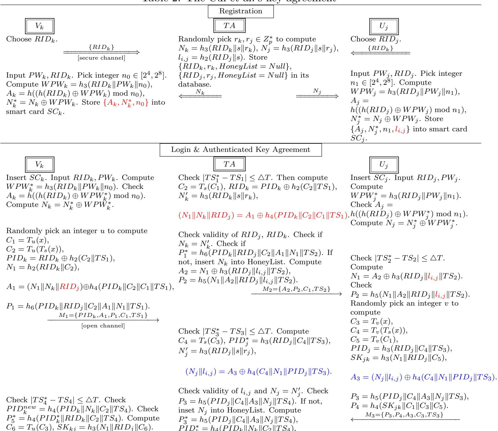

{0}------------------------------------------------

# A Note on One Authentication and Key Agreement Scheme for UAV-Assisted VANETs for Emergency Rescue

Zhengjun Cao, Lihua Liu

Abstract. We show that the key agreement scheme [IEEE TNSE, 1454–1468, 2004] is insecure against ephemeral secret leakage attack and smart card loss attack, not as claimed. This failure results from its simple encryption, in which only bitwise XOR operations are used to encrypt the messages.

Keywords: Vehicular ad hoc networks, Key management, Unmanned aerial vehicles, Ephemeral secret leakage attack, Smart card loss attack.

## 1 Introduction

Recently, Cui et al. [\[2\]](#page-4-0) have presented a key agreement protocol for Vehicular Ad hoc Networks (VANET). It is designed to achieve mutual authentication, session key agreement, anonymity, and resist password-guessing attack, impersonation attack, ephemeral secret leakage attack, smart card loss attack, etc. In this note, we show that the scheme cannot resist ephemeral secret leakage attack and smart card loss attack because of its simple encryption mechanism, in which only the bitwise XOR operations are involved.

# 2 Preliminary: bitwise XOR

The bitwise XOR, denoted by ⊕, compares two input bits and generates one output bit. When the operator is performed on two strings, the shorter string should be padded with some 0s to its left side. In this case, the partial string corresponding to the padding bits is eventually exposed. For example, the software, Mathematica, pads 0s to its left side by default. See the following code.

```
a = 161; b = 15;
IntegerString[{a, b, BitXor[a, b]}, 2]
{10100001, 1111, 10101110}
```

The partial string "1010" of the longer string "10100001" is directly copied into the final string "10101110".

Email: liulh@shmtu.edu.cn

Z. Cao, Department of Mathematics, Shanghai University, Shanghai, 200444, China.

L. Liu, Department of Mathematics, Shanghai Maritime University, Shanghai, 201306, China.

{1}------------------------------------------------

### 3 Review of the Cui et al.'s key agreement

In the considered scenario, there are three entities. The trusted authority (TA) generates the system's public parameters and confidential keys. Each vehicle  $V_k$  is equipped with an on-board unit for communications. Each unmanned aerial vehicle (UAV)  $U_j$ , also known as a drone, is honest and curious. The scheme consists of seven phases: system setup, registration, login, authentication and key agreement, password update, re-registration, and honeywords storage optimization. The notations and descriptions are listed below (see Table 1).

<span id="page-1-0"></span>Table 1: Notations and descriptions

| $V_k, U_j$               | $k^{th}$ vehicle, $j^{th}$ UAV               |
|--------------------------|----------------------------------------------|
| $PW_k, RID_k$            | password, identity of $V_k$                  |
| $PW_j, RID_j$            | password, identity of $U_j$                  |
| $PID_k, TID_k$           | pseudo identity, temporary identity of $V_k$ |
| $s, T_s(x)$              | TA's master private key, public key          |
| $SC_k, SC_j$             | smart card of $V_k, U_j$                     |
| $\mid l_{i,j}$           | long-term key shared by $U_j$ and TA         |
| $N_k, N_j$               | real parameters of $V_k$ , $U_j$             |
| $TS_1, TS_2, TS_3, TS_4$ | timestamps                                   |

System Setup. TA chooses a big prime p and two integers  $s, x \in \mathbb{Z}_p^*$ , to evaluate the Chebyshev polynomial  $T_s(x) \mod p$ . TA selects hash functions  $h_i : \{0,1\}^* \to \mathbb{Z}_p^*$ , i = 1, 2, 3, 4, 5, 6. Publish  $T_s(x), x, p, h_1, \dots, h_6$  and keep s as private key.

The registration, login, authentication and key agreement phases can be depicted as follows (see Table 2).

# 4 Insecurity of the Cui et al.'s scheme

#### 4.1 Inadequate stored parameters

In the registration phase,  $V_k$  stores  $\{A_k, N_k^*, n_0\}$  into the memory of  $SC_k$ . We find the stored parameters are inadequate for the later computations.

The identity  $RID_j$  of each unmanned aerial vehicle  $U_j$  should be stored inside of the memory. Otherwise,  $V_k$  cannot finish the computation

$$A_1 = (N_1 || N_k || \frac{RID_i}{}) \oplus h_4(PID_k || C_2 || C_1 || TS_1)$$
(1)

So, the actually stored parameters are

$$\{A_k, N_k^*, n_0, RID_{j1}, \cdots, RID_{j\ell}\}$$

where  $RID_{j1}, \dots, RID_{j\ell}$  are the identities of unmanned aerial vehicles  $U_{j1}, \dots, U_{j\ell}$ , which are accessible to  $V_k$ .

{2}------------------------------------------------

<span id="page-2-0"></span>Table 2: The Cui et al.'s key agreement



 $PID_k^* = h_4(PID_k || N_k || C_2 || TS_4),$ 

 $P_5 = h_4(PID_k^* || RID_k || C_2 || TS_4)$  $M_4 = \{PID_k^*, C_3, P_4, P_5, TS_3\}$ 

Check  $P_4^* = h_4(SK_{kj}||C_1||C_3||C_6)$ .

{3}------------------------------------------------

#### 4.2 Insecure against ephemeral secret leakage attack

It argues that: "Suppose the A obtains the common session key  $SK_{kj} = h_3(N_1||RID_j||C_6)$  and the ephemeral secrets u and v. However,  $N_1$  is not known by (to) A. Therefore, the proposed scheme can <u>resistance of (resist)</u> ephemeral secret leakage attacks." (see page 1464, [2]). We find it is not sound.

The scheme uses the operation XOR for encryption and decryption. Concretely,

[Encryption] 
$$A_1 = (N_1 || N_k || RID_j) \oplus h_4(PID_k || C_2 || C_1 || TS_1),$$
  
[Decryption]  $(N_1 || N_k || RID_j) = A_1 \oplus h_4(PID_k || C_2 || C_1 || TS_1),$ 

where  $N_k = h_3(RID_k||s||r_k)$ . Since  $h_i : \{0,1\}^* \to Z_p^*$ , i = 1,2,3,4,5,6, we know hash functions  $h_3$  and  $h_4$  have the same output length. Hence, we have

$$A_1 = N_1 \| ((N_k \| RID_j) \oplus h_4(PID_k \| C_2 \| C_1 \| TS_1))$$

$$\tag{1'}$$

namely,  $N_1$  is entirely copied into the string  $A_1$ . The adversary  $\mathcal{A}$  who has intercepted  $A_1$  can retrieve  $N_1$ .

The identity  $RID_j$  is shared by vehicles. Once a vehicle is compromised,  $RID_j$  is also accessible to the adversary  $\mathcal{A}$ . Using the ephemeral secret u and intercepted parameter  $C_3$  via the open channel,  $\mathcal{A}$  can compute

$$C_6 = T_u(C_3), \quad SK_{kj} = h_3(N_1 || RID_j || C_6).$$

Hence, the session key  $SK_{kj}$  is eventually exposed.

#### 4.3 Insecure against smart card loss attack

It argues that: "Supposing that A obtains smart card and extracts  $\{A_k, N_k^*, n_0\}$ , due to the HoneyList, it is computationally impossible for the A to proceed without knowing  $RID_k$  and  $PW_k$ . Therefore, the proposed scheme can <u>resistance</u> (resist) smart card loss attacks." (see page 1464, [2]). We find the argument is misleading. It only considers the smart card  $SC_k$  is compromised, not takes into account that the smart card  $SC_j$  is compromised.

First of all,  $RID_j$  is accessible to the adversary  $\mathcal{A}$  because it is shared by vehicles. Secondly, the encryption and decryption mechanism

$$A_3 = (N_j || l_{i,j}) \oplus h_4(C_4 || N_1 || PID_j || TS_3),$$
  
$$(N_j || l_{i,j}) = A_3 \oplus h_4(C_4 || N_1 || PID_j || TS_3)$$

cannot protect  $N_j$ . Since  $l_{i,j} = h_2(RID_j||s)$ , and  $h_2, h_4$  have the same output length, the adversary  $\mathcal{A}$  who has intercepted  $A_3$  via the open channel, can retrieve  $N_j$  because

$$A_3 = N_j \| (l_{i,j} \oplus h_4(C_4 \| N_1 \| PID_j \| TS_3))$$
 (2)

Thirdly, the long-term key  $l_{i,j}$  is stored inside of  $SC_j$ . Once the smart card is cracked, the key will be retrieved. Having the parameters  $RID_j, l_{i,j}, N_j$ , the adversary  $\mathcal{A}$  can impersonate  $U_j$  to cheat other vehicles. For example,  $\mathcal{A}$  can do as follows (see Table 3).

{4}------------------------------------------------

<span id="page-4-1"></span>Table 3: Smart card loss attack against the Cui et al.'s scheme

Upon receiving  $M_2 = \{A_2, P_2, C_1, TS_2\}$  from TA, the adversary  $\mathcal{A}$  uses the system's public parameters  $x, T_s(x)$ , and picks an integer  $\hat{v}$  to compute  $\hat{C}_3 = T_{\hat{v}}(x)$ ,  $\hat{C}_4 = T_{\hat{v}}(T_s(x)), \hat{C}_5 = T_{\hat{v}}(C_1), \widehat{PID}_j = h_3(RID_j\|\hat{C}_4\|TS_3), SK_{jk} = h_3(N_1\|RID_j\|\hat{C}_5), \hat{A}_3 = (N_j\|l_{i,j}) \oplus h_4(\hat{C}_4\|N_1\|\widehat{PID}_j\|TS_3), \text{ where } TS_3 \text{ is the current timestamp.}$ Compute  $\hat{P}_3 = h_5(\widehat{PID}_j\|\hat{C}_4\|\hat{A}_3\|N_j\|TS_3), \hat{P}_4 = h_4(SK_{jk}\|\hat{C}_1\|\hat{C}_3\|\hat{C}_5).$ Send  $\hat{M}_3 = \{\hat{P}_3, \hat{P}_4, \hat{A}_3, \hat{C}_3, TS_3\}$  to TA. The message  $\hat{M}_3$  will pass the TA's verification process.

#### 4.4 Further discussions

The password  $PW_j$  and identity  $RID_j$  are always concatenated to compute the stored parameters  $A_j, N_j^*$ . The simple setting seems insufficient for resisting smart card loss attack. In our opinion, one should develop other registration mechanism [1] and pseudo-identity updating techniques [3] for the considered scenario.

### 5 Conclusion

We show that the Cui et al.'s key agreement scheme is insecure against ephemeral secret leakage attack and smart card loss attack. We hope the findings in this note could be helpful for the future work on designing such schemes.

### References

- <span id="page-4-2"></span>[1] Maria Azees, Arun Sekar Rajasekaran, Kalyan Sundar Kola, Pandi Vijayakumar, Fayez Alqahtani, and Amr Tolba. An efficient group key agreement scheme with antenna hardware implementation in VANETs. *IEEE Internet Things J.*, 12(7):8075–8083, 2025.
- <span id="page-4-0"></span>[2] Jie Cui, Xinzhong Liu, Hong Zhong, Jing Zhang, Lu Wei, Irina Bolodurina, and Debiao He. A practical and provably secure authentication and key agreement scheme for UAV-assisted VANETs for emergency rescue. *IEEE Trans. Netw. Sci. Eng.*, 11(2):1454–1468, 2024.
- <span id="page-4-3"></span>[3] J. Shahparian, S. H. Erfani, and Azadeh Zamanifar. A secure and efficient authentication and key agreement protocol in blockchain-enabled VANETs. *Comput. Electr. Eng.*, 122:109947, 2025.