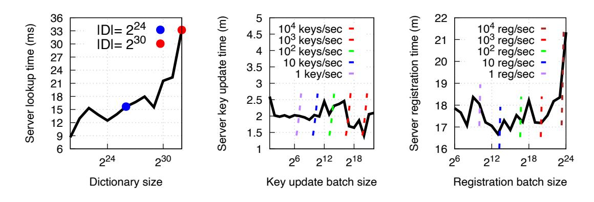
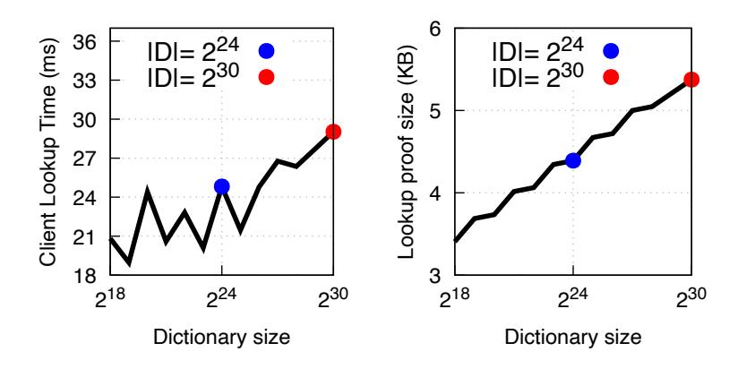
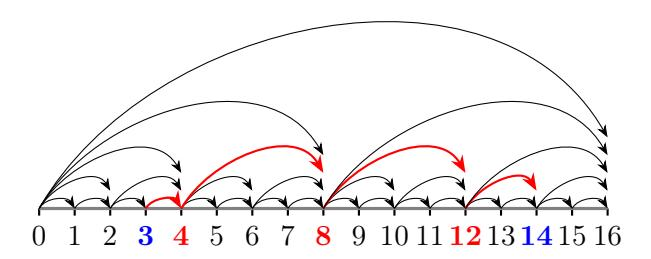

# IronDict:

# Transparent Dictionaries from Polynomial Commitments

Hossein Hafezi†1 , Alireza Shirzad†2 , Benedikt Bünz3 , and Joseph Bonneau4

> 1,3,4New York University 2University of Pennsylvania

#### Abstract

We present IronDict, a transparent dictionary construction based on polynomial commitment schemes. Transparent dictionaries enable an untrusted server to maintain a mutable dictionary and provably serve clients lookup queries. A major open challenge is supporting efficient auditing by lightweight clients. Previous solutions either incurred high server costs (limiting throughput) or high client lookup verification costs, hindering them from modern messaging key transparency deployments with billions of users. Our construction makes black-box use of a generic multilinear polynomial commitment scheme and inherits its security notions, i.e. binding and zero-knowledge. We implement our construction with the recent KZH scheme and find that a dictionary with 1 billion entries can be verified on a consumer-grade laptop in 35 ms, a 300× improvement over the state of the art, while also achieving 150,000× smaller proofs (8 kB). In addition, our construction ensures perfect privacy with concretely efficient costs for both the client and the server. We also show fast-forwarding techniques based on incremental verifiable computation (IVC) and checkpoints to enable even faster client auditing.

†Equal contribution

1Work primarily conducted at IMDEA Software.

2Work partially conducted at Lagrange Labs.

# 1 Introduction

Many essential services, such as financial systems or messaging platforms, are operated by centralized servers with little accountability. Fully decentralized systems often fall short in practice for performance, cost, privacy or other reasons. As a more pragmatic alternative, some traditionally centralized systems have adopted cryptographic transparency to offer increased assurance to the public that they are operating correctly while maintaining their performance benefits. For example, WhatsApp, an encrypted messaging platform with billions of users, rolled out transparency logs for its key-distribution servers in 2024 [\[LL23\]](#page-42-0). Transparency systems ensure all actions by a central server are publicly visible and enable clients to monitor these actions. For example, in the secure messaging context [\[Ung+15\]](#page-44-0), a transparency log ensures clients can observe all public keys the server has advertised for their username (though it cannot prevent the server from advertising maliciously chosen keys). Implicitly, transparency systems assume a malicious-but-cautious adversary model [\[Rya14\]](#page-43-0). That is, making server misbehavior detectable deters misconduct by imposing the risk of reputation damage or legal liability. Transparency has been proposed in a number of contexts, including public-key distribution in encrypted messaging systems [\[Rya14;](#page-43-0) [Mel+15;](#page-42-1) [Tom15;](#page-44-1) [Bon16;](#page-38-0) [AlS+17;](#page-37-0) [Cha+19;](#page-38-1) [Che+22;](#page-39-0) [Len+23;](#page-41-0) [Len+24\]](#page-41-1), distribution of software binaries [\[Fah+14;](#page-39-1) [HC17;](#page-40-0) [AM17;](#page-37-1) [Nik+17\]](#page-42-2), and certificate authorities via the Certificate Transparency (CT) protocol [\[SDS20;](#page-43-1) [GPBL20;](#page-40-1) [Lei+21;](#page-41-2) [KC21;](#page-40-2) [KNC22\]](#page-41-3). All of these applications can utilize a transparent dictionary, a cryptographic data structure that supports verifiable queries over a publicly committed dictionary, i.e. a mapping from a set of labels to a set of values. A transparent dictionary typically involves three logical entities:

- The Server is a centralized service provider that maintains a mutable dictionary and periodically publishes commitments to a public bulletin board. Publication occurs at regular time period or epochs (e.g., once every hour). The server also responds to client and auditor queries.
- Auditors monitor the bulletin board and ensure that the dictionary is well-formed and maintains promised global invariants across epochs.
- Clients issue lookup queries to the server to retrieve values associated with labels of interest (e.g. contacts they wish to message). Clients also monitor their own label and may perform auditing of invariants.

Motivating application: key transparency. An important application of transparent dictionaries is key transparency [\[Mel+15\]](#page-42-1), in which the server maintains a dictionary, mapping user identities—such as email addresses or usernames—to their public keys. Key transparency promises a practical solution to the age-old challenge of key distribution for encrypted communication systems [\[Ung+15\]](#page-44-0).

It is vital for security that a user can monitor the dictionary at all epochs. Otherwise, while a user is offline, a malicious server could insert a malicious public key (enabling impersonation) and later revert the change to avoid detection. This is known as an oscillation attack [\[Mei+20\]](#page-42-3). Hence, key transparency systems should support an efficient mechanism to verify that their public key has remained unchanged throughout multiple epochs during which they were offline. Another important goal is privacy [\[Cha+19\]](#page-38-1). The server's commitments and proofs should reveal nothing about other users (as an update might indicate a lost device) or system-wide details such as the rate of churn. Note that privacy may not be a concern in other applications, such as software transparency, in which all information is considered public. Scale is another vital concern, as popular platforms are now used by billions of users [\[Tec;](#page-43-2) [Dat24\]](#page-39-2).

# 1.1 Related Work

Constructions based on Merkle trees. Most transparent dictionary constructions are based on Merkle trees [\[Kim+13;](#page-41-4) [Bas+14;](#page-37-2) [Lau;](#page-41-5) [Mel+15;](#page-42-1) [Cha+19;](#page-38-1) [Len+24;](#page-41-1) [Mal+23\]](#page-42-4). This enables concretely fast operations for both servers and clients, as the only primitive needed is a collision-resistant hash function (typically SHA-256 or SHA-3). However, a major drawback is that auditors' costs scale linearly with the number of updates per epoch, requiring auditors to perform roughly as much computation as the server itself. As a result, client auditing is infeasible in large deployments. Instead, today's deployments rely on third-party auditors such as non-profit watchdog organizations [\[TM24\]](#page-44-2). At current throughput, auditing WhatsApp's key transparency server requires hashing 200 MB of data every 5 minutes, which is impractical for end users [\[Clo25\]](#page-39-3).

Constructions from algebraic accumulators. Merkle trees are one construction of a cryptographic accumulator or set commitment. Transparent dictionaries can also be built from other cryptographic accumulators. Bilinear accumulators [\[Tom+19;](#page-44-3) [Leu+22\]](#page-41-6), for example, offer smaller concrete proof sizes for lookups but are generally impractical due to their high storage and computational overhead. For instance, Tomescu et al. [\[Tom+19\]](#page-44-3) report that supporting a dictionary of size 2 20 would require hundreds of gigabytes of storage. VeRSA [\[Tya+22\]](#page-44-4) proposed transparent dictionaries based on RSA accumulators [\[BBF19;](#page-38-2) [TXN20;](#page-44-5) [Tya+22\]](#page-44-4). Like our approach, VeRSA supports efficiently verifying batches of updates. VeRSA offers attractive features: its audit procedure is independent of the epoch size, enabling self-auditing by clients. However, generating lookup proofs with VeRSA is concretely expensive and scales linearly with the dictionary size, limiting its applicability to dictionaries of size in the millions (such as binary transparency scenarios), not billions. Many algebraic accumulators also require a setup (possibly trusted) with large public parameters. This drawback also applies to IronDict when instantiated with KZH, which requires a linear-sized structured reference string. We discuss this further in Sections [3.1](#page-9-0) and [5.4.](#page-29-0)

Reducing auditing costs. Some works [\[Che+20;](#page-39-4) [Tzi+22;](#page-44-6) [Ros+24\]](#page-43-3) have attempted to make client-auditing feasible by delegating auditing to an untrusted party—often the server itself—using SNARKs to prove correctness. In practice, the computational cost of generic SNARK-based designs limits throughput. For example, due to the high cost of SHA-256 in zero-knowledge circuits, Hekaton [\[Ros+24\]](#page-43-3) only achieved a throughput of 10 updates per second on a powerful cluster of 4096 nodes. Verdict [\[Tzi+22\]](#page-44-6) took a similar approach but, to reduce circuit size, employed a non-standard ZK-friendly hash function [\[Gra+21\]](#page-40-3). In contrast, our approach reaches significantly higher throughput using just a single server.

Merkle2 [\[Hu+21\]](#page-40-4) changes the trust model to improve performance. They reduce the auditor's per-epoch workload to logarithmic in the number of key updates by requiring only a single Merkle extension proof per epoch. However, Merkle2 relies on the signature chain assumption, that clients maintain a secure key to sign their own key updates, which we consider unrealistic for secure messaging applications as we will discuss in Section [2.](#page-6-0)

Table of comparison. Figure [1](#page-4-0) compares the asymptotic costs of IronDict with prior work. The key advantage of IronDict lies in its audit and update costs, which remain independent of the epoch size. As we will later show in Section [5,](#page-27-0) IronDict is concretely efficient since its main operations are field operations, which are concretely efficient.

### 1.2 Our Contributions

- A simple transparent dictionary based on polynomial commitments. Our main contribution is IronDict, a novel transparent dictionary built upon a generic polynomial commitment scheme (PCS) defined over a large field[1](#page-3-0) , a new paradigm in designing transparent dictionaries. Conceptually, our design is simple, with most of the complexity encapsulated within the underlying PCS scheme. The construction provides (I) low server overhead resulting in a high throughput and (II) low auditing overhead, with the latter being independent of the update batch size. Instantiating IronDict with KZH as the underlying PCS [\[Kad+25\]](#page-40-5) yields a concretely efficient implementation that enables lightweight auditing: audit proofs for a dictionary supporting 1 billion users are under 8 kB and verifiable in about 35 ms on a personal computer, while sustaining a throughput of more than 1,000 updates (or user enrollments) per second.
- Doubly-efficient consistency proofs. We introduce a new approach for verifying consistency in transparent dictionaries; that is, a proof in the common case that an individual label-value mapping was unchanged over many epochs. Unlike prior work, our method eliminates the need to maintain explicit value histories or versioning. We show that consistency can be checked using just two PCS openings (or even a single one if the underlying PCS supports homomorphism), yielding a highly efficient solution for both

1We require the PCS to be defined over a field F with sufficiently large cardinality—typically |F| ≥ 2 128 or 2 256—to ensure that birthday attacks on a hash function H : {0, 1} ∗ → F are computationally infeasible.

| Protocol                       | Lookup                 |                         | His                       | story                             | Auditor                                 |                                  |
|--------------------------------|------------------------|-------------------------|---------------------------|-----------------------------------|-----------------------------------------|----------------------------------|
|                                | Client                 | Server                  | Client                    | Server                            | Server                                  | Upd. & Aud.                      |
| SEEMless [Cha+19]              | $\log n^*$             | $\log n^*$              | $(u + \log T) \log n$     | $(u + \log T) \log n$             | $b \cdot \log(n+b)^*$                   | $b \cdot \log(n+b)^*$            |
| Parakeet [Mal+23]              | $\log n^*$             | $\log n^*$              | $(u + \log T) \log n$     | $(u + \log T) \log n$             | $b \cdot \log(n+b)^*$                   | $b \cdot \log(n+b)^*$            |
| OPTIKS [Len+24]                | $u \log n^*$           | $u \log n^*$            | $u \log n$                | $u \log n$                        | $b \cdot \log(n+b)^*$                   | $b \cdot \log(n+b)^*$            |
| ELEKTRA [Len+23] (             | $u \log n + \log T$ )* | $(u \log n + \log T)^*$ | $(u\log n + \log T)^*$    | $(u\log n + \log T)^*$            | $(b \cdot \log(n+b) + \log T)^*$        | $(b \cdot \log(n+b) + \log T)^*$ |
| Merkle 2 [Hu+21]    | $\log n^2$             | $\log n^2$              | $\log n^2$                | $\log n^2$                        | $\log n^{2*}$                           | $\log n^*$                       |
| VeRSA-IVC [Tya+22]             | 1                      | $(n/m + \log m)^*$      | u                         | $(n/m + \log m)^*$                | b                                       | $\log T$                         |
| CONIKS [Mel+15]                | $\log n^*$             | $\log n^*$              | naive                     | naive                             | $b \cdot \log(N+b)^*$                   | $b \cdot \log(N+b)^*$            |
| IronDict $_k$                  | $k \cdot N^{1/k}$      | O(1)                    | $u \cdot k \cdot N^{1/k}$ | $u \cdot O(1)$                    | index assignment: $N$ value update: $b$ | $k \cdot N^{1/k}$                |
| $\operatorname{zk-IronDict}_k$ | $k \cdot N^{1/k}$      | $(k^2+k)\cdot N^{1/k}$  | $u \cdot k \cdot N^{1/k}$ | $u \cdot (k^2 + k) \cdot N^{1/k}$ | index assignment: $N$ value update: $b$ | $k \cdot N^{1/k}$                |

b: the number of elements added per epoch

n: the number of items in the dictionary

N: maximum dictionary's capacity

T: the number of epochs since the operation was last invoked m: batch size (in case of VeRSA supporting batch lookups)

u: value's version naive indicates that verifying history requires performing a lookup for each epoch.

Complexities with star  $(\star)$  indicate the average case.

Figure 1: Asymptotic efficiency of transparent dictionary schemes: We denote our scheme as IRONDICTk when our construction is concretely initiated with KZH-k and zk-IRONDICTk our privacy-preserving variant. Since KZH-k uses precomputed arrays for PCS openings at Boolean points, the server cost is O(1). Update cost includes two terms: N (index assignment via cheap field operations) and b (value updates using group operations). The lookup (and history) cost for the server is  $(k^2 + k) \cdot N^{1/k}$ , in which a large portion of that can be precomputed by the server since it is independent of the client query. We later expand on it in Section 4.6.

the server and the client. Concretely, the server can produce a consistency proof with size 5 kB in under 35 ms, while the client can verify it in under 30 ms.

- Concretely efficient fast-forwarding for auditors via IVC. Fast-forwarding is the ability for a new auditor—or an auditor who has been offline for n epochs—to verify the current state by checking only a sublinear number of proofs, rather than auditing all nepochs individually. We introduce an IVC [Val08] scheme for fast-forwarding auditors for IRONDICT, such that the IVC cost is independent of the size of the update batch. When IRONDICT is concretely instantiated with KZH, we estimate to achieve 1000× prover performance improvement in practice compared to VeRSA Tya+22, which also proposed using an IVC scheme with constant circuit size per step.
- Checkpoints for efficient self-auditing by clients. Inspired by VeRSA, we propose an alternative to IVC that allows clients to fast-forward through updates using lightweight checkpoints. When a client comes online, it only requires verifying a short (sublinearlength) sequence of checkpoint proofs spanning from its last known state to the current

one. This approach enables efficient self-auditing without incurring the computational overhead associated with IVC-based methods.

- A stronger definition of privacy. Prior works define privacy in transparent dictionaries by requiring (I) the commitment to the dictionary to be hiding (II) the client queries and audit proofs reveal no more information than what is permitted by a predefined leakage function. These leakage functions are typically tailored to specific constructions and do not offer strong cryptographic guarantees. For example, in SEEMless [\[Cha+19\]](#page-38-1), lookup queries additionally reveal the last epoch during which a value was updated—a non-standard and unintended leakage arising from their design. In this work, we propose zk-IronDict with a strong, zero-knowledge-based notion of privacy: clients and auditors learn nothing beyond the correctness of their queries and (an upper bound on) the dictionary's size. Our definition is generic and applies to any PCS that satisfies the hiding property and supports zero-knowledge openings [\[B+21](#page-37-3) ¨ ].
- A zero-knowledge variant of KZH. To meet the privacy requirements, the underlying PCS must have a hiding commitment and a zero-knowledge opening protocol. KZH lacks these properties natively. Prior work [\[B+21](#page-37-3) ¨ ] proposes a generic compiler that transforms a homomorphic PCS to one that has a zero-knowledge opening protocol. There are two downsides to this approach: (I) it is expensive, and (II) it lacks a formal proof of the zero-knowledge property. In this work, we formally prove the security of this compiler and show that, when applied to KZH, only a sublinear amount of randomness suffices, which makes the compiler lightweight. This contribution can be of independent interest.
- Memory optimizations. By taking advantage of the homomorphic properties of KZH, when IronDict is initiated with KZH, we introduce a trade-off between computation and memory. Specifically, at each epoch, the server only needs to store the difference between the current and previous epoch, reducing the memory overhead. However, when the server needs to open a value later, it incurs a computational cost, performing a number of field operations proportional to the size of the epoch.
- Implementation. We implement IronDict and demonstrate that it scales to dictionaries with billions of entries, matching the demands of modern secure messaging applications, while supporting update rates of up to thousands per second. We conduct our experiments on a Google c4-highmem-144-lssd instance, equipped with 144 CPU cores and 1116 GB of memory. For a dictionary supporting 1 billion users, our system achieves an epoch interval of nearly 15 minutes while sustaining a throughput of over 1000 updates per second. Auditor proofs remain under 8 kB and can be verified in under 35 ms on a consumer-grade laptop. Client queries—including lookups and consistency checks—produce proofs of approximately 6 kB, which can be verified in less than 30 ms.

# 2 System model

We outline the basic roles in our system here, which is consistent with prior work on key transparency [\[Mel+15\]](#page-42-1):

Server. The main entity in our system is a server that provides access to a queryable dictionary (a label-value map) and periodically updates it (once per epoch) while maintaining some invariants. With each update, the server publishes a new commitment to the dictionary. We expect the server to provide verifiable answers to two types of queries:

- Lookup: What value is assigned to label ℓ in epoch i?
- Consistency: Has the value assigned to the label ℓ changed between epochs i and j?

Note that simply performing lookups on the values mapped to label ℓ at epochs i and j does not suffice as a consistency proof between i and j. The server might attempt an oscillation attack [\[Mei+20\]](#page-42-3) by changing the mapping for a targeted label at one epoch and then switching it back in the next epoch. Hence, a consistency proof must rule out changes in any epoch between i and j. In some systems, the server commits to maintaining additional invariants. For example, a version invariant [\[Mel+15;](#page-42-1) [Bon16\]](#page-38-0) attaches a version number v to each value and requires that this is incremented in any epoch in which the value changes. Given this invariant, checking that a value has the same version number in epochs i and j is equivalent to a consistency proof. A stronger invariant ensures that each value is append-only—that is, the dictionary retains all historical versions of a value, so that a lookup at epoch i reveals the entire version history up to that point. Other invariants are application-specific, for example, CONIKs [\[Mel+15\]](#page-42-1) proposed marking some labels as strict, meaning any changes must be authorized by a signature. In our work, we don't adopt any such special invariants and instead build efficient consistency proofs directly.

Client. A set of clients (or users) are able to query the dictionary via the server. Typically, each client is represented by a label ℓ, which is a human-readable identifier such as a username, email address, or phone number.[2](#page-6-1) The client will typically monitor this label by requesting consistency proofs between epochs and manually verifying any changes to the value mapped to their label. Clients will also request lookup proofs of other labels of interest, such as peers in a secure messaging system that they wish to communicate with. However, the clients do not monitor other labels over time. The assumption is that the label's owner will monitor and detect any unauthorized changes. There may be restrictions on which labels a user can look up; for example, rate limits or a requirement to be marked as contacts within the system. We leave these out of scope. Clients can also request updates to the value mapped to their label (for example, to change their public key after losing a device). Notably,

2Later, we distinguish between human-readable labels and indices which are assigned to each user but not exposed at the UX level.

we do not assume any cryptographic authentication (such as a signature) is required to update any mapping, as some prior work does [\[Hu+21\]](#page-40-4). The downside of such assumptions is that they require users to maintain uninterrupted access to cryptographic keys over time. In practice, users often lose their devices or reinstall applications, thereby losing access to previous secret keys. Recovering from such scenarios inherently requires the server to update any label's value based on non-cryptographic authentication (e.g. passwords or 2FA). This has important implications for monitoring in that surreptitious updates by the server are detectable but not provable. The server can always claim that a legitimate user requested an update, even if they did not. Conversely, any user could falsely accuse the server of making an unauthorized update, even if they approved it. Such disputes must be resolved through non-technical means. If a significant number of reputable users publicly allege that the server is misbehaving, this could serve as compelling, if not conclusive, evidence.

Auditors. Auditors monitor the server's updates and verify the correctness of a proof of invariance at each epoch. At a high level, this proof ensures that the transition from one epoch to the next preserves the desired invariants. For example, under the versioning invariant described previously, a valid transition requires that if a value is modified, its version number must also be incremented accordingly. Importantly, the auditors only check for the server's detectable and provable misbehaviour, such as an incorrect proof of invariance. Some whistle-blowing procedure must be in place to broadcast evidence of misconduct, which we leave out of scope. The efficiency of auditing depends directly on the size and verification cost of invariance proofs. For example, consider the simple case where the server publishes all value updates directly on the bulletin board. In this setting, auditors must be almost as powerful as the server to recompute the updates and verify their correctness. However, the assumption of such powerful auditors means most clients will be incapable of auditing and must rely on a quorum of third parties to audit. While any one correct auditor can broadcast proofs of misbehaviour, the incentives for performing expensive auditing remain unclear. Instead, we aim to make self-auditing possible, where even lightweight clients are capable of performing auditing. As in prior work [\[Tzi+22;](#page-44-6) [Ros+24\]](#page-43-3), we assume the server facilitates this by publishing additional cryptographic proof with each update.

A special case of this is using IVC, in which verifying a proof for any epoch ensures the correctness of all previous updates. This is useful for fast-forwarding, allowing a new auditor, or one who comes online after an extended time, to verify a single proof rather than checking proofs for many missed epochs. We discuss this approach further in Section [6.](#page-32-0)

Bulletin board. Like prior work, we assume a public bulletin board, e.g. a publicly accessible and append-only ledger that allows parties to publish arbitrary strings along with authentication tags for verification. We treat the bulletin board as a black box with the following basic functionality: (I) post operation: A party can publish a string on the bulletin board, and (II) retrieve operation: Anyone can query the bulletin board. The use

of a bulletin board prevents split-view attacks, where a malicious server provides different clients with inconsistent states of the dictionary at the same epoch i. The bulletin board abstraction can be realised in various ways, e.g. a public blockchain [TD17] or a gossip protocol [Syt+16; Mei+20]. We leave the details out of scope, as they do not affect the design of our dictionary. We denote the public bulletin board via BB.

# 3 Preliminaries and building blocks

**Notation.** We denote vectors using bold letters, such as  $\mathbf{w}$ , and use  $w_i$  to refer to the i-th entry of the vector. Let  $\mathbb{F}$  be a finite field and  $\mathbb{G}$  a group with scalars in  $\mathbb{F}$ , with additive notation. For  $a \in \mathbb{F}$  and  $\mathsf{G} \in \mathbb{G}$ , the scalar multiplication of  $\mathsf{G}$  by a is denoted as  $a \times \mathsf{G}$ . A function f(x) is negligible if, for any polynomial p(x), there exists a positive integer N such that for all x > N, we have  $f(x) < \frac{1}{p(x)}$ . When we say an event happens with overwhelming probability, we mean it occurs with a probability of  $1 - \epsilon(\lambda)$ , where  $\epsilon(\lambda)$  is a negligible function.

**Dictionary.** We denote by a dictionary Dict as a set of label-value pairs  $\{(\mathsf{label}_i, \mathsf{value}_i)\}_{i=1}^m$  with *unique* label values. For a dictionary Dict, we denote by  $\mathsf{Dict}[\mathsf{label}]$  the value corresponding to label in the dictionary  $\mathsf{Dict}$ ; i.e.,

$$\mathsf{Dict}[\mathsf{label}] := \begin{cases} \mathsf{value} & \text{ if } (\mathsf{label}, \mathsf{value}) \in \mathsf{Dict} \\ \bot & \text{ otherwise.} \end{cases}$$

When we refer to a dictionary as Dict :  $A \to B$ , it means its labels are in set A and its values are in set B.

Multilinear polynomials. A multivariate polynomial is said to be multilinear if the individual degree of any variable  $X_i$  is at most 1. We use  $\mathbb{F}_{\mu}^{\leq 1}[\mathbf{X}]$  to denote the space of all  $\mu$ -variate multilinear polynomials. A multilinear polynomial  $\overline{p} \in \mathbb{F}_{\mu}^{\leq 1}[\mathbf{X}]$  of size  $N = 2^{\mu}$  is uniquely defined by (or uniquely extends) its N evaluations on the Boolean hypercube. We denote by  $\mathsf{L}_{\mathbf{w}}(\mathbf{X})$  a multilinear Lagrange polynomial3 that vanishes all over the Boolean hypercube  $\{0,1\}^{\mu}$  except on  $\mathbf{w} \in \{0,1\}^{\mu}$ . It can be computed as follows:

$$L_{\mathbf{w}}(\mathbf{X}) = \prod_{i=1}^{\mu} (X_i w_i + (1 - X_i)(1 - w_i))$$

Multilinear polynomial commitment scheme (PCS). PCS is a cryptographic primitive that enables a prover to *commit* to a multilinear polynomial succinctly and later prove the correctness of its evaluation at some chosen points from the domain, without revealing

&lt;sup>3This polynomial is sometimes called the Eq polynomial, and is used as  $L_{\mathbf{w}}(\mathbf{X}) = eq(\mathbf{w}, \mathbf{X})$ .

the full polynomial. When a verifier requests an opening at a point  $\vec{x}$ , the prover returns both the claimed evaluation  $y = p(\vec{x})$  and a proof  $\pi$  attesting to its correctness. The verifier can efficiently check that y is the correct value of the committed polynomial at  $\vec{x}$  using the proof  $\pi$ . A formal definition of PCS and its required properties is provided in Appendix A.

**Sumcheck.** The *sumcheck protocol* [Lun+92] is an interactive proof between a prover and a verifier for verifying claims of the form

$$\sum_{\mathbf{x}\in\{0,1\}^{\mu}}p(\mathbf{x})=s,$$

where  $p(\mathbf{X}) \in \mathbb{F}_{\mu}^{\leq d}[\mathbf{X}]$ . The protocol reduces this claim to checking the evaluation of p at a randomly chosen point  $\mathbf{r}$ . It achieves communication complexity  $O(\mu)$ , prover time O(N) where  $N = 2^{\mu}$  which mostly consists of field operations, and verifier time  $O(\mu)$ .

**Zerocheck.** A zerocheck [Che+23], similar to sumcheck, is an interactive protocol between a prover and a verifier, wherein the verifier—given oracle access to a multivariate polynomial  $p(\mathbf{X}) \in \mathbb{F}^{\leq d}_{\mu}[\mathbf{X}]$ —checks that p evaluates to zero on all points of the Boolean hypercube. A zerocheck protocol has the same asymptotic complexity as the sumcheck protocol, since the prover and verifier internally invoke a sumcheck on the polynomial  $p(\mathbf{X}) \cdot \mathsf{L}_{\mathbf{r}}(\mathbf{X})$ , where  $\mathbf{r}$  is a random challenge selected by the verifier.

# 3.1 KZH: PCS with optimal opening

In this paper, we choose KZH [Kad+25] to instantiate the PCS for our construction. KZH is a family of multilinear PCS built on a pairing-friendly elliptic curve. A key feature of KZH is that it has a sublinear opening proof size and a sublinear opening time for both the prover4 and the verifier, similar to Hyrax [Wah+18]. However, unlike Hyrax and similar to KZG [KZG10], KZH has a commitment of constant size, consisting of a single group element. KZH (more precisely KZH-2) has an opening size and verifier time of  $O(N^{\frac{1}{2}})$  and is generalized to a family of schemes called KZH-k for  $k \geq 2$ , which achieves an opening size and verifier time of  $O(k \cdot N^{\frac{1}{k}})$  for a constant k. A description of KZH-k can be found in Appendix E. A comparison of different variants of KZH can be seen in Table 1. In this paper, when we mention KZH, we refer to the entire KZH-k family. If we are specifically discussing one, we specify it with the index k. KZH is secure in the AGM under the  $(q_1, q_2)$ -dlog and setup-find-rep assumptions.

Advantages of KZH for our scheme. Apart from sublinear proof and verifier time, the KZH family has two key advantages that make it particularly well-suited as the underlying PCS for our construction:

&lt;sup>4Excluding the polynomial evaluation itself.

- Free opening at Boolean points. Opening Boolean points using KZH-k is essentially free, meaning the server is only required to read k arrays[5](#page-10-0) of size N1/k from memory. The term free here refers to the fact that the server does not need to perform any computation to generate the proof; rather, it only needs to read and return the relevant auxiliary data. This is analogous to Merkle trees, where the opening of a leaf involves no computation and consists solely of reading and returning internal nodes. As we will see in the next section, the server only needs to open the polynomial at Boolean points in response to client requests. Therefore, the efficiency of openings at Boolean points—compared to non-Boolean points—is especially important in our setting.
- Homomorphic commitments and auxiliary input. KZH family is homomorphic, and its auxiliary input used for opening is homomorphic as well. Homomorphism here refers that, let (com1, aux1) be a commitment and its corresponding auxiliary input for a polynomial f1, and (com2, aux2) be a commitment and auxiliary input for a polynomial f2. Then, for any scalar α ∈ F, the following pair (α·com1+com2, α·aux1+aux2) is a valid commitment and auxiliary input for the polynomial α · f1 + f2, where · denotes scalar multiplication. This means that updating n evaluation points of a polynomial only requires k · n group operations to update both the commitment and the auxiliary data of KZH-k. Although our scheme does not necessarily require homomorphism, homomorphism significantly improves the efficiency of our protocol for value consistency.

Which variant of KZH to use? The choice of the KZH variant for our scheme depends primarily on the size of the dictionary and the specific application, e.g. constraints by the participants. For example, assume we aim for an opening size that is smaller than 1 MB and can be verified in under one second on a consumer-grade laptop. As a concrete example, consider a multilinear polynomial with hypercube size of N = 231, roughly corresponding to the number of WhatsApp users [\[Fac20\]](#page-39-6). Using KZH-2 in this setting results in a proof size of approximately 2.6 MB, due to the O(N 2 ) scaling. Such a large proof imposes unnecessary client overhead, which can be mitigated, e.g. by using KZH-4 or KZH-8 as the underlying PCS. These variants shift computation to the server and, for a dictionary of size 2 31, reduce proof size and verification time by about 100× and 1000×, respectively, at the cost of higher server-side commitment and opening costs (see Table [1\)](#page-12-0).

KZH setup. One limitation of KZH is its requirement for a linear-sized SRS, similar to the trusted setup used in the KZG scheme based on powers-of-tau. The SRS must be generated via a trusted setup, which introduces important security considerations. In practice, such setups are typically carried out using multi-party computation (MPC) ceremonies, where multiple participants sequentially contribute randomness to the SRS. As long as at least

5These arrays can be implemented as contiguous memory blocks (e.g., flat slices or static arrays), rather than dynamically allocated structures like linked lists or hash maps. This makes memory access highly efficient in practice due to spatial locality and reduced overhead.

one participant acts honestly, the resulting SRS remains secure. This approach has been successfully employed by real-world systems such as Zcash [\[BGG+16\]](#page-38-3) and Filecoin [\[Pro20\]](#page-42-6). A summary of current best practices for MPC ceremonies is provided in [\[WCB25\]](#page-44-9). Concrete numbers of the KZH setup are provided in Section [5.4.](#page-29-0)

While our concrete construction currently relies on KZH, which requires a trusted setup, it is possible to instantiate IronDict with alternative PCSs. For example, one might consider PCSs with transparent setup [\[Wah+18;](#page-44-8) [BS+19\]](#page-38-4), or those with sublinear-sized SRSs [\[B+21](#page-37-3) ¨ ]. However, such alternatives often come with trade-offs, including increased proof sizes, higher opening times, or higher costs to make them zero-knowledge. Choosing the right PCS is therefore a delicate balance between trust assumptions and efficiency. Identifying suitable alternatives to KZH that offer efficient performance and either a transparent setup or a sublinear trusted setup remains an open direction. We leave this to future work.

# 3.2 Transparent dictionary (TD)

Definition 1 (Transparent dictionary). A transparent dictionary protocol is defined with respect to three parties: Server, Auditor, and Client[6](#page-11-0) , all of whom have access to a public bulletin board BB. Because of the existence of BB, we assume all parties know the current epoch number i. Each party supports the following algorithms:

- Setup(λ, µ) → (keyServer; keyAuditor, keyClient): Given a security parameter λ and log of maximum supported size µ, this algorithm respectively outputs participants' keys, namely: keyServer, keyAuditor and keyClient. We assume algorithms corresponding to each party take their corresponding key as an implicit input; we omit it for brevity. If the setup requires secret randomness, we assume it is executed by a trusted party (e.g., implemented via a ceremony).
- Server.Init() → (state0, com0): Initializes the dictionary state as state0 and computes a succinct commitment com0 to this state. The commitment com0 is then published on the bulletin board BB.
- Server.Update(statei−1, ∆) → (statei , comi , πi): Updates the current state statei−1 using a set of changes ∆ to obtain a new state statei . It then computes and publishes a new commitment comi to BB, along with invariance proof πi .
- Server.Lookup(ℓ,statei) → (value, πLookup): Given a label ℓ and epoch state statei , returns the value value associated with ℓ in state statei , along with a lookup proof πLookup. If statei does not exist or ℓ is invalid, the algorithm returns ⊥.

6 In practice, there may be many clients and a small number of auditors. For simplicity, we assume a single client and a single auditor.

- Client.VerifyLookup(ℓ, comi , value, πLookup) → 0/1: Given a label ℓ, epoch commitment comi , value value, and a lookup proof πLookup, this algorithm verifies the lookup and returns 1 (accept) or 0 (reject).
- Auditor.VerifyInvariance(comi , comi+1, πi+1) → 0/1: Given commitments comi and comi+1 for epoches i and i + 1 along with proof of invariance πi+1, verifies its validity and returns 1 (accept) or 0 (reject).
- Server.Consistency(ℓ,statei ,statej ) → πconsis: Given a label ℓ and two states statei and statej corresponding to epochs i and j with i < j, the server returns a proof πconsis attesting that the value associated with ℓ remained unchanged throughout epochs i to j. If the value changed during this interval, it returns ⊥.
- Client.VerConsistency(ℓ, comi , comj , πconsis) → 0/1: Client verifies validity of a consistency proof πconsis for the label ℓ between epochs i and j, returning 1 if the proof is accepted, and 0 otherwise.

| Scheme Commit Time Open Time (Random) Open Time (Boolean) Proof Size |                        |      |             | Verifier Time                    |
|----------------------------------------------------------------------|------------------------|------|-------------|----------------------------------|
| KZH-2 2 · MSM(N)                                                  | O(N) F                 | O(1) | 2 · N1/2 G1 | N1/2 P + 2 · MSM(N1/2 )       |
| KZH-k k · MSM(N)                                                  | ) G1, O(N) F O(N1/2 | O(1) | k · N1/k G1 | (k − 1) · N1/k P + k · MSM(N1/k) |

P: pairing ops G1: base group ops F: field ops MSM(n): multi-scalar multiplication of size n

Table 1: Comparison of KZH-k variants for k = 2 and k > 2 over a polynomial on a Boolean hypercube of size N. Here, we distinguish between the opening time of a Boolean and a non-Boolean point.

Comparison to [\[Cha+19\]](#page-38-1). Our definition is an adaptation of [\[Cha+19\]](#page-38-1) with the following minor differences:

- We introduce an additional algorithm, Setup. The Setup algorithm outputs keys for the participating parties. In a tree-based solution, this could be as simple as specifying a hash function. However, since we work in the setting of polynomial commitment schemes, we explicitly include Setup to emphasize that it differs from Server.Init—for example, it may involve secret randomness and thus is not necessarily executed by the server.
- To verify the invariance proof, we assume the verification happens step by step, which is necessary for stateless auditors. In contrast, in [\[Cha+19\]](#page-38-1), the auditor functionality starts from epoch 0 and verifies to the last epoch.
- We generalize the definition by assuming that the server stores a state statei at each step, which may include some data structure enabling the server to store the keys for each epoch. The simplest form would be statei = Dicti at each epoch.

• We simplify the history-related functions from previous definitions of TDs by focusing solely on consistency. Whereas earlier formulations returned the entire change history, including all values and their corresponding epochs, our approach replaces this with a single functionality that merely checks whether a value has changed within a given epoch range. This streamlined version is more practical and sufficient for most client applications.

Completeness. Intuitively, completeness guarantees that if the setup is performed honestly and the server behaves honestly, then the following holds:

- Consistency correctness: When the client requests a value consistency check between epochs i to j such that the value has not changed, running Client.VerConsistency on the proof leads to acceptance. When the client queries a value at any time within the epoch interval [i, j), the returned value is the same.
- Audit correctness: At each epoch, any honest auditor running Auditor.VerifyInvariance obtains output 1.

Soundness. Except with negligible probability, the following properties hold:

- Lookup soundness (binding): Given a commitment comi to an epoch and a single label ℓ, it is computationally infeasible for the server to produce two distinct values, each accompanied by a valid proof, such that both pass verification under Client.VerifyLookup for the same commitment.
- Consistency soundness: Assume at each epoch there is at least one honest auditor that accepts the epoch proof. For any two epochs i and j, if the value changes during the interval [i, j], then the server cannot generate a proof of the consistency of the value that will be accepted by the client.

Formal definitions of completeness and soundness can be found in Appendix [B.](#page-47-0)

# 4 IronDict

In this section, we describe our construction, which is based on a generic PCS. In Section [4.1,](#page-14-0) we introduce how a restricted class of dictionaries can be modeled using a single multilinear polynomial, and we explain why this approach fails for general string-to-string dictionaries. In Section [4.2,](#page-15-0) we extend the previous idea and show how to construct general dictionaries—mapping arbitrary strings to arbitrary strings—using two multilinear polynomials, referred to as Index and Value polynomials. We also specify the required properties of each polynomial. Section [4.3](#page-16-0) focuses on Index polynomial and its append-only property, discussing associated design trade-offs. Then, in Section [4.4,](#page-19-0) we present how Value polynomial is

used to support value consistency proofs. Finally, in Section [4.5,](#page-22-1) we describe the complete construction using a generic PCS. In Section [4.6,](#page-22-0) we describe our notion of privacy and introduce our privacy-preserving variant zk-IronDict. Finally, we provide a cost overview of the construction instantiated with the KZH family. This includes the additional costs incurred to make the scheme privacy-preserving—that is, to transform KZH zero-knowledge.

# 4.1 Polynomial Encodings for Dictionaries

Modeling a restricted class of dictionaries. Given two natural numbers m and N, such that we assume N is a power of two, consider a dictionary represented as a set of pairs of labels indexi and values valuei :

$$\left\{ (\mathsf{index}_i, \mathsf{value}_i) \right\}_{i \in [m]} : \begin{cases} \mathsf{index}_i \in \{0, 1\}^{\log_2 N} \\ \mathsf{value}_i \in \mathbb{F} \setminus \{0\} \end{cases}$$

We model this dictionary as a multilinear polynomial p ∈ F ≤1 log2 N , where p(indexi) = valuei for each stored index-value pair, and p(x) = 0 for all indices x that do not appear in the dictionary, in other words:

$$\overline{p}(\mathbf{X}) = \begin{cases} \mathsf{value}_i &: \mathbf{X} = \mathsf{index}_i \\ 0 &: \mathbf{X} \in \{0,1\}^{\log_2 N} \setminus \{\mathsf{index}_i\}_{i \in [m]} \end{cases}$$

We are implicitly using the fact that given multilinear polynomial evaluations over the Boolean hypercube, it determines a single unique polynomial.

One-to-one mapping from {0, 1} ∗ to F. The dictionary described above represents a restricted type: it maps non-zero elements from a finite field F to binary strings of fixed length {0, 1} log2 N . In contrast, we are interested in a more general setting of dictionaries that map arbitrary strings to arbitrary strings. To handle such general dictionaries, we adopt the common approach of hashing arbitrary strings into a fixed domain. Consider a collision-resistant hash function H : {0, 1} ∗ → F. We can treat H as a one-to-one mapping from {0, 1} ∗ to F \ {0}, as (1) collision resistance implies it's infeasible to find two distinct inputs with the same output, and (2) oneway-ness (implied by collision resistance) implies it is hard to find an input that maps to 0.

Modeling general dictionaries (strawman approach). As explained above, in practice, transparent dictionaries often operate over domains and ranges in {0, 1} ∗ , or equivalently in F or F \ {0}, as discussed earlier. A naive approach to modeling such dictionaries is to hash a user label (e.g., an email address) to a point x ∈ {0, 1} log2 N on the Boolean hypercube and assign the corresponding value to p(x). However, for the construction to be both correct and sound, different labels must be mapped to distinct points on the hypercube. A naive

use of a hash function does not ensure this uniqueness. To minimize collisions, the target space {0, 1} log2 N must be exponentially large; typically larger than 2 256, to ensure collision resistance. Otherwise, collisions become feasible. Supporting such an enormous domain would require operating on a sparse polynomial of size 2 256. This would be infeasible with current polynomial commitments, including KZH or Hyrax, since even a square-root-sized SRS is too large to be materialised. Using sparse to dense techniques such as Spark [\[Set20\]](#page-43-6), while feasible, suffers from inefficient openings since the opening requires an argument of knowledge, making them unsuitable for our needs. Given these limitations, we adopt a different strategy: modeling the general dictionary using two dense polynomials instead of a single sparse one.

# 4.2 Modeling dictionaries with two polynomials

Modeling dictionaries. To model a dictionary with domain Dict : {0, 1} ∗ → {0, 1} ∗ , we build it by composing two different dictionaries Index and Value as described:

$$\mathsf{Index}: \mathbb{F} \setminus \{0\} \to \{0,1\}^{\log_2 N}, \, \mathsf{Value}: \{0,1\}^{\log_2 N} \to \mathbb{F} \setminus \{0\}$$

which, by composability, implies that:

$$\mathsf{Dict} = (\mathsf{Index}, \mathsf{Value}) : \mathbb{F} \setminus \{0\} \to \mathbb{F} \setminus \{0\}$$

To retrieve the value associated with label from Dict = (Index, Value), the user first looks up the corresponding index in Index, then uses this index to query Value. Assume a user wants to obtain value υ, corresponding to label ℓ. The procedure is intuitively described in Figure [2.](#page-16-1) Here is a quick overview of the Index and Value dictionaries (polynomials). We'll explore them in depth in the next subsections.

Index dictionary. An append-only dictionary, denoted as Index : F \ {0} → {0, 1} log2 N , we exclusively use it for assigning a fixed point on the Boolean hypercube to a label. This dictionary maps labels (e.g., email addresses) to a unique index within {0, 1} log2 N , where N represents the system's capacity, i.e., the maximum number of values it can support. The index corresponding to a label is sometimes referred to in prior work, e.g. [\[Len+24\]](#page-41-1) as a Uniquely Universal Identifier (UUID)—an internal, immutable representation of the label. In our system, this index corresponds to a point on the Boolean hypercube, which determines the evaluation point of the associated label. When adding a new label, the server must assign the label a fresh index. The server does so by applying open addressing [\[Wik25\]](#page-45-0). Note that the uniqueness of indexes implies that their inverse dictionary is also a dictionary.[7](#page-15-1)

7 In fact, we model its inverse, Index−1 : {0, 1} log2 N → F \ {0}, using a multilinear polynomial. However, since the dictionary is invertible, this distinction does not matter.

Remark 1. Open addressing is a collision resolution technique used in hash tables to handle situations where two keys hash to the same index. Instead of using separate data structures (like linked lists), open addressing stores all entries directly in the table itself. When a collision occurs, the algorithm searches for the next available slot using a defined probing sequence. This means that each label-value pair is stored at a unique index, and the table is probed until an empty slot is found.

Value dictionary. A dictionary Value : {0, 1} log2 N → F \ {0} that maps user indices to their values. Unlike Index, which is append-only and maintains user indices, this dictionary allows updates to values. Maintaining two separate dictionaries allows the system to accommodate different update rates in practice since their updating procedure is different, as we will see—for instance, values might be updated more frequently than new users are registered (assigned new indexes). We construct a transparent dictionary Dict with a pair of multilinear polynomials encoding the dictionaries Index and Value separately; namely index and value. We refer to the indexed version of these polynomials, (indexi , valuei), as the state of the dictionary at epoch i. The server uses a PCS to commit to these polynomials and publish the commitments on the bulletin board BB.

- (1) Server returns an index (some point y ∈ {0, 1} log2 N on the boolean hypercube) along with a proof πindex, which proves that indexi(y) = H(ℓ) and y is the unique index corresponding to ℓ. In the next subsection, we explain the details of πindex.
- (2) Server returns value υ with proof πvalue which essentially shows valuei(y) = H(υ).

Figure 2: Description of obtaining value corresponding to a label

### 4.3 Index dictionary

As previously mentioned, the server must prove the correctness of the index dictionary at every step to prevent attacks that exploit inconsistent indexing. For each user, the client must accept a single, unique index on the Boolean hypercube {0, 1} log2 N . If the server provides multiple indexes corresponding to the same label ℓ, a split-view attack can occur. Specifically, consider the case where the server assigns two different indexes y1, y2 ∈ {0, 1} log2 N to the same label ℓ. If these indexes produce different evaluations under the value function, i.e., value(y1) ̸= value(y2), then the server can take advantage of this mapping to present different values to different clients. Ensuring correctness means proving that each label is consistently assigned to a single index in all interactions. To assign indices to other labels, we employ an open addressing strategy inspired by sparse Merkle trees [\[DPP16\]](#page-39-7). In addition to the hash function H : {0, 1} ∗ → F, we also introduce another hash function H : {0, 1} ∗ → {0, 1} log2 N . The server assigns an index to a label ℓ using the algorithm described in Figure [3.](#page-17-0) The server is only allowed to assign one of the indexes H(0, ℓ), H(1, ℓ), . . . to the user in sequential order. Any deviation from this order renders the index invalid. Now, suppose that the server assigns H(m0, ℓ) to the user. When the server opens the index to the client, it must also prove that all previous indexes H(m, ℓ) for m < m0 were occupied and are not equal to H(ℓ). Note that the server might arbitrarily set index(y) = H(ℓ) for some point y. However, since the client requires an identifier m0 ∈ N such that y = H(m0, ℓ), it would not affect the client. The verification procedure is described in Figure [4.](#page-17-1)

- (1) Set m := 0, now given label ℓ, the server computes y := H(m, ℓ) and checks if the index y is not already assigned, in other words, index(y) = 0. If so, it sets index(y) = H(ℓ) and returns y as the assigned index.
- (2) If index(y) ̸= 0, the server updates m := m + 1 and then recompute y := H(m, ℓ) and repeats the procedure. This continues until an unassigned index is found.

Figure 3: Index assignment procedure by the server

- (1) The client wishes to verify that a given index y corresponds to a label ℓ.
- (2) The client receives an identifier m0 ∈ N and the index proof, which consists of the corresponding PCS openings of index at points ym := H(m, ℓ) for all m ≤ m0.
- (3) The client runs PCS verification to validate the correctness of PCS openings.
- (4) The client for m < m0, checks that index(ym) ̸= 0, index(ym) ̸= H(ℓ). Finally, it verifies that y = ym0 .

Figure 4: Verification of index assignment by the client

Epoch consistency proof. We require Index dictionary to be append-only, meaning that all indexes in the previous state must be included in the current state. Assume indexi and indexi+1 are the states of the index dictionary in epochs i and i + 1. The server must prove that: indexi ⊆ indexi+1, which means that the new dictionary Indexi+1 includes all the previous indexes from Indexi . This condition is expressed as, for all x ∈ {0, 1} log2 N :

$$Z(\mathbf{x}) := \overline{\operatorname{index}}_i(\mathbf{x}) \cdot \left(\overline{\operatorname{index}}_{i+1}(\mathbf{x}) - \overline{\operatorname{index}}_i(\mathbf{x})\right) = 0 \implies \sum_{\mathbf{w} \in \{0,1\}^{\log_2 N}} \mathsf{L}_{\mathbf{w}}(\mathbf{X}) \cdot Z(\mathbf{w}) = 0$$

The condition above corresponds to a zerocheck [\[Che+23\]](#page-39-5). At a high level, it requires the server to publish a sumcheck proof along with openings of the polynomials indexi and indexi+1 at a random challenge point r. Crucially, since both polynomials are opened at the same point, a homomorphic PCS enables these openings to be batched into a single one by verifying a random linear combination of the two commitments, thereby reducing the verification cost and the communication on the bulletin board. Since the sumcheck proof is relatively inexpensive in practice, the auditor's cost is primarily dominated by the PCS verification(s), e.g. a multi-pairing of size  $k \cdot N^{1/k}$  when using KZH-k, where N denotes the size of the dictionary. Our index dictionary can be thought of as an append-only zero-knowledge set (aZKS) as described in [Cha+19].

Overhead of index proof. One potential issue with this approach arises when the identifier  $m_0$  is large. In such cases, the server must open  $m_0$  points on indexi, increasing both communication and computation for the server and client. To address this, we overprovision the dictionary capacity. This over-provisioning is necessary because labels are mapped to indexes using a random mapping, e.g. a hash function. As the number of labels approaches the dictionary's capacity N, the probability of hash collisions increases. By setting the nominal capacity to a higher number than the expected number of labels, we significantly reduce the likelihood of such collisions, ensuring that the mapping remains efficient. Specifically, if we expect N users, we set the capacity to be  $\alpha \times N$  for  $2 \le \alpha$ . This setup ensures that a fraction  $\frac{\alpha-1}{\alpha}$  of the dictionary remains deliberately unoccupied. Given that the hash function behaves like a random oracle, the probability that a new label  $\ell$  maps to an unassigned index  $\mathcal{H}(0,\ell)$  is exactly  $\frac{\alpha-1}{\alpha}$ . Consequently, the likelihood that an identifier takes the value  $m_0$  is given by:

$$\Pr[\text{identifier} = m_0] = \frac{\alpha - 1}{\alpha^{m_0}} \implies$$

$$\mathbb{E}[\text{Number of openings}] = \sum_{m_0 = 1}^{\infty} \frac{\alpha - 1}{\alpha^{m_0}} \cdot m_0 = \frac{\alpha}{\alpha - 1}$$

For instance, setting  $\alpha=4$  results in the expected number of openings to be  $\approx 1.33$ . This indicates that, on average, the server must open approximately 1.33 proofs, rather than just one. Setting  $\alpha=4$  increases the SRS size by a factor of 4 and the verifier's cost by  $2\times$ . While it increases the prover's cost for opening the polynomial at random points, it does not impact the polynomial evaluation time, since evaluations at zero points do not contribute to the computation. Interestingly, when we instantiate IRONDICT with KZH, the number of group operations does not increase. This is because committing to zeros is essentially free in Pedersen-like commitment schemes.

Worst-case analysis. Similar to most prior works [Mel+15; Cha+19; Len+24], we employ an asymmetric, keyed Verifiable Random Function (VRF) [MRV99] instead of a simple hash function  $\mathcal{H}$  to assign indices to users. This choice enhances both security and privacy because the output of a hash function is deterministic and publicly computable, allowing adversaries to precompute hashes offline and potentially link dictionary entries to known labels—enabling various attacks [Mel+15]. Specifically, if  $\mathcal{H}$  were directly evaluable by an adversary, they could craft labels that produce large identifiers  $m_0$ , increasing the computational burden of the server. In contrast, the output of a VRF cannot be computed

by clients themselves, effectively preventing brute-force attempts. As a result, we can assume that the output of H is uniformly random and has not been precomputed by the adversary. This allows our worst-case analysis to align closely with the average-case scenario.

Comparison to cuckoo hashing. A related strategy to open addressing for handling collisions in a hash table is cuckoo hashing [\[PR04;](#page-42-8) [FKP23\]](#page-40-6). In open addressing, when a collision occurs, the algorithm searches for the next available slot (using linear, quadratic, or double hashing), but already-inserted elements remain untouched. In contrast, cuckoo hashing uses multiple hash functions and allows each key to occupy one of several candidate positions. When a collision occurs, the new key displaces the existing key, which must then be reinserted into the table, potentially triggering a chain of displacements. This key feature of displacing previously assigned elements makes cuckoo hashing more dynamic but can also lead to more complex insertions, including occasional full rehashing. While cuckoo hashing can more efficiently utilize available slots, open addressing is a more natural fit for our purposes as previously inserted elements are never displaced. This lets us take advantage of the append-only property, which can be naturally and simply expressed using polynomial equations. We leave an investigation of cuckoo hashing-based index polynomial to future work.

### 4.4 Value consistency

An important feature of a transparent dictionary is value consistency, a resource-constrained client should be able to succinctly verify that its value has not changed over a specific period. This translates to checking whether the value corresponding to a specific label has remained unchanged from epoch i to epoch j. A naive approach would involve opening all commitments valuei , valuei+1, . . ., valuej , at the index corresponding to the client and verifying that the value has not changed. However, this would be inefficient for both the client and the server since on each consistency check, the server computation, the client computation and the communication complexity are linear in the number of epochs. Our solution leverages randomness and is concretely more efficient when using a homomorphic PCS; we refer to this approach as RLC (random linear combination) based approach. In the RLC-based approach, when the PCS is homomorphic such as KZH, the server performs O(n) group operations per epoch, where n is the number of updated entries. This yields constant-sized communication on BB and constant auditor verification time. The server simply publishes a few PCS commitments on BB, and the auditor checks a homomorphic relation between them, i.e. equation [\(1\)](#page-21-0). However, if the PCS is not homomorphic, nonhomomorphically evaluating the same check requires four polynomial openings—due to the four distinct polynomials in equation [\(1\)](#page-21-0)—and publishing their openings at a random point on BB.

Remark 2. In our approach, retrieving the full value history requires work linear in the number of value changes. However, most clients are primarily interested in value consistency: verifying that their value has remained unchanged over a given period. In this common use case, both the server's and verifier's proofs are independent of the number of value changes or the number of intermediate epochs.

RLC-based approach. We define the difference polynomial ∆i(X), which is essentially the polynomial corresponding to the update at epoch i, as below:

$$\overline{\Delta_i}(\mathbf{X}) = \overline{\text{value}}_i(\mathbf{X}) - \overline{\text{value}}_{i-1}(\mathbf{X})$$

$$\implies \overline{\text{value}}_j(\mathbf{X}) = \overline{\text{value}}_i(\mathbf{X}) + \sum_{t=i+1}^j \overline{\Delta_t}(\mathbf{X})$$

The naive approach to verifying whether a value remains unchanged between two epochs i and j is to simply open the value at both epochs and compare the values for equality. However, this method is vulnerable to a ghost-value attack, in which the server temporarily modifies the value during some intermediate epoch and later reverts it to its original value. To prevent such attacks, we introduce randomness in a way that ensures changes to a value–even if reverted–cannot cancel each other out. Strawman fix would be for the client to send randomness ri+1, rr+2, . . . , rj to the server, server computes

$$\overline{\text{rand}}(\mathbf{X}) = \overline{\text{value}}_i(\mathbf{X}) + \sum_{t=i+1}^j r_t \cdot \overline{\Delta_t}(\mathbf{X}),$$

and client given commitments to valuei(x) and the random coefficients can compute commitment to polynomial rand(X) through homomorphism. Now that the value hasn't changed in the epochs i to j with an overwhelming probability, we have rand(X) and valuei(X) open to the same value at the index corresponding to the user. Client checks that by requesting the server to open both commitments at the user index and verifying their equality. However, the above solution is too costly both for the server and the client. Each consistency check requires both the server and the client to perform linear computation and communication in the number of epochs. Another issue arises because the client sends the randomness directly to the server. The server must recompute all relevant operations using the new random value for each client request, leading to significant computational overhead. We address all of these inefficiencies by applying the Fiat-Shamir transform [\[FS87\]](#page-40-7), replacing interactive randomness exchange with a non-interactive mechanism, e.g. derive the randomness by hashing the current state of the BB. Consider the following polynomial, which is recursively defined as follows:

$$\overline{\mathrm{rand}}_i(\mathbf{X}) = \overline{\mathrm{value}}_0(\mathbf{X}) + \sum_{t=1}^i r_t \cdot \overline{\Delta_t}(\mathbf{X}) = \overline{\mathrm{rand}}_{i-1}(\mathbf{X}) + r_i \cdot \overline{\Delta_i}(\mathbf{X})$$

At each epoch, the server publishes a commitment to randi(X), where correctness can be verified by auditors using the homomorphism through the equation

$$\overline{\operatorname{rand}}_{i}(\mathbf{X}) = \overline{\operatorname{rand}}_{i-1}(\mathbf{X}) + r_{i} \cdot \overline{\Delta_{i}}(\mathbf{X})$$

$$= \overline{\operatorname{rand}}_{i-1}(\mathbf{X}) + r_{i} \cdot \left(\overline{\operatorname{value}}_{i}(\mathbf{X}) - \overline{\operatorname{value}}_{i-1}(\mathbf{X})\right)$$
(1)

It requires the auditors to ensure that randomness ri is derived correctly through the Fiat-Shamir transformation. To verify the consistency of a value at index x from epoch i to epoch j, the client simply queries the openings of randi(X) and randj (X) at x. If randi(x) = randj (x), then with overwhelming probability, the value at index x has remained unchanged between epochs i and j. On the client side, the computational complexity of the consistency check amounts to two PCS verifications—independent of the number of epochs—which can be further reduced to a single opening if the underlying PCS supports homomorphism. On the server side, only two PCS openings at a Boolean point are required. Finally, the auditor's task is limited to verifying a single homomorphic relation and checking that the randomness ri is correctly derived.

Adapting the approach to non-homomorphic PCS. While the homomorphic relation can be directly verified using homomorphic PCS, it is also possible to check such equalities non-homomorphically by evaluating both sides at a random point. Specifically, auditors verify equation [\(1\)](#page-21-0) as follows: Given commitments to randi−1(X), randi(X), valuei−1(X), and valuei(X), this equality can be verified non-homomorphically by evaluating all polynomials at a random point r and checking:

$$\overline{\mathrm{rand}}_i(\mathbf{r}) = \overline{\mathrm{rand}}_{i-1}(\mathbf{r}) + r_i \cdot \left(\overline{\mathrm{value}}_i(\mathbf{r}) - \overline{\mathrm{value}}_{i-1}(\mathbf{r})\right).$$

Such a random evaluation point r can be derived via a hash of the commitments. This method requires the server to publish four PCS openings at the point r on BB, which the auditors must verify.

Equivalence of value consistency and value history. We note that value consistency and value history, a concept primarily used in tree-based approaches, refer to the same underlying idea. However, since value consistency aligns more closely with user interests, we adopt it in our setting. To see the equivalence, consider that given the value history {(ni , υi)}i∈[m] , where ni denotes the epoch at which the value changes to υi , it is straightforward to verify whether the value remained unchanged between any two epochs. Conversely, if a value has changed at epochs n1, . . . , nm, the server can prove the full value history by showing that the value did not change within each interval [ni , ni+1) and by revealing the value at each epoch ni . This requires a linear number of lookups and consistency checks proportional to the number of value changes.

### 4.5 Transparent dictionary construction

We generically present IronDict construction over a PCS in Figures [5,](#page-23-0) [6,](#page-24-0) and [7.](#page-24-1) For simplicity, we assume the PCS supports homomorphic operations; if not, these operations can instead be carried out by having the auditor receive polynomial openings at a random evaluation point, as discussed in Section [4.4.](#page-19-0)

Theorem 1. Let PCS be a secure multilinear polynomial commitment scheme. Then, the IronDict construction—outlined in Figures [5,](#page-23-0) [6,](#page-24-0) and [7—](#page-24-1)achieves completeness and soundness in the random oracle model, as formalized in Appendix [B.](#page-47-0)

We defer a formal proof of security to Appendix [C.](#page-48-0)

Cost overview of IronDict. Table [8](#page-26-0) presents an overview of the costs for each party in IronDict when initialized with KZH, with the additional costs for zk-IronDict highlighted in blue.

# 4.6 zk-IronDict

The goal of a privacy-preserving transparent dictionary [\[Mel+15;](#page-42-1) [Cha+19\]](#page-38-1) is to ensure that commitments to the dictionary reveal no information about its underlying contents and that proofs provided by the server disclose only what is strictly necessary. This aligns with the notion of metadata privacy, as distinguished in prior work [\[Che+22\]](#page-39-0), which identifies two categories of privacy: (1) content privacy and (2) metadata privacy. Content privacy refers to access control policies enforced by the server—for instance, allowing users to retrieve only the public keys of their contacts, thereby mitigating spam (when the transparent dictionary is used as a PKI). These policies are external to the design of the transparent dictionary. In contrast, metadata privacy, which is the focus of a privacy-preserving transparent dictionary, aims to prevent leakage of information by the server, for example, as a result of publishing commitments on the bulletin board. Privacy is essential in settings such as secure messaging. If the server leaked patterns of value updates, a malicious party could infer which users frequently rotate their keys and which do not, potentially identifying less cautious users or rarely used devices. In another case, if an attacker compromises a device's value and observes that it remains unchanged in the next epoch, they can conclude that the device owner is unaware of the breach.

Privacy in previous work. CONIKs [\[Mel+15\]](#page-42-1) described a notation of privacy which was later formalized by SEEMless [\[Cha+19\]](#page-38-1) that defined privacy through a formal leakage function, ensuring that the information published by the server, namely, commitments posted on the bulletin board and accompanying proofs, reveals no more than what the leakage function allows. For instance, in SEEMless, the leakage function for value queries unnecessarily reveals the value's version number and the epoch of its last update. A further

- • Setup(λ, µ) → (keyServer; keyAuditor, keyClient): Given a security parameter λ and logarithmic of maximum supported size µ [a](#page-23-1) , this algorithm runs SetupPCS(λ, µ) and output (vk, pk). Algorithm sets keyServer := pk, keyAuditor := vk and keyClient := vk and outputs these.
- Server.Init() → (state0, com0): Given the dictionary size N := 2µ and the PCS prover key, the server initializes three zero multilinear polynomials index0, value0 and rand0, computes commitments to these polynomials and sets the tuple as com0 and publishes com0 on BB. At each epoch, statei consists of the latest polynomials indexi , valuei , and randi . The commitment state, comi , includes the PCS commitments to these polynomials, which may not be explicitly described later.
- Server.Update(statei , ∆) → (statei+1, comi+1, πi+1): Parse ∆ as (∆index, ∆value) and perform the update for each of them as follows:
  - Index dictionary: Parse ∆index = {ℓj}j∈[n1] and ensure all labels ℓj are not previously assigned indexes. Assign index xj to each ℓj according to Figure [3](#page-17-0) and define:

$$\overline{\mathrm{index}}_{i+1}(\mathbf{x}) = \begin{cases} H(\ell_j) & : \mathbf{x} = \mathbf{x}_j \\ \overline{\mathrm{index}}_i(\mathbf{x}) & : \text{otherwise} \end{cases}$$

Compute commitment to indexi+1 (possibly homomorphically) and run a zerocheck for indexi(x) · indexi+1(x) − indexi(x) , and output πregister which is essentially the zerocheck proof.

– Value dictionary: Parse ∆value = {(ℓj , υj )}j∈[n2] , retrieve indices xj and define:

$$\Delta_i(\mathbf{x}) = \begin{cases} \upsilon_j & : \mathbf{x} = \mathbf{x}_j \\ 0 & : \text{otherwise} \end{cases}$$

Update valuei+1 = valuei + ∆i and compute its commitment (possibly homomorphically), derive ri and set randi+1 = randi + ri · ∆i and again compute polynomial commitment to randi+1 too.

It outputs new state statei+1, commitment comi+1 and proof of epoch πi+1 = (πregister, πvalue) where πvalue is empty is the PCS is homomorphic, otherwise it contains PCS openings at a random point, used to evaluate the homomorphic relation, non-homomorphically.

Figure 5: IronDict setup and update functionality

aMultilinear with µ variables, will have a Boolean hypercube evaluation set of size N := 2µ

- • Server.Lookup(ℓ,statei) → (value, πLookup): Retrieve index x corresponding to ℓ along with proof πindex that proves x is the valid index for label ℓ according to Figure [4.](#page-17-1) Generate PCS opening πPCS that opens value = valuei(x) and finally output (x, πindex, πPCS).
- Client.VerifyLookup(ℓ, comi , value, πLookup) → 0/1: Verify index proof using πindex as described in Figure [4](#page-17-1) and value using PCS opening πPCS, which essentially verifies that value = valuei(x).
- Server.Consistency(ℓ,statei ,statej ) → πconsis: This is similar to a lookup operation, but instead of opening valuei , we open randi and randj at the index. More precisely, retrieve index x corresponding to ℓ along with proof πindex that proves x is the valid index for label ℓ according to Figure [4.](#page-17-1) Generate PCS opening πPCS,i and πPCS,j that opens randi and randj at index x and finally output (x, πindex, πPCS,i, πPCS,j ).
- Client.VerConsistency(ℓ, comi , comj , πconsis) → 0/1: Verify index proof using πindex as described in Figure [4](#page-17-1) and value using PCS openings πPCS,i and πPCS,j . Finally check that openings values are equal which essentially proves randi(x) = randj (x).

Figure 6: IronDict lookup and proof of consistency functionalities

• Auditor.VerifyInvariance(comi , comi+1, πi+1) → 0/1: Parse πi+1 as (πregister, πvalue), now the auditor checks the two following checks: (1) verify πregister which is essentially verifying the zerocheck, and (2) recompute ri through Fiat-Shamir heuristic and check that the following relations holds between polynomials underlying commitments com(valuei), com(valuei+1), com(randi) and com(randi):

$$\overline{\operatorname{rand}}_{i+1}(\mathbf{X}) = \overline{\operatorname{rand}}_{i}(\mathbf{X}) + r_i \cdot \left(\overline{\operatorname{value}}_{i+1}(\mathbf{X}) - \overline{\operatorname{value}}_{i}(\mathbf{X})\right)$$

This identity can be checked, for example, via homomorphism. Otherwise, it can be checked non-homomorphically by πvalue, which includes opening of all four polynomials at a random point, as explained in Section [4.4.](#page-19-0)

Figure 7: IronDict auditor functionality

limitation of defining privacy through a leakage function is its fragility: the leakage must be carefully specified, and even minor changes to the system can alter it, requiring new proofs.

zk-IronDict's notion of privacy. IronDict is generically built on a PCS. The server reveals three main components: PCS commitments, PCS openings, and sumcheck proofs. Suppose the underlying PCS provides hiding commitments and zero-knowledge openings [\[B+21](#page-37-3) ¨ ], and the sumcheck protocol is also zero-knowledge. In that case, each piece of published information proves only what is intended–nothing more. Specifically, hiding commitments protect the contents of the committed dictionary with no leakage, while zero-knowledge openings and sumcheck proofs ensure that the verifier learns only the claimed evaluation results and nothing beyond. There are general compilers [\[CFS17;](#page-38-5) [BS+19\]](#page-38-4) that can make sumcheck protocols zero-knowledge with minimal overhead. Our construction is concretely based on KZH, which by default does not support hiding. One could apply generic compilers designed to make homomorphic commitments hiding [\[B+21](#page-37-3) ¨ ], but they involve generating and committing to randomness linear in the size of the polynomial. In Appendix [D,](#page-52-0) we present a zero-knowledge variant of KZH, which may be of independent interest. This construction requires only k 2 · N1/k + k · N1/k random scalars per opening on the server side. Specifically, k 2 · N1/k scalars are needed to construct random polynomial r with k·N1/k non-zero values together with its auxiliary inputs. Since there are k−1 auxiliary inputs, and each requires k · N1/k scalar multiplications, the total cost amounts to k 2 · N1/k for generating the polynomial commitment along with its auxiliary inputs. Importantly, this cost is independent of the opening point and can therefore be precomputed by the server. The remaining term, k · N1/k, corresponds to taking a random linear combination of the random polynomial with another polynomial and computing its opening at the client's desired point; this cost arises in the online phase. When applying zk-KZH, homomorphic relations over blinded commitments cannot be verified directly as in the unblinded case. Instead, they require an additional sigma protocol, which introduces only a small overhead for both the server and auditors wishing to verify such relations. We describe this procedure in more detail in Appendix [D.3.](#page-56-1)

Size leakage. Our privacy definition ensures that all public information posted by the server—such as commitments, sumcheck proofs, etc.—is zero-knowledge and reveals nothing beyond what it is intended to convey. Similarly, client queries (e.g., lookups and consistency proofs) reveal only the requested value in the dictionary. However, our construction leaks information about the size of the dictionary. In particular, the SRS inherently reveals an upper bound on the number of users, and the frequency of collisions in open-addressing leaks information about the current number of users. An adversary seeking information on the number of users could conduct probing attacks, registering multiple labels and, based on their identifiers (e.g., the number of hashes required to find an empty slot), infer statistical information on the current number of users. We leave analysis of such attacks to

future work, noting that they do not contradict our zero-knowledge-based privacy definition. Furthermore, similar size information is leaked by Merkle-tree-based implementations. We consider it out of scope of our privacy definition.

| Operation         | Party                                                                                                                        | Computation Cost                                                                                                                                                                                                                             | Communication on BB |  |
|-------------------|------------------------------------------------------------------------------------------------------------------------------|----------------------------------------------------------------------------------------------------------------------------------------------------------------------------------------------------------------------------------------------|------------------------|--|
|                   | Server                                                                                                                       | $O(n)$ $\mathbb{G}$ : compute new PCS commitment $O(N)$ $\mathbb{F}$ : zerocheck and polynomial eval $O(n)$ VRF <math>\mathcal{P}</math> : open addressing (expected) $\approx \sqrt{N}  \mathbb{G}$ : KZH-k opening with $k > 2$ | O(1)                   |  |
| Index Assignment  |                                                                                                                              | $\approx \sqrt{N}  \mathbb{G} : \text{KZH-k opening with } k > 2$ $O(k^2 \cdot N^{\frac{1}{k}})  \mathbb{G} : \text{only for zk-IronDict}$                                                                                                   |                        |  |
|                   | Auditor                                                                                                                      | $O(\log N) \mathbb{H}$ : zerocheck verification $O(\log N) \mathbb{F}$ : zerocheck verification $k \cdot N^{1/k} \mathbb{P}$ : PCS opening verification                                                                                      |                        |  |
|                   | Server                                                                                                                       | $O(n)$ $\mathbb{G}$ : compute new PCS commitment $O(1)$ $\mathbb{H}$ : compute Fiat-Shamir challenge                                                                                                                                         | O(1)                   |  |
| Epoch Update      | Auditor                                                                                                                      | $O(1) \mathbb{H}$ : compute Fiat-Shamir challenge $O(1) \mathbb{G}$ : homomorphic check of (1)                                                                                                                                               | _                      |  |
| Lookup            | Server $O(1): \text{PCS opening (Boolean point)} \ O((k^2+k)\cdot N^{\frac{1}{k}})  \mathbb{G}: \text{only for zk-IronDict}$ |                                                                                                                                                                                                                                              | _                      |  |
|                   | Client                                                                                                                       | $k \cdot N^{1/k} \mathbb{P}$ : PCS verification $O(1) \text{ VRF}_{\mathcal{V}}$ : open addressing (expected)                                                                                                                                |                        |  |
| Value Consistency | Server                                                                                                                       | $O(1)$ : two PCS openings (Boolean point) $O((k^2+k)\cdot N^{\frac{1}{k}})$ $\mathbb{G}$ : only for zk-IronDict                                                                                                                              | _                      |  |
| Value Consistency | Client                                                                                                                       | $2k \cdot N^{1/k} \mathbb{P}$ : two PCS verifications $O(1) \text{ VRF}_{\mathcal{V}}$ : open addressing (expected)                                                                                                                          | _ _                 |  |

Figure 8: Summary of IRONDICT costs when using the KZH-k scheme: Here N is the maximum capacity of the dictionary (including the a constant over-provisioning factor) and n is the number of updates in the epoch.  $\mathbb G$  denotes a group scalar multiplication,  $\mathbb F$  a field operation,  $\mathbb H$  a hash function, and  $\mathbb P$  a pairing.  $\mathrm{VRF}_{\mathcal P}$  and  $\mathrm{VRF}_{\mathcal V}$  denote  $\mathrm{VRF}$  proof generation and verification, i.e. we assume the server uses a verifiable pseudorandom function instead of the hash function  $\mathcal H$  to assign indexes. Parameter k is the KZH-k variant. Red-highlighted costs apply only for k>2, as KZH-2 avoids group operations for opening random points. PCS verification also includes an MSM, but its cost is omitted as negligible compared to pairings. Blue-highlighted costs apply for the privacy-preserving variant zk-IronDict as described in Section 4.6.

**Remark 3.** The proof of invariance or correctness—namely the zerocheck proof—does not necessarily need to be published on the bulletin board (BB), as long as the corresponding polynomial commitments are made public. Instead, these proofs can be communicated directly between the server and auditors upon request. For this reason, we state that the communication cost on BB is O(1) for both index assignment and value updates, since we assume only the new polynomial commitments are posted on BB.

# 5 Implementation and Evaluation

We implement and benchmark zk-IRONDICT in 4000 lines of Rust code8. Our implementation is built atop the arkworks [con22] framework, and also uses the Hyperplonk [Che+23]9 repository for the multivariate zerocheck and sumcheck implementations. For our PCS instantiation, we implement KZH-k [Kad+25] from scratch, with a tunable parameter k, in additional 2500 lines of Rust code, inspired by the original KZH implementation 10. In our experiments, we set  $k = (\log N)/2$  where N is the polynomial size. All server measurements are performed on a Google c4-highmen-144-lssd instance with 144 CPU cores and 1116 GB of memory. Client and auditor measurements are performed single-threaded on a MacBook Pro with 18 GB of RAM and a 12-core Apple M3 Pro CPU. We use the curve Bn254 for all our measurements, which is a standard pairing-friendly curve used in industry [But14]. We employ a Schnorr signature-based VRF [Sch90] in place of a hash function mapping arbitrary strings to points on the Boolean hypercube. All measurements are done over two dictionary sizes: (a) a small dictionary with  $2^{24}$  (over 10 million) entries11 for light-weight use cases such as software distribution (b) a large dictionary with  $2^{30}$  (over 1 billion) entries for large-scale use cases such as messaging applications. Also, we report the numbers with an overprovisioning factor of  $\alpha = 4$ ; meaning that the reported capacity utilizes  $\frac{1}{4}$  of the implemented data structure, e.g. the polynomial underlying the dictionary of size  $2^{30}$  is of size  $2^{32}$ .

Remark 4. All reported numbers in this section, for both small and large dictionaries, correspond to zk-IronDict. While privacy is unnecessary for applications such as software distribution, we present the privacy-preserving results to illustrate how performance scales from 10 million to 1 billion entries. The main impact of adding privacy to IronDict is on server lookup and consistency proofs—for example, using IronDict instead of zk-IronDict with the small dictionary reduces server time for lookups and consistency proofs from 10ms to under 1ms, yielding a 10× improvement.

#### 5.1 Server costs

We benchmark four important server operations: Index assignment, value update, lookups and consistency proofs. Also, we measure the size of the server key, which persistently resides in memory.

**Index assignment time.** We evaluate the time and communication cost (message size) incurred by the server when posting to the bulletin board to register a batch of new indices.

 $^8$ https://github.com/alireza-shirzad/Iron-key

 $^9 {\tt https://github.com/EspressoSystems/hyperplonk}$

10https://github.com/h-hafezi/kzh\_fold

&lt;sup>11The number of apps on Google Play, Apple App Store, and the number of Linux packages are all below 5 million [Repnd; 42m25].

We are primarily interested in the operational range under 1000 updates per second 12, and we mark this threshold in Figure 9. Within this range, the index assignment time is dominated by the time required to run a sumcheck prover on a polynomial of the dictionary size, which scales linearly with the dictionary size. After a certain point—outside the operational region—the cost of PCS opening begins to affect the overall registration cost which we can ignore. Figure 9 shows that for the small dictionary, the index assignment time is at around 10 seconds, while for the large dictionary, it is around 15 minutes.

Value dictionary update. Unlike the index dictionary, where update costs scale with the full dictionary size, updates to the value dictionary depend only on the batch size. The update time mainly reflects the cost of committing to a highly sparse update polynomial, which requires an MSM proportional to the batch size. As shown in Figure 9, for batches of hundreds to thousands, updates take around 2 seconds for the small dictionary and around 2 minutes for the large dictionary. The corresponding bulletin board message remains a small constant as well, under 1 kB per batch.

**Lookups and consistency.** Both lookup and consistency queries involve opening two polynomials at a point on the Boolean hypercube:  $\overline{\text{value}}$  and  $\overline{\text{index}}$  for lookups, and  $\overline{\text{rand}}_i$  and  $\overline{\text{rand}}_j$  for consistency. As a result, their server costs are nearly the same. Section 5.1 shows that for the small dictionary, the server time is around 15 milliseconds, while for the large dictionary it doubles to 30 milliseconds.

Figure 9: Server performance

&lt;sup>12This threshold is higher than the peak registration rate observed in practice, such as Telegram's 70 million new users per day in 2021 (approximately 800 updates per second) [Reu21].

# 5.2 Client costs

We evaluate the cost of two types of client-side queries, namely: lookup and value consistency. As mentioned in Section [5.1,](#page-27-5) these operations have similar costs. In both cases, the cost is dominated by two PCS verifications. This results in nearly identical performance for both query types. Figure [10](#page-29-1) illustrates that for both small and large dictionaries, the lookup verification time is under 30ms. Also, the client key size is less than 1 MB. The communication cost for the lookup query, as illustrated in Figure [10](#page-29-1) remains under 5 kB.

Figure 10: Client performance

#### 5.3 Auditor costs

The auditor cost is dominated by the time taken to verify a PCS opening at a random point. There is also a logarithmic field operation cost for verifying the sumcheck proof, which is negligible compared to the PCS opening time. Figure [11](#page-30-0) shows that for small and large dictionaries, the auditor can verify a single epoch less than 35 ms. This allows light-weight auditors, without needing to outsource the verification to a third party. Also Figure [11](#page-30-0) shows that the audit proof size is less than 8 kB.

### 5.4 Setup size

A crucial consideration in our scheme is the size and nature of the structured reference string (SRS). The small dictionary requires an srs of size less than 6 Gigabytes, while the large dictionary requires an SRS of size less than 350 Gigabytes. In practice, such SRSs are typically generated via multi-party ceremonies [\[WCB25\]](#page-44-9) that require at least one party to remain honest. The largest SRS generated that we are aware of has been done by Filecoin with a size of approximately 12GB [\[Pro20\]](#page-42-6). The ceremony is designed to minimize communication among participants. Specifically, each participant obtains the

Figure 11: Auditor performance

current SRS state from the previous one, verifies its correctness via pairing checks, updates it, and then forwards it to the next participant. On Google c4-highmem-144-lssd with a cost rate of 11.36 USD per hour, generating the SRS for our large dictionary with 2 30 users (i.e. the underlying polynomial of size 2 32) takes almost 1 hour, highlighting the practicality of the approach. For example, if 10 servers jointly perform the generation, the total cost would be about 110 USD and it takes around 10 hours because of the sequential nature of the ceremony. Finally, we emphasize that the KZH SRS is updateable, allowing it to be periodically refreshed through new ceremonies.

#### 5.5 Delay between epochs

A key design parameter in transparent dictionaries is the delay between consecutive epochs. This delay determines how quickly a client's value update is reflected publicly. For example, assume that a client requests to change their value; however, until the next epoch, the server may either continue responding with a stale value or respond with a value that is not yet consistent with the published commitment, updating it in the subsequent epoch. The latter approach is taken by CONIKS [\[Mel+15\]](#page-42-1), but it is unclear how a client can verify the correctness of such intermediate responses. In contrast, schemes like SEEMless [\[Cha+19\]](#page-38-1) achieve very short epoch intervals (e.g., under one minute) to avoid this issue entirely. In our scheme, updates fall into two categories: (1) assigning indexes to new labels and (2) updating values for existing labels. The second type of update requires only n group operations, where n is the number of labels in an epoch, whereas the first requires a linear number of field operations in the dictionary size. Importantly, these two updates rely on separate underlying polynomials, allowing us to perform them asynchronously. As a result, we can adopt short delays for value updates—similar to SEEMless—thereby preventing stale value responses, while using longer intervals for assigning new indexes to users, which is

| Protocol     | Lookup time |             | Consistency check time |             | Auditor         |                 |                 |
|--------------|-------------|-------------|------------------------|-------------|-----------------|-----------------|-----------------|
|              | Client (ms) | Server (ms) | Client (ms)            | Server (ms) | Server time (s) | Client time (s) | Proof Size (MB) |
| WhatsApp AKD | 0.5         | 1           | 8                      | 13          | 60              | 11              | 1200            |
| zk-IronDictk | 29          | 33          | 29                     | 33          | 900             | 0.035           | 0.008           |

Table 2: Comparison of WhatsApp AKD over a dictionary of size 100 million and zk-IronDict over a dictionary of size more than 1 billion (2 30). For the consistency check of WhatsApp AKD, we assume that the key has been changed 10 times, i.e. its consistency check scales linearly with this number, while the consistency check of IronDict is independent.

computationally more expensive. This separation avoids introducing inconsistencies due to stale values. Specifically, our index assignment time for dictionaries with fewer than 100 million entries is under a minute, comparable to SEEMless. This allows us to support short epoch durations. However, for a dictionary with a capacity of 1 billion, the index assignment takes approximately 15 minutes. Given recent advancements in hardware acceleration for cryptographic operations [\[Daf+25\]](#page-39-9), we believe this time can be significantly reduced.

In early systems like CONIKS, the delay between epochs was a critical parameter due to a trade-off between epoch frequency and the cost of consistency proofs. These systems lacked dedicated support for proving consistency, requiring the client to naively check all states between epochs i and j to verify that their value had not changed. Consequently, shorter epoch durations resulted in more epochs between two fixed points in time, making consistency proofs more expensive—and conversely, longer epochs reduced this cost. However, this limitation does not apply to subsequent systems, including ours, as we support an explicit and efficient functionality for consistency proofs.

### 5.6 Comparison with WhatsApp AKD

To provide a concrete comparison with a state-of-the-art real-world system, we benchmark WhatsApp's authenticated key directory (AKD)—built on SEEMLESS [\[Cha+19\]](#page-38-1) and Parakeet [\[Mal+23\]](#page-42-4)—using their akd crate[13](#page-31-0) on the same hardware. Despite using a machine with over a terabyte of memory, we were unable to scale the AKD implementation to one billion entries due to memory exhaustion; we therefore restricted our benchmarks to 100 million entries, which already places the evaluation in favor of WhatsApp.[14](#page-31-1) We set throughput for both WhatsApp AKD and IronDict to 1000 new users and 1000 udpates per second.

Our results in table [2](#page-31-2) demonstrate that zk-IronDict has 150000× smaller audit proof size and 300× faster audit verification time compared to WhatsApp AKD, effectively

13<https://github.com/facebook/akd>

14In real-world deployments, the underlying Merkle tree is typically stored on disk, as it does not fit entirely in memory, and is accessed partially from disk, introducing extra costs. For simplicity, we omit these complications in our benchmarks.

transforming WhatsApp's heavy server-driven auditing into a lightweight, self-auditable process for clients. This considerable improvement does increase the cost of lookups and consistency checks for both client and server, but all remain on the order of 30 ms, which constitutes an acceptable performance trade-off.

Remark 5. WhatsApp, being based on SEEMLESS and Parakeet, client ensures value consistency by retrieving the entire value history. In contrast, we compare our proof of consistency against WhatsApp's value-history approach. Unlike WhatsApp, IronDict's value history requires only a linear number of lookups and consistency proofs with respect to the number of value changes (see Remark [2\)](#page-19-1).

# 6 Fast-Forwarding Proofs

Fast-forwarding techniques are general methods that allow auditors or clients to verify a specific state—or more generally, all states leading up to a given state in the dictionary without checking each proof individually. Traditionally, the main approach to fast-forwarding was via IVC, where verifying a single IVC proof suffices to ensure the correctness of all previous steps. IVC is appealing because the proof size and verification time are independent of the number of epochs. However, it imposes a heavy computational burden on the server, as discussed in Section [6.1.](#page-32-1) An alternative approach, introduced in VeRSA, is checkpoints, which enable a client to verify that a specific state is correctly derived from the genesis state by checking only a logarithmic number of intermediate epochs. For instance, to verify the correctness of epoch n, it suffices to examine a sublinear sequence of epochs i1, i2, . . . , ilog n, where i1 = 1 and ilog n = n, and ensure that an invariant—such as monotonically increasing version numbers—holds at epoch n. The client then checks that the invariant holds between each consecutive pair (im, im+1) in the sequence. If all checks succeed, the invariant is guaranteed to hold at epoch n. However, in contrast to IVC, this approach offers a weaker guarantee, as it does not ensure the correctness of all intermediate epochs.

### 6.1 Fast-forwarding auditors with IVC

Fast-forwarding is a technique that allows a new auditor joining the system to audit it more efficiently than starting from the genesis epoch and verifying all consecutive epoch proofs. One general solution applied by pervious work [\[Che+20;](#page-39-4) [Tzi+22;](#page-44-6) [Tya+22\]](#page-44-4), is to use IVC. At each step, the IVC circuit receives the commitment to the previous step, the commitment to the current step, and a proof of invariance (i.e., the proof auditors are supposed to check) and verifies the correctness of the proof within the circuit. With an IVC scheme, the auditor only needs to verify the IVC proof for the final step. However, auditors must still verify a hash chain at each step. An IVC proof guarantees that updates across a sequence of intermediate states maintain an invariant, leading to a final state. However, there are multiple sequences of intermediate states that could lead to a valid final state. To

address this, the bulletin board can store commitments to the intermediate states along with a hash chain h0, h1, h2, . . ., where hi = H(hi−1, di) for some hash function H. The IVC additionally verifies the correctness of this hash chain. Using IVC generically also has its drawbacks. Typically, IVC solutions place a heavy computational burden on the server, as verifying the auditor's proof can be expensive to implement in the circuit. However, we estimate our IVC scheme in practice is 2-3 orders of magnitude more efficient for the server than previous work, VeRSA. We describe how the IVC circuit in IronDict is concretely initiated with KZH. Note that the IVC scheme remains efficient for other PCS constructions, as long as they either support an accumulation scheme with low concrete overhead when the accumulation verifier is implemented inside the circuit, or their PCS verification is already inexpensive enough to be directly implemented in the circuit.

IVC with sublinear proofs and decider (verifier). An IVC scheme is called sublinear [\[Kad+25\]](#page-40-5) if the proofs of correctness for each step and their verification are sublinear in the size of the IVC circuit. This property is crucial in applications such as applying IVC for fast-forwarding auditors, where, unlike the traditional IVC model that focuses only on the final step, we care about proofs for every step due to the ongoing, perpetual nature of the computation—there is no "last" step. Concretely, if the IVC is not sublinear, even moderately sized circuits with 1 million constraints can result in proofs as large as 80 MB [\[Zha+24;](#page-45-1) [Kad+25\]](#page-40-5). To provide some context, IVC can generally be constructed in two ways: (1) using SNARKs [\[Bit+13\]](#page-38-7), where the SNARK verifier must be embedded inside the circuit; or (2) using accumulation schemes [\[Bü+20;](#page-38-8) [B+20](#page-37-5) ¨ ; [KST22;](#page-41-8) [Kad+25\]](#page-40-5). SNARK-based IVCs naturally offer succinct proofs and verification at every step. However, embedding the SNARK verifier inside the circuit is concretely very expensive, often dominating the prover's cost. In contrast, accumulation-based IVCs feature a recursion overhead that is much cheaper than the SNARK-based ones. Whether the resulting IVC is sublinear depends on the underlying accumulation scheme: if the accumulation scheme is a sublinear accumulation scheme [\[Kad+25\]](#page-40-5), then the resulting IVC will also be sublinear, e.g. the IVC scheme based on KZH-fold. A key drawback of SNARK-based IVC that relies on pairing-based SNARKs—such as the one used in VeRSA—is the requirement for a pairing-friendly cycle of elliptic curves. In contrast, accumulation-based IVC, such as KZH-fold, can be initiated based on a half-pairing-friendly cycle, where just one of the two curves supports pairings. Importantly, known pairing-friendly cycles that achieve 128-bit security require curves of approximately 768 bits, while non-recursive constructions typically use 384-bit curves—resulting in an estimated 10× performance overhead in practice [\[SCI19\]](#page-43-9).

IVC circuit description for auditor checks. For simplicity, in this section, we assume the use of KZH, leveraging both its homomorphic properties and the existence of an accumulation scheme for its verification function, namely KZH-fold. At a high level, accumulation reduces the verification of two polynomial openings to the verification of

a single opening, which can then be checked by the IVC verifier outside the circuit. An overview of the IVC circuit costs can be seen in Table [3.](#page-34-0)

Similar to VeRSA and unlike Merkle tree–based approaches, our IVC circuit has a constant size. The IVC circuit used in VeRSA reportedly has ≈ 20M constraints, making ours ≈ 100× smaller. Additionally, our scheme can be instantiated with a half-pairingfriendly curve such as Grumpkin–BN254, while VeRSA requires a pairing-friendly cycle of MNT4-753 and MNT6-753 curves, which introduces an additional 10× efficiency loss in practice [\[SCI19\]](#page-43-9).

|      | Operations Sumcheck verification | Recursive overhead | PCS accumulation verifier                        | Homomorphic operation |
|------|----------------------------------|--------------------|--------------------------------------------------|-----------------------|
| Cost | O(log N) F, O(log N) H        | (k1 + 1) G1     | (k2 + 1) (rquired for zk-KZH) G1 + 2 G1 | 2 G                   |

G1: base group ops G: group ops F: field ops H: hash ops

Table 3: Overview of the IVC circuit cost: We assume the IVC circuit is using KZH-k1 fold, while the dictionary is instantiated with KZH-k2; note that these parameters need not be equal. According to [\[Kad+25\]](#page-40-5), a single scalar multiplication requires approximately 15,000 constraints; nevertheless, even for k2 = 8, the circuit size is expected to remain well below 250,000 constraints. In practice, because the circuit size is relatively small, k1 = 2 is sufficient. For example, even for a circuit of size 1 million constraints, it results in a proof size of 300 kB that can be generated under 5s on an everyday laptop that can be verified in under a second (see Table 5 in [\[Kad+25\]](#page-40-5)).

# 6.2 Fast-forwarding via checkpoints

Checkpoints are proposed in VeRSA as an alternative approach to IVC, specifically designed to reduce the verification overhead for clients that go offline and later come back online. At a high level, consider a client that was last online at epoch i and reconnects at a later epoch j. In traditional systems, such a client would need to verify the correctness of every state transition between epochs i and j, which means checking each intermediate proof individually – an approach that incurs linear cost in the number of skipped epochs. The idea behind checkpoints is to reduce this overhead by enabling the client to validate state transitions more efficiently. Instead of requiring verification of all intermediate epochs, the system introduces special proofs – called checkpoints – that allow clients to skip over multiple epochs at once. For instance, rather than verifying every inclusion indexk ⊆ indexk+1 for all k ∈ [i, j), the client can verify a smaller number of inclusion proofs, such as indexi ⊆ indexi+4, indexi+4 ⊆ indexi+8, and so on, depending on the availability of these long-range proofs. This optimization effectively reduces the number of verifications from linear in j − i to logarithmic.

In our work, we propose to apply a similar idea to enable fast self-auditing for clients. Auditing involves of two parts: the index dictionary and the value dictionary. Among

Figure 12: Consider an example with 16 epochs. Apart from proofs indexi ⊆ indexi+1 published on BB, the server precomputes and stores checkpoint proofs for longer-range transitions with step sizes of 2, 4, 8, and 16. Suppose a client goes offline at epoch 3 and returns at epoch 14. Instead of verifying all 11 intermediate updates, the client can use a minimal set of checkpoint proofs: index3 ⊆ index4, index4 ⊆ index8, index8 ⊆ index12, and index12 ⊆ index14.

these, the index dictionary proof is significantly more expensive – it requires a multi-pairing and has a proof size of k · N1/k, whereas auditing the value dictionary only involves a small number of hashes and group operations. Therefore, reducing the number of index dictionary proofs a client needs to check is particularly beneficial. To achieve this, we introduce checkpoints specifically for index dictionary proofs. The idea is based on the fact that the index dictionary proof establishes that it is append-only, i.e. indexi ⊆ indexi+1. By generalizing this, the server can also produce proofs that cover larger steps – for example, indexi ⊆ indexi+2, indexi ⊆ indexi+4, and so on. More precisely, for every k ∈ N, the server maintains a proof that indexm·2 k ⊆ index(m+1)·2 k , without publishing them on BB. When a client returns after being offline, it can use these precomputed proofs to validate the state by following a path defined by a binary decomposition of j −i, skipping over epochs in powers of two. This reduces both the computational and communication costs of verification, enabling much faster auditing without compromising soundness. We illustrate the approach with an example in Figure [12.](#page-35-0) While this approach still requires the client to perform linear work to verify the correctness of the commitments to the value dictionary, this verification involves only a constant number of hashes and group operations per epoch, making it lightweight and not a computational bottleneck.

Checkpoints are specifically designed to support self-auditing by clients, rather than external auditing. This distinction arises because when a client uses checkpoints to skip from epoch i to epoch i + 2, it may never verify whether the intermediate transition indexi ⊆ indexi+1 holds. As a result, if epoch i + 1 is incorrect, a self-auditing client might never detect it (note that epoch i + 2 is still correct). However, this is not a concern for the client, since its goal is to ensure the correctness of the current epoch rather than validating the integrity of all prior epochs. In contrast, the IVC-based approach is designed

so that checking the correctness of a given epoch also guarantees the validity of all preceding epochs. This property makes IVC suitable for fast-forwarding *auditors*, while the checkpoint mechanism is more appropriate for clients performing lightweight self-auditing.

# 7 Memory optimizations

An important aspect of designing transparent dictionaries is optimizing the server's memory usage. For instance, if the server stores a full copy of the dictionary at every epoch, the storage cost increases swiftly. We present a strategy to reduce memory consumption without imposing a heavy computational burden. This strategy is tailored to IRONDICT when instantiated with KZH, leveraging homomorphic properties of the KZH construction.

Memory optimization via difference vectors. A key optimization for reducing serverside memory usage is to store only the difference vectors between adjacent epochs rather than the full dictionary at each epoch. We demonstrate the idea in the setting where IRONDICT is instantiated with KZH-2; the case for KZH-k with k > 2 is similar. In KZH-2, the dictionary values are organized as a  $\sqrt{N} \times \sqrt{N}$  matrix. In each epoch, the server computes row commitments  $\{D_i\}$ , which serve as auxiliary inputs during openings. An opening for any value in the dictionary consists of the row commitments  $\{D_i\}$  and one of the rows from the matrix. Let the changes in the next epoch be represented by  $\Delta = \{(x_i, y_i, \delta_i)\}_{i \in [n]}$ , where  $(x_i, y_i)$  denotes a matrix position and  $\delta_i$  is the updated value at that position. Instead of storing the entire updated matrix, the server only keeps the difference vector  $\Delta$ . When an opening is needed, the server reconstructs the target row by applying  $\Delta$  to the corresponding row from the previous epoch, requiring at most min $\{\sqrt{N}, n\}$  value replacements. However, recomputing the updated row commitments  $\{D_i\}$  from scratch would still involve O(n)group operations. To avoid this, the server precomputes and stores the updated row commitments once per epoch, which adds only  $O(\sqrt{N})$  storage overhead. This technique naturally generalizes to multiple epochs. By maintaining the difference vectors  $\Delta_1, \ldots, \Delta_k$ for the past k epochs, the server can reconstruct any row in the current dictionary from the snapshot stored k epochs ago using at most  $O(k \cdot n)$  value replacements—without performing any additional group operations or storing full copies of the dictionary for each intermediate epoch.

# Acknowledgments

Hossein Hafezi conducted this work while hosted by Dario Fiore at IMDEA Software. Joseph Bonneau was supported by a16z crypto, NSF grant CNS-2239975, and gifts from Google, Meta, and Handshake Labs. The authors are grateful to Michael Rosenberg for his insightful feedback and valuable suggestions. We also thank Nirvan Tyagi for clarifying a detail

related to VeRSA, and Pratyush Mishra for his assistance with questions regarding the implementation.

# References

- [42m25] 42matters. Google Play vs iOS App Store: App stats and trends. Accessed: 2025-08-30. Aug. 2025. url: <https://42matters.com/stats>.
- [AFK23] T. Attema, S. Fehr, and M. Klooß. "Fiat–Shamir Transformation of Multi-Round Interactive Proofs (Extended Version)". In: Journal of Cryptology 36 (Aug. 2023). doi: [10.1007/s00145-023-09478-y](https://doi.org/10.1007/s00145-023-09478-y).
- [AlS+17] M. AlSabah, A. Tomescu, I. Lebedev, D. Serpanos, and S. Devadas. "PriviPK: Certificate-less and secure email communication". In: Computers & Security 70 (2017), pp. 1–15. issn: 0167-4048. doi: [https://doi.org/10.1016/j.cose.](https://doi.org/https://doi.org/10.1016/j.cose.2017.04.008) [2017.04.008](https://doi.org/https://doi.org/10.1016/j.cose.2017.04.008). url: [https://www.sciencedirect.com/science/article/](https://www.sciencedirect.com/science/article/pii/S0167404817300834) [pii/S0167404817300834](https://www.sciencedirect.com/science/article/pii/S0167404817300834).
- [AM17] M. Al-Bassam and S. Meiklejohn. "Contour: A Practical System for Binary Transparency". In: CoRR abs/1712.08427 (2017). arXiv: [1712.08427](https://arxiv.org/abs/1712.08427). url: <http://arxiv.org/abs/1712.08427>.
- [B+20] ¨ B. Bünz, A. Chiesa, P. Mishra, and N. Spooner. "Recursive Proof Composition from Accumulation Schemes". In: Theory of Cryptography: 18th International Conference, TCC 2020, Durham, NC, USA, November 16–19, 2020, Proceedings, Part II. Springer-Verlag, 2020, 1–18. isbn: 978-3-030-64377-5. doi: [10.1007/](https://doi.org/10.1007/978-3-030-64378-2_1) [978-3-030-64378-2\\_1](https://doi.org/10.1007/978-3-030-64378-2_1). url: [https://doi.org/10.1007/978-3-030-64378-](https://doi.org/10.1007/978-3-030-64378-2_1) [2\\_1](https://doi.org/10.1007/978-3-030-64378-2_1).
- [B+21] ¨ B. Bünz, M. Maller, P. Mishra, N. Tyagi, and P. Vesely. "Proofs for Inner Pairing Products and its Applications". In: Advances in Cryptology – ASIACRYPT 2021: 27th International Conference on the Theory and Application of Cryptology and Information Security, Singapore, December 6–10, 2021, Proceedings, Part III. Springer-Verlag, 2021, 65–97. isbn: 978-3-030-92077-7. doi: [10.1007/978-](https://doi.org/10.1007/978-3-030-92078-4_3) [3-030-92078-4\\_3](https://doi.org/10.1007/978-3-030-92078-4_3). url: [https://doi.org/10.1007/978-3-030-92078-4\\_3](https://doi.org/10.1007/978-3-030-92078-4_3).
- [Bas+14] D. Basin, C. Cremers, T. H.-J. Kim, A. Perrig, R. Sasse, and P. Szalachowski. "ARPKI: Attack Resilient Public-Key Infrastructure". In: Proceedings of the 2014 ACM SIGSAC Conference on Computer and Communications Security. CCS '14. Association for Computing Machinery, 2014, 382–393. isbn: 9781450329576. doi: [10.1145/2660267.2660298](https://doi.org/10.1145/2660267.2660298). url: [https://doi.org/10.1145/2660267.](https://doi.org/10.1145/2660267.2660298) [2660298](https://doi.org/10.1145/2660267.2660298).

- [BBF19] D. Boneh, B. Bünz, and B. Fisch. "Batching Techniques for Accumulators with Applications to IOPs and Stateless Blockchains". In: Advances in Cryptology – CRYPTO 2019: 39th Annual International Cryptology Conference, Santa Barbara, CA, USA, August 18–22, 2019, Proceedings, Part I. Springer-Verlag, 2019, 561–586. isbn: 978-3-030-26947-0. doi: [10.1007/978-3-030-26948-7\\_20](https://doi.org/10.1007/978-3-030-26948-7_20). url: [https://doi.org/10.1007/978-3-030-26948-7\\_20](https://doi.org/10.1007/978-3-030-26948-7_20).
- [BGG+16] S. Bowe, A. Gabizon, M. Green, et al. mpc: zk-SNARK parameter multi-party computation protocol. <https://github.com/zcash/mpc>. Accessed: 2025-07-18. Oct. 2016.
- [Bit+13] N. Bitansky, R. Canetti, A. Chiesa, and E. Tromer. "Recursive composition and bootstrapping for SNARKS and proof-carrying data". In: Proceedings of the Forty-Fifth Annual ACM Symposium on Theory of Computing. STOC '13. Association for Computing Machinery, 2013, 111–120. isbn: 9781450320290. doi: [10.1145/2488608.2488623](https://doi.org/10.1145/2488608.2488623). url: [https://doi.org/10.1145/2488608.](https://doi.org/10.1145/2488608.2488623) [2488623](https://doi.org/10.1145/2488608.2488623).
- [Bon16] J. Bonneau. "EthIKS: Using Ethereum to Audit a CONIKS Key Transparency Log". In: vol. 9604. Feb. 2016, pp. 95–105. isbn: 978-3-662-53356-7. doi: [10.](https://doi.org/10.1007/978-3-662-53357-4_7) [1007/978-3-662-53357-4\\_7](https://doi.org/10.1007/978-3-662-53357-4_7).
- [BS+19] E. Ben-Sasson, A. Chiesa, M. Riabzev, N. Spooner, M. Virza, and N. P. Ward. "Aurora: Transparent Succinct Arguments for R1CS". In: Advances in Cryptology – EUROCRYPT 2019. Ed. by Y. Ishai and V. Rijmen. Springer International Publishing, 2019, pp. 103–128. isbn: 978-3-030-17653-2.
- [But14] V. Buterin. "Ethereum: A next-generation smart contract and decentralized application platform". In: White Paper. 2014.
- [Bü+20] B. Bünz, A. Chiesa, P. Mishra, and N. Spooner. Proof-Carrying Data from Accumulation Schemes. Cryptology ePrint Archive, Paper 2020/499. 2020. url: <https://eprint.iacr.org/2020/499>.
- [CFS17] A. Chiesa, M. A. Forbes, and N. Spooner. A Zero Knowledge Sumcheck and its Applications. Cryptology ePrint Archive, Paper 2017/305. 2017. url: [https:](https://eprint.iacr.org/2017/305) [//eprint.iacr.org/2017/305](https://eprint.iacr.org/2017/305).
- [Cha+19] M. Chase, A. Deshpande, E. Ghosh, and H. Malvai. "SEEMless: Secure End-to-End Encrypted Messaging with less Trust". In: Proceedings of the 2019 ACM SIGSAC Conference on Computer and Communications Security. CCS '19. Association for Computing Machinery, 2019, 1639–1656. isbn: 9781450367479. doi: [10.1145/3319535.3363202](https://doi.org/10.1145/3319535.3363202). url: [https://doi.org/10.1145/3319535.](https://doi.org/10.1145/3319535.3363202) [3363202](https://doi.org/10.1145/3319535.3363202).

- [Che+20] W. Chen, A. Chiesa, E. Dauterman, and N. P. Ward. Reducing Participation Costs via Incremental Verification for Ledger Systems. Cryptology ePrint Archive, Paper 2020/1522. 2020. url: <https://eprint.iacr.org/2020/1522>.
- [Che+22] B. Chen, Y. Dodis, E. Ghosh, E. Goldin, B. Kesavan, A. Marcedone, and M. E. Mou. "Rotatable Zero Knowledge Sets: Post Compromise Secure Auditable Dictionaries with Application to Key Transparency". In: Advances in Cryptology – ASIACRYPT 2022: 28th International Conference on the Theory and Application of Cryptology and Information Security, Taipei, Taiwan, December 5–9, 2022, Proceedings, Part III. Springer-Verlag, 2022, 547–580. isbn: 978-3-031-22968-8. doi: [10.1007/978-3-031-22969-5\\_19](https://doi.org/10.1007/978-3-031-22969-5_19). url: [https:](https://doi.org/10.1007/978-3-031-22969-5_19) [//doi.org/10.1007/978-3-031-22969-5\\_19](https://doi.org/10.1007/978-3-031-22969-5_19).
- [Che+23] B. Chen, B. Bünz, D. Boneh, and Z. Zhang. "HyperPlonk: Plonk with Linear-Time Prover and High-Degree Custom Gates". In: Advances in Cryptology - EUROCRYPT 2023 - 42nd Annual International Conference on the Theory and Applications of Cryptographic Techniques, Lyon, France, April 23-27, 2023, Proceedings, Part II. Ed. by C. Hazay and M. Stam. Vol. 14005. Lecture Notes in Computer Science. Springer, 2023, pp. 499–530. doi: [10.1007/978-3-031-](https://doi.org/10.1007/978-3-031-30617-4\_17) [30617-4\\\_17](https://doi.org/10.1007/978-3-031-30617-4\_17). url: [https://doi.org/10.1007/978-3-031-30617-4\\\_17](https://doi.org/10.1007/978-3-031-30617-4\_17).
- [Clo25] Cloudflare. Key Transparency Dashboard. [https://dash.key-transparency.](https://dash.key-transparency.cloudflare.com) [cloudflare.com](https://dash.key-transparency.cloudflare.com). Accessed: 2025-08-01. 2025.
- [con22] arkworks contributors. arkworks zkSNARK ecosystem. 2022. url: [https :](https://arkworks.rs) [//arkworks.rs](https://arkworks.rs).
- [Daf+25] A. Daftardar, J. Mo, J. Ah-kiow, B. Bünz, R. Karri, S. Garg, and B. Reagen. Need for zkSpeed: Accelerating HyperPlonk for Zero-Knowledge Proofs. Cryptology ePrint Archive, Paper 2025/620. 2025. url: [https://eprint.iacr.org/](https://eprint.iacr.org/2025/620) [2025/620](https://eprint.iacr.org/2025/620).
- [Dat24] Datareportal. Digital 2024 Global Statshot (October): Worldwide Digital Overview. Accessed: 2025-XX-XX. 2024. url: [https://datareportal.com/reports/](https://datareportal.com/reports/digital-2024-october-global-statshot) [digital-2024-october-global-statshot](https://datareportal.com/reports/digital-2024-october-global-statshot).
- [DPP16] R. Dahlberg, T. Pulls, and R. Peeters. Efficient Sparse Merkle Trees: Caching Strategies and Secure (Non-)Membership Proofs. Cryptology ePrint Archive, Paper 2016/683. 2016. url: <https://eprint.iacr.org/2016/683>.
- [Fac20] Facebook News. Facebook Reaches Two Billion Users. Accessed: 2025-06-01. Feb. 2020. url: <https://about.fb.com/news/2020/02/two-billion-users/>.
- [Fah+14] S. Fahl, S. Dechand, H. Perl, F. Fischer, J. Smrcek, and M. Smith. "Hey, NSA: Stay Away from my Market! Future Proofing App Markets against Powerful Attackers". In: Proceedings of the 2014 ACM SIGSAC Conference

- on Computer and Communications Security. CCS '14. 2014, 1143–1155. url: <https://doi.org/10.1145/2660267.2660311>.
- [FKP23] D. Fiore, D. Kolonelos, and P. d. Perthuis. "Cuckoo Commitments: Registration-Based Encryption and Key-Value Map Commitments for Large Spaces". In: Advances in Cryptology – ASIACRYPT 2023: 29th International Conference on the Theory and Application of Cryptology and Information Security, Guangzhou, China, December 4–8, 2023, Proceedings, Part V. Springer-Verlag, 2023, 166–200. isbn: 978-981-99-8732-0. doi: [10.1007/978-981-99-8733-7\\_6](https://doi.org/10.1007/978-981-99-8733-7_6). url: [https:](https://doi.org/10.1007/978-981-99-8733-7_6) [//doi.org/10.1007/978-981-99-8733-7\\_6](https://doi.org/10.1007/978-981-99-8733-7_6).
- [FS87] A. Fiat and A. Shamir. "How To Prove Yourself: Practical Solutions to Identification and Signature Problems". In: Advances in Cryptology — CRYPTO' 86. 1987, pp. 186–194. isbn: 978-3-540-47721-1.
- [GPBL20] A. Garba Ph.D., A. Bochem, and B. Leiding. "BlockVoke -Fast, Blockchain-Based Certificate Revocation for PKIs and the Web of Trust". In: Nov. 2020. isbn: 978-3-030-62973-1. doi: [10.1007/978-3-030-62974-8\\_18](https://doi.org/10.1007/978-3-030-62974-8_18).
- [Gra+21] L. Grassi, D. Khovratovich, C. Rechberger, A. Roy, and M. Schofnegger. "Poseidon: A New Hash Function for Zero-Knowledge Proof Systems". In: 30th USENIX Security Symposium (USENIX Security 21). USENIX Association, Aug. 2021, pp. 519–535. isbn: 978-1-939133-24-3. url: [https://www.usenix.](https://www.usenix.org/conference/usenixsecurity21/presentation/grassi) [org/conference/usenixsecurity21/presentation/grassi](https://www.usenix.org/conference/usenixsecurity21/presentation/grassi).
- [HC17] B. Hof and G. Carle. "Software Distribution Transparency and Auditability". In: abs/1711.07278 (2017). arXiv: [1711.07278](https://arxiv.org/abs/1711.07278). url: [http://arxiv.org/abs/](http://arxiv.org/abs/1711.07278) [1711.07278](http://arxiv.org/abs/1711.07278).
- [HKR19] M. Hoffmann, M. Klooß, and A. Rupp. "Efficient Zero-Knowledge Arguments in the Discrete Log Setting, Revisited". In: Proceedings of the 2019 ACM SIGSAC Conference on Computer and Communications Security. CCS '19. Association for Computing Machinery, 2019, 2093–2110. isbn: 9781450367479. doi: [10.](https://doi.org/10.1145/3319535.3354251) [1145/3319535.3354251](https://doi.org/10.1145/3319535.3354251). url: <https://doi.org/10.1145/3319535.3354251>.
- [Hu+21] Y. Hu, K. Hooshmand, H. Kalidhindi, S. Yang, and R. A. Popa. "Merkle2 : A Low-Latency Transparency Log System". In: May 2021, pp. 285–303. doi: [10.1109/SP40001.2021.00088](https://doi.org/10.1109/SP40001.2021.00088).
- [Kad+25] G. Kadianakis, A. Zapico, H. Hafezi, and B. Bünz. KZH-Fold: Accountable Voting from Sublinear Accumulation. Cryptology ePrint Archive, Paper 2025/144. 2025. url: <https://eprint.iacr.org/2025/144>.
- [KC21] N. Korzhitskii and N. Carlsson. "Revocation Statuses on the Internet". In: abs/2102.04288 (2021). arXiv: [2102.04288](https://arxiv.org/abs/2102.04288). url: [https://arxiv.org/abs/](https://arxiv.org/abs/2102.04288) [2102.04288](https://arxiv.org/abs/2102.04288).

- [Kim+13] T. H.-J. Kim, L.-S. Huang, A. Perrig, C. Jackson, and V. Gligor. "Accountable key infrastructure (AKI): a proposal for a public-key validation infrastructure". In: Proceedings of the 22nd International Conference on World Wide Web. WWW '13. Association for Computing Machinery, 2013, 679–690. isbn: 9781450320351. doi: [10.1145/2488388.2488448](https://doi.org/10.1145/2488388.2488448). url: [https://doi.org/10.](https://doi.org/10.1145/2488388.2488448) [1145/2488388.2488448](https://doi.org/10.1145/2488388.2488448).
- [KNC22] N. Korzhitskii, M. Nemec, and N. Carlsson. Postcertificates for Revocation Transparency. 2022. arXiv: [2203.02280 \[cs.CR\]](https://arxiv.org/abs/2203.02280). url: [https://arxiv.org/](https://arxiv.org/abs/2203.02280) [abs/2203.02280](https://arxiv.org/abs/2203.02280).
- [KST22] A. Kothapalli, S. Setty, and I. Tzialla. "Nova: Recursive Zero-Knowledge Arguments from Folding Schemes". In: Advances in Cryptology – CRYPTO 2022. Ed. by Y. Dodis and T. Shrimpton. Springer Nature Switzerland, 2022, pp. 359– 388. isbn: 978-3-031-15985-5.
- [KZG10] A. Kate, G. M. Zaverucha, and I. Goldberg. "Constant-Size Commitments to Polynomials and Their Applications". In: Advances in Cryptology - ASI-ACRYPT 2010 - 16th International Conference on the Theory and Application of Cryptology and Information Security, Singapore, December 5-9, 2010. Proceedings. Vol. 6477. Lecture Notes in Computer Science. 2010, pp. 177–194. doi: [10.1007/978-3-642-17373-8\\\_11](https://doi.org/10.1007/978-3-642-17373-8\_11).
- [Lau] B. Laurie. "Certificate transparency". In: (). url: [https://doi.org/10.1145/](https://doi.org/10.1145/2659897) [2659897](https://doi.org/10.1145/2659897).
- [Lei+21] H. Leibowitz, H. Ghalwash, E. Syta, and A. Herzberg. CTng: Secure Certificate and Revocation Transparency. Cryptology ePrint Archive, Paper 2021/818. 2021. url: <https://eprint.iacr.org/2021/818>.
- [Len+23] J. Len, M. Chase, E. Ghosh, D. Jost, B. Kesavan, and A. Marcedone. "ELEK-TRA: Efficient Lightweight multi-dEvice Key TRAnsparency". In: Proceedings of the 2023 ACM SIGSAC Conference on Computer and Communications Security, CCS 2023, Copenhagen, Denmark, November 26-30, 2023. 2023, pp. 2915– 2929. doi: [10.1145/3576915.3623161](https://doi.org/10.1145/3576915.3623161). url: [https://doi.org/10.1145/](https://doi.org/10.1145/3576915.3623161) [3576915.3623161](https://doi.org/10.1145/3576915.3623161).
- [Len+24] J. Len, M. Chase, E. Ghosh, K. Laine, and R. C. Moreno. "OPTIKS: an optimized key transparency system". In: Proceedings of the 33rd USENIX Conference on Security Symposium. SEC '24. USENIX Association, 2024. isbn: 978-1-939133-44-1.
- [Leu+22] D. Leung, Y. Gilad, S. Gorbunov, L. Reyzin, and N. Zeldovich. "Aardvark: An Asynchronous Authenticated Dictionary with Applications to Account-based Cryptocurrencies". In: 31st USENIX Security Symposium (USENIX Security 22). USENIX Association, Aug. 2022, pp. 4237–4254. isbn: 978-1-939133-31-1. url:

- https://www.usenix.org/conference/usenixsecurity22/presentation/leung.
- [LL23] S. Lawlor and K. Lewi. *Deploying Key Transparency at WhatsApp.* https://engineering.fb.com/2023/04/13/security/whatsapp-key-transparency/. Engineering at Meta Blog. Apr. 2023. URL: https://engineering.fb.com/2023/04/13/security/whatsapp-key-transparency/.
- [Lun+92] C. Lund, L. Fortnow, H. J. Karloff, and N. Nisan. "Algebraic Methods for Interactive Proof Systems". In: *J. ACM* 39.4 (1992), pp. 859–868. DOI: 10.1145/146585.146605. URL: https://doi.org/10.1145/146585.146605.
- [Mal+23] H. Malvai, L. Kokoris-Kogias, A. Sonnino, E. Ghosh, E. Oztürk, K. Lewi, and S. Lawlor. "Parakeet: Practical Key Transparency for End-to-End Encrypted Messaging". In: Jan. 2023. DOI: 10.14722/ndss.2023.24545.
- [Mei+20] S. Meiklejohn, P. Kalinnikov, C. S. Lin, M. Hutchinson, G. Belvin, M. Raykova, and A. Cutter. *Think Global, Act Local: Gossip and Client Audits in Verifiable Data Structures.* 2020. arXiv: 2011.04551 [cs.CR].
- [Mel+15] M. S. Melara, A. Blankstein, J. Bonneau, E. W. Felten, and M. J. Freedman. "CONIKS: Bringing Key Transparency to End Users". In: 24th USENIX Security Symposium, USENIX Security 15, Washington, D.C., USA, August 12-14, 2015. Ed. by J. Jung and T. Holz. USENIX Association, 2015, pp. 383-398. URL: https://www.usenix.org/conference/usenixsecurity15/technical-sessions/presentation/melara.
- [MRV99] S. Micali, M. Rabin, and S. Vadhan. "Verifiable random functions". In: 40th Annual Symposium on Foundations of Computer Science (Cat. No.99CB37039). 1999, pp. 120–130. DOI: 10.1109/SFFCS.1999.814584.
- [Nik+17] K. Nikitin, E. Kokoris-Kogias, P. Jovanovic, L. Gasser, N. Gailly, I. Khoffi, J. Cappos, and B. Ford. "CHAINIAC: proactive software-update transparency via collectively signed skipchains and verified builds". In: Proceedings of the 26th USENIX Conference on Security Symposium. SEC'17. USENIX Association, 2017, 1271–1287. ISBN: 9781931971409.
- [PR04] R. Pagh and F. F. Rodler. "Cuckoo hashing". In: *J. Algorithms* 51.2 (May 2004), 122–144. ISSN: 0196-6774. DOI: 10.1016/j.jalgor.2003.12.002. URL: https://doi.org/10.1016/j.jalgor.2003.12.002.
- [Pro20] Protocol Labs. Trusted Setup Complete. https://filecoin.io/blog/posts/trusted-setup-complete/. Accessed: 2025-05-04. Aug. 2020. URL: https://filecoin.io/blog/posts/trusted-setup-complete/.
- [Repnd] Repology. Raw repository package counts. https://repology.org/repositories/packages. Accessed: 2025-08-30. n.d.

- [Reu21] Reuters. Telegram Founder Says Over 70 Million New Users Joined During Facebook Outage. Accessed: 2025-XX-XX. Oct. 2021. url: [https : / / www .](https://www.reuters.com/technology/telegram-founder-says-over-70-mln-new-users-joined-during-facebook-outage-2021-10-05/) [reuters . com / technology / telegram - founder - says - over - 70 - mln - new](https://www.reuters.com/technology/telegram-founder-says-over-70-mln-new-users-joined-during-facebook-outage-2021-10-05/)  [users-joined-during-facebook-outage-2021-10-05/](https://www.reuters.com/technology/telegram-founder-says-over-70-mln-new-users-joined-during-facebook-outage-2021-10-05/).
- [Ros+24] M. Rosenberg, T. Mopuri, H. Hafezi, I. Miers, and P. Mishra. "Hekaton: Horizontally-Scalable zkSNARKs Via Proof Aggregation". In: Proceedings of the 2024 on ACM SIGSAC Conference on Computer and Communications Security. CCS '24. Association for Computing Machinery, 2024, 929–940. isbn: 9798400706363. doi: [10.1145/3658644.3690282](https://doi.org/10.1145/3658644.3690282). url: [https://doi.org/10.](https://doi.org/10.1145/3658644.3690282) [1145/3658644.3690282](https://doi.org/10.1145/3658644.3690282).
- [Rya14] M. Ryan. "Enhanced Certificate Transparency and End-to-End Encrypted Mail". In: Jan. 2014. isbn: 1-891562-35-5. doi: [10.14722/ndss.2014.23379](https://doi.org/10.14722/ndss.2014.23379).
- [Sch80] J. T. Schwartz. "Fast probabilistic algorithms for verification of polynomial identities". In: Journal of the ACM (JACM) 27.4 (1980), pp. 701–717.
- [Sch90] C. P. Schnorr. "Efficient Identification and Signatures for Smart Cards". In: Advances in Cryptology — CRYPTO' 89 Proceedings. Ed. by G. Brassard. Springer New York, 1990, pp. 239–252. isbn: 978-0-387-34805-6.
- [SCI19] SCIPR Lab. zexe: a Rust library for decentralized private computation. [https:](https://github.com/sciprlab/zexe) [//github.com/sciprlab/zexe](https://github.com/sciprlab/zexe). [SCI]. 2019.
- [SDS20] T. Smith, L. Dickinson, and K. Seamons. "Let's Revoke: Scalable Global Certificate Revocation". In: Jan. 2020. doi: [10.14722/ndss.2020.24084](https://doi.org/10.14722/ndss.2020.24084).
- [Set20] S. Setty. "Spartan: Efficient and General-Purpose zkSNARKs Without Trusted Setup". In: Advances in Cryptology – CRYPTO 2020: 40th Annual International Cryptology Conference, CRYPTO 2020, Santa Barbara, CA, USA, August 17–21, 2020, Proceedings, Part III. Springer-Verlag, 2020, 704–737. isbn: 978-3- 030-56876-4. doi: [10.1007/978-3-030-56877-1\\_25](https://doi.org/10.1007/978-3-030-56877-1_25). url: [https://doi.org/](https://doi.org/10.1007/978-3-030-56877-1_25) [10.1007/978-3-030-56877-1\\_25](https://doi.org/10.1007/978-3-030-56877-1_25).
- [Syt+16] E. Syta, I. Tamas, D. Visher, D. I. Wolinsky, P. Jovanovic, L. Gasser, N. Gailly, I. Khoffi, and B. Ford. Keeping Authorities "Honest or Bust" with Decentralized Witness Cosigning. 2016. arXiv: [1503 . 08768 \[cs.CR\]](https://arxiv.org/abs/1503.08768). url: <https://arxiv.org/abs/1503.08768>.
- [TD17] A. Tomescu and S. Devadas. "Catena: Efficient Non-equivocation via Bitcoin". In: 2017 IEEE Symposium on Security and Privacy (SP). 2017, pp. 393–409. doi: [10.1109/SP.2017.19](https://doi.org/10.1109/SP.2017.19).
- [Tec] Techi. Pavel Durov said Telegram hits 1 billion users. url: [https://www.](https://www.techi.com/pavel-durov-said-telegram-hits-1-billion-users/) [techi.com/pavel-durov-said-telegram-hits-1-billion-users/](https://www.techi.com/pavel-durov-said-telegram-hits-1-billion-users/).

- [TM24] Thibault Meunier and Mari Galicer. Cloudflare helps verify the security of end-to-end encrypted messages by auditing Key Transparency for WhatsApp. Blog post on the Cloudflare Blog. Accessed 2025-07-31. Sept. 2024. URL: https://blog.cloudflare.com/key-transparency/.
- [Tom15] A. Tomescu. "PowMail: want to fork?: do some work". PhD thesis. Massachusetts Institute of Technology, 2015.
- [Tom+19] A. Tomescu, V. Bhupatiraju, D. Papadopoulos, C. Papamanthou, N. Triandopoulos, and S. Devadas. "Transparency Logs via Append-Only Authenticated Dictionaries". In: *Proceedings of the 2019 ACM SIGSAC Conference on Computer and Communications Security*. CCS '19. Association for Computing Machinery, 2019, 1299–1316. ISBN: 9781450367479. DOI: 10.1145/3319535.3345652. URL: https://doi.org/10.1145/3319535.3345652.
- [TXN20] A. Tomescu, Y. Xia, and Z. Newman. Authenticated Dictionaries with Cross-Incremental Proof (Dis)aggregation. Cryptology ePrint Archive, Paper 2020/1239. 2020. URL: https://eprint.iacr.org/2020/1239.
- [Tya+22] N. Tyagi, B. Fisch, A. Zitek, J. Bonneau, and S. Tessaro. "VeRSA: Verifiable Registries with Efficient Client Audits from RSA Authenticated Dictionaries". In: Proceedings of the 2022 ACM SIGSAC Conference on Computer and Communications Security, CCS 2022, Los Angeles, CA, USA, November 7-11, 2022. Ed. by H. Yin, A. Stavrou, C. Cremers, and E. Shi. ACM, 2022, pp. 2793–2807. DOI: 10.1145/3548606.3560605. URL: https://doi.org/10.1145/3548606.3560605.
- [Tzi+22] I. Tzialla, A. Kothapalli, B. Parno, and S. Setty. "Transparency Dictionaries with Succinct Proofs of Correct Operation". In: NDSS 2022. July 2022. URL: https://www.microsoft.com/en-us/research/publication/transparency-dictionaries-with-succinct-proofs-of-correct-operation/.
- [Ung+15] N. Unger, S. Dechand, J. Bonneau, S. Fahl, H. Perl, I. Goldberg, and M. Smith. "SoK: secure messaging". In: 2015 IEEE Symposium on Security and Privacy. 2015, pp. 232–249.
- [Val08] P. Valiant. "Incrementally Verifiable Computation or Proofs of Knowledge Imply Time/Space Efficiency". In: Theory of Cryptography. 2008, pp. 1–18. ISBN: 978-3-540-78524-8.
- [Wah+18] R. S. Wahby, I. Tzialla, A. Shelat, J. Thaler, and M. Walfish. "Doubly-Efficient zkSNARKs Without Trusted Setup". In: 2018 IEEE Symposium on Security and Privacy (SP). 2018, pp. 926–943. DOI: 10.1109/SP.2018.00060.
- [WCB25] F. Wang, S. Cohney, and J. Bonneau. SoK: Trusted setups for powers-of-tau strings. Cryptology ePrint Archive, Paper 2025/064. 2025. URL: https://eprint.iacr.org/2025/064.

- [Wik25] Wikipedia contributors. Open addressing. Accessed: 2025-08-18. 2025. url: [https://en.wikipedia.org/wiki/Open\\_addressing](https://en.wikipedia.org/wiki/Open_addressing).
- [Zha+24] J. Zhao, S. Setty, W. Cui, and G. Zaverucha. MicroNova: Folding-based arguments with efficient (on-chain) verification. Cryptology ePrint Archive, Paper 2024/2099. 2024. url: <https://eprint.iacr.org/2024/2099>.
- [Zip79] R. Zippel. "Probabilistic algorithms for sparse polynomials". In: EUROSAM 1979. Springer. 1979, pp. 216–226.

# A Polynomial Commitment Scheme

**Definition 2.** [Multilinear Polynomial Commitment Scheme] A Multilinear Polynomial Commitment Scheme is a tuple of algorithms (Setup, Commit, Open, Verify) such that:

- $(vk, pk) \leftarrow Setup(\lambda, k)$ : On input the security parameter  $\lambda$  and the number of variables k, this algorithm outputs a pair of verifier key (vk) and prover key (pk). This algorithm might require randomness as nondeterministic input too.
- C  $\leftarrow$  Commit(pk,  $p(\vec{X})$ ): On input pk and a multilinear polynomial  $p(\vec{X})$ , it outputs a commitment C. This algorithm might take randomness as non-deterministic input too, but for simplicity, we don't consider it here.
- $\pi \leftarrow \operatorname{Open}(\operatorname{pk}, p(\vec{X}), \vec{x})$ : On input  $\operatorname{pk}$ ,  $p(\vec{X})$ , and vector  $\vec{x} \in \mathbb{F}^k$ , outputs an evaluation proof  $\pi$  that  $y = p(\vec{x})$ .
- $1/0 \leftarrow \text{Verify}(vk, C, \vec{x}, \pi, y)$ : On input vk, the commitment C, vector of evaluations  $\vec{x}, y \in \mathbb{F}$ , and the proof of the correct evaluation, it outputs a bit indicating acceptance or rejection.

A polynomial commitment scheme is said to be secure if it is complete and knowledge-sound as defined below:

**Completeness.** It captures the fact that an honest prover will always convince the verifier. Formally, for any efficient adversary  $\mathcal{A}$ , we have:

$$\Pr\left[ \begin{aligned} \text{Verify}_{\mathsf{PCS}} \big( \mathsf{vk}, \mathsf{C}, \vec{x}, \pi_{\mathsf{PCS}}, p(\vec{x}) \big) = 1 \middle| \begin{array}{l} (\mathsf{vk}, \mathsf{pk}) \leftarrow \mathsf{Setup}_{\mathsf{PCS}} \big( \lambda, k \big), \\ p(\vec{X}) \leftarrow \mathcal{A}(\mathsf{srs}_{\mathsf{PCS}}), \\ \mathsf{C} \leftarrow \mathsf{Commit} \big( \mathsf{pk}, p(\vec{X}) \big), \\ \pi_{\mathsf{PCS}} \leftarrow \mathsf{Open} \big( \mathsf{pk}, p(\vec{X}), \vec{x} \big) \end{array} \right] = 1$$

**Extractability.** Captures the fact that whenever the prover provides a valid opening, it knows a valid pair  $(p(\vec{X}), y)$ , where  $p(\vec{x}) = y$ . Formally, for all PPT adversaries  $\mathcal{A}$ , there exists an efficient extractor  $\mathcal{E}$  such that the probability of the following event is negligible:

$$\Pr\left[\begin{array}{c} \mathsf{Verify}_{\mathsf{PCS}}\big(\mathsf{vk},\mathsf{C},\vec{x},\pi_{\mathsf{PCS}},y\big) = 1 \\ \wedge p(\vec{x}) \neq y \end{array} \right. \left. \begin{array}{c} (\mathsf{vk},\mathsf{pk}) \leftarrow \mathsf{Setup}_{\mathsf{PCS}}\big(\lambda,k\big), \\ \mathsf{C} \leftarrow \mathcal{A}\big(\mathsf{vk},\mathsf{pk}\big), \\ p(\vec{X}) \leftarrow \mathcal{E}\big((\mathsf{vk},\mathsf{pk}),\mathsf{C},k\big), \\ \vec{x} \leftarrow \mathcal{A}\big((\mathsf{vk},\mathsf{pk}),\mathsf{C}\big), \\ (y,\pi_{\mathsf{PCS}}) \leftarrow \mathcal{A}\big((\mathsf{vk},\mathsf{pk}),p(\vec{X}),\vec{x}\big) \end{array} \right]$$

# **B** Transparent Security Definition

# B.1 Completeness

A transparent dictionary construction is said to be *complete* if the following holds with probability 1 over the randomness of the honest server and honest setup:

• Consistency correctness. Let  $\ell$  be a label and v be its corresponding label at epoch i, and assume the value does not change until epoch j, now the following always holds:

$$\begin{split} \Pr[\mathsf{Client}.\mathsf{VerConsistency}(\ell,\mathsf{com}_i,\mathsf{com}_j,\pi_{\mathrm{consis}}) &= 1 \\ & \mid \mathsf{Server}.\mathsf{Consistency}(\ell,\mathsf{state}_i,\mathsf{state}_j) \rightarrow \pi_{\mathrm{consis}}] = 1 \end{split}$$

Additionally, we require that for every  $i \leq k \leq j$ :

$$\begin{split} \Pr[\mathsf{Client.VerifyLookup}(\ell,\mathsf{com}_k,\mathsf{value},\pi_{\mathsf{Lookup}}) &= 1,\,\mathsf{value} = v \\ &\mid \mathsf{Server.Lookup}(\ell,\mathsf{state}_k) \to (\mathsf{value},\pi_{\mathsf{Lookup}})] = 1 \end{split}$$

• Audit correctness For all epochs i = 0, 1, 2, ..., given the epoch proof  $\pi_{i+1}$ , the following holds:

Auditor. VerifyInvariance
$$(com_i, com_{i+1}, \pi_{i+1}) = 1$$
.

#### B.2 Soundness

Soundness guarantees that, if there is at least one honest auditor in each round and the auditor accepts the new epoch along with its accompanying proof, then the following properties hold, except with negligible probability:

**Lookup soundness (binding).** Given a commitment  $com_i$  to an epoch and a single label  $\ell$ , the following probability is negligible:

$$\Pr \begin{bmatrix} \mathsf{Client.VerifyLookup}(\ell,\mathsf{com}_i,v_0,\pi_0) = 1 \land \\ \mathsf{Client.VerifyLookup}(\ell,\mathsf{com}_i,v_1,\pi_1) = 1 \land \\ v_0 \neq v_1 \end{bmatrix} (v_0,\pi_0), (v_1,\pi_1) \leftarrow \mathsf{Server} \end{bmatrix}$$

Consistency soundness. For any two epochs i and j such that the value corresponding to label  $\ell$  changes during the interval [i,j], the prover cannot generate a consistency proof  $\pi_{\text{consist}}$  that

$$\Pr[\mathsf{Client}.\mathsf{VerConsistency}(\ell,\mathsf{com}_i,\mathsf{com}_j,\pi_{\mathrm{consis}})=1,$$

except with negligible probability.

# C Formal Proofs

We prove that our construction provided in [4.5,](#page-22-1) satisfies the completeness and soundness definitions as defined in [B.](#page-47-0)

### C.1 Proof of completeness

Consistency correctness. Let ℓ be any label with corresponding binary index x ∈ {0, 1} log2 N . Suppose this label has held the same value v during all epochs from i to j, where i < j. Assume that:

Server.Consistency
$$(\ell, \mathsf{state}_i, \mathsf{state}_j) \to \pi_{\mathrm{consist}},$$

where πconsist is a proof consisting of a PCS opening of randi and randj at point x. The client verifies this proof by checking:

Client. VerConsistency
$$(\ell, com_i, com_j, \pi_{consist}),$$

which internally ensures that both openings of randi and randi+1 at x are valid and satisfy: randi(x) = randj (x). Assuming the server behaves honestly and all PCS verifications pass, to prove that the value corresponding to label ℓ (or index x) has not changed, it suffices to show that randi(x) = randj (x). We prove this inductively over the epochs from i to j. Define the difference polynomial: ∆k := valuek+1 − valuek. Since the value has not changed at x, we have:

$$\overline{\text{value}}_{k+1}(\mathbf{x}) = \overline{\text{value}}_k(\mathbf{x}) \quad \Rightarrow \quad \overline{\Delta}_k(\mathbf{x}) = 0.$$

By definition of the random polynomial, we have: randk+1 = randk + rk · ∆k, where rk is derived via the Fiat-Shamir heuristic. Since ∆k(x) = 0, it follows that: randk+1(x) = randk(x). Applying this inductively for each i ≤ k ≤ j − 1, we conclude: randi(x) = randi+1(x) = · · · = randj (x). Hence, we've shown that the value at index x (corresponding to label ℓ) hasn't changed between epochs i to j: randi(x) = randj (x).

Audit correctness. Let epoch i be associated with a set of updates ∆i = (∆index, ∆value). Running the update procedure:

$$\mathsf{Server}.\mathsf{Update}(\mathsf{state}_i,\Delta_i) \to (\mathsf{state}_{i+1},\mathsf{com}_{i+1},\pi_{i+1}),$$

we prove that the auditor accepts the new state, i.e.,

Auditor. VerifyInvariance
$$(com_i, com_{i+1}, \pi_{i+1}) = 1$$
.

The proof πi+1 consists of two components: πi+1 = (πregister, πvalue). Note that if the underlying PCS is homomorphic, then πvalue is empty. The auditor's verification process consists of two main checks:

• Correctness of the randomized value polynomial randi+1: The auditor first recomputes the randomness ri using the Fiat-Shamir heuristic and verifies the following relationship between the polynomials:

$$\overline{\mathrm{rand}}_{i+1} = \overline{\mathrm{rand}}_i + r_i \cdot \overline{\Delta}_i,$$

where ∆i := valuei+1 − valuei . This expands to:

$$\overline{\operatorname{rand}}_{i+1} = \overline{\operatorname{rand}}_i + r_i \cdot (\overline{\operatorname{value}}_{i+1} - \overline{\operatorname{value}}_i).$$

Now, if the PCS is homomorphic, the auditor directly verifies this identity using linearity, and if the PCS is non-homomorphic, the auditor checks the openings of the following polynomials at a random point: randi ,randi+1, valuei , valuei+1, using the proof πvalue. In either case, due to the definition:

$$\overline{\operatorname{rand}}_{i+1} = \overline{\operatorname{rand}}_i + r_i \cdot (\overline{\operatorname{value}}_{i+1} - \overline{\operatorname{value}}_i),$$

the check passes if the server is honest.

• Correctness of the Index Assignment in indexi+1: The index polynomial indexi+1 updates entries corresponding to the new label indexes. Formally:

$$\overline{\mathrm{index}}_{i+1}(\mathbf{x}) = \begin{cases} H(\ell_j) & \text{if } \mathbf{x} = \mathbf{x}_j, \\ \overline{\mathrm{index}}_i(\mathbf{x}) & \text{otherwise,} \end{cases}$$

where xj are the indices of new labels in ∆index. Define the difference polynomial:

$$\overline{\delta_i} := \overline{\text{index}}_{i+1} - \overline{\text{index}}_i.$$

We now establish the key identity: If δi(x) ̸= 0, then indexi(x) = 0, because new labels are only assigned to previously unassigned indices. This implies:

$$\overline{\mathrm{index}}_i(\mathbf{x}) \cdot (\overline{\mathrm{index}}_{i+1}(\mathbf{x}) - \overline{\mathrm{index}}_i(\mathbf{x})) = 0 \ : \ \forall \mathbf{x} \in \{0,1\}^{\log N}$$

This implies the zerocheck will pass and hence the auditor accepts πregister.

Both auditor checks succeed; hence, we conclude:

Auditor.VerifyInvariance(comi , comi+1, πi+1) = 1.

# C.2 Proof of Soundness

Lookup soundness. Lookup soundness has two parts: (1) proving a client only accepts a unique index x per label ℓ and (2) for each index x, the state commitment only opens to one single value.

- Uniqueness of index: According to the index verification procedure (Algorithm [4\)](#page-17-1), the client receives an identifier n and the opening of the polynomial indexi at the point H(n, ℓ). The client then performs the following checks:
  - For all m < n, it verifies that: indexi(H(m, ℓ)) ̸= H(ℓ)
  - It also checks that indexi(H(n, ℓ)) = H(ℓ).

Assuming the PCS is sound—i.e., the adversarial server cannot open the same point to two different values and given the hash function H is deterministic, the client can't accept two different indices x1 := H(n1, ℓ) and x2 := H(n2, ℓ) for the same label ℓ. Without loss of generality, assume n1 < n2. For the client to accept index n2, it must verify that indexi(x1) ̸= H(ℓ); however, accepting index n1 requires verifying that indexi(x1) = H(ℓ). This is a contradiction, violating the binding property of the underlying PCS. It remains to argue that the client continues to accept the same index in all future states. This follows trivially from the append-only nature of the index dictionary. Specifically, once a label ℓ is assigned to an index x := H(n, ℓ), all subsequent index polynomials indexj for j > i must preserve the values at xm := H(m, ℓ) for all m ≤ n. Therefore, the verification procedure remains unchanged in future epochs.

• Uniqueness of value: We have established that the client only accepts a single unique index x per label ℓ. Opening the value of a label is thus equivalent to opening the polynomial valuei at the corresponding index x and checking that H(v) ?= valuei(x). Due to the binding property of the PCS, it is impossible to open valuei(x) to two different values. Additionally, finding two distinct values v1 and v2 such that H(v1) = H(v2) violates the one-to-one mapping described in Section [4.1](#page-14-0) and contradicts the collision resistance of the hash function H. Hence, the value corresponding to a label is also unique.

Overall, we conclude it's not possible—but with negligible probability—that the clients accept two different values for one label and hence lookup soundness holds.

Consistency soundness. Before proving consistency soundness, we first prove the following lemma:

Lemma 1. Consider a constant-round interactive protocol by a prover and verifier such that at each round i the prover sends a value ai ∈ F and receives a uniform randomness  $r_i \in \mathbb{F}$ . Now, if at least one  $a_i \neq 0$ , we have:

$$\Pr\left[\sum_{i=0}^{t-1} a_i r_i = 0\right] \le \frac{1}{|\mathbb{F}|}.$$

*Proof.* Let  $i^*$  be the largest index such that  $a_{i^*} \neq 0$ . Then we can write:

$$\sum_{i=0}^{t-1} a_i r_i = \sum_{i=0}^{i^*} a_i r_i = C + a_{i^*} r_{i^*},$$

where  $C = \sum_{i=0}^{i^*-1} a_i r_i$  is fixed before the verifier samples  $r_{i^*}$ , since it depends only on  $r_0, \ldots, r_{i^*-1}$ . Because  $r_{i^*}$  is sampled uniformly at random from  $\mathbb{F}$ , and  $a_{i^*} \neq 0$ , the term  $a_{i^*} r_{i^*}$  is uniformly random in  $\mathbb{F}$ . Therefore,  $C + a_{i^*} r_{i^*}$  is also uniformly random, and so:

$$\Pr\left[C + a_{i^*} r_{i^*} = 0\right] = \frac{1}{|\mathbb{F}|}.$$

Hence, the probability that  $\sum_{i=0}^{t-1} a_i r_i = 0$  is at most  $\frac{1}{|\mathbb{F}|}$ , completing the proof.

We prove that the construction in Section 4.5 satisfies consistency soundness, based on the lemma above. Consider the interactive protocol underlying the construction: in each round, the prover sends the polynomials  $\overline{\text{index}}_{i+1}$  and  $\overline{\text{value}}_{i+1}$ , and receives a random field element  $r_i$  from the verifier. The prover then computes

$$\overline{\operatorname{rand}}_{i+1} := \overline{\operatorname{rand}}_i + r_i \cdot (\overline{\operatorname{value}}_{i+1} - \overline{\operatorname{value}}_i).$$

Let  $\ell$  be a label, and let  $\mathbf{x}$  denote its corresponding index. Suppose that between epochs n and m, the value associated with  $\ell$  changes at least once. To prove consistency soundness, it suffices to show that  $\overline{\mathrm{rand}}_n(\mathbf{x}) \neq \overline{\mathrm{rand}}_m(\mathbf{x})$  except with negligible probability. The reason is sufficient is that the server has to open these values  $\overline{\mathrm{rand}}_n(\mathbf{x})$  and  $\overline{\mathrm{rand}}_m(\mathbf{x})$  to the client. Since the underlying PCS is binding and sound, the server cannot cheat and therefore opens the correct values. Define:

$$\delta(\mathbf{x}) := \overline{\mathrm{rand}}_m(\mathbf{x}) - \overline{\mathrm{rand}}_n(\mathbf{x}) = \sum_{i=n}^{m-1} r_i \cdot \overline{\Delta_i}(\mathbf{x}),$$

where  $\overline{\Delta_i} := \overline{\text{value}}_{i+1} - \overline{\text{value}}_i$ . By assumption, at least one  $\overline{\Delta_i}(\mathbf{x}) \neq 0$ . From the lemma above, we know that a non-trivial linear combination of independent random field elements is non-zero with all but negligible probability. Since each  $r_i$  is sampled independently of  $\overline{\Delta_i}$ , and at least one coefficient is non-zero, we conclude:

$$\Pr[\delta(\mathbf{x}) = 0] \le 1/|\mathbb{F}|.$$

Thus,  $\overline{\text{rand}}_n(\mathbf{x}) = \overline{\text{rand}}_m(\mathbf{x})$  only with negligible probability. Finally, since the protocol involves a constant number of rounds and the verifier's challenges are random field elements, it can be compiled into a non-interactive protocol using the Fiat-Shamir heuristic with soundness error remaining negligible [FS87; AFK23].

- • zkSetupKZH-k(λ, k) : This algorithm runs SetupKZH-k(λ, k) and outputs verifier key vk and prover key pk. It also outputs a new generator h ∈ G1, and we assume its Dlog is not known with respect to other generators.
- zkCommitKZH-k(pk, f(X)) :
  - 1. The prover samples randomness τ ← F
  - 2. Then computes the commitment C ← CommitKZH-k(pk, f(X⃗ )), and outputs Chide := C + τ · h.
- zkOpenKZH-k(pk, f(X), ⃗x, (Chide, τ)) :
  - 1. The prover samples r(X) which has the same size as f(X) and samples randomness ρ ← F.
  - 2. The prover runs Rhide ← zkCommitKZH-k(pk, r(X); ρ).
  - 3. The prover computes yR ← r(⃗x) and then sends (Rhide, yR) to the verifier.
  - 4. The prover receives challenge α and computes ρ ′ ← α · τ + ρ and sends it to the verifier.
  - 5. The prover computes Clin := α × Chide + Rhide − ρ ′ × h.
  - 6. Finally the prover runs π ← OpenKZH-k(pk, α × f(X) + r(X), Clin, ⃗x) and outputs proof π.
- zkVerifyKZH-k(vk, Chide, ⃗x, y, π) :
  - 1. The verifier receives (Rhide, yR) from the prover and sends challenge α and receives ρ ′ .
  - 2. The verifier computes Clin := α × Chide + Rhide − ρ ′ × h.
  - 3. The verifier computes ylin := α × y + yR.
  - 4. The verifier runs VerifyKZH-k(vk, Clin, ⃗x, ylin, π) and outputs its result.

Figure 13: zk-friendly variant of KZH-k commitment and opening scheme. To simplify the protocol, we assume the auxiliary input of KZH is part of the opening and is generated while opening, while in reality, the prover can compute it during commitment and store it as cache.

# D KZH with Zero-Knowledge Commitment and Opening

# D.1 The general compiler

A general technique for transforming a homomorphic PCS to be hiding is using a sigma protocol (see [\[B+21](#page-37-3) ¨ ]). The key idea is to blind the original commitment C to a polynomial f(X) to achieve hiding. During evaluation, the prover sends the evaluation f(⃗x) along with a commitment R to a fully random polynomial r(X) of the same degree as f(X), and the evaluation r(⃗x) to the verifier. The verifier then samples a random challenge α ∈ F, and the prover proves that the combined and unblinded commitment α × C + R opens to α · f(⃗x) + r(⃗x) at ⃗x. Prior work [\[HKR19\]](#page-40-8) showed that for Bulletproofs, it suffices for r(X) to have only a logarithmic number of non-zero coefficients, significantly reducing the prover's computational overhead. We make a similar observation in the context of the KZH-k scheme, where it is sufficient for r(X) to have only k · N1/k non-zero terms, as established in Lemmas [4](#page-54-0) and [5.](#page-55-0) Let

(SetupKZH-k, CommitKZH-k, OpenKZH-k, VerifyKZH-k)

be the PCS algorithms for KZH-k. We define the algorithms

$$\left( zkSetup_{KZH-k}, \ zkCommit_{KZH-k}, \ zkOpen_{KZH-k}, \ zkVerify_{KZH-k} \right)$$

as the corresponding hiding (zero-knowledge) variant of KZH-k in Figure [13](#page-52-0) which can be defined by using a sparse random polynomial r(X).

Lemma 2 (Zero-knowledge). The hiding polynomial commitment protocol described in Figure [13](#page-52-0) is zero-knowledge in the honest verifier model. That is, there exists a simulator which, given only the public input Chide, ⃗x, y, produces a transcript (Rhide, yR, α, ρ′ , Clin, π) that is identically distributed to one generated by interacting with an honest prover on input f(X).

Proof. We construct a simulator Sim that outputs a transcript indistinguishable from a real execution, without access to the witness polynomial f(X).

- 1. The simulator samples a random polynomial s(X) of the same degree as the (unknown) polynomial f(X).
- 2. It runs the commitment algorithm:

$$C_{\text{lin}} \leftarrow \mathsf{Commit}_{KZH-k}(\mathsf{pk}, s(\mathbf{X})).$$

- 3. It runs the opening algorithm to produce a proof: π := OpenKZH-k(pk, s(X), Clin, ⃗x).
- 4. It samples a random scalars α, ρ′ ← F.
- 5. It computes: Rhide := Clin − α × Chide + ρ ′ · h.
- 6. It computes yR ← s(⃗x) − α · y
- 7. The simulator outputs the full transcript:

$$(R_{\text{hide}}, y_R, \alpha, \rho', C_{\text{lin}}, \pi).$$

This transcript is identically distributed to the output of a real prover since Rhide is a hiding commitment to a random polynomial, yR is the evaluation of the polynomial inside Rhide, α is a random challenge and ρ ′ is the hiding factor of Clin. Finally π is the non-zero knowledge proof for a random polynomial r(X) + α · f(X) in both the simulated and real proofs. Thus, the protocol has perfect simulation and is honest-verifier zero-knowledge.

Lemma 3 (2-Special Soundness). The hiding polynomial commitment protocol satisfies 2-special soundness: given two accepting transcripts

$$((C_{hide}, \vec{x}, y), (R_{hide}, y_R), \alpha_1, (\rho'_1, C_{lin,1}, \pi_1))$$
$$((C_{hide}, \vec{x}, y), (R_{hide}, y_R), \alpha_2, (\rho'_2, C_{lin,2}, \pi_2)),$$

with the same first-round message (Rhide, r), same commitment Chide, and same evaluation point ⃗x, but different challenges α1 ̸= α2, one can extract the polynomial f, such that f(⃗x) = y.

*Proof.* The prover produces valid opening proofs  $\pi_i$  at point  $\vec{x}$  to the evaluation  $\alpha_i \cdot y + y_R$  for the commitments:

$$C_{\text{lin},i} := \alpha_i \times C_{\text{hide}} + R_{\text{hide}} - \rho_i' \cdot h.$$

Using extractability of the PCS, we can extract the polynomial  $g_i$ , such that

$$\mathsf{Commit}_{\mathsf{KZH-k}}(\mathsf{pk}, g_i(\vec{X})) = C_{\mathsf{lin},i},$$

and  $g_i(\vec{x}) = y + \alpha_i y_R$ . Using the homomorphism of the commitment scheme we get that  $\mathsf{Commit}_{KZH-k}(g_1 - g_2) + (\rho_1' - \rho_2') \cdot h = (\alpha_1 - \alpha_2) C_{\text{hide}}$  Since  $\alpha_1 \neq \alpha_2$ , we can solve for  $f, \rho$ :

$$f = \frac{g_1 - g_2}{\alpha_1 - \alpha_2}, \ \rho = \frac{\rho_1' - \rho_2'}{\alpha_1 - \alpha_2}$$

Finally, we need show that  $f(\vec{x}) = y$ . This is the case as:

$$f(\vec{x}) = \frac{g_1(\vec{x}) - g_2(\vec{x})}{\alpha_1 - \alpha_2} = \frac{\alpha_1 y - \alpha_2 y}{\alpha_1 - \alpha_2} = y$$

This completes the proof of 2-special soundness.

### D.2 KZH requiring sublinear randomness

**Lemma 4.** Let the multilinear polynomial r be defined as:

$$r(\underbrace{X_1,\ldots,X_n}_{\mathbf{X}},\underbrace{Y_1,\ldots,Y_n}_{\mathbf{Y}}) = \sum_{i\in[n]} r_i \cdot \operatorname{eq}(\mathbf{X},\vec{x}) + r^*(\mathbf{Y}),$$

such that  $r_i$ 's and polynomial  $r^*(\mathbf{X})$  are uniformly random. Using such randomized polynomial r is sufficient such that opening to  $f(\mathbf{X}, \mathbf{Y})$  at the point  $(\vec{x}, \vec{y})$  remains hiding (i.e., zero-knowledge), when KZH-2 scheme is transformed to be hiding and zero-knowledge as outlined in Figure 13.

*Proof.* The hiding property is straightforward, as it is ensured by the hiding factor  $\tau$ , which remains unchanged. To establish that the opening is zero-knowledge, it suffices to show that the distribution of the proof vector generated for a specific r is indistinguishable from the distribution of a proof vector generated using a fully random polynomial, as required by the original compiler. Formally, we show that the transcript generated by the simulator in Lemma 2, is identical to an honest transcript using limited randomness for r. We prove the statement assuming f = 0. By linearity of the commitment and proof, the same holds for an arbitrary f. First, we define the multilinear polynomial  $r(\mathbf{X}, \mathbf{Y})$  as:

$$r(\mathbf{X}, \mathbf{Y}) = \sum_{i \in [n]} r_i \cdot \operatorname{eq}(\mathbf{X}, \vec{i}) + r^*(\mathbf{Y}),$$

$$r(\vec{i}, \mathbf{Y}) = r_i + r^*(\mathbf{Y}) \implies D_i := \operatorname{com}(r_i + r^*(\mathbf{Y})).$$

The partial evaluation at a fixed input ⃗x becomes:

$$r(\vec{x}, \mathbf{Y}) = \sum_{i \in [n]} r_i \cdot \operatorname{eq}(\vec{x}, \vec{i}) + r^*(\mathbf{Y}) \implies \pi = \left( \left\{ \operatorname{com}(r_i + r^*(\mathbf{Y})) \right\}_{i \in [n]}, \ r(\vec{x}, \mathbf{Y}) \right)$$

Since each commitment Di contains a unique random term ri , the commitments are independent and uniformly distributed. Moreover, the term r(⃗x, Y) is identical to a partial evaluation of a random polynomial and the direct linear combination of the polynomials within the Dis, just as in the simulated proof. Thus, the entire proof vector π is distributed identically to the case when r(X, Y) is sampled as a fully random polynomial, ensuring zero-knowledge.

Lemma 5. Let r be a multilinear polynomial defined as follows, where each Xi consists of n variables. Thus, r has a total of k · n variables:

$$r(\mathbf{X}_1, \dots, \mathbf{X}_k) := \sum_{j \in [k]} \sum_{i \in [n]} r_{i,j} \cdot \mathsf{eq}(\mathbf{X}_j, \vec{i}),$$

where each ri,j is sampled uniformly at random. Using such a randomized polynomial r is sufficient to ensure that the opening to f(X, Y) at the point (⃗x, ⃗y) remains hiding (i.e., zero-knowledge), when the KZH-k scheme is transformed to be hiding and zero-knowledge as described in Figure [13.](#page-52-0)

Proof. Similar to the KZH-2 case, we show that the opening proof for such a polynomial r is distributed identically to that of a truly random polynomial. This implies that the opening reveals no additional information, thereby preserving zero-knowledge. Given r and how the D⃗ i vectors are computed in KZH-k opening, we see that

$$D_{j'}[i'] = r_{i',j'} + \sum_{j' \le j} \sum_{i \in [n]} r_{i,j} \cdot \operatorname{eq}(\mathbf{X}_j, \vec{i})$$

Using reasoning similar to the proof of Lemma [4,](#page-54-0) each Dj [i] contains independent randomness ri,j and as a result, all Dj [i] are independently and uniformly distributed. The final opening message is

$$r(\vec{x}_1, \dots, \vec{x}_{k-1}, X_k) = r_k(\vec{X}_k) + \sum_{\substack{j \in [k-1] \\ i \in [n]}} r_{i,j} \cdot \operatorname{eq}(x_j, \vec{i}),$$

and is a random univariate degree n polynomial, that is homomorphically consistent with all Dj [i] terms. The resulting proof is indistinguishable from one generated using a truly random polynomial r.

#### D.3 Checking homomorphic relations over blinded commitments

A drawback of using blinded commitments is that we can no longer check homomorphic relations directly, since the hiding parameters on the two sides of the relation may differ. The problem reduces to verifying that two PCS commitments,  $\mathsf{com}_1$  and  $\mathsf{com}_2$ , which use different hiding factors, correspond to the same polynomial. A straightforward approach is to open both commitments at a random evaluation point and check whether they yield the same value; by the Schwartz–Zippel lemma [Sch80; Zip79], this guarantees that the underlying polynomials are equal with high probability. However, this requires two PCS openings, which is expensive. A more efficient approach is to check whether  $\mathsf{com}_1 - \mathsf{com}_2$  opens to the zero polynomial, i.e., that it equals  $h^c$  for some  $c \in \mathbb{F}$ , where h is the hiding generator. This can be done using a simple sigma protocol requiring only a constant number of operations. In conclusion, checking homomorphic identities with blinded commitments requires a sigma protocol, which incurs only a constant overhead for both the server and the auditor.

# E KZH-k description

Description of KZH-k can be seen in Figure 14. We define an asymmetric pairing group as a tuple  $(p, g_1, g_2, \mathbb{G}_1, \mathbb{G}_2, \mathbb{G}_T, e)$ , where p denotes the order of the groups  $\mathbb{G}_1$  and  $\mathbb{G}_2$ , and e is an efficiently computable, non-degenerate bilinear map. Let  $\mathbb{F}$  be the finite field such that the scalars of  $\mathbb{G}_1$  lie in  $\mathbb{F}$ . We adopt additive notation: for any  $a \in \mathbb{F}$  and  $G \in \mathbb{G}_1$ , scalar multiplication is written as  $a \times G$ . We assume G is a generator of  $\mathbb{G}_1$ , and G is a generator of G. For a multilinear polynomial  $f(\vec{X}_1, \vec{X}_2, \dots, \vec{X}_k)$ , we denote  $f_{\vec{b}_1, \vec{b}_2, \dots, \vec{b}_i}$  as the partial evaluation

$$f(\vec{b}_1, \vec{b}_2, \dots, \vec{b}_i, \vec{X}_{i+1}, \dots, \vec{X}_k).$$

Free Boolean opening. A subtle point in Figure 14 is that although the auxiliary inputs are computed during the commitment phase for all j=1 to k-1, only those with  $j \leq \lfloor k/2 \rfloor$  are actually used in the opening phase. This is because the opening procedure in Figure 14 is designed for the general case of evaluating at a random point  $(\vec{x}_1, \vec{x}_2, \ldots, \vec{x}_k)$ . To allow for free Boolean opening, we compute the full auxiliary input. In the special case of Boolean points, the summation in Equation (2) reduces to selecting a single value  $\max_{\vec{b}_1, \ldots, \vec{b}_{j-1}, \vec{b}}$ . This is due to the fact that  $\exp((\vec{x}_1, \ldots, \vec{x}_{j-1}), (\vec{b}_1, \ldots, \vec{b}_{j-1}))$  vanishes everywhere on the Boolean hypercube except at  $(\vec{b}_1, \ldots, \vec{b}_{j-1}) = (\vec{x}_1, \ldots, \vec{x}_{j-1})$ . Consequently, openings at Boolean points come essentially for free.

**KZH-k**.Setup( $\lambda$ ,  $(d_1, d_2, \ldots, d_k)$ , k):

- Sample  $G \leftarrow \mathbb{G}_1, V \leftarrow \mathbb{G}_2$  and  $[[\mu_{\vec{b},j}]_{\vec{b} \in \{0,1\}^{d_j}}]_{j=1}^k \leftarrow \mathbb{F}$
- $\mathbf{H}_1 = \{ \mathsf{H}_{\vec{b}_1, \dots, \vec{b}_i} \leftarrow (\prod_{j=1}^k \mu_{\vec{b}_j, j}) \times \mathsf{G} : \forall \vec{b}_1 \in \{0, 1\}^{d_1}, \dots, \vec{b}_k \in \{0, 1\}^{d_k} \}$
- $\mathbf{H}_2 = \{\mathsf{H}_{\vec{b}_2,...,\vec{b}_k} \leftarrow (\prod_{j=2}^k \mu_{\vec{b}_j,j}) \times \mathsf{G} : \forall \vec{b}_2 \in \{0,1\}^{d_2}, \ldots, \vec{b}_k \in \{0,1\}^{d_k}\}$
- $\mathbf{H}_k = \{ \mathbf{H}_{\vec{b}_k} \leftarrow \mu_{\vec{b}_k, k} \times \mathsf{G} : \forall \vec{b}_k \in \{0, 1\}^{d_k} \}$
- $\mathbf{V} = \{ \mathbf{V}_{\vec{b_j},j} \leftarrow \mu_{\vec{b_j},j} \times \mathbf{V} : \forall j \in [k], \vec{b_j} \in \{0,1\}^{d_j} \}$  Output  $(\mathsf{G},\mathsf{V},\mathbf{H}_1,\mathbf{H}_2,\ldots,\mathbf{H}_k,\mathbf{V})$

**KZH-k.commit**(srs, f): For  $f(\vec{X}_1, \vec{X}_2, \dots, \vec{X}_k)$ , compute the commitment as it follows:

- Output  $\mathsf{C} \leftarrow \langle f, \mathbf{H}_1 \rangle = \sum_{\vec{b}_1 \in \{0,1\}^{d_1}, \dots, \vec{b}_k \in \{0,1\}^{d_k}} f_{\vec{b}_1, \vec{b}_2, \dots, \vec{b}_k} \times \mathsf{H}_{\vec{b}_1, \vec{b}_2, \dots, \vec{b}_k} \times \mathsf{H}_{\vec{b}_1, \vec{b}_2, \dots, \vec{b}_k}$  For  $j = 1, \dots, k-1$  compute  $\max_{\vec{b}_1, \dots, \vec{b}_j} := \langle f(\vec{b}_1, \dots, \vec{b}_j, \vec{X}_{j+1}, \dots, \vec{X}_k), \mathbf{H}_{j+1} \rangle$ , for each  $\vec{b}_i \in \{0,1\}^{d_i}$ . The open algorithm takes the auxiliary input implicitly.

**KZH-k.open**(srs, C, f,  $\vec{x}_1$ , ...,  $\vec{x}_k$ ): Given commitment  $C \in \mathbb{G}_1$ , polynomial  $f(\vec{X}_1, \vec{X}_2, ..., \vec{X}_k)$ and inputs  $\vec{x}_i \in \mathbb{F}^{d_j}$ , compute opening as it follows:

- For j = 1, ..., k 1:
  - Compute  $f_{\vec{x}_1,\vec{x}_2,...,\vec{x}_{j-1}}$  efficiently from previous partial evaluation.
  - Compute vector  $\vec{\mathsf{D}}_j := \{ \mathsf{D}_{j,\vec{b}} := \langle f_{\vec{x}_1,\vec{x}_2,...,\vec{x}_{j-1},\vec{b}}, \mathbf{H}_{j+1} \rangle : \vec{b} \in \{0,1\}^{d_j} \}.$

We observe Equation 2. For  $j \leq |k/2|$ , computing  $\vec{D}_j$  via this identity requires  $O(N^{1/2})$ operations, where N denotes the overall size of the polynomial. For j > |k/2|, it is more efficient to compute directly, since the size of partially-evaluated polynomial  $f_{\vec{x}_1,\vec{x}_2,...,\vec{x}_i}$  is already smaller than  $O(N^{1/2})$ .

$$\langle f_{\vec{x}_1,\dots,\vec{x}_{j-1},\vec{b}}, \mathbf{H}_{j+1} \rangle = \sum_{\substack{\vec{b}_1 \in \{0,1\}^{d_1} \\ \dots \\ \vec{b}_{j-1} \in \{0,1\}^{d_{j-1}}}} \operatorname{eq}((\vec{x}_1,\dots,\vec{x}_{j-1}), (\vec{b}_1,\dots,\vec{b}_{j-1})) \times \operatorname{aux}_{\vec{b}_1,\dots,\vec{b}_{j-1},\vec{b}}$$
(2)

• Output  $\pi \leftarrow \{ [\vec{\mathsf{D}}_i]_{i \in [k-1]}, f_{\vec{x}_1, \dots, \vec{x}_{k-1}} \}$

**KZH-k.verify**(srs, C,  $[\vec{x}_j]_{j \in [k]}, y, \pi$ ): Given commitment  $C \in \mathbb{G}_1$ , inputs  $\vec{x}_j \in \mathbb{F}^d$ , output  $y \in \mathbb{F}$ and opening proof  $\pi$ , does as it follows:

- Parse  $\{[\vec{\mathsf{D}}_{j}]_{j \in [k-1]}, f_{\vec{x}_{1}, \dots, \vec{x}_{k-1}}\} \leftarrow \pi$
- Set  $C_0 = C$  and for  $j \in 1, ..., k-1$ , do the following:
  - 1. Check that  $e(C_{j-1}, V) = \sum_{\vec{b} \in \{0,1\}^{d_j}} e(D_{i,\vec{b}}, V_{i,j})$
  - 2. Compute  $C_j = \sum_{\vec{b} \in \{0,1\}^{d_j}} \operatorname{eq}(\vec{x}_j, \vec{b}) \times D_{i,\vec{b}}$
- Check that  $C_{k-1} = \langle f_{\vec{x}_1, \vec{x}_2, \dots, \vec{x}_{k-1}}, \mathbf{H}_k \rangle$
- Check that  $f_{\vec{x}_1, \vec{x}_2, ..., \vec{x}_{k-1}}(\vec{x}_k) = y$

Figure 14: (non-zk) KZH-k description to commit to a multilinear polynomial  $f(\vec{X}_1, \vec{X}_2, \dots, \vec{X}_k)$  such that  $|\vec{X}_i| = d_i$ .