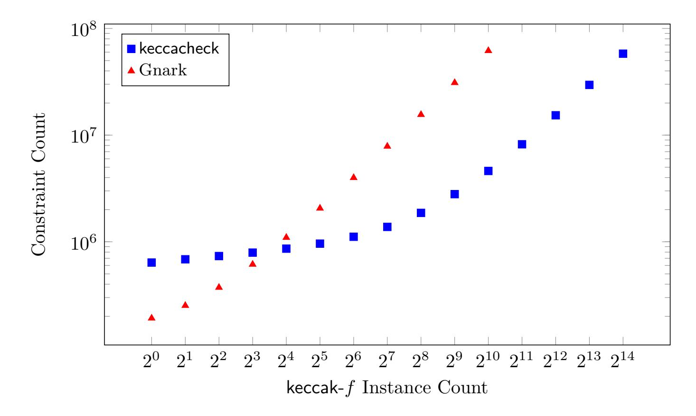
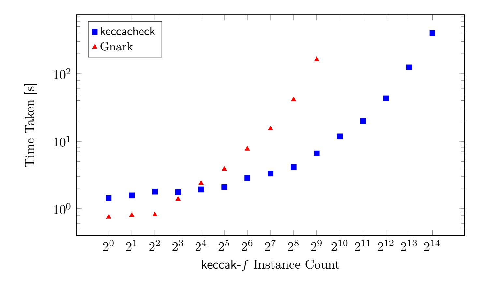

{0}------------------------------------------------

# Keccacheck: towards a SNARK friendly Keccak

Marcin Kostrzewa Matthew Klein Ara Adkins Grzegorz Świrski Wojciech Żmuda

{marcin.kostrzewa, matthew.klein, ara, greg, wojciech.zmuda}@reilabs.io Reilabs

September 25, 2025

### **Abstract**

Keccak, the hash function at the core of the Ethereum ecosystem, is computationally expensive to reason about in SNARK circuits, creating a critical bottleneck in the ability of the ZK ecosystem to reason about blockchain state. The recent state-of-the-art in proving Keccak permutations relies on proof systems that can perform lookup arguments, which—while exhibiting better performance than directly proving the hash operations in circuit—still typically require tens of thousands of constraints to prove a single keccak-f permutation. This paper introduces a new method, termed keccacheck, which builds upon sum-check with influence from GKR to create circuits that can batch-verify Keccak permutations with fewer than 4000 constraints per instance. keccacheck achieves this by exploiting the logarithmic scaling of recursive verification of the sum-check protocol, reducing the computational cost of verifying large enough batches to be only slightly higher than evaluating the multilinear extension of the input and output states. Its performance becomes competitive for a batch containing 16 permutations and offers more than a 10x cost reduction for batches of 512 or more permutations. This approach enables new levels of efficiency for the ZK ecosystem, providing the performant storage proofs that are essential to light clients, cross-chain bridges, privacy-focused protocols, and roll-ups.

# **Contents**

| 1 |                      | Introduction |                             | 2      |  |  |
|---|----------------------|--------------|-----------------------------|--------|--|--|
|   | 1.1                  |              | Keccak Hash Function        | 3      |  |  |
|   |                      | 1.1.1        | The keccak-f Permutation    | 3      |  |  |
|   | 1.2                  |              | The Sum-Check Protocol<br>  | 4      |  |  |
| 2 | Protocol Description |              |                             |        |  |  |
|   | 2.1                  |              | Preliminary Definitions<br> | 5<br>5 |  |  |
|   |                      | 2.1.1        | Equality Polynomial<br>     | 5      |  |  |
|   |                      | 2.1.2        | Multilinear Extensions      | 6      |  |  |
|   |                      | 2.1.3        | State Representation        | 6      |  |  |
|   |                      | 2.1.4        | Bitwise Operations          | 7      |  |  |

{1}------------------------------------------------

| 5 |     | Future Work               | 14 |
|---|-----|---------------------------|----|
| 4 |     | Benchmarks                | 12 |
|   | 3.3 | Non-Interactive Soundness | 12 |
|   | 3.2 | Soundness                 | 11 |
|   | 3.1 | Completeness              | 11 |
| 3 |     | Security Analysis         | 11 |
|   | 2.4 | Scaling Behavior<br>      | 10 |
|   | 2.3 | Proof Recursion           | 9  |
|   |     | 2.2.5<br>Theta<br>        | 8  |
|   |     | 2.2.4<br>Rho<br>          | 8  |
|   |     | 2.2.3<br>Pi<br>           | 8  |
|   |     | 2.2.2<br>Chi<br>          | 8  |
|   |     | 2.2.1<br>Iota<br>         | 8  |
|   | 2.2 | Protocol Structure<br>    | 7  |
|   |     | 2.1.5<br>Bit Rotations    | 7  |

# <span id="page-1-0"></span>**1 Introduction**

The Keccak hash function forms the core of the Ethereum blockchain, seeing use in many of its functions from address generation, to storage computations and event log signatures. Due to this importance in the ecosystem, there has been significant interest in being able to reason about these hashes in zero-knowledge, and hence represent the state of the blockchain in such cryptographic contexts.

The Keccak hash function, however, was originally designed for efficient execution in hardware. As a result, its implementation consists of a series of bitwise operations over its internal state; these are extremely efficient in hardware, but pose significant difficulty in the context of arithmetic circuits, where each word must be decomposed into individually manipulated bits. While such an approach is fine for occasional operations on bits, it results in extremely expensive circuit encodings for heavily bit-based algorithms, requiring a minimum of 64 constraints per operation on a single state word in Keccak's case. Even lookup-based approaches, which memorize the tables of bitwise operations for larger words, will typically require at least 8 constraints per input word, resulting in circuits measuring between 20 and 50 thousand constraints per permutation.

The technique demonstrated here—named keccacheck—represents these bitwise operations as expressions operating on multilinear extensions of the Keccak state. We then use the sum-check protocol [\[LFKN92\]](#page-14-0) to reduce evaluation claims on the current state to a claim about a previous intermediate state. Taking inspiration from GKR [\[GKR08\]](#page-14-1), we repeatedly apply the sum-check protocol to reduce our original claim about the output of the keccak-*f* permutation to a claim about its input. As the verifier has access to the inputs, it is able to verify the final claim for itself.

We use proof recursion to make this approach function within existing proof systems. The final, general-purpose, proof system—such as Groth16, Plonk, STARK or any variation thereof—only needs to concern itself with verifying a keccacheck proof, rather than reasoning about the keccak-*f* permutations. It is also worth noting that the verification of a keccacheck proof does not assume access to lookup tables, making it compatible with tools such as Circom.

{2}------------------------------------------------

While more expensive than direct proving for a single keccak-*f* permutation, our approach demonstrates better scaling behavior than traditional approaches as the number of permutations increases. When comparing with Gnark, significant benefits are seen when working on batches of 16 keccak-*f*'s or more. We include a performance comparison with the implementation of keccak-*f* in Gnark's [\[Con20\]](#page-14-2) standard library, demonstrating the clear benefits of keccacheck over a state-of-the-art system using lookup arguments.

The code that accompanies this paper can be found in the keccacheck repository [\[Rei25\]](#page-14-3). It contains a Rust implementation of the prover and verifier for keccacheck, as well as an implementation of the keccacheck verifier in the outer proof system we selected.

# <span id="page-2-0"></span>**1.1 Keccak Hash Function**

Keccak [\[BDPA11\]](#page-13-1) is the hash function that eventually became—with minor changes—the SHA-3 hash function standard as specified by NIST. More pertinently to our work, Keccak—before the changes required by NIST—is the hash function chosen for use in the Ethereum Virtual Machine (EVM)—provided as its SHA3 opcode—and hence one with significant usage in the ecosystem.

In practice, Keccak is a family of hash functions, parametrized over two quantities. *r*, the *bit-rate* of the hash, can be thought of as akin to the block size in a block cipher, while *c*, the *capacity* of the hash defines its security level. From these, we derive a quantity *b* called the width of the hash, such that

$$\forall \ell \in [6] : b = 25 \cdot w$$
, where  $w = 2^{\ell}$ .

As it is the variant of this hash family used by the EVM and its ecosystem, we focus here on Keccak256 and instantiate these parameters as follows: *b* = 1088, *c* = 512, *w* = 64. This yields a state consisting of a 5 × 5 matrix of lanes, with each lane containing 64 bits for 1600 state bits in total.

The Keccak hash function is built from three parametric components: the Keccak permutation function, the Keccak padding function, and the sponge construction which uses the previous two to hash an arbitrary-length input and return 256-bit (in our case) output. Our work focuses on the permutation itself, as presented below.

#### <span id="page-2-1"></span>**1.1.1 The keccak-***f* **Permutation**

The Keccak permutation function, known as keccak-*f*, is a function from Keccak state to Keccak state that is responsible for altering the state in order to create a cryptographically secure hash value.

To explain how the permutation works, we follow the terminology from the *Keccak Implementation Overview* [\[BDP](#page-13-2)<sup>+</sup>11]. As above, *r* = 1088 is the bit-rate, *c* = 512 is the capacity, and *b* = *r* + *c* is the width of the hash. In addition, we define *ℓ* = 6 as the exponent for the lane size, such that *w* = 2*<sup>ℓ</sup>* = 64 is the size of each lane. *n<sup>r</sup>* = 12 + 2*ℓ* = 24 is the number of rounds, while r[*x, y*] are the cyclic shift constants.

We also follow their bit-addressing conventions as follows: *a*[*x*][*y*][*z*] denotes the bit at position (*x, y, z*), where *x, y* indices are modulo 5 and *z* indices are modulo *w*. Omitting indices implies that the statement holds for all possible values of the omitted indices.

{3}------------------------------------------------

Each round t of keccak-f uses a different round constant RC[t]. The permutation round is broken into steps  $\theta$ ,  $\rho$ ,  $\pi$ ,  $\chi$ , and  $\iota$ , whose function are given in full detail in Algorithm 1. The full keccak-f permutation applies this round  $n_r = 24$  times with each round using a different round constant RC[t].

#### <span id="page-3-1"></span>Algorithm 1 Keccak-f Permutation

```
Require: State array A[5][5][w], number of rounds n_r
 1: for r = 0 to n_r - 1 do
        //\theta step
 2:
        for i = 0 to 4 do
 3:
           C[i] \leftarrow A[i][0] \oplus A[i][1] \oplus A[i][2] \oplus A[i][3] \oplus A[i][4]
 4:
        end for
 5:
        for i = 0 to 4 do
 6:
           D[i] \leftarrow C[(i-1) \bmod 5] \oplus \mathtt{ROTL}(C[(i+1) \bmod 5], 1)
 7:
        end for
 8:
        for i, j = 0 to 4 do
 9:
          A[i][j] \leftarrow A[i][j] \oplus D[i]
10:
        end for
11:
        // \rho and \pi steps
12:
       B[0][0] \leftarrow A[0][0]
13:
        for i, j = 0 \text{ to } 4 \text{ do}
14:
           B[j][(2i+3j) \bmod 5] \leftarrow \mathtt{ROTL}(A[i][j],\mathtt{r}[i][j])
15:
        end for
16:
17:
        //\chi \text{ step}
        for i, j = 0 to 4 do
18:
           A[i][j] \leftarrow B[i][j] \oplus (\neg B[(i+1) \bmod 5][j] \land B[(i+2) \bmod 5][j])
19:
        end for
20:
        //\iota \text{ step}
21:
        A[0][0] \leftarrow A[0][0] \oplus \mathtt{RC}[r]
22:
23: end for
24: return A
```

## <span id="page-3-0"></span>1.2 The Sum-Check Protocol

Our system uses the *sum-check protocol* as a central building block. The goal of the sum-check protocol is to compute the sum of a multivariate polynomial  $f: \mathbb{F}^{\ell} \to \mathbb{F}$  over the Boolean hypercube

$$H = \sum_{b_1, b_2, \dots, b_\ell \in \{0, 1\}} f(b_1, b_2, \dots, b_\ell),$$

in such a way that the verifier is convinced of the correctness of this sum without also having to compute H.

Lund et al. introduced the sum-check protocol [LFKN92], which allows the verifier  $\mathcal{V}$  to delegate this work to the computationally unbounded prover  $\mathcal{P}$ .  $\mathcal{V}$  is convinced of the correctness of H through an interactive protocol that runs in  $\ell$  rounds. We describe this protocol below 2.

{4}------------------------------------------------

# <span id="page-4-3"></span>**Algorithm 2** Sum-check Protocol for $f: \mathbb{F}^{\ell} \to \mathbb{F}$

```
Require: Prover \mathcal{P}, Verifier \mathcal{V}, polynomial f, number of variables \ell > 1
Ensure: V is convinced that H = \sum_{b \in \{0,1\}^{\ell}} f(b)
 1: \mathcal{V} initializes random challenges r_1, \ldots, r_\ell
  2: for i = 1 to \ell do
          if i = 1 then
 3:
             \mathcal{P} \text{ sends } f_1(x_1) = \sum_{b_2,...,b_{\ell}} f(x_1, b_2, ..., b_{\ell})

\mathcal{V} \text{ checks } H = f_1(0) + f_1(1)
  4:
 5:
              \mathcal{V} sends random r_1 \in \mathbb{F} to \mathcal{P}
 6:
          else if 2 \le i \le \ell - 1 then
 7:
             \mathcal{P} \text{ sends } f_i(x_i) = \sum_{b_{i+1},\dots,b_{\ell}} f(r_1,\dots,r_{i-1},x_i,b_{i+1},\dots,b_{\ell})
 8:
             V \text{ checks } f_{i-1}(r_{i-1}) = f_i(0) + f_i(1)
 9:
              \mathcal{V} sends random r_i \in \mathbb{F} to \mathcal{P}
10:
          else
11:
              \mathcal{P} sends f_{\ell}(x_{\ell}) = f(r_1, \dots, r_{\ell-1}, x_{\ell})
12:
              V \text{ checks } f_{\ell-1}(r_{\ell-1}) = f_{\ell}(0) + f_{\ell}(1)
13:
              \mathcal{V} samples random r_{\ell} \in \mathbb{F} and verifies f_{\ell}(r_{\ell}) = f(r_1, \dots, r_{\ell})
14:
          end if
15:
16: end for
```

# <span id="page-4-0"></span>2 Protocol Description

The core of keccacheck is that the protocol expresses each iteration of the keccak-f state as a set of multi-linear extensions of the state words, about which  $\mathcal{P}$  claims the value of its evaluations at a random point chosen by  $\mathcal{V}$ .  $\mathcal{P}$  and  $\mathcal{V}$  then interact to reduce that claim to a claim about the previous state iteration via the sum-check protocol.

We then take inspiration from GKR [GKR08] by repeating the process of reducing the claim using sum-check until we reach the input to the keccak-f function. We do, however, depart from GKR's usual presentation in a few significant ways. Most notably, we do not require that the protocol state be represented by a single polynomial, but rather use multiple different polynomials and combine the evaluation claims on them using random linear combinations. This approach is inspired by the Libra [XZZ<sup>+</sup>19] presentation of GKR. Moreover, the protocol does not have a strictly linear structure, allowing a given layer to mention polynomial evaluations established in previous layers. Additionally, we abandon the notion of gates and wiring predicates altogether, providing explicit equations for the layer transitions instead.

#### <span id="page-4-1"></span>2.1 Preliminary Definitions

#### <span id="page-4-2"></span>2.1.1 Equality Polynomial

We denote by eq(x, y) the equality polynomial, defined as a multilinear polynomial in 2n variables  $x, y \in \mathbb{F}^n$  and given by the formula

$$eq(x,y) = \prod_{i=1}^{n} (x_i y_i + (1 - x_i)(1 - y_i)).$$

{5}------------------------------------------------

Its behavior on boolean inputs *a, b* ∈ {0*,* 1} *<sup>n</sup>* is given by

$$eq(a,b) = \begin{cases} 1, & \forall i \in [n], a_i = b_i, \\ 0, & \text{otherwise,} \end{cases}$$

that is, over boolean inputs it functions as an equality predicate, thereby justifying the name.

### <span id="page-5-0"></span>**2.1.2 Multilinear Extensions**

Let *V* : {0*,* 1} *<sup>ℓ</sup>* → F be a function. The multilinear extension of *V* is the unique multilinear polynomial *<sup>V</sup>*<sup>e</sup> : <sup>F</sup> *<sup>ℓ</sup>* → F such that

$$\widetilde{V}(x_1, x_2, \dots, x_\ell) = V(x_1, x_2, \dots, x_\ell) \text{ for all } (x_1, x_2, \dots, x_\ell) \in \{0, 1\}^\ell.$$

It can be expressed as

$$\widetilde{V}(x) = \sum_{b \in \{0,1\}^{\ell}} \operatorname{eq}(x,b) \cdot V(b).$$

It is worth noting that there exists a linear time and space algorithm for computing the vector of evaluations of eq(*x, b*) for a given *x* and all *b* ∈ {0*,* 1} *ℓ* , turning the above formula into an efficient algorithm for evaluating the multilinear extension at an arbitrary point [\[Tha23\]](#page-14-5).

#### <span id="page-5-1"></span>**2.1.3 State Representation**

Let *h* be the number of keccak-*f* instances being proven and let *n* = 6 + log(*h*). We use the notation *a*1*, . . . , a<sup>ℓ</sup>* to denote P*<sup>ℓ</sup> <sup>i</sup>*=1 2 *<sup>i</sup>*−1*a<sup>i</sup>* , the number represented by the little-endian binary expansion (*a*1*, . . . , aℓ*).

The input state of a keccak-*f* round is represented as a family of 25 *n*-variate multilinear extensions *Aij* , such that

$$A_{ij}(x) = A[\overline{x_7 \dots x_n}][i][j][\overline{x_1 \dots x_6}] \text{ for } x \in \{0, 1\}^n.$$

That is, we use the first 6 variables to index a particular bit in the state word and the remaining variables index the instance. We denote the intermediate state after each stage by the greek letter corresponding to the stage name in the listing above and reuse the names *C* and *D* for the auxiliary values. The variable-to-index mapping is analogous to the one described for *A*.

We define the *n*-variate polynomial RC as:

$$RC(x) = \sum_{b \in \{0,1\}^6} ((RC \land (1 \ll \overline{b})) \gg \overline{b}) \cdot eq(b, x_1, \dots, x_6).$$

Note that it is constant in the upper log *h* variables *x*7*, . . . , xn*. In other words, RC is the multilinear extension of *h* concatenated copies of the binary representation of the current round constant given by RC.

{6}------------------------------------------------

#### <span id="page-6-0"></span>2.1.4 Bitwise Operations

Below we present the arithmetic operations that correspond to the binary operations used by keccak-f when applied to binary inputs:

• and:  $a \wedge b = ab$ ,

• **not**:  $\neg a = 1 - a$ ,

• **xor**:  $a \oplus b = a + b - 2ab$ .

Moreover, we define  $\hat{a} = 1 - 2a$ . This operation maps the value 0 to 1 and 1 to -1. Its use is motivated by the ease of expression of **xor**:  $\widehat{a \oplus b} = \widehat{a} \cdot \widehat{b}$ . The inverse mapping is given by  $a = \frac{1-\widehat{a}}{2}$ .

#### <span id="page-6-1"></span>2.1.5 Bit Rotations

We define the polynomial  $\operatorname{rot}_k(a,b)$  where  $a,b\in\mathbb{F}^6$  as the multilinear extension of the binary function given by:

$$\operatorname{rot}_k(a,b) = \begin{cases} 1, & \text{if } \overline{a} = (\overline{b} + k) \mod 64, \\ 0, & \text{otherwise.} \end{cases}$$

It is worth noting that the vector of evaluations of  $\operatorname{rot}_k(x,b)$ , for all binary b and a given x, can be obtained by rotating the vector of evaluations of  $\operatorname{eq}(x,b)$ .

We further extend the definition of  $\mathrm{rot}_k$  to n-variate polynomials, by setting

$$rot_k(x,y) = rot_k(x_1, \dots, x_6, y_1, \dots, y_6) \cdot eq(x_7, \dots, x_n, y_7, \dots, y_n).$$

This extended definition asserts that the rotation predicate holds in a particular block indexed by the upper n-6 variables.

With this in place, we can also define the functional rot(P, k) taking an *n*-variate multilinear polynomial P and  $k \in [64]$  and returning a polynomial obtained by rotating by k the consecutive 64-element blocks of evaluations of P. It is given explicitly by

$$rot(P,k)(x) = \sum_{b \in \{0,1\}^n} P(b) \cdot rot_k(x,b).$$

### <span id="page-6-2"></span>2.2 Protocol Structure

A single keccak-f permutation consists of 24 identical rounds that only differ differ in the RC parameter. Our protocol proceeds backwards from the final state and reduces an evaluation claim on the final state step by step until it reaches the initial state. In this section, we present all the state transitions necessary to express a keccak-f permutation.

Note that all sum-checks are performed over the k index. All other sums appearing in the formulas are merely notational conveniences. At the beginning of the protocol  $\mathcal{V}$  samples a random value  $\alpha$  and the  $\mathcal{P}$  provides evaluations of  $\iota_{ij}(\alpha)$ —the final result of the final round—for all i and j.

{7}------------------------------------------------

#### <span id="page-7-0"></span>**2.2.1 Iota**

V samples random values *βij* to combine all evaluations into a single claim. Note that:

$$\sum_{i,j} \beta_{ij} \iota_{ij}(\alpha) = \sum_{i,j} \sum_{k} \beta_{ij} \operatorname{eq}(\alpha, k) \iota_{ij}(k)$$

$$= \sum_{k} \operatorname{eq}(\alpha, k) \left( \beta_{00} \left( \chi_{00}(k) \oplus \operatorname{RC}(k) \right) + \sum_{i,j \neq (0,0)} \beta_{ij} \chi_{ij}(k) \right).$$

V and P engage in a sum-check protocol over the final expression, which ends in V sampling a new point *α* and P providing evaluations for *χij* (*α*).

### <span id="page-7-1"></span>**2.2.2 Chi**

V samples new random values *βij* . Then the parties use the equation

$$\sum_{i,j} \beta_{ij} \chi_{ij}(\alpha) = \sum_{i,j} \sum_{k} \beta_{ij} \operatorname{eq}(\alpha, k) \chi_{ij}(k)$$

$$= \sum_{k} \operatorname{eq}(\alpha, k) \left( \sum_{i,j} \beta_{ij} \left( \pi_{ij}(k) \oplus \left( \left( 1 - \pi_{(i+1)j}(k) \right) \pi_{(i+2)j}(k) \right) \right) \right)$$

to engage in a sum-check, leading to evaluation claims for *πij* (*α*) for a newly chosen point *α*.

### <span id="page-7-2"></span>**2.2.3 Pi**

The *π* step is a permutation of the state vectors, which the parties perform by relabeling their internal data representations, without the need for any interaction.

# <span id="page-7-3"></span>**2.2.4 Rho**

V samples new random values *βij* and uses the following equation

$$\sum_{i,j} \beta_{ij} \rho_{ij}(\alpha) = \sum_{i,j} \beta_{ij} \operatorname{rot}(\theta_{ij}, \mathbf{r}[i][j])(\alpha)$$

$$= \sum_{i,j} \sum_{k} \beta_{ij} \theta_{ij}(k) \cdot \operatorname{rot}_{\mathbf{r}[i][j]}(\alpha, k)$$

$$= \sum_{k} \sum_{i,j} \beta_{ij} \theta_{ij}(k) \cdot \operatorname{rot}_{\mathbf{r}[i][j]}(\alpha, k)$$

to execute a sum-check, generating evaluation claims for *θij* (*α*) for a new value of *α*.

#### <span id="page-7-4"></span>**2.2.5 Theta**

Once again V samples random *βij* . The parties then switch to the {1*,* −1} basis for boolean operations, to rewrite their claims using the following equation:

{8}------------------------------------------------

$$\sum_{i,j} \beta_{ij} \hat{\theta}_{ij}(\alpha) = \sum_{k} \operatorname{eq}(\alpha, k) \sum_{i,j} \beta_{ij} \hat{A}_{ij}(k) \hat{D}_{i}(k)$$
$$= \sum_{k} \operatorname{eq}(\alpha, k) \sum_{i} \hat{D}_{i}(k) \left( \sum_{j} \beta_{ij} \hat{A}_{ij}(k) \right).$$

Performing a sum-check over the last expression leads to evaluation claims for  $\hat{A}_{ij}(\alpha_0)$  and  $\hat{D}_i(\alpha_0)$ , for some value of  $\alpha_0$ . We first reduce the claims on  $\hat{D}$ , leaving the verification of claims on  $\hat{A}_{ij}$  to a later stage.  $\mathcal{V}$  chooses new values of  $\beta_i$ . Expanding the definition of  $D_i$  leads to the following expression:

$$\sum_{i} \beta_{i} \hat{D}_{i}(\alpha_{0}) = \sum_{k} \sum_{i} \beta_{i} \operatorname{eq}(\alpha_{0}, k) \hat{C}_{i-1}(k) \operatorname{rot}(\hat{C}_{i-1}, 1)(k)$$

Another execution of sum-check leads to evaluation claims for  $\hat{C}_i(\alpha_1)$  and  $\operatorname{rot}(\hat{C}_i, 1)(\alpha_1)$ .  $\mathcal{V}$  now samples two random vectors  $\beta_i$  and  $\beta'_i$ . The following equation sets up the next sum-check:

$$\sum_{i} \beta_{i} \hat{C}_{i}(\alpha_{1}) + \beta'_{i} \operatorname{rot}(\hat{C}_{i}, 1)(\alpha_{1}) = \sum_{k} \sum_{i} \left( \beta_{i} \operatorname{eq}(\alpha_{1}, k) \prod_{j} \hat{A}_{ij}(k) + \beta'_{i} \operatorname{rot}_{1}(\alpha_{1}, k) \prod_{j} \hat{A}_{ij}(k) \right)$$
$$= \sum_{k} \sum_{i} \left( \beta_{i} \operatorname{eq}(\alpha_{1}, k) + \beta'_{i} \operatorname{rot}_{1}(\alpha_{1}, k) \right) \prod_{j} \hat{A}_{ij}(k).$$

The sum-check will result in evaluation claims for  $\hat{A}_{ij}(\alpha_2)$ . We combine them with the verification obligations (sampling new  $\beta_{ij}$  and  $\beta'_{ij}$ ) for  $\hat{A}_{ij}(\alpha_0)$  as follows:

$$\sum_{i,j} \beta_{ij} \hat{A}_{ij}(\alpha_0) + \beta'_{ij} \hat{A}_{ij}(\alpha_2) = \sum_k \sum_{i,j} \beta_{ij} \operatorname{eq}(\alpha_0, k) \hat{A}_{ij}(k) + \beta'_{ij} \operatorname{eq}(\alpha_2, k) \hat{A}_{ij}(k)$$
$$= \sum_k \sum_{i,j} \left( \beta_{ij} \operatorname{eq}(\alpha_0, k) + \beta'_{ij} \operatorname{eq}(\alpha_2, k) \right) \hat{A}_{ij}(k).$$

A final execution of sum-checks reduces the problem to a single opening of all  $\hat{A}_{ij}$ . Shifting the basis back to A, the parties are ready to proceed to the next round in the same manner as described above.

After 24 iterations of this protocol, the parties arrive at evaluation claims on the input state, which  $\mathcal{V}$  will evaluate directly as the last step.

### <span id="page-8-0"></span>2.3 Proof Recursion

As stated before, the scheme is intended for use in a recursive setting and is designed to facilitate efficient proving and to minimize the number of constraints required for recursive verification. Recursive verification consists of 3 main tasks:

- committing to the output vector to generate the first Fiat-Shamir challenge,
- verifying the Fiat-Shamir transcript,

{9}------------------------------------------------

• and evaluating the multilinear extensions of the input and output vectors.

Of course V also needs to actually check the correctness of the sum-check rounds, but this work is negligible compared to the aforementioned tasks. We have chosen Gnark's version of Groth16 as our benchmark target, due to its optimized implementation and relatively cheap verifiation costs on the Ethereum chain. The system should, however, be easily applicable within most existing proof systems.

The task of committing to the output vector can be realized through hashing in-circuit, but in the case of Gnark it can be done trivially by using the builtin commitment facilities, thereby avoiding the need to perform additional operations in the circuit itself.

Verifying the Fiat-Shamir transcript, which practically constitutes the majority of V's work for smaller batches, benefits greatly from using an algebraic hash function with a very wide state. This is caused by the relatively long messages exchanged by the parties—for example P provides evaluations of 25 different polynomials and V responds with 25 random linear combination coefficients. To that end, we have chosen the Poseidon 2 [\[GKS23\]](#page-14-6) permutation as a basis for our transcript, but different implementation may choose the hash function that is most efficient to verify in the target proof system.

Evaluating the multilinear extensions of the input and output vectors requires computing a scalar product of two vectors of witness values. With our choice of Groth16 this requires a number of constraints equal to the length of the vectors. Other systems, such as those based on PLONK extended with custom gates, can reduce this cost further. Optimizing this would be extremely beneficial for larger batches, in which this operation constitutes the majority of the verification time.

# <span id="page-9-0"></span>**2.4 Scaling Behavior**

The benefits of keccacheck grow with the number of instances of the keccak-*f* permutation being batched. This arises directly from the scaling properties of the verification process outlined in the previous section.

With the choice of Gnark as the outer proof system, the scaling behavior of keccacheck presents as follows:

- 1. Evaluating a single multilinear extension requires a precomputation of the eq polynomial. This can be done in 2 · 2 6 · *h* constraints [\[Tha23\]](#page-14-5). We also need to compute the dot product with the state vectors, which requires 25 · 2 6 · *h* constraints. The total linear factor is thus 2 · *h* · (2 · (2<sup>6</sup> ) + 25 · (2<sup>6</sup> )) = 3456*h*.
- 2. Over the 24 rounds of the keccak-*f* permutation, we perform 7 sum-checks per round, with each having *n* rounds. Each round of sum-check consists of computing a small arithmetic claim and hashing the transcript to derive new randomness. The number of constraints required by the arithmetic is negligible, but we have to compute 24 · 7 · (log(*h*) + 6) hashes, each of which incurs *C* additional constraints per hash for 168*C*(log(*h*) + 6) constraints for the sum-checks.

Thus the total number of constraints scales linearly with the number of instances *h*, with a constant scale of 3456, but with a very large logarithmic term (168*C* is in practice a number on the order of tens of thousands). This means that we need to batch a sufficiently large number of instances to offset this overhead.

{10}------------------------------------------------

Practical measurements (as provided in Section 4) demonstrate that our solution exceeds the performance of Gnark's built-in keccak-f implementation at 16 batched permutations, whereas batching 512 permutations offers over a 10x reduction in the number of constraints, resulting in an averaged cost of roughly 5500 constraints per permutation. The largest batch that we have measured, consisting of 16384 permutations, achieves an average of 3543 constraints per permutation and almost reaches the asymptotic limit of 3456 put forward in the analysis above.

# <span id="page-10-0"></span>3 Security Analysis

This section presents a concrete security analysis of the keccacheck protocol, given as a function of n, the number of variables in the sum-check protocols that it performs.

### <span id="page-10-1"></span>3.1 Completeness

The perfect completeness of keccacheck follows from the perfect completeness of the sum-check protocol as given by Thaler [Tha23].

#### <span id="page-10-2"></span>3.2 Soundness

Consider a probabilistic polynomial time (PPT) adversary  $\mathcal{A}$  with input **in** and output **out** such that  $\mathsf{keccak}\text{-}f(\mathbf{in}) \neq \mathbf{out}$ . In order for  $\mathcal{P}$  to successfully convince  $\mathcal{V}$  to accept such a claim, one of the following must occur:

- 1.  $\mathcal{V}$  samples the initial random point  $\alpha$  such that the initial evaluations coincide. This happens with probability  $\frac{n}{|\mathbb{F}|}$ , by the Schwartz-Zippel lemma.
- 2. In one of the rounds of the protocol,  $\mathcal{V}$  samples the random linear combination coefficients such that  $\sum_{i,j} \beta_{ij} \cdot P_{ij}(\alpha) = \sum_{i,j} \beta_{ij} \cdot P'_{ij}(\alpha)$ , despite at least one  $P_{ij}(\alpha)$  differing from  $P'_{ij}(\alpha)$ , where  $P_{ij}$  are the true polynomials and  $P'_{ij}$  are the polynomials claimed by  $\mathcal{A}$ . This occurs with probability  $\frac{1}{|\mathbb{F}|}$  when each  $\beta$  is independently drawn.
- 3. One of the sum-check instances in the protocol is successfully cheated. This happens with probability  $\frac{d \cdot n}{|\mathbb{F}|}$ , where d is the maximal degree in any variable of the polynomial being checked and n is its number of variables [Tha23].

We now proceed to bound the total soundness error of the protocol under these conditions. We begin with the already-noted soundness error of  $\frac{n}{|\mathbb{F}|}$  incurred by the first round of the protocol.

The protocol then proceeds in a uniform fashion—each step consisting of  $\mathcal{V}$  drawing random linear combination coefficients, introducing a soundness error of  $\frac{1}{|\mathbb{F}|}$  and running a sum-check over an *n*-variate polynomial. The maximum degrees in each variable of the polynomials involved are respectively: 3, 4, 2, 3, 3, 6 and 2. This stage is repeated 24 times, for a total soundness error bounded by:

$$\frac{24 \cdot (7 + (3 + 4 + 2 + 3 + 3 + 6 + 2) \cdot n)}{|\mathbb{F}|} = \frac{24 \cdot (7 + 23n)}{|\mathbb{F}|} = \frac{168 + 552n}{|\mathbb{F}|}.$$

Therefore, the total soundness error of the entire protocol is bounded by:

{11}------------------------------------------------

$$\frac{n}{|\mathbb{F}|} + \frac{168 + 552n}{|\mathbb{F}|} = \frac{168 + 553n}{|\mathbb{F}|}.$$

Recall that *n* is defined as 6 + log(*h*), where *h* is the number of batched permutations. Therefore, for practical applications, *n* ranges between 7 and 26, thus bounding the numerator by 14546, which is negligible in comparison to the size of our field of choice.

# <span id="page-11-0"></span>**3.3 Non-Interactive Soundness**

We note that keccacheck exhibits round-by-round soundness, as defined by Canetti et al. [\[CCH](#page-14-7)<sup>+</sup>19] and is therefore secure under the Fiat-Shamir transform.

We define a partial transcript to be doomed if any of the yet-unresolved evaluation claims is false. The argument for this definition satisfying the requirements of round-by-round soundness closely follows the logic of the interactive soundness proof, wherein:

- The probability of the transcript moving from a doomed state into an undoomed one in the first round of the protocol is at most *<sup>n</sup>* |F| .
- The probability of redeeming a state in a round where V samples random linear combination coefficients is bounded by <sup>1</sup> |F| .
- The probability of redeeming such a state function during any of the sumcheck rounds is negligible, as demonstrated in [\[CCH](#page-14-7)<sup>+</sup>19].

# <span id="page-11-1"></span>**4 Benchmarks**

To provide a practical demonstration of the improved scaling behavior that keccacheck offers over existing solutions, we have conducted a benchmark to compare our protocol with proving keccak-*f* hashes using the state-of-the-art, lookup-based implementation provided by Gnark.

These benchmarks were conducted on an Apple® MacBook Pro™ with an M4 Pro™ SoC and 24 GiB of RAM. Unfortunately, we saw consistent failures to complete execution in Gnark when the number of constraints grew too large; this was due to running out of memory. Such cases are notated in the figures [\(1,](#page-12-0) [2\)](#page-13-3) by a missing point, or in the table of benchmark data [\(1\)](#page-12-1) by a "NaN". The time measurements for keccacheck are the aggregate of proving time for both the inner and outer proof systems.

These experimental results show that the point at which the linear term discussed in the section on the scaling behavior of the protocol starts to dominate is around a number of keccak-*f* instances *N* = 1024. However, we can also see that while keccacheck exhibits higher overhead for small *N* it is already more efficient than Gnark's state-of-the-art lookup-based approach at *N* = 16.

{12}------------------------------------------------

<span id="page-12-1"></span>

|             | keccacheck       |                  | Gnark            |                  |
|-------------|------------------|------------------|------------------|------------------|
| # Instances | R1CS Constraints | Proving Time (s) | R1CS Constraints | Proving Time (s) |
| 1           | 638 682          | 1.435            | 191 898          | 0.749            |
| 2           | 685 030          | 1.572            | 252 149          | 0.797            |
| 4           | 734 833          | 1.788            | 372 651          | 0.814            |
| 8           | 791 597          | 1.757            | 613 655          | 1.385            |
| 16          | 862 237          | 1.918            | 1 095 663        | 2.383            |
| 32          | 960 572          | 2.092            | 2 059 680        | 3.860            |
| 64          | 1 114 403        | 2.846            | 3 987 713        | 7.660            |
| 128         | 1 379 176        | 3.311            | 7 843 780        | 15.272           |
| 256         | 1 866 338        | 4.122            | 15 555 915       | 41.124           |
| 512         | 2 796 713        | 6.587            | 30 980 184       | 162.192          |
| 1,024       | 4 614 574        | 11.786           | 61 828 721       | NaN              |
| 2,048       | 8 207 357        | 19.936           | NaN              | NaN              |
| 4,096       | 15 350 034       | 43.263           | NaN              | NaN              |
| 8,192       | 29 592 549       | 124.641          | NaN              | NaN              |
| 16,384      | 58 034 640       | 400.541          | NaN              | NaN              |

Table 1: Benchmark Results: keccacheck vs. Gnark

As the batch size grows, the benefit over the more-traditional approach becomes even more evident, demonstrating keccacheck as the state-of-the-art for keccak-*f* batches. In particular, we achieve an approximate 10x speedup over Gnark, where the highly-optimized implementation using lookups already achieves a significant speedup over raw Groth 16.

<span id="page-12-0"></span>

Figure 1: Constraints Used by keccacheck vs. Gnark

{13}------------------------------------------------

<span id="page-13-3"></span>

Figure 2: Time Taken by keccacheck vs. Gnark

# <span id="page-13-0"></span>**5 Future Work**

While keccacheck has demonstrated state-of-the-art scaling behavior for batches of keccak-*f* permutations, it is a highly specialized system. As a result, we see two main avenues for extending this system.

The first of these avenues is to explore the use of a similar approach to create scalable solutions for proving other non-arithmetic hash functions. While Keccak is core to the Ethereum ecosystem, the space as a whole also makes use of other hash functions; any hash function that has a similar reliance on performing operations that are expensive to encode in traditional proof systems could benefit from this approach. Furthermore, it is likely that there are other—non hashing—problems that exhibit the regularity of structure that can be exploited by this approach.

In addition to taking inspiration from our approach and applying it to other similar problems, we believe that many existing proof systems beyond Gnark would benefit from implementations of recursive verifiers for keccacheck.

# **References**

- <span id="page-13-2"></span>[BDP<sup>+</sup>11] Guido Bertoni, Joan Daemen, Michaël Peeters, Gilles Van Assche, and Ronny Van Keer. The keccak implementation overview. Technical report, Keccak Team, 2011. SHA-3 Proposal. URL: <https://keccak.team/files/Keccak-implementation-3.2.pdf>.
- <span id="page-13-1"></span>[BDPA11] Guido Bertoni, Joan Daemen, Michaël Peeters, and Gilles Van Assche. Keccak submission to nist (round 3). Technical report, NIST, 2011. SHA-3 Proposal. URL: [https:](https://keccak.team/files/Keccak-submission-3.pdf) [//keccak.team/files/Keccak-submission-3.pdf](https://keccak.team/files/Keccak-submission-3.pdf).

{14}------------------------------------------------

- <span id="page-14-7"></span>[CCH<sup>+</sup>19] Ran Canetti, Yilei Chen, Justin Holmgren, Alex Lombardi, Guy N. Rothblum, Ron D. Rothblum, and Daniel Wichs. Fiat-Shamir: from practice to theory. In Moses Charikar and Edith Cohen, editors, *51st Annual ACM Symposium on Theory of Computing*, pages 1082–1090, Phoenix, AZ, USA, June 23–26, 2019. ACM Press. [doi:10.1145/3313276.](https://doi.org/10.1145/3313276.3316380) [3316380](https://doi.org/10.1145/3313276.3316380).
- <span id="page-14-2"></span>[Con20] Consensys. Gnark, 2020. URL: <https://github.com/Consensys/gnark>.
- <span id="page-14-1"></span>[GKR08] Shafi Goldwasser, Yael Tauman Kalai, and Guy N. Rothblum. Delegating computation: interactive proofs for muggles. In Richard E. Ladner and Cynthia Dwork, editors, *40th Annual ACM Symposium on Theory of Computing*, pages 113–122, Victoria, BC, Canada, May 17–20, 2008. ACM Press. [doi:10.1145/1374376.1374396](https://doi.org/10.1145/1374376.1374396).
- <span id="page-14-6"></span>[GKS23] Lorenzo Grassi, Dmitry Khovratovich, and Markus Schofnegger. Poseidon2: A faster version of the poseidon hash function. Cryptology ePrint Archive, Report 2023/323, 2023. URL: <https://eprint.iacr.org/2023/323>.
- <span id="page-14-0"></span>[LFKN92] Carsten Lund, Lance Fortnow, Howard J. Karloff, and Noam Nisan. Algebraic methods for interactive proof systems. *Journal of the ACM*, 39(4):859–868, 1992.
- <span id="page-14-3"></span>[Rei25] Reilabs. Keccacheck, 2025. URL: <https://github.com/reilabs/keccacheck>.
- <span id="page-14-5"></span>[Tha23] Justin Thaler. Proofs, arguments, and zero-knowledge, 2023. URL: [https://people.](https://people.cs.georgetown.edu/jthaler/ProofsArgsAndZK.pdf) [cs.georgetown.edu/jthaler/ProofsArgsAndZK.pdf](https://people.cs.georgetown.edu/jthaler/ProofsArgsAndZK.pdf).
- <span id="page-14-4"></span>[XZZ<sup>+</sup>19] Tiancheng Xie, Jiaheng Zhang, Yupeng Zhang, Charalampos Papamanthou, and Dawn Song. Libra: Succinct zero-knowledge proofs with optimal prover computation. Cryptology ePrint Archive, Report 2019/317, 2019. URL: [https://eprint.iacr.org/2019/](https://eprint.iacr.org/2019/317) [317](https://eprint.iacr.org/2019/317).