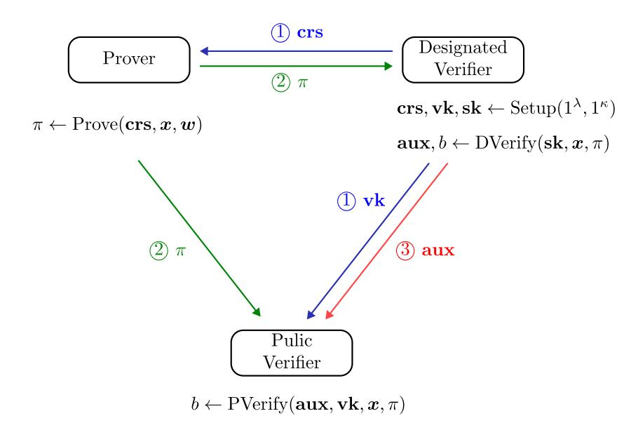
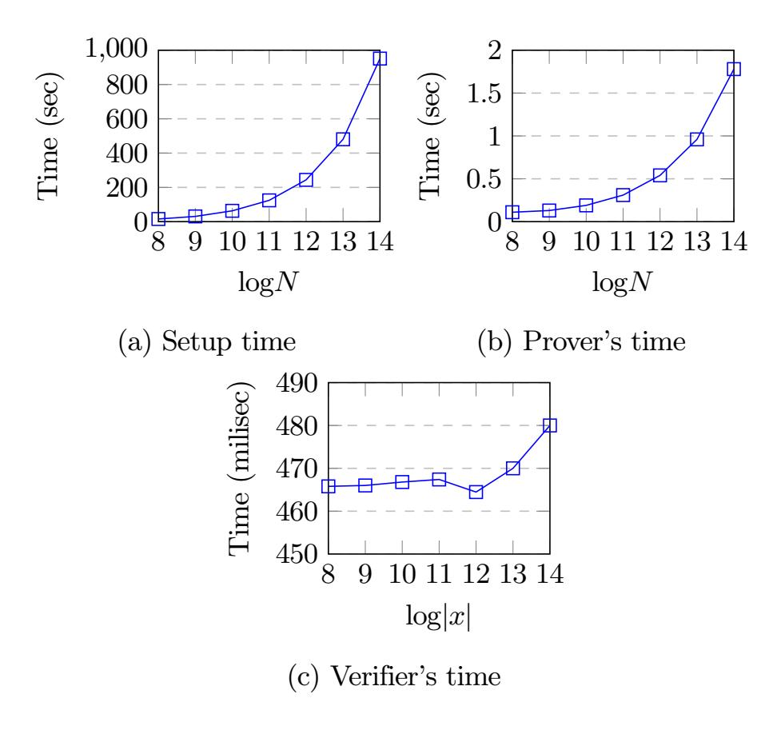

{0}------------------------------------------------

# Lattice-Based zk-SNARKs with Hybrid Verification Technique

Supriya Adhikary [,](https://orcid.org/0000-0002-0701-8049) Puja Monda[l](https://orcid.org/0009-0006-7300-8435) , and Angshuman Karmaka[r](https://orcid.org/0000-0003-2594-588X)

Indian Institute of Technology Kanpur, India {adhikarys,pujamondal,angshuman}@cse.iitk.ac.in

Abstract. Zero-knowledge succinct arguments of knowledge (zkSNARK) provide short privacy-preserving proofs for general NP problems. Public verifiability of zkSNARK protocols is a desirable property, where the proof can be verified by anyone once generated. Designated-verifier zero-knowledge is useful when it is necessary that only one or a few individuals should have access to the verification result. All zkSNARK schemes are either fully publicly verifiable or can be verified by a designated verifier with a secret verification key. In this work, we propose a new notion of a hybrid verification mechanism. Here, the prover generates a proof that can be verified by a designated verifier. For this proof, the designated verifier can generate auxiliary information with its secret key. The combination of this proof and the auxiliary information allows any public verifier to verify the proof without any other information. We also introduce necessary security notions and mechanisms to identify a cheating designated verifier or the prover. Our hybrid verification zkSNARK construction is based on module lattices and adapts the zkSNARK construction by Ishai et al. (CCS 2021). In this construction, the designated verifier is required only once after proof generation to create the publicly verifiable proof. Our construction achieves a small constant-size proof and fast verification time, which is linear in the statement size.

# 1 Introduction

A zero-knowledge proof (ZKP) [\[21\]](#page-28-0) enables a prover to convince a verifier that a statement belongs to an NP relation without revealing anything else about the statement. Depending on the verification method, the zero-knowledge protocols can be classified into two categories: (i) publicly verifiable protocols and (ii) protocols that can be verified by a designated verifier. For a zero-knowledge succinct argument of knowledge (zkSNARK) [\[32,](#page-29-0)[25,](#page-28-1)[20\]](#page-28-2), one additionally requires the proof size to be small and a fast verification. While using public verifier zkSNARKs, a prover can provide a proof that can be verified by anyone without any additional information, whereas the designated verifier zkSNARK proofs cannot be verified without a secret verification key that is only available to the designated verifier. Therefore, verification of the designated verifier zkSNARK is restricted to one verifier.

There are many existing zkSNARK constructions that rely on group-based and pairing-based assumptions [\[23](#page-28-3)[,16](#page-28-4)[,31](#page-29-1)[,33\]](#page-29-2). These constructions are presumed to be insecure against quantum adversaries. There are several quantum-safe solutions that 

{1}------------------------------------------------

are based on hash functions, such as Ligero [3], Aurora [11], Breakdown [22]. In these publicly verifiable schemes, the proof size increases sub-linearly with the witness size. There are also publicly verifiable lattice-based proof systems that generate sub-linear size proofs [12,7,13,1]. For large circuits, these publicly verifiable protocols result in long proving times.

The designated-verifier zero-knowledge proof systems [19,24] offer efficient proving, verification as well as compact proof size even with large circuits. But as we mentioned, the disadvantage in this setting is that the verifier must possess a secret state that is used to verify the proof.

To circumvent this issue Baum et al. [9] formalised the notion of distributed verifier zero-knowledge, where the secret state of the verifier is shared among multiple verifiers using a secret-sharing scheme and the verification is considered valid when t out of n verifiers agree on the validity of the statement.

One of the goals of this work is to bridge the gap between the designated-verifier and the public-verifier, but in a different direction than Baum et al.'s [9] work. We extend the lattice-based designated-verifier zkSNARK framework proposed by Ishai et al. [24] and introduce a hybrid verification technique. Unlike public-verifiable protocols, here the public-verifier cannot directly verify the prover's original proof. Instead, the designated verifier, which can verify the proof, can also generate auxiliary information that can be shared with the public verifier. Any public verifier in possession of this auxiliary information can verify the proof generated by the prover. We must also ensure that this auxiliary information does not leak any information about the secret verification key.

<span id="page-1-0"></span>

|               | PQ         | $\overline{\mathbf{TP}}$ | $\overline{\mathbf{PV}}$ | Proof size               |                                 | Runtime        |                    | Problem |
|---------------|------------|--------------------------|--------------------------|--------------------------|---------------------------------|----------------|--------------------|---------|
|               | ·          |                          |                          | $\mathbf{Asymptotic}^\S$ | Concrete                        | Prover         | Verifier           |         |
| Groth [23]    | 0          | $\circ$                  | •                        | 1                        | 128 B                           | $N \log N$     | x                  | Pairing |
| Marlin [16]   | $\bigcirc$ |                          |                          | 1                        | 704 B                           | $N {\log} N$   | $ x  + \log N$     | Pairing |
| Sonic [31]    | $\bigcirc$ | $\blacktriangle$         |                          | 1                        | 1.1 KB                          | $N {\log} N$   | $ x  + \log N$     | Pairing |
| Spartan [33]  | $\bigcirc$ |                          |                          | $\sqrt{N}$               | $142~\mathrm{KB}$               | N              | $ x  + \sqrt{N}$   | Groups  |
| Fractal [17]  | •          | •                        | •                        | $\log^2 N$               | 215 KB                          | $N \log N$     | $ x  + \log^2 N$   | RO      |
| Labrador [12] |            |                          |                          | $\log N$                 | $58~\mathrm{KB}$                | $N \log^2 N$   | $ x  + N \log^2 N$ | Lattice |
| STARK [10]    |            |                          |                          | $\log^2 N$               | $127~\mathrm{KB}$               | Npolylog $(N)$ | $ x  + \log^2 N$   | RO      |
| ISW [24]      |            | $\bigcirc$               | $\bigcirc$               | 1                        | $16~\mathrm{KB}$                | $N {\log} N$   | x                  | Lattice |
| This Work     | •          | 0                        | •                        | 1                        | 54.7 KB*<br>2.1 KB <sup>†</sup> | $N {\log} N$   | $ x ^{\ddagger}$   | Lattice |

 $<sup>\</sup>S$  All the asymptotic values are given in big O notation (O).

Table 1: Comparision of asymptotic proof size and runtime for different zkSNARK techniques

<sup>\*</sup> In our work, the prover generates a proof of size  $\approx 54.7$  KB.

<sup>&</sup>lt;sup>†</sup> The designated verifier generates the **aux** of size  $\approx 2.1$  KB.

<sup>&</sup>lt;sup>‡</sup> The designated verifier's verification time is  $\mathcal{O}(|x|)$  but the public verifier verifies in time  $\mathcal{O}(1)$ . Therefore, the overall time is in  $\mathcal{O}(|x|)$ 

{2}------------------------------------------------

In Table 1, we have compared the asymptotic proof size and runtime of recent zkSNARK techniques with our work. The column  $\mathbf{PQ}$  specifies if the scheme is post-quantum or not. Similarly, the columns  $\mathbf{TP}$  and  $\mathbf{PV}$  specify the properties transparent setup and public verifiability, respectively. The white circle (" $\bigcirc$ ") means that the scheme does not satisfy a certain property, the black circle (" $\bigcirc$ ") specifies that the scheme satisfies a property. The shaded circle (" $\bigcirc$ ") in the  $\mathbf{TP}$  column means that the scheme relies on a trusted setup for a universal CRS. In our work, the shaded circle (" $\bigcirc$ ") in the  $\mathbf{PV}$  column means that we have the hybrid verification technique. Here N is the constraint size, and the proof sizes are given for an NP relation with  $N=2^{20}$  constraints.

<span id="page-2-0"></span>Our work: Primarily, we first introduce the notion of hybrid verification zkSNARK (HV-zkSNARK) in this work. We have also presented the formal definition of HV-zkSNARK and the associated security requirements.



Fig. 1: Hybrid verification framework of the proposed HV-zkSNARK

We provide a brief description of our protocol below. A pictorial description has been shown in Fig. 1.

- 1. The designated-verifier generates the common reference string **crs** and the verification key **vk** using the secret key **sk**. The (**crs**,**vk**) is made public before the proof generation starts.
- 2. The prover has a witness w corresponding to a statement x. Prover uses the crs, x and w to compute the proof  $\pi$ . The proof  $\pi$  is made public. Even though  $\pi$  is made public, this proof can only be verified by the designated verifier.
- 3. The designated-verifier checks the proof  $\pi$  using the secret verification key sk and if it is valid then it generates aux and makes it public.
- 4. A public-verifier can now verify the validity of the proof  $\pi$  using the auxiliary information **aux** and verification key **vk**.

Two adversarial scenarios must be considered. First, the prover can generate an invalid proof. In such a case, even if the designated verifier is honest and generates

{3}------------------------------------------------

the auxiliary information honestly, the verification will fail at the public verifier's end. Second, the public verifier is honest, but the designated verifier generates an invalid **aux**. In this case, the verification will again fail at the public verifier's end. Therefore, a properly functioning HV-zkSNARK protocol must provide a mechanism that allows detection of such cases and identifies the party that has generated the invalid proof or the invalid auxiliary information.

Use case: A key use case of hybrid verifier zkSNARKs emerges in the upcoming Web 4.0 [34,6] or the intelligent web, where the Artificial Intelligence (AI) agents will act as persistent digital counterparts of users, handling tasks such as booking vacations, scheduling meetings, collecting data on behalf of users, etc. These user-agents negotiate with the merchant-agents and adapt plans in real time. Since these agents require access to user-specific data across different merchants, these agents must possess user credentials. Consequently, ensuring the security and privacy of these credentials is critical, especially given the susceptibility of user-agents to malicious interactions.

Zero-knowledge proofs of knowledge can be very useful in this scenario. Here, the service provider is the verifier (can be either public or designated), and the prover is the user. The user can generate a proof of valid credentials for a service provider and delegates it to its agent, which in turn authenticates on the user's behalf. However, if we consider either the traditional public- or the designated-verifier model, there is a security flaw in this arrangement. Consider a malicious agent impersonating a merchantagent, who has received the proof of valid credentials from the user-agent or the user. Now, this malicious agent can use the proof of credentials it received earlier to impersonate the user-agent to another service provider. The service provider cannot detect that the proof of credentials came from a malicious agent instead of the actual user-agent.

Our hybrid verification method can be used to tackle this problem. First, the user agent would generate the public information ( $\mathbf{crs}$ ,  $\mathbf{vk}$ ) based on its secret key (say,  $\mathbf{sk}$ ) and make it available to the user (prover) and the service provider (public verifier) as in Fig. 1. The user generates now proof (say  $\pi$ ) and makes it available to both the service provider (public verifier) and the user-agent (designated verifier). The user-agent will generate the auxiliary information (say  $\mathbf{aux}$ ) and send it to the service provider, so that it can verify whether the proof is valid or not. This verification is possible with the help of  $\mathbf{aux}$  and  $\mathbf{vk}$  that were already provided by the user-agent earlier. Here, the agent proves that it has the secret key  $\mathbf{sk}$  and that the verification of  $\pi$  is valid. Therefore, if any other (malicious) agent tries to authenticate itself using the same  $\mathbf{aux}$ , then the service provider can detect that, as it cannot prove that it has the secret key  $\mathbf{sk}$ .

Our approach: In the designated-verifier zero-knowledge system proposed by Ishai et al. [24], the proof generated by the prover is the LWE encryption of a vector  $\boldsymbol{\pi}$ . The verifier (designated) decrypts the proof and gets  $\boldsymbol{\pi}$  and adds a vector st (known only to the designated verifier) to compute  $\boldsymbol{r} = \boldsymbol{\pi} + \mathbf{st}$ . Now, the verifier only checks if  $r_1r_2 - r_3 - r_4r_5 = 0$  to check the validity of the proof. Here the decryption key  $\boldsymbol{S} \in \mathcal{R}_q^{n \times 5}$  and the vector st together work as a secret verification key. In Section 2.2, we have briefly recalled the designated-verifier zkSNARK proposed by Ishai et al. [24].

{4}------------------------------------------------

Our target is to make sure that any public entity other than the designated verifier should also be able to verify the validity of the proof. Now, the designated verifier can publish the encryption of st. Since the encryption used by Ishai et al. [24] is a linear encryption, one can easily compute the encryption of  $r = \pi + st$  by adding the encryptions of  $\pi$  and st. It then remains to be proven that this r satisfies the quadratic equation  $r_1r_2-r_3-r_4r_5=0$ .

Attema et al. [5] proposed a protocol for proving multiplicative relations between committed polynomials in  $\mathcal{R}_q$ . The protocol assumes the elements have been committed with the commitment scheme proposed by Baum et al. [8]. Lyubashevsky et al. [27] used a similar approach to prove arbitrary quadratic relations over  $\mathcal{R}_q$ , but they introduced a different commitment scheme in their work. One can show that a similar technique can be used to give proof of linear and quadratic relations when the polynomials are committed using the commitment scheme proposed by Lyubashevsky et al. [28]. First, we recall the commitment scheme in [28]. Given a message  $\mathbf{m} = (m_1, \dots, m_\ell) \in \mathcal{R}_q^\ell$ , prover samples a vector  $\mathbf{s} \leftarrow \mathcal{R}_q^n$  with  $\|\mathbf{s}\|$  small,

$$\boldsymbol{B} \stackrel{\$}{\leftarrow} \mathcal{R}_q^{k \times n}, \, \boldsymbol{a}_i \stackrel{\$}{\leftarrow} \mathcal{R}_q^n \text{ for } 1 \leq i \leq \ell \text{ and commits to } \boldsymbol{m} \text{ as}$$

$$\begin{aligned} \boldsymbol{t}_s \!=\! \boldsymbol{B} \boldsymbol{s} \ \boldsymbol{t}_m^{(i)} \!=\! \boldsymbol{a}_i^\top \boldsymbol{s} \!+\! m_i \quad \forall i \!\in\! [\ell] \end{aligned}$$

Using the technique proposed by Lyubashevsky et al. [27], the prover can prove that the vector m follows some quadratic relation without revealing m or s. This approach achieves the desired outcome of verifying the relation without revealing the secret vector.

As we mentioned before, the encryption of  $r = \pi + st$  can be computed by any public entity if both encryptions of  $\pi$  and st are available. The LWE encryption of  $r = (r_1, r_2, r_3, r_4, r_5) \in \mathcal{R}_p^5$  would be of the form

$$\boldsymbol{t}_r^{(i)} = \boldsymbol{a}_i^{\top} \boldsymbol{s}_i + p \boldsymbol{e}_i + r_i \quad \text{for } 1 \leq i \leq 5$$

where  $s_i \leftarrow \chi^n$ ,  $a_i \stackrel{\$}{\leftarrow} \mathcal{R}_q^n$ ,  $e_i \leftarrow \chi$  and p is an integer less than q. Here  $\chi$  is a distribution over  $\mathcal{R}_q$ . Now, the designated-verifier can sample  $\boldsymbol{B}_i \stackrel{\$}{\leftarrow} \mathcal{R}_q^{k \times n}$  and compute  $\boldsymbol{t}_s^{(i)} = \boldsymbol{B}_i \boldsymbol{s}_i$  for  $1 \leq i \leq 5$  and make these public. Now, this  $\{\boldsymbol{t}_s^{(i)}, \boldsymbol{t}_r^{(i)}\}_{1 \leq i \leq 5}$  can be considered as a commitment of the vector  $\boldsymbol{r}$ . Following the footsteps of the work proposed by Lyubashevsky et al. [27], we have proposed a zero-knowledge protocol  $\boldsymbol{\Pi}_{\text{Quad}}^{(1)}$  in Section 3.2 that can prove that  $\boldsymbol{r}$  satisfies a quadratic relation in  $\mathcal{R}_p$  for any arbitrary quadratic relation. This implies that if  $\boldsymbol{r}$  is honestly generated, then the designated verifier can provide a proof to convince a public verifier that it is a valid proof without revealing the secret verification key i.e.  $(\{s_i\}_{1 \leq i \leq 5}, \mathbf{st})$ .

For detection of malicious party in the HV-zkSNARK, we modify the protocol  $\Pi_{\text{Quad}}^{(1)}$  and propose the protocol  $\Pi_{\text{Quad}}^{(2)}$  in Section 4.1, where we have discussed the technique to detect whether the prover or the designated-verifier has provided incorrect information. Moreover, using the protocol  $\Pi_{\text{Quad}}^{(1)}$ , the designated verifier can generate proof that the common reference string (CRS) is honestly computed, which is discussed in Section 4.3.

{5}------------------------------------------------

### 2 Background

We consider N to be a number that is a power of 2. We denote the ring  $\mathbb{Z}[X]/\langle X^N+1\rangle$  as  $\mathcal{R}$  and we consider the ring  $\mathbb{Z}_Q[X]/\langle X^N+1\rangle$  as  $\mathcal{R}_Q$ , where Q is an integer. We will denote an element in  $\mathcal{R}_Q$  (or  $\mathcal{R}$ ) with a lowercase letter. Any vector over  $\mathcal{R}_Q$  (or  $\mathcal{R}$ ) is denoted by bold lowercase letters, and a matrix over  $\mathcal{R}_Q$  (or  $\mathcal{R}$ ) is denoted by bold uppercase letters. If  $m(X) = \sum_{i=0}^{N-1} m_i X^i \in \mathcal{R}_Q$  (or  $\mathcal{R}$ ) then we can write it as the vector  $(m_0, m_1, \cdots, m_{N-1})$ , which is the vector of all coefficients of m(X). We also denote the scalars in  $\mathbb{Z}_Q$  (or  $\mathbb{Z}$ ) as lowercase letters, as they can be considered as elements in  $\mathcal{R}_Q$  (or  $\mathcal{R}$ ). We consider prime integer p such that  $p \equiv 2d+1 \pmod{4d}$  and we consider  $q = q_1 \cdot q_2 \cdots q_t$  where  $q_i$ 's are all primes satisfying  $q_i \equiv 2d+1 \pmod{4d}$  for  $1 \le i \le t$  for some  $1 < d \le N$ . The notation [n] represents the set  $\{1, 2, \cdots, n\}$ .

### 2.1 Definitions

**Definition 1 (Rank 1 Circuit Satisfiability [24,11]).** A R1CS system over a finite field  $\mathbb{F}$  is specified by a tuple  $\mathcal{CS} = (n, N_g, N_\omega, \{a_i, b_i, c_i\}_{i \in [N_g]})$ , where  $n, N_g, N_\omega \in \mathbb{N}$ ,  $n \leq N_\omega$ , and  $a_i, b_i, c_i \in \mathbb{F}^{N_\omega + 1}$ . The system  $\mathcal{CS}$  is satisfiable for a statement  $\mathbf{x} \in \mathbb{F}^n$  if there exists a witness  $\boldsymbol{\omega} \in \mathbb{F}^{N_\omega}$  such that

```
• \boldsymbol{x} = (\omega_1, \omega_2, \dots, \omega_n)^{\top}

• [1|\boldsymbol{\omega}^{\top}] \boldsymbol{a}_i \cdot [1|\boldsymbol{\omega}^{\top}] \boldsymbol{b}_i = [1|\boldsymbol{\omega}^{\top}] \boldsymbol{c}_i \ \forall i \in [N_g]
```

We denote this by writing  $\mathcal{CS}(\boldsymbol{x},\boldsymbol{\omega}) = 1$ , and refer to n as the statement size,  $N_{\omega}$  as the number of variables, and  $N_g$  as the number of constraints. Given an R1CS system  $\mathcal{CS}$ , we define the corresponding relation  $\mathcal{R_{CS}} = \{(\boldsymbol{x},\boldsymbol{\omega}) \in \mathbb{F}^n \times \mathbb{F}^{N_{\omega}} : \mathcal{CS}(\boldsymbol{x},\boldsymbol{\omega}) = 1\}$ 

**Definition 2 (Linear PCP [24]).** Let  $CS = \{CS_{\kappa}\}_{\kappa \in \mathbb{N}}$  be a family of R1CS instances over a finite field  $\mathbb{F}$ , where  $CS_{\kappa} = \{n_{\kappa}, N_{g,\kappa}, N_{\omega,\kappa}, \{a_{i,\kappa}, b_{i,\kappa}, c_{i,\kappa}\}\}_{i \in [N_{g,\kappa}]}$ . For notational convenience, we write  $n = n(\kappa)$  to denote a function where  $n_c(\kappa) = n_{c,\kappa}$  for all  $\kappa \in \mathbb{N}$ . We define  $N_g = N_g(\kappa)$ ,  $N_{\omega} = N_{\omega}(\kappa)$  similarly. A k-query input-independent linear PCP for CS with query length  $\ell = \ell(\kappa)$  and knowledge error  $\varepsilon = \varepsilon(\kappa)$  is a tuple of algorithms  $\Pi_{\text{LPCP}} = (\mathcal{Q}_{\text{LPCP}}, \mathcal{P}_{\text{LPCP}}, \mathcal{V}_{\text{LPCP}})$  with the following properties:

- $\operatorname{st}, \mathbf{Q} \leftarrow \mathcal{Q}_{\operatorname{LPCP}}(1^{\kappa})$ : The query-generation algorithm takes as input the system index  $\kappa \in \mathbb{N}$  and outputs a query matrix  $\mathbf{Q} \in \mathbb{F}^{\ell \times k}$  and a verification state  $\operatorname{st}$ .
- $\boldsymbol{\pi} \leftarrow \mathcal{P}_{LPCP}(1^{\kappa}, \boldsymbol{x}, \boldsymbol{\omega})$ : On input the system index  $\kappa \in \mathbb{N}$ , a statement  $\boldsymbol{x} \in \mathbb{F}^n$ , and a witness  $\boldsymbol{\omega} \in \mathbb{F}^{N_{\omega}}$ , the prove algorithm generates a  $\boldsymbol{\sigma} \in \mathbb{F}^{\ell}$  outputs a proof  $\boldsymbol{\pi} = \boldsymbol{Q}^{\top} \boldsymbol{\sigma} \in \mathbb{F}^{k}$
- $\mathcal{V}_{LPCP}(\mathbf{st}, \mathbf{x}, \boldsymbol{\pi})$ : On input the verification state  $\mathbf{st}$ , the statement  $\mathbf{x} \in \mathbb{F}^n$ , and a vector of responses  $\boldsymbol{\pi} \in \mathbb{F}^k$ , the verification algorithm outputs a bit  $b \in \{0,1\}$ .

The properties of a linear PCP are discussed in detail in [24].

**Definition 3 (Quadratic Arithmetic Program [18]).** A quadratic arithmetic program (QAP)  $\mathcal{Q}$  over field  $\mathbb{F}$  contains three sets of polynomials  $\{A_k(x): k \in \{0,\dots,N_{\omega}\}\}$ ,  $\{B_k(x): k \in \{0,\dots,N_{\omega}\}\}$ ,  $\{C_k(x): k \in \{0,\dots,N_{\omega}\}\}$ , and a target polynomial

{6}------------------------------------------------

t(x), all from  $\mathbb{F}[x]$ . Let f be a function having input variables with labels  $1, \dots, n$  and output variables with labels  $N_{\omega}-n'+1, \dots, N_{\omega}$ . We say that  $\mathcal{Q}$  is a QAP that computes f if the following is true:  $a_1, \dots, a_n, a_{N_{\omega}-n'+1}, \dots, a_{N_{\omega}} \in \mathbb{F}^{n+n'}$  is a valid assignment to the input/output variables of f iff there exist  $(a_{n+1}, \dots, a_{N_{\omega}-n'}) \in \mathbb{F}^{N_{\omega}-n-n'}$  such that t(x) divides  $A(x) \cdot B(x) - C(x)$  where

$$A(x) = \left(A_0(x) + \sum_{k \in [N_{\omega}]} a_k A_k(x)\right), \quad B(x) = \left(B_0(x) + \sum_{k \in [N_{\omega}]} a_k B_k(x)\right)$$
$$C(x) = \left(C_0(x) + \sum_{k \in [N_{\omega}]} a_k C_k(x)\right)$$

The size of Q is m and the degree of Q is deg(t(x)).

One can construct a Linear PCP (LPCP) for an R1CS system using the QAP construction given by [18].

Now, we recall the definitions of a succinct non-interactive argument of knowledge (SNARK) for R1CS:

**Definition 4 (Succinct Non-Interactive Argument of Knowledge [24]).** Let  $CS = \{CS_{\kappa}\}_{\kappa \in \mathbb{N}}$  be a family of R1CS systems over a finite field  $\mathbb{F}$ , where  $|CS_{\kappa}| \geq s(\kappa)$  for some fixed polynomial  $s(\cdot)$ . A succinct non-interactive argument (SNARK) in the preprocessing model for CS is a tuple  $\Pi_{SNARK} = (Setup, Prove, Verify)$  with the following properties:

- (crs,st)  $\leftarrow$  Setup( $1^{\lambda}$ , $1^{\kappa}$ ): On input the security parameter  $\lambda$  and the system index  $\kappa$ , the setup algorithm outputs a common reference string crs and verification state st.
- $\pi \leftarrow \text{Prove}(\mathbf{crs}, \mathbf{x}, \boldsymbol{\omega})$ : On input a common reference string  $\mathbf{crs}$ , a statement  $\mathbf{x}$ , and a witness  $\boldsymbol{\omega}$ , the prove algorithm outputs a proof  $\pi$ .
- $b \leftarrow \text{Verify}(\mathbf{st}, \mathbf{x}, \pi)$ : On input the verification state  $\mathbf{st}$ , a statement  $\mathbf{x}$  and a proof  $\pi$ , the verification algorithm outputs a bit  $b \in \{0,1\}$  that specifies whether the verification accepts or rejects.

Moreover,  $\Pi_{\text{SNARK}}$  should satisfy the following properties:

• Completeness: For all security parameters  $\lambda \in \mathbb{N}$ , system indices  $\kappa \in \mathbb{N}$ , and instances  $(\boldsymbol{x},\boldsymbol{\omega})$  where  $\mathcal{CS}_{\kappa}(\boldsymbol{x},\boldsymbol{\omega}) = 1$ .

$$\Pr[\text{Verify}(\mathbf{st}, \mathbf{x}, \pi) = 1] = 1,$$

where  $(\mathbf{crs},\mathbf{st}) \leftarrow \operatorname{Setup}(1^{\lambda},1^{\kappa}), \pi \leftarrow \operatorname{Prove}(\mathbf{crs},\boldsymbol{x},\boldsymbol{\omega}).$ 

• **Knowledge**: For all polynomial-size provers  $\mathcal{P}^*$ , there exists a polynomial-size extractor  $\mathcal{E}$  such that for all security parameters  $\lambda \in \mathbb{N}$ , system indices  $\kappa \in \mathcal{N}$ , and auxiliary inputs  $z \in \{0,1\}^{\text{poly}(\lambda)}$ ,

$$\Pr[\text{Verify}(\mathbf{st}, \mathbf{x}, \pi) = 1 \land \mathcal{CS}_{\kappa}(\mathbf{x}, \boldsymbol{\omega}) \neq 1] = \operatorname{negl}(\lambda)$$

where  $(\mathbf{crs},\mathbf{st}) \leftarrow \text{Setup}(1^{\lambda},1^{\kappa}),(\boldsymbol{x},\pi) \leftarrow \mathcal{P}^*(1^{\lambda},1^{\kappa},\mathbf{crs};z)$ , and the witness extracted as  $\boldsymbol{\omega} \leftarrow \mathcal{E}(1^{\lambda},1^{\kappa},\mathbf{crs},\mathbf{st},\boldsymbol{x};z)$ 

{7}------------------------------------------------

- **Efficiency**: There exist a universal polynomial poly (independent of  $\mathcal{CS}$ ) such that Setup and Prove run in time  $\operatorname{poly}(\lambda + |\mathcal{CS}_{\kappa}|)$ , Verify runs in time  $\operatorname{poly}(\lambda + |x| + \log|\mathcal{CS}_{\kappa}|)$ , and the proof size is  $\operatorname{poly}(\lambda + \log|\mathcal{CS}_{\kappa}|)$ .
- **Zero-Knowledge**:  $\Pi_{\text{SNARK}} = (\text{Setup,Prove,Verify})$  is zero knowledge (*i.e.* zk-SNARK) if there exists an efficient simulator  $\mathcal{S}_{\text{SNARK}} = (\mathcal{S}_1, \mathcal{S}_2)$  such that for all  $\kappa \in \mathbb{N}$  and all efficient adversaries  $\mathcal{A}$ , we have that

$$\Pr[\text{ExptZK}_{\Pi_{\text{SNARK}}, \mathcal{A}, \mathcal{S}_{\text{SNARK}}}(1^{\lambda}, 1^{\kappa}) = 1] \leq 1/2 + \text{negl}(\lambda)$$
(1)

where the experiment  $\text{ExptZK}_{\Pi_{\text{SNARK}},\mathcal{A},\mathcal{S}_{\text{SNARK}}}(1^{\lambda},1^{\kappa})$  is defined as follows:

- 1. The challenger samples  $b \stackrel{\$}{\leftarrow} \{0,1\}$ .
  - If b = 0, the challenger computes  $(\mathbf{crs}, \mathbf{st}) \leftarrow \operatorname{Setup}(1^{\lambda}, 1^{\kappa})$  and gives  $(\mathbf{crs}, \mathbf{st})$  to  $\mathcal{A}$ .
  - If b = 1, the challenger computes  $(\widetilde{\mathbf{crs}}, \widetilde{\mathbf{st}}, \mathbf{st}_{\mathcal{S}}) \leftarrow \mathcal{S}_1(1^{\lambda}, 1^{\kappa})$  and gives  $(\widetilde{\mathbf{crs}}, \widetilde{\mathbf{st}})$  to  $\mathcal{A}$ .
- 2. The adversary  $\mathcal{A}$  outputs a statement  $\boldsymbol{x}$  and a witness  $\boldsymbol{\omega}$ .
- 3. If  $CS(x,\omega) \neq 1$ , then the experiment halts and output 0. Otherwise, the challenger proceeds as follows:
  - If b=0, the challenger replies with  $\pi \leftarrow \text{Prove}(\mathbf{crs}, \mathbf{x}, \boldsymbol{\omega})$ .
  - If b=1, the challenger replies with  $\widetilde{\pi} \leftarrow \mathcal{S}_2(\mathbf{st}_{\mathcal{S}}, \mathbf{x})$ .

At the end of the experiment,  $\mathcal{A}$  outputs a bit  $b' \in \{0,1\}$ . The output of the experiment is 1 if b' = b and is 0 otherwise.

Definition 5 (Module Learning With Errors (MLWE) [14]). Fix a security parameter  $\lambda$  and select  $n = n(\lambda), k = k(\lambda)$  and  $q = q(\lambda)$ . Let  $\chi_s, \chi_e$  be secret and error distribution over  $\mathcal{R}_q$ , respectively. The (decisional) module learning with errors (MLWE) assumption  $\text{MLWE}_{n,k,q,\chi_s,\chi_e}$  states that for  $\mathbf{A} \leftarrow \mathcal{R}_q^{k \times n}, \mathbf{s} \leftarrow \chi_s^n, \mathbf{e} \leftarrow \chi_e^k$ , and  $\mathbf{u} \leftarrow \mathcal{R}_q^k$ , the following two distributions are computationally indistinguishable:

$$(\boldsymbol{A}, \boldsymbol{s}^{\top} \boldsymbol{A} + \boldsymbol{e}^{\top})$$
 and  $(\boldsymbol{A}, \boldsymbol{u}^{\top})$ 

**Definition 6 (Extended MLWE [29]).** Fix a security parameter  $\lambda$  and select  $n=n(\lambda), k=k(\lambda)$  and  $q=q(\lambda)$ . Let  $\chi$  be a probability distribution over  $\mathcal{R}_q$ ,  $\mathcal{C} \subseteq \mathcal{R}_q$  be a challenge space and  $\mathfrak{s}$  be a standard deviation. The Extended MLWE assumption Extended-MLWE<sub>n,k,\chi,\sigma</sub> asks the adversary  $\mathcal{A}$  to distinguish between the following two cases:

- 1.  $(\boldsymbol{B},\boldsymbol{Br},c,\boldsymbol{z},\operatorname{sign}(\langle \boldsymbol{z},c\boldsymbol{r}\rangle))$  for  $\boldsymbol{B} \stackrel{\$}{\leftarrow} \mathcal{R}_q^{k\times n}$ , a secret  $\boldsymbol{r} \leftarrow \chi^n$  and  $\boldsymbol{z} \leftarrow \mathcal{D}_{\mathfrak{s}}^n$ ,  $c \leftarrow \mathcal{C}$ .
- 2.  $(\boldsymbol{B},\boldsymbol{u},c,\boldsymbol{z},\operatorname{sign}(\langle \boldsymbol{z},c\boldsymbol{r}\rangle))$  for  $\boldsymbol{B} \stackrel{\$}{\leftarrow} \mathcal{R}_q^{k\times n}$ , a secret  $\boldsymbol{u} \stackrel{\$}{\leftarrow} \mathcal{R}_q^k$  and  $\boldsymbol{z} \leftarrow \mathcal{D}_{\mathfrak{s}}^n$ ,  $c \leftarrow \mathcal{C}$ .

where sign(a) = 1 if  $a \ge 0$  and 0 otherwise.

**Definition 7 (Module Short Integer Solution (MSIS)).** Fix a security parameter  $\lambda$  and select  $n = n(\lambda)$ ,  $k = k(\lambda)$ ,  $q = q(\lambda)$  and  $B = B(\lambda)$  where m, n > 0 and 0 < B < q. The MSIS problem states that for  $\mathbf{A} \leftarrow \mathcal{R}_q^{k \times n}$ , find a  $\mathbf{z} \in \mathcal{R}_q^n$  such that  $\mathbf{A}\mathbf{z} = \mathbf{0} \pmod{q}$  and  $0 < \|\mathbf{z}\|_{\infty} \leq B$ . An algorithm  $\mathcal{A}$  is said to have advantage  $\epsilon$  in solving  $\text{MSIS}_{k,m,B}$  if

$$\Pr\!\left[\left(0\!<\!\left\|\boldsymbol{z}\right\|_{\infty}\!\leq\!B\right)\!\wedge\!\left(\boldsymbol{A}\boldsymbol{z}\!=\!\boldsymbol{0}\right)\mid\boldsymbol{A}\!\leftarrow\!\!\!\!\!\!\!\!\!\!\!\!\!\!\!\!\!\!\!\!\!\!\!\!\!\!\!\!\!\!\!\!\!\!\!$$

{8}------------------------------------------------

#### <span id="page-8-0"></span>2.2 Linear Only Encryption Scheme

We first describe the encryption scheme used in [24], which is based on the MLWE [26] assumption. Let N be a power of 2. Fix lattice parameters q,p,n and  $\chi_s,\chi_e$  as secret and error distributions, respectively. We additionally include the following parameters.  $\ell$  as the plaintext dimension,  $\tau$  as the sparsification parameter and B as the smudging bound, which is explained in the next subsection. Let  $\ell' = \ell + \tau$ . Now we construct an encryption scheme

$$H_{\rm Enc}\!=\!({\bf Setup}_{\rm Enc},\!{\bf Encrypt}_{\rm Enc},\!{\bf Add}_{\rm Enc},\!{\bf Decrypt}_{\rm Enc})$$

to encrypt a vector  $\boldsymbol{v} \in \mathcal{R}_{p}^{\ell}$ .

- Setup(1<sup>\lambda</sup>,1<sup>\ell</sup>): Sample matrices  $\mathbf{A} \stackrel{\$}{\leftarrow} \mathcal{R}_q^{n \times n}$ ,  $\mathbf{S} \leftarrow \chi^{n \times \ell'}$ ,  $\mathbf{T} \stackrel{\$}{\leftarrow} \mathcal{R}_p^{\tau \times \ell}$  and  $\mathbf{E} \leftarrow \chi^{n \times \ell'}$ . Compute  $\mathbf{D} \leftarrow \mathbf{S}^{\top} \mathbf{A} + p \mathbf{E}^{\top} \in \mathcal{R}_q^{\ell' \times n}$ . Output the secret key  $\mathbf{sk} = (\mathbf{S}, \mathbf{T})$  and the public parameters as  $\mathbf{pp} = (\mathbf{A}, \mathbf{D})$ .
- **Encrypt**( $\mathbf{sk}, \mathbf{v}$ ): On the input of secret key  $\mathbf{sk} = (\mathbf{S}, \mathbf{T})$  and message vector  $\mathbf{v} \in \mathcal{R}_p^{\ell}$ , we compute the vector  $\mathbf{u} = \begin{bmatrix} \mathbf{v}^{\top} \mid (\mathbf{T}\mathbf{v})^{\top} \end{bmatrix}^{\top} \in \mathcal{R}_p^{\ell'}$ . Sample  $\mathbf{a} \stackrel{\$}{\leftarrow} \mathcal{R}_q^n$ ,  $\mathbf{e} \leftarrow \chi^{\ell'}$  and compute  $\mathbf{c} \leftarrow \mathbf{S}^{\top} \mathbf{a} + p\mathbf{e} + \mathbf{u} \in \mathcal{R}_q^{\ell'}$ . Output the ciphertext  $\mathbf{ct} = (\mathbf{a}, \mathbf{c})$ .
- **Decrypt**(sk,ct): On the input of secret key sk = (S,T) and the ciphertext ct = (a,c), compute  $z \leftarrow c S^{\top}a \in \mathcal{R}_q^{\ell'}$ . Compute  $u = z \pmod{p}$  and parse  $u = \begin{bmatrix} v_1^{\top} \mid v_2^{\top} \end{bmatrix}^{\top}$  where  $v_1 \in \mathcal{R}_p^{\ell}$  and  $v_2 \in \mathcal{R}_p^{\tau}$ . Output  $v_1$  as the decryption if  $v_2 = Tv_1$  and  $\bot$  otherwise.
- $\mathbf{Add}(\mathbf{pp}, \{\mathbf{ct}_i\}_{i \in [r]}, \{\lambda_i\}_{i \in [r]})$ : On the input of public parameters  $\mathbf{pp} = (\mathbf{A}, \mathbf{D})$  and the ciphertexts  $\mathbf{ct}_i = (\mathbf{a}_i, \mathbf{c}_i)$  and scalars  $\lambda_i \in \mathbb{Z}_p$  for  $i \in [r]$ , sample  $\mathbf{r} \leftarrow \chi^n$ ,  $\mathbf{e}_a \leftarrow \chi^n$ ,  $\mathbf{e}_c \stackrel{\$}{\leftarrow} [-B, B]^{N\ell'}$  and output the ciphertext

<span id="page-8-2"></span><span id="page-8-1"></span>
$$\mathbf{ct}^* = \left(\sum_{i \in [r]} \lambda_i \mathbf{a}_i + \mathbf{Ar} + p\mathbf{e}_a, \sum_{i \in [r]} \lambda_i \mathbf{c}_i + \mathbf{Dr} + p\mathbf{e}_c\right)$$
(2)

Correctness and Security of Linear Only Encryption: In this section, we provide the main theorems from the work of Ishai et al. [24] on the security and correctness of the construction in Section 2.2. We write  $\gamma_R$  to denote the expansion constant where for all  $r,s \in \mathcal{R}$ , we have that  $||r \cdot s||_{\infty} \leq \gamma_R ||r||_{\infty} \cdot ||s||_{\infty}$ .

For correctnes, we need to make sure that after homomorphically adding the ciphertexts using a linear combination, the resultant ciphertext can be decrypted correctly. The Theorem 1 ensures that we can find correct parameters to ensure that.

Theorem 1 (Additive Homomorphism [24]). Let  $\lambda$  be a security parameter and  $p, q, n, \ell', \chi, B$  be as defined in Section 2.2. Suppose  $\chi$  is subgaussian with parameter  $\sigma$ . If  $n, \ell', \sigma, N, \gamma_R = poly(\lambda)$ , then for all  $r = r(\lambda)$ , there exists  $q = (pB + rp^2)poly(\lambda)$  such that the construction in Section 2.2 is additively homomorphic with respect to  $\mathcal{R}_p^r$ . Concretely, let C be a correctness parameter and let  $B_1$ ,  $B_2$  be bounds. Define the set  $S = \{ \boldsymbol{y} \in \mathcal{R}_p^r : \|\boldsymbol{y}\|_1 \leq B_1 \text{ and } \|\boldsymbol{y}\|_2 \leq B_2 \}$ . If  $q > 2p(B + \gamma_R B_2 C \sigma + \gamma_R B_1/2 + 2\gamma_R n C^2 \sigma^2) + p$  then the decryption of the ciphertext in Eq. (2) fails with probability  $1 - (4n + 2)N\ell' \exp(-\pi C^2)$  for all  $\boldsymbol{y} \in S$ .

{9}------------------------------------------------

**Theorem 2 (CPA security [24]).** Fix a security parameter  $\lambda$  and let  $p, q, n, \ell', \chi$  be as defined in Section 2.2. Take any  $Q = poly(\lambda)$  and suppose that p, q are coprime. Under the MLWE<sub> $n,m,N,q,\chi$ </sub> assumption with m = n + Q, construction in Section 2.2 is Q-query CPA secure.

For the prover's security, we additionally need circuit privacy. Circuit privacy says that the ciphertext output by **Add** can be simulated given only the underlying plaintext value, without knowledge of the linear combination used to construct the ciphertext.

Definition 8 (Circuit Privacy [24]). Let  $\Pi_{Enc} = (Setup, Encrypt, Decrypt, Add)$  be a secret-key vector encryption scheme over  $\mathbb{F}^{\ell}$ . We say that  $\Pi_{Enc}$  satisfies circuit privacy if for all efficient and stateful adversaries A, there exists an efficient simulator S such that for all security parameters  $\lambda \in \mathcal{N}$ ,

$$\Pr[\text{ExptCP}_{\Pi_{Enc}, \mathcal{A}, \mathcal{S}}(1^{\lambda})] = \frac{1}{2} + negl(\lambda)$$
(3)

The experiment  $\text{ExptCP}_{\Pi_{\text{Enc}},\mathcal{A},\mathcal{S}}$  is defined as follows:

- 1. The challenger samples  $(\mathbf{pp}, \mathbf{sk}) \leftarrow \mathbf{Setup}(1^{\lambda})$  and sends it to the adversary  $\mathcal{A}$ . The aversary replies with vectors  $v_1, v_2, \dots, v_k \in \mathbb{F}^{\ell}$ .
- 2. The challenger constructs ciphertexts  $\mathbf{ct}_i \leftarrow \mathbf{Encrypt}(\mathbf{sk}, \mathbf{v}_i)$  for  $1 \le i \le k$  and gives  $\{\mathbf{ct}_i\}_{i \in [k]}$  to  $\mathcal{A}$ . The adversary replies with a collection of coefficients  $y_1, \dots, y_k \in \mathbb{F}$ .
- 3. The challenger computes  $\mathbf{ct}_0^* \leftarrow \mathbf{Add}(\mathbf{pp}, \{\mathbf{ct}_i\}_{i \in [k]}, \{y_i\}_{i \in [k]})$  and  $\mathbf{ct}_1^* \leftarrow \mathcal{S}(1^{\lambda}, \mathbf{pp}, \mathbf{sk}, \sum_{i \in [k]} y_i v_i)$ . It samples a random bit  $b \leftarrow \{0,1\}$  and replies to the adversary with  $\mathbf{ct}_b^*$ .
- 4. The adversary outputs a bit  $b' \in \{0,1\}$ . The output of the experiment is 1 if b' = b and 0 otherwise.

<span id="page-9-0"></span>**Lemma 1 (Smudging Lemma [24]).** Let B, B' be integers. Fix any value  $|e_1| \le B'$  and sample  $e_2 \stackrel{\$}{\leftarrow} [-B,B]$ . The statistical distance between the distributions of  $e_1 + e_2$  and  $e_2$  is at most B'/B.

The above Lemma 1, is called the smugding lemma and the bound B is called the smudging bound. Using the following Theorem 3, we can estimate the smudging bound B to make sure that the construction in Section 2.2 satisfies the circuit privacy.

**Theorem 3 (Circuit Privacy [24]).** Let  $\lambda$  be a security parameter and p, q, n,  $\ell'$ ,  $\chi$ , B be as defined in Section 2.2. Suppose  $\chi$  is subgaussian with parameter  $\sigma$ . If n,  $\ell'$ ,  $\sigma$ , N,  $\gamma_R = poly(\lambda)$  and  $B = 2^{\omega(\log \lambda)} rp^2$ , then under the MLWE<sub> $n,m,N,q,\chi$ </sub> assumption with m = n, the construction in Section 2.2 is circuit private with respect to the set  $S = \mathcal{R}_p^r$ . Concretely, let C be a correctness parameter and let  $B_1$ ,  $B_2$  be bounds. Let  $S = \{ \boldsymbol{y} \in \mathcal{R}_p^r : \|\boldsymbol{y}\|_1 \leq B_1 \text{ and } \|\boldsymbol{y}\|_2 \leq B_2 \}$ . Then under the MLWE<sub> $n,m,N,q,\chi$ </sub> assumption with m = n, for every efficient adversary  $\mathcal{A}$  restricted to strategies in S, there exists an efficient simulator  $\mathcal{S}$  where

<span id="page-9-2"></span><span id="page-9-1"></span>
$$\Pr[\text{ExpCP}_{\Pi_{Enc},\mathcal{A},\mathcal{S}}(1^{\lambda}) = 1] \leq \frac{1}{2} + \epsilon + negl(\lambda),$$

and

$$\epsilon = (4n+2)N\ell'\exp(-\pi C^2) + \frac{d\ell'(\gamma_R B_2 C \sigma + \gamma_R B_1/2 + 2\gamma_R n C^2 \sigma^2)}{B}$$
(4)

{10}------------------------------------------------

#### <span id="page-10-0"></span>2.3 zkSNARK from Linear Only Encryption and LPCP

Let  $CS = \{CS_{\kappa}\}_{{\kappa} \in \mathbb{N}}$  be a family of R1CS systems over the field  $\mathbb{F}$ . One can construct a Linear PCP (LPCP) for an R1CS system using the QAP construction given by [18]. The construction relies on the following building blocks:

- Let  $\Pi_{LPCP} = (\mathcal{Q}_{LPCP}, \mathcal{P}_{LPCP}, \mathcal{V}_{LPCP})$  be a  $\ell$ -query input-oblivious linear PCP for  $\mathcal{CS}$ . Also Let  $N_c$  be the query length.
- Let  $\Pi_{\text{Enc}} = (\mathbf{Setup}_{\text{Enc}}, \mathbf{Encrypt}_{\text{Enc}}, \mathbf{Add}_{\text{Enc}}, \mathbf{Decrypt}_{\text{Enc}})$  be a secret-key linear only vector encryption scheme over  $\mathbb{F}^{\ell}$ .

The designated verifier zkSNARK  $\Pi_{SNARK} = (\mathbf{Setup}, \mathbf{Prove}, \mathbf{Verify})$  for  $\mathcal{R}_{CS}$  is as follows:

- **Setup**( $1^{\lambda}, 1^{\kappa}$ ): On input of security parameter  $\lambda$  and index  $\kappa$ , the setup runs  $(\boldsymbol{Q}, \mathbf{st}_{\text{LPCP}}) \leftarrow \mathcal{Q}_{\text{LPCP}}(1^{\kappa})$  where  $\boldsymbol{Q} \in \mathbb{F}^{N_c \times \ell}$ . For each  $i \in [N_c]$ , let  $\boldsymbol{q}_i^{\top} \in \mathbb{F}^{\ell}$  denote the *i*-th row of  $\boldsymbol{Q}$ . Then sample  $(\mathbf{pp}, \mathbf{sk}) \leftarrow \mathbf{Setup}_{\text{Enc}}(1^{\lambda}, 1^{\kappa})$  and compute  $\mathbf{ct}_i \leftarrow \mathbf{Encrypt}_{\text{Enc}}(\mathbf{sk}, \boldsymbol{q}_i^{\top})$  for  $i \in [N_c]$ . Output the common reference string as  $\mathbf{crs} = (\kappa, \mathbf{pp}, \{\mathbf{ct}_i\}_{i \in [N_c]})$  and  $\mathbf{st} = (\mathbf{sk}, \mathbf{st}_{\text{LPCP}})$  as verification key.
- **Prove**( $\mathbf{crs}, \boldsymbol{x}, \boldsymbol{\omega}$ ): On input of  $\mathbf{crs} = (\kappa, \mathbf{pp}, \{\mathbf{ct}_i\}_{i \in [N_c]})$ , the statement  $\boldsymbol{x}$  and the witness  $\boldsymbol{\omega}$ , the prover constructs  $\boldsymbol{\sigma} \in \mathbb{F}^{N_c}$  as shown in algorithm  $\mathcal{P}(1^{\kappa}, \boldsymbol{x}, \boldsymbol{\omega})$  in Section A. The prover then homomorphically computes linear operation  $\mathbf{ct}^* \leftarrow \mathbf{Add}_{\text{Enc}}(\mathbf{pp}, \{\mathbf{ct}_i\}_{i \in [N_c]}, \{\sigma_i\}_{i \in [N_c]})$ . It outputs the proof  $\boldsymbol{\pi} = \mathbf{ct}^*$ .
- Verify(st,x, $\pi$ ): On the input of the verification key st=(sk,st<sub>LPCP</sub>), the statement x and the proof  $\pi = ct^*$ , the verifier first decrypts the encrypted proof and gets  $a \leftarrow Decrypt_{Enc}(sk,ct^*)$ . If  $a = \bot$  the verifier outputs 0, otherwise it outputs  $\mathcal{V}(st_{LPCP},x,a)$ .

#### <span id="page-10-1"></span>2.4 Linear Commitment Scheme

We are using the commitment scheme described in [29]. Suppose we want to commit a message vector  $\mathbf{m} = (m_1, m_2, \cdots, m_\ell) \in \mathcal{R}_q^\ell$  for  $\ell \geq 1$  and that module ranks k and  $\lambda$  are required for MSIS and MLWE security, respectively. Then we consider  $n = k + \lambda + \ell$  and in key generation, a matrix  $\mathbf{B} \leftarrow \mathcal{R}_q^{k \times n}$  and vectors  $\mathbf{a}_1, \mathbf{a}_2, \cdots, \mathbf{a}_\ell \leftarrow \mathcal{R}_q^n$  are generated and output as public parameters. To commit to the message  $\mathbf{m}$ , we first sample  $\mathbf{s} \leftarrow \chi^n$ . Now, there are two parts of the commitment scheme: the binding part and the message encoding part. In particular, we compute

$$\begin{aligned} & \bm{t}_s \!=\! \bm{B} \bm{s} \ & \bm{t}_m^{(i)} \!=\! \bm{a}_i^{\top} \bm{s} \!+\! m_i \quad \text{ for } 1 \!\leq\! i \!\leq\! \ell \end{aligned}$$

{11}------------------------------------------------

The  $t_s$  forms the binding part and each  $t_m^{(i)}$  encodes a message polynomial  $m_i$ . The hiding property of the commitment scheme is established via the duality between the decisional Knapsack and MLWE problem. Also, the binding property of the commitment scheme is established via the duality between the search Knapsack and MSIS problem. We refer to the work by Baum et al. [8] for a more detailed discussion.

### 2.5 Rejection Sampling

<span id="page-11-0"></span>In lattice-based zero knowledge schemes [28,29,27], the prover outputs a vector z whose distribution should be independent of a secret randomness vector s, so that z does not leak any information about s. The prover computes z=cs+y, where c is a challenge polynomial sampled from challenge space C and y is the masking vector. The rejection sampling is used to remove the dependency of z on s.

```
\frac{\operatorname{Rej}_{1}(\boldsymbol{z},\boldsymbol{v},\sigma)}{1. \text{ If } \langle \boldsymbol{z},\boldsymbol{v} \rangle < 0}
2. \quad \text{return 1 (i.e. } reject)
3. \quad u \leftarrow [0,1)
4. \quad \text{If } u > \frac{1}{M} \cdot \exp\left(\frac{-2\langle \boldsymbol{z},\boldsymbol{v} \rangle - ||\boldsymbol{v}||^{2}}{2\sigma^{2}}\right)
5. \quad \text{return 1 (i.e. } reject)
6. \quad \text{Else}
7. \quad \text{return 0 (i.e. } accept)
```

Fig. 2: Rejection sampling algorithm

Lemma 2 (Rejection Sampling [29]). Let  $V \subseteq \mathbb{R}^{\ell}$  be a set of polynomials with norm at most T and  $\rho: V \to [0,1]$  be a probability distribution. Fix a standard deviation  $\sigma = \gamma T$ . Let  $M = \exp(1/(2\gamma^2))$ . Now sample  $\mathbf{v} \leftarrow \rho$  and  $\mathbf{y} \leftarrow D_{\sigma}^{\ell}$ , set  $\mathbf{z} = \mathbf{v} + \mathbf{y}$ , and run  $b \leftarrow \operatorname{Rej}_1(\mathbf{z}, \mathbf{v}, \sigma)$  as defined in Fig. 2. Then the probability that b = 0 is at least 1/(2M) and the distribution of  $(\mathbf{v}, \mathbf{z})$ , conditioned on b = 0, is identical to the distribution of  $\mathcal{F}$  where  $\mathcal{F}$  is defined as follows: sample  $\mathbf{v} \leftarrow \rho$ ,  $\mathbf{z} \leftarrow D_{\sigma}^{\ell}$  conditioned on  $\langle \mathbf{v}, \mathbf{z} \rangle \geq 0$  and output  $(\mathbf{v}, \mathbf{z})$ .

The parameters  $\sigma$  and repetition rate M in Lemma 2 are selected by choosing M to be the upper-bound on:

$$\frac{D_{\sigma}^{\ell}}{D_{\boldsymbol{v},\sigma}^{\ell}} = \exp\left(\frac{-2\langle \boldsymbol{z}, \boldsymbol{v}\rangle + \|\boldsymbol{v}\|^{2}}{2\sigma^{2}}\right) \leq M$$
(5)

Recently, Lyubashevsky et al. [29] proposed a rejection sampling algorithm Fig. 2 where it forces z to satisfy  $\langle z, v \rangle \geq 0$ , otherwise it aborts. With this additional

{12}------------------------------------------------

assumption, we can set M in the following way:

$$\exp\left(\frac{-2\langle \boldsymbol{z}, \boldsymbol{v}\rangle + \|\boldsymbol{v}\|^2}{2\sigma^2}\right) \le \exp\left(\frac{\|\boldsymbol{v}\|^2}{2\sigma^2}\right) = M \tag{6}$$

Hence, for  $M \approx 3$  one would select  $\sigma = 0.675 \|\mathbf{v}\|$ . Note that the probability for  $\mathbf{z} \leftarrow D_{\sigma}^{\ell}$  that  $\langle \mathbf{z}, \mathbf{v} \rangle \geq 0$  is at least 1/2. Hence, the expected number of rejections would be at most 2M = 6.

# <span id="page-12-1"></span>2.6 Invertible Elements in $\mathcal{R}_q$ and the Challenge Space

<span id="page-12-0"></span>**Lemma 3 ([30]).** Let  $N \ge d > 1$  be powers of 2 and  $p \equiv 2d+1 \pmod{4d}$  be a prime. Then  $X^N + 1$  factors into d irreducible polynomials  $X^{N/d} - r_j$  modulo p and any  $y \in \mathcal{R}_p \setminus \{0\}$  that satisfies

$$||y||_{\infty} < \frac{1}{\sqrt{d}} \cdot p^{1/d}$$
 or  $||y||_{2} < p^{1/d}$ 

is invertible in  $\mathcal{R}_p$ .

Note that for any integer  $q = q_1 \cdot q_2 \cdot ... \cdot q_t$ ,  $\mathcal{R}_q$  is isomorphic to  $\mathcal{R}_{q_1} \times ... \times \mathcal{R}_{q_t}$ . Therefore, we can say that any element  $y \in \mathcal{R}_q$  is invertible if  $||y||_{\infty} < \frac{1}{\sqrt{d}} \cdot q_i^{1/d}$  for all  $1 \le i \le t$ . We will need the challenge space of our zero-knowledge proof to consist of short elements such that every difference between distinct elements is invertible in  $\mathcal{R}_q$  and  $\mathcal{R}_p$ . This property is crucial to the soundness of our zero-knowledge proof of commitment opening. For practical purposes, we would also like to define our sets so that they are easy to sample from. One common way to define this challenge space is as

$$C = \{c \in \mathcal{R} \mid ||c||_{\infty} = 1, ||c||_{1} = \nu\}$$

If we would like the size of  $\mathcal{C}$  to be at least  $2^{\lambda}$ , then we need to set  $\nu$  such that  $\binom{n}{\nu} \cdot 2^{\nu} > 2^{\lambda}$ . For example, if  $N = \lambda = 128$ , then we can set  $\nu = 31$ . Throughout the paper, we will be assuming that the parameters of the ring  $\mathcal{R}_q$  and  $\mathcal{R}_p$  are set in such a way that all nonzero elements of  $\ell_{\infty}$ -norm at most 2 and are invertible in  $\mathcal{R}_q$ . This implies that for any two distinct  $c,c' \in \mathcal{C}$ , the difference c-c' is invertible in  $\mathcal{R}_q$  and  $\mathcal{R}_p$ . For convenience, we define this set of differences as  $\bar{\mathcal{C}} = \{c-c' \mid c \neq c' \in \mathcal{C}\}$ .

## 3 Proof of Linear Relation and Quadratic Relation

In this section, we detail the core cryptographic tools that will serve as building blocks for our hybrid verification mechanism. We present protocols for proving linear and quadratic relations over committed data, which will later be used by the designated verifier to generate the publicly verifiable auxiliary information. Recently [28] have given a general framework to prove linear and multiplicative relations. We are following the work [27] to construct the proof of linear and quadratic relation in  $\mathcal{R}_p$  instead of  $\mathcal{R}_q$ , and we are using the commitment scheme given in [28,29].

{13}------------------------------------------------

#### 3.1 Proof of Linear Relation

Suppose that prover has published  $t_s = Bs + B's'$  and two encoding of messages m, m' as  $\mathbf{a}^{\top} \mathbf{s} + m$  and  $\mathbf{a}'^{\top} \mathbf{s}' + m'$ , respectively. Here  $t_s$  binds both s and s'. Now the prover claims that  $m' = h \cdot m \pmod{p}$  for some  $h \in \mathcal{R}_p$ . In Fig. 3, the interaction between prover and verifier is given.

<span id="page-13-2"></span>
$$\underline{\Pi_{\rm Lin}}$$

<span id="page-13-1"></span>Public information:  $\boldsymbol{B}, \boldsymbol{B}' \in \mathcal{R}_q^{k \times n}; \boldsymbol{a}, \boldsymbol{a}' \in \mathcal{R}_q^n$  that is used to define  $\boldsymbol{t}_s = \boldsymbol{B}\boldsymbol{s} + \boldsymbol{B}'\boldsymbol{s}',$   $\boldsymbol{t}_m = \boldsymbol{a}^\top \boldsymbol{s} + m$  and  $\boldsymbol{t}_m' = \boldsymbol{a}'^\top \boldsymbol{s}' + m'$ . Also, the fact that  $m' = h \cdot m$ 

Prover information:  $\mathbf{s}, \mathbf{s}' \leftarrow \chi^n, m, m'$ 

$$\frac{Prover}{y,y' \leftarrow D_{\sigma}^{n}} \\
\tau = By + B'y' \\\nu = ha^{\top}y - a'^{\top}y' \xrightarrow{\tau, u} \\
 \leftarrow c \qquad c \stackrel{\$}{\leftarrow} \mathcal{C}$$
Rejection Sample:
$$z = cs + y$$

$$z' = cs' + y' \qquad \xrightarrow{z,z'} \qquad \text{Accept iff:} \\
1. ||z||_{2} \le \sigma\sqrt{2nd} \text{ and } ||z'||_{2} \le \sigma\sqrt{2nd} \text{ and} \\
2. Bz + B'z' = \tau + ct_{s} \text{ and} \\
3. ha^{\top}z - a'^{\top}z' = c(ht_{m} - t'_{m}) + u \pmod{p}$$

Fig. 3: Zero-knowledge proof of linear relation

**Lemma 4.** The protocol  $\Pi_{\text{Lin}}$  in Fig. 3 is a proof of knowledge  $(\bar{s},\bar{s}',\bar{c}) \in \mathcal{R}_q^n \times \mathcal{R}_q^n \times \bar{\mathcal{C}}$  satisfying

- 1.  $B\bar{s}+B'\bar{s}'=t_s$
- 2.  $\|\bar{\boldsymbol{s}}\bar{\boldsymbol{c}}\| \leq 2\sigma\sqrt{2nd}$  and  $\|\bar{\boldsymbol{s}}'\bar{\boldsymbol{c}}\| \leq 2\sigma\sqrt{2nd}$
- 3.  $h(\boldsymbol{t}_m \boldsymbol{a}^\top \bar{\boldsymbol{s}}) = \boldsymbol{t}_m' \boldsymbol{a}^{\top \top} \bar{\boldsymbol{s}}' \pmod{p}$
- 4. Finding another  $(\bar{s}_1, \bar{s}'_1, \bar{c}_1)$  is computationally hard.
- 5. Let  $(\boldsymbol{\tau}, u, c_1, \boldsymbol{z}_1, \boldsymbol{z}_1')$  and  $(\boldsymbol{\tau}, u, c_2, \boldsymbol{z}_2, \boldsymbol{z}_2')$  be two valid transcripts of the protocol. Then it holds that  $\boldsymbol{z}_1 c_1 \bar{\boldsymbol{s}} = \boldsymbol{z}_2 c_2 \bar{\boldsymbol{s}}$  and  $\boldsymbol{z}_1' c_1 \bar{\boldsymbol{s}}' = \boldsymbol{z}_2' c_2 \bar{\boldsymbol{s}}'$ .

The proof of Lemma 4 is discussed in Appendix B.

#### <span id="page-13-0"></span>3.2 Proof of Quadratic Relations

The proof system follows from the work in [27]. However, in [27] they have given a proof system that proves that (s, m) is a root of the quadratic equation say

{14}------------------------------------------------

 $F(\boldsymbol{x}) = \boldsymbol{x}^{\top} \boldsymbol{R}_2 \boldsymbol{x} + \boldsymbol{r}_1^{\top} \boldsymbol{x} + r_0$  over  $\mathcal{R}_q$ . Here we are only trying to prove that  $\boldsymbol{m}$  is a root of the said quadratic equation in  $\mathcal{R}_p$ . Therefore, it is enough to consider the commitment scheme in [28]. In Fig. 4, the protocol is depicted.

$$\Pi_{\mathrm{Quad}}^{(1)}$$

<span id="page-14-0"></span>Public information :  $\mathbf{B} \in \mathcal{R}_q^{k \times n}$  and  $\mathbf{a}_i \in \mathcal{R}_q^n$  for  $i \in [\kappa]$ , that is used to define

$$\begin{aligned} & \boldsymbol{t}_s \!=\! \boldsymbol{B} \boldsymbol{s} \ & \boldsymbol{t}_m^{(i)} \!=\! \boldsymbol{a}_i^{\top} \boldsymbol{s} \!+\! m_i, \ \ \forall i \!\in\! [\kappa] \end{aligned}$$

and  $\mathbf{R}_2 \in \mathcal{R}_p^{\kappa \times \kappa}$ ,  $\mathbf{r}_1 \in \mathcal{R}_p^{\kappa}$  and  $r_0 \in \mathcal{R}_p$  such that  $F(\mathbf{x}) = \mathbf{x}^{\top} \mathbf{R}_2 \mathbf{x} + \mathbf{r}_1^{\top} \mathbf{x} + r_0$ , and a random vector  $\mathbf{b} \in \mathcal{R}_q^n$ .

Prover information:  $s \leftarrow \chi^n$  and the message  $m = (m_1, m_2, \dots, m_\kappa)^\top$ 

$$\frac{Prover}{y \leftarrow D_{\sigma}^{n}} \\
\tau = B \cdot y \\\nu = \begin{bmatrix} -a_{1}^{\top} y \\ \vdots \\ -a_{\kappa}^{\top} y \end{bmatrix} \\
g = m^{\top} R_{2} u + u^{\top} R_{2} m + r_{1}^{\top} u \\
h = b^{\top} s + g \\
v = u^{\top} R_{2} u + b^{\top} y \\
\qquad \qquad \qquad \qquad \qquad c \\
\xrightarrow{c} \\
\text{Rejection Sample:} \\
z = cs + y$$

$$\frac{z}{c} \qquad w = \begin{bmatrix} ct_{m}^{(1)} - a_{1}^{\top} z \\ \vdots \\ ct_{m}^{(\kappa)} - a_{\kappa}^{\top} z \end{bmatrix} \\
f = ch - b^{\top} z + v$$
Accept iff:
$$1 \cdot ||z||_{2} \le \sigma \sqrt{2nd} \text{ and} \\
2 \cdot Bz = \tau + c \cdot t_{s} \text{ and} \\
3 \cdot w^{\top} R_{2} w + cr_{1}^{\top} w + c^{2} r_{0} = f \pmod{p}$$

Fig. 4: Zero-knowledge proof of quadratic relation

<span id="page-14-1"></span>**Lemma 5.** There exists a simulator S that, without access to private information s, m, outputs a simulation of a commitment  $(t_s, \{t_m^{(i)}\}_{i \in [\kappa]})$  along with non-aborting transcript of the protocol between the prover P and the verifier V such that for every

{15}------------------------------------------------

PPT algorithm  $\mathcal{A}$  that has advantage  $\varepsilon$  in distinguishing the simulated commitment and transcript from the real commitment and transcript, whenever the prover does not abort, there is an algorithm  $\mathcal{A}'$  with advantage  $\varepsilon/2 + \operatorname{negl}(\lambda)$  in distinguishing Extended-MLWE<sub>k+\varphi+1,n-k-\varphi-1,\varphi,\varepsilon,\varphi</sub>, where  $\lambda$  is the security parameter.

<span id="page-15-0"></span>**Lemma 6.** For soundness, there is an extractor  $\mathcal{E}$  with the following properties. When given rewindable black-box access to a probabilistic prover  $\mathcal{P}^*$ , which convinces  $\mathcal{V}$  with probability  $\varepsilon \geq 2/|\mathcal{C}|$ , extractor  $\mathcal{E}$  with probability at least  $\varepsilon - 2/|\mathcal{C}|$ , either outputs  $(\bar{s},\bar{m}) \in \mathcal{R}_q^{n+K}$  and  $\bar{c} \in \bar{\mathcal{C}}$  such that

- 1.  $\boldsymbol{t}_s = \boldsymbol{B}\bar{\boldsymbol{s}}$  and  $\boldsymbol{t}_m^{(i)} = \boldsymbol{a}_i^{\top}\bar{\boldsymbol{s}} + \bar{m}_i$  for  $i \in [\kappa]$
- $2. \|\bar{c}\|_{\infty} \leq 2$
- 3.  $\|\bar{c}\bar{s}\| \leq 2\sigma\sqrt{2nd}$
- 4.  $\mathbf{\bar{m}}^{\top}\mathbf{\bar{R}}_{2}\mathbf{\bar{m}}+\mathbf{\bar{r}}_{1}^{\top}\mathbf{\bar{m}}+r_{0}=0$

or a  $MSIS_{k,n,B}$  solution for  $B = 4\eta\sigma\sqrt{2nd}$ .

The proof of Lemma 5 and Lemma 6 are discussed in Appendix C and Appendix D respectively.

## 4 Hybrid-Verifier zkSNARK

In this section, we first introduce the notion of Hybrid Verifier zkSNARK (HV-zkSNARK), and then we will introduce a lattice-based construction of HV-zkSNARK.

**Definition 9 (HV-zkSNARK).** Let  $\mathcal{CS} = \{\mathcal{CS}_{\kappa}\}_{\kappa \in \mathbb{N}}$  be a family of R1CS systems over a finite field  $\mathcal{F}$ , where  $|\mathcal{CS}_{\kappa}| \geq s(\kappa)$  for some fixed polynomial  $s(\cdot)$ . A HV-zkSNARK in the preprocessing model for  $\mathcal{CS}$  is a tuple with four algorithms,  $\Pi_{HV} = (\mathbf{Setup, Prove, DVerify, PVerify})$  with the following properties:

- $(\mathbf{crs}, \mathbf{sk}, \mathbf{vk}) \leftarrow \mathbf{Setup}(1^{\lambda}, 1^{\kappa})$ : On input the security parameter  $\lambda$  and the system index  $\kappa$ , the setup algorithm outputs a common reference string  $\mathbf{crs}$ , secret verification key  $\mathbf{sk}$  and a public verification key  $\mathbf{vk}$ .
- $\pi \leftarrow \mathbf{Prove}(\mathbf{crs}, \mathbf{x}, \boldsymbol{\omega})$ : On input a common reference string  $\mathbf{crs}$ , a statement  $\mathbf{x}$ , and a witness  $\boldsymbol{\omega}$ , the prove algorithm outputs a proof  $\pi$ .
- $(b,\mathbf{aux}) \leftarrow \mathbf{DVerify}(\mathbf{sk}, \mathbf{x}, \pi)$ : On input the secret verification key  $\mathbf{sk}$ , a statement  $\mathbf{x}$  and a proof  $\pi$ , the verification algorithm outputs a bit  $b \in \{0,1\}$  that specifies whether the verification accepts or rejects and it generates  $\mathbf{aux}$  that helps a public verifier verify the proof.
- $b' \leftarrow \mathbf{PVerify}(\mathbf{aux}, \mathbf{vk}, \mathbf{x}, \pi)$ : On input the auxiliary information  $\mathbf{aux}$ , public verification key  $\mathbf{vk}$ , a statement  $\mathbf{x}$  and a proof  $\pi$ , the verification algorithm outputs a bit  $b' \in \{0,1\}$  that specifies whether the verification accepts or rejects.

Moreover,  $\Pi_{HV}$  should satisfy the following properties:

• Completeness: For all security parameters  $\lambda \in \mathbb{N}$ , system indices  $\kappa \in \mathbb{N}$ , and instances  $(\boldsymbol{x},\boldsymbol{\omega})$  where  $\mathcal{CS}_{\kappa}(\boldsymbol{x},\boldsymbol{\omega}) = 1$ .

$$\Pr \left[ \begin{array}{c|c} b\!=\!1 & |\mathbf{crs},\!\mathbf{sk},\!\mathbf{vk}) \!\leftarrow\! \mathbf{Setup}(1^{\lambda},\!1^{\kappa}) \\ \wedge & \pi \!\leftarrow\! \mathbf{Prove}(\mathbf{crs},\!\boldsymbol{x},\!\boldsymbol{\omega}) \\ \mathbf{PVerify}(\mathbf{aux},\!\mathbf{vk},\!\boldsymbol{x},\!\pi) \!=\! 1 | (b,\!\mathbf{aux}) \!\leftarrow\! \mathbf{DVerify}(\mathbf{sk},\!\boldsymbol{x},\!\pi) \end{array} \right] = 1$$

{16}------------------------------------------------

• **Knowledge**: For all polynomial-size provers  $\mathcal{P}^*$ , there exists a polynomial-size extractor  $\mathcal{E}$  such that for all security parameters  $\lambda \in \mathbb{N}$ , system indices  $\kappa \in \mathcal{N}$ , and auxiliary inputs  $z \in \{0,1\}^{\text{poly}(\lambda)}$ ,

$$\Pr\begin{bmatrix}b\!=\!1\!\land\!b'\!=\!1\\ \land\\ \mathcal{CS}_{\kappa}(\boldsymbol{x},\!\boldsymbol{\omega})\!\neq\!1 \begin{vmatrix} (\mathbf{crs},\!\mathbf{sk},\!\mathbf{vk})\!\leftarrow\!\mathbf{Setup}(1^{\lambda},\!1^{\kappa})\\ (\boldsymbol{x},\!\boldsymbol{\pi})\!\leftarrow\!\mathcal{P}^{*}(1^{\lambda},\!1^{\kappa},\!\mathbf{crs};\!z)\\ (b,\!\mathbf{aux})\!\leftarrow\!\mathbf{DVerify}(\mathbf{sk},\!\boldsymbol{x},\!\boldsymbol{\pi})\\ b'\!\leftarrow\!\mathbf{PVerify}(\mathbf{aux},\!\mathbf{vk},\!\boldsymbol{x},\!\boldsymbol{\pi})\\ \boldsymbol{\omega}\!\leftarrow\!\mathcal{E}(1^{\lambda},\!1^{\kappa},\!\mathbf{crs},\!\mathbf{sk},\!\mathbf{vk},\!\boldsymbol{x};\!z)\end{bmatrix} = \operatorname{negl}(\lambda)$$

- **Efficiency**: There exist a universal polynomial p (independent of  $\mathcal{CS}$ ) such that Setup and Prove run in time  $p(\lambda + |\mathcal{CS}_{\kappa}|)$ , Verify runs in time  $p(\lambda + |\boldsymbol{x}| + \log|\mathcal{CS}_{\kappa}|)$ , and the proof size is  $p(\lambda + \log|\mathcal{CS}_{\kappa}|)$ .
- Zero-Knowledge:  $\Pi_{HV} = (\mathbf{Setup}, \mathbf{Prove}, \mathbf{DVerify}, \mathbf{PVerify})$  is zero knowledge if there exists an efficient simulator  $S_{HV} = (S_1, S_2, S_3)$  such that  $S_3$  can simulate for all  $\kappa \in \mathbb{N}$  and all efficient adversaries A, we have that

$$\Pr[\operatorname{ExptZK}_{\Pi_{\mathrm{HV}},\mathcal{A},\mathcal{S}_{\mathrm{HV}}}^{(1)}(1^{\lambda},1^{\kappa}) = 1] \leq 1/2 + \operatorname{negl}(\lambda) \tag{7}$$

$$\Pr[\operatorname{ExptZK}_{\Pi_{\text{HV}},\mathcal{A},\mathcal{S}_{\text{HV}}}^{(2)}(1^{\lambda},1^{\kappa}) = 1] \leq 1/2 + \operatorname{negl}(\lambda)$$
(8)

where the experiment  $\text{ExptZK}_{\Pi_{\text{HV}},\mathcal{A},\mathcal{S}_{\text{HV}}}^{(1)}(1^{\lambda},1^{\kappa})$  is defined as follows:

- 1. The challenger samples  $b \stackrel{\$}{\leftarrow} \{0,1\}$ .
  - If b=0, the challenger computes  $(\mathbf{crs},\mathbf{sk},\mathbf{vk}) \leftarrow \mathbf{Setup}(1^{\lambda},1^{\kappa})$  and gives  $(\mathbf{crs},\mathbf{sk},\mathbf{vk})$  to  $\mathcal{A}$ .
  - If b=1, the challenger computes  $(\widetilde{\mathbf{crs}}, \widetilde{\mathbf{sk}}, \mathbf{vk}, \mathbf{st}_{\mathcal{S}}) \leftarrow \mathcal{S}_1(1^{\lambda}, 1^{\kappa})$  and gives  $(\widetilde{\mathbf{crs}}, \widetilde{\mathbf{sk}}, \widetilde{\mathbf{vk}})$  to  $\mathcal{A}$ .
- 2. The adversary  $\mathcal{A}$  outputs a statement  $\boldsymbol{x}$  and a witness  $\boldsymbol{\omega}$ .
- 3. If  $CS(x,\omega) \neq 1$ , then the experiment halts and output 0. Otherwise, the challenger proceeds as follows:
  - If b=0, the challenger replies with  $\pi \leftarrow \mathbf{Prove}(\mathbf{crs}, \mathbf{x}, \boldsymbol{\omega})$ .
  - If b=1, the challenger replies with  $\widetilde{\pi} \leftarrow \mathcal{S}_2(\mathbf{st}_{\mathcal{S}}, \mathbf{x})$ .

At the end of the experiment,  $\mathcal{A}$  outputs a bit  $b' \in \{0,1\}$ . The output of the experiment is 1 if b' = b and is 0 otherwise.

Essentially, winning  $\operatorname{ExptZK}^{(1)}_{\Pi_{\mathrm{HV}},\mathcal{A},\mathcal{S}_{\mathrm{HV}}}(1^{\lambda},1^{\kappa})$  with non-negligible advantage means that some information about the witness  $\boldsymbol{\omega}$  is being leaked to the adversary. Similarly, winning  $\operatorname{ExptZK}^{(2)}_{\Pi_{\mathrm{HV}},\mathcal{A},\mathcal{S}_{\mathrm{HV}}}(1^{\lambda},1^{\kappa})$  with non-negligible advantage means that some information about the secret verification key  $\mathbf{sk}$  is being leaked to the adversary. The experiment  $\operatorname{ExptZK}^{(2)}_{\Pi_{\mathrm{HV}},\mathcal{A},\mathcal{S}_{\mathrm{HV}}}(1^{\lambda},1^{\kappa})$  is defined as follows

- 1. The adversary  $\mathcal{A}$  outputs a statement  $\boldsymbol{x}$  and a witness  $\boldsymbol{\omega}$ .
- 2. If  $\mathcal{CS}(\boldsymbol{x},\boldsymbol{\omega}) \neq 1$ , then the experiment halts and output 0. Otherwise the challenger computes  $(\mathbf{crs},\mathbf{sk},\mathbf{vk}) \leftarrow \mathbf{Setup}(1^{\lambda},1^{\kappa}), \pi \leftarrow \mathbf{Prove}(\mathbf{crs},\boldsymbol{x},\boldsymbol{\omega})$  and gives  $(\mathbf{crs},\mathbf{vk},\pi)$  to  $\mathcal{A}$ .
- 3. The challenger samples  $b \stackrel{\$}{\leftarrow} \{0,1\}$ .
  - If b=0, the challenger computes  $(d,\mathbf{aux}) \leftarrow \mathbf{DVerify}(\mathbf{sk},x,\pi)$  and gives  $\mathbf{aux}$  to  $\mathcal{A}$ .

{17}------------------------------------------------

- If b=1, the challenger computes  $(\widetilde{d}, \widetilde{\mathbf{aux}}) \leftarrow \mathcal{S}_3(1^{\lambda}, 1^{\kappa})$  and reports to  $\mathcal{A}$ . At the end of the experiment,  $\mathcal{A}$  outputs a bit  $b' \in \{0,1\}$ . The output of the experiment is 1 if b'=b and is 0 otherwise.
- **Detection of Malicious Party**: When PVerify algorithm returns 0, *i.e.*, the verification fails, then there can be multiple cases:
  - (i) The prover does not have the witness  $\omega$  corresponding to the statement x such that  $\mathcal{CS}(x,\omega)=1$  and it has provided an invalid proof  $\pi$ .
  - (ii) The prover has the witness and it has generated a valid proof  $\pi$ , but the designated-verifier has generated the **aux** dishonestly.
  - (iii) Both prover and designated-verifier have dishonestly generated the  $\pi$  and  $\mathbf{aux}$ , respectively.

In all of the above cases, the verification fails, but the public-verifier should have the ability to detect which one of the prover and designated-verifier has been dishonest.

In our construction of HV-zkSNARK, the **Setup**, **Prove** are the same as the zk-SNARK construction proposed by Ishai et al. [24], which are briefly described in Section 2.3. The **Dverify** in HV-zkSNARK would not only verify the proof but also generate **aux** that is used by the public verifier to verify the proof using **PVerify**. Therefore, we need to construct the **Dverify** and **Pverify** for our HV-zkSNARK. In the next section, we have described the public verification mechanism. This is essentially the interaction between the designated verifier and the public verifier, *i.e.* the operations **DVerify** and **PVerify**.

#### <span id="page-17-0"></span>4.1 Public Verification

In the designated verifier protocol by Ishai et al. [24], the prover sends encryption  $\mathbf{ct}^*$  of  $\hat{\pi} \in \mathcal{R}_p^\ell$  as proof. Only the designated verifier with the secret key can decrypt and check the validity of the proof. What we want to achieve here is that the public-verifier can take  $\mathbf{ct}^*$  and verify the validity of the proof, but it is not straightforward without the secret key  $\mathbf{sk}$  that was used for encryption. Also, a vector  $\hat{\mathbf{g}}$  is to be added to  $\hat{\pi}$  to get  $\hat{r}$  in the verification stage (see Appendix A). Therefore, we would assume here that  $\mathbf{ct}_{\mathbf{g}} \leftarrow \mathbf{Encrypt}_{\mathrm{Enc}}(\mathbf{sk}, \hat{\mathbf{g}})$  is also made public as  $\mathbf{vk}$  as it is shown in Fig. 1. This means that the public verifier can add the ciphertexts  $\mathbf{ct}^*$  and  $\mathbf{ct}_{\mathbf{g}}$  to generate  $\mathbf{ct}_{\mathbf{r}}$ , the encryption of  $\hat{r}$ . All we need now is to find a way to convince the public verifier that a certain quadratic equation satisfies.

Lets look at the encryption  $\mathbf{ct}_r$  of  $\hat{r} \in \mathcal{R}_p^{\ell}$ . According to the encryption scheme defined in Section 2.2, we have secret  $\mathbf{sk} = (\mathbf{S}, \mathbf{T}) \in \mathcal{R}_q^{n \times \ell'} \times \mathcal{R}_p^{\tau \times \ell}$ , and there exist random vector  $\mathbf{a} \in \mathcal{R}_q^n$  and error vector  $\mathbf{e} \in \mathcal{R}_q^{\ell'}$  such that

<span id="page-17-1"></span>
$$\mathbf{ct_r} = (\mathbf{a}, \mathbf{S}^\top \mathbf{a} + p\mathbf{e} + \mathbf{u}) \tag{9}$$

where  $\boldsymbol{u} = \begin{bmatrix} \hat{\boldsymbol{r}}^\top \mid (\boldsymbol{T}\hat{\boldsymbol{r}})^\top \end{bmatrix}^\top$ . Let us consider  $\boldsymbol{S} = \begin{bmatrix} \boldsymbol{s}_1^\top \mid \boldsymbol{s}_2^\top \mid \cdots \mid \boldsymbol{s}_{\ell'}^\top \end{bmatrix}^\top$  and  $\boldsymbol{u} = (u_1, u_2, \cdots, u_{\ell'})^\top$  such that  $\hat{\boldsymbol{r}} = (u_1, u_2, \cdots, u_{\ell})^\top$ . Then we can rewrite  $\mathbf{ct}_r$  as

$$\left(\boldsymbol{a}, \left\{\boldsymbol{a}^{\top} \boldsymbol{s}_{i} + p \cdot e_{i} + u_{i}\right\}_{i \in [\ell']}\right) \tag{10}$$

{18}------------------------------------------------

Let  $v_i = p \cdot e_i + u_i$ , then  $v_i = u_i \pmod{p}$  for all  $i \in [\ell']$ . Therefore,  $v_i = \hat{r}_i \pmod{p}$  for all  $i \in [\ell]$ . The ciphertext in Eq. (10) can now be written as

$$\left(\boldsymbol{a}, \left\{\boldsymbol{t}_{m}^{(i)} = \boldsymbol{a}^{\top} \boldsymbol{s}_{i} + v_{i}\right\}_{i \in [\ell']}\right)$$

$$(11)$$

Let us consider that at the time of secret key  $\mathbf{sk} = \{s_i\}_{i \in [\ell']}$  generation, designated verifier have sampled random matrices  $\mathbf{B}_i \stackrel{\$}{\leftarrow} \mathcal{R}_q^{k \times n}$  and published  $\mathbf{t}_s^{(i)} = \mathbf{B}_i \mathbf{s}_i$  for  $i \in [\ell']$ . The following information is available to the public verifier:

<span id="page-18-3"></span><span id="page-18-0"></span>
$$\begin{aligned}
\mathbf{t}_{s}^{(i)} &= \mathbf{B}_{i} \mathbf{s}_{i} \\
\mathbf{t}_{m}^{(i)} &= \mathbf{a}^{\top} \mathbf{s}_{i} + v_{i}
\end{aligned} \tag{12}$$

Therefore, the encryption in Eq. (11) can now be considered as the linear commitment scheme that we had earlier discussed in Section 2.4. If  $(v_1, v_2, \dots, v_\ell)$  satisfies a quadratic equation in modulo p, then  $(\hat{r}_1, \hat{r}_2, \dots, \hat{r}_\ell)$  also satisfies the quadratic equation in modulus p since  $v_i = \hat{r}_i \pmod{p}$  for all  $i \in [\ell]$ .

In Fig. 4, the protocol  $\Pi_{\text{Quad}}^{(1)}$  proves a quadratic relation between messages that are encoded under the same secret s. But in order to generate auxiliary information that helps the public verifier to verify the proof, we need a protocol where each messages are encoded with different secret keys. Also the quadratic function is defined as  $F(x) = x_1x_2 - x_3 - x_4x_5$  for  $x \in \mathbb{Z}_p^5$ . Not only that, we also need to make sure that neither the prover nor the designated verifier can generate an invalid proof, and even if they did, the public verifier can identify the cheating party.

Therefore we need to modify the  $\Pi_{\text{Quad}}^{(1)}$  protocol. In Fig. 5, the protocol  $\Pi_{\text{Quad}}^{(2)}$  is depicted. Later, we will also discuss the cheating detection mechanism. The messages  $m_i \in \mathcal{R}_p$  are encoded with secrets  $s_i \leftarrow \chi^n$  and  $e_i \in [-B,B]$  for all  $i \in [\kappa]$ , where B is the noise smudging bound. Therefore, we consider that the following information is published for all  $i \in [\kappa]$ :

$$\begin{aligned} \boldsymbol{t}_s^{(i)} = & \boldsymbol{B}_i \boldsymbol{s}_i \ \boldsymbol{t}_m^{(i)} = & \boldsymbol{a}_i^\top \boldsymbol{s}_i + m_i + pe_i \end{aligned}$$

where  $B_i \stackrel{\$}{\leftarrow} \mathcal{R}_q^{k \times n}$  and  $a_i \stackrel{\$}{\leftarrow} \mathcal{R}_q^n$ . Next, we have proved that the protocol is zero-knowledge, and we have also proved the knowledge soundness of the protocol.

<span id="page-18-1"></span>**Lemma 7.** There exists a simulator S that, without access to private information  $S = (s_1, \dots, s_{\kappa})$ , m in protocol  $\Pi_{Quad}^{(2)}$ , outputs a simulation of a commitment  $(\{t_s^{(i)}, t_m^{(i)}\}_{1 \leq i \leq \kappa})$  along with non-aborting transcript of the protocol between the prover P and the verifier V such that for every algorithm A, the advantage in distinguishing the simulated commitment and transcript from the real commitment and transcript, whenever the prover does not abort, is negligible.

<span id="page-18-2"></span>**Lemma 8.** For soundness of  $\Pi_{Quad}^{(2)}$ , there is an extractor  $\mathcal{E}$  with following properties. When given rewindable black-box access to a probabilistic prover  $\mathcal{P}^*$ , which convinces  $\mathcal{V}$  with probability  $\varepsilon \geq 2/|\mathcal{C}|$ , extractor  $\mathcal{E}$  with probability at least  $\varepsilon - 2/|\mathcal{C}|$ , either outputs  $(\bar{s}_1, \bar{s}_2, \dots, \bar{s}_{\kappa}, \bar{m}) \in \mathcal{R}_q^{(n+1)\kappa}$  and  $\bar{c} \in \bar{\mathcal{C}}$  such that

{19}------------------------------------------------

$$\Pi_{\mathrm{Quad}}^{(2)}$$

<span id="page-19-0"></span>Public information: For  $1 \leq i \leq \kappa$ , we have  $\boldsymbol{B}_i \in \mathcal{R}_q^{k \times n}$ ,  $\boldsymbol{a}_i \in \mathcal{R}_q^n$ ,  $\boldsymbol{t}_s^{(i)} = \boldsymbol{B}_i \boldsymbol{s}_i$  and  $\boldsymbol{t}_m^{(i)} = \boldsymbol{a}_i^{\top} \boldsymbol{s}_i + m_i + p \boldsymbol{e}_i$ . Random vectors  $\boldsymbol{b}, \boldsymbol{d} \stackrel{\$}{\leftarrow} \mathcal{R}_q^n$  are public. Also, the quadratic equation  $F(x) = \boldsymbol{x}^{\top} \boldsymbol{R}_2 \boldsymbol{x} + \boldsymbol{r}_1^{\top} \boldsymbol{x} + r_0$  is known.

Prover information:  $\mathbf{s}_i \leftarrow \chi^n$  and the messages  $\mathbf{m} = (m_1, \dots, m_{\kappa})^{\top}$ 

For each 
$$1 \le i \le \kappa$$

$$y_i \leftarrow D_n^\sigma$$

$$\tau_i = B_i \cdot y_i$$

$$u_h = \lfloor u/p \rfloor \text{ and } u_i = u \pmod{p}$$

$$g = m^\top R_2 u_i + u_i^\top R_2 m + r_1^\top u_i$$

$$h = b^\top s_1 + g$$

$$v = u_i^\top R_2 u_i + b^\top y_1$$

$$g' = m^\top R_2 m + r_1^\top m + r_0$$

$$h' = d^\top s_2 + g'$$

$$v' = d^\top y_2$$

$$\begin{cases} \tau_i \}_{1 \le i \le \kappa}, \\ h, h', u_h, v, v' \end{cases}$$

$$\leftarrow \frac{c}{c} \quad c \stackrel{\$}{\leftarrow} \mathcal{C}$$
Rejection Sample:
$$z_i = cs_i + y_i \quad 1 \le i \le \kappa$$

$$w = \begin{bmatrix} ct_m^{(1)} - a_1^\top z_1 \\ \vdots \\ ct_m^{(\kappa)} - a_\kappa^\top z_\kappa \end{bmatrix} - pu_h \pmod{p}$$

$$b = ch' - d^\top z_2 + v'$$

$$f' = ch - b^\top z_1 + v - cb$$
Accept iff:
$$1. \text{ For each } 1 \le i \le \kappa$$

$$(a) ||z_i||_2 \le \sigma \sqrt{2nd} \text{ and}$$

$$(b) B_i z_i = \tau_i + c \cdot t_i^{(i)}$$

$$2. \ w^\top R_2 w + cr_1 w + c^2 r_0 = f' \pmod{p}$$

$$3. \ b = 0 \pmod{p}$$

Fig. 5: Zero knowledge proof of quadratic relation with multiple commitments (modified)

1. 
$$\mathbf{t}_{s}^{(i)} = \mathbf{B}_{i}\bar{\mathbf{s}}_{i} \text{ and } \mathbf{t}_{m}^{(i)} = \mathbf{a}_{i}^{\top}\bar{\mathbf{s}}_{i} + \bar{m}_{i} \text{ for } 1 \leq i \leq \kappa$$
2.  $\|\bar{c}\|_{\infty} \leq 2$ 
3.  $\|\bar{c}\bar{\mathbf{s}}_{i}\| \leq 2\sigma\sqrt{2nd} \text{ for } 1 \leq i \leq \kappa$ 
4.  $\bar{\mathbf{m}}^{\top}\mathbf{R}_{2}\bar{\mathbf{m}} + \mathbf{r}_{1}^{\top}\bar{\mathbf{m}} + r_{0} = 0 \pmod{p}$ 

{20}------------------------------------------------

or can solve  $MSIS_{k,n,B}$  problem for  $B = 4\sigma\sqrt{2nd}$ .

The proof of Lemma 7 and Lemma 8 are discussed in Appendix E and Appendix F respectively.

#### <span id="page-20-2"></span>4.2 Validity of Encryption

In Section 2.2, we have seen that to encrypt a vector  $\boldsymbol{u} \in \mathcal{R}_p^{\ell}$ , we first select a secret matrix  $\boldsymbol{T} \in \mathcal{R}_p^{\tau \times \ell}$  and first compute  $\boldsymbol{v} = [\boldsymbol{u}^\top \mid (\boldsymbol{T}\boldsymbol{u})^\top]^\top \in \mathcal{R}_p^{\ell'}$ , where  $\ell' = \ell + \tau$  and this vector  $\boldsymbol{v}$  is encrypted. At the time of decryption one first parse  $\boldsymbol{v} = [\boldsymbol{v}_1^\top \mid \boldsymbol{v}_2^\top]^\top$  and then checks if  $\boldsymbol{T}\boldsymbol{v}_1 = \boldsymbol{v}_2 \pmod{p}$ . Therefore, the designated verifier should also be able to provide proof that the final ciphertext provided by the prover satisfies the above condition without revealing  $\boldsymbol{T}$ . First we sample a secrets  $\tilde{\boldsymbol{S}} \leftarrow \chi^{n \times \tau}$ ,  $\tilde{\boldsymbol{E}} \leftarrow \chi^{\tau \times \ell}$  and random matrices  $\tilde{\boldsymbol{A}} \xleftarrow{\$} \mathcal{R}_q^{n \times \ell}$ ,  $\tilde{\boldsymbol{B}}_i \xleftarrow{\$} \mathcal{R}_q^{k \times n}$  for  $i \in [\tau]$  and we public the following information

<span id="page-20-1"></span>
$$\tilde{\boldsymbol{t}}_{s}^{(i)} = \tilde{\boldsymbol{B}}_{i}\tilde{\boldsymbol{s}}_{i}$$

$$\boldsymbol{C} = \tilde{\boldsymbol{S}}^{\top}\tilde{\boldsymbol{A}} + p\tilde{\boldsymbol{E}} + \boldsymbol{T}$$
(13)

where  $\tilde{\boldsymbol{s}}_i$  is the *i*-th column of  $\tilde{\boldsymbol{S}}$ . Observe that the (i,j)-th element of  $\boldsymbol{C}$  is

$$c_{i,j} = \langle \tilde{\boldsymbol{a}}_i, \tilde{\boldsymbol{s}}_j \rangle + p \cdot \tilde{e}_{i,j} + t_{i,j}$$

where  $\tilde{e}_{i,j}$ ,  $t_{i,j}$  are the (i,j)-th element of  $\tilde{E}$ , T respectively and  $\tilde{a}_j$  is the j-th column of  $\tilde{A}$  for all  $i \in [\tau]$  and  $j \in [\ell]$ . And let us consider the encryption of the vector  $v = [v_1^\top \mid v_2^\top]^\top$  along with C is available to the public verifier. Now, the equality  $Tv_1 = v_2$  can be written as  $v_{\ell+i} = \sum_{j \in [\ell]} t_{i,j} v_j$  for all  $i \in [\tau]$ . Therefore, the designated verifier can prove these  $\tau$  quadratic equations to the public-verifier using the protocol  $\Pi_{\text{Quad}}^{(2)}$ 

#### <span id="page-20-0"></span>4.3 Consistency Check for CRS

While our security model considers malicious parties, the honesty of the CRS generation has not yet been addressed. One can argue that in order to verify if the prover's proof is valid or not, the designated verifier has to generate the **crs** honestly. But then, if the designated verifier's sole purpose is to deny any proof provided by the prover, then the above assumption doesn't provide a sound protocol. Therefore, all information provided by the designated verifier has to be checked/validated by the prover or public verifier before the proof generation. The **crs** is generated as the encryption of each column of the following matrix (see Appendix A)

$$\boldsymbol{Q} = \begin{bmatrix} \hat{t} & 0 & 0 & \hat{V}_{n+1} & \cdots & \hat{V}_{N_{\omega}} & 0 & 0 & \cdots & 0 \\ 0 & \hat{t} & 0 & \hat{W}_{n+1} & \cdots & \hat{W}_{N_{\omega}} & 0 & 0 & \cdots & 0 \\ 0 & 0 & \hat{t} & \hat{Y}_{n+1} & \cdots & \hat{Y}_{N_{\omega}} & 0 & 0 & \cdots & 0 \\ 0 & 0 & 0 & \cdots & 0 & \hat{1} & \hat{\tau} & \cdots & \hat{\tau}^{N_g} \\ 0 & 0 & 0 & 0 & \cdots & 0 & 0 & 0 & \cdots & 0 \end{bmatrix}^{\mathsf{T}}$$

{21}------------------------------------------------

Let the encryptions of *i*-th row  $\hat{q}_i$  be

<span id="page-21-3"></span>
$$(\boldsymbol{a}, \!\! \boldsymbol{S}^{\top} \boldsymbol{a} \! + \! p \! \cdot \! \boldsymbol{e} \! + \! \hat{\boldsymbol{q}}_i)$$

for some  $\boldsymbol{a} \leftarrow \mathcal{R}_q^n$ ,  $\boldsymbol{S} \leftarrow \chi^{n \times \ell'}$ ,  $\boldsymbol{u} \leftarrow \chi \ell'$  and  $\boldsymbol{u}_i = [\hat{\boldsymbol{q}}_i^\top \mid (\boldsymbol{T} \hat{\boldsymbol{q}}_i)^\top]^\top$  Then, we can extract the following:

$$\begin{aligned}
\langle \boldsymbol{a}_{1}, \boldsymbol{s}_{1} \rangle + p \cdot e_{1} + \hat{t}, \\
\langle \boldsymbol{a}_{2}, \boldsymbol{s}_{2} \rangle + p \cdot e_{2} + \hat{t}, \\
\langle \boldsymbol{a}_{3}, \boldsymbol{s}_{3} \rangle + p \cdot e_{3} + \hat{t},
\end{aligned}
\begin{cases}
\langle \boldsymbol{a}'_{i}, \boldsymbol{s}'_{1} \rangle + p \cdot e'_{i,1} + \hat{V}_{i}, \\
\langle \boldsymbol{a}'_{i}, \boldsymbol{s}'_{2} \rangle + p \cdot e'_{i,2} + \hat{W}_{i}, \\
\langle \boldsymbol{a}'_{i}, \boldsymbol{s}'_{3} \rangle + p \cdot e'_{i,3} + \hat{Y}_{i}
\end{aligned}$$

$$\{\langle \boldsymbol{a}''_{i}, \boldsymbol{s}_{4} \rangle + p \cdot e''_{i} + \hat{\tau}^{i} \}_{i \in \{0, 1, \dots, N_{g}\}}$$
(14)

Observe that given encryptions of  $\hat{\tau}^i$  for  $i \in \{0,1,\cdots,N_g\}$ , one can compute encryption of any  $v \in \mathcal{R}_p$ , where v is a linear combination of  $\{\hat{\tau}^j\}_{j \in \{0,1,\cdots,N_g\}}$ . Since  $\hat{t}$  and  $\{\hat{V}_j, \hat{W}_j, \hat{Y}_j\}_{j \in \{n+1,\cdots,N_\omega\}}$  are linear combinations of  $\{\hat{\tau}^j\}_{j \in \{0,1,\cdots,N_g\}}$ , we can compute valid encryptions of the vectors under the secret  $s_4$ . Using the protocol  $\Pi_{\text{Lin}}$  in Fig. 3, the designated verifier can provide proof that the underlying vectors of the computed encryptions under  $s_4$  are the same as the vectors that were committed for **crs** generation. Therefore, the designated verifier can provide proof for the consistency of **crs** as long as the encodings of  $\{\hat{\tau}^j\}_{j \in [N_g]}$  are assumed to be generated honestly.

For any  $j \in [N_g]$ , consider the triplet  $(\hat{\tau}, \hat{\tau}^j, \hat{\tau}^{j+1})$ . Also, we know that  $\hat{\tau} \cdot \hat{\tau}^j = \hat{\tau}^{j+1} \pmod{p}$  for all  $j \in [N_g]$ . Therefore, for each  $j \in [N_g]$ , we can find a quadratic relation, and we can use the protocol  $\Pi_{\text{Quad}}^{(1)}$  in Fig. 4 to provide a zero-knowledge proof of such a relation. Thus, once the designated verifier generates the **crs**, it can also provide all the necessary proof to prove its consistency.

#### <span id="page-21-4"></span>4.4 Detection of Dishonest Party

In Fig. 5, we have depicted the protocol  $\Pi_{\text{Quad}}^{(2)}$ . Here, the designated-verifier (Prover in the protocol) can encode the evaluation of the function as a committed message and send it to the public-verifier (Verifier in the protocol). The public-verifier can then check if this evaluation is non-zero or not and it also checks if the committed messages follow the actual equation or not. The check equations in  $\Pi_{\text{Quad}}^{(2)}$  are as follows:

<span id="page-21-0"></span>• 
$$\|\boldsymbol{z}_i\|_2 \le \sigma \sqrt{2nd}$$
 and  $\boldsymbol{B}_i \boldsymbol{z}_i = \boldsymbol{\tau}_i + c \cdot \boldsymbol{t}_s^{(i)}$  for  $1 \le i \le \kappa$  (15)

<span id="page-21-1"></span>• 
$$\mathbf{w} \mathbf{R}_2 \mathbf{w} + c \mathbf{r}_1^{\mathsf{T}} \mathbf{w} + c^2 r_0 = f' \pmod{p}$$
 (16)

<span id="page-21-2"></span>
$$\bullet \quad b = 0 \pmod{p} \tag{17}$$

The first verification in Eq. (15) verifies if the prover (designated verifier in the case) possesses the secret key. Therefore, failing this equation would mean that the designated verifier generated an invalid **aux**. In the protocol  $\Pi_{\text{Quad}}^{(2)}$ , our cheat detection mechanism works by forcing the designated verifier to commit to the result of the verification equation itself. Specifically, we introduce a new variable, g', which is defined as

{22}------------------------------------------------

the value of the quadratic relation being tested  $(g' = m^{\top} R_2 m + r_1^{\top} m + r_0)$ . The designated verifier must commit to this value using a secret. The equation Eq. (16) checks if this committed value is consistent with the proof that was generated by the prover. The final step of the public verification is to simply check if this committed value was zero.

If an honest prover submitted a valid proof, then g'=0. If the prover was dishonest,  $g' \neq 0$ , and the public verifier's check will fail. On the other hand, if the designated-verifier sends invalid information to the public-verifier to make it look like the proof provided by the prover is invalid *i.e.*, the designated verifier wants to prove that check equation in Eq. (17) is false. From Lemma 9, we can say that the designated-verifier can generate a transcript that passes check equation Eq. (16) but fails equation Eq. (17) with negligible probability, whenever the prover provides a valid proof.

<span id="page-22-0"></span>**Lemma 9.** The prover in  $\Pi_{Quad}^{(2)}$  can generate a transcript that passes check equation Eq. (16) but fails equation Eq. (17) with negligible probability, whenever the commitments  $\{\boldsymbol{t}_s^{(i)}, \boldsymbol{t}_m^{(i)}\}_{i \in [\kappa]}$  are honestly generated for a message  $\boldsymbol{m} = (m_1, \dots, m_{\kappa})^{\top}$ , where  $\boldsymbol{m}^{\top} \boldsymbol{R}_2 \boldsymbol{m} + \boldsymbol{r}_1^{\top} \boldsymbol{m} + r_0 = 0 \pmod{p}$ 

*Proof.* Since check equation in Eq. (15) has to be passed in  $\Pi_{\text{Quad}}^{(2)}$ , we can assume that  $\{\boldsymbol{\tau}_i\}_{i\in[\kappa]}$  are generated honestly. Now let us assume that the prover generates  $\tilde{g}, \tilde{g}', \tilde{v}, \tilde{v}'$  in a way so that at verifier's side check equation Eq. (16) passes but equation Eq. (17) fails.

Now at verifier's side, it computes  $\boldsymbol{w} = c \, \overrightarrow{\boldsymbol{t}}_m - \overrightarrow{\boldsymbol{v}} - p \boldsymbol{u}_h$ , where  $\overrightarrow{\boldsymbol{t}}_m = (\boldsymbol{t}_m^{(1)}, \dots, \boldsymbol{t}_m^{(\kappa)})^\top$  and  $\overrightarrow{\boldsymbol{v}} = (\boldsymbol{a}_1^\top \boldsymbol{z}_1, \dots, \boldsymbol{a}_\kappa^\top \boldsymbol{z}_\kappa)^\top$ . It also computes

<span id="page-22-1"></span>
$$f = c\tilde{g} + \tilde{v} + \boldsymbol{b}^{\top} \boldsymbol{y}_{1}$$

$$b = c\tilde{g}' + \tilde{v}' + \boldsymbol{d}^{\top} \boldsymbol{y}_{2}$$

$$f' = \tilde{v} + \boldsymbol{b}^{\top} \boldsymbol{y}_{1} + c(\tilde{g} - \tilde{v}' - \boldsymbol{d}^{\top} \boldsymbol{y}_{2}) - c^{2} \tilde{g}'$$
(18)

Observe that  $\boldsymbol{w}$  can be simplified as  $\boldsymbol{w} = c\boldsymbol{m} + \boldsymbol{u}_l$ . Therefore, the check equation Eq. (16) can be simplified as

$$c(\boldsymbol{m}^{\top}\boldsymbol{R}_{2}\boldsymbol{u}_{l}+\boldsymbol{u}_{l}^{\top}\boldsymbol{R}_{2}\boldsymbol{m}+\boldsymbol{r}_{1}^{\top}\boldsymbol{u}_{l})+\boldsymbol{u}_{l}^{\top}\boldsymbol{R}_{2}\boldsymbol{u}_{l}=f'\pmod{p}$$
(19)

Where,  $\boldsymbol{u}_l = \boldsymbol{u} \pmod{p}$  and  $\boldsymbol{u}_h = \lfloor \boldsymbol{u}/p \rfloor$ . We have ignored the term  $\boldsymbol{m}^{\top} \boldsymbol{R}_2 \boldsymbol{m} + \boldsymbol{r}_1^{\top} \boldsymbol{m} + r_0$  as it is 0 in modulo p. From equations Eq. (18) and Eq. (19), we get

<span id="page-22-2"></span>
$$c^2 \tilde{g}' + c(\alpha + \tilde{v}' - \tilde{g}) + \beta - \tilde{v} = 0 \pmod{p} \tag{20}$$

where  $\alpha = \boldsymbol{m}^{\top} \boldsymbol{R}_{2} \boldsymbol{u}_{l} + \boldsymbol{u}_{l}^{\top} \boldsymbol{R}_{2} \boldsymbol{m} + \boldsymbol{r}_{1}^{\top} \boldsymbol{u}_{l} + \boldsymbol{d}^{\top} \boldsymbol{y}_{2}$  and  $\beta = \boldsymbol{u}_{l}^{\top} \boldsymbol{R}_{2} \boldsymbol{u}_{l} - \boldsymbol{b}^{\top} \boldsymbol{y}_{1}$  and these  $\alpha$  and  $\beta$  are known to the prover. Now, if the prover wants to make sure that at the verifier's side, check equation in Eq. (16) passes but equation in Eq. (17) fails, then it must have

$$c\tilde{g}' + \tilde{v}' + \boldsymbol{d}^{\top} \boldsymbol{y}_2 \neq 0 \pmod{p}$$
 (21)

$$c^2 \tilde{g}' + c(\alpha + \tilde{v}' - \tilde{g}) + \beta - \tilde{v} = 0 \pmod{p} \tag{22}$$

{23}------------------------------------------------

Now, given  $\tilde{g}, \tilde{g}', \tilde{v}, \tilde{v}'$ , the verifier chooses a challenge  $c \in \mathcal{C}$  and there are at most two possible challenges in  $\mathcal{C}$  that satisfy both of the above conditions. Therefore, the prover in  $\Pi_{\text{Quad}}^{(2)}$  generates a transcript that passes check equation in Eq. (16) but fails equation in Eq. (17) with probability at most  $2/|\mathcal{C}|$ . Therefore, for sufficiently large size of the challenge space  $\mathcal{C}$ , our claim is true.

### 4.5 Construction

Let  $\mathcal{CS} = \{\mathcal{CS}_{\kappa}\}_{\kappa \in \mathbb{N}}$  be a family of R1CS systems over the field  $\mathbb{F}_p$ . The construction relies on the following building blocks:

- Let  $\Pi_{LPCP} = (\mathcal{Q}_{LPCP}, \mathcal{P}_{LPCP}, \mathcal{V}_{LPCP})$  be a  $\ell$ -query input-oblivious linear PCP for  $\mathcal{CS}$ . Also Let  $N_c$  be the query length.
- Let  $\Pi_{\text{Enc}} = (\mathbf{Setup}_{\text{Enc}}, \mathbf{Encrypt}_{\text{Enc}}, \mathbf{Add}_{\text{Enc}}, \mathbf{Decrypt}_{\text{Enc}})$  be a secret-key linear only vector encryption scheme over  $\mathbb{F}_p^{\ell}$  as described in Section 2.2.

The HV-zkSNARK  $\Pi_{\text{HV}} = (\textbf{Setup}, \textbf{Prove}, \textbf{DVerify}, \textbf{PVerify})$  for  $\mathcal{R}_{CS}$  is as follows:

- Setup $(1^{\lambda}, 1^{\kappa})$ : On input of security parameter  $\lambda$  and index  $\kappa$ , the setup runs  $(\boldsymbol{Q}, \mathbf{st}_{\text{LPCP}}) \leftarrow \mathcal{Q}_{\text{LPCP}}(1^{\kappa})$  where  $\boldsymbol{Q} \in \mathbb{F}^{N_c \times \ell}$ . For each  $i \in [N_c]$ , let  $\boldsymbol{q}_i^{\top} \in \mathbb{F}^{\ell}$  denote the i-th row of  $\boldsymbol{Q}$ . Then sample  $(\mathbf{pp,sk}) \leftarrow \mathbf{Setup}_{\text{Enc}}(1^{\lambda}, 1^{\kappa})$  and compute  $\mathbf{ct}_i \leftarrow \mathbf{Encrypt}_{\text{Enc}}(\mathbf{sk}, \boldsymbol{q}_i^{\top})$  for  $i \in [N_c]$ . Output the common reference string as  $\mathbf{crs} = (\kappa, \mathbf{pp}, \{\mathbf{ct}_i\}_{i \in [N_c]})$  and  $\mathbf{st} = (\mathbf{sk}, \mathbf{st}_{\text{LPCP}})$  as verification key. Compute  $\mathbf{ct}_{st} = \mathbf{Encrypt}_{\text{Enc}}(\mathbf{sk}, \mathbf{st}_{\text{LPCP}})$  and we generate the commitments  $\{\boldsymbol{t}_s^i\}_{i \in [\ell']}$  as shown in Eq. (12), and name it as  $\mathbf{com}_{\mathbf{sk}} = \{\boldsymbol{t}_s^{(i)}\}_{i \in [\ell']}$ . Also, we generate the commitments  $\{\tilde{\boldsymbol{t}}_s^{(i)}\}_{i \in [\tau]}$  and ciphertext  $\boldsymbol{C}$  as shown in Eq. (13), and name it as  $\mathbf{com}_{\boldsymbol{T}}$  and finally we can generate all the encodings as shown in Eq. (14) and we name it as  $\mathbf{com}_{\mathbf{crs}}$ . It takes  $\mathbf{com}_{\mathbf{crs}}$  and  $\mathbf{com}_{\mathbf{sk}}$  and uses the protocol  $\boldsymbol{\Pi}_{\text{Quad}}^{(1)}$  to generate the proof  $\boldsymbol{\pi}_{\mathbf{crs}}$  as described in Section 4.3. Output the extended common reference string as  $\widetilde{\mathbf{crs}} = (\mathbf{crs}, \mathbf{com}_{\boldsymbol{T}}, \mathbf{ct}_{st}, \mathbf{com}_{\mathbf{crs}}, \boldsymbol{\pi}_{\mathbf{crs}})$  and public verification key  $\mathbf{vk} = \{\mathbf{com}_{\mathbf{sk}}, \mathbf{com}_{\boldsymbol{T}}\}$ .
- **Prove**( $\widetilde{\mathbf{crs}}, \boldsymbol{x}, \boldsymbol{\omega}$ ): On input of  $\widetilde{\mathbf{crs}}$ , the statement  $\boldsymbol{x}$  and the witness  $\boldsymbol{\omega}$ , first the prover checks if the  $\mathbf{crs}$  is generated honestly with the help of  $\pi_{\mathbf{crs}}$ . If  $\mathbf{crs}$  is not honestly generated then prover aborts. Otherwise the prover constructs  $\boldsymbol{\sigma} \in \mathbb{F}^{N_c}$  as shown in algorithm  $\mathcal{P}(1^{\kappa}, \boldsymbol{x}, \boldsymbol{\omega})$  in Section A. The prover computes  $\mathbf{ct}^* \leftarrow \mathbf{Add}_{\mathrm{Enc}}(\mathbf{pp}, \{\mathbf{ct}_i\}_{i \in [N_c]}, \{\sigma_i\}_{i \in [N_c]})$ . It outputs the proof  $\pi = \mathbf{ct}^*$ .
- **DVerify**( $\mathbf{st}, \boldsymbol{x}, \pi$ ): On the input of the verification key  $\mathbf{st} = (\mathbf{sk}, \mathbf{st}_{LPCP})$ , the statement  $\boldsymbol{x}$  and the proof  $\pi = \mathbf{ct}^*$ , the designated-verifier first decrypts the encrypted proof and gets  $\boldsymbol{a} \leftarrow \mathbf{Decrypt}_{Enc}(\mathbf{sk}, \mathbf{ct}^*)$  and computes the decision value  $b \leftarrow \mathcal{V}(\mathbf{st}_{LPCP}, \boldsymbol{x}, \boldsymbol{a})$ . It also produces the following information:
  - (i) It takes  $\mathbf{com}_{T}$ ,  $\mathbf{ct}^*$  and  $\mathbf{ct}_{st}$  first computes  $\mathbf{ct}_{\hat{r}} = \mathbf{ct}^* + \mathbf{ct}_{st}$ . It generates the proof  $\pi_{T}$  that proves that  $T\mathbf{v}_1 = \mathbf{v}_2$  where  $\mathbf{ct}_{\hat{r}}$  is an encryption of  $[\mathbf{v}_1^{\top} \mid \mathbf{v}_2^{\top}]$  as it is explained in Section 4.2.

{24}------------------------------------------------

(ii) It takes  $\mathbf{com_{sk}}$  and  $\mathbf{ct}_{\hat{r}}$  and uses the method described in Section 4.1 to provide a proof that the underlying plaintext corresponding to the ciphertext  $\mathbf{ct}_{\hat{r}}$  satisfies a quadratic relation. Let  $\pi_{\text{Quad}}$  be the generated proof.

The it generates  $\mathbf{aux} = (\mathbf{ct}_{st}, \pi_T, \pi_{Quad})$  and outputs  $(b, \mathbf{aux})$ .

- **PVerify**( $\mathbf{aux}, \mathbf{vk}, \boldsymbol{x}, \pi$ ): On the input of  $\mathbf{aux} = (\mathbf{ct}_{st}, \pi_{\boldsymbol{T}}, \pi_{\text{Quad}})$ , public verification key  $\mathbf{vk} = \{\mathbf{com_{sk}}, \mathbf{com_{T}}\}$ , the statement  $\boldsymbol{x}$  and the proof  $\pi = \mathbf{ct}^*$ , the public-verifier first computes  $\mathbf{ct}_{\hat{r}} = \mathbf{ct}^* + \mathbf{ct}_{st}$  and check:
  - (i) Check if  $\pi_T$  is a valid proof of encryption for  $\mathbf{ct}_{\hat{r}}$ .
  - (ii) Check if  $\pi_{\text{Quad}}$  is a valid proof that the underlying plaintext corresponding to the ciphertext  $\mathbf{ct}_{\hat{r}}$ , satisfies the quadratic equation as described in Section 4.1.

Moreover, as we have discussed in Section 4.4, if the verification **PVerify** fails then the public-verifier can detect the party that has provided invalid information.

#### <span id="page-24-0"></span>4.6 Knowledge Amplification for zkSNARK

In the work by Ishai et al. [24], it is shown that given any LPCP over the field  $\mathbb{F}_{p^k}$ , we can have an equivalent LPCP over the field  $\mathbb{F}_p$ , where p is a prime. Therefore, we are only considering LPCP  $\Pi_{\text{LPCP}}$  over the field  $\mathbb{F}_p$ . Now, the linear only encryption in Section 2.2 is over the ring  $\mathcal{R}_p$  but the LPCP  $\Pi_{\text{LPCP}}$  is defined over the field  $\mathbb{F}_p$ , with knowledge error  $2N_g/(p-N_g)$ . To have negligible knowledge error, we need larger fields or we can use repetition. In [24], they have modified a  $\ell$ -query LPCP with knowledge error  $\varepsilon$  into a  $d\ell$ -query LPCP with knowledge error  $\varepsilon^d$  using parallel repetition. In our work, we use a different approach to batch multiple LPCP queries into one.

The prime p we have chosen, satisfies the property  $p \equiv 2d+1 \pmod{4d}$ , where d is a power of 2 and  $1 < d \le N$ . Then from Lemma 3, we can say that  $X^N + 1$  splits into d irreducible polynomials. In particular  $p \equiv 2d+1 \pmod{4d}$  ensures that a primitive d-th root of unity say  $\zeta$  is in  $\mathbb{Z}_p$ . In fact,  $\{\zeta^{2i+1} \mid i \in \mathbb{Z}_N\}$  are all the primitive 2d-th roots of unity in  $\mathbb{Z}_p$ . Moreover, the polynomial  $X^N + 1$  factors into d irreducible polynomials modulo p as below

$$X^N + 1 = \prod_{i=0}^{d-1} \left( X^{N/d} - \zeta^{2i+1} \right) \pmod{p}.$$

Therefore, we can have the following isomorphism

$$\Psi: \mathcal{R}_p \to \frac{\mathbb{Z}_p[X]}{\langle X^{N/d} - \zeta \rangle} \times \frac{\mathbb{Z}_p[X]}{\langle X^{N/d} - \zeta^3 \rangle} \times \dots \times \frac{\mathbb{Z}_p[X]}{\langle X^{N/d} - \zeta^{2d-1} \rangle}$$

From now on we will denote the ring  $\mathbb{Z}_p[X]/\langle X^{N/d}-\zeta^{2i+1}\rangle$  with the notation  $\mathcal{R}_p^{(i)}$  for all  $i \in \mathbb{Z}_d$ .

Now, we will describe an encoding method that encodes an element  $\mathbf{a} \in \mathbb{Z}_p^d$  into an element in  $\mathcal{R}_p$ . This encoding method will be useful for this work. First, we consider the map

$$F: \mathbb{Z}_p^d \to \mathcal{R}_p^{(0)} \times \mathcal{R}_p^{(1)} \times \cdots \times \mathcal{R}_p^{(d-1)}$$

{25}------------------------------------------------

This is the natural mapping from  $\mathbb{Z}_p^d$  to  $\prod_{i \in \mathbb{Z}_d} \mathcal{R}_p^{(i)}$ . We define the encoding  $\hat{a} \in \mathcal{R}_p$  of an element  $\mathbf{a} \in \mathbb{Z}_p^d$  as  $\hat{a} = \Psi^{-1}(F(\mathbf{a}))$ . This encoding is also an isomorphism.

Therefore, given d many LPCP over  $\mathbb{Z}_p$ , we can use the above isomorphism from  $\mathbb{Z}_p^d$  to  $\mathcal{R}_p$  and define only one LPCP over  $\mathcal{R}_p$  instead of parallel repetition of LPCP. In this case, also the overall knowledge error is  $\varepsilon^d$ , if  $\varepsilon$  is the knowledge error for the original LPCP.

# 5 Implemenation Results

In this section, we discuss the implementation details of our proposed scheme, and we also compare the results with other existing zkSNARK solutions. First, we describe the lattice parameters that we have selected for our implementation.

- The plaintext modulus p is chosen as a 39 bit prime integer that satisfies  $p \equiv 2d+1 \pmod{4d}$ , where d is chosen as  $2^3$ . As we have mentioned in Section 4.6, we can batch  $2^3$  QAP queries for knowledge amplification. The linear PCP that we are using has the knowledge error  $\varepsilon = 2N_g/(p-N_g)$  where  $N_g$  is the number of constraints in the R1CS system. Therefore, the overall knowledge error is  $\varepsilon^d$  which is less than  $2^{-128}$  for our chosen p and d.
- We are working over the ring  $\mathcal{R} = \mathbb{Z}[x]/\langle X^N + 1 \rangle$  where N is chosen as  $2^7$ .
- We have chosen the plaintext dimension as  $\ell=5$ .
- <span id="page-25-0"></span>- The smudging bound B is chosen so that  $\epsilon < 2^{-128}$  in Eq. (4) in Theorem 3.



Fig. 6: Prover's execution and setup time are plotted against log of constraint size N. The verifier's execution time is plotted against the log of the size of the input statement x.

{26}------------------------------------------------

- The parameter  $\tau$  is chosen so that we have  $p^{N\tau} > 2^{128}$ . In fact, for  $\tau = 1$  we can have this condition satisfied for our chosen p and N.
- The modulus q is also chosen as  $q = q_1 \cdot q_2 \cdot q_3 \cdot q_4$  and for all  $1 \le i \le 4$  these  $q_i$ 's satisfy the condition  $q_i \equiv 2d+1 \pmod{4d}$ , where  $d=2^3$ . Also, we have considered Theorem 1 to select a suitable bound for q for the correctness of the protocol. In our case, we have taken  $q < 2^{250}$ . For  $1 \le i \le 4$ , each  $q_i$  is chosen to be less than  $2^{64}$ , so that we use the Chinese remainder theorem and utilise the 64-bit architecture.
- For the challenge space  $\mathcal{C}$ , we have chosen the parameter  $\nu=31$  so that  $|\mathcal{C}|>2^{128}$ .
- The module dimension n is chosen to be 8 and we have used the LWE estimator by Albrecht et al. [2] to estimate the module dimension with 128 bit security. Also, the standard deviations for the discrete Gaussian distribution to sample the secret vector and errors from  $\mathcal{R}_q$  are chosen as  $\sigma_s = 128$  and  $\sigma_e = 256$ , respectively.

We have benchmarked the implementation of our HV-zkSNARK construction on a laptop running Ubuntu 22.04.5 LTS. The machine has 24×13th Gen Intel Core i9-13900HX at 3.9GHz and 16 GB of RAM. We compile our code using gcc 11.4.0 for a 64-bit x86 architecture. All of our measurements are taken with a single-threaded execution. We have benchmarked the prover's execution time and plotted it against the logarithm of the constraint size in Fig. 6b. For constraint size from 2<sup>8</sup> to 2<sup>14</sup> the prover takes less than 2 seconds to generate the proof. Also, the verifier (both designated and public) can verify within 1 second. The most expensive part is the setup. We have given the setup time plotted against the logarithm of the constraint size in Fig. 6a. The most time consuming operation in our construction is polynomial multiplication. Since the primes we have chosen are not number theoretic transformation (NTT) friendly, we had to rely on the standard schoolbook multiplication for polynomial multiplication, which hampers the performance of the setup operation.

# 6 Conclusion

In this work, we have introduced hybrid verification, which is a new notion of verification for zero-knowledge proof of knowledge. We have also given a construction of HV-zkSNARK based on module lattices. For our chosen parameter, we ensure 128-bit security, our proof size is  $\approx 54.7$  KB and the auxiliary information has a size of  $\approx 2.1$  KB, which is required for the public verifier to verify.

To make all the elements in the challenge space described in Section 2.6, we need primes that are not NTT-friendly in our case. This hampers the performance of the setup operation. Therefore, a more efficient approach for the implementation of polynomial multiplication modulo NTT unfriendly primes is a potential direction for improving the setup time.

The CRS size is another concern that increases as the size of the constraint increases. Ishai et al. [24] incorporated the modulus switching technique, which was introduced in terms of fully homomorphic encryption [15]. This modulus switching technique not only reduces the CRS size, but it also reduces the proof size. This technique can also be applied here in our construction to reduce the CRS size and also the proof size.

{27}------------------------------------------------

# References

- <span id="page-27-5"></span>1. Albrecht, M.R., Cini, V., Lai, R.W.F., Malavolta, G., Thyagarajan, S.A.: Lattice-based snarks: Publicly verifiable, preprocessing, and recursively composable. In: Dodis, Y., Shrimpton, T. (eds.) Advances in Cryptology – CRYPTO 2022. pp. 102–132. Springer Nature Switzerland, Cham (2022)
- <span id="page-27-11"></span>2. Albrecht, M.R., Player, R., Scott, S.: On the concrete hardness of learning with errors. Journal of Mathematical Cryptology 9(3), 169–203 (2015). [https://doi.org/doi:](https://doi.org/doi:10.1515/jmc-2015-0016) [10.1515/jmc-2015-0016](https://doi.org/doi:10.1515/jmc-2015-0016), <https://doi.org/10.1515/jmc-2015-0016>
- <span id="page-27-0"></span>3. Ames, S., Hazay, C., Ishai, Y., Venkitasubramaniam, M.: Ligero: Lightweight sublinear arguments without a trusted setup. In: Proceedings of the 2017 ACM SIGSAC Conference on Computer and Communications Security. p. 2087–2104. CCS '17, Association for Computing Machinery, New York, NY, USA (2017). [https:](https://doi.org/10.1145/3133956.3134104) [//doi.org/10.1145/3133956.3134104](https://doi.org/10.1145/3133956.3134104), <https://doi.org/10.1145/3133956.3134104>
- <span id="page-27-12"></span>4. Attema, T., Cramer, R., Kohl, L.: A Compressed Σ-Protocol Theory for Lattices. In: Malkin, T., Peikert, C. (eds.) Advances in Cryptology – CRYPTO 2021. pp. 549–579. Springer International Publishing, Cham (2021)
- <span id="page-27-9"></span>5. Attema, T., Lyubashevsky, V., Seiler, G.: Practical product proofs for lattice commitments. In: Micciancio, D., Ristenpart, T. (eds.) Advances in Cryptology – CRYPTO 2020. pp. 470–499. Springer International Publishing, Cham (2020)
- <span id="page-27-8"></span>6. Bahrke, J., Reginer, T.: Towards the next technological transition: Commission presents eu strategy to lead on web 4.0 and virtual worlds (Jul 2023), [https://ec.europa.eu/commission/presscorner/detail/en/ip\\_23\\_3718](https://ec.europa.eu/commission/presscorner/detail/en/ip_23_3718)
- <span id="page-27-3"></span>7. Baum, C., Bootle, J., Cerulli, A., del Pino, R., Groth, J., Lyubashevsky, V.: Sub-linear lattice-based zero-knowledge arguments for arithmetic circuits. In: Shacham, H., Boldyreva, A. (eds.) Advances in Cryptology – CRYPTO 2018. pp. 669–699. Springer International Publishing, Cham (2018)
- <span id="page-27-10"></span>8. Baum, C., Damgård, I., Lyubashevsky, V., Oechsner, S., Peikert, C.: More Efficient Commitments from Structured Lattice Assumptions. In: Catalano, D., De Prisco, R. (eds.) Security and Cryptography for Networks. pp. 368–385. Springer International Publishing, Cham (2018)
- <span id="page-27-6"></span>9. Baum, C., Jadoul, R., Orsini, E., Scholl, P., Smart, N.P.: Feta: Efficient threshold designated-verifier zero-knowledge proofs. In: Proceedings of the 2022 ACM SIGSAC Conference on Computer and Communications Security. p. 293–306. CCS '22, Association for Computing Machinery, New York, NY, USA (2022). [https:](https://doi.org/10.1145/3548606.3559354) [//doi.org/10.1145/3548606.3559354](https://doi.org/10.1145/3548606.3559354), <https://doi.org/10.1145/3548606.3559354>
- <span id="page-27-7"></span>10. Ben-Sasson, E., Bentov, I., Horesh, Y., Riabzev, M.: Scalable, transparent, and post-quantum secure computational integrity. Cryptology ePrint Archive, Paper 2018/046 (2018), <https://eprint.iacr.org/2018/046>
- <span id="page-27-1"></span>11. Ben-Sasson, E., Chiesa, A., Riabzev, M., Spooner, N., Virza, M., Ward, N.P.: Aurora: Transparent succinct arguments for r1cs. In: Ishai, Y., Rijmen, V. (eds.) Advances in Cryptology – EUROCRYPT 2019. pp. 103–128. Springer International Publishing, Cham (2019)
- <span id="page-27-2"></span>12. Beullens, W., Seiler, G.: Labrador: Compact proofs for r1cs from module-sis. In: Handschuh, H., Lysyanskaya, A. (eds.) Advances in Cryptology – CRYPTO 2023. pp. 518–548. Springer Nature Switzerland, Cham (2023)
- <span id="page-27-4"></span>13. Bootle, J., Lyubashevsky, V., Nguyen, N.K., Seiler, G.: A non-pcp approach to succinct quantum-safe zero-knowledge. In: Micciancio, D., Ristenpart, T. (eds.) Advances in Cryptology – CRYPTO 2020. pp. 441–469. Springer International Publishing, Cham (2020)

{28}------------------------------------------------

- <span id="page-28-10"></span>14. Brakerski, Z., Gentry, C., Vaikuntanathan, V.: (leveled) fully homomorphic encryption without bootstrapping. In: Proceedings of the 3rd Innovations in Theoretical Computer Science Conference. p. 309–325. ITCS '12, Association for Computing Machinery, New York, NY, USA (2012). <https://doi.org/10.1145/2090236.2090262>, <https://doi.org/10.1145/2090236.2090262>
- <span id="page-28-12"></span>15. Brakerski, Z., Vaikuntanathan, V.: Efficient fully homomorphic encryption from (standard) lwe. In: Proceedings of the 2011 IEEE 52nd Annual Symposium on Foundations of Computer Science. p. 97–106. FOCS '11, IEEE Computer Society, USA (2011). <https://doi.org/10.1109/FOCS.2011.12>, <https://doi.org/10.1109/FOCS.2011.12>
- <span id="page-28-4"></span>16. Chiesa, A., Hu, Y., Maller, M., Mishra, P., Vesely, N., Ward, N.: Marlin: Preprocessing zksnarks with universal and updatable srs. In: Canteaut, A., Ishai, Y. (eds.) Advances in Cryptology – EUROCRYPT 2020. pp. 738–768. Springer International Publishing, Cham (2020)
- <span id="page-28-8"></span>17. Chiesa, A., Ojha, D., Spooner, N.: Fractal: Post-quantum and transparent recursive proofs from holography. In: Canteaut, A., Ishai, Y. (eds.) Advances in Cryptology – EUROCRYPT 2020. pp. 769–793. Springer International Publishing, Cham (2020)
- <span id="page-28-9"></span>18. Gennaro, R., Gentry, C., Parno, B., Raykova, M.: Quadratic Span Programs and Succinct NIZKs without PCPs. In: Johansson, T., Nguyen, P.Q. (eds.) Advances in Cryptology – EUROCRYPT 2013. pp. 626–645. Springer Berlin Heidelberg, Berlin, Heidelberg (2013)
- <span id="page-28-6"></span>19. Gennaro, R., Minelli, M., Nitulescu, A., Orrù, M.: Lattice-based zk-snarks from square span programs. In: Proceedings of the 2018 ACM SIGSAC Conference on Computer and Communications Security. p. 556–573. CCS '18, Association for Computing Machinery, New York, NY, USA (2018). <https://doi.org/10.1145/3243734.3243845>, <https://doi.org/10.1145/3243734.3243845>
- <span id="page-28-2"></span>20. Gentry, C., Wichs, D.: Separating succinct non-interactive arguments from all falsifiable assumptions. In: Proceedings of the Forty-Third Annual ACM Symposium on Theory of Computing. p. 99–108. STOC '11, Association for Computing Machinery, New York, NY, USA (2011). <https://doi.org/10.1145/1993636.1993651>, <https://doi.org/10.1145/1993636.1993651>
- <span id="page-28-0"></span>21. Goldwasser, S., Micali, S., Rackoff, C.: The knowledge complexity of interactive proof-systems, p. 203–225. Association for Computing Machinery, New York, NY, USA (2019), <https://doi.org/10.1145/3335741.3335750>
- <span id="page-28-5"></span>22. Golovnev, A., Lee, J., Setty, S., Thaler, J., Wahby, R.S.: Brakedown: Linear-time and field-agnostic snarks for r1cs. In: Handschuh, H., Lysyanskaya, A. (eds.) Advances in Cryptology – CRYPTO 2023. pp. 193–226. Springer Nature Switzerland, Cham (2023)
- <span id="page-28-3"></span>23. Groth, J.: On the size of pairing-based non-interactive arguments. In: Fischlin, M., Coron, J.S. (eds.) Advances in Cryptology – EUROCRYPT 2016. pp. 305–326. Springer Berlin Heidelberg, Berlin, Heidelberg (2016)
- <span id="page-28-7"></span>24. Ishai, Y., Su, H., Wu, D.J.: Shorter and Faster Post-Quantum Designated-Verifier zkSNARKs from Lattices. In: Proceedings of the 2021 ACM SIGSAC Conference on Computer and Communications Security. p. 212–234. CCS '21, Association for Computing Machinery, New York, NY, USA (2021). <https://doi.org/10.1145/3460120.3484572>, <https://doi.org/10.1145/3460120.3484572>
- <span id="page-28-1"></span>25. Kilian, J.: A note on efficient zero-knowledge proofs and arguments (extended abstract). In: Proceedings of the Twenty-Fourth Annual ACM Symposium on Theory of Computing. p. 723–732. STOC '92, Association for Computing Machinery, New York, NY, USA (1992). <https://doi.org/10.1145/129712.129782>, <https://doi.org/10.1145/129712.129782>
- <span id="page-28-11"></span>26. Langlois, A., Stehlé, D.: Worst-case to average-case reductions for module lattices. Designs, Codes and Cryptography 75(3), 565–599 (2015). [https://doi.org/10.1007/](https://doi.org/10.1007/s10623-014-9938-4) [s10623-014-9938-4](https://doi.org/10.1007/s10623-014-9938-4), <https://doi.org/10.1007/s10623-014-9938-4>

{29}------------------------------------------------

- <span id="page-29-4"></span>27. Lyubashevsky, V., Nguyen, N.K., Plançon, M.: Lattice-Based Zero-Knowledge Proofs and Applications: Shorter, Simpler, and More General. In: Dodis, Y., Shrimpton, T. (eds.) Advances in Cryptology – CRYPTO 2022. pp. 71–101. Springer Nature Switzerland, Cham (2022)
- <span id="page-29-5"></span>28. Lyubashevsky, V., Nguyen, N.K., Seiler, G.: Practical lattice-based zero-knowledge proofs for integer relations. In: Proceedings of the 2020 ACM SIGSAC Conference on Computer and Communications Security. p. 1051–1070. CCS '20, Association for Computing Machinery, New York, NY, USA (2020). https://doi.org/10.1145/3372297.3417894, https://doi.org/10.1145/3372297.3417894
- <span id="page-29-6"></span>29. Lyubashevsky, V., Nguyen, N.K., Seiler, G.: Shorter Lattice-Based Zero-Knowledge Proofs via One-Time Commitments. In: Garay, J.A. (ed.) Public-Key Cryptography – PKC 2021. pp. 215–241. Springer International Publishing, Cham (2021)
- <span id="page-29-8"></span>30. Lyubashevsky, V., Seiler, G.: Short, Invertible Elements in Partially Splitting Cyclotomic Rings and Applications to Lattice-Based Zero-Knowledge Proofs. In: Nielsen, J.B., Rijmen, V. (eds.) Advances in Cryptology – EUROCRYPT 2018. pp. 204–224. Springer International Publishing, Cham (2018)
- <span id="page-29-1"></span>31. Maller, M., Bowe, S., Kohlweiss, M., Meiklejohn, S.: Sonic: Zero-knowledge snarks from linear-size universal and updatable structured reference strings. In: Proceedings of the 2019 ACM SIGSAC Conference on Computer and Communications Security. p. 2111–2128. CCS '19, Association for Computing Machinery, New York, NY, USA (2019). https://doi.org/10.1145/3319535.3339817, https://doi.org/10.1145/3319535.3339817
- <span id="page-29-0"></span>32. Micali, S.: Computationally sound proofs. SIAM J. Comput. **30**(4), 1253–1298 (Oct 2000). https://doi.org/10.1137/S0097539795284959, https://doi.org/10.1137/S0097539795284959
- <span id="page-29-2"></span>33. Setty, S.: Spartan: Efficient and general-purpose zksnarks without trusted setup. In: Advances in Cryptology – CRYPTO 2020: 40th Annual International Cryptology Conference, CRYPTO 2020, Santa Barbara, CA, USA, August 17–21, 2020, Proceedings, Part III. p. 704–737. Springer-Verlag, Berlin, Heidelberg (2020). https://doi.org/10.1007/978-3-030-56877-1\_25
- <span id="page-29-3"></span>34. Zhou, Z., Li, Z., Zhang, X., Sun, Y., Xu, H.: A review of gaps between web 4.0 and web 3.0 intelligent network infrastructure (2023), https://arxiv.org/abs/2308.02996

## <span id="page-29-7"></span>Appendix A Linear PCP for R1CS

Let  $\mathcal{CS} = \{\mathcal{CS}_{\kappa}\}_{\kappa \in \mathbb{N}}$  be a family of R1CS instances over a finite field  $\mathbb{F}$ , where  $\mathcal{CS}_{\kappa} = \{n_{c,\kappa}, N_{g,\kappa}, N_{\omega,\kappa}, \{\boldsymbol{a}_{i,\kappa}, \boldsymbol{b}_{i,\kappa}, \boldsymbol{c}_{i,\kappa}\}\}_{i \in [N_{g,\kappa}]}$ ,  $\boldsymbol{a}_{i,\kappa}, \boldsymbol{b}_{i,\kappa}, \boldsymbol{c}_{i,\kappa} \in \mathbb{F}^{N_{\omega,\kappa}+1}$  (and entries indexed from 0 to  $N_{\omega,\kappa}$ ). For notational convenience, we write  $n = n(\kappa)$  to denote a function where  $n(\kappa) = n_{c,\kappa}$  for all  $\kappa \in \mathbb{N}$ . We define  $N_g = N_g(\kappa)$ ,  $N_\omega = N_\omega(\kappa)$ ,  $\boldsymbol{a}_i = \boldsymbol{a}_i(\kappa), \boldsymbol{b}_i = \boldsymbol{b}_i(\kappa)$  and  $\boldsymbol{c}_i = \boldsymbol{c}_i(\kappa)$  similarly. We additionally define the following components:

- Let  $S = \{\alpha_1, \alpha_2, \dots, \alpha_{N_q}\}$  be an arbitrary subset of  $\mathbb{F}$ .
- For  $i \in \{0, \dots, N_{\omega}\}$ , Let  $V_i, W_i, Y_i : \mathbb{F} \to \mathbb{F}$  be unique polynomial of degree  $N_g 1$ , where for all  $j \in [N_g]$

$$a_j = (V_i(\alpha_j))_{i=0}^{N_\omega}, b_j = (W_i(\alpha_j))_{i=0}^{N_\omega}, c_j = (Y_i(\alpha_j))_{i=0}^{N_\omega}$$

– Let  $t:\mathbb{F} \to \mathbb{F}$  be the polynomial  $t(z) = \prod_{i \in [N_g]} (z - \alpha_i)$ .

{30}------------------------------------------------

Now the 5-query LPCP for  $\mathcal{CS}$  denoted by  $\Pi_{\text{LPCP}}$  is defined as below.

-  $Q_{\text{LPCP}}(1^{\kappa})$ : On input of  $\kappa \in \mathbb{N}$ , sample  $\tau \stackrel{\$}{\leftarrow} \mathbb{F} \setminus S$ . Let  $\boldsymbol{v} = (V_1(\tau), \dots, V_n(\tau))$ ,  $\boldsymbol{w} = (W_1(\tau), \dots, W_n(\tau))$  and  $\boldsymbol{y} = (Y_1(\tau), \dots, Y_n(\tau))$ . Output the verification key st as  $\boldsymbol{g} = (V_0(\tau) + \boldsymbol{x}^{\top} \boldsymbol{v}, W_0(\tau) + \boldsymbol{x}^{\top} \boldsymbol{w}, Y_0(\tau) + \boldsymbol{x}^{\top} \boldsymbol{y}, 0, t(\tau))^{\top}$  and the query matrix Q as

$$\begin{bmatrix} t(\tau) & 0 & 0 & V_{n+1}(\tau) & \cdots & V_{N_{\omega}}(\tau) & 0 & 0 & \cdots & 0 \\ 0 & t(\tau) & 0 & W_{n+1}(\tau) & \cdots & W_{N_{\omega}}(\tau) & 0 & 0 & \cdots & 0 \\ 0 & 0 & t(\tau) & Y_{n+1}(\tau) & \cdots & Y_{N_{\omega}}(\tau) & 0 & 0 & \cdots & 0 \\ 0 & 0 & 0 & 0 & \cdots & 0 & 1 & \tau & \cdots & \tau^{N_g} \\ 0 & 0 & 0 & 0 & \cdots & 0 & 0 & 0 & \cdots & 0 \end{bmatrix}^{\top}$$

 $-\mathcal{P}_{LPCP}(1^{\kappa}, \boldsymbol{x}, \boldsymbol{\omega})$ : On input of  $\kappa \in \mathbb{N}$  and  $(\boldsymbol{x}, \boldsymbol{\omega})$  where  $\mathcal{CS}(\boldsymbol{x}, \boldsymbol{\omega}) = 1$ , sample  $\delta_1, \delta_2, \delta_3 \stackrel{\$}{\leftarrow} \mathbb{F}$ . Construct the polynomials  $V, W, Y : \mathbb{F} \to \mathbb{F}$ , each of degree  $N_g$ , where

$$V(z) = \delta_1 t(z) + V_0(z) + \sum_{i \in [N_{\omega}]} \omega_i V_i(z)$$

$$W(z) = \delta_2 t(z) + W_0(z) + \sum_{i \in [N_{\omega}]} \omega_i W_i(z)$$

$$Y(z) = \delta_3 t(z) + Y_0(z) + \sum_{i \in [N_{\omega}]} \omega_i Y_i(z)$$

Let  $H(z) = (V(z) \cdot W(z) - Y(z))/t(z)$ , and let  $h \in \mathbb{F}^{N_g+1}$  be the vector containing the coefficients of H. Now note that first n elements of  $\omega$  is exactly  $\boldsymbol{x}$ . We parse  $\omega$  as  $\omega^{\top} = [\boldsymbol{x}^{\top} | \tilde{\omega}^{\top}]$  and generate the vector  $\boldsymbol{\sigma} = (\delta_1, \delta_2, \delta_3, \tilde{\omega}, h) \in \mathbb{F}^{4+N_{\omega}+N_g-n}$ . Output the proof vector  $\boldsymbol{\pi} = \boldsymbol{Q}^{\top} \boldsymbol{\sigma}$ .

-  $\mathcal{V}(\mathbf{st}, \mathbf{x}, \boldsymbol{\pi})$ : On input of verification key  $\mathbf{st} = \mathbf{g} \in \mathbb{F}^5$ , the proof  $\boldsymbol{\pi} \in \mathbb{F}^5$  the verifier computes  $\mathbf{r} = \boldsymbol{\pi} + \mathbf{g}$  and accepts if

$$r_1r_2-r_3-r_4r_5=0$$

The above-described LPCP is an honest verifier zero-knowledge and has a knowledge error  $2N_g/(|\mathbb{F}|-N_g)$ . For detailed analysis, we refer to [24, Appendix A-B].

# <span id="page-30-0"></span>Appendix B Proof of Lemma 4

*Proof.* Let  $(\boldsymbol{\tau}, u, c_1, \boldsymbol{z}_1, \boldsymbol{z}_1')$  and  $(\boldsymbol{\tau}, u, c_2, \boldsymbol{z}_2, \boldsymbol{z}_2')$  be two accepting transcripts which is obtained by rewinding the prover who sends  $\boldsymbol{\tau}, \boldsymbol{\tau}', u$  in the first step. As the transcripts are accepted, then they satisfy the second and third verification equations, and by subtracting the equalities, we obtain

<span id="page-30-1"></span>
$$B\bar{z} + B'\bar{z}' = \bar{c}t_s \tag{23}$$

{31}------------------------------------------------

where  $\bar{z} = z_1 - z_2$ ,  $\bar{z}' = z_1' - z_2'$  and  $\bar{c} = c_1 - c_2$ . Dividing the equality in Eq. (23) by  $\bar{c}$ , we get the equality in statement 1, where  $\bar{s} = \bar{z}/\bar{c}$  and  $\bar{s}' = \bar{z}'/\bar{c}$ . Since the first verification checks  $||z||_2 \le \sigma \sqrt{2nd}$  and  $||z'||_2 \le \sigma \sqrt{2nd}$ , we know that  $||\bar{z}||_2 \le 2\sigma \sqrt{2nd}$  and  $||\bar{z}'||_2 \le 2\sigma \sqrt{2nd}$  and so the statement 2 is satisfied. By subtracting the two equalities satisfying the third verification equation, we obtain

$$h\boldsymbol{a}^{\top}\bar{\boldsymbol{z}} - \boldsymbol{a}^{\top}\bar{\boldsymbol{z}}' = \bar{c}(h\boldsymbol{t}_m - \boldsymbol{t}'_m) \pmod{p}$$
 (24)

dividing the above equality by  $\bar{c}$  we get the statement 3.

Now suppose that the extractor extracts another secret  $(\bar{s}_1, \bar{s}'_1, \bar{c}_1)$  with  $(\bar{s}_1, \bar{s}'_1) \neq (\bar{s}, \bar{s}')$ , both of these secrets satisfies first two statements. We have the following

<span id="page-31-2"></span><span id="page-31-1"></span>
$$B\bar{s} + B'\bar{s}' = B\bar{s}_1 + B'\bar{s}_1' \tag{25}$$

Multiplying equality in Eq. (25) by  $\bar{c}\bar{c}_1$  we get

$$\boldsymbol{B}(\bar{s}-\bar{s}_1)\bar{c}\bar{c}_1+\boldsymbol{B}'(\bar{s}'-\bar{s}'_1)\bar{c}\bar{c}_1=\boldsymbol{0}$$
(26)

We can rewrite the above as

$$\boldsymbol{B}(\bar{\boldsymbol{z}}\bar{c}_1 - \bar{\boldsymbol{z}}_1\bar{c}) + \boldsymbol{B}'(\bar{\boldsymbol{z}}'\bar{c}_1 - \bar{\boldsymbol{z}}'_1\bar{c}) = \boldsymbol{0}$$
(27)

Here  $\|\bar{z}\|, \|\bar{z}'\|, \|\bar{z}_1\|, \|\bar{z}_1'\| \le 2\sigma\sqrt{2nd}$  and multiplication by any  $\bar{c} \in \bar{C}$  increases the norm by a factor of  $2\eta$ , thus  $\|\bar{z}\bar{c}_1 - \bar{z}_1\bar{c}\|, \|\bar{z}'\bar{c}_1 - \bar{z}_1'\bar{c}\| \le 8\eta\sigma\sqrt{2nd}$ . If  $\texttt{MSIS}_{k,2n,B}$  is hard for  $B = 8\eta\sigma\sqrt{2nd}$ , it implies that a PPT adversary can find a non-zero solution to the equation in Eq. (27) with negligible probability, i.e., statement 4 is true.

For statement 5, if possible we consider  $z_1 - c_1 \bar{s} = z_2 - c_2 \bar{s} + r$  and  $z'_1 - c_1 \bar{s}' = z'_2 - c_2 \bar{s}' + r'$  for some r, r'. We can rewrite these as  $\bar{z}/\bar{c} - \bar{s} = r/\bar{c}$  and  $\bar{z}'/\bar{c} - \bar{s}' = r'/\bar{c}$ . Since we already know  $\bar{z}/\bar{c} = \bar{s}$  and  $\bar{z}'/\bar{c} = \bar{s}'$ , it implies r = r' = 0.

### <span id="page-31-0"></span>Appendix C Proof of Lemma 5

*Proof.* We can simulate the commitments and the non-aborting transcripts between an honest verifier and an honest prover.

First, we consider a hybrid simulator  $S_0$ , which have the knowledge of s and  $m = (m_1, m_2, \dots, m_{\kappa})^{\top}$ . Given a challenge  $c \in \mathcal{C}$ , it honestly generates  $t_s, \{t_m^{(i)}\}_{i \in [\kappa]}$  and h under the secret s. Now it samples  $z \leftarrow D_{\sigma}^n$  conditioned on  $\langle s, z \rangle \geq 0$ . Finally it sets  $\tau = Bz - ct_s$  and  $v = w^{\top}R_2w + cr_1^{\top}w + c^2r_0 - ch + b^{\top}z$ . Then by Lemma 2, the distribution of the commitment and transcript output by  $S_0$  is identical to the one in the actual non-aborting sequence.

Next, we consider the simulator  $S_1$ , which still has knowledge of the secret s,m. It generates the commitments by first sampling a random  $r \stackrel{\$}{\leftarrow} \mathcal{R}_q^{k+\kappa+1}$  and computing

<span id="page-31-3"></span>
$$\left[\boldsymbol{t}_{s}^{\top} \mid \boldsymbol{t}_{m}^{(1)} \cdots \boldsymbol{t}_{m}^{(\kappa)} h\right]^{\top} = \boldsymbol{r} + \left[\boldsymbol{0} \mid m_{1} \cdots m_{\kappa} g\right]^{\top}$$
(28)

Here the claim is that if there exist a PPT adversary  $\mathcal{A}$  that distinguishes between the output of  $\mathcal{S}_0$  and  $\mathcal{S}_1$  with probability  $\varepsilon$ , then there exists a PPT adversary  $\mathcal{B}$  that

{32}------------------------------------------------

solves Extended-MLWE $_{k+\kappa+1,n-k-\kappa-1,\chi,\mathcal{C},\sigma}$  with probability at least  $\varepsilon/2$ . We define  $\mathcal{B}$  as follows. Given an Extended-MLWE tuple  $(\boldsymbol{C},\boldsymbol{r},\boldsymbol{z},b)$ , where

$$C\!=\!\bigl[B^\top\!\mid a_1^\top\!\mid \cdots \mid a_\kappa^\top\!\mid b^\top\bigr]^\top$$

 $\mathcal{B}$  first sets the commitments as in Eq. (C) and simulates rest of the transcript as in  $\mathcal{S}_0$  and  $\mathcal{S}_1$ . It outputs the commitments and the transcript to the PPT adversary  $\mathcal{A}$ . Let us assume b=1. Now if  $\mathbf{r}=\mathbf{C}\mathbf{s}$ , then output of  $\mathcal{B}$  comes from distribution of  $\mathcal{S}_0$ . Similarly, if  $\mathbf{r}$  is uniformly random, then the output of  $\mathcal{B}$  comes from the distribution of  $\mathcal{S}_1$ . Hence, given that b=1, the adversary  $\mathcal{B}$  can solve the Extended-MLWE $_{k+\kappa+1,n-k-\kappa-1,\chi,\mathcal{C},\sigma}$  problem with probability at least  $\varepsilon$ . Since the probability that b=1 is at least 1/2, the statement follows.

# <span id="page-32-0"></span>Appendix D Proof of Lemma 6

*Proof.* We use the strategy by Attema et al. [4]. We consider a binary matrix  $H \in \{0,1\}^{R \times N}$  where the R rows represent the prover's randomness and N columns represent the verifier's randomness, i.e., different choices for the challenge c. For simplicity, we denote H(r,c) to be the entry corresponding to the randomness r and the challenge  $c \in \mathcal{C}$ . We define an extractor  $\mathcal{E}$  in the following manner:

- 1.  $\mathcal{E}$  first samples a random r and challenge  $c^{(0)} \leftarrow \mathcal{C}$ . Then it checks if  $H(r,c^{(0)})$  is 1. If not,  $\mathcal{E}$  aborts.
- 2. Otherwise,  $\mathcal{E}$  samples along row r without replacement until it finds two  $c^{(1)}$ ,  $c^{(2)}$  such that  $H(r,c^{(i)})=1$  for i=0,1,2.

According to [4],  $\mathcal{E}$  extracts three valid transcripts

$$\mathsf{tr}^{(i)} = (\boldsymbol{\tau}, h, v, c^{(i)}, \boldsymbol{z}^{(i)}) \quad \text{for } i = 0, 1, 2$$

with probability at least  $\varepsilon - 2/|\mathcal{C}|$ .

First we focus on  $tr^{(0)}$  and  $tr^{(1)}$ . Define

$$\bar{c} = c^{(0)} - c^{(1)}$$
 and  $\bar{s} = \frac{z^{(0)} - z^{(1)}}{c^{(0)} - c^{(1)}}$ 

By the definition of C,  $\|\bar{c}\|_{\infty} \leq 2$ ,  $\|\bar{c}\bar{s}\| \leq 2\sigma\sqrt{2nd}$ . Also we have  $B\bar{s} = t_s$ . We define the extracted message as  $\bar{m} = (\bar{m}_1, \bar{m}_2, \dots, \bar{m}_{\kappa})$  where  $\bar{m}_i = t_m^{(i)} - \langle a_i, \bar{s} \rangle$  and  $\bar{g} = h - b^{\top}\bar{s}$ . Now, let  $y_1 = z^{(0)} - c^{(0)}\bar{s} = z^{(1)} - c^{(1)}\bar{s}$ . Consider the third transcript  $tr^{(2)}$  and we define  $y_2 = z^{(2)} - c^{(2)}\bar{s}$ . Since  $tr^{(i)}$  are non-aborting transcripts, we have

$$\begin{aligned} \bm{B}(\bm{y}_1 - \bm{y}_2) = \bm{B}\bar{\bm{z}}' - \bar{c}'\bm{B}\bar{\bm{s}} \\ = \bm{B}\bar{\bm{z}}' - \bar{c}'\bm{t}_s \\ = 0 \end{aligned}$$

where  $\bar{z}' = z^{(0)} - z^{(2)}$  and  $\bar{c}' = c^{(0)} - c^{(2)}$ . Therefore, either we have  $y_1 = y_2$  or the extractor solves  $MSIS_{k,n,B}$  for  $B = 4\sigma\sqrt{2nd}$ . We will assume the formal from now on.

{33}------------------------------------------------

Next we define  $\bar{\boldsymbol{u}} = (\bar{u}_1, \bar{u}_2, \dots, \bar{u}_{\kappa})^{\top}$ , where  $\bar{u}_i = -\boldsymbol{a}_i^{\top} \boldsymbol{y}_2$  for all  $i \in [\kappa]$ . Then from the verification equation 3 of  $\Pi_{\text{Quad}}^{(1)}$  we have for i = 0, 1, 2:

$$(\boldsymbol{w}^{(i)})^{\top} \boldsymbol{R}_2 \boldsymbol{w}^{(i)} + c^{(i)} \boldsymbol{r}_1^{\top} \boldsymbol{w}^{(i)} + (c^{(i)})^2 r_0 = c^{(i)} h - \boldsymbol{b}^{\top} \boldsymbol{z} + v \pmod{p}$$

where

$$\begin{aligned} \boldsymbol{w}^{(i)} = \begin{bmatrix} c^{(i)} \boldsymbol{t}_m^{(1)} - \langle \boldsymbol{a}_1, \boldsymbol{z}^{(i)} \rangle \\ \vdots \\ c^{(i)} \boldsymbol{t}_m^{(\kappa)} - \langle \boldsymbol{a}_\kappa, \boldsymbol{z}^{(i)} \rangle \end{bmatrix} = c^{(i)} \bar{\boldsymbol{m}} + \bar{\boldsymbol{u}} \end{aligned}$$

Therefore, we have

$$(c^{(i)})^2 (\bar{\boldsymbol{m}}^{\top} \boldsymbol{R}_2 \bar{\boldsymbol{m}} + \boldsymbol{r}_1^{\top} \bar{\boldsymbol{m}} + r_0) + c^{(i)} g_1' + g_0' = 0 \pmod{p}$$
 for  $i = 0, 1, 2$ 

where

$$g_1' = \bar{\boldsymbol{m}}^{\top} \boldsymbol{R}_2 \bar{\boldsymbol{u}} + \bar{\boldsymbol{u}}^{\top} \boldsymbol{R}_2 \bar{\boldsymbol{m}} + \boldsymbol{r}_1^{\top} \bar{\boldsymbol{u}} - g$$
  
 $g_0' = \bar{\boldsymbol{u}}^{\top} \boldsymbol{R}_2 \bar{\boldsymbol{u}} + \boldsymbol{b}^{\top} \boldsymbol{y}_2 - v$ 

We can write three equations as follows:

$$\begin{bmatrix}
1 c^{(0)} (c^{(0)})^{2} \\
1 c^{(1)} (c^{(1)})^{2} \\
1 c^{(2)} (c^{(2)})^{2}
\end{bmatrix}
\begin{bmatrix}
g'_{0} \\
g'_{1} \\
\bar{\boldsymbol{m}}^{\top} \boldsymbol{R}_{2} \bar{\boldsymbol{m}} + \boldsymbol{r}_{1}^{\top} \bar{\boldsymbol{m}} + r_{0}
\end{bmatrix} = \begin{bmatrix}
0 \\
0 \\
0
\end{bmatrix} \pmod{p}$$

Since difference of two challenges in  $\{c^{(0)}, c^{(1)}, c^{(2)}\}\$  is invertible in  $\mathcal{R}_p$ , we must have  $\bar{\boldsymbol{m}}^{\top} \boldsymbol{R}_2 \bar{\boldsymbol{m}} + \boldsymbol{r}_1^{\top} \bar{\boldsymbol{m}} + r_0 = 0 \pmod{p}$ .

## <span id="page-33-0"></span>Appendix E Proof of Lemma 7

*Proof.* We can simulate the commitments and the non-aborting transcripts between an honest verifier and an honest prover.

First, we consider a hybrid simulator  $S_0$ , which have the knowledge of  $\{s_i\}_{1 \leq i \leq \kappa}$  and  $\boldsymbol{m} = (m_1, m_2, \dots, m_{\kappa})^{\top}$ . Given a challenge  $c \in \mathcal{C}$ , it honestly generates  $\{t_s^{(i)}, t_m^{(i)}\}_{1 \leq i \leq \kappa}$  and h, h' under the secrets. Now it samples  $\boldsymbol{z}_i \leftarrow D_{\sigma}^n$  conditioned on  $\langle \boldsymbol{s}_i, \boldsymbol{z}_i \rangle \geq 0$  for  $1 \leq i \leq \kappa$ . Finally it sets  $\boldsymbol{\tau}_i = \boldsymbol{B}_i \boldsymbol{z}_i - c \cdot \boldsymbol{t}_s^{(i)}$  for  $1 \leq i \leq \kappa$ ,  $b = \boldsymbol{m}^{\top} \boldsymbol{R}_2 \boldsymbol{m} + \boldsymbol{r}_1^{\top} \boldsymbol{m} + r_0$ ,  $v = \boldsymbol{w}^{\top} \boldsymbol{R}_2 \boldsymbol{w} + c \boldsymbol{r}_1^{\top} \boldsymbol{w} + c^2 r_0 + c b - c h + \boldsymbol{b}^{\top} \boldsymbol{z}_1$  and  $v' = b - c h' + d^{\top} \boldsymbol{z}_2$ . Then by Lemma 2, the distribution of the commitment and transcript output by  $S_0$  is identical to the one in the actual non-aborting sequence.

Next, we consider the simulator  $S_1$ , which still have knowledge of the secret  $\{s_i, m_i\}_{1 \leq i \leq \kappa}$ . It generates the commitment by first sampling random  $\delta_1 \stackrel{\$}{\leftarrow} \mathcal{R}_q^{k+2}$  and computes

<span id="page-33-1"></span>
$$\begin{bmatrix} \boldsymbol{t}_{s}^{(1)} \\ \boldsymbol{t}_{m}^{(1)} \\ h \end{bmatrix} = \boldsymbol{\delta}_{1} + \begin{bmatrix} \mathbf{0} \\ m_{1} \\ g \end{bmatrix}$$
(29)

{34}------------------------------------------------

Rest of the commitments  $\{t_s^{(i)}, t_m^{(i)}\}_{2 \leq i \leq \kappa}$  are generated honestly as per the protocol. Now, the claim is that if there exist a PPT adversary  $\mathcal{A}_1$  that distinguishes between the output of  $\mathcal{S}_0$  and  $\mathcal{S}_1$  with advantage  $\varepsilon_1$ , then there exists a PPT adversary  $\mathcal{B}_1$  that solves Extended-MLWE $_{k+2,n-k-2,\chi,\mathcal{C},\sigma}$  instances with advantage at least  $\frac{\varepsilon_1}{2}$ . We define  $\mathcal{B}_1$  as follows: given Extended-MLWE tuple  $\{(C_1, \delta_1, z_1, \operatorname{sgn}_1)\}$ , where

$$\boldsymbol{C}_1\!=\!\begin{bmatrix} \boldsymbol{B}_1\ \boldsymbol{a}_1\ \boldsymbol{b} \end{bmatrix}$$

 $\mathcal{B}_1$  first sets the commitments as in Eq. (29) and simulates rest of the transcript as in  $\mathcal{S}_0$  and  $\mathcal{S}_1$ . It outputs the commitments and the transcript to the PPT adversary  $\mathcal{A}_1$ . Let us assume  $\operatorname{sgn}_1 = 1$ . Now if  $\delta_1 = C_1 s_1$ , then output of  $\mathcal{B}_1$  comes from distribution of  $\mathcal{S}_0$ . Similarly, if  $\delta_1$  is uniformly random, then the output of  $\mathcal{B}_1$  comes from the distribution of  $\mathcal{S}_1$ . Hence, given that  $\operatorname{sgn}_1 = 1$ , the adversary  $\mathcal{B}_1$  can solve Extended-MLWE instance with probability at least  $\varepsilon_1$ . Since the probability that  $\operatorname{sgn}_1 = 1$  is at least 1/2,  $\mathcal{B}_1$  can solve Extended-MLWE with advantage at least  $\frac{\varepsilon_1}{2}$ .

Next, we consider the simulator  $S_2$ , which still have knowledge of the secret  $\{s_i, m_i\}_{1 \leq i \leq \kappa}$ . It generates  $\{t_s^{(1)}, t_m^{(1)}, h\}$  similar to simulator  $S_1$  and then samples random  $\delta_2 \stackrel{\$}{\leftarrow} \mathcal{R}_q^{k+2}$  and computes

$$\begin{bmatrix} \boldsymbol{t}_{s}^{(2)} \\ \boldsymbol{t}_{m}^{(2)} \\ h' \end{bmatrix} = \boldsymbol{\delta}_{2} + \begin{bmatrix} \mathbf{0} \\ m_{2} \\ g' \end{bmatrix}$$
(30)

Rest of the commitments  $\{t_s^{(i)}, t_m^{(i)}\}_{3 \leq i \leq \kappa}$  are generated honestly as per the protocol. Here also we can show that, if there exist a PPT adversary  $\mathcal{A}_2$  that distinguishes between the output of  $\mathcal{S}_1$  and  $\mathcal{S}_2$  with advantage  $\varepsilon_2$ , then there exists a PPT adversary  $\mathcal{B}_2$  that solves Extended-MLWE $_{k+2,n-k-2,\chi,\mathcal{C},\sigma}$  instances with advantage at least  $\frac{\varepsilon_2}{2}$ .

For  $3 \le i \le \kappa$ , we consider a simulator  $S_i$ , which have the knowledge of the secret  $\{s_i, m_i\}_{1 \le i \le \kappa}$ . It generates  $\{t_s^{(j)}, t_m^{(j)}\}_{1 \le j < i}$  similar to the simulator  $S_{i-1}$  and samples  $\delta_i \leftarrow \mathcal{R}_q^{k+1}$  and computes

$$\begin{bmatrix} \boldsymbol{t}_{s}^{(i)} \\ \boldsymbol{t}_{m}^{(i)} \end{bmatrix} = \boldsymbol{\delta}_{i} + \begin{bmatrix} \mathbf{0} \\ m_{i} \end{bmatrix}$$
(31)

Now, with same logic as before, we can say that if there exist a PPT adversary  $\mathcal{A}_i$  that distinguishes between the output of  $\mathcal{S}_{i-1}$  and  $\mathcal{S}_i$  with advantage  $\varepsilon_i$ , then there exists a PPT adversary  $\mathcal{B}_i$  that solves Extended-MLWE $_{k+1,n-k-1,\chi,\mathcal{C},\sigma}$  instances with advantage at least  $\frac{\varepsilon_i}{2}$ .

Assume there exists a PPT adversary  $\mathcal{A}$  that distinguishes the output of simulators  $\mathcal{S}_0$  and  $\mathcal{S}_{\kappa}$  with advantage  $\varepsilon$ . Therefore,  $\varepsilon \leq \sum_{i=1}^{\kappa} \varepsilon_i$ . Now for i=1,2 algorithm  $\mathcal{B}_i$  solves for Extended-LWE<sub>k+2,n-k-2,\chi,\mathcal{C},\sigma} instances with advantage  $\varepsilon_i/2$  and for  $3 \leq i \leq \kappa$  algorithm  $\mathcal{B}_i$  solves for Extended-LWE<sub>k+1,n-k-1,\chi,\mathcal{C},\sigma}</sub> instances with advantage  $\varepsilon_i/2$ .</sub>

{35}------------------------------------------------

Let us consider that  $\varepsilon_{\text{mlwe}} = \max_{1 \leq i \leq \kappa} {\{\varepsilon_i/2\}}$ . Then we have

$$\kappa \varepsilon_{\text{mlwe}} \ge \sum_{i=1}^{\kappa} \varepsilon_i / 2 \ge \varepsilon / 2$$

Therefore,  $\varepsilon \leq \kappa \varepsilon_{\text{mlwe}}$ . If solving Extended-LWE<sub>t,n-t,\chi,\chi,\sigma}, and have negligible advantage for t=k+1 and t=k+2, the statement of the theorem follows.</sub>

 $\mathbf{S}$ 

# <span id="page-35-0"></span>Appendix F Proof of Lemma 8

*Proof.* Similar to the proof of Lemma 6, we consider a binary matrix  $H \in \{0,1\}^{R \times N}$  where the R rows represent the prover's randomness and N columns represent the verifier's randomness. We define an extractor  $\mathcal{E}$  in the following manner:

- 1.  $\mathcal{E}$  first samples a random r and challenge  $c^{(0)} \leftarrow \mathcal{C}$ . Then it checks if  $H(r,c^{(0)})$  is 1. If not,  $\mathcal{E}$  aborts.
- 2. Otherwise,  $\mathcal{E}$  samples along row r without replacement until it finds two  $c^{(1)}$ ,  $c^{(2)}$  such that  $H(r,c^{(i)})=1$  for i=0,1,2.

According to [4],  $\mathcal{E}$  extracts three valid transcripts

$$\operatorname{tr}^{(i)} = (\{\boldsymbol{\tau}_j\}_{1 \le j \le \kappa}, h, h', \hat{\boldsymbol{u}}, v, v', c^{(i)}, \{\boldsymbol{z}_j^{(i)}\}_{1 \le j \le \kappa}) \text{ for } i = 0, 1, 2$$

with probability at least  $\varepsilon - 2/|\mathcal{C}|$ .

First we focus on  $tr^{(0)}$  and  $tr^{(1)}$ . Define

$$\bar{c} = c^{(0)} - c^{(1)}$$
 and  $\bar{s}_j = \frac{z_j^{(0)} - z_j^{(1)}}{c^{(0)} - c^{(1)}}$  for  $1 \le j \le \kappa$ 

By the definition of C,  $\|\bar{c}\|_{\infty} \leq 2$ ,  $\|\bar{c}\bar{s}_j\| \leq 2\sigma\sqrt{2nd}$ , and we have  $B_j\bar{s}_j = t_s^{(j)}$  for all  $1 \leq j \leq \kappa$ . We define the extracted message as  $\bar{m} = (\bar{m}_1, \bar{m}_2, \cdots, \bar{m}_{\kappa})$  where  $\bar{m}_j = t_m^{(j)} - a_j^{\top} \bar{s}_j \pmod{p}$  and  $\bar{g} = h - b^{\top} \bar{s}_1$ . Now, let  $y_j^{(1)} = z_j^{(0)} - c^{(0)} \bar{s}_j = z_j^{(1)} - c^{(1)} \bar{s}_j$ . Consider the third transcript  $tr^{(2)}$  and we define  $y_j^{(2)} = z_j^{(2)} - c^{(2)} \bar{s}_j$ . Since  $tr^{(i)}$  are non-aborting transcripts, for all  $1 \leq j \leq \kappa$  we have:

$$B_{j}(\boldsymbol{y}_{j}^{(1)}-\boldsymbol{y}_{j}^{(2)})=B_{j}\bar{\boldsymbol{z}}_{j}'-\bar{c}'\boldsymbol{B}_{j}\bar{\boldsymbol{s}}_{j}$$

$$=B\bar{\boldsymbol{z}}_{j}'-\bar{c}'\boldsymbol{t}_{s}^{(j)}$$

$$=0$$

where  $\bar{\boldsymbol{z}}_j' = \boldsymbol{z}_j^{(0)} - \boldsymbol{z}_j^{(2)}$  and  $\bar{c}' = c^{(0)} - c^{(2)}$ . Therefore, either we have  $\boldsymbol{y}_j^{(1)} = \boldsymbol{y}_j^{(2)}$  for all  $1 \leq j \leq \kappa$  or the extractor solves  $\text{MSIS}_{k,n,B}$  for  $B = 4\sigma\sqrt{2nd}$ . We will assume the formal from now on.

{36}------------------------------------------------

Next we define  $\bar{\boldsymbol{u}} = (\bar{u}_1, \bar{u}_2, \dots, \bar{u}_{\kappa})^{\top}$ , where  $\bar{u}_j = -\boldsymbol{a}_j^{\top} \boldsymbol{y}_j^{(2)}$  for all  $1 \leq j \leq \kappa$ . Then from the verification equation (2) of  $\Pi_{\text{Quad}}^{(2)}$  for i = 0, 1, 2 we have

$$(\boldsymbol{w}^{(i)})^{\top} \boldsymbol{R}_2 \boldsymbol{w}^{(i)} + c^{(i)} \boldsymbol{r}_1^{\top} \boldsymbol{w}^{(i)} + (c^{(i)})^2 r_0 = f^{(i)} - c^{(i)} b^{(i)} \pmod{p}$$

where

$$\boldsymbol{w}^{(i)} = \begin{bmatrix} c^{(i)} \boldsymbol{t}_m^{(1)} - \langle \boldsymbol{a}_1, \boldsymbol{z}^{(i)} \rangle \\ \vdots \\ c^{(i)} \boldsymbol{t}_m^{(\kappa)} - \langle \boldsymbol{a}_{\kappa}, \boldsymbol{z}^{(i)} \rangle \end{bmatrix} - p \boldsymbol{u}_h \pmod{p}$$
$$= c^{(i)} \bar{\boldsymbol{m}} + \boldsymbol{u}_l \pmod{p}$$

where,  $\boldsymbol{u}_l = \bar{\boldsymbol{u}} \pmod{p}$  and  $\boldsymbol{u}_h = \lfloor \bar{\boldsymbol{u}}/p \rfloor$ ,  $f^{(i)} = c^{(i)}h - \boldsymbol{b}^{\top}\boldsymbol{z}_1 + v$ ,  $b^{(i)} = c^{(i)}h' - \boldsymbol{d}^{\top}\boldsymbol{z}_2 + v'$ . Since the third verification check condition says that  $b^{(i)} = 0$  for all i = 0, 1, 2. for i = 0, 1, 2 we have:

$$(c^{(i)})^2 (\bar{\boldsymbol{m}} \boldsymbol{R}_2 \bar{\boldsymbol{m}} + \boldsymbol{r}_1^{\top} \bar{\boldsymbol{m}} + r_0) + c^{(i)} g_1' + g_0' = 0 \pmod{p}$$

where

$$g_1' = \bar{\boldsymbol{m}} \boldsymbol{R}_2 \boldsymbol{u}_l + \boldsymbol{u}_l \boldsymbol{R}_2 \bar{\boldsymbol{m}} + \boldsymbol{r}_1^{\top} \boldsymbol{u}_l$$
  
 $g_0' = \boldsymbol{u}_l \boldsymbol{R}_2 \boldsymbol{u}_l + \boldsymbol{b}^{\top} \boldsymbol{y}_1^{(2)} - v$ 

We can write three equations as follows:

$$\begin{bmatrix} 1 \ c^{(0)} \ (c^{(0)})^2 \\ 1 \ c^{(1)} \ (c^{(1)})^2 \\ 1 \ c^{(2)} \ (c^{(2)})^2 \end{bmatrix} \begin{bmatrix} g_0' \\ g_1' \\ \bar{\boldsymbol{m}} \boldsymbol{R}_2 \bar{\boldsymbol{m}} + \boldsymbol{r}_1^\top \bar{\boldsymbol{m}} + r_0 \end{bmatrix} = \begin{bmatrix} 0 \\ 0 \\ 0 \end{bmatrix} \pmod{p}$$

Since difference of two challenges in  $\{c^{(0)}, c^{(1)}, c^{(2)}\}\$  is invertible in  $\mathcal{R}_p$ , we must have  $\bar{\boldsymbol{m}}\boldsymbol{R}_2\bar{\boldsymbol{m}}+\boldsymbol{r}_1^{\top}\bar{\boldsymbol{m}}+r_0=0\pmod{p}$ .