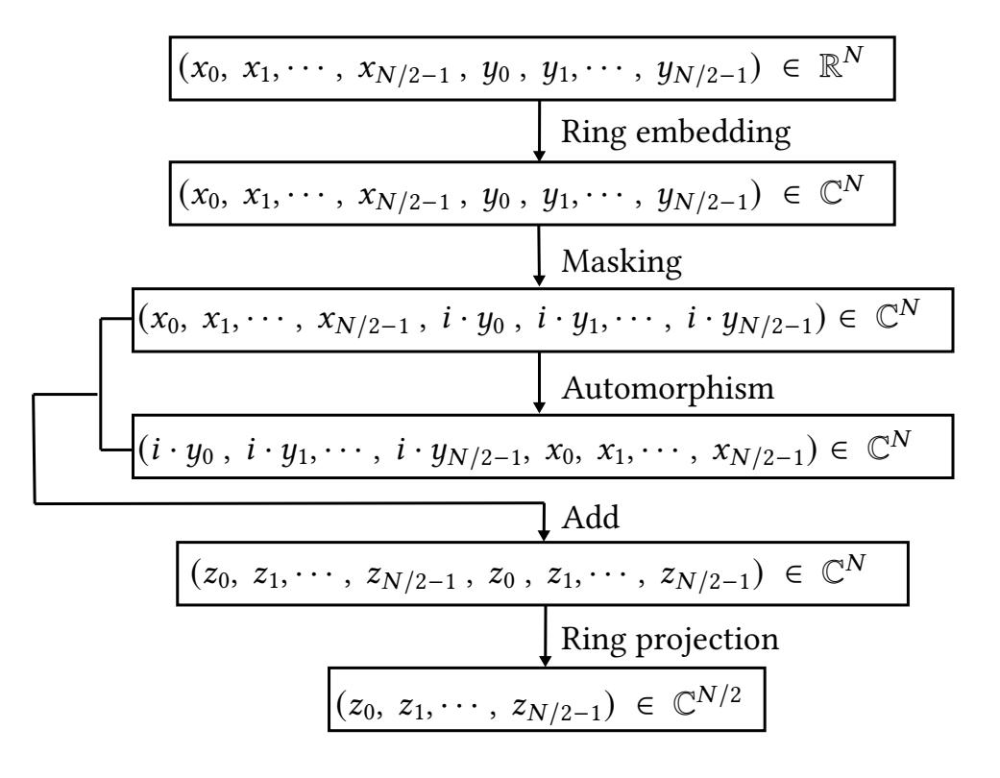
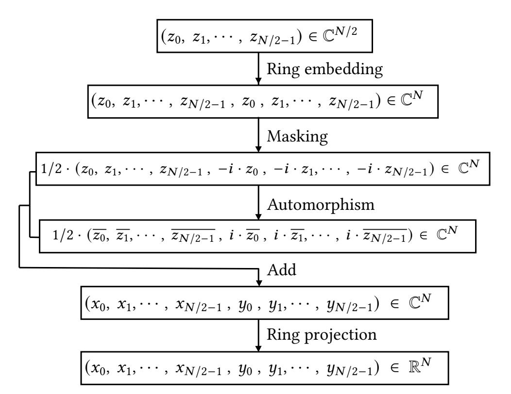
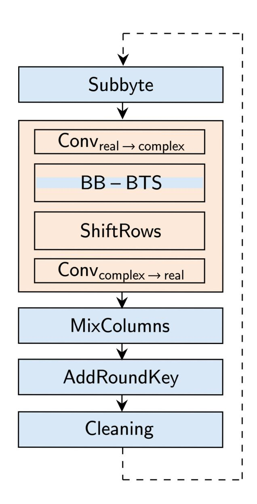
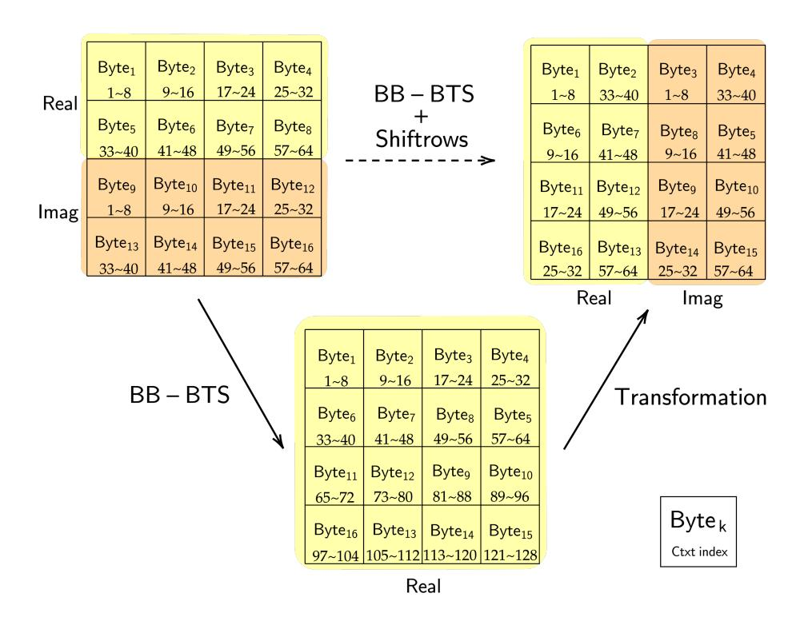
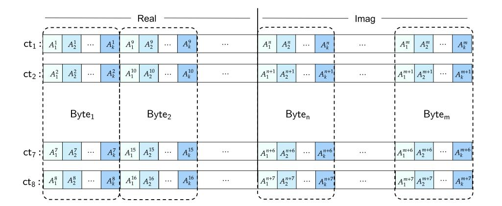
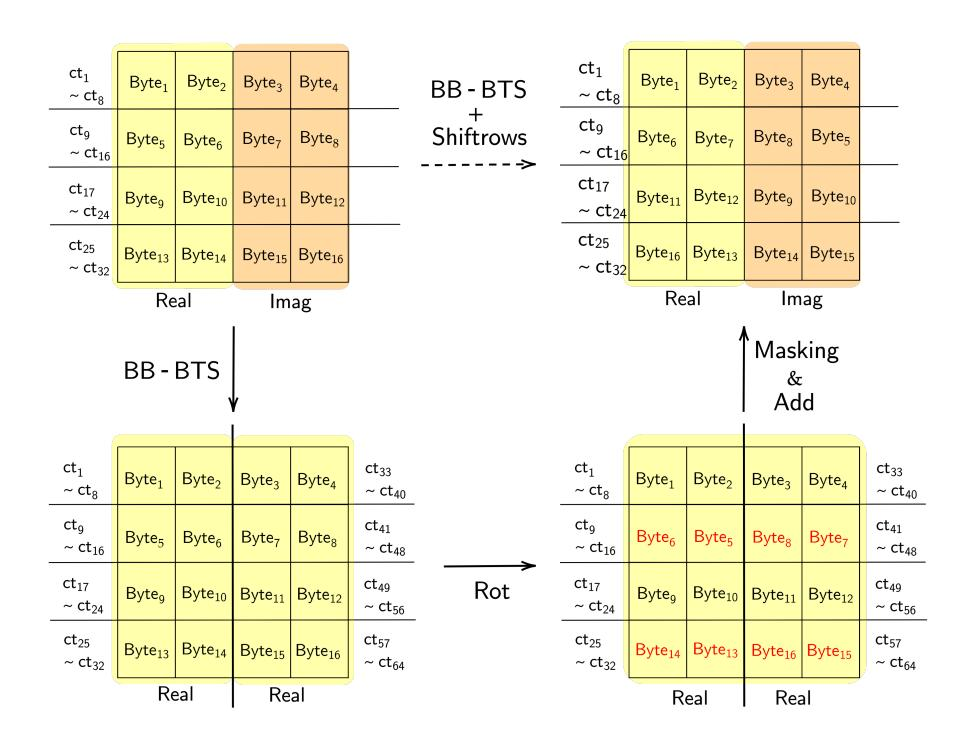
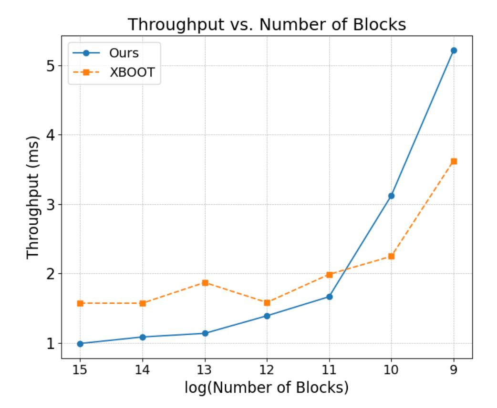

{0}------------------------------------------------

# High-Throughput AES Transciphering using CKKS: Less than 1ms

Youngjin Bae CryptoLab Inc. Seoul, Republic of Korea youngjin.bae@cryptolab.co.kr

Minsik Kang kaiser351@snu.ac.kr

Seoul National University Seoul, Republic of Korea

### **Abstract**

Fully Homomorphic encryption (FHE) allows computation without decryption, but often suffers from a ciphertext expansion ratio and overhead. On the other hand, AES is a widely adopted symmetric block cipher known for its efficiency and compact ciphertext size. However, its symmetric nature prevents direct computation on encrypted data. Homomorphic transciphering bridges these two approaches by enabling computation on AES-encrypted data using FHE-encrypted AES keys, thereby combining the compactness of AES with the flexibility of FHE.

In this work, we present a high-throughput homomorphic AES transciphering based on the CKKS scheme. Our design takes advantage of the ring conversion technique to the conjugate-invariant ring [23] during the transciphering circuit, including bootstrapping, along with a suite of optimizations that reduce computational overhead. As a result, we achieved a throughput (per-block evaluation time) of 0.994ms—less than 1ms— outperforming the state-ofthe-art [25] by 1.58× when processing  $2^{15}$  AES-128 blocks under the same implementation environment, and support processing 29 blocks within 3s on a single GPU.

### **CCS Concepts**

• Security and privacy → Public key (asymmetric) techniques.

### Keywords

Fully Homomorphic Encryption; CKKS; AES; Transciphering

### **ACM Reference Format:**

Youngjin Bae, Jung Hee Cheon, Minsik Kang, and Taeseong Kim. 2025. High-Throughput AES Transciphering using CKKS: Less than 1ms. In Proceedings of the 2025 Workshop on Applied Homomorphic Computing (WAHC '25), October 13-17, 2025, Taipei, Taiwan. ACM, New York, NY, USA, 12 pages. https://doi.org/10.1145/3733811.3767314

\*Corresponding author.

This work is licensed under a Creative Commons Attribution 4.0 International License. WAHC '25, Taipei, Taiwan

© 2025 Copyright held by the owner/author(s). ACM ISBN 979-8-4007-1900-4/25/10 https://doi.org/10.1145/3733811.3767314

Jung Hee Cheon Seoul National University CryptoLab Inc. Seoul, Republic of Korea jhcheon@snu.ac.kr

Taeseong Kim\* Seoul National University Seoul, Republic of Korea kts1023@snu.ac.kr

### Introduction 1

As data continues to grow exponentially, the need for secure data processing, particularly under strict privacy regulations such as GDPR [19] and CCPA [28], has become increasingly critical. Fully Homomorphic Encryption (FHE), which enables computation directly on encrypted data, has emerged as a promising solution in this context. Since Gentry's seminal work [21], FHE has seen significant advancements and is now gaining traction as a foundational technology for privacy-preserving Machine Learning as a Service.

A variety of FHE schemes have been proposed to support different computational models, including B/FV [10, 20] and BGV [11] for arithmetic over finite fields, DM [18]/CGGI (TFHE) [14] for bit-level operations, and CKKS for approximate arithmetic over real numbers. Among these, CKKS is particularly well-suited for large-scale real-valued data processing, as required in modern machine learning models, due to its support for single-instruction-multiple-data (SIMD) operations that enable efficient parallel computation.

The Advanced Encryption Standard (AES), standardized by NIST in 2002 [26], is a widely used symmetric-key block cipher. Its ability to produce ciphertexts without size expansion makes it ideal for secure data storage in databases, filesystems, and cloud environments. AES is also efficient across hardware and software, enabling broad use in mobile and communication systems. However, like other symmetric schemes, AES does not support computation on encrypted data. This limitation is increasingly problematic in a data-driven world, where extracting value from data often requires processing without compromising privacy.

Transciphering refers to the process of converting ciphertexts from one encryption scheme to another, allowing the advantages of both systems to be jointly leveraged. In particular, homomorphic transciphering enables computation on AES-encrypted data by decrypting it with FHE-encrypted AES keys, without revealing the plaintext or key. This technique combines the compactness and efficiency of AES with the computational capabilities of FHE, making it a promising tool for privacy-preserving applications.

Since AES operates on discrete data, early homomorphic AES transciphering approaches [22, 27, 29, 30] typically relied on schemes such as DM/CGGI and BGV, which are well-suited for such inputs. However, this direction shifted with the introduction of BLEACH [17], which demonstrated that binary circuits can be efficiently evaluated within the CKKS scheme using a newly introduced cleaning function. This breakthrough showed that CKKS could outperform

{1}------------------------------------------------

DM/CGGI in bit-level computations in terms of throughput, especially when handling large input sizes. Building on this insight, a series of works [4, 5, 15] explored and improved the efficiency of CKKS for processing discrete data, revealing its potential beyond approximate real-number computations. Subsequently, studies such as [2, 25] proposed optimized circuit designs for high-throughput homomorphic AES transciphering based on CKKS.

In this work, we propose an efficient homomorphic AES transciphering method using the CKKS scheme, with a focus on achieving high-throughput, measured as the time per AES block within the total latency. To this end, we revisit and extend a context conversion technique in Lattigo [1] between the standard CKKS ring and the conjugate-invariant ring (CI-CKKS) [23], and adapt it to our AES transciphering framework. While this conversion has been previously introduced, we refine the concrete algorithm, implement its application, and incorporate it into both the bootstrapping phase and the AES circuit to reduce computational complexity.

In addition, we present optimization techniques that complement the conversion, improving overall performance while remaining compatible with a wide range of homomorphic frameworks that rely on SIMD-style parallelism. With these enhancements, and by leveraging the progress of advanced CKKS techniques, particularly batch bits bootstrapping [5], we construct a high-throughput and practical homomorphic AES transciphering circuit. Our contributions include tailoring and orchestrating these methods into an optimized design that delivers concrete performance improvements.

As a result, our approach achieves a throughput of 0.994ms—less than 1ms— per AES block, which is 1.58× faster than the state-of-the-art CKKS-based transciphering method XBOOT [25], under the single thread CPU and a NVIDIA RTX-4090 GPU. We also present a low-latency circuit that processes 29 AES-128 blocks in just 2.67s. Furthermore, by integrating our approach with the XBOOT, we achieve a latency of 1.86s.

### 1.1 Our Contribution

We propose an efficient homomorphic AES transciphering circuit, especially for AES-CTR mode, utilizing the CKKS scheme, designed to achieve high-throughput. Our key contributions are as follows:

- Revisiting and extending CKKS to CI-CKKS Conversion: We revisit the context conversion technique between the CKKS and CI-CKKS rings introduced in Lattigo [1], originally designed to utilize the imaginary part of complex ciphertexts even when handling real-valued data. In this work, we extend the technique for use in homomorphic AES transciphering, enabling independent operations on the real and imaginary parts to effectively double the throughput. Furthermore, we refine the conversion to support its efficient integration into homomorphic operations such as bootstrapping (BTS). Specifically, we incorporate this conversion into the BTS procedure to accelerate evaluation on EvalMod, and further apply it within the AES circuit to reduce ciphertext usage and improve throughput across the entire pipeline.
- **Lazy** SubByte **evaluation**: We optimize the SubByte operation by interpreting it as a polynomial evaluation and applying *lazy* key-switching and rescaling. By postponing these costly operations, we significantly reduce their total number, thereby

- lowering the latency of SubByte, the most time-consuming component in AES circuits, and ultimately achieving higher throughput in AES transciphering.
- Packing structure for various block sizes: While much of our design emphasizes throughput, we also explore a latency-focused direction by proposing an optimized packing. This approach is designed to minimize additional homomorphic operations while fully utilizing the available slots in each ciphertext, making it particularly effective for smaller numbers of AES blocks. The technique is broadly applicable to any FHE scheme that supports SIMD.

### 1.2 Related Work

After Gentry et al. [22] first introduced homomorphic transciphering by implementing AES using lookup tables (LUTs) over the BGV scheme, numerous studies have sought to improve performance. Since AES circuits are primarily composed of LUT evaluations, most follow-up works [6, 8, 27, 29, 30] have adopted the DM/CGGI scheme, which enables efficient LUT evaluation via programmable bootstrapping. However, these schemes lack the SIMD property, and thus, their throughput degrades significantly when processing many AES blocks simultaneously.

Following the BLEACH [17], which introduced a method for handling discrete data with the CKKS scheme, the work of [2] first proposed a homomorphic AES transciphering using CKKS under GPU implementation. This work demonstrated that CKKS achieves significantly higher throughput than DM/CGGI-based methods when evaluating many AES blocks simultaneously. Subsequent studies [4, 5, 15] analyzed the internal mechanisms of CKKS to improve performance for discrete data processing, further moving beyond BLEACH's black-box use of CKKS. While [15] introduced a homomorphic AES transciphering method using LUTs on CKKS, its throughput still lags behind that of [2].

Recently, XBOOT [25] presented improved throughput results by exploiting specific characteristics of the BTS process. In their approach, the XOR operation is replaced with a homomorphic addition, and the result is recovered through a BTS evaluation, specifically, BinBoot as proposed in [4]. Since homomorphic XOR requires one level of multiplicative depth while addition does not, this substitution reduces the circuit depth. Consequently, they were able to optimize parameters such as the ring degree and gadget rank, resulting in improved latency and throughput.

While our work shares the same goal of enhancing throughput, it takes a different direction. Instead of focusing solely on circuit-level substitutions, we explore a broader design space by leveraging the algorithm of CKKS itself. In particular, we reinterpret an existing context conversion technique and extend it across our AES transciphering circuit, including during BTS. Together with lazy homomorphic operations and batching multiple-bit ciphertexts during BTS, we uncover previously overlooked optimization opportunities. Our results demonstrate that such integration leads to improvements beyond those achieved by previous approaches.

{2}------------------------------------------------

### 2 Preliminaries

### 2.1 Notations

For a power-of-two integer N, we define the ring  $\mathcal{R}_N = \mathbb{Z}[X]/(X^N+1)$  and its residue ring  $\mathcal{R}_{q,N} = \mathcal{R}_N/q\mathcal{R}_N$  for an integer  $q \geq 2$ . When the ring degree N is clear from context, we simply write  $\mathcal{R}_N$  and  $\mathcal{R}_{q,N}$  as  $\mathcal{R}$  and  $\mathcal{R}_q$ , respectively. We use ct and pt to denote a ciphertext and a plaintext, respectively. The notation log denotes the base-2 logarithm unless specified otherwise. Vectors are in bold lowercase. For  $\mathbf{z}_1 \in \mathbb{C}^n$  and  $\mathbf{z}_2 \in \mathbb{C}^m$ , we write  $\mathbf{z} = (\mathbf{z}_1, \mathbf{z}_2) \in \mathbb{C}^{n+m}$  for their concatenation.

### 2.2 Cheon-Kim-Kim-Song scheme

The Cheon-Kim-Kim-Song (CKKS) [13] scheme is one of the fully homomorphic encryption (FHE) schemes and it enables single instruction multiple data (SIMD)-style processing of encrypted data through its encoding and decoding maps, denoted as Ecd and Dcd. More precisely, we define the Discrete Fourier Transform (DFT) DFTN:  $\mathcal{R}_N \to \mathbb{C}^{N/2}$  as

$$\mathsf{DFT}_N(a(X)) = (a(\zeta^{5^j}))_{0 \le i \le N/2},$$

where  $\zeta$  is a complex (2N)-th root of unity. The inverse Discrete Fourier Transform (iDFT) is defined as the inverse of this map. For a message vector  $\mathbf{z} \in \mathbb{C}^{N/2}$  with a scaling factor  $\Delta$ , the encoding map  $\operatorname{Ecd}_N : \mathbb{C}^{N/2} \to \mathcal{R}_N$  is defined as

$$Ecd_N(\mathbf{z}) = [\Delta \cdot iDFT_N(\mathbf{z})].$$

The decoding map  $\operatorname{Dcd}_N: \mathcal{R}_N \to \mathbb{C}^{N/2}$  is defined as  $\operatorname{Dcd}_N(\mathbf{z}) = \operatorname{DFT}_N(\mathbf{z})/\Delta$ . In the CKKS scheme, each of Ecd and Dcd is processed before encryption or after decryption, respectively.

A CKKS ciphertext ct =  $(a, b) \in \mathcal{R}_{q,N}^2$  that encrypts a plaintext pt =  $\operatorname{Ecd}_N(\mathbf{z})$  for a secret key  $s \in \mathcal{R}$  satisfies the following:

$$Dec_s(ct) = a \cdot s + b \approx pt \pmod{q}$$
.

Key switching (KS) is required after homomorphic multiplication and automorphism with an appropriate switching key swk. Given a ciphertext ct encrypted under a secret key s, KS(ct, s, s') outputs a ciphertext ct' that decrypts to the same plaintext under a target secret key s', i.e.,  $Dec_{s'}(ct') \approx Dec_s(ct)$ . The switching key swk $s \mapsto s'$ , which is used to convert from s to s', is pre-generated during the key generation phase. We recall the homomorphic operations in CKKS as follows.

- Add(ct1, ct2): Given ciphertexts ct1, ct2  $\in \mathcal{R}_q^2$ , return ctadd = ct1 + ct2  $\in \mathcal{R}_q^2$ , where the underlying message corresponds to the component-wise addition of the input messages.
- Mult(ct1, ct2): Given ct1, ct2  $\in \mathcal{R}_q^2$ , return ctmult  $\in \mathcal{R}_{q'}^2$  satisfying  $\operatorname{Dec}_s(\operatorname{ct}_{\operatorname{mult}}) \approx \operatorname{Dec}_s(\operatorname{ct}_1) \cdot \operatorname{Dec}_s(\operatorname{ct}_2)/\Delta$  with  $q' \approx q/\Delta$ , where the underlying message corresponds to the componentwise multiplication of the inputs. It requires a switching key  $\operatorname{swk}_{s^2\mapsto s}$ .
- CMult(ct, pt): Given pt  $\in \mathcal{R}$  and ct  $\in \mathcal{R}_q^2$ , return  $\operatorname{ct}_{\operatorname{cmult}} \in \mathcal{R}_{q'}^2$  with  $\operatorname{Dec}_s(\operatorname{ct}_{\operatorname{cmult}}) \approx \operatorname{pt} \cdot \operatorname{Dec}_s(\operatorname{ct})/\Delta$  with  $q' \approx q/\Delta$ , resulting in the component-wise product in the message space.
- EvalAuto(ct,  $\sigma_i : X \mapsto X^i$ ): Given a ciphertext ct =  $(b, a) \in \mathcal{R}_q^2$  encrypting a plaintext pt under a secret key s = s(X), first compute  $\sigma_i(\text{ct}) = (b(X^i), a(X^i))$ , which encrypts  $\operatorname{pt}(X^i)$  under the new secret key  $\sigma_i(s) = s(X^i)$ . Then apply key switching to

- obtain  $\operatorname{ct_{auto}} = \operatorname{KS}(\sigma_i(\operatorname{ct}), \sigma_i(s), s) \in \mathcal{R}_q^2$ , which encrypts  $\operatorname{pt}(X^i)$  under the same secret key s.
- (1) Rot(ct, r): Given a ct  $\in \mathcal{R}_q^2$  that encrypts a message vector  $\mathbf{z} = (z_i)_{0 \leq i < N/2} \in \mathbb{C}^{N/2}$  and an integer r > 0, return EvalAuto(ct,  $\sigma_{5r}$ ) that encrypts a message Rot( $\mathbf{z}, r$ ) =  $(z_r, \ldots, z_{N/2-1}, z_0, \ldots, z_{r-1})$ . The rotation index r acts modulo N/2.
- (2) Conj(ct): Given a ct  $\in \mathcal{R}^2_{q,N}$  that encrypts a message  $\mathbf{z} = (z_i)_{0 \le i < N/2} \in \mathbb{C}^{N/2}$ , return EvalAuto(ct,  $\sigma_{-1}$ )  $\in \mathcal{R}^2_q$  that encrypts a message  $\bar{\mathbf{z}} = (\bar{z}_i)_{0 \le i < N/2}$ .
- 2.2.1 Bootstrapping (BTS). BTS restores the modulus budget by taking a ciphertext with a small modulus and outputting a refreshed ciphertext at a larger modulus, while approximately preserving the original plaintext. The procedure consists of the following steps.
- (1) **Slots-To-Coefficients** (STC): Given a ciphertext encrypting a message z in its slots, STC converts it to a ciphertext encrypting  $z(X) \in \mathcal{R}$  whose coefficients correspond to entries of z. This can be interpreted as a homomorphic evaluation of DFT.
- (2) **Modulus Raising** (ModRaise): Given a ciphertext at base modulus  $q_0$ , we embed it to  $\mathcal{R}_Q^2$  with a larger modulus  $Q \gg q_0$ . Resulting in a ciphertext decrypting to  $z(X) + q_0 \cdot I(X)$  modulo Q, where I(X) is an integer polynomial with small coefficients.
- (3) **Coefficients-To-Slots** (CTS): We convert a ciphertext that encrypts a polynomial plaintext  $z(X) + q_0 \cdot I(X)$  into a ciphertext encrypting a vector  $\mathbf{z} + q_0 \cdot \mathbf{I}$  whose entries are the coefficients of  $z(X) + q_0 \cdot I(X)$ . This can be interpreted as a homomorphic evaluation of iDFT.
- (4) **Modular Reduction** (EvalMod): We homomorphically evaluate the modulo- $q_0$  function to remove the  $q_0 \cdot \mathbf{I}$  term in slots. This can be achieved by a polynomial approximation to the  $x \mapsto \frac{q_0}{2\pi} \cdot \sin\left(\frac{2\pi}{q_0}x\right)$ .
- 2.2.2 CKKS over conjugate-invariant ring (CI-CKKS). The standard CKKS scheme encodes complex data into plaintexts via the Ecd map. However, when the target data is real-valued, the imaginary components of the encoded ciphertext remain unused, wasting nearly half of the available slot capacity.

To address this inefficiency, [23] proposes a CKKS variant based on the conjugate-invariant ring, which supports real-number arithmetic without increasing the security level or computational cost. By avoiding the encoding of unused imaginary parts, it effectively doubles the throughput for real inputs. For a power-of-two integer N, we define the conjugate invariant ring as

$$\tilde{\mathcal{R}}_N = \{ a(X) \in \mathcal{R}_N : a(X) = a(X^{-1}) \}.$$

Each element in  $\tilde{\mathcal{R}}_N$  can be uniquely written as

$$a(X) = a_0 + \sum_{j=1}^{N/2-1} a_j (X^j + X^{-j})$$

for some integer  $a_0, \ldots, a_{N/2-1}$ . The image of  $\tilde{\mathcal{R}}_N$  under the encoding map Ecd is exactly  $\mathbb{R}^{N/2}$  not  $\mathbb{C}^{N/2}$ , establishing a one-to-one correspondence between  $\tilde{\mathcal{R}}_N$  and the real message space  $\mathbb{R}^{N/2}$ .

In this paper, we refer to the CKKS variant operating under the *real context* as CI-CKKS, in contrast to the original complex context scheme. CI-CKKS improves efficiency by avoiding unnecessary encoding of imaginary parts, while preserving the cryptographic

{3}------------------------------------------------

guarantees of the original scheme. We refer to [23] for an algebraic background of CI-CKKS and its security proof.

2.2.3 CKKS over discrete data. Following the BLEACH [17], an initial attempt to evaluate bit data using the CKKS scheme, more optimized methods have been proposed for handling discrete data types in CKKS [4, 5]. BLEACH showed that symmetric binary gate operations can be emulated using arithmetic over real numbers. BLEACH emulates binary gates using arithmetic; for instance, the XOR gate can be expressed as  $x \oplus y = (x-y)^2$ . To improve precision when operating over discrete data, BLEACH applies a cleaning function  $h(x) = 3x^2 - 2x^3$ , which satisfies  $h(b+\epsilon) = b + O(\epsilon^2)$  for  $b \in \{0,1\}$  with error  $|\epsilon| \ll 1$ .

While BLEACH treated CKKS BTS as a black box for binary gate evaluation, [4] introduced BinBoot by explicitly optimizing the internal EvalMod procedure for bit-oriented inputs. This approach reduces modulus consumption and provides inherent error cleaning, resulting in a more efficient alternative to the original method. Although CKKS was originally designed for real or complex values, its SIMD property enables efficient parallel processing of bit data, often surpassing CGGI in throughput for large-scale applications, despite CGGI being tailored for discrete inputs.

More recently, the authors in [5] propose a small-integer bootstrapping algorithm, SI-BTS, for ciphertexts encrypting small integers (e.g., 8 bits). After STC and ModRaise for a ciphertext encoding  $\mathbf{m} \in \mathbb{Z}_t^{N/2}$  where  $\mathbb{Z}_t = \mathbb{Z} \cap [0,t)$ , SI-BTS replaces EvalMod with EvalExp, which homomorphically evaluates  $x \mapsto e^{2\pi i x}$ . For each slot, it sends m/t + I to

$$\exp\left(2\pi i\left(\frac{m}{t}+I\right)\right) = \exp\left(2\pi i\frac{m}{t}\right).$$

SI-BTS then evaluates a polynomial interpolation over roots of unity suggested in [15], which maps  $\exp(2\pi i \frac{m}{t})$  to m for each slot.

2.2.4 Batch bits bootstrapping (BB-BTS). In [5], the authors proposed the batch bits bootstrapping (BB-BTS) algorithm, which enables simultaneous bootstrapping of multiple ciphertexts, each encrypting a vector of bit messages. For k ciphertexts  $\operatorname{ct}_0, \ldots, \operatorname{ct}_{k-1}$  of the above form, BB-BTS evaluates  $(b_0, \ldots, b_{k-1}) \mapsto \sum_j 2^j b_j$  homomorphically, resulting in a single ciphertext encoding  $\mathbf{z} \in \mathbb{Z}_t^{N/2}$  for  $t = 2^k$ . The algorithm then invokes the SI-BTS pipeline applying EvalExp  $\circ$  CTS  $\circ$  ModRaise  $\circ$  STC, and finally homomorphically evaluates the following polynomial interpolation:

$$\exp\left(2\pi i \frac{\sum_{j=0}^{k-1} 2^j b_j}{2^k}\right) \mapsto \{b_j\}_{0 \le j < k}.$$

Since interpolation over roots of unity is known to yield stable and efficient performance [15], leveraging BB-BTS significantly reduces the overhead of BTS compared to performing on each ciphertext individually. BB-BTS is used to evaluate multiple BTS in parallel within our circuit, requiring 128 ciphertexts for evaluation.

### 2.3 Advanced Encryption Standard

AES operates on fixed-size 128-bit blocks and supports key sizes of 128, 192, or 256 bits. The number of encryption rounds, 10, 12, or 14, is determined by the key size, with each round consisting of the operations SubByte, ShiftRows, MixColumns, and AddRoundKey. The final round omits the MixColumns step.

Among various AES modes such as ECB, CBC, CTR, and GCM, we focus on the CTR (Counter) mode in this paper. CTR mode is particularly attractive for parallel processing because each block is processed independently. Furthermore, it uses the same procedure for both encryption and decryption, making it symmetric in operation. These properties make CTR mode well-suited for efficient homomorphic AES transciphering under the CKKS scheme, which inherently supports SIMD-style parallel computation.

- 2.3.1 Homomorphic AES transciphering evaluations. Here, we assume that we use *bit-wise* packing: to encrypt 128 bit data, we need 128 ciphertexts and encrypt each bit of data into the same slot position. And, the overall AES transciphering follows circuit flow in a similar direction to [2]:
- (1) SubByte: This is a nonlinear operation that replaces 1 byte of data with a predefined 1-byte lookup value. As [2], we evaluate SubByte in a bit-wise homomorphic manner. A more optimized approach will be explained in Section 4.
- (2) ShiftRows: This transposition step cyclically shifts each matrix row in a predefined order. Since bit-wise packing is used, this operation is implemented by adjusting the vector indices.
- (3) MixColumns: This linear mixing operation processes each matrix column by combining its four bytes. In the context of homomorphic AES-CTR mode, this can be implemented using XOR operations and bit shifting, as suggested in [2].
- (4) AddRoundKey: Each byte is XORed with the corresponding byte from the pre-generated round key. This step is performed as a homomorphic XOR operation.
- (5) Cleaning: Each ciphertext is evaluated a cleaning function h(x) at last per round to preserve message precision.

Here, we insert BB-BTS in the position of BTS, originally intended in [2], that is between SubByte and ShiftRows. The outline of our model can be seen in Figure 3.

# 3 Revisit Conversion Between CKKS and CI-CKKS

As the CKKS scheme natively supports polynomial operations, bitwise operations must be expressed as polynomials to be processed within the scheme. However, these representations often fail to fully leverage the computational advantages of complex-number arithmetic, since both the approximating polynomials and input data are typically confined to real values. This limitation makes complex-valued computations less efficient than their real-valued counterparts. To address this, adopting the CI-CKKS variant is preferable for achieving higher throughput.

To fully utilize both bit-level operations over CI-CKKS and the BB-BTS mechanism, efficient conversion between CKKS and CI-CKKS is essential. Although such conversion algorithms have already been proposed in Lattigo [1], we conducted a detailed analysis of these techniques to implement them within the HEaaN library [16]. This reinterpretation not only allowed us to faithfully reimplement the conversions but also to integrate them into our AES transciphering circuit, including their application to the optimized BB-BTS procedure, as described in the next section.

In this section, we denote the indeterminate in  $\mathcal{R}_N = \mathbb{Z}[X_N]/(X_N^N + 1)$  by  $X_N$ , and the one in  $\mathcal{R}_{2N} = \mathbb{Z}[X_{2N}]/(X_{2N}^{2N} + 1)$  and  $\tilde{\mathcal{R}}_{2N}$  by

{4}------------------------------------------------

 $X_{2N}$  for clarity. Define a ring homomorphism  $\iota:\mathcal{R}_N\to\mathcal{R}_{2N}$  by  $\iota(X_N)=X_{2N}^2$ . The image  $\iota(\mathcal{R}_N)$  is a subring of  $\mathcal{R}_{2N}$  generated by  $X_{2N}^2$ . For a secret vector  $\mathbf{s}=(s_0,s_1,\cdots,s_{N-1})\in\mathbb{Z}^N$ , we denote  $s=\sum_{j=0}^{N-1}s_jX_N^j\in\mathcal{R}_N$ , and  $\tilde{s}=s_0+\sum_{j=1}^{N-1}s_j(X_{2N}^j+X_{2N}^{-j})\in\tilde{\mathcal{R}}_{2N}$ , respectively.

### 3.1 Format conversion: CI-CKKS to CKKS

We analyze the conversion algorithm from the CI-CKKS to CKKS. The input ciphertext  $\operatorname{ct} = (b,a) \in \tilde{\mathcal{R}}_{2N}^2$  is a CI-CKKS ciphertext encrypting a real vector  $\mathbf{x} = (x_0,x_1,\cdots,x_{N/2-1},y_0,y_1,\cdots,y_{N/2-1}) \in \mathbb{R}^N$ , with a secret key  $\tilde{s} \in \tilde{\mathcal{R}}_{2N}$ . The goal of the conversion is to generate a CKKS ciphertext encrypting the complex-packed message  $\mathbf{z} = (z_0,z_1,\cdots,z_{N/2-1}) \in \mathbb{C}^{N/2}$ , where  $z_j = x_j + i \cdot y_j$ , with a secret key  $s \in \mathcal{R}_N$ . The algorithm consists of five steps as below, requiring one multiplicative depth and a KS. The messages encrypted in the ciphertexts of each step are depicted in Figure 1.

(1) **Ring embedding**: Embed the input ciphertext ct = (b, a) into  $\mathcal{R}_{2N}$ . This step is simply treating the components of ct as elements of  $\mathcal{R}_{2N}$ . Assuming we use the same roots of unity for DFT in both  $\tilde{\mathcal{R}}_{2N}$  and  $\mathcal{R}_{2N}$ , the resulting ciphertext ct1 =  $(b_1, a_1) \in \mathcal{R}_{2N}^2$  still encrypts the same message  $\mathbf{x}$ , but on complex slots.

$$\operatorname{Dcd}_{2N} \circ \operatorname{Dec}_{\tilde{s}}(\operatorname{ct}_1) = \mathbf{x}.$$

(2) **Masking**: Compute  $\operatorname{ct}_2 = \operatorname{CMult}(\operatorname{ct}_1, \operatorname{pt}_1)$  where  $\operatorname{pt}_1 \in \mathcal{R}_{2N}$  encodes a message  $\operatorname{m}_1 = (1^{N/2}, i^{N/2}) \in \mathbb{C}^N$ . Then  $\operatorname{ct}_2$  encrypts  $\mathbf{x} \odot \operatorname{m}_1 = (x_0, x_1, \cdots, x_{N/2-1}, i \cdot y_0, i \cdot y_1, \cdots, i \cdot y_{N/2-1})$ .

$$\operatorname{Dcd}_{2N} \circ \operatorname{Dec}_{\tilde{s}}(\operatorname{ct}_2) = \mathbf{x} \odot \mathsf{m}_1.$$

(3) **Key-switching**: Switch the secret key from  $\tilde{s}$  to  $\iota(s)$  using key switching, where  $\iota(s)$  is a secret key over  $\iota(\mathcal{R}_N)$  satisfying  $\iota(s) = \sum_{j=0}^{N-1} s_j X_{2N}^{2j}$ . The resulting ciphertext  $\operatorname{ct}_3 = \operatorname{KS}(\operatorname{ct}_2, \tilde{s}, \iota(s))$  satisfies

$$\operatorname{Dcd}_{2N} \circ \operatorname{Dec}_{\iota(s)}(\operatorname{ct}_3) = \mathbf{x} \odot \mathsf{m}_1.$$

(4) **Evaluate automorphism**: Compute  $\operatorname{ct}_4 = (\sigma(b_3), \sigma(a_3))$ , where  $\sigma = \sigma_{2N+1}$  is the automorphism on  $\mathcal{R}_{2N}$  defined by  $\sigma(X_{2N}) = X_{2N}^{2N+1}$ . This corresponds to the N/2-rotation for CKKS/CI-CKKS ciphertexts, since  $X_{2N}^{2N+1} = X_{2N}^{5^{N/2}}$ . Note that the secret key  $\iota(s)$  is  $\sigma$ -invariant,  $\operatorname{ct}_4$  is an encryption of N/2-rotated message  $\operatorname{Rot}(\mathbf{x} \odot \mathsf{m}_1, N/2) = (i \cdot y_0, i \cdot y_1, \cdots, i \cdot y_{N/2-1}, x_0, x_1, \cdots, x_{N/2-1})$  with the same secret key  $\iota(s)$ .

$$\operatorname{Dcd}_{2N} \circ \operatorname{Dec}_{\iota(s)}(\operatorname{ct}_4) = \operatorname{Rot}(\mathbf{x} \odot \mathsf{m}_1, N/2).$$

(5) Add & Ring projection: Compute  $\operatorname{ct_{tmp}} = \operatorname{Add}(\operatorname{ct_3}, \operatorname{ct_4}) = (b_{\operatorname{tmp}}, a_{\operatorname{tmp}}) \in \mathcal{R}_{2N}^2$ . The ciphertext  $\operatorname{ct_{tmp}}$  encrypts  $\mathbf{x} \odot \operatorname{m_1} + \operatorname{Rot}(\mathbf{x} \odot \operatorname{m_1}, N/2) = (\mathbf{z}, \mathbf{z}) \in \mathbb{C}^N$  with the secret key  $\tilde{s}'$ . Note that  $b_{\operatorname{tmp}} = b_3 + b_4 = b_3 + \sigma(b_3)$  and  $a_{\operatorname{tmp}} = a_3 + a_4 = a_3 + \sigma(a_3)$  are  $\sigma$ -invariant, thus they are elements of  $\iota(\mathcal{R}_N)$ . Therefore, there exists  $b_{res}, a_{res} \in \mathcal{R}_N$  such that  $\iota(b_{res}) = b_{\operatorname{tmp}}$  and  $\iota(a_{res}) = a_{\operatorname{tmp}}$ . In other words, all coefficients of the polynomials  $b_{\operatorname{tmp}}, a_{\operatorname{tmp}}$  are zero except for those of even-degree terms, and we can pick the non-zero (even-degree) coefficients to form the degree N polynomials  $b_{res}$  and  $a_{res}$ . The decrypted polynomial  $\tilde{m}(X_{2N}) = \operatorname{Dec}_{\tilde{s}'}(\operatorname{ct_{tmp}}) \in \iota(\mathcal{R}_N)$  is also  $\sigma$ -invariant. If we let  $\iota(m) = \tilde{m}$  where  $m \in \mathcal{R}_N$ , then

 $\tilde{m}(\zeta_{2N}^{5^j}) = m(\zeta_N^{2 \cdot 5^j})$  for  $0 \le j < N/2$ . Thus, the resulting  $\operatorname{ct}_{res} = (b_{res}, a_{res}) \in \mathcal{R}_N^2$  encrypts **z** with secret key *s*.

$$\operatorname{Dcd}_N \circ \operatorname{Dec}_s(\operatorname{ct}_{res}) = \mathbf{z}.$$

Figure 1: Conversion from CI-CKKS over the ring  $\mathcal{R}_{2N}$  to standard CKKS over the ring  $\mathcal{R}_N$ , where both rings provide the same slot capacity N. Each step illustrates the transformation of the encoded message.

### 3.2 Format conversion: CKKS to CI-CKKS

After level recovery and digit extractions via BB-BTS, we switch back to the CI-CKKS to increase throughput for the remaining AES circuits. The conversion process converts an input ciphertext  $ct = (b, a) \in \mathcal{R}_N^2$  with a secret key s to  $ct_{res} = (b_{res}, a_{res}) \in \tilde{\mathcal{R}}_{2N}^2$  with  $\tilde{s}$ . The messages encrypted in the ciphertexts of each step are depicted in Figure 2.

(1) **Ring embedding**: Embed the input ciphertext ct into  $\mathcal{R}_{2N}$  via  $\iota$ . The resulting ciphertext ct1 =  $(b_1, a_1) = (\iota(b), \iota(a))$  is an encryption of  $(\mathbf{z}, \mathbf{z}) \in \mathbb{C}^N$  with the embedded secret key  $\iota(s) \in \mathcal{R}_{2N}$ .

$$\operatorname{Dcd}_{2N} \circ \operatorname{Dec}_{\iota(s)}(\operatorname{ct}_1) = (\mathbf{z}, \mathbf{z}).$$

(2) **Key-switching**: Switch the secret key from  $\iota(s) \in \mathcal{R}_{2N}$  to  $\tilde{s} \in \tilde{\mathcal{R}}_{2N}$  using key-switching. The resulting ciphertext  $\operatorname{ct}_2 = (b_2, a_2)$  is an encryption of  $(\mathbf{z}, \mathbf{z})$  with the secret key  $\tilde{s}$ .

$$\mathsf{Dcd}_{2N} \circ \mathsf{Dec}_{\tilde{s}}(\mathsf{ct}_2) = (\mathbf{z}, \mathbf{z}).$$

(3) **Masking**: Compute  $ct_3 = CMult(ct_2, pt_2)$  where  $pt_2 \in \mathcal{R}_{2N}$  encodes a message  $m_2 = ((1/2)^{N/2}, (-i/2)^{N/2}) \in \mathbb{C}^N$ . The  $ct_3 = (b_3, a_3)$  encrypts  $(\mathbf{z}, \mathbf{z}) \odot m_2 = (z_0/2, z_1/2, \cdots, z_{N/2-1}/2, -i \cdot z_0/2, -i \cdot z_1/2, \cdots, -i \cdot z_{N/2-1}/2)$ .

$$\mathsf{Dcd}_{2N} \circ \mathsf{Dec}_{\tilde{s}}(\mathsf{ct}_3) = (\mathbf{z}, \mathbf{z}) \odot \mathsf{m}_2 = \mathbf{w}.$$

(4) **Evaluate automorphism**: Compute  $\operatorname{ct}_4 = (\sigma(b_3), \sigma(a_3))$  where  $\sigma = \sigma_{-1}$  is the automorphism on  $\mathcal{R}_{2N}$  such that  $\sigma(X_{2N}) = X_{2N}^{-1}$ . The automorphism  $\sigma$  is the conjugation on slots. Since

{5}------------------------------------------------

the secret key  $\tilde{s}$  is an element of  $\tilde{\mathcal{R}}_{2N}$ , it is  $\sigma$ -invariant. Therefore,  $\operatorname{ct}_4$  is an encryption of  $\bar{\mathbf{w}}$  where  $\mathbf{w} = (\mathbf{z}, \mathbf{z}) \odot \mathsf{m}_2$ , with the secret key  $\tilde{s}$ .

$$\operatorname{Dcd}_{2N} \circ \operatorname{Dec}_{\tilde{s}}(\operatorname{ct}_4) = \overline{\mathbf{w}}.$$

(5) **Add & Ring projection**: Compute  $\operatorname{ct_{tmp}} = \operatorname{Add}(\operatorname{ct}_3,\operatorname{ct}_4) = (b_{\operatorname{tmp}},a_{\operatorname{tmp}}) \in \mathcal{R}^2_{2N}$ . The ciphertext  $\operatorname{ct_{tmp}}$  encrypts  $\mathbf{w} + \overline{\mathbf{w}} = \mathbf{x} \in \mathbb{C}^N$  with the secret key  $\tilde{s}$ . Note that  $b_{\operatorname{tmp}} = b_3 + \sigma(b_3), a_{\operatorname{tmp}} = a_3 + \sigma(a_3)$  are  $\sigma$ -invariant i.e., they are elements of  $\tilde{\mathcal{R}}_{2N}$ . Therefore, one can treat the ciphertext  $\operatorname{ct_{tmp}} \in \mathcal{R}^2_{2N}$  as  $\operatorname{ct}_{res} \in \tilde{\mathcal{R}}^2_{2N}$ . In implementation, this step is extracting N coefficients from  $b_{\operatorname{tmp}}, a_{\operatorname{tmp}}$  to form  $b_{res}, a_{res}$ .

$$\operatorname{Dcd}_{2N} \circ \operatorname{Dec}_{\tilde{s}}(\operatorname{ct}_{res}) = \mathbf{x}.$$

Figure 2: Conversion from standard CKKS over the ring  $\mathcal{R}_N$  to CI-CKKS over the ring  $\tilde{\mathcal{R}}_{2N}$ 

### 4 Application to AES transciphering

In this section, we present optimizations for AES circuit evaluation based on context conversion. By incorporating conversions into the BB-BTS procedure, which constitutes a substantial portion of the overall evaluation time (see Table 6), we achieve notable performance improvements. Extending context conversion across the entire AES circuit further enhances throughput, as all AES operations can be executed in the real context, halving the number of required input ciphertexts and yielding up to a 2× theoretical improvement.

However, the actual performance gain does not reach the theoretical limit due to scheduling and execution characteristics of the underlying hardware. As this gap stems from hardware-specific behavior rather than algorithmic constraints, we omit a detailed analysis here.

### 4.1 Optimizing BB-BTS using Conversions

Typically, BTS is performed by combining two real ciphertexts into one complex ciphertext, allowing the STC, ModRaise, and CTS steps to be executed jointly on a single complex ciphertext. This strategy effectively halves the cost of these steps compared to processing each real ciphertext independently. However, this cost-saving does not extend to EvalMod. In practice, EvalMod must still be applied separately to the ciphertexts holding the real and imaginary parts.

Our key observation is that both ciphertexts contain only real values. Therefore, we apply context conversion from complex to real, allowing EvalMod to be evaluated within the CI-CKKS framework. As a result, we reduce the number of trigonometric polynomial evaluations by half, improving the overall efficiency of BTS.

During BB-BTS, especially EvalExp, we can also take advantage of the conversions by reducing the number of trigonometric evaluations. Since our goal is to generate roots of unity for efficient digit extraction in BB-BTS, the input to EvalExp is a complex number of the form  $2\pi i \frac{M}{2^k}$ . By Euler's formula, this can be expressed as:

$$\exp(2\pi i K x) = \cos(2\pi K x) + i \cdot \sin(2\pi K x),$$

where  $K = \frac{M}{2^k}$ . Thus, we can reduce the number of trigonometric evaluations by half with the conversions.

4.1.1 Context conversions before and after EvalExp. We proceed by converting the input of EvalExp from the complex to the real context. After evaluation, since the output of EvalExp needs to be a complex number, we convert the result back to the complex context to make a suitable input for the subsequent digit extraction in BB-BTS.

More precisely, after the CTS step, each ciphertext slot stores a complex number, with the real and imaginary parts representing distinct values. We then switch to CI-CKKS, which reduces the number of trigonometric function evaluations by half and enables more efficient computation. Without this strategy, evaluating a complex ciphertext in BB-BTS would require separate cosine and sine evaluations for both the real and imaginary components, resulting in four function calls. By converting to the real context, this is reduced to two, improving both latency and throughput. After the evaluation, we switch back to the complex context to generate the corresponding roots of unity, which are used as interpolation points for digit extraction, as described in [5].

It is worth noting that if the interpolation method allows real-valued interpolation points, returning to the complex context is unnecessary. In this case, the circuit of EvalExp can remain in the real context, and its output can be directly consumed by subsequent AES circuits that also operate in the real context. This context-aware strategy reduces the need for context conversion, which involves homomorphic operations, thereby accelerating the evaluation.

The complete algorithm for our optimized BB-BTS procedure, including context conversions, is provided in Algorithm 1, where  $Conv_{A\rightarrow B}$  denotes a context conversion from A to B, and its performance impact is summarized in Table 3, where ShiftRows is positioned before conversion to complex context, this reason will be explained in the following Section 4.2

{6}------------------------------------------------

# Algorithm 1 BB-BTS with context conversions Input: Ciphertext ct Output: Ciphertexts $ct_{real}$ , $ct_{imag}$ 1: $ct_1 \leftarrow CTS \circ ModRaise \circ STC$ (ct) $\triangleright$ Step 1: Evaluate BTS before EvalExp 2: $ct_2 \leftarrow Conv_{complex \rightarrow real}(ct_1)$ $\triangleright$ Step 2: Conversion from complex to real context 3: $ct_{cos} \leftarrow EvalCos$ ( $ct_2$ ) 4: $ct_{sin} \leftarrow EvalSine$ ( $ct_2$ ) $\triangleright$ Step 3: Evaluate trigonometric function over real context 5: $ct'_{cos} \leftarrow Conv_{real \rightarrow complex}(ct_{cos})$ 6: $ct'_{sin} \leftarrow Conv_{real \rightarrow complex}(ct_{sin})$ $\triangleright$ Step 4: Conversion from real to complex context 7: $ct^{real}_{cos} \leftarrow (ct'_{cos} + Conj(ct'_{cos}))/2$ 8: $ct^{imag}_{cos} \leftarrow CMult((Conj(ct'_{cos}) - ct'_{cos}), i)/2$ 9: $ct^{real}_{sin} \leftarrow (ct'_{sin} + Conj(ct'_{sin}))/2$ 10: $ct^{imag}_{sin} \leftarrow CMult((Conj(ct'_{sin}) - ct'_{sin}), i)/2$ $\triangleright$ Step 5: Extract real and imaginary parts

### 4.2 **AES Circuits over CI-CKKS**

11:  $ct_{real} \leftarrow ct_{cos}^{real} + CMult(ct_{sin}^{real}, i)$ 12:  $ct_{imag} \leftarrow ct_{cos}^{imag} + CMult(ct_{sin}^{imag}, i)$ 

When designing an efficient homomorphic AES pipeline, we observe that most of the AES circuit can be evaluated in the real context. This enables significant improvements in throughput by reducing the number of ciphertexts required during evaluation. For instance, given a circuit encrypted into 128 ciphertexts, only 64 ciphertexts need to be processed.

As discussed in the previous section, both the input and output of BB-BTS reside in the complex context. However, since the surrounding AES circuits are better evaluated in the real context, we insert additional context conversion steps around BB-BTS to fit the context. Specifically, we convert the ciphertext from real to complex context before entering BB-BTS, and convert it back to the real context afterward. This conversion flow is the reverse of the internal conversions within BB-BTS. While these conversions introduce additional homomorphic operations, in terms of we can get about 2× more throughput, this can be minor. The complete circuit, including these conversions, is shown in Figure 3.

4.2.1 Packing-aware transformation using BB-BTS output. For SubByte and AddRoundKey operations, which are applied independently to each slot, we don't need to consider the data order in the bit-wise packing. On the other hand, for ShiftRows and MixColumns, which depend on the relative ordering of blocks, we need to consider the packing order; that is, we may require an additional KS operation for those operations to fit the slot position of data.

Instead of evaluating homomorphic operations to make a corresponding order for those steps, we propose a strategy that leverages the intermediate structure of the BB-BTS procedure. By carefully

Figure 3: Overall AES evaluation flow, incorporating context conversions and the BB-BTS operation. The ShiftRows is directly applied to the output of BB-BTS, as described in Section 4.2.1. The entire flow is repeated according to the number of rounds determined by the AES key size. Operations in the real and complex contexts are highlighted in blue and orange, respectively.

designing the packing layout by positioning the outputs of BB-BTS, we can implement ShiftRows and further organize the data for efficient evaluation of MixColumns.

More precisely, during the BB-BTS process, bit extraction produces two ciphertexts for each input: one containing the real part and the other containing the imaginary part [5]. We then immediately rearrange the extracted bits according to the block order required by ShiftRows, following the same approach as in the conventional bit-wise packing method.

Since the AES circuit is evaluated in CI-CKKS, the placement of real and imaginary values must be aligned with the ordering required by MixColumns during the context conversion. For example, in the MixColumns operation, bytes 1, 5, 9, and 13 of each AES block need to be processed together, which requires that these bytes be placed in the same slot after the conversion. Therefore, when merging the two real ciphertexts into a single complex ciphertext after BB-BTS to do context conversion, we design the packing so that the bytes within each AES block column are mapped to the same slots in CI-CKKS.

{7}------------------------------------------------

Figure 4: The resulting ciphertexts are in the ShiftRows form and are prepared for efficient subsequent MixColumns by aligning column-wise bytes in the same slot via Transformation.

Figure 4 illustrates the overall flow and the corresponding changes in the packing structure. Here, the resulting ciphertext is converted to the ShiftRows format while its slots are arranged to prepare for MixColumns. This step both realizes ShiftRows and establishes an appropriate packing layout for the subsequent MixColumns operation.

### 5 Further Optimizations

This section suggests additional optimizations. For the homomorphic evaluation of SubByte, which is the main performance bottleneck in the AES circuit aside from BB-BTS (see Table 6), we express the operation as a polynomial with many monomials and apply lazy relinearization and lazy rescaling [7, 12, 24]. Deferring these costly steps until the latest possible moment helps reduce overall computational complexity by minimizing the number of those operations. We also introduce a compact packing scheme that preserves high throughput even when fewer than 215 AES blocks are processed, thereby minimizing the number of ciphertexts required.

### **5.1 Homomorphic** SubByte **Evaluation**

We begin by revisiting the homomorphic SubByte evaluation method under bit-wise packing. We then propose an optimization strategy to enhance efficiency. Since the SubByte operation involves the largest number of FHE operations among all AES components, optimizing this part can significantly enhance overall throughput.

5.1.1 Revisiting bit-wise LUT evaluation. In [2], the authors evaluate an LUT with the following: for the x-th table value  $v_x$ ,

$$v_x = (\overline{x_{\log(n-1)}} \cdot \overline{x_{\log(n-2)}} \cdot \cdot \cdot \overline{x_1} \cdot x_0) \cdot v_0$$

$$+ (\overline{x_{\log(n-1)}} \cdot \overline{x_{\log(n-2)}} \cdot \cdot \cdot x_1 \cdot \overline{x_0}) \cdot v_1$$

$$+ \cdot \cdot \cdot$$

$$+ (x_{\log(n-1)} \cdot x_{\log(n-2)} \cdot \cdot \cdot x_1 \cdot x_0) \cdot v_n$$

, where  $v_j$  denotes j-th LUT elements and  $\overline{x_j} = 1 - x_j$  for  $x_j \in \{0, 1\}$ . This expression can be reformulated as a polynomial with n monomials, composed of combinations such as  $1, x_0, \dots, x_{\log(n-1)}$ , and  $x_0x_1 \dots x_{\log(n-1)}$ :

$$v_x = v_0 + (v_1 - v_0) \cdot x_0 + (v_2 - v_0) \cdot x_1 + (v_4 - v_0) \cdot x_2 + \cdots$$

Since the coefficients of this polynomial correspond to pre-defined LUT values, they can be precomputed in advance. As a result, LUT evaluation is reduced to evaluating a polynomial with 255 terms. In the context of leveled FHE schemes, this requires an evaluation strategy that minimizes level consumption while enabling efficient polynomial computation.

5.1.2 Optimal level usage for monomial generation. Although the SubByte operation can be represented as a polynomial with 255 terms, its structure consists of multiple monomials rather than a single indeterminate. As a result, the required multiplicative depth is 3, not 8, which would be needed for evaluating a degree-255 polynomial in a single variable. To achieve this, the key strategy is to construct higher-degree monomials by combining existing monomials that are at similar levels. For example, to generate the monomial  $x_1x_2x_3x_4$ , we choose to multiply  $x_1x_2$  and  $x_3x_4$ , rather than  $x_1x_2x_3$  and  $x_4$ , since the former pair has more balanced levels. This strategy aligns with prior works [2, 25].

5.1.3 Lazy relinearization and rescaling. Evaluating high-degree polynomials requires many FHE operations, including Mult, CMult, and Add. Among these, Mult is the most expensive due to the associated KS, or relinearization (Relin). Reducing the number of KS operations is therefore essential for performance.

When the same KS would be applied to multiple ciphertexts eventually summed, the operation can be safely deferred until after addition. By performing additions first and applying KS only once to the result, redundant key-switches are avoided. This optimization is known as *lazy key-switching* [7, 12, 24]. A similar technique, *lazy rescaling* [12], delays rescaling (Rescale) operations in Mult until strictly necessary, reducing overhead and improving efficiency.

We apply both techniques to the homomorphic evaluation of SubByte. As discussed in Section 5.1.2, monomials are built from ciphertexts of similar levels and then multiplied by pre-defined LUT values. Many intermediate terms are not reused and appear only in the final result, meaning Relin and Rescale can be postponed until after summation. In our implementation, this optimization reduces the total number of Relin and Rescale operations from 247 to 99, and the resulting improvements in latency are presented in Table 4.

### 5.2 High-Throughput Packing Method for Fewer AES Blocks

We propose an efficient packing strategy tailored for cases where the number of AES blocks to be evaluated is smaller than 215. In

{8}------------------------------------------------

the naive approach, 64 ciphertexts, the same as in the 2 15 blocks case, are retained to preserve the original circuit structure. As a result, AES block data is packed into 64 ciphertexts, leaving the imaginary parts or some slots unused. Consequently, overall latency remains unchanged, since all components, including BB-BTS, must still be evaluated over 64 ciphertexts, and so, the throughput will be degraded. In contrast, by fully utilizing both the real and imaginary parts across all slots, the same data can be packed more compactly, allowing evaluation with fewer ciphertexts.

5.2.1 Fully utilizing slots with byte-wise packing. The key point is to fully exploit all available slots, including both real and imaginary parts, by packing byte-wise AES data in a column-wise manner across 8 ciphertexts. This significantly reduces the number of ciphertexts and homomorphic operations, thereby improving overall latency and throughput. Moreover, packing at the byte level aligns naturally with the AES structure, reducing additional transformation costs in subsequent operations such as ShiftRows and MixColumns. As illustrated in Figure [5,](#page-8-0) each byte is distributed over 8 ciphertexts, consistent with the bit-wise encryption structure of the AES circuit. The slot ordering must be carefully aligned to match the expected output of the ShiftRows transformation.

5.2.2 ShiftRows via BB-BTS output transformation. To efficiently achieve the required alignment for ShiftRows, we apply a transformation to the output of BB-BTS, positioning each byte appropriately while minimizing latency, similar to the strategy described in Section [4.2,](#page-6-2) to prepare data layout for ShiftRows. Specifically, the transformation involves the following operations:

- Rot: to shift byte positions for required by ShiftRows.
- Masking and Add: to merge two real-valued ciphertexts with shifted positions into a single complex-valued ciphertext for the following conversion to real context.

The required amount of rotation depends on the slot distance between adjacent bytes within each ciphertext. For example, when evaluating 2 14 AES blocks packed into 32 ciphertexts (Figure [6\)](#page-8-1), a half-slot rotation is applied, as each pair of adjacent bytes within a ciphertext is spaced by half the slot size.

After the appropriate rotation is applied to the outputs of BB-BTS, a zero-one masking operation is used to retain only the desired byte positions that correspond to the ShiftRows transformation. Once this masking is complete, the two real ciphertexts are merged into a single complex ciphertext via addition and multiplication with the imaginary unit. The result is a packed ciphertext where the ShiftRows output is correctly encoded and ready for the subsequent circuit evaluation.

In certain cases, the masking step can be omitted entirely by our byte-wise packing order and leveraging structural properties of homomorphic rotation. For example, when encrypting 2 13 AES-128 blocks into 16 ciphertexts, the desired ShiftRows layout can be achieved using only Rot operations. After BB-BTS, the outputs are represented by 32 ciphertexts, containing real and imaginary parts, respectively. Since we pack the data in byte-wise order, the slots in each ciphertext naturally preserve the row-wise structure of a 4 × 4 byte matrix. Applying Rot then directly produces the

Figure 5: Packing method using both real and imaginary parts. The blocks are packed in byte order across 8 ciphertexts, each of which fully utilizes its slots. The packing satisfies × = , where is the ring degree and bytes are stored across 8 ciphertexts.

Figure 6: Evaluation of BB-BTS and ShiftRows for 32 ciphertexts containing 2 14 AES blocks. The process consists of three steps: BB-BTS, Rot to prepare the ShiftRows order (highlighted in red in the figure), and masking and addition to form a complex number from two real numbers following the corresponding ShiftRows order.

desired ShiftRows result within each ciphertext, exploiting the symmetry property Rot(·,) = Rot(·, /2 +), which preserves the row alignment of bytes across real and imaginary parts.

### 6 Experiments

We implemented our homomorphic AES-CTR mode transciphering based on the C++ HEaaN library [\[16\]](#page-11-25) and report the experimental results. All throughput and latency measurements represent the average of 100 runs. The experiments were conducted on a singlethread CPU (Intel Xeon Gold 6542Y) and a single GPU (NVIDIA GeForce RTX 4090). Except for key generation, which was performed on the CPU, all computations were performed on the GPU.

{9}------------------------------------------------

|                    | $\log(N)$ | $(h, \tilde{h})$ | $\log(PQ)$ | dnum | base |
|--------------------|-----------|------------------|------------|------|------|
| $Param_A$          | 16        |                  | 1589       | 3    |      |
| Param B | 16        |                  | 1581       | 4    |      |
| $Param_C$          | 16        | (256,32)         | 1441       | 2    | 38   |
| $XBOOT_A$          | 15        | (230,32)         | 829        | 4    | 36   |
| $XBOOT_B$          | 15        |                  | 828        | 5    |      |
| $XBOOT_C$          | 15        |                  | 831        | 10   |      |

|                    | Conv    | STC  | Mult  | EvalMod | CTS  | Temp |      |
|--------------------|---------|------|-------|---------|------|------|------|
| $Param_A$          | 33*3    |      | 33*17 |         |      | 62*6 |      |
| Param B | +38     | 60   | 33*18 |         | 38*3 | +50  |      |
| $Param_C$          | 33 + 38 |      | 33*11 | 38*7    |      | 62*8 |      |
| $XBOOT_A$          | _       |      | 37*3  | 30 /    |      | 38*5 |      |
| $XBOOT_B$          | _       | 36*2 | 36*2  | 37*4    |      | 38*4 | 38*4 |
| $XBOOT_{C}$        | 37 + 38 |      | 3/4   |         |      | JO 4 |      |

Table 1: Summary of parameters used in our experiments. The upper table shows the basic encryption parameters, while the lower table provides details on the size and number of primes used in each operation.

### 6.1 Parameter

The variable N denotes the ring degree of the parameter, while h and  $\tilde{h}$  represent the Hamming weights of the dense and sparse keys, respectively. Sparse key is used to improve BTS evaluation via the sparse secret encapsulation algorithm [9].  $\log(PQ)$  indicates the maximum modulus, and dnum represents the gadget rank. Here, base denotes the base prime size, Conv represents the conversion prime sizes, and Temp denotes a temporary prime size used in keyswitching. The detailed parameter sizes are summarized in Table 1. The usage scenarios for each parameter are as follows:

- ParamA: Used for AES transciphering with a focus on high-throughput evaluation,  $2^{15}$  AES-128 blocks.
- ParamB, and ParamC: Designed for cases where the number of AES blocks to be evaluated is less than  $2^{15}$  blocks.
- XBOOTA: Proposed in [25] for throughput-optimized result.
- XBOOTB: modified version of XBOOTA tailored for scenarios with fewer than  $2^{15}$  blocks.
- XBOOTC: Used for a hybrid approach that integrates XBOOT and our techniques for low-latency evaluation.

All the parameters used in our experiments reach 128-bit security, according to the lattice estimator [3].

### 6.2 Homomorphic AES Circuit Evaluations

This section reports the latency of AES circuit components, including BB-BTS and conversions, under the evaluation of  $2^{15}$  AES-128 blocks with ParamA. We also demonstrate the effectiveness of our optimizations, such as context conversion in BB-BTS and lazy SubByte, by comparing the performance improvements. The detailed figures are shown in Table 2.

6.2.1 Latency breakdown of AES circuit components. We report the latency of each AES circuit component per round, including BB-BTS and conversions. BB-BTS occupies most of the time and

| Real context |       |       |         |        |       |        |       |  |  |
|--------------|-------|-------|---------|--------|-------|--------|-------|--|--|
|              | Sub   | Shift | Mix     | Add    | Clean | BB-BTS | Conv  |  |  |
|              | Byte  | rows  | columns | Rodkey | Clean |        | Conv  |  |  |
| Time (s)     | 0.898 | 0.009 | 0.213   | 0.035  | 0.081 | 2.172  | 0.113 |  |  |
| Ratio (%)    | 25.6  | 0.3   | 6.1     | 1.0    | 2.3   | 61.5   | 3.2   |  |  |

| Complex context |       |       |         |        |       |        |      |  |  |
|-----------------|-------|-------|---------|--------|-------|--------|------|--|--|
|                 | Sub   | Shift | Mix     | Add    | Clean | Comr   |      |  |  |
|                 | Byte  | rows  | columns | Rodkey | Clean | BB-BTS | Conv |  |  |
| Time (s)        | 1.384 | 0.009 | 0.3     | 0.053  | 0.105 | 2.594  | -    |  |  |
| Ratio (%)       | 31.3  | 0.2   | 6.7     | 1.2    | 2.4   | 58.3   | -    |  |  |

Table 2: Latency and ratio of each AES circuit component when evaluating  $2^{15}$  AES blocks using  $Param_A$  per round. The upper table shows results in the real context (64 ciphertexts), and the lower in the complex context (128 ciphertexts). Since the real context requires only half input ciphertexts, it achieves better performance despite considering the conversion overhead. All circuits are evaluated at the same level.

the SubByte is following. Even though there is an additional conversion time in real context, the gains are better than evaluating in a complex context.

6.2.2 Performance gains from optimizations. We present the performance improvements achieved by each optimization. We compare the improvement by applying context conversion to BB-BTS with the original BB-BTS in Table 3. And, we report the latency reduction achieved by applying lazy Relin and Rescale in the SubByte evaluation in Table 4. All comparisons assume the evaluation of  $2^{15}$  blocks using 64 ciphertexts and ParamA under a GPU.

Applying context conversion to BB-BTS yields an additional improvement of  $1.19\times$ . And, the lazy-optimized SubByte is  $1.37\times$  faster than the original implementation, demonstrating the effectiveness of lazy Relin and Rescale.

|          | BB-BTS | BB-BTS + Conv |
|----------|--------|---------------|
| Time (s) | 2.594  | 2.172         |

Table 3: Latency comparison between BB-BTS and BB-BTS with context conversion. Applying context conversion reduces the overall execution time by reducing the computational complexity during evaluation.

|                       | SubByte | Lazy SubByte |
|-----------------------|---------|--------------|
| Num. of Relin/Rescale | 247     | 99           |
| Time (s)              | 1.23    | 0.898        |

Table 4: Comparison of SubByte and lazy-optimized SubByte in terms of the number of Relin and Rescale, and overall latency. The lazy variant significantly reduces the number of costly operations, resulting in improved performance.

{10}------------------------------------------------

### 6.3 High Throughput AES Transciphering.

We present high-throughput results for our AES-CTR transciphering circuit, incorporating all proposed optimizations. We compare our throughput against the previous state-of-the-art method, XBOOT [25], under identical execution environments by implementing XBOOT on our machine using their recommended throughput parameter, referred to as **Param-AES-14**, which corresponds to XBOOT $_A$  in our parameter set (see Table 1).

While XBOOT was originally implemented on a CPU, we ported their code to a GPU to match our execution environment. Our circuit processes  $2^{15}$  AES-128 blocks with a per-block throughput of 0.99 ms, achieving  $1.58\times$  faster performance than XBOOT. Furthermore, even for the same  $2^{14}$  block size they originally targeted, our circuit demonstrates superior throughput, as shown in Table 5.

6.3.1 Throughput according to the number of AES blocks. We analyze how throughput varies according to the number of AES blocks, allowing us to identify which method—ours or XBOOT—is more suitable under different scenarios. In general, when the number of AES blocks exceeds 211, our model consistently outperforms XBOOT. Conversely, for smaller block sizes (fewer than 210 blocks), XBOOT shows better performance. This is because, in such cases, fewer ciphertexts are required to represent AES bit data, and the impact of our optimizations, such as BB-BTS and lazy SubByte, becomes relatively minor.

The detailed throughput results are summarized in Table 5 and the trend of throughput is illustrated in Figure 7. To ensure a fair comparison, we apply our packing optimization to both ours and the re-implemented XBOOT model when evaluating smaller numbers of AES blocks. As mentioned in Section 5.2, certain cases require additional masking operations depending on the packing layout, which in turn affects the required circuit depth. To accommodate this, we fix the parameter settings accordingly: we define Param $_B$  for our model and XBOOT $_B$  for XBOOT to achieve the most favorable performance in such cases.

Specifically, we use  $Param_A$  for  $2^{15}$ ,  $2^{13}$ ,  $2^{11}$ , and  $2^{10}$  AES-128 block evaluations;  $Param_B$  for  $2^{14}$  and  $2^{12}$ ; and  $Param_C$  for  $2^9$ . On the XBOOT side, we adopt XBOOTA for  $2^{15}$ ,  $2^{14}$ , and  $2^{12}$ , and XBOOTB for the remaining cases.

6.3.2 Precision for each parameter. We report the average precision achieved for each parameter setting. For ParamA, the average precision is AVG( $|pt - Dec_{sk}(ct)|$ )  $\approx 2^{-19.3}$ . For ParamB, it is  $\approx 2^{-19.9}$ , and for ParamC,  $\approx 2^{-20.1}$ . These are similar to the precision reported in previous works [2, 25].

| log 2 (Blocks) | 15   | 14   | 13   | 12   | 11   | 10   | 9    |
|---------------------------|------|------|------|------|------|------|------|
| Ours (ms)                 | 0.99 | 1.09 | 1.13 | 1.4  | 1.67 | 3.13 | 5.21 |
| XBOOT (ms)                | 1.57 | 1.57 | 1.87 | 1.58 | 1.99 | 2.25 | 3.62 |

Table 5: Throughput comparison depending on the number of blocks. Ours shows better throughput until  $2^{11}$  AES blocks.

Figure 7: Throughput comparison between Ours and XBOOT over different numbers of blocks.

### 6.4 Achieving Low Latency

We further try to achieve low latency through our optimized model. To demonstrate the best-case performance, we consider the implementation of  $2^9$  AES-128 blocks, where only a single ciphertext is required by fully utilizing both the real and imaginary parts in the message. This results in a latency of 2.67s using ParamC. Furthermore, to reduce the latency even more, we introduce a hybrid approach that combines our conversion optimization in BTS with the XBOOT method, yielding a lower latency of 1.86s.

6.4.1 Low latency for our model. In Table 6, we present latency results for varying numbers of AES blocks. As the number of blocks decreases, latency improves due to fewer BB-BTS evaluations, the most time consuming part of our circuit. For the 29 blocks, all bit data fits into a single ciphertext, eliminating the need for a full BB-BTS and allowing our context conversion optimization to efficiently support EvalMod.

We observe that when fewer than 8 ciphertexts are required to encrypt the input, it becomes more efficient to evaluate the AES circuit in complex context. This is because our optimized SubByte generation inherently expands inputs to 8 ciphertexts, reducing the benefit of starting with fewer. Moreover, evaluating over the conjugate-invariant ring introduces about 1.4× higher latency than the standard ring on GPUs due to hardware-level differences.

To this end, we design  $Param_C$  to minimize both depth and ring size. With this setting, we evaluate the entire AES circuit in the complex context, applying lazy SubByte and context conversion optimization only within BTS. All other components follow the standard AES structure described in [2], with parameter tuning inspired by [4, 5]. As a result, we achieve a latency of 2.67s. In comparison, without the conversion optimization in BTS, the best latency obtained is 2.72s, demonstrating the effectiveness of our approach even in minimal configurations.

{11}------------------------------------------------

| log2(Blocks) | 15    | 14    | 13   | 12   | 11   | 10  | 9    |
|--------------|-------|-------|------|------|------|-----|------|
| Data (KB)    | 512   | 256   | 128  | 64   | 32   | 16  | 8    |
| Ours (s)     | 32.52 | 17.77 | 9.28 | 5.74 | 3.41 | 3.2 | 2.67 |

Table 6: Latency depending on number of blocks.

6.4.2 Hybrid approach. As noted in the previous paragraph, achieving low latency requires careful parameter tuning, as it has a more significant impact than other optimizations. Our approach is inspired by XBOOT, which reduces the circuit depth by replacing the XOR operation with Add and BinBoot as proposed in [\[4\]](#page-11-17). This optimization saves one level per XOR operation, and the cleaning step is merged into BinBoot, enabling the entire AES circuit to be evaluated with just 3 levels per round. Consequently, it allows the use of a smaller ring degree and improves latency.

In latency-oriented scenarios such as the 2 9 blocks, we adopt the XBOOT technique to reduce circuit depth and further enhance performance by combining it with our own lazy SubByte and context conversion optimizations during BinBoot. This hybrid approach achieves a latency of 1.86, outperforming our original evaluation.

### 7 Conclusion

In this work, we propose a high-throughput AES transciphering method using the CKKS scheme over discrete data. We reinterpret and implement a context conversion technique between CKKS and CI-CKKS within the HEaaN library, enabling flexible switching between real and complex contexts. By applying this technique not only to the BTS process but also across the entire AES transciphering circuit, we fully exploit the message space and improve computational efficiency. Furthermore, we integrate optimized SubByte evaluation and a tailored packing strategy, collectively contributing to additional improvements in both throughput and latency. Our method remains compatible with real-valued computation and can be extended to other CKKS-based applications that benefit from high-throughput processing.

### Acknowledgements

This work was financially supported by the Institute of Information & Communications Technology Planning & Evaluation (IITP) grant funded by the Korean government (MSIT) (RS-2025-02217656).

## References

- [1] 2024. Lattigo v6. Online: [https://github.com/tuneinsight/lattigo.](https://github.com/tuneinsight/lattigo) (Aug. 2024). EPFL-LDS, Tune Insight SA.
- [2] Ehud Aharoni, Nir Drucker, Gilad Ezov, Eyal Kushnir, Hayim Shaul, and Omri Soceanu. 2023. E2E near-standard and practical authenticated transciphering. Cryptology ePrint Archive, Paper 2023/1040. (2023).
- [3] Martin Albrecht, Rachel Player, and Sam Scott. 2015. On the concrete hardness of Learning with Errors. Journal of Mathematical Cryptology 9 (10 2015).
- [4] Youngjin Bae, Jung Hee Cheon, Jaehyung Kim, and Damien Stehlé. 2024. Bootstrapping Bits with CKKS. In EUROCRYPT 2024. Springer Nature Switzerland, Cham, 94–123.
- [5] Youngjin Bae, Jaehyung Kim, Damien Stehlé, and Elias Suvanto. 2025. Bootstrapping Small Integers With CKKS. In ASIACRYPT 2024. Springer Nature Singapore, Singapore, 330–360.
- [6] Sonia Belaïd, Nicolas Bon, Aymen Boudguiga, Renaud Sirdey, Daphné Trama, and Nicolas Ye. 2025. Further Improvements in AES Execution over TFHE. IACR Communications in Cryptology 2 (04 2025).

- [7] Marcelo Blatt, Alexander Gusev, Yuriy Polyakov, Kurt Rohloff, and Vinod Vaikuntanathan. 2020. Optimized homomorphic encryption solution for secure genomewide association studies. BMC Medical Genomics 13 (07 2020).
- [8] Nicolas Bon, David Pointcheval, and Matthieu Rivain. 2024. Optimized Homomorphic Evaluation of Boolean Functions. IACR Transactions on Cryptographic Hardware and Embedded Systems 2024, 3 (Jul. 2024), 302–341.
- [9] Jean-Philippe Bossuat, Juan Troncoso-Pastoriza, and Jean-Pierre Hubaux. 2022. Bootstrapping for Approximate Homomorphic Encryption with Negligible Failure-Probability by Using Sparse-Secret Encapsulation. In Applied Cryptography and Network Security. Springer International Publishing, Cham, 521–541.
- [10] Zvika Brakerski. 2012. Fully Homomorphic Encryption without Modulus Switching from Classical GapSVP. In CRYPTO 2012. Springer Berlin Heidelberg, Berlin, Heidelberg, 868–886.
- [11] Zvika Brakerski, Craig Gentry, and Vinod Vaikuntanathan. 2012. (Leveled) fully homomorphic encryption without bootstrapping. In Proceedings of the 3rd Innovations in Theoretical Computer Science Conference (ITCS '12). Association for Computing Machinery, New York, NY, USA, 309–325.
- [12] Hao Chen, Miran Kim, Ilya Razenshteyn, Dragos Rotaru, Yongsoo Song, and Sameer Wagh. 2020. Maliciously Secure Matrix Multiplication with Applications to Private Deep Learning. In ASIACRYPT 2020. Springer International Publishing, Cham, 31–59.
- [13] Jung Hee Cheon, Andrey Kim, Miran Kim, and Yongsoo Song. 2017. Homomorphic Encryption for Arithmetic of Approximate Numbers. In ASIACRYPT 2017. Springer International Publishing, Cham, 409–437.
- [14] Ilaria Chillotti, Nicolas Gama, Mariya Georgieva, and Malika Izabachène. 2016. Faster Fully Homomorphic Encryption: Bootstrapping in Less Than 0.1 Seconds. In ASIACRYPT 2016. Springer Berlin Heidelberg, Berlin, Heidelberg, 3–33.
- [15] Heewon Chung, Hyojun Kim, Young-Sik Kim, and Yongwoo Lee. 2024. Amortized Large Look-up Table Evaluation with Multivariate Polynomials for Homomorphic Encryption. Cryptology ePrint Archive, Paper 2024/274. (2024).
- [16] HEaaN. CryptoLab. 2022. HEaaN library. [https://www.cryptolab.co.kr/en/](https://www.cryptolab.co.kr/en/products-en/heaan-he/) [products-en/heaan-he/.](https://www.cryptolab.co.kr/en/products-en/heaan-he/) (2022).
- [17] Nir Drucker, Guy Moshkowich, Tomer Pelleg, and Hayim Shaul. 2023. BLEACH: Cleaning Errors in Discrete Computations Over CKKS. J. Cryptol. 37, Article 1 (Nov. 2023), 35 pages.
- [18] Léo Ducas and Daniele Micciancio. 2015. FHEW: Bootstrapping Homomorphic Encryption in Less Than a Second. In EUROCRYPT 2015. Springer Berlin Heidelberg, Berlin, Heidelberg, 617–640.
- [19] European Union. 2016. Regulation (EU) 2016/679 of the European Parliament and of the Council of 27 April 2016 on the protection of natural persons with regard to the processing of personal data and on the free movement of such data, and repealing Directive 95/46/EC (General Data Protection Regulation). [https://eur-lex.europa.eu/eli/reg/2016/679/oj.](https://eur-lex.europa.eu/eli/reg/2016/679/oj) (2016).
- [20] Junfeng Fan and Frederik Vercauteren. 2012. Somewhat Practical Fully Homomorphic Encryption. Cryptology ePrint Archive, Paper 2012/144 (2012), 144.
- [21] Craig Gentry. 2009. Fully homomorphic encryption using ideal lattices. In ACM Symposium on Theory of Computing (STOC '09). Association for Computing Machinery, New York, NY, USA, 169–178.
- [22] Craig Gentry, Shai Halevi, and Nigel P. Smart. 2012. Homomorphic Evaluation of the AES Circuit. In CRYPTO 2012. Springer-Verlag, Berlin, Heidelberg, Article 49, 18 pages.
- [23] Duhyeong Kim and Yongsoo Song. 2019. Approximate Homomorphic Encryption over the Conjugate-Invariant Ring. In ICISC 2018. Springer International Publishing, Cham, 85–102.
- [24] Miran Kim, Yongsoo Song, Baiyu Li, and Daniele Micciancio. 2020. Semi-Parallel logistic regression for GWAS on encrypted data. BMC Medical Genomics 13 (07 2020).
- [25] Chao Niu, Zhicong Huang, Zhaomin Yang, Yi Chen, Liang Kong, Cheng Hong, and Tao Wei. 2025. XBOOT: Free-XOR Gates for CKKS with Applications to Transciphering. Cryptology ePrint Archive, Paper 2025/074. (2025).
- [26] National Institute of Standards, Technology (NIST), Morris J. Dworkin, Elaine Barker, James Nechvatal, James Foti, Lawrence E. Bassham, E. Roback, and James Dray Jr. 2001. Advanced Encryption Standard (AES). (2001).
- [27] Leonard Schild, Aysajan Abidin, and Bart Preneel. 2024. Fast Transciphering Via Batched And Reconfigurable LUT Evaluation. IACR Transactions on Cryptographic Hardware and Embedded Systems 2024, 4 (Sep. 2024), 205–230.
- [28] State of California. 2018. California Consumer Privacy Act of 2018. [https:](https://oag.ca.gov/privacy/ccpa) [//oag.ca.gov/privacy/ccpa.](https://oag.ca.gov/privacy/ccpa) (2018).
- [29] Daphné Trama, Pierre-Emmanuel Clet, Aymen Boudguiga, and Renaud Sirdey. 2023. A Homomorphic AES Evaluation in Less than 30 Seconds by Means of TFHE. In Proceedings of the 11th Workshop on Encrypted Computing & Applied Homomorphic Cryptography (WAHC '23). Association for Computing Machinery, New York, NY, USA, 79–90.
- [30] Benqiang Wei, Ruida Wang, Zhihao Li, Qinju Liu, and Xianhui Lu. 2023. Fregata: Faster Homomorphic Evaluation of AES via TFHE. In Information Security. Springer Nature Switzerland, Cham, 392–412.