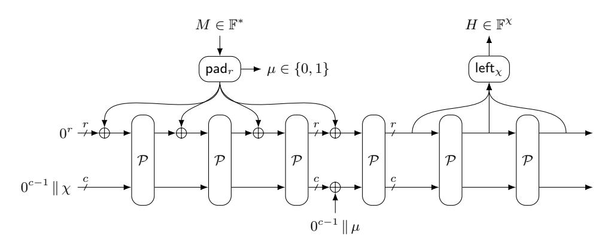
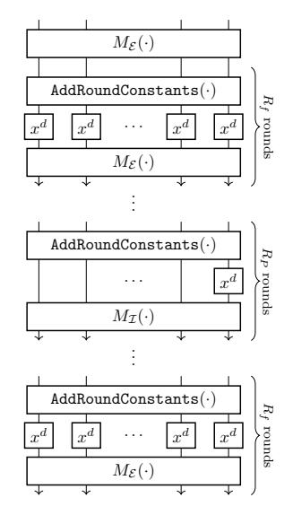
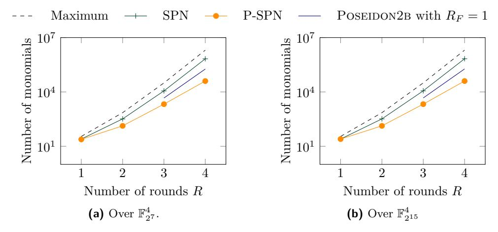
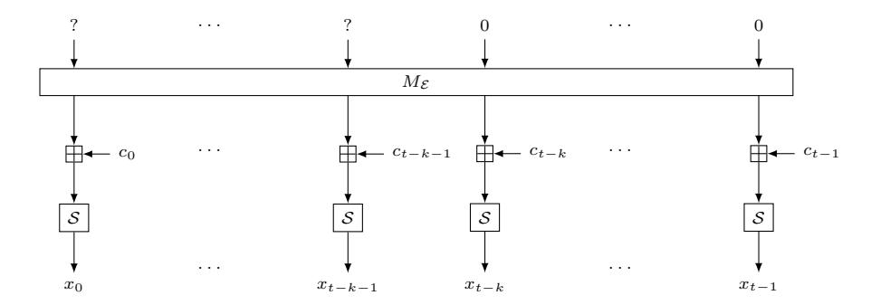

# **Binary Field Versions of Poseidon/Poseidon2**

Lorenzo Grassi1*,*2 [,](https://orcid.org/0000-0003-1140-0520) Dmitry Khovratovich3*,*6 [,](https://orcid.org/0009-0001-0347-3378) Katharina Koschatko4 [,](https://orcid.org/0009-0003-3109-146X) Christian Rechberger4*,*7 [,](https://orcid.org/0000-0003-1280-6020) Markus Schofnegger5 [,](https://orcid.org/0009-0003-9598-4005) Verena Schröppel4 and Zhuo Wu8*,*9

> Ponos Technology, Zug, Switzerland Eindhoven University of Technology, Eindhoven, Netherlands Ethereum Foundation, Singapore, Singapore Graz University of Technology, Graz, Austria Fabric Cryptography, San Francisco, United States ABDK Consulting, Tallinn, Estonia TACEO, Graz, Austria

**Abstract.** We present Poseidonb and Poseidon2b, natural variants of Poseidon and Poseidon2, respectively, defined over binary extension fields with a target security level of 128 bits. They are specifically designed to inherit many of the circuit-friendly properties of their prime field version, and to be used together with binary extension field proving systems such as Binius. Benchmarking demonstrates merits in proof size, proving time, and especially verification time, in comparison to traditional hash functions and other binary circuit-friendly hash functions such as Vision-32b and Anemoi.

Due to the close similarity to their prime field counterparts, many existing cryptanalytic results directly carry over to Poseidonb and Poseidon2b. Nevertheless, we revisit the security analysis to incorporate recent advances in cryptanalysis and to account for attack vectors that do not arise in the prime field setting. In particular, we focus on algebraic cryptanalysis and subspace trails, techniques that resulted in attacks on initial versions of Poseidon defined over binary extension fields. Our complexity estimates are based on the ideal degree, now increasingly adopted as a standard measure in algebraic cryptanalysis.

**Keywords:** Poseidon · Poseidon2 · ZK · Binary Extension Fields · Binius

# **1 Introduction**

The Poseidon [\[Gra+21\]](#page-31-0) hash function, introduced in 2019, has gained widespread adoption in verifiable computation protocols [\[Bon+21;](#page-30-0) [Che+23;](#page-30-1) [DP24\]](#page-30-2), where one party asserts the correctness of a computation using a compact proof. Using only basic algebraic operations over a prime field, Poseidon is one of the fastest-to-prove hash functions, and is at the same time among the fastest ones to compute natively. Its recently updated version Poseidon2 [\[GKS23b\]](#page-31-1) is tailored towards smaller prime fields, which are gaining in popularity for proving large computation blocks such as Ethereum blockchain transitions,

E-mail: [l.grassi@tue.nl](mailto:l.grassi@tue.nl) (Lorenzo Grassi), [khovratovich@gmail.com](mailto:khovratovich@gmail.com) (Dmitry Khovratovich), [katharina.koschatko@tugraz.at](mailto:katharina.koschatko@tugraz.at) (Katharina Koschatko), [christian.rechberger@tugraz.at](mailto:christian.rechberger@tugraz.at) (Christian Rechberger), [markus.schofnegger@gmail.com](mailto:markus.schofnegger@gmail.com) (Markus Schofnegger), [verena.schroeppel@](mailto:verena.schroeppel@student.tugraz.at) [student.tugraz.at](mailto:verena.schroeppel@student.tugraz.at) (Verena Schröppel), [wuzhuo@iie.ac.cn](mailto:wuzhuo@iie.ac.cn) (Zhuo Wu)

8 Institute of Information Engineering, CAS, Beijing, China

9 University of Chinese Academy of Sciences, Beijing, China

commonly known as zero-knowledge virtual machines (zkVMs). Indeed, since data has to be stored in field elements, smaller prime fields allow for less embedding overhead when working with smaller data (e.g., Boolean values) and more efficient algebraic operations. Despite its security margin not being overly large, the full and practically used versions of Poseidon have withstood many different cryptanalytic attacks [BGL20; Bey+20; KR21; Bar+22; SV25; ZD25], and indeed, while being one of the earliest circuit-friendly hash functions, it is simultaneously one of the few unbroken ones. For this reason, it is among the most trusted hash functions in the community, and at the time of writing, it is also a prime candidate for adoption in Ethereum as its ZK-friendly hash function [Eth24].

Notably, the existing prime field versions of Poseidon and Poseidon allow for a variety of different use cases. While initially being used mainly together with large primes of  $\approx 256$  bits (for example, to prove transaction inclusions in Merkle trees, potentially with zero knowledge enabled), recent use cases on the Layer 2 side include fast recursive provers. In more detail, when using univariate FRI-based protocols [Ben+18], a recursive proof requires the verification circuit of a previous proof, which crucially consists of verifying Merkle tree openings in the FRI step. In this part of the protocol, a circuit-friendly hash function yields significantly more compact proofs compared to classical primitives. However, while smaller prime fields are convenient and allow for arguably fast implementations, they require conversion from standard machine words, which comes at the cost of some storage waste. For example, let us focus on SP1 [Suc25], one of the currently popular zkVMs whose purpose is to prove the execution of RISC-V programs. SP1 uses a 31-bit prime field for its circuits, which is also a popular choice in many other similar frameworks. In order to prove a program, many of the RISC-V instructions operating over 32-bit unsigned integers are split into 8-bit limbs to accommodate the arithmetic operations. This is required since otherwise intermediate multiplication results may not fit into a 31-bit prime field element. Since these 8-bit limbs still require being embedded into 31-bit prime field elements, almost three quarters of the prime field element are wasted. Moreover, prime field proof systems inherently struggle with bit operations, as a prime field does not provide native tools to tackle separate bits. This is a concrete problem for settings where more classical hash functions, such as Keccak, are used, and where an efficient method of proving, for example, Merkle trees with this hash function is required.

All of this has led to various research results on binary proof systems, initially univariate ones exploiting properties of small elliptic curves to achieve efficient NTTs outside of two-adic structures (we refer to [Ben+23; Ben+22] for a detailed description), and most recently multivariate ones such as Binius [DP25; DP24], introducing new techniques that separate the committing field size from the constraint field size and thus make it possible to mix binary fields with specific properties. These approaches are defined over binary fields such as  $\mathbb{F}_{2^{32}}$  or tower extensions, and in particular, the more recent ones are free from many drawbacks of traditional prime-based protocols. While classical hash functions such as SHA-3 and Blake2 [Aum+13; SA15] are often significantly more efficient in those proving systems compared to the ones based on prime fields, they often still use different field sizes (mostly small ones), resulting in a comparatively large number of constraints.

#### 1.1 Our Contributions

We formally introduce Poseidonb and Poseidon2B, natural variants of Poseidon and Poseidon2, respectively, over a binary extension field.2 The designs aim to

(i) achieve high performance on a commodity CPU by using sparse constants and low-degree power maps, and

&lt;sup>1Using 16-bit limbs, intermediate multiplication results may be larger than what the prime field allows. 2To address both variants simultaneously, we simply write POSEIDON(2)B for the two newly introduced binary field versions, and POSEIDON(2) for the two original prime field versions.

(ii) be efficient in binary proof systems by minimizing the number of algebraic constraints.

In this paper, we focus on Binius, since it is currently one of the fastest binary field proof systems available. The binary variants  $POSEIDON(2)B^{\pi}$  are obtained by redefining the operations of POSEIDON(2) over binary extension fields, with the goal of inheriting the cryptanalysis record of the original designs. While many known results carry over directly, we revisit the security analysis to incorporate recent cryptanalytic advances and to account for attack vectors specific to the binary-field setting. Our contributions are summarized as follows:

- 1. We formally revise security properties beyond the classical collision and preimage resistance in order to accommodate the scenarios arising in the use of a hash function in various protocols, such as the Fiat-Shamir conversion.
- 2. We revisit the security analysis of Poseidon(2)B from scratch. In particular, we confirm the density estimates of the polynomial representation, which help establish lower bounds on the complexity of the interpolation attack and reanalyze the security against algebraic attacks. We base the attack complexity on the ideal degree bound, which is now becoming a standard in Gröbner basis cryptanalysis, additionally incorporating different security notions. We have confirmed the analysis through an extensive set of practical experiments that cover various attack scenarios.
- 3. We have conducted benchmarks both in native and circuit variants. In particular, we provide a proof implementation of the Poseidon(2)Bπ permutations in the Binius framework, showing its efficiency and applicability within binary proof systems, and a plain implementation of the Poseidon(2)Bπ permutations in Rust, highlighting its native efficiency. Additionally, we contribute the first respective implementations for binary versions of Anemoi [Bou+23], another recent circuit-friendly family of permutations. Our benchmark results show improved performance in proving and verification times, with reduced proof sizes compared to existing primitives.

A Sage reference implementation of  $POSEIDON(2)B^{\pi}$ , Sage implementations of the algebraic models, as well as the proof implementations in the Binius framework and native Rust implementations, can be found in the official POSEIDON(2)B GitHub repository [Pos25].

**Organization.** After recalling some preliminary notions in Section 2, we formally define the Poseidon(2) $B^{\pi}$  permutations and the possible modes of operation in Section 3. Section 4 summarizes the security claims for the hash functions Poseidon(2)B, supported by our security analysis proposed in Section 5. Concrete comparisons of Poseidon(2) and Poseidon(2)B are given in Sections 3.3 and 5.6. Finally, in Section 6, we demonstrate the practical applicability of Poseidon(2)B by presenting a proof implementation in the Binius framework, together with native and proof-system benchmarks.

### 1.2 Related Works

A binary version of Poseidon was first introduced in the original Poseidon paper [Gra+19a] under the name Starkad. It lies between the original Poseidon and the constructions presented in this paper. In particular, it uses a binary field and the same partial Substitution-Permutation-Network (SPN) scheme, but different linear layers. Soon after the (ePrint) publication of Starkad, its designers decided to withdraw it due to two main reasons:3

• the incapacity of providing a good estimation of the growth of the degree, a problem later on solved in [Cid+22];

 $^3\mathrm{Private}$  communication with Starkad's designers.

• the vulnerability of some Starkad instances, resulting from the specific choices of linear layers [KR21; Bey+20], a problem later on solved in [GRS21]. We emphasize that this problem also involved the original prime field version Poseidon.

We improve upon STARKAD both in performance and security, particularly by explicitly protecting against the approaches that broke it.

Another scheme based on binary extension fields is Vision Mark-32 [Ash+24]. It follows the Vision/Rescue design strategy [Aly+20], involving a high-degree power map. Whilst being one of the few circuit-friendly hash functions defined over binary extension fields, Vision Mark-32 is expected to be slow natively and may suffer from the FreeLunch attack similarly to its prime field counterpart [Bar+24]. Further, a variant of Anemoi [Bou+23] is defined over binary extension fields with odd extension degree.

# 2 Preliminaries

This section collects the notations and security definitions used throughout the remainder of the paper, which provide the common framework for our design and security analysis.

# 2.1 Notation

We denote the binary extension field of size  $2^n$  by  $\mathbb{F}_{2^n}$ , with n being the extension degree. When the field size is implicit from the context or not essential to the discussion at hand, we omit the subscript to improve readability. Using this convention, we consider transformations on states of finite-field elements  $(x_0, \ldots, x_{t-1}) \in \mathbb{F}^t$ , where t denotes the state size. The function  $\mathcal{H}: \mathbb{F}^* \to \mathbb{F}^\chi$  denotes a hash function that maps strings of finite field elements to fixed-length outputs of length  $\chi \in \mathbb{N}_+$ . Finally,  $\mathcal{P}: \mathbb{F}^t \to \mathbb{F}^t$  denotes a bijective function, and  $\mathcal{P}_i$  the i-th component function for  $0 \leq i < t$ . The composition of  $\mathcal{P}$  with itself is written  $\mathcal{P}^2 \coloneqq \mathcal{P} \circ \mathcal{P}$ ; more generally,  $\mathcal{P}^k$  denotes the k-fold composition of  $\mathcal{P}$  with itself for any positive integer k.

Let  $x=(x_0,\ldots,x_{k-1})$  and  $y=(y_0,\ldots,y_{m-1})\in\mathbb{F}^*$ . We write  $x\parallel y$  for the concatenation  $(x_0,\ldots,x_{k-1},y_0,\ldots,y_{m-1})$ . In particular, if x=(1) and y consists of m zeros, that is,  $y=0^m:=(0,\ldots,0)$ , we abbreviate the concatenation as  $10^m$ . When k=m, we denote by x+y the component-wise addition of x and y. For  $0\leq i< j\leq k$ , let x[i:j] denote the subtuple of x from index i (inclusive) to index j (exclusive), and x[i]:=x[i:i+1]. Finally, for  $1\leq \ell\leq k$ , we define  $\mathsf{left}_\ell(x):=x[0:\ell]$  and  $\mathsf{right}_\ell(x):=x[k-\ell,k]$  as the first and last  $\ell$  elements of x, respectively.

# 2.2 Security Definitions

**Definition 1** (Unit of Time). We define the "unit of time" as the number of bit operations needed to compute  $\mathcal{H}(0)$ , where  $0 \in \mathbb{F}$  is a single field element.

**Definition 2** (Preimage Resistance).  $\mathcal{H}$  is preimage resistant with  $\lambda$  bits of security if, for any adversary that gets random  $h \in \mathbb{F}^{\chi}$  as input and runs in time  $\tau$  (w.r.t. Definition 1), the probability to output x such that  $\mathcal{H}(x) = h$  is at most  $\frac{\tau}{2^{\lambda}}$ .

**Definition 3** (Second Preimage Resistance).  $\mathcal{H}$  is second-preimage resistant with  $\lambda$  bits of security if, for any adversary that gets random  $h \in \mathbb{F}^t$  as input and runs in time  $\tau$  (w.r.t. Definition 1), given y such that  $\mathcal{H}(y) = h$ , the probability to output  $x \neq y$  such that  $\mathcal{H}(x) = h$  is at most  $\frac{\tau}{2\lambda}$ .

**Definition 4** (Collision Resistance).  $\mathcal{H}$  is collision resistant with  $\lambda$  bits of security if, for any adversary that gets random  $K \in \mathbb{F}^{\chi}$  as input and runs in time  $\tau$  (w.r.t. Definition 1), the probability to output two inputs x, y such that  $\mathcal{H}(K||x) = \mathcal{H}(K||y)$  is at most  $\frac{\tau^2}{2^{\lambda}}$ .

**Definition 5** (Target-Collision Resistance [BR97]). Consider the following game:

- 1. The challenger selects a secret key  $K \in \mathbb{F}^{\chi}$ .
- 2. The adversary submits a message M and receives in response the hash  $\mathcal{H}(K,M)$ .
- 3. The challenger reveals K.
- 4. The adversary submits a new message  $M^*$ . They win if  $\mathcal{H}(K,M) = \mathcal{H}(K,M^*)$ .

 $\mathcal{H}$  is target-collision resistant with  $\lambda$  bits of security if, for any adversary that runs in  $q < 2^{\lambda}$  time units, the probability of winning the game is at most  $\frac{q}{|\mathbb{F}| \lambda}$ .

For our purposes, we consider a version in which the adversary is allowed to find a collision to any of n targets, but the target hashes are domain separated with a nonce, so that one new hash would match only one of the available targets.

**Definition 6** (Multi-Target-Collision Resistance). Let n be an integer. Consider the following game:

- 1. The challenger selects a secret key  $K \in \mathbb{F}^{\chi}$ .
- 2. The adversary submits n distinct messages  $M_i$  and distinct nonces  $\eta_i$  (i.e.,  $M_i \neq M_j$  and  $\eta_i \neq \eta_j$  for  $i \neq j$ ), and receives in response the corresponding hashes  $\mathcal{H}(K, \eta_i, M_i)$  for  $0 \leq i < n$ .
- 3. The challenger reveals K.
- 4. The adversary submits one of the earlier indices  $i \in \{0, \ldots, n-1\}$  and a new message  $M^*$ . They win if  $\mathcal{H}(K, \eta_i, M_i) = \mathcal{H}(K, \eta_i, M^*)$ .

 $\mathcal{H}$  is multi-target-collision resistant with  $\lambda$  bits of security if, for any adversary that runs in  $q < 2^{\lambda}$  time units, the probability of winning the game is at most  $\frac{q}{\|\mathbb{F}\|_{X}}$ .

**Definition 7** (k-Zero-Test Resistance). Let Q be a set of polynomial mappings of degree d that map  $\mathbb{F}^{\chi}$  to  $\mathbb{F}^k$  for some  $k \in \mathbb{N}_+$ . For a mapping  $G \in \mathbb{Q}$ , let  $\widehat{G}$  denote the coefficients of G. Then  $\mathcal{H}$  is called k-zero-test resistant if, for any adversary that gets random  $K \in \mathbb{F}^{\chi}$  as input and runs in  $\tau$  time units (w.r.t. Definition 1), the probability to output  $G \in \mathbb{Q}$  such that  $\mathcal{H}(K,\widehat{G})$  is a root of G is at most  $\frac{\tau \cdot d}{|\mathbb{F}|^k}$ .

**Definition 8** (CICO-k Security).  $\mathcal{P}$  is CICO-k secure if, for any adversary that gets random  $K \in \mathbb{F}^k$  as input and runs in  $\tau$  time units (w.r.t. Definition 1), the probability to output  $x, y \in \mathbb{F}^{t-k}$  such that  $\mathcal{P}(x \parallel K) = y \parallel K$  is at most  $\frac{\tau}{\|\mathbb{F}\|^k}$ .

# 3 Specification

POSEIDON(2)B is a family of hash functions defined as a mode of operation over the permutation POSEIDON(2)B $\pi$  with a target security level of 128 bits. For the permutation, we essentially follow the design direction of POSEIDON(2) $^{\pi}$ , but operate over the binary extension field  $\mathbb{F}_{2^n}$ .

### 3.1 Modes of Operation

Let  $\chi$  denote the digest length and t the state size, measured in finite field elements.

**Figure 1:** sponge-pi using a permutation  $\mathcal{P}: \mathbb{F}^t \to \mathbb{F}^t$  with t = r + c.

### 3.1.1 Sponge Mode

The sponge construction [Ber+08] is one of the most widely used constructions for setting up a hash function. Let  $\mathcal{P}$  be a permutation over  $\mathbb{F}^t$ , and let t=r+c, where c denotes the capacity and r the rate. Given a padded message  $M \in \mathbb{F}^*$ , it is first split into  $\mathbb{F}^r$ -blocks  $M_0, M_1, \ldots, M_{\ell-1}$ . Then, the message blocks are compressed one-by-one into a  $\mathbb{F}^t$ -state:

$$S \leftarrow \mathcal{P}\left(S + (M_i \parallel 0^c)\right)$$

for  $i = 0, 1, ..., \ell - 1$ , where S is initialized with  $0^{c-1} \| \chi$  with  $\chi$  being the digest size. After the absorption of the last message block, the hash output is of the form

$$\operatorname{left}_{\chi}\bigg(\operatorname{left}_{r}\left(\mathcal{P}(S)\right)\,\|\operatorname{\,left}_{r}\left(\mathcal{P}^{2}(S)\right)\,\|\operatorname{\,left}_{r}\left(\mathcal{P}^{3}(S)\right)\,\|\,\ldots\,\bigg)\,.$$

**Security Requirements.** Let  $\mathbb{F} = \mathbb{F}_{2^n}$ . In order to achieve a security level of  $\kappa$  bits (pre-quantum), the capacity c and digest  $\chi$  must satisfy  $c = \left\lceil \frac{2 \cdot \kappa}{n} \right\rceil$  and  $\chi \geq \left\lceil \frac{2 \cdot \kappa}{n} \right\rceil$ .

Our Context and Other Modes. In our context, we recommend using the sponge-pi construction recently proposed by Lefreve et al. [LBM25] at ToSC'25 for variable-input hashing with output length  $\chi$ , which is represented in Fig. 1 and implemented as outlined in Algorithm 1. In this version, the message is padded with 10\* only if the  $\mathbb{F}$ -size of the message is not a multiple of r, and to distinguish from to unpadded case (i.e., the  $\mathbb{F}$ -size of the message is already a multiple of r), a constant  $\mu \in \{0,1\}$  is added to the inner part of the state S in the last message absorption.

Further, we recommend using the SAFE API [Aum+23; KBM23; Aum+22] or duplex-pi [LBM25] for cases such as applying the Fiat-Shamir heuristic to multi-round protocols.

#### 3.1.2 Compression Mode

As for Poseidon2, we define the t-to- $\chi$  compression function as a combination of the feed-forward operation and a truncation:

Compresst,\gamma:
$$\mathbb{F}^t \to \mathbb{F}^{\chi}$$
,  $x \mapsto \mathsf{left}_{\chi}(\mathcal{P}(x) + x)$ .

It can be used to hash t input elements and generate t/2 output elements via, e.g., a Tree-Hash [Mer79]. We suggest the following 2-to-1 compression function:

$$\mathcal{H}_{2\to 1}: \mathbb{F}^{t/2} \times \mathbb{F}^{t/2} \to \mathbb{F}^{t/2}, \qquad (x,y) \mapsto \mathrm{Compress}_{t,t/2}(x \parallel y).$$

Note that since the entire permutation input is hashed, the domain separation is not supported. If needed, it should be implemented by an application.

Algorithm 1: sponge-pi using a permutation  $\mathcal{P}: \mathbb{F}_q^t \to \mathbb{F}_q^t$  with t = r + c. Function sponge-pi Function  $pad_r$ Input  $: M \in \tilde{\mathbb{F}}_q^*, \chi \in \mathbb{N}_+$ Input :  $M \in \mathbb{F}_q^*$  $\mathbf{Output}: Z \in \mathbb{F}_a^{\chi}$ **Output:**  $(M_0, \dots, M_{\ell-1}) \in (\mathbb{F}_q^r)^{\ell}, \ \mu \in \{0, 1\}$  $S \leftarrow (0^{t-1} \parallel \chi)$  $\mu \leftarrow |M| \equiv 0 \bmod r$  $(M_0,\ldots,M_{\ell-1}),\,\mu\leftarrow\mathsf{pad}_r(M)$  $M \leftarrow M \parallel 10^{r-|M| \bmod r}$ for  $i \leftarrow 0$  to  $\ell - 2$  do  $S \leftarrow \mathcal{P}(S + (M_i \parallel 0^c))$ for  $i \leftarrow 0$  to  $\ell - 1$  do  $S \leftarrow \mathcal{P}(S + (M_{\ell-1} || 0^{c-1} || \mu))$  $M_i \leftarrow M[ir:(i+1)r]$ for  $i \leftarrow 0$  to  $\left|\frac{\chi}{r}\right|$  do **return**  $(M_0, ..., M_{\ell-1}), \mu$  $Z \leftarrow Z \parallel \mathsf{left}_r(S)$  $S \leftarrow \mathcal{P}(S)$ **return**  $left_{\chi}(Z)$

# 3.2 The Poseidon(2)b Permutation

Poseidonb $\pi$  and Poseidon2b $\pi$  are families of permutations over  $\mathbb{F}_{2^n}^t$  for  $n \in \{32, 64, 128\}$ , where the state size  $t \in \{4, 6, 8, 12, 16, 24\}$  depends on n. A Poseidon(2)b $\pi$  instance  $\mathcal{P}: \mathbb{F}_{2^n}^t \to \mathbb{F}_{2^n}^t$  is defined by

$$\mathcal{P}(x) = \mathcal{E}_{R_F-1} \circ \cdots \circ \mathcal{E}_{R_F/2} \circ \mathcal{I}_{R_P-1} \circ \cdots \circ \mathcal{I}_0 \circ \mathcal{E}_{R_F/2-1} \circ \cdots \circ \mathcal{E}_0(M_{\mathcal{E}} \cdot x),$$

where  $\mathcal{E}_i$  and  $\mathcal{I}_i$  denote the *i*-th full (external) and partial (internal) round functions, respectively, and  $M_{\mathcal{E}}$  is the invertible  $t \times t$  matrix used in the external rounds. The value  $R_F = 2R_f$  denotes the number of external rounds, and  $R_P$  denotes the number of internal rounds. We refer to Fig. 2 for a graphical representation.

An overview of all valid instantiations of Poseidon(2) $B^{\pi}$  is provided in Table 1. We highlight that the best instance (in terms of performance) may depend on the size of the message to hash.4 In the following, we briefly describe the different components. A detailed round-number derivation appears separately in Section 5.

### 3.2.1 Invertible Power Maps over $\mathbb{F}_{2^n}$

We recall that  $x \mapsto x^d$  is invertible over  $\mathbb{F}_{2^n}$  if and only if  $\gcd(2^n - 1, d) = 1$ . Due to the following result, we instantiate the invertible S-box of POSEIDON(2)B $\pi$  with  $x \mapsto x^7$ .

**Lemma 1.** For each  $m \ge 2$ ,  $2^{2^m} - 1$  is divisible by 3 and by 5. Moreover,  $2^{2^m} - 1$  is never divisible by 7.

*Proof.* By rewriting  $2^{2^m} - 1$ , one can easily see that it is divisible by 3 and by 5:

$$2^{2^m} - 1 = (2^{2^{m-1}} - 1) \cdot (2^{2^{m-1}} + 1) = \dots = (2^{2^1} - 1) \cdot \prod_{i=1}^{m-1} (2^{2^i} + 1).$$

Now assume that 7 divides  $2^{2^m} - 1$ , i.e.  $2^{2^m} \equiv 1 \mod 7$ . As  $2^3 \equiv 1 \mod 7$ , it follows that  $2^m \equiv 0 \mod 3$ , which never happens and thus leads to a contradiction.

More generally, we point out that no exponent with hamming weight 2 is co-prime to  $2^{2^m}-1$ , i.e., no S-box of the form  $x\mapsto x^{2^i+2^j}$  for some positive integers  $i\neq j$  is invertible over  $\mathbb{F}_{2^n}$ . Assuming i>j, this follows from  $2^i+2^j=2^j\cdot(2^{i-j}+1)$  and Lemma 2 below.

&lt;sup>4As an example, compare t=16 (with r=c=8) and t=24 (with r=16, c=8). While a single permutation over  $\mathbb{F}^{24}_{232}$  is more expensive than one over  $\mathbb{F}^{16}_{232}$ , hashing a (padded) message of size  $\mathbb{F}^{16}_{232}$  is faster with t=24, as t=16 requires two permutation calls.

**Table 1:** Instantiations of the POSEIDON(2)B permutations over  $\mathbb{F}_{2^n}$  for 128-bit security with state size t, power-map exponent d,  $R_F$  full rounds and  $R_P$  partial rounds.

| (a) Poseidonb <math>\pi</math> . |    |   |              |  | <b>(b)</b> Poseidon $2B^{\pi}$ . |    |   |              |  |
|---------------------------------------------|----|---|--------------|--|----------------------------------|----|---|--------------|--|
| $\overline{n}$                              | t  | d | $(R_F, R_P)$ |  | n                                | t  | d | $(R_F, R_P)$ |  |
| 32                                          | 16 | 7 | (8, 15)      |  | 32                               | 16 | 7 | (10, 15)     |  |
| 32                                          | 24 | 7 | (8, 15)      |  | 32                               | 24 | 7 | (10, 15)     |  |
| 64                                          | 8  | 7 | (8, 29)      |  | 64                               | 8  | 7 | (10, 29)     |  |
| 64                                          | 12 | 7 | (8, 29)      |  | 64                               | 12 | 7 | (10, 29)     |  |
| 128                                         | 4  | 7 | (8, 58)      |  | 128                              | 4  | 7 | (8, 58)      |  |
| 128                                         | 6  | 7 | (8, 58)      |  | 128                              | 6  | 7 | (8, 58)      |  |

Figure 2: POSEIDON(2)B.

**Lemma 2.** For each  $m \ge 2$  and  $0 < d < 2^m$  holds  $gcd(2^{2^m} - 1, 2^d + 1) \ne 1$ .

*Proof.* Following the proof of Lemma 1, we see that  $3 | 2^{2^m} - 1$  and  $2^{2^i} + 1 | 2^{2^m} - 1$  for  $1 \le i \le m-1$ . We now show that  $2^d + 1$  is also divisible by either 3 or  $2^{2^i} + 1$ . We distinguish the following cases:

- For d odd, we get  $2^d + 1 \equiv (-1)^d + 1 \equiv 0 \mod 3$ , thus  $3 \mid \gcd(2^{2^m} 1, 2^d + 1)$ .
- Let  $d=2^i \cdot x$  even for some  $1 \le i \le m-1$  and  $x \ge 1$  odd. Then

$$2^{d} + 1 = 2^{2^{i} \cdot x} + 1 \equiv (2^{2^{i}})^{x} + 1 \equiv (-1)^{x} + 1 \equiv 0 \mod 2^{2^{i}} + 1$$
.

It follows that  $2^{2^{i}} + 1 | \gcd(2^{2^{m}} - 1, 2^{d} + 1)$  for d even.

### 3.2.2 The Full (External) Round $\mathcal{E}$

The external round  $\mathcal{E}_i: \mathbb{F}_{2^n}^t \to \mathbb{F}_{2^n}^t$  is given by

$$\mathcal{E}_{i}(x_{0},\ldots,x_{t-1}) = M_{\mathcal{E}} \cdot \left( (x_{0} \oplus c_{0}^{(i)})^{7}, (x_{1} \oplus c_{1}^{(i)})^{7}, \ldots, (x_{t-1} \oplus c_{t-1}^{(i)})^{7} \right)$$

for  $0 \le i \le R_F - 1$ , where  $c_j^{(i)}$  is the *j*-th round constant in the *i*-th external round for  $j \in \{0, \ldots, t-1\}$ , and  $M_{\mathcal{E}}$  is an invertible  $t \times t$  matrix defined as follows:

- If n = 128,  $M_{\mathcal{E}}$  is defined as the following MDS matrix for both PoseidonB $\pi$  and Poseidon2B $\pi$ :
  - If t=4, then  $M_{\mathcal{E}}=M_4$ , where  $M_4$  is the MDS matrix initially proposed in [DL18]. In particular, if X denotes the generator of  $\mathbb{F}_{2^n}=\mathbb{F}_2[X]/(i(X))$  for a suitable irreducible polynomial i of degree n, then

$$M_{\mathcal{E}} = M_4 := \begin{pmatrix} X^2 + 1 & X^2 + X + 1 & 1 & X + 1 \\ X^2 & X^2 + X & 1 & 1 \\ 1 & X + 1 & X^2 + 1 & X^2 + X + 1 \\ 1 & 1 & X^2 & X^2 + X \end{pmatrix}.$$

- If t = 6, then  $M_{\mathcal{E}} = \text{circ}(X^9, 1, X, X, X^{11}, 1)$  is a circulant MDS matrix.
- If  $n \in \{32,64\}$  with corresponding  $t = 4 \cdot t' \in \{8,12,16,24\}$ ,  $M_{\mathcal{E}}$  is chosen differently for Poseidonb $\pi$  and Poseidon2B $\pi$ :
  - For Poseidonb $\pi$ ,  $M_{\mathcal{E}} = M_t$  is a MDS Cauchy matrix as specified in App. B.1.
  - For Poseidon2B $\pi$ ,  $M_{\mathcal{E}} = \text{circ}(X, 1, ..., 1) \otimes M_4 = \text{circ}(X \cdot M_4, M_4, ..., M_4)$ , where  $\otimes$  is the tensor product, and  $M_4$  is given above. In particular,  $M_{\mathcal{E}}$  has branch number 4 + t/4.

# 3.2.3 The Partial (Internal) Round $\mathcal{I}$

The internal round  $\mathcal{I}_i: \mathbb{F}_{2^n}^t \to \mathbb{F}_{2^n}^t$  is given by

$$\mathcal{I}_i(x_0,\ldots,x_{t-1}) = M_{\mathcal{I}} \cdot \left( (x_0 \oplus \hat{c}_0^{(i)})^7, x_1,\ldots,x_{t-1} \right)$$

for  $0 \le i \le R_P - 1$ , where  $\hat{c}_0^{(i)}$  is the round constant in the *i*-th internal round, and  $M_{\mathcal{I}}$  is an invertible  $t \times t$  matrix defined as

$$M_{\mathcal{I}} = \begin{pmatrix} \mu_0 & 1 & \cdots & 1 \\ 1 & \mu_1 & \cdots & 1 \\ \vdots & \vdots & \ddots & \vdots \\ 1 & 1 & \cdots & \mu_{t-1} \end{pmatrix},$$

where  $\mu_0, \mu_1, \dots, \mu_{t-1} \in \mathbb{F}_{2^n} \setminus \{0, 1\}$  are chosen such that (1st)  $M_{\mathcal{I}}$  is invertible, and (2nd) it admits no arbitrarily long subspace trails (see Section 5.1.2 and [GRS21] for details). Concretely, diag $(M_{\mathcal{I}})$  are given in App. B.2.

#### 3.2.4 Round Constants

As the round constants aim to break up the symmetry in the design, we generate them using Turbo-SHAKE-256 [Ber+23].

# 3.3 Comparison of Poseidon(2) and Poseidon(2)b

The Poseidon\*\* permutation was originally introduced for prime fields of roughly 256 bits and employed a single fixed Cauchy MDS matrix as its linear layer, without an initial linear layer. Subsequent work identified weaknesses arising from this design choice [Bar+22], which led to the nowadays practically used variant of Poseidon that includes an initial linear layer to address this issue. Poseidon defined only the sponge mode of operation.

Poseidon $2^{\pi}$  generalizes the original design and was introduced to also support prime fields of smaller sizes, starting at approximately 32 bits, while allowing for a much broader range of parameters. In addition to the sponge construction, Poseidon2 introduces a dedicated 2-to-1 compression mode. Beyond incorporating the previously missing initial linear layer, Poseidon2 achieves substantial performance improvements through two main design changes: first, by using specially structured linear layers in the partial rounds to significantly reduce circuit complexity, and second, by allowing non-MDS matrices of a specific form in the external rounds, further improving efficiency.

Both Poseidonb and Poseidon2B are defined in sponge and 2-to-1 compression mode. For the internal rounds, both variants follow the Poseidon2 design approach as it provides a significant increase in circuit performance without apparent drawbacks. Consequently, Poseidonb and Poseidon2B differ only in their choice of external linear layers  $M_{\mathcal{E}}$  for extension degrees  $n \in \{32,64\}$ . While Poseidonb adopts conservative MDS matrices,

Poseidon2b employs more aggressive non-MDS matrices to improve efficiency, with the resulting plain performance gains outweighing the increased security margin employed for the external rounds. In summary, Poseidonb and Poseidon2b differ only in the choice of the linear layer for external rounds and the corresponding security margin, where the MDS-based design favors circuit and verifier performance, while the non-MDS construction prioritizes native efficiency (cf. Section [6\)](#page-22-0).

# **4 Security Claims**

# **4.1 Collision Resistance**

We claim security against classical statistical attacks due to the low algebraic degree of the S-box and the large number of (external) rounds (Section [5.1\)](#page-10-2). Hence, we assume resistance to statistical collision attacks. Security against algebraic attacks is discussed in Section [5.3.2](#page-17-0) with the conclusion that the collision resistance is implied by the CICO problem hardness.

**Claim.** *All* Poseidon(2)b *instances over* F2*n that output χ field elements are collisionresistant with* min{128*, χ* · *n/*2} *bits of security.*

# **4.2 (Second-)Preimage Resistance**

The same statement about statistical attacks as above also applies here. Further, security against algebraic attacks is discussed in Section [5.3.2,](#page-17-0) concluding that the preimage resistance is implied by the CICO problem hardness.

**Claim.** *All* Poseidon(2)b *instances over* F2*n that output χ field elements are (second-) preimage resistant with* min{128*, χ* · *n*} *bits of security.*

# **4.3 CICO Problem**

Again, due to the same reasons as above, we claim security against statistical CICO attacks, and we refer the reader to Section [5.3.2](#page-17-0) for details about the security with respect to algebraic attacks. In particular, as the round numbers are selected to prevent the CICO attacks, we conclude the CICO security of Poseidon(2)b.

**Claim.** *All* Poseidon(2)b *instances over* F2*n are CICO-k secure for k* ≤ 128*/n.*

# **4.4 Multi-Target Collision Resistance**

We claim resistance against multi-target collision attacks given the statistical properties outlined above and our algebraic results from Section [5.3.2.](#page-17-0)

**Claim.** *All* Poseidon(2)b *instances over* F2*n are multi-target-collision resistant with 128 bits of security.*

# **4.5 Fiat–Shamir Security**

We claim that Poseidon(2)b is suitable for a wide range of protocols using the Fiat–Shamir transformation to achieve non-interactivity. Though every protocol suggests a unique requirement for the hash function that delivers the transformation, there are some common properties that should hold. In particular, we claim resistance to *statistical zero-test attacks* and *algebraic zero-test attacks* given the statistical and algebraic properties discussed in Section [5.1](#page-10-2) and Section [5.3.2.](#page-17-0)

**Claim.** *All* Poseidon(2)b *instances over* F2*n are k-zero-test resistant for k* ≤ 128*/n.*

# 5 Security Analysis

Attacks against Poseidon(2)B behave in a similar way to the attacks against Poseidon(2).

Remark 1. As in the case of Poseidon(2), we do not explicitly address weak distinguishers such as zero-sum distinguishers/partitions [BCC11], as they have little to no relevance to practical attacks on hash functions alone or within protocols.

## 5.1 Statistical Attacks

Similar to the case of Poseidon(2), the statistical attacks are prevented by the external full rounds, and we select the number of these rounds to withstand those attacks.

#### 5.1.1 Differential Attacks

In a differential attack [BS90; BS93], the idea is to study how the difference of two initial texts propagates through the symmetric primitive. If a specific input difference maps to an output difference with a probability deviating from that of a random permutation, this behavior could be exploited by an adversary.

The security argument for Poseidon(2)B is similar to the one given for Poseidon/Poseidon2. The maximum differential probability of  $x \mapsto x^7$  is given by

$$DP_{\text{max}}(x \mapsto x^7) = \frac{6}{2^n} = 3 \cdot 2^{-n+1}$$
.

Regarding the linear layer,  $M_{\mathcal{E}}$  has branch number at least equal to t/4+4. Indeed, the MDS matrices have branch number  $t+1 \geq 4+t/4$  for  $t \geq 4$ . In the case of Poseidon2B for  $t \geq 8$ , the proof of the branch number follows immediately from [Gra+24, Sect. 7] if  $\operatorname{circ}(X, 1, \ldots, 1)$  is MDS and from [Gra+22; Gra+23] otherwise.

Now, according to the wide trail strategy, at least t/4 + 4 S-boxes are active over two consecutive external (full) rounds of the permutation. Considering 2 consecutive two-round segments (for a total of four external rounds), one obtains

$$(3 \cdot 2^{-n+1})^{2 \cdot (t/4+4)} \le (3 \cdot 2^{-n+1})^{2 \cdot 6} \le (3 \cdot 2^{-31})^{12} \approx 2^{-353}$$

for  $n \geq 32$  and  $t \geq 8$ , which is much smaller than the security level of 128 bits. We emphasize that the factor  $2 \times$  takes into account both the clustering effect (i.e., the fact that several differential characteristics can be used together for setting up the attack) and the possibility of exploiting a Meet-in-the-Middle approach for setting up the attack.

As a consequence, 4 external rounds of Poseidon(2)B are sufficient to provide security against differential attacks, with 2 more rounds being a suitable security margin (this is then reflected in Section 5.5). It should be noted that this is a conservative estimate. Indeed, as shown in earlier works (e.g., [KR21]), the contribution from the internal rounds can also be taken into account, although such effects are omitted in the current discussion.

#### 5.1.2 Truncated Differentials

Truncated differential cryptanalysis [Knu94] generalizes differential cryptanalysis in the sense that truncated differentials are differentials where only a part of the difference can be predicted.

**Truncated Differentials: Full Rounds.** We are not aware of any truncated differential over r-round Poseidon(2)B for  $r \ge 2$  that holds with probability substantially smaller than the security level (which is  $2^{-128}$  in our case).

Still, in the case of Poseidon2B only, there exist truncated differentials that hold with probability smaller than for the Pseudo-Random Permutation (PRP) case. In particular, consider the subspace

$$\mathfrak{D} = \{ (\delta_0, \delta_1, \delta_2, \delta_3, \delta_0, \delta_1, \delta_2, \delta_3, 0, 0, 0, 0, \dots, 0, 0, 0, 0) \in \mathbb{F}_{2^n}^t \mid \delta_0, \delta_1, \delta_2, \delta_3 \in \mathbb{F}_{2^n} \}$$

for  $t \in \{12, 16, 24\}$ . It is easy to prove that  $\mathfrak{D}$  is an invariant for the matrix  $M_{\mathcal{E}}$ , due to the fact that  $(\delta, \delta, 0, \ldots, 0)$  is an invariant of  $\operatorname{circ}(X, 1, 1, \ldots, 1)$  and due to the particular form of  $M_{\mathcal{E}}$ . Similarly, the subspace

$$\mathfrak{D}' = \{ (\delta_0, \delta_1, \delta_2, 0, \delta_0, \delta_1, \delta_2, 0, 0, 0, 0, 0, \dots, 0, 0, 0, 0) \in \mathbb{F}_{2^n}^t \mid \delta_0, \delta_1, \delta_2 \in \mathbb{F}_{2^n} \}$$

is an invariant for the matrix  $M_{\mathcal{E}}$  with probability  $2^{-n}$  (this corresponds to the probability that  $\bigoplus_{i=0}^2 M_4[3,i] \cdot \delta_i = 0$  – note that  $M_4$  is a MDS matrix).

Based on this, consider a truncated difference  $\delta \in \mathfrak{D}$ . Such truncated difference will be in  $\mathfrak{D}$  after one round of Poseidon2B with probability  $2^{-4 \cdot n}$ . Indeed,  $\delta$  is an invariant for  $M_{\mathcal{E}}$ , it is sufficient that  $\delta$  maintains the linear relation between the first 4 elements and the next 4 ones after the S-box layer and the round constant addition.

Due to the same argument,  $\delta' \in \mathfrak{D}'$  will be in  $\mathfrak{D}'$  after one round of Poseidon2B with probability  $2^{-4 \cdot n}$  (where a factor  $2^{-n}$  is due to the linear layer, and a factor  $2^{-3 \cdot n}$  is due to the S-box layer). If the position of  $\mathbb{F}_{2^n}$  null-element  $(\delta_3)$  is not fixed, the probability becomes  $4 \cdot 2^{-4 \cdot n} = 2^{-4 \cdot n + 2}$ , and so  $2^{-(4 \cdot n + 2) \cdot R}$  over R rounds. For comparison, the probability of the same truncated differential for a PRP is  $4 \cdot 2^{-n \cdot (t-6)} = 2^{-n \cdot (t-6) + 2}$  when considering only the non-zero differences, and  $4 \cdot 2^{-n \cdot (t-3)} = 2^{-n \cdot (t-3) + 2}$  when considering the linear relations between the first 3  $\mathbb{F}_{2^n}$ -elements, and the next 3 ones. As

$$2^{-(4\cdot n+2)\cdot R} \geq 2^{-n\cdot (t-3)+2} \qquad \longrightarrow \qquad R \leq \frac{n\cdot (t-3)+2}{4\cdot n+2}\,,$$

that is,  $R \leq 5$  for t = 24.

Remark 2. We emphasize that this result does not contradict our initial claim, as  $2^{-(4\cdot n+2)\cdot R} \leq 2^{-126\cdot R}$  for  $n\geq 32$  (hence, close and/or lower to our security level). We highlight that the same result holds for POSEIDON2 as well.

Remark 3. Even if the probability is very low, we emphasize that it is potentially possible to find such truncated differential by (1st) exploiting the low degree (only 7) of the S-box, and (2nd) its homomorphic property  $(x \cdot y)^7 = x^7 \cdot y^7$ . This corresponds to the attack described in [Bar+22, Sect. 4.2] and later on in [Bak+25a, App. D.1] (specifically for the non-MDS case), which we re-consider in Section 5.3.1.

**Truncated Differentials: Partial Rounds.** Since the nonlinear layer in a partial round of Poseidon2B uses only one nonlinear S-box, there exists an invariant subspace through this layer. More generally, regardless of the specific configuration of the linear layer  $M_{\mathcal{I}}$ , one can identify a subspace that remains invariant for up to t-1 rounds [GRR16; LTW18]. Furthermore, depending on the properties of  $M_{\mathcal{I}}$ , this invariant subspace may serve as the basis for constructing a subspace trail over an arbitrary number of rounds. For Starkad, these approaches were first described in [KR21; Bey+20].

Shortly after, the properties of linear layers leading to this attack were analyzed in detail in [GRS21]. In this work, the authors show that if the minimal polynomials of the matrices  $M_{\mathcal{I}}, M_{\mathcal{I}}^2, M_{\mathcal{I}}^3, \ldots$  are irreducible and of maximum degree, no arbitrarily long subspace trail with active/inactive  $\mathbb{F}_{2^n}$ -word exists. Based on this, the matrices  $M_{\mathcal{I}}$  are chosen such that no arbitrarily long subspace trail with active/inactive  $\mathbb{F}_{2^n}$ -word exists for POSEIDON(2)B.

**Partially Active**  $\mathbb{F}_{2^n}$ -**Word.** Until now, we discussed subspace trails of the partial rounds in which each  $\mathbb{F}_{2^n}$ -word is either fully active or constant. While this scenario is exhaustive over  $\mathbb{F}_p$ , the situation is different in the binary setting as  $\mathbb{F}_{2^n}$  admits several non-trivial subspaces. If two subspaces  $\mathfrak{V},\mathfrak{U}\subseteq\mathbb{F}_2^n$  and two constants  $u,v\in\mathbb{F}_{2^n}$  exist such that

$$\forall x \in \mathfrak{V} \subseteq \mathbb{F}_2^n: \qquad (x \oplus v)^7 \in \mathfrak{U} + u, \tag{1}$$

then this property can be exploited for an attack (see, e.g., the invariant subspace attacks against PRINTcipher [Lea+11] and Midori64 [Guo+16]). In such a case, one could potentially construct a subspace trail covering all internal rounds of Poseidon(2)B, or even the full permutation. However, it is important to note that Eq. (1) holds only for some constants u, v, and not for arbitrary values. Hence, concatenating such a trail of subspaces over multiple rounds is, in general, non-trivial.

Remark 4. At the current state of the art, we cannot convincingly argue the security of Poseidon2B against such attacks due to the huge number of subspace trails of the S-box  $x \mapsto x^7$  over  $\mathbb{F}_{2^n}$ . We leave the problem to study this attack in more detail for future work, and we limit ourselves to recalling the following results.

- As proved in [Lai94a, Theorem 6], as  $\deg(x \mapsto x^7) = 3$  over  $\mathbb{F}_2$ , the maximum dimension of the subspaces  $\mathfrak{V}, \mathfrak{U} \subseteq \mathbb{F}_2^n$  in Eq. (1) is at most n-3, that is, 29 and 61 for  $n \in \{32, 64\}$  respectively.
- As proved in [Guo+16, Proposition 2], the subspace of dimension 2 can be derived directly from the DDT of  $x \mapsto x^7$ .
- Possible strategies for constructing all the subspace trails of  $x \mapsto x^7$  are described in [LMR15; LTW18; GRS21].

#### 5.1.3 Other Statistical Attacks

Finally, we claim that POSEIDON(2)B is secure against other statistical attacks, such as linear cryptanalysis [Mat93], impossible differential attacks [BBS99], integral attacks [DKR97], rotational cryptanalysis [KN10], slide attacks [BW99], multiple-of-8 [GRR17], and mixture differential cryptanalysis [Gra18], among others.

#### 5.1.4 Summary

As all statistical properties have negligibly low probability to hold in the Poseidon(2)B permutation, we conclude that the statistical attacks fail for

$$R_F \ge 4. \tag{2}$$

## 5.2 Degree and Density of the Interpolation Polynomial

To ensure security against algebraic attacks, it is crucial to first study the growth of the degree and density of the polynomials resulting from the Poseidon(2)B permutation. As several isomorphic representations are possible, we limit ourselves to focus on  $\mathbb{F}_{2^n}^t$  and  $\mathbb{F}_2^{nt}$ .

### 5.2.1 Growth of the Degree – Forward Direction

The degree of  $x \mapsto x^7$  is 7 over  $\mathbb{F}_{2^n}$  and hw(7) = 3 over  $\mathbb{F}_2$ , implying that to reach maximum degree5 the total round number R has to satisfy

$$7^R > t \cdot (2^n - 1)$$
 and  $3^R > n \cdot t$ ,

The maximum degree of a polynomial function over  $\mathbb{F}_q^t$  is  $t \cdot (q-1)$ , since  $x^q = x$  in  $\mathbb{F}_q$ .

implying  $R \ge \max \{\log_7(t) + n \cdot \log_7(2), \log_3(n) + \log_3(t)\}$ . We emphasize that the condition  $3^R \ge n \cdot t$  for the growth of the degree over  $\mathbb{F}_2$  only provides a lower bound. Indeed, as shown in [Cid+22, Thm. 1] (besides [BCC11; Eic+20]), in the case of an SPN scheme over  $\mathbb{F}_{2^n}^t$  instantiated with  $x \mapsto x^7$  over  $\mathbb{F}_{2^n}$  and a linear layer defined via a matrix multiplication in  $\mathbb{F}_{2^n}^t$ , the growth of the degree  $\delta(R)$  over  $\mathbb{F}_2$  is given by

$$\delta(R) \leq \begin{cases} 3^R & \text{if } R \leq 1 + \lfloor \log_3(t) \rfloor, \\ t \cdot \log_2\left(\frac{7^R}{t} + 1\right) & \text{otherwise}. \end{cases}$$

Roughly, this implies

$$t \cdot \log_2\left(\frac{7^R}{t} + 1\right) \ge n \cdot t \implies 7^R \ge t \cdot (2^n - 1) \implies R \ge \log_7(t) + \log_7(2^n - 1). \tag{3}$$

**Lower Bound on the Degree Growth.** It is easy to see that for any assignment of t-1 input variables, the degree of the resulting univariate polynomial grows steadily and reaches at least  $2^n/7$  after  $\lceil n \log_7 2 \rceil - 1$  rounds. Indeed, as long as the degree is strictly smaller than  $2^n/7$ , it grows every round exactly by a factor of 7. Since this bound holds for any variable assignment, it also holds for the total degree of the multivariate polynomial.

### 5.2.2 Growth of the Degree - Backward Direction

Focusing on the backward direction, we have

$$x^{1/7} = \begin{cases} x^{\frac{2^{33}-1}{7}} & \approx x^{2^{30.19}} & \text{if } n = 32, \\ x^{\frac{6\cdot(2^{64}-1)+1}{7}} & \approx x^{2^{63.78}} & \text{if } n = 64, \\ x^{\frac{2\cdot(2^{128}-1)+1}{7}} & \approx x^{2^{126.19}} & \text{if } n = 128. \end{cases}$$

This implies that we achieve a very high degree in just a few rounds. We remark that the maximum possible degree is not achieved in the backward direction, though. As proved in [BC13], an invertible function  $\mathcal{F}$  over  $\mathbb{F}_2^m$  has maximum degree if and only if  $\mathcal{F}^{-1}$  has maximum degree. Hence, the number of rounds necessary to reach maximum degree in the backward direction is equal to the number necessary to reach maximum degree in the forward direction, as given before.

#### 5.2.3 Density

Regarding the density, we work under the following definition.

**Definition 9.** A polynomial over  $\mathbb{F}_{2^n}^t$  is called *dense* if it contains  $\Omega(2^{nt})$  monomials.

For a random polynomial, each coefficient is non-zero with probability  $\frac{2^n-1}{2^n}$ . As there are  $(2^n)^t$  monomials (each variable can have a degree between 0 and  $2^n-1$ ), the definition is satisfied. We have seen that around  $\log_7(t) + n \cdot \log_7(2)$  rounds are needed to satisfy this condition.

### 5.2.4 Practical Results

We conducted practical tests both for the degree growth and for the density of the polynomials in various numbers of variables. In particular, we focus on the case t = 4 and d = 3 when either  $n_v = 4$  input variables are used (i.e., the entire state consists of symbolic variables) or  $n_v = 1$ , i.e., a single input variable is used, resulting in a univariate representation. In both scenarios, we focus on field sizes  $\mathbb{F}_{2^n}$ , where  $n \in \{7,15\}$ . This

&lt;sup>6We need an odd extension of  $\mathbb{F}_2$  to make the S-box a permutation for d=3.

**Figure 3:** The number of monomials reached in SPN, P-SPN, and Poseidon(2)b.

gives a reasonable probability of avoiding cancellations and at the same time allows us to determine if there are notable differences between fields of different sizes.

The results for the first case, where the entire input state consists of variables, are shown in Fig. [3.](#page-14-0) We also include the cases of SPN and Partial-SPN permutations, where the former consists of only full (external) rounds and the latter consists of only partial (internal) rounds. As can be seen, full rounds contribute better to density than partial rounds; however, the difference between them is not asymptotically significant. In particular, mixing the rounds in Poseidon(2)b leads to a better behavior than only using a P-SPN.

For the second case, where *nv* = 1 results in a univariate representation, we could measure no notable difference between an SPN, a P-SPN, and our Poseidon(2)b construction. Essentially, the maximum number of monomials, in this case *d R* = 3*R*, is always reached, apart from some negligible constant resulting from the probability of cancellations.

## **5.2.5 Interpolation Attack**

The interpolation attack [\[JK97\]](#page-32-9) aims to re-construct the polynomial that defines the attacked scheme, and exploiting it to break the scheme. To ensure security against the interpolation attack, it is necessary that the number of monomials in the multivariate polynomial is close to the security level. Based on this, we require the following:

• When working on the forward direction, we impose that

$$R_F + R_P \ge \lceil \log_7(t) \rceil + \lceil n \cdot \log_7(2) \rceil$$
.

As we saw before, this number of rounds guarantees a degree above 2 *n/*7 and, based on our practical tests, sufficient density. This implies the total number of monomials being at least 2 *n/*7, which makes the total complexity of the interpolation attack exceed 2 *n*.

• In the backward direction, 4 full external rounds are sufficient to get a comparable degree bound.

As we are not aware of any Meet-in-the-Middle interpolation attack on a hash function, we claim that the interpolation attack should not be possible whenever

$$R_F + R_P \ge \lceil \log_7(t) \rceil + \left\lceil \frac{\min\{n, 128\}}{\log_2(7)} \right\rceil . \tag{4}$$

#### 5.2.6 Higher-Order Differential Attacks

In the case of a binary function, higher-order differential attacks [Knu94; Lai94b] exploit the fact that given a function  $\mathcal{F}$  over  $\mathbb{F}_2^n$  of degree  $\delta$ , then

$$\bigoplus_{x \in \mathfrak{V}} \mathcal{F}(x) = 0$$

for any affine subspace  $\mathfrak{V} \subseteq \mathbb{F}_2^n$  of dimension at least  $\delta + 1$  (that is,  $\dim(\mathfrak{V}) \ge \deg(\mathcal{F}) + 1$ ). Here, we claim that the number of rounds that ensure security against interpolation attacks guarantees security against higher-order differential attacks as well.

# 5.3 Algebraic Attacks

Algebraic attacks describe a cryptographic primitive under a specific attack scenario as a system of polynomial equations over a finite field and apply system-solving techniques to this model. While an attacker's goal is to outperform exhaustive search with such techniques, designers use algebraic attacks to guide the choice of secure round numbers. This section aims to briefly recall the most common system solving strategies and estimate algebraic attack complexities for Poseidon(2)B. In contrast to Poseidon, we follow a different methodology: instead of basing the analysis on Gröbner basis computations with respect to a degree order, we estimate the attack complexity via the cost of retrieving a univariate polynomial in the ideal, taking into account the latest cryptanalysis results. Moreover, we explicitly state a conjecture on the ideal degree for a wide range of algebraic models, supported by extensive experimental evidence. A detailed comparison of the resulting (partial) round-number derivation strategies for Poseidon(2)B versus Poseidon(2) is given in Section 5.6.

Remark 5. We restrict our investigation to the attacks on short-input hashing, which require only one call to the permutation  $\mathcal{P}$ . To the best of our knowledge, all algebraic attacks become more expensive when long inputs are considered. Further, with the derivation of round numbers in mind, we intentionally state optimistic, i.e., complexity-underestimating, bounds to ensure that the resulting parameters are safely conservative.

#### 5.3.1 Algebraic System Solving

Let  $\{p_1,\ldots,p_m\}\subset \mathbb{F}_q[x_1,\ldots,x_m]$  be a set of m polynomials in m variables over the finite field  $\mathbb{F}_q$ . For each polynomial  $p_j$ , let  $\delta_j:=\deg(p_j)$  denote its total degree, and for each variable  $x_i$ , let  $\delta_{x_i}:=\max_j\{\deg_{x_i}(p_j)\}$  be its maximal degree across all equations. The goal is to solve the corresponding equations system  $\{p_1=0,\ldots,p_m=0\}$  over  $\mathbb{F}_q$ .

Remark 6. For simplicity, we concentrate on square systems, i.e., systems with the same number of variables and equations, since the considered algebraic models of Poseidon2B, summarized in App. A, fall into this category.

Root-Finding for Univariate Systems. To find the solutions to a single univariate polynomial equation of degree  $\delta$  over  $\mathbb{F}_q$ , one can either apply an off-the-shelf factorization algorithm (e.g., Cantor-Zassenhaus [CZ81; ES11], Berlekamp [Ber70], Kaltofen-Shoup [KS95]), or use the FFT-based root-finding technique of [Bar+22], which requires

$$C_{\text{uni}}(\delta) \in \mathcal{O}\left(\delta \cdot \log(\delta) \cdot (\log(\delta) + \log(q)) \cdot \log\log(\delta)\right) \ge \delta \tag{5}$$

operations in  $\mathbb{F}_q$  if only a few roots actually lie in  $\mathbb{F}_q$ .

**Gröbner Bases Theory.** Gröbner bases [Buc65] provide a generic and widely used method for solving systems of polynomial equations that generate a zero-dimensional ideal I (i.e., the number of solutions to this system is finite). Algebraic models for symmetric primitives typically lead to such systems, and a *Gröbner basis attack* consists of the following three steps, where the quantity  $2 \le \omega < 3$  denotes the linear algebra constant.

- 1. Compute the Gröbner basis of I in degrevlex order. The complexity of this step is typically estimated as  $m \cdot {m+\deg \choose m}^{\omega}$  operations over  $\mathbb{F}_q$  using the F5 algorithm [BFS15], where  $\deg \leq 1 + \sum_{j=1}^m (\delta_j 1)$  denotes the degree of regularity of the system. The stated bound is known as Macaulay bound.
- 2. Obtain a triangular system by converting the degrevlex Gröbner basis to lexicographic order. The complexity of this step is typically estimated as  $m \cdot \mathbf{d_l}^{\omega}$  operations over  $\mathbb{F}_q$  using a probabilistic version of the FGLM algorithm [Fau+14], where  $\mathbf{d_l} \leq \prod_{j=1}^m \delta_j$  is the degree of the ideal  $\mathbf{l} = \langle p_1, \dots, p_m \rangle$ . The stated bound is known as Bézout bound.
- 3. Solve the univariate polynomial in the *lexicographic* Gröbner basis and back-substitute roots if necessary. Since we are dealing with zero-dimensional ideals, this univariate polynomial has degree  $\delta = d_I$  and the complexity of this step is estimated as  $C_{\text{uni}}(d_I)$ .

For regular systems, the above bounds are tight, and the complexity of a Gröbner basis attack is typically given by that of the "hardest" step. Unfortunately, systems arising from AO primitives are often not regular, and these bounds can vastly overestimate the true attack complexity. In general, computing  $d_{reg}$  and  $d_{l}$  is as hard as computing the Gröbner basis itself, so practical estimates often rely on retrieving these values from Gröbner basis attacks on round-reduced instances; see, for instance, [BGL20; KLR24]. Arguably, basing the attack complexity on the first step is problematic, as it may be skipped for suitable monomial orderings and models [Bar+24; CR25], and closed-form estimates of  $d_{reg}$  are only rough approximations. In contrast, as noted by [Per24], the second step is much better understood, with strong conjectures and sometimes even proofs of  $d_{l}$ . The third step is typically negligible in comparison. We therefore estimate the complexity of a Gröbner basis attack by the cost of the second step, namely

$$C_{\mathsf{gb2}}(\mathbf{d_l}) \in \mathcal{O}\left(m \cdot \mathbf{d_l}^{\omega}\right) \ge \mathbf{d_l}^2$$
 (6)

operations in  $\mathbb{F}_q$  with  $2 \leq \omega < 3$ .

Remark 7. Note that the basis conversion step can be replaced by other techniques, such as the recently applied Eigenvalue method [CR25], to obtain a univariate polynomial. However, all methods presented in the literature so far can optimistically be estimated using  $d_I^{\omega}$ . We thus omit further details.

**Resultants for Bivariate Systems.** Resultants provide a classical elimination strategy for solving two polynomial equations in two variables. Given a bivariate equation system  $\{p_1(x_1, x_2) = 0, p_2(x_1, x_2) = 0\}$ , the *resultant attack* consists of two main steps:

- 1. Compute the bivariate resultant  $r = \operatorname{Res}_{x_2}(p_1, p_2) \in \mathbb{F}_q[x_1]$ . Using the approach described in [GKR25; Bar+25], computing the bivariate resultant  $\operatorname{Res}_{x_2}(p_1, p_2) \in \mathbb{F}_q[x_1]$  requires  $\delta_{x_1} \delta_{x_2}^2 \cdot \log^2(\delta_{x_1} \delta_{x_2}) \cdot \log\log(\delta_{x_1} \delta_{x_2})$  operations in  $\mathbb{F}_q$
- 2. Solve the univariate polynomial r to recover the x-coordinates of the solutions and backsubstitute, if necessary. Since  $\deg(r) \geq d_{\rm l}$ , the complexity of this step is estimated as  $C_{\rm uni}(d_{\rm l})$ .

In general, computing the bivariate resultant of two dense degree- $\delta$  polynomials requires at least  $\delta^2$  operations. We therefore estimate the complexity of a resultant-based attack as

$$C_{\text{res}}(\delta) \ge \delta^2$$
 . (7)

Remark 8. Instead of symbolically computing the bivariate resultant, [Bak+25b] employs an evaluation-interpolation method of similar complexity and observes that for Poseidon2, the degree of the resultant coincides with the degree of the polynomial ideal.

Iterated Resultants. Iterated resultants can be used to successively eliminate variables. [Yan+24] recently applied this method to CICO-1 instances of primitives with inversion S-boxes. [Bar+25] improves the reduction procedure and derives concrete complexity estimates for this setting. As the complexity of these approaches essentially depends on the ideal degree, and as  $Poseidon(2)B^{\pi}$  is not instantiated with high-degree S-boxes (corresponding to the inverses of low-degree S-boxes, as in the case of Rescue, Anemoi, and Griffin), we do not provide further details and consider Gröbner basis cryptanalysis sufficient to cover this aspect.

# 5.3.2 Application to Poseidon(2)b

In this section, we estimate the complexity of algebraic attacks on Poseidon(2)B under different attack scenarios. We briefly review algebraic modeling options and show how these scenarios reduce to CICO-like problems, making our complexity estimates a consequence of solving that core problem.

Poseidon(2)B can be modeled over  $\mathbb{F}_{2^n}$  in several ways7: a round-based formulation with variables after each S-box, a global model capturing all rounds at once, or hybrids in between. Although syntactically different, these representations define the same solution set and thus the same polynomial ideal. However, those systems are usually underdetermined. By using the available degrees of freedom, it is possible to retrieve a square system (i.e., same number of variables and equations), restrict the system-solving to a finite subset of the solution space, and reduce solving complexity. The following approaches have been presented in the literature for Poseidon(2), and are also applicable to Poseidon(2)B:8

- a. Random guessing of input variables [Gra+19b].

  The input state is restricted to a subspace by randomly guessing some variables.
- b. Skipping the first external full round [Bar+22; Bak+25b]. The state after the first external round is restricted to an affine subspace such that inversion satisfies the input constraints.
- c. Skipping several internal partial rounds [Bey+20; GKR25].

  Some state within the partial rounds is restricted to an affine subspace permitting a subspace trail (of maximum length), i.e., the covered partial rounds can be linearized.

A detailed description of the different algebraic models is given in App. A. Table 2 lists the conjectured ideal degrees. Notably, differences in ideal degree arise from how the degrees of freedom are exploited, i.e., from working on differently shaped subsets of the original solution set. It is easy to verify that under reasonable assumptions, we have

$$d_{\mathsf{I}}^{(b)} \le d_{\mathsf{I}}^{(a)} \le d_{\mathsf{I}}^{(c)} \,.$$
 (8)

In particular, we require  $k \leq \frac{t}{2}$  for CICO-k,  $\chi \leq t-c$  for sponge preimage, and  $\chi \leq t$  for compression preimage. Thus, in the following, we will use  $d_l^{(b)}$  for complexity estimates based in  $d_l^{(b)}$ .

&lt;sup>7Modeling over  $\mathbb{F}_2$  appears less promising, as it would involve a substantially larger number of variables; hence, we restrict our analysis to models over  $\mathbb{F}_{2^n}$ .

&lt;sup>8After submission of this work, [Bak+25a] showed that, when  $M_{\mathcal{E}}$  is non-MDS, two initial full rounds can be skipped instead of one. We address this issue separately in Section 5.5.3 by incorporating an additional security margin for the external rounds.

&lt;sup>9Even though the "full round-skipping trick" (b) is not applicable in compression mode, we use  $7^{\chi \cdot (R_F-1)+R_P} < 7^{\chi \cdot R_F+R_P}$ , on purpose underestimating the ideal degree to simplify security arguments.

|                  |                                              | Preimage Attacks                                    |                                            |  |  |  |
|------------------|----------------------------------------------|-----------------------------------------------------|--------------------------------------------|--|--|--|
| $\mathbf{Model}$ | ${\bf CICO}$ - $k$ Problem                   | Sponge                                              | Compression                                |  |  |  |
| a                | $7^{k \cdot R_F + R_P}$                      | $7\chi \cdot R_F + R_P$                             | $7^{\chi \cdot R_F + R_P}$                 |  |  |  |
| b                | $7^{k\cdot(R_F-1)+R_P}$                      | $7\chi \cdot (R_F - 1) + R_P$                       | $(not\ applicable)$                        |  |  |  |
| $\mathbf{c}$     | $7^{t \cdot \frac{R_F}{2} + R_P - (t - 2k)}$ | $7^{(t-c+\chi)\cdot\frac{R_F}{2}+R_P-(t-(c+\chi))}$ | $7(t+\chi)\cdot\frac{R_F}{2}+R_P-(t-\chi)$ |  |  |  |

**Table 2:** Conjectured ideal degree  $d_l$  for different algebraic models over  $\mathbb{F}_{2^n}$  of short-input Poseidon(2)B instantiations. See App. A for more details.

CICO-k Problem. This is the basic problem to which we reduce almost all other attacks. In general, we assume that algebraic attacks do not apply to the CICO-k problem whenever

$$2^{\min\{k \cdot n, 128\}} \le \begin{cases} C_{\text{uni}}(7^{(R_F - 1) + R_P}) = 7^{(R_F - 1) + R_P} & \text{if } k = 1, \\ C_{\text{res}}(7^{(R_F - 1) + R_P}) = \left(7^{(R_F - 1) + R_P}\right)^2 & \text{if } k = 2, \\ C_{\text{gb2}}(7^{k \cdot (R_F - 1) + R_P}) = \left(7^{k \cdot (R_F - 1) + R_P}\right)^2 & \text{if } k \ge 2. \end{cases}$$
(9)

Here  $\delta = 7^{(R_F-1)+R_P}$  is the absolute degree of the forward-model equation(s), and  $d_l = 7^{k \cdot (R_F-1)+R_P}$  is the corresponding ideal degree. We claim that algebraic attacks against the CICO problem should not be possible whenever

$$R_P \ge \max \left\{ \left\lceil \frac{\min\{n, 128\}}{\log_2(7)} \right\rceil - (R_F - 1), \max_{3 \le k \le \frac{128}{n}} \left\{ \left\lceil \frac{\min\{kn, 128\}}{2\log_2(7)} \right\rceil - k \cdot (R_F - 1) \right\} \right\}.$$
(10)

Note that, according to our derivations, protection against univariate solving in the CICO-1 case implies protection against bivariate resultants in the CICO-2 case. Thus, we dropped the contribution of the latter in Eq. (10).

**Preimage Attacks.** Algebraic preimage attacks on both compression and sponge variants for Poseidon-like primitives are almost identical, see also [GKR25]. Consider the latter case with a single call to the Poseidon2B permutation first.

- If  $\chi \geq c$ , we first observe that any valid preimage attack is a valid partial-preimage attack on c output words. We fix c input variables (the inner part) and solve c equations to match a given hash value, which are exactly the same equations as in the CICO-c problem.
- If  $\chi < c$ , any preimage attack is a valid CICO- $(c, \chi)$  attack.

To summarize, all valid preimage attacks that work independently of the preimage value are valid CICO attacks.

For the compression case, the equations are similar with a small difference: instead of  $\mathcal{P}_i(x_0,\ldots,x_{t-1})=h_i$ , we consider  $\mathcal{P}_i(x_0,\ldots,x_{t-1})=x_i+h_i$ . We observe that adding the extra term does not reduce the complexity of any attack we have considered, so we conclude that the preimage attacks are as expensive as CICO- $\chi$ . The same holds for the second preimage attacks.

Note that for a usual choice of  $\chi = \frac{256}{n}$ , which holds for all proposed Poseidon(2)B instances, security against the CICO-k problem with  $k = \frac{128}{n}$  implies security against the CICO- $\chi$  problem, and thus preimage attacks.

&lt;sup>† Parameters: state size (t), number of full rounds  $(R_F)$ , number of partial rounds  $(R_P)$ , digest length  $(\chi)$ , capacity (c), number of input/output constraints (k).

**Collision Attacks.** Algebraic collision attacks are known to be even more expensive than preimage attacks due to twice the number of variables. One may hope to skip a few partial rounds by requiring the difference not to activate any S-box in those, but we were unable to exploit this trick to get the complexity low enough. The same argument applies to both the sponge and the compression mode.

**Target Collision Attacks.** We are unable to exploit the target scenario in this kind attacks. Therefore, the best attack we are aware of is to select j and find  $m^*$  with a preimage attack, which reduces to CICO- $\chi$ .

**Zero-Test Attacks.** We only consider the case where the function  $\mathcal{H}$  in the definition of zero-test resistance involves only one call to the Poseidon(2)B permutation.

Let us start with the simple case  $\chi = k = 1$ . By definition, the adversary needs to find  $(g_0, g_1, \ldots, g_d) \in \mathbb{F}_{2^n}^{d+1}$  (with some of the  $g_i$  being non-zero for i > 0) such that

$$\bigoplus_{j} g_j \cdot \mathcal{P}_1^j(g_0, g_1, \dots, g_d) = 0$$

where  $\mathcal{P}_1: \mathbb{F}_{2^n}^{d+1} \to \mathbb{F}_{2^n}$  is the polynomial describing the only output element of  $\mathcal{H}$ . For all algebraic attack methods that we consider, the degree of algebraic equations grows compared to the CICO problems. We were unable to exploit the appearance of extra variables as multipliers, and thus conclude that the problem is as hard as CICO-1. This reasoning applies equally well to the sponge and the compression mode.

With bigger  $\chi$  and k we obtain a set of equations involving different  $\mathcal{P}_i$ . We do not see any way to exploit this scenario without running the CICO-k problem under the hood.

### 5.4 Rebound Attacks

Rebound attacks [Men+09; Lam+09] are one of the most effective techniques to set up collisions in the case of AES-like hash functions. Introduced by Mendel et al. at FSE 2009, it can be applied to both block cipher-based and permutation-based constructions. The idea of the rebound attack is to divide the attack into two phases: an inbound phase and an outbound phase. The aim of the inbound phase is to use the available degrees of freedom to find, at a low cost, a large number of pairs of values that satisfy a (part of a) differential path that would be very expensive to satisfy in a probabilistic way. The outbound phase then uses these values to perform an attack.

In the following, we describe these phases in the case of Poseidon(2)B.

- Inbound Phase. The best scenario for the attacker consists in finding a pair of texts whose input difference and whose output differences are equal to zero in one  $\mathbb{F}_p$ -word, for a total of two constraints. Indeed, note that any other condition imposes a higher number of constraints on the input and/or output difference of such pair of texts. Based on the analysis just given, and due to the strong statistical properties of the full external rounds, the possible best approach for finding such pair of texts is via Gröbner basis attacks. Note that this problem can be turned into a CICO problem by fixing one of the two text. Due to the previous analysis, here we conjecture that the number of rounds necessary to guarantee security against any CICO problem is also sufficient to ensure security against the inbound phase of a rebound attack;
- Outbound Phase. As pointed out in Section 5.1.2, there are no truncated differentials for 2 or more external full rounds with probability (much) smaller than for the case of a pseudo-random permutation. Hence, we claim that an attacker can cover at most 1+1=2 full external full rounds are sufficient to ensure security against the outbound phase of a rebound attack.

Putting all together, we claim that the maximum number of rounds covered by a rebound attack is given by the maximum number of rounds that can be broken via a GB attack (assuming  $\leq 4$  external full rounds), plus 1+1=2 external full rounds, for a total of maximum 6 external rounds.

At the same time, we also consider the rebound attack based on the statistical properties only. Following the same argument proposed for Poseidon(2), we recall that the best rebound attack on AES covers 8 rounds. As 2 rounds of AES are necessary to achieve full diffusion versus 1 round of Poseidon(2)B, we claim that 6 external full rounds of Poseidon(2)B are sufficient to prevent this last strategy for the rebound attack.

#### 5.5 Round Numbers

In this section, we present the derivation of the round numbers for Poseidon(2)B. The parameters are chosen to withstand all attacks currently known in the literature, using the minimum number of rounds necessary to provide security, plus an additional security margin. As in the security analysis of Poseidon(2), we aim to protect against statistical attacks through a sufficient number of full rounds, and against algebraic attacks through carefully selected partial round numbers. A summary is given in Table 1.

#### 5.5.1 Number of Full Rounds

The analysis of statistical attacks, including rebound attacks, implies that  $R_F = 6$  is sufficient to prevent those.

#### 5.5.2 Number of Partial Rounds

Now we compute how many partial rounds we need to prevent various algebraic attacks on the CICO-k problem with  $k \leq \frac{128}{n}$ , which we have shown to be foundational with respect to other properties. Due to the rebound attack, we consider the CICO-k problem for  $R_F = 4$  (see before for details). We analyze how many rounds can be broken under different "hardness assumptions", concretely:

- **Interpolation:** The overall polynomial must reach a high degree and density so that interpolation attacks are infeasible (see Eq. (4)).
- Univariate Solving (k = 1): Directly solving the univariate CICO-1 equation should be infeasible (see Eq. (9)).
- Multivariate Solving  $(k \geq 2)$ : Let I be the ideal generated by polynomials modeling the CICO-k problem, and let  $d_I$  denote the ideal degree. Finding a univariate polynomial in I (for example via Gröbner bases or bivariate resultants) should be infeasible (see Eq. (9)).

In particular, we ignore the "system setup" cost and the cost of computing a Gröbner basis, potentially granting the attacker an advantage. Our analysis is summarized in the formula below. We note, though, that it pertains to the Poseidon(2) $B^{\pi}$  instances listed in Table 1. Any application beyond that would require further cryptanalysis.

$$R_{P} \ge \max \left\{ \lceil \log_{7}(t) \rceil + \left\lceil \frac{\min\{n, 128\}}{\log_{2}(7)} \right\rceil - 3, \max_{3 \le k \le \frac{128}{n}} \left\{ \left\lceil \frac{\min\{kn, 128\}}{2 \log_{2}(7)} \right\rceil - 3k \right\} \right\}. (11)$$

The round-number formulas for interpolation and univariate solving were merged for simplicity. We highlight that only the first term directly depends on the state size t.

#### **5.5.3 Security Margin**

We increase the number of full rounds from 6 to 8, in general, and add another 2 full rounds for Poseidon2b with *n* ∈ {32*,* 64} due to improved full-round skipping techniques in the non-MDS case [\[Bak+25a\]](#page-28-7). The number of partial rounds is increased by 30%.

# **5.6 Comparison to Poseidon(2)**

We conclude this section by comparing the round number derivation of Poseidon(2)b and Poseidon(2).

**Number or Partial Rounds.** For Poseidon, it was assumed that "the security of permutations against Gröbner basis attacks follows from the infeasible complexity of computing the Gröbner basis in degrevlex order" [\[Gra+19b,](#page-31-9) §C.2.2]. In contrast, we base the analysis of Poseidon(2)b on the complexity of either retrieving or solving a univariate polynomial in the ideal. This has several reasons:

- (i) Using a specifically crafted order, the first step of a Gröbner basis attack might be skipped in certain cases [\[Bar+24\]](#page-28-4). While this has not been applied to Poseidon, we think this result justifies revisiting the algebraic cryptanalysis.
- (ii) The *degree of regularity* is upper-bounded by the Macaulay bound, which [\[ABM24\]](#page-28-10) experimentally shows to be an overestimate. Interestingly, the subsequent derivations then give the complexity of the second step of a Gröbner-basis attack, but with the Bézout bound used in place of the true ideal degree. In more detail, the complexity of solving the CICO-*k* problem (for *k* ≥ 2) is estimated as follows:[10](#page-21-2)

$$C_{\mathtt{gb1}}(\mathbf{d}_{\mathrm{reg}}) = \binom{k \cdot \alpha^{R_F + R_P}}{k}^2 \geq \left(\alpha^{k \cdot (R_F + R_P)}\right)^2 = C_{\mathtt{gb2}}\left(\mathbf{d}_{\mathsf{I}}\right) \,,$$

where dreg ≈ *k* ·(*α RF* +*RP* −1) using the Macaulay bound and dI ≈ *α k*·(*RF* +*RP* ) using the Bézout bound. We are aware, however, that the Bézout number overestimates the actual ideal degree. We therefore state explicit conjectures for that degree (see Table [2\)](#page-18-0) and base our round-number derivation on them.

(iii) We want to explicitly take the latest cryptanalysis results on Poseidon into account, including resultant-based approaches [\[Yan+24;](#page-34-6) [Bar+25;](#page-28-8) [Bak+25b\]](#page-28-9) and various round-skipping techniques [\[GKR25;](#page-31-8) [Bak+25b\]](#page-28-9). We also mention the recent Graeffetransform attacks [\[ZD25;](#page-34-1) [SV25\]](#page-34-0) but stress that they provide only a constant factor improvement, and not for all fields.

Overall, we arrive at a simpler formula for the number of partial rounds (cf. Eq. [\(11\)](#page-20-1)). For comparison, for Poseidon(2) this number (for *κ*-bit security) is derived as

$$R_{P} = \left[ \max \left\{ 1 + \left[ \frac{\min\{n, \kappa\}}{\log_{2}(d)} \right] + \left\lceil \log_{d}(t) \right\rceil - R_{F}, \frac{\min\{n, \kappa\}}{\log_{2}(d)} - R_{F}, \right. \right.$$

$$\left. t - 1 + \log_{d}(2) \cdot \min \left\{ \frac{\kappa}{t+1}, \frac{n}{2} \right\} - R_{F}, t - 2 + \frac{\kappa}{2 \log_{2}(d)} - (t-1)R_{F}, r'_{GB} \right\} \right],$$

$$(12)$$

where *n* = ⌈log2 (*p*)⌉ denotes the field size, *d* is the degree of the S-boxes, the first term in Eq. [\(12\)](#page-21-3) accounts for interpolation attacks, and the others for Gröbner basis attacks (see [\[Gra+19b,](#page-31-9) §C.2.2], [\[GKS23b,](#page-31-1) Eq. (1)], and [\[Hor\]](#page-32-11)). A concrete comparison of the round numbers is given in Table [3.](#page-22-1) We make the following observations:

10We exemplarily discuss the case of "Full-Permutation Equations". However, these observations similarly apply to the derivations when "Working at Round Level".

- **First term**: corresponds to interpolation attacks and dominates when working over large fields (hence for small state sizes).
- Third term: captures the possibility of skipping partial rounds via subspace trails; this becomes more relevant for large state sizes (and thus smaller fields), as the number of skippable rounds grows with t (see App. A.1). As shown in [GKR25], the potential of this attack is overestimated, leading to inflated round numbers for certain instances (e.g., n = 31 with t = 24).

In conclusion, for smaller fields and larger state sizes, the round number selection is primarily driven by Gröbner basis attacks. However, the influence of the state size is less pronounced than initially expected, and the potential benefit of partial-round skipping appears to have been overestimated. On the other hand, for larger fields, interpolation becomes the dominant factor. Notably, for a given field size, the same partial round number can be used for both state sizes in the POSEIDON(2)B instantiations.

**Table 3:** Partial round number derivation (without security margin) for different instantiations of Poseidon(2) over  $\mathbb{F}_p$  with  $n = \lceil \log_2(p) \rceil$  and  $\kappa = 128$ , compared to the new derivation approach from this paper.

| $\overline{n}$ | t   | d      | χ      | [Gra+19b], Eq. (12)                                                 | This work, Eq. (11)                                 |
|----------------|-----|--------|--------|---------------------------------------------------------------------|-----------------------------------------------------|
| 31 31       |     |        |        | $\max\{11, 8, 13, -48, 0\} = 13$ $\max\{11, 8, 20, -88, 0\} = 20$   | $\max\{13, 12, 15\} = 15$ $\max\{13, 12, 15\} = 15$ |
| 64 64       |     | 7 7 |        | $\max\{20, 17, 7, -13, 11\} = 20$ $\max\{20, 17, 9, -33, 2\} = 20$  | $\max\{22\} = 22 \\ \max\{22\} = 22$                |
| 256 256     | 2 3 | -      | 1 1 | $\max\{52, 50, 14, 22, 27\} = 52$ $\max\{52, 50, 10, 17, 23\} = 52$ | $\max{54} = 54  \max{54} = 54$                      |

**Security Margin.** The security margin consists of 2 external full rounds ( $R_F = 8$  instead of  $R_F = 6$ ) and 7.5% or 30% more internal partial rounds for Poseidon(2), and Poseidon(2)B, respectively. We increase the margin for Poseidon(2)B to 30% to remain comfortably secure, as binary Poseidon(2) variants are still less explored, especially regarding MitM interpolation, partially active S-box subspace trails, and potential exploits via an  $\mathbb{F}_2$  representation.

# 6 Proof Implementation

To show a practical use case, we focus on the setting of a recursive verifier, i.e., a prover that attests the validity of a previous proof. As is the case with many similar constructions, a recursive verifier for Binius needs to replicate many of the prover's verification steps in a corresponding verification circuit. Some of these steps require the call to hash functions, for example, to validate commitments. It is therefore important that the hash function used for these commitments during the proving phase is somewhat arithmetization-friendly. Otherwise, the verification circuit in a recursive verifier is more expensive.

With this scenario in mind, we provide a proof implementation of Poseidon(2)B in the Binius framework and compare its proof size, proving time, and verification time with hash functions already supported by Binius, additionally implementing Anemoi [Bou+23] as another binary circuit-friendly hash function for comparison.12

&lt;sup>11Note that while [GKS23b, §7.3] states a security margin of 12.5%, only 7.5% are effectively applied, as can be seen in Table [GKS23a, Table 1] and the round numer derivation script [Hor, Line 75].

&lt;sup>12Note that the designers defined binary Anemoi over  $2^n$  for n odd and set  $\alpha = 2^i + 1$  such that

#### 6.1 Overview of Binius

The Binius and, in particular, the FRI-Binius framework [DP24] introduces a novel and efficient way to extend the Plonkish [GWC19] family of constraint systems to operate natively over binary extension fields. Conceptually, it preserves the structural principles of Plonkish systems, i.e., computations are represented as a tabular execution trace of dimension  $T \times w$ , where each row corresponds to one state of the computation and each column represents a register or wire. As in Plonkish and AIR-style frameworks, constraints are expressed as low-degree polynomial relations that connect values across rows. A general constraint, simplified, thus takes the form

$$\mathcal{F}(a_{i,1},\ldots,a_{i,w},a_{i+1,1},\ldots,a_{i+1,w})=0,$$

where  $\mathcal{F}$  is a bounded-degree multivariate polynomial over the chosen base field.

In the past, nearly all Plonkish and SNARK-style systems have been defined over prime fields  $\mathbb{F}_p$  of various sizes. In contrast, Binius employs binary extension fields  $\mathbb{F}_{2^k}$ , enabling each field element to map directly to a k-bit word in memory. This eliminates the need for expensive modular reductions after additions and multiplications and allows all arithmetic operations to be implemented as native instructions or vectorized logic on CPUs. 13 In most cases, it also eliminates the *embedding overhead*, which means that essentially no bits are "wasted" when embedding an actual data element into a register. This is due to the fact that the register size can be chosen almost freely. Consequently, in some settings, using binary fields can improve bandwidth and circuit simplicity.

FRI-Binius also remains fully compatible with the FRI protocol for low-degree testing. The switch from prime to binary extension fields does not affect the algebraic structure required by FRI, as – with some modifications – the same principles of domain extension and polynomial verification apply equally over  $\mathbb{F}_{2^n}$ .

Further, there is a crucial difference between Binius and other proof systems using prime fields. Indeed, in Binius, it is possible to mix constraints operating over binary extension fields of different sizes. This is possible thanks to its ring-switching protocol [DP24], which essentially allows connecting constraints over smaller binary extension fields to commitments over packed 128-bit binary extension field values. In contrast, proof systems over prime fields used in practice fix the base field throughout the entire arithmetization, limiting the granularity of the constraint design. With this mechanism, distinct parts of the computation can operate at different bit widths. For example, lightweight control logic can be encoded in  $\mathbb{F}_{2^8}$ , while more arithmetic-heavy subroutines, such as hash functions, are evaluated in  $\mathbb{F}_{2^{64}}$ . The ability to switch between these rings efficiently at well-defined boundaries results in a system where each component can be implemented and optimized at its natural binary size.

**Tower Fields in Binius.** Switching between the various binary extension fields is only possible when abiding by some predefined rules. One of them consists of using binary tower fields, which provide a well-defined way of translating between  $\mathbb{F}_{2^{n_1}}^{k_1}$  and  $\mathbb{F}_{2^{n_2}}^{k_2}$  whenever  $n_1k_1=n_2k_2,\ n_1=2^{m_1},\$ and  $n_2=2^{m_2}$  for  $m_1,m_2\geq 0.$  In particular, Binius uses the Wiedemann tower, where  $\mathbb{T}_0:=\mathbb{F}_2$  and  $\mathbb{T}_m$  is defined recursively via

$$\mathbb{T}_m := \begin{cases} \mathbb{T}_0[x_0]/\langle x_0^2 + x_0 + 1 \rangle & \text{for } m = 1, \\ \mathbb{T}_{m-1}[x_{m-1}]/\langle x_{m-1}^2 + x_{m-2}x_{m-1} + 1 \rangle & \text{for } m > 1. \end{cases}$$

 $\gcd(i,n)=1$ . To provide a reasonable comparison using  $n\in\{32,64,128\}$ , our Anemoi implementation uses  $E(x)=x^7$  ( $\alpha=7=2^2+3$ ) in the non-linear layer and MDS Cauchy matrices for the linear layer.

&lt;sup>13Most modern CPUs support the CLMUL instructions, and reductions in binary extension fields are often more efficient than in prime fields.

Note that for each m > 1, the polynomial  $x_{m-1}^2 + x_{m-2}x_{m-1} + 1$  is irreducible in  $\mathbb{T}_{m-1}[x_{m-1}]$ . Thus, by induction, the quotient ring  $\mathbb{T}_m$  can be viewed as a quadratic field extension of  $\mathbb{T}_{m-1}$  with generator  $x_{m-1}$ , and  $\mathbb{T}_m$  is isomorphic to  $\mathbb{F}_{2^{2^m}}$  for all  $m \geq 0$ . The advantage of using the tower field  $\mathbb{T}_m$  over the isomorphic field  $\mathbb{F}_{2^{2^m}}$  with univariate modulus of degree  $2^m$  is that the recursive structure carries over to arithmetic operations, effectively improving the efficiency of multiplication and inversion in the field. Moreover, it makes field size conversions in the context of the ring-switching protocol easily possible.

**Virtual Polynomials.** In Binius, as in other common PCS, the prover commits to a computation in columns representing multilinear polynomials. The committed columns are then constrained and can be evaluated by the verifier at arbitrary points. In addition to the committed polynomials, Binius enables the usage of virtual polynomials. Virtual polynomials are algebraically linked to committed polynomials, but the prover does not need to commit to them. The evaluation is done locally by the verifier using virtual evaluation protocols.

One example of a virtual protocol in Binius is *linear combinations*. Consider, for instance, the case where we want to commit to a matrix multiplication  $y = M \times x$ . For a single lane, we construct the linear combination

$$y_i = \sum_{j=0}^{t-1} M_{i,j} \cdot x_j \,, \tag{13}$$

where the prover maintains this expression only as a *virtual polynomial*, i.e., without creating an explicit commitment. The verifier can then query some evaluation point r by virtually querying  $x_0(r), x_1(r), \ldots x_{t-1}(r)$  and locally computing the corresponding linear combination. According to Binius, as long as t remains sufficiently small, employing such virtual protocols – thereby avoiding additional commitments – can significantly improve overall efficiency.

## 6.2 Poseidon(2)b for Binius

Since the original Poseidon hash function is defined over prime fields, its usage would require significant overhead, resulting from the fact that all arithmetic operations would have to be simulated in a nonnative field. This supports the demand for a binary variant of Poseidon(2)B. Due to the field isomorphism between  $\mathbb{F}_{2^{2^m}}$  and  $\mathbb{T}_m$ , our Poseidon(2)B $\pi$  instantiations with  $n \in \{32, 64, 128\}$  naturally carry over to the tower field notation with  $m \in \{5, 6, 7\}$ , respectively.

#### 6.2.1 Overview of the Arithmetization Costs

**Arithmetization Cost of Non-Linear components.** For full rounds, we commit to the t S-box computations. In the constraint, the committed value x is used to locally compute  $x^7$ , which is then compared against the committed value of  $x^7$ . For partial rounds, only one S-box is computed. Thus, we only need to commit to one  $x^7$  computation, resulting in one committed column per round.

Arithmetization Cost of Linear Components. For full rounds, the linear operations (round constant addition and matrix multiplication) can be captured in t virtual columns each. Those virtual columns build virtual polynomials that can be evaluated efficiently as linear combinations by the verifier (see Eq. (13)). For partial rounds, only a single virtual column is needed to represent the round constant addition. The internal matrix multiplication still acts on the entire state and therefore requires t virtual columns per partial round. However, the associated virtual polynomials are structurally simpler than

| <b>Table 4:</b> Benchmark results for the proof implementations in Binius when hashing $\approx 1~\mathrm{MB}^\dagger$ |
|------------------------------------------------------------------------------------------------------------------------|
| of data, supporting single- and multi-threaded prover and verifier.                                                    |

| Permutation         | $\overline{n}$ | t  | #Perm.   | Proof size | Proving time (s) |       | Verify time (ms) |        |
|---------------------|----------------|----|----------|------------|------------------|-------|------------------|--------|
|                     |                |    |          | (KiB)      | single           | multi | single           | multi  |
| Keccak-f            | 64             | 24 | $2^{13}$ | 438        | 3.038            | 0.425 | 45.70            | 46.59  |
| SHA-256             | 32             | 16 | $2^{14}$ | 701        | 5.248            | 1.383 | 233.55           | 235.30 |
| Groestl-P           | 8              | 64 | $2^{14}$ | 416        | 0.495            | 0.170 | 114.97           | 115.81 |
| Vision-32b          | 32             | 24 | $2^{14}$ | 560        | 1.764            | 0.605 | 10.12            | 10.60  |
|                     | 32             | 16 | $2^{14}$ | 479        | 1.497            | 0.499 | 12.28            | 9.18   |
|                     | 32             | 24 | $2^{14}$ | 581        | 2.491            | 0.885 | 12.05            | 12.31  |
| Anemoi              | 64             | 8  | $2^{14}$ | 510        | 2.364            | 0.708 | 5.78             | 6.25   |
| Anemoi              | 64             | 12 | $2^{14}$ | 528        | 2.832            | 0.854 | 8.43             | 7.04   |
|                     | 128            | 4  | $2^{14}$ | 491        | 2.826            | 0.712 | 4.53             | 4.74   |
|                     | 128            | 6  | $2^{14}$ | 502        | 3.522            | 0.895 | 5.15             | 5.14   |
|                     | 32             | 16 | $2^{14}$ | 402        | 0.370            | 0.129 | 4.66             | 4.50   |
|                     | 32             | 24 | $2^{14}$ | 471        | 0.469            | 0.175 | 5.24             | 5.45   |
| $Poseidonb^{\pi}$   | 64             | 8  | $2^{14}$ | 366        | 0.477            | 0.143 | 3.61             | 3.75   |
| r Oseidonb          | 64             | 12 | $2^{14}$ | 426        | 0.748            | 0.207 | 4.10             | 4.34   |
|                     | 128            | 4  | $2^{14}$ | 386        | 1.255            | 0.304 | 3.54             | 3.66   |
|                     | 128            | 6  | $2^{14}$ | 400        | 1.432            | 0.347 | 3.73             | 3.84   |
|                     | 32             | 16 | $2^{14}$ | 411        | 0.434            | 0.150 | 4.53             | 4.84   |
|                     | 32             | 24 | $2^{14}$ | 519        | 0.692            | 0.230 | 5.67             | 5.96   |
| Poseidon $2b^{\pi}$ | 64             | 8  | $2^{14}$ | 370        | 0.535            | 0.162 | 3.68             | 3.82   |
| r oseidon2B"        | 64             | 12 | $2^{14}$ | 432        | 0.837            | 0.236 | 4.92             | 4.49   |
|                     | 128            | 4  | $2^{14}$ | 386        | 1.255            | 0.302 | 3.56             | 3.67   |
|                     | 128            | 6  | $2^{14}$ | 400        | 1.437            | 0.343 | 3.73             | 3.83   |

 $^\dagger$  For Keccak-f, we prove  $2^{13}$  permutation calls, which results in a hash size of 1.1 MB. We get a hash output size of 1.049 MB for all other permutation functions for  $2^{14}$  permutation invocations.

in the full-round case, which further reduces the computational complexity. As already outlined for Poseidon2 [GKS23b], for  $y = M_{\mathcal{I}} \times x$ , we can write

$$y_i = (\mu_i - 1) \cdot x_i + \sum_{j=0}^{t-1} x_j \quad \forall \ 0 \le i < t.$$

By storing the sum  $s = \sum_{j=0}^{t-1} x_j$  in one additional column, and  $y_i = (\mu_i - 1) \cdot x_i + s$  in one virtual column for every  $0 \le i < t$ , the cost for the virtual evaluation of the matrix multiplication on the verifier side is reduced to t constant multiplications and t additions.

### **Total.** All together, this results in:

- $t \cdot (R_F + 1) + R_P$  committed columns, including the t committed columns for the input state;
- $2t \cdot R_F + (t+2) \cdot R_P + t$  virtual columns, including t virtual columns for the initial matrix multiplication.

#### 6.2.2 Our Proof Implementation

We provide a proof implementation for each parameter set using the Binius Rust framework in Table 1. The open-source Binius Rust framework is currently in active development. We refer to the committed state 924103fe for this implementation. The Binius Rust framework already includes proof implementations 14 for Keccak-f [Ber+13; Ber+11], SHA-256 [NIS15], Grøstl-P [Gau+09], and Vision Mark-32b [Ash+24]. The implementation in Binius provides a proof of correct computation for a number of concatenated Poseidon(2) $B^{\pi}$ -permutations calls. By benchmarking  $2^{14}$  such permutation calls, we demonstrate the costs of proving the calculation of a Poseidon (2)B hash of a message of 1MB, thereby showing that the prover knows the preimage to this hash function computation. The contribution of our implementation of the concrete constraint system for  $Poseidon(2)B^{\pi}$  in Binius. This constraint system is integrated in the commitment step and connected to the prove and verify steps, which are implemented in Binius, for a full proof. We compare our proof implementation with the existing proof implementations. The performance of the proof implementation is compared based on the hash output size, depending on the throughput of the hash function. All performances were benchmarked on an AMD Ryzen 9 7900x with 12 cores. The Rust implementations were compiled and run in the release mode using the RUST-FLAG='-C target-cpu-native'. The results are shown in Table 4. In particular:

- Keccak-f shows relatively small proof sizes and fast multi-threaded proving times. However, all Poseidon(2) $B^{\pi}$  variants outperform Keccak-f in single-threaded runtime and verification time. Specifically, the Poseidon(2) $B^{\pi}$  variants with n = 32, t = 16 and  $n = \{64, 128\}$  achieve smaller proof sizes than Keccak-f;
- SHA-256 shows the slowest performance overall and requires the largest proof sizes across all evaluated primitives. In contrast, Poseidon(2) $^{\pi}$  outperforms SHA-256 in all metrics;
- Grøstl-P shows competitive proof sizes and fast proving times. At the same time, Poseidon(2) $B^{\pi}$  variants with  $n=32,\,t=8$  and  $n=32,\,t=16$  outperform Grøstl in both proving and verification times, while also reducing proof sizes;
- The Poseidon(2) $B^{\pi}$  variants approximately halve the verification time of Vision-32b and also show significant reductions in proving time. Furthermore, Poseidon(2) $B^{\pi}$  variants consistently produce smaller proof sizes compared to Vision-32b.
- Anemoi shows significantly slower proving times and slower verification times compared to  $Poseidon(2)B^{\pi}$  across all instances.

Overall, Poseidon(2) $B^{\pi}$  provides comparable proof sizes, efficient proving times and offer a significant improvement in verification performance over Vision-32b and Anemoi. In conclusion, our practical results show that Poseidon(2) $B^{\pi}$  can be efficiently arithmetized in the binary proof system Binius.

# 6.3 Plain Implementation

We provide a plain implementation for each parameter set in Table 1 in Rust. We also implement a binary variant of Anemoi for comparison, as it is the primary existing arithmetization-oriented hash function that targets binary field instantiations.

Across all binary-field instantiations, Poseidon2B $\pi$  consistently delivers the highest throughput, and compared to PoseidonB it yields higher efficiency when  $t \geq 8$ . This comes from its linear layer amortizes better as the state grows. Anemoi exhibits notably lower throughput and higher latency across all tested state widths. All permutations

 $^{14} \texttt{https://gitlab.com/IrreducibleOSS/binius/-/tree/924103fe50a9767b03c61981a5df12dafc1f44bdf1} = 0.0000000000000000000000000000000000$

**Table 5:** Performance comparison of plain implementations for Anemoi with  $E(x) = x^7$ , Poseidonb $\pi$ , and Poseidon2b $\pi$  permutations across different state sizes t.

| Permutation               | t = 4 | t = 6 | t = 8 | t = 12 | t = 16 | t = 24 |  |  |  |  |
|---------------------------|-------|-------|-------|--------|--------|--------|--|--|--|--|
| $\frac{10^4 \ Perms/s}{}$ |       |       |       |        |        |        |  |  |  |  |
| Anemoi                    | 1.2   | 0.9   | 1.7   | 1.2    | 3.6    | 2.2    |  |  |  |  |
| Poseidonb $^{\pi}$        | 5.5   | 3.4   | 8.8   | 4.9    | 7.9    | 4.0    |  |  |  |  |
| Poseidon $2b^{\pi}$       | 5.6   | 3.4   | 10.1  | 7.0    | 13.2   | 8.9    |  |  |  |  |
| 10 μs/Perm                |       |       |       |        |        |        |  |  |  |  |
| Anemoi                    | 8.3   | 11.7  | 6.0   | 8.4    | 2.8    | 4.5    |  |  |  |  |
| $Poseidonb^{\pi}$         | 1.8   | 3.0   | 1.1   | 2.0    | 1.3    | 2.5    |  |  |  |  |
| Poseidon $2b^{\pi}$       | 1.8   | 3.0   | 1.0   | 1.4    | 0.8    | 1.1    |  |  |  |  |

&lt;sup>† Throughput is measured in  $10^4$  permutations per second. Time denotes the average time per permutation in  $\mu$ s.

were compiled and benchmarked under identical Rust release mode (RUST-FLAG='-C target-cpu-native') using a single thread.

# 6.4 Open Problems

In this paper, we consider the implementation of Poseidon2B within the Binius proof system. Given the importance of efficient zero-knowledge proofs, native implementations of Poseidon2B tailored towards different use cases (such as small versus large binary fields), hardware realizations, and adaptations to other proof systems or arithmetization techniques remain attractive targets for future work.

# Acknowledgment

Authors thank the CiC anonymous Reviewers for pointing out a mistake in the analysis of the truncated differentials. Lorenzo Grassi was supported by the European Research Council (ERC), grant number 101160608 "SYMPZON". Views and opinions expressed are, however, those of the author(s) only and do not necessarily reflect those of the European Union or the European Research Council. Neither the European Union nor the granting authority can be held responsible for them.

# **References**

- [ABM24] Tomer Ashur, Thomas Buschman, and Mohammad Mahzoun. "Algebraic Cryptanalysis of the HADES Design Strategy: Application to Poseidon and Poseidon2". In: *ACISP 2024*. Vol. 14896. LNCS. Springer, 2024, pp. 225–244. doi: [10.1007/978-981-97-5028-3\\_12](https://doi.org/10.1007/978-981-97-5028-3_12).
- [Aly+20] Abdelrahaman Aly, Tomer Ashur, Eli Ben-Sasson, Siemen Dhooghe, and Alan Szepieniec. "Design of Symmetric-Key Primitives for Advanced Cryptographic Protocols". In: *IACR Transactions on Symmetric Cryptology* 2020.3 (2020), pp. 1–45. doi: [10.13154/tosc.v2020.i3.1-45](https://doi.org/10.13154/tosc.v2020.i3.1-45).
- [Ash+24] Tomer Ashur, Mohammad Mahzoun, Jim Posen, and Danilo Sijacic. *Vision Mark-32: ZK-Friendly Hash Function Over Binary Tower Fields*. IACR Cryptology ePrint Archive, Paper 2024/633. 2024. url: [https://eprint.iacr.](https://eprint.iacr.org/2024/633) [org/2024/633](https://eprint.iacr.org/2024/633).
- [Aum+13] Jean-Philippe Aumasson, Samuel Neves, Zooko Wilcox-O'Hearn, and Christian Winnerlein. "BLAKE2: Simpler, Smaller, Fast as MD5". In: *ACNS 2013*. Vol. 7954. LNCS. Springer, 2013, pp. 119–135. doi: [10.1007/978-3-642-](https://doi.org/10.1007/978-3-642-38980-1_8) [38980-1\\_8](https://doi.org/10.1007/978-3-642-38980-1_8).
- [Aum+22] Jean-Philippe Aumasson, Dmitry Khovratovich, Bart Mennink, and Porçu Quine. *SAFE (Sponge API for Field Elements) – A Toolbox for ZK Hash Applications*. 2022. url: [https://hackmd.io/bHgsH6mMStCVibM\\_wYvb2w](https://hackmd.io/bHgsH6mMStCVibM_wYvb2w) (visited on 09/10/2025).
- [Aum+23] Jean-Philippe Aumasson, Dmitry Khovratovich, Bart Mennink, and Porçu Quine. *SAFE: Sponge API for Field Elements*. IACR Cryptology ePrint Archive, Paper 2023/522. 2023. url: <https://eprint.iacr.org/2023/522>.
- [Bak+25a] Antoine Bak, Augustin Bariant, Aurélien Boeuf, Pierre Briaud, Morten Øygarden, and Atharva Phanse. *The Algebraic CheapLunch: Extending FreeLunch Attacks on Arithmetization-Oriented Primitives Beyond CICO-1*. IACR Cryptology ePrint Archive, Paper 2025/2040. 2025. url: [https://eprint.iacr.](https://eprint.iacr.org/2025/2040) [org/2025/2040](https://eprint.iacr.org/2025/2040).
- [Bak+25b] Antoine Bak, Augustin Bariant, Aurélien Boeuf, Maël Hostettler, and Guilhem Jazeron. *Solving CICO-2 bounty instances of Poseidon*. Algebraic Hash Cryptanalysis Days at EUROCRYPT 2025. 2025. url: [https : / / drive .](https://drive.google.com/file/d/1UUrVCJRP2-rW89FcXKd8UUENiKVWqJ5h/view) [google.com/file/d/1UUrVCJRP2-rW89FcXKd8UUENiKVWqJ5h/view](https://drive.google.com/file/d/1UUrVCJRP2-rW89FcXKd8UUENiKVWqJ5h/view).
- [Bar+22] Augustin Bariant, Clémence Bouvier, Gaëtan Leurent, and Léo Perrin. "Algebraic Attacks against Some Arithmetization-Oriented Primitives". In: *IACR Transactions on Symmetric Cryptology* 2022.3 (2022), pp. 73–101. doi: [10.](https://doi.org/10.46586/tosc.v2022.i3.73-101) [46586/tosc.v2022.i3.73-101](https://doi.org/10.46586/tosc.v2022.i3.73-101).
- [Bar+24] Augustin Bariant, Aurélien Boeuf, Axel Lemoine, Irati Manterola Ayala, Morten Øygarden, Léo Perrin, and Håvard Raddum. "The Algebraic FreeLunch: Efficient Gröbner Basis Attacks Against Arithmetization-Oriented Primitives". In: *CRYPTO 2024*. Vol. 14923. LNCS. Springer, 2024, pp. 139–173. doi: [10.1007/978-3-031-68385-5\\_5](https://doi.org/10.1007/978-3-031-68385-5_5).
- [Bar+25] Augustin Bariant, Aurélien Boeuf, Pierre Briaud, Maël Hostettler, Morten Øygarden, and Håvard Raddum. "Improved Resultant Attack Against Arithmetization-Oriented Primitives". In: *CRYPTO 2025*. Vol. 16004. LNCS. Springer, 2025, pp. 335–367. doi: [10.1007/978-3-032-01901-1\\_11](https://doi.org/10.1007/978-3-032-01901-1_11).

[BBS99] Eli Biham, Alex Biryukov, and Adi Shamir. "Cryptanalysis of Skipjack Reduced to 31 Rounds Using Impossible Differentials". In: *EUROCRYPT 1999*. Vol. 1592. LNCS. Springer, 1999, pp. 12–23. doi: [10.1007/3- 540-](https://doi.org/10.1007/3-540-48910-x_2) [48910-x\\_2](https://doi.org/10.1007/3-540-48910-x_2).

- [BC13] Christina Boura and Anne Canteaut. "On the Influence of the Algebraic Degree of F−1 on the Algebraic Degree of G ◦ F". In: *IEEE Trans. Inf. Theory* 59.1 (2013), pp. 691–702. doi: [10.1109/tit.2012.2214203](https://doi.org/10.1109/tit.2012.2214203).
- [BCC11] Christina Boura, Anne Canteaut, and Christophe De Cannière. "Higher-Order Differential Properties of Keccak and Luffa". In: *FSE 2011*. Vol. 6733. LNCS. Springer, 2011, pp. 252–269. doi: [10.1007/978-3-642-21702-9\\_15](https://doi.org/10.1007/978-3-642-21702-9_15).
- [Ben+18] Eli Ben-Sasson, Iddo Bentov, Yinon Horesh, and Michael Riabzev. "Fast Reed-Solomon Interactive Oracle Proofs of Proximity". In: *ICALP 2018*. Vol. 107. LIPIcs. Schloss Dagstuhl - Leibniz-Zentrum für Informatik, 2018, 14:1–14:17. doi: [10.4230/lipics.icalp.2018.14](https://doi.org/10.4230/lipics.icalp.2018.14).
- [Ben+22] Eli Ben-Sasson, Dan Carmon, Swastik Kopparty, and David Levit. "Scalable and Transparent Proofs over All Large Fields, via Elliptic Curves – ECFFT Part II". In: *TCC 2022*. Vol. 13747. LNCS. Springer, 2022, pp. 467–496. doi: [10.1007/978-3-031-22318-1\\_17](https://doi.org/10.1007/978-3-031-22318-1_17).
- [Ben+23] Eli Ben-Sasson, Dan Carmon, Swastik Kopparty, and David Levit. "Elliptic Curve Fast Fourier Transform (ECFFT) – Part I: Low-degree Extension in Time *O*(*n* log *n*) over all Finite Fields". In: *SODA 2023*. SIAM, 2023, pp. 700– 737. doi: [10.1137/1.9781611977554.ch30](https://doi.org/10.1137/1.9781611977554.ch30).
- [Ber+08] Guido Bertoni, Joan Daemen, Michaël Peeters, and Gilles Van Assche. "On the Indifferentiability of the Sponge Construction". In: *EUROCRYPT 2008*. Vol. 4965. LNCS. Springer, 2008, pp. 181–197. doi: [10.1007/978-3-540-](https://doi.org/10.1007/978-3-540-78967-3_11) [78967-3\\_11](https://doi.org/10.1007/978-3-540-78967-3_11).
- [Ber+11] Guido Bertoni, Joan Daemen, Michaël Peeters, and Gilles Van Assche. *The Keccak reference*. SHA-3 competition (round 3). 2011. url: [https://keccak.](https://keccak.team/files/Keccak-reference-3.0.pdf) [team/files/Keccak-reference-3.0.pdf](https://keccak.team/files/Keccak-reference-3.0.pdf).
- [Ber+13] Guido Bertoni, Joan Daemen, Michaël Peeters, and Gilles Van Assche. "Keccak". In: *EUROCRYPT 2013*. Vol. 7881. LNCS. Springer, 2013, pp. 313–314. doi: [10.1007/978-3-642-38348-9\\_19](https://doi.org/10.1007/978-3-642-38348-9_19).
- [Ber+23] Guido Bertoni, Joan Daemen, Seth Hoffert, Michaël Peeters, Gilles Van Assche, Ronny Van Keer, and Benoît Viguier. *TurboSHAKE*. Cryptology ePrint Archive, Paper 2023/342. 2023. url: <https://eprint.iacr.org/2023/342>.
- [Ber70] Elwyn R. Berlekamp. "Factoring polynomials over large finite fields". In: *Mathematics of Computation* 24.111 (1970), pp. 713–735. doi: [doi.org/10.](https://doi.org/doi.org/10.2307/2004849) [2307/2004849](https://doi.org/doi.org/10.2307/2004849).
- [Bey+20] Tim Beyne, Anne Canteaut, Itai Dinur, Maria Eichlseder, Gregor Leander, Gaëtan Leurent, María Naya-Plasencia, Léo Perrin, Yu Sasaki, Yosuke Todo, and Friedrich Wiemer. "Out of Oddity: New Cryptanalytic Techniques Against Symmetric Primitives Optimized for Integrity Proof Systems". In: *CRYPTO 2020*. Vol. 12172. LNCS. Springer, 2020, pp. 299–328. doi: [10.1007/978-3-](https://doi.org/10.1007/978-3-030-56877-1_11) [030-56877-1\\_11](https://doi.org/10.1007/978-3-030-56877-1_11).
- [BFS15] Magali Bardet, Jean-Charles Faugère, and Bruno Salvy. "On the complexity of the F5 Gröbner basis algorithm". In: *J. Symb. Comput.* 70 (2015), pp. 49–70. doi: [10.1016/J.JSC.2014.09.025](https://doi.org/10.1016/J.JSC.2014.09.025).

- [BGL20] Eli Ben-Sasson, Lior Goldberg, and David Levit. *STARK Friendly Hash – Survey and Recommendation*. IACR Cryptology ePrint Archive, Paper 2020/948. 2020. url: <https://eprint.iacr.org/2020/948>.
- [Bon+21] Dan Boneh, Justin Drake, Ben Fisch, and Ariel Gabizon. "Halo Infinite: Proof-Carrying Data from Additive Polynomial Commitments". In: *CRYPTO 2021*. Vol. 12825. LNCS. Springer, 2021, pp. 649–680. doi: [10.1007/978-3-](https://doi.org/10.1007/978-3-030-84242-0_23) [030-84242-0\\_23](https://doi.org/10.1007/978-3-030-84242-0_23).
- [Bou+23] Clémence Bouvier, Pierre Briaud, Pyrros Chaidos, Léo Perrin, Robin Salen, Vesselin Velichkov, and Danny Willems. "New Design Techniques for Efficient Arithmetization-Oriented Hash Functions: Anemoi Permutations and Jive Compression Mode". In: *CRYPTO 2023*. Vol. 14083. LNCS. Springer, 2023, pp. 507–539. doi: [10.1007/978-3-031-38548-3\\_17](https://doi.org/10.1007/978-3-031-38548-3_17).
- [BR97] Mihir Bellare and Phillip Rogaway. "Collision-Resistant Hashing: Towards Making UOWHFs Practical". In: *CRYPTO 1997*. Vol. 1294. LNCS. Springer, 1997, pp. 470–484. doi: [10.1007/BFB0052256](https://doi.org/10.1007/BFB0052256).
- [BS90] Eli Biham and Adi Shamir. "Differential Cryptanalysis of DES-like Cryptosystems". In: *CRYPTO 1990*. Vol. 537. LNCS. Springer, 1990, pp. 2–21. doi: [10.1007/3-540-38424-3\\_1](https://doi.org/10.1007/3-540-38424-3_1).
- [BS93] Eli Biham and Adi Shamir. *Differential Cryptanalysis of the Data Encryption Standard*. Springer, 1993. doi: [10.1007/978-1-4613-9314-6](https://doi.org/10.1007/978-1-4613-9314-6).
- [Buc65] Bruno Buchberger. "Ein Algorithmus zum Auffinden der Basiselemente des Restklassenringes nach einem nulldimensionalen Polynomideal". PhD thesis. University of Innsbruck, 1965.
- [BW99] Alex Biryukov and David A. Wagner. "Slide Attacks". In: *FSE 1999*. Vol. 1636. LNCS. Springer, 1999, pp. 245–259. doi: [10.1007/3-540-48519-8\\_18](https://doi.org/10.1007/3-540-48519-8_18).
- [Che+23] Binyi Chen, Benedikt Bünz, Dan Boneh, and Zhenfei Zhang. "HyperPlonk: Plonk with Linear-Time Prover and High-Degree Custom Gates". In: *EURO-CRYPT 2023*. Vol. 14005. LNCS. Springer, 2023, pp. 499–530. doi: [10.1007/](https://doi.org/10.1007/978-3-031-30617-4_17) [978-3-031-30617-4\\_17](https://doi.org/10.1007/978-3-031-30617-4_17).
- [Cid+22] Carlos Cid, Lorenzo Grassi, Aldo Gunsing, Reinhard Lüftenegger, Christian Rechberger, and Markus Schofnegger. "Influence of the Linear Layer on the Algebraic Degree in SP-Networks". In: *IACR Transactions on Symmetric Cryptology* 2022.1 (2022), pp. 110–137. doi: [10.46586/tosc.v2022.i1.110-](https://doi.org/10.46586/tosc.v2022.i1.110-137) [137](https://doi.org/10.46586/tosc.v2022.i1.110-137).
- [CR25] Luca Campa and Arnab Roy. "Gröbner Basis Cryptanalysis of Anemoi". In: *EUROCRYPT 2025*. Vol. 15601. LNCS. Springer, 2025, pp. 303–332. doi: [10.1007/978-3-031-91107-1\\_11](https://doi.org/10.1007/978-3-031-91107-1_11).
- [CZ81] David G. Cantor and Hans Zassenhaus. "A New Algorithm for Factoring Polynomials Over Finite Fields". In: *Mathematics of Computation* 36.154 (1981), pp. 587–592. doi: [10.2307/2007663](https://doi.org/10.2307/2007663).
- [DKR97] Joan Daemen, Lars R. Knudsen, and Vincent Rijmen. "The Block Cipher Square". In: *FSE 1997*. Vol. 1267. LNCS. Springer, 1997, pp. 149–165. doi: [10.1007/bfb0052343](https://doi.org/10.1007/bfb0052343).
- [DL18] Sébastien Duval and Gaëtan Leurent. "MDS Matrices with Lightweight Circuits". In: *IACR Transactions on Symmetric Cryptology* 2018.2 (2018), pp. 48–78. doi: [10.13154/tosc.v2018.i2.48-78](https://doi.org/10.13154/tosc.v2018.i2.48-78).
- [DP24] Benjamin E. Diamond and Jim Posen. *Polylogarithmic Proofs for Multilinears over Binary Towers*. IACR Cryptology ePrint Archive, Paper 2024/504. 2024. url: <https://eprint.iacr.org/2024/504>.

[DP25] Benjamin E. Diamond and Jim Posen. "Succinct Arguments over Towers of Binary Fields". In: *EUROCRYPT 2025*. Vol. 15604. LNCS. Springer, 2025, pp. 93–122. doi: [10.1007/978-3-031-91134-7\\_4](https://doi.org/10.1007/978-3-031-91134-7_4).

- [Eic+20] Maria Eichlseder, Lorenzo Grassi, Reinhard Lüftenegger, Morten Øygarden, Christian Rechberger, Markus Schofnegger, and Qingju Wang. "An Algebraic Attack on Ciphers with Low-Degree Round Functions: Application to Full MiMC". In: *ASIACRYPT 2020*. Vol. 12491. LNCS. Springer, 2020, pp. 477– 506. doi: [10.1007/978-3-030-64837-4\\_16](https://doi.org/10.1007/978-3-030-64837-4_16).
- [ES11] Michele Elia and Davide Schipani. *Improvements on Cantor-Zassenhaus Factorization Algorithm*. 2011. arXiv: [1012.5322 \[math.NT\]](https://arxiv.org/abs/1012.5322).
- [Eth24] Ethereum Foundation. *Poseidon Cryptanalysis Initiative 2024–2026: Scrutinizing Poseidon for Good*. 2024. url: [https://www.poseidon-initiative.](https://www.poseidon-initiative.info/) [info/](https://www.poseidon-initiative.info/) (visited on 09/11/2025).
- [Fau+14] Jean-Charles Faugère, Pierrick Gaudry, Louise Huot, and Guénaël Renault. "Sub-cubic change of ordering for Gröbner basis: a probabilistic approach". In: *ISSAC 2014*. ACM, 2014, pp. 170–177. doi: [10.1145/2608628.2608669](https://doi.org/10.1145/2608628.2608669).
- [Gau+09] Praveen Gauravaram, Lars R. Knudsen, Krystian Matusiewicz, Florian Mendel, Christian Rechberger, Martin Schläffer, and Søren S. Thomsen. "Grøstl – a SHA-3 candidate". In: *Symmetric Cryptography, 11.01. – 16.01.2009*. Vol. 09031. Dagstuhl Seminar Proceedings. Schloss Dagstuhl - Leibniz-Zentrum für Informatik, Germany, 2009. url: [http://drops.dagstuhl.de/opus/](http://drops.dagstuhl.de/opus/volltexte/2009/1955/) [volltexte/2009/1955/](http://drops.dagstuhl.de/opus/volltexte/2009/1955/).
- [GKR25] Lorenzo Grassi, Katharina Koschatko, and Christian Rechberger. "Poseidon and Neptune: Gröbner Basis Cryptanalysis Exploiting Subspace Trails". In: *IACR Transactions on Symmetric Cryptology* 2025.2 (2025), pp. 34–86. doi: [10.46586/tosc.v2025.i2.34-86](https://doi.org/10.46586/tosc.v2025.i2.34-86).
- [GKS23a] Lorenzo Grassi, Dmitry Khovratovich, and Markus Schofnegger. *Poseidon2: A Faster Version of the Poseidon Hash Function*. IACR Cryptology ePrint Archive, Paper 2023/323. 2023. url: [https://eprint.iacr.org/archive/](https://eprint.iacr.org/archive/2023/323/20240208:081947) [2023/323/20240208:081947](https://eprint.iacr.org/archive/2023/323/20240208:081947).
- [GKS23b] Lorenzo Grassi, Dmitry Khovratovich, and Markus Schofnegger. "Poseidon2: A Faster Version of the Poseidon Hash Function". In: *AFRICACRYPT 2023*. Vol. 14064. LNCS. Springer, 2023, pp. 177–203. doi: [10.1007/978-3-031-](https://doi.org/10.1007/978-3-031-37679-5_8) [37679-5\\_8](https://doi.org/10.1007/978-3-031-37679-5_8).
- [Gra+19a] Lorenzo Grassi, Daniel Kales, Dmitry Khovratovich, Arnab Roy, Christian Rechberger, and Markus Schofnegger. *Starkad and Poseidon: New Hash Functions for Zero Knowledge Proof Systems*. IACR Cryptology ePrint Archive, Paper 2019/458. 2019. url: [https://eprint.iacr.org/2019/458/20190915:](https://eprint.iacr.org/2019/458/20190915:215244) [215244](https://eprint.iacr.org/2019/458/20190915:215244).
- [Gra+19b] Lorenzo Grassi, Dmitry Khovratovich, Christian Rechberger, Arnab Roy, and Markus Schofnegger. *Poseidon: A New Hash Function for Zero-Knowledge Proof Systems (Updated Version)*. IACR Cryptology ePrint Archive, Paper 2019/458. 2019. url: [https : / / eprint . iacr . org / archive / 2019 / 458 /](https://eprint.iacr.org/archive/2019/458/20230705:142726) [20230705:142726](https://eprint.iacr.org/archive/2019/458/20230705:142726).
- [Gra+21] Lorenzo Grassi, Dmitry Khovratovich, Christian Rechberger, Arnab Roy, and Markus Schofnegger. "Poseidon: A New Hash Function for Zero-Knowledge Proof Systems". In: *USENIX Security Symposium*. USENIX Association, 2021, pp. 519–535. url: [https://www.usenix.org/conference/usenixsecurity2](https://www.usenix.org/conference/usenixsecurity21/presentation/grassi)1/ [presentation/grassi](https://www.usenix.org/conference/usenixsecurity21/presentation/grassi).

- [Gra+22] Lorenzo Grassi, Yonglin Hao, Christian Rechberger, Markus Schofnegger, Roman Walch, and Qingju Wang. *A New Feistel Approach Meets Fluid-SPN: Griffin for Zero-Knowledge Applications*. IACR Cryptology ePrint Archive, Paper 2022/403. 2022. url: <https://eprint.iacr.org/2022/403>.
- [Gra+23] Lorenzo Grassi, Yonglin Hao, Christian Rechberger, Markus Schofnegger, Roman Walch, and Qingju Wang. "Horst Meets Fluid-SPN: Griffin for Zero-Knowledge Applications". In: *CRYPTO 2018*. Vol. 14083. LNCS. Springer, 2023, pp. 573–606. doi: [10.1007/978-3-031-38548-3\\_19](https://doi.org/10.1007/978-3-031-38548-3_19).
- [Gra+24] Lorenzo Grassi, Fukang Liu, Christian Rechberger, Fabian Schmid, Roman Walch, and Qingju Wang. "Minimize the Randomness in Rasta-Like Designs: How Far Can We Go? – Application to Pasta". In: *SAC 2024*. Vol. 15517. LNCS. Springer, 2024, pp. 207–238. doi: [10.1007/978-3-031-82841-6\\_9](https://doi.org/10.1007/978-3-031-82841-6_9).
- [Gra18] Lorenzo Grassi. "Mixture Differential Cryptanalysis: a New Approach to Distinguishers and Attacks on round-reduced AES". In: *IACR Transactions on Symmetric Cryptology* 2018.2 (2018), pp. 133–160. doi: [10.13154/tosc.](https://doi.org/10.13154/tosc.v2018.i2.133-160) [v2018.i2.133-160](https://doi.org/10.13154/tosc.v2018.i2.133-160).
- [GRR16] Lorenzo Grassi, Christian Rechberger, and Sondre Rønjom. "Subspace Trail Cryptanalysis and its Applications to AES". In: *IACR Transactions on Symmetric Cryptology* 2016.2 (2016), pp. 192–225. doi: [10 . 13154 / tosc .](https://doi.org/10.13154/tosc.v2016.i2.192-225) [v2016.i2.192-225](https://doi.org/10.13154/tosc.v2016.i2.192-225).
- [GRR17] Lorenzo Grassi, Christian Rechberger, and Sondre Rønjom. "A New Structural-Differential Property of 5-Round AES". In: *EUROCRYPT 2017*. Vol. 10211. LNCS. 2017, pp. 289–317. doi: [10.1007/978-3-319-56614-6\\_10](https://doi.org/10.1007/978-3-319-56614-6_10).
- [GRS21] Lorenzo Grassi, Christian Rechberger, and Markus Schofnegger. "Proving Resistance Against Infinitely Long Subspace Trails: How to Choose the Linear Layer". In: *IACR Transactions on Symmetric Cryptology* 2021.2 (2021), pp. 314–352. doi: [10.46586/tosc.v2021.i2.314-352](https://doi.org/10.46586/tosc.v2021.i2.314-352).
- [Guo+16] Jian Guo, Jérémy Jean, Ivica Nikolic, Kexin Qiao, Yu Sasaki, and Siang Meng Sim. "Invariant Subspace Attack Against Midori64 and The Resistance Criteria for S-box Designs". In: *IACR Transactions on Symmetric Cryptology* 2016.1 (2016), pp. 33–56. doi: [10.13154/tosc.v2016.i1.33-56](https://doi.org/10.13154/tosc.v2016.i1.33-56).
- [GWC19] Ariel Gabizon, Zachary J. Williamson, and Oana Ciobotaru. *PLONK: Permutations over Lagrange-bases for Oecumenical Noninteractive arguments of Knowledge*. IACR Cryptology ePrint Archive, Paper 2019/953. 2019. url: <https://eprint.iacr.org/2019/953>.
- [Hor] HorizenLabs. *Poseidon2 parameters*. url: [https://github.com/HorizenLabs](https://github.com/HorizenLabs/poseidon2/blob/main/poseidon2_rust_params.sage)/ [poseidon2/blob/main/poseidon2\\_rust\\_params.sage](https://github.com/HorizenLabs/poseidon2/blob/main/poseidon2_rust_params.sage) (visited on 09/26/2025).
- [JK97] Thomas Jakobsen and Lars R. Knudsen. "The Interpolation Attack on Block Ciphers". In: *FSE '97*. Vol. 1267. LNCS. Springer, 1997, pp. 28–40. doi: [10.1007/bfb0052332](https://doi.org/10.1007/bfb0052332).
- [KBM23] Dmitry Khovratovich, Mario Marhuenda Beltrán, and Bart Mennink. "Generic Security of the SAFE API and Its Applications". In: *ASIACRYPT 2023*. Vol. 14445. LNCS. Springer, 2023, pp. 301–327. doi: [10.1007/978-981-99-](https://doi.org/10.1007/978-981-99-8742-9_10) [8742-9\\_10](https://doi.org/10.1007/978-981-99-8742-9_10).
- [KLR24] Katharina Koschatko, Reinhard Lüftenegger, and Christian Rechberger. "Exploring the Six Worlds of Gröbner Basis Cryptanalysis: Application to Anemoi". In: *IACR Transactions on Symmetric Cryptology* 2024.4 (2024), pp. 138–190. doi: [10.46586/tosc.v2024.i4.138-190](https://doi.org/10.46586/tosc.v2024.i4.138-190).

[KN10] Dmitry Khovratovich and Ivica Nikolic. "Rotational Cryptanalysis of ARX". In: *FSE 2010*. Vol. 6147. LNCS. Springer, 2010, pp. 333–346. doi: [10.1007/](https://doi.org/10.1007/978-3-642-13858-4_19) [978-3-642-13858-4\\_19](https://doi.org/10.1007/978-3-642-13858-4_19).

- [Knu94] Lars R. Knudsen. "Truncated and Higher Order Differentials". In: *FSE 1994*. Vol. 1008. LNCS. Springer, 1994, pp. 196–211. doi: [10.1007/3-540-60590-](https://doi.org/10.1007/3-540-60590-8_16) [8\\_16](https://doi.org/10.1007/3-540-60590-8_16).
- [KR21] Nathan Keller and Asaf Rosemarin. "Mind the Middle Layer: The HADES Design Strategy Revisited". In: *EUROCRYPT 2021*. Vol. 12697. LNCS. Springer, 2021, pp. 35–63. doi: [10.1007/978-3-030-77886-6\\_2](https://doi.org/10.1007/978-3-030-77886-6_2).
- [KS95] Erich L. Kaltofen and Victor Shoup. "Subquadratic-time factoring of polynomials over finite fields". In: *STOC 1995*. ACM, 1995, pp. 398–406. doi: [10.1145/225058.225166](https://doi.org/10.1145/225058.225166).
- [Lai94a] Xuejia Lai. "Additive and Linear Structures of Cryptographic Functions". In: *FSE 1994*. Vol. 1008. LNCS. Springer, 1994, pp. 75–85. doi: [10.1007/3-540-](https://doi.org/10.1007/3-540-60590-8_6) [60590-8\\_6](https://doi.org/10.1007/3-540-60590-8_6).
- [Lai94b] Xuejia Lai. "Higher Order Derivatives and Differential Cryptanalysis". In: *Communications and Cryptography*. Springer, 1994, pp. 227–233. doi: [10.](https://doi.org/10.1007/978-1-4615-2694-0_23) [1007/978-1-4615-2694-0\\_23](https://doi.org/10.1007/978-1-4615-2694-0_23).
- [Lam+09] Mario Lamberger, Florian Mendel, Christian Rechberger, Vincent Rijmen, and Martin Schläffer. "Rebound Distinguishers: Results on the Full Whirlpool Compression Function". In: *ASIACRYPT 2009*. Vol. 5912. LNCS. Springer, 2009, pp. 126–143. doi: [10.1007/978-3-642-10366-7\\_8](https://doi.org/10.1007/978-3-642-10366-7_8).
- [LBM25] Charlotte Lefevre, Mario Marhuenda Beltrán, and Bart Mennink. "To Pad or Not to Pad? Padding-Free Arithmetization-Oriented Sponges". In: *IACR Transactions on Symmetric Cryptology* 2025.1 (2025), pp. 97–137. doi: [10.](https://doi.org/10.46586/tosc.v2025.i1.97-137) [46586/tosc.v2025.i1.97-137](https://doi.org/10.46586/tosc.v2025.i1.97-137).
- [Lea+11] Gregor Leander, Mohamed Ahmed Abdelraheem, Hoda Alkhzaimi, and Erik Zenner. "A Cryptanalysis of PRINTcipher: The Invariant Subspace Attack". In: *CRYPTO 2011*. Vol. 6841. LNCS. Springer, 2011, pp. 206–221. doi: [10.1007/978-3-642-22792-9\\_12](https://doi.org/10.1007/978-3-642-22792-9_12).
- [LMR15] Gregor Leander, Brice Minaud, and Sondre Rønjom. "A Generic Approach to Invariant Subspace Attacks: Cryptanalysis of Robin, iSCREAM and Zorro". In: *EUROCRYPT 2015*. Vol. 9056. LNCS. Springer, 2015, pp. 254–283. doi: [10.1007/978-3-662-46800-5\\_11](https://doi.org/10.1007/978-3-662-46800-5_11).
- [LTW18] Gregor Leander, Cihangir Tezcan, and Friedrich Wiemer. "Searching for Subspace Trails and Truncated Differentials". In: *IACR Transactions on Symmetric Cryptology* 2018.1 (2018), pp. 74–100. doi: [10 . 13154 / tosc .](https://doi.org/10.13154/tosc.v2018.i1.74-100) [v2018.i1.74-100](https://doi.org/10.13154/tosc.v2018.i1.74-100).
- [Mat93] Mitsuru Matsui. "Linear Cryptanalysis Method for DES Cipher". In: *EURO-CRYPT '93*. Vol. 765. LNCS. Springer, 1993, pp. 386–397. doi: [10.1007/3-](https://doi.org/10.1007/3-540-48285-7_33) [540-48285-7\\_33](https://doi.org/10.1007/3-540-48285-7_33).
- [Men+09] Florian Mendel, Christian Rechberger, Martin Schläffer, and Søren S. Thomsen. "The Rebound Attack: Cryptanalysis of Reduced Whirlpool and Grøstl". In: *FSE 2009*. Vol. 5665. LNCS. Springer, 2009, pp. 260–276. doi: [10.1007/](https://doi.org/10.1007/978-3-642-03317-9_16) [978-3-642-03317-9\\_16](https://doi.org/10.1007/978-3-642-03317-9_16).
- [Mer79] Ralph Charles Merkle. *Secrecy, authentication and public key systems*. PhD thesis, UMI Research Press. 1979.
- [NIS15] NIST. *FIPS 180-4: Secure Hash Standard (SHS)*. Federal Information Processing Standards Publication. 2015. doi: [10.6028/NIST.FIPS.180-4](https://doi.org/10.6028/NIST.FIPS.180-4).

- [Per24] Léo Perrin. *Security Analysis of XHASH8/12*. IACR Cryptology ePrint Archive, Paper 2024/605. 2024. url: <https://eprint.iacr.org/2024/605>.
- [Pos25] Poseidon2b. *Poseidon2b*. 2025. url: [https://github.com/Poseidon-Hash/](https://github.com/Poseidon-Hash/Poseidon2b.git) [Poseidon2b.git](https://github.com/Poseidon-Hash/Poseidon2b.git).
- [SA15] Markku-Juhani O. Saarinen and Jean-Philippe Aumasson. *The BLAKE2 Cryptographic Hash and Message Authentication Code (MAC)*. RFC 7693. 2015. doi: [10.17487/rfc7693](https://doi.org/10.17487/rfc7693).
- [Suc25] Succinct Labs. *SP1*. 2025. url: <https://github.com/succinctlabs/sp1> (visited on 12/19/2025).
- [SV25] Antonio Sanso and Giuseppe Vitto. *Attacking Poseidon via Graeffe-Based Root-Finding over NTT-Friendly Fields*. IACR Cryptology ePrint Archive, Paper 2025/937. 2025. url: <https://eprint.iacr.org/2025/937>.
- [Yan+24] Hong-Sen Yang, Qun-Xiong Zheng, Jing Yang, Quan-feng Liu, and Deng Tang. "A New Security Evaluation Method Based on Resultant for Arithmetic-Oriented Algorithms". In: *ASIACRYPT 2024*. Vol. 15490. LNCS. Springer, 2024, pp. 457–489. doi: [10.1007/978-981-96-0941-3\\_15](https://doi.org/10.1007/978-981-96-0941-3_15).
- [ZD25] Ziyu Zhao and Jintai Ding. *Breaking Poseidon Challenges with Graeffe Transforms and Complexity Analysis by FFT Lower Bounds*. IACR Cryptology ePrint Archive, Paper 2025/950. 2025. url: [https://eprint.iacr.org/](https://eprint.iacr.org/2025/950) [2025/950](https://eprint.iacr.org/2025/950).

# Contents

| 1 | Intr | roduction                                          | 1  |
|---|------|----------------------------------------------------|----|
|   | 1.1  | Our Contributions                                  | 2  |
|   | 1.2  | Related Works                                      | 3  |
| 2 | Pre  | liminaries                                         | 4  |
|   | 2.1  | Notation                                           | 4  |
|   | 2.2  | Security Definitions                               | 4  |
| 3 | Spe  | cification                                         | 5  |
|   | 3.1  | Modes of Operation                                 | 5  |
|   | 3.2  | The Poseidon(2)B Permutation                       | 7  |
|   | 3.3  | Comparison of Poseidon(2) and Poseidon(2)B         | 9  |
| 4 | Sec  | urity Claims                                       | 10 |
|   | 4.1  | Collision Resistance                               | 10 |
|   | 4.2  | (Second-)Preimage Resistance                       | 10 |
|   | 4.3  | CICO Problem                                       | 10 |
|   | 4.4  | Multi-Target Collision Resistance                  | 10 |
|   | 4.5  | Fiat-Shamir Security                               | 10 |
| 5 | Sec  | urity Analysis                                     | 11 |
|   | 5.1  | Statistical Attacks                                | 11 |
|   | 5.2  | Degree and Density of the Interpolation Polynomial | 13 |
|   | 5.3  | Algebraic Attacks                                  | 16 |
|   | 5.4  | Rebound Attacks                                    | 20 |
|   | 5.5  | Round Numbers                                      | 21 |
|   | 5.6  | Comparison to Poseidon(2)                          | 22 |
| 6 | Pro  | of Implementation                                  | 23 |
|   | 6.1  | Overview of Binius                                 | 24 |
|   | 6.2  | Poseidon(2)B for Binius                            | 25 |
|   | 6.3  | Plain Implementation                               | 27 |
|   | 6.4  | Open Problems                                      | 28 |
| A |      | ebraic Attacks                                     | 37 |
|   | A.1  | Round-skipping Tricks Revisited                    | 37 |
|   | A.2  | Algebraic Models over $\mathbb{F}_{2^n}$           | 39 |
|   | A.3  | Practical Results                                  | 42 |
| В | Mat  | trices Details                                     | 45 |
|   | B.1  | Initialization Vectors for Cauchy Matrices         | 45 |
|   | B.2  | Diagonal Entries of $M_{\mathcal{I}}$              | 45 |

**Figure 4:** Bypassing the first (full) round of the Poseidon2/Poseidon2B permutation in the CICO-k setting.

# A Algebraic Attacks

# A.1 Round-skipping Tricks Revisited

# A.1.1 Skipping the first full (external) round

The following description follows the idea of the full-round-skipping trick applied in the CICO-1 setting as outlined in [Bar+22, §4.2], generalized to the CICO-k setting. The goal is to find a k-dimensional affine subspace of  $\mathbb{F}_q^t$  after the first linear layer such that the input constraints are fulfilled when going in the backwards direction (cf. Fig. 4), that is,

$$\underbrace{\begin{bmatrix} \alpha_{0,0} & \alpha_{0,1} & \dots & \alpha_{0,t-1} \\ \vdots & \vdots & \ddots & \vdots \\ \alpha_{t-1,0} & \alpha_{t-1,1} & \dots & \alpha_{t-1,t-1} \end{bmatrix}}_{M_{\varepsilon}^{-1}} \cdot \begin{bmatrix} \mathcal{S}^{-1}(x_0) - c_0 \\ \vdots \\ \mathcal{S}^{-1}(x_{t-1}) - c_{t-1} \end{bmatrix} = \begin{bmatrix} \star \\ 0^k \end{bmatrix}.$$

To fulfill the input constraints, the following equations need to hold for all  $t - k \le i < t$ :

$$0 = \sum_{j=0}^{t-1} \alpha_{i,j} \cdot (\mathcal{S}^{-1}(x_j) - c_j)$$

$$\iff 0 = \underbrace{\sum_{j=0}^{t-k-1} \alpha_{i,j} \cdot \mathcal{S}^{-1}(x_j)}_{=: p_i(x_0, \dots, x_{t-k-1})} + \underbrace{\sum_{j=t-k}^{t-1} \alpha_{i,j} \cdot \mathcal{S}^{-1}(x_j) - \sum_{j=0}^{t-1} \alpha_{i,j} \cdot c_j}_{=: q_i(x_{t-k}, \dots, x_{t-1})}.$$

Setting the individual summands  $p_i, q_i$  to zero yields two equation systems:

$$P = \{p_{t-k}, \dots, p_{t-1}\} \subseteq \mathbb{F}_q[x_0, \dots, x_{t-k-1}]$$

$$Q = \{q_{t-k}, \dots, q_{t-1}\} \subseteq \mathbb{F}_q[x_{t-k}, \dots, x_{t-1}]$$

Note that Q is a system of k high-degree equations in k variables, and solving this system gives the coset of the affine subspace we are looking for. On the other hand, P is a system of k equations in  $t-k \ge k$  variables, assuming  $k \le \frac{t}{2}$ , and we are looking for a k-dimensional subspace of the (t-k)-dimensional solution-space. We proceed as follows:

- Split each  $p_i$  into k subsums  $p_{i,\ell}$  by grouping terms with the same index modulo k such that the  $\ell$ -th subsum collects every k-th term starting from  $x_{\ell}$  for  $0 \leq \ell < k$ .
- Consider the k-dimensional subspace where the j-th coordinate takes the form  $S(\gamma_j) \cdot x_{j \mod k}$  for all  $0 \le j < t k$ .

Since the power-map S-box of Poseidon2*π*/Poseidon2b*π* preserves multiplication, this implies

$$p_{i} = \sum_{j=0}^{t-k-1} \alpha_{i,j} \cdot \mathcal{S}^{-1}(x_{j}) = \sum_{\ell=0}^{k-1} \sum_{m=0}^{M_{\ell}} \alpha_{i,\ell+mk} \cdot \mathcal{S}^{-1}(x_{\ell+mk})$$

$$= \sum_{\ell=0}^{k-1} \sum_{m=0}^{M_{\ell}} \alpha_{i,\ell+mk} \cdot \gamma_{\ell+mk} \cdot \mathcal{S}^{-1}(x_{\ell}) = \sum_{\ell=0}^{k-1} \mathcal{S}^{-1}(x_{\ell}) \cdot \underbrace{\sum_{m=0}^{M_{\ell}} \alpha_{i,\ell+mk} \cdot \gamma_{\ell+mk}}_{=: p_{i,\ell}},$$

where *Mℓ* := *t*−*k*−1−*ℓ k* . Similar to before, setting the individual summands *pi,ℓ* to zero yields *k* linear equation systems L*ℓ* in *Mℓ* + 1 distinct variables each, i.e.,

$$\mathsf{L}_{\ell} = \{ p_{t-k,\ell}, \dots, p_{t-1,\ell} \} \subseteq \mathbb{F}_q[\gamma_{\ell}, \gamma_{\ell+k}, \dots, \gamma_{\ell+M_{\ell}k}] \quad \text{for} \quad 0 \le \ell < k \,.$$

A non-zero solution to L*ℓ* can only be found if *k* ≤ *Mℓ* for all *ℓ*, and in particular if

$$k \le M_{k-1} = \left| \frac{t - 2k}{k} \right| \tag{14}$$

since *Mk*−1 ≤ *Mℓ* for all 0 ≤ *ℓ < k*.

**Applicability.** The above approach is applicable to CICO-k settings whenever *k* ≤ *t* 2 and Eq. [\(14\)](#page-37-0) is fulfilled. For sponge instances with capacity *c* and digest length *χ*, we overall aim for a *χ*-dimensional subspace. We observe the following:

- If *c* ≤ *χ*, apply the round-skipping trick like in a CICO-*χ* problem, effectively constraining more inputs than required.
- If *c > χ*, apply the round-skipping trick like in a CICO-*c* problem. After finding the *c*-dimensional subspace, set *c* − *χ* dimensions to zero, yielding a *χ*-dimensional subspace which still fulfills the *c* input constraints.

Thus, the approach is applicable in a sponge setting whenever max(*c, χ*) fulfills the required conditions.[15](#page-37-1) Finally, the described approach is not applicable in compression mode.

**Example.** We consider the CICO-2 problem of a toy version of Poseidon(2)b over F2 7 with *t* = 8, *d* = 3, and *d* −1 = 85.

$$0 = 5 \mathbf{e} \cdot x_0^{-3} + 3 \mathbf{a} \cdot x_1^{-3} + 64 \cdot x_2^{-3} + 2 \mathbf{f} \cdot x_3^{-3} + 3 \mathbf{f} \cdot x_4^{-3} + 74 \cdot x_5^{-3} + 4 \mathbf{b} \cdot x_6^{-3} + 5 \mathbf{e} \cdot x_7^{-3} + 2 \mathbf{c}$$

$$0 = \underbrace{15 \cdot x_0^{-3} + 71 \cdot x_1^{-3} + 64 \cdot x_2^{-3} + 64 \cdot x_3^{-3} + 2 \mathbf{a} \cdot x_4^{-3} + 61 \cdot x_5^{-3}}_{\mathbf{P}} + \underbrace{4 \mathbf{b} \cdot x_6^{-3} + 4 \mathbf{b} \cdot x_7^{-3} + 41}_{\mathbf{Q}}$$

Solving Q yields (*x*6*, x*7) = (04*,* 4e). Using *xj* ∼ *γ* 3 *j* · *xj* mod 2 for all 0 ≤ *j <* 6 and rearranging the system, P takes the following form:

$$0 = x_0^{-3} \cdot (5\mathbf{e} \cdot \gamma_0 + 64 \cdot \gamma_2 + 3\mathbf{f} \cdot \gamma_4) + x_1^{-3} \cdot (3\mathbf{a} \cdot \gamma_1 + 2\mathbf{f} \cdot \gamma_3 + 74 \cdot \gamma_5)$$

$$0 = x_0^{-3} \cdot \underbrace{(15 \cdot \gamma_0 + 64 \cdot \gamma_2 + 2\mathbf{a} \cdot \gamma_4)}_{\mathsf{L}_0} + x_1^{-3} \cdot \underbrace{(71 \cdot \gamma_1 + 64 \cdot \gamma_3 + 61 \cdot \gamma_5)}_{\mathsf{L}_1}$$

A possible solution to L0 is (*γ*0*, γ*2*, γ*4) = (02*,* 00*,* 01), and a possible solution to L1 is

15Always fulfilled for the CICO-*k* problems of the proposed Poseidon(2)b sponge instances.

 $(\gamma_1, \gamma_3, \gamma_5) = (02, 00, 01)$ . Thus, a possible 2-dimensional affine subspace after the first non-linear layer of this Poseidon2B toy instance, which always fulfills the input constraints, is given by

$$x_{0} \cdot \begin{bmatrix} \mathcal{S}(\gamma_{0}) \\ 0 \\ \mathcal{S}(\gamma_{2}) \\ 0 \\ \mathcal{S}(\gamma_{4}) \\ 0 \\ 0 \\ 0 \end{bmatrix} + x_{1} \cdot \begin{bmatrix} 0 \\ \mathcal{S}(\gamma_{1}) \\ 0 \\ \mathcal{S}(\gamma_{3}) \\ 0 \\ \mathcal{S}(\gamma_{5}) \\ 0 \\ 0 \end{bmatrix} + \begin{bmatrix} 0 \\ 0 \\ 0 \\ 0 \\ 0 \\ 0 \end{bmatrix} = x_{0} \cdot \begin{bmatrix} 08 \\ 00 \\ 00 \\ 00 \\ 01 \\ 00 \\ 00 \end{bmatrix} + x_{1} \cdot \begin{bmatrix} 00 \\ 08 \\ 00 \\ 00 \\ 00 \\ 00 \\ 00 \\ 00$$

### A.1.2 Skipping several partial (internal) rounds

The following description follows the idea of the partial-round-skipping trick introduced in [Bey+20], and detailed in [GKR25]. The goal is to find a finite-dimensional affine subspace  $\mathcal{S}^{(\ell)} + \gamma$  of  $\mathbb{F}_q^t$  which allows to linearize  $\ell \geq 0$  partial rounds, that is,

$$\mathcal{I}^{\ell}(v+\gamma) = M_{\mathcal{I}}^{\ell} \times v + \mathcal{I}^{\ell}(\gamma) \quad \forall \ v \in \mathcal{S}^{(\ell)}$$
.

It is easy to check that

$$\mathcal{S}^{(\ell)} = \langle e_0, e_0 \times M_{\mathcal{I}}, e_0 \times M_{\mathcal{I}}^2, \dots, e_0 \times M_{\mathcal{I}}^{\ell-1} \rangle^{\perp}$$

fulfills the above criterion, as no input difference activates an S-box over  $\ell$  partial rounds. In general,  $\mathcal{S}^{(\ell)}$  is of dimension  $D := \dim(\mathcal{S}^{(\ell)}) \geq t - \min\{h,\ell\}$ , where h is the multiplicative order of  $M_{\mathcal{I}}$ . For Poseidon2/Poseidon(2)B, the matrix  $M_{\mathcal{I}}$  is carefully selected such that D strictly decreases as  $\ell$  increases. Thus, at most t-1 partial rounds can be linearized via a non-trivial subspace.

**Applicability.** In order to exploit the partial-round-skipping trick, it is necessary to first map into  $\mathcal{S}^{(\ell)}$ . The high-level attack idea can then be summarized as follows:

$$x \in \mathbb{F}_p^t \xrightarrow[(a)]{\mathcal{I}^s \circ \mathcal{E}^{R_F/2} \circ M_{\mathcal{E}}(\cdot)} \mathcal{S}^{(\ell)} + \gamma \xrightarrow[(b)]{\mathcal{I}^{\ell}(\cdot)} M_{\mathcal{I}}^{\ell} \times \mathcal{S}^{(\ell)} + \mathcal{I}^{\ell}(\gamma) \xrightarrow[(c)]{\mathcal{E}^{R_F/2} \circ \mathcal{I}^{R_P-s-\ell}(\cdot)} y \in \mathbb{F}_p^t,$$

where  $s \geq 0$  indicates the positioning of the subspace within the partial rounds. In particular, using the subspace trick introduces an additional  $D=t-\ell$  variables in the algebraic model, while the mapping into the subspace requires t equations. Overall,  $\ell$  is chosen such that all available degrees of freedom are exhausted, i.e., as many partial rounds as possible can be skipped. As shown in [GKR25], for preimage attacks this leads to  $\ell = t - (c + \chi)$  in sponge mode, and  $\ell = t - \chi$  in compression mode. Similarly, in the CICO-k setting, we set  $\ell = t - 2k$ . For simplicity, we assume  $R_P \geq \ell$ .

# A.2 Algebraic Models over $\mathbb{F}_{2^n}$

There are two primary ways to model the permutation  $\mathcal{P}$ , both leading to an under-defined system of equations:

1. Direct Forward Equations [Gra+21]: Derive equations for several rounds, potentially covering the entire permutation, in the forward direction. Note that the maximum degree might be reached after a certain number of rounds. 16

 $^{16} \text{We recall that the maximum degree of a polynomial function over } \mathbb{F}_q^t \text{ is } t \cdot (q-1).$

2. Working at Round Level [Gra+21; ABM24]: Introduce one variable for each S-box input (except for the first round), and relate its inputs and outputs via a single equation of the S-box degree.

By using the available *degrees of freedom* (DOF), it is possible to retrieve a square system (i.e., same number of variables and equations) and reduce the complexity of the problem.

For brevity, let  $k_1 \geq 0$  and  $k_2 > 0$  denote the number of input and output constraints, respectively, where  $k_1 + k_2 \leq t$ . When  $k_1 = k_2$ , we model the CICO-k problem. In preimage attack scenarios in sponge or compression mode,  $(k_1, k_2) = (c, \chi)$  and  $(0, \chi)$ , respectively. Without loss of generality, we can assume that the last  $k_1$  input elements and the last  $k_2$  output elements are constrained to zero.

**Direct Forward Equations.** Introduce  $t-k_1$  variables for the permutation inputs, yielding the input state  $x=(x_0,\ldots,x_{t-k_1-1},0,\ldots,0)$ . The permutation output is given by t polynomials  $p_j:=\mathcal{P}_j(x)$  of degree  $\min\{d^{R_F+R_P},(t-k_1)\cdot(2^n-1)\}$ , where d is the S-box degree. For compression with feed-forward, enforce  $p_j+x_j=0$  for  $t-k_2\leq j< t$ , otherwise  $p_j=0$  for the same indices. In total, this leads to a polynomial system of  $k_2$  equations in  $t-k_1$  variables, with  $t-(k_1+k_2)\geq 0$  available DOFs.

As outlined in Section 5.3.2, different strategies can be used to consume the available DOFs and potentially reduce the solving complexity of the resulting system:

- a. Random guessing of input variables: Additionally fix  $t (k_1 + k_2)$  input variables, yielding a system of  $k_2$  equations of degree min $\{d^{R_F+R_P}, k_2 \cdot (2^n 1)\}$  in  $k_2$  variables.
- b. Skipping the first external full round: If applicable, follow the approach described in App. A.1.1, yielding a system of  $k_2$  equations of degree  $\min\{d^{R_F-1+R_P}, k_2 \cdot (2^n-1)\}$  in  $k_2$  variables.
- c. Skipping several internal partial rounds: Follow the approach described in App. A.1.2, effectively introducing an additional t constraints and  $(k_1 + k_2)$  variables to map into an affine subspace that can skip  $\ell = t (k_1 + k_2)$  partial rounds. This leads to a system of t equations of degree  $\min\{d^{R_f+s}, (t-k_1)\cdot(2^n-1)\}$  in  $t-k_1$  variables to map into the subspace, and  $k_2$  equations of degree  $\min\{d^{R_f+R_P-s-\ell}, (k_1+k_2)\cdot(2^n-1)\}$  in  $k_1+k_2$  variables to fulfill the output constraints, where  $R_f = \frac{R_F}{2}$  denotes the number of initial/final full rounds, and s indicates the positioning of the affine subspace within the partial rounds.

An overview of the described algebraic models is given in Table 6.

**Table 6:** Algebraic models over  $\mathbb{F}_{2^n}$  for  $(R_F + R_P)$ -round Poseidon(2)B with monomial S-box  $x \mapsto x^d$  using *direct forward equations*, assuming that the respective round-skipping tricks are applicable. All models are square, i.e., same number of equations and variables.

| Model | # Equations | Degree                                                                                            | Conj. Ideal degree $\mathrm{d}_{I}$ |
|-------|-------------|---------------------------------------------------------------------------------------------------|-------------------------------------|
| a     | $k_2$       | $\min\{d^{R_F + R_P}, k_2 \cdot (2^n - 1)\}$                                                      | $d^{k_2 \cdot R_F + R_P}$           |
| b     | $k_2$       | $\min\{d^{R_F-1+R_P}, k_2 \cdot (2^n-1)\}$                                                        | $d^{k_2 \cdot (R_F - 1) + R_P}$     |
| С     | $t \ k_2$   | $\min\{d^{R_f+s}, (t-k_1)\cdot (2^n-1)\}$ $\min\{d^{R_f+R_P-s-\ell}, (k_1+k_2)\cdot (2^n-1)\}$ | $d^{(t-k_1+k_2)\cdot R_f+R_P-\ell}$ |

† Parameters: state size (t), number of full rounds  $(R_F)$ , number of partial rounds  $(R_P)$ , number of initial/final full rounds  $(R_f)$ , number of constraint inputs  $(k_1)$ , number of contraint outputs  $(k_2)$

**Working at Round Level.** To simplify equations, we introduce the following notation for the S-box in round 0 ≤ *i < RF* + *RP* :

$$S_i(x_0, \dots, x_{t-1}) = \begin{cases} (x_0^d, x_1^d, \dots, x_{t-1}^d) & \text{if } i < R_f \text{ or } i \ge R_f + R_P, \\ (x_0^d, x_1, \dots, x_{t-1}) & \text{if } R_f \le i < R_f + R_P, \end{cases}$$

where *Rf* = *RF* 2 is the number of initial and final full rounds. Further, let *pi,j* denote the state polynomials *after* the S-box layer in round *i*, and *pi* = (*pi,*0*, . . . , pi,t*−1) the corresponding vector of state polynomials.

We introduce *t* − *k*1 variables for the permutation inputs, yielding the input state *x* = (*x*0*, . . . , xt*−*k*1−1*,* 0*, . . . ,* 0). Then, for every round *i >* 0, i.e., except the first one, introduce one variable *si,j* per S-box modeling its input. This yields a total of *t*−*k*1+*t*·(*RF* −1)+*RP* variables. The state after the first S-box layer is given by

$$p_0 = \mathcal{S}_0 \left( M_{\mathcal{E}} \cdot x + c^{(0)} \right) .$$

Now, for each round 1 ≤ *i < RF* + *RP* , we connect the output of the previous rounds S-box layer to the current round's S-box inputs via the following equation(s):

$$\begin{cases} 0 = \left( M^{(i-1)} \cdot p_{i-1} + c^{(i)} \right) [j] - s_{i,j} & \forall \ 0 \le j < t & \text{if } i < R_f \text{ or } i \ge R_f + R_P, \\ 0 = \left( M^{(i-1)} \cdot p_{i-1} + c^{(i)} \right) [0] - s_{i,0} & \text{if } R_f \le i < R_f + R_P, \end{cases}$$

where *M*(*i*−1) is the matrix used in the (*i* − 1)-th round, and *pi* is defined iteratively via

$$p_i := \begin{cases} S_i (s_{i,0}, \dots, s_{i,t-1}) & \text{if } i < R_f \text{ or } i \ge R_f + R_P, \\ S_i (s_{i,0}, (M^{(i-1)} \cdot p_{i-1} + c^{(i)})[1, t]) & \text{if } R_f \le i < R_f + R_P. \end{cases}$$

In particular, we introduce *t* equations for every full round (except the first one), and only 1 equation for every partial round. Finally, we enforce the output constraints via *M*(*R*−1) ·*pR*−1+*xj* = 0 (for compression) or *M*(*R*−1) ·*pR*−1 = 0 (otherwise) for *t*−*k*2 ≤ *j < t*, where *R* = *RF* + *RP* denotes the total number of rounds. In summary, this leads to a polynomial system of *t*·(*RF* −1)+*RP* +*k*2 equations of degree *d* in *t*−*k*1+*t*·(*RF* −1)+*RP* variables, with *t* − *k*1 − *k*2 ≥ 0 available DOFs.

As outlined in Section [5.3.2,](#page-17-0) different strategies can be used to consume the available DOFs and potentially reduce the solving complexity of the resulting system:

- [a.](#page-17-4) *Random guessing of input variables*: Additionally fix *t* − (*k*1 + *k*2) input variables, yielding a square system of *t* · (*RF* − 1) + *RP* + *k*2 equations of degree *d* if *Rf* ≥ 1.
- [b.](#page-17-3) *Skipping the first external full round*: If applicable, follow the approach described in App. [A.1.1](#page-36-3) to obtain a basis matrix *B* and a coset *γ* of the desired *k*2-dimensional affine subspace. The state vector after the first non-linear layer is given by *v* = *aB*+*γ*, where *a* = (*a*0*, . . . , ak*2−1) models the coefficient vector. The state after the second non-linear layer is given by *p*1 = S1(*M*E · *v* + *c* (1)). Proceeding as usual for *i* ≥ 2, we obtain a square system of *t* · (*RF* − 2) + *RP* + *k*2 equations of degree *d* if *Rf* ≥ 2.
- [c.](#page-17-5) *Skipping several internal partial rounds*: Follow the approach described in App. [A.1.2](#page-38-2) to obtain a basis matrix *B* and a coset *γ* of the desired (*k*1 + *k*2)-dimensional affine subspace. In particular, any element in this affine subspace is of the form *v* = *aB* +*γ*, where *a* = (*a*0*, . . . , ak*1+*k*2−1) models the coefficient vector.

Start as usual until reaching round *Rf* − 1. The S-box output of the last initial full round is now connected to the affine subspace, and thus the first partial round, by enforcing

$$\left( M_{\mathcal{E}} \cdot p_{R_f - 1} + c^{(R_f)} - v \right) [j] = 0 \quad \forall \ 0 \le j < t.$$

As the next  $\ell = t - (k_1 + k_2)$  rounds can be linearized, the input of round  $R_f + \ell$  is given by  $w = M_{\mathcal{I}}^{\ell} \cdot xB + \mathcal{I}^{\ell}(\gamma)$ . Thus,  $p_{R_f + \ell} = \mathcal{S}_{R_f + \ell} \left( w + c^{(R_f + \ell)} \right)$  and proceeding as usual for  $i > R_f + \ell$  yields a square system of  $t \cdot R_F + R_P - \ell - 1 + k_2$  equations of degree  $\delta$  if  $R_f \geq 1$  and  $R_P \geq \ell + 1$ .

An overview of the described algebraic models is given in Table 7.

**Table 7:** Algebraic models over  $\mathbb{F}_{2^n}$  for  $(R_F + R_P)$ -round Poseidon(2)B with monomial S-box  $x \mapsto x^d$  working at round level, assuming that the respective round-skipping tricks are applicable. All models are square, i.e., same number of equations and variables.

| Model | # Equations                     | Degree | Conj. Ideal degree $\mathrm{d}_{I}$     |
|-------|---------------------------------|--------|-----------------------------------------|
| a     | $t \cdot (R_F - 1) + R_P + k_2$ | d      | $d^{k_2 \cdot R_F + R_P}$               |
| b     | $t \cdot (R_F - 2) + R_P + k_2$ | d      | $d^{k_2 \cdot (R_F - 1) + R_P}$         |
| c     | $tR_F + R_P - \ell - 1 + k_2$   | d      | $d^{(t-k_1+k_2)\cdot R_f + R_P - \ell}$ |

† Parameters: state size (t), number of full rounds  $(R_F)$ , number of partial rounds  $(R_P)$ , number of initial/final full rounds  $(R_f)$ , number of constraint inputs  $(k_1)$ , number of constraint outputs  $(k_2)$

**Ideal Degree.** When applying a consistent approach to consume degrees of freedom, the resulting systems exhibit the same ideal degree, as they describe the same underlying variety. The conjectured ideal degrees are given in Tables 6 and 7, and summarized in Table 2. Note that while those conjectures have originally been made for Poseidon2, we performed practical experiments over a binary extension field to confirm that they also apply to Poseidon(2)B; see App. A.3. As stated in Section 5.3.2, Eq. (8), the relation

$$d_{I}^{(b)} < d_{I}^{(a)} < d_{I}^{(c)}$$

holds "reasonable assumptions", indicating that the full-round-skipping approach yields the smallest ideal degree. In particular, we usually have  $d_l^{(a)} \leq d_l^{(c)}$  for algebraic models of the CICO-k problem, as well as sponge and compression preimage attacks, since

$$kR_{F} + R_{P} \le t \cdot \frac{R_{F}}{2} + R_{P} - (t - 2k) \qquad \Leftrightarrow \quad k(R_{F} - 2) \le \frac{t}{2}(R_{F} - 2),$$

$$\chi R_{F} + R_{P} \le (t - c + \chi) \cdot \frac{R_{F}}{2} + R_{P} - (t - c - \chi) \qquad \Leftrightarrow \quad \chi(R_{F} - 2) \le (t - c)(R_{F} - 2),$$

$$\chi R_{F} + R_{P} \le (t + \chi) \cdot \frac{R_{F}}{2} + R_{P} - (t - \chi) \qquad \Leftrightarrow \quad \chi(R_{F} - 2) \le t(R_{F} - 2).$$

We thus require  $k \leq \frac{t}{2}$ ,  $\chi \leq t - c$ , and  $\chi \leq t$ , respectively.  $d_{\mathsf{I}}^{(b)} \leq d_{\mathsf{I}}^{(a)}$  follows immediately.

## A.3 Practical Results

All practical experiments are conducted on a machine with an Intel Xeon E5-2630 v3 @  $2.40\,\mathrm{GHz}$  (using 8 cores) and  $378\,\mathrm{GB}$  RAM under Debian 11 using Magma V2.26-2.

In the following tables, "-" indicates that no experiment was executed for the corresponding parameter setting, while "?" marks instances where the computation did not finish within the time limit. Each experiment was limited to 4 hours due to the large number of test cases.

From the practical results, we observe that the ideal degree remains identical whether the system is modeled via the direct forward equations or at the round level; the difference arises solely from how the degrees of freedom are consumed, that is, by (a) random guessing of input variables, (b) skipping the first full round, or (c) skipping several partial rounds. Moreover, the Bézout bound often significantly overestimates the ideal degree, which in turn aligns well with our conjectured values given in Table 2.

**Table 8:** Bézout bound and ideal degree for different algebraic models of POSEIDON(2)B following the (a) random guessing of input variables approach. The case  $k_1 \neq 0$  corresponds to Sponge preimage and CICO-k instances, where  $k_1$  and  $k_2$  denote the number of input and output constraints, respectively.

|   |       |       |                      |                 |                 | 1               | Direc    | t For   | rwar    | d Ec            | quati         | ons             |         |         |         | Working at Round Level |                      |                       |                      |          |          |                       |                           |                       |                           |                 |     |
|---|-------|-------|----------------------|-----------------|-----------------|-----------------|----------|---------|---------|-----------------|---------------|-----------------|---------|---------|---------|------------------------|----------------------|-----------------------|----------------------|----------|----------|-----------------------|---------------------------|-----------------------|---------------------------|-----------------|-----|
|   |       | $k_1$ |                      |                 | В               | Bézout          | boun     | d       |         |                 | Id            | eal d           | egree   | $d_{I}$ | _       |                        | I                    | 3ézout                | boun                 | .d       |          |                       | Id                        | eal d                 | legree                    | $d_{l}$         |     |
| t | $k_2$ |       | $R_F \backslash R_P$ | 0               | 1               | 2               | 3        | 4       | 5       | 0               | 1             | 2               | 3       | 4       | 5       | 0                      | 1                    | 2                     | 3                    | 4        | 5        | 0                     | 1                         | 2                     | 3                         | 4               | 5   |
| 2 | 1     | 1     | 2                    | $3^2$           | $3^3$           | $3^{4}$         | $3^{5}$  | $3^{6}$ | $3^{7}$ | $3^2$           | $3^3$         | $3^{4}$         | $3^5$   | $3^{6}$ | $3^{7}$ | $3^{3}$                | $3^{4}$              | $3^{5}$               | 36                   | $3^{7}$  | $3^{8}$  | $3^{2}$               | $3^{3}$                   | $3^{4}$               | $3^{5}$                   | $3^{6}$         | 3   |
|   |       |       | 4                    | $\frac{1}{3^2}$ | - 03            | - 04            | - 05  | - 06 | - 27    | $\frac{1}{3^2}$ | $3^{3}$       | - 24            | - o5 | - 26 | - 27    | $3^{7}$                | 3 8       | $\frac{3^{9}}{3^{6}}$ | $3^{10}$ $3^{7}$     | - 08     | - 99  | $\frac{3^4}{2^2}$     | $\frac{3^{5}}{3^{3}}$     | $3^{6}$               | $\frac{3^{7}}{3^{5}}$     | - 26         | 3   |
| 3 | 1     | 1     | 2 4               | 3-              | $3^{3}$         | $3^{4}$         | $3^{5}$  | $3^{6}$ | 37      | 3-              | 3°            | $3^{4}$         | $3^{5}$ | $3^{6}$ | 37      | $\frac{3^4}{3^{10}}$   | $\frac{3^5}{3^{11}}$ | $3^{12}$              | $3^{13}$             | 38       | 39       | $\frac{3^2}{3^4}$     | 3 5            | $\frac{3^4}{3^6}$     | 3° 37                  | $3^{6}$         | ð   |
| 4 | 1     | 1     | 2                    | $3^{2}$         | $3^3$           | $3^{4}$         | $3^{5}$  | $3^{6}$ | _       | $3^2$           | $3^3$         | $3^{4}$         | $3^{5}$ | $3^{6}$ | -       | $3^5$                  | $3^{6}$              | $3^{7}$               | $3^{8}$              | $3^{9}$  | $3^{10}$ | $\frac{3}{3^2}$       | $3^{3}$                   | $3^{4}$               | $3^{5}$                   | $3^{6}$         | 3   |
|   |       |       | 4                    | -               | -               | -               | -        | -       | -       | -               | -             | -               | -       | -       | -       | $3^{13}$               | $3^{14}$             | $3^{15}$              | $3^{16}$             | -        | -        | $3^{4}$               | $3^{5}$                   | $3^{6}$               | $3^{7}$                   | -               |     |
| 4 | 1     | 2     | 2                    | $3^2$           | $3^3$           | $3^{4}$         | $3^{5}$  | $3^{6}$ | -       | $3^{2}$         | $3^3$         | $3^{4}$         | $3^5$   | $3^{6}$ | -       | $3^{5}$                | $3^{6}$              | $3^{7}$               | $3^{8}$              | $3^{9}$  | $3^{10}$ | $3^{2}$               | $3^{3}$                   | $3^{4}$               | $3^{5}$                   | $3^{6}$         | 3   |
| c |       |       | 4                    | $\frac{1}{3^2}$ | - 03            | - 04            | - 05  | -       | -       | $\frac{1}{3^2}$ | $3^{3}$       | - 24            | - o5 | -       | -       | $3^{13}$ $3^{7}$       | $3^{14}$ $3^{8}$     | $3^{15}$ $3^{9}$      | $3^{16}$ $3^{10}$    | $3^{11}$ | $3^{12}$ | $\frac{3^4}{3^2}$     | $3^{5}$ $3^{3}$           | $\frac{3^{6}}{3^{4}}$ | $\frac{3^{7}}{3^{5}}$     | $3^{6}$         |     |
| 6 | 1     | 1     | $\frac{2}{4}$        | 3 -  | $3^{3}$         | $3^{4}$         | $3^{5}$  | _       | -       | 3-              | 3"            | $3^{4}$         | $3^{5}$ | -       | -       | $3^{19}$               | $3^{20}$             | $3^{21}$              | $3^{22}$             | _        | 3        | 34                    | 35                        | 36                    | 37                        | 3°              | 3   |
| 6 | 1     | 2     | 2                    | $3^2$           | $3^3$           | $3^{4}$         | $3^{5}$  | _       | -       | $3^2$           | $3^3$         | $3^{4}$         | $3^5$   | _       | _       | $3^7$                  | $3^{8}$              | $3^{9}$               | $3^{10}$             | $3^{11}$ | $3^{12}$ | $3^2$                 | $3^3$                     | $3^{4}$               | $3^{5}$                   | $3^{6}$         | 3   |
|   |       |       | 4                    | -               | -               | -               | -        | -       | -       | -               | -             | -               | -       | -       | -       | $3^{19}$               | $3^{20}$             | $3^{21}$              | $3^{22}$             | -        | -        | $3^{4}$               | $3^{5}$                   | $3^{6}$               | $3^{7}$                   | -               |     |
| 6 | 1     | 3     | 2                    | $3^{2}$         | $3^{3}$         | $3^{4}$         | $3^{5}$  | -       | -       | $3^{2}$         | $3^3$         | $3^{4}$         | $3^{5}$ | -       | -       | 37                     | 38                   | $3^{9}$               | $3^{10}$             | $3^{11}$ | $3^{12}$ | $3^{2}$               | $3^{3}$                   | $3^{4}$               | $3^{5}$                   | $3^{6}$         | 3   |
| 8 | 1     | 1     | 4 2                  | $\frac{1}{3^2}$ | $3^{3}$         | $\frac{1}{3^4}$ | -        | -       | -       | $\frac{1}{3^2}$ | $3^{3}$       | $\frac{1}{3^4}$ | -       | -       | -       | $3^{19}$ $3^{9}$       | $3^{20}$ $3^{10}$    | $3^{21}$ $3^{11}$     | $3^{22}$ $3^{12}$    | $3^{13}$ | $3^{14}$ | $\frac{3^4}{3^2}$     | $\frac{3^{5}}{3^{3}}$     | $\frac{3^{6}}{3^{4}}$ | $\frac{3^{7}}{3^{5}}$     | $3^{6}$         | 3   |
| 0 | 1     | 1     | 4                    | o-              | 5°              | 3°              | -        | -       | -       | 3 -  | _             | 9.              | _       | -       | _       | $3^{25}$               | $3^{26}$             | $3^{27}$              | $3^{28}$             | ə        | -        | 34                    | $\frac{3^{\circ}}{3^{5}}$ | 36                    | $\frac{3^{\circ}}{3^{7}}$ | o"              | 3   |
| 8 | 1     | 2     | 2                    | $3^{2}$         | $3^3$           | $3^{4}$         | _        | _       | _       | $3^2$           | $3^{3}$       | $3^{4}$         | _       | _       | _       | $3^{9}$                | $3^{10}$             | $3^{11}$              | $3^{12}$             | $3^{13}$ | $3^{14}$ | $3^{2}$               | $3^{3}$                   | $3^{4}$               | $3^{5}$                   | $3^{6}$         | 3   |
|   |       |       | 4                    | -               | -               | -               | -        | -       | -       | -               | -             | -               | -       | -       | -       | $3^{25}$               | $3^{26}$             | $3^{27}$              | $3^{28}$             | -        | -        | $3^{4}$               | $3^{5}$                   | $3^{6}$               | $3^{7}$                   | -               |     |
| 8 | 1     | 3     | 2                    | $3^2$           | $3^3$           | $3^{4}$         | -        | -       | -       | $3^2$           | $3^3$         | $3^{4}$         | -       | -       | -       | 39                     | $3^{10}$             | $3^{11}$              | $3^{12}$             | $3^{13}$ | $3^{14}$ | $3^{2}$               | $3^{3}$                   | $3^{4}$               | $3^{5}$                   | $3^{6}$         | 3   |
| 0 | 1     | 4     | 4                    | $\frac{1}{3^2}$ | - 93            | $\frac{-}{3^4}$ | -        | -       | -       | - 22            | - 93          | - 24            | -       | -       | -       | $3^{25}$ $3^{9}$       | $3^{26}$ $3^{10}$ | $3^{27}$ $3^{11}$     | $3^{28}$ $3^{12}$ | $3^{13}$ | $3^{14}$ | $\frac{3^4}{3^2}$     | $\frac{3^{5}}{3^{3}}$     | 3 6        | $\frac{3^{7}}{3^{5}}$     | $\frac{1}{3^6}$ | ż   |
| 8 | 1     | 4     | 2 4               | 3°              | $3^{3}$         | 3"              | -        | -       | -       | $3^{2}$         | $3^{3}$       | $3^{4}$         | -       | -       | -       | $3^{25}$               | $3^{10}$ $3^{26}$    | $3^{11}$ $3^{27}$     | $3^{12}$ $3^{28}$    | 313      | 314      | $\frac{3^{2}}{3^{4}}$ | $\frac{3^{5}}{3^{5}}$     | $\frac{3^4}{3^6}$     | $\frac{3^{\circ}}{3^{7}}$ | 30              | 3   |
| , |       | -     |                      | 0.4             | - 06            | - 08            | 010      | -       | -       | - 04            | - 05          | - 06            | - 07    |         |         |                        |                      |                       |                      |          |          |                       |                           |                       |                           |                 |     |
| 4 | 2     | 1     | 2 4               | $3^{4}$         | $3^{6}$         | $3^8$           | $3^{10}$ | -       | -       | $3^{4}$         | $3^{5}$       | $3^{6}$         | $3^{7}$ | -       | -       | $\frac{3^{6}}{3^{14}}$ | $\frac{3^7}{3^{15}}$ | $\frac{3^8}{3^{16}}$  | $\frac{3^9}{3^{17}}$ | $3^{10}$ | $3^{11}$ | $\frac{3^4}{3^8}$     | $\frac{3^{5}}{3^{9}}$     | $\frac{3^{6}}{?}$     | $\frac{3^{7}}{?}$         | $3^{8}$         | 3   |
| 4 | 2     | 2     | 2                    | $3^{4}$         | $3^{6}$         | 38              | $3^{10}$ | _       | -       | $3^{4}$         | $3^{5}$       | $3^{6}$         | $3^{7}$ | -       | -       | 36                     | $3^{7}$              | 38                    | $3^{9}$              | $3^{10}$ | $3^{11}$ | $3^{4}$               | $3^{5}$                   | $3^{6}$               | 3 7            | 38              | 3   |
| • | -     | -     | 4                    | -               | -               | -               | _        | _       | _       | -               | -             | -               | -       | _       | _       | $3^{14}$               | $3^{15}$             | $3^{16}$              | $3^{17}$             | -        | -        | $3^{8}$               | $3^{9}$                   | ?                     | ?                         | -               | ,   |
| 6 | 2     | 1     | 2                    | $3^4$           | $3^{6}$         | $3^{8}$         | $3^{10}$ | -       | -       | $3^{4}$         | $3^{5}$       | $3^{6}$         | $3^{7}$ | -       | -       | $3^{8}$                | $3^{9}$              | $3^{10}$              | $3^{11}$             | $3^{12}$ | $3^{13}$ | $3^{4}$               | $3^{5}$                   | $3^{6}$               | $3^{7}$                   | $3^{8}$         | 3   |
|   |       |       | 4                    | -               | -               | -               |          | -       | -       | -               | -             | -               | -       | -       | -       | $3^{20}$               | $3^{21}$             | $3^{22}$              | $3^{23}$             | -        | -        | 38                    | 39                        | ?                     | ?                         | -               |     |
| 6 | 2     | 2     | 2                    | $3^{4}$         | $3^{6}$         | $3^{8}$         | $3^{10}$ | -       | -       | $3^{4}$         | $3^{5}$       | $3^{6}$         | $3^{7}$ | -       | -       | $\frac{3^8}{3^{20}}$   | $\frac{3^9}{3^{21}}$ | $3^{10}$ $3^{22}$     | $3^{11}$ $3^{23}$    | $3^{12}$ | $3^{13}$ | $\frac{3^4}{2^8}$     | $\frac{3^{5}}{3^{9}}$     | $\frac{3^{6}}{?}$     | $\frac{3^7}{?}$           | $3^{8}$         | 3   |
| 6 | 2     | 3     | 4 2                  | $3^{4}$         | $3^{6}$         | 38              | $3^{10}$ | -       | -       | $\frac{-}{3^4}$ | $3^{5}$       | $3^{6}$         | $3^{7}$ | -       | -       | 38                     | 39                   | 3 10       | $3^{23}$ $3^{11}$ | $3^{12}$ | $3^{13}$ | $\frac{3^{8}}{3^{4}}$ | $\frac{3^{o}}{3^{5}}$     | $\frac{?}{3^6}$       | $\frac{?}{3^7}$           | 38              | 3   |
| U | 4     | 3     | 4                    | -               | -               | -               | -        | _       | -       | -               | -             | -               | -       | _       | -       | 320                    | $3^{21}$             | $3^{22}$              | $3^{23}$             | - -   | - -   | $\frac{3}{3}^{8}$     | $3^{9}$                   | ?                     | ?                         | -               | - 0 |
| 8 | 2     | 1     | 2                    | $3^4$           | $3^{6}$         | $3^8$           | -        | _       | -       | $3^{4}$         | $3^{5}$       | $3^{6}$         | _       | _       | _       | $3^{10}$               | $3^{11}$             | $3^{12}$              | $3^{13}$             | $3^{14}$ | $3^{15}$ | $3^{4}$               | $3^{5}$                   | $3^{6}$               | $3^{7}$                   | $3^{8}$         | 3   |
|   |       |       | 4                    | -               | -               | -               | -        | -       | -       | -               | -             | -               | -       | -       | -       | $3^{26}$               | $3^{27}$             | $3^{28}$              | $3^{29}$             | -        | -        | $3^{8}$               | ?                         | ?                     | ?                         | -               |     |
| 8 | 2     | 2     | 2                    | $3^{4}$         | $3^{6}$         | $3^{8}$         | -        | -       | -       | $3^{4}$         | $3^{5}$       | $3^{6}$         | -       | -       | -       | $3^{10}$               | $3^{11}$             | $3^{12}$              | $3^{13}$             | $3^{14}$ | $3^{15}$ | 34                    | $3^{5}$                   | $3^{6}$               | $3^{7}$                   | $3^{8}$         | 3   |
| 0 | 0     |       | 4                    | - 04            | - 06         | - 08            | -        | -       | -       | - 04            | - 05       | - 96         | -       | -       | -       | $3^{26}$ $3^{10}$      | $3^{27}$ $3^{11}$    | $3^{28}$ $3^{12}$     | $3^{29}$ $3^{13}$    | $3^{14}$ | $3^{15}$ | $\frac{3^8}{2^4}$     | ?                         | ?                     | ?                         | - 08            |     |
| 8 | 2     | 3     | 2 4                  | $3^{4}$         | $3^{6}$         | 38              | -        | -       | -       | $3^{4}$         | $3^{5}$       | $3^{6}$         | -       | -       | -       | $3^{10}$ $3^{26}$      | $3^{11}$ $3^{27}$    | $3^{12}$ $3^{28}$     | $3^{13}$ $3^{29}$ | 314      | 310      | $\frac{3^4}{3^8}$     | $3^{5}$ ?                 | $\frac{3^{6}}{?}$     | $\frac{3^{7}}{?}$         | 38              | 3   |
| 8 | 2     | 4     | 2                    | $3^{4}$         | $3^{6}$         | 38              | -        | _       | -       | $3^{4}$         | $3^{5}$       | $3^{6}$         | _       | -       | -       | $3^{10}$               | 311                  | $3^{12}$              | $3^{13}$             | $3^{14}$ | $3^{15}$ | 3 4        | 3 5            | 3 6        | 3 7            | 38              | 3   |
| ~ | -     | -1    | 4                    | -               | -               | -               | _        | _       | _       | -               | -             | -               | _       | _       | _       | $3^{26}$               | $3^{27}$             | $3^{28}$              | $3^{29}$             | -        | -        | $\frac{3}{3^8}$       | ?                         | ?                     | ?                         | -               |     |
| 6 | 3     | 1     | 2                    | $3^{6}$         | $3^{9}$         | $3^{12}$        |          |         | _       | $3^{6}$         | $3^{7}$       | 38              |         |         |         | 39                     | $3^{10}$             | 311                   | $3^{12}$             | $3^{13}$ | $3^{14}$ | 36                    | 37                        | 38                    | 39                        | ?               |     |
| J | 3     | 1     | 4                    | -               | -               | -               | -        | _       | -       | -               | -             | -               | _       | -       | -       | $3^{21}$               | $3^{22}$             | $3^{23}$              | $3^{24}$             | -        | -        | ?                     | ?                         | ?                     | ?                         | -               |     |
| 6 | 3     | 2     | 2                    | $3^{6}$         | $3^{9}$         | $3^{12}$        | -        | -       | -       | $3^{6}$         | $3^{7}$       | $3^8$           | -       | -       | -       | $3^{9}$                | 310                  | $3^{11}$              | $3^{12}$             | $3^{13}$ | $3^{14}$ | $3^{6}$               | $3^{7}$                   | $3^8$                 | $3^{9}$                   | ?               |     |
|   |       |       | 4                    |                 | -               | -               | -        | -       | -       | -               |               | -               | -       | -       | -       | $3^{21}$               | 322                  | $3^{23}$              | $3^{24}$             | -        | -        | ?                     | ?_                        | ?                     | ?                         | -               |     |
| 6 | 3     | 3     | 2                    | $3^6$           | $3^9$           | $3^{12}$        | -        | -       | -       | $3^{6}$         | $3^7$         | $3^8$           | -       | -       | -       | $3^{9}$                | 310                  | 311                   | 312                  | $3^{13}$ | $3^{14}$ | $3^{6}$               | $3^{7}$                   | $3^{8}$               | $3^{9}$                   | ?               |     |
| 0 | 9     | 1     | 4                    | $3^{6}$         | $\frac{-}{3^9}$ | $3^{12}$        | -        | -       | -       | $3^{6}$         | $3^{7}$       | 38              | -       | -       | -       | $3^{21}$ $3^{11}$      | $3^{22}$ $3^{12}$    | $3^{23}$ $3^{13}$     | $3^{24}$ $3^{14}$    | $3^{15}$ | $3^{16}$ | $\frac{?}{3^6}$       | $\frac{?}{3^7}$           | $\frac{?}{3^8}$       | $\frac{?}{3^9}$           | ?               |     |
| 8 | 3     | 1     | 2                    | 3°              | 3°              | 3               | -        | _       | -       | 3"              | 3.            | 3"              | -       | -       | -       | $3^{27}$               | $3^{12}$ $3^{28}$    | 329                   | $3^{30}$             | 3-7      | 3        | 3° ?               | 3'                        | 3° ?               | ?                         |                 |     |
| 8 | 3     | 2     | 2                    | $3^{6}$         | $3^{9}$         | $3^{12}$        | -        | _       | -       | $3^{6}$         | $3^{7}$       | 38              | _       | _       | -       | $3^{11}$               | $3^{12}$             | $3^{13}$              | 314                  | $3^{15}$ | $3^{16}$ | 3 6        | $3^{7}$                   | 38                    | $3^{9}$                   | ?               |     |
| - | -     | _     | 4                    | -               | -               | -               | -        | -       | -       | -               | -             | -               | -       | _       | -       | $3^{27}$               | $3^{28}$             | $3^{29}$              | $3^{30}$             | -        | -        | ?                     | ?                         | ?                     | ?                         | -               |     |
| 8 | 3     | 3     | 2                    | $3^{6}$         | $3^9$           | $3^{12}$        | -        | -       | -       | $3^{6}$         | $3^{7}$       | $3^{8}$         | -       | -       | -       | $3^{11}$               | $3^{12}$             | $3^{13}$              | $3^{14}$             | $3^{15}$ | $3^{16}$ | $3^{6}$               | $3^7$                     | $3^{8}$               | $3^9$                     | ?               |     |
|   |       |       | 4                    | -               | -               | - 10            | -        | -       | -       | -               |               | -               | -       | -       | -       | $3^{27}$               | $3^{28}$             | $3^{29}$              | $3^{30}$             | - 15     | - 10     | ?                     | ?                         | ?                     | ?                         | -               |     |
| 8 | 3     | 4     | 2                    | $3^{6}$         | $3^{9}$         | $3^{12}$        | -        | -       | -       | $3^{6}$         | $3^{7}$       | ?               | -       | -       | -       | $3^{11}$ $3^{27}$      | $3^{12}$ $3^{28}$    | $3^{13}$ $3^{29}$     | $3^{14}$ $3^{30}$    | $3^{15}$ | $3^{16}$ | $3^{6}$               | $3^{7}$                   | 38                    | $3^{9}$                   | ?               |     |
|   |       |       | 4                    | -               | - 10            | -               | -        | -       | -       | -               | -             | -               |         | -       |         | -                      | -                    | -                     |                      | - 10     | - 17     | ?                     | ?                         | ?                     | ?                         | -               |     |
| 8 | 4     | 1     | 2                    | $3^{8}$         | $3^{12}$        | -               | -        | -       | -       | $3^{8}$         | $3^{9}$       | -               | -       | -       | -       | 312                    | $3^{13}$             | $3^{14}$              | $3^{15}$             | $3^{16}$ | $3^{17}$ | $3^{8}$               | $3^{9}$                   | ?                     | ?                         | ?               |     |
| 8 | 4     | 9     | 4                    | 38              | $3^{12}$        | -               | -        | -       | -       | 38              | $\frac{1}{3}$ | -               | -       | -       | -       | $3^{28}$ $3^{12}$   | $3^{29}$ $3^{13}$ | $3^{30}$ $3^{14}$     | $3^{31}$ $3^{15}$ | $3^{16}$ | $3^{17}$ | ? 3 8   | $\frac{?}{3^9}$           | ?                     | ?                         | ?               |     |
| 8 | 4     | 2     | 2                    | 3°              | 3**             | -               | -        | _       | -       | 3∼              | 3"            | -               | -       | -       | -       | 328                    | $3^{13}$ $3^{29}$    | $3^{30}$              | $3^{13}$             | 3.0      | 3**      | 3° ?               | 3° ?                   | ?                     | ?                         |                 |     |
| 8 | 4     | 3     | 2                    | $3^{8}$         | $3^{12}$        | -               | _        | -       | -       | 38              | $3^{9}$       | -               | _       | -       | _       | $3^{12}$               | $3^{13}$             | $3^{14}$              | $3^{15}$             | $3^{16}$ | $3^{17}$ | 38                    | 39                        | ?                     | ?                         | ?               |     |
| ~ | •     |       | 4                    | -               | -               | -               | -        | _       | _       | -               | -             | _               | _       | _       | _       | $3^{28}$               | $3^{29}$             | $3^{30}$              | $3^{31}$             | -        | -        | ?                     | ?                         | ?                     | ?                         | -               |     |
| 8 | 4     | 4     | 2                    | $3^8$           | $3^{12}$        | -               | -        | -       | -       | $3^{8}$         | $3^{9}$       | -               | -       | -       | -       | $3^{12}$               | $3^{13}$             | $3^{14}$              | $3^{15}$             | $3^{16}$ | $3^{17}$ | $3^{8}$               | $3^{9}$                   | ?                     | ?                         | ?               |     |
|   |       |       | 4                    | _               | _               | _               | _        | _       | _       | _               | _             | _               | -       | _       | _       | $3^{28}$               | $3^{29}$             | $3^{30}$              | $3^{31}$             | -        | -        | ?                     | ?                         | ?                     | ?                         | _               |     |

**Table 9:** Bézout bound and ideal degree for different algebraic models of POSEIDON(2)B following the (a) random guessing of input variables approach. The case  $k_1 = 0$  corresponds to Compression preimage instances, where  $k_1$  and  $k_2$  denote the number of input and output constraints, respectively.

|   |       |       |                      |         | Direct Forward Equations |          |          |          |         |         |         |         |         |                |         |          |          | Working at Round Level |          |          |          |                 |          |                |                |         |     |  |  |  |
|---|-------|-------|----------------------|---------|--------------------------|----------|----------|----------|---------|---------|---------|---------|---------|----------------|---------|----------|----------|------------------------|----------|----------|----------|-----------------|----------|----------------|----------------|---------|-----|--|--|--|
|   |       |       |                      |         | E                        | Bézout   | boun     | d        |         |         | Id      | eal d   | egree   | d I |         |          | I        | Bézout                 | boun     | ıd       |          |                 | Id       | eal d          | egree          | d       |     |  |  |  |
| t | $k_2$ | $k_1$ | $R_F \backslash R_P$ | 0       | 1                        | 2        | 3        | 4        | 5       | 0       | 1       | 2       | 3       | 4              | 5       | 0        | 1        | 2                      | 3        | 4        | 5        | 0               | 1        | 2              | 3              | 4       | 5   |  |  |  |
| 2 | 1     | 0     | 2                    | $3^2$   | $3^{3}$                  | $3^{4}$  | $3^5$    | $3^{6}$  | $3^{7}$ | $3^2$   | $3^3$   | $3^{4}$ | $3^{5}$ | $3^{6}$        | $3^7$   | $3^3$    | $3^{4}$  | $3^{5}$                | $3^{6}$  | $3^{7}$  | $3^{8}$  | $3^2$           | $3^3$    | $3^{4}$        | $3^{5}$        | $3^{6}$ | 37  |  |  |  |
|   |       |       | 4                    | _       | _                        | _        | _        | _        | _       | _       | _       | _       | _       | _              | _       | $3^7$    | $3^{8}$  | $3^9$                  | $3^{10}$ | _        | _        | $3^{4}$         | $3^{5}$  | $3^{6}$        | $3^7$          | _       | _   |  |  |  |
| 3 | 1     | 0     | 2                    | $3^2$   | $3^3$                    | $3^{4}$  | $3^{5}$  | $3^{6}$  | $3^{7}$ | $3^2$   | $3^3$   | $3^{4}$ | $3^5$   | $3^{6}$        | $3^{7}$ | $3^{4}$  | $3^{5}$  | $3^{6}$                | $3^{7}$  | $3^{8}$  | $3^{9}$  | $3^2$           | $3^3$    | $3^{4}$        | $3^{5}$        | $3^{6}$ | 3   |  |  |  |
|   | -     |       | 4                    | -       | -                        | -        | _        | -        | _       | _       | _       | -       | -       | -              | -       | 310      | 311      | $3^{12}$               | $3^{13}$ | -        | -        | $3^{4}$         | 35       | $3^{6}$        | 37             | _       | _   |  |  |  |
| 4 | 1     | 0     | 2                    | $3^2$   | $3^3$                    | $3^{4}$  | $3^{5}$  | $3^{6}$  | _       | $3^2$   | $3^3$   | $3^{4}$ | $3^{5}$ | $3^{6}$        | _       | $3^{5}$  | $3^{6}$  | $3^7$                  | 38       | $3^{9}$  | $3^{10}$ | $3^2$           | $3^3$    | $3^{4}$        | $3^{5}$        | $3^{6}$ | 3   |  |  |  |
| 1 | 1     | J     | 4                    | -       | -                        | -        | -        | -        | -       | -       | -       | -       | -       | -              | - [     | $3^{13}$ | 314      | $3^{15}$               | $3^{16}$ | -        | -        | $\frac{3}{3^4}$ | $3^{5}$  | $3^{6}$        | $3^{7}$        | -       |     |  |  |  |
| 6 | 1     | 0     | 2                    | $3^2$   | $3^{3}$                  | $3^{4}$  | $3^{5}$  | -        | -       | $3^{2}$ | $3^3$   | $3^{4}$ | $3^{5}$ | -              | -       | $3^{7}$  | $3^{8}$  | $3^{9}$                | $3^{10}$ | $3^{11}$ | $3^{12}$ | $3^{2}$         | $3^{3}$  | $3^{4}$        | $3^{5}$        | $3^{6}$ | 3   |  |  |  |
| J | 1     | U     |                      | 3       | 9.                       | 3        | 9.       | -        | -       | 3       | 3.      | 3       | 3.      | -              | -       | $3^{19}$ | 320      | $3^{21}$               | $3^{22}$ | J        | J        | 34              | 35       | $\frac{3}{3}$  | 37             | 3.      | 9   |  |  |  |
| 8 |       | 0     | 4 2                  | $3^{2}$ | $3^{3}$                  | $3^{4}$  | -        | -        | -       | $3^{2}$ | $3^{3}$ | $3^{4}$ | -       | -              | -       | 39       | $3^{10}$ | 311                    | $3^{12}$ | $3^{13}$ | $3^{14}$ |                 | $3^{3}$  | 3 4 | 3 5 | 36      | 3   |  |  |  |
| j | 1     | 0     | _                    | 3-      | 30                       | 3-       | -        | -        | -       | 3-      | 30      | 3.      | -       | -              | -       | $3^{25}$ | 326      | 327                    | 328      | 3.0      | 3.4      | 34              | 3° 35 | 36             | 3°             | 30      | 3   |  |  |  |
|   |       |       | 4                    | -       | -                        | -        | -        | -        | -       | -       | -       | -       | -       | -              | -       | 320      | 320      | 321                    | 320      | -        | -        | 34              | 30       | 30             | 3,             | -       | _   |  |  |  |
| 1 | 2     | 0     | 2                    | $3^{4}$ | $3^{6}$                  | $3^{8}$  | $3^{10}$ | $3^{12}$ | _       | $3^{4}$ | $3^{5}$ | $3^{6}$ | $3^7$   | ?              | _       | $3^{6}$  | $3^{7}$  | $3^{8}$                | $3^{9}$  | $3^{10}$ | $3^{11}$ | $3^{4}$         | $3^5$    | $3^{6}$        | $3^{7}$        | $3^{8}$ | 3   |  |  |  |
|   |       |       | 4                    | _       | _                        | _        | _        | _        | _       | _       | _       | _       | _       | _              | _       | $3^{14}$ | $3^{15}$ | $3^{16}$               | $3^{17}$ | _        | _        | $3^{8}$         | $3^{9}$  | ?              | ?              | _       | _   |  |  |  |
| 6 | 2     | 0     | 2                    | $3^{4}$ | $3^{6}$                  | $3^{8}$  | $3^{10}$ | _        | _       | $3^{4}$ | $3^{5}$ | $3^{6}$ | $3^7$   | _              | _       | $3^{8}$  | $3^{9}$  | $3^{10}$               | $3^{11}$ | $3^{12}$ | $3^{13}$ | $3^{4}$         | $3^{5}$  | $3^{6}$        | $3^7$          | $3^{8}$ | 3   |  |  |  |
|   |       |       | 4                    | _       | _                        | _        | _        | _        | _       | _       | _       | _       | _       | _              | _       | $3^{20}$ | $3^{21}$ | $3^{22}$               | $3^{23}$ | _        | -        | 38              | $3^{9}$  | ?              | ?              | _       |     |  |  |  |
| 8 | 2     | 0     | 2                    | $3^{4}$ | $3^{6}$                  | $3^{8}$  | _        | _        | _       | $3^{4}$ | $3^5$   | $3^{6}$ | _       | _              | _       | $3^{10}$ | $3^{11}$ | $3^{12}$               | $3^{13}$ | $3^{14}$ | $3^{15}$ | $3^{4}$         | $3^{5}$  | $3^{6}$        | $3^7$          | $3^{8}$ | 3   |  |  |  |
| , | -     | v     | 4                    | -       | -                        | -        |          |          |         | -       | -       | -       |         |                |         | $3^{26}$ | $3^{27}$ | $3^{28}$               | $3^{29}$ | _        | -        | 38              | ?        | ?              | ?              | -       | -   |  |  |  |
|   |       |       |                      |         |                          | 10       |          |          |         |         | _       |         |         |                |         | -        |          | -                      |          | 10       | 1.4      | -               | •        |                |                |         | _   |  |  |  |
| 3 | 3     | 0     | 2                    | $3^{6}$ | $3^9$                    | $3^{12}$ | -        | -        | -       | $3^{6}$ | $3^7$   | $3^8$   | -       | -              | -       | $3^{9}$  | $3^{10}$ | $3^{11}$               | $3^{12}$ | $3^{13}$ | $3^{14}$ | $3^{6}$         | $3^7$    | $3^8$          | $3^9$          | ?       | 7   |  |  |  |
|   |       |       | 4                    | -       | -                        | -        | -        | -        | -       | -       | -       |         | -       | -              | -       | $3^{21}$ | $3^{22}$ | $3^{23}$               | $3^{24}$ | -        | -        | ?               | ?        | ?              | ?              | -       | -   |  |  |  |
| 3 | 3     | 0     | 2                    | $3^{6}$ | $3^9$                    | $3^{12}$ | -        | -        | -       | $3^{6}$ | $3^7$   | $3^{8}$ | -       | -              | -       | $3^{11}$ | $3^{12}$ | $3^{13}$               | $3^{14}$ | $3^{15}$ | $3^{16}$ | $3^{6}$         | $3^7$    | $3^{8}$        | $3^9$          | ?       | - 1 |  |  |  |
|   |       |       | 4                    | -       | -                        | -        | -        | -        | -       | -       | -       | -       | -       | -              | -       | $3^{27}$ | $3^{28}$ | $3^{29}$               | $3^{30}$ | -        | -        | ?               | ?        | ?              | ?              | -       | -   |  |  |  |
| 8 | 4     | 0     | 2                    | $3^{8}$ | $3^{12}$                 |          | _        |          | _       | $3^{8}$ | $3^{9}$ | _       | _       | _              | _       | $3^{12}$ | $3^{13}$ | $3^{14}$               | $3^{15}$ | $3^{16}$ | $3^{17}$ | $3^{8}$         | $3^{9}$  | ?              | ?              | ?       | - 7 |  |  |  |
|   | •     | ,     | 4                    | _       | -                        | _        | _        | _        |         | ,       | ,       |         |         |                |         | $3^{28}$ | $3^{29}$ | 330                    | 331      |          | ~        | ?               | ?        | ?              | ?              |         |     |  |  |  |

**Table 10:** Bézout bound and ideal degree for different algebraic models of POSEIDON(2)B following the (b) skipping the first external full round approach. The case  $k_1 \neq 0$  corresponds to Sponge preimage and CICO-k instances, where  $k_1$  and  $k_2$  denote the number of input and output constraints, respectively.

|   |       |       |                      |         | Direct Forward Equations (FW) |          |          |          |                             |         |         |         |         |         |         |   | Working at Round Level (RD) |         |         |          |          |                             |         |       |         |         |         |  |  |
|---|-------|-------|----------------------|---------|-------------------------------|----------|----------|----------|-----------------------------|---------|---------|---------|---------|---------|---------|---|-----------------------------|---------|---------|----------|----------|-----------------------------|---------|-------|---------|---------|---------|--|--|
|   |       |       |                      |         |                               | Bézou    | t bou    | nd       | Ideal degree d l |         |         |         |         |         |         | ] | Bézot                       | ıt bo   | und     |          |          | Ideal degree d l |         |       |         |         |         |  |  |
| t | $k_2$ | $k_1$ | $R_F \backslash R_P$ | 0       | 1                             | 2        | 3        | 4        | 5                           | 0       | 1       | 2       | 3       | 4       | 5       | 0 | 1                           | 2       | 3       | 4        | 5        | 0                           | 1       | 2     | 3       | 4       | 5       |  |  |
| 3 | 1     | 1     | 2                    | $3^1$   | $3^2$                         | $3^3$    | $3^{4}$  | $3^{5}$  | $3^{6}$                     | $3^1$   | $3^{2}$ | $3^3$   | $3^{4}$ | $3^{5}$ | $3^{6}$ | - | $3^{4}$                     | $3^{5}$ | $3^{6}$ | $3^{7}$  | $3^{8}$  | -                           | $3^{2}$ | $3^3$ | $3^{4}$ | $3^{5}$ | $3^{6}$ |  |  |
|   |       |       | 4                    | $3^3$   | $3^{4}$                       | $3^{5}$  | $3^{6}$  | -        | -                           | $3^3$   | $3^{4}$ | $3^{5}$ | $3^{6}$ | -       | -       | - | -                           | -       | -       | -        | =        | -                           | -       | -     | -       | -       | -       |  |  |
| 4 | 1     | 1     | 2                    | $3^1$   | $3^2$                         | $3^3$    | $3^{4}$  | $3^{5}$  | $3^{6}$                     | $3^1$   | $3^2$   | $3^3$   | $3^{4}$ | $3^5$   | $3^{6}$ | _ | $3^{5}$                     | $3^{6}$ | $3^7$   | $3^{8}$  | $3^{9}$  | -                           | $3^2$   | $3^3$ | $3^{4}$ | $3^{5}$ | $3^{6}$ |  |  |
|   |       |       | 4                    | $3^3$   | $3^{4}$                       | $3^5$    | $3^{6}$  | -        | -                           | $3^3$   | $3^{4}$ | $3^{5}$ | $3^{6}$ | -       | -       | _ | -                           | -       | -       | -        | -        | -                           | -       | -     | _       | _       | _       |  |  |
| 6 | 1     | 1     | 2                    | $3^1$   | $3^2$                         | $3^3$    | $3^{4}$  | $3^{5}$  | $3^{6}$                     | $3^1$   | $3^2$   | $3^3$   | $3^{4}$ | $3^5$   | $3^{6}$ | _ | $3^{7}$                     | $3^{8}$ | $3^{9}$ | $3^{10}$ | $3^{11}$ | -                           | $3^2$   | $3^3$ | $3^{4}$ | $3^{5}$ | $3^{6}$ |  |  |
|   |       |       | 4                    | $3^3$   | $3^{4}$                       | $3^{5}$  | $3^{6}$  | -        | -                           | $3^{3}$ | $3^{4}$ | $3^{5}$ | $3^{6}$ | _       | -       | - | -                           | -       | -       | -        | -        | -                           | -       | -     | -       | -       | -       |  |  |
| 8 | 1     | 1     | 2                    | $3^1$   | $3^2$                         | $3^3$    | $3^{4}$  | $3^{5}$  | $3^{6}$                     | $3^1$   | $3^2$   | $3^3$   | $3^{4}$ | $3^{5}$ | $3^{6}$ | _ | _                           | _       | _       | _        | _        | _                           | _       | _     | _       | _       | _       |  |  |
|   |       |       | 4                    | $3^3$   | $3^{4}$                       | $3^5$    | $3^{6}$  | _        | _                           | $3^3$   | $3^{4}$ | $3^{5}$ | $3^{6}$ | _       | _       | _ | _                           | _       | _       | _        | _        | _                           | _       | _     | _       | _       | _       |  |  |
| 8 | 1     | 2     | 2                    | $3^1$   | $3^2$                         | $3^{3}$  | $3^{4}$  | $3^{5}$  | $3^{6}$                     | $3^1$   | $3^2$   | $3^3$   | $3^{4}$ | $3^{5}$ | $3^{6}$ | _ | _                           | _       | _       | _        | _        | _                           | _       | _     | _       | _       | _       |  |  |
|   |       |       | 4                    | $3^3$   | $3^{4}$                       | $3^{5}$  | $3^{6}$  | -        | -                           | $3^3$   | $3^{4}$ | $3^{5}$ | $3^{6}$ | -       | -       | - | -                           | -       | -       | -        | -        | -                           | -       | -     | -       | -       | -       |  |  |
| 8 | 2     | 1     | 2                    | $3^2$   | $3^{4}$                       | $3^{6}$  | $3^{8}$  | $3^{10}$ | $3^{12}$                    | ?       | ?       | ?       | ?       | ?       | ?       | - | -                           | _       | -       | -        | -        | -                           | -       | -     | -       | -       | -       |  |  |
|   |       |       | 4                    | $3^{6}$ | $3^{8}$                       | $3^{10}$ | $3^{12}$ | -        | -                           | ?       | ?       | ?       | ?       | -       | -       | - | -                           | -       | -       | -        | -        | -                           | -       | -     | -       | -       | -       |  |  |
| 8 | 2     | 2     | 2                    | $3^{2}$ | $3^{4}$                       | $3^{6}$  | $3^{8}$  | $3^{10}$ | $3^{12}$                    | $3^{2}$ | $3^3$   | $3^{4}$ | $3^5$   | $3^{6}$ | ?       | - | -                           | -       | -       | -        | -        | -                           | -       | -     | -       | -       | -       |  |  |
|   |       |       | 4                    | $3^{6}$ | $3^{8}$                       | $3^{10}$ | $3^{12}$ | -        | -                           | $3^{6}$ | $3^7$   | $3^{8}$ | ?       | _       | _       | - | _                           | -       | _       | -        | -        | -                           | -       | -     | -       | -       | -       |  |  |

### **B** Matrices Details

# **B.1** Initialization Vectors for Cauchy Matrices

A  $t \times t$  Cauchy matrix is defined such by two pairwise distinct lists of field elements  $X = \{x_0, x_1, \dots, x_{t-1}\} \in \mathbb{F}_{2^n}^t$  and  $Y = \{y_0, y_1, \dots, y_{t-1}\} \in \mathbb{F}_{2^n}^t$  such that

$$M_{i,j} = \frac{1}{x_i - y_j}.$$

Cauchy matrices are MDS by definition. For Poseidonb, the initialization lists are given in the following.

### $M_8$ for n = 64, t = 8:

 $X = \{ \texttt{0xe2a5b6b9ba860de5}, \texttt{0x6f8ac9feb39919b2}, \texttt{0x1c2616e746c82ca2}, \texttt{0xe78ca93dc5706ce8}, \\ \texttt{0x871304bbc6683095}, \texttt{0x06a1b3f93397ba20}, \texttt{0xfefb53fc36e3ce0a}, \texttt{0x8b083c3871cde7c6} \}, \\$

 $Y = \{0x7a308f3c64629cca, 0x732c493862a6ce3a, 0x639208c08fb4fc08, 0x0e21643692f331ba, 0x9c42022a91085132, 0x24233dad8120b794, 0xadb86f790d52e1a3, 0x3e2feedd7cb5c125\}$

### $M_{12}$ for n = 64, t = 12:

 $X = \{0x2c2be52b45769690, 0x6c6c85f8ec69a0aa, 0x370e7c9564dba398, 0x0d92b0f1bb01b63d, \\ 0x42deed41bb5a7ebc, 0x8f151ed5a1b7ad79, 0x2550bc26916ee14f, 0x4fd19a47de09b6ac, \\ 0x43defa828260c742, 0xf138384f0a53000a, 0xe1dbd9c8fb4aae4b, 0xabbfafa8c6cf04bd\}, \\ 0x43defa828260c742, 0xf138384f0a53000a, 0xe1dbd9c8fb4aae4b, 0xabbfafa8c6cf04bd\}, \\ 0x6x6abababababababababababababababababab$

 $Y = \{0xf35f7271fabf3988, 0x53758343de351a5c, 0xb94f30de34035c68, 0x5e65735b3e0bf625, 0x13357b63f136713a, 0x776924c4b74d2cd8, 0xa8464e93bc1e44ec, 0x91ae7f13e2cc927f, 0xf0c9ee8ccf2285b8, 0x7bb2a840a4824715, 0xb55c96024c7b872f, 0xd95a35290ced7fd0\}$

### $M_{16}$ for n = 32, t = 16:

 $X = \{ 0 \times 76 \times 5949 \times, 0 \times ad96148 \times, 0 \times d2e54 \times 71, 0 \times 3237 \times b0, 0 \times 14ec29d7, 0 \times ed906839, 0 \times 2db06739, 0 \times d6a65 \times 8, 0 \times 158ffbc4, 0 \times 24846 \times 6, 0 \times ec0c72c0, 0 \times ec0c4dbe, 0 \times d176c64 \times, 0 \times 5559c73a, 0 \times 866efb11, 0 \times 36dbc7d6 \} \}$

 $Y = \\ \{ \texttt{0xf986f72a}, \texttt{0xd81cf04b}, \texttt{0x6d7c6b2a}, \texttt{0x62749077}, \texttt{0xb11d686d}, \texttt{0x4cf78ae1}, \texttt{0xf078f403}, \texttt{0xe47eafd6}, \\ \texttt{0x0a4e583c}, \texttt{0x8f5b97c9}, \texttt{0x02b4efb0}, \texttt{0x8bb61c29}, \texttt{0x82250395}, \texttt{0xc332e43f}, \texttt{0xc64684ca}, \texttt{0x8a47bbb7} \} \\$

### $M_{24}$ for n=32, t=24:

 $X = \{0 \text{x} 0760a613, 0 \text{x} 090882d, 0 \text{x} 2ae85a8a, 0 \text{x} 0731d180, 0 \text{x} 39be5fb9, 0 \text{x} 1a7ab25d, 0 \text{x} ed0502f2, 0 \text{x} cf7ee3e5, 0 \text{x} 0638f392, 0 \text{x} cc420be2, 0 \text{x} 85e20ac2, 0 \text{x} a437419c, 0 \text{x} ee81445f, 0 \text{x} ac43182d, 0 \text{x} f6b138c3, 0 \text{x} 46fa8910, 0 \text{x} 921da5f5, 0 \text{x} 0807fa2d, 0 \text{x} a9f0bd0d, 0 \text{x} 7ecbab68, 0 \text{x} 8eadc645, 0 \text{x} dfe5ea35, 0 \text{x} d54c85cd, 0 \text{x} 7411f8b0\}$

 $Y = \\ \{0\texttt{x}20639\texttt{c}59, 0\texttt{x}a76\texttt{c}4447, 0\texttt{x}7\texttt{c}b87735, 0\texttt{x}a9732\texttt{e}f0, 0\texttt{x}345\texttt{a}a9fb, 0\texttt{x}11588\texttt{c}db, 0\texttt{x}e135fb88, 0\texttt{x}f09\texttt{c}93e8, \\ 0\texttt{x}7\texttt{d}ed2373, 0\texttt{x}79f4d7fc, 0\texttt{x}f4\texttt{e}e6b8a, 0\texttt{x}60561\texttt{c}3f, 0\texttt{x}e\texttt{c}6053d3, 0\texttt{x}592f2\texttt{e}78, 0\texttt{x}081b935e, 0\texttt{x}bd2920eb, \\ 0\texttt{x}6531043c, 0\texttt{x}0a2\texttt{a}a330, 0\texttt{x}ea890bf4, 0\texttt{x}f30\texttt{c}e395, 0\texttt{x}0dd9499a, 0\texttt{x}23ed0b85, 0\texttt{x}8dcf1\texttt{e}d2, 0\texttt{x}f0534819\}$

## B.2 Diagonal Entries of $M_{\mathcal{I}}$

 $\operatorname{diag}(M_{\mathcal{I}})$  are given by

• n = 32 and t = 16:  $(X^{10}, X^3, X^8, X^{11}, X^{14}, 1, X^{15}, X^{10} + 1, X^4, X^2 + 1, X^6, X^7, X^{13} + 1, X^2, X^5, X + 1)$ :

• n = 32 and t = 24:

$$(X^{11} + X^7 + 1, X^{14} + X^5, X^{15} + X^8, X^{15} + X^5, X^{12} + X^3, X^{14} + X^3, X^{10} + X, X^8 + X^3, X^{14} + 1, X^5 + 1, X^{12} + X^4, X^5 + X^4, X^{12} + X^{11}, X^6 + X^3, X^{12} + X^5, X^9 + X^3, X^8 + X^5, X^{15} + X^{10}, X^{11} + X^7, X + 1, X^{13} + X, X^7 + X^5, X^{12} + X^2, X^{15} + X^9);$$

• *n* = 64 and *t* = 8:

$$(X^7 + 1, X, X^9, X^7, X^{13}, X^{12}, X^{14}, X^6);$$

• *n* = 64 and *t* = 12:

$$(X+1,X^3,X^7,X^{13},X^{15},1,X^{15}+1,X^{11},X,X^{10}+1,X^{12},X^{10});$$

• *n* = 128 and *t* = 4:

$$(X^5, X^{13}, X^9, X^{11});$$

• *n* = 128 and *t* = 6:

$$(X^8, X^{10}, X^3, X^2, X^{11}, X^{14})$$
.

In all cases, we chose powers of *X* (plus small additions) as the coefficients for efficiency reasons.