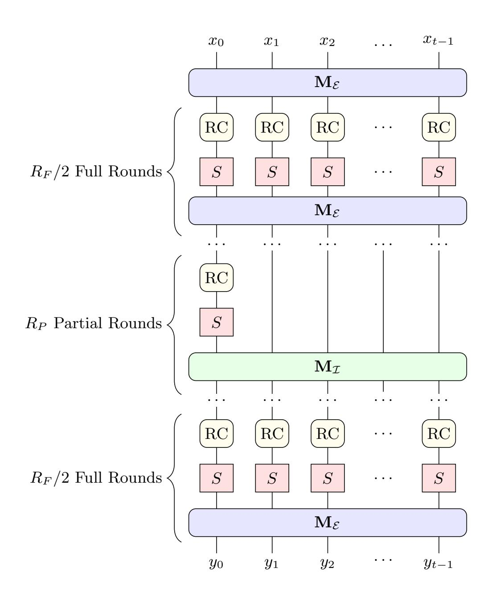
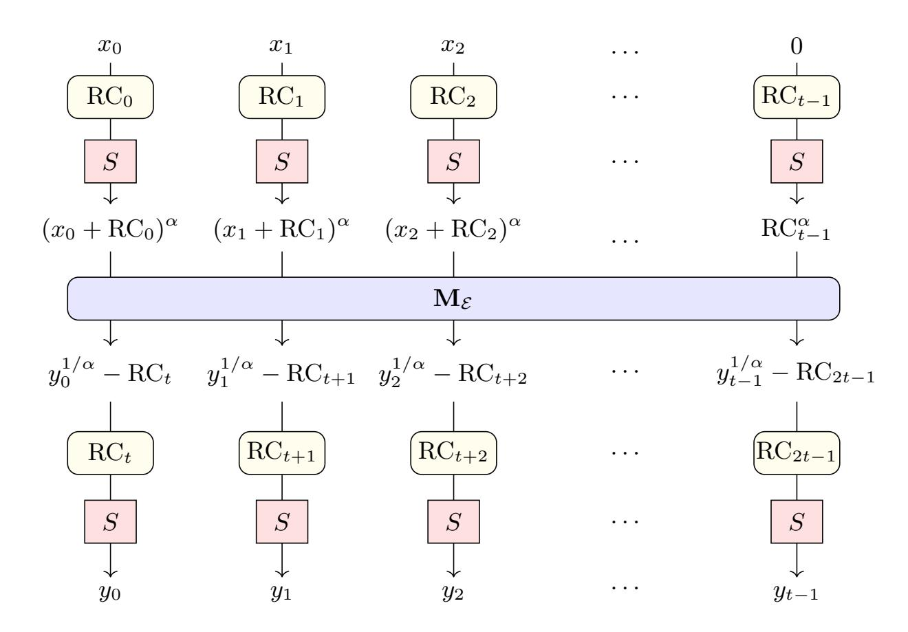
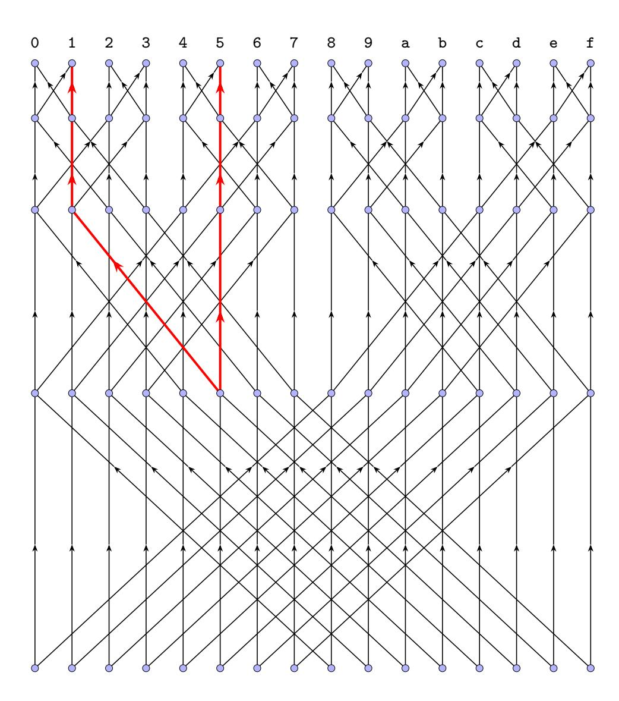

{0}------------------------------------------------

# Graeffe-Based Attacks on Poseidon and NTT Lower Bounds

Ziyu Zhao1<sup>⋆</sup> , Antonio Sanso<sup>2</sup> , Giuseppe Vitto3<sup>⋆</sup> , and Jintai Ding4,5()

- <sup>1</sup> Tsinghua University ziyuzhao0008@outlook.com
- <sup>2</sup> Ethereum Foundation name.surname@ethereum.org
  - <sup>3</sup> University of Luxembourg name.surname@uni.lu
    - <sup>4</sup> Xi'an Jiaotong-Liverpool University
- <sup>5</sup> Basque Center For Applied Mathematics jintai.ding@gmail.com

Abstract. Poseidon and Poseidon2 are cryptographic hash functions crafted for efficient zero-knowledge proof systems and have seen wide adoption in practical applications. We introduce the use of the Graeffe transform in univariate polynomial solving within this line of work. The proposed method streamlines the root recovery process in interpolation attacks and achieves several orders of magnitude acceleration in practical settings, enabling a new and more efficient class of attacks against Poseidon targeting round-reduced permutations and constrained input/output instances. We release open-source code and describe our method in detail, demonstrating substantial improvements over prior approaches: reductions in wall time by a factor of 2<sup>13</sup> and in memory usage by a factor of 2<sup>4</sup>.<sup>5</sup> . Memory-access costs for NTTs turn out to be a dominant barrier in practice. And we prove that this cost increases at least as the 4/3-power of the input size (up to logarithmic factors), which suggests the commonly used pseudo-linear cost model may underestimate the true resource requirements. This behavior contrasts with multivariate equation solving, whose main bottleneck remains finite-field linear algebra. We argue that, when selecting parameters, designers should account for interpolation-based attacks explicitly, since their practical hardness is determined by different, and sometimes stronger, resource constraints than those of multivariate techniques.

Keywords: Poseidon · Algebraic attack · Cryptanalysis · Root-finding · Graeffe · Interpolation · CICO · Zero-Knowledge · Hash · NTT

# 1 Introduction

Cryptographic hash functions are fundamental to modern cryptography. With the rise of advanced applications such as zero-knowledge proofs, especially STARK

<sup>⋆</sup> Both authors contributed to the practical implementation of the attacks presented in this work: Vitto implemented the attack variants for Poseidon-256 and Poseidon2, while Zhao developed an independent and concurrent implementation of the Poseidon2 attack. In this paper, the Poseidon-256 attack is described based on Vitto's implementation, and the Poseidon2 attack based on Zhao's implementation.

{1}------------------------------------------------

<span id="page-1-0"></span>protocols [8], there is a growing demand for hash functions that are efficient not only on conventional hardware but also when represented as arithmetic circuits over large prime fields. While general designs like SHA-2 and SHA-3 are highly optimized for modern CPUs, they cannot be represented as small arithmetic circuits, which essentially becomes a bottleneck for the performance of proof systems. As a result, several new so-called STARK-friendly or arithmetization-oriented constructions have been proposed, including Rescue-Prime [5,39], Feistel-MIMC [2], POSEIDON [20], and Reinforced Concrete [19]. Among these, POSEIDON and its successor POSEIDON2 [21] have emerged as top performers in recent STARK benchmarks by StarkNet, making them promising candidates for use in Ethereum and other applications that require efficient and verifiable computation.

However, unlike classical hash functions such as SHA-2 and SHA-3, which have been thoroughly analyzed over decades, these STARK-friendly constructions are relatively recent and lack extensive cryptanalysis. Their security cannot be directly inferred from traditional designs. The best-known attacks are also quite different: instead of relying on differential path search, they often exploit the algebraic structure of these hash functions. For example, Jarvis [4] has been shown to be vulnerable to certain algebraic attacks [1]. Moreover, the polynomial systems that arise in these symmetric primitives are quite different from those in multivariate cryptography: the underlying field is large, the degree is high, and there are fewer variables. More importantly, the equations are highly structured rather than random, which might be exploited for more efficient attacks, as demonstrated in [6] at CRYPTO 2024.

Therefore, a deeper understanding of the security of Poseidon and its variants is becoming increasingly important, particularly as these constructions see growing adoption in real-world applications. The attack surface of Poseidon has been examined in a recent cryptanalytic survey [23], which outlines the balance between statistical and algebraic vulnerabilities inherent in its design.

Currently, the most effective known attack against Poseidon is the interpolation attack [29], which targets the solution of CICO (Constrained Input, Constrained Output) problems for the inner sponge permutation (denoted by Perm) under various Poseidon parameterizations. The CICO problem asks for input and output pairs such that the last several elements in both are zero. For example, one may seek  $X_0, \ldots, X_6, Y_0, \ldots, Y_6$  such that  $\mathsf{Perm}(X_0, \ldots, X_6, 0) =$  $(Y_0,\ldots,Y_6,0)$ . The interpolation attack solves this by first fixing  $X_1,\ldots,X_6$  to random values. This reduces the mapping from  $X_0$  to the last coordinate of  $Perm(X_0,\ldots,X_6,0)$  to a univariate polynomial. This is possible because each round function in the Poseidon permutation can be expressed as a polynomial mapping. In practice, these univariate polynomials typically have roots with high probability, so solutions to the CICO problem can be found via univariate polynomial root-finding. The interpolation attack is not only theoretically sound, but also highly practical. A recent practical record [7] was achieved using this method. For the root-finding step, the roots of a polynomial f(x) over  $\mathbb{F}_p$  are found in three steps:

{2}------------------------------------------------

- <span id="page-2-1"></span>1. Compute g(x) = x <sup>p</sup> − x mod f(x) using the square-and-multiply method;
- 2. Compute gcd(g, f) using the Half-GCD algorithm; the result typically has low degree;
- 3. Extract the roots, for example, using the Berlekamp algorithm.

Based on this approach, roots of polynomials of degree 3<sup>18</sup> over a prime field of size p ≈ 2 <sup>64</sup> can be found in approximately one day.

To encourage further research and practical cryptanalysis, the Ethereum Foundation announced a bounty program in November 2024 [\[16\]](#page-23-5), aimed at motivating the community to analyze these constructions in practical settings. The participants are required to solve the CICO (Constrained Input, Constrained Output) problems for the inner sponge permutation (denoted by Perm) under different Poseidon parameterizations. The details of the challenges are summarized in [Table 1.](#page-2-0) The CICO problem asks for input and output pairs such that the last several elements in both are zero. For example, Poseidon-64 asks for X0, . . . , X6, Y0, . . . , Y<sup>6</sup> such that Perm(X0, . . . , X6, 0) = (Y0, . . . , Y6, 0).

Table 1. Summary of Poseidon Challenges

<span id="page-2-0"></span>

| Name                        | Field                                                                                       |              |                                 | #States S-box Permutation              |
|-----------------------------|---------------------------------------------------------------------------------------------|--------------|---------------------------------|----------------------------------------|
| Poseidon-256<br>Poseidon-64 | 255)<br>BLS12-381 (∼ 2<br>64)<br>Goldilocks (∼ 2<br>31)<br>Poseidon-31 M31 / KoalaBear (∼ 2 | 3<br>8<br>16 | 5<br>x 7→ x<br>x 7→ x<br>x 7→ x | Poseidon<br>7 Poseidon2<br>5 Poseidon2 |

We note that, when instantiated with the same S-box, Poseidon and Poseidon2 would differ only in the choice of the linear layer and round constants. For each parameter set, the Ethereum Foundation provided four challenge instances with different numbers of rounds, corresponding to 24-, 28-, 32-, and 40-bit security levels. After the challenges were announced, the 24-bit instances of Poseidon-256, as well as the 24-, 28-, and 32-bit instances of Poseidon-31, were solved within a short period. However, none of the Poseidon-64 instances were solved until our work, highlighting their difficulty.

The Graeffe Transform. Historically, the Graeffe transform dates back to the 1820s–1830s, with independent contributions from Dandelin, Lobachevsky, and Graeffe [\[28\]](#page-24-5). It was originally designed for finding the roots of real polynomials by mapping each root to its square, thereby spreading the roots apart and making them easier to locate numerically.

Here, we briefly review the original idea of the Graeffe transform. Suppose f(x) is a degree-d polynomial with roots r0, . . . , rd−<sup>1</sup> ∈ R, ordered so that |r0| > |r1| > · · · > |rd−1|. The Graeffe transform of f(x) of order 2, denoted by GT2(f), is defined such that

$$(\mathsf{GT}_2(f))(x^2) = f(x)f(-x).$$

{3}------------------------------------------------

<span id="page-3-0"></span>This construction yields a new polynomial whose roots are exactly  $r_0^2, r_1^2, \ldots, r_{d-1}^2$ . By applying the Graeffe transform v times, we obtain a polynomial

$$g(x) = x^{d} - c_{d-1}x^{d-1} + c_{d-2}x^{d-2} - \dots + (-1)^{d}c_{0}$$

(after normalizing the leading coefficient), whose roots are approximately

$$r_0^{2^v} \gg r_1^{2^v} \gg \dots \gg r_{d-1}^{2^v}.$$

By Vieta's formulas, the coefficients satisfy

$$c_{d-1} = r_0^{2^v} + r_1^{2^v} + \dots + r_{d-1}^{2^v} \approx r_0^{2^v},$$

$$c_{d-2} = r_0^{2^v} r_1^{2^v} + r_0^{2^v} r_2^{2^v} + \dots + r_{d-2}^{2^v} r_{d-1}^{2^v} \approx r_0^{2^v} r_1^{2^v},$$

$$c_{d-3} = r_0^{2^v} r_1^{2^v} r_2^{2^v} + r_0^{2^v} r_1^{2^v} r_3^{2^v} + \dots + r_{d-3}^{2^v} r_{d-2}^{2^v} r_{d-1}^{2^v} \approx r_0^{2^v} r_1^{2^v} r_2^{2^v},$$

$$\vdots$$

$$c_0 = r_0^{2^v} r_1^{2^v} \dots r_{d-1}^{2^v}.$$

From these relations, we can approximately recover the original roots of f(x) as

$$|r_0|\approx \sqrt[2^v]{c_{d-1}},$$
  $|r_1|\approx \sqrt[2^v]{\frac{c_{d-2}}{c_{d-1}}},$   $\vdots$   $|r_{d-1}|\approx \sqrt[2^v]{\frac{c_0}{c_1}}.$ 

Based on this idea, subsequent works have extended the Graeffe transform to handle cases with multiple roots of higher multiplicity [11], as well as roots in the complex plane [12]. In the context of finite fields, some studies [24, 25, 27] have introduced the so-called "Tangent Graeffe method" for factoring polynomials that split over the field. However, we are not aware of any prior application of the Graeffe transform to cryptanalysis, nor of any root-finding implementation capable of handling equations of such high degree, as most existing methods are limited to toy examples. Our results, developed in response to the Ethereum Foundation's Poseidon cryptanalysis challenge, offer a deeper understanding of the inherent difficulty of univariate root finding, as will be discussed later in this section.

Our Contribution This work improves the most time-consuming root finding step of the interpolation attack by using the Graeffe transform. Suppose  $\omega_{\ell}$  is a primitive  $\ell$ -th root of unity in the underlying field. Given a polynomial f, the Graeffe transform  $\mathsf{GT}_{\ell}$  of order  $\ell$  computes a new polynomial  $g = \mathsf{GT}_{\ell}(f)$  such that  $g(x^{\ell}) = f(x)f(x\omega_{\ell}^{1})\cdots f(x\omega_{\ell}^{\ell-1})$ . If f has a root  $x_{0} \in \mathbb{F}_{p}$  and  $\ell$  divides  $|\mathbb{F}_{p}^{\times}|$ ,

{4}------------------------------------------------

<span id="page-4-0"></span>then x ℓ <sup>0</sup> will be a root of g which lies in a subgroup of F × <sup>p</sup> of size (p − 1)/ℓ. By taking a large enough ℓ, x ℓ 0 can be found easily by enumeration, from which we can recover x<sup>0</sup> by extracting an ℓ-root.

It is easy to show that GTℓ0ℓ<sup>1</sup> = GTℓ<sup>0</sup> ◦ GTℓ<sup>1</sup> , so the Graeffe transform GT<sup>ℓ</sup> can be efficiently computed when ℓ is smooth. This is exactly the case for the Poseidon-64 challenges in [Table 1,](#page-2-0) where the Goldilocks field has size p<sup>64</sup> = 2<sup>32</sup> · 3 · 5 · 17 · 257 · 65537 + 1. We implemented our Graeffe transform-based root finding algorithm in C++ and CUDA. We designed our code in a modular way, separating field operations from NTT logic and memory management. As a result, it can be easily adapted to other 64-bit moduli where p − 1 is sufficiently smooth, by simply rewriting a few field operation functions. Our code is available at

## [https://github.com/zhaoziyu0008/Goldilocks\\_solver](https://github.com/zhaoziyu0008/Goldilocks_solver)

Compared to the previous record in [\[7\]](#page-23-4), our implementation is about 2<sup>13</sup> times faster in wall time and uses 24.<sup>5</sup> times less memory. With this, we were able to solve the previously unsolved 28-bit Poseidon-256, the 24-bit, 28-bit, and 32-bit Poseidon-64 challenges, corresponding to polynomials of degree 513, 712, 713, and 7 <sup>15</sup>, respectively. See [Table 2](#page-15-0) and [Table 3](#page-16-0) for details.

Our new implementation allows us to find roots of polynomials with degrees several thousand times larger than what was previously possible, far beyond the reach of existing methods. This also provides new insight into the actual hardness of interpolation attacks. Even after these improvements, the 32-bit instances are still much harder than the 32-bit instances of other well-known cryptographic problems, such as code decoding, lattice problems, or solving multivariate quadratic systems (e.g. see [\[3\]](#page-23-8)). This indicates a large security margin for Poseidon.

Actually, in all the challenges we solved, memory access was the main bottleneck, and GPUs played only a minor role in our speedup. For example, in the large degree cases, our toy CPU implementation with almost no optimization for field operations (no SIMD, etc.), was only about four times slower than the GPU version. During the Radix-2 NTT or invNTT, the typical GPU utilization was less than 20%.

Theoretically, for a 3-D array storing N bits, the average energy or resource cost to access a random bit is O(N<sup>1</sup>/<sup>3</sup> ) [\[34\]](#page-25-1). Even with the structured access patterns of NTT, we have proved that the total memory access cost is asymptotically at least proportional to the 4/3-power of the polynomial size, up to a logarithmic factor. These results are due to the fact that, physically, the information transfer cost is at least proportional to the distance it travels. Most existing literature [\[30,](#page-24-9)[36,](#page-25-2)[38\]](#page-25-3) only considers idealized hierarchical memory models, which do not fit this context.

Thus, it is reasonable to model the memory access cost as proportional to d 4/3 , while the computation cost is pseudo-linear in d for a polynomial of degree d. The crossover point dc, where memory access begins to dominate, should be well below d = 7<sup>15</sup> according to our experiments. Based on this, we suggest 

{5}------------------------------------------------

<span id="page-5-1"></span>estimating the cost of root finding for a degree d' polynomial as  $(d'/d_c)^{4/3}$  times the cost for degree  $d_c$  root finding, for any  $d' > d_c$ , rather than assuming pseudolinear scaling. Using this model, in Section 4.2, we estimate that the cost of interpolation attacks on the 128-bit Poseidon-256 instances is equivalent to about  $2^{200}$  SHA-256 evaluations. This makes us confident in the security of current parameters against interpolation attacks.

It is important to emphasize that the above security analysis only applies when the CICO problem requires just the last coordinate to be fixed. For example, the Poseidon-31 challenge in Table 1 requires  $Perm(X_0, ..., X_{13}, 0, 0) = (Y_0, ..., Y_{13}, 0, 0)$ . Then the best known attack would be the Gröbner basis computation [13, 18] together with the FGLM [17] algorithm, or the mutant XL [14, 33] algorithm, where the main bottleneck is linear algebra, which is no longer memory-bound. In such cases, the security margin would be much tighter. Thus, it might be preferable for designers to choose parameters such that the best known attacks are interpolation rather than Gröbner basis approaches, as the former is *simpler* and presents more inherent hardness.

Outline The rest of the paper is organized as follows. In Section 2, we review the necessary background on the Poseidon permutation and introduce the Skip First Rounds Trick from [7], which we also use in our attacks. Section 3 details the Graeffe transform and its application to univariate polynomial root finding, and briefly reviews GCD-based root finding algorithms. In Section 4, we describe our implementation and present performance results, including details of the solved challenges and a discussion on security. In Section 5, we prove an asymptotic lower bound for the memory access cost during NTT, which is used in the security analysis presented in the previous section. Finally, we conclude in Section 6.

# <span id="page-5-0"></span>2 Preliminaries

#### 2.1 Notation

In the remaining of the paper, bold uppercase letters denote matrices, while bold lowercase letters denote vectors. The *i*-th entry (indices start from 0) of a vector  $\mathbf{v}$  is written as  $v_i$ , and the (i,j)-th position of a matrix  $\mathbf{M}$  is  $\mathbf{M}_{i,j}$ . We denote by  $\mathbb{F}_p$  the prime field with p elements, and by  $\mathbb{F}_p^{\times}$  its multiplicative group. When the underlying field is clear, we denote the cost of multiplying two degree-d polynomials by  $\mathbf{M}(d)$ . For convenience, throughout the paper we will use

#### $p_{64} = 0$ xffffffff00000001

 $p_{255} = \texttt{0x73eda753299d7d483339d80809a1d80553bda402fffe5bfeffffff000000011}$ 

to denote the Goldilocks and BLS12-381 field characteristic, respectively. We do not distinguish between a polynomial and the corresponding polynomial mapping.

For notation related to the Poseidon permutation construction, we follow the conventions in the original paper [20]: t denotes the number of states,  $R_P$  

{6}------------------------------------------------

<span id="page-6-1"></span>and  $R_F$  denote the number of partial and full rounds, respectively, and  $\alpha$  is the S-box exponent.

## 2.2 The Poseidon Permutation and the CICO problem

In this subsection, we present the construction of the inner sponge permutation used in the Poseidon family of hash functions. We will first describe the Poseidon2 sponge permutation in detail and then briefly mention the differences with Poseidon.



<span id="page-6-0"></span>Fig. 1. Circuit for Poseidon2 Sponge Permutation

The Poseidon2 sponge permutation, as shown in Figure 1, is based on the HADES [22] design strategy. After the input  $(x_0, \ldots, x_{t-1}) \in \mathbb{F}_p^t$  is transformed by the matrix  $\mathbf{M}_{\mathcal{E}}$ , the permutation proceeds by applying  $R_F/2$  full rounds,  $R_P$  partial rounds, and then another  $R_F/2$  full rounds. In Figure 1, each RC gate represents the addition of a round constant (with a different constant at each

{7}------------------------------------------------

<span id="page-7-1"></span>gate). The S-box S is the power map  $x \mapsto x^{\alpha}$ , where  $\alpha$  is chosen as the smallest integer greater than 1 such that the S-box is invertible. During the partial rounds, the S-box and RC gates only apply to the first state, and the linear transformation used in these rounds differs from that in the full rounds. This design choice improves efficiency while maintaining a high polynomial degree for interpolation attacks.

For the Poseidon-64 challenges, the linear transformations are taken to be

$$\mathbf{M}_{\mathcal{E}} = \begin{pmatrix} 10 & 14 & 2 & 6 & 5 & 7 & 1 & 3 \\ 8 & 12 & 2 & 2 & 4 & 6 & 1 & 1 \\ 2 & 6 & 10 & 14 & 1 & 3 & 5 & 7 \\ 2 & 2 & 8 & 12 & 1 & 1 & 4 & 6 \\ 5 & 7 & 1 & 3 & 10 & 14 & 2 & 6 \\ 4 & 6 & 1 & 1 & 8 & 12 & 2 & 2 \\ 1 & 3 & 5 & 7 & 2 & 6 & 10 & 14 \\ 1 & 1 & 4 & 6 & 2 & 2 & 8 & 12 \end{pmatrix} \quad (\mathbf{M}_{\mathcal{I}})_{i,j} = \begin{cases} 1 + \mu_i & \text{if } i = j \\ 1 & \text{otherwise} \end{cases}$$

where the  $\mu_i$ 's, together with the round constants, can be generated by the script at https://github.com/HorizenLabs/poseidon2. The MDS matrices and round constants for Poseidon-256 can also be generated using this script.

The main differences between the Poseidon and Poseidon2 permutations are:

- Poseidon does not apply the initial linear transform before the first round.
- Poseidon uses the same MDS matrix for all rounds.
- For the partial rounds, Poseidon also applies the RC gates to all states.

Solving the Ethereum Poseidon challenges require a solution to the CICO problem for reduced-round instances of both these permutations.

**Definition 1 (CICO Problem).** Given a function  $F : \mathbb{F}_p^t \to \mathbb{F}_p^t$  and an integer u < t, the CICO problem asks for  $X_0, \ldots, X_{t-1-u}, Y_0, \ldots, Y_{t-1-u} \in \mathbb{F}_p$  such that

$$F(X_0,\ldots,X_{t-1-u},0,\ldots,0)=(Y_0,\ldots,Y_{t-1-u},0,\ldots,0).$$

#### <span id="page-7-0"></span>2.3 The Skip-Round Attack

In this subsection, for ease of reference we provide a brief review of the Skip First Rounds Trick from [7], which we also used in our attacks. This technique reduces the polynomial degree by a factor of  $\alpha$  for Poseidon2 and by  $\alpha^2$  for Poseidon, respectively. The impact is less significant for Poseidon2, owing to the presence of the initial linear transformation—this is precisely why [21] introduced the initial linear transform in the first place.

The 2-Round Attack for Poseidon The first few steps of Poseidon are illustrated in Figure 2. Let the last row of  $(\mathbf{M}_{\mathcal{E}})^{-1}$  be  $(\lambda_0, \ldots, \lambda_{t-1})$ . Then,

{8}------------------------------------------------

(y0, . . . , yt−1) corresponds to an input whose last coordinate is zero if and only if

$$\sum_{i=0}^{t-1} \lambda_i y_i^{1/\alpha} = \sum_{i=0}^{t-1} \lambda_i \cdot \mathrm{RC}_{t+i} + \mathrm{RC}_{t-1}^{\alpha}.$$

This condition is satisfied, for example, by taking

$$y_{t-1} = \left(\sum_{i=0}^{t-1} \lambda_i / \lambda_{t-1} \cdot RC_{t+i} + RC_{t-1}^{\alpha} / \lambda_{t-1}\right)^{\alpha},$$

setting y<sup>2</sup> = . . . = yt−<sup>2</sup> = 0, and letting y<sup>1</sup> = (λ0/λ1) <sup>α</sup> · y0. Under these choices, the permutation becomes a univariate polynomial in y<sup>0</sup> of degree α R<sup>F</sup> +R<sup>P</sup> −2 . Finding the roots of this polynomial gives a solution to the CICO problem, so the polynomial degree can be reduced by a factor of α 2 .



<span id="page-8-0"></span>Fig. 2. First Two Rounds of Poseidon (last linear layer excluded)

The 1-Round Attack for Poseidon2 For Poseidon2, there is an initial linear transformation before the first round. We may proceed similarly to create a univariate polynomial with degree α R<sup>F</sup> +R<sup>P</sup> −1 , whose solution directly gives a solution to the CICO problem. We mention that the generated univariate polynomials in both cases behave like random polynomials in practice, and thus have a root with high probability.

{9}------------------------------------------------

# <span id="page-9-2"></span><span id="page-9-0"></span>3 Root Finding for Univariate Polynomials

In this section, we first review current polynomial solving methods for practical attacks on STARK-friendly hash functions. Then we present our Graeffe transform-based algorithm in detail.

## <span id="page-9-1"></span>3.1 Solving Univariate Systems

The polynomials that appear in interpolation attacks, such as those described in [Subsection 2.3,](#page-7-0) usually have only a few roots in the underlying field, much like random polynomials. This allows the use of the following GCD-based root finding approach, which was used to set the Poseidon interpolation record [\[7\]](#page-23-4).

If f(x) is a polynomial of degree d over Fp, to compute its roots, the GCDbased approach first replaces f(x) with its GCD with the Frobenius polynomial x <sup>p</sup> − x, reducing the problem to the case where f(x) is split over Fp, then finds the roots by using the Berlekamp algorithm [\[10\]](#page-23-11) or the Cantor-Zassenhaus algorithm [\[15\]](#page-23-12). Since the polynomials involved in the interpolation attack usually have only a few roots, the cost of the second step is negligible.

Before the GCD computation, since f(x) usually has degree much less than x <sup>p</sup> − x, it will be helpful to compute g(x) = x <sup>p</sup> − x mod f(x) to replace x <sup>p</sup> − x in the computation. This step can be performed using the square-and-multiply method, which requires O(log p) modular polynomial multiplications for a total computational cost of O(log(p)M(d)).

The computation of the GCD, although it can also be done by the Half-GCD algorithm in O(log(n)M(d)), turns out to be the most troublesome part of the root finding process. The key step in the classical Half-GCD algorithm [\[32\]](#page-25-5), which reduces the GCD computation to half size, is presented in [Algorithm 1.](#page-10-0)

The greatest common divisor computation is unattractive for the following reasons:

- [Algorithm 1](#page-10-0) is highly sequential. While it manages to reduce the polynomial degree, each step is entangled with the results of previous steps. This strong dependency makes the GCD computation notoriously difficult to parallelize, especially when aiming to keep the total computational cost optimal—some works [\[35\]](#page-25-6) have (theoretically) achieved polylogarithmic runtime using almost quadratic (in the polynomial degree) number of arithmetic processors, which is unacceptable. Parallelizing GCD computation in practice, even with several CPU cores, is highly non-trivial, let alone achieving massive parallelism with tens of thousands of threads on modern parallel architectures like GPUs, as is common in cryptographic applications.
- Although the Half-GCD runs in O(log(n)M(d)) time, the constant factor is quite large. In the original paper [\[32\]](#page-25-5), the computation cost is bounded by 22 log(n)M(d). Later works [\[26\]](#page-24-13) reduce this constant factor somewhat by modifying the algorithm, but these modifications make the already complex algorithm even more involved and further exacerbate the following issue.

{10}------------------------------------------------

# Algorithm 1: HGCD(f(x), g(x))

<span id="page-10-0"></span>Input: f(x), g(x) ∈ Fp[x], deg(f) > deg(g) ⩾ 0.

Output: An unimodular matrix <sup>M</sup> such that f g = M ˜f g˜ where

$$\deg(\tilde{f}) \geqslant \left\lceil \frac{\deg(f)}{2} \right\rceil > \deg(\tilde{g}).$$

- 1 d<sup>0</sup> ← ⌈deg(f)/2⌉;
- <sup>2</sup> if deg(g) < d<sup>0</sup> then return 1 0 0 1 ;
- 3 M<sup>0</sup> ← HGCD((f − (f mod x <sup>d</sup><sup>0</sup> ))/x<sup>d</sup><sup>0</sup> ,(g − (g mod x <sup>d</sup><sup>0</sup> ))/x<sup>d</sup><sup>0</sup> );
- 4 f0 g0 ← M<sup>−</sup><sup>1</sup> 0 f g ;
- 5 if deg(g0) < d<sup>0</sup> then return M0;
- 6 compute division f<sup>0</sup> = q0g<sup>0</sup> + r<sup>0</sup> with deg(r0) < deg(g0);
- 7 if deg(r0) < d<sup>0</sup> then return M<sup>0</sup> q<sup>0</sup> 1 1 0 ;
- 8 d<sup>1</sup> ← 2d<sup>0</sup> − deg(g0);
- 9 M<sup>1</sup> ← HGCD((g<sup>0</sup> − (g<sup>0</sup> mod x <sup>d</sup><sup>1</sup> ))/x<sup>d</sup><sup>1</sup> ,(r<sup>0</sup> − (r<sup>0</sup> mod x <sup>d</sup><sup>1</sup> ))/x<sup>d</sup><sup>1</sup> );
- 10 return M<sup>0</sup> q<sup>0</sup> 1 1 0 M<sup>1</sup>
- Last but not least, the Half-GCD algorithm is presented in recursive form and is hard to implement, especially when dealing with large (possibly heterogeneous) memory or attempting to parallelize the computation.

As a result, we have no interest in using the Half-GCD algorithm and instead we choose the much simpler and cleaner Graeffe transform for the Poseidon challenges, which turns out to be even more efficient than we expected.

## <span id="page-10-1"></span>3.2 Root Finding via Graeffe Transform

The root-finding strategy outlined in [Subsection 3.1](#page-9-1) is a well-known method for identifying roots of polynomials over finite fields, with its origins tracing back to Berlekamp's polynomial factorization algorithm. However, this algorithm is generic in nature and does not rely on any specific structural properties of the fields in which the polynomials are defined to improve computational efficiency.

In this section, we introduce the Graeffe transform and examine its various properties. These properties will subsequently be used to accelerate polynomial root-finding over NTT-friendly fields, i.e., finite fields F<sup>p</sup> in which p−1 is smooth.

Throughout this paper, we use the following definition of the Graeffe transform.

Definition 2 (Graeffe Transform). Let f(x) ∈ Fp[x] be a polynomial. For any positive integer ℓ coprime to p, the Graeffe transform of f(x) of order ℓ, 

{11}------------------------------------------------

denoted  $GT_{\ell}(f)$ , is defined as the unique polynomial g such that

$$g(x^{\ell}) = f(x)f(x\omega_{\ell}^{1})\cdots f(x\omega_{\ell}^{\ell-1}),$$

where  $\omega_{\ell}$  is a primitive  $\ell$ -th root of unity, possibly in an extension field of  $\mathbb{F}_p$ .

**Lemma 1.** If  $f(x) \in \mathbb{F}_p[x]$  is a polynomial of degree d,  $\ell$  is coprime to p, then the Graeffe transform  $\mathsf{GT}_{\ell}(f)$  is also a well-defined polynomial in  $\mathbb{F}_p[x]$  of degree d.

Proof. Let  $h(x) = f(x)f(x\omega_{\ell}^1)\cdots f(x\omega_{\ell}^{\ell-1})$ . By construction, h(x) is invariant under the substitution  $x\mapsto x\omega_{\ell}$ , which multiplies the coefficient of  $x^i$  by  $\omega_{\ell}^i$ . Thus, the coefficients of  $x^i$  in h(x) can be nonzero only if  $\omega_{\ell}^i = 1$ , i.e., i is a multiple of  $\ell$ . Therefore, the existence of g(x) is guaranteed, and the degree of g(x) is  $\deg(h(x))/\ell = d$ . It remains to show that the coefficients of g(x) lie in  $\mathbb{F}_p$ . This holds because, by construction, each coefficient of h(x) is fixed under any Galois conjugation. Therefore, the coefficients must lie in the fixed field of the Galois group, which is exactly  $\mathbb{F}_p$ .

**Lemma 2.** If  $f(x) \in \mathbb{F}_p[x]$  is a polynomial of degree d,  $\ell_0, \ell_1$  are coprime to p, then  $GT_{\ell_0}(\mathsf{GT}_{\ell_1}(f)) = \mathsf{GT}_{\ell_0 \cdot \ell_1}(f)$ .

*Proof.* Suppose  $\omega$  is a primitive  $\ell_0\ell_1$ -th root of unity. Then  $\omega^{\ell_1}$  is a primitive  $\ell_0$ -th root of unity, and  $\omega^{\ell_0}$  is a primitive  $\ell_1$ -th root of unity. By the definition of the Graeffe transform, we have

$$\begin{split} \mathsf{GT}_{\ell_0}(\mathsf{GT}_{\ell_1}(f))(x^{\ell_0\ell_1}) &= \mathsf{GT}_{\ell_1}(f)(x^{\ell_1})\mathsf{GT}_{\ell_1}(f)(x^{\ell_1}\omega^{\ell_1})\cdots\mathsf{GT}_{\ell_1}(f)(x^{\ell_0-1)\ell_1}) \\ &= \mathsf{GT}_{\ell_1}(f)(x^{\ell_1})\mathsf{GT}_{\ell_1}(f)((x\omega)^{\ell_1})\cdots\mathsf{GT}_{\ell_1}(f)((x\omega^{\ell_0-1})^{\ell_1}) \\ &= \prod_{j=0}^{\ell_0-1} f(x\omega^j)f(x\omega^{j+\ell_0})\cdots f(x\omega^{j+(\ell_1-1)\ell_0}) \\ &= \mathsf{GT}_{\ell_0\cdot\ell_1}(f)(x^{\ell_0\ell_1}). \end{split}$$

which concludes the proof.

In the remainder of this paper, we always take  $\ell$  to be a divisor of p-1, thus ensuring the existence of a primitive  $\ell$ -th root of unity in  $\mathbb{F}_p$ , with  $\ell$  also coprime to p. In this setting, if  $\mu \in \mathbb{F}_p$  is a root of f, then  $\mathsf{GT}_{\ell}(f)$  has  $\mu^{\ell}$  as a root. Conversely, if  $\nu$  is a root of  $\mathsf{GT}_{\ell}(f)$  and has one (and thus all)  $\ell$ -th roots in  $\mathbb{F}_p$ , then at least one of them is a root of f. This property leads to the following algorithm for root finding.

This formulation in Algorithm 2 presents a more general version of the Graeffe method, allowing an arbitrary number of odd prime factors of p-1, which is essential for the case of Poseidon. In the computation of common roots in line 8, one can first reduce  $g_{i-1}$  modulo  $(x^{q_i} - \mu_i)$ , so that the resulting polynomials have low degree. When p-1 is smooth, the cost of these steps becomes negligible. Moreover, in the first loop, as soon as  $\beta$  drops below the degree of

{12}------------------------------------------------

#### **Algorithm 2:** Root Finding by Graeffe Transform

```
Input: A polynomial f(x) \in \mathbb{F}_p[x] of degree d and the prime factorization p-1=q_1q_2\cdots q_k

Output: A root of f(x) in \mathbb{F}_p, if one exists

1 \beta \leftarrow p-1; g_0 \leftarrow f;

2 for i\leftarrow 1 to k do

3 \beta \leftarrow \beta/q_i;

4 g_i \leftarrow \mathsf{GT}_{q_i}(g_{i-1}) \bmod (x^\beta-1);

5 if g_k has no roots in \mathbb{F}_p then return \beta;

6 \beta \leftarrow \beta = \beta = \beta;

7 for \beta \leftarrow \beta = \beta = \beta;

9 return \beta = \beta;

9 return \beta = \beta;
```

f, the subsequent computations rapidly become trivial, since the polynomials involved are then of much smaller degree. This flexibility allows several factors of p-1 to be moderately large, while the overall computational cost remains well controlled; see, for example, Algorithm 3.

We now discuss the computation and complexity of the Graeffe transform in Algorithm 2. Suppose f(x) is a polynomial of degree d over  $\mathbb{F}_p$ . For  $\ell = 2$ , if  $f(x) = f_0(x^2) + x f_1(x^2)$ , then

$$f(x)f(-x) = (f_0(x^2) + xf_1(x^2))(f_0(x^2) - xf_1(x^2)) = f_0(x^2)^2 - x^2f_1(x^2)^2.$$

Therefore, the Graeffe transform of order 2 is given by  $\mathsf{GT}_2(f) = f_0(x)^2 - x f_1(x)^2$ . This can be computed using two NTTs and one invNTT with any NTT group size larger than d.

For  $\ell \geqslant 3$ , we follow the method described in [24]. If  $P_h(x)$  is the product

$$P_h(x) = f(x)f(x\omega_\ell^1)\cdots f(x\omega_\ell^{h-1}),$$

then it suffices to compute  $P_{\ell}(x)$ , which can be done recursively as follows:

$$P_h(x) = \begin{cases} f(x) & \text{if } h = 1\\ P_{h/2}(x)P_{h/2}(x\omega_{\ell}^{h/2}) & \text{if } h \text{ is even}\\ f(x)P_{(h-1)/2}(x\omega_{\ell})P_{(h-1)/2}(x\omega_{\ell}^{(h+1)/2}) & \text{otherwise} \end{cases}$$

Unlike the case  $\ell=2$ , this recursive method computes  $\mathsf{GT}_\ell(f)(x^\ell)$  first. As a result, it is easier to implement, but it requires roughly  $2\ell$  times more memory than the output polynomial size. However, this is not a problem in solving Ethereum challenges, since Graeffe transforms of order greater than 2 are only applied to small-degree polynomials in the final steps. Thus, the memory usage can be controlled.

{13}------------------------------------------------

#### <span id="page-13-0"></span>4 Attacking Poseidon and Poseidon2

## 4.1 Accelerate Root-finding with Graeffe's Transform

A more practical version of Algorithm 2 for  $\mathbb{F}_{p_{64}}$  is presented in Algorithm 3, designed to reduce memory usage and clarify the main idea of Algorithm 2.

#### Algorithm 3: Root Finding over the Goldilocks Field

```
Input: A polynomial f(x) \in \mathbb{F}_{p_{64}}[x] of degree d.
     Output: A root of f(x) in \mathbb{F}_{p_{64}}, if one exists.
  1 \beta \leftarrow p_{64} - 1; \mu \leftarrow 1; g \leftarrow f;
  2 while \beta is even do
  \beta \leftarrow \beta/2;
  4 g \leftarrow \mathsf{GT}_2(g) \bmod (x^\beta - \mu);
 5 \beta \leftarrow \beta/3; g_3 \leftarrow \mathsf{GT}_3(g) \bmod (x^\beta - \mu);
 6 \beta \leftarrow \beta/5; g_5 \leftarrow \mathsf{GT}_5(g_3) \bmod (x^\beta - \mu);
 7 \beta \leftarrow \beta/17; g_{17} \leftarrow \mathsf{GT}_{17}(g_5) \bmod (x^{\beta} - \mu);
 8 \beta \leftarrow \beta/257; g_{257} \leftarrow \mathsf{GT}_{257}(g_{17}) \bmod (x^{\beta} - \mu);
 9 if g_{257} has no roots in \mathbb{F}_{p_{64}} then return \perp;
10 \mu \leftarrow a common root of g_{257} and x^{65537} - \mu;
11 \mu \leftarrow a common root of g_{17} and x^{257} - \mu;
12 \mu \leftarrow a common root of g_5 and x^{17} - \mu;
13 \mu \leftarrow a common root of g_3 and x^5 - \mu;
14 \mu \leftarrow a common root of g and x^3 - \mu;
15 \beta \leftarrow 2^{32}; h \leftarrow f \mod (x^{\beta} - \mu);
16 return a common root of h and x^{2^{32}} - \mu;
```

Suppose  $\lambda \in \mathbb{F}_{p_{64}}$  is a root of f(x). By the definition of the Graeffe transform, in lines 2 to 8 of Algorithm 2, we compute a polynomial  $g_{257}$  that shares a common root  $\lambda^{(p_{64}-1)/65537}$  with the Graeffe transform  $\mathsf{GT}_{(p_{64}-1)/65537}(f)$ . This common root can be found by enumeration, since the modulo operations in lines 2 to 8 reduce the polynomial degree sufficiently. Once  $\lambda^{(p_{64}-1)/65537} = \lambda^{2^{32}\cdot65535}$  is known, we successively recover  $\lambda^{2^{32}\cdot255}$ ,  $\lambda^{2^{32}\cdot15}$ ,  $\lambda^{2^{32}\cdot3}$ , and  $\lambda^{2^{32}}$  in lines 11 to 14, each corresponding to  $\mu$  in the respective step. Finally, we can recover  $\lambda$  by computing a common root of f and  $x^{2^{32}} - \lambda^{2^{32}}$ , using a process similar to that in lines 5 to 14. As mentioned earlier, the computation is dominated by the first  $\log_2(p_{64}) - \log_2(d) + 1$  order-2 Graeffe transforms in the setting of Poseidon-64, and there is no need to store all intermediate polynomials. We do not even store f, but use interpolation to recover it each time it is needed.

We conclude this subsection by remarking that the numbers 2, 3, 5, 17, 257 in Algorithm 2 correspond exactly to the factorization  $p_{64} - 1 = 2^{32} \cdot 3 \cdot 5 \cdot 17 \cdot 257 \cdot 65537$ . It is straightforward to adapt this approach to other prime fields, as long as the multiplicative group size of the field is sufficiently smooth. Furthermore,

{14}------------------------------------------------

<span id="page-14-0"></span>all prime numbers appearing in the Poseidon Challenge [\[16\]](#page-23-5) have quite smooth multiplicative group sizes, e.g.

```
p255 − 1 =232
               · 3 · 11 · 19 · 10177 · 125527 · 859267 · 9063492
                                                               ·
           2508409 · 2529403 · 52437899 · 2547602932
                                                         .
```

## 4.2 Breaking Reduced-Round Instances of Poseidon and Poseidon2

We now demonstrate how the techniques developed in the previous sections can be applied to break reduced-round instances of the Poseidon and Poseidon2 permutations over prime fields. The reduced-round instances analyzed here originate from the Ethereum Foundation bug bounty program, as detailed on the official Poseidon initiative website [\[16\]](#page-23-5). The 256-bit prime field instances, which we solve first, rely on the traditional algebraic method outlined in [Subsection 3.1,](#page-9-1) while in the 64-bit prime field setting, we employ the Graeffe-based root-finding approach described in [Subsection 3.2.](#page-10-1) In both settings, we demonstrate that our root-finding strategy can recover a preimage (or equivalently, solve the CICO-1 problem).

Poseidon-256 Our initial experiments focused on the 256-bit prime field instances. They were executed on a machine equipped with an AMD EPYC 9374F 32-core processor, 1.1TB of RAM, and 8 NVIDIA L4 GPUs, each with 23GiB of memory. The AWS cloud instance closest to this hardware configuration is the g6.48xlarge, which features 192 vCPUs, 768GiB of memory, and 8 NVIDIA L4 GPUs, priced at \$13.35 per hour on demand.

The 256-bit prime field instances were solved using the traditional rootfinding method. During the power mod computation, we padded polynomials with zeros to the nearest power-of-two length to enable efficient radix-2 NTT. Consequently, the interpolated polynomials are represented as vectors of size 2<sup>28</sup> and 2<sup>31</sup> for the P\_6\_8 and P\_6\_9 instances in [Table 2,](#page-15-0) respectively, with each entry occupying 32 bytes. The GCD computations were performed using the NTL library [\[40\]](#page-25-7).

We examine the computational cost and resource demands of solving each bounty instance detailed in [Table 2.](#page-15-0) Unfortunately, exact execution-time measurements for the NTL-based GCD computations are no longer available. However, this step required a few hours of computation on a single CPU core for the P\_6\_8 instance and around 3 days for P\_6\_9.

Poseidon-64 Two major issues became apparent in our 256-bit prime field experiments. First, as discussed in [Subsection 3.1,](#page-9-1) the GCD computation is hard to parallelize efficiently. Second, the memory required to store the polynomials exceeds the available system RAM for larger instances. To address both challenges and to solve the 64-bit prime field instances with even higher interpolation degrees, we implemented our Graeffe transform-based algorithm in C++ with

{15}------------------------------------------------

<span id="page-15-1"></span><span id="page-15-0"></span>

| Instance  | Field     | κ  | RP | RF | Degree | GPU | GCD     | Other Steps |
|-----------|-----------|----|----|----|--------|-----|---------|-------------|
| P_6_8     | BLS12-381 | 24 | 6  | 8  | 512    | No  | <1 day  | 218.12s     |
| P_6_8_GPU |           | 24 | 6  | 8  | 512    | Yes | <1 day  | 215.03s     |
| P_6_9     |           | 28 | 6  | 9  | 513    | Yes | ∼3 days | 217.86s     |

Table 2. Parameters and attack cost summary for Poseidon reduced-round instances at security level κ.

CUDA, comprising about 4,000 to 5,000 lines of code. Our code uses a modular design, which decouples memory management, polynomial algorithms, and field arithmetic. Thus, it is possible to adapt the code to other 64-bit prime fields by changing the NTT group choice and field arithmetic code as long as the multiplicative group size is smooth enough, although the current implementation is constrained to the Goldilocks field. With this implementation, we have solved the 24-, 28-, and 32-bit Poseidon-64 challenges, which (using the Skip First Rounds Trick in [Section 2\)](#page-5-0) correspond to polynomial degrees 712, 713, and 7 <sup>15</sup>, respectively.

The code was initially developed, tuned, and executed on a dual-socket Intel Xeon Platinum 8474C server equipped with several Nvidia RTX 4090 graphics cards. Each card is connected to the system's 2TB RAM via a PCIe 4.0 interface, providing a unidirectional bandwidth of roughly 200 GiB/s in total under realworld conditions.

Although our code was developed for Nvidia's Ada architecture with compute capability 8.9, we performed almost no low-level optimization of finite field arithmetic or NTT routines specifically for GPU or CPU architectures, for reasons discussed later in this subsection. Thus, our implementation is largely hardwareagnostic and should achieve similar efficiency on most modern GPUs or CPUs. The performance is mainly determined by memory bandwidth rather than compute throughput.

Also, large system RAM is not necessary for running our code. When available memory is limited, users can configure the maximum RAM usage, and our implementation will automatically swap polynomial coefficients and NTT data to and from disk as needed. All other data, aside from polynomial coefficients and NTT values, require only a few gigabytes and should fit comfortably in RAM on most systems. In this scenario, overall speed will be limited by disk I/O, but still acceptable — in our case it is about 2 ∼ 3 times slower than running entirely in RAM.

For the challenges in [Table 3,](#page-16-0) we need to compute NTT and invNTT with group sizes of at least 7<sup>12</sup>, 7<sup>13</sup>, and 7<sup>15</sup>, all of which are larger than the even part of p<sup>64</sup> − 1 = 2<sup>32</sup> · 3 · 5 · 17 · 257 · 65537. This means the Goldilocks field does not support such large radix-2 number theoretic transforms directly. Possible approaches include the Sch¨onhage-Strassen algorithm [\[37\]](#page-25-8) and the Elliptic Curve FFT [\[9\]](#page-23-13), but we choose to use mixed-radix NTT for simplicity. Our implementation supports at most two odd radices, meaning it can handle NTT group sizes 

{16}------------------------------------------------

<span id="page-16-1"></span>of the form  $2^{e_2}q_1q_2$ , where  $q_1$  and  $q_2$  are odd divisors of  $|\mathbb{F}_{p_{64}}^{\times}|$ . For example, for a polynomial of degree  $7^{15}$ , we use a group size of  $2^{32} \cdot 5 \cdot 257$ . Although using a Radix-257 NTT significantly increases the computational cost, this overhead remains well hidden below the memory bandwidth limit.

Table 3. Comparison of Wall Time and Memory Usage

<span id="page-16-0"></span>

| Instance | Field      | $\kappa$ | $R_P$ | $R_F$ | Degree   | Time                   | Memory | Time [7]      | Memory [7] |
|----------|------------|----------|-------|-------|----------|------------------------|--------|---------------|------------|
| P2_6_7   |            | 24       | 6     | 7     | =        |                        |        |               | 6.1TB      |
| P2_6_8   | Goldilocks | 28       | 6     | 8     | $7^{13}$ | $2^{11.38}$ s          | 1.8TB  | $2^{24.83}$ s | 41TB       |
| P2_6_10  |            | 32       | 6     | 10    | $7^{15}$ | $2^{18.35}s^{\dagger}$ | 90TB   | $2^{30.88}$ s | 1.9PB      |

<sup>†</sup> Data swapped to disk.

In Table 3, we compare the performance of our implementation with previous GCD-based results from [7]. For the GCD-based method, direct computation is infeasible even for the degree  $7^{12}$  case. Therefore, we use the fitting curve from Figure 12 of [7] to estimate the wall time and memory usage in Table 3. This estimate optimistically assumes that the speed is not further reduced by accessing petabytes of memory. In reality, such memory obviously cannot be placed in fast RAM as in the original experiments used to get the fitting curve. We see that for degrees  $7^{12}$  and  $7^{13}$ , our result is about 10,000 times faster and uses only 4% to 5% of the memory, which clearly shows the advantage. For  $7^{15}$ , although swapping data to disk causes some slowdown, our method is still about 6,000 times faster than the previous result.

We remark that the experiments in [7] were done with one Intel Xeon E7-4860 core, which may also benefit from parallelism. However, we expect this benefit to be minor. The GCD computation step, as explained in Subsection 3.1, is actually highly nontrivial—if not impossible—to massively parallelize without greatly increasing the total computational cost. In contrast, the Graeffe transform-based method is algorithmically parallelism-friendly, memory efficient, and easy to implement, which fits the usual settings for large scale attacks.

Memory Issue Surprisingly, even after we have made significant improvements to the root finding algorithm, the "32-bit" challenge still takes several days. For other well-known hard problems, such as lattice problems, multivariate polynomial system solving, or decoding [3], it is typically feasible to solve instances up to 60 or even 70 "bits". This suggests that the Poseidon interpolation attack has some inherent hardness, and that previous security estimates might have been somewhat too conservative.

In fact, this difficulty can largely be attributed to the cost of memory access. Even when using architectures that support 64-bit operations poorly, memory

{17}------------------------------------------------

<span id="page-17-1"></span>access remains the main performance bottleneck for all three Poseidon2 challenges we solved.

Due to the pseudo-linear complexity and the GPU RAM limit, the Radix-2 part of our NTT implementation executes roughly 25 field multiplications and 25 field additions (or subtractions) each time a field element (8 bytes) is transferred to the device. Assuming a  $\sim 16 \, \mathrm{GB/s}$  host-to-device bandwidth, this requires only a multiplication throughput of 50 GOPS, which is less than 10% of the architecture's capability. This ratio is even lower when the data is swapped from disk, i.e., the issue becomes increasingly severe as the polynomial degree grows.

Table 4. Measured Throughput for Goldilocks Field Operations

| Operation                                                                                                         | Throughput (TOPS)            |  |  |  |  |
|-------------------------------------------------------------------------------------------------------------------|------------------------------|--|--|--|--|
| float32 FMA $\mathbb{F}_{p_{64}}$ Addition $\mathbb{F}_{p_{64}}$ Subtraction $\mathbb{F}_{p_{64}}$ Multiplication | 41.3<br>3.41<br>2.95<br>0.76 |  |  |  |  |

<span id="page-17-0"></span>**Security Estimation** Based on the previous results, it is worthwhile to provide a security estimation for the interpolation attack. Here, we focus on the "128-bit" instance of Poseidon, where the prime field size is  $p_{255}$  (for 64-bit primes, in order to achieve 128-bit security, at least two entries of both the input and output of the sponge permutation should be set to zero, a case that cannot be solved with interpolation attacks directly).

The central question is how to quantify the impact of memory access on the attack. Some literature [30, 36] uses a simplified two-level hierarchical memory model (corresponding to most real-world settings) to derive lower bounds of memory access cost. But we are aiming for a lower bound that holds for any physically realizable architecture. Therefore, we avoid arbitrary or oversimplified assumptions about memory architectures and use only the physical fact that the cost of moving information is at least proportional to the distance it travels. With this, we prove in Theorem 1 (see Section 5) that the memory access cost for executing NTT is at least proportional to the 4/3-power of the input size. Based on this, we also (with some boldness) model the root finding cost as scaling with the 4/3-power of the polynomial degree, since NTT is essential in all known attacks and it is difficult to imagine fast polynomial algorithms without it. Thus, the pseudo-linear arithmetic cost will ultimately become negligible.

From our implementation we observed that:

1. The crossover degree  $d_c$ , where memory access begins to dominate, is well below  $7^{15}$ .

{18}------------------------------------------------

2. On the same machine (being conservative by not considering ASICs of similar price, which would make the number even larger), it is possible to execute about 2<sup>59</sup> SHA-256 permutations in the same running time as a degree 7<sup>15</sup> root finding over Fp<sup>255</sup> .

For 128-bit security, the [estimation script](https://github.com/HorizenLabs/poseidon2) gives round numbers R<sup>F</sup> = 8, R<sup>P</sup> = 56, corresponding to a polynomial degree of 5<sup>63</sup> using the Skip First Rounds Trick [\(Section 2\)](#page-5-0). We estimate the attack cost as hard as

$$\left(\frac{5^{63}}{7^{15}}\right)^{4/3} \times 2^{59} \approx 2^{198}$$

SHA-256 permutations. So the current parameter choice looks a little bit conservative, and it may be tempting to reduce the number of rounds for better efficiency.

It is crucial to remark that this estimation applies only when a single zero in the CICO problem is fixed in both the input and output of the sponge permutation. Otherwise, the best known attack would involve multivariate polynomial solving, where the main bottleneck is linear algebra over finite fields and memory cost is less relevant. Therefore, it may be preferable to choose a large underlying field so that interpolation is the best known attack when parameterizing Poseidon hash functions.

# <span id="page-18-0"></span>5 Memory Access Lower Bounds for NTT

In this Section, we will prove a lower bound for the data movement cost of the Number Theoretic Transform. Specifically, we show that any arithmetic circuit corresponding to the NTT algorithm, regardless of how it is realized in our threedimensional world, will require information to travel a total distance proportional to the 4/3-power of the input size (up to a logarithmic factor). Here we make use of the physical fact:

<span id="page-18-2"></span>Fact 1. The cost of data movement is proportional to the physical distance over which it is transferred (and, of course, the amount of data moved).

Based on this, we will use the following definition to quantify the data movement cost throughout the rest of this section.

Definition 3 (Cost of Data Movement). For two positions x and y in R 3 , we define the cost of moving a field element from position x to position y as the Euclidean distance ∥x − y∥.

In our proof we will also use:

<span id="page-18-1"></span>Fact 2. Each bit of data must be stored in a physical volume bounded below by a positive constant (i.e., information density is finite).

{19}------------------------------------------------

<span id="page-19-2"></span>These facts are also commonly used, for example, in the NIST hardness estimation for lattice sieving [34], where (arguably, though not formally proven) memory access is modeled as "random", meaning the arithmetic unit cannot predict in advance which memory addresses will be accessed. Using Fact 2, these addresses will on average be  $\mathcal{O}(n^{1/3})$  far away if the total memory usage is  $\mathcal{O}(n)$ . Fact 1 then implies a minimum cost of  $\mathcal{O}(n^{1/3})$  per access.

However, in the case of the number theoretic transform, data movement patterns are highly structured. Therefore, the lower bounds of NIST do not directly apply. Instead, our argument relies on the particular structure of the NTT circuit and develops techniques specifically adapted to this context. The main theorem of this section is stated as follows:

<span id="page-19-0"></span>**Theorem 1.** The arithmetic circuit of NTT over a finite field with input size  $n = 2^{e_2}$ , regardless of how it is realized in our three-dimensional world, will incur a data movement cost of at least  $\tilde{\mathcal{O}}(n^{4/3})$ .

To prove the theorem, we first briefly introduce the Directed Acyclic Graph (DAG) for the NTT circuit, as shown in Figure 3.



<span id="page-19-1"></span>**Fig. 3.** DAG of NTT with input size n = 16.

{20}------------------------------------------------

<span id="page-20-0"></span>Following the literature on memory analysis [30], the DAG above consists of n input nodes and n output nodes. The remaining nodes represent intermediate values computed within the circuit. A directed edge  $v_i \to v_j$  indicates that the value at node  $v_i$  (in the case of NTT, linearly) depends on the value at node  $v_i$ .

For simplicity,  $\oplus$  is used to denote the bitwise XOR operation on integers in the remaining part of this section. We then have the following lemma:

**Lemma 3.** Suppose that, when a particular realization of the NTT circuit in Theorem 1 halts, the i-th output node is stored at position  $\mathbf{p}(i) \in \mathbb{R}^3$ . Then the memory movement cost during the execution is at least

$$\sum_{i \in \{0, \dots, n-1\}, i < i \oplus 2^r} \|\mathbf{p}(i) - \mathbf{p}(i \oplus 2^r)\|$$

for any  $r = 0, 1, \dots, e_2 - 1$ .

*Proof.* We label the nodes in the DAG as  $v_{i,0}, v_{i,1}, \ldots, v_{i,e_2}$  for  $i = 0, \ldots, n-1$ . The nodes  $v_{i,0}$  and  $v_{i,e_2}$  for  $i = 0, \ldots, n-1$  correspond to the input and output nodes, respectively, while the remaining nodes represent intermediate values. From each node  $v_{i,s}$  with  $0 \le s < e_2$ , there are two directed edges: one to  $v_{i,s+1}$  and one to  $v_{i\oplus 2^{e_2-1-s},s+1}$ . The DAG for n=16 is shown in Figure 3.

Suppose  $i_0 \in \{0, \ldots, n-1\}$  and  $i_0 < i_0 \oplus 2^r$ . We construct a subgraph  $G_{i_0} = (V_{i_0}, E_{i_0})$  of the DAG as follows:

$$V_{i_0} = \{ v_{i_0 \oplus 2^r, \ell} : e_2 - 1 - r \leqslant \ell \leqslant e_2 \} \cup \{ v_{i_0, \ell} : e_2 - r \leqslant \ell \leqslant e_2 \},$$

$$E_{i_0} = \{v_{i_0 \oplus 2^r, e_2 - 1 - r} \to v_{i_0, e_2 - r}\} \cup \{v_{i,s} \to v_{i,s+1} : v_{i,s} \in V_{i_0}, s < e_2\}.$$

For example, when n=16 and r=2, the subgraph corresponding to  $i_0=1$  is marked as red in Figure 3. By construction, the images for different  $i_0$  are pairwise disjoint. Therefore, the total data movement cost is at least the sum of the costs corresponding to the subgraphs  $G_{i_0}$ , for all  $i_0 \in \{0, \ldots, n-1\}$  with  $i_0 < i_0 \oplus 2^r$ .

Now, it suffices to show that the data movement cost within  $G_{i_0}$  is at least  $\|\mathbf{p}(i_0) - \mathbf{p}(i_0 \oplus 2^r)\|$ . Assume that the value corresponding to node  $v_{i_0 \oplus 2^r, e_2 - 1 - r}$  is, at some point, computed at position  $\mathbf{p}_0 \in \mathbb{R}^3$ . By the construction of the DAG, the two output nodes in  $G_{i_0}$  are the endpoints of two directed paths inside  $G_{i_0}$ , both starting from  $v_{i_0 \oplus 2^r, e_2 - 1 - r}$ . Therefore, when the algorithm halts, the information from node  $v_{i_0 \oplus 2^r, e_2 - 1 - r}$ , initially computed at  $\mathbf{p}_0$ , will have been transferred to positions  $\mathbf{p}(i_0)$  and  $\mathbf{p}(i_0 \oplus 2^r)$ , corresponding to nodes  $v_{i_0, e_2}$  and  $v_{i_0 \oplus 2^r, e_2}$ , respectively. The total movement distance is at least

$$\|\mathbf{p}(i_0)-\mathbf{p}(i_0\oplus 2^r)\|,$$

by the triangle inequality in Euclidean space.

Now, the main theorem is a direct consequence of the following two lemmas.

{21}------------------------------------------------

Lemma 4. The summation of pairwise distances of the output nodes is

$$\sum_{i,j\in\{0,...,n-1\}} \|\mathbf{p}(i) - \mathbf{p}(j)\| = \mathcal{O}(n^{7/3}).$$

*Proof.* This lemma is a direct consequence of Fact 2. By Fact 2, there exists a constant  $C_0$  such that there are at most  $C_0R^3$  field elements stored within any ball of radius R. Thus, for each  $i \in \{0, \ldots, n-1\}$ , we have

$$\sum_{0 \leqslant j \leqslant n-1} \|\mathbf{p}(i) - \mathbf{p}(j)\| \geqslant \sum_{\substack{0 \leqslant j \leqslant n-1, \\ \|\mathbf{p}(i) - \mathbf{p}(j)\| > (n/2C_0)^{1/3}}} \|\mathbf{p}(i) - \mathbf{p}(j)\|$$

$$\geqslant \sum_{\substack{0 \leqslant j \leqslant n-1, \\ \|\mathbf{p}(i) - \mathbf{p}(j)\| > (n/2C_0)^{1/3}}} (2C_0)^{-1/3} \cdot n^{1/3}$$

$$\geqslant \left(n - C_0 \cdot \left(\frac{n}{2C_0}\right)\right) \cdot \left(\frac{n}{2C_0}\right)^{1/3}$$

$$= (16C_0)^{-1/3} \cdot n^{4/3}.$$

The proof concludes by taking the sum over all  $0 \le i \le n-1$ .

**Lemma 5.** There must exist an  $r \in \{0, 1, ..., e_2 - 1\}$  such that

$$\sum_{i \in \{0, \dots, n-1\}, i < i \oplus 2^r} \|\mathbf{p}(i) - \mathbf{p}(i \oplus 2^r)\| \geqslant \frac{1}{ne_2} \sum_{i, j \in \{0, \dots, n-1\}} \|\mathbf{p}(i) - \mathbf{p}(j)\|.$$

*Proof.* For simplicity, we denote by S(r) the summation

$$S(r) = \sum_{i \in \{0, \dots, n-1\}, i < i \oplus 2^r} ||\mathbf{p}(i) - \mathbf{p}(i \oplus 2^r)||.$$

Let  $r_0$  be such that  $S(r_0)$  is the largest among  $S(0), \ldots, S(e_2-1)$ . Then we have

$$\begin{split} \sum_{0 \leqslant i,j < n} \| \mathbf{p}(i) - \mathbf{p}(j) \| &= \sum_{\substack{0 \leqslant i,j < n, \\ j = 2^{r_0} + \dots + 2^{r_\ell}, \\ r_0 < \dots < r_\ell}} \| \mathbf{p}(i) - \mathbf{p}(i \oplus j) \| \\ &\leqslant \sum_{\substack{0 \leqslant i,j < n, \\ j = 2^{r_0} + \dots + 2^{r_\ell}, \\ r_0 < \dots < r_\ell}} \left( \| \mathbf{p}(i) - \mathbf{p}(i \oplus 2^{r_0}) \| + \dots + \right. \\ &\left. \| \mathbf{p}(i \oplus (2^{r_0} + \dots + 2^{r_{\ell-1}})) - \mathbf{p}(i \oplus j) \| \right) \\ &= 2 \cdot \sum_{\substack{0 \leqslant j < n, \\ j = 2^{r_0} + \dots + 2^{r_\ell}, \\ r_0 < \dots < r_\ell}} \left( S(r_0) + \dots + S(r_\ell) \right) \\ &= n \cdot \left( S(0) + \dots + S(e_2 - 1) \right) \\ &\leqslant n e_2 \cdot S(r_0) \end{split}$$

as desired.

{22}------------------------------------------------

# <span id="page-22-3"></span><span id="page-22-2"></span>6 Conclusions

We have presented a root-finding strategy based on the Graeffe transform, tailored to instances of the Poseidon and Poseidon2 permutations instantiated over NTT-friendly prime fields. By exploiting the specific algebraic structure of these constructions, the proposed method streamlines the root recovery process in interpolation attacks and achieves several orders of magnitudes acceleration in practical settings.

This work provides confidence in the current Poseidon parameters against interpolation attacks, supported by the proven lower bound for the NTT circuit. However, it also underscores the importance of comprehensive security evaluations for cryptographic permutations, particularly when deployed over structured fields that may enable other specialized algebraic attacks. Future research directions include extending these techniques to broader parameter ranges and to other permutation-based primitives, with the aim of further understanding their security properties.

A few additional points are worth highlighting. First, our results apply only to the classical setting; the quantum resistance of root finding in interpolation attacks, or other potential attacks, remains unclear compared to the wellestablished hardness of problems used in post-quantum cryptography. Future work may focus on this if quantum resistance is a desired property.

Furthermore, FFTs and NTTs are also used in other cryptanalytic contexts. For example, certain dual lattice attacks on LWE (see [\[31\]](#page-25-9)) use FFTs to accelerate the distinguishing step. The lower bound derived here may be relevant in those settings as well, suggesting that some attack complexity estimates in the literature may be overly optimistic.

# Acknowledgement

The first author would like to thank GitHub Copilot for assisting with English grammar improvements and typo corrections.

# References

- <span id="page-22-1"></span>1. Albrecht, M.R., Cid, C., Grassi, L., Khovratovich, D., L¨uftenegger, R., Rechberger, C., Schofnegger, M.: Algebraic Cryptanalysis of STARK-Friendly Designs: Application to MARVELlous and MiMC. In: Advances in Cryptology - ASIACRYPT 2019: 25th International Conference on the Theory and Application of Cryptology and Information Security, Kobe, Japan, December 8-12, 2019, Proceedings, Part III. pp. 371–397. Springer-Verlag, Berlin, Heidelberg (2019), [https://doi.org/10.1007/978-3-030-34618-8\\_13](https://doi.org/10.1007/978-3-030-34618-8_13) [2](#page-1-0)
- <span id="page-22-0"></span>2. Albrecht, M.R., Grassi, L., Rechberger, C., Roy, A., Tiessen, T.: MiMC: Efficient Encryption and Cryptographic Hashing with Minimal Multiplicative Complexity. In: Cheon, J.H., Takagi, T. (eds.) Advances in Cryptology - ASIACRYPT 2016 - 22nd International Conference on the Theory and Application of Cryptology and Information Security, Hanoi, Vietnam, December 4-8, 2016, Proceedings, Part

{23}------------------------------------------------

- I. Lecture Notes in Computer Science, vol. 10031, pp. 191–219 (2016), [https:](https://doi.org/10.1007/978-3-662-53887-6_7) [//doi.org/10.1007/978-3-662-53887-6\\_7](https://doi.org/10.1007/978-3-662-53887-6_7) [2](#page-1-0)
- <span id="page-23-8"></span>3. Aragon, N., Lavauzelle, J., Lequesne, M.: decodingchallenge.org (2019), [http://](http://decodingchallenge.org) [decodingchallenge.org](http://decodingchallenge.org) [5,](#page-4-0) [17](#page-16-1)
- <span id="page-23-2"></span>4. Ashur, T., Dhooghe, S.: MARVELlous: a STARK-friendly family of cryptographic primitives. Cryptology ePrint Archive, Paper 2018/1098 (2018), [https://eprint.](https://eprint.iacr.org/2018/1098) [iacr.org/2018/1098](https://eprint.iacr.org/2018/1098) [2](#page-1-0)
- <span id="page-23-1"></span>5. Ashur, T., Kindi, A., Meier, W., Szepieniec, A., Threadbare, B.: Rescue-Prime Optimized. Cryptology ePrint Archive, Paper 2022/1577 (2022), [https://eprint.](https://eprint.iacr.org/2022/1577) [iacr.org/2022/1577](https://eprint.iacr.org/2022/1577) [2](#page-1-0)
- <span id="page-23-3"></span>6. Bariant, A., Boeuf, A., Lemoine, A., Manterola Ayala, I., Øygarden, M., Perrin, L., Raddum, H.: The Algebraic FreeLunch: Efficient Gr¨obner basis attacks against arithmetization-oriented primitives. In: Advances in Cryptology - CRYPTO 2024: 44th Annual International Cryptology Conference, Santa Barbara, CA, USA, August 18-22, 2024, Proceedings, Part IV. pp. 139–173. Springer-Verlag, Berlin, Heidelberg (2024), [https://doi.org/10.1007/978-3-031-68385-5\\_5](https://doi.org/10.1007/978-3-031-68385-5_5) [2](#page-1-0)
- <span id="page-23-4"></span>7. Bariant, A., Bouvier, C., Leurent, G., Perrin, L.: Algebraic Attacks against Some Arithmetization-Oriented Primitives. IACR Trans. Symmetric Cryptol. 2022(3), 73–101 (2022), <https://doi.org/10.46586/tosc.v2022.i3.73-101> [2,](#page-1-0) [5,](#page-4-0) [6,](#page-5-1) [8,](#page-7-1) [10,](#page-9-2) [17](#page-16-1)
- <span id="page-23-0"></span>8. Ben-Sasson, E., Bentov, I., Horesh, Y., Riabzev, M.: Scalable Zero Knowledge with No Trusted Setup. In: Advances in Cryptology - CRYPTO 2019: 39th Annual International Cryptology Conference, Santa Barbara, CA, USA, August 18-22, 2019, Proceedings, Part III. pp. 701–732. Springer-Verlag, Berlin, Heidelberg (2019), [https://doi.org/10.1007/978-3-030-26954-8\\_23](https://doi.org/10.1007/978-3-030-26954-8_23) [2](#page-1-0)
- <span id="page-23-13"></span>9. Ben-Sasson, E., Carmon, D., Kopparty, S., Levit, D.: Elliptic Curve Fast Fourier Transform (ECFFT) Part I: Low-degree Extension in Time O(n log n) over all Finite Fields, pp. 700–737. [https://epubs.siam.org/doi/abs/10.1137/1.](https://epubs.siam.org/doi/abs/10.1137/1.9781611977554.ch30) [9781611977554.ch30](https://epubs.siam.org/doi/abs/10.1137/1.9781611977554.ch30) [16](#page-15-1)
- <span id="page-23-11"></span>10. Berlekamp, E.R.: Factoring Polynomials over large Finite Fields. In: Proceedings of the Second ACM Symposium on Symbolic and Algebraic Manipulation. p. 223. SYMSAC '71, Association for Computing Machinery, New York, NY, USA (1971), <https://doi.org/10.1145/800204.806290> [10](#page-9-2)
- <span id="page-23-6"></span>11. Best, G.C.: Notes on the Graeffe Method of Root Squaring. The American Mathematical Monthly 56(2), 91–94 (1949), <http://www.jstor.org/stable/2306166> [4](#page-3-0)
- <span id="page-23-7"></span>12. Brodetsky, S., Smeal, G.: On Graeffe's Method for Complex Roots of Algebraic Equations. Mathematical Proceedings of the Cambridge Philosophical Society 22(2), 83–87 (1924). <https://doi.org/10.1017/S0305004100002802> [4](#page-3-0)
- <span id="page-23-9"></span>13. Buchberger, B.: Bruno Buchberger's PhD thesis 1965: An algorithm for finding the basis elements of the residue class ring of a zero dimensional polynomial ideal. Journal of Symbolic Computation 41(3), 475–511 (2006). [https://doi.org/https:](https://doi.org/https://doi.org/10.1016/j.jsc.2005.09.007) [//doi.org/10.1016/j.jsc.2005.09.007](https://doi.org/https://doi.org/10.1016/j.jsc.2005.09.007), logic, Mathematics and Computer Science: Interactions in honor of Bruno Buchberger (60th birthday) [6](#page-5-1)
- <span id="page-23-10"></span>14. Buchmann, J.A., Ding, J., Mohamed, M.S.E., Mohamed, W.S.A.E.: Mutantxl: Solving multivariate polynomial equations for cryptanalysis. In: Symmetric Cryptography (2009) [6](#page-5-1)
- <span id="page-23-12"></span>15. Cantor, D.G., Zassenhaus, H.: A new algorithm for factoring Polynomials over Finite Fields. Mathematics of Computation 36, 587–592 (1981) [10](#page-9-2)
- <span id="page-23-5"></span>16. Ethereum Foundation: Poseidon cryptanalysis initiative 2024–2026. [https://www.](https://www.poseidon-initiative.info/) [poseidon-initiative.info/](https://www.poseidon-initiative.info/) (2024) [3,](#page-2-1) [15](#page-14-0)

{24}------------------------------------------------

- <span id="page-24-11"></span>17. Faug`ere, J., Gianni, P., Lazard, D., Mora, T.: Efficient Computation of Zerodimensional Gr¨obner Bases by Change of Ordering. Journal of Symbolic Computation 16(4), 329–344 (1993). [https://doi.org/https://doi.org/10.1006/jsco.](https://doi.org/https://doi.org/10.1006/jsco.1993.1051) [1993.1051](https://doi.org/https://doi.org/10.1006/jsco.1993.1051) [6](#page-5-1)
- <span id="page-24-10"></span>18. Faug´ere, J.C.: A new efficient algorithm for computing Gr¨obner bases (F4). Journal of Pure and Applied Algebra 139(1), 61–88 (1999). [https://doi.org/https://](https://doi.org/https://doi.org/10.1016/S0022-4049(99)00005-5) [doi.org/10.1016/S0022-4049\(99\)00005-5](https://doi.org/https://doi.org/10.1016/S0022-4049(99)00005-5) [6](#page-5-1)
- <span id="page-24-1"></span>19. Grassi, L., Khovratovich, D., L¨uftenegger, R., Rechberger, C., Schofnegger, M., Walch, R.: Reinforced Concrete: A Fast Hash Function for Verifiable Computation. In: Proceedings of the 2022 ACM SIGSAC Conference on Computer and Communications Security. pp. 1323–1335. CCS '22, Association for Computing Machinery, New York, NY, USA (2022), <https://doi.org/10.1145/3548606.3560686> [2](#page-1-0)
- <span id="page-24-0"></span>20. Grassi, L., Khovratovich, D., Rechberger, C., Roy, A., Schofnegger, M.: Poseidon: A New Hash Function for Zero-Knowledge proof systems. In: 30th USENIX Security Symposium (USENIX Security 21). pp. 519–535. USENIX Association (Aug 2021), [https://www.usenix.org/conference/usenixsecurity21/presentation/](https://www.usenix.org/conference/usenixsecurity21/presentation/grassi) [grassi](https://www.usenix.org/conference/usenixsecurity21/presentation/grassi) [2,](#page-1-0) [6](#page-5-1)
- <span id="page-24-2"></span>21. Grassi, L., Khovratovich, D., Schofnegger, M.: Poseidon2: A Faster Version of the Poseidon Hash Function. Cryptology ePrint Archive, Paper 2023/323 (2023), <https://eprint.iacr.org/2023/323> [2,](#page-1-0) [8](#page-7-1)
- <span id="page-24-12"></span>22. Grassi, L., L¨uftenegger, R., Rechberger, C., Rotaru, D., Schofnegger, M.: On a Generalization of Substitution-Permutation Networks: The HADES Design Strategy. In: Advances in Cryptology - EUROCRYPT 2020: 39th Annual International Conference on the Theory and Applications of Cryptographic Techniques, Zagreb, Croatia, May 10–14, 2020, Proceedings, Part II. pp. 674–704. Springer-Verlag, Berlin, Heidelberg (2020), [https://doi.org/10.1007/978-3-030-45724-2\\_23](https://doi.org/10.1007/978-3-030-45724-2_23) [7](#page-6-1)
- <span id="page-24-3"></span>23. Grassi, L., Rechberger, C., Schofnegger, M., Khovratovich, D.: Survey of Cryptanalytic Attacks on Poseidon and Poseidon2 (2025), available at: [https://drive.](https://drive.google.com/file/d/1bqmIk5I8s-4S9TQJO0xk26fnSSU0q_Hx/view) [google.com/file/d/1bqmIk5I8s-4S9TQJO0xk26fnSSU0q\\_Hx/view](https://drive.google.com/file/d/1bqmIk5I8s-4S9TQJO0xk26fnSSU0q_Hx/view) [2](#page-1-0)
- <span id="page-24-6"></span>24. Grenet, B., van der Hoeven, J., Lecerf, G.: Randomized Root Finding over Finite FFT-fields using Tangent Graeffe Transforms. In: Proceedings of the 2015 ACM International Symposium on Symbolic and Algebraic Computation. pp. 197–204. ISSAC '15, Association for Computing Machinery, New York, NY, USA (2015), <https://doi.org/10.1145/2755996.2756647> [4,](#page-3-0) [13](#page-12-1)
- <span id="page-24-7"></span>25. Grenet, B., Hoeven, J., Lecerf, G.: Deterministic root finding over finite fields using Graeffe transforms. Appl. Algebra Eng., Commun. Comput. 27(3), 237–257 (Jun 2016), <https://doi.org/10.1007/s00200-015-0280-5> [4](#page-3-0)
- <span id="page-24-13"></span>26. van der Hoeven, J.: Optimizing the half-gcd algorithm. ArXiv abs/2212.12389 (2022), <https://arxiv.org/abs/2212.12389> [10](#page-9-2)
- <span id="page-24-8"></span>27. van der Hoeven, J., Monagan, M.: Implementing the Tangent Graeffe Root Finding Method. In: Bigatti, A.M., Carette, J., Davenport, J.H., Joswig, M., de Wolff, T. (eds.) Mathematical Software – ICMS 2020. pp. 482–492. Springer International Publishing, Cham (2020) [4](#page-3-0)
- <span id="page-24-5"></span>28. Householder, A.S.: Dandelin, Lobacevskii, or Graeffe. The American Mathematical Monthly 66(6), 464–466 (1959), <http://www.jstor.org/stable/2310626> [3](#page-2-1)
- <span id="page-24-4"></span>29. Jakobsen, T., Knudsen, L.R.: The interpolation attack on block ciphers. In: Biham, E. (ed.) Fast Software Encryption. pp. 28–40. Springer Berlin Heidelberg, Berlin, Heidelberg (1997) [2](#page-1-0)
- <span id="page-24-9"></span>30. Jia-Wei, H., Kung, H.T.: I/O complexity: The red-blue pebble game. In: Proceedings of the Thirteenth Annual ACM Symposium on Theory of Computing. pp.

{25}------------------------------------------------

- 326–333. STOC '81, Association for Computing Machinery, New York, NY, USA (1981), <https://doi.org/10.1145/800076.802486> [5,](#page-4-0) [18,](#page-17-1) [21](#page-20-0)
- <span id="page-25-9"></span>31. MATZOV: Report on the Security of LWE: Improved Dual Lattice Attack (Apr 2022), <https://doi.org/10.5281/zenodo.6412487> [23](#page-22-3)
- <span id="page-25-5"></span>32. Moenck, R.T.: Fast computation of GCDs. In: Proceedings of the Fifth Annual ACM Symposium on Theory of Computing. pp. 142–151. STOC '73, Association for Computing Machinery, New York, NY, USA (1973), [https://doi.org/10.](https://doi.org/10.1145/800125.804045) [1145/800125.804045](https://doi.org/10.1145/800125.804045) [10](#page-9-2)
- <span id="page-25-4"></span>33. Mohamed, M.S.E., Cabarcas, D., Ding, J., Buchmann, J., Bulygin, S.: MXL3: An Efficient Algorithm for Computing Gr¨obner bases of zero-dimensional ideals. In: Lee, D., Hong, S. (eds.) Information, Security and Cryptology – ICISC 2009. pp. 87–100. Springer Berlin Heidelberg, Berlin, Heidelberg (2010) [6](#page-5-1)
- <span id="page-25-1"></span>34. NIST: FAQ on Kyber512. [https://csrc.nist.gov/csrc/media/Projects/](https://csrc.nist.gov/csrc/media/Projects/post-quantum-cryptography/documents/faq/Kyber-512-FAQ.pdf) [post-quantum-cryptography/documents/faq/Kyber-512-FAQ.pdf](https://csrc.nist.gov/csrc/media/Projects/post-quantum-cryptography/documents/faq/Kyber-512-FAQ.pdf) (December 2023), accessed: 2025-05-09 [5,](#page-4-0) [20](#page-19-2)
- <span id="page-25-6"></span>35. Pan, V.Y.: Parallel computation of polynomial GCD and some related parallel computations over abstract fields. Theoretical Computer Science 162(2), 173–223 (1996). [https://doi.org/https://doi.org/10.1016/0304-3975\(96\)00030-8](https://doi.org/https://doi.org/10.1016/0304-3975(96)00030-8) [10](#page-9-2)
- <span id="page-25-2"></span>36. Ranjan, D., Savage, J., Zubair, M.: Strong I/O Lower Bounds for Binomial and FFT Computation Graphs. In: Fu, B., Du, D.Z. (eds.) Computing and Combinatorics. pp. 134–145. Springer Berlin Heidelberg, Berlin, Heidelberg (2011) [5,](#page-4-0) [18](#page-17-1)
- <span id="page-25-8"></span>37. Sch¨onhage, A., Strassen, V.: Schnelle multiplikation großer zahlen. Computing 7(3- 4), 281–292 (1971), <https://doi.org/10.1007/BF02242355> [16](#page-15-1)
- <span id="page-25-3"></span>38. Scquizzato, M., Silvestri, F.: Communication lower bounds for distributed-memory computations. CoRR abs/1307.1805 (2013), <http://arxiv.org/abs/1307.1805> [5](#page-4-0)
- <span id="page-25-0"></span>39. Szepieniec, A., Ashur, T., Dhooghe, S.: Rescue-Prime: a Standard Specification (SoK). Cryptology ePrint Archive, Paper 2020/1143 (2020), [https://eprint.](https://eprint.iacr.org/2020/1143) [iacr.org/2020/1143](https://eprint.iacr.org/2020/1143) [2](#page-1-0)
- <span id="page-25-7"></span>40. Victor Shoup: NTL - A library for doing numbery theory, [https://github.com/](https://github.com/libntl/ntl) [libntl/ntl](https://github.com/libntl/ntl) [15](#page-14-0)