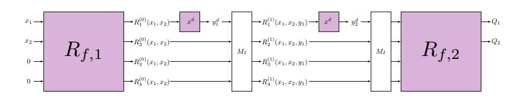
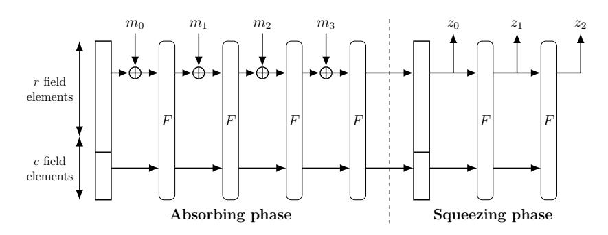
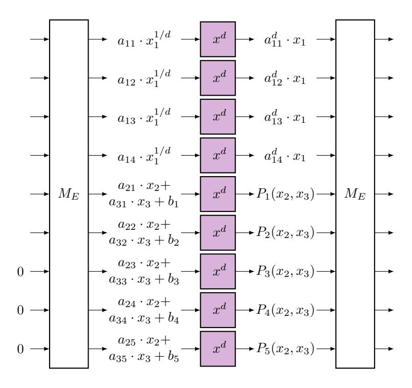
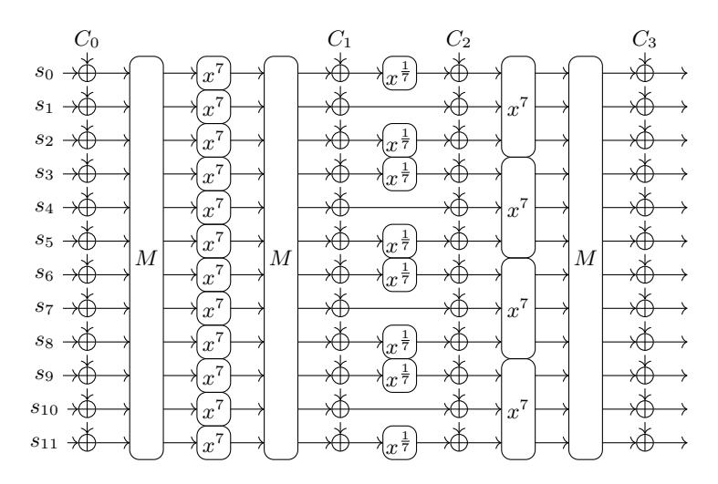

## The Algebraic CheapLunch: Extending FreeLunch Attacks on Arithmetization-Oriented Primitives Beyond CICO-1

Antoine Bak1,<sup>2</sup> , Augustin Bariant<sup>3</sup> , Aur´elien Boeuf<sup>1</sup> , Pierre Briaud<sup>4</sup> , Morten Øygarden<sup>4</sup> , Atharva Phanse<sup>4</sup>

> 1 INRIA, Paris, France <sup>2</sup> DGA, Paris, France <sup>3</sup> ANSSI, Paris, France <sup>4</sup> Simula UiB, Bergen, Norway antoine.bak@inria.fr, augustin.bariant@ssi.gouv.fr, aurelien.boeuf@inria.fr {pierre,morten.oygarden,atharva}@simula.no

Abstract. The security of many arithmetization-oriented (AO) hash functions depends of the hardness of Constrained-input constrainedoutput (CICO) problems. These problems have received significant attention from the cryptographic community in recent years, with notable advances in Gr¨obner basis and resultant-based attacks, yet progress has mainly been limited to CICO problems restricted to a single output. In this work, we build on the "FreeLunch method" of Bariant et al. (Crypto 2024) that constructs Gr¨obner bases "for free" in this particular case, and extend it to CICO problems with multiple outputs. More precisely, we consider tools for solving weighted polynomial systems, and show how to apply them in the AO setting. This results in new polynomial modelings, more efficient methods for computing the initial Gr¨obner basis under certain assumptions, and improved complexity estimates for the change of ordering step, derived from tighter upper bounds on the ideal degree. We apply our framework to Poseidon, Neptune and XHash8, where our assumptions are experimentally verified, and theory matches practice. For Griffin and ArionHash our assumptions are not verified, leaving us with improved, yet loose, upper bounds on the ideal degree. While our results do not threaten the security of any full-round hash function, they provide new insights into the security of these primitives under more general CICO problems.

Keywords: Gr¨obner basis · Hash function · Poseidon · XHash · Arion-Hash · Griffin

## 1 Introduction

The increasing deployment of practical zero-knowledge (ZK) proof protocols has created a need for hash functions that allow a preimage to be proven efficiently using the corresponding proof system. The construction of these hash functions depends a lot on the cost model of the target proof system. In general, a requirement is that the round functions of the permutation can be verified using a low-degree function, hence the name *Arithmetization-Oriented* (AO). This can be achieved by having the entire round function be of low degree, such as in Poseidon [34] and Neptune [37], or by including operations that have a low degree inverse, such as in Anemoi [16], XHash [2], Griffin [31], and ArionHash [44]. Due to their inherent algebraic structure, algebraic attacks (especially Gröbner basis attacks) are often the main attack vector against these hash functions. We remark that some recent designs also rely on the use of Split-and-Lookup S-boxes, such as Monolith [33], Reinforced Concrete [32], and Tip5 [45], which will remain beyond the scope of this analysis.

AO hash functions are typically constructed by first designing a permutation  $F: \mathbb{F}_p^t \longrightarrow \mathbb{F}_p^t$  and then using it in a sponge construction [14]. By their very nature, the security of hash functions in sponge constructions is directly dependent on the difficulty of solving the *Constrained-Input Constrained-Output* (CICO) problem for the underlying permutation. The abovementioned algebraic attacks generally proceed by modeling this CICO problem as a multivariate polynomial system, and then find its solution(s). These solutions can, in turn, be used to instantiate attacks on the overall sponge construction.

The CICO modeling is usually solved as follows. First, ones computes a Gröbner basis for the ideal it generates, with respect to a suitable monomial order. This first basis is then converted into a second Gröbner basis that contains a univariate polynomial, whose roots contain the value of one of the entries of a solution. The remaining entries are now (comparatively) easy to recover. While the default choice in earlier attacks on AO hash functions was to adopt the grevlex order for the first step, recent progress came from choosing an "easier" order tailored to the modeling [7,17], for which generic Gröbner basis algorithms [19,20] seemed more efficient or could even be bypassed. For the second step, all attacks rely on change-of-ordering algorithms in the FGLM framework [28].

Estimating the complexity of these two steps is essential for assessing the security guarantees of a given hash function. These complexities are influenced by intrinsic properties of the CICO modeling such as regularity conditions, or the degree of the associated ideal. However, these properties are often challenging to determine theoretically. As a result, many earlier works have taken a more pragmatic approach by partially relying on small-scale experiments for this estimation – or indeed to extrapolate the entire solving cost from small-scale tests. The difficulties in estimating these attacks are generally related to understanding the particular structure of the underlying AO permutation, in combination with that of the precise CICO problem we are trying to solve. In particular, a more fine-grained examination of these structures has already led to improved solving methods and, in some cases, to improved polynomial modelings [7,17].

Influence of the prime field size. The size of the prime p in the finite field  $\mathbb{F}_p$  used in ZK-friendly primitives varies greatly depending on the use case. It ranges from 31-bit primes (eg. in Plonky3) to 256-bit primes when the field is the scalar

field of an elliptic curve. When p ∼ 2 <sup>256</sup>, a permutation in sponge mode with capacity c = 1 is sufficient for guaranteeing 128 bits of security against collision and preimage attacks. This makes CICO-1 – i.e., the CICO problem with a single degree of input freedom, and a single output is observed – relevant for assessing the security of the sponge hash function. However, for smaller fields, such as 64 or 31-bit prime fields[5](#page-2-0) , a larger capacity is required for guaranteeing 128 bits of security. In this setting, a study of the CICO-k problem for k > 1 is more relevant for assessing the security of the hash function.

Previous works. In the CICO-1 setting, several works have already been able to leverage the structure of the input modeling to obtain more efficient attacks, for instance, by choosing a custom ordering for which this modeling is already a Gr¨obner basis [\[7\]](#page-28-2) and/or by using resultants for variable elimination to obtain a univariate expression in a somewhat more direct way than using FGLM methods [\[47](#page-30-4)[,8\]](#page-28-4). While these approaches have been very successful for CICO-k problems with k = 1, it is unclear whether they can be extended to larger values of k. The case of k > 1 has received much less attention from the cryptographic community. So far, most works in this setting either extrapolate complexity estimates from experiments on reduced primitives (see [\[3\]](#page-27-1) for Poseidon and [\[40\]](#page-30-5) for Anemoi) or use generic bounds on the Gr¨obner basis computation with respect to the grevlex ordering to estimate the complexity of the first step [\[36\]](#page-30-6). The only exception we are aware of is the recent work of [\[17\]](#page-28-3) on Anemoi, that derives an explicit Gr¨obner basis for CICO-k with t = 2k branches, and proves the degree of the ideal it generates.

Our results. In this work, we propose an extension of the so-called FreeLunch approach of [\[7\]](#page-28-2) to the k > 1 case, that we refer to as the "CheapLunch" approach. In particular, we give a general framework allowing us to model primitives in such a way that, under some genericity assumptions and for a custom monomial ordering, a Gr¨obner basis of the modeling can be computed efficiently (though not quite "for free"). In turn, this transfers the bottleneck for Gr¨obner basis attacks from the Gr¨obner basis computation step to the change-of-ordering step, just as in the FreeLunch setting when k = 1.

This custom ordering, as well as our estimates for the first step, are related to well-known results on weighted systems [\[26\]](#page-29-6). The initial motivation for using these results was, in fact, to compute tight upper bounds on the ideal degree D<sup>I</sup> , as these bounds are instrumental to estimate the change-of-ordering step. Finally, when the genericity assumptions required by the CheapLunch framework do not hold, our work still provides (loose) upper bounds on D<sup>I</sup> . We find these to be valuable in cases where such bounds were either entirely missing, or purely experimentally derived.

We have applied our framework to a number of primitives, all backed by experiments[6](#page-2-1) . The underlying genericity assumptions are verified for Poseidon,

<span id="page-2-0"></span><sup>5</sup> As in the instances of Poseidon2 used in the [Ethereum bounty program.](https://www.poseidon-initiative.info/)

<span id="page-2-1"></span><sup>6</sup> Our code is available at [https://github.com/atharva-simulauib/](https://github.com/atharva-simulauib/algebraic-cheaplunch) [algebraic-cheaplunch](https://github.com/atharva-simulauib/algebraic-cheaplunch)

NEPTUNE and XHash8. As a particular contribution, we provide a new modeling for the CICO-k problem for the two former primitives, to which our framework can be applied and prove bounds on the ideal degree that were first claimed in [11]. We note that the results on POSEIDON are especially timely due to the ongoing cryptanalysis initiative organized by the Ethereum Foundation (see the earlier footnote). We also apply the CheapLunch framework to GRIFFIN and ArionHash, although we find that the genericity assumptions are not satisfied for these primitives. Our results are summarized in Table 1.

| Primitive                | $D_I \le$                                                                                               | Cheap GB | source                     |
|--------------------------|---------------------------------------------------------------------------------------------------------|----------|----------------------------|
|                          | $(d+2)^{k\cdot R}$                                                                                      | ✓        | [17]                       |
| XHash8 $(k + n_S \le t)$ | $(d^{n_S+2k})^R$                                                                                        | ✓        | Section 4.1                |
| Poseidon                 | $d^{k \cdot R_F + R_P}$                                                                                 | ✓        | Section 4.2                |
| Neptune                  | $4^{k \cdot R_F} \cdot d^{R_P \dagger} \atop 4^{(k-1)R_{f,1} + R_{f,2}} \cdot d^{R_P - (t-k) \ddagger}$ | 1        | Section 4.2<br>Section 4.3 |
| GRIFFIN                  | $(d^2 \cdot 3^k)^R$                                                                                     | X        | Section 5.1                |
| ArionHash                | (16)                                                                                                    | X        | Section 5.2                |

<span id="page-3-1"></span><span id="page-3-0"></span><sup>&</sup>lt;sup>†</sup>Sponge mode, without round skipping tricks.

<span id="page-3-2"></span><sup>‡</sup>Preimage on k output coordinates in compression mode, with subspace trails. **Table 1.** Ideal degree  $D_I$  and applicability of the CheapLunch method to solve CICO-k on several primitives, where t is the number of branches, d is the degree of the monomial power maps, and R is the number of rounds ( $R_F$  for full rounds and  $R_P$  for partial rounds for Poseidon and Neptune), without considering round-skipping tricks.

Outline. We provide background on the CICO problem in sponge hash functions, Gröbner bases and weighted systems in Section 2. Our approach is presented in Section 3, where we define CheapLunch systems and then detail how to perform and analyze the two solving steps when these systems satisfy the genericity assumptions of above. We provide applications where these assumptions are verified in Section 4, and conclude with cases where they are not in Section 5.

#### <span id="page-3-3"></span>2 Preliminaries

#### 2.1 CICO problem

The main focus of this work will be the analysis of AO hash functions using the sponge construction [14]. These sponges are, in our setting, typically instantiated via AO permutations  $F: \mathbb{F}_q^t \to \mathbb{F}_q^t$  (where  $\mathbb{F}_q$  is a finite field). A crucial

security requirement for these constructions is for the underlying permutation to be secure with respect to the *Constrained-Input Constrained-Output* (CICO) problem. For algebraic cryptanalysis, this problem is typically defined as follows.

<span id="page-4-1"></span>**Definition 1 (CICO-(**IN,OUT) **Problem).** Let  $F: \mathbb{F}_q^t \longrightarrow \mathbb{F}_q^t$  be a permutation and let  $1 \leq \text{IN,OUT} < t$  such that  $\text{IN} + \text{OUT} \leq t$ . The CICO-(IN,OUT) problem asks to find  $\mathbf{x} \in \{0\}^{\text{IN}} \times \mathbb{F}_q^{t-\text{IN}}$  such that  $F(\mathbf{x}) \in \{0\}^{\text{OUT}} \times \mathbb{F}_q^{t-\text{OUT}}$ .

Said differently, a CICO-(IN,OUT) instance is a CICO instance where out output constraints of F need to be satisfied through the choice of t – IN degrees of freedom in the input. We recall the sponge construction and discuss how CICO problems are related to concrete hash function attacks in Appendix A. When IN = OUT = k, we simply use the notation CICO-k.

As mentioned in the introduction, the majority of recent algebraic cryptanalyses focuses on the CICO-1 case, with the exception of [17] in the case of Anemoi. In the works of [7,47,8], the condition OUT = 1 (or IN = 1 if  $F^{-1}$  is considered) is a requirement for the applicability of their attacks and no straightforward adaptation exists for larger OUT values. We also note that other works relying on extrapolating scaled-down experiments [9,40] pragmatically target CICO-1, as the CICO problem is easier in this setting and thus allows more reliable extrapolations. In this work, however, we will tackle the general CICO-(IN,OUT) problem with IN $\geq$  2 and OUT $\geq$  2 for various permutations, through both theoretical arguments and extensive experiments.

The initial step in our attacks is to model a given CICO problem as a system of multivariate polynomial equations whose common solution(s) correspond to the solution(s) of this problem. Possible modelings will be further explored in Section 4 and 5, while the rest of Section 2 is devoted to solving tools.

#### <span id="page-4-0"></span>2.2 Polynomial system solving via Gröbner bases

Let  $\{P_1,\ldots,P_m\}\subset\mathbb{F}[x_1,\ldots,x_n]$  be a polynomial system over a field  $\mathbb{F}$  and let  $I=\langle P_1,\ldots,P_m\rangle$  be its associated ideal. An essential tool for computing with I – which will ultimately allow us to solve  $\{P_1,\ldots,P_m\}$  – is that of Gröbner bases, which are defined up to a choice of monomial ordering. A monomial ordering is a well-order on  $\mathbb{N}^n$  such that if  $\alpha \prec \beta$ , then  $\alpha + \gamma \prec \beta + \gamma$  for  $\gamma \in \mathbb{N}^n$ . We say that  $x^{\alpha} \prec x^{\beta}$  if  $\alpha \prec \beta$ . In this paper, we will make use of the three following monomial orderings:

- Lexicographical (lex): We have  $\alpha \prec_{lex} \beta$  if there exists an index  $1 \leq i \leq n$  such that  $\alpha_j = \beta_j$ , j < i and  $\alpha_i < \beta_i$ .
- Weighted graded reverse lexicographical (wgrevlex): Let  $w \in \mathbb{R}^n_{\geq 0}$  a weight vector. We have that  $\alpha \prec_w \beta$  if  $\sum_{i=1}^n w_i \alpha_i < \sum_{i=1}^n w_i \beta_i$  or  $\sum_{i=1}^n w_i \alpha_i = \sum_{i=1}^n w_i \beta_i$  and  $\alpha \succ_{lex} \beta$  (note that we take the reversed lexicographical order in the case where the two monomials have the same weight).
- Graded reverse lexicographical (grevlex): This order is a particular case of the wgrevlex ordering, in the case where w = (1, ..., 1).

For a polynomial P, we denote by  $LM_{\prec}(P)$  its leading monomial with respect to  $\prec$  and by  $P^{\text{top}}$  its homogeneous component of highest weight with respect to a given weight vector w.

**Definition 2 (Gröbner Basis).** A Gröbner basis of I with respect to a monomial ordering  $\prec$ , also referred to as a  $\prec$ -Gröbner basis of I, is a set of polynomials  $G \subset I$  such that

<span id="page-5-0"></span>
$$\langle \mathrm{LM}_{\prec}(h) \mid h \in I \rangle = \langle \mathrm{LM}_{\prec}(g) \mid g \in G \rangle := \langle LM(G) \rangle \ .$$

We moreover say that G is reduced if every  $g \in G$  is monic, and does not contain any monomial in  $LM_{\prec}(G \setminus \{g\})$ .

From the knowledge of a Gröbner basis of an ideal, one can perform *reductions* modulo this ideal. For a polynomial P and a system G that is a  $\prec$ -Gröbner basis, we denote by  $\operatorname{Red}_{G,\prec}(P)$  its reduction modulo  $I=\langle G\rangle$  using the ordering  $\prec$ , i.e., the only polynomial in P+I which contains no monomial in  $\langle \operatorname{LM}_{\prec}(h) \mid h \in I \rangle$ .

Due to the elimination property of the lex ordering, we know that the (reduced) Gröbner basis of a zero-dimensional ideal contains a univariate polynomial  $G_n$  in  $x_n$ , and we can solve the remaining system efficiently from its roots. Note that some recent cryptanalyses of Anemoi [40,17] have put emphasis on the extra property that the ideal is in shape position [30] to facilitate this remaining solving process. Although it helps simplify the approach, and while this property is generic for radical zero-dimensional ideals [10], it is not strictly needed in our setting. Indeed, while the number of variables n in the system may be fairly large, we are usually interested in solving CICO-(IN,OUT) problems, in which we only need to recover at most IN variables. Furthermore, we expect a significant reduction in complexity as more of these variables are recovered. We may thus summarize the main steps of solving a zero-dimensional ideal I as:

- 1. Find a Gröbner basis of I for a suitable monomial order.
- 2. Convert this Gröbner basis into a Gröbner basis in the *lex* order.
- 3. Solve the polynomial  $G_n$  and recover the solutions.

In the general case, we expect Step 1. to be the bottleneck in solving I, with grevlex chosen as the default order as it is usually the most efficient in practice to compute Gröbner bases. However, this is not necessarily true for the AO setting, where Step 1. can sometimes be made trivial through the use of weighted orders tailored to the underlying permutation [7]. In this case, we naturally expect Step 2. to form the bottleneck of the solving method. Indeed, either way, we typically expect that Step 3. will be negligible compared to the first two steps.

#### 2.3 Gröbner bases for weighted homogeneous systems

Our approach will make use of a tailored wgrevlex ordering for the first Gröbner basis computation. While the analysis of Gröbner basis algorithms with respect to graded monomial orders (i.e., w = (1, ..., 1)) is well-known among experts

in algebraic cryptanalysis when applied to generic systems, we anticipate that readers may be less familiar with the case of more general weight vectors w; the analysis of which has been mainly restricted to the computer algebra literature [25,26]. We therefore devote this subsection to survey the results from this area that will be useful to us. As in the graded case, it seems that tighter complexity bounds are known for Gröbner basis algorithms applied to weighted homogeneous systems than to affine ones. In fact, if our affine CICO modeling satisfies a regularity condition detailed below, we will see that finding a first Gröbner basis reduces to computing a Gröbner basis for the homogeneous components of maximal weighted degree. As such, we do not focus on the affine case here, and will return to it in Section 5 when this condition does not apply.

For homogeneous systems, it is known that a grevlex Gröbner basis can be computed incrementally by performing row reduction on homogeneous Macaulay matrices up to some degree D using Lazard's approach [42]. Note that state-of-the-art Gröbner basis algorithms [19,20] follow the same framework. In [25,26], these algorithms have been adapted to a weighted homogeneous system  $\mathcal P$  by observing that for any polynomial P that is homogeneous with respect to w, the polynomial  $\hom_w(P) := P(x_1^{w_1}, \dots, x_n^{w_n})$  is homogeneous in the usual sense. For instance, their approach is to apply [19,20] to the system

$$hom_w(\mathcal{P}) = \{hom_w(P_1), \dots, hom_w(P_m)\},\$$

without requiring any modifications, and then to deduce from the grevlex Gröbner basis of  $\hom_w(\mathcal{P})$  the desired reduced Gröbner basis for  $\mathcal{P}$  [26, Proposition 10]. This method leverages the structure of  $\mathcal{P}$ , as it does not consider all the homogeneous Macaulay matrices associated to the system.

**Definition 3 (Weighted homogeneous Macaulay matrix).** Let  $\mathcal{P} \subset \mathbb{F}[\mathbf{x}]$  be a system that is weighted homogeneous with respect to a weight vector w. The associated weighted homogeneous Macaulay matrix of weight D is the matrix whose rows represent the polynomials  $x^{\alpha}P_i$ ,  $\operatorname{wt}(x^{\alpha}P_i) = D$  and the columns represent the monomials of weight D. The coefficient  $((\alpha, i), \beta)$  is equal to the coefficient of  $x^{\beta}$  in  $x^{\alpha}P_i$ .

The approach of [26] can equivalently be viewed as performing row reduction on Macaulay matrices of this kind up to a certain degree, referred to as the weighted degree of regularity  $wd_{reg}$ .

<span id="page-6-1"></span>**Definition 4 (Weighted degree of regularity, Definition 2 in [26]).** The weighted degree of regularity of a weighted homogeneous system  $\mathcal{P}$ , denoted  $wd_{reg}$ , is the lowest degree D such that the rowspan of the Macaulay matrices of weight  $d \leq D$  contains a wgrevlex Gröbner basis of  $\mathcal{P}$ .

<span id="page-6-0"></span><sup>&</sup>lt;sup>7</sup> The only exception that we are aware of is [22], which applied to methods of [25] in elliptic curve cryptanalysis.

If  $w_1, \ldots, w_n$  denote the respective weights of  $x_1, \ldots, x_n$ , then the number of entries in the weighted Macaulay matrices can be bounded by

$$\mathcal{SD}(wd_{\text{reg}}; (\mathbf{w}, 1)) := \# \left\{ (a_1, \dots, a_n) \in \mathbb{N}^n \mid \sum_{i=1}^n w_i \cdot a_i \le wd_{\text{reg}} \right\} , \quad (1)$$

where  $\mathcal{SD}$  is known as the *Sylvester denumerant*. There is no analytic formula for this value, but it can be computed exactly using the generating series in [1, Theorem 4.1.2]. For our purposes, it will be sufficient to approximate this value (as in [26, Section 5]) and estimate the complexity of computing a *wgrevlex* Gröbner basis for a weighted homogeneous system  $\mathcal{P}$  of m polynomials in n variables by

<span id="page-7-4"></span><span id="page-7-1"></span>
$$\mathcal{O}\left(\left(\frac{1}{\prod_{i=1}^{n} w_i}\right)^{\omega} \binom{n + w d_{\text{reg}}}{n}^{\omega}\right),\tag{2}$$

where  $2 \le \omega \le 3$  is the linear algebra constant and  $wd_{\rm reg}$  is the weighted degree of regularity. This estimate calls for tight upper bounds on  $wd_{\rm reg}$ . Such bounds are known under standard genericity assumptions used for graded systems, by taking into account the extra weight condition. The first of these is as follows.

<span id="page-7-0"></span>**Definition 5 (Regular sequence, Definition 4 in [26]).** Let  $(w_1, \ldots, w_n)$  be a system of weights and let  $\mathcal{P} = (P_1, \ldots, P_m) \subset \mathbb{F}[x_1, \ldots, x_n]$  be a sequence of weighted homogeneous polynomials of respective weighted degrees  $d_1, \ldots, d_m$ . The sequence  $\mathcal{P}$  is said to be regular in  $\mathbb{F}[x_1, \ldots, x_n]$  if it satisfies one of the following equivalent properties

- 1.  $\forall i \in \{1..m\}, P_i \text{ is not a zero divisor in } \mathbb{F}[x_1, \ldots, x_n]/\langle P_1, \ldots, P_{i-1} \rangle;$
- 2. The Hilbert series of the ideal generated by P is equal to

$$\mathcal{H}_{\mathbb{F}[x_1,\dots,x_n]/\langle \mathcal{P} \rangle}(z) = \frac{\prod_{i=1}^m (1 - z^{d_i})}{\prod_{i=1}^n (1 - z^{w_i})}.$$
 (3)

<span id="page-7-5"></span>Remark 1. Both of the equivalent conditions above will be useful to us. Indeed, we will use Condition 1. for complexity estimates and theoretical arguments on regularity, while we will adopt Condition 2. in experimental verification.

For a regular sequence  $\mathcal{P}$ , the weighted degree of regularity can be upper bounded by the weighted Macaulay bound [25, Theorem 2]:

<span id="page-7-2"></span>
$$wd_{\text{reg}} \le \sum_{i=1}^{n} (d_i - w_i) + \max\{w_i\}.$$
 (4)

This bound can be further sharpened if the sequence  $\mathcal{P}$  satisfies the following slightly stronger property.

<span id="page-7-3"></span>**Definition 6 (Simultaneous Noether Position (Determined Case)).** Let  $\mathcal{P} = (P_1, \ldots, P_n)$  be a polynomial sequence in  $\mathbb{F}[x_1, \ldots, x_n]$ . We say that  $\mathcal{P}$  is in Simultaneous Noether Position (SNP) if for all  $1 \leq i \leq n$ , the projected sequence  $(P_1(x_1, \ldots, x_i, 0, \ldots, 0), \ldots, P_i(x_1, \ldots, x_i, 0, \ldots, 0))$  is regular over  $\mathbb{F}[x_1, \ldots, x_i]$ .

If the sequence  $\mathcal{P}$  is in SNP, and its weighted degrees satisfy a certain condition relative to w, the following upper bound on  $wd_{\text{reg}}$  holds.

<span id="page-8-0"></span>**Theorem 1 (Theorem 12 in [26]).** Let  $(w_1, \ldots, w_n)$  be a system of weights and let  $\mathcal{P} = (P_1, \ldots, P_m)$  be a sequence of weighted homogeneous polynomials of respective weighted degrees  $d_1, \ldots, d_m$  such that  $d_i$  is divisible by  $w_i$  for any  $1 \leq i \leq n$  and  $d_i \geq w_{i-1}$  for any  $2 \leq i \leq n$ . Assume that the sequence  $\mathcal{P}$  is in SNP for the variable ordering  $x_1 > \cdots > x_n$ . Then the weighted degree of regularity of  $\mathcal{P}$  is bounded by

$$wd_{\text{reg}} \le \sum_{i=1}^{n} (d_i - w_i) + w_n.$$

#### <span id="page-8-1"></span>2.4 Ideal degree for weighted homogeneous systems

The complexity of the change-of-order algorithms used in the second step in the solving method presented in Section 2.2 is polynomial in the *degree of the ideal*, which we define in the following. A lengthier discussion on these algorithms will be provided in Appendix C.

**Definition 7 (Ideal degree).** For a zero-dimensional ideal  $I \subset \mathbb{F}[x_1, \ldots, x_n]$ , the ideal degree  $D_I$  is the dimension of the  $\mathbb{F}$ -vector space  $\mathbb{F}[x_1, \ldots, x_n]/I$ .

For weighted homogeneous systems, the ideal degree can be upper bounded using the weighted Bézout bound  $\,$

<span id="page-8-3"></span>
$$D_I \le \frac{\prod_{i=1}^n d_i}{\prod_{i=1}^n w_i},\tag{5}$$

that can be seen as a particular case of the BKK bound [12,39,41]. We will not discuss equality cases here, though we note that they do arise in particular when the input sequence is regular. For example, the following result is derived in [25, Theorem 2] by evaluating the Hilbert series of Definition 5 with m = n at z = 1.

<span id="page-8-2"></span>Theorem 2 (Weighted Bézout equality in the regular case, Theorem 2 in [25]). Let  $(w_1, \ldots, w_n)$  be a system of weights and let  $\mathcal{P} = (P_1, \ldots, P_n)$  be a sequence of weighted homogeneous polynomials of respective weighted degrees  $d_1, \ldots, d_n$  which is also regular. Then, the degree of the ideal  $\langle \mathcal{P} \rangle$  is equal to the weighted Bézout bound:

$$D_{\langle \mathcal{P} \rangle} = \frac{\prod_{i=1}^{n} d_i}{\prod_{i=1}^{n} w_i}.$$

For an affine system  $\mathcal{P}$  whose components of highest weight form a homogeneous regular sequence, it is explained at the end of [26, §5.2] that one can use the same bound in the complexity estimates.

#### <span id="page-9-0"></span>3 The CheapLunch Framework for Solving CICO-k

The CICO modeling we consider is akin to that of [7, Section 3]. We recall its generation in Section 3.1 on a toy example. The rationale behind our approach is to pick a certain weighted monomial order for which we can precisely analyze the first Gröbner basis computation for several ciphers, and which allowed us to find tighter upper bounds on the ideal degree.

To find a first Gröbner basis, we observe that this order effectively splits our modeling into two parts: one part  $\mathcal{Q}$  for which we will compute a Gröbner basis  $G(\mathcal{Q})$  and one part  $\mathcal{P}$  whose leading monomials will be coprime to those of  $G(\mathcal{Q})$ , whenever  $\mathcal{Q}^{\text{top}}$  is regular. Using Propositions 3 and 4 from Appendix A.1), the system  $\mathcal{P} \cup G(\mathcal{Q})$  is then a Gröbner basis, making the computation of  $G(\mathcal{Q})$  the only non-trivial task in our first step. Note that the use of tailored monomial orders to ensure coprimality among the leading terms of polynomials has already been studied in [7,47] for the AO setting. However, when  $\mathcal{Q}^{\text{top}}$  is not regular, one cannot apply the same Gröbner basis approach.

In the change of ordering step, we also use this weighted structure in order to give tight upper bounds on the ideal degree  $D_I$  and to marginally improve generic FGLM estimates (Section 3.5 and Appendix C).

#### <span id="page-9-1"></span>3.1 Toy example

Recall that we are interested in solving the CICO-(IN,OUT) problem (Definition 1) for an AO permutation  $F: \mathbb{F}^t \to \mathbb{F}^t$ . For the purposes of illustration, we set t-IN = OUT = k, that is, we want to solve for  $x_1, \ldots, x_k$  such that  $F(\underbrace{0,\ldots,0}_{t-k},\underbrace{x_1,\ldots,x_k}_k) = \underbrace{(0,\ldots,0}_{k},\underbrace{*,\ldots,*}_{t-k})$ . Furthermore, let F be of the form

$$F = A_r \circ S \circ A_{r-1} \circ S \circ \cdots \circ S \circ A_0$$

where  $A_i: \mathbb{F}^t \to \mathbb{F}^t$  is an invertible, affine mapping for  $0 \leq i \leq r$ , and

$$S: (z_1,\ldots,z_t) \longmapsto \left(z_1^{1/\alpha},f_2(z_1,\ldots,z_t),\ldots,f_t(z_1,\ldots,z_t)\right),$$

where  $f_2, \ldots, f_t$  are polynomials of degree d, and  $\alpha > 1$  is an integer such that the power  $1/\alpha$  forms an inverse map over  $\mathbb{F}$ . To ensure both efficiency and a high overall degree, the integers d and  $\alpha$  are typically be chosen to be small, while  $1/\alpha$  is large (as a power over  $\mathbb{F}$ ).

**Polynomial modeling.** The modeling we consider is (a slight generalization of) the modeling considered in [7, Section 3]. The idea is to symbolically evaluate the permutation F round by round from the initial **x**-variables  $x_1, \ldots, x_k$ , and only introduce new **y**-variables and equations to circumvent the large degree caused by the power  $1/\alpha$ . More concretely, write  $(h_1, \ldots, h_t)$  for the symbolic evaluation of the state before the  $\ell$ -th S-box, where each  $h_i$  is a polynomial in

the variables  $\mathbf{x}, y_1, \dots, y_{\ell-1}$ . The first entry in the output state is represented by a new variable  $y_{\ell}$ , while the remaining entries are defined by symbolic evaluation of the input state. The output of the S-box is

<span id="page-10-0"></span>
$$(y_{\ell}, f_2(h_1, \ldots, h_t), \ldots, f_t(h_1, \ldots, h_t)),$$

and the equation relating the new variable  $y_{\ell}$  to the earlier input state is

$$P_{\ell}(\mathbf{x}, y_1, \dots, y_{\ell}) = y_{\ell}^{\alpha} - h_1(\mathbf{x}, y_1, \dots, y_{\ell-1}),$$
 (6)

which is added to the polynomial system. This construction yields a system of k+r polynomials over  $\mathbb{F}[\mathbf{x},\mathbf{y}]$ , where  $\mathbf{y}:=y_1,\ldots,y_r$ . This system can further be divided into two parts:  $\mathcal{P}=\{P_1,\ldots,P_r\}$  which are the round polynomials as described in (6), and  $\mathcal{Q}=\{Q_1,\ldots,Q_k\}$  which are given by the symbolic state of the k first outputs of F, which we require to be zero. Note that the polynomials in  $\mathcal{Q}$  will depend on all variables  $\mathbf{x}, \mathbf{y}$  and generically be of degree  $d^r$ . The equations  $P_i$  will be of degree  $d^i$ , and contain the variables  $\mathbf{x}, y_1, \ldots y_\ell$ .

**Monomial ordering.** The idea of [7] was to choose a weighted order in which  $y_i^{\alpha}$  is the leading term of  $P_i$ . To achieve this, we consider a weight vector  $w = (w_{\mathbf{x}}, w_{\mathbf{y}})$ , where  $w_{\mathbf{x}} \in \mathbb{Z}^k$  and  $w_{\mathbf{y}} \in \mathbb{Z}^r$  encode the weight of the **x**- and **y**-variables, respectively. Following [7], we choose  $w_{\mathbf{x}} = (1, \ldots, 1)$  and  $w_{\mathbf{y}} = (1, d, d^2, \ldots, d^{r-1})$ . On the one hand, examining the weighted degree of  $P_{\ell}$  in Equation (6) yields

$$\operatorname{wt}(h_1) \le d^{\ell-1} < \alpha d^{\ell-1} = \operatorname{wt}(y_{\ell}^{\alpha}),$$

which ensures that  $\mathrm{LM}(P_\ell) = y_\ell^\alpha$ , for all  $1 \leq \ell \leq r$ . On the other hand, the polynomials in  $\mathcal{Q}$  will have weight at most  $d^r$ , which can only be achieved by monomials in pure  $\mathbf{x}$ -variables. Thus, we generically expect the leading monomials in the  $Q_i$ -polynomials to only depend on  $\mathbf{x}$ . In particular, we expect  $\mathrm{LM}(Q_1) = x_1^{d^r}$  when k = 1, which implies that all polynomials in  $\{\mathcal{P}, Q_1\}$  have coprime leading terms under this monomial order, and hence form a Gröbner basis for the associated ideal by Proposition 4. In fact, this particular case readily corresponds to the FreeLunch setting of [7].

The Case of  $k \geq 2$ . When  $k \geq 2$ , one can no longer directly apply the above reasoning, as the leading monomials in the polynomials  $\mathcal{Q}$  can no longer be expected to be coprime (although they still only depend on  $\mathbf{x}$  under the above weight vector  $\mathbf{w}$ ). Moreover, since all variables  $\mathbf{x}$  are introduced at the start, and are presumable efficiently mixed throughout the application of F, it seems very unlikely that there will exist combinations of polynomial modelings and monomial orders that will yield a direct Gröbner basis without any computation. Still, we note that the above modeling  $\{\mathcal{P},\mathcal{Q}\}$  yields a portion of the polynomials,  $\mathcal{P}$ , whose leading monomials are well-behaved and coprime with respect to  $\mathbf{y}$  and the other polynomials. In particular, if the Gröbner basis  $G(\mathcal{Q})$  were to contain leading monomials only involving  $\mathbf{x}$ , the above approach could be adapted.

We will see that this scenario occurs whenever the system  $\mathcal{Q}^{\text{top}}$  formed by the components of highest weight in  $\mathcal{Q}$  is regular in the sense of Definition 5 (to achieve this, we may possibly refine the modeling of  $\mathcal{Q}$  and carefully choosing  $w_{\mathbf{x}}$ ). In this case, we can essentially reduce the problem of Gröbner basis computation for the whole system  $\{\mathcal{P},\mathcal{Q}\}\subset R:=\mathbb{F}[\mathbf{x},\mathbf{y}]$  to the well-understood problem of Gröbner basis computation of the weighted regular system  $\mathcal{Q}^{\text{top}}$  in the polynomial subring  $R_{\mathbf{x}}:=\mathbb{F}[\mathbf{x}]$ .

Definition 8 formalizes the type of polynomial system illustrated in our toy example, that will be the focus of our work. Note again that FreeLunch systems as introduced in [7] correspond to the case m=1 in this definition.

**Definition 8 (CheapLunch system (CLS)).** Let  $m, n \geq 0$  and  $R = \mathbb{F}[x_1, \ldots, x_m, y_1, \ldots, y_n]$  be a ring with a weighted monomial ordering w. We say that the polynomials  $P_1, \ldots, P_n, Q_1, \ldots, Q_m \in R$  form a CheapLunch system (CLS) if the following is satisfied.

<span id="page-11-0"></span>
$$\begin{split} \operatorname{LM}(P_j) &= y_j^{\alpha_j}, \ \alpha_j \geq 1, \ \text{for all} \ 1 \leq j \leq n, \\ Q_i^{\operatorname{top}} &\in \mathbb{F}[x_1, \dots, x_m] \ \text{for all} \ 1 \leq i \leq m. \end{split}$$

We moreover write  $\mathcal{P} = (P_1, \dots, P_n)$  and  $\mathcal{Q} = (Q_1, \dots, Q_m)$ .

Motivated by the above discussion, the rest of Section 3 will study the solving of CheapLunch systems for which the top part  $\mathcal{Q}^{\text{top}}$  is regular. Non-regular CheapLunch systems arising from some AO hash functions are tackled in Section 5.

<span id="page-11-2"></span>**Definition 9 (Regular CheapLunch system).** By slight abuse of terminology, we say that a CheapLunch system  $\{\mathcal{P},\mathcal{Q}\}\subset R$  is regular for a weight vector  $w=(w_{\mathbf{x}},w_{\mathbf{y}})$  if the sequence  $\mathcal{Q}^{\text{top}}$  formed by the components of highest weight in  $\mathcal{Q}$  is regular in  $R_{\mathbf{x}}$  in the sense of Definition 5 for the weight vector  $w_{\mathbf{x}}$ .

#### 3.2 Gröbner bases for regular CheapLunch systems

We now justify the first step of our solving method for regular CheapLunch systems. We will see that the regularity of  $\mathcal{Q}^{\text{top}}$  plays a role much beyond its use in the estimate for computing  $G(\mathcal{Q}^{\text{top}})$ . As in the graded case, Lemma 1 below follows from the absence of degree falls in  $\mathcal{Q}$  when  $\mathcal{Q}^{\text{top}}$  is weighted regular and shows that a Gröbner basis  $G(\mathcal{Q})$  can be computed from that of  $G(\mathcal{Q}^{\text{top}})$ .

<span id="page-11-1"></span>**Lemma 1.** Let  $Q = (Q_1, \ldots, Q_m) \subset \mathbb{F}[x_1, \ldots, x_m]$  be an affine sequence and let  $\prec$  be some (weighted) monomial order for which  $Q^{\text{top}}$  is regular. Suppose further that the set  $\{\sum_{j=1}^m f_{ij} \cdot Q_j^{\text{top}}\}_{1 \leq i \leq g}$  is a reduced  $\prec$ -Gröbner basis of  $\langle Q^{\text{top}} \rangle = \langle Q_1^{\text{top}}, \ldots, Q_m^{\text{top}} \rangle$ . Then we have that  $\{\sum_{j=1}^m f_{ij}Q_j\}_{1 \leq i \leq g}$  is a (not necessarily reduced)  $\prec$ -Gröbner basis for the inhomogeneous ideal  $I = \langle Q_1, \ldots, Q_m \rangle$ .

*Proof.* Using Definition 2, we want to show that  $LM(h) \in \langle LM(\sum_{j=1}^m f_{ij}Q_j) | 1 \le i \le g \rangle$  for any element  $h \in I$ . Without loss of generality, we can assume that h

is of the form  $h = \sum_{j=1}^{m} h_j Q_j$ , where  $h_j$  is top-reduced by  $\langle Q_1, \dots, Q_{j-1} \rangle$ . We can now rewrite h as follows:

$$h = \sum_{j=1}^{m} h_j Q_j = \sum_{j=1}^{m} h_j^{\text{top}} Q_j^{\text{top}} + \sum_{j=1}^{m} (h_j - h_j^{\text{top}}) Q_j^{\text{top}} + \sum_{j=1}^{m} h_j^{\text{top}} (Q_j - Q_j^{\text{top}}) + \sum_{j=1}^{m} (h_j - h_j^{\text{top}}) (Q_j - Q_j^{\text{top}}) .$$

We can distinguish two cases:

- 1. Case  $LM(h) = LM(\sum_{j=1}^m h_j^{\text{top}} Q_j^{\text{top}})$ . In this case,  $\sum_{j=1}^m h_j^{\text{top}} Q_j^{\text{top}} \in \langle \mathcal{Q}^{\text{top}} \rangle$ , hence  $LM(h) \in \langle LM(\sum_{j=1}^m f_{ij} Q_j^{\text{top}}) \mid 1 \leq i \leq g \rangle$ .

  2. Case  $LM(h) \neq LM(\sum_{j=1}^m h_j^{\text{top}} Q_j^{\text{top}})$ . As the other terms in the sum have lower weight, this implies that  $\sum_{j=1}^m h_j^{\text{top}} Q_j^{\text{top}} = 0$ . Thus, there exist  $1 \leq i \leq m$  such that  $h_i^{\text{top}} \neq 0$  and  $h_i^{\text{top}} Q_i^{\text{top}} \in \langle Q_{i-1}^{\text{top}}, \dots, Q_1^{\text{top}} \rangle$ . As the sequence is regular, this implies that  $h_i^{\text{top}} \in \langle Q_{i-1}^{\text{top}}, \dots, Q_1^{\text{top}} \rangle$ , which contradicts the assumption that  $h_i$  is top-reduced by  $\langle Q_1, \dots, Q_{i-1} \rangle$ .

Finally, Proposition 1 gives the structure of the Gröbner basis for a regular CheapLunch system  $\{\mathcal{P}, \mathcal{Q}\}$ , obtained from  $G(\mathcal{Q})$  by simply appending the polynomials of  $\mathcal{P}$ .

<span id="page-12-0"></span>Proposition 1 (Gröbner basis of a regular CLS). Let  $\{\mathcal{P}, \mathcal{Q}\}\$  be a regular CheapLunch system with respect to a weighted monomial order  $\prec$  and let  $G(\mathcal{Q})$ be a  $\prec$ -Gröbner basis of  $\mathcal{Q}$ . Then, the set  $G(\mathcal{Q}) \cup \mathcal{P}$  is a  $\prec$ -Gröbner basis for the  $ideal \langle \mathcal{P} \rangle + \langle \mathcal{Q} \rangle$ .

*Proof.* Using the proof of Lemma 1, we have that  $\langle LM(\mathcal{Q})\rangle = \langle LM(\mathcal{Q}^{\text{top}})\rangle$  as  $\mathcal{Q}^{\text{top}}$  is weighted regular. In particular, this means that the leading monomials of the elements in  $G(\mathcal{Q})$  will be in  $\mathbb{F}[x_1,\ldots,x_m]$ . We can eventually apply Buchberger's Criterion (Proposition 3 in Appendix B) to any pair of distinct elements  $f_1, f_2 \in G(\mathcal{Q}) \cup \mathcal{P}$  to conclude. First, if both  $f_1$  and  $f_2$  belong to  $G(\mathcal{Q})$ , then  $Spol(f_1, f_2)$  will reduce to 0 by applying this criterion in the reverse direction in the Gröbner basis G(Q). Otherwise, if  $f_1$  or  $f_2$  is an element of P, then its leading monomial will, by Definition 8, be coprime to the leading monomial of the other element of the pair, and we can conclude by Proposition 4.

#### <span id="page-12-1"></span>Gröbner basis computation procedure 3.3

Lemma 1 and Proposition 1 suggest a natural way of computing a Gröbner basis of a regular CheapLunch system  $\{\mathcal{P},\mathcal{Q}\}$ . The idea is to first compute a Gröbner basis for  $\mathcal{Q}^{\text{top}}$  over the subring  $\mathbb{F}[x_1,\ldots,x_m]$ , which can then be lifted to a Gröbner basis for  $(\mathcal{P}, \mathcal{Q})$  in the larger ring R. We proceed as follows:

1. Compute homogeneous polynomials  $\{f_{ij}\}\subset \mathbb{F}[x_1,\ldots,x_m]$  such that

$$G(\mathcal{Q}^{\text{top}}) = \left\{ \sum_{j=1}^{m} f_{ij} Q_j^{\text{top}} \right\}_{1 \le i \le g}$$

forms a reduced Gröbner basis for  $Q^{\text{top}}$ .

2. Using  $\{f_{ij}\}$ , multiply with the respective  $Q_j$ -polynomials to compute the set

$$G(\mathcal{Q}) = \left\{ \sum_{j=1}^{m} f_{ij} Q_j \right\}_{1 \le i \le g} .$$

3. Return  $G(\mathcal{Q}) \cup \mathcal{P}$  as a Gröbner basis for the full system.

### <span id="page-13-0"></span>3.4 Complexity estimates

We now estimate the complexity of the method described in Section 3.3. We will assume that the system  $\{\mathcal{P},\mathcal{Q}\}$  can be efficiently computed and fully reduced according to the relevant weighted order  $\prec$  for any given instance, as is required by Lemma 1. In particular, this means that for all  $1 \leq i \leq m$  and  $1 \leq j \leq n$ , we have  $\deg_{y_i}(Q_j) < \alpha_i$  (as the monomials of higher  $y_i$ -degree can be reduced by the leading monomial of  $P_i$ ). A similar task has been studied and estimated under the name of SYSGEN in [8, Section 3], and we expect their work to translate to our use cases in a straightforward manner. The analysis of [8] further shows that, with a few minor exceptions, SYSGEN does not form the bottleneck of an attack, and we expect the same to hold in our case.

**Step 1.** The first step of our procedure consists of computing a Gröbner basis of  $\mathcal{Q}^{\text{top}}$  over  $\mathbb{F}[x_1,\ldots,x_m]$ , i.e., a homogeneous system of m equations in m variables. To estimate the complexity of this step, we can readily use Equation (2) with n=m (determined case):

$$\mathcal{C}_1 = \left(\mathcal{SD}(wd_{\text{reg}}; (\mathbf{w}, 1))\right)^{\omega} \approx \left(\frac{\binom{wd_{\text{reg}} + m}{m}}{\prod_{i=1}^{m} w_i}\right)^{\omega} ,$$

where  $wd_{\text{reg}}$  is the weighted degree of regularity of  $\mathcal{Q}^{\text{top}}$  (Definition 4). As we are already assuming that  $\mathcal{Q}^{\text{top}}$  is regular by applying this procedure, we can upper bound  $wd_{\text{reg}}$  by the Macaulay bound (4). If we further assume that this system is also in SNP (Definition 6), we may also use the stronger bound of Theorem 1.

**Step 2.** The second step performs polynomial multiplications between the coefficients  $f_{ij}$  of the elements of  $G(\mathcal{Q}^{\text{top}})$  in terms of the original generating set  $\mathcal{Q}^{\text{top}}$  and the  $Q_i$  polynomials, recalling that  $G(\mathcal{Q}^{\text{top}})$  is reduced and that all  $Q_j$ -polynomials have been properly reduced by the  $P_i$ 's according to  $\prec$ . If we

let  $A := \{0, \dots, \alpha_1 - 1\} \times \dots \times \{0, \dots, \alpha_n - 1\} \subset \mathbb{N}^n$ , we can then write these  $Q_j$ -polynomials as follows:

$$Q_j = \sum_{\mathbf{a} \in A} Q_{j,\mathbf{a}}(x_1, \dots, x_m) \cdot \mathbf{y}^{\mathbf{a}} ,$$

and it is easy to see that there are at most  $|A| = \prod_{j=1}^n \alpha_j$  terms  $Q_{j,\mathbf{a}}$  in the sum. To compute each  $f_{ij} \cdot Q_j$ , we first compute the individual products  $f_{ij} \cdot Q_{j,\mathbf{a}}(x_1,\ldots,x_m)$  for each  $\mathbf{a} \in A$  and sum them together. From the definition of the weighted degree of regularity, we know that

$$\operatorname{wdeg}(f_{ij} \cdot Q_{j,\mathbf{a}}(x_1,\ldots,x_m)) \le wd_{\operatorname{reg}}$$

Thus, the second step amounts to performing  $mg \cdot (\prod_{j=1}^n \alpha_j)$  multiplications of polynomials in m variables whose result has weighted degree at most  $wd_{\text{reg}}$ , where g is the size of the reduced Gröbner basis  $G(\mathcal{Q}^{\text{top}})$ . Using [28, Corollary 2.1], this latter quantity can be upper bounded by  $m \cdot D_{\langle \mathcal{Q}^{\text{top}} \rangle}$ . To estimate the complexity of each of the multiplications, we make use of the following result:

**Theorem 3 (Multivariate multiplication** [46]). Let  $P_1, P_2 \in \mathbb{F}[x_1, \ldots, x_m]$  such that  $\operatorname{wdeg}(P_1) + \operatorname{wdeg}(P_2) \leq D$ . Let assume that  $\mathbb{F}$  has at least D points in arithmetic progression. Then we can compute the product  $P_1 \cdot P_2$  in time:

$$\mathcal{O}(m \cdot M(D)/D \cdot \mathcal{SD}(D; (\mathbf{w}, 1))) = \mathcal{O}(m \cdot M(\mathcal{SD}(D; (\mathbf{w}, 1))))$$
,

where

$$\mathcal{SD}(D; (\mathbf{w}, 1)) = \# \left\{ (a_1, \dots, a_m) \in \mathbb{N}^m \ \left| \ \sum_{i=1}^m w_i \cdot a_i \le D \right. \right\} \simeq \frac{\binom{D+m}{m}}{\prod_{i=1}^m w_i}$$

is the number of terms of weight at most D from Equation (1), and

$$M(d) = \mathcal{O}(d \cdot \log(d) \log \log(d))$$

is the time complexity for multiplying univariate polynomials of degree d.

Applying this result to our case with  $D = wd_{reg}$  yields the following complexity bound for the second step:

$$C_2 = m^3 D_{\langle \mathcal{Q}^{\text{top}} \rangle} \cdot \prod_{j=1}^n \alpha_j \cdot M(\mathcal{SD}(wd_{\text{reg}}; (\mathbf{w}, 1))),$$

where  $SD(wd_{reg}; (\mathbf{w}, 1))$  is given in Equation (1).

Cost comparison. Note that the cost of Step 1. does not depend on  $\prod_{j=1}^{n} \alpha_j$ , while the cost of Step 2. only grows linearly with it. This is in contrast to the change of ordering step, whose cost will grow with  $\left(\prod_{j=1}^{n} \alpha_j\right)^{\omega}$ . As such, we expect that this method will allow us to significantly reduce the cost of Gröbner basis computation for several instances of ZK-friendly primitives, and that it will transfer the bottleneck of the overall attack to the change of ordering step. Examples of this will be given in Section 4.

#### <span id="page-15-0"></span>3.5 Change of ordering step

It remains to estimate the complexity of the change of ordering, whose cost has already been stated to be polynomial in  $D_I$  in Section 2.4. To do so, we instantiate more fine-grained bounds from the computer algebra literature and/or we slightly improve them using the CheapLunch particularities.

We start by recalling some known results for converting a Gröbner basis from the wqrevlex ordering to the lex ordering in the zero-dimensional case. Most algorithms for this purpose work as follows: we define the  $\mathbb{F}$ -linear maps  $T_{x_i}$  over R/I as  $P \mapsto x_i \cdot P \pmod{I}$ , represented as a  $D_I \times D_I$  matrix in  $\mathbb{F}$  for some basis of R/I. It is known that the characteristic polynomial of  $T_{x_n}$  lies in the ideal I. Hence, by computing this characteristic polynomial and finding its root(s), we recover the n-th coordinate of a solution. Computing the characteristic polynomial of  $T_{x_n}$  is done in two steps: first, choose a basis of R/I and compute the matrices of the  $T_{x_i}$  under this choice of basis. Those matrices are known as multiplication matrices. Then, compute the characteristic polynomial of  $T_{x_n}$  using linear algebra algorithms. While the second step has received a lot of attention in the computer algebra community [21,24,13], the first step was less studied since it is free under the *stability* property that is expected for generic systems. However, this property is not verified by our systems. The first work tackling the multiplication matrix computation is the original FGLM paper [23], that gives a complexity in  $\mathcal{O}(n \cdot D_I^3)$  where n is the number of variables. With a refined complexity analysis, we show in Appendix C.1 that under the stability and SNP assumption of the  $\mathcal{Q}^{top}$ , and if the weights of the  $x_i$ 's w.r.t.  $\prec$  are all equal to  $w_x$ for  $1 \le i \le m$ , the computation of all multiplication matrices in the CheapLunch case would have a complexity of

<span id="page-15-1"></span>
$$\mathcal{O}\left(\frac{(n+m)\cdot D_I^3 \cdot w_x}{\deg_{\prec}(Q_m)}\right) . \tag{7}$$

A more recent work [27] leverages fast linear algebra to compute the multiplication matrices in time  $\mathcal{O}(d_{\max} \cdot n^{\omega} D_I^{\omega})$ , where  $d_{\max}$  is the maximal degree of elements in the canonical basis of R/I and n is the number of variables. We adapt this algorithm to weighted orderings and refine its analysis in Appendix C.2. Let  $wd_{\max} \leq \sum_{i=1}^{n+m} (d_i - w_i)$  be the maximal weighted degree of monomials in the canonical basis of R/I; if the weights  $w_i$  are integer, the complexity for the computation of the multiplication matrix for CLS is:

<span id="page-15-2"></span>
$$\mathcal{O}\left(wd_{\max}^{3-\omega}(n+m)^{\omega-1}D_I^{\omega}\right) . \tag{8}$$

The choice of the best multiplication matrices computation algorithm among (7) and (8) depends on the parameters of the CLS.

Then, we use more recent algorithms than FGLM to compute the desired characteristic polynomial (for a detailed discussion on these algorithms, see Appendix C). Among them, the *Hermite Normal Form* (HNF) algorithm [13] provides the characteristic polynomial of  $T_{x_m}$  in time

<span id="page-15-3"></span>
$$\mathcal{O}(t_m^{\omega} M(D_I/t_m)(\log(t_m)^2 + \log(D_I/t_m))) = \tilde{\mathcal{O}}\left(D_I \cdot t_m^{\omega - 1}\right) , \qquad (9)$$

where t<sup>m</sup> is a sparsity indicator of this multiplication matrix. More precisely, the matrix Tx<sup>m</sup> has two sets of columns: those which come from the identity matrix, thus only containing one nonzero entry, and those which are dense or close to dense. The parameter t<sup>m</sup> is the number of these dense columns. It is shown in Appendix [C](#page-34-0) that for a CheapLunch system and under the SNP and stability assumptions for Q, and if the wt≺(xi) = w<sup>x</sup> for 1 ≤ i ≤ m and a certain weight wx, the multiplication matrix Tx<sup>m</sup> has a sparsity indicator t<sup>m</sup> ≤ 2DIwx/deg≺(Qm). Taking ω = 2 and neglecting logarithmic factors in Equation [\(9\)](#page-15-3) as a conservative estimate from a designer's point of view, we get the following lower bound on the complexity:

<span id="page-16-2"></span>
$$D_I^2 \operatorname{wt}_{\prec}(x_m) / \operatorname{deg}_{\prec}(Q_m)$$
 (10)

Note that this conservative bound also roughly corresponds to the number of non-zero coefficients in the multiplication matrix. We will use [\(8\)](#page-15-2) with ω = 2.807 as a realistic complexity estimate from an attacker's point of view. In contrast, the estimate [\(10\)](#page-16-2) will be used as a worst case scenario from the designer's point of view.

## <span id="page-16-1"></span>4 Primitives with Regular CheapLunch Systems

We now apply the framework of Section [3](#page-9-0) to CheapLunch systems arising from AO hash functions that are assumed to be regular (i.e., for which the part <sup>Q</sup>top is regular) from Hilbert series experiments (see Remark [1\)](#page-7-5). While being weighted regular is a generic property [\[26,](#page-29-6) Proposition 4], we have no way to prove regularity for <sup>Q</sup>top apart from proving its Hilbert series.

#### <span id="page-16-0"></span>4.1 XHash8

XHash8 [\[2\]](#page-27-0) is a permutation derived from Rescue-Prime Optimized (RPO) [\[4\]](#page-28-10) that is defined over F 12 p , where <sup>p</sup> is the so-called Goldilocks prime 2<sup>64</sup> <sup>−</sup> <sup>2</sup> <sup>32</sup> + 1. It is designed to be used in a sponge construction with rate 8 and capacity 4, and was originally defined alongside another permutation called XHash12. The particularity of XHash8 is that some of its nonlinear layers are partial: they only activate 8 out of 12 branches. It is for that reason that our framework directly applies to XHash8, and not to its siblings Rescue, Rescue-Prime, RPO and XHash12. Using the notations of the original XHash paper, we decompose XHash8 into the following 10 steps:

$$(F)(B')(P3)(F)(B')(P3)(F)(B')(P3)(MC),$$

where

- the (F) step is an affine layer followed by the application of x 7→ x 7 to the whole state,
- the (B′ ) step is an affine layer followed by the application of x 7→ x <sup>1</sup>/<sup>7</sup> to 8 out of 12 branches of the state,

– the (P3) step is a constant injection followed by the mapping of the 12  $\mathbb{F}_p$  elements to 4  $\mathbb{F}_{p^3}$  elements<sup>8</sup>, which are then raised to the 7-th power:

$$(s_0,\ldots,s_{11})\mapsto (S_0,S_1,S_2,S_3)\mapsto (S_0^7,S_1^7,S_2^7,S_3^7)\mapsto (s_0',\ldots,s_{11}').$$

Altogether, this step can be represented as a polynomial of total degree 7 over  $\mathbb{F}_p^{12}$ , which we use in the construction of polynomial models of XHash8.

For a figure of the round function, see Appendix 4.

CICO-(12-k,k) model for XHash8 (no round skip). We use the same system as the authors of the Freelunch [7, Section 4.3 and Appendix A], expanded to CICO-(12-k,k). In other words, we have k input variables  $x_1,\ldots,x_k$ , and as many intermediate variables as there are  $x\mapsto x^{1/7}$  Sboxes: for the j-th (B') step, we define  $y_{1,j},\ldots,y_{8,j}$  at the output of these Sboxes, lexicographically higher than all previously defined variables. We give the following weights to these variables:

$$\operatorname{wt}(x_i) = 1$$
 for  $1 \le i \le k$ ,
 $\operatorname{wt}(y_{i,j}) = 7^{2j-2}$  for  $1 \le i \le 8, 1 \le j \le 3$ .

Then, the full system is a CheapLunch system that contains, for  $1 \leq i \leq 8$ ,  $1 \leq j \leq 24$ , a polynomial  $P_{i,j}$  of leading monomial  $y_{i,j}^7$ , and for  $1 \leq i \leq k$ , a polynomial  $Q_i$  such that  $Q_i^{\text{top}}$  has weighted degree  $7^6$  and is in  $\mathbb{F}[x_1,\ldots,x_k]$ . Indeed, at the j-th (B') step, we introduce new monomials  $y_{1,j},\ldots,y_{8,j}$  of weight  $7^{2j-2}$  on branches that contain an Sbox, and the branches that don't have an Sbox contain polynomials whose top homogeneous part is in  $\mathbb{F}[x_1,\ldots,x_k]$  and has weight  $7^{2j-1}$ . From Theorem 2, we directly get the following bound on  $D_I$  for solving CICO-(12-k,k):

$$D_I \le 7^{24+6k}.$$

Finally, notice that  $\mathcal{Q}^{\text{top}}$  is generated by k homogeneous polynomials of degree  $7^6$  in k variables. We can use Theorem 1 (which is in fact the classical Macaulay bound in this context) and get that

$$wd_{\text{reg}} \le k(7^6 - 1) + 1.$$

Experimental results. We verified our approach experimentally on versions of XHash8 with less rounds and less branches. Our results are summarized in Table 9. Let  $n_S$  be the number of Sboxes in (B') (so,  $n_S = 8$  for the full XHash8). In our experiments, we have noted that whenever  $t < n_S + k$ , then the ideal generated by  $\mathcal{Q}^{\text{top}}$  does not have dimension 0. However, as long as  $n_S + k \leq t$ , our assumptions work well and the bound on  $D_I$  is tight. Note that the full sponge used for XHash has capacity 4, therefore it is sufficient to solve CICO-(8, 4) to break the scheme, and we conjecture that  $\mathcal{Q}^{\text{top}}$  has dimension 0 in this case, as  $n_S + c = t$ . We believe that CICO-(7,5) and CICO-(6,6) are still of academic interest, but arguably less so.

<span id="page-17-0"></span><sup>&</sup>lt;sup>8</sup> To define this map, one must choose a "representation" of  $\mathbb{F}_{p^3}$  – in other words, an irreducible polynomial of degree 3 in  $\mathbb{F}_p$ . The authors of XHash do not give that polynomial: instead, they give the algebraic normal form of (P3) in [2, Appendix A].

About Conjecture 1 of [2]. A conjecture is given in the paper where XHash is defined. The authors call it the "Monotonous Ideal Degree Conjecture". With our notations, this conjecture translates to, for solving any CICO-(12 - k, k),  $D_I \geq 7^{30}$ . It comes from the leading monomials of the form  $y_{i,j}^7$  for each (P') layer Sbox, and a leading monomial  $x_i^{7^6}$  for some i in  $\mathcal{Q}$ . This intuition is true in our case, assuming that  $\mathcal{Q}$  is regular, following Proposition 1. Indeed, we get that the monomials  $y_{i,j}^7$  are leading monomials in the reduced Gröbner basis of  $\langle \mathcal{P}, \mathcal{Q} \rangle$ , and all other leading monomials come from  $G(\mathcal{Q})$ . The leading monomials of  $G(\mathcal{Q})$  are those of  $G(\mathcal{Q}^{\text{top}})$ , which must have, for all i, a leading monomial divisible by  $x_i^{7^6}$ , as  $\mathcal{Q}^{\text{top}}$  is homogeneous of degree  $7^6$ . Thus, we get the following:

**Proposition 2.** We can define a CheapLunch system  $\mathcal{Q}, \mathcal{P}$  to solve CICO-(12-k, k) instances of XHash8 for  $k \leq 4$ , and assuming that  $\mathcal{Q}$  is regular, its ideal degree can be bounded by:

$$7^{30} < D_I < 7^{24+6k}$$

which validates Conjecture 1 of [2] in this context (without round skips).

On round skips. We refer to [5, Appendix D] and D.1 for the round skip method, as XHash falls exactly in this framework. With this, we find that for CICO-1 and CICO-2, we can skip the first (F) layer, and respectively 9 Sboxes (8 for XHash8) and 2 Sboxes of the first (P') layer. For CICO-3 and CICO-4, we expect that it would decrease the degree of the ideal respectively by  $7^2$  and 7.

#### <span id="page-18-0"></span>4.2 Poseidon and Neptune

<span id="page-18-1"></span>**Polynomial modeling** In this section, we describe a polynomial modeling for the CICO problem on both Poseidon and Neptune, that will feature a CheapLunch structure and get us a tight upper bound on the ideal degree. We recall that both primitives are defined as:

$$\mathcal{E}^{(R_F)} \circ \cdots \circ \mathcal{E}^{(R_{f,1}+1)} \circ \mathcal{I}^{(R_P)} \circ \dots \mathcal{I}^{(1)} \circ \mathcal{E}^{(R_{f,1})} \circ \cdots \circ \mathcal{E}^{(1)} \circ M_E$$

where we let  $R_F = R_{f,1} + R_{f,2}$ , the  $\mathcal{E}^{(i)}$  are permutations of degree d for Poseidon and 4 for Neptune, and  $\mathcal{I}^{(j)}$  are defined as  $\mathcal{I}^{(j)}(\mathbf{x}) = M_I \cdot S_I(\mathbf{x}) + C_I^{(j)}$ , with  $S_I(\mathbf{x}) = (x_1^d, x_2, \dots, x_t)$ . As our analysis of Poseidon and Neptune in sponge mode will be similar, we set  $\delta$  the degree of the full rounds of the primitive (ie.  $\delta = d$  for Poseidon and  $\delta = 4$  for Neptune). We define a polynomial modeling of the CICO-(t - k, k) problem as follows:

– We let  $k+R_P$  variables  $(x_1,\ldots,x_k,y_1,\ldots,y_{R_P})$ . We let the input of the permutation to be  $(x_1,\ldots,x_k,0,\ldots,0)$ . The state of the permutation after the first  $R_{f,1}$  full rounds becomes

$$(R_1^{(0)}(x_1,\ldots,x_k),\ldots,R_t^{(0)}(x_1,\ldots,x_k))$$

where the  $R_i^{(0)}$  have total degree  $\delta^{R_{f,1}}$  in the  $x_j$ .

– Let  $1 \leq i \leq R_P$ , we define polynomials  $P_i(x_1, \ldots, x_k, y_1, \ldots, y_i)$  as follows: let  $(R_1^{(i)}(x_1,\ldots,x_k,y_1,\ldots,y_{i-1}),\ldots,R_t^{(i)}(x_1,\ldots,x_k,y_1,\ldots,y_{i-1}))$  the state after the *i*-th partial round, we let

$$P_i(x_1,\ldots,x_k,y_1,\ldots,y_i) = y_i - R_1^{(i-1)}(x_1,\ldots,x_k,y_1,\ldots,y_{i-1})$$
.

Thus, the state after the partial nonlinear layer becomes

$$(y_i^d, R_2^{(i-1)}(\mathbf{x}, \mathbf{y}), \dots, R_t^{(i-1)}(\mathbf{x}, \mathbf{y}))$$
,

and we can get the polynomials  $R_i^{(i)}$  by multiplying this vector with  $M_I$  and adding the round constant  $\mathbf{C}^{(i)}$ .

- After all partial rounds, we get the state  $(R_1^{(R_P)}(\mathbf{x}, \mathbf{y}), \dots, R_t^{(R_P)}(\mathbf{x}, \mathbf{y}))$ . By applying the last  $R_{f,2}$  full rounds, we get a state  $(Q_1(\mathbf{x}, \mathbf{y}), \dots, Q_t(\mathbf{x}, \mathbf{y}))$ and add the equations  $Q_1(\mathbf{x}, \mathbf{y}), \dots, Q_k(\mathbf{x}, \mathbf{y})$  to the system. Finally, the ideal corresponding to the CICO problem is:

$$I = \langle P_1, \dots, P_{R_P}, Q_1, \dots, Q_k \rangle .$$

Monomial ordering. We give the following weights to the variables:

- $-\operatorname{wt}(x_j) = d \text{ for } 1 \le j \le k.$  \text{wt}(y\_i) = \delta^{R\_{f,1}} \text{ for } 1 \le i \le R\_P.

The weights have been chosen such that the weighted degree of the state  $R_i^{(i)}, 1 \leq$  $j \leq t, 0 \leq i \leq R_P$  stays upper bounded by  $d \cdot \delta^{R_{f,1}}$  through the partial rounds. Moreover, we order the variables in such a way that, for monomials with an equal weight:  $y_1 \succ \cdots \succ y_{R_P} \succ x_1 \succ \cdots \succ x_k$ .



**Fig. 1.** The polynomial modeling in the case  $k=2, R_P=2$ .

A CheapLunch structure We prove that the system we defined has a Cheap-Lunch structure. Indeed, after replacing  $P_i$  with  $NF_{\succ,\langle P_1,...,P_{i-1}\rangle}(P_i)$  and the  $Q_j$  with  $NF_{\succ,\langle P_1,\ldots,P_{R_P}\rangle}(Q_j)$  (which can be done efficiently during the system generation), we get a polynomial system with the following properties:

- $-Q_j^{\text{top}} \in \mathbb{F}_p[x_1, \dots, x_k, y_{R_P}^d] \text{ for } 1 \leq j \leq k, \text{ and } P_1^{\text{top}} \in \mathbb{F}_p[x_1, \dots, x_k].$  $-\text{LM}(P_j^{\text{top}}) = y_{j-1}^d \text{ for } 2 \leq j \leq R_P.$

Thus, setting  $\mathcal{P} = \{P_2, \dots, P_{R_P}\}, \mathcal{Q} = \{P_1, Q_1, \dots, Q_c\}$ , we get a CheapLunch system. We also made extensive tests to check the regularity of the system, and all of them succeeded (see the parameters we verified in Table 4).

Evaluating the weighted degree of regularity To compute the complexity of the Gröbner basis computation, we have to estimate the weighted degree of regularity of the system, as defined in Definition 4. The system Q contains k equations of weight  $d \cdot \delta^{R_F}$  and 1 equation of weight  $d \cdot \delta^{R_{f,1}}$  in k variables of weight d and one of weight  $\delta^{R_{f,1}}$ . Thus, applying the weighted Macaulay bound with the SNP assumption yields:

$$wd_{\text{reg}} \le d \cdot (k(\delta^{R_F} - 1) + (\delta^{R_{f,1}} - \delta^{R_{f,1}}/d) + 1)$$
.

However, we have seen that for all  $1 \leq i \leq k$ ,  $Q_j^{\text{top}} \in \mathbb{F}_p[x_1, \dots, x_k, y_{R_P}^d]$ . Thus, we can set a new variable  $\tilde{y} = y_{R_P}^d$  of weight  $d \cdot \delta^{R_{f,1}}$ . Such an operation does not change the degree of regularity of the ideal, and applying the same bound on the new system yields:

$$wd_{\text{reg}} \le d \cdot (k(\delta^{R_F} - 1) + (\delta^{R_{f,1}} - \delta^{R_{f,1}}) + 1) = d \cdot (k(\delta^{R_F} - 1) + 1)$$
.

This bound is matched in our experiments. For instance, the estimates from Section 3.4 yield a Gröbner basis for Poseidon in time:

$$\left(\frac{1}{d^{R_{f,1}}} \binom{k \cdot d^{R_F} + 2}{k+1}\right)^{\omega} + k^3 \cdot d^{k \cdot R_F + R_P - 1} \cdot M \left(\frac{1}{d^{R_{f,1} - 1}} \binom{k \cdot d^{R_F} + 2}{k+1}\right)\right) \ .$$

Ideal degree To evaluate precisely the degree of the ideal, we make use of the weighted Bézout bound as stated in Theorem 2. We have that the equations  $Q_i$  have weighted degree  $d \cdot \delta^{R_F}$ , and the equations  $P_j$  have weighted degree  $d \cdot \delta^{R_{f,1}}$ . Moreover, the variables  $x_i$  have weight d and the variables  $y_j$  have weight  $\delta^{R_{f,1}}$ . The weighted Bézout bound yields:

$$D_I \leq (d \cdot \delta^{R_F})^k \cdot (d \cdot \delta^{R_{f,1}})^{R_P} / (\delta^{R_P \cdot R_{f,1}} \cdot d^k) = \delta^{k \cdot R_F} \cdot d^{R_P} \ .$$

We conjecture that this bound is achieved.

Note that a similar result for Poseidon has already been reported in [11, Section 10.1], where the ideal degree of the CICO-k problem was evaluated as

$$D_I = d^{k \cdot (R_F - 2) + R_P + 1} .$$

To the best of our knowledge, the authors of this report did not publish any proof of it. The difference between this result and ours comes from the fact they considered Poseidon instances with only  $R_F - 1$  full rounds and starting with a layer of monomials instead of a linear layer.

Skipping rounds on Poseidon Following [9], our attacks on Poseidon can be improved by tricks allowing to skip the first rounds, and thus reduce the ideal degree. In general, it is feasible reduce the degree in the first  $s = \lfloor t/k \rfloor - 2$  variables  $x_i$  of the polynomials by a factor d, reducing the ideal degree by a factor  $d^s$ . Additionally, some instances of Poseidon2 use non-MDS matrices, which may make this round-skipping trick more efficient than expected. We observed for instance that in the case t = 16, k = 1, two rounds can be freely skipped using the  $M_E$  matrix from Poseidon2. We leave as an open problem a further study of this phenomena. Full details are provided in Appendix D.1.

#### Comparison to previous cryptanalysis of CICO-k

Comparison to [3] We report in Table 2 a comparison between our attacks and a previous Gröbner basis cryptanalysis on very high security level instances. We recall that their instances have been generated using  $p \sim 2^{128}$ ,  $c = \lambda/128$ ,  $t = 3 \cdot c$  to ensure  $\lambda$  bits of security against CICO-c attacks (but only  $\lambda/2$  bits of security against collision attacks or 2-block preimage attacks in sponge mode). The round numbers have then been generated using the formulas from the Poseidon design paper taking into account the security margin. For each instance, we have added two rows depending on the complexity estimate we consider for the change of ordering step (we use (8) when taking into account the complexity for generating the multiplication matrix, and (10) corresponds to a conservative choice from the designers' point of view). We discard the column on the univariate solving step as it is never a bottleneck in our or their attack.

| λ    | d              | t  | k      | $R_F$  | $R_P$  | GB     | FGLM   | source |  |        |        |
|------|----------------|----|--------|--------|--------|--------|--------|--------|--|--------|--------|
|      | 712.98         |    | 712.9  |        |        | 712.98 | 705.67 | [3]    |  |        |        |
| 1024 | 3              | 24 | 8      | 8      | 85     | 367.94 | 673.32 | (8)    |  |        |        |
|      |                |    | 307.94 |        | 307.34 | 456.47 | (10)   |        |  |        |        |
|      |                |    |        |        |        | 430.71 | 615.40 | [3]    |  |        |        |
| 512  | 512 5 1        | 12 | 12 4   | 8      | 57     | 303.81 | 588.25 | (8)    |  |        |        |
|      |                |    |        |        |        |        |        |        |  | 303.81 | 390.08 |
|      |                |    |        |        |        | 351.56 | 593.25 | [3]    |  |        |        |
| 384  | 384 7 9 3 8 47 | 3  | 8      | 287.81 | 566.46 | (8)    |        |        |  |        |        |
|      |                |    |        |        |        | 207.01 | 370.57 | (10)   |  |        |        |
| 256  | 3              | 49 | 7      | 6      | 46     | 219.30 | 253.59 | (10)   |  |        |        |

<span id="page-21-0"></span>Table 2. Comparison with [3] on high security level instances.

Comparison to designers' analysis Using conservative estimates from the designers' point of view, we compared our estimates to the expected security level for full Poseidon with no security margin (ie.  $R_F=6$ , and no margin on  $R_P$ ), taking  $\omega=2$  which corresponds to a conservative choice from a designer point of view. Our analysis using (10) outperforms their analysis for some 256 bit instances  $(D_I^2/d^{R_F}\simeq 2^{253.59})$  on the full version, without security margin). We emphasize that even with  $\omega=2$ , we found no attacks on full Poseidon with its security margin for realistic security levels ( $80 \le \lambda \le 256$ ).

Comparison to [36] This article exploits some invariant subspace property in the internal rounds to reduce the degree of the equations compared to a trivial forward modeling of Poseidon. In particular, they find a linear subspace  $\mathcal{S}^{(\ell)} \subset \mathbb{F}_p^t$  of dimension k such that for  $0 \leq r \leq \ell-1, y \in \mathcal{S}^{(\ell)}$ , we have that

$$(M_I^r y) \cdot (1, 0, \dots, 0) = 0$$
.

This way, we can skip the first  $\ell$  partial rounds, which will reduce the degree of the equations by  $d^{\ell}$ . While the authors evaluated the complexity of the Gröbner basis step by making some tradeoffs in the generic complexity formula for grevlex Gröbner basis, they also provided a conjecture on the ideal degree achieved by their modeling. They conjectured [36, Conjecture 1] that

$$D_I = d^{t \cdot R_{f,1} + R_P - \ell} .$$

Note that the authors made their experiments using  $R_{f,1} = R_{f,2} = R_f$ . Using a similar analysis as we did for our modeling, we could prove the following bound:

$$D_I \le d^{kR_F + R_P + R_{f,1}(t-2k) - \ell}$$

We see that their ideal degree is lower than ours only if  $s \leq \ell - R_{f,1}(t-2k)$ . As  $s \geq 0$  and  $R_{f,1} > 0$ , this would imply that  $\ell > (t-2k)$ . The case  $\ell > (t-2k)$  corresponds to the case where a nontrivial invariant subspace exists for  $M_I$ , which is avoided in the new POSEIDON instances.

Thus, our modeling leads to a lower ideal degree than theirs. Moreover, we have shown that the Gröbner basis computation step has negligible complexity compared to the change of ordering step for most sets of parameters, which was not the case in their work. This implies the following complexity comparison:

$$\mathcal{C}_{\mathrm{GB,ours}} \leq \mathcal{C}_{\mathrm{FGLM,ours}} \leq \mathcal{C}_{\mathrm{FGLM,[36]}} \; .$$

#### <span id="page-22-0"></span>4.3 Neptune in compression mode

While NEPTUNE has originally been intended for use in sponge mode, a recent work [36] has considered its security in compression mode, and provided an attack exploiting the low degree of the inverse of full rounds. We recall that the compression mode they considered for a permutation  $P \colon \mathbb{F}_p^t \to \mathbb{F}_p^t$  is defined as  $\mathbf{x} \mapsto \mathsf{Trunc}_k(\mathbf{x} + P(\mathbf{x}))$ , where  $\mathsf{Trunc}_k$  returns the first k coordinates of its input. In this section, we show that our framework can greatly improve their results by computing a Gröbner basis efficiently, in a way similar to the previous subsection, and providing precise bounds for the ideal degree of the system.

More precisely, if we let  $\ell = t - k$  the length of the subspace trail in the partial rounds,  $R_{f,1}$  (resp.  $R_{f,2}$ ) the number of full rounds in the input (resp. output) side of the permutation, we provide a modeling of a preimage attack whose ideal degree is upper bounded as:

$$D_I \le d^{R_P - \ell} \cdot 4^{(k-1) \cdot R_{f,1} + R_{f,2}} .$$

as long as  $R_{f,1} \geq R_{f,2}$  and  $R_P \geq \ell + \lfloor \log_d(4^{R_{f,1}-R_{f,2}}) \rfloor + 1$  (which is the case for any realistic set of parameters). Note that this upper bound matches the results from [36, Table 10], i.e. it corresponds to the ideal degrees they observed for  $R_P \geq 4$  (this condition corresponds exactly to the one we required for our bound to be true).

**Polynomial modeling** We model the preimage on the compression function as follows:

- 1. We recall the subspace trail technique from [15]: We let  $e_1, \ldots, e_k \in \mathbb{F}_p^t$  a basis of the vector space  $\{v \in \mathbb{F}_p^t \mid M_I^j \cdot v \in \{0\} \times \mathbb{F}_p^{t-1}, 0 \leq j \leq t-k-1\}.$ Setting the state before partial rounds as  $\sum_{i=1}^{k} x_i \cdot e_i$  allows the state after  $\ell = t - k$  partial rounds to be linear in the  $x_i$  (as this space avoids the  $x^d$ through t - k rounds). We set  $wt(x_i) = d$ .
- 2. In a similar way as for Poseidon, we introduce variables  $y_i$  in the input of the j-th partial round  $x^d$ , when  $\ell + 1 \leq j \leq R_P - \lfloor \log_d(4^{R_{f,1} - R_{f,2}}) \rfloor - 1$ . We set their weight to  $\operatorname{wt}(y_i) = 1$ . This adds polynomials  $P_i = y_i - R_1^{(j-1)}$ , where  $R_1^{(j-1)}$  is a polynomial representing the first coordinate of the state vector before the j-th partial round.
- 3. We add an additional variable y in the input of the  $R_P |\log_d(4^{R_{f,1}-R_{f,2}})|$ -th round  $x^d$ . We set its weight to

$$\operatorname{wt}(y) = \frac{4^{R_{f,1} - R_{f,2}}}{d^{\lfloor \log_d(4^{R_{f,1} - R_{f,2}}) \rfloor}} \ .$$

This adds a polynomial  $P = y - R_1^{(R_P - \lfloor \log_d(4^{R_{f,1} - R_{f,2}}) \rfloor - 1)}$ .

4. We apply the  $\lfloor \log_d(4^{R_{f,1} - R_{f,2}}) \rfloor$  last partial rounds, and  $R_{f,2}$  full rounds in the forward direction to get the first k output words of the permutation. Likewise, we apply the  $R_{f,1}$  full rounds in the backward direction to get the first k input words. Summing the input and output gets us the equations  $Q_1, \ldots, Q_k$  corresponding to being a preimage of the compression function.

#### A CheapLunch structure Our system is as follows:

- k variables  $x_i$  of weight d,  $R_P |\log_d(4^{R_{f,1}-R_{f,2}})| \ell 1$  variables  $y_i$  of weight 1 and one variable y of weight  $4^{R_{f,1}-R_{f,2}}/d^{\lfloor \log_d(4^{R_{f,1}-R_{f,2})}\rfloor}$ .
- -k equations  $Q_i$  of weight  $4^{R_f,1} \cdot d$ , whose homogeneous component of highest weight only depends on  $x_2, \ldots, x_k, y$ .
- The equation  $P_{\ell+1}$ , whose leading monomial is  $x_1$ .  $\text{LM}(P_j) = y_{j-1}^d$  for  $\ell+2 \leq j \leq R_P \lfloor \log_d(4^{R_{f,1}-R_{f,2}}) \rfloor 1$  and LM(P) = 1 $y_{R_P-|\log_d(4^{R_{f,1}-R_{f,2}})|-1}^d$ .

Ideal degree It follows from the weighted Bézout bound and from what we observed in the previous paragraph, that:

$$D_I \le d^{R_P - \ell} \cdot 4^{(k-1) \cdot R_{f,1} + R_{f,2}}$$
.

Gröbner basis computation We have seen that the system has a CheapLunch structure. In addition to this structure, we can observe that the top parts of the  $Q_i$  are of the form:

$$Q_i^{\text{top}} = \mu_i \cdot y^{d^{\lfloor \log_d(4^{R_{f,1} - R_{f,2}}) \rfloor + 1} \cdot 4^{R_{f,2}}} + \tilde{Q}_i(x_2, \dots x_k) ,$$

where at least one  $\mu_i \neq 0$ . Thus, taking a monomial ordering such that  $x_i \prec y \prec y_j$ , we can, up to an invertible  $\mathbb{F}_p$ -linear transform of the  $Q_i$ , get to:

$$LM(Q_1) = y^{d^{\lfloor \log_d(4^{R_{f,1} - R_{f,2}}) \rfloor + 1} \cdot 4^{R_{f,2}}}, \ Q_i^{\text{top}} \in \mathbb{F}_p[x_2, \dots, x_k], \ 2 \le i \le k.$$

Hence, we get a new CheapLunch structure where  $Q = \{Q_i \mid 2 \leq i \leq k\}$  is a system with k-1 equations of weight  $d \cdot 4^{R_{f,1}}$  in  $x_2, \ldots, x_k$ . Using Theorem 1, we get

$$wd_{\text{reg}} \le d \cdot ((k-1) \cdot 4^{R_{f,1}} + 1)$$
.

This bound matches the one we observe experimentally.

## <span id="page-24-1"></span>5 Non-Regular Examples

We now move on to CheapLunch systems that do *not* follow Definition 9. In other words,  $\mathcal{Q}^{\text{top}}$  is not regular, so that we can no longer rely on the arguments used to prove Lemma 1. In particular, the computation of the Gröbner basis of  $\mathcal{Q}$  may feature non-trivial cancellation in the top parts of the polynomials, which we refer to as degree fall polynomials. Thus, the Gröbner basis may contain polynomials that are not in  $\mathcal{P}$ , but such that some  $y_i$  divides its leading monomial. This prevents us from applying the strategy from Section 3 directly to our system.

In this section, we report our observations on these systems and give some proven and conjectured upper bounds on the associated ideal degree. We leave as an open problem a more efficient computation of the first Gröbner basis in this case. In the meantime, we advise the designers to consider the change-of-order step as the most costly and to use these conjectured bounds for its estimation.

#### <span id="page-24-0"></span>5.1 Griffin

The GRIFFIN hash function was introduced at Crypto 2023 [31]. While several full-round instances have been broken in the k=1 case [7,8], no cryptanalysis has been done for the case where k>1. In what follows, we propose a new modeling for the CICO-k problem when k>1. This modeling provides an upper bound on the ideal degree, that we observed to be not tight. We also made, based on our observation a conjecture on the actual ideal degree of the system. We leave as an interesting open problem a proof of Conjecture 1 as well as finding efficient ways of computing a Gröbner basis.

**Specification of Griffin** The GRIFFIN round function is defined as a composition of three steps:

- 1. A partial-SPN step  $(x_1, x_2, x_3, \dots, x_t) \mapsto (x_1^{1/d}, x_2^d, x_3, \dots, x_t)$  where d > 1 is minimal such that  $\gcd(p-1, d) = 1$ .
- 2. A Horst layer that maps  $x_i$  to  $x_i$  if i=1,2,  $x_i \cdot G_1(x_1,x_2,0)$  if i=3 and  $x_i \cdot G_{i-2}(x_1,x_2,x_{i-1})$  when i>3, where the  $G_i$  are quadratic functions that never equal 0.

3. An affine layer defined using a matrix M and round constants  $c^{(i)}$ .

The round function is also represented in Figure 5. Note that the permutation applies a linear layer before the first round. The round numbers of full instances of Griffin can be found in [31].

**Proving an upper bound on**  $D_I$  We introduce for each round  $1 \le i \le R$  intermediate variables  $y_i, z_i$ , where  $y_i$  lies in the input of the  $x^d$  and  $z_i$  in the output of  $x^{1/d}$ . We also set  $\operatorname{wt}(y_i) = \operatorname{wt}(z_i) = 3^{i-1}/d, 1 \le i \le R$ , and  $x_j, 1 \le j \le k$  on the branches of the unknown input, with  $\operatorname{wt}(x_j) = 1$ . From the cubic Horst layer, we can easily prove that at each round,  $\operatorname{wdeg}(R_j^{(i)}) = 3^{i-1}$ , thus:

$$\operatorname{wdeg}(z_i^d - R_1^{(i)}) = \operatorname{wdeg}(y_i - R_2^{(i)}) = 3^{i-1}, \quad \operatorname{wdeg}(Q_j) = 3^R.$$

Applying the weighted Bézout bound (5) to the system  $\{z_i^d - R_1^{(i)}, y_i - R_2^{(i)} \mid 1 \le i \le R\} \cup \{Q_j \mid 1 \le j \le k\}$  gives:

<span id="page-25-1"></span>
$$D_I \le \left(d^2 \cdot 3^k\right)^R .$$

Note that this bound is not tight even for k = 1, it has been proven in [7] that in this setting,  $D_I = (d \cdot (2d+1))^R$ . Based on our experiments with differing values of k, d, we make the following conjecture:

Conjecture 1. The ideal degree of an R-round GRIFFIN CICO-k problem is upper bounded by

$$D_I \le \left(d \cdot \left(d(3^k - 1) + 1\right)\right)^R.$$

#### <span id="page-25-0"></span>5.2 ArionHash

ArionHash is an arithmetization oriented hash function proposed in [44]. Similar to Griffin, the underlying permutation uses inversion on one branch of its nonlinear layer, and low degree functions on the other branches. The constructions follows the so called Generalized Triangular Dynamical System (GTDS) formulation [43]. ArionHash instantiates, in sponge mode, the permutation Arion- $\pi$  which we briefly recall below. Let  $p \geq 5$  be a prime, t the number of branches, e the smallest positive integer such that  $\gcd(e, p-1)=1$ , and  $121 \leq \alpha \leq 257$  an integer such that  $\gcd(\alpha, p-1)=1$ . For  $1 \leq i \leq t-1$ , let  $\delta_{i,1}, \delta_{i,2}, \mu_i \in \mathbb{F}_q$  be such that  $g_i(x)=x^2+\delta_{i,1}\cdot x+\delta_{i,2}$  is a quadratic function without zeroes in  $\mathbb{F}_q$  and define  $h_i(x)=x^2+\mu_i\cdot x$ . Then the non-linear layer of Arion- $\pi$  is  $\mathcal{F}=\{f_1,\ldots,f_t\}$ , where each  $f_i$  is defined "from-right-to-left" by the equations:

<span id="page-25-2"></span>
$$f_t(y_1, \dots, y_t) = y_t^{1/\alpha}, f_i(y_1, \dots, y_t) = y_i^e \cdot g_i(\sigma_{i,t}) + h_i(\sigma_{i,t}), \quad t - 1 \ge i \ge 0$$
(11)

where  $\sigma_{i,t}$  represents the sum of all previously computed inputs and outputs

$$\sigma_{i,t} = \sum_{j=i+1}^{t} y_j + f_j(y_1, \dots, y_t).$$

The permutation Arion- $\pi$  is defined as follows, where  $\mathcal{L}_{\gamma}$  is an affine function defined as in [44, Definition 3]

Arion-
$$\pi: \mathbb{F}_p^t \longrightarrow \mathbb{F}_p^t, \quad \mathbf{x} \longmapsto \mathcal{L}_r \circ \mathcal{F}_r \cdots \mathcal{L}_1 \circ \mathcal{F}_1 \circ \mathcal{L}_0(\mathbf{x})$$
 (12)

**Polynomial Modeling** Consider the CICO-k problem for ArionHash, where we write the input state as  $(x_1, ..., x_k, 0^{t-k})$ . Let us denote by  $L_j^{(i)}$ , and  $F_j^{(i)}$  the value on branch j after  $\mathcal{L}_i$  and  $\mathcal{F}_i$ , respectively. For i-th round, we introduce intermediate variable  $y_i$  on the last branch and the corresponding equation

$$P_i := y_i^{\alpha} - L_t^{(i-1)}(x_1, \dots, x_k, y_1, \dots, y_{i-1})$$
(13)

The CICO-k constraints on the final output will yield polynomials  $Q_1, \ldots, Q_k$  of degree  $(2^{t-1}(e+1)-e)^r$ . Assigning the weights  $\operatorname{wt}(x_i)=1, 1\leq i\leq k$  and  $\operatorname{wt}(y_i)=deg(L_t^{(i-1)}), 1\leq i\leq r$  gives us the system  $\mathcal{P}=\{P_2,\ldots,P_r\},\mathcal{Q}=\{Q_1,\ldots,Q_k\}$  in the CheapLunch form

**Explaining non-regularity** With the above weighted monomial order the polynomials of  $\mathcal{P} = \{P_2, \dots, P_r\}$  will have co-prime leading monomials. However, the homogeneous component of the highest weight of  $\mathcal{Q}$ , that is  $Q_1^{top}, \dots, Q_k^{top}$  will not be regular. This because the highest degree terms of all polynomials will be constant multiples of the same state element from previous round. More concretely, the state after the non-linear layer of the last round will be  $(F_1^{(r)}, \dots, F_t^{(r)})$ . After the final linear layer, the output will be linear combination of these state elements. So, for  $1 \leq j \leq k$  we have

$$Q_{j} = \sum_{m=1}^{t} c_{j,m} F_{m}^{(r)}(x_{1}, \dots, x_{k}, y_{1}, \dots, y_{r})$$
(14)

where we omit the round constant addition for simplicity, We see (for instance from [44, Lemma 2] that  $deg(F_1^r) > deg(F_2^r) > \ldots > deg(F_t^r)$ . The highest degree component of each of  $Q_1, \ldots, Q_k$  will be the highest degree term of  $F_1^{(r)}$ , and we have trivial relations involving the  $Q_i$ 's. For example, denoting by  $Top(p(\mathbf{x}))$  the homogeneous component of highest degree of some polynomial p, we have

$$\frac{Q_1^{top}}{c_{1,1}} = \frac{Q_2^{top}}{c_{2,1}} = Top(F_1^{(r)}) . {15}$$

As a result, condition 1 of Definition 5 will not be satisfied and hence the system will not be regular. We can cancel out this common term from, say  $Q_2$  by a

linear combination and define  $\bar{Q}_2$ , which will now have the highest degree term from  $F_2^{(r)}$ , while  $Q_1$  remains the same. Essentially, we have eliminated the higher degree terms in  $Q_2$  that are constant multiples of  $F_1^{(r)}$  (and not just  $Top(F_1^{(r)})$ ), and we still have  $\langle Q_1^{top}, Q_2^{top} \rangle = \langle Q_1^{top}, \bar{Q}_2^{top} \rangle$ . In fact, we can generalize this for k > 2, and perform similar linear transformations pair by pair for  $Q_1^{top}, \ldots, Q_k^{top}$ , after which we get  $Q_1^{top}, \bar{Q}_2^{top}, \ldots, \bar{Q}_k^{top}$ , that still generate the same ideal. When we replace  $deg(Q_j)$  with  $deg(\bar{Q}_j)$  for  $j = 2, \ldots, k$ , in the Weighted Bézout Bound (2), we get the following upper bound for the ideal degree

<span id="page-27-2"></span>
$$D_I \le \frac{\alpha^r(\prod_{j=1}^k deg(\bar{Q}_j))}{\prod_{j=1}^r w_j} \tag{16}$$

where  $w_j$  are the monomial weights and it can be shown, following induction argument similar to [44, Appendix C.1] that

$$deg(\bar{Q}_j) = deg(F_j^r) = (2^{t-1}(e+1) - e)^{(r-1)} \cdot (2^{t-j}(e+1) - e)$$

Note that since  $Q_1, \ldots, Q_k$  were initially of degree  $(2^{t-1}(e+1)-e)^r$  we improved the Weighted Bézout Bound by replacing the generators of the ideal with new generators that have a smaller degree. We present the experimental results and other observations for  $D_I$  in Appendix E.2.

#### Acknowledgements

This work has been facilitated through the COSINUS associate team between Inria and Simula. The authors would like to thank Vincent Neiger and Maël Hostettler for insightful discussions in the early stages of this work. The work of Antoine Bak and Aurélien Boeuf was supported by the European Research Council (ERC, grant agreement no. 101041545 "ReSCALE"). Aurélien Boeuf was also supported in part by the French Agence Nationale de la Recherche through the SWAP project under Contract ANR-21-CE39-0012. Antoine Bak was also supported by the French DGA. The work of Morten Øygarden and Atharva Phanse has been funded by a research grant from the Ethereum Foundation through the Poseidon Cryptanalysis Initiative.

#### References

- <span id="page-27-3"></span>1. Alfonsín, J.L.R.: The Diophantine Frobenius Problem, vol. 30. Oxford University Press (2005)
- <span id="page-27-0"></span> Ashur, T., Bhati, A.S., Kindi, A., Mahzoun, M., Perrin, L.: XHash: Efficient STARK-friendly hash function. Cryptology ePrint Archive, Report 2023/1045 (2023), https://eprint.iacr.org/2023/1045
- <span id="page-27-1"></span>3. Ashur, T., Buschman, T., Mahzoun, M.: Algebraic cryptanalysis of HADES design strategy: Application to POSEIDON and poseidon2. Cryptology ePrint Archive, Paper 2023/537 (2023), https://eprint.iacr.org/2023/537

- <span id="page-28-10"></span>4. Ashur, T., Kindi, A., Meier, W., Szepieniec, A., Threadbare, B.: Rescue-prime optimized. Cryptology ePrint Archive, Report 2022/1577 (2022), [https://eprint.](https://eprint.iacr.org/2022/1577) [iacr.org/2022/1577](https://eprint.iacr.org/2022/1577)
- <span id="page-28-11"></span>5. Bak, A., Perrin, L.: On the security of Split-and-Lookup-based ZK-friendly primitives. IACR Transactions on Symmetric Cryptology 2025(2), 87–123 (2025)
- <span id="page-28-14"></span>6. Bardet, M., Faug`ere, J.C., Salvy, B.: On the complexity of the f5 gr¨obner basis algorithm. Journal of Symbolic Computation 70, 49–70 (2015)
- <span id="page-28-2"></span>7. Bariant, A., Boeuf, A., Lemoine, A., Manterola Ayala, I., Øygarden, M., Perrin, L., Raddum, H.: The Algebraic FreeLunch: Efficient Gr¨obner Basis Attacks Against Arithmetization-Oriented Primitives. In: Annual International Cryptology Conference (Crypto). pp. 139–173. Springer (2024)
- <span id="page-28-4"></span>8. Bariant, A., Boeuf, A., Briaud, P., Hostettler, M., Øygarden, M., Raddum, H.: Improved Resultant Attack against Arithmetization-Oriented Primitives. Cryptology ePrint Archive, Paper 2025/259 (2025), <https://eprint.iacr.org/2025/259>
- <span id="page-28-6"></span>9. Bariant, A., Bouvier, C., Leurent, G., Perrin, L.: Algebraic attacks against some arithmetization-oriented primitives. IACR Transactions on Symmetric Cryptology 2022(3), 73–101 (Sep 2022). <https://doi.org/10.46586/tosc.v2022.i3.73-101>, <https://tosc.iacr.org/index.php/ToSC/article/view/9850>
- <span id="page-28-7"></span>10. Becker, E., Mora, T., Marinari, M.G., Traverso, C.: The shape of the shape lemma. In: Proceedings of the 1994 International Symposium on Symbolic and Algebraic Computation. p. 129–133 (1994)
- <span id="page-28-5"></span>11. Ben-Sasson, E., Goldberg, L., Levit, D.: STARK friendly hash – survey and recommendation. Cryptology ePrint Archive, Paper 2020/948 (2020), [https://eprint.](https://eprint.iacr.org/2020/948) [iacr.org/2020/948](https://eprint.iacr.org/2020/948)
- <span id="page-28-8"></span>12. Bernshtein, D.N.: The number of roots of a system of equations. Functional Analysis and Its Applications 9, 183–185 (1975), [https://api.semanticscholar.org/](https://api.semanticscholar.org/CorpusID:122772773) [CorpusID:122772773](https://api.semanticscholar.org/CorpusID:122772773)
- <span id="page-28-9"></span>13. Berthomieu, J., Neiger, V., Safey El Din, M.: Faster change of order algorithm for gr¨obner bases under shape and stability assumptions. In: Proceedings of the 2022 International Symposium on Symbolic and Algebraic Computation. pp. 409–418 (2022)
- <span id="page-28-1"></span>14. Bertoni, G., Daemen, J., Peeters, M., Van Assche, G.: On the Indifferentiability of the Sponge Construction. In: Annual International Conference on the Theory and Applications of Cryptographic Techniques. pp. 181–197. Springer (2008)
- <span id="page-28-12"></span>15. Beyne, T., Canteaut, A., Dinur, I., Eichlseder, M., Leander, G., Leurent, G., Naya-Plasencia, M., Perrin, L., Sasaki, Y., Todo, Y., et al.: Out of oddity–new cryptanalytic techniques against symmetric primitives optimized for integrity proof systems. In: Advances in Cryptology–CRYPTO 2020: 40th Annual International Cryptology Conference, CRYPTO 2020, Santa Barbara, CA, USA, August 17–21, 2020, Proceedings, Part III 40. pp. 299–328. Springer (2020)
- <span id="page-28-0"></span>16. Bouvier, C., Briaud, P., Chaidos, P., Perrin, L., Salen, R., Velichkov, V., Willems, D.: New design techniques for efficient arithmetization-oriented hash functions: Anemoi permutations and jive compression mode. In: Annual International Cryptology Conference. pp. 507–539. Springer (2023)
- <span id="page-28-3"></span>17. Campa, L., Roy, A.: Groebner basis cryptanalysis of anemoi. Cryptology ePrint Archive, Paper 2025/814 (2025). [https://doi.org/10.1007/](https://doi.org/10.1007/978-3-031-91107-1_11) [978-3-031-91107-1\\_11](https://doi.org/10.1007/978-3-031-91107-1_11), <https://eprint.iacr.org/2025/814>
- <span id="page-28-13"></span>18. Cox, D.A., Little, J., O'Shea, D.: Ideals, Varieties, and Algorithms: An Introduction to Computational Algebraic Geometry and Commutative Algebra. Springer, fourth edn. (2015)

- <span id="page-29-3"></span>19. Faug`ere, J.C.: A new efficient algorithm for computing gr¨obner bases (f4). Journal of Pure and Applied Algebra 139(1), 61–88 (1999). [https://doi.org/https://doi.org/10.1016/S0022-4049\(99\)00005-5](https://doi.org/https://doi.org/10.1016/S0022-4049(99)00005-5), <https://www.sciencedirect.com/science/article/pii/S0022404999000055>
- <span id="page-29-4"></span>20. Faug`ere, J.C.: A new efficient algorithm for computing gr¨obner bases without reduction to zero (f5). In: Proceedings of the 2002 International Symposium on Symbolic and Algebraic Computation. p. 75–83. ISSAC '02, Association for Computing Machinery, New York, NY, USA (2002). [https://doi.org/10.1145/780506.](https://doi.org/10.1145/780506.780516) [780516](https://doi.org/10.1145/780506.780516), <https://doi.org/10.1145/780506.780516>
- <span id="page-29-10"></span>21. Faug`ere, J.C., Gaudry, P., Huot, L., Renault, G.: Sub-cubic change of ordering for gr¨obner basis: a probabilistic approach. In: Proceedings of the 39th International Symposium on Symbolic and Algebraic Computation. pp. 170–177 (2014)
- <span id="page-29-9"></span>22. Faug`ere, J.C., Gaudry, P., Huot, L., Renault, G.: Using symmetries in the index calculus for elliptic curves discrete logarithm. Journal of Cryptology 27(4), 595–635 (2014)
- <span id="page-29-12"></span>23. Faug`ere, J., Gianni, P.M., Lazard, D., Mora, T.: Efficient computation of zerodimensional gr¨obner bases by change of ordering. J. Symb. Comput. 16(4), 329–344 (1993). <https://doi.org/10.1006/JSCO.1993.1051>, [https://doi.org/10.1006/](https://doi.org/10.1006/jsco.1993.1051) [jsco.1993.1051](https://doi.org/10.1006/jsco.1993.1051)
- <span id="page-29-11"></span>24. Faug`ere, J.C., Mou, C.: Sparse FGLM algorithms. Journal of Symbolic Computation 80, 538–569 (2017)
- <span id="page-29-8"></span>25. Faug`ere, J.C., Safey El Din, M., Verron, T.: On the Complexity of Computing Gr¨obner Bases for Quasi-homogeneous Systems. In: ISSAC '13 : Proceedings of the 38th International Symposium on Symbolic and Algebraic Computation. pp. 189–196. ACM, Boston, Maine, United States (Jun 2013). [https://doi.org/10.](https://doi.org/10.1145/2465506.2465943) [1145/2465506.2465943](https://doi.org/10.1145/2465506.2465943), <https://inria.hal.science/hal-00780388>
- <span id="page-29-6"></span>26. Faug`ere, J.C., Safey El Din, M., Verron, T.: On the complexity of computing Gr¨obner bases for weighted homogeneous systems. Journal of Symbolic Computation 76, 107–141 (2016)
- <span id="page-29-13"></span>27. Faug`ere, J.C., Gaudry, P., Huot, L., Renault, G.: Polynomial systems solving by fast linear algebra (2013), <https://arxiv.org/abs/1304.6039>
- <span id="page-29-5"></span>28. Faug`ere, J.C., Gianni, P., Lazard, D., Mora, T.: Efficient computation of zerodimensional gr¨obner bases by change of ordering. Journal of Symbolic Computation 16(4), 329–344 (1993)
- <span id="page-29-14"></span>29. Fusco, G., Bach, E.: Phase transition of multivariate polynomial systems. Mathematical Structures in Computer Science 19(1), 9–23 (2009)
- <span id="page-29-7"></span>30. Gianni, P., Mora, T.: Algebraic solution of systems of polynomial equations using groebner bases. vol. 356, pp. 247–257 (01 1987)
- <span id="page-29-0"></span>31. Grassi, L., Hao, Y., Rechberger, C., Schofnegger, M., Walch, R., Wang, Q.: Horst meets fluid-SPN: Griffin for zero-knowledge applications. In: Annual international cryptology conference. pp. 573–606. Springer (2023)
- <span id="page-29-2"></span>32. Grassi, L., Khovratovich, D., L¨uftenegger, R., Rechberger, C., Schofnegger, M., Walch, R.: Reinforced concrete: A fast hash function for verifiable computation. p. 1323–1335. CCS '22, Association for Computing Machinery, New York, NY, USA (2022). <https://doi.org/10.1145/3548606.3560686>, [https://doi.org/10.](https://doi.org/10.1145/3548606.3560686) [1145/3548606.3560686](https://doi.org/10.1145/3548606.3560686)
- <span id="page-29-1"></span>33. Grassi, L., Khovratovich, D., L¨uftenegger, R., Rechberger, C., Schofnegger, M., Walch, R.: Monolith: Circuit-friendly hash functions with new nonlinear layers for fast and constant-time implementations. IACR Transactions on Symmetric Cryptology 2024(3), 44–83 (Sep 2024). [https://doi.org/10.46586/tosc.v2024.i3.](https://doi.org/10.46586/tosc.v2024.i3.44-83) [44-83](https://doi.org/10.46586/tosc.v2024.i3.44-83), <https://tosc.iacr.org/index.php/ToSC/article/view/11810>

- <span id="page-30-0"></span>34. Grassi, L., Khovratovich, D., Rechberger, C., Roy, A., Schofnegger, M.: Poseidon: A New Hash Function for Zero-Knowledge Proof Systems. In: 30th USENIX Security Symposium (USENIX Security 21). pp. 519–535 (2021)
- <span id="page-30-14"></span>35. Grassi, L., Khovratovich, D., Schofnegger, M.: Poseidon2: A faster version of the poseidon hash function. In: International Conference on Cryptology in Africa. pp. 177–203. Springer (2023)
- <span id="page-30-6"></span>36. Grassi, L., Koschatko, K., Rechberger, C.: Poseidon and neptune: Gr¨obner basis cryptanalysis exploiting subspace trails. Cryptology ePrint Archive, Paper 2025/954 (2025), <https://eprint.iacr.org/2025/954>
- <span id="page-30-1"></span>37. Grassi, L., Onofri, S., Pedicini, M., Sozzi, L.: Invertible quadratic non-linear layers for mpc-/fhe-/zk-friendly schemes over fnp: Application to poseidon. IACR Transactions on Symmetric Cryptology 2022(3), 20–72 (Sep 2022). [https://](https://doi.org/10.46586/tosc.v2022.i3.20-72) [doi.org/10.46586/tosc.v2022.i3.20-72](https://doi.org/10.46586/tosc.v2022.i3.20-72), [https://tosc.iacr.org/index.php/](https://tosc.iacr.org/index.php/ToSC/article/view/9849) [ToSC/article/view/9849](https://tosc.iacr.org/index.php/ToSC/article/view/9849)
- <span id="page-30-13"></span>38. Jean, J.: TikZ for Cryptographers. <https://www.iacr.org/authors/tikz/> (2016)
- <span id="page-30-9"></span>39. Khovanskii, A.: Newton polyhedra and toroidal varieties. Functional Analysis and Its Applications 11, 289–296 (1977), [https://api.semanticscholar.org/](https://api.semanticscholar.org/CorpusID:53613658) [CorpusID:53613658](https://api.semanticscholar.org/CorpusID:53613658)
- <span id="page-30-5"></span>40. Koschatko, K., L¨uftenegger, R., Rechberger, C.: Exploring the six worlds of gr¨obner basis cryptanalysis: Application to anemoi. IACR Transactions on Symmetric Cryptology 2024(4), 138–190 (Dec 2024). [https:](https://doi.org/10.46586/tosc.v2024.i4.138-190) [//doi.org/10.46586/tosc.v2024.i4.138-190](https://doi.org/10.46586/tosc.v2024.i4.138-190), [https://tosc.iacr.org/index.](https://tosc.iacr.org/index.php/ToSC/article/view/11953) [php/ToSC/article/view/11953](https://tosc.iacr.org/index.php/ToSC/article/view/11953)
- <span id="page-30-10"></span>41. Kushnirenko, A.G.: Newton polytopes and the bezout theorem. Functional Analysis and Its Applications 10(3), 233–235 (1976). [https://doi.org/10.1007/](https://doi.org/10.1007/BF01075534) [BF01075534](https://doi.org/10.1007/BF01075534), <https://link.springer.com/article/10.1007/BF01075534>
- <span id="page-30-8"></span>42. Lazard, D.: Gr¨obner bases, gaussian elimination and resolution of systems of algebraic equations. In: van Hulzen, J.A. (ed.) Computer Algebra. pp. 146–156. Springer Berlin Heidelberg, Berlin, Heidelberg (1983)
- <span id="page-30-12"></span>43. Roy, A., Steiner, M.J.: Generalized triangular dynamical system: An algebraic system for constructing cryptographic permutations over finite fields. In: International Conference on Selected Areas in Cryptography. pp. 139–165. Springer (2024)
- <span id="page-30-2"></span>44. Roy, A., Steiner, M.J., Trevisani, S.: Arion: Arithmetization-oriented permutation and hashing from generalized triangular dynamical systems. arXiv preprint arXiv:2303.04639 (2023)
- <span id="page-30-3"></span>45. Szepieniec, A., Lemmens, A., Sauer, J.F., Threadbare, B., Al-Kindi: The tip5 hash function for recursive STARKs. Cryptology ePrint Archive, Paper 2023/107 (2023), <https://eprint.iacr.org/2023/107>
- <span id="page-30-11"></span>46. Van Der Hoeven, J., Schost, E.: Multi-point evaluation in higher dimensions. Appli- ´ cable Algebra in Engineering, Communication and Computing 24(1), 37–52 (2013)
- <span id="page-30-4"></span>47. Yang, H.S., Zheng, Q.X., Yang, J., Liu, Q.F., Tang, D.: A New Security Evaluation Method Based on Resultant for Arithmetic-Oriented Algorithms. In: International Conference on the Theory and Application of Cryptology and Information Security (AsiaCrypt). pp. 457–489. Springer (2024)

## <span id="page-30-7"></span>A On Sponges and CICOs

In this appendix we briefly recall the sponge function [\[14\]](#page-28-1), its usage in AOcryptography and how various CICO problems (Definition [1\)](#page-4-1) relate to concrete attacks on it. We will consider a AO-permutations  $F: \mathbb{F}_p^t \longrightarrow \mathbb{F}_p^t$ , where p is large. (More precisely, so large that it will not be feasible to guess inputs or take advantage of field equations  $x_i^p = x_i$ .) Before introducing the sponge construction itself, we start with a brief discussion on polynomial systems solving relevant to our setting.

### <span id="page-31-0"></span>A.1 Polynomial Systems in the AO Setting

Since the function F can be written as t polynomials in t input variables, the CICO-(IN,OUT) problem can essentially be viewed as solving a system of polynomial equations

$$f_i(x_1, \dots, x_{t-\text{IN}}) = 0,$$
 for  $1 \le i \le \text{OUT}.$

As seen in the main body of this paper, an attacker often introduces further variables and equations to this system, in order to simplify computations and/or keep degrees small. As this expands the system by the same number of equations and variables, the difference between variables and equations will solely be determined by the pair (t - IN, OUT). This difference lead to the following cases.

Determined Systems, IN + OUT = t. All instances of polynomial system solving in this work consider a determined case (possibly after a reduction from an underdetermined case, see below). In this setting we expect the polynomial ideal to be zero dimensional, and have ideal degree  $D_I > 1$ . The probability for random determined systems to have at least one solution is given in [29] as 1 - 1/e (this is proved in the asymptotic case, and is also observed to hold in small-scale experiments by the authors). We therefore expect that determined CICO instances will have a solution with a fairly high probability, assuming that the underlying permutation behaves like a random system in this manner.

Underdetermined Systems, IN + OUT < t. Underdetermined polynomial systems will have a positive dimensional ideal, and we expect many solutions. Finding the whole solution space is generally difficult, as we lack efficient, direct methods for solving positive dimensional polynomial systems. One immediate workaround in cases where any one solution will do, is to fix a value for t - (IN + OUT) input variables and solve for the resulting determined system as above. However, for AO-permutations we can often do better. The idea is to fix t - (IN + OUT) linear combinations among the input to effectively cancel out some of the initial nonlinear operations, thus resulting in a determined system that is easier to solve. The details of this strategy will vary depending of the specifications of F, and we refer to [9,7,8], as well as Appendix D for specific examples.

Overdetermined Systems, IN + OUT > t. Random overdetermined systems is only expected to have a solution with probability  $1 - e^{-p^{-\alpha}}$ , where  $\alpha = \text{IN} + \text{OUT} - t$  [29]. As such, given the larger values of p considered in this work, they are only relevant in cases where the attacker knows that there will exist a solution (e.g., certain preimage attacks on an observed digest).

We remark that an overdetermined system can naively be reduced to a determined case, by only considering  $t-{\rm IN}$  output constraints. As we generically expect a small number of solutions for determined cases, we do not anticipate that spurious solutions will pose a problem for this method, and they can easily be disregarded a-posteriori through evaluating with the remaining output constraints.

More direct methods for solving overdetermined CICO problems is out of scope for this work, and we restrict ourselves to offer only a few remarks. Gröbner bases for overdetermined systems are, generally speaking, easier to compute than those of (under)determined systems with the same number of variables. Note that this does not necessarily translate into overdetermined CICO problems from AO permutations being easier to solve than their (under)determined counterparts, given that Gröbner basis computation is often not the bottleneck for the latter case. However, solving overdetermined systems will indeed boil down to computing their Gröbner bases, as we expect either  $D_I = 1$  (with a single solution) or  $D_I = 0$  (no solutions). We therefore believe that the behavior of overdetermined CICO problems from AO permutations will differ significantly from the setting investigated in this paper, and that its study will provide an interesting topic for future work.

#### A.2 The Sponge Construction

The sponge construction is a general framework that constructs a hash function from the permutation F. Let integers r, c > 0 denote the rate and capacity respectively, where r+c = t. Figure 2 depicts the sponge function with respect to the permutation F. An input  $m \in \mathbb{F}_p^s$  is partitioned into blocks  $m_1, \ldots, m_k \in \mathbb{F}_p^r$ .



Fig. 2. The sponge construction (Figure from [38]).

<span id="page-32-0"></span>If r does not divide the input length s, then the last tuple  $m_k$  is padded via a suitable scheme to ensure length r (concrete examples of this can be found in [35, Section 3.1] and [2, Section 5.5]). The left half of the figure depicts the *absorption* phase, where the blocks of m is added to the state in between iterations of F.

The right half of the figure is the *squeeze* phase where blocks of the digest is taken from the rate in between iterations of F. If the required digest length is not divisible by r, the remaining field elements are simply discarded at the end (along with the final state).

### A.3 Modeling Polynomial Systems From the Sponge

Depending on its specifications, the sponge construction allows for several CICO problems to be modeled. Based on our discussion in Appendix A.1, we derive the following two rules of thumb for when modeling CICO systems that are easier to solve. Firstly, an attacker wishes to minimize the "size" of the CICO problem. In our setting this means looking for (under)determined cases that minimize OUT. Secondly, if there are more than one cases that yield the same OUT, we go for the problem with largest IN, as this typically allows the attacker for bypass the most S-boxes.

With these considerations in mind, we offer the following concrete CICO problems and discuss how they translate to attacks on the overall hash function. We emphasize that this is not intended as an exhaustive list, nor will all cases be applicable in every scenario. (There is, in particular, a notable variation in sponge settings allowed by different designers. See, e.g., [34,35,2].)

- 1. Collision Attack (IN,OUT) = (c,c). Solving this problem yields an output state where the capacity is 0, and hence a valid input state for the sponge. This enables an attacker to set up collision attacks in settings that allow for different input length for the sponge.
- 2. **Preimage Attack I** (IN,OUT) = (c,r). If r field elements are kept as output from the squeezing (i.e., a single squeezing iteration), then solving this problem yields a preimage of r field elements. More generally, for a digest DIG< r, this attack becomes (IN,OUT) = (c,DIG).
- 3. **Preimage Attack II** (IN,OUT) = (r,r). In cases with more than one squeezing iteration, an attacker can attempt to recover a valid state by solving for the unknown capacity elements (as the rate from two consecutive states can be observed). We remark that for c > r, the CICO-problem itself will have many valid solutions, although we expect only a single of them to yield a valid preimage of the sponge. Hence, finding any valid CICO-solution, as discussed in A.1 need not yield a valid attack. If, moreover, the digest is not a multiple of r (i.e., DIG mod  $r \neq 0$ ), we can focus on the CICO problem from the last squeeze with parameters (IN,OUT) =  $(r,DIG \mod r)$ .
- 4. **Preimage Attack III** (IN,OUT) = (>c,r). This is a particular variant of Preimage Attack I in settings that allow for the use of input size INPUT < r. In this case, an attacker can hope that a given digest has been hashed with a small input, and attempt to solve for increasing input sizes (note that the public padding scheme does not increase the degrees of freedom of the system). This will result in (a series of) overdetermined system(s) where the attacker will have a reasonable chance of success. If, in addition, we have a digest DIG< r, this attack becomes (IN,OUT) = (t-INPUT,DIG).

## <span id="page-34-3"></span>B Background on Gröbner Bases

This appendix provides some definitions and results on Gröbner bases that are used throughout the paper.

**Definition 10 (S-Polynomials).** Let  $P, Q \in \mathbb{F}[\mathbf{x}]$ , we define the S-polynomial of P and Q as:

$$\operatorname{Spol}(P,Q) = \frac{\operatorname{LCM}(\operatorname{LM}(P),\operatorname{LM}(Q))}{\operatorname{LT}(P)} \cdot P - \frac{\operatorname{LCM}(\operatorname{LM}(P),\operatorname{LM}(Q))}{\operatorname{LT}(Q)} \cdot Q \ .$$

<span id="page-34-1"></span>Proposition 3 (Buchberger's Criterion, Chapter 2, §6, Theorem 6 in [18]). Let  $I \subset \mathbb{F}[\mathbf{x}]$  an ideal,  $\mathcal{G} = \{G_1, \ldots, G_g\}$  such that  $I = \langle \mathcal{G} \rangle$ . We have that  $\mathcal{G}$  is a Gröbner basis for I if and only if for all  $1 \leq i < j \leq g$ , we have that

$$\operatorname{Spol}(G_i, G_j) \xrightarrow{\mathcal{G}} 0$$
.

<span id="page-34-2"></span>Proposition 4 (Coprime leading monomials [18, Chapter 2,§9,Prop 4]). Let  $\mathcal{G} \subset \mathbb{F}[\mathbf{x}]$  a finite set. Let  $G_1, G_2 \in \mathcal{G}$  whose leading monomials are coprime. Then we have that

$$\operatorname{Spol}(G_1, G_2) \xrightarrow{\mathcal{G}} 0$$
.

### <span id="page-34-0"></span>C Change of ordering

The most general algorithm for performing a change of ordering from a (w) grevlex Gröbner basis to a lex Gröbner basis is the FGLM algorithm [28]. This algorithm has complexity  $\mathcal{O}(n\cdot D_I^3)$  where n is the number of variables. Here we recall the main refinements of this result. Note that all the algorithms discussed in this appendix, with the exception of FGLM, assumes the knowledge of the multiplication matrix of some variable. This multiplication matrix can be computed freely under some stability condition [13]. Unfortunately, this assumption does not hold for the systems we describe in this paper, which may make the computation of the multiplication matrix a nontrivial step. A dedicated analysis for this step for CLS is given in C.1.

Linear algebra-based change of ordering. Following [21], as long as the multiplication matrix of  $x_n$  is known, we can compute the last polynomial of a lex Gröbner basis in time

$$\tilde{\mathcal{O}}(D_I^{\omega})$$
.

This is done by computing the characteristic polynomial of the multiplication matrix of  $x_n$ .

Sparse FGLM. In the case where we know that the multiplication matrix of  $x_n$  is sparse, we can apply the Sparse-FGLM algorithm [24]. This algorithm recovers the last polynomial of the lex Gröbner basis in time

$$\mathcal{O}(D_I \cdot (N_n + \log_2(D_I)))$$
,

where  $N_n$  is the number of nonzero coefficients in the multiplication matrix of  $x_n$ . It is known [24] that in the case of a generic system of n equations of degree d, we have that  $N_n \sim \sqrt{6/n\pi} \cdot D_I^2/d$  as d goes to infinity. This gives a complexity in  $\sqrt{6/n\pi} \cdot D_I^{2+(n-1)/n}$  for Sparse-FGLM, which was used in [3] to assess the security of POSEIDON. Neglecting for the  $\sqrt{6/n\pi}$  factor, this estimate compares well to the linear algebra-based one when  $\omega > 2 + (n-1)/n$ . Taking  $\omega = 2.807$  as in the Strassen algorithm, this happens only when  $n \leq 5$ , which is neither the case for the modeling presented in [3] nor in our paper.

Hermite Normal Form change of ordering. When the multiplication matrix of  $x_n$  is known, and when the system is in shape position, *i.e.* its lex Gröbner basis contains a univariate polynomial of degree  $D_I$ , [13] shows that the change of order can be computed in time

$$\tilde{\mathcal{O}}\left(t_n^{\omega-1}D_I\right)$$
,

where  $t_n$  is a sparsity indicator of this multiplication matrix, with  $t_n D_I \approx N_n$ , which shows that this bound improves on both the linear algebra-based and Sparse FGLM techniques. In particular,  $t_n$  being the number of non-trivial columns in the multiplication matrix, it is equal the size of the bordering  $|B_{x_n}(G)|$ , as defined in Appendix C.1, which we bound in Lemma 2 with some additional hypotheses. In our case, we are only looking for a single univariate polynomial in the ideal, and we can safely ignore ignore the shape assumption of the HNF paper. Indeed, we can re-order the coefficients of the multiplication matrix using an adaptation of Theorem 5.2 when y is not the smallest variable (as this last hypothesis is unused in the proof), and computing its Hermite Normal Form in the said complexity.

# <span id="page-35-0"></span>C.1 Refined analysis of the multiplication matrix computation for CheapLunch Systems based on FGLM's approach

We here present a dedicated complexity analysis of the computation of the multiplication matrix described in FGLM [28, Proposition 3.1]. The general principle of the algorithm is the same, but we define borderings w.r.t some variable  $x_i$  or  $y_i$ , and give an upper bound on their sizes. This allows us to show that the complexity of computing the multiplication matrices for CLS in SNP, under some stability assumption of  $\mathcal{Q}$ , can be reduced to

$$\mathcal{O}\left(\frac{(n+m)D_I^3}{d_m}\right)$$
,

where  $d_i = \deg(Q_i^{top})$  for  $1 \le i \le m$ .

Bordering of an ideal. Let  $(\mathcal{Q}, \mathcal{P}) \subset R = \mathbb{F}[x_1, \dots, x_m, y_1, \dots, y_n]$  be a CLS in SNP for some monomial order  $\prec$ , and G be a Gröbner basis of  $I = \langle \mathcal{Q} \cup \mathcal{P} \rangle$  w.r.t.  $\prec$ . We denote by  $\mathcal{C}$  the canonical basis (w.r.t. G) of the quotient ring R/I. The bordering of the ideal I w.r.t a variable  $x \in R$  is defined as

$$B_x(G) = \{x\mathfrak{m} \mid \mathfrak{m} \in \mathcal{C}\} \setminus \mathcal{C},$$

and we obtain the *bordering* of I by taking the union over all variables in R:

<span id="page-36-0"></span>
$$B(G) = \bigcup_{z \in \{x_1, \dots, x_m, y_1, \dots, y_n\}} B_z.$$

In other words, the surface B(G) is made up of monomials t that do not themselves belong to  $\mathcal{C}$ , but where we can find a variable  $z \mid t$  such that  $\frac{\mathfrak{m}}{z} \in \mathcal{C}$ . For a CLS in SNP the size of these borderings are restricted as follows.

**Lemma 2.** Let  $(\mathcal{P}, \mathcal{Q})$  be a CLS with  $\mathcal{Q}$  that verifies stability and is in SNP for some monomial order  $\prec$  s.t. wt $(x_i) = w_x$  is constant for the variables  $x_i$ ,  $1 \leq i \leq m$  (but the weights of the  $y_i$  are not necessarily constant). Let G be a Gröbner basis for the CLS w.r.t  $\prec$ , and let us denote  $d_l = \deg(Q_l^{top})$ . Then we have

$$|B_{x_m}(G)| \le \left(\prod_{l=1}^n \alpha_l\right) \cdot \left(\sum_{\ell=1}^{m-1} \left(\prod_{l=1}^\ell \frac{d_l}{w_x}\right)\right),$$

where the  $\alpha_i$ 's are as described in Definition 8. In particular, when none of the  $Q_l^{top}$  are linear in the  $x_i$ 's (i.e.  $d_l \geq 2w_x$  for all l), we have, if we denote  $D_I$  the ideal degree:

$$|B_{x_m}(G)| \le \frac{2D_I w_x}{d_m} \ .$$

Proof. First, let us consider the monomial ordering  $\prec'$  on the  $x_i$  such that  $\operatorname{wt}_{\prec'}(x_i) = \operatorname{wt}_{\prec}(x_i)/w_x$ . The monomial ordering  $\prec'$  is a grevlex ordering on the  $x_i$  since all its weights are 1. It can easily be seen that these ordering are equivalent when comparing monomials containing  $x_i$ 's, therefore that  $G_{\prec'}(\mathcal{Q}^{\text{top}}) = G_{\prec}(\mathcal{Q}^{\text{top}})$  which we denote  $G(\mathcal{Q}^{\text{top}})$ , and that the borderings w.r.t. the variables  $x_i$  are equal in both cases. Let us assume the stability of  $\mathcal{Q}$ . This property implies that  $B_{x_m}(G(\mathcal{Q}^{\text{top}})) \subset \operatorname{LM}(G(\mathcal{Q}^{\text{top}}))$ . As:

$$C = \left\{ \mathbf{y}^{\gamma} \mathbf{x}^{\beta} \mid \gamma \in \prod_{i=1}^{n} \{0, \dots, \alpha_{i} - 1\}, \ \beta \in \mathcal{C}(G(\mathcal{Q}^{\text{top}})) \right\} ,$$

we have for  $t \in \mathcal{C}$ , that  $x_m t \notin \mathcal{C}$  only if  $t = \mathbf{y}^{\gamma} \mathbf{x}^{\beta}, \beta \in B_{x_m}(G(\mathcal{Q}^{\text{top}}))$ . Thus

$$|B_{x_m}(G)| = \left(\prod_{i=1}^n \alpha_i\right) \cdot |B_{x_m}(\mathcal{Q}^{\text{top}})| \le \left(\prod_{i=1}^n \alpha_i\right) \cdot |G(\mathcal{Q}^{\text{top}})| \ .$$

We can then use the SNP of Q<sup>top</sup> and Theorem 12 from [6] with the grevlex ordering  $\prec'$  (such that  $\deg_{\prec'}(Q_l^{top}) = d_l/w_x$ ) to upper bound the number of elements in a reduced Gröbner basis by

$$|G(\mathcal{Q}^{\text{top}})| \le \sum_{\ell=1}^{m-1} \left( \prod_{l=1}^{\ell} \frac{d_l}{w_x} \right) .$$

This concludes the first part of the theorem. When the  $Q_l^{top}$  are not linear, then  $d_l/w_x \geq 2$  for all l, thus the sums of these terms can be bounded by twice the largest term, i.e:

$$|G(\mathcal{Q}^{\text{top}})| \le \sum_{\ell=1}^{m-1} \left( \prod_{l=1}^{\ell} \frac{d_l}{w_x} \right) \le 2 \prod_{l=1}^{m-1} \frac{d_l}{w_x}.$$

This, together with  $D_I = (\prod_{l=1}^n \alpha_l) \prod_{l=1}^m (d_l/w_x)$ , concludes the proof.  $\square$

Refined algorithm. The algorithm proceeds as follows, from a Gröbner basis G (whose leading terms have coefficient one) w.r.t. an order  $\prec$ :

- 1. Sort the bordering B(G) according to the monomial order  $\prec$ , and denote the elements of the sorted bordering as  $\{b_1, \ldots b_{|B(G)|}\}$  (s.t.  $b_i \prec b_{i+1}$  for all i).
- 2. Iterate on i = 1 ... |B(G)|. At each iteration, compute  $\text{Red}_{G, \prec}(b_i)$  using the already computed normal forms of  $b_j$ , for j < i. To do so, proceed the following way:
  - (a) If  $b_i$  is the leading term of an element of  $g \in G$ , the reduction is  $b_i g$ .
  - (b) Else, if  $x_m|b_i$  and  $b_i/x_m \in B(G)$ , compute  $Q = x_m \operatorname{Red}_{G,\prec}(b_i/x_m)$ . The monomials of Q which are not in  $\mathcal{C}$  are all in  $B_{x_m}(G)$ , thus there are at most  $|B_{x_m}(G)|$  of them. Reduce each using the already computed normal forms.
  - (c) Else, there exists another variable  $z \in \{y_1, \dots, y_n, x_1, \dots, x_{m-1}\}$  s.t.  $b_i/z \in B(G)$ . In this case, compute  $Q = \text{Red}_{G, \prec}(z\text{Red}_{G, \prec}(b_i/z))$ .
- 3. Once all the normal forms of the bordering have been computed, all the multiplication matrices  $T_i$  can be freely recovered.

Complexity Analysis. We iterate  $|B(G)| \leq (n+m)D_I$  times. At each iteration, step (a) costs at most  $\mathcal{O}(D_I)$ , for a total cost of roughly  $\mathcal{O}(|B(G)| \cdot D_I)$ . At each iteration, step (b) costs  $|B_{x_m}(G)| \cdot D_I$ , for a total cost of roughly  $\mathcal{O}(|B(G)| \cdot |B_{x_m}(G)| \cdot D_I)$ . For estimating the cost of step (c), let us give an upper bound on the number of elements of B(G) which do not satisfy the condition of (b). Condition of (b) is not satisfied if either  $b_i \notin B_{x_m}(G)$  or  $x_m \nmid b_i$ . There are at most  $|B_{x_m}(G)|$  iterations such that  $b_i \in B_{x_m}(G)$ . Let us now estimate the number of monomials  $b_i \in B(G)$  which are such that  $x_m \nmid b_i$  with  $b_i \notin B_{x_m}(G)$ . For  $z \in \{y_1, \ldots, y_n, x_1, \ldots, x_{m-1}\}$ , if  $b_i \in B_z(G)$  is not divisible by  $x_m$ , then  $b_i/z \in \mathcal{C}$ , and there exists j s.t.  $b_i/z \times x_m^i \in B_{x_m}(G)$ . This

map from monomials  $B_z(G)$  non divisible by  $x_m$  to  $B_{x_m}(G)$  is injective, therefore there are at most  $|B_{x_m}(G)|$  monomials of  $B_z(G)$  that are not divisible by  $x_m$ . In total,  $(n+m)|B_{x_m}(G)|$  is an upper bound of the number of elements of B(G) going through (c). Each element going through (c) induces a complexity of  $|D_I| \cdot |B_z(G)| \leq D_I^2$  look-up table accesses, therefore this last step has a total complexity  $\mathcal{O}((n+m)|B_{x_m}(G)| \cdot D_I^2)$ .

In total, given that  $|B(G)| \leq (n+m)D_I$  and  $|B_{x_m}(G)| = \mathcal{O}(D_I \operatorname{wt}(x_m)/d_m)$ , the complexity of computing the multiplication matrix is:

$$\mathcal{O}\left((n+m)D_I^3w_x/d_m\right)$$
.

## <span id="page-38-0"></span>C.2 Refined analysis of the multiplication matrix based on [27]

Computing the multiplication matrix in a grevlex ordering. Let  $\prec$  be a grevlex ordering and  $d_{\text{max}}$  be the maximal total degree among monomials in the canonical basis of R/I, so that  $d_{max} + 1$  is a bound for the total degree of elements in B(G). The idea of [27, Algorithm 4] is to sort the elements in the bordering B(G) according to their total degree instead of the monomial ordering, that is, for each  $1 \leq d \leq d_{\text{max}} + 1$ , consider  $B(G)_d$  the elements of the bordering B(G) of degree d. [27] remarked that if the normal forms of elements of  $B(G)_1 \dots B(G)_{d-1}$  have been computed, then the normal forms of all elements of  $B(G)_d$  can be computed simultaneously. To do so, for each  $m \in B(G)_d$ , [27] finds a polynomial in I whose leading term is m: either m is the leading term of an element of G, or m can be written as  $x_i \times m'$  with  $m' \in B(G)_{d-1}$ , which implies that  $x_i(m'-Red_{G,\prec}(m'))$  is a polynomial in I whose leading term is m. [27] places each such polynomial in a Macaulay-like matrix  $M_d$ , whose columns represent the monomials in  $B(G)_1 \cup \cdots \cup B(G)_d \cup \mathcal{C}$ . [27] also places the polynomials  $m - Red_{G, \prec}(m)$  for  $m \in B(G)_1 \cup \cdots \cup B(G)_{d-1}$  in  $M_d$ . Let us define  $B_d = |B(G)_d|$  and  $B_{1,d-1} = \sum_{i=1}^{d-1} B_i$ . All in all,  $M_d$  is a  $B_{1,d} \times (B_{1,d} + D_I)$ matrix. the inner structure of  $M_d$  can be described as:

$$M_{d} = \begin{pmatrix} B_{d} & B_{1,d-1} & D_{I} \\ A & B & C \\ 0 & I & D \end{pmatrix} \updownarrow B_{1,d-1}$$

where 0 and I correspond to respectively the zero and identity matrices. From this matrix, in order to obtain the normal forms of the elements of  $B(G)_d$ , all one has to do is to compute  $A^{-1}(C-BD)$ , which is a  $B_d \times D_I$  matrix containing all the desired normal forms.

Complexity analysis. We make use of the following lemma:

**Lemma 3 (Rectangular matrix multiplication).** Let M and  $m \times n$  matrix and N an  $n \times p$  matrix. The product  $M \cdot N$  can be computed in time:

$$\mathcal{O}(\max(mnp^{\omega-2}, m^{\omega-2} \cdot np, mn^{\omega-2} \cdot p))$$
.

The lemma follows from a decomposition of M and N in square blocks of size  $\min(m,n,p)$ .

Computing the normal forms of the elements of  $B(G)_d$  at step d requires to compute  $A^{-1}$  in

$$\mathcal{O}(B_d^{\omega})$$

operations, computing  $B \times D$  in

$$\mathcal{O}\left(\max(B_d^{\omega-2}\cdot B_{1,d}\cdot D_I,\ B_d\cdot B_{1,d}^{\omega-2}\cdot D_I,\ B_d\cdot B_{1,d}\cdot D_I^{\omega-2})\right)$$

operations, and finally computing  $A^{-1} \times (C - BD)$  in

$$\mathcal{O}\left(\max(B_d^{\omega-1}\cdot D_I, B_d\cdot D_I^{\omega-1})\right)$$

operations.

Since  $B_d \leq B_{1,d} \leq nD_I$  (where n is the number of variables) and  $\max(a,b) \leq a+b$ , the cost of step d can easily be bounded by:

$$\mathcal{O}(B_d^{\omega-2} \cdot nD_I^2 + nB_d \cdot D_I^{\omega-1}).$$

Therefore, because of the concavity of the function  $x \mapsto x^{\omega-2}$ , and assuming that  $n \leq d_{\text{max}}$ , the total complexity can be bounded by:

$$\begin{split} &\sum_{d=1}^{d_{\max}+1} \mathcal{O}\left(B_d^{\omega-2} \cdot nD_I^2 + nB_d \cdot D_I^{\omega-1}\right) \\ &\leq \mathcal{O}\left(nD_I^2 d_{\max}\left(\frac{\sum_{d=1}^{d_{\max}+1} B_d}{d_{\max}}\right)^{\omega-2} + nB_{1,d_{\max}} D_I^{\omega-1}\right) \\ &= \mathcal{O}(d_{\max}^{3-\omega} n^{\omega-1} D_I^{\omega} + n^2 D_I^{\omega}) \\ &= \mathcal{O}(d_{\max}^{3-\omega} n^{\omega-1} D_I^{\omega}). \end{split}$$

Adaptation to weighted orderings. Let us now assume that we possess a Gröbner basis for a weighted monomial ordering with weights  $(w_1, \ldots w_n)$ . In order to use the multiplication matrix computation algorithm of [27] with weighted orderings, we need the  $w_i$ 's to be integers, so that the elements in the bordering B(G) have integer weighted degrees, and so that for each  $m \in B(G)$ , there exists an integer  $1 \le d \le w d_{\max} + \max(w_i)$ , where  $w d_{\max}$  is the maximum weighted degree among monomials in the canonical basis of R/I, such that  $m \in B(G)_d$ . The same analysis holds, but  $d_{\max} + 1$  should be replaced by  $w d_{\max} + \max(w_i)$ . Since we expect every variable to appear in R/I, we expect  $w d_{\max} \ge \max(w_i)$ , giving the following bound for computing a multiplication matrix for CheapLunch systems:

$$\mathcal{O}\left(wd_{\max}^{3-\omega}(n+m)^{\omega-1}D_I^{\omega}\right). \tag{17}$$

## <span id="page-40-1"></span>D Round-skipping trick on the first rounds

#### <span id="page-40-0"></span>D.1 Case of SPN with monomial S-boxes

Case of an MDS matrix In this section, we show how reduce the ideal degree of the ideal by partially skipping the first round. Let M an MDS matrix, and  $s = \lfloor t/k \rfloor - 2 \leq k$ . We also let  $M^{-1} = (m_{ij}^{\text{inv}})_{1 \leq i,j \leq t}$  the inverse of M, which is also MDS. For  $1 \leq l \leq s$ , we consider the matrix  $(m_{ij}^{\text{inv}})_{\substack{t-k+1 \leq i \leq t \ (l-1)(k+1)+1 \leq j \leq l(k+1)}}$  this  $k \times (k+1)$  matrix has a kernel of dimension at least 1. We let  $a_l$  a nonzero vector in this kernel.

Then, we turn our attention to  $(m_{ij}^{\mathrm{inv}})_{\substack{t-k+1\leq i\leq t\\s(k+1)+1\leq j\leq t}}$ , this is a  $k\times (t-s(k+1))$  submatrix of  $M^{-1}$ . As  $M^{-1}$  is MDS, its submatrix has full rank. Thus, we can find independent vectors  $a_{s+1},\ldots a_k$  in its kernel (as  $k-s\leq t-s(k+1)-k$ ) and a vector  $b\in \mathbb{F}_p^{t-s(k+1)}$  such that  $M^{-1}((0,\ldots,0,b)-c_E^{(1)})\in \mathbb{F}_p^{t-k}\times \{0\}^k$ .

Setting the state after the affine layer to

$$\left(a_1 \cdot x_1^{1/d}, \dots, a_s \cdot x_s^{1/d}, \sum_{l=s+1}^k a_l \cdot x_l + b\right)$$
,

we get after the layer of S-boxes the state

$$(a_1^d \cdot x_1, \dots, a_s^d \cdot x_s, P_1(x_{s+1}, \dots, x_k), \dots, P_{t-s(k+1)}(x_{s+1}, \dots, x_k))$$
,

where the  $P_i$  have degree d. Multiplying the weight of  $x_1, \ldots, x_s$  by d and keeping weights of  $x_{s+1}, \ldots, x_k$  and the  $y_j$ , we keep the same bounds on the weighted degrees of the polynomials in the system from Section 4.1 and 4.2. Thus, our new weights only increase the denominator in the weighted Bézout bound by a factor  $d^s$ , dividing the upper bound on  $D_I$  by the same factor.

Case of a non-MDS matrix Though we did not manage to do an extensive study of the round-skipping tricks in the non-MDS case, we have made some observations that tend to show that non-MDS matrices such as the ones defined in Poseidon2 may be weaker against such tricks than MDS ones. We provide here an example of a vector allowing to skip two rounds in the case where  $M_E$  is defined as in [35] and where t = 16, k = 1 (ie. we reduce  $D_I$  by a factor  $d^2$  instead of d). This tends to show that contrary to what was believed by the designers of Poseidon2, using non-MDS matrices not only weakens the security against statistical attacks, but also against some algebraic attacks. The matrix  $M_E$  is as



Fig. 3. Round-skipping trick for t = 9, k = 3, s = 1.

follows:

```
 10 14 2 6 5 7 1 3 5 7 1 3 5 7 1 3
 8 12 2 2 4 6 1 1 4 6 1 1 4 6 1 1
 2 6 10 14 1 3 5 7 1 3 5 7 1 3 5 7
 2 2 8 12 1 1 4 6 1 1 4 6 1 1 4 6
 5 7 1 3 10 14 2 6 5 7 1 3 5 7 1 3
 4 6 1 1 8 12 2 2 4 6 1 1 4 6 1 1
 1 3 5 7 2 6 10 14 1 3 5 7 1 3 5 7
 1 1 4 6 2 2 8 12 1 1 4 6 1 1 4 6
 5 7 1 3 5 7 1 3 10 14 2 6 5 7 1 3
 4 6 1 1 4 6 1 1 8 12 2 2 4 6 1 1
 1 3 5 7 1 3 5 7 2 6 10 14 1 3 5 7
 1 1 4 6 1 1 4 6 2 2 8 12 1 1 4 6
 5 7 1 3 5 7 1 3 5 7 1 3 10 14 2 6
 4 6 1 1 4 6 1 1 4 6 1 1 8 12 2 2
 1 3 5 7 1 3 5 7 1 3 5 7 2 6 10 14
 1 1 4 6 1 1 4 6 1 1 4 6 2 2 8 12
```

.

We can for instance skip two rounds on an instance defined over the prime number <sup>p</sup>koalabear = 2<sup>31</sup> <sup>−</sup> <sup>2</sup> <sup>24</sup> + 1, in which case d = 3 and the first two round constants<sup>9</sup> are:

$$C^{(1)} = \begin{pmatrix} 0x1b9721fa\\ 0x1252dc26\\ 0x686dc5c6\\ 0x65e48721\\ 0x68c4a3e4\\ 0x5dc974d7\\ 0x6c06ab8f\\ 0x286a3475\\ 0x103790a\\ 0x30cfa2c1\\ 0x6087354f\\ 0x7c66b137\\ 0x42070c64\\ 0x6f777ed5\\ 0xbc35277 \end{pmatrix}, C^{(2)} = \begin{pmatrix} 0x37b608e3\\ 0x2a201928\\ 0x6a38a2ab\\ 0x796c8c09\\ 0x460cd14\\ 0x6bac6d28\\ 0x4551b22d\\ 0x773c1a8d\\ 0x5e977d45\\ 0x463ecca9\\ 0x7011d7aa\\ 0x7767d67f\\ 0x545d8d19\\ 0x2801b9fe\\ 0x143c8a7e\\ 0x1bdd37c \end{pmatrix}$$

We can have a subspace chain of the form:

$$a_0 \cdot X + b_0 \xrightarrow{S_E \circ (C^{(1)} + M_E(.))} a_1 \cdot Y + b_1 \xrightarrow{S_E \circ (C^{(2)} + M_E(.))} a_2 \cdot Z + b_2 \ .$$

where

$$a_0 = \begin{pmatrix} 0 \times 0 \\ 0 \times 0 \\ 0 \times 0 \\ 0 \times 0 \\ 0 \times 0 \\ 0 \times 0 \\ 0 \times 0 \\ 0 \times 0 \\ 0 \times 0 \\ 0 \times 0 \\ 0 \times 0 \\ 0 \times 0 \\ 0 \times 0 \\ 0 \times 0 \\ 0 \times 0 \\ 0 \times 0 \\ 0 \times 0 \\ 0 \times 0 \\ 0 \times 0 \\ 0 \times 0 \\ 0 \times 0 \\ 0 \times 0 \\ 0 \times 0 \\ 0 \times 0 \\ 0 \times 0 \\ 0 \times 0 \\ 0 \times 0 \\ 0 \times 0 \\ 0 \times 0 \\ 0 \times 0 \\ 0 \times 0 \\ 0 \times 0 \\ 0 \times 0 \\ 0 \times 0 \\ 0 \times 0 \\ 0 \times 0 \\ 0 \times 0 \\ 0 \times 0 \\ 0 \times 0 \\ 0 \times 0 \\ 0 \times 0 \\ 0 \times 0 \\ 0 \times 0 \\ 0 \times 0 \\ 0 \times 0 \\ 0 \times 0 \\ 0 \times 0 \\ 0 \times 0 \\ 0 \times 0 \\ 0 \times 0 \\ 0 \times 0 \\ 0 \times 0 \\ 0 \times 0 \\ 0 \times 0 \\ 0 \times 0 \\ 0 \times 0 \\ 0 \times 0 \\ 0 \times 0 \\ 0 \times 0 \\ 0 \times 0 \\ 0 \times 0 \\ 0 \times 0 \\ 0 \times 0 \\ 0 \times 0 \\ 0 \times 0 \\ 0 \times 0 \\ 0 \times 0 \\ 0 \times 0 \\ 0 \times 0 \\ 0 \times 0 \\ 0 \times 0 \\ 0 \times 0 \\ 0 \times 0 \\ 0 \times 0 \\ 0 \times 0 \\ 0 \times 0 \\ 0 \times 0 \\ 0 \times 0 \\ 0 \times 0 \\ 0 \times 0 \\ 0 \times 0 \\ 0 \times 0 \\ 0 \times 0 \\ 0 \times 0 \\ 0 \times 0 \\ 0 \times 0 \\ 0 \times 0 \\ 0 \times 0 \\ 0 \times 0 \\ 0 \times 0 \\ 0 \times 0 \\ 0 \times 0 \\ 0 \times 0 \\ 0 \times 0 \\ 0 \times 0 \\ 0 \times 0 \\ 0 \times 0 \\ 0 \times 0 \\ 0 \times 0 \\ 0 \times 0 \\ 0 \times 0 \\ 0 \times 0 \\ 0 \times 0 \\ 0 \times 0 \\ 0 \times 0 \\ 0 \times 0 \\ 0 \times 0 \\ 0 \times 0 \\ 0 \times 0 \\ 0 \times 0 \\ 0 \times 0 \\ 0 \times 0 \\ 0 \times 0 \\ 0 \times 0 \\ 0 \times 0 \\ 0 \times 0 \\ 0 \times 0 \\ 0 \times 0 \\ 0 \times 0 \\ 0 \times 0 \\ 0 \times 0 \\ 0 \times 0 \\ 0 \times 0 \\ 0 \times 0 \\ 0 \times 0 \\ 0 \times 0 \\ 0 \times 0 \\ 0 \times 0 \\ 0 \times 0 \\ 0 \times 0 \\ 0 \times 0 \\ 0 \times 0 \\ 0 \times 0 \\ 0 \times 0 \\ 0 \times 0 \\ 0 \times 0 \\ 0 \times 0 \\ 0 \times 0 \\ 0 \times 0 \\ 0 \times 0 \\ 0 \times 0 \\ 0 \times 0 \\ 0 \times 0 \\ 0 \times 0 \\ 0 \times 0 \\ 0 \times 0 \\ 0 \times 0 \\ 0 \times 0 \\ 0 \times 0 \\ 0 \times 0 \\ 0 \times 0 \\ 0 \times 0 \\ 0 \times 0 \\ 0 \times 0 \\ 0 \times 0 \\ 0 \times 0 \\ 0 \times 0 \\ 0 \times 0 \\ 0 \times 0 \\ 0 \times 0 \\ 0 \times 0 \\ 0 \times 0 \\ 0 \times 0 \\ 0 \times 0 \\ 0 \times 0 \\ 0 \times 0 \\ 0 \times 0 \\ 0 \times 0 \\ 0 \times 0 \\ 0 \times 0 \\ 0 \times 0 \\ 0 \times 0 \\ 0 \times 0 \\ 0 \times 0 \\ 0 \times 0 \\ 0 \times 0 \\ 0 \times 0 \\ 0 \times 0 \\ 0 \times 0 \\ 0 \times 0 \\ 0 \times 0 \\ 0 \times 0 \\ 0 \times 0 \\ 0 \times 0 \\ 0 \times 0 \\ 0 \times 0 \\ 0 \times 0 \\ 0 \times 0 \\ 0 \times 0 \\ 0 \times 0 \\ 0 \times 0 \\ 0 \times 0 \\ 0 \times 0 \\ 0 \times 0 \\ 0 \times 0 \\ 0 \times 0 \\ 0 \times 0 \\ 0 \times 0 \\ 0 \times 0 \\ 0 \times 0 \\ 0 \times 0 \\ 0 \times 0 \\ 0 \times 0 \\ 0 \times 0 \\ 0 \times 0 \\ 0 \times 0 \\ 0 \times 0 \\ 0 \times 0 \\ 0 \times 0 \\ 0 \times 0 \\ 0 \times 0 \\ 0 \times 0 \\ 0 \times 0 \\ 0 \times 0 \\ 0 \times 0 \\ 0 \times 0 \\ 0 \times 0 \\ 0 \times 0 \\ 0 \times 0 \\ 0 \times 0 \\ 0 \times 0 \\ 0 \times 0 \\ 0 \times 0 \\ 0 \times 0 \\ 0 \times 0 \\ 0 \times 0 \\ 0 \times 0 \\ 0 \times 0 \\ 0 \times 0 \\ 0 \times 0 \\ 0 \times 0 \\ 0 \times 0 \\ 0 \times 0 \\ 0 \times 0 \\ 0 \times 0 \\ 0 \times 0 \\ 0 \times 0 \\ 0 \times 0 \\ 0 \times 0 \\ 0 \times 0 \\ 0 \times 0 \\ 0 \times 0 \\ 0 \times 0 \\ 0 \times 0 \\ 0 \times 0 \\ 0 \times 0 \\ 0 \times 0 \\ 0 \times 0 \\ 0 \times 0 \\ 0 \times 0 \\ 0 \times 0 \\ 0 \times 0 \\ 0 \times 0 \\ 0 \times 0 \\ 0 \times$$

<span id="page-42-0"></span><sup>&</sup>lt;sup>9</sup> Taken from: https://github.com/0xPolygonZero/hash-constants

$$b_1 = \begin{pmatrix} 0x7735495b \\ 0x537f27be \\ 0x1bb89dd6 \\ 0x8 \\ 0x0 \\ 0x0 \\ 0x0 \\ 0x0 \\ 0x0 \\ 0x0 \\ 0x0 \\ 0x0 \\ 0x0 \\ 0x0 \\ 0x0 \\ 0x0 \\ 0x0 \\ 0x0 \\ 0x0 \\ 0x0 \\ 0x0 \\ 0x0 \\ 0x0 \\ 0x0 \\ 0x0 \\ 0x0 \\ 0x0 \\ 0x0 \\ 0x0 \\ 0x0 \\ 0x0 \\ 0x0 \\ 0x0 \\ 0x0 \\ 0x0 \\ 0x0 \\ 0x0 \\ 0x0 \\ 0x0 \\ 0x0 \\ 0x0 \\ 0x0 \\ 0x0 \\ 0x0 \\ 0x0 \\ 0x0 \\ 0x0 \\ 0x0 \\ 0x0 \\ 0x0 \\ 0x0 \\ 0x0 \\ 0x0 \\ 0x0 \\ 0x0 \\ 0x0 \\ 0x0 \\ 0x0 \\ 0x0 \\ 0x0 \\ 0x0 \\ 0x0 \\ 0x0 \\ 0x0 \\ 0x0 \\ 0x1d4d82d8 \\ 0x710ad114 \\ 0x19a2ea37 \\ 0x565348fb \\ 0x66dd789c \\ 0x906ff3d \end{pmatrix}$$

We leave as an open problem a more systematic study of this phenomenon.

#### D.2 Case of Griffin

The bounds on the ideal degree have been derived by introducing the variables  $x_1, \ldots, x_k$  on k input branches in a naive way and setting the t-k other ones to 0. When t>2k, it is feasible to choose the input state to get a modeling with a lower ideal degree. Let  $t, k \in \mathbb{N}$ , we can skip rounds in GRIFFIN as summarized in Table 3. We introduce  $\alpha_{d,k} = d(3^k - 1) + 1$  and recall that without round-skipping, we conjecture that  $D_I \leq (d \cdot \alpha_{d,k})^R$ . We say that we have an advantage over  $D_I$  of  $\alpha$  if we can find a modeling of the CICO problem that makes the ideal degree upper bounded by  $(d \cdot \alpha_{d,k})^R/\alpha$ .

| $\overline{t}$ | 2k + 1 | $\geq 2k+2$                | $4k + 2 - 2s, s \le k/2$        | 4k + 4                   | $\geq 4k + 6$                           |
|----------------|--------|----------------------------|---------------------------------|--------------------------|-----------------------------------------|
| Adv.           | d      | $d \cdot \alpha_{d,k}/3^k$ | $d \cdot \alpha_{d,k}/3^{2s-1}$ | $d^2 \cdot \alpha_{d,k}$ | $\left(d\cdot\alpha_{d,k}\right)^2/3^k$ |

<span id="page-43-0"></span>**Table 3.** Advantage over  $D_I$  using round skips in GRIFFIN.

The round-skipping tricks are performed as follows:

- Let t = 2k + 1: We can find a k-dimensional vector space  $X \subset \mathbb{F}_p^{t-k} \times \{0\}^k$  such that for  $x \in X$ ,  $M \cdot x \in \{0\} \times \mathbb{F}_p^{t-1}$ . Thus we do not activate the first round  $x^{1/d}$ , reducing the ideal degree by a factor d.
- Let  $t \geq 2k + 2$ : We take a k-dimensional space such that for  $x \in X$ ,  $M \cdot x \in \{0\}^2 \times \mathbb{F}_p^{t-2}$ . Thus we do not activate the first round  $x^{1/d}$  and  $x^d$ , so that we only have degree 3 polynomials in the  $x_i$  at round 2 (we do not have to introduce  $y_1$  and  $z_1$ ).

- Let  $t = 4k + 2 - 2s, s \le k/2$ : We can find a k-dimensional vector space  $X \subset \mathbb{F}_p^{t-k} \times \{0\}^k$  such that for  $x \in X$ ,  $M \cdot x \in \{0\}^2 \times (\mathbb{F}_p \times \{0\})^{2(k-s)} \times \mathbb{F}_p^{2s}$ . Taking an input state in X, we can get after the first nonlinear layer a state of the form:

$$(0,0,L_1(\mathbf{x}),0,\ldots,L_{2(k-s)}(\mathbf{x}),0,\tilde{L}_1(\mathbf{x}),P_2(\mathbf{x}),\ldots,P_{2s}(\mathbf{x}))$$
,

where the  $L_i$ ,  $\tilde{L}_1$  are linear functions, and the  $P_i$  have degree 3. Introducing for each  $P_i$  a variable  $\tilde{x}_i = P_i(\mathbf{x})$  of weight 1, we get a state of weight 1 after one round at the cost of 2s-1 equations of degree 3. Hence, it amounts to skipping one round of GRIFFIN and adding 2s-1 equations of degree 3, which adds a factor  $3^{2s-1}$  to the ideal degree of an R-1-round GRIFFIN.

- Let t=4k+4: In addition to not activating the  $x^d, x^{1/d}$  and one out of two branches in the Horst layer in the first round, we also do not activate the second round  $x^{1/d}$ . This is feasible as we can find a k+1-dimensional space such that for  $x \in X$ ,  $M \cdot x \in \{0\}^2 \times (\mathbb{F}_p \times \{0\})^{2k+1}$ . After the first nonlinear layer, this space is mapped to another k+1-dimensional vector space and we can cancel out the coordinate in  $x^{1/d}$  of the second round.
- The case  $t \ge 4k+6$  is very similar to the previous one, except that we make use of our additional degree of freedom to not activate the second round  $x^d$ .

#### E Experiments

#### E.1 Regularity assumption tests

We test the property of regularity (Definition 9)used in proving results on the Gröbner basis computation of CheapLunch systems from Section 4. Specifically, we check if the Hilbert series of the highest degree component of the subsystem  $\mathcal Q$  is equal to the expected form as stated in Definition 5. To make the computation of the system more efficient, we make certain simplifications in our experiment. Specifically, as we are only interested in higest degree ("top") part of the system, we remove (at round level computation) the constant addition and also get rid of the lower degree terms after computing the partial rounds. This allows us to construct the polynomials more efficiently in order to test closer to realistic parameters. Then we compute the Hilbert series in Magma and compare it with the expected form, in python, Following is the table of parameters for which we performed the tests.

**Poseidon** For generating the MDS matrix, we used the SageMath script  $^{10}$  provided in the Poseidon paper, and use the same primes for our tests. In Table 4 we list the different values of number of full rounds  $R_F$ , number of partial rounds  $R_P$ , S-Box exponent  $\alpha$ , number of branches t, CICO-constraint k for which we verified the regularity assumption.

<span id="page-44-0"></span>https://extgit.isec.tugraz.at/krypto/hadeshash/-/tree/master/code?ref\_ type=heads

| Field size (bits) | $R_F/2$ | $R_P$ | $\alpha$ | t  | k   |
|-------------------|---------|-------|----------|----|-----|
| 64                | 2       | 20    | 3        | 24 | 2,3 |
| 64                | 3       | 20    | 3        | 24 | 2   |
| 254               | 2,3     | 20    | 5        | 3  | 2   |
| 254               | 2,3     | 20    | 5        | 5  | 2   |
| 255               | 2       | 20    | 5        | 3  | 2   |
| 255               | 2       | 20    | 5        | 5  | 2   |

<span id="page-45-0"></span>Table 4. Parameters tested for regularity for Poseidon

**Neptune** We follow the design from [37] and generator random matrices, which are used to define external and internal MDS matrix. In Table 5 we list the different values of number of first full rounds  $R_{F1}$ , number of partial rounds  $R_{P}$ , number of first full rounds  $R_{F2}$ , number of branches t, CICO-constraint k for which we verified the regularity assumption. The S-Box exponent  $\alpha$  is always set to 3.

| Field size (bits) | $R_{F1}$ | $R_P$ | $R_{F2}$ | t     | k |
|-------------------|----------|-------|----------|-------|---|
| 64                | 2        | 6     | 1        | 4,6,8 | 2 |
| 255               | 2        | 6     | 1        | 4,6,8 | 2 |
| 254               | 2        | 6     | 1        | 4,6,8 | 2 |

<span id="page-45-2"></span>Table 5. Parameters tested for regularity for Neptune

#### <span id="page-45-1"></span>E.2 ArionHash

We provide the details of experiments for testing the ideal degree for some instances of ArionHash. We choose small scale parameter sets, following [44]. Specifically, for two cases p=10007, e=3 and p=15013, e=5, we vary the values of  $t, k, \alpha$  and compute the degree of the ideal  $D_I$ . In [44] this was only tested for the case of k=1, and in this case the experimental data matches their conjectured upper bound. However for k>1 we observed that the Weighted Bézout bound 2 is not tight for estimating the value of  $D_I$ . This is expected since the system is not regular as discussed in 5.2. Below we present the experimental results for ideal degree of ArionHash in table E.2 and show that the upper bound we derive in (16) holds.

A better upper bound for  $D_I$  As discussed in 5.2, the output constraint polynomials  $Q_1, \ldots, Q_k$  are linear combinations of  $F_1^{(r)}, \ldots, F_t^{(r)}$  and  $deg(F_1^r) >$

| t | k | p = 100 | p = 10007, e = 3 |       | 013, e = 5 |
|---|---|---------|------------------|-------|------------|
|   |   | $D_I$   | Bound            | $D_I$ | Bound      |
|   |   |         | $\alpha = 7$     |       |            |
| 4 | 2 | 623     | 2639             | 1351  | 5719       |
| 5 | 2 | 1855    | 12383            | 4207  | 27391      |
| 5 | 3 | 3619    | 160979           | 11557 | 520429     |
| 6 | 2 | 4991    | 53375            | 11599 | 119119     |
|   |   |         | $\alpha = 257$   |       |            |
| 4 | 2 | 22873   | 96889            | 49601 | 209969     |

**Table 6.** Experimental results for Ideal degree of ArionHash

 $deg(F_2^r) > \dots > deg(F_t^r)$ . Hence, the system os not regular, but we use these dependencies to cancel out higher degree terms and improve the upper bound for  $D_I$ . Moreover, as seen in table E.2, this bound is far from being a tight bound and we point out a possible cause of this, which is presence of further dependencies in the polynomials. From equation (11), we can write

$$Top(F_{j-1}^{r}(\mathbf{x})) = L_{j-1}^{(r-1)}(\mathbf{x})^{e} \cdot Top(\sigma_{j,t})^{2} = L_{j-1}^{(r-1)}(\mathbf{x})^{e} \cdot Top(F_{j}^{r}(\mathbf{x}))^{2}$$
(18)

<span id="page-46-0"></span>
$$Top(F_{t-1}^{(r)}) = L_{t-1}^{(r-1)}(\mathbf{x})^e \cdot (L_t^{(r-1)}(\mathbf{x}))^2 , \qquad (19)$$

Thus, we can see that after the non-linear layer, the highest degree component of output on a branch depends on the input of that branch, and the highest degree component of the previous branch. (In fact this property was used in [44, Lemma 2] to prove the degree at every round). This observation could possibly be exploited to improve the upper bound from (16), since the degrees of polynomials in the state after a non-linear round decrease from "left-to -right"

However, there are certain limitations in test this experimentally. The highest degree at j-th round of ArionHash is  $(2^{t-1}(e+1)-e)^j$ . This limits us in the number of rounds for which we can build the polynomial system and compute the ideal degree. In our experiments, we could only test for r=1. As a result of this, it is important to note that we cannot take into consideration the contribution of r and the contribution of weights in experimental values of  $D_I$ . Moreover, from (19) the terms  $F_j^{(r)}$  have a recurrence relation, but they also depend on  $L_j^{(r-1)}$  from the previous round, and for  $r=1,L_k^{(r-1)}$ ) are simply linear functions in the input variables  $x_1,\ldots,x_k$ . Thus, the exact contribution of these dependencies may not appear in experiments for r=1.

#### E.3 Griffin

We provide here the results of our experiments on the weighted degree of regularity for the Griffin CICO-k problem. We conducted experiments on various values of k, d, R (with t=8) and made the following conjecture:

Conjecture 2 (weighted degree of regularity of GRIFFIN). For all t, k, d, R, the weighted degree of regularity  $wd_{\text{reg}}$  of the GRIFFIN CICO-k problem is upper bounded as:

$$wd_{\text{reg}} \leq dk \cdot 3^R$$
.

We computed the weighted degree of regularity by running weighted F5 on the system, and take the highest weighted degree at which a new polynomial is added to the Gröbner basis. It is easy to check that the Macaulay matrix at this degree contains a Gröbner basis of the system, and that this is the lowest degree verifying such condition. We report our results in the following tables, with a comparison to our conjectured upper bound.

| $\overline{d}$      | 2  | 3  | 5  | 7   |
|---------------------|----|----|----|-----|
| $wd_{\mathrm{reg}}$ | 34 | 48 | 79 | 122 |
| $dk \cdot 3^R$      | 36 | 54 | 90 | 126 |

**Table 7.** Influence of d on  $wd_{reg}$  in the case where k = R = 2.

| (R,k,d)             | (2, 3, 2) | (2, 3, 3) | (3, 2, 2) |
|---------------------|-----------|-----------|-----------|
| $wd_{\mathrm{reg}}$ | 49        | 74        | 105       |
| $dk \cdot 3^R$      | 54        | 81        | 108       |

**Table 8.** Influence of R, k on  $wd_{reg}$ .

#### E.4 Experimental results on XHash

In the following table, our results on XHash are described. The column "Does Sec. 3.3 apply?" has a checkmark  $(\checkmark)$  if and only if  $\mathcal{G}(P,Q)$  can be decomposed as  $P \cup \mathcal{G}(Q)$ , and  $\mathcal{G}(Q)$  can directly be computed from  $\mathcal{G}(Q^{\text{top}})$  as per Section 3.3. Experimentally, we can use the following heuristic workaround in some of the "bad" cases: instead of defining  $\mathcal{Q}^{\text{top}}$  only with the homogeneous top part of the  $Q_i$ , use several "top homogeneous slices" from the  $Q_i$ , none of which contain the  $y_{i,j}$  variables. The system obtained is not homogeneous, but we can still use  $F_4$

to compute a GB for it, and a variant of Lemma [1](#page-11-1) applies correctly. The precise study of this approach falls outside of the scope of this paper, and we leave it for future work.

| (t, k, nS) | wdreg | (Thm. 1) | DI   | (B´ezout) | Does Sec. 3.3 apply? |
|------------|-------|----------|------|-----------|----------------------|
| (2,2,1)    | 11    | (17)     | 81   | (243)     | ✗                    |
| (3,2,1)    | 17    | (17)     | 243  | (243)     | ✓                    |
| (3,2,2)    | 11    | (17)     | 243  | (729)     | ✗                    |
| (3,3,1)    | 14    | (25)     | 729  | (2187)    | ✗                    |
| (3,3,2)    | 13    | (25)     | 729  | (6561)    | ✗                    |
| (4,2,1)    | 17    | (17)     | 243  | (243)     | ✓                    |
| (4,2,2)    | 17    | (17)     | 729  | (729)     | ✓                    |
| (4,2,3)    | 17    | (17)     | 729  | (2187)    | ✗                    |
| (4,3,1)    | 25    | (25)     | 2187 | (2187)    | ✓                    |
| (4,3,2)    | 19    | (25)     | 2187 | (6561)    | ✗                    |
| (5,2,1)    | 17    | (17)     | 243  | (243)     | ✓                    |
| (5,2,2)    | 17    | (17)     | 729  | (729)     | ✓                    |
| (5,2,3)    | 17    | (17)     | 2187 | (2187)    | ✓                    |
| (5,2,4)    | 17    | (17)     | 2187 | (6561)    | ✗                    |
| (5,3,1)    | 25    | (25)     | 2187 | (2187)    | ✓                    |
| (6,2,1)    | 17    | (17)     | 243  | (243)     | ✓                    |
| (6,2,2)    | 17    | (17)     | 729  | (729)     | ✓                    |
| (7,2,1)    | 17    | (17)     | 243  | (243)     | ✓                    |
| (7,2,2)    | 17    | (17)     | 729  | (729)     | ✓                    |
| (8,2,1)    | 17    | (17)     | 243  | (243)     | ✓                    |
| (8,2,2)    | 17    | (17)     | 729  | (729)     | ✓                    |
| (9,2,1)    | 17    | (17)     | 243  | (243)     | ✓                    |
| (9,2,2)    | 17    | (17)     | 729  | (729)     | ✓                    |
| (10,2,1)   | 17    | (17)     | 243  | (243)     | ✓                    |
| (10,2,2)   | 17    | (17)     | 729  | (729)     | ✓                    |
| (11,2,1)   | 17    | (17)     | 243  | (243)     | ✓                    |
| (11,2,2)   | 17    | (17)     | 729  | (729)     | ✓                    |

<span id="page-48-0"></span>Table 9. Experimental data of XHash8 on a reduced version of (F)(B )(P3). n<sup>S</sup> is the number of Sboxes per (P ′ ) layer. We take α = 3 instead of 7.

## F Figures of some round function



<span id="page-49-0"></span>Fig. 4. The first round of XHash8.


<span id="page-49-1"></span>**Fig. 5.** The Griffin round function for t = 4.