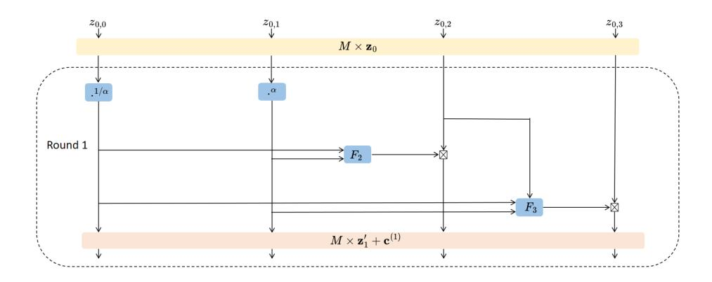
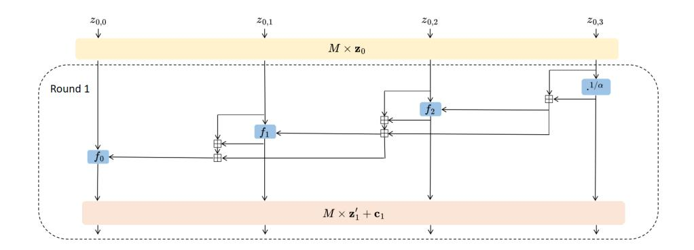
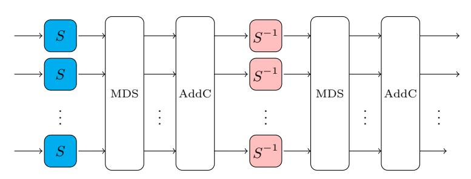
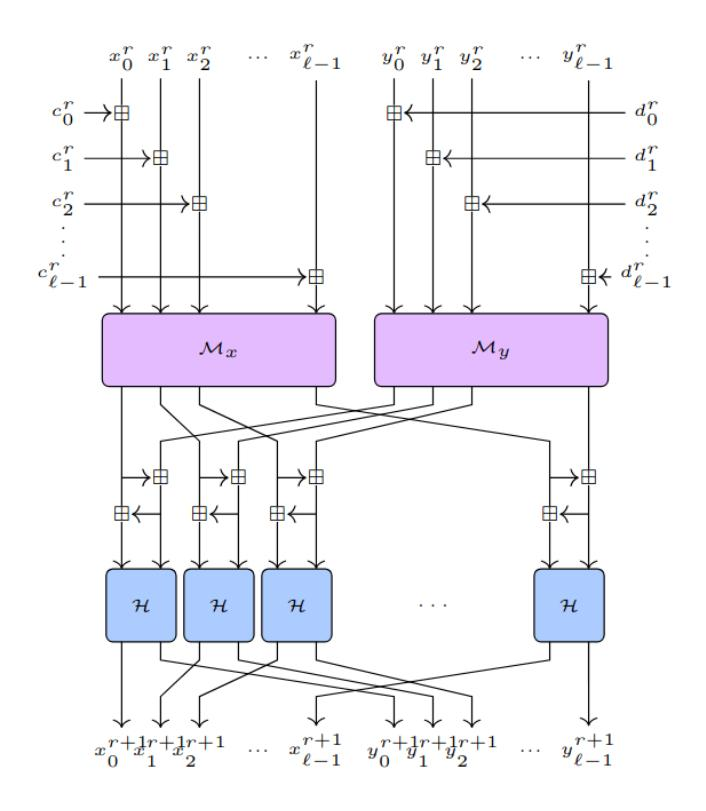
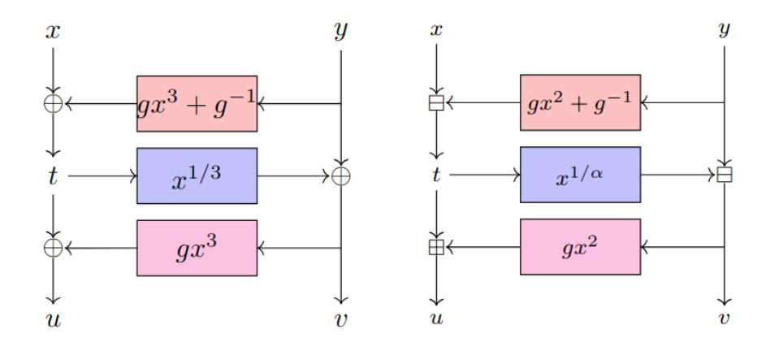

# Improved Resultant Attack against Arithmetization-Oriented Primitives

Augustin Bariant<sup>1</sup> , Aur´elien Boeuf<sup>2</sup> , Pierre Briaud<sup>3</sup> , Ma¨el Hostettler<sup>4</sup> , Morten Øygarden<sup>3</sup> , and H˚avard Raddum<sup>3</sup>

> <sup>1</sup> ANSSI, Paris, France 2 INRIA, Paris, France 3 Simula UiB, Bergen, Norway <sup>4</sup> T´el´ecom SudParis, Evry-Courcouronnes, France ´ augustin.bariant@ssi.gouv.fr, aurelien.boeuf@inria.fr mael.hostettler@telecom-sudparis.eu {pierre,morten.oygarden,haavardr}@simula.no

Abstract. In the last decade, the introduction of advanced cryptographic protocols operating on large finite fields F<sup>q</sup> has raised the need for efficient cryptographic primitives in this setting, commonly referred to as Arithmetization-Oriented (AO). The cryptanalysis of AO hash functions is essentially done through the study of the CICO problem on the underlying permutation. On several AO hash functions relying on S-boxes with low degree inverse, two recent works at Crypto 2024 and Asiacrypt 2024 managed to solve the CICO problem much more efficiently than traditional Gr¨obner basis methods, using respectively advanced Gr¨obner basis techniques and resultants.

In this paper, we propose an attack framework based on resultants that applies to a wide range of AO permutations and improves significantly upon these two recent works. Our improvements mainly come from an efficient reduction procedure that we propose and rigorously analyze, taking advantage of fast multivariate multiplication. We present the most efficient attacks on Griffin, Arion, Anemoi, and Rescue. We show that most variants of Griffin, Arion and Anemoi fail to reach the claimed security level. For the first time, we successfully break a parameter set of Rescue, namely its 512-bit security variant. The presented theory and complexity estimates are backed up with experimental attacks. Notably, we practically find CICO solutions for 8 out of 10 rounds of Griffin, 11 out of 21 rounds of Anemoi, 6 out of 18 rounds of Rescue, improving by respectively 1, 3 and 1 rounds on the previous best practical attacks.

# 1 Introduction

Cryptographic protocols for zero-knowledge (ZK) proofs, multi-party computation (MPC) and fully homomorphic encryption (FHE) offer strong privacypreserving functionalities. Real-world implementations of these protocols will often have to operate in conjunction with symmetric primitives such as encryption schemes and hash functions. However, ZK, MPC and FHE protocols tend to operate over large prime fields, and their efficiency is often linked to the number and type of non-linear operations the protocol has to perform. As a result, the standard symmetric primitive choices of AES and SHA-3 – which work over binary fields and have been designed with a different efficiency paradigm in mind – tend to be slow when run as a part of these protocols.

Numerous "ZK-/MPC-/FHE-friendly" symmetric ciphers and hash functions have been designed in recent years to address this problem. Depending on the target use case, these primitives often work over particular prime fields, and try to limit the number of non-linear operations to perform when executing the primitive. The implementation cost of such primitives varies depending on the protocol where they are used. In FHE-friendly designs, where the output of one multiplication is used as an input for the next, the multiplicative depth—defined as the number of sequential multiplications required—is the most important factor. In MPC-friendly primitives, however, this quantity is irrelevant; what matters is the total number of multiplications, as each of them increases the communication cost between the parties. Such subtleties mean there is not one single optimal primitive, and also explain the large number of new proposals. Schemes in this category are often referred to as *Arithmetization-Oriented* (AO).

Security of AO hash functions. A series of recent works have focused on designing AO permutations  $F: \mathbb{F}_q^t \to \mathbb{F}_q^t$  (where  $\mathbb{F}_q$  is a finite field), which are turned into hash functions via the sponge construction [6]. Examples of this trend include Poseidon [17,18], Rescue [1], Griffin [16], Arion [22], Anemoi [8] and XHash8/12 [2]. The security of these constructions against algebraic attacks is measured with the *Constrained-Input Constrained-Output* (CICO) problem, which is the typical setting for studying the security of hash functions in sponge mode [6]. We focus on the following variant, which has received the most attention in the literature.

<span id="page-1-0"></span>**Definition 1 (The CICO-1 Problem).** Let
$$t \geq 2$$
 and  $F : \mathbb{F}_q^t \to \mathbb{F}_q^t$  be a permutation. The goal is to find  $\mathbf{x} \in \{0\} \times \mathbb{F}_q^{t-1}$  such that  $F(\mathbf{x}) \in \{0\} \times \mathbb{F}_q^{t-1}$ .

We remark that most of the AO permutations laves the specific choice of matrix unspecified. In these case the exact choice of entry set to 0 does not matter, as this only changes the outer linear layer by a permutation.

The CICO-1 problem can be solved generically in approximately q permutation calls, and many AO permutation designs claim to be resistant to CICO-1 attacks up to q equivalent permutation computations. In the case of Poseidon, which is composed of r rounds having a small degree d, one can symbolically evaluate the permutation F in the single indeterminate x. Solving the CICO problem in this case boils down to finding the root of a univariate polynomial in degree at most  $d^r$ , which should be considerably smaller than q for the attack to succeed.

However, in the cases of Rescue, Griffin, Arion and Anemoi, the round function contains high-degree components of the form  $y \mapsto y^{1/\alpha}$  for some small integer  $\alpha > 1$ . These so-called  $\alpha$ -inversions are of very high degree and make

the straightforward symbolic evaluation of F infeasible. Instead, one typically adopts a multivariate polynomial modeling by introducing a new variable for each α-inversion and applies a two-stage approach to find a low-degree univariate polynomial representing the CICO solutions. First, a grevlex Gr¨obner basis of the polynomial ideal is computed, typically using F4/F<sup>5</sup> [\[13,](#page-31-4)[15\]](#page-31-5), and second, it is converted into a lex Gr¨obner basis which contains a univariate polynomial, typically using FGLM [\[14\]](#page-31-6). This approach is currently the most efficient technique to solve generic multivariate systems. However, systems arising from the modeling of the CICO problem on AO permutations are all but generic, and two recent works exploited their structure to reduce further the complexity of the CICO attack on different primitives: the FreeLunch attack [\[3\]](#page-30-4) and the Resultant attack [\[26\]](#page-31-7).

FreeLunches and Resultants. The FreeLunch attack of [\[3\]](#page-30-4) derives custommade monomial orders for which the given multivariate polynomial system is already a Gr¨obner basis G, which allows for side-stepping the first step mentioned above. The bottleneck of the attack lies in computing a univariate polynomial in the ideal generated by G; it can be performed by generating the multiplication matrix with respect to one variable and then computing its characteristic polynomial, without computing a second Gr¨obner basis as in the lex order. The Resultant attack of [\[26\]](#page-31-7) is an altogether different approach that eliminates variables from the multivariate system by the successive computation of resultants. Following this strategy produces a univariate polynomial in the ideal generated by the polynomial system. Let us note that this is not the first occurrence of resultants in the context of the cryptanalysis of AO primitives, as [\[7\]](#page-30-5) also computes a univariate polynomial as the resultant of two high-degree bivariate polynomials. That said, our approach is much closer to [\[26\]](#page-31-7), which we will focus on in the following.

Both the attacks of [\[3\]](#page-30-4) and [\[26\]](#page-31-7) have proved effective in their own right, with each breaking several instances of AO hash functions previously thought to be secure. However, at the current state of the art, it is unclear if (and how) the two approaches compare on these primitives or even relate to each other from a more theoretical perspective. Indeed, the two papers consider to some extent different targets, with [\[3\]](#page-30-4) focusing on Griffin, Arion, Anemoi and XHash8, while [\[26\]](#page-31-7) focuses on Rescue, Jarvis and Anemoi. In the case of Anemoi, practical experiments on scaled-down versions show the Resultant method to be more efficient than its FreeLunch counterpart, but the eventual complexity estimates of both attacks are comparable.[5](#page-2-0)

Our Contributions. In this paper, we improve upon the resultant method by introducing a new efficient polynomial reduction method that exploits fast multivariate multiplication. We strive to keep our approach general, so it is readily applicable to as many AO hash functions as possible.

<span id="page-2-0"></span><sup>5</sup> [\[26,](#page-31-7) Table 6] use ω = 2.376 while [\[3,](#page-30-4) Table 1] use ω = 2.81. Comparing both theoretical estimates with the same ω gives similar attack complexities.

We complement our new method with a thorough complexity analysis, borrowing some tools from the FreeLunch attack. We show that our attack considerably lowers the complexity of solving the CICO problem for primitives like Griffin, Arion, Rescue, and Anemoi. We also experimentally run the attack and solve the CICO problem for 8 rounds of Griffin, 11 rounds of Anemoi, and 6 rounds of Rescue, improving upon the literature by respectively 1, 3, and 1 rounds.

Outline. Section 2 introduces the necessary background on Gröbner bases and resultants, and briefly describes [3,26]. Section 3 presents our attack at a high level and analyzes the efficient reduction method. Using this first analysis, Section 4 provides complexity estimates for the different attack steps. Finally, Section 5 applies these estimates on selected permutations and reports on the practical experiments.

# <span id="page-3-0"></span>2 Background

**Notation.** Let  $q = p^e$  for p prime and  $e \in \mathbb{N}_{>0}$ , where p is either odd and greater than  $2^{\lambda}$  with e = 1, or p = 2 and  $e \geq \lambda$ . Let  $\mathbb{F}_q$  denote the finite field with q elements.

We consider a multivariate polynomial ring of the form  $R = \mathbb{F}_q[x, z_1, \dots, z_n]$ . We will also use the notation  $R_i$  for the subring  $\mathbb{F}_q[x, z_1, \dots, z_i]$  for  $0 \le i \le n$ . For  $h \in R$ , we denote by  $\deg_x(h)$  (resp.  $\deg_{z_i}(h)$ ) the partial degree of h with respect to x (resp.  $z_i$ ). Any set of polynomials  $\mathcal{P} = \{h_1, \dots, h_m\} \subset R$  is implicitly associated to the system  $\{h_1 = 0, \dots, h_m = 0\}$ , and we write  $I = \langle \mathcal{P} \rangle$  for the ideal generated by  $\mathcal{P}$ .

The complexities of our algorithms will be given in terms of  $\mathbb{F}_q$ -operations and will be expressed using either the big-O notation  $\mathcal{O}(\cdot)$  or the soft-O notation  $\widetilde{\mathcal{O}}(\cdot)$  where logarithmic factors are omitted.

#### <span id="page-3-1"></span>2.1 Preliminary Theory

Gröbner bases, normal forms and weighted orders. We refer to [12] for details on the theory of Gröbner bases and we only introduce the notation needed to present our algorithms. We write  $\prec$  for a monomial order,  $\prec_{lex}$  for a lexicographical monomial order, and LT(h), LM(h) and LC(h) respectively for the leading term, leading monomial and leading coefficient of h once such an order is fixed. We extend this notation to an arbitrary subset  $\mathcal{P}$  of R endowed with  $\prec$ , for example  $LM(\mathcal{P}) = \{LM(h_1), LM(h_2), \dots\}$ .

**Definition 2 (Gröbner basis).** A Gröbner basis of an ideal I with respect to a monomial order is any finite set  $\mathcal{G}$  such that  $\langle \mathcal{G} \rangle = I$  and  $\langle \text{LM}(\mathcal{G}) \rangle = \text{LM}(I)$ .

<span id="page-3-2"></span>**Definition 3 (Reduced Gröbner basis).** The reduced Gröbner basis  $\mathcal{G}$  of an ideal I with respect to a monomial order is the unique  $\mathcal{G}$  such that i)  $\forall h \in \mathcal{G}$ , LC(h) = 1; and ii)  $\forall h \in \mathcal{G}$ , no monomial of h belongs to  $\langle LM(\mathcal{G} \setminus \{h\}) \rangle$ .

**Definition 4 (Normal form with respect to a Gröbner basis).** Let  $I \subset R$  be an ideal, let  $\prec$  be a monomial order and let  $\mathcal{G}$  be a Gröbner basis of I with respect to  $\prec$ . For any  $f \in R$ , there exists a unique polynomial  $\rho \in R$  such that  $f - \rho \in I$  and such that either  $\rho = 0$  or no term of  $\rho$  is divisible by any element of  $LM(\mathcal{G})$ . We will refer to this polynomial as the normal form of f with respect to  $\mathcal{G}$  or as the reduction of f modulo  $\mathcal{G}$ .

There exists a canonical basis for the vector space R/I whose elements are given by all the monomials in R that are not in  $\mathrm{LM}(I)$ . The normal form of a polynomial  $f \in R$  can be seen as the decomposition of  $\overline{f} \in R/I$  in this basis. Finally, an ideal I for which the basis R/I is finite is said to be zero-dimensional. In this case, its cardinality is called the ideal degree, denoted by  $d_I$ .

In this paper, the complexity analysis will be conducted using degree estimates of polynomials with respect to a fixed weight vector, referred to as weighted degrees:

**Definition 5 (Weighted degree).** Given a weight vector  $\mathbf{w} = (w_0, \dots, w_n) \in \mathbb{R}^{n+1}_{\geq 0}$ , the weighted degree of a monomial  $\mu = x^{\beta_0} \prod_{i=1}^n z_i^{\beta_i} \in R$  is defined as:

$$d_{\mathbf{w}}\left(x^{\beta_0}\prod_{i=1}^n z_i^{\beta_i}\right) = \sum_{i=0}^n w_i \beta_i.$$

From a weight vector  $\boldsymbol{w} \in \mathbb{R}^{n+1}_{\geq 0}$  and a lexicographical order  $\prec_{lex}$  on R, one can define a particular weight order that we will call the *wdeglex* monomial order.

<span id="page-4-1"></span>**Definition 6 (wdeglex monomial order).** The weighted graded lexicographical (wdeglex) monomial order  $\prec$  with respect to the weight vector  $\mathbf{w} \in \mathbb{R}^{n+1}_{\geq 0}$  and the lexicographical order  $\prec_{lex}$  on R is the monomial order defined as follows. For monomials  $\mu$  and  $\mu'$ , we have

$$\mu \prec \mu' \qquad \textit{iff} \qquad \begin{cases} d_{\boldsymbol{w}}(\mu) < d_{\boldsymbol{w}}(\mu') & \textit{or} \\ d_{\boldsymbol{w}}(\mu) = d_{\boldsymbol{w}}(\mu') & \textit{and} \quad \mu \prec_{lex} \mu'. \end{cases}$$

Given a fixed weight vector  $\boldsymbol{w}$ , the weighted degree  $d_{\boldsymbol{w}}(f)$  of f can be defined as the maximal weighted degree of the monomials in f. By definition of the above order  $\prec$ , we have  $d_{\boldsymbol{w}}(f) = d_{\boldsymbol{w}}(\mathrm{LM}_{\prec}(f))$ .

**Resultants.** The resultant of two univariate polynomials in X over a commutative ring R is an element of R defined as the determinant of the so-called Sylvester matrix. Resultants are a powerful tool to eliminate variables in a multivariate polynomial ring (in this case, R is itself a polynomial ring).

**Definition 7 (Resultant of two polynomials).** Let R be a commutative ring, and let f, g be two non-constant polynomials in R[X]:

<span id="page-4-0"></span>
$$f = \sum_{i=0}^{\gamma} a_i X^i, \ a_i \in R, \ a_{\gamma} \neq 0, \qquad g = \sum_{i=0}^{\delta} b_i X^i, \ b_i \in R, \ b_{\delta} \neq 0.$$

The Sylvester matrix associated to f and g in  $R^{(\gamma+\delta)\times(\gamma+\delta)}$  is defined as

$$Syl(f,g) = \begin{bmatrix} a_{\gamma} & \cdots & a_{1} & a_{0} & 0 \\ & \ddots & & \ddots & \ddots \\ 0 & a_{\gamma} & \cdots & a_{1} & a_{0} \\ b_{\delta} & b_{\delta-1} & \cdots & b_{0} & 0 \\ & \ddots & \ddots & & \ddots \\ 0 & b_{\delta} & b_{\delta-1} & \cdots & b_{0} \end{bmatrix} \right\} \gamma$$

The resultant of f and g with respect to X is defined as

<span id="page-5-0"></span>
$$Res(f,g) = |Syl(f,g)| \in R.$$

When R[X] is a multivariate polynomial ring and when the choice of the variable X is ambiguous, we denote the resultant of two multivariate polynomials f and g with respect to X as  $Res_X(f,g)$ .

It is readily seen that  $\mathrm{Res}_X(f,g) \in R \cap \langle f,g \rangle$ , and therefore it vanishes at any potential common roots of f and g.

In addition to the determinant-based definition of the resultant, we will use a specific case of the following result.

**Proposition 1.** Let R be an integral domain and let  $f, g \in R[X]$  as in Definition 7. Assume their roots (in some extension field) are  $\zeta_1, \ldots, \zeta_{\gamma}$  and  $\eta_1, \ldots, \eta_{\delta}$  respectively. Then their resultant is given by:

$$Res(f,g) = a_{\gamma}^{\delta} b_{\delta}^{\gamma} \prod_{i=1}^{\gamma} \prod_{j=1}^{\delta} (\zeta_i - \eta_j)$$
$$= a_{\gamma}^{\delta} \prod_{i=1}^{\gamma} g(\zeta_i) = (-1)^{\gamma \delta} b_{\delta}^{\gamma} \prod_{j=1}^{\delta} f(\eta_j).$$

*Proof.* We refer for example to [11, Chapter 3, (1.4), page 79], which applies to univariate polynomials over any field. We apply this result in the particular case when the field is the fraction field of the integral domain R, recalling that in our context R will be a multivariate polynomial ring.

Fast multivariate polynomial multiplication. An important building block to derive the complexities of the methods in this paper is the cost of multiplying two multivariate polynomials. We start by denoting the complexity of multiplying two univariate polynomials of degree  $\leq d$  over  $\mathbb{F}_q$  as  $\mathcal{M}(d)$  operations in  $\mathbb{F}_q$ . The most efficient univariate multiplication algorithm is an FFT-based technique with quasi-linear complexity [9],

<span id="page-5-1"></span>
$$\mathcal{M}(d) = \mathcal{O}(d\log(d)\log(\log(d))). \tag{1}$$

We will rely on this univariate algorithm to also compute the product of multivariate polynomials using the Kronecker trick presented in [21, §3.4]. In this way, the product of two polynomials in  $\mathbb{F}_q[x_1,\ldots,x_n]$  with degree  $\alpha_i$  and  $\beta_i$  respectively in the variable  $x_i$  takes

<span id="page-6-1"></span>
$$\mathcal{M}\left(\prod_{i=1}^{n} (\alpha_i + \beta_i + 1)\right) \tag{2}$$

operations in  $\mathbb{F}_q$ . This product has degree  $\alpha_i + \beta_i$  in the variable  $x_i$  and typically has  $\prod_{i=1}^n (\alpha_i + \beta_i + 1)$  nonzero coefficients.

Univariate root finding. The roots of a univariate polynomial of degree d in  $\mathbb{F}_q$  can be computed by applying the efficient FFT-based technique of [4]. Assuming that  $\mathcal{M}(d) = \mathcal{O}(d \log(d) \log(\log(d)))$  and that this polynomial has a few roots in  $\mathbb{F}_q$ , finding the roots of this polynomial requires

<span id="page-6-3"></span>
$$\mathcal{O}(d\log(d)(\log(d) + \log(q))\log(\log(d))) \tag{3}$$

operations in  $\mathbb{F}_q$ .

#### <span id="page-6-2"></span>2.2 The FreeLunch Approach

The approach of [3] relies on the existence of specific monomial orders for certain AO permutations in which the initial modeling is already a Gröbner basis. In these cases, the initial step of modeling the polynomial system (and, indeed, Gröbner basis) is referred to as **sysGen**. Even though such a Gröbner basis is *conceptually* easy to obtain, its elements can still contain variables of high degree, making them difficult to compute in practice.

Instead of applying the FGLM algorithm to derive a second Gröbner basis from the output of the sysGen step, [3] suggests a more tailored approach. As such, the next two steps of the FreeLunch method involve constructing a multiplication matrix (matGen) and computing its characteristic polynomial (polyDet). Indeed, the structure of the first Gröbner basis makes this operation more efficient than generic algorithms that can be applied to it.<sup>6</sup> The final step, uniSol, is to find the roots of this polynomial, as described in Section 2.1.

This last uniSol step is typically negligible compared to the rest of the attack. However, it is unclear which of the other steps is the most costly. In [3, Appendix A], it is argued that sysGen is easier to perform than polyDet, but this claim is based solely on heuristics. The comparison between matGen and polyDet appears to be just as difficult. While the *generic* upper bound for matGen [14, Proposition 3.1] is greater than the complexity estimate for polyDet, [3] remarks that this is likely a loose upper bound that can be further improved by taking into account the underlying structure. Experiments do not provide more insight for this comparison, as there are examples where both matGen and polyDet become the bottleneck [3, Section 6.1].

<span id="page-6-0"></span><sup>&</sup>lt;sup>6</sup> Faster algorithms exist [5], but they cannot be applied directly in our setting as a stability requirement is not necessarily met.

### <span id="page-7-1"></span>2.3 The Resultant Approach

The idea of [\[26\]](#page-31-7) is to compute iterated resultants starting from the initial modeling, which allows eliminating variables and eventually producing a univariate polynomial. The authors consider two modelings: the direct modeling referred to as "forward", and the "start-from-the-middle" (SFTM) modeling. In both cases, new variables are introduced each round at each output of inverse power map S-boxes, which suggests a suitable elimination path. The construction of these modelings is analogous to the sysGen step of [\[3\]](#page-30-4). Still, [\[26\]](#page-31-7) does not estimate its cost and assumes it to be negligible compared to the cost of subsequent steps.

Once the system has been generated, iterated resultants are computed efficiently by exploiting the structure of the Sylvester matrices involved. After each resultant computation, a so-called "cubic substitution procedure" is applied to decrease the degree of the remaining variables in the resultant. This substitution can be seen as a reduction by some of the polynomials of the initial modeling whose leading monomials are of the form z 3 i (for a particular monomial ordering). We will only be interested in the direct modeling, where this approach yields a univariate polynomial. When applied to the STFM modeling, the same approach yields two bivariate polynomials, and the final bivariate resultant is computed differently by a generic algorithm based on Fast Lagrange interpolation [\[10\]](#page-31-12). Finally, [\[26\]](#page-31-7) uses a standard uniSol step to extract the roots of the univariate polynomial.

The computational bottleneck for this approach seems to depend on the choice of modeling. In the SFTM modeling, the final bivariate resultant computation is estimated as the bottleneck (see [\[26,](#page-31-7) Figure 7 and 12, Table 4]), whereas cubic substitutions seem to be the bottleneck in the forward modeling (see [\[26,](#page-31-7) Table 2]).

# <span id="page-7-0"></span>3 Improved Resultant Approach

At a very high level, our work improves upon the Resultant attack, borrowing theoretical tools from the FreeLunch approach. In this section, we give an overview of our improved resultant attack and highlight the key differences between our attack and the resultant attack of [\[26\]](#page-31-7). We leave the complexity analysis for Section [4.](#page-14-0) This analysis allows us to precisely bound the complexity of all steps, which was not the case in [\[3](#page-30-4)[,26\]](#page-31-7).

In most of this paper, we will consider the case where the unknown input x of the CICO-1 problem has only one single degree of freedom (as opposed to t−1), for instance, x ∈ {0} <sup>t</sup>−<sup>1</sup>×Fq, which allows us to model the CICO solutions with a well-defined polynomial system, which has on average 1 CICO solution (as opposed to q t−2 ). In concrete attacks, we usually use round-bypassing techniques, as performed in [\[4,](#page-30-6)[3,](#page-30-4)[26\]](#page-31-7), and manage to reduce the CICO-1 problem on a fullround permutation into a CICO-like problem on a round-reduced variant where the input has only one degree of freedom. The idea is to let the entries of x consist of univariate polynomials in F[x] that are carefully chosen so that the growth of the degree in x induced by the first non-linear operations is limited, thus effectively bypassing a small number of initial rounds. For simplicity, we omit round-bypassing techniques in the presentation of our attack but will apply them on concrete permutations in Section 5. We highlight that we only rely on existing round-bypassing techniques and do not improve upon the state of the art in that regard.

### <span id="page-8-0"></span>3.1 Modeling Strategy

**Scope of application.** Recall that the value of q is assumed to be sufficiently large so that the CICO-1 problem of Definition 1 is not trivially broken by a brute-force attack, i.e.,  $q \geq 2^{\lambda}$ , where  $\lambda$  is the security parameter. In the following, we will focus on a permutation  $F: \mathbb{F}_q^t \to \mathbb{F}_q^t$ ,  $t \geq 2$  that satisfies the following two conditions:

1) It is built from affine layers denoted  $A_i$  and a non-linear layer denoted S, both operating on  $\mathbb{F}_q^t$ . These building blocks appear in an alternating pattern, starting and ending with the affine layer (if needed, one can set  $A_0 = Id$ ). In other words, the entire permutation can be described as:

$$F = A_r \circ S \circ \ldots \circ A_1 \circ S \circ A_0$$

where the number of calls to S is referred to as the number of rounds, denoted by r.

2) The only high-degree components in S are power maps  $y\mapsto y^{1/\alpha}$ , denoted as  $\alpha$ -inversions, where  $\alpha$  is coprime to q-1 and small (typically  $\alpha=3$  or 5). We write  $\ell$  for the number of such  $\alpha$ -inversions in S. As an example,  $\ell=1$  for Anemoi, Arion and Griffin, while  $\ell=t$  for Rescue-Prime.

We remark that many ZK-friendly AO permutations fall into this category, including Rescue-Prime, Arion, Griffin, and Anemoi. The XHash construction also belongs to this framework, but the authors only claimed CICO resistance with multiple constraints in output.

Modeling the CICO Problem. As announced above, we let the input state to F consist of polynomials in an unknown variable x, except for one element that is set to 0. We can then compute the evolution of this polynomial state through F by successively applying  $A_i$  and S on the state elements, interpreted as polynomials in  $\mathbb{F}_q[x]$  rather than field elements. The degree of the polynomials in the internal state clearly increases after every application of S. When  $\ell=0$ , which is the case for example in Poseidon and Poseidon2, S is of low degree and this increase is simply exponential in the number of rounds. However, when  $\ell \geq 1$ , the  $\alpha$ -inversion is of very high degree (of the same order of magnitude as q), so applying S directly to the polynomial state is in general not feasible.

Similarly to [3,26], we therefore introduce new variables  $z_i$  for  $1 \le i \le n$  as the output of each  $\alpha$ -inversion. Since we introduce these variables one after

the other, we are ensured that the input of the  $\alpha$ -inversion whose output is  $z_i$  is a low-degree polynomial in  $x, z_1, \ldots, z_{i-1}$  (independent of  $z_i, \ldots, z_n$ ), which we call  $f_i(x, z_1, \ldots, z_{i-1})$ . For each such new variable  $z_i$ , we add the equation  $z_i^{\alpha} - f_i(x, z_1, \ldots, z_{i-1}) = 0$  to our polynomial system. In the current setting, we need  $n = \ell r$  new variables  $z_i$ . This number may be decreased thanks to round-bypassing techniques that set the input of some  $\alpha$ -inversions to polynomials of the form  $f(x)^{\alpha}$  (possibly constant), so that there is no need to add an extra variable for the output. We call them bypassed  $\alpha$ -inversions.

One key improvement of our modeling compared to the modelings of [3,26] is that we *efficiently* reduce state polynomials after each multiplication in S, ensuring that their degree in each  $z_i$  never exceeds  $\alpha - 1$ . While [3,26] have suggested computing normal forms for the same purpose, they do so naïvely, without analyzing or optimizing the reduction.

Using this modeling strategy, the output of F consists of polynomials in  $\mathbb{F}_q[x,z_1,\ldots,z_n]$ , and we set the first polynomial of the output state equal to 0 to get a CICO solution. We denote this polynomial by  $h(x,z_1,\ldots,z_n)$  and add the equation  $h(x,z_1,\ldots,z_n)=0$  to our polynomial system. Thus, we obtain the following system modeling the CICO problem for F:

<span id="page-9-0"></span>
$$\mathcal{P} = \begin{cases} z_1^{\alpha} - f_1(x) &= 0\\ z_2^{\alpha} - f_2(x, z_1) &= 0\\ &\vdots\\ z_n^{\alpha} - f_n(x, z_1, \dots, z_{n-1}) &= 0\\ h(x, z_1, \dots, z_n) &= 0. \end{cases}$$
(4)

This modeling coincides with the forward modeling of [26]. We also recover the modelings of [3], except for the modeling of Anemoi, in which the authors artificially increase the degree of h to get directly a Gröbner basis.

**FreeLunch systems.** The main feature of the modelings of [3] is that they yield Gröbner bases where the leading monomial of  $z_i^{\alpha} - f_i$  is  $z_i^{\alpha}$  for  $1 \leq i \leq n$ , and the leading monomial of  $h(x, z_1, \ldots, z_n)$  is univariate in x. To obtain these Gröbner bases, the authors of [3] consider a particular wdeglex monomial order (Definition 6), introduced in [3, Construction 1] with different notations.

<span id="page-9-1"></span>**Construction 1.** For a system  $\mathcal{P}$  following the structure of System (4), let  $\prec_{\mathcal{P}}$  be the wdeglex monomial order associated with the order  $x \prec_{lex} z_1 \prec_{lex} \cdots \prec_{lex} z_n$  and the weight vector  $\mathbf{w} = (w_0, \ldots, w_n) \in \mathbb{R}^{n+1}_{\geq 0}$  defined recursively by:

$$\begin{cases} w_0 = 1, \\ w_i = d_{(w_0,\dots,w_{i-1})}(f_i)/\alpha \text{ for } 1 \leq i \leq n. \end{cases}$$

All the Gröbner bases studied in [3] correspond to systems  $\mathcal{P}$  that are  $\prec_{\mathcal{P}}$ -Gröbner bases. We refer to them as FreeLunch, following [3, Proposition 5].

<span id="page-9-2"></span>**Definition 8 (FreeLunch Gröbner basis).** A system  $\mathcal{P}$  as in (4) is a FreeLunch Gröbner basis if it is a  $\prec_{\mathcal{P}}$ -Gröbner basis.

Using the wdeglex order as an analysis tool. Contrary to [3], our work applies to modelings that are not necessarily Gröbner bases with respect to the order defined in Construction 1, i.e., the leading monomial of h is not necessarily univariate in x. Still, we heavily rely on this order in our analysis.

Indeed, note that the complexity of multivariate multiplication depends on the partial degrees in all variables (see Equation (2)). While the degree in  $z_i$  remains low due to reductions by  $z_i^{\alpha} - f_i$  polynomials, these reductions increase the degree in x. Controlling this x-degree seems challenging. For instance, standard degree arguments based on partial or total degrees fail to upper-bound it. However, we observe that the weighted degree used in Construction 1 may only decrease after these reductions since  $d_{\boldsymbol{w}}(z_i^{\alpha}) \geq d_{\boldsymbol{w}}(f_i)$ . Therefore, we use this quantity to rigorously upper-bound the x-degree of polynomials at all points of the attack.

<span id="page-10-0"></span>**Definition 9 (Extra notation).** For a system  $\mathcal{P} = \{z_1^{\alpha} - f_1, \dots, z_n^{\alpha} - f_n, h\}$  as in (4) and a polynomial  $f \in R$ , we denote the weighted degree defined in Construction 1 as  $d_{\mathcal{P}}(f)$  (instead of  $d_{\boldsymbol{w}}(f)$ ). For  $1 \leq i \leq n$ , we denote by  $\mathcal{P}_i$  the subsystem  $\{z_1^{\alpha} - f_1, \dots, z_i^{\alpha} - f_i\}$  viewed in  $R_i$ . Using Construction 1, we similarly consider  $\prec_{\mathcal{P}_i}$  and its associated weighted degree  $d_{\mathcal{P}_i}(f)$  on  $R_i$ . In the following, we will allow ourselves to use  $\prec_{\mathcal{P}}$  and  $d_{\mathcal{P}}(f)$  for these last two notations to compare polynomials in  $R_i$ , even when the system  $\mathcal{P}$  is not fully generated.

### 3.2 Attack Description

Adopting the taxonomy of Sections 2.2 and 2.3, we can – at a high level – divide our framework into three steps: sysGen, iteRes and uniSol. The uniSol step is performed using generic methods, as described in Section 2.1. In this section, we point out how the other steps differ from that of [3,26].

sysGen. This step generates round by round a system of the form (4) where the  $f_i$ 's are reduced, i.e., where  $\deg_{z_j}(f_i) < \alpha$  for j < i. For that purpose, we decompose the non-linear layer S into a sequence of multiplications, and apply this sequence of multiplications to multivariate polynomials. As in [3,26], we also immediately reduce the result of each multiplication to maintain reduced outputs. However, we do it efficiently with a dedicated algorithm (Algorithm 1) that offers clear improvements over naive normal form computation. In particular, we can estimate its complexity which introduces only a logarithmic overhead compared to the complexity of multivariate multiplication. This leads to an accurate complexity estimate for the entire sysGen step, which was missing in [3,26].

iteRes. This step computes a series of resultants starting from the output of sysGen to produce a univariate polynomial. Similarly to the modelings of [26], this output is of the form (4), allowing us to follow the same elimination path as in their work. However, we take advantage of our efficient reduction procedure (Algorithm 1) to improve the computation of resultants of [26]. It seems that this also improves upon the approach of [20] from the computer algebra

literature, which seems to perform similar computations, but with standard reductions. More precisely, instead of performing a cubic substitution after the computation of each resultant, we apply reductions within their computation. Indeed, each resultant can be computed as a series of multivariate additions and multiplications, and we can apply Algorithm [1](#page-12-0) on the output of each multiplication similarly to sysGen. Ultimately, the iteRes step produces a univariate polynomial in x, whose roots are computed in the uniSol step.

The precise complexity estimates for sysGen and iteRes can be found in Section [4.](#page-14-0) Beyond improving upon [\[3,](#page-30-4)[26\]](#page-31-7), the fact that both steps are based on Algorithm [1](#page-12-0) enables a straightforward comparison to identify the dominant cost, which was again not possible in [\[3,](#page-30-4)[26\]](#page-31-7).

### 3.3 Improved Reduction Algorithm

This section describes and analyzes the reduction algorithm we use, presented in Algorithm [1.](#page-12-0) This algorithm is a normal form computation (in the sense of Definition [4\)](#page-3-2) with respect to a lexicographical Gr¨obner basis extracted from a system as in [\(4\)](#page-9-0).

<span id="page-11-0"></span>Proposition 2. For any 1 ≤ k ≤ n, let P<sup>k</sup> be the polynomial system composed of the first k equations of a system P as in [\(4\)](#page-9-0). Then P<sup>k</sup> is a Gr¨obner basis with respect to the lex ordering defined by x ≺lex z<sup>1</sup> ≺lex · · · ≺lex zk.

Proof. The leading terms of its elements are pairwise coprime, hence the result by Buchberger's second criterion [\[12,](#page-31-8) Chapter 2, §9, Prop 4 and Thm 3].

We will say that a polynomial g ∈ Fq[x, z1, . . . , zk] is reduced with respect to P if it is reduced with respect to P<sup>k</sup> and the lex order defined in Proposition [2,](#page-11-0) i.e., if degz<sup>i</sup> (g) ≤ α − 1 for all 1 ≤ j ≤ k. We will also adopt the notation S<sup>k</sup> for the quotient ring Rk/⟨Pk⟩, which can be seen as our working ring. Note that contrary to [\[3\]](#page-30-4), we never consider the reduction by the polynomial h. Since P is not a Gr¨obner basis in general, we cannot directly define normal forms associated to P.

Given g ∈ Fq[x, z1, . . . , zk] and Pk, Algorithm [1](#page-12-0) efficiently computes the desired normal form of g with respect to Pk. This algorithm operates under two key conditions, namely that deg<sup>z</sup><sup>i</sup> (g) ≤ 2α − 2 for 1 ≤ i ≤ k and that the set P<sup>k</sup> is also reduced. The first condition is always met when g is the product of two reduced polynomials, and we always apply Algorithm [1](#page-12-0) after running a multivariate multiplication in sysGen and iteRes. Algorithm [1](#page-12-0) is a recursive procedure that heavily relies on the fact that the reduction of z<sup>i</sup> does not introduce variables z<sup>j</sup> for j ≥ i, so that we can reduce the z<sup>i</sup> sequentially for decreasing i.

### <span id="page-12-0"></span>Algorithm 1 Reducek(g(x, z1, . . . , zk),Pk)

Input: A polynomial <sup>g</sup> <sup>∈</sup> <sup>F</sup>q[x, z1, . . . , zk], where deg<sup>z</sup><sup>i</sup> (g) < 2α − 1 for 1 ≤ i ≤ k, and a reduced polynomial system P<sup>k</sup> that shares the same first k polynomials with [\(4\)](#page-9-0).

```
Output: The normal form of g with respect to Pk and x ≺lex z1 ≺lex · · · ≺lex zk.
1: if k = 0 then
2: return g
3: end if
4: write g as g =
                   2Xα−2
                    i=0
                        gi(x, z1, . . . , zk−1)z
                                           i
                                           k
5: ρ ← Reducek−1(gα−1, Pk−1) · z
                                   α−1
                                   k
6: for i = 0 to α − 2 do
7: ρ ← ρ + Reducek−1(gi + Reducek−1(gα+i, Pk−1) · fk, Pk−1) · z
                                                                      i
                                                                      k
                                                   ▷ 2α − 1 calls to Reducek−1 in total
8: end for
```

In our analysis, we bound the complexity of Algorithm [1](#page-12-0) depending on k and on the maximum possible x-degree observed in this algorithm, denoted by dx.

Proposition 3. Let C(k, dx) be the complexity of Algorithm [1](#page-12-0) in Fq-operations, expressed as a function of k and d<sup>x</sup> the maximum possible x-degree of polynomials manipulated in this algorithm. We have

<span id="page-12-2"></span>
$$C(k, d_x) = \widetilde{\mathcal{O}}\left(d_x(2\alpha - 1)^k\right).$$

Proof. When k = 0, Algorithm [1](#page-12-0) returns g and the complexity is approximately 0. Otherwise, when k ≥ 1, we perform 2α − 1 recursive calls to Reducek−<sup>1</sup> and α − 1 multivariate multiplications between Reducek−1(gα+<sup>i</sup> ,Pk) and fk. These polynomials only involve variables x, z1, . . . , zk−1, and their degrees in each z<sup>i</sup> are all bounded by α − 1. In addition, by definition of this quantity, the degree in x of the product is bounded by dx. Thus, using fast multivariate multiplication (Equation [\(2\)](#page-6-1)), each multiplication costs M (d<sup>x</sup> + 1)(2α − 1)k−<sup>1</sup> field operations. This gives:

$$C(0, d_x) = 0$$

9: return ρ

$$C(k, d_x) = (2\alpha - 1)C(k - 1, d_x) + (\alpha - 1)\mathcal{M}((d_x + 1)(2\alpha - 1)^{k-1})$$
 for  $k > 0$ .

This complexity can be unfolded as follows, with <sup>M</sup>(d) = <sup>O</sup>e(d) and <sup>d</sup><sup>x</sup> <sup>≥</sup> 1:

$$C(k, d_x) = \sum_{i=1}^{k} (2\alpha - 1)^{k-i} (\alpha - 1) \mathcal{M}((d_x + 1)(2\alpha - 1)^{i-1})$$
 (5)

<span id="page-12-3"></span><span id="page-12-1"></span>
$$= \widetilde{\mathcal{O}}\left(\sum_{i=1}^{k} (2\alpha - 1)^{k-1} (\alpha - 1) d_x\right)$$
(6)

$$= \widetilde{\mathcal{O}}\left(kd_x(2\alpha - 1)^k\right)$$
$$= \widetilde{\mathcal{O}}\left(d_x(2\alpha - 1)^k\right)$$

Remark 1. Each depth k − j for 0 ≤ j ≤ k − 1 induces approximately the same cost in the final complexity of Algorithm [1,](#page-12-0) as all terms in the sum in front of [\(6\)](#page-12-1) are independent of i.

As stated at the end of Section [3.1,](#page-8-0) the value of d<sup>x</sup> is difficult to obtain in general and cannot be easily upper-bounded using standard tools. Therefore, Lemma [1](#page-13-0) gives another complexity expression that depends on the weighted degree dP<sup>k</sup> (g) of the input polynomial, that indeed bounds d<sup>x</sup> and that will be much simpler to compute in our context.

<span id="page-13-0"></span>Lemma 1. Let P<sup>k</sup> be as in Definition [9](#page-10-0) where the polynomials are reduced, and let g ∈ R<sup>k</sup> such that degz<sup>i</sup> (g) ≤ 2α−2 for 1 ≤ i ≤ k. The complexity of reduction of g by P<sup>k</sup> with Algorithm [1](#page-12-0) can be upper-bounded by:

$$\widetilde{\mathcal{O}}\left(d_{\mathcal{P}_k}(g)(2\alpha-1)^k\right).$$

Proof. All polynomials manipulated by Reduce<sup>k</sup> are reductions of parts of the input polynomial g, therefore the weighted degree of these polynomials can only be less than d<sup>P</sup><sup>k</sup> (g). Since the x-degree is less than the weighted degree, we have d<sup>x</sup> ≤ d<sup>P</sup><sup>k</sup> (g) and conclude with Proposition [3.](#page-12-2)

While reducing FreeLunch systems using Algorithm [1,](#page-12-0) the leading terms of the polynomials involved are often univariate in x, so that d<sup>x</sup> = d<sup>P</sup><sup>k</sup> (g), and Lemma [1](#page-13-0) gives a tight bound. This bound is also easier to apply than the one given by Proposition [3.](#page-12-2)

Finally, Corollary [1](#page-13-1) bounds the cost of multiplication in Sk, assuming that each element of S<sup>k</sup> is represented as its normal form with respect to P<sup>k</sup> and ≺<sup>P</sup><sup>k</sup> . As mentioned above, this cost is higher than that of multivariate multiplication in Fq[x, z1, . . . , zk] by only a logarithmic factor.

<span id="page-13-1"></span>Corollary 1. Let g1, g<sup>2</sup> be two reduced polynomials in S<sup>k</sup> = Rk/⟨Pk⟩. The complexity of computing their product g1g<sup>2</sup> and reducing it using Algorithm [1](#page-12-0) is given by:

$$\widetilde{\mathcal{O}}\left(d_x(2\alpha-1)^k\right) = \widetilde{\mathcal{O}}\left(d_{\mathcal{P}_k}(g_1)d_{\mathcal{P}_k}(g_2)(2\alpha-1)^k\right),$$

where d<sup>x</sup> is the maximum possible x-degree of polynomials manipulated in Algorithm [1](#page-12-0) applied to g1g2.

Proof. Since d<sup>x</sup> is also a bound on the x-degree of g1g2, computing the mere product costs <sup>O</sup><sup>e</sup> dx(2α − 1)<sup>k</sup> by fast multivariate multiplication. Then, using Proposition [3,](#page-12-2) the reduction has the same cost up to a logarithmic factor. One can finally upper-bound d<sup>x</sup> by d<sup>P</sup><sup>k</sup> (g1g2) = d<sup>P</sup><sup>k</sup> (g1)d<sup>P</sup><sup>k</sup> (g2).

d

# <span id="page-14-0"></span>4 Complexity Analysis

We now estimate the complexity of sysGen and iteRes based on the cost of Algorithm 1. As with our estimate for the reduction algorithm, we first provide complexity bounds using x-degrees and then adapt them to give bounds depending on the weighted degree of the last polynomial  $h \in \mathcal{P}$ . In Section 5, we will see that this quantity is relatively straightforward to compute in practice, so that complexity estimates for our attack are easily derivable on concrete permutations.

### <span id="page-14-1"></span>4.1 Complexity Analysis of sysGen

Recall that sysGen corresponds to the modeling strategy outlined in Section 3.1 but where Algorithm 1 is applied after every multiplication of two polynomials when computing the round function. The same method was outlined in [3, Complexity of computing  $P'_{\mathcal{G}}$ , p. 37], though without a detailed analysis, as the cost of the reductions was heuristically neglected compared to the other steps of the FreeLunch attack. To proceed with this analysis, let us rewrite sysGen more explicitly for an unspecified scheme that fits into our framework. This may be done in two steps: first, create an arithmetic circuit and then evaluate it with a given procedure. Recall that due to round-bypass techniques, some  $\alpha$ -inversions do not require the introduction of new variables  $z_i$ , namely the bypassed  $\alpha$ -inversions.

#### Arithmetic circuit generation

- 1. Write the permutation as an arithmetic circuit over  $\mathbb{F}_q$  where the gates are linear operations, field multiplications and  $\alpha$ -inversions. This circuit possesses t input wires and t output wires.
- 2. Generalize these arithmetic gates to operations over the multivariate polynomial ring  $\mathbb{F}_q[x, z_1, \ldots, z_n]$ , where n is the number of non-bypassed  $\alpha$ -inversions in the circuit. The wires now contain polynomials in  $\mathbb{F}_q[x, z_1, \ldots, z_n]$ .
- 3. After each polynomial multiplication gate, add a gate representing a call to Algorithm 1 on the output, reducing it with the polynomial system  $\mathcal{P}_k$ , where k is the current number of introduced variables.

#### Evaluation of the circuit

- 1. Set the first input wire to 0 and the other input wires to polynomials in x.
- 2. Initialize an array  $\mathcal{P} = [\ ]$  of length j = 0 at the start and proceed in the evaluation of the circuit in any coherent order.  $\mathcal{P}$  will eventually contain the  $z_i^{\alpha} f_i$  polynomials of the final system.
- 3. When encountering a non-bypassed  $\alpha$ -inversion, perform the following instructions:
  - (a) Let f be the input of the  $\alpha$ -inversion.
  - (b) Increment j.
  - (c) Append  $z_j^{\alpha} f$  to  $\mathcal{P}$ .

- (d) Assign the polynomial  $z_j$  to the output wire of the  $\alpha$ -inversion.
- 4. The first output wire is returned along with  $\mathcal{P}$ . They form a polynomial system as in (4) where  $\deg_{z_j}(f_i) < \alpha$  for  $1 \leq j < i, \ 1 \leq i \leq n, \ \deg_{z_j}(f_i) = 0$  for  $j \geq i$ , and  $\deg_{z_j}(h) < \alpha, \ 1 \leq j \leq n$ .

Throughout this procedure, the table  $\mathcal{P}$  always contains polynomials of the form  $z_i^{\alpha} - f_i$  where  $f_i$  is reduced. We upper-bound the complexity of sysGen in the following proposition, using the bound previously found for Algorithm 1.

<span id="page-15-0"></span>**Proposition 4.** The complexity of sysGen in terms of  $\mathbb{F}_q$ -operations is upperbounded by:

$$\widetilde{\mathcal{O}}\left(Md_x(2\alpha-1)^n\right)$$
,

where M is the number of multiplications in the permutation, n the number of non-bypassed  $\alpha$ -inversions, and  $d_x$  the highest degree in x observed in the procedure.

*Proof.* We apply M times the multiplication and reduction procedure analyzed in Corollary 1. The number of variables in such a procedure is always  $\leq n$ , and the degree in x is by definition  $\leq d_x$ . This yields the announced upper bound.  $\square$

Remark 2. The bound of Proposition 4 is given in terms of field multiplications. However, it is common to compare the cost of an attack in terms of the number of permutation evaluations, each of them costing at least M field multiplications. Therefore, the cost of sysGen can be estimated to  $\widetilde{\mathcal{O}}(d_x(2\alpha-1)^n)$  permutation evaluations. In addition, for iterated-round constructions, the costliest operations of sysGen lie in the last permutation round, which accounts for a factor 1/r of the total number of multiplications.

On some permutations, such as Rescue, computing the value  $d_x$  in Proposition 4 is straightforward. However, we may want to generically bound  $d_x$  for all permutations from the weighted degrees of the polynomial system to use the complexity bound of Proposition 4 more straightforwardly. However, it may happen that the x-degree of the polynomials processed in sysGen grows beyond the maximum weighted degree of the polynomials in the final polynomial system. This might happen if high-degree computations are performed in the cipher (and therefore in the original sysGen procedure), and their result is not needed for the generation of the final polynomial system. Based on an observation that the x-degree may only decrease with monomial cancellations (and not reductions), we slightly tweak the sysGen procedure to get the following bound on  $d_x$ .

**Proposition 5.** The maximum x-degree observed throughout sysGen, denoted  $d_x$  in Proposition 4, can be upper-bounded by:

$$d_x \leq \max(d_{\mathcal{P}}(f_1), \dots, d_{\mathcal{P}}(f_n), d_{\mathcal{P}}(h)),$$

up to a little tweak in the procedure.

Proof. Let d = max(d<sup>P</sup> (f1), . . . , d<sup>P</sup> (fn), d<sup>P</sup> (h)) where P is created by the original sysGen procedure. The only obstacle to this bound is the theoretical case where some polynomials computed in sysGen have x-degrees strictly more than d. To that end, we remark that all encountered monomials with x-degrees strictly more than d do not have any impact on the final polynomial system, and that they will eventually vanish by cancellation. Indeed, their x-degrees cannot be reduced in the reduction procedure, and no monomial with larger or equal xdegrees appear in the final polynomial system P (since degx(f) ≤ d<sup>P</sup> (f) for all f ∈ P). This implies that the resulting polynomial system P will be unchanged if all such monomials are discarded when encountered. Such a tweak does not change the output system P, and ensures that the highest x-degree encountered is at most d.

In order to lighten the complexity analysis of this paper, we assume that the weighted degree of h is close to the maximum weighted degrees of the f<sup>i</sup> , up to a small constant c.

<span id="page-16-0"></span>Assumption 1. We assume max(d<sup>P</sup> (f1), . . . , d<sup>P</sup> (fn), d<sup>P</sup> (h)) ≤ c · d<sup>P</sup> (h) for a small constant c.

In practice, our analysis of Section [5](#page-20-0) shows that for the CICO systems of Arion, Griffin and even-characteristic Anemoi, h is the highest weighted degree polynomial in P, so we can take c = 1. For odd-characteristic Anemoi, f<sup>n</sup> has the hightest weighted degree, but we show that we may take c = 2. The case of Rescue is peculiar: one could take c = α, but we show that sysGen does not require calls to Algorithm [1,](#page-12-0) so the attack complexity is dominated by iteRes.

# <span id="page-16-1"></span>4.2 Complexity Analysis of iteRes

Recall that the system P output of sysGen follows the structure of System [\(4\)](#page-9-0), where furthermore the f<sup>i</sup> 's and h are reduced modulo the ≺lex-Gr¨obner basis formed by the first n polynomials. The structure of this system naturally suggests eliminating the z<sup>i</sup> 's from top to bottom, by computing the series of resultants hn, . . . , h0, where:

$$h_n = h$$
, and  $h_{i-1} = \operatorname{Res}_{z_i}(h_i, z_i^{\alpha} - f_i)$  for  $i = n, \dots, 1$ .

Indeed, it is readily seen that h<sup>i</sup> ∈ R<sup>i</sup> = Fq[x, z1, . . . , z<sup>i</sup> ] for 0 ≤ i ≤ n, and in particular h<sup>0</sup> is univariate in x. To limit degree growth in the remaining variables, this approach was tweaked in [\[26\]](#page-31-7) by applying cubic substitution (in our terminology, reduction) after the computation of each resultant.

As mentioned earlier, our approach applies the reduction of Algorithm [1](#page-12-0) after each multiplication in the resultant computation, rather than only on the resultant itself. We denote the non-reduced resultant as Res<sup>i</sup> = Res<sup>z</sup>i+1 (hi+1, z<sup>α</sup> <sup>i</sup>+1 − fi+1) and reserve the notation h<sup>i</sup> for the reduced polynomial considered in our approach. Each resultant h<sup>i</sup> can in theory be computed directly as a Sylvester determinant, i.e., a polynomial expression in R<sup>i</sup> on fi+1 and the coefficients of hi+1, interpreted as a polynomial of Ri−1[z<sup>i</sup> ]. This method can be efficient for small α's – we will indeed use it in our applications in Section [5](#page-20-0) for α = 3 – but for large α's, the polynomial expression is too heavy and this technique becomes inefficient. Hence for general α's we use another approach based on Proposition [1.](#page-5-0) The complexity estimates of this section correspond to this latter algorithm, and assume an unbounded α.

Resultant computation for general α. Our method to compute resultants for α > 3 consists in applying the following proposition.

<span id="page-17-0"></span>Proposition 6. Let us denote by F<sup>R</sup>i−<sup>1</sup> the algebraic closure of the fraction field of Ri−1. We have:

<span id="page-17-2"></span>
$$Res_{i-1} = Res_{z_i}(h_i, z_i^{\alpha} - f_i) = \prod_{j=0}^{\alpha-1} h_i(\theta \chi^j),$$
 (7)

where χ ∈ F<sup>q</sup> is an α-th primitive root of unity and θ ∈ F<sup>R</sup>i−<sup>1</sup> is an α-th root of fi.

Proof. We use Proposition [1](#page-5-0) by making the roots of z α <sup>i</sup> −f<sup>i</sup> explicit, namely θχ<sup>j</sup> for 0 ≤ j ≤ α − 1. We obtain

$$\operatorname{Res}_{z_i}(h_i, z_i^{\alpha} - f_i) = (-1)^{\alpha(\alpha - 1)} \prod_{j=0}^{\alpha - 1} h_i(\theta \chi^j) = \prod_{j=0}^{\alpha - 1} h_i(\theta \chi^j).$$

Using Proposition [6,](#page-17-0) the computation of this resultant boils down to α multiplications of multivariate polynomials in FRi−<sup>1</sup> . In order to perform the computation on a simpler ring, we introduce new formal variables θ and χ and perform the computation in Ri−1[θ, χ]/⟨θ <sup>α</sup> − f<sup>i</sup> , χ<sup>0</sup> + . . . + χ α−1 ⟩. In addition, we aim at producing a reduced polynomial hi−<sup>1</sup> by applying a variant of Algorithm [1](#page-12-0) after each multiplication. Therefore, we will directly perform the multiplications in the subring Si−1[θ, χ]/⟨θ <sup>α</sup> − f<sup>i</sup> , χ<sup>0</sup> + . . . + χ α−1 ⟩ where Si−<sup>1</sup> = Ri−1/⟨Pi−1⟩. With a slight abuse of notation, we can identify the formal variable z<sup>i</sup> with θ, yielding the natural isomorphism:

$$S_{i-1}[\theta,\chi]/\langle \theta^{\alpha}-f,\chi^0+\ldots+\chi^{\alpha-1}\rangle \cong S_i[\chi]/\langle \chi^0+\ldots+\chi^{\alpha-1}\rangle,$$

which essentially allows us to compute in the familiar ring S<sup>i</sup> with one extra variable χ. In order to account for χ, we show that we may use Algorithm [1](#page-12-0) with i+ 1 variables. The complexity of this computation is estimated in the following lemma, whose proof provides more details on how we apply Algorithm [1.](#page-12-0)

Lemma 2. For 1 ≤ i ≤ n, the reduced resultant hi−<sup>1</sup> can be computed from h<sup>i</sup> and P in

<span id="page-17-1"></span>
$$\widetilde{\mathcal{O}}(d_{\mathcal{P}}(h_i)(2\alpha-1)^{i+2}).$$

*Proof.* The idea is similar to the fast multivariate multiplication and reduction in  $S_i$ , but with an extra variable  $\chi$  and equation  $\chi^0 + ... + \chi^{\alpha-1}$ . In order to reuse the bounds of Corollary 1, we perform all operations in  $S_i[\chi]/\langle \chi^{\alpha} - 1 \rangle$ , and reduce by  $\chi^0 + ... + \chi^{\alpha-1}$  at the end. Let us consider the reduced system  $\mathcal{P}_i^{\chi} = \mathcal{P}_i \cup \{\chi^{\alpha} - 1 = 0\}$ . Note that  $\chi^{\alpha} - 1 = 0$  fits the shape of the first nequations of System 4 (in a very simple manner). We can thus treat  $\mathcal{P}_i^{\chi}$  as a polynomial system composed of the first i+1 equations of System 4, and we can directly use the bounds of Corollary 1: the multivariate multiplication and reduction cost  $\tilde{\mathcal{O}}(d_x(2\alpha-1)^{i+1})$  operations altogether, where  $d_x$  is a bound on the x-degrees during the computation. Following Lemma 1,  $d_x$  can be bounded by the product of the weighted degrees of the two inputs of the multiplication. Note that Construction 1 for  $\mathcal{P}_i^{\chi}$  defines the weighted degree of  $\chi$  as  $d_{\mathcal{P}_i^{\chi}}(\chi) = 0$ , so  $\chi$  is not involved in the weighted degree  $d_{\mathcal{P}^{\chi}}$ . Therefore, for all j, we have  $d_{\mathcal{P}_{i}^{\chi}}(h_{i}(z_{i}\chi^{j})) = d_{\mathcal{P}_{i}^{\chi}}(h_{i}(z_{i})) = d_{\mathcal{P}}(h_{i})$ . In order to perform this product of  $\alpha$ terms of weighted degree  $d_{\mathcal{P}}(h_i)$ , we may apply a divide-and-conquer method to minimize the number of high weighted degree multiplication (as sketched in Appendix A): this costs  $\widetilde{\mathcal{O}}(\alpha d_{\mathcal{P}}(h_i)(2\alpha-1)^{i+1}) = \widetilde{\mathcal{O}}(d_{\mathcal{P}}(h_i)(2\alpha-1)^{i+2})$ . operations. The final reduction by  $\chi^0 + ... + \chi^{\alpha-1}$  has linear cost w.r.t. the size of the output of the previous steps.

Remark 3. Based on our analysis, if we first give a complexity bound using x-degrees and then bound these x-degrees by weighted degrees as was done in sysGen, the resulting bound is weaker by a factor approximately  $\alpha$ . Indeed, the multiplication grouping seems harder to take into account.

Estimating the cost of iteRes comes down to estimating the weighted degrees of the  $h_i$ 's, which is done in the following lemma.

<span id="page-18-0"></span>**Lemma 3.** For  $1 \le i \le n$ , we have:

$$d_{\mathcal{P}}(h_i) \le \alpha^{n-i} d_{\mathcal{P}}(h).$$

*Proof.* Let  $1 \leq i \leq n$ . Since  $h_i$  is obtained from  $\operatorname{Res}_i$  from reductions that cannot increase the weighted degree, we have  $d_{\mathcal{P}_i}(h_i) \leq d_{\mathcal{P}_i}(\operatorname{Res}_i)$ . Using Proposition 6, and the polynomial system  $\mathcal{P}_i^{\chi}$  defined in the proof of Lemma 2, we have:

$$d_{\mathcal{P}}(h_{i-1}) = d_{\mathcal{P}_{i}^{X}}(h_{i-1}) \le d_{\mathcal{P}_{i}^{X}}(\operatorname{Res}_{i-1}) = \sum_{j=0}^{\alpha-1} d_{\mathcal{P}_{i}^{X}}(h_{i}(z_{i}\chi^{j})) = \alpha d_{\mathcal{P}}(h_{i}).$$

As  $d_{\mathcal{P}}(h_n) = d_{\mathcal{P}}(h)$ , we can conclude by induction on i = n, ..., 1.

We can finally give a bound for the iteRes step that depends on the weighted degree of the last polynomial  $h \in \mathcal{P}$ .

<span id="page-18-1"></span>**Proposition 7.** Given a reduced polynomial system  $\mathcal{P}$ , the complexity of iteRes in  $\mathbb{F}_q$ -operations can be upper-bounded by:

$$\widetilde{\mathcal{O}}\left(d_{\mathcal{P}}(h)(2\alpha-1)^{n+2}\right).$$

*Proof.* By combining Lemma 2 and 3, obtaining the *i*-th polynomial  $h_i$  from previously computed data costs  $\widetilde{\mathcal{O}}(d_{\mathcal{P}}(h_i)(2\alpha-1)^{i+2})$ . Computing the entire series  $h_n, \ldots, h_1$  therefore costs

$$\widetilde{\mathcal{O}}\left(\sum_{i=1}^{n} d_{\mathcal{P}}(h_{i})(2\alpha - 1)^{i+2}\right) = \widetilde{\mathcal{O}}\left(\sum_{i=1}^{n} \alpha^{n-i} d_{\mathcal{P}}(h)(2\alpha - 1)^{i+2}\right)$$

$$= \widetilde{\mathcal{O}}\left(d_{\mathcal{P}}(h)(2\alpha - 1)^{n+2}\sum_{i=1}^{n} \left(\frac{\alpha}{2\alpha - 1}\right)^{n-i}\right)$$

$$= \widetilde{\mathcal{O}}\left(d_{\mathcal{P}}(h)(2\alpha - 1)^{n+2}\right).$$

### 4.3 Overall Attack Complexity

We now have everything needed to upper-bound the entire attack complexity.

**Proposition 8.** Let  $d_x$  be the maximum x-degree observed throughout sysGen, and let M be the number of multiplications in the cipher. The complexity of the resultant attack in terms of  $\mathbb{F}_q$ -operations is

<span id="page-19-0"></span>
$$\widetilde{\mathcal{O}}\left(Md_x(2\alpha-1)^n+d_{\mathcal{P}}(h)(2\alpha-1)^{n+2}\right).$$

Proof. Proposition 4 states that sysGen costs  $\widetilde{\mathcal{O}}(Md_x(2\alpha-1)^n)$  operations in  $\mathbb{F}_q$ , and Proposition 7 states that iteRes costs  $\widetilde{\mathcal{O}}\left(d_{\mathcal{P}}(h)(2\alpha-1)^{n+2}\right)$  operations in  $\mathbb{F}_q$ . Finally, the last univariate resultant is of degree  $d_{\mathcal{P}}(h_0) \leq d_{\mathcal{P}}(h)\alpha^n$  by Lemma 3. Therefore, uniSol costs  $\widetilde{\mathcal{O}}(d_{\mathcal{P}}(h)\alpha^n)$  using Equation (3), which is less than iteRes.

Using Assumption 1, and assuming that the number M of multiplications in the cipher is small, the previous bound can be simplified as a function of  $d_{\mathcal{P}}(h)$ . As explained in Remark 2, the second assumption is sound because the cost of sysGen is dominated by the last modeling round, which effectively comprises a small number of multiplications.

**Corollary 2.** Under Assumption 1, and assuming that the number of multiplications M in the cipher is small, the complexity of the resultant attack in  $\mathbb{F}_q$ -operations is:

$$\widetilde{\mathcal{O}}\left(d_{\mathcal{P}}(h)(2\alpha-1)^{n+2}\right).$$

*Proof.* Using the two assumptions, the complexity of sysGen can be simplified as  $\widetilde{\mathcal{O}}(d_{\mathcal{P}}(h)(2\alpha-1)^n)$ . The cost of the other steps is the same as in Proposition 8.

Under Assumption 1, our analysis shows that the complexity of sysGen and iteRes differ only by logarithmic factors when  $\alpha$  is small, and that uniSo1 has a lower cost. Finally, we remark that in the special case when  $\mathcal{P}$  is a FreeLunch Gröbner basis (see Definition 8), we have a particularly succinct complexity estimate depending only on  $\alpha$  and the ideal degree.

**Corollary 3.** If  $\mathcal{P}$  is a FreeLunch Gröbner basis generating an ideal of degree  $d_I$ , the complexity of the resultant attack in  $\mathbb{F}_q$ -operations is:

$$\widetilde{\mathcal{O}}\left(d_I\alpha^2\left(\frac{2\alpha-1}{\alpha}\right)^{n+2}\right).$$

*Proof.* As  $\mathcal{P}$  is a FreeLunch Gröbner basis with respect to  $\prec_{\mathcal{P}}$ , the leading monomial of the last polynomial h is of the form  $x^d$ , so  $d_{\mathcal{P}}(h) = d$ . Proposition 7 together with the fact that  $d_I = d\alpha^n$  concludes the proof.

For realistic values of  $\alpha$  and n, this last result improves upon the asymptotic complexity of the FreeLunch attack, where the cost of polyDet was estimated to be  $\widetilde{\mathcal{O}}(d_I\alpha^{n(\omega-1)})$  operations in  $\mathbb{F}_q$  [3, Section 3.2].

# <span id="page-20-0"></span>5 Application to Specific Primitives

In this section, we estimate the complexity of our attack against the permutations of Griffin, Arion, Rescue and Anemoi, where the respective primitives are briefly recalled in Appendix C. To this end, we re-use existing bypassing techniques from [4] and [3]. We also slightly refine the complexity estimates to include logarithmic factors and we instantiate the parameters that were left unspecified in Section 4, such as  $d_x$  or  $d_{\mathcal{P}}(h)$ , noting that these parameters are influenced by the application of bypassing techniques. We support this theoretical analysis with experimental results on round-reduced Griffin, Anemoi and Rescue.

Resultant computation when  $\alpha = 3$ . As briefly mentioned in Section 4.2, our applications for  $\alpha = 3$  use a different resultant algorithm than the one derived from Proposition 6. For these cases, we compute directly the Sylvester determinant by using the method sketched in [26, Proof of Lemma 3]. More details are given in Appendix B. Concretely, this method requires 9 products in the quotient ring  $S_k$  (and thus 9 multivariate multiplications and calls to Algorithm 1) to compute the resultant  $h_k$  from  $h_{k+1}$ .

#### 5.1 Keeping Track of Logarithmic Factors

Most of the complexities in the previous sections of this paper were given with  $\widetilde{\mathcal{O}}(\cdot)$  to lighten the formulae. In this subsection, we explicit the logarithmic factors behind the  $\widetilde{\mathcal{O}}(\cdot)$  and give new bounds in  $\mathcal{O}(\cdot)$  that we will instantiate on the different primitives. A common assumption in previous works is that the constants behind those  $\mathcal{O}(\cdot)$  are small, given that all logarithmic factors have been accounted for. We will also make this assumption, which allows us to evaluate the expression inside the  $\mathcal{O}(\cdot)$  to evaluate the complexity of the attack steps.

Refining Proposition [3](#page-12-2) and Corollary [1.](#page-13-1) For the cost of a single multiplication and reduction (in other words, a product in Sk) in sysGen, we adopt a more precise estimate that includes logarithmic factors. To express this complexity, we introduce the notation D<sup>i</sup> = (dx+1)(2α−1)<sup>i</sup> for 1 ≤ i ≤ k. Referring back to Equation [\(5\)](#page-12-3) with the univariate multiplication complexity of Equation [\(3\)](#page-6-3), we get the following estimate for Algorithm [1](#page-12-0) when the first k variables are involved and where d<sup>x</sup> is still the maximal x-degree observed in this algorithm:

$$C(k, d_x) = \mathcal{O}\left(D_k \sum_{i=0}^{k-1} \log(D_i) \log(\log(D_i))\right)$$
$$= \mathcal{O}\left(D_k k \log(D_k) \log(\log(D_k))\right).$$

At the same time, the multiplication that precedes the reduction costs:

$$\mathcal{O}\left(D_k \log(D_k) \log(\log(D_k))\right)$$
,

which corresponds to a negligible fraction of 1/k of the complexity estimate C(k, dx) for this reduction. Therefore, we consider that the complexity of one product in the quotient ring S<sup>k</sup> is C(k, dx).

Concrete estimate of sysGen. Let M′ be the number of multivariate multiplications needed to evaluate one round of the permutation circuit as described in Section [4.1.](#page-14-1) From now on, d<sup>x</sup> refers to the maximum x-degree in the computations of sysGen. Let D<sup>i</sup> = (d<sup>x</sup> + 1)(2α − 1)<sup>i</sup> and let k<sup>i</sup> be the number of introduced variables in rounds 1, ..., i (thus k<sup>r</sup> = n). We then estimate the complexity of sysGen to be

$$M' \sum_{i=1}^{r} C(k_i, d_x) = \mathcal{O}\left(M' \sum_{i=1}^{r} D_{k_i} k_i \log(D_{k_i}) \log(\log(D_{k_i}))\right)$$

$$= \mathcal{O}\left(M' k_r \log(D_n) \log(\log(D_n)) \sum_{i=1}^{r} D_{k_i}\right)$$

$$= \mathcal{O}\left(M' (d_x + 1) n \log(D_n) \log(\log(D_n)) \sum_{i=1}^{r} (2\alpha - 1)^{k_i}\right).$$

Even if this condition is not indispensable, in our discussion we assume the same number ℓ of variables introduced per round. In this case, k<sup>i</sup> follows an arithmetic progression with common difference ℓ. Assuming that ℓ > 0, the last sum is dominated by (2α − 1)<sup>k</sup><sup>r</sup> = (2α − 1)<sup>n</sup> . We thus obtain:

$$C_{\text{sysGen}} = \mathcal{O}(M'(d_x + 1)(2\alpha - 1)^n n \log(D_n) \log(\log(D_n))). \tag{8}$$

Concrete estimate of iteRes. As suggested by the proof of Proposition [7,](#page-18-1) the cost of computing the first resultant, corresponding to the last round, dominates. Indeed, the weighted degree d<sup>P</sup> (hi) increases by a factor α while the number of variables reduces by 1 at each step, thereby the cost of multiplication in S<sup>i</sup> decreases by a factor (2α − 1)/α in each step. We now consider two variants. In the α = 3 case, we use the method described in Appendix [B,](#page-32-1) which costs 9 operations in S<sup>i</sup> . The argument mentioned above applies, and we bound this step with the complexity of the first resultant. We thus define D = αd<sup>P</sup> (h)(2α−1)n−<sup>1</sup> and estimate the complexity of iteRes for α = 3 as:

$$C_{\text{iteRes}} = 9 \cdot C(n - 1, \alpha \cdot d_{\mathcal{P}}(h))$$

$$= \mathcal{O}(9n(\alpha d_{\mathcal{P}}(h) + 1)(2\alpha - 1)^{n-1}\log(D)\log(\log(D))).$$
(9)

<span id="page-22-0"></span>When α > 3, we use the method described in Section [4.2](#page-16-1) by computing the resultant as the polynomial product in Proposition [6.](#page-17-0) From the proof of Lemma [2,](#page-17-1) we recall that computing hi−<sup>1</sup> can be done through operations in the ring Si+1. The polynomial product is computed through a standard divide-andconquer approach, as described in Appendix [A.](#page-32-0) Writing E = 2⌈log<sup>2</sup> <sup>α</sup>⌉ , D = αd<sup>P</sup> (h)(2α − 1)n+1 and referring to Appendix [Af](#page-32-0)or the first equality, we obtain the following bound for iteRes by bounding the cost for the first resultant:

$$\begin{split} \mathcal{C}_{\text{iteRes}} &= \sum_{j=1}^{\log_2 E} \frac{E}{2^j} C\left(n+1, 2^j d_{\mathcal{P}}(h)\right) \\ &= \mathcal{O}\left(\sum_{j=1}^{\log_2 E} \frac{\alpha}{2^j} (2^j d_{\mathcal{P}}(h)+1)(n+1)(2\alpha-1)^{n+1} \log(D) \log(\log(D))\right) \\ &= \mathcal{O}(d_{\mathcal{P}}(h)(2\alpha-1)^{n+1}(n+1)\alpha \log(\alpha) \log(D) \log(\log(D))). \end{split}$$

## 5.2 Griffin

We focus on the proposed instances of the Griffin hash function with α ∈ {3, 5}, and the number of branches t is 3 or a multiple of 4 (up to t = 24) [\[16,](#page-31-2) Table 2].

Primitive-specific considerations. From the round function of Griffin in Appendix [C.1,](#page-33-1) it is easy to see that evaluating the Griffin circuit can be performed in M′ = α + 2(t − 2) (multivariate) multiplications each round. Let us denote b the number of bypassed rounds, and d<sup>b</sup> be the x-degree after the bypass. We follow the techniques of [\[3,](#page-30-4) Section 4.1] to bypass the b first α-inversions. Informally, this is done by selecting the inputs to Griffin on all branches except for the one fixed to 0 in such a way that the inputs to the α-inversions in the first rounds are always constant. For t = 3, 4, we have b = 1 and d<sup>1</sup> = 1; for t = 8, we have b = 2 and d<sup>2</sup> = 3; for t ≥ 12, we have b = 3 and d<sup>3</sup> = 6α + 3. Following the analysis of [\[3\]](#page-30-4) for a given t, and using the order of Construction [1,](#page-9-1) the leading monomial of the state polynomials after the (i + b)-th round is x di with d<sup>i</sup> = db(2α + 1)<sup>i</sup> , and the weights of the z<sup>i</sup> 's are d<sup>P</sup> (zi) = di/α. We easily observe that the weighted degrees of the manipulated polynomials never exceed  $d_{\mathcal{P}}(h)$ , therefore  $d_x \leq d_{\mathcal{P}}(h)$ . Since  $\mathcal{P}$  is a FreeLunch Gröbner basis, we have  $d_{\mathcal{P}}(h) = \deg_x(h) = d_b(2\alpha+1)^{r-b}$ , which we use to estimate the complexity of sysGen and iteRes. The degree of the final univariate polynomial in uniSol is  $\alpha^{r-b}d_{\mathcal{P}}(h) = d_b\alpha^{r-b}(2\alpha+1)^{r-b}$ , which also corresponds to the ideal degree.

Complexity. Table 1 presents the estimated complexities for the sysGen, iteRes and uniSol steps against the parameters proposed in [16, Table 2]. The complexity of uniSol was computed using (3) with  $\log_2(q) \approx 256$  for the field size. For comparison, we also give the complexity of the polyDet step from the FreeLunch attack, as reported in [3, Table 2]. From Table 1 we see that the complexity of solving the CICO problem is lower than the claimed security level for all cases except for  $\alpha = 5$  and t = 3.

| $\begin{array}{c ccccccccccccccccccccccccccccccccccc$         |                                                    |     |
|---------------------------------------------------------------|----------------------------------------------------|-----|
| $\begin{array}{c ccccccccccccccccccccccccccccccccccc$         | $\alpha - t - r$ sysGen iteRes uniSol $[3, polyD]$ | et] |
| $\begin{array}{c ccccccccccccccccccccccccccccccccccc$         | 3 3 16 92 92 83 120                                |     |
| $\begin{array}{c ccccccccccccccccccccccccccccccccccc$         | 4 15 87 87 78 112                                  |     |
| 5 3 14 102 106 92 141<br>4 11 81 85 75 110<br>8 9 63 66 58 81 | 8 11 63 61 57 76                                   |     |
| 4 11 81 85 75 110<br>8 9 63 66 58 81                          | $\geq 12 \ 10  55  53  51  64$                     |     |
| 8 9 63 66 58 81                                               | 5 3 14 102 106 92 141                              |     |
|                                                               | 4 11 81 85 75 110                                  |     |
| >12 9 60 62 56 74                                             | 8 9 63 66 58 81                                    |     |
| _                                                             | $\geq 12 \ 9 \ 60 \ 62 \ 56 \ 74$                  |     |

<span id="page-23-0"></span>**Table 1.** Complexity (in  $\log_2 \mathbb{F}_q$ -multiplications) of the steps of our attack on full-round variants of Griffin with 128-bit security claim.

#### 5.3 ArionHash

We focus on the Arion parameters given in [22, Table 3], which include normal parameters, as well as a more aggressive variant named " $\alpha$ -ArionHash". Following the nomenclature of Appendix C.2, these variants have  $t \in \{3,4,5,6,8\}$  branches and an additional parameter  $e \in \{3,5\}$ , both of which affect the degree growth of the involved polynomials. There is  $\ell=1$   $\alpha$ -inversion per round, and the exponent  $\alpha$  used for inversions can lie in the range  $121 \le \alpha \le 257$ , though we will focus on the case  $\alpha=121$ .

**Primitive-specific considerations.** Evaluating the Arion circuit can be done in M' = 5(t-1) multivariate polynomial multiplications for each round (for both e = 3 and e = 5). We follow the bypass technique of [3, Section 4.2], which achieves a one-round bypass with x-degree  $d_1 = 3e$  after the first round and n = r - 1. Following this analysis under the order defined in Construction 1, the leading term of state polynomials after the (i + 1)-th round is  $x^{d_i}$  with

 $d_i = d_1(2^{t-1}(e+1)-e)^i$  and the weight of the  $z_i$ 's are defined as  $d_{\mathcal{P}}(z_i) = d_i/\alpha$ . We observe that the manipulated polynomials have a weighted degree less than  $d_{\mathcal{P}}(h)$  at any time, therefore  $d_x \leq d_{\mathcal{P}}(h)$ . Eventually,  $d_{\mathcal{P}}(h) = \deg_x(h) = d_1(2^{t-1}(e+1)-e)^{r-1} = 3e(2^{t-1}(e+1)-e)^{r-1}$ , and the final univariate polynomial is of degree  $3e(\alpha(2^{t-1}(e+1)-e))^{r-1}$ , which is also the degree of the ideal.

Complexity. In Table 2, we present the estimated attack complexities for the parameter sets of ArionHash proposed in [22, Table 3], including the more aggressive  $\alpha$ -Arion parameters. For the estimate of uniSol we have used  $\log_2(q) \approx 250$  (as specified in [22, Table 3]). Table 2 shows that almost all parameter variants for Arion are broken by our approach of computing iterated resultants.

| e t r s | sysGen | iteRes | uniSol | $[3, \mathtt{polyDet}]$ | e t r s | sysGer | niteRes | uniSol | $[3, {\tt polyDet}]$ |
|---------|--------|--------|--------|-------------------------|---------|--------|---------|--------|----------------------|
| 3 3 6   | 75     | 90     | 73     | 128                     | 3 3 5   | 63     | 78      | 62     | 104                  |
| 46      | 82     | 96     | 79     | 134                     | 44      | 55     | 69      | 54     | 84                   |
| 5 5     | 73     | 87     | 71     | 114                     | 54      | 59     | 73      | 58     | 88                   |
| 6 5     | 78     | 91     | 75     | 119                     | 64      | 62     | 76      | 61     | 92                   |
| 8 4     | 69     | 82     | 67     | 98                      | 8 4     | 69     | 82      | 67     | 98                   |
| 5 3 6   | 79     | 94     | 76     | 132                     | 5 3 4   | 53     | 68      | 53     | 83                   |
| 45      | 72     | 86     | 70     | 113                     | 44      | 57     | 72      | 57     | 87                   |
| 5 5     | 76     | 90     | 74     | 118                     | 54      | 61     | 75      | 60     | 91                   |
| 6 5     | 81     | 95     | 78     | 122                     | 64      | 65     | 79      | 64     | 94                   |
| 8 4     | 71     | 85     | 70     | 101                     | 8 4     | 71     | 85      | 70     | 101                  |

<span id="page-24-0"></span>**Table 2.** Theoretical complexities (in  $\log_2 \mathbb{F}_q$ -multiplications) of attacks against full-round variants of Arion with 128-bit security using  $\alpha = 121$ . Normal parameters are in the left table, and the more aggressive  $\alpha$ -Arion parameters are in the right table.

#### 5.4 Rescue

The Rescue Prime [1] hash function allows for a wide array of choices in terms of  $\alpha$  and number of branches t. Unlike the two previous examples, Rescue applies an  $\alpha$ -inversion in each branch for every round, for a total of rt inversions.

**Primitive-specific considerations.** The round function of Rescue applies a polynomial of degree  $\alpha$  before applying  $\alpha$ -inversions at all branches. A consequence of this for our modeling is that all  $f_i$ 's are expected to be of degree  $\alpha$ , and hence all weights in Construction 1 will be 1; this property is kept on all rounds. An observation of a similar effect was also made in [26, Lemma 2]. For the sysGen step, this means that we only have to reduce elements of the form  $z_i^{\alpha}$ , which is done by simple additions of  $z_i^{\alpha} - f_i$ . As no costly multiplications and calls to Algorithm 1 are required, the cost of sysGen is considered negligible for Rescue; this is also what we observed in practice.

[4, Section 4.4] describes how to bypass one round with  $d_1 = 1$ , which leads to n = t(r-1). Since h is simply an affine polynomial in the t  $z_i$ -variables of the last round, we have  $d_{\mathcal{P}}(h) = 1$ . For one bypassed round we expect a univariate degree of  $d_{\mathcal{P}}(h_0) \leq \alpha^{t(r-1)} d_{\mathcal{P}}(h) = \alpha^{t(r-1)}$ . In practical experiments for  $\alpha = t = 3$ , we observe that this upper bound is reached and corresponds to the ideal degree for reduced-round instances.

Complexity. In Table 3, we present the complexity of the dominant iteRes step computed with Equation (9) for  $t=\alpha=3$ . We consider reduced-round variants to compare with [26, Table 4], and full-round variants to compare with the security claim of the designers of Rescue [23]. Note that they derived the number of rounds for security level  $\lambda$  by first computing the number of rounds to withstand the best (previously) known attack in  $2^{\lambda}$ , and multiplying this number with 1.5 for a 50% security margin. In Table 3, we can see that the full-round versions for security levels 80 and 128 remain secure but with a significantly smaller margin, while the 256-bit level has essentially no security margin. Finally, the 512-bit level fails to guarantee this amount of security.

| r  | iteRes | uniSol | [26] | Designers' estimation [23] |
|----|--------|--------|------|----------------------------|
| 6  | 49     | 40     | 60   | -                          |
| 7  | 57     | 45     | 69   | -                          |
| 8  | 64     | 50     | 81   | -                          |
| 12 | 93     | 70     | -    | 80                         |
| 18 | 137    | 99     | -    | 128                        |
| 35 | 257    | 181    | -    | 256                        |
| 66 | 475    | 330    | -    | 512                        |
|    |        |        |      |                            |

<span id="page-25-0"></span>**Table 3.** Theoretical complexities (in  $\log_2 \mathbb{F}_q$ -multiplications) for attacking variants of Rescue with  $t = \alpha = 3$  and  $\log_2(q) \approx 512$ . Our analysis show that the complexity of sysGen is negligible compared to the rest of the attack.

#### 5.5 Anemoi

A quick reminder of Anemoi is given in Appendix C.4. We especially refer to this for details on the non-linear component  $\mathcal{H}$ , which will be useful in the following. We remark that the system  $\mathcal{P}$  produced by sysGen for Anemoi is not a FreeLunch Gröbner basis<sup>7</sup>. We consider Anemoi with any number  $t = 2\ell$  of branches, extending on the work of [3] which only considered 2 branches. This gives rise to the possibility of bypassing a round, which we explain below.

<span id="page-25-1"></span><sup>&</sup>lt;sup>7</sup> To circumvent this, the authors of [3] instead consider a subideal of  $\langle \mathcal{P} \rangle$  for which a FreeLunch Gröbner basis can easily be computed. We do not proceed as such.

**Primitive-specific considerations.** The specifications of Anemoi slightly differ over  $\mathbb{F}_p$  (called *odd* characteristic) and over  $\mathbb{F}_{2^n}$  (*even* characteristic): the round function is different and  $\alpha$  is fixed to 3 in  $\mathbb{F}_{2^n}$ . A common property of both settings is that  $\ell$   $\alpha$ -inversions are performed in separate components  $\mathcal{H}$  each round, and a straightforward **sysGen** gives equations even more structured than System (4): for  $1 \leq i \leq r$  and  $1 \leq j \leq \ell$ , the j-th equation of round i is  $z_{i,j}^{\alpha} = f_{i,j}(x, z_{1,1}, \ldots, z_{i-1,\ell})$ , and the last equation  $h(x, z_{1,1}, \ldots, z_{r,\ell}) = 0$ . At first glance, this gives  $n = r\ell$ , but round-bypass techniques may reduce the number of variables, for both types of fields.

**Bypassing rounds.** For  $\ell \geq 2$ , let us denote  $(v_1, \ldots, v_\ell) = \mathcal{M}_y^{-1}(0, \ldots, 0, 1)$ , where  $\mathcal{M}_y$  is the matrix from Appendix C.4. From the same figure one can then see that the input  $(0, \ldots, 0) | | (v_1 x, \ldots, v_\ell x) |$  leads to  $\ell - 1$  constant components  $\mathcal{H}$  at the first round. This implies that we can remove  $\ell - 1$  variables in the first round, for instance  $z_{1,1}, \ldots, z_{1,\ell-1}$ , and their corresponding equations. This gives  $n = (r-1)\ell + 1$ .

<span id="page-26-0"></span>Lemma 4 (Odd characteristic parameters). Let  $\mathcal{P}$  be the output of sysGen from an input state of degree 1 in x allowing for a round-bypass. We have:

$$M' = \ell,$$
  $d_{\mathcal{P}}(h) \le \left(\frac{\alpha+2}{\alpha}\right)^r.$

*Proof.* First, for a non constant component  $\mathcal{H}$  with inputs a, b, we can see that

$$\mathcal{H}(a,b) = (a - 2gbz + gz^2 - g^{-1}, b - z),$$
  $z^{\alpha} = -gb^2 - g^{-1} + a$

where z is the newly introduced variable and g a non-zero field element. The multiplication with z being essentially free, we need one multiplication per  $\mathcal{H}$  (to compute  $b^2$ ), which gives  $M'=\ell$ . The fact that  $d_{\mathcal{P}}(h) \leq \left(\frac{\alpha+2}{\alpha}\right)^r$  can be proven inductively on the number of rounds. It is clearly true for i=0, since the initial input has degree 1 in x. Now let us suppose that the polynomial state after round i is of weighted degree  $\left(\frac{\alpha+2}{\alpha}\right)^i$ . Given the expression of  $\mathcal{H}$  shown above, we have, for any variable z introduced at round j,  $d_{\mathcal{P}}(z) = d_{\mathcal{P}}(b^2)/\alpha \leq \frac{2}{\alpha}\left(\frac{\alpha+2}{\alpha}\right)^i$  by definition (see Construction 1). Now the leading term of the output of  $\mathcal{H}$  comes from the term zb since  $d_{\mathcal{P}}(z^2) \leq d_{\mathcal{P}}(zb)$ , and

$$d_{\mathcal{P}}(zb) = d_{\mathcal{P}}(z) + d_{\mathcal{P}}(b) \le \left(\frac{\alpha + 2}{\alpha}\right)^{i+1}.$$

<span id="page-26-1"></span>**Characteristic 2.** The characteristic 2 case was not studied in [3], but we can analyze it in our framework without much additional work. We can also apply the same round-skip trick. However, **sysGen** is more costly, because of the change to  $x \mapsto x^3$  operations instead of  $x \mapsto x^2$ .

**Lemma 5 (Even characteristic parameters).** Let  $\mathcal{P}$  be the system output by sysGen from an input state of degree 1 in x allowing for a round-bypass. We have:

$$M' = 2\ell, d_{\mathcal{P}}(h) \le 3^r.$$

*Proof.* Using the same notations as previously,

$$\mathcal{H}(a,b) = (a \oplus gb^2z \oplus gbz^2 \oplus gz^3 \oplus g^{-1}, b \oplus z), \qquad z^3 = gb^3 \oplus g^{-1} \oplus a.$$

This time, since multiplication by z is essentially free, we need two multiplications per  $\mathcal{H}$  (to compute  $b^2$  and  $b^3$ ), which gives  $M'=2\ell$ . We prove that  $d_{\mathcal{P}}(h) \leq 3^r$  inductively on the number of rounds. For i=0, the initial input has degree 1 in x. Suppose that the state after round i has weighted degree  $3^i$ . We have that  $d_{\mathcal{P}}(z) = d_{\mathcal{P}}(b^3)/3 \leq 3^i$  by definition. So, in the output of  $\mathcal{H}$ , the terms of highest weighted degree come from  $b^2z$ ,  $bz^2$  and  $z^3$ . They all have the same weighted degree,  $3^{i+1}$ , which completes the induction.

We can use the conservative bound  $d_x \leq \max_{p \in \mathcal{P}} (d_{\mathcal{P}}(p))$ . The polynomials with the highest weighted degree in  $\mathcal{P}$  are the  $z_{r,j}^{\alpha} - f_{r,j}$ , for any j. They have a weighted degree of  $2\left((\alpha+2)/\alpha\right)^{r-1}$  in odd characteristic (larger than  $d_{\mathcal{P}}(h)$  by a factor 2), and  $3^r$  in characteristic 2 (equal to  $d_{\mathcal{P}}(h)$ ). Using the parameters from Lemma 4 and 5, we give complexity estimates for sysGen and iteRes in Tables 4 and 5. For comparison, we also give estimates from [3,26] on the  $\ell=1$  parameters. Although [26] only considered the case of  $\alpha=3$ , we have computed the complexities for larger  $\alpha$ 's using [26, Theorem 5] with  $d_l=(\alpha+2)^{\lfloor r/2\rfloor}$  and  $d_h=(\alpha+2)^{\lceil r/2\rceil}$  (assuming that the cubic substitution step can be generalized in an efficient manner).

### 5.6 Experimental Attacks

The computational experiments were conducted on a system with the following hardware specifications:

- Processor: AMD EPYC 9354, 32-core
- Memory: 1 TB DDR5 RAM (16  $\times$  64 GB HMCG94AEBRA109N, 4800 MT/s)

To ensure as fair a comparison as possible with previous works (especially [3] and [4]), we executed all experiments in a single-threaded setting. However, it is worth noting that many computational steps in our approach could be parallelized to some extent. Also, note that [26] used 8 threads in their attack against Anemoi, and 32 threads against Rescue—Prime.

From an implementation standpoint, the core computational routines are written in C++ for performance reasons, while the round-skipping preprocessing and the verification of the CICO solutions are handled in Python.

The codebase uses the NTL library [25] exclusively for univariate polynomial multiplication, using its optimized implementation of the small-prime Fast

|         |     |     | α ℓ r sysGen iteRes [3, polyDet] [26] |     |         |     |     | α ℓ r sysGen iteRes [3, polyDet] [26] |     |
|---------|-----|-----|---------------------------------------|-----|---------|-----|-----|---------------------------------------|-----|
| 3 1 21  | 78  | 80  | 118                                   | 110 | 3 1 37  | 129 | 130 | 203                                   | 191 |
| 2 14    | 89  | 89  | -                                     | -   | 2 22    | 133 | 134 | -                                     | -   |
| 3 12    | 105 | 104 | -                                     | -   | 3 17    | 144 | 144 | -                                     | -   |
| 4 12    | 131 | 131 | -                                     | -   | 4 16    | 172 | 172 | -                                     | -   |
| 6 10    | 154 | 153 | -                                     | -   | 6 13    | 199 | 198 | -                                     | -   |
| 5 1 21  | 91  | 96  | 156                                   | 133 | 5 1 37  | 151 | 157 | 270                                   | 231 |
| 2 14    | 108 | 113 | -                                     | -   | 2 22    | 164 | 169 | -                                     | -   |
| 3 12    | 131 | 135 | -                                     | -   | 3 17    | 182 | 186 | -                                     | -   |
| 4 12    | 167 | 171 | -                                     | -   | 4 16    | 221 | 224 | -                                     | -   |
| 6 10    | 199 | 202 | -                                     | -   | 6 13    | 258 | 262 | -                                     | -   |
| 7 1 20  | 96  | 103 | 174                                   | 141 | 7 1 36  | 162 | 170 | 307                                   | 252 |
| 2 13    | 113 | 119 | -                                     | -   | 2 21    | 177 | 183 | -                                     | -   |
| 3 12    | 148 | 153 | -                                     | -   | 3 17    | 206 | 212 | -                                     | -   |
| 4 11    | 174 | 179 | -                                     | -   | 4 15    | 236 | 241 | -                                     | -   |
| 6 10    | 227 | 232 | -                                     | -   | 6 13    | 296 | 300 | -                                     | -   |
| 11 1 19 | 102 | 111 | 198                                   | 158 | 11 1 35 | 179 | 187 | 358                                   | 288 |
| 2 13    | 129 | 137 | -                                     | -   | 2 21    | 203 | 211 | -                                     | -   |
| 3 11    | 156 | 163 | -                                     | -   | 3 17    | 238 | 245 | -                                     | -   |
| 4 11    | 202 | 208 | -                                     | -   | 4 15    | 274 | 280 | -                                     | -   |
| 6 10    | 264 | 270 | -                                     | -   | 6 13    | 345 | 351 | -                                     | -   |

<span id="page-28-0"></span>Table 4. Theoretical complexities (in log<sup>2</sup> Fq-multiplications) for attacking full-round variants of Anemoi in odd characteristic proposed for 128-bit security on the left-hand side table, and 256-bit security on the right-hand side table. To stay consistent with the assumptions of previous work, we used ω = 2.81 for the attack of [\[3\]](#page-30-4) and ω = 2.376 for [\[26\]](#page-31-7). Experiments show that the attack on odd-characteristic Anemoi is heavily dominated by iteRes in practice.

Fourier Transform. For multivariate polynomial multiplication, we extend the bivariate polynomial multiplication algorithm used in PML [\[24\]](#page-31-16), utilizing the Kronecker substitution method to obtain the complexity described in Equation [\(2\)](#page-6-1) for any number of variables. Note that the polyDet step of the experimental attacks in [\[3\]](#page-30-4) was also coded with NTL and PML. [\[26\]](#page-31-7) instead used maple for the core of their experimental attacks. The complete implementation is available on github : [github.com/maelhos/improved-resultant-attack.](https://github.com/maelhos/improved-resultant-attack) Finally, let us mention that this code also implements the resultant technique of Lemma [2](#page-17-1) based on "field shifts". For α = 3, it is approximately 10 times slower than the Sylvester matrix-based resultant computation presented in Appendix [B.](#page-32-1)

In all our attacks, we use a 55-bit prime p = 0x64ec6dd0392073, as in [\[3\]](#page-30-4) and as in the attack of [\[26\]](#page-31-7) against Anemoi. Note that [\[26\]](#page-31-7) used the 64-bit prime p = 2<sup>64</sup> − 59 for their experimental attack against Rescue–Prime, to compare to [\[4\]](#page-30-6) which used the same prime. We stress that the multi-threading of [\[26\]](#page-31-7) somewhat compensates this prime difference, so that we can fairly compare our single-thread attack on Rescue–Prime to theirs.

|      |     | ℓ r sysGen iteRes uniSol |     |      |     | ℓ r sysGen iteRes uniSol |     |
|------|-----|--------------------------|-----|------|-----|--------------------------|-----|
| 1 24 | 109 | 110                      | 93  | 1 44 | 189 | 190                      | 158 |
| 2 15 | 107 | 108                      | 87  | 2 25 | 171 | 172                      | 135 |
| 3 13 | 124 | 124                      | 97  | 3 20 | 185 | 185                      | 142 |
| 4 12 | 142 | 141                      | 108 | 4 17 | 197 | 197                      | 148 |
| 6 11 | 179 | 178                      | 132 | 6 14 | 226 | 225                      | 166 |
| 8 10 | 206 | 204                      | 150 | 8 12 | 247 | 245                      | 179 |

<span id="page-29-0"></span>Table 5. Theoretical complexities (in log<sup>2</sup> Fq-multiplications) for attacking full-round variants of Anemoi in even characteristic (with α = 3) proposed for 128-bit security on the left-hand side table, and 256-bit security on the right-hand side table. The complexity of uniSol was computed with log<sup>2</sup> (q) ≈ 256.

|              |   |   |         | Overall     |       |        | sysGen |      | iteRes                               |      | uniSol            |    |          |
|--------------|---|---|---------|-------------|-------|--------|--------|------|--------------------------------------|------|-------------------|----|----------|
| Cipher       | t |   | r Type  | T           | M     | Theor. | T      | M    | T                                    | M    | T                 | M  | Ref      |
| Anemoi 2     |   | 7 | FL      | 2d          | 42    | -      | -      | -    | -                                    | -    | -                 | -  | [3]      |
|              |   |   | Res.    | 49m         | < 256 | -      | -      | -    | -                                    | -    | -                 | -  | [26]     |
|              |   |   | Res.    | 9.5s        | 0.16  | 33     | 40ms   | 0.05 | 6.5s                                 | 0.16 | 3s                |    | 0.08 New |
|              |   | 8 | Res.    | 10h         | < 256 | -      | -      | -    | -                                    | -    | -                 | -  | [26]     |
|              |   |   | Res.    | 1m25s       | 1.2   | 37     | 0.4s   | 0.3  | 65s                                  | 1.2  | 20s               |    | 0.58 New |
|              |   | 9 |         | Res. 13m51s | 9.5   | 40     | 4s     |      | 0.4 12m27s 9.5                       |      | 1m24s             |    | 4.3 New  |
|              |   |   | 10 Res. | 2h38m       | 77    | 44     | 31s    | 1.3  | 2h28m                                | 77   | 10m               | 34 | New      |
|              |   |   | 11 Res. | 1d22h       | 283   | 47     | 5m57s  | 8    | 1d21h                                | 283  | 58m               |    | 194 New  |
| Griffin 12 6 |   |   | FL      | 1m          | 0.5   | -      | 4s     | -    | -                                    | -    | -                 | -  | [3]      |
|              |   |   | Res.    | 10s         | 0.1   | 32     | 1.4s   | 0.06 | 1.15s                                | 0.1  | 7.45s             |    | 0.08 New |
|              |   | 7 | FL      | 3h32m       | 28    | -      | 43m    | -    | -                                    | -    | -                 | -  | [3]      |
|              |   |   | Res.    | 5m30s       | 2.5   | 38     | 1m12s  | 1.5  | 1m05s                                | 2.5  | 3m13s 1.53 New    |    |          |
|              |   | 8 | Res.    | 4h20m       | 81.1  | 44     |        |      | 1h14m 75.4 1h11m 81.1 1h55m 40.5 New |      |                   |    |          |
| Rescue       | 3 | 4 | GB      | 3d          | 59    | -      | -      | -    | -                                    | -    | -                 | -  | [4]      |
|              |   |   | Res.    | 15m         | < 256 | -      | -      | -    | -                                    | -    | -                 | -  | [26]     |
|              |   |   | Res.    | 2.4s        | 0.1   | 34     | 0.1s   | 0.02 | 1.6s                                 | 0.1  | 0.7s              |    | 0.06 New |
|              |   | 5 | Res.    | 1d          | < 256 | -      | -      | -    | -                                    | -    | -                 | -  | [26]     |
|              |   |   | Res.    | 6m6s        | 10.1  | 42     | 2.5s   | 0.1  | 5m41s 10.1                           |      | 12s               |    | 5.1 New  |
|              |   | 6 | Res.    | 2d4h        | 570   | 49     | 0.1s   | 0.2  | 2d3h                                 |      | 570 11m27 210 New |    |          |

Table 6. Summary of practical attacks against round-reduced permutations for α = 3. Time (T) and memory (M) in GigaBytes are provided for each step. Our theoretical complexity (Theor.) is also given for the overall attack, counted as the log<sup>2</sup> of the number of Fq-operations. The number of rounds is given as r and the number of branches in the state is given as t. Type refers to type of attack, where FL indicates FreeLunch, Res is resultant attack of this paper or [\[26\]](#page-31-7), and GB indicates Gr¨obner basis. Anemoi refers to its odd-characteristic variant.

# 6 Conclusion

This paper shows that we still need better estimates of the security of AO primitives against algebraic attacks. Building upon recent works [\[3,](#page-30-4)[26\]](#page-31-7), we can derive an improved algebraic attack based on resultants. With a detailed and refined complexity analysis, we show the new attack has a significantly lower complexity than was known before on the hash functions Griffin, Arion, Rescue, and Anemoi. These theoretical estimates are verified by extensive practical implementations that solve the associated CICO problems. The new insights should lead to a more robust foundation when selecting parameters for new AO primitives.

# Acknowledgements

This work has been facilitated through the COSINUS associate team between Inria and Simula. The authors would like to thank J´erˆome Plˆut for insightful discussions regarding multivariate resultants. The work of Aur´elien Bœuf was supported by the European Research Council (ERC, grant agreement no. 101041545 "ReSCALE"). Morten Øygarden has been supported by the Norwegian Research Council through the project qsIo2.

# References

- <span id="page-30-1"></span>1. A. Aly, T. Ashur, E. Ben-Sasson, S. Dhooghe, and A. Szepieniec. Design of symmetric-key primitives for advanced cryptographic protocols. IACR Transactions on Symmetric Cryptology, pages 1–45, 2020.
- <span id="page-30-3"></span>2. T. Ashur, A. Kindi, and M. Mahzoun. XHash8 and XHash12: Efficient STARKfriendly Hash Functions. Cryptology ePrint Archive, Paper 2023/1045, 2023.
- <span id="page-30-4"></span>3. A. Bariant, A. Boeuf, A. Lemoine, I. Manterola Ayala, M. Øygarden, L. Perrin, and H. Raddum. The Algebraic FreeLunch: Efficient Gr¨obner Basis Attacks Against Arithmetization-Oriented Primitives. In Annual International Cryptology Conference (Crypto), pages 139–173. Springer, 2024.
- <span id="page-30-6"></span>4. A. Bariant, C. Bouvier, G. Leurent, and L. Perrin. Algebraic Attacks against Some Arithmetization-Oriented Primitives. IACR Transactions on Symmetric Cryptology, pages 73–101, 2022.
- <span id="page-30-7"></span>5. J. Berthomieu, V. Neiger, and M. Safey El Din. Faster change of order algorithm for Gr¨obner bases under shape and stability assumptions. In 2022 International Symposium on Symbolic and Algebraic Computation, Lille, France, July 2022.
- <span id="page-30-0"></span>6. G. Bertoni, J. Daemen, M. Peeters, and G. Assche. Sponge functions, 2007.
- <span id="page-30-5"></span>7. T. Beyne, A. Canteaut, I. Dinur, M. Eichlseder, G. Leander, G. Leurent, M. Naya-Plasencia, L. Perrin, Y. Sasaki, Y. Todo, and F. Wiemer. Out of oddity – new cryptanalytic techniques against symmetric primitives optimized for integrity proof systems. In Annual International Cryptology Conference (Crypto), pages 299–328. Springer, 2020.
- <span id="page-30-2"></span>8. C. Bouvier, P. Briaud, P. Chaidos, L. Perrin, R. Salen, V. Velichkov, and D. Willems. New design techniques for efficient arithmetization-oriented hash functions: Anemoi permutations and jive compression mode. In Annual International Cryptology Conference (Crypto), pages 507–539. Springer, 2023.

- <span id="page-31-10"></span>9. D. G. Cantor and E. L. Kaltofen. On fast multiplication of polynomials over arbitrary algebras. Acta Informatica, 28(7):693–701, 1991.
- <span id="page-31-12"></span>10. G. E. Collins. The calculation of multivariate polynomial resultants. In Proceedings of the Second ACM Symposium on Symbolic and Algebraic Manipulation, SYM-SAC '71, page 212–222, New York, NY, USA, 1971. Association for Computing Machinery.
- <span id="page-31-9"></span>11. D. A. Cox, J. Little, and D. O'Shea. Using Algebraic Geometry. Graduate Texts in Mathematics. Springer, Second edition, 2005.
- <span id="page-31-8"></span>12. D. A. Cox, J. Little, and D. O'Shea. Ideals, Varieties, and Algorithms. Springer International Publishing, 2015.
- <span id="page-31-4"></span>13. J.-C. Faug`ere. A new efficient algorithm for computing gr¨obner bases (f4). Journal of Pure and Applied Algebra, 139(1):61–88, 1999.
- <span id="page-31-6"></span>14. J.-C. Faug`ere, P. M. Gianni, D. Lazard, and T. Mora. Efficient Computation of Zero-Dimensional Gr¨obner Bases by Change of Ordering. 16(4):329–344, 1993.
- <span id="page-31-5"></span>15. J. C. Faug`ere. A new efficient algorithm for computing Gr¨obner bases without reduction to zero (F5). In Proceedings of the 2002 international symposium on Symbolic and algebraic computation, pages 75–83, 2002.
- <span id="page-31-2"></span>16. L. Grassi, Y. Hao, C. Rechberger, M. Schofnegger, R. Walch, and Q. Wang. Horst Meets Fluid-SPN: Griffin for Zero-Knowledge Applications. In Annual International Cryptology Conference (Crypto), pages 573–606. Springer, 2023.
- <span id="page-31-0"></span>17. L. Grassi, D. Khovratovich, C. Rechberger, A. Roy, and M. Schofnegger. Poseidon: A New Hash Function for Zero-Knowledge Proof Systems. In 30th USENIX Security Symposium (USENIX Security 21), pages 519–535, 2021.
- <span id="page-31-1"></span>18. L. Grassi, D. Khovratovich, and M. Schofnegger. Poseidon2: A Faster Version of the Poseidon Hash Function. In International Conference on Cryptology in Africa (AfricaCrypt), pages 177–203. Springer, 2023.
- <span id="page-31-17"></span>19. G. Labahn, V. Neiger, and W. Zhou. Fast, deterministic computation of the Hermite normal form and determinant of a polynomial matrix. Journal of Complexity, 42:44–71, 2017.
- <span id="page-31-13"></span>20. X. Li, M. Moreno Maza, and Eric Schost. Fast arithmetic for triangular sets: ´ From theory to practice. Journal of Symbolic Computation, 44(7):891–907, 2009. International Symposium on Symbolic and Algebraic Computation.
- <span id="page-31-11"></span>21. R. T. Moenck. Practical fast polynomial multiplication. In Proceedings of the Third ACM Symposium on Symbolic and Algebraic Computation, SYMSAC '76, page 136–148, New York, NY, USA, 1976. Association for Computing Machinery.
- <span id="page-31-3"></span>22. A. Roy, M. J. Steiner, and S. Trevisani. Arion: Arithmetization-oriented permutation and hashing from generalized triangular dynamical systems. arXiv preprint arXiv:2303.04639, 2023.
- <span id="page-31-14"></span>23. A. Szepieniec, T. Ashur, and S. Dhooghe. Rescue-prime: a standard specification (SoK). Cryptology ePrint Archive, 2020.
- <span id="page-31-16"></span>24. The PML team. PML: Polynomial Matrix Library, 2023. Version 0.3, [https://](https://github.com/vneiger/pml) [github.com/vneiger/pml.](https://github.com/vneiger/pml)
- <span id="page-31-15"></span>25. V. Shoup, et al. NTL: A Library for Doing Number Theory. [https://libntl.org/.](https://libntl.org/)
- <span id="page-31-7"></span>26. H.-S. Yang, Q.-X. Zheng, J. Yang, Q.-F. Liu, and D. Tang. A New Security Evaluation Method Based on Resultant for Arithmetic-Oriented Algorithms. In International Conference on the Theory and Application of Cryptology and Information Security (AsiaCrypt), pages 457–489. Springer, 2024.

# <span id="page-32-0"></span>A Products of Polynomials

We briefly describe a divide-and-conquer method for performing the multiplications when computing the product in Equation (7), in order to limit the number of high-degree computations. We present the case of univariate polynomials for simplicity, noting that the multivariate case generalizes in a straightforward manner. Consider the product  $\prod_{i=1}^{\alpha} h_i$ , where  $h_1, h_2, \ldots, h_{\alpha}$  are univariate polynomials of degree d. The idea is to first compute pairs of products  $h_{2i}h_{2i-1}$ ,  $1 \leq i \leq \alpha/2$ , of degree at most 2d. Then compute new pairs of products of degree at most 4d, and so on. Writing  $e = \lceil \log_2 \alpha \rceil$ , and  $E = 2^e$ , this will cost at most

$$\frac{E}{2}\mathcal{M}(2d) + \frac{E}{4}\mathcal{M}(4d) + \ldots + \frac{E}{E}\mathcal{M}(Ed). \tag{10}$$

By applying Equation (1) for  $\mathcal M$  and suppressing log-factors, this requires

$$\widetilde{\mathcal{O}}\left(d\left(2\frac{E}{2}+4\frac{E}{4}+\ldots+E\right)\right)=\widetilde{\mathcal{O}}(deE)=\widetilde{\mathcal{O}}(d\alpha).$$

# <span id="page-32-1"></span>B Resultant Computation via Determinants

We recall the method outlined in [26] for computing resultants in the context of Rescue where  $\alpha = 3$ , that we can easily generalize for any system as in (4). This approach exploits the specific structure of the Sylvester matrix, noting that the second polynomial,  $z^{\alpha} - f$ , contains only a single non-constant monomial in z.

**Proposition 9.** Let R, f and h be defined as above. The following statement holds:

$$Res_{z}(h, z^{\alpha} - f) = \begin{vmatrix} a_{0} & fa_{\alpha-1} & \dots & fa_{2} & fa_{1} \\ a_{1} & a_{0} & fa_{\alpha-1} & \dots & fa_{2} \\ \vdots & \ddots & \ddots & \ddots & \ddots \\ a_{\alpha-2} & \dots & a_{1} & a_{0} & fa_{\alpha-1} \\ a_{\alpha-1} & a_{\alpha-2} & \dots & a_{1} & a_{0} \end{vmatrix}.$$

*Proof.* The Sylvester matrix associated to h and  $z^{\alpha} - f$  is

$$Syl(h, z^{\alpha} - f) = \begin{bmatrix} a_{\alpha-1} & \dots & a_1 & a_0 & 0 & \cdots & 0 \\ 0 & a_{\alpha-1} & \dots & a_1 & a_0 & \cdots & 0 \\ & & \ddots & \ddots & \ddots & \ddots & \ddots \\ 0 & & \cdots & 0 & a_{\alpha-1} & \dots & a_1 & a_0 \\ 1 & 0 & \cdots & 0 & -f & 0 & 0 \\ & & \ddots & & \ddots & & \ddots \\ 0 & 0 & 1 & 0 & \cdots & 0 & -f \end{bmatrix}.$$

In order to compute the determinant of this matrix, let us denote its *i*-th column by  $C_i$  for  $0 \le i \le 2\alpha - 2$ . We perform the determinant-preserving operations

 $C_{i+\alpha} \leftarrow C_{i+\alpha} + f \times C_i$  for  $i = 0, \dots, \alpha - 2$  to cancel the bottom-right part of the matrix. This gives:

$$|Syl(h,z^{\alpha}-f)| = \begin{vmatrix} \mathbf{A} & \mathbf{B} \\ \mathbf{I}_{\alpha-1} & \mathbf{0}_{\alpha-1,\alpha} \end{vmatrix},$$

where  $\mathbf{B} \in R^{\alpha \times \alpha}$  corresponds to the desired matrix. Finally, the determinant of the block matrix is equal to  $|\mathbf{B}|$ .

In the  $\alpha=3$  case, [26] explicitly expressed the determinant on the right-hand side in terms of f and the coefficients  $a_i$ , then analyzed the number of multiplications in the resulting polynomial. This computation led to a total of 12 multiplications:

$$\begin{vmatrix} a_0 & fa_2 & fa_1 \\ a_1 & a_0 & fa_2 \\ a_2 & a_1 & a_0 \end{vmatrix} = a_2^3 f^2 - 3a_2 a_1 a_0 f + a_1^3 f + a_0^3.$$

This precise number is used in the proof of [26, Theorem 2]. We remark that we can bring the number of multiplications down to 9, by computing

$$c_1 = a_1 f$$
,  $c_2 = a_2 f$ ,  $\operatorname{Res}(h, z^3 - f) = a_2 c_2^2 + a_1^2 c_1 - a_0 (3a_1 c_2 - a_0^2)$ .

We use the value 9 in our applications when  $\alpha = 3$ , yielding a modest constant-factor improvement over the naive counting. In the context of iteRes, recall that these 9 multiplications are over a quotient ring of the form  $S_k$ , each of them corresponding to one standard multiplication followed by a reduction via Algorithm 1.

For larger values of  $\alpha$ , writing out the determinant symbolically quickly becomes infeasible. Moreover, the common algorithms for computing determinants in  $\mathcal{O}(\alpha^{\omega})$  perform inversions in the coefficient ring, and are hence not applicable when working over multivariate polynomial rings. A notable exception is the method of [19], which computes the determinant for matrices over *univariate* polynomial rings, but it is not clear to us whether these techniques can be generalized to the multivariate case. These observations led us to adopt the algorithm presented in Section 4.2 for any  $\alpha > 3$ .

#### <span id="page-33-0"></span>C Round Functions of Selected Primitives

#### <span id="page-33-1"></span>C.1 Griffin

The Griffin permutation works over  $\mathbb{F}_q^t$ , where  $\alpha$  is the smallest integer coprime to q-1. The number of branches t is either chosen to be 3, or a multiple of four. The non-linear layer of Griffin is  $(x_0, \ldots, x_{t-1}) \mapsto (y_0, \ldots, y_{t-1})$ , where each  $y_i$  is defined by the equations:

$$y_i := \begin{cases} x_0^{1/\alpha} & \text{if } i = 0 \\ x_1^{\alpha} & \text{if } i = 1 \\ F_2 = x_2 \cdot (L_2(y_0, y_1, 0)^2 + \delta_2 \cdot L_2(y_0, y_1, 0) + \mu_2) & \text{if } i = 2 \\ F_i = x_i \cdot (L_i(y_0, y_1, x_{i-1})^2 + \delta_i \cdot L_i(y_0, y_1, x_{i-1}) + \mu_i) & \text{otherwise,} \end{cases}$$

where δ<sup>i</sup> , µ<sup>i</sup> ∈ F<sup>q</sup> are constants, and L<sup>i</sup> denote linear functions. The Griffin round applies an invertible t×t matrix and adds round constants after each non-linear layer. One round with t = 4 is depicted in Figure [1.](#page-34-1)



<span id="page-34-1"></span>Fig. 1. Round function of Griffin with t = 4. (Figure from [\[3\]](#page-30-4).)

#### <span id="page-34-0"></span>C.2 Arion

The Arion permutation [\[22\]](#page-31-3) operates over F t q , where e is the smallest integer coprime to q − 1, and 121 ≤ α ≤ 257 is another integer coprime q − 1. The non-linear layer of Arion is defined as (x0, . . . , xt−1) 7→ (y0, . . . , yt−1}, such that

$$y_{t-1} = x_{t-1}^{1/\alpha},$$


$$y_i = f_i = x_i^e \cdot g_i(\sigma_{i,t}) + h_i(\sigma_{i,t}), \qquad t - 2 \ge i \ge 0,$$

where g<sup>i</sup> and h<sup>i</sup> are univariate polynomial functions of degree 2, and σi,t is the sum of all previously computed inputs and outputs:

$$\sigma_{i,t} = \sum_{j=i+1}^{t-1} x_j + y_j(x_0, \dots, x_{t-1}) .$$

An affine function is applied after each non-linear layer. One round of the Arion permutation is depicted in Figure [2](#page-35-1) for t = 4.

#### C.3 Rescue

The Rescue permutation [\[1\]](#page-30-1) operates with t branches over Fq, and α is chosen as the smallest integer coprime to q − 1. The round function is depicted in Figure [3,](#page-35-2) where the S-box is given by x 7→ x α and S −1 is defined as x 7→ x <sup>1</sup>/α. An MDS matrix and round constants are applied after each S/S<sup>−</sup><sup>1</sup> -layer.



**Fig. 2.** Round function Arion with t = 4. (Figure from [3].)

<span id="page-35-1"></span>

Fig. 3. The round function of Rescue.

### <span id="page-35-2"></span><span id="page-35-0"></span>C.4 Anemoi

The Anemoi families of permutations operate over  $\mathbb{F}_q$ , where  $q=2^n$  or q is an odd prime. They take as parameters  $\ell$ , where the number of branches is  $2\ell$ ,  $\alpha$  in the odd characteristic case, the number of rounds r, and some non-zero field element g. The rounds functions are depicted in Figure 4. The nonlinear mappings  $\mathcal{H}$  are depicted in Figure 5.  $\mathcal{M}_x$  and  $\mathcal{M}_y$  correspond to multiplications by MDS matrices.



<span id="page-36-0"></span>Fig. 4. The r-th round of Anemoi, figure taken from [\[8\]](#page-30-2).



<span id="page-36-1"></span>Fig. 5. The nonlinear layer H of Anemoi. On the left-hand side is the characteristic 2 variant, and on the right-hand side is the odd characteristic variant. Figures taken from [\[8\]](#page-30-2).