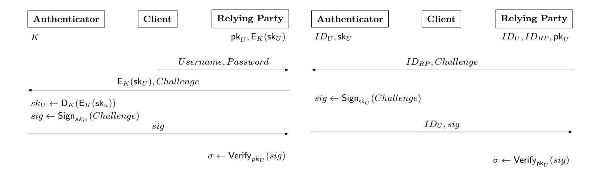
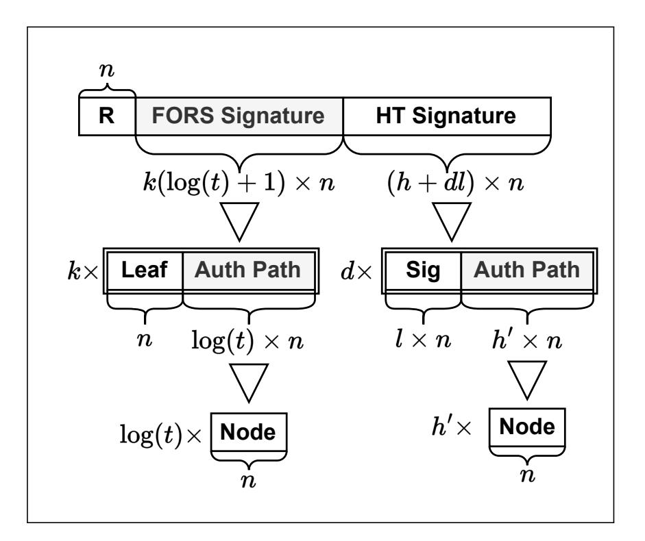
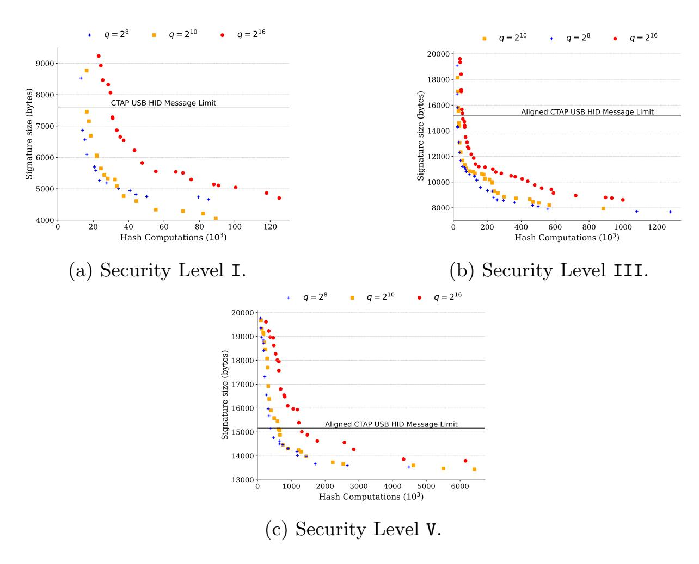

{0}------------------------------------------------

# Stateless Hash-Based Signatures for Post-Quantum Security Keys

Ruben Gonzalez12

1 Neodyme AG 2 Max Planck Institute for Security and Privacy mail@ruben-gonzalez.de

Abstract. The U.S. National Institute of Standards and Technology recently standardized the first set of post-quantum cryptography algorithms. These algorithms address the quantum threat, but also present new challenges due to their larger memory and computational footprint. Three of the four standardized algorithms are lattice based, offering good performance but posing challenges due to complex implementation and intricate security assumptions. A more conservative choice for quantumsafe authentication are hash-based signature systems. However, due to large signature sizes and low signing speeds, hash-based systems have only found use in niche applications. The first NIST standardized, stateless hash-based signature system is the SPHINCS+-based SLH-DSA. In this work we combine different approaches to show that SPHINCS+ can be optimized in its parameters and implementation, to be high performing, even when signing in an embedded setting. We demonstrate this in the context of user authentication using hardware security keys within FIDO. Our SPHINCS+-based implementation can even outperform lattice-based solutions while remaining highly portable. Due to conservative security assumptions, our solution does not require a hybrid construction and can perform authentication on current security keys. For reproducibility and to encourage further research we publish our Cortex M4-based implementation.

Keywords: PQC · SPHINCS+ · Hash · LWC · FIDO.

### 1 Introduction

Shor's algorithm [\[52\]](#page-20-0) and recent advances in quantum computing [\[18\]](#page-18-0) [\[20\]](#page-19-0) jeopardize the security of most widely used asymmetric cryptosystems. In response to this growing threat, researchers and standardization bodies have worked together to find suitable post-quantum cryptography (PQC) algorithms. The U.S. National Institute of Standards and Technology (NIST) has recently standardized one key encapsulation mechanism (KEM) and three digital signature systems with post-quantum security. Three out of four of these standardized schemes rely on lattice-based constructions. That is not surprising, as lattice-based cryptography offers high performance at comparatively small key and signature size. However, trust in these lattice-based PQC algorithms grows only slowly due to

{1}------------------------------------------------

#### 2 Ruben Gonzalez

their novelty, complexity and tangled security assumptions [\[16,](#page-18-1)[25\]](#page-19-1). Consequently, lattice-based algorithms are usually deployed in so-called hybrid mode, combining them with pre-quantum algorithms to ensure continued security against both classical and quantum adversaries. A class of PQC algorithms that do not suffer from this lack of trust are hash-based constructions [\[42\]](#page-20-1). In fact, the only NIST standardized PQC algorithm that isn't based on structured-lattice constructions is the hash-based SLH-DSA signature system [\[45\]](#page-20-2). SLH-DSA is an instantiation of the SPHINCS+ signature framework [\[13\]](#page-18-2). A major drawback of SPHINCS+ is its slow signing speed and very large signature size. This seems to make it a rather poor choice for many applications, especially for applications that require signing in resource constraint environments. On the other hand, hash-based systems offer the possibility of using PQC without hybrid constructions, reducing complexity and resource overhead.

In this work we adjust SPHINCS+, by carefully tuning its parameters and primitives, for a use case it might seem unfit for: FIDO. FIDO (Fast Identity Online) is an authentication standard for endusers, designed to avoid reliance on passwords and defeat phishing [\[1\]](#page-18-3). We demonstrate that a SPHINCS+ signature system can be instantiated for use in a resource constrained FIDO security key, adhering tough resource and time constrains. We further compare the performance and resource consumption of our implementation to previous FIDO experiments employing lattice-based hybrid PQC constructions and show that our SPHINCS+-based solution can outperform them.

Our contributions are:

- We show that SPHINCS+ signature systems can be instantiated to perform well in embedded settings that require signing and relatively short signatures, even outperforming lattice-based PQC systems. We compare the performance to results previously acquired in the same setting (FIDO authentication) and on the same hardware (the nRF52840 development board). Furthermore, we show that in contrast to previous work utilizing lattice-based schemes, no complex implementation-level optimization tricks or hybrid constructions are necessary for this resource constrained environment.
- We release a Client to Authenticator Protocol (CTAP) implementation for use in FIDO, based on Google's OpenSK, employing various adjusted SPHINCS+ instantiations. The released code package includes tools for systematically testing and benchmarking SPHINCS+ instantiations on Cortex-M4. For portability and compatibility with OpenSK, the code is written in Rust. As part of the experiments conducted, the hardware-based hash accelerator (CryptoCell 310) was used for comparison, but is not necessary to achieve the documented results. The released code can therefore be used across platforms.
- We further release a tool for quickly identifying suitable SPHINCS+ parameter sets for specific parameters, such as speed or signature size.

{2}------------------------------------------------

#### 1.1 Related Work

Post-Quantum FIDO Implementation. In [\[28\]](#page-19-2) Ghinea et al. implement CTAP using the, now standardized [\[47\]](#page-20-3), lattice-based CRYSTALS-Dilithium signature system for FIDO-based authentication. Their work implements a hybrid approach using the post-quantum Dilithium and pre-quantum ECDSA algorithms. The authors chose Dilithium over the other now standardized PQC signature systems Falcon and SPHINCS+ for three reasons: speed, complexity and size. Dilithium has a much faster key generation than Falcon. This is relevant in CTAP, as the keys have to be generated on the embedded device. Additionally, Dilithium has a less complex implementation than Falcon as it does not rely on floating-point arithmetic. SPHINCS+ was not chosen for their experiment due to large signature sizes and poor signing performance. To reduce required storage space their implementation does not actually save a private key, but a small 32 byte seed that can be used to compute the private key on the fly. Moreover, they invest significant engineering effort to tweak their Dilithium implementation to recompute certain parts of the private key and intermediate results during every signing operation. This is done to reduce Dilithium's memory footprint, trading worse runtime for fewer memory consumption similar to [\[17\]](#page-18-4). In their paper they also introduce requirements for runtime, memory consumption and message size within a FIDO security key setting. In our work we adhere to these requirements, making a direct comparison possible. As both implementations are based on OpenSK, we could reuse parts of their setup in our experiments.

SHPINCS+ Instantiations and Optimization. SPHINCS+ was submitted to the NIST PQC competition in 2017 [\[13\]](#page-18-2). Since 2024 it is standardized in the Federal Information Processing Standard (FIPS) 205 under the name SLH-DSA. As over 90% of computation in SPHINCS+ is spend in the underlying hash function [\[36\]](#page-20-4), most research into has focused on optimizing that hash function e.g. in hardware [\[50\]](#page-20-5) [\[40\]](#page-20-6). Karl et al. recently analysed the impact of hardware-accelerated SPHINCS+ and reviewing possible architectures for such hardware [\[37\]](#page-20-7). The authors also include estimates of communication costs of using such hardware acceleration. In this work we complement that study, as we use hardware acceleration for a hash primitive. In another paper, Kölbl and Philipoom take note of the possibility to tweak SPHINCS+ parameter sets for custom use cases [\[38\]](#page-20-8). They show that SPHINCS+ signatures sizes and verification speeds can be drastically reduced if the maximum amount of allowed signings per private key is reduced. While NIST mandated that 2 64 signatures should be possible for a single private key without compromising security [\[46\]](#page-20-9), this threshold is unnecessarily high for many use cases. Based on this, Kölbl and Philipoom present a SPHINCS+ parameterization that allows for fast verification on embedded devices and offers relatively short signatures. They show experimentally, that this enables firmware verification using SPHINCS+ on an embedded device. Their parameters maintain compatibility to SLH-DSA, except for the requirement of allowed signatures per private key. The allowed signatures per key are drastically reduced to 2 10 or 2 20, which is more than enough for

{3}------------------------------------------------

#### 4 Ruben Gonzalez

firmware signing. Our work complements their work in the sense that it also approaches an embedded use case for which SPHINCS+ seems unfit at first sight. However, their work focuses exclusively on verification on an embedded device, which is arguable the much easier problem for SPHINCS+. They further state: "Compared to other post-quantum signature schemes like Dilithium, the signing speed will always be significantly worse". Our work tackles this more difficult case of key generation and signing within the embedded device.

### 2 Background

This section details the background needed to understand the implementation and results. First we describe FIDO, a widely-used, signature-based user authentication solution. We then detail the necessary background on PQC and hash-based signatures in particular.

### 2.1 FIDO-based Authentication

The FIDO2 standard defines a signature-based and phishing-resistant user authentication mechanism. It can be used for single or second-factor authentication. As FIDO2 is a vast standard, this section details only its aspects relevant for this work. Within FIDO, users authenticate themselves by signing login data. For that purpose the user stores a public key in the application upon registration. During registration, the user either stores only the public key in the application, this is referred to as resident key[3](#page-3-0) setting, or the symmetrically encrypted private key alongside it, which is referred to as non-resident key setting. Specifically, the FIDO standard explicitly allows to include the encrypted private key into metadata stored in the application. Figure [1](#page-4-0) shows the high-level difference between the two options during authentication.

An advantage of the non-resident key setting is that the private key (amongst other metadata) does not need to be stored on the user's side. This is very relevant as FIDO otherwise requires the private keys to be stored in secure storage within a trusted platform module (TPM) [\[1\]](#page-18-3), where storage is sparse and expensive. The main advantage of the resident key setting is that it allows for username-less authentication, as the TPM holds a table with user ID (User Handle), application domain (Relying-Party-ID) and private key. The downside of resident key is that it requires secure storage on the user's side for every application the user registered. FIDO defines three communication parties for authentication: authenticator, client and the relying party. The client is an application connecting the authenticator and the relying party, usually a web browser or operating system. The relying party is the application that requires authentication. The authenticator securely stores the user's key material and signs authentication requests. Authenticators communicate only with the client.

3 The FIDO standard now refers to resident key as "discoverable credential". However, as much of the literature and code still refer to resident key, we stay with that term.

{4}------------------------------------------------

Fig. 1: Simplified protocol flow diagrams of FIDO instantiations of non-resident key (left) and the resident key (right) authentication. K denotes the symmetric encryption key stored inside the authenticator, skU and pkU the users private and public key, IDU , IDRP the user's and relying party's IDs. Authentication succeeds if σ = 1.

They do so via CTAP, the Client to Authenticator Protocol, which is a part of the FIDO standard. Authenticators can be either roaming (external device) or bound (internal device). Roaming authenticators are allowed to communicate via Bluetooth, NFC or USB.

#### 2.2 Post-Quantum Cryptography

NIST recognized the quantum threat in 2015 and soon after launched a multiyear standardization effort to identify so called post-quantum cryptography schemes for key encapsulation and digital signatures [\[46\]](#page-20-9). In 2022 NIST slected one key encapsulation mechanism and three signature algorithms for standardization. Table [1](#page-5-0) shows the selected signature algorithms with their claimed security level, key, signatures sizes and performance on a Cortex-M4 embedded processor [\[36\]](#page-20-4). The table reveals that post-quantum cryptography is much more expensive than its state-of-the-art pre-quantum counterpart: keys and signatures are much larger and operations require more computational time. Memory limitations can also be problematic for PQC [\[36\]](#page-20-4), which is of course especially relevant for embedded use cases where bandwidth, storage, memory and CPU time are sparse. A suitable choice in algorithm is therefore integral for FIDO security keys.

Post-Quantum Adoption. The three standardized PQC signature algorithms rely on different assumptions. Dilithium's [\[22\]](#page-19-3) and Falcon [\[26\]](#page-19-4)'s security claims are based on the difficulty of solving large instances of structured-lattice problems. These claims are much discussed and sometimes contested in the academic discourse [\[15,](#page-18-5)[14,](#page-18-6)[21\]](#page-19-5). Because of these debates and the novelty of the algorithms, most implementers, such as Google [\[30\]](#page-19-6), Cloudflare [\[53\]](#page-20-10), Signal [\[39\]](#page-20-11) or Apple [\[24\]](#page-19-7), chose to use lattice-based PQC only in conjunction with a pre-quantum algorithm. This ensures that even if the PQC algorithm contains a major flaw, a

{5}------------------------------------------------

Table 1: Comparison of NIST PQC signature algorithms selected for standardization. The timings refer to the non-optimized, hence portable, reference implementation taken from PQM4 [\[36\]](#page-20-4) running on a Cortex-M4. The table is divided into security level I, III and V, as defined by NIST. The listed algorithms claim at least the security level detailed. SPHINCS+ benchmarks use the SHAKE256 extendable output function (XOF) as hash primitive.

|                                              |       | Sizes (bytes) |        | Computation (≈Kcycles) |                   |         |  |
|----------------------------------------------|-------|---------------|--------|------------------------|-------------------|---------|--|
| ≈ AES128 privkey pubkey signature Level I |       |               |        | keygen                 | sign              | verify  |  |
| Ed255191                                     | 32    | 32            | 64     | 200                    | 240               | 720     |  |
| Dilithium2                                   | 2 528 | 1 312         | 2 420  | 1 874                  | 7 925             | 2 063   |  |
| Falcon-512                                   | 1 281 | 897           | 666    | 229 742                | 62 255            | 834     |  |
| SPHINCS+-128                                 | 64    | 32            | 17 088 |                        | 50 505 1 182 422  | 70 501  |  |
| Level III ≈ AES192                           |       |               |        |                        |                   |         |  |
| Dilithium3                                   | 4 000 | 1 952         | 3 293  | 3 205                  | 12 359            | 3 377   |  |
| SPHINCS+-192                                 | 96    | 48            | 35 664 |                        | 74 890 1 937 690  | 103 305 |  |
| ≈ AES256 Level V                          |       |               |        |                        |                   |         |  |
| Dilithium5                                   | 4 864 | 2 592         | 4 595  | 5 341                  | 15 579            | 5 610   |  |
| Falcon-1024                                  | 1 281 | 1793          | 1280   | 602 066                | 136 241           | 1 678   |  |
| SPHINCS+-256                                 | 128   | 64            | 49 856 |                        | 200 110 4 026 533 | 108 394 |  |

1Pre-Quantum algorithm for comparison. Benchmarks taken from Owens et al. [\[49\]](#page-20-12).

pre-quantum attacker will not be able to exploit the system. Combining pre- and post-quantum algorithms into so-called hybrid constructions is therefore quite common. However, also hybrid constructions are debated. Famously, in 2022 the Natioal Security Agency (NSA) even stated that it "does not expect to approve" hybrid constructions for national security citing complexity, interoperability and maintenance concerns [\[48\]](#page-20-13).

SPHINCS+, on the other hand is hash based and its security is solely based on well-understood assumptions of the utilized hash primitive [\[32\]](#page-19-8). As these assumptions are easier to analyze than their structured-lattice counterparts and since hash-based cryptography has been studied since the early 1970s, it does not seem to suffer from the same trust issues. Exemplary of this is the French Cybersecurity Agency (ANSSI) position paper on PQC, stating "any product that includes post-quantum mitigation shall implement hybridation except if the quantum mitigation only relies on hash-based signatures like [...] SPHINCS+ [...]" [\[12\]](#page-18-7). The German Federal Office for Information Security (BSI) comes to the same conclusion [\[34\]](#page-19-9). The downsides of SPHINCS+ are apparent in Table [1.](#page-5-0) Signing is slow and signatures are large, which is especially problematic for embedded use cases.

{6}------------------------------------------------

#### 2.3 SPHINCS+

Hash-based signature schemes were first described as One Time Signature (OTS) schemes by Lamport in 1979 [\[42\]](#page-20-1) and further refined by Winternitz the same year [\[44\]](#page-20-14). Lamport's scheme relies solely on the properties of the employed oneway function at the expense of being "one time". This means that every private/public key pair can only by used once, as parts of the private key are revealed in the signature. Merkle built up on Lamport's idea by using hash trees to administer multiple OTS public keys under a common root node [\[44\]](#page-20-14). This comes at the expense of larger signatures, as the authentication path between OTS public key, which is a leaf node, and the root node has to be included. Much more problematic, however, is that a global state has to be kept per key. Maintaining the correct state globally is very challenging and often times impossible, which is why stateful hash-based signature systems have mainly seen adoption in niche applications [\[43\]](#page-20-15). For usage in FIDO, this state would also present a major challenge, as all backend systems storing key material within the relying party would have to be synchronized and would not be allowed to recover a previous state in case of a fault. In its call for PQC schemes, NIST explicitly called for stateless contributions, excluding the otherwise already quantum secure stateful hash based signature schemes.

SPHINCS+ is a stateless hash-based signature scheme. It's built mainly on the ideas of the Extended Merkle Signature Scheme (XMSS) [\[19\]](#page-18-8). Both rely on the Winternitz One-Time Signature Plus (WOTS+) [\[31\]](#page-19-10) OTS scheme. Just as XMSS, SPHINCS+ relies on a binary hash tree at its core. However, to become stateless, SPHINCS+ needs to have a hash tree so enormous, that choosing a leaf node (private/public key pair) at random is sufficient to exclude any realistic possibility of key reuse. To accomplish this, two tricks are used. First, a so-called "hypertree" is utilized. This hypertee contains several layers of XMSS binary hash trees. Each hash tree root within the hypertree is used to authenticate the hypertrees below it. The trees of the lowest hypertee level have key pairs associated to their leaf nodes. This is equivalent to the approach described for multi-tree XMSS in [\[33\]](#page-19-11). The novel idea behind SPHINCS+ is to drastically reduce the hypertree's size by authenticating few time signature (FTS) instead of OTS key pairs in its leaf nodes. SPHINCS+ utilizes the Forest of Random Subsets (FORS) FTS for this purpose. Reusing a FORS key pair decreases security only gradually, instead of immediately as in OTS schemes. FORS uses its own tree structure, containing sets of private keys in its leaf nodes for that purpose. As authentication paths shrink due to the much smaller hypertree, using FORS allows for much better signature sizes without impacting security. The exact inner workings of WOTS, XMSS and FORS are detailed in the SPHINCS+ NIST submission [\[13\]](#page-18-2). The subprimitives, WOTS+, hypertree and FORS allow SPHINCS+ to be stateless, but they also offer many options for parameterization. As the SPHINCS+ NIST submission states "SPHINCS+ can be viewed as a signature template. It is a way to build a signature scheme [...].".

{7}------------------------------------------------

SPHINCS+ Parameters. SPHINCS+ instantiations can be fine tuned using six parameters:

- n: The security parameter. Refers to virtually all hash function input, output and tree node sizes in bytes. Commonly used values are 16, 24 and 32 reflecting NIST security levels I, III and V.
- w: The Winternitz parameter specifying how often a message is split during encoding for WOTS+. This does not impact security.
- h: The overall height (layers of nodes) of the hypertree.
- d: Number of layers of subtrees in the hypertree.
- k: Number of trees per FORS public key.
- t: Number of leaves in a FORS tree.

The Winternitz parameter (w) and number of hypertree layers (d) only specify performance tradeoffs. Larger values of w lead to shorter signatures, but more hash function invocations. The number of subtree layers (d) is proportional to the signature size, but inversely proportional to the number of hash function invocation during key generation and signing. All remaining parameters are security relevant. Optimizing these parameters therefore has to be done with caution. The generic quantum security level (bit security) of SPHINCS+ is captured in [\(1\)](#page-7-0) [\[13\]](#page-18-2):

$$b = -\frac{1}{2}\log\left(\frac{1}{2^{8n}} + \sum_{\gamma} \left(1 - \left(1 - \frac{1}{t}\right)^{\gamma}\right)^{k} \binom{q}{\gamma} \left(1 - \frac{1}{2^{h}}\right)^{q - \gamma} \frac{1}{2^{h\gamma}}\right) \tag{1}$$

The equation ties together all configurable, security-critical parameters with the maximum number of signatures that can securely be produced using the scheme (q) and the number of times an FTS key pair would have to be reused before security is degrading (γ). From the equation it is clear that reducing the maximum allowed number of signatures per SPHINCS+ key pair (q) greatly affects the possibility to further optimize security-relevant parameters. To make equations more concise, we further specify the values h ′ = h d as the height of an XMSS tree within the hypertree and l as the number of n-bytes elements in a WOTS+ private key which solely depends on w with l = ⌊ log(⌈ 8n log(w) ⌉(w−1)) log(w) ⌋+ 1.

SPHINCS+ Runtime. The aforementioned parameters affect runtime, size and security. More than 90% of the SPHINCS+ runtime is spent inside the hash primitive [\[36\]](#page-20-4). Reducing the number of hash-function calls should therefore be a prime objective for optimizing SPHINCS+ instantiations to our use case. The number of hash-function calls for key generation and signing are given in [\(2\)](#page-7-1) and [\(3\)](#page-7-2).

$$\#_{\text{KeyGen}} = 2^{h/d}(lw + l + 2) - 1$$
 (2)

$$\#_{\text{Sign}} = d\left(2^{h/d}\left(lw + l + 2\right) - 1\right) + k(3t - 1) \tag{3}$$

{8}------------------------------------------------

It is important to note here, that these equations specify the number of computed hash values. The number of consumed bytes per hash function call, and hence the number of round/compression function invocations are not reflected. These numbers, while performance relevant, depend on the employed hash function and are therefore further discussed in Section [4.](#page-12-0) However, as we will see, the number of computed hash values provides a good enough estimate for runtime.

SPHINCS+ Key and Signature Sizes. CPU time, bandwidth and storage are a concern when using PQC schemes. SPHINCS+ comes with very competitive key sizes, but large signatures. A SPHINCS+ public key contains the n-byte hypertree root and an n-byte seed needed for deterministic computation of tree elements. The private key contains the public key as well as an n-byte seed for WOTS and FORS private key generation and an n-byte random value needed for randomization in message hashing. The signature contains a randomness value (n bytes), a FORS signature consisting of FORS leaves with their associated authentications paths (nk(log t + 1) bytes) and an XMSS-like signature containing WOTS+ signatures and corresponding authentication paths (dn(l + h ′ ) bytes). Table [2](#page-9-0) and Figure [2](#page-8-0) show the overall length of keys and signatures given these parameters. From this it becomes apparent that the overall signature size depends on hypertree height (h), number of hypertree layers (d), number of FORS trees (k) and leaves (t) as well as the Winternitz length parameter (l).

Fig. 2: Elements and substructures of SPHINCS+ signatures with their quantity and size. The value n is in bytes.

{9}------------------------------------------------

Table 2: Key and signature sizes for SPHINCS+.

|       | Private Key Public Key |    | Signature                    |
|-------|------------------------|----|------------------------------|
| Bytes | 4n                     | 2n | n(h + k(log t + 1) + dl + 1) |

### 3 Implementation

This section details our implementation of a USB-based CTAP authenticator for use in FIDO, employing PQC signatures in the form of adjusted SPHINCS+ signatures. To allow for comparison of results we use the same hardware and software stack as in the work of Ghinea et al. [\[28\]](#page-19-2). We use the nRF52840 development kit [\[10\]](#page-18-9) with a Cortex-M4F MCU running at 32 MHz. As in [\[28\]](#page-19-2), we limit our implementation to 64kB of RAM and keep it generic enough to be easily portable to other platforms. In contrast to Ghinea et al., we also employ the nRF52850's cryptography hardware accelerator CryptoCell 310 [\[11\]](#page-18-10). However, the CryptoCell is only used for comparison and not required by the implementation. Benchmarks were conducted using the experimental OpenSK [\[5\]](#page-18-11) security key firmware CTAP2 implementation. OpenSK is based on the TockOS [\[6\]](#page-18-12) embedded operating system. Our SPHINCS+ implementation is based on the C reference implementation. To benchmark within the OpenSK/TockOS environment, we wrote a SPHINCS+ wrapper for the Rust programming language. All major components, such as OpenSK, TockOS and the SPHINCS+ wrapper are written in Rust and published under a permissive license. A repository[4](#page-9-1) with benchmarking tools, helper scripts and the Rust code is published for reproducibility and to encourage further research. Both resident and non-resident key scenarios are supported in our implementation. Experiments were conducted using USB as CTAP transport. As our SPHINCS+ approach is not a hybrid solution and has very short keys, changes to the OpenSK CTAP implementation are limited to including SPHINCS+ and adding a new algorithm identifier.

#### 3.1 Requirements

For comparability we follow the requirements described in [\[28\]](#page-19-2). These requirements stem from the FIDO specification [\[3\]](#page-18-13):

- User presence and user verification tokens usually timeout after 30 seconds, but are guaranteed to be valid for at least 10 seconds.
- The size of a CTAP message over USB cannot exceed 7609 bytes.

We therefore aim for commands to finish within 10 seconds and CTAP messages smaller than 7609 bytes. The latter limit stems from the fact that CTAP2 uses a signed char (7-bit) value as its length field. Allowing for larger messages (and hence larger signatures) would be a trivial change in the OpenSK firmware,

4 Located at: https://github.com/rugo/fido-sphincs-experiments/tree/eprint

{10}------------------------------------------------

changing the length field to an unsigned char (8 bit) allows for a payload/message size of 15 161 bytes [\[1\]](#page-18-3). For completeness we also include SPHINCS+ instantiations with signatures larger than the CTAP payload maximum in the results, but mark them explicitly as non-compliant. From this we follow the priorities as in [\[28\]](#page-19-2):

- R1 Key generation must finish in less than 10s.
- R2 Key pairs must be smaller than 7 kB.
- R3 The private key should be small to allow storing additional credentials.
- A1 The login operation is more frequent than registration. Signing should be as fast as possible.
- A2 A private key and signature together must fit into a CTAP message.

As [\[28\]](#page-19-2), we further limit ourselves to 64kB of RAM and require our implementation to be as portable as the underlying CTAP implementation written in Rust. The NIST-submitted SPHINCS+ parameter sets all fail to achieve A1 and A2. Key generation (R1) and key sizes (R2 & R3) however aren't a problem. Our FIDO adjusted SPHINCS+ instantiations should therefore optimize signing speed and signature size.

Side Channel Resilience Just as in [\[28\]](#page-19-2), we follow the attacker model described in FIDO's security assumptions [\[4\]](#page-18-14). We assume the FIDO client to be trustworthy and acting in the user's interest. This is a necessary requirement for FIDO anyway. Local attacks, such as fault injection [\[27\]](#page-19-12) or power side-channel attacks [\[35\]](#page-20-16) on SPHINCS+, are therefore out of scope. We only consider timingbased side channels that could be triggered remotely. Here, it is important to note that SPHINCS+ is constant time via its construction [\[13\]](#page-18-2). Time-based side channels therefore do not take specific effors to be mitigated.

#### 3.2 Adjusting SPHINCS+

Given the lowest acceptable security level I, the public and private key are only 32 and 64 bytes large respectively and could be used as a drop-in replacement for elliptic curve keys [\[8\]](#page-18-15) without the need for alterations in e.g. database columns of the relying party. Therefore, only signature size (A2) and signing speed (A1) have to be optimized using equations [\(1\)](#page-7-0), [\(2\)](#page-7-1) and [\(3\)](#page-7-2). A core variable to tune our SPHINCS+ parameter sets is the number of allowed signatures per SPHINCS+ private key q. The NIST-submitted parameter sets allow, by NIST specification, for q = 264 signatures per key. Given a user performing one authentication per relying party per day, such a key could be used for far more than a trillion (1012) years, which is clearly overkill. Similar to the approach in [\[38\]](#page-20-8) we therefore lower the maximum amount of allowed signatures to a more realistic level.

Adjusting the Number of allowed Signatures In our analysis we allow for q = 28 , q = 210 and q = 216 signatures/authentications. FIDO seems to be a

{11}------------------------------------------------

Table 3: SPHINCS+ key lifetimes based on common session expiration times of popular web services supporting FIDO. Lifetimes are presented in years based on the number of allowed signature q.

| q       |          | Google Sharepoint Cloudflare Daily |       |       |
|---------|----------|------------------------------------|-------|-------|
| 8 2  | 9.8      | 3.5                                | 2.1   | 0.7   |
| 10 2 | 39.3     | 14                                 | 8.4   | 2.8   |
| 16 2 | 2, 513.7 | 897.7                              | 538.7 | 179.6 |

good choice for reducing this number, as every signature has to be approved manually (usually with a tap) by the user. A scenario with real-time constraints or a high volume of signatures can be ruled out. Additionally, FIDO-based authentication is commonly connected to applications with long-running sessions. Google web sessions for example last for 14 days by default [\[7\]](#page-18-16), Cloudflare's for 3 [\[2\]](#page-18-17), Microsoft's for 5 (Sharepoint) to 90 (Entra) days [\[9\]](#page-18-18). For simplicity we assume a somewhat worst case wit respect to the key duration, where a user authenticates to the same relying party every day. Even with the lowest setting of q = 28 = 256, this user could authenticate using the same key for approximately every workday in a year. After this key expires, a new key would have to be registered. For the user that would mean tapping the authenticator once more during authentication, which is quite cheap. For the best-case scenario with authenticating to Google every 14 days, the same key could be used for around 10 years. With an authentication every day, the settings 2 10 and 2 16 would delay re-registering by around 3 and 180 years respectively. Table [3](#page-11-0) shows how different settings in q would affect the key lifetimes when used with popular FIDO-ready applications. To store the number of computed signatures, the "signCount" variable already included in the FIDO standard [\[4\]](#page-18-14) can be employed in the implementation.

Adjusting Parameters To optimize the parameters discussed in Section [2.3](#page-7-3) we follow a similar approach to Kölbl et. al [\[38\]](#page-20-8), but optimize for signing speed and signature size instead of verification speed. We employ an explorative approach and built a tool inspired by the SAGE script included in the SPHINCS+ NIST submission package[\[13\]](#page-18-2). This leads to a multitude of parameters with different tradeoffs further discussed in Section [4.1.](#page-12-1)

Adjusting Hash Functions The SPHINCS+ NIST submission includes SHA256, SHAKE256 and Haraka instantiations. Haraka is an AES-based construct optimized for use in x86 CPU architectures with AES-NI extension. On our embedded platform Haraka leads to much runtime overhead and was therefore not investigated further. Additionally to SHA256 and SHAKE256, the ASCON hash primitive was used in benchmarks. ASCON is a lightweight hash function scheduled for standardization by NIST. We employed the ASCON C reference imple

{12}------------------------------------------------

mentation. The CryptoCell 310 hardware accelerator on our evaluation board supports the SHA256 hash function. For comparison, SHA256 was benchmarked in both hard and software.

### 4 Results

In this section we first culminate all previous considerations into adjusted SPHINCS+ instantiations for FIDO-friendly values of q. We then benchmark different hash functions relevant to our construction and compare hardware SHA256 to its software version. Next, we present benchmarks to the FIDO-relevant operations KeyGen and Sign as well as the FIDO operations MakeCredential and GetCredential. All benchmarks are then discussed and compared to previous work on the same platform.

### 4.1 SPHINCS+ Instantiations

To fulfill the requirements detailed in Section [3.1,](#page-9-2) we utilized our parameter discovery tool. We filtered parameter choices that could lead to a good speed/size tradeoff. The filter starts by sorting all parameter choices by signature size. It then calculates the number of computed hashes and selects a new parameter set if the number of computed hashes is smaller than that of the previously selected. It then outputs a list of all selected parameter sets. Figure [3](#page-13-0) shows different parameter choices for all security levels and relevant values of q. The output shows that level I instantiations offer signature sizes lower than the previously described CTAP USB message size limit. For level III and V there also exist parameter choices with small enough signatures to fit this limit. However, as they require significantly more hash computations and increasing the message size limit is a technical triviality (see Section [3.1\)](#page-9-2) this increased value is shown in (b) and (c).

The value q = 28 offers only very marginal improvement over q = 210. Using q = 210 therefore seems like a good tradeoff for FIDO. However, we benchmark all relevant choices of q = {2 8 , 2 10 , 2 16} for completeness. Larger signatures lead to fewer hash calculations but also longer transmission times during FIDO authentication.

## 4.2 Hash functions

SPHINCS+ spends the vast majority of its CPU time inside the hash function. Choosing an appropriate hash function for our use case is therefore integral for performance. SPHINCS+, as submitted to NIST, employs the secure SHA256, SHAKE256 and Haraka one way functions. In their work [\[37\]](#page-20-7), Karl et al. suggest to include the lightweight crypto scheme ASCON [\[23\]](#page-19-13) which was recently selected for standardization by NIST. This seems to fit our embedded use case. We therefore focus our performance comparison on SHA256, SHAKE256 and ASCON. Table [4](#page-13-1) shows the amount of cycles needed on our embedded platform

{13}------------------------------------------------

#### 14 Ruben Gonzalez

Fig. 3: Signature sizes and number of computed hash values for SPHINCS+ instantiations with a maximum of q signatures per key.

to compute the number of hashes per security level. It comes with no surprise that software SHA256 is much faster than software SHAKE256 on a 32 bit platform. What might be surprising at first sight, is that SHA256 in software also outperforms software ASCON and hardware-backed SHA256 on our platform.

**Hardware vs. Software** However, as Karl. et al. [37] note, not only hardware accelerators themselves, but also the application including data transfer to those accelerators have to be taken into account. In the case of SPHINCS+, a large amount of very small messages (usually a small multiple of n) have to be hashed. This provides a somewhat worst-case scenario for the CryptoCell 310

Table 4: Cycles spent calculating the minimum amount of hashes required for a given security level. Numbers are given in kilocycles  $(10^3)$ , averaged over 1000 runs when compiled with -O3.

| Level | SHA256 (soft) | SHA256 (hard) | ASCON  | SHAKE256 |
|-------|---------------|---------------|--------|----------|
| I     | 93 268        | 130997        | 197534 | 488680   |
| III   | 209 141       | 293743        | 442940 | 1095792  |
| V     | 283 664       | 398413        | 600774 | 1486258  |

{14}------------------------------------------------

hardware accelerator, as short messages have to constantly be written into a specific memory segment followed by a relatively slow call to the CryptoCell. This is similar to the observation by van der Lann et al. for SPHINCS+ running on Java Cards [\[41\]](#page-20-17). ASCON on the other hand was designed with a very small hardware footprint, not software performance, in mind.

The software version of SHA256 was therefore used for further benchmarks. However, results with other hash functions can easily be extrapolated from the results in Table [4.](#page-13-1) The employed SHA256 implementation is the C implementation taken from the SPHINCS+ submission package. This was done to keep the implementation portable and comes at little cost, as previous work has shown that assembly-optimized SHA256 does not outperform portable code compiled with a modern compiler [\[36\]](#page-20-4).

#### 4.3 Adjusted SPHINCS+ Benchmarks

For FIDO, the runtime of the following four functions is relevant. KeyGen: the key generation time in the authenticator (hardware security key). Sign: the time needed to sign an authentication request in the authenticator. MakeCredential: the time needed to create a new credential (key pair), when requested by the FIDO client. GetCredential: the time needed to deliver a signed authentication request to the FIDO client.

As KeyGen is a subroutine of MakeCredential, and Sign of GetCredential, their respective runtimes are strongly correlated. However, a parameter set with large signatures might lead to a fast Sign, but a slow GetCredential, due to transmission costs. For better analysis we therefore benchmarked the four functions individually. The results of MakeCredential and GetCredential are discussed in the next section. Table [5](#page-15-0) shows benchmark results of security level I parameter choices for q = 210 that have a small enough signature for use in vanilla FIDO.

Runtimes in the table are captured in milliseconds instead of cycles. This was done to be comparable to previous work, mainly Ghinea et al. [\[28\]](#page-19-2). Estimates of cycle counts can, however, be acquired by multiplying the time with the MCUs frequency, which was configured to 32 768kHz. Unsurprisingly, the number of hashes computed during signing is strongly correlated with the runtime of the signing algorithm. The table also shows that the signature size is inversely proportional to both key generation and signing time. Larger signature sizes also lead to more stack space consumed. Stack space could be drastically reduced, as SPHINCS+ signatures are computed front to back and can be streamed [\[29\]](#page-19-14). However, since the consumed stack space is well within the requirements, this is not needed. Compiling the code with -O3 leads to much improved runtimes, which is consistent with previous work [\[36\]](#page-20-4). The largest signature listed (7456B) still fits into the technical context, complies with RAM/stack requirements and adheres to the requirements A1 and A2 previously defined. We therefore focus on the largest signature still fitting into the technical context.

Table [6](#page-16-0) shows a direct comparison between the SPHINCS+ results and the Dilithium-based hybrid approach from [\[28\]](#page-19-2). In the table, SPHINCS+ instantiations are denoted as SPHINCS+-b-q, with b being the bit security as defined

{15}------------------------------------------------

Table 5: Various SPHINCS+ parameter choices for security level I and q = 210 with their performance results averaged over 1000 runs on an nrf52480 board. Values of t are specified in log2 . All parameters were instantiated with a softwareonly version of SHA256 and use a Winternitz parameter of w = 16.

|                  |        |    |     | Params. |   |        | KeyGen        |       |                | Sign          |       |
|------------------|--------|----|-----|---------|---|--------|---------------|-------|----------------|---------------|-------|
| Signature Hashes |        |    |     |         |   |        | Runtime (ms)  | Stack | Runtime (ms)   |               | Stack |
| (Bytes)          | (#)    |    | h d | k       | t | -Oz    | -O3           | (kB)  | -Oz            | -O3           | (kB)  |
| 3968             | 102528 | 12 |     | 2 15 10 |   |        | 3476.1 2332.3 | 3.3   | 11385.5 7631.3 |               | 14.0  |
| 4048             | 89216  | 12 |     | 2 17    | 9 |        | 3445.0 2320.0 | 3.3   |                | 9378.3 6310.5 | 14.2  |
| 4208             | 82048  | 12 |     | 2 20    | 8 |        | 3444.1 1161.9 | 3.3   |                | 8349.9 5620.7 | 14.7  |
| 4288             | 70720  | 10 |     | 2 17 10 |   |        | 1748.6 1176.7 | 3.3   |                | 8548.1 5665.1 | 14.9  |
| 4336             | 55360  | 10 |     | 2 19    | 9 | 1748.1 | 585.0         | 3.3   |                | 6316.1 4247.7 | 15.1  |
| 4608             | 44336  | 12 |     | 3 17    | 9 | 857.4  | 585.0         | 3.2   |                | 5037.8 3432.9 | 15.8  |
| 4768             | 37168  | 12 |     | 3 20    | 8 | 866.8  | 589.7         | 3.2   |                | 4065.8 2724.3 | 16.3  |
| 5088             | 33328  | 12 |     | 3 25    | 7 | 871.0  | 589.7         | 3.2   |                | 3531.2 2386.6 | 17.3  |
| 5296             | 32288  | 8  |     | 2 28    | 8 | 866.8  | 293.8         | 3.2   |                | 3790.3 2553.7 | 17.9  |
| 5328             | 28192  | 12 |     | 4 20    | 8 | 432.7  | 292.5         | 3.2   |                | 3186.4 2156.5 | 17.9  |
| 5440             | 26264  | 9  |     | 3 25    | 8 | 433.0  | 292.2         | 3.2   |                | 3124.8 2156.5 | 18.3  |
| 5648             | 24352  | 12 |     | 4 25    | 7 | 434.9  | 292.3         | 3.2   |                | 2650.9 1775.0 | 18.9  |
| 6032             | 22048  | 12 |     | 4 32    | 6 | 439.3  | 292.2         | 3.2   |                | 2343.4 1553.7 | 20.0  |
| 6064             | 21912  | 9  |     | 3 33    | 7 | 436.9  | 147.6         | 3.2   |                | 2524.8 1683.1 | 20.1  |
| 6688             | 18644  | 10 |     | 5 29    | 7 | 218.9  | 147.6         | 3.2   |                | 2150.1 1439.9 | 21.9  |
| 7152             | 17560  | 12 |     | 6 32    | 6 | 221.1  | 148.4         | 3.1   |                | 1907.3 1264.4 | 23.3  |
| 7456             | 16340  | 10 |     | 5 40    | 6 | 218.9  | 147.6         | 3.2   |                | 1820.4 1225.5 | 24.2  |

above. The Dilithium private keys are small since its implementation stores a seed value and computes the private key on every signing operation to save on expensive TPM storage. Table [6](#page-16-0) shows that SPHINCS+ levels I and III with q = {2 8 , 2 10} outperform the lattice-based approach on the board in terms of signing speed at the cost of larger signatures. In security level V, SPHINCS+ has competitive speed but would require a relaxation in signature-size constraints.

#### 4.4 FIDO Benchmarks

Finally, we conclude with benchmarks on the FIDO-relevant CTAP commands MakeCredential and GetCredential. All benchmarks were conducted via USB transport. MakeCredential generates a new key and sends both public and (encrypted) private key to the client. This is the non-resident key setting as introduced in Section [2.1.](#page-3-1) GetCredential on the other hand signs an authentication request and returns a signature to the client. Table [7](#page-17-0) shows the results of these benchmarks. Runtimes for the hybrid construction were reproduced using the code from [\[28\]](#page-19-2). A first conclusion is that the previously defined requirements can be met for security level I and III. All CTAP commands finish within 10 seconds and execute well within the RAM requirements. The SPHINCS+-based

{16}------------------------------------------------

Table 6: Runtimes on Cortex-M4F board nrf52840. Comparison between SPHINCS+ and Dilithium-based hybrid construction from [\[28\]](#page-19-2). Both are compiled with -O3, runtimes averaged over 1000 runs.

|                                                                                                   |                         | Sizes (bytes)           | Runtime (ms)                        |                                                                  |
|---------------------------------------------------------------------------------------------------|-------------------------|-------------------------|-------------------------------------|------------------------------------------------------------------|
| Level I                                                                                           |                         |                         | privkey pubkey signature            | keygen sign                                                   |
| Dilithium2-Hybrid 8 SPHINCS+-129-2 10 SPHINCS+-129-2                                  | 32 64 64          | 1 344 32 32       | 2 420 6 864 7 456             | 197.5 1 320.5 148.3 1 079.6 147.6 1 225.5                  |
| 16 SPHINCS+-130-2                                                                              | 64                      | 32                      | 7 280                               | 292.3 2 261.8                                                    |
| Level III                                                                                         |                         |                         |                                     |                                                                  |
| Dilithium3-Hybrid 8 SPHINCS+-193-2 10 SPHINCS+-193-2 16 SPHINCS+-195-2          | 32 96 96 96    | 1 984 48 48 48 | 3 293 14 256 13 080 14 928 | 245.6 2 298.4 147.5 1 735.6 292.3 2 169.8 292.3 3 410.8 |
| Level V                                                                                           |                         |                         |                                     |                                                                  |
| Dilithium5-Hybrid 8 SPHINCS+-258-2 † 10 † SPHINCS+-258-2 16 † SPHINCS+-258-2 | 32 128 128 128 | 2 624 64 64 64 | 4 595 25 120 24 352 28 832 | 345.3 2 797.2 296.2 2 075.7 292.1 2 638.0 292.0 3 216.6 |

†: Instantiation's signature too large for requirements.

aproach even outperforms the lattice-based, hybrid approach from [\[28\]](#page-19-2) in these levels. With a relaxation of the maximum message size, our SPHINCS+ solution could also outperform their approach in the highest security level.

## 4.5 Discussion

A reason for the good performance of SPHINCS+ in this setting could be the required portability. MCU-specific assembly-level optimizations are not possible when aiming for portable code, which is often times a requirement. Dilithium seems to suffer from this portability requirement much more than SPHINCS+. Another reason why Dilithium-backed GetCredential commands are slower on average is the command's very long tail. Dilithium's signing operation has a retry loop that discards insecure parameters. This makes its runtime non-deterministic. Ginea et al. even state that 3% of their Dilithium5 GetCredential commands fail to complete within the 10 second requirement due to this retry loop. SPHINCS+ does not suffer from this, as it is constant time by design and the runtimes showed virtually no variance.

Much of the current literature seems to focus on optimizing hardware implementations for SPHINCS+/SLH-DSA [\[37,](#page-20-7)[51\]](#page-20-18). While these hardware-backed systems show impressive performance improvements, they might be able to perform even better when allowing (or mandating) custom SPHINCS+ instantiations.

{17}------------------------------------------------

Table 7: Runtime benchmarks in milliseconds of the MakeCredential and Get-Credential CTAP commands in the non-resident key setting, averaged over 1000 iterations. Standard deviation of GetCredential denoted as σ.

|                          | Make     |          | Get             |  |
|--------------------------|----------|----------|-----------------|--|
| Level I                  | duration | duration | σ               |  |
| Dilithium2-Hybrid        | 547.3    | 1 808.7  | 933.8           |  |
| 8 SPHINCS+-129-2      | 283.4    | 1 595.9  | 0.2             |  |
| 10 SPHINCS+-129-2     | 283.7    | 1 791.8  | 0.1             |  |
| 16 SPHINCS+-130-2     | 429.2    | 2 687.9  | 0.1             |  |
| Level III                |          |          |                 |  |
| Dilithium3-Hybrid        | 668.3    |          | 2 861.1 1 865.2 |  |
| 8 SPHINCS+-193-2      | 283.2    | 2 099.9  | 0.2             |  |
| 10 SPHINCS+-193-2     | 429.6    | 2 751.8  | 0.2             |  |
| 16 SPHINCS+-195-2     | 426.3    | 3 967.3  | 0.1             |  |
| Level V                  |          |          |                 |  |
| Dilithium5-Hybrid        | 799.2    |          | 4029.2 2 437.4  |  |
| 8 † SPHINCS+-258-2 | 425.7    | 2 803.9  | 0.2             |  |
| 10 † SPHINCS+-258-2   | 429.4    | 3 406.0  | 0.1             |  |
| 16 † SPHINCS+-258-2   | 432.2    | 4 075.8  | 0.1             |  |

†: Instantiation's signature too large for requirements.

Comparing and combining adjusted SPHINCS+ parameter sets with custom hardware seems like an interesting avenue for future research.

### 5 Conculsion

In this paper we proposed a practical, post-quantum solution for hardwaresecurity-key-based authentication using tailored stateless hash-based signatures. The results show that adjusting SPHINCS+ to a specific application that requires signing can yield very competitive results that rely on only few, wellunderstood assumptions. Especially in an embedded setting, where resources are sparse this opens many possibilities. Furthermore, our solution is highly portable and reduces complexity as it does not require sophisticated implementation tricks and can be used without a hybrid construction.

We implemented and benchmarked our solution with various parameterizations and showed that it can even outperform lattice-based solutions from the literature. Our implementation and benchmarking setup was published to encourage further research in this direction.

These results emphasize that SPHINCS+ should be seen as a very flexible framework for creating signature schemes, rather than just a signature scheme.

{18}------------------------------------------------

## References

- 1. Authentication Specifications - FIDO Alliance — fidoalliance.org. [https://](https://fidoalliance.org/specifications/download/) [fidoalliance.org/specifications/download/](https://fidoalliance.org/specifications/download/), [Accessed 03-02-2025]
- 2. Cloudflare - manage active sessions. [https://developers.cloudflare.com/](https://developers.cloudflare.com/fundamentals/setup/account/account-security/manage-active-sessions/) [fundamentals/setup/account/account-security/manage-active-sessions/](https://developers.cloudflare.com/fundamentals/setup/account/account-security/manage-active-sessions/), [Accessed 29-01-2025]
- 3. Fido alliance - ctap2 specification. [https://fidoalliance.org/specs/](https://fidoalliance.org/specs/fido-v2.0-ps-20190130/fido-client-to-authenticator-protocol-v2.0-ps-20190130.html) [fido-v2.0-ps-20190130/fido-client-to-authenticator-protocol-v2.](https://fidoalliance.org/specs/fido-v2.0-ps-20190130/fido-client-to-authenticator-protocol-v2.0-ps-20190130.html) [0-ps-20190130.html](https://fidoalliance.org/specs/fido-v2.0-ps-20190130/fido-client-to-authenticator-protocol-v2.0-ps-20190130.html), [Accessed 29-01-2025]
- 4. Fido security reference. [https://fidoalliance.org/specs/common-specs/](https://fidoalliance.org/specs/common-specs/fido-security-ref-v2.1-rd-20210525.html) [fido-security-ref-v2.1-rd-20210525.html](https://fidoalliance.org/specs/common-specs/fido-security-ref-v2.1-rd-20210525.html), [Accessed 29-01-2025]
- 5. GitHub - google/OpenSK: OpenSK. <github.com/google/OpenSK>, [Accessed 29-01- 2025]
- 6. Github - tockos. <https://github.com/tock/tock>, [Accessed 29-01-2025]
- 7. Google - session length for google services. [https://support.google.com/a/](https://support.google.com/a/answer/7576830) [answer/7576830](https://support.google.com/a/answer/7576830), [Accessed 29-01-2025]
- 8. Libsodium - ed25519 implementation. [https://github.com/jedisct1/](https://github.com/jedisct1/libsodium/blob/59a98bc7f9d507175f551a53bfc0b2081f06e3ba/src/libsodium/include/sodium/crypto_sign_ed25519.h#L34) [libsodium/blob/59a98bc7f9d507175f551a53bfc0b2081f06e3ba/src/](https://github.com/jedisct1/libsodium/blob/59a98bc7f9d507175f551a53bfc0b2081f06e3ba/src/libsodium/include/sodium/crypto_sign_ed25519.h#L34) [libsodium/include/sodium/crypto\\_sign\\_ed25519.h#L34](https://github.com/jedisct1/libsodium/blob/59a98bc7f9d507175f551a53bfc0b2081f06e3ba/src/libsodium/include/sodium/crypto_sign_ed25519.h#L34), [Accessed 29-01- 2025]
- 9. Microsoft - session timeouts for ms 365. [https://learn.microsoft.com/en-us/](https://learn.microsoft.com/en-us/microsoft-365/enterprise/session-timeouts) [microsoft-365/enterprise/session-timeouts](https://learn.microsoft.com/en-us/microsoft-365/enterprise/session-timeouts), [Accessed 29-01-2025]
- 10. Nordic nrf52840 dk brief. [https://www.nordicsemi.com/](https://www.nordicsemi.com/-/media/Software-and-other-downloads/Product-Briefs/nRF52840-DK-product-brief.pdf) [-/media/Software-and-other-downloads/Product-Briefs/](https://www.nordicsemi.com/-/media/Software-and-other-downloads/Product-Briefs/nRF52840-DK-product-brief.pdf) [nRF52840-DK-product-brief.pdf](https://www.nordicsemi.com/-/media/Software-and-other-downloads/Product-Briefs/nRF52840-DK-product-brief.pdf), [Accessed 29-01-2025]
- 11. Nordic semiconductor - arm trustzone cryptocell 310. [https://docs.nordicsemi.](https://docs.nordicsemi.com/bundle/ps_nrf52840/page/cryptocell.html) [com/bundle/ps\\_nrf52840/page/cryptocell.html](https://docs.nordicsemi.com/bundle/ps_nrf52840/page/cryptocell.html), [Accessed 29-01-2025]
- 12. ANSSI: Anssi views on the post-quantum cryptography transition (2024), [ttps://cyber.gouv.fr/sites/default/files/document/follow\\_up\\_position\\_](ttps://cyber.gouv.fr/sites/default/files/document/follow_up_position_paper_on_post_quantum_cryptography.pdf) [paper\\_on\\_post\\_quantum\\_cryptography.pdf](ttps://cyber.gouv.fr/sites/default/files/document/follow_up_position_paper_on_post_quantum_cryptography.pdf), Accessed 24-01-2025
- 13. Aumasson, J., Bernstein, D., Beullens, W., Dobraunig, C., Eichlseder, M., Fluhrer, S., Gazdag, S.L., Hülsing, A., Kampanakis, P., Kölbl, S., et al.: Sphincs+ submission to the nist post-quantum project, v3. 1. NIST PQC round 3 (2022)
- 14. Bernstein, D.J.: Multi-ciphertext security degradation for lattices. Cryptology ePrint Archive (2022)
- 15. Bernstein, D.J.: Asymptotics of hybrid primal lattice attacks. Cryptology ePrint Archive (2023)
- 16. Bernstein, D.J., Bhargavan, K., Bhasin, S., Chattopadhyay, A., Chia, T.K., Kannwischer, M.J., Kiefer, F., Paiva, T., Ravi, P., Tamvada, G.: Kyberslash: Exploiting secret-dependent division timings in kyber implementations. Cryptology ePrint Archive (2024)
- 17. Bos, J.W., Renes, J., Sprenkels, A.: Dilithium for memory constrained devices. In: International Conference on Cryptology in Africa. pp. 217–235. Springer (2022)
- 18. Bravyi, S., Cross, A.W., Gambetta, J.M., Maslov, D., Rall, P., Yoder, T.J.: Highthreshold and low-overhead fault-tolerant quantum memory. Nature 627(8005), 778–782 (2024)
- 19. Buchmann, J., Dahmen, E., Hülsing, A.: Xmss-a practical forward secure signature scheme based on minimal security assumptions. In: Post-Quantum Cryptography: 4th International Workshop, PQCrypto 2011, Taipei, Taiwan, November 29–December 2, 2011. Proceedings 4. pp. 117–129. Springer (2011)

{19}------------------------------------------------

- 20. Campbell, E.: A series of fast-paced advances in quantum error correction. Nature Reviews Physics 6(3), 160–161 (2024)
- 21. Chen, Y.: Quantum algorithms for lattice problems. Cryptology ePrint Archive (2024)
- 22. Contributors, D.: Crystals-dilithium specification v3.1. [https://pq-crystals.](https://pq-crystals.org/dilithium/data/dilithium-specification.pdf) [org/dilithium/data/dilithium-specification.pdf](https://pq-crystals.org/dilithium/data/dilithium-specification.pdf) (2021), [Accessed 03-02- 2025]
- 23. Dobraunig, C., Eichlseder, M., Mendel, F., Schläffer, M.: Ascon v1. 2: Lightweight authenticated encryption and hashing. Journal of Cryptology 34, 1–42 (2021)
- 24. Engineering, A.S.: iMessage with PQ3: The new state of the art in quantum-secure messaging at scale. <https://security.apple.com/blog/imessage-pq3/> (2024), [Accessed 03-02-2025]
- 25. Firmin, C.: PQShield plugs timing leaks in Kyber / ML-KEM to improve PQC implementation maturity | PQShield — pqshield.com. [https://pqshield.com/](https://pqshield.com/pqshield-plugs-timing-leaks-in-kyber-ml-kem-to-improve-pqc-implementation-maturity/) [pqshield-plugs-timing-leaks-in-kyber-ml-kem-to-improve-pqc-implementation-maturity/](https://pqshield.com/pqshield-plugs-timing-leaks-in-kyber-ml-kem-to-improve-pqc-implementation-maturity/), [Accessed 03-02-2025]
- 26. Fouque, P.A., Hoffstein, J., Kirchner, P., Lyubashevsky, V., Pornin, T., Prest, T., Ricosset, T., Seiler, G., Whyte, W., Zhang, Z., et al.: Falcon: Fast-fourier latticebased compact signatures over ntru. Submission to the NIST's post-quantum cryptography standardization process 36(5), 1–75 (2018)
- 27. Genêt, A., Kannwischer, M.J., Pelletier, H., McLauchlan, A.: Practical fault injection attacks on sphincs. Cryptology ePrint Archive (2018)
- 28. Ghinea, D., Kaczmarczyck, F., Pullman, J., Cretin, J., Kölbl, S., Misoczki, R., Picod, J.M., Invernizzi, L., Bursztein, E.: Hybrid post-quantum signatures in hardware security keys. In: International Conference on Applied Cryptography and Network Security. pp. 480–499. Springer (2023)
- 29. Gonzalez, R., Hülsing, A., Kannwischer, M.J., Krämer, J., Lange, T., Stöttinger, M., Waitz, E., Wiggers, T., Yang, B.Y.: Verifying post-quantum signatures in 8 kb of ram. In: Post-Quantum Cryptography: 12th International Workshop, PQCrypto 2021, Daejeon, South Korea, July 20–22, 2021, Proceedings 12. pp. 215–233. Springer (2021)
- 30. Hansen, R.: Post-Quantum Cryptography: Standards and Progress security.googleblog.com. [https://security.googleblog.com/2024/08/](https://security.googleblog.com/2024/08/post-quantum-cryptography-standards.html) [post-quantum-cryptography-standards.html](https://security.googleblog.com/2024/08/post-quantum-cryptography-standards.html) (2024), [Accessed 03-02-2025]
- 31. Hülsing, A.: W-ots+–shorter signatures for hash-based signature schemes. In: Progress in Cryptology–AFRICACRYPT 2013: 6th International Conference on Cryptology in Africa, Cairo, Egypt, June 22-24, 2013. Proceedings 6. pp. 173–188. Springer (2013)
- 32. Hülsing, A., Kudinov, M.: Recovering the tight security proof of sphincs+. In: International Conference on the Theory and Application of Cryptology and Information Security. pp. 3–33. Springer (2022)
- 33. Hülsing, A., Rausch, L., Buchmann, J.: Optimal parameters for xmss mt. In: Security Engineering and Intelligence Informatics: CD-ARES 2013 Workshops: MoCry-SEn and SeCIHD, Regensburg, Germany, September 2-6, 2013. Proceedings 8. pp. 194–208. Springer (2013)
- 34. for Information Security, F.O.: Kryptografie quantensicher gestalten - quantum secure cryptography (german). [https://www.bsi.](https://www.bsi.bund.de/SharedDocs/Downloads/DE/BSI/Publikationen/Broschueren/Kryptografie-quantensicher-gestalten.pdf) [bund.de/SharedDocs/Downloads/DE/BSI/Publikationen/Broschueren/](https://www.bsi.bund.de/SharedDocs/Downloads/DE/BSI/Publikationen/Broschueren/Kryptografie-quantensicher-gestalten.pdf) [Kryptografie-quantensicher-gestalten.pdf](https://www.bsi.bund.de/SharedDocs/Downloads/DE/BSI/Publikationen/Broschueren/Kryptografie-quantensicher-gestalten.pdf) (2024), [Accessed 17-02-2025]

{20}------------------------------------------------

- 35. Kannwischer, M.J., Genêt, A., Butin, D., Krämer, J., Buchmann, J.: Differential power analysis of xmss and sphincs. In: Constructive Side-Channel Analysis and Secure Design: 9th International Workshop, COSADE 2018, Singapore, April 23– 24, 2018, Proceedings 9. pp. 168–188. Springer (2018)
- 36. Kannwischer, M.J., Rijneveld, J., Schwabe, P., Stoffelen, K.: PQM4: Post-quantum crypto library for the ARM Cortex-M4, <https://github.com/mupq/pqm4>
- 37. Karl, P., Schupp, J., Sigl, G.: The impact of hash primitives and communication overhead for hardware-accelerated sphincs+. In: International Workshop on Constructive Side-Channel Analysis and Secure Design. pp. 221–239. Springer (2024)
- 38. Kölbl, S., Philipoom, J.: A note on sphincs+ parameter sets. Cryptology ePrint Archive (2022)
- 39. Kret, E.: Quantum Resistance and the Signal Protocol — signal.org. [https://](https://signal.org/blog/pqxdh/) [signal.org/blog/pqxdh/](https://signal.org/blog/pqxdh/) (2024), [Accessed 03-02-2025]
- 40. Kwak, J., Jang, Y., Park, J., Lee, H.: Slh-dsa-based digital signature and verification fpga system. Transactions on Semiconductor Engineering 2(4), 69–77 (2024)
- 41. van der Laan, E., Poll, E., Rijneveld, J., de Ruiter, J., Schwabe, P., Verschuren, J.: Is java card ready for hash-based signatures? In: International Workshop on Security. pp. 127–142. Springer (2018)
- 42. Lamport, L.: Constructing digital signatures from a one way function (1979)
- 43. Lange, T.: Hash-based signatures. In: Encyclopedia of Cryptography, Security and Privacy, pp. 1110–1112. Springer (2025)
- 44. Merkle, R.C.: A certified digital signature. In: Conference on the Theory and Application of Cryptology. pp. 218–238. Springer (1989)
- 45. NIST: FIPS205: Stateless Hash-Based Digital Signature Standard. [https://](https://nvlpubs.nist.gov/nistpubs/FIPS/NIST.FIPS.205.pdf) [nvlpubs.nist.gov/nistpubs/FIPS/NIST.FIPS.205.pdf](https://nvlpubs.nist.gov/nistpubs/FIPS/NIST.FIPS.205.pdf), [Accessed 03-02-2025]
- 46. NIST: Submission Requirements and Evaluation Criteria for the Post-Quantum Cryptography Standardization Process. [https://csrc.nist.](https://csrc.nist.gov/CSRC/media/Projects/Post-Quantum-Cryptography/documents/call-for-proposals-final-dec-2016.pdf) [gov/CSRC/media/Projects/Post-Quantum-Cryptography/documents/](https://csrc.nist.gov/CSRC/media/Projects/Post-Quantum-Cryptography/documents/call-for-proposals-final-dec-2016.pdf) [call-for-proposals-final-dec-2016.pdf](https://csrc.nist.gov/CSRC/media/Projects/Post-Quantum-Cryptography/documents/call-for-proposals-final-dec-2016.pdf), [Accessed 03-02-2025]
- 47. Nist, G.M.D.: Fips 204: Module-Lattice-Based digital signature standard (2024)
- 48. NSA: The commercial national security algorithm suite 2.0 and quantum computing faq (Sep 2022), [TheCommercialNationalSecurityAlgorithmSuite2.](The Commercial National Security Algorithm Suite 2.0 and Quantum Computing FAQ) [0andQuantumComputingFAQ](The Commercial National Security Algorithm Suite 2.0 and Quantum Computing FAQ)
- 49. Owens, D., El Khatib, R., Bisheh-Niasar, M., Azarderakhsh, R., Kermani, M.M.: Efficient and side-channel resistant ed25519 on arm cortex-m4. IEEE Transactions on Circuits and Systems I: Regular Papers (2024)
- 50. Saarinen, M.J.O.: Accelerating slh-dsa by two orders of magnitude with a single hash unit. In: Annual International Cryptology Conference. pp. 276–304. Springer (2024)
- 51. Saarinen, M.J.O.: Accelerating slh-dsa by two orders of magnitude with a single hash unit. In: Annual International Cryptology Conference. pp. 276–304. Springer (2024)
- 52. Shor, P.W.: Algorithms for quantum computation: discrete logarithms and factoring. In: Proceedings 35th annual symposium on foundations of computer science. pp. 124–134. Ieee (1994)
- 53. Westerbaan, B.: Cloudflare now uses post-quantum cryptography to talk to your origin server — blog.cloudflare.com. [https://blog.cloudflare.com/](https://blog.cloudflare.com/post-quantum-to-origins/) [post-quantum-to-origins/](https://blog.cloudflare.com/post-quantum-to-origins/) (2023), [Accessed 03-02-2025]