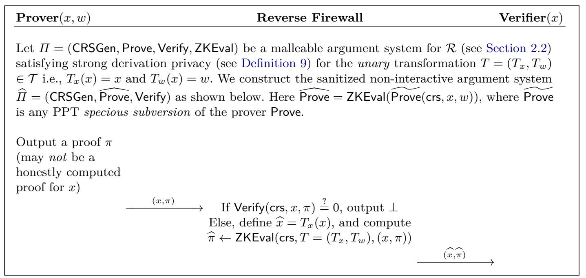

{0}------------------------------------------------

# **Malleable SNARKs and Their Applications**

Suvradip Chakraborty<sup>1</sup> , Dennis Hofheinz<sup>2</sup> , Roman Langreh[r](https://orcid.org/0000-0002-4083-8073) <sup>2</sup> , Jesper Buus Nielsen<sup>3</sup> , Christoph Striecks [4](https://orcid.org/0000-0003-4724-8022) , and Daniele Venturi [5](https://orcid.org/0000-0003-2379-8564)

> <sup>1</sup> Visa Research [suvchakr@visa.com](mailto:suvchakr@visa.com,hofheinz@inf.ethz.ch,roman.langrehr@inf.ethz.ch,jbn@cs.au.dk,Christoph.Striecks@ait.ac.at,venturi@di.uniroma1.it ) <sup>2</sup> ETH Zurich [{hofheinz,roman.langrehr}@inf.ethz.ch](mailto:suvchakr@visa.com,hofheinz@inf.ethz.ch,roman.langrehr@inf.ethz.ch,jbn@cs.au.dk,Christoph.Striecks@ait.ac.at,venturi@di.uniroma1.it ) <sup>3</sup> Aarhus University [jbn@cs.au.dk](mailto:suvchakr@visa.com,hofheinz@inf.ethz.ch,roman.langrehr@inf.ethz.ch,jbn@cs.au.dk,Christoph.Striecks@ait.ac.at,venturi@di.uniroma1.it ) <sup>4</sup> AIT Austrian Institute of Technology [Christoph.Striecks@ait.ac.at](mailto:suvchakr@visa.com,hofheinz@inf.ethz.ch,roman.langrehr@inf.ethz.ch,jbn@cs.au.dk,Christoph.Striecks@ait.ac.at,venturi@di.uniroma1.it ) <sup>5</sup> Sapienza University of Rome [venturi@di.uniroma1.it](mailto:suvchakr@visa.com,hofheinz@inf.ethz.ch,roman.langrehr@inf.ethz.ch,jbn@cs.au.dk,Christoph.Striecks@ait.ac.at,venturi@di.uniroma1.it )

**Abstract.** Succinct non-interactive arguments of knowledge (SNARKs) are variants of non-interactive zero-knowledge proofs (NIZKs) in which complex statements can be proven in a compact way. SNARKs have had tremendous impact in several areas of cryptography, including verifiable computing, blockchains, and anonymous communication. A recurring concept in many applications is the concept of recursive SNARKs, in which a proof references a previous proof to show an evolved statement.

In this work, we investigate *malleable SNARKs*, a generalization of this concept of recursion. An adaptation of the existing concept of malleable NIZKs, malleable SNARKs allow to modify SNARK proofs to show related statements, but such that such mauled proofs are indistinguishable from "properly generated" fresh proofs of the related statement. We show how to instantiate malleable SNARKs for universal languages and relations, and give a number of applications: the first post-quantum RCCA-secure rerandomizable and updatable encryption schemes, a generic construction of reverse firewalls, and an unlinkable (i.e., computation-hiding) targeted malleable homomorphic encryption scheme.

Technically, our malleable SNARK construction relies on recursive proofs, but with a twist: in order to support the strong indistinguishability properties of mauled and fresh SNARK proofs, we need to allow an unbounded recursion depth. To still allow for a reasonable notion of extractability in this setting (and in particular to guarantee that extraction eventually finishes with a "proper" witness that does not refer to a previous SNARK proof), we rely on a new and generic computational primitive called *adversarial one-way function (AOWF)* that may be of independent interest. We give an AOWF candidate and prove it secure in the random oracle model.

{1}------------------------------------------------

## **1 Introduction**

*Non-Interactive Zero-Knowledge Proofs.* Non-interactive zero-knowledge (NIZK) proofs [\[10\]](#page-28-0) allow a prover to generate non-interactive proofs for statements without revealing the corresponding witnesses. NIZK proofs and arguments[6](#page-1-0) have found numerous applications, ranging from constructing other cryptographic primitives (e.g., [\[5,](#page-28-1) [59,](#page-32-0) [64\]](#page-33-0)) to anonymous credential systems (e.g., [\[3\]](#page-28-2)). While initial constructions of NIZK proofs or arguments ("NIZKs" in the following) were feasibility results and only asymptotically efficient, we now know very efficient NIZKs for restricted sets of languages, e.g., [\[46\]](#page-31-0). Furthermore, "SNARKs"[7](#page-1-1) (i.e., succinct non-interactive arguments of knowledge [\[69,](#page-33-1) [43,](#page-31-1) [7\]](#page-28-3)) are a particularly compact and efficient variant of NIZKs, in which the size of the argument is bounded by some fixed polynomial in the security parameter and is essentially independent of the exact (polynomial) size of the statement being proved and its witness.

### **1.1 Malleable NIZKs**

*Malleable Non-Interactive Zero-Knowledge.* NIZKs can have a number of interesting properties. For instance, they can be proofs or arguments of knowledge [\[64,](#page-33-0) [29\]](#page-30-0) (which means that it is possible to extract witnesses from a successful prover or proof), or they can satisfy very strong notions of soundness (like non-malleability or simulation soundness [\[67\]](#page-33-2), or even simulation extractability [\[45\]](#page-31-2)). In this work, we are interested in one particular interesting property of NIZKs: malleability [\[23,](#page-30-1) [70\]](#page-33-3). Malleability denotes the property that a proof *π* for a certain statement *X* can be transformed into a proof *π* ′ for a related statement *X*′ = *T*(*X*). Of course, this should only be possible for a restricted class of allowed statement transformations *T*. We also want to hide *X*, i.e., the fact that *π* ′ has been produced from a related proof *π*.

Malleable NIZKs are, e.g., useful in shuffling schemes [\[23,](#page-30-1) [24\]](#page-30-2), when a proof certifies a property of a set of ciphertexts.[8](#page-1-2) Essentially, a malleable NIZK now allows to rerandomize and reorder the ciphertexts, while adapting the NIZK proof suitably. (This can be seen as a special case of "incremental" or "updatable" cryptography [\[4,](#page-28-4) [2\]](#page-28-5).)

*Malleability As a Form Of Self-Reference.* With malleable NIZKs, it is possible to generate proofs for related statements. A related concept is the notion of a "recursive NIZK (or SNARK)", which denotes a new proof that proves knowledge of an old proof (for a related statement). Recursion is a popular tool in the

<span id="page-1-0"></span><sup>6</sup> While *proofs* do not exist for false statements, *arguments* for false statements are only infeasible to find.

<span id="page-1-1"></span><sup>7</sup> With SNARKs, we implicitly mean "zero-knowledge SNARKs", i.e., SNARKs with simulatable proofs.

<span id="page-1-2"></span><sup>8</sup> That proof could certify, e.g., that the ciphertexts contain a number of encrypted votes that have been correctly counted.

{2}------------------------------------------------

construction and usage of SNARKs [\[69,](#page-33-1) [14,](#page-29-0) [8\]](#page-28-6), in particular because with SNARKs, proofs do not grow with the depth of the recursion. In fact, recursion can also be seen as a tool to obtain a form of malleability, in particular when proofs obtained through recursion and "fresh" proofs look alike. For some applications, like reverse firewalls, this can be interesting even for the trivial transformation *T*(*X*) = *X*.

*Derivation Privacy.* In this work, we are particularly concerned with the concept of *derivation privacy* (initially put forward by [\[23\]](#page-30-1) in the context of malleable NIZKs). In the context of recursion, derivation privacy requires that proofs that have been obtained through recursion (i.e., proofs that prove knowledge of a proof for a related statement) cannot be distinguished from "direct" proofs for that related statement.

*Bounding Extraction Depth.* Derivation privacy and recursive proofs are at odds with each other. Security of SNARKs requires that you can extract a witness from a short SNARK proof *π*. In case of recursive SNARKs (in which SNARK proofs may use previous SNARK proofs *π* ′ as witnesses), the extraction procedure recursively extracts *π* ′ . Every layer of extraction may require another invocation of the basic SNARK extraction assumption, which may result in an exponential blowup in extraction time. But even when making strong assumptions about extraction (such as the existence of a *fast extractor* with an additive, polynomial, extraction overhead), we still must make sure that this recursion terminates. To illustrate, note that for a trivial malleability transformation like *X* = *T*(*X*) there is nothing in the above discussion preventing *π* ′ = *π*. Intuitively, the language definition according to which we verify proofs therefore needs to involve a "recursion level" or "modification counter" *ρ* ensuring that recursive extraction terminates after *ρ* iterations. But then *π* and *π* ′ would have different recursion levels and can intuitively be distinguished, violating derivation privacy.

### **1.2 Our Results**

*Warmup: a construction with limited derivation privacy.* As a warmup, we recall a simple construction of malleable SNARKs in which mauled proofs do *not* look like fresh proofs. This construction is essentially the same as the SNARK construction in [\[24\]](#page-30-2), and captures ideas implicit in previous works on recursive SNARKs (e.g., [\[14\]](#page-29-0)). This construction avoids unbounded recursions through an explicit (and visible) counter in proofs. This counter starts with 0 in fresh proofs and gets incremented each time a related proof is produced. This construction guarantees that extraction eventually ends up with a "proper" witness (i.e., one which does not lead to recursive extraction), but also only satisfies a "leveled" form of derivation privacy (in which proofs of the same "derivation depth" are indistinguishable).

*New Assumption: Adversarial One-Way Functions.* To make progress and achieve full derivation privacy, we introduce a new computational assumption called

{3}------------------------------------------------

#### 4 Chakraborty et al.

"adversarial one-way functions (AOWFs)". Intuitively, an AOWF *f* cannot be efficiently inverted "many times in a row" on an *adversarially generated* image *y*. A little simplified, we want that

- **–** for every polynomial *t* and every adversary A<sup>1</sup> that has only a limited amount of time *t* to pick an image *y*,
- **–** there should be a number *p*(*t*) (for a fixed polynomial *p*),
- **–** such that every adversary A<sup>2</sup> that gets A1's state and *y* as input, has negligible success in finding a preimage *x* with *f p*(*t*) (*x*) = *y*.

We also require a technical property called "unlinkability" which we do not discuss here. Notice that we need to restrict A1's time in this assumption. Otherwise, A<sup>1</sup> could simply pick an arbitrary *x*, compute *y* := *f p*(*t*) (*x*), and leave *x* as part of its state for A2. Intuitively, the assumption is that this is essentially the only attack.

It is also helpful to observe that, of course, arbitrarily long chains of *f*evaluations *y*1*, . . . , y<sup>n</sup>* (with *yi*+1 = *f*(*yi*)) exist. However, for every image *y* that an adversary comes up with in time *t*, it is infeasible to find such a chain *y*1*, . . . , y<sup>n</sup>* with *y<sup>n</sup>* = *y* of length *n* ≥ *p*(*t*). This last characterization will be the key for our construction of malleable and derivation-private SNARKs.[9](#page-3-0)

We do not know how to achieve the AOWF definition from generic assumptions (such as, say, the existence of one-way functions). However, we present a plausible candidate for an AOWF based on hash-functions that we can prove secure in the random oracle model. The necessary techniques for AOWFs seem also very related to time-lock puzzles [\[66\]](#page-33-4), proofs of work [\[33\]](#page-30-3), and verifiable delay functions [\[11\]](#page-29-1), in the sense that we also assume that certain computations (e.g., function inversions) require a certain amount of time. Our definition is more restrictive, however, since we allow even an adversarial choice of problem instance (*y* above), and the additional property of "unlinkability" we discuss in the technical overview. Both distinctions are crucial for obtaining derivation-privacy and our applications, and appear to require stronger (and, in fact, non-falsifiable, see [Appendix F\)](#page-67-0) assumptions.

*From AOWFs to malleable SNARKs.* For our construction of malleable SNARKs, we use AOWFs to bound the depth of any recursive extraction chain. Concretely, we add a fresh AOWF image *y* = *f*(*x*) (for a freshly chosen preimage *x*) to any freshly generated SNARK proof *π* for a statement *X*. In case we generate a mauled proof *π* ′ for a modified statement *X*′ from a pair (*X, π*), however, we add *f*(*y*) (for the image *y* from *π*) to *π* ′ and use *π* ′ to prove knowledge of *π*. In other words, every proof carries an AOWF image that is developed (using *f*) upon every proof modification. One can think of *y* as an obfuscated modification counter, which can be incremented without knowing its value, and which cannot adversarially be brought to a high value without spending the corresponding time.

<span id="page-3-0"></span><sup>9</sup> We also generalize AOWFs to evaluation *chains* to *graphs*, which will be crucial for one of our applications.

{4}------------------------------------------------

When recursively extracting from a given proof *π*, this means we also extract (step by step) a chain *y*1*, . . . , y<sup>n</sup>* of *f*-images as above. By our AOWF assumption, the length of this chain is bounded by a polynomial *p*(*t*) (where *t* is the time it took to produce *π*). Hence, extraction must terminate at some point with a "proper" witness.

*Applications of malleable SNARKs.* Our notion of malleable SNARKs has a number of applications. In particular, we show that malleable SNARKs imply the following:

**Reverse Firewalls.** The first reverse firewall (RF) [\[57\]](#page-32-1) for NIZKs or SNARKs; this improves over a previous result by Ganesh, Magri and Venturi [\[40\]](#page-31-3) who gave RFs for *interactive* proof systems supporting only a restricted class of "malleable *Σ*-protocols". An RF for a SNARK is an untrusted external entity that sits between the prover and the verifier, and that sanitizes the proof produced by the prover by eliminating any subliminal channel due to the fact that the prover's machine has been subverted (in an undetectable manner).

**Rerandomizable Public-Key Encryption.** We also use malleable SNARKs to give the first generic construction (and in particular the first one based on post-quantum assumptions) of rerandomizable public-key encryption (RPKE) schemes that are secure in a chosen-ciphertext sense (i.e., RCCA secure [\[16,](#page-29-2) [44\]](#page-31-4)). RPKE schemes are PKE schemes whose ciphertexts can be publicly rerandomized (such that they look like fresh encryptions of the corresponding message). RCCA-secure RPKE schemes have numerous applications (in particular in anonymous communication [\[44,](#page-31-4) [63,](#page-33-5) [61\]](#page-32-2)) and were previously known to exist based on group-related complexity assumptions (e.g., [\[44,](#page-31-4) [63,](#page-33-5) [37\]](#page-31-5)), but not from post-quantum assumptions. We note that derivationprivacy of our SNARK is essential in this construction, since it guarantees that rerandomized ciphertexts appear indistinguishable from fresh ones.

**Updatable Encryption.** Updatable encryption (UE [\[13\]](#page-29-3)) is a form of (symmetric) encryption that allows to periodically change (or "update") the used secret key and the associated ciphertexts using a special "update token". In its strongest form, UE enables a form of forward-secure communication (e.g., [\[68\]](#page-33-6)) and also has applications in anonymous communication (e.g., [\[50\]](#page-32-3)). In this work, we use malleable SNARKs to construct the first *rerandomizable* UE scheme that satisfies a strong, chosen-ciphertext UE security notion yielding the first post-quantum secure UE scheme as a special case (answering an open question posed in prior work [\[39\]](#page-31-6) in the affirmative). Again, derivation privacy is critical here for rerandomizability.

**Targeted Malleability.** Targeted malleability [\[14\]](#page-29-0) is a property of homomorphic encryption schemes that restricts homomorphic computations to a restricted set of possible computations. [\[14\]](#page-29-0) already present a SNARK-based construction of targeted malleable homomorphic encryption, which however may reveal which (and how many) computations have been performed with a given ciphertext. Plugging in our malleable SNARK into their construction yields a targeted malleable homomorphic encryption scheme which *does* hide

{5}------------------------------------------------

which computations have been performed (thanks to derivation-privacy). This has been explicitly stated as an open problem in [\[14\]](#page-29-0).

### **1.3 Technical overview**

*Adversarial OWFs.* The core building block of our malleable SNARK construction is the notion of an adversarial one-way function (AOWF). Recall that in the simplified version outlined above, an AOWF *f* satisfies that for every pair of adversaries (A1*,* A2), and

- **–** for (*y,*st) ← A<sup>1</sup> computed by A<sup>1</sup> in time *t*,
- **–** and for *x* ← A2(*y,*st), we have *f p*(*t*) (*x*) = *y* only negligibly often, where *p* is a fixed polynomial.

This AOWF requirement can be viewed as a limitation to quickly produce *f*images that can be inverted many times. Such *f*-images will serve as "tags" in SNARK proofs which are developed (by applying *f*) every time a proof is referenced in another SNARK proof. The above condition then ensures that any chain of SNARK proofs generated through recursive extraction is at most polynomially long.

A simple AOWF candidate (with *p*(*t*) = *t* + 1) is *f*(*x*) = *H*(*x*) for a hash function *H*. This property is in fact easy to prove in the random oracle model, assuming that a random oracle query to *H* costs at least one computation step. However, for our purposes, we will require a slightly different form of AOWF. In fact, our previously mentioned "derivation privacy" of a SNARK property states that SNARK proofs *π* ′ that have been generated by modifying other proofs *π* should be indistinguishable from SNARK proofs *π* ′ directly generated from a witness.

This "derivation privacy" property should (for some of our applications) even hold when both *π* and *π* ′ are known. Since *f*(*x*) will be part of the corresponding proof, this means that *π* contains *y* = *f*(*x*) (for some *x*), and *π* ′ contains *y* ′ = *f*(*y*) *if and only if π* ′ was generated from *π*. This contradicts derivation privacy, and in fact eliminates any deterministic function *f* as a "tag generator".

We will resolve this with a slightly different AOWF definition that allows for *randomized functions* (modeled by functions *f* that get as input *x* and random coins *r*). The AOWF condition below is essentially the same as above, but adapted to randomized functions. Formally, we require that for all (A1*,* A2) and

- **–** for (*y,*st) ← A<sup>1</sup> computed by A<sup>1</sup> in time *t*,
- **–** and for (*x, r*1*, . . . , r<sup>p</sup>*(*t*)) ← A2(*y,*st), we have

$$f^{p(t)}(x, r_1, \dots, r_{p(t)}) = f(\dots f(f(x, r_1), r_2) \dots, r_{p(t)}) = y$$

only negligibly often, where *p* is a fixed polynomial.

In other words, it is the task of A<sup>2</sup> to output the corresponding random coins used in the *p*(*t*) *f*-evaluations.

{6}------------------------------------------------

Additionally, we explicitly require unlinkability. This property states that given an (even adversarially generated) preimage x, the corresponding image y = f(x, r) (for random, unknown r) looks like a random image y. Unlinkability implies derivation privacy when AOWF images are used as tags in SNARK proofs. Furthermore, we show that f(x, r) = H(x, r), a simple randomized variant of the hash-based deterministic AOWF above is an (unlinkable) AOWF in the random oracle model.

Generalized AOWFs. AOWFs as informally defined above allow an extraction "along a path" of preimages  $x_1, x_2 := f(x_1, r_1), \ldots, x_n := f(x_{n-1}, r_{n-1})$  (starting with  $x_n$ ). We in fact define (and prove) a more generalized variant of AOWFs which allow a more flexible extraction. Specifically, we also consider AOWFs with larger a larger number of (x-)inputs, such that we can express not only paths (as above), but trees and in fact more general graphs of f-evaluations. Adversarial one-wayness then requires that  $A_2(y, st)$  (with y, st as above) cannot output a graph G exceeding size p(t) with preimages x at leaves, and randomness values r at inner nodes, such that the computation induced by G yields y.

Informally, hence, adversarial one-wayness states that computing the result of any such a "topological computation" requires a certain amount of time. Jumping ahead, this translates to SNARKs in which newly computed SNARKs may depend on more than one given SNARK.

Malleable SNARKs. Before we describe our main construction with adversarial one-way functions, we explain a simpler construction that uses instead a counter  $\ell$  counting the number of transformations applied so far. This approach only requires a SNARK to begin with, and is essentially the one presented in [24] (and implicit in [14]). This construction has two drawbacks that our main construction will overcome: during set-up, we have to fix a bound B on the number of transformations that can be applied 11, and the construction only achieves a weaker, "leveled" form of derivation privacy, where the number of applied transformations is allowed to leak.

These counters then become part of the SNARK statement. More concretely, to build a malleable SNARK for an NP relation  $\mathcal{R}$  and a set of transformations  $\mathcal{T}$  we use a SNARK for statements of the format  $(\ell, x)$  (where  $\ell$  is the counter and x a purported statement in  $\mathcal{R}$ ). Each transformation  $T \in \mathcal{T}$  has the format  $T = (T_x, T_w)$  and has to fulfill  $(x, w) \in \mathcal{R} \Longrightarrow (T_x(x), T_w(w)) \in \mathcal{R}$ . The SNARK then allows the prover to prove statements of the form:

Either  $\ell = 0$  and I know a witness for x, or  $\ell \in [B]$  and I know a transformation  $(T_x, T_w) \in \mathcal{T}$ , a statement x' and a SNARK proof  $\pi'$  such that  $x = T_x(x')$  and  $\pi'$  is valid proof for the statement  $(\ell - 1, x')$ .

<span id="page-6-0"></span>Of course, we do not claim novelty for this counter-based construction. We detail this construction here to pave the way for our main SNARK construction.

<span id="page-6-1"></span>This can also be beneficial, for example for lattice-based encryption schemes, each transformation might increase the noise level of a ciphertext. Bounding the number of transformations can ensure that a certain noise-level is not exceeded.

{7}------------------------------------------------

To support the verification of a SNARK in the SNARK language, we need a fully-succinct SNARK for which the common reference string (CRS) does not grow with the description size of the SNARK language (since verification requires the CRS and thus the CRS has to be part of the language description).<sup>12</sup>

We can now transform a proof for the statement x to a proof of the statement T(x) by generating a new SNARK proof and prove the right-hand side of the or-language described above. Zero-knowledge and leveled derivation privacy follow from the zero-knowledge property of the underlying SNARK.

To argue knowledge soundness in the case  $\ell = 0$ , we can just use the knowledge soundness property of the SNARK. This guarantees that there exists an extractor (depending on the adversary) that extracts the witness w from the adversary's inputs and random tape. In the case  $\ell \geq 1$ , this SNARK extractor will not give us a witness, but a transformation  $(T_x, T_w)$  and  $(x', \pi')$  with  $x = T_x(x')$ . In this case, we define a new adversary that runs this extractor and outputs  $((\ell-1,x'),\pi')$ , which is another valid statement-proof pair for the SNARK. We can then apply the SNARK extractor to this statement and repeat this process until we end in the base case  $\ell = 0$ . If this recursive extraction outputs a witness w' for x', we can output  $T_w(w')$  as witness for x. The counter guarantees that this will take at most B recursions. If B is a constant, we also have the guarantee that all these extractors run in polynomial time. If we want to allow any bound B polynomial in the security parameter, we have to assume fast extraction (meaning that the extractor for an adversary running in time t takes only time  $t + poly(\lambda)$  for a polynomial poly independent of the adversary) to avoid an exponential blow-up in the runtime.

We now come to our main SNARK construction, and show how we can replace the counters above with an adversarial one-way function to get full derivation privacy and remove the bound on the number of applicable transformations. For simplicity, we state this construction with the simplified variant of AOWFs that only take a single x (and r) as input. In the main body, we however prove a construction with generalized AOWFs that enables more general transformations that take  $several\ x$  (and w) as input.

In our (simplified) construction, the SNARK is for statements of the form  $(\xi, x)$  and allows to prove statements of the form

```
Either I know a witness for x, or I know \xi', r with f(\xi',r) = \xi and a transformation (T_x, T_w) \in \mathcal{T}, a statement x' and a SNARK proof \pi' such that x = T_x(x') and \pi' is valid proof for the statement (\xi', x').
```

Initially,  $\xi$  is sampled uniformly at random. In this setting the Turing machine verifying the NP-relation for the SNARK also needs its own description. We solve this without using an unproven, efficient version of the recursion theorem like previous works do [8].

Zero-knowledge of this construction follows directly from zero-knowledge of the underlying SNARK. To argue derivation privacy, we additionally need the

<span id="page-7-0"></span>When we use our construction with counters only for a constant number of levels, we can also use a separate CRS for every level.

{8}------------------------------------------------

unlinkability of the AOWF. (Essentially, unlinkability guarantees that the value *ξ* in a proof does not reveal anything about its preimage *ξ* ′ , and hence proofs do not reveal anything about the proofs they were potentially derived from.)

We can argue knowledge soundness with a construction analogous to the one with counters. The adversarial one-wayness guarantees that we reach the base case after at most *p*(*t*) recursions, where *t* is the run-time of the adversary. Otherwise, we could use the adversary as first stage for the adversarial one-way function game. The second stage then runs the first *p*(*t*) extractors to obtain the values (*x, r*1*, . . . , rp*(*t*)) to win the game. Here, we have to assume fast extraction to avoid an exponential blow-up in the runtime.

If the underlying SNARK has simulation extractability, both of our constructions also achieve controlled-malleable simulation extractability, which guarantees that the adversary can only prove true statements or statements obtained by applying transformations to statements for which it queried a simulated proof.

*Application: Reverse Firewalls.* Reverse firewalls were introduced by Mironov and Stephens-Davidowitz [\[57\]](#page-32-1) as a method for protecting cryptographic protocols against subversion attacks. In a subversion attack, an adversary tampers with the machines of the honest parties and leaks the honest parties' secrets through the protocol transcript. A reverse firewall (RF) is an external device that sits between a party *P* and the external world in order to "sanitize" the messages that are sent and received by *P*. The parties do not trust the firewall (and hence do not share its secret with the firewall), and while the RF itself cannot create security, the hope is for the RF to preserve security in the face of subversion. Roughly, the security properties desired from an RF are: (i) *exfiltration-resistance*: the firewall prevents the machine from leaking any information to the outside world regardless of how the user's machine behaves; (ii) *security preservation*: the protocol with the firewall is secure even when honest parties' machines are tampered. Similar to most prior works in this area, we consider the adversarial tamperings to be "functionality-maintaining", such that tampered machines still maintain the completeness of the protocol (but try to exfiltrate sensitive information by establishing covert channels).[13](#page-8-0)

All known constructions of protocols in the RF framework [\[57,](#page-32-1) [30,](#page-30-4) [40,](#page-31-3) [18,](#page-29-4) [19,](#page-29-5) [22,](#page-29-6) [20,](#page-29-7) [21\]](#page-29-8) rely on the malleability of the underlying operations in order for the RF to rerandomize/sanitize the transcript. Thus the existing RFs are limited to protocols that offer some structure. Therefore, in this work we ask whether this is inherent to all RF constructions. In other words, can we provide generic constructions of RFs that do not rely on specific algebraic structures of the underlying protocols? We answer this in the positive for NIZK proof systems. The previous works on RF-compatible zero-knowledge protocols [\[40,](#page-31-3) [18\]](#page-29-4) exploit malleability properties of the underlying ZK protocols (the work of [\[40\]](#page-31-3) relies on malleable sigma protocols, whereas [\[18\]](#page-29-4) rely on controlled malleable NIZKs) to sanitize/rerandomize the ZK protocols.

<span id="page-8-0"></span><sup>13</sup> This class of tampering attacks cover most of the practical subversion attacks where the adversary attempts to stay undetectable.

{9}------------------------------------------------

In this work, we use our malleable SNARKs (NIZKs) satisfying (strong) derivation privacy in a straightforward way to construct RF for NIZK argument systems. In particular, the RF (for the prover) receives a tuple  $(x, \pi)$  from the prover, where x is a statement and  $\pi$  is a purported proof of membership of x in some language  $\mathcal{L}$ .<sup>14</sup> The RF then uses our malleable NIZK to generate a proof  $\pi'$  for the statement: "Either I know a witness for x, or I know a NIZK proof  $\pi$  such that  $\pi$  is valid proof for the statement x."<sup>15</sup> The RF then outputs the tuple  $(x, \pi')$  to the outside world. Additionally, thanks to the (recursive) malleability of our underlying NIZK, we can let the firewalls be stackable, so that one party may have arbitrarily many firewalls. Exfiltration-resistance of the prover (against the verifer) follows from the derivation privacy of our underlying malleable NIZK which ensures that the resulting proof  $\pi'$  for x looks like a fresh (and honestly generated) proof for the statement x.

Application: Rerandomizable Public-Key Encryption. We present a variant of the Naor-Yung transformation [59, 32] that turns an IND-CPA secure rerandomizable public-key encryption (PKE) into an IND-RCCA secure one. IND-RCCA security [16] guarantees indistinguishability of ciphertexts given access to a decryption oracle that decrypts every ciphertext, but returns a special symbol  $\diamond$  when the message is one of the two messages used for the challenge oracle ( $m_0^{\star}$  or  $m_1^{\star}$ ). For a rerandomizable PKE, we can not provide a more powerful decryption oracle, since otherwise an adversary can trivially win by submitting a rerandomizable challenge ciphertext.

The idea of the Naor-Yung transformation is to encrypt each message under two different public keys and equip them with a simulation sound NIZK that both ciphertexts encrypt the same message. The reduction can now simulate the decryption oracle using one of the two secret keys while changing which of the two challenge messages is encrypted under the other public key.

For a rerandomizable PKE, we replace that NIZK with a malleable NIZK for the transformations that rerandomize of both ciphertexts. Since a malleable NIZK cannot be simulation sound (an adversary can apply transformations to the simulated proofs), we have to argue differently that the decryption oracle can still be simulated with each of the two secret keys. We use instead the weaker notion of controlled-malleable simulation soundness. This guarantees that the adversary can only produce proofs for true statements and statements obtainable by applying transformations to simulated statements. Our construction exactly gives controlled malleability. In the context of Naor–Yung, where we use in the reduction simulated proofs for pairs of ciphertexts where one of them encrypts  $\mathbf{m}_0^\star$  and the other  $\mathbf{m}_1^\star$  and all the allowed transformations preserve the message, we can thus still safely return  $\diamond$  whenever we encounter  $\mathbf{m}_0^\star$  or  $\mathbf{m}_1^\star$  during the decryption of one of them.

<span id="page-9-1"></span><span id="page-9-0"></span>Note that the proof need not be generated honestly. However, it must be that the proof  $\pi$  verifies with respect to x if  $x \in \mathcal{L}$  (since the tampering is functionality-maintaining).

Note that, in this case the transformation  $(T_x, T_w)$  is the identity transformation.

{10}------------------------------------------------

Furthermore, we have to show that a transformed NIZK is indistinguishable from a freshly generated NIZK to guarantee that our PKE scheme is still rerandomizable. On a high level, this follows from the derivation privacy of the malleable NIZK. However, this holds only computationally and, as far as we are aware, previous works only considered statistical rerandomizablity. We propose a game-based definition of rerandomizablity and show that our construction satisfies it.

A similar result has been shown in [\[23\]](#page-30-1). However, they use a variant of Naor–Yung that requires a NIZK proof of knowledge (NIZKPoK) which makes it incompatible with our SNARK-based construction. Our SNARK-based construction only achieves a "white-box extractability" notion, where the extractor depends on the adversary and extracts a witness from the adversary's random tape. The Naor–Yung transformation used in [\[23\]](#page-30-1) however requires a universal extractor that extracts the witness from the proof using a trapdoor for the CRS. This allows to answer many decryption queries during the game. The SNARK-style extraction does not allow this. One can not nest the extractors arbitrary often, since our malleable SNARK does not have the fast-extraction property described above even if the underlying SNARK has it. So we cannot simply plug our SNARK into [\[23\]](#page-30-1). Even more so because [\[23\]](#page-30-1) does not show that the resulting scheme is still *re*randomizable. On the other hand, the result of [\[23\]](#page-30-1) is more general for controlled-malleable *CCA* security, which captures for example CCA-security variants for homomorphic encryption. We believe that our approach can also be generalized in this way.

*Application: Updatable Encryption.* Updatable encryption (UE), first defined in [\[13\]](#page-29-3), is a symmetric primitive that allows rotating secret keys and updating ciphertexts in a discrete-epoch-based fashion. More concretely, during the rotation of a key in epoch *e*, a fresh key and a so-called update token are generated for epoch *e* + 1 while the epoch-*e* key is discarded. The update token can be used to update existing (e.g., outsourced) ciphertexts under the epoch-*e* key to valid ciphertexts under the rotated key in epoch *e* + 1. UE has several applications, particularly, in the realm of cloud storage and anonymous routing.

A rich body of UE constructions is known from the literature where UE schemes can be either ciphertext-dependent [\[13,](#page-29-3) [35,](#page-30-6) [12,](#page-29-9) [26,](#page-30-7) [25\]](#page-30-8) or ciphertextindependent [\[51,](#page-32-4) [49,](#page-31-7) [15,](#page-29-10) [47,](#page-31-8) [52,](#page-32-5) [36,](#page-30-9) [60,](#page-32-6) [39,](#page-31-6) [56,](#page-32-7) [68,](#page-33-6) [55\]](#page-32-8). Latter schemes are the most versatile ones where during the key rotation no access to any ciphertext parts is required.[16](#page-10-0)

Moreover, ciphertext updates can be deterministic or randomized. UE schemes with randomized updates yield strong security properties, but are significantly harder to prove secure. This circumstance resulted in only *one* known randomizedupdate scheme which is secure under chosen-ciphertext attacks [\[49\]](#page-31-7), but only against rather weak adversaries that are not allowed to query certain update tokens.

<span id="page-10-0"></span><sup>16</sup> In practice, such a feature plays a significant role [\[48\]](#page-31-9).

{11}------------------------------------------------

The currently strongest models with randomized updates allowing the adversary to query almost all update tokens [\[60,](#page-32-6) [39,](#page-31-6) [56,](#page-32-7) [68\]](#page-33-6) allow the construction of UE schemes that are secure under chosen-plaintext attacks. A recent work [\[68\]](#page-33-6) enhanced the common epoch-based UE security models with so-called expiry epochs, allowing that forward security can be achieved in UE and potentially all tokens can be leaked to an adversary. (The security model in [\[68\]](#page-33-6) implies the randomized model used in [\[60,](#page-32-6) [39,](#page-31-6) [56\]](#page-32-7) by setting the expiry epoch to a global fixed constant 2 *λ* for security parameter *λ*; loosely speaking, it means that ciphertexts never expire.) However, stronger security in terms of indistinguishably under randomized chosen-ciphertext attacks was left unaddressed until now.

In this work, we give the first randomized UE scheme under chosen-ciphertext attacks by combining the CPA-secure construction from [\[68\]](#page-33-6) with our malleable NIZK approach via the Naor–Yung paradigm. As a byproduct, this yields the first post-quantum RCCA-secure UE scheme under randomized updates from the learning-with-errors (LWE) assumptions; i.e., when the CPA scheme in the above transformation is instantiated with the LWE-based schemes from [\[60,](#page-32-6) [39\]](#page-31-6) and the expiry epoch is set to 2 *λ* . This answers an open question posed in [\[39\]](#page-31-6) in the affirmative.

Concretely, in the vein of Naor–Yung, we generate two independent initial keys K1*,*1*,*K1*,*<sup>2</sup> and a CRS crs using the key and CRS generation algorithms of the UE and of the malleable NIZK schemes, respectively. The keys in epoch *e* are rotated independently to the next epoch *e* + 1 (via key rotation of the UE scheme) while the CRS stays constant.

Encryption in epoch *e* generates a ciphertext under a message m for each key together with a proof from the malleable NIZK which shows that the same message is encrypted in both ciphertexts. The ciphertext update runs the update algorithms of the UE scheme on the respective token-ciphertext pair as well as the proof evaluation showing that those ciphertexts are updated correctly. The updated ciphertexts with the proof are returned and yield a valid ciphertext in epoch *e* + 1. Decryption verifies if and only if the ciphertexts under the keys and the proof are consistent and returns the message m.

The security proof is mostly similar to the proof of the randomized PKE and, eventually, we arrive at a UE scheme with the desired properties.

*Application: Targeted Malleable Homomorphic Encryption.* It is well-known that a homomorphic (public-key) encryption (HE) cannot achieve IND-CCA security. However, the weaker IND-CCA1 security notion which only gives the adversary a decryption oracle *before* the challenge query is known to be insufficient for many applications [\[38,](#page-31-10) [53\]](#page-32-9). The first work that introduces a security notion beyond IND-CCA1 that is achievable for HE was [\[62\]](#page-33-7) with the notion of HCCA security. Their notion is unfortunately unachievable for non-unary functionalities (like addition or multiplication of encrypted values). Another notion called targeted non-malleability (TNM-CPA or TNM-CCA1) was introduced in [\[14\]](#page-29-0). Furthermore, [\[1\]](#page-28-7) introduce the notion of FuncCPA security, however that notion seems fairly weak and is not even known to imply IND-CCA1 security. Finally, [\[23\]](#page-30-1) introduce CM-CCA security and [\[54\]](#page-32-10) introduce IND-vCCA (and TNM-vCCA) security,

{12}------------------------------------------------

which are stronger than HCCA security, and thus also not achievable for nonunary functionalities.

In this work, we thus consider the notion TNM-CCA1 of [\[14\]](#page-29-0), which is the strongest known notion that is achievable for general HE. We give a generic conversion of any IND-CPA secure HE for function class F to a TNM-CCA1 secure HE for any function class F ′ ⊆ F by applying the Naor–Yung paradigm with our malleable NIZK construction. In contrast to [\[14\]](#page-29-0), who propose a similar construction, our construction preserves *unlinkability* [\[62\]](#page-33-7), due to the derivationprivacy of our malleable SNARK construction. This solves an open problem of [\[14\]](#page-29-0), who also give applications of targeted non-malleable HE, for example voting systems based on homomorphic encryption like [\[28\]](#page-30-10).

We uncover several flaws in the approach of [\[14\]](#page-29-0), one of them requires an additional assumption about *extractability in the presence of auxiliary input* both in their and our work. As shown in [\[9\]](#page-28-8), such a notion is not achievable for arbitrary auxiliary input, which makes our construction non-generic. For our transformation, the auxiliary input has to store a public key and a ciphertext of the underlying HE scheme. One approach to build a fully generic transformation for targeted malleable HE is to construct a SNARK for *bounded* auxiliary input (where the parameters of the SNARK can depend on the size of the auxiliary input), which is not ruled out by the result in [\[9\]](#page-28-8). However, we are not aware of any SNARK candidate for this security notion.

Applying the Naor–Yung transform to homomorphic encryption using recursive SNARK was also studied in [\[17\]](#page-29-11). However, this work only gives a proof sketch that ignores the challenges that arise with the recursive usage of SNARKs.

## **2 Preliminaries**

*Notation.* For an NP relation R we use L<sup>R</sup> := {*x* | ∃*w* : (*x, w*) ∈ R} to denote the language associated to R. We assume without loss of generality *ε /*∈ L<sup>R</sup> to avoid problems with the notion of polynomial runtime for the empty statement.

We use N<sup>0</sup> for the set of natural numbers with zero and N<sup>+</sup> for the set of natural numbers without zero. For *n* ∈ N<sup>+</sup> we use [*n*] := {1*, . . . , n*}.

We use *x* ←\$ *S* to denote the process of sampling an element *x* from a set *S* uniformly at random. For a (probabilistic) algorithm A we write *x <sup>t</sup>*← A(*b*; *r*) to denote the random variable *x* output by A on input *b* with random coins *r* and the runtime *t* that A(*b*) used for this process. When the exact runtime is not relevant, we omit *t*. We omit *r*, if independent uniformly random coins are used. Furthermore TimeA(*λ*) denotes the worst-case running time of A on inputs of length *λ*.

We write (*a, . . . , b,* \_*, c, . . . , d*) ∈ *S* as shorthand for ∃*x.*(*a, . . . , b, x, c, . . . , d*) ∈ *S*.

<span id="page-12-0"></span>**Definition 1 (Non-interactive argument system).** *A non-interactive argument system Π for an NP relation* R *consists of the following three PPT algorithms:*

{13}------------------------------------------------

- CRSGen inputs the unary encoded security parameter  $1^{\lambda}$  and outputs a common reference string crs. We assume without loss of generality that crs contains  $\lambda$ .
- Prove inputs the CRS crs, a statement x and witness w and outputs an argument  $\pi$ .
- Verify is deterministic and inputs the CRS crs, a statement x and an argument  $\pi$  and outputs a bit.

Every non-interactive argument system should satisfy the following two properties:

**Definition 2 (Completeness).** A non-interactive argument system  $\Pi = (\mathsf{CRSGen}, \mathsf{Prove}, \mathsf{Verify})$  for NP relation  $\mathcal{R}$  is complete if for all  $(x, w) \in \mathcal{R}$ , for  $\mathsf{crs} \leftarrow \mathsf{CRSGen}(1^{\lambda})$ ,  $\pi \leftarrow \mathsf{Prove}(\mathsf{crs}, x, w)$ 

$$\Pr[\mathsf{Verify}(\mathsf{crs}, x, \pi) = 1] \ge 1 - \mathsf{negl}(\lambda)$$

for a negligible function negl. The probability is taken over the random coins of CRSGen, Prove, and Verify.

**Definition 3 (Soundness).** A non-interactive argument system  $\Pi = (\mathsf{CRSGen}, \mathsf{Prove}, \mathsf{Verify})$  for NP relation  $\mathcal{R}$  is sound if for all PPT adversaries  $\mathcal{A}$ , for  $\mathsf{crs} \leftarrow \mathsf{CRSGen}(1^{\lambda})$  and  $(x, \pi) \stackrel{\$}{\leftarrow} \mathcal{A}(\mathsf{crs})$ 

$$\Pr[\mathsf{Verify}(\mathsf{crs}, x, \pi) = 1 \land x \notin \mathcal{L}_{\mathcal{R}}] \le \mathsf{negl}(\lambda)$$

for a negligible function negl. The probability is taken over the random coins of CRSGen, A, and Verify.

A argument system that satisfies the following definition additionally is called a non-interactive zero-knowledge argument system (NIZK).

**Definition 4 (Zero knowledge).** A non-interactive argument system  $\Pi = (\mathsf{CRSGen}, \mathsf{Prove}, \mathsf{Verify})$  for NP relation  $\mathcal{R}$  is zero-knowledge for NP relation  $\mathcal{R}$  if there exists a PPT simulator  $S = (S_1, S_2)$  such that for every PPT adversary  $\mathcal{A}$  we have

$$\mathsf{Adv}^{\mathsf{zk}}_{\mathcal{A},\Pi}(\lambda) := \left| \Pr[\mathsf{Exp}^{\mathsf{zk}}_{\mathcal{A},\Pi}(\lambda) = 1] - \frac{1}{2} \right| \leq \mathsf{negl}(\lambda)$$

for a negligible function negl where the experiment is defined in Figure 1.

#### 2.1 SNARKs

For SNARGs and SNARKs we fix the NP relation to be the universal relation

 $\mathcal{R}_{\mathcal{U}} := \{((M, x, t), w) \mid M \text{ describes a Turing machine accepting the input}$  $(x, w) \text{ in time at most } t.\}$ 

{14}------------------------------------------------

```
 \begin{array}{|c|c|c|}\hline {\sf Exp}^{\sf zk}_{{\cal A},\Pi=({\sf CRSGen},{\sf Prove},{\sf Verify})}(\lambda) \colon} & & & & & & \\ \hline b \not \stackrel{\$}{=} \{0,1\} & & & & & & \\ {\sf if} \ b = 0 \ {\sf then} & & & & \\ {\sf |crs} \leftarrow {\sf CRSGen}(1^{\lambda}) & & & & & \\ {\sf |crs},{\sf td}) \leftarrow S_1(1^{\lambda}) & & & & \\ {\sf |b'} \leftarrow {\cal A}^{{\sf Prove}(\cdot,\cdot)}(1^{\lambda},{\sf crs}) & & & \\ {\sf return} \ b \stackrel{?}{=} b' & & & \\ \hline \end{array}
```

**Fig. 1.** The zero-knowledge experiment for a NIZK for NP relation  $\mathcal{R}$ .

A fully-succinct non-interactive argument (SNARG) is a non-interactive argument system which satisfies the following succinctness property. We only give a definition of fully-succinct SNARGs, where "full" refers to the fact that the CRS is generated without specifying a bound on the time t and therefore also the size of the CRS is a fixed polynomial in  $\lambda$ .<sup>17</sup> The prover gets the time bound t in unary encoding to allow it to run in time polynomial in t, while the verifier gets it in binary encoding, so that it runs at most polylogarithmically in t.

**Definition 5 (Full succinctness).** A non-interactive argument system  $\Pi$  for the NP relation  $\mathcal{R}_{\mathcal{U}}$  is fully-succinct if for all crs in the image of CRSGen(1<sup>\lambda</sup>), all  $((M, x, t), w) \in \mathcal{R}_{\mathcal{U}}$  and all arguments  $\pi$  in the image of Prove(crs,  $(M, x, 1^t), w$ ) we have  $|\pi| \leq \operatorname{poly}(\lambda)$  for a polynomial poly. Here  $|\pi|$  denotes the bit-length of  $\pi$ .

A SNARG that satisfies zero-knowledge is called a zk-SNARG. A succinct non-interactive argument of knowledge (SNARK) is a SNARG that satisfies the following extractability requirement.

**Definition 6 (Simulation extractable).** A proof system  $\Pi$  is simulation extractable if for every PPT adversary A there exists a PPT extractor  $\mathcal{E}$  such that

$$\mathsf{Adv}^{\mathsf{sse}}_{\mathcal{A},\mathcal{E},\Pi}(\lambda) := \left| \Pr[\mathsf{Exp}^{\mathsf{sse}}_{\mathcal{A},\mathcal{E},\Pi}(\lambda) = 1] \right| \leq \mathsf{negl}(\lambda)$$

for a negligible function  $\operatorname{\mathsf{negl}}$  where the experiment is defined in Figure 2.

We say that a SNARK has fast extraction if the simulation extractability property holds with the additional restriction that  $\mathsf{Time}_{\mathcal{E}}(\lambda) \leq \mathsf{Time}_{\mathcal{A}}(\lambda) + \mathsf{poly}(\lambda)$  holds for a polynomial poly independent of  $\mathcal{A}$ . We then say that  $\mathcal{E}$  is a fast extractor and  $\Pi$  provides fast extraction.

A concurrent work by Cheng and Goyal [27] shows that SNARKs with fast extraction are useful to boost SNARKs with non-trivial succinctness to SNARKs with full succinctness.

<span id="page-14-1"></span><sup>&</sup>lt;sup>17</sup> SNARGs where a polynomial bound on the time has to be fixed for the CRS generation are called preprocessing SNARGs, but they are not sufficient for our constructions.

{15}------------------------------------------------

Fig. 2. The simulation extractability experiment for a zk-SNARK  $\Pi = (\mathsf{CRSGen}, \mathsf{Prove}, \mathsf{Verify})$  for NP-relation  $\mathcal{R}$  with zero-knowledge simulator  $S = (S_1, S_2)$ .

#### <span id="page-15-3"></span>2.2 Malleable NIZKs

We recall the definition of Malleable NIZKs [23].

<span id="page-15-2"></span>**Definition 7 (Admissible Transformation).** We say that an n-ary transformation  $T = (T_x, T_w)$  is admissible for an NP relation  $\mathcal{R}$  if

$$\forall i \in \{1,\ldots,n\} : (x_i,w_i) \in \mathcal{R} \Longrightarrow (T_x(x_1,\ldots,x_n),T_w(w_1,\ldots,w_n)) \in \mathcal{R}$$

 $T_x$  and  $T_w$  are efficiently computable and for all statements  $x_1, \ldots, x_n$  we have  $|T| + |x_1| + \cdots + |x_n| \le \text{poly}(|T_x(x_1, \ldots, x_n)|)$  for a fixed polynomial poly.<sup>18</sup>

We say that a set of transformations  $\mathcal{T}$  is allowable for  $\mathcal{R}$  if every  $T \in \mathcal{T}$  is admissible for  $\mathcal{R}$  and membership in  $\mathcal{T}$  is efficiently decidable.

**Definition 8 (Malleable argument system).** An argument system  $\Pi = (\mathsf{CRSGen}, \mathsf{Prove}, \mathsf{Verify})$  for  $\mathcal{R}$  is malleable for an allowable set of transformations  $\mathcal{T}$  if there is a PPT algorithm ZKEval that inputs the CRS crs, an n-ary transformation  $T = (T_x, T_w) \in \mathcal{T}$  and n statements with corresponding arguments  $(x_i, \pi_i)_{1 \leq i \leq n}$  and outputs an argument  $\pi$  for  $T_x(x_1, \ldots, x_n)$ .

For completeness, we additionally require that for all  $T = (T_x, T_w) \in \mathcal{T}$  and all  $(x_i, \pi_i)_{1 \le i \le n}$ , for  $\operatorname{crs} \leftarrow \mathsf{CRSGen}(1^{\lambda})$ 

```
\begin{split} \Pr[\forall i \in [n] : \mathsf{Verify}(\mathsf{crs}, x_i, \pi_i) &= 1 \\ &\wedge \mathsf{Verify}(\mathsf{crs}, T_x(x_1, \dots, x_n), \mathsf{ZKEval}(\mathsf{crs}, T, (x_i, \pi_i)_{1 \leq i \leq n})) = 0] \leq \mathsf{negl}(\lambda) \end{split}
```

for a negligible function negl. The probability is taken over the random coins of CRSGen, ZKEval, and Verify.

A malleable NIZK obtained via applying a transformation should also hide the input statements (and proofs) of the transformation. The work [23] introduces two security notions for this:

<span id="page-15-1"></span>The last property is necessary to ensure that all our algorithms run in polynomial time in their input.

{16}------------------------------------------------

```
\frac{\mathsf{Exp}^{\mathsf{rdp}}_{\mathcal{A}, H = (\mathsf{CRSGen}, \mathsf{Prove}, \mathsf{Verify})}(\lambda):}{b \overset{\$}{\leftarrow} \{0, 1\}} \\ (\mathsf{crs}, \mathsf{td}) \leftarrow S_1(1^{\lambda}) \\ (\mathsf{st}, (x_i, \pi_i)_{1 \leq i \leq n}, T = (T_x, T_w)) \overset{\$}{\leftarrow} \mathcal{A}_1(\mathsf{crs}) \\ \mathbf{if} \ \exists i \in [n]: \mathsf{Verify}(\mathsf{crs}, x_i, \pi_i) \overset{?}{=} 0 \ \mathbf{then} \\ \lfloor \mathbf{return} \ b' \overset{\$}{\leftarrow} \{0, 1\} \\ \mathbf{if} \ b = 0 \ \mathbf{then} \\ \vert \pi \leftarrow S_2(\mathsf{crs}, \mathsf{td}, T_x(x_1, \dots, x_n)) \\ \mathbf{else} \\ \lfloor \pi \leftarrow \mathsf{ZKEval}(\mathsf{crs}, T, (x_i, \pi_i)_{1 \leq i \leq n}) \\ b' \leftarrow \mathcal{A}_2(\mathsf{st}, \pi) \\ \mathbf{return} \ b \overset{?}{=} b' \\ \end{bmatrix}
```

Fig. 3. The relaxed derivation privacy experiment for a NIZK.

- "Derivation privacy" guarantees this for true statements: In the game the adversary has to provide a transformation and the input statements with witnesses and proofs. The adversary wins if it can distinguish the output of ZKEval from a freshly generated proof for the same statement.
- "Strong derivation privacy" guarantees this also for (possibly false) statements with a simulated proof: The adversary gets access to the zero-knowledge trapdoor and does not have to provide a witness for the statements. The adversary wins if it can distinguish the output of ZKEval from a simulated proof for the same statement.

The version of derivation privacy we consider is similar to the strong derivation privacy of [23], but weakened in one aspect: The adversary does not get the trapdoor to the CRS.

<span id="page-16-1"></span>Definition 9 (Relaxed derivation privacy). A malleable NIZK  $\Pi = (CRSGen, Prove, Verify, ZKEval)$  with associated simulator  $S = (S_1, S_2)$  is relaxed derivation private if for every PPT adversary  $\mathcal{A} = (\mathcal{A}_1, \mathcal{A}_2)$  we have

$$\mathsf{Adv}^{\mathsf{rdp}}_{\mathcal{A},\Pi}(\lambda) \coloneqq \left| \Pr[\mathsf{Exp}^{\mathsf{rdp}}_{\mathcal{A},\Pi}(\lambda) = 1] - \frac{1}{2} \right| \leq \mathsf{negl}(\lambda)$$

for a negligible function negl where the experiment is defined in Figure 3.

We also provide a definition of controlled-malleable simulation extractability for malleable NIZKs. This differs from definition provided by [23] in two points:

- The definition by [23] is only for the special case where  $\mathcal{T}$  consists only of unary transformations and  $(\mathcal{T}, \circ)$  is a monoid (where  $\circ$  is the composition operator  $(T_x, T_w) \circ (T'_x, T'_w) := (T_x \circ T'_x, T_w \circ T'_w)$ ). Ours is more general for arbitrary sets of admissible transformations.
- The definition of [23] guarantees a universal extractor that takes an extraction trapdoor for the CRS. Our definition guarantees an extractor depending on the adversary that extracts using the randomness and inputs of the adversary.

{17}------------------------------------------------

For a malleable NIZK where  $\mathcal{R}$  is non-trivial ( $\mathcal{L}_{\mathcal{R}}$  is not decidable in polynomial time) and  $\mathcal{T} \neq \emptyset$  and  $\mathcal{T} \neq \{id\}$  (where id is the identity function) we can not hope to achieve the standard definition of simulation extractability, since the adversary can always ask for a simulated proof and then apply a transformation to it. Our definition captures this by relaxing the requirements on the extractor. The extractor does not have to provide a witness for the statement proven by the adversary. Instead, if suffices if the extractor provides an "explanation" of the statement where

- simulated statements require no explanation,
- a witness for the statement is an explanation, or
- a transformation that obtains the statement from other explainable statements (without introducing any circularities) is an explanation.

Definition 10 (Controlled-malleable simulation extractability). A malleable non-interactive zero-knowledge argument system  $\Pi = (CRSGen, Prove, Verify)$  for an NP relation  $\mathcal{R}$  and an admissible set of transformations  $\mathcal{T}$  is controlled-malleable simulation extractable if for every PPT adversary  $\mathcal{A}$  there exists a PPT extractor  $\mathcal{E}$  such that

$$\mathsf{Adv}^{\mathsf{cm\text{-}sse}}_{\mathcal{A}.\mathcal{E}.\Pi}(\lambda) := \left| \Pr[\mathsf{Exp}^{\mathsf{cm\text{-}sse}}_{\mathcal{A}.\mathcal{E}.\Pi}(\lambda) = 1] \right| \leq \mathsf{negl}(\lambda)$$

for a negligible function negl where the experiment is defined in Figure 4.

```
\mathsf{Exp}^{\mathsf{cm-sse}}_{\mathcal{A},\mathcal{E},\Pi=(\mathsf{CRSGen},\mathsf{Prove},\mathsf{Verify})}(\lambda) \colon
                                                                                                  checkExplanation(x, E):
 Q_{\mathsf{sim}} := \emptyset
                                                                                                  if (x, \underline{\hspace{0.1cm}}) \in Q_{\mathsf{sim}} then
(\mathsf{crs}, \mathsf{td}) \leftarrow S_1(1^{\lambda}) \ (x, \pi) \leftarrow \mathcal{A}^{\mathsf{PROVE}(\cdot)}(1^{\lambda}, \mathsf{crs}; r)
                                                                                                   ∟return 1
                                                                                                  if \exists w : (x, w) \in E \land (x, w) \in \mathcal{R} then
                                                                                                  ∟return 1
E \leftarrow \mathcal{E}(1^{\lambda}, \mathsf{crs}, Q_{\mathsf{sim}}, r)
                                                                                                  if \exists T = (T_x, T_w), x_1, \dots, x_n : (x, (T, x_1, T_w), x_1, \dots, x_n) : (x, (T, x_1, T_w), x_1, \dots, x_n)
if checkExplanation(x, E) = 1 then
                                                                                                  \ldots, x_n) \in E then
 | return 0
                                                                                                   if T \in \mathcal{T} \wedge x = T_x(x_1, \dots, x_n) then
 else
                                                                                                    E' := E \setminus \{(x, w) \in E\}
\mathbf{return} \bigwedge_{i=1}^{n} \mathsf{checkExplanation}(x_i, E')
 ∟return 1
Prove(x):
                                                                                                  return 0
\overline{\pi \leftarrow S_2(\mathsf{crs},\mathsf{td},x)}
 Q_{\mathsf{sim}} := Q_{\mathsf{sim}} \cup \{(x, \pi)\}
 return \pi
```

Fig. 4. The simulation extractability experiment for a malleable NIZK  $\Pi = (\mathsf{CRSGen}, \mathsf{Prove}, \mathsf{Verify})$  for NP-relation  $\mathcal{R}$  and set of transformations  $\mathcal{T}$  with zero-knowledge simulator  $S = (S_1, S_2)$ .

<span id="page-17-1"></span>Definition 11 (Controlled-malleable simulation soundness). A malleable non-interactive zero-knowledge argument system  $\Pi = (\mathsf{CRSGen}, \mathsf{Prove}, \mathsf{Verify})$  for

{18}------------------------------------------------

an NP relation  $\mathcal{R}$  and an admissible set of transformations  $\mathcal{T}$  is controlled-malleable simulation sound if for every PPT adversary  $\mathcal{A}$ 

$$\mathsf{Adv}^{\mathsf{cm-ss}}_{\mathcal{A},\Pi}(\lambda) := \left| \Pr[\mathsf{Exp}^{\mathsf{cm-ss}}_{\mathcal{A},\Pi}(\lambda) = 1] \right| \leq \mathsf{negl}(\lambda)$$

for a negligible function negl where the experiment is defined in Figure 5.

<span id="page-18-0"></span>

Fig. 5. The simulation soundness experiment for a malleable NIZK  $\Pi = (\mathsf{CRSGen}, \mathsf{Prove}, \mathsf{Verify})$  for NP-relation  $\mathcal{R}$  and set of transformations  $\mathcal{T}$  with zero-knowledge simulator  $S = (S_1, S_2)$ .

$$\mathcal{L}_0^{\star} := \{x \mid (x, \underline{\ }) \in \mathcal{R} \lor (x, \underline{\ }) \in Q_{\mathsf{sim}}\}$$
For  $i \in \mathbb{N}_0 : \mathcal{L}_{i+1}^{\star} := \{T_x(x_1, \dots, x_n) \mid (T_x, \underline{\ }) \in \mathcal{T} \land x_1, \dots, x_n \in \bigcup_{i=0}^{i} \mathcal{L}_i^{\star}\}$ 

$$\mathcal{L}^{\star} := \bigcup_{i=0}^{\infty} \mathcal{L}_i^{\star}$$

**Lemma 1.** If  $\Pi$  is a controlled-malleable simulation extractability malleable NIZK, it is also controlled-malleable simulation sound.

Proof. Let  $\mathcal{A}$  be an adversary against the controlled-malleable simulation soundness of  $\Pi$ . Whenever  $\mathcal{A}$  wins it outputs  $(x,\pi)$  with  $\mathsf{Verify}(\mathsf{crs},x,\pi)=1$  and  $x \notin \mathcal{L}^{\star}$ . The latter implies that there does not exist a valid explanation for the statement x, and thus no extractor  $\mathcal{E}$  can extract such an explanation. Thus  $\mathcal{A}$  also wins the controlled-malleable simulation extractability game.

#### <span id="page-18-1"></span>3 Construction without counters

Here we give a construction of a malleable NIZK that achieves derivation privacy for any NP-relation  $\mathcal{R}$  and any allowable set of transformations  $\mathcal{T}$  for  $\mathcal{R}$ . The construction uses zk-SNARKs for NP with fast extraction and a new, strong type of one-way functions that is hard to invert on adversarially chosen inputs.

{19}------------------------------------------------

### 3.1 Adversarial one-way functions

A family  $\mathcal{F} = \{f_{\lambda} : \mathcal{X}_{\lambda} \to \mathcal{Y}_{\lambda}\}_{\lambda \in \mathbb{N}}$  of one-way functions satisfies that each  $f_{\lambda}$  is PPT computable but it is hard for a PPT adversary to find a preimage of given image y. This image y is sampled as  $f_{\lambda}(x)$  for  $x \stackrel{\$}{\leftarrow} \mathcal{X}_{\lambda}$ . We now want to modify this definition by allowing the adversary to choose y. Of course, it then becomes easy for an adversary to find a preimage: The adversary can pick any  $x \in \mathcal{X}_{\lambda}$  and output  $y := f_{\lambda}(x)$  together with x as preimage. To make this definition achievable, we ask the adversary to invert the function  $f_{\lambda}$  many times, concretely, p(t) times, where p is a polynomial and t is the time it took the adversary to output y. To avoid that a (non-uniform) adversary wins the game trivially by having hardcoded values x, y where  $y = f_{\lambda}^{p(t)}(x)$  and t is the time it takes  $\mathcal{A}_1$  to output y, we have a setup algorithm that generates public parameters pp that describe the function.

To achieve malleable NIZKs for transformations with arity n > 1, we have to generalize the AOWFs to multiple inputs. The goal of the adversary is then to output a graph, where at each node the incoming edges are ordered and each node has label that corresponds to the AOWF applied to all its inputs (in the given order). Moreover, there should exist a single node without any outgoing edges (the sink) labeled y and every node should have a path to this sink. The adversary wins if this graph has a cycle or more than p(t) distinct nodes. Note that when restricting to arity 1, this is equivalent to the previously sketched definition.

We also give our adversarial one-way function an additional random input. This allows us to achieve a second property that we need for our construction that we call unlinkability. Informally speaking, this guarantees us that the output of the adversarial one-way function looks like a fresh sample, even given the input (but not the randomness).

<span id="page-19-0"></span>Definition 12 (Adversarial one-way function generator). An adversarial one-way function (AOWF) generator AOWFGen inputs  $1^{\lambda}$  and outputs public parameters pp describing sets  $\mathcal{X}_{pp}$  and  $\mathfrak{R}_{pp}$  from which we can draw efficiently uniformly random samples and an efficiently computable function  $f_{pp}: \mathcal{X}_{pp}^* \times \mathfrak{R}_{pp} \to \mathcal{X}_{pp}$  (the AOWF).

**Definition 13.** An explanation of y for the AOWF  $f_{pp}: \mathcal{X}_{pp}^* \times \mathfrak{R}_{pp} \to \mathcal{X}_{pp}$  is a directed graph G = (V, E), where each node has a main label in  $\mathcal{X}_{pp}$  and either 1. no parents (i.e., in-degree 0) or

2. at least one parent and auxiliary labels that describe a total order of the parents and a value  $r \in \mathfrak{R}_{pp}$  such that  $y = f_{pp}(x_1, \ldots, x_n, r)$ , where y is the main label of this node and  $x_1, \ldots, x_n$  are the parent's main labels in the specified order.

Moreover, the graph has to have exactly one node without children and this node's main label has to be y. Finally, every node should have a path to the unique child-free node. We write  $\mathsf{valid}_{\mathsf{pp}}(G,y)$  for the event that G is an explanation for y satisfying these requirements.

{20}------------------------------------------------

*We say that an explanation G* = (*V, E*) *is good for parameter s, denoted by* goodpp(*G, s*)*, if*

- *1. G is acyclic*[19](#page-20-0) *and*
- *2. G has strictly less than s nodes with disjoint main labels.*

**Definition 14 (Adversarial one-wayness).** *An AOWF generator* AOWFGen *is* adversarially one-way *if there exists a polynomial p such that for every two-stage PPT adversary* A = (A1*,* A2)

$$\Pr[\mathsf{valid}_{\mathsf{pp}}(G,y) \land \neg \mathsf{good}_{\mathsf{pp}}(G,p(t))] \leq \mathsf{negl}(\lambda)$$

*for a negligible function* negl *where the probability is taken over* pp ← AOWFGen(1*<sup>λ</sup>* )*,* (*y,*st) *<sup>t</sup>*← A1(1*<sup>λ</sup> ,* pp)*, and G* ← A2(*y,*st)*. Here t is the runtime of* A1(1*<sup>λ</sup> ,* pp)*.*

Note that the polynomial *p* has to satisfy *p*(*t*) *> t/t<sup>f</sup>* for all *t*, where *t<sup>f</sup>* is the time it takes to sample *r* ←\$ Rpp and to evaluate the function *f*pp, because otherwise there is a trivial attack: A1(1*<sup>λ</sup> ,* pp) can take any *x* ∈ Xpp*, r*1*, . . . rp*(*t*) ∈ R and compute and output *y* := *f p*(*t*) pp (*x*) and st := (*x, r*1*, . . . , rp*(*t*)). The second stage then simply outputs the graph with root node *v*<sup>0</sup> with label *x* and nodes *v<sup>i</sup>* with label *x<sup>i</sup>* := *f*pp(*xi*−1*, ri*) and auxiliary label *r<sup>i</sup>* . This graph has either *p*(*t*) distinct labels, or two nodes with the same label. In the latter case it can be easily turned into an explanation graph with a cycle.

We can turn this idea into an impossibility result (under a mild additional assumption) showing that adversarial one-way functions cannot be built from falsifiable assumptions in a black-box way. The proof uses that a black-box reduction cannot "see" the run-time of an adversary. We refer the reader to [Appendix F](#page-67-0) for more details.

**Definition 15 (Collision-resistance).** *An AOWF generator* AOWFGen *is* collisionresistance *if for every PPT adversary* A

$$\Pr[f_{\mathsf{pp}}(x_1,\ldots,x_n,r) = f_{\mathsf{pp}}(x_1',\ldots,x_n',r'))] \le \mathsf{negl}(\lambda)$$

*for a negligible function* negl*, where the probability is taken over* pp ← AOWFGen(1*<sup>λ</sup>* ) *and* (*x*1*, . . . , xn, r, x*′ 1 *, . . . , x*′ *n , r*′ ) ← A(pp)*.*

**Definition 16 (Unlinkability).** *An AOWF generator* AOWFGen *is* unlinkable *if for every two-stage PPT adversary* A = (A1*,* A2)

$$\mathsf{Adv}^{\mathsf{unlink}}_{\mathsf{AOWFGen},\mathcal{B}}(\lambda) := \Pr[\mathcal{A}_2(x_1,\ldots,x_n,\mathsf{st},f_{\mathsf{pp}}(x_1,\ldots,x_n,r)) \Rightarrow 1] \\ - \Pr[\mathcal{A}_2(x_1,\ldots,x_n,\mathsf{st},y) \Rightarrow 1] \leq \mathsf{negl}(\lambda)$$

*for a negligible function* negl *where the probability is taken over* pp ← AOWFGen(1*<sup>λ</sup>* )*,* (*x*1*, . . . , xn,*st) ← A1(1*<sup>λ</sup> ,* pp)*, r* ←\$ Rpp*, and y* ← X \$ pp*.*

<span id="page-20-0"></span><sup>19</sup> We count loops as cycles.

{21}------------------------------------------------

Hash function instantiation. We next provide a candidate constructions of adversarial one-way function generators. The first heuristic candidate is to use a cryptographic hash function, like SHA-3 (Keccak), that is designed to behave like a random function in many ways. To justify this, we prove that a random oracle is adversarial one-way and unlinkable. Note that we can not use a random oracle in place of an adversarial one-way function in our Malleable NIZK construction, because we need to use this function inside the SNARK language.

**Theorem 1.** In the ROM, where the adversary gets oracle access to a random function  $f_{\lambda}: \{0,1\}^* \to \{0,1\}^{\lambda}$ , the random oracle is adversarial one-way for  $\mathcal{X}_{pp} = \mathfrak{R}_{pp} = \{0,1\}^{\lambda}$ , collision-resistant and unlinkable.

*Proof.* We first prove adversarial one-wayness. Therefore, we use the polynomial  $p(X) = X/\lambda + 2$ .

In an explanation graph G = (V, E) each non-root node v's main label is the ROM output when inputting the main label of the parent nodes and the string r contained in the auxiliary label. We call this the ROM query corresponding to v. We assume without loss of generality that  $A_2$  makes all the ROM queries corresponding to a node of the explanation graph. We assume that performing a random oracle query on input length n takes at least n time steps.

Let  $S_i$  be the set of all z for which there are  $j, n \in \mathbb{N}_+, j \leq n, x_1, \ldots, x_{j-1}, x_{j+1}, \ldots, x_n, r \in \{0,1\}^{\lambda}$  such that  $\mathcal{A}_i$  queried the RO on  $x_1 \| \cdots \| x_{j-i} \| z \| x_{j+1} \| \cdots \| x_n \| r$ , and set  $S := S_1 \cup S_2$ . Then  $|S_1| \leq t/\lambda = p(\lambda) - 2$  and |S| is polynomial.

We first show that  $A_2$  can only output an explanation graph G = (V, E) with a cycle with negligible probability. Note that a root node cannot be part of a cycle and therefore each node on a cycle has a corresponding ROM query. Let q be the number of random oracle queries of  $A_1$  and  $A_2$ . Then there must be an index  $i \in [q]$  such that the i-th ROM query is the last ROM query corresponding to the cycle. Then the output of the ROM query must be equal to the main label of a node on that cycle, that has been part of the input of a previous or the current hash query. However, the output of the ROM query is sampled uniformly random and will therefore match any of these inputs with probability  $2^{-\lambda}$ . Since there are at most |S| such previous inputs, the probability of a ROM query completing a cycle is at most  $|S|/2^{\lambda}$ , which is negligible.

Next, we argue that if  $A_2$  outputs a valid explanation graph, it will contain less than p(t) nodes with disjoint main labels. Assume the adversary outputs a graph with at least p(t) disjoint main labels. Then, there must be at least two labels that are not contained in  $S_1$  and at least one of them is not y. Let v be a node with the shortest path to y that has a label  $x \notin S_1$ .

Now assume that y is the output of a ROM query that  $\mathcal{A}_1$  made. Since  $\mathcal{A}_2$  evaluates all ROM queries that are necessary to check the graph,  $\mathcal{A}_2$  makes a ROM query where x is one of the inputs and the output x' satisfies  $x' \in S_1$ . If  $x' \notin S_1$ , v would not have a shortest path to y among all nodes with main label not in  $S_1$ . However, the probability that  $\mathcal{A}_2$  makes a ROM query whose output is in  $S_1$  (which is fixed by the run of  $\mathcal{A}_1$ ) and that  $\mathcal{A}_1$  did not make is at most  $|S_1|/2^{\lambda}$ , which is negligible.

{22}------------------------------------------------

What remains is the case where y was not chosen as the output of a ROM query of  $\mathcal{A}_1$  but  $\mathcal{A}_2$  made a ROM query with output y. For each ROM query that  $\mathcal{A}_2$  makes, it will get output y with probability  $1/2^{\lambda}$  and thus the probability that this case happens is at most  $q/2^{\lambda}$ .

To prove collision-resistance of this construction, it suffices to use the birthday-bound to show that an adversary making q ROM queries can output a collision at most with probability  $q^2/2^{\lambda}$ .

Finally, we show that this construction is unlinkable. Therefore, let  $(x_1, \ldots, x_n, \mathsf{st}) \leftarrow \mathcal{A}_1(1^\lambda, \mathsf{pp})$  and  $r \stackrel{\$}{\leftarrow} \{0, 1\}^\lambda$ . The probability that  $\mathcal{A}_1$  or  $\mathcal{A}_2$  makes a random oracle query on  $(x_1, \ldots, x_n, r)$  is at most  $q/2^\lambda$  and thus negligible, where q is the number of random oracle queries of  $\mathcal{A}_1$  and  $\mathcal{A}_2$ . If  $\mathcal{A}_2$  does not make such a query,  $f_\lambda(x_1, \ldots, x_n, r)$  is statistically indistinguishable from  $y \stackrel{\$}{\leftarrow} \{0, 1\}^\lambda$ .  $\square$ 

#### 3.2 Construction

In Figure 6 we give a construction of a malleable NIZK  $\Pi_{\mathsf{aowf}}$  that achieves derivation privacy for any NP-relation  $\mathcal{R}$  and any allowable set of transformations  $\mathcal{T}$  for  $\mathcal{R}$ . The construction uses a (zk-)SNARK for NP with fast extraction and an adversarial one-way function.

The construction defines a Turing machine M (the NP-Verifier) that gets as one input the description of another Turing machine. When we use this machine, this input will always be the description of the Turing machine itself ( $\widetilde{M}=M$ ). This way, we avoid the use of the recursion theorem (which has been used in this situation for example in [8]), which also avoids any additional assumptions about the resulting Turing machine running in polynomial time.

We next describe how to set the time bound  $\tau(\lambda, m)$  for the above construction. Let  $n_{\text{max}}$  be the maximum arity of the transformations in  $\mathcal{T}$ . The run time of M excluding the SNARK verification in the last step for inputs  $(\xi, x, M)$  is polynomial in  $\lambda$  and |x|. The i-th SNARK verification is polynomial in  $\lambda$ ,  $|x_i|$  (which is again polynomial in |x| by Definition 7), and  $\log(\tau(\lambda, m))$ . This leads to the following recursive relation that  $\tau$  must satisfy in order to be a valid time bound:

$$\tau(\lambda, m) \ge n_{\max} \mathsf{poly}(\lambda, m, \log(\tau(\lambda, m)))$$

for a suitable polynomial poly. We set  $\tau(\lambda, m) := n_{\max} \mathsf{poly}(\lambda, m, \lambda \cdot m)$ . This satisfies the above recursive relation asymptotically: Clearly,  $\tau$  grows polynomial in  $\lambda$  and m and thus  $2^{\lambda \cdot m}$  is an asymptotic upper bound. Plugging in this upper bound on the right-hand side of the recursive relation proves the claim.

Theorem 2 (Completeness). The malleable NIZK  $\Pi_{\mathsf{aowf}}$  is complete if the underlying SNARK is complete.

*Proof.* Let  $\operatorname{crs} \stackrel{\hspace{0.1em}\mathsf{\scriptscriptstyle\$}}{\leftarrow} \mathsf{SNARK}.\mathsf{CRSGen}(1^{\lambda})$  and  $\mathsf{pp} \leftarrow \mathsf{AOWFGen}(1^{\lambda})$ . First, we show that proofs generated directly via  $\Pi_{\mathsf{aowf}}.\mathsf{Prove}$  verify. Let  $(x,w) \in \mathcal{R}$  and  $\pi' = (\xi, \pi) \leftarrow \Pi_{\mathsf{aowf}}.\mathsf{Prove}(\mathsf{crs}' := (\mathsf{crs}, \mathsf{pp}), x, (w, \bot))$ . Since  $(x,w) \in \mathcal{R}$ ,  $M((\xi, x, M), (w, \bot))$  will return 1 and, if the security parameter is large enough, this will happen

{23}------------------------------------------------

```
\Pi_{\mathsf{aowf}}.\mathsf{CRSGen}(1^{\lambda}):
\mathsf{crs} \leftarrow \mathsf{SNARK}.\mathsf{CRSGen}(1^\lambda)
 pp \leftarrow AOWFGen(1^{\lambda})
return crs' := (crs, pp)
                               input: (\xi, x, M), w' = (w, (T = (T_x, T_w), (x_i, \pi'_i = (\xi_i, \pi_i))_{1 \le i \le n}, r))
                                //Return 0 if witness does not have the right format
                               if \xi \notin \mathcal{X}_{pp} then
                                ∟return 0
                               if (x, w) \in \mathcal{R} then
                               ∟return 1
M :=
                               if x \neq T_x(x_1, \ldots, x_n) \vee \xi \neq f_{pp}((x_1, \pi'_1), \ldots, (x_n, \pi'_n), r) \vee r \notin \mathfrak{R}_{pp} then
                                ∟return 0
                                for i \in [n] do
                                 if SNARK.Verify(crs, (\widetilde{M},(\xi_i,x_i),\tau(\lambda,|x_i|)),\pi_i)=0 then
                                   ∟return 0
                               return 1
\Pi_{\mathsf{aowf}}.\mathsf{Prove}(\mathsf{crs}' = (\mathsf{crs}, \mathsf{pp}), x, w):
\xi \stackrel{\$}{\leftarrow} \mathcal{X}_{\mathsf{pp}}
 \pi := \mathsf{SNARK}.\mathsf{Prove}(\mathsf{crs}, (M, (\xi, x, M), 1^{\tau(\lambda, |x|)}), (w, \bot))
return \pi' := (\xi, \pi)
\Pi_{\mathsf{aowf}}.\mathsf{ZKEval}(\mathsf{crs}' = (\mathsf{crs},\mathsf{pp}), T = (T_x,T_w), (x_i,\pi_i' = (\xi_i,\pi_i))_{1 \leq i \leq n}):
r \stackrel{\$}{\leftarrow} \mathfrak{R}_{\mathsf{pp}}
\xi := f_{\mathsf{pp}}((x_1, \pi_1'), \dots, (x_n, \pi_n'), r)
 \pi \leftarrow \mathsf{SNARK}.\mathsf{Prove}(\mathsf{crs}, (M, (\xi, T_x(x_1, \ldots, x_n), M), 1^{\tau(\lambda, |x|)}), (\bot, (T, (x_i, \pi_i')_{1 \le i \le n}), (\bot, (T, (x_i, \pi_i')_{1 \le i \le n}), (\bot, (T, (x_i, \pi_i')_{1 \le i \le n}), (\bot, (T, (x_i, \pi_i')_{1 \le i \le n}), (\bot, (T, (x_i, \pi_i')_{1 \le i \le n}), (\bot, (T, (x_i, \pi_i')_{1 \le i \le n}), (\bot, (T, (x_i, \pi_i')_{1 \le i \le n}), (\bot, (T, (x_i, \pi_i')_{1 \le i \le n}), (\bot, (T, (x_i, \pi_i')_{1 \le i \le n}), (\bot, (T, (x_i, \pi_i')_{1 \le i \le n}), (\bot, (T, (x_i, \pi_i')_{1 \le i \le n}), (\bot, (T, (x_i, \pi_i')_{1 \le i \le n}), (\bot, (T, (x_i, \pi_i')_{1 \le i \le n}), (\bot, (T, (x_i, \pi_i')_{1 \le i \le n}), (\bot, (T, (x_i, \pi_i')_{1 \le i \le n}), (\bot, (T, (x_i, \pi_i')_{1 \le i \le n}), (\bot, (T, (x_i, \pi_i')_{1 \le i \le n}), (\bot, (T, (x_i, \pi_i')_{1 \le i \le n}), (\bot, (T, (x_i, \pi_i')_{1 \le i \le n}), (\bot, (T, (x_i, \pi_i')_{1 \le i \le n}), (\bot, (T, (x_i, \pi_i')_{1 \le i \le n}), (\bot, (T, (x_i, \pi_i')_{1 \le i \le n}), (\bot, (T, (x_i, \pi_i')_{1 \le i \le n}), (\bot, (T, (x_i, \pi_i')_{1 \le i \le n}), (\bot, (T, (x_i, \pi_i')_{1 \le i \le n}), (\bot, (T, (x_i, \pi_i')_{1 \le i \le n}), (\bot, (T, (x_i, \pi_i')_{1 \le i \le n}), (\bot, (T, (x_i, \pi_i')_{1 \le i \le n}), (\bot, (T, (x_i, \pi_i')_{1 \le i \le n}), (\bot, (T, (x_i, \pi_i')_{1 \le i \le n}), (\bot, (T, (x_i, \pi_i')_{1 \le i \le n}), (\bot, (T, (x_i, \pi_i')_{1 \le i \le n}), (\bot, (T, (x_i, \pi_i')_{1 \le i \le n}), (\bot, (T, (x_i, \pi_i')_{1 \le i \le n}), (\bot, (T, (x_i, \pi_i')_{1 \le i \le n}), (\bot, (T, (x_i, \pi_i')_{1 \le i \le n}), (\bot, (T, (x_i, \pi_i')_{1 \le i \le n}), (\bot, (T, (x_i, \pi_i')_{1 \le i \le n}), (\bot, (T, (x_i, \pi_i')_{1 \le i \le n}), (\bot, (T, (x_i, \pi_i')_{1 \le i \le n}), (\bot, (T, (x_i, \pi_i')_{1 \le i \le n}), (\bot, (T, (x_i, \pi_i')_{1 \le i \le n}), (\bot, (T, (x_i, \pi_i')_{1 \le i \le n}), (\bot, (T, (x_i, \pi_i')_{1 \le i \le n}), (\bot, (T, (x_i, \pi_i')_{1 \le i \le n}), (\bot, (T, (x_i, \pi_i')_{1 \le i \le n}), (\bot, (T, (x_i, \pi_i')_{1 \le i \le n}), (\bot, (T, (x_i, \pi_i')_{1 \le i \le n}), (\bot, (T, (x_i, \pi_i')_{1 \le i \le n}), (\bot, (T, (x_i, \pi_i')_{1 \le i \le n}), (\bot, (T, (x_i, \pi_i')_{1 \le i \le n}), (\bot, (T, (x_i, \pi_i')_{1 \le i \le n}), (\bot, (T, (x_i, \pi_i')_{1 \le i \le n}), (\bot, (T, (x_i, \pi_i')_{1 \le i \le n}), (\bot, (T, (x_i, \pi_i')_{1 \le i \le n}), (\bot, (T, (x_i, \pi_i')_{1 \le i \le n}), (\bot, (T, (x_i, \pi_i')_{1 \le i \le n}), (\bot, (T, (x_i, \pi_i')_{1 \le i \le n
r))
return \pi' := (\xi, \pi)
\Pi_{\mathsf{aowf}}.\mathsf{Verify}(\mathsf{crs},x,\pi'=(\xi,\pi)):
 if \ell \leq B(\lambda) then
  | return SNARK.Verify(crs, (M, (\xi, x, M), \tau(\lambda, |x|)), \pi)
 else
  ∟return 0
```

**Fig. 6.** Our malleable NIZK construction  $\Pi_{\mathsf{aowf}} = (\Pi_{\mathsf{aowf}}.\mathsf{CRSGen}, \Pi_{\mathsf{aowf}}.\mathsf{Prove}, \Pi_{\mathsf{aowf}}.\mathsf{Verify}, \Pi_{\mathsf{aowf}}.\mathsf{ZKEval}, \Pi_{\mathsf{aowf}}.\mathsf{Level})$  with counters from a zk-SNARK SNARK = (SNARK.CRSGen, SNARK.Prove, SNARK.Verify) and an adversarial one-way function with generator AOWFGen. The construction works for any NP relation  $\mathcal R$  and any set of admissible transformations  $\mathcal T$ . The time bound  $\tau$  is defined later.

{24}------------------------------------------------

within the time bound  $\tau(\lambda, m)$  defined before. Thus, by completeness of the underlying SNARK, the proof will verify.

Next, let  $T=(T_x,T_w)\in\mathcal{T}$  be an n-ary admissible transformation and  $\pi':=(\xi,\pi)\stackrel{\$}{\leftarrow} \Pi_{\mathsf{aowf}}.\mathsf{ZKEval}(\mathsf{crs},T=(T_x,T_w),(x_i,\pi_i')_{1\leq i\leq n}).$  Let us assume  $\mathsf{Verify}(\mathsf{crs},x_i,\pi_i')=1$  holds for all  $i\in[n]$  with overwhelming probability. Then for  $\pi_i'=(\xi_i,\pi_i)$  we have  $\mathsf{SNARK}.\mathsf{Verify}(\mathsf{crs},(M,(\xi_i,x_i),\tau(\lambda,|x_i|)),\pi_i)=1$  holds for all  $i\in[n]$  with overwhelming probability. Furthermore,  $\xi=f_{\mathsf{pp}}((x_1,\pi_1'),\ldots,(x_n,\pi_n'),r).$  This shows that  $M((\xi,x,M),(\bot,(T=(T_x,T_w),(x_i,\pi_i')_{1\leq i\leq n}),r))=1$  and, if the security parameter is large enough, this will happen within the time bound  $\tau(\lambda,m)$  defined before. Thus, by completeness of the underlying  $\mathsf{SNARK}$ , the proof will verify.

**Theorem 3 (Full succinctness).** The malleable NIZK  $\Pi_{\mathsf{aowf}}$  is fully succinct if the underlying SNARK is fully succinct.

*Proof.* A proof  $\pi' = (\xi, \pi)$  of  $\Pi_{\mathsf{aowf}}$  consists of a proof  $\pi$  for the underlying SNARK and a value  $\xi$  from the domain of the AOWF. Both have a fixed polynomial length that is independent of the statement or witness length.

Theorem 4 (Soundness). The malleable NIZK  $\Pi_{\mathsf{aowf}}$  is controlled-malleable simulation extractable if the underlying SNARK is simulation extractable with fast extraction and AOWFGen is adversarial one-way and collision-resistant.

Proof. Let  $\mathcal{A}$  be an algorithm that inputs  $\operatorname{crs}' = (\operatorname{crs}, \operatorname{pp})$ , has access to a proving oracle  $\operatorname{PROVE}(x)$  that generates simulated proofs for arbitrary statements x and outputs  $(x, \pi' = (\xi, \pi))$ . We recursively show existence of an extractor  $\mathcal{E}'_{\mathcal{A}}$ . This extractor inputs  $\operatorname{crs}' = (\operatorname{crs}, \operatorname{pp})$ ,  $\mathcal{A}$ 's randomness r, the list of simulated proofs  $Q_{\operatorname{sim}}$ , and a cache of extracted proofs C and outputs an updated cache of extracted proofs C'. The final extractor  $\mathcal{E}_{\mathcal{A}}$  just calls  $\mathcal{E}'_{\mathcal{A}}$  with all its inputs and  $C = \emptyset$  to get C'. It then simulates  $\mathcal{A}$  on randomness r until it outputs a statement proof pair  $(x,\pi)$ . It then searches the cache for an explanation E with  $(\pi,E)\in C$  and returns E. The definition of  $\mathcal{E}'_{\mathcal{A}}$  guarantees that there always exists a (unique) E with  $(\pi,E)\in C$ .

We now describe  $\mathcal{E}'_{\mathcal{A}}$  on input  $(\mathsf{crs}' = (\mathsf{crs}, \mathsf{pp}), r, Q_{\mathsf{sim}}, C)$ . First, it simulates  $\mathcal{A}$  on randomness r until it outputs a statement/proof pair  $(x, \pi)$ . If there exists an explanation E with  $(x, E) \in C$ , it just returns C' = C. Otherwise, if  $(x, \_) \in Q_{\mathsf{sim}}$ , the extractor outputs  $C' := C \cup \{(x, E)\}$  where  $E := \{(x, \bot)\}$ . Otherwise, it runs the extractor for the underlying SNARK for  $\mathcal{A}$  on its own inputs (except for the cache). This extractor outputs with overwhelming probability a witness  $w' = (w, (T = (T_x, T_w), (x_i, \pi'_i = (\xi_i, \pi_i))_{1 \le i \le n}, r)$  such that  $M((\xi, x, M), w') = 1$ . This implies  $(1)(x, w) \in \mathcal{R}$  or  $(2)(x = T_x(x_1, \ldots, x_n))$  and SNARK. Verify( $(x_i, x_i), (x_i, x_i), (x_i, x_i), (x_i, x_i), (x_i, x_i)$ ). In case (1), the extractor  $\mathcal{E}'_{\mathcal{A}}$  outputs the explanation  $E := \{(x, w)\}$ . In case (2), let  $\mathcal{A}_i$  be an algorithm that proceeds exactly like  $\mathcal{E}'_{\mathcal{A}}$  up to this point and then outputs  $(x_i, (\xi_i, \pi_i))$ . We can recursively prove existence of an extractor  $\mathcal{E}'_{\mathcal{A}_i}$  that extracts an explanation  $E_i$  for  $x_i$ . The extractor  $\mathcal{E}'_{\mathcal{A}}$  runs in this case these extractors as follows: It runs each  $\mathcal{E}'_i$  with its respective inputs and cache  $C_{i-1}$  to get its output

{25}------------------------------------------------

 $C_i$  for  $i \in [n]$  in increasing order and with  $C_0 = C$ . The extractor then computes the explanation  $E := \{(x, (T, (x_1, \dots, x_n)))\} \cup \bigcup_{i=1}^n E_i$ , where  $E_i$  is the (unique) explanation with  $(x_i, E_i) \in C_n$ .  $\mathcal{E}'_{\mathcal{A}}$  then outputs  $C' := C_n \cup \{(x, E)\}$ .

First, we show that the extractor  $\mathcal{E}_{\mathcal{A}}$  outputs a valid explanation. Therefore, we show that  $\mathcal{E}'_{\mathcal{A}}$  outputs a cache C' that contains a unique, valid explanation for the statement x that  $\mathcal{A}$  proved when run with the given inputs and a cache C that contains at most one explanation for each statement, and this explanation is valid. This is trivially true in the initial extractor call with  $C = \emptyset$ . In the case where  $\mathcal{E}'_{\mathcal{A}}$  does not modify the cache, because it already contains an explanation, the statement holds trivially. In the base case where the statement is a simulated statement, this is trivial. In the other base case, where the SNARK extractor outputs a witness w with  $(x,w) \in \mathcal{R}$ , this follows directly from knowledge soundness of the underlying SNARK. In the recursive step, if all the extractors  $\mathcal{E}_i$  output a valid explanation  $E_i$  for  $x_i$ , the explanation  $E := \{(x, (T = (T_x, T_w), (x_1, \ldots, x_n)))\} \cup \bigcup_{i=1}^n E_i$  is a valid explanation for  $x = T_x(x_1, \ldots, x_n)$  since T is an admissible transformation by the knowledge soundness of the underlying SNARK.

Next, we bound the runtime of the extractor by using the adversarial onewayness of AOWFGen. Let p(t) be the polynomial from Definition 12 for AOWFGen and t be the run time of the adversary  $\mathcal{A}_1$  that

- inputs  $(1^{\lambda}, pp)$  where pp are parameters for the adversarial one-way function,
- samples (crs, td)  $\leftarrow S_1(1^{\lambda})$ , where  $(S_1, S_2)$  is the zero-knowledge simulator for SNARK,
- runs  $(x, \pi' = (\xi, \pi)) \leftarrow \mathcal{A}^{\text{Prove}}(\text{crs}' = (\text{crs}, pp))$ , where Prove(x) is answered with  $S_2(\mathsf{td}, x)$ , and
- outputs  $\xi$ .

If our extractor needs at least p(t) SNARK extractions, we can use it to break the security of AOWFGen. Therefore, let G = (V, E) be the directed graph that contains a node for each statement-proof pair  $(x, \pi' = (\xi, \pi))$  that we encounter during the recursive extraction procedure and and an edge (u, v) if extraction for the node v leads to recursive extraction of the node v (or a cache lookup for the explanation belonging to v). Our recursive extraction procedure proceeds like a depth-first search on this graph, where the cache avoids that we extract an explanation for the same node more than once.

There are two cases where our recursive extraction would perform more than p(t) SNARK extractions. Case 1: The graph G contains a cycle (in this case our extraction would not terminate). Case 2: The graph G is a acyclic (a DAG), but it contains at least p(t) different nodes.

We can turn the graph G into an explanation graph G' for the AOWF. This graph will have for each root node of G with label  $(x, \pi' = (\xi, \pi))$  a root node with main label  $\xi$  and for each non-root node of G with label  $(x, \pi' = (\xi, \pi))$  a non-root node with main label  $\xi$  and auxiliary label r that has for input to the transformation  $(x_i, \pi'_i = (\xi_i, \pi_i))$  three parent nodes with main labels  $x_i$ ,  $\pi_i$ , and  $\xi_i$ . The nodes with labels  $x_i$  and  $\pi_i$  are always root nodes.

{26}------------------------------------------------

If G has a cycle, then so has G'. If G has at least p(t) different nodes, but G' has less than p(t) different nodes with disjoint main labels, we could break collision-resistance of the AOWF. Thus, with overwhelming probability, we can construct in the event that the extractor would perform more than p(t) SNARK extractions an explanation graph that breaks the adversarial one-wayness of AOWFGen.

Thus, we can make our extractor for  $\Pi_{\mathsf{aowf}}$  abort after p(t) SNARK extractions and it will still be successful with overwhelming probability. Since the underlying extractor has fast extraction, there exists a polynomial poly such that for every PPT adversary  $\mathcal{A}$  the corresponding extractor  $\mathcal{E}$  (and also any algorithm that runs  $\mathcal{E}$  and then deletes some parts of its output) runs in time  $\mathsf{Time}_{\mathcal{E}}(\lambda) \leq \mathsf{Time}_{\mathcal{A}}(\lambda) + \mathsf{poly}(\lambda)$ . This leads to a total runtime of

$$p(t)(\mathsf{Time}_{\mathcal{A}}(\lambda) + p(t)\mathsf{poly}(\lambda)),$$

which is polynomial in  $\lambda$ .

Theorem 5 (Zero-knowledge). The malleable proof system  $\Pi_{\mathsf{aowf}}$  is zero-knowledge, if the underlying SNARK is zero-knowledge.

<span id="page-26-1"></span>The proof is analogous to Theorem 10.

**Theorem 6 (Derivation privacy).** The malleable proof system  $\Pi_{\mathsf{aowf}}$  is relaxed derivation private, if the underlying SNARK is zero-knowledge and AOWFGen is unlinkable.

*Proof.* Throughout the proof, let  $(\mathsf{st}, (x_i, \pi_i'(\xi_i, \pi_i))_{1 \leq i \leq n}, T = (T_x, T_w))$  be the output of the first stage of the adversary.

The security reduction proceeds via a hybrid argument. Let  $G_0$  be the real relaxed derivation privacy game for  $\Pi_{\mathsf{aowf}}$ . The first hybrid  $G_1$  differs to  $G_0$  in one aspect: If b = 0, the game samples the SNARK CRS as  $\mathsf{crs} \leftarrow \mathsf{SNARK}.\mathsf{CRS}\mathsf{Gen}(1^\lambda)$  (instead of using the simulator).

**Lemma 2** ( $G_0 \rightsquigarrow G_1$ ). For every PPT adversary A there exists a PPT adversary B with

<span id="page-26-0"></span>
$$\left|\Pr[\mathsf{G}_0^{\mathcal{A}}\Rightarrow 1] - \Pr[\mathsf{G}_1^{\mathcal{A}}\Rightarrow 1]\right| \leq \mathsf{Adv}_{\mathcal{B},\mathsf{SNARK}}^{\mathsf{zk}}(\lambda).$$

*Proof.* If b=1, the reduction uses the CRS obtained from the zero-knowledge game for SNARK. The reduction samples everything else by itself, in particular it does not make use of the Prove oracle.

The next hybrid  $G_2$  is identical to  $G_1$ , except that if b=0 the SNARK CRS is sampled via  $(\operatorname{crs},\operatorname{td}) \leftarrow S_1(1^{\lambda})$  and the adversary gets  $(\xi,\pi)$  where (as before)  $\xi := f_{\operatorname{pp}}((x_1,\pi'_1),\ldots,(x_n,\pi'_n),r)$  for  $r \stackrel{\$}{\leftarrow} \mathcal{X}_{\operatorname{pp}}$  and  $\pi \leftarrow S_2(\operatorname{crs},\operatorname{td},T_x(x_1,\ldots,x_n))$  (instead of computing it honestly via SNARK.Prove).

**Lemma 3** ( $G_1 \leadsto G_2$ ). For every PPT adversary  $\mathcal{A}$  there exists a PPT adversary  $\mathcal{B}$  with

$$\left|\Pr[\mathsf{G}_1^{\mathcal{A}}\Rightarrow 1] - \Pr[\mathsf{G}_2^{\mathcal{A}}\Rightarrow 1]\right| \leq \mathsf{Adv}_{\mathcal{B},\mathsf{SNARK}}^{\mathsf{zk}}(\lambda).$$

{27}------------------------------------------------

The proof is a straightforward reduction to the zero-knowledge property of SNARK.

In the next hybrid  $G_3$ , if b = 0 we pick  $\xi \stackrel{\$}{\leftarrow} \mathcal{X}_{pp}$  instead of  $\xi := f_{pp}((x_1, \pi'_1), \ldots, (x_n, \pi'_n), r)$  for  $r \stackrel{\$}{\leftarrow} \mathcal{X}_{pp}$ .

**Lemma 4** ( $G_2 \leadsto G_3$ ). For every PPT adversary A there exists a PPT adversary B with

$$\left|\Pr[\mathsf{G}_2^{\mathcal{A}} \Rightarrow 1] - \Pr[\mathsf{G}_3^{\mathcal{A}} \Rightarrow 1]\right| \leq \mathsf{Adv}^{\mathsf{unlink}}_{\mathsf{AOWFGen},\mathcal{B}}(\lambda).$$

The proof is a straightforward reduction to the unlinkability property of AOWFGen. The next hybrid  $G_4$  is identical to  $G_5$ , except that also if b=1 the adversary gets  $(\xi,\pi)$  where (as before)  $\xi:=f_{pp}((x_1,\pi'_1),\ldots,(x_n,\pi'_n),r)$  for  $r \stackrel{\$}{\leftarrow} \mathcal{X}_{pp}$  and  $\pi \leftarrow S_2(\mathsf{crs},\mathsf{td},T'_x(x'_1,\ldots,x'_n))$  (instead of computing it honestly via

SNARK.Prove).

**Lemma 5** ( $G_3 \rightsquigarrow G_4$ ). For every PPT adversary  $\mathcal{A}$  there exists a PPT adversary  $\mathcal{B}$  with

$$\left|\Pr[\mathsf{G}_3^{\mathcal{A}}\Rightarrow 1] - \Pr[\mathsf{G}_4^{\mathcal{A}}\Rightarrow 1]\right| \leq \mathsf{Adv}_{\mathcal{B},\mathsf{SNARK}}^{\mathsf{zk}}(\lambda).$$

The proof is a straightforward reduction to the zero-knowledge property of SNARK.

In the next hybrid  $G_5$ , if b = 1 we pick  $\xi \stackrel{\$}{\leftarrow} \mathcal{X}_{pp}$  instead of  $\xi := f_{pp}((x_1, \pi'_1), \dots, (x_n, \pi'_n), r)$  for  $r \stackrel{\$}{\leftarrow} \mathcal{X}_{pp}$ 

**Lemma 6** ( $G_4 \leadsto G_5$ ). For every PPT adversary  $\mathcal{A}$  there exists a PPT adversary  $\mathcal{B}$  with

$$\left|\Pr[\mathsf{G}_4^{\mathcal{A}} \Rightarrow 1] - \Pr[\mathsf{G}_5^{\mathcal{A}} \Rightarrow 1]\right| \leq \mathsf{Adv}_{\mathsf{AOWFGen},\mathcal{B}}^{\mathsf{unlink}}(\lambda).$$

<span id="page-27-0"></span>The proof is a straightforward reduction to the unlinkability property of AOWFGen.

Lemma 7  $(G_5)$ .

$$\Pr[\mathsf{G}_5^{\mathcal{A}} \Rightarrow 1] = \frac{1}{2}.$$

Proof. If  $T_x(x_1, \ldots, x_n) \neq T'_x(x'_1, \ldots, x'_n)$ , the adversary violated the non-trivial win condition and thus wins with probability 1/2 by the definition of the game. Otherwise, the view of the adversary is statistically independent of b and thus it wins with probability 1/2.

Combining Lemmata 2–7 yields Theorem 6.

Acknowledgments. Christoph Striecks' research on this work was co-funded by the European Union. Views and opinions expressed are however those of the author only and do not necessarily reflect those of the European Union. Neither the European Union nor the granting authority can be held responsible for them. Moreover, Christoph Striecks was supported by the Internet Privatstiftung Austria (IPA) under the netidee SCIENCE program under FWF project number P 31621-N38 ("PROFET"). Daniele Venturi is member of the Gruppo Nazionale Calcolo Scientifico Istituto Nazionale di Alta Matematica (GNCS-INdAM). His research was supported by project SERICS (PE00000014) and by project PARTHENON

{28}------------------------------------------------

(B53D23013000006), under the MUR National Recovery and Resilience Plan funded by the European Union—NextGenerationEU, and by project BEAT, funded by Sapienza University of Rome. Jesper Buus Nielsen was funded by the Danish Independent Research Council under Grant-ID DFF-3103-00077B (CryptoDigi). Jesper Buus Nielsen is grateful to Mathias Hall-Andersen for helpful input to the project.


## **References**

- <span id="page-28-7"></span>[1] Adi Akavia, Craig Gentry, Shai Halevi, and Margarita Vald. "Achievable CCA2 Relaxation for Homomorphic Encryption". In: *TCC 2022, Part II*. Ed. by Eike Kiltz and Vinod Vaikuntanathan. Vol. 13748. LNCS. Springer, Cham, Nov. 2022, pp. 70–99. doi: [10.1007/978-3-031-22365-5\\_3](https://doi.org/10.1007/978-3-031-22365-5_3).
- <span id="page-28-5"></span>[2] Prabhanjan Ananth, Aloni Cohen, and Abhishek Jain. "Cryptography with Updates". In: *EUROCRYPT 2017, Part II*. Ed. by Jean-Sébastien Coron and Jesper Buus Nielsen. Vol. 10211. LNCS. Springer, Cham, 2017, pp. 445–472. doi: [10.1007/978-3-319-56614-6\\_15](https://doi.org/10.1007/978-3-319-56614-6_15).
- <span id="page-28-2"></span>[3] Mira Belenkiy, Melissa Chase, Markulf Kohlweiss, and Anna Lysyanskaya. "Psignatures and Noninteractive Anonymous Credentials". In: *TCC 2008*. Ed. by Ran Canetti. Vol. 4948. LNCS. Springer, Berlin, Heidelberg, Mar. 2008, pp. 356– 374. doi: [10.1007/978-3-540-78524-8\\_20](https://doi.org/10.1007/978-3-540-78524-8_20).
- <span id="page-28-4"></span>[4] Mihir Bellare, Oded Goldreich, and Shafi Goldwasser. "Incremental Cryptography: The Case of Hashing and Signing". In: *CRYPTO'94*. Ed. by Yvo Desmedt. Vol. 839. LNCS. Springer, Berlin, Heidelberg, Aug. 1994, pp. 216–233. doi: [10.1007/3-540-48658-5\\_22](https://doi.org/10.1007/3-540-48658-5_22).
- <span id="page-28-1"></span>[5] Mihir Bellare and Shafi Goldwasser. "New Paradigms for Digital Signatures and Message Authentication Based on Non-Interactive Zero Knowledge Proofs". In: *CRYPTO'89*. Ed. by Gilles Brassard. Vol. 435. LNCS. Springer, New York, Aug. 1990, pp. 194–211. doi: [10.1007/0-387-34805-0\\_19](https://doi.org/10.1007/0-387-34805-0_19).
- <span id="page-28-9"></span>[6] Mihir Bellare and Amit Sahai. "Non-malleable Encryption: Equivalence between Two Notions, and an Indistinguishability-Based Characterization". In: *CRYPTO'99*. Ed. by Michael J. Wiener. Vol. 1666. LNCS. Springer, Berlin, Heidelberg, Aug. 1999, pp. 519–536. doi: [10.1007/3-540-48405-1\\_33](https://doi.org/10.1007/3-540-48405-1_33).
- <span id="page-28-3"></span>[7] Nir Bitansky, Ran Canetti, Alessandro Chiesa, Shafi Goldwasser, Huijia Lin, Aviad Rubinstein, and Eran Tromer. "The Hunting of the SNARK". In: *Journal of Cryptology* 30.4 (Oct. 2017), pp. 989–1066. doi: [10.1007/s00145-016-9241-9](https://doi.org/10.1007/s00145-016-9241-9).
- <span id="page-28-6"></span>[8] Nir Bitansky, Ran Canetti, Alessandro Chiesa, and Eran Tromer. "Recursive composition and bootstrapping for SNARKS and proof-carrying data". In: *45th ACM STOC*. Ed. by Dan Boneh, Tim Roughgarden, and Joan Feigenbaum. ACM Press, June 2013, pp. 111–120. doi: [10.1145/2488608.2488623](https://doi.org/10.1145/2488608.2488623).
- <span id="page-28-8"></span>[9] Nir Bitansky, Ran Canetti, Omer Paneth, and Alon Rosen. "On the existence of extractable one-way functions". In: *46th ACM STOC*. Ed. by David B. Shmoys. ACM Press, 2014, pp. 505–514. doi: [10.1145/2591796.2591859](https://doi.org/10.1145/2591796.2591859).
- <span id="page-28-0"></span>[10] Manuel Blum, Paul Feldman, and Silvio Micali. "Non-Interactive Zero-Knowledge and Its Applications (Extended Abstract)". In: *20th ACM STOC*. ACM Press, May 1988, pp. 103–112. doi: [10.1145/62212.62222](https://doi.org/10.1145/62212.62222).

{29}------------------------------------------------

- <span id="page-29-1"></span>[11] Dan Boneh, Joseph Bonneau, Benedikt Bünz, and Ben Fisch. "Verifiable Delay Functions". In: *CRYPTO 2018, Part I*. Ed. by Hovav Shacham and Alexandra Boldyreva. Vol. 10991. LNCS. Springer, Cham, Aug. 2018, pp. 757–788. doi: [10.1007/978-3-319-96884-1\\_25](https://doi.org/10.1007/978-3-319-96884-1_25).
- <span id="page-29-9"></span>[12] Dan Boneh, Saba Eskandarian, Sam Kim, and Maurice Shih. "Improving Speed and Security in Updatable Encryption Schemes". In: *ASIACRYPT 2020, Part III*. Ed. by Shiho Moriai and Huaxiong Wang. Vol. 12493. LNCS. Springer, Cham, Dec. 2020, pp. 559–589. doi: [10.1007/978-3-030-64840-4\\_19](https://doi.org/10.1007/978-3-030-64840-4_19).
- <span id="page-29-3"></span>[13] Dan Boneh, Kevin Lewi, Hart William Montgomery, and Ananth Raghunathan. "Key Homomorphic PRFs and Their Applications". In: *CRYPTO 2013, Part I*. Ed. by Ran Canetti and Juan A. Garay. Vol. 8042. LNCS. Springer, Berlin, Heidelberg, Aug. 2013, pp. 410–428. doi: [10.1007/978-3-642-40041-4\\_23](https://doi.org/10.1007/978-3-642-40041-4_23).
- <span id="page-29-0"></span>[14] Dan Boneh, Gil Segev, and Brent Waters. "Targeted malleability: homomorphic encryption for restricted computations". In: *ITCS 2012*. Ed. by Shafi Goldwasser. ACM, Jan. 2012, pp. 350–366. doi: [10.1145/2090236.2090264](https://doi.org/10.1145/2090236.2090264).
- <span id="page-29-10"></span>[15] Colin Boyd, Gareth T. Davies, Kristian Gjøsteen, and Yao Jiang. "Fast and Secure Updatable Encryption". In: *CRYPTO 2020, Part I*. Ed. by Daniele Micciancio and Thomas Ristenpart. Vol. 12170. LNCS. Springer, Cham, Aug. 2020, pp. 464–493. doi: [10.1007/978-3-030-56784-2\\_16](https://doi.org/10.1007/978-3-030-56784-2_16).
- <span id="page-29-2"></span>[16] Ran Canetti, Hugo Krawczyk, and Jesper Buus Nielsen. "Relaxing Chosen-Ciphertext Security". In: *CRYPTO 2003*. Ed. by Dan Boneh. Vol. 2729. LNCS. Springer, Berlin, Heidelberg, Aug. 2003, pp. 565–582. doi: [10.1007/](https://doi.org/10.1007/978-3-540-45146-4_33) [978-3-540-45146-4\\_33](https://doi.org/10.1007/978-3-540-45146-4_33).
- <span id="page-29-11"></span>[17] Ran Canetti, Srinivasan Raghuraman, Silas Richelson, and Vinod Vaikuntanathan. "Chosen-Ciphertext Secure Fully Homomorphic Encryption". In: *PKC 2017, Part II*. Ed. by Serge Fehr. Vol. 10175. LNCS. Springer, Berlin, Heidelberg, Mar. 2017, pp. 213–240. doi: [10.1007/978-3-662-54388-7\\_8](https://doi.org/10.1007/978-3-662-54388-7_8).
- <span id="page-29-4"></span>[18] Suvradip Chakraborty, Stefan Dziembowski, and Jesper Buus Nielsen. "Reverse Firewalls for Actively Secure MPCs". In: *CRYPTO 2020, Part II*. Ed. by Daniele Micciancio and Thomas Ristenpart. Vol. 12171. LNCS. Springer, Cham, Aug. 2020, pp. 732–762. doi: [10.1007/978-3-030-56880-1\\_26](https://doi.org/10.1007/978-3-030-56880-1_26).
- <span id="page-29-5"></span>[19] Suvradip Chakraborty, Chaya Ganesh, Mahak Pancholi, and Pratik Sarkar. "Reverse Firewalls for Adaptively Secure MPC Without Setup". In: *ASI-ACRYPT 2021, Part II*. Ed. by Mehdi Tibouchi and Huaxiong Wang. Vol. 13091. LNCS. Springer, Cham, Dec. 2021, pp. 335–364. doi: [10.1007/](https://doi.org/10.1007/978-3-030-92075-3_12) [978-3-030-92075-3\\_12](https://doi.org/10.1007/978-3-030-92075-3_12).
- <span id="page-29-7"></span>[20] Suvradip Chakraborty, Chaya Ganesh, and Pratik Sarkar. "Reverse Firewalls for Oblivious Transfer Extension and Applications to Zero-Knowledge". In: *EURO-CRYPT 2023, Part I*. Ed. by Carmit Hazay and Martijn Stam. Vol. 14004. LNCS. Springer, Cham, Apr. 2023, pp. 239–270. doi: [10.1007/978-3-031-30545-0\\_9](https://doi.org/10.1007/978-3-031-30545-0_9).
- <span id="page-29-8"></span>[21] Suvradip Chakraborty, Lorenzo Magliocco, Bernardo Magri, and Daniele Venturi. *Key Exchange in the Post-Snowden Era: UC Secure Subversion-Resilient PAKE*. Cryptology ePrint Archive, Paper 2023/1827 (to appear at Asiacrypt 2024). <https://eprint.iacr.org/2023/1827>. 2024. url: [https://eprint.iacr.org/](https://eprint.iacr.org/2023/1827) [2023/1827](https://eprint.iacr.org/2023/1827).
- <span id="page-29-6"></span>[22] Suvradip Chakraborty, Bernardo Magri, Jesper Buus Nielsen, and Daniele Venturi. "Universally Composable Subversion-Resilient Cryptography". In: *EURO-CRYPT 2022, Part I*. Ed. by Orr Dunkelman and Stefan Dziembowski. Vol. 13275. LNCS. Springer, Cham, 2022, pp. 272–302. doi: [10.1007/978-3-031-06944-4\\_](https://doi.org/10.1007/978-3-031-06944-4_10) [10](https://doi.org/10.1007/978-3-031-06944-4_10).

{30}------------------------------------------------

- <span id="page-30-1"></span>[23] Melissa Chase, Markulf Kohlweiss, Anna Lysyanskaya, and Sarah Meiklejohn. "Malleable Proof Systems and Applications". In: *EUROCRYPT 2012*. Ed. by David Pointcheval and Thomas Johansson. Vol. 7237. LNCS. Springer, Berlin, Heidelberg, Apr. 2012, pp. 281–300. doi: [10.1007/978-3-642-29011-4\\_18](https://doi.org/10.1007/978-3-642-29011-4_18).
- <span id="page-30-2"></span>[24] Melissa Chase, Markulf Kohlweiss, Anna Lysyanskaya, and Sarah Meiklejohn. "Succinct Malleable NIZKs and an Application to Compact Shuffles". In: *TCC 2013*. Ed. by Amit Sahai. Vol. 7785. LNCS. Springer, Berlin, Heidelberg, Mar. 2013, pp. 100–119. doi: [10.1007/978-3-642-36594-2\\_6](https://doi.org/10.1007/978-3-642-36594-2_6).
- <span id="page-30-8"></span>[25] Huanhuan Chen, Yao Jiang Galteland, and Kaitai Liang. "CCA-1 Secure Updatable Encryption with Adaptive Security". In: *ASIACRYPT 2023, Part V*. Ed. by Jian Guo and Ron Steinfeld. Vol. 14442. LNCS. Springer, Singapore, Dec. 2023, pp. 374–406. doi: [10.1007/978-981-99-8733-7\\_12](https://doi.org/10.1007/978-981-99-8733-7_12).
- <span id="page-30-7"></span>[26] Long Chen, Yanan Li, and Qiang Tang. "CCA Updatable Encryption Against Malicious Re-encryption Attacks". In: *ASIACRYPT 2020, Part III*. Ed. by Shiho Moriai and Huaxiong Wang. Vol. 12493. LNCS. Springer, Cham, Dec. 2020, pp. 590–620. doi: [10.1007/978-3-030-64840-4\\_20](https://doi.org/10.1007/978-3-030-64840-4_20).
- <span id="page-30-11"></span>[27] Jiaqi Cheng and Rishab Goyal. *Boosting SNARKs and Rate-1 Barrier in Arguments of Knowledge*. Cryptology ePrint Archive, Report 2024/1603. [https:](https://eprint.iacr.org/2024/1603) [//eprint.iacr.org/2024/1603](https://eprint.iacr.org/2024/1603). 2024.
- <span id="page-30-10"></span>[28] Ronald Cramer, Rosario Gennaro, and Berry Schoenmakers. "A Secure and Optimally Efficient Multi-Authority Election Scheme". In: *EUROCRYPT'97*. Ed. by Walter Fumy. Vol. 1233. LNCS. Springer, Berlin, Heidelberg, May 1997, pp. 103–118. doi: [10.1007/3-540-69053-0\\_9](https://doi.org/10.1007/3-540-69053-0_9).
- <span id="page-30-0"></span>[29] Alfredo De Santis and Giuseppe Persiano. "Zero-Knowledge Proofs of Knowledge Without Interaction (Extended Abstract)". In: *33rd FOCS*. IEEE Computer Society Press, Oct. 1992, pp. 427–436. doi: [10.1109/SFCS.1992.267809](https://doi.org/10.1109/SFCS.1992.267809).
- <span id="page-30-4"></span>[30] Yevgeniy Dodis, Ilya Mironov, and Noah Stephens-Davidowitz. "Message Transmission with Reverse Firewalls—Secure Communication on Corrupted Machines". In: *CRYPTO 2016, Part I*. Ed. by Matthew Robshaw and Jonathan Katz. Vol. 9814. LNCS. Springer, Berlin, Heidelberg, Aug. 2016, pp. 341–372. doi: [10.1007/978-3-662-53018-4\\_13](https://doi.org/10.1007/978-3-662-53018-4_13).
- <span id="page-30-13"></span>[31] Danny Dolev, Cynthia Dwork, and Moni Naor. "Non-malleable Cryptography". In: *SIAM Journal on Computing* 30.2 (2000), pp. 391–437. doi: [10.1137/](https://doi.org/10.1137/S0097539795291562) [S0097539795291562](https://doi.org/10.1137/S0097539795291562).
- <span id="page-30-5"></span>[32] Danny Dolev, Cynthia Dwork, and Moni Naor. "Nonmalleable Cryptography". In: *SIAM Journal on Computing* 30.2 (2000), pp. 391–437.
- <span id="page-30-3"></span>[33] Cynthia Dwork and Moni Naor. "Pricing via Processing or Combatting Junk Mail". In: *CRYPTO'92*. Ed. by Ernest F. Brickell. Vol. 740. LNCS. Springer, Berlin, Heidelberg, Aug. 1993, pp. 139–147. doi: [10.1007/3-540-48071-4\\_10](https://doi.org/10.1007/3-540-48071-4_10).
- <span id="page-30-12"></span>[34] Cynthia Dwork, Moni Naor, and Omer Reingold. "Immunizing Encryption Schemes from Decryption Errors". In: *EUROCRYPT 2004*. Ed. by Christian Cachin and Jan Camenisch. Vol. 3027. LNCS. Springer, Berlin, Heidelberg, May 2004, pp. 342–360. doi: [10.1007/978-3-540-24676-3\\_21](https://doi.org/10.1007/978-3-540-24676-3_21).
- <span id="page-30-6"></span>[35] Adam Everspaugh, Kenneth G. Paterson, Thomas Ristenpart, and Samuel Scott. "Key Rotation for Authenticated Encryption". In: *CRYPTO 2017, Part III*. Ed. by Jonathan Katz and Hovav Shacham. Vol. 10403. LNCS. Springer, Cham, Aug. 2017, pp. 98–129. doi: [10.1007/978-3-319-63697-9\\_4](https://doi.org/10.1007/978-3-319-63697-9_4).
- <span id="page-30-9"></span>[36] Andrés Fabrega, Ueli Maurer, and Marta Mularczyk. *A Fresh Approach to Updatable Symmetric Encryption*. Cryptology ePrint Archive, Report 2021/559. <https://eprint.iacr.org/2021/559>. 2021.

{31}------------------------------------------------

- <span id="page-31-5"></span>[37] Antonio Faonio, Dario Fiore, Javier Herranz, and Carla Ràfols. "Structure-Preserving and Re-randomizable RCCA-Secure Public Key Encryption and Its Applications". In: *ASIACRYPT 2019, Part III*. Ed. by Steven D. Galbraith and Shiho Moriai. Vol. 11923. LNCS. Springer, Cham, Dec. 2019, pp. 159–190. doi: [10.1007/978-3-030-34618-8\\_6](https://doi.org/10.1007/978-3-030-34618-8_6).
- <span id="page-31-10"></span>[38] Prastudy Fauzi, Martha Norberg Hovd, and Håvard Raddum. "On the IND-CCA1 Security of FHE Schemes". In: *Cryptography* 6.1 (2022). issn: 2410-387X. doi: [10.3390/cryptography6010013](https://doi.org/10.3390/cryptography6010013).
- <span id="page-31-6"></span>[39] Yao Jiang Galteland and Jiaxin Pan. "Backward-Leak Uni-Directional Updatable Encryption from (Homomorphic) Public Key Encryption". In: *PKC 2023, Part II*. Ed. by Alexandra Boldyreva and Vladimir Kolesnikov. Vol. 13941. LNCS. Springer, Cham, May 2023, pp. 399–428. doi: [10.1007/978-3-031-31371-4\\_14](https://doi.org/10.1007/978-3-031-31371-4_14).
- <span id="page-31-3"></span>[40] Chaya Ganesh, Bernardo Magri, and Daniele Venturi. "Cryptographic Reverse Firewalls for Interactive Proof Systems". In: *ICALP 2020*. Ed. by Artur Czumaj, Anuj Dawar, and Emanuela Merelli. Vol. 168. LIPIcs. Schloss Dagstuhl, July 2020, 55:1–55:16. doi: [10.4230/LIPIcs.ICALP.2020.55](https://doi.org/10.4230/LIPIcs.ICALP.2020.55).
- <span id="page-31-11"></span>[41] Craig Gentry, Chris Peikert, and Vinod Vaikuntanathan. "Trapdoors for hard lattices and new cryptographic constructions". In: *40th ACM STOC*. Ed. by Richard E. Ladner and Cynthia Dwork. ACM Press, May 2008, pp. 197–206. doi: [10.1145/1374376.1374407](https://doi.org/10.1145/1374376.1374407).
- <span id="page-31-12"></span>[42] Craig Gentry and Daniel Wichs. "Separating succinct non-interactive arguments from all falsifiable assumptions". In: *43rd ACM STOC*. Ed. by Lance Fortnow and Salil P. Vadhan. ACM Press, June 2011, pp. 99–108. doi: [10.1145/1993636.](https://doi.org/10.1145/1993636.1993651) [1993651](https://doi.org/10.1145/1993636.1993651).
- <span id="page-31-1"></span>[43] Jens Groth. "On the Size of Pairing-Based Non-interactive Arguments". In: *EUROCRYPT 2016, Part II*. Ed. by Marc Fischlin and Jean-Sébastien Coron. Vol. 9666. LNCS. Springer, Berlin, Heidelberg, May 2016, pp. 305–326. doi: [10.1007/978-3-662-49896-5\\_11](https://doi.org/10.1007/978-3-662-49896-5_11).
- <span id="page-31-4"></span>[44] Jens Groth. "Rerandomizable and Replayable Adaptive Chosen Ciphertext Attack Secure Cryptosystems". In: *TCC 2004*. Ed. by Moni Naor. Vol. 2951. LNCS. Springer, Berlin, Heidelberg, Feb. 2004, pp. 152–170. doi: [10.1007/](https://doi.org/10.1007/978-3-540-24638-1_9) [978-3-540-24638-1\\_9](https://doi.org/10.1007/978-3-540-24638-1_9).
- <span id="page-31-2"></span>[45] Jens Groth. "Simulation-Sound NIZK Proofs for a Practical Language and Constant Size Group Signatures". In: *ASIACRYPT 2006*. Ed. by Xuejia Lai and Kefei Chen. Vol. 4284. LNCS. Springer, Berlin, Heidelberg, Dec. 2006, pp. 444–459. doi: [10.1007/11935230\\_29](https://doi.org/10.1007/11935230_29).
- <span id="page-31-0"></span>[46] Jens Groth and Amit Sahai. "Efficient Non-interactive Proof Systems for Bilinear Groups". In: *EUROCRYPT 2008*. Ed. by Nigel P. Smart. Vol. 4965. LNCS. Springer, Berlin, Heidelberg, Apr. 2008, pp. 415–432. doi: [10.1007/](https://doi.org/10.1007/978-3-540-78967-3_24) [978-3-540-78967-3\\_24](https://doi.org/10.1007/978-3-540-78967-3_24).
- <span id="page-31-8"></span>[47] Yao Jiang. "The Direction of Updatable Encryption Does Not Matter Much". In: *ASIACRYPT 2020, Part III*. Ed. by Shiho Moriai and Huaxiong Wang. Vol. 12493. LNCS. Springer, Cham, Dec. 2020, pp. 529–558. doi: [10.1007/](https://doi.org/10.1007/978-3-030-64840-4_18) [978-3-030-64840-4\\_18](https://doi.org/10.1007/978-3-030-64840-4_18).
- <span id="page-31-9"></span>[48] Stefan Kölbl, Anvita Pandit, Rafael Misoczki, and Sophie Schmieg. "Crypto Agility and Post-Quantum Cryptography at Google". In: *Real-World Crypto Symposium* (2023). url: <https://www.youtube.com/watch?v=IAOWRO9Qn10&t=107s>.
- <span id="page-31-7"></span>[49] Michael Klooß, Anja Lehmann, and Andy Rupp. "(R)CCA Secure Updatable Encryption with Integrity Protection". In: *EUROCRYPT 2019, Part I*. Ed. by

{32}------------------------------------------------

- Yuval Ishai and Vincent Rijmen. Vol. 11476. LNCS. Springer, Cham, May 2019, pp. 68–99. doi: [10.1007/978-3-030-17653-2\\_3](https://doi.org/10.1007/978-3-030-17653-2_3).
- <span id="page-32-3"></span>[50] Christiane Kuhn, Dennis Hofheinz, Andy Rupp, and Thorsten Strufe. "Onion Routing with Replies". In: *ASIACRYPT 2021, Part II*. Ed. by Mehdi Tibouchi and Huaxiong Wang. Vol. 13091. LNCS. Springer, Cham, Dec. 2021, pp. 573–604. doi: [10.1007/978-3-030-92075-3\\_20](https://doi.org/10.1007/978-3-030-92075-3_20).
- <span id="page-32-4"></span>[51] Anja Lehmann and Björn Tackmann. "Updatable Encryption with Post-Compromise Security". In: *EUROCRYPT 2018, Part III*. Ed. by Jesper Buus Nielsen and Vincent Rijmen. Vol. 10822. LNCS. Springer, Cham, 2018, pp. 685– 716. doi: [10.1007/978-3-319-78372-7\\_22](https://doi.org/10.1007/978-3-319-78372-7_22).
- <span id="page-32-5"></span>[52] Françoise Levy-dit-Vehel and Maxime Roméas. *A Composable Look at Updatable Encryption*. Cryptology ePrint Archive, Report 2021/538. [https://eprint.iacr.](https://eprint.iacr.org/2021/538) [org/2021/538](https://eprint.iacr.org/2021/538). 2021.
- <span id="page-32-9"></span>[53] Jake Loftus, Alexander May, Nigel P. Smart, and Frederik Vercauteren. "On CCA-Secure Somewhat Homomorphic Encryption". In: *SAC 2011*. Ed. by Ali Miri and Serge Vaudenay. Vol. 7118. LNCS. Springer, Berlin, Heidelberg, Aug. 2012, pp. 55–72. doi: [10.1007/978-3-642-28496-0\\_4](https://doi.org/10.1007/978-3-642-28496-0_4).
- <span id="page-32-10"></span>[54] Mark Manulis and Jérôme Nguyen. "Fully Homomorphic Encryption Beyond IND-CCA1 Security: Integrity Through Verifiability". In: *EUROCRYPT 2024, Part II*. Ed. by Marc Joye and Gregor Leander. Vol. 14652. LNCS. Springer, Cham, May 2024, pp. 63–93. doi: [10.1007/978-3-031-58723-8\\_3](https://doi.org/10.1007/978-3-031-58723-8_3).
- <span id="page-32-8"></span>[55] Jonas Meers and Doreen Riepel. "CCA Secure Updatable Encryption from Non-mappable Group Actions". In: *Post-Quantum Cryptography - 15th International Workshop, PQCrypto 2024, Part I*. Ed. by Markku-Juhani Saarinen and Daniel Smith-Tone. Springer, Cham, June 2024, pp. 137–169. doi: [10.1007/978-3-031-62743-9\\_5](https://doi.org/10.1007/978-3-031-62743-9_5).
- <span id="page-32-7"></span>[56] Peihan Miao, Sikhar Patranabis, and Gaven J. Watson. "Unidirectional Updatable Encryption and Proxy Re-encryption from DDH". In: *PKC 2023, Part II*. Ed. by Alexandra Boldyreva and Vladimir Kolesnikov. Vol. 13941. LNCS. Springer, Cham, May 2023, pp. 368–398. doi: [10.1007/978-3-031-31371-4\\_13](https://doi.org/10.1007/978-3-031-31371-4_13).
- <span id="page-32-1"></span>[57] Ilya Mironov and Noah Stephens-Davidowitz. "Cryptographic Reverse Firewalls". In: *EUROCRYPT 2015, Part II*. Ed. by Elisabeth Oswald and Marc Fischlin. Vol. 9057. LNCS. Springer, Berlin, Heidelberg, Apr. 2015, pp. 657–686. doi: [10.1007/978-3-662-46803-6\\_22](https://doi.org/10.1007/978-3-662-46803-6_22).
- <span id="page-32-11"></span>[58] Moni Naor. "On Cryptographic Assumptions and Challenges (Invited Talk)". In: *CRYPTO 2003*. Ed. by Dan Boneh. Vol. 2729. LNCS. Springer, Berlin, Heidelberg, Aug. 2003, pp. 96–109. doi: [10.1007/978-3-540-45146-4\\_6](https://doi.org/10.1007/978-3-540-45146-4_6).
- <span id="page-32-0"></span>[59] Moni Naor and Moti Yung. "Public-key Cryptosystems Provably Secure against Chosen Ciphertext Attacks". In: *22nd ACM STOC*. ACM Press, May 1990, pp. 427–437. doi: [10.1145/100216.100273](https://doi.org/10.1145/100216.100273).
- <span id="page-32-6"></span>[60] Ryo Nishimaki. "The Direction of Updatable Encryption Does Matter". In: *PKC 2022, Part II*. Ed. by Goichiro Hanaoka, Junji Shikata, and Yohei Watanabe. Vol. 13178. LNCS. Springer, Cham, Mar. 2022, pp. 194–224. doi: [10.1007/](https://doi.org/10.1007/978-3-030-97131-1_7) [978-3-030-97131-1\\_7](https://doi.org/10.1007/978-3-030-97131-1_7).
- <span id="page-32-2"></span>[61] Olivier Pereira and Ronald L. Rivest. "Marked Mix-Nets". In: *FC 2017 Workshops*. Ed. by Michael Brenner, Kurt Rohloff, Joseph Bonneau, Andrew Miller, Peter Y. A. Ryan, Vanessa Teague, Andrea Bracciali, Massimiliano Sala, Federico Pintore, and Markus Jakobsson. Vol. 10323. LNCS. Springer, Cham, Apr. 2017, pp. 353–369. doi: [10.1007/978-3-319-70278-0\\_22](https://doi.org/10.1007/978-3-319-70278-0_22).

{33}------------------------------------------------

- <span id="page-33-7"></span>[62] Manoj Prabhakaran and Mike Rosulek. "Homomorphic Encryption with CCA Security". In: *ICALP 2008, Part II*. Ed. by Luca Aceto, Ivan Damgård, Leslie Ann Goldberg, Magnús M. Halldórsson, Anna Ingólfsdóttir, and Igor Walukiewicz. Vol. 5126. LNCS. Springer, Berlin, Heidelberg, July 2008, pp. 667–678. doi: [10.1007/978-3-540-70583-3\\_54](https://doi.org/10.1007/978-3-540-70583-3_54).
- <span id="page-33-5"></span>[63] Manoj Prabhakaran and Mike Rosulek. "Rerandomizable RCCA Encryption". In: *CRYPTO 2007*. Ed. by Alfred Menezes. Vol. 4622. LNCS. Springer, Berlin, Heidelberg, Aug. 2007, pp. 517–534. doi: [10.1007/978-3-540-74143-5\\_29](https://doi.org/10.1007/978-3-540-74143-5_29).
- <span id="page-33-0"></span>[64] Charles Rackoff and Daniel R. Simon. "Non-Interactive Zero-Knowledge Proof of Knowledge and Chosen Ciphertext Attack". In: *CRYPTO'91*. Ed. by Joan Feigenbaum. Vol. 576. LNCS. Springer, Berlin, Heidelberg, Aug. 1992, pp. 433– 444. doi: [10.1007/3-540-46766-1\\_35](https://doi.org/10.1007/3-540-46766-1_35).
- <span id="page-33-8"></span>[65] Oded Regev. "On lattices, learning with errors, random linear codes, and cryptography". In: *37th ACM STOC*. Ed. by Harold N. Gabow and Ronald Fagin. ACM Press, May 2005, pp. 84–93. doi: [10.1145/1060590.1060603](https://doi.org/10.1145/1060590.1060603).
- <span id="page-33-4"></span>[66] Ronald L. Rivest, Adi Shamir, and David A. Wagner. *Time-lock puzzles and timed-release Crypto*. Tech. rep. (MIT/LCS/TR)-684. MIT, Feb. 1996. url: [https:](https://people.csail.mit.edu/rivest/pubs/RSW96.pdf) [//people.csail.mit.edu/rivest/pubs/RSW96.pdf](https://people.csail.mit.edu/rivest/pubs/RSW96.pdf).
- <span id="page-33-2"></span>[67] Amit Sahai. "Non-Malleable Non-Interactive Zero Knowledge and Adaptive Chosen-Ciphertext Security". In: *40th FOCS*. IEEE Computer Society Press, Oct. 1999, pp. 543–553. doi: [10.1109/SFFCS.1999.814628](https://doi.org/10.1109/SFFCS.1999.814628).
- <span id="page-33-6"></span>[68] Daniel Slamanig and Christoph Striecks. "Revisiting Updatable Encryption: Controlled Forward Security, Constructions and a Puncturable Perspective". In: *TCC 2023, Part II*. Ed. by Guy N. Rothblum and Hoeteck Wee. Vol. 14370. LNCS. Springer, Cham, 2023, pp. 220–250. doi: [10.1007/978-3-031-48618-0\\_8](https://doi.org/10.1007/978-3-031-48618-0_8).
- <span id="page-33-1"></span>[69] Paul Valiant. "Incrementally Verifiable Computation or Proofs of Knowledge Imply Time/Space Efficiency". In: *TCC 2008*. Ed. by Ran Canetti. Vol. 4948. LNCS. Springer, Berlin, Heidelberg, Mar. 2008, pp. 1–18. doi: [10.1007/978-3-540-78524-8\\_1](https://doi.org/10.1007/978-3-540-78524-8_1).
- <span id="page-33-3"></span>[70] Mikhail Volkhov. "Malleable Zero-Knowledge Proofs and Applications". PhD thesis. University of Edinburgh, 2023.

{34}------------------------------------------------

Fig. 7. The leveled derivation privacy experiment for a NIZK.

### <span id="page-34-1"></span>A Construction with counters

In this section we present a construction that uses counters instead of the AOWF and and achieves a weaker notion of derivation privacy, defined below. We stress that this construction serves as a warmup for our main construction, and appears already (with insignificant differences) in [24].

We introduce a relaxation of derivation privacy where arguments are allowed to leak the number of applied transformations. For this notion we assume the existence of a PPT algorithm Level that takes an argument  $\pi$  and outputs a number corresponding to the number of applied transformation (the "level"). We can ensure that such an algorithm exists, by including a counter of the number of applied transformations in the arguments. Formally, we require:

- Level $(\pi) = 0$  for all arguments  $\pi$  in the image of Prove.
- Level $(\pi) = \max_{i \in [n]} \text{Level}(\pi_i) + 1$  for all arguments  $\pi \stackrel{\$}{\leftarrow} \text{ZKEval}(\text{crs}, T, (x_i, \pi_i)_{1 \le i \le n})$

We say that an argument system is B-bounded malleable if it satisfies Definition 9 except that we relax the additional completeness requirement to hold only for all  $(x_i, \pi_i)_{1 \le i \le n}$  with Level $(\pi_i) \le B - 1$  for all  $i \in [n]$ .

Definition 17 (Leveled derivation privacy). A malleable NIZK  $\Pi = (CRSGen, Prove, Verify, ZKEval)$  with associated simulator  $S = (S_1, S_2)$  is leveled derivation private if for every PPT adversary  $\mathcal{A} = (\mathcal{A}_1, \mathcal{A}_2)$  we have

$$\mathsf{Adv}^{\mathsf{ldp}}_{\mathcal{A},\Pi}(\lambda) \coloneqq \left| \Pr[\mathsf{Exp}^{\mathsf{ldp}}_{\mathcal{A},\Pi}(\lambda) = 1] - \frac{1}{2} \right| \leq \mathsf{negl}(\lambda)$$

for a negligible function negl where the experiment is defined in Figure 7.

In Figure 8 we give a construction of a  $B(\lambda)$ -bounded malleable NIZK  $\Pi_{\mathsf{ctr}}$  (where B can be any a priori fixed polynomial) that achieves leveled derivation

{35}------------------------------------------------

privacy for any NP-relation  $\mathcal{R}$  and any allowable set of transformations  $\mathcal{T}$  for  $\mathcal{R}$ . We stress that this construction serves as a warmup for our main construction, and appears already (with insignificant differences) in [24]. Let  $n_{\text{max}}$  be the maximum arity of the transformations in  $\mathcal{T}$ . The construction uses a zk-SNARK for NP. We require that one of the following restrictions hold:

- $-n_{\text{max}}$  and  $B(\lambda)$  are both constants (independent of the security parameter).
- $-B(\lambda)n_{\max}^{B(\lambda)}$  grows polynomially in  $\lambda$  (that includes the cases that  $n_{\max}$  is constant and  $B(\lambda)$  grows logarithmic in  $\lambda$  or  $n_{\max} = 1$  and  $B(\lambda)$  is polynomial), the underlying zk-SNARK offers fast extraction and there is a universal polynomial bound on the time it takes to evaluate  $T_x$  and  $T_w$  for all  $(T_x, T_w) \in \mathcal{T}$ .

If  $B(\lambda)$  is a constant, we can also use a preprocessing SNARK (where the CRS size grows with the size of the statements) and generate a separate CRS for each level.

The construction makes use of the following time bounds:

- $-\tau_0(\lambda, m)$  is a time bound on the run time of the NP-verifier  $M_0$  for  $\mathcal{R}$  and for statements of length m. The argument  $\lambda$  is ignored here.
- For  $\ell \in \mathbb{N}_+$ :  $\tau_{\ell}(\lambda, m) := \operatorname{poly}(\log B, m) + n_{\max} \cdot \operatorname{poly}'(\lambda, m, \log(B), \log(\tau_{\ell-1}(\lambda, m)))$  for suitable polynomials poly and poly' defined below.

We argue that this is an upper bound on the runtime of  $M_{\ell}$ . The case  $\ell = 0$  is trivial. For  $\ell \in \mathbb{N}_+$ , the Turing machine  $M_{\ell}$  first checks whether  $T \in \mathcal{T}$  and whether  $x = T_x(x_1, \ldots, x_n)$ . These checks can be performed in time polynomial in  $|T| + |x_1| + \cdots + |x_n|$  which is, by definition of an admissible transformation, also polynomial in |x|. The check that  $\ell_i \geq \ell$  can be done in time  $\mathcal{O}(\log \ell) \subseteq \mathcal{O}(\log B)$  and this check is done  $n \leq |x_1| + \cdots + |x_n|$  times (since we excluded empty statements). Thus, all checks except for the SNARK verifications can be done in time  $\mathsf{poly}(\log B, |x|)$  for a suitable, fixed polynomial  $\mathsf{poly}$ .

The *i*-th SNARK verification is only executed if the previous checks passed. It then takes time polynomial in  $\lambda$ ,  $|x_i|$ ,  $\log(\ell_i) \leq B$ , and  $\log(\tau_{\ell_i}(\lambda, |x_i|))$ . Since  $|x_i| \leq \mathsf{poly''}(|x|)$  for a polynomial  $\mathsf{poly''}$  by Definition 7 and  $\ell_i \leq \ell - 1$ , this can be upper bounded by  $\mathsf{poly'}(\lambda, |x|, \log(B), \log(\tau_{\ell-1}(\lambda, |x|)))$  for a suitable polynomial  $\mathsf{poly'}$ .

We prove that  $\tau_{\ell}$  for  $\ell \in \mathbb{N}_0$  grows asymptotically at most like a polynomial by induction over  $\ell$ . It follows immediately from the definition of  $\tau_0$  that  $\tau_0(\lambda, m)$ thus grows polynomial in m (and  $\lambda$ ). Now fix  $\ell \in \mathbb{N}_+$  and assume that all  $\tau_{\ell'}$  for  $\ell' < \ell$  grow asymptotically at most like a polynomial. Then  $\tau_{\ell'}(\lambda, m) \leq 2^{\lambda \cdot m}$  if  $\lambda$ is sufficiently large and with this bound we get

$$\begin{split} \tau_{\ell}(\lambda, m) &= \mathsf{poly}(\log B, |x|) + \sum_{i=1}^n \mathsf{poly}'(\lambda, |x_i|, \log(B), \log(\tau_{\ell_i}(\lambda, |x_i|))) \\ &\leq \mathsf{poly}(\log B, |x|) + \sum_{i=1}^n \mathsf{poly}'(\lambda, |x_i|, \log(B), \lambda \cdot m) \\ &\leq \mathsf{poly}(\log B, |x|) + n \cdot \mathsf{poly}'(\lambda, |x_1| + \dots + |x_n|, \log(B), \lambda \cdot m). \end{split}$$

{36}------------------------------------------------

```
Πctr.CRSGen(1λ
                ):
return SNARK.CRSGen(1λ
                             )
Πctr.Prove(crs, x, w):
π ← SNARK.Prove(crs,(M0, x, 1
                                 τ0(λ,|x|)
                                         ), w)
return π
          ′
           := (0, π)
Πctr.Level(π
            ′
             := (ℓ, π)):
return ℓ
Πctr.ZKEval(crs, T = (Tx, Tw),(xi, π′
                                     i = (ℓi, πi))1≤i≤n):
ℓ := maxi∈[n] ℓi + 1
x := Tx(x1, . . . , xn)
Mℓ :=
        input: x, w = (T = (Tx, Tw),(xi, π′
                                             i = (ℓi, πi))1≤i≤n))
        //Return 0 if witness does not have the right format
        if T /∈ T then
         return 0
        if x ̸= Tx(x1, . . . , xn) then
         return 0
        for i ∈ [n] do
         if ℓi ≥ ℓ then
         return 0
         if SNARK.Verify(crs,(Mℓi
                                    , xi, τℓi
                                           (λ, |xi|)), πi) = 0 then
         return 0
        return 1
π ← SNARK.Prove(crs,(Mℓ, x, 1
                                 τℓ(λ,|x|)
                                         ),(T,(xi, π′
                                                    i)1≤i≤n)))
return π
          ′
           := (ℓ, π)
Πctr.Verify(crs, x, π′ = (ℓ, π)):
if ℓ ≤ B(λ) then
 return SNARK.Verify(crs,(Mℓ, x, τℓ(λ, |x|)), π)
else
 return 0
```

**Fig. 8.** Our malleable NIZK construction *Π*ctr = (*Π*ctr*.*CRSGen*, Π*ctr*.*Prove*, Π*ctr*.*Verify*, Π*ctr*.*ZKEval*, Π*ctr*.*Level) with counters from a zk-SNARK SNARK = (SNARK*.*CRSGen*,* SNARK*.*Prove*,* SNARK*.*Verify). The construction works for any NP relation R where *M*<sup>0</sup> is a Turing machine verifying the NP relation and any set of admissible transformations T . The time bounds *τ<sup>ℓ</sup>* are defined later.

{37}------------------------------------------------

Since, by definition of an admissible transformation, n grows polynomial in  $\lambda$ ,  $\tau_{\ell}(\lambda, m)$  grows polynomially in  $\lambda$  and m.

Theorem 7 (Completeness). The malleable NIZK  $\Pi_{ctr}$  is complete if the underlying SNARK is complete.

*Proof.* Let  $\operatorname{crs} \stackrel{\$}{\leftarrow} \Pi_{\operatorname{ctr}}.\operatorname{CRSGen}(1^{\lambda})$ . First, we show that proofs generated directly via  $\Pi_{\operatorname{ctr}}.\operatorname{Prove}$  verify. Let  $(x,w) \in \mathcal{R}$  and  $\pi' = (0,\pi) \leftarrow \Pi_{\operatorname{ctr}}.\operatorname{Prove}(\operatorname{crs},x,w)$ . Since  $M_0$  is an NP-Verifier for  $\mathcal{R}$  and halts within  $\tau_0(\lambda,|x|)$  steps,  $(M_0,x,\tau_0(\lambda,|x|)) \in \mathcal{R}_{\mathcal{U}}$ . Thus, by completeness of the SNARK,

$$\Pr[\Pi_{\mathsf{ctr}}.\mathsf{Verify}(\mathsf{crs},x,\pi')=1] \geq 1-\mathsf{negl}(\lambda)$$

for a negligible function negl.

Next, let  $T = (T_x, T_w) \in \mathcal{T}$  be an n-ary admissible transformation and  $\pi' := (\ell, \pi) \Leftrightarrow \Pi_{\mathsf{ctr}}.\mathsf{ZKEval}(\mathsf{crs}, T = (T_x, T_w), (x_i, \pi_i' = (\ell_i, \pi_i))_{1 \leq i \leq n}).$  Let us assume that for all  $i \in [n]$  Verify( $\mathsf{crs}, x_i, \pi_i'$ ) = 1 holds with overwhelming probability. Then for  $\pi_i' = (\ell_i, \pi_i)$  we have SNARK. Verify( $\mathsf{crs}, (M_{\ell_i}, x_i, \tau_{\ell_i}(\lambda, |x_i|)), \pi_i$ ) = 1 holds for all  $i \in [n]$  with overwhelming probability. Furthermore,  $\ell_i < \ell = \max_{i \in [n]} \ell_i + 1$ . This shows  $(M, x, 1^{\tau_{\ell}(\lambda, |x|)}), (T, (x_i, \pi_i')_{1 \leq i \leq n}) \in \mathcal{U}_{\mathcal{R}}$  and thus, by completeness of the SNARK,

$$\Pr[\Pi_{\mathsf{ctr}}.\mathsf{Verify}(\mathsf{crs},T_x(x_1,\ldots,x_n),\pi')=1] \geq 1-\mathsf{negl}(\lambda)$$

for a negligible function negl.

Theorem 8 (Full succinctness). The malleable NIZK  $\Pi_{ctr}$  is fully succinct if the underlying SNARK is fully succinct.

*Proof.* A proof  $\pi' = (\ell, \pi)$  of  $\Pi_{\mathsf{ctr}}$  consists of a proof  $\pi$  for the underlying SNARK, that has a fixed polynomial length, and the counter  $\ell$ , that has a fixed logarithmic length.

Theorem 9 (Soundness). The malleable NIZK  $\Pi_{ctr}$  is controlled-malleable simulation extractable if the underlying SNARK is simulation extractable.

Proof. Let  $\mathcal{A}$  be an algorithm that inputs crs, has access to a proving oracle Prove(x) that generates simulated proofs for arbitrary statements x and outputs  $(x,\pi)$ . We recursively show existence of the extractor  $\mathcal{E}$ . The extractor inputs crs,  $\mathcal{A}$ 's randomness r, and the list of simulated proofs  $Q_{\text{sim}}$ . If  $(x,\_) \in Q_{\text{sim}}$ , the extractor outputs the explanation  $E := \{(x,\bot)\}$ . Otherwise, it runs the extractor for the underlying SNARK for  $\mathcal{A}$  on its own inputs. If  $\Pi_{\text{ctr}}.\text{Level}(\pi) = 0$ , this extractor outputs with overwhelming probability a witness w for x and  $\mathcal{E}$  also just outputs the explanation  $E := \{(x,w)\}$ . If  $\Pi_{\text{ctr}}.\text{Level}(\pi) = \ell \in \mathbb{N}_+$ , this extractor outputs  $w = (T = (T_x, T_w), (x_i, \pi_i' = (\ell_i, \pi_i))_{1 \le i \le n})$  such that  $M_{\ell}(x,w) = 1$ . That implies  $T \in \mathcal{T}$ ,  $x = T_x(x_1,\ldots,x_n)$ , and for all  $i \in [n]$   $\ell_i < \ell$  and SNARK.Verify(crs,  $(M_{\ell_i}, x_i, \tau_{\ell_i}(\lambda, |x_i|)), \pi_i$ ) = 1. Now let  $\mathcal{A}_i$  be an algorithm that proceeds exactly like  $\mathcal{E}$  up to this point and then outputs  $(x_i, (\ell_i, \pi_i))$ . For

{38}------------------------------------------------

each  $i \in [n]$ , we can recursively assume existence of an extractor  $\mathcal{E}_i$  that extracts an explanation  $E_i$  for  $x_i$ . The extractor  $\mathcal{E}$  runs all these extractors to compute  $E_i$ . The extractor then outputs  $E := \bigcup_{i=1}^n E_i \cup \{(x, (T, (x_i)_{1 \le i \le n}))\}.$ 

First, we show that the extractor outputs a valid explanation. In the base case where the statement is a simulated statement, this is trivial. In the other base case (where  $\Pi_{\mathsf{ctr}}.\mathsf{Level}(\pi) = 0$ ), this follows directly from knowledge soundness of the underlying SNARK. In the recursive step, if all the extractors  $\mathcal{E}_i$  output a valid explanation  $E_i$  for  $x_i$ , the explanation  $E := \bigcup_{i=1}^n E_i \cup \{(x, (T = (T_x, T_w), (x_i)_{1 \le i \le n}))\}$  is a valid explanation for  $x = T_x(x_1, \ldots, x_n)$  since T is an admissible transformation by the knowledge soundness of the underlying SNARK.

Next, we analyze the runtime of the extractor. The bound on the level  $B(\lambda)$  is an upper bound on the recursion depth of the extractor and  $n_{\text{max}}$  is an upper bound on the number of recursions.

We first focus on the case where  $n_{\text{max}}$  and  $B(\lambda)$  are constants. Clearly, the runtime of each extractor in the base case (where  $\Pi_{\text{ctr}}.\text{Level}(\pi) = 0$ ) is polynomial. For the recursive step, the runtime can be expressed as a sum of a constant number of polynomials (the runtime of the  $n_{\text{max}}$  recursively invoked extractors plus some polynomial overhead to evaluate the transformations). Since the maximum number of recursions is also a constant, this results in a polynomial runtime.

Next, we focus on the case where  $B(\lambda)n_{\max}^{B(\lambda)}$  is a polynomial and the underlying zk-SNARK offers fast extraction. Therefore, let poly be the polynomial such that for every PPT adversary  $\mathcal{A}$  the corresponding extractor  $\mathcal{E}$  (and also any algorithm that runs  $\mathcal{E}$  and then deletes some parts of its output) runs in time  $\mathsf{Time}_{\mathcal{E}}(\lambda) \leq \mathsf{Time}_{\mathcal{A}}(\lambda) + \mathsf{poly}(\lambda)$ .

The above construction uses SNARK extractors for adversaries consisting of the adversary  $\mathcal{A}$  and then applying the up to  $B(\lambda) - 1$  SNARK extractors to it. Thus, the maximum runtime of each extractor is  $\mathsf{Time}_{\mathcal{A}}(\lambda) + B(\lambda)\mathsf{poly}(\lambda)$ . This leads to a total runtime of

$$B(\lambda)n_{\max}^{B(\lambda)}(\mathsf{Time}_{\mathcal{A}}(\lambda) + B(\lambda)\mathsf{poly}(\lambda)),$$

which is polynomial in  $\lambda$  if  $B(\lambda)n_{\max}^{B(\lambda)}$  is a polynomial  $\lambda$ .

<span id="page-38-0"></span>Theorem 10 (Zero-knowledge). The malleable proof system  $\Pi_{ctr}$  is zero-knowledge, if the underlying SNARK is zero-knowledge.

*Proof.* The reduction is straightforward: It obtains a CRS for the underlying SNARK SNARK and forwards it to the zero-knowledge adversary. Whenever the adversary asks for a proof for a statement x with witness w, the reduction uses the proof oracle for SNARK to obtain a proof  $\pi$  for (x, w) and sends  $\pi' := (0, \pi)$  to the adversary. In the end, it outputs the same bit as the adversary.

It is obvious that when the proof oracle returns honest SNARK proofs, the reduction also returns honest  $\Pi_{\mathsf{ctr}}$  proofs and when the proof oracle returns proofs simulated without the witness, the reduction also returns simulated proofs.  $\square$ 

<span id="page-38-1"></span>Theorem 11 (Leveled derivation privacy). The malleable proof system  $\Pi_{\text{ctr}}$  is leveled derivation private, if the underlying SNARK is zero-knowledge.

{39}------------------------------------------------

*Proof.* Throughout the proof, let  $(\mathsf{st}, (x_i, (\ell_i, \pi_i))_{1 \leq i \leq n}, T = (T_x, T_w), (x_i', (\ell_i', \pi_i'))_{1 \leq i \leq n}, T' = (T_x', T_w'))$  be the output of the first stage of the adversary.

The security reduction proceeds via a hybrid argument. Let  $G_0$  be the real leveled derivation privacy game for  $\Pi_{\mathsf{ctr}}$ . The first hybrid  $G_1$  differs from  $G_0$  in one aspect: If b = 0, the game samples the SNARK CRS as  $\mathsf{crs} \leftarrow \mathsf{SNARK}.\mathsf{CRS}\mathsf{Gen}(1^\lambda)$  (instead of using the simulator).

**Lemma 8** ( $G_0 \rightsquigarrow G_1$ ). For every PPT adversary A there exists a PPT adversary B with

<span id="page-39-0"></span>
$$\left|\Pr[\mathsf{G}_0^{\mathcal{A}} \Rightarrow 1] - \Pr[\mathsf{G}_1^{\mathcal{A}} \Rightarrow 1]\right| \leq \mathsf{Adv}_{\mathcal{B},\mathsf{SNARK}}^{\mathsf{zk}}(\lambda)$$

*Proof.* If b=1, the reduction uses the CRS obtained from the zero-knowledge game for SNARK. The reduction samples everything else by itself, in particular it does not make use of the Prove oracle.

The hybrid  $G_2$  is identical to  $G_1$ , except that if b=0 the SNARK CRS is sampled via  $(\operatorname{crs},\operatorname{td}) \leftarrow S_1(1^{\lambda})$  and the adversary gets  $(\ell,\pi)$  where  $\pi \leftarrow S_2(\operatorname{crs},\operatorname{td},T_x(x_1,\ldots,x_n))$  (instead of computing it honestly via SNARK.Prove) and  $\ell := \max_{i \in [n]} \ell_i + 1$ .

**Lemma 9** ( $G_1 \leadsto G_2$ ). For every PPT adversary  $\mathcal{A}$  there exists a PPT adversary  $\mathcal{B}$  with

$$\left| \Pr[\mathsf{G}_1^{\mathcal{A}} \Rightarrow 1] - \Pr[\mathsf{G}_2^{\mathcal{A}} \Rightarrow 1] \right| \leq \mathsf{Adv}_{\mathcal{B}.\mathsf{SNARK}}^{\mathsf{zk}}(\lambda)$$

The proof is a straightforward reduction to the zero-knowledge property of SNARK.

The hybrid  $\mathsf{G}_3$  is identical to  $\mathsf{G}_2$ , except that also if b=1 the adversary gets  $(\ell',\pi)$  where  $\pi \leftarrow S_2(\mathsf{crs},\mathsf{td},T_x'(x_1',\ldots,x_n'))$  (instead of computing it honestly via SNARK.Prove) and  $\ell' := \max_{i \in [n]} \ell_i' + 1$ .

**Lemma 10** ( $G_2 \leadsto G_3$ ). For every PPT adversary  $\mathcal{A}$  there exists a PPT adversary  $\mathcal{B}$  with

$$\left|\Pr[\mathsf{G}_2^{\mathcal{A}}\Rightarrow 1] - \Pr[\mathsf{G}_3^{\mathcal{A}}\Rightarrow 1]\right| \leq \mathsf{Adv}_{\mathcal{B},\mathsf{SNARK}}^{\mathsf{zk}}(\lambda)$$

<span id="page-39-1"></span>The proof is a straightforward reduction to the zero-knowledge property of SNARK.

Lemma 11  $(G_3)$ .

$$\Pr[\mathsf{G}_3^{\mathcal{A}} \Rightarrow 1] = \frac{1}{2}$$

Proof. If  $\ell \neq \ell'$  or  $T_x(x_1, \ldots, x_n) \neq T'_x(x'_1, \ldots, x'_n)$ , the adversary violated the non-trivial win condition and thus wins with probability 1/2 by the definition of the game. Otherwise, the view of the adversary is statistically independent of b, and thus they win with probability 1/2.

Combining Lemmata 8–11 yields Theorem 11.

{40}------------------------------------------------

## **B Reverse Firewalls for NIZKs**

In this section, we are interested in a scenario in which the implementation of honest parties can be subverted by the adversary in an undetectable manner; this is sometimes known as specious subversion. A cryptographic reverse firewall (RF) is an external party that can be attached to the honest parties in order to make sure that a subverted implementation does not compromise security. Below, we formalize this notion in the setting of non-interactive argument systems. Our treatment follows closely that of Ganesh et al. [\[40\]](#page-31-3), which however focus on the more general setting of interactive arguments.

Let *Π* = (CRSGen*,* Prove*,* Verify) be a non-interactive argument system for an NP-relation R, as in [Definition 1.](#page-12-0) A RF for *Π* is a Turing machine W that takes as input a proof *<sup>π</sup>* and outputs a sanitized proof *<sup>π</sup>*b; sometimes we refer to the algorithm Prove \(crs*, x, w*) = W(Prove(crs*, x, w*)) as the sanitized prover. Importantly, W shares no state with Prove, but it is allowed to toss its own coins.

### **B.1 Completeness Preservation**

The most basic requirement is that the RF should not ruin the protocol's functionality in case both parties are honest. This requirement is captured by the definition below.

**Definition 18 (Completeness preservation).** *Let Π* = (CRSGen*,* Prove*,* Verify) *be a non-interactive argument system for an NP-relation* R*. We say that a RF* W *for Π preserves completeness if the sanitized non-interactive argument system <sup>Π</sup>*<sup>b</sup> = (CRSGen*,* Prove \*,* Verify) *satisfies completeness.*

A stronger flavor of completeness preservation is to require that sanitized arguments are computationally indistinguishable from honestly produced ones. This property is sometimes known as transparency.

**Definition 19 (Transparency).** *Let Π* = (CRSGen*,* Prove*,* Verify) *be a noninteractive argument system for an NP-relation* R*. We say that a RF* W *for Π is transparent if the following two ensembles are computationally indistinguishable:*

```
{π : crs ← CRSGen(1λ
                       ); π ← Prove(crs, x, w)}λ∈N,(x,w)∈R
{πb : crs ← CRSGen(1λ
                       ); πb ← W(Prove(crs, x, w))}λ∈N,(x,w)∈R.
```

### **B.2 Exfiltration Resistance**

Intuitively, a RF for a non-interactive argument system preserves security if a subverted prover's implementation leaks nothing about the witness. We call this property exfiltration resistance. For this notion to be feasible, even assuming RFs, we need to require[20](#page-40-0) the subversion to be specious (a.k.a. functionality maintaining).

<span id="page-40-0"></span><sup>20</sup> As shown in [\[40\]](#page-31-3), an arbitrarily subverted prover could just output garbage making it impossible to have a RF that preserves both completeness and zero knowledge for non-trivial languages.

{41}------------------------------------------------

**Definition 20 (Specious subversion of the prover).** *Let Π* = (CRSGen*,* Prove*,* Verify) *be a non-interactive argument system for an NP-relation* R*. We say that* Prove ^*is a specious subversion of the prover if the non-interactive argument system <sup>Π</sup>*<sup>e</sup> = (CRSGen*,* Prove ^*,* Verify) *satisfies completeness.*

**Definition 21 (Exfiltration resistance).** *Let Π* = (CRSGen*,* Prove*,* Verify) *be a non-interactive argument system for an NP-relation* R*. We say that a RF* W *for <sup>Π</sup> is exfiltration resistant if for all PPT specious subversions* Prove ^ *of the prover the following two ensembles are computationally indistinguishable:*

```
{πe : crs ← CRSGen(1λ
                       ); π ← W(Prove ^(crs, x, w))}λ∈N,(x,w)∈R
{πb : crs ← CRSGen(1λ
                       ); πb ← W(Prove(crs, x, w))}λ∈N,(x,w)∈R.
```

*Discussion.* Alternatively, one can define zero knowledge preservation instead of exfiltration resistance where the latter means that the zero-knowledge property still holds for all PPT specious subversions of the prover. Similarly to [\[40\]](#page-31-3), one can show that the two notions are equivalent (and that both notions become impossible without assuming the subversion to be specious).

Ganesh et al. [\[40\]](#page-31-3) also consider (specious) subversion of the verifier, but we note that this is not very interesting in the setting of non-interactive argument systems.

## **B.3 Our Reverse Firewall**

In [Figure 9](#page-42-0) we give a construction of a reverse firewall for the prover of a NIZK argument system *Π* for any NP-relation R. We require *Π* to satisfy *strong derivation privacy* for R and any allowable set of *unary* transformations T for R. For our construction we instantiate any allowable transformation *T* = (*Tx, Tw*) ∈ T to be an identity transformation, i.e., *Tx*(*x*) = *x* and *Tw*(*w*) = *w*.

**Theorem 12.** *Let Π* = (CRSGen*,* Prove*,* Verify*,* ZKEval) *be a malleable NIZK argument system for any NP relation* R *with respect to any unary transformation* T *satisfying completeness and strong derivation privacy (see [Definition 9\)](#page-16-1). Then the reverse firewall presented in [Figure 9](#page-42-0) preserves completeness, is transparent, and is also exfiltration-resistant.*

*Proof.* We start by showing that the firewall preserves completeness in the above protocol.

*Completeness Preservation.* It is easy to see that the firewall maintains functionality of the protocol. If the prover honestly follows the protocol, the completeness of *Π* stipulates that the proof *π* verifies with respect to the statement *x*. Completeness preservation then follows from the completeness requirement of the ZKEval algorithm, namely, if Verify(crs*, x, π*) = 1, then it follows that Verify(crs*, <sup>T</sup>x*(*x*)*,* ZKEval(crs*, T,*(*x, π*))) = 1. In our case, *<sup>T</sup>x*(*x*) = *<sup>x</sup>*<sup>b</sup> <sup>=</sup> *<sup>x</sup>*.

{42}------------------------------------------------

<span id="page-42-0"></span>

**Fig. 9:** Reverse Firewall satisfying exfiltration resistance for the prover of a NIZK argument *Π*.

*Exfiltration Resistance.* First note that, if Verify(crs*, x, π*) = 0, the firewall outputs ⊥ and aborts. This is consistent with the real world behaviour of the protocol. In particular, for any specious subversion of the prover Prove ^, the proof *<sup>π</sup>* with respect to the statement *x* should verify with overwhelming probability (since a specious corruption must satisfy completeness). The exfiltration resistance of the firewall then follows from the *strong derivation privacy* and the *zero-knowledge* property of the malleable NIZK argument *Π*. In particular, the strong derivation privacy (see [Definition 9\)](#page-16-1) requires that the proofs generated by ZKEval (for statement *Tx*(*x*) = *x*) be indistinguishable from simulated proofs of the same statement. Finally, the zero-knowledge property satisfied by *Π* stipulates that the simulated proofs (for statement *Tx*(*x*) = *x*) are indistinguishable from the real proofs generated by the prover (by knowing the witness *Tw*(*w*) = *w*). Since, the proofs generated by the honest prover do not exfiltrate (by definition), the proofs generated by the firewall also do not exfiltrate.

*Transparency.* By a similar argument as above, it is easy to see that, if *Π* satisfies strong derivation privacy and the zero-knowledge property, the protocol shown in [Figure 9](#page-42-0) is transparent. ⊓⊔

## **C Rerandomizable RCCA-secure PKE**

# <span id="page-42-1"></span>**C.1 Preliminaries**

**Definition 22 (PKE).** *A* public key encryption (PKE) *scheme* PKE *for message space* M *with ciphertext space* C *consist of the following three probabilistic algorithms:*

Gen(1*<sup>λ</sup>* )**:** *Given a unary encoded security parameter λ as input, it outputs a public key* pk *and a secret key* sk*.*

{43}------------------------------------------------

Enc(pk, m): Given a public key pk and a message  $m \in \mathcal{M}$  as input, it outputs a ciphertext  $ct \in \mathcal{C}$ .

Dec(sk, ct): Given a secret key sk and a ciphertext ct  $\in \mathcal{C}$  as input, it outputs a message  $m \in \mathcal{M}$  or  $\bot$  (indicating a failure).

We use  $\Re$  to denote the set of all possible random coins for Enc.

We require perfect correctness, that is, for every  $m \in \mathcal{M}$ , all  $(pk, sk) \leftarrow Gen(1^{\lambda})$ , and all  $ct \leftarrow Enc(pk, m)$  we have Dec(sk, ct) = m.

We also require that, given the public key, one can efficiently check membership in C. Note that C can be larger than the range of the  $Enc(pk, \cdot)$ .

**Definition 23 (Rerandomizability).** A rerandomizable *PKE* is a *PKE* with the following additional probabilistic algorithm:

Rerand(pk, ct): Given a public key pk and a ciphertext ct  $\in \mathcal{C}$  as input, it outputs a ciphertext ct'  $\in \mathcal{C}$ .

For correctness we additionally require that for every  $m \in \mathcal{M}$ , all  $n \in \mathbb{N}$ , all  $(pk, sk) \leftarrow Gen(1^{\lambda})$ , and all  $ct \leftarrow Enc(pk, m)$ , we have  $Dec(sk, Rerand^n(pk, ct)) = m$ , where  $Rerand^n(pk, ct)$  stands for applying the  $Rerand^n(pk, ct)$  and m times consecutively on m ct. If this correctness requirement holds only for  $m \leq m$  where  $m \in \mathbb{N}$  is an additional input for the m Gen algorithm we say that the scheme is bounded rerandomizable.

We use  $\mathfrak{R}'$  to denote the set of random coins for Rerand.

To simplify our construction, we also assume that there exists an efficient and deterministic algorithm RerandR that inputs random coins  $r \in \mathfrak{R}$  and  $r' \in \mathfrak{R}'$  and satisfies for all  $\mathsf{pk} \in \mathcal{PK}$  and all  $\mathsf{m} \in \mathcal{M}$ 

$$Rerand(pk, Enc(pk, m; r); r') = Enc(pk, m; RerandR(r, r')).$$

The above definition of rerandomizability is meaningless without an additional requirement that the output of Rerand(pk, ct) "looks independent" of ct. Two different versions of such a requirement are defined next.

**Definition 24.** We say that a rerandomizable PKE is RAND-CPA-secure or RAND-CCA-secure respectively, if every PPT adversary  $\mathcal{A}$  has advantage

$$\mathsf{Adv}^{\mathsf{rand-cpa}}_{\mathcal{A},\mathsf{PKE}} \, {}^{\mathsf{resp.}} \, {}^{\mathsf{-cca}}(\lambda) := 2 \left| \Pr[\mathsf{Exp}^{(\mathsf{IvI})\mathsf{rand-cca}}_{\mathcal{A},\mathsf{PKE}}(\lambda) = 1] - \frac{1}{2} \right| \leq \mathsf{negl}(\lambda)$$

for a negligible function negl. The security games are defined in Figure 10.

We next recall the definition of replay-CCA (RCCA) security. This security notion has been introduced by Canetti et al. [16] as a relaxation of CCA security that can be achieved by rerandomizable encryption schemes.

**Definition 25.** We say that a PKE PKE is IND-RCCA-secure if every PPT adversary  $\mathcal{A}$  has advantage

$$\mathsf{Adv}^{\mathsf{ind-rcca}}_{\mathcal{A},\mathsf{PKE}}(\lambda) := 2 \bigg| \mathrm{Pr}[\mathsf{Exp}^{\mathsf{ind-rcca}}_{\mathcal{A},\mathsf{PKE}}(\lambda) = 1] - \frac{1}{2} \bigg| \leq \mathsf{negl}(\lambda)$$

for a negligible function negl. The IND-RCCA game is defined in Figure 11.

{44}------------------------------------------------

```
Exp
    rand-cpa resp. -cca
    A,PKE=(Gen,Enc,Dec,Rerand)
                           (λ):
(pk,sk) ← Gen(1λ
                  )
b ← { $
      0, 1}
b
 ′ ← AChal(·), Dec(·)
                     (pk)
return b
           ?
          = b
              ′
 Dec(ct):
 return Dec(sk, ct)
                                             Chal(ct ∈ C): //only one query
                                             m ← Dec(sk, ct)
                                             if m = ⊥ then
                                               return ⊥
                                             if b = 0 then
                                               ct′ ← Rerand(pk, ct)
                                             else
                                               ct′ ← Enc(pk, m)
                                             return ct′
```

**Fig. 10.** The games for the rerandomizablility notions RAND-CPA and RAND-CCA . The boxed code segments are only executed in the RAND-CCA game.

```
Expind-rcca
    A,PKE=(Gen,Enc,Dec)
                     (λ):
(pk,sk) ← Gen(1λ
                  )
b ← { $
      0, 1}
Chal := ∅
b
 ′ ← AChal(·,·),Dec(·)
                    (pk)
return b
          ?
          = b
              ′
                                       Dec(ct):
                                       m ← Dec(sk, ct)
                                       if m ∈ Chal then
                                        return ⋄
                                       else
                                        return m
                                       Chal(m0 ∈ M, m1 ∈ M): //only one query
                                       Chal := {m0, m1}
                                       return Enc(pk, mb)
```

**Fig. 11.** The game for IND-RCCA security.

The standard security notion IND-CPA for PKE is defined like IND-RCCA-security, except that the adversary does not get access to the decryption oracle.

### **C.2 Naor–Yung transformation for rerandomizable PKE**

We present a generic transformation – reminiscent to the Naor–Yung transformation [\[59,](#page-32-0) [32\]](#page-30-5) – from IND-CPA-secure rerandomizable encryption schemes to IND-RCCA secure rerandomizable encryption schemes using a malleable NIZK for the NP relation

$$\mathcal{R}_{\mathsf{ny}} \coloneqq \{((\mathsf{pk}_1, \mathsf{ct}_1, \mathsf{pk}_2, \mathsf{ct}_2), (\mathsf{m}, r_1, r_2)) \mid \mathsf{ct}_1 = \mathsf{Enc}(\mathsf{pk}_1, \mathsf{m}; r_1) \land \mathsf{ct}_2 = \mathsf{Enc}(\mathsf{pk}_2, \mathsf{m}; r_2)\}$$

and the set of transformations

$$\mathcal{T}_{ny} := \{ T_{r'_1, r'_2} = (T_{x, r'_1, r'_2}, T_{w, r'_1, r'_2}) \mid r'_1, r'_2 \in \mathfrak{R}' \}$$
 where

{45}------------------------------------------------

```
\mathsf{Gen}'(1^{\lambda},):
                                                                                                                             \mathsf{Dec}'(\mathsf{sk}',\mathsf{ct}'=(\mathsf{ct}_1,\mathsf{ct}_2,\pi)):
                                                                                                                             \mathbf{parse}\ (\mathsf{pk}_1,\mathsf{pk}_2,\mathsf{sk}_1,\mathsf{crs}) := \mathsf{sk}'
(\mathsf{pk}_1, \mathsf{sk}_1) \leftarrow \mathsf{Gen}(1^{\lambda})
(\mathsf{pk}_2, \mathsf{sk}_2) \leftarrow \mathsf{Gen}(1^{\lambda})
                                                                                                                             if Verify(crs, (pk_1, ct_1, pk_2, ct_2, \pi) \stackrel{?}{=} 1
\mathsf{crs} \leftarrow \mathsf{CRSGen}(1^{\lambda})
                                                                                                                             then
\mathbf{return} \ (\mathsf{pk'} \ \coloneqq \ (\mathsf{pk}_1, \mathsf{pk}_2, \mathsf{crs}), \mathsf{sk'}
                                                                                                                              | \mathbf{return} \ \mathsf{Dec}(\mathsf{sk}_1, \mathsf{ct}_1) |
(\mathsf{pk}_1, \mathsf{pk}_2, \mathsf{sk}_1, \mathsf{crs}))
                                                                                                                             else
                                                                                                                              \perpreturn \perp
\mathsf{Enc}'(\mathsf{pk}' = (\mathsf{pk}_1, \mathsf{pk}_2, \mathsf{crs}), \mathsf{m}):
                                                                                                                             \mathsf{Rerand}(\mathsf{pk}',\mathsf{ct}':=(\mathsf{ct}_1,\mathsf{ct}_2,\pi)):
\mathsf{ct}_1 \leftarrow \mathsf{Enc}(\mathsf{pk}_1, \mathsf{m}; r_1)
                                                                                                                             \overline{\mathbf{parse}\;(\mathsf{pk}_1,\mathsf{pk}_2,\mathsf{sk}_1,\mathsf{crs}) := \mathsf{sk}'}
\mathsf{ct}_2 \leftarrow \mathsf{Enc}(\mathsf{pk}_2, \mathsf{m}; r_2)
\pi \leftarrow \mathsf{Prove}(\mathsf{crs}, (\mathsf{pk}_1, \mathsf{ct}_1, \mathsf{pk}_2, \mathsf{ct}_2), (\mathsf{m}, r_1, \mathsf{pk}_2, \mathsf{ct}_2))
                                                                                                                             \widehat{\mathsf{ct}_1} \leftarrow \mathsf{Rerand}(\mathsf{pk}_1, \mathsf{ct}_1; r_1')
                                                                                                                             \widehat{\mathsf{ct}_2} \leftarrow \mathsf{Rerand}(\mathsf{pk}_2, \mathsf{ct}_2; r_2')
r_2))
\mathbf{return}\ \mathsf{ct}' := (\mathsf{ct}_1, \mathsf{ct}_2, \pi)
                                                                                                                             \widehat{\pi} \leftarrow \mathsf{ZKEval}(\mathsf{crs}, T_{r_1', r_2'}, ((\mathsf{pk}_1, \mathsf{ct}_1, \mathsf{pk}_2,
                                                                                                                             \mathsf{ct}_2), \pi))
                                                                                                                             return (\widehat{\mathsf{ct}}_1, \widehat{\mathsf{ct}}_2, \widehat{\pi}))
```

**Fig. 12.** The Naor-Yung transformation that turns a rerandomizable RAND-CPA and IND-CPA-secure PKE PKE = (Gen, Enc, Dec, Rerand) and a malleable NIZK  $\Pi$  = (CRSGen, Prove, Verify) into a rerandomizable RAND-CCA and IND-CCA-secure PKE PKE'[PKE,  $\Pi$ ] = (Gen', Enc', Dec', Rerand').

```
\begin{split} T_{x,r_1',r_2'}: (\mathcal{PK}\times\mathcal{C})^2 &\to (\mathcal{PK}\times\mathcal{C})^2 \\ (\mathsf{pk}_1,\mathsf{ct}_1,\mathsf{pk}_2,\mathsf{ct}_2) &\mapsto (\mathsf{pk}_1,\mathsf{Rerand}(\mathsf{pk}_1,\mathsf{ct}_1;r_1'),\mathsf{pk}_2,\mathsf{Rerand}(\mathsf{pk}_2,\mathsf{ct}_2;r_2')) \\ T_{w,r_1',r_2'}: (\mathcal{M}\times\mathfrak{R}\times\mathfrak{R}) &\to (\mathcal{M}\times\mathfrak{R}\times\mathfrak{R}) \\ (\mathsf{m},r_1,r_2) &\mapsto (\mathsf{m},\mathsf{RerandR}(r_1,r_1'),\mathsf{RerandR}(r_2,r_2')). \end{split}
```

The definition of RerandR implies that  $\mathcal{T}_{ny}$  is an admissible set of transformations. A similar result is shown in [23]. However, they use a malleable NIZKPoK where an explanation of a statement can be extracted using a trapdoor for the CRS. We do not know how to achieve such an extraction property for our SNARK-based construction. The generic transformation of a NIZK to a NIZKPoK by encrypting the witness under a public key stored in the CRS |64| does not generalize to malleable NIZKs (unless one assumes that the encryption scheme is homomorphic for the transformations applied to the witness). Our malleable NIZK constructions only achieves a different variant of controlled malleable simulation extractability where the extractor can depend on the adversary, but does not get a trapdoor. Moreover, the extractor is not a fast extractor, even if the underlying SNARK had a fast extractor. To answer many decryption queries, we would have to nest these extractors which would lead to an exponential run-time. Therefore, we prove our results here using the classical variant of Naor-Yung with two ciphertexts and a simulation sound NIZK that does not need any extractability. The transformation is given in Figure 12.

<span id="page-45-1"></span>Clearly, the resulting  $\mathsf{PKE}'[\mathsf{PKE}, \Pi]$  is correct, if  $\mathsf{PKE}$  is correct and  $\Pi$  is complete.

{46}------------------------------------------------

**Theorem 13 (RCCA-security).** If PKE is perfectly  $^{21}$  correct and IND-CPA-secure, and  $\Pi$  is zero-knowledge and controlled-malleable simulation sound, then PKE'[PKE,  $\Pi$ ] is IND-RCCA-secure. More precisely, for every PPT adversary  $\mathcal A$  against the IND-RCCA security of PKE'[PKE,  $\Pi$ ], there exist PPT adversaries  $\mathcal B$ ,  $\mathcal C$ , and  $\mathcal D$ 

$$\mathsf{Adv}^{\mathsf{ind-rcca}}_{\mathcal{A},\mathsf{PKE'}[\mathsf{PKE},\Pi]}(\lambda) \leq 2\mathsf{Adv}^{\mathsf{ind-cpa}}_{\mathcal{B},\mathsf{PKE}}(\lambda) + \mathsf{Adv}^{\mathsf{zk}}_{\mathcal{C},\Pi}(\lambda) + \mathsf{Adv}^{\mathsf{cm-ss}}_{\mathcal{D},\Pi}(\lambda).$$

*Proof.* The proof proceeds via a hybrid argument. The game  $G_0$  is the real IND-RCCA game for PKE'[PKE,  $\Pi$ ]. Let  $(S_1, S_2)$  be the zero-knowledge simulator for  $\Pi$ . The game  $G_1$  is identical to  $G_0$ , except that crs is generated via (crs, td)  $\leftarrow S_1(1^{\lambda})$  (instead of crs  $\leftarrow$  CRSGen $(1^{\lambda})$ ). Furthermore, the proof returned by the CHAL oracle is computed as  $S_2(\text{crs}, \text{td}, (\text{pk}_1, \text{ct}_1, \text{pk}_2, \text{ct}_2))$  (instead of Prove(crs,  $(\text{pk}_1, \text{ct}_1, \text{pk}_2, \text{ct}_2), (\text{m}_b, r_1, r_2)$ )).

**Lemma 12** ( $G_0 \leadsto G_1$ ). For every PPT adversary A there exists a PPT adversary B such that

<span id="page-46-2"></span>
$$\left|\Pr[\mathsf{G}_0^{\mathcal{A}} \Rightarrow 1] - \Pr[\mathsf{G}_1^{\mathcal{A}} \Rightarrow 1]\right| \leq \mathsf{Adv}_{\mathcal{B},\Pi}^{\mathsf{zk}}(\lambda).$$

*Proof.* The reduction is straightforward: It obtains crs from the zero-knowledge challenger and computes all components belonging to PKE itself. To compute the proof in  $\mathcal{A}$ 's Chal query, the reduction uses the Prove oracle from the zero-knowledge challenger which will either return an honest proof or a simulated proof.

In the next hybrid,  $G_2$ , the challenge ciphertext is changed as follows: The component  $ct_2$  is always an encryption of  $m_0$  (instead of  $m_b$ ).

**Lemma 13** ( $G_1 \leadsto G_2$ ). For every PPT adversary A there exists a PPT adversary B such that

<span id="page-46-1"></span>
$$\left|\Pr[\mathsf{G}_1^{\mathcal{A}}\Rightarrow 1] - \Pr[\mathsf{G}_2^{\mathcal{A}}\Rightarrow 1]\right| \leq \mathsf{Adv}^{\mathsf{ind-cpa}}_{\mathcal{B},\mathsf{PKE}}$$

Proof. Note that in  $G_1$  and  $G_2$ , we never use  $sk_2$ . The reduction is thus straightforward: It uses the public key it gets from the IND-CPA-security game for PKE as  $pk_2$ . In the challenge query, the reduction submits the challenge messages  $m'_0 = m_b$  and  $m'_1 = m_0$  to its own challenge oracle and uses the resulting ciphertext as  $ct_2$ . An adversary that wins with different probability in  $G_1$  than in  $G_2$  can thus be turned into an adversary against IND-CPA-security game for PKE.

<span id="page-46-3"></span>The next hybrid  $G_3$  answers all DEC queries by decrypting with  $sk_2$  (instead of  $sk_1$ ).

**Lemma 14** ( $G_2 \rightsquigarrow G_3$ ). For every PPT adversary A there exists a PPT adversary B such that

$$\left|\Pr[\mathsf{G}_2^{\mathcal{A}}\Rightarrow 1] - \Pr[\mathsf{G}_3^{\mathcal{A}}\Rightarrow 1]\right| \leq \mathsf{Adv}_{\mathcal{D},\Pi}^{\mathsf{cm-ss}}(\lambda).$$

<span id="page-46-0"></span><sup>&</sup>lt;sup>21</sup> For non-perfect correctness, we can use the derandomziation technique of [34] to get a similar result.

{47}------------------------------------------------

*Proof.* The reduction proceeds as follows: It receives crs from the controlled-malleable simulation soundness game and computes the simulated proof for the challenge query using the PROVE oracle. If the adversary makes a DEC query on  $(ct_1, ct_2, \pi)$  where  $Verify(crs, (pk_1, ct_1, pk_2, ct_2), \pi) = 1$ , it computes  $m_1 \leftarrow Dec(sk, ct_1)$  and  $m_2 \leftarrow Dec(sk, ct_2)$ . By perfect correctness, the messages  $m_1$  and  $m_2$  are the same messages used during encryption for  $ct_1$  and  $ct_2$ . If  $m_1 \neq m_2$  and  $\{m_1, m_2\} \not\subseteq Chal$ , the reduction outputs  $((pk_1, ct_1, pk_2, ct_2), \pi)$  and wins the controlled-malleable simulation soundness experiment. To see this, note that all allowed transformations keep the messages inside  $ct_1$  and  $ct_2$  intact. The relation only allows ciphertexts which encrypt the same message and the reduction asked for a simulated proof where  $ct_1$  encrypts  $m_b$  and  $ct_2$  encrypts  $m_0$ . Thus, a valid proof for a ciphertext pair that encrypts two different messages and at least one of them is not  $ct_1$  and  $ct_2$  intact. So and  $ct_3$  in the controlled simulation soundness game.

If the adversary does not make such a DEC query that makes the reduction win, the games  $G_2$  and  $G_3$  are identical in its view, because

- DEC queries where the proof does not verify are answered with  $\perp$  in both games,
- Dec queries where  $\mathsf{ct}_1$  and  $\mathsf{ct}_2$  encrypt the same message are answered identical, and
- Dec queries where  $\mathsf{ct}_1$  and  $\mathsf{ct}_2$  both encrypt a message from Chal are answered with  $\diamond$  and thus identical.

<span id="page-47-0"></span>

In the final game  $G_4$  in the challenge query  $ct_1$  is always an encryption of  $m_0$  (instead of  $m_b$ ).

**Lemma 15** ( $G_3 \leadsto G_4$ ). For every PPT adversary  $\mathcal{A}$  there exists a PPT adversary  $\mathcal{B}$  such that

$$\left|\Pr[\mathsf{G}_3^{\mathcal{A}}\Rightarrow 1] - \Pr[\mathsf{G}_4^{\mathcal{A}}\Rightarrow 1]\right| \leq \mathsf{Adv}_{\mathcal{B},\mathsf{PKE}}^{\mathsf{ind-cpa}}$$

Since in  $G_3/G_4$  sk<sub>1</sub> is never used, the reduction is analogous to Lemma 13.

Lemma 16  $(G_4)$ .

$$\Pr[\mathsf{G}_4^{\mathcal{A}} \Rightarrow 1] = \frac{1}{2}.$$

*Proof.* In  $\mathsf{G}_4$ , the adversaries view is statistically independent of the challenge bit b.

Combining Lemmata 12–16 yields Theorem 13.

<span id="page-47-1"></span>**Theorem 14 (Rand-CCA-security).** If PKE is perfectly correct and RAND-CPA-secure, and  $\Pi$  is derivation private, zero-knowledge and controlled-malleable simulation sound, then PKE'[PKE,  $\Pi$ ] is RAND-CCA-secure. More precisely, for every PPT adversary  $\mathcal A$  against the RAND-CCA security of PKE'[PKE,  $\Pi$ ], there exist PPT adversaries  $\mathcal B$ ,  $\mathcal C$ ,  $\mathcal D$ , and  $\mathcal F$  such that

$$\mathsf{Adv}^{\mathsf{rand-cca}}_{\mathcal{A},\mathsf{PKE}'[\mathsf{PKE},\Pi]}(\lambda) \leq 2\mathsf{Adv}^{\mathsf{rand-cpa}}_{\mathcal{B},\mathsf{PKE}}(\lambda) + \frac{1}{2}\mathsf{Adv}^{\mathsf{zk}}_{\mathcal{C},\Pi}(\lambda) + \frac{1}{2}\mathsf{Adv}^{\mathsf{rdp}}_{\mathcal{D},\Pi}(\lambda) + \mathsf{Adv}^{\mathsf{cm-ss}}_{\mathcal{F},\Pi}(\lambda).$$

{48}------------------------------------------------

*Proof.* The proof proceeds via a hybrid argument. The game  $G_0$  is the real RAND-CCA game for  $PKE'[PKE, \Pi]$ . Let  $(S_1, S_2)$  be the zero-knowledge simulator for  $\Pi$ . The game  $G_1$  is identical to  $G_0$ , except that crs is generated via  $(crs, td) \leftarrow S_1(1^{\lambda})$  (instead of  $crs \leftarrow CRSGen(1^{\lambda})$ ). Furthermore, the proof returned by the CHAL in the b=1 case is computed as  $S_2(crs, td, (pk_1, ct'_1, pk_2, ct'_2))$  (instead of Prove(crs,  $(pk_1, ct_1, pk_2, ct_2), (m, r_1, r_2)$ )).

**Lemma 17** ( $G_0 \leadsto G_1$ ). For every PPT adversary A there exists a PPT adversary B such that

<span id="page-48-1"></span>
$$\left|\Pr[\mathsf{G}_0^{\mathcal{A}} \Rightarrow 1] - \Pr[\mathsf{G}_1^{\mathcal{A}} \Rightarrow 1]\right| \leq \frac{1}{2}\mathsf{Adv}^{\mathsf{zk}}_{\mathcal{B},\Pi}(\lambda).$$

*Proof.* The reduction is straightforward: It obtains crs from the zero-knowledge challenger and computes all components belonging to PKE itself. To compute the proof in  $\mathcal{A}$ 's Chal query if b=1, the reduction uses the Prove oracle from the zero-knowledge challenger which will either return an honest proof or a simulated proof. If b=0, which happens with probability  $\frac{1}{2}$ , the games are identical.  $\square$  The next hybrid  $G_2$  is identical to  $G_1$ , except that in the Chal query in the b=0 case the proof is computed as  $S_2(\operatorname{crs},\operatorname{td},(\operatorname{pk}_1,\operatorname{ct}'_1,\operatorname{pk}_2,\operatorname{ct}'_2))$  (instead of ZKEval( $\operatorname{crs},T_{r'_1,r'_2},((\operatorname{pk}_1,\operatorname{ct}_1,\operatorname{pk}_2,\operatorname{ct}_2),\pi)$ )).

**Lemma 18** ( $G_1 \rightsquigarrow G_2$ ). For every PPT adversary A there exists a PPT adversary B such that

<span id="page-48-2"></span>
$$\left|\Pr[\mathsf{G}_1^{\mathcal{A}} \Rightarrow 1] - \Pr[\mathsf{G}_2^{\mathcal{A}} \Rightarrow 1]\right| \leq \frac{1}{2}\mathsf{Adv}^{\mathsf{rdp}}_{\mathcal{B},\Pi}(\lambda).$$

*Proof.* The reduction is straightforward: It obtains crs from the derivation-privacy challenger and computes all components belonging to PKE itself. To compute the proof in  $\mathcal{A}$ 's Chal query if b=0, the reduction uses the Prove oracle from the derivation privacy challenger which will either return a proof obtained via ZKEval or a simulated proof. If b=1, which happens with probability  $\frac{1}{2}$ , the games are identical.

In the next hybrid,  $G_3$ , the challenge ciphertext is changed as follows: The component  $ct'_2$  is always a fresh encryption of m (instead of being a fresh encryption of m or a rerandomization of  $ct_2$ , depending on the challenge bit).

**Lemma 19** ( $G_2 \rightsquigarrow G_3$ ). For every PPT adversary A there exists a PPT adversary B such that

<span id="page-48-0"></span>
$$\left|\Pr[\mathsf{G}_2^{\mathcal{A}} \Rightarrow 1] - \Pr[\mathsf{G}_3^{\mathcal{A}} \Rightarrow 1]\right| \leq \mathsf{Adv}^{\mathsf{rand-cpa}}_{\mathcal{B},\mathsf{PKE}}.$$

*Proof.* Note that in  $G_2$  and  $G_3$ , we never use  $sk_2$ . The reduction is thus straightforward: It uses the public key it gets from the RAND-CPA-security game for PKE as  $pk_2$ . When the adversary makes its challenge query on  $(ct_1, ct_2, \pi)$  and this ciphertexts decrypts to  $m \neq \bot$ , the reduction answers if b = 1 with a ciphertext where  $ct_2'$  is a fresh encryption of m. If b = 0, it submits  $ct_2$  to its own challenge oracle and uses the resulting ciphertext as  $ct_2'$ . An adversary that wins with

{49}------------------------------------------------

different probability in  $G_2$  than in  $G_3$  can thus be turned into an adversary against RAND-CPA-security game for PKE.

The next hybrid  $G_4$  answers all DEC queries by decrypting with  $sk_2$  (instead of  $sk_1$ ).

**Lemma 20** ( $G_3 \leadsto G_4$ ). For every PPT adversary A there exists a PPT adversary B such that

$$\left|\Pr[\mathsf{G}_{3}^{\mathcal{A}}\Rightarrow 1] - \Pr[\mathsf{G}_{4}^{\mathcal{A}}\Rightarrow 1]\right| \leq \mathsf{Adv}_{\mathcal{D},H}^{\mathsf{cm-ss}}(\lambda).$$

*Proof.* The reduction proceeds as follows: It receives crs from the controlled-malleable simulation soundness game and computes the simulated proof for the challenge query using the PROVE oracle. If the adversary makes a DEC query on  $(ct_1, ct_2, \pi)$  where  $Verify(crs, (pk_1, ct_1, pk_2, ct_2), \pi) = 1$ , it computes  $m_1 \leftarrow Dec(sk, ct_1)$  and  $m_2 \leftarrow Dec(sk, ct_2)$ . By perfect correctness, the messages  $m_1$  and  $m_2$  are the same messages used during encryption for  $ct_1$  and  $ct_2$ . If  $m_1 \neq m_2$ , the reduction outputs  $((pk_1, ct_1, pk_2, ct_2), \pi)$  and wins the controlled-malleable simulation soundness experiment. To see this, note that all allowed transformations keep the messages inside  $ct_1$  and  $ct_2$  intact. The relation only allows ciphertexts which encrypt the same message and the reduction also asks only for a simulated proof where  $ct_1$  and  $ct_2$  encrypt the same message. Thus, a valid proof for a ciphertext pair that encrypts two different messages will win the controlled-malleable simulation soundness game.

If the adversary does not make such a DEC query that makes the reduction win, the games  $G_3$  and  $G_4$  are identical in its view, because DEC queries where the proof does not verify are answered with  $\bot$  in both games and DEC queries where  $\mathsf{ct}_1$  and  $\mathsf{ct}_2$  encrypt the same message are answered identical.

In the final game  $G_5$  in the challenge query  $\mathsf{ct}_1$  is always an encryption of  $\mathsf{m}_0$  (instead of  $\mathsf{m}_b$ ).

**Lemma 21** ( $G_4 \rightsquigarrow G_5$ ). For every PPT adversary A there exists a PPT adversary B such that

<span id="page-49-1"></span>
$$\left|\Pr[\mathsf{G}_4^{\mathcal{A}}\Rightarrow 1] - \Pr[\mathsf{G}_5^{\mathcal{A}}\Rightarrow 1]\right| \leq \mathsf{Adv}^{\mathsf{ind-cpa}}_{\mathcal{B},\mathsf{PKE}}.$$

Since in  $G_4/G_5$  sk<sub>1</sub> is never used, the reduction is analogous to Lemma 19.

Lemma 22  $(G_5)$ .

$$\Pr[\mathsf{G}_5^{\mathcal{A}} \Rightarrow 1] = \frac{1}{2}.$$

*Proof.* In  $G_5$ , the adversaries view is statistically independent of the challenge bit b.

<span id="page-49-0"></span>Ш

Combining Lemmata 17–22 yields Theorem 14.

On lattice-based instantiations. In lattice-based encryptions schemes like Regev [65] and dual Regev [41], the size of the noise increases with each rerandomization. Therefore, these schemes do not fit directly in the malleable NIZK framework where applying a transformation (rerandomizing a ciphertext) has to result in

{50}------------------------------------------------

a statement in the initial relation (a ciphertext with the initial noise level). Nevertheless, we can relax the notion for admissible transformations to allow transformations as follows: A directly generate proof shows that a statement is in a relation R<sup>0</sup> and each transformation guarantees that when the transformation is applied to a statement in R*<sup>i</sup>* , the resulting statement is in R*<sup>i</sup>*+1. For latticebased RCCA-secure Rerandomizable PKE, the relations R0*,* R1*, . . .* would allow increasingly larger noise levels.

We also need to ensure that the noise level does not become too large, otherwise the ciphertexts would no longer decrypt correctly. Lattice-based encryption schemes with polynomial modulus-to-noise ratio can support only a fixed polynomial number of rerandomizations. When combined with a bounded malleable NIZK like our counter-based construction in [Appendix A,](#page-34-1) this is ensured. Since this malleable NIZK is only leveled derivation private, it also achieves only a leveled variant of RAND-CCA security where the number of rerandomizations is leaked. When a super-polynomial modulus-to-noise ratio is used, we can get schemes that can (hypothetically) tolerate a super-polynomial number of reradomizations and therefore in particular any polynomial number of rerandomizations (without an *a priori* fixed bound). In this setting, we can use any simulation extractable, malleable NIZK (like our AOWF-based construction in [Section 3\)](#page-18-1). The simulation extractability game guarantees that any statement with proof the adversary outputs is obtained by applying only polynomially many transformations to an initial (or simulated) statement, since the extractor in this game has to output an explanation (that grows with every applied transformation) for every statement with proof *in polynomial time*.

## **D RCCA-Secure Updatable Encryption**

We define randomized RCCA-secure updatable encryption (UE) by adapting the recent IND-CPA UE model from [\[68\]](#page-33-6) which itself implies the randomized IND-CPA model used in [\[60,](#page-32-6) [39,](#page-31-6) [56\]](#page-32-7). Currently, randomized RCCA-secure UE schemes are absent in such a strong model.

UE schemes consists of the commonly known algorithms (Gen*,* Enc*,* Dec) for key generation, encryption and decryption, but adapted to discrete epochs 1*,* 2*,* 3*, . . .* where Gen outputs an initial secret key K<sup>1</sup> (for epoch 1). Additionally, the UE scheme has a PPT algorithm RotKey which takes a key K*<sup>e</sup>* and outputs a next-epoch key K*<sup>e</sup>*+1 along with a update token *∆<sup>e</sup>*+1. This update token can be used by a third party to update ciphertexts under key K*<sup>e</sup>* for epoch *e* to ciphertexts for epoch *e* + 1 under key K*<sup>e</sup>*+1 via an algorithm Update. We recap from [\[68\]](#page-33-6):

**Definition 26.** *A UE scheme* UE *with message space* M *consist of the PPT algorithms* (Gen*,* RotKey*,* Enc*,* Update*,* Dec)*:*

Gen(1*<sup>λ</sup>* )*: on input security parameter λ, key generation outputs an initial (symmetric) key* K1*.*

RotKey(K*e*)*: on input key* K*e, key rotation outputs an updated key* K*<sup>e</sup>*+1 *for the next epoch together with an update token ∆<sup>e</sup>*+1*.*

{51}------------------------------------------------

Enc( $K_e$ , m,  $e_{exp}$ ): on input key  $K_e$ , a message  $m \in \mathcal{M}$ , and expiry epoch  $e_{exp}$ , encryption outputs a ciphertext  $ct_{e,e_{exp}}$  or  $\bot$ .

Update  $(\Delta_{e+1}, \mathsf{ct}_{e,e_{\mathsf{exp}}})$ : on input an update token  $\Delta_{e+1}$  and a ciphertext  $\mathsf{ct}_{e,e_{\mathsf{exp}}}$ , update outputs an updated ciphertext  $\mathsf{ct}_{e+1,e_{\mathsf{exp}}}$  or  $\bot$ .

 $\mathsf{Dec}(\mathsf{K}_e, \mathsf{ct}_{e, e_{\mathsf{exp}}})$ : on input key  $\mathsf{K}_e$  and a ciphertext  $\mathsf{ct}_{e, e_{\mathsf{exp}}}$ , decryption outputs  $\mathsf{m} \in \mathcal{M} \cup \{\bot\}$ .

Correctness essentially guarantees that the decryption of updated ciphertexts with a rotated key yield the desired encrypted message. Concretely:

Correctness. For all  $\lambda \in \mathbb{N}$ , for all  $e \in [\lfloor \mathsf{poly}(\lambda) \rfloor]$ , for  $\mathsf{K}_1 \leftarrow \mathsf{Gen}(1^{\lambda})$ , for all  $i \in \{1, \ldots, e\}$ , for all  $(\mathsf{K}_{i+1}, \Delta_{i+1}) \leftarrow \mathsf{RotKey}(\mathsf{K}_i)$ , for all  $\mathsf{m} \in \mathcal{M}$ , for all  $e_{\mathsf{exp}} \in \mathbb{N}$ , for all  $j \in \{1, \ldots, e+1\}$ , for all  $\mathsf{ct}_{j,e_{\mathsf{exp}}} \leftarrow \mathsf{Enc}(\mathsf{K}_j, \mathsf{m}, e_{\mathsf{exp}})$ , we require that  $\mathsf{m} = \mathsf{Dec}(\mathsf{K}_j, \mathsf{ct}_{j,e_{\mathsf{exp}}})$  holds if  $e_{\mathsf{exp}} \geq j$ . Moreover, for all  $j \in \{1, \ldots, e\}$ , for all  $\mathsf{ct}_{j,e_{\mathsf{exp}}} \leftarrow \mathsf{Enc}(\mathsf{K}_j, \mathsf{m}, e_{\mathsf{exp}})$ , for all  $i \in \{j, \ldots, e\}$ , for  $\mathsf{ct}'_{j,e_{\mathsf{exp}}} := \mathsf{ct}_{j,e_{\mathsf{exp}}}$ , for all  $\mathsf{ct}'_{i+1,e_{\mathsf{exp}}} \leftarrow \mathsf{Update}(\Delta_{i+1}, \mathsf{ct}'_{i,e_{\mathsf{exp}}})$ , we require that  $\mathsf{m} = \mathsf{Dec}(\mathsf{K}_{e+1}, \mathsf{ct}'_{e+1,e_{\mathsf{exp}}})$  holds if  $e_{\mathsf{exp}} \geq e+1$ .

The following security definition is taken from [68] and adapted to yield chosen ciphertext security next.

**Definition 27.** A UE scheme UE is ee-IND-UE-CPA-secure iff for any PPT adversary A, the advantage function

$$\mathsf{Adv}_{\mathsf{UE},\mathcal{A}}^{\mathsf{ee-ind-ue-cpa}}(\lambda) := \Big| \Pr \Big[ \mathsf{Exp}_{\mathsf{UE},\mathcal{A}}^{\mathsf{ee-ind-ue-cpa}}(\lambda) = 1 \Big] - 1/2 \, \Big|$$

is negligible in  $\lambda$ , where  $\mathsf{Exp}_{\mathsf{UE},\mathcal{A}}^{\mathsf{ee-ind-ue-cpa}}$  is defined as in Figure 13.

To achieve chosen ciphertext security, we adapt the security model from [68] and add two additional oracles, namely, one for decryption and one for arbitrary ciphertext updates. As an intuition, the adversary is now capable of querying decryption of chosen ciphertexts as well as updates of chosen ciphertexts. Since we deal with randomized updates, we only allow decryptions and updates of ciphertexts which do not correspond to the challenge messages (i.e., randomized chosen-ciphertext security or RCCA). We define:

**Definition 28.** A UE scheme UE is ee-IND-UE-RCCA-secure iff for any PPT adversary  $\mathcal{A}$ , the advantage function

$$\mathsf{Adv}_{\mathsf{UE},\mathcal{A}}^{\mathsf{ee-ind-ue-rcca}}(\lambda) := \Big| \Pr \Big[ \mathsf{Exp}_{\mathsf{UE},\mathcal{A}}^{\mathsf{ee-ind-ue-rcca}}(\lambda) = 1 \Big] - 1/2 \, \Big|$$

is negligible in  $\lambda$ , where  $\mathsf{Exp}_{\mathsf{UE},\mathcal{A}}^{\mathsf{ee-ind-ue-rcca}}$  is defined as in Figure 13.

Rerandomization properties. Similarly to the randomized PKE construction above, we require a deterministic PPT algorithm RerandR' in the UE setting that on input random coins  $r \in \mathfrak{R}$  and  $r' \in \mathfrak{R}'$ , for all  $\mathsf{K}_1 \leftarrow \mathsf{Gen}(1^\lambda)$ , for all  $e, e_{\mathsf{exp}} \in \mathbb{N}$ , for all  $(\mathsf{K}_{e+1}, \Delta_{e+1}) \leftarrow \mathsf{RotKey}(\mathsf{K}_e)$ , and for all  $\mathsf{m} \in \mathcal{M}$ , the algorithm satisfies

$$\mathsf{Update}(\Delta_{e+1},\mathsf{Enc}(\mathsf{K}_e,\mathsf{m},e_{\mathsf{exp}};r);r') = \mathsf{Enc}(\mathsf{K}_{e+1},\mathsf{m},e_{\mathsf{exp}};\mathsf{RerandR}'(r,r')).$$

{52}------------------------------------------------

```
Experiments \operatorname{Exp}_{\mathsf{UE},\mathcal{A}}^{\mathsf{ee-ind-ue-cpa\ resp.}} (\lambda)
\mathsf{K}_1 \leftarrow \mathsf{Gen}(\lambda), \mathsf{phase} = 0, e = 1, c = 0, \Delta_1 = \bot
\mathcal{M}^* := \emptyset, \mathcal{L}^* := \emptyset, \mathcal{C}^* := \emptyset, \mathcal{K}^* := \emptyset, \mathcal{D}^* := \emptyset, b \leftarrow \{0,1\}
b' \leftarrow \mathcal{A}^{\mathsf{Enc'},\mathsf{RotKey'},\mathsf{Update'},\mathsf{Corrupt},\mathsf{Chall},\mathsf{GetUpdct}^*,\mathsf{ArbUpdate},\mathsf{Dec'}}
\mathsf{if}\ \mathcal{A}\ \mathsf{is}\ \mathsf{not}\ \mathsf{valid},\ \mathsf{then}\ \mathsf{return}\ b'' \leftarrow \{0,1\}
\mathsf{if}\ b = b',\ \mathsf{then}\ \mathsf{return}\ 1\ \mathsf{else}\ \mathsf{return}\ 0
```

```
Oracles
\mathsf{Enc}'(\mathsf{m}, e_{\mathsf{exp}}) : \operatorname{run} \mathsf{ct}_{e, e_{\mathsf{exp}}} \leftarrow \mathsf{Enc}(\mathsf{K}_e, \mathsf{m}, e_{\mathsf{exp}}) \text{ and set } \mathcal{L}^* := \mathcal{L}^* \cup \{(c, e, \mathsf{m}, \mathsf{ct}_{e, e_{\mathsf{exp}}})\},
         c = c + 1. Return \mathsf{ct}_{e,e_{\mathsf{exp}}}.
\mathsf{RotKey}' : \mathrm{run} \ (\mathsf{K}_{e+1}, \Delta_{e+1}) \leftarrow \mathsf{RotKey}(\mathsf{K}_e). \ \mathrm{If} \ \mathsf{phase} = 1, \ \mathrm{run} \ \mathsf{ct}^*_{e+1,b} \leftarrow
          Update(\Delta_{e+1}, ct_{e,b}^*). Set e = e + 1.
Update'(ct<sub>e-1,e<sub>exp</sub></sub>): if (\cdot, e-1, \mathsf{m}, \mathsf{ct}_{e-1,e_{exp}}) \notin \mathcal{L}^*, for some \mathsf{m} \in \mathcal{M}, return \perp. Run
         \mathsf{ct}_{e,e_{\mathsf{exp}}} \leftarrow \mathsf{Update}(\Delta_e, \mathsf{ct}_{e-1,e_{\mathsf{exp}}}) \text{ and set } \mathcal{L}^* := \mathcal{L}^* \cup (c,e,\mathsf{m},\mathsf{ct}_{e,e_{\mathsf{exp}}}), c = c+1.
         Return \mathsf{ct}_{e,e_{\mathsf{exp}}}.
 ArbUpdate(ct<sub>e-1,eexp</sub>): if phase = 0 and (\cdot,e-1,\cdot,\mathsf{ct}_{e-1,e_{\mathsf{exp}}}) \notin \mathcal{L}^*, return \perp.
         \overline{\mathrm{Run}\,\mathsf{m} := \mathsf{Dec}(\mathsf{K}_{e-1},\mathsf{ct}_{e-1,e_{\mathsf{exp}}})} \text{ and } \mathsf{ct}_{e,e_{\mathsf{exp}}} \leftarrow \mathsf{Update}(\Delta_e,\mathsf{ct}_{e-1,e_{\mathsf{exp}}}). \text{ If phase} =
         1 and \mathsf{m} \in \mathcal{M}^*, set \mathcal{C}^* := \mathcal{C}^* \cup \{e\}, else set \mathcal{L}^* := \mathcal{L}^* \cup \{(c, e, \mathsf{m}, \mathsf{ct}_{e, e_{\mathsf{exp}}})\},
         c = c + 1. Return \mathsf{ct}_{e,e_{\mathsf{exp}}}.
Corrupt(inp, e'): if e' > e, return \perp. If inp = key, set \mathcal{K}^* = \mathcal{K}^* \cup \{e'\} and return
          \mathsf{K}_{e'}. If inp = token, set \mathcal{D}^* = \mathcal{D}^* \cup \{e'\} and return \Delta_{e'}.
\mathsf{Chall}(\mathsf{m}_0,\mathsf{ct}_{e-1,e_{\mathsf{exp}}}): \mathsf{if} \mathsf{phase} = 1, \mathsf{return} \perp. \mathsf{Set} \mathsf{phase} = 1. \mathsf{If}
         (\cdot, e-1, \mathsf{m}_1, \mathsf{ct}_{e-1, e_{\mathsf{exp}}}) \notin \mathcal{L}^*, for some \mathsf{m}_1 \in \mathcal{M}, return \perp. If b=0, set
          \mathsf{ct}_{e,0}^* \leftarrow \mathsf{Enc}(\mathsf{K}_e,\mathsf{m}_0,e_{\mathsf{exp}}), \ \mathsf{else} \ \mathsf{ct}_{e,1}^* \leftarrow \mathsf{Update}(\Delta_e,\mathsf{ct}_{e-1,e_{\mathsf{exp}}}). \ \mathsf{Set} \ \mathcal{M}^* \mathrel{\mathop:}= \{\mathsf{m}_0,
         \mathsf{m}_1, \mathcal{C}^* = \mathcal{C}^* \cup \{e\}, e^* = e, e^*_{\mathsf{exp}} = e_{\mathsf{exp}}, and return \mathsf{ct}^*_{e,b}.
\mathsf{GetUpdct}^* : \mathsf{If} \; \mathsf{phase} = 0, \; \mathsf{return} \perp . \; \mathsf{Set} \; \mathcal{C}^* := \mathcal{C}^* \cup \{e\} \; \mathsf{and} \; \mathsf{return} \; \mathsf{ct}_{e.b}^*.
                           Run m = Dec(K_e, ct). If phase = 1 and m \in \mathcal{M}^*, return \perp. Return m.
  Dec'(ct) : |
```

### $\mathcal{A}$ is valid iff:

- 1) For all  $e' \in \mathcal{K}^*$ ,  $e' \notin \mathcal{C}^*$  holds. (No trivial win via retrieved keys.)
- 2) For all  $e' \in \mathcal{K}^*$  with  $e^* < e' \leq e^*_{\mathsf{exp}}$  and  $e' 1 \in \mathcal{C}^*$ ,  $e' 1 \notin \mathcal{D}^*$  holds. (No trivial win via retrieved update token.)

**Fig. 13.** The EE-IND-UE-CPA resp. RCCA security notions for UE schemes with expiry epochs.

Naor-Yung Transformation for UE. We show how to apply the Naor-Yung paradigm [59, 32] for UE adapting the above IND-CPA-secure to IND-RCCA-secure transformation for rerandomizable PKE schemes using a malleable NIZK for the NP relation

$$\begin{split} \mathcal{R}_{\mathsf{ny}} \coloneqq \{ ((\mathsf{K}_1, \mathsf{ct}_1, \mathsf{K}_2, \mathsf{ct}_2), (\mathsf{m}, r_1, r_2)) \mid \mathsf{ct}_1 &= \mathsf{Enc}(\mathsf{K}_1, \mathsf{m}, e_{\mathsf{exp}}; r_1) \land \\ \mathsf{ct}_2 &= \mathsf{Enc}(\mathsf{K}_2, \mathsf{m}, e_{\mathsf{exp}}; r_2) \} \end{split}$$

{53}------------------------------------------------

```
\frac{\mathsf{Update}'(\Delta_e',\mathsf{ct}_{e,e_{\mathsf{exp}}}'):}{(\Delta_{e,1},\Delta_{e,2},\mathsf{crs}) := \Delta_e'}
\mathsf{Gen}'(1^{\lambda}):
\mathsf{K}_{1,1} \leftarrow \mathsf{Gen}(1^{\lambda})
                                                                                                                            (\mathsf{ct}_{e,e_{\mathsf{exp}},1},\mathsf{ct}_{e,e_{\mathsf{exp}},2},\pi_e) \coloneqq \mathsf{ct}'_{e,e_{\mathsf{exp}}}
\mathsf{K}_{1,2} \leftarrow \mathsf{Gen}(1^{\lambda})
\mathsf{crs} \leftarrow \mathsf{CRSGen}(1^{\lambda})
                                                                                                                             r_1', r_2' \leftarrow \mathfrak{R}'
                                                                                                                             \mathsf{ct}_{e+1,e_{\mathsf{exp}},1} \leftarrow \mathsf{Update}(\Delta_{e,1},\mathsf{ct}_{e,e_{\mathsf{exp}},1};r_1')
return K'_1 := (K_{1,1}, K_{1,2}, crs)
                                                                                                                             \mathsf{ct}_{e+1,e_{\mathsf{exp}},2} \leftarrow \mathsf{Update}(\Delta_{e,2},\mathsf{ct}_{e,e_{\mathsf{exp}},2};r_2')
\frac{\mathsf{RotKey'}(\mathsf{K}'_e = (\mathsf{K}_{e,1}, \mathsf{K}_{e,2}, \mathsf{crs})):}{(\mathsf{K}_{e+1,1}, \Delta_{e+1,1}) \leftarrow \mathsf{RotKey}(\mathsf{K}_{e,1})}
                                                                                                                            \pi_{e+1} \leftarrow \mathsf{ZKEval}(\mathsf{crs}, T_{r_1', r_2'}, (\Delta_{e,1}, \mathsf{ct}_{e, e_{\mathsf{exp}}, 1},
                                                                                                                             (\Delta_{e,2},\mathsf{ct}_{e,e_{\mathsf{exp}},2},\pi_e))
                                                                                                                                                                                                                          (\mathsf{ct}_{e+1,e_{\mathsf{exp}},1},
(\mathsf{K}_{e+1,2}, \Delta_{e+1,2}) \leftarrow \mathsf{RotKey}(\mathsf{K}_{e,2})
                                                                                                                             return \mathsf{ct}'_{e+1,e_{\mathsf{exp}}}
                                                                                                                                                                                                     :=
\mathbf{return}\ (\mathsf{K}_{e+1}' \mathrel{\mathop:}= (\mathsf{K}_{e+1,1},\mathsf{K}_{e+1,2},\mathsf{crs}),
                                                                                                                             \mathsf{ct}_{e+1,e_{\mathsf{exp}},2},\pi_{e+1})
\Delta'_{e+1} := (\Delta_{e+1,1}, \Delta_{e+1,2}, \mathsf{crs}))
                                                                                                                            \mathsf{Dec}'(\mathsf{K}'_e,\mathsf{ct}'_{e,e_{\mathsf{exp}}}):
\mathsf{Enc}'(\mathsf{K}'_e = (\mathsf{K}_{e,1}, \mathsf{K}_{e,2}, \mathsf{crs}), \mathsf{m}, e_{\mathsf{exp}}):
                                                                                                                            \overline{(\mathsf{K}_{e,1},\mathsf{K}_{e,2},\mathsf{crs})} := \mathsf{K}_e'
r_1, r_2 \leftarrow \mathfrak{R}
                                                                                                                            (\mathsf{ct}_{e,e_{\mathsf{exp}},1},\mathsf{ct}_{e,e_{\mathsf{exp}},2},\pi_e) := \mathsf{ct}'_{e,e_{\mathsf{exp}}}
\mathsf{ct}_{e,e_{\mathsf{exp}},1} \leftarrow \mathsf{Enc}(\mathsf{K}_{e,1},\mathsf{m},e_{\mathsf{exp}};r_1)
                                                                                                                            if Verify(crs, (K_{e,1}, ct_{e,e_{exp},1}, K_{e,2}, ct_{e,e_{exp},2},
\mathsf{ct}_{e,e_{\mathsf{exp}},2} \leftarrow \mathsf{Enc}(\mathsf{K}_{e,2},\mathsf{m},e_{\mathsf{exp}};r_2)
                                                                                                                             (e_{\mathsf{exp}}, \pi_e)) \stackrel{?}{=} 1 \ \mathbf{then}
\pi_e \leftarrow \mathsf{Prove}(\mathsf{crs}, (\mathsf{K}_{e,1}, \mathsf{ct}_{e,e_{\mathsf{exp}},1}, \mathsf{K}_{e,2},
                                                                                                                              | \mathbf{return} \ \mathsf{Dec}(\mathsf{K}_{e,1},\mathsf{ct}_{e,e_{\mathsf{exp}},1}) |
\mathsf{ct}_{e,e_{\mathsf{exp}},2}),(\mathsf{m},r_1,r_2))
                                                                                                                              else
\mathbf{return} \ \mathsf{ct}'_{e,e_{\mathsf{exp}}} \ := \ (\mathsf{ct}_{e,e_{\mathsf{exp}},1},\mathsf{ct}_{e,e_{\mathsf{exp}},2},
                                                                                                                              \perpreturn \perp
\pi_e)
```

**Fig. 14.** Given an EE-IND-UE-CPA-secure UE UE = (Gen, RotKey, Enc, Update, Dec) and a malleable NIZK  $\Pi = (CRSGen, Prove, Verify)$ , we construct an EE-IND-UE-RCCA-secure UE UE'[UE,  $\Pi$ ] = (Gen', RotKey', Enc', Update', Dec') via the Naor-Yung transformation applied to UE. The resulting UE'[UE,  $\Pi$ ] is correct, if UE is correct and  $\Pi$  is complete.

{54}------------------------------------------------

and the set of transformations

$$\begin{split} \mathcal{T}_{\mathsf{UE,ny}} &:= \{T_{r_1',r_2'} = (T_{x,r_1',r_2'}, T_{w,r_1',r_2'}) \mid r_1', r_2' \in \mathfrak{R}'\} \text{ where} \\ &T_{x,r_1',r_2'} : (\mathcal{K} \times \mathcal{C})^2 \to (\mathcal{K} \times \mathcal{C})^2 \\ &(\mathsf{K}_{e,1}, \mathsf{ct}_{e,1}, \mathsf{K}_{e,2}, \mathsf{ct}_{e,2}) \mapsto (\mathsf{K}_{e+1,1}, \mathsf{Update}(\Delta_{e+1,1}, \mathsf{ct}_{e,1}; r_1'), \mathsf{K}_{e+1,2}, \mathsf{Update}(\Delta_{e+1,2}, \mathsf{ct}_{e,2}; r_2')) \\ &\qquad \qquad \qquad \qquad \qquad \qquad \qquad \qquad \qquad \qquad \qquad \qquad \qquad \qquad \qquad \qquad \qquad \qquad$$

 $\mathcal{T}_{UE,ny}$  is an admissible set of transformations due to the definitions of RerandR.

<span id="page-54-1"></span>**Theorem 15 (RCCA-security).** If UE is ee-IND-UE-CPA-secure and  $\Pi$  is zero-knowledge and controlled-malleable simulation sound, then UE'[UE,  $\Pi$ ] is ee-IND-UE-RCCA-secure. More precisely, for every PPT adversary  $\mathcal A$  against the ee-IND-UE-RCCA security of UE'[UE,  $\Pi$ ], there exist PPT adversaries  $\mathcal B$ ,  $\mathcal C$ ,  $\mathcal D$ , and  $\mathcal E$ 

$$\begin{split} \mathsf{Adv}^{\mathsf{ee-IND-UE-RCCA}}_{\mathcal{A},\mathsf{UE}'[\mathsf{UE},\Pi]}(\lambda) &\leq 2 \cdot \mathsf{Adv}^{\mathsf{ee-IND-UE-CPA}}_{\mathcal{B},\mathsf{UE}}(\lambda) + \frac{1}{2} \cdot \mathsf{Adv}^{\mathsf{zk}}_{\mathcal{C},\Pi}(\lambda) \\ &+ \frac{1}{2} \cdot \mathsf{Adv}^{\mathsf{rdp}}_{\mathcal{D},\Pi}(\lambda) + \frac{1}{2} \cdot \mathsf{Adv}^{\mathsf{cm-ss}}_{\mathcal{E},\Pi}(\lambda), \end{split}$$

where  $q_{\mathsf{dec}}$  is the number of decryption queries  $\mathcal{A}$  makes.

*Proof.* The proof proceeds along the lines of the proof for RAND-CCA security for PKE. Analogously, the game  $\mathsf{G}_0$  is the real ee-IND-UE-RCCA game for  $\mathsf{UE}'[\mathsf{UE}, \Pi]$ . Let  $(S_1, S_2)$  be the zero-knowledge simulator for  $\Pi$ . The game  $\mathsf{G}_1$  is identical to  $\mathsf{G}_0$ , except that crs is generated via  $(\mathsf{crs}, \mathsf{td}) \leftarrow S_1(1^\lambda)$  instead of  $\mathsf{crs} \leftarrow \mathsf{CRSGen}(1^\lambda)$  and the proof during  $\mathsf{Enc}$  in Chall for the case b=0 is computed as  $S_2(\mathsf{crs}, \mathsf{td}, (\mathsf{K}_{e,1}, \mathsf{ct}_{e,e_{\mathsf{exp}},1}, \mathsf{K}_{e,2}, \mathsf{ct}_{e,e_{\mathsf{exp}},2})$ , instead of  $\mathsf{Prove}(\mathsf{crs}, (\mathsf{K}_{e,1}, \mathsf{ct}_{e,e_{\mathsf{exp}},1}, \mathsf{K}_{e,2}, \mathsf{ct}_{e,e_{\mathsf{exp}},2}), (\mathsf{m}_0, r_1, r_2))$ .

**Lemma 23** ( $G_0 \leadsto G_1$ ). For every PPT adversary A there exists a PPT adversary B such that

<span id="page-54-0"></span>
$$\left|\Pr[\mathsf{G}_0^{\mathcal{A}} \Rightarrow 1] - \Pr[\mathsf{G}_1^{\mathcal{A}} \Rightarrow 1]\right| \leq \frac{1}{2} \cdot \mathsf{Adv}^{\mathsf{zk}}_{\mathcal{B},\varPi}(\lambda).$$

*Proof.* Analogously to Lemma 12, but for the case b = 0 in the UE-Chall oracle. Concretely,  $\mathcal{B}$  obtains crs from the zero-knowledge challenger and computes all components belonging to UE. To compute the proof in  $\mathcal{A}$ 's Chall query if b = 0, the reduction uses the Prove oracle from the zero-knowledge challenger which will either return an honest proof or a simulated proof. If b = 1, which happens with probability  $\frac{1}{2}$ , the games are identical.

The next hybrid  $G_2$  is identical to  $G_1$ , except that during Update in Chall in the case for b=1, the proof is computed as  $S_2(\operatorname{crs},\operatorname{td},(\mathsf{K}_{e,1},\operatorname{ct}_{e-1,e_{\operatorname{exp}},1},\mathsf{K}_{e,2},\operatorname{ct}_{e-1,e_{\operatorname{exp}},2}))$  instead of  $\mathsf{ZKEval}(\operatorname{crs},T_{r_1',r_2'},((\Delta_{e,1},\operatorname{ct}_{e-1,e_{\operatorname{exp}},1},\Delta_{e,2},\operatorname{ct}_{e-1,e_{\operatorname{exp}},2}),\pi_e)))$ . See that the keys  $(\mathsf{K}_{e,1},\mathsf{K}_{e,2})$  are already available since those are generated together with  $(\Delta_{e,1},\Delta_{e,2})$ .

{55}------------------------------------------------

**Lemma 24** ( $G_1 \leadsto G_2$ ). For every PPT adversary  $\mathcal{A}$  there exists a PPT adversary  $\mathcal{B}$  such that

$$\left|\Pr[\mathsf{G}_1^{\mathcal{A}} \Rightarrow 1] - \Pr[\mathsf{G}_2^{\mathcal{A}} \Rightarrow 1]\right| \leq \frac{1}{2} \cdot \mathsf{Adv}^{\mathsf{rdp}}_{\mathcal{B},\Pi}(\lambda).$$

*Proof.* Analogously to Lemma 18, but for the case b=1 in the UE-Chall oracle. Concretely,  $\mathcal{B}$  obtains crs from the strong derivation-privacy challenger and computes all components belonging to UE. To compute the proof in  $\mathcal{A}$ 's Chall query if b=1, the reduction uses the Prove oracle from the strong derivation-privacy challenger which will either return a proof obtained via ZKEval or a simulated proof. If b=0, which happens with probability  $\frac{1}{2}$ , the games are identical.

In the next hybrid  $\mathsf{G}_3$ , the challenge ciphertext is changed as follows. The ciphertext component  $\mathsf{ct}_{e,e_{\mathsf{exp}},2}$  is always a fresh encryption of  $\mathsf{m}_0$  instead of being a fresh encryption of  $\mathsf{m}_1$  or an update of  $\mathsf{ct}_{e-1,e_{\mathsf{exp}},2}$  depending on the challenge bit.

**Lemma 25** ( $G_2 \rightsquigarrow G_3$ ). For every PPT adversary A there exists a PPT adversary C such that

$$\left|\Pr[\mathsf{G}_2^{\mathcal{A}} \Rightarrow 1] - \Pr[\mathsf{G}_3^{\mathcal{A}} \Rightarrow 1]\right| \leq \mathsf{Adv}_{\mathcal{C},\mathsf{UF}}^{\mathsf{ee-IND-UE-CPA}}$$

Proof. Analogously to Lemma 19. Note that in  $G_2$  and  $G_3$ , we never use  $K_{e^*,2}$ . C is not allowed to query the key from its ee-IND-UE-CPA-security challenger. When the adversary makes its challenge query on its ciphertext part with  $(ct_{e-1,e_{exp},1}, ct_{e-1,e_{exp},2}, \pi_{e-1})$  and this ciphertexts decrypts to  $m_1 \neq \bot$ , the reduction answers if b=0 with a ciphertext where  $ct_{e,b,2}^*$  is a fresh encryption of  $m_1$ . If b=1, it submits  $ct_{e-1,e_{exp},2}$  to its own challenge oracle and uses the resulting ciphertext as  $ct_{e,b,2}^*$ . An adversary that wins with different probability in  $G_2$  than in  $G_3$  can thus be turned into an adversary against ee-IND-UE-CPA-security game for UE.

The next hybrid  $G_4$  answers all Dec' queries by decrypting with  $K_{e^*,2}$  instead of  $K_{e^*,1}$ .

**Lemma 26** ( $G_3 \leadsto G_4$ ). For every PPT adversary A there exists a PPT adversary D such that

$$\left|\Pr[\mathsf{G}_3^{\mathcal{A}}\Rightarrow 1] - \Pr[\mathsf{G}_4^{\mathcal{A}}\Rightarrow 1]\right| \leq \mathsf{Adv}_{\mathcal{D},\Pi}^{\mathsf{cm\text{-ss}}}(\lambda).$$

*Proof.*  $\mathcal{D}$  receives crs from the controlled-malleable simulation soundness game and computes the simulated proof for the challenge query using the PROVE oracle. If the adversary makes a Dec' query on  $(\mathsf{ct}_{e-1,e_{\mathsf{exp}},1},\mathsf{ct}_{e-1,e_{\mathsf{exp}},2},\pi_{e-1})$  where  $\mathsf{Verify}(\mathsf{crs},(\mathsf{K}_{e-1,1},\mathsf{ct}_{e-1,e_{\mathsf{exp}},1},\mathsf{K}_{e-1,2},\mathsf{ct}_{e-1,e_{\mathsf{exp}},2}),\pi_{e-1})=1$ , it computes  $\mathsf{m}_1 \leftarrow \mathsf{Dec}(\mathsf{K}_{e-1},\mathsf{ct}_{e-1,e_{\mathsf{exp}},1})$  and  $\mathsf{m}_2 \leftarrow \mathsf{Dec}(\mathsf{K}_{e-1},\mathsf{ct}_{e-1,e_{\mathsf{exp}},2})$ . Due to perfect correctness, no correctness error occurred in either of these decryptions (over all  $\mathsf{Dec}'$  queries). If  $\mathsf{m}_1 \neq \mathsf{m}_2$ , the reduction outputs  $((\mathsf{K}_{e-1,1},\mathsf{ct}_{e-1,e_{\mathsf{exp}},1},\mathsf{K}_{e-1,2},\mathsf{ct}_{e-1,2}),\pi_e)$  and wins the controlled-malleable simulation soundness experiment. The argumentation is analogously to Lemma 14. □

{56}------------------------------------------------

In game  $G_5$ , the challenge ciphertext component  $\mathsf{ct}^*_{e-1,e_{\mathsf{exp}},1}$  is always an encryption of  $\mathsf{m}_0$  instead of  $\mathsf{m}_b$ .

**Lemma 27** ( $G_4 \rightsquigarrow G_5$ ). For every PPT adversary A there exists a PPT adversary  $\mathcal{B}$  such that

$$\left|\Pr[\mathsf{G}_4^{\mathcal{A}} \Rightarrow 1] - \Pr[\mathsf{G}_5^{\mathcal{A}} \Rightarrow 1]\right| \leq \mathsf{Adv}_{\mathcal{B},\mathsf{UE}}^{\mathsf{ee\text{-}IND\text{-}UE\text{-}CPA}}.$$

<span id="page-56-0"></span>The proof is analogous to Lemma 21; note that  $K_{e^*,1}$  is not allowed to be queried.

Lemma 28  $(G_5)$ .

$$\Pr[\mathsf{G}_5^{\mathcal{A}} \Rightarrow 1] = \frac{1}{2}.$$

*Proof.*  $G_5$  is statistically independent of the challenge bit b.  $\Box$  Taking all Lemmata 23—28 together, shows Theorem 15.  $\Box$ 

### E Targeted homomorphic encryption

In this section we present a transformation to achieve the notion of unlinkability and targeted malleability for homomorphic encryption by [14]. This result requires a stronger, non-standard variant of (simulation sound) extractability that gives the adversary and the extractor the same auxiliary input (common auxiliary input model). Looking forward, in the construction this auxiliary input will contain a public key and a ciphertext for the underlying homomorphic encryption scheme.

We emphasize that this security notion is not achievable for arbitrary auxiliary input (assuming iO exists), as shown in [9], and therefore this transformation is not generic. Whether this assumption is reasonable therefore has to be decided for each combination of homomorphic encryption and SNARK (or assumption the SNARK is based on) separately.

The proof in [14] claims to achieve the notion of targeted malleability without such auxiliary inputs. However, their proof contains several gaps that we explain below in more detail. The only way we see to repair their proof is to assume simulation extractability in the common auxiliary input model.

#### E.1 Preliminaries

Definition 29 (Controlled-malleable simulation extractability in the common auxiliary input model). A malleable non-interactive zero-knowledge argument system  $\Pi = (\mathsf{CRSGen}, \mathsf{Prove}, \mathsf{Verify})$  for an NP relation  $\mathcal R$  and an admissible set of transformations  $\mathcal T$  is controlled-malleable simulation extractable in the common auxiliary input model for auxiliary input distribution  $\mathcal Z$  if for every PPT adversary  $\mathcal A$  there exists a PPT extractor  $\mathcal E$  such that

$$\mathsf{Adv}^{\mathsf{cm\text{-}sse}}_{\mathcal{A},\mathcal{E},\mathcal{Z},\Pi}(\lambda) \coloneqq \left| \Pr[\mathsf{Exp}^{\mathsf{cm\text{-}sse}}_{\mathcal{A},\mathcal{E},\mathcal{Z},\Pi}(\lambda) = 1] \right| \leq \mathsf{negl}(\lambda)$$

for a negligible function negl where the cm-sse experiment is defined in Figure 15.

{57}------------------------------------------------

```
\mathsf{Exp}^{\mathsf{cm-sse}}_{\mathcal{A},\mathcal{E},\mathcal{Z},\Pi=(\mathsf{CRSGen},\mathsf{Prove},\mathsf{Verify})}(\lambda) :
                                                                                                                                                                                                                                                                                           checkExplanation(x, E):
Q_{\mathsf{sim}} = \emptyset
                                                                                                                                                                                                                                                                                          if (x,\underline{\hspace{0.1cm}}) \in Q_{\mathsf{sim}} then
(\mathsf{crs},\mathsf{td}) \leftarrow S_1(1^{\lambda})
                                                                                                                                                                                                                                                                                            ∟return 1
                                                                                                                                                                                                                                                                                          if \exists w : (x, w) \in E \land (x, w) \in \mathcal{R} then
    z \stackrel{\$}{\leftarrow} \mathcal{Z}
                                                                                                                                                                                                                                                                                            ∟return 1
(x,\pi) \leftarrow \mathcal{A}^{\text{Prove}(\cdot)}(1^{\lambda}, \mathsf{crs}, [z]; r)
                                                                                                                                                                                                                                                                                          if \exists T = (T_x, T_w), x_1, \dots, x_n : (x, (T, x_1, T_w), x_1, \dots, x_n) : (x, (T, x_1, T_w), x_1, \dots, x_n) : (x, (T, x_1, T_w), x_1, \dots, x_n) : (x, (T, x_1, T_w), x_1, \dots, x_n) : (x, (T, x_1, T_w), x_1, \dots, x_n) : (x, (T, x_1, T_w), x_1, \dots, x_n) : (x, (T, x_1, T_w), x_1, \dots, x_n) : (x, (T, x_1, T_w), x_1, \dots, x_n) : (x, (T, x_1, T_w), x_1, \dots, x_n) : (x, (T, x_1, T_w), x_1, \dots, x_n) : (x, (T, x_1, T_w), x_1, \dots, x_n) : (x, (T, x_1, T_w), x_1, \dots, x_n) : (x, (T, x_1, T_w), x_1, \dots, x_n) : (x, (T, x_1, T_w), x_1, \dots, x_n) : (x, (T, x_1, T_w), x_1, \dots, x_n) : (x, (T, x_1, T_w), x_1, \dots, x_n) : (x, (T, x_1, T_w), x_1, \dots, x_n) : (x, (T, x_1, T_w), x_1, \dots, x_n) : (x, (T, x_1, T_w), x_1, \dots, x_n) : (x, (T, x_1, T_w), x_1, \dots, x_n) : (x, (T, x_1, T_w), x_1, \dots, x_n) : (x, (T, x_1, T_w), x_1, \dots, x_n) : (x, (T, x_1, T_w), x_1, \dots, x_n) : (x, (T, x_1, T_w), x_1, \dots, x_n) : (x, (T, x_1, T_w), x_1, \dots, x_n) : (x, (T, x_1, T_w), x_1, \dots, x_n) : (x, (T, x_1, T_w), x_1, \dots, x_n) : (x, (T, x_1, T_w), x_1, \dots, x_n) : (x, (T, x_1, T_w), x_1, \dots, x_n) : (x, (T, x_1, T_w), x_1, \dots, x_n) : (x, (T, x_1, T_w), x_1, \dots, x_n) : (x, (T, x_1, T_w), x_1, \dots, x_n) : (x, (T, x_1, T_w), x_1, \dots, x_n) : (x, (T, x_1, T_w), x_1, \dots, x_n) : (x, (T, x_1, T_w), x_1, \dots, x_n) : (x, (T, x_1, T_w), x_1, \dots, x_n) : (x, (T, x_1, T_w), x_1, \dots, x_n) : (x, (T, x_1, T_w), x_1, \dots, x_n) : (x, (T, x_1, T_w), x_1, \dots, x_n) : (x, (T, x_1, T_w), x_1, \dots, x_n) : (x, (T, x_1, T_w), x_1, \dots, x_n) : (x, (T, x_1, T_w), x_1, \dots, x_n) : (x, (T, x_1, T_w), x_1, \dots, x_n) : (x, (T, x_1, T_w), x_1, \dots, x_n) : (x, (T, x_1, T_w), x_1, \dots, x_n) : (x, (T, x_1, T_w), x_1, \dots, x_n) : (x, (T, x_1, T_w), x_1, \dots, x_n) : (x, (T, x_1, T_w), x_1, \dots, x_n) : (x, (T, x_1, T_w), x_1, \dots, x_n) : (x, (T, x_1, T_w), x_1, \dots, x_n) : (x, (T, x_1, T_w), x_1, \dots, x_n) : (x, (T, x_1, T_w), x_1, \dots, x_n) : (x, (T, x_1, T_w), x_1, \dots, x_n) : (x, (T, x_1, T_w), x_1, \dots, x_n) : (x, (T, x_1, T_w), x_1, \dots, x_n) : (x, (T, x_1, T_w), x_1, \dots, x_n) : (x, (T, x_1, T_w), x_1, \dots, x_n) : (x, (T, x_1, T_w), x_1, \dots, x_n) : (x, (T, x_1, T_w), x_1, \dots, x_n) : (
E \leftarrow \mathcal{E}(1^{\lambda}, \mathsf{crs}, Q_{\mathsf{sim}}, z, r)
                                                                                                                                                                                                                                                                                           \ldots, x_n) \in E  then
if checkExplanation(x, E) = 1 then
                                                                                                                                                                                                                                                                                               if T \in \mathcal{T} \wedge x = T_x(x_1, \dots, x_n) then
  | return 0
                                                                                                                                                                                                                                                                                               E' := E \setminus \{(x, w) \in E\}
\mathbf{return} \bigwedge_{i=1}^{n} \mathsf{checkExplanation}(x_i, E')
 else
   ∟return 1
                                                                                                                                                                                                                                                                                         \mathbf{return}\ 0
Prove(x):
 \pi \leftarrow S_2(\mathsf{crs},\mathsf{td},x)
 Q_{\mathsf{sim}} := Q_{\mathsf{sim}} \cup \{(x, \pi)\}
return \pi
```

Fig. 15. The simulation extractability experiment for a malleable NIZK  $\Pi = (\mathsf{CRSGen}, \mathsf{Prove}, \mathsf{Verify})$  for NP-relation  $\mathcal{R}$  and set of transformations  $\mathcal{T}$  with zero-knowledge simulator  $S = (S_1, S_2)$  in the common auxiliary input model. Differences to the game in Figure 4 are highlighted gray.

Next, we recall the definition of homomorphic encryption and the desired properties. For definitions of PKE and IND-CPA security, see Section C.1.

**Definition 30 (Homorphic encryption).** A homorphic encryption (HE) scheme for circuit class  $\mathfrak C$  is a PKE with the following additional algorithm:

- Eval inputs a public key pk, a list of ciphertext  $\mathsf{ct}_1, \ldots, \mathsf{ct}_n$  and a circuit  $C \in \mathfrak{C}$  computing a function  $f_C : \mathcal{M}^n \to \mathcal{M}$  and outputs a new ciphertext  $\mathsf{ct}'$ .

Let  $\mathfrak{R}$  be the randomness space for Enc and  $\mathfrak{R}'$  the randomness space for Eval. To simplify our construction, we also assume that there exists an efficient and deterministic algorithm EvalR that inputs random coins  $r_1, \ldots, r_n \in \mathfrak{R}$  and  $r' \in \mathfrak{R}'$  and satisfies for all  $\mathsf{pk} \in \mathcal{PK}$ , all  $\mathsf{m}_1, \ldots, \mathsf{m}_n \in \mathcal{M}$ , and all  $C \in \mathfrak{C}$ 

```
\begin{aligned} \mathsf{Eval}(\mathsf{pk},\mathsf{Enc}(\mathsf{pk},\mathsf{m}_1;r_1),\dots,\mathsf{Enc}(\mathsf{pk},\mathsf{m}_n;r_n);r') \\ &= \mathsf{Enc}(\mathsf{pk},f_C(\mathsf{m}_1,\dots,\mathsf{m}_n);\mathsf{EvalR}(r_1,\dots,r_n,r')). \end{aligned}
```

We always require the following two properties to hold for an HE scheme.

**Definition 31 (Correctness).** An HE scheme HE = (Gen, Enc, Eval, Dec) is correct if we have

$$|\Pr[\forall \mathsf{m} \in \mathcal{M} : \mathsf{Dec}(\mathsf{sk}, \mathsf{ct}) = \mathsf{m} \mid (\mathsf{pk}, \mathsf{sk}) \leftarrow \mathsf{Gen}(1^{\lambda}), \mathsf{ct} \leftarrow \mathsf{Enc}(\mathsf{pk}, \mathsf{m})]| \ge 1 - \mathsf{negl}(\lambda)$$

{58}------------------------------------------------

```
\mathsf{Exp}^{\mathsf{tnm-cca1},\mathsf{real}}_{\mathcal{A} = (\mathcal{A}_1,\mathcal{A}_2),\mathcal{D},\mathsf{HE}}(\lambda) \colon
                                                                                                                                                                    \mathsf{Exp}^{\mathsf{tnm-ccal},\mathsf{sim}}_{\mathcal{S} = (\mathcal{S}_1,\mathcal{S}_2),\mathcal{D},\mathsf{HE}}(\lambda) \colon
\frac{}{(\mathsf{pk},\mathsf{sk}) \xleftarrow{\$} \mathsf{Gen}(1^{\lambda})}
                                                                                                                                                                   \overline{(\mathcal{C}_{\mathcal{M}},1^s,\mathsf{st}_1,\mathsf{st}_2)} \overset{\$}{\leftarrow} \mathcal{S}_1(1^{\lambda})
(\mathcal{C}_{\mathcal{M}},1^s,\mathsf{st}_1,\mathsf{st}_2) \xleftarrow{\$} \mathcal{A}_1^{^{\mathrm{DEC}(\cdot)}}(\mathsf{pk})
                                                                                                                                                                    for i \in [s] do
                                                                                                                                                                    | m_i \stackrel{\$}{\leftarrow} \mathcal{C}_{\mathcal{M}}() |
for i \in [s] do
                                                                                                                                                                   (x_1,\ldots,x_q)\leftarrow\mathcal{S}_2(\mathsf{st}_2)
  m_i \stackrel{\$}{\leftarrow} \mathcal{C}_{\mathcal{M}}()
  |\operatorname{ct}_i^{\star} \leftarrow \operatorname{Enc}(\operatorname{pk}, m_i)|
                                                                                                                                                                    for j \in [q] do
(\mathsf{ct}_1, \dots, \mathsf{ct}_q) \leftarrow \mathcal{A}_2(\mathsf{ct}_1^\star, \dots, \mathsf{ct}_s^\star, \mathsf{st}_2)
  (\mathsf{ct}_1, \dots, \mathsf{ct}_q) \leftarrow \mathcal{A}_2(\mathsf{ct}_1^\star, \dots, \mathsf{ct}_s^\star, \mathsf{st}_2)
\mathbf{for} \ j \in [q] \ \mathbf{do}
d_j := \begin{cases} \mathsf{copy}_i & \text{if } \mathsf{ct}_j = \mathsf{ct}_i^\star \\ \mathsf{Dec}(\mathsf{sk}, \mathsf{ct}_i) & \text{otherwise} \end{cases}
d_j := \begin{cases} \mathsf{copy}_i & \text{if } x_j = \mathsf{copy}_i \\ f(m_1, \dots, m_r, m_1', \dots, m_{\ell_j}') \\ & \text{if } x_j = (f, m_1', \dots, m_{\ell_j}') \\ & \wedge \mathsf{valid}(f) \\ & x_j & \text{otherwise} \end{cases}
for j \in [q] do
return \mathcal{D}(\mathsf{st}_1, m_1, \dots, m_r, d_1, \dots, d_q)
                                                                                                                                                                    return \mathcal{D}(\mathsf{st}_1, m_1, \ldots, m_r, d_1, \ldots, d_q)
Dec(ct):
return Dec(sk, ct)
```

**Fig. 16.** The security experiments for TNM-CCA1 security for a homomorphic encryption scheme HE = (Gen, Enc, Eval, Dec). In the experiment,  $\mathcal{C}_{\mathcal{M}}$  is a circuit that samples messages.

and

$$\Pr[\forall \mathsf{ct}_1, \dots, \mathsf{ct}_n \in \mathcal{C} \forall C \in \mathfrak{C} : (\forall i \in [n] : \mathsf{Dec}(\mathsf{sk}, \mathsf{ct}_i) = \mathsf{m}_i \neq \bot)$$

$$\Longrightarrow \mathsf{Dec}(\mathsf{sk}, \mathsf{Eval}(\mathsf{pk}, \mathsf{ct}_1, \dots, \mathsf{ct}_n, C)) = f_C(\mathsf{m}_1, \dots, \mathsf{m}_n) \mid (\mathsf{pk}, \mathsf{sk}) \leftarrow \mathsf{Gen}(1^{\lambda})]|$$

$$\geq 1 - \mathsf{negl}(\lambda).$$

Next, we recall the definition of TNM-CCA1 security by [14], adapted to functions of arbitrary arity. For this definition, we say that a function f is valid, denoted by  $\mathsf{valid}(f)$ , if f can be described by a composition of (polynomially many) functions computed by circuits in  $\mathfrak{C}$  (possibly ignoring parts of its input). We simplified the game by having the simulator  $S_2$  directly output messages, not ciphertexts that are then decrypted.

**Definition 32 (TNM-CCA1 security).** An HE scheme HE for function class  $\mathfrak{C}$  is TNM-CCA1 secure iff for every two-stage PPT algorithm (the adversary)  $\mathcal{A} = (\mathcal{A}_1, \mathcal{A}_2)$  there exists a two-stage PPT algorithm (the simulator)  $\mathcal{S} = (\mathcal{S}_1, \mathcal{S}_2)$  such that for every PPT algorithm (the distinguisher)  $\mathcal{D}$ .

$$\mathsf{Adv}^{\mathsf{tnm\text{-}ccal}}_{\mathcal{A},\mathcal{S},\mathcal{D},\mathsf{HE}}(\lambda) \coloneqq 2 \left| \Pr[\mathsf{Exp}^{\mathsf{tnm\text{-}ccal},\mathsf{real}}_{\mathcal{A},\mathcal{D},\mathsf{HE}}(\lambda) \Rightarrow 1] - \Pr[\mathsf{Exp}^{\mathsf{tnm\text{-}ccal},\mathsf{sim}}_{\mathcal{S},\mathcal{D},\mathsf{HE}}(\lambda) \Rightarrow 1] \right| \leq \mathsf{negl}(\lambda)$$

for a negligible function negl. The corresponding experiments are given in Figure 16.

Finally, we recall the definition of unlinkability by [62].

{59}------------------------------------------------

```
\mathsf{Exp}^{\mathsf{unlink}}_{\mathcal{A},\mathsf{HE}}(\lambda):
                                                                                                        CHAL(\mathsf{ct}_1, \ldots, \mathsf{ct}_n, C \in \mathfrak{C}):
                                                                                                                                                                               //only one
                                                                                                        query
(pk, sk) \stackrel{\$}{\leftarrow} Gen(1^{\lambda})
                                                                                                        for i \in [n] do
b \stackrel{\$}{\leftarrow} \{0, 1\}
                                                                                                        |\mathsf{m}_i \leftarrow \mathsf{Dec}(\mathsf{sk}, \mathsf{ct}_i)|
b' \leftarrow \mathcal{A}^{\text{CHAL}(\cdot,\cdot), \text{DEC}(\cdot)}(\mathsf{pk})
                                                                                                         \mid if \mathsf{m}_i = \bot then return \bot
return b = b'
                                                                                                        if b = 0 then
                                                                                                        | \mathbf{return} \ \mathsf{ct}^{\star} \leftarrow \mathsf{Eval}(\mathsf{pk}, \mathsf{ct}_1, \dots, \mathsf{ct}_n, C)
Dec(ct):
                                                                                                        else
m \leftarrow Dec(sk, ct)
                                                                                                         \lceil \mathbf{return} \ \mathsf{ct}^\star \leftarrow \mathsf{Enc}(\mathsf{pk}, f_C(\mathsf{m}_1, \dots, \mathsf{m}_n)) \rceil
return m
```

**Fig. 17.** The security experiments for unlinkability for a homomorphic encryption scheme HE = (Gen, Enc, Eval, Dec) for function class  $\mathfrak{C}$ .

**Definition 33 (Unlinkability).** An HE scheme HE for function class  $\mathfrak C$  is unlinkable iff for all PPT adversaries  $\mathcal A$ 

$$\mathsf{Adv}^{\mathsf{unlink}}_{\mathcal{A},\mathsf{HE}}(\lambda) \coloneqq \left| \Pr[\mathsf{Exp}^{\mathsf{unlink}}_{\mathcal{A},\mathsf{HE}}(\lambda) \Rightarrow 1] - \frac{1}{2} \right| \leq \mathsf{negl}(\lambda)$$

for a negligible function negl. The experiment is given in Figure 17.

We present the Naor–Yung transform for HE in Figure 18. The transformation uses a malleable NIZK for the NP relation

$$\mathcal{R}_{\mathsf{ny}} \coloneqq \{ ((\mathsf{pk}_1, \mathsf{ct}_1, \mathsf{pk}_2, \mathsf{ct}_2), (\mathsf{m}, r_1, r_2)) \mid \mathsf{ct}_1 = \mathsf{Enc}(\mathsf{pk}_1, \mathsf{m}; r_1) \land \mathsf{ct}_2 = \mathsf{Enc}(\mathsf{pk}_2, \mathsf{m}; r_2) \}$$

and the set of transformations

$$\mathcal{T}_{\mathsf{nv}} := \{ T_{C,r,r'} = (T_{x,C,r,r'}, T_{w,C,r,r'}) \mid C \in \mathfrak{C}, r,r' \in \mathfrak{R}' \}$$
 where

$$\begin{split} T_{x,r,r',C} : & ((\mathcal{PK} \times \mathcal{C})^2)^n \to (\mathcal{PK} \times \mathcal{C})^2 \\ & (\mathsf{pk}_i, \mathsf{ct}_i, \mathsf{pk}_i', \mathsf{ct}_i')_{1 \leq i \leq n} \mapsto \begin{cases} (\mathsf{pk}_1, \mathsf{Eval}(\mathsf{pk}_1, (\mathsf{ct}_i)_{1 \leq i \leq n}, C; r), \mathsf{pk}_1', \mathsf{Eval}(\mathsf{pk}_1', (\mathsf{ct}_i')_{1 \leq i \leq n}, C; r')) \\ & \text{if } \mathsf{pk}_1 = \dots = \mathsf{pk}_n \land \mathsf{pk}_1' = \dots = \mathsf{pk}_n' \\ \bot & \text{otherwise} \end{cases} \\ T_{w,r,r',C} : & (\mathcal{M} \times \mathfrak{R} \times \mathfrak{R})^n \to (\mathcal{M} \times \mathfrak{R} \times \mathfrak{R}) \\ & (\mathsf{m}_i, r_i, r_i')_{1 \leq i \leq n} \mapsto (f_C(\mathsf{m}_1, \dots, \mathsf{m}_n), \mathsf{EvalR}(r_1, \dots, r_n, r), \mathsf{EvalR}(r_1', \dots, r_n', r')). \end{split}$$

Clearly, the resulting  $HE'[HE, \Pi]$  is correct, if HE is correct and  $\Pi$  is complete.

<span id="page-59-2"></span>Theorem 16 (TNM-CCA1-security). If HE is perfectly<sup>22</sup> correct and IND-CPA-secure, and  $\Pi$  is zero-knowledge and controlled-malleable simulation extractable in the common auxiliary input model for a distribution  $\mathcal{Z}$  explained below,

<span id="page-59-1"></span>For non-perfect correctness, we can use the derandomization technique of [34] to get a similar result.

{60}------------------------------------------------

```
\mathsf{Gen}'(1^{\lambda},):
                                                                                                                     \mathsf{Dec}'(\mathsf{sk}',\mathsf{ct}'=(\mathsf{ct}_1,\mathsf{ct}_2,\pi)):
                                                                                                                     parse (pk_1, pk_2, sk_1, crs) := sk'
(\mathsf{pk}_1, \mathsf{sk}_1) \leftarrow \mathsf{Gen}(1^{\lambda})
                                                                                                                    if Verify(crs, (pk_1, ct_1, pk_2, ct_2, \pi) \stackrel{?}{=} 1
(\mathsf{pk}_2, \mathsf{sk}_2) \leftarrow \mathsf{Gen}(1^{\lambda})
\mathsf{crs} \leftarrow \mathsf{CRSGen}(1^{\lambda})
                                                                                                                     then
\mathbf{return} \ (\mathsf{pk'} \ \coloneqq \ (\mathsf{pk}_1, \mathsf{pk}_2, \mathsf{crs}), \mathsf{sk'}
                                                                                                                      | \mathbf{return} \ \mathsf{Dec}(\mathsf{sk}_2, \mathsf{ct}_1) |
(\mathsf{pk}_1, \mathsf{pk}_2, \mathsf{sk}_1, \mathsf{crs}))
                                                                                                                     else
                                                                                                                     \perpreturn \perp
\mathsf{Enc}'(\mathsf{pk}' = (\mathsf{pk}_1, \mathsf{pk}_2, \mathsf{crs}), \mathsf{m}):
                                                                                                                     \mathsf{Eval}(\mathsf{pk}',(\mathsf{ct}_i':=(\mathsf{ct}_{i,1},\mathsf{ct}_{i,2},\pi_i))_{1\leq i\leq n},C)
\mathsf{ct}_1 \leftarrow \mathsf{Enc}(\mathsf{pk}_1, \mathsf{m}; r_1)
                                                                                                                     \mathbf{parse}\ (\mathsf{pk}_1,\mathsf{pk}_2,\mathsf{crs}) := \mathsf{pk}'
\mathsf{ct}_2 \leftarrow \mathsf{Enc}(\mathsf{pk}_2, \mathsf{m}; r_2)
\pi \leftarrow \mathsf{Prove}(\mathsf{crs}, (\mathsf{pk}_1, \mathsf{ct}_1, \mathsf{pk}_2, \mathsf{ct}_2), (\mathsf{m}, r_1,
                                                                                                                     \widehat{\mathsf{ct}_1} \leftarrow \mathsf{Eval}(\mathsf{pk}_1, (\mathsf{ct}_{i,1})_{1 \leq i \leq n}, C; r)
                                                                                                                    \widehat{\mathsf{ct}_2} \leftarrow \mathsf{Eval}(\mathsf{pk}_2, (\mathsf{ct}_{i,2})_{1 \leq i \leq n}, C; r')
r_2))
\mathbf{return}\ \mathsf{ct}' := (\mathsf{ct}_1, \mathsf{ct}_2, \pi)
                                                                                                                     \widehat{\pi} \leftarrow \mathsf{ZKEval}(\mathsf{crs}, T_{r,r',C}, (\mathsf{pk}_1, \mathsf{ct}_{i,1}, \mathsf{pk}_2,
                                                                                                                     \mathsf{ct}_{i,2}, \pi_i)_{1 \leq i \leq n}
                                                                                                                     return (\mathsf{ct}_1,\mathsf{ct}_2,\widehat{\pi}))
```

**Fig. 18.** The Naor-Yung transformation that turns a HE HE = (Gen, Enc, Eval, Dec) and a malleable NIZK  $\Pi = (CRSGen, Prove, Verify)$  into a TNM-CCA1 secure and unlinkable HE HE'[HE,  $\Pi$ ] = (Gen', Enc', Eval', Dec').

then  $\mathsf{HE}'[\mathsf{HE},\Pi]$  is TNM-CCA1-secure. More precisely, for every two-stage PPT adversary  $\mathcal{A} = (\mathcal{A}_1,\mathcal{A}_2)$  against the TNM-CCA1 security of  $\mathsf{HE}'[\mathsf{HE},\Pi]$ , there exists a two-stage simulator  $\mathcal{S} = (\mathcal{S}_1,\mathcal{S}_2)$  such that for every PPT distinguisher  $\mathcal{D}$  there exist PPT adversaries  $\mathcal{B}$ ,  $\mathcal{C}$ , and  $\mathcal{H}$  such that for all PPT extractors  $\mathcal{E}$ 

$$\mathsf{Adv}^{\mathsf{tnm-cca1}}_{\mathcal{A},\mathcal{S},\mathcal{D},\mathsf{HE}'[HE,\Pi]}(\lambda) \leq 2s\mathsf{Adv}^{\mathsf{ind-cpa}}_{\mathcal{B},\mathsf{HE}}(\lambda) + \mathsf{Adv}^{\mathsf{zk}}_{\mathcal{C},\Pi}(\lambda) + (2sq^2 + 2)\mathsf{Adv}^{\mathsf{cm-sse}}_{\mathcal{H},\mathcal{E},\mathcal{Z},\Pi}(\lambda),$$

where s is the number of challenge ciphertexts that  $A_1$  requested and q is the number of ciphertexts that  $A_2$  outputs.

The proof uses ideas of [14], who in turn build upon [6, 31].

*Proof.* We start by describing the algorithm  $S = (S_1, S_2)$ . Therefore let  $S = (S_1, S_2)$  be the zero-knowledge simulator for  $\Pi$ .

The algorithm  $S_1$  samples  $(\mathsf{pk}',\mathsf{sk}') = ((\mathsf{pk}_1,\mathsf{pk}_2,\mathsf{crs}),(\mathsf{sk}_1,\mathsf{sk}_2))$  via  $(\mathsf{pk}_1,\mathsf{sk}_1),(\mathsf{pk}_2,\mathsf{sk}_2) \leftarrow \mathsf{Gen}(1^\lambda;r_1)$  and  $(\mathsf{crs},\mathsf{td}) \leftarrow S_1(1^\lambda;r_2)$ . It then simulates  $\mathcal{A}_1^{\mathrm{DEC}(\cdot)}(\mathsf{pk}';r_3)$  and answers all  $\mathrm{DEC}(\cdot)$  queries with  $\mathsf{sk}_1$ . When  $\mathcal{A}_1$  outputs  $(\mathcal{C}_{\mathcal{M}},1^s,\mathsf{st}_1,\mathsf{st}_2)$ ,  $\mathcal{S}_1$  outputs  $(\mathcal{C}_{\mathcal{M}},1^s,\mathsf{st}_1,\mathsf{st}_2':=(\mathcal{C}_{\mathcal{M}},1^s,r_1,r_2,r_3,\mathsf{pk},\mathsf{pk}',\mathsf{sk}',\mathsf{st}_2))$ .

The algorithm  $S_2$  inputs  $\mathsf{st}_2' := (\mathcal{C}_{\mathcal{M}}, r_1, r_2, r_3, \mathsf{pk}, \mathsf{pk}', \mathsf{sk}', \mathsf{st}_2))$  and samples for all  $i \in [r]$  a message  $\mathsf{m}_i' \leftarrow \mathcal{C}_{\mathcal{M}}$  and encrypts it as  $\mathsf{ct}_i^\star = (\mathsf{ct}_{i,1}^\star, \mathsf{ct}_{i,2}^\star, \pi_i^\star)$  with  $\mathsf{ct}_{i,1}^\star \leftarrow \mathsf{Enc}(\mathsf{pk}_1, \mathsf{m}_i'), \; \mathsf{ct}_{i,2}^\star \leftarrow \mathsf{Enc}(\mathsf{pk}_2, \mathsf{m}_i') \; \text{and} \; \pi_i^\star \leftarrow S_2(\mathsf{crs}, \mathsf{td}, (\mathsf{pk}_1, \mathsf{ct}_{i,1}^\star, \mathsf{pk}_2, \mathsf{ct}_{i,2}^\star))$ . It then runs  $\mathcal{A}_2(\mathsf{ct}_i^\star, \dots, \mathsf{ct}_s^\star, \mathsf{st}_2)$  to obtain  $(\mathsf{ct}_1', \dots, \mathsf{ct}_q')$  with  $\mathsf{ct}_i' = (\mathsf{ct}_{i,1}, \mathsf{ct}_{i,2}^\star, \pi_i)$ .

Now let  $\mathcal{A}_{sse}^{PROVE}$  be the algorithm that inputs  $1^{\lambda}$  and crs' and then simulates the behavior of  $\mathcal{S}_1$ , except that it replaces the crs in  $pk' = (pk_1, pk_2, crs)$  with its own input and computing the simulated proofs  $\pi_i^{\star}$  with its PROVE oracle. It

{61}------------------------------------------------

then simulates  $S_2$  up to the point described so far, samples a random index  $j \in [q]$  and outputs  $((\mathsf{pk}_1, \mathsf{ct}_{j,1}, \mathsf{pk}_2, \mathsf{ct}_{j,2}), \pi_j)$ . The controlled-malleable simulation extractability game for  $\Pi$  guarantees the existence of a PPT extractor  $\mathcal{E}_{\mathsf{sse}}$  with  $\mathsf{Adv}^{\mathsf{cm-sse}}_{\mathcal{A}_{\mathsf{sse}}, \mathcal{E}_{\mathsf{sse}}, \Pi}(\lambda) \leq \mathsf{negl}(\lambda)$ .

Next, we define for each  $j \in [q]$  the adversary  $\mathcal{A}_j$  that works like  $\mathcal{A}_{sse}$ , except that it uses the fixed value j instead of sampling it at random. Now consider the extractor  $\mathcal{E}_j$  that inputs crs and a random tape r for  $\mathcal{A}_j$ .  $\mathcal{E}_j$  runs  $\mathcal{E}'_{sse}(crs, r')$ , where r' is a random tape that is identical to r, except for filling in random coins at the appropriate positions that make  $\mathcal{E}'_{sse}(crs, r')$  choose j as the random index. The union bound now guarantees

$$\mathsf{Adv}^{\mathsf{cm\text{-}sse}}_{\mathcal{A}_j,\mathcal{E}_j,\mathcal{Z},\Pi}(\lambda) \leq q \mathsf{Adv}^{\mathsf{cm\text{-}sse}}_{\mathcal{A}_{\mathsf{sse}},\mathcal{E}_{\mathsf{sse}},\mathcal{Z},\Pi}(\lambda).$$

This construction guarantees that all extractors  $\mathcal{E}_j$  have the same runtime and success probability bound. This is necessary to ensure that running all of them is still in polynomial time and that all of them succeed with overwhelming probability.

The simulator  $S_2$  now proceeds by concatenating  $r_1 || r_2 || r_3$  with the random coins that  $S_2$  has used so far and removing all coins that where used to generate simulated proofs, we obtain a random tape r for  $A_j$ . The simulation extractability of the SNARK guarantees the existence of an extractor  $\mathcal{E}_j$  for  $A_j$  that inputs  $1^{\lambda}$ , crs and r and outputs an explanation  $E_j$ . The simulator runs for all  $j \in [q]$   $E_j \leftarrow \mathcal{E}_j(1^{\lambda}, \operatorname{crs}, \emptyset, r)$ .  $S_2$  then outputs  $x_1, \ldots, x_q$  where

- $-x_j = \bot$ , if  $E_j$  is not a valid explanation
- $-x_j = \mathsf{copy}_i, \text{ if } \exists i \in [s] : \mathsf{ct}_j = \mathsf{ct}_i^{\star}$
- $-x_j = \mathsf{m} \ \mathrm{if} \ \exists w = (\mathsf{m}, r_1, r_2) : ((\mathsf{pk}_1, \mathsf{ct}_{j,1}, \mathsf{pk}_2, \mathsf{ct}_{j,2}), w) \in E_j$
- $-x_j=(f,m_1',\ldots,m_{\ell_j}')$  otherwise.

In the last case, the explanation  $E_j$  explains recursively how the ciphertext was computed by allowed homomorphic operations. The function f is obtained by concatenating these operations. For leafs that contain a ciphertext  $\mathsf{ct}_i^{\star}$ , we use the i-th input of f. For leafs that contain a different ciphertext with witness  $(\mathsf{m}, r_1, r_2)$ , we add  $\mathsf{m}$  to the list of additional inputs and use this as input for f.

Next, we show via a hybrid argument that the distribution  $\mathcal{G}_0$  produced by the adversary in the real game is computationally indistinguishable from the distribution  $\mathcal{G}_{5,s}$  produced by the simulator in the simulated game.

Therefore, let us define the distribution  $\mathcal{G}_1$  as the distribution that is sampled as in the game  $\mathcal{G}_0$ , except that crs is sampled via  $(\mathsf{crs},\mathsf{td}) \leftarrow S_1(1^\lambda)$ , where  $(S_1,S_2)$  is the zero-knowledge simulator for  $\Pi$ . Moreover, for all  $i \in [s]$  we generate in i-th challenge ciphertext  $(\mathsf{ct}_i^\star = (\mathsf{ct}_{i,1}^\star), \mathsf{ct}_{i,2}^\star, \pi_i^\star)$  the proof  $\pi_i^\star$  via  $\pi_i^\star \stackrel{\$}{\leftarrow} S_2(\mathsf{crs}, \mathsf{td}, x = (\mathsf{pk}_1, \mathsf{ct}_{i,1}^\star), \mathsf{pk}_2, \mathsf{ct}_{i,2}^\star))$ .

**Lemma 29.** There exists a PPT adversary C such that

<span id="page-61-0"></span>
$$\left| \Pr_{z \overset{\$}{\leftarrow} \mathcal{G}_0} [\mathcal{D}(z) \Rightarrow 1] - \Pr_{z \overset{\$}{\leftarrow} \mathcal{G}_1} [\mathcal{D}(z) \Rightarrow 1] \right| \leq \mathsf{Adv}^{\mathsf{zk}}_{\mathcal{C}, \Pi}(\lambda)$$

{62}------------------------------------------------

*Proof.* The reduction embeds the crs it receives in pk', and computes the proofs for all the challenge ciphertexts with the PROVE oracle of the zero-knowledge game (which either returns a real or a simulated proof). □

The distribution  $\mathcal{G}_2$  is identical to  $\mathcal{G}_1$ , except that the values  $d_j$  for new ciphertext (i.e. where  $d_j \neq \mathsf{copy}_i$ ) are computed via SSE extractors of the underlying malleable SNARK instead of using decryption. To compute  $d_j$ , we run the extractor  $\mathcal{E}_j$  we defined in the definition of  $\mathcal{S}_2$  on crs and the random coins used to generate  $\mathsf{pk}_0, \mathsf{pk}_1, \mathsf{m}_i, \mathsf{ct}_i^\star$  for all  $i \in [r]$  and to simulate the adversary to obtain an explanation  $E_j$ . The value  $d_j$  is then computed from  $E_j$  as described for the simulator  $\mathcal{S}_2$ .

**Lemma 30.** There exists a PPT adversary  $\mathcal{H}$  such that for all PPT extractors  $\mathcal{E}$ 

$$\left| \Pr_{z \overset{\$}{\leftarrow} \mathcal{G}_1} [\mathcal{D}(z) \Rightarrow 1] - \Pr_{z \overset{\$}{\leftarrow} \mathcal{G}_2} [\mathcal{D}(z) \Rightarrow 1] \right| \leq q^2 \mathsf{Adv}_{\mathcal{H}, \mathcal{E}, \Pi}^{\mathsf{cm-sse}}(\lambda)$$

Proof. In  $\mathcal{G}_1$ , we run the q  $\Pi$ -SSE extractors  $\mathcal{E}_1, \ldots, \mathcal{E}_q$  for the underlying malleable NIZKs. In each of these runs we use an honestly sampled witness and uniformly random coins, thus each extractor will return a valid explanation except with probability at most  $q \operatorname{Adv}_{\mathcal{H},\mathcal{E},\Pi}^{\mathsf{cm-sse}}(\lambda)$  if the proof  $\pi_j$  was a valid proof for the statement  $(\mathsf{pk}_1,\mathsf{ct}_{j,1},\mathsf{pk}_2,\mathsf{ct}_{j,2})$ . If the proof was not valid, we have  $d_j = \bot$  in both  $\mathcal{G}_0$  and  $\mathcal{G}_1$  We need to argue that if the run of the extractor  $\mathcal{E}_j$  yields a valid explanation  $E_j$  for the statement  $(\mathsf{pk}_1,\mathsf{ct}_{j,1},\mathsf{pk}_2,\mathsf{ct}_{j,2})$ , than the value  $d_j$  is distributed as in  $\mathcal{G}_0$ . The language  $\mathcal{R}_{\mathsf{ny}}$  and the set of transformation  $\mathcal{T}_{\mathsf{ny}}$  guarantee that  $\mathsf{ct}_{j,1}$  and  $\mathsf{ct}_{j,2}$  are encryptions of the same message  $\mathsf{m}$  and obtained by encryption and homomorphic evaluation operations. By perfect correctness of HE, we have  $d_j = \mathsf{m}$  in both cases.

The next distribution  $\mathcal{G}_{3,i}$  for  $i \in [0,s]$  is identical to  $\mathcal{G}_2$ , except that for  $\hat{\imath} \in [i]$  we sample  $\mathsf{m}_{\hat{\imath}}' \stackrel{\$}{\leftarrow} \mathcal{C}_{\mathcal{M}}$  (in addition to the messages  $\mathsf{m}_1, \ldots, \mathsf{m}_s \stackrel{\$}{\leftarrow} \mathcal{C}_{\mathcal{M}}$ ) and we compute the  $\hat{\imath}$ -th challenge ciphertext  $\mathsf{ct}_{\hat{\imath}}^{\star} = (\mathsf{ct}_{\hat{\imath},1}^{\star}, \mathsf{ct}_{\hat{\imath},2}^{\star}, \pi_{\hat{\imath}}^{\star})$  as  $\mathsf{ct}_{\hat{\imath},1}^{\star} \leftarrow \mathsf{Enc}(\mathsf{pk}_1, \mathsf{m}_{\hat{\imath}}')$  (in  $\mathcal{G}_2$  this was done as  $\mathsf{ct}_{\hat{\imath},1}^{\star} \leftarrow \mathsf{Enc}(\mathsf{pk}_1, \mathsf{m}_{\hat{\imath}})$ ),  $\mathsf{ct}_{\hat{\imath},2}^{\star} \leftarrow \mathsf{Enc}(\mathsf{pk}_2, \mathsf{m}_{\hat{\imath}})$  (unchanged), and  $\pi_{\hat{\imath}}^{\star}$  via a call to Prove (unchanged).

<span id="page-62-0"></span>Clearly, the distributions  $\mathcal{G}_2$  and  $\mathcal{G}_{3,0}$  are identical.

**Lemma 31.** There exist PPT adversaries  $\mathcal{B}$  and  $\mathcal{H}$  such that for all PPT extractors  $\mathcal{E}$  and for all  $i \in [s]$ 

$$\left| \Pr_{z \overset{\$}{\leftarrow} \mathcal{G}_{3,i-1}} [\mathcal{D}(z) \Rightarrow 1] - \Pr_{z \overset{\$}{\leftarrow} \mathcal{G}_{3,i}} [\mathcal{D}(z) \Rightarrow 1] \right| \leq \mathsf{Adv}^{\mathsf{ind-cpa}}_{\mathcal{B},\mathsf{HE}}(\lambda) + sq^2 \mathsf{Adv}^{\mathsf{cm-sse}}_{\mathcal{H},\mathcal{E},\mathcal{Z},\Pi}(\lambda).$$

*Proof.* Before we describe the reduction we construct an extractor for the SNARK that uses the auxiliary input.

Therefore, we define algorithm  $\mathcal{A}'^{\text{PROVE}}_{\text{sse}}$  which will serve as the adversary for the simulation extractability in the common auxiliary input model for  $\Pi$  as follows. The algorithm gets as input a crs crs and the auxiliary input  $z = (\mathsf{pk}_1, \mathsf{ct}^{\star})$ . The algorithm then samples a public key  $(\mathsf{pk}_2, \mathsf{sk}_2) \leftarrow \mathsf{Gen}(1^{\lambda})$  and runs  $(\mathcal{C}_{\mathcal{M}}, 1^s, \mathsf{st}_1, \mathsf{st}_2) \leftarrow \mathcal{A}^{\mathrm{DEC}(\cdot)}_1(\mathsf{pk}' = (\mathsf{pk}_1, \mathsf{pk}_2, \mathsf{crs}))$ . Note that  $\mathcal{A}'^{\mathrm{PROVE}}_{\mathsf{sse}}$  can answer

{63}------------------------------------------------

the decryption queries with just knowing  $\mathsf{sk}_2$ . It then samples a random index  $i^\star \overset{\hspace{0.1em}\mathsf{\scriptscriptstyle\$}}{=} [s]$ . For all  $\hat{\imath} \in [i^\star]$  it samples  $\mathsf{m}_{\hat{\imath}}, \mathsf{m}_{\hat{\imath}}' \overset{\hspace{0.1em}\mathsf{\scriptscriptstyle\$}}{\leftarrow} \mathcal{C}_{\mathcal{M}}, \, \mathsf{ct}_{\hat{\imath},1}^\star \overset{\hspace{0.1em}\mathsf{\scriptscriptstyle\$}}{\leftarrow} \mathsf{Enc}(\mathsf{pk}_1, \mathsf{m}_{\hat{\imath}}'), \, \mathsf{except}$  when  $\hat{\imath} = i^\star$ . In this case it sets  $\mathsf{ct}_{i^\star,1}^\star := \mathsf{ct}^\star$ . For all  $\hat{\imath} \in [i^\star + 1, s]$  it samples  $\mathsf{ct}_{\hat{\imath},1}^\star \overset{\hspace{0.1em}\mathsf{\scriptscriptstyle\$}}{\leftarrow} \mathsf{Enc}(\mathsf{pk}_1, \mathsf{m}_{\hat{\imath}}). \, \mathsf{It} \, \mathsf{continues} \, \mathsf{to} \, \mathsf{sample} \, \mathsf{for} \, \mathsf{all} \, \hat{\imath} \in [s] \, \mathsf{values} \, \mathsf{ct}_{\hat{\imath},2}^\star \overset{\hspace{0.1em}\mathsf{\scriptscriptstyle\$}}{\leftarrow} \mathsf{Enc}(\mathsf{pk}_2, \mathsf{m}_{\hat{\imath}}), \, \pi_{\hat{\imath}}^\star \overset{\hspace{0.1em}\mathsf{\scriptscriptstyle\$}}{\leftarrow} \, \mathsf{PROVE}(\mathsf{crs}, (\mathsf{pk}_1, \mathsf{ct}_{\hat{\imath},1}^\star, \mathsf{pk}_2, \mathsf{ct}_{\hat{\imath},2}^\star)), \, \mathsf{and} \, \, \mathsf{stores} \, \, \mathsf{ct}_{\hat{\imath}}^\star := (\mathsf{ct}_{\hat{\imath},1}^\star, \mathsf{ct}_{\hat{\imath},2}^\star, \pi_{\hat{\imath}}^\star). \, \mathsf{Next}, \, \mathsf{it} \, \mathsf{runs} \, (\mathsf{ct}_1, \ldots, \mathsf{ct}_q) \leftarrow \mathcal{A}_2(\mathsf{ct}_1^\star, \ldots, \mathsf{ct}_s^\star, \mathsf{st}_2). \, \mathsf{Finally}, \, \mathsf{it} \, \, \mathsf{samples} \, \mathsf{a} \, \, \mathsf{random} \, j \in [q] \, \, \mathsf{and} \, \, \mathsf{outputs} \, \mathsf{ct}_j.$ 

Now let  $\mathcal{Z}$  be the distribution that samples  $\mathsf{pk}_0 \leftarrow \mathsf{Gen}(1^{\lambda})$ ,  $\mathsf{m} \stackrel{\hspace{0.1em}\mathsf{\scriptscriptstyle\$}}{\leftarrow} \mathcal{C}_{\mathcal{M}}$  and  $\mathsf{ct}^{\star} \leftarrow \mathsf{Enc}(\mathsf{pk},\mathsf{m})$ .

The controlled-malleable simulation extractable in the common auxiliary input model of  $\Pi$  now guarantees the existence of an extractor  $\mathcal{E}'_{sse}$  that inputs crs and a random tape r for  $\mathcal{A}'_{sse}$  with  $\mathsf{Adv}^{\mathsf{cm-sse}}_{\mathcal{A}'_{sse},\mathcal{E}'_{sse},\mathcal{Z},\Pi}(\lambda) \leq \mathsf{negl}(\lambda)$ . Next, we define the adversary  $\mathcal{A}_{i^{\star},j}$  that works like  $\mathcal{A}'_{sse}$ , except that it uses

Next, we define the adversary  $\mathcal{A}_{i^*,j}$  that works like  $\mathcal{A}'_{sse}$ , except that it uses the fixed values  $i^*$  and j instead of sampling them at random. Now consider the extractor  $\mathcal{E}_{i^*,j}$  that inputs crs and a random tape r for  $\mathcal{A}_{i^*,j}$ . The extractor runs  $\mathcal{E}'_{sse}(crs,r')$ , where r' is a random tape that is identical to r, except for filling in random coins at the appropriate positions that make  $\mathcal{E}'_{sse}(crs,r')$  choose  $i^*$  and j as the random indices. The union bound now guarantees

$$\mathsf{Adv}^{\mathsf{cm\text{-}sse}}_{\mathcal{A}_{i^{\star},j},\mathcal{E}_{i^{\star},j},\mathcal{Z},\Pi}(\lambda) \leq sq\mathsf{Adv}^{\mathsf{cm\text{-}sse}}_{\mathcal{A}'_{\mathsf{sse}},\mathcal{E}'_{\mathsf{sse}},\mathcal{Z},\Pi}(\lambda).$$

Next, we can describe the reduction to IND-CPA security of HE. The reduction receives a public key  $\mathsf{pk}_1$  which is used to compute  $\mathsf{pk}' = (\mathsf{pk}_1, \mathsf{pk}_2, \mathsf{crs})$  (( $\mathsf{pk}_2, \mathsf{sk}_2$ ) and  $\mathsf{crs}$  are sampled as in the game). The security reduction then continues to simulate the game by running  $(\mathcal{C}_{\mathcal{M}}, 1^s, \mathsf{st}_1, \mathsf{st}_2) \leftarrow \mathcal{A}_1^{\mathrm{DEC}(\cdot)}(\mathsf{pk}')$ , hereby simulating the DEC(·) queries with  $\mathsf{sk}_2$ , and sampling  $\mathsf{m}_1, \ldots, \mathsf{m}_s, \mathsf{m}'_1, \ldots, \mathsf{m}_i \leftarrow \mathcal{C}_{\mathcal{M}}$ . The reduction then makes its challenge query as  $\mathsf{ct}^\star \leftarrow \mathrm{CHAL}(\mathsf{m}_i, \mathsf{m}'_i)$  and embeds the resulting ciphertext in the challenge ciphertexts for the TNM-CCA1 game as  $\mathcal{A}'_{\mathsf{sse}}$ : For all  $\hat{\imath} \in [i^\star]$  it samples  $\mathsf{ct}^\star_{\hat{\imath},1} \stackrel{\$}{=} \mathsf{Enc}(\mathsf{pk}_1, \mathsf{m}'_i)$ , except when  $\hat{\imath} = i^\star$ . In this case it sets  $\mathsf{ct}^\star_{\hat{\imath},1} := \mathsf{ct}^\star$ . For all  $\hat{\imath} \in [i^\star + 1, s]$  it samples  $\mathsf{ct}^\star_{\hat{\imath},1} \stackrel{\$}{=} \mathsf{Enc}(\mathsf{pk}_1, \mathsf{m}_{\hat{\imath}})$ . It continues to sample for all  $\hat{\imath} \in [s]$   $\mathsf{ct}^\star_{\hat{\imath},2} \stackrel{\$}{=} \mathsf{Enc}(\mathsf{pk}_2, \mathsf{m}_{\hat{\imath}})$ ,  $\pi^\star_{\hat{\imath}} \stackrel{\$}{=} \mathsf{PROVE}(\mathsf{crs}, (\mathsf{pk}_1, \mathsf{ct}^\star_{\hat{\imath},1}, \mathsf{pk}_2, \mathsf{ct}^\star_{\hat{\imath},2}))$  and stores  $\mathsf{ct}^\star_{\hat{\imath}} := (\mathsf{ct}^\star_{\hat{\imath},1}, \mathsf{ct}^\star_{\hat{\imath},2}, \pi^\star_{\hat{\imath}})$ .

Next, it runs  $(\mathsf{ct}_1, \dots, \mathsf{ct}_q) \leftarrow \mathcal{A}_2(\mathsf{ct}_1^\star, \dots, \mathsf{ct}_s^\star, \mathsf{st}_2)$ . Now, both  $\mathcal{G}_{3,i-1}$  and  $\mathcal{G}_{3,i}$  would use for all  $j \in [q]$  the extractor  $\mathcal{E}_j$  to extract an explanation for the proof contained in  $\mathsf{ct}_j$ . However, the reduction is *unable* to do so, because it does not know the randomness used to generate  $\mathsf{pk}_1$  and  $\mathsf{ct}^\star$ . However, the extractor  $\mathcal{E}_j$  requires this randomness as input.

Therefore, the reduction uses the extractor  $\mathcal{E}_{i,j}$  with auxiliary input  $z = (\mathsf{pk}_1, \mathsf{ct}^\star)$ . For this extractor, it can compute a random tape by taking its own random tape and removing the random coins used to generate the crs and the simulated proofs (The extractor is not expecting random coins for these values, because  $\mathcal{A}'_{\mathsf{sse}}$  gets the crs as input and generates the simulated proofs with its oracle.) The reduction then runs for each  $j \in [s]$  the extractors  $\mathcal{E}_{i,j}$  and computes the output value  $d_j$  from the explanation, like the simulator does.

It remains to show that the usage of the extractor  $\mathcal{E}_{i,j}$  (instead of  $\mathcal{E}_j$ ) does not change the values  $d_j$  given to the distinguisher. Assume that proof in the

{64}------------------------------------------------

ciphertext  $\mathsf{ct}_j$  is valid and both  $\mathcal{E}_j$  (on its respective input, which include the random coins used to sample  $\mathsf{pk}$  and  $\mathsf{ct}^\star$ ) and  $\mathcal{E}_{i,j}$  output both a valid explanation for the statement.

Therefore, we argue that  $d_j$  is equivalently computed by performing the same homomorphic operations as  $\mathcal{A}_2(\mathsf{ct}_1^\star,\ldots,\mathsf{ct}_s^\star,\mathsf{st}_2)$ , but on the plaintexts  $\mathsf{m}_1,\ldots,\mathsf{m}_s$  (even if some  $\mathsf{ct}_i^\star$  encrypt a different message or are invalid). Clearly, this is true for the base case where the explanation provides a valid witness, due to perfect correctness of HE and the definition of  $\mathcal{R}_{\mathsf{ny}}$ . This is also true in the base case where the explanation refers to a simulated proof. In this case, we either have  $d_j = \mathsf{copy}_i$  when the ciphertext was copied without modification or we insert the message  $m_i$  at this position, when recursively extracting a ciphertext. For the recursive case, we can argue that this property is preserved because of the perfect (homomorphic) correctness of HE and the definition of  $\mathcal{T}_{\mathsf{ny}}$ .

The next distribution  $\mathcal{G}_4$  is identical to  $\mathcal{G}_{3,s}$ , except that we simulate the DEC(·) oracle for  $\mathcal{A}_1$  with  $\mathsf{sk}_1$  instead of  $\mathsf{sk}_2$ .

**Lemma 32.** There exists a PPT adversary  $\mathcal{H}$  such that for all PPT extractors  $\mathcal{E}$ 

$$\left| \Pr_{z \overset{\$}{\leftarrow} \mathcal{G}_{3,s}} [\mathcal{D}(z) \Rightarrow 1] - \Pr_{z \overset{\$}{\leftarrow} \mathcal{G}_{4}} [\mathcal{D}(z) \Rightarrow 1] \right| \leq \mathsf{Adv}_{\mathcal{H},\mathcal{E},\Pi}^{\mathsf{cm-sse}}(\lambda)$$

*Proof.* For this argument, we only need the proof system to be controlled-malleable simulation sound (c.f. Definition 11) without any simulated proof queries.

If the adversary  $\mathcal{A}_1$  submits to its DEC oracle a ciphertext  $\mathsf{ct}' = (\mathsf{ct}_1, \mathsf{ct}_2, \pi)$  such that  $\pi$  verifies for the statement  $x = (\mathsf{pk}_1, \mathsf{ct}_1, \mathsf{pk}_2, \mathsf{ct}_2)$ , but  $x \notin \mathcal{L}_{\mathcal{R}_{\mathsf{ny}}}$ . Then we can use  $\mathcal{A}_1$  to win the controlled-malleable simulation soundness game. If this even does not occur, the answer of DEC are identical in both games due to perfect correctness of HE.

The next distribution  $\mathcal{G}_{5,i}$  for  $i \in [0,s]$  is identical to  $\mathcal{G}_4$ , except that we introduce the same changes as with  $\mathcal{G}_{3,i}$  but in the second instance of the underlying HE. More precisely, for  $\hat{\imath} \in [s]$  we sample  $\mathsf{m}_{\hat{\imath}}, \mathsf{m}'_{\hat{\imath}} \overset{\$}{\leftarrow} \mathcal{C}_{\mathcal{M}}$  and we compute for all for  $\hat{\imath} \in [i]$  the  $\hat{\imath}$ -th challenge ciphertext  $\mathsf{ct}^{\star}_{\hat{\imath}} = (\mathsf{ct}^{\star}_{\hat{\imath},1}, \mathsf{ct}^{\star}_{\hat{\imath},2}, \pi^{\star}_{\hat{\imath}})$  as  $\mathsf{ct}^{\star}_{\hat{\imath},1} \leftarrow \mathsf{Enc}(\mathsf{pk}_1, \mathsf{m}'_{\hat{\imath}})$  (unchanged),  $\mathsf{ct}^{\star}_{\hat{\imath},2} \leftarrow \mathsf{Enc}(\mathsf{pk}_2, \mathsf{m}'_{\hat{\imath}})$  (unchanged)(in  $\mathcal{G}_2$  this was done as  $\mathsf{ct}^{\star}_{\hat{\imath},2} \leftarrow \mathsf{Enc}(\mathsf{pk}_2, \mathsf{m}_{\hat{\imath}})$ ), and  $\pi^{\star}_{\hat{\imath}}$  via a call to Prove (unchanged).

**Lemma 33.** There exist PPT adversaries  $\mathcal{B}$  and  $\mathcal{H}$  such that for all PPT extractors  $\mathcal{E}$  and for all  $i \in [s]$ 

<span id="page-64-0"></span>
$$\left| \Pr_{z \overset{\$}{\leftarrow} \mathcal{G}_{5,i-1}} [\mathcal{D}(z) \Rightarrow 1] - \Pr_{z \overset{\$}{\leftarrow} \mathcal{G}_{5,i}} [\mathcal{D}(z) \Rightarrow 1] \right| \leq \mathsf{Adv}^{\mathsf{ind-cpa}}_{\mathcal{B},\mathsf{HE}}(\lambda) + sq^2 \mathsf{Adv}^{\mathsf{cm-sse}}_{\mathcal{H},\mathcal{E},\mathcal{Z},\Pi}(\lambda).$$

The proof of the this lemma proceeds identical to Lemma 31, except for swapping the roles of the two instances of the underlying HE.

The game distribution  $\mathcal{G}_{5,s}$  is identical to the simulators distribution. Thus by combing Lemmata 29–33 Theorem 16 follows.

{65}------------------------------------------------

Gaps in [14]. The work [14] claim to prove a very similar result, but only for a bounded number of homomorphic operations and without achieving unlinkability (which we prove next) with a proof system that is similar to our counter-based construction. However, there proof contains several gaps:

- 1. They do not include the randomness that the first stage of the simulator used in the state for the second stage of the simulator. Without this randomness the second stage of the simulator cannot run the extractors.
- 2. In the TNM-CPA variant of their proof, the simulator uses an externally given public key instead of generating it itself. This way, the simulator does not have the random coins used to generate the public key and thus cannot run the extractors. The TNM-CCA1 security variant is not affected by this problem, since there the simulator generates the public key.
- 3. They perform reductions to the IND-CPA security of the underlying encryption scheme while using extractors without auxiliary inputs. In these steps, the reduction does not have access to the random coins used to generate the public key and the challenge ciphertext (and with these random coins, it could trivially break IND-CPA security), and without these random coins it cannot run the extractors. We solve this problem by assuming controlled-malleable simulation extractability in the common auxiliary input model for an auxiliary input that provides the public key and challenge ciphertext. We are not aware of any solutions to this problem that do not require stronger assumptions.
- 4. Their simulator (and several reductions) run polynomially many extractors that might have different polynomial runtime bounds. Since in general the sum of polynomially many polynomials is no longer a polynomial, their simulation is not guaranteed to run in polynomial time. A similar problem exists when summing up their failure probability, which is in general not negligible even when every single adversary has a negligible failure probability. We solve this problem by carefully constructing the extractors in such a way that they all have the *same* polynomial runtime bound and the *same* negligible function bounding their advantage.

<span id="page-65-1"></span>**Theorem 17 (Unlinkability).** If HE is unlinkable, and  $\Pi$  is zero-knowledge and relaxed derivation private, then HE'[HE,  $\Pi$ ] is unlinkable. More precisely, for every PPT adversary  $\mathcal{A}$  there exists PPT adversaries  $\mathcal{B}$ ,  $\mathcal{C}$  and  $\mathcal{D}$  with

$$\mathsf{Adv}^{\mathsf{unlink}}_{\mathcal{A},\mathsf{HE}'[HE,\Pi]}(\lambda) \leq \mathsf{Adv}^{\mathsf{unlink}}_{\mathcal{B},\mathsf{HE}}(\lambda) + \mathsf{Adv}^{\mathsf{zk}}_{\mathcal{C},\Pi}(\lambda) + \frac{1}{2}\mathsf{Adv}^{\mathsf{rdp}}_{\mathcal{D},\Pi}(\lambda).$$

<span id="page-65-0"></span>*Proof.* The proof proceeds with a hybrid argument. Let  $G_0$  be the real unlinkability game. Let  $(S_1, S_2)$  be the zero-knowledge simulator for  $\Pi$ . The game  $G_1$  is defined identically, except that the crs, which is part of the public key, is generated with (crs, td)  $\leftarrow S_1(1^{\lambda})$  (instead of crs  $\leftarrow$  CRSGen $(1^{\lambda})$ ). Moreover, if b=1, the proof in the ciphertext  $\mathsf{ct}^* = (\mathsf{ct}_1^*, \mathsf{ct}_2^*, \pi^*)$  that is returned by the CHAL oracle is generated as  $\pi^* \leftarrow S_2(\mathsf{crs}, \mathsf{td}, (\mathsf{pk}_1, \mathsf{ct}_1^*, \mathsf{pk}_2, \mathsf{ct}_2^*))$  (instead of via Prove).

{66}------------------------------------------------

**Lemma 34** ( $G_0 \leadsto G_1$ ). For every PPT adversary A there exists a PPT adversary B such that

$$\left|\Pr[\mathsf{G}_0^{\mathcal{A}}\Rightarrow 1] - \Pr[\mathsf{G}_1^{\mathcal{A}}\Rightarrow 1]\right| \leq \mathsf{Adv}_{\mathcal{B},\Pi}^{\mathsf{zk}}(\lambda).$$

*Proof.* The reduction embeds the crs it gets as input in pk and generates everything else itself. If b=1, the reduction generates the proof for ct' via its Prove oracle.

If the zero-knowledge experiment is played with b=0, the reduction simulates  $\mathsf{G}_0$  and otherwise  $\mathsf{G}_1$ .

The next game  $G_2$  is identical to  $G_1$ , except that if b=0 in the ciphertext  $\mathsf{ct}^\star = (\mathsf{ct}_1^\star, \mathsf{ct}_2^\star, \pi^\star)$  that is used to answer the CHAL oracle query, the proof is generated as  $\pi \leftarrow S_2(\mathsf{crs}, \mathsf{td}, (\mathsf{pk}_1, \mathsf{ct}_1^\star, \mathsf{pk}_2, \mathsf{ct}_2^\star))$  (instead of via ZKEval)

**Lemma 35** ( $G_1 \leadsto G_2$ ). For every PPT adversary A there exists a PPT adversary D such that

$$\left|\Pr[\mathsf{G}_1^{\mathcal{A}} \Rightarrow 1] - \Pr[\mathsf{G}_2^{\mathcal{A}} \Rightarrow 1]\right| \leq \frac{1}{2}\mathsf{Adv}^{\mathsf{rdp}}_{\mathcal{D},\varPi}(\lambda).$$

Proof. If b=1, the games are identical. If b=0, which happens with probability 1/2, the reduction computes everything as in  $\mathsf{G}_1$ , except that it uses the crs it got as input for  $\mathsf{pk}$  and generates the proof and in the CHAL query for input  $(\mathsf{ct}_1, \ldots, \mathsf{ct}_n, C)$  with  $\mathsf{ct}_i = (\mathsf{ct}_{i,1}, \mathsf{ct}_{i,2}, \pi_i)$  it computes the proof  $\pi^*$  for the challenge ciphertext  $\mathsf{ct}^*$  by submitting  $(x_i, \pi_i)_{1 \leq i \leq n}$  with  $x_i = (\mathsf{pk}_1, \mathsf{ct}_{i,1}, \mathsf{pk}_2, \mathsf{ct}_{i,2})$  and a transformation  $T = (T_x, T_w)$  describing the homomorphic evaluation of C to the relaxed derivation privacy game and using the resulting proof.

The next hybrid  $G_3$  is identical to  $G_2$  except that, if b = 0, in the challenge ciphertext  $\mathsf{ct}^* = (\mathsf{ct}_1^*, \mathsf{ct}_2^*, \pi^*)$  the component  $\mathsf{ct}_1^*$  is generated as a fresh encryption  $\mathsf{ct}_1^* \leftarrow \mathsf{Enc}(\mathsf{pk}_1, f_C(\mathsf{m}_1, \dots, \mathsf{m}_n))$  (instead of being computed via Eval).

**Lemma 36** ( $G_2 \rightsquigarrow G_3$ ). For every PPT adversary A there exists a PPT adversary B such that

<span id="page-66-0"></span>
$$\left|\Pr[\mathsf{G}_2^{\mathcal{A}} \Rightarrow 1] - \Pr[\mathsf{G}_3^{\mathcal{A}} \Rightarrow 1]\right| \leq \frac{1}{2}\mathsf{Adv}^{\mathsf{unlink}}_{\mathcal{B},\mathsf{HE}}(\lambda).$$

Proof. If b = 1, the games are identical. If b = 0, which happens with probability 1/2, the reduction uses its input public key as  $\mathsf{pk}_1$  and computes in the CHAL query for input  $(\mathsf{ct}_1, \dots, \mathsf{ct}_n, C)$  with  $\mathsf{ct}_i = (\mathsf{ct}_{i,1}, \mathsf{ct}_{i,2}, \pi_i)$  the first component  $\mathsf{ct}_1^{\star}$  of the challenge ciphertext by making a CHAL on  $(\mathsf{ct}_{1,1}, \dots, \mathsf{ct}_{n,1}, C)$ . If the relaxed derivation privacy game for HE is played with b = 0, the reduction simulates  $\mathsf{G}_2$  and otherwise  $\mathsf{G}_3$ .

The final hybrid  $G_4$  is identical to  $G_3$  except that, if b=0, in the challenge ciphertext  $\mathsf{ct}^\star = (\mathsf{ct}_1^\star, \mathsf{ct}_2^\star, \pi^\star)$  the component  $\mathsf{ct}_2^\star$  is generated as a fresh encryption  $\mathsf{ct}_2^\star \leftarrow \mathsf{Enc}(\mathsf{pk}_2, f_C(\mathsf{m}_1, \dots, \mathsf{m}_n))$  (instead of being computed via Eval).

**Lemma 37** ( $G_3 \leadsto G_4$ ). For every PPT adversary  $\mathcal{A}$  there exists a PPT adversary  $\mathcal{B}$  such that

$$\left|\Pr[\mathsf{G}_3^{\mathcal{A}} \Rightarrow 1] - \Pr[\mathsf{G}_4^{\mathcal{A}} \Rightarrow 1]\right| \leq \frac{1}{2}\mathsf{Adv}^{\mathsf{unlink}}_{\mathcal{B},\mathsf{HE}}(\lambda).$$

{67}------------------------------------------------

The proof of this Lemma proceeds identical to Lemma 36, except for swapping the roles of the two instances of the underlying HE.

<span id="page-67-1"></span>Lemma 38  $(G_4)$ .

$$\Pr[\mathsf{G}_4^{\mathcal{A}} \Rightarrow 1] = \frac{1}{2}.$$

*Proof.* In  $G_4$ , the adversaries view is statistically independent of the challenge bit b, because the Chall oracle always generates  $\mathsf{ct}_1^\star$  and  $\mathsf{ct}_2^\star$  as fresh encryptions and  $\pi^\star$  via the zero-knowledge simulator.

Combining Lemmata 34—38 yields Theorem 17.

### <span id="page-67-0"></span>F Separating AOWFs from falsifiable assumptions

We recall the notion of a falsifiable assumption. Falsifiable assumptions where first defined in [58] to classify cryptographic assumptions. We use the (more inclusive) definition of [42], that they used to separate SNARGs from falsifiable assumptions.

**Definition 34 (Falsifiable assumption).** A falsifiable assumption (C, c) consist of an interactive PPT algorithm, the challenger C, and a threshold  $c \in [0, 1)$ . The challenger inputs  $1^{\lambda}$ , interacts with an interactive PPT adversary  $A(1^{\lambda})$  and outputs a bit  $b \in \{0, 1\}$ , indicating whether the adversary has won the game. We use  $\langle C(1^{\lambda}) \rightleftharpoons A(1^{\lambda}) \rangle$  to denote the random variable representing the output of  $C(1^{\lambda})$  when interacting with  $A(1^{\lambda})$ .

The assumption (C, c) holds if for all PPT adversaries A we have

$$\Pr[\langle \mathcal{C}(1^{\lambda}) \rightleftarrows \mathcal{A}(1^{\lambda}) \rangle = 1] \le c + \mathsf{negl}(\lambda)$$

for a negligible function negl, where the probability is taken over the random coins of C and A.

We consider the following black-box variant for two-stage adversaries, where the reduction has no access to to the state **st** of the two adversaries. Whenever the reduction calls the second stage, it has to provide an index of the first stage run that is supposed to be used. The reduction also gets access to the exact runtime of the first stage, to be able to simulate the security game for adversarial one-way functions. For the second stage, there is no run-time restriction.

<span id="page-67-2"></span>**Definition 35 (Black-box reduction).** Let  $(A_1, A_2)$  be an adversary, where  $A_1$  is PPT and  $A_2$  can be unbounded, for the security game for AOWFGen. With this, we define the following oracles:

- $-\mathcal{O}_1(\cdot,\cdot)$  inputs  $1^{\lambda}$  and pp, runs  $(y,\mathsf{st}) \stackrel{t}{\leftarrow} \mathcal{A}_1(1^{\lambda},\mathsf{pp})$ , outputs y and the runtime t and stores on its i-th call  $y_i := y$  and  $\mathsf{st}_i := \mathsf{st}$ .
- $-\mathcal{O}_2(\cdot)$  inputs an index  $i \in [n]$  where n is the number of calls to the oracle  $\mathcal{A}_1$  so far and outputs  $x \leftarrow \mathcal{A}_2(y_i, \mathsf{st}_i)$ .

{68}------------------------------------------------

A black-box reduction for an adversarial one-way function generator AOWFGen to a falsifiable assumption (C, c) is an algorithm  $\mathcal{R}$  with access to the oracles  $\mathcal{O}_1(\cdot, \cdot)$  and  $\mathcal{O}_2(\cdot)$  such that whenever  $(\mathcal{A}_1, \mathcal{A}_2)$  wins the security game for AOWFGen, then  $\mathcal{R}^{\mathcal{O}_1(\cdot,\cdot),\mathcal{O}_2(\cdot)}$  wins the game  $\mathcal{C}$  with probability  $c + \varepsilon(\lambda)$  where  $\varepsilon(\lambda)$  is non-negligible.

We show that our impossibility results holds even if we restrict ourselves to AOWF for arity 1. Moreover, since we do not require unlinkability, we omit the random input. In this simplified setting, a bad but valid explanation can be described by x with  $f_{pp}^{p(t)}(x) = y$ , because the graph obtained by applying  $f_p p$  p(t) to x will either contain p(t) nodes with distinct labels or two nodes with the same label, which can be turned into an explanation graph with a cycle.

**Theorem 18.** If AOWFGen is an adversarial one-way function generator and assume for every sufficiently large polynomial p there exists distributions  $C_{p,0}(pp)$  and  $C_{p,1}(pp)$  on  $\mathcal{X}_{pp}$  such that we can sample from  $C_{p,1}(pp)$  in time t and

$$\mathcal{C}_{p,1}(\mathsf{pp}) \approx_c f^{p(t)}(\mathcal{C}_{p,0}(\mathsf{pp})).$$

Then the security of AOWFGen cannot be black-box reduced (as defined in Definition 35) to any non-false falsifiable assumption (C, c).

*Proof.* Consider the following adversary, where the second stage is inefficient and that wins the security game for AOWFGen with probability 1:

- $-\mathcal{A}_1(1^{\lambda}, \mathsf{pp}) \text{ returns } (y, \mathsf{st} = \varepsilon) \text{ where } y \leftarrow \mathcal{C}_{p,1}(\mathsf{pp})$
- $-\mathcal{A}_2(y,\mathsf{st}=\varepsilon)$  samples  $x \leftarrow \mathcal{C}_{p,0}(\mathsf{pp})$  until  $f_{\mathsf{pp}}^{p(t)}(x) = y$ , where t is the runtime of  $\mathcal{A}_1$ . If such a sample is found, it returns x.

If  $\mathcal{R}^{\mathcal{O}_1(\cdot,\cdot),\mathcal{O}_2(\cdot)}$  is a black-box reduction for AOWFGen, where  $\mathcal{O}_1$  and  $\mathcal{O}_2$  are defined as in Definition 35 for the adversary here,  $\mathcal{R}^{\mathcal{O}_1(\cdot,\cdot),\mathcal{O}_2(\cdot)}$  wins the game  $\mathcal{C}$  with probability  $c + \varepsilon(\lambda)$  for non-negligible  $\varepsilon(\lambda)$ .

Next, we give an efficient simulation of this adversary:

- $-\mathcal{A}'_1(1^{\lambda}, \mathsf{pp})$  samples  $x \leftarrow \mathcal{C}_{p,0}(\mathsf{pp})$ , computes  $y := f^{p(t)}(x)$  (where t is the runtime of  $\mathcal{A}_1$ ) and returns  $(y, \mathsf{st} = x)$ .
- $-\mathcal{A}'_2(y, \mathsf{st} = x) \text{ returns } x.$

Now let  $\mathcal{O}_1'$  and  $\mathcal{O}_2'$  be defined as in Definition 35 for the adversary  $(\mathcal{A}_1', \mathcal{A}_2')$ , except that  $\mathcal{O}_1'$  still returns the run-time of  $\mathcal{A}_1(1^{\lambda}, \mathsf{pp})$ . The behavior of the oracles  $(\mathcal{O}_1', \mathcal{O}_2')$  and  $(\mathcal{O}_1', \mathcal{O}_2')$  is computationally indistinguishable, because

- the distribution of y is computationally indistinguishable by assumption
- the distribution of x is in both cases a sample from  $C_{p,0}(pp)$  conditioned on  $f^{p(t)}(x) = y$  and thus identical.

Thus,  $\mathcal{R}^{\mathcal{O}'_1(\cdot,\cdot),\mathcal{O}'_2(\cdot)}$  wins the game  $\mathcal{C}$  with probability  $c + \varepsilon'(\lambda)$  for non-negligible  $\varepsilon'(\lambda)$ . However, since the oracles  $\mathcal{O}'_1$  and  $\mathcal{O}'_2$  can be efficiently computed, we also have a PPT adversary that wins  $\mathcal{C}$  with this advantage. Thus the assumption  $(\mathcal{C}, c)$  is false.

Note that the additional requirement we pose on the adversarial one-way function is very mild. For example, if  $f_{pp}$  is a permutation on a set  $S \subseteq \mathcal{X}_{pp}$  and we can efficiently draw uniform samples from S, it is satisfied.