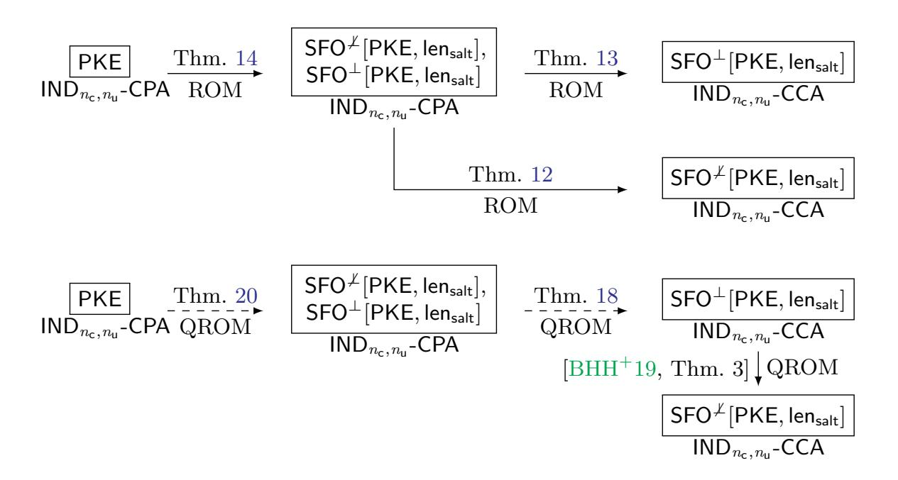
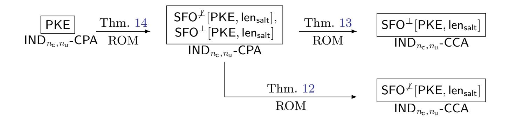

{0}------------------------------------------------

# **On The Multi-target Security of Post-Quantum Key Encapsulation Mechanisms**

Lewis Glabush<sup>1</sup> , Kathrin Hövelmanns<sup>2</sup> , and Douglas Stebila<sup>3</sup>

- <sup>1</sup> École Polytechnique Fédérale de Lausanne, Switzerland lewis.glabush@epfl.ch
- <sup>2</sup> Eindhoven University of Technology, The Netherlands kathrin@hoevelmanns.net
  - <sup>3</sup> University of Waterloo, Canada dstebila@uwaterloo.ca

**Abstract.** Practical deployments of key encapsulation mechanisms (KEMs) may entail large servers each using their public keys to communicate with potentially millions of clients simultaneously. While the standard IND-CCA security definition for KEMs considers only a single challenge public key and single challenge ciphertext, it can be relevant to consider *multi-target* scenarios where the adversary aims to break one of many challenge ciphertexts, for one of many challenge public keys. Many post-quantum KEMs have been built by applying the Fujisaki–Okamoto (FO) transform to a public key encryption (PKE) scheme. Although the FO transform incurs only a few bits of security loss for the standard, single-challenge IND-CCA property, this does not hold in the multi-target setting. Attacks have been identified against standards-track FO-based KEMs with 128-bit message spaces (FrodoKEM-640 and HQC-128) which become feasible if the adversary is given many challenge ciphertexts (say, 2 <sup>64</sup>). These attacks exploit the deterministic encryption induced by the FO transform which allows the IND-CCA experiment to be reduced to a search problem on the message space, which in some cases may not be large enough to avoid collisions between pre-computation and challenge values. A cost effective way to amplify the hardness of this search problem is to add a random but public salt during encapsulation. While revised versions of FrodoKEM and HQC have used salts, there has been no proof showing that salting provides multi-ciphertext security. In this work, we formally analyze a salted variant of the Fujisaki–Okamoto transform, in the classical and quantum random oracle model (ROM); for the classical ROM, we show that multi-target IND-CCA security of the resulting KEM tightly reduces to the multi-target IND-CPA security of the underlying PKE. Our results imply that, for FrodoKEM and HQC at the 128-bit security level, replacing the FO transform with the salted variant can recover 62 bits of multi-target security, at the cost of a very small overhead increase.

{1}------------------------------------------------

**Keywords:** Fujisaki–Okamoto transform; key exchange; quantum random oracle model (QROM); post-quantum cryptography; multi-target security; FrodoKEM, HQC, ML-KEM

# **1 Introduction**

The Fujisaki–Okamoto (FO) transform [\[FO99,](#page-28-0)[FO13\]](#page-28-1) converts a weakly secure public-key encryption scheme into an IND-CCA-secure public-key encryption scheme. In the context of post-quantum cryptography, its adaptations for key encapsulation mechanisms (KEMs) given in [\[Den03,](#page-27-0)[HHK17\]](#page-28-2) received renewed attention and by now have become the de-facto standard for designing KEMs. Notably, all KEM submissions to the NIST Post-Quantum Cryptography standardization process which made it to later rounds used some variant of FO. Given that communications security protocols like TLS need to perform key exchanges, and that the best-studied post-quantum replacements so far are KEMs, it can be envisioned that the future security of such protocols will be based (among others) on some variant of FO.

**IND-CCA vs. multi-target security.** The required security goal for KEMs during the NIST PQC process was IND-CCA security in the presence of quantum attackers. Within the last few years, the community made huge progress [\[HHK17,](#page-28-2) [BHH](#page-27-1)+19[,SXY18,](#page-29-0)[JZC](#page-29-1)<sup>+</sup>18[,HKSU20](#page-28-3)[,JZM19,](#page-29-2)[DFMS22,](#page-27-2)[HHM22,](#page-28-4)[HM24\]](#page-28-5) in analyzing whether the FO-transform meets this goal by developing more sophisticated formalisms to capture quantum attackers. It can be argued, however, that IND-CCA security alone is not enough in practice, when attackers can observe client-server interactions over a long period of time and then exploit the large collection of public keys and ciphertexts that amounted during these interactions. It would hence be desirable to bound the security of the exchanged keys even if adversaries can observe and attack many public keys and/or ciphertexts: this is *multi-target security*. Of particular concern in the multi-target setting are generic collision finding attacks, such as those identified against the NIST PQC candidates FrodoKEM and HQC demonstrate that IND-CCA security may sufficiently degrade in the multi-target setting to enable real security threats. The attacks make use of the fact that the KEMs are built by applying FOto a public key encryption (PKE), leading to a ciphertext space that is the same size as the message space. While this attack formally falls out of the scope of IND-CCA security, it nonetheless exposes an important vulnerability, which motivates the study into techniques for establishing multi-target security in KEMs.

**A reminder on security level.** Our main contribution is a proof that, for certain well-motivated parameters, the SFO "recovers 62 bits of security" compared

K.H. was supported by an NWO VENI grant (Project No. VI.Veni.222.397). D.S was supported by Natural Sciences and Engineering Research Council of Canada (NSERC) Discovery grant RGPIN-2022-03187 and NSERC Alliance grant ALLRP 578463-22.

{2}------------------------------------------------

to using the generic FO transform. Intuitively, a scheme has  $\kappa$  bits of security, if for any adversary  $\mathcal{A}$  that makes T random oracle queries, and has success probability  $\epsilon$ , it holds that

 $\left(\frac{T}{\epsilon}\right) \ge 2^{\kappa}.$ 

For our parameters, recovering 62 bits of security means that, an adversary against the multi-target security of an unsalted KEM making  $2^{64}$  random oracle queries may have advantage close to 1, but against a salted variant of the same KEM would require  $2^{162}$  queries to have similar advantage.

**The Fujisaki–Okamoto transform.** A modern way of understanding the FO-transform is the modular approach of [HHK17], in which the FO transformation for KEMs was dissected into two separate steps: a pre-transformation T converting a probabilistic PKE scheme into a deterministic one; and a transform U converting a PKE to a KEM. The combination is denoted  $FO := U \circ T$ .

- T : PKE  $\rightarrow$  DPKE : this transform modifies the probabilistic encryption algorithm so that, rather than computing  $c \leftarrow \mathsf{Enc}(pk, m; r)$  for uniformly encryption randomness r, instead it computes

$$c \leftarrow \mathsf{Enc}_1(pk, m) \leftarrow \mathsf{Enc}(pk, m; \mathsf{G}(m)),$$

where G is a hash function, modeled as a random oracle during security proofs. Decryption is also modified by introducing a re-encryption check:  $\operatorname{Dec}_1(sk,c)$  still first computes  $m' \leftarrow \operatorname{Dec}(sk,c)$ , but after that, it checks whether  $\operatorname{Enc}(pk,m';\mathsf{G}(m'))=c$  and only returns m' if it does. (Otherwise,  $\operatorname{Dec}_1$  rejects.)

–  $U: \mathsf{PKE} \to \mathsf{KEM}:$  this transform builds an IND-CCA-secure KEM from a PKE by letting

$$(c \leftarrow \mathsf{Enc}(pk, m) \leftarrow \mathsf{Encaps}(pk), \mathbf{ss} \leftarrow \mathsf{H}(m, c))$$

for a randomly chosen message m. Decaps likewise, will return  $\mathsf{H}(m,c)$  unless c fails to decrypt. Two variants of  $\mathsf{U}$  are given in [HHK17], called  $\mathsf{U}^\perp$  and  $\mathsf{U}^\perp$ ; with superscripts  $\bot$  and  $\not\bot$  describing how invalid ciphertexts are handled: if c fails to decrypt,  $\mathsf{U}^\perp$  will return a dedicated error symbol  $\bot$ , whereas  $\mathsf{U}^\perp$  will return a pseudorandom value of the same length as an honestly generated key. These variants can be further subdivided based on which values are included as hash inputs for  $\mathsf{ss}\colon \mathsf{U}_m^\perp$  and  $\mathsf{U}_m^\vee$  only hash m instead of m,c. Follow-up work [BHH+19] proved that security is unaffected by the choice between the two hash input options, assuming the re-encryption check is included (so when the step is explicitly added to  $\mathsf{U}$  or when  $\mathsf{U}$  simply is combined with  $\mathsf{T}$ ).

Multi-user and multi-ciphertext security. Multi-target security refers to attack models parameterized by the number of users  $n_{\rm u}$ , and the number of challenge ciphertexts  $n_{\rm c}$ . A multi-ciphertext (sometimes also called multi-challenge) attack refers to the case with  $n_{\rm u}=1$  and  $n_{\rm c}\geq 1$ , with  $n_{\rm c}$  total challenge ciphertexts. Likewise, multi-user (sometimes called multi-key) security refers to

{3}------------------------------------------------

the scenario with  $n_{\rm u} \geq 1$  and  $n_{\rm c} = 1$ , with  $n_{\rm u}$  total challenge ciphertexts. A multi-target attack may have both  $n_{\rm u} \geq 1$  and  $n_{\rm c} \geq 1$ , with  $n_{\rm u} n_{\rm c}$  total challenge ciphertexts.

Multi-ciphertext attack on KEMs with "small" message space. We now revisit a generic attack on any KEM := FO[PKE, G, H], built from a PKE scheme with comparably small message space. For the sake of giving an example, we pick size 2<sup>128</sup>, which is the case for both FrodoKEM-640 and HQC-128, proposed in [NAB<sup>+</sup>20, AAB<sup>+</sup>22]. This multi-ciphertext attack was identified against FrodoKEM-640 privately by NIST [NIS21] and publicly by Bernstein |Ber22|, which led to an update of FrodoKEM |ABD<sup>+</sup>23a|. The same type of attack was identified by NIST against HQC  $|AAB^+22|$ . Suppose an attacker Acollected  $n_c$  many challenge ciphertexts  $c_1, \ldots, c_{n_c}$  belonging to a single user, and their attack goal is only to distinguish just one out of the  $n_c$  many corresponding keys from random. (Here, the choice between real and random is universal: for all challenges, the attacker either always sees a real key or always sees an independent random value.) For message space size  $2^{128}$  and a large but not infeasible number of challenge ciphertexts (for example  $2^{64}$ ), success is very likely. The adversary  $\mathcal{A}$ , given  $n_{\mathsf{c}}$  challenge ciphertexts  $c_1, \ldots, c_{n_{\mathsf{c}}}$ , also prepares N ciphertexts of their own, by sampling random messages and encrypting them deterministically. If there is any intersection between the set of challenge ciphertexts  $c_1, \ldots, c_{n_e}$ and  $\mathcal{A}$ 's own precomputed set  $c'_1, \ldots, c'_N, \mathcal{A}$  can easily win the game: since the intersection must stem from having picked a message m that was also used by one of the observed  $c_i$ ,  $\mathcal{A}$  can compute the corresponding key  $\mathbf{ss} = \mathsf{H}(m, c_i)$  and thus immediately can tell this challenge apart from random. To estimate the probability with which this kind of collision will happen, we note that for each challenge ciphertext  $c_i$ , there is approximately an  $N/2^{128}$  chance that  $c_i$  used the same message as one of  $\mathcal{A}$ 's ciphertexts  $c_1, \ldots, c'_N$ . Over the  $n_c$  many challenge ciphertexts, the probability of A sampling a collision is thus

$$\Pr[\mathsf{COLL}] \approx \frac{\mathit{Nn}_\mathsf{c}}{2^{128}}.$$

If  $\mathcal{A}$  is given, say,  $n_c = 2^{64}$  many challenges, then, by preparing  $N = 2^{64}$  ciphertexts of their own,  $\mathcal{A}$  will find a collision with constant probability and thus break multi-ciphertext security. With a smaller bound (think  $2^{32}$ ) on the number of challenges for a single user, we observe linear security degradation, essentially dropping bits of multi-ciphertext security proportional to  $n_c$ .

Mitigation of multi-ciphertext attacks via salted FO. As seen above, for small message spaces, FO-based KEMs will be susceptible to multi-ciphertext attacks. But depending on the concrete PKE scheme at hand, increasing the message space size might render it prohibitively inefficient. For example, increasing the message space in FrodoKEM requires increasing the LWE matrix size, substantially impacting communication sizes. The FrodoKEM update [ABD<sup>+</sup>23a] thus modified their FO transform to include a uniformly random, public salt, that aimed to mitigate collisions based on too-small message spaces by increasing the search space via salting. Instead of only hashing the message and ciphertext, this

{4}------------------------------------------------

modified transform additionally hashes a uniformly random salt of length len<sub>salt</sub> (which is then communicated along with the ciphertext). While the FrodoKEM teams updated specification provided a proof that this tweak does not degrade IND-CCA security, it did not give a proof that the salted version actually improves multi-target security.

Our contributions. Our contribution is a study of transforms to achieve multi-target security for post-quantum KEMs. We formalize the salted Fujisaki-Okamoto (SFO) transform and prove that it yields KEMs for which multi-target IND-CCA security follows from multi-target IND-CPA security of the underlying PKE. Concretely, using the generic (unsalted) FO transform on a PKE with 128bit message space will cause a loss of  $\log_2 n_c$  bits of security (i.e., going from 128 bits of security to just 64, for  $2^{64}$  challenge ciphertexts). In our salted transform SFO, however, the reduction incurs a loss of security of around just 2 bits, which is consistent with the loss incurred in the single challenge setting. We give results for two variants of the SFO-transform, one that rejects invalid ciphertexts implicitly and one that does so explicitly, in both the random oracle model (ROM) and the quantum-accessible random oracle model (QROM). To do so, we capture multi-target security for  $n_{\rm u}$  many users and  $n_{\rm c}$  many ciphertexts-per-user via security notions we denote by  $\mathsf{IND}_{n_\mathsf{c},n_\mathsf{u}}\text{-}\mathsf{CPA}$  and  $\mathsf{IND}_{n_\mathsf{c},n_\mathsf{u}}\text{-}\mathsf{CCA}$ . For the standard FO transform (with public key hashing), the probability of  $\mathcal{A}$ , that makes  $q_{\mathsf{RO}}$ random oracle queries, successfully crafting a valid, colliding ciphertext would be upper-bounded by

<span id="page-4-0"></span>
$$\frac{2q_{\mathsf{RO}}(n_{\mathsf{u}}n_{\mathsf{c}}) + (n_{\mathsf{u}}n_{\mathsf{c}}^2)}{|\mathcal{M}|} . \tag{1}$$

For the SFO transform, each of the  $n_c$  challenges samples its own independent salt. With this change, we find that  $\mathcal{A}$ 's success probability is upper-bounded by

$$\frac{n_{\rm u} n_{\rm c}^2}{|\mathcal{M}| 2^{\rm len_{salt}}} + \frac{2tq_{\rm RO}}{|\mathcal{M}|} , \qquad (2)$$

where t is a small constant (see Section D). Considering the same concrete attacker resources mentioned in the attack section above, namely  $n_{\rm c}=2^{64}$  challenge ciphertexts and message space of size  $|\mathcal{M}|=2^{128}$ , the advantage of an adversary making  $2^{64}$  random oracle queries in Eq. (1) against an FO-transformed scheme becomes close to 1. On the other hand, in an SFO-transformed scheme, an adversary making  $2^{64}$  queries will have advantage around  $2^{-62}$ , which is within the target security level. We also show that the salted Fujisaki–Okamoto is secure even in the QROM regardless of its rejection mode, by deploying recently developing QROM techniques. Our results in the ROM are tight, meaning the success probability and run time of any  ${\rm IND}_{n_{\rm c},n_{\rm u}}$ -CCA adversary against the KEM are close to those of some  ${\rm IND}_{n_{\rm c},n_{\rm u}}$ -CPA adversary against the PKE. In the QROM, our bounds are non-tight, but in line with the state-of-the-art for quantum security proofs. This non-tightness of the reduction in the QROM is consistent with other FO literature [HHK17, DHK+21]. However, the incorporation of salting induces an even more significant improvement in the security in the QROM than it does

{5}------------------------------------------------

<span id="page-5-0"></span>

Fig. 1: Summary of our results on the salted Fujisaki–Okamoto (SFO) transform. Top: Tight results in the classical random oracle model (Section 4). Bottom: Non-tight results in the quantum random oracle model (Section 5).

in the ROM, precisely because it inflates the hardness of an induced search problem (see Section 6).

Existing results on multi-target security. Bellare et al. [BBM00] proved the following bound on multi-target IND-CCA security for a generic protocol:

$$\mathrm{Adv}^{\mathsf{IND}_{n_{\mathsf{c}},n_{\mathsf{u}}}\mathsf{-CCA}} \leq n_{\mathsf{u}} \cdot n_{\mathsf{c}} \cdot \mathrm{Adv}^{\mathsf{IND-CCA}}$$
.

For FO-based KEMs, significant improvement over the hybrid argument is possible, by reducing  $\mathrm{Adv}^{\mathsf{IND}_{n_c,n_u}\mathsf{-CCA}}$  to  $\mathrm{Adv}^{\mathsf{IND}\mathsf{-CPA}}$ , and then applying the hybrid argument only to  $\mathrm{Adv}^{\mathsf{IND}\mathsf{-CPA}}$ . Indeed, Duman et al. [DHK<sup>+</sup>21] give a bound for  $\mathsf{IND}_{n_c,n_u}\mathsf{-CCA}$  security for FO-based KEMs with implicit rejection. Adapted to our notation, and slightly different security model (see Remark 8), their theorem 3.1 yields

$$\mathrm{Adv}_{\mathsf{KEM}^{\mathcal{I}}}^{\mathsf{IND}_{n_{\mathsf{c}},n_{\mathsf{u}}}\mathsf{-CCA}} \leq 2\mathrm{Adv}_{\mathsf{PKE}}^{\mathsf{IND}_{n_{\mathsf{c}},n_{\mathsf{u}}}\mathsf{-CPA}} + \frac{n_{\mathsf{u}}n_{\mathsf{c}}^2 + 2n_{\mathsf{c}} \cdot q_{\mathsf{RO}}}{|\mathcal{M}|} + q_{\mathsf{RO}} \cdot \delta(n_{\mathsf{u}}) \ .$$

This bound was applied to Crystals-Kyber, for which  $|\mathcal{M}| = 2^{256}$  at the lowest security level. For  $|\mathcal{M}| = 2^{192}$  or smaller, as in FrodoKEM-640, FrodoKEM-976, HQC-128, HQC-192, and for  $n_c \geq 2^{64}$  this bound is not tight, since  $n_c q_{RO}$  may exceed  $2^{128}$ . One may wonder about scaling up the message space in HQC-128 and FrodoKEM-640, in order to apply existing bounds. This would achieve a similar multi-target security bound, as yielded by the SFO transform. However, at least for FrodoKEM, the salting technique has a small impact (less than 1%) on runtime and communication size, whereas doubling message size would come at substantial performance cost [ABD<sup>+</sup>23a].

{6}------------------------------------------------

# <span id="page-6-0"></span>**2 Preliminaries**

In this section we recall important definitions for correctness of public key encryption schemes and KEMs, as well as previous formulations of the FO transform.

#### **2.1 Public-key encryption**

A public-key encryption scheme PKE = (Gen*,* Enc*,* Dec) consists of three algorithms and a finite message space M. The key generation algorithm Gen outputs a key pair (*pk, sk*), with pk defining a randomness space R = R(pk). The encryption algorithm Enc, on input pk and a message *m* ∈ M, produces an encryption *c* ← Enc(*pk, m*) of *m* under the public key pk. If necessary, we explicitly specify the used randomness of encryption by writing *c* = Enc(*pk, m*; *r*), where *r* ←\$ R. The decryption algorithm Dec, on input sk and a ciphertext *c*, yields either a message *m* = Dec(*sk, c*) ∈ M or a special symbol ⊥ ∈ M*/* to show that *c* is not a valid ciphertext.

A key encapsulation mechanism KEM = (Gen*,* Encaps*,* Decaps) consists of three algorithms and a finite message space M. The key generation algorithm Gen outputs a key pair (*pk, sk*), with pk also defining a finite key space K. The encapsulation algorithm Encaps, on input pk, produces a tuple (*c,* **ss**) where *c* is said to be an encapsulation of the key **ss**. The decapsulation algorithm Decaps, on input sk and an encapsulation *c*, outputs either **ss** = Decaps(*sk, c*)or a special symbol ⊥ ∈ M*/* to show that *c* is not a valid encapsulation.

**Correctness notions.** Certain public key encryption schemes, for example those based on lattice problems, exhibit correctness errors. These occur when encrypting a message *m* ∈ M and then decrypting the result does not return *m*. There are several works [\[DGJ](#page-27-7)<sup>+</sup>19[,BS20,](#page-27-8)[DRV20,](#page-28-6)[FKK](#page-28-7)<sup>+</sup>22] showing how to attack schemes based on correctness errors. Hofheinz, Hövelmanns, and Kiltz [\[HHK17\]](#page-28-2) developed a statistical notion of correctness that is relevant to security proofs of modular FO transforms, which we recall here:

**Definition 1 (***δ***-correctness of a PKE).** *A public key encryption scheme* PKE = (Gen*,* Enc*,* Dec) *with message space* M *is called δ-correct if*

$$\mathbb{E}\left[\max_{m \in \mathcal{M}} \Pr[\mathsf{Dec}(sk, c) \neq m | c \leftarrow \mathsf{Enc}(pk, m)]\right] \leq \delta ,$$

*where the expectation is taken over* (*pk, sk*) ←\$ Gen() *and the probability is taken over the internal coins of* Enc*.*

**Definition 2 (***δ***-correctness of a KEM).** *A key encapsulation mechanism* KEM = (Gen*,* Encaps*,* Decaps) *with message space* M *is called δ-correct if*

$$\Pr[\mathsf{Decaps}(sk,c) \neq ss | (c,ss) \leftarrow \mathsf{Encaps}(\mathsf{pk})] \leq \delta$$
,

*where the probability is taken over the internal coins of* Gen() *and* Encaps*.*

{7}------------------------------------------------

```
 \begin{array}{c|c} \overline{\mathsf{T}.\mathsf{Enc}(pk,m):} & \overline{\mathsf{T}.\mathsf{Dec}(sk,c):} \\ \hline 01 & c \leftarrow \mathsf{Enc}(pk,m;\mathsf{G}(m)) & \overline{03} & m' \leftarrow \mathsf{Dec}(sk,c) \\ 02 & \mathbf{return} & c & 04 & \mathbf{if} & m' = \bot \text{ or } c \neq \mathsf{T}.\mathsf{Enc}(pk,m') \\ & 05 & \mathbf{return} & \bot \\ & 06 & \mathbf{else} & \mathbf{return} & m' \end{array}
```

Fig. 2: Algorithms of T[PKE, G].

Multi-user correctness. To capture settings with  $n_{\rm u}$  many users, we define a corresponding multi-user correctness term  $\delta(n_{\rm u})$  defined almost identically to  $\delta$ -correctness, for both PKEs and KEMs, except that we take the maximum probability over all  $j \in [n_{\rm u}]$  [DHK<sup>+</sup>21].

**Definition 3** ( $\gamma$ -spreadness). We say that PKE is  $\gamma$ -spread iff for all key pairs  $(pksk) \in \text{supp}(\mathsf{Gen})$  and all messages  $m \in \mathcal{M}$  it holds that

$$\max_{c \in \mathcal{C}} \Pr[\mathsf{Enc}(pk, m) = c] \le 2^{-\gamma} ,$$

where the probability is taken over the internal randomness of Enc.

#### 2.2 The Fujisaki–Okamoto Transform

In this section, we recall the definition of the FO transform as the composition of the two following transformations:

- the de-randomizing T-transform that additionally adds a re-encryption check to the decryption procedure; and
- augmented PKE-to-KEM U-transforms that derive session keys from a randomly chosen message m, which they encrypt using PKE. The two variants of U vary in their responses to invalid ciphertexts (U<sup> $\perp$ </sup> returns  $\perp$ , while U<sup> $\perp$ </sup> returns pseudo-random values).

**Definition 4 (The T-transform).** Let PKE = (Gen, Enc, Dec) and G be a hash function  $G : \mathcal{M} \to \mathcal{R}$ . The transformed deterministic PKE T[PKE, G] is defined in Fig. 2

We recall two variants of the PKE to KEM transformation used in the FO transform. We augment the transform of [HHK17], by including the public key in the inputs to the hash function H when preparing shared secrets, which is done for many KEMs in practice.

**Definition 5 (Augmented**  $U^{\perp}$  and  $U^{\perp}$  transform). Let PKE = (Gen, Enc, Dec) be a public key encryption scheme, and let H be a hash function. The transformed KEMs KEM $^{\perp} = U^{\perp}$ [PKE, H] and KEM $^{\perp} = U^{\perp}$ [PKE, H] are defined in Figure 3.

{8}------------------------------------------------

<span id="page-8-0"></span>

| $KEM^{\perp}.Gen()$                           | KEM.Encaps(pk)                          | $KEM^{\nensuremath{\not\perp}}.Decaps(sk',c)$       | $KEM^\perp.Decaps(\mathit{sk},\mathit{c})$ |
|-----------------------------------------------|-----------------------------------------|-----------------------------------------------------|--------------------------------------------|
| $\boxed{01 \ (pk, sk) \leftarrow \$ \ Gen()}$ | $05 \ m \leftarrow * \mathcal{M}$       | $\overline{\text{09 parse sk}' \leftarrow (sk, s)}$ | $14 \ m' \leftarrow Dec(sk,c)$             |
| 1                                             | 06 $c \leftarrow Enc(pk, m)$            | 10 $m' \leftarrow Dec(sk, c)$                       | 15 <b>if</b> $m' = \bot$                   |
| ` ' '                                         | 07 $\mathbf{ss} \leftarrow H(pk, m, c)$ | 11 if $m' = \bot$                                   | 16 return $\perp$                          |
| 04 return $(pk, sk')$                         | 08 return $(ss, c)$                     | 12 <b>return</b> $H(pk, s, c)$                      | 17 <b>return</b> $H(pk, m', c)$            |
|                                               |                                         | 13 <b>return</b> $H(pk, m', c)$                     |                                            |

Fig. 3:  $\mathsf{KEM}^{\not\perp}$  and  $\mathsf{KEM}^{\perp}$  constructed by the augmented  $\mathsf{U}^{\not\perp}$  and  $\mathsf{U}^{\perp}$  transforms to a PKE respectively. The only difference from the original  $\mathsf{U}^{\not\perp}$  and  $\mathsf{U}^{\perp}$  transforms is that when deriving the session key, we additionally hash in  $\mathsf{pk}$ . Note that for explicit rejection, the key generation algorithm inherited from the underlying PKE, and that Encaps is the same for either rejection mode.

#### 2.3 Multi-target security notions

We now adapt the relevant standard notions for PKE schemes and KEMs to the multi-target (multi-user, multi-ciphertext) setting. The definitions thus are relative to  $n_{\rm c}$ , the number of challenge-ciphertexts-per-user, and  $n_{\rm u}$ , the number of users.

Definition 6 (multi-target IND-CPA security (IND<sub> $n_c,n_u$ </sub>-CPA) for PKE). Let PKE be a public key encryption scheme, let  $n_u$  and  $n_c$  be positive integers, and let  $\mathcal A$  be an adversary in the experiment  $\operatorname{Exp}_{\mathsf{PKE}}^{\mathsf{IND}_{n_c,n_u}\mathsf{-CPA}}(\mathcal A)$  shown in Fig. 4. The  $\mathsf{IND}_{n_c,n_u}\mathsf{-CPA}$  advantage function of an adversary  $\mathcal A$  against  $\mathsf{PKE}$  is

$$\mathrm{Adv}_{\mathsf{PKE}}^{\mathsf{IND}_{n_{\mathsf{c}},n_{\mathsf{u}}}\mathsf{-CPA}}(\mathcal{A}) := \left| \mathrm{Pr}\left[ \mathrm{Exp}_{\mathsf{PKE}}^{\mathsf{IND}_{n_{\mathsf{c}},n_{\mathsf{u}}}\mathsf{-CPA}}(\mathcal{A}) \Rightarrow 1 \right] - \frac{1}{2} \right| \ .$$

<span id="page-8-1"></span>
$$\frac{\operatorname{Exp}_{\mathsf{PKE}}^{\mathsf{IND}_{n_{\mathsf{c}},n_{\mathsf{u}}}\mathsf{-CPA}}(\mathcal{A})}{\mathsf{01} \ b \leftarrow \$ \left\{ 0,1 \right\}} \qquad \frac{\mathsf{CHALL}_{j}(m_{0},m_{1})}{\mathsf{07} \ \mathbf{return} \ \mathsf{Enc}(pk_{j},m_{b})} \ \mathsf{Mat} \ \mathsf{most} \ n_{\mathsf{c}} \ \mathsf{queries} \\ \mathsf{02} \ \mathbf{for} \ j = 1,...,n_{\mathsf{u}} \\ \mathsf{03} \ \ (pk_{j},sk_{j}) \leftarrow \$ \ \mathsf{Gen}() \\ \mathsf{04} \ \ p\vec{k} = (pk_{1},...,pk_{n_{\mathsf{u}}}) \\ \mathsf{05} \ \ b' \leftarrow \mathcal{A}^{\mathsf{CHALL}_{1},...,\mathsf{CHALL}_{n_{\mathsf{u}}}}(p\vec{k}) \\ \mathsf{06} \ \ \mathbf{return} \ \llbracket b = b' \rrbracket$$

Fig. 4: multi-target security experiment ( $\mathsf{IND}_{n_\mathsf{c},n_\mathsf{u}}\text{-}\mathsf{CPA}$ ) against a public key encryption scheme PKE, with  $n_\mathsf{u}$  users and  $n_\mathsf{c}$  ciphertexts-per-user.

Definition 7 (multi-target IND-CCA security (IND<sub> $n_c,n_u$ </sub>-CCA) for KEM). Let KEM be a key encapsulation mechanism, let  $n_u$  and  $n_c$  be positive integers,

{9}------------------------------------------------

and let  $\mathcal{A}$  be an adversary in the experiment  $\operatorname{Exp}_{\mathsf{KEM}}^{\mathsf{IND}_{n_\mathsf{c},n_\mathsf{u}}\mathsf{-CCA}}(\mathcal{A})$  shown in Fig. 5. The  $\mathsf{IND}_{n_\mathsf{c},n_\mathsf{u}}\mathsf{-CCA}$  advantage function of an adversary  $\mathcal{A}$  against  $\mathsf{KEM}$  is

$$\operatorname{Adv}_{\mathsf{KEM}}^{\mathsf{IND}_{n_{\mathsf{c}},n_{\mathsf{u}}}\mathsf{-CCA}}(\mathcal{A}) := \left| \operatorname{Pr} \left[ \operatorname{Exp}_{\mathsf{KEM}}^{\mathsf{IND}_{n_{\mathsf{c}},n_{\mathsf{u}}}\mathsf{-CCA}}(\mathcal{A}) \Rightarrow 1 \right] - \frac{1}{2} \right| \ .$$

```
 \begin{array}{|l|l|l|} \hline \operatorname{Exp}_{\mathsf{KEM}}^{\mathsf{IND}_{n_\mathsf{c},n_\mathsf{u}}\mathsf{-CCA}}(\mathcal{A}) & & & & & & \\ \hline 01 & b \leftarrow \$ \left\{0,1\right\} & & & & & \\ 02 & \mathbf{for} \ j = 1,...,n_\mathsf{u} & & & \\ 03 & (pk_j,sk_j) \leftarrow \$ \ \mathsf{Gen}() & & & & \\ 04 & p\vec{k} = (pk_1,...,pk_{n_\mathsf{u}}) & & & \\ 05 & b' \leftarrow \mathcal{A}^{\mathsf{DECAPS},\mathsf{CHALL}_1,...,\mathsf{CHALL}_{n_\mathsf{u}}}(\vec{pk}) & & & \\ 06 & \mathbf{return} \ \llbracket b = b' \rrbracket & & & \\ \hline \end{array} \begin{array}{|l|l|l|} & & & & \\ \hline \end{array} \begin{array}{|l|l|l|} & & & & \\ \hline \end{array} \begin{array}{|l|l|l|} & & & & \\ \hline \end{array} \begin{array}{|l|l|l|} & & & & \\ \hline \end{array} \begin{array}{|l|l|l|} & & & & \\ \hline \end{array} \begin{array}{|l|l|l|} & & & & \\ \hline \end{array} \begin{array}{|l|l|} & & & & \\ \hline \end{array} \begin{array}{|l|l|} & & & & \\ \hline \end{array} \begin{array}{|l|l|} & & & & \\ \hline \end{array} \begin{array}{|l|l|} & & & & \\ \hline \end{array} \begin{array}{|l|l|} & & & \\ \hline \end{array} \begin{array}{|l|l|} & & & \\ \hline \end{array} \begin{array}{|l|l|} & & & \\ \hline \end{array} \begin{array}{|l|l|} & & & \\ \hline \end{array} \begin{array}{|l|l|} & & & \\ \hline \end{array} \begin{array}{|l|l|} & & & \\ \hline \end{array} \begin{array}{|l|l|} & & & \\ \hline \end{array} \begin{array}{|l|l|} & & & \\ \hline \end{array} \begin{array}{|l|} & & & \\ \hline \end{array} \begin{array}{|l|} & & & \\ \hline \end{array} \begin{array}{|l|} & & \\ \hline \end{array} \begin{array}{|l|} & & \\ \hline \end{array} \begin{array}{|l|} & & \\ \hline \end{array} \begin{array}{|l|} & & \\ \hline \end{array} \begin{array}{|l|} & & \\ \hline \end{array} \begin{array}{|l|} & & \\ \hline \end{array} \begin{array}{|l|} & & \\ \hline \end{array} \begin{array}{|l|} & & \\ \hline \end{array} \begin{array}{|l|} & & \\ \hline \end{array} \begin{array}{|l|} & & \\ \hline \end{array} \begin{array}{|l|} & & \\ \hline \end{array} \begin{array}{|l|} & & \\ \hline \end{array} \begin{array}{|l|} & & \\ \hline \end{array} \begin{array}{|l|} & & \\ \hline \end{array} \begin{array}{|l|} & & \\ \hline \end{array} \begin{array}{|l|} & & \\ \hline \end{array} \begin{array}{|l|} & & \\ \hline \end{array} \begin{array}{|l|} & & \\ \hline \end{array} \begin{array}{|l|} & & \\ \hline \end{array} \begin{array}{|l|} & & \\ \hline \end{array} \begin{array}{|l|} & & \\ \hline \end{array} \begin{array}{|l|} & & \\ \hline \end{array} \begin{array}{|l|} & & \\ \hline \end{array} \begin{array}{|l|} & & \\ \hline \end{array} \begin{array}{|l|} & & \\ \hline \end{array} \begin{array}{|l|} & & \\ \hline \end{array} \begin{array}{|l|} & & \\ \hline \end{array} \begin{array}{|l|} & & \\ \hline \end{array} \begin{array}{|l|} & & \\ \hline \end{array} \begin{array}{|l|} & & \\ \hline \end{array} \begin{array}{|l|} & & \\ \hline \end{array} \begin{array}{|l|} & & \\ \hline \end{array} \begin{array}{|l|} & & \\ \hline \end{array} \begin{array}{|l|} & & \\ \hline \end{array} \begin{array}{|l|} & & \\ \hline \end{array} \begin{array}{|l|} & & \\ \hline \end{array} \begin{array}{|l|} & & \\ \hline \end{array} \begin{array}{|l|} & & \\ \hline \end{array} \begin{array}{|l|} & & \\ \hline \end{array} \begin{array}{|l|} & & \\ \hline \end{array} \begin{array}{|l|} & & \\ \hline \end{array} \begin{array}{|l|} & & \\ \hline \end{array} \begin{array}{|l|} & & \\ \hline \end{array} \begin{array}{|l|} & & \\ \hline \end{array} \begin{array}{|l|} & & \\ \hline \end{array} \begin{array}{|l|} & & \\ \hline \end{array} \begin{array}{|l|} & & \\ \hline \end{array} \begin{array}{|l|} & & \\ \hline \end{array} \begin{array}{|l|} & & \\ \hline \end{array} \begin{array}{|l|} & & \\ \hline \end{array} \begin{array}{|l|} & & \\ \hline \end{array} \begin{array}{|l|} & & \\ \hline \end{array} \begin{array}{|l|} & & \\ \hline \end{array} \begin{array}{|l|} & & \\ \hline \end{array} \begin{array}{|l|} & & \\ \hline \end{array} \begin{array}{|l|} & & \\ \hline \end{array} \begin{array}{|l|} & & \\ \hline \end{array} \begin{array}{|l|} & & \\ \hline \end{array} \begin{array}{|l|} & & \\ \hline \end{array} \begin{array}{|l|} & & \\ \hline \end{array} \begin{array}{|l|} & & \\ \hline \end{array} \begin{array}{|l|} & & \\ \hline \end{array} \begin{array}{|l|} & & \\ \hline \end{array} \begin{array}{|l|} & & \\ \hline \end{array} \begin{array}{|l|} & & \\ \hline \end{array} \begin{array}{|l|} & & \\ \hline \end{array} \begin{array}{|l|} & & \\ \hline \end{array} \begin{array}{|l|} & & \\ \hline \end{array} \begin{array}{|l|} & & \\ \hline \end{array} \begin{array}{|l|} & & \\ \hline \end{array} \begin{array}{|l|} & & \\ \hline \end{array} \begin{array}{|l|} & & \\ \hline \end{array} \begin{array}{|l|} & & \\ \hline \end{array}
```

<span id="page-9-2"></span>Fig. 5: multi-target security experiment ( $IND_{n_c,n_u}$ -CCA) against a key encapsulation mechanism KEM, with  $n_u$  users and  $n_c$  encapsulations.

Omitting the oracle DECAPS on line 05 in Figure 5 yields  $\mathsf{IND}_{n_\mathsf{c},n_\mathsf{u}}\text{-}\mathsf{CPA}$  security for a KEM.

<span id="page-9-0"></span>Remark 8. There are many choices to be made in modeling multi-target security. The model of  $[DHK^+21]$  differs slightly from ours in that they use a single challenge oracle, which takes an index as input. Their model allows the adversary to concentrate all queries on a single user. Our model aligns with that of [BBM00], where challenge queries are restricted per-user, and the total number of challenges is bounded by  $n_u \cdot n_c$ . We believe that this notion better captures realistic attack scenarios, and yields cleaner analysis.

Another consideration in modeling multi-target security is whether b should be global, or sampled independently for each user. In the latter scenario, the adversary wins if they provide an index, and output associated challenge bit at that index. In [HS21] Heum and Stam consider the impact of opting for global bit vs. bit-per-user security notions and recommend the former, as it is proven to be strictly stronger.

**Public key hashing.** To mitigate multi-user attacks, a common security measure is to tie ciphertexts and their decapsulations to the user's public key by including pk into the input to the hash function used to derive encryption randomness and session keys. However, hashing all of pk can be a costly measure, especially in lattice-based schemes where public keys are large matrices, rather than short bit strings. In many cases, it may already be enough to hash only a bit string that uniquely identifies the public key: Duman et al. [DHK<sup>+</sup>21] show that, for an identifying function with sufficient entropy, one can get the same security level,

{10}------------------------------------------------

with a significant decrease in overhead, with experimental results showing that overhead could be reduced by over 30% for certain lattice-based KEMs. This amounts to hashing a small, unpredictable part of *pk*, by using an identifying function ID : *pk* → {0*,* 1} *ℓ* . This technique is known as *prefix hashing*.

Results on a transformation that use the full public key can be adapted to a transformation that uses prefix hashing as follows. Insert before the first game-hop a new game that aborts if there are colliding public key identifiers, namely if there are indices *i* ̸= *j* with ID(*pki*) = ID(*pkj*). By the birthday bound, the probability of a collision is *<sup>n</sup>* 2 <sup>u</sup>*/*<sup>2</sup> *ℓ* . Provided that there are no collisions, each public key has a unique identifier. The rest of the security analysis can thus proceed as in the full-key-hashing case and results incurs only an additional term *n* 2 <sup>u</sup>*/*<sup>2</sup> *ℓ* .

# <span id="page-10-1"></span>**3 The Salted FO transform**

In this section, we formalize the salting countermeasure introduced in [\[ABD](#page-27-4)<sup>+</sup>23a] to thwart collision attacks. The countermeasure introduces a uniformly random salt in the encryption process, so that the chance of a collision between the pre-computed ciphertexts and the challenge ciphertexts depends not only on the message space size |M| and the number of collected ciphertexts *n*c, but also on the length of the uniformly random salt. We formalize this approach as a modified T-transform which we call the *salted* T*-transform* (the ST-transform).

**Definition 9 (**ST**-transform).** *Let* PKE = (Gen*,* Enc*,* Dec) *be a public-key encryption scheme, let* G *be a hash function, and let* lensalt *be a non-negative integer. To* PKE*,* G *and* lensalt *we associate public-key encryption scheme*

$$\mathsf{ST}[\mathsf{PKE},\mathsf{G}] = \mathsf{PKE}_1 = (\mathsf{Gen},\mathsf{Enc}_1,\mathsf{Dec}_1) \; ,$$

*with algorithms* Enc<sup>1</sup> *and* Dec<sup>1</sup> *defined in Fig. [6.](#page-10-0)*

```
ST[PKE,G].Enc1(pk, m)
01 salt ←$ {0, 1}
                 lensalt
02 r ← G(pk, m∥salt)
03 c ← PKE.Enc(pk, m; r)
04 return c∥salt
                                   ST[PKE,G].Dec1(sk, c∥salt)
                                   05 m
                                         ′ ← PKE.Dec(sk, c)
                                   06 r
                                        ′ ← G(pk, m
                                                    ′
                                                     ∥salt)
                                   07 if m
                                           ′ = ⊥ or PKE.Enc(pk, m
                                                                     ′
                                                                      ; r
                                                                        ′
                                                                         ) ̸= c
                                   08 return ⊥
                                   09 else return m
                                                       ′
```

Fig. 6: Public key encryption scheme ST[PKE*,* G] constructed by the salted Ttransform. ST deviates from [\[HHK17\]](#page-28-2)'s FO T-transform in two ways: to increase the search space, ST includes salts; and ST binds ciphertexts to their users by additionally tying the encryption randomness to pk.

{11}------------------------------------------------

The resulting salted KEMs. The FO-transform is usually obtained by composing the T-transform with one of [HHK17]'s PKE-to-KEM transformations  $U \in \{U^{\perp}, U^{\not\perp}\}$ . Similarly, we obtain the salted FO transformations by combining U with the salted T-transform ST.

**Definition 10** (SFO $^{\perp}$  and SFO $^{\perp}$  transforms). For a public key encryption scheme PKE, a salt length parameter len<sub>salt</sub>, and hash functions G, H, the salted FO transforms yield the KEMs

```
\mathsf{KEM}^{\not\perp} := \mathsf{SFO}^{\not\perp}[\mathsf{PKE},\mathsf{G},\mathsf{H},\mathsf{len_{salt}}] and \mathsf{KEM}^{\bot} := \mathsf{SFO}^{\bot}[\mathsf{PKE},\mathsf{G},\mathsf{H},\mathsf{len_{salt}}] with algorithms described in Figure 7 respectively.
```

Remark 11. Certain results of this paper, such as Theorem 14 refer to KEMs such as  $KEM := SFO[PKE, G, H, len_{salt}]$  with no rejection mode specified. In those cases, the result holds regardless of which rejection mode is used.

```
KEM^{\perp}. Decaps(sk, c||salt)
                                                                                                                                      KEM^{\perp}. Decaps(sk, c||salt)
KEM<sup>⊥</sup>.Gen()
                                     KEM.Encaps(pk)
\overline{\texttt{01} \ (pk, sk)} \leftarrow \texttt{\$} \, \mathsf{Gen}() \ \overline{\texttt{05} \ \mathsf{salt}} \leftarrow \texttt{\$} \, \{0, 1\}^{\mathsf{len}_{\mathsf{salt}}}
                                                                                    10 parse sk' = (sk, s)
                                                                                                                                      17 m' \leftarrow \mathsf{Dec}(sk, c)
02 s \leftarrow M
                                    06 r \leftarrow \mathsf{G}(pk, m || \mathsf{salt})
                                                                                    11 m' \leftarrow \mathsf{Dec}(sk, c)
                                                                                                                                      18 r \leftarrow \mathsf{G}(pk, m'||\mathsf{salt})
03 sk' \leftarrow (sk, s)
                                                                                                                                       19 c' \leftarrow \mathsf{Enc}(pk, m'; r)
                                    07 c \leftarrow \mathsf{PKE}.\mathsf{Enc}(pk, m; r) 12 r \leftarrow \mathsf{G}(pk, m' \| \mathsf{salt})
04 return (pk, sk') 08 ss \leftarrow H(pk, m, c \parallel salt)
                                                                                    13 c' \leftarrow \mathsf{Enc}(pk, m'; r)
                                                                                                                                       20 if m' = \bot or c \neq c'
                                                                                    14 if m' = \bot or c \neq c'
                                                                                                                                      21 return \perp
                                    09 return (ss, c \parallel salt)
                                                                                    15 return H(pk, s, c||salt)
                                                                                                                                      22 return H(pk, m', c||salt)
                                                                                    16 return H(pk, m', c||salt)
```

Fig. 7:  $\mathsf{KEM}^{\not\perp}$  from the salted FO transforms  $\mathsf{SFO}^{\not\perp}$  and  $\mathsf{SFO}^{\perp}$ . Note that for explicit rejection, the key generation algorithm is inherited from the underlying PKE, and that  $\mathsf{Encaps}$  is the same for either rejection mode.

Other possible variants. One could also define a version of the SFO transform, which does not include the ciphertext as input to H during encapsulation and decapsulation. This would entail composing the ST-transform with either  $\mathsf{U}_m^\perp$  or  $\mathsf{U}_m^{\not\perp}$  from [HHK17]. Bindel et al. [BHH+19] show that in the single-challenge setting, deriving a KEM key as  $\mathsf{H}(m)$  equivalent to using  $\mathsf{H}(m,c)$  in that the IND-CCA security of either KEM is equivalent. To briefly summarize, the argument provided there is that for  $\mathsf{KEM}_1 = \mathsf{U}_{m,c}[\mathsf{PKE},\mathsf{H}_1]$  and  $\mathsf{KEM}_2 = \mathsf{U}_m[\mathsf{PKE},\mathsf{H}_2]$ , an adversary against the IND-CCA security of  $\mathsf{KEM}_2$  can perfectly simulate the IND-CCA game for  $\mathsf{KEM}_1$  by sampling a new random oracle H and setting

$$\mathsf{H}_1(m,c) = \begin{cases} \mathsf{H}_2(m), & \text{if } c = \mathsf{Enc}(pk,m), \\ \mathsf{H}(m,c), & \text{otherwise.} \end{cases}$$

In the other direction, an adversary against the IND-CCA security of  $KEM_1$  can simulate the IND-CCA game for  $KEM_2$  by letting  $H_2(m) \leftarrow H_1(m, Enc(pk, m))$ .

{12}------------------------------------------------

This equivalence does not extend to the multi-user (or, for that matter, multitarget) setting, as there would be  $n_{\rm u}$  public keys to consider. In fact, H(m) is in no way connected to the public key of any user, while  $H(m, c \leftarrow {\sf Enc}(pk_j, m))$  is. However, if the public key hash is included, a similar argument does hold, with the simulation being

$$\mathsf{H}_1(pk_j,m,c) = \begin{cases} \mathsf{H}_2(pk_j,m), & \text{if } c = \mathsf{Enc}(pk_j,m), \\ \mathsf{H}(pk_j,m,c), & \text{otherwise.} \end{cases}$$

The difference being that now the adversary is required to have knowledge of the public key in either case. Our work focuses on the SFO variant which hashes both m and c, since this is consistent with FrodoKEM and HQC.

## <span id="page-12-0"></span>4 Security proofs in the ROM

In this section, we prove  $\mathsf{IND}_{n_\mathsf{c},n_\mathsf{u}}\mathsf{-CCA}$  security for KEMs built from the SFO transform. We break up our results into smaller theorems, for the purpose of making them easier to follow. First, we use known methods to show how to simulate a decapsulation oracle, for implicit and explicit rejection KEMs. This shows that if SFO achieves  $\mathsf{IND}_{n_\mathsf{c},n_\mathsf{u}}\mathsf{-CPA}$  security, then it also achieves  $\mathsf{IND}_{n_\mathsf{c},n_\mathsf{u}}\mathsf{-CCA}$  security. These results are largely unaffected by the incorporation of salting, and could be derived from existing literature, especially  $[\mathsf{DHK}^+21]$ , by an informed reader. Thus, we omit the proofs from the main body of our work, and instead include them in Section B. Then we prove that the SFO transform tightly preserves  $\mathsf{IND}_{n_\mathsf{c},n_\mathsf{u}}\mathsf{-CPA}$  security in transforming a PKE to a KEM, where the salting introduces more novel aspects.

# 4.1 Simulating the decapsulation oracle in the ROM: $IND_{n_c,n_u}$ -CPA to $IND_{n_c,n_u}$ -CCA

In the following theorems, we show that one can simulate decapsulation oracles with either implicit or explicit rejection for (S)FO-based KEMs. These techniques have been used in [Den03, HHK17, DHK+21, HHM22, HM24], usually in conjunction with other proof steps, to provide a monolithic reduction between IND-CCA security of a KEM, to IND-CPA security of a PKE. Intuitively, we apply a series of modifications to the decapsulation oracle, which remove dependence on the secret key, and bound the changes that occur at each step. We then apply a patching technique to ensure that the outputs of H, the random oracle used for producing KEM keys, will match the output of Decaps. The full proofs can be found in Section B.

<span id="page-12-2"></span>Theorem 12 (Simulation of Decaps). Let  $KEM^{\not\perp} = SFO^{\not\perp}[PKE, G, H, len_{salt}]$ For any  $IND_{n_c,n_u}$ -CCA adversary  $\mathcal{B}$  against  $KEM^{\not\perp}$ , issuing at most  $q_H$  queries to H, and  $q_D$  queries to  $Decaps^{\not\perp}$ , there exists an  $IND_{n_c,n_u}$ -CPA adversary  $\mathcal{A}$ against  $KEM^{\not\perp}$  such that

<span id="page-12-1"></span>
$$\mathrm{Adv}_{\mathsf{KEM}^{\mathcal{I}}}^{\mathsf{IND}_{n_{\mathsf{c}},n_{\mathsf{u}}}\mathsf{-CCA}}(\mathcal{B}) \leq \mathrm{Adv}_{\mathsf{KEM}^{\mathcal{I}}}^{\mathsf{IND}_{n_{\mathsf{c}},n_{\mathsf{u}}}\mathsf{-CPA}}(\mathcal{A}) + \frac{q_{\mathsf{H}}}{|\mathcal{M}|} + (q_{\mathsf{H}} + q_{D}) \cdot \delta(n_{\mathsf{u}})$$

{13}------------------------------------------------



Fig. 8: Summary of our results on the salted Fujisaki–Okamoto (SFO) transform in the ROM.

Theorem 13 (Simulation of DECAPS<sup> $\perp$ </sup>). Let KEM<sup> $\perp$ </sup> = SFO<sup> $\perp$ </sup>[PKE, G, H, len<sub>salt</sub>] For any IND<sub> $n_c,n_u$ </sub>-CCA adversary  $\mathcal B$  against KEM<sup> $\perp$ </sup>, issuing at most  $q_H$  queries to H, and  $q_D$  queries to DECAPS<sup> $\perp$ </sup>, there exists an IND<sub> $n_c,n_u$ </sub>-CPA adversary  $\mathcal A$  against KEM<sup> $\perp$ </sup> such that

$$\mathrm{Adv}_{\mathsf{KEM}^{\perp}}^{\mathsf{IND}_{n_{\mathsf{c}},n_{\mathsf{u}}}\mathsf{-CCA}}(\mathcal{B}) \leq \mathrm{Adv}_{\mathsf{KEM}^{\perp}}^{\mathsf{IND}_{n_{\mathsf{c}},n_{\mathsf{u}}}\mathsf{-CPA}}(\mathcal{A}) + q_D 2^{-\gamma} + (q_{\mathsf{H}} + q_D) \cdot \delta(n_{\mathsf{u}})$$

#### 4.2 Tight passive security of SFO

In Theorem 14 below we show that SFO *tightly* preserves multi-target security of PKE into (now passive) multi-target security of the salted KEM.

<span id="page-13-0"></span>Theorem 14 (PKE IND $_{n_c,n_u}$ -CPA  $\xrightarrow{\mathrm{ROM}}$  SFO[PKE, lensalt] IND $_{n_c,n_u}$ -CPA). Let PKE be a public-key encryption scheme, and let KEM be the KEM constructed as KEM := SFO[PKE, G, H, lensalt]. If PKE is  $\delta(n_u)$ -correct, then KEM is  $\delta(n_u)$ -correct in the random oracle model. Let the number of queries to CHALL $_j$  be bounded by  $n_c$  and  $\mathfrak{L}_{S_j}$  represent the set of salt values sampled by during those queries. Consider a IND $_{n_c,n_u}$ -CPA adversary  $\mathcal{B}$  against KEM, issuing at most  $q_H$  queries to H,  $q_G$  queries to G, and let  $q = (q_H + q_G)$ . Suppose that no salt appears in any  $\mathfrak{L}_{M_j}$  more than t times. There exists an IND $_{n_c,n_u}$ -CPA adversary  $\mathcal{A}$  against PKE such that

$$\operatorname{Adv}_{\mathsf{KEM}}^{\mathsf{IND}_{n_{\mathsf{c}},n_{\mathsf{u}}}\mathsf{-CPA}}(\mathcal{B}) \leq \frac{n_{\mathsf{u}} n_{\mathsf{c}}(n_{\mathsf{c}}-1)}{|\mathcal{M}| \cdot 2^{\mathsf{len}_{\mathsf{salt}}}} + \frac{2t(q_{\mathsf{H}} + q_{\mathsf{G}})}{|\mathcal{M}|} + 2 \cdot \operatorname{Adv}_{\mathsf{PKE}}^{\mathsf{IND}_{n_{\mathsf{c}},n_{\mathsf{u}}}\mathsf{-CPA}}(\mathcal{A}) ,$$

Furthermore A and B have similar run-time.

The correctness bound is trivial. To summarize the security proof: instead of sending the proper challenge KEM keys  $\mathbf{ss}_0$  in the case b=0, we want to always send a random key, leaving  $\mathcal{B}$  with randomly guessing b as its only option.  $\mathcal{B}$  could only notice this replacement of  $\mathbf{ss}_0 = \mathsf{H}(pk_j, m, c)$  if they already queried  $\mathsf{H}$  on  $(pk_j, m, c)$ . To make such queries harder to achieve, we exploit  $\mathsf{IND}_{n_c, n_u}$ -CPA security of PKE: we can replace the encryptions of the proper challenge seeds m with encryptions of independent messages, after which  $\mathcal{B}$  would have to query

{14}------------------------------------------------

```
\mathbf{G}_0-\mathbf{G}_2
                                                                                                                Chall // at most n_c queries
01 b \leftarrow \$ \{0, 1\}
                                                                                                               17 (m||\mathsf{salt}) \leftarrow \mathcal{M} \times \{0,1\}^{\mathsf{len}_\mathsf{salt}}
02 for j = 1, ..., n_{\mathsf{u}}
                                                                                                                                                                                                            /\!\!/ \mathbf{G}_0-\mathbf{G}_1
                                                                                                               18 r \leftarrow \mathsf{G}(pk_i, m \| \mathsf{salt})
03 (pk_i, sk_i) \leftarrow s Gen()
                                                                                                               19 r \leftarrow s \mathcal{R}
                                                                                                                                                                                                                       /\!\!/ \mathbf{G}_2
04 pk = (pk_1, ..., pk_j)
                                                                                                               20 c = \operatorname{Enc}(pk_j, m; r)
05 b' \leftarrow \mathcal{B}^{\text{CHALL}_1, ..., \text{CHALL}_{n_u}, \mathsf{G}, \mathsf{H}}(\vec{pk})
                                                                                                               21 if (m||\mathsf{salt}) \in \mathfrak{L}_{M_i}
                                                                                                                                                                                                       /\!\!/ \mathbf{G}_1 - \mathbf{G}_2
06 if \exists m, salt, r, c, ss s.t.
                                                                                              /\!\!/ \mathbf{G}_2 22 return (c || \mathsf{salt}, \mathsf{ss} \leftarrow \mathsf{s} \mathcal{K})
                                                                                                                                                                                                       /\!\!/ \mathbf{G}_1 - \mathbf{G}_2
                                                                                             /\!\!/ \mathbf{G}_2 23 \mathfrak{L}_{M_j} \leftarrow \mathfrak{L}_{M_j} \cup \{m | | \mathsf{salt}\}
              m \| \mathsf{salt} \in \mathfrak{L}_{M_i}
07
                                                                                              /\!\!/ \mathbf{G}_2 24 \mathbf{ss}_0 = \mathsf{H}\left(pk_j, m, c \| \mathsf{salt}\right)
              \land ((m||\mathsf{salt},r) \in \mathfrak{L}_{\mathsf{G}_i})
                                                                                                                                                                                                             /\!\!/ \mathbf{G}_0-\mathbf{G}_1
80
                                                                                             /\!\!/ \mathbf{G}_2 25 \mathbf{ss}_0 \leftarrow \mathfrak{s} \mathcal{K}

/\!\!/ \mathbf{G}_2 26 \mathbf{ss}_1 \leftarrow \mathfrak{s} \mathcal{K}

27 \mathbf{return} (c || \mathbf{salt}, \mathbf{ss}_b)
                                                                                                                                                                                                                       /\!\!/ \mathbf{G}_2
                       \forall (m, c || \mathsf{salt}, \mathbf{ss}) \in \mathfrak{L}_{\mathsf{H}_i})
09
10
              QUERY = true; abort
11 return [b = b']
                                                                                                               \mathsf{H}(pk_i, m, c || \mathsf{salt})
G(pk_i, m||salt)
                                                                                                                \overline{28} \ \mathbf{if} \ \exists \mathbf{ss} \ \mathrm{s.t.} \ (m, c || \mathsf{salt}, \mathbf{ss}) \in \mathfrak{L}_{\mathsf{H}_i}
12 \text{ if } \exists r \text{ s.t. } (m | | \text{salt}, r) \in \mathfrak{L}_{\mathsf{G}_i}
                                                                                                               29 return ss
13 return r
                                                                                                               30 \mathbf{ss} \leftarrow \mathcal{K}
14 r \leftarrow * \mathcal{R}
                                                                                                               31 \mathfrak{L}_{\mathsf{H}_j} \leftarrow \mathfrak{L}_{\mathsf{H}_j} \cup \{(m, c || \mathsf{salt}, \mathbf{ss})\}
15 \mathfrak{L}_{\mathsf{G}_j} \leftarrow \mathfrak{L}_{\mathsf{G}_j} \cup \{(m \| \mathsf{salt}, r)\}
                                                                                                                32 return ss
16 return r
```

<span id="page-14-1"></span>Fig. 9: Games for the proof of Theorem 14.

H on messages about which it has no information at all. The  $\mathsf{IND}_{n_c,n_u}\text{-}\mathsf{CPA}$  adversary  $\mathcal A$  simulates the KEM challenge oracle by sampling a message/salt pair  $(m_0,\mathsf{salt})$  and an additional message  $m_1$ , uses their PKE challenge oracle to obtain  $c \leftarrow \mathsf{Enc}(pk_j,m_b)$ , samples a uniformly random key and returns  $(c,\mathsf{ss})$ . What we glossed over so far is that  $\mathcal A$  obtains encryptions of the plain encryption scheme PKE, whereas  $\mathcal B$  expects ST-encryptions, so encryptions using the specific fixed randomness  $r \leftarrow \mathsf{G}(pk_j,m\|\mathsf{salt})$ . To show that this specific randomness is indistinguishable from uniform, we thus argue that queries to  $\mathsf G$  involving  $(m\|\mathsf{salt})$  are unlikely, which is captured with the technique already used for  $\mathsf H$ .

*Proof.* Consider the sequence of games shown in Fig. 9.

**Game**  $G_0$ .  $G_0$  is the original  $IND_{n_c,n_u}$ -CPA-game against the KEM constructed as  $SFO[PKE, G, H, len_{salt}]$ .

$$\left| \Pr[\mathbf{G}_0 \Rightarrow 1] - \frac{1}{2} \right| = \operatorname{Adv}_{\mathsf{KEM}}^{\mathsf{IND}_{n_\mathsf{c}, n_\mathsf{u}}\mathsf{-CPA}}(\mathcal{B})$$

Game  $G_1$ : capture challenge repetitions. As a first preparation step,  $G_1$  deals with repeated message-salt tuples: If a user sampled the same message-salt tuple twice, they would also return the same KEM key twice when b = 0, but not when b = 1. This would trivially allow the adversary to determine b. We thus first ensure that the challenge response  $\mathbf{ss}_0$  is not given out a second time even if the respective message-salt tuple was repeatedly sampled by the user, see line 22. Since the games only differ if such a resampling of message/salt pairs

{15}------------------------------------------------

occurs for any user, and since the total number of challenge messages for each user is  $n_{\rm c}$ , the birthday bound yields

$$|\Pr[\mathbf{G}_1 \Rightarrow 1] - \Pr[\mathbf{G}_0 \Rightarrow 1]| \le \frac{n_{\mathsf{u}} n_{\mathsf{c}} (n_{\mathsf{c}} - 1)}{|\mathcal{M}| \cdot 2^{\mathsf{len}_{\mathsf{salt}}}}.$$

Game  $G_2$ : randomize challenges. In  $G_2$ , we randomize our challenges both with respect to encryption randomness and 'honest' session key: we change challenge oracle  $CHALL_j$  so that it samples the encryption randomness r at random, rather than setting  $r \leftarrow G(pk_j, m||salt)$ , and such that it also randomizes the 'honest' session key  $ss_0 = H(pk_j, m, c||salt)$ . The KEM adversary  $\mathcal{B}$  will not notice these changes unless they accessed  $G(pk_j, m||salt)$  or  $H(pk_j, m, c||salt)$ . To capture this, we raise a flag QUERY and abort if  $\mathcal{B}$  poses such a query: we abort if  $\mathcal{B}$  queries G on a tuple  $(pk_j, m||salt)$  for which m||salt| previously was stored in the challenge seed list  $\mathfrak{L}_{M_j}$ . We also abort if the adversary queries H on a tuple  $(pk_j, m, c||salt)$  for which m||salt| previously was stored in the challenge seed list  $\mathfrak{L}_{M_j}$ . Since the games do not differ unless QUERY occurs,

$$|\Pr[\mathbf{G}_2 \Rightarrow 1] - \Pr[\mathbf{G}_1 \Rightarrow 1]| \le \Pr[\mathsf{QUERY}]$$
.

Since  $G_2$  provides  $\mathcal{B}$  with random shared secrets regardless of the bit b, rendering  $\mathcal{B}$ 's view completely independent of b,

$$|\Pr[\mathbf{G}_2 \Rightarrow 1]| = \frac{1}{2}$$
.

It remains to bound QUERY.

Bounding QUERY. To this end, we construct an  $\mathsf{IND}_{n_c,n_u}$ -CPA adversary  $\mathcal{A}$  against PKE that perfectly simulates  $\mathbf{G}_2$  for  $\mathcal{B}$  and wins if QUERY is raised. Adversary  $\mathcal{A}$  forwards its input vector of public keys to  $\mathcal{B}$  and simulates the random oracles according to  $\mathbf{G}_2$ . For each user index j,  $\mathcal{A}$  also initializes two empty lists  $\mathcal{M}_{j0}$  and  $\mathcal{M}_{j1}$  which it will use for bookkeeping during its simulation of  $\mathsf{CHALL}_j$ . To simulate  $\mathsf{CHALL}_j$ ,  $\mathcal{A}$  samples  $\mathsf{salt} \leftarrow \{0,1\}^{\mathsf{len}_{\mathsf{salt}}}$  and stores  $\mathsf{salt}$  in a 'user's salts' list  $\mathfrak{L}_{S_j}$ . Then  $\mathcal{A}$  samples  $(m_0, m_1) \leftarrow \mathcal{M}^2$  and stores  $m_0 \| \mathsf{salt}$  in  $\mathcal{M}_{j_0}$ , and  $m_1 \| \mathsf{salt}$  in  $\mathcal{M}_{j_1}$ .

Then  $\mathcal{A}$  queries its CPA challenge oracle on input  $(m_0, m_1)$  to obtain  $c = \mathsf{Enc}(pk_j, m_b)$ .  $\mathcal{A}$  samples a random  $\mathsf{ss} \leftarrow_{\$} \mathcal{K}$  and returns  $(c || \mathsf{salt}, K)$  to  $\mathcal{B}$ . Regardless of  $\mathcal{A}$ 's challenge bit, this output perfectly matches the output of  $\mathsf{CHALL}_j$  in  $\mathsf{G}_2$ .

We will now discuss how  $\mathcal{A}$  can win their own game. Intuitively,  $\mathcal{A}$  looks for adversarial quries that intersect with either  $\mathfrak{L}_{M_{j,0}}$  or  $\mathfrak{L}_{M_{j,1}}$ . If such an intersection occurs in  $\mathfrak{L}_{M_{j,b'}}$ ,  $\mathcal{A}$  returns b'. If QUERY occurs, then the message included in this query is found in  $\mathcal{M}_{jb}$  for  $\mathcal{A}$ 's challenge bit b.  $\mathcal{A}$  will thus return b if one of  $\mathcal{B}$ 's random oracle queries  $(pk_j, m||\mathbf{salt})$  included a message m stored in  $\mathcal{M}_{jb}$ . If no query was made that can be found in either of the two lists,  $\mathcal{A}$  returns a random guess. If queries were made with respect to both lists,  $\mathcal{A}$  will also return a random guess. The remaining issue is that  $\mathcal{B}$  might derail  $\mathcal{A}$ 's guess by

{16}------------------------------------------------

querying G or H on  $pk_j$  and  $m \in \mathfrak{L}_{M_{j,1-b}}$ , so on a message that has nothing to do with the ciphertexts  $\mathcal{B}$  received. We denote this event by COLLISION, that is, we let COLLISION be the event that  $\mathcal{B}$  queries G on any  $(pk_j, m \| \text{salt})$  or H on  $(pk_j, m, c \| \text{salt})$  such that  $m \| \text{salt} \in \mathfrak{L}_{M_{j,1-b}}$ . If QUERY is raised, but COLLISION is not, then  $\mathcal{A}$  accurately detects that a random oracle query containing  $m \in \mathcal{M}_{jb}$  triggered QUERY, returns b, and wins. If neither QUERY nor COLLISION is raised,  $\mathcal{A}$  returns a random guess, as is the case when both QUERY and COLLISION are raised. So, provided COLLISION is not raised,  $\mathcal{A}$  wins the game with probability 1 if QUERY is raised and with probability  $\frac{1}{2}$  otherwise. Hence

$$\begin{split} \operatorname{Adv}_{\mathsf{PKE}}^{\mathsf{IND}_{n_\mathsf{c},n_\mathsf{u}}\mathsf{-CPA}}(\mathcal{A}) + \Pr[\mathsf{COLLISION}] &\geq \left| \Pr[b = b' | \neg \mathsf{COLLISION}] - \frac{1}{2} \right| \\ &= \left| \Pr[\mathsf{QUERY}] + \frac{1}{2} \Pr[\neg \mathsf{QUERY}] - \frac{1}{2} \right| \\ &= \frac{1}{2} \Pr[\mathsf{QUERY}]. \end{split}$$

For a tuple  $(pk_i, m||salt)$  we have

$$\Pr[(m\|\mathsf{salt}) \in \mathfrak{L}_{M_{j,1-b}}] = \begin{cases} \frac{n_\mathsf{c}}{|\mathcal{M}||\mathfrak{L}_{S_j}|} & \textbf{if salt} \in \mathfrak{L}_{S_j} \ 0 & \textbf{otherwise} \end{cases}$$

We define  $q_j$  to be the total number of queries to  $\mathsf{H}$  or  $\mathsf{G}$  which include  $pk_j$ . Thus  $\sum_{j\in[n_{\mathsf{u}}]}q_j\leq q_{\mathsf{H}}+q_{\mathsf{G}}$ . Let  $\mathfrak{L}_{M_{j,1-b}}[\mathsf{salt}]=\{m\in\mathcal{M}|(m\|\mathsf{salt})\in\mathfrak{L}_{M_{j,1-b}}\}$ . For a query  $(pk_j,m'\|\mathsf{salt}')$ , there are at most t values in  $\mathfrak{L}_{M_{j,1-b}}$  with which it could collide. Thus we have

$$\Pr[(m'\|\mathsf{salt}') \in \mathfrak{L}_{M_{j,1-b}}] \leq \frac{t}{|\mathcal{M}|}.$$

Taking a union bound over all  $q_j$  queries made with index j, the probability that any query made by  $\mathcal{A}$  collide with some  $(m||\mathsf{salt}) \in \mathfrak{L}_{M_{j,1-b}}$  is bounded by  $\frac{t \cdot q_j}{|\mathcal{M}|}$ . Then we have

$$\Pr[\mathsf{COLLISION}] \leq \sum_{j \in [n_{\mathsf{u}}]} \frac{t \cdot q_j}{|\mathcal{M}|} \leq \frac{t \cdot (q_{\mathsf{H}} + q_{\mathsf{G}})}{|\mathcal{M}|}.$$

# <span id="page-16-0"></span>5 The Salted FO transform in the QROM

Before adapting our two ROM proof steps to the QROM in Sections 5.2 and 5.3, we first collect some necessary helper theorems about the QROM in Section 5.1. A summary of the results can be found in Fig. 1.

{17}------------------------------------------------

#### <span id="page-17-0"></span>5.1 Online-extractable QROMs and One-Way To Hiding (OWtH)

We will use the extractable QROM variant [HHM22] of OWtH (extOWtH). This variant integrates semi-classical OWtH [AHU19] into the extractable QROM framework developed in [DFMS22]. Before giving the respective theorems, we recollect some intuition and contextualization for the reader's convenience.

Extractable OWtH. We use the adaptation that lifted OWtH into the extractable QROM framework because the extractable QROM framework allows almost-classical reasoning. (In our application, it helps with simulating the decapsulation oracle in a way that is comparably close to our ROM simulation.) This framework models a quantum-accessible random oracle  $\mathsf{O}:X\to Y$  as a compressed oracle eCO with random oracle interface eCO.RO, plus an additional 'extraction' oracle interface eCO.Ext. Intuitively, that additional interface eCO.Ext can be used as a replacement for query book-keeping. It is defined relative to a function  $f: X \times Y = T$  that maps the domain X of a random oracle O and its co-domain Y to some other 'target' set T. eCO. Ext takes as input a classical target value  $t \in T$ . Intuitively, eCO.Ext performs a quantum analogue of going through the random oracle queries that were issued so far and then returning a query x such that f(x, O(x)) = t, if such an x exists. (For our purposes, we will model the randomness-generating oracle G as an extractable QROM eCO.RO and define eCO. Ext relative to a function f for which eCO. Ext helps with identifying the plaintexts of ciphertexts.)

To that end, it performs suitable measurements on the oracle database: for each target  $t \in T$ , we define a projective measurement  $\mathcal{M}^t$ .  $\mathcal{M}^t$  measures according to the measurement projectors  $\{\Sigma^{t,x}\}_{x\in X} \cup \{\Sigma^{t,\varnothing}\}$  that are defined as follows: for  $x\in X$ , the projector  $\Sigma^{t,x}$  selects the case where  $D_x$  is the first register (in lexicographical order) that contains y such that f(x,y)=t, i.e., it is defined as

<span id="page-17-2"></span>
$$\Sigma^{t,x} \leftarrow \bigotimes_{x' < x} \bar{\Pi}_{D_{x'}}^{t,x'} \otimes \Pi_{D_x}^{t,x}, \text{ with } \Pi^{t,x} = \sum_{\substack{y \in Y:\\f(x,y) = t}} |y\rangle \langle y| \text{ and } \bar{\Pi} = id - \Pi . (3)$$

The remaining projector  $\Sigma^{t,\varnothing}$  captures the case where no register contains such a y:

<span id="page-17-1"></span>
$$\Sigma^{t,\varnothing} \leftarrow \bigotimes_{x' \in \{0,1\}^m} \bar{\Pi}_{D_x'}^{t,x'}.$$

Effect of eCO.Ext on adversarial behavior. We start by restating helper Theorem [DFMS22, 4.3]. Intuitively, the first item states that any quantum-accessible QROM can be replaced by an extractable one, and items 2a-2c express that calls to the extraction interface can be introduced into the run of a game by 'commuting' them into the game, i.e., from after the game (where they have no impact on the adversary whatsoever) to the desired point during the game run, provided that f behaves sufficiently unpredictable. This unpredictability requirement is formalized via value  $\Gamma(f)$  in item 2c.

{18}------------------------------------------------

Lemma 15 (Online extractability (Part of Theorem 4.3 in [DFMS22])). The extractable RO simulator eCO, with interfaces eCO.RO and eCO.Ext, satisfies the following properties.

- 1. If eCO.Ext is unused, eCO is perfectly indistinguishable from a random oracle.
- 2.a Any two subsequent independent queries to eCO.RO commute. In particular, two subsequent classical eCO.RO-queries with the same input x give identical responses.
- 2.b Any two subsequent independent queries to eCO.Ext commute. In particular, two subsequent eCO.Ext-queries with the same input t give identical responses.
- 2.c Any two subsequent independent queries to interfaces eCO.Ext and eCO.RO  $8\sqrt{2\Gamma(f)/2^n}$ -almost-commute, where  $\{0,1\}^n$  is the codomain of the random oracle and

$$\Gamma(f) \leftarrow \max_{x,t} |\{y \mid f(x,y) = t\}|$$
.

Furthermore, the total runtime and quantum memory footprint of eCO, when using the sparse representation of the compressed oracle, are bounded as

Time(eCO, 
$$q_{RO}$$
,  $q_E$ ) =  $O(q_{RO} \cdot q_E \cdot \text{Time}[f] + q_{RO}^2)$ , and QMem(eCO,  $q_{RO}$ ,  $q_E$ ) =  $O(q_{RO})$ .

where  $q_E$  and  $q_{RO}$  are the number of queries to eCO.Ext and eCO.RO, respectively.

One-Way-To-Hiding (OWtH). When analyzing FO-constructed KEMs in the QROM, it is common to apply OWtH. In our context, OWtH allows a QROM equivalent to the ROM argument done in game 2 of the proof of Theorem 14: there we argued that the encapsulated challenge key  $\mathbf{ss} = \mathsf{H}(pk_j, m, c || \mathbf{salt})$  looks completely random unless the attacker queried H on the challenge plaintext m (and thus broke security of PKE). OWtH allows a quantum analogue of that step. Intuitively, OWtH says 'the adversary posed superposition queries to H with enough amplitude on m such that we can find it'.

In general, OWtH shows that a distinguisher  $\mathcal{A}$  cannot distinguish the extractable oracle from one that was reprogrammed on certain inputs, unless  $\mathcal{A}$  managed to pose oracle queries with substantial amplitude on one of the reprogrammed positions. To model this, the framework defines a set of reprogrammed positions  $\mathcal{S}$  as follows: the input inp of the distinguishing algorithm  $\mathcal{A}$  is assumed to be classical, i.e., generated by an algorithm GenInp with classical access to the superposition oracle.  $\mathcal{S}$  is defined as the set of all random oracle inputs x queried by GenInp. E.g., for input  $(c^*, K^*) := (\mathsf{Enc}(\mathsf{pk}, m^*; \mathsf{G}(m^*))), \mathsf{H}(m^*))$ ,  $\mathcal{S}$  is  $\{m^*\}$ . To model reprogramming, a superposition oracle  $\mathsf{eCO}^0$  is used to generate  $\mathcal{A}$ 's input, but instead of giving  $\mathcal{A}$  access to that oracle,  $\mathcal{A}$  is given access to a freshly initialized extractable oracle  $\mathsf{eCO}^1$ . To identify queries with high amplitude on  $\mathcal{S}$ , the games use 'punctured' versions  $\mathsf{eCO} \setminus \mathcal{S}$  of the oracles  $\mathsf{eCO} : \mathsf{eCO} \setminus \mathcal{S}$  behaves according to the random oracle  $\mathsf{eCO} : \mathsf{RO}$ , but only after having applied an additional 'semi-classical' oracle  $O_{\mathcal{S}}^{\mathsf{SC}}$  that essentially marks if an element of  $\mathcal{S}$  was found in one of the query registers, by performing a suitable

{19}------------------------------------------------

measurement. The event that any measurement of F returns 1 is denoted by FIND.

We now we restate [HHM22, Theorem 6] that related the distinguishing advantage between eCO<sup>0</sup> and eCO<sup>1</sup> to the probability that FIND occurs.

<span id="page-19-2"></span>Theorem 16 (Extractable OWTH: Distinguishing to Finding [HHM22, Theorem 6]). Let  $eCO^0$  and  $eCO^1$  be two extractable superposition oracles from  $\mathcal{X}$  to  $\mathcal{Y}$ , with their respective extraction interfaces defined relative to a function  $f: \mathcal{X} \times \mathcal{Y} \to \mathcal{T}$ . Let GenInp be an algorithm generating a classical input inp, having access to  $eCO^0$ . Let  $\mathcal{S}$  be the set of elements  $x \in \mathcal{X}$  whose oracle values were queried to compute inp, and let  $\mathcal{T}_{\mathcal{S}} := \{t \mid \exists x \in \mathcal{S} \text{ s.th. } t = f(x, eCO^0(x))\}$ . We define the OWTH distinguishing advantage function of  $\mathcal{A}$  as

$$\operatorname{Adv}_{\mathsf{eCO},f}^{\mathsf{OWTH}}(\mathcal{A}) := |\Pr[1 \leftarrow \mathcal{A}^{\mathsf{eCO}^0}(inp)] - \Pr[1 \leftarrow \mathcal{A}^{\mathsf{eCO}^1}(inp)]| ,$$

where the probabilities are taken over the coins of GenInp and the internal randomness of A. For any algorithm A of query depth d with respect to eCO.RO that never performs an extraction query on any  $t \in \mathcal{T}_{\mathcal{S}}$ , we have

$$\operatorname{Adv}^{\mathsf{OWTH}}_{\mathsf{eCO},f}(\mathcal{A}) \leq 4 \cdot \sqrt{d \cdot \Pr[\mathsf{FIND} : \mathcal{A}^{\mathsf{eCO}^1 \setminus \mathcal{S}}(inp)]}$$
.

In one part of our proof, the reprogramming set  $\mathcal{S} = \{m_1^*, \dots, m_n^*\}$  will have become completely independent of the attacker's view. There we will use [HHM22, Corollary 4] below which bounds the probability of FIND in this special case.

<span id="page-19-3"></span>Corollary 17 (Extractable OWTH: Finding independent values [HHM22, Corollary 4]). Let eCO, f, GenInp, FIND, be like in Theorem 16, for a set  $S = \{x_1, \dots, x_n\}$  of uniformly chosen elements  $x_1, \dots, x_n$ . If S and inp are independent, then for any algorithm  $A^{eCO}$  issuing q many queries to eCO.RO in total,

$$\Pr[\mathsf{FIND}: \mathcal{A}^{\mathsf{eCO}\setminus\{x\}}(inp)] \le \frac{4qn}{|X|}$$
.

#### <span id="page-19-1"></span>5.2 From IND-CPA-KEM to IND-CCA-KEM in the QROM

In this section, we lift our  $\mathsf{IND}_{n_\mathsf{c},n_\mathsf{u}}\text{-}\mathsf{CPA}\text{-}\mathsf{KEM}$  to  $\mathsf{IND}_{n_\mathsf{c},n_\mathsf{u}}\text{-}\mathsf{CCA}\text{-}\mathsf{KEM}$  result, Theorem 12, to the quantum-accessible random oracle model.

<span id="page-19-0"></span>Theorem 18 (Simulatability of salted DECAPS in the QROM). Let PKE be a public-key encryption scheme, let  $PKE_1 := ST[PKE, G]$ , and let  $KEM^{\perp} = SFO_{m,c}^{\perp}[PKE, G, H, len_{salt}]$ . Let  $\mathcal{A}$  be a  $IND_{n_c,n_u}$ -CCA adversary against  $KEM^{\perp}$ , issuing at most  $q_G$  many queries to G,  $q_D$  queries to  $DECAPS^{\perp}$ , and with d and w being the combined query depth/width of  $\mathcal{A}$ 's random oracle queries. Then there exist an  $IND_{n_c,n_u}$ -CPA adversary  $\mathcal{B}$  against  $KEM^{\perp}$  and an FFP-CCA $_u$  adversary  $\mathcal{C}$  against  $PKE_1$  in the extractable QROM such that

$$\operatorname{Adv}_{\mathsf{KEM}^{\perp}}^{\mathsf{IND}_{n_{\mathsf{c}},n_{\mathsf{u}}}\mathsf{-CCA}}(\mathcal{A}) \leq \operatorname{Adv}_{\mathsf{KEM}^{\perp}}^{\mathsf{IND}_{n_{\mathsf{c}},n_{\mathsf{u}}}\mathsf{-CPA}}(\mathcal{B}) + \operatorname{Adv}_{\mathsf{PKE}_{1}}^{\mathsf{FFP-CCA}_{u}}(\mathcal{C}) + 12q_{D}(q_{\mathsf{G}} + 4qD) \cdot 2^{-\frac{\gamma}{2}}.$$

{20}------------------------------------------------

<span id="page-20-0"></span>Fig. 10: Multi-user 'Find Failing Plaintext' games  $\mathsf{FFP}\text{-}\mathsf{ATK}_u$  for the salted  $\mathsf{PKE}$  scheme  $\mathsf{PKE}_1 := \mathsf{ST}[\mathsf{PKE},\mathsf{G}]$ , where  $\mathsf{ATK} \in \{\mathsf{CPA},\mathsf{CCA}\}$ , in the  $\mathsf{eQROM}_f$ . Random oracle  $\mathsf{G}$  is modeled as an extractable superposition oracle  $\mathsf{eCO}$  that provides an additional extraction interface that is described in the paragraph above  $\mathsf{Eq.}$  (7).  $\mathsf{O}_{\mathsf{ATK}}$  is the additional oracle that is available in the respective  $\mathsf{IND}\text{-}\mathsf{ATK}$  game, so either the decryption oracle or none at all. To prevent confusion, we highlight our slight abuse of notation: we adapted the original  $\mathsf{FFP}\text{-}\mathsf{ATK}$  definition in a way such that  $\mathcal A$  is allowed to preselect the salt that  $\mathsf{PKE}_1$ . Enc otherwise would have chosen randomly in line 05. (So in this game, we view the salt as part of the message.)

The FFP-CCA<sub>u</sub> game for PKE<sub>1</sub> is defined in Fig. 10 Adversary  $\mathcal{B}$  makes  $q_{\mathsf{G}} + q_{\mathsf{H}} + q_D$  queries to eCO.RO with a combined depth of  $d + q_D$  and a combined width of w, and  $q_D$  queries to eCO.Ext. Adversary  $\mathcal{C}$  makes  $q_D$  many queries to DEC and eCO.Ext and  $q_{\mathsf{G}}$  queries to eCO.RO. Neither  $\mathcal{B}$  nor  $\mathcal{C}$  query eCO.Ext on any of the challenge ciphertexts. The running times of  $\mathcal{B}$  and  $\mathcal{C}$  are bounded as  $\mathrm{Time}(\mathcal{B})$ ,  $\mathrm{Time}(\mathcal{C}) = \mathrm{Time}(\mathcal{A}) + O(q_D)$ .

**Discussion of the bound in Theorem 18.** Before discussing the proof, we briefly discuss the additional disruption terms: we expect that for many real-world schemes, the additive loss relative to  $\gamma$  is still small enough to be neglected. For HQC and FrodoPKE, the term was calculated in [HHM22].

There are several ways to analyze the 'Find-Failing-Plaintext' (FFP-CCA) advantage against the salted de-randomized encryption scheme PKE<sub>1</sub>:

1. We can analyze a softer requirement: according to Theorem 28 which we prove in Section C, there exists an  $\mathsf{FFP\text{-}CPA}_u$  attacker  $\mathcal{C}'$  such that

$$Adv_{\mathsf{PKE}_1}^{\mathsf{FFP-CCA}_u}(\mathcal{C}) \leq (q_D + 1) \cdot Adv_{\mathsf{PKE}_1}^{\mathsf{FFP-CPA}_u}(\mathcal{C}') + 12 \cdot q_D(q_{\mathsf{G}} + 4q_D) \cdot 2^{-\frac{\gamma}{2}} ,$$

so it is sufficient to analyze the 'Find-Failing-Plaintext' property of  $\mathsf{PKE}_1$  for passive attackers (see Fig. 10). The additional  $\gamma$ -term in the resulting bound occurs only due to our modular proof (combining Theorem 18 with Theorem 28) and can be avoided with a direct proof that immediately reduces to FFP-CPA.

{21}------------------------------------------------

2. According to Theorem 29 which we also prove in Section C, if PKE is  $\delta$ -worst-case correct, then we can alternatively bound

$$\operatorname{Adv}_{\mathsf{PKF}_1}^{\mathsf{FFP-CCA}_u}(\mathcal{C}) \leq 10(q+q_D+1)^2 \cdot \delta(n_{\mathsf{u}})$$
.

We note that the statistical term  $\delta$  in practice is being estimated via heuristics (as discussed in a footnote in the introduction of [HHM22].

Summary of the proof of Theorem 18. The main idea is to simulate the decapsulation oracle without using the secret key, drawing some inspiration from the proofs of single-instance IND-CCA security of the standard FO transform given in [DFMS22] and [HHM22, Theorem 4]. We have to adapt in two ways: first, address multi-instance security instead of single-instance security, and second, adapt to the salted FO transform.

The simulations do not have to use the secret key because we use the extractable QROM formalism described in Section 5.1: they have access to the additional extraction interface eCO.Ext, and intuitively, eCO.Ext allows them to connect queried ciphertexts to their plaintexts, assuming that the plaintext can be found in the oracle database. The method of simulating introduces two disruption terms: one reflects the simulation going wrong because the ciphertext does not decrypt to its originating plaintext (FFP-CCA<sub>u</sub>). The term related to  $\gamma$ -spreadness reflects that the originating plaintext can not always be found in the oracle database and that using eCO.Ext inflicts errors on the oracle database. For the sake of completeness, we formally prove Theorem 18 in Section C.

Remark 19. To show that one can simulate an implicit rejection oracle in the QROM, we invoke [BHH<sup>+</sup>19, Theorem 3], with a slight syntactical change (see page 5 for a visual representation). The reasoning used in [BHH<sup>+</sup>19, Theorem 3], to simulate an implicit rejection oracle Decaps<sup> $\perp$ </sup>, given an explicit rejection Decaps<sup> $\perp$ </sup>, one handles a ciphertext c, which rejects, by sampling a uniformly random rejection seed s, and returning H(s, c). With our inclusion of a salt, we should instead say that one handles a ciphertext/salt pair  $c \parallel \text{salt}$ , which rejects, by sampling a uniformly random rejection seed s, and returning H(s, c \mathbb{salt}).

#### <span id="page-21-1"></span>5.3 From IND-CPA-PKE to IND-CPA-KEM in the QROM

We now revisit the IND<sub> $n_c,n_u$ </sub>-CPA PKE to IND<sub> $n_c,n_u$ </sub>-CPA KEM result, Theorem 14, and lift it to the QROM.

<span id="page-21-0"></span>Theorem 20 ( PKE IND $_{n_c,n_u}$ -CPA  $\stackrel{\mathbf{QROM}}{\Longrightarrow}$  SFO[PKE, lensalt] IND $_{n_c,n_u}$ -CPA ). Let PKE be a public-key encryption scheme, and let KEM be the KEM constructed as KEM := SFO[PKE, G, H, lensalt]. If PKE is  $\delta(n_u)$ -correct, then KEM is  $\delta(n_u)$ -correct in the random oracle model. Let the number of queries to CHALL $_j$  at index  $j \in [n_u]$  be bounded by  $n_c$  and let  $\mathfrak{L}_{S_j}$  represent the set of salt values sampled during those queries. Consider a IND $_{n_c,n_u}$ -CPA adversary  $\mathcal{B}$  against KEM, issuing at most  $q_H$  and  $q_G$  many queries in total to H and G respectively, with a total depth of d. Suppose that no salt appears in any  $\mathfrak{L}_{M_j}$  more than t times.

{22}------------------------------------------------

Furthermore, assume that  $\mathcal{B}$  does not query eCO.Ext on any of its challenge ciphertexts. Then there exists a quantum  $\mathsf{IND}_{n_\mathsf{c},n_\mathsf{u}}$ -CPA adversary  $\mathcal{A}$  against PKE such that

$$\begin{split} \mathrm{Adv}_{\mathsf{KEM}}^{\mathsf{IND}_{n_{\mathsf{c}},n_{\mathsf{u}}}\mathsf{-CPA}}(\mathcal{B}) &\leq 4\sqrt{d\cdot \mathrm{Adv}_{\mathsf{PKE}}^{\mathsf{IND}_{n_{\mathsf{c}},n_{\mathsf{u}}}\mathsf{-CPA}}(\mathcal{A})} + \frac{n_{\mathsf{u}}n_{\mathsf{c}}(n_{\mathsf{c}}-1)}{|\mathcal{M}|\cdot 2^{\mathsf{len}_{\mathsf{salt}}}} \\ &+ 4\sqrt{\frac{dt(q_{\mathsf{H}}+q_{\mathsf{G}})}{|\mathcal{M}|}} \ , \end{split}$$

Furthermore A and B have similar run-time.

In spirit, the proof proceeds exactly like its classical counterpart: we replace the proper challenge KEM keys  $\mathbf{ss}_0$  and the encryption randomness with random, argue that this can only be noticed via a reasonably informative random oracle query, which we make harder to form by replacing the key seeds in question with random (there utilizing  $\mathsf{IND}_{n_\mathsf{c},n_\mathsf{u}}$ -CPA of PKE). The only difference is that the oracle queries now are in superposition and that the respective search bound thus becomes a quantum search bound. To show this bound, we use one-way to hiding - the respective reduction will measure a random oracle query and use the set of results to solve its  $\mathsf{IND}_{n_\mathsf{c},n_\mathsf{u}}$ -CPA game.

*Proof.* We consider the same sequence of games as in the proof of Theorem 14, except that in this proof, the random oracles in game 2 do not abort. (Since the RO-query-related event QUERY no longer is a well-defined event if the ROs are accessible in superposition.) For convenience, games 1 to 3 are repeated in Fig. 11. Since the reasoning underlying the bounds does not change for quantum attackers up to how we bound QUERY, the bound

$$\mathrm{Adv}_{\mathsf{KEM}}^{\mathsf{IND}_{n_{\mathsf{c}},n_{\mathsf{u}}}\text{-}\mathsf{CCA}}(\mathcal{B}) \leq \frac{n_{\mathsf{u}}\,n_{\mathsf{c}}(n_{\mathsf{c}}-1)}{|\mathcal{M}|\cdot 2^{\mathsf{len}_{\mathsf{salt}}}} + |\mathrm{Pr}[\mathbf{G}_2 \Rightarrow] - \mathrm{Pr}[\mathbf{G}_1 \Rightarrow 1]|$$

still holds and it only remains to bound  $|\Pr[\mathbf{G}_2 \Rightarrow 1] - \Pr[\mathbf{G}_1 \Rightarrow 1]|$  in the QROM, which we will do with a quantum counterpart to bounding QUERY.

Games  $G_{1'}$  and  $G_{2'}$ : presample to prepare quantum counterpart of bounding QUERY. We will still want to construct an  $IND_{n_c,n_u}$ -CPA adversary  $\mathcal{A}$  against PKE that bounds  $|\Pr[\mathbf{G}_2 \Rightarrow 1] - \Pr[\mathbf{G}_1 \Rightarrow 1]|$ . This will involve OWtH. OWtH, however, cannot randomize the values adaptively as the game proceeds, but rather has to do this in advance. We thus introduce adapted games  $\mathbf{G}_{1'}$  and  $\mathbf{G}_{2'}$  that are exactly like  $\mathbf{G}_1/\mathbf{G}_2$ , except that the message-salt tuples and all associated values are defined already before adversary  $\mathcal{B}$  is run. For convenience, we make this formal with pseudocode in Fig. 11. Since the time of sampling does not change  $\mathcal{B}$ 's view,  $\mathbf{G}_{1'}$  is equivalent to  $\mathbf{G}_1$  and game  $\mathbf{G}_{2'}$  is equivalent to  $\mathbf{G}_2$ , meaning these changes do not impact the bound above, and that we can now instead bound  $|\Pr[\mathbf{G}_{2'} \Rightarrow 1] - \Pr[\mathbf{G}_{1'} \Rightarrow 1]|$ .

{23}------------------------------------------------

```
\mathbf{G}_{1'} and \mathbf{G}_{2'}
                                                                                                                                Chall j / at most n_c queries
01 b \leftarrow s \{0, 1\}
                                                                                                                                17 i_j + +
02 for j \in [n_{u}]
                                                                                                                                18 c \leftarrow c_{j,i_j}
                                                                                                                                19 if REPEAT_{j,i}
        (pk_j, sk_j) \leftarrow \$ \mathsf{Gen}()
03
04 \vec{pk} = (pk_1, ..., pk_j)
                                                                                                                                              return (c, ss \leftarrow * \mathcal{K})
                                                                                                                                20
                                                                                                                                21 \mathbf{ss}_0 \leftarrow \mathbf{ss}_{0,j,i_i}
05 for j \in [n_u]
06
             for i \in [n_c]
                                                                                                                                22 \mathbf{ss}_1 \leftarrow \mathcal{K}
                   (m_{j,i}, \mathsf{salt}_{j,i}) \leftarrow \mathcal{M} \times \{0,1\}^{\mathsf{len}_{\mathsf{salt}}}
                                                                                                                                23 return (c, \mathsf{salt}_{j,i_i}, \mathbf{ss}_b)
07
                  if (m_{j,i},\mathsf{salt}_{j,i}) \in \mathfrak{L}_{M_j}
80
                        \mathsf{REPEAT}_{j,i} \leftarrow \mathsf{true}
09
10
                   \mathfrak{L}_{M_j} \leftarrow \mathfrak{L}_{M_j} \cup \{m_{j,i} | | \mathsf{salt}_{j,i} \}
                   r_{j,i} \leftarrow \mathsf{G}(pk_j, m \| \mathsf{salt}_{j,i})
                                                                                                        /\!\!/ \mathbf{G}_{1'}
11
                   c_{j,i} \leftarrow \mathsf{Enc}\left(pk_j, m_{j,i_j}; r_{j,i_j}\right)
12
                   \mathbf{ss}_{0,j,i} = \mathsf{H}\left(pk_{\!j},m_{\!j,i_{\!j}},c_{\!j,i}\|\mathsf{salt}\right)
                                                                                                       /\!\!/ \mathbf{G}_{1.5}
13
14 (r_{j,i}, \mathbf{ss}_{0,j,i}) \leftarrow \mathcal{R} \times \mathcal{K}
15 b' \leftarrow \mathcal{B}^{\text{CHALL}_1, \dots, \text{CHALL}_{n_u}, \mathsf{G}, \mathsf{H}}(\vec{pk})
                                                                                                         /\!\!/ \mathbf{G}_{1'}
16 return \llbracket b = b' \rrbracket
```

Fig. 11: Games for the proof of Theorem 20 with early sampling of all values during game initialization.

Quantum counterpart of bounding QUERY. We still want to construct an  $IND_{n_c,n_u}$ -CPA adversary  $\mathcal{A}$  against PKE that bounds  $|Pr[\mathbf{G}_{2'} \Rightarrow 1] - Pr[\mathbf{G}_{1'} \Rightarrow 1]|$ . As a first step, we use Theorem 16, according to which

$$|\Pr[\mathbf{G}_2 \Rightarrow 1] - \Pr[\mathbf{G}_1 \Rightarrow 1]| \le 4 \cdot \sqrt{d \cdot \Pr[\mathsf{FIND} : \mathcal{B}^{\mathsf{eCO}^1 \setminus \mathcal{S}}(inp)]}$$
,

where  $B^{eCO^1\setminus S}$  denotes that  $\mathcal{B}$  is run in the version  $\mathbf{G}_{2'}$  that punctures  $\mathsf{G}$  and  $\mathsf{H}$  on the set  $\mathcal{S}$  of challenge message-salt tuples in question, and FIND denotes that the punctured oracles measured a challenge message-salt tuple in  $\mathcal{B}$ 's oracle queries.

To further bound the right-hand side, we use that we can replace the challenge ciphertexts with encryptions of independent messages. This will make it much harder to create suitable superposition queries and thus significantly decrease the probability of FIND. In more detail, we replace the puncturing set of challenge message-salt tuples: instead of puncturing on the challenge tuples  $(m_{j,i}, \mathsf{salt}_{j,i}) \in \mathcal{L}_{M_j}$  with their respective public keys, so instead of setting  $\mathcal{S} \leftarrow \mathcal{L}_{M_j}$ , we now puncture on the set  $\mathcal{S}'' \leftarrow \mathcal{L}''_{M_j}$  in which each message  $m_{j,i}$  is replaced by a fresh uniform message  $m''_{j,i}$ . This switch can be perfectly simulated by the following IND<sub> $n_c,n_u$ </sub>-CPA adversary  $\mathcal{A}$  against PKE:  $\mathcal{A}$  pre-computes  $\mathcal{S} = \mathcal{L}_{M_j}$  and  $\mathcal{S}'' \leftarrow \mathcal{L}''_{M_j}$ , punctures the oracles on  $\mathcal{S}$ , and simulates  $\mathcal{B}$ 's challenge oracle as follows:  $\mathcal{A}$  queries their own challenge oracle to obtain an encryption of either the messages  $m_{j,i_j}$  or  $m''_{j,i_j}$  and returns the encryption together with  $\mathsf{salt}_{j,i_j}$  and a random key. After

{24}------------------------------------------------

running the extractor, it returns 1 iff FIND occurred. We thus obtain

$$\left| \Pr[\mathsf{FIND} : \mathcal{B}^{\mathsf{eCO}^1 \setminus \mathcal{S}}(inp)] - \Pr[\mathsf{FIND} : \mathcal{B}^{\mathsf{eCO}^1 \setminus \mathcal{S}''}(inp)] \right| \leq \mathrm{Adv}^{\mathsf{IND}_{n_\mathsf{c}, n_\mathsf{u}} \text{-}\mathsf{CPA}}_{\mathsf{PKE}}(\mathcal{A}) \ .$$

Lastly, we bound  $\Pr[\mathsf{FIND}: \mathcal{B}^{\mathsf{eCO}^1 \setminus \mathcal{S}''}(inp)]$ . In this experiment, the puncturing set  $\mathcal{S}$ " is independent of the ciphertexts used by the challenge oracle. As in the classical case,  $q_j$  to be the total number of queries to H or G which include  $pk_j$ , so that  $q_{\mathsf{H}} + q_{\mathsf{G}} = \sum_j q_j$ . We can thus apply Corollary 17 to conclude

$$\Pr[\mathsf{FIND}: \mathcal{B}^{\mathsf{eCO}^1 \setminus \mathcal{S}''}(inp)] \leq \frac{t \cdot (q_{\mathsf{H}} + q_{\mathsf{G}})}{|\mathcal{M}|}$$

Adding up all terms gives the desired result.

### <span id="page-24-0"></span>6 Discussion

There are two prominent KEMs that incorporate salting into ciphertext, and symmetric key derivation, to mitigate multi-target attacks: HQC and FrodoKEM. Our work identifies these KEMs as the application of the salted Fujisaki–Okamoto transform to an underlying PKE. Our theorems can be used to justify the multi-target security of HQC and FrodoKEM, and may inform parameter selection. We now briefly consider the concrete impact on security level. We also argue that for other KEMs, in particular ML-KEM, there is good reason to consider swapping out the generic FO transform for its salted counterpart, especially when setting parameters against quantum adversaries.

## 6.1 Concrete Parameters

We can consider concrete parameters to see how much security can be recovered by using the SFO transform. For brevity, we consider only the implicit rejection variant, since the security bounds closely match the explicit rejection variant. We consider parameters motivated by FrodoKEM:  $|\mathcal{M}| = 2^{128}$ ,  $|\text{len}_{\text{salt}}| = 256$ ,  $n_{\text{c}} = 2^{64}$ ,  $n_{\text{u}} = 2^{32}$ . Recall that t is a bound on the total number of times the same salt is used during the sampling of challenges for a single public key. For these parameters we find that is  $t \leq 4$  with overwhelming probability (see Section D).

Comparison to hybrid bound. Combining the basic hybrid argument of [BBM00] with the bounds in [HHK17] yields the following simplified bounds:

<span id="page-24-1"></span>
$$Adv_{\mathsf{KEM}^{\neq}}^{\mathsf{IND}_{n_{\mathsf{c}},n_{\mathsf{u}}}\mathsf{-CCA}} \le n_{\mathsf{u}} \cdot n_{\mathsf{c}} \cdot \left( 2Adv_{\mathsf{PKE}}^{\mathsf{IND-CPA}} + q_{\mathsf{RO}} \cdot \delta + \frac{3q_{\mathsf{RO}}}{|\mathcal{M}|} \right) \tag{4}$$

where  $q_{RO}$  is the number of random oracle queries (across all oracles). In contrast, our analysis using the SFO transform yields:

<span id="page-24-2"></span>
$$\operatorname{Adv}_{\mathsf{KEM}^{\mathcal{I}}}^{\mathsf{IND}_{n_{\mathsf{c}},n_{\mathsf{u}}}\mathsf{-CCA}} \leq \operatorname{Adv}_{\mathsf{PKE}}^{\mathsf{IND}_{n_{\mathsf{c}},n_{\mathsf{u}}}\mathsf{-CPA}} + \frac{n_{\mathsf{u}}n_{\mathsf{c}}(n_{\mathsf{c}}-1)}{|\mathcal{M}|2^{\mathsf{len}_{\mathsf{salt}}}} + \frac{(2t+1)q_{\mathsf{RO}}}{|\mathcal{M}|} + q_{\mathsf{RO}} \cdot \delta(n_{\mathsf{u}}) \ . \ (5)$$

{25}------------------------------------------------

Applying the hybrid bound (4) to the concrete parameters in this section yields at most 31 bits of multi-target security. Apply our SFO bound (5) yields

$$\mathrm{Adv}_{\mathsf{KEM}^{\mathcal{I}}}^{\mathsf{IND}_{n_{\mathsf{c}},n_{\mathsf{u}}}\mathsf{-CCA}} \leq \mathrm{Adv}_{\mathsf{PKE}}^{\mathsf{IND}_{n_{\mathsf{c}},n_{\mathsf{u}}}\mathsf{-CPA}} + 2^{-224} + \frac{9q_{\mathsf{RO}}}{2^{128}} + q_{\mathsf{RO}} \cdot \delta(2^{32}) \ .$$

Regarding correctness errors: the trivial bound on multi-user correctness is  $\delta \leq \delta(n_{\rm u}) \leq n_{\rm u} \cdot \delta$ , which is of course, much smaller than the term  $n_{\rm u} \cdot n_{\rm c} \cdot \delta$  included in the hybrid bound. There is also strong evidence that for lattice-based schemes,  $\delta(n_{\rm u}) < n_{\rm u}\delta(1)$  as reasoned in [DHK<sup>+</sup>21]. The exact value depends on the PKE itself, and is beyond the scope of this work.

Comparison to the generic FO transform. Duman et al. [DHK<sup>+</sup>21] give a bound for  $IND_{n_c,n_u}$ -CCA security for FO-based KEMs. Adapted to our notation and security model (where  $n_c$  is a restriction on challenge ciphertexts-per-public-key and not globally), this bound becomes

<span id="page-25-0"></span>
$$\operatorname{Adv}_{\mathsf{KEM}^{\mathcal{I}}}^{\mathsf{IND}_{n_{\mathsf{c}},n_{\mathsf{u}}}\mathsf{-CCA}} \leq 2 \cdot \operatorname{Adv}_{\mathsf{PKE}}^{\mathsf{IND}_{n_{\mathsf{c}},n_{\mathsf{u}}}\mathsf{-CPA}} + \frac{n_{\mathsf{u}} n_{\mathsf{c}}^2 + (2n_{\mathsf{c}} + 1) \cdot q_{\mathsf{RO}}}{|\mathcal{M}|} + q_{\mathsf{RO}} \cdot \delta(n_{\mathsf{u}}) \ . \ (6)$$

For our explicit parameters, the advantage in (6) is dominated by the term

$$\frac{n_{\rm u} \, n_{\rm c}^2 + (2 n_{\rm c} + 1) \cdot q_{\rm RO}}{|\mathcal{M}|} \approx 1.$$

By comparing this with the second and third terms in our bound (5), we see that salting causes the terms reflecting collision attacks go from dominant to near negligible, and the  $\mathsf{IND}_{n_\mathsf{c},n_\mathsf{u}}\text{-}\mathsf{CCA}$  security of the KEM closely matches the  $\mathsf{IND}_{n_\mathsf{c},n_\mathsf{u}}\text{-}\mathsf{CPA}$  security of the PKE.

### 6.2 Is the SFO transform relevant for ML-KEM?

Our previous analysis related to parameters motivated by FrodoKEM. ML-KEM uses 256-bit messages, so it would seem that the collision-finding problem is sufficiently hard even without salting. However, there are two caveats:

- Targeting 256 bits of security: ML-KEM has 3 variants, targeting 128, 192, or 256 bits of security, but all of these use 256-bit messages [Nat24]. We note that the parameter  $n_c$  should not change for the various targeted security levels, as it represents a threshold on the amount of times the same public key will be used for encapsulation in practical deployments. We observe that, if one targets 256 bits of security, collision finding attacks become relevant again, since an adversary generating  $2^{128}$  ciphertexts will find a collision with one of  $2^{64}$  challenge ciphertexts with probability about  $2^{-64}$ . Thus without salting, even ML-KEM-1024 can only achieve 192 bits of multi-target security in the random oracle model.
- The quantum random oracle model: in the quantum random oracle, existing security bounds have a quadratic scaling of the bounds associated

{26}------------------------------------------------

with collision finding attacks. Whether this scaling is representative of real attacks, or is simply an artifact of existing proofs is not a question we aim to answer in this work. If we take the existing bounds at face value when selecting parameters, even ignoring query depth (which amplifies the advantage), we have a term  $4\sqrt{\frac{tq_{RO}}{|\mathcal{M}|}}$  with salting, or  $4\sqrt{\frac{n_cq_{RO}}{|\mathcal{M}|}}$  without salting. Recall that, for practical choices of len<sub>salt</sub>, t is around 4, while  $n_c$  may be as large as  $2^{64}$ . For  $|\mathcal{M}| = 2^{256}$ ,  $q_{RO} = 2^{60}$  is sufficient to make the above unsalted term equal to 1. With salting,  $q_{RO} = 2^{122}$  is required to make the term equal to 1. This shows that for setting parameters against quantum adversaries, salting provides a large improvement in security level, at the cost of just a small overhead increase from hashing an extra 256 bits.

#### 6.3 Future work

Our analysis shows that, for a KEM obtained from applying the salted Fujisaki–Okamoto transform to a PKE, the multi-target IND-CCA security level of the KEM closely matches the multi-target IND-CPA security of the PKE. For practical schemes like FrodoKEM-640 and HQC128, our work shows that one can generically recover 62 bits of security in the multi-target attack setting. However, we do not bound the multi-target IND-CPA security of existing PKEs which underlie prominent KEMs such as HQC, FrodoKEM, and ML-KEM. This analysis would be fruitful, and provide a more complete picture of multi-target security for post-quantum KEMs.

#### Acknowledgments

We would like to thank Sam Jaques and David Jao for providing helpful comments on the thesis project from which this paper was adapted. We thank Ray Perlner with suggesting salting as a countermeasure to collision finding attacks during the NIST standardization process. We thank Bertram Poettering for a discussion which inspired the paragraph on ML-KEM in our concluding section. Finally we thank Chris Peikert for numerous contributions across many helpful discussions, especially one in which a bug was significant bug identified in a previous version of our theorem 15. Chris Peikert was also involved in incorporation of salting into FrodoKEM, which inspired this work. He has also identified several bugs in the existing literature that were addressed in our work.

### References

<span id="page-26-0"></span>AAB<sup>+</sup>22. Carlos Aguilar-Melchor, Nicolas Aragon, Slim Bettaieb, Loïc Bidoux, Olivier Blazy, Jean-Christophe Deneuville, Philippe Gaborit, Edoardo Persichetti, Gilles Zémor, Jurjen Bos, Arnaud Dion, Jerome Lacan, Jean-Marc Robert, and Pascal Veron. HQC. Technical report, National Institute of Standards and Technology, 2022. available at https://csrc.nist.gov/Projects/post-quantum-cryptography/round-4-submissions.

{27}------------------------------------------------

- <span id="page-27-4"></span>ABD<sup>+</sup>23a. Erdem Alkim, Joppe W. Bos, Léo Ducas, Patrick Longa, Ilya Mironov, Michael Naehrig, Valeria Nikolaenko, Chris Peikert, Ananth Raghunathan, and Douglas Stebila. Annex on FrodoKEM updates, 2023. [https://](https://frodokem.org/files/FrodoKEM-annex-20230418.pdf) [frodokem.org/files/FrodoKEM-annex-20230418.pdf](https://frodokem.org/files/FrodoKEM-annex-20230418.pdf).
- <span id="page-27-10"></span>ABD<sup>+</sup>23b. Erdem Alkim, Joppe W. Bos, Léo Ducas, Patrick Longa, Ilya Mironov, Michael Naehrig, Valeria Nikolaenko, Chris Peikert, Ananth Raghunathan, and Douglas Stebila. FrodoKEM, learning with errors encapsulation preliminary standardization proposal. International Organization for Standardization, 2023. [https://frodokem.org/files/FrodoKEM-standard\\_](https://frodokem.org/files/FrodoKEM-standard_proposal-20230314.pdf) [proposal-20230314.pdf](https://frodokem.org/files/FrodoKEM-standard_proposal-20230314.pdf).
- <span id="page-27-9"></span>AHU19. Andris Ambainis, Mike Hamburg, and Dominique Unruh. Quantum security proofs using semi-classical oracles. In Alexandra Boldyreva and Daniele Micciancio, editors, *Advances in Cryptology – CRYPTO 2019, Part II*, volume 11693 of *Lecture Notes in Computer Science*, pages 269–295, Santa Barbara, CA, USA, August 18–22, 2019. Springer, Cham, Switzerland.
- <span id="page-27-6"></span>BBM00. Mihir Bellare, Alexandra Boldyreva, and Silvio Micali. Public-key encryption in a multi-user setting: Security proofs and improvements. In Bart Preneel, editor, *Advances in Cryptology – EUROCRYPT 2000*, volume 1807 of *Lecture Notes in Computer Science*, pages 259–274, Bruges, Belgium, May 14–18, 2000. Springer, Berlin, Heidelberg, Germany.
- <span id="page-27-3"></span>Ber22. Daniel J. Bernstein. Multi-ciphertext security degradation for lattices. Cryptology ePrint Archive, Report 2022/1580, 2022.
- <span id="page-27-1"></span>BHH<sup>+</sup>19. Nina Bindel, Mike Hamburg, Kathrin Hövelmanns, Andreas Hülsing, and Edoardo Persichetti. Tighter proofs of CCA security in the quantum random oracle model. In Dennis Hofheinz and Alon Rosen, editors, *TCC 2019: 17th Theory of Cryptography Conference, Part II*, volume 11892 of *Lecture Notes in Computer Science*, pages 61–90, Nuremberg, Germany, December 1–5, 2019. Springer, Cham, Switzerland.
- <span id="page-27-8"></span>BS20. Nina Bindel and John M. Schanck. Decryption failure is more likely after success. In Jintai Ding and Jean-Pierre Tillich, editors, *Post-Quantum Cryptography - 11th International Conference, PQCrypto 2020*, pages 206– 225, Paris, France, April 15–17, 2020. Springer, Cham, Switzerland.
- <span id="page-27-0"></span>Den03. Alexander W. Dent. A designer's guide to KEMs. In Kenneth G. Paterson, editor, *9th IMA International Conference on Cryptography and Coding*, volume 2898 of *Lecture Notes in Computer Science*, pages 133–151, Cirencester, UK, December 16–18, 2003. Springer, Berlin, Heidelberg, Germany.
- <span id="page-27-2"></span>DFMS22. Jelle Don, Serge Fehr, Christian Majenz, and Christian Schaffner. Onlineextractability in the quantum random-oracle model. In Orr Dunkelman and Stefan Dziembowski, editors, *Advances in Cryptology – EUROCRYPT 2022, Part III*, volume 13277 of *Lecture Notes in Computer Science*, pages 677–706, Trondheim, Norway, May 30 – June 3, 2022. Springer, Cham, Switzerland.
- <span id="page-27-7"></span>DGJ<sup>+</sup>19. Jan-Pieter D'Anvers, Qian Guo, Thomas Johansson, Alexander Nilsson, Frederik Vercauteren, and Ingrid Verbauwhede. Decryption failure attacks on IND-CCA secure lattice-based schemes. In Dongdai Lin and Kazue Sako, editors, *PKC 2019: 22nd International Conference on Theory and Practice of Public Key Cryptography, Part II*, volume 11443 of *Lecture Notes in Computer Science*, pages 565–598, Beijing, China, April 14–17, 2019. Springer, Cham, Switzerland.
- <span id="page-27-5"></span>DHK<sup>+</sup>21. Julien Duman, Kathrin Hövelmanns, Eike Kiltz, Vadim Lyubashevsky, and Gregor Seiler. Faster lattice-based KEMs via a generic fujisaki-okamoto

{28}------------------------------------------------

- transform using prefix hashing. In Giovanni Vigna and Elaine Shi, editors, *ACM CCS 2021: 28th Conference on Computer and Communications Security*, pages 2722–2737, Virtual Event, Republic of Korea, November 15–19, 2021. ACM Press.
- <span id="page-28-6"></span>DRV20. Jan-Pieter D'Anvers, Mélissa Rossi, and Fernando Virdia. (One) failure is not an option: Bootstrapping the search for failures in lattice-based encryption schemes. In Anne Canteaut and Yuval Ishai, editors, *Advances in Cryptology – EUROCRYPT 2020, Part III*, volume 12107 of *Lecture Notes in Computer Science*, pages 3–33, Zagreb, Croatia, May 10–14, 2020. Springer, Cham, Switzerland.
- <span id="page-28-7"></span>FKK<sup>+</sup>22. Michael Fahr, Hunter Kippen, Andrew Kwong, Thinh Dang, Jacob Lichtinger, Dana Dachman-Soled, Daniel Genkin, Alexander Nelson, Ray A. Perlner, Arkady Yerukhimovich, and Daniel Apon. When frodo flips: Endto-end key recovery on FrodoKEM via rowhammer. In Heng Yin, Angelos Stavrou, Cas Cremers, and Elaine Shi, editors, *ACM CCS 2022: 29th Conference on Computer and Communications Security*, pages 979–993, Los Angeles, CA, USA, November 7–11, 2022. ACM Press.
- <span id="page-28-0"></span>FO99. Eiichiro Fujisaki and Tatsuaki Okamoto. Secure integration of asymmetric and symmetric encryption schemes. In Michael J. Wiener, editor, *Advances in Cryptology – CRYPTO'99*, volume 1666 of *Lecture Notes in Computer Science*, pages 537–554, Santa Barbara, CA, USA, August 15–19, 1999. Springer, Berlin, Heidelberg, Germany.
- <span id="page-28-1"></span>FO13. Eiichiro Fujisaki and Tatsuaki Okamoto. Secure integration of asymmetric and symmetric encryption schemes. *Journal of Cryptology*, 26(1):80–101, January 2013.
- <span id="page-28-2"></span>HHK17. Dennis Hofheinz, Kathrin Hövelmanns, and Eike Kiltz. A modular analysis of the Fujisaki-Okamoto transformation. In Yael Kalai and Leonid Reyzin, editors, *TCC 2017: 15th Theory of Cryptography Conference, Part I*, volume 10677 of *Lecture Notes in Computer Science*, pages 341–371, Baltimore, MD, USA, November 12–15, 2017. Springer, Cham, Switzerland.
- <span id="page-28-4"></span>HHM22. Kathrin Hövelmanns, Andreas Hülsing, and Christian Majenz. Failing gracefully: Decryption failures and the Fujisaki-Okamoto transform. In Shweta Agrawal and Dongdai Lin, editors, *Advances in Cryptology – ASI-ACRYPT 2022, Part IV*, volume 13794 of *Lecture Notes in Computer Science*, pages 414–443, Taipei, Taiwan, December 5–9, 2022. Springer, Cham, Switzerland.
- <span id="page-28-3"></span>HKSU20. Kathrin Hövelmanns, Eike Kiltz, Sven Schäge, and Dominique Unruh. Generic authenticated key exchange in the quantum random oracle model. In Aggelos Kiayias, Markulf Kohlweiss, Petros Wallden, and Vassilis Zikas, editors, *PKC 2020: 23rd International Conference on Theory and Practice of Public Key Cryptography, Part II*, volume 12111 of *Lecture Notes in Computer Science*, pages 389–422, Edinburgh, UK, May 4–7, 2020. Springer, Cham, Switzerland.
- <span id="page-28-5"></span>HM24. Kathrin Hövelmanns and Christian Majenz. A note on failing gracefully: Completing the picture for explicitly rejecting fujisaki-okamoto transforms using worst-case correctness. In Markku-Juhani Saarinen and Daniel Smith-Tone, editors, *Post-Quantum Cryptography - 15th International Workshop, PQCrypto 2024, Part II*, pages 245–265, Oxford, UK, June 12–14, 2024. Springer, Cham, Switzerland.

{29}------------------------------------------------

- <span id="page-29-5"></span>HS21. Hans Heum and Martijn Stam. Tightness subtleties for multi-user PKE notions. In Maura B. Paterson, editor, *18th IMA International Conference on Cryptography and Coding*, volume 13129 of *Lecture Notes in Computer Science*, pages 75–104, Virtual Event, December 14–15, 2021. Springer, Cham, Switzerland.
- <span id="page-29-1"></span>JZC<sup>+</sup>18. Haodong Jiang, Zhenfeng Zhang, Long Chen, Hong Wang, and Zhi Ma. IND-CCA-secure key encapsulation mechanism in the quantum random oracle model, revisited. In Hovav Shacham and Alexandra Boldyreva, editors, *Advances in Cryptology – CRYPTO 2018, Part III*, volume 10993 of *Lecture Notes in Computer Science*, pages 96–125, Santa Barbara, CA, USA, August 19–23, 2018. Springer, Cham, Switzerland.
- <span id="page-29-2"></span>JZM19. Haodong Jiang, Zhenfeng Zhang, and Zhi Ma. Key encapsulation mechanism with explicit rejection in the quantum random oracle model. In Dongdai Lin and Kazue Sako, editors, *PKC 2019: 22nd International Conference on Theory and Practice of Public Key Cryptography, Part II*, volume 11443 of *Lecture Notes in Computer Science*, pages 618–645, Beijing, China, April 14–17, 2019. Springer, Cham, Switzerland.
- <span id="page-29-7"></span>LSS14. Adeline Langlois, Damien Stehlé, and Ron Steinfeld. GGHLite: More efficient multilinear maps from ideal lattices. In Phong Q. Nguyen and Elisabeth Oswald, editors, *Advances in Cryptology – EUROCRYPT 2014*, volume 8441 of *Lecture Notes in Computer Science*, pages 239–256, Copenhagen, Denmark, May 11–15, 2014. Springer, Berlin, Heidelberg, Germany.
- <span id="page-29-3"></span>NAB<sup>+</sup>20. Michael Naehrig, Erdem Alkim, Joppe Bos, Léo Ducas, Karen Easterbrook, Brian LaMacchia, Patrick Longa, Ilya Mironov, Valeria Nikolaenko, Christopher Peikert, Ananth Raghunathan, and Douglas Stebila. FrodoKEM. Technical report, National Institute of Standards and Technology, 2020. available at [https://csrc.nist.gov/projects/post-quantum-cryptography/](https://csrc.nist.gov/projects/post-quantum-cryptography/post-quantum-cryptography-standardization/round-3-submissions) [post-quantum-cryptography-standardization/round-3-submissions](https://csrc.nist.gov/projects/post-quantum-cryptography/post-quantum-cryptography-standardization/round-3-submissions).
- <span id="page-29-6"></span>Nat24. National Institute of Standards and Technology. Module-lattice-based keyencapsulation mechanism standard. Technical Report Federal Information Processing Standards Publications (FIPS PUBS) 203, U.S. Department of Commerce, Washington, D.C., 2024.
- <span id="page-29-4"></span>NIS21. NIST PQC Team. Multi-ciphertext attacks, August 2021. Personal communication.
- <span id="page-29-0"></span>SXY18. Tsunekazu Saito, Keita Xagawa, and Takashi Yamakawa. Tightly-secure key-encapsulation mechanism in the quantum random oracle model. In Jesper Buus Nielsen and Vincent Rijmen, editors, *Advances in Cryptology – EUROCRYPT 2018, Part III*, volume 10822 of *Lecture Notes in Computer Science*, pages 520–551, Tel Aviv, Israel, April 29 – May 3, 2018. Springer, Cham, Switzerland.

{30}------------------------------------------------

# Supplementary material

#### A Modular ROM Bounds

In this section, we provide a modular analysis of the security of the salted Fujisaki–Okamoto transform. This modular analysis is intended to accommodate a distribution substitution step. In FrodoKEM, for example, security is reduced to an LWE problem, where errors are sampled from a discrete Gaussian distribution [ABD+23b]. At the implementation level, this discrete Gaussian will be replaced with an approximate distribution, and a robust security analysis should capture this. A way to handle this distribution substitution is to use Rényi divergence. In short

- Start with a PKE with an idealized distribution.
- Apply the (salted) T transform to yield a deterministic PKE, and prove multi-target one-way security.
- Apply the distribution substitution to the PKE, and bound the difference in advantage using Rényi divergence.
- Apply a variant of the U transform to this deterministic PKE to yield a KEM with multi-target IND-CCA security.

First, we define multi-target one way security, with a plaintext checking oracle.

**Definition 21** (OW<sub> $n_c,n_u$ </sub>-PCA security of ST[PKE]). Let PKE be a public key encryption scheme, and let  $n_u$ ,  $n_c$  be positive integers, and let  $\mathcal{A}$  be an adversary in the  $\operatorname{Exp}_{\mathsf{ST[PKE}}^{\mathsf{OW}_{n_c,n_u}\mathsf{-PCA}}(\mathcal{A})$  experiment shown in Fig. 12.

Fig. 12: Experiment for  $OW_{n_c, n_u}$ -PCA-security.

<span id="page-30-1"></span>The  $OW_{n_c,n_u}$ -PCA advantage of an adversary  $\mathcal{A}$  against a PKE is

$$\mathrm{Adv}_{\mathsf{PKE}}^{\mathsf{OW}_{n_{\mathsf{c}},n_{\mathsf{u}}}\text{-PCA}}(\mathcal{A})\colon = \Pr[\mathrm{Exp}_{\mathsf{PKE}}^{\mathsf{OW}_{n_{\mathsf{c}},n_{\mathsf{u}}}\text{-PCA}}(\mathcal{A}) \Rightarrow 1]$$

{31}------------------------------------------------

Lemma 22 ( $OW_{n_c,n_u}$ -PCA security  $\Longrightarrow IND_{n_c,n_u}$ -CCA security.). Let PKE be a public key encryption scheme, and let  $n_c$  be a positive integer. For any  $OW_{n_c,n_u}$ -PCA adversary  $\mathcal{A}$  there exists a  $IND_{n_c,n_u}$ -CCA adversary  $\mathcal{B}$ , running  $\mathcal{A}$  as a subroutine, such that

$$Adv_{\mathsf{PKE}}^{\mathsf{OW}_{n_{\mathsf{c}},n_{\mathsf{u}}}\text{-PCA}} \leq \frac{n_{\mathsf{c}}}{|\mathcal{M}|} + 2Adv_{\mathsf{PKE}}^{\mathsf{IND}_{n_{\mathsf{c}},n_{\mathsf{u}}}\text{-CCA}}$$

Proof. We show how an  $\mathsf{IND}_{n_{\mathsf{c}},n_{\mathsf{u}}}\mathsf{-CPA}$  adversary  $\mathcal{A}$  can use a  $\mathsf{OW}_{n_{\mathsf{c}},n_{\mathsf{u}}}\mathsf{-PCA}$  adversary  $\mathcal{B}$  as a black-box subroutine to win their own game. To simulate  $\mathsf{CHALL}_j$  for  $\mathcal{B}$ ,  $\mathcal{A}$  samples two random messages  $m_0$  and  $m_1$ , initializes two lists  $\mathfrak{L}_{M_{j,0}}$  and  $\mathfrak{L}_{M_{j,1}}$ , appends  $m_0$  to  $\mathfrak{L}_{M_{j,0}}$  and  $m_1$  to  $\mathfrak{L}_{M_{j,1}}$ , and finally queries their own challenge oracle to obtain  $c \leftarrow \mathsf{Enc}(pk_j, m_b)$ , and passes c to  $\mathcal{A}$ . Eventually,  $\mathcal{A}$  returns (j, m') and wins if  $m' \in \mathfrak{L}_{M_{j,b}}$ . Thus,  $\mathcal{B}$  returns 0 if  $m' \in \mathfrak{L}_{M_{j,0}}$ , 1 if  $m' \in \mathfrak{L}_{M_{j,1}}$ , and  $b \leftarrow \mathfrak{s} \{0,1\}$  otherwise. Observe that

$$\mathrm{Adv}_{\mathsf{PKE}}^{\mathsf{IND}_{n_{\mathsf{c}},n_{\mathsf{u}}}\mathsf{-CCA}}(\mathcal{B}) = \frac{1}{2} \left( \Pr[m' \in \mathfrak{L}_{M_{j,1}} | b = 1] - \Pr[m' \in \mathfrak{L}_{M_{j,1}} | b = 0] \right)$$

We observe that  $\Pr[m' \in \mathfrak{L}_{M_{j,1}} | b = 1] = \operatorname{Adv}_{\mathsf{PKE}}^{\mathsf{OW}_{n_{\mathsf{c}},n_{\mathsf{u}}}-\mathsf{PCA}}(\mathcal{B})$ . Furthermore,  $\mathfrak{L}_{M_{j,0}}$  is independent of the view of  $\mathcal{B}$ , and thus  $\Pr[m' \in \mathfrak{L}_{M_{j,1}} | b = 0] \leq \frac{n_{\mathsf{c}}}{|\mathcal{M}|}$ . Thus

$$\mathrm{Adv}_{\mathsf{PKE}}^{\mathsf{OW}_{n_{\mathsf{c}},n_{\mathsf{u}}}\text{-PCA}}(\mathcal{B}) \leq 2\mathrm{Adv}_{\mathsf{PKE}}^{\mathsf{IND}_{n_{\mathsf{c}},n_{\mathsf{u}}}\text{-CCA}}(\mathcal{B}) + \frac{n_{\mathsf{c}}}{|\mathcal{M}|}$$

as desired.  $\Box$ 

<span id="page-31-0"></span>Theorem 23 (PKE IND $_{n_c,n_u}$ -CPA  $\stackrel{\mathbf{ROM}}{\Longrightarrow}$  ST[PKE] OW $_{n_c,n_u}$ -PCA). Let PKE be a public-key encryption scheme, and let DPKE be the deterministic PKE constructed as DPKE := ST[PKE, G, lensalt]. If PKE is  $\delta(n_u)$ -correct then DPKE is  $\delta(n_u)$ -correct in the random oracle model. Suppose no salt appears more than t times in any  $\mathfrak{L}_{M_j}$ . Moreover for any OW $_{n_c,n_u}$ -PCA adversary  $\mathcal{A}$  against DPKE, issuing at most q random oracle queries there exists an IND $_{n_c,n_u}$ -CPA adversary  $\mathcal{B}$  against PKE such that

$$\operatorname{Adv}_{\mathsf{DPKE}}^{\mathsf{OW}_{n_{\mathsf{c}},n_{\mathsf{u}}}\text{-PCA}}(\mathcal{A}) \leq q \cdot \delta(n_{\mathsf{u}}) + \frac{n_{\mathsf{c}}}{|\mathcal{M}|} + \frac{2tq}{|\mathcal{M}|} + 4\operatorname{Adv}_{\mathsf{PKE}}^{\mathsf{IND}_{n_{\mathsf{c}},n_{\mathsf{u}}}\text{-CPA}}(\mathcal{B})$$

*Proof.* The game hops used in this result are identical to certain hops appearing either in Theorem 14 and Theorem 12, hence we provide only a proof sketch here. The goal is to show that an  $\mathsf{IND}_{n_c,n_u}\text{-}\mathsf{CPA}$  adversary can simulate the OW-CPA for  $\mathsf{ST}[\mathsf{PKE}]$  experiment. For this, we need two game hops.

In  $G_1$  we modify the PCO oracle, so that it returns  $[Enc(pk_j, m||salt) = c]$ . The view of the A is identical, provided no correctness error occurs. Thus, by the same argument as in Theorem 12 we have

$$|\Pr[\mathbf{G}_1 \Rightarrow 1] - \Pr[\mathbf{G}_0 \Rightarrow 1]| \leq q \cdot \delta(n_{\mathsf{u}})$$

{32}------------------------------------------------

In  $G_2$  we introduce a flag QUERY and abort whenever  $\mathcal{A}$  queries  $\mathsf{G}$  on some  $(pk_j, m||\mathsf{salt}) \in \mathfrak{L}_{M_j}$ . Furthermore, we replace the random coins used in encryption  $\mathsf{G}(m||\mathsf{salt})$  with a uniformly random value. We have

$$|\Pr[G_2 \Rightarrow 1] - \Pr[\mathbf{G}_1 \Rightarrow 1]| \le \Pr[\mathsf{QUERY}]$$

Furthermore, in  $G_2$ , the experiment is completely independent of sk, and thus can be simulated by a  $\mathsf{OW}_{n_\mathsf{c},n_\mathsf{u}}$ -CPA adversary  $\mathcal{A}'$ . By Lemma 22 we have  $\mathsf{Adv}_{\mathsf{PKE}}^{\mathsf{OW}_{n_\mathsf{c},n_\mathsf{u}}-\mathsf{PCA}}(\mathcal{A}') \leq 2\mathsf{Adv}_{\mathsf{PKE}}^{\mathsf{IND}_{n_\mathsf{c},n_\mathsf{u}}-\mathsf{CPA}}(\mathcal{A}') + \frac{n_\mathsf{c}}{|\mathcal{M}|}$ . Finally, we bound QUERY by a  $\mathsf{IND}_{n_\mathsf{c},n_\mathsf{u}}$ -CPA adversary  $\mathcal{B}'$ , as in Theorem 14.  $\mathcal{B}$  creates two lists,  $\mathfrak{L}_{M_{j,0}}$  and  $\mathfrak{L}_{M_{j,1}}$ , and simulates  $\mathsf{CHALL}_j$  by sampling  $(m_0,m_1) \leftarrow \mathcal{M}^2$ , samples a uniformly random salt, and gets  $c \leftarrow \mathsf{Enc}(pk_j,m_b)$  from their own challenge oracle, and returns  $c \parallel \mathsf{salt}$ . Finally,  $\mathcal{B}'$  checks if  $\mathcal{A}$  ever makes a  $(pk_j,m \parallel \mathsf{salt}) \in \mathfrak{L}_{M_{j,b}}$ . This event is exactly QUERY. Furthermore, we define an event COLLISION, to be that  $\mathcal{A}$  queries  $(pk_j,m \parallel \mathsf{salt}) \in \mathfrak{L}_{M_{j,1-b}}$ . By the same argument as in Theorem 14, we have that

$$\Pr[\mathsf{QUERY}] \le 2\mathrm{Adv}_{\mathsf{PKE}}^{\mathsf{IND}_{n_{\mathsf{c}},n_{\mathsf{u}}}\mathsf{-CPA}}(\mathcal{B}') + \frac{2tq}{|\mathcal{M}|}$$

Combining  $\mathcal{A}'$  and  $\mathcal{B}'$  into a single  $\mathsf{IND}_{n_{\mathsf{c}},n_{\mathsf{u}}}\text{-}\mathsf{CPA}$  adversary  $\mathcal{B}$  yields the desired result.

<span id="page-32-0"></span>Theorem 24 (ST[PKE, G, len<sub>salt</sub>]  $OW_{n_c,n_u}$ -PCA  $\stackrel{ROM}{\Longrightarrow}$  KEM  $IND_{n_c,n_u}$ -CCA). Let PKE public-key encryption scheme, and let DPKE be the PKE constructed as DPKE:= ST[PKE, G, len<sub>salt</sub>] and KEM be the KEM constructed as KEM:= SFO[PKE, G, H, len<sub>salt</sub>]. If PKE is  $\delta(n_u)$ -correct, then KEM is  $\delta(n_u)$ -correct in the random oracle model. Moreover for any  $IND_{n_c,n_u}$ -CCA adversary  $\mathcal B$  against KEM, issuing at most q random oracle queries there exists an  $OW_{n_c,n_u}$ -PCA adversary  $\mathcal A$  against DPKE such that

$$\operatorname{Adv}_{\mathsf{KEM}}^{\mathsf{IND}_{n_{\mathsf{c}},n_{\mathsf{u}}}\mathsf{-CCA}}(\mathcal{B}) \leq \frac{n_{\mathsf{u}} n_{\mathsf{c}}(n_{\mathsf{c}}-1)}{|\mathcal{M}| 2^{\mathsf{len}_{\mathsf{salt}}}} + \frac{q}{|\mathcal{M}|} + \operatorname{Adv}_{\mathsf{DPKE}}^{\mathsf{OW}_{n_{\mathsf{c}},n_{\mathsf{u}}}\mathsf{-PCA}}(\mathcal{A}) + \delta(n_{\mathsf{u}})$$

*Proof.* First, we observe that in the  $\mathsf{IND}_{n_c,n_u}\text{-}\mathsf{CCA}$  experiment, if the challenge oracle samples the same message/salt pair twice for a given user, then if b=0, c and  $\mathbf{ss}_b$  would match as well, but if b=1, c would match, but  $\mathbf{ss}_b$  would be independent of b, leading to a trivial win. Thus, we make a game hop, sampling  $\mathbf{ss}_0$  independently whenever  $\mathsf{CHALL}_j$  samples  $(m\|\mathbf{salt}) \in \mathfrak{L}_{M_j}$ . The probability that a message/salt pair repeats, for any  $j \in [n_u]$  is bounded by

$$\sum_{j \in [n_{\mathsf{u}}]} \frac{n_c^2}{|\mathcal{M}|} = \frac{n_{\mathsf{u}} n_{\mathsf{c}}^2}{|\mathcal{M}| 2^{\mathsf{len}_{\mathsf{salt}}}}$$

In  $G_2$  we patch H and Decaps so that they always return the same value, as in [HHK17, Theorem 3.4]. By the same argument as in [HHK17] we have that

$$\Pr[\mathbf{G}_2 \Rightarrow 1] = \Pr[\mathbf{G}_1 \Rightarrow 1]$$

{33}------------------------------------------------

In **G**<sup>3</sup> we abort whenever the adversary queries H on *pk<sup>j</sup>* and *s<sup>j</sup>* . Furthermore, we make the output of H perfectly random, when queried on *pk<sup>j</sup>* and *s<sup>j</sup>* , by making use of an internal random oracle H'. The view of the adversary is indistinguishable from **G**1, unless the adversary queries H(*pk<sup>j</sup> , s<sup>j</sup> , c*∥salt), since the adversary makes at most *q* total queries to H we have

$$|\Pr[\mathbf{G}_3 \Rightarrow 1] - \Pr[\mathbf{G}_2 \Rightarrow 1]| \le \frac{q}{|\mathcal{M}|}$$

Finally, in **G**<sup>4</sup> we raise a flag CHAL and abort, if B ever queries H(*pk<sup>j</sup> , m, c*∥salt) such that Dec(*sk<sup>j</sup> , c*∥salt) = *m* and *c* ∈ L*<sup>C</sup><sup>j</sup>* . Furthermore, we sample **ss**<sup>0</sup> uniformly at random, so that the view of A is independent of *b* and

$$\Pr[\mathbf{G}_4 \Rightarrow 1] = \frac{1}{2}$$

Furthermore, unless CHAL occurs, the view of A is identical in either game. Thus

$$|\Pr[\mathbf{G}_4 \Rightarrow 1] - \Pr[\mathbf{G}_3 \Rightarrow 1]| \le \Pr[\mathsf{CHAL}]$$

To bound Pr[CHAL] we consider an OW*n*c*,n*<sup>u</sup> -PCA adversary B that wins whenever CHAL is raised. To simulate the IND*n*c*,n*<sup>u</sup> -CCA experiment for A B responds the Chall*<sup>j</sup>* , by sampling random message/salt pairs (*m*∥salt), and random session key **ss**, and passing (Enc1(*pk<sup>j</sup> , m*∥salt)∥salt*,* **ss**). The decapsulation oracle has been modified to no longer make use of the secret key, so the simulation is perfect (see [\[HHK17,](#page-28-2) Theorem 3.4]). B wins their own game by checking if there exists a query (*pk<sup>j</sup> , m*′ *, c*∥*salt*) with PCO(*m*′ *, c*∥salt) = 1, and *c* ∈ L*<sup>C</sup><sup>j</sup>* and returning (*j, m*′ ) if this is the case, and aborts otherwise. In the event that there are multiple such queries, B simply returns the first one (i.e. smallest such *j*, and the first such *m* at that index). Thus B returns some (*j, m*′ ) whenever CHAL occurs, and wins their game, as long as *m*′ does not exhibit a correctness error. Thus we have

$$\Pr[\mathsf{CHAL}] \leq \mathrm{Adv}_{\mathsf{ST}[\mathsf{PKE}]}(\mathcal{B}) + \Pr[\mathsf{PCO}(j, m', c) = 1 | \mathsf{Enc}(pk_j, m') \neq c]$$
  
$$\leq \mathrm{Adv}_{\mathsf{ST}[\mathsf{PKE}]}(\mathcal{B}) + \delta(n_{\mathsf{u}}).$$

Thus we have

$$|\Pr[\mathbf{G}_4 \Rightarrow 1] - \Pr[\mathbf{G}_3 \Rightarrow 1]| \le \operatorname{Adv}_{\mathsf{ST}[\mathsf{PKE}]}^{\mathsf{OW}_{n_\mathsf{c},n_\mathsf{u}}-\mathsf{PCA}}(\mathcal{B}) + \delta(n_\mathsf{u}).$$

Adding up all inequalities gives the desired result.

Finally, we consider how distribution substitution impacts the total security bound of a (salted) KEM.

**Definition 25 ( Rényi divergence).** *The Rényi divergence of positive order α* ̸= 1 *of a discrete distribution P from a distribution Q is defined as*

$$D_{\alpha}(P||Q) = \frac{1}{\alpha - 1} \ln \left( \sum_{x \in \text{supp } P} P(x) \left( \frac{P(x)}{Q(x)} \right)^{\alpha - 1} \right) .$$

{34}------------------------------------------------

The probability preservation property of Rényi divergence [LSS14] gives

$$\mathrm{Adv}_{\mathsf{PKE}_{P}}^{\mathsf{OW}_{n_{\mathsf{c}},n_{\mathsf{u}}}\text{-PCA}}(\mathcal{A}) \leq \left(\mathrm{Adv}_{\mathsf{PKE}_{Q}}^{\mathsf{OW}_{n_{\mathsf{c}},n_{\mathsf{u}}}\text{-PCA}}(\mathcal{A}) \cdot \exp(s \cdot \mathrm{D}_{\alpha}(P \| \, Q))\right)^{1-1/\alpha}$$

Given a concrete distribution substitution, one can compute the Rényi divergence between the two distributions, and apply the probability preservation property to the bound of Theorem 23, then compose that result with the bound from Theorem 24, to get a complete security bound for the KEM.

# B Simulating Decapsulation Oracles in the Random Oracle Model

In the following theorems, we use known techniques to simulate decapsulation oracles with either implicit or explicit rejection. Intuitively, we apply a series of modifications to the decapsulation oracle, which remove dependence on the secret key, and bound the changes that occur at each step. We then apply a patching technique to ensure that the outputs of H, the random oracle used for producing KEM keys, will match the output of Decaps.

#### Proof of theorem Theorem 12

*Proof.* Let G be and random oracle and  $Chall_j$  be defined as in Fig. 5. Furthermore, let  $\mathfrak{L}_{C_j}$  denote the list of challenge ciphertexts for a user j. Consider the sequence of games shown in Figure 13.

 $\mathbf{G}_0$  is the  $\mathsf{IND}_{n_\mathsf{c},n_\mathsf{u}}\text{-}\mathsf{CCA}\text{-}\mathsf{game}$  against  $\mathsf{KEM}^\not\perp$  and so

$$|\Pr[\mathbf{G}_0 \Rightarrow 1]| = \operatorname{Adv}_{\mathsf{KEM}}^{\mathsf{IND}_{n_{\mathsf{c}}, n_{\mathsf{u}}}\mathsf{-CCA}}(\mathcal{B})$$

In  $G_1$  we abort whenever H is queried on  $s_j$ , and we make the outputs of H perfectly random when an input is rejected by making use of a separate internal random oracle H'.  $G_1$  and  $G_0$  are identical unless the adversary queries H on  $s_j$ , Thus

$$|\Pr[\mathbf{G}_1 \Rightarrow 1] - \Pr[\mathbf{G}_0 \Rightarrow 1]| \le \frac{q_{\mathsf{H}}}{|\mathcal{M}|}.$$

In  $\mathbf{G}_2$ , we remove dependence on the secret key and claim that the oracles H and DECAPS  $^{\neq}$  are patched so that, assuming there is no correctness error,  $\mathbf{G}_2$  and  $\mathbf{G}_1$  are identical. Hence, if CORR is the event that  $\mathcal{B}$  makes a ROM query, with a j and  $m\|\mathbf{salt}$  inducing a correctness error. By  $\delta(n_{\mathsf{u}})$ -correctness, we have that

$$\Pr[\mathsf{CORR}] \le (q_\mathsf{H} + q_D) \cdot \delta(n_\mathsf{u})$$

Now we show that  $\mathbf{G}_2$  and  $\mathbf{G}_1$  proceed identically, conditioned on  $\neg \mathsf{CORR}$ . Consider a query  $\mathsf{DECAPS}^{\not\perp}(j, c \| \mathsf{salt})$  where  $c = \mathsf{Enc}(pk_j, m; \mathsf{G}(pk_j, m \| \mathsf{salt}))$ . Let  $m' = \mathsf{Dec}(sk_j, c \| \mathsf{salt})$  and  $c' = \mathsf{Enc}(pk_j, m'; \mathsf{G}(pk_j, m' \| \mathsf{salt}))$ .

- Case 1:  $m' = \bot$ , then in both  $G_2$  and  $G_1$  DECAPS outputs a uniformly random ss, and H cannot be queried on m.

{35}------------------------------------------------

```
\mathsf{H}(pk_j, m, c || \mathsf{salt})
                                                                                                          \mathrm{DECAPS}^{\perp}(j, c \| \mathsf{salt})
\overline{01} if \exists ss s.t. (m, c || salt, ss) \in \mathfrak{L}_{H_i}
                                                                                                          12 if c \in \mathfrak{L}_{C_j} abort
02 return ss
                                                                                                          13 m' \leftarrow \mathsf{Dec}(sk'_i, c || \mathsf{salt})
                                                                                                                                                                                                      /\!\!/ \mathbf{G}_0-\mathbf{G}_1
03 \mathbf{ss} \leftarrow \mathcal{K}
                                                                                                          14 if m' = \perp or
                                                                                 /\!\!/ \mathbf{G}_1-\mathbf{G}_2
04 if m = s_i; abort
                                                                                                                  \mathsf{Enc}(pk_i, m'; \mathsf{G}(pk_i, m' || \mathsf{salt})) \neq c // \mathsf{G}_0 - \mathsf{G}_1
                                                                                          /\!\!/ \mathbf{G}_2 15 \mathbf{ss} \leftarrow \mathsf{H}(pk_j, s_j, c \| \mathsf{salt})
05 if Enc_1(pk_i, m) = c
                                                                                                                                                                                                               /\!\!/ \mathbf{G}_0
            \textbf{if } \exists \mathbf{ss'} \ \mathbf{s.t.} \ (c \| \mathsf{salt}, \mathbf{ss'}) \in \mathfrak{L}_{D_j} \quad \# \mathbf{G}_2 \quad \text{16} \quad \mathbf{ss} \leftarrow \mathsf{H'}(pk_j, s_j, c \| \mathsf{salt})
06
                                                                                                                                                                                                               /\!\!/ \mathbf{G}_1
                 \mathbf{ss} \leftarrow \mathbf{ss}'
                                                                                          /\!\!/ \mathbf{G}_2 17 if m' = s_j
07
                                                                                                                                                                                                               /\!\!/ \mathbf{G}_1
                                                                                          /\!\!/ \mathbf{G}_2 18 \mathbf{ss} \leftarrow \mathsf{H}'(pk_j, m', c \| \mathsf{salt})
08
           \mathbf{else}
                                                                                                                                                                                                               /\!\!/ \mathbf{G}_1
                                                                                          /\!\!/ \mathbf{G}_2 19 ss \leftarrow \mathsf{H}(pk_j, m', c || \mathsf{salt})
09
               \mathfrak{L}_{D_j} \leftarrow \mathfrak{L}_{D_j} \cup \{c | | \mathsf{salt}, \mathsf{ss} \}
                                                                                                                                                                                                      /\!\!/ \mathbf{G}_0-\mathbf{G}_1
10 \mathfrak{L}_{\mathsf{H}_j} \leftarrow \mathfrak{L}_{\mathsf{H}_j} \cup \{(m, c | \mathsf{salt}, \mathsf{ss})\}
                                                                                                           20 if \existsss s.t. (c||salt, ss) \in \mathfrak{L}_{D_i}
                                                                                                                                                                                                               /\!\!/ \mathbf{G}_2
11 return ss
                                                                                                                                                                                                               /\!\!/ \mathbf{G}_2
                                                                                                          21 return ss
                                                                                                          22 \mathbf{ss} \leftarrow \mathcal{K}
                                                                                                                                                                                                               /\!\!/ \mathbf{G}_2
                                                                                                          23 \mathfrak{L}_{D_j} \leftarrow \mathfrak{L}_{D_j} \cup \{c | | \mathsf{salt}, \mathsf{ss}\}
                                                                                                           24 return ss
```

Fig. 13: Simulation of a decapsulation oracle with implicit rejection for proof of Theorem 12.

- Case 2:  $m \neq \bot$  and  $c \neq c'$ . In this case, DECAPS will output a uniformly random secret in either game. However, in  $\mathbf{G}_2$  a query  $\mathsf{H}(pk_j, m, c || \mathsf{salt})$  would return the same value as DECAPS  $(j, c || \mathsf{salt})$ , where in  $\mathbf{G}_1$  DECAPS  $(j, c || \mathsf{salt})$  would output  $\mathsf{H}'(pk_j, c || \mathsf{salt})$ , while  $\mathsf{H}(pk_j, m, c || \mathsf{salt})$  would output an independent random value. This can only happen if m exhibits a correctness error.
- Case 3:  $m \neq \bot$  and c = c'. In  $\mathbf{G}_1$  the output of DECAPS is  $\mathsf{H}(pk_j, m', c | \mathsf{salt})$ . In  $\mathbf{G}_2$  the output of DECAPS  $(j, c | \mathsf{salt})$  is  $\mathsf{H}(pk_j, m, c | \mathsf{salt})$  if  $\mathsf{H}(pk_j, m, c | \mathsf{salt})$ . Hence the output of the two games will only be different if  $m \neq m'$ .

By the difference lemma

$$|\Pr[\mathbf{G}_2 \Rightarrow 1] - \Pr[\mathbf{G}_1 \Rightarrow 1]| \le (q_{\mathsf{H}} + q_D) \cdot \delta(n_{\mathsf{u}})$$

Now, observe that in  $\mathbf{G}_2$  DECAPS has no dependence on sk, and can therefore be simulated by an  $\mathsf{IND}_{n_\mathsf{c},n_\mathsf{u}}$ -CPA adversary  $\mathcal{A}$ .

### Proof of theorem Theorem 13

*Proof.* Let G be a random oracle CHALL be defined as Fig. 5. Furthermore, let  $\mathfrak{L}_{C_j}$  denote the list of challenge ciphertexts for a user j. Consider the sequence of games shown in Figure 14

 $\mathbf{G}_0$  is the  $\mathsf{IND}_{n_\mathsf{c},n_\mathsf{u}}\text{-}\mathsf{CCA}\text{-}\mathsf{game}$  against  $\mathsf{KEM}^\perp$  and so

$$|\Pr[\mathbf{G}_0 \Rightarrow 1]| = \operatorname{Adv}_{\mathsf{KEM}^{\perp}}^{\mathsf{IND}_{n_{\mathsf{c}}, n_{\mathsf{u}}}\mathsf{-CCA}}(\mathcal{B})$$

In  $G_1$  we patch the random oracles so that Decaps and H always return the same thing. Even in the event of an correctness error, the view of the adversary

{36}------------------------------------------------

```
\mathsf{H}(pk_j,m,c\|\mathsf{salt})
                                                                                                                    \mathrm{DECAPS}^{\perp}(j, c \| \mathsf{salt})
01 if \exists ss \text{ s.t. } (m, c || salt, ss) \in \mathfrak{L}_{H_i}
                                                                                                                     11 if c \in \mathfrak{L}_{C_i} abort
           return ss
02
                                                                                                                     12 m' \leftarrow \mathsf{Dec}(sk'_i, c || \mathsf{salt})
                                                                                                                                                                                                  /\!\!/ \mathbf{G}_0 - \mathbf{G}_2
03 \mathbf{ss} \leftarrow \mathcal{K}
                                                                                                                     13 if m' = \perp or
                                                                                          /\!\!/ \mathbf{G}_1-\mathbf{G}_3 \operatorname{Enc}(pk_j, m'; \mathsf{G}(pk_j, m'||\mathsf{salt})) \neq c
04 if Enc_1(pk_i, m) = c
             if \exists \mathbf{s}\mathbf{s}' s.t. (c\|\mathbf{s}\mathbf{a}\mathbf{l}\mathbf{t},\mathbf{s}\mathbf{s}') \in \mathfrak{L}_{D_j} /\!\!/ \mathbf{G}_1-\mathbf{G}_3 \mathbf{G}_0-\mathbf{G}_1
05
                                                                                          /\!\!/ \mathbf{G}_1-\mathbf{G}_3 14
                  ss \leftarrow ss'
06
                                                                                                                               \mathbf{ss} \leftarrow \bot
                                                                                                                                                                                                  /\!\!/ \mathbf{G}_0-\mathbf{G}_1
                                                                                          /\!\!/ \mathbf{G}_1-\mathbf{G}_3 15 ss \leftarrow \mathsf{H}(pk_j, m', c \| \mathsf{salt})
07
            else
                                                                                                                                                                                                            /\!\!/ \mathbf{G}_0
                                                                                          /\!\!/ \mathbf{G}_1-\mathbf{G}_3 16 if \not \exists (m', r) \in \mathfrak{L}_{\mathsf{G}_j} \text{ s.t.}
                \mathfrak{L}_{D_i} \leftarrow \mathfrak{L}_{D_i} \cup \{c | | \mathsf{salt}, \mathsf{ss} \}
08
09 \mathfrak{L}_{\mathsf{H}_i} \leftarrow \mathfrak{L}_{\mathsf{H}_i} \cup \{(m, c \| \mathsf{salt}, \mathbf{ss})\}
                                                                                                                             \mathsf{Enc}(pk, m; r || \mathsf{salt}) = c
                                                                                                                                                                                                            /\!\!/ \mathbf{G}_2
10 return ss
                                                                                                                     17 return \perp
                                                                                                                                                                                                            /\!\!/ \mathbf{G}_2
                                                                                                                     18 if \not\exists (m,r) \in \mathfrak{L}_{\mathsf{G}_i} s.t.
                                                                                                                                                                                                           /\!\!/ \mathbf{G}_3
                                                                                                                             \mathsf{Enc}(pk, m; r || \mathsf{salt}) = c
                                                                                                                     19 return \perp
                                                                                                                                                                                                            /\!\!/ \mathbf{G}_3
                                                                                                                     20 if \existsss s.t. (c \parallel \mathsf{salt}, \mathsf{ss}) \in \mathfrak{L}_{D_i} /\!\!/ \mathbf{G}_1 \text{-} \mathbf{G}_3
                                                                                                                     21 return ss
                                                                                                                                                                                                   /\!\!/ \mathbf{G}_1-\mathbf{G}_3
                                                                                                                     22 \mathbf{ss} \leftarrow \mathcal{K}
                                                                                                                                                                                                  /\!\!/ \mathbf{G}_1-\mathbf{G}_3
                                                                                                                     23 \mathfrak{L}_{D_j} \leftarrow \mathfrak{L}_{D_j} \cup \{c | | \mathsf{salt}, \mathsf{ss} \}
                                                                                                                     24 return ss
```

Fig. 14: Simulation of a decapsulation oracle with explicit rejection for proof of Theorem 13.

is identical, since  $DECAPS^{\perp}$  will return  $\perp$ , as in  $\mathbf{G}_2$ 

$$\Pr[\mathbf{G}_1 \Rightarrow 1] = \Pr[\mathbf{G}_0 \Rightarrow 1]$$

In  $\mathbf{G}_2$ , we modify  $\mathrm{DECAPS}^{\perp}$ , so that instead of checking that  $m' \in \mathcal{M}$ , it instead checks that  $\mathsf{G}(m'\|\mathsf{salt})$  had been queried, and then  $\mathsf{Enc}(pk_j, m'; \mathsf{G}(m'\|\mathsf{salt})) = c'$ . The two games proceed identically, unless  $\mathcal{B}$  was able to produce a ciphertext c such that  $c = \mathsf{Enc}(pk_j, m'; \mathsf{G}(m'))$  without querying  $\mathsf{G}(m')$ . In this case in  $\mathbf{G}_2$   $\mathrm{DECAPS}^{\perp}(j, c\|\mathsf{salt})$  would return  $\perp$ , while in  $\mathbf{G}_1$   $\mathrm{DECAPS}^{\perp}(\mathsf{ss}, c\|\mathsf{salt})$  would return  $\mathsf{H}(pk_j, m', c\|\mathsf{salt})$ .

This implies that  $\mathcal{B}$  found  $r \neq \mathsf{G}(m'\|\mathsf{salt})$ , such that  $\mathsf{Enc}(pk, m; \mathsf{G}(m'\|\mathsf{salt})) = \mathsf{Enc}(pkm; r)$ . For a single decapsulation query, this occurs with probability  $2^{-\gamma}$ , by the assumption that PKE is  $\gamma$ -spread. For  $q_D$  decapsulation queries, we have that

$$\Pr[\mathbf{G}_2 \Rightarrow 1] - \Pr[\mathbf{G}_1 \Rightarrow 1] \le q_D \cdot 2^{-\gamma}$$

In  $G_3$  we remove all dependence on the secret key, by no longer checking decryption c during decapsulation. Instead, we check for queries to  $G(pk_j, -)$  which encrypt to c. This change goes unnoticed, unless the adversary was able to query a message and a ciphertext which exhibit a correctness error. Following the same argument as for  $G_2$  theorem Theorem 12, we have

$$\Pr[\mathbf{G}_3 \Rightarrow 1] - \Pr[\mathbf{G}_2 \Rightarrow 1] \le (q_{\mathsf{H}} + q_D) \cdot \delta(n_{\mathsf{u}})$$

Now, observe that in  $\mathbf{G}_3$  Decaps<sup> $\perp$ </sup> has no dependence on  $sk_j$ , and can therefore be simulated by an  $\mathsf{IND}_{n_\mathsf{c},n_\mathsf{u}}\text{-}\mathsf{CPA}$  adversary  $\mathcal{A}$ .

{37}------------------------------------------------

# C From $IND_{n_c,n_u}$ -CPA KEM to $IND_{n_c,n_u}$ -CCA KEM in the QROM

In this section, we prove Theorem 18, our lift of Theorem 13 to the quantum-accessible random oracle model. We first repeat the theorem statement for convenience.

Theorem 26 (Theorem 18: Simulatability of salted Decaps in the QROM). Let PKE be a public-key encryption scheme, let PKE<sub>1</sub> := ST[PKE, G], and let KEM = SFO<sub>m,c</sub>[PKE, G, H, len<sub>salt</sub>]. Let  $\mathcal{A}$  be a IND<sub>n<sub>c</sub>,n<sub>u</sub></sub>-CCA adversary against KEM, issuing at most  $q_G$  many queries to G,  $q_D$  queries to Decaps, and with d and w being the combined query depth/width of  $\mathcal{A}$ 's random oracle queries. Then there exist an IND<sub>n<sub>c</sub>,n<sub>u</sub></sub>-CPA adversary  $\mathcal{B}$  against KEM and an FFP-CCA<sub>u</sub> adversary  $\mathcal{C}$  against PKE<sub>1</sub> in the extractable QROM such that

$$\operatorname{Adv}_{\mathsf{KEM}^{\perp}}^{\mathsf{IND}_{n_{\mathsf{c}},n_{\mathsf{u}}}\mathsf{-CCA}}(\mathcal{A}) \leq \operatorname{Adv}_{\mathsf{KEM}^{\perp}}^{\mathsf{IND}_{n_{\mathsf{c}},n_{\mathsf{u}}}\mathsf{-CPA}}(\mathcal{B}) + \operatorname{Adv}_{\mathsf{PKE}_{1}}^{\mathsf{FFP-CCA}_{u}}(\mathcal{C}) + 12q_{D}(q_{\mathsf{G}} + 4qD) \cdot 2^{-\frac{\gamma}{2}}.$$

Adversary  $\mathcal{B}$  makes  $q_{\mathsf{G}} + q_{\mathsf{H}} + q_D$  queries to eCO.RO with a combined depth of  $d + q_D$  and a combined width of w, and  $q_D$  queries to eCO.Ext. Adversary  $\mathcal{C}$  makes  $q_D$  many queries to DEC and eCO.Ext and  $q_{\mathsf{G}}$  queries to eCO.RO. Neither  $\mathcal{B}$  nor  $\mathcal{C}$  query eCO.Ext on any of the challenge ciphertexts. The running times of  $\mathcal{B}$  and  $\mathcal{C}$  are bounded as  $\mathrm{Time}(\mathcal{B})$ ,  $\mathrm{Time}(\mathcal{C}) = \mathrm{Time}(\mathcal{A}) + O(q_D)$ .

*Proof.* We give in Fig. 15 below two simulated variants of the decapsulation oracle, DECAPS' that will be used by the  $IND_{n_c,n_u}$ -CPA reduction  $\mathcal{B}$ , and a second simulation DECAPS" that will be used by the FFP-CCA reduction  $\mathcal{C}$ . Intuitively, DECAPS" additionally notices (and stores) plaintext that trigger a decryption failure.

The simulations extract potential plaintexts by accessing extractor interface eCO.Ext (see lines 12 and 18). We let this interface extract plaintexts relative to the function

<span id="page-37-0"></span>
$$f: ((\mathsf{pk}, m || \mathsf{salt}), r) \mapsto (\mathsf{Enc}(\mathsf{pk}, m; r), \mathsf{pk}, \mathsf{salt}) , \tag{7}$$

so eCO.Ext(c, pk, salt) either returns  $\bot$  or a message m such that Enc(pk, m; r) = c for  $r \leftarrow \mathsf{G}(\mathsf{pk}, m || \mathsf{salt})$ .

We now prove this theorem via a sequence of games.

 $G_0$  is the  $IND_{n_r,n_u}$ -CCA game for  $KEM^{\perp}$ .

 $G_1$  is like  $G_0$ , except for two modifications: firstly, the quantum-accessible random oracle G is simulated using an extractable quantum random oracle  $eQRO_f$ . Secondly, after A finished, we use eCO.Ext to compute oracle preimages for all ciphertexts on which DECAPS was queried, i.e., we take each decapsulation query  $(j_i, (c_i, \mathsf{salt}_i))$  and compute  $\hat{m}_i \leftarrow eCO$ .Ext $(c_i, \mathsf{pk}_{j_1}, \mathsf{salt}_i)$ .

By property 1 in Lemma 15,  $eQRO_f$  perfectly simulates G until the first query to eCO.Ext, and since the first eCO.Ext-query occurs only after A finishes, we have

$$Adv_{\mathsf{KEM}_{m}^{\perp}}^{\mathsf{IND-CCA}}(\mathcal{A}) = Adv_{0}^{\mathbf{G}} = Adv_{1}^{\mathbf{G}} . \tag{8}$$

{38}------------------------------------------------

```
\text{Decaps}''(j, (c || \mathsf{salt}) \notin \mathfrak{L}_{C_i})
\text{DECAPS}(j, (c || \mathsf{salt}) \notin \mathfrak{L}_{C_j})
                                                                \text{DECAPS}'(j, (c||\mathsf{salt}) \notin \mathfrak{L}_{C_i})
                                                                11 Parse pk \leftarrow pk_i
                                                                                                                             17 Parse pk \leftarrow pk_i
01 m' \leftarrow \mathsf{Dec}(sk_i, c)
                                                                                                                            18 \hat{m} \leftarrow \text{eCO.Ext}(c, \text{pk}, \text{salt})
                                                                12 \hat{m} \leftarrow \text{eCO.Ext}(c, \text{pk}, \text{salt})
02 if m' = \bot
                                                                                                                             19 m' \leftarrow \text{DEC}(j, (c||salt))
           return K \leftarrow \perp
                                                                13 if \hat{m} = \bot
03
                                                                           \operatorname{return} \perp
                                                                14
                                                                                                                             20 if \hat{m} \neq \perp and \hat{m} \neq m'
04 else
                                                                15 else
                                                                                                                                        Store (j, \hat{m} \| \mathsf{salt}) in \mathcal{L}_{\mathsf{FAIL}}
           r' \leftarrow \mathsf{G}(pk_i, m' || \mathsf{salt})
                                                                                                                             21
05
                                                                16
                                                                           return
                                                                                                                             22 if \hat{m} = \bot
           c' \leftarrow \mathsf{Enc}(pk_j, m'; r')
06
                                                                \mathsf{H}(\mathsf{pk}, \hat{m}, c || \mathsf{salt})
                                                                                                                             23
                                                                                                                                       {\bf return}\ \bot
           if c \neq c'
07
                                                                                                                             24 else
08
               \operatorname{return} \perp
09
                                                                                                                             25
                                                                                                                                        return \mathsf{H}(\mathsf{pk}, \hat{m}, c || \mathsf{salt})
           else
10
               return
                                                                                                                            Dec(j, (c||salt))
\mathsf{H}(\mathsf{pk}, m', c || \mathsf{salt})
                                                                                                                             26 m' \leftarrow \mathsf{Dec}(sk_i, c)
                                                                                                                             27 r' \leftarrow \mathsf{G}(pk_i, m', \mathsf{salt})
                                                                                                                             28 if m' = \bot
                                                                                                                             29
                                                                                                                                       \operatorname{return} \perp
                                                                                                                                   else
                                                                                                                             30
                                                                                                                                        if \operatorname{Enc}(pk_i, m'; r') \neq c
                                                                                                                             31
                                                                                                                                            {\bf return}\ \bot
                                                                                                                             32
                                                                                                                             33
                                                                                                                                        else
                                                                                                                                            return m'
                                                                                                                             34
```

Fig. 15: Original multi-instance decapsulation oracle DECAPS for  $SFO_{m,c}^{\perp}[PKE, G, H, len_{salt}]$ , simulation DECAPS', and failing-plaintext-extracting simulation DECAPS''. The simulations use the extractable QRO simulator eCO from [DFMS22] (see Section 5.1), which is assumed to be freshly initialized at the beginning of the security game in which the simulations are being run. Extraction interface eCO.Ext is defined with respect to function f defined in Eq. (7).

 $\mathbf{G}_2$  is like  $\mathbf{G}_1$ , except that  $\hat{m}_i \leftarrow \mathsf{eCO}.\mathsf{ExteCO}.\mathsf{Ext}(c_i,\mathsf{pk}_{j_1},\mathsf{salt}_i)$  is computed right after  $\mathcal{A}$  queries DECAPS on  $(j,(c||\mathsf{salt}))$ , meaning we move the extraction queries from the end of the game to within the decapsulation calls. Thus,  $\mathbf{G}_2$  is obtained from  $\mathbf{G}_1$  as follows: first swap the  $\mathsf{eCO}.\mathsf{Ext}$  call that produces  $\hat{m}_1$  with all random oracle calls that happen after  $\mathcal{A}$  posed query  $c_1$ , then continue with the  $\mathsf{eCO}.\mathsf{Ext}$  call that produces  $\hat{m}_2$ , and so forth. To bound the disruption inflicted by these swaps, we now use that  $\mathsf{eCO}.\mathsf{RO}$  and  $\mathsf{eCO}.\mathsf{Ext}$  almost-commute (property 2.a-c of Lemma 15): according to that item, each query  $8\sqrt{2\Gamma(f)/2^n}$ -almost-commutes, where  $\{0,1\}^n$  is the random oracle co-domain. For our choice of random oracle,  $2^n = |\mathcal{R}|$ . For our choice of f,

```
\begin{split} & \Gamma(f) = \max_{(\mathsf{pk}, m || \mathsf{salt}), (c, \mathsf{pk'}, \mathsf{salt'})} |\{r \in \mathcal{R} \mid (\mathsf{Enc}(\mathsf{pk}, m; r), \mathsf{pk}, \mathsf{salt}) = (c, \mathsf{pk'}, \mathsf{salt'})\}| \\ &= \max_{\mathsf{pk}, m, c} |\{r \in \mathcal{R} \mid \mathsf{Enc}(\mathsf{pk}, m; r) = c\}| \\ &\leq 2^{-\gamma} |\mathcal{R}| \enspace , \end{split}
```

{39}------------------------------------------------

where the last step uses that we assume PKE to be  $\gamma$ -spread. Thus,  $8\sqrt{2\Gamma(f)/2^n} \le 8\sqrt{2} \cdot 2^{-\gamma/2}$ . For each decapsulation query, we swap the respective eCO.Ext query with  $q_{\mathsf{G}} + q_D$  many random oracle calls (including calls that happen inside DECAPS). Thus,

$$\left| \operatorname{Adv}_{1}^{\mathbf{G}} - \operatorname{Adv}_{2}^{\mathbf{G}} \right| \le 8\sqrt{2}q_{D}(q_{\mathsf{G}} + q_{D}) \cdot 2^{-\gamma/2} . \tag{9}$$

 $G_3$  is the same as  $G_2$ , except that A is run with access to the oracle DECAPS' instead of DECAPS. Since we will only want to study the difference between DECAPS' and DECAPS in this game, we still let the game also compute DECAPS( $j_i$ , ( $c_i$ , salt<sub>i</sub>)) upon A's oracle call. (The reason is that DECAPS makes internal random oracle queries during reencryption. Omitting them might influence the behavior of eCO.Ext in subsequent queries and thus create additional disruptions beyond the difference between DECAPS' and DECAPS.)

Note that unless Decaps' fails to correctly emulate Decaps, the games do not differ at all. Accordingly, let DIFF be the event that  $\mathcal{A}$  makes a decapsulation query  $(j, (c||\mathsf{salt}))$  such that Decaps $(j, (c||\mathsf{salt})) \neq \mathsf{Decaps}'(j, (c||\mathsf{salt}))$ . We bound

$$\left| \operatorname{Adv}_{1}^{\mathbf{G}} - \operatorname{Adv}_{2}^{\mathbf{G}} \right| \le \Pr\left[ \mathsf{DIFF} \right] .$$

To analyze the probability of the event DIFF, we note that DIFF contains three cases:

- the original decapsulation oracle Decaps rejects, but the simulation Decaps' does not. The latter means that Decaps' returns Decaps' $(j, (c||\mathbf{salt})) = H(\hat{m}, c||\mathbf{salt})$  for  $\hat{m} \leftarrow eCO.Ext(c, pk_j, \mathbf{salt})$ . By construction of the oracles, this means that  $\hat{m}$  encrypts to c. The rejection of Decaps on the other hand implies that c decrypts to d or fails the re-encryption check. Hence, this case occurs only if the c's preimage  $\hat{m}$  is a failing plaintext under the j-th key pair.
- Neither oracle rejects, but the return values differ. This can only happen if  $\hat{m} \leftarrow \text{eCO.Ext}(c, pk_j, \text{salt})$  differs from  $m' \leftarrow \text{Dec}(sk_j, c)$ . Like in case 1, this implies that the pre-image  $\hat{m}$  is a failing plaintext under the j-th key pair.
- DECAPS does not reject, but the simulation DECAPS' does. The latter means that  $\hat{m} \leftarrow \text{eCO.Ext}(c, pk_j, \text{salt})$  in line 12 yielded  $\perp$ . At the same time, c passed the re-encryption check inside DECAPS (line 07), so  $\text{Enc}(pk_j, m', r') = c$  for  $m' \leftarrow \text{Dec}(sk_j, c)$  and  $r' \leftarrow \text{G}(pk_j, m', \text{salt})$ . Intuitively,  $\mathcal{A}$  managed to compute a valid encryption without determining the right encryption randomness r' via a respective random oracle query.

We denote the combination of the first two cases by FAIL and the last case by GUESS, yielding

$$\Pr[\mathsf{DIFF}] \le \Pr[\mathsf{GUESS}] + \Pr[\mathsf{FAIL} \land \neg \mathsf{GUESS}]$$
,

and now bound the two cases separately. To bound  $\mathsf{GUESS},$  we will make use of Lemma 27 below, according to which

$$\Pr[\mathsf{GUESS}] \le 2q_D \cdot 2^{-\gamma}$$
.

{40}------------------------------------------------

To bound the probability of FAIL  $\land \neg \mathsf{GUESS}$ , we define a failure-finding adversary  $\mathcal{C}$  against the salted encryption scheme  $\mathsf{PKE}_1$ :  $\mathcal{C}$  forwards its input vector of public keys to  $\mathcal{A}$  and runs  $\mathcal{A}$  with simulation DECAPS", using its own FFP-CCA oracle DEC to emulate the decryption of ciphertexts.  $\mathcal{A}$ 's random oracle queries to  $\mathsf{G}$  are forwarded to  $\mathcal{C}$ 's extractable superposition oracle, random oracle  $\mathsf{H}$  can be simulated via a fresh compressed oracle or using a t-wise independent function for sufficiently large t. As soon as DECAPS" adds a plaintext  $\hat{m}$  to  $\mathcal{L}_{\mathsf{FAIL}}$  together with the involved salt salt and user index j,  $\mathcal{C}$  aborts  $\mathcal{A}$  and returns  $(j, \hat{m} \| \mathsf{salt})$ . (If  $\mathcal{A}$  finishes and  $\mathcal{L}_{\mathsf{FAIL}}$  is still empty,  $\mathcal{C}$  returns  $\bot$ .)  $\mathcal{C}$  succeeds if FAIL occurs, but  $\mathsf{GUESS}$  did not: in that case, a failing plaintext  $\hat{m}$  was extracted from the ciphertext that triggered FAIL, and  $\mathcal{C}$  recognizes  $\hat{m}$  as failing and returns it to the FFP-CCA game.

$$\Pr\left[\mathsf{FAIL} \land \neg \mathsf{GUESS}\right] \leq \mathrm{Adv}_{\mathsf{PKE}_1}^{\mathsf{FFP\text{-}CCA}_u}(\mathcal{C}) \ .$$

 $G_4$  prepares for fading out the now-redundant internal calls to DECAPS—note that these calls were not used within the responses of the oracle DECAPS' to which  $\mathcal{A}$  has access in game 3. These calls were only kept alive so that  $G_3$  could focus on bounding the difference between decapsulation and simulation, so to avoid additional disruptions in the oracle database that would have occurred when omitting DECAPS (and the involved random oracle calls) entirely. Games 4-5 are somewhat-symmetric to Games 0-2 in the sense that they use almost-commutativity to push calls to the end of the game. Concretely,  $G_4$  is defined like  $G_3$ , except that the internal DECAPS invocations are postponed until after  $\mathcal{A}$  finishes. With similar reasoning as when stepping from  $G_1$  to  $G_2$ , we obtain

$$\left| \operatorname{Adv}_{3}^{\mathbf{G}} - \operatorname{Adv}_{4}^{\mathbf{G}} \right| \le 8\sqrt{2}q_{D}^{2}2^{-\gamma/2}$$
.

Finally,  $G_5$  is like  $G_4$ , except that the redundant internal calls to DECAPS are omitted entirely. Since all invocations of DECAPS already happened after the execution of  $\mathcal{A}$  in game 4, this omission does not influence  $\mathcal{A}$ 's success probability and

$$Adv_4^{\mathbf{G}} = Adv_5^{\mathbf{G}}$$
.

We now define  $\mathsf{IND}_{n_\mathsf{c},n_\mathsf{u}}\text{-}\mathsf{CPA}$  adversary  $\mathcal B$  against  $\mathsf{KEM}^{\not\perp}$  in the  $\mathsf{eQROM}_f$ , perfectly simulating  $\mathbf G_5$  to  $\mathcal A$ :  $\mathcal B$  provides  $\mathcal A$  with access to  $\mathsf{DECAPS}'$  and forwards  $\mathcal A$ 's random oracle queries to its own  $\mathsf{IND}_{n_\mathsf{c},n_\mathsf{u}}\text{-}\mathsf{CPA}$  game. When  $\mathcal A$  finishes,  $\mathcal B$  returns its guess b' to its own game.

$$Adv_5^{\mathbf{G}} = Adv_{\mathsf{KEM}_m^{\perp}}^{\mathsf{IND-CPA}}(\mathcal{B}). \tag{10}$$

We thus obtain the desired bound by collecting the terms and bounding the collection of  $\gamma$ -terms, using that  $q_D 2^{-\gamma} \leq q_D^2 2^{-\gamma/2}$ .

{41}------------------------------------------------

```
\mathrm{DEC}'(j,(c\|\mathsf{salt}))
Dec(j, (c||salt))
                                                        10 \hat{m} \leftarrow \mathsf{eCO}.\mathsf{Ext}(c, pk_j, \mathsf{salt})
01 m' \leftarrow \mathsf{Dec}(sk_i, c)
02 r' \leftarrow \mathsf{G}(pk_j, m', \mathsf{salt})
                                                        11 return m
03 if m' = \bot
04
         \operatorname{return} \perp
05 else
          if \operatorname{Enc}(pk_i, m'; r') \neq c
06
07
              {\bf return}\ \bot
          else
80
09
              return m'
```

Fig. 16: Simulation DEC' of decryption oracle DEC for  $PKE_1 := ST[PKE, G]$ .

We now close the proof above by bounding the probability of GUESS. We did not include this into the proof because we will soon (Theorem 28) want to bound a very similar event when simplifying FFP-CCA<sub> $n_u$ </sub> security of the encryption scheme PKE<sub>1</sub> := ST[PKE, G]. To avoid redoing the same argument, we generalize the analysis of GUESS: we also capture attackers against PKE<sub>1</sub> for which the decryption oracle DEC is simulated via simulation DEC' (see Fig. 16). (DEC' uses the same plaintext extraction technique as simulation DECAPS' and differs from DEC only in a case very similar to GUESS.)

<span id="page-41-0"></span>Lemma 27. Let PKE be  $\gamma$ -spread, and let GUESS be as defined like in the previous proof: let  $\mathcal{A}$  be an eQROM<sub>Enc</sub> adversary with access to random oracles  $\mathsf{G}$ ,  $\mathsf{H}$  and decapsulation oracle DECAPS for  $\mathsf{SFO}_{m,c}^{\perp}[\mathsf{PKE},\mathsf{G},\mathsf{H},\mathsf{len_{salt}}]$ , issuing at most  $q_D$  many queries to DECAPS. Let  $\mathcal{A}$  be run with DECAPS (or DECAPS' as defined in Fig. 15), and upon each query  $c_i$ , we first compute  $\hat{m}_i = \mathsf{DEC}'(j,(c||\mathsf{salt}))$  and then  $m_i' = \mathsf{DEC}(j,(c||\mathsf{salt}))$ . Let  $\mathsf{GUESS}$  be the event that there occurs a query such that  $\hat{m}_i = \bot$  and  $m_i \neq \bot$ . Then

$$\Pr[\mathsf{GUESS}] \le 2q_D \cdot 2^{-\gamma}.$$

The same bound applies if we instead consider any eQROM<sub>Enc</sub> adversary  $\mathcal{A}$  that expects random oracles G, H and a decryption oracle DEC for ST[PKE, G], issuing at most  $q_D$  many queries to DEC, if  $\mathcal{A}$  has access to DEC or DEC' as defined in Fig. 16.

*Proof.* The proof is very similar to the proof of [HHM22, Lemma 3] that bounded the probability of GUESS for the standard FO-transformation (which does not involve salts), in a single-user setting. The technical difference between [HHM22, Lemma 3] and this lemma is that there, G only hashed m, so neither pk nor salt. Consequently, the extraction interface in [HHM22, Lemma 3] is defined relative to the simpler function  $f_{pk}:(m,r)\mapsto \mathsf{Enc}(\mathsf{pk},m;r)$ , where pk is the public key of the single user. However, the unpredictability of our function f (see previous proof,  $\mathbf{G}_2$ ) boils down to the same  $\gamma$ -term as the function  $f_{pk}$ . This explains why we obtain the same bound as in [HHM22, Lemma 3].

{42}------------------------------------------------

We will now bound the probability for a fixed query, so we will fix the *i*-th query (j, (c||salt)) and bound the probability that  $\hat{m} = \bot$  but  $m \neq \bot$  for that query. Intuitively, this captures that  $c = \text{Enc}(pk_j, m'; r')$  for  $m' := \text{Dec}(sk_j, c)$  and  $r' \leftarrow \mathsf{G}(pk_j, m', \mathsf{salt})$ , but that the query  $(pk_j, m', \mathsf{salt})$  had not yet been written into the oracle database of  $\mathsf{G}$  before the re-encryption step. We claim

<span id="page-42-3"></span><span id="page-42-1"></span>
$$\Pr[\hat{m}_i = \bot \land m_i \neq \bot] \le 2 \cdot 2^{-\gamma}. \tag{11}$$

Once we have proven Eq. (11), the desired bound is obtained by taking the union over all decapsulation queries.

To show prove the claim, we plug in the definitions of the interfaces eCO.RO and eCO.Ext:

$$\Pr[\hat{m} = \bot \land m' \neq \bot] \leq \Pr[\hat{m} = \bot \land \mathsf{Enc}(m'; \mathsf{eCO.RO}(pk_j, m', \mathsf{salt})) = c]$$

$$= \left\| \Pi_Y^{c,x} O_{XYF} \Sigma_F^{c,\varnothing} \left| pk_j, m', \mathsf{salt} \right\rangle_X \left| 0 \right\rangle_Y \left| \psi_i \right\rangle_{FE} \right\|^2 , \quad (12)$$

where  $|\psi_i\rangle$  denotes the adversary-oracle state right before  $\mathcal{A}$  submits the *i*-th query c, and the projectors  $\Pi_Y^{c,x}$  and  $\Sigma^{c,\varnothing}$  (see Eq. (3)) are defined with respect to the function  $f:((\mathsf{pk},m||\mathsf{salt}),r)\mapsto (\mathsf{Enc}(\mathsf{pk},m;r),\mathsf{pk},\mathsf{salt})$ .

In [HHM22, Lemma 3], it was shown that the corresponding term – so the term where G only hashes m, meaning the X-register only contains  $x \leftarrow m'$ , and where the projectors are defined relative to  $f_{pk}: (m, r) \mapsto \mathsf{Enc}(\mathsf{pk}, m; r)$  – can be bounded by

$$\left\| \Pi_Y^{c,x} O_{XYF} \Sigma_F^{c,\varnothing} |x\rangle_X |0\rangle_Y |\psi_i\rangle_{FE} \right\| \le \sqrt{2} \cdot 2^{-\gamma/2} . \tag{13}$$

<span id="page-42-2"></span>

The proof used that the chosen projectors are diagonal in the computational basis, plus a commutator bound which in turn used that the predictability term of pk can be bounded by  $\Gamma(f_{pk}) \leq 2^{-\gamma} |\mathcal{R}|$ . By adapting the X-register such that it additionally accommodates pk and salt, and by noticing that our projectors are also diagonal and that  $\Gamma(f) \leq 2^{-\gamma} |\mathcal{R}|$ , we thus obtain the same bound as in Eq. (13) in our adapted setting, and thus Eq. (11) by combining Eq. (13) with Eq. (12).

Bound FFP-CCA via FFP-CPA. We now show that we can simplify the FFP-CCA term as indicated below Theorem 18: firstly, we simplify it to its passive counterpart, FFP-CPA.

<span id="page-42-0"></span>**Theorem 28** (ST [PKE, G] FFP-CPA $_u$   $\Rightarrow$  ST [PKE, G] FFP-CCA $_u$ ). Let PKE be a  $\gamma$ -spread public-key encryption scheme, and let  $\mathcal C$  be an FFP-CCA $_u$  adversary in the eQROM<sub>Enc</sub> against ST[PKE, G], issuing at most  $q_D$  many decryption queries and at most  $q_{\text{eCO.Ext}}$  many queries to the two interfaces eCO.RO and eCO.Ext, respectively.

{43}------------------------------------------------

Then there exist an FFP-CPA<sub>u</sub> adversary C in the eQROM<sub>Enc</sub> such that

$$\operatorname{Adv}_{\mathsf{ST}[\mathsf{PKE},\mathsf{G}]}^{\mathsf{FFP-CCA}_u}(\mathcal{C}) \le (q_D + 1) \cdot \operatorname{Adv}_{\mathsf{ST}[\mathsf{PKE},\mathsf{G}]}^{\mathsf{FFP-CPA}_u}(\mathcal{C}') + 12q_D(q_{\mathsf{G}} + 4q_D)2^{-\gamma/2} . \quad (14)$$

The adversary  $\mathcal{C}$ ' makes  $q_{\mathsf{eCO.RO}}$  queries to  $\mathsf{eCO.RO}$  and  $q_{\mathsf{eCO.Ext}} + q_D$  queries to  $\mathsf{eCO.Ext}$ , and its runtime satisfies  $\mathrm{Time}(\mathcal{C}') = \mathrm{Time}(\mathcal{B}) + O(q_D)$ .

*Proof.* We will want to show that the decryption oracle DEC provided in the FFP-CCA game can be simulated via oracle DEC' (see Fig. 16). Since DEC' works without the secret key, we can then construct  $\mathcal{C}'$  that uses  $\mathcal{C}$ , simulating  $\mathcal{C}$ 's decryption oracle via DEC'. In a way, this is analogous to Theorem 18 in which we replaced DECAPS by simulation DECAPS'. We note the tightness loss: as a passive adversary  $\mathcal{C}'$  cannot use DEC to determine at which DEC' query a failure occurs,  $\mathcal{C}'$  instead resorts to guessing the query.

Let  $G_0$  be the FFP-CCA<sub>u</sub> game, and let games 1-5 be defined based on  $G_0$ , reflecting the same changes that we did in the proof of Theorem 18 – we first 'commute in' the extraction queries that would be needed for DEC', then switch from DEC to DEC', and then omit the redundant internal calls to DEC. Like in the proof of Theorem 18, we have

$$\operatorname{Adv}_{\mathsf{ST[PKE},\mathsf{G}]}^{\mathsf{FFP-CCA}_u}(\mathcal{C}) \leq \operatorname{Adv}_5^{\mathbf{G}} + 12q_D(q_{\mathsf{G}} + 2q_D)2^{-\gamma/2} + \Pr\left[\mathsf{FAIL} \wedge \neg \mathsf{GUESS}\right]$$
.

Assume without loss of generality that  $\mathcal{C}$  makes exactly  $q_D$  many queries to its decryption oracle (if it does not, we modify  $\mathcal{C}$  by adding a number of useless decryption queries in the end). We now define FFP-CPA adversary  $\mathcal{C}'$  as follows:  $\mathcal{C}'$  samples  $i \leftarrow \{1, ..., q_D + 1\}$  and runs  $\mathcal{C}$  until its i-th decryption query  $((j_i, (c_i, \mathsf{salt}_i)))$ , or until the end if  $i = q_D + 1$ . If i is smaller then  $i = q_D + 1$ ,  $\mathcal{C}'$  returns  $\hat{m}_i$ , the message that was computed during  $\mathcal{C}$ 's i-th query to DECAPS', together with  $j_i$  and  $\mathsf{salt}_i$ . If  $i = q_D + 1$ , then  $\mathcal{C}'$  simply outputs the output of  $\mathcal{C}$ . By construction,

$$\operatorname{Adv}_{\mathsf{T}[\mathsf{PKE},\mathsf{G}]}^{\mathsf{FFP-CPA}}(\mathcal{C}') \ge \frac{1}{q_D + 1} \left( \operatorname{Adv}^{\mathbf{G}_5} + \Pr[\mathsf{FAIL} \land \neg \mathsf{GUESS}] \right) .$$

Combining the two inequalities yields the desired bound.

Bound FFP-CCA via  $\delta$ -correctness. To provide the alternative simplification of the FFP-CCA term as indicated below Theorem 18, we now bound it in terms of (statistical) worst-case correctness.

<span id="page-43-0"></span>**Theorem 29** (PKE  $\delta$  ( $n_u$ )-worst-case-correct  $\Rightarrow$  ST[PKE, G] FFP-CCA $_u$ ). Let PKE be a (randomized) PKE scheme that is  $\delta$ -worst-case-correct, and let  $\mathcal{C}$  be an eQROM adversary against ST[PKE, G] in the FFP-CCA $_u$  game as defined in Fig. 10, issuing at most  $q_D$  many decryption queries and at most q many queries to its interface eCO.RO. Then

$$\mathrm{Adv}_{\mathsf{ST}[\mathsf{PKE},\mathsf{G}]}^{\mathsf{FFP-CCA}_u}(\mathcal{C}) \leq 10(q+q_D+1)^2 \cdot \delta(n_\mathsf{u})$$
.

{44}------------------------------------------------

The proof will use [\[HM24,](#page-28-5) Theorem 3] which proved a corresponding singleuser bound for the 'standard' derandomization transformation T that is used within 'standard' FO-transforms. Before giving the proof of Theorem [29,](#page-43-0) we thus first recall this theorem.

<span id="page-44-0"></span>**Theorem 30 (**PKE *δ***-worst-case-correct** ⇒ T[PKE*,*G] FFP**-**CCA**).** *Let* PKE *be a (randomized)* PKE *scheme that is δ-worst-case-correct, and let* C *be an* FFP*-*CCA *adversary against* T[PKE*,* G] *in the* eQROMEnc*, issuing at most q<sup>D</sup> decryption queries and q many queries to its extQROM oracle interface* eCO*.*RO*. Then*

$$\operatorname{Adv}_{\mathsf{T}[\mathsf{PKE},\mathsf{G}]}^{\mathsf{FFP-CCA}}(\mathcal{C}) \leq 10(q+q_D+1)^2 \cdot \delta$$
.

*Proof of Theorem [29.](#page-43-0).* First, we will show that the bound in Theorem [30](#page-44-0) also applies for our transformation ST when viewing the salts as part of the message, like in Fig. [10.](#page-20-1) Afterwards, we lift the setting from single- to multi-user. We decompose the 'also-output-salt' counterpart to ST into its 'salting' part and a variation of T:

- 1. Apply to PKE the 'salting' transform Salt which turns PKE into an encryption scheme Salt[PKE] := (Gen*,* Encst*,* Decst) with message space M × {0*,* 1} lensalt . Encst simply appends the given salt to the PKE encryption, and Decst appends it to its PKE decryption, see Fig. [17.](#page-44-1)
- <span id="page-44-1"></span>2. Apply to Salt[PKE] a multi-user variant Tpk of the original T-transform. Tpk only differs from T by including pk into the randomness derivation, see Fig. [18.](#page-44-2)

```
Encst(pk, m∥salt)
01 c ← PKE.Enc(pk, m)
02 return c∥salt
                             Decst(sk, c∥salt)
                             03 m
                                   ′ ← PKE.Dec(sk, c)
                             04 return m
                                           ′
                                            ∥salt
```

Fig. 17: Salted PKE scheme Salt[PKE] = (Gen*,* Encst*,* Decst).

```
Tpk[PKE, G].Enc(pk, m)
01 r ← G(pk,m)
02 c ← PKE.Enc(pk, m; r)
03 return c
                            Tpk[PKE,G].Dec(sk, c)
                            04 m
                                  ′ = PKE.Dec(sk, c)
                            05 r
                                 ′ ← G(pk,m)
                            06 if m
                                    ′ = ⊥ or PKE.Enc(pk, m
                                                             ′
                                                              ; r
                                                                ′
                                                                 ) ̸= c
                            07 return ⊥
                            08 else return m
                                               ′
```

Fig. 18: Multi-user variant Tpk[PKE*,* G], deviations from T highlighted in violet.

{45}------------------------------------------------

So when viewing salts as part of the message for ST, we have ST[PKE*,* G] = Tpk[Salt[PKE]*,*G] and thus

$$\mathrm{Adv}^{\mathsf{FFP\text{-}CCA}}_{\mathsf{ST}[\mathsf{PKE},\mathsf{G}]}(\mathcal{C}) = \mathrm{Adv}^{\mathsf{FFP\text{-}CCA}}_{\mathsf{T}_{\mathsf{pk}}[\mathsf{Salt}[\mathsf{PKE}],\mathsf{G}]}(\mathcal{C}) \ .$$

To finish step 1, we would like to use [\[HM24,](#page-28-5) Theorem 3] to argue that

<span id="page-45-0"></span>
$$Adv_{\mathsf{T}_{\mathsf{pk}}[\mathsf{Salt}[\mathsf{PKE}],\mathsf{G}]}^{\mathsf{FFP-CCA}}(\mathcal{C}) \le 10(q+q_D+1)^2 \cdot \delta . \tag{15}$$

We address two (minor) obstacles: first, we use transformation Tpk instead of T. However, feeding pk into G during randomness derivation has no influence whatsoever on this single-user bound since this additional hash input neither hinders nor eases the search for a message that exhibits decryption failure. (In case this is not obvious, see Theorem [31](#page-46-0) below). Second, the bound's right-hand side would use the correctness term of Salt[PKE], denoted by *δ* st, not that of PKE. We thus quickly verify that *δ* st is upper-bounded by *δ*: fix any key pair kp := (pk*,*sk) ∈ Supp(Gen), any message-salt tuple (*m*∥salt) ∈ M × {0*,* 1} lensalt , and define the conditional terms

$$\delta(\mathsf{kp}, m) \leftarrow \Pr[\mathsf{Dec}(\mathsf{sk}, c) \neq m : c \leftarrow \mathsf{Enc}(\mathsf{pk}, m)]$$
 and

$$\delta^{\mathsf{st}}(\mathsf{kp}, m \| \mathsf{salt}) \leftarrow \Pr[\mathsf{Dec}_{\mathsf{st}}(\mathsf{sk}, c \| \mathsf{salt}) \neq m \| \mathsf{salt} : c \| \mathsf{salt} \leftarrow \mathsf{Enc}_{\mathsf{st}}(\mathsf{pk}, m \| \mathsf{salt})] \ .$$

Plugging this notation in our definition of worst-case correctness, we identify

$$\delta = \mathbb{E}\left[\max_{m} \delta(\mathsf{kp}, m)\right] \text{ and } \delta^{\mathsf{st}} = \mathbb{E}\left[\max_{m \mid \mathsf{salt}} \delta^{\mathsf{st}}(\mathsf{kp}, m | \mathsf{salt})\right] ,$$

where the expectations are both taken over kp ←\$ Gen. But the conditional terms coincide: since the salted encryption (*c*∥salt) of any fixed tuple (*m*∥salt) fails to decrypt to (*m*∥salt) iff *c* fails to decrypt to *m*,

$$\delta^{\mathsf{st}}(\mathsf{pk},\mathsf{sk},m||\mathsf{salt}) = \delta(\mathsf{pk},\mathsf{sk},m), \text{ so } \delta^{\mathsf{st}} = \delta$$

and we thus obtain the bound claimed in Eq. [\(15\)](#page-45-0).

We proceed to capturing the multi-user setting. In [\[HM24\]](#page-28-5), Theorem [30](#page-44-0) was proven by fixing the key pair (pk*,*sk), showing that conditioned on that key pair,

$$\Pr[\mathsf{FFP\text{-}CCA}^{\mathcal{C}}_{\mathsf{T}[\mathsf{PKE},\mathsf{G}]} \Rightarrow 1 \mid (\mathsf{pk},\mathsf{sk})] \leq 10(q+q_D+1)^2 \cdot \delta(\mathsf{pk},\mathsf{sk}) \; ,$$

where

$$\delta(\mathsf{pk}, \mathsf{sk}) \leftarrow \max_{m} \Pr_{r \leftarrow \mathcal{R}}[\mathsf{Dec}_{\mathsf{sk}}(\mathsf{Enc}_{\mathsf{pk}}(m; r)) \neq m] ,$$

and then taking the expectation over the key pair to obtain

<span id="page-45-1"></span>
$$\operatorname{Adv}_{\mathsf{T}[\mathsf{PKE},\mathsf{G}]}^{\mathsf{FFP-CCA}}(\mathcal{C}) \leq 10(q+q_D+1)^2 \cdot \delta$$
.

Using the reasoning above, we adapt each of these steps to accommodate transformation ST instead of T. In particular,

$$\Pr[\mathsf{FFP\text{-}CCA}^{\mathcal{C}}_{\mathsf{ST}[\mathsf{PKE},\mathsf{G}]} \Rightarrow 1 \mid (\mathsf{pk},\mathsf{sk})] \le 10(q + q_D + 1)^2 \cdot \delta(\mathsf{pk},\mathsf{sk}) \ . \tag{16}$$

{46}------------------------------------------------

To capture  $n_{\mathsf{u}}$  many users, we generalize this to

$$\operatorname{Adv}_{\mathsf{ST[PKE},\mathsf{G]}}^{\mathsf{FFP-CCA}_u}(\mathcal{C}) \leq 10(q+q_D+1)^2 \cdot \delta(n_{\mathsf{u}})$$
,

by sampling  $n_u$  many key pairs instead of a single one and taking the maximum over the sampled key pairs. (We fix the key pairs and case separate the winning condition of FFP-CCA<sub>u</sub> into the cases of  $\mathcal{C}$  winning with the j-th key pair – in each case,  $\mathcal{C}$ 's advantage is upper bounded by its advantage in the case with the 'best' key pair, which in turn is upper bounded by Eq. (16).)

For the sake of completeness, we close the proof of Theorem 29 by taking T-derandomized schemes and showing that in/exclusion of pk during randomness derivation has no influence on their FFP-CCA property in the single-user setting.

<span id="page-46-0"></span>

**Theorem 31** ( $\mathsf{T}_{\mathsf{pk}}[\mathsf{PKE},\mathsf{G}]$  FFP-CCA  $\Leftrightarrow \mathsf{T}[\mathsf{PKE},\mathsf{G}]$  FFP-CCA). Let  $\mathsf{PKE}$  be a (randomized) PKE scheme. Let  $\mathcal{C}$  be an FFP-CCA adversary against  $\mathsf{T}[\mathsf{PKE},\mathsf{G}]$  in the eQROM<sub>Enc</sub>. Additionally, let a second extractor function f be like Enc, but adapted to hashed public keys, i.e. defined by  $f:((\mathsf{pk},m),r)\mapsto(\mathsf{Enc}(\mathsf{pk},m;r),\mathsf{pk})$ . Then there exists an FFP-CCA adversary  $\mathcal{C}'$  against  $\mathsf{T}_{\mathsf{pk}}[\mathsf{PKE},\mathsf{G}']$  in the eQROM $_f$  such that

$$\operatorname{Adv}_{\mathsf{T}[\mathsf{PKE},\mathsf{G}]}^{\mathsf{FFP-CCA}}(\mathcal{C}) \leq \operatorname{Adv}_{\mathsf{T}_{\mathsf{pk}}[\mathsf{PKE},\mathsf{G}']}^{\mathsf{FFP-CCA}}(\mathcal{C}') \ .$$

Vice versa, let  $\mathcal{D}$  be an FFP-CCA adversary against  $\mathsf{T}_{\mathsf{pk}}[\mathsf{PKE},\mathsf{G}']$  in the  $\mathsf{eQROM}_f$ , where f is defined as above. Then there exists an FFP-CCA adversary  $\mathcal{D}'$  against  $\mathsf{T}[\mathsf{PKE},\mathsf{G}]$  in the  $\mathsf{eQROM}_{\mathsf{Enc}}$  such that

$$\operatorname{Adv}_{\mathsf{T}_{\mathsf{pk}}[\mathsf{PKE},\mathsf{G}']}^{\mathsf{FFP}\text{-}\mathsf{CCA}}(\mathcal{D}) \leq \operatorname{Adv}_{\mathsf{T}[\mathsf{PKE},\mathsf{G}]}^{\mathsf{FFP}\text{-}\mathsf{CCA}}(\mathcal{D}') \ .$$

Adversary C' runs in about the time of C and issues as many queries to its respective oracles as C does, and adversary D' runs in about the time of D and issues as many queries to its respective oracles as D does.

*Proof.* First, consider FFP-CCA adversary  $\mathcal C$  against T[PKE,G] in the  $eQROM_{Enc}$ . We construct FFP-CCA adversary  $\mathcal C'$  against  $T_{pk}[PKE,G']$  as follows:  $\mathcal C'$  forwards its challenge public key  $pk^*$  to  $\mathcal C$ , and at the end, it forwards the output of  $\mathcal C$  to its own game.

 $\mathcal{C}'$  simulates the random oracle  $\mathsf{G}$  for  $\mathcal{C}$  as follows: upon a query  $|\varphi\rangle_{\mathcal{M}}$  to  $\mathsf{G}$ ,  $\mathcal{C}'$  queries its own oracle  $\mathsf{G}'$  on  $|\psi\rangle_{\mathcal{PK}\times\mathcal{M}}\leftarrow|\mathsf{pk}^*\rangle_{\mathcal{PK}}\otimes|\varphi\rangle_{\mathcal{M}}$  and returns the result to  $\mathcal{C}$ . This simulation ensures that  $\mathsf{G}(m)=\mathsf{G}'(\mathsf{pk}^*,m)$  for all messages, and thereby that the re-encryption check with  $r\leftarrow \mathsf{G}'(\mathsf{pk}^*,m)$  is identical to the re-encryption check with  $r\leftarrow \mathsf{G}(m)$ . This has two consequences: first, if  $\mathcal{C}$  wins, then so does  $\mathcal{C}'$ . Second, the decryption oracle that is provided to  $\mathcal{C}'$  perfectly emulates the decryption oracle that  $\mathcal{C}$  would expect,  $\mathcal{C}'$  thus can simply forward any decryption query to its own decryption oracle.

It remains to describe how  $\mathcal{C}'$  can perfectly simulate the extraction interface for  $\mathcal{C}$ . Whenever  $\mathcal{C}$  issues an extraction query c,  $\mathcal{C}'$  issues the query  $(c, \mathsf{pk}^*)$  to its own extraction interface. The result is either  $\bot$  or a message m such that

{47}------------------------------------------------

 $c = \mathsf{Enc}(\mathsf{pk}, m; \mathsf{G}'(\mathsf{pk}^*, m))$ . By definition of  $\mathsf{G}$ , this coincides with the definition of the extraction interface of  $\mathcal{C}$ .

In conclusion,  $\mathcal{C}'$  issues queries to its oracles exactly when  $\mathcal{C}$  does, perfectly simulates the FFP-CCA game to  $\mathcal{C}$ , and wins if  $\mathcal{C}$  wins. We conclude

$$\operatorname{Adv}_{\mathsf{T}[\mathsf{PKE},\mathsf{G}]}^{\mathsf{FFP\text{-}CCA}}(\mathcal{C}) \leq \operatorname{Adv}_{\mathsf{T}_{\mathsf{pk}}[\mathsf{PKE},\mathsf{G}']}^{\mathsf{FFP\text{-}CCA}}(\mathcal{C}') \ .$$

For the other direction, we consider FFP-CCA adversary  $\mathcal{D}$  against  $\mathsf{T}_{\mathsf{pk}}[\mathsf{PKE},\mathsf{G}']$  in the  $\mathsf{eQROM}_f$ . We construct FFP-CCA adversary FFP-CCA adversary  $\mathcal{D}'$  against  $\mathsf{T}[\mathsf{PKE},\mathsf{G}]$  in the  $\mathsf{eQROM}_{\mathsf{Enc}}$  as follows: again,  $\mathcal{D}'$  will forward its challenge public key  $\mathsf{pk}^*$  to  $\mathcal{D}$ , and its output to its own game. To be able to simulate  $\mathsf{G}$ ,  $\mathcal{D}'$  will prepare and maintain an internal compressed superposition oracle  $\mathsf{eCO}$  with domain  $\mathcal{PK} \times \mathcal{M}$ . To answer a query  $|\varphi\rangle_{\mathcal{PK} \times \mathcal{M}}$  to  $\mathsf{G}'$ ,  $\mathcal{D}'$  will use its own oracle  $\mathsf{G}$  and this additional compressed oracle: on each base state, the return value is

$$O_{\mathsf{G}'}(|\mathsf{pk},m\rangle\otimes|\mathit{out}\rangle) := \begin{cases} |\mathsf{pk}^*,m\rangle\otimes|\mathit{out}\oplus\mathsf{G}(m)\rangle & \mathsf{pk}=\mathsf{pk}^* \\ |\mathsf{pk},m\rangle\otimes|\mathit{out}\oplus\mathsf{eCO}.\mathsf{RO}(\mathsf{pk},m)\rangle & \mathsf{pk}\neq\mathsf{pk}^* \end{cases}$$

This simulation again ensures that  $G'(pk^*, m) = G(m)$  for all messages. The simulation of the decryption oracle thus again can be done perfectly by forwarding all queries, and  $\mathcal{D}'$  again inherits its success from  $\mathcal{D}$ . To respond to extraction queries (c, pk),  $\mathcal{D}'$  will simply execute eCO.Ext whenever  $pk \neq pk^*$ , and forward the query to its extraction oracle for G when  $pk = pk^*$ .

The 'composed domain-separated' simulation perfectly emulates an extractable superposition oracle – the extraction interface of G' anyways would take its input (t, pk), perform the measurement  $M_{t,pk}$  and return the result. The measurement thus would anyways act on the database of G if  $pk = pk^*$ , and otherwise on the database of CO. (This can be verified by reordering the registers in the oracle database  $D_{G'}$  of C' in a way such that it can be rewritten as  $D_{CO}$ .)

Additional take-away The approach used in the previous proof can serve as a general framework to lift a certain proof technique to the extQROM:

Remark 32 (Lifting ROM proofs based on domain separation). In the previous proof, we showed a quite intuitive result: we showed that a construction C that uses an internal computation  $v \leftarrow \mathsf{RO}(x)$  is exactly as secure as a counterpart  $C_{\mathsf{var}}$  of C that replaces  $v \leftarrow \mathsf{RO}(x)$  by  $v \leftarrow \mathsf{RO}(\mathsf{var}, x)$ , provided  $\mathsf{var}$  is some trivially computable variable.

In our setting, the eQROM extractor interface in the game for  $C_{\text{var}}$  accounted for this additional hash input, by using the extractor function  $f' \leftarrow (f_{\text{var}}(x, y), \text{var})$  with  $f_{\text{var}}$  being the extractor function in the game for C.

In the random oracle, one would show that security of C implies security of  $C_{\mathsf{var}}$  via domain separation. (Given  $\mathsf{RO}: X \to T$ , simulate  $\mathsf{RO}': X \times Var \to T$  via  $\mathsf{RO}'(x, \mathsf{var}') \leftarrow \mathsf{RO}(x)$  iff  $\mathsf{var} = \mathsf{var}'$ , and lazy sampling otherwise.)

To lift this to the extractable QROM, we defined a 'composed domain-separated' simulation: we still viewed RO as RO'(-, var') and composed it with

{48}------------------------------------------------

an internal extractable QRO  $RO_{int}$  with complementary domain  $X \times Var \setminus \{var\}$ , by accordingly defining the output of RO' on the base states. It only remained to simulate the extraction interface Extract'(t, var') of RO', which forwarded the extraction query to either RO or RO'', depending on input value var'.

The 'composed domain-separated' simulation in general perfectly emulates an extractable superposition oracle with the same reasoning as at the end of the previous proof. The technique can thus be applied whenever one want to include or omit a hash input var in a construction, provided that

- var can be computed by a reduction, e.g., because it is public,
- the construction's extractor function f was already parameterized by var anyways, and one is satisfied if security of the 'include-var' construction is defined in the  $eQROM_{f'}$  for the adapted extractor function f'.

#### $\mathbf{D}$ Bounding t

Recall that t is a bound on the total number of times the same salt is used during the sampling of challenges for a single public key. We claim that for practical parameters, we can bound t by some small constant with overwhelming probability. For each  $j \in [n_u]$ , we sample at most  $n_c$  independent, uniformly random salt values from  $\{0,1\}^{\mathsf{len}_{\mathsf{salt}}}$ . Let  $X_{j,\mathsf{salt}}$  be a random variable, denoting the number of times salt was sampled for user j. Clearly  $X_{j,\mathsf{salt}}$  follows a binomial distribution, with  $p = \frac{1}{2^{\mathsf{len}_{\mathsf{salt}}}}$  and  $n = n_c$ . Then, for  $T \in \mathbb{N}$ , and  $\mathsf{salt} \in \{0,1\}^{\mathsf{len}_{\mathsf{salt}}}$ , we have that

$$\Pr[X_{j,\mathsf{salt}} > T] = 1 - \sum_{i=0}^{T} \left( \binom{n_\mathsf{c}}{i} \left( \frac{1}{2^{\mathsf{len}_\mathsf{salt}}} \right)^i \left( 1 - \frac{1}{2^{\mathsf{len}_\mathsf{salt}}} \right)^{n_\mathsf{c} - i} \right)$$

Taking a union bound over all possible salts we obtain

$$\Pr[\exists \mathsf{salt} \in \{0,1\}^{\mathsf{len}_{\mathsf{salt}}} : X_{j,\mathsf{salt}} > T] \leq 2^{\mathsf{len}_{\mathsf{salt}}} \left(1 - \sum_{i=0}^{T} \left( \binom{n_{\mathsf{c}}}{i} \left( \frac{1}{2^{\mathsf{len}_{\mathsf{salt}}}} \right)^{i} \left(1 - \frac{1}{2^{\mathsf{len}_{\mathsf{salt}}}} \right)^{n_{\mathsf{c}} - i} \right) \right)$$

Finally, we take a union bound over all  $j \in [n_{\mathsf{u}}]$  and obtain

$$\Pr[t > T] \le n_{\mathsf{u}} 2^{\mathsf{len}_{\mathsf{salt}}} \left( 1 - \sum_{i=0}^{T} \left( \binom{n_{\mathsf{c}}}{i} \left( \frac{1}{2^{\mathsf{len}_{\mathsf{salt}}}} \right)^{i} \left( 1 - \frac{1}{2^{\mathsf{len}_{\mathsf{salt}}}} \right)^{n_{\mathsf{c}} - i} \right) \right)$$

For  $n_{\rm u}=2^{32},\ n_{\rm c}=2^{64}$  and  ${\rm len_{salt}}=128,$  we obtain that  $\Pr[t>4]\leq 2^{-166}.$