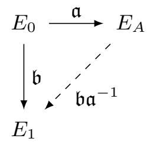
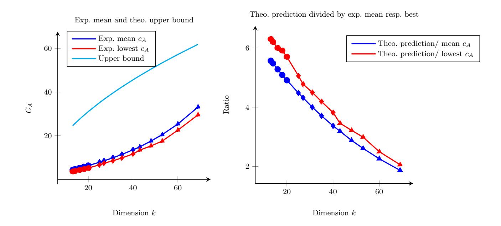

{0}------------------------------------------------

# Another Look at the Quantum Security of the Vectorization Problem with Shifted Inputs

Paul Frixons<sup>1</sup> , Valerie Gilchrist<sup>1</sup> , P´eter Kutas2,<sup>3</sup> , Simon-Philipp Merz<sup>4</sup> , Christophe Petit1,<sup>3</sup> , Lam L. Pham<sup>5</sup>

> Universit´e Libre de Bruxelles, Belgium E¨otv¨os Lor´and University, Hungary University of Birmingham, United Kingdom ETH Z¨urich, Switzerland Ghent University, Belgium

Abstract. Cryptographic group actions provide a basis for simple postquantum generalizations of many cryptographic protocols based on the discrete logarithm problem (DLP). However, many advanced group actionbased protocols do not solely rely on the core group action problem (the so-called vectorization problem), but also on variants of this problem, to either improve efficiency or enable new functionalities. For example, the security of the CSI-SharK threshold signature protocol relies on the hardness of the Vectorization Problem with Shifted Inputs where (in DLP formalism) the adversary not only receives g and g x , but also g x c for multiple known values of c. A natural open question is whether the additional data allows adversaries to solve the underlying problem more efficiently. We revisit the concrete quantum security of this problem. We start from a quantum multiple hidden shift algorithm of Childs and van Dam, which to the best of our knowledge was never applied in cryptography before. We describe and analyze a variant of this algorithm, and we specify and analyze all its subroutines to provide concrete complexity estimates. We then apply our analysis to the CSI-SharK protocol. In prior analyses based on Kuperberg's algorithms, group action evaluations contributed

Date of this document: 2026-02-23.

<sup>∗</sup> Authors listed in alphabetical order: see [https://www.ams.org/profession/](https://www.ams.org/profession/leaders/CultureStatement04.pdf) [leaders/CultureStatement04.pdf](https://www.ams.org/profession/leaders/CultureStatement04.pdf). Valerie Gilchrist is supported by a FRIA grant by the National Fund for Scientific Research (F.N.R.S.) of Belgium; Simon-Philipp Merz is supported by DFG through a Walter Benjamin Fellowship and the Zurich Information Security and Privacy Center (ZISC); Christophe Petit and P´eter Kutas are partly supported by EPSRC through grant number EP/V011324/1. P´eter Kutas was supported by the Ministry of Culture and Innovation and the National Research, Development, and Innovation Office within the Quantum Information National Laboratory of Hungary (Grant No. 2022-2.1.1-NL-2022-00004) and by the grant "EXCELLENCE-151343". P´eter Kutas is also supported by the J´anos Bolyai Research Scholarship of the Hungarian Academy of Sciences. Christophe Petit is also supported by FRS-FNRS grant number T.0238.25. Lam Pham is supported by the FWO and the F.R.S.-FNRS under the Excellence Of Science (EOS) programme (project ID 40007542).

{1}------------------------------------------------

to a significant part of the overall T-gate cost. For CSI-SharK's suggested parameters, our new approach requires significantly fewer calls to the group action evaluation subroutine, leading to significant complexity improvements overall. We describe two instances of our approach, one minimizing the T-gate complexity, and the other one keeping qubit requirements small, both of them resulting in significant complexity improvements over previous works. More generally, we quantify the quantum security degradation resulting from additional published data in the CSI-SharK protocol.

### 1 Introduction

The looming threat of large-scale error-tolerant quantum computers motivates the development of new forms of cryptography based on alternative "hard problems" with the potential to also withstand adversaries with such machines. Following a massive effort from the cryptography community, we now have good candidates for basic primitives such as signatures and key encapsulation mechanisms. However, realizing advanced protocols based on many of the new problems remains a daunting task.

The inversion of cryptographic group actions [\[5\]](#page-34-0), the so-called vectorization problem, provides a natural generalization to the classical discrete logarithm problem (DLP) which in turns leads to relatively easy adaptations of many DLPbased protocols. Currently, the most promising candidates for post-quantum group actions replace the classical DLP in the Diffie-Hellman protocol with an isogeny computation, e.g. [\[28,](#page-36-0) [33,](#page-36-1) [40\]](#page-36-2). One of these candidates, CSIDH [\[28\]](#page-36-0), has given rise to several other protocols including signatures [\[14\]](#page-35-0), ring signatures [\[47\]](#page-37-0), threshold signatures [\[7,](#page-34-1) [41\]](#page-37-1), identification protocols [\[8\]](#page-34-2), and many more. These more advanced protocols can also be adapted to use other group actions.

Protocols based on isogeny group actions benefit from relatively small key sizes. However, before they can replace their classical counterparts, they must withstand quantum cryptanalysis, and their concrete quantum security needs to be understood better. So far, the main quantum attacks on CSIDH and its variants are based on (variations of) Kuperberg's algorithm [\[13,](#page-34-3)[23,](#page-35-1)[52,](#page-37-2)[54,](#page-38-0)[63\]](#page-38-1). In particular, Peikert provided quantum complexity estimates to break CSIDH [\[63\]](#page-38-1).

While our understanding of the quantum security of the vectorization problem for CSIDH has greatly improved recently, several advanced protocols based on CSIDH rely on variants of this problem. Indeed, these variants can provide protocols with crucial additional functionality and enhanced efficiency. We note that this approach is reminiscent of a prior similar trend with DLP-based protocols (i.e. 35 "DLP variants" are listed in [\[11\]](#page-34-4)). As was the case with some DLP variants [\[50\]](#page-37-3), one may wonder whether all vectorization problem variants used in CSIDH-based cryptographic protocols are equally hard. For example, 

{2}------------------------------------------------

the Diffie-Hellman Inversion problem asks to compute g <sup>−</sup><sup>x</sup> given access to g, g<sup>x</sup> . While this problem remains hard in some settings, the CSIDH group action is an example where this problem becomes trivial by computing the quadratic twist.

In this paper, we focus on the Vectorization Problem with Shifted Inputs underlying the security of the CSI-SharK and BCP protocols [\[7,](#page-34-1)[8\]](#page-34-2). In DLP formalism, this variant provides an adversary not only with two group elements g and g x , but also with several other pairs (c, g<sup>x</sup> c ). An algorithm to solve this problem for c in an interval [0, M] would also solve the M-Diffie-Hellman inversion problem and the M-Strong Diffie-Hellman problem, which underlie the security of various DLP-based protocols [\[17](#page-35-2)[–20,](#page-35-3) [36\]](#page-36-3). If the interval is punctured once, then it solves the (M/2)-Diffie-Hellman Exponent problem, used in protocols such as [\[21,](#page-35-4) [42,](#page-37-4) [51\]](#page-37-5). The group action version of this problem is also considered in [\[38\]](#page-36-4), where it is proven secure in the general group action model.

So far, the only cryptanalytic work leveraging the extra information provided in the Vectorization Problem with Shifted Inputs is the classical attack of Kim [\[49\]](#page-37-6), which adapts Cheon's algorithm [\[29\]](#page-36-5) to the isogeny group action setting. This attack affects instances where a shift g x c is published such that c divides the order of the class group, though such instances are specifically avoided in the CSI-SharK and BCP key generation algorithms. Apart from this restriction, the security analysis and parameter selection in [\[7,](#page-34-1) [8\]](#page-34-2) are solely based on CSIDH. In particular, they ignore additional information provided in the Vectorization Problem with Shifted Inputs, and the protocols' quantum security is assumed to be equivalent to CSIDH's quantum security.

Contributions. In this work, we introduce a variant of a quantum multiple hidden shift algorithm from Childs and van Dam (CvD) [\[31\]](#page-36-6) to the Vectorization Problem with Shifted Inputs. We carefully select subroutines to be used in the algorithm, and we discuss different trade-offs between them. Among these subroutines is a knapsack problem, which we reduce to a variant of the Closest Vector Problem (CVP) in the ℓ<sup>∞</sup> norm. The literature on CVP algorithms for the ℓ<sup>∞</sup> norm is much sparser than for the Euclidean norm. We consider two approaches to solve this problem, respectively based on enumeration and sieving. We propose concrete algorithms taking inspiration from existing ones, but with crucial optimizations taking into account the context of our application. We also provide concrete (not asymptotic) complexity and memory estimates for all of these subroutines, filling a gap in the literature.

The original Childs–van Dam algorithm required to find all solutions to the knapsack subroutine; our variant relaxes this requirement to accommodate a larger class of CVP solvers, and is of independent interest.

Our results can be applied to any group action, but we particularly focus on the isogeny-based group action underlying CSIDH since it is currently the most widely studied example of a post-quantum group action in cryptography.

As a concrete application, we use our analysis to reevaluate the security of the CSI-SharK and BCP protocols [\[7,](#page-34-1) [8\]](#page-34-2), and we show that they fall short of the claimed security level. For CSIDH-512 parameters and the suggested 2<sup>12</sup> curves per public key, we estimate that CSI-SharK and BCP can be broken 

{3}------------------------------------------------

using between 250.<sup>8</sup> and 256.<sup>7</sup> T-gates depending on the subroutines used and whether [\[13\]](#page-34-3) or [\[23\]](#page-35-1) is used as the cost model for the group action evaluation[\[6\]](#page-3-0) .

In comparison, Peikert estimated the cost for the cryptanalysis of CSIDH-512 (i.e. for the single curve per public key instance) to require significantly more resources, i.e. between 2<sup>59</sup> to 2<sup>72</sup> T-gates. More generally, we quantify how the quantum security of the Vectorization Problem with Shifted Inputs degrades when the number of curves in the public key increases, via concrete estimates for CSIDH-512. A summary of our results for different parameters is shown in [Tab. 1.](#page-3-1)

| group action<br>cost estimate |           | Peikert Alg. [63, Sect. 4.1] |                | M       | k  | Alg. 2 + sieving |           | Alg. 2 + enum. |           |
|-------------------------------|-----------|------------------------------|----------------|---------|----|------------------|-----------|----------------|-----------|
| T-gates                       | ancillas  | T-gates                      | QRACM          |         |    | T-gates          | ancillas  | T-gates        | ancillas  |
| (from [13])                   |           |                              |                | 8<br>2  | 29 | 51.7<br>2        | 48.4<br>2 | 72.9<br>2      | 15.9<br>2 |
| 43.8<br>2                     | 40<br>2   | 59.8<br>to 262.8<br>2        | 40 to 232<br>2 | 12<br>2 | 20 | 50.8<br>2        | 40<br>2   | 54.9<br>2      | 15.9<br>2 |
|                               |           |                              |                | 16<br>2 | 16 | 50.5<br>2        | 40<br>2   | 51.7<br>2      | 16.0<br>2 |
|                               |           |                              |                | 20<br>2 | 13 | 50.2<br>2        | 40<br>2   | 47.5<br>2      | 16.0<br>2 |
| (from [23])                   |           |                              |                | 8<br>2  | 29 | 60<br>2          | 48.4<br>2 | 72.9<br>2      | 15.9<br>2 |
| 52.4<br>2                     | 15.3<br>2 | 68.4<br>to 271.4<br>2        | 40 to 232<br>2 | 12<br>2 | 20 | 59.4<br>2        | 38.9<br>2 | 56.7<br>2      | 15.9<br>2 |
|                               |           |                              |                | 16<br>2 | 16 | 59.1<br>2        | 35<br>2   | 56.4<br>2      | 16.0<br>2 |
|                               |           |                              |                | 20<br>2 | 13 | 58.8<br>2        | 33.0<br>2 | 56.1<br>2      | 16.0<br>2 |

<span id="page-3-1"></span>Table 1. Using CSIDH-512 parameter sets, we list complexities in number of T-gates and memory required of the Childs–van Dam algorithm when given access to shifts of the form g c·z for c ∈ [−M, M]. Note, the approximate size of the class group is N = 2<sup>256</sup>, and k := log N/ log(2M + 1). We compare against Peikert's algorithm, based on Kuperberg's collimation sieve, whose (oracle calls, QRACM) usage ranges from (2<sup>16</sup> , 2 ) to (2<sup>19</sup> , 2 ). Improved T-gate counts are bolded.

Note that the best T-gate complexities are obtained with the sieving approach for lower values of M. On the other hand, as M increases, the enumeration approach becomes the better choice to minimize the gate cost. Neither approach requires any QRAQM or QRACM, and using enumeration requires significantly fewer qubits to implement. Overall, the quantum security of the schemes clearly degrades with increasing M.

Discussion and further work. The complexity improvements we obtain for CSI-SharK and BCP are interesting on their own, but our concrete analysis of Childs– van Dam's algorithm may also find further applications in cryptography, including, but not limited to isogeny-based cryptography.

Our complexity estimates heavily depend on the subroutines selected, in particular the ones for solving the knapsack problem. There is of course considerable

<span id="page-3-0"></span><sup>[6]</sup> Note that [\[13\]](#page-34-3) only targets T-gate counts whereas [\[23\]](#page-35-1) (in its latest eprint version) also attempts to limit the number of qubits.

{4}------------------------------------------------

literature on knapsack problems, but we found that "off-the-shelf" algorithms were not suited to our particular setting. We did our best to select and adapt existing algorithms, but we still consider it likely that these adaptations remain suboptimal. Our complexity estimates, while already improving on the state-of-the-art, should therefore still be considered as upper bounds.

We conclude the paper with potential improvements and extensions of this analysis. Various hard problems similar to the Vectorization Problem with Shifted Inputs have appeared in the literature; as evidenced by our work (and previous work on DLP variants), their actual hardness may not follow from the hardness of CSIDH. We encourage the community to study their concrete quantum security beyond a mere application of Kuperberg's algorithms and their variants.

Outline. In Sect. 2, we recall details of CSIDH, its state-of-the-art quantum cryptanalysis, as well as the CSI-SharK signature scheme and its hardness assumption. We describe and analyze our variant of Childs—van Dam's quantum algorithm in Sect. 3. In Sect. 4, we show how a knapsack problem appearing in the Childs—van Dam algorithm can be formulated as a closest vector problem in the  $\ell^{\infty}$  norm. We solve this problem using enumeration and sieving in Sects. 5 and 6, respectively. Finally, we give concrete complexity estimates for running the attack on CSI-SharK parameters and investigate how the attack improves for larger number of shifts in Sect. 7. We conclude the paper and discuss several avenues of future work in Sect. 8.

### <span id="page-4-0"></span>2 Preliminaries

In this section, we recall the CSIDH group action, known quantum cryptanalysis approaches against it and the CSI-SharK protocol.

#### 2.1 CSIDH group action

We briefly outline some key concepts about CSIDH and its underlying group action. For a more in-depth exposition of these topics, we refer to either CSIDH [28] or the textbook from Cox [32, Sect. 7].

Consider the set of supersingular elliptic curves defined over  $\mathbb{F}_p$  whose  $\mathbb{F}_p$ -rational endomorphism ring is a fixed order  $\mathcal{O}$  in the quadratic imaginary field  $K = \mathbb{Q}(\sqrt{\Delta})$ . Here  $\Delta$  means the discriminant of the Frobenius characteristic polynomial. We denote this set of elliptic curves by  $\mathcal{E}\ell\ell_p(\mathcal{O})$ . Then, the *ideal class group* of  $\mathcal{O}$  is the quotient of invertible fractional ideals,  $I(\mathcal{O})$ , and principal fractional ideals,  $P(\mathcal{O})$ , which we denote by  $\operatorname{cl}(\mathcal{O}) = I(\mathcal{O})/P(\mathcal{O})$ . Let  $[\mathfrak{a}] \in \operatorname{cl}(\mathcal{O})$  be an ideal class. Then  $[\mathfrak{a}]$  acts on any elliptic curve  $E \in \mathcal{E}\ell\ell_p(\mathcal{O})$  via an isogeny

$$\varphi_{\mathfrak{a}}: E \to E/\mathfrak{a},$$

where  $\ker(\varphi_{\mathfrak{a}}) = \bigcap_{\alpha \in \mathfrak{a}} \ker(\alpha)$ . This gives rise to the following free and transitive group action

$$\operatorname{cl}(\mathcal{O}) \times \mathcal{E}\ell\ell_p(\mathcal{O}) \to \mathcal{E}\ell\ell_p(\mathcal{O}),$$

{5}------------------------------------------------

$$[\mathfrak{a}] \star E \mapsto E/\mathfrak{a}.$$

For brevity, we drop the ⋆ going forward and simply denote the group action as [a]E. Equipped with this isogeny group action, the CSIDH protocol naturally follows the structure of a Diffie-Hellman key exchange [\[28\]](#page-36-0).

### 2.2 Quantum cryptanalysis of CSIDH

The hidden shift problem. The works of Childs, Jao, and Soukharev [\[30\]](#page-36-8) and Biasse, Jao, and Sankar [\[15\]](#page-35-5) showed how to frame the hard problem underlying CSIDH as a hidden shift problem. Recall that given two curves E, E′ ∈ Eℓℓp(O) we would like to find an ideal class [a] ∈ cl(O) such that E′ = [a]E. Then we can define two functions f0, f<sup>1</sup> as f<sup>0</sup> : [b] 7→ [b]E and f<sup>1</sup> : [b] 7→ [b]([a]E). Notice that f<sup>0</sup> is injective and f1(b) = f0(ba), i.e. the functions f<sup>0</sup> and f<sup>1</sup> are equal up to a shift a. This means we can apply quantum hidden shift algorithms, like that of Kuperberg [\[52\]](#page-37-2), to recover the secret [a] in subexponential time. √

Kuperberg's algorithm uses a complexity of 2O( log <sup>N</sup>) where N is the size of the group, and works in any finite abelian group. An algorithm from Regev [\[64\]](#page-38-2) gives a space improvement in terms of both qubits and QRAM, at the cost of a slower run time, but restricts to the Z2<sup>n</sup> case. Later, Kuperberg released a second algorithm in [\[54\]](#page-38-0) that also benefited from a space improvement but this time in the general setting, called the collimation sieve. Peikert [\[63\]](#page-38-1) built an attack on the CSIDH-512 parameter set using the collimation sieve. He estimates that his attack requires between 2<sup>38</sup> and 2<sup>47</sup> T-gates, and an additional 2<sup>14</sup> to 2<sup>19</sup> calls to an oracle computing the group action. Note that any of these algorithms require access to the group action oracle, but the exact cost of such an oracle depends on memory constraints.

Quantum costs of computing the group action. With the ongoing debate on the cost of QRAM, estimating the concrete cost of quantum algorithms can be challenging: indeed it is not yet clear which cost metric should be adopted. As a result, the literature includes several estimates for group action evaluation targeting different cost metrics.

Bernstein, Lange, Martindale, and Panny [\[13\]](#page-34-3) focus on giving in-depth analyses of the isogeny-related computations such as finding a point of particular order on an elliptic curve and computing ℓ-isogenous curves, using classical circuits. They choose to minimize the number of non-linear bit operations (thus minimizing Toffoli and T-gates) at the cost of more qubits. The analysis from Bonnetain and Schrottenloher [\[23,](#page-35-1) Tab. 3] focuses on reducing the number of qubits necessary in their algorithm. They present several trade-offs between three quantum abelian hidden shift algorithms, and focus on tweaking these quantum algorithms to gain improvements (as opposed to tweaking the isogeny algorithms as in [\[13\]](#page-34-3)). We summarize the cost estimates for a single CSIDH-512 group action evaluation in [Tab. 2.](#page-6-0) Note that [\[13\]](#page-34-3) uses non-linear bit operations as their cost metric, so we convert this to Toffoli gates and ancilla qubits using the Bennett conversion [\[12\]](#page-34-5), as was suggested by the authors [\[13,](#page-34-3) App. A.4].

{6}------------------------------------------------

<span id="page-6-0"></span>

| Group action cost estimate | Toffoli gates | T-gates    | ancilla<br>qubits |
|----------------------------|---------------|------------|-------------------|
| [13, Alg. 7.1]             | $2^{41}$      | $2^{43.8}$ | $2^{40}$          |
| [23, Table 3]              | $2^{49.6}$    | $2^{52.4}$ | $2^{15.3}$        |

**Table 2.** Resource estimates for running one CSIDH group action evaluation on the CSIDH-512 parameter set.

Remark 2.1. The estimates from Tab. 2 were published in 2019 and 2020. Since then, several new tools in isogeny-based cryptography have been developed that modify the cost of isogeny computations and (classical) group action evaluation. These developments would likely improve on some of these resource estimates. Assessing the exact improvement is highly non-trivial and remains outside the scope of this work. Instead, we purposely conduct our complexity analyses modularly so that new resource estimates may be easily updated.

QRAM costs. Quantum random-access memory (QRAM) is a circuit that allows a quantum algorithm to access some data stored in memory where the address is itself a quantum state. The data being stored could itself be classical, in which case we refer to it as quantum random-access classical memory (QRACM), or the data could be quantum, in which case it is called quantum random-access quantum memory (QRAQM). Kuperberg [53] suggests that QRAQM is strictly more resource intensive to implement because of the need to maintain quantum states in both memory and access processes. The exact difference in resource use is difficult to quantify concretely. In [45], Jaques and Rattew give a survey of the current state-of-the-art for QRACM and QRAQM constructions. They suggest using circuit QRAM for both, which means using something like the bucket brigade circuit from [60].

In this work, we choose to construct circuits that avoid the use of either QRACM or QRAQM, using only ancilla qubits, albeit sometimes at a small cost to the T-gate complexity (e.g. an overhead factor of around  $2^{2.7}$ ). The main point of comparison to our algorithm will be the analysis from Peikert [63] that gives a concrete complexity analysis of Kuperberg's algorithm when used to attack an instance of CSIDH-512. In [63], QRACM is central to the manipulation of vectors and avoiding QRACM would mean having to change every computation for every element of every list, which seems to add an overhead factor of at least  $2^{32}$  to the time complexity. Reconstructing the algorithm to avoid QRACM is thus a highly non-trivial task, and outside the scope of this work.

### 2.3 CSI-SharK

CSI-SharK [7] is an isogeny-based threshold signature scheme that was adapted from CSI-FiSh [14] and the protocol from Baghery, Cozzo, and Pedersen (BCP) [8], i.e. multiple curves are constructed from a single secret. Here, we first briefly re-

{7}------------------------------------------------

call the CSI-FiSh sigma protocol, and then explain how it was used to construct CSI-SharK.

CSI-FiSh sigma protocol. In [14], Beullens, Kleinjung, and Vercauteren build upon the ideas of Stolbunov to obtain a signature scheme for the CSIDH group action. The scheme starts from a standard proof of knowledge where one begins by fixing the starting curve to  $E_0: y^2 = x^3 + x$ . Then the prover samples their secret,  $\mathfrak{a} \in \mathrm{cl}(\mathcal{O})$ , and computes their public key  $E_A = [\mathfrak{a}]E_0$ . To prove knowledge of their secret key to a verifier, they first send a commitment  $E_1 = [\mathfrak{b}]E_0$ . The verifier replies with a challenge  $c \in \{0,1\}$ . If c = 0 then the prover sends  $r = \mathfrak{b}$ , and the verifier checks that  $E_1 = [r]E_0$ . Otherwise when c = 1, the prover sends  $r = [\mathfrak{b}\mathfrak{a}^{-1}]$ , and the verifier checks that  $E_1 = [r]E_A$ . The isogeny diagram for this scheme is outlined in Fig. 1.

<span id="page-7-0"></span>

Fig. 1. The isogeny diagram related to the CSI-FiSh sigma protocol.

Let  $\mathfrak{g}$  be an element of a class group generating a sufficiently large subgroup of cardinality N. Then CSI-SharK uses public keys of the form

<span id="page-7-1"></span>
$$\{([\mathfrak{g}^{c_i \cdot z}]E_0, c_i)\}_{i=0}^M,$$

where the  $\{c_i\}_{i=0}^M \subset \mathbb{Z}_N$  are known, and  $z \in \mathbb{Z}_N$  is the secret key. The set  $\{c_i\}_{i=0}^M$  is required to be a (super) exceptional set. That is, their pairwise differences (and sums) must be invertible modulo N. This property is essential for proving soundness. In particular, since  $c_0$  is always chosen to be 0, this means that no  $c_i$  divides N. This prevents attackers from using an algorithm like Cheon's [29] to improve a baby-step giant-step approach to recover the secret.

The choice of  $\{c_i\}_{i=0}^M$  is thus important. In BCP, the  $c_i$  are chosen to be necessarily smaller than the smallest prime factor of N. If M is larger than the smallest factor, they suggest restricting to a subgroup  $\mathbb{Z}_{N'}$  whose smallest prime factor is larger than M. The most natural choice, as proposed by the authors in BCP [8, Footnote 1], is the consecutive list of integers  $\{0,\ldots,M\}$ . They list parameter sets for  $M \in \{2^1, 2^2, 2^5, 2^8, 2^{10}, 2^{12}, 2^{15}, 2^{18}\}$  [8, Tab. 1]. CSI-SharK [7, Tab. 2] suggests taking  $M \in \{2^4, 2^8, 2^{12}\}$ .

Both CSI-SharK and BCP rely on the hardness of the following problem.

Problem 2.2 (Vectorization Problem with Shifted Inputs). Let  $E \in \mathcal{E}\ell\ell_p(\mathcal{O})$ . Given the pairs  $(c_i, [\mathfrak{g}^{c_i z}]E)_{i=0}^M$ , where  $\mathfrak{g}$  is fixed and  $\mathbb{C}_M = \{c_0 = 0, c_1 = 1, c_2, \ldots, c_M\}$  is an exceptional set, find  $z \in \mathbb{Z}_N$ .

{8}------------------------------------------------

Whenever the starting curve  $E_0$  has j-invariant 1728, we can compute the curve  $E_i^t = [\mathfrak{g}^{-c_i z}] E_0$  from  $E_i = [\mathfrak{g}^{c_i z}] E_0$  using the quadratic twist. Though this starting curve is not explicitly stated in [7], several of their optimisations take advantage of this easy twisting operation. As such, we may assume this starting curve implicitly. Note this gives us information about 2M + 1 curves, instead of the M+1 curves in the public key. For example, one of the proposed parameter sets in CSI-SharK uses  $M=2^{12}$ . Thus, if the  $\{c_i\}_{i=0}^M$  are consecutive integers starting at 0, including the twists, it means we have access to the following  $2^{13}+1$  curves

$$\{[\mathfrak{g}^{cz}]E_0: c \in [-2^{12}, 2^{12}]\}.$$

Problem 2.2 was also considered in [38], where the authors standardize some notions and problems related to group actions and provide reductions between some of them. Currently, the state-of-the-art security analysis on Problem 2.2 is to use Kuperberg's algorithm on one single instance. The best known classical attack, described in CSIDH, is a meet-in-the-middle key search, also run on one single instance. These approaches fail to make use of any of the additional information provided.

### <span id="page-8-0"></span>3 A modified version of the Childs-van Dam algorithm

In this section we recall the Childs-van Dam algorithm [31] and describe a modified version which will be the main quantum tool used in our attack.

#### 3.1 The Algorithm

The algorithm from Childs and van Dam [31] aims at solving an instance of the generalized hidden shift problem.

<span id="page-8-1"></span>**Definition 3.1 (Generalized Hidden Shift).** For integers M, N, and a finite set S, let  $f : \{-M, ..., M\} \times \mathbb{Z}_N \to S$  be a function satisfying the following:

(a) for fixed b, the map  $f(b, \cdot) : \mathbb{Z}_N \to S$  is injective;

(b) f(b,x) = f(b+1,x+z) for some fixed  $z \in \mathbb{Z}_N$ , all  $b \in [-M,\ldots,M-1]$  and all x.

The generalized hidden shift problem asks to recover z given oracle access to f.

In particular, (a) and (b) of Def. 3.1 imply that f(b, x) = f(0, x - bz).

Note that we took  $\{-M, \ldots, M\} \times \mathbb{Z}_N$  as the domain of f, whereas related literature often defines the problem on the domain  $\{0, \ldots, M'-1\} \times \mathbb{Z}_N$  for some M'. These are clearly equivalent problems after relabeling the interval.

When M'=2, Def. 3.1 is the standard hidden shift problem, and when M'=N it is the hidden subgroup problem trying to find  $\ker(f)=\langle (1,z)\rangle\subset\mathbb{Z}_N^2$ .

Retrieving the secret key z in CSI-SharK can be seen as solving a generalized hidden shift problem for the function f sending  $(b, x) \in \{-M, \dots, M\} \times \mathbb{Z}_N$  to  $f(b, x) = [\mathfrak{g}^x]E_{-b}$ . Indeed we have

$$f(b,x) = [\mathfrak{g}^x]E_{-b} = [\mathfrak{g}^x][\mathfrak{g}^{(-b)z}]E_0 = [\mathfrak{g}^{x-bz}]E_0 = f(0,x-bz),$$

{9}------------------------------------------------

hence f(b, x) = f(b+1, x+z) as required.

We adapt Childs and van Dam's algorithm, outline our approach in Alg. 2, and provide further explanation in what follows. Throughout, we denote the logarithm in base 2 by "log" and the natural logarithm by "ln".

Setup. For the rest of this section, we denote by  $O_f$  the operator defined by  $O_f(|b,x,0\rangle) = |b,x,f(b,x)\rangle$ . Let  $k \in \mathbb{N}_{\geq 1}$ . Given  $\boldsymbol{y} \in \mathbb{Z}_N^k$ , define

<span id="page-9-2"></span>
$$\Lambda(\boldsymbol{y}) = \{ \boldsymbol{x} \in \mathbb{Z}^k : \langle \boldsymbol{x}, \tilde{\boldsymbol{y}} \rangle \equiv 0 \pmod{N} \}, \tag{1}$$

where  $\tilde{\boldsymbol{y}} \in \mathbb{Z}^k$  is any lift of  $\boldsymbol{y}$  to  $\mathbb{Z}^k$  and where  $\langle \boldsymbol{x}, \boldsymbol{y} \rangle = \sum_{i=1}^k x_i y_i$ ; we may sometimes abuse notation by writing  $\boldsymbol{y}$  instead of  $\tilde{\boldsymbol{y}}$  but this should cause no confusion. The set  $\Lambda(\boldsymbol{y}) \subset \mathbb{Z}^k$  is an integral N-ary lattice of covolume  $\det(\Lambda(\boldsymbol{y})) = N$  when N is prime, and of covolume  $\det(\Lambda(\boldsymbol{y})) = N/d$ , where  $d = \gcd(y_1, \ldots, y_k, N)$  in general (this lattice is often denoted  $\Lambda_N^{\perp}(\boldsymbol{y}^T)$  in the literature on lattices), and will play a central role in what follows. Given  $\alpha \in \mathbb{Z}_N$ , we also define

<span id="page-9-3"></span>
$$\Lambda_{\alpha}(\boldsymbol{y}) = \{ \boldsymbol{x} \in \mathbb{Z}^k : \langle \boldsymbol{x}, \tilde{\boldsymbol{y}} \rangle \equiv \alpha \pmod{N} \}.$$
 (2)

When  $\alpha = 0$ ,  $\Lambda_0(\boldsymbol{y}) = \Lambda(\boldsymbol{y})$ , and in general,  $\Lambda_{\alpha}(\boldsymbol{y}) = \boldsymbol{z}_{\alpha} + \Lambda(\boldsymbol{y})$  is a coset of  $\Lambda(\boldsymbol{y})$ , for some (hence any) solution  $\boldsymbol{z}_{\alpha} \in \Lambda_{\alpha}(\boldsymbol{y})$  whenever  $\Lambda_{\alpha}(\boldsymbol{y}) \neq \emptyset$ .

For a positive integer M, we define  $B_M = [-M, M]^k \cap \mathbb{Z}^k$ , and we define

$$S_{\alpha}^{\mathbf{y}} = B_M \cap \Lambda_{\alpha}(\mathbf{y}). \tag{3}$$

That is,  $S_{\alpha}^{\mathbf{y}}$  contains all solutions  $\mathbf{i} \in B_M$  to the knapsack problem  $\langle \mathbf{i}, \mathbf{y} \rangle = \alpha \pmod{N}$ .

We define an operator  $O_C$  as follows:

<span id="page-9-1"></span>
$$O_C: |\mathbf{0}, \alpha, \mathbf{y}\rangle \mapsto |C_{\mathbf{y}}(\alpha), \alpha, \mathbf{y}\rangle,$$
 (4)

where  $C_{\boldsymbol{y}}(\alpha)$  is in  $S_{\alpha}^{\boldsymbol{y}}$  with some probability which we shall quantify and analyze in detail in Sect. 3.4. We will build the operator  $O_C$  as a reversible circuit C that returns a single tuple  $C_{\boldsymbol{y}}(\alpha)$  from  $\alpha$  and  $\boldsymbol{y}$ .

We now present a subroutine (Alg. 1) to be used in our modified Childs-van Dam algorithm, followed by the algorithm itself (Alg. 2). Throughout the paper, the quantum Fourier transform (QFT) over  $\mathbb{Z}_N$  is simply the discrete Fourier transform on  $\mathbb{Z}_N$ . We denote it by QFT<sub> $\mathbb{Z}_N$ </sub>; it acts on a basis vector  $|y\rangle$  as

<span id="page-9-5"></span>
$$QFT_{\mathbb{Z}_N} |y\rangle = \frac{1}{\sqrt{N}} \sum_{z=0}^{N-1} \omega^{y\xi} |\xi\rangle, \quad \text{where } \omega = e^{2\pi\sqrt{-1}/N}. \tag{QFT}$$

Description of Alg. 1. In BuildRotatedIndex (Alg. 1), we build a group of registers with similar patterns to Kuperberg's algorithm. We start by building the uniform superposition of inputs

<span id="page-9-4"></span><span id="page-9-0"></span>
$$\frac{1}{\sqrt{N(2M+1)}} \sum_{i=-M}^{M} \sum_{x \in \mathbb{Z}_N} |i, x\rangle. \tag{A1.3}$$

{10}------------------------------------------------

#### Algorithm 1 BuildRotatedIndex

Input: N, M and superposition oracle access to f

**Output:** y,  $(2M+1)^{-1/2} \sum_{i \in [-M,M]} \omega^{yiz} |i\rangle$  (where z is the hidden period)

- 1: Start with three registers of the form  $|0,0,0\rangle$  where the three registers will respectively contain elements in  $\{-M,\ldots,M\}$ ,  $\mathbb{Z}_N$  and S.
- 2: Apply the Quantum Fourier Transform (QFT) over  $\mathbb{Z}_{2M+1}$  to the first register
- 3: Apply the QFT over  $\mathbb{Z}_N$  to the second register  $\rightsquigarrow$  (A1.3).
- 4: Apply the oracle  $O_f$  on the registers  $\rightsquigarrow$  (A1.4).
- 5: Measure the third register and get  $c = f(0, x_0)$  for an unknown  $x_0 \rightsquigarrow (A1.5)$
- 6: Apply the QFT over  $\mathbb{Z}_N$  to the second register  $\rightsquigarrow$  (A1.6).
- <span id="page-10-1"></span>7: Measure the second register and get y (uniformly)  $\rightsquigarrow$  (A1.7).

#### Algorithm 2 Modified Childs-van Dam algorithm

**Input:** N, M and superposition oracle access to f

**Output:** the hidden period z

- 1: Set  $k = \lceil \log(N) / \log(2M + 1) \rceil$ .
- 2: Apply BuildRotatedIndex (Alg. 1) to k groups of registers  $\rightsquigarrow$  (A2.2).
- 3: Compute  $\alpha = \sum_{j=1}^{k} i_j y_j \mod N$  in a new register  $\rightsquigarrow$  (A2.3).
- 4: Apply  $O_C^{-1}$ , the reverse of the operator  $O_C$  to approximate (A2.4).
- 5: Apply  $\operatorname{Id} \otimes \operatorname{QFT}_{\mathbb{Z}_N}^{-1}$  to approximate  $|\mathbf{0}, z\rangle \rightsquigarrow (A2.5)$ .
- <span id="page-10-0"></span>6: Return the state (A2.5) and verify that it is  $|\mathbf{0}, z\rangle$  by checking the equality f(0,0) = f(1,z) and retry if it is not.

Observe that this can be done by applying the quantum Fourier transform (QFT) over  $\mathbb{Z}_{2M+1} \times \mathbb{Z}_N$  to  $|0,0\rangle$  (Steps 1 and 2 in Alg. 1), so (A1.3) =  $(QFT_{\mathbb{Z}_{2M+1}} \otimes QFT_{\mathbb{Z}_N}) |0,0\rangle$ . This vector represents a uniform superposition of all basis states. We add a zero and then apply the function f (i.e., the operator  $O_f$ ), and build the associated output

$$\frac{1}{\sqrt{N(2M+1)}} \sum_{i=-M}^{M} \sum_{x \in \mathbb{Z}_N} |i, x, f(i, x)\rangle. \tag{A1.4}$$

We then measure the output  $c = f(0, x_0)$  and by the periodicity property of f, we get

<span id="page-10-3"></span><span id="page-10-2"></span>
$$\frac{1}{\sqrt{2M+1}} \sum_{i=-M}^{M} |i, x_0 + iz\rangle.$$
 (A1.5)

We apply the QFT to the second register to get

$$\frac{1}{\sqrt{N(2M+1)}} \sum_{i=-M}^{M} \sum_{x \in \mathbb{Z}_N} \omega^{(x_0+iz)x} |i,x\rangle. \tag{A1.6}$$

Since the outcome (say y) is uniformly distributed over  $\mathbb{Z}_N$ , when we measure it, we get

<span id="page-10-5"></span><span id="page-10-4"></span>
$$\frac{1}{\sqrt{2M+1}} \sum_{i=-M}^{M} \omega^{yiz} |i\rangle. \tag{A1.7}$$

{11}------------------------------------------------

Analysis of Alg. 2. After calling BuildRotatedIndex k times, the state is

<span id="page-11-0"></span>
$$\frac{1}{(2M+1)^{k/2}} \sum_{(i_1,\dots,i_k)\in B_M} \omega^{z(\sum_{j=1}^k i_j y_j)} |i_1,\dots,i_k\rangle.$$
 (A2.2)

We compute  $\alpha = \sum_{j=1}^{k} i_j y_j \mod N$  in a new register. We put  $i = (i_1, \dots, i_k)$ , and the global state becomes

$$\frac{1}{(2M+1)^{k/2}} \sum_{\mathbf{i} \in B_M} \omega^{z\alpha} | \mathbf{i}, \alpha \rangle = \frac{1}{(2M+1)^{k/2}} \sum_{\alpha \in \mathbb{Z}_N} \omega^{z\alpha} \sum_{\mathbf{i} \in S_{\alpha}^{\mathbf{y}}} | \mathbf{i}, \alpha \rangle.$$
 (A2.3)

If we could erase i in the first k registers, i.e.,  $|i,\alpha\rangle \mapsto |0,\alpha\rangle$ , we would get

(2M + 1)<sup>-k/2</sup>  $\sum_{\alpha \in \mathbb{Z}_N} |S_{\alpha}^{\boldsymbol{y}}| \cdot \omega^{z\alpha} |\mathbf{0}, \alpha\rangle$ . Heuristically, were we to approximate  $|S_{\alpha}^{\boldsymbol{y}}|$  by its average  $\mathbf{E}_{\alpha}[|S_{\alpha}^{\boldsymbol{y}}|] \approx (2M + 1)^k/N$  (see Sect. 3.3), we would get  $\frac{1}{N}(2M + 1)^{k/2} \sum_{\alpha \in \mathbb{Z}_N} \omega^{z\alpha} |\mathbf{0}, \alpha\rangle$ . So if we could erase the registers by renormalizing according to the partition of the box  $B_M$  by residue, i.e.,  $|i,\alpha\rangle \mapsto |S_{\alpha}^{\boldsymbol{y}}|^{-1/2} |\mathbf{0},\alpha\rangle$ , then approximating  $|S_{\alpha}^{\boldsymbol{y}}|^{1/2}$  by  $(\mathbf{E}_{\alpha}[|S_{\alpha}^{\mathbf{y}}|])^{1/2}$  would yield

<span id="page-11-3"></span><span id="page-11-2"></span><span id="page-11-1"></span>
$$\frac{1}{N^{1/2}} \sum_{\alpha \in \mathbb{Z}_N} \omega^{z\alpha} |\mathbf{0}, \alpha\rangle = \text{QFT}_{\mathbb{Z}_N}(|z\rangle), \tag{A2.4}$$

and we could recover the hidden shift. Thus, the desired "uncompute" operation is  $\sum_{i \in S_{\alpha}^{y}} |i, \alpha\rangle \mapsto |S_{\alpha}^{y}|^{1/2} |0, \alpha\rangle$ , which is the inverse of the operator  $|0, \alpha\rangle \mapsto$  $|S^{\boldsymbol{y}}_{\alpha}|^{-1/2} \sum_{\boldsymbol{i} \in S^{\boldsymbol{y}}_{\alpha}} |\boldsymbol{i}, \alpha\rangle$ . This quantum uniform sampling approach is adopted in the original quantum algorithm of [31]. However, due to unsolvable instances of the knapsack problem, this operator cannot be implemented in practice and hence has an intrinsic probability of success. Instead, we use in our algorithm the operator  $O_C: |\mathbf{0}, \alpha, \mathbf{y}\rangle \mapsto |C_{\mathbf{y}}(\alpha), \alpha, \mathbf{y}\rangle$  previously introduced in (4), and its inverse  $O_C^{-1}$ . The output is

$$|\psi_{\text{out}}\rangle = (\text{Id} \otimes \text{QFT}_{\mathbb{Z}_N}^{-1}) \circ O_C^{-1} \left( \frac{1}{(2M+1)^{k/2}} \sum_{\alpha \in \mathbb{Z}_N} \omega^{z\alpha} \sum_{\mathbf{i} \in S_{\alpha}^{\mathbf{y}}} |\mathbf{i}, \alpha\rangle \right).$$
 (A2.5)

#### 3.2A knapsack problem

To successfully implement our algorithm we need to describe how to implement the operator  $O_C$ . Clearly, this amounts to solving (for a superposition of  $\alpha$ values) the knapsack problem given by  $S_{\alpha}^{y}$ . Childs and van Dam use Lenstra's integer programming algorithm [57] to solve this problem in time  $2^{O(k^3)}$ . They also suggest to reduce this complexity to  $2^{O(k \log k)}$  using Kannan's algorithm instead |46|.

These asymptotic estimations for solving the integer programming problem at hand (implementing  $O_C$ ) are useful for studying the asymptotic behavior of the Childs-van Dam algorithm, but they provide little insight on the actual cost of an attack against a concrete system such as CSI-SharK. For this reason we will reframe the knapsack problem as lattice problems in Sects. 5 and 6, and evaluate explicit costs for running the overall attack.

{12}------------------------------------------------

#### <span id="page-12-0"></span>3.3 Analysis of the N-ary lattice

In this subsection, we analyze the knapsack problem from a theoretical standpoint via the lattice  $\Lambda(y)$  and its cosets  $\Lambda_{\alpha}(y)$  defined in Eqs. (1) and (2). This is necessary to understand our quantum algorithm and the various probabilistic assumptions.

If  $\mathbf{y} \in \mathbb{Z}_N^k$  or  $\mathbf{y} \in \mathbb{Z}^k$ , we write  $\gcd(\mathbf{y}, N) = \gcd(y_1, \dots, y_k, N)$  – this should cause no confusion. Observe that  $\Lambda_{\alpha}(\mathbf{y}) \neq \emptyset$  if  $\gcd(\mathbf{y}, N) = 1$  which, for N prime, holds unless  $\mathbf{y}$  is the zero vector mod N. More generally, if instead of  $\Lambda_{\alpha}(\mathbf{y}) \subset \mathbb{Z}^k$ , we consider its projection to  $\mathbb{Z}_N^k$ , then  $|\Lambda_{\alpha}(\mathbf{y}) \pmod{N}| = \gcd(\mathbf{y}, N) \cdot N^{k-1}$  if  $\gcd(\mathbf{y}, N) \mid \alpha$ , and 0 otherwise. Thus, when N is prime,  $\mathbb{Z}^k / \Lambda(\mathbf{y}) \cong \mathbb{Z}_N^k$ , the cosets  $\Lambda_{\alpha}(\mathbf{y})$  partition  $\mathbb{Z}^k$  and each has the same cardinality when projected to  $\mathbb{Z}_N^k$ . For our algorithm, given M, we need to understand  $|S_{\alpha}^{\mathbf{y}}| = |\Lambda_{\alpha}(\mathbf{y}) \cap B_M|$ .

Distribution of residues. Recall that in Alg. 2,  $\alpha$  is built from  $\boldsymbol{y}$  and  $\boldsymbol{i}$ , and one of the main approximations that justify the design of our algorithm is  $|S_{\alpha}^{\boldsymbol{y}}| \approx \mathbf{E}_{\alpha}[|S_{\alpha}^{\boldsymbol{y}}|] \approx (2M+1)^k/N$ . The following lemma justifies this: we show that the distribution of the residues  $\alpha$  is indeed almost uniformly random over  $\mathbb{Z}_N$  and compute  $\mathbf{E}_{\alpha}[|S_{\alpha}^{\boldsymbol{y}}|]$  for a uniform distribution. For the proof, see App. A.

<span id="page-12-2"></span>**Lemma 3.2.** Given  $x, y \in \mathbb{Z}_N^k$  uniformly random,

$$\Pr_{\boldsymbol{x},\boldsymbol{y}}\big(\langle\boldsymbol{x},\boldsymbol{y}\rangle\equiv\alpha\pmod{N}\big)=\begin{cases}N^{-1}-N^{-(k+1)} & \text{if }\alpha\not\equiv0\pmod{N},\\N^{-1}+N^{-k}-N^{-(k+1)} & \text{if }\alpha\equiv0\pmod{N}.\end{cases}$$

Let  $\alpha \in \mathbb{Z}_N$  be uniformly random. Then,  $\mathbf{E}_{\alpha}[|S_{\alpha}^{\mathbf{y}}|] = (2M+1)^k/N$ .

Distribution of the number of solutions to the knapsack problem. We assume that M < N and that N is prime. The following lemma summarizes the statistics of  $|S_{\alpha}^{y}|$  when y and  $\alpha$  are both uniformly random.

In light of the following lemma, we set

$$k = \left\lceil \frac{\log(N)}{\log(2M+1)} \right\rceil.$$

<span id="page-12-1"></span>**Lemma 3.3.** If y and  $\alpha$  are uniformly random over  $\mathbb{Z}_N^k$ ,  $\mathbb{Z}_N$  respectively, then

$$\mathbf{E}_{\boldsymbol{y},\alpha}[|S_{\alpha}^{\boldsymbol{y}}|] = \frac{(2M+1)^k}{N}, \quad \mathbf{Var}_{\boldsymbol{y},\alpha}[|S_{\alpha}^{\boldsymbol{y}}|] = \left(1 - \frac{1}{N}\right) \, \mathbf{E}_{\boldsymbol{y},\alpha}[|S_{\alpha}^{\boldsymbol{y}}|].$$

Further, if  $1 - N^{-1} \leq \mathbf{E}_{\boldsymbol{y},\alpha}[|S_{\alpha}^{\boldsymbol{y}}|]$ , then  $\Pr_{\alpha,\boldsymbol{y}}(|S_{\alpha}^{\boldsymbol{y}}| \geq 1) \geq 1/2$ , and  $\Pr_{\alpha,\boldsymbol{y}}(|S_{\alpha}^{\boldsymbol{y}}| = 1) \geq (1 - \eta)/6$  for any small  $\eta > 0$ .

We also include the proof of this lemma in App. A.

{13}------------------------------------------------

#### <span id="page-13-0"></span>3.4 Success probability

We now explain how to obtain a lower bound on the probability of success of our quantum algorithm and compare it to the original quantum algorithm of Childs and van Dam [31]. We also define precisely the success probability of the operator  $O_C$  defined in Eq. (4).

For a given  $\mathbf{y} \in \mathbb{Z}_N^k$ , we define the probability of success of  $O_C$ 

$$P_{\text{succ}}^C = \mathbf{E}_{\boldsymbol{y}}[p_{\boldsymbol{y}}], \text{ where } p_{\boldsymbol{y}} = \Pr_{\alpha}(C_{\boldsymbol{y}}(\alpha) \in S_{\alpha}^{\boldsymbol{y}} \mid \boldsymbol{y}).$$
 (5)

We also introduce the probability of success on feasible instances defined by

$$P_{\text{succ}}^C = \Pr_{\alpha, \mathbf{y}}(|S_{\alpha}^{\mathbf{y}}| = 1) \cdot P_{\text{succ,feas}}^C.$$
 (6)

Here,  $\boldsymbol{y}$  is uniformly random over  $\mathbb{Z}_N^k$ , as can be seen from our algorithm.

<span id="page-13-2"></span>**Proposition 3.4.** The probability of success of our quantum algorithm admits the lower bound:

$$\Pr(\text{success}) \ge \frac{N}{(2M+1)^k} \cdot \left[ \Pr_{\alpha, \boldsymbol{y}}(|S_{\alpha}^{\boldsymbol{y}}| = 1) \right]^2 \cdot (P_{\text{succ,feas}}^C)^2.$$

In particular, if  $1 - N^{-1} \le \mathbf{E}_{\boldsymbol{y}}[|S_{\alpha}^{\boldsymbol{y}}|] \le 1$ , then  $\Pr(\text{success}) \ge \frac{1}{37} \cdot \left(P_{\text{succ},\text{feas}}^C\right)^2$ .

The factor 1/37 follows by choosing  $\eta = 0.01$ . The proof is given in App. B.

In the original quantum algorithm of [31], the operator  $O_C$  is replaced by quantum uniform sampling. In this case, the probability of success of their quantum algorithm admits the same lower bound without the factor  $(P_{\text{succ,feas}}^C)^2$ . On the other hand, our algorithm is practical and concrete – unlike the uniform quantum sampling operator – and moreover allows to quantify success even with the existence of randomness in the solver used for the knapsack problem, leading to concrete complexity estimates.

### <span id="page-13-1"></span>3.5 Complexity analysis

The asymptotic complexity of Childs-van Dam algorithm is dominated by solving the knapsack problem. Using Kannan's algorithm this complexity is  $2^{O(k \log k)}$ , where  $k \approx \log N/\log(2M+1)$ , so the algorithm improves on Kuperberg's variants (running in time  $2^{O(\sqrt{\log N})}$ ) when  $M \in \Omega(2^{\sqrt{\log N}})$ .

As we are interested in concrete complexity estimations for our variant of this algorithm, we analyze its three main subroutines: the quantum subroutine that performs the (isogeny) group action in superposition, Quantum Fourier Transforms, and solving the knapsack problem from Step 4.

Group action cost. Existing resource estimates for running a group action evaluation for CSIDH-512 parameters are listed in Tab. 2. Recall that multiple estimations exist, aiming to optimize either T-gate count or qubit count. We will keep this portion of the complexity analysis modular so that it is easy to modify according to which estimate is being considered, as well as any future (improved) estimates.

{14}------------------------------------------------

Quantum Fourier Transforms. In [3], Ahokas, Cleve, and Hales give an upper bound on the number of quantum gates necessary to compute a Quantum Fourier Transform modulo  $2^n$ . They improved upon the previous upper bound of  $O(n \log n)$ , to  $O(n(\log \log n)^2 \log \log \log n)$ . This cost, however, is negligible in Childs—van Dam's algorithm, so we use the "naive" estimate of n(n+1)/2 gates.

Quantum complexity analysis of Childs-van Dam's algorithm. Recall from Alg. 2 that  $k := \lceil \log(N)/\log(2M+1) \rceil$ . The algorithm uses 3 QFTs in each call to BuildRotatedIndex (Alg. 1). This subroutine also includes one call to the group action oracle in Step 4. Step 3 of Alg. 2 consists of some computations which are negligible compared to the rest of the computations. Finally, Step 4 describes a knapsack problem and in Step 5 we have one final (inverse) QFT to do. Thus, at a high level, the complexity of the algorithm is

(3k+1) QFTs + k group action evaluations + knapsack problem.

We recall that uncomputing the knapsack problem is applying the circuit that solves the knapsack problem and reversing it, thus the uncomputation has the same time and space complexity as the solving operation.

Note that k is relatively small in our attack (for CSI-SharK parameters, we may have k=20). Thus, this algorithm differs from prior cryptanalysis in that the number of group action evaluations is small. For example, the algorithm from Peikert's quantum analysis of CSIDH [63, Fig. 2] for the same parameter sizes requires between  $2^{14}$  to  $2^{20}$  group action evaluations, depending on the length of the phase vector. As group action evaluation is quite expensive in practice, the reduced number of evaluations can significantly lower the overall cost.

In the following sections, we analyze the cost of solving the knapsack problem, before concluding the paper with concrete complexity estimates of our attack.

### <span id="page-14-0"></span>4 Solving the knapsack problem

Here we show how the knapsack problem in the Childs-van Dam algorithm can be formulated as an instance of a Closest Vector Problem (CVP) in  $\Lambda(y)$ . Our instance will use the  $\ell^{\infty}$  norm instead of the usual  $\ell^{2}$  (Euclidean) norm. Further, we will show that we can assume an average-case hardness because of the ability to resample the lattice by rerunning Step 2 of Alg. 2. We describe how to actually solve the resulting CVP instance in the subsequent sections.

### <span id="page-14-1"></span>4.1 CVP formulation

Recall that to complete our attack we must find an element of  $S_{\alpha}^{\boldsymbol{y}} = \Lambda_{\alpha}(\boldsymbol{y}) \cap B_{M}$ . Recall also that  $\{-M,\ldots,M\}$  is the set of available shifts we have access to, and k is the dimension we choose such that  $|B_{M}| = (2M+1)^{k} \approx N$ . Thus  $\mathbf{E}_{\alpha}[|S_{\alpha}^{\boldsymbol{y}}|] = \mathbf{E}_{\alpha,\boldsymbol{y}}[|S_{\alpha}^{\boldsymbol{y}}|] \approx 1$ . As mentioned,  $\boldsymbol{y}$  is fixed at the beginning of Step 2, but can be re-randomized by rerunning BuildRotatedIndex (Alg. 1). Further,  $\alpha$  takes all possible values in superposition.

{15}------------------------------------------------

In [31], the set  $S_{\alpha}^{y}$  is computed using a classical integer programming algorithm due to Lenstra [57]. The best complexity estimates are obtained when the interval is sufficiently large, while in cryptanalysis settings it will be fixed to a concrete size. Furthermore, the integer programming computation that was originally proposed is aimed at solving the worst case instance and does not offer concrete complexity estimates, making it difficult to measure the overall security of target systems. For these reasons we proceed with a reduction to an equivalent lattice problem.

We work with the N-ary lattice  $\Lambda(\boldsymbol{y})$  defined in (1) and its cosets defined in (2). The equivalent lattice problem consists in finding vectors which are close to representatives of the coset  $\Lambda_{\alpha}(\boldsymbol{y})$  (and thus, short when  $\alpha=0$ ) in the sense that the distance is less than M. As a shorthand, we shall use "CVP" and "SVP" to describe these problems, even though for our purposes it is not necessary that the vectors found be the closest or the shortest.

Let  $z_{\alpha} \in \Lambda_{\alpha}(\boldsymbol{y})$  be any solution; in order to find a "short"  $\boldsymbol{x} \in \Lambda_{\alpha}(\boldsymbol{y}) \cap B_M$ , we claim that it is enough to find a lattice vector in  $\Lambda(\boldsymbol{y})$  which is "close" to  $\boldsymbol{z}_{\alpha}$ . Indeed, consider the shifted box  $\boldsymbol{z}_{\alpha} + B_M$ . If  $\boldsymbol{v} \in (\boldsymbol{z}_{\alpha} + B_M) \cap \Lambda(\boldsymbol{y})$ , that is,  $\boldsymbol{v}$  is a lattice vector close to  $\boldsymbol{z}_{\alpha}$  in the sense that  $\|\boldsymbol{v} - \boldsymbol{z}_{\alpha}\|_{\infty} \leq M$ , then we can write  $\boldsymbol{v} = \boldsymbol{z}_{\alpha} + \epsilon$ , where  $\boldsymbol{v} \in \Lambda(\boldsymbol{y})$  and  $\epsilon \in B_M$ . But then,  $(-\epsilon) = \boldsymbol{z}_{\alpha} - \boldsymbol{v} \in (\boldsymbol{z}_{\alpha} + \Lambda(\boldsymbol{y})) \cap B_M = \Lambda_{\alpha}(\boldsymbol{y}) \cap B_M$  as desired. This reduces the problem to finding elements of  $(\boldsymbol{z}_{\alpha} + B_M) \cap \Lambda(\boldsymbol{y})$ , as claimed.

#### 4.2 A standard choice of basis of $\Lambda(y)$

We need a target vector  $\mathbf{z}_{\alpha}$  and a matrix A whose columns form a basis of  $\Lambda(\mathbf{y})$ , i.e.,  $\Lambda(\mathbf{y}) = A\mathbb{Z}^k$ . Assuming that  $\mathbf{y} \neq \mathbf{0}$  in  $\mathbb{Z}_N^k$ , at least one coordinate is invertible mod N, say  $y_j$ , so without loss of generality, we may assume that  $y_1 \neq 0$ . Let  $\alpha' = \alpha/y_1$  and let  $\mathbf{y}' = \mathbf{y}/y_1 = (1, y_2', \dots, y_k')$ . Then, it is clear that  $\Lambda_{\alpha}(\mathbf{y}) = \Lambda_{\alpha'}(\mathbf{y}')$ , and in particular,  $\Lambda(\mathbf{y}) = \Lambda(\mathbf{y}')$ . We may pick  $\mathbf{z}_{\alpha'} = (\alpha', 0, \dots, 0)$  and define

<span id="page-15-1"></span>
$$A = \begin{bmatrix} N - y_2' - y_3' \cdots - y_k' \\ 0 & 1 & 0 & \cdots & 0 \\ \vdots & \ddots & \ddots & \vdots \\ \vdots & & \ddots & \ddots & 0 \\ 0 & \cdots & \cdots & 0 & 1 \end{bmatrix}.$$
 (7)

It is easy to see that the columns of A form a basis for the lattice  $\Lambda(y')$ .

In the rest of the paper, we will use  $\alpha$  or  $\alpha'$  interchangeably, but this should cause no confusion.

<span id="page-15-0"></span><sup>&</sup>lt;sup>[7]</sup> Since  $\mathbf{y} = \mathbf{0} \pmod{N}$  occurs only with probability 1/N, the distributions of the lattices  $\Lambda(\mathbf{y}')$  and  $\Lambda(\mathbf{y})$  are almost the same, the former being conditioned on  $\mathbf{y} \neq \mathbf{0} \pmod{N}$ .

{16}------------------------------------------------

#### 4.3 CVP specificities

The "CVP" instances we need to solve are in ℓ<sup>∞</sup> norm instead of Euclidean norm. Further, we only need one close vector within a box, as opposed to the closest vector.

The CVP algorithm must be run on a quantum superposition of α values. However, the lattice itself is independent of α and only depends on the elements {yi}; one could therefore perform some (classical or quantum) preprocessing, typically to compute a reduced basis of Λ(y), after the elements {yi} are obtained and before solving the CVP problems for a superposition of α values.

The elements {yi} are randomly chosen through measurement. One can tweak Chils-van Dam's algorithm and repeat this process until a good lattice, or a good enough precomputed basis for that lattice, is obtained. For our analysis this means that we assume both the lattice reduction and the CVP are average case instances instead of worst case instances. In fact, we can even assume to be in a somewhat "favorable case" instance, at the cost of repeating the process sufficiently many times. All this is carefully justified by a thorough discussion on random N-ary lattices of type Λ(y). This will be beneficial, e.g. in the enumeration of [Sect. 5,](#page-17-0) where the cost is highly dependent on the lattice basis.

### 4.4 Selecting CVP solvers

Our main task going forward will be to solve an average case variant of CVP in the ℓ<sup>∞</sup> norm. Current CVP algorithms broadly fall into three categories: enumeration [\[44,](#page-37-9) [46\]](#page-37-8), sieving [\[1,](#page-33-0) [4\]](#page-34-7), and Voronoi sets algorithms [\[39,](#page-36-9) [61\]](#page-38-6).

Most of the literature describing algorithms for solving CVP problems targets the ℓ <sup>2</sup> norm, so a first idea may be to compute a ball of vectors that have small ℓ <sup>2</sup> norm, and check for suitably close vectors in infinity norm among them. However, a ball that is sufficiently large to contain all candidates for suitably close vectors for the infinity norm could also contain many more short vectors in the Euclidean norm, so the approach would be inefficient. For this reason we will be considering algorithms that directly use the ℓ<sup>∞</sup> norm.

Kannan [\[46\]](#page-37-8) gives an enumeration algorithm for solving integer programming problems that splits the problem into several smaller ones. The time complexity of the algorithm is 2O(<sup>n</sup> log <sup>n</sup>) . It is also deterministic and there is no space complexity. In [Sect. 5](#page-17-0) we describe a simple variant that is tailored to the setting of our problem. It requires little memory and is easy to implement, but the asymptotic time complexity will be worse than other approaches, meaning it may not scale so well to larger parameter sets.

Later on, in [Sect. 6](#page-23-0) we focus on a sieving approach. In [\[4\]](#page-34-7), Ajtai, Kumar, and Sivakumar give a randomized algorithm based on sampling and sieving. The work of Aggarwal and Mukhopadhyay [\[1\]](#page-33-0) follows the strategy from [\[4\]](#page-34-7) at a high level, but focuses on the special case of using the ℓ<sup>∞</sup> norm. This approach offers a better time complexity than the enumeration approach, but will also require exponential size quantum memory.

{17}------------------------------------------------

We do not provide an approach using Voronoi sets, in part because the single exponential time complexity estimates computed in [61] are only for the Euclidean norm. In [16], the authors show that for non-Euclidean norms, it is unlikely to find algorithms of single exponential space and time that can solve CVP. They show that for some other norms the case is *similar* to the Euclidean one, and so may have single exponential algorithms. It is not clear how the  $\ell^{\infty}$  norm plays into this, so instead we leave comparing such an approach (and any others) to future work.

In the following two sections, we assess the cost of the knapsack problem when implemented on a quantum computer with our specific choices of CVP solvers. It is of course entirely possible that better subroutines exist, hence our complexity estimates for our version of Childs—van Dam's algorithm should be considered as upper bounds.

### <span id="page-17-0"></span>5 Instantiating the attack with enumeration

As described in Sect. 4.1, the problem which remains to be solved to complete our attack using our quantum algorithm can be seen as a CVP problem in the  $\ell^{\infty}$  norm. More precisely, given  $\boldsymbol{y} \in \mathbb{Z}_N^k$ , the elements of  $S_{\alpha}^{\boldsymbol{y}} = \Lambda_{\alpha}(\boldsymbol{y}) \cap B_M$  correspond to lattice points in  $\Lambda(\boldsymbol{y}) \cap (\boldsymbol{z}_{\alpha} + B_M)$  which are sufficiently close to the target vector  $\boldsymbol{z}_{\alpha}$ .

In this section, we describe a simple method which solves this CVP problem using enumeration. We start with an overview of the algorithm in Sect. 5.1 and describe how finding a better basis of the lattice allows us to lower the complexity of the enumeration. In Sect. 5.2, we provide experimental results on these improvements which are the basis of our security estimates later on. Finally, we prove rigorous upper bounds for the cost of this approach in the context of our attack with this quantum algorithm in Sect. 5.3.

### <span id="page-17-1"></span>5.1 Algorithm overview

Given a fixed lattice  $\Lambda(\boldsymbol{y})$  with basis given by the matrix A and a target vector  $\boldsymbol{z}_{\alpha}$  defined using  $\alpha$  (see Sect. 4.1), we want to find a point in  $\Lambda(\boldsymbol{y}) \cap (\boldsymbol{z}_{\alpha} + B_{M})$ . Recall from Sect. 3 that k is chosen so that for  $\boldsymbol{y}$  and  $\alpha$  uniformly random, there is on average only one such point<sup>[8]</sup>.

Let  $z_{\alpha}$  be given as above, and let  $x_0 := \lfloor A^{-1}z_{\alpha} \rfloor$  be the approximate solution with its coordinates rounded to the nearest integer, i.e.  $||A^{-1}z_{\alpha} - x_0||_{\infty} \leq \frac{1}{2}$ . Assume now that x is a vector that yields a solution to our CVP problem at hand, i.e. we have  $||Ax-z_{\alpha}||_{\infty} \leq M$ . While  $x_0$  will in general not yield a solution to the CVP problem itself, it gives an approximate solution, since

$$\|\bm{x} - \bm{x}_0\|_{\infty} \le \|\bm{x} - A^{-1}\bm{z}_{\alpha}\|_{\infty} + \|A^{-1}\bm{z}_{\alpha} - \bm{x}_0\|_{\infty}$$

<span id="page-17-2"></span>In fact, it is not hard to show that if  $\alpha$  is fixed and  $\boldsymbol{y}$  is random, we also have  $\mathbf{E}_{\boldsymbol{y}}[|S_{\alpha}^{\boldsymbol{y}}|] \approx 1$  for  $\alpha \neq 0$  and  $\mathbf{E}_{\boldsymbol{y}}[|S_{\alpha}^{\boldsymbol{y}}|] \approx 2$ . The main difference occurs for  $\alpha = 0$ .

{18}------------------------------------------------

$$\leq \|A^{-1}\|_{\infty} \cdot \|A\boldsymbol{x} - \boldsymbol{z}_{\alpha}\|_{\infty} + \|A^{-1}\boldsymbol{z}_{\alpha} - \boldsymbol{x}_{0}\|_{\infty} \leq \|A^{-1}\|_{\infty} \cdot M + \frac{1}{2}.$$

This observation allows us to find a solution in the lattice  $\Lambda(\boldsymbol{y})$  by enumerating through all  $\boldsymbol{x}$  that lie at distance at most  $\|A^{-1}\|_{\infty} \cdot M + \frac{1}{2}$  from  $\boldsymbol{x}_0$ . This gives at most  $2\|A^{-1}\|_{\infty} \cdot M + 2$  options for each coordinate of  $\boldsymbol{x}$  (from the positive and negative directions and 0), hence at most  $(2\|A^{-1}\|_{\infty} \cdot M + 2)^k$  choices in total. For each candidate  $\boldsymbol{x}$ , we can verify whether it is a solution by checking whether  $\|A\boldsymbol{x} - \boldsymbol{z}_{\alpha}\|_{\infty}$  is at most M. This check costs at most one matrix vector multiplication and one vector addition.

### **Algorithm 3** Algorithm using enumeration to solve CVP in $\ell^{\infty}$

Input: Basis matrix A of  $\Lambda(y)$ , target vector  $z_{\alpha}$ .

**Output:** Lattice vectors with distance at most M from  $z_{\alpha}$  with respect to  $\ell^{\infty}$  norm.

```
1: Compute \boldsymbol{x}_0 := \lfloor A^{-1}\boldsymbol{z}_{\alpha} \rceil.

2: for each \boldsymbol{x} with \|\boldsymbol{x} - \boldsymbol{x}_0\|_{\infty} \leq \|A^{-1}\|_{\infty} \cdot M + \frac{1}{2}

3: if \|A\boldsymbol{x} - \boldsymbol{z}_{\alpha}\|_{\infty} \leq M

4: Return \boldsymbol{x}.

5: end if

6: end for
```

<span id="page-18-2"></span><span id="page-18-0"></span>**Lemma 5.1.** Alg. 3 finds a vector in  $\Lambda(\mathbf{y}) \cap (\mathbf{z}_{\alpha} + B_M)$  after enumerating at most  $(2\|A^{-1}\|_{\infty} \cdot M + 2)^k$  vectors.

<span id="page-18-3"></span>Amplitude amplification. We briefly discuss how to use Grover's search to accelerate the enumeration process of Alg. 3. Consider amplitude amplification introduced by Brassard, Hoyer, Mosca and Tapp [25], which extends Grover's algorithm [43] to any search space. Alg. 4 shows how Alg. 3 can be modified using this amplitude amplification. Note that Grover's search will require  $\frac{\pi}{4}\sqrt{(2\|A^{-1}\|_{\infty}\cdot M+2)^k/T}$  iterations, where  $T\approx 1$  denotes the number of solutions.

### **Algorithm 4** Algorithm using enumeration to solve CVP in $\ell^{\infty}$

Input: Basis A of full-rank k-dimensional lattice, target vector  $\boldsymbol{z}_{\alpha}$ .

**Output:** Lattice vector with distance at most M from  $\boldsymbol{z}_{\alpha}$  with respect to infinity norm.

- 1: Compute  $\boldsymbol{x}_0 := [A^{-1}\boldsymbol{z}_{\alpha}].$
- 2: Grover search on x with  $||x||_{\infty} \leq ||A^{-1}||_{\infty} \cdot M + \frac{1}{2}$  with  $\frac{\pi}{4} (2||A^{-1}||_{\infty} \cdot M + 2)^{k/2}$  iterations using the following oracle:
- 3: Check if  $||A(\boldsymbol{x} + \boldsymbol{x}_0) \boldsymbol{z}_{\alpha}||_{\infty} \leq M$
- 4: EndGrover
- <span id="page-18-1"></span>5: Return close vectors found.

{19}------------------------------------------------

The classical enumeration cost of  $(2\|A^{-1}\|_{\infty} \cdot M + 2)^k$  vectors becomes  $\frac{\pi}{4}(2\|A^{-1}\|_{\infty} \cdot M + 2)^{k/2}$  steps of amplification using [25, Thm. 4]. In each step of the amplification, we have to generate the superposition of  $\boldsymbol{x}$ , which can be done by generating all of its k components individually using a QFT of size  $(2\|A^{-1}\|_{\infty} \cdot M + 2)$  and checking if  $\|A(\boldsymbol{x} + \boldsymbol{x}_0) - b\|_{\infty} \leq M$ . The latter requires at most  $k^2$  multiplications in  $\mathbb{Z}_N$ .

Minimizing  $||A^{-1}||_{\infty}$ . Given the dependence of the enumeration's complexity on  $||A^{-1}||_{\infty}$ , there are two easy ways of optimizing the approach:

- 1. Preprocess  $\Lambda(y)$  to get a basis A which lowers  $||A^{-1}||_{\infty}$ .
- 2. Repeat Alg. 2 up to Step 3 until the measured lattice basis A is good, i.e.  $||A^{-1}||_{\infty}$  is "sufficiently low".

Both steps together make our strategy. We repeat the initial quantum computation to get new random lattices, and we reduce their bases in order to minimize  $||A^{-1}||_{\infty}$ . If the resulting basis is sufficiently good, i.e.  $||A^{-1}||_{\infty}$  of the resulting basis A is smaller than a desired threshold, we move forward and run the enumeration, otherwise we sample another lattice.

Note that each time we repeat the initial steps of the quantum computation, we obtain a new random lattice. Alg. 5 in summarizes the resulting strategy.

**Algorithm 5** Using enumeration with preprocessing to find close vectors in Childs-van Dam algorithm.

**Input:** Class number N, M, superpos. oracle access to f with hidden period z and threshold t for  $||A^{-1}||_{\infty}$ 

Output: The hidden period z

- 1: Let  $c_A > t$ .
- 2: while  $c_A > t$
- 3: Run Alg. 2 up to Step 3 to get lattice  $\Lambda(y)$  and target vector  $\boldsymbol{z}_{\alpha}$  in superpos.
- 4: Preprocess basis A of  $\Lambda(\boldsymbol{y})$  (either classically or with a quantum computer) to minimize  $||A^{-1}||_{\infty}$ , and compute resulting  $c_A$ .
- 5: end while
- 6: Use Grover's alg. for enumeration, Alg. 4, to get vectors in  $\Lambda(\boldsymbol{y})$  at  $\ell^{\infty}$  distance at most M from  $\boldsymbol{z}_{\alpha}$ .
- <span id="page-19-0"></span>7: Finish variant of Childs-van Dam as in Alg. 2.

Let  $c_A := ||A^{-1}||_{\infty} \cdot N^{1/k}$ , where A corresponds to a basis of a k-dimensional lattice  $\Lambda(\boldsymbol{y})$ . For a basis with lengths close to the successive minima, we obtain the following theoretical upper bound for  $c_A$ .

<span id="page-19-1"></span>**Proposition 5.2.** Let  $0 < \gamma < 1$  and  $\epsilon \ge 1/M$ . Define

$$C(k) := \sqrt{\frac{6}{\pi \ln k}} + \frac{2\sqrt{3}}{\pi}.$$

Then,

$$1 \le c_A \le (2 + \epsilon) C(k) \gamma^{-1} \cdot (k \ln k)^{1/2}$$
 with probability  $\ge 1 - \gamma^k$ ,

{20}------------------------------------------------

$$1 \le \mathbf{E}_{y}[c_{A}] \le \frac{k+1}{k} (2+\epsilon) C(k) \gamma^{-1} \cdot (k \ln k)^{1/2}.$$

We give some details for the proof of Prop. 5.2 in Sect. 5.3.

Using  $c_A$ , we can compute the overall complexity of the enumeration subroutine given by the following lemma.

**Lemma 5.3.** Grover's search to find vectors in  $\Lambda(\mathbf{y})$  at  $\ell^{\infty}$  distance at most M from  $\mathbf{z}_{\alpha}$  shown in Alg. 4 requires

$$\log N \cdot \log \log N \cdot \log M \cdot k^2 \cdot \frac{\pi}{4} \left( 2 \cdot c_A \cdot M \cdot N^{-1/k} + 2 \right)^{k/2}$$

T-gates. The number of qubits necessary is  $\log(M)nk$ .

*Proof* (Lem. 5.3). We first compute the number of multiplications over  $\mathbb{Z}_N$  used, and then show how to optimize the complexity by using additions instead.

By Lem. 5.1, there are at most  $(2 \cdot c_A \cdot M \cdot N^{-1/k} + 2)^k$  vectors that need to be enumerated. Using amplitude amplification as described in Sect. 5.1, we can reduce this to  $\frac{\pi}{4}(2c_A \cdot M \cdot N^{-1/k} + 2)^{k/2}$  steps of amplification. Each such step is dominated by checking if  $||A(\mathbf{x} + \mathbf{x}_0) - \mathbf{z}_{\alpha}||_{\infty} \leq M$  which requires  $k^2$  multiplications in  $\mathbb{Z}_N$ . The quantum complexity of the enumeration at hand thus becomes

$$k^2 \cdot \frac{\pi}{4} \left( 2 \cdot c_A \cdot M \cdot N^{-1/k} + 2 \right)^{k/2}$$

multiplications in  $\mathbb{Z}_N$ .

These multiplications in  $\mathbb{Z}_N$ , according to the estimate from Pavlidis and Gizopoulos [62, Tab. 4], would require a circuit using  $2^{9.6}n^2 + 2^{9.3}n$  gates (for  $n = \log N$ ) per multiplication. From Draper [37] the quantum cost of integer addition is around  $n \log n$  gates. Thus we can try to save complexity by changing these multiplications to additions. Recall from Alg. 4, Step 3, that the computation being repeated is to check if  $||A(\mathbf{x}+\mathbf{x}_0)-b||_{\infty} \leq M$ . In each of the iterations, the variables  $A, \mathbf{x}_0, \mathbf{z}_\alpha, M$  are all fixed so the values of  $A\mathbf{x}_0 - \mathbf{z}_\alpha$  can be precomputed. Since  $-M \leq x_j \leq M$ , we can write  $x_j = -M + \sum_{k=0}^{\lceil \log_2 M \rceil + 1} x_{jk} 2^k$  with  $x_{jk} \in \{0,1\}$ . We then have  $(A\mathbf{x})_i = -M \sum_j A_{ij} + \sum_{jk} A_{ij} x_{jk} 2^k$ , where the values  $-M \sum_j A_{ij}$  and  $(A_{ij}2^k \mod N)$  can be precomputed. This requires  $k^2 \log M$  additions. In total, in each iteration this replaces  $k^2$  multiplications with  $k^2 \log M$  additions. This yields the claimed number of quantum T-gates.

The matrix  $A^{-1}$  is a result of classical computations and thus the operation  $|x\rangle \mapsto |A^{-1}x\rangle$  can be built as a "fixed" circuit and as such does not store  $A^{-1}$  in memory.

Throughout this computation, the memory cost is dominated by storing a  $k \times 1$  vector  $\mathbf{z}_{\alpha}$ . As each value in these structures requires at most n qubits to represent, this gives a total memory requirement of  $(\log M)kn$  in the approach which trades multiplications for additions.

To improve our cost estimates, we complement these theoretical bounds with experiments in the following subsection.

{21}------------------------------------------------

#### <span id="page-21-0"></span>5.2 Experimental evaluation of $c_A$

The preceding subsections raised the question how to best preprocess a basis of a lattice to minimize  $c_A$  and how tight our theoretical upper bounds for  $c_A$  are for randomly generated lattices.

Note that after measuring the lattice basis, any preprocessing of the lattice can be done entirely using classical operations. Independent of whether this may or may not be implemented on a quantum computer in the end, we can implement and test this part experimentally on a classical computer to estimate both classical and quantum costs.

For our experiments, we implemented the following method to preprocess the lattice. We repeatedly chose a random y which gave rise to a random lattice  $\Lambda(y)$ . Then, we computed an approximation of a good basis by reducing the basis of the dual lattice using LLL in the  $\ell^2$  norm – partially motivated by the fast implementations of LLL available – and reducing the resulting lattice with respect to the infinity norm using an algorithm due to Lovasz and Scarf [58] before measuring the resulting  $c_A$ . Note that the final use of Lovasz–Scarf can only improve upon the result after the LLL reduction, and it is expected to give an improvement since in general a small linear combination of a good  $\ell^2$  basis can also reduce the  $\ell^{\infty}$  norm.



<span id="page-21-1"></span>Fig. 2. Left: Mean (blue) and lowest (red) values of  $c_A$  observed experimentally for 10.000 lattices sampled randomly with parameter M with  $\log_2(M) \in \{12, 14, 16, 18, 20\}$  and using parameter N of magnitude as in CSIDH-512 (circles), CSIDH-1024 (diamonds) and 100 lattices in the case of CSIDH-1792 (triangles). Theoretical upper bounds for the same parameters computed using Eq. (10) as cyan line. Right: Ratio of the theoretical prediction by the experimental mean (blue) and lowest (red) values observed for the same experiments.

We measured the values for different N of sizes approximately  $2^{257}$ ,  $2^{512}$ , and  $2^{892}$  roughly matching the one of CSIDH-512, CSIDH-1024 and CSIDH-1792, and taking  $M \in \{2^{12}, 2^{14}, 2^{16}, 2^{18}, 2^{20}\}$  – specifying the dimension k. For

{22}------------------------------------------------

the two smaller values of N and all values of M we repeated the experiment for 10.000 randomly chosen lattices and 100 lattices in the case of the largest N. The measurements are summarized in Fig. 2 and plotted against the proven upper bound of  $c_A$ . Further, we plot the ratio between the measurements and the theoretical upper bound, showing that the theoretical bound becomes quickly tighter as the dimension grows. The values of  $c_A$  used to compute the concrete complexity estimates of our attack using enumeration are recorded in Tab. 3.<sup>[9]</sup>

<span id="page-22-1"></span>

|          | CSIDH-51:                                              | $2, N \approx 2^{257}$ | CSIDH-1024, $N \approx 2^{512}$ |            |  |
|----------|--------------------------------------------------------|------------------------|---------------------------------|------------|--|
| M        | $\begin{array}{ c c c c c c c c c c c c c c c c c c c$ |                        | mean $c_A$                      | $\min c_A$ |  |
| $2^{20}$ | 4.406                                                  | 3.615                  | 7.833                           | 6.665      |  |
| $2^{16}$ | 5.210                                                  | 4.307                  | 9.882                           | 8.506      |  |
| $2^{12}$ | 6.332                                                  | 5.187                  | 13.553                          | 11.640     |  |

**Table 3.** Experimental results for  $c_A$  for different values of M over 10,000 randomly generated lattices in the case of both CSIDH-512 (as suggested in CSI-SharK) and CSIDH-1024 (approximating its class number by a 512-bit prime).

Note that an exhaustive search over (short) linear combinations of lattice vectors can further improve the basis to give a better  $c_A$  (at an exponential cost). However, we will ignore this potential improvement in our analysis.

#### <span id="page-22-0"></span>5.3 Integer N-ary lattices of the form $\Lambda(y)$

We now explain the bounds from Prop. 5.2; a complete account and a complete proof are included in App. C, so we will restrict ourselves to a description of the proof.

Let  $L \subset \mathbb{R}^k$  be any lattice. We denote by  $L^*$  its dual lattice. For  $1 \leq i \leq k$ , we denote by  $\lambda_i^{(p)}(L)$  the *i*-th successive minima of L in the  $\ell^p$ -norm:

$$\lambda_i^{(p)}(L) = \min\{r > 0 \mid \dim \operatorname{Span}(L \cap B^{(p)}(r)) \ge i\},\,$$

where  $B^{(p)}(r)$  denotes the ball centered at **0** with radius r in the  $\ell^p$  norm.

The enumeration algorithm relies on having good control on  $||A^{-1}||_{\infty}$  where A is a matrix whose columns form a basis of  $\Lambda(\boldsymbol{y})$ . We first observe that  $||A^{-1}||_{\infty} = \max_{1 \leq i \leq k} ||\operatorname{row}_i(A^{-1})||_1$ , and that the rows of  $A^{-1}$  form a basis of the dual lattice  $\Lambda(\boldsymbol{y})^*$ . Thus, we see that the theoretical best case scenario occurs when the  $\ell^1$  lengths of the basis vectors match the corresponding successive minima. This ideal basis matrix  $A^{-1}$  then satisfies  $||A^{-1}||_{\infty} = \lambda_k^{(1)}(\Lambda(\boldsymbol{y})^*)$ . Thus, we need to understand  $\lambda_k^{(1)}(\Lambda(\boldsymbol{y})^*)$ .

<span id="page-22-2"></span><sup>[9]</sup> The code to run the experiments, implemented in Magma [24], is provided in https://github.com/vgilchri/CvD-analysis.

{23}------------------------------------------------

The results we need from the geometry of numbers are known as *transference* theorems, more precisely, for  $\ell^1/\ell^\infty$  duality.

<span id="page-23-2"></span>**Theorem 5.4.** Let  $L \subset \mathbb{R}^k$  be a lattice. Then,

$$\lambda_i^{(\infty)}(L) \cdot \lambda_{k-i+1}^{(1)}(L^*) \le C(k) \cdot (k \ln k)^{1/2} \quad (1 \le i \le k), \tag{8}$$

where C(k) is the same constant as in Prop. 5.2.

Because we have an explicit constant and since Thm. 5.4 is a (minor) improvement of results of Banaszczyk [10], we provide a self-contained proof in App. C. Applying Thm. 5.4 with i = 1, we see that it remains to find a lower bound for  $\lambda_1^{(\infty)}(L)$  when  $L = \Lambda(\boldsymbol{y})$ ; this is provided by the next lemma (see App. A for the proof).

<span id="page-23-3"></span>Lemma 5.5. Deterministically, we have

$$\lambda_1^{(\infty)}(\Lambda(\boldsymbol{y})) \leq N^{1/k}.$$

Assume that **y** is uniformly random. Fix  $1/M \le \epsilon \le 1$ . Then,

$$\begin{split} \mathbf{E}_{\boldsymbol{y}} \big[ \lambda_1^{(\infty)}(\boldsymbol{\Lambda}(\boldsymbol{y})) \big] &\geq \frac{k}{k+1} \cdot \frac{N^{1/k}}{2+\epsilon}, \\ \Pr_{\boldsymbol{y}} \left( \lambda_1^{(\infty)}(\boldsymbol{\Lambda}(\boldsymbol{y})) \geq \frac{\gamma}{2+\epsilon} N^{1/k} \right) &\geq 1-\gamma^k \quad (0<\gamma<1). \end{split}$$

Therefore, with probability  $\geq 1 - \gamma^k$ , there exists a basis matrix A of  $\Lambda(\boldsymbol{y})$  such that

$$N^{-1/k} \le ||A^{-1}||_{\infty} \le (2+\epsilon)C(k)\gamma^{-1} \cdot (k\ln k)^{1/2} \cdot N^{-1/k}.$$
 (9)

Similarly, for the optimal basis matrix A of an average lattice, we have:

<span id="page-23-1"></span>
$$N^{-1/k} \le ||A^{-1}||_{\infty} \le \frac{(2+\epsilon)(k+1)}{k} \cdot C(k) \cdot (k \ln k)^{1/2} \cdot N^{-1/k}. \tag{10}$$

Although presently, lattice reduction algorithms do not provide these bounds, they provide an approximation. If we assume that the rows of  $A^{-1}$  form a Korkin-Zolotarev basis for the dual lattice (with respect to the  $\ell^1$ -norm), then by [58, Thm. 8], we have  $2/(k+1) \leq \|A^{-1}\|_{\infty}/\lambda_k^{(1)}(\Lambda(\boldsymbol{y})^*) \leq (k+1)/2$ . Thus, with probability  $\geq 1 - \gamma^k$ , there is a basis matrix A such that

$$N^{-1/k} \le ||A^{-1}||_{\infty} \le \frac{(2+\epsilon)C(k)}{\gamma} \cdot \frac{k+1}{2} (k \ln k)^{1/2} \cdot N^{-1/k}.$$
 (11)

### <span id="page-23-0"></span>6 Instantiating the attack with sieving

In this section, we explore an alternative strategy to solve the CVP instance from Eq. (7) through sieving. First, we translate the problem into an SVP problem.

{24}------------------------------------------------

#### 6.1 Reducing CVP to SVP

We reduce our CVP to an SVP instance in the  $\ell^{\infty}$  norm. This is a variation of Kannan's embedding (see [46, p. 437]) that we briefly describe now.

Let  $L \subset \mathbb{Z}^k$  be an integer lattice with basis matrix  $A \in M_k(\mathbb{Z})$ . Let  $\mathbf{t} \in \mathbb{Z}^n$ ,  $\mathbf{t} \notin L$  – the target vector of the CVP problem – and let  $\mu > 0$  be a parameter to be specified shortly. Of course, our lattice is  $L = \Lambda(\mathbf{y})$ , A is the matrix from Eq. (7), and  $\mathbf{t} = \mathbf{z}_{\alpha'}$ . Define a new lattice  $L_{\mu,\mathbf{t}} \subset \mathbb{Z}^{k+1}$ ; a basis matrix for  $L_{\mu,\mathbf{t}}$  is

$$A_{\mu, t} = \begin{bmatrix} A - t \\ 0 & \mu \end{bmatrix} \in \mathcal{M}_{k+1}(\mathbb{Z}).$$

We parametrize  $\boldsymbol{v} \in L_{\mu,t}$  as  $\boldsymbol{v} = \boldsymbol{v}(\boldsymbol{x},z) = A_{\mu,t} \begin{bmatrix} \boldsymbol{x} \\ z \end{bmatrix} \in L_{\mu,t}$ .

Set  $\mu = M$ . On the one hand, if there exists  $\xi = Ax \in L$  with  $\|\xi - t\|_{\infty} \leq M$ , then there exists  $v(x, \pm 1) \in L_{M,t}$  with  $\|v(x, \pm 1)\|_{\infty} \leq M$ . On the other hand, if there exists  $v(x, z) \in L_{M,t}$  with  $\|v(x, z)\|_{\infty} \leq M$ , this implies that z = 0 or  $z = \pm 1$ . If we find a vector of the form v(x, 0), we just discard it, and continue until we find a vector of the form  $v(x, \pm 1)$ , whose existence is guaranteed as long as  $L \cap (t + B_M) \neq \emptyset$ .

We thus consider the augmented lattice  $L_+ = L_{M, \boldsymbol{z}_{\alpha'}} \subset \mathbb{Z}^{k+1}$  with basis matrix

<span id="page-24-1"></span>
$$A_{+} = A_{M, \boldsymbol{z}_{\alpha'}} = \begin{bmatrix} A - \boldsymbol{z}_{\alpha'} \\ 0 & M \end{bmatrix}. \tag{12}$$

### 6.2 Sieving approach for SVP problems

Sieving algorithms proceed in two phases to solve the short vector problem:

- 1. Sampling, where  $s_0$  elements of norm less than  $R_0$  of the lattice are sampled.
- 2. Sieving, where given a list of length  $s_i$  of lattice elements of norm smaller than  $R_i$ , another list of elements of length  $s_{i+1}$  with norms smaller than  $R_{i+1}$  is produced. In practice, this is done by identifying pairs of "close" vectors and keeping their difference (a smaller vector of the lattice).

The sieving is repeated steps many times until we get a vector of the desired norm. We summarize this general approach in Alg. 6.

To solve the shortest vector problem in the  $\ell^{\infty}$  norm, we will follow the work of Aggarwal and Mukhopadhyay [1,2]. In Sect. 6.3 we recall the relevant parts of their approach. We give complexity estimates for the different steps of sampling and sieving depending on the parameters the sieving is instantiated with, i.e. the lattice dimension k+1 and the parameters  $\{(R_i, s_i)\}$  from Alg. 6. In Sect. 6.4, we will describe how these complexity estimates lead to an optimization problem. Finally, we approximate the solution to this optimization problem to obtain an upper bound on the cost of the resulting algorithm.

### <span id="page-24-0"></span>6.3 Sieving with Aggarwal-Mukhopadhyay's algorithm

**Sampling.** In [2], a randomized version of Babai's nearest plane algorithm is used to sample elements of the lattice. We are interested in the case where the

{25}------------------------------------------------

#### Algorithm 6 General approach of sieving algorithms

Input: A basis  $A_{M,\mathbf{z}_{\alpha'}}$  of the lattice  $L_{M,\mathbf{z}_{\alpha'}}$ , suitable parameters  $(R_0, s_0), ..., (R_{\text{steps}}, s_{\text{steps}})$ , a sampling algorithm SAMPLE that given  $A_+$  produces a random element of the lattice L of norm less than  $R_0$  and a sieving algorithm SIEVE that given a list of cardinality  $s_i$  with lattice vectors of size  $R_i$  produces a list of cardinality  $s_{i+1}$  with lattice vectors of size  $R_{i+1}$ .

**Output:** An element of L of norm less than  $R_{\mathsf{steps}}$ .

```
# Sampling part

1: Initialize S \leftarrow \emptyset

2: for i from 1 to s_0

3: e_i \leftarrow \text{SAMPLE}(A_+, R_0), S \leftarrow S \cup \{e_i\}

4: end for

# Sieving part

5: for i from 1 to steps

6: S \leftarrow \text{SIEVE}(S, R_{i-1}, R_i)

\triangleright \text{SIEVE} gets a list of size s_{i-1} and outputs a list of size s_i.

7: end for

8: Return a non-zero element of S.
```

<span id="page-25-0"></span>lattice is of the form as in Eq. (12), i.e. the lattice is defined over  $\mathbb{Z}$  but contains  $(N\mathbb{Z})^k \times \{0\}$ . Therefore, we can sample a random element of the lattice of  $\ell^{\infty}$  norm less than N/2 with k+1 multiplications in  $\mathbb{Z}_N$ , as outlined in the following.

**Lemma 6.1.** For lattices of the same shape as L, Alg. 7 which chooses a "small" coefficient for the last row (less than N/2M) and random coefficients elsewhere using a representation of the output in [-N/2, N/2] effectively samples a random element of the lattice of norm less than N/2.

#### Algorithm 7 Sampling algorithm

```
Input: A matrix A_+ of the form given by Eq. (12) defining the lattice L_+.

Output: An element of L_+ of norm less than N/2.

1: Sample a random x_{k+1} in [-N/2M, N/2M] and x_1, ..., x_{k-1} in [-N/2, N/2].

2: Compute x_k = -\left\lfloor \frac{\alpha' x_{k+1} + \sum_{i=1}^{k-1} y'_{i+1} x_i}{N} \right\rfloor.

3: Return [x_1, ..., x_{k+1}]A_+.
```

<span id="page-25-1"></span>*Proof.* The first choice gives that the last coefficient is a random element in  $M\mathbb{Z} \cap [-N/2, N/2]$ . (The matrix imposes that this coefficient is a multiple of M). The remaining choices and the reduction modulo N ensure the randomness of the other coefficients while not affecting the last one.

Sieving. While [2] explores many refinements for the lattice sieving, these refinements come at a polynomial cost. While asymptotically the exponential

{26}------------------------------------------------

cost is what matters most, these added costs are not negligible for the "small" parameters we are interested in. Hence, we only consider the simpler sieving as described in [2, Sect. 3].

Let  $\lfloor \cdot \rfloor$  denote rounding to the nearest integer. For an element in the lattice  $\mathbf{x} = (x_1, \dots, x_{k+1})$ , we denote component-wise rounding by  $\lfloor 2x/R_i \rfloor := (\lfloor 2x_1/R_i \rceil, \dots, \lfloor 2x_{k+1}/R_i \rceil)$ . Let  $\mathbf{x}$  and  $\mathbf{x}'$  be two elements of the lattice such that  $\lfloor 2\mathbf{x}/R_i \rceil = \lfloor 2\mathbf{x}'/R_i \rceil$ . Then  $\mathbf{x} - \mathbf{x}'$  must be an element of the lattice with norm smaller than  $R_i$ . Therefore, sieving can be done by looking for collisions in the function  $x \mapsto \lfloor 2\mathbf{x}/R_i \rfloor$  (see also [2]).

To estimate the cost of finding such collisions we assume that elements of the lattice behave randomly (as in [2]) and we use the following lemma.

**Heuristic 1** At any stage of the sieving process, the vectors in  $S \cap B_{R_i}$  are uniformly distributed in  $B_{R_i} = \{ \boldsymbol{x} \in \mathbb{Z}^{k+1} | ||\boldsymbol{x}||_{\infty} \leq R_i \}.$ 

**Lemma 6.2.** For a random function  $f: \{1, ..., n\} \to \{1, ..., m\}$ , the number of collisions has expected value  $\frac{n(n-1)}{2m}$  with variance  $\frac{n(n-1)}{2m} \left(1 - \frac{1}{m}\right)$ .

The proof of Lem. 6.2 is included in App. D.

Assume that the map  $x \mapsto \lfloor 2x/R_i \rceil$  behaves like a random function on elements of norm less than  $R_{i-1}$  in our k+1-dimensional lattice, i.e. it maps the elements uniformly randomly to the possible  $(2R_{i-1}/R_i)^{k+1}$  buckets. Starting from a list of  $2^n$  random elements of norms less than  $R_{i-1}$  and applying Lem. 6.2, we expect a list of at most  $2^{2n-1}(R_i/(2R_{i-1}))^{k+1}$  elements of norm less than  $R_i$  (with standard deviation  $2^{n-\frac{1}{2}}(R_i/(2R_{i-1}))^{(k+1)/2}$ ). Here, we omit the factor  $(1-\frac{1}{m})$  in the variance given by Lem. 6.2 as m is will be large. This formula provides constraints on the suitable values for  $(R_i, s_i)$ .

Classical "many collisions finding" algorithm. As part of the sieving process, we need an algorithm to compute collisions. Note that there is not just one collision to find in this context, but *many* of them, and that this computation will be performed as part of Step 4 of Alg. 2, i.e. by a quantum computer on inputs in superposition. We use an algorithm from [22], which implements Alg. 9 given in Appendix D reversibly. Note that this algorithm requires a QRAM containing nearly all elements, but with stricter conditions on the data structure. The proof of the following Lem. 6.3 is given in App. D.

**Lemma 6.3.** Let the notation be as in Alg. 6. Using classical many collisions finding, see Alg. 9, there exists a quantum procedure for sieving that takes a list of  $s_{i-1}$  elements of norms less than  $R_{i-1}$ , and outputs a list of  $s_i$  elements of norms less than  $R_i$  in time

$$\frac{1}{\log(e)}(\log(s_i) + (k+1)\log(2R_{i-1}/R_i) + 1)\sqrt{2s_i}\left(\frac{2R_{i-1}}{R_i}\right)^{(k+1)/2},$$

whenever  $s_i \leq \frac{1}{2} s_{i-1}^2 (R_i/(2R_{i-1}))^{k+1}$ .

{27}------------------------------------------------

Quantum collision finding. We sketch an alternative quantum approach to running the many collisions finding algorithm in App. D. The savings here are not significant for our scale so going forward we employ the classical collision finding technique instead.

#### <span id="page-27-0"></span>6.4 Solving the optimization problem

To solve a concrete instance of the SVP using sieving as sketched in Alg. 6, Lem. 6.3 provides constraints and guidance to set the values for  $s_i$  and  $R_i$  in the sieving procedure.

To simplify notation, we define  $n_i := \log(s_i)$  and  $m_i := (k+1)\log(2R_{i-1}/R_i)$ . Further, we recall that **steps** denotes the number of sieving steps, which is also a parameter to optimize. The constraints outlined in the previous subsections give rise to the following optimization problem.

Problem 6.4. Given variables  $n_0, \ldots, n_{\mathsf{steps}}$  and  $m_1, \ldots, m_{\mathsf{steps}}$  we have the following constraints:

$$\begin{cases} 2^{n_0} \leq \frac{N^{k+1}}{M^2}, \\ n_i \geq 1, \\ n_{i+1} \leq 2n_i - m_{i+1} - 1, \\ \sum_{i=1}^{\mathsf{steps}} (m_i - (k+1)) = (k+1) \log(N/M). \end{cases}$$
where  $m_i = 1$  is the private of the algorithm in T-gates is then given by the step of the algorithm.

The complexity of the algorithm in T-gates is then given by the function

$$(k+1)C_N 2^{n_0} + \sum_{i=1}^{\text{steps}} \frac{2(n_i + m_i + 1)}{\log(e)} 2^{(n_i + m_i + 1)/2},$$

where  $C_N$  is the cost of a multiplication in  $\mathbb{Z}_N$ . Next, we minimize this cost.

Since  $N^k$  is significantly larger than M, the first condition is satisfied for every possible parameter set relevant to us. The other conditions are linear, so the solution set can be treated as a polyhedron. For simplicity, we replace  $n_{i+1} \leq 2n_i - m_{i+1} - 1$  with  $n_{i+1} = 2n_i - m_{i+1} - 1$ . The cost function to be optimized, however, is not linear. In order to find sufficiently good solutions, we fix steps to an appropriate value and then treat this as a linear program. Note, the coefficient of  $n_0$  is much larger in our applications than the other variables. Hence, we choose the objective function as  $C_n \cdot n_0 + \sum_{i=1}^n n_i$  (note that the  $n_i$  already define the  $m_i$ ). This alone would yield bad results as optimal solutions are not balanced and slightly large  $n_i$  blow up the complexity. By imposing an upper bound on all  $n_i$  depending on the dimension k, we can prevent this. Once a solution is computed, we plug it into the function  $(k+1)C_N 2^{n_0} + \sum_{i=1}^{\text{steps}} \frac{2(n_i + m_i + 1)}{\log(e)} 2^{(n_i + m_i + 1)/2}$  to compute the complexity of sieving.

Experimentally we observe that there appears to be an optimal choice for the upper bound on the  $n_i$  and the value steps. It makes sense to take steps small, albeit large enough that a solution exists.

{28}------------------------------------------------

We chose steps = 600 and the upper bound on the n<sup>i</sup> to be k + 3; we do not claim that this is an optimal choice. The following table lists the number of operations necessary for various dimensions k after computing solutions to the optimization problem[\[10\]](#page-28-0) .

<span id="page-28-1"></span>

| k            | 13   | 16        | 20        | 24        | 29        | 31        | 40        |
|--------------|------|-----------|-----------|-----------|-----------|-----------|-----------|
| complexity 2 | 33.0 | 35.0<br>2 | 38.9<br>2 | 43.2<br>2 | 48.4<br>2 | 50.5<br>2 | 59.8<br>2 |

Table 4. We list the resulting complexity in number of T-gates for running the sieving approach to solving the knapsack problem for different values of k.

Using these experimental values, we can estimate the amount of resources necessary to run the entire sieving procedure.

Lemma 6.5. Let Lsieving be as in [Lem. 6.3.](#page-12-1) Then [Alg. 6](#page-25-0) can be run using approximately 6.45 · Lsieving T-gates and Lsieving many ancilla qubits.

Proof. The time complexity for running [Alg. 6,](#page-25-0) Lsieving, was computed in [Lem. 6.3.](#page-12-1) Note, experimental values for Lsieving are computed in [Tab. 4.](#page-28-1) The claimed T-gate complexity follows, except for the factor of 6.45.

In terms of memory requirements, using a merge sort algorithm during the sieving procedure would mean that we would need to store the entire lists in quantum accessible quantum memory (QRAQM). This would give a QRAQM cost of size Lsieving. However, these costs can be circumvented. Indeed, the sieving procedure only uses QRAQM for two purposes : sorting lists of elements and extracting the list of collisions from the sorted lists. The sorting could be changed to a "comb" sort [\(Alg. 8\)](#page-29-1) from Dobosiewicz [\[35\]](#page-36-11). Lacey and Box conjectured that the shrink factor of 1.3 made sure that the returned list was sorted [\[55\]](#page-38-9).

While this sorting algorithm is log(2)/ log(1.3) ≃ 2.64 times slower than merge sort and relies on a heuristic, the indices of the compared elements do not depend on the value of the compared elements. It means that it can be fully implemented as a quantum circuit without any QRAQM or QRACM gates.

The extraction can be handled with the resolved sorting : build the list of differences of elements that are close in the sorted list (we expect collisions to involve at most log(n)/ log(log(n)) elements), sort that new list regarding the norm (we only need the first log1.<sup>3</sup> (1.3 log(n)/0.3) rounds of the comb sort as we only need to approximately separate the small elements from the rest), and the small values are kept (the number of elements to keep is predetermined by the parameters of [Alg. 6\)](#page-25-0).

<span id="page-28-0"></span><sup>[10]</sup> The optimization was run with the Magma computer algebra system [\[24\]](#page-35-8) and the code is provided in <https://github.com/vgilchri/CvD-analysis>. Linear programming in Magma is implemented using the lp solve library written by Michel Berkelaar, the library source may be found at [ftp://ftp.ics.ele.tue.nl/pub/lp\\_](ftp://ftp.ics.ele.tue.nl/pub/lp_solve/) [solve/](ftp://ftp.ics.ele.tue.nl/pub/lp_solve/).

{29}------------------------------------------------

#### Algorithm 8 Comb sort

<span id="page-29-1"></span>9: Return L.

Input: A list L of n (comparable) elements and a shrink factor shr (usually 1.3)

Output: The list L sorted.

1:  $gap = \left\lfloor \frac{n}{shr} \right\rfloor$ 2: while  $gap \geq 1$ 3: for i from 1 to n - gap4: if L(i) > L(i + gap)5: L(i), L(i + gap) := L(i + gap), L(i)6: end if
7: end for
8: end while

This gives a total overhead factor of  $\log(2e)/\log(1.3) \simeq 6.45 \approx 2^{2.7}$  (as the extraction part used to be of negligible cost). The ancilla qubit count is now dominated by the extraction part which requires  $L_{\text{sieving}}$  qubits.

## <span id="page-29-0"></span>7 Quantum security of the Vectorization Problem with Shifted Inputs

We now apply our analysis to assess the security of the Vectorization Problem with Shifted Inputs, in particular for CSIDH parameters as suggested in the CSI-SharK and BCP protocols. We begin by computing the T-gate complexity and memory requirements of our quantum algorithm, detailed in Alg. 2.

<span id="page-29-2"></span>**Theorem 7.1.** Fix N (the size of the class group), M (the number of consecutive samples provided),  $n := \log N$ , and  $k := n/\log(2M+1)$ .

Suppose that one group action evaluation requires  $G_T$  T-gates. Let  $\Delta$  denote the number of times that the lattice  $\Lambda(\boldsymbol{y})$  is resampled. Let  $L_T$  denote the cost of solving the CVP instance formulated in Sect. 4. The number of T-gates necessary to run Alg. 2 is

$$(3\Delta k + 1)\frac{n(n+1)}{2} + \Delta G_T k + L_{\mathsf{T}}.$$

Suppose one group action evaluation requires  $G_q$  ancilla qubits, and that the CVP solver requires  $L_q$  ancilla qubits. Then Alg. 2 requires  $\max\{G_q, L_q\}$  ancilla qubits to run.

*Proof.* Recall from Sect. 3.5 that the T-gate complexity of Childs—van Dam's algorithm is

$$(3k+1)$$
 QFTs  $+k \cdot G_T +$  knapsack problem.

Further, recall that the cost of a QFT is estimated to be around n(n+1)/2. However, each time the basis which fixes the CVP instance is resampled, it requires rerunning Step 2 of Alg. 2. This requires an additional 3k QFTs and

{30}------------------------------------------------

an additional k calls to the group action oracle. Putting this together, the final T-gate count is  $(3\Delta k + 1)\frac{n(n+1)}{2} + \Delta G_T k + L_T$ .

The two subroutines requiring a significant number of ancilla qubits are the group action evaluation oracle and the CVP solver. These two subroutines are not run in parallel, thus we may take the maximum between these resources as the required number of ancilla qubits for the overall algorithm.  $\Box$ 

Recall that the values of  $L_T$  and  $L_q$  when using enumeration from Sect. 5 were computed in Lem. 5.3. The exact cost formula depends on the constant  $c_A$ . Some example values of  $c_A$  are listed in Tab. 3. Since the experiments were taken over 10.000 lattices, we can either select the mean  $c_A$  value and set  $\Delta = 1$ , or we can use the min  $c_A$  value and set  $\Delta = 2^{12}$ . Using the minimum of the value computed either with the mean  $c_A$  and  $\Delta = 1$  or the minimum  $c_A$  and a respectively larger  $\Delta$ , we obtain the values listed in Tab. 5.

The formulae for  $L_T$  and  $L_q$  when using the sieving algorithm from Sect. 6 were given in Lem. 6.5. This approach did not involve resampling the lattice, in which case  $\Delta = 1$ .

| group action cost estimate | Peikert Alg. [6          | 53, Sect. 4.1]       | M        | k  | Alg. 2 +            | - sieving  | Alg. 2     | + enum.    |
|----------------------------|--------------------------|----------------------|----------|----|---------------------|------------|------------|------------|
| T-gates ancillas           | T-gates                  | QRACM                |          |    | T-gates             | ancillas   | T-gates    | ancillas   |
| (from [13])                |                          |                      | $2^8$    | 29 | $2^{51.7}$          | $2^{48.4}$ | $2^{72.9}$ | $2^{15.9}$ |
| $2^{43.8}$ $2^{40}$        | $2^{59.8}$ to $2^{62.8}$ | $2^{40}$ to $2^{32}$ | $2^{12}$ | 20 | $\mathbf{2^{50.8}}$ | $2^{40}$   | $2^{54.9}$ | $2^{15.9}$ |
|                            |                          |                      | $2^{16}$ | 16 | $\mathbf{2^{50.5}}$ | $2^{40}$   | $2^{51.7}$ | $2^{16.0}$ |
|                            |                          |                      | $2^{20}$ | 13 | $2^{50.2}$          | $2^{40}$   | $2^{47.5}$ | $2^{16.0}$ |
| (from [23])                |                          |                      | $2^{8}$  | 29 | $\mathbf{2^{60}}$   | $2^{48.4}$ | $2^{72.9}$ | $2^{15.9}$ |
| $2^{52.4}$ $2^{15.3}$      | $2^{68.4}$ to $2^{71.4}$ | $2^{40}$ to $2^{32}$ | $2^{12}$ | 20 | $\mathbf{2^{59.4}}$ | $2^{38.9}$ | $2^{56.7}$ | $2^{15.9}$ |
|                            |                          |                      | $2^{16}$ | 16 | $\mathbf{2^{59.1}}$ | $2^{35}$   | $2^{56.4}$ | $2^{16.0}$ |
|                            |                          |                      | $2^{20}$ | 13 | $2^{58.8}$          | $2^{33.0}$ | $2^{56.1}$ | $2^{16.0}$ |

<span id="page-30-0"></span>**Table 5.** Using CSIDH-512 parameter sets, we list complexities in number of T-gates and memory required of the Childs-van Dam algorithm when given access to shifts of the form  $g^{c\cdot z}$  for  $c \in [-M, M]$ . Note, the approximate size of the class group is  $N = 2^{256}$ , and  $k := \log N/\log(2M+1)$ . We compare against Peikert's algorithm, based on Kuperberg's collimation sieve, whose (oracle calls, QRACM) usage ranges from  $(2^{16}, 2^{40})$  to  $(2^{19}, 2^{32})$ . Improved T-gate counts are bolded.

Concrete security estimates. In Tab. 5, we list the concrete total quantum security complexities of our modified Childs—van Dam algorithm depending on the choice of CVP solver, and on the choice of cost model for the oracle query according to the resource estimates from Thm. 7.1. Recall that the two group action cost estimates used are from [13] and [23] and are listed in Tab. 2. Note

{31}------------------------------------------------

that M = 2<sup>12</sup> was suggested as a valid parameter in CSI-SharK, and M = 2 12 , 2 15 , 2 <sup>18</sup> were suggested in BCP [\[8\]](#page-34-2). This means that we improve upon the state-of-the-art complexity estimate for both CSI-SharK and BCP protocols. Overall, we were able to decrease the number of oracle calls required (compared to running Kuperberg on a single shift) to solve the Vectorization Problem with Shifted Inputs and avoid the use of QRAM.

We compare our algorithm against the attack from Peikert [\[63,](#page-38-1) Sect. 4.1].

Concrete comparison between Childs–van Dam and Kuperberg. As the parameters k and M in our quantum algorithm are related by k := log N/(log(2M+ 1)), larger M lead to a smaller k, i.e. a smaller-dimensional lattice with an easier CVP instance.

When very few shifts are available, Peikert's version of Kuperberg still performs better than our version of the Childs–van Dam algorithm, due to some overheads in the latter As the number of available shifts increases, our modified Childs–van Dam becomes the most efficient algorithm. Judging by the results displayed in [Tab. 5](#page-30-0) the cross-over point for the sieving approach is below 2<sup>8</sup> . When M ≥ 2 <sup>12</sup>, the enumeration approach can work with as little as 2<sup>15</sup>.<sup>9</sup> ancilla qubits and still outperform the state-of-the-art for T-gates. The sieving approach consistently outperforms the enumeration approach in terms of Tgates. On the other hand, the enumeration approach can be performed with low memory complexity so depending on the quantum cost metric adopted it may be considered more practical. In both cases, group action evaluation queries eventually become the dominating costs. At that point, increasing M further only marginally decreases the T-gate complexity.

We outline how the T-gate requirements for the algorithms scale to the CSIDH-1024 parameter set in [App. E.](#page-51-0)

### <span id="page-31-0"></span>8 Conclusion and Perspectives

In this work, we revisited the concrete quantum security of the Vectorization Problem with Shifted Inputs, a variant of the vectorization problem used in isogeny-based cryptography. The best quantum cryptanalysis attacks on the Vectorization Problem with Shifted Inputs consisted in attacking the Vectorization Problem itself, and parameter selection in [\[7,](#page-34-1) [8\]](#page-34-2) suggests that the two problems are considered equivalently hard to solve in practice.

In contrast, our work shows that the two problems are in fact not equivalent with respect to quantum computers. By specifying and analyzing a modified version of a quantum algorithm of Childs and van Dam, we leverage the additional information provided in the Vectorization Problem with Shifted Inputs, and we obtain new quantum attacks with lower T-gate complexities. A core subtask in our quantum algorithm (as in Childs and van Dam's original algorithm) consists of solving a knapsack problem. We considered two approaches based on enumeration and sieving for this. Our analysis suggests that the sieving approach has better T-gate complexity for relevant parameters, while the enumeration stands 

{32}------------------------------------------------

out for its low memory requirements. For several parameters we improve upon previous work with respect to both cost metrics simultaneously. While this was the first direct application of the (modified version of the) Childs–van Dam algorithm in a cryptographic setting, it may be applicable elsewhere. We give a comprehensive list of possible directions for future work.

Potential improvements In this work we did not consider using Voronoi sets to solve the instance of CVP due to the high memory requirements, however, this approach may offer benefits of its own. When working with ℓ <sup>p</sup> norms for p ̸= 2, the Voronoi set can be superexponential [\[16\]](#page-35-6), but it is not clear if this is the case in the instance of CSI-SharK. A second area that may benefit from independent study is the parameter selection for the sieving approach in [Sect. 6.4.](#page-27-0) Here, the parameters {n<sup>i</sup> , mi} had to be selected in such a way that optimized the final complexity of the algorithm. More sophisticated optimization algorithms could lead to improved results.

Countermeasures A potential countermeasure for CSI-SharK may be to choose the shifts such that they are not consecutive integers. Doing so may not be trivial, however, as variants of this attack would still apply in some instances. Using a punctured list of consecutive integers (i.e. simply skipping a few values) does not completely avoid the attack, but only decreases the probability of success depending on how many holes there are. If the set of integers is uniformly spaced, for example, they are of the form {2, 4, 6, . . .}, then we can replace f(b, x) from [Sect. 3](#page-8-0) by g(b, x) = f(2b, x) and the period becomes (1, 2z) instead of (1, z). Note that increasing the size of the integers appearing in the (super)exceptional sets would in turn allow to decrease k. Otherwise, the rest of the attack follows just the same.

Related protocols In this work, we focused on the Vectorization Problem with Shifted Inputs, a variant of vectorization problem used in the CSI-SharK and BCP protocols. Many other variants have appeared in the literature, some of them partly similar to the same problem. We list some of these problems below, and we encourage the community to extend our results and study their exact quantum security.

CSI-Otter. In [\[47\]](#page-37-0), the authors give a (partially) blind signature scheme from isogenies called CSI-Otter. Though the soundness of the scheme was recently attacked in a special case [\[48\]](#page-37-11), the scheme in practice is unaffected. In particular, its underlying hard problem, ζd-rGAIP [\[47,](#page-37-0) Definition 2.9], remains unaffected. We state it here.

Problem 8.1 (ζd-Ring Group Action Inverse Problem). Let E ∈ Eℓℓp(O). Given

$$E \cup \{ [\mathfrak{g}^{\zeta_d^j \cdot z}] E \}_{j \in [d]},$$

{33}------------------------------------------------

where  $z \in \mathbb{Z}_N$  is secret and  $d \mid \lambda(N)$  (here  $\lambda$  is the Carmichael function), compute z.

This problem is very similar to that of Problem 2.2 except that the shifts are not uniformly spaced. Can adjustments be made to Alg. 2 to accommodate this difference?

k-power DDHA. Another hard problem to consider is the k-power Decisional Diffie-Hellman Group Action Problem which was first used in an isogeny-based threshold signature by De Feo and Meyer [41, Problem 1] but was later generalized to any group action in [38, Definition 8]. This problem (when k = 2) was also used in a quantum money construction from Zhandry [66], who suggests isogenies may be a good candidate for instantiation. We state the problem in terms of the isogeny group action.

Problem 8.2 (k-power Decisional Diffie-Hellman Group Action Problem). Let  $E \in \mathcal{E}\ell\ell_p(\mathcal{O})$ , 1 < k < N an integer, and  $\mathfrak{g}^z \in \mathrm{cl}(\mathcal{O})$ . Given  $(k, E, [\mathfrak{g}^z]E, F)$ , where  $F \in \mathcal{E}\ell\ell_p(\mathcal{O})$ , determine whether  $F = [\mathfrak{g}^{k \cdot z}]E$  or whether it was sampled uniformly randomly from  $\mathcal{E}\ell\ell_p(\mathcal{O})$ .

At first sight, when F is not random, this problem could be viewed as a hidden shift problem where we have access to two shifts, namely  $(E, [\mathfrak{g}^z]E, [\mathfrak{g}^{k \cdot z}]E)$ . Thus we could attempt to run the algorithm using  $(E, [\mathfrak{g}^z]E, F)$ . If we obtain a viable candidate for z, then F was in fact of the form  $F = [\mathfrak{g}^{k \cdot z}]E$ , otherwise it was random. The main issues here are that due to the very small number of shifts, and the possibility of k being very large, the probability of the algorithm returning a correct answer when F is not random will not be very high. Nonetheless, this approach may shed some light on the quantum security of [41], either affirming its claims or improving the state-of-the-art.

An OPRF from CSIDH. In [34], Delpech de Saint Guilhem and Pedersen give an OPRF from CSIDH. In their proof of one-more unpredictability, the adversary has access to an OPRF oracle that on input  $m \in \mathbb{Z}_N$  outputs  $[\mathfrak{g}^{f(m)}]E$ , where f is a secret polynomial of the form  $f(x) = a(x+b)^3 + c$ . The adversary in this context can make polynomially many queries to the oracle, however, due to the fact that the polynomial is kept secret, it is not possible to know what the shifts are.

Other group action based cryptography. None of our work relies on the use of isogenies, and so applying this attack to other abelian group actions remains an interesting question.

### References

<span id="page-33-0"></span>1. Divesh Aggarwal and Priyanka Mukhopadhyay. Improved algorithms for the shortest vector problem and the closest vector problem in the infinity norm. In Wen-Lian Hsu, Der-Tsai Lee, and Chung-Shou Liao, editors, 29th International Symposium

{34}------------------------------------------------

- on Algorithms and Computation, ISAAC 2018, December 16-19, 2018, Jiaoxi, Yilan, Taiwan, volume 123 of LIPIcs, pages 35:1–35:13. Schloss Dagstuhl - Leibniz-Zentrum f¨ur Informatik, 2018.
- <span id="page-34-9"></span>2. Divesh Aggarwal and Priyanka Mukhopadhyay. Improved algorithms for the shortest vector problem and the closest vector problem in the infinity norm. arXiv preprint arXiv:1801.02358, 2018.
- <span id="page-34-6"></span>3. Graeme Ahokas, Richard Cleve, and Lisa Hales. The complexity of Quantum Fourier Transforms and integer multiplication. ERATO Conference on Quantum Information Science, 2003.
- <span id="page-34-7"></span>4. Mikl´os Ajtai, Ravi Kumar, and D. Sivakumar. A sieve algorithm for the shortest lattice vector problem. In Jeffrey Scott Vitter, Paul G. Spirakis, and Mihalis Yannakakis, editors, Proceedings on 33rd Annual ACM Symposium on Theory of Computing, July 6-8, 2001, Heraklion, Crete, Greece, pages 601–610. ACM, 2001.
- <span id="page-34-0"></span>5. Navid Alamati, Luca De Feo, Hart Montgomery, and Sikhar Patranabis. Cryptographic group actions and applications. In Shiho Moriai and Huaxiong Wang, editors, Advances in Cryptology - ASIACRYPT 2020 - 26th International Conference on the Theory and Application of Cryptology and Information Security, Daejeon, South Korea, December 7-11, 2020, Proceedings, Part II, volume 12492 of Lecture Notes in Computer Science, pages 411–439. Springer, 2020.
- <span id="page-34-11"></span>6. Andris Ambainis. Quantum walk algorithm for element distinctness. SIAM Journal on Computing, 37(1):210–239, 2007.
- <span id="page-34-1"></span>7. Shahla Atapoor, Karim Baghery, Daniele Cozzo, and Robi Pedersen. CSI-SharK: CSI-FiSh with Sharing-friendly Keys. In Information Security and Privacy - 28th Australasian Conference, ACISP 2023, Brisbane, QLD, Australia, July 5-7, 2023, Proceedings, volume 13915 of Lecture Notes in Computer Science, pages 471–502. Springer, 2023.
- <span id="page-34-2"></span>8. Karim Baghery, Daniele Cozzo, and Robi Pedersen. An isogeny-based ID protocol using structured public keys. In Maura B. Paterson, editor, Cryptography and Coding - 18th IMA International Conference, IMACC 2021, Virtual Event, December 14-15, 2021, Proceedings, volume 13129 of Lecture Notes in Computer Science, pages 179–197. Springer, 2021.
- <span id="page-34-10"></span>9. W. Banaszczyk. New bounds in some transference theorems in the geometry of numbers. Math. Ann., 296(4):625–635, 1993.
- <span id="page-34-8"></span>10. W. Banaszczyk. Inequalities for convex bodies and polar reciprocal lattices in R<sup>n</sup> . Discrete Comput. Geom., 13(2):217–231, 1995.
- <span id="page-34-4"></span>11. Naomi Benger, Dario Catalano, Manuel Charlemagne, David Conti, Biljana Cubaleska, Hernando Fernando, Dario Fiore, Steven Galbraith, David Galindo, Jens Hermans, Vincenzo Iovino, Tibor Jager, Markulf Kohlweiss, Benoit Libert, Richard Lindner, Hans Loehr, Danny Lynch, Richard Moloney, Khaled Ouafi, Benny Pinkas, Frantisek Polach, Mario Di Raimondo, Markus Ruckert, Michael Schneider, Vijay Singh, Nigel Smart, Martijn Stam, Fre Vercauteren, Jorge Villar Santos, and Steve Williams. Main computational assumptions in cryptography. European Network of Excellence in Cryptology II, 2010.
- <span id="page-34-5"></span>12. Charles H Bennett. Logical reversibility of computation. IBM journal of Research and Development, 17:525–532, 1973.
- <span id="page-34-3"></span>13. Daniel J. Bernstein, Tanja Lange, Chloe Martindale, and Lorenz Panny. Quantum circuits for the CSIDH: optimizing quantum evaluation of isogenies. In Yuval Ishai and Vincent Rijmen, editors, Advances in Cryptology - EUROCRYPT 2019 - 38th Annual International Conference on the Theory and Applications of Cryptographic Techniques, Darmstadt, Germany, May 19-23, 2019, Proceedings, Part II, volume 11477 of Lecture Notes in Computer Science, pages 409–441. Springer, 2019.

{35}------------------------------------------------

- <span id="page-35-0"></span>14. Ward Beullens, Thorsten Kleinjung, and Frederik Vercauteren. CSI-FiSh: Efficient isogeny based signatures through class group computations. Advances in Cryptology – ASIACRYPT 2019, pages 227–247, 2019.
- <span id="page-35-5"></span>15. Jean-Fran¸cois Biasse, David Jao, and Anirudh Sankar. A quantum algorithm for computing isogenies between supersingular elliptic curves. In Willi Meier and Debdeep Mukhopadhyay, editors, Progress in Cryptology – INDOCRYPT 2014, pages 428–442, Cham, 2014. Springer International Publishing.
- <span id="page-35-6"></span>16. Johannes Bl¨omer and Kathl´en Kohn. Voronoi cells of lattices with respect to arbitrary norms. SIAM J. Appl. Algebra Geom., 2(2):314–338, 2018.
- <span id="page-35-2"></span>17. Dan Boneh and Xavier Boyen. Efficient selective-id secure identity-based encryption without random oracles. In Christian Cachin and Jan Camenisch, editors, Advances in Cryptology - EUROCRYPT 2004, International Conference on the Theory and Applications of Cryptographic Techniques, Interlaken, Switzerland, May 2-6, 2004, Proceedings, volume 3027 of Lecture Notes in Computer Science, pages 223–238. Springer, 2004.
- 18. Dan Boneh and Xavier Boyen. Short signatures without random oracles. In Christian Cachin and Jan Camenisch, editors, Advances in Cryptology - EUROCRYPT 2004, International Conference on the Theory and Applications of Cryptographic Techniques, Interlaken, Switzerland, May 2-6, 2004, Proceedings, volume 3027 of Lecture Notes in Computer Science, pages 56–73. Springer, 2004.
- 19. Dan Boneh, Xavier Boyen, and Eu-Jin Goh. Hierarchical identity based encryption with constant size ciphertext. In Ronald Cramer, editor, Advances in Cryptology - EUROCRYPT 2005, 24th Annual International Conference on the Theory and Applications of Cryptographic Techniques, Aarhus, Denmark, May 22-26, 2005, Proceedings, volume 3494 of Lecture Notes in Computer Science, pages 440–456. Springer, 2005.
- <span id="page-35-3"></span>20. Dan Boneh, Xavier Boyen, and Hovav Shacham. Short group signatures. In Matthew K. Franklin, editor, Advances in Cryptology - CRYPTO 2004, 24th Annual International Cryptology Conference, Santa Barbara, California, USA, August 15-19, 2004, Proceedings, volume 3152 of Lecture Notes in Computer Science, pages 41–55. Springer, 2004.
- <span id="page-35-4"></span>21. Dan Boneh, Craig Gentry, and Brent Waters. Collusion resistant broadcast encryption with short ciphertexts and private keys. In Victor Shoup, editor, Advances in Cryptology - CRYPTO 2005: 25th Annual International Cryptology Conference, Santa Barbara, California, USA, August 14-18, 2005, Proceedings, volume 3621 of Lecture Notes in Computer Science, pages 258–275. Springer, 2005.
- <span id="page-35-9"></span>22. Xavier Bonnetain, Andr´e Chailloux, Andr´e Schrottenloher, and Yixin Shen. Finding many collisions via reusable quantum walks: Application to lattice sieving. In Annual International Conference on the Theory and Applications of Cryptographic Techniques, pages 221–251. Springer, 2023.
- <span id="page-35-1"></span>23. Xavier Bonnetain and Andr´e Schrottenloher. Quantum security analysis of CSIDH. In Anne Canteaut and Yuval Ishai, editors, Advances in Cryptology - EURO-CRYPT 2020 - 39th Annual International Conference on the Theory and Applications of Cryptographic Techniques, Zagreb, Croatia, May 10-14, 2020, Proceedings, Part II, volume 12106 of Lecture Notes in Computer Science, pages 493–522. Springer, 2020.
- <span id="page-35-8"></span>24. Wieb Bosma, John Cannon, and Catherine Playoust. The Magma algebra system I: The user language. Journal of Symbolic Computation, 24(3-4):235–265, 1997.
- <span id="page-35-7"></span>25. Gilles Brassard, Peter Høyer, Michele Mosca, and Alain Tapp. Quantum amplitude amplification and estimation. Contemporary Mathematics, 305:53–74, 2002.

{36}------------------------------------------------

- <span id="page-36-14"></span>26. Andries E. Brouwer and Willem H. Haemers. Spectra of graphs. Universitext. Springer, New York, 2012.
- <span id="page-36-13"></span>27. J. W. S. Cassels. An introduction to the geometry of numbers. Die Grundlehren der mathematischen Wissenschaften, Band 99. Springer-Verlag, Berlin-New York, 1971. Second printing, corrected.
- <span id="page-36-0"></span>28. Wouter Castryck, Tanja Lange, Chloe Martindale, Lorenz Panny, and Joost Renes. CSIDH: an efficient post-quantum commutative group action. In Thomas Peyrin and Steven D. Galbraith, editors, Advances in Cryptology - ASIACRYPT 2018 - 24th International Conference on the Theory and Application of Cryptology and Information Security, Brisbane, QLD, Australia, December 2-6, 2018, Proceedings, Part III, volume 11274 of Lecture Notes in Computer Science, pages 395–427. Springer, 2018.
- <span id="page-36-5"></span>29. Jung Hee Cheon. Discrete logarithm problems with auxiliary inputs. J. Cryptol., 23(3):457–476, 2010.
- <span id="page-36-8"></span>30. Andrew M. Childs, David Jao, and Vladimir Soukharev. Constructing elliptic curve isogenies in quantum subexponential time. J. Mathematical Crytology, 8(1):1–29, 2014.
- <span id="page-36-6"></span>31. Andrew M Childs and Wim Van Dam. Quantum algorithm for a generalized hidden shift problem. arXiv preprint quant-ph/0507190, 2005.
- <span id="page-36-7"></span>32. David A. Cox. Class Field Theory, chapter 2, pages 87–179. John Wiley & Sons, Ltd, 2013.
- <span id="page-36-1"></span>33. Pierrick Dartois, Jonathan Komada Eriksen, Tako Boris Fouotsa, Arthur Herl´edan Le Merdy, Riccardo Invernizzi, Damien Robert, Ryan Rueger, Frederik Vercauteren, and Benjamin Wesolowski. PEGASIS: Practical effective class group action using 4-dimensional isogenies. Cryptology ePrint Archive, Paper 2025/401, 2025.
- <span id="page-36-12"></span>34. Cyprien Delpech de Saint Guilhem and Robi Pedersen. New proof systems and an OPRF from CSIDH. In Qiang Tang and Vanessa Teague, editors, Public-Key Cryptography - PKC 2024 - 27th IACR International Conference on Practice and Theory of Public-Key Cryptography, Sydney, NSW, Australia, April 15-17, 2024, Proceedings, Part III, volume 14603 of Lecture Notes in Computer Science, pages 217–251. Springer, 2024.
- <span id="page-36-11"></span>35. Wlodzimierz Dobosiewicz. An efficient variation of bubble sort. 1980.
- <span id="page-36-3"></span>36. Yevgeniy Dodis and Aleksandr Yampolskiy. A verifiable random function with short proofs and keys. In Serge Vaudenay, editor, Public Key Cryptography - PKC 2005, 8th International Workshop on Theory and Practice in Public Key Cryptography, Les Diablerets, Switzerland, January 23-26, 2005, Proceedings, volume 3386 of Lecture Notes in Computer Science, pages 416–431. Springer, 2005.
- <span id="page-36-10"></span>37. Thomas G. Draper. Addition on a quantum computer, 2000.
- <span id="page-36-4"></span>38. Julien Duman, Dominik Hartmann, Eike Kiltz, Sabrina Kunzweiler, Jonas Lehmann, and Doreen Riepel. Generic models for group actions. In Alexandra Boldyreva and Vladimir Kolesnikov, editors, Public-Key Cryptography - PKC 2023 - 26th IACR International Conference on Practice and Theory of Public-Key Cryptography, Atlanta, GA, USA, May 7-10, 2023, Proceedings, Part I. Springer, 2023.
- <span id="page-36-9"></span>39. Friedrich Eisenbrand, Nicolai H¨ahnle, and Martin Niemeier. Covering cubes and the closest vector problem. In Ferran Hurtado and Marc J. van Kreveld, editors, Proceedings of the 27th ACM Symposium on Computational Geometry, Paris, France, June 13-15, 2011, pages 417–423. ACM, 2011.
- <span id="page-36-2"></span>40. Luca De Feo, Tako Boris Fouotsa, P´eter Kutas, Antonin Leroux, Simon-Philipp Merz, Lorenz Panny, and Benjamin Wesolowski. SCALLOP: scaling the csi-fish. In

{37}------------------------------------------------

- Alexandra Boldyreva and Vladimir Kolesnikov, editors, Public-Key Cryptography - PKC 2023 - 26th IACR International Conference on Practice and Theory of Public-Key Cryptography, Atlanta, GA, USA, May 7-10, 2023, Proceedings, Part I, volume 13940 of Lecture Notes in Computer Science, pages 345–375. Springer, 2023.
- <span id="page-37-1"></span>41. Luca De Feo and Michael Meyer. Threshold schemes from isogeny assumptions. In Aggelos Kiayias, Markulf Kohlweiss, Petros Wallden, and Vassilis Zikas, editors, Public-Key Cryptography - PKC 2020 - 23rd IACR International Conference on Practice and Theory of Public-Key Cryptography, Edinburgh, UK, May 4-7, 2020, Proceedings, Part II, volume 12111 of Lecture Notes in Computer Science, pages 187–212. Springer, 2020.
- <span id="page-37-4"></span>42. Sergey Gorbunov, Leonid Reyzin, Hoeteck Wee, and Zhenfei Zhang. Pointproofs: Aggregating proofs for multiple vector commitments. In Jay Ligatti, Xinming Ou, Jonathan Katz, and Giovanni Vigna, editors, CCS '20: 2020 ACM SIGSAC Conference on Computer and Communications Security, Virtual Event, USA, November 9-13, 2020, pages 2007–2023. ACM, 2020.
- <span id="page-37-10"></span>43. Lov K Grover. A fast quantum mechanical algorithm for database search. In Proceedings of the twenty-eighth annual ACM symposium on Theory of computing, pages 212–219, 1996.
- <span id="page-37-9"></span>44. Guillaume Hanrot and Damien Stehl´e. Improved analysis of kannan's shortest lattice vector algorithm. In Alfred Menezes, editor, Advances in Cryptology - CRYPTO 2007, pages 170–186, Berlin, Heidelberg, 2007. Springer Berlin Heidelberg.
- <span id="page-37-7"></span>45. Samuel Jaques and Arthur G Rattew. Qram: A survey and critique, 2025.
- <span id="page-37-8"></span>46. Ravi Kannan. Minkowski's convex body theorem and integer programming. Math. Oper. Res., 12(3):415–440, 1987.
- <span id="page-37-0"></span>47. Shuichi Katsumata, Yi-Fu Lai, Jason T. LeGrow, and Ling Qin. CSI -otter: Isogeny-based (partially) blind signatures from the class group action with a twist. In Helena Handschuh and Anna Lysyanskaya, editors, Advances in Cryptology - CRYPTO 2023 - 43rd Annual International Cryptology Conference, CRYPTO 2023, Santa Barbara, CA, USA, August 20-24, 2023, Proceedings, Part III, volume 14083 of Lecture Notes in Computer Science, pages 729–761. Springer, 2023.
- <span id="page-37-11"></span>48. Shuichi Katsumata, Yi-Fu Lai, and Michael Reichle. Breaking parallel ROS: implication for isogeny and lattice-based blind signatures. In Qiang Tang and Vanessa Teague, editors, Public-Key Cryptography - PKC 2024 - 27th IACR International Conference on Practice and Theory of Public-Key Cryptography, Sydney, NSW, Australia, April 15-17, 2024, Proceedings, Part I, volume 14601 of Lecture Notes in Computer Science, pages 319–351. Springer, 2024.
- <span id="page-37-6"></span>49. Taechan Kim. Security analysis of group action inverse problem with auxiliary inputs with application to CSIDH parameters. In Jae Hong Seo, editor, Information Security and Cryptology - ICISC 2019 - 22nd International Conference, Seoul, South Korea, December 4-6, 2019, Revised Selected Papers, volume 11975 of Lecture Notes in Computer Science, pages 165–174. Springer, 2019.
- <span id="page-37-3"></span>50. Neal Koblitz and Alfred Menezes. Critical perspectives on provable security: Fifteen years of "another look" papers. Adv. Math. Commun., 13(4):517–558, 2019.
- <span id="page-37-5"></span>51. Stephan Krenn, Omid Mir, and Daniel Slamanig. Structure-preserving compressing primitives: Vector commitments, accumulators and applications. Cryptology ePrint Archive, Paper 2024/1619, 2024.
- <span id="page-37-2"></span>52. Greg Kuperberg. A subexponential-time quantum algorithm for the dihedral hidden subgroup problem. SIAM Journal on Computing, 35(1):170–188, 2005.

{38}------------------------------------------------

- <span id="page-38-3"></span>53. Greg Kuperberg. Another subexponential-time quantum algorithm for the dihedral hidden subgroup problem. arXiv preprint arXiv:1112.3333, 2011.
- <span id="page-38-0"></span>54. Greg Kuperberg. Another subexponential-time quantum algorithm for the dihedral hidden subgroup problem. In Simone Severini and Fernando G. S. L. Brand˜ao, editors, 8th Conference on the Theory of Quantum Computation, Communication and Cryptography, TQC 2013, May 21-23, 2013, Guelph, Canada, volume 22 of LIPIcs, pages 20–34. Schloss Dagstuhl - Leibniz-Zentrum f¨ur Informatik, 2013.
- <span id="page-38-9"></span>55. Stephen Lacey and Richard Box. A fast, easy sort. Byte, 16(4):315–ff, 1991.
- <span id="page-38-11"></span>56. J. C. Lagarias, H. W. Lenstra, Jr., and C.-P. Schnorr. Korkin-Zolotarev bases and successive minima of a lattice and its reciprocal lattice. Combinatorica, 10(4):333– 348, 1990.
- <span id="page-38-5"></span>57. H. W. Lenstra. Integer programming with a fixed number of variables. Mathematics of Operations Research, Vol. 8, No. 4 (Nov., 1983), pp. 538-548, 1983.
- <span id="page-38-8"></span>58. L´aszl´o Lov´asz and Herbert E. Scarf. The generalized basis reduction algorithm. Math. Oper. Res., 17(3):751–764, 1992.
- <span id="page-38-12"></span>59. Fr´ed´eric Magniez, Ashwin Nayak, J´er´emie Roland, and Miklos Santha. Search via quantum walk. In Proceedings of the thirty-ninth annual ACM symposium on Theory of computing, pages 575–584, 2007.
- <span id="page-38-4"></span>60. Olivia Di Matteo, Vlad Gheorghiu, and Michele Mosca. Fault-tolerant resource estimation of quantum random-access memories. IEEE Transactions on Quantum Engineering, 1:1–13, 2020.
- <span id="page-38-6"></span>61. Daniele Micciancio and Panagiotis Voulgaris. A deterministic single exponential time algorithm for most lattice problems based on voronoi cell computations. SIAM J. Comput., 42(3):1364–1391, 2013.
- <span id="page-38-7"></span>62. Archimedes Pavlidis and Dimitris Gizopoulos. Fast quantum modular exponentiation architecture for shor's factoring algorithm. Quantum Inf. Comput., 14(7- 8):649–682, 2014.
- <span id="page-38-1"></span>63. Chris Peikert. He gives c-sieves on the CSIDH. In Anne Canteaut and Yuval Ishai, editors, Advances in Cryptology - EUROCRYPT 2020 - 39th Annual International Conference on the Theory and Applications of Cryptographic Techniques, Zagreb, Croatia, May 10-14, 2020, Proceedings, Part II, volume 12106 of Lecture Notes in Computer Science, pages 463–492. Springer, 2020.
- <span id="page-38-2"></span>64. Oded Regev. A subexponential time algorithm for the dihedral hidden subgroup problem with polynomial space, 2004.
- <span id="page-38-13"></span>65. Charles Yuan and Michael Carbin. Tower: data structures in quantum superposition. Proceedings of the ACM on Programming Languages, 6(OOPSLA2):259–288, 2022.
- <span id="page-38-10"></span>66. Mark Zhandry. Quantum money from abelian group actions. In Venkatesan Guruswami, editor, 15th Innovations in Theoretical Computer Science Conference, ITCS 2024, January 30 to February 2, 2024, Berkeley, CA, USA, volume 287 of LIPIcs, pages 101:1–101:23. Schloss Dagstuhl - Leibniz-Zentrum f¨ur Informatik, 2024.

{39}------------------------------------------------

### <span id="page-39-0"></span>A More on *N*-ary lattices

In this appendix, we prove our results pertaining to N-ary lattices of the form  $\Lambda(y)$ , namely Lem. 3.2, Lem. 3.3, and Lem. 5.5.

**Lem. 3.2.** Given  $x, y \in \mathbb{Z}_N^k$  uniformly random,  $\langle x, y \rangle$  is almost uniformly random over  $\mathbb{Z}_N$ , in the sense that

$$\Pr_{\boldsymbol{x},\boldsymbol{y}}(\langle \boldsymbol{x},\boldsymbol{y}\rangle \equiv \alpha \pmod{N}) = \begin{cases} N^{-1} - N^{-(k+1)} & \text{if } \alpha \not\equiv 0 \pmod{N}, \\ N^{-1} + N^{-k} - q^{-(k+1)} & \text{if } \alpha \equiv 0 \pmod{N}. \end{cases}$$

Let  $\alpha \in \mathbb{Z}_N$  be uniformly random. Then,  $\mathbf{E}_{\alpha}[|S_{\alpha}^{\mathbf{y}}|] = (2M+1)^k/N$ .

*Proof.* Recall that we assume that N is prime (otherwise, the proof can be adapted). First assume that  $\boldsymbol{x} \neq 0 \pmod{N}$  – the generic case – with, say,  $x_j \not\equiv 0 \pmod{N}$ . Then, the equation  $\langle \boldsymbol{x}, \boldsymbol{y} \rangle \equiv \alpha \pmod{N}$  implies that

$$y_j \equiv x_j^{-1} \left( \alpha - \sum_{i \neq j} x_i y_i \right) \quad \text{in } \mathbb{Z}_N.$$

This shows that if (k-1) coordinates of  $\boldsymbol{y}$  are chosen, only one choice of the last coordinate allows for the equation to be satisfied. There are  $N^{k-1}$  choices for the first (k-1) coordinates, and  $N^k$  total choices for  $\boldsymbol{y}$ . Thus,

$$\Pr_{\boldsymbol{x},\boldsymbol{y}}(\langle \boldsymbol{x},\boldsymbol{y}\rangle \equiv \alpha \pmod{N} \mid \boldsymbol{x} \not\equiv 0 \pmod{N}) = \frac{N^{k-1}}{N^k} = \frac{1}{N}.$$

For the special case,  $\boldsymbol{x} \equiv 0 \pmod{N}$ . In this case,  $\langle \boldsymbol{x}, \boldsymbol{y} \rangle \equiv 0 \pmod{N}$ , so if  $\alpha \equiv 0 \pmod{N}$ , the probability that a random  $\boldsymbol{y}$  satisfies the equation is 1, while if  $\alpha \not\equiv 0 \pmod{N}$ , this probability is 0. The distribution of residues then follows by the law of total probability.

If X is a uniform random variable over  $\mathbb{Z}_N$ , we have for each  $\alpha \in \mathbb{Z}_N$ ,  $\Pr(X = \alpha) = 1/N$ . Let  $S \subset \mathbb{Z}^k$ . For  $\boldsymbol{y}$  fixed, the number  $|\Lambda_X(\boldsymbol{y}) \cap S|$  is a random variable, with expectation

$$\mathbf{E}_{X}[|\Lambda_{X}(\boldsymbol{y}) \cap S|] = \sum_{\alpha \in \mathbb{Z}_{N}} \Pr(X = \alpha) \cdot |\Lambda_{\alpha}(\boldsymbol{y}) \cap S|$$
$$= \frac{1}{N} \sum_{\alpha \in \mathbb{Z}_{N}} |\Lambda_{\alpha}(\boldsymbol{y}) \cap S| = \frac{|S|}{N}.$$

This equality follows because the sets  $\Lambda_{\alpha}(\boldsymbol{y}) \cap S$  form a partition of S. The result follows by taking  $S = B_M$  which has cardinality  $(2M+1)^k$ .

**Lem. 3.3.** If y and  $\alpha$  are uniformly random over  $\mathbb{Z}_N^k$  and  $\mathbb{Z}_N$  respectively, then

$$\mathbf{E}_{\boldsymbol{y},\alpha}[|S_{\alpha}^{\boldsymbol{y}}|] = \frac{(2M+1)^k}{N}, \quad \mathbf{Var}_{\boldsymbol{y},\alpha}[|S_{\alpha}^{\boldsymbol{y}}|] = \left(1 - \frac{1}{N}\right) \, \mathbf{E}_{\boldsymbol{y},\alpha}[|S_{\alpha}^{\boldsymbol{y}}|].$$

Further, if  $1 - N^{-1} \leq \mathbf{E}_{\boldsymbol{y},\alpha}[|S_{\alpha}^{\boldsymbol{y}}|]$ , then  $\Pr_{\alpha,\boldsymbol{y}}(|S_{\alpha}^{\boldsymbol{y}}| \geq 1) \geq \frac{1}{2}$ , and  $\Pr_{\alpha,\boldsymbol{y}}(|S_{\alpha}^{\boldsymbol{y}}| = 1) \geq (1 - \eta)/6$  for any small  $\eta > 0$ .

{40}------------------------------------------------

*Proof.* Lem. 3.2 (and its proof) show that, conditioned on  $\boldsymbol{y}$ , we have the conditional expectation  $\mathbf{E}_{\alpha}[|S_{\alpha}^{\boldsymbol{y}}| \mid \boldsymbol{y}] = (2M+1)^k/N$ , so by the law of total expectation, we immediately get  $\mathbf{E}_{\alpha,\boldsymbol{y}}[|S_{\alpha}^{\boldsymbol{y}}|] = (2M+1)^k/N$ . Note that the proof of Lem. 3.2 also shows that for  $\boldsymbol{x} \not\equiv \boldsymbol{0} \mod N$  fixed, we have

$$\Pr_{\boldsymbol{y}}(\langle \boldsymbol{x}, \boldsymbol{y} \rangle \equiv \alpha \pmod{N}) = \frac{1}{N},$$

and for  $\boldsymbol{x} \equiv \boldsymbol{0} \pmod{N}$ , if  $\alpha \equiv 0 \pmod{N}$ , the probability that a random  $\boldsymbol{y}$  satisfies the equation is 1, while if  $\alpha \not\equiv 0 \pmod{N}$ , this probability is 0.

Now we count solutions. We express  $|S_{\alpha}^{y}|$  as a random variable, a sum of indicator variables:

$$|S_{\alpha}^{\boldsymbol{y}}| = \sum_{\boldsymbol{x} \in B_M} I_{\boldsymbol{x}}, \quad I_{\boldsymbol{x}} = \mathbf{1}\{\langle \boldsymbol{x}, \boldsymbol{y} \rangle \equiv \alpha \pmod{N}\}.$$

(We suppress the dependence on  $\alpha$  in the notation of  $I_{\boldsymbol{x}}$  for simplicity.) We immediately have  $\mathbf{Var}_{\alpha,\boldsymbol{y}}(I_{\boldsymbol{x}}) = (N-1)/N^2$ . It is not hard to see that the variables  $I_{\boldsymbol{x}}$  and  $I_{\boldsymbol{x}'}$  are independent for distinct nonzero  $\boldsymbol{x} \neq \boldsymbol{x}' \pmod{N}$ , from which we deduce that  $\mathbf{E}_{\alpha,\boldsymbol{y}}[I_{\boldsymbol{x}}I_{\boldsymbol{x}'}] = \Pr_{\alpha,\boldsymbol{y}}(\langle \boldsymbol{x},\boldsymbol{y}\rangle \equiv \alpha \pmod{N})^2 = \mathbf{E}[I_{\boldsymbol{x}}]\mathbf{E}[I_{\boldsymbol{x}'}]$ . We conclude that the variance of the sum is the sum of the variances, whence

$$\mathbf{Var}_{\alpha, \boldsymbol{y}}(|S_{\alpha}^{\boldsymbol{y}}|) = \sum_{\boldsymbol{x} \in B_M} \mathbf{Var}_{\alpha, \boldsymbol{y}}(I_{\boldsymbol{x}}) = |B_M| \cdot \frac{N-1}{N^2},$$

and the result follows.

Write  $X = |S_{\alpha}^{y}|$  to simplify notation. Let  $\mu = \mathbf{E}_{\alpha,y}[X]$ , with  $s = |B_{M}|$  so that  $\mu = s/N$ . Then,  $\mathbf{E}[X^{2}] = \mu^{2} + (1 - N^{-1})\mu$ . The Payley-Zygmund inequality implies that

$$\Pr(X > 0) \ge \frac{(\mathbf{E}[X])^2}{\mathbf{E}[X^2]} = \frac{\mu}{\mu + 1 - N^{-1}}.$$

So if  $1 - N^{-1} \le \mu \le 1$ , we get  $\Pr(X > 0) \ge \frac{1}{2}$ . A more refined analysis of the Payley-Zygmund inequality actually shows that

$$\Pr(1 \le X \le m) \ge \frac{m-1}{2(m+1)}.$$

With  $m=2-\eta<2$  for any small  $\eta>0$ , this implies

$$\Pr(X=1) \ge \frac{1-\eta}{6},$$

where  $\eta$  can be chosen as small as we want. We may choose  $\eta = 0.01$ , so the lower bound is 0.99/6, and the square is  $\geq 1/37$ .

Lem. 5.5. The following upper bound always holds:

$$\lambda_1^{(\infty)}(\Lambda(\boldsymbol{y})) \leq N^{1/k}.$$

{41}------------------------------------------------

Assume that y is uniformly random. Fix  $1/M \le \epsilon \le 1$ . Then,

$$\mathbf{E}\left[\lambda_1^{(\infty)}(\Lambda(\boldsymbol{y}))\right] \ge \frac{k}{k+1} \cdot \frac{N^{1/k}}{2+\epsilon},$$

$$\Pr\left(\lambda_1^{(\infty)}(\Lambda(\boldsymbol{y})) \ge \frac{\gamma}{2+\epsilon} N^{1/k}\right) \ge 1 - \gamma^k \quad (0 < \gamma < 1).$$

Proof. The upper bound follows from Minkowski's first theorem (if a symmetric convex set has volume greater than  $2^k \det(\Lambda(\boldsymbol{y}))$ , then it must contain a nonzero lattice point). The box  $B^{(\infty)}(r) = [-r, r]^k$  has volume  $(2r)^k$ . Put  $r = |\det(\Lambda(\boldsymbol{y}))|^{1/k}$ . Then,  $B^{(\infty)}(r)$  has volume  $(2r)^k = 2^k |\det(\Lambda(\boldsymbol{y}))|$ . By Minkowski's theorem,  $(\Lambda(\boldsymbol{y}) \setminus \{0\}) \cap B^{(\infty)}(r) \neq \emptyset$ , so there is a nonzero lattice point, and we conclude that  $\lambda_1^{(\infty)}(\Lambda(\boldsymbol{y})) \leq r = N^{1/k}$ .

For the expectation. Let  $N_M = N_M^*(y;0)$  be the number of nonzero lattice points in  $B_M \cap \Lambda(y)$ , which is a random variable. Recall that  $\mathbf{E}[N_M] = s/N$ , where  $s = |B_M \setminus \{0\}|$ . Then,

$$\Pr(\lambda_1^{(\infty)}(\Lambda(\boldsymbol{y})) \le M) = \Pr(N_M \ge 1) \le \mathbf{E}[N_M] = \frac{(2M+1)^k - 1}{N}.$$

Let  $\epsilon \geq 1/M$ . Then,

$$\Pr(\lambda_1^{(\infty)}(\Lambda(\boldsymbol{y})) \le M) \le \frac{[(2+\epsilon)M]^k}{N}.$$

This is  $\leq 1$  for  $0 \leq M \leq N^{1/k}/(2+\epsilon) = R$ . Then,

$$\mathbf{E}[\lambda_1^{(\infty)}(\Lambda(\boldsymbol{y}))] = \int_0^\infty \Pr(\lambda_1^{(\infty)}(\Lambda(\boldsymbol{y})) > M) dM$$

$$\geq \int_0^R \left(1 - \frac{[(2+\epsilon)M]^k}{N}\right) dM$$

$$= \frac{k}{k+1} \frac{N^{1/k}}{2+\epsilon}.$$

Further, if we set  $M = \gamma N^{1/k}/(2 + \epsilon)$ , we get

$$\Pr\left(\lambda_1^{(\infty)}(\Lambda(\boldsymbol{y})) > \frac{\gamma}{2+\epsilon} N^{1/k}\right) \ge 1 - \gamma^k.$$

### <span id="page-41-0"></span>B The probability of success of the quantum algorithm

We now give the proof of the lower bound for the probability of success of our quantum algorithm (Prop. 3.4).

**Prop. 3.4.** With  $\mathbf{y}$  and  $\alpha$  uniformly random over  $\mathbb{Z}_N^k$  and  $\mathbb{Z}_N$  respectively, we have

$$\Pr(\text{success}) \ge \frac{N}{(2M+1)^k} \cdot \left[ \Pr_{\alpha, \boldsymbol{y}}(|S_{\alpha}^{\boldsymbol{y}}| = 1) \right]^2 \cdot (P_{\text{succ,feas}}^C)^2.$$

{42}------------------------------------------------

In particular, if  $1 - N^{-1} \le \mathbf{E}_{\boldsymbol{y}}[|S_{\alpha}^{\boldsymbol{y}}|] \le 1$ , then

$$\Pr(\text{success}) \ge \frac{1}{37} \cdot \left(P_{\text{succ,feas}}^C\right)^2.$$

*Proof.* In our case, since the output of our algorithm is in a pure state, the probability of success (the probability that the output is  $|\mathbf{0}, z\rangle$ ) is given by the square of the amplitude of the inner product of the output  $\psi_{\text{out}}$  with the desired solution. By duality, we compute

$$O_C \circ (\operatorname{Id} \otimes \operatorname{QFT}_{\mathbb{Z}_N})(|\mathbf{0}, z\rangle) = \frac{1}{N^{1/2}} \sum_{\beta \in \mathbb{Z}_N} \omega^{z\beta} |C_{\boldsymbol{y}}(\beta), \beta\rangle.$$

By orthogonality, only the terms with  $\alpha = \beta$  survive (and for those,  $\omega^{-z\alpha}\omega^{z\alpha} = 1$ ), and we have  $\sum_{i \in S_{\alpha}^{y}} \langle i, \alpha \mid C_{y}(\alpha), \alpha \rangle = \mathbf{1}_{\{C_{y}(\alpha) \in S_{\alpha}^{y}\}}$  (since we only output one solution). Thus, we finally get

$$\langle \psi_{\text{out}} \mid \mathbf{0}, z \rangle = \frac{1}{N^{1/2} (2M+1)^{k/2}} \sum_{\alpha \in \mathbb{Z}_N} \mathbf{1}_{\{C_{\boldsymbol{y}}(\alpha) \in S_{\alpha}^{\boldsymbol{y}}\}}.$$

The probability of success is therefore

$$\Pr(\text{success} \mid \boldsymbol{y}) = \frac{N}{(2M+1)^k} \left( \frac{1}{N} \sum_{\alpha \in \mathbb{Z}_N} \mathbf{1}_{\{C_{\boldsymbol{y}}(\alpha) \in S_{\alpha}^{\boldsymbol{y}}\}} \right)^2$$
$$= \frac{N}{(2M+1)^k} \mathbf{E}_{\alpha} [\mathbf{1}_{\{C_{\boldsymbol{y}}(\alpha) \in S_{\alpha}^{\boldsymbol{y}}\}}]^2$$
$$= \frac{N}{(2M+1)^k} \cdot \left( \Pr_{\alpha} (C_{\boldsymbol{y}}(\alpha) \in S_{\alpha}^{\boldsymbol{y}} \mid \boldsymbol{y}) \right)^2.$$

For  $\boldsymbol{y}$  and  $\alpha$  as in the algorithm and, let  $\mathbf{s}(\boldsymbol{y},\alpha) = 1$  if  $O_C$  succeeds and 0 otherwise, that is,  $\mathbf{s}(\boldsymbol{y},\alpha) = 1$  if  $O_C(|\mathbf{0},\alpha\rangle) = |\boldsymbol{i},\alpha\rangle$  with  $\boldsymbol{i} \in S_{\alpha}^{\boldsymbol{y}}$ , and  $\mathbf{s}(\boldsymbol{y},\alpha) = 0$  otherwise. Then, we see from (5) that

$$p_{\boldsymbol{y}} = \mathbf{E}_{\alpha}[\mathbf{s}(\boldsymbol{y}, \alpha) \mid \boldsymbol{y}] = \Pr_{\alpha}(O_C \text{ succeeds at } (\boldsymbol{y}, \alpha) \mid \boldsymbol{y}).$$

Since  $\mathbf{s}(\boldsymbol{y}, \alpha)$  is an indicator variable, it is now clear that the definition we gave of the success probability is natural:

$$P_{\mathrm{succ}}^C = \mathbf{E}_{\boldsymbol{y}}[p_{\boldsymbol{y}}] = \mathbf{E}_{\alpha, \boldsymbol{y}}[\mathbf{s}(\boldsymbol{y}, \alpha)]$$

and

$$\Pr(\text{success}) = \mathbf{E}_{\boldsymbol{y}}[\Pr(\text{success} \mid \boldsymbol{y})] = \frac{N}{(2M+1)^k} \mathbf{E}_{\boldsymbol{y}}[p_{\boldsymbol{y}}^2].$$

Then, we conclude from the Cauchy-Schwarz inequality that

$$\Pr(\text{success}) \ge \frac{N}{(2M+1)^k} (P_{\text{succ}}^C)^2.$$

This completes the proof.

{43}------------------------------------------------

### <span id="page-43-0"></span>C A Transference Theorem

In this section, we will give a proof of a transference theorem with explicit bounds. In this appendix, the dimension is n, instead of k throughout the paper.

**Thm. 5.4.** For any lattice L and its dual lattice  $L^*$ , the successive minima satisfy

$$\lambda_i^{(1)}(L) \cdot \lambda_{n-i+1}^{(\infty)}(L^*) \le C(n) \cdot (n \ln n)^{1/2},$$

where

$$C(n) = \sqrt{\frac{6}{\pi \ln n}} + \frac{2\sqrt{3}}{\pi}.$$

Note that earlier in the paper, we stated Thm. 5.4 directly for the dual lattice, as it is the one that we are interested in. Banaszczyk proved this upper bound with a worse upper bound  $C \cdot n(\ln n)^{1/2}$  and without an explicit constant [10, Proposition 3.5].

The first transference theorem available was proved by Lagarias, Lenstra, and Schnorr [56, Theorem 2.4]. We keep the previous notation for successive minima, that is,  $\lambda_i^{(p)}(L)$  denotes the *i*-th successive minimum of the lattice L in the  $\ell^p$  norm. If L is a lattice in  $\mathbb{R}^n$ , we denote by  $L^*$  its dual (reciprocal, polar) lattice. Hermite's constant  $\gamma_n$  is defined by

$$\gamma_n = \sup\{\lambda_1(L)^2 d(L)^{-2/n} : L \text{ is a lattice of rank } n\}.$$

Minkowski's convex body theorem implies that  $\gamma_n \leq 4\pi^{-1}\Gamma(1+n/2)^{2/n}$  (see Cassels [27, IX.7]), which yields  $\gamma_n \leq 2n/3$  for all  $n \geq 2$ . It is known that

$$\frac{n}{2\pi e}(1 + o(1)) \le \gamma_n \le \frac{n}{\pi e}(1 + o(1))$$
 as  $n \to \infty$ .

To get a non-decreasing function on n, we define  $\gamma_n^* = \max\{\gamma_i : 1 \leq i \leq n\}$ . Then,  $\gamma_n^* \leq 2n/3$  for all  $n \geq 2$ .

Lagarias, Lenstra, Schnorr [56, Theorem 2.4] proved that the successive minima of a lattice L of rank n and its reciprocal lattice  $L^*$  satisfy

$$1 \le \lambda_i^{(2)}(L)\lambda_{n-i+1}^{(2)}(L^*) \le \frac{\sqrt{(i+3)\cdot(n-i+4)}}{4} \cdot \gamma_n^* \quad (1 \le i \le n).$$

Banaszczyk [9, Theorem (2.1)] improved this result and proved that

$$\lambda_i(L)\lambda_{n-i+1}(L^*) \le n \quad (1 \le i \le n).$$

Rather than using basic inequalities between  $\ell^2$  and  $\ell^p$  norms, we are interested in obtaining directly  $\ell^1/\ell^\infty$  versions of these transference theorems via duality. Note that the definition of polar body given in [9] differs from that given in [10] but the two coincide for convex symmetric bodies; in [10] the non-standard definition with the absolute value is given, but it is only applied to symmetric bodies.

{44}------------------------------------------------

Banaszczyk [10, Proposition 3.5] proved that there exists a numerical constant C > 0 such that

$$\lambda_i^{(1)}(L)\lambda_{n-i+1}^{(\infty)}(L^*) \le C \, n \, (\log n)^{1/2} \quad (1 \le i \le n).$$

In this section, we will prove a stronger result with an explicit constant. Although this result is not stated explicitly in [10] it can be obtained by similar methods. We will give the proof for completeness.

Let  $L \subset \mathbb{R}^n$  be a lattice. We denote the set of full rank lattices of  $\mathbb{R}^n$  by  $\mathcal{L}_n$ . Thus, L is generated by n linearly independent vectors. Given a lattice  $L \subset \mathbb{R}^n$ , we define the dual lattice (or polar lattice or reciprocal lattice)  $L^*$  by:

$$L^* = \{ \boldsymbol{u} \in \mathbb{R}^n : \langle \boldsymbol{u}, \boldsymbol{v} \rangle \in \mathbb{Z}, \, \forall \boldsymbol{v} \in L \},$$

where  $\langle \boldsymbol{u}, \boldsymbol{v} \rangle$  is the canonical inner product in  $\mathbb{R}^n$ . We have  $L^{**} = L$ .

A convex body in  $\mathbb{R}^n$  is a compact convex subset of  $\mathbb{R}^n$  with nonempty interior. We consider only convex bodies in  $\mathbb{R}^n$  which are *symmetric* with respect to zero, so any convex body in what follows is assumed symmetric. Given a convex body  $U \subset \mathbb{R}^n$ , we define the *polar body*  $U^0$  in the usual way:

$$U^0 = \{ \boldsymbol{u} \in \mathbb{R}^n : |\langle \boldsymbol{u}, \boldsymbol{v} \rangle| \le 1, \, \forall \boldsymbol{v} \in U \}.$$

Since we are assuming symmetry, observe that the absolute value in the definition can be dropped. A convex body and its polar body satisfy  $(U^0)^0 = U$ . Observe also that if  $B^{(p)}$  denotes the unit ball in the  $\ell^p$  norm, then  $(B^{(p)})^0 = B^{(q)}$  where (1/p) + (1/q) = 1. In particular, for  $\ell^1/\ell^\infty$  duality, we have  $(B^{(1)})^0 = B^{(\infty)}$ .

For U symmetric, by  $\| \|_U$  we denote the norm on  $\mathbb{R}^n$  induced by U (the *Minkowski functional* of U):

$$\|\boldsymbol{x}\|_U = \inf\{\lambda > 0 : \boldsymbol{x} \in \lambda U\}.$$

Thus, by definition, U is the unit ball in the norm  $\| \|_{U}$ .

By span A we denote the linear subspace of  $\mathbb{R}^n$  spanned by a subset A. Given a lattice  $L \subset \mathbb{R}^n$  and a convex body  $U \subset \mathbb{R}^n$ , we define

$$\lambda_i(L, U) = \min\{r > 0 : \dim \operatorname{span}(L \cap rU) \ge i\} \quad (i = 1, \dots, n).$$

These are called the *successive minima* of L with respect to U. For any  $\alpha > 0$ , one verfies easily that

$$\lambda_i(L, aU) = \frac{1}{a} \cdot \lambda_i(L, U). \tag{13}$$

We also note that if  $\| \|_p$  denotes the  $\ell^p$  norm on  $\mathbb{R}^n$   $(1 \leq p \leq \infty)$ , then

$$\lambda_i^{(p)}(L) = \lambda_i(L, B^{(p)}).$$

For any convex body  $U \subset \mathbb{R}^n$  we define

$$\boldsymbol{\tau}(U) = \sup_{L \in \mathcal{L}_n} \max_{1 \le i \le n} \lambda_i(L, U) \lambda_{n-i+1}(L^*, U^0).$$

{45}------------------------------------------------

More generally, instead of considering just one convex body U and its polar body  $U^0$ , we consider a pair of independent symmetric convex bodies  $U, V \subset \mathbb{R}^n$ , and define

$$\boldsymbol{\tau}(U,V) = \sup_{L \in \mathcal{L}_n} \max_{1 \le i \le n} \lambda_i(L,U) \lambda_{n-i+1}(L^*,V).$$

Of course,  $\tau(U, U^0) = \tau(U)$ .

The starting point of our transference theorem is the following result [10, Thm 3.2].

**Theorem C.1.** Let  $a_1, \ldots, a_n$  be arbitrary positive numbers. Denote

$$P = \{(x_1, \dots, x_n) \in \mathbb{R}^n : |x_k| \le a_k \text{ for } k = 1, \dots, n\}.$$

Let  $t_0$  be the root of the equation

$$\sum_{k=1}^{n} e^{-\pi(\sqrt{ta_k + \frac{1}{4}} - \frac{1}{2})^2} = \frac{1 - e^{-\pi}}{6}.$$

Then  $\boldsymbol{\tau}(B^{(\infty)}, P) \leq t_0$ .

From this theorem, it is not hard to obtain the bound  $\tau(B^{(\infty)}, B^{(1)}) \le C(n) \cdot (n \ln n)$  for some constant C(n). To improve this, we need a comparison result [10, Lemma 1.6].

For convex bodies U and V, we define  $\alpha(U)$  and  $\beta(V)$  as follows. For a discrete set A, we define

$$\varrho(A) = \sum_{x \in A} e^{-\pi \|\mathbf{x}\|^2} \quad (A \subset \mathbb{R}^n).$$

Let L be a full-rank lattice in  $\mathbb{R}^n$ . By  $\sigma_L$  we denote the probability measure on L given by the formula

$$\sigma_L(A) = \frac{\varrho(A)}{\varrho(L)} \quad (A \subset L).$$

Let U be a symmetric convex body in  $\mathbb{R}^n$ . We define

$$\alpha(U) = \sup_{L \in \mathcal{L}_n} \frac{\varrho(L \setminus U)}{\varrho(L)} = \sup_{L \in \mathcal{L}_n} \sigma_L(L \setminus U),$$
$$\beta(U) = \sup_{L \in \mathcal{L}_n} \sup_{u \in \mathbb{R}^n} \frac{\varrho((u+L) \setminus U)}{\varrho(L)}.$$

The following lemma [10, Lem 1.6] shows how to use  $\alpha$  and  $\beta$  to derive an upper bound on  $\tau(U, V)$ .

**Lemma C.2.** Let  $B^{(2)}$  denote the unit Euclidean ball in  $\mathbb{R}^n$ . Let U and V be convex symmetric bodies. If  $2\alpha(U) + \beta(V) \leq 1 - e^{-\pi}$ , then  $\tau(U, V + B^{(2)}) \leq 1$ .

{46}------------------------------------------------

The final ingredient is the following lemma which gives estimates on α and β [\[10,](#page-34-8) Lemmas 2.8 and 2.10].

Lemma C.3. For any r ≥ p n/2π and any s > 0, we have

$$\alpha(rB^{(2)}) < \left(\frac{2\pi e}{n}\right)^{n/2} r^n e^{-\pi r^2}, \quad \beta(sB^{(\infty)}) < 2ne^{-\pi s^2}.$$

A final observation regards the behaviour of τ (U, V ) with respect to inclusion and scaling. Given two convex bodies V and V ′ , we have V ⊂ V ′ ⇒ λi(L, V ′ ) ≤ λi(L, U). Thus,

$$V \subset V' \quad \Rightarrow \quad \boldsymbol{\tau}(U, V') \leq \boldsymbol{\tau}(U, V).$$

Similarly, if U and U ′ are two convex bodies, then

$$U \subset U' \quad \Rightarrow \quad \boldsymbol{\tau}(U', V) \leq \boldsymbol{\tau}(U, V).$$

Regarding scaling, since λi(L, aU) = a <sup>−</sup>1λi(L, U), we get

<span id="page-46-0"></span>
$$\tau(rU, sV) = \frac{1}{rs}\tau(U, V). \tag{14}$$

Finally, we are ready to give the proof of Theorem [5.4.](#page-23-2) A key observation is that for any s > 0, we have sB(∞) + B(2) ⊂ (s + 1)B(∞) . Indeed, if ∥x∥<sup>∞</sup> ≤ 1 and ∥y∥<sup>2</sup> ≤ 1, then

$$||sx + y||_{\infty} \le |s| \cdot ||x||_{\infty} + ||y||_{\infty} \le |s| \cdot ||x||_{\infty} + ||y||_{2} \le s + 1.$$

It follows from this inclusion that

$$\boldsymbol{\tau}(U,(s+1)B^{(\infty)}) \le \boldsymbol{\tau}(U,sB(\infty) + B^{(2)}).$$

Using the scaling properties of τ (Eq. [\(14\)](#page-46-0)), we have

$$\tau(B^{(2)}, B^{(\infty)}) = r(s+1) \cdot \tau(rB^{(2)}, (s+1)B^{(\infty)}) 
\leq r(s+1) \cdot \tau(rB^{(2)}, sB^{(\infty)} + B^{(2)}).$$

Using Lemma [C.2,](#page-12-2) we see that if

$$2\alpha(rB^{(2)}) + \beta(sB^{(\infty)}) \le 1 - e^{-\pi},$$

then

$$\tau(B^{(2)}, B^{(\infty)}) \le r(s+1) \cdot \tau(rB^{(2)}, sB^{(\infty)} + B^{(2)}) \le r(s+1).$$

Now we use the estimates on α and β. Choose s such that s <sup>2</sup> = 1 π ln(Sn). Then, β((s − 1)B(∞) ) < 2/S. Now, choose r such that πr<sup>2</sup> = R · n with R ≥ 1 2 . then, r <sup>2</sup> ≥ n 2π , as required, and

$$\alpha(rB^{(2)}) < \left(\frac{2\pi er^2}{n}\right)^{n/2} e^{-\pi r^2} = (2eR)^{n/2} e^{-Rn}.$$

{47}------------------------------------------------

If R ≥ 2e, then 2eR ≤ R<sup>2</sup> , so we get a simplified bound

$$\alpha(rB^{(2)}) < (Re^{-R})^n.$$

We conclude that if

$$\frac{2}{S} + (Re^{-R})^n < 1 - e^{-\pi},$$

then τ (B(2), B(∞) ) ≤ rs. We may choose R = 6 ≥ 2e and S = 3. Then,

$$\frac{2}{S} + (Re^{-R})^n \approx 0.6815 < 1 - e^{-\pi} \approx 0.9568,$$

so we conclude that

$$\boldsymbol{\tau}(B^{(2)}, B^{(\infty)}) \le r(s+1) = \sqrt{\frac{6n}{\pi}} \cdot \left(1 + \sqrt{\frac{1}{\pi} \ln(3n)}\right).$$

For n ≥ 3, ln(3n) ≥ 2 ln(n), so we have a simpler upper bound

$$t(n) := \sqrt{\frac{6n}{\pi}} + \sqrt{\frac{12n}{\pi^2} \ln(n)}.$$

We want t(n) ≤ C(n)n 1/2 (ln n) 1/2 for some explicit C(n). We have

$$\frac{t(n)}{n^{1/2}(\ln n)^{1/2}} = \left(\frac{6}{\pi \ln n}\right)^{1/2} + \frac{2\sqrt{3}}{\pi}.$$

This is a decreasing function of n, so we conclude that for any n ≥ 2, we have

$$\tau(B^{(2)}, B^{(\infty)}) \le C(n)n^{1/2}(\ln n)^{1/2},$$

where

$$C(n) = \sqrt{\frac{6}{\pi \ln n}} + \frac{2\sqrt{3}}{\pi}.$$
 (15)

We observe that the upper bound improves as n grows; the limit of the constant <sup>C</sup>(n) is limn→∞ <sup>C</sup>(n) = 2<sup>√</sup> 3/π ≈ 1.103. √

Finally, we observe that ∥x∥<sup>2</sup> ≤ ∥x∥<sup>1</sup> ≤ n∥x∥2, and therefore B(2) ⊂ B(1) , so

$$\tau(B^{(1)}, B^{(\infty)}) \le \tau(B^{(2)}, B^{(\infty)}) \le C(n) \cdot (n \ln n)^{1/2}.$$

This means that for any lattice L,

$$\lambda_i^{(1)}(L) \cdot \lambda_{n-i+1}^{(\infty)}(L^*) \le C(n) \cdot (n \ln n)^{1/2}.$$

This completes the proof of Theorem [5.4.](#page-23-2) ⊓⊔

{48}------------------------------------------------

#### Algorithm 9 Classical many collision algorithm

```
Input: A function f: \{1, ..., 2^n\} \to \{1, ..., 2^m\}.
```

Output:  $2^t$  collisions.

- 1: **for** *i* from 1 to  $2^{(t+m+1)/2}$
- 2:  $S_i = \{\}$
- 3: end for
- 4: **for** i from 1 to  $2^{(t+m+1)/2}$
- 5:  $S_{f(i) \bmod 2^{(t+m+1)/2}} = \{(i,f(i))\} \cup S_{f(i) \bmod 2^{(t+m+1)/2}}$
- 6: end for  $\triangleright$  The elements with the same image by f are now next to each other
- 7: Walk through the different  $S_i$  and list the pairs of elements with the same output by f in S'.
- <span id="page-48-1"></span>8: Return S'

### <span id="page-48-0"></span>D More on Collision Finding

Lemma 6.2. For a random function  $f:\{1,\ldots,n\}\to\{1,\ldots,m\}$ , the number of collisions  $\#\{\{i,j\}:i\neq j,f(i)=f(j)\}$  has expected value  $\frac{n(n-1)}{2m}$  and variance of  $\frac{n(n-1)}{2m}\left(1-\frac{1}{m}\right)$ .

*Proof.* Let  $X = \sum_{1 \le i < j \le n} X_{ij}$ , where each  $X_{ij}$  is the indicator variable  $X_{ij} = \mathbf{1}_{\{f(i)=f(j)\}}$ . Thus, X is exactly the total number of collisions.

Given  $\alpha \in \{1, ..., m\}$ , we have  $\mathbf{P}(f(i) = f(j) = \alpha) = 1/m^2$ , since f is uniformly random, and there are  $m^2$  choices for the pair (f(i), f(j)). It follows that

$$\mathbf{P}(f(i) = f(j)) = \sum_{\alpha=1}^{m} \mathbf{P}(f(i) = f(j) = \alpha) = m \cdot (1/m^2) = 1/m,$$

and we conclude that

$$\mathbf{E}[X] = \sum_{1 \le i < j \le n} \mathbf{E}[X_{ij}] = \sum_{1 \le i < j \le n} \mathbf{P}(f(i) = f(j)) = \binom{n}{2} \cdot \frac{1}{m} = \frac{n(n-1)}{2m}.$$

To compute the variance, we need to compute

$$\mathbf{E}[X^2] = \sum_{1 \le i < j \le n} \mathbf{E}[X_{ij}^2] + 2 \sum_{1 \le i < j < k < \ell \le n} \mathbf{E}[X_{ij} X_{k\ell}].$$

Since  $X_{ij}^2 = X_{ij}$ , the first sum is exactly  $\mathbf{E}[X]$ . Put  $s = \binom{n}{2}$ , so that the first sum is  $\mathbf{E}[X] = s/m$ . It remains to compute  $\mathbf{E}[X_{ij}X_{k\ell}]$  when  $\{i,j\}$  and  $\{k,\ell\}$  are two distinct unordered pairs. Note that since we have s total unordered pairs  $\{i,j\}$ , the number of such distinct unordered pairs is  $\binom{s}{2}$ .

Case 1. If  $\{i, j\} \cap \{k, \ell\} = \emptyset$ . Then, by independence and the above calculation,

$$\mathbf{E}[X_{ij}X_{k\ell}] = \mathbf{P}(f(i) = f(j), f(k) = f(\ell))$$

{49}------------------------------------------------

$$= \mathbf{P}(f(i) = f(j))\mathbf{P}(f(k) = f(\ell)) = \frac{1}{m} \cdot \frac{1}{m} = \frac{1}{m^2}.$$

**Case 2.**  $|\{i,j\} \cap \{k,\ell\}| = 1$ , say j = k, but  $i, j, \ell$  all distinct. Then, f(i), f(j),  $f(\ell)$  are three independent choices in  $\{1, \ldots, m\}$ , so

$$\mathbf{P}(f(i) = f(j) = f(\ell)) = \sum_{\alpha=1}^{m} \mathbf{P}(f(i) = f(j) = f(\ell) = \alpha)$$
$$= m \cdot (1/m^{3}) = 1/m^{2}.$$

In both cases we thus have  $\mathbf{E}[X_{ij}X_{k\ell}] = 1/m^2$ , and we conclude that the second sum contribution to  $\mathbf{E}[X^2]$  is

$$2\sum_{1 \le i < j < k < \ell \le n} \mathbf{E}[X_{ij} X_{k\ell}] = 2 \binom{s}{2} \cdot \frac{1}{m^2} = \frac{s(s-1)}{m^2}.$$

The variance is thus

$$\begin{aligned} \mathbf{Var}(X) &= \mathbf{E}[X^2] - (\mathbf{E}[X])^2 \\ &= \frac{s}{m} + \frac{s(s-1)}{m^2} - \frac{s^2}{m^2} = \frac{s(m-1)}{m^2} = \frac{n(n-1)(m-1)}{2m^2}. \end{aligned}$$

Lemma 6.3. Let the notation be as in Alg. 6. Using classical many collisions finding, there exists a quantum procedure for sieving that takes a list of  $s_{i-1}$  elements of norms less than  $R_{i-1}$ , and outputs a list of  $s_i$  elements of norms less than  $R_i$  in time

$$\frac{1}{\log_2(e)}(\log_2(s_i) + (k+1)\log_2(2R_{i-1}/R_i) + 1)\sqrt{2s_i}\left(\frac{2R_{i-1}}{R_i}\right)^{(k+1)/2}$$

whenever  $s_i \leq \frac{s_{i-1}^2}{2} \left(\frac{R_i}{2R_{i-1}}\right)^{k+1}$ .

*Proof.* The classical many collisions finding algorithm (Alg. 9) takes a function  $f: \{1, \ldots, 2^n\} \to \{1, \ldots, 2^m\}$  and returns  $2^t$  collisions.

It begins by sorting (with merge-sort for consistency between best and worst cases)  $2^{(t+m+1)/2}$  elements depending on their output under f. Then it retrieves the collisions – the corresponding elements will be next to each other. This is an implementation of a hash table. Its complexity is  $\frac{1}{\log_2(e)}(t+m+1)2^{(t+m+1)/2}$  bit operations.

We now apply this cost evaluation of the many collision finding algorithm to the function  $x \mapsto \lfloor 2x/R_i \rceil$  for sieving (using the notation of Alg. 6). Recall, the sieving procedure takes a list of  $s_{i-1}$  elements of norm less than  $R_{i-1}$  and outputs a list of  $s_i$  elements of norm less than  $R_i$ . Substituting  $2^n, 2^m$  and  $2^t$  by  $s_{i-1}, \left(\frac{2R_{i-1}}{R_i}\right)^{k+1}$  and  $s_i$ , respectively, yields the result of the lemma.

{50}------------------------------------------------

#### D.1 Quantum many collision finding algorithm

We analyse the non-asymptotic complexity of the quantum algorithm for many collisions finding given by Bonnetain, Chailloux, Schrottenloher and Shen [22]. This algorithm is based on the analysis of quantum walks from Magniez, Nayak, Roland and Santha [59] and the use of quantum walks for collisions from Ambainis [6].

Quantum walks The quantum walk algorithm is quantum search analogous to Grover's algorithm [43] where the set of the search is a regular graph. For further use, we note the proportion of desired vertices  $\epsilon$  and the spectral gap of the graph  $\delta$ .

**Setup cost** S. The cost of producing the uniform superposition of vertices. **Update cost** U. The cost of making the uniform superposition of neighbors of a vertex.

Checking cost C. The cost of checking if a vertex is a desired one.

From [59], for an integer s, the total cost of a quantum walk is less than (but close to)

$$S + \frac{\pi}{4\sqrt{\epsilon}} \left( \left( \frac{8\pi}{\sqrt{\delta}} U + \frac{1}{2} \left( \log \frac{2\pi}{\sqrt{\delta}} + s \right)^2 + \frac{3}{2} \left( \log \frac{2\pi}{\sqrt{\delta}} + s \right) \right) + C \right)$$

with success probability more than  $(1 - \arcsin\sqrt{\epsilon}) \times \left(1 - \frac{\pi}{2\sqrt{\epsilon}2^s}\right)$ .

Quantum walks for collisions. From now on, we consider a function  $f: \{0,1\}^n \to \{0,1\}^m$  on which we want to get collisions. The expected number of collisions is roughly  $2^{2n-m-1}$ .

In [6], quantum walks are used for computing collisions. The idea is to apply a quantum walk on a Johnson graph. Let  $n, K \in \mathbb{N}$ . The Johnson graph  $J(2^n, K)$  is the graph of subsets of size K in  $\{1, \ldots, 2^n\}$  and two subsets are connected if and only if their intersection is of size K-1. The spectral gap of the normalized adjacency matrix of  $J(2^n, K)$  is  $\delta = \frac{2^n}{K(2^n - K)}$  (see [26, §12.4.2]).

The desired vertices are the ones containing a collision, so  $\epsilon \simeq \frac{K^2}{2^{m+1}}$ . Indeed, a simple modification of the proof of the expected number of collisions for a random function shows that with K values, the expected number of collisions is  $2^{-m} {K \choose 2}$ . The quantity  $\epsilon$  can be computed as the probability that there is at least one collision, so  $\epsilon = 1 - 2^m (2^m - 1) \cdots (2^m - K)/2^{mK}$ . This yields  $\epsilon \approx K(K-1)/2^{m+1} \approx K^2/2^{m+1}$ ; this approximation may also be obtained by Poisson approximation,  $\epsilon \approx 1 - e^{-\lambda}$ , where  $\lambda$  is the expected number of collisions.

The Setup, Update and Checking costs depend on the data structure used for the subsets. We use the quantum radix tree structure from [65] for practical

{51}------------------------------------------------

estimations. Insertion costs  $1440k^2+5056k$  gates, and checking if an element is in the tree costs  $784k^2+1612k+1$  gates, where k is the height of the tree. Checking is made with the update by checking whether the new element added to the set and the one deleted from the set make a collision or not. For s = m - 4t + 21, the cost is (heavily) dominated by the term

$$(1440m^2 + 5056m)K + \frac{2^{m/2}}{\sqrt{K}}(248336m^2 + 744560m)$$

with success probability more than  $\left(1 - \frac{K\sqrt{8}}{2^{m/2}}\right) \left(1 - \frac{\pi 2^{m/2}}{K\sqrt{2}2^s}\right)$ .

Reusable quantum walks for collisions. In [22], a new operation Extract is introduced. The observation is that from the result of the quantum walk, one can extract the collision and the rest can be used as a new setup state for a quantum walk. For  $2^t$  collisions, the total cost is (heavily) dominated by the term

$$(1440m^2 + 5056m)K + \frac{2^{t+m/2}}{\sqrt{K}}(248336m^2 + 744560m)$$

with individual success probability more than  $\left(1 - \frac{K\sqrt{8}}{2^{m/2}}\right) \left(1 - \frac{\pi 2^{m/2}}{K\sqrt{2}2^s}\right)$ . The second term is not dominant from s = m - 4t + 21.

This is optimized for

$$K = \left(\frac{2^{t+m/2+1/2}(15521m + 46535)}{90m + 316}\right)^{2/3},$$

giving a total complexity of

$$\frac{3}{2}2^{2t/3+m/3} \left(248336m^2 + 744560m\right)^{2/3} \left(1440m^2 + 5056m\right)^{1/3}$$

$$\simeq 2^{2t/3+m/3+16.03} (m^2 + 3.17m)$$

with the condition that  $K^2/2 \leq 2^m$  which can be approximated to  $t \leq m/4 - 8.18$  and an individual success probability higher than 1/2 (each pair of the output has probability higher than 1/2 to be a valid collision).

One can ensure the returned elements to be different by adding a verification to the checking cost. This additional cost is negligible.

### <span id="page-51-0"></span>E CSIDH-1024 parameters

Bonnetain and Schrottenloher [23, Table 3], as well as Peikert [63, Figure 1] also give complexity estimates for the CSIDH-1024 parameter set. Using these analyses, we compare how our version of Childs-van Dam's algorithm compares to Peikert's algorithm in Tab. 6 with access to M shifts.

{52}------------------------------------------------

<span id="page-52-0"></span>

| group action<br>cost estimate | Peikert Alg. [63]     | M       | Alg. 2 +<br>sieving | Alg. 2 +<br>enumeration |
|-------------------------------|-----------------------|---------|---------------------|-------------------------|
| 57.6<br>2<br>[23]             | 78.4<br>to 285.5<br>2 | 12<br>2 | 62.9<br>2           | 105.8<br>2              |
|                               |                       | 16<br>2 | 62.6<br>2           | 85.6<br>2               |
|                               |                       | 20<br>2 | 62.2<br>2           | 72.2<br>2               |

Table 6. Using the group action estimates from Bonnetain and Schrottenloher for the CSIDH-1024 parameters, we compare the CvD algorithm variants to Peikert's algorithm (based off of Kuperberg) in number of T-gates.