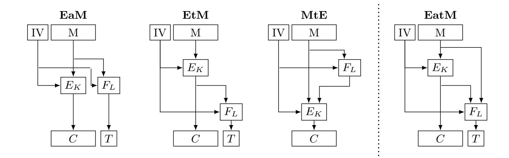

{0}------------------------------------------------

# Generic Composition: From Classical to Quantum Security

Nathalie Lang‡[0000−0002−2768−9878], Jannis Leuther†[0009−0007−0359−3680], and Stefan Lucks†[0000−0003−4906−5131]

†Bauhaus-Universität Weimar, Germany ‡ Independent Researcher nathalie.lang@posteo.de {jannis.leuther,stefan.lucks}@uni-weimar.de

Abstract. Authenticated encryption (AE) provides both authenticity and privacy. We investigate the security of generically composing unauthenticated encryption and authentication in a quantum setting where adversarial queries as well as the responses to those may be in superposition. This extends the work from Bellare and Namprempre in 2000, who considered the classical setting. First, we disprove a claim made by Soukharev et al. at PQCrypto 2016. Namely, we show that a chosen-plaintext (IND-qCPA) secure symmetric encryption scheme SE and a plus-one unforgeable message authentication code (MAC) exist, such that their generic (Encrypt-then-MAC) composition fails to achieve chosen-ciphertext (IND-qCCA) security. On the other hand, we show that a stronger MAC (namely a qPRF) suffices for the composed scheme to be IND-qCCA secure. Furthermore, the IND-qCCA notion proposed in related work assumes a randomized encryption operation. We propose to replace the randomness by a nonce, and to authenticate associated data, in addition to the message.

Keywords: Quantum Security, Symmetric Cryptography, Authenticated Encryption, Generic Composition

## 1 Introduction

Since the year 2000, one of the main goals in symmetric cryptography has been to propose and analyse efficient and secure authenticated encryption (AE) schemes. At first, researchers focused on classical attack scenarios. More recently, the anticipated advent of quantum computers and quantum communication channels has brought the importance of quantum security for encryption, authentication and authenticated encryption into focus. After the first proposals for quantum security definitions, the next step was to design new quantum-secure AE procedures that are consistent with the newly introduced security definitions. In the current paper, we focus on the quantum security of state-of-the-art systems. That is, AE schemes currently in use, which were originally developed with classical security in mind. In this context, the question arises whether some of these schemes can maintain security in a setting with quantum computers and quantum communication channels. We focus on AE schemes that are constructed by

{1}------------------------------------------------

Fig. 1. To the left of the dotted line are the three standard types of generic composition: Encrypt-and-MAC (EaM), Encrypt-then-MAC (EtM) and MAC-then-Encrypt (MtE). To the right of the dotted line is the generic composition, which we refer to as Encrypt-and+then-MAC (EatM), introduced in [\[CEV22a,](#page-31-0) Construction 1]. Each approach combines an encryption scheme E under key K and a MAC F under key L.

combining a symmetric encryption scheme with a MAC. Special attention is paid to the Encrypt-then-MAC composition, which has become the de facto standard after the fundamental work of Bellare and Namprempre [\[BN00\]](#page-30-0).

Authenticated encryption can be understood as the combination of privacy and authenticity. Various modelling methods have been proposed and discussed for classical adversaries [\[BDJR97\]](#page-30-1). Nowadays, the cryptographic research community mostly settled on the security definitions of indistinguishability (IND-CPA, IND-CCA) for privacy under chosen-plaintext and chosen-ciphertext attacks respectively, and unforgeability (EUF-CMA) for authenticity. The concept of generic composition has been introduced by Bellare and Namprempre [\[BN00\]](#page-30-0). The idea is to compose an IND-CCA secure authenticated encryption scheme from an IND-CPA secure symmetric encryption scheme and an EUF-CMA secure MAC, under independent keys. They identified three types of generic composition, which are illustrated in Figure [1.](#page-1-0) In the Encrypt-and-MAC (EaM) composition, the authentication tag and the ciphertext are computed separately on the input message and concatenated at the end. In MAC-then-Encrypt (MtE), the MAC first computes the authentication tag for a given message before the symmetric encryption algorithm encrypts the concatenation of the message and authentication tag to produce the ciphertext. In Encrypt-then-MAC (EtM), the ciphertext of the input message is computed first. Afterwards, a MAC computes the authentication tag for the ciphertext and both outputs are concatenated.

Bellare and Namprempre's work [\[BN00,](#page-30-0)[BN08\]](#page-30-2) shows that classical IND-CCA or EUF-CMA security of EaM and MtE depend on additional assumptions that need to be considered. Only EtM is provably IND-CCA secure, when the underlying encryption algorithm and MAC are IND-CPA secure and EUF-CMA secure respectively.

{2}------------------------------------------------

We are interested in security requirements for authenticated encryption and generic composition in the Q2 attack model. In this model, an adversary can perform both offline and online computations on a quantum computer. This means, that the communication between adversary and oracle allows for quantum superposition queries and responses.

In the context of quantum security for encryption, we adapt the security terms IND-qCPA and IND-qCCA introduced by Boneh and Zhandry [\[BZ13a\]](#page-31-1). These definitions are particularly relevant for existing (classical) systems: Anand et al. [\[ATTU16\]](#page-30-3) show that these security guarantees can be achieved by current state-of-the-art encryption algorithms. For example, the counter mode (CTR) is secure if the underlying block cipher is a secure pseudorandom function (PRF), while the cipher block-chaining mode (CBC) is secure if the block cipher is a quantum pseudorandom function (qPRF).

## 1.1 Related Work

Classical Authenticated Encryption (AE). The work from Bellare and Namprempre [\[BN00](#page-30-0)[,BN08\]](#page-30-2) stems from the year 2000. Today's state of the art AE schemes are nonce-based and may also authenticate some non-confidential context information (associated data) in addition to encrypting and authenticating the message. Authenticated encryption with associated data (AEAD) had been proposed in 2002 [\[Rog02\]](#page-31-2) while nonce-based encryption dates back to 2004 [\[Rog04\]](#page-31-3). In the context of this work, without loss of generality, we will refer to authenticated encryption as "AE", independent of the presence of associated data.

Quantum-Secure Encryption. For security definitions that evaluate indistinguishability in the Q2 model, there exist various enhancements and modifications of classical definitions to fit the post-quantum needs. Carstens et al. [\[CETU21\]](#page-31-4) create a classification system which analyses a comprehensive listing of variants of quantum indistinguishability definitions with respect to quantum chosen-plaintext security, as well as their relationships and (non-)implications towards one another. In [\[GHS16\]](#page-31-5), Gagliardoni et al. define quantum semantic security under chosen plaintext attacks (qSEM-qCPA) as well as an equivalent security definition which is strictly stronger than Boneh and Zhandry's INDqCPA [\[BZ13b\]](#page-31-6). Since qSEM-qCPA and all equivalent definitions are only applicable to permutations (i.e., unauthenticated encryption), we will not consider these further. Mossayebi and Schack [\[MS16\]](#page-31-7) introduce the "Real-or-Permutation" definitions RoP-qsCPA and RoP-qsCCA. The restriction in their definition of RoP-qsCCA is that the adversary may not pose decryption queries which have been the result of a previous encryption query. We argue that this restriction of the adversary is too strong.

Chevalier et al. [\[CEV22b,](#page-31-8)[CEV22a\]](#page-31-0) introduce new security definitions for privacy which are strictly stronger than those in [\[BZ13b\]](#page-31-6). In fact, security in the sense of Chevalier et al. implies security in the sense of Boneh and Zhandry, but not vice

{3}------------------------------------------------

#### 4 N. Lang et al.

versa. However, if one restricts the adversary to make classical challenge queries only, the definitions are equivalent.

Quantum vs. Classical Challenge Queries The qIND-qCPA/qCCA definitions are strictly stronger than IND-qCPA/qCCA, respectively [\[CEV22b,](#page-31-8)[CEV22a\]](#page-31-0). Some could argue that there is little merit in proving security for the weaker definitions if strictly stronger definitions exist. In this work, we do focus on proving security for these weaker definitions, due to the following reasons:

As pointed out in [\[CEV22a\]](#page-31-0), "various symmetric encryption schemes including stream cipher and some block cipher modes of operation such as CFB, OFB, CTR" are insecure in the qIND-qCCA sense. On the other hand, the aforementioned modes, stream ciphers and also the CBC mode are known to be secure in the IND-qCPA sense (when the block cipher is a PRP, or a qPRP) [\[ATTU16\]](#page-30-3). When analysing generic composition in the context of currently used or known classically secure authenticated encryption schemes, the vast majority of those schemes is insecure under qIND-qCPA/qCCA. For those schemes, we therefore cannot require qIND-qCPA or qIND-qCCA security, but we must be able to deal with IND-qCPA and IND-qCCA security.

Furthermore, while the approach from [\[BZ13b\]](#page-31-6) to distinguish quantum learning queries from classical challenge queries may appear artifical in the theoretical model, it is arguably a plausible model for practical attacks. If a system communicates through quantum channels with the outside world, a matching security game must allow learning queries to handle superposition data. On the other hand, challenge query data represents confidential information the adversary is interested in. In most attack settings, such data will be classical, and a matching security game can thus restrict challenge queries to classical inputs and outputs. As an example, consider an encrypted confidential database holding classical data (say, medical records), which is stored on a quantum computer. A program running on the quantum computer is allowed to access decrypted parts of the confidential data. So the encryption of the confidential data has been classical, but decryption queries can be in superposition.[1](#page-3-0)

Quantum-Secure Authentication. Defining security notions for post-quantum authenticity has turned out to be a challenge and few definitions exist. The main issue is that in the Q2 case, no-cloning [\[Die82,](#page-31-9)[WWZ82\]](#page-32-0) prevents any challenger from recording chosen-message queries. This renders them unable to check the validity of the adversaries challenge queries. Boneh and Zhandry [\[BZ13a\]](#page-31-1) define an authenticity notion which we refer to as "plus-one unforgeability" (PO). An adversary makes q chosen-message queries possibly in superposition and wins if they can produce q + 1 disjoint classical message-tag pairs that are all valid. Alagic et al. [\[AMRS20\]](#page-30-4) point out issues related to this definition and introduce "blind unforgeability" (BU). Here, the oracle which is queried by the adversary

1 This matches the IND-qdCCA model [\[LL23\]](#page-31-10), where challenge and even encryption queries are classical, but decryption queries can be in superposition.

{4}------------------------------------------------

is blinded on a randomly selected set of inputs. The adversary wins if they can produce a valid message-tag pair for an input on which the oracle was blinded on. The strongest notion for authentication is a quantum pseudorandom function (qPRF). A qPRF is both PO and BU secure.

Quantum-Secure Authenticated Encryption and Generic Composition. While there have been proposals for authenticated encryption schemes secure in the Q2 model, such as QCB [\[BBC](#page-30-5)+21], there is little research on suitable security definitions for authenticated encryption or generic composition in the Q2 model. Two exceptions are Soukharev et al. [\[SJS16\]](#page-32-1) and Chevalier et al. [\[CEV22a\]](#page-31-0).

Soukharev et al. [\[SJS16\]](#page-32-1) consider Boneh's and Zhandry's IND-qCPA security and forgery resistance (plus-one unforgeability) [\[BZ13b,](#page-31-6)[BZ13a\]](#page-31-1) and claim that the EtM composition of an IND-qCPA secure encryption scheme and a plusone unforgeable MAC provides IND-qCCA security. We disprove this claim in Section [4](#page-14-0) of the current paper. See Section [A](#page-32-2) for our take on the proof of [\[SJS16,](#page-32-1) Theorem 3.6] and why it is inconclusive.

Chevalier et al. examine a form of generic composition which we refer to as "Encrypt-and+then-MAC" (EatM) [\[CEV22a,](#page-31-0) Construction 1]. They show that when instantiated with a chosen-plaintext secure encryption scheme (using their strong definition, qIND-qCPA) and a qPRF, the EatM composition is chosenciphertext secure (qIND-qCCA) [\[CEV22a,](#page-31-0) Theorem 2]. Note that in EtM, the only input for the MAC is the ciphertext, while in EatM, the MAC is called with the concatenation of plaintext and ciphertext as input. See the right part of Figure [1](#page-1-0) and Definition [3](#page-7-0) in Section [2.](#page-5-0)

## 1.2 Main Contributions

- 1. The Encrypt-then-MAC (EtM) composition of a randomized IND-qCPA secure encryption scheme and a PO secure MAC does not suffice for IND-qCCA secure authenticated encryption (Section [4\)](#page-14-0). This actually disproves a claim from Soukharev et al. at PQCrypto 2016 [\[SJS16\]](#page-32-1).
- 2. The Encrypt-and-then-MAC (EatM) composition of a randomized INDqCPA secure encryption scheme and qPRF (used as MAC) is an IND-qCCA secure authenticated encryption scheme (Section [5.2\)](#page-22-0). The same also holds for the Encypt-and-MAC (EaM) and Encrypt-then-MAC (EtM) compositions (Section [5.3\)](#page-23-0).

A lot of theoretical work on quantumly secure encryption, and also this paper up to and including Section [5,](#page-19-0) assume randomized encryption and authenticate the message only. Modern practical symmetric AE also considers stateful deterministic encryption and requires to authenticate context information (or associated data), in addition to the message. In Section [6,](#page-25-0) we argue that adapting the randomized formalism and the above contributions to practical settings is straightforward, even if the notation becomes less convenient.

{5}------------------------------------------------

## 2 Preliminaries

General Notation. By  $\{0,1\}^n$ , we denote the set of binary strings of length n.  $\{0,1\}^*$  is the set of binary strings of arbitrary length. X||Y denotes concatenation of two bitstrings X and Y. With  $|X\rangle$ , we mark a state or a parameter that can be a quantum state, i.e. which can be in superposition of some kind. We will write  $|X\rangle = \sum_x \alpha_x |x\rangle$  to describe all base states  $x \in \{0,1\}^n$  which are present in the n-qubit superposition state  $|X\rangle$  using the natural base. With  $\alpha_x$ , we denote the corresponding complex amplitude of the base state  $|x\rangle$  in  $|X\rangle$ . The amplitudes in  $|X\rangle$  may be distributed arbitrarily but have to be consistent with the Born rule:  $\sum_{\alpha_x} |\alpha_x|^2 = 1$ . If the  $|\cdot\rangle$  notation is omitted, we only allow classical states or values for this parameter. Of course, a state  $|X\rangle$  can also represent a base state which would thus be classical as well. The tensor product is written as  $\otimes$ , e.g.,  $|0\rangle \otimes |0\rangle \otimes |0\rangle = |0\rangle^{\otimes 3}$ .

Message Authentication Codes (MACs). A message authentication code (MAC) algorithm is a 4-tuple  $(F, \kappa, \tau, \mu)$  of a deterministic function F and integer parameters  $\kappa \geq 0$  for the key size,  $\tau > 0$  for the tag size and the multiplicity  $\mu \geq 1$  of the input message. When all integer parameters are clear from context, we may just write F instead of  $(F, \kappa, \tau, \mu)$ . When  $\mu = 1$ , F takes a key  $K \in \{0, 1\}^{\kappa}$  and a message  $M \in \{0, 1\}^{\kappa}$  as its input. Then, F generates an authentication tag  $T = F_K(M) \in \{0, 1\}^{\tau}$ . To check if T is a valid tag for input  $M^*$  under key K, compute  $T^* = F_K(M^*)$  and return true if  $T^* = T$ , otherwise return false.

Later in this work, we will consider multiple inputs  $(\mu > 1)$  to a MAC (e.g. a message and a random initial value). To authenticate  $\mu$ -tuples  $(M_1, \ldots, M_{\mu}) \in (\{0,1\}^*)^{\mu}$ , assume a "multiplicity-1" MAC F', computing  $F'_K(X)$  for  $X \in \{0,1\}^*$  under a key K. Also assume an encoding  $\text{ENC}^{\mu}: (\{0,1\}^*)^{\mu} \to \{0,1\}^*$ , which transforms such a  $\mu$ -tuple into a single string. If  $(M_1, \ldots, M_{\mu}) \neq (M'_1, \ldots, M'_{\mu})$ , then  $\text{ENC}^{\mu}(M_1, \ldots, M_{\mu}) \neq \text{ENC}^{\mu}(M'_1, \ldots, M'_{\mu})$ . Then, F is a "multiplicity- $\mu$ " MAC defined as  $F_K(M_1, \ldots, M_{\mu}) := F'_K(\text{ENC}^{\mu}(M_1, \ldots, M_{\mu}))$ .

Quantum PRFs. [Zha21] introduces the notion of a quantum pseudorandom function (qPRF). In Section 5, we use the fact that the strongest security requirement for a MAC in the Q2 setting is that it is indistinguishable from a qPRF.

**Definition 1 (Quantum Pseudorandom Function (qPRF)).** Let  $F: \{0,1\}^{\kappa} \times \{0,1\}^n \to \{0,1\}^m$  and  $k \in \{0,1\}^{\kappa}$  be chosen uniformly at random. F is a quantum pseudorandom function (PRF) if no efficient quantum adversary making superposition queries can distinguish  $F(k,\cdot)$  from a truly random function  $\pi: \{0,1\}^n \to \{0,1\}^m$  with significant probability.

## 2.1 Symmetric Encryption

Beginning with Boneh and Zhandry [BZ13a], almost all related work on quantum secure encryption and authenticated encryption (in the Q2 model) assume

{6}------------------------------------------------

a randomized encryption algorithm. This is in strong contrast to the state of the art in practical symmetric cryptography, where the encryption algorithm takes a non-repeating nonce as an additional input. To avoid an inflation of too many similar but subtly different security notions, we first follow the related work from the quantum world. In Section [6,](#page-25-0) we will revisit our definitions and consider nonce-based encryption and authenticated encryption. There, we will also consider associated data as an additional input for the authentication.

The Initial Value IV. Chosen-plaintext secure encryption schemes (authenticated or not) must be randomized or stateful. Otherwise, an adversary could trivially see if the same message has been encrypted twice. To formally capture both randomized and stateful encryption, we model our encryption operation as a function with the IV as an explicit input in addition to the key and the message.

Unique IVs. We assume that the IVs chosen by the sender of a message never repeat. We note that this appears to be implied in [\[CEV22a\]](#page-31-0): without unique IVs it would be difficult to make sense of the qIND-qCCA notion, see Footnote [3](#page-12-0) at page [13.](#page-12-0) In any case, if IVs repeat, even a chosen-plaintext adversary can trivially win. For this work, we thus assume IVi ̸= IVj for all i ̸= j in the security games in Section [3.](#page-9-0) If the IVs are random, as in [\[CEV22a\]](#page-31-0), then Pr[∃i ̸= j : IVi = IVj ] is negligible for ν-bit IVs and q ≪ 2 ν/2 encryption queries. If the IVs are deterministic, some stateful mechanism (e.g., a message counter or a timestamp) must be employed to ensure IVi ̸= IVj .

Syntax for Decryption. The authors in [\[CEV22a\]](#page-31-0) (among others) denote decryption as DK(C), explicitly specifying the key K and ciphertext C as inputs but not the IV. To define qIND-qCCA security, [\[CEV22a\]](#page-31-0) need "ciphertext decomposition" to split ciphertexts into "message-independent" and "message-dependent" components, where only the message-dependent part is stored in a quantum database. We follow a slightly different notation: For simplicity and to match the common practice in symmetric cryptography, we write decryption as DK(C, IV) with a message-independent IV and a message-dependent proper ciphertext C.

Unauthenticated Encryption. A symmetric encryption scheme SE is a 4-tuple (E, D, κ, ν) of a deterministic encryption algorithm E, a deterministic decryption algorithm D, and integer parameters κ, ν ≥ 0 for the size of they key and IV respectively. When the integer parameters are clear from context, we may write (E, D) instead of (E, D, κ, ν).

E takes a key K ∈ {0, 1} κ , a value IV ∈ {0, 1} ν , a message M ∈ {0, 1} ∗ and returns a ciphertext C = EK(M, IV). D takes K, IV and ciphertext C ∈ {0, 1} ∗ and returns a message M = DK(C, IV). We require (E, D) to be correct: for all K, IV and M, it holds that DK(EK(M, IV), IV) = M.

Authenticated Encryption. An encryption scheme can be enhanced to additionally authenticate encrypted messages. We formalize this in Definition [2.](#page-6-0)

{7}------------------------------------------------

**Definition 2 (Authenticated Encryption).** An authenticated encryption (AE) scheme is a 5-tuple  $(\mathbf{E}, \mathbf{D}, \kappa, \tau, \nu)$  of authenticated encryption algorithm  $\mathbf{E}$ , authenticated decryption algorithm  $\mathbf{D}$  and integer parameters  $\kappa, \tau, \nu \geq 0$  for the size of the key, tag and initial value respectively. When the integer parameters are clear from context, we may just write  $(\mathbf{E}, \mathbf{D})$  instead of  $(\mathbf{E}, \mathbf{D}, \kappa, \tau, \nu)$ .

**E** takes a key  $K \in \{0,1\}^{\kappa}$ , initial value  $\mathcal{IV} \in \{0,1\}^{\nu}$ , message  $M \in \{0,1\}^{*}$  and returns a pair  $(C,T) = \mathbf{E}_{K}(M,\mathcal{IV})$  of ciphertext  $C \in \{0,1\}^{*}$  and authentication tag  $T \in \{0,1\}^{\tau}$ . **D** takes K, initial value  $\mathcal{IV} \in \{0,1\}^{\nu}$  and a pair  $(C,T) \in \{0,1\}^{*} \times \{0,1\}^{\tau}$  and either returns a message  $M = \mathbf{D}_{K}(C,T,\mathcal{IV})$  or the invalid string  $\bot = \mathbf{D}_{K}(C,T,\mathcal{IV})$ . For all K, M, and  $\mathcal{IV}$  we require

$$\mathbf{D}_K(\mathbf{E}_K(M, \mathcal{I}\mathcal{V}), \mathcal{I}\mathcal{V}) = M. \tag{1}$$

Invalid Strings. If at least one of the strings X and Y is invalid (i.e.  $X = \bot$  or  $Y = \bot$ ), the bit-wise XOR  $X \oplus Y$  and the concatenation X || Y are invalid as well. In our context, strings  $|X\rangle$  can be in a superposition of proper strings and invalid data. For concreteness, the reader may assume an n-bit string X to be represented by  $X = (X_{\text{str}}, X_\bot) \in \{0, 1\}^n \times \{0, 1\}$ . If  $X_\bot = 0$ , then X is a proper n-bit string with the value  $X_{\text{str}}$ . If  $X_\bot = 1$ , then X is invalid and  $X_{\text{str}} = 0^n$ . The case  $(X_\bot = 1 \text{ and } X_{\text{str}} \neq 0^n)$  is prohibited to ensure that no invalid string holds any information beyond the fact of being invalid. A superposition of an n-bit string and invalid data can be written as

$$|X\rangle = \alpha_{\perp} |(0^n, 1)\rangle + \sum_{x \in \{0, 1\}^n} \alpha_x |(x, 0)\rangle.$$

Amplitudes  $\alpha_{\perp}$  and  $\alpha_x$  are complex numbers and  $|\alpha_{\perp}|^2 + \sum_{x \in \{0,1\}^n} |\alpha_x|^2 = 1$ .

Generic Composition. An authenticated encryption scheme can be constructed through a generic composition using a symmetric encryption algorithm and a message authentication code. We formalize three types of generic composition.

**Definition 3 (Generic Composition).** Let  $M, C, \mathcal{IV}, T$  denote message, ciphertext, initial value and tag respectively as described in Definition 2. Let K, L be keys chosen independently at random,  $SE = (E_K, D_K)$  a symmetric encryption scheme under key K and  $F_L$  a message authentication code under key L. The authenticated encryption algorithm  $AE = (\mathbf{E}_{K,L}, \mathbf{D}_{K,L})$  is defined as

$$\mathbf{E}_{K,L}(M, \mathcal{IV}) = \begin{pmatrix} E_K(M, \mathcal{IV}), \ \textit{Auth}_{\mathbf{E}} \end{pmatrix}$$

$$\mathbf{D}_{K,L}(C, T, \mathcal{IV}) = \begin{cases} D_K(C, \mathcal{IV}) & \textit{if } \textit{Auth}_{\mathbf{D}} = T, \\ \bot & \textit{else}. \end{cases}$$

Depending on the generic composition type (EaM, EtM or EatM), the authentication parts  $Auth_{\mathbf{E}}$  and  $Auth_{\mathbf{D}}$  are defined according to the table below2.

&lt;sup>2 We skip MAC-then-Encrypt (MtE), as we do not require it in our context.

{8}------------------------------------------------

|                       | $Auth_{\mathbf{E}}$                          | $Auth_{\mathbf{D}}$                          |
|-----------------------|----------------------------------------------|----------------------------------------------|
| EaM                   | $F_L(M, \mathcal{IV})$                       | $F_L(D_K(C, \mathcal{IV}), \mathcal{IV})$    |
| $\operatorname{EtM}$  | $F_L(E_K(M, \mathcal{IV}), \mathcal{IV})$    | $F_L(C, \mathcal{IV})$                       |
| $\operatorname{EatM}$ | $F_L(E_K(M, \mathcal{IV}), M, \mathcal{IV})$ | $F_L(C, D_K(M, \mathcal{IV}), \mathcal{IV})$ |

## 2.2 Compressed Random Oracles

The compressed random oracle technique has been proposed by Zhandry [Zha19]. Below, we follow the approach from [Unr21, Section 3.1] by describing the core concepts of the compressed oracle model, with a focus on the interface to query the compressed oracle, while skipping implementation issues, for which we refer the reader to Zhandry's original work.

The Random Oracle (RO). Let  $F_{n,m}$  be the set of functions  $\{0,1\}^m \to \{0,1\}^n$ . The RO first samples a function  $H \in F_{n,m}$  uniformly at random. An oracle call is equivalent to the quantum operation  $|x,y\rangle \mapsto |x,y \oplus H(x)\rangle$ . To evaluate H, one assumes an additional hidden register  $|H\rangle$  containing the truth table of H. The adversary does not get any direct access to  $|H\rangle$ , but can make queries

$$|x,y\rangle\otimes|H\rangle \mapsto |x,y\oplus H(x)\rangle\otimes|H\rangle$$
.

The Standard Oracle (StO). The StO is is initialized with the uniform superposition of all functions in  $F_{n,m}$ :

$$\frac{1}{\sqrt{|F_{n,m}|}} \sum_{h \in F_{n,m}} |h\rangle$$
.

StO queries are of the form

$$|x,y\rangle \otimes |h\rangle \mapsto |x,y \oplus h(x)\rangle \otimes |h\rangle$$
.

This StO is indistinguishable from the quantum random oracle [Zha19].

The Compressed Standard Oracle (CStO). Imagine the h-register to consist of  $2^m$  separate registers  $h_x$ . Each register  $h_x$  is storing the value  $h(x) \in \{0,1\}^n \cup \{\bot\}$ , where  $h(x) \in \{0,1\}^n$  represents a function value and  $h(x) = \bot$  indicates that the function h has not yet been defined at the input x. In other words, the h-register holds a superposition of partial functions. Let Q denote the application of the quantum Fourier transformation over a register  $h_x$  (in our case, this is the application of the Hadamard transformation on each of the m qubits of  $h_x$ ), extended by the rule  $Q \mid \bot \rangle = \bot$ . Define  $U_\bot$ :  $U_\bot(\bot) = |0\rangle$ ,  $U_\bot(0) = |\bot\rangle$ , and for  $y \notin \{0, \bot\}$ :  $U_\bot(y) = |y\rangle$ . The decompression operation D for a register  $h_x$  is  $D = Q \cdot U_\bot \cdot Q^{\dagger}$ . By  $D^{\otimes 2^n}$  we denote the application of D to the entire h-register. If we apply  $D^{\otimes 2^n}$  to the h-register is in its initial state, the result is  $|\bot\rangle^{\otimes 2^n}$ . In other words, this is the representation of the empty partial function  $h(x) = \bot$  for all x. Finally, we define the CStO as follows.

{9}------------------------------------------------

- The initial state of the CStO is |⊥⟩⊗2 n = |⊥⟩ ⊗ |⊥⟩ ⊗ · · · ⊗ |⊥⟩.
- A CStO query first applies (D† ) ⊗2 n to the h-register, then performs a StO query, and then applies D⊗2 n to the h register.

Since successive calls to D⊗2 n and (D† ) ⊗2 n cancel out, the CStO is indistinguishable from the StO.

By a slight abuse of notation, we write a CStO query as

$$|x,y\rangle |\mathcal{D}\rangle \mapsto |x,y \oplus \mathcal{D}(x)\rangle |\mathcal{D} \cup (x,H(x))\rangle,$$
 (2)

where H(x) is sampled uniformly at random if it had not been fixed before, and D holds a "database". The input register is |x⟩, the output register is |y⟩.

On Implementation Details. The above implementation of the CStO does not live up to its name. D needs exponential storage, i.e. the CStO does not "compress". The very point of Zhandry's work [\[Zha19\]](#page-32-4) is solving this issue. Observe that after q queries, the CStO holds a superposition of partial functions, each defined at at most q points. Zhandry provides a technique to encode D in only about q · m · n qubits. He also provides efficient implementations of the CStO initialization and of CStO queries (as in Equation [\(2\)](#page-9-1)) interacting with the encoded database.

Later in this work, we will refer to the CStO in the context of Definitions [6](#page-11-0) and [7](#page-12-1) and for the proof of Theorem [2.](#page-22-1) In neither case, we need to know specific implementation details of the CStO, except for the fact that an efficient implementation exists.

The Inverse Compressed Oracles (CInvO and CInvODK ). In their work, Chevalier et al. [\[CEV22a,](#page-31-0) Section 3.5] enhance Zhandry's compressed oracle by an efficient reverse lookup, which we refer to as CInvO:

$$|y,z\rangle |\mathcal{D}\rangle \mapsto \begin{cases} |y,z \oplus x\rangle |\mathcal{D}\rangle \text{ if } \mathcal{D} \text{ contains } x \text{ with } h(x) = y, \\ |y,z \oplus \bot\rangle |\mathcal{D}\rangle \text{ else }. \end{cases}$$

The same authors also propose an efficient keyed inverse lookup. Let (E, D) be a symmetric encryption scheme and K a secret key for (E, D). The oracle CInvODK evaluates DK(y) whenever CInvO would return ⊥:

$$|y,z\rangle |\mathcal{D}\rangle \mapsto \begin{cases} |y,z \oplus x\rangle & |\mathcal{D}\rangle \text{ if } \mathcal{D} \text{ contains } x \text{ with } h(x) = y, \\ |y,z \oplus D_K(y)\rangle & |\mathcal{D}\rangle \text{ else }. \end{cases}$$
 (3)

Similar to the CStO, the implementation details are not important for this paper. We refer the reader to [\[CEV22a\]](#page-31-0).

## 3 Quantum Security Definitions

### 3.1 Privacy

IND-qCPA and IND-qCCA. In [\[BZ13b\]](#page-31-6), Boneh and Zhandry define security notions for indistinguishability under quantum queries: IND-qCPA and INDqCCA. In the following Definitions [4](#page-10-0) and [5,](#page-10-1) we will revisit these definitions for 

{10}------------------------------------------------

chosen-plaintext as well as chosen-ciphertext adversaries. While encryption or decryption queries can be in superposition, challenge queries are always classical.

In Boneh and Zhandry's definitions, challenge queries follow the *left-or-right* approach, where an adversary submits two plaintexts as their challenge, receives one ciphertext and guesses which of the plaintexts had been encrypted. As we will introduce a variant of IND-qCPA and IND-qCCA that uses the *real-or-random* approach in Definition 7, we explicitly append [LoR] or [RoR] to the respective definition names to avoid any confusion between Boneh and Zhandry's original and the modification.

**Definition 4 (IND-qCCA[LoR] game).** Let  $\mathcal{A}$  be a q-query IND-qCCA[LoR] adversary,  $\mathcal{C}$  an IND-qCCA[Lor] challenger and (E, D) an encryption scheme.

- 1. C generates a key K and a bit  $b \in \{0,1\}$  uniformly at random. C maintains an initially empty classical database  $\mathfrak{D}$  of challenge ciphertext- $\mathcal{IV}$  pairs.
- 2. For each i-th query with  $1 \leq i \leq q$ ,  $\mathcal{A}$  either performs an encryption, decryption or challenge query (in any order):
  - **Encryption query**: A provides the state  $|M_i, \Psi\rangle = \sum_{m, \psi} \alpha_{m, \psi} |m, \psi\rangle$ . C chooses randomness  $\mathcal{IV}_i$  and performs the encryption through the transformation

$$\sum_{m,\psi} \alpha_{m,\psi} | m, \psi \rangle \to \sum_{m,\psi} \alpha_{m,\psi} | m, \psi \oplus E_K(m, \mathcal{IV}) \rangle .$$

- **Decryption query**: A provides the state  $|C_i, \Phi\rangle = \sum_{c,\phi} \alpha_{c,\phi} |c,\phi\rangle$  and classical  $\mathcal{IV}_i$ . C performs the decryption through the transformation

$$\sum_{c,\phi} \alpha_{c,\phi} |c,\phi\rangle \to \sum_{c,\phi} \alpha_{c,\phi} |c,\phi \oplus f_{dec}(c,\mathcal{IV})\rangle$$

where

$$f_{dec}(c, \mathcal{IV}) = \begin{cases} \bot & \textit{if } (c, \mathcal{IV}) \in \mathfrak{D} \\ D_K(c, \mathcal{IV}) & \textit{otherwise}. \end{cases}$$

- Challenge query: A decides on two classical values  $M_i^0, M_i^1$ . C chooses randomness  $\mathcal{IV}^*$  and returns the encryption  $C^* = E_K(M_i^b, \mathcal{IV}^*)$ . C adds  $(C^*, \mathcal{IV}^*)$  to the database  $\mathfrak{D}$ .
- 3. A outputs bit b' and wins if b' = b.

$$ADV^{\text{IND-qCCA}}(A) = |\Pr[b' = 1 \mid b = 1] - \Pr[b' = 1 \mid b = 0]|.$$

**Definition 5 (IND-qCPA[LoR] game).** The IND-qCPA[LoR] game is identical to the IND-qCCA[LoR] game, except for two changes. Firstly, the IND-qCPA adversary makes no decryption queries. Secondly, because  $\mathcal{C}$  does not have to respond to decryption queries, they do not need to maintain the database  $\mathfrak{D}$ .

{11}------------------------------------------------

qIND-qCPA and qIND-qCCA. The definitions from Chevalier et al. [\[CEV22a\]](#page-31-0) deviate from IND-qCPA and IND-qCCA in two points. Firstly, they follow a realor-random (RoR) approach. Secondly, and more importantly, their attack model allows for challenge queries in superposition. To record such challenge queries, the definitions rely on the compressed oracle model. However, the response to a challenge query for DK(C, IV) does not only depend on the message-dependent ciphertext C, but also on the message-independent classical IV, which is difficult to record in a compressed quantum database. Thus, the qIND-qCCA challenger invokes "a new instance" of the compressed oracle for each challenge query (see "Many-Query Setting" in [\[CEV22a,](#page-31-0) Section 3.3]). Below, we formally assume q databases, where q is the number of queries in total—and thus an upper bound for the number of challenge queries.

Definition 6 (qIND-qCCA game and qIND-qCPA game). Let A be a q-query qIND-qCCA adversary, C a qIND-qCCA challenger and (E, D) an encryption scheme.

- 1. C chooses a key K and a bit b ∈ {0, 1} uniformly at random.
  - C initializes q quantum "databases" D1, . . . Dq, each able to store a superposition of partially defined functions, each function with exactly one defined function value. Also, C will maintain a table T of pairs (IVi , i) from challenge queries (initially empty).
- 2. For each query 1 ≤ i ≤ q, A either performs an encryption query, a challenge query, or a decryption query:
  - Encryption query: A provides the state |Mi , Ψ⟩ = P m,ψ αm,ψ |m, ψ⟩. C chooses classical random value IVi and performs the encryption through the transformation

$$\sum_{m,\psi} \alpha_{m,\psi} | m, \psi \rangle \to \sum_{m,\psi} \alpha_{m,\psi} | m, \psi \oplus E_K(m, \mathcal{IV}_i) \rangle . \tag{4}$$

– Challenge query: A provides the state |Mi , Ψ⟩ = P m,ψ αm,ψ |m, ψ⟩.

If b = 1, the challenge query is handled as an encryption query:

C chooses classical random value IVi and evaluates Equation [\(4\)](#page-11-1).

### Else

- C chooses classical random value IVi and adds (IVi , i) to T.
- C calls the CStO oracle with Database Di, input register |Mi , IVi⟩ and output register |Ψ⟩, cf. Equation [\(2\)](#page-9-1).
- Decryption query: A chooses a classical IVi and a state |Ci P , Φ⟩ = c,ϕ αc,ϕ |c, ϕ⟩.

{12}------------------------------------------------

If b = 1, C performs the decryption through the transformation

$$\sum_{c,\phi} \alpha_{c,\phi} |c,\phi\rangle \to \sum_{c,\phi} \alpha_{c,\phi} |c,\phi \oplus D_K(c,\mathcal{IV}_i)\rangle .$$

Else

- C looks up for an index j with (IVi , j) in T.
- If j exists, C calls CInvODK with database Dj , to recover Mi from Ci, cf. Equation [\(3\)](#page-9-2). [3](#page-12-0)
- If no such j exists, C proceeds as in the b = 1 case.
- 3. A outputs a bit b ′ . A wins if b ′ = b.

The advantage of A is

$$ADV^{\text{qIND-qCCA}}(A) = |\Pr[b' = 1 \mid b = 1] - \Pr[b' = 1 \mid b = 0]|$$
.

The qIND-qCPA game is identical to the qIND-qCCA game, except that the adversary cannot make decryption queries.

Real-or-Random IND-qCPA and IND-qCCA. In Section [5,](#page-19-0) our proof method makes use of reductions between security definitions that use different conditions to determine the success of an adversary in a challenge query. In particular, the security definitions considered in this work either employ the left-or-right (e.g. IND-qCCA[LoR]) or the real-or-random (qIND-qCCA) approach for challenge queries. In preparation to Section [5,](#page-19-0) we define the real-or-random variants of the IND-qCCA[LoR] and IND-qCPA[LoR] games in Definition [7.](#page-12-1) Afterwards, we will show that the left-or-right variants from Definitions [4](#page-10-0) and [5](#page-10-1) and the real-or-random variants from Definition [7](#page-12-1) are equivalent.

Definition 7 (IND-qCCA[RoR], IND-qCPA[RoR]). Let A be a q-query IND-qCCA[RoR] adversary, C an IND-qCCA[RoR] challenger and (E, D) an authenticated encryption scheme.

The IND-qCCA[RoR] game is identical to the qIND-qCCA game, except that A is restricted to classical inputs for challenge queries. [4](#page-12-2)

The advantage of A in the IND-qCCA[RoR] game is defined as

$$A_{DV}^{\text{IND-qCCA[RoR]}}(A) = |\Pr[b' = 1 \mid b = 1] - \Pr[b' = 1 \mid b = 0]|$$
.

The IND-qCPA[RoR] game is identical to the IND-qCCA[RoR] game, except that A makes no decryption queries.

3 If T contained two or more pairs (IV, j) and (IV, j′ ) with the same IV, it would be undefined which database to use in the CInvODK call: Dj or Dj ′ . Since the IVs are unique (cf. Section [2.1\)](#page-5-1), T can only contain at most one pair (IV, j) for every IV.

4 Or C's first step in handling a challenge query from A is to measure the state submitted by A.

{13}------------------------------------------------

We conclude Section 3.1 by proving the equivalence of IND-qCPA[LoR] and IND-qCCA[LoR] from Definitions 4 and 5 to their real-or-random counterparts from Definition 7.

**Lemma 1.** Security in the IND-qCCA[RoR] sense implies security in the IND-qCCA[LoR] sense and vice versa. Furthermore, security in the IND-qCPA[RoR] sense implies security in the IND-qCPA[LoR] sense and vice versa.

**Proof.** [Lemma 1] Assume two adversaries:  $\mathcal{A}[LoR]$  plays the IND-qCCA[LoR] game with challenger  $\mathcal{C}[LoR]$  and  $\mathcal{A}[RoR]$  plays the IND-qCCA[RoR] game with challenger  $\mathcal{C}[RoR]$ .

We define two games. In the first game  $G_1$ ,  $\mathcal{A}[RoR]$  tries to mimic the IND-qCCA[LoR] challenger  $\mathcal{C}[LoR]$ . For this,  $\mathcal{A}[RoR]$  chooses bit  $b' \in \{0, 1\}$ . When  $\mathcal{A}[LoR]$  makes a challenge query  $M_i^0$ ,  $M_i^1$ ,  $\mathcal{A}[RoR]$  forwards  $M_i^{b'}$  to  $\mathcal{C}[RoR]$ . When  $\mathcal{A}[LoR]$  makes a guess b'',  $\mathcal{A}[RoR]$  outputs 1 if b'' = b' and 0 otherwise. This is, in fact, equivalent to the scenario in the classical proof of [BDJR97, Theorem 1]. It holds:

$$ADV^{IND-qCCA[LoR]}(A[LoR]) \le 2 \cdot ADV^{IND-qCCA[RoR]}(A[RoR]).$$

In the second game  $G_2$ ,  $\mathcal{A}[LoR]$  tries to mimic the IND-qCCA[RoR] challenger  $\mathcal{C}[RoR]$ . Every encryption- and decryption query from  $\mathcal{A}[RoR]$  gets forwarded to  $\mathcal{C}[LoR]$  by  $\mathcal{A}[LoR]$ . When  $\mathcal{A}[RoR]$  makes a challenge query of the form  $M_i$ ,  $\mathcal{A}[LoR]$  chooses a random input  $Z_i$  and sends  $(Z_i, M_i)$  as their own challenge query to  $\mathcal{C}[LoR]$ . Again, the result is returned to  $\mathcal{A}[RoR]$ . When  $\mathcal{A}[RoR]$  guesses b' = 1 (real) then  $\mathcal{A}[LoR]$  also guesses b'' = 1 and 0 otherwise. This fits the setting of the proof of [BDJR97, Theorem 2]. It holds:

$$\operatorname{Adv}^{\operatorname{IND-qCCA[RoR]}}(\mathcal{A}[\operatorname{RoR}]) \leq \operatorname{Adv}^{\operatorname{IND-qCCA[LoR]}}(\mathcal{A}[\operatorname{LoR}]).$$

The proof for chosen plaintexts (IND-qCPA[RoR] and IND-qCPA[LoR]) is identical to the proof for chosen ciphertexts, as the correctness of the result relies solely on the handling of challenge queries which are dealt with identically in IND-qCPA[LoR] and IND-qCCA[LoR].

### 3.2 Authenticity

Classical unforgeability definitions like SUF-CMA cannot be modified easily to be applicable in the Q2 setting as any system in this model is subject to various properties unique to a quantum system. When we consider MACs in the Q2 setting, these MACs need to be able to handle superposition queries and are restricted by no-cloning and measurement behaviour [AGM18].

In [BZ13a], Boneh and Zhandry proposed what we will call *plus-one unforgeability* (PO), whereas an adversary may query an oracle q times in superposition

{14}------------------------------------------------

and must produce q+1 classical valid pairs of message and authentication tag to win.

**Definition 8 (PO Game).** Let A be a q-query PO adversary and C a PO challenger with access to the MAC oracle F.

- 1. C generates a key K uniformly at random.
- 2. For each query  $1 \le i \le q$ :
  - $\mathcal{A}$  chooses n-qubit state  $|M_i, \Psi\rangle = \sum_{m,\psi} \alpha_{m,\psi} |m,\psi\rangle$ .
  - C applies the MAC through the transformation

$$\sum_{m,\psi} \alpha_{m,\psi} | m, \psi \rangle \to \sum_{m,\psi} \alpha_{m,\psi} | m, \psi \oplus F_K(m) \rangle$$

3. A decides on q+1 classical message-tag pairs  $(M_1^*, T_1^*), \ldots, (M_{q+1}^*, T_{q+1}^*)$ . A wins if  $F_K(M_j^*) = T_j^*$  for all  $1 \le j \le q+1$ .

If  $\mu$  is the multiplicity of the MAC F, then  $|M_i\rangle$  is a superposition of  $\mu$ -tuples of strings, and each of the classical  $M_i^*$  is actually a  $\mu$ -tuple of strings.

Alagic et al. [AMRS20] point out a "problem with PO-unforgeability". For random  $f, g, h : \{0, 1\}^n \to \{0, 1\}^n$ , and  $p \in \{0, 1\}^n$ , the function  $M_{f,g,h,p} : \{0, 1\} \times \{0, 1\}^n \to \{0, 1\}^n \times \{0, 1\}^n$  is defined by

$$M_{f,g,h,p}(b,x) = \begin{cases} g(x \bmod p) \mid\mid f(x) \text{ if } b = 1\\ 0^n &\mid\mid h(x) \text{ if } b = 0, x \neq p\\ 0^n &\mid\mid 0^n \text{ if } b = 0, x = p \end{cases}$$
 (5)

Here (f, g, h, s) is the secret key. As it turns out, F is PO-unforgeable. Despite F's PO unforgeability, an attacker can recover the secret s by quantum period finding techniques, making only queries to  $M_{f,g,h,p}(1,\cdot)$ , and then forge  $M_{f,g,h,p}(0,0) = 0^n || 0^n$ . Note that the period finding techniques imply that, after making q queries for  $M_{f,g,h,p}(1,|x\rangle)$ , the adversary will know  $M_{f,g,h,p}(0,0) = 0^n \times 0^n$ , but strictly less than q pairs  $(x_i, M_{f,g,h,p}(1,x_i))$ .

In the same work, the authors define a different security notion for MACs in the Q2 setting, called blind unforgeability. Notably, the MAC  $M_{f,g,h,p}$  from above is not blindly unforgeable. It is unknown if security in the blind unforgeability game directly implies security in the PO unforgeability game. In this work, we do not provide any results about blind unforgeability.

## 4 Encrypt-then-MAC with Plus-One Unforgeability

In the classical case, Bellare and Namprempre [BN00,BN08] show that when an IND-CPA secure symmetric encryption algorithm is combined with a SUF-CMA secure MAC using the EtM method, the resulting authenticated encryption scheme is provably IND-CCA secure.

{15}------------------------------------------------

In this section, we will demonstrate that Bellare and Namprempre's result does not carry over to the quantum case when considering security definitions IND-qCPA[LoR], IND-qCCA[LoR] and plus-one unforgeability from [BZ13b,BZ13a] which we revisited in Definitions 4, 5 and 8. Theorem 1 shows that there exists an EtM composition of an IND-qCPA[LoR] secure symmetric encryption scheme  $\widehat{SE}$  with a plus-one unforgeable MAC F where the resulting authenticated encryption scheme AE is not IND-qCCA[LoR] secure. This directly contradicts and disproves a result made in [SJS16].

**Theorem 1.** If IND-qCPA[LoR] secure encryption schemes and qPRFs exist, then there exists an IND-qCPA[LoR] secure encryption scheme  $\widehat{SE}$  and a plusone unforgeable  $MAC\ F$ , such that the Encrypt-then-MAC composition of  $\widehat{SE}$  and F is IND-qCCA[LoR] insecure.

Roadmap. We start by defining  $\widehat{SE}$  in Definition 9 which is IND-qCPA[LoR] secure (Lemma 2), but not IND-qCCA[LoR] secure (Lemma 3).

Next, we define the MAC  $F = F_{p,f,g,h,\mathbf{R},\mathbf{R}',Y^*}$ . Definition 10 recalls the function  $M = M_{p,f,g,h}$  from [AMRS20, Construction 3], which is PO secure ([AMRS20, Theorem 21]). We use M to specify F in Definition 11. As it turns out, F inherits the PO security from M (Lemma 5). In Lemma 6 we show that F also inherits the weakness from M: an adversary can successfully predict a valid authentication tag for a specific input.

Finally, we apply the EtM composition to  $\widehat{SE}$  and F. The resulting authenticated encryption scheme AE is described in Definition 12 and is shown not to be IND-qCCA[LoR] secure (Lemma 7). Thus, Theorem 1 holds.

# 4.1 The Symmetric Encryption Scheme $\widehat{SE}$

**Definition 9.** Let SE = (E, D) be a symmetric encryption algorithm. Further, let  $K \in \{0,1\}^n$  be a secret key,  $\mathcal{IV} \in \{0,1\}^{\nu}$  an initialisation vector, and  $M, C \in \{0,1\}^n$  the plain- and ciphertext respectively. We construct a symmetric encryption scheme  $\widehat{SE} = (\widehat{E}, \widehat{D})$ :

$$\widehat{E}_K(M, \mathcal{I}\mathcal{V}) = \begin{cases} 0^n & \text{if } M = K \text{ and } \mathcal{I}\mathcal{V} = 0^{\nu}, \\ E_K(K, 0^{\nu}) & \text{if } M = D_K(0^n, 0^{\nu}) \text{ and } \mathcal{I}\mathcal{V} = 0^{\nu}, \\ E_K(M, \mathcal{I}\mathcal{V}) & \text{else}. \end{cases}$$

$$\widehat{D}_K(C, \mathcal{I}\mathcal{V}) = \begin{cases} K & \text{if } C = 0^n \text{ and } \mathcal{I}\mathcal{V} = 0^{\nu}, \\ 0^n & \text{if } C = E_K(K, 0^{\nu}) \text{ and } \mathcal{I}\mathcal{V} = 0^{\nu}, \\ D_K(C, \mathcal{I}\mathcal{V}) & \text{else}. \end{cases}$$

In other words,  $\widehat{E}$  behaves like E except for a deliberate swap in outputs such that, in particular  $\widehat{E}_K(K,0^{\nu}) = 0^n$ . The decryption behaves accordingly.

{16}------------------------------------------------

**Lemma 2.** If SE is IND-qCPA[LoR] secure, then  $\widehat{SE}$  is also IND-qCPA[LoR] secure.

**Proof.** [Lemma 2] We will employ the semi-classical O2H lemma from [AHU19]. We define two functions H, G:

$$H(X,Y) = E_K(X,Y)$$
 and  $G(X,Y) = \widehat{E}_K(X,Y)$ .

Note that, for a chosen-plaintext adversary, distinguishing SE from  $\widehat{SE}$  is tantamount to distinguishing G from H. Let  $\mathcal{A}$  be a q-query IND-qCPA[LoR] adversary, which is either given access to G or to H. Write  $ADV^{H,G}(\mathcal{A})$  for  $\mathcal{A}$ 's advantage in distinguishing G from H.

Now consider a tweaked attack game:  $\mathcal{A}$  makes a query  $|X,Y\rangle$  to its oracle (either G or H), a partial measurement is performed, to decide if the event FIND did occur:

FIND 
$$\Leftrightarrow \mathcal{A}$$
 made a query  $(X,Y)$  with  $X \in \{K,0^n\}$  and  $Y = 0^{\nu}$ .

The measurement reveals if FIND has occurred or not, and the query  $|X,Y\rangle$  collapses according to the result of the measurement. Then the response  $G(|X,Y\rangle)$  or  $H(|X,Y\rangle)$  for  $\mathcal{A}$  is computed.

Intuitively, it seems obvious that if FIND is unlikely to occur in the tweaked attack game, then  $\mathcal{A}$  should be unable to distinguish G from H in the original attack game. This is confirmed and quantified by the semi-classical O2H lemma [AHU19, Theorem 1], which allows us to bound  $\mathcal{A}$ 's advantage in the original attack game by

$$\operatorname{AdV}^{G,H}(\mathcal{A}) \le 2\sqrt{(q+1)\Pr[\operatorname{FIND}]}.$$

To bound Pr[FIND], we now employ [AHU19, Corrollary 1]. In [AHU19] the adversary receives an additional input string z, which models further information given to the adversary, e.g., other oracles. For [AHU19, Corrollary 1], z must be independent from the set  $S = \{(K, 0^{\nu}), (D_K(0^n, 0^{\nu}), 0^{\nu})\}$  of inputs which trigger FIND. In our case, there is no further information, i.e., z is the empty string. Hence, z and S are independent, and we deduce

$$\Pr[\text{FIND}] \le 4q \cdot P_{\max} \le 4q \cdot \frac{2}{2^n}$$

for  $P_{\max} = \Pr_{X \in \{0,1\}^n} [X \in \{K, D_K(0^n, 0^\nu)\}] \le \frac{2}{2^n}$ .

Thus, A's advantage to distinguish G from H is

$$\operatorname{AdV}^{G,H}(\mathcal{A}) \le 2\sqrt{(q+1) \cdot \frac{8q}{2^n}}.$$

As it turns out, the advantage of  $\mathcal{A}$  in distinguishing G from H is negligible. Thus,  $\widehat{SE}$  inherits the IND-qCPA[LoR] security from SE.

{17}------------------------------------------------

**Lemma 3.**  $\widehat{SE}$  is not IND-qCCA[LoR] secure. Namely, there exists an adversary  $\mathcal{A}$  that can win the IND-qCCA[LoR] game against  $\widehat{SE}$  with high probability.

**Proof.** [Lemma 3] An IND-qCCA[LoR] adversary can ask for the decryption  $\widehat{D}_K(0^n, 0^n)$  to receive the secret key K with probability 1.

#### 4.2 The MAC F

**Definition 10.** Let  $p \in \{0,1\}^n$  be a random period and  $f,g,h:\{0,1\}^n \to \{0,1\}^n$  be random functions. For the secret key (p,f,g,h), we define  $M_{p,f,g,h}:\{0,1\}^{n+1} \to \{0,1\}^{2n}$  by

$$M_{p,f,g,h}(b,x) = \begin{cases} g(x \bmod p) \mid\mid f(x) & \text{if } b = 1, \\ 0^n &\mid\mid h(x) & \text{if } b = 0, x \neq p, \\ 0^n &\mid\mid 0^n & \text{if } b = 0, x = p. \end{cases}$$

Lemma 4 ([AMRS20, Theorem 21]). The function  $M_{p,f,g,h}$  is PO secure.

**Definition 11.** Assume (p, f, g, h) from Definition 10, and two qPRFs  $\mathbf{R}$ :  $\{0, 1\}^* \to \{0, 1\}^{n-1}$  and  $\mathbf{R}' : \{0, 1\}^* \to \{0, 1\}^n$ . Let  $M^* = M_{p, f, g, h}$ ,  $Y^* \in \{0, 1\}^*$  and  $K^* = (p, f, g, h, \mathbf{R}, \mathbf{R}')$ . We construct the MAC

$$F_{p,f,a,h,\mathbf{R},\mathbf{R}',Y^*} = F_{K^*,Y^*} : (\{0,1\}^* \times \{0,1\}^*) \to \{0,1\}^{3n}$$

with

$$F_{K^*,Y^*}(X,Y) = \begin{cases} M^*(0,(0||X)) & || 0^n & \text{if } (|X| = n-1) \land (Y = Y^*), \\ M^*(1,X) & || \mathbf{R}'(X,Y) & \text{if } |X| = n, \\ M^*(0,(1||\mathbf{R}(X,Y))) & || \mathbf{R}'(X,Y) & \text{else.} \end{cases}$$

**Lemma 5.**  $F_{K^*,Y^*}$  is plus-one unforgeable (PO). Namely, there does not exist any efficient q-query adversary A against F that can return q+1 disjoint pairs  $((X_j,Y_j),T_j)$  with  $T_j=F_{K^*,Y^*}(X_j,Y_j)$  with high probability.

**Proof.** [Lemma 5] Assume F not to be PO secure. I.e., an efficient adversary  $\mathcal{A}$  exists, which makes q queries of form  $|X_i\rangle$  to receive  $|T_i\rangle = |F_{K^*,Y^*}(X_i,Y_j)\rangle$  and then produces q+1 disjoint classical pairs of  $((X_j,Y_j),T_j)$  with  $T_j=F_{K^*,Y^*}(X_j,Y_j)$ .

Each evaluation of  $F_{K^*,Y^*}$  implies making exactly one call to the function  $M_{p,f,g,h}$ . Indirectly,  $\mathcal{A}$  queried  $M_{p,f,g,h}$  exactly q times. Furthermore, checking  $F_{K^*,Y^*}(X_j,Y_j)=T_j$  implies one evaluation of  $M_{p,f,g,h}(b_j,x_j)$  with input parameters  $(b_j,x_j)$  derived from  $X_j$  or  $(X_j,Y_j)$ . If all those input parameters are disjoint with  $(b_i,x_i)\neq (b_j,x_j)$  for all  $i\neq j$ , then we have a set of q+1 disjoint inputs to  $M_{p,f,g,h}$ , after making only q queries. This would imply that  $\mathcal{A}$  breaks the PO security of  $M_{p,f,g,h}$ , which is infeasible according to Lemma 4.

{18}------------------------------------------------

For the rest of this proof, assume there is some  $i \neq j$  with  $(b_i, x_i) = (b_j, x_j)$ . To finish the proof, we argue that it is infeasible to find any  $(X_i, Y_i) \neq (X_j, Y_j)$  with  $(b_i, x_i) = (b_j, x_j)$ .

Definition 11 derives (b, x) from X by applying either of three cases:

- 1. If |X| = n 1, then (b, x) = (0, (0||X)),
- 2. if |X| = n, then (b, x) = (1, X),
- 3. otherwise:  $(b, x) = (0, (1||\mathbf{R}(X, Y))).$

Note that F sets b = 1 in case 2, and b = 0 in both case 1 and case 3. In case 1, the first bit of x is 0 while in case 3, the first bit of x is 1. Thus,  $(b_i, x_i) = (b_j, x_j)$  can only hold if both  $(b_i, x_i)$  and  $(b_j, x_j)$  are derived by applying the same case.

For each of cases 1 and 2,  $(b_i, x_i) = (b_j, x_j)$  trivially implies  $X_i = X_j$ .

In case 3, if  $(X_i, Y_i) \neq (X_j, Y_j)$  and  $(b_i, x_i) = (b_j, x_j)$ , then  $(X_i, Y_i)$  and  $(X_j, Y_j)$  form a collision  $\mathbf{R}(X_i, Y_i) = \mathbf{R}(X_j, Y_j)$  for the random function  $\mathbf{R}$ . Zhandry's qPRP/qPRF switching lemma states that finding such a collision is infeasible. More precisely, it requires  $\Omega(2^{n/3})$  queries to  $\mathbf{R}$  [Zha13].

Thus, no efficient A can win the PO game with significant probability.

**Lemma 6.** An adversary A queries  $F_{K^*,Y^*}$  with  $|X\rangle$  in superposition. When  $p < 2^{\frac{n}{2}}$ , A can find the authentication tag  $0^{3n} = F_{K^*,Y^*}(p_{n-1},Y^*)$ , where  $p_{n-1}$  is an (n-1)-bit encoding of p. A never makes a query for a pair  $(|X\rangle,Y)$ , where  $|X\rangle$  is an (n-1)-bit string or a superposition of (n-1)-bit strings.

**Proof.** [Lemma 6] It is known that  $M_{p,f,g,h}$  is not secure under blind unforgeability [AMRS20,AMRS18]. This observation is based on recovering p through quantum period finding by making queries for  $M_{p,f,g,h}(1,|X\rangle)$ , without making any query of the form  $M_{p,f,g,h}(0,\cdot)$ .

 $\mathcal{A}$  runs the period finding algorithm:  $\mathcal{A}$  chooses inputs  $|X\rangle$  of n qubits and a classical Y and requests  $|F_{K^*,Y^*}(X,Y)\rangle = |M_{p,f,g,h}(1,X)||\mathbf{R}(X,Y)\rangle$ . Given  $|M_{p,f,g,h}(1,X)\rangle$ ,  $\mathcal{A}$  can find the period p. If  $p < 2^{n/2}$ , an (n-1)-bit encoding  $p_{n-1}$  of p exists, and then  $F_{K^*,Y^*}(p_{n-1},Y^*) = M_{p,f,g,n}(0,p) = (0^n,0^n,0^n) = 0^{3n}$ .  $\square$ 

#### 4.3 The Authenticated Encryption Scheme AE

**Definition 12.** Let  $M, C \in \{0,1\}^n$ ,  $\mathcal{IV} \in \{0,1\}^{\nu}$  and  $T \in \{0,1\}^{2n}$ . Following Definition 3, the Encrypt-then-MAC composition  $AE = (\mathbf{E}, \mathbf{D})$  from  $\widehat{SE} = (\widehat{E}, \widehat{D})$  and F is given by:

$$\mathbf{E}_{K,p,f,g,h,\mathbf{R}}(M,\mathcal{I}\mathcal{V}) = \begin{pmatrix} \widehat{E}_K(M,\mathcal{I}\mathcal{V}), F_{K^*,Y^*} (\widehat{E}_K(M,\mathcal{I}\mathcal{V}), \mathcal{I}\mathcal{V}) \end{pmatrix}$$

$$\mathbf{D}_{K,p,f,g,h,\mathbf{R}}(C,T,\mathcal{I}\mathcal{V}) = \begin{cases} \widehat{D}_K(C,\mathcal{I}\mathcal{V}) & \text{if } F_{K^*,Y^*}(C,\mathcal{I}\mathcal{V}) = T, \\ \bot & \text{else.} \end{cases}$$

{19}------------------------------------------------

**Lemma 7.** AE is not IND-qCCA[LoR] secure. Namely, there exists an adversary A that can win the IND-qCCA[LoR] game against AE with high probability.

**Proof.** [Lemma 7] Fix  $Y^* \in \{0,1\}^{\nu}$ . Consider the IND-qCCA[LoR] adversary  $\mathcal{A}$  querying AE.  $\mathcal{A}$  posts one encryption query of form  $|M\rangle |\mathcal{I}\mathcal{V}\rangle$  to  $\mathbf{E}_K$  and receives  $|C\rangle |T\rangle$ . Following the approach from Lemma 6,  $\mathcal{A}$  can extract the secret p via quantum period finding.  $\mathcal{A}$  is now able to predict a valid authentication tag  $T^* = 0^{3n}$  for  $(C^*, Y^*) = (p_{n-1}, Y^*)$  with  $|C^*| = n - 1$ , where  $p_{n-1}$  is an (n-1)-bit encoding of p.  $\mathcal{A}$  makes a single, valid decryption query to  $\mathbf{D}_K$  for  $(C^*, T^*, \mathcal{I}\mathcal{V}^*)$  and receives  $M^*$ . Since  $\widehat{D}_K(C^*, \mathcal{I}\mathcal{V}^*)$  will always return  $M^* = K$  when  $C^* = 0^n$  and  $\mathcal{I}\mathcal{V} = 0^{\nu}$ ,  $\mathcal{A}$  will receive the secret key K with probability 1.

Finally, we can combine the previous results to prove Theorem 1. **Proof.** [Theorem 1]  $\widehat{SE}$  from Definition 9 is IND-qCPA secure (Lemma 2) and F from Definition 11 is PO secure (Lemma 5). The EtM composition of  $\widehat{SE}$  and F is IND-qCCA insecure (Lemma 7).

## 5 Encrypt-then-MAC with a qPRF

In the previous section, we studied the Encrypt-then-MAC (EtM) composition of an IND-qCPA[LoR] secure symmetric encryption scheme and a PO secure MAC with the conclusion that this composition does not guarantee IND-qCCA[LoR] security. Evidently, our proof relies on a specific MAC construction, which has been proven to be PO secure while still suffering from the weakness of not being "blindly unforgeable" as defined in [AMRS20]. Can we replace PO unforgeability by some other (possibly stronger) definition, such as blind unforgeability? While we were not able to give a definitive answer to this question in this work, we will go one step further. Arguably, the strongest possible security definition for a MAC is a pseudorandom function (PRF), or a quantum PRF (qPRF) in the case of quantum algorithms. A qPRF is strictly stronger than either a PO secure MAC or a blindly unforgeable MAC. In this section, our objective is to prove or disprove that using a MAC which behaves like a qPRF and combining it with an IND-qCPA[LoR] secure symmetric encryption scheme through the EtM composition achieves IND-qCCA[LoR] secure authenticated encryption.

Roadmap. This section traverses through several security notions, listed in Table 1. We start with qIND-qCCA security by quoting [CEV22a, Theorem 2] as Lemma 8 and by outlining their proof. Their theorem states the qIND-qCCA security of the EatM composition using a qIND-qCPA secure encryption scheme and a qPRF. We follow up with our main arguments in Theorems 2 to 4:

The proof from Lemma 8 can be used to derive Theorem 2, which extends Lemma 8 to IND-qCCA[RoR] security.

{20}------------------------------------------------

| Notation            | Challenge | LoR/RoR | Reference           |
|---------------------|-----------|---------|---------------------|
| IND-q{CPA,CCA}[LoR] | Classical | LoR     | Definitions 4 and 5 |
| IND-q{CPA,CCA}[RoR] | Classical | RoR     | Definition 7        |
| qIND-q{CPA,CCA}     | Quantum   | RoR     | Definition 6        |

Table 1. Relevant security definitions for our work. The "Challenge" column differentiates between classical and superposition challenge queries, and "LoR/RoR" distinguishes between security in the left-or-right sense and real-or-random sense.

Theorem [3](#page-23-2) proves the IND-qCCA[LoR] security of the EatM composition of an IND-qCPA[LoR] secure symmetric encryption scheme and a qPRF.

As we are more concerned about the EtM and EaM compositions and less about the EatM composition, we provide a reduction between the generic composition types EatM, EtM and EaM when constructed from an IND-qCPA[LoR] secure encryption scheme and a qPRF in Theorem [4.](#page-23-1) The IND-qCCA[LoR] security of one composition implies IND-qCCA[LoR] security of the other two.

Finally, Corollary [1](#page-24-0) highlights this section's main result: The EtM composition and the EaM composition of an IND-qCPA[LoR] secure symmetric encryption scheme and a qPRF both are IND-qCCA[LoR] secure.

## 5.1 Revisiting a Result by Chevalier et al.

We revisit [\[CEV22a,](#page-31-0) Theorem 2]. The proof which we outline here is only present in the appendix of the long version of that paper [\[CEV22b,](#page-31-8) Appendix C.4]. Note that Theorem 2 in [\[CEV22a\]](#page-31-0) turns into Theorem 3 in [\[CEV22b\]](#page-31-8).

Lemma 8 (Theorem 2 from [\[CEV22a\]](#page-31-0)). The EatM composition of a qINDqCPA secure symmetric encryption scheme SE and a qPRF F (used as a MAC) is qIND-qCCA secure.

Proof Outline. [Lemma [8\]](#page-20-1) Recall that the output of the EatM-composed authenticated encryption operation is

$$(C,T) = (E_K(M,\mathcal{IV}), F_L(C,M,\mathcal{IV})),$$

with message M, initial value IV, ciphertext C and authentication tag T. EK is the encryption operation from SE under key K, and FL is a qPRF (the MAC) under key L.

We write EatM(SE, F) for an authenticated encryption scheme composed of the underlying qIND-qCPA secure SE and the qPRF F. Both EatM(SE, F) and SE are considered symmetric encryption schemes. In the qIND-qCPA game, SE can handle encryption queries in superposition while decryption queries are not 

{21}------------------------------------------------

allowed. In the qIND-qCCA game,  $\mathsf{EatM}(\mathsf{SE}, F)$  can handle both encryption and decryption queries in superposition.

In the proof, the qIND-qCCA challenger  $\mathcal C$  handles queries to  $\mathsf{EatM}(\mathsf{SE},F)$  as follows:

- Encryption queries are forwarded as encryption queries to SE.
- Challenge queries are forwarded as challenge queries to SE.
- $\mathcal{C}$  handles decryption queries without making any queries to SE. This way,  $\mathcal{C}$  can play the qIND-qCCA attack game for an outside attacker, while running the qIND-qCPA attack game for SE.

The proof uses a sequence of games  $G_0$  to  $G_8$ . We write  $ADV(G_i, G_j)$  for the advantage in distinguishing game  $G_i$  from  $G_j$ .

Game  $G_0$ : This is the qIND-qCCA attack game, as in Definition 6.

Game  $G_1$ : The qPRF  $F_L$  is replaced by a random function H. I.e., now we employ  $(C,T) = (E_K(M,\mathcal{IV}), H(C,M,\mathcal{IV}))$ .

By definition, a secure qPRF is indistinguishable from a random function (except with negligible advantage), thus  $ADV(G_1, G_0) = negligible$ .

Game  $G_2$ : The next step is to implement H (which now serves as the MAC) as a compressed random oracle to compute the authentication tag T from the message M, the ciphertext C and the  $\mathcal{IV}$  in superposition:  $|T\rangle = |H(C, M, \mathcal{IV})\rangle$ . Denote this new compressed quantum database by  $\mathcal{E}$ . Note that for each query,  $\mathcal{C}$  only evaluates the MAC once (CStO is called only once). By [Zha19], the compressed random oracle is equivalent to a standard random oracle, thus  $ADV(G_2, G_1) = 0$ .

Games  $G_3$ – $G_5$ : Each of these games redefines the decryption oracle in the random world (b = 0). The challenger always responds to decryption queries without querying SE. As shown in [CEV22b], each of the advantages  $ADV(G_3, G_2)$ ,  $ADV(G_4, G_3)$ , and  $ADV(G_5, G_4)$  is either zero or negligible, thus  $ADV(G_5, G_2) \leq ADV(G_3, G_2) + ADV(G_4, G_3) + ADV(G_5, G_4) = negligible$ .

Game  $G_6$ : This game changes the decryption oracle once more, but now in the real world (b = 1). As before, the challenger responds to decryption queries without querying SE, and [CEV22b] show  $ADV(G_6, G_5) = negligible$ .

Game  $G_7$ : This game changes the response to challenge queries for the random world (b = 0). Handling challenge queries in the random world does not require  $\mathcal{C}$  to query SE in previous games, and neither in  $G_7$ . Therefore,  $ADV(G_7, G_6) =$  negligible.

One can view  $\mathcal{E}$  as a collection of q databases  $\mathcal{E}_1, \ldots \mathcal{E}_q$ , each holding one relationship  $|T\rangle = |H(C, M)\rangle$  for a classical  $\mathcal{IV}$ , similarly to the databases  $\mathcal{D}_i$  from Definition 6.

{22}------------------------------------------------

Game G8: In this final game, the decryption oracle in the random world employs CIndO queries to the compressed quantum database E that had been introduced in G2. There is no need to maintain the databases Di from Definition [6,](#page-11-0) because they are not invoked for decryption queries any more.

The only case where the adversary may distinguish G8 from G7 is a decryption query which would return ⊥ in G8, but X ̸= ⊥ in G7. [\[CEV22b\]](#page-31-8) show Adv(G8, G7) = negligible.

Games G0 to G8 in total:

$$ADV(G_8, G_0) \le \sum_{i=1}^8 ADV(G_i, G_{i-1}) = negligible.$$

Concluding the Argument. As it turns out, A's advantage in G8 (distinguishing b = 0 from b = 1) can be reduced to the advantage against the (unauthenticated) symmetric encryption algorithm SE at hand.

Consider an adversary B which runs A as a subroutine and implements the compressed random oracle for the MAC (in this case H) for each encryption or challenge query. B forwards A's plaintext query states to its challenger, receiving the corresponding ciphertext state. Then, B computes the authentication tag state using its compressed random oracle and returns the result to A. The advantage of B against SE is equal to the advantage of A in G8.

This implies

$$\operatorname{AdV}_{G8}^{\operatorname{qIND-qCCA}}(\mathcal{A}) \leq \operatorname{AdV}_{\operatorname{SE}}^{\operatorname{qIND-qCPA}}(\mathcal{A}),$$

and thus

$$\operatorname{AdV}^{\operatorname{qIND-qCCA}}_{\operatorname{EatM}(\operatorname{SE},F)}(\mathcal{A}) \leq \operatorname{AdV}^{\operatorname{qIND-qCPA}}_{\operatorname{SE}}(\mathcal{A}) + \operatorname{negligible}.$$

## 5.2 From qIND-qCCA to IND-qCCA

In this section, we inherit the qIND-qCCA result from [\[CEV22b,](#page-31-8) Theorem 3], and we will show a very similar result for IND-qCCA[LoR]. We take two steps. The first one takes us to yet another similar result for IND-qCCA[RoR].

Theorem 2. The EatM composition of an IND-qCPA[RoR] secure symmetric encryption scheme SE and a qPRF F (used as a MAC) is IND-qCCA[RoR] secure.

Proof sketch. [Theorem [2\]](#page-22-1) The proof outlined in Section [5.1](#page-20-2) applies to Theorem [2](#page-22-1) just as well, without any modifications. The idea is as follows: Remember that IND-qCPA[RoR] is almost equivalent to qIND-qCPA, except for challenge queries being classical. If A makes no challenge queries in superposition 

{23}------------------------------------------------

to EatM(SE, F), then C will not make any challenge queries in superposition to SE – neither in the original attack game G0 nor in any of the auxiliary attack games G1 to G8. In detail:

- G0: C handles encryption or decryption queries without making challenge queries. The only challenge queries made to SE are the classical challenge queries from A, which C forwards to SE.
- G1 and G2: Neither replacing FL by a random function nor by a random oracle implies new or different queries for SE.
- G3, G3, G4, G6, and G8: Each of these games introduces a modification of the way the challenger C responds to decryption queries. None of these games imply making any challenge query to SE.
- G7: This game describes a different way of handling challenge queries, but in the random world, where C does not query SE. ⊓⊔

The second step allows us to transition from IND-qCCA[RoR] to IND-qCCA[LoR].

Theorem 3. The EatM composition of an IND-qCPA[LoR] secure symmetric encryption scheme SE and a qPRF F (used as a MAC) is IND-qCCA[LoR] secure.

Proof. [Theorem [3\]](#page-23-2) The proof follows from Lemma [1](#page-13-0) and Theorem [2.](#page-22-1) ⊓⊔

## 5.3 From EatM to EtM

In [\[CEV22a\]](#page-31-0), the authors analyse a generic composition which they refer to as follows: "For the symmetric-key setting, our construction follows the classical Encrypt-then-Mac paradigm, in which we use a pseudorandom function in the role of the MAC scheme" [\[CEV22a,](#page-31-0) Page 597]. In fact, they denote with Encryptthen-MAC what we denote with Encrypt-and+then-MAC (EatM) as defined in Figure [1.](#page-1-0) Neither do they consider other composition methods (EtM, EaM, MtE) nor do they mention any alternative definitions.

As pointed out in Section [5.1,](#page-20-2) the database E stemming from the compressed oracle replacing the qPRF maintains a mapping from MAC inputs |C, M, IV⟩ to authentication tags |T⟩. Such an input triple conveniently provides the information needed to make a reverse lookup: given |C⟩ and |IV⟩, return |M⟩, i.e., to respond to decryption queries. This holds for EatM but not for other types of generic composition, such as EtM or EaM. Instead of trying to tweak the proof of Lemma [8](#page-20-1) to apply it to those other types, we directly proof their equivalence (when instantiated with a qPRF):

Theorem 4. Let SE denote an IND-qCPA[LoR] secure symmetric encryption scheme, and F be a qPRF. If one of the following three schemes AEi = (E, D) is IND-qCCA[LoR] secure, then all three schemes are IND-qCCA[LoR] secure:

{24}------------------------------------------------

- $AE_1$ : the Encrypt-and+then-MAC (EatM) composition of SE and F,
- $AE_2$ : the Encrypt-then-MAC (EtM) composition of SE and F,
- $AE_3$ : the Encrypt-and-MAC (EaM) composition of SE and F.

**Corollary 1.** Let SE denote an IND-qCPA[LoR] secure symmetric encryption scheme, and F a qPRF. If the EatM composition  $AE_1$  of SE and F is IND-qCCA[LoR] secure, then both the EtM composition  $AE_2$  of SE and F and the EaM composition  $AE_3$  of SE and F are also IND-qCCA[LoR] secure.

We stress that EatM, EtM and EaM are not of equivalent security in general. Namely, for an IND-qCPA[LoR] secure SE and  $any\ F$ , the EtM composition of SE and F is IND-qCPA[LoR] secure, and it could even be IND-qCCA[LoR] secure. But if F leaks information about its inputs, the EaM and EatM compositions of SE and F might not even be IND-qCPA[LoR] secure.

**Proof.** [Theorem 4] For two authenticated encryption schemes  $AE_i$  and  $AE_j$ , we write  $AE_i \approx AE_j$  to indicate that no efficient adversary  $\mathcal{A}$  can distinguish interacting with  $AE_i$  from interacting with  $AE_j$ . As usual,  $\mathcal{A}$  makes encryption queries, challenge queries and decryption queries. To prove Theorem 4, we will show that  $AE_1 \approx AE_2$  and  $AE_1 \approx AE_3$  and  $AE_2 \approx AE_3$ .

Each of  $AE_1$ ,  $AE_2$  and  $AE_3$  employs the same symmetric encryption scheme SE. Thus, only the authentication tags  $T = F_L(...)$  possibly provide  $\mathcal{A}$  with the information required to distinguish  $AE_i$  from  $AE_j$  for  $i \neq j$ . As it will turn out, no efficient  $\mathcal{A}$  can distinguish the output distributions of the calls to the quantum pseudorandom functions from each other.

Consider the EatM construction and an input  $(M', \mathcal{IV}')$  for  $F_L$ . M' is called "K-good", if it can be written as M' = Y || X where  $Y = E_K(X)$ . Otherwise, the input is called "K-bad". Since (E, D) is a symmetric encryption scheme,  $X = D_K(Y)$  is equivalent to  $Y = E_K(X)$ . Thus, for each evaluation of either  $\mathbf{E}_{K,L}$  or  $\mathbf{D}_{K,L}$ , the function  $F_L$  is called exactly once and is always called with K-good inputs.

Let the output of a function  $G_{L,K}(M',\mathcal{IV}')$  be pseudorandom for each input M' that is K-good. If M' is K-bad, the output is  $G_{L,K}(M',\mathcal{IV}') = \bot$ . By  $AE'_1$  we denote an authenticated encryption scheme, which is defined as follows:

$$\mathbf{E}_{K,L}(M,\mathcal{IV}) = \Big(E_K(M,\mathcal{IV}), G_{L,K}\big(E_K(M), M, \mathcal{IV}\big)\Big),$$

$$\mathbf{D}_{K,L}(C,T,\mathcal{IV}) = \begin{cases} D_K(C,\mathcal{IV}) & \text{if } G_{L,K}\big(C,D_K(C),\mathcal{IV}\big) = T \\ \bot & \text{else.} \end{cases}$$

In other words,  $AE'_1$  stems from the application of Encrypt-and+then-MAC to SE and  $G_{L,K}$  – except that this application is no "generic composition", since the keys K for SE and (L,K) for G are not independent. When running  $AE_1$ , the qPRF F is never called with K-bad inputs. Thus,  $AE_1 \approx AE'_1$ .

{25}------------------------------------------------

Define  $F_L(C, \mathcal{IV}) = G_{L,K}(D_K(C), C, \mathcal{IV})$ . Clearly, the input to G is K-good and if  $G_{L,K}$  is a qPRF for K-good inputs, then  $F_L$  is a qPRF over its entire input space. Similar to  $AE'_1$ , we define  $AE'_2$  as stemming from the application of Encrypt-then-MAC to SE and F. Thus, we get  $AE'_1 \approx AE'_2$  and  $AE'_2 \approx AE_2$ , which, combined with the observation above, implies  $AE_1 \approx AE_2$ .

The same argument applies if we set  $F_L(M, \mathcal{IV}) = G_{L,K}(E_K(M), M, \mathcal{IV})$  and define  $AE_3'$  as stemming from the application of Encrypt-and-MAC to SE and  $F_L$ :  $AE_1' \approx AE_3'$  and  $AE_3' \approx AE_3$ , which implies  $AE_1 \approx AE_3$ . From  $AE_1 \approx AE_2$  and  $AE_1 \approx AE_3$  we conclude  $AE_2 \approx AE_3$ .

Hence, any attack against either scheme is also an attack against both of the other two schemes with the same advantage, up to a negligible difference.  $\Box$ 

## 6 Modern Symmetric Authenticated Encryption (AE)

Up to this point in our work, we formally assumed random  $\mathcal{IV}s$ . This is common in the related work on the quantum security of encryption schemes. Below, we will refer to this as randomized AE.

However, practical symmetric authenticated encryption scheme usually assume a non-repeating  $\mathcal{IV}$  which is often denoted as a "nonce" [Rog04]. This can be chosen randomly (assuming a sufficiently large  $\mathcal{IV}$  space, due to the birthday paradox) or stateful deterministically (e.g., using a counter or a time-stamp), as long as the  $\mathcal{IV}$ s never repeat. We will refer to this principle as nonce-based AE.

So far in our work, we considered the message and the  $\mathcal{IV}$  being authenticated. Often, it is important to also authenticate context information, which one usually models as an additional "associated data" parameter [Rog02]. We will refer to the approach of supporting nonces and associated data as practical AE.

### 6.1 Adaptation of Security Definitions

Nonce-based AE. Switching from random to nonce-based  $\mathcal{IV}$ s only requires the obvious changes to the attack games: For the *i*-th query, the adversary  $\mathcal{A}$  chooses  $\mathcal{IV}_i$  (instead of challenger  $\mathcal{C}$  doing so). Further, the values  $\mathcal{IV}_i$  must never repeat for challenge and encryption queries (there is no such constraint for decryption queries). For the security definitions on privacy (Definitions 4 to 7), this results in the following changes:

- In the first step,  $\mathcal{C}$  defines a set  $\mathcal{V}$  (initially empty).
- When the i-th query is an encryption or a challenge query,
  - $\mathcal{C}$  does not choose randomness  $\mathcal{IV}_i$ , but  $\mathcal{A}$  provides  $\mathcal{IV}_i \notin \mathcal{V}$  (in addition to the other data or state provided by  $\mathcal{A}$ ),
  - $\mathcal{C}$  adds  $\mathcal{IV}_i$  to  $\mathcal{V}$ .

{26}------------------------------------------------

Beyond the above, each game proceeds as in its original definition. Note that there are no constraints on the  $\mathcal{IV}_i$  chosen by  $\mathcal{A}$  for decryption queries, nor are the  $\mathcal{IV}_i$  from decryption queries added to  $\mathcal{V}$ .

The security definition for authenticity (PO) from Definition 8 is not affected and remains unchanged.

Practical AE. To handle the additional input for some associated data A, in addition to nonces, we must adapt the syntax in the interfaces and attack games. These adaptations are straightforward but quite numerous.

**Authenticated encryption** (Definition 2): The functions  $\mathbf{E}$  and  $\mathbf{D}$  for authenticated encryption and authenticated decryption take A as an additional parameter. For all K, M,  $\mathcal{IV}$ , and A, the function signature from Equation (1) now turns into

$$\mathbf{D}_K(\mathbf{E}_K(M, A, \mathcal{IV}), A, \mathcal{IV}).$$

**Generic composition** (Definition 3): The additional parameter A in  $\mathbf{E}$  and  $\mathbf{D}$  is fed into the MAC F. In other words, the multiplicity of F is now 3 instead of 2. Expressions  $\mathsf{Auth}_{\mathbf{E}}$  and  $\mathsf{Auth}_{\mathbf{D}}$  in Definition 3 thus become

|                       | $Auth_{\mathbf{E}}$                             | $Auth_{\mathbf{D}}$                             |
|-----------------------|-------------------------------------------------|-------------------------------------------------|
| EaM                   | $F_L(M, A, \mathcal{IV})$                       | $F_L(D_K(C, \mathcal{IV}), A, \mathcal{IV})$    |
| $\operatorname{EtM}$  | $F_L(E_K(M, \mathcal{IV}), A, \mathcal{IV})$    | $F_L(C,A,\mathcal{IV})$                         |
| $\operatorname{EatM}$ | $F_L(E_K(M, \mathcal{IV}), M, A, \mathcal{IV})$ | $F_L(C, D_K(M, \mathcal{IV}), A, \mathcal{IV})$ |

**Security definitions on privacy** (Definitions 4 to 7): Each query now handles an additional input provided by the adversary A: the associated data  $A_i$ . If the message or ciphertext is in superposition, so will be the associated data. In detail:

- Encryption query (Definitions 4 to 7):  $\mathcal{A}$  provides the state  $|M_i, A_i, \Psi\rangle = \sum_{m,a,\psi} \alpha_{m,a\psi} |m,a,\psi\rangle$  and a classical value  $\mathcal{IV}_i \notin \mathcal{V}$ .  $\mathcal{C}$  adds  $\mathcal{IV}_i$  to  $\mathcal{V}$  and performs the encryption operation through the transformation

$$\sum_{m,a,\psi} \alpha_{m,a,\psi} | m, a, \psi \rangle \to \sum_{m,a,\psi} \alpha_{m,a,\psi} | m, a, \psi \oplus E_K(m, a, \mathcal{IV}) \rangle .$$

- Challenge query (Definitions 4 and 5):  $\mathcal{A}$  chooses five classical values  $M_i^0, A_i^0, M_i^1 A_i^1$ , and  $\mathcal{IV}_i \notin \mathcal{V}$ .  $\mathcal{C}$  adds  $\mathcal{IV}_i$  to  $\mathcal{V}$ , returns the encryption  $C^* = E_K(M_i^b, A_i^b, \mathcal{IV}_i)$  and then adds  $(C^*, A^i, \mathcal{IV}_i)$  to the database  $\mathfrak{D}$ .
- **Decryption query (Definition 4):**  $\mathcal{A}$  provides the state  $|C_i, A_i, \Phi\rangle = \sum_{c,a,\phi} \alpha_{c,a,\phi} |c,a,\phi\rangle$  and a classical value  $\mathcal{IV}_i$ .  $\mathcal{C}$  performs the decryption through the transformation

$$\sum_{c,a,\phi} \alpha_{c,a,\phi} | c, a, \phi \rangle \to \sum_{c,a,\phi} \alpha_{c,a,\phi} | c, a, \phi \oplus f_{\text{dec}}(c, a, \mathcal{IV}_i) \rangle$$

{27}------------------------------------------------

where

$$f_{\text{dec}}(c, a, \mathcal{IV}_i) = \begin{cases} \bot & \text{if } (c, a, \mathcal{IV}_i) \in \mathfrak{D}, \\ D_K(c, a, \mathcal{IV}_i) & \text{otherwise.} \end{cases}$$

- Challenge query (Definitions 6 and 7):  $\mathcal{A}$  provides the state  $|M_i, A_i, \Psi\rangle = \sum_{m,a,\psi} \alpha_{m,a,\psi} |m,a,\psi\rangle$ . and a classical  $\mathcal{IV}_i \notin \mathcal{V}$ .

If b = 1, the challenge query is handled as an encryption query.

#### Else

- $\mathcal{C}$  adds  $\mathcal{IV}_i$  to  $\mathcal{V}$  and  $(\mathcal{IV}_i, i)$  to T.
- C calls the CStO oracle with Database  $D_i$ , input register  $|M_i, A_i, \mathcal{IV}_i\rangle$  and output register  $|\Psi\rangle$ , cf. Equation (2).
- Decryption query Definitions 6 and 7:  $\mathcal{A}$  chooses a classical  $\mathcal{IV}_i$  and a state  $|C_i, A_i, \Phi\rangle = \sum_{c,a,\phi} \alpha_{c,a,\phi} |c,a,\phi\rangle$ .

If b = 1, C performs the decryption through the transformation

$$\sum_{c,a,\phi} \alpha_{c,a,\phi} | c, a, \phi \rangle \to \sum_{c,a,\phi} \alpha_{c,a,\phi} | c, a, \phi \oplus D_K(c, a, \mathcal{IV}_i) \rangle .$$

#### Else

- $\mathcal{C}$  looks up for an index j with  $(\mathcal{IV}_i, j)$  in T.
- If j exists, C calls  $CInvO_{D_K}$  with database  $D_j$ , to recover  $M_i$  from  $C_i$  and  $A_i$ , cf. Equation (3).
- If no such j exists, C proceeds as in the case b = 1.

The authenticity definition (PO) from Definition 8 does not need to be adapted, as the game does not change when the multiplicity of the MAC increases.

#### 6.2 Revisiting Theorems 1 to 4

In Sections 3 to 5, we proved our results for randomized AE. As it turns out, these results hold just as well for nonce-based and practical AE.

Lemma 1 and Theorems 1 to 4 Hold for Nonce-based AE. Observe that none of the arguments made in the context of proving either lemma or theorem relies on the choice of random  $\mathcal{IV}s$ . Also note that those theorems trivially hold even if the  $\mathcal{IV}s$  repeat, because in this case, no chosen-plaintext secure encryption schemes exists.

Lemma 1 Holds for Practical AE. Dealing with associated data is straightforward: left-or-right challenge queries  $M_i^0, M_i^1, \mathcal{IV}_i$  turn into  $M_i^o, M_i^1, A_i^0, A_i^1, \mathcal{IV}_i$ , and real-or-random challenge queries  $M_i, \mathcal{IV}_i$  turn into  $M_i, A_i, \mathcal{IV}_i$ .

{28}------------------------------------------------

Theorem 1 Holds for Practical AE. The theorem claims the existence of an IND-qCPA[LoR] secure encryption scheme  $\widehat{SE}$  and a PO secure MAC F, such that there is an IND-qCCA[LoR] attack against the composition  $\operatorname{EtM}(\widehat{SE}, F)$ . The attack applies to practical AE as well, when we assume that A is the empty string in each query.

Theorem 2 Holds for Practical AE. For Theorem 2, revisit the proof sketch from Section 5.1. To apply the proof to the practical variant of Theorem 2, the games  $G_0$  to  $G_8$  have to be adapted to the new query syntax, which we denote as  $G'_i$ .  $G'_0$  is now the practical attack game.  $G'_1$  replaces the qPRF  $F_L$  by a random function H, which now takes A as an additional input, to compute  $(C,T) = (E_K(M,\mathcal{IV}), H(C,M,A,\mathcal{IV}))$ .  $G'_2$  implements H as a compressed oracle, with a database  $\mathcal{E}$ , to realize the relationship  $|T\rangle = |H(C,M,A,\mathcal{IV})\rangle$ . In subsequent adapted games, this database is used to look up  $|M\rangle$  when given  $\mathcal{IV}$  and  $|C,A\rangle$ .

Theorem 3 Holds for Practical AE. The proof for practical AE follows from combining Lemma 1 and Theorem 2, exactly as for randomized AE.

Theorem 4 Holds for Practical AE. To adapt the proof for randomized to practical AE, we need to tweak the definitions of  $AE'_1$ ,  $AE'_2$ , and  $AE'_3$  to account for the additional input parameter A for **E**, **D**, and  $G_{L,K}$ . For  $AE'_1$ , for example, this is

$$\mathbf{E}_{K,L}(M, A, \mathcal{I}\mathcal{V}) = \Big(E_K(M, \mathcal{I}\mathcal{V}), G_{L,K}\big(E_K(M), M, A, \mathcal{I}\mathcal{V}\big)\Big),$$

$$\mathbf{D}_{K,L}(C, T, A, \mathcal{I}\mathcal{V}) = \begin{cases} D_K(C, \mathcal{I}\mathcal{V}) & \text{if } G_{L,K}\big(C, D_K(C), A, \mathcal{I}\mathcal{V}\big) = T, \\ \bot & \text{else}. \end{cases}$$

The adaptations for  $AE'_2$  and  $AE'_3$  are analogous.

### 7 Final Remarks

This work was in parts motivated by the question whether cryptographic state-of-the-art AE schemes can be secure against quantum (Q2) adversaries, possibly after increasing the built-in security parameters such as the key size.

A sufficient criterion for [BZ13b]'s IND-qCCA security of a generically composed authenticated encryption scheme is the fulfilment of the following three properties:

- 1. the generic composition is Encrypt-then-MAC, Encrypt-and-MAC or Encrypt-and+then-MAC,
- 2. the underlying encryption scheme is IND-qCPA secure, and
- 3. the underlying MAC is a qPRF.

{29}------------------------------------------------

The first two properties give a partially positive answer. The EtM composition is common in practice, and so are modes of operation, such as CBC, CFB and CTR, which have been proven to be IND-qCCA secure (under certain assumptions on the underlying block cipher).

In addition, we deliver a negative answer: if the generic composition is EtM and the underlying encryption scheme is IND-qCPA secure, then a plus-one unforgeable MAC is insufficient for the composed scheme to be IND-qCCA secure. Thus, plus-one unforgeable MACs are not necessarily strong enough for secure authenticated encryption. On the other hand, we are not aware of any practical MAC, which has been proven to be a qPRF. In fact, most common practical MACs (e.g. most variants of the CBC-MAC, the PMAC, MACs based on polynomial hashing) are known to be vulnerable to attacks in the Q2 model, such as quantum period finding or quantum linearization, and thus are not even plus-one unforgeable [\[KLLNP16,](#page-31-11)[BLNPS21\]](#page-30-9). The only exception we are aware of is the nonce-prefix variant of the CBC-MAC [\[LL23\]](#page-31-10).

Future Work. We argue that, while a plus-one unforgeable MAC is too weak for generic composition in our setting, the requirement for the MAC to be a qPRF is quite stringent, and there is a lack of practical options for the MAC. Is there an in-between notion, such that the EtM composition of an IND-qCPA secure encryption scheme and a MAC satisfying IND-qCCA security? A possible choice for such a notion could be blind unforgeability from [\[AMRS20\]](#page-30-4). An analysis for blind unforgeability similar to Section [4](#page-14-0) would be helpful to answer this question. In a more general sense, the relationship between plus-one and blind unforgeability definitely deserves further research.

Beyond the specific need for good MACs for generic composition, it makes sense to search for practical and efficient variable-input-length functions, which can serve as a qPRF.

Furthermore, it could be interesting to revisit the nonce-prefix variant of the CBC-MAC [\[LL23\]](#page-31-10). Its specific usage mode, which requires a classical nonce (aka non-repeating IV) as additional input, may suffice for secure generic composition, where "only" plus-one unforgeability would be insufficient.

Today, classical symmetric authenticated encryption (AE) commonly assumes unique IVs and authenticates non-confidential associated data jointly with the confidential message. Most related work on post-quantum secure encryption assumes randomization instead of unique IVs, and, if applicable to AE, the same work does not consider associated data. It is of general interest to close this gap.

## Acknowledgements

The authors thank Patrick Struck, Barbara Benedikt and Valentin Dietrich for valuable feedback to an earlier version of this work.

{30}------------------------------------------------

## References

- AGM18. Gorjan Alagic, Tommaso Gagliardoni, and Christian Majenz. Unforgeable quantum encryption. In Annual international conference on the theory and applications of cryptographic techniques, pages 489–519. Springer, 2018.
- AHU19. Andris Ambainis, Mike Hamburg, and Dominique Unruh. Quantum security proofs using semi-classical oracles. In Alexandra Boldyreva and Daniele Micciancio, editors, Advances in Cryptology - CRYPTO 2019 - 39th Annual International Cryptology Conference, Santa Barbara, CA, USA, August 18-22, 2019, Proceedings, Part II, volume 11693 of Lecture Notes in Computer Science, pages 269–295. Springer, 2019.
- AMRS18. Gorjan Alagic, Christian Majenz, Alexander Russell, and Fang Song. Quantum-secure message authentication via blind-unforgeability. IACR Cryptol. ePrint Arch., page 1150, 2018.
- AMRS20. Gorjan Alagic, Christian Majenz, Alexander Russell, and Fang Song. Quantum-access-secure message authentication via blind-unforgeability. In Advances in Cryptology–EUROCRYPT 2020: 39th Annual International Conference on the Theory and Applications of Cryptographic Techniques, Zagreb, Croatia, May 10–14, 2020, Proceedings, Part III 39, pages 788–817. Springer, 2020.
- ATTU16. Mayuresh Vivekanand Anand, Ehsan Ebrahimi Targhi, Gelo Noel Tabia, and Dominique Unruh. Post-quantum security of the cbc, cfb, ofb, ctr, and XTS modes of operation. In Tsuyoshi Takagi, editor, Post-Quantum Cryptography - 7th International Workshop, PQCrypto 2016, Fukuoka, Japan, February 24-26, 2016, Proceedings, volume 9606 of Lecture Notes in Computer Science, pages 44–63. Springer, 2016.
- BBC+21. Ritam Bhaumik, Xavier Bonnetain, André Chailloux, Gaëtan Leurent, María Naya-Plasencia, André Schrottenloher, and Yannick Seurin. Qcb: efficient quantum-secure authenticated encryption. In Advances in Cryptology–ASIACRYPT 2021: 27th International Conference on the Theory and Application of Cryptology and Information Security, Singapore, December 6–10, 2021, Proceedings, Part I 27, pages 668–698. Springer, 2021.
- BDJR97. Mihir Bellare, Anand Desai, E. Jokipii, and Phillip Rogaway. A concrete security treatment of symmetric encryption. In 38th Annual Symposium on Foundations of Computer Science, FOCS '97, Miami Beach, Florida, USA, October 19-22, 1997, pages 394–403. IEEE Computer Society, 1997.
- BLNPS21. Xavier Bonnetain, Gaëtan Leurent, María Naya-Plasencia, and André Schrottenloher. Quantum linearization attacks. In Advances in Cryptology– ASIACRYPT 2021: 27th International Conference on the Theory and Application of Cryptology and Information Security, Singapore, December 6– 10, 2021, Proceedings, Part I 27, pages 422–452. Springer, 2021.
- BN00. Mihir Bellare and Chanathip Namprempre. Authenticated encryption: Relations among notions and analysis of the generic composition paradigm. In International Conference on the Theory and Application of Cryptology and Information Security, pages 531–545. Springer, 2000.
- BN08. Mihir Bellare and Chanathip Namprempre. Authenticated encryption: Relations among notions and analysis of the generic composition paradigm. Journal of cryptology, 21(4):469–491, 2008.

{31}------------------------------------------------

- BZ13a. Dan Boneh and Mark Zhandry. Quantum-secure message authentication codes. In Advances in Cryptology–EUROCRYPT 2013: 32nd Annual International Conference on the Theory and Applications of Cryptographic Techniques, Athens, Greece, May 26-30, 2013. Proceedings 32, pages 592– 608. Springer, 2013.
- BZ13b. Dan Boneh and Mark Zhandry. Secure signatures and chosen ciphertext security in a quantum computing world. In Advances in Cryptology– CRYPTO 2013: 33rd Annual Cryptology Conference, Santa Barbara, CA, USA, August 18-22, 2013. Proceedings, Part II, pages 361–379. Springer, 2013.
- CETU21. Tore Vincent Carstens, Ehsan Ebrahimi, Gelo Noel Tabia, and Dominique Unruh. Relationships between quantum ind-cpa notions. In Theory of Cryptography Conference, pages 240–272. Springer, 2021.
- CEV22a. Céline Chevalier, Ehsan Ebrahimi, and Quoc-Huy Vu. On security notions for encryption in a quantum world. In Takanori Isobe and Santanu Sarkar, editors, Progress in Cryptology - INDOCRYPT 2022 - 23rd International Conference on Cryptology in India, Kolkata, India, December 11-14, 2022, Proceedings, volume 13774 of Lecture Notes in Computer Science, pages 592–613. Springer, 2022.
- CEV22b. Céline Chevalier, Ehsan Ebrahimi, and Quoc-Huy Vu. On the security notions for encryption in a quantum world (revision 2022-09-03). IACR Cryptol. ePrint Arch., page 237, 2022.
- Die82. D. Dieks. Communication by epr devices. Physics Letters A, 92(6):271– 272, 1982.
- GHS16. Tommaso Gagliardoni, Andreas Hülsing, and Christian Schaffner. Semantic security and indistinguishability in the quantum world. In Advances in Cryptology–CRYPTO 2016: 36th Annual International Cryptology Conference, Santa Barbara, CA, USA, August 14-18, 2016, Proceedings, Part III 36, pages 60–89. Springer, 2016.
- KLLNP16. Marc Kaplan, Gaëtan Leurent, Anthony Leverrier, and María Naya-Plasencia. Breaking symmetric cryptosystems using quantum period finding. In Advances in Cryptology–CRYPTO 2016: 36th Annual International Cryptology Conference, Santa Barbara, CA, USA, August 14-18, 2016, Proceedings, Part II 36, pages 207–237. Springer, 2016.
- LL23. Nathalie Lang and Stefan Lucks. On the post-quantum security of classical authenticated encryption schemes. In Nadia El Mrabet, Luca De Feo, and Sylvain Duquesne, editors, Progress in Cryptology - AFRICACRYPT 2023 - 14th International Conference on Cryptology in Africa, Sousse, Tunisia, July 19-21, 2023, Proceedings, volume 14064 of Lecture Notes in Computer Science, pages 79–104. Springer, 2023.
- MS16. Shahram Mossayebi and Rüdiger Schack. Concrete security against adversaries with quantum superposition access to encryption and decryption oracles. arXiv preprint arXiv:1609.03780, 2016.
- Rog02. Phillip Rogaway. Authenticated-encryption with associated-data. In Vijayalakshmi Atluri, editor, Proceedings of the 9th ACM Conference on Computer and Communications Security, CCS 2002, Washington, DC, USA, November 18-22, 2002, pages 98–107. ACM, 2002.
- Rog04. Phillip Rogaway. Nonce-based symmetric encryption. In Bimal K. Roy and Willi Meier, editors, Fast Software Encryption, 11th International Workshop, FSE 2004, Delhi, India, February 5-7, 2004, Revised Papers, volume 3017 of Lecture Notes in Computer Science, pages 348–359. Springer, 2004.

{32}------------------------------------------------

SJS16. Vladimir Soukharev, David Jao, and Srinath Seshadri. Post-quantum security models for authenticated encryption. In Tsuyoshi Takagi, editor, Post-Quantum Cryptography - 7th International Workshop, PQCrypto 2016, Fukuoka, Japan, February 24-26, 2016, Proceedings, volume 9606 of Lecture Notes in Computer Science, pages 64–78. Springer, 2016.

Unr21. Dominique Unruh. Compressed permutation oracles (and the collisionresistance of sponge/sha3). IACR Cryptol. ePrint Arch., page 62, 2021.

WWZ82. William K. Wootters, William K. Wootters, and Wojciech H. Zurek. A single quantum cannot be cloned. Nature, 299:802–803, 1982.

Zha13. Mark Zhandry. A note on the quantum collision and set equality problems. arXiv preprint arXiv:1312.1027, 2013.

Zha19. Mark Zhandry. How to record quantum queries, and applications to quantum indifferentiability. In Alexandra Boldyreva and Daniele Micciancio, editors, Advances in Cryptology - CRYPTO 2019 - 39th Annual International Cryptology Conference, Santa Barbara, CA, USA, August 18-22, 2019, Proceedings, Part II, volume 11693 of Lecture Notes in Computer Science, pages 239–268. Springer, 2019.

Zha21. Mark Zhandry. How to construct quantum random functions. J. ACM, 68(5):33:1–33:43, 2021.

## A Problems in [\[SJS16\]](#page-32-1)

To show the quantum security for generic composition, [\[SJS16\]](#page-32-1) follow the classical approach from Bellare and Namprempre [\[BN00,](#page-30-0)[BN08\]](#page-30-2) very closely. But the proof of [\[SJS16,](#page-32-1) Theorem 3.6] skips some quantum-specific details and thus is inconclusive.

The first problem is introduced in the pseudocode from [\[SJS16\]](#page-32-1). They describe three games which handle decryption queries, among other things. If the decryption M of a chosen ciphertext is valid, an internal variable bad is set. Later, an argument is made related to the probability of bad being set. In the classical case, this argument is correct. In the quantum case, if one decrypts a ciphertext in superposition, its decryption M can be in superposition as well. Thus, the variable bad can also occur in superposition. Technically, the event of bad being set is not defined for this case. Of course, one could measure bad and consider the probability of the measurement returning true, but then, one would have to consider the impact of that measurement on other data, entangled with bad.

A second problem arises when [\[SJS16\]](#page-32-1) argue that, whenever bad is set, the adversary wins the qCTXT game without explaining this conclusion. Their argument is straightforward in the classical case: there are q valid ciphertexts from q chosen-plaintext queries, and the (q + 1)th valid ciphertext is the one which decrypts to M ̸= ⊥. In total, this makes up the (q + 1) valid ciphertexts to win the game. For the quantum case, one has to consider the no-cloning theorem, which prevents a naive approach of trying to store these q ciphertexts.