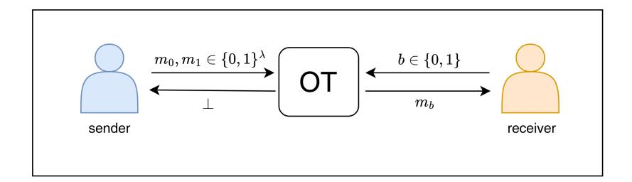
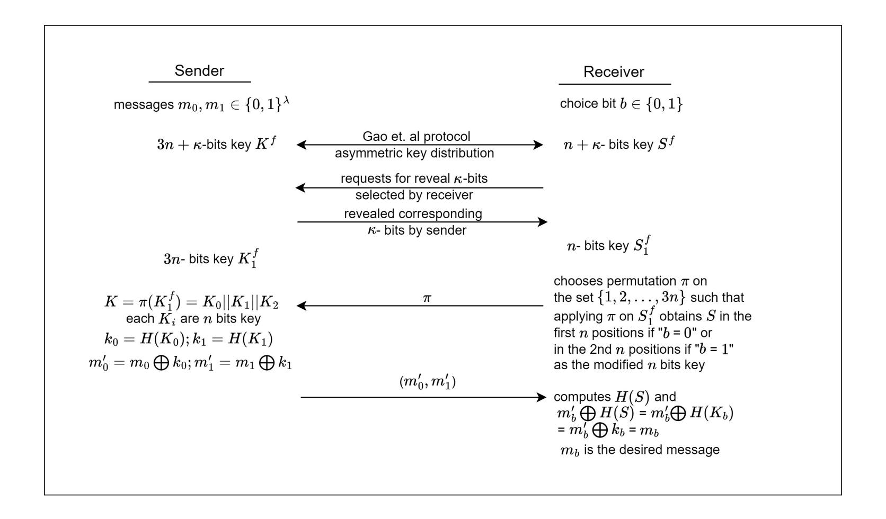
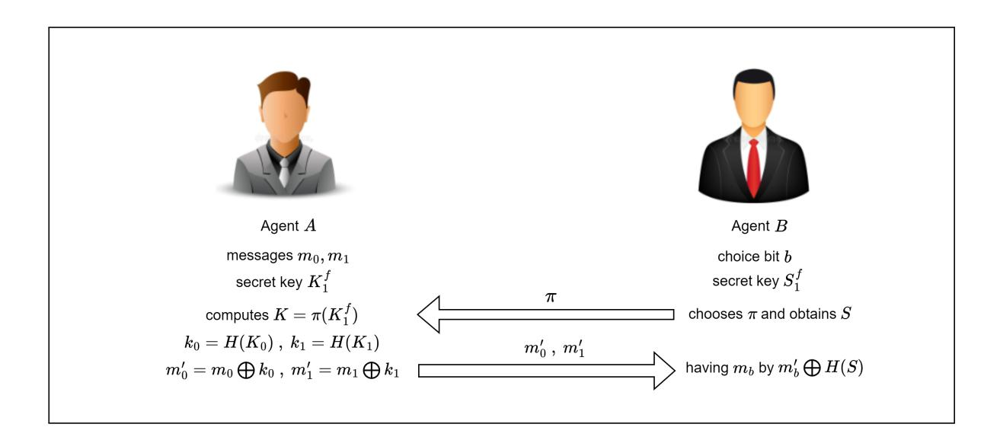

{0}------------------------------------------------

# An Efficient Quantum Oblivious Transfer Protocol

Sushmita Sarkar1 , Vikas Srivastava1,\*, Tapaswini Mohanty1 , Sumit Kumar Debnath1 , and Sihem Mesnager2

1 Department of Mathematics, National Institute of Technology Jamshedpur, Jamshedpur-831014, India; Email: sarkarsushmita408@gmail.com, vikas.math123@gmail.com, mtapaswini37@gmail.com, sd.iitkgp@gmail.com 2Department of Mathematics, University of Paris VIII, F-93526 Saint-Denis; Laboratory Analysis, Geometry and Applications, LAGA, University Sorbonne Paris Nord, CNRS, UMR 7539, F-93430, Villetaneuse, France, Telecom Paris, Polytechnic Institute of Paris, 91120 Palaiseau, France., Email:

> smesnager@univ-paris8.fr \*Corresponding Author

#### Abstract

Oblivious Transfer (OT) is a significant two party privacy preserving cryptographic primitive. OT involves a sender having several pieces of information and a receiver having a choice bit. The choice bit represents the piece of information that the receiver wants to obtain as an output of OT. At the end of the protocol, sender remains oblivious about the choice bit and receiver remains oblivious to the contents of the information that were not chosen. It has applications ranging from secure multi-party computation, privacy-preserving protocols to cryptographic protocols for secure communication. Most of the classical OT protocols are based on number theoretic assumptions which are not quantum secure and existing quantum OT protocols are not so efficient and practical. Herein, we present the design and analysis of a simple yet efficient quantum OT protocol, namely qOT. qOT is designed by using the asymmetric key distribution proposed by Gao et al. [\[18\]](#page-16-0) as a building block. The designed qOT requires only single photons as a source of a quantum state, and the measurements of the states are computed using single particle projective measurement. These make qOT efficient and practical. Our proposed design is secure against quantum attacks. Moreover, qOT also provides long-term security.

Keywords: Oblivious transfer; Quantum cryptography; Quantum key distribution

{1}------------------------------------------------

## 1 Introduction

Secure multiparty computation (SMPC) refers to a collection of all cryptographic protocols, allowing multiple parties to perform a computation collaboratively. Along with this, the protocol keeps secret the confidentiality of their respective inputs. The primary goal is to allow multiple parties to work together on a task without disclosing sensitive information to each other. Oblivious transfer (OT) is a fundamental building block in the field of SMPC. It has applications in voting systems, privacy-preserving databases, and other scenarios where privacy and security are crucial. In 1981, Rabin[\[32\]](#page-17-0) proposed the first OT protocol in the classical domain. "1-out-of-2" OT, executed by a receiver and a sender where sender holds two messages (say m0 and m1), and the receiver wants to achieve exactly one of these messages without the sender learning which one was chosen. OT can be visualized as "1 out of n" OT, where receiver obtains one out of n messages as per his choice, or "k out of n" OT, where receiver gets k messages out of the n messages, those he wants to achieve.

There have been several construction of classical and quantum OTs in the existing state-of-the-art. However, the OT based on classical cryptography [\[8,](#page-16-1) [9,](#page-16-2) [22\]](#page-17-1) faces threats of quantum attacks. On the other hand, quantum cryptography based OT [\[1,](#page-15-0) [5,](#page-15-1) [12,](#page-16-3) [16,](#page-16-4) [28\]](#page-17-2) are not efficient and practical. In addition, their security proof requires additional assumptions. While post-quantum cryptography (PQC)[\[15,](#page-16-5) [36,](#page-18-0) [6,](#page-16-6) [30\]](#page-17-3) provides an alternative direction of research, it falls short of ensuring long-term security. The concern arises from the possibility of future developments in classical or quantum algorithms capable of breaking the mathematical hard problems of PQC. In contrast, quantum cryptography (QC), governed by the laws of quantum physics, guarantees security against quantum attacks. In addition, QC also provides long-term security. Therefore, it is imperative to incorporate QC in the development of privacy-preserving protocols, particularly in OT.

However, the manuscripts presented by Mayers [\[29\]](#page-17-4), Lo et al. [\[26\]](#page-17-5), and Lo et al. [\[27\]](#page-17-6) showed that one-sided two party computations are not unconditionally secure in the quantum settings (no-go theorem). Therefore, it is not possible to perform unconditionally secure bit commitment or OT protocol. Alternatively, the quantum OT protocols proposed by Damgaard et al. [\[12\]](#page-16-3), Erven et al. [\[16\]](#page-16-4), Pital´ua et al. [\[31\]](#page-17-7) achieve practical security or unconditional security considering noisy or bounded storage model or presenting OT in specific spacetime (Minkowski spacetime). Here, we introduce a quantum OT protocol (qOT) based on the fundamental principles of quantum cryptography. The proposed qOT is not designed on such assumptions as bounded storage model, noisy storage model, etc. Our protocol does not contradict the no-go theorem as it is not an unconditionally secure OT protocol rather qOT is interactive and achieves security against dishonest parties with negligible cheating probability on adjusting the value of θ. In particular, qOT is designed using quantum asymmetric key distribution [\[18\]](#page-16-0) and the security level of qOT depends on the security of the asymmetric key distribution protocol [\[18\]](#page-16-0). The key distribution described in [\[18\]](#page-16-0) is secure against the existing quantum attacks but achieves better database security for a small θ and better user privacy for a large θ. Overall, Gao et al. [\[18\]](#page-16-0) described 

{2}------------------------------------------------

that the protocol gains better security with a negligible cheating probability of user and receiver for a small θ. Therefore, our proposed qOT is secure against existing quantum attacks and obtains better security against a dishonest receiver without such assumptions. To achieve better security against both user and receiver, we can adjust θ to make it small. But in that case, we need to increase the length of the raw key that is asymmetrically distributed between sender and receiver.

Related Works: In 1983, Wiesner proposed the idea of quantum conjugate coding [\[39\]](#page-18-1). It was the first template that served as a building block of quantum OT such as BBCS92 [\[5\]](#page-15-1). BBCS92 is not secure against quantum attacks. Subsequently, Crepeau and Kilian [\[10\]](#page-16-7) addressed the security issue of [\[5\]](#page-15-1) by presenting a quantum OT using quantum bit commitment scheme as a building block. However, Mayers, Lo, and Chau [\[29,](#page-17-4) [27\]](#page-17-6) demonstrated that building bit commitment, and consequently OT, based solely on quantum information properties is impossible. This negative result posed a significant obstacle, suggesting additional physical, computational, or modelling assumptions based quantum OT protocol [\[38,](#page-18-2) [11\]](#page-16-8). Nonetheless, researchers recognized the potential advantages of quantum information in constructing secure computation systems. Recently, the work of Agarwal et al. [\[1\]](#page-15-0) presented a new template for quantum OT which they have called the "fixed basis" framework.

### 1.1 Motivation of this work

Oblivious transfer is a powerful tool for 2-party protocol as well as it is used as a building block for secure multiparty protocol. Moreover, OT works as a basic cryptographic tool for secure information disclosure.

- Due to the existence of Shor's algorithm [\[35\]](#page-18-3), quantum computers have the capability to break down the security of all of the classical cryptosystems which rely on the hardness of factoring integers, discrete logarithms. Moreover, achieving long-term security in the design of a classical cryptosystem becomes a challenging task. To overcome these challenges, we are motivated to develop a secure OT protocol in quantum setting.
- In the existing state of the art, there are some quantum 1-out-of-2 OT protocols [\[12,](#page-16-3) [16,](#page-16-4) [28\]](#page-17-2), where the long-term security achieved under some assumption models like the "Bounded Storage Model" or "Noisy Storage model". Our goal is to design a quantum OT that achieves long-term security without any assumption model and any complicated oracles.
- One of the main objectives of this work is to compute multiple OT executions in classical channel after only one time execution of the quantum key distribution unlike [\[1,](#page-15-0) [5,](#page-15-1) [12,](#page-16-3) [28\]](#page-17-2).

{3}------------------------------------------------

### 1.2 Our Contribution

In this paper, we focus on the design and analysis of a simple and efficient OT protocol (namely qOT) in the quantum domain. We utilize the asymmetric key distribution of Gao et al.[\[18\]](#page-16-0) as a building block in qOT. The design of qOT enables a sender to transfer one of several pieces of information to a receiver while keeping the sender oblivious to which piece of information was actually transferred. Although, there are several other constructions of OT in quantum domain, qOT is efficient when compared to the existing state-of-the-art designs [\[1,](#page-15-0) [5,](#page-15-1) [12,](#page-16-3) [16,](#page-16-4) [28\]](#page-17-2) as it doesn't require quantum entangled states, complicated quantum operators, and quantum commitment schemes. The proposed scheme relies on quantum resources in the form of single photons, and measurements are executed using simple single projective measurements. The quantum communication and computational overheads of qOT are 3n + κ qubits and O(3n + κ) projective measurements respectively. The security of our proposed protocol relies on the principle of quantum cryptography. Consequently, it achieves quantum security in contrast to the classical OT protocols. Moreover, qOT obtains long term security as a quantum 1-out-of-2 OT. We also explored the possible application of qOT in the context of secure information disclosure. The proposed qOT can also be used as a building block in the construction of secure multi-party computation protocols in the quantum domain.

### 1.3 Article Organization

In section [2,](#page-3-0) some mathematical preliminaries have been provided, which are useful for describing and analyzing the proposed quantum 1-out-of-2 oblivious transfer qOT described in section [3.](#page-5-0) We then provide the efficiency analysis and also a comparative study with the existing competing schemes in section [4.](#page-8-0) The security analysis is provided in section [5.](#page-11-0) Next, an application to secure information disclosure is discussed in section [6](#page-13-0) with the help of the designed protocol, qOT. We conclude this manuscript in section [7](#page-14-0) and finally, section [3.2](#page-8-1) contains a toy example describing the proposed qOT.

## 2 Preliminaries

## 2.1 Gao Protocol [\[18\]](#page-16-0)

Gao [\[18\]](#page-16-0) proposes a novel method for the quantum private database query. The fundamental concept of the Gao protocol is to construct an N-bit string (Kf ), that will act as an oblivious key for an N-bit database using quantum key distribution (QKD) in conjunction with suitable classical post-processing. It generalizes Jakobi et al.'s protocol (J protocol) [\[21\]](#page-17-8) by introducing a security parameter θ ∈ (0, π 2 ). To share the raw key Kf , [\[18\]](#page-16-0) uses the B92 QKD [\[3\]](#page-15-2) scheme instead of SARG04 QKD [\[34\]](#page-18-4) or BB84 [\[4\]](#page-15-3) protocol. The protocol in [\[18\]](#page-16-0) is described below:

{4}------------------------------------------------

- 1. Sender sends a long sequence of qubits (in terms of photons) randomly chosen from  $\{|0\rangle, |1\rangle, |0'\rangle, |1'\rangle\}$  to receiver where  $|0'\rangle = \cos\theta|0\rangle + \sin\theta|1\rangle$  and  $|1'\rangle = \sin\theta|0\rangle \cos\theta|1\rangle$
- 2. Receiver measures each of the quantum states in either  $\{|0\rangle, |1\rangle\}$  or  $\{|0'\rangle, |1'\rangle\}$  basis chosen randomly. In the following, he declares the instances where he has effectively identified the qubit while discarding the photons that are either lost or undetected.
- 3. After successful measurement by receiver, sender declares one bit 0 or 1 for each measured qubit, where 0 codes that a given qubit is originally in the state  $|0\rangle$  or  $|0'\rangle$  while 1 codes for  $|1\rangle$  or  $|1'\rangle$ .
- 4. Receiver analyzes the outcomes of his measurements with the declared bits by sender in Step 3. Measurement in Step 2 will produce a conclusive outcome with probability  $p = (\sin^2 \theta)/2$  and an inconclusive one with a probability 1 p. Both conclusive and inconclusive results are retained by the receiver.
- 5. The generated string should have a length of kN (where k is a security parameter). Then, this kN-bit string is divided into the substrings, each of length N. Adding these k substrings bitwise diminishes receiver's information about the key to approximately one bit.
- 6. After Step 5, if the receiver has no identified bits, the protocol needs to be initiated again.
- 7. Suppose receiver is aware about the j-th bit  $K_j^f$  and wants to get the i-th bit of the database  $X_i$  (of length N bit). He declares the number s = j i. Sender shifts the updated  $K^f$  by s and announces  $C_1, C_2, \ldots, C_N$  where  $C_r = X_r \bigoplus K_{r+s}^f$  ( mod N) for  $r = 1, 2, \ldots, n$ . But receiver can read only  $C_i = X_i \bigoplus K_j^f$ , thus obtaining  $X_i$ .

#### 2.1.1 Security Properties

The security property of Gao protocol [18] depends on the parameter  $\theta$ . For  $\theta = \frac{\pi}{4}$ , the security analysis of this protocol can be referred to as the analysis of the J protocol. For  $\theta \neq \frac{\pi}{4}$  they analyzed the security property as the following:

- **Sender privacy**: Receiver can't obtain anything beyond  $X_i$ , where i is the choice query address of receiver.
- Receiver Privacy: Sender can't know the query address i of the receiver.

{5}------------------------------------------------

Figure 1: 1-out-of-2 Oblivious Transfer

The database is secure against a dishonest receiver who wants to obtain more key bits from the raw key  $K^f$ . A dishonest sender can't have the advantage of having receiver's query address and providing the correct answer to the query simultaneously. For a small  $\theta$ , the protocol achieves higher database security from existing quantum attacks like memorybased quantum attack, and the privacy of user is assured by the no-signaling principle.

### 2.2 Oblivious Transfer Protocol[12]

Oblivious Transfer protocol (OT) [12] is a cryptographic two party protocol where a sender is able to confidentially transmit a message from a set of messages to a receiver. The sender remains unaware of the choice of the receiver, and the receiver remains oblivious to the content of the other messages. A schematic diagram of 1-out-of-2 OT is provided in Figure 1. The security properties of OT are discussed in Section 5.

## 3 Proposed Quantum OT Protocol (qOT)

We give a brief description about the formation of the proposed qOT, quantum 1-out-of-2 OT protocol in this section.

A high level overview: qOT is a 1-out-of-2 quantum OT protocol. It involves two parties: a sender having two messages  $m_0, m_1 \in \{0, 1\}^{\lambda}$  and another is a receiver with choice bit  $b \in \{0, 1\}$ . We use the asymmetric key distribution of [18] to distribute a few number of bits of the key to the receiver, and the full key to the sender. In particular, sender learns the full 3n bit key, say  $K_1^f$ , while the receiver learns only the n bit key, say  $S_1^f$ . According to the choice bit b, the receiver randomly chooses a permutation  $\pi$  on the set  $\{1, 2, \ldots, 3n\}$  such that on applying  $\pi$  to  $S_1^f$ , the entries shift to either the first n bit positions (if b = 0) or the second n bit positions (if b = 1). We assume the resulting n bit as S. In the following, receiver sends  $\pi$  to the sender. On applying  $\pi$  on  $K_1^f$ , sender obtains  $K_0, K_1$  and  $K_2$ , each having n bit length. Sender computes  $k_0 = H(K_0), k_1 = H(K_1)$  for a hash function  $H: \{0,1\}^n \longrightarrow \{0,1\}^{\lambda}$ . In the following, sender XORs the updated keys  $k_0$  and  $k_1$  with the messages  $m_0$  and  $m_1$  respectively to obtain  $m'_0$  and  $m'_1$ , and sends the message pair  $(m'_0, m'_1)$  to the receiver. Receiver computes  $m'_b \bigoplus H(S)$  to obtain the desired message  $m_b$ . Communication flow of qOT is depicted in Figure 2 and we refer to section

{6}------------------------------------------------

3.2 for a toy example. Figure 3 represents the communication flow of secure information disclosure.

The proposed protocol consists of two phases: qOT Raw Key and qOT Computation which are described below.

#### qOT Raw Key

- 1. Sender and receiver engage in the asymmetric key distribution of [18] for sharing  $3n + \kappa$  bit key  $K^f = \{r_1, r_2, \dots, r_{3n+\kappa}\}$  such that sender receives the whole key  $K^f$ , while the receiver gains only  $n + \kappa$  bits  $S^f$  of  $K^f$ . To achieve this, the parameter  $\theta$  is set as  $\sin^{-1}(\sqrt{\frac{2(n+\kappa)}{3n+\kappa}})$  (where  $\kappa < n$ ) as described in [18].
- 2. From  $S^f$ , receiver selects  $\kappa$  bits randomly. He asks sender for revealing the corresponding bits from  $K^f$ . Subsequently, the receiver compares its own chosen part with the corresponding portion from the sender. If receiver's  $\kappa$  bits match with sender's  $\kappa$  bits, they proceed to the next phase. In case of a mismatch, the receiver aborts the process.
- 3. The  $\kappa$  bits, used for comparison in step 2 are deleted from  $K^f$  by sender and obtains the modified key  $K_1^f = \{u_1, u_2, \ldots, u_{3n}\}$  by adjusting the positions of the remaining 3n bits within  $K^f$ . Like as, if  $\kappa = 2$ , and the checking bits are in the 1st and 4th positions i.e.,  $r_1$  and  $r_4$  are deleted, hence  $u_1 = r_2, u_2 = r_3, u_i = r_{i+2}$  for  $i = 3, 4, \ldots, 3n$ .
- 4. Receiver obtains the updated key  $S_1^f = \{t_1, t_2, \dots, t_n\} = \{u_{p_1}, u_{p_2}, \dots, u_{p_n}\}$  by deleting the compared  $\kappa$  bits from  $S^f$  and adjusting the positions of the remaining n bits in  $S^f$ . Here  $p_i$  represents the position of  $t_i = u_{p_i}$  in  $K_1^f$ . Like as, if n = 5 and  $S^f = \{r_1, r_3, r_4, r_6, r_{12}, r_{15}, r_{17}\}$  then  $t_1 = r_3 = u_2, t_2 = r_6 = u_4, t_3 = r_{12} = u_{10}, t_4 = r_{15} = u_{13}, t_5 = r_{17} = u_{15}, \text{ i.e., } p_1 = 2, p_2 = 4, p_3 = 10, p_4 = 13, p_5 = 15.$

#### qOT Computation

- 1. Receiver randomly selects a permutation  $\pi$  on the set  $\{1, 2, ..., 3n\}$  such that on applying  $\pi$  to  $S_1^f$ , the entries of  $S_1^f$  shift to either the first n positions (if b = 0) or the second n positions (if b = 1).  $S_1^f$  is a 3n bit string of which only n bit values and its positions are known to the receiver.  $\pi$  maps the known bit positions to the set  $\{1, 2, ..., n\}$  or the set  $\{n + 1, n + 2, ..., 2n\}$  according to the choice bit b. The final output, obtained from  $S_1^f$ , is denoted by S. In the following, it sends  $\pi$  to sender.
- 2. Sender receives  $\pi$  from the receiver and updates her key as K by applying  $\pi$  on  $K_1^f$ , i.e.  $K = \pi(K_1^f) = K_0 ||K_1||K_2$ , where  $K_0, K_1, K_2$  are respectively the first n bits, second n bits and the last n bit positions. It computes  $k_0 = H(K_0), k_1$

{7}------------------------------------------------

Figure 2: Communication diagram of quantum 1-out-of-2 oblivious transfer qOT

- =  $H(K_1)$  and  $m_0' = m_0 \bigoplus k_0$ ,  $m_1' = m_1 \bigoplus k_1$ . Finally,  $(m_0', m_1')$  is transmitted to the receiver.
- 3. Receiver evaluates  $m'_b \bigoplus H(S)$  to obtain  $m_b$ .

#### 3.1 Correctness

The protocol outputs the desired message of the receiver, ' $m_b$ ' according to the receiver's choice bit b, whenever the sender and the receiver both follow the protocol correctly. Sender obtains the raw key  $K_1^f$  and receiver obtains  $S_1^f$  after the asymmetric key distribution. According to the choice bit b, receiver generates  $\pi$  in such a way that S is equal to  $K_b$ . Here, S is the rearrangement of  $S_1^f$  after applying  $\pi$  to  $S_1^f$ . Sender applies  $\pi$  to  $K_1^f$  and the rearranged key K is divided into substrings  $K_0, K_1, K_2$ .  $K_b$  is the substring according to the choice bit b. Sender encrypts the message  $m_b$  by XOR-ing  $m_b$  with  $k_b = H(K_b)$  and obtains  $m_b'$ . At the end of this protocol, receiver obtains the encrypted message  $m_b'$  and computes  $m_b' \oplus H(S)$ . Note that  $m_b' = m_b \oplus k_b = m_b \oplus H(K_b)$ . Receiver obtains S by applying  $\pi$  on  $S_1^f$ . By the construction of  $\pi$ , S is equal to  $K_b$  and hence,  $H(S) = H(K_b)$ .

{8}------------------------------------------------

Therefore,

$$m'_b \bigoplus H(S) = m_b \bigoplus H(K_b) \bigoplus H(S)$$
  
=  $m_b \bigoplus H(K_b) \bigoplus H(K_b)$   
=  $m_b$ 

### 3.2 Toy Example

Suppose, there are two parties: Alice and Bob. Let  $n = 4, \kappa = 2$  and  $\lambda = 6$ . Alice has messages  $m_0 = 101101$  and  $m_1 = 001011$ . The choice bit of Bob is b = 0.

- Set  $\theta = \sin^{-1}\left(\sqrt{\frac{6}{7}}\right)$  in the asymmetric key distribution [18]. As a result, Alice obtains a  $3n + \kappa = 14$ -bit string key  $K^f = \boxed{r_1 \mid r_2 \mid r_3 \mid r_4 \mid r_5 \mid r_6 \mid r_7 \mid r_8 \mid r_9 \mid r_{10} \mid r_{11} \mid r_{12} \mid r_{13} \mid r_{14}}$  and Bob obtains  $n + \kappa = 6$ -bit string key  $S^f = \boxed{r_1 \mid ? \mid ? \mid r_4 \mid ? \mid ? \mid r_8 \mid ? \mid ? \mid r_{11} \mid ? \mid r_{13} \mid r_{14}}$  where  $r_i \in \{0,1\}$  for  $i = 1,2,\ldots,14$  and "?" symbolizes bits whose value is unknown to Bob.
- Bob selects 4th and 14th positions of  $K^f$  i.e.,  $r_4$  and  $r_{14}$  for comparison with Alice's part. After the deletion of  $r_4$  and  $r_{14}$ , the modified key of Alice becomes  $K_1^f = \boxed{r_1 \mid r_2 \mid r_3 \mid r_5 \mid r_6 \mid r_7 \mid r_8 \mid r_9 \mid r_{10} \mid r_{11} \mid r_{12} \mid r_{13}}$  and modified part of Bob becomes  $S_1^f = \boxed{r_1 \mid ? \mid ? \mid ? \mid ? \mid r_8 \mid ? \mid ? \mid r_{11} \mid ? \mid r_{13}}$
- Bob chooses the permutation  $\pi = (2\ 10)(3\ 12)(4\ 7)(5\ 6)(8\ 11)$  and applies it on  $S_1^f$  to get S as follows  $S = |r_1| |r_{11}| |r_{13}| |r_8|$ . In the following, he sends  $\pi$  to Alice.
- Alice updates her key  $K_1^f$  by applying  $\pi$  on  $K_1^f$  as  $K = \boxed{r_1 \mid r_{11} \mid r_{13} \mid r_8 \mid r_7 \mid r_6 \mid r_5 \mid r_{12} \mid r_{10} \mid r_2 \mid r_9 \mid r_3}$  and obtains  $K_0 = \boxed{r_1 \mid r_{11} \mid r_{13} \mid r_8}$ ;  $K_1 = \boxed{r_7 \mid r_6 \mid r_5 \mid r_{12}}$  and  $K_2 = \boxed{r_{10} \mid r_2 \mid r_9 \mid r_3}$ . She computes  $k_0 = H(K_0), k_1 = H(K_1)$  and  $m_0' = m_0 \bigoplus k_0$  and  $m_1' = m_1 \bigoplus k_1$ . Then sends  $(m_0', m_1')$  to Bob.
- Bob computes H(S) and  $m'_0 \bigoplus H(S) = m'_0 \bigoplus H(K_0) = m'_0 \bigoplus k_0$ . It gives the desired message  $m_0$  as an output of this protocol.

## 4 Efficiency and Comparison

We now discuss the efficiency of qOT. It uses quantum computation and quantum communication during the key distribution between sender and receiver only. The remaining steps

{9}------------------------------------------------

of qOT involve only classical communication and simple operations like XOR, permutation, and hash evaluation. The round cost, computational and communication overhead of qOT are discussed below.

**Round cost:** 3 rounds (1 quantum and 2 classical) are required in the qOT Raw Key phase, while 2 classical rounds are needed in the qOT Computation phase.

Communication cost:  $3n + \kappa$  qubits are required during asymmetric key distribution, while during qOT Raw Key phase sender needs to transmit  $\kappa$  bits to the receiver. A permutation  $\pi$  is needed to be exchanged between the sender and receiver. In addition,  $2\lambda$  bits are transmitted by sender during the qOT Computation phase.

Computation cost: To achieve the key  $S^f$  during qOT Raw Key phase, the receiver requires to carry out  $O(3n + \kappa)$  projective measurements in 2-dimensional Hilbert space. Sender performs one permutation, two hash evaluations, and two XOR operations, while the receiver is needed to compute one permutation, one hash evaluation, and one XOR operation.

A detailed comparative analysis of proposed qOT with the existing OT protocol in the quantum domain is overviewed in table 1. qOT does not require quantum entangled states, quantum commitment scheme as described in [1, 5, 12, 16, 28]. Unlike [5, 12, 16, 28, 24], our protocol is secure without any additional assumptions like "limited storage model", "bounded quantum storage model", "noisy quantum storage", and "memoryless assumption" etc. Another advantage of our protocol is that in contrast to [1, 5, 12, 28, 24], one-time quantum communication and computation allow for multiple executions of the OT protocol. Thus, qOT is efficient and practical when compared to the existing state-of-the-art quantum OTs.

Other OT protocols like spacetime-constrained oblivious transfer (SCOT) [31] is an OT protocol in Minkowski's spacetime that achieves unconditional security in that spacetime region. But, SCOT allows receiver to obtain the message  $m_{1-b}$  in the outside region  $R_{1-b}$  whereas, qOT do not allow receiver to gain any knowledge about  $m_{1-b}$ . Moreover, qOT is secure against the existing quantum attacks. Amiri et al. [2] proposed semirandom quantum OT using unambiguous state elimination measurement. Semirandom OT is a variant of 1-out-of-2 OT where receiver obtains one of sender's bits randomly without having no choice bit of the receiver. They discussed that combining their proposed semirandom OT with a trivial OT (refer [2, 7]) achieves a scheme where the average cheating probability of sender and receiver is bounded below  $\frac{3}{4}$ . However, the average cheating probability of sender and receiver for the proposed qOT depends on the value of  $\theta$  as described in section 5. For  $\theta = \frac{\pi}{4}$ , sender's privacy is obtained with cheating probability

{10}------------------------------------------------

Table 1: Comparison summary of quantum OT protocols

| Protocol                                                                                                 | Ours                                                   | [1]                                       | [5]                                       | [12]                                           | [16]                                 | [28]                                          | [24]                                      | [31]                                                 | [37]                                                                            |
|----------------------------------------------------------------------------------------------------------|--------------------------------------------------------|-------------------------------------------|-------------------------------------------|------------------------------------------------|--------------------------------------|-----------------------------------------------|-------------------------------------------|------------------------------------------------------|---------------------------------------------------------------------------------|
| Quantum resource                                                                                         | SP                                                     | MPES                                      | SP                                        | SP                                             | MPES                                 | SP                                            | SP                                        | SP                                                   | multi particle quantum state                                           |
| Complicated or- acle operators                                                                        | not required                                           | required                                  | not required                              | not required                                   | not required                         | not required                                  | not required                              | not required                                         | not required                                                                    |
| Commitment scheme                                                                                        | not required                                           | required                                  | not required                              | not required                                   | not required                         | not required                                  | not required                              | not required                                         | not required                                                                    |
| Dimension of Hilbert Space                                                                            | 2                                                      | 2                                         | 2                                         | 2                                              | 2                                    | 2                                             | 2                                         | 2                                                    | 4                                                                               |
| Simple single particle projective measurement                                                            | yes                                                    | no                                        | yes                                       | yes                                            | no                                   | yes                                           | yes                                       | yes                                                  | square root mea- surement, a type of projective measure- ment |
| Multiple executions of OT functionality with only one time quantum communication and quantum computation | yes                                                    | no                                        | no                                        | no                                             | yes                                  | no                                            | no                                        | no                                                   | -                                                                               |
| Secure against receiver                                                                                  | yes                                                    | yes                                       | no                                        | probability depending on storage rate $\gamma$ | secure except with error $3\epsilon$ | security depending upon noise parameter $r_j$ | security depends on $C_N \cdot \gamma$    | security achieves in Minkowski spacetime | cheating probability is lower bounded by $\frac{3}{4}$                          |
| Communication Cost                                                                                    | $3n + \kappa$ qubits $O(\kappa)$ and $O(\lambda)$ bits | $O(n)$ qubits and $O(\lambda), O(k)$ bits | $O(n)$ qubits and $O(n), O(\lambda)$ bits | $O(n)$ qubits and $O(n), O(\lambda)$ bits      | $O(n)$ qubits and $O(\lambda)$ bits  | $O(n)$ qubits and $O(\lambda)$ bits           | $O(n)$ qubits and $O(n), O(\lambda)$ bits | $O(\lambda)$ qubits and $O(\lambda)$ bits            | 1 qubit where sender's input is a single bit                        |
| Computation Cost                                                                                      | $O(3n+\kappa)$                                         | O(2n+k)                                   | O(n)                                      | O(n)                                           | $O(n + \lambda)$                     | $O(n + \lambda)$                              | $O(n + \lambda)$                          | $O(2\lambda)$                                        | 6 qubits and 1 bit where sender's input is a single bit          |
| Round complexity in OT computation phase                                                                 | 1                                                      | $\lambda = me$                            | 1                                         | 1                                              | 1                                    | 2                                             | 2                                         | 1                                                    | -                                                                               |

SP = single photons,  $\lambda$  = message length,  $\kappa, n, k$  = security parameter, MPES = multiparticle entangled states,  $\gamma$  = storage rate,  $\epsilon$  = security error,  $r_j$  = trusted noise parameter,  $\mathcal{N}$ = quantum channel 

{11}------------------------------------------------

 $P = \frac{\sin^2 \frac{\pi}{4}}{2} = \frac{1}{4}$ . And for  $\theta = 1.5 \approx \frac{\pi}{2}$ , receiver's privacy is obtained with cheating probability  $P_{con} = \cos^2 \frac{1.5}{2} = 0.535 \approx \frac{1}{2}$  (refer [18]). Moreover, the input messages  $m_0, m_1$  for semirandom OT  $\in \{0,1\}$  while for qOT,  $m_0, m_1 \in \{0,1\}^{\lambda}$ . A quantum XOR OT protocol (XOT) presented by Storh et al. [37] achieves the least cheating probability against unrestricted dishonest parties. The XOT protocol proposed is noninteractive and the output of the protocol is one of  $\{m_0, m_1, m_0 \bigoplus m_1\}$  at random. Here sender is oblivious to the message that receiver learned and receiver is only aware of the output message. In qOT, receiver only gets one of  $\{m_0, m_1\}$  according to his choice b. qOT is interactive and achieves security against dishonest parties with negligible cheating probability on adjusting the value of  $\theta$ .

As qOT is proposed using quantum asymmetric key distribution as a building block, there exist other cryptographic schemes based on asymmetric key distribution. Yin et al. [40] presented a quantum digital signature (QDS) that achieves high efficiency and information theoretical security. Debnath et al. [13, 14] presented a feasible and efficient quantum private set intersection protocol by employing the the asymmetric key distribution. Moreover, Li et al. [25] proposed a QDS using asymmetric key distribution and universal hash function to improve the signature rate and ensure unconditional security by directly signing the hash value of a long message. Similarly, the proposed qOT based on quantum asymmetric key distribution is also an efficient quantum oblivious transfer protocol. Symmetric private information retrieval (SPIR) is a privacy preserving database query protocol where a user can gain specific data according to his query. The security of SPIR is that user's query remains private and user can't obtain any additional information from the database. Kon et al. [23] described a SPIR protocol using quantum key distribution (QKD) that achieves security against external eavesdropper where the security of SPIR depends on the security of QKD as like the proposed qOT.

## 5 Security Analysis

An OT protocol requires satisfying the following security properties:

- Receiver's privacy: Sender knows nothing about which message receiver wants to get i.e., sender is not aware about the choice bit b.
- Sender's privacy: Receiver remains oblivious about the message  $m_{1-b}$ .

The aforementioned security properties of qOT are now discussed in detail below:

#### 5.1 Receiver's privacy

**Theorem 1.** Sender knows nothing about which message receiver wants to get i.e., sender is not aware about the choice bit b.

{12}------------------------------------------------

Proof. A dishonest sender may try to find the receiver's choice message that he wishes to obtain at the end of the qOT protocol. Therefore, during the communication, sender will try to gain the choice bit b of the receiver. During the execution of qOT, sender only gets the random permutation  $\pi$  on the set  $\{1, 2, ..., 3n\}$  from receiver. Although the construction of  $\pi$  is prepared according to the choice bit b, receiver generates  $\pi$  randomly on the set  $\{1, 2, ..., 3n\}$ . Therefore, it is not possible to predict b by only seeing  $\pi$  directly. To know the choice bit b, sender may try to find out the position of conclusive bits of receiver during the asymmetric key distribution. The conclusive bit's positions of receiver together with the permutation  $\pi$  helps sender to observe exactly where those positions map. If the mapping positions belong to  $\{1, 2, ..., n\}$  (or  $\{n+1, n+2, ..., 2n\}$ ), sender ensures that the choice bit is 0 (or 1). Sender can obtain the position of the receiver's conclusive bits with an optimal probability as follows:

Sender can send  $|0''\rangle(|1''\rangle)$  and declares 1(0) during the asymmetric key distribution (in step 3), where

$$\left|0''\right\rangle = \cos\frac{\theta}{2}\left|0\right\rangle + \sin\frac{\theta}{2}\left|1\right\rangle; \ \left|1''\right\rangle = \sin\frac{\theta}{2}\left|0\right\rangle - \cos\frac{\theta}{2}\left|1\right\rangle$$

In this way, Sender knows that receiver will get the conclusive qubits with probability  $p_{con} = \cos^2 \frac{\theta}{2} \approx 1$  for a small  $\theta$ . Therefore, a smaller  $\theta$  gives a higher probability of sender's prediction about the conclusive bits of receiver (refer Gao et al. [18]). In this attack, sender can know the query address of receiver with a high probability but will lose the information about the conclusive bit (refer Jacobi et al. [21]). Thus, sender can't have the advantage of having receiver's query address and providing the correct answer to the query simultaneously assured by the no-signaling principle. The security properties of the asymmetric key distribution of [18] guarantee that sender can't simultaneously obtain the query address and the associated bit deterministically. Therefore, sender is oblivious about b and receiver's privacy is preserved.

#### 5.2 Sender's privacy

**Theorem 2.** Receiver remains oblivious about the message  $m_{1-b}$ .

Proof. Suppose, b is the choice bit of receiver. Then, at the end of the qOT protocol, receiver obtains  $m_b$ . However, a dishonest receiver may wish to know partial information about the other message, i.e., he wants to obtain some information of  $m_{1-b}$ . To get information about  $m_{1-b}$ , receiver can do quantum memory attack to obtain more bits of the raw key  $S_1^f$  during asymmetric key distribution. Consequently, the rearranged key S has more than n bits where n is the number of receiver's conclusive bits. In that case, S contains some of the bits of  $K_{1-b}$  other than  $K_b$ . Hence, H(S) contains some partial information about key  $k_{1-b} = H(K_{1-b})$  and  $m'_{1-b} \bigoplus H(S)$  gives partial information of  $m_{1-b}$ 

{13}------------------------------------------------

to receiver. Thus, those bits will help receiver to know information about the message  $m_{1-b}$ . To perform the memory attack, the receiver can store the qubits received from sender and perform individual measurements (unambiguous state discrimination (USD) measurement [20, 33]) after sender's declaration (during asymmetric key distribution in step 3).

The fidelity between two quantum states  $\rho_1, \rho_2$  is denoted by  $F(\rho_1, \rho_2)$  which measures the similarity between two quantum states. In USD measurement [20, 33], the probability of successfully distinguishing the quantum state of the qubit is bounded by  $1 - F(\rho_1, \rho_2)$ . Therefore, the probability is  $P_{USD} = 1 - \langle 0|0'\rangle = 1 - \cos\theta$  which is negligible as compared to the probability  $P = \frac{\sin^2\theta}{2}$  for simple projective measurement, specially for a small  $\theta$  (refer Gao et al. [18]).

Receiver can do joint measurement on the k qubits where k is a security parameter as discussed above (Gao protocol, step 5). In this process, receiver wants to determine the final key's bit value directly while he need not distinguish the individual bit value of  $K^{J}$ . Receiver can follow the measurements (i) Helstrom's minimal error probability measurement [19, 17], and (ii) USD measurement. The trace distance between two quantum states  $\rho_1, \rho_2$  is denoted by  $D(\rho_1, \rho_2)$  and in Helstrom's measurement, the probability of getting the correct state between two equally likely quantum states  $\rho_1, \rho_2$  is bounded by  $P_g = \frac{1}{2} + \frac{1}{2}D(\rho_1, \rho_2)$ . Therefore, in Helstrom's measurement, the probability that receiver obtains the final key's bit value is at most  $P_g = \frac{1}{2} + \frac{1}{2} \sin^k \theta$ . In USD measurement, receiver can unambiguously discriminate the two k-qubit mixed states corresponding to odd and even parity where the success probability declines rapidly with k (refer Gao et al. [18], Fig. 4). For a small  $\theta$ , the protocol achieves a higher probability of security for this kind of attack. In the proposed qOT,  $\theta = \sin^{-1}(\sqrt{\frac{2(n+\kappa)}{3n+\kappa}})$  (where  $\kappa < n$ ) can be made so small by increasing the length of the raw key  $K^f$ . Therefore, the probability that the receiver can get more than n bits of the initial key is negligible. Therefore, the rearranged key Scan't contain more than n bits which ensure that receiver can't get any partial information about  $k_{1-b} = H(K_{1-b})$  by evaluating H(S). Therefore, on getting  $(m'_0, m'_1)$  receiver is able to retrieve only one message according to the choice bit and does not get any partial information about other messages. Therefore, the privacy of the sender is preserved. 

## 6 Application to Information Disclosure

Secure information disclosure typically refers to the release or exposure of private or sensitive information. Consider a scenario where a British agent say A is aware of some sensitive intelligence information that can jeopardize the security of another country say the USA. A is willing to disclose one of them to a USA'agent B. Although A agrees to let B choose which secret he wants for some monetary value, she is not willing to allow him to gain any information on more than one secret. qOT can be used as a building block for designing a protocol for secure information disclosure. In particular, suppose, B has

{14}------------------------------------------------

Figure 3: Communication flow of qOT in secure information disclosure

confirmed information that an attack will be made in say city X in month Y, but they are not confirmed about the date, time and the master plan for this attack. B is aware that A knows these information and wants to deal with B. A has two information " $m_0$ = the date and time of attack;  $m_1$ = the master plan behind this attack." A is ready to reveal one of the information to B in demand of say 1 million dollars. We now show, how A and B can interact with each other securely by employing qOT as a building block.

- Through the asymmetric key distribution of [18], A obtains a secret key  $K_1^f$  and B obtains  $S_1^f$ .
- B chooses the permutation  $\pi$  and sends it to A. B computes S by applying  $\pi$  on  $S_1^f$  and A computes  $K = \pi(K_1^f)$ .
- A evaluates  $k_0 = H(K_0), k_1 = H(K_1)$ . She then computes  $m'_0 = m_0 \bigoplus k_0, m'_1 = m_1 \bigoplus k_1$  and sends  $(m'_0, m'_1)$  to B.
- B computes  $m'_b \bigoplus H(S)$  to get the desired encrypted message  $m_b$ .

Due to the security properties of qOT, A can't recognize which message is chosen. Moreover, B is not able to know the other secret information. Thus, qOT helps both parties to ensure honest completion of the deal with quantum security guarantees.

## 7 Conclusion

In this manuscript, the method used in [18] for distributing the secret key is utilized to design a secure quantum 1-out-of 2 OT, namely qOT. Our protocol is secure against quantum computers as it is proposed on the basic fundamental concept of quantum mechanics. In addition, qOT provides a long-term secure oblivious transfer protocol. qOT can be utilized as a basis for building secure multiparty computation protocols in the quantum realm. It

{15}------------------------------------------------

is efficient and simple as it doesn't need any complicated oracle operators. qOT is practical and can be implemented with the current quantum hardware technologies. Extending our approach to design other variations of quantum OT(1-out-of-n QOT and k-out-of-n QOT) is an interesting direction for further research. Additionally, once the parties have their secret keys, obtained by quantum computation and quantum communication, they can execute multiple OT functionality in the classical domain.

#### Declaration of competing interest

The authors declare that they have no known competing financial interests or personal relationships that could have appeared to influence the work reported in this paper.

### Acknowledgment

This work was supported by CEFIPRA CSRP project number 6701-1.

### Data availability

Data sharing is not applicable to this article as no new data were generated or analyzed to support this research.

## References

- [1] Agarwal, A., Bartusek, J., Khurana, D., and Kumar, N. A new framework for quantum oblivious transfer. In Annual International Conference on the Theory and Applications of Cryptographic Techniques (2023), Springer, pp. 363–394.
- [2] Amiri, R., Starek, R., Reichmuth, D., Puthoor, I. V., Mi ´ cuda, M., ˇ Miˇsta Jr, L., Duˇsek, M., Wallden, P., and Andersson, E. Imperfect 1-out-of-2 quantum oblivious transfer: bounds, a protocol, and its experimental implementation. PRX Quantum 2, 1 (2021), 010335.
- [3] Bennett, C. H. Quantum cryptography using any two nonorthogonal states. Physical review letters 68, 21 (1992), 3121.
- [4] Bennett, C. H., and Brassard, G. Quantum cryptography: Public key distribution and coin tossing. Theoretical computer science 560 (2014), 7–11.
- [5] Bennett, C. H., Brassard, G., Crepeau, C., and Skubiszewska, M.-H. ´ Practical quantum oblivious transfer. In Annual international cryptology conference (1991), Springer, pp. 351–366.

{16}------------------------------------------------

- [6] Bernstein, D. J., and Lange, T. Post-quantum cryptography. Nature 549, 7671 (2017), 188–194.
- [7] Chailloux, A., Gutoski, G., and Sikora, J. Optimal bounds for semi-honest quantum oblivious transfer. arXiv preprint arXiv:1310.3262 (2013).
- [8] Ciampi, M., and Orlandi, C. Combining private set-intersection with secure twoparty computation. In International Conference on Security and Cryptography for Networks (2018), Springer, pp. 464–482.
- [9] Crepeau, C. ´ Equivalence between two flavours of oblivious transfers. In Conference on the Theory and Application of Cryptographic Techniques (1987), Springer, pp. 350– 354.
- [10] Crepeau, C., and Kilian, J. ´ Achieving oblivious transfer using weakened security assumptions. In [Proceedings 1988] 29th Annual Symposium on Foundations of Computer Science (1988), IEEE Computer Society, pp. 42–52.
- [11] Damg˚ard, I., Fehr, S., Lunemann, C., Salvail, L., and Schaffner, C. Improving the security of quantum protocols via commit-and-open. In Annual International Cryptology Conference (2009), Springer, pp. 408–427.
- [12] Damg˚ard, I. B., Fehr, S., Salvail, L., and Schaffner, C. Cryptography in the bounded-quantum-storage model. SIAM Journal on Computing 37, 6 (2008), 1865– 1890.
- [13] Debnath, S. K., Dey, K., Kundu, N., and Choudhury, T. Feasible private set intersection in quantum domain. Quantum Information Processing 20 (2021), 1–11.
- [14] Debnath, S. K., Srivastava, V., Mohanty, T., Kundu, N., and Sakurai, K. Quantum secure privacy preserving technique to obtain the intersection of two datasets for contact tracing. Journal of Information Security and Applications 66 (2022), 103127.
- [15] Ding, J., and Petzoldt, A. Current state of multivariate cryptography. IEEE Security & Privacy 15, 4 (2017), 28–36.
- [16] Erven, C., Ng, N., Gigov, N., Laflamme, R., Wehner, S., and Weihs, G. An experimental implementation of oblivious transfer in the noisy storage model. Nature communications 5, 1 (2014), 3418.
- [17] Fuchs, C. A. Distinguishability and accessible information in quantum theory. arXiv preprint quant-ph/9601020 (1996).
- [18] Gao, F., Liu, B., Wen, Q.-Y., and Chen, H. Flexible quantum private queries based on quantum key distribution. Optics express 20, 16 (2012), 17411–17420.

{17}------------------------------------------------

- [19] Helstrom, C. W. Quantum detection and estimation theory. Journal of Statistical Physics 1 (1969), 231–252.
- [20] Herzog, U., and Bergou, J. A. Optimum unambiguous discrimination of two mixed quantum states. Physical Review A 71, 5 (2005), 050301.
- [21] Jakobi, M., Simon, C., Gisin, N., Bancal, J.-D., Branciard, C., Walenta, N., and Zbinden, H. Practical private database queries based on a quantum-keydistribution protocol. Physical Review A 83, 2 (2011), 022301.
- [22] Kolesnikov, V., Kumaresan, R., Rosulek, M., and Trieu, N. Efficient batched oblivious prf with applications to private set intersection. In Proceedings of the 2016 ACM SIGSAC Conference on Computer and Communications Security (2016), pp. 818–829.
- [23] Kon, W. Y., and Lim, C. C. W. Provably secure symmetric private information retrieval with quantum cryptography. Entropy 23, 1 (2020), 54.
- [24] Konig, R., Wehner, S., and Wullschleger, J. Unconditional security from noisy quantum storage. IEEE Transactions on Information Theory 58, 3 (2012), 1962–1984.
- [25] Li, B.-H., Xie, Y.-M., Cao, X.-Y., Li, C.-L., Fu, Y., Yin, H.-L., and Chen, Z.-B. One-time universal hashing quantum digital signatures without perfect keys. Physical Review Applied 20, 4 (2023), 044011.
- [26] Lo, H.-K. Insecurity of quantum secure computations. Physical Review A 56, 2 (1997), 1154.
- [27] Lo, H.-K., and Chau, H. F. Is quantum bit commitment really possible? Physical Review Letters 78, 17 (1997), 3410.
- [28] Lupo, C., Peat, J. T., Andersson, E., and Kok, P. Error-tolerant oblivious transfer in the noisy-storage model. arXiv preprint arXiv:2302.04236 (2023).
- [29] Mayers, D. Unconditionally secure quantum bit commitment is impossible. Physical review letters 78, 17 (1997), 3414.
- [30] Micciancio, D., and Regev, O. Lattice-based cryptography. In Post-quantum cryptography. Springer, 2009, pp. 147–191.
- [31] Pitalua-Garc ´ ´ıa, D. Spacetime-constrained oblivious transfer. Physical Review A 93, 6 (2016), 062346.
- [32] Rabin, M. O. How to exchange secrets with oblivious transfer. Cryptology ePrint Archive (2005).

{18}------------------------------------------------

- [33] Raynal, P. Unambiguous state discrimination of two density matrices in quantum information theory. Friedrich-Alexander-Universitaet Erlangen-Nuernberg (Germany), 2006.
- [34] Scarani, V., Acin, A., Ribordy, G., and Gisin, N. Quantum cryptography protocols robust against photon number splitting attacks for weak laser pulse implementations. Physical review letters 92, 5 (2004), 057901.
- [35] Shor, P. W. Algorithms for quantum computation: discrete logarithms and factoring. In Proceedings 35th annual symposium on foundations of computer science (1994), Ieee, pp. 124–134.
- [36] Srivastava, V., Baksi, A., and Debnath, S. K. An overview of hash based signatures. Cryptology ePrint Archive (2023).
- [37] Stroh, L., Horova, N., St ´ arek, R., Puthoor, I. V., Mi ´ cuda, M., Du ˇ ˇsek, M., and Andersson, E. Noninteractive xor quantum oblivious transfer: Optimal protocols and their experimental implementations. PRX Quantum 4, 2 (2023), 020320.
- [38] Unruh, D. Concurrent composition in the bounded quantum storage model. In Advances in Cryptology–EUROCRYPT 2011: 30th Annual International Conference on the Theory and Applications of Cryptographic Techniques, Tallinn, Estonia, May 15-19, 2011. Proceedings 30 (2011), Springer, pp. 467–486.
- [39] Wiesner, S. Conjugate coding. ACM Sigact News 15, 1 (1983), 78–88.
- [40] Yin, H.-L., Fu, Y., Li, C.-L., Weng, C.-X., Li, B.-H., Gu, J., Lu, Y.-S., Huang, S., and Chen, Z.-B. Experimental quantum secure network with digital signatures and encryption. National Science Review 10, 4 (2023), nwac228.