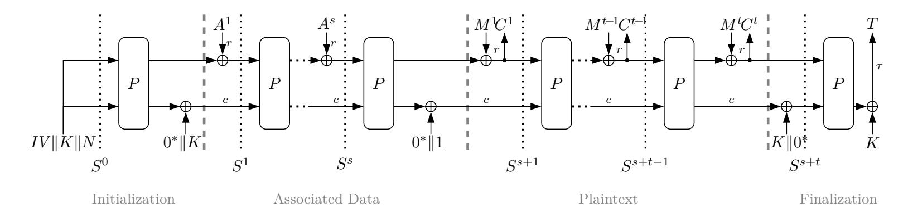
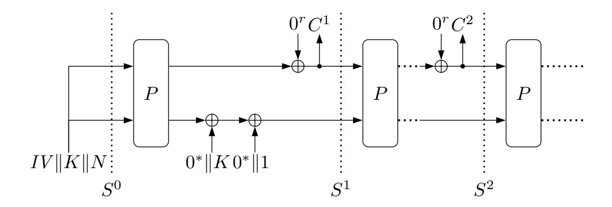
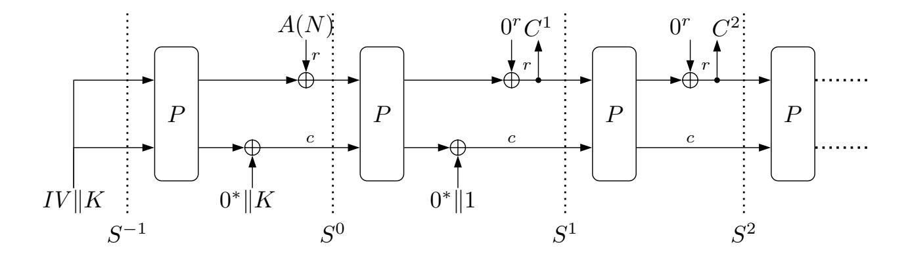
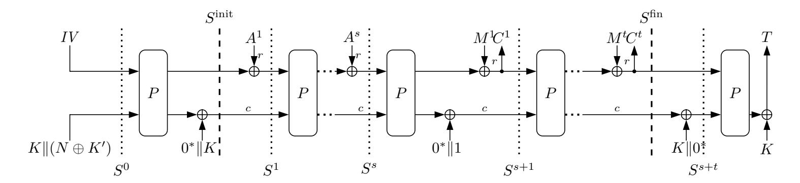

{0}------------------------------------------------

# **Security of the Ascon Authenticated Encryption Mode in the Presence of Quantum Adversaries**

Nathalie Lang<sup>1</sup> , Stefan Lucks<sup>1</sup> , Bart Mennink<sup>2</sup> and Suprita Talnikar<sup>3</sup>

```
1 Bauhaus-Universität Weimar, Weimar, Germany
{nathalie.lang,stefan.lucks}@uni-weimar.de
2 Radboud University, Nijmegen, The Netherlands
             b.mennink@cs.ru.nl
   3
    Indian Statistical Institute, Kolkata, India
             suprita45@gmail.com
```

**Abstract.** We examine the post-quantum security of the Ascon authenticated encryption (AE) mode. In spite of comprehensive research of Ascon's classical security, the potential impact of quantum adversaries on Ascon has not yet been explored much. We investigate the generic security of the Ascon AE mode in the setting where the adversary owns a quantum computer to improve its attack, while the adversarial encryption or decryption queries are still classical. In this so-called Q1 model, Ascon achieves security up to approximately min{2 *c/*3 *,* 2 *k/*2 } evaluations, where *c* is the capacity, *k* the key size, and the adversary is block-wise adaptive but restricted to one forgery attempt. Our technique is based on applying the semi-classical one-way to hiding (O2H) lemma, and on tailoring the puncture set to the Ascon mode. Additionally, we discuss different parameter choices for Ascon and compare our results to generic quantum attacks, such as Grover-based key search and state recovery.

**Keywords:** post-quantum security · lightweight cryptography · Ascon · authenticated encryption.

### **1 Introduction**

For the development and analysis of symmetric cryptosystems, the introduction of sponge functions [\[BDPA07\]](#page-27-0) has been a major event; it had been particularly useful for the design of lightweight cryptographic hash functions, such as QUARK [\[AHMN10\]](#page-26-0), PHOTON [\[GPP11\]](#page-29-0), and SPONGENT [\[BKL](#page-27-1)<sup>+</sup>11]. Likewise, the related duplex construction [\[BDPV11\]](#page-27-2), or the more detailed SpongeWrap design from the same article, has been the core idea behind many lightweight authenticated encryption schemes (see also [\[BDPV12\]](#page-27-3)). Both the CAESAR competition for authenticated encryption [\[Ber14\]](#page-27-4) and the lightweight cryptography competition organized by the US National Institute of Standards and Technology (NIST) [\[TMC](#page-30-0)<sup>+</sup>23] received dozens of SpongeWrap-based authenticated encryption (AE) schemes, and both chose the Ascon authenticated encryption scheme of Dobraunig et al. [\[DEMS21,](#page-28-0) [DEMS16\]](#page-28-1) as overall winner.[1](#page-0-0)

The Ascon AE scheme follows the SpongeWrap design strategy, but with a twist. In detail, Ascon is based on a cryptographic permutation on 320 bits (in fact, on two permutations, one of which is a round-reduced version of the other one, but we will discard this difference for the sake of generality). Ascon first initializes a 320-bit state with an initial value (which is basically a constant), a 128-bit secret key,[2](#page-0-1) and a nonce. Then, it

<span id="page-0-0"></span><sup>1</sup>To be precise, the Ascon AE is the "first choice" for lightweight AE in CAESAR, and at 2024-11-08 the NIST published Ascon as a draft standard [\[TMC](#page-30-1)+24].

<span id="page-0-1"></span><sup>2</sup>There also exists a post-quantum variant with a 160-bit key.

{1}------------------------------------------------

transforms the state using the cryptographic permutation, and adds the key to the bottom part of the state. It subsequently absorbs the associated data into the top part of the state *r* bits at a time, interleaved with permutation evaluations, and encrypts the plaintext *r* bits at a time by absorbing each block into the top part and squeezing the top part to get the ciphertext, again interleaved with permutation evaluations. Finally, the key is again added to the bottom part of the state, the state is permuted, and the bottom 128 bits of the state are added with the key and output as tag. (Refer to Section [2.3](#page-3-0) for a more detailed description of the Ascon authenticated encryption mode.)

In the classical security setting, the Ascon authenticated encryption mode has received various security analyses. Notably, the mode resembles SpongeWrap [\[BDPV11\]](#page-27-2) or MonkeySpongeWrap [\[Men23\]](#page-29-1), with the difference that the key is used at four places in the design. Jovanovic et al. [\[JLM14,](#page-29-2) [JLM](#page-29-3)<sup>+</sup>19] mentioned that their proof for NORX also carries over to the Ascon mode, though without explicit evidence. Recently, Chakraborty et al. [\[CDN23\]](#page-28-2) performed a first analysis of the Ascon mode, but only considered plain nonce-based security in the single-user setting, and Lefevre and Mennink [\[LM23\]](#page-29-4) performed more broadly an analysis in the nonce-misuse and multi-user setting, and in particular investigated the power of the key blinding in the Ascon mode. Chakraborty et al. [\[CDN24\]](#page-28-3) also extended their earlier work [\[CDN23\]](#page-28-2) to the multi-user setting. Lefevre and Mennink recently wrote a systemization of knowledge on the generic security of the Ascon mode [\[LM24\]](#page-29-5).

However, NIST standardized schemes are often expected to be long-lasting, and withstand attacks for multiple decades. In this respect, the existing generic security analyses of Ascon may not be sufficient. Indeed, some believe that quantum computers are coming [\[MCJ](#page-29-6)<sup>+</sup>16, [MVZJ18\]](#page-30-2), and it thus makes sense to investigate the security of currently standardized schemes against adversaries that have quantum power. There exists a widespread belief that simply doubling the key size in order to make a symmetric cryptographic algorithm resistant against quantum adversaries is sufficient. However, for some cases the contrary could be shown [\[US23\]](#page-30-3). Indeed, Simon's algorithm could be identified as a possible entry point for attacks such as quantum period finding [\[KLLN16,](#page-29-7) [LL23\]](#page-29-8) and quantum linearization [\[BLNS21\]](#page-27-5), even if the attacker only has quantum computing power and no quantum oracle access [\[BHN](#page-27-6)<sup>+</sup>19].

In our work, we assume that the keyed scheme, namely the Ascon mode, will always be evaluated on a classical computer (after all, Ascon is meant to be *lightweight*), but the adversary may run a quantum computer and also evaluate the unkeyed cryptographic permutation on said quantum computer. This model is commonly known as the Q1 model. In that model, the Ascon mode lacks any security analysis, which is slightly disappointing in light of the fact that one of the instances in the Ascon submission to the NIST competition, namely Ascon-80pq, is designed with quantum computers in mind. We wish to note that a related authenticated encryption scheme, namely SLAE of Degabriele et al. [\[DJS19\]](#page-28-4), has recently been analyzed in case of quantum adversaries [\[JS22\]](#page-29-9). Unfortunately, however, their analysis does not at all apply to the Ascon authenticated encryption mode, for two reasons:

- 1. the SLAE authenticated encryption scheme is merely a generic composition of encryption and message authentication with simpler modes that are easier to analyze in the quantum setting, and
- 2. the specific key blinding techniques in the Ascon mode make the analysis significantly more complex.

In the current paper, we perform an in-depth investigation of the quantum security of the Ascon mode. We prove that in the quantum random oracle model the Ascon mode achieves confidentiality and authenticity security up to around min{2 *c/*3 *,* 2 *k/*<sup>2</sup>} evaluations, where *c* is the capacity (the state size minus rate *r*), *k* is the key size, and *n* = *c* + *r*

{2}------------------------------------------------

denotes the state size. The quantum random oracle model has been proposed by Boneh et al. [BDF<sup>+</sup>11]. Over time, different techniques and frameworks to "reprogram" a quantum random oracle were introduced, see, e.g., [Unr14, CFHL21, ABK<sup>+</sup>24]. The reprogramming technique that we employ for our proofs is the semi-classical one-way to hiding (O2H) lemma from Ambainis et al. [AHU19].

We focus on block-wise adaptive attacks. After choosing nonce and associated data, we allow the adversary to choose the first plaintext block, receive the first ciphertext block, then choose the second plaintext block knowing the first ciphertext block, then receive the second ciphertext block, etc. While we do not recommend an implementation to actually give the adversary this kind of power, block-wise adaptive attacks are a natural concern for lightweight cryptosystems. In any case, security against block-wise adaptive attacks trivially implies security against "normal" message-wise adaptive attacks, where the adversary commits to the full message before receiving any parts of the ciphertext. On the other hand, security under message-wise adaptive attacks does not imply security under block-wise adaptive attacks.

The security proof of the Ascon mode against block-wise adaptive adversaries is given in Section 6, though we restrict the adversary to making only one forgery attempt. The main proof is preceded by a chosen-plaintext security proof against non-adaptive adversaries in Section 5. In part, the non-adaptive security proof serves as a stepping stone, but beyond that, we argue that non-adaptive attacks also match a "store-now-decrypt-later" scenario, where the adversary first passively collects encrypted data, and decrypts them once an appropriate quantum computer is available. In Section 7 we consider various generic attacks. In Section 8 we then consider the impact of using larger keys, either by means of the Ascon design with 192-bit keys (dubbed Ascon-96pq) or through LK-Ascon of Chakraborty et al. [CDN24]. We conclude the work in Section 9. In this section, we also compare our bounds and investigate their impacts on several variants of the Ascon mode.

### 2 Preliminaries

#### 2.1 Notation

We start by defining the notation used throughout the paper. For a natural number n, perm(n) denotes the set of all permutations on n-bit strings. The length of a bit string X is denoted by |X|. The concatenation of two bit strings X and Y is represented as X||Y. The expression  $[X]_{\alpha}$  denotes the  $\alpha$  most significant bits of the binary representation of X, while  $[X]_{\beta}$  denotes the  $\beta$  least significant bits of X, where  $\alpha, \beta \leq |X|$ . Throughout, n will denote the state size. A state S of size n bits is typically split into an outer part  $[S]_r$  of size r bits, where r is called the rate, and an inner part  $[S]_c$  of size c bits, where c is called the capacity, for which n = c + r. Given a set of states  $S \subseteq \{0,1\}^n$ , we will write  $[S]_r$  for the set of outer states in S and  $[S]_c$  for the set of inner states in S. For a finite set S, we denote by  $S \stackrel{\$}{\leftarrow} S$  the uniform random drawing of an element S from S.

#### 2.2 Balls-and-Bins

The following technical lemma will be useful for us. We remark that there exist tighter but more complex bounds for the same balls-and-bins problem [DMV17, CLL19], but in our analysis, this bound will not be the limiting factor.

<span id="page-2-0"></span>**Lemma 1.** Consider  $\alpha$  balls, thrown independently and uniformly at random into one of  $\beta$  bins. For  $\mu \geq 1$ , denote by  $PBB_{\alpha,\beta}^{\geq \mu}$  the probability that after the experiment, there exists

{3}------------------------------------------------

|            | Bit size of |       |     |      |          |  |  |  |
|------------|-------------|-------|-----|------|----------|--|--|--|
| Cipher     | key         | nonce | tag | rate | capacity |  |  |  |
| Ascon-128  | 128         | 128   | 128 | 64   | 256      |  |  |  |
| Ascon-128a | 128         | 128   | 128 | 128  | 192      |  |  |  |
| Ascon-80pq | 160         | 128   | 128 | 64   | 256      |  |  |  |

<span id="page-3-1"></span>Table 1: Different variants of the Ascon authenticated encryption mode [\[DEMS21\]](#page-28-0). The rate resembles the size of the outer state and the capacity the one of the inner state.

*a bin with at least µ balls. Then,*

$$PBB_{\alpha,\beta}^{\geq \mu} \leq \beta \left(\frac{e\alpha}{\mu\beta}\right)^{\mu} . \tag{1}$$

*Proof.* Fix any of the *β* bins. There are *α* balls and at least *µ* of them should end in this bin. This happens with probability at most

$$\begin{pmatrix} \alpha \\ \mu \end{pmatrix} \left( \frac{1}{\beta} \right)^{\mu} \le \frac{1}{\mu!} \left( \frac{\alpha}{\beta} \right)^{\mu} \le \left( \frac{e\alpha}{\mu\beta} \right)^{\mu},$$

where the last step relies on the fact that, due to Stirling's approximation, we have *µ*! ≥ (*µ/e*) *<sup>µ</sup>*. The final result is obtained by summing over all *β* bins.

Note that, if *β* = 2*<sup>ρ</sup>* for some *ρ*, the bound can be further upper bounded to

$$PBB_{\alpha,2^{\rho}}^{\geq \mu} \leq \left(\frac{2e\alpha}{\mu\beta}\right)^{\mu},$$

provided *µ* ≥ *ρ*. We will use this observation to simplify our bound of Theorem [2.](#page-10-1)

#### <span id="page-3-0"></span>**2.3 Ascon Authenticated Encryption with Associated Data**

The Ascon authenticated encryption with associated data scheme [\[DEMS21\]](#page-28-0) takes a *k*-bit key *K*, an *η*-bit nonce *N*, arbitrary length associated data *A*, and arbitrary length message *M*, and outputs a ciphertext *C* of the same length as *M*, and a *τ* -bit tag *T*. It is denoted as follows:

$$E_K(N, A, M) = (C, T). (2)$$

The corresponding decryption takes as input (*K, N, A, C, T*) and outputs *M* if the tag is correct and ⊥ otherwise:

$$E_K^{-1}(N, A, C, T) \in \{M, \bot\}.$$
 (3)

The Ascon scheme additionally takes an initial value *IV* of size 64 bits, but as it is technically a fixed constant, it will not be made explicit. We refer to Appendix [A](#page-31-0) for the pseudocode of the encryption and decryption of the Ascon mode. Table [1](#page-3-1) gives the recommended parameters for all three variants of Ascon. For all three variants, *n* = 320. The two classical ones, Ascon-128 and Ascon-128a, have *k* = 128 whereas the one aiming for post-quantum security, Ascon-80pq, has *k* = 160. The Ascon variants also differ in the rates and capacities, as becomes apparent from the table.

Ascon is based on the duplex construction [\[BDPV11\]](#page-27-2): it operates on an (*n* = 320)-bit state and absorbs data into it or squeezes data out of it, interleaved with evaluations of a

{4}------------------------------------------------

<span id="page-4-1"></span>

Figure 1: The Ascon authenticated encryption mode.

permutation *P*. [3](#page-4-0) The state is split into an *r*-bit outer part and a *c*-bit inner part. The encryption mode on top of permutation *P* is illustrated in Figure [1.](#page-4-1) Here, the associated data *A*, *provided it is non-empty*, is first padded with a 1 and a sufficient number of zeros so that its size becomes a multiple of *r* bits, and then split into blocks *A*<sup>1</sup> *, . . . , A<sup>s</sup>* of size *r* bits:

$$A^1, \dots, A^s \leftarrow \begin{cases} r\text{-bit blocks of } A \|1\|0^{r-1-(|A| \bmod r)} & \text{if } |A| > 0, \\ \emptyset & \text{if } |A| = 0. \end{cases}$$

Likewise, the message *M*, *whether it is empty or not*, is padded with a 1 and a sufficient number of zeros and split into blocks *M*<sup>1</sup> *, . . . , M<sup>t</sup>* of size *r* bits:

$$M^1, \ldots, M^t \leftarrow r$$
-bit blocks of  $M||1||0^{r-1-(|M| \mod r)}$ .

Next, Ascon initializes the state using *IV* , *K*, and *N*. It then permutes the state and adds 0 *<sup>c</sup>*−*k*∥*K* to part of the inner state. Associated data blocks are absorbed into the outer state one by one, interleaved with *P*-evaluations. A domain separator bit 0 *<sup>c</sup>*−1∥1 is added to the final inner state. After that, message blocks are absorbed, and ciphertext blocks are squeezed one by one, also interleaved with *P*-evaluations. Finally, *K*∥0 *c*−*k* is added to the inner state, followed by one more evaluation of *P*. The *τ* rightmost bits of the state are then added with *K*, assuming *τ* ≤ *k*, and output as tag *T*.

### **2.4 Quantum Computing**

**Quantum Algorithms and Oracles.** For basics in quantum computing, we refer to a standard textbook, such as [\[Mer07\]](#page-30-5). We model a quantum-accessible oracle for a function *f* : {0*,* 1} *<sup>n</sup>* → {0*,* 1} *<sup>m</sup>* as a unitary transformation *U<sup>f</sup>* , which transforms an *n* + *m* qubit register |*x, y*⟩ into |*x, y* ⊕ *f*(*x*)⟩. A quantum oracle algorithm can perform classical and quantum computations and can query classical and/or quantum-accessible oracles.

**Parallelism.** A quantum oracle algorithm can perform oracle queries in parallel. A *q*-query algorithm with query depth *d* can perform at most *q* queries in total (counting parallel queries as separate), and invokes the oracle in at most *d* steps (counting several parallel queries as a single step).

#### <span id="page-4-2"></span>**2.5 Security Models**

We will investigate the security of the Ascon authenticated encryption mode in the random permutation model, when the adversary has quantum power. To this end, we must consider generalized versions of the commonly used security definitions to capture that the adversary

<span id="page-4-0"></span><sup>3</sup>Note that the authors of Ascon distinguish between *p <sup>a</sup>* and *p b* , where *a* and *b* correspond to the number of internal rounds used. We neglect this fact and assume that the same permutation *P* is used throughout.

{5}------------------------------------------------

has quantum access to the underlying ideal (unkeyed) permutation. We do so in this section. Then, in Section 2.6, we refine the notions based on the specific types of adversaries that we consider in this work.

**AE Security.** We start with discussing security of authenticated encryption [BN00, BN08, RS06] in the quantum setting. In this setting, informally, we consider an adversary  $\mathcal{A}$  that aims to distinguish Ascon's encryption  $E_K$  and decryption  $E_K^{-1}$  from a random oracle  $\mathcal{RO}$  and a dedicated function that always returns the  $\bot$  sign. It can only make classical queries to these oracles. Also,  $\mathcal{A}$ 's encryption queries must use unique nonces, and, to avoid a trivial winning strategy,  $\mathcal{A}$  must not ask for the decryption of a result from a previous encryption query. On the other hand,  $\mathcal{A}$  is running a quantum computer and, specifically,  $\mathcal{A}$  gets quantum access to the random permutation P and its inverse. We name the model 1AE security, where 1 refers to the fact that we consider Q1 security. It is based on the model of deterministic authenticated encryption as formalized in [RS06, NRS14].

<span id="page-5-2"></span>**Definition 1** (1AE). Let  $K \leftarrow \{0,1\}^k$  be a random key, and consider the Ascon encryption function  $E_K : \{0,1\}^{\eta} \times \{0,1\}^* \times \{0,1\}^* \times \{0,1\}^* \times \{0,1\}^* \times \{0,1\}^{\tau}$  and decryption function  $E_K^{-1} : \{0,1\}^{\eta} \times \{0,1\}^* \times \{0,1\}^* \times \{0,1\}^{\tau} \to \{0,1\}^* \cup \{\bot\}$  of Section 2.3, instantiated with a random permutation  $P : \{0,1\}^n \to \{0,1\}^n$ . Let  $\mathcal{N} \subseteq \{0,1\}^{\eta}$  be a predefined nonce set. Let  $\mathcal{RO}$  be a random oracle that on input of a string (N,A,M) returns a ciphertext  $C \leftarrow \{0,1\}^{|M|}$  and a tag  $T \leftarrow \{0,1\}^{\tau}$ . Let  $\bot$  be a function that always returns the  $\bot$ -symbol and let z be the input of the adversary.

The 1AE security of the Ascon mode against an adversary  $\mathcal{A}$  is defined as

$$\operatorname{Adv}_{\operatorname{Ascon}}^{\operatorname{1AE}}(\mathcal{A}) = \left| \Pr[\mathcal{A}^{E_K, E_K^{-1}, P, P^{-1}}(z) = 1] - \Pr[\mathcal{A}^{\mathcal{RO}, \perp, P, P^{-1}}(z) = 1] \right|.$$

The adversary only has classical access to its construction oracles, but it has quantum access to the random permutation P and its inverse  $P^{-1}$ . We require  $\mathcal{A}$  to be noncerespecting, meaning that it never repeats nonces for encryption queries (to  $E_K$  or  $\mathcal{RO}$ ). The adversary is never allowed to make a decryption query (to  $E_K^{-1}$  or  $\bot$ ) on input of the response of an earlier encryption query (to  $E_K$  or  $\mathcal{RO}$ , respectively). It is restricted to only making queries for nonces from the predefined nonce set  $\mathcal{N}$ .

We remark that the conditions imposed on  $\mathcal{A}$  are common, the only exception being that it is restricted to only choosing nonces from a predefined nonce set  $\mathcal{N} \subseteq \{0,1\}^{\eta}$ . We remark that this restriction is in line with practical attack scenarios. Indeed: typically, nonces are not chosen by the adversary, but by the sender.<sup>4</sup> Note that if one nevertheless depreciates choosing  $\mathcal{N} \subset \{0,1\}^{\eta}$  in advance, one can just set  $\mathcal{N} = \{0,1\}^{\eta}$ .<sup>5</sup> Finally, we remark that this constraint is not new. Other authors in the context of post-quantum security also require the adversary to fix  $\mathcal{N} \subseteq \{0,1\}^{\eta}$  at the beginning of the attack, see, e.g., [BBC<sup>+</sup>21].

**IND-1CPA** and **INT-1CTXT Security.** It is common to split AE security into confidentiality and integrity. Here, confidentiality is covered by indistinguishability under chosen plaintext attacks, or IND-CPA, where the adversary has no access to the decryption. Integrity is covered by integrity of ciphertexts, or INT-CTXT, where the adversary has access to  $E_K$  (in both worlds) and wins if it can distinguish  $E_K^{-1}$  from  $\bot$ . We next describe these security models in the Q1 setting in more detail.

<span id="page-5-0"></span><sup>&</sup>lt;sup>4</sup>One formally allows the adversary to choose the nonces to claim security regardless of how that choice is made: e.g., a current timestamp could be used as a nonce (assuming no two messages are sent in the same time frame), or nonces are chosen at random. In almost all such cases, the set  $\mathcal{N}$  of possible nonces is constrained to  $|\mathcal{N}| \ll 2^{\eta}$ .

<span id="page-5-1"></span><sup>&</sup>lt;sup>5</sup>However, our security bounds depend on the size  $|\mathcal{N}|$  of  $\mathcal{N}$  and are better if  $|\mathcal{N}| \ll 2^{\eta}$ .

{6}------------------------------------------------

**Definition 2** (IND-1CPA). Consider the setup exactly as outlined in the first paragraph of Definition 1. The IND-1CPA security of the Ascon mode against an adversary  $\mathcal{A}$  is defined as

$$\operatorname{Adv}_{\operatorname{Ascon}}^{\operatorname{IND-1CPA}}(\mathcal{A}) = \left| \Pr[\mathcal{A}^{E_K, P, P^{-1}}(z) = 1] - \Pr[\mathcal{A}^{\mathcal{RO}, P, P^{-1}}(z) = 1] \right|.$$

Adversary  $\mathcal{A}$  is bound to the conditions outlined in the last paragraph of Definition 1 (except for the comment on inverse queries, which is redundant in IND-1CPA security).

<span id="page-6-2"></span>**Definition 3** (INT-1CTXT). Consider the setup exactly as outlined in the first paragraph of Definition 1. The INT-1CTXT security of the Ascon mode against an adversary  $\mathcal{A}$  is defined as

$$\operatorname{Adv}_{\operatorname{Ascon}}^{\operatorname{INT-1CTXT}}(\mathcal{A}) = \left| \Pr[\mathcal{A}^{E_K, E_K^{-1}, P, P^{-1}}(z) = 1] - \Pr[\mathcal{A}^{E_K, \perp, P, P^{-1}}(z) = 1] \right|.$$

Adversary  $\mathcal{A}$  is bound to the conditions outlined in the last paragraph of Definition 1.

For completeness, we note that the security notions are related. In fact, in the classical setting, we have that if an authenticated encryption scheme is IND-CPA secure and INT-CTXT secure, then it is AE secure [BN08]:<sup>6</sup>

$$\operatorname{Adv}_{\operatorname{Ascon}}^{\operatorname{AE}}(\mathcal{A}) \leq \operatorname{Adv}_{\operatorname{Ascon}}^{\operatorname{IND-CPA}}(\mathcal{A}') + \operatorname{Adv}_{\operatorname{Ascon}}^{\operatorname{INT-CTXT}}(\mathcal{A}'')$$

where  $\mathcal{A}'$  and  $\mathcal{A}''$  have the same query complexities as  $\mathcal{A}$ . A similar result can be attained in the quantum setting.

**Lemma 2.** Consider the Ascon authenticated encryption scheme. For any adversary A,

$$\mathrm{Adv}_{\mathrm{Ascon}}^{\mathrm{1AE}}(\mathcal{A}) \leq \mathrm{Adv}_{\mathrm{Ascon}}^{\mathrm{IND\text{-}1CPA}}(\mathcal{A}') + \mathrm{Adv}_{\mathrm{Ascon}}^{\mathrm{INT\text{-}1CTXT}}(\mathcal{A}'')\,,$$

where  $\mathcal{A}'$  and  $\mathcal{A}''$  have the same query complexities as  $\mathcal{A}$ .

*Proof.* Note that, by definition,

$$Adv_{Ascon}^{1AE}(\mathcal{A}) = \left| \Pr[\mathcal{A}^{E_K, E_K^{-1}, P, P^{-1}}(z) = 1] - \Pr[\mathcal{A}^{\mathcal{RO}, \perp, P, P^{-1}}(z) = 1] \right|. \tag{4}$$

By the triangle inequality, this distance is at most

<span id="page-6-1"></span>
$$\operatorname{Adv}_{\operatorname{Ascon}}^{\operatorname{1AE}}(\mathcal{A}) = \left| \Pr[\mathcal{A}^{E_{K}, E_{K}^{-1}, P, P^{-1}}(z) = 1] - \Pr[\mathcal{A}^{E_{K}, \perp, P, P^{-1}}(z) = 1] + \\ \Pr[\mathcal{A}^{E_{K}, \perp, P, P^{-1}}(z) = 1] - \Pr[\mathcal{A}^{\mathcal{RO}, \perp, P, P^{-1}}(z) = 1] \right| \\ \leq \left| \Pr[\mathcal{A}^{E_{K}, E_{K}^{-1}, P, P^{-1}}(z) = 1] - \Pr[\mathcal{A}^{E_{K}, \perp, P, P^{-1}}(z) = 1] \right| + \\ \left| \Pr[\mathcal{A}^{E_{K}, \perp, P, P^{-1}}(z) = 1] - \Pr[\mathcal{A}^{\mathcal{RO}, \perp, P, P^{-1}}(z) = 1] \right|. \quad (5)$$

The first distance of (5) is at most  $Adv_{Ascon}^{INT-1CTXT}(\mathcal{A}'')$ . For the second distance, we can drop the query access to  $\bot$ , and we obtain  $Adv_{Ascon}^{IND-1CPA}(\mathcal{A}')$ .

Likewise, if a scheme is 1AE secure, it is IND-1CPA and INT-1CTXT secure.

<span id="page-6-0"></span><sup>&</sup>lt;sup>6</sup>These security definitions are covered by Definitions 1–3 by disallowing quantum access to the random permutation.

{7}------------------------------------------------

#### <span id="page-7-0"></span>2.6 Qualification and Quantification of Adversaries

We typically bound the complexity of  $\mathcal{A}$  by  $(q_c, q_f, q_p)$ , where  $q_c$  denotes the construction or learning queries,  $q_f$  the forging queries (which equals 0 for IND-1CPA security), and  $q_p$  the number of forward and inverse primitive queries. Each learning and forging query is always bounded by  $\nu$  padded blocks including tag squeezing. For example, in Figure 1  $\nu = s + t + 1$ . The total length of all construction queries is bounded to  $\sigma$  blocks.

The definitions of Section 2.5 are defined for any adversary. We can consider refinements based on the amount of information to which the adversary must commit before making one or all queries:

- $\mathcal{A}_{na}$ : a non-adaptive adversary that commits to all  $q_c$  construction queries at initialization, but that may make forgery attempts adaptively;
- $\mathcal{A}_a$ : an adaptive adversary that may adaptively query its construction oracles based on the outcomes of the earlier queries;
- $\mathcal{A}_{ba}$ : a block-wise adaptive adversary that may block-wise adaptively query its construction oracles, i.e., that may choose its next associated data or message block based on the outcome of the previous permutation evaluation.

The three notions are listed in order of liberty of the adversary.  $\mathcal{A}_{na}$  defines the least liberal environment for the adversary; it describes a "store-now-decrypt-later" scenario and is considered in our first security proof (in Section 5). Furthermore,  $\mathcal{A}_{na}$  is a step towards our more general proof in Section 6, which takes the most liberal adversary, namely  $\mathcal{A}_{ba}$ .

However, for the case of block-wise adaptivity, we are slightly abusing notation in Definitions 1–3. As a matter of fact, the encryption function  $E_K$ , to which  $\mathcal{A}$  has access, is not the plain Ascon authenticated encryption scheme of Section 2.3. Instead, it is a stateful function that can process inputs block by block. However, this function operates under the restriction that the adversary must properly indicate in which phase it is. To formalize this properly,  $E_K$  will be a stateful function with the interfaces INIT, AD, ENC, LASTENC, and TAG. The adversary can query the interfaces at its discretion, but there are some limitations, e.g., that an INIT call should occur before all other calls, a LASTENC call before a TAG call, and so on. We detail these interfaces and order restrictions below:

- 1. First,  $\mathcal{A}$  calls INIT(N) for an  $\eta$ -bit nonce N. In such a call,  $E_K$  initializes the state at S = IV ||K|| N and outputs nothing.
- 2. Next,  $\mathcal{A}$  calls AD(A) zero or more times, where A is an r-bit block of associated data. In such a call,  $E_K$  transforms the state to  $S = P(S) \oplus A \| 0^c$ . If the previous call was to  $INIT(\cdot)$ , it additionally adds  $0^{n-k} \| K$  to S. Again,  $E_K$  outputs nothing.
- 3. After absorbing the associated data (if any), and before dealing with the first message block,  $E_K$  transforms the state. If AD(A) has been called at least once (i.e., if the associated data are not empty),  $E_K$  sets the state to  $S = S \oplus (0^{n-1}||1)$ . Else,  $E_K$  sets the state to  $S = S \oplus (0^{n-1}||1) \oplus (0^{n-k}||K)$ .
- 4. Then  $\mathcal{A}$  processes one or more message blocks. The handling of the final message block differs from the handling of the previous message blocks:
  - (a)  $\mathcal{A}$  calls ENC(M) zero or more times, with  $M \in \{0,1\}^r$ . In such a call,  $E_K$  transforms the state to  $S = P(S) \oplus (M||0^c)$  and outputs  $\lceil S \rceil_r$ .
  - (b) When all calls ENC(M) have been made,  $\mathcal{A}$  calls LASTENC(M) exactly once. Again  $M \in \{0,1\}^r$ , but this time also  $M \neq 0^r$ . In such a call,  $E_K$  transforms the state to  $S = P(S) \oplus (M||0^c) \oplus (0^r||K||0^{c-k})$  and outputs  $\lceil S \rceil_{r'}$ , where r' is the size of M after removing all trailing zero-bits and the trailing one (i.e., after removing the  $10^*$ -padding).

{8}------------------------------------------------

5. Finally, A calls tag(). In this call, *E<sup>K</sup>* transforms the state to *S* = *P*(*S*), outputs ⌊*S* ⊕ (0*n*−*<sup>k</sup>*∥*K*)⌋*<sup>τ</sup>* , and discards *S*.

### <span id="page-8-0"></span>**3 The Semi-Classical One-way to Hiding (O2H) Lemma**

The semi-classical one-way to hiding (O2H) theorem was introduced by Ambainis et al. [\[AHU19\]](#page-26-3) and improves the regular O2H theorem from Unruh [\[Unr14,](#page-30-4) [Unr15\]](#page-30-8). Assume some sets X and Y. Let *G* and *H* be two functions mapping from X to Y. Consider a subset S ⊆ X . The key point is that for all elements *x* ̸∈ S, the functions *G* and *H* are required to produce the same output *G*(*x*) = *H*(*x*). In this context, S is referred to as puncture set and *H*\S denotes the puncturing of *H* on the subset S, meaning that for all elements *x* ∈ S, the output of a quantum algorithm is independent of *H*(*x*). In other words, the term "punctured" refers to the action of removing or excluding elements from consideration. Let Find be the event of an adversary making a query *x* where a measurement on the predicate *x* ∈ S returns true. Note that this does not imply measuring *x* itself. Putting it differently, Find is the event of *finding* an input from S which depends on *H*(*x*). When Find does not occur, the outcome of said adversary querying *H*\S is independent of *H*(*x*) for *x* ∈ S. Let A<sup>O</sup>(*z*) be an adversary querying an oracle O with input *z*. This *z* can be seen as the concatenation of all information available to A, e.g. all queries made by A and the corresponding responses. No assumptions are made on the size of *z* such that additional oracles can be encoded as part of *z*.

<span id="page-8-3"></span>**Lemma 3** (Semi-Classical O2H [\[AHU19,](#page-26-3) Theorem 1])**.** *Let* S ⊆ X *be random. Let G, H* : X → Y *be random functions satisfying that* ∀*x* ̸∈ S : *G*(*x*) = *H*(*x*)*. Let z be a random bit string. (*S*, G, H, z may have arbitrary joint distribution.) Let* A *be an oracle algorithm of query depth d (not necessary unitary). Let*

$$\begin{split} P_{\text{left}} &:= \Pr[b = 1 : b \leftarrow \mathcal{A}^H(z)] \,, \\ P_{\text{right}} &:= \Pr[b = 1 : b \leftarrow \mathcal{A}^G(z)] \,, \\ P_{\text{Find}} &:= \Pr[\text{Find} : \mathcal{A}^{G \setminus \mathcal{S}}(z)] = \Pr[\text{Find} : \mathcal{A}^{H \setminus \mathcal{S}}(z)] \,. \end{split}$$

*Then,*

<span id="page-8-2"></span>
$$|P_{\text{left}} - P_{\text{right}}| \le 2\sqrt{(d+1) \cdot P_{\text{Find}}},$$
 (6)

$$|\sqrt{P_{\text{left}}} - \sqrt{P_{\text{right}}}| \le 2\sqrt{(d+1) \cdot P_{\text{Find}}}.$$
 (7)

The notion "depth *d*" considers an adversary to perform multiple queries in parallel. In the context of this work, it suffices to point out that *d* ≤ *q* holds for a *q*-query adversary.

What remains is to bound *P*Find. Ambainis et al. relate it to the guessing probability by formulating the following theorem:

<span id="page-8-1"></span>**Theorem 1** (Search in semi-classical oracle [\[AHU19,](#page-26-3) Theorem 2])**.** *Let* A *be any quantum oracle algorithm making some number of queries at depth at most d to a semi-classical oracle Ora with domain* X *. Let* S ⊆ X *and z* ∈ {0*,* 1} ∗ *. (*S*, z may have arbitrary joint distribution.)*

*Let* B *be an algorithm that on input z chooses i* \$←− {1*, . . . , d*}*; runs* A*Ora*(*z*) *until (just before) the i-th query; then measures all query input registers in the computational basis and outputs the set* T *of measurement outcomes. Then*

$$\Pr[\operatorname{Find}: \mathcal{A}^{Ora}(z)] \leq 4d \cdot \Pr[\mathcal{S} \cap \mathcal{T} \neq \emptyset : \mathcal{T} \leftarrow \mathcal{B}(z)].$$

In this work, w.l.o.g., Pr[Find : AOra(*z*)] will be replaced by *P*Find and *d* will be replaced by *q* maintaining *d* ≤ *q*. Thus,

$$P_{\text{Find}} \leq 4q \cdot \Pr[\mathcal{S} \cap \mathcal{T} \neq \emptyset : \mathcal{T} \leftarrow \mathcal{B}(z)].$$

{9}------------------------------------------------

Ambainis et al. show that this theorem can be even simplified if it holds that *z* and S are independent. In that case, they formulate a bound relying on the maximal probability that a value *x* ∈ X is in S.

<span id="page-9-0"></span>**Corollary 1** (Search in semi-classical oracle [\[AHU19,](#page-26-3) Corollary 1])**.** *Suppose that* S *and z are independent, and that* A *is a q-query algorithm. Let P*max := max*x*∈X Pr[*x* ∈ S]*. Then*

<span id="page-9-3"></span>
$$P_{\text{Find}} \leq 4q \cdot P_{\text{max}}$$
.

### <span id="page-9-4"></span>**4 Simulation Lemma**

This section provides a technical lemma, which we will later use to prove our main results. We derive this lemma from the semi-classical O2H theorem explained in Section [3.](#page-8-0) Let *P* be an *n*-bit random permutation. Let S<sup>∗</sup> ⊂ {0*,* 1} *<sup>n</sup>* be a (not necessarily uniform) random subset of {0*,* 1} *<sup>n</sup>* and *f*<sup>∗</sup> : S<sup>∗</sup> → S<sup>∗</sup> an arbitrary function. We introduce two functions:

$$G(\alpha, x) = \begin{cases} P(x) & \text{if } \alpha = 0, \\ P^{-1}(x) & \text{if } \alpha = 1, \end{cases}$$

$$H(\alpha, x) = \begin{cases} f_*(x) & \text{if } \alpha = 0 \text{ and } x \in \mathcal{S}_*, \\ P(x) & \text{if } \alpha = 0 \text{ and } x \notin \mathcal{S}_*, \\ P^{-1}(x) & \text{if } \alpha = 1. \end{cases}$$

$$(8)$$

Note that *G*(0*,* ·) = *P*(·) is a permutation, while *H*(0*,* ·) may not be a permutation. In fact, *H*(0*, x*) = *P*(*x*) only holds for *x* ̸∈ S∗. Furthermore, since *P* is a random permutation, both *G* and *H* are random functions, even though not uniformly distributed.

Our proofs in Section [5](#page-10-0) and Section [6](#page-14-0) rely on reducing the distinguishing advantages as defined in Definitions [1](#page-5-2)[–3](#page-6-2) to, roughly, distinguishing *G* from *H*. The advantage of distinguishing *G* from *H* depends on the probability to guess a value *x* ∈ S∗. The adversary's input *z* was introduced in Section [3.](#page-8-0) We write Pr[*x* ∈ S<sup>∗</sup> | *z*] for the probability of *x* being in S∗, when given *z*.

<span id="page-9-2"></span>**Lemma 4** (Simulation Lemma)**.** *Let* A*Ora be a quantum algorithm making q queries, with query depth d* ≤ *q, to an oracle Ora* : {0*,* 1*,* 2} × {0*,* 1} *<sup>n</sup>* → {0*,* 1} *<sup>n</sup> and returning a bit:* A*Ora* ∈ {0*,* 1}*.* A*'s oracle queries can be in superposition. Let G, H be defined as above. Let z be some (partial) information about the elements of* S∗*. Let P*max = max*<sup>x</sup>* Pr[*x* ∈ S<sup>∗</sup> | *z*]*. The advantage of* A *in distinguishing G from H, when given z, is*

$$\left|\Pr[\mathcal{A}^G(z) = 1] - \Pr[\mathcal{A}^H(z) = 1]\right| \le 4\sqrt{(d+1)q \cdot P_{\max}}.$$
 (9)

The following lemma is a generalization of Corollary [1.](#page-9-0) The main difference is that the result was restricted to independent S and *z*. However, the proofs of the corollary and lemma are almost the same.

<span id="page-9-1"></span>**Lemma 5.** *Let* A *be a q-query algorithm. Let P*max = max*x*∈*<sup>X</sup>* Pr[*x* ∈ S | *z*]*. Then,*

$$P_{\text{find}} \leq 4q \cdot P_{\text{max}}$$
.

*Proof of Lemma [5.](#page-9-1)* The query depth does not occur in the claimed result, so we can assume that A does not perform parallel queries. Thus, the output of *T* of B from Theorem [1](#page-8-1) has |*T*| ≤ 1. That is, Pr[*S* ∩ *T* ̸= ∅ : *T* ← B(*z*)] is at most the probability that *B*(*z*) outputs an element of *S*, which is bounded by *P*max. Therefore, *P*find ≤ 4*q* · *P*max.

{10}------------------------------------------------

*of Lemma [4.](#page-9-2)* Let *P* and S<sup>∗</sup> be as defined at the beginning of this section. The string *z* holds a description of the a priori information the adversary is given about S∗, and *P*max = max*<sup>x</sup>* Pr[*x* ∈ S<sup>∗</sup> | *z*]. Then,

$$S = \{(i, x) \mid i \in \{0, 2\} \text{ and } x \in S_*\} \cup \{(j, y) \mid j = 1 \text{ and } P^{-1}(y) \in S_*\}$$
.

We can directly apply Lemma [5:](#page-9-1)

$$P_{\text{find}} \le 4q \cdot P_{\text{max}} = 4q \cdot P_{\text{max}}$$
.

The proof is now completed using equation [\(6\)](#page-8-2) of Lemma [3.](#page-8-3)

### <span id="page-10-0"></span>**5 Security Under Non-Adaptive Adversaries**

We start with security against non-adaptive adversaries under chosen-plaintext attacks (IND-1CPA security). Note that this setting is quite restrictive, but firstly, it applies to a "store now, decrypt later" scenario, and secondly it is a stepping stone towards the main proof in Section [6.](#page-14-0) In any case, our IND-1CPA security bound is quite good, because the adversary is non-adaptive. Targeting INT-1CTXT or 1AE security introduces adaptivity in forgery attempts, which causes the security bound to degrade surprisingly fast, nearly reaching the same level as the bound in Section [6.](#page-14-0) In detail, we prove the following result.

<span id="page-10-1"></span>**Theorem 2** (IND-1CPA Security Against Non-Adaptive Adversaries)**.** *Consider the Ascon authenticated encryption scheme and a non-adaptive adversary* A*na (see Section [2.6\)](#page-7-0).* A*na makes q<sup>c</sup> learning queries of query depth d, in total of length at most σ padded blocks, and q<sup>p</sup> primitive queries. For any integer µ* ≥ 1*,*

$$\operatorname{Adv}_{Ascon}^{\text{IND-1CPA}}(\mathcal{A}_{na}) \leq \frac{\binom{2q_c + \sigma}{2}}{2^{r+c}} + 2^r \left(\frac{e(2q_c + \sigma)}{\mu 2^r}\right)^{\mu} + \frac{(2q_c + \sigma)^2}{2^c} + 4\sqrt{(q_p + 1)q_p \left(\frac{1}{2^k} + \frac{\mu - 1}{2^c} + \frac{1}{2^{r+c}}\right)}.$$

**Simplification.** The second term decreases with *µ* whereas the fourth term increases with *µ*, but as the bound holds for any *µ* ≥ 1, it makes sense to take the value *µ* for which the terms are equal. However, equating these terms is rather cumbersome, and we instead simplify the terms first. Assuming *µ* ≥ *r* (see the text after Lemma [1\)](#page-2-0), the second term is upper bounded by (provided the inner fraction is at most 1, but if this is not the case, the bound is void anyway)

$$\left(\frac{2e(2q_c+\sigma)}{\mu 2^r}\right)^r,$$

and we take *µ* such that *µ* ≥ *r* and

$$\left(\frac{2e(2q_c+\sigma)}{\mu 2^r}\right)^r = \left(\frac{\mu(q_p+1)q_p}{2^c}\right)^{1/2}.$$

Equilibrium is reached for (2*e*) 2*r* (2*qc*+*σ*) 2*r* 2 *c* 2 2*r*2 (*qp*+1)*q<sup>p</sup>* <sup>1</sup>*/*(2*r*+1) and we take *µ* to be the maximum of *r* and this value. In this case, the bound of Theorem [2](#page-10-1) directly simplifies to

{11}------------------------------------------------

$$\operatorname{Adv}_{Ascon}^{\text{IND-1CPA}}(\mathcal{A}_{na}) \leq \frac{\binom{2q_c + \sigma}{2}}{2^{r+c}} + 5\left(\frac{2e(2q_c + \sigma)(q_p + 1)q_p}{2^{r+c}}\right)^{1/3} + \frac{(2q_c + \sigma)^2}{2^c} + 4\sqrt{(q_p + 1)q_p\left(\frac{1}{2^k} + \frac{r}{2^c} + \frac{1}{2^{r+c}}\right)}.$$

**Interpretation.** A bit simplistic, one can view  $\sigma \geq q_c$  as the data complexity and  $q_p$  as the time complexity. For  $\sigma \ll 2^{c/2}$ , the above bound implies security if

$$q_p \ll \min \left\{ 2^{k/2}, \frac{2^{c/2}}{\sqrt{r}}, \frac{2^{(r+c)/2}}{\sqrt{\sigma}} \right\}.$$

If further  $\sigma \leq 2^{(r+c)/3}$  and  $c \geq k + \log_2(r)$ , then  $q_p \ll \min\{2^{k/2}, 2^{(r+c)/3}\}$  suffices.

Proof of Theorem 2. Since  $\mathcal{A}_{na}$  is a non-adaptive adversary, it commits to the  $q_c$  queries  $(N_i, A_i, M_i)$  prior to the experiment. For each query, we denote by  $s_i$  the total number of padded associated data blocks and  $t_i$  the total number of padded message blocks. We start with defining  $\mathcal{S}_*$  and  $f_*$ . Then, we bound  $\operatorname{Adv}_{\operatorname{Ascon}}^{\operatorname{IND-1CPA}}(\mathcal{A}_{na})$  by a sequence of games.

**State Collisions and Outer Multicollisions.** Consider a set of different states  $S_i^j$ . If  $(i,j) \neq (i',j')$  exist with  $S_i^j = S_{i'}^{j'}$ , we refer to this as a *state collision*. If  $\mu$  different states  $S_{i_1}^{j_1}, S_{i_2}^{j_2}, \ldots, S_{i_{\mu}}^{j_{\mu}}$  exist with colliding outer states, i.e., with  $[S_{i_1}^{j_1}]_r = [S_{i_2}^{j_2}]_r = \cdots = [S_{i_{\mu}}^{j_{\mu}}]_r$ , we refer to this as a  $\mu$ -outer multicollision.

**Defining**  $\mathcal{S}_*$ . We initialize  $\mathcal{S}_*$  by  $S^0[IV, N'] = IV ||K|| N'$  for  $N' \in \{0, 1\}^{\eta}$ .

Next, we fix a number  $(\mu - 1)$  (the "multiplicity of the outer states"). For each query  $i = 1, \ldots, q_c$ , we add  $s_i + t_i + 1$  randomly chosen states  $S_i^j$  to  $S_*$  (where  $j = 1, \ldots, s_i + t_i + 1$ ). The random selection happens as follows:

- The outer states  $\lceil S_i^j \rceil_r$  are taken uniformly at random, except for the constraint that no  $\mu$ -outer multicollision must exist;
- The inner states  $\lfloor S_i^j \rfloor_c$  are taken uniformly at random, conditioned on the absence of state collisions.

In total,  $|\mathcal{S}_*| = 2q_c + \sigma$ .

**Bound on**  $P_{\text{max}}$ . For any  $x \in \{0,1\}^{r+c}$ , the classical event " $x \in \mathcal{S}_*$ " can be rephrased as the event of an adversary guessing a value x in the set  $\mathcal{S}_*$ . We derive the bound for  $P_{\text{max}}$  as follows:

- For  $S^0[IV, N'] = IV ||K|| N'$ , the adversary knows both IV and N'. It just has to guess a k-bit value K, which it succeeds in with probability  $\frac{1}{2^k}$  for each guess;
- For  $S^{s+t+1}$ , the final state after the last permutation call, the adversary gets to know the tag and has to guess the first  $(r+c)-\tau$  bits and the key, which succeeds for each guess with probability:  $\frac{1}{2^{(r+c)-\tau}} \cdot \frac{1}{2^{\min(k,\tau)}}$ . Assuming  $k \geq \tau$ , we can simplify this to  $\frac{1}{2^{r+c}}$ ;

<span id="page-11-0"></span><sup>&</sup>lt;sup>7</sup>One might argue that, since  $S_*$  is random,  $\Pr[x \in S_*] = \frac{|S_*|}{2^{r+c}}$ . But this would ignore the partial knowledge the adversary has about the values in  $S_*$ .

{12}------------------------------------------------

• Regarding the states  $S_i^j$  for  $i \geq 1$ , the adversary will eventually learn the outer states  $\lceil S_i^j \rceil_r$ . In this case, the adversary just has to guess the  $2^c$ -bit inner state  $\lfloor S_i^j \rfloor_c$ , rather than the full state.

There could be several identical outer states,  $S_i^j = S_{i'}^{j'}$  for  $(i,j) \neq (i',j')$ , and we do not care which one the adversary guesses. Since the states have been chosen such that no  $\mu$ -outer multicollision exists, we have at most a  $\mu$  – 1-outer multicollision resulting in the probability to guess any state of at most  $\frac{\mu-1}{2^c}$ .

Thus,  $P_{\max} \le \frac{1}{2^k} + \frac{\mu - 1}{2^c} + \frac{1}{2^{r+c}}$ .

**Defining**  $f_*$ . For  $i = 1, ..., q_c$ ,  $j = 1, ..., s_i$ , and  $g = 1, ..., t_i$ , the function  $f_*$  is defined as follows:

$$f_*(S^0[IV, N']) = \begin{cases} S_i^1 \oplus M_i^1 \| 0^{c-k} \| K \oplus 0^{r+c-1} \| 1, \\ & \text{if } (IV, N') = (IV, N_i) \text{ and } s_i = 0, \\ S_i^1 \oplus A_i^1 \| 0^{c-k} \| K, & \text{if } (IV, N') = (IV, N_i) \text{ and } s_i > 0, \\ 0^n, & \text{otherwise}, \end{cases}$$

$$f_*(S_i^j) = S_i^{j+1} \oplus A_i^{j+1} \| 0^c,$$

$$f_*(S_i^{s_i}) = S_i^{s_i+1} \oplus M_i^1 \| 0^{c-1} \| 1, & \text{if } s_i > 0,$$

$$f_*(S_i^{s_i+g}) = S_i^{s_i+g+1} \oplus M_i^{g+1} \| 0^c,$$

$$f_*(S_i^{s_i+t_i-1}) = S_i^{s_i+t_i} \oplus M_i^{t_i} \| K \| 0^{c-k},$$

$$f_*(S_i^{s_i+t_i-1}) = S_i^{s_i+t_i+1} \oplus 0^{r+c-k} \| K.$$

The function  $f_*$  is undefined for other inputs.

Games. Our goal is to bound

$$\left| \Pr[\mathcal{A}_{na}^{E_K[P], P, P^{-1}} = 1] - \Pr[\mathcal{A}_{na}^{\mathcal{RO}, P, P^{-1}} = 1] \right|.$$
 (10)

We introduce a sequence of games. Let G and H be as defined in (8).

- Game0 =  $(E_K[P], P, P^{-1})$ . This is the real world;
- Game1 =  $(E_K[G(0,\cdot)], G(0,\cdot), G(1,\cdot))$ . The permutation P is replaced by G. By definition of G, this only changes the interface to the primitive, and the games are equivalent:

<span id="page-12-0"></span>
$$\Pr[\mathcal{A}_{na}^{\text{Game0}} = 1] = \Pr[\mathcal{A}_{na}^{\text{Game1}} = 1];$$

• Game2 =  $(E_K[H(0,\cdot)], H(0,\cdot), H(1,\cdot))$ . The function G is replaced by H. We remark that the two games are equivalent, except if (1) in Game1 there are repeating states, (2) in Game1 there is a  $\mu$ -outer multicollision, (3) in Game2 the adversary makes a construction query on a state from the puncture set  $S_*$ , or (4) in Game2 the adversary makes a primitive query on a state from the puncture set  $S_*$ . While the actual behavioral difference between G and H is confined to the punctured set  $S_*$  (making (4) appear to be the only "real" distinguisher), the other events are essential for technical correctness of the proof. (1) and (2) handle collisions in P that per definition cannot happen in  $f_*$  and (3) is needed in order to allow us to apply Lemma 4 in (4). Thus, the games behave identically as long as none of these bad events occur.

{13}------------------------------------------------

(1)  $BAD_{s-coll}$ . Recall that  $f_*$  is defined such that no (r+c)-bit state  $S_i^j$  repeats when generating responses to construction queries. Clearly, we cannot assume the same for G. Therefore, we define the event  $BAD_{s-coll}$  to be the event that two states repeat for G. Then, the probability for  $BAD_{s-coll}$  to occur in Gamel is bounded by

$$\Pr[BAD_{s-coll}] \le \frac{\binom{2q_c+\sigma}{2}}{2^{r+c}};$$

(2) BAD<sub>out-coll</sub><sup> $\geq \mu$ </sup>. This event occurs if more than  $(\mu - 1)$  r-bit outer states collide in Game1. As those states are chosen uniformly at random, we can rephrase this setting as a balls-and-bins experiment: Throw  $\alpha = 2q_c + \sigma$  balls into  $\beta = 2^r$  bins uniformly at random. This bad event occurs if any bin holds more than  $(\mu - 1)$  balls. Thus, we can apply Lemma 1:

$$\Pr[\text{BAD}_{\text{out-coll}}^{\geq \mu}] = \text{PBB}_{2q_c + \sigma, 2^r}^{\geq \mu} \leq 2^r \left(\frac{e(2q_c + \sigma)}{\mu 2^r}\right)^{\mu};$$

(3) BAD<sub>c-diff</sub>. This event occurs if

<span id="page-13-0"></span>
$$((C_{1,G}, \dots, C_{q_c,G}), (T_{1,G}, \dots, T_{q_c,G})) \neq ((C_{1,H}, \dots, C_{q_c,H}), (T_{1,H}, \dots, T_{q_c,H})).$$
(11)

For (11) to hold, a query G(0,x) or H(0,x) with  $x \in \mathcal{S}_*$  must be made. Note that in the Q1 setting, construction queries are always classical. Thus,

$$\Pr[\text{BAD}_{\text{c-diff}}] \le (2q_c + \sigma) \cdot \frac{|\mathcal{S}_*|}{2^c} = \frac{(2q_c + \sigma)^2}{2^c};$$

(4) BAD<sub>punc</sub>. This bad event is triggered if in Game2 the adversary manages to distinguish G from H by making primitive queries that may be in superposition. We model the adversary's input z as the results of construction queries. Note that we already handled the case of different values for z in BAD<sub>c-diff</sub> and can therefore assume equal z for both oracles. The distinguishing advantage is exactly the advantage we bounded in Lemma 4. As we argued above,  $P_{\text{max}} \leq \frac{1}{2^k} + \frac{\mu-1}{2^c} + \frac{1}{2^{r+c}}$ . By applying Lemma 4 we have

$$\Pr[\text{BAD}_{\text{punc}}] \le 4\sqrt{(q_p+1)q_p\left(\frac{1}{2^k} + \frac{\mu-1}{2^c} + \frac{1}{2^{r+c}}\right)}$$
.

We obtain

$$\left| \Pr[\mathcal{A}_{na}^{\text{Game1}} = 1] - \Pr[\mathcal{A}_{na}^{\text{Game2}} = 1] \right| \leq \frac{\binom{(2q_c + \sigma)}{2}}{2^{r+c}} + 2^r \left( \frac{e(2q_c + \sigma)}{\mu 2^r} \right)^{\mu} + \frac{(2q_c + \sigma)^2}{2^c} + 4\sqrt{(q_p + 1)q_p \left( \frac{1}{2^k} + \frac{(\mu - 1)}{2^c} + \frac{1}{2^{r+c}} \right)} \right).$$

• Game3 =  $(\mathcal{RO}, H(0, \cdot), H(1, \cdot))$ . The oracle  $E_K[H(0, \cdot)]$  is replaced by a function  $\mathcal{RO}$  that generates uniform random strings (C, T) for every new input. Note that, by design, the states in  $\mathcal{S}_*$  all have a random outer state, except that no  $\mu$ -outer multicollisions exist in Game2, but they may exist in Game3. This is exactly the same balls-and-bins setting as in the case of  $BAD_{\text{out-coll}}^{\geq \mu}$  above, and we can again apply Lemma 1:

$$|\Pr[\mathcal{A}_{na}^{\text{Game2}} = 1] - \Pr[\mathcal{A}_{na}^{\text{Game3}} = 1]| \le PBB_{2q_c + \sigma, 2^r}^{\ge \mu} \le 2^r \left(\frac{e(2q_c + \sigma)}{\mu 2^r}\right)^{\mu};$$

{14}------------------------------------------------

• Game4 =  $(\mathcal{RO}, P, P^{-1})$ . This is the random world. By definition of H, it is equivalent to Game3:

$$\Pr[\mathcal{A}_{na}^{\text{Game3}} = 1] = \Pr[\mathcal{A}_{na}^{\text{Game4}} = 1].$$

**Conclusion.** The proof is concluded by applying a triangle inequality on (10) over above differences between games:

$$\left| \Pr[\mathcal{A}_{na}^{E_{K}[P],P,P^{-1}} = 1] - \Pr[\mathcal{A}_{na}^{\mathcal{RO},P,P^{-1}} = 1] \right| \\
= \left| \Pr[\mathcal{A}_{na}^{Game0} = 1] - \Pr[\mathcal{A}_{na}^{Game4} = 1] \right| \\
\leq \sum_{i \in \{1,...,4\}} \left| \Pr[\mathcal{A}_{na}^{Game(i-1)} = 1] - \Pr[\mathcal{A}_{na}^{Game(i)} = 1] \right| \\
\leq \frac{\binom{2q_{c} + \sigma}{2}}{2^{r+c}} + 2^{r} \left( \frac{e(2q_{c} + \sigma)}{\mu 2^{r}} \right)^{\mu} + \frac{(2q_{c} + \sigma)^{2}}{2^{c}} \\
+ 4\sqrt{(q_{p} + 1)q_{p} \left( \frac{1}{2^{k}} + \frac{\mu - 1}{2^{c}} + \frac{1}{2^{r+c}} \right)} .$$

### <span id="page-14-0"></span>6 Security Under Block-Wise Adaptive Adversaries

By design, chosen-ciphertext attacks in an authenticated encryption setting are adaptive. In the setting considered in this section, the adversary is fully block-wise adaptive. Notably, by extending the proof technique from Section 5 to the adaptive setting, security against block-wise adaptive adversaries follows naturally.

In detail, we prove the following result.

<span id="page-14-1"></span>**Theorem 3** (Security Against Block-Wise Adaptive Adversaries). Consider the Ascon authenticated encryption scheme and a block-wise adaptive adversary  $A_{ba}$  (see Section 2.6).  $A_{ba}$  makes  $q_c$  learning queries of depth d. Each query is of length at most  $\nu$  and in total of length at most  $\sigma$  padded blocks. Furthermore,  $A_{ba}$  makes one forging query of length at most  $\nu$  padded blocks including tag squeezing and  $q_p$  primitive queries. Then

$$Adv_{Ascon}^{1AE}(\mathcal{A}_{ba}) \leq \frac{\binom{(2q_c + \sigma) + 1 + \nu}{2}}{2^c} + 4\sqrt{(q_p + 1)q_p\left(\frac{1}{2^k} + \frac{8\nu|\mathcal{N}|}{2^c}\right)} + (2q_c + \sigma) \cdot \frac{(2^{\eta} + 8 \cdot 2^r \cdot \nu \cdot |\mathcal{N}|)}{2^c} + \frac{1}{2^{\tau}}.$$

Recall that  $A_{ba}$  is obliged to select nonces from the predefined nonce set N.

**Interpretation.** We view  $\sigma \ge \max\{\nu, q_c, 8\nu |\mathcal{N}|\}$  as the data complexity and  $q_p$  as the time complexity for the attack. For  $\sigma \ll 2^{(c-r)/2}$  and large enough  $\tau$ , the bound guarantees security as long as

$$q_p \ll \min\left\{2^{k/2}, \frac{2^{c/2}}{\sqrt{\sigma}}\right\} .$$

If  $\sigma \leq 2^{c/3}$ , we can further simplify this to  $q_p \ll \min\{2^{k/2}, 2^{c/3}\}$ .

Proof of Theorem 3. Recall that we consider a block-wise adaptive adversary. This means that in its  $q_c$  queries  $(N_i, A_i, M_i)$ , it can actually choose the nonces, associated data, and message blocks adaptively. For each query, we denote by  $s_i$  the total number of padded associated data blocks and  $t_i$  the total number of padded message blocks. These are all of

{15}------------------------------------------------

length at most  $s_i + t_i + 1 \le \nu$  blocks (including the tag squeezing). Then, it can make a single forgery attempt of length at most  $s_{q_c+1} + t_{q_c+1} + 1 \le \nu$  blocks (including the tag squeezing). The proof follows the same strategy as that of Theorem 2, but with a different (or, extended) puncture set  $S'_*$  and function  $f'_*$ , and a slightly different game analysis. Additional comes from the fact that the adversary can adaptively choose to have empty associated data or not.

**Defining**  $S'_*$ . Similarly to the proof of Theorem 2 we initialize  $S'_*$  by  $S^0[IV, N'] = IV ||K|| N'$  for  $N' \in \{0,1\}^{\eta}$ . Then, for each query nonce  $N \in \mathcal{N}$ , noting that it can be queried together with associated data and messages of length at most  $s_i + t_i + 1 \leq \nu$  blocks, we select  $\nu$  r-bit inner states  $S^j_N$  and  $\nu$  r-bit inner states  $\bar{S}^j_N$  for  $j = 1, \ldots, \nu$ , randomly selected according to a criterion outlined below. (Looking ahead, a forgery attempt may reuse a nonce earlier used for encryption, and in this case, punctured values may be reused; this is not a problem.) For each  $N \in \mathcal{N}$  and any  $j = 1, \ldots, \nu$ , we define  $S^j_N[x] = \langle x \rangle_r || S^j_N$  for  $x = 0, \ldots, 2^r - 1$ , and add the following states to  $S'_*$ :

- $S_N^j[x] \oplus 0^n$ ,
- $S_N^j[x] \oplus 0^{r+c-k} || K$  (after the first permutation call or after the final permutation call),
- $S_N^j[x] \oplus 0^{r+c-1} || 1$  (transition from processing A to processing M),
- $S_N^j[x] \oplus 0^r ||K|| 0^{c-k}$  (before the last permutation call).

Likewise, for each  $N \in \mathcal{N}$  and any  $j = 1, ..., \nu$ , we define  $\bar{S}_N^j[x] = \langle x \rangle_r \| \bar{S}_N^j$  for  $x = 0, ..., 2^r - 1$ , and add the following states to  $\mathcal{S}'_*$ :

- $\bar{S}_N^j[x] \oplus 0^n$ ,
- $\bar{S}_N^j[x] \oplus 0^{r+c-k} || K \oplus 0^{r+c-1} || 1$  (after the first permutation call),
- $\bar{S}_N^j[x] \oplus 0^{r+c-k} ||K|$  (after the final permutation call),
- $\bar{S}_N^j[x] \oplus 0^r ||K|| 0^{c-k}$  (before the last permutation call).

We still have to fine-tune how the  $S_N^j$  and  $\bar{S}_N^j$  are generated. They are generated randomly so that no states in  $\mathcal{S}'_*$  collide on their c-bit inner state. We furthermore define random permutations  $\pi_N^j, \bar{\pi}_N^j : \{0,1\}^r \to \{0,1\}^r$  for  $N \in \mathcal{N}$  and  $j=1,\ldots,\nu$  (these will be used to randomize the values  $\langle x \rangle_r$ ; this randomization could have been done internally in the values  $S_i^j[x]$ , but this approach allows for a more compact definition of the puncture set below).

The intuition of these state values is the following. Any nonce  $N \in \mathcal{N}$  may be queried by the adversary (in a learning or in a forging query). For any such nonce, we prepare a "puncture path" where each state (for  $j=1,\ldots,\nu$ ) is represented by a set of values indexed by x. The puncture path is randomized using the permutations  $\pi_N^j$ . If, looking ahead, the adversary makes a query to Ascon instantiated with H of Section 4, the Ascon evaluation will reside within the path of puncture subsets. If the adversary makes two or more queries with the same nonce and same prefix, these paths will partially overlap and become independent later on. This, however, only explains the addition of the states listed first in the above itemizations. However, note that, as the forgery attempt can be made adaptively, any state  $S_N^j[x]$  may occur at different places in the evaluation of Ascon, and we have to account for the blinding constants and the blinding keys. Finally, we distinguish between the cases  $S_N^j$  and  $\bar{S}_N^j$  to capture the case of non-empty/empty associated data. The addition of all these states is definitely redundant, as not all states can occur at all

{16}------------------------------------------------

positions. For example, a state for j = 1 cannot occur after the last permutation call. In general, any state cannot occur both as first permutation call and last permutation call (and because of this, the addition of the state masked with  $0^{r+c-k}||K$ , the second item in above list, does not lead to problems).

In total, there are  $2^{\eta}$  initialization states and  $8 \cdot 2^r \cdot \nu \cdot |\mathcal{N}|$  subsequent states in the puncture set. All together, we obtain  $|\mathcal{S}'_*| = 2^{\eta} + 8 \cdot 2^r \cdot \nu \cdot |\mathcal{N}|$ .

**Bound on**  $P_{\text{max}}$ . The probability to guess one of the states in  $S^0[IV, N'] = IV ||K|| N'$  is at most the probability to guess the k-bit key K, namely  $1/2^k$ . Considering the other states: for each outer state  $x \in \{0,1\}^r$ , there are exactly  $8\nu |\mathcal{N}|$  inner states of size c bit each. Thus  $P_{\text{max}} \leq \frac{1}{2^k} + \frac{8\nu |\mathcal{N}|}{2^c}$ .

**Defining**  $f'_*$ . For  $N \in \mathcal{N}$  and  $j = 1, ..., \nu$ , the function  $f'_*$  is defined as follows:

$$f'_*(S^0[IV,N']) = \begin{cases} \bar{S}_N^1[\bar{\pi}_N^1(x)] \oplus 0^{r+c-k} \| K \oplus 0^{r+c-1} \| 1 \,, & \text{if } (IV,N') = (IV,N) \text{ and } s_i = 0 \,, \\ S_N^1[\pi_N^1(x)] \oplus 0^{r+c-k} \| K \,, & \text{if } (IV,N') = (IV,N) \text{ and } s_i > 0 \,, \\ 0^n \,, & \text{otherwise} \,, \end{cases}$$
 
$$f'_*(S_N^j[x]) = \begin{cases} S_N^{j+1}[\pi_N^{j+1}(x)] \oplus 0^{r+c-1} \| 1 \,, & \text{if transition AD}(\cdot) \text{ to ENC}(\cdot) \,, \\ S_N^{j+1}[\pi_N^{j+1}(x)] \oplus 0^r \| K \| 0^{c-k} \,, & \text{if call to LASTENC}(\cdot) \,, \\ S_N^{j+1}[\pi_N^{j+1}(x)] \oplus 0^r \| K \| 0^{c-k} \,, & \text{if call to TAG}() \,, \\ S_N^{j+1}[\pi_N^{j+1}(x)] \oplus 0^n \,, & \text{otherwise} \,, \end{cases}$$
 
$$f'_*(\bar{S}_N^j[x]) = \begin{cases} \bar{S}_N^{j+1}[\pi_N^{j+1}(x)] \oplus 0^r \| K \| 0^{c-k} \,, & \text{if call to LASTENC}(\cdot) \,, \\ \bar{S}_N^{j+1}[\pi_N^{j+1}(x)] \oplus 0^r \| K \| 0^{c-k} \,, & \text{if call to LASTENC}(\cdot) \,, \\ \bar{S}_N^{j+1}[\pi_N^{j+1}(x)] \oplus 0^r + c^{-k} \| K \,, & \text{if call to TAG}() \,, \\ \bar{S}_N^{j+1}[\pi_N^{j+1}(x)] \oplus 0^r \,, & \text{otherwise} \,, \end{cases}$$

where the calls INIT, AD, ENC, LASTENC, and TAG are as specified in Section 2.6 (and the function  $f'_*$  will learn them once being queried). The function  $f'_*$  is undefined for other n-bit inputs. Note that the functions  $\pi^j_N$  indeed randomize the outer parts; even though the adversary can adaptively choose the blocks  $A^j_i$  and  $M^j_i$ , this does not help the adversary, except for the fact that it may repeat paths, which is covered. We have all possible  $2^r$  outer states combined with the randomly selected inner states in  $\mathcal{S}'_*$ . This means that there will be states matching the r-bit input blocks selected by the adversary. Therefore,  $f'_*$  will always map a value in  $\mathcal{S}'_*$  to another value in  $\mathcal{S}'_*$ . Note that if a forgery is attempted for a nonce that has also appeared in an encryption query, then the punctured values corresponding to the forgery attempt will (partly) overlap with the punctured values corresponding to the learning query. This is normal behavior.

**Games.** Our goal is to bound

$$\left| \Pr[\mathcal{A}_{ba}^{E_K[P], E_K^{-1}[P], P, P^{-1}} = 1] - \Pr[\mathcal{A}_{ba}^{\mathcal{RO}, \perp, P, P^{-1}} = 1] \right|. \tag{12}$$

Let G and H be as defined in (8). We will introduce a sequence of games.

- Game0 =  $(E_K[P], E_K^{-1}[P], P, P^{-1})$ . This is the real world;
- Game1 =  $(E_K[G(0,\cdot)], E_K^{-1}[G(0,\cdot)], G(0,\cdot), G(1,\cdot))$ . The permutation P is replaced by G. By definition of G, this only changes the interface to the primitive, and the games are equivalent:

<span id="page-16-0"></span>
$$\Pr[\mathcal{A}_{ba}^{\text{Game0}} = 1] = \Pr[\mathcal{A}_{ba}^{\text{Game1}} = 1];$$

{17}------------------------------------------------

- Game2 =  $(E_K[H(0,\cdot)], E_K^{-1}[H(0,\cdot)], H(0,\cdot), H(1,\cdot))$ . The function G is replaced by H. We remark that the two games are equivalent, except if (1) in Game1 there are repeating states, (2) in Game2 the adversary makes a construction query on a state from the puncture set  $\mathcal{S}'_*$  or (3) in Game2 the adversary makes a primitive query on a state from the puncture set  $\mathcal{S}_*$ :
  - (1) BAD<sub>repeat</sub>. Recall that  $f'_*$  is defined such that no (r+c)-bit state  $S_i^j$  repeats. Clearly, we cannot assume the same for G. Therefore, we define BAD<sub>repeat</sub> to be the event that two states repeat for G. As the adversary can make block-wise adaptive queries, it has freedom over the choice of outer part. Thus, the probability for BAD<sub>repeat</sub> to occur in Game1 is bounded by

$$\Pr[\text{BAD}_{\text{repeat}}] \le \frac{\binom{(2q_c + \sigma) + 1 + \nu}{2}}{2^c};$$

(2) BAD<sub>c-diff</sub>. This is the same like in the proof of Theorem 2, but now with an updated set  $\mathcal{S}'_*$ :

$$\Pr[\text{BAD}_{\text{c-diff}}] \le (2q_c + \sigma) \cdot \frac{|\mathcal{S}'_*|}{2^c} = (2q_c + \sigma) \cdot \frac{(2^{\eta} + 8 \cdot 2^r \cdot \nu \cdot |\mathcal{N}|)}{2^c};$$

(3)  $BAD_{punc}$ . This is similar to the proof of Theorem 2: again, we apply the simulation lemma (Lemma 4), but now with an updated puncture set. In detail, the second bad event is triggered if in Game2 the adversary manages to distinguish G from H.

$$\Pr[\text{BAD}_{\text{punc}}] \le 4\sqrt{(q_p+1)\,q_p\left(\frac{1}{2^k} + \frac{8\nu|\mathcal{N}|}{2^c}\right)}.$$

We thus obtain

$$\begin{aligned} & \left| \Pr[\mathcal{A}_{ba}^{\text{Game1}} = 1] - \Pr[\mathcal{A}_{ba}^{\text{Game2}} = 1] \right| \leq \\ & \frac{\binom{(2q_c + \sigma) + 1 + \nu}{2}}{2^c} + 4\sqrt{(q_p + 1)q_p \left(\frac{1}{2^k} + \frac{8\nu|\mathcal{N}|}{2^c}\right)} + (2q_c + \sigma) \cdot \frac{(2^{\eta} + 8 \cdot 2^r \cdot \nu \cdot |\mathcal{N}|)}{2^c}; \end{aligned}$$

• Game3 =  $(\mathcal{RO}, \perp, H(0, \cdot), H(1, \cdot))$ . The oracle  $E_K[H(0, \cdot)]$  is replaced by a function  $\mathcal{RO}$  that generates uniform random strings (C, T) for every new input. Further, the oracle  $E_K^{-1}[H(0, \cdot)]$  is replaced by  $\perp$ . Note that by design, the states in  $\mathcal{S}'_*$  all have a random outer part, and thus in Game2 the output strings are all randomly generated. The only way for the adversary to distinguish is to make a successful forgery attempt in Game2, in which it succeeds with probability at most  $1/2^{\tau}$ . Therefore,

$$\left| \Pr[\mathcal{A}_{ba}^{\text{Game2}} = 1] - \Pr[\mathcal{A}_{ba}^{\text{Game3}} = 1] \right| \le \frac{1}{2^{\tau}};$$

• Game4 =  $(\mathcal{RO}, \perp, P, P^{-1})$ . This is the random world. By definition of H, it is equivalent to Game3:

$$\Pr[\mathcal{A}_{ba}^{\text{Game3}} = 1] = \Pr[\mathcal{A}_{ba}^{\text{Game4}} = 1].$$

{18}------------------------------------------------

<span id="page-18-2"></span>

Figure 2: Initialization, handling of empty associated data, handling of two all-zero message blocks  $M^1 = M^2 = 0^r$ , and generating matching ciphertext blocks  $C^1$  and  $C^2$ .

**Conclusion.** The proof is concluded by applying a triangle inequality on (12) over the games Game0 to Game4:

$$\left| \Pr[\mathcal{A}_{ba}^{E_{K}[P], E_{K}^{-1}[P], P, P^{-1}} = 1] - \Pr[\mathcal{A}_{ba}^{\mathcal{RO}, \perp, P, P^{-1}} = 1] \right| \leq \frac{\left( (2q_{c} + \sigma) + 1 + \nu\right)}{2} + 4\sqrt{(q_{p} + 1)q_{p} \left( \frac{1}{2^{k}} + \frac{8\nu|\mathcal{N}|}{2^{c}} \right)} + \frac{1}{2^{c}} \cdot \left( (2q_{c} + \sigma) \cdot \frac{(2q_{c} + \sigma) \cdot |\mathcal{N}|}{2^{c}} + \frac{1}{2^{\tau}} \cdot \right) - \frac{1}{2^{\tau}} \cdot \left( (2q_{c} + \sigma) \cdot \frac{(2q_{c} + \sigma) \cdot |\mathcal{N}|}{2^{c}} + \frac{1}{2^{\tau}} \cdot \right) - \frac{1}{2^{\tau}} \cdot \left( (2q_{c} + \sigma) \cdot \frac{(2q_{c} + \sigma) \cdot |\mathcal{N}|}{2^{c}} + \frac{1}{2^{\tau}} \cdot \right) - \frac{1}{2^{\tau}} \cdot \left( (2q_{c} + \sigma) \cdot \frac{(2q_{c} + \sigma) \cdot |\mathcal{N}|}{2^{c}} + \frac{1}{2^{\tau}} \cdot \right) - \frac{1}{2^{\tau}} \cdot \left( (2q_{c} + \sigma) \cdot \frac{(2q_{c} + \sigma) \cdot |\mathcal{N}|}{2^{c}} + \frac{1}{2^{\tau}} \cdot \right) - \frac{1}{2^{\tau}} \cdot \left( (2q_{c} + \sigma) \cdot \frac{(2q_{c} + \sigma) \cdot |\mathcal{N}|}{2^{c}} + \frac{1}{2^{\tau}} \cdot \left( (2q_{c} + \sigma) \cdot \frac{(2q_{c} + \sigma) \cdot |\mathcal{N}|}{2^{c}} + \frac{1}{2^{\tau}} \cdot \right) - \frac{1}{2^{\tau}} \cdot \left( (2q_{c} + \sigma) \cdot \frac{(2q_{c} + \sigma) \cdot |\mathcal{N}|}{2^{c}} + \frac{1}{2^{\tau}} \cdot \left( (2q_{c} + \sigma) \cdot \frac{|\mathcal{N}|}{2^{c}} + \frac{1}{2^{\tau}} \cdot \left( (2q_{c} + \sigma) \cdot \frac{|\mathcal{N}|}{2^{c}} + \frac{1}{2^{\tau}} \cdot \left( (2q_{c} + \sigma) \cdot \frac{|\mathcal{N}|}{2^{c}} + \frac{1}{2^{\tau}} \cdot \left( (2q_{c} + \sigma) \cdot \frac{|\mathcal{N}|}{2^{c}} + \frac{1}{2^{\tau}} \cdot \left( (2q_{c} + \sigma) \cdot \frac{|\mathcal{N}|}{2^{c}} + \frac{1}{2^{\tau}} \cdot \left( (2q_{c} + \sigma) \cdot \frac{|\mathcal{N}|}{2^{c}} + \frac{1}{2^{\tau}} \cdot \left( (2q_{c} + \sigma) \cdot \frac{|\mathcal{N}|}{2^{c}} + \frac{1}{2^{\tau}} \cdot \left( (2q_{c} + \sigma) \cdot \frac{|\mathcal{N}|}{2^{c}} + \frac{1}{2^{\tau}} \cdot \left( (2q_{c} + \sigma) \cdot \frac{|\mathcal{N}|}{2^{c}} + \frac{1}{2^{\tau}} \cdot \left( (2q_{c} + \sigma) \cdot \frac{|\mathcal{N}|}{2^{c}} + \frac{1}{2^{\tau}} \cdot \left( (2q_{c} + \sigma) \cdot \frac{|\mathcal{N}|}{2^{c}} + \frac{1}{2^{\tau}} \cdot \left( (2q_{c} + \sigma) \cdot \frac{|\mathcal{N}|}{2^{\tau}} + \frac{1}{2^{\tau}} \cdot \left( (2q_{c} + \sigma) \cdot \frac{|\mathcal{N}|}{2^{\tau}} + \frac{1}{2^{\tau}} \cdot \left( (2q_{c} + \sigma) \cdot \frac{|\mathcal{N}|}{2^{\tau}} + \frac{1}{2^{\tau}} \cdot \left( (2q_{c} + \sigma) \cdot \frac{|\mathcal{N}|}{2^{\tau}} + \frac{1}{2^{\tau}} \cdot \left( (2q_{c} + \sigma) \cdot \frac{|\mathcal{N}|}{2^{\tau}} + \frac{1}{2^{\tau}} \cdot \left( (2q_{c} + \sigma) \cdot \frac{|\mathcal{N}|}{2^{\tau}} + \frac{1}{2^{\tau}} \cdot \left( (2q_{c} + \sigma) \cdot \frac{|\mathcal{N}|}{2^{\tau}} + \frac{1}{2^{\tau}} \cdot \left( (2q_{c} + \sigma) \cdot \frac{|\mathcal{N}|}{2^{\tau}} + \frac{1}{2^{\tau}} \cdot \left( (2q_{c} + \sigma) \cdot \frac{|\mathcal{N}|}{2^{\tau}} + \frac{1}{2^{\tau}} \cdot \left( (2q_{c} + \sigma) \cdot \frac{|\mathcal{N}|}{2^{\tau}} + \frac{1}{2^{\tau}} \cdot \left( (2q_{c} + \sigma) \cdot \frac{|\mathcal{N}|}{2^{\tau}} + \frac{1}{2^{\tau}} \cdot \left( (2q_{c} + \sigma) \cdot \frac{|\mathcal{N}|}{2^{\tau}} + \frac{1}{2^{\tau}} \cdot \left( (2q_{c} + \sigma)$$

### <span id="page-18-0"></span>7 Generic Attacks

In this section, we discuss various generic Q1 attacks on the Ascon mode. In detail, we present the following attacks:

- Key search using Grover's algorithm (Section 7.1);
- Search for the internal state (Section 7.2);
- Non-adaptive state recovery through internal collisions (Section 7.3);
- Exploiting the state recovery attack to recover secret suffixes (Section 7.4).

For simplicity, we focus on the encryption of an all-zero chosen plaintext under empty associated data, and we only consider the ciphertext, discarding the authentication tag. In detail, we focus on the simplified construction of Figure 2.

#### <span id="page-18-1"></span>7.1 Key Search

The most obvious attack involves conducting an exhaustive key search with the help of Grover's algorithm. In our attack setting that does not include associated data, the output of the first call to the permutation P will be XORed with the value  $\delta_K = (0^{r+c-k}||K) \oplus (0^{r+c-1}||1)$  (cf., Figure 2). Fix  $\ell_K > \lfloor \kappa/r \rfloor + 1$ . Take as message  $M = 0^{\ell_K \cdot r}$ , which consists of  $\ell_K$  all-zero r-bit blocks, and the nonce N to an arbitrary value. The attack consists of the following two steps:

1. Request the encryption of M under the nonce N and the empty associated data. Denote the resulting ciphertext by  $C = (C^1, \ldots, C^{\ell_K}) \in \{0, 1\}^{\ell_K r}$ , and discard the authentication tag;

{19}------------------------------------------------

2. Define a target function  $f: \{0,1\}^{\kappa} \to \{0,1\}$  as follows:

$$f(X) = 1 \iff \left( \lceil P(IV||X||N) \oplus \delta_K \rceil_r = C^1 \right) \land \left( \lceil P(IV||X||N) \oplus \delta_K \right) \rceil_r = C^2 \right) \land \land \left( \lceil P^{\ell_K - 1} (P(IV||X||N) \oplus \delta_K) \rceil_r = C^{\ell_K} \right).$$

Run Grover's algorithm to find the value X such that f(X) = 1.

Note that, for the secret key K, it holds that f(K) = 1. I.e., a solution X with f(X) = 1 exists. Also, because  $\ell_K > \kappa/r$ , it is unlikely that another solution  $K' \neq K$  with f(K') = 1 exists. An adversary will succeed in finding the key – the expectedly unique solution with which the attack will succeed – while querying f about  $2^{k/2}$  times, which corresponds to  $\ell_K 2^{k/2}$  queries to P. For this, the adversary only requests the encryption of  $\ell_K$  message blocks.

#### <span id="page-19-0"></span>7.2 Internal State Search

Instead of searching for the key, one can just as well search for an internal state. The attack is very similar to the key search attack. For  $\ell_c > 1 + c/r$ , fix an  $\ell_c \cdot r$ -bit message  $M = 0^{\ell_c \cdot r}$  and perform the following two steps:

- 1. Request the encryption of M under an arbitrary nonce and arbitrary associated data of some length s. Denote the resulting ciphertext by  $C = (C^1, \ldots, C^{\ell_c}) \in \{0, 1\}^{\ell_c \cdot r}$ , and discard the authentication tag;
- 2. Define a target function  $f: \{0,1\}^{\kappa} \to \{0,1\}$  as follows:

$$f(X) = 1 \iff \begin{pmatrix} \lceil P(C_i^1 || X) \rceil_r = C_i^2 \end{pmatrix} \land \\ \begin{pmatrix} \lceil P(P(C_i^1 || X)) \rceil_r = C_i^3 \end{pmatrix} \land \\ \cdots \land \\ \begin{pmatrix} \lceil P^{\ell_c - 1}(P(C_i^1 || X)) \rceil_r = C_i^{\ell_c} \end{pmatrix}.$$

Run Grover's algorithm to search for X with f(X) = 1.

The internal state  $X' = \lfloor S^{s+1} \rfloor_c$  satisfies f(X') = 1. By  $\ell_c > c/r$ , another solution  $X \neq X'$  with f(X) = 1 is unlikely to exist. Thus, we expect to find X' (and, by implication,  $S^{s+1}$ ) in  $2^{c/2}$  steps. I.e., this attack is irrelevant if  $k \leq c$ .

#### <span id="page-19-1"></span>7.3 Non-Adaptive State Recovery

Typically, for sponge and duplex constructions, internal collisions can lead to state recovery. Fix a parameter  $\ell = \lfloor (r+c)/r \rfloor + 1$  and another parameter  $\zeta$ , which we describe below. Choose  $2^{\zeta}$  distinct nonces  $N_1, \ldots, N_{2^{\zeta}}$  and set  $M = 0^{\ell r}$  to consist of  $\ell$  all-zero r-bit blocks. Perform the following operations:

- 1. For  $i \in \{1, ..., 2^{\zeta}\}$ : request the encryption of M under the nonce  $N_i$  and the empty associated data. Denote the resulting ciphertext by  $C_i = (C_i^1, ..., C_i^{\ell}) \in \{0, 1\}^{\ell \cdot r}$ , and discard the authentication tag;
- 2. Define a target function  $f: \{0,1\}^{r+c} \to \{0,1\}$  as follows:

{20}------------------------------------------------

$$f(X) = 1 \iff \exists i : \left( \begin{array}{cc} \left( \lceil X \rceil_r = C_i^1 \right) & \land \\ \left( \lceil P(X) \rceil_r = C_i^2 \right) & \land \\ & \ddots & \land \\ \left( \lceil P^{\ell-1}(X) \rceil_r = C_i^{\ell} \right) & \right).$$

Run Grover's algorithm to find the value S such that f(S) = 1.

Essentially, we are trying to find one of the  $2^{\zeta}$  states  $S_1$  (depending on the  $2^{\zeta}$  nonces  $N_i$ ) from Figure 2. Since  $\ell r > c + r$ , we statistically expect exactly  $2^{\zeta}$  solutions  $S_i \in \{0,1\}^{r+c}$  with  $f(S_i) = 1$ , namely all the  $2^{\zeta}$  states  $S_i = P(IV||K||N_i) \oplus (0^*||K|)$ . This is the state after the initialization and before processing the first message block (recall that the associated data are empty). Thus, the attack, which resembles the famous BHT algorithm [BHT98], will find one of the  $2^{\zeta}$  solutions after iterating Grover's algorithm about  $2^{(r+c-\zeta)/2}$  times.

If, instead of  $M=0^{\ell r}$ , a random  $\ell r$ -bit message is encrypted, it is unlikely that any solution S with f(S)=1 exists at all. This implies that the above attack enables the adversary to distinguish  $2^{\zeta}$  encryptions of M from the same number of encryptions of random messages of the same length as M.

The first step implies the encryption of  $\ell 2^{\zeta}$  chosen plaintext blocks  $0^r$ . For the second step, each iteration of Grover's algorithm requires one evaluation of the target function f, each making  $\ell-1$  calls to P. Thus, the second step makes  $2^{(r+c-\zeta)/2}\ell$  such calls. There is a data-time trade-off:  $\ell 2^{\zeta}$  data and  $2^{(r+c-\zeta)/2}(\ell-1)$  calls to P. To minimize  $\max(\ell 2^{\zeta}, 2^{(r+c-\zeta)/2}\ell)$ , set  $\zeta \approx (r+c)/3$ . Under those choices for Ascon with r+c=320, the quantum computer calls P roughly  $2^{(r+c)/3}(\ell-1) \approx 2^{106.7}\ell$  times, after choosing about as many blocks of plaintext.

#### <span id="page-20-1"></span>7.4 Recovering Secret Suffixes

The attack from Section 7.3 recovers an internal state  $S_1$  (cf., Figure 2) from the encryption of a chosen  $\ell r$ -bit message. Beyond distinguishing, we can push it to do something potentially more dangerous to the challenger.

Consider the encryption C' of a message M' = M||Y|. Here,  $M = 0^{\ell r}$  is the same chosen  $\ell r$ -bit string, as before, but now it is followed by an unknown secret Y. Once the adversary did recover the internal state  $S_1$ , in either the non-adaptive or the block-wise attack scenario, it can compute all subsequent states  $S_2$ ,  $S_3$ , etc. and thus decrypt the entire ciphertext C' to recover the secret suffix Y. Such known-prefix-secret-suffix attacks were shown to practically attack certain block cipher modes of operation for TLS, and to recover secret session cookies [BL16].

### <span id="page-20-0"></span>8 Larger Keys

#### <span id="page-20-2"></span>8.1 Ascon-96-pq

As Ascon is becoming a NIST standard, it makes sense to compare the post-quantum security level provided by different Ascon variants with the categories proposed by NIST in the context of the "Post-Quantum Cryptography process" [Nat16].

**Category 1** ("key search on a block cipher with a 128-bit key") requires 128-bit keys, which both Ascon-128 and Ascon-128a support.

{21}------------------------------------------------

**Category 2** ("collision search on a 256-bit hash function") requires about  $85 \approx 256/3$  bits of quantum security and thus 170-bit keys. The 160-bit key of Ascon-80pq is a bit too short for category 2. For higher security levels, one needs larger keys.

**Category 3** ("key search on a block cipher with a 192-bit key") is tantamount to 96 bits of post-quantum security and needs at least 192-bit keys. Furthermore, to claim a 96-bit post-quantum security level even against block-wise adaptive attacks, 8 the capacity c should be  $c \ge 3 \cdot 96 = 288$ . For the comparisons below, we thus consider an alternative parameter selection for Ascon, which we will refer to as Ascon-96pq, and which we claim to match category 3 security:

```
\rightarrow Ascon-96pq: 192-bit key, a \iota-bit IV (\iota < 128), r = 32, and c = 288.
```

The tag, nonce, and IV sizes for Ascon-96pq are not critical for our analysis. However, note that the 192-bit key just leaves 128 bits for both the nonce and the IV. I.e., a  $\iota$ -bit IV allows a nonce size  $\eta = 128 - \iota$ . If we stick with a 128-bit nonce, the IV is just the empty string. Note that all of our security proofs and attacks apply to Ascon-96pq without any modification.

**Category 4** ("collision search on 384-bit hash function") requires that for 128 bits of post-quantum security, we would need a 256-bit key. Alas, even if we disregard block-wise adaptive attacks and focus on non-adaptive attacks, we would still need a 384-bit state, since  $384 = 128 \cdot 3$ . Thus, it does not seem possible for Ascon to generically achieve category 4 security, or beyond.

#### <span id="page-21-1"></span>8.2 LK-Ascon

Recently, Chakraborty et al. [CDN24] suggested large-key Ascon, or LK-Ascon, which differs from the Ascon construction in that the initialization only takes the key, and the nonce is absorbed as first associated data block. Stated differently, the state after the first permutation call equals P(IV||K) and associated data is never empty (as it always includes the nonce). Refer to Figure 3 for the initialization, assuming the entire associated data, including the nonce N and padding, fits into a single r-bit block A(N). While LK-Ascon allows to support key sizes of up to 320 bits, Chakraborty et al. focus on 256-bit keys and 64-bit IVs. Also, they explicitly advertise the option to support "a higher rate of 192 bits". For the comparison below, we thus consider two variants of LK-Ascon, with a rate of 128 and 192 bit, respectively:

```
\rightarrow LK-Ascon-256a: 256-bit keys, 64-bit IV, r = 128, and c = 192;
```

```
\rightarrow LK-Ascon-256b: 256-bit keys, 64-bit IV, r = 192, and c = 128.
```

The nonce size and tag size for either variant are not essential for our comparison.

**Security Proofs for LK-Ascon.** Apart from LK-Ascon's two-step initialization depicted in Figure 3, LK-Ascon is identical to Ascon. Thus, our security proofs for Ascon (from Section 5 and Section 6) apply to LK-Ascon as well, with some trivial modifications to slightly adjust the puncture set.

**Key Search on LK-Ascon.** Similarly, the key-recovery attack of Section 7.1 applies to LK-Ascon. Evaluating the target function requires one additional evaluation of P, which implies that the attack costs go up to  $(\ell_K + 1)2^{k/2}$  instead of  $\ell_K 2^{k/2}$ .

<span id="page-21-0"></span><sup>&</sup>lt;sup>8</sup>By the bound of Theorem 3, a small 1AE advantage requires  $q_p^2 \sigma \ll 2^c$ , where  $q_p$  is the number of queries to the permutation (i.e., a lower bound on the time complexity), and  $\sigma$  is the data complexity. The sweet spot is at  $\sigma \approx q_p \approx 2^{c/3}$ .

{22}------------------------------------------------

<span id="page-22-0"></span>

Figure 3: State recovery attack on LK-Ascon. For the sake of simplicity, we assume that the associated data fits into a single r-bit block A(N), including the nonce N and padding. The main difference to the state recovery attack on Ascon from Figure 2 is that the LK-Ascon initialization consists of two steps, first calling  $P(S^{-1})$  for  $S^{-1} = IV || K$ , then calling  $P(S^0)$  for  $S^0 = P(S^{-1}) \oplus (A(N) || 0^* || K)$ . As before, the adversary chooses a message  $M = 0^{\ell r}$ .

Internal State Search on LK-Ascon. In the case of LK-Ascon, we usually have k > c, i.e., the key size exceeds the internal state size. In this case, we need  $\ell_c = 1 + \lfloor r/c \rfloor$ , and the attack complexity is about  $\log_2(\ell_c) + c/2$  bit.

**State Recovery Attacks on LK-Ascon.** The state recovery attack of Section 7.3 works exactly as before and with the same complexities in recovering an internal state  $S^1 = P(P(IV||K) \oplus (N||0^{c-k}||K))$ . Thus, the attack can serve as distinguisher and also for known-prefix-secret-suffix attacks.

**Extending the State Recovery Attack.** In contrast to pure Ascon, the state recovery attack on LK-Ascon is actually more powerful. The adversary can even undo the second half of the initialization and, as the adversary knows N, recover the state  $S^0 = P^{-1}(S^1 \oplus (0^{r+c-1}||1)) \oplus (N||0^c)$ . Thus, for any nonce  $N' \neq N$ , the adversary can then compute different states  $S^{1'} = P(S^0 \oplus N \oplus N') \oplus (0^{r+c-1}||1)$ , i.e., it can compute the result from the initialization under any nonce N'. Thus, the adversary is not limited to computing ciphertexts that encrypt the concatenation of a known prefix and an unknown prefix. Instead, it is capable of decrypting any ciphertext encrypted under any nonce.

Note that the state recovery attack on LK-Ascon still does not enable the adversary to recover the key, or to evaluate the finalization function. I.e., the adversary can neither verify the authenticity of ciphertexts, nor forge ciphertexts.

#### <span id="page-22-1"></span>8.3 Nonce Masking

A recent draft standard proposes Ascon-128a as the single mode for authenticated encryption. Recall that Ascon-128a supports a 128-bit key K and a 128-bit nonce N. To embed 256-bit keys, the standard suggests a "nonce masking" approach [TMC<sup>+</sup>24, Section 4.2.2], which we will refer to as Ascon-128a-nm (see Figure 4). The main idea is the following:

- Split the 256-bit key into two 128-bit subkeys K and K';
- Take initialization state  $S_0 = IV ||K|| (N \oplus K')$  instead of  $S_0 = IV ||K|| N$ ;
- The remaining Ascon encryption and decryption remain unchanged, i.e., after the initialization, the subkey K' is not used again.

With respect to quantum security, Ascon-128a-nm may significantly improve over Ascon-128a. However, one may expect a 256-bit symmetric cipher to resist quantum attacks with up to  $2^{128}$  units of work. Ascon-128a-nm falls short of this expectation.

{23}------------------------------------------------

<span id="page-23-0"></span>

Figure 4: The nonce masking variant Ascon-128a-nm of Ascon [TMC<sup>+</sup>24, Section 4.2.2].

**Key Search Trade-Off.** This is essentially a trade-off variant of the key search attack from Section 7.1. Similar to that attack, we fix a message M and assume the associated data to be empty. Fix  $\ell_K > \lfloor 256/r \rfloor + 1$ . Take as message  $M = 0^{\ell_K \cdot r}$ , which consists of  $\ell_K$  all-zero r-bit blocks. For some integer q, assume q different nonces  $N_1, \ldots, N_q$ . The attack consists of the following three steps:

- 1. For q different nonces  $N_1, \ldots, N_q$ : request the encryption of N under nonce  $N_i$ . Denote the resulting ciphertexts by  $C_i = (C_i^1, \ldots, C_i^{\ell_k})$  and discard the authentication tag;
- 2. Define a target function  $f: \{0,1\}^{256} \to \{0,1\}$  as follows:

$$f(X) = 1 \Longleftrightarrow \exists i \in \{1, \dots, q\} : \qquad \left( \lceil P(IV || X) \oplus \delta_K \rceil_r = C_i^1 \right) \qquad \land \\ \left( \lceil P(P(IV || X) \oplus \delta_K) \rceil_r = C_i^2 \right) \qquad \land \\ \cdots \qquad \qquad \land \\ \left( \lceil P^{\ell_K - 1} (P(IV || X) \oplus \delta_K) \rceil_r = C_i^{\ell_K} \right).$$

Run Grover's algorithm to find a value X, such that f(X) = 1. Assume the algorithm also to return the index i;

3. Parse X = (X', X'') as a pair of two 128-bit values. Set K = X' and  $K' = X'' \oplus N_i$ .

Note that we expect q different values X with f(X) = 1. If so, Grover's algorithm finds one such X within  $\sqrt{2^{256}/q}$  iterations, where each iteration makes  $\ell_k = 3$  calls to P.

The trade-off between time T and data D is  $T^2 \cdot D = 2^{256}$ , and the "sweet spot", where the maximum of T and D is minimal is at  $D = T = 2^{256/3} \approx 85.3$ , i.e., the security level of Ascon-128a-nm is roughly 85 bits – at least theoretically. In practice, one may question the plausibility of the adversary obtaining  $2^{85}$  ciphertexts, but the trade-off is still applicable. E.g., the draft standard [TMC<sup>+</sup>24] suggests a "data limit" of  $2^{54}$ . If we thus assume  $q \leq 2^{54}$ , the attack would require  $2^{101}$  Grover iterations.

Internal State Search and Key Recovery. The internal state search attack from Section 7.2 applies to Ascon-128a and Ascon-128a-nm in the very same way, requiring  $2^{c/2}=2^{96}$  steps. This is hardly relevant for Ascon-128a, as its 128-bit key can be found by the key search attack within  $2^{64}$  steps. However, it is relevant for Ascon-128a-nm, where Grover-based key search would take  $2^{128}\gg 2^{96}$  steps.

In fact, these  $2^{96}$  approximately suffice to recover the 256-bit key (K, K'). The point is, given any internal state, the adversary can efficiently compute all internal states, between the first state after initialization (namely the state after the key XOR in the inner state but before the XOR of the first associated data block in the outer state:  $S^{\text{init}} = S^1 \oplus (A^1 || 0^c)$ ) and the last state before finalization (namely the state after the XOR of the last message block in the outer state but before the key XOR in the inner state:  $S^{\text{fin}} = S^{s+t} \oplus (0^r || K || 0^{c-k})$ ). Assume the adversary received this last state and the

{24}------------------------------------------------

authentication tag *T*. In this case, the adversary can employ Grover's algorithm with a target function *f*(*K*) = 1 ⇐⇒ ⌊*P*(*S* fin ⊕ (0*<sup>r</sup>*∥*K*∥0 *c*−*k* ))⌋<sup>128</sup> ⊕ *K* = *T* and thus recover the 128-bit value *K* in time 2 <sup>64</sup>. Given *K*, it is straightforward and efficient to compute *K*′ ⊕ *N* and, by implication, to compute *K*′ .

**Non-Adaptive State Recovery and Recovering Secret Suffixes.** The attacks from Sections [7.3](#page-19-1) and [7.4](#page-20-1) apply to Ascon-128a-nm as well as to Ascon-128a.

### <span id="page-24-0"></span>**9 Conclusion**

In this paper, we derived security of the Ascon mode in the Q1 setting, against non-adaptive and block-wise adaptive adversaries. We also presented generic attacks in the same setting. We conclude the work with a comparison of the bounds in Section [9.1,](#page-24-1) an interpretation of the bounds in Section [9.2,](#page-24-2) and a remark on message-wise adaptivity in Section [9.3.](#page-25-0)

### <span id="page-24-1"></span>**9.1 Comparison of Bounds**

To summarize, we obtained the following *simplified* bounds:

- Theorem [2:](#page-10-1) non-adaptive IND-1CPA security as long as *q* 2 *<sup>p</sup>σ* ≪ 2 *r*+*c* ;
- Theorem [3:](#page-14-1) block-wise adaptive 1AE security as long as *q* 2 *<sup>p</sup>σ* ≪ 2 *c* .

Here, *q<sup>p</sup>* is the number of permutation queries (i.e., a simplified "time complexity"), *σ* an upper bound for the number of blocks encrypted or authenticated ("data complexity"), and for 1AE the adversary can make 1 forgery attempt. A summary of the impact of our attacks of Section [7](#page-18-0) is given in Table [2.](#page-25-1) The attack table includes the official variants of Ascon (see Table [1\)](#page-3-1), as well as Ascon-96pq of Section [8.1](#page-20-2) and two variants of LK-Ascon of Section [8.2.](#page-21-1)

#### <span id="page-24-2"></span>**9.2 Interpretation of Bounds**

**Store-now-decrypt-later.** We argue that chosen plaintext security of Ascon against nonadaptive adversaries is at about min{320*/*3*, k/*2} bits. If the key is sufficiently large, this indicates an excellent resistance against a "store-now-decrypt-later" adversary. Such an adversary is passively listening to current communication, storing it in a huge database, and eventually trying to decrypt the data once a sufficiently large and reliable quantum computer is available.

**Block-wise adaptive attacks.** The upper bound against future adaptive adversaries, who are running quantum computers to boost their attacks, depends on the capacity *c*, and is approximately min{2 *c/*3 *,* 2 *k/*<sup>2</sup>}. This bound even applies to block-wise adaptive attacks. This indicates good security against adaptive adversaries if *c* and *k* are sufficiently large. Specifically, Ascon's 320-bit permutation size is large enough to choose a capacity *c* sufficiently large for good security.

**Large-key variants from [\[CDN24\]](#page-28-3).** The post-quantum security of LK-Ascon-128a and LK-Ascon-128b hardly improves over that of Ascon-96pq and Ascon-80pq, or even Ascon-128.[9](#page-24-3) Given 192 bits capacity for LK-Ascon-128a (or 128 bits for LK-Ascon-128b), the proven security against block-wise adaptive attacks is only about 192 bits*/*3 = 64 bits (or

<span id="page-24-3"></span><sup>9</sup>To be fair, the main motivation in [\[CDN24\]](#page-28-3) is to improve classical multitarget security and to offer *"additional resilience against quantum key recovery attacks."* [\[CDN24\]](#page-28-3) does not claim any security against quantum attacks, beyond key recovery.

{25}------------------------------------------------

<span id="page-25-1"></span>Table 2: Approximate complexities of the attacks of Section 7, for the existing variants of Ascon (Table 1) and for the variants supporting larger keys intruduced in Section 8. For the trade-off attacks, we picked a data point to minimize the maximum of data and query complexity. Complexities marked by a star ("\*") indicate the ability to decrypt ciphertexts and forge messages (typically after recovering the key), complexities marked by a plus ("+") the ability to decrypt ciphertexts but not to forge messages, and unmarked complexities without correspond to a distinguisher or known-prefix secret suffix attack. For LK-Ascon, it holds that c < k, which implies that the internal state recovery is faster than key recovery. We thus also present the complexities of internal state recovery attacks for LK-Ascon (in brackets). For Ascon-128a-nm, we consider different attacks, namely those presented in Section 8.3.

|                                       | Parameter         |                 | Blocks            |                     | Quantum attack complexity |                                                                                   |                                          |
|---------------------------------------|-------------------|-----------------|-------------------|---------------------|---------------------------|-----------------------------------------------------------------------------------|------------------------------------------|
| Cipher                                | $\overline{k}$    | r               | c                 | $\overline{\ell_K}$ | $\ell$                    | key (resp., int.<br>state) search                                                 | non-adaptive<br>state recovery trade-off |
| generic Ascon                         |                   |                 |                   |                     |                           | $\frac{k}{2} + \log_2(\ell_K)$                                                    | $\frac{r+c}{3} + \log_2(\ell)$           |
| Ascon-128<br>Ascon-128a<br>Ascon-80pq | 128<br>128<br>160 | 64<br>128<br>64 | 256<br>192<br>256 | 3<br>2<br>3         | 6<br>3<br>6               | 65.6*<br>65.0*<br>81.6*                                                           | 109.3<br>108.3<br>109.3                  |
| Ascon-96pq                            | 192               | 32              | 288               | 7                   | 11                        | 98.8*                                                                             | 110.1                                    |
| generic LK-Ascon                      |                   |                 |                   |                     |                           | $\frac{k}{2} + \log_2(\ell_K + 1)$ $(\text{resp.}, \frac{c}{2} + \log_2(\ell_c))$ | $\frac{r+c}{3} + \log_2(\ell)$           |
| LK-Ascon-256a<br>LK-Ascon-256b        | 256<br>256        | 128<br>192      | 192<br>128        | 3<br>2              | 3 2                       | $129.6^* (97.6^+)$<br>$129.0^* (65.0^+)$                                          | 108.3*<br>107.7*                         |
| ·                                     |                   |                 |                   |                     |                           | int. state search<br>and key recovery                                             | key search<br>trade-off                  |
| Nonce masking                         |                   |                 |                   |                     |                           |                                                                                   |                                          |
| Ascon-128a-nm                         | 256               | 128             | 192               | 3                   | 3                         | 97.6*                                                                             | 86.9*                                    |

 $128 \, \mathrm{bits}/3 \approx 43 \, \mathrm{bits}$ ). This is much worse than either of Ascon-128, Ascon-80pq, or Ascon-96pq. Also, when considering the attacks we described, LK-Ascon-128a and Ascon-96pq offer approximately the same good security level (> 96 bits), Ascon-80pq takes the middle ground (> 80 bits), and LK-Ascon-128b and Ascon-128 are much weaker (little more than 64 bits).

**Nonce Masking.** The nonce masking approach to increase the key size from 128 to 256 bit has the benefit of being compatible to the Ascon variants with 128-bit keys K. After xor-ing the "other half" K' of the 256-bit key (K, K') to the nonce, one just runs the normal encryption or decryption algorithm under K. We did not yet study to what degree our security proofs for Ascon also apply to the nonce masking variants. On one hand, it seems likely to us that nonce masking actually improves the the security of Ascon significantly. On the other hand, the specific attacks for nonce masking we found did allow to recover the 256-bit key in well below  $2^{128}$  units of time. Thus, nonce masking is clearly less secure than one would expect, given the key size of 256 bit.

#### <span id="page-25-0"></span>9.3 Message-Wise Adaptivity

We remark that both security models that we adopt in this work differ from the standard message-wise adaptive attacks. The non-adaptive security model is quite weak, and the block-wise adaptive security model is, maybe, too strong. Needless to say, the upper bound for block-wise adaptive attacks at about  $\min\{2^{c/3}, 2^{k/2}\}$  trivially also applies to message-wise attacks.

The reason why we opted to focus on block-wise adaptive security instead of messagewise adaptive security is the following. Our technique to prove the upper bounds is based on the O2H lemma, which requires to non-adaptively choose a puncture set and then play 

{26}------------------------------------------------

an attack game. The security depends on the size of the puncture set: the smaller, the better. In the case of adaptive attacks, the puncture set includes all possible states the challenger might be in, when responding to the adversarial queries. However, in this case, there is no benefit from forcing the adversary to commit to an entire message as a sequence of several blocks, compared to block-wise adaptive attacks settings. Stated differently: block-wise or message-wise, the puncture set is the same, and our technique does not seem to allow us to improve on the min{2 *c/*3 *,* 2 *k/*<sup>2</sup>} upper bound in case of message-wise adaptive adversaries. On the other hand, based on our generic attacks, it is fair to believe improved security in case of message-wise adaptive adversaries is possible, and we leave this as an open problem.

## **Acknowledgements**

Bart Mennink and Suprita Talnikar are supported by the Netherlands Organisation for Scientific Research (NWO) under grant VI.Vidi.203.099.

### **References**

- <span id="page-26-2"></span>[ABK<sup>+</sup>24] Gorjan Alagic, Chen Bai, Jonathan Katz, Christian Majenz, and Patrick Struck. Post-quantum Security of Tweakable Even-Mansour, and Applications. In Marc Joye and Gregor Leander, editors, *Advances in Cryptology - EUROCRYPT 2024 - 43rd Annual International Conference on the Theory and Applications of Cryptographic Techniques, Zurich, Switzerland, May 26-30, 2024, Proceedings, Part I*, volume 14651 of *Lecture Notes in Computer Science*, pages 310–338. Springer, 2024.
- <span id="page-26-0"></span>[AHMN10] Jean-Philippe Aumasson, Luca Henzen, Willi Meier, and María Naya-Plasencia. Quark: A Lightweight Hash. In Stefan Mangard and François-Xavier Standaert, editors, *Cryptographic Hardware and Embedded Systems, CHES 2010, 12th International Workshop, Santa Barbara, CA, USA, August 17-20, 2010. Proceedings*, volume 6225 of *Lecture Notes in Computer Science*, pages 1–15. Springer, 2010.
- <span id="page-26-3"></span>[AHU19] Andris Ambainis, Mike Hamburg, and Dominique Unruh. Quantum Security Proofs Using Semi-classical Oracles. In Alexandra Boldyreva and Daniele Micciancio, editors, *Advances in Cryptology - CRYPTO 2019 - 39th Annual International Cryptology Conference, Santa Barbara, CA, USA, August 18-22, 2019, Proceedings, Part II*, volume 11693 of *Lecture Notes in Computer Science*, pages 269–295. Springer, 2019.
- <span id="page-26-4"></span>[BBC<sup>+</sup>21] Ritam Bhaumik, Xavier Bonnetain, André Chailloux, Gaëtan Leurent, María Naya-Plasencia, André Schrottenloher, and Yannick Seurin. QCB: Efficient Quantum-Secure Authenticated Encryption. In Mehdi Tibouchi and Huaxiong Wang, editors, *Advances in Cryptology - ASIACRYPT 2021 - 27th International Conference on the Theory and Application of Cryptology and Information Security, Singapore, December 6-10, 2021, Proceedings, Part I*, volume 13090 of *Lecture Notes in Computer Science*, pages 668–698. Springer, 2021.
- <span id="page-26-1"></span>[BDF<sup>+</sup>11] Dan Boneh, Özgür Dagdelen, Marc Fischlin, Anja Lehmann, Christian Schaffner, and Mark Zhandry. Random Oracles in a Quantum World. In Dong Hoon Lee and Xiaoyun Wang, editors, *Advances in Cryptology - ASI-ACRYPT 2011 - 17th International Conference on the Theory and Application of Cryptology and Information Security, Seoul, South Korea, December 4-8,*

{27}------------------------------------------------

- *2011. Proceedings*, volume 7073 of *Lecture Notes in Computer Science*, pages 41–69. Springer, 2011.
- <span id="page-27-0"></span>[BDPA07] G.M. Bertoni, Joan Daemen, Michael Peeters, and Gilles Assche. Sponge functions. *ECRYPT Hash Workshop 2007*, 01 2007.
- <span id="page-27-2"></span>[BDPV11] Guido Bertoni, Joan Daemen, Michaël Peeters, and Gilles Van Assche. Duplexing the Sponge: Single-Pass Authenticated Encryption and Other Applications. In Ali Miri and Serge Vaudenay, editors, *Selected Areas in Cryptography - 18th International Workshop, SAC 2011, Toronto, ON, Canada, August 11-12, 2011, Revised Selected Papers*, volume 7118 of *Lecture Notes in Computer Science*, pages 320–337. Springer, 2011.
- <span id="page-27-3"></span>[BDPV12] Guido Bertoni, Joan Daemen, Michaël Peeters, and Gilles Van Assche. Permutation-based encryption, authentication and authenticated encryption. Directions in Authenticated Ciphers, July 2012.
- <span id="page-27-4"></span>[Ber14] Daniel J. Bernstein. Crypto competitions: Introduction — competitions.cr.yp.to. <https://competitions.cr.yp.to/index.html>, 2014. [Accessed 25-05-2024].
- <span id="page-27-6"></span>[BHN<sup>+</sup>19] Xavier Bonnetain, Akinori Hosoyamada, María Naya-Plasencia, Yu Sasaki, and André Schrottenloher. Quantum Attacks Without Superposition Queries: The Offline Simon's Algorithm. In Steven D. Galbraith and Shiho Moriai, editors, *Advances in Cryptology - ASIACRYPT 2019 - 25th International Conference on the Theory and Application of Cryptology and Information Security, Kobe, Japan, December 8-12, 2019, Proceedings, Part I*, volume 11921 of *Lecture Notes in Computer Science*, pages 552–583. Springer, 2019.
- <span id="page-27-8"></span>[BHT98] Gilles Brassard, Peter Høyer, and Alain Tapp. Quantum cryptanalysis of hash and claw-free functions. In *LATIN'98: Theoretical Informatics*, pages 163–169. Springer Berlin Heidelberg, 1998.
- <span id="page-27-1"></span>[BKL<sup>+</sup>11] Andrey Bogdanov, Miroslav Knezevic, Gregor Leander, Deniz Toz, Kerem Varici, and Ingrid Verbauwhede. spongent: A Lightweight Hash Function. In Bart Preneel and Tsuyoshi Takagi, editors, *Cryptographic Hardware and Embedded Systems - CHES 2011 - 13th International Workshop, Nara, Japan, September 28 - October 1, 2011. Proceedings*, volume 6917 of *Lecture Notes in Computer Science*, pages 312–325. Springer, 2011.
- <span id="page-27-9"></span>[BL16] Karthikeyan Bhargavan and Gaëtan Leurent. On the Practical (In-)Security of 64-bit Block Ciphers: Collision Attacks on HTTP over TLS and OpenVPN. In Edgar R. Weippl, Stefan Katzenbeisser, Christopher Kruegel, Andrew C. Myers, and Shai Halevi, editors, *Proceedings of the 2016 ACM SIGSAC Conference on Computer and Communications Security, Vienna, Austria, October 24-28, 2016*, pages 456–467. ACM, 2016.
- <span id="page-27-5"></span>[BLNS21] Xavier Bonnetain, Gaëtan Leurent, María Naya-Plasencia, and André Schrottenloher. Quantum Linearization Attacks. In Mehdi Tibouchi and Huaxiong Wang, editors, *Advances in Cryptology - ASIACRYPT 2021 - 27th International Conference on the Theory and Application of Cryptology and Information Security, Singapore, December 6-10, 2021, Proceedings, Part I*, volume 13090 of *Lecture Notes in Computer Science*, pages 422–452. Springer, 2021.
- <span id="page-27-7"></span>[BN00] Mihir Bellare and Chanathip Namprempre. Authenticated Encryption: Relations among Notions and Analysis of the Generic Composition Paradigm.

{28}------------------------------------------------

- In Tatsuaki Okamoto, editor, *Advances in Cryptology ASIACRYPT 2000, 6th International Conference on the Theory and Application of Cryptology and Information Security, Kyoto, Japan, December 3-7, 2000, Proceedings*, volume 1976 of *Lecture Notes in Computer Science*, pages 531–545. Springer, 2000.
- <span id="page-28-8"></span>[BN08] Mihir Bellare and Chanathip Namprempre. Authenticated Encryption: Relations among Notions and Analysis of the Generic Composition Paradigm. *J. Cryptol.*, 21(4):469–491, 2008.
- <span id="page-28-2"></span>[CDN23] Bishwajit Chakraborty, Chandranan Dhar, and Mridul Nandi. Exact Security Analysis of ASCON. In Jian Guo and Ron Steinfeld, editors, *Advances in Cryptology - ASIACRYPT 2023 - 29th International Conference on the Theory and Application of Cryptology and Information Security, Guangzhou, China, December 4-8, 2023, Proceedings, Part III*, volume 14440 of *Lecture Notes in Computer Science*, pages 346–369. Springer, 2023.
- <span id="page-28-3"></span>[CDN24] Bishwajit Chakraborty, Chandranan Dhar, and Mridul Nandi. Tight multi-user security of ascon and its large key extension. In Tianqing Zhu and Yannan Li, editors, *Information Security and Privacy - 29th Australasian Conference, ACISP 2024, Sydney, NSW, Australia, July 15-17, 2024, Proceedings, Part I*, volume 14895 of *Lecture Notes in Computer Science*, pages 57–76. Springer, 2024.
- <span id="page-28-5"></span>[CFHL21] Kai-Min Chung, Serge Fehr, Yu-Hsuan Huang, and Tai-Ning Liao. On the Compressed-Oracle Technique, and Post-Quantum Security of Proofs of Sequential Work. In Anne Canteaut and François-Xavier Standaert, editors, *Advances in Cryptology - EUROCRYPT 2021 - 40th Annual International Conference on the Theory and Applications of Cryptographic Techniques, Zagreb, Croatia, October 17-21, 2021, Proceedings, Part II*, volume 12697 of *Lecture Notes in Computer Science*, pages 598–629. Springer, 2021.
- <span id="page-28-7"></span>[CLL19] Wonseok Choi, ByeongHak Lee, and Jooyoung Lee. Indifferentiability of truncated random permutations. In Steven D. Galbraith and Shiho Moriai, editors, *Advances in Cryptology - ASIACRYPT 2019 - 25th International Conference on the Theory and Application of Cryptology and Information Security, Kobe, Japan, December 8-12, 2019, Proceedings, Part I*, volume 11921 of *Lecture Notes in Computer Science*, pages 175–195. Springer, 2019.
- <span id="page-28-1"></span>[DEMS16] Christoph Dobraunig, Maria Eichlseder, Florian Mendel, and Martin Schläffer. Ascon v1.2 Submission to the CAESAR Competition. [https://competitions.](https://competitions.cr.yp.to/round3/asconv12.pdf) [cr.yp.to/round3/asconv12.pdf](https://competitions.cr.yp.to/round3/asconv12.pdf), 2016.
- <span id="page-28-0"></span>[DEMS21] Christoph Dobraunig, Maria Eichlseder, Florian Mendel, and Martin Schläffer. Ascon v1.2: Lightweight Authenticated Encryption and Hashing. *J. Cryptol.*, 34(3):33, 2021.
- <span id="page-28-4"></span>[DJS19] Jean Paul Degabriele, Christian Janson, and Patrick Struck. Sponges Resist Leakage: The Case of Authenticated Encryption. In Steven D. Galbraith and Shiho Moriai, editors, *Advances in Cryptology - ASIACRYPT 2019 - 25th International Conference on the Theory and Application of Cryptology and Information Security, Kobe, Japan, December 8-12, 2019, Proceedings, Part II*, volume 11922 of *Lecture Notes in Computer Science*, pages 209–240. Springer, 2019.
- <span id="page-28-6"></span>[DMV17] Joan Daemen, Bart Mennink, and Gilles Van Assche. Full-state keyed duplex with built-in multi-user support. In Tsuyoshi Takagi and Thomas Peyrin,

{29}------------------------------------------------

- editors, *Advances in Cryptology ASIACRYPT 2017 23rd International Conference on the Theory and Applications of Cryptology and Information Security, Hong Kong, China, December 3-7, 2017, Proceedings, Part II*, volume 10625 of *Lecture Notes in Computer Science*, pages 606–637. Springer, 2017.
- <span id="page-29-0"></span>[GPP11] Jian Guo, Thomas Peyrin, and Axel Poschmann. The PHOTON Family of Lightweight Hash Functions. In Phillip Rogaway, editor, *Advances in Cryptology - CRYPTO 2011 - 31st Annual Cryptology Conference, Santa Barbara, CA, USA, August 14-18, 2011. Proceedings*, volume 6841 of *Lecture Notes in Computer Science*, pages 222–239. Springer, 2011.
- <span id="page-29-2"></span>[JLM14] Philipp Jovanovic, Atul Luykx, and Bart Mennink. Beyond 2 *c/*<sup>2</sup> Security in Sponge-Based Authenticated Encryption Modes. In Palash Sarkar and Tetsu Iwata, editors, *Advances in Cryptology - ASIACRYPT 2014 - 20th International Conference on the Theory and Application of Cryptology and Information Security, Kaoshiung, Taiwan, R.O.C., December 7-11, 2014. Proceedings, Part I*, volume 8873 of *Lecture Notes in Computer Science*, pages 85–104. Springer, 2014.
- <span id="page-29-3"></span>[JLM<sup>+</sup>19] Philipp Jovanovic, Atul Luykx, Bart Mennink, Yu Sasaki, and Kan Yasuda. Beyond Conventional Security in Sponge-Based Authenticated Encryption Modes. *J. Cryptol.*, 32(3):895–940, 2019.
- <span id="page-29-9"></span>[JS22] Christian Janson and Patrick Struck. Sponge-Based Authenticated Encryption: Security Against Quantum Attackers. In Jung Hee Cheon and Thomas Johansson, editors, *Post-Quantum Cryptography - 13th International Workshop, PQCrypto 2022, Virtual Event, September 28-30, 2022, Proceedings*, volume 13512 of *Lecture Notes in Computer Science*, pages 230–259. Springer, 2022.
- <span id="page-29-7"></span>[KLLN16] Marc Kaplan, Gaëtan Leurent, Anthony Leverrier, and María Naya-Plasencia. Breaking Symmetric Cryptosystems Using Quantum Period Finding. In Matthew Robshaw and Jonathan Katz, editors, *Advances in Cryptology - CRYPTO 2016 - 36th Annual International Cryptology Conference, Santa Barbara, CA, USA, August 14-18, 2016, Proceedings, Part II*, volume 9815 of *Lecture Notes in Computer Science*, pages 207–237. Springer, 2016.
- <span id="page-29-8"></span>[LL23] Nathalie Lang and Stefan Lucks. On the Post-quantum Security of Classical Authenticated Encryption Schemes. In Nadia El Mrabet, Luca De Feo, and Sylvain Duquesne, editors, *Progress in Cryptology - AFRICACRYPT 2023 - 14th International Conference on Cryptology in Africa, Sousse, Tunisia, July 19-21, 2023, Proceedings*, volume 14064 of *Lecture Notes in Computer Science*, pages 79–104. Springer, 2023.
- <span id="page-29-4"></span>[LM23] Charlotte Lefevre and Bart Mennink. Generic Security of the Ascon Mode: On the Power of Key Blinding. Cryptology ePrint Archive, Report 2023/796, 2023.
- <span id="page-29-5"></span>[LM24] Charlotte Lefevre and Bart Mennink. SoK: Security of the ascon modes. Cryptology ePrint Archive, Paper 2024/1969, 2024.
- <span id="page-29-6"></span>[MCJ<sup>+</sup>16] Dustin Moody, Lily Chen, Stephen Jordan, Yi-Kai Liu, Daniel Smith, Ray Perlner, and René Peralta. NIST Report on Post-Quantum Cryptography, Apr 2016.
- <span id="page-29-1"></span>[Men23] Bart Mennink. Understanding the Duplex and Its Security. *IACR Trans. Symmetric Cryptol.*, 2023(2):1–46, 2023.

{30}------------------------------------------------

- <span id="page-30-5"></span>[Mer07] David Mermin. Quantum Computer Science: An Introduction. Cambridge University Press, 2007.
- <span id="page-30-2"></span>[MVZJ18] Vasileios Mavroeidis, Kamer Vishi, Mateusz D. Zych, and Audun Jøsang. The Impact of Quantum Computing on Present Cryptography. *International Journal of Advanced Computer Science and Applications*, 9(3), 2018.
- <span id="page-30-9"></span>[Nat16] National Institute of Standards and Technology. Submission Requirements and Evaluation Criteria for the Post-Quantum Cryptography Standardization Process, 2016. [https://csrc.nist.gov/](https://csrc.nist.gov/CSRC/media/Projects/Post-Quantum-Cryptography/documents/call-for-proposals-final-dec-2016.pdf) [CSRC/media/Projects/Post-Quantum-Cryptography/documents/](https://csrc.nist.gov/CSRC/media/Projects/Post-Quantum-Cryptography/documents/call-for-proposals-final-dec-2016.pdf) [call-for-proposals-final-dec-2016.pdf](https://csrc.nist.gov/CSRC/media/Projects/Post-Quantum-Cryptography/documents/call-for-proposals-final-dec-2016.pdf).
- <span id="page-30-7"></span>[NRS14] Chanathip Namprempre, Phillip Rogaway, and Thomas Shrimpton. Reconsidering Generic Composition. In Phong Q. Nguyen and Elisabeth Oswald, editors, *Advances in Cryptology - EUROCRYPT 2014 - 33rd Annual International Conference on the Theory and Applications of Cryptographic Techniques, Copenhagen, Denmark, May 11-15, 2014. Proceedings*, volume 8441 of *Lecture Notes in Computer Science*, pages 257–274. Springer, 2014.
- <span id="page-30-6"></span>[RS06] Phillip Rogaway and Thomas Shrimpton. A Provable-Security Treatment of the Key-Wrap Problem. In Serge Vaudenay, editor, *Advances in Cryptology - EUROCRYPT 2006, 25th Annual International Conference on the Theory and Applications of Cryptographic Techniques, St. Petersburg, Russia, May 28 - June 1, 2006, Proceedings*, volume 4004 of *Lecture Notes in Computer Science*, pages 373–390. Springer, 2006.
- <span id="page-30-0"></span>[TMC<sup>+</sup>23] Meltem Sonmez Turan, Kerry McKay, Donghoon Chang, Jinkeon Kang, Noah Waller, John M. Kelsey, Lawrence E. Bassham, and Deukjo Hong. Status Report on the Final Round of the NIST Lightweight Cryptography Standardization Process, 2023-06-16 04:06:00 2023.
- <span id="page-30-1"></span>[TMC<sup>+</sup>24] Meltem Sönmez Turan, Kerry McKay, Donghoon Chang, Jinkeon Kang, and John Kelsey. Ascon-Based Lightweight Cryptography Standards for Constrained Devices: Authenticated Encryption, Hash, and Extendable Output Functions – NIST SP 800-232 (Initial Public Draft), 2024. [https:](https://csrc.nist.gov/pubs/sp/800/232/ipd) [//csrc.nist.gov/pubs/sp/800/232/ipd](https://csrc.nist.gov/pubs/sp/800/232/ipd).
- <span id="page-30-4"></span>[Unr14] Dominique Unruh. Revocable Quantum Timed-Release Encryption. In Phong Q. Nguyen and Elisabeth Oswald, editors, *Advances in Cryptology - EUROCRYPT 2014 - 33rd Annual International Conference on the Theory and Applications of Cryptographic Techniques, Copenhagen, Denmark, May 11-15, 2014. Proceedings*, volume 8441 of *Lecture Notes in Computer Science*, pages 129–146. Springer, 2014.
- <span id="page-30-8"></span>[Unr15] Dominique Unruh. Revocable quantum timed-release encryption. *J. ACM*, 62(6):49:1–49:76, 2015.
- <span id="page-30-3"></span>[US23] Vincent Quentin Ulitzsch and Jean-Pierre Seifert. Breaking the Quadratic Barrier: Quantum Cryptanalysis of Milenage, Telecommunications' Cryptographic Backbone. In Thomas Johansson and Daniel Smith-Tone, editors, *Post-Quantum Cryptography - 14th International Workshop, PQCrypto 2023, College Park, MD, USA, August 16-18, 2023, Proceedings*, volume 14154 of *Lecture Notes in Computer Science*, pages 476–504. Springer, 2023.

{31}------------------------------------------------

### <span id="page-31-0"></span>**A Pseudocode of the Ascon Mode**

#### **Algorithm 1:** Ascon AEAD Encryption **Input:** Secret key *K*, initial value *IV* , nonce *N*, associated data *A*, plaintext *M* **Output:** Ciphertext *C*, authentication tag *T* **<sup>1</sup>** *S* <sup>0</sup> ← *IV* ∥*K*∥*N* **<sup>2</sup>** *S* ← *P*(*S* 0 ) **<sup>3</sup>** *S* ← *S* ⊕ 0 <sup>∗</sup>∥*K* **<sup>4</sup> if** |*A*| *>* 0 **then <sup>5</sup>** (*A*<sup>1</sup> *, . . . , A<sup>s</sup>* ) ← *A*∥1∥0 <sup>∗</sup> *▷ s* is the number of *r*-bit blocks in *A*∥1∥0 ∗ **<sup>6</sup> for** 1 ≤ *i* ≤ *s* **do <sup>7</sup>** *S <sup>i</sup>* ← *S* ⊕ *Ai*∥0 *c* **<sup>8</sup>** *S* ← *P*(*S i* ) **<sup>9</sup> else <sup>10</sup>** *s* ← 0 **<sup>11</sup>** *S* ← *S* ⊕ 0 <sup>∗</sup>∥1 **<sup>12</sup>** *C* ← ∅ **<sup>13</sup>** (*M*<sup>1</sup> *, . . . , M<sup>t</sup>* ) ← *M*∥1∥0 <sup>∗</sup> *▷ t* is the number of *r*-bit blocks in *M*∥1∥0 ∗ **<sup>14</sup> for** 1 ≤ *i < t* **do <sup>15</sup>** *S <sup>s</sup>*+*<sup>i</sup>* ← *S* ⊕ *M<sup>i</sup>*∥0 *c* **<sup>16</sup>** *C* ← *C*∥⌈*S s*+*i* ⌉*r* **<sup>17</sup>** *S* ← *P*(*S s*+*i* ) **<sup>18</sup>** *S <sup>s</sup>*+*<sup>t</sup>* ← *S* ⊕ *M<sup>t</sup>*∥*K*∥0 ∗ **<sup>19</sup>** *C* ← *C*∥⌈*S s*+*t* ⌉*r* **<sup>20</sup>** *S* ← *P*(*S s*+*t* ) **<sup>21</sup>** *T* ← ⌊*S* ⊕ 0 <sup>∗</sup>∥*K*⌋*<sup>τ</sup>* **<sup>22</sup> return** *C, T*

{32}------------------------------------------------

#### **Algorithm 2:** Ascon AEAD Decryption

```
Input: Secret key K, initial value IV , nonce N, associated data A, ciphertext C,
          authentication tag T
  Output: message M or ⊥
1 S
    0 ← IV ∥K∥N
2 S ← P(S
           0
            )
3 S ← S ⊕ 0
            ∗∥K
4 if |A| > 0 then
 5 (A1
         , . . . , As
                ) ← A∥1∥0
                          ∗ ▷ s is the number of r-bit blocks in A∥1∥0
                                                                            ∗
 6 for 1 ≤ i ≤ s do
 7 S
          i ← S ⊕ Ai∥0
                      c
 8 S ← P(S
                 i
                  )
9 else
10 s ← 0
11 S ← S ⊕ 0
            ∗∥1
12 M ← ∅
13 (C
     1
      , . . . , Ct
             ) ← C ▷ t is the number of r-bit blocks in C
14 for 1 ≤ i < t do
15 S
       s+i ← S ⊕ C
                   i∥0
                     c
16 M ← M∥⌈S
                 s+i
                   ⌉r
17 S ← P(S
              s+i
                 )
18 S
    s+t ← S ⊕ C
               t∥K∥0
                     ∗
19 M ← M∥⌈S
              s+t
                ⌉r
20 S ← P(S
           s+t
              )
21 T
    ′ ← ⌊S ⊕ 0
              ∗∥K⌋τ
22 if T
      ′ ̸= T then
23 return ⊥
24 return M
```