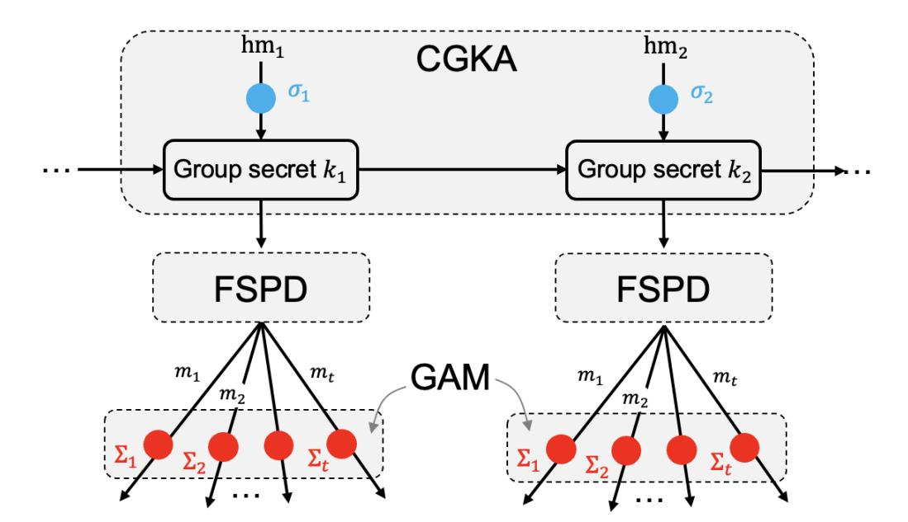
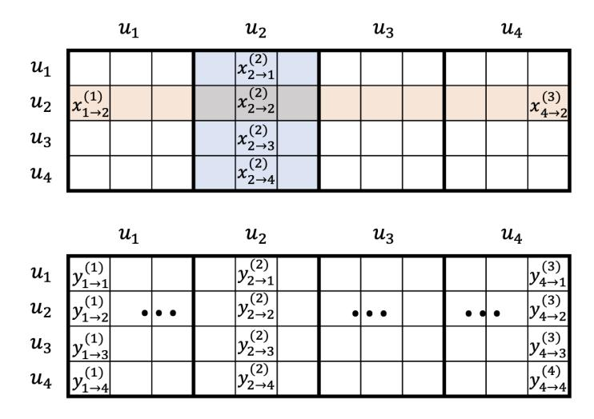
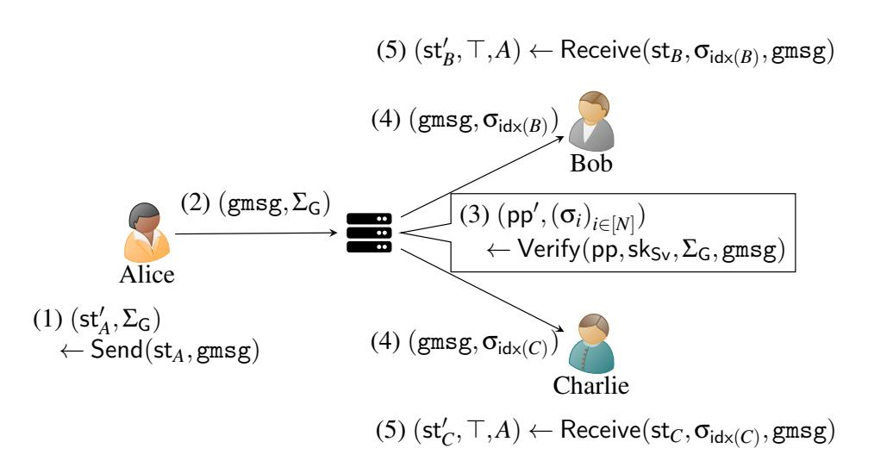

{0}------------------------------------------------

# Exploring How to Authenticate Application Messages in MLS: More Efficient, Post-Quantum, and Anonymous Blocklistable

Keitaro Hashimoto *National Institute of Ad[van](https://orcid.org/0000-0002-2232-9443)ced Industrial Science and Technology (AIST)*

Shuichi Katsumata *AIST & PQShiel[d](https://orcid.org/0000-0002-8496-0476)*

Guillermo Pascual-Perez *Institute of Science and Technology [Aus](https://orcid.org/0000-0001-8630-415X)tria (ISTA)*

## Abstract

The Message Layer Security (MLS) protocol has recently been standardized by the IETF. MLS is a scalable secure group messaging protocol expected to run more efficiently compared to the Signal protocol at scale, while offering a similar level of strong security. Even though MLS has undergone extensive examination by researchers, the majority of the works have focused on *confidentiality*.

In this work, we focus on the *authenticity* of the *application messages* exchanged in MLS. Currently, MLS authenticates every application message with an EdDSA signature and while manageable, the overhead is greatly amplified in the post-quantum setting as the NIST-recommended Dilithium signature results in a 40x increase in size. We view this as an invitation to explore new authentication modes that can be used instead. We start by taking a systematic view on how application messages are authenticated in MLS and categorize authenticity into four different security notions. We then propose several authentication modes, offering a range of different efficiency and security profiles. For instance, in one of our modes, COSMOS++, we replace signatures with one-time tokens and a MAC tag, offering roughly a 75x savings in the post-quantum communication overhead. While this comes at the cost of weakening security compared to the authentication mode used by MLS, the lower communication overhead seems to make it a worthwhile trade-off with security.

## <span id="page-0-3"></span>1 Introduction

## <span id="page-0-4"></span>1.1 Background

A *secure group messaging* (SGM) protocol allows a group of users to asynchronously communicate in an end-to-end encrypted fashion. The *Messaging Layer Security* (MLS) protocol [\[12,](#page-21-0) [20\]](#page-22-0), a recently standardized SGM protocol by the IETF, is a proposal developed in a joint effort by academics and industry for a *scalable* SGM protocol supporting groups with tens of thousands of users. Similarly to the Signal protocol [\[36,](#page-22-1) [37,](#page-22-2) [46\]](#page-23-0), considered the gold standard for two-user

SGMs, it offers a strong level of forward secrecy and postcompromise security, limiting the scope of device compromise. The draft versions of MLS are already running in production in Cisco's Webex [\[65\]](#page-24-0) and RingCentral [\[74\]](#page-24-1), and other companies, including AWS, Cloudflare, and Google, are planing deployment.[1](#page-0-0) Furthermore, with the recent adoption of the Digital Markets Act by the European Union, a standard like MLS is hoped to be a potential solution for the interoperability problem in secure messaging [\[59\]](#page-24-2).

The security of MLS (and its variants) has undergone extensive examination by researchers during the standardization process, e.g., [\[4](#page-21-1)[–8,](#page-21-2) [22,](#page-22-3) [29,](#page-22-4) [52,](#page-23-1) [53,](#page-23-2) [57,](#page-23-3) [78\]](#page-24-3), and the protocol has been continuously updated leading up to 20 drafts in total[2](#page-0-1) until the issuance of the RFC. The majority of works on MLS have focused on the *confidentiality* of the exchanged messages (or the shared group secret key). In contrast, relatively less attention has been directed towards the *authenticity* of messages, which is often viewed as a means to establish confidentiality.

In MLS, there are two types of messages being authenticated [\[12,](#page-21-0) Sec. 2]: *application* and *handshake* messages. While the former carry the actual payloads such as chat texts, the latter carry group operations affecting the group state (e.g., authenticating that user *u* added a new user *v* to the group). In this work, we revisit how MLS authenticates application messages motivated by the following two issues.

Issue 1: Heavy Reliance on Signatures. In MLS, every user *u* has a signature key pair (vk*u*,sk*u*) and signs the application message am for authentication. It further independently encrypts the message am and signature sig*<sup>u</sup>* using a symmetric key encryption scheme whose key is derived from the group secret key to conceal the application message and its identity from the delivery server. The resulting (tuple of) ciphertext ct*<sup>u</sup>* is then sent to the group. We call this mode of authentication *Enc-Sign mode*. [3](#page-0-2) The recent work by Hashimoto et

<span id="page-0-0"></span><sup>1</sup><https://www.ietf.org/blog/mls-protocol-published/>

<span id="page-0-2"></span><span id="page-0-1"></span><sup>2</sup><https://datatracker.ietf.org/doc/rfc9420/>

<sup>3</sup> In contrast, handshake messages can be sent in *Sign mode*, where the user simply sends the pair (m, sig*<sup>u</sup>* ).

{1}------------------------------------------------

al. [\[53\]](#page-23-2) proposed adding an additional signature sig*<sup>G</sup>* on top of ct*u*, using a signing key derived from the group secret key. This mode, called the *Sign-Enc-Sign mode*, is a simple but powerful enhancement of the Enc-Sign mode, allowing to anonymously block outsiders from injecting malicious messages to the group, similarly to Signal's two-user Sealed Senders [\[60\]](#page-24-4).

While adding signatures provides stronger authenticity guarantees, it comes with an increase in the communication and computational costs. This is currently manageable as MLS uses an EdDSA signature with an overhead of 64 B. However, this overhead is greatly amplified in the post-quantum setting. For instance, the NIST-recommended Dilithium signature is 2.4 KB, a 40x increase to EdDSA signatures. Given that a typical application message contains less than 100 B [\[47\]](#page-23-4), the overhead has a noticeable effect. We thus view this as an invitation to explore alternatives designs. We note that while handshake messages incur the same overhead when turning to post-quantum security, the effect is marginal as the size of the handshake message is larger, and the rate at which group operations are performed is less frequent compared to sending application messages.

Issue 2: Lack of Formal Model for Authentication. Compared to the comprehensive study of the confidentiality guarantees of MLS, authentication has drawn less attention. This lack of focus on authenticity may lead to unforeseen attacks on MLS that do not contradict confidentiality but still harm the protocol. As an illustrative example, the MLS is prone to abuse from malicious insiders (e.g., [\[8\]](#page-21-2)). Notice that both Enc-Sign and Sign-Enc-Sign modes conceal the sender from the server. This allows a malicious insider to craft a malformed message and send it to the group. If the signature sig*<sup>u</sup>* included in the ciphertext is malformed, even the group users cannot trace back the sender, meaning that a malicious sender can stealthily repeat the attack. While the users can reject these malformed messages, this can only happen *after* downloading them from the server and processing them. This opens the door for a malicious insider to mount a DoS attack on the group. A similar issue was pointed out by Tyagi et al. [\[75\]](#page-24-5) for Signal's two-user Sealed Senders [\[60\]](#page-24-4), who experimentally verified that such an attack can easily drain a recipient's battery in a short period of time.

A formal security model that comprehensively captures these properties allows us to better understand the strengths and limitations of a given authentication mode.

## <span id="page-1-2"></span>1.2 Our Contributions

In this work, we explore new approaches to authenticate application messages in MLS. Our contribution is explained below in more detail and an overview is provided in Tab. [1.](#page-2-0)

Formal Model for Authentication. In Sec. [2,](#page-2-1) we study how application messages are authenticated in MLS and systematically analyze the types of adversaries and threat models

<span id="page-1-1"></span>

Figure 1: Relation between a CGKA, FSPD, and GAM protocols. hm denotes the handshake message used by the CGKA protocol. *mi* denotes the output of the FSPD protocol; in MLS this is an *encryption* of the application message am. The blue and red circles indicate that the handshake and application messages are authenticated.

needed to be considered. More technically, the core of MLS can be regarded as a combination of two protocols: a *continuous group key agreement* (CGKA) and a *forward-secure payload delivery* (FSPD) protocol [\[5\]](#page-21-3).[4](#page-1-0) The former (resp. latter) handles handshake (resp. application) messages. In this paper, we formalize the authentication guarantees of the application messages handled by the FSPD protocol and introduce four different security notions: unforgeability, anonymity, anonymous blocklisting, and tracing soundness. To the best of our knowledge, this is the first work to put a focus on the authenticity of the application message; previous works on MLS studied the different types of CGKA protocol and focused on the confidentiality of the application message [\[4](#page-21-1)[–8,](#page-21-2) [22,](#page-22-3) [29,](#page-22-4) [52,](#page-23-1) [53,](#page-23-2) [57,](#page-23-3) [78\]](#page-24-3).

Group Authenticated Messaging Protocol. In Sec. [3,](#page-5-0) we propose the new notion of *group authenticated messaging* (GAM) protocol, allowing us to focus solely on the authenticity of the application messages while abstracting the confidentiality guarantees. More specifically, the FSPD protocol already entails the confidentiality of application messages and our GAM protocol can be viewed as adding authenticity guarantees to them. Fig. [1](#page-1-1) gives an illustration on how a GAM protocol interacts with the CGKA and FSPD protocols. For instance, in MLS, m and Σ<sup>1</sup> are the encryptions of the application message am and signature sig*<sup>u</sup>* on am, respectively (i.e., Enc-Sign mode).

New Authentication Modes. In Secs. [4](#page-9-0) and [5,](#page-12-0) we introduce five new GAM protocols: COSMOS, COSMAC, QUASAR, STARS, and GEMSTARS. All are based on generic building blocks such as one-way functions (OWFs), message authentication codes (MACs), and key encapsulation mechanisms (KEMs) that are instantiable from both classical and post-quantum assump-

<span id="page-1-0"></span><sup>4</sup>Alwen et al. [\[5\]](#page-21-3) uses the term forward-secure group AEAD instead of FSPD.

{2}------------------------------------------------

<span id="page-2-0"></span>Table 1: Comparison between different authentication modes for secure messaging protocols. N and T denote the size of the group and the number of messages each user sends. "Communication Cost Overhead per Msg per User" is defined as the sum of 1 (offline/online) upload cost and (N-1) (offline/online) download cost for each user normalized by NT. For readability, we use the simplification  $(N+1)/N \approx 1$ . sig, osig, and gsig denote a standard signature, a one-time signature, and a group signature, respectively, ovk denotes the verification key of a one-time signature. ct denotes a KEM ciphertext.  $\kappa$  denotes the security parameter, set to 128 bits.  $\checkmark^{(*)}$  denotes that it satisfies a weaker notion of unforgeability compared to  $\checkmark$  (see Sec. 2.3). "State Updates" comes with "-", "local", and "global", where "-" means no state update is necessary (see Remark 3.2). COSMOS and COSMAC come with an optimized variants indicated by  $(^+)$  and  $(^{++})$ , whose respective total communication cost overheads and state updates are provided in parentheses.

| Authentication Modes           | Anon.    | Unf.         | Anonymous<br>Blocklistable | Tracing Soundness | Comm. Cost Overhead per Msg per User                                                                    | State<br>Updates |
|--------------------------------|----------|--------------|----------------------------|-------------------|---------------------------------------------------------------------------------------------------------|------------------|
| Enc-Sign [12]                  |          | <b>~</b>     | ×                          | ×                 | sig                                                                                                     |                  |
| Sign-Enc-Sign [53]             | <b>~</b> | <b>✓</b>     | <b>✓</b>                   | ×                 | $2 \cdot  sig $                                                                                         | -                |
| COSMOS(+,++) (Secs. 4)         | ×        | <b>✓</b> (*) | ✓                          | <b>✓</b>          | $3 \cdot \kappa \ (3 \cdot \kappa \ , \ (2 + \frac{3}{T}) \cdot \kappa)$                                | local (-, local) |
| $COSMAC(^{+},^{++}) (Secs. 4)$ | <b>~</b> | <b>✓</b> (*) | ✓                          | ×                 | $4 \cdot \kappa \ (4 \cdot \kappa \ , \ (3 + \frac{4}{T}) \cdot \kappa)$                                | local (-, local) |
| QUASAR (Sec. 5.1)              | <b>✓</b> | <b>✓</b> (*) | ✓                          | <b>✓</b>          | $6 \cdot \kappa + \frac{2 \cdot (\kappa +  ct )}{T}$                                                    | global           |
| STARS (Sec. 5.2)               | <b>✓</b> | <b>✓</b>     | <b>✓</b>                   | <b>✓</b>          | $ \operatorname{ovk}  + 2 \cdot  \operatorname{osig}  + \frac{\kappa + 2 \cdot  \operatorname{ct} }{T}$ | global           |
| GEMSTARS (Sec. 5.2)            | <b>~</b> | <b>✓</b>     | <b>✓</b>                   | <b>✓</b>          | $ \operatorname{sig}  +  \operatorname{gsig} $                                                          | -                |

tions. Each mode fills a specific part of the design space with strengths and weaknesses, summarized in Tab. 1. In particular, COSMOS and COSMAC do not rely on signatures and the overhead (for their optimized variants) is merely 32 B and 48 B, respectively. This offers a roughly 75x savings in the post-quantum communication overhead compared to MLS, though at the cost of slightly weakening the unforgeability guarantee; we assume the malicious server does not collude with the malicious insider. See Sec. 2.3 for more detail. We believe this significantly lower communication overhead makes it a worthwhile trade-off with security.

Efficiency Analysis. In Sec. 7, we instantiate our proposed GAM protocols from both classical and post-quantum assumptions and compare their efficiency. For completeness, we also detail in Sec. 6 how to use each of our proposed GAM protocols inside MLS. While it is mostly a simple drop in, there are minor issues that require some explanation, since the syntax of GAM protocols intentionally leaves out some functionality provided by MLS, such as what is typically captured by the CGKA protocol (e.g., welcoming group members).

Lastly, we leave it as an important future work to analyze MLS in its entirety when using our notion of GAM protocol as a building block. While Alwen et al. [5] analyze MLS by composing the CGKA and FSPD protocols with a PRF-PRNG, the output of the FSPD protocol is explicitly signed (and not encrypted); that is, they assume the vanilla (unencrypted) GAM protocol used by MLS. Replacing this with a general GAM protocol and analyzing MLS is an interesting future work. We discuss further open problems in Sec. 8.

Other related work and preliminaries are deferred to Apps. A and B, respectively.

## <span id="page-2-1"></span>2 Setting: Authentication in SGM

This work focuses on secure group messaging (SGM) protocols, where group users share a unique common group secret key. In this section we use MLS as our primary example, but all of our constructions apply equally to most MLS variants (e.g., [2,4,6,7,52,53,57]) that rely on a group secret key to exchange messages.

Below, we give a brief background on how MLS authenticates application messages. We then take a close look at different security notions under the umbrella of authenticity and formally categorize them. Building on the systematization provided in this section, we introduce the concept of a *group authenticated messaging* (GAM) protocol in Sec. 3 and formally define the relevant security notions.

#### <span id="page-2-2"></span>2.1 Secure Group Messaging and Our Goal

Following Alwen et al. [5], we view MLS as a combination of the CGKA and FSPD protocols (see Fig. 1 for illustration). At a high level, one can draw a parallel to hybrid encryption, where the heavy public key operations are handled by the CGKA protocol and the exchange of application messages is handled by the lightweight FSPD protocol.

In more detail, the CGKA protocol allows a group of users to agree on a continuous sequence of shared (symmetric) group secret keys. By regularly updating the group secret key (and user specific keys), strong notions of *forward secrecy* and *post-compromise security* [4–6,8,39] are guaranteed. The protocol is also responsible for handling group operations such as adding and removing users. *Handshake messages* is an umbrella term for the exchanged messages by the CGKA protocol, used to achieve the above objectives. A handshake

{3}------------------------------------------------

message, or an encryption of it, is signed using the user's signing key to authenticate the sender. This plays an important role in guaranteeing the consistency and integrity of the group state. As can also be seen from Fig. [1,](#page-1-1) the authenticity of handshake messages is analyzed implicitly as a means to show confidentiality of the group secret keys; this is similar to standard (two-user) authenticated key exchange protocols where authenticity guarantees are implicit [\[15,](#page-21-7) [32\]](#page-22-5).

The FSPD protocol then uses the established group secret key by the CGKA protocol to securely exchange *application messages*, containing various types of payload such as chat texts, images, and stamps. Compared to the CGKA protocol, the FSPD protocol is much simpler since there are no group operations (i.e., static groups) and the objective is only confidentiality with forward secrecy; authenticity is not a security requirement. In MLS, the output of the FSPD protocol — an encryption of the application message — is then signed using a signature scheme and encrypted (i.e., Enc-Sign mode), adding the necessary authenticity guarantee. This rather ad hoc way of adding authenticity seems to be justified by the simple nature of the FSPD protocol, and indeed most works on MLS mainly focus on the security of the CGKA protocol [\[4,](#page-21-1)[6](#page-21-5)[–8,](#page-21-2)[22,](#page-22-3)[29,](#page-22-4)[52,](#page-23-1)[53,](#page-23-2)[57,](#page-23-3)[78\]](#page-24-3). To the best of our knowledge, Alwen et al. [\[5\]](#page-21-3) is the only prior work to analyze MLS in its entirety. They do so by modularly combining the CGKA and FSPD protocols with a PRF-PRNG, assuming the output of the FSPD protocol is authenticated by a digital signature.

The goal of our paper is thus to put a spotlight onto the authentication of application messages or, to be more precise, the output of the FSPD protocol (see Fig. [1\)](#page-1-1). We introduce a new primitive called group authenticated messaging (GAM) protocol and aim to more clearly and systematically explore alternative choices to the currently (implicitly) used GAM protocol by MLS, which is the Enc-Sign mode.

## <span id="page-3-3"></span>2.2 Environment

We first explain the environment in which MLS operates in. This involves introducing the relevant entities and outlining the network model under consideration.

### 2.2.1 Entities

*Group Users:* The set of users in a group. Depending on the considered security notion, the users are modeled to either be all honest or some malicious. For instance, we consider the latter case when modeling a security notion where a malicious insider (e.g., [\[8\]](#page-21-2)) tries to impersonate an honest user.

*Server:* Any *asynchronous* messaging protocol requires a server to curate the messages between the group users. We consider two types of servers: honest and malicious. While servers are typically considered to be malicious by default in prior work, this is because the focus is mainly on the confidentiality of the CGKA protocol. For authentication, it makes

sense to consider honest servers as well. For example, the recent work by Hashimoto et al. [\[53\]](#page-23-2) considers an honest server to anonymously block outsiders from injecting malicious messages to the group.

*Outsiders:* Any adversary that is not a group user or the server. For instance, a user of the secure messaging application not in the group.

#### <span id="page-3-2"></span>2.2.2 Network Model

Due to asynchronicity, when group users exchange messages, they must upload and download these to and from the server. Depending on the anonymity guarantee we aim to achieve, there are two types of communication channels that can be used between the group users and the server.

*Non-Anonymous:* If the server is allowed to know the users in the group, then we assume a user-server authenticated channel is used. For instance, TLS or Noise [\[69\]](#page-24-6) with userside password-based authentication can be used.

*Anonymous:* If the group users are required to remain anonymous to the server, then we assume an authenticated anonymous channel such as TOR [\[42,](#page-23-6) [71\]](#page-24-7) or a VPN is used.

We note dealing with authentication in the non-anonymous setting is trivial since the server can simply maintain the group list and explicitly authenticate the group users. In contrast, in the anonymous setting, such trivial solutions no longer exist and the issue of authentication becomes non-trivial. Indeed, prior works on *anonymous* secure messaging, e.g., [\[34,](#page-22-6) [53,](#page-23-2) [60,](#page-24-4)[75\]](#page-24-5), overcome this by relying on some type of anonymous group authentication protocol.

## <span id="page-3-0"></span>2.3 Threat Model for Authentication

We now categorize authenticity into four different security notions: unforgeability, anonymity, anonymous blocklisting, and tracing soundness. This categorization of the application message is motivated by the security definitions used in wellstudied anonymous authentication schemes, such as group signatures [\[13,](#page-21-8)[27,](#page-22-7)[35\]](#page-22-8) and accountable ring signatures [\[18,](#page-21-9)[80\]](#page-24-8).

Below, for each security notion, we explain *who* the adversary is, *what* the goal of the security notion is, and *why* we consider it. For simplicity, we leave outsider adversaries out of most security notions as they are strictly weaker than malicious servers and group users. The following security notions will be formalized in Sec. [3.3.](#page-6-0)

#### Goal 1: Unforgeability.

Adversary: Malicious group users and/or a malicious server. Goal: No adversary can forge a signature[5](#page-3-1) of an honest user.

<span id="page-3-1"></span><sup>5</sup>Throughout this section, we use the term "signature" loosely and note that signatures are not the only way to authenticate. Using the terminology of our GAM protocol, this is more formally an "authentication token".

{4}------------------------------------------------

This is the default notion that any secure messaging protocol must ensure. We can consider two levels of unforgeability: we call it unforgeable if the set of malicious group users and the malicious server can collude, and *non-colluding* unforgeable otherwise. The former guarantees that even a colluding malicious insider and server cannot forge a signature of an honest group user. In contrast, the latter restricts the adversary to be either the set of malicious group users or the malicious server; that is, unforgeability holds only if there is no collusion. While (standard) unforgeability is the more secure notion, sacrificing security against collusion of a malicious insider and server could be a reasonable compromise for better efficiency.

#### Goal 2: Anonymity.

Adversary: A malicious server.

Goal: The server cannot deanonymize and link the activity of the group users. E.g., the server cannot distinguish whether two uploaded messages came from the same user or from two different users.

For this security notion we must rely on an anonymous network model as, otherwise, communication will be linkable at the network level. We further assume all the group users to be honest, since a malicious user can always inform the server of who is in the group or who authored a message.

#### Goal 3: Anonymous Blocklisting.

Adversary: An outsider.

Goal: An honest server can block any outsider trying to upload messages on behalf of the group.

Observe that non-anonymous blocklisting is trivial to satisfy, since the server can perform access control by explicitly authenticating the group users. We therefore use the term "anonymous" to emphasize that the motivation of the server is to blocklist non-group users while preserving the anonymity of the users. The purpose of anonymous blocklisting is for the server to be able to prevent outsiders from launching a DoS attack on the group. Importantly, although group users can verify the authenticity of the messages by downloading them from the server, we require the server to directly reject invalid messages on behalf of the group. This is satisfied for example by Sealed Sender [\[60\]](#page-24-4) used in the Signal protocol and the metadata-hiding MLS protocol by Hashimoto et al. [\[53\]](#page-23-2).

#### Goal 4: Tracing Soundness.

Adversary: Malicious group users.

Goal: The set of honest group users can trace any (possibly maliciously crafted) signature back to a *unique* group user; if an honest user traces a signature back to a user *u* in the group, then all other honest users trace it back to the same user *u*.

Tracing soundness allows to keep the view of the honest users consistent. For instance, consider a malicious insider mounting a DoS attack against the group by spamming garbage application messages. With tracing soundness, the honest users can unanimously agree on who the malicious insider was and remove him from the group. One can draw a

parallel to anonymous blocklisting, that prevents such attacks from outsiders. Moreover, while similar, it is worth noting that tracing soundness is an orthogonal notion to unforgeability. Consider a malicious insider *u* that modifies the signature of an honest user *v* in such a way that for half of the group members it traces back to *u*, but for the other half traces back to *v*. While this does not contradict unforgeability, as the malicious user is effectively just "repurposing" somebody's message, it clearly breaks the consistency of the group's view.

# <span id="page-4-0"></span>2.4 Modeling Choices and Simplifications

Before introducing our GAM protocol in the next section, we clarify the modeling choices and simplifications we make.

*Trusted Setup.* The GAM protocol assumes the states of both the group users and the server are generated honestly by an initialization phase. This simplification is justified for protocols like MLS, since users are assumed to start the GAM protocol with the group secret key, derived from the CGKA protocol, already in their states.

*Static Groups.* The GAM protocol assumes static groups, following the way in which MLS' FSPD protocol operates. Recall that in MLS a new FSPD protocol for a static group is initialized every time group membership changes, as this will trigger a new CGKA protocol epoch (see Fig. [1\)](#page-1-1). More generally, though, we could consider a *continuous* GAM protocol where we do not need to reinitialize the protocol with every group change, similarly to a CGKA protocol. However, such a definition must be intertwined with that of the CGKA protocol responsible for group state updates, rendering the definition to be as complex as modeling MLS in its entirety. As a study investigating new security goals of authentication, we opt for making the security notions tractable and to improve the overall readability. Nonetheless, we explain in Sec. [6.2](#page-17-1) with concrete examples on how each of our proposed GAM protocols can handle dynamic operations.

*Out-of-Order Messages.* In our work, we do not model authentication when messages arrive out-of-order. While this is arguably important for a comprehensive model, we highlight that, unlike confidentiality, lack of authentication does not harm the usability of the FSPD protocol. In the context of the MLS protocol, *immediate decryption* of the messages will still be maintained. The only difference between MLS is that we may lose *immediate authentication* when messages arrive out-of-order. Importantly, though security is lost while some messages are missing, assuming that every message eventually arrives, then out-of-order messages do not affect security. Instead, if some messages are permanently dropped, we can allow the recipients to fetch this missing authentication information, which they can do assuming the proper indexing of the messages required by out-of-order decryption. We note that in MLS [\[20,](#page-22-0) Section 5.2], whether messages

{5}------------------------------------------------

eventually arrive or not is controlled by the application that sets the policy.

### <span id="page-5-0"></span>**3 Group Authenticated Messaging Protocol**

We introduce *group authenticated messaging* (GAM) protocols and the associated security requirements.

#### <span id="page-5-4"></span>3.1 Definition

A GAM protocol is defined between a server and a group G of users. As explained above, there exists an initialization algorithm Init that prepares the initial state for the group users, possibly further preparing a secret key for the server. To send a message m (e.g., the output of a FSPD protocol), a user  $u \in G$  runs the Send algorithm, outputting a group authentication token  $\Sigma_G$ . A server verifies  $(m, \Sigma_G)$  using the Verify algorithm and prepares *user* authentication tokens  $(\sigma_i)_{i \in [N]}$ , where N = |G|. For example, in the context of the Sign mode in MLS (see Footnote 3),  $\Sigma_G$  is simply u's signature and  $\sigma_i := \Sigma_G$ . To capture anonymity, we assume the server only knows the size of the group G<sup>6</sup> and assume a bijective map  $idx : G \rightarrow |N|$  is secretly known by the group users. Namely, a user u such that i = idx(u) fetches  $\sigma_i$  from the server. It then runs the Receive algorithm to verify  $(m, \sigma_i)$  and traces the purported user  $v \in G$  that generated  $\sigma_i$ . It is worth highlighting that we make a distinction between a group authentication token  $\Sigma_G$  and a user authentication token  $\sigma_i$  to capture an optimization technique called *selective downloading* [7,52]. This technique allows the server to sanitize the group authentication token  $\Sigma_G$  in a straightforward manner by delivering to each group user just the strictly necessary amount of data  $\sigma_i$ , while maintaining the same level of (dis)trust.

Finally, we endow a GAM protocol with an *offline-online* feature. In the offline phase, when the message is still unknown, a user can perform a possibly heavy state update, and share the update with the server and the group via the UpdSend algorithm. This algorithm is accompanied by algorithms UpdVerify and UpdReceive similarly to above. Once the message is known in the online phase, the user can send it using its updated state.<sup>7</sup> Formally, we have the following.

**Definition 3.1.** A GAM protocol for message space  $\mathcal{M}$  between a server Sv and a set of users in a group G consists of the following algorithms, where  $idx : G \rightarrow [N]$  is a bijective function with N := |G|. Below, if an algorithm outputs  $\bot$ , we assume it reverts to the state before running the algorithm.

 $Init(1^{\kappa}, \mathsf{G}) \to \left(\mathsf{pp}, \mathsf{sk}_{\mathsf{Sv}}, (\mathsf{st}_u)_{u \in \mathsf{G}}\right)$ : On input the security parameter  $1^{\kappa}$  and group information  $\mathsf{G} \subset \{0,1\}^*$ , it outputs public parameters  $\mathsf{pp}$ , a secret key  $\mathsf{sk}_{\mathsf{Sv}}$  for the server  $\mathsf{Sv}$ , and an initial state  $\mathsf{st}_u$  for all users  $u \in \mathsf{G}$ . We assume  $\mathsf{G} \in \mathsf{st}_u$ .

Send( $\operatorname{st}_u$ ,  $\operatorname{m}$ )  $\to$  ( $\operatorname{st}_u'$ ,  $\Sigma_{\mathsf{G}}$ ) or  $\bot$ : On input a state  $\operatorname{st}_u$  for user  $u \in \mathsf{G}$  and a message  $\operatorname{m} \in \mathcal{M}$ , user u outputs an updated state  $\operatorname{st}_u'$  and a group authentication token  $\Sigma_{\mathsf{G}}$ , or  $\bot$ .

Verify(pp, sk<sub>Sv</sub>,  $\Sigma_G$ , m)  $\rightarrow$  (pp',  $(\sigma_i)_{i \in [N]}$ ) or  $\bot$ : On input public parameters pp, a server secret key sk<sub>Sv</sub>, a group authentication token  $\Sigma_G$ , and a message m  $\in \mathcal{M}$ , the server Sv outputs updated public parameters pp' and N user authentication tokens  $(\sigma_i)_{i \in [N]}$ , or  $\bot$ .

Receive( $\operatorname{st}_u, \sigma, m$ )  $\to$  ( $\operatorname{st}_u', b \in \{\top, \bot\}, v \in G \cup \{\bot\}$ ): On input a state  $\operatorname{st}_u$  for user  $u \in G$ , a user authentication token  $\sigma$ , and a message  $m \in \mathcal{M}$ , user u outputs an updated state  $\operatorname{st}_u'$ , a bit b indicating whether the token was valid ( $b = \top$ ) or invalid ( $b = \bot$ ), and a purported user  $v \in G \cup \{\bot\}$ , where  $v = \bot$  if tracing fails.

UpdSend( $\operatorname{st}_u$ )  $\to$  ( $\operatorname{st}_u'$ ,  $\widehat{\Sigma}_G$ ,  $\widehat{\operatorname{ct}}_G$ ): *On input a state*  $\operatorname{st}_u$  *for user*  $u \in G$ , *user u outputs an updated state*  $\operatorname{st}_u'$ , a group update authentication token  $\widehat{\Sigma}_G$ , and group update information  $\widehat{\operatorname{ct}}_G$ .

UpdVerify(pp,  $\operatorname{sk}_{\operatorname{Sv}}, \widehat{\Sigma}_{\operatorname{G}}, \widehat{\operatorname{ct}}_{\operatorname{G}}) \to \left(\operatorname{pp'}, \left(\widehat{\sigma}_i, \widehat{\operatorname{ct}}_i\right)_{i \in [N]}\right)$  or  $\bot$ : On input public parameters pp, a server secret key  $\operatorname{sk}_{\operatorname{Sv}}$ , a group update authentication token  $\widehat{\Sigma}_{\operatorname{G}}$ , and group update information  $\widehat{\operatorname{ct}}_{\operatorname{G}}$ , the server Sv outputs updated public parameters pp' and a list of user update authentication tokens and user update information  $(\widehat{\sigma}_i, \widehat{\operatorname{ct}}_i)_{i \in [N]}$ , or  $\bot$ .

UpdReceive( $\operatorname{st}_u, \widehat{\sigma}, \widehat{\operatorname{ct}}$ )  $\rightarrow$  ( $\operatorname{st}'_u, b \in \{\top, \bot\}, v \in G \cup \{\bot\}$ ): On input a state  $\operatorname{st}_u$  for user  $u \in G$ , a user update authentication token  $\widehat{\sigma}$ , and user update information  $\widehat{\operatorname{ct}}$ , user u outputs an updated state  $\operatorname{state}'_u$ , a bit b indicating whether the token was valid ( $b = \top$ ) or invalid ( $b = \bot$ ), and a purported user  $v \in G \cup \{\bot\}$ , where  $v = \bot$  if tracing fails.

<span id="page-5-1"></span>Remark 3.2 (Local and Global State Updates). For some protocols the user state may only allow signing up to T messages, and it may need to be updated before the user can sign again. There are two ways to perform state updates: *locally* and *glob*ally. In the former, a user regains the ability to send messages once it has updated its own state. In the latter, a user regains the ability to send messages only after every user in the group updates their states. Since global state updates are much more costly than local state updates, they are only useful if one state update allows to send a large number of messages T. Further, global updates can only guarantee security if users are online, a clear disadvantage over local updates. For the schemes presented in this paper there are no risks of a deadlock — i.e., a situation where a global state update cannot be completed and users are prevented to keep sending messages — as long as the users perform updates once coming online. However,

<span id="page-5-2"></span><sup>&</sup>lt;sup>6</sup>While we could consider further hiding the size of the group to the server, we choose not to since it would resort in an inefficient padding strategy. This is the same level of anonymity satisfied by previous anonymous SGM protocols e.g., [34,53].

<span id="page-5-3"></span><sup>&</sup>lt;sup>7</sup>Naturally, protocols need not have such a differentiation and can simply only perform online state updates. This optimization allows us to improve the real-world usability of those protocols that do, as they can more evenly distribute their computation and communication over time.

{6}------------------------------------------------

the general definition of global updates does not guarantee that such a deadlock does not occur.

#### <span id="page-6-3"></span>3.2 Correctness

We define two types of signing correctness. One for signing messages and the other for signing updates. They stipulate that an honestly generated user authentication token is always valid and traceable.

<span id="page-6-2"></span>**Definition 3.3 (Signing Correctness).** For any  $\kappa \in \mathbb{N}$ ,  $G \subset \{0,1\}^*$ , and  $(\mathsf{pp},\mathsf{sk}_{\mathsf{Sv}},(\mathsf{st}_u)_{u \in \mathsf{G}}) \in \mathsf{Init}(1^\kappa,\mathsf{G})$ , if we execute (Send, Verify, Receive, UpdSend, UpdVerify, UpdReceive) in an arbitrary but honest manner (i.e., we only run the algorithms on inputs that were output by another algorithm and run Receive (resp. UpdReceive) for all users after running  $\mathsf{Verify}$  (resp. UpdVerify))<sup>8</sup>, then we have the following, where  $\mathsf{pp'}$  and  $(\mathsf{st}'_u)_{u \in \mathsf{G}}$  are arbitrary public parameters and states reachable from the initial  $\mathsf{pp}$  and  $(\mathsf{st}_u)_{u \in \mathsf{G}}$ :

Message Signing Correctness: For any  $m \in \mathcal{M}$  and  $u \in G$ , if we execute  $(st''_u, \Sigma_G) \leftarrow \$Send(st'_u, m)$ , redefine  $st'_u := st''_u$ , and execute  $(pp'', (\sigma_i)_{i \in [N]}) \leftarrow Verify(pp', sk_{Sv}, \Sigma_G, m)$ ,  $(st''_v, b_v, u_v) \leftarrow Receive(st'_v, \sigma_{idx(v)}, m)$  for all  $v \in G$ , then conditioned on  $\Sigma_G \neq \bot$ , we have  $(b_v, u_v) = (\top, u)$  (i.e., every user accepts and traces the message back to u).

Update Signing Correctness: For any  $u \in G$ , if we execute  $(\mathsf{st}''_u, \widehat{\Sigma}_G, \widehat{\mathsf{ct}}_G) \leftarrow \$\mathsf{UpdSend}(\mathsf{st}'_u)$ , redefine  $\mathsf{st}'_u := \mathsf{st}''_u$ , and execute  $(\mathsf{pp}'', (\widehat{\sigma}_i, \widehat{\mathsf{ct}}_i)_{v \in [N]}) \leftarrow \mathsf{UpdVerify}(\mathsf{pp}', \mathsf{sk}_{\mathsf{Sv}}, \widehat{\Sigma}_G, \widehat{\mathsf{ct}}_G)$  followed by  $(\mathsf{st}''_v, b_v, u_v) \leftarrow \mathsf{UpdReceive}(\mathsf{st}'_v, \widehat{\sigma}_{\mathsf{idx}(v)}, \widehat{\mathsf{ct}}_{\mathsf{idx}(v)})$  for all  $v \in G$ , then conditioned on  $\widehat{\Sigma}_G \neq \bot$ , we have  $(b_v, u_v) = (\top, u)$  (i.e., every user accepts and traces the update back to u).

In some protocols, the states may occasionally need to be updated in order to regain the ability to send messages again. As explained in Remark 3.2, there are two ways a users can update their states. One is *local*, where it is sufficient that a user can simply update its state. The other one is *global*, where all the group users must update their states. Below, we define correctness of both state update modes.

**Definition 3.4 (State-Update Correctness).** Assume the same precondition as in Def. 3.3. Then, we have either of the following:

Local State-Update Correctness: For any  $m \in \mathcal{M}$  and user  $u \in G$ , if  $(st''_u, \Sigma_G) \leftarrow \$Send(st'_u, m)$  such that  $\Sigma_G = \bot$ , then if u executes  $(st^*_u, \widehat{\Sigma}_G, \widehat{ct}_G) \leftarrow \$UpdSend(st'_u)$ , the server Sv executes  $(pp^*, (\widehat{\sigma}_i, \widehat{ct}_i)_{i \in [N]}) \leftarrow UpdVerify(pp', sk_{Sv}, (\widehat{\Sigma}_G, \widehat{ct}_G))$ , and every user  $v \in G$ 

executes  $UpdReceive(st'_{v}, (\widehat{\sigma}_{idx(v)}, \widehat{ct}_{idx(v)}))$ , then the updated public parameters  $pp^*$  and state  $st^*_u$  allow user u to sign on m, that is,  $\Sigma_G \neq \bot$  and signing correctness holds (i.e., after user u sends a user update information  $\widehat{ct}_{idx(v)}$  to every user v, then user u's state will be refreshed).

State Update Correctness: For any  $m \in \mathcal{M}$  and user  $u \in G$ , if  $(\mathsf{st}''_u, \Sigma_G) \leftarrow \$ \mathsf{Send}(\mathsf{st}'_u, m)$  such that  $\Sigma_G = \bot$ , then if all users  $v \in G$  execute  $(\mathsf{st}''_v, \widehat{\Sigma}^v_G, \widehat{\mathsf{ct}}^v_G) \leftarrow \$ \mathsf{UpdSend}(\mathsf{st}'_v)$ , the server  $\mathsf{Sv}$  executes  $\mathsf{UpdVerify}$  for all  $(\widehat{\Sigma}^v_G, \widehat{\mathsf{ct}}^v_G)_{v \in G}$  in an arbitrary order, and user u executes  $\mathsf{UpdReceive}$  for all  $(\widehat{\sigma}^v_{\mathsf{id} \times (u)}, \widehat{\mathsf{ct}}^v_{\mathsf{id} \times (u)})_{v \in G}$  output by  $\mathsf{UpdVerify}$  in an arbitrary order, then the updated public parameters  $\mathsf{pp}^*$  and state  $\mathsf{st}^*_u$  allow user u to sign on m, that is,  $\Sigma_G \neq \bot$  and signing correctness holds (i.e., after every user v sends a user update information  $\widehat{\mathsf{ct}}^v_{\mathsf{id} \times (u)}$  to user u, then user u's state will be refreshed). Note that by symmetry, all users' state is refreshed.

## <span id="page-6-0"></span>3.3 Security

We formalize the threat models explained in Sec. 2.3: unforgeability, anonymity, anonymous blocklisting, and tracing soundness, via a security game defined in Fig. 2. The probability of the game outputting 1 against an efficient adversary must be negligible for every game except for anonymity. For anonymity, as it is a distinguishing game, the game must output 1 with probability negligibly close to  $\frac{1}{2}$ .

For every game, the adversary is given access to oracles { O<sub>Send</sub>, O<sub>UpdSend</sub> }, allowing it to invoke honest users to create group (update) authentication tokens. The adversary is further given access to either  $\{O_{Receive}, O_{UpdReceive}\}$ or  $\{O_{GroupReceive}, O_{GroupUpdReceive}\}$ . The former allows the adversary to directly invoke honest users to process (update) authentication tokens. This capture malicious server capabilities and is used by the unforgeability and anonymity games. In contrast, the latter only allows the adversary to query for *group* (update) authentication tokens. The oracle then individually invokes each honest users on the correctly processed (update) authentication tokens. Namely, this captures honest server behavior and models the fact that malicious users cannot directly send messages to group users. It is worth noting that, in this case, the authentication tokens created in  $\{O_{Send}, O_{UpdSend}\}$  are directly processed by  $\{O_{GroupReceive}, O_{GroupUpdReceive}\}$ , modeling the fact that the communication channel between an honest user and server is secure.

To aid readability, we highlight some features of the security game. We model two types of unforgeability by  $\mathsf{Game}^\mathsf{X}_{\mathcal{A}}$  with  $\mathsf{X} \in \{\mathsf{ncUnf}, \mathsf{Unf}\}$ . In standard unforgeability, as the adversary models both a malicious user and server, it has unrestricted access to all oracles. In contrast, for non-colluding unforgeability, we have two case distinctions depending on whether the set of corrupted users  $\mathcal{C} = \emptyset$  or not.

<span id="page-6-1"></span><sup>&</sup>lt;sup>8</sup>We impose the second condition to define correctness in a minimal yet well-defined manner. Without it, we must also include cases such as when only part of the users received a user update information.

{7}------------------------------------------------

In the former case the adversary is a malicious server, so the adversary is given the server secret key sk<sub>Sv</sub> and has access to  $\{O_{Receive}, O_{UpdReceive}\}$ . In the latter case the adversary is a set of malicious users, so the adversary is instead given the corrupted users' states and only has access to  $\{O_{GroupReceive}, O_{GroupUpdReceive}\}$ . For both types of unforgeability, an adversary wins if it can output a valid user (update) authentication token for an honest user that it has not seen before. For anonymity, we model a malicious server by giving the adversary the server secret key sk<sub>Sv</sub>. The adversary outputs two users and messages and the game creates the group authentication tokens for both users. To non-trivialize the game, we restrict the (group) authentication tokens to be valid. To perform this check, the adversary needs to further output a (possibly malformed) public parameter  $\overline{pp}$  so the game can run algorithm Verify. The adversary can further perform oracle queries under the restriction that it does not query the receive oracles on the challenge authentication tokens.

We now provide the formal definition of non-colluding and standard unforgeability, anonymity, anonymous blocklisting, and tracing soundness and some more intuitions on how to understand them.

Unforgeability. As already discussed above, we model standard and non-colluding unforgeability by giving the adversary access to different oracles and running it with different inputs (i.e., with or without server and user states). The adversary wins if it outputs a valid authentication token such that  $v_u \in \mathcal{H} \land (v_u, *, \bar{m}) \notin L_{upd}$  where  $\bar{m} \in \{m, \hat{ct}\}$  holds, where recall  $v_u$  is the traced user (cf. unforgeability game, lines 17 and 23). The former checks that the user  $v_u$  is not malicious; without this check a malicious user can trivially win unforgeability. The latter checks that the honest user  $v_u$  did not sign  $\bar{m}$ . Formally, we define unforgeability as follows.

**Definition 3.5** (Unforgeability). We define  $\mathsf{Game}^{\mathsf{ncUnf}}_{\mathcal{A}}(1^{\mathsf{K}})$  as in Fig. 2 for an adversary  $\mathcal{A}$ . We say a  $\mathsf{GAM}$  protocol is no-colluding unforgeable if for any  $\mathsf{G} \subset \{0,1\}^*$ , injective function  $\mathsf{idx} : \mathsf{G} \to [N]$  with  $N = |\mathsf{G}|$ , and any PPT adversary  $\mathcal{A}$ , we have

$$\mathsf{Adv}^{\mathsf{ncUnf}}_{\mathcal{A}}(1^\kappa) \mathrel{\mathop:}= \Pr[\mathsf{Game}^{\mathsf{ncUnf}}_{\mathcal{A}}(1^\kappa) = 1] = \mathsf{negl}(\kappa).$$

We further say the scheme is (standard) unforgeable if the above holds for  $\mathsf{Game}^{\mathsf{Unf}}_{\mathcal{A}}(1^{\kappa})$  as defined in Fig. 2.

**Anonymity.** As briefly explained above, the game checks if the group authentication token  $\Sigma_G$  and the individual authentication tokens  $(\sigma_i)_{i \in [N]}$  are valid. Without this check, an adversary may trivially break anonymity if the protocol requires state updates. Concretely, assume the adversary queries a user  $u_0$  to oracle  $O_{Send}$  until  $u_0$  can no longer sign without performing an update. At this point, if the adversary challenges user  $u_0$  and  $u_1$ , then it can trivially break anonymity as  $u_0$  cannot produce a group authentication token while  $u_1$  can.

Moreover, while we can easily define anonymity for updates, we chose not to do so as updates are sent far less often compared to messages, and we opted for simplicity of the security game. Formally, we define anonymity as follows.

**Definition 3.6** (Anonymity). We define  $\mathsf{Game}^{\mathsf{Anon}}_{\mathcal{A}}(1^{\mathsf{K}})$  as in Fig. 2 for an adversary  $\mathcal{A}$ . We say a  $\mathsf{GAM}$  protocol is anonymous if for any  $\mathsf{G} \subset \{0,1\}^*$ , injective function  $\mathsf{idx} : \mathsf{G} \to [N]$  with  $N = |\mathsf{G}|$ , and any PPT adversary  $\mathcal{A}$ , we have

$$\mathsf{Adv}^{\mathsf{Anon}}_{\mathcal{A}}(1^\kappa) \vcentcolon= \left| \Pr[\mathsf{Game}^{\mathsf{Anon}}_{\mathcal{A}}(1^\kappa) = 1] - \frac{1}{2} \right| = \mathsf{negl}(\kappa).$$

Anonymous Blocklisting. This game is quite intuitive as the adversary is an outsider. The adversary wins the game if it's able to output a valid group authentication token that nobody in the group created. Although similar, we note that anonymous blocklisting is different from unforgeability. To win anonymous blocklisting, the adversary is required to output a *group* authentication token  $\Sigma_G$  that verifies. This entails the fact that the server can check the validity of  $\Sigma_G$  and immediately block malformed group authentication tokens on behalf of the group users. In contrast, unforgeability does not capture this type of blocking by the server. Formally, we define anonymous blocklisting as follows.

**Definition 3.7 (Anonymous Blocklisting).** We define the security game  $\mathsf{Game}^{\mathsf{AnonBlock}}(1^{\mathsf{K}})$  as in Fig. 2 for an adversary  $\mathcal{A}$ . We say a  $\mathsf{GAM}$  protocol is anonymous blocklistable if for any  $\mathsf{G} \subset \{0,1\}^*$ , injective function  $\mathsf{idx} : \mathsf{G} \to [N]$  with  $N = |\mathsf{G}|$ , and any PPT adversary  $\mathcal{A}$ , we have

$$\mathsf{Adv}^{\mathsf{AnonBlock}}_{\mathcal{A}}(1^\kappa) \mathrel{\mathop:}= \Pr[\mathsf{Game}^{\mathsf{AnonBlock}}_{\mathcal{A}}(1^\kappa) = 1] = \mathsf{negl}(\kappa).$$

**Tracing Soundness.** As discussed in Sec. 2.3, the adversary wins if it outputs a group authentication token for which the set  $L_{tr}$  of traced users by the honest users is not of the form  $L_{tr} = \{v\}$  for some group user  $v \in G$ . That is, if the group authentication token is valid, it must be traceable to some user in the group and this user must be unique among the honest users. Formally, we define tracing soundness as follows.

**Definition 3.8 (Tracing Soundness).** We define  $\mathsf{Game}_{\mathcal{A}}^{\mathsf{TraceSound}}(1^{\mathsf{K}})$  as in Fig. 2 for an adversary  $\mathcal{A}$ . We say a GAM protocol is tracing sound if for any  $\mathsf{G} \subset \{0,1\}^*$ , injective function  $\mathsf{idx} : \mathsf{G} \to [N]$  with  $N = |\mathsf{G}|$ , and any PPT adversary  $\mathcal{A}$ , we have

$$\mathsf{Adv}^{\mathsf{TraceSound}}_{\mathcal{A}}(1^\kappa) \vcentcolon= \Pr[\mathsf{Game}^{\mathsf{TraceSound}}_{\mathcal{A}}(1^\kappa) = 1] = \mathsf{negl}(\kappa).$$

Remark 3.9 (Transparency of Server). In any secure messaging protocol it may be important to have a transparent server, so as to limit the trust we put in it. In the context of a GAM protocol, notice that our current initialization algorithm lnit

{8}------------------------------------------------

```
\mathsf{Game}^{\mathsf{AnonBlock}}_{\mathcal{A}}(1^{\kappa})
\mathsf{Game}_{\mathcal{A}}^{\mathsf{X}}(1^{\mathsf{K}}) : \mathsf{X} \in \{\mathsf{ncUnf},\mathsf{Unf}\}
                                                                                                                                                                                                                                                       Oracle O_{\mathsf{Send}}(u \in \mathcal{H}, \mathsf{m})
 1: \mathcal{C} \leftarrow \mathcal{A}(1^{\kappa})
                                                                                                                                  1: \mathcal{H} := \mathsf{G} / No corrupt users
                                                                                                                                                                                                                                                         1: s_{Rec} := \emptyset
 2: \mathcal{H} := \mathsf{G} \backslash \mathcal{C}
                                                                                                                                                                                                                                                         2: (\mathsf{st}'_u, \Sigma_\mathsf{G}) \leftarrow \$\mathsf{Send}(\mathsf{st}_u, \mathsf{m})
                                                                                                                                           L_{\mathsf{msg}}, L_{\mathsf{upd}} := \emptyset / Book keeping
                                                                                                                                 2:
 3: L_{\text{msg}}, L_{\text{upd}} := \emptyset / Book keeping
                                                                                                                                            (pp, sk_{Sv}, (st_u)_{u \in G}) \leftarrow \$Init(1^{\kappa}, G)
                                                                                                                                                                                                                                                         3: L_{\mathsf{msg}} \leftarrow L_{\mathsf{msg}} \cup \{(u, \Sigma_{\mathsf{G}}, \mathsf{m})\}
                                                                                                                                 3:
           (\mathsf{pp}, \mathsf{sk}_{\mathsf{Sv}}, (\mathsf{st}_u)_{u \in \mathsf{G}}) \leftarrow \$ \mathsf{Init}(1^{\kappa}, \mathsf{G})
                                                                                                                                           (label, obj) \leftarrow \mathcal{A}^{O^*}(pp) / Malicious outsides
                                                                                                                                                                                                                                                         4: / Server honestly processes group authentication
 4:
                                                                                                                                 4:
          if X = Unf then
                                                                                                                                                                                                                                                                   if \mathcal{A} has access to \mathcal{O}^* then
                                                                                                                                          if label = msq then
 5:
                                                                                                                                 5:
                 (label, obj) \leftarrow \mathcal{A}^{O}(pp, sk_{Sv}, (st_{u})_{u \in C})
                                                                                                                                                                                                                                                                         s_{\mathsf{Rec}} \leftarrow \mathcal{O}_{\mathsf{GroupReceive}}(\Sigma_{\mathsf{G}}, \mathsf{m})
                                                                                                                                                 parse (\Sigma_{\mathsf{G}},\mathsf{m}) \leftarrow \mathsf{obj}
 6:
                                                                                                                                 6:
                                                                                                                                                 (\mathsf{pp}', (\sigma_i)_{i \in [N]}) \leftarrow \mathsf{Verify}(\mathsf{pp}, \mathsf{sk}_\mathsf{Sv}, \Sigma_\mathsf{G}, \mathsf{m})
                                                                                                                                                                                                                                                         7: return (\Sigma_{\mathsf{G}}, s_{\mathsf{Rec}})
           else / No collusion between malicious user and server
                                                                                                                                 7:
 7:
                 if C = \emptyset / Honest users
 8:
                                                                                                                                                 req pp' \neq \bot / Require Verify to succeed
                                                                                                                                 8:
                                                                                                                                                                                                                                                       Oracle O_{Receive}(u \in \mathcal{H}, \sigma, m)
                       (label,obj) \leftarrow \mathcal{A}^{O}(pp,sks_{v})
                                                                                                                                                / Sv accepts new non-member token
 9:
                                                                                                                                 9:
                 else / Honest server
                                                                                                                                                                                                                                                         1: \mathbf{req} \ \sigma \notin \mathsf{Chall}_{\mathsf{msg}} / Only used by anonymity
                                                                                                                                                 b \leftarrow \llbracket (*, \Sigma_{\mathsf{G}}, *) \notin L_{\mathsf{msg}} \rrbracket
10:
                                                                                                                               10:
                                                                                                                                          elseif label = upd then
                                                                                                                                                                                                                                                         2: (\mathsf{st}'_u, b_u, v_u) \leftarrow \mathsf{Receive}(\mathsf{st}_u, \sigma_{\mathsf{idx}(u)}, \mathsf{m})
                       (label,obj) \leftarrow \mathcal{A}^{O^*}(pp,(st_u)_{u\in C})
                                                                                                                               11:
11:
                                                                                                                                                 parse (\widehat{\Sigma}_{\mathsf{G}}, \widehat{\mathsf{ct}}_{\mathsf{G}}) \leftarrow \mathsf{obj}
12: if label = msg then
                                                                                                                               12:
                                                                                                                                                                                                                                                         3: return (b_u, v_u)
                 parse (u, \sigma, m) \leftarrow obj
13:
                                                                                                                                                 \left(\mathsf{pp}', \left(\widehat{\mathsf{\sigma}}_i, \widehat{\mathsf{ct}}_i\right)_{i \in [N]}\right)
                                                                                                                               13:
                                                                                                                                                                                                                                                       Oracle O_{\mathsf{GroupReceive}}(\Sigma_{\mathsf{G}},\mathsf{m})
                 req u \in \mathcal{H}
14:
                                                                                                                                                        \leftarrow \mathsf{UpdVerify}(\mathsf{pp},\mathsf{sk}_{\mathsf{Sv}},\widehat{\Sigma}_{\mathsf{G}},\widehat{\mathsf{ct}}_{\mathsf{G}})
                 (\mathsf{st}'_u, b_v, v_u) \leftarrow \mathsf{Receive}(\mathsf{st}_u, \sigma, \mathsf{m})
15:
                                                                                                                                                                                                                                                         1: (pp', (\sigma_i)_{i \in [N]}) \leftarrow Verify(pp, sk_{Sv}, \Sigma_G, m)
                                                                                                                                                 req pp' \neq \bot / Require UpdVerify to succeed
                                                                                                                               14:
                 req b_v = \top / Valid authentication token
16:
                                                                                                                                                                                                                                                         2: if pp' = \bot then return \bot
                                                                                                                                                 / Sv accepts new non-member token
                                                                                                                               15:
                 b \leftarrow \llbracket v_u \in \mathcal{H} \land (v_u, *, \mathsf{m}) \notin L_{\mathsf{msg}} \rrbracket
17:
                                                                                                                                                                                                                                                         3: foreach u \in \mathcal{H} do
                                                                                                                                                 b \leftarrow \llbracket (*, \widehat{\Sigma}_{\mathsf{G}}, *) \notin L_{\mathsf{upd}} \rrbracket
                                                                                                                               16:
          elseif label = upd then
18:
                                                                                                                                                                                                                                                                         (\mathsf{st}'_u, b_u, v_u) \leftarrow \mathsf{Receive}(\mathsf{st}_u, \sigma_{\mathsf{idx}(u)}, \mathsf{m})
                                                                                                                                                                                                                                                         4:
                                                                                                                               17: return b
                 parse (u, \widehat{\sigma}, \widehat{\mathsf{ct}}) \leftarrow \mathsf{ob} \, \mathsf{j}
19:
                                                                                                                                                                                                                                                         5: return (b_u, v_u)_{u \in \mathcal{H}}
                 req u \in \mathcal{H}
20:
                                                                                                                               \mathsf{Game}_{\mathcal{A}}^{\mathsf{TraceSound}}(1^{\mathsf{K}})
                 (\mathsf{st}'_u, b_v, v_u) \leftarrow \mathsf{UpdReceive}(\mathsf{st}_u, \widehat{\sigma}, \widehat{\mathsf{ct}})
21:
                                                                                                                                                                                                                                                       Oracle O_{\mathsf{UpdSend}}(u \in \mathcal{H})
                                                                                                                                 1: \mathcal{C} \leftarrow \$ \mathcal{A}(1^{\kappa})
                req b_v = \top / Valid authentication token
22:
                                                                                                                                          \mathcal{H} := \mathsf{G} \backslash \mathcal{C}
                                                                                                                                 2:
                                                                                                                                                                                                                                                         1: s_{UpdRec} := \emptyset
                 b \leftarrow \llbracket v_u \in \mathcal{H} \land (v_u, *, \widehat{\mathsf{ct}}) \notin L_{\mathsf{und}} \rrbracket
23:
                                                                                                                                 3: L_{tr} := \emptyset / Book keeping
                                                                                                                                                                                                                                                         2: (\mathsf{st}'_u, \widehat{\Sigma}_\mathsf{G}, \widehat{\mathsf{ct}}_\mathsf{G}) \leftarrow \$\mathsf{UpdSend}(\mathsf{st}_u)
24 : return b
                                                                                                                                            (pp, sk_{Sv}, (st_u)_{u \in G}) \leftarrow \$Init(1^{\kappa}, G)
                                                                                                                                 4:
                                                                                                                                                                                                                                                         3: L_{\mathsf{upd}} \leftarrow L_{\mathsf{upd}} \cup \{(u, \widehat{\Sigma}_{\mathsf{G}}, \widehat{\mathsf{ct}}_{\mathsf{G}})\}
                                                                                                                                          (label,obj) \leftarrow \mathcal{A}^{O^*}(\mathsf{pp},(\mathsf{st}_u)_{u \in C})
                                                                                                                                 5:
\mathsf{Game}^{\mathsf{Anon}}_{\mathscr{A}}(1^{\kappa})
                                                                                                                                                                                                                                                         4: / Server honestly processes group authentication
                                                                                                                                          if label = msq then
                                                                                                                                 6:
                                                                                                                                                                                                                                                         5: if \mathcal{A} has access to \mathcal{O}^* then
 1: \mathcal{H} := \mathsf{G} / No corrupt users
                                                                                                                                                 parse (\Sigma_G, m) \leftarrow obj
                                                                                                                                 7:
                                                                                                                                                                                                                                                                         S_{UpdRec} \leftarrow O_{GroupUpdReceive}(\widehat{\Sigma}_{G}, \widehat{ct}_{G})
                                                                                                                                                                                                                                                         6:
 2: Chall<sub>msg</sub> := \emptyset
                                                                                                                                                 (\mathsf{pp}', (\sigma_i)_{i \in [N]}) \leftarrow \mathsf{Verify}(\mathsf{pp}, \mathsf{sk}_{\mathsf{Sv}}, \Sigma_{\mathsf{G}}, \mathsf{m})
                                                                                                                                 8:
                                                                                                                                                                                                                                                         7: return ((\widehat{\Sigma}_{\mathsf{G}}, \widehat{\mathsf{ct}}_{\mathsf{G}}), s_{\mathsf{UpdRec}})
 3: coin \leftarrow \$\{0,1\}
                                                                                                                                                 req pp' \neq \bot / Require UpdVerify to succeed
                                                                                                                                 9:
          (pp, sk_{Sv}, (st_u)_{u \in G}) \leftarrow \$Init(1^{\kappa}, G)
 4:
                                                                                                                                                 foreach u \in \mathcal{H} do
                                                                                                                               10:
                                                                                                                                                                                                                                                       Oracle O_{\mathsf{UpdReceive}}(u \in \mathcal{H}, \widehat{\sigma}, \widehat{\mathsf{ct}})
 5: (\overline{pp}, u_0, u_1, m_0, m_1) \leftarrow \mathcal{A}^O(pp, sk_{Sv})
                                                                                                                                                      (\mathsf{st}'_u, b_v, v_u) \leftarrow \mathsf{Receive}(\mathsf{st}_u, \sigma_{\mathsf{idx}(u)}, \mathsf{m})
                                                                                                                               11:
 6: foreach b \in \{0,1\} do
                                                                                                                                                                                                                                                         1: (st'_{u}, b_{u}, v_{u})
                                                                                                                                                      if b_v = \top then
                                                                                                                               12:
                                                                                                                                                                                                                                                                                \leftarrow \mathsf{UpdReceive}(\mathsf{st}_u, \widehat{\sigma}_{\mathsf{idx}(u)}, \widehat{\mathsf{ct}}_{\mathsf{idx}(u)})
                (\mathsf{st}'_{u_b}, \Sigma^b_\mathsf{G}) \leftarrow \$\mathsf{Send}(\mathsf{st}_{u_b}, \mathsf{m}_{b \oplus \mathsf{coin}})
 7:
                                                                                                                                                                                                                                                         2:
                                                                                                                                                           L_{\mathsf{tr}} \leftarrow L_{\mathsf{tr}} \cup \{v_u\} / If tracing fails, v_u = \bot
                                                                                                                               13:
                                                                                                                                                                                                                                                         3: return (b_u, v_u)
                 (\overline{\mathsf{pp}}', (\sigma_i^b)_{i \in [N]})
 8:
                                                                                                                                           elseif label = upd then
                                                                                                                               14:
                             \leftarrow \mathsf{Verify}(\overline{\mathsf{pp}}, \mathsf{sk}_{\mathsf{Sv}}, \Sigma_{\mathsf{G}}^b, \mathsf{m}_{b \oplus \mathsf{coin}})
                                                                                                                                                 parse (\widehat{\Sigma}_{\mathsf{G}}, \widehat{\mathsf{ct}}_{\mathsf{G}}) \leftarrow \mathsf{obj}
 9:
                                                                                                                               15:
                                                                                                                                                                                                                                                       Oracle O_{\mathsf{GroupUpdReceive}}(\widehat{\Sigma}_{\mathsf{G}}, \widehat{\mathsf{ct}}_{\mathsf{G}})
                / Require the authentication token to be valid
10:
                                                                                                                                                 \left(\mathsf{pp}',\left(\widehat{\mathsf{\sigma}}_{i},\widehat{\mathsf{ct}}_{i}\right)_{i\in[N]}\right)
                                                                                                                               16:
                                                                                                                                                                                                                                                                  \left(\mathsf{pp}', \left(\widehat{\mathsf{\sigma}}_i, \widehat{\mathsf{ct}}_i\right)_{i \in [N]}\right)
                 req \overline{pp}' \neq \bot
11:
                                                                                                                                                                                                                                                         1:
                                                                                                                                                        \leftarrow \mathsf{UpdVerify}(\mathsf{pp},\mathsf{sk}_{\mathsf{Sv}},\widehat{\Sigma}_{\mathsf{G}},\widehat{\mathsf{ct}}_{\mathsf{G}})
                 foreach u \in \mathcal{H} do
12:
                                                                                                                                                                                                                                                                                \leftarrow \mathsf{UpdVerify}(\mathsf{pp},\mathsf{sk}_{\mathsf{Sv}},\widehat{\Sigma}_{\mathsf{G}},\widehat{\mathsf{ct}}_{\mathsf{G}})
                                                                                                                                                 \mathbf{req} \ \mathsf{pp}' \neq \bot \ \ \ \ \ \ \ \ \ \ \ \ \ \ \ \ \ \
                                                                                                                                                                                                                                                         2:
                                                                                                                               17:
                      (\mathsf{st}_u', b_u, v_u) \leftarrow \mathsf{Receive}(\mathsf{st}_u, \sigma^b_{\mathsf{idx}(u)}, \mathsf{m}_{b \oplus \mathsf{coin}})
13:
                                                                                                                                                                                                                                                                   if pp' = \bot then return \bot
                                                                                                                                                                                                                                                         3:
                                                                                                                                                 foreach u \in \mathcal{H} do
                                                                                                                               18:
                      req b_u \neq \bot
14:
                                                                                                                                                                                                                                                         4:
                                                                                                                                                                                                                                                                   foreach u \in \mathcal{H} do
                                                                                                                                                      (\mathsf{st}_u', b_v, v_u)
                                                                                                                               19:
                 \mathsf{Chall}_{\mathsf{msg}} \leftarrow \mathsf{Chall}_{\mathsf{msg}} \cup \{ \, \sigma_i^b \, \}_{i \in [N]}
                                                                                                                                                                                                                                                                         (\mathsf{st}_u', b_u, v_u)
15:
                                                                                                                                                             \leftarrow \mathsf{UpdReceive}(\mathsf{st}_u, \widehat{\sigma}_{\mathsf{id} \times (u)}, \widehat{\mathsf{ct}}_{\mathsf{id} \times (u)})
                                                                                                                                                                                                                                                         5:
                                                                                                                                                      if b_{\nu} = \top then
                                                                                                                                                                                                                                                         6:
                                                                                                                                                                                                                                                                                     \leftarrow \mathsf{UpdReceive}(\mathsf{st}_u, \widehat{\sigma}_{\mathsf{idx}(u)}, \mathsf{ct}_{\mathsf{idx}(u)})
                 \overline{pp} \leftarrow \overline{pp}'
                                                                                                                               20:
16:
                                                                                                                                                           L_{\mathsf{tr}} \leftarrow L_{\mathsf{tr}} \cup \{v_u\} / If tracing fails, v_u = \bot
                                                                                                                                                                                                                                                        7: return (b_u, v_u)_{u \in \mathcal{H}}
                                                                                                                               21:
          \widehat{\operatorname{coin}} \leftarrow \$ \mathcal{A}^{\mathcal{O}}(\operatorname{Chall_{msg}})
17:
                                                                                                                               22: / Does not uniquely trace user
           return [coin = coin]
18:
                                                                                                                                          b \leftarrow [\![ \nexists v \in \mathsf{G} : L_{\mathsf{tr}} = \{ v \} ]\!]
                                                                                                                               23:
                                                                                                                                           return b
```

Figure 2: Security games for (non-colluding) unforgeability, anonymity, anonymous blocklisting, and tracing soundness. We define a set of oracles  $O := \{ O_{Send}, O_{Receive}, O_{UpdSend}, O_{UpdSend}, O_{UpdSend}, O_{UpdSend}, O_{GroupUpdReceive} \}$ . We assume the game maintains the public parameter pp and (secret) user states st<sub>u</sub>. Moreover, we assume the updated state st'<sub>u</sub> is implicitly set as st<sub>u</sub> and omit the substitution st'<sub>u</sub>  $\leftarrow$  st<sub>u</sub> for readability. When the condition in **req** does not hold, we assume the game outputs a random bit in the anonymity game and 0 in all other games. Lastly, for readability, we sometimes ignore creating the lists  $L_{tr}, L_{msg}, L_{upd}$  when they are not required by the game.

{9}------------------------------------------------

includes a server secret key  $sk_{Sv}$ ; our security says nothing if  $sk_{Sv}$  is *maliciously* generated.

One way to handle this issue of transparency of the server is to enforce that the server's secret key  $sk_{Sv}$  can be *deterministically* derived from any user state  $st_u$ . With such a restriction, any user can locally run the server's algorithms Verify and UpdVerify, and potentially audit the server's behavior. Indeed, all of the protocols proposed in this paper will have such a property as  $sk_{Sv}$  is derived from the group secret key generated by the CGKA protocol.

## <span id="page-9-0"></span>4 COSMOS: Authentication with One-Time Tokens

In this section we propose a GAM protocol named COSMOS (Compact authenticated Secure Messaging with randomized One-time tokenS). When anonymity is not necessary, COSMOS is the most efficient and simplest protocol among all our proposed protocols. The additional total communication overhead is only  $3\kappa$  compared to a protocol where messages are sent without any authentication, where  $\kappa$  is the security parameter. Additionally, we show a simple method to bootstrap COSMOS to satisfy anonymity and anonymous blocklisting, which we name COSMAC. The added overhead to COSMOS is a single MAC tag. Lastly, we show how to optimize both protocols by batching sends and updates together.

#### <span id="page-9-1"></span>**4.1 Construction of COSMOS**

The high level idea is as follows: each group user mints tokens  $(x_i, y_i) \in \{0, 1\}^{\kappa} \times \{0, 1\}^{\kappa}$  for  $i \in [T]$  such that  $y_i = \mathsf{OWF}(x_i)$ ; stores the private tokens  $(x_i)_{i \in [T]}$  in its state; uploads the public tokens  $(y_i)_{i \in [T]}$  to the server in an *offline* phase; and ideally sends  $(x_i, \mathsf{m}_i)$  to the server once the message  $\mathsf{m}_i$  is defined in an *online* phase, where  $x_i$  acts as the authentication token, and delete  $x_i$  from its state. However, since  $x_i$  is not cryptographically tied to  $\mathsf{m}_i$ , this is insecure. Thus, the user additionally MACs  $(x_i, \mathsf{m}_i)$  using a MAC key only known among the group users. We highlight that such a MAC key can be generated from the *common* group secret key gsk maintained by the CGKA protocol.

More formally, after the initialization phase, each user  $u \in G$  and server maintain a list of public tokens PubTOKEN  $\in (\{0,1\}^{\kappa})^{NT}$ , where N = |G| and T is the number of messages a user can send before needing to update its state. PubTOKEN is a list such that, for each user  $u \in G$ , PubTOKEN $[u] \in (\{0,1\}^{\kappa})^{T}$  stores the T public tokens  $(y_{i})_{i \in [T]}$  used by user u. User u also maintains a list of private tokens PrivTOKEN $u \in (\{0,1\}^{\kappa})^{T}$  storing the T private tokens  $(x_{i})_{i \in [T]}$ .

To send a message m, user u retrieves an unused private token x from PrivTOKEN $_u$ , along with the counter ctr  $\in [T]$  such that PubTOKEN[u][ctr] = OWF(x), and sends  $(x, \text{ctr}, \Sigma_{\text{MAC}})$  as the group authentication token  $\Sigma_{\text{G}}$  to the

server, where  $\Sigma_{\mathsf{MAC}}$  is a MAC tag using  $\mathsf{k}_{\mathsf{MAC}}$ . The server then checks if the token x is valid (i.e.,  $y_{\mathsf{ctr}} = \mathsf{OWF}(x)$ ) and relays  $(x, \mathsf{ctr}, \Sigma_{\mathsf{MAC}})$  as the user authentication token  $\sigma_i$  to all the users. Here,  $\Sigma_{\mathsf{MAC}}$  does not need to (nor can it) be verified by the server. Now, since PubTOKEN and  $\mathsf{k}_{\mathsf{MAC}}$  is shared among the group, the users can verify the MAC tag and trace the user u that sent  $\sigma_i$ .

When only one private token x is left, user u performs a state update and mints new tokens. It generates a new batch of T tokens  $(x_i, y_i)_{i \in [T]}$  and uploads  $(y_i)_{i \in [T]}$  using the final token x along with a MAC tag. The server and users check that the newly minted tokens are from user u by validating x and update PubTOKEN $[u] \leftarrow (y_i)_{i \in [T]}$ . Once user u's state is updated, u can send T messages again. Importantly, COSMOS is locally state-updatable since a user can start sending messages once they update their state. We provide the formal description of COSMOS in Fig. 3.

Lastly, COSMOS satisfies all the security notions except for anonymity: non-colluding unforgeability, (anonymous) blocklisting, and tracing soundness. At a high level, we argue noncolluding unforgeability by considering two cases: against a malicious server the authentication token is unforgeable as k<sub>MAC</sub> is unknown. Importantly, the same authentication token  $(x, \mathsf{ctr}, \Sigma_{\mathsf{MAC}})$  cannot be reused by the malicious server since the users have already deleted the associated public token y when it receives x the second time. Otherwise, against a malicious user, it is unforgeable as the private token x is unknown. In the latter, we use the fact that an honest server correctly processes the private token sent from an honest user (i.e., delete it from the server), preventing a malicious user from replaying it. One can check that it is not *standard* unforgeable since if a malicious server and insider collude, both k<sub>MAC</sub> and private tokens x will be known to the adversary, allowing for a trivial forgery. Moreover, we note that even though the MAC tag attached to the group authentication token cannot be verified by the server, and hence can be stealthily modified to a garbage MAC tag, this will not harm tracing soundness as we only use the private tokens for tracing. The formal security proof is deferred to App. C.1.

# <span id="page-9-2"></span>4.2 COSMAC: An Anonymous COSMOS with Anonymous Blocklisting

While COSMOS is efficient, it lacks anonymity. A server can link two tokens by looking at their corresponding locations in PubTOKEN. We present a simple method to transform COSMOS to have anonymity and anonymous blocklisting at an overhead of only one MAC tag. We name this GAM protocol COSMAC (COSMOS with MAC). Note that in exchange for anonymity, COSMAC loses tracing soundness.

The high level idea is for each <u>user</u> in the group to additionally derive a unique MAC key  $\overline{k_{MAC}}$  and a symmetric-key encryption (SKE) key  $k_{SKE}$  from gsk where, unlike in COSMOS,  $\overline{k_{MAC}}$  is uploaded to the server. When a group user uploads

{10}------------------------------------------------

```
Init(1^{\kappa}, G)
                                                                                                  Send(st_u, m)
                                                                                                    1: parse (G, k_{MAC}, ctr, TOKEN_u) \leftarrow st_u
    1: \operatorname{\mathsf{gsk}} \leftarrow \$ \{0,1\}^{\mathsf{K}} / Group secret key
            \mathsf{k}_{\text{MAC}} \leftarrow \mathsf{PRF}(\mathsf{gsk}, 0) \quad \textit{I} \text{ MAC key for group}
                                                                                                    2: if ctr \geq T-1 then return \perp / Need to update tokens
    2:
                                                                                                    3: \operatorname{\mathsf{ctr}}' \leftarrow \operatorname{\mathsf{ctr}} + 1
    3: / Prepare empty lists
                                                                                                    4: \Sigma_{\mathsf{G}} \leftarrow *attach-auth-token(\mathsf{st}_u, \mathsf{m})
            foreach u \in \mathsf{G} do
    4:
                                                                                                    5: \mathsf{st}'_u \leftarrow (\mathsf{G}, \mathsf{k}_{\mathsf{MAC}}, \mathsf{ctr}', \mathsf{TOKEN}_u)
                 PubTOKEN_{u}[*] := \bot
    5:
                                                                                                    6: return (st'_u, \Sigma_G)
                 \mathsf{PrivTOKEN}_{u}[*] := \bot
    6:
    7: foreach u \in G do
                                                                                                  Verify(pp,\Sigma_G, m)
                (X_u, Y_u) \leftarrow *gen-auth-token(G, u)
    8:
                 PrivTOKEN<sub>u</sub> \leftarrow X_u I_{X_u} \in (\{0,1\}^{\kappa})^T
    9:
                                                                                                    1: parse DB \leftarrow pp
                 foreach v \in G do
   10:
                                                                                                    2: try(pp',(\sigma_{\nu})_{\nu \in G}) \leftarrow *verify-auth-token(pp,\Sigma_G)
                     PubTOKEN<sub>v</sub>[u] \leftarrow Y_u I_{v_u} \in (\{0,1\}^{\kappa})^T
   11:
                                                                                                    3: return (pp', (\sigma_v)_{v \in G})
   12: foreach u \in G do
                 TOKEN_u := (PrivTOKEN_u, PubTOKEN_u)
   13:
                                                                                                  Receive(st<sub>u</sub>,\sigma, m)
                \mathsf{st}_u \leftarrow (\mathsf{G}, \mathsf{k}_{\mathsf{MAC}}, 1, \mathsf{TOKEN}_u)
   14:
                                                                                                    1: try (st'_u, b, v) \leftarrow *trace-sender(st_u, \sigma, m)
   15: DB[*] := \bot / Prepare empty database for Sv
                                                                                                    2: return (st'_u, b, v)
   16: for u \in \mathsf{G} do
                 \mathsf{DB}[u] \leftarrow Y_u
   17:
   18: pp \leftarrow DB \quad \textbf{/} DB \in (\{0,1\}^{\kappa})^{N \times T}
   19: return (pp, (st_u)_{u \in G})
                                                                                                      UpdVerify(pp,\widehat{\Sigma}_{\mathsf{G}},\widehat{\mathsf{ct}}_{\mathsf{G}})
UpdSend(st_u)
 1: parse (G, k_{MAC}, ctr, TOKEN_u) \leftarrow st_u
                                                                                                       1: parse DB \leftarrow pp
 2: parse (PrivTOKEN<sub>u</sub>, PubTOKEN<sub>u</sub>) \leftarrow TOKEN<sub>u</sub>
                                                                                                       2: \operatorname{try}(\mathsf{pp}',(\widehat{\sigma}_{v})_{v\in \mathsf{G}}) \leftarrow \operatorname{*verify-auth-token}(\mathsf{pp},\widehat{\Sigma}_{\mathsf{G}})
 3: (X_u, Y_u) \leftarrow *gen-auth-token(G, u)
                                                                                                       3: parse (u, Y_u) \leftarrow \widehat{\mathsf{ct}}_\mathsf{G}
 4: PrivTOKEN<sub>u</sub> \leftarrow X_u
                                                                                                       4: \mathsf{DB}[u] \leftarrow Y_u
 5: PubTOKEN<sub>u</sub>[u] \leftarrow Y_u
                                                                                                       5: foreach v \in G do
 6: \mathsf{TOKEN}_u \leftarrow (\mathsf{PrivTOKEN}_u, \mathsf{PubTOKEN}_u)
                                                                                                                   \widehat{\mathsf{ct}}_{v} \leftarrow (u, Y_{u})
                                                                                                       6:
 7: / Refresh counter to 1
                                                                                                       7: return (pp', (\widehat{\sigma}_v, \widehat{ct}_v)_{v \in G})
 8: \mathsf{st}'_u \leftarrow (\mathsf{G}, \mathsf{k}_{\mathsf{MAC}}, 1, \mathsf{TOKEN}_u)
 9: \widehat{\mathsf{ct}}_\mathsf{G} \leftarrow (u, Y_u)
                                                                                                      UpdReceive(st<sub>u</sub>, \widehat{\sigma}, \widehat{\text{ct}})
10: \widehat{\Sigma}_{\mathsf{G}} \leftarrow \mathtt{*attach-auth-token}(\mathsf{st}_u, \widehat{\mathsf{ct}}_{\mathsf{G}})
                                                                                                       1: parse (G, k_{MAC}, ctr, TOKEN_u) \leftarrow st_u
11: return (st'_u, \widehat{\Sigma}_G, \widehat{ct}_G)
                                                                                                       2: parse (PrivTOKEN<sub>u</sub>, PubTOKEN<sub>u</sub>) \leftarrow TOKEN<sub>u</sub>
                                                                                                       3: try (\mathsf{st}_u, b, v) \leftarrow *\mathsf{trace}-\mathsf{sender}(\mathsf{st}_u, \widehat{\sigma}, \widehat{\mathsf{ct}})
                                                                                                       4: parse (v',Y) \leftarrow \widehat{\mathsf{ct}}
                                                                                                       5: \operatorname{req} v = v'
                                                                                                       6: PubTOKEN<sub>u</sub>[v] \leftarrow Y / Update user v's tokens
                                                                                                       7: \mathsf{TOKEN}_u \leftarrow (\mathsf{PrivTOKEN}_u, \mathsf{PubTOKEN}_u)
                                                                                                       8: st'_u \leftarrow (G, k_{MAC}, ctr, TOKEN_u)
                                                                                                       9: return (st'_u, b, v)
```

Figure 3: COSMOS: A group authenticated messaging protocol with one-time tokens. The server Sv is assumed to implicitly apply the inverse of idx, i.e., it uses  $u \in G$  rather than  $i = idx(u) \in [N]$ . The helper algorithms used above are detailed in Fig. 4.

{11}------------------------------------------------

```
Func *gen-auth-token(G,u)
         1 : X[∗],Y[∗] := ⊥
         2 : foreach t ∈ [T] do
         3 : X[t] ←$ {0,1}
                            κ
         4 : Y[t] ← OWF(X[t])
         5 : return (X,Y)
                                         Func *attach-auth-token(stu,m)
                                          1 : parse (G,kMAC,ctr,TOKENu) ← stu
                                          2 : parse (PrivTOKENu,PubTOKENu) ← TOKENu
                                          3 : x
                                               (ctr)
                                               u ← PrivTOKENu[ctr]
                                          4 : PrivTOKENu[ctr] ← ⊥
                                          5 : TOKENu ← (PrivTOKENu,PubTOKENu)
                                          6 : ΣMAC ←$MAC.TagGen(kMAC,(u,ctr, x
                                                                                  (ctr)
                                                                                  u ,m))
                                          7 : return 
                                                      u,ctr, x
                                                             (ctr)
                                                             u ,ΣMAC
Func *verify-auth-token(pp,ΣG)
1 : DB ← pp / DB ∈ ({0,1}
                         κ
                          )
                           N×T
2 : parse (u,ctr, x,ΣMAC) ← ΣG
3 : if DB[u][ctr] ̸= OWF(x) then
4 : return ⊥
5 : / If check passes, set user authentication tokens and
6 : / delete entry from DB
7 : foreach v ∈ G do
8 : σv ← (u,ctr, x,ΣMAC)
9 : DB[u][ctr] ← ⊥
10 : pp′ ← DB
11 : return (pp′
               ,(σv)v∈G
                       )
                                           Func *trace-sender(stu,σ,m)
                                            1 : parse (G,kMAC,ctr,TOKENu) ← stu
                                            2 : parse (PrivTOKENu,PubTOKENu) ← TOKENu
                                            3 : parse (v,ctrv, x,ΣMAC) ← σ
                                            4 : if PubTOKENu[v][ctrv] ̸= OWF(x)
                                            5 : ∨MAC.Verify(kMAC,(v,ctrv, x,m),ΣMAC) = ⊥ then
                                            6 : return (stu,⊥,⊥)
                                            7 : PubTOKENu[v][ctrv] ← ⊥
                                            8 : TOKENu ← (PrivTOKENu,PubTOKENu)
                                            9 : st′
                                                  u ← (G,kMAC,ctr,TOKENu)
                                           10 : return (st′
                                                         u
                                                          ,⊤, v)
```

Figure 4: Helper functions used by COSMOS.

{12}------------------------------------------------

some content to the server, it runs the Send (resp. UpdSend) algorithm of COSMOS, encrypts the group (resp. update) authentication token using  $k_{SKE}$ , and MACs the ciphertext with  $\overline{k_{MAC}}$ . The server only accepts contents that have a valid tag under  $\overline{k_{MAC}}$ . A group user can verify the user authentication token by first decrypting the ciphertext using  $k_{SKE}$ , followed by the same check as COSMOS. The protocol is formally given in Fig. 5. The protocol consists of COSMOS and a wrapper protocol that encrypts and MACs the authentication tokens output by COSMOS. The main difference between COSMAC and COSMOS is highlighted with a box in Fig. 5.

Observe that the authentication tokens are now encrypted and the server no longer learns the identity of the user. This is how anonymity is achieved. Non-colluding unforgeability almost immediately follows from the non-colluding unforgeability of COSMOS. This is because from the users point of view, COSMAC and COSMOS are almost identical. The only difference is that COSMAC requires to first perform a decryption using k<sub>SKE</sub>; this does not make forging anymore easier for the adversary. Indeed, prove non-colluding unforgeability of COSMAC assuming the non-colluding unforgeability of COSMOS. Moreover, COSMAC satisfies anonymous blocklisting since an outsider without knowledge of  $\overline{k_{MAC}}$  cannot upload contents which the server will accept. Lastly, on the other hand, unlike COSMOS, a malicious user can now stealthily perform a DoS attack on the group since the server can only check the validity of the MAC tag and not the content. In particular, COSMAC loses tracing soundness, as the content, which can now be a malformed ciphertext, may not include the sender's identity. We show in App. C.2 that COSMAC is non-colluding unforgeable, anonymous, and anonymous blocklistable.

#### <span id="page-12-3"></span>4.3 Optimizations of COSMOS and COSMAC

We take advantage of the fact that COSMOS (and COSMAC) have an efficient *local* state update and apply two optimizations leading to COSMOS<sup>+</sup> and COSMOS<sup>++</sup> (and COSMAC<sup>+</sup> and COSMAC<sup>++</sup>, respectively). We focus on COSMOS as the case for COSMAC is almost identical.

**Removing Local Updates:** COSMOS<sup>+</sup>. Notice that local state-updates allow a user to execute the UpdSend algorithm as part of the Send algorithm. That is, users can send a message and perform an update *at the same time*. Concretely, this requires to maintain just one public token y per user  $u \in G$ . To send a message m, u first mints a new token (x',y') and uploads both the message and public token (m,y') using the private token x, along with a MAC tag binding (m,x,y') together. The server and other group members replace y with y'. User u can repeat the process using the new private token x'. Effectively, the protocol now consists of only running an online phase, since the update is implicitly performed during a send. Compared to COSMOS, COSMOS<sup>+</sup> balances the throughput of the user without harming the total communication cost  $3 \cdot \kappa$ , while also reducing the storage cost of public tokens.

Minimizing Communication Cost: COSMOS<sup>++</sup>. This optimization reduces the communication cost of  $COSMOS^+$  by 1/3while keeping the local update of COSMOS.<sup>9</sup> The main idea is to make the private authentication token become the public token for the next message. As in COSMOS<sup>+</sup>, the server maintains a single public token  $y_{i,c}$  per user, where  $c \in \mathbb{N}$ will be the number of times user u ran UpdSend. As a result of running UpdSend the user will upload a public token  $y_{0,c} = \mathsf{OWF}^T(x_{T,c})$ , i.e.,  $T^{th}$  invocation of OWF. This updated public token can be used to send T messages. To authenticate the *i*-th message  $m_i$ , user *u* simply sends token  $x_{i,c} = \mathsf{OWF}^{T-i}(x_{T,c})$  along with a MAC tag on  $(m_i, x_{i,c})$ . The server and other group members update the public token to  $y_{i,c} := x_{i,c}$ . Since the public token generated in the offline phase is useful for sending T messages, the amortized cost of sending one message is  $(2 + \frac{1}{T}) \cdot \kappa$ . For a sufficiently large T, this reduces the communication cost of  $COSMOS^+$  by 1/3.

#### <span id="page-12-0"></span>5 Anonymous and Tracing Sound GAMs

In this section we introduce three GAM protocols that simultaneously achieve anonymity and tracing soundness. These are the first authentication modes in the literature to do so. The first two protocols: QUASAR (Quick Authenticated Secure <u>Anonymous</u> messaging with <u>Randomized one-time tokens</u>) and STARS (Strongly-Authenticated anonymous messaging with Randomized one-time Signatures) satisfy these stronger authenticity guarantees at the cost of being only *global* as opposed to *local* state-updatable like COSMOS and COSMAC. Once a user  $u \in G$  exhausts its private tokens, it must wait till all other users perform an update before being able to send a message again. We discuss some ideas to mitigate the shortcoming of global state updates in App. D.3. Our third protocol GEMSTARS (Group Signature Modified STARS), eliminates updates altogether by relying on group signatures. Below we give intuitive overviews of the protocols, deferring the formal descriptions and security proofs to Apps. D and E.

# <span id="page-12-1"></span>**5.1** QUASAR: Anonymous Authentication with Tokens

We first consider a non-anonymous variant of QUASAR and add anonymity later. Its core idea is to perform a relatively expensive *offline* phase (i.e., UpdSend) to make the *online* phase (i.e., Send) very cheap.

**Basic Idea.** Assume a group  $G = (u_i)_{i \in [N]}$ . Each user  $u_i$  mints tokens  $(x_{j \to i}^{(t)}, y_{j \to i}^{(t)}) \in \{0, 1\}^{\kappa} \times \{0, 1\}^{\kappa}$  for  $(j, t) \in [N] \times [T]$  such that  $y_{j \to i}^{(t)} = \mathsf{OWF}(x_{j \to i}^{(t)})$ . Here,  $j \to i$  indicates that user

<span id="page-12-2"></span><sup>&</sup>lt;sup>9</sup>This optimization was suggested to us by an anonymous reviewer; afterwards, another reviewer informed us that a similar idea is used in the S/KEY one-time password authentication protocol [48, 49].

{13}------------------------------------------------

```
Init(1^{\kappa}, \mathsf{G})
                                                                                                                                      Send(st_u, m)
   1: \mathsf{gsk} \leftarrow \$\{0,1\}^{\kappa} / Group secret key
                                                                                                                                        1: parse \left(\mathsf{G}, \mathsf{k}_{\mathsf{MAC}}, \middle| \overline{\mathsf{k}_{\mathsf{MAC}}}, \mathsf{k}_{\mathsf{SKE}} \middle|, \mathsf{ctr}, \mathsf{TOKEN}_u\right) \leftarrow \mathsf{st}_u
          k_{\mbox{MAC}} \leftarrow \mbox{PRF}(\mbox{gsk},0) / MAC key for group
   2:
                                                                                                                                        2: if ctr \geq T-1 then return \perp / Need to update tokens
              \mathsf{sk}_{\mathsf{Sv}} := \overline{\mathsf{k}_{\mathsf{MAC}}} \leftarrow \mathsf{PRF}(\mathsf{gsk},1) / MAC key for \mathsf{Sv} and group
   3:
                                                                                                                                        3: \operatorname{ctr}' \leftarrow \operatorname{ctr} + 1
                                                                                                                                       4: \Sigma_{\mathsf{G}} \leftarrow *attach-auth-token(\mathsf{st}_u, \mathsf{m})
               k_{SKE} \leftarrow PRF(gsk, 2) / SKE key for group
   4:
                                                                                                                                       5: st'_u \leftarrow \left(G, k_{MAC}, \overline{k_{MAC}}, k_{SKE}, ctr', TOKEN_u\right)
            / Prepare empty lists
   5:
            foreach u \in \mathsf{G} do
    6:
                                                                                                                                       6: return (st'_{\mu}, \Sigma_{\mathsf{G}})
                  PubTOKEN_u[*] := \bot
   7:
                  \mathsf{PrivTOKEN}_u[*] := \bot
   8:
                                                                                                                                     Verify(pp, | sk_{Sv} |, \Sigma_G, m)
   9: foreach u \in \mathsf{G} do
                  (X_u,Y_u) \leftarrow *gen-auth-token(\mathsf{G},u)
 10:
                                                                                                                                       1: try (\perp, (\sigma_i)_{i \in [N]})
                 \mathsf{PrivTOKEN}_u \leftarrow X_u \quad \textit{\textbf{I}} \ X_u \in (\{0,1\}^{\kappa})^T
 11:
                                                                                                                                                                 \leftarrow *verify-auth-token(\perp, sk<sub>Sv</sub> ,\Sigma_G)
                  foreach v \in G do
 12:
                                                                                                                                       2: return (pp', (\sigma_i)_{i \in [N]})
                       PubTOKEN<sub>v</sub>[u] \leftarrow Y_u I_{v_u} \in (\{0,1\}^{\kappa})^T
 13:
            foreach u \in G do
 14:
                                                                                                                                      Receive(st<sub>u</sub>,\sigma, m)
                  \mathsf{TOKEN}_u := (\mathsf{PrivTOKEN}_u, \mathsf{PubTOKEN}_u)
 15:
                                                                                                                                       1: try (st'_u, b, v) \leftarrow *trace-sender(st_u, \sigma, m)
                  \mathsf{st}_u \leftarrow \left(\mathsf{G}, \mathsf{k}_{\mathsf{MAC}}, \boxed{\overline{\mathsf{k}_{\mathsf{MAC}}}, \mathsf{k}_{\mathsf{SKE}}}, 1, \mathsf{TOKEN}_u\right)
 16:
                                                                                                                                       2: return (st'_u, b, v)
               pp := \bot / No pp maintained by Sv
 17:
 18: return (pp, | sk_{Sv} |, (st_u)_{u \in G})
                                                                                                                                UpdVerify(pp, | sk_{Sv} |, \widehat{\Sigma}_{G}, \widehat{ct}_{G})
\mathsf{UpdSend}(\mathsf{st}_u)
                                                                                                                                  1: \operatorname{try}(\bot, (\widehat{\sigma}_i)_{i \in [N]}) \leftarrow \operatorname{*verify-auth-token}(\bot, |\operatorname{sk}_{\mathsf{SV}}|, \widehat{\Sigma}_{\mathsf{G}})
        \mathbf{parse} \left( \mathsf{G}, \mathsf{k}_{\mathsf{MAC}}, \middle| \overline{\mathsf{k}_{\mathsf{MAC}}}, \mathsf{k}_{\mathsf{SKE}} \middle|, \mathsf{ctr}, \mathsf{TOKEN}_{u} \right) \leftarrow \mathsf{st}_{u}
 1:
                                                                                                                                  2: foreach i \in [N] do
 2: parse (PrivTOKEN<sub>u</sub>, PubTOKEN<sub>u</sub>) \leftarrow TOKEN<sub>u</sub>
 3: (X_u, Y_u) \leftarrow *gen-auth-token(G, u)
                                                                                                                                                  \widehat{\mathsf{ct}}_i \leftarrow \widehat{\mathsf{ct}}_\mathsf{G}
                                                                                                                                  3:
 4: \widehat{\Sigma}_{\mathsf{G}} \leftarrow \text{*attach-auth-token}(\mathsf{st}_u, Y_u)
                                                                                                                                  4: return (pp', (\widehat{\sigma}_i, \widehat{ct}_i)_{i \in [N]})
 5: PrivTOKEN<sub>u</sub> \leftarrow X_u
                                                                                                                                UpdReceive(st<sub>u</sub>, \widehat{\sigma}, \widehat{\text{ct}})
        PubTOKEN<sub>u</sub>[u] \leftarrow Y_u
 6:
 7: \mathsf{TOKEN}_u \leftarrow (\mathsf{PrivTOKEN}_u, \mathsf{PubTOKEN}_u)
                                                                                                                                           parse \left( |\mathsf{G},\mathsf{k}_{\mathsf{MAC}},||\overline{\mathsf{k}_{\mathsf{MAC}}},\mathsf{k}_{\mathsf{SKE}}||,\mathsf{ctr},\mathsf{TOKEN}_u| \right) \leftarrow \mathsf{st}_u
                                                                                                                                  1:
 8: / Refresh counter to 1
                                                                                                                                           parse (PrivTOKEN<sub>u</sub>, PubTOKEN<sub>u</sub>) \leftarrow TOKEN<sub>u</sub>
                                                                                                                                  2:
 9: \operatorname{st}'_u \leftarrow \left(\mathsf{G}, \mathsf{k}_{\mathsf{MAC}}, \overline{\overline{\mathsf{k}_{\mathsf{MAC}}}, \mathsf{k}_{\mathsf{SKE}}}, 1, \mathsf{TOKEN}_u\right)
                                                                                                                                             \textbf{parse} \ \widehat{\mathsf{ct}}_{\mathsf{SKE}} \leftarrow \widehat{\mathsf{ct}}
                                                                                                                                  3:
           \widehat{\mathsf{ct}}_{\mathsf{SKE}} \leftarrow \mathsf{Enc}(\mathsf{k}_{\mathsf{SKE}},(u,Y_u))
10:
                                                                                                                                             (v',Y) \leftarrow \mathsf{SKE}.\mathsf{Dec}(\mathsf{k}_\mathsf{SKE},\widehat{\mathsf{ct}}_\mathsf{SKE})
                                                                                                                                  4:
          \widehat{\mathsf{ct}}_\mathsf{G} \leftarrow \widehat{\mathsf{ct}}_\mathsf{SKE}
11:
                                                                                                                                  5: \mathbf{try}\;(\mathsf{st}_u,b,v) \leftarrow \mathtt{*trace-sender}(\mathsf{st}_u,\widehat{\sigma},Y)
12: return (st'_u, \widehat{\Sigma}_G, \widehat{ct}_G)
                                                                                                                                  6: req v = v'
                                                                                                                                           PubTOKEN<sub>u</sub>[v] \leftarrow Y / Update user v's tokens
                                                                                                                                  7:
                                                                                                                                  8: TOKEN_u \leftarrow (PrivTOKEN_u, PubTOKEN_u)
                                                                                                                                 9: \mathsf{st}'_u \leftarrow \left(\mathsf{G}, \mathsf{k}_{\mathsf{MAC}}, \overline{\mathsf{k}_{\mathsf{MAC}}}, \mathsf{k}_{\mathsf{SKE}}\right), \mathsf{ctr}, \mathsf{TOKEN}_u
                                                                                                                                10: return (\mathsf{st}'_u, \top, v)
```

Figure 5: COSMAC: An anonymous group authenticated messaging protocol with one-time tokens. The main differences between COSMOS is highlighted by a box. The helper algorithms used above are detailed in Fig. 6.

{14}------------------------------------------------

```
Func *gen-auth-token(G,u)
           1 : X[∗],Y[∗] := ⊥
           2 : foreach t ∈ [T] do
           3 : X[t] ←$ {0,1}
                             κ
           4 : Y[t] ← OWF(X[t])
           5 : return (X,Y)
                                          Func *attach-auth-token(stu,m)
                                           1 : parse 
                                                      G,kMAC, kMAC,kSKE ,ctr,TOKENu

                                                                                        ← stu
                                           2 : parse (PrivTOKENu,PubTOKENu) ← TOKENu
                                           3 : x
                                               (ctr)
                                               u ← PrivTOKENu[ctr]
                                           4 : PrivTOKENu[ctr] ← ⊥
                                           5 : TOKENu ← (PrivTOKENu,PubTOKENu)
                                           6 : ΣMAC ←$MAC.TagGen(kMAC,(u,ctr, x
                                                                                 (ctr)
                                                                                 u ,m))
                                           7 : ctSKE ←$SKE.Enc
                                                                  kSKE,

                                                                        u,ctr, x
                                                                              (ctr)
                                                                              u ,ΣMAC
                                           8 : ΣMAC ←$MAC.TagGen(kMAC,ctSKE)
                                           9 : return (ctSKE,ΣMAC)
Func *verify-auth-token(pp = ⊥, skSv ,ΣG)
1 : parse 
            ctSKE,ΣMAC
                        ← ΣG
2 : if MAC.Verify(skSv,ctSKE,ΣMAC) = ⊥ then
3 : return ⊥
4 : / If check passes, set user authentication tokens
5 : foreach i ∈ [N] do
6 : σi ← ctSKE
7 : return (⊥,(σi)i∈[N]
                     )
                                                Func *trace-sender(stu,σ,m)
                                                 1 : parse 
                                                            G,kMAC, kMAC,kSKE ,ctr,TOKENu

                                                                                               ← stu
                                                 2 : parse (PrivTOKENu,PubTOKENu) ← TOKENu
                                                 3 : parse ctSKE ← σ
                                                 4 : (v,ctrv, x,ΣMAC) ← SKE.Dec(kSKE,ctSKE)
                                                 5 : if PubTOKENu[v][ctrv] ̸= OWF(x)
                                                 6 : ∨MAC.Verify(kMAC,(v,ctrv, x,m),ΣMAC) = ⊥ then
                                                 7 : return (stu,⊥,⊥)
                                                 8 : PubTOKENu[v][ctrv] ← ⊥
                                                 9 : TOKENu ← (PrivTOKENu,PubTOKENu)
                                                10 : st′
                                                       u ←

                                                            G,kMAC, kMAC,kSKE ,ctr,TOKENu

                                                11 : return (st′
                                                              u
                                                               ,⊤, v)
```

Figure 6: Helper functions used by COSMAC. The main differences between COSMOS is highlighted by a box.

{15}------------------------------------------------

<span id="page-15-1"></span>

Figure 7: A toy example of a non-anonymous variant of QUASAR.  $G = (u_i)_{i \in [4]}$  and T = 3. The upper box stores the private tokens  $(x_{i \to j}^{(t)})_{t \in [3]}$  for  $i, j \in [4]$ . The blue columns are tokens that user  $u_2$  uses to send messages and the red rows are tokens that user  $u_2$  minted. The bottom box stores the public tokens  $(y_{i \to j}^{(t)})_{t \in [3]}$  for  $i, j \in [4]$  held by the server.

 $u_i$  approves  $u_j$  to send a message to him. User  $u_i$  sends the private tokens  $(x_{j\to i}^{(t)})_{t\in[T]}$  to  $u_j$  by encrypting it with a public-key encryption (PKE) scheme using  $u_j$ 's public key. Moreover,  $u_i$  uploads the public tokens  $(y_{j\to i}^{(t)})_{(j,t)\in[N]\times[T]}$  to the server. A toy example is provided in Fig. 7. Throughout the protocol, each user  $u_i$  maintains two types of tokens: sender tokens  $(x_{i\to j}^{(t)})_{(j,t)\in[N]\times[T]}$  (blue box in Fig. 7) and receiver tokens  $(x_{j\to i}^{(t)})_{(j,t)\in[N]\times[T]}$  (red box in Fig. 7). To send the  $t^*$ -th  $(t^* < T)$  message m,  $u_i$  retrieves the sender tokens  $(x_{i \to j}^{(t^*)})_{j \in [N]}$ and uploads this as the group authentication token  $\Sigma_G$  along with m. Similarly to COSMOS and COSMAC,  $\Sigma_{\mathsf{G}}$  will include N MAC tags for each message tuple  $(x_{i \to j}^{(t^*)}, m)$ , binding the tokens to m. The server checks that  $\Sigma_G$  maps to a specific column of public tokens in its database. If so, it parses  $\Sigma_{\text{G}},$ sets the user authentication token  $\sigma_j$  for user  $u_j$  as  $x_{i \to j}^{(t^*)}$  and the j-th MAC tag. User  $u_i$  can verify and trace  $\sigma_i$  back to  $u_i$  by searching through its receiver tokens. Once the users exhaust their tokens, they perform an update by minting new one-time tokens and distributing them to the group as done above. Note that this is where we require global state updates: once the boxes in Fig. 7 become empty, every user has to update in order to fill them back again.

Informally, user traceability holds since the group authentication token  $\Sigma_G$  corresponds to a unique column in the database held by the server. All honest users can use this unique column index to trace the same sender.

**Amortized Efficiency.** To reduce the communication cost of the offline phase and make the dependence on the ciphertext size minimal (particularly important in the post-quantum regime), we replace the private tokens  $(x_{j\to i}^{(t)})_{t\in[T]}$  by one PRF seed seed  $_{j\to i}$ , allowing each user to locally derive the corresponding tokens. This reduces the number of ciphertexts by a factor of T, making the overhead in the offline communica-

tion cost to be  $2 \cdot \left(\frac{|\mathsf{ct}|}{T} + \kappa\right)$  per message, where ct denotes a PKE ciphertext and  $\kappa$  is the bit-length of the public tokens.

Adding Anonymity. Fig. 7 illustrates how if, e.g.,  $u_2$  sends two messages using private tokens from the blue box, the server will be able to link these two messages together. Our final description of QUASAR fixes this by permuting the column indices using a permutation key derived from the group secret key. The server stills checks the group authentication tokens  $\Sigma_G$  with respect to a single column, and the users can map this randomly permuted column index to a unique sender.

Similarly to all the GAM protocols so far, QUASAR is non-colluding unforgeable since each users maintain a database of the public token and user pair. The added complexity only comes from adding tracing soundness while maintaining anon-mity. Moreover, QUASAR is not standard unforgeable as a malicious server and malicious insider can collude to impersonate any honest user.

#### <span id="page-15-0"></span>5.2 STARS and GEMSTARS

STARS: This is almost equivalent to QUASAR, except that it additionally achieves *standard* unforgeability by replacing the usage of one-time tokens (i.e., private and public tokens (x,y) such that  $\mathsf{OWF}(x) = y$ ) with one-time signatures (OTS). Importantly, the usage must remain *one-time* as otherwise two messages sent with the same signing key becomes linkable. <u>GEMSTARS</u>: This is essentially STARS without state updates. The main idea is to use a *group signature* (GS) [13, 27, 35]. 10 Informally, a GS consists of three entity types: a group manager, group tracers (also referred to as *opener*), and users. A group manager is unique and handles the registration of a new user to the system. When a user u wishes to join the system, the group manager provides u with a certificate cert<sub>u</sub> attesting to the fact that u is a valid user in the system. User u can specify a group tracer I and use  $cert_u$  to anonymously sign a message on behalf of all the users in the system. The signature can be publicly verifiable, but importantly, it remains anonymous to any entity (including the group manager) except to the specified group tracer I, who can trace the signature back to user u.

An initial attempt to build a secure GAM protocol from a GS is as follows. The server and users of a GAM protocol are mapped to the group manager and users of a GS, respectively. Since the group users in G should be the only users that can trace the signature, we then would like to map each group G in the GAM protocol to a group tracer *I*. We achieve this by noticing that each group G shares a common group secret key gsk. Thus, the group generates the keys (gtvk<sub>I</sub>, gtsk<sub>I</sub>) for the group tracer *I* by executing the key generation algorithm of the group tracer using randomness derived from gsk. When a user sends a message to the group G, it runs the signing

<span id="page-15-2"></span><sup>&</sup>lt;sup>10</sup>Since we consider multiple group tracers, we can view it as an accountable ring signature as well [18, 80].

{16}------------------------------------------------

algorithm of GS by specifying  $gtvk_I$  as the group tracer's key. The server then relays the message to the group G only if the signature verifies. The group users can locally run the tracing algorithm of I on the signature since they hold the group tracer's secret key  $gtsk_I$ .

This GAM protocol inherits the anonymity and unforgeability of GS. Unfortunately, it does not achieve anonymous blocklisting nor tracing soundness. The issue is that *any* user in the system, even those outside of the group G, can sign on behalf of G — this stems from the mismatch in the scope of "groups" considered by the GAM protocol and GS. In particular, an adversary can mount the following Sybil attack on the group: The adversary creates fake users u' and obtains credentials  $cert_{u'}$  by joining the system. It then specifies  $gtvk_I$  as the group tracer's key and signs on behalf of the group G. While traceability of GS allows the group users to trace back to this outsider u', the server cannot block u' from uploading malicious contents to the group since it is a valid group signature.

We resolve this issue by proving group membership in a different layer, similarly to the metadata-hiding protocol of [53] and what we did with COSMAC. Using the group secret key gsk, the group further generates a unique signature key pair (vk,sk) and uploads vk to the server. To send a message to the group, a group user generates the group signature as before, but further attaches a signature generated by sk. Similarly to COSMAC, this additional signature guarantees anonymous blocklisting, while GS guarantees that we can trace the signer to a group user. Lastly, since GS allows to sign an unbounded number of messages, GEMSTARS requires no updates.

Although GEMSTARS removes state updates while satisfying all the desired security, it is quite inefficient in the post-quantum setting due to the lack of efficient GS.

#### <span id="page-16-0"></span>**6 Running GAM Protocols on MLS**

In this section, we explain how to integrate a GAM protocol into MLS. While this is fairly straightforward, some discussion is required since our GAM protocol assumes a trusted initialization algorithm Init that prepares the group user states. For the particular GAM protocol (i.e., Enc-Sign mode) currently used by MLS this is not an issue, since the initial user state (i.e., the group secret key and verification keys of the group users) is implicitly provided by the CGKA protocol. However, in general, this may not be the case.

Below, we explain this integration in two steps. We first consider the base case where a GAM protocol operates on an already established set of user states. We then consider how our *specific* GAM protocols can handle the Init algorithm without a trusted setup. Recall in MLS, a single user u initializes a group  $G = \{u\}$  and then dynamically adds users by sending welcome messages. We follow this approach and explain how the Init algorithm of a GAM protocol can be implemented through these dynamic group operations. As

<span id="page-16-3"></span>

Figure 8: Using a GAM protocol on top of MLS' FSPD protocol. When retrieving a message, a user u specifies its index idx(u) to the server; the server then returns the user authentication token  $\sigma_{idx(u)}$  along with gmsg.

explained in Sec. 2.4, a formal model for allowing dynamic groups in GAM protocols is left as an important future work.

## <span id="page-16-4"></span>6.1 Authentication in a Static Group

Assume the base case where the user states of the GAM protocol are already set up. Recall an application message of MLS' FSPD protocol have the following format [12, Sec. 6]:

<span id="page-16-2"></span>
$$(gid, epoch_{CGKA}, ct_{senderID}, ct_{Contents}, AuthData)$$
 (1)

gid is the group identity;  $\operatorname{epoch}_{\mathsf{CGKA}}$  is a counter<sup>11</sup>; senderID is the sender's identity; Contents stores the payload;  $\operatorname{ct}_X$  is an SKE encryption of X under an SKE key derived from the group secret key; and AuthData is an authentication data field, including an encryption of the signature (i.e., Enc-Sign mode). Below, we denote gmsg as Eq. (1), excluding AuthData.

With this structure in mind, using a GAM protocol on top of MLS' FSPD is straightforward. This is depicted in Fig. 8 (see also Fig. 1). To send a message gmsg, user  $u \in G$  runs the Send algorithm to create a group authentication token  $\Sigma_G$  and uploads (gmsg, AuthData :=  $\Sigma_G$ ) to the server. The server verifies  $\Sigma_G$  and prepares *user* authentication tokens  $(\sigma_i)_{i \in [N]}$ , where N = |G|. When a user  $v \in G$  with index  $i = \operatorname{idx}(v)$  contacts the server, the server returns (gmsg, AuthData $_i := \sigma_i$ ). User v can then verify and trace user u by running the Receive algorithm of the GAM protocol on (gmsg,  $\sigma_i$ ).

Lastly, in case the GAM protocol requires state updates (e.g., QUASAR and STARS), this can be simply run on top of FSPD by directly embedding the group update information  $\widehat{\Sigma}_G$  into Contents or ct<sub>Contents</sub> depending on the anonymity guarantee we require.

<span id="page-16-1"></span> $<sup>^{11}</sup>$ Note that this epoch<sub>CGKA</sub> is maintained by the CGKA protocol and differs from those used by QUASAR and STARS.

{17}------------------------------------------------

# <span id="page-17-1"></span>6.2 Authentication in a Dynamic Group

We now discuss how to add users to a preexisting GAM protocol using the welcome message functionality provided by MLS (or the CGKA protocol to be precise). Similarly to how the CGKA protocol is implemented, this procedure can be used to execute the Init algorithm. Since the process is inherently protocol specific, we explain them individually below.

COSMOS*.* This is simple since each user state is independent of the others. When an outsider joins the group via a welcome message, it mints a new token (*x*0, *y*0) and uploads the public token *y*<sup>0</sup> to the server and group. The outsider can additionally authenticate *y*<sup>0</sup> by including it in its key package maintained by the Delivery Service [\[20,](#page-22-0) Sec. 5] or by directly signing it to the group with its long-term key maintained by the Authentication Service [\[20,](#page-22-0) Sec. 4]. Once *y*<sup>0</sup> is shared among the group, it can use *x*<sup>0</sup> to start sending messages. Moreover, the outsider can fetch the current public tokens of the other users from the server. In case they want to be sure that these public tokens were indeed minted by the respective users, they can obtain the tokens directly from the senders. Note that the process is very similar to the Enc-Sign mode currently used by MLS' FSPD protocol. The case for the optimized COSMOS is similar.

COSMAC*.* This is almost identical to COSMOS. The only difference is that the outsider, after processing the welcome message, recovers the current group secret key gsk. It then uses the gsk to derive the MAC key kMAC and an SKE key kSKE. Note that we can update kMAC and kSKE anytime the CGKA protocol performs a commit, which would allow some form of post-compromise security of the anonymity and anonymous blocklisting properties (see Sec. [8\)](#page-20-0). Moreover, if we need sender anonymity of the welcome message, we can rely on existing anonymous *two-party* messaging protocols, such as Sealed Sender [\[60\]](#page-24-4) or Orca [\[75\]](#page-24-5), where the latter protocol also provides user traceability.

QUASAR *and* STARS*.* These are the most involved due to global state updates. Since the protocol flows of QUASAR and STARS are identical, we only focus on QUASAR. Looking at the toy example from Fig. [7,](#page-15-1) we cannot simply append columns corresponding to the new users since the server can always link public tokens associated to these appended columns. Thus, to ensure anonymity, the group users must all update their state and refresh the public tokens held by the server. In more detail and similarly to COSMOS, the outsider *o*, after having processed the welcome message, mints their one-time tokens, uploads the public tokens *y* (*t*) *j*→*o* (*j*,*t*)∈[*N*]×[*T*] to the server, and sends the PRF seeds seed*j*→*<sup>o</sup>* to each group user so that they can recover the corresponding private tokens. After every other user updates their states by further minting *T* extra public tokens for the new user *o*, the user can start sending messages.

An optimization of the above approach will have each

group member *j* send a new PRF seed seed*o*→*<sup>j</sup>* to *o*, but, for each other group member *i*, derive the corresponding seed for the new epoch from the seed seed*j*→*<sup>i</sup>* (respectively seed*i*→*j*) for the previous epoch, and upload the corresponding public tokens *y* (*t*) ∗→*j* to the server. This could be done by setting the new seed to be OWF(seed*j*→*i*∥epoch∥*o*) (respectively OWF(seed*i*→*j*∥epoch∥*o*)). The advantage of such an approach is that each group member is only required to send a single ciphertext, and download nothing, as opposed to uploading and downloading *N* ciphertexts.

GEMSTARS*.* This is the only protocol that requires the MLS server to additionally run a group signature scheme. When a user joins the secure group messaging application, the server provides the user with a certificate (see Sec. [5.2](#page-15-0) for details). Assuming this step has been finished, then joining a group is straightforward. This is because the only thing the outsider requires to run GEMSTARS is the groups tracer key and signature key, which are both derived from the group secret key gsk. Hence, following the same discussion in COSMAC, we can easily add new users to GEMSTARS.

Lastly, we note that removing users is straightforward for all of our GAM protocols. Since COSMOS is not anonymous, the server can simply maintain a list of group members. COSMAC and GEMSTARS natively supports removal at the CGKA layer since, once a commit occurs, the MAC key kMAC is updated along with the group secret key gsk. Finally, for QUASAR, the users can simply remove the unused public tokens corresponding to the removed users from the server.

## <span id="page-17-0"></span>7 Bandwidth Efficiency Analysis

In this section we analyze the efficiency of our proposed GAM protocols and compare them with existing authentication modes. We are specifically interested in the bandwidth overhead incurred by each authentication mode compared to a messaging protocol where the application message (e.g., chat texts) is sent in the clear, i.e., without authentication.

## <span id="page-17-3"></span>7.1 Instantiation

We target the NIST Level I security[12](#page-17-2) stating that breaking the protocol is no easier than key-recovery on a block cipher with a 128-bit key (e.g., AES-128). This provides a meaningful baseline to discuss post-quantum security and ignoring quantum attacks corresponds to a classical security level of 128 bits. The main cryptographic primitives used in our GAM protocols is summarized below. The sizes of the cryptographic artifacts used in our instantiations are shown in Tab. [2.](#page-18-0)

OWF: We use SHA-256 and truncate its output to 16 B.

<span id="page-17-2"></span><sup>12</sup>[https://csrc.nist.gov/projects/](https://csrc.nist.gov/projects/post-quantum-cryptography/post-quantum-cryptography-standardization/evaluation-criteria/security-(evaluation-criteria)) [post-quantum-cryptography/post-quantum-cryptography-standar](https://csrc.nist.gov/projects/post-quantum-cryptography/post-quantum-cryptography-standardization/evaluation-criteria/security-(evaluation-criteria))dization/ [evaluation-criteria/security-\(evaluation-criteria\)](https://csrc.nist.gov/projects/post-quantum-cryptography/post-quantum-cryptography-standardization/evaluation-criteria/security-(evaluation-criteria))

{18}------------------------------------------------

<span id="page-18-0"></span>Table 2: Instantiation of the building blocks for our GAM protocols. SIG and GS stand for signature schemes and group signatures. sig, osig, and gsig denote the signature a standard signature, an OTS, and a group signature, respectively. ovk denotes the verification key of an OTS. ek and ct denote a KEM encapsulation key and ciphertext, respectively. All sizes are given in bytes.  $\dagger$  indicates the output of SHA-256 is truncated to 16 B. We use  $\kappa$  to denote the security parameter, set to 128 bits.

| Primitives | Primitives   Classic |                         |                     | ost-quantum                | Related Auth. Modes                        |  |
|------------|----------------------|-------------------------|---------------------|----------------------------|--------------------------------------------|--|
| OWF        | SHA-256:             | $\kappa = 16^{\dagger}$ | SHA-256:            | $\kappa = 16^{\dagger}$    | COSMOS, COSMAC, QUASAR                     |  |
| MAC        | HMAC-SHA-256:        | $\kappa = 16^{\dagger}$ | HMAC-SHA-256:       | $\kappa = 16^{\dagger}$    | COSMAC                                     |  |
| OTS        | EdDSA:               | ovk  = 32,  osig  = 64  | WOTS <sup>+</sup> : | ovk  = 1320,  osig  = 1072 | STARS                                      |  |
| SIG        | EdDSA:               | sig  = 64               | Dilithium:          | sig  = 2420                | Sign, Enc-Sign,<br>Sign-Enc-Sign, GEMSTARS |  |
| GS         | BBS:                 | gsig  = 336             | LNP:                | $ gsig  = 9.2 \times 10^4$ | GEMSTARS                                   |  |
| KEM        | Hashed ElGamal:      | ek  =  ct  = 32         | Kyber:              | ek  = 800,  ct  = 768      | QUASAR, STARS                              |  |

MAC **and** PRF: We use HMAC [58] with SHA-256 and truncate its output to 16 B. Note that a deterministic MAC can be viewed as a PRF.

**Pseudo-random permutation:** We require a PRP to permute the set of *NT* tokens. We have the option of using either FastPRP [73] or the Thorp shuffle [67].

One-time signature schemes: For classical security, we use EdDSA [17]. For post-quantum security, we use WOTS<sup>+</sup> [54,55] used as a building block of the NIST PQC standard signature SPHINCS+ [56]. We set the Winternitz parameter w = 16, and use SHA-256 as the underlying hash function.

**Signature schemes:** For classical security, we use Ed-DSA [17]. For post-quantum security, we use the NIST PQC standard Dilithium [61]. We did not consider Falcon [70], another PQC standard, since Dilithium is selected as the primary algorithm and NIST recommends it for most use cases.

**Group signatures:** For classical security, we use the pairing-based BBS scheme [26] with the BLS12-381 pairing-friendly curve. For post-quantum security, we use the lattice-based scheme proposed by Lyubashevsky, Nguyen, and Plançon (LNP) [62].

**KEM schemes:** For classical and post-quantum security, we use the Hashed ElGamal KEM [40] and the NIST PQC standard Kyber [72], respectively.

#### <span id="page-18-1"></span>7.2 Efficiency

Cost Metric. Following [7,53], analyzing the bandwidth efficiency of MLS (and its variants), we analyze our GAM protocol through three metrics: the upload and download cost, and the total cost. Each of these costs are further broken down into offline and online costs; online (resp. offline) cost is associated to the cost of uploading and downloading contents generated by Send and Verify (resp. UpdSend and UpdVerify).

We assume a user can send at most T messages once their states are updated. For protocols that require no updates, we can simply set T = 1 as there are no offline costs. In more detail, we have the following, where the costs are defined per user in a group of size N.

<u>Total upload cost</u>: The cost of uploading *T* outputs of Send (online) and one output of UpdSend (offline).

<u>Total download cost</u>: The cost of downloading *NT* outputs of Send (online) and *N* outputs of UpdSend (offline).

*Total cost*: The sum of the upload and download costs.

The download cost is a factor N times larger than the upload cost since each user has  $N = |\mathsf{G}|$  users to download from. Here, for COSMOS<sup>++13</sup>, COSMAC<sup>++</sup>, and GEMSTARS, we can slightly optimize the download cost by allowing the users to not download the messages they upload. In contrast, for QUASAR and STARS, the users *must* download what they uploaded to preserve anonymity. At a high level, looking at Fig. 7, if a user does not download what it uploaded, then the server can link the (permuted) columns together. Lastly, observe that even if the offline cost is larger compared to the online cost, it gets amortized by T: as T grows larger, the total online cost starts to dominate the total offline cost.

Comparison of Communication Costs. We analyze the communication cost of our proposed GAM protocols and compare them with existing authentication modes. The number of exchanged cryptographic elements in the GAM protocols is summarized in Tab. 3. We classify the GAM protocols into the following three categories and compare them.

- (1) Non-anonymous protocols: Sign mode and COSMOS<sup>++</sup>.
- (2) Anonymous protocols without tracing soundness: Enc-Sign mode, Sign-Enc-Sign mode, and COSMAC<sup>++</sup>.
- (3) Anonymous protocols with tracing soundness: QUASAR, STARS, and GEMSTARS.

{19}------------------------------------------------

<span id="page-19-1"></span>Table 3: The number of total cryptographic elements exchanged in GAM protocols. N is the group size and T is the number of online messages per one offline update.  $\kappa$  denotes the security parameter. sig, osig, and gsig denote a standard signature, a one-time signature, and a group signature, respectively. ovk denotes the verification key of a one-time signature. ct denotes a KEM ciphertext.

|                      | Offline |        |    |            |        | Online |            |      |     |      |         |      |        |        |
|----------------------|---------|--------|----|------------|--------|--------|------------|------|-----|------|---------|------|--------|--------|
|                      |         | Upload |    | Dov        | wnload |        |            | Upl  | oad |      |         | Dov  | wnload |        |
| Auth. Mode           | κ       | ovk    | ct | к          | ovk    | ct     | κ          | osig | sig | gsig | κ       | osig | sig    | gsig   |
| Enc-Sign (MLS)       |         |        |    |            |        |        |            |      | T   |      |         |      | (N-1)T |        |
| Sign-Enc-Sign [53]   |         |        |    |            |        |        |            |      | T   |      |         |      | (N-1)T |        |
| COSMOS <sup>++</sup> | 3       |        |    | 3(N-1)     |        |        | 2 <i>T</i> |      |     |      | 2(N-1)T |      |        |        |
| COSMAC++             | 4       |        |    | 4(N-1)     |        |        | 3 <i>T</i> |      |     |      | 3(N-1)T |      |        |        |
| QUASAR               | 2NT     |        | N  | 2 <i>N</i> |        | N      | 2NT        |      |     |      | 2NT     |      |        |        |
| STARS                |         | NT     | N  | N          |        | N      |            | NT   |     |      |         | NT   |        |        |
| GEMSTARS             |         |        |    |            |        |        |            |      | T   | T    |         |      | (N-1)T | (N-1)T |

Table 4: Communication cost of each GAM protocols. The sizes are in bytes. N is the group size and T is the number of online messages per one offline update. In Tabs. 4a and 4b, we ignore the O(N) cost of the offline phase for readability. The column "Total" is normalized by NT, denoting the total overhead cost per message. The column "PQ?" is  $\times$  (resp.  $\checkmark$ ) for classical (resp. post-quantum) security. The mode "Sign" in Tab. 4a corresponds to the naïve approach of simply signing messages.

#### <span id="page-19-2"></span>a: Non-anonymous GAM protocols

|                      |          | Online                                                                            |                              |          |
|----------------------|----------|-----------------------------------------------------------------------------------|------------------------------|----------|
| Auth. Mode           | Upload   | Download                                                                          | Total                        | PQ?      |
| Cian                 | 64 · T   | $64 \cdot (N-1)T$                                                                 | 64                           | ×        |
| Sign                 | 2420 · T | $\begin{array}{ c c c c }\hline 64 \cdot (N-1)T \\ 2420 \cdot (N-1)T \end{array}$ | 2420                         | <b>~</b> |
| COSMOS <sup>++</sup> | 32 · T   | $32 \cdot (N-1)T$                                                                 | $16 \cdot (2 + \frac{3}{T})$ | <b>~</b> |

<span id="page-19-3"></span>b: Anonymous GAM protocols without tracing soundness

|                    |                | Online              |                              |          |
|--------------------|----------------|---------------------|------------------------------|----------|
| Auth. Mode         | Upload         | Download            | Total                        | PQ?      |
| Eng Sign (MIS)     | 64 · T         | $64 \cdot (N-1)T$   | 64                           | ×        |
| Enc-Sign (MLS)     | $2420 \cdot T$ | $2420 \cdot (N-1)T$ | 2420                         | <b>~</b> |
| Sign-Enc-Sign [53] | 128 · T        | $128 \cdot (N-1)T$  | 128                          | ×        |
|                    | $4840 \cdot T$ | $4840 \cdot (N-1)T$ | 4840                         | <b>~</b> |
| COSMAC++           | $48 \cdot T$   | $48 \cdot (N-1)T$   | $16 \cdot (3 + \frac{4}{T})$ | <b>~</b> |

<span id="page-19-4"></span>c: Anonymous GAM protocols with tracing soundness

|            | Offline                       |               |                           | Online                         |                                                          |          |
|------------|-------------------------------|---------------|---------------------------|--------------------------------|----------------------------------------------------------|----------|
| Auth. Mode | Upload Download               |               | Upload                    | Download                       | Total                                                    | PQ?      |
| OHAGAD     | $32 \cdot NT + 32 \cdot N$    | 64 · N        | $64 \cdot NT$             | $32 \cdot NT$                  | $\left(96+\frac{96}{T}\right)\cdot\frac{N+1}{N}$         | X        |
| QUASAR     | $32 \cdot NT + 768 \cdot N$   | $800 \cdot N$ | $32 \cdot NT$             | $32 \cdot NT$                  | $(96 + \frac{1568}{T}) \cdot \frac{N+1}{N}$              | <b>~</b> |
| STARS      | $32 \cdot NT + 32 \cdot N$    | 48 · N        | $64 \cdot NT$             | 64 · NT                        | $\left(160+\frac{80}{T}\right)\cdot\frac{N+1}{N}$        | ×        |
| SIARS      | $1320 \cdot NT + 768 \cdot N$ | 784 · N       | $1072 \cdot NT$           | $1072 \cdot NT$                | $\left(3464 + \frac{1552}{T}\right) \cdot \frac{N+1}{N}$ | <b>~</b> |
| GEMSTARS   |                               |               | 400 · T                   | $400 \cdot (N-1)T$             | 400                                                      | ×        |
| GENETARD   |                               |               | $9.4 \times 10^4 \cdot T$ | $9.4 \times 10^4 \cdot (N-1)T$ | $9.4 \times 10^4$                                        | <b>~</b> |

Category (1). Tab. 4a compares the Sign mode (cf. Footnote 3) used in MLS and COSMOS<sup>++</sup>. Technically, the Sign mode is used exclusively by the CGKA protocol in MLS, and not used to authenticate the output of the FSPD protocol. Nonetheless, this mode was used to analyze MLS by Alwen et al. [5] and we view it as the vanilla non-anonymous GAM protocol. Considering that any cryptographic element added to satisfy authentication should be at least 128-bits, COSMOS<sup>++</sup> is near optimal. Compared to the Sign mode, the total post-quantum communication cost is a factor 75x smaller. On the other hand, Sign mode achieves *standard* unforgeability while COSMOS<sup>++</sup> does not. We believe COSMOS<sup>++</sup> offers a worthwhile tradeoff between efficiency and security.

Category (2). Tab. 4b compares the Enc-Sign mode used in MLS, Sign-Enc-Sign mode [53], and COSMAC<sup>++</sup>. Recall Enc-Sign mode does not achieve anonymous blocklisting while Sign-Enc-Sign and COSMAC<sup>++</sup> do (see Tab. 1). Out of the three protocols, COSMAC<sup>++</sup> has the lowest communication cost. Compared to the Enc-Sign mode used in MLS, the total post-quantum communication cost is a factor 50x smaller. As with COSMOS<sup>++</sup>, COSMAC<sup>++</sup> only achieves non-colluding unforgeability while Enc-Sign and Sign-Enc-Sign modes do.

<u>Category (3).</u> Tab. 4c compares QUASAR, STARS, and GEMSTARS. These are the only anonymous GAM protocols with tracing soundness. QUASAR and STARS have a variable total communication cost that becomes smaller as T (and N) increases. This is because the KEM ciphertext encrypting the

<span id="page-19-0"></span><sup>&</sup>lt;sup>13</sup>We only consider the most efficient version of COSMOS and COSMAC here.

{20}------------------------------------------------

PRF seed, exchanged during the offline phase, can be used to mint *T* tokens. Specifically, the cost of sending a large ciphertext is amortized by the number of messages *T* sent in the online phase. By setting *T* = 1000, the cost of sending a KEM ciphertext relative to the total cost is only 2 B or less per message, even in the post-quantum setting.

Out of the three protocols, QUASAR provides the most totalcost-efficient protocol. In fact, QUASAR is even comparable to COSMAC++ that has no tracing soundness, e.g., it is 106 B when (*N*,*T*) = (10,1000). While larger than QUASAR, STARS also offers a relatively small total overhead, albeit more computationally expensive due to running an OTS. The benefit of using STARS over QUASAR is that it achieves *standard* unforgeability. Lastly, while both QUASAR and STARS have an *O*(*N*) online upload cost (i.e., maximum bandwidth consumption) per message, the concrete cost is only 16 KB for QUASAR even for a relatively large group of *N* = 1024. STARS uploads 64 KB and 1 MB of data in the classical and postquantum settings, respectively. Lastly, recall one of the weakness of QUASAR and STARS are that they are only *globally* state-updatable. GEMSTARS removes updates altogether, with the cost of a larger total communication overhead; in the post-quantum setting, it is 94 KB.

## <span id="page-20-0"></span>8 Open Problems and Future Work

Other than those discussed in Sec. [2.4,](#page-4-0) we consider the following as interesting future work.

FS and PCS. Both forward secrecy (FS) and postcompromise security (PCS) are standard security notions in secure messaging. A natural question is then, *given the compromise of (one or more) users states to the adversary, what is the effect of this on the unforgeability, anonymity, anonymous blocklisting, and user traceability of past and future messages?* This opens interesting directions, both towards formalizing these notions and towards constructing authentication modes satisfying them.

Regarding FS, we first note that unforgeability, anonymous blocklisting, and user traceability are not relevant, as in our setting these notions are only concerned with the moment messages are processed by users.[14](#page-20-1) Anonymity, on the other hand, is more interesting: can a state compromise allow an adversary to de-anonymize past messages from a user? The answer for both MLS and our proposals is "Yes", at least in some cases. Indeed, messages in each MLS' FSPD instantiation share an epoch and are thus all signed with the same signing key, and their sender identity and signature are encrypted with the shared secret in the epoch. In the latter, either key material is static (like in GEMSTARS), or anonymity relies on the key material that only gets rotated between CGKA

epochs, like the MAC key used in COSMAC, or the permutation key used in QUASAR or STARS. Thus, natural questions are: *how do we formalize "forward anonymity"?* and *can we design authentication modes that satisfy it?*

The matter regarding PCS for authentication is more involved, since all the security notions make sense in this setting, as indicated by the original work on PCS by Cohn-Gordon, Cremers, and Garratt [\[39\]](#page-23-5). For unforgeability, the work of Cremers, Hale, and Kohbrok [\[41\]](#page-23-14) introduces the notion of PCS signatures, where key-pairs can be evolved to "heal" from a compromise. For anonymity, ideas from unlinkable sanitizable signatures [\[30,](#page-22-10) [45\]](#page-23-15) could be useful. We leave concrete construction of a PCS GAM protocol as an interesting problem.

Optimal Security with PQ Efficiency. We provide several GAM protocols with different efficiency and security profiles, some of which offering much better post-quantum efficiency compared to the GAM protocol used in MLS, albeit weakening unforgeability. So far, the only GAM protocol satisfying optimal security (i.e., standard unforgeability, anonymity, anonymous blocklisting, tracing soundness) with no global state updates is GEMSTARS. However, this comes at a great cost as post-quantum group signatures are much more costly than signatures. We view it as an interesting open problem to find a GAM protocol achieving all the desireable properties while retaining efficiency.

## Acknowledgments

The authors thank the anonymous CCS and USENIX reviewers. Their reviews really helped us make our paper better. This research was partially supported by JST CREST JP-MJCR22M1, Japan and funded by the European Union's Horizon 2020 research and innovation programme under the Marie Skłodowska-Curie Grant Agreement No.665385.

## Ethical Considerations

Our work follows the ethical guidelines of the conference. It proposes improvements for a popular and widely studied IETF standard: MLS. Most of the improvements target efficiency, and the formalization of authenticity notions, while new, does not allow for the creation of non-previously-known primitives that could be seen as bringing controversial or negative consequences, i.e., anonymous (the only notion that could be seen as potentially having a negative outcome) messaging systems already exist and, in particular, anonymity on the FSPD layer is already an aim of MLS. All the other authenticity notions enabled by this work are hard to imagine to have a negative outcome if implemented in the real world. Finally, our work did not include any experiments with live systems and does not lead to negative results for already used or implemented systems.

<span id="page-20-1"></span><sup>14</sup>The concept of *forward-secret signatures* [\[14\]](#page-21-11), motivated by the will that the compromise of the current secret key does not enable an adversary to forge signatures pertaining to the past, is thus not relevant.

{21}------------------------------------------------

# Open Science Policy

We do not have any artifacts (e.g., datasets, scripts, binaries) related to this paper.

## References

- <span id="page-21-14"></span>[1] Joël Alwen, Benedikt Auerbach, Miguel Cueto Noval, Karen Klein, Guillermo Pascual-Perez, and Krzysztof Pietrzak. DeCAF: Decentralizable continuous group key agreement with fast healing. Cryptology ePrint Archive, Report 2022/559, 2022. [https://eprint.iacr.org/](https://eprint.iacr.org/2022/559) [2022/559](https://eprint.iacr.org/2022/559).
- <span id="page-21-4"></span>[2] Joël Alwen, Benedikt Auerbach, Miguel Cueto Noval, Karen Klein, Guillermo Pascual-Perez, Krzysztof Pietrzak, and Michael Walter. CoCoA: Concurrent continuous group key agreement. In Dunkelman and Dziembowski [\[44\]](#page-23-16), pages 815–844.
- <span id="page-21-12"></span>[3] Joël Alwen, Sandro Coretti, and Yevgeniy Dodis. The double ratchet: Security notions, proofs, and modularization for the Signal protocol. In Yuval Ishai and Vincent Rijmen, editors, *EUROCRYPT 2019, Part I*, volume 11476 of *LNCS*, pages 129–158. Springer, Heidelberg, May 2019.
- <span id="page-21-1"></span>[4] Joël Alwen, Sandro Coretti, Yevgeniy Dodis, and Yiannis Tselekounis. Security analysis and improvements for the IETF MLS standard for group messaging. In Daniele Micciancio and Thomas Ristenpart, editors, *CRYPTO 2020, Part I*, volume 12170 of *LNCS*, pages 248–277. Springer, Heidelberg, August 2020.
- <span id="page-21-3"></span>[5] Joël Alwen, Sandro Coretti, Yevgeniy Dodis, and Yiannis Tselekounis. Modular design of secure group messaging protocols and the security of MLS. In Vigna and Shi [\[76\]](#page-24-15), pages 1463–1483.
- <span id="page-21-5"></span>[6] Joël Alwen, Sandro Coretti, Daniel Jost, and Marta Mularczyk. Continuous group key agreement with active security. In Pass and Pietrzak [\[68\]](#page-24-16), pages 261–290.
- <span id="page-21-6"></span>[7] Joël Alwen, Dominik Hartmann, Eike Kiltz, and Marta Mularczyk. Server-aided continuous group key agreement. In Yin et al. [\[81\]](#page-24-17), pages 69–82.
- <span id="page-21-2"></span>[8] Joël Alwen, Daniel Jost, and Marta Mularczyk. On the insider security of MLS. In Dodis and Shrimpton [\[43\]](#page-23-17), pages 34–68.
- <span id="page-21-13"></span>[9] Michael Anastos, Benedikt Auerbach, Mirza Ahad Baig, Miguel Cueto Noval, Matthew Kwan, Guillermo Pascual-Perez, and Krzysztof Pietrzak. The cost of maintaining keys in dynamic groups with applications to multicast encryption and group messaging. In Elette Boyle

- and Mohammad Mahmoody, editors, *Theory of Cryptography*, pages 413–443, Cham, 2025. Springer Nature Switzerland.
- <span id="page-21-15"></span>[10] Benedikt Auerbach, Miguel Cueto Noval, Guillermo Pascual-Perez, and Krzysztof Pietrzak. On the Cost of Post-compromise Security in Concurrent Continuous Group-Key Agreement. In Guy Rothblum and Hoeteck Wee, editors, *Theory of Cryptography*, pages 271–300, Cham, 2023. Springer Nature Switzerland.
- <span id="page-21-16"></span>[11] David Balbás, Daniel Collins, and Serge Vaudenay. Cryptographic administration for secure group messaging. In *32nd USENIX Security Symposium (USENIX Security 23)*, pages 1253–1270, Anaheim, CA, August 2023. USENIX Association.
- <span id="page-21-0"></span>[12] Richard Barnes, Benjamin Beurdouche, Raphael Robert, Jon Millican, Emad Omara, and Katriel Cohn-Gordon. The Messaging Layer Security (MLS) Protocol. RFC 9420, July 2023.
- <span id="page-21-8"></span>[13] Mihir Bellare, Daniele Micciancio, and Bogdan Warinschi. Foundations of group signatures: Formal definitions, simplified requirements, and a construction based on general assumptions. In Eli Biham, editor, *EURO-CRYPT 2003*, volume 2656 of *LNCS*, pages 614–629. Springer, Heidelberg, May 2003.
- <span id="page-21-11"></span>[14] Mihir Bellare and Sara K. Miner. A forward-secure digital signature scheme. In Michael J. Wiener, editor, *CRYPTO'99*, volume 1666 of *LNCS*, pages 431–448. Springer, Heidelberg, August 1999.
- <span id="page-21-7"></span>[15] Mihir Bellare and Phillip Rogaway. Entity authentication and key distribution. In Douglas R. Stinson, editor, *CRYPTO'93*, volume 773 of *LNCS*, pages 232–249. Springer, Heidelberg, August 1994.
- <span id="page-21-17"></span>[16] Mihir Bellare, Haixia Shi, and Chong Zhang. Foundations of group signatures: The case of dynamic groups. In Alfred Menezes, editor, *CT-RSA 2005*, volume 3376 of *LNCS*, pages 136–153. Springer, Heidelberg, February 2005.
- <span id="page-21-10"></span>[17] Daniel J. Bernstein, Niels Duif, Tanja Lange, Peter Schwabe, and Bo-Yin Yang. High-speed high-security signatures. In Bart Preneel and Tsuyoshi Takagi, editors, *CHES 2011*, volume 6917 of *LNCS*, pages 124–142. Springer, Heidelberg, September / October 2011.
- <span id="page-21-9"></span>[18] Ward Beullens, Samuel Dobson, Shuichi Katsumata, Yi-Fu Lai, and Federico Pintore. Group signatures and more from isogenies and lattices: Generic, simple, and efficient. In Dunkelman and Dziembowski [\[44\]](#page-23-16), pages 95–126.

{22}------------------------------------------------

- <span id="page-22-18"></span>[19] Benjamin Beurdouche, Eric Rescorla, Emad Omara, Srinivas Inguva, and Alan Duric. The Messaging Layer Security (MLS) Architecture. Internet-Draft draft-ietfmls-architecture-10, Internet Engineering Task Force, December 2022. Work in Progress.
- <span id="page-22-0"></span>[20] Benjamin Beurdouche, Eric Rescorla, Emad Omara, Srinivas Inguva, and Alan Duric. The Messaging Layer Security (MLS) Architecture. Internet-Draft draft-ietfmls-architecture-15, Internet Engineering Task Force, August 2024. Work in Progress.
- <span id="page-22-14"></span>[21] Karthikeyan Bhargavan, Richard Barnes, and Eric Rescorla. TreeKEM: Asynchronous Decentralized Key Management for Large Dynamic Groups A protocol proposal for Messaging Layer Security (MLS). Research report, Inria Paris, May 2018.
- <span id="page-22-3"></span>[22] Karthikeyan Bhargavan, Benjamin Beurdouche, and Prasad Naldurg. Formal Models and Verified Protocols for Group Messaging: Attacks and Proofs for IETF MLS. Research report, Inria Paris, December 2019.
- <span id="page-22-16"></span>[23] Alexander Bienstock, Yevgeniy Dodis, Sanjam Garg, Garrison Grogan, Mohammad Hajiabadi, and Paul Rösler. On the worst-case inefficiency of CGKA. In Eike Kiltz and Vinod Vaikuntanathan, editors, *TCC 2022, Part II*, volume 13748 of *LNCS*, pages 213–243. Springer, Heidelberg, November 2022.
- <span id="page-22-17"></span>[24] Alexander Bienstock, Yevgeniy Dodis, and Paul Rösler. On the price of concurrency in group ratcheting protocols. In Pass and Pietrzak [\[68\]](#page-24-16), pages 198–228.
- <span id="page-22-12"></span>[25] Alexander Bienstock, Jaiden Fairoze, Sanjam Garg, Pratyay Mukherjee, and Srinivasan Raghuraman. A more complete analysis of the Signal double ratchet algorithm. In Yevgeniy Dodis and Thomas Shrimpton, editors, *CRYPTO 2022, Part I*, volume 13507 of *LNCS*, pages 784–813. Springer, Heidelberg, August 2022.
- <span id="page-22-9"></span>[26] Dan Boneh, Xavier Boyen, and Hovav Shacham. Short group signatures. In Matthew Franklin, editor, *CRYPTO 2004*, volume 3152 of *LNCS*, pages 41–55. Springer, Heidelberg, August 2004.
- <span id="page-22-7"></span>[27] Jonathan Bootle, Andrea Cerulli, Pyrros Chaidos, Essam Ghadafi, and Jens Groth. Foundations of fully dynamic group signatures. In Mark Manulis, Ahmad-Reza Sadeghi, and Steve Schneider, editors, *ACNS 16*, volume 9696 of *LNCS*, pages 117–136. Springer, Heidelberg, June 2016.
- <span id="page-22-11"></span>[28] Jacqueline Brendel, Rune Fiedler, Felix Günther, Christian Janson, and Douglas Stebila. Post-quantum asynchronous deniable key exchange and the signal handshake. In Goichiro Hanaoka, Junji Shikata, and Yohei

- Watanabe, editors, *PKC 2022, Part II*, volume 13178 of *LNCS*, pages 3–34. Springer, Heidelberg, March 2022.
- <span id="page-22-4"></span>[29] Chris Brzuska, Eric Cornelissen, and Konrad Kohbrok. Security analysis of the MLS key derivation. In *2022 IEEE Symposium on Security and Privacy*, pages 2535– 2553. IEEE Computer Society Press, May 2022.
- <span id="page-22-10"></span>[30] Christina Brzuska, Marc Fischlin, Anja Lehmann, and Dominique Schröder. Unlinkability of sanitizable signatures. In Phong Q. Nguyen and David Pointcheval, editors, *PKC 2010*, volume 6056 of *LNCS*, pages 444– 461. Springer, Heidelberg, May 2010.
- <span id="page-22-13"></span>[31] Ran Canetti, Palak Jain, Marika Swanberg, and Mayank Varia. Universally composable end-to-end secure messaging. In Dodis and Shrimpton [\[43\]](#page-23-17), pages 3–33.
- <span id="page-22-5"></span>[32] Ran Canetti and Hugo Krawczyk. Security analysis of IKE's signature-based key-exchange protocol. In Moti Yung, editor, *CRYPTO 2002*, volume 2442 of *LNCS*, pages 143–161. Springer, Heidelberg, August 2002. <https://eprint.iacr.org/2002/120/>.
- <span id="page-22-19"></span>[33] Melissa Chase, Sarah Meiklejohn, and Greg Zaverucha. Algebraic MACs and keyed-verification anonymous credentials. In Gail-Joon Ahn, Moti Yung, and Ninghui Li, editors, *ACM CCS 2014*, pages 1205–1216. ACM Press, November 2014.
- <span id="page-22-6"></span>[34] Melissa Chase, Trevor Perrin, and Greg Zaverucha. The signal private group system and anonymous credentials supporting efficient verifiable encryption. In Jay Ligatti, Xinming Ou, Jonathan Katz, and Giovanni Vigna, editors, *ACM CCS 2020*, pages 1445–1459. ACM Press, November 2020.
- <span id="page-22-8"></span>[35] David Chaum and Eugène van Heyst. Group signatures. In Donald W. Davies, editor, *EUROCRYPT'91*, volume 547 of *LNCS*, pages 257–265. Springer, Heidelberg, April 1991.
- <span id="page-22-1"></span>[36] Katriel Cohn-Gordon, Cas Cremers, Benjamin Dowling, Luke Garratt, and Douglas Stebila. A formal security analysis of the signal messaging protocol. In *IEEE European Symposium on Security and Privacy (EuroS&P)*, pages 451–466, 2017.
- <span id="page-22-2"></span>[37] Katriel Cohn-Gordon, Cas Cremers, Benjamin Dowling, Luke Garratt, and Douglas Stebila. A formal security analysis of the signal messaging protocol. *Journal of Cryptology*, 33(4):1914–1983, October 2020.
- <span id="page-22-15"></span>[38] Katriel Cohn-Gordon, Cas Cremers, Luke Garratt, Jon Millican, and Kevin Milner. On ends-to-ends encryption: Asynchronous group messaging with strong security guarantees. In David Lie, Mohammad Mannan, Michael Backes, and XiaoFeng Wang, editors, *ACM CCS 2018*, pages 1802–1819. ACM Press, October 2018.

{23}------------------------------------------------

- <span id="page-23-5"></span>[39] Katriel Cohn-Gordon, Cas J. F. Cremers, and Luke Garratt. On post-compromise security. In Michael Hicks and Boris Köpf, editors, *CSF 2016 Computer Security Foundations Symposium*, pages 164–178. IEEE Computer Society Press, 2016.
- <span id="page-23-13"></span>[40] Ronald Cramer and Victor Shoup. Design and analysis of practical public-key encryption schemes secure against adaptive chosen ciphertext attack. *SIAM Journal on Computing*, 33(1):167–226, 2003.
- <span id="page-23-14"></span>[41] Cas Cremers, Britta Hale, and Konrad Kohbrok. The complexities of healing in secure group messaging: Why cross-group effects matter. In Michael Bailey and Rachel Greenstadt, editors, *USENIX Security 2021*, pages 1847–1864. USENIX Association, August 2021.
- <span id="page-23-6"></span>[42] Roger Dingledine, Nick Mathewson, and Paul F. Syverson. Tor: The second-generation onion router. In Matt Blaze, editor, *USENIX Security 2004*, pages 303–320. USENIX Association, August 2004.
- <span id="page-23-17"></span>[43] Yevgeniy Dodis and Thomas Shrimpton, editors. *CRYPTO 2022, Part II*, volume 13508 of *LNCS*. Springer, Heidelberg, August 2022.
- <span id="page-23-16"></span>[44] Orr Dunkelman and Stefan Dziembowski, editors. *EU-ROCRYPT 2022, Part II*, volume 13276 of *LNCS*. Springer, Heidelberg, May / June 2022.
- <span id="page-23-15"></span>[45] Nils Fleischhacker, Johannes Krupp, Giulio Malavolta, Jonas Schneider, Dominique Schröder, and Mark Simkin. Efficient unlinkable sanitizable signatures from signatures with re-randomizable keys. In Chen-Mou Cheng, Kai-Min Chung, Giuseppe Persiano, and Bo-Yin Yang, editors, *PKC 2016, Part I*, volume 9614 of *LNCS*, pages 301–330. Springer, Heidelberg, March 2016.
- <span id="page-23-0"></span>[46] Signal Foundation. Signal protocol: Technical documentation. (Accessed on 04/25/2023).
- <span id="page-23-4"></span>[47] GreenNet. Understanding file sizes. [https://www.greennet.org.uk/support/](https://www.greennet.org.uk/support/understanding-file-sizes) [understanding-file-sizes](https://www.greennet.org.uk/support/understanding-file-sizes). (Accessed on 04/25/2023).
- <span id="page-23-7"></span>[48] Neil M. Haller. The S/KEY one-time password system. In *Proceedings of the ISOC Symposium on Network and Distributed System Security*, February 1994.
- <span id="page-23-8"></span>[49] Neil M. Haller. The S/KEY One-Time Password System. RFC 1760, February 1995.
- <span id="page-23-18"></span>[50] Keitaro Hashimoto, Shuichi Katsumata, Kris Kwiatkowski, and Thomas Prest. An efficient and generic construction for signal's handshake (X3DH): Post-quantum, state leakage secure, and deniable. In Juan Garay, editor, *PKC 2021, Part II*,

- volume 12711 of *LNCS*, pages 410–440. Springer, Heidelberg, May 2021.
- <span id="page-23-19"></span>[51] Keitaro Hashimoto, Shuichi Katsumata, Kris Kwiatkowski, and Thomas Prest. An efficient and generic construction for signal's handshake (X3DH): Post-quantum, state leakage secure, and deniable. *Journal of Cryptology*, 35(3):17, July 2022.
- <span id="page-23-1"></span>[52] Keitaro Hashimoto, Shuichi Katsumata, Eamonn Postlethwaite, Thomas Prest, and Bas Westerbaan. A concrete treatment of efficient continuous group key agreement via multi-recipient PKEs. In Vigna and Shi [\[76\]](#page-24-15), pages 1441–1462.
- <span id="page-23-2"></span>[53] Keitaro Hashimoto, Shuichi Katsumata, and Thomas Prest. How to hide MetaData in MLS-like secure group messaging: Simple, modular, and post-quantum. In Yin et al. [\[81\]](#page-24-17), pages 1399–1412.
- <span id="page-23-10"></span>[54] Andreas Hülsing. W-OTS+ - shorter signatures for hash-based signature schemes. In Amr Youssef, Abderrahmane Nitaj, and Aboul Ella Hassanien, editors, *AFRICACRYPT 13*, volume 7918 of *LNCS*, pages 173– 188. Springer, Heidelberg, June 2013.
- <span id="page-23-11"></span>[55] Andreas Hülsing. WOTS+ – shorter signatures for hashbased signature schemes. Cryptology ePrint Archive, Report 2017/965, 2017. [https://eprint.iacr.org/](https://eprint.iacr.org/2017/965) [2017/965](https://eprint.iacr.org/2017/965).
- <span id="page-23-12"></span>[56] Andreas Hulsing, Daniel J. Bernstein, Christoph Dobraunig, Maria Eichlseder, Scott Fluhrer, Stefan-Lukas Gazdag, Panos Kampanakis, Stefan Kolbl, Tanja Lange, Martin M Lauridsen, Florian Mendel, Ruben Niederhagen, Christian Rechberger, Joost Rijneveld, Peter Schwabe, Jean-Philippe Aumasson, Bas Westerbaan, and Ward Beullens. SPHINCS+. Technical report, National Institute of Standards and Technology, 2022. available at [https://csrc.nist.](https://csrc.nist.gov/Projects/post-quantum-cryptography/selected-algorithms-2022) [gov/Projects/post-quantum-cryptography/](https://csrc.nist.gov/Projects/post-quantum-cryptography/selected-algorithms-2022) [selected-algorithms-2022](https://csrc.nist.gov/Projects/post-quantum-cryptography/selected-algorithms-2022).
- <span id="page-23-3"></span>[57] Karen Klein, Guillermo Pascual-Perez, Michael Walter, Chethan Kamath, Margarita Capretto, Miguel Cueto, Ilia Markov, Michelle Yeo, Joël Alwen, and Krzysztof Pietrzak. Keep the dirt: Tainted TreeKEM, adaptively and actively secure continuous group key agreement. In *2021 IEEE Symposium on Security and Privacy*, pages 268–284. IEEE Computer Society Press, May 2021.
- <span id="page-23-9"></span>[58] Hugo Krawczyk, Mihir Bellare, and Ran Canetti. HMAC: Keyed-hashing for message authentication. IETF Internet Request for Comments 2104, February 1997.

{24}------------------------------------------------

- <span id="page-24-2"></span>[59] Julia Len, Esha Ghosh, Paul Grubbs, and Paul Rösler. Interoperability in end-to-end encrypted messaging. Cryptology ePrint Archive, Report 2023/386, 2023. [https:](https://eprint.iacr.org/2023/386) [//eprint.iacr.org/2023/386](https://eprint.iacr.org/2023/386).
- <span id="page-24-4"></span>[60] Joshua Lund. Technology preview: Sealed sender for signal. <https://signal.org/blog/sealed-sender/>, October 2018. (Accessed on 04/19/2023).
- <span id="page-24-11"></span>[61] Vadim Lyubashevsky, Léo Ducas, Eike Kiltz, Tancrède Lepoint, Peter Schwabe, Gregor Seiler, Damien Stehlé, and Shi Bai. CRYSTALS-DILITHIUM. Technical report, National Institute of Standards and Technology, 2022. available at [https://csrc.nist.](https://csrc.nist.gov/Projects/post-quantum-cryptography/selected-algorithms-2022) [gov/Projects/post-quantum-cryptography/](https://csrc.nist.gov/Projects/post-quantum-cryptography/selected-algorithms-2022) [selected-algorithms-2022](https://csrc.nist.gov/Projects/post-quantum-cryptography/selected-algorithms-2022).
- <span id="page-24-13"></span>[62] Vadim Lyubashevsky, Ngoc Khanh Nguyen, and Maxime Plançon. Lattice-based zero-knowledge proofs and applications: Shorter, simpler, and more general. In Dodis and Shrimpton [\[43\]](#page-23-17), pages 71–101.
- <span id="page-24-19"></span>[63] Moxie Marlinspike and Trevor Perrin. The double ratchet algorithm, November 2016. [https://signal.](https://signal.org/docs/specifications/doubleratchet/) [org/docs/specifications/doubleratchet/](https://signal.org/docs/specifications/doubleratchet/).
- <span id="page-24-18"></span>[64] Moxie Marlinspike and Trevor Perrin. The X3DH key agreement protocol, November 2016. [https://](https://signal.org/docs/specifications/x3dh/) [signal.org/docs/specifications/x3dh/](https://signal.org/docs/specifications/x3dh/).
- <span id="page-24-0"></span>[65] Jaroslav Martan. Webex meetings security. Technical report, September 2021. [https://www.cisco.com/](https://www.cisco.com/c/dam/m/cs_cz/training-events/webinars/tech-club-webinars/webex-meetings-security.pdf) [c/dam/m/cs\\_cz/training-events/webinars/](https://www.cisco.com/c/dam/m/cs_cz/training-events/webinars/tech-club-webinars/webex-meetings-security.pdf) [tech-club-webinars/webex-meetings-security.](https://www.cisco.com/c/dam/m/cs_cz/training-events/webinars/tech-club-webinars/webex-meetings-security.pdf) [pdf](https://www.cisco.com/c/dam/m/cs_cz/training-events/webinars/tech-club-webinars/webex-meetings-security.pdf).
- <span id="page-24-22"></span>[66] Ian Martiny, Gabriel Kaptchuk, Adam J. Aviv, Daniel S. Roche, and Eric Wustrow. Improving signal's sealed sender. In *NDSS 2021*. The Internet Society, February 2021.
- <span id="page-24-10"></span>[67] Ben Morris, Phillip Rogaway, and Till Stegers. Deterministic encryption with the Thorp shuffle. *Journal of Cryptology*, 31(2):521–536, April 2018.
- <span id="page-24-16"></span>[68] Rafael Pass and Krzysztof Pietrzak, editors. *TCC 2020, Part II*, volume 12551 of *LNCS*. Springer, Heidelberg, November 2020.
- <span id="page-24-6"></span>[69] Trevor Perrin. The noise protocol framework, 2018. (Accessed on 04/23/2023).
- <span id="page-24-12"></span>[70] Thomas Prest, Pierre-Alain Fouque, Jeffrey Hoffstein, Paul Kirchner, Vadim Lyubashevsky, Thomas Pornin, Thomas Ricosset, Gregor Seiler, William Whyte, and Zhenfei Zhang. FALCON. Technical report, National Institute of Standards and Technology, 2022. available at [https://csrc.nist.](https://csrc.nist.gov/Projects/post-quantum-cryptography/selected-algorithms-2022)

- [gov/Projects/post-quantum-cryptography/](https://csrc.nist.gov/Projects/post-quantum-cryptography/selected-algorithms-2022) [selected-algorithms-2022](https://csrc.nist.gov/Projects/post-quantum-cryptography/selected-algorithms-2022).
- <span id="page-24-7"></span>[71] Guardian Project. Orbot: Proxy with tor. (Accessed on 04/19/2023).
- <span id="page-24-14"></span>[72] Peter Schwabe, Roberto Avanzi, Joppe Bos, Léo Ducas, Eike Kiltz, Tancrède Lepoint, Vadim Lyubashevsky, John M. Schanck, Gregor Seiler, Damien Stehlé, and Jintai Ding. CRYSTALS-KYBER. Technical report, National Institute of Standards and Technology, 2022. available at [https://csrc.nist.](https://csrc.nist.gov/Projects/post-quantum-cryptography/selected-algorithms-2022) [gov/Projects/post-quantum-cryptography/](https://csrc.nist.gov/Projects/post-quantum-cryptography/selected-algorithms-2022) [selected-algorithms-2022](https://csrc.nist.gov/Projects/post-quantum-cryptography/selected-algorithms-2022).
- <span id="page-24-9"></span>[73] Emil Stefanov and Elaine Shi. FastPRP: Fast pseudorandom permutations for small domains. Cryptology ePrint Archive, Report 2012/254, 2012. [https:](https://eprint.iacr.org/2012/254) [//eprint.iacr.org/2012/254](https://eprint.iacr.org/2012/254).
- <span id="page-24-1"></span>[74] Roman Tobe. Ringcentral expands endto-end encryption to phone and messaging. [https://www.ringcentral.com/us/en/blog/](https://www.ringcentral.com/us/en/blog/ringcentral-update-e2ee-2022/) [ringcentral-update-e2ee-2022/](https://www.ringcentral.com/us/en/blog/ringcentral-update-e2ee-2022/), 2022. (Accessed on 04/25/2023).
- <span id="page-24-5"></span>[75] Nirvan Tyagi, Julia Len, Ian Miers, and Thomas Ristenpart. Orca: Blocklisting in sender-anonymous messaging. In Kevin R. B. Butler and Kurt Thomas, editors, *USENIX Security 2022*, pages 2299–2316. USENIX Association, August 2022.
- <span id="page-24-15"></span>[76] Giovanni Vigna and Elaine Shi, editors. *ACM CCS 2021*. ACM Press, November 2021.
- <span id="page-24-21"></span>[77] Théophile Wallez, Jonathan Protzenko, Benjamin Beurdouche, and Karthikeyan Bhargavan. TreeSync: Authenticated group management for messaging layer security. In *32nd USENIX Security Symposium (USENIX Security 23)*, pages 1217–1233, Anaheim, CA, August 2023. USENIX Association.
- <span id="page-24-3"></span>[78] Matthew Weidner. Group messaging for secure asynchronous collaboration. Mphil dissertation, University of Cambridge, Cambridge, UK, 2019.
- <span id="page-24-20"></span>[79] Matthew Weidner, Martin Kleppmann, Daniel Hugenroth, and Alastair R. Beresford. Key agreement for decentralized secure group messaging with strong security guarantees. In Vigna and Shi [\[76\]](#page-24-15), pages 2024–2045.
- <span id="page-24-8"></span>[80] Shouhuai Xu and Moti Yung. Accountable ring signatures: A smart card approach. In *Smart Card Research and Advanced Applications VI*, pages 271–286. Springer, 2004.
- <span id="page-24-17"></span>[81] Heng Yin, Angelos Stavrou, Cas Cremers, and Elaine Shi, editors. *ACM CCS 2022*. ACM Press, November 2022.

{25}------------------------------------------------

## <span id="page-25-0"></span>A Other Related Work

Secure Two-Party Messaging. A well-known secure twoparty messaging protocols is the Signal protocol, which comprises two sub-protocols: X3DH protocol [\[64\]](#page-24-18) and Double Ratchet protocol [\[63\]](#page-24-19). The full security of Signal protocol was analyzed by Cohn-Gordon et al. [\[36,](#page-22-1) [37\]](#page-22-2). Subsequently, these two sub-protocols were studied separately. The X3DH protocol, which is used to establish the initial secret key required to start a secure conversation, was analyzed by [\[28,](#page-22-11) [50,](#page-23-18) [51\]](#page-23-19). With respect to the Double Ratchet protocol, Alwen et al. [\[3\]](#page-21-12) abstracted it as Continuous Key Agreement (CKA) (CGKA in two-party setting) and studied the security of Signal's Double Ratchet protocol in this abstruction. Recently, Bienstock et al. [\[25\]](#page-22-12) and Canetti et al. [\[31\]](#page-22-13) concurrently formalized an ideal functionality for the Signal protocol and proved its security using the Universally Composable (UC) framework.

Secure Group Messaging. Signal supports a group of more than two users by sending the same message to the users on the group with each of two-user messaging channels (i.e., pair-wise channels). It becomes less efficient as the group grows. To address this limitation, the Messaging Layer Security (MLS) protocol was developed in an IETF working group and is ready to be published as an RFC. MLS consists of two sub-protocols: Continuous Group Key Agreement (CGKA) protocol and Forward Secure Payload Delivery (FSPD) protocol. The former establishes a group secret key and continuously updates it, while the latter delivers payloads (a.k.a. application messages [\[12\]](#page-21-0)) securely using the group secret key.

MLS uses TreeKEM [\[21\]](#page-22-14) as a CGKA protocol, which is based on the Asynchronous Ratcheting Trees proposed by Cohn-Gordon et al. [\[38\]](#page-22-15). The security of TreeKEM as a standalone protocol was analyzed with game-based [\[4\]](#page-21-1), simulationbased (UC framework) [\[8\]](#page-21-2), and machine-checkable [\[22\]](#page-22-3) security definitions. Alwen et al. [\[5\]](#page-21-3) proposed a game-based security definitions for MLS, and analyzed MLS in its entirety. Their paper is the first to formally cast group messaging as the composition of CGKA and FSPD (termed FS-GAEAD in their model). They also identify a third component primitive, which takes the form of a hash function with particular properties. Bienstock et al. [\[23\]](#page-22-16) proved a lower bound on the communication cost of any group messaging protocol, as well showing no optimal (with respect to distributions of group operations) protocol exists. Anastos et al. [\[9\]](#page-21-13) prove a lower bound on the communication cost of replacing a set of users in CGKA, in particular showing MLS is optimal in this regard among protocols built in a black-box way from a standard set of primitives.

In addition to studying the standard TreeKEM in MLS, constructing new CGKA protocols is an active research topic. Re-randomized TreeKEM [\[4\]](#page-21-1) and TreeKEM with active security [\[6\]](#page-21-5) was proposed to improve forward security. Tainted TreeKEM [\[57\]](#page-23-3) introduced an alternative approach to removing users which can be more efficient in certain settings, such as those with group administrators. Hashimoto et al. [\[52\]](#page-23-1) and Alwen et al. [\[7\]](#page-21-6) constructed communication-efficient CGKA protocols by allowing receivers to selectively download uploaded contents. Hashimoto et al. [\[52\]](#page-23-1) proposed a CGKA protocol based on multi-recipient PKEs called Chained CmPKE, which is designed to reduce the total communication cost. Alwen et al. [\[7\]](#page-21-6) proposed a server-aided CGKA protocol by extending MLS's TreeKEM, which is designed to reduce the upload and download costs per message. Weidner et al. [\[79\]](#page-24-20) proposed a decentralized CGKA (DCGKA) protocol to realize secure group messaging for decentralized networks that have no central authority. An issue with CGKA protocols is how to handle concurrently uploaded key updates. To address this, CGKA protocols supporting concurrent key updates and exhibiting different trade-offs have been proposed [\[1,](#page-21-14) [2,](#page-21-4) [24,](#page-22-17) [78\]](#page-24-3). Bienstock et al. [\[24\]](#page-22-17) also showed a lower bound on the communication costs of achieving PCS in two rounds of concurrent communication. This lower bound was extended by Auerbach et al. [\[10\]](#page-21-15) to capture the more general setting of achieving PCS in a (potentially) higher number of rounds.

Authentication for Group States. In secure group messaging, group members share a common *group state* that includes information such as the list of group members and their cryptographic keys. When new members join the group, they must verify that the received group state is synchronized across all current members. If not, the group suffers from insider and outsider attacks e.g., double join attacks [\[22\]](#page-22-3). Signal uses an anonymous group management protocol called *private groups* [\[34\]](#page-22-6). In this protocol, the group membership list is encrypted with a group secret key and stored on the server. When members want to modify the list, the server anonymously authenticates them to ensure that they have the permission to do so. Further, a recent paper [\[11\]](#page-21-16) introduces the notion of *administrated CGKA*, which enables a set of administrators to cryptographically manage group membership.

In MLS, new members receive the group state as a welcome message from an existing member. The group state includes the membership of the group and the structure of the public key tree for TreeKEM. MLS uses an authentication mechanism called *tree-signing* to allow new members to agree on and authenticate the group's membership and public key tree structure, without which powerful insider attacks could be performed [\[8\]](#page-21-2). Wallez et al. [\[77\]](#page-24-21) formalized this authentication mechanism as *TreeSync* and provided a machine-checked formal specification for it.

It is worth noting that these works are orthogonal to the authentication we consider. Whereas they consider the integrity of *group states* and the authentication of values therein, we consider the authenticity of *conversation messages*.

Anonymous Secure Messaging. In the two-party setting, Signal provides sender-anonymous messaging through the Sealed Sender protocol [\[60\]](#page-24-4). Each user distributes an *access key* to their friends and registers it with the server in advance. 

{26}------------------------------------------------

The server authenticates senders by checking whether the sender holds the access key of the intended receiver. Martiny et al. [66] demonstrated statistical analysis attacks that break sender anonymity in Sealed Sender, and suggested countermeasures to address their attacks. Tyagi et al. [75] pointed out that the access key distribution during the setup in Sealed Sender is not anonymous, and users could suffer from a DoS attack due to the lack of user traceability. To address these issues, they proposed a new sender-anonymous messaging protocol called Orca. Their protocol ensures that all communication, even in the setup phase, is anonymous and provides user traceability.

In the group setting, Signal already supports anonymous group messaging by using the sender-anonymous two-party protocol mentioned above as the underlying two-party messaging protocol. MLS also considers sender-anonymous group messaging according to its specification [12, Sec. 6.3.2.] (see also [19, Sec. 7.1.2]). Hashimoto et al. [53] studied the anonymity that MLS provides and defined a new security models that covers anonymity of senders and receivers against the server. They proposed a *metadata-hiding* CGKA protocol satisfying their security definition. Their protocol offers an implicit anonymous blocklisting property that allows the server to block access from outside the group, similar to Signal's Sealed Sender.

**Group Signatures.** Group signatures [13, 27, 35] can be used to achieve anonymous authentication with user traceability. They allow users to anonymously sign messages on behalf of a group, while allowing a special entity called the *group* tracer to trace the signature back to the user. In the context of secure messaging, we view the server as the group manager and verifier, and users as signers and group tracers. The server manages a group of all users in the system. Users join this group by setting up the account, and receiving a certificate from the server. With this set up in place, a sender can generate a signature with its certificate, and designate the intended receiver as tracer. The server can then verify the signature and, if verification is successful, deliver it to the intended receiver, who can then trace it back to the sender with its tracing key. In the context of group messaging, the set of users in a group is regarded as one instantiation of the group tracer, thus allowing all members to trace the sender. Tyagi et al. [75] and this work propose anonymous (group) messaging protocols following this framework.

To use group signatures in secure messaging as explained above, they must support dynamic groups [16] and multiple group tracers [75]. It is worth noting that the same key is used for both issuing certificates and verifying signature in this setting, since the server acts as both group manager and verifier. This property is called *keyed-verification* [33,34,75] in the literature, and it could be useful to construct efficient schemes. Tyagi et al. [75] constructed an efficient group signature satisfying these properties based on the Diffie-Hellman assumption.

#### <span id="page-26-0"></span>**B** Preliminary: Cryptographic Tools

In this section, we define all the standard cryptographic tools used in our work.

**One-Way Function.** Let OWF :  $\mathcal{D} \to \mathcal{R}$  be an efficient function family with domain  $\mathcal{D}$  and finite range  $\mathcal{R}$ . We define a one-way function as follows.

**Definition B.1 (One-Way Function).** We say OWF is a one-way function if for all PPT adversary  $\mathcal{A}$ , we have

$$\left| \Pr[x \leftarrow \mathcal{SD}, x' \leftarrow \mathcal{SA}(1^{\kappa}, \mathsf{OWF}(x)) : x = x'] \right| \leq \mathsf{negl}(\kappa).$$

**Lemma B.2.** Let n, m be integers such that  $n, m \ge \kappa$ . Then, a hash function  $H : \{0,1\}^n \to \{0,1\}^m$  instantiated as a random oracle is a OWF.

*Proof.* Let  $\mathcal{A}$  be a PPT adversary that makes at most  $Q = \operatorname{poly}(\kappa)$  queries to the random oracle. First, the probability that  $\mathcal{A}$  queries x is bounded by  $Q/2^n$ . Moreover, if it queries  $z \neq x$ , then the probability that H(z) = H(x) is  $Q/2^m$ . Hence, the probability that  $\mathcal{A}$  wins is upper bounded by  $Q(1/2^n + 1/2^m) \leq Q/2^{\kappa-1} = \operatorname{negl}(\kappa)$ .

**Pseudorandom Function.** Let PRF :  $\mathcal{K} \times \mathcal{D} \to \mathcal{R}$  be an efficient function family with key space  $\mathcal{K}$ , domain  $\mathcal{D}$  and finite range  $\mathcal{R}$ . We define a pseudorandom function as follows.

**Definition B.3 (Pseudorandom Function).** We say PRF is a pseudo-random function if for all PPT adversary  $\mathcal{A}$ , we have

$$\left| \Pr \left[ \begin{array}{ccc} b = b' & : & b \leftarrow \$\{0,1\}; \mathsf{K} \leftarrow \$\,\mathcal{K}; \mathsf{RF} \leftarrow \$\,\mathcal{R}\,\mathcal{F}; \\ & b' \leftarrow \$\,\mathcal{A}^{\mathcal{F}(\cdot)}(1^\kappa) \end{array} \right] - \frac{1}{2} \right| \leq \mathsf{negl}(\kappa),$$

where  $\mathcal{RF}$  is a set of all functions with domain  $\mathcal{D}$  and range  $\mathcal{R}$ , and  $\mathcal{F}(\cdot)$  is defined as  $\mathsf{PRF}(\mathsf{K},\cdot)$  if b=0, and  $\mathsf{RF}(\cdot)$  otherwise.

**Pseudorandom Permutation.** Let PRP :  $\mathcal{K} \times \mathcal{R} \to \mathcal{R}$  be an efficient function family of one-to-one functions from  $\mathcal{R}$  to  $\mathcal{R}$  with key space  $\mathcal{K}$  for which PRP<sup>-1</sup> is also efficiently computable given the first input (i.e., key). We define a pseudorandom permutation as follows.

**Definition B.4 (Pseudorandom Permutation).** We say PRP is a pseudo-random permutation if for all PPT adversary  $\mathcal{A}$ , we have

$$\left|\Pr\left[\begin{array}{cc}b=b' &: & b \leftarrow \$\{0,1\}; \mathsf{K} \leftarrow \$\,\mathcal{K}; \mathsf{RP} \leftarrow \$\,\mathcal{R}\mathcal{P}; \\ b' \leftarrow \mathcal{A}^{\mathcal{P}(\cdot),\mathcal{P}^{-1}(\cdot)}(1^{\mathsf{K}})\end{array}\right] - \frac{1}{2}\right| \leq \mathsf{negl}(\kappa),$$

where  $\mathcal{RP}$  is the set of all permutations over  $\mathcal{R}$ , and  $\mathcal{P}(\cdot)$  (resp.  $\mathcal{P}^{-1}(\cdot)$ ) is defined as  $\mathsf{PRP}(\mathsf{K},\cdot)$  (resp.  $\mathsf{PRP}^{-1}(\mathsf{K},\cdot)$ ) if b=0, and  $\mathsf{RP}(\cdot)$  (resp.  $\mathsf{RP}^{-1}(\cdot)$ ) otherwise.

{27}------------------------------------------------

**Secret Key Encryption.** We provide the standard notion of secret key encryption (SKE).

**Definition B.5 (Secret-Key Encryption).** A secret-key encryption (SKE) over key space K and message space M consists of the following two algorithms:

Enc(k,m)  $\rightarrow$  ct : *On input a secret key* k  $\in \mathcal{K}$  *and a message* m  $\in \mathcal{M}$ , *it outputs a ciphertext* ct.

 $\mathsf{Dec}(\mathsf{k},\mathsf{ct}) \to \mathsf{m} \ \mathit{or} \ \bot : \mathit{On input a secret key} \ \mathsf{k} \ \mathit{and a ciphertext} \ \mathsf{ct}, \ \mathit{it} \ (\mathit{deterministically}) \ \mathit{outputs either} \ \mathsf{m} \in \mathcal{M} \ \mathit{or} \ \bot \not \in \mathcal{M}.$ 

**Definition B.6 (Correctness).** An SKE is correct if Pr[Dec(k, Enc(k, m)) = m] = 1 holds for all  $m \in \mathcal{M}$  and  $k \in \mathcal{K}$ .

**Definition B.7** (IND-CCA). *An* SKE *is* IND-CCA secure *if for all PPT adversary*  $\mathcal{A}$ *, we have* 

$$\left| \Pr \left[ b = b' : \begin{array}{c} (b, \mathsf{k}) \leftarrow \$\{0, 1\} \times \mathscr{K}, \\ b' \leftarrow \$A^{\mathcal{C}(\cdot, \cdot), \mathcal{D}(\cdot)}(\mathsf{ct}^*) \end{array} \right] - \frac{1}{2} \right| \leq \mathsf{negl}(\kappa),$$

where  $C(m_0, m_1)$  outputs  $(ct_0, ct_1)$ , where  $ct_i \leftarrow s Enc(k, m_{i \oplus b})$  for  $i \in \{0, 1\}$ , and  $\mathcal{D}(ct)$  returns Dec(k, ct) conditioned on ct not being an output of  $C(\cdot, \cdot)$ .

**Message Authentication Code.** We provide the standard notion of (deterministic) message authentication codes (MAC).

**Definition B.8** (MAC). A (deterministic) message authentication code MAC over key space K and message space M consists of the following algorithms:

TagGen(k,m)  $\rightarrow$  tag: *On input a key* k  $\in$   $\mathcal{K}$  *and a message* m  $\in$   $\mathcal{M}$ , it (deterministically) outputs a tag tag.

Verify(k, tag, m)  $\rightarrow \bot/\top$ : *On input a key* k, *a tag* tag, *and a message* m, *it (deterministically) outputs*  $\top$  *or*  $\bot$ .

Since the TagGen algorithm is deterministic, we can simply define Verify to run TagGen on (k,m) and check if the generated tag' is identical to the provided tag.

**Definition B.9 (Correctness).** A MAC is correct if for all keys  $k \in \mathcal{K}$  and all messages  $m \in \mathcal{M}$ ,

$$\Pr[\mathsf{Verify}(\mathsf{k},\mathsf{TagGen}(\mathsf{k},\mathsf{m}),\mathsf{m})=\top]=1.$$

**Definition B.10** (sEUF-CMA). A MAC is sEUF-CMA secure if for all PPT adversary  $\mathcal{A}$ , we have

$$\Pr \left[ \begin{array}{c} \mathsf{Verify}(\mathsf{k},\mathsf{m}^*,\mathsf{tag}^*) = \top \\ \wedge (\mathsf{m}^*,\mathsf{tag}^*) \notin L^* \end{array} \right. : \begin{array}{c} \mathsf{k} \leftarrow \$ \, \mathcal{K}; \\ (\mathsf{m}^*,\mathsf{tag}^*) \leftarrow \$ \, \mathcal{A}^{\mathcal{T}(\cdot)}(1^\kappa) \end{array} \right] \leq \mathsf{negl}(\kappa)$$

where T is the MAC oracle which on input m returns TagGen(k,m), and  $L^*$  is the set of pairs of message and tag generated by the MAC oracle.

(**One Time**) **Signature** We provide the standard notion of a signature scheme.

**Definition B.11 (Signature Scheme).** A signature scheme SIG over a message space  $\mathcal{M}$  consists of the following algorithms:

KeyGen(1<sup> $\kappa$ </sup>)  $\rightarrow$  (vk,sk): On input the security parameter 1<sup> $\kappa$ </sup>, it outputs a verification and signing key pair (vk,sk).

Sign(sk,m)  $\rightarrow \sigma$ : On input a signing key sk and a message  $m \in \mathcal{M}$ , it outputs a signature  $\sigma$ .

Verify(vk, $\sigma$ ,m)  $\rightarrow \bot/\top$ : On input a key k, a signature  $\sigma$ , and a message m, it (deterministically) outputs  $\top$  or  $\bot$ .

**Definition B.12 (Correctness).** A signature scheme SIG is correct if for all  $\kappa \in \mathbb{N}$ ,  $m \in \mathcal{M}$ , and  $(vk, sk) \in KeyGen(1^{\kappa})$ , we have

 $\Pr[\mathsf{Verify}(\mathsf{vk}, \sigma, \mathsf{m}) = \top : \sigma \leftarrow \$\mathsf{Sign}(\mathsf{sk}, \mathsf{m})] = 1 - \mathsf{negl}(\kappa).$ 

**Definition B.13** (EUF-CMA). A signature scheme SIG is EUF-CMA secure if for all PPT adversary  $\mathcal{A}$ , we have

$$\Pr\left[\begin{array}{c} \mathsf{Verify}(\mathsf{vk}, \sigma^*, \mathsf{m}^*) = \top \\ \land \mathsf{m}^* \notin L^* \end{array} \right. : \begin{array}{c} (\mathsf{vk}, \mathsf{sk}) \leftarrow \$\mathsf{KeyGen}(1^\kappa); \\ (\mathsf{m}^*, \sigma^*) \leftarrow \$\mathcal{A}^{\mathcal{S}(\cdot)}(1^\kappa) \end{array}\right] \leq \mathsf{negl}(\kappa)$$

where S is the signing oracle which on input m returns  $\sigma \leftarrow sSign(sk, m)$ , and  $L^*$  is the set of messages queried to the signing oracle. We say SIG is one-time secure if  $|L^*| = 1$ .

**Key Encapsulation Mechanism** We provide the standard notion of a key encapsulation mechanism (KEM).

**Definition B.14 (Key Encapsulation Mechanism).** A key encapsulation mechanism (KEM) with key space K consists of the following PPT algorithms:

KeyGen(1<sup> $\kappa$ </sup>)  $\rightarrow$  (ek,dk): On input a security parameter 1<sup> $\kappa$ </sup>, it outputs a pair of encryption and decryption keys (ek,dk).

 $Enc(ek) \rightarrow ct$ : *On input an encryption key* ek, *it outputs a key*  $k \in \mathcal{K}$  *and a ciphertext* ek.

 $Dec(dk,ct) \rightarrow m/\bot$ : *On input a decryption key* dk *and a ciphertext* ct, *it outputs a key* k  $\in \mathcal{K} \cup \{\bot\}$ .

**Definition B.15** ( $(1 - \delta)$ -Correctness). *A* KEM *is*  $(1 - \delta)$ -correct *if for all*  $\kappa \in \mathbb{N}$ , *we have* 

$$(1-\delta) \leq Pr \left[ \begin{array}{c} (\mathsf{ek},\mathsf{dk}) \leftarrow \$ \, \mathsf{KeyGen}(1^\kappa), \\ (\mathsf{k},\mathsf{ct}) \leftarrow \$ \, \mathsf{Enc}(\mathsf{ek}) \end{array} \right].$$

**Definition B.16** (IND-CCA **Security**). *A* KEM *is* IND-CCA *secure if for all PPT adversary*  $\mathcal{A}$  *we have* 

$$\left| \Pr \left[ b = b' : \begin{array}{c} (\mathsf{ek}, \mathsf{dk}) \leftarrow \$ \, \mathsf{KeyGen}(1^\kappa), \\ (b, \mathsf{k}_0^*) \leftarrow \$ \, \{0, 1\} \times \mathcal{K}, \\ (\mathsf{k}_1^*, \mathsf{ct}^*) \leftarrow \$ \, \mathsf{Enc}(\mathsf{ek}), \\ b' \leftarrow \$ A^{\mathcal{D}(\cdot)}(\mathsf{ek}, \mathsf{ct}^*, k_b) \end{array} \right] - \frac{1}{2} \right| \leq \mathsf{negl}(\kappa),$$

where  $\mathcal{D}(\mathsf{ct})$  outputs  $\mathsf{Dec}(\mathsf{dk},\mathsf{ct})$  conditioned on  $\mathsf{ct} \neq \mathsf{ct}^*$ .

{28}------------------------------------------------

# <span id="page-28-3"></span>C Security Proofs for COSMOS and COSMAC

In this section, we provide the security proofs for COSMOS and COSMAC.

## <span id="page-28-0"></span>C.1 Security Proof of COSMOS

We prove that COSMOS is correct and secure. Here, note that COSMOS is not anonymous since the list of public tokens PubTOKEN is indexed by the users *u* ∈ G and when user *u* updates its tokens (*x<sup>i</sup>* , *yi*)*i*∈[*T*] , the list of public tokens PubTOKEN[*u*] is updated to (*yi*)*i*∈[*T*] . Any two messages with private tokens *x* and *x* ′ such that OWF(*x*),OWF(*x* ′ ) ∈ (*yi*)*i*∈[*T*] can thus be linked together. Also, recall that if a GAM protocol is not anonymous, then blocklisting becomes trivial (see Secs. [2.2.2](#page-3-2) and [2.3\)](#page-3-0).

Formally, we have the following theorem.

Theorem C.1. *The* GAM *protocol* COSMOS *in Fig. [3](#page-10-0) is signing correct, local state update correct, non-colluding unforgeable, and tracing sound assuming* OWF *is one-way,* PRF *is pseudorandom, and* MAC *is* sEUF*-*CMA*.*

*Proof.* Correctness of signing and local state-updates is clear from construction. In the following, we prove COSMOS is noncolluding unforgeable and tracing sound in Lems. [C.2](#page-28-1) and [C.3,](#page-28-2) respectively.

#### C.1.1 Proof of Lem. [C.2](#page-28-1)

<span id="page-28-1"></span>Lemma C.2. COSMOS *is non-colluding unforgeable assuming* OWF *is one-way,* PRF *is pseudorandom, and* MAC *is* sEUF*-*CMA*.*

*Proof.* There are two cases we must consider for noncolluding unforgeability: *C* ̸= 0/ (i.e., the server is honest and *A* has access to *O* ⋆ ) and *C* = 0/ (i.e., the server is malicious and *A* has access to *O*).

We first consider the first case. Let us assume *A* outputs (label,obj) = (msg,(*v*,σ,m)) for *v* ∈ *H* ; the other case when label = upd is proven identically. Since it is a valid adversary, the authentication token σ is valid and traces back to some honest user *u* <sup>∗</sup> ∈ *H* . That is, σ is the form (*u* ∗ , ctr, *x*,ΣMAC) and (*u* ∗ ,∗,m) ∈/ *L*msg. Now notice that a group authentication token of the form Σ<sup>G</sup> = (*u* ∗ , ctr, *x*,∗) could not have been output by *O*Send since when *A* has access to *O* ⋆ , Σ<sup>G</sup> is immediately processed by *O*GroupReceive. In particular, the honest server and group users delete the public token *y* = OWF(*x*) from DB and will not verify the second time it is used. Thus, for *A* to forge *u* ∗ it must output an unknown private token *x* for a public token *y* = OWF(*x*) without querying *O*Send on *u* ∗ . Due to the one-wayness of OWF, this can be done with at most negligible probability.

We next consider the second case. Similarly as before, let us assume *A* outputs (label,obj) = (msg,(*v*,σ,m)) for *v* ∈ *H*

and traces to some honest user *u* <sup>∗</sup> ∈ *H* . Moreover, due to the winning condition, we have σ = (*u* ∗ , ctr, *x*,ΣMAC) with MAC.Verify(kMAC,(*u* ∗ , ctr*x*,m),ΣMAC) = ⊤ and (*u* ∗ ,∗,m) ∈/ *L*msg. However, since the malicious server does not know the MAC key kMAC, this can occur with at most negligible probability assuming sEUF-CMA security of the MAC. Concretely, if (*u* ∗ ,∗,m) ∈/ *L*msg, then the game will have never signed the tuple (*u* ∗ , ctr*x*,m). Therefore, if an adversary outputs a MAC tag ΣMAC for such a tuple, it breaks sEUF-CMA security. Here, to simulate the sEUF-CMA security game, we rely on the pseudorandomness of the PRF to sample the MAC key kMAC directly without running PRF.

It is worth mentioning that in the above proof, we crucially rely on the fact that either the set of group users or the server is honest. When considering *standard* unforgeability, a malicious user and server can easily collude to break unforgeability as secrecy of both the OWF inputs and MAC key kMAC are known to the adversary.

#### C.1.2 Proof of Lem. [C.3](#page-28-2)

<span id="page-28-2"></span>Lemma C.3. COSMOS *is (unconditionally) tracing sound.*

*Proof.* Assume the adversary *A* outputs (label,obj) = (msg,(ΣG,m)). The game then runs (pp′ ,(σ*i*)*i*∈[*N*] ) ← Verify(pp,ΣG,m). Since pp′ verifies, Σ<sup>G</sup> = (*u*, ctr, *x*,ΣMAC) for some *u* ∈ G, ctr ∈ [*T*], and DB[*u*][ctr] = OWF(*x*), where DB is the database stored in the public parameter pp. Then, a user authentication token for user *v* ∈ G ∩ *H* is set as σ*<sup>v</sup>* = (*u*, ctr, *x*,ΣMAC). Next, notice that all *v* ∈ G∩*H* include the same PubTOKEN in their state as those included in DB. Then, by the description of \*trace-sender in Fig. [4,](#page-11-0) all honest users *v* either all reject the authentication token because ΣMAC is invalid or uniquely traces *u* given σ*v*. The case when *A* outputs (label,obj) = (upd,(ΣbG, ct<sup>b</sup> <sup>G</sup>)) is proven identically. This completes the proof of the lemma.

#### <span id="page-28-4"></span>C.1.3 Security of the Optimizations

Lifting the security proofs of COSMOS from App. [C](#page-28-3) to the optimized schemes COSMOS<sup>+</sup> and COSMOS++ are straightforward. Indeed, it is clear from the similarity of the construction that COSMOS<sup>+</sup> will satisfy the same security guarantees. When it comes to COSMOS++, we note that tracing soundness immediately follows from the original proof in Lemma [C.3.](#page-28-2) The proof for non-colluding unforgeability in Lemma [C.2](#page-28-1) shows that, in order to forge, an adversary must either break sEUF-CMA security of the MAC or find a pre-image of the employed OWF. Relying on the same argument and noting that any revealed private token becomes a pre-image challenge for the adversary, it follows that COSMOS++ is non-colluding unforgeable as well.

{29}------------------------------------------------

### <span id="page-29-0"></span>C.2 Security Proof of COSMAC

We show in the following theorem that COSMAC is non-colluding unforgeable, anonymous, and anonymous block-listable. We note that COSMAC is not tracing sound since any malicious user can upload a valid MAC tag along with a ciphertext that does not decrypt to any valid authentication tokens of COSMOS. The optimized schemes COSMAC<sup>+</sup> and COSMAC<sup>++</sup> can be proven almost identically as per the discussion in App. C.1.3.

**Theorem C.4.** The GAM protocol COSMAC in Fig. 5 is signing correct, local state update correct, non-colluding unforgeable, anonymous, and anonymous blocklistable assuming OWF is one-way, PRF is pseudorandom, MAC is sEUF-CMA secure, and SKE is IND-CCA secure.

*Proof.* Correctness of signing and local state-updates are inherited from COSMOS, additionally relying on the fact that the MAC and SKE are correct. In the following we prove COSMAC is non-colluding unforgeable, anonymous, and anonymous blocklistable in Lems. C.5 to C.7, respectively. Proving these lemmas completes the proof of the theorem. □

#### C.2.1 Proof of Lem. C.5

<span id="page-29-1"></span>**Lemma C.5.** COSMAC *is non-colluding unforgeable assuming* OWF *is one-way,* PRF *is pseudorandom, and* MAC *is* sEUF-CMA.

*Proof.* An adversary  $\mathcal{A}$  that breaks the non-colluding unforgeability of COSMAC can be used to construct an adversary  $\mathcal{B}$ that breaks the non-colluding unforgeability of COSMOS. Concretely,  $\mathcal{B}$  generates  $k_{MAC}$  and  $k_{SKE}$  randomly over their respective domains without invoking the PRF; this is indistinguishable assuming the pseudorandomness of PRF. To simulate  $O_{\mathsf{Send}}$  and  $O_{\mathsf{UpdSend}}$  to  $\mathcal{A}$ ,  $\mathcal{B}$  calls its own oracle; encrypts its output using k<sub>SKE</sub>; and signs it using k<sub>MAC</sub> as specified by COSMAC. To simulate  $O_{Receive}$ ,  $O_{UpdReceive}$ ,  $O_{GroupReceive}$ , and  $O_{\mathsf{GroupUpdReceive}}$  to  $\mathcal{A}$ ,  $\mathcal{B}$  checks if the attached tag and content verifies and decrypts under k<sub>MAC</sub> and k<sub>SKE</sub>, respectively. If so, it queries its own oracle on the decrypted message. Finally, if  $\mathcal{A}$  outputs a valid forgery,  $\mathcal{B}$  removes the tag, decrypts it using k<sub>SKE</sub>, and submits it as its own forgery. Thus, assuming that COSMOS is non-colluding unforgeable (which is established in Lem. C.2), CUSMAC is non-colluding unforgeable. 

#### C.2.2 Proof of Lem. C.6

<span id="page-29-3"></span>**Lemma C.6.** COSMAC *is anonymous assuming* PRF *is pseudorandom and* SKE *is* IND-CCA *secure*.

*Proof.* We first use the pseudorandomness of the PRF to modify the security game so that  $k_{MAC}$ ,  $\overline{k_{MAC}}$ , and  $k_{SKE}$  are sampled independently. We show that an adversary  $\mathcal{A}$  that breaks anonymity of this modified security game can be used

to construct an adversary  $\mathcal B$  that breaks IND-CCA security of the SKE.

Concretely,  $\mathcal{B}$  samples  $\mathsf{sk}_{\mathsf{Sv}} = \overline{\mathsf{k}_{\mathsf{MAC}}}$  and provides it to  $\mathcal{A}$ . It then prepares an empty list  $L_{\mathsf{ct}}$ . When  $\mathcal{A}$  queries  $\mathcal{O}_{\mathsf{Send}}$  and  $\mathcal{O}_{\mathsf{UpdSend}}$ ,  $\mathcal{B}$  runs COSMAC except that it queries  $(\bar{\mathsf{m}}, \bar{\mathsf{m}})$  to its encryption oracle  $\mathcal{C}(\cdot, \cdot)$  where  $\bar{\mathsf{m}} = (u, \mathsf{ctr}, x_u^{(\mathsf{ctr})}, \Sigma_{\mathsf{MAC}})$ , rather than generating it itself. On receiving  $(\mathsf{cts}_{\mathsf{KE},0}, \mathsf{cts}_{\mathsf{KE},1})$  from the oracle,  $\mathcal{B}$  uses  $\mathsf{cts}_{\mathsf{KE},0}$  and  $\bar{\mathsf{k}}_{\mathsf{MAC}}$  to create the authentication tokens. It then updates  $L_{\mathsf{ct}} \leftarrow L_{\mathsf{ct}} \cup (\mathsf{m}, \mathsf{cts}_{\mathsf{KE},0})$ , where  $\mathsf{m}$  is the message for which \*attach-auth-token is invoked when  $\mathcal{A}$  queries  $\mathcal{O}_{\mathsf{Send}}$  and  $\mathcal{O}_{\mathsf{UpdSend}}$ . This simulates COSMAC perfectly.

When  $\mathcal{A}$  makes a challenge query  $(u_0, u_1, m_0, m_1)$ ,  $\mathcal{B}$ runs COSMAC except that it queries  $((u_0, \mathsf{ctr}_0, x_{u_0}^{(\mathsf{ctr}_0)}, \Sigma_{\mathsf{MAC}_0}),$  $(u_1,\mathsf{ctr}_1,x_{u_1}^{(\mathsf{ctr}_1)},\Sigma_{\mathsf{MAC},1}))$  to its encryption oracle  $\mathcal{C}(\cdot,\cdot)$ . Here, note that we ignore the public parameter  $\overline{pp}$  from  $\mathcal{A}$ 's output as it is empty for COSMAC. On receiving  $(\mathsf{ct}^*_{\mathsf{SKE},0},\mathsf{ct}^*_{\mathsf{SKE},1})$  from the oracle,  $\mathcal B$  generates MAC tags  $(\overline{\Sigma}_{MAC,0}^*, \overline{\Sigma}_{MAC,1}^*)$  using  $\overline{k_{MAC}}$ , respectively, and then outputs  $\left(((\mathsf{ct}^*_{\mathsf{SKE},0},\overline{\Sigma}^*_{\mathsf{MAC},0}),\mathsf{m}_0),((\mathsf{ct}^*_{\mathsf{SKE},1},\overline{\Sigma}^*_{\mathsf{MAC},1}),\mathsf{m}_1)\right)$ . Finally,  $\mathcal{B}$  executes the Verify and Receive algorithms to check the resulting (group) authentication tokens are valid. Here, we note that  $\mathcal{B}$  can ignore decrypting the ciphertext  $(\mathsf{ct}^*_{\mathsf{SKE},0},\mathsf{ct}^*_{\mathsf{SKE},1})$  in the Receive algorithm assuming correctness of the SKE. It can be checked that the challenge bit of the IND-CCA security game is consistent with the challenge bit coin implicitly sampled by  $\mathcal{B}$ . Hence, this simulates COSMAC perfectly.

Lastly, when  $\mathcal{A}$  queries  $\mathcal{O}_{\mathsf{Receive}}$  and  $\mathcal{O}_{\mathsf{UpdReceive}}$  on an authentication token  $\sigma$ ,  $\mathcal{B}$  checks  $\sigma = \mathsf{ct}'_{\mathsf{SKE}} \notin \mathsf{Chall}_{\mathsf{msg}}$ , where recall  $\mathsf{Chall}_{\mathsf{msg}}$  is the 2N authentication tokens generated by Verify above. If the ciphertext  $\mathsf{ct}'_{\mathsf{SKE}}$  satisfies  $(\mathsf{m}',\mathsf{ct}'_{\mathsf{SKE}}) \in L_{\mathsf{ct}}$  for some  $\mathsf{m}'$ , it runs  $\mathsf{COSMAC}$  except that it uses  $\mathsf{m}'$ . Otherwise, if  $\mathsf{ct}'_{\mathsf{SKE}} \notin L_{\mathsf{ct}} \cup \{\mathsf{ct}^*_{\mathsf{SKE},0},\mathsf{ct}^*_{\mathsf{SKE},1}\}$ , it runs  $\mathsf{COSMAC}$  except that it decrypts  $\mathsf{ct}'_{\mathsf{SKE}}$  using its decryption oracle  $\mathcal{D}(\cdot)$ . Finally, we never have the case  $\mathsf{ct}'_{\mathsf{SKE}} \in \{\mathsf{ct}^*_{\mathsf{SKE},0},\mathsf{ct}^*_{\mathsf{SKE},1}\}$  due to the condition  $\sigma \notin \mathsf{Chall}_{\mathsf{msg}}$ . Thus, this simulates  $\mathsf{COSMAC}$  perfectly.

At the end of the game, when  $\mathcal{A}$  outputs a guess coin,  $\mathcal{B}$  outputs this as its guess. Since  $\mathcal{B}$  perfectly simulates the game to  $\mathcal{A}$ , if  $\mathcal{A}$  breaks anonymity of COSMAC, then  $\mathcal{B}$  breaks IND-CCA security of SKE. This completes the proof.

#### C.2.3 Proof of Lem. C.7

<span id="page-29-2"></span>**Lemma C.7.** COSMAC *is anonymous blocklistable assuming* PRF *is pseudorandom and* MAC *is* sEUF-CMA *secure*.

*Proof.* We first use the pseudorandomness of the PRF to modify the security game so that  $k_{MAC}$ ,  $\overline{k_{MAC}}$ , and  $k_{SKE}$  are sampled independently. We show that an adversary  $\mathcal A$  that breaks anonymous blocklisting of this modified security game can be used to construct an adversary  $\mathcal B$  that breaks sEUF-CMA security of the MAC.

{30}------------------------------------------------

Concretely,  $\mathcal{B}$  samples everything as in the anonymous blocklistable security game except for implicitly setting  $sk_{Sv} = \overline{k_{MAC}}$  as the MAC key used by the sEUF-CMA security game. It then proceeds as follows. When  $\mathcal{A}$  queries  $O_{Send}$  and  $O_{UpdSend}$ ,  $\mathcal{B}$  runs COSMAC except that it queries the MAC oracle  $TG(\cdot)$  on  $ct_{SKE}$ , rather than generating the MAC tag on its own. This perfectly simulates the view to  $\mathcal{A}$  since MAC is perfectly correct.

When  $\mathcal{A}$  queries  $\mathcal{O}_{\mathsf{GroupReceive}}$  and  $\mathcal{O}_{\mathsf{GroupUpdReceive}}$ , it queries its MAC oracle on  $\mathsf{ct}_{\mathsf{SKE}}$  attached to  $\mathcal{A}$ 's query. If the returned MAC tag is identical to the MAC tag  $\overline{\Sigma}_{\mathsf{MAC}}$  attached to  $\mathcal{A}$ 's query, it completes COSMAC. Since MAC is deterministic, this perfectly simulates the view to  $\mathcal{A}$ . (Note that we can rely on sEUF-CMA security instead if we assume a randomized MAC). Here, without loss of generality, we can assume  $\mathsf{ct}_{\mathsf{SKE}}$  was never queried to the MAC oracle by  $\mathcal{B}$ . Otherwise,  $\mathcal{A}$  can use the pair  $(\mathsf{ct}_{\mathsf{SKE}}, \overline{\Sigma}_{\mathsf{MAC}})$  to win the anonymous blocklisting security game.

Finally, when  $\mathcal{A}$  outputs a forgery  $(\Sigma_G, m)$  or  $(\widehat{\Sigma}_G, \widehat{ct}_G)$ , it parses the authentication token as  $(\mathsf{ct}^*_{\mathsf{SKE}}, \overline{\Sigma}^*_{\mathsf{MAC}})$  and submits it as its forgery. Due to the winning condition of the security game, the tuple  $(\mathsf{ct}^*_{\mathsf{SKE}}, \overline{\Sigma}^*_{\mathsf{MAC}})$  was never output by  $\mathcal{O}_{\mathsf{Send}}$  or  $\mathcal{O}_{\mathsf{UpdSend}}$ . Moreover, as discussed above, we can assume this tuple was never queried to  $\mathcal{O}_{\mathsf{GroupReceive}}$  or  $\mathcal{O}_{\mathsf{GroupUpdReceive}}$ . This implies that  $\mathcal{B}$  never queried to its MAC oracle. Thus the tuple  $(\mathsf{ct}^*_{\mathsf{SKE}}, \overline{\Sigma}^*_{\mathsf{MAC}})$  forms a valid forgery against the sEUF-CMA security game as desired. This completes the proof.

#### <span id="page-30-0"></span>**D** More Details on QUASAR

In this section, we provide the omitted details from Sec. 5.1.

#### <span id="page-30-5"></span>**D.1** Formal Description of QUASAR

We provide the formal description of QUASAR in Fig. 9.

#### <span id="page-30-6"></span>**D.2** Security Proof of QUASAR

The following establishes the correctness and security of QUASAR.

**Theorem D.1.** The GAM protocol QUASAR in Fig. 9 is signing correct, global state-update correct, non-colluding unforgeable, anonymous, anonymous blocklistable, and tracing sound assuming OWF is one-way, PRF and PRP are pseudorandom, MAC is sEUF-CMA secure, and KEM is IND-CCA secure.

*Proof.* Correctness of signing follows from the construction. In the following, we prove QUASAR is global state-update correct, non-colluding unforgeable, anonymous, anonymous blocklistable, and tracing sound in Lems. D.2 to D.6, respectively. Proving these lemmas completes the proof of the theorem.

#### <span id="page-30-3"></span>D.2.1 Proof of Lem. D.2

<span id="page-30-1"></span>Lemma D.2. QUASAR is global state-update correct.

*Proof.* Assume user  $u \in G$  used up all of its tokens in epoch, i.e.,  $\Sigma_G = \bot$ . After each user (including u) run UpdSend; the server runs UpdVerify on all group update authentication tokens; and the users run UpdReceive on all user update authentication tokens, each user v's SendSEED $_v$ [epoch + 1] will be updated and hence the epoch in their states will be incremented by one and the counter ctr will be refreshed to one. Therefore, every user (including u) will be able to run Send after ever users update. This shows global state-update correctness.

#### <span id="page-30-4"></span>D.2.2 Proof of Lem. D.3

<span id="page-30-2"></span>**Lemma D.3.** QUASAR *is non-colluding unforgeable assuming* OWF *is one-way,* PRF *is pseudorandom,* MAC *is* sEUF-CMA *secure, and* KEM *is* IND-CCA *secure.* 

*Proof.* We first focus on the case the adversary  $\mathcal{A}$  outputs  $(label,obj) = (msg,(v,\sigma,m))$  for  $v \in \mathcal{H}$ ; the other case when label = upd is proven identically. Since it is a valid adversary, the authentication token  $\sigma$  is valid and traces back to some honest user  $u^* \in \mathcal{H}$ . That is,  $\sigma$  is the form  $(epoch^*, id_{send}, \bar{x}_{u^* \to v}^{(t)}, \Sigma_{MAC})$  where  $\bar{x}_{u^* \to v}^{(t)} = PRF(seed_{u^* \to v}, epoch^* || t || v)$ ,  $(seed_{u^* \to v}, t)$  =  $ReceiveSEED_v[epoch^*][u^*]$ , and  $MAC.Verify(k_{MAC}, (id_{send}, \bar{x}_{u^* \to v}^{(t)}, m), \Sigma_{MAC}) = \top$ . We also have  $(u^*, *, m) \notin L_{msg}$ .

Recall there are two cases we must consider for non-colluding unforgeability:  $C \neq \emptyset$  (i.e., the server is honest and  $\mathcal{A}$  has access to  $O^*$ ) and  $C = \emptyset$  (i.e., the server is malicious and  $\mathcal{A}$  has access to O). Below, our goal is to argue that no  $\mathcal{A}$  can guess x in the first case and no  $\mathcal{A}$  can create  $\Sigma_{\mathsf{MAC}}$  in the second case. Towards this goal, we first invoke IND-CCA security of the KEM to argue that  $\mathsf{seed}_{u^* \to v}$  for  $u^*, v \in \mathcal{H}$  is distributed uniformly random over  $\{0,1\}^{\mathsf{K}}$  from the view of  $\mathcal{A}$ .

Game 1: This is the real non-colluding unforgeability game.

Game 2: In this game, when  $\mathcal{A}$  invokes  $O_{UpdSend}(v)$  on epoch\* -1, it stores a random  $seed_{u^* \to v}$  in ReceiveSEED $_v[epoch^*][u^*]$ . Note that in the previous game, it generated a user update information  $(seed_{u^* \to v}, ct_{u^*}) \leftarrow KEM.Enc(ek_{u^*})$  and stored  $seed_{u^* \to v}$  in ReceiveSEED $_v[epoch^*][u^*]$ . Moreover, in this game, when user  $u^*$  is invoked on UpdReceive with user update information  $ct_{u^*}$ , it simply uses  $seed_{u^* \to v}$  rather than decrypting it by KEM.Dec( $dk_{u^*}, ct_{u^*}$ ). Otherwise, the game proceeds identically to the previous game.

{31}------------------------------------------------

```
Init(1^{\kappa}, \mathsf{G})
                                                                                                                                               Send(st_u, m)
                1: gsk \leftarrow \$\{0,1\}^{\kappa} / Group secret key
                                                                                                                                                1: parse (G, k_{MAC}, K, EK, dk_u, epoch, ctr, SEED_u) \leftarrow st_u
                         k_{MAC} \leftarrow PRF(gsk, 0) / MAC key for group
                                                                                                                                                      if \operatorname{ctr} \geq T - 1 then return \perp / Need to update tokens
                                                                                                                                                2:
                         K \leftarrow \mathsf{PRF}(\mathsf{gsk}, 1) / PRF key for group
                                                                                                                                                      \mathsf{ctr}' \leftarrow \mathsf{ctr} + 1
                                                                                                                                                3:
                       / Prepare empty list and public key for users
                                                                                                                                                4: \Sigma_{\mathsf{G}} \leftarrow (\mathsf{epoch}, *\mathsf{attach-auth-token}(\mathsf{st}_u, \mathsf{msg} :: \mathsf{m}))
                                                                                                                                                5: st'_u \leftarrow (G, k_{MAC}, K, EK, dk_u, epoch, ctr', SEED_u)
                        foreach u \in \mathsf{G} do
                 5:
                              \mathsf{SendSEED}_u[*], \mathsf{ReceiveSEED}_u[*] := \bot
                                                                                                                                                6: return (st'_{\mu}, \Sigma_{\mathsf{G}})
                              (\mathsf{ek}_u, \mathsf{dk}_u) \leftarrow \mathsf{KEM}.\mathsf{KeyGen}(1^{\kappa})
                                                                                                                                               \mathsf{Verify}(\mathsf{pp},\Sigma_\mathsf{G},\mathsf{m})
                         \mathsf{EK} \leftarrow (u, \mathsf{ek}_u)_{u \in \mathsf{G}} \quad \mathsf{IEK}[u] = \mathsf{ek}_u
                 8:
                         epoch := 0
                 9:
                                                                                                                                                1: parse DB \leftarrow pp
                          k_{epoch} \leftarrow PRF(K, epoch) / Permutation keys for tokens
                                                                                                                                                2: \mathbf{try}\;(\mathsf{pp}',(\sigma_i)_{i\in[N]}) \leftarrow \mathtt{*verify-auth-token}(\mathsf{pp},\Sigma_\mathsf{G})
               10:
                         foreach u \in \mathsf{G} do
               11:
                                                                                                                                                3: return (pp', (\sigma_i)_{i \in [N]})
                              (ReceiveSEED_u, Y_u, (ct_v)_{v \in G})
               12:
                                   \leftarrow *gen-auth-token(G, EK, epoch, u, ReceiveSEED<sub>u</sub>)
                                                                                                                                              Receive(st_u, \sigma, m)
                              foreach v \in G do
               13:
                                                                                                                                                1: try (\mathsf{st}'_u, b, v) \leftarrow \mathsf{*trace-sender}(\mathsf{st}_u, \sigma)
                                  (\mathsf{seed}_{v \to u}, 1) \leftarrow \mathsf{ReceiveSEED}_u[\mathsf{epoch}][v]
               14:
                                                                                                                                                2: return (st'_{\mu}, b, v)
                                  \mathsf{SendSEED}_{v}[\mathsf{epoch}][u] \leftarrow \mathsf{seed}_{v \rightarrow u}
               15:
                        foreach u \in G do
               16:
                              SEED_u := (SendSEED_u, ReceiveSEED_u)
               17:
                             \mathsf{st}_u \leftarrow (\mathsf{G}, \mathsf{k}_{\mathsf{MAC}}, \mathsf{K}, \mathsf{EK}, \mathsf{dk}_u, \mathsf{epoch}, 1, \mathsf{SEED}_u)
               18:
                         \mathsf{DB}[*] := \bot / Prepare empty database for \mathsf{Sv}
               19:
                        for (u, j) \in G \times [NT] do
               20:
                              \widetilde{j} \leftarrow \mathsf{PRP}(\mathsf{k}_{\mathsf{epoch}}, j) / Reorder public tokens and store it in DB
               21:
                              \mathsf{DB}[\mathsf{epoch}][\mathsf{idx}(u)][j] \leftarrow Y_u[j]
               22:
                        pp \leftarrow DB \quad IDB[0] \in (\{0,1\}^{\kappa})^{N \times NT}
               23:
               24: return (pp, (st_u)_{u \in G})
                                                                                                                           UpdVerify(pp,\widehat{\Sigma}_{G}, \widehat{\operatorname{ct}}_{G})
UpdSend(st_u)
 \text{1:}\quad \textbf{parse}\ (\mathsf{G},\mathsf{k}_{\mathsf{MAC}},\mathsf{K},\mathsf{EK},\mathsf{dk}_{\mathit{u}},\mathsf{epoch},\mathsf{ctr},\mathsf{SEED}_{\mathit{u}}) \leftarrow \mathsf{st}_{\mathit{u}}
                                                                                                                              1: parse DB \leftarrow pp
                                                                                                                              2: \mathbf{try}\,(\mathsf{pp}',(\widehat{\sigma}_i)_{i\in[N]}) \leftarrow \mathsf{*verify-auth-token}(\mathsf{pp},\mathsf{upd}::(\widehat{\Sigma}_\mathsf{G},\widehat{\mathsf{ct}}_\mathsf{G}))
 2: / Cannot update again if others haven't
 3: if ctr = T then return \bot
                                                                                                                             3: parse \left( \mathsf{epoch}, \widetilde{\mathsf{id}}_{\mathsf{send}}, \left( x_i, \Sigma_{\mathsf{MAC}, i} \right) \right)_{i \in [N]} \leftarrow \widehat{\Sigma}_{\mathsf{G}}
        parse (SendSEED<sub>u</sub>, ReceiveSEED<sub>u</sub>) \leftarrow SEED<sub>u</sub>
  4:
                                                                                                                              4: parse (id_{receive}, \widetilde{Y}, (ct_i)_{i \in [N]}) \leftarrow \widehat{ct}_{\mathsf{G}}
 5: epoch' \leftarrow epoch + 1 / Move to new epoch
                                                                                                                                    \mathbf{req} \ \mathsf{DB}[\mathsf{epoch} + 1][\mathsf{id}_{\mathsf{receive}}] = \bot \quad \mathbf{/} \ \mathsf{No} \ \mathsf{public} \ \mathsf{token} \ \mathsf{for} \ \mathsf{id}_{\mathsf{receive}} \ \mathsf{in} \ \mathsf{epoch} + 1
  6: k_{epoch'} \leftarrow PRF(K, epoch')
                                                                                                                              6: \mathsf{DB}[\mathsf{epoch}+1][\mathsf{id}_{\mathsf{receive}}] \leftarrow \widetilde{Y} / Update DB for next epoch
  7: / Create seeds/tokens for new epoch
 8: (ReceiveSEED<sub>u</sub>, Y_u, (ct_v)_{v \in G})
                                                                                                                              7: foreach i \in [N] do
                \leftarrow *gen-auth-token(G, EK, epoch', u, ReceiveSEED<sub>u</sub>)
                                                                                                                                          \widehat{\mathsf{ct}}_i \leftarrow \mathsf{ct}_i
                                                                                                                              8:
                                                                                                                              9: return (pp', (\widehat{\sigma}_i, \widehat{ct}_i)_{i \in [N]})
 9: Y_u[*] := \bot / Reorder public tokens to be uploaded to Sv
10: for j \in [NT] do
                                                                                                                            UpdReceive(st<sub>u</sub>,\widehat{\sigma},\widehat{\text{ct}})
             \widetilde{j} \leftarrow \mathsf{PRP}(\mathsf{k}_{\mathsf{epoch}}, j)
11:
             \widetilde{Y}_u[\widetilde{j}] \leftarrow Y_u[j]
12:
                                                                                                                                    parse (G, k_{MAC}, K, EK, dk_u, epoch, ctr, SEED_u) \leftarrow st_u
13: \widehat{\mathsf{ct}}_{\mathsf{G}} \leftarrow (\mathsf{idx}(u), \widetilde{Y}_u, (\mathsf{ct}_v)_{v \in \mathsf{G}})
                                                                                                                              2: parse (SendSEED<sub>u</sub>, ReceiveSEED<sub>u</sub>) \leftarrow SEED<sub>u</sub>
14: \widehat{\Sigma}_{\mathsf{G}} \leftarrow (\mathsf{epoch}, *\mathsf{attach-auth-token}(\mathsf{st}_u, \mathsf{upd} :: (\mathsf{ct}_v)_{v \in \mathsf{G}}))
                                                                                                                              3: try (st'_u, b, v) \leftarrow *trace-sender(st_u, \widehat{\sigma}, \widehat{ct})
15: SendSEED<sub>u</sub>[epoch] \leftarrow \perp / Remove seeds from previous epoch
                                                                                                                              4: if v = u then return (st_u, \top, u) / SendSEED<sub>u</sub> is already updated with seed<sub>u \to u</sub>
                                                                                                                              5: \mathbf{req} \ \mathsf{SendSEED}_u[\mathsf{epoch}+1][v] = \bot \ \ \emph{I} \ v \ \mathsf{hasn't} \ \mathsf{updated} \ \mathsf{yet} \ \mathsf{in} \ \mathsf{epoch}+1
16: / Update own seed/private tokens for next epoch
17: SendSEED<sub>u</sub>[epoch'][u] \leftarrow ReceiveSEED<sub>u</sub>[epoch'][u]
                                                                                                                                     seed_{u \to v} \leftarrow KEM.Dec(dk_u, \widehat{ct}) / Seed used by u to send message to v in epoch + 1
18: SEED_u \leftarrow (SendSEED_u, ReceiveSEED_u)
                                                                                                                              7: SendSEED<sub>u</sub>[epoch + 1][v] \leftarrow seed<sub>u\rightarrowv</sub>
                                                                                                                                    SEED_u \leftarrow (SendSEED_u, ReceiveSEED_u)
19: / Max out counter to T but do not increment epoch yet
                                                                                                                              8:
20: \operatorname{st}'_u \leftarrow (\mathsf{G}, \mathsf{k}_{\mathsf{MAC}}, \mathsf{K}, \mathsf{EK}, \mathsf{dk}_u, \mathsf{epoch}, T, \mathsf{SEED}_u)
                                                                                                                              9: if \forall w \in G, SendSEED<sub>u</sub>[epoch + 1][w] \neq \bot then
21: return (st'_u, \widehat{\Sigma}_G, \widehat{ct}_G)
                                                                                                                                          / Increment epoch and refresh counter to 1 if everybody updated
                                                                                                                            10:
                                                                                                                                          \mathsf{st}'_u \leftarrow (\mathsf{G}, \mathsf{k}_{\mathsf{MAC}}, \mathsf{K}, \mathsf{EK}, \mathsf{dk}_u, \mathsf{epoch} + 1, 1, \mathsf{SEED}_u)
                                                                                                                            11:
                                                                                                                            12: else \mathsf{st}'_u \leftarrow (\mathsf{G}, \mathsf{k}_{\mathsf{MAC}}, \mathsf{K}, \mathsf{EK}, \mathsf{dk}_u, \mathsf{epoch}, \mathsf{ctr}, \mathsf{SEED}_u)
                                                                                                                            13: return (\mathsf{st}'_u, \top, v)
```

Figure 9: QUASAR: An anonymous group authenticated messaging protocol with tracing soundness. label:: obj denotes that obj has a type label, where label is a special string used nowhere else. The helper algorithms used above are detailed in Fig. 10

{32}------------------------------------------------

```
Func *gen-auth-token(G,EK, epoch,u,ReceiveSEED)
 1 : req ReceiveSEED[epoch] = ⊥
 2 : foreach v ∈ G do
 3 : (seedv→u,ctv) ←$KEM.Enc(EK[v])
 4 : ReceiveSEED[epoch][v] ← (seedv→u,1)
 5 : foreach t ∈ [T] do
 6 : / t-th private token v sends to u in epoch
 7 : x
           (t)
           v→u ← PRF(seedv→u,epoch∥t∥u)
 8 : y
           (t)
           v→u ← OWF(x
                         (t)
                         v→u) / Corresponding t-th public token
 9 : / Arrange all public tokens in order of users G = (u1,··· ,uN)
10 : Y ←

           y
            (1)
            u1→u,..., y
                       (T)
                       u1→u,
11 : ..., y
                    (1)
                    uN→u,..., y
                              (T)
                              uN→u

                                     ∈ ({0,1}
                                              κ
                                               )
                                                NT
12 : return (ReceiveSEED,Y,(ctv)v∈G
                                      )
                                                               Func *attach-auth-token(stu,label :: obj)
                                                                1 : parse (G,kMAC,K,EK,dku,epoch,ctr,SEEDu) ← stu
                                                                2 : parse (SendSEEDu,ReceiveSEEDu) ← SEEDu
                                                                3 : kepoch ← PRF(K,epoch)
                                                                4 : foreach v ∈ G do
                                                                5 : seedu→v ← SendSEEDu[epoch][v]
                                                                6 : x
                                                                        (ctr)
                                                                        u→v ← PRF(seedu→v,epoch∥ctr∥v) / ctr-th private token u sends to v
                                                                7 : if label = msg then
                                                                8 : parse m ← obj
                                                                9 : ΣMAC,v ←$MAC.TagGen
                                                                                                    kMAC,

                                                                                                            x
                                                                                                             (ctr)
                                                                                                             u→v ,m

                                                               10 : elseif label = obj then
                                                               11 : parse (ctv)v∈G ← obj
                                                               12 : / Sign v's ciphertext using otsk from v
                                                               13 : ΣMAC,v ←$MAC.TagGen
                                                                                                    kMAC,

                                                                                                            x
                                                                                                             (ctr)
                                                                                                             u→v ,ctv

                                                               14 : / Compute permuted index of the corresponding public token in DB
                                                               15 : idsend ← ctr+ (idx(u)−1)·T
                                                               16 : ide
                                                                      send ← PRP(kepoch,idsend) / idsend,idesend ∈ [NT]
                                                               17 : return 
                                                                             ide
                                                                               send,

                                                                                     x
                                                                                      (ctr)
                                                                                      u→v ,ΣMAC,v

                                                                                                   v∈G

Func *verify-auth-token(pp,ΣG)
 1 : DB ← pp / Y ∈ ({0,1}
                           κ
                            )
                            N×NT
 2 : parse 
             epoch,ide
                      send,

                            xi
                              ,ΣMAC,i

                                        i∈[N]
                                            ← ΣG
 3 : foreach i ∈ [N] do
 4 : if DB[epoch][i][ide
                         send] ̸= OWF(xi) then
 5 : return ⊥
 6 : / If check passes, set user authentication tokens and
 7 : / delete column to update DB
 8 : foreach i ∈ [N] do
 9 : σi ← (epoch,ide
                       send, xi
                             ,ΣMAC,i)
10 : DB[epoch][i][ide
                       send] ← ⊥
11 : pp′ ← DB
12 : return (pp′
                 ,(σi)i∈[N]
                          )
                                                      Func *trace-sender(stu,σ,m)
                                                       1 : parse (G,kMAC,K,EK,dku,epoch,ctr,SEEDu) ← stu
                                                       2 : parse (SendSEEDu,ReceiveSEEDu) ← SEEDu
                                                       3 : parse (epoch′
                                                                         ,ide
                                                                            send, x,ΣMAC) ← σ
                                                       4 : req epoch = epoch′
                                                       5 : kepoch ← PRF(K,epoch)
                                                       6 : idsend ← PRP−1
                                                                            (kepoch,ide
                                                                                     send)
                                                       7 : i ← ⌊idsend/T⌋+1 / Index of the user who sent the message
                                                       8 : t ← idsend − ⌊idsend/T⌋ ·T / t-th token from user in epoch
                                                       9 : v ← i-th user in G / v ∈ G and idsend = t + (idx(v)−1)·T
                                                      10 : (seedv→u,ctr) ← ReceiveSEEDu[epoch][v]
                                                      11 : req ctr = t / Require that token wasn't used yet
                                                      12 : x
                                                             (t)
                                                             v→u ← PRF(seedv→u,epoch∥t∥u)
                                                      13 : if x
                                                               (t)
                                                               v→u ̸= x
                                                      14 : ∨MAC.Verify(kMAC,

                                                                                       ide
                                                                                         send, x
                                                                                               (ctr)
                                                                                               v→u ,m

                                                                                                       ,ΣMAC) = ⊥ then
                                                      15 : return (stu,⊥,⊥)
                                                      16 : ReceiveSEEDu[epoch][v] ← (seedv→u,ctr+1) / Mark t-th private token to be used
                                                      17 : SEEDu ← (SendSEEDu,ReceiveSEEDu)
                                                      18 : st′
                                                             u ← (G,kMAC,K,EK,dku,epoch,ctr,SEEDu)
                                                      19 : return (st′
                                                                     u
                                                                      ,⊤, v)
```

<span id="page-32-3"></span><span id="page-32-2"></span>Figure 10: Helper functions used by QUASAR.

{33}------------------------------------------------

These two games are indistinguishable assuming the IND-CCA security of the KEM. Concretely, an adversary  $\mathcal{B}$  against the IND-CCA security game is given (ek\*,ct\*,seed\*) as its challenge. It then embeds ek\* into ek<sub>u\*</sub> and simulates the non-colluding unforgeability security game to  $\mathcal{A}$ . When  $\mathcal{A}$  invokes  $O_{UpdSend}(v)$  on epoch\*, it sets the user update information  $ct_{u*}$  as  $ct^*$  and stores seed\* in ReceiveSEED<sub>v</sub>[epoch\*][u\*]. Moreover, when user  $u^*$  is invoked on UpdReceive with user update information  $ct'_{u*}$ , it queries its decryption oracle if  $ct'_{u*} \neq ct^*$ . Otherwise, it simply sets the decapsulated value as seed\* without running the decapsulation algorithm. Assuming the  $(1-\delta)$ -correctness,  $\mathcal{B}$  correctly simulates Game 1 (resp. Game 2) when the challenge bit is 1 (resp. 0) as desired.

We are now ready to invoke the pseudorandomness of the PRF.

Game 3: In this game, when  $\mathcal{A}$  invokes  $O_{\mathsf{UpdSend}}(v)$  on  $\mathsf{epoch}^* - 1$ , it samples T random private tokens for  $u^* \colon \overline{x}_{u^* \to v}^{(t)} \leftarrow \$\{0,1\}^{\mathsf{K}}$  for  $t \in [T]$  (cf. line 7 of \*gen-auth-token in Fig. 10). Note that in the previous game, it generated them by using  $\overline{\mathsf{seed}}_{u^* \to v}$  and the PRF. Moreover, in this game, when user  $u^*$  runs Send or UpdSend with  $\mathsf{SendSEED}_{u^*}[\mathsf{epoch}][w] = \overline{\mathsf{seed}}_{u^* \to v}$  for some  $w \in \mathsf{G}$ , it uses  $\left(\overline{x}_{u^* \to v}^{(t)}\right)_{t \in [T]}$  when  $\mathsf{epoch} = \mathsf{epoch}^*$  rather than generating them via the PRF. Otherwise, if  $\mathsf{epoch} \neq \mathsf{epoch}^*$ , it samples T random fresh private tokens for this  $\mathsf{epoch}$  and uses them. Here, note that we do not necessarily have  $(w, \mathsf{epoch}) = (u, \mathsf{epoch}^*)$  since a malicious user w can reuse the user update information  $\mathsf{ct}_{u^*}$  that v sent to  $u^*$  at some later  $\mathsf{epoch} > \mathsf{epoch}^*$ .

Finally, when \*trace-sender( $\operatorname{st}_u, \sigma, m$ ) with  $\sigma = (\operatorname{epoch}^*, \operatorname{id}_{\operatorname{send}}, x, \Sigma_{\operatorname{MAC}})$  is invoked it checks if  $\operatorname{id}_{\operatorname{send}}$  is the permuted index of user  $u^*$ 's ctr-th token (cf. lines 7 to 9 of \*trace-sender in Fig. 10), where (ReceiveSEED $_v[\operatorname{epoch}^*][u^*] = (\overline{\operatorname{seed}}_{u^* \to v}, \operatorname{ctr})$ ). If not, it proceeds as in Game 2. Otherwise, it checks if  $x = \overline{x}_{u^* \to v}^{(\operatorname{ctr})}$  rather than using the PRF. Otherwise, the game proceeds identically to the previous game.

Assuming the pseudorandomness of the PRF, it is clear that Game 2 and Game 3 are indistinguishable.

We now make two case distinctions based on  $\mathcal{C} \neq \emptyset$  or not. Let us consider the first case where the adversary is the set of malicious sender and the server is honest. In Game 3, notice the private tokens  $\left(\overline{x}_{u^* \to v}^{(t)}\right)_{t \in [T]}$  in epoch\* are distributed uniformly random over  $(\{0,1\}^{\kappa})^T$  and shared only between the honest users  $u^*$  and v. Due to the one-wayness of OWF, the corresponding public tokens  $\left(y_{u^* \to v}^{(t)} = \mathsf{OWF}(\overline{x}_{u^* \to v}^{(t)})\right)_{t \in [T]}$  do not leak the private tokens in any meaningful way. Moreover, since each private tokens are tied to epoch\* and a counter  $t \in [T], \overline{x}_{u^* \to v}^{(t)}$  is only revealed when  $u^*$  is invoked on the t-th

Send or UpdSend in epoch\*. As explained above,  $u^*$  may reveal the same private token  $\overline{x}_{u^* \to v}^{(t)}$  multiple times in epoch\* on the t-th invocation of Send or UpdSend since a malicious user w can set  $\overline{x}_{u^* \to v}^{(t)} = \overline{x}_{u^* \to v}^{(t)}$  by replaying the ciphertext  $\operatorname{ct}_{u^*}$ . However, as long as the adversary  $\mathcal{A}$  cannot reuse the private token for a different  $t' \neq t$  or epoch'  $\neq$  epoch\*, this does not constitute in an attack. Indeed, since we assume an honest server, the private tokens sent by v for a particular pair (epoch,t) is processed correctly, and in particular, the adversary cannot reuse them in a different (epoch',t')  $\neq$  (epoch,t). Thus, we conclude that  $\mathcal{A}$  cannot output a private token that hasn't been used by the honest user  $u^*$ .

Let us consider the second case where the adversary is the malicious server but all users are honest. The hardness almost immediately follows from assuming sEUF-CMA security of the MAC as the malicious server does not know the MAC key  $k_{MAC}$ . Concretely, if  $(u^*, *, m) \notin L_{msg}$ , then user  $u^*$  will have never signed the tuple  $(\bar{x}_{u^* \to v}^{(t)}, m)$ . Moreover, since  $\bar{x}_{u^* \to v}^{(t)}$  is now sampled uniformly random over  $\{0,1\}^{\kappa}$ , the probability that another user  $w \neq u^*$  signed the tuple is negligible. Therefore, we conclude that if an adversary outputs a MAC tag  $\Sigma_{MAC}$  for such a tuple, it breaks sEUF-CMA security. Here, to simulate the sEUF-CMA security game, we rely on the pseudorandomness of the PRF to sample the MAC key  $k_{MAC}$  directly without running PRF.

This completes the proof of the lemma.  $\Box$ 

#### <span id="page-33-1"></span>D.2.3 Proof of Lem. D.4

<span id="page-33-0"></span>**Lemma D.4.** QUASAR is anonymous assuming assuming PRF and PRP are pseudorandom and KEM is IND-CCA secure.

*Proof.* Before we get into the proof, we make some useful observations. Due to global state-update correctness, if  $u_0$  and  $u_1$  can both run Send, the generated global authentication tokens  $\Sigma_G^0$  and  $\Sigma_G^1$  must contain the same epoch\*. Moreover, due to  $\mathcal{A}$ 's winning condition that all the users verify, every user in G must have been invoked on  $O_{UpdSend}$  at epoch\* -1 as otherwise, they will not be able to verify  $u_0$  and  $u_1$ 's user authentication token at epoch\*. With this in mind, we perform several game hybrids, where anonymity trivially holds in the final game. The first two game transition is almost identical to those done in the proof of non-colluding unforgeability.

Game 1: This is the real anonymity game.

Game 2: In this game, for any  $u \in G$ , when  $\mathcal{A}$  invokes  $O_{\mathsf{UpdSend}}(u)$  on  $\mathsf{epoch}^* - 1$ , it stores a random  $\overline{\mathsf{seed}}_{v \to u}$  in  $\mathsf{ReceiveSEED}_u[\mathsf{epoch}^*][v]$  for all  $v \in G$ . Note that in the previous game, it generated a user update information  $(\mathsf{seed}_{v \to u}, \mathsf{ct}_v) \leftarrow \mathsf{KEM.Enc}(\mathsf{ek}_v)$  and stored  $\mathsf{seed}_{v \to u}$  in  $\mathsf{ReceiveSEED}_u[\mathsf{epoch}^*][v]$ . Moreover, in this game, when user v is invoked on  $\mathsf{UpdReceive}$  with user update information  $\mathsf{ct}_v$ , it simply uses  $\overline{\mathsf{seed}}_{v \to u}$  rather

{34}------------------------------------------------

than decrypting it by running KEM.Dec( $dk_{\nu}$ ,  $ct_{\nu}$ ). Otherwise, the game proceeds identically to the previous game.

Following the same argument made to move from Game 1 to Game 2 in Lem. D.3, the two games are indistinguishable assuming the IND-CCA security of the KEM. We next invoke the pseudorandomness of the PRF.

Game 3: In this game, for any  $u \in G$ , when  $\mathcal{A}$  invokes  $O_{\mathsf{UpdSend}}(u)$  on epoch\* – 1, it samples T random private tokens for every  $v \in G$ :  $\overline{x}_{v \to u}^{(t)} \leftarrow \$\{0,1\}^{\kappa}$  for  $t \in [T]$ (cf. line 7 of \*gen-auth-token in Fig. 10). Note that in the previous game, it generated them by using seed<sub> $v \to u$ </sub> and the PRF. Moreover, in this game, when any user v runs Send or UpdSend with SendSEED<sub> $\nu$ </sub>[epoch][w] =  $\overline{\mathsf{seed}}_{v \to u}$ , it uses  $\left(\overline{x}_{v \to u}^{(t)}\right)_{t \in [T]}$  when  $\mathsf{epoch} = \mathsf{epoch}^*$ rather than generating them via the PRF. Otherwise, if epoch  $\neq$  epoch<sup>\*</sup>, it samples T random fresh private tokens for this epoch and uses them. Here, note that we do not necessarily have  $(w, epoch) = (u, epoch^*)$  since the malicious server may reuse the user update information  $ct_v$  that u sent to v by modifying user w's user update information — this is due to group update authentication tokens not being cryptographically tied to the group update information.

Finally, when \*trace-sender( $\operatorname{st}_u, \sigma, m$ ) with  $\sigma = (\operatorname{epoch}^*, \operatorname{id}_{\operatorname{send}}, x, \Sigma_{\operatorname{MAC}})$  is invoked (as part of Receive or UpdReceive) it checks if  $\operatorname{id}_{\operatorname{send}}$  is the permuted index of user v's ctr-th token (cf. lines 7 to 9 of \*trace-sender in Fig. 10), where (ReceiveSEED $_u$ [epoch\*][v] = ( $\overline{\operatorname{seed}}_{v \to u}$ , ctr)). If not, it proceeds as in Game 2. Otherwise, it checks if  $x = \overline{x}_{v \to u}^{(\operatorname{ctr})}$  rather than using the PRF. Otherwise, the game proceeds identically to the previous game.

Assuming the pseudorandomness of the PRF, it is clear that Game 2 and Game 3 are indistinguishable. At this point, the private tokens  $\left(\overline{x}_{v \to u}^{(t)}\right)_{(t,v,u) \in [T] \times \mathsf{G}^2}$  generated via  $O_{\mathsf{UpdSend}}$  in epoch\* are independently distributed. We next argue that the challenge users  $u_b \in \mathsf{G}, b \in \{0,1\}$  must also receive these private tokens  $\left(\overline{x}_{u_b \to v}^{(t)}\right)_{(t,v) \in [T] \times \mathsf{G}}$ . Namely, we consider the following game.

Game 4: In this game, the game aborts if there exists a user  $v \in G$  such that the following holds for either  $b \in \{0, 1\}$ :

ReceiveSEED<sub>$$v$$</sub>[epoch\*][ $u_b$ ]  $\neq$  SendSEED <sub>$u_b$</sub> [epoch\*][ $v$ ]. (2)

Put differently, the game aborts if the user update information  $ct_v$  from v to  $u_b$  on epoch\* was modified.

We argue that this modification has no impact on  $\mathcal{A}$ 's advantage. Assume if the adversary  $\mathcal{A}$  won under this condition. Due to the winning condition of the anonymity game, the group authentication token generated by  $u_0$  and  $u_1$  must be accepted by user v. As we established in Game 3, the private tokens  $\left(\overline{x}_{u_b \to v}^{(t)}\right)_{(t,b) \in [T] \times \{0,1\}}$  stored in v's state at epoch\* are distributed uniformly random over  $\{0,1\}^{\kappa}$  from the view of  $\mathcal{A}$ . Hence, if Equation (2) holds, then the probability that v accepts  $u_b$ 's private token is at most  $1/2^{\kappa}$ . Thus, the advantage of  $\mathcal{A}$  cannot change with all but a negligible probability.

At this point, we have that the private tokens included in the group authentication tokens of  $u_0$  and  $u_1$  are uniformly distributed. We finally invoke the pseudorandomness of the PRF one last time along with that of the PRP.

Game 5: In this game, the permutation key  $k_{epoch}$  at each epoch is no longer sampled. Instead, it samples a uniformly random permutation over [NT] at each epoch and uses that instead. Otherwise, it is identical to the previous game.

Since the group secret key gsk is hidden to the adversary, we can first invoke the pseudorandomness of the PRF to argue that the permutation key at each epoch is uniform random and independent. Then, we invoke the pseudorandomness of the PRP to replace the PRP by a truly random permutation.

By Game 5,  $\widetilde{id}_{seed,0}$  and  $\widetilde{id}_{seed,1}$  included in the group authentication tokens  $\Sigma_G^0$  and  $\Sigma_G^1$ , respectively, no longer leak the identity of  $u_0$  and  $u_1$ . Thus combining everything, we conclude that  $\Sigma_G^0$  and  $\Sigma_G^1$  no longer leak the identity of  $u_0$  and  $u_1$ . This completes the proof of the lemma.

#### <span id="page-34-2"></span>D.2.4 Proof of Lem. D.5

<span id="page-34-1"></span>**Lemma D.5.** QUASAR is anonymous blocklistable assuming OWF is one-way, PRF is pseudorandom, and KEM is IND-CCA secure.

<span id="page-34-0"></span>*Proof.* The proof follows almost directly from the proof of non-colluding unforgeability (cf. Lem. D.3). In fact, the proof is much simpler since unlike in the non-colluding unforgeability game, we can assume without of generality that the adversary  $\mathcal{A}$  never queries  $\mathcal{O}_{Receive}$  or  $\mathcal{O}_{UpdReceive}$  such that Verify or UpdVerify verify, respectively. This is because such a query can be used to directly win the anonymous blocklistable game since the private tokens can only be used once. (Concretely, we only require IND-CPA security of the KEM). Then, following an almost exact proof, we can argue that the only information leakage of the private tokens corresponding to the public tokens stored inside DB maintained by the server are only from the public parameter pp = DB. Hence, under the one-wayness of OWF, no  $\mathcal{A}$  can output a group (update) authentication token for which the server verifies. 

{35}------------------------------------------------

#### <span id="page-35-3"></span>D.2.5 Proof of Lem. D.6

<span id="page-35-2"></span>**Lemma D.6.** QUASAR is (unconditionally) tracing sound.

*Proof.* We first focus on the case the adversary  $\mathcal{A}$ outputs (label, obj) = (msg,  $(\Sigma_G, m)$ ). The game then runs  $(pp', (\sigma_i)_{i \in [N]}) \leftarrow Verify(pp, \Sigma_G, m)$ . Since  $pp' \neq \bot$ ,  $\Sigma_{\mathsf{G}} = \left(\mathsf{epoch}, \widetilde{\mathsf{id}}_{\mathsf{send}}, (x_i, \Sigma_{\mathsf{MAC}, i})\right)_{i \in [N]}$  for some  $\widetilde{\mathsf{id}}_{\mathsf{send}} \in$ [N],  $\Sigma_{MAC,i}$  is a valid MAC tag under the message tuple  $(\widetilde{\mathsf{id}}_{\mathsf{send}}, x_i, \mathsf{m})$ , and  $\mathsf{DB}[\mathsf{epoch}][i][\widetilde{\mathsf{id}}_{\mathsf{send}}] = \mathsf{OWF}(x_i)$  for all  $i \in [N]$ , where DB is the database stored in the public parameter pp. Then, a user authentication token for user  $u \in G \cap \mathcal{H}$  is set as  $\sigma_u = (\text{epoch}, \text{id}_{\text{send}}, x_{\text{idx}(u)}, \Sigma_{\text{MAC}, \text{idx}(u)}).$ Noticing that each honest users maintain the same group secret key gsk and  $\sigma_u$  contains the same (epoch, id<sub>send</sub>), if  $(\mathsf{st}_u', b_u, v_u) \leftarrow \mathsf{Receive}(\mathsf{st}_u, \sigma_u, \mathsf{m}) \text{ and } b_u = \top, \text{ then } v_u \text{ must}$ be the same user for all honest user (cf. lines 7 to 9 of \*trace-sender in Fig. 10). Finally, the case when  $\mathcal{A}$  outputs  $(label, obj) = (upd, (\Sigma_G, \widehat{ct}_G))$  is proven identically. This completes the proof of the lemma. 

#### <span id="page-35-0"></span>**D.3** Alternatives to Global State Updates

Lastly, we discuss below some ideas to mitigate the shortcoming of global state updates discussed in Sec. 5.1.

Unbalancing the Number of Tokens. Depending on the group, some users may have a higher frequency of communication than others. In such scenarios, if we allocate all the users the same number of tokens T, some may take significantly longer to exhaust their budget than others. As a result, those who have already consumed their tokens may face prolonged waiting periods before everyone updates their state.

QUASAR can be easily modified to a protocol where each user is allocated different number of tokens  $(T_u)_{u \in G}$ . In fact, the users can adaptively modify the number of tokens per epoch  $T_u^{\text{epoch}}$ , where one epoch corresponds to one global state updates. This is possible because, in QUASAR, an unlimited number of tokens can be minted from the seed using the PRF. As before, the tokens are then shuffled by using a PRP, whose keys are updated each epoch. While the server can observe the number of total tokens  $\sum_{u \in G} T_u^{\text{epoch}}$  fluctuating between epochs, due to anonymity, it cannot deduce how many tokens are allocated to each user. From the server's perspective, it could be a group where everybody is actively talking (i.e.,  $T_u \approx T_v$  for any  $u, v \in G$ ) or a group where only one user is allocated most of the tokens (i.e.,  $T_u \gg T_v$  for any  $v \in G \setminus \{u\}$ ).

Relaxing the Global State Updates Restriction. While unbalancing the number of tokens, explained in App. D.3, mitigates one aspect of the shortcoming of global state updates, it does not solve the leading issue: once a user exhausts its tokens, it must wait till all the users update to be able to send messages again. An approach to address this is to let the users

who exhausted its tokens in epoch\* -1 to send messages in epoch\* with the limited updates it received. More specifically, assuming a subset of the group  $\overline{G} \subset G$  performed an update for epoch\*, any  $u \in \overline{G}$  can start sending a message using the user authentication tokens received from all the users in  $v \in \overline{G}$ . Visually, the rows in Fig. 7 corresponding to users in  $\overline{G}$  are filled with tokens while the other rows remain empty. In the extreme case when u is the only user that performed an update for epoch\*, then  $\overline{G} = \{u\}$ . It is worth noting that this approach is possible with QUASAR but not something that any GAM protocol can do.

The upside of this approach is that users can locally update their state via UpdSend and can start sending messages again without waiting for all the other users to perform an update. Any user  $v \in G \setminus \overline{G}$  can at any point perform an update for epoch\* to join  $\overline{G}$ . Moreover, users  $v \in \overline{G}$  can trace back any user authentication token exchanged in epoch\* to a specific user in  $\overline{G}$ , thus achieving a limited scope of tracing soundness.

The downside of this approach is that the anonymity set of the sender is limited to the size of the subgroup  $\overline{G}$ . This is because only the users in  $\overline{G}$  are capable of sending a message with a token from epoch\*. In the aforementioned extreme case, when  $\overline{G} = \{u\}$ , then u is the only user with tokens from epoch\*. As a result, while the server does not learn who u is, it can *link* together any messages u sent in epoch\*. Another downside is that there are no tracing soundness guarantees for the users  $w \in G$  *outside* the subgroup  $\overline{G}$  as they have not minted any private tokens for epoch\*. Tracing soundness is restored only once w updates.

**Combining** QUASAR with COSMAC<sup>+</sup>. When  $|\overline{G}| \ll |G|$ , we have seen that the anonymity for the users in  $\overline{G}$  and the tracing soundness of  $G \setminus \overline{G}$  is weakened. In this case, it may be more appropriate to use COSMAC<sup>+</sup> instead of QUASAR, given that COSMAC<sup>+</sup> is anonymous, more efficient but lacks tracing soundness. To balance these trade-offs, we propose a hybrid protocol that primarily employs QUASAR, but switches to COSMAC<sup>+</sup> when a predetermined number of users have not yet performed an update for the next epoch\*. This approach combines the benefits of both QUASAR and COSMAC<sup>+</sup>.

#### <span id="page-35-1"></span>E More Details on STARS

In this section, we provide the omitted details from Sec. 5.2.

#### <span id="page-35-4"></span>**E.1** Formal Description of STARS

We provide the formal description of STARS. The main difference between QUASAR is that STARS replaces one-time tokens and MAC tags with one-time signatures (OTS). Specifically, the exchanged messages are signed by the OTS, effectively making the GAM protocol *standard* unforgeable. The difference is highlighted with a box in Fig. 11.

{36}------------------------------------------------

```
Init(1^{\kappa}, \mathsf{G})
                                                                                                                                         Send(st_u, m)
                         gsk \leftarrow \$\{0,1\}^{\kappa} / Group secret key
                                                                                                                                           1: parse (G, gsk, EK, dk_u, epoch, ctr, SEED_u) \leftarrow st_u
                 1:
                       / Prepare empty list and public key for users
                                                                                                                                           2: if ctr \geq T-1 then return \perp / Need to update tokens
                 2:
                         foreach u \in G do
                                                                                                                                           3: \operatorname{ctr}' \leftarrow \operatorname{ctr} + 1
                 3:
                              SendSEED_u[*], ReceiveSEED_u[*] := \bot
                                                                                                                                           4: \Sigma_{G} \leftarrow (epoch, *attach-auth-token(st_{u}, msg :: m))
                 4:
                              (\mathsf{ek}_u, \mathsf{dk}_u) \leftarrow \mathsf{KEM}.\mathsf{KeyGen}(1^{\kappa})
                                                                                                                                           5: st'_u \leftarrow (G, gsk, EK, dk_u, epoch, ctr', SEED_u)
                 5:
                                                                                                                                           6: return (st'_{\mu}, \Sigma_{G})
                         \mathsf{EK} \leftarrow (u, \mathsf{ek}_u)_{u \in \mathsf{G}} \quad \mathbf{/} \mathsf{EK}[u] = \mathsf{ek}_u
                 6:
                          epoch := 0
                 7:
                                                                                                                                         Verify(pp,\Sigma_{G}, m)
                          k_{epoch} \leftarrow PRF(gsk, epoch) / Permutation keys for OTS otvks
                         foreach u \in G do
                 9:
                                                                                                                                           1: parse DB ← pp
                              (ReceiveSEED_u, Y_u, (ct_v)_{v \in G})
                10:
                                                                                                                                           2: try (\mathsf{pp}', (\sigma_i)_{i \in [N]})
                                    \leftarrow *gen-auth-token(G, EK, epoch, u, ReceiveSEED<sub>u</sub>)
                                                                                                                                                            \leftarrow *verify-auth-token(pp, msg::(\Sigma_{\mathsf{G}}, m)
                              foreach v \in G do
                11:
                                                                                                                                           3: return (pp', (\sigma_i)_{i \in [N]})
                                  (\mathsf{seed}_{v \to u}, 1) \leftarrow \mathsf{ReceiveSEED}_u[\mathsf{epoch}][v]
                12:
                                  \mathsf{SendSEED}_{v}[\mathsf{epoch}][u] \leftarrow \mathsf{seed}_{v \rightarrow u}
                13:
                                                                                                                                         Receive(\operatorname{st}_u, \sigma, m)
                         foreach u \in G do
                14:
                              SEED_u := (SendSEED_u, ReceiveSEED_u)
                15:
                                                                                                                                           1: \mathbf{try} (\mathsf{st}'_u, b, v) \leftarrow * \mathsf{trace} - \mathsf{sender} (\mathsf{st}_u, \sigma, \mathsf{m})
                              \mathsf{st}_u \leftarrow (\mathsf{G}, \mathsf{gsk}, \mathsf{EK}, \mathsf{dk}_u, \mathsf{epoch}, 1, \mathsf{SEED}_u)
                16
                                                                                                                                           2: return (st'_{\mu}, b, v)
                         \mathsf{DB}[*] := \bot / Prepare empty database for \mathsf{Sv}
                17:
                          for (u, j) \in G \times [NT] do
                18:
                              \widetilde{j} \leftarrow \mathsf{PRP}(\mathsf{k_{epoch}}, j) / Reorder OTS otvks and store it in DB
                19:
                              \mathsf{DB}[\mathsf{epoch}][\mathsf{idx}(u)][\widetilde{j}] \leftarrow Y_u[j]
                20:
                        pp \leftarrow DB \quad / DB[0] \in (\{0,1\}^{\kappa})^{N \times NT}
                21:
                22:
                        return (pp, (st_u)_{u \in G})
                                                                                                                      UpdVerify(pp,\widehat{\Sigma}_{G}, \widehat{\operatorname{ct}}_{G})
UpdSend(st_u)
                                                                                                                        1: parse DB \leftarrow pp
 1: parse (G, gsk, EK, dk_u, epoch, ctr, SEED_u) \leftarrow st_u
 2: / Cannot update again if others haven't
                                                                                                                        2: \operatorname{try}\left(\operatorname{pp}',(\widehat{\sigma}_i)_{i\in[N]}\right)\leftarrow\operatorname{*verify-auth-token}(\operatorname{pp},\left|\operatorname{upd}::(\widehat{\Sigma}_{\mathsf{G}},\widehat{\operatorname{ct}}_{\mathsf{G}})\right|
 3: if ctr = T then return \bot
                                                                                                                        3: parse \left( \mathsf{epoch}, \widetilde{\mathsf{id}}_{\mathsf{send}}, (x_1, \dots, x_N) \right) \leftarrow \widehat{\Sigma}_{\mathsf{G}}
       parse (SendSEED_u, ReceiveSEED_u) \leftarrow SEED_u
 4:
 5: epoch' \leftarrow epoch + 1
                                                                                                                        4: parse (id_{receive}, \widetilde{Y}, (ct_i)_{i \in [N]}) \leftarrow \widehat{ct}_{\mathsf{G}}
  6: k_{epoch'} \leftarrow PRF(gsk, epoch')
                                                                                                                              \mathbf{req} \ \mathsf{DB}[\mathsf{epoch}+1][\mathsf{id}_{\mathsf{receive}}] = \bot \quad \textit{I} \ \mathsf{No} \ \mathsf{OTS} \ \mathsf{otvks} \ \mathsf{for} \ \mathsf{id}_{\mathsf{receive}} \ \mathsf{in} \ \mathsf{epoch}+1
                                                                                                                        5:
  7: / Create seeds/OTS keys for new epoch
                                                                                                                               \mathsf{DB}[\mathsf{epoch}+1][\mathsf{id}_{\mathsf{receive}}] \leftarrow \widetilde{Y} / Update DB for next epoch
                                                                                                                        6:
 8: (ReceiveSEED<sub>u</sub>, Y_u, (ct_v)_{v \in G})
                                                                                                                        7: foreach i \in [N] do
               \leftarrow *gen-auth-token(G, EK, epoch', u, ReceiveSEED<sub>u</sub>)
                                                                                                                                    \widehat{\mathsf{ct}}_i \leftarrow \mathsf{ct}_i
                                                                                                                        8:
 9: Y_u[*] := \bot / Reorder OTS otvks to be uploaded to Sv
                                                                                                                        9: return (pp', (\widehat{\sigma}_i, \widehat{ct}_i)_{i \in [N]})
10: for j \in [NT] do
            \tilde{j} \leftarrow \mathsf{PRP}(\mathsf{k}_{\mathsf{epoch}}, j)
                                                                                                                      UpdReceive(st<sub>u</sub>,\widehat{\sigma},\widehat{\text{ct}})
11:
             \widetilde{Y}_{u}[\widetilde{j}] \leftarrow Y_{u}[j]
12:
                                                                                                                        1: parse (G, gsk, EK, dk_u, epoch, ctr, SEED_u) \leftarrow st_u
13: \widehat{\mathsf{ct}}_{\mathsf{G}} \leftarrow (\mathsf{idx}(u), \widetilde{Y}_u, (\mathsf{ct}_v)_{v \in \mathsf{G}})
                                                                                                                        2: parse (SendSEED<sub>u</sub>, ReceiveSEED<sub>u</sub>) \leftarrow SEED<sub>u</sub>
14: \widehat{\Sigma}_{\mathsf{G}} \leftarrow (\mathsf{epoch}, \mathsf{*attach-auth-token}(\mathsf{st}_u, \mathsf{upd} :: (\mathsf{ct}_v)_{v \in \mathsf{G}}))
                                                                                                                        3: try (\mathsf{st}_u, b, v) \leftarrow \mathsf{*trace-sender}(\mathsf{st}_u, \widehat{\sigma}, \widehat{\mathsf{ct}})
         \mathsf{SendSEED}_u[\mathsf{epoch}] \leftarrow \bot / Remove seeds from previous epoch
15:
                                                                                                                        4: if v = u then return (st_u, \top, u) / SendSEED<sub>u</sub> is already updated with seed<sub>u \to u</sub>
16: / Update own seed/OTS otsks for next epoch
                                                                                                                        5: req SendSEED<sub>u</sub>[epoch + 1][v] = \perp / v hasn't updated yet in epoch + 1
17: SendSEED<sub>u</sub>[epoch'][u] \leftarrow ReceiveSEED<sub>u</sub>[epoch'][u]
                                                                                                                        6: seed_{u \to v} \leftarrow KEM.Dec(dk_u, \widehat{ct}) / Seed used by u to send message to v in epoch + 1
18: SEED_u \leftarrow (SendSEED_u, ReceiveSEED_u)
                                                                                                                        7: SendSEED<sub>u</sub>[epoch + 1][v] \leftarrow seed<sub>u \rightarrow v</sub>
19: I Max out counter to T but do not increment epoch yet
                                                                                                                        8: SEED_u \leftarrow (SendSEED_u, ReceiveSEED_u)
20: \operatorname{st}'_u \leftarrow (\mathsf{G}, \operatorname{\mathsf{gsk}}, \mathsf{EK}, \operatorname{\mathsf{dk}}_u, \operatorname{\mathsf{epoch}}, T, \mathsf{SEED}_u)
                                                                                                                              if \forall w \in G, SendSEED<sub>u</sub>[epoch + 1][w] \neq \bot then
21: return (st'_u, \widehat{\Sigma}_G, \widehat{ct}_G)
                                                                                                                                    / Increment epoch and refresh counter to 1 if everybody updated
                                                                                                                       10:
                                                                                                                                    \mathsf{st}'_u \leftarrow (\mathsf{G}, \mathsf{gsk}, \mathsf{EK}, \mathsf{dk}_u, \mathsf{epoch} + 1, 1, \mathsf{SEED}_u)
                                                                                                                      11:
                                                                                                                       12: else \operatorname{st}'_u \leftarrow (\mathsf{G}, \mathsf{gsk}, \mathsf{EK}, \mathsf{dk}_u, \mathsf{epoch}, \mathsf{ctr}, \mathsf{SEED}_u)
                                                                                                                       13: return (st'_u, \top, v)
```

Figure 11: STARS: An anonymous group authenticated messaging protocol with standard unforgeability. The main differences between QUASAR is highlighted by a box. label:: obj denotes that obj has a type label, where label is a special string used nowhere else. The helper algorithms used above are detailed in Fig. 12.

{37}------------------------------------------------

```
Func *gen-auth-token(G, EK, epoch, u, ReceiveSEED)
                                                                                                                           Func *attach-auth-token(st_u, label :: obj)
         req ReceiveSEED[epoch] = \bot
                                                                                                                                     parse (G, gsk, EK, dk_u, epoch, ctr, SEED_u) \leftarrow st_u
  1:
                                                                                                                             1:
          foreach v \in \mathsf{G} do
                                                                                                                                     parse (SendSEED<sub>u</sub>, ReceiveSEED<sub>u</sub>) \leftarrow SEED<sub>u</sub>
  2:
                                                                                                                            2:
               (\mathsf{seed}_{v \to u}, \mathsf{ct}_v) \leftarrow \mathsf{KEM.Enc}(\mathsf{EK}[v])
                                                                                                                                     foreach v \in G do
  3:
                                                                                                                            3:
               ReceiveSEED[epoch][v] \leftarrow (seed_{v \rightarrow u}, 1)
  4:
                                                                                                                                          seed_{u \rightarrow v} \leftarrow SendSEED_u[epoch][v]
                                                                                                                            4:
  5:
               foreach t \in [T] do
                                                                                                                            5:
                                                                                                                                         / Derive ctr-th OTS key u uses to send a message to v in epoch
                                                                                                                                          r_{u \rightarrow v}^{(\mathsf{ctr})} \leftarrow \mathsf{PRF}(\mathsf{seed}_{u \rightarrow v}, \mathsf{epoch} \| \mathsf{ctr} \| v)
                   I t-th OTS key v uses to send a message to u in epoch
  6:
                                                                                                                            6:
                   \mathbf{r}_{v \to u}^{(t)} \leftarrow \mathsf{PRF}(\mathsf{seed}_{v \to u}, \mathsf{epoch} || t || u)
  7:
                                                                                                                                           (\mathsf{otvk}, \mathsf{otsk}) \leftarrow \mathsf{OTS}.\mathsf{KeyGen}(1^{\kappa}; \mathsf{r}_{u \rightarrow v}^{(\mathsf{ctr})})
                                                                                                                            7:
                     (\mathsf{otvk}, \mathsf{otsk}) \leftarrow \mathsf{OTS}.\mathsf{KeyGen}(1^{\kappa}; \mathsf{r}_{v \to u}^{(t)})
  8:
                                                                                                                                          if label = msg then
                                                                                                                            8:
                                                                                                                                              parse m \leftarrow obj
                                                                                                                            9:
                     y_{v \to u}^{(t)} := \mathsf{otvk}
  9:
                                                                                                                                                x_{u \rightarrow v}^{(\mathsf{ctr})} := \mathsf{sig} \leftarrow \mathsf{OTS}.\mathsf{Sign}(\mathsf{otsk}, \mathsf{m})
                                                                                                                           10:
10: / Arrange all OTS otvks in order of users G = (u_1, \dots, u_N)
         Y \leftarrow \left(y_{u_1 \to u}^{(1)}, \dots, y_{u_1 \to u}^{(T)}\right)
                                                                                                                                          elseif label = obj then
                                                                                                                           11:
11:
                                                                                                                                              parse (\mathsf{ct}_{v})_{v \in \mathsf{G}} \leftarrow \mathsf{obj}
                                                                                                                           12:
                             \dots, y_{u_N \to u}^{(1)}, \dots, y_{u_N \to u}^{(T)} \in (\{0, 1\}^{\kappa})^{NT}
12:
                                                                                                                                              / Sign v's ciphertext using otsk from v
                                                                                                                           13:
13: return (ReceiveSEED, Y, (ct_v)_{v \in G})
                                                                                                                                               x_{u \to v}^{(\mathsf{ctr})} := \mathsf{sig} \leftarrow \mathsf{OTS}.\mathsf{Sign}(\mathsf{otsk}, \mathsf{ct}_v)
                                                                                                                           14:
                                                                                                                                     k_{enoch} \leftarrow PRF(gsk, epoch)
                                                                                                                           15:
                                                                                                                                    / Compute permuted index of the corresponding OTS otvk in DB
                                                                                                                           16:
                                                                                                                           17: id_{send} \leftarrow ctr + (idx(u) - 1) \cdot T
                                                                                                                           18: \quad \widetilde{\mathsf{id}}_{\mathsf{send}} \leftarrow \mathsf{PRP}\big(\mathsf{k}_{\mathsf{epoch}}, \mathsf{id}_{\mathsf{send}}\big) \quad \textit{\textbf{I}} \, \mathsf{id}_{\mathsf{send}}, \widetilde{\mathsf{id}}_{\mathsf{send}} \in [\mathit{NT}]
                                                                                                                           19: return (\widetilde{id}_{send}, (x_{u \to v}^{(ctr)})_{v \in G})
                                                                                                                Func *trace-sender(st_u, \sigma, m)
Func *verify-auth-token(pp, label::obj )
 1: DB \leftarrow pp
                                                                                                                           parse (G, gsk, EK, dk<sub>u</sub>, epoch, ctr, SEED<sub>u</sub>) \leftarrow st<sub>u</sub>
                                                                                                                  1:
  2: \mathbf{Y} \leftarrow \mathsf{DB}[\mathsf{epoch}] \quad \mathbf{/Y} \in (\{0,1\}^{\kappa})^{N \times NT}
                                                                                                                           parse (SendSEED<sub>u</sub>, ReceiveSEED<sub>u</sub>) \leftarrow SEED<sub>u</sub>
                                                                                                                   2:
  3: if label = msg then
                                                                                                                           parse (epoch', id_{send}, x) \leftarrow \sigma
                                                                                                                  3:
               parse \left(\left(\mathsf{epoch}, \mathsf{id}_{\mathsf{send}}, (x_1, \ldots, x_N)\right), \mathsf{m}\right) \leftarrow \mathsf{obj}
                                                                                                                           req epoch = epoch'
                                                                                                                   4:
  4:
                                                                                                                           k_{epoch} \leftarrow PRF(gsk, epoch)
                                                                                                                  5:
               foreach i \in [N] do
  5:
                                                                                                                          id_{send} \leftarrow PRP^{-1}(k_{epoch}, \widetilde{id}_{send})
                                                                                                                   6:
                     if OTS. Verify(\mathbf{Y}[i][\widetilde{\mathsf{id}}_{\mathsf{send}}], \mathsf{m}, x_i) = \bot then
  6:
                                                                                                                   7: i \leftarrow \lfloor id_{send}/T \rfloor + 1 Index of the user who sent the message
                        return \perp
  7:
                                                                                                                           t \leftarrow \mathsf{id}_{\mathsf{send}} - \lfloor \mathsf{id}_{\mathsf{send}} / T \, | \cdot T \, | \, \mathit{t}-th OTS otvk from user in epoch
          elseif label = upd then
  8:
                                                                                                                           v \leftarrow i-th user in G / v \in G and id_{send} = t + (idx(v) - 1) \cdot T
               parse (\widehat{\Sigma}_{\mathsf{G}}, \widehat{\mathsf{ct}}_{\mathsf{G}}) \leftarrow \mathsf{obj}
  9:
                                                                                                                           (\mathsf{seed}_{v \to u}, \mathsf{ctr}) \leftarrow \mathsf{ReceiveSEED}_u[\mathsf{epoch}][v]
                                                                                                                 10:
               parse \left( \mathsf{epoch}, \widetilde{\mathsf{id}}_{\mathsf{send}}, (x_1, \dots, x_N) \right) \leftarrow \widehat{\Sigma}_{\mathsf{G}}
10:
                                                                                                                           req ctr = t / Require that token wasn't used yet
                                                                                                                 11:
                                                                                                                          \mathsf{r}_{v \to u}^{(\mathsf{ctr})} \leftarrow \mathsf{PRF}(\mathsf{seed}_{u \to v}, \mathsf{epoch} || \mathsf{ctr} || u)
               parse (id_{receive}, \widetilde{Y}, (ct_i)_{i \in G}) \leftarrow \widehat{ct}_G
                                                                                                                 12:
11:
                                                                                                                             (\mathsf{otvk}, \mathsf{otsk}) \leftarrow \mathsf{OTS}.\mathsf{KeyGen}(1^{\kappa}; \mathsf{r}_{v \rightarrow u}^{(\mathsf{ctr})})
               foreach i \in [N] do
12:
                                                                                                                13:
                     \textbf{if} \; \mathsf{OTS.Verify}(\mathbf{Y}[i][\widetilde{\mathsf{id}}_{\mathsf{send}}],\mathsf{ct}_i,x_i) = \bot \; \textbf{then}
13:
                                                                                                                            if OTS.Verify(otvk, m, x) = \perp then return (st<sub>u</sub>, \perp, \perp)
                                                                                                                 14:
14:
                        return \perp
                                                                                                                 15: / Mark t-th OTS otsk to be used
 15:
         / If check passes
                                    set user authentication tokens and
                                                                                                                 16: ReceiveSEED<sub>u</sub>[epoch][v] \leftarrow (seed<sub>v \rightarrow u</sub>, ctr + 1)
                                                                                                                 17: SEED_u \leftarrow (SendSEED_u, ReceiveSEED_u)
16: / delete column from Y
17: foreach i \in [N] do
                                                                                                                 18: \mathsf{st}'_u \leftarrow (\mathsf{G}, \mathsf{gsk}, \mathsf{EK}, \mathsf{dk}_u, \mathsf{epoch}, \mathsf{ctr}, \mathsf{SEED}_u)
               \sigma_i \leftarrow (\mathsf{epoch}, \mathsf{id}_{\mathsf{send}}, x_i)
                                                                                                                 19: return (\mathsf{st}'_u, \top, v)
18:
               \mathbf{Y}[i][\widetilde{\mathsf{id}}_{\mathsf{send}}] \leftarrow \bot
19:
         \mathsf{DB}[\mathsf{epoch}] \leftarrow \mathbf{Y} / Update \mathsf{DB}
20:
21: pp' \leftarrow DB
22: return (pp', (\sigma_i)_{i \in [N]})
```

Figure 12: Helper functions used by STARS. The main differences between QUASAR is highlighted by a box.

{38}------------------------------------------------

### <span id="page-38-2"></span>**E.2** Security Proof of STARS

We prove that STARS is correct and secure. The proof follows almost identically to the proof given for QUASAR.

**Theorem E.1.** The GAM protocol STARS in Fig. 11 is signing correct, global state-update correct, standard unforgeable, anonymous, anonymous blocklistable, and tracing sound assuming PRF and PRP are pseudorandom, OTS is EUF-CMA, KEM is IND-CCA secure.

*Proof.* Correctness of signing follows from construction. Moreover, we omit the proof of global state-update correctness and tracing soundness as they follow almost identically to the proof given for QUASAR (cf. Apps. D.2.1 and D.2.5). In the following, we prove STARS is unforgeable, anonymous, and anonymous blocklistable in Lems. E.2 to E.4, respectively. Proving these lemmas completes the proof of the theorem.

#### E.2.1 Proof of Lem. E.2

<span id="page-38-0"></span>**Lemma E.2.** STARS *is unforgeable assuming* PRF *is pseudo-random*, OTS *is* EUF-CMA, *and* KEM *is IND-CCA secure.* 

*Proof.* The proof is identical up to Game 2 of the non-colluding unforgeability proof given for QUASAR (cf. App. D.2.2). We pick up the proof from Game 3. Below, recall we focus on two honest users u and v (that may possibly be u = v) and assume the adversary  $\mathcal{A}^*$  forges a group (update) authentication on epoch\*.

Game 3: In this game, when  $\mathcal{A}$  invokes  $O_{\mathsf{UpdSend}}(u)$  on  $\mathsf{epoch}^*-1$ , it samples T fresh randomness for each  $w \in \mathsf{G}$  used to run algorithm OTS. KeyGen:  $\overline{r}_{w \to u}^{(t)} \leftarrow \$\{0,1\}^*$  for  $t \in [T]$  (cf. line 7 of \*gen-auth-token in Fig. 10). Note that in the previous game, it generated them by running  $\mathsf{PRF}(\overline{\mathsf{seed}}_{w \to u}, \mathsf{epoch}^* \| t \| u)$ . Moreover, in this game, when user v runs  $\mathsf{Send}$  or  $\mathsf{UpdSend}$  with  $\mathsf{SendSEED}_v[\mathsf{epoch}][w] = \overline{\mathsf{seed}}_{v \to u}$ , it uses  $\left(\overline{r}_{w \to u}^{(t)}\right)_{t \in [T]}$  when  $\mathsf{epoch} = \mathsf{epoch}^*$  rather than generating them via the  $\mathsf{PRF}$ . Otherwise, if  $\mathsf{epoch} \neq \mathsf{epoch}^*$ , it samples T random fresh randomness for the pair  $(w, \mathsf{epoch})$  and uses them. Here, note that we do not necessarily have  $(w, \mathsf{epoch}) = (u, \mathsf{epoch}^*)$  since a malicious user w can reuse the user update information  $\mathsf{ct}_v$  that u sent to v at some later  $\mathsf{epoch}$ .

Finally, when \*trace-sender( $\operatorname{st}_u, \sigma$ ) with  $\sigma = (\operatorname{epoch}^*, \operatorname{id}_{\operatorname{send}}, x, m)$  is invoked (as part of Receive or UpdReceive) it checks if  $\operatorname{id}_{\operatorname{send}}$  is the permuted index of user v's ctr-th token (cf. lines 7 to 9 of \*trace-sender in Fig. 10), where (ReceiveSEED $_u$ [epoch\*][v] = ( $\overline{\operatorname{seed}}_{v \to u}$ , ctr)). If not, it proceeds as in Game 2. Otherwise, it generates the OTS keys (otvk, otsk) using randomness  $\overline{r}_{v \to u}^{(\operatorname{ctr})}$  and check if

the signature message pair (x = sig, m) verifies under otvk. Otherwise, the game proceeds identically to the previous game.

Assuming the pseudoranomness of the PRF, it is clear that Game 2 and Game 3 are indistinguishable.

We are now ready to invoke the EUF-CMA security of OTS to show standard unforgeability. In Game 3, notice the OTS signing keys  $\left(\operatorname{otsk}_{v\to u}^{(t)}:=\overline{x}_{v\to u}^{(t)}\right)_{t\in[T]}$  in epoch\* are distributed uniformly random over the signing key space and shared only between the honest users u and v. The only information on these signing keys are provided to the adversary  $\mathcal A$  through the corresponding public OTS verification keys  $\left(\operatorname{otvk}_{v\to u}^{(t)}:=y_{v\to u}^{(t)}\right)_{t\in[T]}$ . Moreover, since each OTS signing

keys are generated by fresh randomness  $\bar{r}_{v\to u}^{(t)}$ ,  $\operatorname{otsk}_{v\to u}^{(t)}$  is only used when v is invoked on the t-th Send or UpdSend in epoch\* to prepare a signature for u. Note that this is why we modified QUASAR to included the sender of  $\operatorname{seed}_{v\to u}$  to derive the randomness  $\bar{r}_{v\to u}^{(t)}$  (cf. line 7 of \*gen-auth-token in Fig. 10). Without this modification, a malicious user w that sets  $\operatorname{SendSEED}_v[\operatorname{epoch}^*][w] = \overline{\operatorname{seed}}_{v\to u}$  can trick v to sign multiple times using otsk since  $\bar{r}_{v\to u}^{(t)}$  will only depend on  $\operatorname{epoch}^*$  and counter t.

Due to the winning condition, if  $\mathcal{A}$  outputs a valid forgery that traces to v in epoch\*, it must be on a message that v hasn't signed yet. This is exactly the winning condition of the EUF-CMA security game of OTS. Moreover, an adversary against the EUF-CMA security can simulate Game 3 to  $\mathcal{A}$  by embedding its challenge into one of its otsk $_{v\to u}^{(t)}$  since each OTS signing key is only used once. Finally, the case when  $\mathcal{A}$  outputs  $(label, obj) = (upd, (\widehat{\Sigma}_G, \widehat{ct}_G))$  is proven identically. This completes the proof of the lemma.

#### E.2.2 Proof of Lem. E.3

<span id="page-38-1"></span>**Lemma E.3.** STARS *is anonymous assuming assuming* PRF *and* PRP *are pseudorandom,* OTS *is* EUF-CMA, *and* KEM *is* IND-CCA *secure.* 

*Proof.* As the proof is a straightforward modification of the anonymity proof of QUASAR (cf. App. D.2.3), we only sketch the proof. The only modification is how we argue indistinguishability of Game 3 and Game 4 in Lem. D.4. In QUASAR, we used the entropy of the private token to argue that these two games are statistically indistinguishable. In STARS, we use the EUF-CMA security of the OTS. In particular, if the challenge users  $u_0$  or  $u_1$  generate a user authentication token for which user v accepts under condition Equation (2), then that token can be used to win the EUF-CMA security game. This completes the proof of the lemma.

{39}------------------------------------------------

#### E.2.3 Proof of Lem. [E.4](#page-39-0)

<span id="page-39-0"></span>Lemma E.4. STARS *is anonymous blocklistable assuming* PRF *is pseudorandom,* OTS *is* EUF*-*CMA*, and* KEM *is IND-CCA secure.*

*Proof.* The proof follows almost directly from the proof of unforgeability (cf. Lem. [E.2\)](#page-38-0), combined with the discussion provided in the proof of anonymous blocklistability of QUASAR (cf. App. [D.2.4\)](#page-34-2).

## Contents

| 1 | Introduction                                |                                                      | 1        |
|---|---------------------------------------------|------------------------------------------------------|----------|
|   | 1.1                                         | Background                                           | 1        |
|   | 1.2                                         | Our Contributions                                    | 2        |
| 2 | Setting: Authentication in SGM              |                                                      | 3        |
|   | 2.1                                         | Secure Group Messaging and Our Goal<br>              | 3        |
|   | 2.2                                         | Environment                                          | 4        |
|   | 2.3                                         | Threat Model for Authentication<br>                  | 4        |
|   | 2.4                                         | Modeling Choices and Simplifications                 | 5        |
| 3 |                                             | Group Authenticated Messaging Protocol               | 6        |
|   | 3.1                                         | Definition<br>                                       | 6        |
|   | 3.2                                         | Correctness<br>                                      | 7        |
|   | 3.3                                         | Security<br>                                         | 7        |
| 4 | COSMOS: Authentication with One-Time Tokens |                                                      | 10       |
|   | 4.1                                         | Construction of COSMOS                               | 10       |
|   | 4.2                                         | COSMAC:<br>An<br>Anonymous<br>with<br>COSMOS         |          |
|   |                                             | Anonymous Blocklisting<br>                           | 10       |
|   | 4.3                                         | Optimizations of COSMOS and COSMAC<br>               | 13       |
| 5 |                                             | Anonymous and Tracing Sound GAMs                     | 13       |
|   | 5.1                                         | QUASAR: Anonymous Authentication with To             |          |
|   |                                             | kens<br>                                             | 13       |
|   | 5.2                                         | STARS and GEMSTARS                                   | 16       |
| 6 | Running GAM Protocols on MLS                |                                                      | 17       |
|   | 6.1                                         | Authentication in a Static Group<br>                 | 17       |
|   | 6.2                                         | Authentication in a Dynamic Group<br>                | 18       |
| 7 | Bandwidth Efficiency Analysis               |                                                      | 18       |
|   | 7.1                                         | Instantiation                                        | 18       |
|   | 7.2                                         | Efficiency<br>                                       | 19       |
| 8 |                                             | Open Problems and Future Work                        | 21       |
| A |                                             | Other Related Work                                   | 26       |
| B |                                             | Preliminary: Cryptographic Tools                     | 27       |
|   |                                             |                                                      |          |
| C |                                             | Security Proofs for COSMOS and COSMAC                | 29       |
|   | C.1<br>C.2                                  | Security Proof of COSMOS<br>Security Proof of COSMAC | 29<br>30 |
| D |                                             | More Details on QUASAR                               | 31       |
|   | D.1                                         |                                                      | 31       |
|   |                                             | Formal Description of QUASAR                         |          |
|   | D.2                                         | Security Proof of QUASAR                             | 31       |
|   | D.3                                         | Alternatives to Global State Updates                 | 36       |
| E |                                             | More Details on STARS                                | 36       |
|   | E.1                                         | Formal Description of STARS                          | 36       |
|   | E.2                                         | Security Proof of STARS<br>                          | 39       |