{0}------------------------------------------------

# Quantum circuit for implementing AES S-box with low costs

Huinan Chen<sup>1</sup> , Binbin Cai<sup>1</sup>,2,<sup>∗</sup> , Fei Gao<sup>3</sup>,† , Song Lin<sup>1</sup>,‡ <sup>1</sup>College of Computer and Cyber Security, Fujian Normal University, Fuzhou 350117, China <sup>2</sup>Digital Fujian Internet-of-Things Laboratory of Environmental Monitoring, Fujian Normal University, Fuzhou 350117, China <sup>3</sup>State Key Laboratory of Networking and Switching Technology, Beijing University of Posts and Telecommunications, Beijing, 100876, China

March 11, 2025

#### Abstract

Advanced Encryption Standard (AES) is one of the most widely used and extensively studied encryption algorithms globally, which is renowned for its efficiency and robust resistance to attacks. In this paper, three quantum circuits are designed to implement the S-box, which is the sole nonlinear component in AES. By incorporating a linear key schedule, we achieve a quantum circuit for implementing AES with the minimum number of qubits used. As a consequence, only 264/328/398 qubits are needed to implement the quantum circuits for AES-128/192/256. Furthermore, through quantum circuits of the S-box and key schedule, the overall size of the quantum circuit required for Grover's algorithm to attack AES is significantly decreased. This enhancement improves both the security and resource efficiency of AES in a quantum computing environment.

# 1 Introduction

In recent years, the deep integration of quantum mechanics and information science has driven the rapid advancement of quantum information [\[1,](#page-26-0) [2\]](#page-26-1), positioning it as a frontier field in scientific research and technological innovation.

<sup>∗</sup> cbb@fjnu.edu.cn

<sup>†</sup> gaof@bupt.edu.cn

<sup>‡</sup> lins95@fjnu.edu.cn

{1}------------------------------------------------

Unlike traditional computers that rely on binary bit states, quantum computers leverage the principles of superposition and entanglement, allowing qubits to process multiple states simultaneously and achieve unprecedented parallel computing capabilities [\[3,](#page-26-2) [4,](#page-26-3) [5,](#page-26-4) [6\]](#page-26-5). The foundational concepts of quantum superposition, entanglement, and measurement not only endow quantum computing with distinct computational advantages, but also equip it with the power to significantly accelerate the speed of solving specific problems, achieving exponential or super-linear speedups in specific scenarios [\[2,](#page-26-1) [7,](#page-26-6) [8,](#page-26-7) [9,](#page-26-8) [10,](#page-26-9) [11\]](#page-27-0).

The acceleration capabilities of quantum computing in solving specific problems have had a profound impact on classical cryptography. As a result, quantum cryptography has emerged as a vital field for ensuring information security [\[1,](#page-26-0) [12,](#page-27-1) [13\]](#page-27-2). Grounded in the fundamental principles of quantum mechanics, quantum cryptography provides innovative solutions for secure communication. For instance, Quantum Key Distribution (QKD) [\[14,](#page-27-3) [15,](#page-27-4) [16,](#page-27-5) [17\]](#page-27-6)leverages the inherent unclonability of quantum states to guarantee the absolute security of key transmission [\[18,](#page-27-7) [19\]](#page-27-8), while enabling real-time detection of eavesdropping. This unique characteristic positions QKD as a pivotal technology for achieving unconditionally secure communication in future information networks. Simultaneously, quantum computing poses substantial challenges to traditional cryptographic systems. As advancements in quantum computing hardware accelerate, the minimum resources required to execute quantum cryptanalysis algorithms are becoming critical in determining the timeline for realizing quantum threats, such as Shor's algorithm [\[20,](#page-27-9) [21\]](#page-27-10), Grover's algorithm [\[22,](#page-27-11) [23\]](#page-28-0), and Simon's algorithm [\[24,](#page-28-1) [25\]](#page-28-2). This urgency has prompted the cryptographic community to accelerate efforts in developing technical solutions to counter quantum attacks, with the goal of mitigating or preventing the potential risks posed by quantum computing.

Grover's algorithm [\[22\]](#page-27-11) is a fundamental quantum computing algorithm for unordered database searches, with its notable feature being a quadratic speedup. In classical computing, finding a target item in an unordered list of size requires an average of queries, whereas Grover's algorithm reduces this to by leveraging quantum superposition and interference. While this speedup is not exponential, it provides significant efficiency gains for large-scale search problems. Grover's algorithm has a more immediate impact on symmetric encryption schemes than on public-key cryptosystems [\[26,](#page-28-3) [27\]](#page-28-4). For instance, breaking a symmetric encryption algorithm with a key length of bits in the classical context requires attempts. However, Grover's algorithm reduces this complexity to , increasing 

{2}------------------------------------------------

the vulnerability of symmetric encryption algorithms in a quantum computing environment. To counter this threat, the cryptographic community has proposed doubling the key length of symmetric encryption schemes to restore their security [\[28,](#page-28-5) [29\]](#page-28-6). Additionally, researchers have examined the resource requirements of Grover's algorithm, including the number of qubits, quantum gates, and circuit depth. These studies provide a quantitative framework for evaluating the actual risks quantum computing poses to symmetric encryption. As quantum computing technology progresses, the applications of Grover's algorithm extend beyond encryption cracking to combinatorial optimization problems. Investigating its implications for existing encryption standards and exploring new quantumresistant algorithm designs has become a critical research direction in the field of quantum security.

AES [\[30\]](#page-28-7) was developed to address the growing demand for more secure and efficient encryption methods. With the rapid increase in computing power during the late 20th century, the Data Encryption Standard (DES) [\[31\]](#page-28-8) began to reveal significant limitations, including inadequate key length and limited resistance to attacks. In response, the National Institute of Standards and Technology (NIST) [\[32\]](#page-28-9) launched an open competition in 1997 to identify a replacement. After rigorous evaluation, the Rijndael algorithm [\[33,](#page-28-10) [34\]](#page-28-11), created by Belgian cryptographers Joan Daemen and Vincent Rijmen, was chosen in 2001 as the AES standard due to its high efficiency and robust resistance of attack. These features significantly enhance data diffusion and resistance to brute-force attacks. Its structural design, based on the Substitution-Permutation Network (SPN), improves encryption efficiency while strengthening resistance to differential and linear cryptanalysis. In comparison to the Feistel structure used in DES, AES achieves higher operational efficiency in both hardware and software implementations [\[34,](#page-28-11) [35,](#page-28-12) [36\]](#page-28-13). Serving as a cornerstone of modern information security, AES finds broad application in applications including wireless communication, network transmission, storage encryption, and the protection of governmentsensitive data. Its flexibility and resilience serve as a reliable basis for ensuring information security in a wide range of sensitive scenarios.

Optimizing the quantum resources required by Grover's algorithm to attack the AES algorithm is of critical importance. On one hand, AES is one of the most extensively studied symmetric cryptographic algorithms globally. On the other hand, the quantum resources needed for Grover's algorithm to break AES served as a benchmark for evaluating the security strength of post-quantum cryptographic algorithms in NIST's 2016 post-quantum standardization call [\[37,](#page-29-0) 

{3}------------------------------------------------

[38\]](#page-29-1). Developing optimized quantum circuits for AES is essential for assessing the quantum resources required by Grover's algorithm in such attacks. Among the key factors influencing this process, implementing the AES S-box with minimal resources is crucial to enhancing the efficiency of quantum circuit designs.

The width of quantum circuits (i.e., the number of qubits) that can be efficiently implemented in existing quantum computers is limited, highlighting the importance to optimize the number of qubits required for implementing AES quantum circuits. In 2016, Grassl et al. [\[39\]](#page-29-2) designed an AES S-box quantum circuit with a width of 40, using a zig-zag approach. They constructed an AES-128 quantum circuit with a final circuit width of 984. In 2018, Almazrooie et al. [\[40\]](#page-29-3) optimized the key expansion strategy, further reducing the width of the AES-128 quantum circuit to 976. In 2020, Langenberg et al. [\[41\]](#page-29-4) proposed an AES S-box quantum circuit with a width of 32, incorporating a zig-zag structure in the key expansion, which leading to a reduction in the AES-128 circuit width to 864. In the same year, Zou et al. [\[42\]](#page-29-5) designed an AES S-box circuit with a width of 22 and combined it with an improved zig-zag method with a width of 23, leading to an AES-128 quantum circuit implementation with a width of 512. In 2022, Wang et al. [\[43\]](#page-29-6) presented a straight-line iterative method for key expansion, reducing the AES-128 circuit width to 400. Later that year, Li et al. [\[44\]](#page-29-7) further minimized the width of quantum circuits for AES-128, bringing it down to 270 by constructing AES S-box circuits with a width of 22 and applying a streamlining optimization strategy.

Although the circuits width and gate depth required to implement AES quantum circuits have been significantly reduced, further optimization is still possible. In this paper, we optimize the S-box quantum circuits for AES by minimizing the circuit width while substantially reducing quantum gates usage. As a result, we design quantum circuits for AES-128, AES-192 and AES-256 with minimal widths of 264, 328 and 392, respectively.

# 2 Preliminary

In this section, we provide an overview of the AES block cipher, composite field arithmetic, Grover's algorithm, and basic quantum gates.

### 2.1 The AES block cipher

The AES uses a 128-bit block size, with key lengths of 128, 192, and 256 bits, referred to as AES-128, AES-192, and AES-256, respectively. The number of 

{4}------------------------------------------------

encryption rounds N<sup>R</sup> for the algorithm is 10, 12, and 14 for each key length. At the beginning of encryption, the plaintext M is obtained through one AddRound-Key transformation, and then after N<sup>R</sup> rounds of round function, the ciphertext C is obtained. Each round function operation consists of 4 subroutines, like SubBytes, ShiftRows, MixColumns and AddRoundKey. The final round function differs in that it contains only 3 operations, like SubBytes, ShiftRows and AddRoundKey.

### 2.1.1 The S-box

SubBytes is the sole nonlinear operation in AES, and the S-box used for this operation is implemented using a 8 × 8 lookup table, providing resistance to linear and differential attacks during encryption.

SubBytes operation, which is denoted as S(a), takes a byte a ∈ F(2<sup>8</sup> ) as input, where a = (a<sup>7</sup> a<sup>6</sup> a<sup>5</sup> a<sup>4</sup> a<sup>3</sup> a<sup>2</sup> a<sup>1</sup> a0) can be represented by the polynomial (a7x <sup>7</sup> + a6x <sup>6</sup> + a5x <sup>5</sup> + a4x <sup>4</sup> + a3x <sup>3</sup> + a2x <sup>2</sup> + a1x + a0) with coefficients {0, 1}. We first compute the multiplicative inverse of a, denoted as a −1 , then apply an affine transformation involving matrix multiplication and modulo addition with a constant vector. The algebraic form of S(a) is expressed as

<span id="page-4-0"></span>
$$S(a) = Aa^{-1} \oplus c, \tag{1}$$

where the matric A and vector c are defined as

$$A = \begin{pmatrix} 1 & 0 & 0 & 0 & 1 & 1 & 1 & 1 \\ 1 & 1 & 0 & 0 & 0 & 1 & 1 & 1 \\ 1 & 1 & 1 & 0 & 0 & 0 & 1 & 1 \\ 1 & 1 & 1 & 1 & 0 & 0 & 0 & 1 \\ 1 & 1 & 1 & 1 & 1 & 0 & 0 & 0 \\ 0 & 1 & 1 & 1 & 1 & 1 & 0 & 0 \\ 0 & 0 & 1 & 1 & 1 & 1 & 1 & 1 \end{pmatrix}, c = \begin{pmatrix} 1 \\ 1 \\ 0 \\ 0 \\ 0 \\ 1 \\ 1 \\ 0 \end{pmatrix}.$$

### 2.1.2 The key expansion process

AES-128, AES-192, and AES-256 have different key expansion processes due to their varying initial key lengths. Considering 32 bits as a word, the initial key K<sup>0</sup> can be divided into N<sup>K</sup> words for AES-128, AES-192 and AES-256 , where N<sup>K</sup> equals 4, 6 and 8. For example, the initial key K<sup>0</sup> = W3W2W1W<sup>0</sup> of AES-128, after N<sup>R</sup> round key expansion process, produces (N<sup>R</sup> + 1) subkeys. The 

{5}------------------------------------------------

subkey for the i-th round is denoted as K<sup>i</sup> , where 0 ≤ i ≤ NR. The key expansion process for AES-128 and AES-192 is shown in Algorithm [1,](#page-5-0) while the key expansion process for AES-256 is shown in Algorithm [2.](#page-5-1) In these algorithms, RotW ord represents a circular left shift of a word by 8 bits, functioning similarly to Shif tRows, and Rcon[j] = (RC[j], 00, 00, 00) is denoted that XOR the current state with the round constant, where 0 ≤ j < 8. The bytes in Rcon[j] are represented in hexadecimal, and RC[j] is the element with value x <sup>j</sup>−<sup>1</sup> of F(2<sup>8</sup> ).

### <span id="page-5-0"></span>Algorithm 1: The key expansion process for AES-128 and AES-192

```
For t from NK to 4 ∗ (NR + 1)
     If t == 0 mod 4, then
        Wt = Wt−4 ⊕ SubBytes(RotW ord(Wt−1)) ⊕ Rcon[t/4];
     Otherwise, Wt = Wt−4 ⊕ Wt−1.
```

### <span id="page-5-1"></span>Algorithm 2: The key expansion process for AES-256

```
For t from NK to 4 ∗ (NR + 1)
     If t == 0 mod 8, then
        Wt = Wt−8 ⊕ SubBytes(RotW ord(Wt−1)) ⊕ Rcon[t/8];
     If t == 4 mod 8, then
              Wt = Wt−8 ⊕ SubBytes(RotW ord(Wt−1));
     Otherwise, Wt = Wt−8 ⊕ Wt−1.
```

The subkey for the i-th round of AES-128, AES-192, and AES-256 are all denoted as K<sup>i</sup> = W4i+3W4i+2W4i+1W4<sup>i</sup> , where 0 ≤ i ≤ NR. Each subkey is 128 bits in length.

### 2.2 Composite field arithmetic

In combinatorial domain operations, elements in higher-order domains can be expressed as linear combinations of elements in lower-order domains, where operations in lower-order domains are simpler and less costly. Therefore, solving the multiplicative inverse of any element a in a finite domain can be transformed into an element in a combinatorial domain using a mapping matrix. After obtaining the multiplicative inverse of the corresponding element in the combinatorial domain, the multiplicative inverse of a can be derived using the mapping matrix, 

{6}------------------------------------------------

resulting in a −1 .

Wolkerstorfer et al. [\[45\]](#page-29-8) proposed an implementation of the AES's S-box using the composite fields F((2<sup>4</sup> ) 2 ) and F(2<sup>4</sup> ), i.e. F((2<sup>4</sup> ) 2 ) : x <sup>2</sup> + x + λ F(2<sup>4</sup> ) : x <sup>4</sup> + x + 1 , where

<span id="page-6-2"></span>
$$\lambda = x^3 + x^2 + x \in F(2^4). \tag{2}$$

The mapping matrix M : F(2<sup>8</sup> ) → F((2<sup>4</sup> ) 2 ) and the inverse matrix M−<sup>1</sup> : F((2<sup>4</sup> ) 2 ) → F(2<sup>8</sup> ) are defined as

$$M = \begin{pmatrix} 1 & 0 & 0 & 0 & 1 & 1 & 1 & 0 \\ 0 & 1 & 1 & 0 & 0 & 0 & 0 & 0 \\ 0 & 1 & 0 & 0 & 0 & 0 & 0 & 1 \\ 0 & 0 & 1 & 0 & 1 & 0 & 0 & 0 \\ 0 & 0 & 0 & 0 & 1 & 1 & 1 & 0 \\ 0 & 1 & 0 & 0 & 1 & 0 & 1 & 1 \\ 0 & 0 & 1 & 1 & 0 & 1 & 0 & 1 \\ 0 & 0 & 0 & 0 & 0 & 1 & 0 & 1 \end{pmatrix}, M^{-1} = \begin{pmatrix} 1 & 0 & 0 & 0 & 1 & 0 & 0 & 0 \\ 0 & 0 & 0 & 1 & 1 & 0 & 1 \\ 0 & 1 & 0 & 0 & 1 & 1 & 1 & 0 & 1 \\ 0 & 0 & 1 & 0 & 1 & 1 & 1 & 0 & 1 \\ 0 & 0 & 1 & 0 & 1 & 1 & 0 & 0 \\ 0 & 1 & 1 & 1 & 1 & 0 & 0 & 1 \\ 0 & 0 & 1 & 0 & 1 & 1 & 0 & 1 \end{pmatrix}.$$

The algebraic expression of Eq[.1](#page-4-0) can be rewritten as

<span id="page-6-0"></span>
$$S(x) = AM^{-1}(Ma)^{-1} \oplus c,$$
(3)

where

$$AM^{-1} = \begin{pmatrix} 1 & 0 & 1 & 0 & 1 & 1 & 0 & 1 \\ 1 & 1 & 1 & 1 & 1 & 1 & 0 & 1 \\ 1 & 0 & 0 & 1 & 1 & 1 & 0 & 0 \\ 1 & 0 & 1 & 0 & 1 & 0 & 1 & 1 \\ 1 & 1 & 0 & 1 & 1 & 0 & 1 & 1 \\ 0 & 1 & 1 & 1 & 1 & 1 & 1 & 1 \\ 0 & 0 & 0 & 0 & 1 & 0 & 1 & 1 \\ 0 & 1 & 1 & 0 & 1 & 0 & 1 & 1 \end{pmatrix}.$$

From Eq[.3,](#page-6-0) it can be seen that S(a) still requires affine transformations, but now the multiplicative inverse is computed for the element in F((2<sup>4</sup> ) 2 ), rather than in F(2<sup>8</sup> ).

Any element in F((2<sup>4</sup> ) 2 ) can be expressed as p = p<sup>0</sup> + p1x, where p0, p<sup>1</sup> ∈ F(2<sup>4</sup> ). The multiplicative inverse of p can be found, and p −1 can be expressed as

<span id="page-6-1"></span>
$$p^{-1} = (p^{17})^{-1}(p_0 + p_1) + (p^{17})^{-1}p_1x, (4)$$

{7}------------------------------------------------

where

<span id="page-7-0"></span>
$$p^{17} = p_1^2 \times \lambda + (p_0 + p_1)p_0. \tag{5}$$

From Eq[.4](#page-6-1) and Eq[.5,](#page-7-0) p −1 can be computed by (p <sup>17</sup>) −1 (p<sup>0</sup> + p1), (p <sup>17</sup>) <sup>−</sup>1p1x, p1 <sup>2</sup> × λ, and (p<sup>0</sup> + p1)p0.

### 2.3 Grover's algorithm

Grover's algorithm can be used to find a single target element y in an unstructured dataset of size N(n = log2N), and there exists a function f(x) : {0, 1} <sup>n</sup> → {0, 1} that satisfies

$$f(x) = \begin{cases} 1, & x = y, \\ 0, & otherwise. \end{cases}$$

Assuming that the function f can be easily and efficiently implemented, there exists O<sup>f</sup> to determine whether the element x is the target element. To solve the above search problem, the classical exhaustive search algorithm requires O(2<sup>n</sup> ) times O<sup>f</sup> operations, whereas Grover's algorithm requires only O(2n/<sup>2</sup> ) time O<sup>f</sup> operations.

Grover's algorithm consists of the following steps.

1. Prepare the quantum state |0⟩ ⊗n , and perform Hadamard operations on individual n qubits to get the state

$$|\psi\rangle = \frac{1}{2^{n/2}} \sum_{x=0}^{2^{n}-1} |x\rangle.$$

- 2. Construct O<sup>f</sup> : |x⟩ <sup>O</sup><sup>f</sup> <sup>→</sup> (−1)f(x) |x⟩ , such that when x is a solution to the problem, f(x) = 1, otherwise f(x) = 0.
- 3.After performing R(R = ⌊ π 4 2 n/2 ⌋) times (2|ψ⟩⟨ψ| − I)O<sup>f</sup> operation can obtain

$$[(2|\psi\rangle\langle\psi|-I)O_f]^R|\psi\rangle\approx|y\rangle.$$

4. Measure the state to obtain the target y.

### 2.4 Basic quantum gates

Figure [1](#page-8-0) illustrates some base quantum gates used in this paper, where the last qubit of the CNOT gate (see Figure [1\(](#page-8-0)b)) and the T offoli gate (see Figure [1\(](#page-8-0)c)) are the target qubits and the remaining are the control qubits

{8}------------------------------------------------

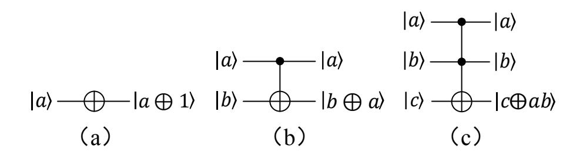

Figure 1: Some base quantum gates used in this paper. (a) The NOT gate; (b) The CNOT gate; (c) The T offoli gate.

# <span id="page-8-0"></span>3 The quantum circuits of the S-box

The SubBytes operation is the sole nonlinear component of AES. Optimizing its quantum resource requirements is essential for achieving cost-efficient AES quantum circuit implementation. This section leverages the algebraic structure of the S-box (Section 2.1.1) and composite field arithmetic (Section 2.1.2) to design efficient quantum circuits, and compares the results with existing literature.

## 3.1 Quantum circuit implementations of M and AM<sup>−</sup><sup>1</sup>

A common approach for implementing quantum circuits for matrix multiplication is Permutation-Lower-Upper (PLU) decomposition. This method typically results in a higher number of quantum gates, particularly for CNOT gates. Xiang et al. [\[46\]](#page-29-9) propose a heuristic algorithm for optimizing matrix implementation based on matrix decomposition theory, which offers advantages in reducing the number of CNOT gates required.

In this paper, we apply the algorithm from [\[46\]](#page-29-9) to implement the quantum circuits for matrix multiplication of U<sup>M</sup> : |a⟩ → |M a⟩ and UAM−<sup>1</sup> : |a⟩ → |(AM−<sup>1</sup> )a⟩, as shown in Figure [2](#page-9-0) and Figure [3,](#page-9-1) where a = (a<sup>7</sup> a<sup>6</sup> a<sup>5</sup> a<sup>4</sup> a<sup>3</sup> a<sup>2</sup> a<sup>1</sup> a0). The U<sup>M</sup> can be implemented with 8 qubits and 10 CNOT gates, while UAM−<sup>1</sup> can be implemented with 8 qubits and 15 CNOT gates.

#### 3.2 Quantum circuit implementations of the multiplicative inversion in F(2<sup>4</sup> )

Li et al. [\[44\]](#page-29-7) observed that solving the multiplicative inverse of an element in F(2<sup>4</sup> ) can be represented as a 4 × 4 S-box. Let b be any element in F(2<sup>4</sup> ), with its corresponding multiplicative inverse b −1 shown in Table [1.](#page-9-2)

{9}------------------------------------------------

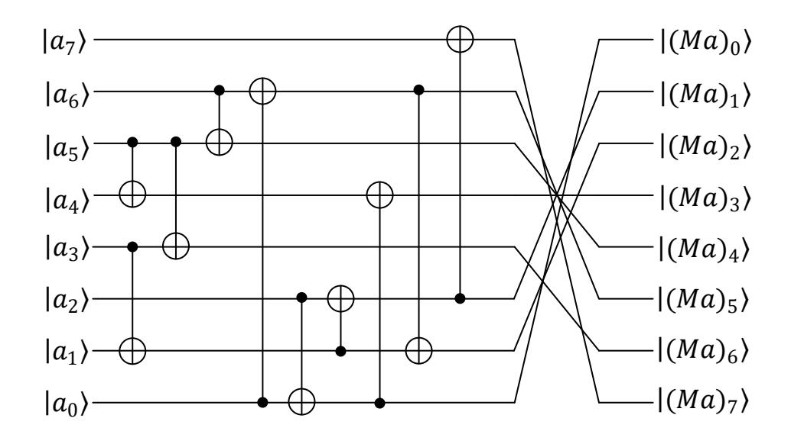

<span id="page-9-0"></span>Figure 2: The quantum circuit for U<sup>M</sup> : |a⟩ → |M a⟩.

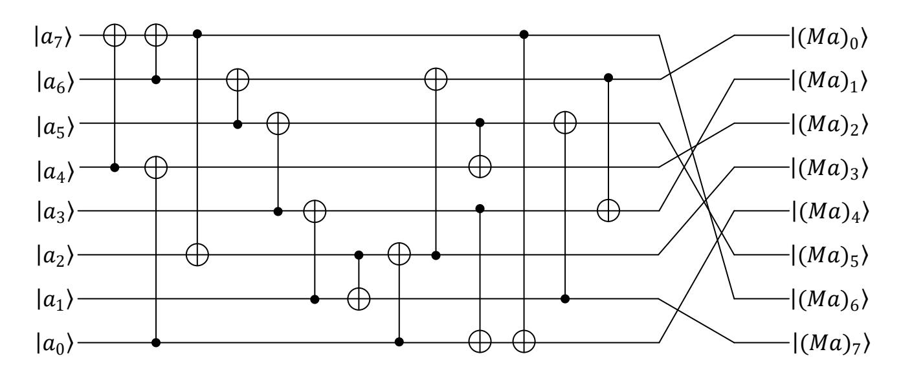

<span id="page-9-1"></span>Figure 3: The quantum circuit for UAM−<sup>1</sup> : |a⟩ → |(AM−<sup>1</sup> )a⟩.

| Input and Output |   |   |   |   |   |   |   |   | Elements |   |   |   |   |   |   |   |
|------------------|---|---|---|---|---|---|---|---|----------|---|---|---|---|---|---|---|
| b                | 0 | 1 | 2 | 3 | 4 | 5 | 6 | 7 | 8        | 9 | A | B | C | D | E | F |
| −1<br>b          | 0 | 1 | 9 | E | D | B | 7 | 6 | F        | 2 | C | 5 | A | 4 | 3 | 8 |

<span id="page-9-2"></span>Table 1: The input elements and corresponding inverse output elements in F(2<sup>4</sup> )

In this paper, we use the automated tool DORCIS [\[47\]](#page-30-0) to realize the quantum circuit of the 4 × 4 lookup table, which solves the multiplicative inverse of elements in F(2<sup>4</sup> ). The resulting quantum circuit is denoted as F(2<sup>4</sup> ) inv : |b⟩ → |b −1 ⟩, where b = (b<sup>3</sup> b<sup>2</sup> b<sup>1</sup> b0) is the input element and b <sup>−</sup><sup>1</sup> = (b −1 3 b −1 2 b −1 1 b −1 0 ) is the output element, as shown in Figure [4.](#page-10-0)

The 3 − controlled NOT gate appearing in Figure [4](#page-10-0) can be implemented as |a⟩|b⟩|c⟩|d⟩|0⟩ → |a⟩|b⟩|c⟩|d ⊕ abc⟩|0⟩ (shown in Figure [5\(](#page-10-1)a)) with an auxiliary qubit, or as |a⟩|b⟩|c⟩|d⟩|g⟩ → |a⟩|b⟩|c⟩|d ⊕ abc⟩|g⟩ (shown in Figure [5\(](#page-10-1)b)) without any auxiliary qubits.

Based on Figures [4](#page-10-0) and [5,](#page-10-1) quantum circuits for F(2<sup>4</sup> ) inv0 : |b⟩|0⟩ → |b −1 ⟩|0⟩

{10}------------------------------------------------

<span id="page-10-0"></span>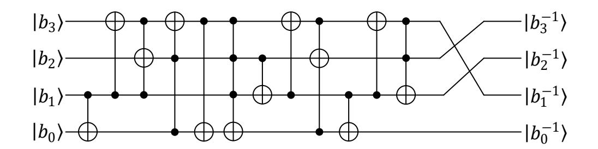

Figure 4: The quantum circuit for  $F(2^4)_{inv}: |\mathbf{b}\rangle \to |\mathbf{b}^{-1}\rangle$ .

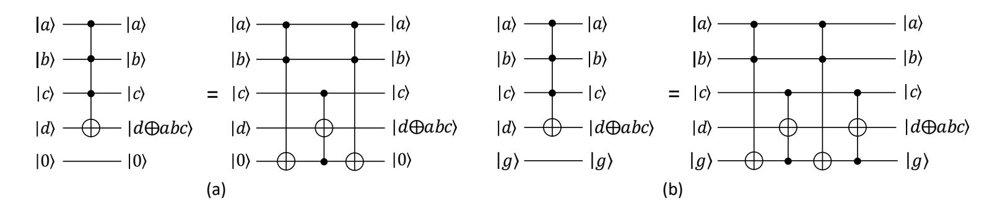

Figure 5: Two types of decomposition of  $3-controlled\ NOT$  gate. (a) Decomposition of a  $3-controlled\ NOT$  gate with an auxiliary qubit; (b) Decomposition of a  $3-controlled\ NOT$  gate without any auxiliary qubit.

<span id="page-10-1"></span>and  $F(2^4)_{inv1}: |\mathbf{b}\rangle|g\rangle \to |\mathbf{b^{-1}}\rangle|g\rangle$  can be constructed. The quantum resource estimates for implementing the multiplicative inverse in  $F(2^4)$  are summarized in Table 2.

|                 | #qubits | #Toffoli | #CNOT | #NOT | Toffoli depth |
|-----------------|---------|----------|-------|------|---------------|
| $F(2^4)_{inv0}$ | 5       | 7        | 7     | 0    | 7             |
| $F(2^4)_{inv1}$ | 5       | 8        | 7     | 0    | 8             |

Table 2: Quantum resource estimates for implementing the multiplicative inversion in  $F(2^4)$ . #qubits means the number of qubits. #Toffoli, #CNOT, and #NOT mean the number of Toffoli gate, CNOT gate and NOT gate

# 3.3 Quantum circuit implementation of $q^2 \times \lambda$

q can be written as  $q = q_3y^3 + q_2y^2 + q_1y + q_0$ , where  $q_i (i \in 0, 1, 2, 3)$  is an element in  $F(2^4)$  and  $\lambda = x + x^2 + x^3 \in F(2^4)$  is defines in Eq.2. Through a calculation,  $q^2 \times \lambda$  is expressed as

<span id="page-10-2"></span>
$$q^{2} \times \lambda = (q_{1} + q_{0})y^{3} + (q_{3} + q_{1} + q_{0})y^{2} + q_{0}y + (q_{2} + q_{1}).$$
 (6)

Based on Eq.2 and Eq.6, we can derive a quantum circuit for  $U_{q^2 \times \lambda}$ :  $|q\rangle \to |q^2 \times \lambda\rangle$  in Figure 6. The  $U_{q^2 \times \lambda}$  can be implemented with 4 qubits and 3 CNOT gates.

{11}------------------------------------------------

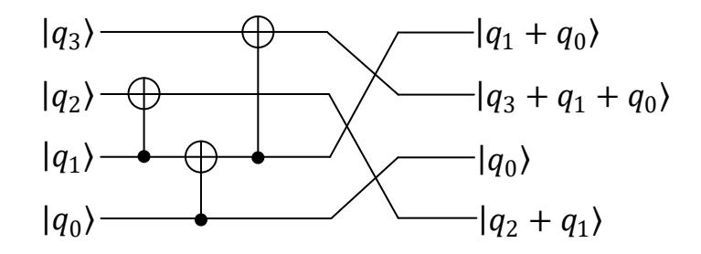

<span id="page-11-0"></span>Figure 6: The quantum circuit for U<sup>q</sup> <sup>2</sup>×<sup>λ</sup> : |q⟩ → |q <sup>2</sup> × λ⟩.

#### 3.4 Quantum circuit implementations of multiplication in F(2<sup>4</sup> )

In F(2<sup>4</sup> ), any element of a and b can written as a = a3y <sup>3</sup> + a2y <sup>2</sup> + a1y + a<sup>0</sup> b = b3y <sup>3</sup> + b2y <sup>2</sup> + b1y + b<sup>0</sup> . a · b is expressed as

<span id="page-11-1"></span>
$$a \cdot b = (ab)_3 y^3 + (ab)_2 y^2 + (ab)_1 y + (ab)_0, \tag{7}$$

where (ab)<sup>i</sup> (i ∈ 0, 1, 2, 3) is the i-th term of a · b and

$$(ab)_3 = (a_3 + a_2 + a_1 + a_0)(b_3 + b_2 + b_1 + b_0) + (a_2 + a_0)(b_2 + b_0) + (a_1 + a_0)(b_1 + b_0) + a_2b_2 + a_0b_0,$$

$$(ab)_2 = (a_2 + a_0)(b_2 + b_0) + a_3b_3 + a_2b_2 + a_1b_1 + a_0b_0,$$

$$(ab)_1 = (a_3 + a_2)(b_3 + b_2) + (a_1 + a_0)(b_1 + b_0) + (a_1 + a_0)(b_1 + b_0) + a_2b_2 + a_1b_1 + a_0b_0,$$

$$(ab)_3 = (a_3 + a_2)(b_3 + b_2) + (a_3 + a_1)(b_3 + b_1) + a_3b_3 + a_1b_1 + a_0b_0.$$

Based on Eq[.7,](#page-11-1) we present a quantum circuit for Mul<sup>0</sup> : |a⟩|b⟩|0⟩ → |a⟩|b⟩|a · b⟩ of multiplication in F(2<sup>4</sup> ) in Figure [7.](#page-11-2) Mul<sup>0</sup> can be implemented with 12 qubits, 9 T offoli gates and 29 CNOT gates. The T offoli depth of Mul<sup>0</sup> is 4.

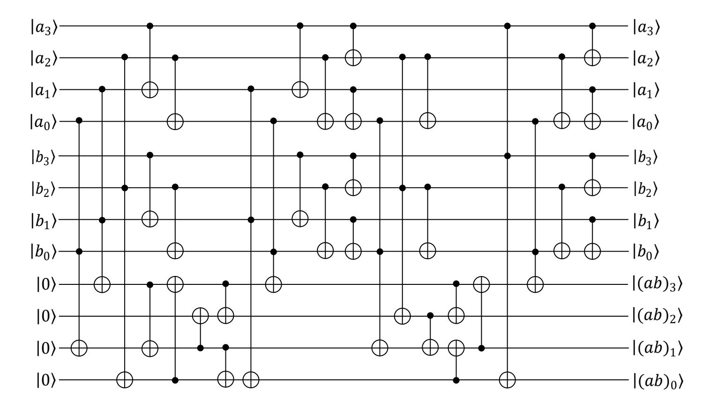

<span id="page-11-2"></span>Figure 7: The quantum circuit for Mul<sup>0</sup> : |a⟩|b⟩|0⟩ → |a⟩|b⟩|a · b⟩.

{12}------------------------------------------------

The inverse operation in  $F((2^4)^2)$  requires adding another number to the multiplication result in  $F(2^4)$ . For this purpose, in this paper, we refer to the method of [44], which is realized  $Mul_1: |a\rangle|b\rangle|h\rangle \rightarrow |a\rangle|b\rangle|h+a\cdot b\rangle$  without any auxiliary qubits in Figure 8, where  $Mul_0$  denotes the quantum circuit shown in Figure 7.  $Mul_1$  can be implemented with 12 qubits, 9 Toffoli gates and 33 CNOT gates. The Toffoli depth of  $Mul_1$  is 4.

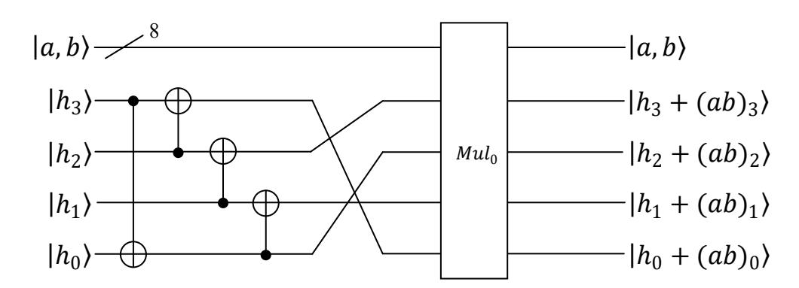

Figure 8: The quantum circuit for  $Mul_1: |a\rangle|b\rangle|h\rangle \rightarrow |a\rangle|b\rangle|h+a\cdot b\rangle$ .

<span id="page-12-0"></span>Referring to [44], we present the quantum circuit for  $Mul_2: |a\rangle|b\rangle|0\rangle \rightarrow |a\cdot b\rangle|b\rangle|0\rangle$ , as shown in Figure 9, where  $F(2^4)_{inv1}$  denotes the quantum circuit shown in sect.3.2,  $F(2^4)_{inv1}^{\dagger}$  is the inverse process of  $F(2^4)_{inv1}$ , and  $Mul_1^{\dagger}$  is the inverse process of  $Mul_1$ .  $Mul_2$  can be implemented with 12 qubits, 33 Toffoli gates and 72 CNOT gates. The Toffoli depth of  $Mul_2$  is 23.

<span id="page-12-1"></span>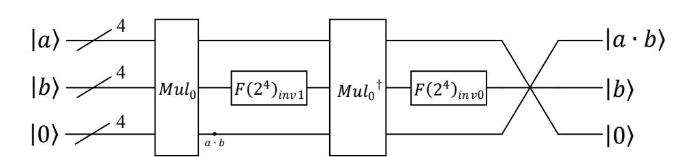

Figure 9: The quantum circuit for  $Mul_2: |a\rangle|b\rangle|0\rangle \rightarrow |a\cdot b\rangle|b\rangle|0\rangle$ .

### 3.5 The quantum circuit of S-box

Based on Eq.3, the S-box can be computed by realizing the quantum circuits of M,  $(Ma)^{-1}$ ,  $AM^{-1}$  and adding a vector c in order. The quantum circuits of M and  $AM^{-1}$  have been presented in sect.3.1. The addion of the vector c can be implemented with only  $4\ NOT$  gates. This section presents three distinct quantum circuits for implementing the S-box, depending on varying target qubit states.

{13}------------------------------------------------

#### 3.5.1 The quantum circuit for $c_1$

When the target qubit is  $|0\rangle$ , the quantum circuit for  $c_1 : |a\rangle|0\rangle \to |a\rangle|S(a)\rangle$  is provided. The first construction is the quantum circuit for  $(Ma)^{-1}$  that implements the multiplicative inverse, and the quantum circuit for  $c_1$  is introduced Subsequently.

Any element in  $F((2^4)^2)$  can be denoted as  $p = p_0 + p_1 x$ , where  $p_0, p_1 \in F(2^4)$ . The multiplicative inverse of p in  $F((2^4)^2)$ , denoted as  $p^{-1}$ , can be determined through a four-part process involving  $(p^{17})^{-1}(p_0 + p_1), (p^{17})^{-1}p_1 x$ ,  $p_1^2 \times \lambda$ , and  $(p_0 + p_1)p_0$ . Therefore, by combining the quantum circuits of  $U_{q^2 \times \lambda}$  (see Figure 6),  $Mul_0$  (as in Figure 7) and  $Mul_1$  (see Figure 8), and  $F(2^4)_{inv0}$  (see sect.3.2), the quantum circuit  $U_{inv0}: |p\rangle|0\rangle|0\rangle \to |p\rangle|p^{-1}\rangle|0\rangle$  for computing the multiplicative inversion in  $F((2^4)^2)$  can be constructed as shown in Figure 10, where  $U_{(p^{-1})^{17}}^{\dagger}$  is the inverse process of  $U_{(p^{-1})^{17}}$ . At this point, there are 8 auxiliary qubits remaining in the state  $|0\rangle$ , allowing the direct use of  $F(2^4)_{inv0}$  to construct  $U_{inv0}$ , eliminating the need to use  $F(2^4)_{inv1}$ .

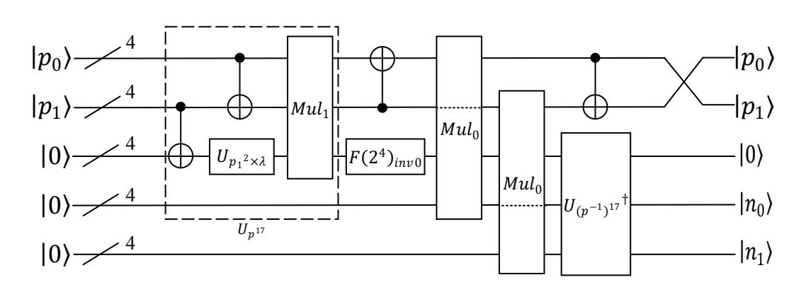

Figure 10: The quantum circuit for  $U_{inv0}: |p\rangle|0\rangle|0\rangle \rightarrow |p\rangle|p^{-1}\rangle|0\rangle$ .

<span id="page-13-0"></span>By combining the quantum circuit of  $U_M$  (see Figure 2),  $U_{inv0}$  (see Figure 10), and  $U_{AM^{-1}}$  (see Figure 3), the quantum circuit for  $c_1: |a\rangle|0\rangle \rightarrow |a\rangle|S(a)\rangle$  can be constructed as shown in Figure 11 with a wide of 20, where  $U_M^{\dagger}$  is the inverse process of  $U_M$ . The quantum resources required for implementing  $c_1$  is summarized in Table 3.

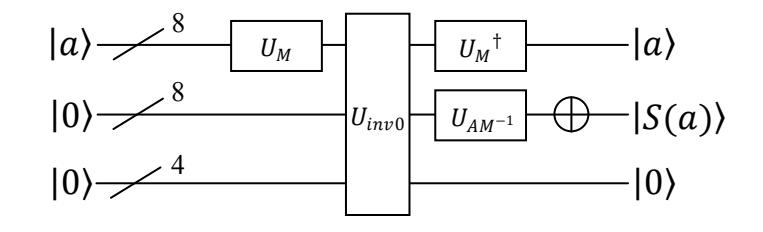

<span id="page-13-1"></span>Figure 11: The quantum circuit for  $c_1: |a\rangle |0\rangle \rightarrow |a\rangle |S(a)\rangle$ .

{14}------------------------------------------------

| Schemes | #qubits | #Toffoli | #CNOT | #NOT | Toffoli depth |
|---------|---------|----------|-------|------|---------------|
| Ours    | 20      | 43       | 196   | 4    | 23            |
|         | 22      | 48       | 236   | 4    | 36            |
| [44]    | 23      | 48       | 238   | 4    | 34            |
|         | 24      | 46       | 240   | 4    | 32            |
|         | 22      | 52       | 326   | 4    | 41            |
| [42]    | 23      | 48       | 230   | 4    | 39            |
|         | 24      | 46       | 332   | 4    | 37            |
| [41]    | 32      | 55       | 314   | 4    | 40            |
| [39]    | 40      | 512      | 357   | 4    | 144           |

<span id="page-14-0"></span>Table 3: The quantum resources required for implementing  $c_1$ 

### 3.5.2 The quantum circuit for $c_2$

When the target qubit is  $|b\rangle$  instead of  $|0\rangle$ , the given quantum circuit is denoted as  $c_2: |a\rangle|b\rangle \to |a\rangle|b\oplus S(a)\rangle$ . Since the target bit is not always  $|0\rangle$ , the quantum circuit  $U_{inv0}$  for computing the multiplicative inverse (as shown in Figure 10) is not suitable for constructing the quantum circuit.

Thus, by combining the quantum circuits of  $U_{q^2 \times \lambda}$  (see Figure 6),  $Mul_1$  (see Figure 8), and  $F(2^4)_{inv1}$  (see in sect.3.2), the quantum circuit  $U_{inv1}$ :  $|p\rangle|h\rangle|0\rangle \rightarrow |p\rangle|h + p^{-1}\rangle|0\rangle$  for computing the multiplicative inverse in  $F((2^4)^2)$  can be constructed as shown in Figure 12, where  $F(2^4)_{inv1}^{\dagger}$  is the inverse process of  $F(2^4)_{inv1}$ . At this point, there are no remaining auxiliary qubits remaining in the  $|0\rangle$  state, so the quantum circuit  $F(2^4)_{inv1}$  is used directly instead of using  $F(2^4)_{inv0}$ .

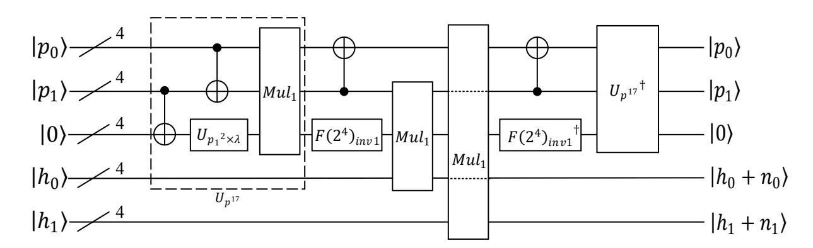

Figure 12: The quantum circuit for  $U_{inv1}: |p\rangle|h\rangle|0\rangle \rightarrow |p\rangle|h+p^{-1}\rangle|0\rangle$ .

<span id="page-14-1"></span>By combining the quantum circuits of  $U_M$  (see Figure 2),  $U_{inv1}$  (see Figure 12), and  $U_{AM^{-1}}$  (see Figure 3), the quantum circuit for  $c_2: |a\rangle|b\rangle \rightarrow |a\rangle|b\oplus S(a)\rangle$ 

{15}------------------------------------------------

can be constructed as shown in Figure 13 with a wide of 20, where  $U_M^{\dagger}$  is the inverse process of  $U_M$  and  $U_{AM^{-1}}^{\dagger}$  is the inverse process of  $U_{AM^{-1}}$ .

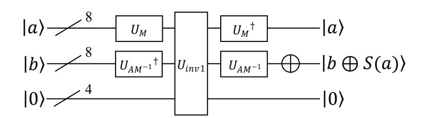

<span id="page-15-0"></span>Figure 13: The quantum circuit for  $c_2: |a\rangle|b\rangle \rightarrow |a\rangle|b \oplus S(a)\rangle$ .

When an auxiliary qubit in the  $|0\rangle$  state is added, the replacement in the quantum circuit shown in Figure 12 can be made, resulting in the construction of a quantum circuit for the S-box with a width of 21. The quantum resources required for implementing  $c_2$  are shown in Table 4.

| Schemes | #qubits | #Toffoli | #CNOT | #NOT | Toffoli depth |
|---------|---------|----------|-------|------|---------------|
| 0       | 20      | 52       | 226   | 4    | 32            |
| Ours    | 21      | 50       | 226   | 4    | 30            |
|         | 22      | 48       | 272   | 4    | 36            |
| [44]    | 23      | 48       | 274   | 4    | 34            |
|         | 24      | 46       | 276   | 4    | 32            |
| [43]    | 32      | 55       | 322   | 4    | 40            |
|         | 23      | 68       | 352   | 4    | 60            |
| [42]    | 24      | 64       | 356   | 4    | 58            |
|         | 25      | 63       | 358   | 4    | 56            |

<span id="page-15-1"></span>Table 4: The quantum resources required for implementing  $c_2$ 

### **3.5.3** The quantum circuit for $c_3$

In order to reduce the number of qubits used in the quantum circuit of the S-box, this section proposes a quantum circuit implementation for  $c_3: |a\rangle|0\rangle \rightarrow |S(a)\rangle|0\rangle$ . By combining the quantum circuits of  $U_{q^2\times\lambda}$  (see Figure 6),  $Mul_1$  (see Figure 8) and  $Mul_2$  (see Figure 9), and  $F(2^4)_{inv0}$  (see in sect.3.2), the quantum circuit  $U_{inv2}: |p\rangle|0\rangle \rightarrow |p^{-1}\rangle|0\rangle$  for computing the multiplicative inverse in  $F((2^4)^2)$  can be constructed as shown in Figure 14. At this point, there are 4 auxiliary qubits remaining in the  $|0\rangle$  state, allowing the direct use of  $F(2^4)_{inv0}$  instead of  $F(2^4)_{inv1}$  to construct  $U_{inv2}$  in  $F((2^4)^2)$ .

{16}------------------------------------------------

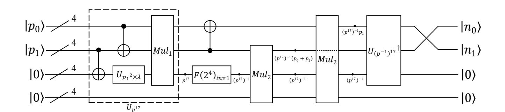

<span id="page-16-0"></span>Figure 14: The quantum circuit for  $U_{inv2}: |p\rangle|0\rangle \rightarrow |p^{-1}\rangle|0\rangle$ .

By combining the quantum circuits of  $U_M$  (see Figure 2),  $U_{inv2}$  (see Figure 14), and  $U_{AM^{-1}}$  (see Figure 3), the quantum circuit for  $c_3: |a\rangle|0\rangle \rightarrow |S(a)\rangle|0\rangle$  can be constructed as shown in Figure 15 with a wide of 16. The quantum resources required to implement  $c_3$  is summarized in Table 5.

<span id="page-16-1"></span>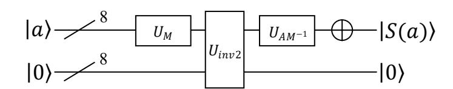

Figure 15: The quantum circuit for  $c_3: |a\rangle|0\rangle \rightarrow |S(a)\rangle|0\rangle$ .

| Schemes | #qubits | #Toffoli | #CNOT | #NOT | Toffoli depth |
|---------|---------|----------|-------|------|---------------|
| Ours    | 16      | 92       | 268   | 4    | 62            |
|         | 22      | 96       | 426   | 4    | 71            |
| [44]    | 23      | 96       | 426   | 4    | 67            |
|         | 24      | 92       | 426   | 4    | 58            |

<span id="page-16-2"></span>Table 5: The quantum resources required for implementing  $c_3$ 

# 4 The quantum circuit for AES

The other three linear transformation structures of AES, ShiftRows, MixColumns and AddRoundKey, can all be implemented with CNOT gates only. The quantum resources required for these three linear transformations are detailed below.

- 1. AddRoundKey: Each AddRoundKey operation involves XORing a 128-bit subkey with the current state. This can be implemented in parallel using 128 CNOT gates.
- 2. ShiftRows: The ShiftRows operation only rearranges the output order of 16 bytes in the current state. It does not require any quantum operations for implementation.

{17}------------------------------------------------

3. MixColumns: The MixColumns operation processes 32 bits in the current state at a time and can be implemented using a 32×32 matrix. Xiang et al. [\[46\]](#page-29-9) provides a quantum circuit for MixColumns operation with 92 CNOT gates. As MixColumns can be applied to all 4 columns of the state simultaneously, and the total requirement for CNOT gates is 92 × 4 = 368.

For the key expansion process, we implement the key expansion process of AES with Jaques et al.'s method [\[48\]](#page-30-1), but we use our S-box circuit for c<sup>2</sup> (see Figure [13\)](#page-15-0). The quantum circuit as shown in Figure [16](#page-18-0) represents the full structure of the key expansion process, denoted as KE : |k⟩ <sup>i</sup>−<sup>1</sup> → |k⟩<sup>i</sup> . The SubBytes with arrow in Figure [16](#page-18-0) represents the operation where the state at the tail of the arrow undergoes the SubBytes operation, followed by XORing with the state pointed to by the arrow, and the result is assigned to the state pointed to by the arrow. The RotW ord shown in Figure [16](#page-18-0) is the RotWord operation, which can be realized by rearranging the order of qubits without any quantum operations, while the Rcon[j] operation can be implemented using a single NOT gate. The key expansion process for AES-128, AES-192, and AES-256 can respectively utilize portions of the full key expansion structures shown in Figures [16\(](#page-18-0)a), (b), and (c).

The initial key of AES undergoes N<sup>R</sup> rounds of the key expansion process, resulting in (N<sup>R</sup> +1) round keys. Based on Algorithms [1](#page-5-0) and [2,](#page-5-1) each round of key expansion process only operates on 128 bits. Therefore, only the relevant subset of the full structure of the key expansion process is needed for each round, with other operations being neglected. Let KE<sup>l</sup> j represents the operation from |k<sup>j</sup> ⟩ i−1 to |kl⟩ i−1 in KE : |k⟩ <sup>i</sup>−<sup>1</sup> → |k⟩<sup>i</sup> , while ignoring other parts, where 0 ≤ j ≤ l. The quantum resources required to implement the key expansion process for AES is shown in Table [6.](#page-17-0)

|         | NR | #qubits    | #T offoli    | #CNOT          | #NOT       | T offoli<br>depth |
|---------|----|------------|--------------|----------------|------------|-------------------|
| AES-128 | 10 | 132<br>133 | 2080<br>2000 | 10000<br>10000 | 190<br>190 | 1280<br>1200      |
| AES-192 | 12 | 196<br>197 | 2288<br>2200 | 11064<br>11064 | 209<br>209 | 1408<br>1320      |
| AES-256 | 14 | 260<br>261 | 2704<br>2600 | 13000<br>13000 | 229<br>229 | 1664<br>1560      |

<span id="page-17-0"></span>Table 6: The quantum resources required to implement the key expansion processes for AES

{18}------------------------------------------------

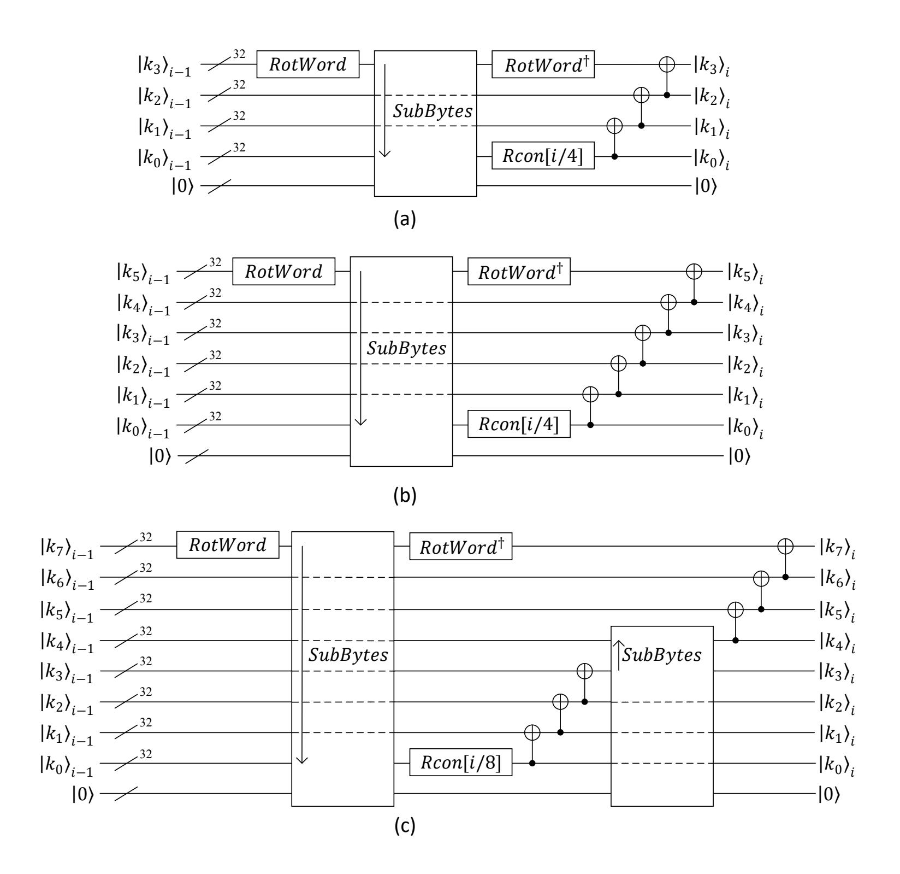

<span id="page-18-0"></span>Figure 16: Three fully structures of the key expansion process. (a) A full structure of the key expansion process that can be used for AES-128. (b) A full structure of the key expansion process that can be used for AES-192. (c) A full structure of the key expansion process that can be used for AES-256.

The encryption process of the AES is presented in Figure 17, where SubBytes, ShiftRows and MixColumn are the operations of SubBytes, ShiftRows and MixColumns, and  $\mathcal{KE}_{j}^{l}$  represents the operation from  $|k_{j}\rangle_{i-1}$  to  $|k_{l}\rangle_{i-1}$  in  $\mathcal{KE}$ :  $|k\rangle_{i-1} \rightarrow |k\rangle_{i}$ , while ignoring other parts. In Figures 17(a), (b) and (c),  $|K_{0}\rangle$ ,  $|K^{2}\rangle_{0}|K^{1}\rangle_{0}|K^{0}\rangle_{0}$ , and  $|K^{1}\rangle_{0}|K^{0}\rangle_{0}$  denote the 128-bit, 192-bit, and 256-bit initial keys for AES-128, AES-192, and AES-256, respectively.  $|M\rangle$ ,  $|M^{1}\rangle|M^{0}\rangle$  and  $|M\rangle$  denote the plaintexts, while  $|C\rangle$ ,  $|C^{1}\rangle|C^{0}\rangle$  and  $|C\rangle$  denote the ciphertexts.

Since the primary goal of this paper is to reduce the number of qubits required for implement the quantum circuit for AES, the SubBytes operation during

{19}------------------------------------------------

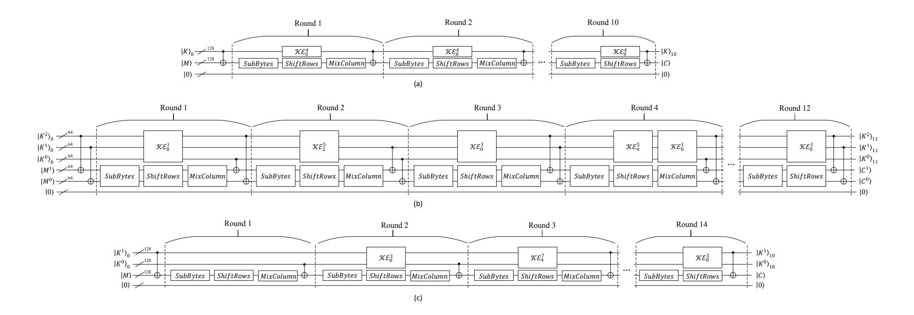

<span id="page-19-0"></span>Figure 17: The encryption process of AES. (a) The encryption process of AES-128. (b) The encryption process of AES-192. (c) The encryption process of AES-256.

encryption is implemented using  $c_3: |a\rangle|0\rangle \rightarrow |S(a)\rangle|0\rangle$ . The quantum resources required to implement the quantum circuit for AES-128, AES-192, and AESS-256 are summarized in Table 7, 8, and 9.

{20}------------------------------------------------

| Schemes | #qubits | #T offoli | #CNOT  | #NOT | T offoli<br>depth |
|---------|---------|-----------|--------|------|-------------------|
|         | 264     | 16800     | 57840  | 830  | 11200             |
|         | 265     | 16720     | 57840  | 830  | 11120             |
| Ours    | 268     | 16800     | 57840  | 830  | 9920              |
|         | 269     | 16720     | 57840  | 830  | 9920              |
|         | 270     | 16508     | 81652  | 1072 | 11008             |
|         | 328     | 15824     | 82928  | 1072 | 2184              |
| [44]    | 380     | 16480     | 81592  | 1072 | 1344              |
|         | 400     | 15824     | 82928  | 1072 | 1108              |
|         | 400     | 19064     | 118980 | 4528 | -                 |
| [43]    | 656     | 18040     | 101174 | 1976 | -                 |
| [42]    | 512     | 19788     | 128517 | 4528 | 2016              |
| [41]    | 864     | 16940     | 107960 | 1507 | 1880              |
| [40]    | 976     | 150528    | 192832 | 1370 | -                 |
| [39]    | 984     | 151552    | 166548 | 1456 | 12672             |

<span id="page-20-0"></span>Table 7: The quantum resources required to implement the quantum circuits for AES-128

{21}------------------------------------------------

| Schemes | #qubits | #T offoli | #CNOT  | #NOT | T offoli<br>depth |
|---------|---------|-----------|--------|------|-------------------|
|         | 328     | 19952     | 68472  | 977  | 13312             |
|         | 329     | 19864     | 68472  | 977  | 13224             |
| Ours    | 332     | 19952     | 68472  | 977  | 11904             |
|         | 333     | 19864     | 68472  | 977  | 11904             |
|         | 334     | 19196     | 94180  | 1160 | 13144             |
|         | 392     | 18400     | 95696  | 1160 | 2616              |
| [44]    | 444     | 19168     | 94168  | 1160 | 1596              |
|         | 464     | 18400     | 95696  | 1160 | 1340              |
| [42]    | 640     | 22380     | 152378 | 5128 | 2022              |
| [41]    | 896     | 19580     | 125580 | 1692 | 1640              |
| [39]    | 1112    | 172032    | 189432 | 1608 | 11088             |

<span id="page-21-0"></span>Table 8: The quantum resources required to implement the quantum circuits for AES-192

| Schemes | #qubits | #T offoli | #CNOT  | #NOT | T offoli<br>depth |
|---------|---------|-----------|--------|------|-------------------|
|         | 392     | 23312     | 79976  | 1125 | 15552             |
|         | 393     | 23208     | 79976  | 1125 | 15448             |
| Ours    | 396     | 23312     | 79976  | 1125 | 13888             |
|         | 397     | 23208     | 79976  | 1125 | 13888             |
|         | 398     | 23228     | 114476 | 1367 | 15756             |
|         | 456     | 22264     | 116288 | 1367 | 3048              |
| [44]    | 508     | 23208     | 114376 | 1367 | 1880              |
|         | 528     | 22264     | 116288 | 1367 | 1540              |
| [42]    | 768     | 26774     | 177645 | 6103 | 2292              |
| [41]    | 1232    | 23760     | 151011 | 1992 | 2160              |
| [39]    | 1336    | 215040    | 233836 | 1943 | 14976             |

<span id="page-21-1"></span>Table 9: The quantum resources required to implement the quantum circuits for AES-256

As shown in Table [7,](#page-20-0) [8,](#page-21-0)and [9,](#page-21-1) the proposed quantum circuit of the S-box significantly reduces the quantum resources needed to implement the quantum 

{22}------------------------------------------------

circuit for AES. This optimization not only enhances the execution efficiency of the quantum circuit but also provides a feasible solution for implementing larger scale quantum encryption algorithms under limited quantum resources.

For AES-128, when the width is 264 or 265, the T offoli gate cannot be replaced by the QAND gate (see in Figure [18\)](#page-22-0) since there is no clean auxiliary qubit available in the circuit at this point. However, when the width is 268 or 269, the T offoli gate can be substitutes by the QAND gate. (The 4 clean auxiliary qubits used to decompose the T offoli gate into a QAND gate at this stage originate from the key expansion process. Since each round of key expansion involves only 4 SubBytes operations, whereas the encryption process requires 16 per round, it is feasible to use the 4 auxiliary qubits from the key expansion to implement the QAND gate.)

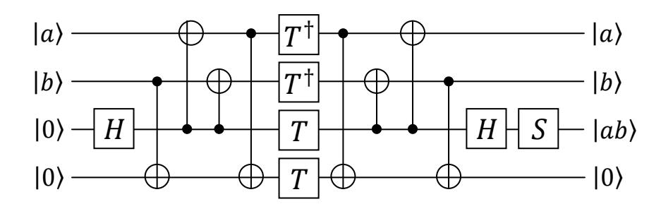

<span id="page-22-0"></span>Figure 18: The QAND gate.

For comparison with [\[48\]](#page-30-1), the T offoli gates in AES-128 are decomposed using the scheme proposed in [\[48\]](#page-30-1), which requires 7 T gates and the T depth is 3. The resulting data are presented in Table [10,](#page-22-1) where DW(T offoli) represents the product of the T offoli depth and width, and DW(T) represents the product of T depth and width.

| Schemes | #qubits | T offoli<br>depth | DW(T offoli) | T<br>depth | DW(T)   |
|---------|---------|-------------------|--------------|------------|---------|
|         | 264     | 11200             | 2956800      | 33600      | 8870400 |
| Ours    | 265     | 11120             | 2946800      | 33360      | 8840400 |
|         | 268     | 9920              | 2658560      | 28480      | 7632640 |
|         | 269     | 9920              | 2668480      | 28480      | 7661120 |
| [48]    | 256     | 17140             | 4387840      | 29490      | 7549440 |

<span id="page-22-1"></span>Table 10: Costs of the quantum circuits for AES-128

{23}------------------------------------------------

# 5 Grover search attack on AES

In this section, using the propose quantum circuit of AES (see in sect.4), a concrete resource estimation is conducted for mounting Grover search attack on AES. Firstly, Grover Oracle is designed for AES. And then, based on the design of Grover Oracle, resources required to perform Grover search attack on AES is estimated.

### 5.1 Resource Estimation of Grover Oracle

According to reference [\[50\]](#page-30-2), r = ⌈k/n⌉ instances of known plaintext-ciphertext pairs are needed to find the unique decryption key, where n is the block size and k is the key length of the block cipher. If k/n is an integer, r = ⌈k/n⌉ should be replaced by r = k/n + 1, and the probability of successful key search is e−<sup>2</sup> k−rn . Therefore, for AES-128, implementing the Grover search attack requires 2 known plaintext-ciphertext pairs, at which point the probability of a successful key search is e−2−<sup>128</sup> ≈ 1. Figure [19\(](#page-24-0)a) shows the construction of the Grover search attack for 2 instances of known plaintext-ciphertext pairs considering AES-128, where AES − 128† is the inverse process of the quantum circuit AES − 128. Similarly, for AES-192 and AES-256, the Grover search attack requires 2 and 3 instances of known plaintext-ciphertext pairs, as shown in Figures [19\(](#page-24-0)b) and [19\(](#page-24-0)c), respectively.

The Grover search attack consists of comparing rn-bit outputs of the AES instances with the given r ciphertexts. This operation can be implemented using (2n · r) − controlled NOT gates. We neglect some NOT gates which depend on the given ciphertexts and only consider the depth of the AES instances ignoring the multi-−controlled NOT gates used in comparing the ciphertexts. The quantum resources required to implement the Grover Oracle are shown in Table [11.](#page-25-0)

### 5.2 Resource Estimation of Grover search attack on AES

Using the quantum estimates in Table [11,](#page-25-0) we provide the quantum resources required to implement the Grover search attack on AES are shown in Table [12.](#page-25-1) Compared to the quantum resource required for implementing Grover Oracle (i.e., O<sup>f</sup> as discussed in sect.2.3), the resources required for other quantum operations for implementing (2|ψ⟩⟨ψ| − I)O<sup>f</sup> (as discussed in sect.2.3) are relatively small. Therefore, when analyzing the overall resource requirements for Grover

{24}------------------------------------------------

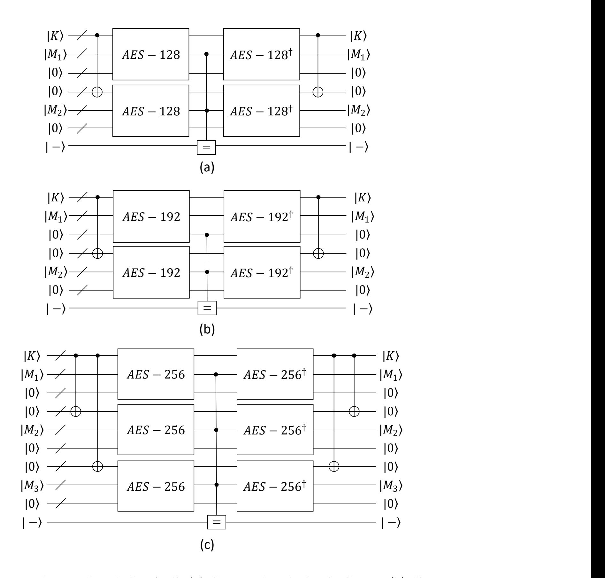

<span id="page-24-0"></span>Figure 19: Grover Oracle for AES. (a) Grover Oracle for AES-128. (b) Grover Oracle for AES-192. (c) Grover Oracle for AES-256.

search attack, it is reasonable to ignore the consumption of these quantum resources.

{25}------------------------------------------------

|            | #qubits | #Toffoli | #CNOT  | #NOT | Toffoli depth |
|------------|---------|----------|--------|------|---------------|
|            | 529     | 67200    | 231616 | 3320 | 22400         |
| A EC 190   | 531     | 66880    | 231616 | 3320 | 22240         |
| AES-128    | 537     | 67200    | 231616 | 3320 | 19840         |
|            | 539     | 66880    | 231616 | 3320 | 19840         |
|            | 657     | 79808    | 274272 | 3908 | 26624         |
| A E.C. 109 | 659     | 79456    | 274272 | 3908 | 26448         |
| AES-192    | 665     | 79808    | 274272 | 3908 | 23808         |
|            | 667     | 79456    | 274272 | 3908 | 23808         |
|            | 1177    | 139872   | 480880 | 6750 | 31104         |
| A EC OFG   | 1180    | 139248   | 480880 | 6750 | 30896         |
| AES-256    | 1189    | 139872   | 480880 | 6750 | 27776         |
|            | 1192    | 139248   | 480880 | 6750 | 27776         |

<span id="page-25-0"></span>Table 11: The quantum resources required to implement the Grover Oracle

|            | #qubits                    | #Toffoli                   | #CNOT                      | #NOT                       | Toffoli depth              |
|------------|----------------------------|----------------------------|----------------------------|----------------------------|----------------------------|
|            | $1.0050 \times 2^{136.69}$ | $1.0043 \times 2^{143.68}$ | $1.0010 \times 2^{145.47}$ | $1.0048 \times 2^{139.34}$ | $1.0008 \times 2^{142.1}$  |
| A EC 190   | $1.0018 \times 2^{136.70}$ | $1.0065 \times 2^{143.67}$ | $1.0010 \times 2^{145.47}$ | $1.0048 \times 2^{139.34}$ | $1.0006 \times 2^{142}$    |
| AES-128    | $1.0061 \times 2^{136.71}$ | $1.0043 \times 2^{143.68}$ | $1.0010 \times 2^{145.47}$ | $1.0048 \times 2^{139.34}$ | $1.0043 \times 2^{141.92}$ |
|            | $1.0029 \times 2^{136.72}$ | $1.0065 \times 2^{143.67}$ | $1.0010 \times 2^{145.47}$ | $1.0048 \times 2^{139.34}$ | $1.0043 \times 2^{141.92}$ |
|            | $1.0068 \times 2^{137}$    | $1.0034 \times 2^{143.93}$ | $1.0036 \times 2^{145.71}$ | $1.0015 \times 2^{139.58}$ | $1.0003 \times 2^{142.34}$ |
| A E.C. 100 | $1.0029 \times 2^{137.01}$ | $1.0055 \times 2^{143.92}$ | $1.0036 \times 2^{145.71}$ | $1.0015 \times 2^{139.58}$ | $1.0006 \times 2^{142.33}$ |
| AES-192    | $1.0050 \times 2^{137.02}$ | $1.0034 \times 2^{143.93}$ | $1.0036 \times 2^{145.71}$ | $1.0015 \times 2^{139.58}$ | $1.0064 \times 2^{142.18}$ |
|            | $1.0011 \times 2^{137.03}$ | $1.0055 \times 2^{143.92}$ | $1.0036 \times 2^{145.71}$ | $1.0015 \times 2^{139.58}$ | $1.0064 \times 2^{142.18}$ |
|            | $1.0006 \times 2^{137.85}$ | $1.0023 \times 2^{144.74}$ | $1.0037 \times 2^{146.52}$ | $1.0005 \times 2^{140.37}$ | $1.0033 \times 2^{142.57}$ |
| AES-256    | $1.0032 \times 2^{137.85}$ | $1.0051 \times 2^{144.73}$ | $1.0037 \times 2^{146.52}$ | $1.0005 \times 2^{140.37}$ | $1.0036 \times 2^{142.56}$ |
|            | $1.0038 \times 2^{137.86}$ | $1.0023 \times 2^{144.74}$ | $1.0037 \times 2^{146.52}$ | $1.0005 \times 2^{140.37}$ | $1.0011 \times 2^{142.41}$ |
|            | $1.0063 \times 2^{137.86}$ | $1.0051 \times 2^{144.73}$ | $1.0037 \times 2^{146.52}$ | $1.0005 \times 2^{140.37}$ | $1.0011 \times 2^{142.41}$ |

<span id="page-25-1"></span>Table 12: The quantum resources required to implement the Grover search attack on  $\overline{\text{AES}}$ 

# 6 Conclusion

This paper presents AES quantum circuits realized with fewer qubits. We first designed three different types of quantum circuits for the S-box. Additionally, we introduced a linear key expansion operation to ensure the complete functionality of AES quantum circuit of AES while minimizing the use of qubits.

{26}------------------------------------------------

Through these optimizations, we successfully designed quantum circuits for AES-128/192/256 that require only 264/328/398 qubits, and comprehensively estimated the consumption of other quantum resources based on these designs. Furthermore, to validate the practical performance of the optimized quantum circuits for AES, we implemented a Grover search attack on AES, demonstrating the significant advantages of the optimized design in reducing quantum resource usage.

# References

- <span id="page-26-0"></span>[1] Nielsen M A, Chuang I L. Quantum computation and quantum information[M]. Cambridge university press, 2010.
- <span id="page-26-1"></span>[2] Preskill J. Quantum computing in the NISQ era and beyond[J]. Quantum, 2018, 2: 79.
- <span id="page-26-2"></span>[3] Yanofsky N S, Mannucci M A. Quantum computing for computer scientists[M]. Cambridge University Press, 2008.
- <span id="page-26-3"></span>[4] Deutsch D. Quantum theory, the Church-Turing principle and the universal quantum computer[J]. Proc. Roy. Soc. London Ser. A, 1989, 400: 96-117.
- <span id="page-26-4"></span>[5] Jozsa R. Quantum algorithms and the Fourier transform[J]. Proceedings of the Royal Society of London. Series A: Mathematical, Physical and Engineering Sciences, 1998, 454(1969): 323-337.
- <span id="page-26-5"></span>[6] Ekert A, Jozsa R. Quantum computation and Shor's factoring algorithm[J]. Reviews of Modern Physics, 1996, 68(3): 733.
- <span id="page-26-6"></span>[7] Cleve R, Ekert A, Macchiavello C, et al. Quantum algorithms revisited[J]. Proceedings of the Royal Society of London. Series A: Mathematical, Physical and Engineering Sciences, 1998, 454(1969): 339-354.
- <span id="page-26-7"></span>[8] Briegel H J, Raussendorf R. Persistent entanglement in arrays of interacting particles[J]. Physical Review Letters, 2001, 86(5): 910.
- <span id="page-26-8"></span>[9] Horodecki R, Horodecki P, Horodecki M, et al. Quantum entanglement[J]. Reviews of modern physics, 2009, 81(2): 865-942.
- <span id="page-26-9"></span>[10] Zeng Y, Dong Z, Wang H, et al. A general quantum minimum searching algorithm with high success rate and its implementation[J]. Science China Physics, Mechanics & Astronomy, 2023, 66(4): 240315.

{27}------------------------------------------------

- <span id="page-27-0"></span>[11] Zheng Q, Yu M, Zhu P, et al. Solving the subset sum problem by the quantum Ising model with variational quantum optimization based on conditional values at risk[J]. Science China Physics, Mechanics & Astronomy, 2024, 67(8): 280311.
- <span id="page-27-1"></span>[12] Gisin N, Ribordy G, Tittel W, et al. Quantum cryptography[J]. Reviews of modern physics, 2002, 74(1): 145.
- <span id="page-27-2"></span>[13] Shen A, Cao X Y, Wang Y, et al. Experimental quantum secret sharing based on phase encoding of coherent states[J]. Science China Physics, Mechanics & Astronomy, 2023, 66(6): 260311.
- <span id="page-27-3"></span>[14] Bennett C H, Brassard G. Quantum cryptography: Public key distribution and coin tossing[J]. Theoretical computer science, 2014, 560: 7-11.
- <span id="page-27-4"></span>[15] Bennett C H. Quantum cryptography using any two nonorthogonal states[J]. Physical review letters, 1992, 68(21): 3121.
- <span id="page-27-5"></span>[16] Li H W, Hao C P, Chen Z J, et al. Security of quantum key distribution with virtual mutually unbiased bases[J]. Science China Physics, Mechanics & Astronomy, 2024, 67(7): 270313.I.
- <span id="page-27-6"></span>[17] Lv M Y, Hu X M, Gong N F, et al. Demonstration of controlled highdimensional quantum teleportation[J]. Science China Physics, Mechanics & Astronomy, 2024, 67(3): 230311.
- <span id="page-27-7"></span>[18] Lo H K, Chau H F. Unconditional security of quantum key distribution over arbitrarily long distances[J]. science, 1999, 283(5410): 2050-2056.
- <span id="page-27-8"></span>[19] Mayers D. Unconditional security in quantum cryptography[J]. Journal of the ACM (JACM), 2001, 48(3): 351-406.
- <span id="page-27-9"></span>[20] Shor P W. Polynomial-time algorithms for prime factorization and discrete logarithms on a quantum computer[J]. SIAM review, 1999, 41(2): 303-332.
- <span id="page-27-10"></span>[21] Ekert A, Jozsa R. Quantum computation and Shor's factoring algorithm[J]. Reviews of Modern Physics, 1996, 68(3): 733.
- <span id="page-27-11"></span>[22] Grover L K. A fast quantum mechanical algorithm for database search[C]//Proceedings of the twenty-eighth annual ACM symposium on Theory of computing. 1996: 212-219.

{28}------------------------------------------------

- <span id="page-28-0"></span>[23] Biham E, Biham O, Biron D, et al. Grover's quantum search algorithm for an arbitrary initial amplitude distribution[J]. Physical Review A, 1999, 60(4): 2742.
- <span id="page-28-1"></span>[24] Simon D R. On the power of quantum computation[J]. SIAM journal on computing, 1997, 26(5): 1474-1483.
- <span id="page-28-2"></span>[25] Brassard G, Hoyer P, Tapp A. Quantum algorithm for the collision problem[J]. arXiv preprint quant-ph/9705002, 1997.
- <span id="page-28-3"></span>[26] Boyer M, Brassard G, Høyer P, et al. Tight bounds on quantum searching[J]. Fortschritte der Physik: Progress of Physics, 1998, 46(4-5): 493-505.
- <span id="page-28-4"></span>[27] Grassl M, Langenberg B, Roetteler M, et al. Applying Grover's algorithm to AES: quantum resource estimates[C]//International Workshop on Post-Quantum Cryptography. Cham: Springer International Publishing, 2016: 29-43.
- <span id="page-28-5"></span>[28] Dworkin M. Recommendation for Block Cipher Modes of Operation[J]. Methods and Techniques, 2001.
- <span id="page-28-6"></span>[29] Barker E. AR Transitioning the Use of Cryptographic Algorithms and Key Lengths[J]. National Institute of Standards and Technology: Washington, DC, USA, 2019.NIST
- <span id="page-28-7"></span>[30] Dworkin M J, Barker E, Nechvatal J R, et al. Advanced encryption standard (AES)[J]. 2001.
- <span id="page-28-8"></span>[31] Standard D E. Data encryption standard[J]. Federal Information Processing Standards Publication, 1999, 112: 3.
- <span id="page-28-9"></span>[32] NIST C F P. Submission requirements and evaluation criteria for the postquantum cryptography standardization process[J]. 2016.
- <span id="page-28-10"></span>[33] Daemen J. AES Proposal: Rijndael[J]. 1999.
- <span id="page-28-11"></span>[34] Joan D, Vincent R. The design of Rijndael: AES-the advanced encryption standard[J]. Information Security and Cryptography, 2002, 196.
- <span id="page-28-12"></span>[35] Schneier B. Applied cryptography: protocols, algorithms, and source code in C[M]. john wiley & sons, 2007.
- <span id="page-28-13"></span>[36] Ferguson N, Schneier B, Kohno T. Cryptography engineering: design principles and practical applications[M]. John Wiley & Sons, 2011.

{29}------------------------------------------------

- <span id="page-29-0"></span>[37] NIST C F P. Submission requirements and evaluation criteria for the postquantum cryptography standardization process[J]. 2016.
- <span id="page-29-1"></span>[38] Chen L, Chen L, Jordan S, et al. Report on post-quantum cryptography[M]. Gaithersburg, MD, USA: US Department of Commerce, National Institute of Standards and Technology, 2016.
- <span id="page-29-2"></span>[39] Grassl M, Langenberg B, Roetteler M, et al. Applying Grover's algorithm to AES: quantum resource estimates[C]//International Workshop on Post-Quantum Cryptography. Cham: Springer International Publishing, 2016: 29-43.
- <span id="page-29-3"></span>[40] Almazrooie M, Samsudin A, Abdullah R, et al. Quantum reversible circuit of AES-128[J]. Quantum information processing, 2018, 17: 1-30.
- <span id="page-29-4"></span>[41] Langenberg B, Pham H, Steinwandt R. Reducing the cost of implementing the advanced encryption standard as a quantum circuit[J]. IEEE Transactions on Quantum Engineering, 2020, 1: 1-12.
- <span id="page-29-5"></span>[42] Zou J, Wei Z, Sun S, et al. Quantum circuit implementations of AES with fewer qubits[C]//Advances in Cryptology–ASIACRYPT 2020: 26th International Conference on the Theory and Application of Cryptology and Information Security, Daejeon, South Korea, December 7–11, 2020, Proceedings, Part II 26. Springer International Publishing, 2020: 697-726.
- <span id="page-29-6"></span>[43] Wang Z G, Wei S J, Long G L. A quantum circuit design of AES requiring fewer quantum qubits and gate operations[J]. Frontiers of Physics, 2022, 17(4): 41501.
- <span id="page-29-7"></span>[44] Li Z Q, Cai B B, Sun H W, et al. Novel quantum circuit implementation of Advanced Encryption Standard with low costs[J]. Science China Physics, Mechanics & Astronomy, 2022, 65(9): 290311.
- <span id="page-29-8"></span>[45] Wolkerstorfer J, Oswald E, Lamberger M. An ASIC implementation of the AES SBoxes[C]//Topics in Cryptology—CT-RSA 2002: The Cryptographers' Track at the RSA Conference 2002 San Jose, CA, USA, February 18–22, 2002 Proceedings. Springer Berlin Heidelberg, 2002: 67-78.
- <span id="page-29-9"></span>[46] Xiang Z, Zeng X, Lin D, et al. Optimizing implementations of linear layers[J]. IACR Transactions on Symmetric Cryptology, 2020.

{30}------------------------------------------------

- <span id="page-30-0"></span>[47] Chun M, Baksi A, Chattopadhyay A. Dorcis: depth optimized quantum implementation of substitution boxes[J]. Cryptology ePrint Archive, 2023.
- <span id="page-30-1"></span>[48] Huang Z, Zhang F, Lin D. Constructing Quantum Implementations with the Minimal T-depth or Minimal Width and Their Applications[J]. Cryptology ePrint Archive, 2025.
- [49] Amy M, Maslov D, Mosca M, et al. A meet-in-the-middle algorithm for fast synthesis of depth-optimal quantum circuits[J]. IEEE Transactions on Computer-Aided Design of Integrated Circuits and Systems, 2013, 32(6): 818-830.
- <span id="page-30-2"></span>[50] Jaques S, Naehrig M, Roetteler M, et al. Implementing Grover oracles for quantum key search on AES and LowMC[C]//Advances in Cryptology–EUROCRYPT 2020: 39th Annual International Conference on the Theory and Applications of Cryptographic Techniques, Zagreb, Croatia, May 10–14, 2020, Proceedings, Part II 30. Springer International Publishing, 2020: 280-310.