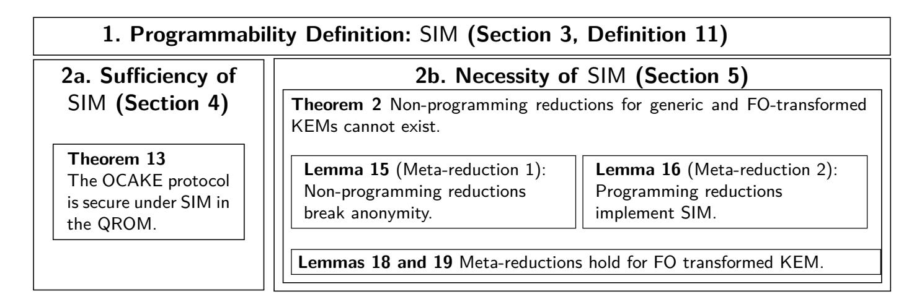
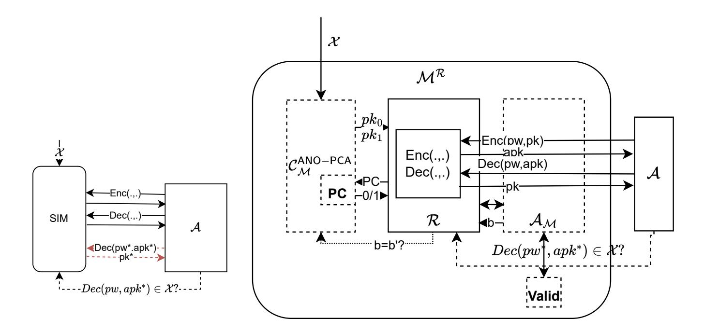
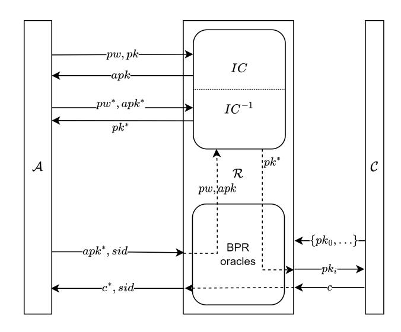
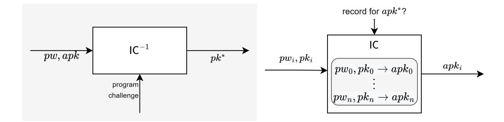

{0}------------------------------------------------

# **CAKE requires programming - On the provable post-quantum security of (O)CAKE**

Kathrin Hövelmanns<sup>1</sup> [,](https://orcid.org/0000-0002-5478-0140) Andreas Hülsing<sup>1</sup>*,*<sup>2</sup> Mikhail Kudinov<sup>1</sup> [,](https://orcid.org/0000-0002-8555-4891) and Silvia Ritsch<sup>1</sup>

> <sup>1</sup> Eindhoven University of Technology, The Netherlands <sup>2</sup> SandboxAQ, Paolo Alto, US

**Abstract.** In this work we revisit the post-quantum security of KEMbased password-authenticated key exchange (PAKE), specifically that of (O)CAKE. So far, these schemes evaded a security proof considering quantum adversaries. We give a detailed analysis of why this is the case, determining the missing proof techniques. To this end, we first provide a proof of security in the post-quantum setting, up to a single gap. This proof already turns out to be technically involved, requiring advanced techniques to reason in the QROM, including the compressed oracle and the extractable QROM. To pave the way towards closing the gap, we then further identify a way to model the ideal cipher by means of a simulator that enables a proof. The simulator provides certain programming abilities, which prove to be both a sufficient and necessary condition to close the proof gap: it is sufficient since we complete our proof, using the simulator, and necessary in many relevant cases – we give a meta-reduction based on KEM anonymity. The meta-reduction shows the impossibility of a non-programming reduction that covers a class of KEMs including Kyber / ML-KEM.

**Keywords:** Post-quantum cryptography, password-based authenticated key exchange, PAKE, CAKE, OCAKE, quantum ideal-cipher model, QIC, QROM, meta reduction.

# <span id="page-0-0"></span>**1 Introduction**

Passwords are still one of the most common means of user authentication. The reason is that they are easy to use on different devices, without the requirement for additional hardware. At the same time, passwords are a common reason for

K.H. was supported by an NWO VENI grant (Project No. VI.Veni.222.397). A.H. and M.K. were supported by an NWO VIDI grant (Project No. VI.Vidi.193.066). S.R. is part of the Quantum-Safe Internet (QSI) ITN which received funding from the European Union's Horizon-Europe programme as Marie Sklodowska-Curie Action (PROJECT 101072637 - HORIZON -MSCA-2021-DN-01). The authors would like to thank Manuel Barbosa, Anne Broadbent, Christian Majenz, and Marc Vostermanns for helpful discussions.

{1}------------------------------------------------

security breaches: They generally have low entropy, making them comparatively easy to guess, and as they have to be transmitted, they can potentially be intercepted. A way to avoid issues caused by interception is password-authenticated key exchange (PAKE). In a PAKE, the password is not transmitted but is used by communicating parties in a protocol to derive a shared session key. PAKE can not only be used for authentication on the Internet. It is a general tool for session authentication when only a low entropy secret is shared. This is why among the most popular applications of PAKE there is not only authentication in WiFi networks, but also authentication of contact-less connections to identity documents. For the latter use-case, the (low-entropy) machine-readable section of the document is read and used as a password in a PAKE (specifically PACE for ICAO passports).

This motivated major efforts put on the design of PAKE in recent years, including a competition within IETF's Crypto-Forum Research Group (CFRG) to select new PAKE. However, most of these designs are inherently linked to group-based cryptography, as they exploit its rich algebraic structure. This renders them vulnerable to attacks by future quantum computers. While this is not as big of an issue when just thinking about the authentication part, as PAKE are generally used in short-lived authentication decisions, it still is an issue in two dimensions. First, as PAKE are used to establish session keys, also the data later secured via these keys is susceptible to store-now-decrypt-later attacks. Second, given their use in long-lived identity documents and the specification and standardization time of such, even if we start transitioning now, we will have documents with old schemes in the field for the next 15-20 years. Hence, it is necessary to start looking for alternatives to classically secure PAKE now.

Indeed, there have been several works on the topic of post-quantum PAKE. In general, these can be split into two categories: First, there are proposals that build PAKE directly from specific hardness assumptions [\[DAL](#page-32-0)<sup>+</sup>17, [SA23,](#page-33-0) [DKBY24,](#page-32-1) [TY19,](#page-33-1) [SH19\]](#page-33-2). Second, there are generic proposals [\[BCP](#page-31-0)<sup>+</sup>23, [PZ23\]](#page-33-3) that can construct PAKE from generic Key Encapsulation Mechanisms (KEMs) which fulfill certain somewhat-standard properties ([\[Xag22,](#page-34-0) [GMP22,](#page-32-2) [MX23\]](#page-33-4)). The former are mostly based on specific hardness assumptions on lattices and some come with a security proof. Some even come with a security proof that considers quantum adversaries[\[LLH24\]](#page-33-5). These proposals are usually quite efficient, as they can exploit the available algebraic structure. The latter do not have access to this structure, which can render them a bit less efficient. However, they have the advantage that they can be instantiated with a wide range of KEM. Given the experience that quantum computers are able to break virtually all traditional public key cryptography due their use of very few, closely related hardness assumptions, this freedom of choosing an arbitrary KEM, independent of the underlying hardness assumption, seems like a strong advantage in practice. For that reason, we study this latter category in this work. A comprehensive overview over post-quantum PAKE proposals and the models used in their analysis is given in [\[AHMW25\]](#page-31-1), Table 1.

{2}------------------------------------------------

The main contender of this category are the recently proposed protocols CAKE & OCAKE [\[BCP](#page-31-0)<sup>+</sup>23]. These are instances of the well-known Encrypted Key Exchange (EKE) blueprint that was also used in PACE, SPEKE, and many more. It has been demonstrated, in the UC-model [\[BCP](#page-31-0)<sup>+</sup>23] as well as in the game-based setting [\[PZ23,](#page-33-3) [AHHR24\]](#page-31-2), that CAKE & OCAKE are secure against attacks using classical computers as long as the used KEM provides three properties: It has to achieve indistinguishable keys under weak attacks (IND-CPA or IND-PCA); it has to guarantee anonymity of ciphertexts (ANO-CPA or ANO-PCA), meaning one cannot infer the used public key when seeing a ciphertext; and finally it has to guarantee that public keys are indistinguishable from random bit strings. However, a proof of security against quantum attackers is so far still missing.

**KEM-EKE and its security.** (O)CAKE is essentially a version of EKE instantiated using a KEM. We here consider OCAKE. (CAKE only differs in minor aspects.) The protocol initiator **I** and responder **R** share a password *pw*. The initiator generates an ephemeral KEM key pair *pk, sk*. Then it uses the password to compute an encrypted public key *apk* ← BC(KDF(*pw*)*, pk*) using a block cipher BC and sends *apk* to the responder. The responder recovers *pk* ← BC<sup>−</sup><sup>1</sup> (KDF(*pw*)*, apk*) using the password, and computes an encapsulation (*c, k*) ← Encap(*pk*). It sends *c*, potentially accompanied by a key-confirmation tag, back to **I** who obtains the shared key via *k* ← Decap(*sk, c*). This is potentially followed by another key confirmation message from **I** to **R**.

A key property of PAKE is that adversarial observation of the exchanged messages must not admit offline password-guessing attacks, and that active attacks only allow to verify at most a single password guess. This is necessary due to the commonly limited size of practically used password spaces. For OCAKE this means – among others – that the second message must be computationally independent of the first. This is where KEM anonymity is required. Consider the following attack: A malicious initiator A sends a random *apk* to an honest **R**. In addition, A computes *pk<sup>i</sup>* ← BC<sup>−</sup><sup>1</sup> (KDF(*pwi*)*, apk*) for all passwords *pw<sup>i</sup>* in the password space. This is possible due to the limited size of the password space. When receiving back the ciphertext *c*, the adversary simply checks under which *pk<sup>i</sup>* the ciphertext *c* is valid and extracts the respective password this way. If the KEM provides no anonymity, this attack is possible[3](#page-2-0) .

Consequently, if we want to base security on a computationally anonymous KEM, a reduction has to be able to use this very adversary to solve an anonymity challenge. In the formal definition of anonymity we are given two public keys and a ciphertext that is an encapsulation under one of the two. The task is to decide which of the two public keys was used to create the ciphertext. In the classical proof, the respective reduction simulates the ideal cipher via lazy sampling and adaptive programming. The latter essentially ensures that under the correct password, any *apk* sent by A during an active attack decrypts to one of the challenge public keys for the anonymity game. We can then embed

<span id="page-2-0"></span><sup>3</sup> This attack is a slight simplification of the actual attack which is more complex due to the way anonymity is defined.

{3}------------------------------------------------

the challenge ciphertext as the second message. If A succeeds, we know that *c* was likely generated with the programmed public key. If A fails, *c* was likely generated using the other public key.

**The quantum proof gap.** When moving to a setting that considers quantum adversaries, it has been known since [\[BDF](#page-31-3)<sup>+</sup>11] that one has to provide such adversaries with *quantum* access to random oracles and ideal ciphers. For many proof steps that involve random oracles, this makes it necessary to revisit the used arguments. Whereas in the classical setting, such steps often used comparably simple 'standard' arguments, allowing quantum access can render those steps significantly more involved. (Examples are query inspection, adaptive reprogramming, or online extraction.) While this can be challenging, the community has made huge progress towards dealing with these changes for random oracles. When it comes to ideal ciphers, however, the situation is different. While this area of research is very active [\[Hos25,](#page-33-6) [CHL](#page-32-3)<sup>+</sup>25, [ACMT25,](#page-31-4) [CP25,](#page-32-4) [MMW24,](#page-33-7) [Unr23a,](#page-33-8) [Unr21,](#page-33-9) [CMSZ19\]](#page-32-5), at this point advanced techniques such as efficiently simulating ideal ciphers with adaptive reprogramming still seem out of reach.

In short, challenging proofs compound with a need for techniques that are missing entirely. This might explain why OCAKE / CAKE has no security proof against quantum adversaries, yet. In this work we thus set out to understand how to surpass this barrier, by determining what exactly is lacking. Moreover, given that researchers try to circumvent the ideal cipher model altogether, we are interested in potential avenues to do so (and what paths are hopeless).

**Our contribution** In this work, we determine the necessary & sufficient (missing) ingredient for a reductionist proof to succeed, when considering quantum adversaries. Towards this end, we provide a proof against quantum adversaries in the quantum-accessible random oracle and ideal cipher model (QROM & QIC), assuming the existence of an efficient simulator for the ideal cipher that is capable of a certain form of reprogramming. We give a precise definition of this simulator and also demonstrate necessity of such a simulator when constructing an EKE PAKE from arbitrary KEM. Note that for the necessity argument it is sufficient to point out a single KEM for which a security proof cannot succeed without implementing such a simulator.

Indeed, we show that we find such KEM in all KEM that follow the full Fujisaki-Okamoto (FO) KEM blueprint [\[HHK17,](#page-33-10) [FO99,](#page-32-6) [FO13\]](#page-32-7), assuming they satisfy typical properties (correctness and spreadness) and a very weak form of robustness. (More concretely, we require a very weak robustness property from the version of the considered KEM that rejects explicitly, while the considered KEM may well be implicitly rejecting.)

This result applies to the new NIST standard ML-KEM, also known as Kyber, and we conjecture that it also applies to most other post-quantum KEM that were considered in the NIST competition. Since OCAKE can only achieve post-quantum security when instantiated with a post-quantum KEM, we believe that our result covers the most relevant cases.

On a technical level, we show that CAKE/OCAKE can be broken by an adversary that can break anonymity of the used KEM. Consequently, any security 

{4}------------------------------------------------

proof that works for general KEM has to include a reduction from anonymity. We give a meta-reduction which shows that any such reduction – if it works for the aforementioned class of KEMs – has to implement this programming simulator. We show that otherwise, the reduction must be able to break anonymity itself. Our result is limited to the aforementioned KEM class because it allows a simulation of a successful adversary that just uses random oracle techniques, avoiding tricks like rewinding or the use of the generic group model.

The main results can be summarized by two (informal variants of the main) theorems:

**Theorem 1 (Protocol** OCAKE **is secure in the QROM under** SIM**.).** *Protocol* OCAKE *is secure for any* KEM *that is* (1 − *δ*KEM)*-correct, multi-user-*IND-CPA*- and multi-user-*ANO-PCA*-secure and has uniform public keys, provided the existence of a programming simulator* SIM*.*

<span id="page-4-0"></span>**Theorem 2 (Any generic anonymity reduction must program.).** *There cannot exist any reduction* R *that reduces* ANO-PCA *to* BPR *security of* OCAKE *generically for any* KEM *without implementing a programming simulator* SIM*.*

**Feasibility of instantiating the simulation.** There has been some progress on simulations for random permutations that can support query-recording [\[Unr23b,](#page-34-1) [MMW24,](#page-33-7) [ACMT25\]](#page-31-4), but to the best of our knowledge there is currently none that can fulfill the programmability requirement we isolate. In fact, it may prove impossible to achieve for an ideal cipher. While we phrase our results in most places with respect to an ideal cipher for ease of exposition, they can be easily generalized to families of bijections where each bijection is sampled from an independent distribution over the set of bijections.

Taking this generality into account, the programming requirement outlined in this paper immediately removes some constructions that try to avoid the QIC from consideration. One such example is a masking-based approach where the password (and potentially a session identifier) is hashed and used as an xor-*mask* for the public key *apk* = *pk* ⊕ H(*pw, sid*). Since many efficient instantiations are ruled out by the requirement, the results of this paper indicate that it is worth investigating more complex instantiations that may come with a higher cost. We hope that our result can enable research into possible instantiations of the programming simulator we define, thereby leading the way to generic post-quantum PAKE from KEM with security against quantum adversaries.

**Organization.** The organization of this paper is depicted in [Fig. 1](#page-5-0)

# **2 Preliminaries**

In this section, we recall some notation and/or security notions for block ciphers, key encapsulation mechanisms, and hash functions, as well as the CAKE/OCAKE protocol.

**Notation.** We denote deterministic output *y* of an algorithm *A* on input *x* by *y* := *A*(*x*). We denote algorithms with access to an oracle O by *A*<sup>O</sup> . Unless

{5}------------------------------------------------



<span id="page-5-0"></span>**Fig. 1.** Organization of this paper. We introduce the programmability requirement by defining a simulator in Section 3. We show sufficiency of this programmability property in Section 4, by adapting **OCAKE**'s security proof (in the Bellare-Pointcheval-Rogaway model) to the quantum random oracle model. Lastly, we prove necessity of the programmability property in Section 5, using a meta-reduction technique. (We show that the meta-reductions hold for KEMs that follow the Fujisaki-Okamoto (FO) blueprint.)

stated otherwise, we assume all our algorithms to be probabilistic and denote the computation by  $y \leftarrow A(x)$ .

**Block Ciphers** The proof of security of the OCAKE protocol is given in the ideal cipher model [Bla06]. Analogous to the ROM for hash functions, the ideal cipher (IC) is an idealized description of a block cipher.

**Definition 3 (Block Cipher (BC)).** A block cipher of block length n and key length k consists of two algorithms  $BC : \{0,1\}^k \times \{0,1\}^n \to \{0,1\}^n$  and  $BC^{-1} : \{0,1\}^k \times \{0,1\}^n \to \{0,1\}^n$  such that for every plaintext  $m \in \{0,1\}^n$  and key  $k \in \{0,1\}^k$ , decryption undoes encryption:  $BC^{-1}(k,BC(k,m)) = m$ .

**Definition 4 (Ideal Cipher (IC)).** An ideal cipher is a collection of random permutations indexed by a key, to which all parties (including the adversary) are given oracle access. I.e., it is a pair of random functions  $E, D : \mathcal{K} \times \mathcal{M} \to \mathcal{M}$ , such that D(k, E(k, m)) = m and E(k, D(k, m)) = m for all k, m in  $\mathcal{K} \times \mathcal{M}$ .

**Key Encapsulation Mechanisms (KEM).** We start with the functional definition of KEMs. Afterwards we discuss their security. In the end, we introduce a new robustness notion.

**Definition 5 (Key Encapsulation Mechanisms (KEMs)).** A KEM is a triple of algorithms KEM = (KGen, Encap, Decap), together with a public key space  $\mathcal{PK}$  and secret key space  $\mathcal{SK}$ .

- KGen  $\rightarrow$  (pk, sk): On empty input probabilistically **return** key pair (pk, sk), where pk also defines a finite key space K and a ciphertext space C.
- Encap  $(pk) \to (c, K)$ : On input pk probabilistically **return** a pair  $(K, c) \in \mathcal{K} \times \mathcal{C}$ . We call c the encapsulation of the key K.
- Decap  $(sk, c) \to K$ : On input sk and ciphertext c deterministically **return**  $a \ key \ K \in \mathcal{K}$ .

{6}------------------------------------------------

```
\begin{array}{lll} \textbf{Game ANO-PCA}^b(\mathcal{A}) & \frac{1 - \text{PCO}(c, K)}{00 \ (pk_0, sk_0)} \leftarrow \$ \ \text{KGen} & \frac{1 - \text{PCO}(c, K)}{06 \ \text{if}} \ c \neq c^* \\ 02 \ (pk_1, sk_1) \leftarrow \$ \ \text{KGen} & 07 \quad K' \leftarrow \ \text{Decap}(sk_0, c) \\ 03 \ (c^*, K^*) \leftarrow \ \text{Encap}(pk_b) & 08 \quad \mathbf{return} \ \llbracket K = K' \rrbracket \\ 04 \ b' \leftarrow \ \mathcal{A}^{1 - \text{PCO}}(pk_0, pk_1, c^*) & 09 \ \text{else} \ \mathbf{return} \ \bot \\ 05 \ \mathbf{return} \ \llbracket b = b' \rrbracket & \end{array}
```

<span id="page-6-0"></span>Fig. 2. The security game for anonymity (ANO-PCA) of KEM. Oracle 1-PCO can be queried at most once.

```
Game (n, q_C) – IND-CPA<sup>b</sup>
                                                     Game (n, q_C) – ANO-PCA^b(A)
                                                                                                                Chall_{q_C}^b(j)
01 for i \in [n]
                                                     01 for j \in [n]
                                                                                                                 \overline{08 \ (c_b, K_b)} \leftarrow \$ \operatorname{Encap}(pk_{b,j})
02 (pk_i, sk_i) \leftarrow \$ KGen
                                                     02 (pk_{0,j}, sk_{0,j}) \leftarrow \$ KGen
                                                                                                                09 \mathcal{L}_{j}^{c} \leftarrow \mathcal{L}_{j}^{c} \cup \{c_{b}\}
03 p\hat{k}.append(pk_i)
                                                     03 (pk_{1,j}, sk_{1,j}) \leftarrow \$ KGen
                                                                                                                10 return (c_b, K_b)
04 b' \leftarrow \mathcal{A}^{\operatorname{Chall}_{qC}^{b}}(p\vec{k})
                                                     04 p\dot{k}_0.append(pk_{0,j})
                                                     05 \vec{pk}_1.append(pk_{1,j})
05 return b'
                                                                                                                1-PCO(j, c, K)// once per j, for c \notin \mathcal{L}_j^c
                                                     06 b' \leftarrow \mathcal{A}^{1-\text{PCO},\text{Chall}_q^b}(p\vec{k}_0, p\vec{k}_1)
Chall_{q_C}^b(j)
                                                                                                                11 \ K' \leftarrow \mathsf{Decap}(sk_{0,j},c)
\overline{06\ (c,K_0)} \leftrightarrow \mathbb{S} \operatorname{Encap}(pk_j)
                                                     07 return b'
                                                                                                                 12 return [\![K = K']\!]
07 K_1 \stackrel{unif}{\longleftrightarrow} K
                                                                                                                 13 else return \perp
08 return (c, K_b)
```

<span id="page-6-1"></span>**Fig. 3.** The Multi-user games for anonymity  $((n, q_C) - \mathsf{ANO}\text{-PCA})$  and indistinguishability  $((n, q_C) - \mathsf{IND}\text{-CPA})$  for KEM, for n users. Challenge oracle Chall can be queried at most  $q_C$  many times per user, and 1-PCO once per public key.

**Definition 6** ( $\delta$ -Correctness (average-case)). We say that KEM is average-case  $(1 - \delta)$ -correct if  $\Pr[\mathsf{Decap}(sk, c) = K | (c, K) \leftrightarrow \mathsf{Encap}(pk)] \geq 1 - \delta$ , where the probability is taken over  $(pk, sk) \leftarrow \mathsf{KGen}()$  and the random coins of Encap.

**Definition 7** ( $\gamma$ -spreadness). We say that PKE is  $\gamma$ -spread iff for all key pairs  $(pk, sk) \in supp(\mathsf{KGen})$  and all messages  $m \in \mathcal{M}$  it holds that

$$\max_{c \in \mathcal{C}} \Pr[\mathsf{PKE}.\mathsf{Enc}(pk, m) = c] \leq 2^{-\gamma},$$

where the probability is taken over the internal randomness of PKE.Enc.

**Definition 8 (Anonymity for KEM).** Let KEM be a key encapsulation mechanism with public-key space  $\mathcal{PK}$  and key space  $\mathcal{K}$ . We define the ANO-PCA game as depicted in Fig. 2, relative to challenge bit b, and the advantage function of an adversary  $\mathcal{A}$  against KEM as

$$\mathbf{Adv}^{\mathsf{ANO-PCA}}_{\mathsf{KEM}}(\mathcal{A}) := |\mathrm{Pr}[\mathsf{ANO-PCA}^0(\mathcal{A}) \Rightarrow 0] - \mathrm{Pr}[\mathsf{ANO-PCA}^1(\mathcal{A}) \Rightarrow 0]|$$

Finally, we introduce an extremely weak notion of robustness that we call honest robustness. One may think of it as a form of weak robustness (WROB) [GMP22] where all values are randomly chosen instead of given by an adversary. Consequently, the notion is implied by WROB.

{7}------------------------------------------------

**Definition 9** (hROB). For any given key encapsulation mechanism KEM, we define the advantage against honest robustness as

$$\mathbf{Adv}_{\mathsf{KEM}}^{\mathsf{hROB}}\mathcal{A} := \Pr \left[ k \neq \perp \begin{vmatrix} (pk_1,.), (.,sk_2) & \mathsf{\$} & \mathsf{KGen}() \\ (c,.) & \mathsf{\$} & \mathsf{Encap}(pk_1) \\ k := \mathsf{Decap}(sk_2,c) \end{vmatrix} \right]$$

Extractable Compressed Random Oracle. Here we introduce an extension of Zhandry's Compressed Random Oracle |Zha19| called extractable Compressed Random Oracle [DFMS22] (eCO). Using eCO represents a quantum-accessible Random Oracle with an additional mechanism that allows to check if there was a query that satisfies some function f. This gives a form of observable QROM. The eCO developed in [DFMS22] has two interfaces: one that mimics the behavior of a random oracle (eCO.RO) and another that allows extraction of information (eCO.E). The eCO.RO<sub>f</sub> interface defined relative to a function f takes a classical value t as input and simulates a quantum measurement that "collapses" the oracle database, allowing it to yield a specific outcome x. After the measurement, the database is in a state where all the values for eCO.RO collapse to the values y that satisfy the equation f(x,y)=t. Whenever the function f used is clear from context we write eC0.E instead of eC0.E<sub>f</sub>. To clarify, consider the classical analogue where the Random Oracle is simulated via lazy-sampling. Then for an extraction query we go through the database and output the first pair (x, y) such that x is the smallest value for which f(x,y) = t.

Previously, in [DFMS22, HM24] the eCO was used to simulate Decapsulation queries during the runtime of the adversary. In our case we use it to check if the adversarially generated tags are valid.

Now lets give a more formal treatment of the eCO. We will closely follow the description from [DFMS22, HM24]. The description represents an inefficient version of the eCO which can be made efficient using sparse encoding (c.f., [DFMS22]). The simulator eCO for a random function O:  $\{0,1\}^m \to \{0,1\}^n$  is a stateful oracle with a state stored in a quantum register  $D = D_{0^m} \dots D_{1^m}$ , where for each input value  $x \in \{0,1\}^m$ , register  $D_x$  has n+1 qubits used to store superpositions of n-bit output strings y, encoded as 0y, and an additional symbol  $\bot$ , encoded as  $10^n$ . We adopt the convention that an operator expecting n input qubits acts on the last n qubits when applied to one of the registers  $D_x$ . The compressed oracle has the following three components.

- 1. The initial state of the oracle,  $|\phi\rangle = |\perp\rangle^{2^m}$
- 2. A quantum query with query input register X and output register Y is answered using the oracle unitary  $O_{XYD}$  defined by  $O_{XYD} |X\rangle_X = |X\rangle_X \otimes (F_{D_x} \text{CNOT}_{D_x:Y}^{\otimes n} F_{D_x})$ , where  $F |\bot\rangle = |\phi_0\rangle$ ,  $F |\phi_0\rangle = |\bot\rangle$  and  $F |\psi\rangle = |\psi\rangle$  for all  $|\psi\rangle$  such that  $\langle \psi | \bot \rangle = \langle \psi | \phi_0 \rangle = 0$ , with  $|\phi_0\rangle = |+\rangle^{\otimes n}$  being the uniform superposition.
- 3. A recovery algorithm that recovers a standard QRO O: apply  $F^{\otimes 2^m}$  to D and measure it to obtain the function table of O.

{8}------------------------------------------------

The formal description of the extraction interface is the following. Given a random oracle  $O: \{0,1\}^m \to \{0,1\}^n$ , let  $f: \{0,1\}^m \times \{0,1\}^n \to \{0,1\}^\ell$  be a function. We define a family of measurements  $(\mathcal{M}^t)_{t \in \{0,1\}^\ell}$ . The measurement  $\mathcal{M}^t$  has measurement projectors  $\{\Sigma^{t,x}\}_{x \in \{0,1\}^m \cup \{\emptyset\}}$ .

Let  $\Pi^{t,x} = \sum_{y \in \{0,1\}^n: |y| \langle y|} |x$ . Then, for  $x \in \{0,1\}^m$ , the projector selects the case where  $D_x$  is the first (in lexicographical order) register that contains y such that f(x,y) = t, i.e.  $\Sigma^{t,x} = \bigotimes_{x' < x} \bar{\Pi}_{D'_x}^{t,x'} \otimes \Pi_{D_x}^{t,x}$ , and  $\bar{\Pi} = \mathbbm{1} - \Pi$ . The remaining projector corresponds to the case where no register contains such a y, i.e.  $\Sigma^{t,\emptyset} = \bigotimes_{x' \in \{0,1\}^m} \bar{\Pi}_{D'_x}^{t,x'}$  eCO is initialized with the initial state of the compressed oracle. eCO.RO is quantum-accessible, eCO.E is a classical oracle interface that, on input t, applies  $\mathcal{M}^t$  to eCO's internal state. The following properties of eCO are required for the main lemma that will be used in our proof. We define a relationship R based on function f and a target value t as all input output pairs that satisfy function f(x,y) = t.  $R_{f,t}(x,y) :\Leftrightarrow f(x,y) = t$ . Next, lets define  $\Gamma_R := \max_x |\{y \mid R(x,y)\}|$ .  $\Gamma_R$  outputs the maximum number values y that satisfy a relationship R for some input x. And finally we define  $\Gamma(f) = \max_t \Gamma_{R_{f,t}}$ .  $\Gamma(f)$  outputs the maximum number of outputs y that satisfy some relationship  $R_{f,t}$  (maximizing over target values t) for some input x. The  $\Gamma(f)$  value determines whether we are able to use extractions without disturbing the random oracle too much. This is stated in the following lemma.

Lemma 10 (Part of theorem 3.4 in [DFMS22], formulated in [HM24]). The extractable RO simulator eCO described above, with interfaces eCO.RO and eCO.E, satisfies the following properties.

- 1. If eCO.E is unused, eCO is perfectly indistinguishable from a random oracle.
- 2. Any two subsequent independent queries to eCO.RO commute. In particular, two subsequent classical eCO.RO-queries with the same input x give identical responses.
- 3. Any two subsequent independent queries to eCO.E commute. In particular, two subsequent eCO.E queries with the same input t give identical responses.
- 4. Any two subsequent independent queries to eCO.E and eCO.RO  $8\sqrt{2\Gamma(f)/2^n}$ -almost-commute.

In our application we will not give the adversary the extraction interface. We still restrict the adversary only to the RO queries. On the other hand the reduction is able to perform extraction queries to check if the oracle has been queried on the inputs that are interesting for us.

**Transformation T** [HHK17] T transforms an OW-CPA secure public-key encryption scheme into an OW-PCA secure one.

To a public-key encryption scheme PKE = (PKE.KGen, PKE.Enc, PKE.Dec) with message space  $\mathcal{M}$  and randomness space  $\mathcal{R}$ , and random oracle  $G:\mathcal{M} \to \mathcal{R}$ , we associate PKE<sub>1</sub> =  $\mathbf{T}[\mathsf{PKE}, \mathsf{G}]$ . The algorithms of PKE<sub>1</sub> = (PKE.KGen, PKE.Enc<sub>1</sub>, PKE.Dec<sub>1</sub>) are defined in Fig. 4. Note that Enc1 deterministically computes the ciphertext as  $c := \mathsf{PKE}.\mathsf{Enc}(pk, m; \mathsf{G}(m))$ .

{9}------------------------------------------------

```
 \begin{array}{|c|c|c|} \hline \mathsf{PKE}.\mathsf{Enc}_1(pk,m) & & \mathsf{PKE}.\mathsf{Dec}_1(sk,c) \\ \hline 14 \ c := \mathsf{PKE}.\mathsf{Enc}(pk,m;\mathsf{G}(m)) & & 16 \ m' := \mathsf{PKE}.\mathsf{Dec}(sk,c). \\ 15 \ \mathrm{return} \ c & & 17 \ \mathrm{if} \ m' = \bot \ \mathrm{or} \ \mathsf{PKE}.\mathsf{Enc}(pk,m';\mathsf{G}(m')) \neq c \ \mathrm{return} \ \bot \\ 18 \ \mathrm{else} \ \mathrm{return} \ m' & \\ \hline \end{array}
```

<span id="page-9-0"></span>Fig. 4. The algorithms of the T-Transform.

| Initiator I (Client)                                  | Protocol OCAKE      | Responder R (Server)                            |
|-------------------------------------------------------|---------------------|-------------------------------------------------|
| Password $pw$                                         |                     | Password pw                                     |
|                                                       | Public Key          |                                                 |
| $k_{pw} \leftarrow \texttt{KDF}(pw)$                  |                     | $k_{pw} \leftarrow \mathtt{KDF}(pw)$            |
| $(pk, sk) \leftarrow \$ KGen$                         |                     |                                                 |
| $apk \leftarrow BC(k_{pw}, pk)$                       | $\xrightarrow{apk}$ | $pk' \leftarrow BC^{-1}(k_{pw}, apk)$           |
|                                                       | Session Pre-Key     |                                                 |
| $K' \leftarrow Decap(sk, c)$                          | <u> </u>            | $(c,K) \leftarrow \$ \operatorname{Encap}(pk')$ |
|                                                       | Key Derivation      |                                                 |
|                                                       | tag                 | $tag, SK \leftarrow H(K, pw, apk, pk', c)$      |
| $tag', SK' \leftarrow \mathtt{H}(K', pw, apk, pk, c)$ | <b>\</b>            | output $SK$                                     |
| if $tag'=tag$                                         |                     |                                                 |
| output $SK'$                                          |                     |                                                 |

<span id="page-9-1"></span>**Fig. 5.** The OCAKE protocol, using a key encapsulation mechanism KEM = (KGen, Encap, Decap), key derivation function KDF, hash function H and a block cipher BC = (BC, BC<sup>-1</sup>). We require that the message space  $\mathcal{M}$  of BC and the public space  $\mathcal{PK}$  of KEM coincide, i.e.,  $\mathcal{PK} = \mathcal{M}$ . Especially, every element of  $\mathcal{M}$  must constitute a valid public key for KEM. This variant enables an optimization where tag and SK are computed using the same call to H.

#### 2.1 Protocols CAKE and OCAKE

In our analysis of which proof techniques are required for post-quantum PAKE, we focus on the OCAKE protocol, as shown in Fig. 5. In some cases, our analysis extends to the protocol variant CAKE, which we include in Section A. First, the initiator I generates a KEM key pair, encrypts the public key pk with a symmetric cipher, and sends the encrypted public key apk to the responder R. Upon receiving apk, R uses the password to recover pk, which it then used to compute an encapsulation c and a pre-key K. R sends the encapsulation c to I, together with a responder tag tag that can be used by I to confirm the key. R derives its session key SK' from pre-key K and the session transcript. Upon receiving c, I decapsulates the ciphertext to obtain a pre-key K', which can then again be used to derive the session key. The I then derives the session key if key confirmation succeeds, i.e., if the received tag equals the one I derives from its own state. Assuming that both parties used the same password and that KEM worked correctly, R and I end up with the same session key. We made a minor conceptual modification to the previous descriptions of the OCAKE protocol:

{10}------------------------------------------------

we derive *tag* and *SK* in the same call to H. This variant constitutes a minor optimization and simplifies the analysis.

The first security proofs for protocols CAKE and OCAKE were given in [\[BCP](#page-31-0)<sup>+</sup>23] in the UC framework and only considered attackers without quantum capabilities. As a first step towards capturing security even against attackers with quantum capabilities, [\[PZ23\]](#page-33-3) and [\[AHH](#page-31-6)<sup>+</sup>23] gave proofs in the BPR model for CAKE and OCAKE, respectively. The analysis in this work is based on these security proofs.

# <span id="page-10-0"></span>**3 Programming Simulator** SIM **for (O)CAKE**

We now define a simulation that is (computationally) indistinguishable from an ideal cipher, but answers queries by embedding values from a challenge set. This simulation models a block cipher that can be queried on quantum states.

We later prove that this simulator is sufficient to prove security against quantum adversaries of OCAKE in the BPR model in [Section 4](#page-11-0) by giving such a proof. Lastly, we use a meta-reduction technique( [\[FLR](#page-32-9)<sup>+</sup>10, [FF13,](#page-32-10) [BV98\]](#page-31-7)) in section [5](#page-19-0) to study how programmability as presented by SIM is necessary for any security proof of OCAKE.

**The programming simulator.** We now introduce the simulator that describes the minimal necessary requirements to prove security of OCAKE. Given the current uncertainty in achieving programmability with quantum queries, this definition aims to maximize flexibility in its instantiation while clearly outlining the requirements.

Consider an adversary A, a message space M, and a key space KSIM. From this we define a family of bijections E*<sup>k</sup>* : M → M indexed on a key *k* ∈ KSIM where each bijection is independently sampled according to distribution B. We denote the inverse of E*<sup>k</sup>* as D*k*. We also use E(*k, m*) to denote E*k*(*m*).

<span id="page-10-1"></span>In the case where B is the uniform distribution over all permutations, this definition is equivalent to that of an ideal cipher.

**Definition 11 (**(*δ*SIM*, ε*SIM)−**Programming Simulator** SIM **(single-session)).** *Let adversary* A*, message space* M*, key space* KSIM *and* E *be as above.We now define simulator* SIM*: (*ESIM*,*DSIM*) relative to a challenge set* X ⊂ M *of non-repeating, independently and uniformly random elements of the message space* M*, and a key K for each session sid, that is sampled uniformly at random from the key space at the beginning of the game. We say that* SIM *is a* (*δ*SIM*, ε*SIM)−*programming simulator whenever we have for any adversary* A *that interacts with the oracles and eventually outputs some value apk and a session ID that:*

*1.* SIM *is indistinguishable from family* E *up to some failure probability ε*SIM*, i.e., the success probability of any distinguishing adversary* A*dist that wins if it outputs* 0 *when interacting with* E*,* D *and* 1 *when interacting with* SIM *(*X *) is bounded by ε*SIM*:*

$$|\Pr[\mathcal{A}_{dist}^{\mathsf{E},\mathsf{D}} \Rightarrow 0] - \Pr[\mathcal{A}_{dist}^{\mathsf{SIM}(\mathcal{X})} \Rightarrow 0]| \leq \varepsilon_{\mathsf{SIM}}.$$

{11}------------------------------------------------

2. SIM ensures that apk's decryption is in the challenge set  $\mathcal{X}$  with probability  $1 - \delta_{\text{SIM}}$ :

$$\Pr[(apk, sid) \leftarrow \mathcal{A}^{\mathsf{SIM}(\mathcal{X})} : \mathsf{D}_{\mathsf{SIM}}(K[sid], apk) \in \mathcal{X}] = 1 - \delta_{\mathsf{SIM}}(K[sid], sid)$$

where K[sid] is the key associated with session sid.

Generalization to multiple sessions We define the multi-session variant of SIM analogously to the single-session version, except the adversary now outputs  $n_s$  pairs  $(apk_i, sid_i)$ . Since in a reduction, it could be that the attacker selects any of these values to attack, it is necessary that all n decryptions are in the challenge set:  $\forall (apk_i, sid_i)$  output by  $\mathcal{A}$ , we require that  $\mathsf{D}_{k(sid_i)}(apk_i) \in \mathcal{X}$  with probability  $1 - \delta_{\mathsf{SIM}}$ .

**Definition 12**  $((n, \delta_{SIM}, \varepsilon_{SIM})$ -**Programming Simulator** SIM (multi-session)). Let adversary  $\mathcal{A}$ , message space  $\mathcal{M}$ , key space  $\mathcal{K}_{SIM}$  and  $\mathsf{E}$  be as above. We now define simulator SIM:  $(\mathsf{E}_{SIM}, \mathsf{D}_{SIM})$  relative to a challenge set  $\mathcal{X} \subset \mathcal{M}$  of non-repeating, independently and uniformly random elements of the message space  $\mathcal{M}$ . We say that SIM is a  $(\delta_{SIM}, \varepsilon_{SIM})$ -programming simulator whenever we have for any adversary  $\mathcal{A}$  that interacts with the oracles and eventually outputs some values  $apk_i$  and a session IDs  $sid_i$ ,  $i \in \{0, 1, \ldots, n-1\}$  that:

- 1. SIM is indistinguishable from family E up to some failure probability  $\varepsilon_{\text{SIM}}$ , i.e., the success probability of any distinguishing adversary  $\mathcal{A}_{dist}$  that wins if it outputs 0 when interacting with E, D and 1 when interacting with SIM  $(\mathcal{X})$  is bounded by  $\varepsilon_{\text{SIM}}$ :  $|\Pr[\mathcal{A}_{dist}^{\text{E,D}} \Rightarrow 0] \Pr[\mathcal{A}_{dist}^{\text{SIM}(\mathcal{X})} \Rightarrow 0]| \leq \varepsilon_{\text{SIM}}$ .
- 2. SIM ensures that the decryption of all  $apk_i$  is in the challenge set  $\mathcal{X}$  with probability  $1 \delta_{\mathsf{SIM}}$ :

$$\Pr[(\vec{apk}, \vec{sid}) \leftarrow \mathcal{A}^{\mathsf{SIM}(\mathcal{X})} :$$

$$\forall (sid_i, apk_i) \in (\vec{sid}, \vec{apk}) : \mathsf{D}_{\mathsf{SIM}}(K[sid_i], apk_i) \in \mathcal{X}] \geq (1 - \delta_{\mathsf{SIM}}).$$

where K[sid] is the key associated with session sid.

### <span id="page-11-0"></span>4 Security of **OCAKE** in the QROM

To prove security against quantum attackers, it is necessary to consider the quantum random oracle model as well as a quantum-accessible model for the symmetric cipher. We show that the simulation described in section 3 is sufficient to prove security of PAKE in the BPR model, using a generic KEM, by providing an updated security statement for OCAKE (Section 4.1). We also provide a high-level intuition for how to update the proof for CAKE (Section A.1).

#### <span id="page-11-1"></span>4.1 Security of OCAKE under SIM

Security of the OCAKE protocol has been shown in the universal composability framework [BCP<sup>+</sup>23] as well as in the BPR model [AHH<sup>+</sup>23]. Both results use

{12}------------------------------------------------

the ROM and the ICM. (Appendix 14 gives a more thorough analysis of the role of the IC in the proof and its relation to attacks.) Building on the proof given in [AHH<sup>+</sup>23], we give a security proof for the OCAKE protocol in the BPR model, using the QROM and assuming the existence of a simulator SIM that effectively replaces the IC.

To lift the classical proof to the quantum setting, all *public* functions – that is, those that can be computed by the attacker – need to be modeled to allow quantum queries [BDF<sup>+</sup>11]. Therefore, any proof argument that considers hash functions, key derivation functions or block ciphers needs adapting to quantum queries. In this setting, we now give our new security theorem.

<span id="page-12-0"></span>Theorem 13 (Tight security of OCAKE in the QROM from multi-user security of KEM and SIM). Let KEM be a key encapsulation mechanism that is  $(1 - \delta_{\mathsf{KEM}})$ -correct, let KDF, and H be modeled as quantum random oracles with codomains  $\mathcal{K}_{pw}$  and  $\mathcal{T} \times \mathcal{SK}$ , BC be a quantumly-accessible block cipher that we model according to SIM with parameters  $\delta_{\mathsf{SIM}}$  and  $\varepsilon_{\mathsf{SIM}}$ , and let  $\mathcal{A}$  be a BPR adversary against OCAKE[KEM, KDF, H, BC], issuing at most  $n_a$  many Send queries (active attacks),  $n_p$  many Execute queries (passive attacks), and  $q_{RO}$  many queries to its respective random oracles. Let  $n_s := n_a + n_p$  be the total number of sessions. Then there exist a multi-user-IND-CPA adversary  $\mathcal{B}^{\mathsf{I}}$  and a multi-user-ANO-PCA adversary  $\mathcal{B}^{\mathsf{A}}$  against KEM such that

$$\begin{split} \mathbf{Adv}_{\mathsf{OCAKE}}^{\mathsf{BPR}}(\mathcal{A}) &\leq \frac{n_a}{|\mathcal{D}|} + n_a^2 \cdot \eta_{\mathsf{KGen}} + \frac{|\mathcal{D}|^2}{|\mathcal{K}_{pw}|} + \frac{80e^2q_{\mathsf{H}}^3 + 2}{|\mathcal{T}|} + n_a \cdot \delta_{\mathsf{KEM}} + \\ &\quad + 4 \cdot \\ &\quad + 2 \cdot (\frac{1}{(1 - \delta_{\mathsf{SIM}})} \cdot \mathbf{Adv}_{\mathsf{KEM}}^{(n_s, \, n_a \, + \, 1) \, - \, \mathsf{ANO-PCA}} + \varepsilon_{\mathsf{SIM}}(\mathcal{B}^{\mathsf{A}})) \\ &\quad + 2 \cdot \mathbf{Adv}_{\mathsf{KEM}}^{(n_s, \, n_a \, + \, 1) \, - \, \mathsf{IND-CPA}}(\mathcal{B}^{\mathsf{I}}) + 2 \cdot \frac{q_{\mathsf{H}}}{|\mathcal{K}|} \end{split}$$

and the running time of  $\mathcal{B}^{\mathsf{I}}$ , and  $\mathcal{B}^{\mathsf{A}}$  is about that of  $\mathcal{A}$ .

To obtain this bound, we update the classical BPR proof for OCAKE [AHH<sup>+</sup>23] to capturing quantum attackers. We give an overview over the classical proof's game-hops in Table Fig. 6, indicate which game-hops we need to update, the new proof techniques we use to do so, and the resulting loss.

To summarize our updates, firstly, we lift all game-hops that use random oracle properties (games  $G_5$ ,  $G_{13}$ ) to the QROM. Secondly, for a concise presentation of how to apply our simulator properties, we fold all game-hops that use IC properties (games  $G_3, G_4, G_6, G_{10}$ ) into a single game ( $G_{10}$ ). The resulting upgraded proof is fully adapted to capturing quantum attackers.

We describe each game-hop in this section and give the intuition that underlies them. For the sake of completeness, we provide detailed reductions (including pseudocode) in Appendix B. For the reader's convenience, we also recall the details of the BPR security model in Appendix B.

We will use the notational convention  $\mathbf{Adv}_i := |\Pr[G_i(\mathcal{A}) \Rightarrow 1]|$ .

{13}------------------------------------------------

| Game                                 | Description                  | Update?         | Loss                                                             |
|--------------------------------------|------------------------------|-----------------|------------------------------------------------------------------|
| $\overline{\mathrm{G}_{\mathrm{0}}}$ | Original BPR game            |                 |                                                                  |
| $G_1$                                | Abort on KGen Collision.     | Not necessary   | $n_a^2 \cdot \eta_{KGen}$                                        |
| $G_2$                                | Abort on KDF Collision.      | Not necessary   | $\frac{ \mathcal{D} ^2}{ \mathcal{K}_{pw} }$                     |
| $\overline{\mathrm{G}_3}$            | IC lazy sampling w/ abort    | This work (SIM) | -                                                                |
| $G_4$                                | Prevent IC collisions        | This work (SIM) | -                                                                |
| $G_5$                                | Abort on Tag Collision.      | This work (CO)  | $\frac{80e^2q_{\mathtt{H}}^3 + 2}{ \mathcal{T} }$                |
| $G_6$                                | Sample IC using KGen         | This work (SIM) | -                                                                |
| $G_7$                                | Do not decrypt honest $c$ .  | Not necessary   | $n_a \cdot \delta_{KEM}$                                         |
| $G_8$                                | Abort on tag under correct   | This work (eCO) | Pr[ corrPW ]                                                     |
|                                      | pw.                          |                 |                                                                  |
| $\overline{\mathrm{G}_{9}}$          | Make eCO extractions online. | This work (eCO) | $n_a \cdot (n_s + q_{\texttt{H}}) \sqrt{2/ \mathcal{T} }$        |
| $\overline{\mathrm{G}_{10}}$         | Randomize public key.        | This work (SIM) | $\frac{1}{(1-\delta_{SIM})}$ .                                   |
|                                      |                              |                 | $\mathbf{Adv}_{KEM}^{(n_s,n_a+1)-ANO\text{-PCA}} +$              |
|                                      |                              |                 | $\varepsilon_{SIM}(\mathcal{B}^{A})$                             |
| $G_{11}$                             | Randomize pre-key.           | Not necessary   | $\mathbf{Adv}_{KEM}^{(n_s,n_a+1)-IND\text{-}CPA}(\mathcal{B}^I)$ |
| $\overline{\mathrm{G}_{12}}$         | Move eCO extractions to end. | This work (eCO) | $n_a \cdot (n_s + q_{\texttt{H}}) \sqrt{2/ \mathcal{T} }$        |
| $\overline{\mathrm{G}_{13}}$         | Randomize Tag, Session Key.  | This work (CO)  | $\frac{q_{\mathrm{H}}}{ \mathcal{K} }$                           |
| $\overline{\mathrm{G}_{15}}$         | Randomize Passwords.         | Not necessary   | 0                                                                |

<span id="page-13-0"></span>**Fig. 6.** Game-hops in the classical BPR proof for OCAKE. The game-hops that needed updating use new techniques such as compressed oracles (CO), extractable compressed oracles (eCO), and the simulator defined in this work (SIM).

<span id="page-13-3"></span>Game  $G_0$ : Original BPR game. The BPR oracles are exactly as in the existing BPR proof (see App. B). H, KDF and IC are quantum-accessible.

Game  $G_1$ : Handling collisions of KEM key pairs. (Unchanged) The game aborts whenever there are at least two sessions that sampled the same ephemeral KEM key pair (pk, sk). Let  $\eta_{\mathsf{KGen}}$  be the collision probability of KGen. Since games  $G_0$  and  $G_1$  are identical unless a collision occurs, we have  $|\mathbf{Adv_1} - \mathbf{Adv_0}| = \Pr[\mathsf{KDFColl}] \leq n_a^2 \cdot \eta_{\mathsf{KGen}}$ .

<span id="page-13-4"></span>Game G<sub>2</sub>: Abort on KDF Collision. The game aborts whenever two passwords lead to a collision in the key derivation function that maps passwords to block cipher keys. This bound only depends on the choice of KDF and dictionary  $\mathcal{D}$ , not on any adversarial input. The resulting bound thus is statistical. Concretely, if KDF is a uniformly random function  $f: \mathcal{D} \to \mathcal{K}_{pw}$ , the probability that two inputs pw, pw' are mapped to the same output  $k_{pw}$  can be upper-bounded by the birthday collision bound:  $|\mathbf{Adv}_2 - \mathbf{Adv}_1| \leq \Pr[\mathsf{KDFColl}] \leq \frac{|\mathcal{D}|^2}{|\mathcal{K}_{pw}|}$ .

<span id="page-13-2"></span><span id="page-13-1"></span>**Games**  $G_3$  and  $G_4$ : we fold them into game  $G_{10}$ .

Game  $G_5$ : Abort on Tag Collision. One of the informal security goals of PAKE proofs is to rule out attacks where an adversary can *test* more than one password in a single online attack. One example of such an attack is the

{14}------------------------------------------------

exploitation of a tag collision: assume there exist two passwords pw, pw' s.t. the responder tag tag computed from them for a given transcript is the same. Then the attacker could win the game by submitting tag without having uniquely identified the right password.

Therefore,  $G_5$  aborts whenever the attacker has found such a collision in H. To argue about the distance between  $G_5$  and  $G_4$ , we use the compressed oracle technique [CFHL21].

Let  $\mathcal{A}$  be the adversary in the PAKE game. We define an adversary  $\mathcal{B}$  in the collision-finding game that runs  $\mathcal{A}$  and is successful if it outputs x, x' s.t. H(x) = H(x') at the end of the game.

 $\mathcal{B}$  simulates  $\mathcal{A}$ 's PAKE and random oracle queries. First,  $\mathcal{B}$  replaces the random oracle with a compressed random oracle. The compressed random oracle allows  $\mathcal{B}$  to record  $\mathcal{A}$ 's queries in a database.

Then, at the end of the game,  $\mathcal{B}$  measures the database for collisions. We denote the partitioning of the output of the hash function into tag and session key as H(x) = tag||SK =: H(x)[0]||H(x)[1]. Then we can define as R the relation that describes a collision in the tag: for distinct x, x' and arbitrary sk, sk', we have H(x)[0]||sk = H(x')[0]||sk'. Informally, this is equivalent to discarding the part that represents the session key, or projecting onto the space of the tag. Then we have  $R \subseteq \mathcal{X}^l \times (\mathcal{T} \times \mathcal{SK})^l$  for l = 2.

$$\mathsf{CL} := \{ D | \exists x \neq x' : D(x) = D(x') \neq \bot \}$$

Then, by Corollary 4.2 [CFHL21, Corollary 4.2], we have that for success probability in the original game p and success probability in the game using the compressed random oracle p', we have that  $\sqrt{p} \leq \sqrt{p'} + \sqrt{\frac{2}{|\mathcal{T}|}}$ .

We now argue about the success probability p', closely following the reasoning in section 2.3 of [CFHL21], (Finding a Collision (with Parallel Queries)). Let  $\mathsf{SZ}_{\leq (s-1)}$  be a database of size at most s-1. We set k=1 as we do not model parallel queries, so we have using the transition probability of a database that does not contain a collision to one that does

$$\sqrt{p'} \leq \sum_{s=1}^q \llbracket \mathsf{SZ}_{\leq (s-1)} \backslash \mathsf{CL} \to \mathsf{CL} \rrbracket \leq \sum_{s=1}^q 2e \sqrt{10 \frac{q_{\mathsf{H}}}{|\mathcal{T}|}} \leq 2qe \sqrt{10 \frac{q_{\mathsf{H}}}{|\mathcal{T}|}}$$

where e is Euler's number. Therefore we conclude  $p' \leq \frac{40q^3e^2}{|\mathcal{T}|}$ . From  $\sqrt{p} \leq \sqrt{p'} + \sqrt{\frac{2}{|\mathcal{T}|}}$  we then see by squaring that  $p \leq p' + \frac{2}{|\mathcal{T}|} + \sqrt{\frac{2p'}{|\mathcal{T}|}} \leq \frac{40e^2(q^3 + \sqrt{2}q^{3/2}) + 2}{|\mathcal{T}|} \leq \frac{80e^2q^3 + 2}{|\mathcal{T}|}$  Finally, this allows us to bound the distance:  $|\mathbf{Adv_5} - \mathbf{Adv_4}| \leq p \leq \frac{80e^2q_{\mathrm{H}}^3 + 2}{|\mathcal{T}|}$ .

<span id="page-14-1"></span><span id="page-14-0"></span>**Game**  $G_6$  is also folded into game  $G_{10}$ .

Game  $G_7$ : Correctness. (Unchanged) In game  $G_7$ , whenever there is a flow 2 query where the message was honestly generated by a matching session, we do not decapsulate to obtain the pre-key. Instead, if the message was generated by

{15}------------------------------------------------

a matching session, we use the pre-key that was encapsulated by that instance. Adversarially generated messages as well as ones that are forwarded from a non-matching session are decapsulated as before. As in the classical proof, the distance to the previous game can be bounded by  $|\mathbf{Adv_7} - \mathbf{Adv_6}| \leq n_a \cdot \delta_{\mathsf{KEM}}$ .

<span id="page-15-0"></span>Game  $G_8$ : Abort on dishonest tags using correct pw. We now abort whenever the adversary actively interacts with a session, meaning the session is not executed between two honest parties, and submits a tag that was generated using the correct password. This models the case that the attacker successfully guessed the password and used it to attack an honest part, which can happen both for

- 1. initiators, in which case the attacker sent a responder tag tag that uses the correct password, and for
- 2. responders, in which case the attacker sent an apk that uses the correct password.

Here we focus on case 1, since the other case is handled by simulation SIM (see 3). We need to adapt previous classical reasoning about this change to capture that oracle H now is quantum-accessible – previous reasoning exploited that game and reductions can observe the issued queries to H, thus being able to immediately notice that tag was generated with the correct password. As a quantum counterpart to this approach, we use the extractable QROM formalism |DFMS22|. This models quantum-accessible random oracles like H as an extractable compressed random oracle eCO that has two interfaces, random oracle interface eCO.RO and an extraction interface eC0. $E_f$  that is defined relative to a function  $f: X \times Y = T$ , where X and Y are the random oracle's domain and co-domain, respectively, and T is some other set. For our purposes, we identify X with the domain of H, so  $X := \mathcal{K} \times \mathcal{D} \times \mathcal{PK}^2 \times \mathcal{C}$ , and  $Y := T := \mathcal{T} \times \mathcal{SK}$ , the tag and session key space. Since we want to isolate the first part of the output, we choose the function fdefined by the projection onto the tag space f(input, y = (tag, K)) = tag. Extraction interface eC0. $E_f$  takes as input a classical value  $t \in T$ . It does a quantum analogue to going through the random oracle queries and returning an x such that f(x, H(x)) = t: it performs suitable measurements that collapse the oracle database, just enough so that the classical procedure would yield one particular outcome x for all parts of the superposition. For our choice of f, eCO.E<sub>f</sub>(tag) simply returns a random oracle pre-image of tag||sk| for any sk. Equipped with this extraction interface, the game waits until the attacker has finished and then calls  $eCO.E_f$  on all 'dishonest' tries, i.e., all tags tag that were received by an honest initiator whose password was not corrupted, without tag having been computed during a preceding honest execution of the respective responder. The game aborts if there exists a dishonest tag such that  $eCO.E_f(tag)$  returns a preimage (K, pw, apk, pk', c) such that (K, apk, pk', c) matches the values which the initiator computed during the session to which the tag belongs. Since we already ruled out random oracle collisions, this in particular means that pw is the correct password. We denote this event by corrPW. We note that the extraction queries themselves do not change A's view since they are performed only after 

{16}------------------------------------------------

 $\mathcal{A}$  finished [DFMS22, Th. 4.3, item 1].

We can now conclude that  $|\mathbf{Adv_8} - \mathbf{Adv_7}| \leq \Pr[\text{ corrPW }]_{G_8}$ . Like in previous (classical) proofs, the change of probability for corrPW can be traced through the subsequent games  $G_8$ - $G_{15}$ , by building anonymity and indistinguishability reductions that define their output based on corrPW.

<span id="page-16-1"></span>Game G<sub>9</sub>: Notice correct pw guess already during game. In this game, we move the identification of corrPW into the game: instead of performing the extraction queries determining corrPW after running the attacker, we perform them already during the session runs. We perform them whenever the attacker sends a tag tag to an honest initiator whose password was not corrupted, without tag having been computed during a preceding honest execution of the respective responder. This change is in preparation for the following two game hops, where the reductions use corrPW to detect certain edge-cases of adversarial input that need to be addressed during the game.

To argue that this introduces little change, we use [DFMS22, Th. 4.3]: by properties 2.b and 2.c of Th. 4.3, any two subsequent queries to eC0.R0 and eC0.E<sub>f</sub>  $8\sqrt{2\Gamma(f)/|\mathcal{K}|} \cdot |\mathcal{T}|$ -almost-commute, where  $\Gamma(f) = \max_t \max_x |\{y \mid f(x,y) = t\}|$ , which for our choice f(x,(tag,K)) = tag equals  $|\mathcal{K}|$ . This means that we can commute the extraction queries into the game to right after when the respective Send query was received. We need to commute at most  $n_a \cdot (n_s + q_{\rm H}H)$  many times until the extractions are at the right place, thus  $|\mathbf{Adv_9} - \mathbf{Adv_8}| = |\Pr[\mathsf{corrPW}_{G_9}] - \Pr[\mathsf{corrPW}_{G_8}]| \leq n_a \cdot (n_s + q_{\rm H})\sqrt{2/|\mathcal{T}|}$ .

<span id="page-16-0"></span>Game  $G_{10}$ : Randomize public-key pk. In this game, we randomize the public key used to create the responder ciphertext. First we recall the setting: in order to unlink the first (apk) and second (c, tag) protocol message, we argue that the ciphertext c does not leak which ciphertext was used to create it. More formally, we replace the public key used to derive c with a fresh uniformly random one, and reduce the distance in the games induced by this change to the ANO-PCA security of KEM.

We give a reduction that simulates the PAKE game for an adversary  $\mathcal{A}$  that distinguishes BPR game  $G_{10}$  from  $G_9$  and uses  $\mathcal{A}$  to solve its ANO-PCA challenge. Consider the different query patterns that the reduction has to address. First we note that sessions that are passively attacked (queries to Execute) or those where the initiator is honest can always be simulated without the use of programming in the ideal cipher: honest parties simply use the challenge public keys in place of their honest keys.

The more involved case is the one where the responder is honest, but the initiator is not: this setting involves an adversarially chosen encrypted public key apk that is decrypted by the honest responder into a public key. In order to move to game  $G_{10}$ , where ciphertexts c are independent of the real public keys (or more accurately, the real password), the reduction reprograms decrypted public keys to challenge public keys in the ANO-PCA game.

We now show this proof step using only reprogramming according to the capabilities of SIM described above.

{17}------------------------------------------------

In a first step, the reduction answers all queries to E and D using the respective oracles of SIM. This change to SIM is not perfectly indistinguishable, therefore we have  $\mathbf{Adv_{10,1}} \leq \varepsilon_{\mathsf{SIM}}$  where  $\varepsilon_{\mathsf{SIM}}$  by definition of SIM.

The challenge set  $\mathcal{X}$  used to initiate SIM is equal to the first set of public keys  $\{pk_{0,0}, pk_{0,1}, \dots pk_{0,n_a}\}$  provided by the anonymity challenger. This is the set that indicates the 'real' public keys, while the set  $\{pk_{1,0}, pk_{1,1}, \dots pk_{1,n_a}\}$  indicates the independent keys used after the reduction. Now, whenever the adversary submits a value apk for a session associated with password pw and key  $k \leftarrow \text{KDF}(pw)$ , apk decrypts to a challenge public key whenever SIM programs successfully For  $n_a$  actively attacked sessions, we have by definition of SIM that

$$\Pr[(\vec{apk}, \vec{sid}) \leftarrow \mathcal{A}^{\mathsf{SIM}(\mathcal{X})} : \mathsf{D}_{\mathsf{SIM}}(k, apk_i) \in \mathcal{X} \forall (sid_i, apk_i) \in (\vec{sid}, \vec{apk_i})] = 1 - \delta_{\mathsf{SIM}}(k, apk_i) \in \mathcal{X} \forall (sid_i, apk_i) \in (\vec{sid}, \vec{apk_i}) = 1 - \delta_{\mathsf{SIM}}(k, apk_i) \in \mathcal{X} \forall (sid_i, apk_i) \in (\vec{sid}, \vec{apk_i}) \in \mathcal{X} \forall (sid_i, apk_i) \in (\vec{sid}, apk_i) \in \mathcal{X} \forall (sid_i, apk_i) \in (\vec{sid}, apk_i) \in \mathcal{X} \forall (sid_i, apk_i) \in (\vec{sid}, apk_i) \in \mathcal{X} \forall (sid_i, apk_i) \in \mathcal{X} \forall (sid_i, apk_i) \in \mathcal{X} \forall (sid_i, apk_i) \in \mathcal{X} \forall (sid_i, apk_i) \in \mathcal{X} \forall (sid_i, apk_i) \in \mathcal{X} \forall (sid_i, apk_i) \in \mathcal{X} \forall (sid_i, apk_i) \in \mathcal{X} \forall (sid_i, apk_i) \in \mathcal{X} \forall (sid_i, apk_i) \in \mathcal{X} \forall (sid_i, apk_i) \in \mathcal{X} \forall (sid_i, apk_i) \in \mathcal{X} \forall (sid_i, apk_i) \in \mathcal{X} \forall (sid_i, apk_i) \in \mathcal{X} \forall (sid_i, apk_i) \in \mathcal{X} \forall (sid_i, apk_i) \in \mathcal{X} \forall (sid_i, apk_i) \in \mathcal{X} \forall (sid_i, apk_i) \in \mathcal{X} \forall (sid_i, apk_i) \in \mathcal{X} \forall (sid_i, apk_i) \in \mathcal{X} \forall (sid_i, apk_i) \in \mathcal{X} \forall (sid_i, apk_i) \in \mathcal{X} \forall (sid_i, apk_i) \in \mathcal{X} \forall (sid_i, apk_i) \in \mathcal{X} \forall (sid_i, apk_i) \in \mathcal{X} \forall (sid_i, apk_i) \in \mathcal{X} \forall (sid_i, apk_i) \in \mathcal{X} \forall (sid_i, apk_i) \in \mathcal{X} \forall (sid_i, apk_i) \in \mathcal{X} \forall (sid_i, apk_i) \in \mathcal{X} \forall (sid_i, apk_i) \in \mathcal{X} \forall (sid_i, apk_i) \in \mathcal{X} \forall (sid_i, apk_i) \in \mathcal{X} \forall (sid_i, apk_i) \in \mathcal{X} \forall (sid_i, apk_i) \in \mathcal{X} \forall (sid_i, apk_i) \in \mathcal{X} \forall (sid_i, apk_i) \in \mathcal{X} \forall (sid_i, apk_i) \in \mathcal{X} \forall (sid_i, apk_i) \in \mathcal{X} \forall (sid_i, apk_i) \in \mathcal{X} \forall (sid_i, apk_i) \in \mathcal{X} \forall (sid_i, apk_i) \in \mathcal{X} \forall (sid_i, apk_i) \in \mathcal{X} \forall (sid_i, apk_i) \in \mathcal{X} \forall (sid_i, apk_i) \in \mathcal{X} \forall (sid_i, apk_i) \in \mathcal{X} \forall (sid_i, apk_i) \in \mathcal{X} \forall (sid_i, apk_i) \in \mathcal{X} \forall (sid_i, apk_i) \in \mathcal{X} \forall (sid_i, apk_i) \in \mathcal{X} \forall (sid_i, apk_i) \in \mathcal{X} \forall (sid_i, apk_i) \in \mathcal{X} \forall (sid_i, apk_i) \in \mathcal{X} \forall (sid_i, apk_i) \in \mathcal{X} \forall (sid_i, apk_i) \in \mathcal{X} \forall (sid_i, apk_i) \in \mathcal{X} \forall (sid_i, apk_i) \in \mathcal{X} \forall (sid_i, apk_i) \in \mathcal{X} \forall (sid_i, apk_i) \in \mathcal{X} \forall (sid_i, apk_i) \in \mathcal{X} \forall (sid_i, apk_i) \in \mathcal{X} \forall (sid_i, apk_i) \in \mathcal{X} \forall (sid_i, apk_i) \in \mathcal{X} \forall (sid_i, apk_i) \in \mathcal{X} \forall (sid_i, apk_i) \in \mathcal{X} \forall (sid_i, apk_i) \in \mathcal{X} \forall (sid_i, apk_i) \in \mathcal{X} \forall (sid_i, apk_i) \in \mathcal{X} \forall (sid_i, apk_i) \in \mathcal{X} \forall (sid_i, apk_i) \in \mathcal{X$$

The reduction, on input apk, therefore decrypts apk to some challenge public key  $pk_{0,j} \in \mathcal{X}$  and queries its challenger for a fresh anonymity challenge c related to that public key, and uses that in its response. That way, the adversary receives a ciphertext matching either  $pk_0$  or  $pk_1$  in each session, exactly as in the two games.

Finally, we note that since the reduction simulates all of  $\mathcal{A}$ 's oracles, so there is an edge case to consider: the case where  $\mathcal{A}$  corrupts a party after it has queried the Send<sup>0</sup> and Send<sup>1</sup>, but before it queries Send<sup>2</sup> for matching sessions while forwarding messages. In this case, the oracle Send<sup>2</sup> uses a challenge public key  $pk_0$  that the attacker now knows due to the corruption. However, the reduction does not have the secret key associated with the public key, and it cannot decapsulate the ciphertext and recompute the tag. Therefore, when the oracle decides whether or not to reject an adversarially generated (c, tag), the reduction has use the extraction interface of the extractable random oracle eCO to determine the pre-key that was used by the adversary. Then, the reduction can query its plaintext-checking oracle to decide if the message should be rejected or not. Since we switched to the extractable oracle in a previous game, this does not incur any additional loss here.

Finally, the reduction outputs 0 whenever  $\mathcal{A}$  wins, and 1 else. Therefore, the reduction wins whenever  $\mathcal{A}$  wins and SIM successfully programmed for all its queries and we have  $\mathbf{Adv}_{10,2} \leq \frac{1}{(1-\delta_{\mathsf{SIM}})} \cdot \mathbf{Adv}_{\mathsf{KEM}}^{\mathsf{ANO-PCA}}$ . We then arrive at the

bound 
$$|\Pr\left[\mathsf{corrPW}_{G_{10}}\right] - \Pr\left[\mathsf{corrPW}_{G_{9}}\right]| = \mathbf{Adv}_{10} \leq \mathbf{Adv}_{10,1} + \mathbf{Adv}_{10,2} \leq \frac{1}{(1-\delta_{\mathsf{SIM}})} \cdot \mathbf{Adv}_{\mathsf{KEM}}^{(n_{s}, n_{a}+1) - \mathsf{ANO-PCA}} + \varepsilon_{\mathsf{SIM}}(\mathcal{B}^{\mathsf{A}}).$$

<span id="page-17-1"></span><span id="page-17-0"></span>Game G<sub>11</sub>: Randomize pre-key K. (Unchanged) For all queries to the Send or Execute oracles where flag trivGuess is not raised before the query, we now randomize the pre-key K that is used to derive the final session key and the responder tag. For more details, see the pseudo-code in Figure 19. This change makes the pre-key independent of the ciphertext and the password for all fresh sessions. As previously, the change in success probability can be bounded using the indistinguishability advantage of KEM:  $|\mathbf{Adv}_{11} - \mathbf{Adv}_{10}| \leq \mathbf{Adv}_{\mathsf{KEM}}^{(n_s, n_a + 1) - \mathsf{IND-CPA}}(\mathcal{B}^{\mathsf{I}})$ .

{18}------------------------------------------------

Game  $G_{12}$ : Move dishonest tag identification back to end of game. In this game, we switch back to offline extraction, i.e., we only perform the extraction queries determining if a tag was valid after running the attacker. This is done in preparation for the next step that relies on measuring the compressed database at the end of the game. With the same reasoning as for game  $G_9$ , we find  $|\Pr\left[\mathsf{corrPW}_{G_{12}}\right] - \Pr\left[\mathsf{corrPW}_{G_{11}}\right]| = |\mathbf{Adv}_{12} - \mathbf{Adv}_{11}| \le n_a \cdot (n_s + q_{\mathtt{H}})\sqrt{2/|\mathcal{T}|}$ .

<span id="page-18-0"></span>Game  $G_{13}$ : Randomize Tag & Session Key. In the penultimate step of the proof, we randomize the responder tag tag and the session key SK, i.e., we simply sample random values from  $\mathcal{T}$  and  $\mathcal{SK}$ , and return them as tag and session key. Recall, that in Game  $G_{12}$  the tag and session key are computed as  $(tag, SK) \leftarrow H(K_{\$}; pw, apk, pk', c)$  where  $K_{\$}$  is a fresh uniformly random sample from K that is not used anywhere else in the protocol. Hence, the values in both games follow the same marginal distribution. However, in Game  $G_{12}$ they are consistent with the random oracle, while in Game  $G_{13}$  they are not. Intuitively, an adversary can only notice this inconsistency in Game  $G_{13}$  if it ever learned the value of H at position  $x^* = (K_{\$}; pw, apk, pk', c)$ . Given that we simulate H using the compressed oracle technique, this means that the difference between this and the last game can be bounded by the probability that the final database D of the compressed oracle in Game  $G_{13}$  contains a value for  $x^*$ when measured in the end, i.e.,  $|\mathbf{Adv_{13}} - \mathbf{Adv_{12}}| \leq \Pr[D(x^*) \neq \bot]$ . It remains to quantify  $\Pr[D(x^*) \neq \bot]$ . For this, note that in Game  $G_{13}$ ,  $K_{\$}$  is not used anywhere in the protocol anymore and therefore the whole view of the adversary is independent of  $K_{\$}$ . For that reason, we can delay the sampling of  $K_{\$}$  until after we measured the database D. The database D has  $q_{\rm H}$  entries. The probability that one of them is of the form  $(K_{\$}; pw, apk, pk', c)$  for any value of  $K_{\$}$  is therefore upper bounded by  $1/|\mathcal{K}|$  and therefore  $|\mathbf{Adv_{13}} - \mathbf{Adv_{12}}| \leq \Pr[D(x^*) \neq \bot] \leq \frac{q_{\text{H}}}{|\mathcal{K}|}$ .

<span id="page-18-2"></span><span id="page-18-1"></span>Game G<sub>14</sub>: Randomize Session Key is folded into the previous game.

Game  $G_{15}$ : Randomize Passwords. It remains to upper-bound corrPW. In this game, the attacker's view is completely independent of the chosen passwords, up to corrupted ones. This means that we can replace all non-corrupted passwords with fresh ones at the end, after running the attacker, and defining event corrPW with respect to the resampled ones. We note that there exists exactly one pre-image (K, pw, apk, pk', c) per tag that could trigger corrPW, and that the simulation SIM does not raise this flag as it did in the previous proof.

We can now bound the probability of corrPW in game  $G_8$ , using the number of send queries and the password distribution. Assuming a uniform distribution on a password dictionary of size  $|\mathcal{D}|$ , and upper-bounding  $\mathcal{A}$ 's number of send queries by  $n_a$ ,  $\Pr[\text{corrPW}_{G_{15}}] \leq \frac{n_a}{|\mathcal{D}|}$  And therefore  $\Pr[\text{corrPW}_{G_8}] \leq \sum_{i=8}^{15} \Pr[\text{corrPW}_{G_i}]$ . Since the passwords and session keys are completely random from the adversary's view, we have that  $|\Pr[G_{15}(\mathcal{A}) \Rightarrow 1]| = \frac{1}{2}$ . We can

{19}------------------------------------------------

finally sum up the terms and state the bound:

$$\begin{split} \mathbf{Adv}_{\mathsf{OCAKE}}^{\mathsf{BPR}}(\mathcal{A}) &\leq \sum_{i=0}^{15} |\mathrm{Pr}[\mathrm{G}_{i}(\mathcal{A}) \Rightarrow 1]| \leq \frac{n_{a}}{|\mathcal{D}|} + n_{a}^{2} \cdot \eta_{\mathsf{KGen}} + \frac{|\mathcal{D}|^{2}}{|\mathcal{K}_{pw}|} + \frac{80e^{2}q_{\mathsf{H}}^{3} + 2}{|\mathcal{T}|} \\ &+ n_{a} \cdot \delta_{\mathsf{KEM}} + 4 \cdot n_{a} \cdot (n_{s} + q_{\mathsf{H}})\sqrt{2/|\mathcal{T}|} + \\ &2 \cdot \left(\frac{1}{(1 - \delta_{\mathsf{SIM}})} \cdot \mathbf{Adv}_{\mathsf{KEM}}^{(n_{s}, n_{a} + 1) - \mathsf{ANO-PCA}} + \varepsilon_{\mathsf{SIM}}(\mathcal{B}^{\mathsf{A}})\right) \\ &+ 2 \cdot \mathbf{Adv}_{\mathsf{KEM}}^{(n_{s}, n_{a} + 1) - \mathsf{IND-CPA}}(\mathcal{B}^{\mathsf{I}}) + 2 \cdot \frac{q_{\mathsf{H}}}{|\mathcal{K}|} \end{split}$$

We give an intuition on the game hops in the proof of CAKE and the steps needed to lift the proof into the quantum setting in [Section A.1.](#page-36-1)

# <span id="page-19-0"></span>**5 Necessity of** SIM **for** OCAKE

In this section we prove that any generic security proof for (O)CAKE in the BPR model necessitates the use of programming, with the programming as captured in our definition of a programming simulator SIM [\(Definition 11\)](#page-10-1). We show that (O)CAKE is vulnerable if the used KEM does not satisfy anonymity. Consequently, any proof that does not want to require statistical anonymity must include a reduction from KEMs anonymity. We show via a meta-reduction that there exists a class of KEMs for which a reduction from anonymity either must program the IC in the above sense or it is already able to solve anonymity itself. Thus, any security proof that wants to cover these kinds of KEMs must contain a reduction that implements a programming SIM. As we show, this class of KEMs includes ones that are obtained from a PKE scheme via the full FO transform, assuming they have ANO-CPA and that their explicitly rejecting counterpart satisfies a weak robustness property called hROB. This class contains Kyber and likely most other relevant pq KEM – the only property that was not previously shown is hROB, which we show for FO-based KEMs at the end of this section.

To explain a challenge we are facing and how it limits the class of covered KEMs to the aforementioned, note that our meta-reduction has to provide the reduction with a successful adversary. Other meta-reduction do this by rewinding the reduction, or the use of strong idealized models like the algebraic group model. In contrast, we use (Q)ROM techniques to enable our adversary to solve anonymity of instances other than the target instance it wants the reduction to solve. More specifically, we show that for this KEM class, anonymity does not hold statistically as a ciphertext produced under one of two public keys is unlikely to be valid under the other public key. Hence we can break anonymity given an oracle that decides validity of a ciphertext under a given public key. In addition, we have to show that access to such a Valid oracle does not make the task of solving anonymity for a given pair easier of Valid is muted on this target. We do so, by showing that a (meta-)reduction can simulate the Valid oracle for FO-transformed KEMs consistently towards an adversary except on 

{20}------------------------------------------------

the actual anonymity challenge. The beauty is that as long as the reduction does not implement SIM, we are guaranteed that the public keys for which our meta-reduction has to implement Valid are all different from the challenge (and otherwise, we have a reduction that implements SIM).

Anonymity is Necessary. In proofs of PAKE, it is important to rule out dictionary attacks that would allow an attacker to use offline computations to determine the password used in some transcripts. This is why there is often a step that un-links the protocol messages from each other and the password. An example is the case of anonymity for OCAKE: the first message is an encryption of an ephemeral public key under the password. If an adversary were able to learn too much about this public key from the second protocol message (here an encapsulation under this public key), this would lead to a dictionary attack that tries to decrypt the first message and checks if the resulting public key agrees with the learned information.

To formalize this intuition, we show how to translate an attack on anonymity of KEM into an attack against the security of OCAKE. Let  $\mathcal{B}$  be an algorithm in the anonymity game against KEM with advantage  $\mathbf{Adv}_{\mathsf{KEM}}^{\mathsf{ANO-PCA}}(\mathcal{B})$ . Recall that by definition, whenever  $\mathcal{B}$  receives some ciphertext c,  $\mathcal{B}$  can determine which of two public keys  $pk_0$ ,  $pk_1$  was used to create that ciphertext with advantage

$$\mathbf{Adv}_{\mathsf{KEM}}^{\mathsf{ANO-PCA}}(\mathcal{B}) = |\Pr[\mathsf{ANO-PCA}^0(\mathcal{B}) \Rightarrow 0] - \Pr[\mathsf{ANO-PCA}^1(\mathcal{B}) \Rightarrow 0]|$$

i.e.,  $\mathcal{B}$  outputs 0 whenever it guesses  $pk_0$  was used, and 1 if  $pk_1$ . We argue that  $\mathcal{B}$  can be used to launch an attack on the protocol. We describe the adversary  $\mathcal{A}$  against the security of OCAKE in figure 7.

First,  $\mathcal{A}$  obtains a transcript apk, c, tag.  $\mathcal{A}$  then chooses two passwords pw, pw' from the dictionary and queries  $\mathsf{D}(pw, apk)$  and  $\mathsf{D}(pw', apk)$  to obtain candidate public keys pk, pk'. For dictionary  $\mathcal{D}$  and two randomly selected passwords, the probability that one of the two passwords was the correct one for that session is  $\frac{2}{|\mathcal{D}|}^4$ . Next,  $\mathcal{A}$  runs  $\mathcal{B}$  on challenge values c, pk, pk' to receive a bit b, and selects the more likely password based on this.

Finally,  $\mathcal{A}$  finishes the attack by running the sender side of the protocol using  $pw^*$  and sending the output to the receiver. The probability of  $\mathcal{A}$  using the correct password in it's attack is therefore increased by the anonymity advantage of  $\mathcal{B}$ , provided the correct password was among the two that were sampled. This attack can be improved by running the test on all pairs of passwords in the dictionary, ensuring that the real public key was queried, and taking a majority vote. However, this requires additional assumptions of  $\mathcal{B}$ 's internal workings.<sup>5</sup> From this we conclude that the attack's success probability is increased by  $\frac{2}{|\mathcal{D}|} \cdot \mathbf{Adv}_{\mathsf{KEM}}^{\mathsf{ANO-PCA}}$ . Given that  $|\mathcal{D}|$  is cryptographically small by assumption,

<span id="page-20-0"></span><sup>&</sup>lt;sup>4</sup> In the BPR model passwords used are assumed to be from a uniform distribution.

<span id="page-20-1"></span><sup>&</sup>lt;sup>5</sup> We thank an anonymous reviewer for finding a bug in the previous algorithm that assumed  $\mathcal{B}$ 's output is random in case the ciphertext was tied to neither public key. While this assumption does not generally hold, it holds for the adversary we build as part of our meta-reduction later!

{21}------------------------------------------------

```
Algorithm Attack
19 P, P' \leftarrow \mathcal{P}^2 // Choose parties to attack
20 (apk, c^*, tag^*) \leftarrow \texttt{Execute}(P, P')
21 pw, pw' \leftarrow \$ \mathcal{D}^2
                                                               // Sample two passwords to distinguish
22 for pw, pw': pk[pw] \leftarrow \mathsf{BC}^{-1}(pw, apk)
23 pk^* \leftarrow \mathcal{B}(c, pk[pw], pk[pw'])
                                                                                      //Compute best guess
24 pw^* \leftarrow pw[pk^*]
                                                                            //select appropriate password
25 (pk^*, sk^*) \leftarrow \mathsf{KGen}
                                                                    // Attack using candidate password
26 apk^* \leftarrow \mathsf{BC}(pw^*, pk^*)
(c^*, tag^*) \leftarrow \mathtt{Send}^1(P', apk^*)
28 K^* \leftarrow \mathsf{Decap}(sk^*, c^*)
29 SK \leftarrow \texttt{KDF}(\dots, K^*)
30 SK^* \leftarrow \text{Test}(P')
31 if SK == SK^* return 0
32 else return 1
```

<span id="page-21-0"></span>**Fig. 7.** Attack Algorithm for adversary  $\mathcal{A}$  using anonymity adversary  $\mathcal{B}$  to attack security of OCAKE. The attack first obtains a ciphertext, computes the the most likely password based on the anonymity adversary, and then actively attacks a session with that password.

it follows that whenever KEM is not anonymous, OCAKE is vulnerable to this attack.

Any successful anonymity reduction must program. We now use the meta-reduction technique to investigate how any successful reduction between the security of OCAKE and the anonymity of KEM must program the implementation of the block cipher (or its modeling). More precisely, we prove Theorem 2 which says that there can be no reduction from the anonymity property of KEM to some game hop in the proof unless the reduction implements a programming simulator SIM that is able to program the block cipher as defined in Definition 11. To that end, we show two complementary cases separated on a flag that indicates if the 'programming' condition is met: any reduction that does not cause the flag is itself a successful anonymity adversary (Lemma 15) whereas any reduction that does has programmed exactly according to the definition (Lemma 16). We proceed as follows. As explained in the beginning of this section, this proof gives a meta-reduction that works for a certain class of KEM. We call this class Valid-resistant Anonymous KEM and give a definition in Definition 14. Intuitively, this class of KEM achieves anonymity even when the adversary has access to a validity oracle that given a public key pk and a ciphertext c decides if c is a valid ciphertext under pk (rejecting if c or pk are part of the anonymity challenge). We show that given a Valid oracle one can decide anonymity for  $\delta$ -correct KEM that are hROB in their explicitly rejecting version (Lemma 18). Using this we show that the meta-reduction can implement an adversary against OCAKE combining the Valid attack on anonymity with the above anonymity attack against OCAKE.

Then, we show that KEM obtained via the full FO transform (including derandomization in what is commonly referred to as the T-transform [HHK17]) are Valid-resistant Anonymous KEM (Lemma 19), i.e., the Valid oracle does not

{22}------------------------------------------------

```
Oracle Valid^{c^*}(c, pk)
01 if c = c^* return \bot
02 sk \leftarrow pk.compute_secret_key
03 k \leftarrow Decap^*(sk, c)
04 if k \neq \bot return True
05 else return False
```

<span id="page-22-3"></span>**Fig. 8.** Validity oracle **Valid** outputs True if and only if c decrypts successfully under some secret key associated with public key pk. Decap\* is an algorithm that runs decapsulation, but indicates decryption failures even for implicitly rejecting schemes. This can be instantiated in various ways, e.g. using a re-encryption check.

help in solving an anonymity challenge (under the constraint that it is muted on elements of that challenge). Afterwards, we assemble the attack algorithm outlined above and the two lemmas to prove Lemmas 15 and 16. We now start with he definition of Valid-resistant Anonymous KEM. In this definition, we relate the advantage of two adversaries against ANO-PCA (c.f., Fig. 2) where one gets access to the additional validation oracle mentioned above. This oracle is described in Fig. 8. In the definition of this oracle, we assume an unbounded challenger that can brute-force secret keys to find a valid secret key for a given public key. We denote this brute-force algorithm as compute\_secret\_key. We will later show that for KEM obtained via the FO-transform, one can efficiently simulate this oracle via the random oracle that is used in the T-transform to de-randomize the initial scheme.

<span id="page-22-2"></span>Definition 14 (Valid-resistant Anonymous KEM). Let KEM be a key encapsulation mechanism with public-key space  $\mathcal{PK}$  and key space  $\mathcal{K}$ . KEM is  $\varepsilon_{Valid}$ —Valid-resistant anonymous if the difference between the ANO-PCA-advantage of an adversary  $\mathcal{B}$  with access to an additional oracle Valid as in Fig. 8to that of a regular anonymity adversary  $\mathcal{A}$  in the ANO-PCA game is bounded by  $\varepsilon_{Valid}$ . I.e., we have that  $\mathbf{Adv}_{\mathsf{ANO-PCA}}^{\mathsf{KEM}}(\mathcal{B}^{Valid}) \leq \mathbf{Adv}_{\mathsf{ANO-PCA}}^{\mathsf{KEM}}(\mathcal{A}) + \varepsilon_{Valid}$ .

Theorem 2 states that there cannot exist a non-programming reduction. To prove this claim, we give a meta-reduction  $\mathcal{M}$  and show that: whenever  $\mathcal{R}$  does not program, it solves the anonymity challenge without the adversary and when it does, it does so according to the definition of SIM. This is formalized in Proposition 17. The meta-reduction is given in pseudocode in Fig. 9.

Lemma 15 ( $\mathcal{M}$  is a successful anonymity adversary whenever  $\mathcal{R}$  does not program). For Valid-resistant anonymous, honest robust and  $\delta_{\mathsf{KEM}}$ -correct KEM, the meta-reduction in figure 9 wins the anonymity game whenever  $\mathcal{R}$  does, provided that program does not occur:

<span id="page-22-0"></span>
$$\Pr[G_{\mathsf{ANO-PCA}}(\mathcal{M}^{\mathcal{R}}) \Rightarrow 1] \ge \Pr[G_{\mathsf{ANO-PCA}}(\mathcal{R}^{\mathcal{A}_{\mathcal{M}}}) \Rightarrow 1 | \neg \mathsf{program} ]$$

<span id="page-22-1"></span>Lemma 16 ( $\mathcal{M}$  implements a programing simulator according to SIM whenever  $\mathcal{R}$  programs). For Valid-resistant anonymous, honest robust and

{23}------------------------------------------------

 $\delta_{\mathsf{KEM}}-correct\ \mathit{KEM},\ the\ meta-reduction\ in\ figure\ 9\ succeeds\ in\ programming\ according\ to\ \mathsf{SIM}\ for\ any\ simulation\ adversary\ \mathcal{A}_{\mathsf{SIM}}\ whenever\ \mathsf{program}\ occurs:$ 

$$\Pr[(apk, sid) \leftarrow \mathcal{A}_{\mathsf{SIM}}^{\mathcal{M}(\mathcal{R}.\mathsf{E}_{\mathsf{SIM}}, \mathcal{R}.\mathsf{D}_{\mathsf{SIM}})} : \mathsf{D}_{\mathsf{SIM}}(K[sid], apk) \in \mathcal{X}] = \Pr[\mathsf{program}]$$

Therefore the metareduction using the reduction to implement a programming simulator SIM has programming failure probability:

$$\delta_{\text{SIM}} = 1 - \Pr[\text{ program }].$$

<span id="page-23-0"></span>Proposition 17 (Any successful reduction either breaks anonymity or programs.). Let  $\mathcal{R}$  be a generic reduction from ANO-PCA security to the distinguishing problem in the proof of OCAKE with advantage  $\mathbf{Adv}_{\mathsf{ANO-PCA}}^{\mathcal{R}}(\mathcal{A})$  given a distinguishing adversary  $\mathcal{A}$ . Then, for any choice of reduction  $\mathcal{R}$ ,  $\mathcal{M}$  succeed in either the anonymity or simulation game. More formally, the success probability  $\mathcal{R}$  is upper-bounded by it's ability to program or solve anonymity:

$$\Pr[G_{\mathsf{ANO-PCA}}(\mathcal{R}^{\mathcal{A}_{\mathcal{M}}}) \Rightarrow 1] \leq \Pr[G_{\mathsf{ANO-PCA}}(\mathcal{M}^{\mathcal{R}}) \Rightarrow 1] + \Pr[G_{\mathsf{SIM}}(\mathcal{M}^{\mathcal{R}}) \Rightarrow 1]$$

*Proof (Proposition 17).* We split the success probability of any reduction  $\mathcal{R}$ :

$$\begin{split} \Pr[G_{\mathsf{ANO-PCA}}(\mathcal{R}^{\mathcal{A}_{\mathcal{M}}}) \Rightarrow 1] &= \underbrace{\Pr[G_{\mathsf{ANO-PCA}}(\mathcal{R}^{\mathcal{A}_{\mathcal{M}}}) \Rightarrow 1 | \neg \ \mathsf{program} \ ]}_{\leq \Pr[G_{\mathsf{ANO-PCA}}(\mathcal{M}^{\mathcal{R}}) \Rightarrow 1]} \cdot \underbrace{\Pr[\neg \ \mathsf{program} \ ]}_{\leq 1} \\ &+ \underbrace{\Pr[G_{\mathsf{ANO-PCA}}(\mathcal{R}^{\mathcal{A}_{\mathcal{M}}}) \Rightarrow 1 | \ \mathsf{program} \ ]}_{\leq 1} \cdot \underbrace{\Pr[\ \mathsf{program} \ ]}_{\leq (1 - \delta_{\mathsf{SIM}})} \\ &\leq \Pr[G_{\mathsf{ANO-PCA}}(\mathcal{M}^{\mathcal{R}}) \Rightarrow 1] + (1 - \delta_{\mathsf{SIM}}). \end{split}$$

Proof of Lemma 15. The success of the meta-reduction 9 in the anonymity game is shown in two parts: First we show that to the reduction, the meta-reduction behaves as a successful anonymity adversary. For this we show how to implement the anonymity attack from above using the Valid oracle. Second, we show that the meta-reduction does not trivialize the challenge for the reduction. To do so, we show that the internal oracles can be simulated when the KEM is obtained via the FO-transform, including the T-transform. From that it follows that there can be no general, non-programming reduction, not even a reduction that is non-generic but applies to FO-transformed schemes (with the additional properties laid out above).

**Proof of Lemma 15 (part 1): The meta-reduction provides a successful adversary.** By definition, a PAKE adversary wins its game whenever it distinguishes a session key from random. We show the meta-reduction  $\mathcal{M}$ 's attack algorithm instantiated using the Valid oracle behaves as a successful PAKE adversary leveraging non-anonymity of the scheme. We summarize the stages of the attack. The attacker:

{24}------------------------------------------------

# $\mathbf{Meta\text{-}reduction}\,\,\mathcal{M}^{\mathcal{R}}(\mathcal{A}_{\mathsf{SIM}},\mathcal{C}^{\mathsf{ANO}\text{-}\mathsf{PCA}})$

```
Simulated Adversary \mathcal{A}_{\mathcal{M}}
01 forward A_{SIM}'s queries to \mathcal{R}.BC,\mathcal{R}.BC^{-1}
                                                                                                 //Select point to attack
02 (apk^*, sid) \leftarrow \mathcal{A}_{SIM}
03 (c^*, taq^*) \leftarrow \mathcal{R}.\mathtt{Send}^1(P'[sid], apk^*)
04 for pw \in \mathcal{D}:
        pk \leftarrow \mathcal{R}.\mathsf{BC}^{-1}(pw, apk)
                                                                     // program if pk \in \mathcal{X} and pw = PW[P']
05
       if Valid(c, pk) : pw^* \leftarrow pw
                                                             // unique and simulatable for certain schemes
06
07 (pk^*, sk^*) \leftarrow \mathsf{KGen}
                                                                              // Attack using candidate password
08 apk \leftarrow \mathcal{R}.\mathsf{BC}(pw^*, pk^*)
09 (c^*, tag^*) \leftarrow \mathcal{R}.Send^1(P'[sid], apk)
10 K^* \leftarrow \mathsf{Decap}(sk^*, c^*)
11 SK \leftarrow \mathcal{R}.\mathtt{KDF}(\dots, K^*)
12 SK^* \leftarrow \mathcal{R}.\mathtt{Test}(P'[sid])
13 if SK == SK^* return 0 to \mathcal{R}, else return 1
Meta-reduction \mathcal{M}^{\mathcal{R}}
14 \ b' \leftarrow \mathcal{R}^{\mathcal{C}^{\mathsf{ANO-PCA}}, \mathcal{A}_{\mathcal{M}}}
                                                         //Run \mathcal{R} with access to challenger and adversary
15 output b'
```

<span id="page-24-1"></span>**Fig. 9.** Pseudocode for the meta-reduction algorithm using reduction  $\mathcal{R}$  for challenges in the anonymity or simulation game. The meta-reduction is defined relative to the anonymity challenger  $\mathcal{C}^{\mathsf{ANO-PCA}}$ , the simulation adversary  $\mathcal{A}_{\mathsf{SIM}}$ , and the reduction  $\mathcal{R}$ . We have for the respective challenges of the anonymity and simulation that  $\mathcal{X} = \{pk_0, pk_1\}$ . The validity oracle can be efficiently simulated for Valid-resistant KEM (Lemma 20).

- 1. queries the reduction's on an authenticated public key apk to receive (c, taq),
- 2. determines the most likely public key of that session,
- 3. derives the password associated with that public key, and
- 4. attacks a fresh session using that password.

To determine the most likely public key, the meta-reduction makes use of the Valid oracle, querying on the ciphertext c received from the reduction and each of the candidate public keys  $pk_{pw_i}$  associated with the different passwords. We show that the attack succeeds whenever KEM is correct and its explicitly rejecting version is honest robust (hROB).

<span id="page-24-0"></span>Lemma 18 (Attack using Valid oracle is successful if KEM is hROB and correct). For KEM that is  $\delta_{KEM}$ —correct and honest robust in its explicitly rejecting version, an attacker with access to a Valid oracle (Fig. 8) is a successful BPR PAKE adversary. More formally, we show that for an hROB adversary  $\mathcal{B}$  and dictionary size  $\mathcal{D}$ :

$$\Pr[G_{\mathsf{BPR}}(\mathcal{A}_{\mathcal{M}}^{\mathit{Valid}}) \Rightarrow 1] \geq 1 - |\mathcal{D}| \cdot \mathbf{Adv}_{\mathsf{KEM}^{\perp}}^{\mathsf{hROB}}(\mathcal{B}) - 2\delta_{\mathsf{KEM}}.$$

Proof (Lemma 18). We prove Lemma 18 by analyzing the success probability of the meta-reduction's adversary. The game hops for this proof are shown in Fig. 10. The first change is semantic and  $\Pr[G_1 \Rightarrow 1] = \Pr[G_0 \Rightarrow 1]$ . We obtain  $G_2$  from  $G_1$  by aborting on correctness errors. For KEM that is  $\delta_{\text{KEM}}$ —correct, we bound the distance to the previous game as  $|\Pr[G_2 \Rightarrow 1] - \Pr[G_1 \Rightarrow 1]| \leq \delta_{\text{KEM}}$ .  $G_3$  adds another abort when decapsulation under the wrong pk does not result in a failure. The distance can be bounded via a hybrid argument (adding an

{25}------------------------------------------------

abort for each password at a time) and the honest robustness property of KEM:  $|\Pr[G_3 \Rightarrow 1] - \Pr[G_2 \Rightarrow 1]| \leq |\mathcal{D}| \cdot \mathbf{Adv}_{\mathsf{hROB}}^{\mathsf{KEM}^{\perp}}$ . Next, we inline the definition of the Valid oracle. This is a syntactic rewrite that does not change the success probability:  $\Pr[G_4 \Rightarrow 1] = \Pr[G_3 \Rightarrow 1]$ . Finally, we again abort on a correctness error in the second session and have  $|\Pr[G_5 \Rightarrow 1] - \Pr[G_4 \Rightarrow 1]| \leq \delta_{\mathsf{KEM}}$ . We see that  $\mathcal{A}_{\mathcal{M}}^{\mathsf{Valid}}$  always wins in game  $G_5$  and get  $\Pr[G_5 \Rightarrow 1] = 1$ . In summary we get

$$\begin{split} \Pr[G_0] & \geq \underbrace{\Pr[G_5]}_{1} - \underbrace{\left(\Pr[G_5] - \Pr[G_4]\right)}_{\leq \delta_{\mathsf{KEM}}} - \underbrace{\left(\Pr[G_4] - \Pr[G_3]\right)}_{0} - \underbrace{\left(\Pr[G_3] - \Pr[G_2]\right)}_{\leq |\mathcal{D}| \cdot \mathbf{Adv}_{\mathsf{hROB}}^{\mathsf{KEM}^{\perp}}} \\ & - \underbrace{\Pr[G_2] - \Pr[G_1]}_{\leq \delta_{\mathsf{KEM}}} - \underbrace{\Pr[G_1] - \Pr[G_0]}_{0} \\ & \geq 1 - |\mathcal{D}| \cdot \mathbf{Adv}_{\mathsf{KEM}^{\perp}}^{\mathsf{hROB}}(\mathcal{B}) - 2\delta_{\mathsf{KEM}} \end{split}$$

We then have a lower bound for the success of any reduction  $\mathcal{R}$  using this adversary:

$$\begin{split} \Pr[G_{\mathsf{ANO-PCA}}(\mathcal{R}^{\mathcal{A}^{\mathsf{Valid}}_{\mathcal{M}}}) &\Rightarrow 1] = \\ \Pr[G_{\mathsf{ANO-PCA}}(\mathcal{R}^{\mathcal{A}^{\mathsf{Valid}}_{\mathcal{M}}}) &\Rightarrow 1 | G_{\mathsf{BPR}}(\mathcal{A}^{\mathsf{Valid}}_{\mathcal{M}}) \Rightarrow 1] \cdot \Pr[G_{\mathsf{BPR}}(\mathcal{A}^{\mathsf{Valid}}_{\mathcal{M}}) \Rightarrow 1] \\ &+ \underbrace{\Pr[G_{\mathsf{ANO-PCA}}(\mathcal{R}^{\mathcal{A}^{\mathsf{Valid}}_{\mathcal{M}}}) \Rightarrow 1 | G_{\mathsf{BPR}}(\mathcal{A}^{\mathsf{Valid}}_{\mathcal{M}}) \Rightarrow 0] \cdot \Pr[G_{\mathsf{BPR}}(\mathcal{A}^{\mathsf{Valid}}_{\mathcal{M}}) \Rightarrow 0]}_{\geq 0} \\ &\geq \Pr[G_{\mathsf{ANO-PCA}}(\mathcal{R}^{\mathcal{A}^{\mathsf{Valid}}_{\mathcal{M}}}) \Rightarrow 1 | G_{\mathsf{BPR}}(\mathcal{A}^{\mathsf{Valid}}_{\mathcal{M}}) \Rightarrow 1] \cdot \underbrace{\Pr[G_{\mathsf{BPR}}(\mathcal{A}^{\mathsf{Valid}}_{\mathcal{M}}) \Rightarrow 1]}_{\geq 1 - |\mathcal{D}| \cdot \mathbf{Adv}^{\mathsf{hROB}}_{\mathsf{KFM}^{\perp}}(\mathcal{B}) - 2\delta_{\mathsf{KEM}}} \end{split}$$

We note here that none of the steps of the proof were dependent on the choice of apk or the previous queries to  $\mathcal{R}.\mathsf{IC}$ , so the attack works for arbitrary choices of  $\mathcal{A}_{\mathsf{SIM}}$ , including one that is that samples a random domain element instead to choose apk. This implies that  $\mathcal{A}_{\mathsf{SIM}}$  can also be simulated for this meta-reduction.

Proof of Lemma 15 (part 2): Anonymity is preserved under Validity oracle. To show that the validity oracle does not solve the challenge for the reduction, we investigate when ANO-PCA security is preserved under addition of the Valid oracle. More precisely, we show that for FO-transformed schemes any successful adversary that makes use of the Valid oracle can be converted into a general anonymity adversary in the QROM.

<span id="page-25-0"></span>Lemma 19 (FO-transformed schemes are Valid-resistant Anonymous.). Let KEM be constructed using the T-transform [HHK17] from a PKE that is  $\gamma$ -spread and  $\delta_{corr}^{\mathsf{PKE}}$ -correct. Then access to an oracle Valid (Fig. 8) does not significantly improve the advantage of an adversary in the ANO-PCA game. Concretely, for an ANO-PCA adversary  $\mathcal{A}^{\mathsf{Valid}}$  that additionally has access to the validity oracle Valid, making  $q_V$  many queries to Valid,  $q_P$  many queries to

{26}------------------------------------------------

*the plaintext checking oracle* 1-*PCO and q<sup>G</sup> queries to random oracle G (the one used to derive randomness), we can construct an* ANO-PCA *adversary* B *without access to Valid s.t.*

$$\begin{split} \mathbf{Adv}_{\mathsf{ANO-PCA}}^{\mathsf{KEM}}(\mathcal{A}^{\mathit{Valid}}) & \leq \mathbf{Adv}_{\mathsf{ANO-PCA}}^{\mathsf{KEM}}(\mathcal{B}) + q_V \cdot \delta_{corr}^{\mathsf{PKE}} + q_V \cdot 2^{-\gamma} \\ & + 12q_V(q_V + q_P + q_G) \cdot 2^{-\frac{\gamma}{2}}. \end{split}$$

*Proof (Lemma [19\)](#page-25-0).* We show that ANO-PCA security implies security under the addition of the Valid oracle, using a reduction in the QROM. Adversary B runs AValid and simulates its oracles by forwarding the challenge public keys and the queries to the challenge and plaintext-checking oracles to its ANO-PCA challenger. When AValid outputs a bit, B forwards it to the ANO-PCA challenger and wins whenever AValid does.

Adversary B simulates the validity oracle Valid<sup>B</sup> and random oracle G<sup>B</sup> as shown in [Fig. 12.](#page-30-0) First we note that there are two cases where the simulated oracle behaves differently from the way is defined for an unbounded adversary:

- **–** Case 1: Valid<sup>B</sup> returns False while Valid does not. This case occurs whenever the adversary has found *m* s.t. *c* = PKE.Enc(*pk, m,* G(*m*)) without querying G on *m*. Using Lemma 1 of [\[HHM22\]](#page-33-12) and noticing that the simulated Valid oracle implements a decapsulation oracle with reject internally, we can bound the probability of this event as *q<sup>V</sup>* · 2 <sup>−</sup>*<sup>γ</sup>* when PKE is *γ*−spread.
- **–** Case 2: Valid<sup>B</sup> returns True while Valid does not. This case corresponds to a correctness error of the KEM: AValid has found a ciphertext s.t. Decap(*sk, c*) ̸= *K* for (*c, K*) ←\$ Encap(*pk*). We can bound the probability of this event *q<sup>V</sup>* · *δ* PKE *corr*.

Secondly, the simulated oracle extracts messages from the random oracle that match the ciphertext. To argue about this we again make use of the extractable QROM formalism [\[DFMS22\]](#page-32-8) as well Lemma 1 of [\[HHM22\]](#page-33-12).

The simulated Valid<sup>B</sup> oracle uses the extraction interface eCO*.*E*<sup>f</sup>* defined relative to a function *f* : *X* ×*Y* = *T*, where *X* and *Y* are the random oracle's domain and co-domain, respectively, and *T* is some other set. Here, we use the encryption function PKE.Enc (pk,m,r) as our function *f*, i.e., we extract messages *m* s.t. for queried public key *pk* and ciphertext *c*, we have that *c* = PKE.Enc(*pk, m,* G(*m*)). If the adversary has previously made a query that fulfills this predicate, the extraction returns this message *m* and the Valid<sup>B</sup> oracle returns true. In the case that no such query was made, the extraction returns ⊥ and the Valid<sup>B</sup> oracle returns false.

Finally, we see using the technique from [\[HHM22\]](#page-33-12) that the disturbance the online extraction incurs can be bounded as 8 p 2*Γ*(*f*)*/*|R| with *Γ*(*f*) = max*<sup>t</sup>* max*x*|{*y* | *R*(*x, y*) = *t*}| = 2<sup>−</sup>*<sup>γ</sup>* · |R| since eCO.RO and eCO*.*E*<sup>f</sup>* almost-commute, and PKE is *γ*−spread.

We swap the eCO.RO call that produces *m* with all calls to eCO.E that happen after the adversary submits *c*, including the calls inside the validity oracle and the plaintext-checking oracle. Therefore, we can bound the distance between the 

{27}------------------------------------------------

games:

$$\begin{split} \mathbf{Adv}_{\mathsf{KEM}}^{\mathsf{ANO-PCA}}(\mathcal{A}^{\mathsf{Valid}}) & \leq \mathbf{Adv}_{\mathsf{ANO-PCA}}^{\mathsf{KEM}}(\mathcal{B}) \\ & + \underbrace{q_V \cdot \delta_{corr}^{\mathsf{PKE}} + q_V \cdot 2^{-\gamma} + 12q_V(q_V + q_P + q_G) \cdot 2^{-\frac{\gamma}{2}}}_{=:\varepsilon_{FO}}. \end{split}$$

Therefore, we conclude that the KEM under consideration here are Validresistant Anonymous with  $\varepsilon_{FO}$ .

Honest robustness of FO-based KEMs. In this section, we used that the explicitly rejecting counterpart of FO-based KEMs has hROB. We now prove this property if the KEM uses prefix hashing, i.e., if it includes the public key into the hash when deriving the encryption randomness. In Section A, we show how to easily generalize this for FO-based KEMs without prefix hashing if the KEM satisfies an additional mild statistical property (weak collision freeness).

<span id="page-27-0"></span>Lemma 20 (hROB of FO-based KEMs with prefix hashing). Let PKE be a public-key encryption scheme that is  $\gamma$ -spread and for which two honestly generated public keys collide with probability at most  $\eta$ , and let KEM be the KEM obtained from PKE by applying the variant of the explicitly rejecting FO<sup> $\perp$ </sup> transformation that computes the to-be-used encryption randomness as r := G(pk, m) instead of r := G(m). Then

$$\mathbf{Adv}_{\mathsf{KEM}}^{\mathsf{hROB}}(\mathcal{A}) \leq 2^{-\gamma} + \eta$$
.

Proof (Lemma 22). Plugging in the concrete algorithms for the FO-based KEM,  $(c,.) \leftarrow \$ \operatorname{Encap}(pk_1)$  translates to  $c \leftarrow \$ \operatorname{Encrypt}(pk_1, m; \mathsf{G}(pk_1, m))$  for a uniformly chosen message m, and  $k := \operatorname{Decap}(sk_2, c)$  differs from  $\bot$  if and only if c passes FO's re-encryption check under the public key that is included in  $sk_2$ , that is, if c = c', where  $c' := \operatorname{Encrypt}(pk_2, m'; \mathsf{G}(pk_2, m'))$  for  $m' := \operatorname{Decrypt}(sk_2, c)$ .

If  $m' \neq m$ , k will differ from  $\perp$  if and only if encrypting m', a message different from m, accidentally hits c. Since we assume PKE to be  $\gamma$ -spread, for any key pair and any message m', this happens with probability at most  $2^{-\gamma}$ . (The probability is taken over the randomness chosen in Encrypt, which is the output of random oracle G on a fresh message and consequently uniform.)

But even if m' = m, the two ciphertexts c and c' will still have used different encryption randomness if  $pk_1 \neq pk_2$ , in which case the bound  $2^{-\gamma}$  still applies, and the case  $pk_1 = pk_2$  can only happen with probability at most  $\eta$ .

Concluding the proof of Lemma 15. With these tools in hand, we can now conclude the proof of Lemma 15:

Proof (Lemma 15). Let KEM be Valid-resistant anonymous, honest robust,  $\delta_{\mathsf{KEM}}$ —correct; let  $\mathcal{R}$  be any reduction that reduces ANO-PCA of KEM to BPR security of OCAKE. Then the meta-reduction  $\mathcal{M}^{\mathcal{R}}$  can use  $\mathcal{R}$  to break ANO-PCA of KEM, unless  $\mathcal{R}$  causes the **program** flag to be raised. Firstly, the adversary provided by the meta-reduction is successful according to lemma 18. Secondly,

{28}------------------------------------------------

from lemma 19 we conclude that for FO-transformed schemes, the adversary provided by the meta-reduction can be efficiently simulated, unless program occurs.

From these two points, we conclude that the meta-reduction  $\mathcal{M}$  efficiently transforms the non-programming reduction  $\mathcal{R}$  into a successful adversary in the anonymity game:

$$\begin{split} \mathbf{Adv}_{\mathsf{KEM}}^{\mathsf{ANO-PCA}}(\mathcal{M}^{\mathcal{R}}) &= \Pr[G_{\mathsf{ANO-PCA}}(\mathcal{M}^{\mathcal{R}})] \\ &= \Pr[G_{\mathsf{ANO-PCA}}(\mathcal{M}^{\mathcal{R}}) \Rightarrow 1 | \neg \ \mathsf{program} \ ] \cdot \Pr[\neg \ \mathsf{program} \ ] \\ &= \Pr[G_{\mathsf{ANO-PCA}}(\mathcal{R}) \Rightarrow 1] \cdot \Pr[\neg \ \mathsf{program} \ ] \end{split}$$

**Proof of Lemma 16.** We build a meta-reduction  $\mathcal{M}$  to show that whenever the program flag is raised, the reduction  $\mathcal{R}$  instantiates a programming simulator according to SIM. This meta-reduction is defined w.r.t. a simulation challenge  $\mathcal{X}$ , i.e., a set of public keys; and an adversary  $\mathcal{A}_{\text{SIM}}$  that queries the oracles E and D to finally output a value sid, apk. The meta-reduction is said to program whenever at the end we have that for this apk and the session password pw(sid):  $D(pw, apk) \in \mathcal{X}$  according to Definition 11.2. The meta-reduction also makes use of a challenger in the anonymity game since the reduction is only defined with respect to such a challenger, however this challenger can be simulated by the meta-reduction.

Proof (Lemma 16). Let KEM be Valid-resistant anonymous, honest robust,  $\delta_{\mathsf{KEM}}$ —correct; let  $\mathcal{R}$  be any reduction that reduces ANO-PCA of KEM to BPR security of OCAKE. Then the meta-reduction  $\mathcal{M}^{\mathcal{R}}$  using  $\mathcal{R}$  instantiates SIM whenever  $\mathcal{R}$  causes the **program** flag to be raised. I.e.,

$$\Pr[(apk, sid) \leftarrow \mathcal{A}_{\mathsf{SIM}}^{\mathcal{M}(\mathcal{R}.\mathsf{E}_{\mathsf{SIM}}, \mathcal{R}.\mathsf{D}_{\mathsf{SIM}})} : \mathsf{D}_{\mathsf{SIM}}(K[sid], apk) \in \mathcal{X}] = \Pr[\mathsf{program}].$$

We analyse the adversary: In the proof of Lemma 15 we showed that the adversary provided by the meta-reduction is successful according to Lemmas 18 and 19, unless  $\mathcal{A}_{\mathcal{M}}$  receives a ciphertext  $c^*$  (in line 15) that was derived from one of the public keys in  $\mathcal{X}$ . This ciphertext  $c^*$  is either associated with the matching decrypted public key of the session, or an independent key. Therefore, we must have  $D(pw,apk) = pk_0$  or  $D(pw,apk) = pk_1$  for the password pw of the attacked party. Since we chose  $apk = apk^*$  this implies  $D(pw,apk^*) \in \mathcal{X}$ , exactly as desired. Therefore we conclude that  $\mathcal{M}$  implements SIM with failure probability  $\delta_{\mathsf{SIM}} = 1 - \Pr[\mathsf{program}]$ .

{29}------------------------------------------------

```
Oracle Valid^{c^*,pk_0,pk_1}(c,pk)
01 if c = c^* return False
                                                                                                                        //reject mapped to False
02 k \leftarrow \mathsf{Decap}^*(sk[pk], c)
03 if k \neq \perp return True
04 else return False
Game G<sub>0</sub>, G<sub>1</sub> Attack Algorithm//Inline reduction's send and test oracles
05 \ pw^* \leftarrow \bot
                                                                                                                                      //Initialize guess
06 forward A_{SIM}'s queries to \mathcal{R}.BC,\mathcal{R}.BC^{-1}
07 (apk^*, sid) \leftarrow \mathcal{A}_{SIM}
08 (c^*, tag^*) \leftarrow \mathcal{R}.\mathtt{Send}^1(P'[sid], apk^*)pk' \leftarrow \mathsf{BC}^{-1}(pw[P'[sid]], apk^*)); (c^*, K) \leftarrow \mathsf{Encap}(pk')
09 for (j, pw_j) \in (|\mathcal{D}|, \mathcal{D}):
                                                                                                      //program if \mathcal{R}.\mathsf{BC}^{-1}(pw^*,apk^*)\in\mathcal{X}
10 pk_i \leftarrow \mathcal{R}.\mathsf{BC}^{-1}(pw,apk^*)
if Valid(c, pk_i) : pw^* \leftarrow pw_i
12 fail if pw^* = \bot
                                                                                                  //Attack fails if there is no matching pk
13 (pk^*, sk^*) \leftarrow \mathsf{KGen}
14 apk \leftarrow \mathcal{R}.\mathsf{BC}(pw^*, pk^*)
15 (c^*, tag^*) \leftarrow \mathcal{R}.\mathtt{Send}^1(P'[sid], apk) | pk' \leftarrow \mathsf{BC}^{-1}(pw[P'[sid]], apk)); (c^*, K) \leftarrow \mathsf{Encap}(pk')
16 K' \leftarrow \mathsf{Decap}(sk^*, c^*)
17 SK \leftarrow \mathcal{R}.\mathtt{KDF}(\dots, K^*)
18 SK^* \leftarrow \mathcal{R}.\mathtt{Test}(P'[sid])SK_0 \leftarrow \mathcal{R}.\mathtt{KDF}(\ldots,K'); SK_1 \leftrightarrow \mathcal{SK}; SK^* \leftarrow SK_b
19 if SK == SK^* return 0, else return 1
Hybrids G<sub>2</sub>, G<sub>3</sub>, G<sub>4</sub>, G<sub>5</sub>//Correctness, honest robustness, validity, correctness
20 \ pw^* \leftarrow \perp
21 forward A_{SIM}'s queries to \mathcal{R}.BC,\mathcal{R}.BC^{-1}
22 (apk^*, sid) \leftarrow \mathcal{A}_{SIM}
23 for (j, pw_j) \in (|\mathcal{D}|, \mathcal{D}): pk_j \leftarrow \mathcal{R}.\mathsf{BC}^{-1}(pw_j, apk^*)
24 pk' \leftarrow \mathsf{BC}^{-1}(pw[P'[sid]], apk^*))
25 (c^*, K) \leftarrow \mathsf{Encap}(pk')
                                                                             //If reduction randomizes key: (c^*, K) \leftarrow \mathsf{Encap}(pk^\$)
26 win if \mathsf{Decap}(sk[pk']) \neq K
                                                                                                                                  //Correctness (G_2)
27 for (j, pw_j) \in (|\mathcal{D}|, \mathcal{D}): win if \mathsf{Decap}^*(sk_j, c) \neq \bot and sk \neq sk[pk']
                                                                                                                        //Honest robustness (G<sub>3</sub>)
28 for (j, pw_i) \in (|\mathcal{D}|, \mathcal{D})
29 if Valid(c, pk_j) : pw^* \leftarrow pw_j if Decap^*(sk[pk_j], c) \not\to \bot : pw^* \leftarrow pw_j
                                                                                                                                        //Validity (G<sub>4</sub>)
30 fail if pw^* = \bot
                                                                                                     //fail occurs iff (c^*, K) \leftarrow \mathsf{Encap}(pk^\$)
31 (pk^*, sk^*) \leftarrow \mathsf{KGen}
32 apk \leftarrow \mathcal{R}.\mathsf{BC}(pw^*, pk^*)
33 pk'' \leftarrow \mathsf{BC}^{-1}(pw[P'[sid]], apk))
                                                                                                                                           //pk'' \leftarrow pk^*
34 (c^*, K^*) \leftarrow \mathsf{Encap}(pk''); K' \leftarrow \mathsf{Decap}(sk^*, c^*)K' \leftarrow K^*
                                                                                                                                  //Correctness (G_5)
35 SK \leftarrow \mathcal{R}.\mathtt{KDF}(\dots, K')
36 SK_0 \leftarrow \mathcal{R}.\mathtt{KDF}(\dots, K'); SK_1 \leftarrow \mathcal{SK}; SK^* \leftarrow SK_b
37 if SK == SK^* return 0, else return 1
```

<span id="page-29-0"></span>**Fig. 10.** Hybrid games to show that the attack algorithm given by  $\mathcal{M}$  is (1) successful and the public key used to compute c matches the correct password's public key and (2) fails whenever the public key was independent of the password provide that the scheme is correct and honest robust.

{30}------------------------------------------------

```
\mathsf{Encaps}(pk) \left\lceil \mathsf{Encaps}_m(pk) \right\rceil
<u>Gen</u>
<sup>⊥</sup>
01 (pk, sk) \leftarrow \mathsf{Gen}
                                                                                       09 \ m \stackrel{\$}{\leftarrow} \mathcal{M}
02 s \stackrel{\$}{\leftarrow} \mathcal{M}
                                                                                       10 c := \mathsf{Enc}(pk, m; G(m))
03 sk' := (sk, s)
                                                                                       11 K := \mathsf{H}(m,c) K := \mathsf{H}(m)
04 return (pk, sk')
                                                                                       12 return (K,c)
\mathsf{Decaps}^{\perp}(sk,c) \left| \mathsf{Decaps}^{\perp}_{m}(sk,c) \right|
                                                                                       \mathsf{Decaps}^{\not\perp}(sk'=(sk,s),c) \ \overline{\mathsf{Decaps}^{\not\perp}_m(sk'(sk,s),c)}
05 \ m' := \mathsf{Dec}(sk, c)
                                                                                       13 m' := \mathsf{Dec}(sk, c)
of if c \neq \operatorname{Enc}(pk, m'; \mathsf{G}(m')) or m' = \bot
                                                                                       14 if c \neq \operatorname{Enc}(pk, m'; G(m')) or m' = \bot
or return \perp
                                                                                       15 return K := \mathsf{H}(s,c)
08 else return K := H(m', c) | K := H(m') |
                                                                                       16 else return K := \mathsf{H}(m',c) \mid K := \mathsf{H}(m')
```

Fig. 11. Algorithms of FO transformed KEM according to [HHK17].

```
 \begin{array}{c|ccccccccccccccccccccccccccccccccccc
```

<span id="page-30-0"></span>**Fig. 12.** The simulated oracles of Adversary  $\mathcal{B}$  reducing security under the additional validity oracle to ANO-PCA security.

{31}------------------------------------------------

# **References**

- <span id="page-31-4"></span>ACMT25. Gorjan Alagic, Joseph Carolan, Christian Majenz, and Saliha Tokat. The sponge is quantum indifferentiable. Cryptology ePrint Archive, Paper 2025/731, 2025.
- <span id="page-31-6"></span>AHH<sup>+</sup>23. Nouri Alnahawi, Kathrin Hövelmanns, Andreas Hülsing, Silvia Ritsch, and Alexander Wiesmaier. Towards post-quantum secure pake-a tight security proof for ocake in the bpr model. *Cryptology ePrint Archive*, 2023.
- <span id="page-31-2"></span>AHHR24. Nouri Alnahawi, Kathrin Hövelmanns, Andreas Hülsing, and Silvia Ritsch. Towards post-quantum secure PAKE - A tight security proof for OCAKE in the BPR model. In Markulf Kohlweiss, Roberto Di Pietro, and Alastair R. Beresford, editors, *CANS 2024: 23rd International Conference on Cryptology and Network Security, Part II*, volume 14906 of *Lecture Notes in Computer Science*, pages 191–212, Cambridge, UK, September 24–27, 2024. Springer, Singapore, Singapore.
- <span id="page-31-1"></span>AHMW25. Nouri Alnahawi, David Haas, Erik Mauß, and Alexander Wiesmaier. SoK: PQC PAKEs - cryptographic primitives, design and security. Cryptology ePrint Archive, Report 2025/119, 2025.
- <span id="page-31-0"></span>BCP<sup>+</sup>23. Hugo Beguinet, Céline Chevalier, David Pointcheval, Thomas Ricosset, and Mélissa Rossi. GeT a CAKE: Generic transformations from key encaspulation mechanisms to password authenticated key exchanges. In Mehdi Tibouchi and Xiaofeng Wang, editors, *ACNS 2023: 21st International Conference on Applied Cryptography and Network Security, Part II*, volume 13906 of *Lecture Notes in Computer Science*, pages 516–538, Kyoto, Japan, June 19–22, 2023. Springer, Cham, Switzerland.
- <span id="page-31-3"></span>BDF<sup>+</sup>11. Dan Boneh, Özgür Dagdelen, Marc Fischlin, Anja Lehmann, Christian Schaffner, and Mark Zhandry. Random oracles in a quantum world. In Dong Hoon Lee and Xiaoyun Wang, editors, *Advances in Cryptology – ASIACRYPT 2011*, volume 7073 of *Lecture Notes in Computer Science*, pages 41–69, Seoul, South Korea, December 4–8, 2011. Springer Berlin Heidelberg, Germany.
- <span id="page-31-5"></span>Bla06. John Black. The ideal-cipher model, revisited: An uninstantiable blockcipher-based hash function. In Matthew J. B. Robshaw, editor, *Fast Software Encryption – FSE 2006*, volume 4047 of *Lecture Notes in Computer Science*, pages 328–340, Graz, Austria, March 15–17, 2006. Springer Berlin Heidelberg, Germany.
- <span id="page-31-9"></span>BPR00. Mihir Bellare, David Pointcheval, and Phillip Rogaway. Authenticated key exchange secure against dictionary attacks. In Bart Preneel, editor, *Advances in Cryptology – EUROCRYPT 2000*, volume 1807 of *Lecture Notes in Computer Science*, pages 139–155, Bruges, Belgium, May 14–18, 2000. Springer Berlin Heidelberg, Germany.
- <span id="page-31-7"></span>BV98. Dan Boneh and Ramarathnam Venkatesan. Breaking RSA may not be equivalent to factoring. In Kaisa Nyberg, editor, *Advances in Cryptology – EUROCRYPT'98*, volume 1403 of *Lecture Notes in Computer Science*, pages 59–71, Espoo, Finland, May 31 – June 4, 1998. Springer Berlin Heidelberg, Germany.
- <span id="page-31-8"></span>CFHL21. Kai-Min Chung, Serge Fehr, Yu-Hsuan Huang, and Tai-Ning Liao. On the compressed-oracle technique, and post-quantum security of proofs of sequential work. In Anne Canteaut and François-Xavier Standaert, editors, *Advances in Cryptology – EUROCRYPT 2021, Part II*, volume 12697 of

{32}------------------------------------------------

- *Lecture Notes in Computer Science*, pages 598–629, Zagreb, Croatia, October 17–21, 2021. Springer, Cham, Switzerland.
- <span id="page-32-3"></span>CHL<sup>+</sup>25. Alexandru Cojocaru, Minki Hhan, Qipeng Liu, Takashi Yamakawa, and Aaram Yun. Quantum lifting for invertible permutations and ideal ciphers. Cryptology ePrint Archive, Paper 2025/738, 2025.
- <span id="page-32-5"></span>CMSZ19. Jan Czajkowski, Christian Majenz, Christian Schaffner, and Sebastian Zur. Quantum lazy sampling and game-playing proofs for quantum indifferentiability. Cryptology ePrint Archive, Paper 2019/428, 2019.
- <span id="page-32-4"></span>CP25. Joseph Carolan and Alexander Poremba. Quantum one-wayness of the single-round sponge with invertible permutations, 2025.
- <span id="page-32-0"></span>DAL<sup>+</sup>17. Jintai Ding, Saed Alsayigh, Jean Lancrenon, Saraswathy Rv, and Michael Snook. Provably secure password authenticated key exchange based on rlwe for the post-quantum world. In *Cryptographers' Track at the RSA conference*, pages 183–204. Springer, 2017.
- <span id="page-32-8"></span>DFMS22. Jelle Don, Serge Fehr, Christian Majenz, and Christian Schaffner. Onlineextractability in the quantum random-oracle model. In Orr Dunkelman and Stefan Dziembowski, editors, *Advances in Cryptology – EURO-CRYPT 2022, Part III*, volume 13277 of *Lecture Notes in Computer Science*, pages 677–706, Trondheim, Norway, May 30 – June 3, 2022. Springer, Cham, Switzerland.
- <span id="page-32-1"></span>DKBY24. Vivek Dabra, Saru Kumari, Anju Bala, and Sonam Yadav. Sl3pake: Simple lattice-based three-party password authenticated key exchange for post-quantum world. *Journal of Information Security and Applications*, 84:103826, 2024.
- <span id="page-32-10"></span>FF13. Marc Fischlin and Nils Fleischhacker. Limitations of the meta-reduction technique: The case of Schnorr signatures. In Thomas Johansson and Phong Q. Nguyen, editors, *Advances in Cryptology – EUROCRYPT 2013*, volume 7881 of *Lecture Notes in Computer Science*, pages 444–460, Athens, Greece, May 26–30, 2013. Springer Berlin Heidelberg, Germany.
- <span id="page-32-9"></span>FLR<sup>+</sup>10. Marc Fischlin, Anja Lehmann, Thomas Ristenpart, Thomas Shrimpton, Martijn Stam, and Stefano Tessaro. Random oracles with(out) programmability. In Masayuki Abe, editor, *Advances in Cryptology – ASI-ACRYPT 2010*, volume 6477 of *Lecture Notes in Computer Science*, pages 303–320, Singapore, December 5–9, 2010. Springer Berlin Heidelberg, Germany.
- <span id="page-32-6"></span>FO99. Eiichiro Fujisaki and Tatsuaki Okamoto. Secure integration of asymmetric and symmetric encryption schemes. In Michael J. Wiener, editor, *Advances in Cryptology – CRYPTO'99*, volume 1666 of *Lecture Notes in Computer Science*, pages 537–554, Santa Barbara, CA, USA, August 15–19, 1999. Springer Berlin Heidelberg, Germany.
- <span id="page-32-7"></span>FO13. Eiichiro Fujisaki and Tatsuaki Okamoto. Secure integration of asymmetric and symmetric encryption schemes. *Journal of Cryptology*, 26(1):80–101, January 2013.
- <span id="page-32-2"></span>GMP22. Paul Grubbs, Varun Maram, and Kenneth G. Paterson. Anonymous, robust post-quantum public key encryption. In Orr Dunkelman and Stefan Dziembowski, editors, *Advances in Cryptology – EUROCRYPT 2022, Part III*, volume 13277 of *Lecture Notes in Computer Science*, pages 402– 432, Trondheim, Norway, May 30 – June 3, 2022. Springer, Cham, Switzerland.

{33}------------------------------------------------

- <span id="page-33-10"></span>HHK17. Dennis Hofheinz, Kathrin Hövelmanns, and Eike Kiltz. A modular analysis of the Fujisaki-Okamoto transformation. In Yael Kalai and Leonid Reyzin, editors, *TCC 2017: 15th Theory of Cryptography Conference, Part I*, volume 10677 of *Lecture Notes in Computer Science*, pages 341–371, Baltimore, MD, USA, November 12–15, 2017. Springer, Cham, Switzerland.
- <span id="page-33-12"></span>HHM22. Kathrin Hövelmanns, Andreas Hülsing, and Christian Majenz. Failing gracefully: Decryption failures and the Fujisaki-Okamoto transform. In Shweta Agrawal and Dongdai Lin, editors, *Advances in Cryptology – ASI-ACRYPT 2022, Part IV*, volume 13794 of *Lecture Notes in Computer Science*, pages 414–443, Taipei, Taiwan, December 5–9, 2022. Springer, Cham, Switzerland.
- <span id="page-33-11"></span>HM24. Kathrin Hövelmanns and Christian Majenz. A note on failing gracefully: Completing the picture for explicitly rejecting Fujisaki-Okamoto transforms using worst-case correctness. In Markku-Juhani Saarinen and Daniel Smith-Tone, editors, *Post-Quantum Cryptography - 15th International Workshop, PQCrypto 2024, Part II*, pages 245–265, Oxford, UK, June 12–14, 2024. Springer, Cham, Switzerland.
- <span id="page-33-6"></span>Hos25. Akinori Hosoyamada. Post-quantum security of keyed sponge-based constructions through a modular approach. Cryptology ePrint Archive, Paper 2025/1059, 2025.
- <span id="page-33-5"></span>LLH24. You Lyu, Shengli Liu, and Shuai Han. Universal composable password authenticated key exchange for the post-quantum world. In *Annual International Conference on the Theory and Applications of Cryptographic Techniques*, pages 120–150. Springer, 2024.
- <span id="page-33-7"></span>MMW24. Christian Majenz, Giulio Malavolta, and Michael Walter. Permutation superposition oracles for quantum query lower bounds. Cryptology ePrint Archive, Paper 2024/1140, 2024.
- <span id="page-33-4"></span>MX23. Varun Maram and Keita Xagawa. Post-quantum anonymity of Kyber. In Alexandra Boldyreva and Vladimir Kolesnikov, editors, *PKC 2023: 26th International Conference on Theory and Practice of Public Key Cryptography, Part I*, volume 13940 of *Lecture Notes in Computer Science*, pages 3–35, Atlanta, GA, USA, May 7–10, 2023. Springer, Cham, Switzerland.
- <span id="page-33-3"></span>PZ23. Jiaxin Pan and Runzhi Zeng. A generic construction of tightly secure password-based authenticated key exchange. In Jian Guo and Ron Steinfeld, editors, *Advances in Cryptology – ASIACRYPT 2023, Part VIII*, volume 14445 of *Lecture Notes in Computer Science*, pages 143–175, Guangzhou, China, December 4–8, 2023. Springer, Singapore, Singapore.
- <span id="page-33-0"></span>SA23. Kübra Seyhan and Sedat Akleylek. A new password-authenticated module learning with rounding-based key exchange protocol: Saber. pake. *The Journal of Supercomputing*, 79(16):17859–17896, 2023.
- <span id="page-33-2"></span>SH19. Vladimir Soukharev and Basil Hess. Pqdh: a quantum-safe replacement for diffie-hellman based on sidh. *Cryptology ePrint Archive*, 2019.
- <span id="page-33-1"></span>TY19. Shintaro Terada and Kazuki Yoneyama. Password-based authenticated key exchange from standard isogeny assumptions. In *Provable Security: 13th International Conference, ProvSec 2019, Cairns, QLD, Australia, October 1–4, 2019, Proceedings 13*, pages 41–56. Springer, 2019.
- <span id="page-33-9"></span>Unr21. Dominique Unruh. Compressed permutation oracles (and the collisionresistance of sponge/SHA3). Cryptology ePrint Archive, Paper 2021/062, 2021.
- <span id="page-33-8"></span>Unr23a. Dominique Unruh. Towards compressed permutation oracles. Cryptology ePrint Archive, Paper 2023/770, 2023.

{34}------------------------------------------------

- <span id="page-34-1"></span>Unr23b. Dominique Unruh. Towards compressed permutation oracles. In Jian Guo and Ron Steinfeld, editors, *Advances in Cryptology – ASIACRYPT 2023, Part IV*, volume 14441 of *Lecture Notes in Computer Science*, pages 369– 400, Guangzhou, China, December 4–8, 2023. Springer, Singapore, Singapore.
- <span id="page-34-0"></span>Xag22. Keita Xagawa. Anonymity of NIST PQC round 3 KEMs. In Orr Dunkelman and Stefan Dziembowski, editors, *Advances in Cryptology – EURO-CRYPT 2022, Part III*, volume 13277 of *Lecture Notes in Computer Science*, pages 551–581, Trondheim, Norway, May 30 – June 3, 2022. Springer, Cham, Switzerland.
- <span id="page-34-2"></span>Zha19. Mark Zhandry. How to record quantum queries, and applications to quantum indifferentiability. In Alexandra Boldyreva and Daniele Micciancio, editors, *Advances in Cryptology – CRYPTO 2019, Part II*, volume 11693 of *Lecture Notes in Computer Science*, pages 239–268, Santa Barbara, CA, USA, August 18–22, 2019. Springer, Cham, Switzerland.

{35}------------------------------------------------

### A Honest robustness of FO-KEMs without prefix hashing

In Section 5, we showed our simulator necessity result for an important class of KEMs, KEMs obtained via the full FO-transform. For this result, we needed that the explicitly rejecting counterpart of these KEMs has hROB. We showed this property (see Lemma 20) for such KEMs if they use prefix hashing, i.e., if they include the public key into their hashing (at least when deriving the encryption randomness). To broaden the result, we now argue hROB of FO-based KEMs without prefix hashing – with Lemma 22 below, we relate hROB of any such FO-based KEM to properties of the KEM's underlying PKE scheme,  $\gamma$ -spreadness and a property we call weak collision freeness. Weak collision freeness captures that ciphertexts generated under one key pair will not likely decrypt to their originating plaintext under another key pair, where all values were sampled honestly. We first formalize weak collision freeness with Definition 21 and then give Lemma 22.

<span id="page-35-1"></span>**Definition 21 (Weak collision freeness).** Let PKE be a public-key encryption scheme. We say that PKE satisfies  $\rho$ -weak collision freeness iff

$$\Pr\left[m' = m \middle| \begin{matrix} (pk_1, .), (., sk_2) & \leftarrow \$ \mathsf{KGen}() \\ m & \leftarrow \$ \mathcal{M} \\ c & \leftarrow \$ \mathsf{Encrypt}(pk_1, m) \\ m' := \mathsf{Decrypt}(sk_2, c) \end{matrix}\right] \leq \rho .$$

<span id="page-35-0"></span>After proving Lemma 22, it only remains to analyze the required PKE properties.

Lemma 22 (hROB of FO-based KEMs). Explicitly rejecting FO-based KEMs satisfy hROB if their underlying encryption scheme is sufficiently spread and weak collision free.

Concretely, let PKE be a public-key encryption scheme that is  $\gamma$ -spread and  $\rho$ -weak collision free and for which two honestly generated public keys collide with probability at most  $\eta$ , and let KEM :=  $\mathsf{FO}^{\perp}[\mathsf{PKE}, \mathcal{G}, \mathcal{H}]$ . Then

$$\mathbf{Adv}^{\mathsf{hROB}}_{\mathsf{KEM}}(\mathcal{A}) \leq 2^{-\gamma} + \rho$$
.

*Proof (Lemma 22).* We want to show that  $2^{-\gamma} + \rho$  is an upper bound for

$$\mathbf{Adv}_{\mathsf{KEM}}^{\mathsf{hROB}}(\mathcal{A}) = \Pr \left[ k \neq \perp \begin{vmatrix} (pk_1, .), (., sk_2) & +\$ \mathsf{KGen}() \\ (c, .) & +\$ \mathsf{Encap}(pk_1) \\ k := \mathsf{Decap}(sk_2, c) \end{vmatrix} \right].$$

The first part of the proof proceeds like the one of Lemma 20. Plugging in the concrete algorithms for the FO-based KEM,  $(c, .) \leftarrow \$ \operatorname{Encap}(pk_1)$  translates to  $c \leftarrow \$ \operatorname{Encrypt}(pk_1, m; \mathsf{G}(m))$  for a uniformly chosen message m, and  $k := \operatorname{Decap}(sk_2, c)$  will differ from  $\bot$  if and only if c passes FO's re-encryption check, that is, if  $c = \operatorname{Encrypt}(pk_2, m'; \mathsf{G}(m'))$  for  $m' := \operatorname{Decrypt}(sk_2, c)$ .

{36}------------------------------------------------

We make a case distinction: either m' = m or  $m' \neq m$ . If  $m' \neq m$ , k will differ from  $\perp$  if and only if encrypting m', a message different from m, accidentally hits c. Since we assume PKE to be  $\gamma$ -spread, for any key pair and any message m', this happens with probability at most  $2^{-\gamma}$ . This probability is taken over the randomness chosen in Encrypt which here is the output of random oracle G on a fresh message and consequently uniform.

The other case, m' = m, is exactly the case that encrypting a random message m under one key pair and then decrypting the result under an independently sampled one still yields the original message. By assumption, we can bound the probability of this case occurring by  $\rho$ . (Note that in our analysis, we can replace the used encryption randomness G(m) by uniform randomness since G is a random oracle and we are interested in a statistical property.)

### <span id="page-36-0"></span>**CAKE**

We give the description of the CAKE protocol in figure 13.

| Initiator I (Client)                        | Protocol CAKE                                | Responder R (Server)                            |
|---------------------------------------------|----------------------------------------------|-------------------------------------------------|
| $\overline{\text{Password } pw}$            |                                              | Password $pw$                                   |
|                                             | Public Key                                   |                                                 |
| $(pk,sk) \leftarrow \$ KGen$                |                                              |                                                 |
| $e_1 \leftarrow BC_1(pw, pk)$               | $\stackrel{e_1}{-\!\!\!-\!\!\!\!-\!\!\!\!-}$ | $pk' \leftarrow BC_1^{-1}(pw, e_1)$             |
|                                             | Session Pre-Key                              |                                                 |
|                                             |                                              | $(c,K) \leftarrow \$ \operatorname{Encap}(pk')$ |
| $c' \leftarrow BC_2^{-1}(pw, e_2)$          | $e_2$                                        | $e_2 \leftarrow BC_2(pw,c)$                     |
| $K' \leftarrow Decap(sk, c')$               | ,                                            |                                                 |
|                                             | Key Derivation                               |                                                 |
| $SK' \leftarrow \mathtt{H}(pk, c', K', pw)$ | )                                            | $SK \leftarrow \mathtt{H}(pk', c, K, pw)$       |
| output $SK'$                                |                                              | output $SK$                                     |

<span id="page-36-2"></span>**Fig. 13.** The CAKE protocol, using a key encapsulation mechanism KEM = (KGen, Encap, Decap), hash function H and a block cipher BC =  $(BC, BC^{-1})$ . In both cases, existing proofs model the block cipher as an ideal cipher.

#### <span id="page-36-1"></span>A.1 Security of CAKE under SIM

Security of the CAKE protocol has been shown in the ROM and ICM in the universal composability framework  $[BCP^+23]$  and in the BPR model [PZ23]. In the proof of [PZ23], there are four game hops that make use of programmability.<sup>6</sup> Additionally, in game  $G_7$  it is argued that reductions make arguments

<span id="page-36-3"></span><sup>&</sup>lt;sup>6</sup> Appendix 14 gives a more thorough analysis of the necessary changes and the role of the IC in the proof.

{37}------------------------------------------------

| Game                         | Description                            | Update?                 | Loss                                                                                                                                      |
|------------------------------|----------------------------------------|-------------------------|-------------------------------------------------------------------------------------------------------------------------------------------|
| $G_{-1}$                     | Original BPR game                      |                         |                                                                                                                                           |
| $G_0$                        | Collision Events.                      | No change.              | $S^{2}(\eta_{pk} + \eta_{ct}) + \frac{(q_{1}^{2} + S^{2})}{ \mathcal{E}_{1} } + \frac{q_{1}^{2} + S^{2}}{ \mathcal{E}_{1} }$              |
|                              |                                        |                         | $\frac{(q_2^2 + S^2)}{ \mathcal{E}_2 } + \frac{q_1^2}{ \mathcal{PK} } + \frac{q_2^2}{ \mathcal{C} } + \frac{q_1^2 + S^2}{ \mathcal{SK} }$ |
| $G_1$                        | Freshness.                             | No change.              | 0                                                                                                                                         |
| $G_2$                        | Sample $D_1$ using KGen.               | Use SIM.                | -                                                                                                                                         |
| $G_3$                        | Randomize Session keys (passive).      | No change.              | $\mathbf{Adv}_{KEM}^{(S,1)\text{-}OW\text{-}PCA}(\mathcal{B}_2)$                                                                          |
| $\overline{\mathrm{G}_{4}}$  | Randomize ciphertexts (passive).       | No change.              | $\mathbf{Adv}^{(S,1)\text{-}ANO}_KEM(\mathcal{B}_3)$                                                                                      |
| $G_5$                        | Randomize protocol messages (passive). | No change.              | 0                                                                                                                                         |
| $\overline{\mathrm{G}_{6}}$  | Do not decapsulate honest.             | No change.              | $S \cdot \delta_{KEM}$                                                                                                                    |
| $\overline{\mathrm{G}_{7}}$  | Extract password.                      | May require extraction. | open                                                                                                                                      |
| $\overline{\mathrm{G}_{8}}$  | Randomize pre-key.                     | Use SIM.                | $(1 - \delta_{SIM}) \cdot OW\text{-rPCA} + \varepsilon_{SIM}.$                                                                            |
| $\overline{\mathrm{G}_{9}}$  | Randomize pre-key.                     | Use SIM.                | $(1 - \delta_{SIM}) \cdot OW\text{-PCA} + \varepsilon_{SIM}.$                                                                             |
| $\overline{\mathrm{G}_{10}}$ | Randomize public keys.                 | Use SIM.                | $(1-\delta_{SIM})\cdotANO\text{-PCA}+\varepsilon_{SIM}.$                                                                                  |
| $\overline{\mathrm{G}_{11}}$ | Randomize protocol mes-                | No change.              | 0                                                                                                                                         |
|                              | sages (active).                        |                         |                                                                                                                                           |
| $G_{12}$                     | Randomize passwords                    | No change.              | $\frac{S}{ D }$                                                                                                                           |

<span id="page-37-0"></span>**Fig. 14.** Overview of proof steps in the proof of CAKE. Proof steps highlighted in grey require changes to consider quantum adversaries. These updated arguments are left as an open problem, but games  $G_2$ ,  $G_8$ - $G_{10}$  can likely be instantiated using SIM.

conditioned on values that were queried to the encryption oracles  $\mathsf{E}_1$  and  $\mathsf{E}_2$ . Therefore, replacing the cipher with the simulator does not immediately result in a complete security proof. We therefore leave it as an open problem to construct such a proof

However, table 14 gives an overview of the game hops and sketches which games could potentially be instantiated with SIM.

Intuitively, the attack on CAKE resembles the one on OCAKE, by leveraging non-anonymity to venture a password guess (based on the transcript). The adversary then attacks the party, using its password guess. Note that for necessity, it is enough to present a specific attack against the protocol which the reduction then must use to solve some hard problem. This specifically means, we can consider a specific anonymity adversary that acts in a specific way when its inputs are not valid (i.e., the ciphertext was not produced under either key). Concretely, we give the attack, using an anonymity adversary B that rejects invalid inputs in Fig. 15.  $\mathcal{B}$  that additionally outputs a reject symbol whenever neither public key matches. We showed for the analysis of OCAKE that for FO transformed schemes, it is possible to build such an adversary (Lemma 2). So, while there may be schemes where this attack is not feasible, showing the existence of the attack in one case is enough to show the necessity for a generic reduction. We

{38}------------------------------------------------

```
Algorithm Attack
01 P, P' \leftarrow P^2
                                                                                 //Choose parties to attack
02 e_1, e_2 \leftarrow \texttt{Execute}(P, P')
                                                                              //Get transcript of a session
03 For i in N
      pk_r \leftarrow \mathsf{KGen}()
04
05
        for pw \in \mathcal{D}:
          pk \leftarrow \mathsf{BC}^{-1}(pw, e_1)
06
           c \leftarrow \mathsf{BC}^{-1}(pw, e_2)
07
           b \leftarrow \mathcal{B}(c, pk, pk_r)
80
                                                                            //Query anonymity adversary
           ifb = 0: count[pw] + = 1
09
                                                                                                //majority vote
10 pw* \leftarrow pw s.t .count[pw] is maximized
11 (pk^*, sk^*) \leftarrow \mathsf{KGen}
                                                // Impersonation attack using candidate password
12 e_1 \leftarrow \mathsf{BC}(pw^*, pk^*)
13 e_2 \leftarrow \mathtt{Send}_1(P', e_1)
14 c^* \leftarrow D_2(pw^*, e_2)
15 K^* \leftarrow \mathsf{Decap}(sk^*, c^*)
16 SK \leftarrow \texttt{KDF}(\dots, K^*)
17 SK^* \leftarrow \text{Test}(P')
18 if SK = SK return 0 else return 1
```

<span id="page-38-1"></span>**Fig. 15.** Attack Algorithm for adversary  $\mathcal{A}$  using anonymity adversary  $\mathcal{B}$  to attack security of CAKE. The attack first obtains a ciphertext, computes the the most likely password based on the anonymity adversary, and then actively attacks a session with that password.

now sketch an argument that the success probability of this attack is larger than that of a random password guess, proportionally to the advantage of the anonymity adversary  $\mathcal{B}$ . This argument is analogous to the one for OCAKE. This attack uses a majority vote strategy and amplification. Whenever pw matches the 'correct' password of the session,  $\mathcal{B}$  is queried on a tuple  $(c, pk, pk_r)$  s.t. c was computed under pk, exactly as defined in the anonymity game. This triggers a vote for the correct password whenever  $\mathcal{B}$  guesses correctly. Conversely, if the password was incorrect, the ciphertext is independent and  $\mathcal{B}$  only responds with output 0 with some false-positive-rate. In conclusion, we get an offline dictionary attack against CAKE which then allows us to win the game via impersonation (lines 5ff).

### B Additional figures

### (O)CAKE security and BPR model

In this section, we include the security model, as well as a complete proof, restating previous work in sections that are indicated by a frame.

#### <span id="page-38-0"></span>Classical BPR proof for OCAKE

In this section, we restate the model and preliminaries given in [AHH<sup>+</sup>23]. Our security analysis is based on the BPR model for authenticated key exchange [BPR00]: security of a protocol  $\Pi$  is modeled through a security experiment in

{39}------------------------------------------------



**Fig. 16.** Schematic overview of the meta-reduction  $\mathcal{M}$  that turns a reduction  $\mathcal{R}$  into a simulator according to SIM. The challenger additionally needs to provide plaintext checking on arbitrary ciphertexts, which is instantiated by brute-forcing the secret key and using a Decap oracle.

which the attacker interacts with oracles that represent honest parties (Execute and Send) as well as oracles that represent leakage of secret material (Reveal and Corrupt), and wins if it can distinguish an established session key from random. The involved oracles are described in more detail in Fig. 17. To exclude trivial attacks from consideration, [BPR00] define a freshness condition (Definition 24 below) that permits revealing a key on one side, and then testing the other (partnered) side, where partnered is defined as follows:

**Definition 23 (Partnering).** Two instances (P, i), (P', j) are partnered iff both instances have accepted (i.e. reached an **accept** instruction) with the same transcript and session key.

Intuitively, 'unfreshness' expresses that the adversary may have learned the tobe-tested session's key SK in a trivial way, i.e., by having interacted with the oracles revealing secret information in a way such that SK becomes trivially derivable regardless of the protocol's nature. Concretely, the cases we cover in our freshness definition below are a), simply requesting the key from the Reveal oracle, and b), learning a password pw via Corrupt and then actively interfering with the test session, e.g., using pw to manipulate the peer into using a session key of the adversary's choosing.

<span id="page-39-0"></span>**Definition 24 (Freshness with Forward Secrecy).** Suppose that the adversary made exactly one **Test** query, and it was to party P and instance i. We say session i of party P is **unfresh** if at any time, there was a **Reveal** query to instance (P,i) above or the instance (P',j) that it is partnered with. We also say the session is **unfresh** if both the following conditions hold:

- Before the **Test** query, there was a **Corrupt** query on the test session's holder P or its partnered peer P'.

{40}------------------------------------------------

- One of the messages sent to P concerning the test session was manipulated by the adversary, i.e., there was a Send(P, i) query.

The session of (P, i) is only considered **fresh** if neither of these conditions are met.

The BPR security experiment  $\operatorname{Exp}_{II}^{\mathsf{BPR}}(\mathcal{A})$ . The experiment is initialized by generating passwords between all involved parties P, according to the uniform distribution on password dictionary  $\mathcal{D}$  of PAKE protocol  $\Pi$ . After that, adversary  $\mathcal{A}$  is run with access to oracles Execute, Send, Reveal, Corrupt and Test<sup>b</sup> described in Table 17. Oracle Test<sup>b</sup> is defined relative to a randomly sampled bit b.  $\mathcal{A}$  terminates by outputting a bit b'. The experiment returns 1 if b' = b, and otherwise 0.

Definition 25 (Key indistinguishability of PAKE). Let  $\Pi$  be a PAKE protocol. We say that an adversary A, run in experiment  $Exp_{\Pi}^{\mathsf{BPR}}$ , wins if it correctly guesses the bit according to which the test query was defined and if the Test query was issued for a party (P,i) that has terminated and is fresh (see Definition 24). We define the advantage of A against a PAKE protocol  $\Pi$  as

$$\mathbf{Adv}_{II}^{\mathsf{BPR}}(\mathcal{A}) := |\Pr[\mathrm{Exp}_{II}^{\mathsf{BPR}}(\mathcal{A}) \Rightarrow 1] - 1/2|$$
.

Our modification of OCAKE uses key confirmation tags in both directions. While only the responder tag actually is needed for our security proof, we additionally include an initiator tag – following the 'add client-to-server authentication' (AddCSA) paradigm [BPR00] – to achieve explicit mutual authentication.

**Definition 26 (Explicit Mutual Authentication).** A protocol achieves explicit mutual authentication if parties accept if and only if there exists a partnered party that accepts with the same output.

#### <span id="page-40-0"></span>Updated BPR proof for OCAKE

In this section, we fully flesh out our updated BPR security proof. Since we update the classical BPR proof, we work along the structure of that proof. For the reader's convenience, we thus repeat Fig. 6 from the main body that summarizes the classical proof's game-hops, which game-hops need updating, new proof techniques we use to do so, and the resulting loss.

{41}------------------------------------------------

| Game                                 | Description                 | Update?         | Loss                                                             |
|--------------------------------------|-----------------------------|-----------------|------------------------------------------------------------------|
| $\overline{\mathrm{G}_{\mathrm{0}}}$ | Original BPR game           |                 |                                                                  |
| $G_1$                                | Abort on KGen Collision.    | Not necessary   | $n_a^2 \cdot \eta_{KGen}$                                        |
| $G_2$                                | Abort on KDF Collision.     | Not necessary   | $\frac{ \mathcal{D} ^2}{ \mathcal{K}_{pw} }$                     |
| $G_3$                                | IC lazy sampling w/ abort   | This work (SIM) | -                                                                |
| $G_4$                                | Prevent IC collisions       | This work (SIM) | -                                                                |
| $G_5$                                | Abort on Tag Collision.     | This work (CO)  | $\frac{80e^2q_{\mathtt{H}}^3 + 2}{ \mathcal{T} }$                |
| $G_6$                                | Sample IC using KGen        | This work (SIM) | -                                                                |
| $G_7$                                | Do not decrypt honest $c$ . | Not necessary   | $n_a \cdot \delta_{KEM}$                                         |
| $G_8$                                | Abort on tag under correct  | This work (eCO) | Pr[ corrPW ]                                                     |
|                                      | pw.                         |                 |                                                                  |
| $G_9$                                | Make eCO extractions on-    | This work (eCO) | $n_a \cdot (n_s + q_{\mathtt{H}}) \sqrt{2/ \mathcal{T} }$        |
|                                      | line.                       |                 |                                                                  |
| $G_{10}$                             | Randomize public key.       | This work (SIM) | $\left  \frac{1}{(1-\delta_{SIM})} \right $                      |
|                                      |                             |                 | $\mathbf{Adv}_{KFM}^{(n_s,n_a+1)-ANO\text{-PCA}} +$              |
|                                      |                             |                 | $\varepsilon_{\text{SIM}}(\mathcal{B}^{\text{A}})$               |
| $G_{11}$                             | Randomize pre-key.          | Not necessary   | $\mathbf{Adv}_{KEM}^{(n_s,n_a+1)-IND\text{-CPA}}(\mathcal{B}^I)$ |
| $\overline{\mathrm{G}_{12}}$         | Move eCO extractions to     | This work (eCO) | $n_a \cdot (n_s + q_{\mathtt{H}}) \sqrt{2/ \mathcal{T} }$        |
|                                      | end.                        |                 |                                                                  |
| $G_{13}$                             | <del>-</del> :              | This work (CO)  | $\begin{array}{ c c c c c c c c c c c c c c c c c c c$           |
|                                      | Key.                        |                 |                                                                  |
| $G_{15}$                             | Randomize Passwords.        | Not necessary   | 0                                                                |

In the following game hops, we will use the notational convention

$$\mathbf{Adv}_i := |\Pr[G_i(\mathcal{A}) \Rightarrow 1]|$$
.

We indicate game-hops that need no update (and thus are copy-pasted) by 'restated'.

Game  $G_0$ : Original BPR game. PAKE Oracles are exactly as in existing proof (but included in the appendix for reference), however H, KDF, KDF' and IC are quantumly accessible. Game  $G_1$ : Collision Handling KEM key generation. As previously, we have that  $|\mathbf{Adv}_1 - \mathbf{Adv}_0| \leq n_a^2 \cdot \eta_{\mathsf{KGen}}$ .

### <span id="page-41-0"></span>**BEGIN RESTATED**

In this game, we abort whenever there are at least two sessions where the same ephemeral key pair (pk, sk) is sampled by the KEM key generation. Let  $\eta_{\mathsf{KGen}}$  be the collision probability of KGen. Since games  $G_0$  and  $G_1$  are identical unless a collision occurs, we have that:

$$|\mathbf{Adv_1} - \mathbf{Adv_0}| = \Pr[\mathtt{KDFColl}] \leq n_a^2 \cdot \eta_{\mathsf{KGen}}$$

# **END RESTATED**

{42}------------------------------------------------

<span id="page-42-0"></span>Game  $G_2$ : Abort on KDF Collision. In this game, we abort whenever the key derivation function that maps passwords to block cipher keys outputs a collision on the password space. Since this bound is only dependent on the choice of KDF and dictionary  $\mathcal{D}$ , without any adversarial input, we do not have to model KDF as a random oracle and the bound is statistical. More precisely, if KDF is a function  $f: \mathcal{D} \to \mathcal{K}_{pw}$  selected uniformly at random, the probability of it mapping any two inputs pw, pw' to the same output  $k_{pw}$  can be upper-bounded using a simple birthday collision bound:  $|\mathbf{Adv}_2 - \mathbf{Adv}_1| \leq \Pr[\mathsf{KDFColl}] \leq$  $\frac{|\mathcal{D}|^2}{|\mathcal{K}_{pw}|}$ . labelgame:appendix.IC1**Games** G<sub>3</sub> and G<sub>4</sub> are folded into game G<sub>10</sub>. labelgame:appendix.IC2 Game G<sub>5</sub>: Abort on Tag Collision. One of the informal security goals of PAKE proofs is to rule out attacks where an adversary can test more than one password in a single online attack. One example of such an attack is the exploitation of a collision: if there should exist two passwords pw, pw' s.t. the responder tag tag computed from them for a given transcript is the same. Then the attacker could win the game by submitting tag without having uniquely identified the right password.

<span id="page-42-1"></span>Therefore, in game  $G_5$ , we abort whenever the attacker has found such a collision in H. To argue about the distance between  $G_5$  and  $G_4$ , we use the compressed oracle technique [CFHL21].

Let  $\mathcal{A}$  be the adversary in the PAKE game. We define an adversary  $\mathcal{B}$  in the collision-finding game that runs  $\mathcal{A}$  and is successful if it outputs x, x' s.t. H(x) = H(x') at the end of the game.

 $\mathcal{B}$  simulates  $\mathcal{A}$ 's PAKE and random oracle queries. First,  $\mathcal{B}$  replaces the random oracle with a compressed random oracle. The compressed random oracle allows  $\mathcal{B}$  to record  $\mathcal{A}$ 's queries in a database.

Then, at the end of the game,  $\mathcal{B}$  measures the database for collisions. Let R be the relation that describes a collision in the tag: for distinct x, x' and arbitrary sk, sk' we have that  $\mathbb{H}(x)||sk = \mathbb{H}(x')||sk'$ . Then we have  $R \subseteq \mathcal{X}^l \times (\mathcal{T} \times \mathcal{SK})^l$  for l = 2.

$$\mathsf{CL} := \{ D | \exists x \neq x' : D(x) = D(x') \neq \bot \}$$

Then, by Corollary 4.2 [CFHL21, Corollary 4.2], we have that for success probability in the original game p and success probability in the game using the compressed random oracle p', we have that  $\sqrt{p} \leq \sqrt{p'} + \sqrt{\frac{2}{|\mathcal{T}|}}$ .

We now argue about the success probability p', closely following the reasoning in section 2.3 of [CFHL21], (Finding a Collision (with Parallel Queries)). Let  $SZ_{\leq (s-1)}$  be a database of size at most s-1. We set k=1 as we do not model parallel queries, so we have using the transition probability of a database that does not contain a collision to one that does

$$\sqrt{p'} \leq \sum_{s=1}^q \llbracket \mathsf{SZ}_{\leq (s-1)} \backslash \mathsf{CL} \to \mathsf{CL} \rrbracket \leq \sum_{s=1}^q 2e \sqrt{10 \frac{q_{\mathsf{H}}}{|\mathcal{T}|}} \leq 2qe \sqrt{10 \frac{q_{\mathsf{H}}}{|\mathcal{T}|}}$$

{43}------------------------------------------------

where e is Euler's number. Therefore we conclude  $p' \leq \frac{40q^3e^2}{|\mathcal{T}|}$ . From  $\sqrt{p} \leq \sqrt{p'} + \sqrt{\frac{2}{|\mathcal{T}|}}$  we then see by squaring that

$$p \le p' + \frac{2}{|\mathcal{T}|} + \sqrt{\frac{2p'}{|\mathcal{T}|}} \le \frac{40e^2(q^3 + \sqrt{2}q^{3/2}) + 2}{|\mathcal{T}|} \le \frac{80e^2q^3 + 2}{|\mathcal{T}|}$$

Finally, this allows us to bound the distance:

$$|\mathbf{Adv}_5 - \mathbf{Adv}_4| \le p \le \frac{80e^2q_{\mathtt{H}}^3 + 2}{|\mathcal{T}|}.$$

labelgame:appendix.IC3Game  $G_6$  is also folded into game  $G_{10}$ . Game  $G_7$ : Correctness. As previously,  $|\mathbf{Adv_7} - \mathbf{Adv_6}| \leq n_a \cdot \delta_{\mathsf{KEM}}$ .

#### <span id="page-43-0"></span>**BEGIN RESTATED**

In game  $G_7$ , whenever there is a flow 2 query where the message was honestly generated by a matching session, we do not decapsulate to obtain the pre-key. Instead, if the message was generated by a matching session, we use the pre-key generated by that instance. Adversarially generated messages as well as ones that are forwarded from a non-matching session are decapsulated as before. This step is done in preparation for the reductions in the following two game hops. Games  $G_6$  and  $G_7$  are indistinguishable unless a correctness error occurred in game  $G_6$  and therefore  $|\Pr[\mathtt{corrPW}_{G_6}] - \Pr[\mathtt{corrPW}_{G_7}]| = |\mathbf{Adv}_7 - \mathbf{Adv}_6| = n_a \cdot \delta_{\mathsf{KEM}}$ .

#### **END RESTATED**

<span id="page-43-1"></span>Game G<sub>8</sub>: Abort on tag under correct pw. We now abort whenever the adversary actively interacts with a session, meaning the session is not the execution of two honest parties and submits a tag that was generated using the correct password. This models the case that the attacker successfully guessed the password and used it to attack an honest part, which can happen both for

- 1. initiators, in which case the attacker sent a responder tag tag that uses the correct password, and for
- 2. responders, in which case the attacker sent an apk that uses the correct password.

Here we focus on case 1, since the other case is handled by simulation SIM (see 3). We need to adapt previous classical reasoning about this change to capture that oracle H now is quantum-accessible – previous reasoning exploited that game and reductions can observe the issued queries to H, thus being able to immediately notice that tag was generated with the correct password. As a quantum counterpart to this approach, we use the extractable QROM formalism [DFMS22].

This models quantum-accessible random oracles like H as an extractable compressed random oracle eCO that has two interfaces, random oracle interface

{44}------------------------------------------------

eCO.RO and an extraction interface eCO.E<sub>f</sub> that is defined relative to a function  $f: X \times Y = T$ , where X and Y are the random oracle's domain and co-domain, respectively, and T is some other set. For our purposes, we identify X with the domain of H, so  $X := \mathcal{K} \times \mathcal{D} \times \mathcal{PK}^2 \times \mathcal{C}$ , and  $Y := T := \mathcal{T} \times \mathcal{SK}$ , the tag and session key space. Since we want to isolate the first part of the output, we choose the function f defined by the projection onto the tag space f(input, y = (tag, K)) = tag. Extraction interface eCO.E<sub>f</sub> takes as input a classical value  $t \in T$ . It does a quantum analogue to going through the random oracle queries and returning an x such that f(x, H(x)) = t: it performs suitable measurements that collapse the oracle database, just enough so that the classical procedure would yield one particular outcome x for all parts of the superposition. For our choice of f, eCO.E<sub>f</sub>(tag) simply returns a random oracle pre-image of tag||sk| for any sk.

Equipped with this extraction interface, the game waits until the attacker has finished and then calls  $eCO.E_f$  on all 'dishonest' tries, i.e., all tags tag that were received by an honest initiator whose password was not corrupted, without tag having been computed during a preceding honest execution of the respective responder. The game aborts if there exists a dishonest tag such that  $eCO.E_f(tag)$  returns a pre-image (K, pw, apk, pk', c) such that (K, apk, pk', c) matches the values which the initiator computed during the session to which the tag belongs. Since we already ruled out random oracle collisions, this in particular means that pw is the correct password. We denote this event by  $ext{corrPW}$ . We note that the extraction queries themselves do not change  $\mathcal{A}$ 's view since they are performed only after  $\mathcal{A}$  finished  $ext{DFMS22}$ , Th. 4.3, item 1].

We can now conclude that

<span id="page-44-0"></span>
$$|\mathbf{Adv}_8 - \mathbf{Adv}_7| \le \Pr[\mathsf{corrPW}]_{G_8}$$

Like in previous (classical) proofs, the change of probability for corrPW can be traced through the subsequent games  $G_8$ - $G_{14}$ , by building anonymity and indistinguishability reductions that define their output based on corrPW. Game  $G_9$ : Make eCO extractions online. In this game, we switch to online extraction of the oracle used to derive the tag and session key. Instead of performing the extraction queries determining corrPW after running the attacker, we perform them already during the session runs. Whenever the attacker sends a tag tag to an honest initiator whose password was not corrupted, without tag having been computed during a preceding honest execution of the respective responder. This change is in preparation for the following two game hops, where the reductions need to detect certain edge-cases of adversarial input during the game.

To argue that this introduces little change, we use [DFMS22, Th. 4.3]: by properties 2.b and 2.c of Th. 4.3, any two subsequent queries to eCO.RO and eCO.E<sub>f</sub>  $8\sqrt{2\Gamma(f)/|\mathcal{K}|\cdot|\mathcal{T}|}$ -almost-commute, where

$$\Gamma(f) = \max_{t} \max_{x} |\{y \mid f(x,y) = t\}|,\tag{1}$$

which for our choice f(x, (tag, K)) = tag equals  $|\mathcal{K}|$ . This means that we can commute the extraction queries into the game to right after when the respective

{45}------------------------------------------------

ANO-PCA security of KEM.

<span id="page-45-0"></span>Send query was received. We need to commute at most  $n_a \cdot (n_s + q_H H)$  many times until the extractions are at the right place, thus  $|\mathbf{Adv_9} - \mathbf{Adv_8}| \leq n_a \cdot (n_s + q_H) \sqrt{2/|\mathcal{T}|}$  and also  $|\Pr[\mathbf{corrPW}_{G_8}] - \Pr[\mathbf{corrPW}_{G_9}]| \leq n_a \cdot (n_s + q_H) \sqrt{2/|\mathcal{T}|}$ . **Game**  $G_{10}$ : **Randomize public-key** pk. In this game, we randomize the public key used to create the responder ciphertext. First we recall the setting: in order to un-link the first (apk) and second (c, tag) protocol message, we argue that the ciphertext c does not leak which ciphertext was used to create it. More formally, we replace the public key used to derive c with a fresh uniformly random one, and reduce the distance in the games induced by this change to the

We give a reduction that simulates the PAKE game for an adversary  $\mathcal{A}$  that distinguishes BPR game  $G_{10}$  from  $G_8$  and uses  $\mathcal{A}$  to solve its ANO-PCA challenge. Consider the different query patterns that the reduction has to address. First we note that sessions that are passively attacked (queries to Execute) or those where the initiator is honest can always be simulated without the use of programming in the IC: honest parties simply use the challenge public keys in place of their honest keys.

The more involved case is the one where the responder is honest, but the initiator is not: this setting involves an *adversarially chosen* encrypted public key apk that is decrypted by the honest responder into a public key. In order to move to game  $G_{10}$ , where ciphertexts c are independent of the real public keys (or more accurately, the real password), the reduction reprograms decrypted public keys to challenge public keys in the ANO-PCA game.

We now show this proof step using only reprogramming according to the capabilities of SIM described above.

In a first step, the reduction answers all queries to E and D using the respective oracles of SIM. This change to SIM is not perfectly indistinguishable, therefore we have  $\mathbf{Adv_{10,1}} \leq \varepsilon_{\mathsf{SIM}}$  where  $\varepsilon_{\mathsf{SIM}}$  by definition of SIM.

The challenge set  $\mathcal{X}$  used to initiate SIM is equal to the first set of public keys  $\{pk_{0,0}, pk_{0,1}, \dots pk_{0,n_a}\}$  provided by the anonymity challenger. This is the set that indicates the 'real' public keys, while the set  $\{pk_{1,0}, pk_{1,1}, \dots pk_{1,n_a}\}$  indicates the independent keys used *after* the reduction. Now, whenever the adversary submits a value apk for a session associated with password pw and key  $k \leftarrow \text{KDF}(pw)$ , apk decrypts to a challenge public key whenever SIM programs successfully For  $n_a$  actively attacked sessions, we have by definition of SIM that

$$\Pr[(\vec{apk}, \vec{sid}) \leftarrow \mathcal{A}^{\mathsf{SIM}(\mathcal{X})} : \mathsf{D}_{\mathsf{SIM}}(k, apk_i) \in \mathcal{X} \forall (sid_i, apk_i) \in (\vec{sid}, a\vec{pk_i})] = 1 - \delta_{\mathsf{SIM}}(k, apk_i) \in \mathcal{X} \forall (sid_i, apk_i) \in (\vec{sid}, a\vec{pk_i})] = 1 - \delta_{\mathsf{SIM}}(k, apk_i) \in \mathcal{X} \forall (sid_i, apk_i) \in (\vec{sid}, a\vec{pk_i}) \in \mathcal{X} \forall (sid_i, apk_i) \in (\vec{sid}, a\vec{pk_i}) \in \mathcal{X} \forall (sid_i, apk_i) \in (\vec{sid}, a\vec{pk_i}) \in \mathcal{X} \forall (sid_i, apk_i) \in (\vec{sid}, a\vec{pk_i}) \in \mathcal{X} \forall (sid_i, apk_i) \in (\vec{sid}, a\vec{pk_i}) \in \mathcal{X} \forall (sid_i, apk_i) \in (\vec{sid}, a\vec{pk_i}) \in (\vec{sid}, a\vec{pk_i}) \in \mathcal{X} \forall (sid_i, apk_i) \in (\vec{sid}, a\vec{pk_i}) \in \mathcal{X} \forall (sid_i, apk_i) \in (\vec{sid}, a\vec{pk_i}) \in \mathcal{X} \forall (sid_i, apk_i) \in (\vec{sid}, apk_i) \in (\vec{sid}, apk_i) \in (\vec{sid}, apk_i) \in (\vec{sid}, apk_i) \in (\vec{sid}, apk_i) \in (\vec{sid}, apk_i) \in (\vec{sid}, apk_i) \in (\vec{sid}, apk_i) \in (\vec{sid}, apk_i) \in (\vec{sid}, apk_i) \in (\vec{sid}, apk_i) \in (\vec{sid}, apk_i) \in (\vec{sid}, apk_i) \in (\vec{sid}, apk_i) \in (\vec{sid}, apk_i) \in (\vec{sid}, apk_i) \in (\vec{sid}, apk_i) \in (\vec{sid}, apk_i) \in (\vec{sid}, apk_i) \in (\vec{sid}, apk_i) \in (\vec{sid}, apk_i) \in (\vec{sid}, apk_i) \in (\vec{sid}, apk_i) \in (\vec{sid}, apk_i) \in (\vec{sid}, apk_i) \in (\vec{sid}, apk_i) \in (\vec{sid}, apk_i) \in (\vec{sid}, apk_i) \in (\vec{sid}, apk_i) \in (\vec{sid}, apk_i) \in (\vec{sid}, apk_i) \in (\vec{sid}, apk_i) \in (\vec{sid}, apk_i) \in (\vec{sid}, apk_i) \in (\vec{sid}, apk_i) \in (\vec{sid}, apk_i) \in (\vec{sid}, apk_i) \in (\vec{sid}, apk_i) \in (\vec{sid}, apk_i) \in (\vec{sid}, apk_i) \in (\vec{sid}, apk_i) \in (\vec{sid}, apk_i) \in (\vec{sid}, apk_i) \in (\vec{sid}, apk_i) \in (\vec{sid}, apk_i) \in (\vec{sid}, apk_i) \in (\vec{sid}, apk_i) \in (\vec{sid}, apk_i) \in (\vec{sid}, apk_i) \in (\vec{sid}, apk_i) \in (\vec{sid}, apk_i) \in (\vec{sid}, apk_i) \in (\vec{sid}, apk_i) \in (\vec{sid}, apk_i) \in (\vec{sid}, apk_i) \in (\vec{sid}, apk_i) \in (\vec{sid}, apk_i) \in (\vec{sid}, apk_i) \in (\vec{sid}, apk_i) \in (\vec{sid}, apk_i) \in (\vec{sid}, apk_i) \in (\vec{sid}, apk_i) \in (\vec{sid}, apk_i) \in (\vec{sid}, apk_i) \in (\vec{sid}, apk_i) \in (\vec{sid}, apk_i) \in (\vec{sid}, apk_i) \in (\vec{sid}, apk_i) \in (\vec{sid}, apk_i) \in (\vec{sid}, apk_i) \in (\vec{sid}, apk_i) \in (\vec{sid}, apk_i) \in (\vec{sid}, apk_i) \in (\vec{sid}, apk_i) \in (\vec{sid}, apk_i) \in (\vec{sid}, apk_i) \in (\vec{sid}, apk_i) \in (\vec{sid}, apk_i) \in (\vec{sid}, apk_i) \in (\vec$$

The reduction, on input apk, therefore decrypts apk to some challenge public key  $pk_{0,j} \in \mathcal{X}$  and queries its challenger for a fresh anonymity challenge c related to that public key, and uses that in its response. That way, the adversary receives a ciphertext matching either  $pk_0$  or  $pk_1$  in each session, exactly as in the two games.

Finally, we note that since the reduction simulates all of  $\mathcal{A}$ 's oracles, so there is an edge case to consider: the case where  $\mathcal{A}$  corrupts a party after it has queried

{46}------------------------------------------------

the Send<sup>0</sup> and Send<sup>1</sup>, but before it queries Send<sup>2</sup> for matching sessions while forwarding messages. In this case, the oracle Send<sup>2</sup> uses a challenge public key  $pk_0$  that the attacker now knows due to the corruption. However, the reduction does not have the secret key associated with the public key, and it cannot decapsulate the ciphertext and recompute the tag. Therefore, when the oracle decides whether or not to reject an adversarially generated (c, tag), the reduction has use the extraction interface of the extractable random oracle eCO to determine the pre-key that was used by the adversary. Then, the reduction can query its plaintext-checking oracle to decide if the message should be rejected or not. Since we switched to the extractable oracle in a previous game, this does not incur any additional loss here.

Finally, the reduction outputs 0 whenever  $\mathcal{A}$  wins, and 1 else. Therefore, the reduction wins whenever  $\mathcal{A}$  wins and SIM successfully programmed for all its queries and we have  $\mathbf{Adv}_{10,2} \leq \frac{1}{(1-\delta_{\mathsf{SIM}})} \cdot \mathbf{Adv}_{\mathsf{KEM}}^{\mathsf{ANO-PCA}}$ . We then arrive at the bounds

$$|\mathbf{A}\mathbf{d}\mathbf{v}_{G_{10}} - \mathbf{A}\mathbf{d}\mathbf{v}_{G_{9}}| \leq \mathbf{A}\mathbf{d}\mathbf{v}_{10,1} + \mathbf{A}\mathbf{d}\mathbf{v}_{10,2} \leq \frac{1}{(1 - \delta_{\mathsf{SIM}})} \cdot \mathbf{A}\mathbf{d}\mathbf{v}_{\mathsf{KEM}}^{(n_{s},\,n_{a}\,+\,1)\,-\,\mathsf{ANO-PCA}} + \varepsilon_{\mathsf{SIM}}(\mathcal{B}^{\mathsf{A}}).$$

$$|\mathrm{Pr}\Big[\operatorname{\mathsf{corrPW}}_{G_{10}}\Big] - \mathrm{Pr}\Big[\operatorname{\mathsf{corrPW}}_{G_{9}}\Big]| \leq \frac{1}{(1 - \delta_{\mathsf{SIM}})} \cdot \mathbf{Adv}_{\mathsf{KEM}}^{(n_s, \, n_a \, + \, 1) \, - \, \mathsf{ANO\text{-}PCA}} + \varepsilon_{\mathsf{SIM}}(\mathcal{B}^{\mathsf{A}}).$$

<span id="page-46-0"></span>Game  $G_{11}$ : Randomize pre-key K. As previously,  $|\mathbf{Adv}_{11} - \mathbf{Adv}_{10}| \leq \mathbf{Adv}_{\mathsf{KEM}}^{(n_s, \, n_a \, + \, 1) \, - \, \mathsf{IND-CPA}}(\mathcal{B}^{\mathsf{I}}).$ 

#### **BEGIN RESTATED**

For all queries to the Send or Execute oracles where flag trivGuess is not raised before the query, we now randomize the pre-key K that is used to derive the final session key and the responder tag. For more details, see the pseudo-code in Figure 19. This change makes the pre-key independent of the ciphertext and the password for all fresh sessions. We now argue that an adversary noticing this change can be used to attack the indistinguishability property of the KEM. We define adversary  $\mathcal{B}_0^{\mathsf{I}}$  against the  $(n, q_C)$ -IND-CPA experiment (defined in Fig. 3) as follows (for the sake of formality, we give the pseudo-code of  $\mathcal{B}_0^{\mathsf{I}}$  in Fig. 20):

 $\mathcal{B}_0^{\mathsf{I}}$  receives a vector of challenge public keys  $\vec{pk}$ , of dimension  $n=n_s$  and can query its challenge oracle Chall, provided by its  $(n,q_C)$  – IND-CPA challenger, at most  $q_C=n_a+1$  many times.  $\mathcal{B}_0^{\mathsf{I}}$  samples a challenge bit b', runs  $\mathcal{A}$  and answers  $\mathcal{A}$ 's queries to the Oracles H, E, KDF, Reveal, Send<sup>0</sup>, Send<sup>2</sup>, and Test<sup>b'</sup> according to the oracles in  $G_{10}$ .

On Send<sup>1</sup> queries,  $\mathcal{B}_0^{\mathsf{I}}$  issues a Chall(j) query to its own challenger receive  $(c^*, K^*)$ , where j is the index of the public key which it uses to answer the query. If trivGuess has been raised,  $\mathcal{B}_0^{\mathsf{I}}$  generates a key pair and continues the protocol honestly without inserting any challenges in this session. If the same apk is submitted multiple times for sessions using the same password, the game is kept consistent by re-using the respective public key. When  $\mathcal{A}$  outputs a guess

{47}------------------------------------------------

b,  $\mathcal{B}_0^{\mathsf{I}}$  checks if b = b'. In the case that b = b', it returns 1 as its own output bit, otherwise, it returns 0.

 $\mathcal{B}_0^{\mathsf{I}}$  perfectly simulates  $G_{10}$  when run in the  $(n_s, n_a + 1)$  – IND-CPA- game with challenge bit 0,  $G_{11}$  when run with challenge bit 1, and returns 1 if the adversary wins. Therefore, the difference between  $\mathcal{A}$ 's winning probabilities in games  $G_{10}$  and  $G_{11}$  is upper bounded by the respective  $(n_s, n_a + 1)$  – IND-CPA advantage of  $\mathcal{B}_0^{\mathsf{I}}$  against KEM:

$$|\mathbf{A}\mathbf{d}\mathbf{v}_{11} - \mathbf{A}\mathbf{d}\mathbf{v}_{10}| \leq \mathbf{A}\mathbf{d}\mathbf{v}_{\mathsf{KEM}}^{(n_s,\,n_a\,+\,1)\,-\,\mathsf{IND-CPA}}(\mathcal{B}^{\mathsf{I}})(\mathcal{B}^{\mathsf{I}}_0)$$

To keep track of the change in the probability of  $\Pr[\mathtt{corrPW}]$ , we can adapt the reduction  $\mathcal{B}_0^{\mathsf{I}}$  exactly like in the game-hop before by redefining the output bit to be 1 iff  $\mathtt{corrPW}$  occurred and  $|\Pr[\mathtt{corrPW}_{G_{10}}] - \Pr[\mathtt{corrPW}_{G_{11}}]| \leq \mathbf{Adv}_{\mathsf{KEM}}^{(n_s, n_a + 1) - \mathsf{IND-CPA}}(\mathcal{B}^{\mathsf{I}})(\mathcal{B}_1^{\mathsf{I}})$ . At this point, pre-key K (for sessions between non-corrupted parties) is independent of the password and the protocol messages.

#### **END RESTATED**

<span id="page-47-0"></span>Game  $G_{12}$ : Move eCO extractions to end of game. In this game, we switch back to offline extraction, i.e., we only perform the extraction queries determining if a tag was valid after running the attacker. This is done in preparation for the next step that relies on measuring the compressed database at the end of the game. With the same reasoning as for game  $G_9$ , we find

$$|\mathbf{Adv}_{12} - \mathbf{Adv}_{11}| \le n_a \cdot (n_s + q_{\mathtt{H}}) \sqrt{2/|\mathcal{T}|}$$

and

$$|\Pr\left[\mathsf{corrPW}_{G_{11}}\right] - \Pr\left[\mathsf{corrPW}_{G_{12}}\right]| \le n_a \cdot (n_s + q_\mathtt{H})\sqrt{2/|\mathcal{T}|}$$
.

<span id="page-47-1"></span>Game  $G_{13}$ : Randomize Tag & Session Key. In the penultimate step of the proof, we randomize the responder tag tag and the session key SK, i.e., we simply sample random values from  $\mathcal{T}$  and SK, and return them as tag and session key. Recall, that in Game  $G_{12}$  the tag and session key are computed as  $(tag, SK) \leftarrow H(K_{\$}; pw, apk, pk', c)$  where  $K_{\$}$  is a fresh uniformly random sample from K that is not used anywhere else in the protocol. Hence, the values in both games follow the same marginal distribution. However, in Game  $G_{12}$  they are consistent with the random oracle, while in Game  $G_{13}$  they are not.

Intuitively, an adversary can only notice this inconsistency in Game  $G_{13}$  if it ever learned the value of H at position  $x^* = (K_{\$}; pw, apk, pk', c)$ . Given that we simulate H using the compressed oracle technique, this means that the difference between this and the last game can be bounded by the probability that the final database D of the compressed oracle in Game  $G_{13}$  contains a value for  $x^*$  when measured in the end, i.e.,

$$|\mathbf{Adv_{13}} - \mathbf{Adv_{12}}| \le \Pr[D(x^*) \ne \bot].$$

{48}------------------------------------------------

It remains to quantify  $\Pr[D(x^*) \neq \bot]$ . For this, note that in Game  $G_{13}$ ,  $K_{\$}$  is not used anywhere in the protocol anymore and therefore the whole view of the adversary is independent of  $K_{\$}$ . For that reason, we can delay the sampling of  $K_{\$}$  until after we measured the database D. The database D has  $q_{\mathtt{H}}$  entries. The probability that one of them is of the form  $(K_{\$}; pw, apk, pk', c)$  for any value of  $K_{\$}$  is therefore upper bounded by  $1/|\mathcal{K}|$  and therefore

$$|\mathbf{Adv}_{13} - \mathbf{Adv}_{12}| \le \Pr[D(x^*) \ne \bot] \le \frac{q_{\mathtt{H}}}{|\mathcal{K}|}.$$

<span id="page-48-1"></span>Game  $G_{14}$ : Randomize Passwords. It remains to upper-bound corrPW. In this game, the attacker's view is completely independent of the chosen passwords, up to corrupted ones. This means that we can replace all non-corrupted passwords with fresh ones at the end, after running the attacker, and defining event corrPW with respect to the resampled ones. We note that there exists exactly one pre-image (K, pw, apk, pk', c) per tag that could trigger corrPW, and that the simulation SIM does not raise this flag as it did in the previous proof.

We can now bound the probability of corrPW in game  $G_8$ , using the number of send queries and the password distribution. Assuming a uniform distribution on a password dictionary of size  $|\mathcal{D}|$ , and upper-bounding  $\mathcal{A}$ 's number of send queries by  $n_a$ ,

$$\Pr[\text{ corrPW }_{G_{14}}] \le \frac{n_a}{|\mathcal{D}|}$$

And therefore  $\Pr[\mathsf{corrPW}_{G_8}] \leq \sum_{i=8}^{14} \Pr[\mathsf{corrPW}_{G_i}]$ . Since the passwords and session keys are completely random from the adversary's view, we have that  $|\Pr[G_{14}(A) \Rightarrow 1]| = \frac{1}{2}$ . We can finally sum up the terms and state the bound:

$$\begin{split} \mathbf{Adv}_{\mathsf{OCAKE}}^{\mathsf{BPR}}(\mathcal{A}) &\leq \sum_{i=0}^{14} |\mathrm{Pr}[\mathrm{G}_i(\mathcal{A}) \Rightarrow 1]| \\ &\leq \frac{n_a}{|\mathcal{D}|} + n_a^2 \cdot \eta_{\mathsf{KGen}} + \frac{|\mathcal{D}|^2}{|\mathcal{K}_{pw}|} + \frac{80e^2q_{\mathtt{H}}^3 + 2}{|\mathcal{T}|} + n_a \cdot \delta_{\mathsf{KEM}} + \\ &+ 4 \cdot n_a \cdot (n_s + q_{\mathtt{H}})\sqrt{2/|\mathcal{T}|} + 2 \cdot (\frac{1}{(1 - \delta_{\mathsf{SIM}})} \cdot \mathbf{Adv}_{\mathsf{KEM}}^{(n_s, n_a + 1) - \mathsf{ANO-PCA}} + \varepsilon_{\mathsf{SIM}}(\mathcal{B}^{\mathsf{A}})) \\ &+ 2 \cdot \mathbf{Adv}_{\mathsf{KEM}}^{(n_s, n_a + 1) - \mathsf{IND-CPA}}(\mathcal{B}^{\mathsf{I}}) + 2 \cdot \frac{q_{\mathtt{H}}}{|\mathcal{K}|} \end{split}$$

# <span id="page-48-0"></span>Notes on (O)CAKE security and the ideal cipher model

To give intuition for the needed properties of SIM, this section recollects the various generic attacks on PAKE protocols, how these attacks inflict conditions on OCAKE's building blocks, and the proof techniques used to capture these conditions when idealizing the block cipher as an IC.

{49}------------------------------------------------

### **Generic attacks on (O)CAKE and their relation to the IC**

We now recollect generic attacks on PAKE protocols, how they relate to OCAKE's building blocks, and the usage of the IC in security proofs.

**Dictionary attacks and anonymity** The first type of attack on PAKE protocols, including OCAKE, is a dictionary attack. In a dictionary attack, an attacker observes the protocol message exchanged between honest parties and attempts to extract information about the password (i.e., the long-term secret) from the protocol messages. As the password is what authenticates the honest parties, any successful dictionary attack which recovers the password results in a complete loss of security. For OCAKE (and CAKE), it is thus crucial that the second protocol message does not reveal the public key *pk* that was sent in the first message: knowing *pk* would allow to test password guesses, by encrypting *pk* under the different passwords and comparing the result against *apk*. For OCAKE, the second protocol message is a KEM ciphertext, it is thus natural to require that KEM satisfies anonymity, i.e., that KEM ciphertexts do not indicate to which public key they belong. Accordingly, the known security proofs utilize a reduction to the anonymity of KEM. This reduction has to distinguish ciphertexts belonging to proper public keys from ciphertexts belonging to random keys, and tricks the attacker into solving this task by programming its challenge public keys into suitable positions of the IC. This shows up, e.g., in game G<sup>9</sup> of the OCAKE security proof given in [\[AHH](#page-31-6)<sup>+</sup>23], and in games G8, G<sup>9</sup> and G<sup>10</sup> of the CAKE security proof given in [\[PZ23\]](#page-33-3).

In section [5](#page-19-0) we show an attack on the protocol based on a lack of anonymity.

**Dictionary attacks and public-key uniformity** Another dictionary attack vulnerability appears for OCAKE (and CAKE) if the message *apk* does not decrypt to a valid public key under every password, as attackers can then rule out the passwords for which decrypting *apk* would yield an invalid public key. This can be captured by requiring that the KEM additionally satisfies public-key uniformity, i.e., that the public output parts of KGen are indistinguishable from random elements in the range of BC<sup>−</sup><sup>1</sup> . Similar to the anonymity reduction, the uniformity reduction will trick the attacker into solving the task at hand by programming its challenge public keys into suitable positions of the IC.

**Password guessing attacks and extraction** Since the passwords are assumed to be low-entropy, it is possible for attackers to guess the password and use their guess to attempt at a successful interaction with (or 'online' attack on) the honest party. Security proofs bound the probability of this event based on the dictionary size and leakage from previous sessions. This requires, however, that the involved security reductions can efficiently detect this event - the reductions are used to randomize certain outputs, but only if no password guess occurs, since in that case the randomization would be noticeable by the adversary. This means that we need a way to *extract* the password that is associated to the adversary's message.

**Collision attacks** The security of PAKE protocols significantly decreases if attackers can use a single interaction (or 'online' attack) with an honest party to 

{50}------------------------------------------------

rule out several passwords from the (already comparably small) list of passwords. Accordingly, the next attack vector we consider are collision attacks, i.e., attacks that leverage the fact that an adversarially chosen protocol message would work for several distinct passwords. The proofs therefore will argue at some point that the attacker cannot come up with a message that could be used to rule out or confirm more than 1 password. (An equivalent requirement holds for UC PAKE). For OCAKE, an adversary could find an *apk* value s.th. *apk* is a valid encryption for two distinct passwords and public keys chosen by the adversary (*pw, pk*)*,*(*pw*′ *, pk*′ ), i.e., such that we have *apk* = BC(*pw, pk*) = BC(*pw*′ *, pk*′ ), meaning the adversary might be able to try both passwords at once. Modeling BC as an IC and the derivation functions as random oracles, the proof of OCAKE accordingly eliminates/bounds the probability of certain collision events, as seen in games G<sup>0</sup> to G<sup>5</sup> [\[AHH](#page-31-6)<sup>+</sup>23]. Looking ahead, we will have to find equivalent counterparts to these arguments in the setting where the involved oracles are quantum-accessible. We have shown that the last remaining piece to the security proof of OCAKE considering quantum attackers is the reduction towards anonymity. In the classical proof, this step makes use of the ideal cipher model. However, when proving security against quantum attackers, we have to model the block cipher in a way that lets an attacker query it on arbitrary quantum states. To the best of our knowledge, there is currently no way to argue simulation of a quantumly accessible block cipher that allows for proof techniques such as reprogramming, lazy sampling of extraction in an equivalent way. Indeed, it may prove impossible to achieve these properties. However, it was never shown that using programmability is the only way to prove the statement. Hence, we are taking a step back and try and figure out the exact requirements on a simulator for the ideal cipher (and if we need one at all). To this end, we first provide more technical details and outline properties of the ideal cipher that play an important role in the existing proofs of both OCAKE [\(14\)](#page-50-0) and CAKE [\(14\)](#page-51-0). This analyses also allows us to determine some lower bounds on the parameters of SIM.

<span id="page-50-0"></span>**Role of the ideal cipher in the proof of** OCAKE In this section, we recall the important role played by the ideal cipher in the proof of OCAKE that was given in [\[AHH](#page-31-6)<sup>+</sup>23]. Intuitively, the relevant proof steps have the following purpose: they unlink the first and second message in the protocol to prevent dictionary attacks on the password. In the proof of OCAKE, this is reflected as a reduction to the anonymity property of KEM, performed in game G9. We will now briefly describe the role of the ideal cipher in that part of the proof. In order to be successful, the anonymity reduction simulates the game to the attacker in a way that suitably places its challenges: it needs to make sure that (1) the ciphertexts used by the (simulated) responder are its challenge ciphertexts and (2) these ciphertexts are consistent with the protocol execution. It is convenient to argue separately about the case where the attack is on the responder or initiator side of the protocol. I.e., when the attacker is on the responder side, the reduction simulates the initiator oracle, and vice versa.

{51}------------------------------------------------

When simulating the initiator oracle, the reduction uses a challenge public key provided by the anonymity challenger and writes it into the ideal cipher simulation. This step is equivalent to querying IC encryption on that public key. Conversely, when simulating a responder oracle, the reduction uses a challenge ciphertext whenever *apk* decrypts to one of its challenge public keys. An arising subtlety, however, is that the received *apk* might not have originated from the initiator oracle, but rather be a value that the attacker chose. This is problematic because the simulated responder needs to answer its query according to the honest decryption of this *apk*. Therefore, if the reduction wants to answer the query with a challenge ciphertext, the decryption must correspond to a challenge public key.

In the classical proof, the reduction simply answers all ideal cipher decryption queries (made by either adversary or game) with challenge public keys, unless the requested *apk* originates from a previous query in the forwards direction, i.e., a query to IC for some *pk* under the correct password of that session. This is shown schematically in [Fig. 30.](#page-60-0) In consequence, D will return a challenge public key, thus circumventing the issue of not being able to output a challenge ciphertext in every session, unless the adversary made a forwards query with the correct password. In the proof of OCAKE, the probability of an attacker making such a forwards query is bounded by the probability of the attacker *guessing* the password of some session. There is one more subtlety to this step: in the case that public keys of KEM are not uniformly random elements of the message space M of the cipher, reprogramming outputs changes the output distribution. To address this issue, the proof adds a preliminary step that changes all decryption output samplings to be outputs of the key generation KGen in proof step G6. This step reduces the distance of the change to the public key uniformity PKU of KEM.

**Take-away: exploited IC properties** To summarize, the proof exploited the following properties of the ideal cipher model: a reduction simulating IC can

- **–** observe and keep a list of all queries issued by the attacker, thereby being able to extract the information that a correct password guess occurred from the received *apk*; and
- **–** embed challenges into the ideal cipher outputs when it suits its goals, circumventing potential inconsistencies by using the query list to account for previous IC queries.

<span id="page-51-0"></span>**Role of the ideal cipher in the proof of** CAKE We now also briefly describe the ways in which the CAKE proof given in [\[PZ23\]](#page-33-3) relies on similar properties of the two involved ideal ciphers (E1,D1,E2,D2). There are four game-hops that require embedding challenge values into the ideal ciphers' decryption outputs:

- **–** Game G2: Decryption queries to the first cipher D<sup>1</sup> are sampled using KEM key generation (KEM fuzziness/Public-key uniformity)
- **–** Game G8: B<sup>4</sup> embeds challenge ciphertexts *c* into queries to D<sup>2</sup> (OW-rPCA security of KEM)

{52}------------------------------------------------

- **–** Game G9: B<sup>5</sup> embeds challenge public keys *pk* into queries to D<sup>1</sup> (OW-PCA security of KEM)
- **–** Game G10: B<sup>6</sup> embeds challenge public keys *pk* into queries to D<sup>1</sup> (ANO-PCA security of KEM)

Two of these cases are conceptually equivalent to steps in the security proof for OCAKE. (Game G<sup>2</sup> for CAKE conceptually resembles game G<sup>6</sup> in the proof of OCAKE, and game G<sup>10</sup> for CAKE conceptually resembles OCAKE game G7). The other two games pose additional requirements: Game G<sup>8</sup> concerns the second ideal cipher that is used in the CAKE protocol, and does therefore not have a direct equivalent. The change in game G<sup>9</sup> of CAKE is conceptually equivalent to the change in game G<sup>10</sup> of OCAKE. Notably though, this step requires programmability, whereas the equivalent step in OCAKE (G<sup>10</sup> towards IND-CPA) does not due to its alternative proof structure. For OCAKE, the proof uses the anonymity of KEM before one-wayness or indistinguishability.

This difference also results in a difference in the requirements on KEM: OCAKE relies on the stronger notion of ANO-PCA security, while CAKE only requires weak anonymity. To summarize the difference, strong anonymity also holds for adversaries that have access to the key contained in the encapsulation. Since we aim to minimize the amount of programming done in the proof in this work, we will continue the analysis for the case of the OCAKE protocol.

This analyses also allows us to determine some lower bounds on the parameters of SIM.

**Lower bounds on** SIM **parameters** Now that we have shown that the simulation above is both necessary and sufficient to prove the security of OCAKE, we discuss its instantiation. When modeling assuming purely classical adversaries, we see that lazy sampling and reprogramming according to the ideal cipher model provides the necessary properties. As soon as we model quantum queries, these properties are no longer obvious. In this work we defined the minimum necessary properties as a first step to bridge the gap to a proof against quantum attackers. Since the new setting allows both quantum and classical attacks, we can use classical reasoning to define some lower bounds on the achievability of SIM.

We see that SIM is defined by two parameters, *ε*SIM and *δ*SIM. Informally, *ε*SIM indicates the distance between the simulation and an ideal cipher, which can also be interpreted as the probability of distinguishing one from the other of an adversary interacting with one. An example would be the case where the simulation reprograms an already queried position: an adversary making two queries would detect this.

Parameter *δ*SIM can be interpreted as the success probability of programming. This parameter will depend both on the instantiation of SIM as well as the setting where SIM is used: the adversary could output values that were the result of encryption queries. In those cases, the decrypted value is adversarially chosen (unless SIM reprograms the output). in the case of PAKE, this only happens whenever the attacker correctly guesses the password of a session, and we can upper-bound that probability. However, the probability of such an event still 

{53}------------------------------------------------

gives a lower bound on *δ*SIM and *ε*SIM. Intuitively, either *δ*SIM or *ε*SIM or some combination of the two must be larger than the probability of this event. In the case of OCAKE, the relation takes the form *ε* + *δ*SIM ≥ Pr[ corrPW ] = *<sup>n</sup><sup>a</sup>* |D| for *n<sup>a</sup>* actively attacked sessions and a password dictionary D.

Note that these lower bounds apply both in the classical and the quantum case.

**Collisions in** SIM **and** IC The final case to discuss is that of collisions: an ideal cipher IC : D×M → M always contains points s.t. for two passwords (*pw, pw*′ ) ∈ D<sup>2</sup> and two messages (*m, m*′ ) ∈ M<sup>2</sup> , we have that E(*kpw, m*) = E(*pw*′ *, m*). An adversary that can find such collisions can more easily trigger the bad case where the decryption is outside of the challenge set. Even without knowing which *pw*<sup>∗</sup> is used to decrypt, an adversary outputting this *apk* doubles the probability of the decryption being one of A's chosen values. This increase also poses a lower bound on the simulation parameters. In the case of OCAKE, the relation takes the form *ε*+*δ*SIM ≥ Pr[ corrPW ]+Pr[ collision ] for *n<sup>a</sup>* actively attacked sessions and a password dictionary D.

{54}------------------------------------------------

| Query                                   | Return Value            | Description                                                                                                                                                                                                                           |
|-----------------------------------------|-------------------------|---------------------------------------------------------------------------------------------------------------------------------------------------------------------------------------------------------------------------------------|
| $\overline{\mathtt{Execute}(P,i,P',j)}$ | (apk, c, tag)           | Passive attack: Return transcript of an honest protocol execution between parties $P$ and $P'$ , using the $i th/j th$ session of $P/P'$ .                                                                                            |
| ${\tt Send}(P,i,msg,flow)$              | msg'                    | Active attack: Send message $msg$ to the oracle representing honest party $P$ , causing it to proceed depending on its state. Flow indicator enumerates the messages in a run of the protocol and improves readability of the oracle. |
| Reveal(P,i)                             | $\mathrm{SK}[P,i]/\bot$ | Session key leakage: Return session key $SK$ of $(P,i)$ iff $(P,i)$ terminated, else $\bot$ ; marks this instance and its matching instance "unfresh".                                                                                |
| $\boxed{\tt Corrupt(P, \tt PWD')}$      | PWD[P,:]                | Password leakage or overwrite: Either return dictionary of passwords $PWD[P,:]$ held by party $P$ , or allow adversary to overwrite password dictionary with $PWD'[P,:]$ .                                                            |
| $Test^b(P,i)$                           | $SK[P,i]/SK^{\$}$       | Session key challenge: Attack $i$ th session of party $P$ . Only for fresh, accepting instances. Returns either real or random session key depending on challenge bit $b$ .                                                           |
| $\overline{\mathtt{KDF}(pw)}$           | $k_{pw}$                | Random oracle, input password $pw \in PWD$ , output Ideal Cipher key $k_{pw}$ .                                                                                                                                                       |
| $\overline{\mathtt{H}(msg)}$            | tag, SK                 | Random oracle, input message $msg$ , output $tag \in \mathcal{T}$ and $SK \in \mathcal{SK}$ .                                                                                                                                         |
| $\overline{E(k,m)}$                     | c                       | Ideal cipher encryption on input (key, message).                                                                                                                                                                                      |
| $\overline{D(k,c)}$                     | m                       | Ideal cipher decryption on input (key, ciphertext).                                                                                                                                                                                   |

<span id="page-54-0"></span>**Fig. 17.** Overview of the PAKE adversary's oracles provided by the security game. Top part (above double midrule): oracles present in the BPR model. Bottom part: Random oracles and ideal cipher oracles to which the attacker additionally has access to when attacking the OCAKE protocol.

**Fig. 18.** In game G<sub>7</sub>, whenever forward occurs (i.e., c is a matching responder's honest ciphertext) we use the responder's pre-key K instead of decapsulating c.

{55}------------------------------------------------

```
Send_{G_{11}}^{1}(P, i, msg)
Send_{G_{10}}^{1}(P, i, msg)
01 \ apk \leftarrow \ msg
02 k_{pw} \leftarrow \text{KDF}(pw)
03 pk' \leftarrow D(k_{pw}, apk)
04 if PK[(k_{pw}, apk)] \neq \perp:
05 pk'_{\$} \leftarrow \text{PK}[(k_{pw}, apk)]
06 else:
07
          (pk'_{\$}, sk_{\$}) \leftarrow \$ \mathsf{KGen}
         PK[(k_{pw}, apk)] \leftarrow pk'_{\$}
80
09 (c, K) \leftarrow \$ \operatorname{Encap}(pk'_{\$})
                                                                                                                                                                             K_{\$} \stackrel{unif}{\longleftarrow} \!\!\!\!\!\!\!\!\!\!\!\!\!\!\!\!\!\!\!\!\!\!\!\!\!\!\!\!\!\!\!\!\!\!\!
10
11 tag, SK \leftarrow H(pw, apk, pk', c, K, "r")
                                                                                                                              tag, SK \leftarrow \mathtt{H}(pw, apk, pk', c, K_{\$}, "r")
12 return c, tag
```

<span id="page-55-0"></span>Fig. 19. In game  $G_{11}$ , the pre-key set after querying Send or Execute is sampled independently of the password and the previous messages. Due to the change in game  $G_7$ , this also randomizes the initiator side and we also write  $K'_{\$} \leftarrow K_{\$}$ .

```
Adversary \mathcal{B}_0^{\mathsf{I}}
                                            \mathtt{Send}^{\mathbf{1}}(P, i, msg)
                                            07 k_{pw} \leftarrow \texttt{KDF}(pw)
01 input \vec{pk}
                                           08 if \exists record PK[(k_{pw}, apk)]:
                                                                                                                                 //handle replays
02 {\tt pkIndex}=0
                                           09 pk'_{\$} \leftarrow \text{PK}[(k_{pw}, apk)]
os b \stackrel{unif}{\longleftarrow} \{0,1\}
                                            10 else:
04 b' \leftarrow \mathcal{A}^{\mathcal{O}^b}(\vec{pk})
                                           11 pk'_{\$} \leftarrow \vec{pk}[\texttt{pkIndex}]
05 b'_{\mathsf{IND}} := [b = b']
06 output b'_{\mathsf{IND}}
                                            12 pkIndex += 1
                                            13 PK[(k_{pw}, apk)] \leftarrow pk'_{\$}
                                            14 find j s.t. pk'_{\$} = \vec{pk}_{j}
                                            15 (c, K) \leftarrow \mathtt{Chall}(j)
                                            16 tag, SK \leftarrow H(pw, apk, pk', c, K, "r")
                                            17 return c, tag
```

<span id="page-55-1"></span>**Fig. 20.**  $(n, q_C)$  – IND-CPA adversary  $\mathcal{B}_0^I$ , used to reason about the hop from game  $G_{10}$  to  $G_{11}$ . The set of oracles is  $\mathcal{O} = \{\texttt{KDF}, \texttt{E}, \texttt{D}, \texttt{Execute}, \texttt{Send}, \texttt{Reveal}, \texttt{Corrupt}\}$ .

{56}------------------------------------------------

```
\mathtt{Send}^{\mathbf{0}}(P, i, msg)
Initialisation
                                                                  21 MANIP[(P, i)] \leftarrow \mathsf{true}
01 for (P, P') \in \mathcal{P} \times \mathcal{P}
02
       pw \leftrightarrow PW()
                                                                  22 k_{pw} \leftarrow \text{KDF}(pw)
       PWD[\{P, P'\}] \leftarrow pw
                                                                  23 (pk, sk) \leftarrow \$ KGen
03
                                                                  24 apk \leftarrow \mathsf{E}(k_{pw}, pk)
\mathtt{Execute}(P,i,P',j)
                                                                  25 return apk
04 apk \leftarrow \mathtt{Send}^{\mathbf{0}}(P, i, \bot)
                                                                  \mathtt{Send}^{\mathbf{1}}(P, i, msg)
05 c, tag \leftarrow \mathtt{Send}^{\mathbf{1}}(P', j, apk)
                                                                  26 MANIP[(P, i)] \leftarrow \mathsf{true}
06 Send<sup>2</sup>(P, i, (c, tag))
                                                                  27 \ apk \xleftarrow{parse} msg
07 MANIP[\{P,:\}] \leftarrow false
                                                                  28 k_{pw} \leftarrow \texttt{KDF}(pw)
08 return (apk, c, tag)
                                                                  29 pk' \leftarrow \mathsf{D}(k_{pw}, apk)
Corrupt(P, PWD')
                                                                  30 (c, K) \leftarrow \$ \operatorname{Encap}(pk')
                                                                  31 tag, SK \leftarrow H(K, pw, apk, pk', c)
09 PWD<sub>P</sub> \leftarrow PWD[{P,:}]
                                                                  32 SK[(P,i)] \leftarrow SK
10 CRPT[\{P,:\}] \leftarrow true
                                                                  33 return (c, tag)
11 PWD[\{P,:\}] \leftarrow PWD'[\{P,:\}]
12 return PWD_P
                                                                  \mathtt{Send}^{\mathbf{2}}(P, i, msg)
                                                                  34 MANIP[(P, i)] \leftarrow \text{true}
Reveal(P, i)
                                                                  35 c, tag \stackrel{parse}{\longleftarrow} msg
13 RVL[(P, i)] \leftarrow \text{true}
                                                                  36 K' \leftarrow \mathsf{Decap}(sk, c)
14 return SK[(P, i)]
                                                                  37 tag', SK' \leftarrow H(K'; pw, apk, pk, c)
                                                                  38 if tag' = tag
\mathtt{Test}^b(P,i)
                                                                          SK[(P,i)] \leftarrow SK
                                                                  39
15 SK_0 \leftarrow \mathrm{K}[(P,i)]
16 SK_1 \stackrel{unif}{\longleftrightarrow} SK
17 if (CRPT[\{P,P'\}] \text{ and } MANIP[(P,i)])
18 or if (RVL[(P,i)] or RVL[(P',j)])
19 or if (K[(P,i)] = \bot): return \bot
20 else: return SK_b
```

**Fig. 21.** The oracles in the security game for OCAKE. PWD is the dictionary of the parties' passwords and CRPT, MANIP and RVL indicate the corruption status of a session. Password generation in the initialization phase (**Initialization**) is modeled using the long-lived key generator PW.

| Initialisation                                                                                                 | $\overline{\mathtt{Send}^{0}(P,i,msg)}$                                     |
|----------------------------------------------------------------------------------------------------------------|-----------------------------------------------------------------------------|
| of for $(P, P') \in \mathcal{P} \times \mathcal{P}$                                                            | 05 MANIP $[(P,i)] \leftarrow \texttt{true}$                                 |
| $ \begin{array}{ll} 02 & pw \leftarrow \text{\$PW()} \\ 03 & \text{PWD}[\{P, P'\}] \leftarrow pw \end{array} $ | 06 $k_{pw} \leftarrow \mathtt{KDF}(pw)$<br>07 $(pk, sk) \leftarrow \$$ KGen |
| $04 \mid PK \leftarrow \emptyset$                                                                              | 08 if $pk \in PK$ abort                                                     |
|                                                                                                                | $ PK = PK \cup \{pk\} $ $10 \ apk \leftarrow E(k_{pw}, pk) $                |
|                                                                                                                | 10 $apk \leftarrow \square(k_{pw}, pk)$<br>11 <b>return</b> apk             |

**Fig. 22.** The game change for game  $G_1$  Abort on KGen Collision.

{57}------------------------------------------------

```
Send^{0}(P, i, msg)
Initialisation
                                                                   14 MANIP[(P, i)] \leftarrow true
01 for (P, P') \in \mathcal{P} \times \mathcal{P}
02 pw \leftarrow \$PW()
                                                                   15 k_{pw} \leftarrow \texttt{KDF}(pw)
03 PWD[\{P, P'\}] \leftarrow pw
                                                                   16 if k_{pw} \in \mathcal{L}_{pw} abort
                                                                   17 \ \mathcal{L}_{pw} = \mathcal{L}_{pw} \cup \{k_{pw}\}
04 PK \leftarrow \emptyset
05 \mathcal{L}_{pw} \leftarrow \emptyset
                                                                   18 (pk, sk) \leftarrow \$ KGen
\mathtt{Send}^{\mathbf{1}}(P,i,msg)
                                                                   19 if pk \in PK abort
                                                                   20 PK = PK \cup \{pk\}
06 MANIP[(P, i)] \leftarrow \mathsf{true}
                                                                   21 apk \leftarrow \mathsf{E}(k_{pw}, pk)
07 \ apk \xleftarrow{parse} msg
                                                                   22 return apk
08 k_{pw} \leftarrow \text{KDF}(pw)
09 pk' \leftarrow \mathsf{D}(k_{pw}, apk)
10 (c,K) \leftarrow \$ \operatorname{Encap}(pk')
11 tag, SK \leftarrow H(K, pw, apk, pk', c)
12 SK[(P,i)] \leftarrow SK
13 return (c, tag)
```

Fig. 23. The game change for game G<sub>2</sub> Abort on KDF Collision.

```
\mathtt{Send}^{\mathbf{2}}(P, i, msg)
Initialisation
                                                                    17 MANIP[(P, i)] \leftarrow \mathsf{true}
01 for (P, P') \in \mathcal{P} \times \mathcal{P}
                                                                   18 c, tag \stackrel{parse}{\longleftarrow} msg
02 pw \leftarrow \text{PW}()
03 PWD[\{P, P'\}] \leftarrow pw
                                                                    19 K' \leftarrow \mathsf{Decap}(sk, c)
04 PK \leftarrow \emptyset
                                                                    20 if c \in C : K' \leftarrow K
05 \mathcal{L}_{pw} \leftarrow \emptyset
                                                                    21 tag', SK' \leftarrow H(K'; pw, apk, pk, c)
06 C \leftarrow \emptyset
                                                                    22 if tag' = tag
\mathtt{Send}^{\mathbf{1}}(P,i,msg)
                                                                            SK[(P, i)] \leftarrow SK
                                                                    23
07 MANIP[(P, i)] \leftarrow \texttt{true}
08 apk \xleftarrow{parse} msg
09 k_{pw} \leftarrow \texttt{KDF}(pw)
10 pk' \leftarrow \mathsf{D}(k_{pw}, apk)
11 (c, K) \leftarrow \$ \operatorname{Encap}(pk')
12 C \leftarrow C \cup c
13 tag, SK \leftarrow H(K, pw, apk, pk', c)
14 TAG \leftarrow TAG \cup tag
15 SK[(P, i)] \leftarrow SK
16 return (c, tag)
```

Fig. 24. The game change for game  $G_7$  Do not decrypt honest c. Set the responder's pre-key to the matching initiator's.

{58}------------------------------------------------

```
\mathtt{Send}^{\mathbf{2}}(P, i, msg)
Initialisation
01 for (P, P') \in \mathcal{P} \times \mathcal{P}
                                              08 MANIP[(P, i)] \leftarrow true
                                              09 c, tag \stackrel{parse}{\longleftarrow} msg
02 pw \leftarrow \$PW()
03 PWD[\{P, P'\}] \leftarrow pw
                                              10 K' \leftarrow K
04 PK \leftarrow \emptyset
                                              11 tag', SK' \leftarrow H(K', pw, apk, pk, c)
05 \mathcal{L}_{pw} \leftarrow \emptyset
                                              12 if tag' = tag
06 C \leftarrow \emptyset
                                               if not tag \in TAG and not CRPT[\{P,P'\}] abort
07 TAG \leftarrow \emptyset
                                               14
                                                       SK[(P,i)] \leftarrow SK
```

Fig. 25. The game change for game G<sub>8</sub> Abort on correct password. Abort if we receive a tag that is correct unless it is honest or the password was corrupted.

```
 \begin{array}{c} \operatorname{Send}^{1}(P,i,msg) \\ 01 \ \operatorname{MANIP}[(P,i)] \leftarrow \operatorname{true} \\ 02 \ apk \xleftarrow{parse} msg \\ 03 \ k_{pw} \leftarrow \operatorname{KDF}(pw) \\ 04 \ pk' \leftarrow \operatorname{D}(k_{pw},apk)pk_{\$} \leftarrow \mathcal{PK} \\ 05 \ (c,K) \leftarrow \operatorname{\$Encap}(pk')(c,K) \leftarrow \operatorname{\$Encap}(pk'_{\$}) \\ 06 \ C \leftarrow C \cup c \\ 07 \ tag,SK \leftarrow \operatorname{H}(K,pw,apk,pk',c) \\ 08 \ TAG \leftarrow TAG \cup tag \\ 09 \ \operatorname{SK}[(P,i)] \leftarrow SK \\ 10 \ \operatorname{\mathbf{return}} \ (c,tag) \\ \end{array}
```

**Fig. 26.** The game change for game  $G_{10}$  Anonymity.

```
\begin{array}{c} \operatorname{Send}^{1}(P,i,msg) \\ 01 \ \operatorname{MANIP}[(P,i)] \leftarrow \operatorname{true} \\ 02 \ apk \xleftarrow{parse} msg \\ 03 \ k_{pw} \leftarrow \operatorname{KDF}(pw) \\ 04 \ pk_{\$} \leftarrow \mathcal{PK} \\ 05 \ (c,K) \leftarrow \$\operatorname{Encap}(pk'_{\$}) \\ 06 \ K_{\$} \leftarrow \$ \mathcal{K} \\ 07 \ C \leftarrow C \cup c \\ 08 \ tag, SK \leftarrow \operatorname{H}(K,pw,apk,pk',c) tag, SK \leftarrow \operatorname{H}(K_{\$},pw,apk,pk',c) \\ 09 \ TAG \leftarrow TAG \cup tag \\ 10 \ \operatorname{SK}[(P,i)] \leftarrow SK \\ 11 \ \operatorname{\mathbf{return}} \ (c,tag) \end{array}
```

Fig. 27. The game change for game  $G_{11}$  Indistinguishability.

{59}------------------------------------------------

```
 \begin{array}{c} \underline{\operatorname{Send}^{1}(P,i,msg)} \\ 01 \ \operatorname{MANIP}[(P,i)] \leftarrow \operatorname{true} \\ 02 \ apk \xleftarrow{parse} msg \\ 03 \ k_{pw} \leftarrow \operatorname{KDF}(pw) \\ 04 \ pk_{\$} \leftarrow \mathcal{PK} \\ 05 \ (c,K) \leftarrow \operatorname{\$Encap}(pk'_{\$}) \\ 06 \ C \leftarrow C \cup c \\ 07 \ K_{\$} \leftarrow \operatorname{\$K} \\ 08 \ tag, SK \leftarrow \operatorname{H}(K_{\$},pw,apk,pk',c) \\ 09 \ TAG \leftarrow TAG \cup tag \\ 10 \ tag_{\$} \leftarrow \operatorname{\$T,SK_{\$}} \leftarrow \operatorname{\$SK} \\ 11 \ \operatorname{SK}[(P,i)] \leftarrow SK\operatorname{SK}[(P,i)] \leftarrow SK_{\$} \\ 12 \ \operatorname{\mathbf{return}} \ (c,tag) \operatorname{\mathbf{return}} \ (c,tag_{\$}) \\ \end{array}
```

Fig. 28. The game change for game  $G_{13}$  Randomize Tag and Session key.

```
Algorithm Attack
13 P, P' \leftarrow \mathcal{P}^2 // Choose parties to attack
14 apk \leftarrow \$ \mathcal{PK}
15 (c^*, tag^*) \leftarrow \mathtt{Send}^1(P', apk^*)
16
17 for pw in \mathcal{D}
                                                                      // Obtain candidate public keys
18 pk[pw] \leftarrow \mathsf{BC}^{-1}(pw, apk)
19 for pw \in \mathcal{D}
                                                                             // Compute pairwise guess
       count_wins[pw] = 0
20
       for (pw, pw') \in \mathcal{D}^2
21
22
          \mathtt{winner} \leftarrow \mathcal{B}(c, pk[pw], pk[pw'])
23
           if winner ==0
24
             count_wins[pw] + = 1
25
           else //winner = 1
             count_wins[pw'] + = 1
26
27 pw^* \leftarrow \bot
                                                                                  // Compute best guess
28 max_count \leftarrow 0
29 for pw \in \mathcal{D}
        if count_wins[pw] >= max_count
30
31
          max\_count = count\_wins[pw]
32
          pw^* \leftarrow pw
33
34 (pk^*, sk^*) \leftarrow \mathsf{KGen}
                                                                 // Attack using candidate password
35 apk^* \leftarrow \mathsf{BC}(pw^*, pk^*)
36 (c^*, tag^*) \leftarrow \mathtt{Send}^1(P', apk^*)
37 K^* \leftarrow \mathsf{Decap}(sk^*, c^*)
38 SK \leftarrow \texttt{KDF}(\dots, K^*)
39 SK^* \leftarrow \mathsf{Test}(P')
40 if SK == SK^* return 0
41 else return 1
```

**Fig. 29.** Attack Algorithm for adversary  $\mathcal{A}$  using anonymity adversary  $\mathcal{B}$  to attack security of OCAKE. The attack uses a single transcript to compute the most likely password, then actively attacks a session with that password. Lines 7 to 21 are used to find the best possible guess out of all passwords using an anonymity adversary that works on pairs of public keys.

{60}------------------------------------------------



<span id="page-60-0"></span>**Fig. 30.** Schematic view of anonymity reduction R, used to decouple KEM ciphertexts from their originating public keys. R receives challenge public keys and ciphertexts from ANO-PCA challenger C and interacts with the PAKE adversary A to solve its challenges. R provides the PAKE BPR oracles and the ideal cipher oracles. When receiving a message *apk* from A whose decryption *pk*<sup>∗</sup> equals a challenge public key *pki*, R responds with an anonymity challenge *c*. A can make arbitrary quantum queries to IC at any time. (shown in red).



**Fig. 31.** Proof techniques used in the existing OCAKE proof: (r) In order to insert its anonymity challenges into the communication, the anonymity reduction sets all IC decryption outputs to challenge public keys. (l) Identifying correct password guesses (raising flag corrPW ) requires checking if an (adversarially chosen) *apk* resulted from an (adversarial) IC encryption query that used the correct password.