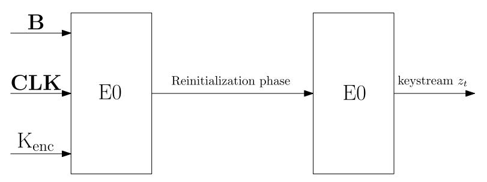
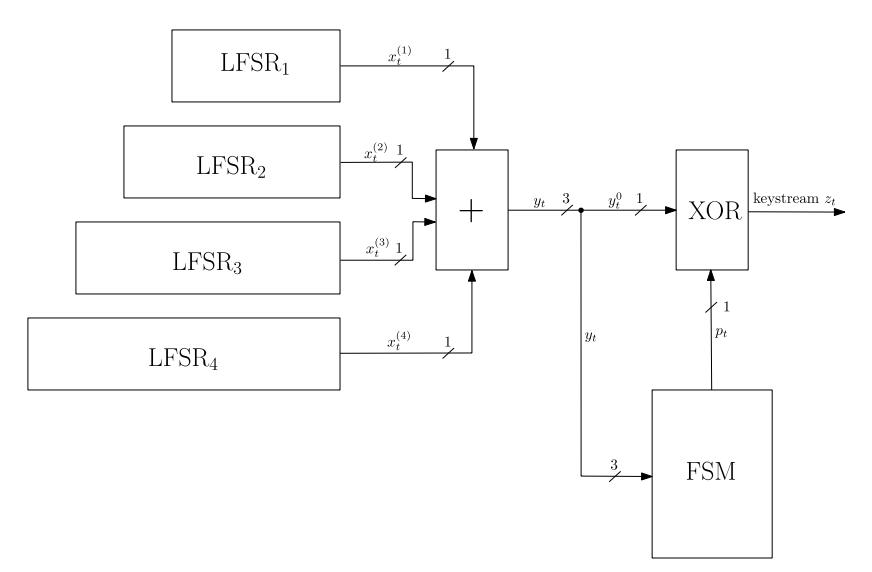
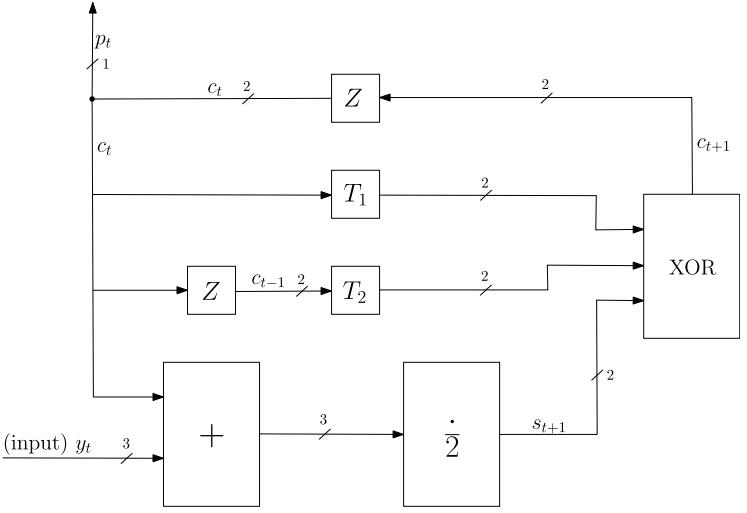
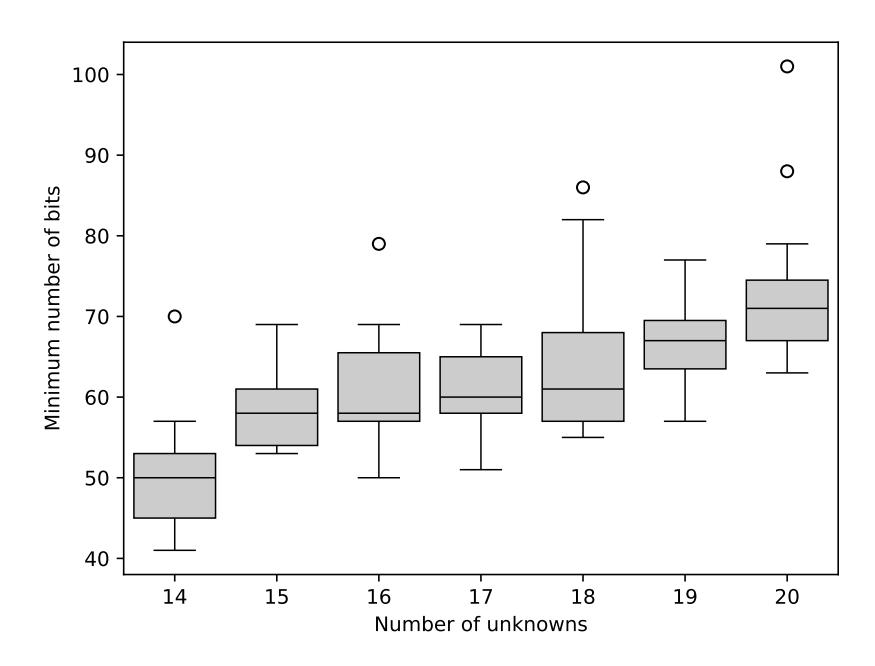
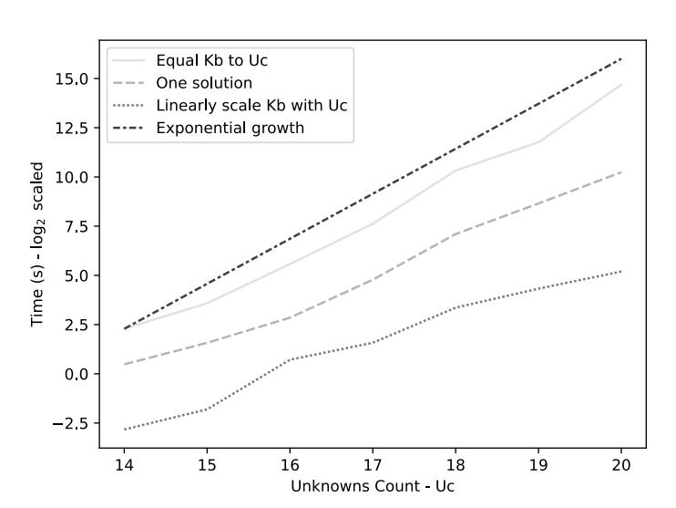
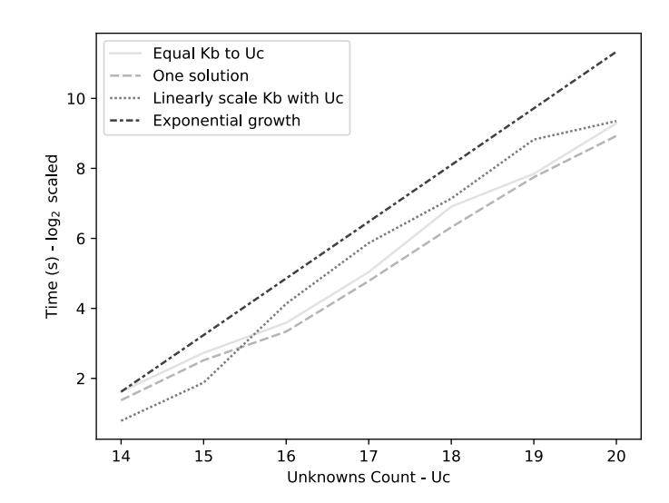

{0}------------------------------------------------

# Algebraic Cryptanalysis of Small-Scale Variants of Stream Cipher E0

Jan Dolejsˇ a and Martin Jurecek ˇ b

*Department of Information Security, Czech Technical University in Prague, Czech Republic* {*dolejj13, martin.jurecek*}*@fit.cvut.cz*

Keywords: E0, small-scale variants, stream cipher, algebraic cryptanalysis, Grobner bases, SAT ¨

Abstract: This study explores the algebraic cryptanalysis of small-scale variants of the E0 stream cipher, a legacy cipher used in the Bluetooth protocol. By systematically reducing the size of the linear feedback shift registers (LFSRs) while preserving the cipher's core structure, we investigate the relationship between the number of unknowns and the number of consecutive keystream bits required to recover the internal states of the LFSRs. Our work demonstrates an approximately linear relationship between the number of consecutive keystream bits and the size of small-scale E0 variants, as indicated by our experimental results. To this end, we utilize two approaches: the computation of Grobner bases using Magma's F4 algorithm and the application of ¨ CryptoMiniSat's SAT solver. Our experimental results show that increasing the number of keystream bits significantly improves computational efficiency, with the F4 algorithm achieving a speedup of up to 733× when additional equations are supplied. Furthermore, we verify the non-existence of equations of degree four or lower for up to seven consecutive keystream bits, and the non-existence of equations of degree three or lower for up to eight consecutive keystream bits, extending prior results on the algebraic properties of E0.

## 1 Introduction

The Bluetooth technology (Marie-Madeleine Renauld, 2023) was officially launched in 1998 to connect computers and mobile devices (Bluetooth SIG, 2023). The Bluetooth standard has changed throughout its existence (Bluetooth SIG, 2021). The first cipher used within the Bluetooth Basic Rate/Enhanced Data Rate was the stream cipher E0, which is now considered a legacy cipher1 . However, the E0 stream cipher is still relevant, as if one of the communicating devices does not support the newer Bluetooth standard, the encryption cipher used withing the protocol is downgraded to E0.

E0 is a combination generator (Anne Canteaut, 2016) and uses a non-linear combination of four linear feedback shift registers together with four memory bits. Many analyses (Yi Lu and Serge Vaudenay, 2004; Frederik Armknecht, 2002; Frederik Armknecht and Matthias Krause, 2003; Shaked and Wool, 2006; Roberto La Scala et al., 2022) of E0 were conducted together with various attack techniques, and have demonstrated that its security does not align with the size of its encryption key.

The complexity of known attacks on E0 is significantly lower than 2128; for instance, the attack by Scala et al. (Roberto La Scala et al., 2022) has a complexity of 283. This research on E0 is based on the guess-and-determine technique, and the authors use 14 special variables, which, after evaluation, led to linear relations among the variables. Then, with 83 more bits guessed, they performed an algebraic cryptanalysis, employing both Grobner basis and SAT ¨ solvers. Scala et al. estimated the complexity of the attack to 279 seconds on modern Intel processors.

Algebraic attacks on E0 using linearization were performed in the work (Frederik Armknecht, 2002). The memory bits were removed from the equations, and this work presents an estimate that the total number of distinct monomials would be approximately 2 24.056. The linearization attack would require the same number of keystream bits to solve the equations. Armknecht improved this estimate to 223.07 in his follow-up research (Frederik Armknecht and Matthias Krause, 2003), while using an improved version of Courtois algebraic attacks, called fast algebraic attacks (Nicolas T. Courtois and Willi Meier, 2003). Armknecht showed that no algebraic representation of the cipher via polynomials of degree lower than four exists for four and five consecutive

a https://orcid.org/0009-0003-4396-3026

b https://orcid.org/0000-0002-6546-8953

1The newer version of the Bluetooth standard utilizes the Advanced Encryption Standard (AES).

{1}------------------------------------------------

keystream bits by using the FindRelation algorithm (see Section 4).

A different way to attack E0 is by employing the Ordered Binary Decision Diagram (OBDD) (Shaked and Wool, 2006), together with a short keystream attack (in case of E0, only 128 bits are sufficient). Using Binary Decision Diagrams (BDDs), we can represent a boolean function as an acyclic graph, where the terminal nodes are unique for each assignment of the boolean function. The estimated time complexity is 287, and the authors of (Shaked and Wool, 2006) claim the task is massively parallelizable with low memory requirements (223).

Lu et al. (Yi Lu and Serge Vaudenay, 2004) performed a correlation attack, which assumes that E0 would be used outside of the Bluetooth environment (see Section 2). The attack uses some weak statistical properties of the Finite State Machine (FSM) used in E0, resulting in an attack of complexity 239 with 239 keystream bits required.

In this work, we propose and analyze small-scale versions of the E0 cipher. We employ two different methods, the F4 algorithm from the Magma (BOSMA et al., 1997) software and CryptoMiniSat's SAT solver (Soos et al., 2009). We analyze the relationship between the number of unknown variables and the number of keystream bits required to find a unique solution. Additionally, in Section 4, we extend previous work by verifying the non-existence of lower-degree equations for up to eight consecutive keystream bits, further analyzing the algebraic properties of E0.

This work is structured as follows. In Section 2, we describe the stream cipher E0, propose its smallscale variants, and show how to convert the cipher into a set of polynomial equations. Section 3 briefly reviews the experimental setup, analyzes the relationship between the number of keystream bits and the number of unknown variables and discusses the results. In Section 4, we investigate the existence of lower-degree equations by applying the FindRelation algorithm and verifying whether new polynomials of degree four or lower can be derived for up to 8 consecutive keystream bits. Finally, we summarize our findings and discuss potential directions for future research in Section 5.

## 2 Description of E0

E0 is a legacy stream cipher described by the Bluetooth standard (Bluetooth SIG, 2021). E0 uses a non-linear combination of four regularly clocker linear feedback shift registers (LFSRs) and four internal memory bits. The work (Anne Canteaut, 2016) provides the theoretical background of the LFSRs and refers to E0 as a combination or a summation generator.

In this section, we describe the cipher in mathematical terms, propose its small-scale variants, and represent it using polynomial equations over F2.

The E0 stream cipher can be divided into three parts:

- initialization of the four LFSRs,
- keystream generating,
- encryption/decryption.

This section focuses on the second part, which is keystream generation. We can visualize E0 using Figure 1, where the input variables are the Bluetooth device address B, the central device's clock CLK and the encryption key Kenc, which is the output of a hash function E3 described by the Bluetooth standard (Bluetooth SIG, 2021). The input variables are used to initialize the four LFSRs. After the initialization, the LFSRs are reinitialized by applying the encryption scheme described below. After the reinitialization, E0 starts producing keystream bits used for the encryption. Note that the maximum number of keystream bits generated is 2745. Then, the LF-SRs must be initialized again. In this text, we focus on recovering the configuration of the LFSRs after the reinitialization phase.

Figure 1: E0 with initialization

In this text we will denote the sum in Z by +, and the sum in F2 by ⊕.

#### 2.1 Generating the Keystream

The four LFSRs used in E0 have lengths *L*1 = 25, *L*2 = 31, *L*3 = 33, and *L*4 = 39, that is, their total length is 128. Their feedback polynomials are

$$P_1(x) = x^{25} + x^{20} + x^{12} + x^8 + 1$$

$$P_3(x) = x^{31} + x^{24} + x^{16} + x^{12} + 1$$

$$P_3(x) = x^{33} + x^{28} + x^{24} + x^4 + 1$$

$$P_4(x) = x^{39} + x^{36} + x^{28} + x^4 + 1,$$

where all *Pi*(*x*) are primitive polynomials. The output bit of the *i*-th LFSR, where *i* ∈ {1,2,3,4}, is denoted by *x* (*i*) *t* . The outputs of the LFSRs are combined using 

{2}------------------------------------------------

an FSM with  $2^4$  states. The outline of the encryption used in E0 is shown in Figure 2.

Figure 2: Outline of E0 encryption

As a first step, a 3-bit value  $y_t \in \mathbb{Z}$  is computed

$$y_t = x_t^{(1)} + x_t^{(2)} + x_t^{(3)} + x_t^{(4)}$$
. (1)

 $y_t$  is then used as an input for the FSM, and its least significant bit  $y_t^{(0)}$  is XORed with output from the FSM. The FSM uses an internal memory that consists of four bits,  $c_t = (q_t, p_t) \in \{0, 1\}^2$  and  $c_{t-1} = (q_{t-1}, p_{t-1}) \in \{0, 1\}^2$ . The memory bits are first set in the initialization part of the algorithm. Inside of the FSM, values  $y_t$  and  $c_t$  are combined as follows:

$$s_{t+1} = \left\lfloor \frac{y_t + c_t}{2} \right\rfloor,\tag{2}$$

where  $s_{t+1} \in \{0,1,2,3\}$ . Next, the update of the memory bits contains two linear bijections  $T_1$  and  $T_2$ :

$$T_1: (x_1,x_0) \mapsto (x_1,x_0),$$
  
 $T_2: (x_1,x_0) \mapsto (x_0,x_1 \oplus x_0).$ 

Finally, the update of the memory bits is:

$$c_{t+1} = (q_{t+1}, p_{t+1}) = s_{t+1} \oplus T_1(c_t) \oplus T_2(c_{t-1}).$$
 (3)

In Figure 3, Z is a lag operator

$$Zc_{t+1} = c_t, \forall t > 0. \tag{4}$$

Finally, the generated keystream is the combination of the outputs of the LFSRs and the FSM:

$$z_t = x_t^{(1)} \oplus x_t^{(2)} \oplus x_t^{(3)} \oplus x_t^{(4)} \oplus p_t = y_t^{(0)} \oplus p_t.$$
 (5)

#### 2.2 Small-Scale Variants of E0

Since solving the system of polynomial equations extracted from the original size of E0 is not feasible using our computational resources, we work with small-scale variants of E0. In this section, we propose the small-scale variants of E0 based on reducing the sizes

Figure 3: E0 Finite State Machine

of the LFSRs used within the cipher. We do not change the FSM, as it is the main source of the unique behavior of E0.

To reduce the size of the LFSRs, we focus on their feedback polynomials, which are, by the Bluetooth standard (Bluetooth SIG, 2021), required to be primitive; otherwise, the period of the output sequence of the LFSRs would not be maximal. The authors of E0 have decided to use such polynomials whose hamming weight (HW) is equal to 5. HW of a polynomial is defined as the number of non-zero coefficients of the polynomial. The choice of HW equal to 5 is reasoned by good statistical properties and better hardware design (Bluetooth SIG, 2021). However, having HW equal to 5 is impossible for lower-degree polynomials. Thus, if it is not possible to follow the requirements, we choose polynomials with HW equal to 3, and this choice is then kept the same among all of the four polynomials2.

The calculation of HW can be seen from the binary representation of a polynomial. For example, the primitive polynomial  $x^4 + x^3 + 1$  has binary representation 11001, and its HW is equal to 3. In general, every primitive polynomial includes the constant 1; thus, we can simplify the binary representation to 1100. The hexadecimal form of this polynomial is then 0xC. We represent all primitive and feedback polynomials using the hexadecimal notation.

We use the following notation for small-scale E0 variants:

$$E0(A,B,C,D), (6)$$

where A, B, C, D are primitive polynomials of LFSR1, LFSR2, LFSR3, and LFSR4 respectively. For example, in E0(0×3, 0×6, 0×C, 0×14), LFSR1 uses primitive polynomial 0×3, i.e.  $x^2+x+1$ , LFSR2 uses primitive polynomial 0×6, i.e.  $x^3+x^2+1$ , and so on. From now on, we assume that only hexadecimal representation is used when referring to the small-scale variants;

&lt;sup>2There is no primitive polynomial with HW equal to 2 or 4.

{3}------------------------------------------------

thus, using the example above, we write E0(3, 6, C, 14).

We do not change the initialization, as the experiments are carried out only after the reinitialization phase of the LFSRs. The small-scale variants of E0 that keep the ratio of the original sizes will be denoted E0\*. We calculate the respective lengths of the new LFSRs  $L'_i$ , where  $i \in \{1, 2, 3, 4\}$  as

$$L'_{i} = \begin{cases} \left\lfloor L' \frac{L_{i}}{L} \right\rfloor, & \text{if } i = 1\\ L'_{i-1} + \max\left(1, \left\lfloor \frac{L_{i} - L_{i-1}}{L} L' \right\rfloor\right), & \text{otherwise,} \end{cases}$$
(7)

where L' is the total length of the LFSRs in the small-scale version of E0, and L is the original length of the full-scale version of E0 (L=128). For example, for L'=18 we get  $L'_1=\left\lfloor 18\cdot\frac{25}{128}\right\rfloor=3$ , for  $L'_2$  we get

$$L_2' = L_1' + \max\left(1, \left| \frac{31 - 25}{128} \cdot 18 \right| \right) = 3 + 1 = 4.$$
 (8)

Similarly, for  $L'_3 = 5$  and for  $L'_4 = 6$ . Note, that Equation (7) also holds for L' = L = 128.

# 2.3 Representing E0 Encryption Using Polynomial Equations

To algebraically represent the whole encryption algorithm, we need to convert the FSM from Section 2.1. The FSM updates the memory bits, for which we need the equations. By representing the FSM with a truth table and using, for example, Sage (SageMath Developers, 2022) mathematical software, we can extract its algebraical normal form (ANF). The work (Frederik Armknecht and Matthias Krause, 2003) provides more details on the transformation of the E0 cipher to its algebraic form. Before writing down the equations for the memory bits, let us first define a symmetric polynomial.

**Definition 1** (Symmetric Polynomial). *A symmetric polynomial is defined by* 

$$\pi_{t,N}^n = \bigoplus_{1 \le i_1 < i_2 < \dots < i_n \le N} x_t^{(i_1)} x_t^{(i_2)} \cdots x_t^{(i_n)}, \qquad (9)$$

where  $x_t^{(i)} \in \mathbb{F}_2$ .

Since E0 uses N = 4, we denote  $\pi_{t,4}^n = \pi_t^n$ . Furthermore,  $x_t^i$  is the output of the *i*-th LFSR. Using Definition 1 of a symmetric polynomial, we can rewrite the Equation (5) for the keystream bit  $z_t$ :

$$z_t = \pi_t^1 \oplus p_t. \tag{10}$$

The memory bits  $q_{t+1}$  and  $p_{t+1}$  are updated with the following equations:

$$q_{t+1} = \pi_t^4 \oplus \pi_t^3 p_t \oplus \pi_t^2 q_t \oplus \pi_t^1 p_t q_t \oplus q_t \oplus p_{t-1}$$
  
$$p_{t+1} = \pi_t^2 \oplus \pi_t^1 p_t \oplus q_t \oplus q_{t-1} \oplus p_{t-1} \oplus p_t$$
(11)

This way, we get a tool for generating equations for each bit of the keystream  $z_t$ . However, the equations for  $q_{t+1}$  and  $p_{t+1}$  will grow quickly in size while increasing their degree. We can express the equations differently by following Armknecht's approach (Frederik Armknecht and Matthias Krause, 2003). The main idea behind the transformation is based on the fact that the output of the FSM and the LFSRs is linearly combined (see Equation (10)). We can eliminate the memory bits one by one and get the following equation that applies to every four subsequent keystream bits:

$$0 = z_{t+3}(z_{t+1}\pi_{t+1}^{1} \oplus \pi_{t+1}^{2} \oplus \pi_{t+1}^{1} \oplus 1) \oplus z_{t+2}(z_{t+1}\pi_{t+2}^{1} \oplus \pi_{t+1}^{1} \oplus z_{t+1}\pi_{t+1}^{1} \oplus \pi_{t+2}^{2} + \pi_{t+2}^{1} \oplus \pi_{t+2}^{1} \oplus \pi_{t+2}^{1} \oplus \pi_{t+2}^{1} \oplus \pi_{t+1}^{1} \oplus 1) \oplus z_{t+1}(z_{t}\pi_{t+1}^{1} \oplus \pi_{t+1}^{3} \oplus \pi_{t+1}^{2} \oplus \pi_{t+1}^{1} \oplus \pi_{t+1}^{2} \oplus \pi_{t+1}^{1} \oplus \pi_{t+1}^{2} \oplus \pi_{t+1}^{1} \oplus \pi_{t+1}^{1} \oplus 1) \oplus z_{t}(\pi_{t+1}^{2} \oplus \pi_{t+1}^{1} \oplus 1) \oplus \pi_{t+1}^{4} \oplus \pi_{t+2}^{2}(\pi_{t+1}^{2} \oplus \pi_{t+1}^{1} \oplus 1) \oplus \pi_{t+1}^{2}(\pi_{t+3}^{1} \oplus \pi_{t}^{1}) \oplus \pi_{t+1}^{1}(\pi_{t+3}^{1} \oplus \pi_{t}^{1}) \oplus \pi_{t+1}^{1}(\pi_{t+3}^{1} \oplus \pi_{t}^{1}) \oplus \pi_{t+1}^{1}(\pi_{t+1}^{1} \oplus 1) \oplus \pi_{t+1}^{1}(\pi_{t+1}^{1} \oplus 1) \oplus \pi_{t+1}^{1}(\pi_{t+1}^{1} \oplus 1) \oplus \pi_{t+1}^{1}(\pi_{t+1}^{1} \oplus 1) \oplus \pi_{t+1}^{1}(\pi_{t+1}^{1} \oplus 1) \oplus \pi_{t+1}^{1}(\pi_{t+1}^{1} \oplus 1) \oplus \pi_{t+1}^{1}(\pi_{t+1}^{1} \oplus 1) \oplus \pi_{t+1}^{1}(\pi_{t+1}^{1} \oplus 1) \oplus \pi_{t+1}^{1}(\pi_{t+1}^{1} \oplus 1) \oplus \pi_{t+1}^{1}(\pi_{t+1}^{1} \oplus 1) \oplus \pi_{t+1}^{1}(\pi_{t+1}^{1} \oplus 1) \oplus \pi_{t+1}^{1}(\pi_{t+1}^{1} \oplus 1) \oplus \pi_{t+1}^{1}(\pi_{t+1}^{1} \oplus 1) \oplus \pi_{t+1}^{1}(\pi_{t+1}^{1} \oplus 1) \oplus \pi_{t+1}^{1}(\pi_{t+1}^{1} \oplus 1) \oplus \pi_{t+1}^{1}(\pi_{t+1}^{1} \oplus 1) \oplus \pi_{t+1}^{1}(\pi_{t+1}^{1} \oplus 1) \oplus \pi_{t+1}^{1}(\pi_{t+1}^{1} \oplus 1) \oplus \pi_{t+1}^{1}(\pi_{t+1}^{1} \oplus 1) \oplus \pi_{t+1}^{1}(\pi_{t+1}^{1} \oplus 1) \oplus \pi_{t+1}^{1}(\pi_{t+1}^{1} \oplus 1) \oplus \pi_{t+1}^{1}(\pi_{t+1}^{1} \oplus 1) \oplus \pi_{t+1}^{1}(\pi_{t+1}^{1} \oplus 1) \oplus \pi_{t+1}^{1}(\pi_{t+1}^{1} \oplus 1) \oplus \pi_{t+1}^{1}(\pi_{t+1}^{1} \oplus 1) \oplus \pi_{t+1}^{1}(\pi_{t+1}^{1} \oplus 1) \oplus \pi_{t+1}^{1}(\pi_{t+1}^{1} \oplus 1) \oplus \pi_{t+1}^{1}(\pi_{t+1}^{1} \oplus 1) \oplus \pi_{t+1}^{1}(\pi_{t+1}^{1} \oplus 1) \oplus \pi_{t+1}^{1}(\pi_{t+1}^{1} \oplus 1) \oplus \pi_{t+1}^{1}(\pi_{t+1}^{1} \oplus 1) \oplus \pi_{t+1}^{1}(\pi_{t+1}^{1} \oplus 1) \oplus \pi_{t+1}^{1}(\pi_{t+1}^{1} \oplus 1) \oplus \pi_{t+1}^{1}(\pi_{t+1}^{1} \oplus 1) \oplus \pi_{t+1}^{1}(\pi_{t+1}^{1} \oplus 1) \oplus \pi_{t+1}^{1}(\pi_{t+1}^{1} \oplus 1) \oplus \pi_{t+1}^{1}(\pi_{t+1}^{1} \oplus 1) \oplus \pi_{t+1}^{1}(\pi_{t+1}^{1} \oplus 1) \oplus \pi_{t+1}^{1}(\pi_{t+1}^{1} \oplus 1) \oplus \pi_{t+1}^{1}(\pi_{t+1}^{1} \oplus 1) \oplus \pi_{t+1}^{1}(\pi_{t+1}^{1} \oplus 1) \oplus \pi_{t+1}^{1}(\pi_{t+1}^{1} \oplus 1) \oplus \pi_{t+1}^{1}(\pi_{t+1}^{1} \oplus 1) \oplus \pi_{t+1}^{1}(\pi_{t+1}^{1} \oplus 1) \oplus \pi_{t+1}^{1}(\pi_{t+1}^{1} \oplus 1) \oplus \pi_{t+1}^{1}(\pi_{t+1}^{1} \oplus 1) \oplus \pi_{t+1}^{1}(\pi_{t+1}^{1} \oplus 1) \oplus \pi_{t+1}^{$$

Note, that the Equation (12) has degree four, specifically given by  $\pi_{t+1}^2 \pi_{t+2}^2$  and  $\pi_{t+1}^4$ . Based on Armknecht's results, we know that this is the lowest degree for four and five subsequent keystream bits.

#### 3 Experiments

In this section, we describe our experimental approach to attacking small-scale variants of E0. We assume the knowledge of both the plaintext and the ciphertext, thus allowing us to work with the keystream only. The experiments were run on a single computer platform with two processors (Intel Xeon Gold 6136 CPU @ 3.00 GHz), with 755 GiB of DDR4 RAM running the Ubuntu 20.04.5 LTS operating system. We utilized Sage v9.0 & v10.1 (SageMath Developers, 2022) to generate random keystreams, create equations for the small-scale E0 variants, and analyze their properties, while Magma 2.25-5 (BOSMA et al., 1997) was used to solve the resulting polynomial system using the F4 algorithm.

In each experiment, we use different versions of the small-scale variants of E0 (see Section 2.2). For each small-scale variant, we generate 15 different keystreams. The keystreams are generated with randomly initialized LFSRs after the reinitialization phase following the E0 algorithm (see Section 2.1).

{4}------------------------------------------------

All of the LFSRs are initialized with a non-zero initial state.

We compare two approaches, the computation of Grobner basis using Magma's (BOSMA et al., 1997) ¨ implementation of the F4 algorithm and CryptoMiniSat's SAT solver (Soos et al., 2009). The theory of Grobner basis was described by (David A. Cox ¨ et al., 2015; Roberto La Scala et al., 2022). The work (Beruskov ˇ a et al., 2024) contains a basic theory based ´ on which we can convert a given cipher into a system of polynomial equations and calculate the Groebner basis from it, which always exists and is finite. The input of the F4 algorithm and the SAT solver is a polynomial system of equations over F2. In this work, the number of equations equals the number of keystream bits. The output of the F4 algorithm is a new polynomial system, which is significantly easier to solve than the original one. To find the solution to the system, we search for the variety of the ideal described by the new polynomial system, or in this case, the Grobner ¨ basis. The output of the SAT solver is the evaluation of possible configurations of the input unknowns.

CryptoMiniSat allows parallelizing the computation, but since Magma 2.25-5 runs on a single thread only, we use one thread for the SAT solver, too. In both cases, we search for all possible solutions; thus, the output of both methods is the same. Note that the computational times of the SAT solver include the conversion to the conjunctive normal form (CNF). We use the reverse-graded lex ordering (grevlex) for the F4 algorithm.

We use Armknecht's formulation of the E0 cipher (see Section 2.3), and for each keystream, we substitute the keystream bits into the equations. In Table 1, we use the same number of equations as the number of unknowns. For the full-scale version of E0, we would use 128 equations (and thus the keystream bits). In the table, we show the average computational times and average memory consumption with the standard deviation. The computational times of both algorithms increase exponentially. The SAT solver outperformed the F4 algorithm for all small-scale variants, and its computational time increase is stable. The computational time of the F4 algorithm is connected to the increasing use of the memory, which, for the smallscale variant with 20 unknowns, is 224.3 GiB.

The Bluetooth standard (Bluetooth SIG, 2021) sets the maximum number of keystream bits for the full-scale version of the E0 cipher to 2745. It is unclear how this number would scale for small-scale cipher variants.

Ars gives an estimate on the minimum number of bits required to solve the system, 2*n* − 2 (Frederik Armknecht and Gwenole Ars, 2009). ´

If the keystream bits were generated using a linear combination of the LFSRs, we would require at most *n* keystream bits, where *n* is the number of unknowns. In this case, we assume that the primitive polynomials used for the LFSRs are known. Without the knowledge of the polynomials, the number of the keystream bits required to find the initial configuration and the polynomials is 2*n* and can be found using the Berlekamp–Massey algorithm (Anne Canteaut, 2016).

Table 2 shows the minimum number of consecutive keystream bits given by the small-scale E0 variants required to find a unique solution to the polynomial system. On average, the number of consecutive keystream bits required to uniquely determine the internal state does not surpass 4*n*, where *n* is the number of unknowns. By increasing the number of keystream bits, we improved the computational times of both methods. Figure 4 and Table 2 suggest a linear relationship between the number of consecutive keystream bits and the number of unknowns.

Figure 4: Minimum number of bits required to find one solution

In Table 3 we focus on the small-scale version of E0 with 20 unknowns – E0(6, C, 30, 60). We increased the number of keystream bits by multiples of 10 up to 100 keystream bits. The improvement of the computational times of the F4 algorithm stops after 60 bits but still uses less memory if more keystream bits are supplied. The computational times of the SAT solver increase after adding more than 40 keystream bits. CryptoMiniSat does not, by default, do any preprocessing of the equations3 . Table 4 displays the degrees of the polynomials in the resulting Grobner ¨

3One can specify that Gauss-Jordan Elimination (Mate Soot, 2024) should be employed during the compilation. We did not test the performance of this option.

{5}------------------------------------------------

Table 1: Initial experiments with keystream bits equal to the number of unknowns

|                       |            |                      | F4                  |           |            |  |
|-----------------------|------------|----------------------|---------------------|-----------|------------|--|
| E0 type               | Kba Ucb | G. Basis Time (s) | Variety Time (s) | Mem (GiB) | Time (s)   |  |
| E0∗ (3, 6, c, 14)  | 14         | 4.9±0.1              | 2.1±0.1             | 0.3±0.0   | 3.1±0.1    |  |
| E0(3, 6, c, 30)       | 15         | 12.0±0.1             | 6.2±0.6             | 0.5±0.0   | 6.6±0.2    |  |
| E0(3, 6, c, 60)       | 16         | 47.7±1.1             | 27.5±8.5            | 2.1±0.0   | 12.0±0.2   |  |
| E0(3, 6, 12, 60)      | 17         | 196.6±2.6            | 79.5±50.4           | 8.1±0.3   | 32.9±0.5   |  |
| E0∗ (6, c, 14, 30) | 18         | 1283.9±29.2          | 253.6±162.0         | 28.1±1.3  | 120.1±2.1  |  |
| E0(6, c, 14, 60)      | 19         | 3465.5±49.3          | 494.3±41.9          | 53.7±2.3  | 230.0±5.2  |  |
| E0(6, c, 30, 60)      | 20         | 26400.3±324.9        | 2077.6±756.1        | 224.3±2.5 | 624.7±28.3 |  |

a Keystream bits

Table 2: Determining the minimum number of consecutive keystream bits to find one solution

|                       |     |                   | F4                   |           |            |
|-----------------------|-----|-------------------|----------------------|-----------|------------|
| E0 type               | Uca | Keystream bits | G. Basis Time (s) | Mem (GiB) | Time (s)   |
| E0∗ (3, 6, c, 14)  | 14  | 50.5±6.9          | 1.4±0.3              | 0.1±0.0   | 2.6±0.4    |
| E0(3, 6, c, 30)       | 15  | 58.7±5.2          | 3.0±0.3              | 0.2±0.0   | 5.7±0.4    |
| E0(3, 6, c, 60)       | 16  | 60.5±7.7          | 7.2±1.9              | 0.5±0.1   | 10.1±0.8   |
| E0(3, 6, 12, 60)      | 17  | 60.9±4.7          | 27.5±8.5             | 2.5±0.9   | 27.5±1.4   |
| E0∗ (6, c, 14, 30) | 18  | 65.2±10.1         | 137.2±45.1           | 6.8±2.3   | 79.9±14.0  |
| E0(6, c, 14, 60)      | 19  | 67.1±5.5          | 402.4±35.5           | 15.1±4.6  | 215.1±31.1 |
| E0(6, c, 30, 60)      | 20  | 73.5±9.4          | 1208.2±108.1         | 33.9±7.8  | 487.2±97.1 |

a Unknowns count

Table 3: Increasing the number of keystream bits for E0(6, C, 30, 60)

|                  |     |                      | F4                  |           |            |  |  |
|------------------|-----|----------------------|---------------------|-----------|------------|--|--|
| E0 type          | Kba | G. Basis Time (s) | Variety Time (s) | Mem (GiB) | Time (s)   |  |  |
| E0(6, c, 30, 60) | 20  | 26400.3±324.9        | 2077.6±756.1        | 224.3±2.5 | 624.7±28.3 |  |  |
| E0(6, c, 30, 60) | 30  | 13503.2±460.1        | 406.3±1337.9        | 138.3±0.1 | 522.2±22.2 |  |  |
| E0(6, c, 30, 60) | 40  | 6757.9±206.5         | 2.8±3.2             | 87.2±0.0  | 508.5±18.1 |  |  |
| E0(6, c, 30, 60) | 50  | 6499.1±205.1         | 0.1±0.1             | 100.0±0.0 | 549.9±24.4 |  |  |
| E0(6, c, 30, 60) | 60  | 1376.7±7.8           | 0.0±0.0             | 43.1±0.0  | 627.3±59.4 |  |  |
| E0(6, c, 30, 60) | 70  | 1285.2±16.1          | 0.0±0.0             | 38.8±0.0  | 566.1±32.0 |  |  |
| E0(6, c, 30, 60) | 80  | 1041.6±6.6           | 0.0±0.0             | 26.8±0.0  | 623.7±55.2 |  |  |
| E0(6, c, 30, 60) | 90  | 1225.7±33.5          | 0.0±0.0             | 37.4±0.0  | 697.5±79.3 |  |  |
| E0(6, c, 30, 60) | 100 | 1078.9±36.2          | 0.0±0.0             | 15.4±0.0  | 729.7±90.9 |  |  |

a Keystream bits

b Unknowns count

{6}------------------------------------------------

Table 4: Degrees of polynomials in the resulting Gröbner bases for E0(6, c, 30, 60)

| Kb a | deg 1   | deg 2  | deg 3   | deg 4  | deg 5  | deg 6  | number of solutions |
|-----------------|---------|--------|---------|--------|--------|--------|---------------------|
| 20              | _       | _      | -       | 0.13%  | 31.79% | 68.08% | $16374.2 \pm 505.4$ |
| 30              | -       | -      | -       | 99.94% | 0.06%  | -      | $2200.1 \pm 473.0$  |
| 40              | -       | -      | 100.00% | -      | -      | -      | $256.9 \pm 21.1$    |
| 50              | 0.04%   | 99.63% | 0.33%   | -      | -      | -      | $30.5 \pm 5.2$      |
| 60              | 70.97%  | 29.03% | -       | -      | -      | _      | $4.9 \pm 1.5$       |
| 70              | 99.66%  | 0.34%  | -       | -      | -      | -      | $1.7 \pm 0.6$       |
| 80              | 100.00% | -      | _       | -      | -      | _      | $1.1 \pm 0.3$       |
| 90              | 100.00% | -      | _       | _      | -      | _      | $1.1 \pm 0.2$       |
| 100             | 100.00% | _      | -       | -      | -      | -      | $1.1\pm0.2$         |

&lt;sup>a Keystream bits

basis. The percentage of the degrees is calculated across all polynomials of all of the Gröbner bases with the given number of keystream bits. The last column shows the average number of found solutions. Note that for 20 unknowns, there are  $2^{20}$  possible initial configurations of the LFSRs.

We will assume that the number of keystream bits required to find one unique solution is linearly dependent on the number of unknowns. We set the maximum number of keystream bits generated by the small-scale variants to  $\left[\operatorname{Uc} \cdot \frac{2745}{128}\right]$ , where Uc is the number of unknowns. Table 5 shows that the F4 algorithm efficiently utilized the new equations and significantly reduced the computational times. For E0(6, C, 30, 60) with 20 unknowns, the computation required around 7 hours on average when only 20 keystream bits were used (see Table 1). With 428 keystream bits, the F4 algorithm requires around 36 seconds on average (approximately 733x faster). We added three more small-scale versions of E0 to see whether using more keystream bits would resolve in lower computational times for different small-scale E0 variants with more unknowns. Although the versions with 21 and 22 unknowns benefit from the additional keystream bits, the version with 23 unknowns has a more significant increase when compared to the versions with fewer unknowns. The SAT solver's time increased compared to the results in Table 1, which may be related to the missing preprocessing we discussed earlier in this section.

Figure 5 compares the computational times of the F4 algorithm and the SAT solver based on the number of keystream bits. We illustrate exponential growth by setting an upper bound based on the maximum computational time observed for 14 unknowns. This bound serves as a reference to compare the growth observed in the different solution approaches. As we have already indicated, the F4 algorithm can use more keystream bits (hence equations) to speed up the com-

(a) Gröbner basis – F4 algorithm

(b) CryptoMiniSat's SAT solver Figure 5: Comparison of computational times required based on the number of keystream bits (Kb)

putation. On the other hand, the SAT solver does not seem to benefit from the larger portion of the data without any preprocessing.

{7}------------------------------------------------

F4 SAT G. Basis Kbb E0 type Uca Time (s) Mem (MiB) Time (s)  $E0^*(3, 6, c, 14)$ 14 300  $0.1 \pm 0.0$  $32.1 \pm 0.0$  $1.7 \pm 0.2$ **E0**(3, 6, c, 30)  $0.3 \pm 0.0$  $3.7 \pm 1.2$ 15 321  $64.1 \pm 0.0$ **E0**(3, 6, c, 60)  $1.6 \pm 0.0$ 16 343  $64.1 \pm 0.0$  $17.5 \pm 1.6$ **E0**(3, 6, 12, 60) 17 364  $3.0 \pm 0.0$  $192.2 \pm 0.0$  $58.3 \pm 4.4$  $E0^*(6, c, 14, 30)$ 18 386  $10.3 \pm 0.1$  $1257.3 \pm 0.0$  $140.9 \pm 14.3$ E0(6, c, 14, 60) 19 407  $20.0 \pm 0.2$  $2091.3 \pm 0.0$  $453.1 \pm 30.8$ E0(6, c, 30, 60) 20 428  $36.7 \pm 0.3$  $4302.8 \pm 0.0$  $653.8 \pm 71.8$  $79.8 \pm 0.3$ E0(6, 14, 30, 60) 21 450  $7539.4 \pm 0.0$  $1334.8 \pm 110.7$  $E0^*(c, 14, 30, 60)$ 22 471  $178.5 \pm 1.2$  $9462.8 \pm 0.0$  $3678.7 \pm 281.5$ 

 $1320.6 \pm 73.2$ 

Table 5: Using a linear relationship between the number of keystream bits and the number of unknowns

23

493

# 4 Reviewing The Existence Of Lower Degree Equations

In (Frederik Armknecht and Matthias Krause, 2003), the authors demonstrated that no equations of degree 4 or lower exist for E0 up to 5 consecutive keystream bits. This work introduced the FindRelation algorithm, which was used to derive these results. In this section, we apply this algorithm to extend these results and discuss the specific properties of E0 in regards to using the algorithm.

Before outlining the algorithm, we introduce two terms, the Critical and Non-Critical set (Frederik Armknecht and Matthias Krause, 2003).

**Definition 2.** Let  $z \in \{0,1\}^r$  be a sequence of  $r \ge 1$  keystream bits, and let  $x = (x_1, x_2, ..., x_r)$  be the set of all possible internal state sequences. The system processes x with an additional memory state c using a transformation function f(x,c), which produces z. We define Crit(z) and NCrit(z), for which the following holds:

$$Crit(z) = \{x \mid \forall c \in \{0,1\}^l, f(x,c) \neq z\},$$
 (13)

and

$$NCrit(z) = \{x \mid \exists c \in \{0, 1\}^l, f(x, c) = z\}, \quad (14)$$

where l is the number of memory bits.

In other words, the set Crit(z) contains sequences x such that it is impossible to generate keystream bit sequence z given any state c. Note that l=4 for E0, and we can derive at least one equation of degree 4 for  $r \ge 4$  (Frederik Armknecht and Matthias Krause, 2003).

We define matrix  $\mathcal{M}$  as the matrix that contains all monomial combinations of  $x \in \mathrm{NCrit}(z)$  up to degree d. By monomial combinations of x, we refer to all possible products of elements from the vector x up to a given degree, where each element of x represents an individual variable in the polynomial system. The algorithm FindRelation (Frederik Armknecht and Matthias Krause, 2003) consists of two steps:

 $7257.0 \pm 1022.4$ 

• Compute Crit(z) and NCrit(z).

 $12012.4 \pm 0.0$ 

• If  $Crit(z) \neq \emptyset$ , then find nullspace of  $\mathcal{M}$ .

Using this algorithm, we can derive whether or not equations of a given degree d exist for r consecutive keystream bits. Using this algorithm we verified the non-existence of new equations of degree d=3, resp. d=4 for up to r=8, resp. r=7 keystream bits. Note that each sequence of keystream bits requires its own matrix  $\mathcal{M}$ .

To better show the computational limitations, we compute the maximum amount of memory required for matrix  $\mathcal{M}$  for E0, which holds for  $r \geq 4$ . Since we are working over  $\mathbb{F}_2$ , we can also assume that the resulting value is in bits. The number of all monomial combinations in  $\mathcal{M}$  is  $\sum_{i=0}^{d} \binom{4r}{i}$ . Based on our experiments, we have empirically determined the maximum size of NCrit(z) to be  $2^{3r+4}$ . Thus, the maximum size of  $\mathcal{M}$  is

$$\sum_{i=0}^{d} {4r \choose i} |\operatorname{NCrit}(z)| \le \sum_{i=0}^{d} {4r \choose i} 2^{3r+4}$$
 (15)

bits. The estimates are shown in Table 6. As  $\mathcal{M}$  requires approximately 1.26 TiB of memory for d=4 and r=8, we were not able to run the FindRelation algorithm due to the memory limitation of the server (755 GiB).

E0(6, 14, 30, 110)

a Unknowns count

&lt;sup>b Keystream bits

{8}------------------------------------------------

Table 6: Memory estimates for the FindRelation algorithm

The required memory (RAM) for matrix *M* is determined by Equation 15. We calculated the real size of |NCrit(*z*)| comparing it to its empirically determined maximum size (ratio = real size/maximum size).

|   |            | M – required memory |             | 4r d   ∑ i=0 i |         |       |        |
|---|------------|---------------------|-------------|----------------------------------|---------|-------|--------|
| r | d = 3      | d = 4               | 23r+4       | real size                        | ratio   | d = 3 | d = 4  |
| 4 | 5.44 MiB   | 19.66 MiB           | 65 536      | 53 248                           | 81.25 % | 697   | 2 517  |
| 5 | 84.43 MiB  | 387.25 MiB          | 524 288     | 487 424                          | 92.96 % | 1 351 | 6 196  |
| 6 | 1.13 GiB   | 6.32 GiB            | 4 194 304   | 4 083 712                        | 97.36 % | 2 325 | 12 951 |
| 7 | 14.38 GiB  | 94.36 GiB           | 33 554 432  | 33 230 848                       | 99.03 % | 3 683 | 24 158 |
| 8 | 171.53 GiB | 1.26 TiB            | 268 435 456 | 267 440 128                      | 99.62 % | 5 489 | 41 449 |

By comparing the number of states and the number of monomial combinations in Table 6, it is less likely for the FindRelation algorithm to find new equations since the system of equations becomes increasingly underdetermined. This, however, does not prove that it is not possible to find new equations. Armknecht (Armknecht, 2004) pointed out it is possible to obtain an equation of degree *d* = 3. However, such system requires approximately 223.44 consecutive keystream bits, being not practically usable in the case of E0, as the number of keystream bits is limited to 2745 between initializations.

### 5 Conclusion

In this study, we conducted an algebraic cryptanalysis of small-scale variants of the E0 stream cipher, focusing on the relationship between the number of unknown variables and the number of keystream bits required to uniquely determine the cipher's internal state. Using two computational approaches — the F4 algorithm from Magma and the CryptoMiniSat SAT solver — we demonstrated that increasing the number of keystream bits significantly improves computational efficiency. The F4 algorithm, in particular, achieved up to a 733× speedup when more equations were available, highlighting the impact of additional keystream bits on solving time.

We also explored the algebraic structure of E0 by verifying the existence of lower-degree equations. Our results confirm that no equations of degree four or lower exist for up to seven consecutive keystream bits, and that no equations of degree three or lower exist for up to eight consecutive keystream bits, reinforcing previous findings on E0's algebraic resistance. However, due to memory limitations, further verification for longer keystream sequences was not feasible, suggesting that future work could explore alternative computational techniques or optimizations to extend these results.

While our analysis focused on small-scale variants of E0, the observed linear relationship between the number of unknowns and the required keystream bits suggests potential implications for the full-scale version of the cipher. Future research should investigate whether these findings hold for larger instances of E0 and assess the effectiveness of additional algebraic attack strategies, including preprocessing techniques to optimize, for example, SAT solver's performance.

## ACKNOWLEDGEMENTS

This work was supported by the Grant Agency of the Czech Technical University in Prague, grant No. SGS23/211/OHK3/3T/18 funded by the MEYS of the Czech Republic.

## REFERENCES

Anne Canteaut (2016). LFSR-based Stream Ciphers.

Armknecht, F. (2004). Algebraic attacks on stream ciphers. In Neittaanmaki, P., editor, ¨ *Proceedings / EC-COMAS 2004, 4th European Congress on Computational Methods in Applied Sciences and Engineering : Jyvaskyl ¨ a, Finland, 24 - 28 July 2004 ¨* , Jyvaskyl ¨ a.¨ Univ. of Jyvaskyl ¨ a. CD-ROM. - Vol. 1: Plenary ses- ¨ sions, invited parallel sessions, contributed sessions and posters. - Vol. 2: Minisymposia and special technology sessions.

Beruskov ˇ a, J., Jure ´ cek, M., and Jure ˇ ckov ˇ a, O. (2024). Re- ´ ducing overdefined systems of polynomial equations derived from small scale variants of the aes via data mining methods. *Journal of Computer Virology and Hacking Techniques*, 20(4):885–900.

Bluetooth SIG (2021). Bluetooth Core Specification.

Bluetooth SIG (2023). Origin of the Bluetooth name.

BOSMA, W., CANNON, J., and PLAYOUST, C. (1997). The magma algebra system i: The user language. *Journal of Symbolic Computation*, 24(3):235–265.

{9}------------------------------------------------

- David A. Cox, John Little, and Donal O'Shea (2015). *Ideals, Varieties, and Algorithms*. Number 666 in Undergraduate Texts in Mathematics. Springer.
- Frederik Armknecht (2002). A Linearization Attack on the Bluetooth Key Stream Generator.
- Frederik Armknecht and Gwenole Ars (2009). ´ *Algebraic Attacks on Stream Ciphers with Grobner Bases ¨* . Springer, Berlin.
- Frederik Armknecht and Matthias Krause (2003). Algebraic Attacks on Combiners with Memory. In *Advances in Cryptology - CRYPTO 2003*, pages 162– 175. SPRINGER.
- Marie-Madeleine Renauld (2023). The Collector.
- Mate Soot (2024). CryptoMiniSat FAQ.
- Nicolas T. Courtois and Willi Meier (2003). Algebraic Attacks on Stream Ciphers with Linear Feedback. *Springer*.
- Roberto La Scala, Sergio Polese, Sharwan K. Tiwari, and Andrea Viscnoti (2022). An algebraic attack to the Bluetooth stream cipher E0.
- SageMath Developers (2022). sagemath/sage: 9.7.
- Shaked, Y. and Wool, A. (2006). Cryptanalysis of the bluetooth e0 cipher using OBDD's. Cryptology ePrint Archive, Paper 2006/072.
- Soos, M., Nohl, K., and Castelluccia, C. (2009). Extending sat solvers to cryptographic problems. In Kullmann, O., editor, *Theory and Applications of Satisfiability Testing - SAT 2009*, pages 244–257, Berlin, Heidelberg. Springer Berlin Heidelberg.
- Yi Lu and Serge Vaudenay (2004). Faster Correlation Attack on Bluetooth Keystream Generator E0. In *CRYPTO 2004*, Berlin. Springer.