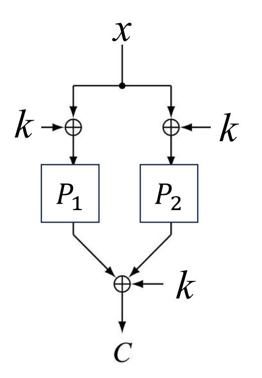

{0}------------------------------------------------

# Quantum Attacks on Sum of Even-Mansour Construction Utilizing Online Classical Queries

ZhenQiang Li1 , ShuQin Fan1? , Fei Gao2 , YongLin Hao1 , HongWei Sun3 , XiChao Hu1 , DanDan Li4

- 1 State Key Laboratory of Cryptology, Beijing 100878, China fansq@sklc.org
- 2 State Key Laboratory of Networking and Switching Technology, Beijing University of Posts and Telecommunications, Beijing 100876, China
  - 3 School of Computer and Big Data (School of Cybersecurity), Heilongjiang University, Harbin 150080, China
- 4 School of Computer Science (National Pilot Software Engineering School), Beijing University of Posts and Telecommunications, Beijing 100876, China

Abstract. The Sum of Even-Mansour (SoEM) construction, proposed by Chen et al. at Crypto 2019, has become the basis for designing some symmetric schemes, such as the nonce-based MAC scheme nEHtMp and the nonce-based encryption scheme CENCPP∗ . In this paper, we make the first attempt to study the quantum security of SoEM under the Q1 model where the targeted encryption oracle can only respond to classical queries rather than quantum ones. Firstly, we propose a quantum key recovery attack on SoEM21 with a time complexity of O˜(2n/3 ) along with O(2n/3 ) online classical queries. Compared with the current best classical result which requires O(22n/3 ), our method offers a quadratic time speedup while maintaining the same number of queries. The time complexity of our attack is less than that observed for quantum exhaustive search by a factor of 2n/6 . We further propose classical and quantum key recovery attacks on the generalized SoEMs1 construction (consisting of s ≥ 2 independent public permutations), revealing that the application of quantum algorithms can provide a quadratic acceleration over the pure classical methods. Our results also imply that the quantum security of SoEM21 cannot be strengthened merely by increasing the number of permutations.

Keywords: Offline Simon's algorithm · SoEM construction · query complexity · birthday-bound.

## 1 Introduction

With the rapid development of quantum computation, well designed quantum algorithms have shown significant speed-up over classical ones in handling certain problems, such as linear systems [\[12,](#page-14-0)[29,](#page-15-0)[19\]](#page-15-1), dimensionality reduction [\[21,](#page-15-2)[23,](#page-15-3)[30\]](#page-15-4), and so on [\[27,](#page-15-5)[31,](#page-15-6)[18](#page-15-7)[,20\]](#page-15-8). Some quantum algorithms have become serious threats to 

{1}------------------------------------------------

the security of classical cryptographic schemes. In the field of asymmetric cryptography, Shor's algorithm [\[25\]](#page-15-9) can solve factorization and discrete logarithms in polynomial time, which will completely break the currently used public-key systems, such as RSA and ECC. For symmetric cryptography, Grover's algorithm [\[11\]](#page-14-1) offers a quadratic speedup on an exhaustive search attack. Using Simon's algorithm [\[26\]](#page-15-10), many symmetric ciphers, such as the 3-round Feistel construction [\[15\]](#page-14-2), Even-Mansour construction [\[16\]](#page-14-3), CBC-MAC [\[13\]](#page-14-4), PMACX [\[28\]](#page-15-11), PMAC with parity [\[28\]](#page-15-11), can be broken in polynomial time if the adversary is allowed to make quantum queries to the encryption oracle. In these attacks, the target issue (distinguishing or key recovery) is reduced to the period-finding problem, which can be solved efficiently using Simon's algorithm.

Based on the capabilities of the adversary, Zhangdry et al. [\[32\]](#page-15-12) grouped quantum attacks into two models named as Q1 and Q2. In the Q1 model, the adversary can employ quantum computers for any offline computation, but only online classical queries are allowed. In the Q2 model, the adversary can not only do quantum computations offline but make online superposition queries as well. Quantum cryptanalysis results of the Q2 model often enjoy lower complexities, but the ability to make superposition queries is impractical. On the contrary, quantum attacks for the Q1 model are usually considered as more practical: once a large-scale fault-tolerant quantum computer becomes available, the Q1 attacks can pose real threats to the primitives immediately.

The quantum algorithms available for constructing attacks in the Q1 model are limited. The quantum exhaustive search with Grover's algorithm is the most used algorithm. Some quantum collision finding algorithms or clawing finding algorithms [\[7](#page-14-5)[,34\]](#page-15-13) can also be applied to perform the attack on symmetric ciphers in the Q1 model with O(2n/3 ) complexity. However, they often have massive quantum hardware requirements (e.g., exponential qubits and classical memory). To address these limitations, inspired by Grover-meets-Simon algorithm in the Q2 model [\[17\]](#page-14-6), Bonnetain et al. [\[3\]](#page-14-7) proposed offline Simon's algorithm to perform Q1 attack on FX construction with O˜(2(n+k)/3 ) time, O(n) qubits and classical memory, instead of O(22(n+k)/3 ) time and O(2(n+k)/3 ) classical memory from a classical attack (n + k is the length of key). However, the practical application of the offline Simon's algorithm also faces some non-trivial challenges. On the one hand, when it comes to reducing the number of classical queries, the input is required to be of the form (xkc) (c is a fixed constant). On the other hand, a conditional periodic function, which is a periodic function with part of the secret keys as the period when the guess of another key value is correct, needs to be constructed. Thus, while the offline Simon's algorithm is a powerful tool, it is only applied to conduct Q1 attacks on the Even-Mansour construction [\[3\]](#page-14-7), the 4-round iterated Even-Mansour construction with two keys [\[1\]](#page-13-0), the 2-round iterated Even-Mansour construction [\[8\]](#page-14-8), and the 2XOR-Cascade construction [\[5\]](#page-14-9). Whether the offline Simon's algorithm can be extended for attacking other symmetric ciphers is an open question that deserves attention.

Related Works and Motivations. In 2019, Chen et al. [\[9\]](#page-14-10) introduced the Sum of Even-Mansour (SoEM) construction, which is built by the XOR of two 

{2}------------------------------------------------

instances of the Even-Mansour cipher [\[10\]](#page-14-11). SoEM21 is a specific SoEM variant consisting of two n-bit permutations controlled by one n-bit key. For the classical setting, Chen et al. [\[9\]](#page-14-10) proved that the SoEM21 cipher can ensure its security when the number of queries is bounded as O(2n/2 ). In 2022, Shinagawa and Iwata [\[24\]](#page-15-14) presented the SoEMs1 cipher, a natural extension of SoEM21 cipher, and demonstrated that a Q2 adversary can recover the key of the SoEM21 and SoEMs1 ciphers in polynomial time by using Simon's algorithm. Such a keyrecovery method was later employed by Zhang [\[33\]](#page-15-15) and applied to attacks under the related key settings. It is noticeable that the existing quantum key recovery attacks on SoEM21 and SoEMs1 [\[24](#page-15-14)[,33\]](#page-15-15) rely on Simon's algorithm and can only be applicable for the Q2 model. There is a lack of knowledge whether a Q1 adversary can carry out quantum key recovery attacks on SoEM21 and SoEMs1.

Contributions. In this paper, we study the quantum security of SoEM construction in the Q1 model for the first time. We successfully construct a conditional periodic function by exploiting the construction of SoEM21, and then apply the offline Simon's algorithm to this constructed function to recover the key. For the n-bit key, our Q1 key recovery attack requires a time complexity of O(n 32 n/3 ) along with O(2n/3 ) classical queries. Compared with the best classical attack which requires O(22n/3 ) time in [\[9\]](#page-14-10), our attack offers a quadratic speedup, with the same query complexity. Compared with the quantum exhaustive key search with Grover's algorithm, our attack reduces the time complexity by a factor of 2n/6 . Besides, our attack requires O(n 2 ) qubits and O(n) classical memory, while the classical attack requires O(2n/3 ) classical memory. For the generalized SoEMs1, we give key recovery attacks for both classical and Q1 settings. The Q1 attack on SoEMs1 employs the idea of that on SoEM21 and provides a quadratic time speedup over the classical attack.

Outline. The remainder of this paper is structured as follows. In Section [2,](#page-2-0) we briefly review some preliminaries. Section [3](#page-7-0) is dedicated to deducing the key recovery attacks on SoEM21 ciphers in the Q1 model. In Section [4,](#page-11-0) we propose the classical attack on SoEMs1 ciphers, and give a quantum key recovery attack in the Q1 model. Finally, in Section [5,](#page-13-1) a concise conclusion is drawn and discussed.

## 2 Preliminaries

## 2.1 Notation

Let {0, 1} n denote the set of all n-bit strings, where n is a positive integer. Let P erm(n) represent the set of all permutations on {0, 1} n. Meanwhile, let F unc(n) stand for the set of all functions from {0, 1} n to {0, 1} n. Let |X| be the number of elements contained in set X. For two bit strings a and b, akb indicates their concatenation. If a and b have the same dimension, then their bit-wise XOR is denoted as a ⊕ b and their inner product is marked as a · b.

{3}------------------------------------------------

#### 2.2 Basics of Quantum Computation

Since this paper applies quantum algorithms as black boxes to analyze the symmetric cryptosystems, we introduce some necessary notations about quantum computation. For a more extensive presentation, please refer to [22].

As the fundamental building block in quantum computation, a single qubit can be regarded as a vector in a two-dimensional complex vector space, where  $|0\rangle$  and  $|1\rangle$  together form an orthonormal basis. Classical bits can exist only in the states of 0 or 1, while qubits can exist in a superposition state  $|\varphi\rangle = \alpha|0\rangle + \beta|1\rangle$  with the condition that  $||\alpha||^2 + ||\beta||^2 = 1$ . More generally, an n-qubit corresponds to a vector in a  $2^n$ -dimensional complex vector space, which can be uniquely written as  $|\varphi\rangle = \sum_{x \in \{0,1\}^n} \alpha_x |x\rangle$  with the condition that  $\sum_{x \in \{0,1\}^n} ||\alpha_x||^2 = 1$ .

A quantum gate, represented by a unitary matrix U, transforms one quantum state  $|\varphi_1\rangle$  to another state  $|\varphi_2\rangle = U|\varphi_1\rangle$ . For example, the single qubit gate H, called Hadamard gate, can turn  $|0\rangle$  and  $|1\rangle$  to  $|+\rangle = \frac{1}{\sqrt{2}}(|0\rangle + |1\rangle)$  and  $|-\rangle = \frac{1}{\sqrt{2}}(|0\rangle - |1\rangle)$  respectively. For an n-qubit system,  $H^{\otimes n}$  represents performing the Hadamard gate H to each qubit. If the n-qubit is  $|x\rangle$  ( $x \in \{0,1\}^n$ ), then

$$H^{\otimes n}|x\rangle = \frac{1}{\sqrt{2^n}} \sum_{y \in \{0,1\}^n} (-1)^{x \cdot y} |y\rangle.$$

The single qubit gate X realizes the function  $|a\rangle \to |a\oplus 1\rangle$ . The two-qubit gate CNOT realizes the function  $|a\rangle|b\rangle \to |a\rangle|b\oplus a\rangle$ .

Various quantum algorithms can be performed using a quantum circuit, which represents a sequence of quantum gates applied to a set of qubits. The reversibility of quantum gates ensures that any quantum circuit is reversible. In a quantum circuit, certain quantum computations are performed on the input state  $|\varphi\rangle$ . The computation result is copied to an output register by utilizing CNOT gates. Subsequently, an uncomputation process, which consists of reversing the same operations, is performed to restore the initial state  $|0\rangle$  of the ancilla qubits. The uncomputation of a unitary operation U corresponds to employing its adjoint (i.e., conjugate transpose) operator  $U^{\dagger}$ .

Many quantum algorithms rely on efficient access to quantum oracles. A quantum oracle for a function f is represented as a unitary operator

$$O_f|x\rangle|y\rangle = |x\rangle|y \oplus f(x)\rangle,$$

and this operator can be queried in superposition, that is,  $O_f \sum_x |x\rangle|y\rangle = \sum_x |x\rangle|y\oplus f(x)\rangle$ . If we have access to  $O_f$ , we claim that we can make quantum superposition queries to f.

#### 2.3 Some Typical Quantum Algorithms

When solving specific problems, quantum algorithms may have significant advantages over their classical counterparts. In this part, we make brief introductions to the typical quantum algorithms used in the cryptanalysis of symmetric-key primitives.

{4}------------------------------------------------

**Grover's Algorithm** [11], also known as Grover search, is regarded as the main threat to the symmetric-key primitives bringing quadratic speedup to the exhaustive search of the secret key. It can solve the following Grover's problem in Problem 1.

Problem 1. (Grover's problem) Given a set X (|X| = t), let  $f : \{0,1\}^n \to \{0,1\}$  be a Boolean function such that f(x) = 1 if and only if  $x \in X$ . Find a x in X.

In the classical setting, the time complexity for solving Problem 1 is  $O(2^n/t)$ . But Grover's algorithm in Algorithm 1 can give a solution with a probability close to 1 in time  $O(\sqrt{2^n/t})$ , using O(n) qubits.

#### **Algorithm 1:** Grover's algorithm [11]

**Input**: oracle  $O_f : |x\rangle \to (-1)^{f(x)}|x\rangle$  with  $f : \{0,1\}^n \to \{0,1\}$ .

Output: x such that f(x) = 1.

- 1 Initialize an *n*-qubit quantum state  $|0\rangle^{\otimes n}$ .
- **2** Apply  $H^{\otimes n}$ :

$$\frac{1}{\sqrt{2^n}} \sum_{x \in \{0,1\}^n} |x\rangle = |\varphi\rangle.$$

**3** Perform Grover iteration  $R \approx \frac{\pi}{4} \sqrt{2^n/t}$  times:

$$[(2|\varphi\rangle\langle\varphi|-I)O_f]^R|\varphi\rangle.$$

4 Measure to return a x.

Furthermore, Grover's algorithm has been generalized as quantum amplitude amplification (QAA) technique, as described in Theorem 1 [6].

**Theorem 1.** [6] Let  $\mathcal{A}$  be any quantum algorithm on q qubits that does not employ measurement. Let  $\mathcal{B}: \{0,1\}^q \to \{0,1\}$  be a function that categorizes the outcomes of  $\mathcal{A}$  as either good state or bad state. Let p > 0 be the initial success probability that the measurement of  $\mathcal{A}|0\rangle$  is good. Set  $t = \lceil \frac{\pi}{4\theta} \rceil$ , where  $\theta$  is defined as  $\sin^2\theta = p$  and  $0 < \theta < \frac{\pi}{2}$ . Besides, the unitary operation  $Q = \mathcal{AS}_0 \mathcal{A}^{-1} \mathcal{S}_{\mathcal{B}}$  is defined, where  $\mathcal{S}_{\mathcal{B}}$  changes the sign of the good state, i.e.,

$$S_{\mathcal{B}}: |x\rangle \to \begin{cases} -|x\rangle, if \mathcal{B}(x) = 1, \\ |x\rangle, if \mathcal{B}(x) = 0, \end{cases}$$

while  $S_0 = 2|0\rangle\langle 0| - I$  changes the sign of the amplitude exclusively when it isn't the zero state  $|0\rangle$ . Eventually, after performing the computation of  $Q^t A|0\rangle$ , the measurement generates a good state with probability at least  $Max\{1-p,p\}$ .

**Simon's Algorithm** [26] is a polynomial time algorithm for finding the period of a periodic function. We demonstrate the period finding problem as the Simon's problem in Problem 2:

{5}------------------------------------------------

Problem 2. (Simon's problem) Given a Boolean function f : {0, 1} n → {0, 1} n. Find s ∈ {0, 1} n \ {0 n}, such that for any x, y ∈ {0, 1} n, f(x) = f(y) ⇔ [x ⊕ y = s or x = y].

In the classical setting, Problem [2](#page-4-3) can be solved with O(2n/2 ) queries. In the Q2 model where quantum superposition queries to f are allowed, Simon's algorithm in Algorithm [2](#page-5-0) can reduce the complexity to polynomial level: it requires O(n 3 ) time, O(n) quantum queries and O(n) qubits. Note that a boolean linear equation of size n can be solved in time O(n 3 ) using a classical solver.

For the Q1 model where only classical queries to f are allowed, Bonnetain et al. [\[3\]](#page-14-7) proposed a simplified version of Simon's algorithm to determine the period s (see Algorithm [5](#page-16-0) in Appendix [A\)](#page-16-1). Notably, this algorithm requires O(2n) classical queries, O(n 3 ) time and O(n 2 ) qubits.

## Algorithm 2: Simon's algorithm [\[26\]](#page-15-10)

Input: oracle Of : |xi|yi → |xi|y ⊕ f(x)i with a periodic function f : {0, 1} n → {0, 1} n. Output: s.

- 1 Initialize two registers |0i ⊗n|0i ⊗n.
- 2 Apply quantum gate H⊗n on the first register:

$$\frac{1}{\sqrt{2^n}} \sum_{x \in \{0,1\}^n} |x\rangle |0\rangle.$$

3 Apply oracle Of :

$$\frac{1}{\sqrt{2^n}} \sum_{x \in \{0,1\}^n} |x\rangle |f(x)\rangle.$$

4 Measure the second register to get:

$$\frac{1}{\sqrt{2}}(|z\rangle + |z \oplus s\rangle).$$

5 Reapply quantum gate H⊗n:

$$\frac{1}{\sqrt{2^{n+1}}} \sum_{y \in \{0,1\}^n} (-1)^{y \cdot z} (1 + (-1)^{y \cdot s}) |y\rangle.$$

- 6 Measure to yield a random vector y such that y · s = 0.
- 7 Run step 1 to step 6 O(n) times to generate n − 1 independent vectors y.
- 8 Perform the Gaussian elimination classically for solving a boolean linear equation to recover s.

Grover-meets-Simon Algorithm In 2017, Leander and May [\[17\]](#page-14-6) combined Simon's algorithm with Grover's algorithm, called Grover-meets-Simon algorithm, to devise an attack on the FX construction [\[14\]](#page-14-13) defined as follow:

$$FX(x) = E_{k_0}(x \oplus k_1) \oplus k_2 \tag{1}$$

where k0 ∈ {0, 1} k , k1, k2 ∈ {0, 1} n and E is a block cipher. They construct the function f(i, x) = F X(x) ⊕ Ei(x). For i = k0, the function f(i, x) is a periodic function with the period k1. Otherwise, for i 6= k0, the function f(i, x) is a 

{6}------------------------------------------------

random permutation. Based on this, they apply Grover's algorithm as an outer loop to search the correct i, and Simon's algorithm as an inner loop to judge whether the function f(i,x) has a period. After that,  $k_1$  can be determined by performing Simon's algorithm to the function  $f(k_0,x)$ . The computation of  $k_2$  is trivial. In conclusion, the key recovery attack on the FX construction can recover the key  $k_0$ ,  $k_1$  and  $k_2$  in time  $O(n^3 2^{k/2})$ , with  $O(n2^{k/2})$  quantum queries and  $O(n^2)$  qubits.

Offline Simon's Algorithm In 2019, Bonnetain et al. [3] introduced the offline Simon's algorithm, enhancing the quantum attack proposed by Leander and May [17] on FX constructions. Its primary idea is to separate the online quantum queries from offline quantum computations, and iteratively reusing  $|\psi_g\rangle = \bigotimes_{j=1}^c \sum_{x \in \{0,1\}^n} |x\rangle |FX(x)\rangle$  (c = O(n)) prepared by the online queries. As a result, in the Q2 model, the offline Simon's algorithm reduces the number of quantum queries from  $O(n2^{k/2})$  to O(n) while remaining  $O(n^32^{k/2})$  time complexity.

In the Q1 model, Bonnetain et al. [3] replaced the quantum queries with classical queries, and partitioned the n-bit key  $k_1$  into a u-bit  $k_1^l$  and a (n-u)-bit  $k_1^r$ . They prepared the quantum state  $|\psi_g\rangle = \bigotimes_{j=1}^c \sum_{x\in\{0,1\}^u} |x\rangle |FX(x||0^{n-u})\rangle$  (c=O(n)) by making  $O(2^u)$  classical queries, and then performed the offline Simon's algorithm to recover  $k_0$  and  $k_1^r$ . Subsequently, Simon's algorithm in the Q1 model (i.e., Algorithm 5 in Appendix A) is applied to recover  $k_1^l$ . As a result, in the Q1 model, the key  $k_0$ ,  $k_1$  and  $k_2$  can be recovered with  $D=O(2^u)$  classical queries and  $T=O(n^32^{(n+k-u)/2})$  time. The tradeoff between the number of classical queries D and the time complexity T is  $DT^2=\tilde{O}(2^{n+k})$ , which balances at  $D=T=\tilde{O}(2^{(n+k)/3})$ . For a given D, we get the time  $T=\tilde{O}(2^{(n+k)/2}/\sqrt{D})$ , providing a quadratic speedup over the best classical attack. The offline Simon's algorithm developed by Bonnetain et al. [3] offers a powerful tool for investigating the quantum security of symmetric schemes.

#### 2.4 Soem21, Soems1 and the Q2 Cryptanalyis Results

In Crypto 2019, Chen et al. [9] introduced the sum of Even-Mansour (SoEM) construction, which combines two instances of the Even-Mansour cipher using an XOR operation. As a variant of SoEM, the SoEM21 cipher (see Fig. 1) is defined as

$$SoEM21(x) = P_1(x \oplus k) \oplus P_2(x \oplus k) \oplus k, \tag{2}$$

where  $P_1$  and  $P_2$  are two independent public permutations in Perm(n), and the key  $k \in \{0,1\}^n$ . In the classical setting, it is proven secure up to  $O(2^{n/2})$  online classical queries and time. In fact, the tradeoff between the number of classical queries D and the time complexity T is  $DT = O(2^n)$ , which balances at  $T = D = O(2^{n/2})$ .

In 2021, Shinagawa and Iwata [24] applied Simon's algorithm to perform a key recovery attack on the SoEM21 cipher. Since Simon's algorithm identifies the period of a periodic function, constructing a function satisfying  $f(x) = f(x \oplus s)$ 

{7}------------------------------------------------

Fig. 1. The SoEM21 cipher.

for all x is essential. Notably, the period s is associated with keys. The periodic function built in [\[24\]](#page-15-14) is

$$f(x) = SoEM21(x) \oplus P_1(x) \oplus P_2(x), \tag{3}$$

and it has a period of k. Thus, applying Simon's algorithm, the key can be determined with O(n) quantum queries and O(n 3 ) time.

Besides, Shinagawa and Iwata [\[24\]](#page-15-14) defined SoEMs1 as a natural generalization of SoEM21. Given s (≥ 2) independent public permutations P1, P2, · · · , Ps ∈ P erm(n) and a n-bit key string k, the SoEMs1 cipher is written as

$$SoEMs1(x) = P_1(x \oplus k) \oplus P_2(x \oplus k) \oplus \cdots \oplus P_s(x \oplus k) \oplus k. \tag{4}$$

According to [\[24\]](#page-15-14), Simon's algorithm can also be applicable to the key recovery attack on SoEMs1 by constructing the following periodic function

$$f(x) = SoEMs1(x) \oplus P_1(x) \oplus P_2(x) \oplus \cdots \oplus P_s(x). \tag{5}$$

As can be seen, the function f in Eq. [\(5\)](#page-7-2) has period k. Thus, by running Simon's algorithm to f(x), the key k can be recovered with O(n) quantum queries and O(n 3 ) time.

## 3 Key Recovery Attacks on SoEM21 Under the Q1 Model

This section proposes a quantum key recovery attack on SoEM21 ciphers under the Q1 model where the encryption oracle can only respond to classical queries. We assume that evaluating each primitive (e.g., a block cipher) once requires O(1) time.

{8}------------------------------------------------

#### 3.1 Quantum attack

It is noticeable that there is a polynomial-time key recovery attack on SoEM21 under the Q2 model utilizing Simon's algorithm as shown in Section 2.4. A common method of transforming the Q2 attack into the Q1 attack is replacing quantum queries with classical ones. Since the domain of the function f(x) in Eq. (3) is  $\{0,1\}^n$ , we need  $O(2^n)$  classical queries, i.e., querying the whole classical codebook, to prepare  $\sum_{x \in \{0,1\}^n} |x\rangle |f(x)\rangle$ . This is comparable to the complexity required for brute-force attacks. In the following, we will demonstrate our method for reducing the number of classical queries by utilizing the offline Simon's algorithm. The tradeoff determined in this section is  $DT^2 = \tilde{O}(2^n)$ . For a given D, the required time T is  $\tilde{O}(\sqrt{2^n/D})$ , which is the square-root of the classical  $O(2^n/D)$ .

Let u be an integer in the range  $0 \le u \le n$ . Let k express as  $k^l || k^r$ , where  $k^l$  consists of u bits and  $k^r$  consists of n-u bits. To reduce the number of classical queries, we reduce the domain size of f(x) from  $\{0,1\}^n$  to  $\{0,1\}^u$ , and then perform Grover's algorithm on  $i \in \{0,1\}^{n-u}$  to search  $k^r$ .

We consider two functions, F and G, which are constructed based on the SoEM21 encryption and permutations as follows:

$$F: \{0,1\}^{n-u} \times \{0,1\}^u \to \{0,1\}^n, \quad F(i,x) = P_1(x||i) \oplus P_2(x||i),$$

$$G: \{0,1\}^u \to \{0,1\}^n, \quad G(x) = SoEM21(x||0^{n-u}).$$
(6)

 $F(i,x) \oplus G(x)$  has the period  $k^l$  when  $i = k^r$ , since

$$G(x) \oplus F(k^r, x)$$

$$= P_1(x \oplus k^l || k^r) \oplus P_2(x \oplus k^l || k^r) \oplus k \oplus P_1(x || k^r) \oplus P_2(x || k^r)$$

$$= P_1(x || k^r) \oplus P_2(x || k^r) \oplus k \oplus P_1(x \oplus k^l || k^r) \oplus P_2(x \oplus k^l || k^r)$$

$$= G(x \oplus k^l) \oplus F(k^r, x \oplus k^l).$$

$$(7)$$

Otherwise, if  $i \neq k^r$ ,  $F(i,x) \oplus G(x)$  is a random function. Thus, one part of k will be handled by the Grover's algorithm, while another part can be recovered by using Simon's algorithm in the Q1 model (i.e., Algorithm 5 in Appendix A).

First, we prepare the quantum state  $|\psi_G\rangle = \bigotimes_{j=1}^c \sum_{x_j \in \{0,1\}^u} |x_j\rangle |G(x_j)\rangle$ . Under known G(p) via classical queries to the SoEM21 cipher for any  $p \in \{0,1,\cdots,2^u-1\}$ , let  $U_p$  be a quantum oracle

$$|p\rangle \bigotimes_{j=1}^{c} |x_{j}\rangle |y\rangle \to \begin{cases} |p\rangle \bigotimes_{j=1}^{c} |x_{j}\rangle |y \oplus G(x_{j})\rangle, & if \ x_{1} = \cdots = x_{c} = p, \\ |p\rangle \bigotimes_{j=1}^{c} |x_{j}\rangle |y\rangle, & otherwise. \end{cases}$$
(8)

Then we can construct the following Algorithm 3 to generate  $|\psi_G\rangle$ .

Then, using the quantum oracle  $O_F: |i, x\rangle \mapsto |F(i, x)\rangle$ , we give the procedure finding  $k^r$  in Algorithm 4. Next,  $k^l$  can be recovered by performing Simon's algorithm in the Q1 model to  $F(k^r, x) \oplus G(x)$ .

{9}------------------------------------------------

## Algorithm 3: Prepared |ψGi using classical queries

Input: classical query access to the SoEM cipher, integer c. Output: |ψGi.

- 1 Initialize three registers |0i ⊗u |0i ⊗cu|0i ⊗cn .
- 2 Perform quantum gate H⊗cn on the second register:

$$|\phi\rangle = \bigotimes_{j=1}^{c} \sum_{x_j \in \{0,1\}^u} |x_j\rangle |0\rangle.$$

- 3 For p = 0, 1, · · · , 2 u − 1 do
- 4 Prepare the u-qubit state |pi on the first register
- 5 Compute G(p) by making classical queries to the SoEM21 cipher
- 6 Apply the quantum oracle Up to |pi ⊗ |φi
- 7 Uncompute |pi
- 8 end for
- 9 Return |ψGi

#### 3.2 Complexity Analysis.

In Algorithm [3,](#page-9-0) |pi can be prepared using some quantum gates only, such as the X gate. The implementation of each Up requires one classical query to G(x). Since one evaluation of G(x) can be done by O(1) evaluations of the SoEM21 cipher, Algorithm [3](#page-9-0) generates |ψGi with O(2u ) classical queries and O(u+c(n+ u)) qubits.

Algorithm [4](#page-10-0) is divided into two phases, online and offline computations. The online phase, i.e., step 2, prepares the quantum state |ψGi by performing Algorithm [3.](#page-9-0) And |ψGi will be reused in each Grover iteration. The offline computations corresponds to step 3 to step 9. In particular, steps 4-8 corresponds to the test oracle:

$$|i\rangle|\psi_G\rangle|b\rangle \rightarrow \begin{cases} |i\rangle|\psi_G\rangle|b\oplus 1\rangle, F(i,x)\oplus G(x) \text{ is a periodic function,} \\ |i\rangle|\psi_G\rangle|b\oplus 0\rangle, & \text{otherwise.} \end{cases}$$
 (9)

It is achieved without any new query to G(x). Instead, 2c quantum queries to F(i, x) and O(n 3 ) time for implementing step 6 are required. In step 6, we choose the quantum circuit proposed by Bonnetain and Jaques [\[4\]](#page-14-14) to compute the dimension d of the vector span, whose costs is shown in Remark [1.](#page-9-1) As a result, Algorithm [4](#page-10-0) recovers k r with O(2u ) classical queries to G(x) and O((n 3 + 2c)2(n−u)/2 ) time. Note that one evaluation of F(i, x) can be done by O(1) evaluations of P1 and P2.

Remark 1. [\[4\]](#page-14-14) Given c u-bit vector as input, the dimension d of their span is computed with (c + u) log2 u depth, at least c + cu + 3u 2/2 − u/2 qubits and cu2 + cu Toffoli gates.

According to Theorem 2 of [\[2\]](#page-13-2), c = n + τ + 1 (τ is a positive integer) is enough to compute the unique k r . By performing Simon's algorithm in the Q1

{10}------------------------------------------------

#### Algorithm 4: Recover k r using classical queries

Input: oracle OF : |i, xi 7→ |F(i, x)i with F : {0, 1} n−u × {0, 1} u → {0, 1} n , classical query access to the SoEM21 cipher, integer c.

Output: k r .

- 1 Initialize |0i ⊗n−u |0i ⊗cu|0i ⊗cn|1i.
- 2 Apply Algorithm [3](#page-9-0) to attain |ψGi = Nc j=1 P xj∈{0,1}u |xj i|G(xj )i.
- 3 Perform H⊗n−u ⊗ I ⊗c u ⊗ I ⊗c n ⊗ H to create

$$\sum_{i\in\{0,1\}^{n-u}}|i\rangle\otimes|\psi_G\rangle|b\rangle,$$

where |bi = √1 2 (|0i − |1i) and In represents identity operator acting on n qubits.

4 Make c oracle queries OF :

$$\sum_{i \in \{0,1\}^{n-u}} |i\rangle \bigotimes_{j=1}^c \sum_{x_j \in \{0,1\}^u} |x_j\rangle |G(x_j) \oplus F(i,x_j)\rangle = \sum_{i \in \{0,1\}^{n-u}} |i\rangle \otimes |\psi_{G \oplus F}\rangle |b\rangle.$$

5 Apply quantum gate In−u ⊗ H⊗cu ⊗ I ⊗c n ⊗ I1:

$$\sum_{i \in \{0,1\}^{n-u}} |i\rangle \bigotimes_{j=1}^c \sum_{x_j, y_j \in \{0,1\}^u} (-1)^{x_j \cdot y_j} |y_j\rangle |G(x_j) \oplus F(i, x_j)\rangle |b\rangle.$$

6 Compute the dimension d of the vector space spanned by y1, y2,· · · , yc. If d = u, set r = 0; If d < u, set r = 1. Add r to b, and then uncompute d and r to obtain

$$\sum_{i\in\{0,1\}^{n-u}}|i\rangle\bigotimes_{j=1}^{c}\sum_{x_j,y_j\in\{0,1\}^u}(-1)^{x_j\cdot y_j}|y_j\rangle|G(x_j)\oplus F(i,x_j)\rangle|b\oplus r\rangle.$$

- 7 Reapply Hadmard gates In−u ⊗ H⊗cu ⊗ I ⊗c n ⊗ I1.
- 8 Make c oracle queries to OF :

$$\sum_{i\in\{0,1\}^{n-u}}|i\rangle\otimes|\psi_G\rangle|b\oplus r\rangle.$$

9 After performing O(2(n−u)/2 ) Grover iterations, measure to return k r . 

{11}------------------------------------------------

model (i.e., Algorithm 5 in Appendix A) to the function  $F(k^r, x) \oplus G(x)$ , we can recover  $k^l$  with  $O(2^u)$  classical queries,  $O(u^3 + u)$  time (requiring O(u) quantum queries to  $F(k^r, x)$ ) and  $O(u^2)$  qubits. Thus, we obtain the following Theorem 2.

**Theorem 2.** There exists a quantum attack that can recover the key k of SoEM21 with a high probability by performing  $D = O(2^u)$  classical queries to SoEM21 and making  $T = O(n^3 2^{(n-u)/2})$  time. The tradeoff is  $DT^2 = \tilde{O}(2^n)$ , which balances at  $T = D = \tilde{O}(2^{n/3})$ . Besides, our attack requires O(n) classical memory and  $O(n^2)$  qubits.

## 4 Quantum Attacks on SoEMs1

In this section, we apply the offline Simon's algorithm to develop the quantum attack on the SoEMs1 cipher, using classical queries only. First, we show its classical security for the first time. We again assume that evaluating each primitive (e.g., a block cipher) once requires a time complexity of O(1).

#### 4.1 The Classical Attack on SoEMs1

In the following, we give a classical attack on the SoEMs1 cipher and obtain the following Theorem 3.

**Theorem 3.** There exists a classical attack on SoEMs1 ciphers recovering an n-bit key with a high probability, requiring  $D = O(2^u)$  online queries,  $T = O(2^{n-u})$  time and  $O(2^u)$  classical memory. Besides, complexities are balanced at u = n/2.

*Proof.* We write  $x = x^u || x^{n-u}$ , where  $x^u$  is of u bits and  $x^{n-u}$  is of n-u bits. Let  $\mathcal{L} = \{(x, x^*, x^{**}) | x = x^u || 0^{n-u}, x^* = x^u || 0^{n-u-1}1, x^{**} = x^u || 0^{n-u-2}10, x^u \in \{0, 1\}^u\}$  and  $\mathcal{X} = \{(y, y^*, y^{**}) | y = 0^u || y^{n-u}, y^* = 0^u || y^{n-u} \oplus 0^{n-1}1, y^{**} = 0^u || y^{n-u} \oplus 0^{n-2}10, y^{n-u} \in \{0, 1\}^{n-u}\}$  be subsets of  $\{0, 1\}^{3n}$  respectively.

First, by making online classical queries to SoEMs1 ciphers, we obtain all ciphers corresponding to the input  $(x, x^*, x^{**})$  in  $\mathcal{L}$ , i.e.,

$$C = \{ (SoEMs1(x), SoEMs1(x^*), SoEMs1(x^{**}) | (x, x^*, x^{**}) \in \mathcal{L} \},$$
 (10)

and compute

$$SoEMs1(x) \oplus SoEMs1(x^*),$$
  

$$SoEMs1(x) \oplus SoEMs1(x^{**}).$$
(11)

Second, by making offline queries to  $P_1, \dots, P_s$  respectively, we obtain

$$C^* = \{P_i(y), P_i(y^*), P_i(y^{**}) | (y, y^*, y^{**}) \in \mathcal{X}, i = 1, 2, \dots, s\}.$$
 (12)

and compute

$$P_1(y) \oplus P_1(y^*) \oplus \cdots \oplus P_s(y) \oplus P_s(y^*),$$
  

$$P_1(y) \oplus P_1(y^{**}) \oplus \cdots \oplus P_s(y) \oplus P_s(y^{**}).$$
(13)

{12}------------------------------------------------

Third, we find  $(x, x^*, x^{**})$  and  $(y, y^*, y^{**})$  such that

$$SoEMs1(x) \oplus SoEMs1(x^*) = P_1(y) \oplus P_1(y^*) \oplus \cdots \oplus P_s(y^*) \oplus P_s(y),$$
  

$$SoEMs1(x) \oplus SoEMs1(x^{**}) = P_1(y) \oplus P_1(y^{**}) \oplus \cdots \oplus P_s(y^{**}) \oplus P_s(y).$$
(14)

At last, we compute k as  $x \oplus y$ .

There is exactly one  $(x, x^*, x^{**})$  and  $(y, y^*, y^{**})$  such that  $x \oplus y = k$ ,  $x^* \oplus y^* = k$  and  $x^{**} \oplus y^{**} = k$ , leading to

$$SoEMs1(x) = P_1(y) \oplus P_2(y) \oplus \cdots \oplus P_s(y) \oplus k,$$
  

$$SoEMs1(x^*) = P_1(y^*) \oplus P_2(y^*) \oplus \cdots \oplus P_s(y^*) \oplus k,$$
  

$$SoEMs1(x^{**}) = P_1(y^{**}) \oplus P_2(y^{**}) \oplus \cdots \oplus P_s(y^{**}) \oplus k.$$
(15)

If  $(x, x^*, x^{**})$  and  $(y, y^*, y^{**})$  are correct, all identities in the Eq. (14) are satisfied with probability 1. If  $(x, x^*, x^{**})$  and  $(y, y^*, y^{**})$  are incorrect, these two identities in the Eq. (14) are fulfilled with probability at most  $2^{-2n}$ . Then, the probability that there are incorrect  $(x, x^*, x^{**})$  and  $(y, y^*, y^{**})$  that satisfies the identities in the Eq. (14) is at most  $(2^u - 1)(2^{n-u} - 1)2^{-2n} < 2^{-n}$ . Thus, the classical attack above can recover the correct k with probability at least  $1 - 2^{-n}$ .

As a result, our classical attack on the SoEMs1 cipher can recover n-bit key k with a high probability by performing  $D = O(2^u)$  online queries and making  $T = O(2^{n-u})$  offline queries to  $P_1, P_2, \dots, P_s$ . The tradeoff between D and T is  $TD = O(2^n)$ , which balances at  $D = T = O(2^{n/2})$ .

#### 4.2 Key Recovery Attack on SoEMs1 Under the Q1 Model

Recall that when performing the Q1 attack on SoEM21 ciphers in Section 3, the key k was divided into  $k^l || k^r$ . The offline Simon's algorithm was employed to determine  $k^r$ , while the Simon's algorithm in the Q1 model was applied to recover  $k^l$ . For the SoEMs1 cipher, a similar approach is applied to recover k. The method achieves a tradeoff  $DT^2 = \tilde{O}(2^n)$ . For a given D, the required time T is  $\tilde{O}(\sqrt{2^n/D})$ , offering a quadratic speedup over the classical attack.

Let u be an integer such that  $0 \le u \le n$ . We take into account the following two functions, namely F and G, as follows:

$$F: \{0,1\}^{n-u} \times \{0,1\}^{u} \to \{0,1\}^{n}, \quad F(i,x) = P_{1}(x||i) \oplus \cdots \oplus P_{s}(x||i),$$
  

$$G: \{0,1\}^{u} \to \{0,1\}^{n}, \quad G(x) = SoEMs1(x||0^{n-u}).$$
(16)

It can be observed that when  $i = k^r$ ,  $F(k^r, x) \oplus G(x)$  exhibits a period of  $k^l$ , since

$$F(k^r, x) \oplus G(x) = P_1(x \oplus k^l || k^r) \oplus \cdots \oplus P_s(x \oplus k^l || k^r) \oplus k \oplus P_1(x || k^r) \oplus \cdots \oplus P_s(x || k^r) = F(k^r, x \oplus k^l) \oplus G(x \oplus k^l).$$

$$(17)$$

Similar to the analysis of attacking the SoEM21 cipher in Section 3, the recovery of  $k^r$  is divided into online phase and offline computations phase. In the

{13}------------------------------------------------

online phase, the quantum state  $|\psi_G\rangle = \bigotimes_{j=1}^c \sum_{x_j \in \{0,1\}^u} |x_j\rangle |G(x_j)\rangle$  is prepared. The offline computations compute the function  $F(i,x) \oplus G(x)$ . For each fixed i, a test oracle is used to determine whether  $F(i,x) \oplus G(x)$  has a period, and uncomputations is performed to revert  $|\psi_G\rangle$ . After performing  $O(2^{(n-u)/2})$  Grover iterations,  $k^r$  can be obtained with a high probability. At last,  $k^l$  can be recovered by apply Simon's algorithm in the Q1 model to  $F(k^r, x) \oplus G(x)$ .

As a result, the following Theorem 4 can be gotten.

**Theorem 4.** There exists a quantum attack that can recover the key k of SoEMs1 ciphers with a high probability by performing  $D = O(2^u)$  classical queries and requiring  $T = O(n^3 2^{(n-u)/2})$  time. The tradeoff is  $DT^2 = \tilde{O}(2^n)$ , which balances at  $T = D = \tilde{O}(2^{n/3})$ . Besides, our attack requires O(n) classical memory and  $O(n^2)$  qubits.

## 5 Conclusion

This paper studied the quantum security of SoEM constructions in the Q1 model for the first time. We observed that the offline Simon's algorithm can improve the best classical attack on SoEM21 ciphers by reducing the time complexity from  $O(2^{2n/3})$  to  $O(2^{n/3})$ , with the same query complexity. For SoEMs1, we gave the first classical attack on SoEMs1. We further showed that the offline Simon's algorithm can be extended to the key recovery attack on SoEMs1 cipher within a time complexity of  $O(2^{n/3})$ , providing a quadratic speedup over the classical attack. Our results reveal that with a single key, the SoEMs1 cipher cannot strengthen the security of block ciphers even if multiple independent permutations are employed.

Future research offers several promising directions. First, we can explore other techniques to achieve a more than quadratic speedup in quantum attacks on the SoEM21 and SoEMs1 ciphers. Second, we can explore the security of the SoEM construction with multiple independent keys and permutations in the Q1 model.

**Acknowledge.** This work was supported by the National Natural Science Foundation of China (Grant Nos. 62372048, 62272056, 62471070), the Fundamental Research Funds for Heilongjiang Universities (Grant No. 2024-KYYWF-0137).

#### References

- 1. Anand, R., Ghosh, S., Isobe, T., Shiba, R.: Quantum key recovery attacks on 4-round iterated even-mansour with two keys. In: International Conference on Information Security. pp. 87–103. Springer (2024)
- 2. Bonnetain, X.: Tight bounds for simons algorithm. In: Progress in Cryptology—LATINCRYPT 2021: 7th International Conference on Cryptology and Information Security in Latin America, Bogotá, Colombia, October 6–8, 2021, Proceedings 7. pp. 3–23. Springer (2021)

{14}------------------------------------------------

- 3. Bonnetain, X., Hosoyamada, A., Naya-Plasencia, M., Sasaki, Y., Schrottenloher, A.: Quantum attacks without superposition queries: the offline simons algorithm. In: International Conference on the Theory and Application of Cryptology and Information Security. pp. 552–583. Springer (2019)
- 4. Bonnetain, X., Jaques, S.: Quantum period finding against symmetric primitives in practice. IACR Cryptol. ePrint Arch. 2020, 1418 (2020), [https://api.](https://api.semanticscholar.org/CorpusID:226955710) [semanticscholar.org/CorpusID:226955710](https://api.semanticscholar.org/CorpusID:226955710)
- 5. Bonnetain, X., Schrottenloher, A., Sibleyras, F.: Beyond quadratic speedups in quantum attacks on symmetric schemes. In: Annual International Conference on the Theory and Applications of Cryptographic Techniques. pp. 315–344. Springer (2022)
- 6. Brassard, G., Hoyer, P., Mosca, M., Tapp, A.: Quantum amplitude amplification and estimation. Contemporary Mathematics 305, 53–74 (2002)
- 7. Brassard, G., Høyer, P., Tapp, A.: Quantum cryptanalysis of hash and claw-free functions. In: LATIN'98: Theoretical Informatics: Third Latin American Symposium Campinas, Brazil, April 20–24, 1998 Proceedings 3. pp. 163–169. Springer (1998)
- 8. Cai, B., Gao, F., Leander, G.: Quantum attacks on two-round even-mansour. Frontiers in Physics 10, 1028014 (2022)
- 9. Chen, Y.L., Lambooij, E., Mennink, B.: How to build pseudorandom functions from public random permutations. In: Advances in Cryptology–CRYPTO 2019: 39th Annual International Cryptology Conference, Santa Barbara, CA, USA, August 18–22, 2019, Proceedings, Part I 39. pp. 266–293. Springer (2019)
- 10. Even, S., Mansour, Y.: A construction of a cipher from a single pseudorandom permutation. Journal of cryptology 10, 151–161 (1997)
- 11. Grover, L.K.: A fast quantum mechanical algorithm for database search. In: Proceedings of the twenty-eighth annual ACM symposium on Theory of computing. pp. 212–219 (1996)
- 12. Harrow, A.W., Hassidim, A., Lloyd, S.: Quantum algorithm for linear systems of equations. Physical review letters 103(15), 150502 (2009)
- 13. Kaplan, M., Leurent, G., Leverrier, A., Naya-Plasencia, M.: Breaking symmetric cryptosystems using quantum period finding. In: Advances in Cryptology– CRYPTO 2016: 36th Annual International Cryptology Conference, Santa Barbara, CA, USA, August 14-18, 2016, Proceedings, Part II 36. pp. 207–237. Springer (2016)
- 14. Kilian, J., Rogaway, P.: How to protect des against exhaustive key search. In: Advances in CryptologyCRYPTO96: 16th Annual International Cryptology Conference Santa Barbara, California, USA August 18–22, 1996 Proceedings 16. pp. 252–267. Springer (1996)
- 15. Kuwakado, H., Morii, M.: Quantum distinguisher between the 3-round feistel cipher and the random permutation. In: 2010 IEEE international symposium on information theory. pp. 2682–2685. IEEE (2010)
- 16. Kuwakado, H., Morii, M.: Security on the quantum-type even-mansour cipher. In: 2012 international symposium on information theory and its applications. pp. 312–316. IEEE (2012)
- 17. Leander, G., May, A.: Grover meets simon–quantumly attacking the fxconstruction. In: Advances in Cryptology–ASIACRYPT 2017: 23rd International Conference on the Theory and Applications of Cryptology and Information Security, Hong Kong, China, December 3-7, 2017, Proceedings, Part II 23. pp. 161–178. Springer (2017)

{15}------------------------------------------------

- 18. Li, L., Li, J., Song, Y., Qin, S., Wen, Q., Gao, F.: An efficient quantum proactive incremental learning algorithm. Science China Physics, Mechanics & Astronomy 68(1), 1–9 (2025)
- 19. Liu, H.L., Wu, Y.S., Wan, L.C., Pan, S.J., Qin, S.J., Gao, F., Wen, Q.Y.: Variational quantum algorithm for the poisson equation. Physical Review A 104(2), 022418 (2021)
- 20. Liu, N., Rebentrost, P.: Quantum machine learning for quantum anomaly detection. Physical Review A 97(4), 042315 (2018)
- 21. Lloyd, S., Mohseni, M., Rebentrost, P.: Quantum principal component analysis. Nature physics 10(9), 631–633 (2014)
- 22. Nielsen, M.A., Chuang, I.L.: Quantum computation and quantum information, vol. 2. Cambridge university press Cambridge (2001)
- 23. Pan, S.J., Wan, L.C., Liu, H.L., Wang, Q.L., Qin, S.J., Wen, Q.Y., Gao, F.: Improved quantum algorithm for a-optimal projection. Physical Review A 102(5), 052402 (2020)
- 24. Shinagawa, K., Iwata, T.: Quantum attacks on sum of even-mansour pseudorandom functions. Information Processing Letters 173, 106172 (2022)
- 25. Shor, P.W.: Polynomial-time algorithms for prime factorization and discrete logarithms on a quantum computer. SIAM review 41(2), 303–332 (1999)
- 26. Simon, D.R.: On the power of quantum computation. SIAM journal on computing 26(5), 1474–1483 (1997)
- 27. Song, Y., Wu, Y., Wu, S., Li, D., Wen, Q., Qin, S., Gao, F.: A quantum federated learning framework for classical clients. Science China Physics, Mechanics & Astronomy 67(5), 250311 (2024)
- 28. Sun, H.W., Cai, B.B., Qin, S.J., Wen, Q.Y., Gao, F.: Quantum attacks on beyondbirthday-bound macs. Physica A: Statistical Mechanics and its Applications 625, 129047 (2023)
- 29. Wan, L.C., Yu, C.H., Pan, S.J., Gao, F., Wen, Q.Y., Qin, S.J.: Asymptotic quantum algorithm for the toeplitz systems. Physical Review A 97(6), 062322 (2018)
- 30. Yu, C.H., Gao, F., Lin, S., Wang, J.: Quantum data compression by principal component analysis. Quantum Information Processing 18(8), 249 (2019)
- 31. Yu, C.H., Gao, F., Wen, Q.Y.: An improved quantum algorithm for ridge regression. IEEE Transactions on Knowledge and Data Engineering 33(3), 858–866 (2019)
- 32. Zhandry, M.: How to construct quantum random functions. Journal of the ACM (JACM) 68(5), 1–43 (2021)
- 33. Zhang, P.: Quantum related-key attack based on simons algorithm and its applications. Symmetry 15(5), 972 (2023)
- 34. Zhang, S.: Promised and distributed quantum search. In: International Computing and Combinatorics Conference. pp. 430–439. Springer (2005)

{16}------------------------------------------------

## A Simon's algorithm in the Q1 model

### Algorithm 5: Simon's algorithm using classical queries [\[3\]](#page-14-7)

Input: Classical query access to the periodic function f(x) : {0, 1} n → {0, 1} n . Output: s.

1. Perform 2n classical query to f(x) to prepare the quantum state

$$|\psi_f\rangle = \bigotimes_{j=1}^l \sum_{x \in \{0,1\}^n} |x\rangle |f(x)\rangle.$$

3. Perform Hadamard gates Hn to each state |xi obtain the quantum state

$$\bigotimes_{j=1}^{l} \sum_{x,u \in \{0,1\}^n} (-1)^{x \cdot u} |u\rangle |f(x)\rangle.$$

- 4. Measure all |ui registers to obtain l vectors u1, u2, · · · , ul.
- 5. Compute the dimension d = dim(Span(u1, u2, · · · , ul)). If d 6= n − 1, return ⊥. If d = n − 1, compute the vector s 6= 0 ∈ {0, 1} n that is orthogonal to
- V = span(u1, u2, · · · , ul) by making use of classical linear algebra.

Evidently, under the condition where l = O(n), Algorithm [5](#page-16-0) returns the period of f(x) with a high probability by performing O(2n) online classical queries and doing O(n 3 ) offline computations. Besides, the number of qubits required for Algorithm [5](#page-16-0) is O(n 2 ).