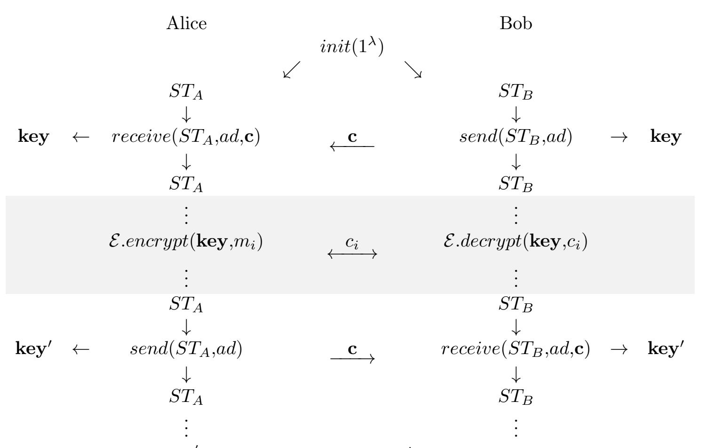

{0}------------------------------------------------

# RHQC: post-quantum ratcheted key exchange from coding assumptions

Julien JUANEDA1,2,3, Marina DEHEZ-CLEMENTI2,3 , Jean-Christophe DENEUVILLE2,3, and Jérôme LACAN2,3

> <sup>1</sup>TéSA <sup>2</sup>Fédération ENAC ISAE-SUPAERO ONERA <sup>3</sup>University of Toulouse, France {julien.juaneda, marina.dehez-clementi, jerome.lacan}@isae-supaero.fr jean-christophe.deneuville@enac.fr

> > March 13, 2025

#### Abstract

Key Exchange mechanisms (KE or KEMs) such as the Diffie-Hellman protocol have proved to be a cornerstone conciliating the efficiency of symmetric encryption and the practicality of public key primitives.

Such designs however assume the non-compromission of the long term asymmetric key in use. To relax this strong security assumption, and allow for modern security features such as Perfect Forward Secrecy (PFS) or Post Compromise Security (PCS), Ratcheted-KE (RKE) have been proposed.

This work proposes to turn the Hamming Quasi-Cyclic (HQC) cryptosystem into such a Ratcheted-KE, yielding the first code-based such construction.

Interestingly, our design allows indifferently one party to update the key on-demand rather than the other, yielding a construction called bidirectional RKE, which compares favorably to generic transformations.

Finally, we prove that the resulting scheme satisfies the usual correctness and key-indistinguishability properties, and suggest concrete sets of parameters, assuming different real-life use cases.

## 1 Introduction

Key management has long been a challenge in the design of secure communication systems. In particular, satellite communication systems exemplify this challenge, given the extensive operational lifespans of satellites (often exceeding two decades) and their resource constraints. Protocols must not only meet demanding performance and reliability requirements but also remain secure against potential quantum threats that may emerge in the next few decades. In particular, the advent of large-scale quantum computers threatens to cause 

{1}------------------------------------------------

the obsolescence of traditional public-key cryptosystems, exposing satellites to risks such as eavesdropping and key recovery. To mitigate these risks, there is an urgent need for cryptographic mechanisms that ensure post-quantum resistance.

Among the candidates in the NIST's Post-Quantum Cryptography (PQC) standardization process, code-based schemes have shown great promise, offering robust security guarantees for secure communications. However, while postquantum Key Encapsulation Mechanisms (KEMs) are well-developed, these constructions often fail to support advanced security properties like perfect forward secrecy (PFS) and post-compromise security (PCS). These two properties guarantee that even if a device is compromised at some point in time, the confidentiality of past or future communications remains intact. This need has driven the popularity of Ratcheted Key Exchange (RKE) protocols, which dynamically update cryptographic keys to provide robust security in asynchronous, real-time communication environments.

The concept of RKE was first formalized by Perrin and Marlinspike in the cryptographic core of the Signal Protocol [PM16], now widely deployed in modern messaging platforms. Their work emphasized key update mechanisms to achieve PFS and PCS in a lightweight and practical manner. Subsequent research refined the RKE framework into more structured formalizations, including: uni-directional RKE, focusing on forward-only key updates; sesquidirectional RKE, introducing asymmetric ratcheting; and bi-directional RKE, designed for improved efficiency and scalability. A practical example of these advancements is the transformation of the Diffie-Hellman key exchange protocol into the Off-the-Record (OTR) protocol [BGB04]. OTR enhances Diffie-Hellman with features such as deniable authentication and PFS, making it ideal for private real-time messaging; yet not quantum-resistant.

Despite their success, existing RKE protocols rely on cryptographic primitives vulnerable to quantum adversaries. Indeed, authors in [ACD19] present a modular framework for the Double Ratchet algorithm used in Signal, focusing on the separation of key exchange, message encryption, and key derivation. The paper formalizes security properties such as PCS and asynchronous confidentiality, ensuring message recovery even if keys are temporarily compromised. It leverages error propagation models and coding techniques to evaluate resilience to communication loss and adversarial tampering. Authors suggest that it is possible to construct a post-quantum secure variant of the Signal RKE with any post-quantum KEM. In a subsequent work, authors in [CGCD+20] conduct a rigorous cryptographic analysis of the Signal protocol. The paper delves into the analysis of the protocol's use of hash-based key derivation functions (HKDFs) in ratcheting and its impact on message confidentiality and integrity. It highlights the entropy growth of keys under successive updates, ensuring resistance to entropy exhaustion or key-space overlap. This analysis does not include any argument related to a possible quantum-resistance. Moving away from Signal, authors in [DHRR22] proposes a strongly anonymous RKE protocol that enhances user anonymity in communication systems. The proposed scheme uses randomized key derivations and secure state transitions to thwart adversarial inference. It uses formal definitions of anonymity and security, which implicitly depend on the principles of uncertainty (entropy) and the adversarial reduction of that uncertainty. However, authors do not explicitly discuss the quantum issue. Eventually, the first attempt toward a post-quantum RKE is [BFG<sup>+</sup>22] which extends the Signal handshake to the post-quantum setting without ensur

{2}------------------------------------------------

ing post-quantum resistance in the ratcheting mechanism. Very recently, Signal and Apple integrated post-quantum resistance in their key-exchange mechanisms by using respectively PQXDH [KS24] (on the initial handshake), and PQ3 [ES24] (on the entire protocol, including the ratcheting part). [DJK<sup>+</sup>25] is another very recent proposal of post-quantum continuous key-exchange full protocol.

It should be observed that all these post-quantum key exchanges rely on lattice assumptions, and more specifically on the Kyber system [BDK<sup>+</sup>18]. The present work proposes an alternative by leveraging instead problems based on the Syndrome Decoding. This paper aims at describing a practical, efficient, and formally secure post-quantum RKE protocol tailored to real-world constraints and emerging threats.

Our protocol leverages the Hamming Quasi-Cyclic (HQC) cryptosystem, recently selected by the NIST's PQC project to become one of the five quantumresistant cryptographic standards [AAB<sup>+</sup>24]. HQC offers several advantages, including robust theoretical security proofs, careful control of noise growth and error probabilities in decoding, and minimized failure rates compared to alternatives. Compared to lattice-based schemes, HQC's simpler structure facilitates the symmetrization of the cryptographic operations of communicating parties, and its high parameterizability allows for flexible adjustments to meet varying security and efficiency requirements. These features make HQC a compelling choice for building post-quantum RKE protocols, balancing security, efficiency, and practicality.

Our contributions In this paper, we present the following contributions:

- Practical Construction: We propose a practical post-quantum RKE protocol based on the Syndrome Decoding problem and which modifies HQC's construction, addressing the unique requirements of long-lived, resourceconstrained communication systems.
- Parameter Selection: We rigorously compute secure and efficient parameter sets for the modified HQC within the context of RKE, ensuring robustness against quantum and classical adversaries.
- Formal Security Proofs: We provide concise security proofs, demonstrating that our protocol is correct and key indistinguishable.

By addressing both theoretical and practical challenges, our work contributes to improving the security of communications in satellites architectures, the Internet of Things (IoT) net- works and also Unmanned Aerial Vehicles (UAVs) in the quantum era.

## 2 Preliminaries

In this section, we introduce the notations, hard problems and some definitions related to the construction of a Post-Quantum Bidirectional Ratcheted Key Exchange (BRKE).

{3}------------------------------------------------

#### 2.1 Notations and background

**Notations** We denote  $\mathbb{Z}$  the ring of integers and  $\mathbb{F}_2$  the binary field;  $\omega(\cdot)$  refers to the Hamming weight of a vector, and  $\mathcal{S}_w^n$  to the set of words in  $\mathbb{F}_2^n$  of weight w. Formally:  $\mathcal{S}_w^n(\mathbb{F}_2) = \{\mathbf{v} \in \mathbb{F}_2^n \text{ s.t. } \omega(\mathbf{v}) = w\}$ , abbreviated later on  $\mathcal{R}_w$ . Vectors can be interchangeably considered as row vectors or polynomials in  $\mathcal{R} = \mathbb{F}_2[X]/(X^n - 1)$ . Vectors and polynomials (resp. matrices) will be represented by lower-case (resp. upper-case) bold letters.  $\mathbf{rot}(\mathbf{h})$  for  $\mathbf{h} \in \mathcal{R}$  denotes the circulant matrix whose  $i^{\text{th}}$  column is the vector corresponding to  $\mathbf{h}X^i$  in  $\mathcal{R}$ . We denote  $\mathcal{C}$  a linear code of parameters (n,k,d). In the definitions, we will use calligraphic letters to refer to distributions  $\mathcal{D}$ , and sans-serif ones to refer to cryptographic problems  $\mathsf{P}$ .

**Difficult problems** In this paragraph, we recall the main hard problems on which the security of HQC.PKE is built. Most of the definitions introduced here are provided for the sake of completeness and self-contained exposition. They are described in detail in [AAB<sup>+</sup>24]. An experienced reader may proceed to the next section.

**Definition 1**  $(s - \mathcal{QCSD} \text{ Distribution})$ . Let n, s and w be positive integers. The  $s-\underline{Q}uasi-\underline{C}yclic$  Syndrome  $\underline{D}ecoding$  Distribution  $s-\mathcal{QCSD}(n,w)$  samples a parity-check matrix  $\mathbf{H} \leftarrow \mathbb{F}_2^{(s-1)n \times sn}$  of a systematic QC code  $\mathcal{C}$  of index s and rate 1/s and a vector  $\mathbf{x} = (\mathbf{x}_0, ..., \mathbf{x}_{s-1}) \leftarrow \mathbb{F}_2^{sn}$  such that  $\omega(\mathbf{x}_i) = w$   $\forall i \in [0, s-1]$ , computes  $\mathbf{y}^{\top} = \mathbf{H}\mathbf{x}^{\top}$  and outputs  $(\mathbf{H}, \mathbf{y})$ .

We now proceed to introduce decisional problems. However to avoid trivial distinguishers an additional condition on the parity of the syndrome is needed. Therefore we introduce the finite set  $\mathbb{F}_{2,b}^n = \{\mathbf{v} \in \mathbb{F}_2^n \text{ s.t. } \mathbf{v}(1) = b \text{ mod } 2\}$ . Similarly for matrices we define the finite sets:

$$\mathbb{F}_{2,b}^{n\times 2n} = \{\mathbf{H} = \begin{pmatrix} \mathbf{I}_n & \mathbf{rot}(\mathbf{h}) \end{pmatrix} \in \mathbb{F}_2^{n\times 2n} \text{ s.t. } \mathbf{h} \in \mathbb{F}_{2,b}^n \}, \text{ and}$$

$$\mathbb{F}_{2,b_1,b_2}^{2n\times 3n} = \{\mathbf{H} = \begin{pmatrix} \mathbf{I}_n & 0 & \mathbf{rot}(\mathbf{h}_1) \\ 0 & \mathbf{I}_n & \mathbf{rot}(\mathbf{h}_2) \end{pmatrix} \in \mathbb{F}_2^{2n\times 3n} \text{ s.t. } \mathbf{h}_1 \in \mathbb{F}_{2,b_1}^n \text{ and } \mathbf{h}_2 \in \mathbb{F}_{2,b_2}^n \}$$

**Definition 2**  $(2 - \mathcal{QCSD})$  Distribution (with parity)). For positive integers n, w and b, the 2-Quasi-Cyclic Syndrome Decoding Distribution with parity  $2-\mathcal{QCSD}(n,w,b)$  chooses uniformly at random a parity-check matrix  $\mathbf{H} \in \mathbb{F}_{2,b}^{n \times 2n}$  together with a vector  $\mathbf{x} = (\mathbf{x}_1, \mathbf{x}_2) \stackrel{\$}{\leftarrow} \mathbb{F}_2^{2n}$  such that  $\omega(\mathbf{x}_1) = \omega(\mathbf{x}_2) = w$ , and outputs  $(\mathbf{H}, \mathbf{H}\mathbf{x}^T)$ .

**Definition 3** (Decisional 2-QCSD Problem with parity). Let  $\mathbf{h} \in \mathbb{F}_{2,b}^n$ ,  $\mathbf{H} = (\mathbf{I}_n \mid \mathbf{rot}(\mathbf{h}))$ , and  $b' = w + b \times w \mod 2$ . For  $\mathbf{y} \in \mathbb{F}_{2,b'}^n$ , the <u>Decisional 2-Quasi-Quasi-Quasi-Quasi-Quasi-Quasi-Quasi-Quasi-Quasi-Quasi-Quasi-Quasi-Quasi-Quasi-Quasi-Quasi-Quasi-Quasi-Quasi-Quasi-Quasi-Quasi-Quasi-Quasi-Quasi-Quasi-Quasi-Quasi-Quasi-Quasi-Quasi-Quasi-Quasi-Quasi-Quasi-Quasi-Quasi-Quasi-Quasi-Quasi-Quasi-Quasi-Quasi-Quasi-Quasi-Quasi-Quasi-Quasi-Quasi-Quasi-Quasi-Quasi-Quasi-Quasi-Quasi-Quasi-Quasi-Quasi-Quasi-Quasi-Quasi-Quasi-Quasi-Quasi-Quasi-Quasi-Quasi-Quasi-Quasi-Quasi-Quasi-Quasi-Quasi-Quasi-Quasi-Quasi-Quasi-Quasi-Quasi-Quasi-Quasi-Quasi-Quasi-Quasi-Quasi-Quasi-Quasi-Quasi-Quasi-Quasi-Quasi-Quasi-Quasi-Quasi-Quasi-Quasi-Quasi-Quasi-Quasi-Quasi-Quasi-Quasi-Quasi-Quasi-Quasi-Quasi-Quasi-Quasi-Quasi-Quasi-Quasi-Quasi-Quasi-Quasi-Quasi-Quasi-Quasi-Quasi-Quasi-Quasi-Quasi-Quasi-Quasi-Quasi-Quasi-Quasi-Quasi-Quasi-Quasi-Quasi-Quasi-Quasi-Quasi-Quasi-Quasi-Quasi-Quasi-Quasi-Quasi-Quasi-Quasi-Quasi-Quasi-Quasi-Quasi-Quasi-Quasi-Quasi-Quasi-Quasi-Quasi-Quasi-Quasi-Quasi-Quasi-Quasi-Quasi-Quasi-Quasi-Quasi-Quasi-Quasi-Quasi-Quasi-Quasi-Quasi-Quasi-Quasi-Quasi-Quasi-Quasi-Quasi-Quasi-Quasi-Quasi-Quasi-Quasi-Quasi-Quasi-Quasi-Quasi-Quasi-Quasi-Quasi-Quasi-Quasi-Quasi-Quasi-Quasi-Quasi-Quasi-Quasi-Quasi-Quasi-Quasi-Quasi-Quasi-Quasi-Quasi-Quasi-Quasi-Quasi-Quasi-Quasi-Quasi-Quasi-Quasi-Quasi-Quasi-Quasi-Quasi-Quasi-Quasi-Quasi-Quasi-Quasi-Quasi-Quasi-Quasi-Quasi-Quasi-Quasi-Quasi-Quasi-Quasi-Quasi-Quasi-Quasi-Quasi-Quasi-Quasi-Quasi-Quasi-Quasi-Quasi-Quasi-Quasi-Quasi-Quasi-Quasi-Quasi-Quasi-Quasi-Quasi-Quasi-Quasi-Quasi-Quasi-Quasi-Quasi-Quasi-Quasi-Quasi-Quasi-Quasi-Quasi-Quasi-Quasi-Quasi-Quasi-Quasi-Quasi-Quasi-Quasi-Quasi-Quasi-Quasi-Quasi-Quasi-Quasi-Quasi-Quasi-Quasi-Quasi-Quasi-Quasi-Quasi-Quasi-Quasi-Quasi-Quasi-Quasi-Quasi-Quasi-Quasi-Quasi-Quasi-Quasi-Quasi-Quasi-Quasi-Quasi-Quasi-Quasi-Quasi-Quasi-Quasi-Quasi-Quasi-Quasi-Quasi-Quasi-Quasi-Quasi-Quasi-Quasi-Quasi-Quasi-Quasi-Qu</u>

**Definition 4**  $(3 - \mathcal{QCSD} - \mathcal{PT} \text{ Distribution})$ . For positive integers  $n, w, b_1, b_2, l$  and  $b_3$  the 3-Quasi-Cyclic Syndrome Decoding Distribution with Parity and Truncature  $3 - \mathcal{QCSD}(n, w, b_1, b_2)$  chooses uniformly at random a parity-check

{4}------------------------------------------------

matrix  $\mathbf{H} \in \mathbb{F}_{2,b_1,b_2}^{2n \times 3n}$  together with a vector  $\mathbf{x} = (\mathbf{x}_1, \mathbf{x}_2, \mathbf{x}_3) \stackrel{\$}{\leftarrow} \mathbb{F}_2^{3n}$  such that  $\omega(\mathbf{x}_1) = \omega(\mathbf{x}_2) = \omega(\mathbf{x}_3) = w$ , computes  $\mathbf{y}^T = \mathbf{H}\mathbf{x}^T$  where  $\mathbf{y} = (\mathbf{y}_1, \mathbf{y}_2)$  and outputs  $(\mathbf{H}, (\mathbf{y}_1, \text{truncate}(\mathbf{y}_2, l))) \in \mathbb{F}_{2,b_1,b_2}^{2n \times 3n} \times (\mathbb{F}_{2,b_3}^n \times \mathbb{F}_2^{n-l})$  where the truncate function truncates the last l bits of  $\mathbf{y}_2$ .

**Definition 5** (3-DQCSD-PT). Let  $n, w, b_1, b_2, l$  be positive integers and  $b_3 = w + b_1 \times w \mod 2$ . Given  $(\mathbf{H}, (\mathbf{y}_1, \mathbf{y}_2)) \in \mathbb{F}_{2,b_1,b_2}^{2n \times 3n} \times (\mathbb{F}_{2,b_3}^n \times \mathbb{F}_2^{n-l})$ , the Decisional 3-Quasi-Cyclic Syndrome Decoding with Parity and Truncation Problem 3-DQCSD-PT $(n, w, b_1, b_2, b_3, l)$  asks to decide with non-negligible advantage whether  $(\mathbf{H}, (\mathbf{y}_1, \mathbf{y}_2))$  came from the  $3 - \mathcal{QCSD} - \mathcal{PT}(n, w, b_1, b_2, b_3, l)$  distribution or the uniform distribution over  $\mathbb{F}_{2,b_1,b_2}^{2n \times 3n} \times (\mathbb{F}_{2,b_3}^n \times \mathbb{F}_2^{n-l})$ .

#### 2.2 Bidirectional Ratcheted Key Exchange

A BRKE [PR18] is a cryptographic protocol designed to provide secure communication by dynamically updating the long-term keys during an ongoing session; the bi-directionality implies that both participants can generate new keys independently of each other.

**Definition** Formally, a BRKE is defined for a finite key space  $\mathcal{K}$  and an associated-data space  $\mathcal{AD}$  as a triple R = (init, send, receive) of algorithms together with a state space  $\mathcal{S}$  and a ciphertext space  $\mathcal{C}$ .

- init: the randomized initialization algorithm returns a pair of states  $(S_A, S_B) \in \mathcal{S} \times \mathcal{S}$ .
- $send(state_i, ad)$ : the randomized sending algorithm takes a state  $state_i \in \mathcal{S}$  and an associated-data string  $ad \in \mathcal{AD}$ , and produces an updated state  $state_i' \in \mathcal{S}$ , a key  $k \in \mathcal{K}$  and a ciphertext  $c \in \mathcal{C}$ .
- $receive(state_i, ad, c)$ : the deterministic receiving algorithm takes a state  $state_i \in \mathcal{S}$ , an associated-data string  $ad \in \mathcal{AD}$ , and a ciphertext  $c \in \mathcal{C}$ , and either outputs an updated state  $state_i' \in \mathcal{S}$  and a key  $k \in \mathcal{K}$  or outputs the special symbol  $\bot$  to indicate rejection.

**Security model** A BRKE scheme is secure if and only if it respects the properties of *correctness* and *key indistinguishability*. Both properties are formalized through two games FUNC and KIND<sub>BR</sub> [PR18].

### 2.3 Hamming Quasi-Cyclic (HQC)

HQC is an efficient cryptosystem based on coding theory. It can be declined into two primitives namely a public key encryption (PKE) scheme and a key encapsulation mechanism (KEM-DEM). In this section, we recall the definition and security model considered for its use as a PKE abbreviated as HQC.PKE.

**Definition** HQC uses two types of codes: a decodable [n,k] code  $\mathcal{C}$ , generated by  $\mathbf{G} \in \mathbb{F}_2^{k \times n}$  and which can correct at least  $\delta$  errors via an efficient algorithm  $\mathcal{C}.Decode(\cdot)$ ; and a random double circulant [2n,n] code, of parity-check matrix  $(\mathbf{1},\mathbf{h})$ . The four polynomial-time algorithms constituting the PKE version of the HQC cryptosystem are described as follows:

{5}------------------------------------------------

- $Setup(1^{\lambda})$ : generates and outputs the global parameters param=  $(n,k,\delta,w,w_r,w_e)$  where k is the length of the shared key being exchanged, typically k=256.
- KeyGen(param): samples  $\mathbf{h} \stackrel{\$}{\leftarrow} \mathbb{F}_2^n$ , the generator matrix  $\mathbf{G} \in \mathbb{F}_2^{k \times n}$  of  $\mathcal{C}$ ,  $sk = (\mathbf{x}, \mathbf{y}) \stackrel{\$}{\leftarrow} \mathcal{S}_w^n(\mathbb{F}_2) \times \mathcal{S}_w^n(\mathbb{F}_2)$ , sets  $pk = (\mathbf{h}, \mathbf{s} = \mathbf{x} + \mathbf{h} \cdot \mathbf{y})$ , and returns (pk,sk).
- $Encrypt(pk, \mathbf{m})$ : generates  $\mathbf{e} \leftarrow \mathcal{S}_{w_e}^n(\mathbb{F}_2)$ ,  $\mathbf{r} = (\mathbf{r}_1, \mathbf{r}_2) \leftarrow \mathcal{S}_{w_r}^n(\mathbb{F}_2) \times \mathcal{S}_{w_r}^n(\mathbb{F}_2)$ , sets  $\mathbf{u} = \mathbf{r}_1 + h \cdot \mathbf{r}_2$  and  $\mathbf{v} = \mathbf{m}\mathbf{G} + \mathbf{s} \cdot \mathbf{r}_2 + \mathbf{e}$ , returns  $\mathbf{c} = (\mathbf{u}, \mathbf{v})$ .
- $Decrypt(sk, \mathbf{c})$ : returns  $\mathbf{m}' \leftarrow \mathcal{C}.Decode(\mathbf{v} \mathbf{u} \cdot \mathbf{y})$ .

**Security model** According to [AAB<sup>+</sup>24], HQC.PKE, with *default* parameters, satisfies both the correctness and the INDistinguishability under Chosen Plaintext Attack (IND-CPA)) security properties under the assumption that both 2-DQCSD-P and 3-DQCSD-PT (see Definitions 3 and 5) are hard problems.

### 3 Construction

In this section, we describe RHQC, our construction of a Post-Quantum BRKE based on the NIST standard HQC. Parameter sets will be further discussed in Section 4 as some transformations were operated on HQC to construct a secure BRKE scheme.

**Presentation of the scheme** Let HQC be an instance of the HQC.PKE cryptosystem described in Sub-section 2.3, and  $\mathcal{E} = (KeyGen, Enc, Dec)$  be an instance of a secure symmetric encryption scheme. Formally, the proposed RHQC is a tuple HQC.RKE= (init, send, receive) of algorithms depicted in Table 1. The use of these algorithms is explicited in the execution diagram provided in Table 2.

Table 1: Description of HQC.RKE algorithms

```
proc init(1^{\lambda}):
                                                                                                                                                                        proc receive(ST_A,ad,\mathbf{c}):
                                                                                 proc send(ST_B,ad):
  HQC.Setup(1^{\lambda}):
                                                                                                                                                                           (pk_B[1],\mathbf{v}) \leftarrow \mathbf{c}
                                                                                   (param, \lambda, \_, pk_A) \leftarrow ST_B
                                                                                                                                                                           updates ST_A = (param, \lambda, sk_A, pk_B = (h, pk_B[1])
     return param = (n,k,\delta,w,w_r,w_e)
                                                                                   m_{\mathcal{E}} \stackrel{\$}{\leftarrow} \mathcal{E}.KeyGen(1^{\lambda})
  \mathsf{HQC}.KeyGen(\mathsf{param}):
                                                                                                                                                                          \mathsf{HQC}.Decrypt(sk_A,\mathbf{c}):
                                                                                    c \stackrel{\$}{\leftarrow} \mathsf{HQC}.Encrypt(pk_A, m_{\mathcal{E}}):
                                                                                                                                                                             computes \mathbf{m}_{\mathcal{E}}/\perp \leftarrow \mathcal{C}.Decode(\mathbf{v} - pk_B[1]sk_A[1])
     \mathbf{x},\mathbf{y} \stackrel{\$}{\leftarrow} \mathcal{S}^n_{w_r}(\mathbb{F}_2)
                                                                                                                                                                          returns (ST_A, m_{\mathcal{E}}/\perp)
                                                                                       (\mathbf{h},\mathbf{s}) \leftarrow pk_A
     seed_h \stackrel{\$}{\leftarrow} \{0,1\}^{256}; \mathbf{h} \stackrel{seed_h}{\leftarrow} \mathbb{F}_2^n
                                                                                      sk_B = (\mathbf{r}_1, \mathbf{r}_2) \stackrel{\$}{\leftarrow} \mathcal{S}^n_{w_r}(\mathbb{F}_2)
     s = x + hy
                                                                                      \mathbf{e} \overset{\$}{\leftarrow} \mathcal{S}^n_{w_e}(\mathbb{F}_2)
     sets sk_A = (\mathbf{x}, \mathbf{y}).
                                                                                      sets pk_B = (\mathbf{h}, \mathbf{r}_1 + \mathbf{h}\mathbf{r}_2)
     sets pk_A = (seed_h, \mathbf{s}) or (\mathbf{h}, \mathbf{s}).
                                                                                      sets \mathbf{v} = \mathbf{m}_{\mathcal{E}}\mathbf{G} + pk_A[1]sk_B[1] + \mathbf{e}
  sets ST_A = (\mathsf{param}, \lambda, sk_A, )
                                                                                      outputs \mathbf{c} = (pk_B[1], \mathbf{v})
  sets ST_B = (param, \lambda, \_, pk_A)
                                                                                    updates ST_B = (\mathsf{param}, \lambda, sk_B, pk_A)
  returns (ST_A, ST_B).
                                                                                    returns \mathbf{c} = (pk_B[1], \mathbf{v})
```

Let us note that, even if not explicitly defined in the construction above, we require that the first exchange between Alice and Bob is authenticated (ideally

{6}------------------------------------------------

Table 2: RHQC execution diagram



where  $\mathbf{key}$  (resp.  $\mathbf{key}'$ ) refers to  $m_{\mathcal{E}}$  (resp.  $m_{\mathcal{E}}'$ ) in Table 1,  $m_i$  and  $c_i$  are plaintexts and ciphertexts transiting between Alice and Bob inside the secure channel represented as a gray rectangle.

by using a post-quantum signature scheme [NIS22]). This ensures that the initial communication is secure against impersonation attacks and establishes trust for subsequent exchanges.

**Security properties** We claim that RHQC is a secure BRKE, in that it respects the properties of *correctness* and *key indistinguishability* as defined in Sub-section 2.2. Section 4 further explores the conditions under which this statement is verified.

## 4 Security analysis

**Preamble** We chose to use HQC.PKE to construct RHQC instead of HQC.KEM because our goal is to build a RKE scheme to proposed a quantum-resistant authenticated key renewing mechanism. By nature, keys in RKE are ephemeral. Thus, it seemed more appropriate to use the HQC.PKE instead of the HQC.KEM. In addition, since we spare a extra HQC.Encrypt operation compared to the KEM version, we are more efficient.

RHQC leverages HQC.PKE which is IND-CPA. Thus, it can *only* be used to construct schemes that use ephemeral keys. Considering the ratcheted nature of RHQC, we had to modify the parameters of HQC and take into account the growth of the weight of the residual error  $sk_A[0] \cdot sk_B[1] - sk_A[1] \cdot sk_B[0] + \mathbf{e}$  (of maximal weight  $2(w \times w_r) + w_e$ ).

This difference unfolds two discussions:

{7}------------------------------------------------

- 1. Considerations for a NIST-compliant RHQC: to this end, we are keeping the same parameters yet adapting the size n of the code C to respect the Decryption Failure Rate (DFR) imposed by the NIST. Updated parameters and new DFR are provided in Sub-section 4.1.
- 2. Considerations for a more efficient RHQC: by nature, RHQC is to be used for regular key renewing in various applications. Thus, we can consider reducing the security levels to make RHQC more efficient. Indeed, switching from a security parameter of 143 to 128 has the immediate effect of reducing the DFR because the weight of the objects diminish. As DFR is reduced we can in turn lower the size n of the code C, and so on so forth. A complete discussion is provided in Sub-section 4.2.

### 4.1 A NIST-compliant version of RHQC

In this section, we specify which codes are used for RHQC and give concrete sets of parameters. We propose several sets of parameters, targeting different levels of security (128, 192 or 256 bits of security) with DFR related to each security level.

Concatenated codes We use the same codes as described in HQC's paper [AAB+24] namely concatenated codes made of a [n2,8,n2/2] Reed-Muller code as the internal code and a [n1, k, n<sup>1</sup> − k + 1] Reed-Solomon code as an external code.

Sets of parameters The security analysis presented above enabled us to determine sets of parameters to ensure the security of the proposed RHQC scheme. They are summarized in Table 3. The parameter n<sup>1</sup> is the length of the Reed-Solomon code, n<sup>2</sup> is the length of the Reed-Muller code, n is the length of the ambient space; w<sup>i</sup> represents the weights w, wr, w<sup>e</sup> which are weight of resp. x and y, r<sup>1</sup> and r2, and the error e such that w = w<sup>r</sup> = we; security refers to the security categories defined by the NIST; and pfail is the probability of a decoding failure.

Table 3: Parameters sets of a NIST-compliant RHQC.

| Instance | n1  | n2      | n     | wi  | security | pfail       |
|----------|-----|---------|-------|-----|----------|-------------|
| rhqc-128 | 51  | 3 × 128 | 19597 | 75  | level 1  | −128<br>< 2 |
| rhqc-192 | 62  | 5 × 128 | 39733 | 114 | level 3  | −192<br>< 2 |
| rhqc-256 | 100 | 5 × 128 | 64013 | 149 | level 5  | −256<br>< 2 |

#### 4.1.1 Updated HQC security analysis

In this section, we provide the updated security analysis of HQC considering the new sets of parameters.

Decoding error probability Demonstrating a very low (by order of 2 <sup>−</sup><sup>128</sup>) decoding error probability is mandatory to ensure that RHQC is correct. Indeed, the ability to successfully decode with high probability ensures that both parties 

{8}------------------------------------------------

in the RKE are able to recover the same secret. Since we change parameters in the original underlying routine HQC, we are providing an updated analysis of the decoding error probability for the code C.

We recall below Theorem 7 of [AAD<sup>+</sup>24].

Theorem 1 (Decoding failure rate of the concatenated code). Using a Reed-Solomon code [ne,ke,de]F<sup>256</sup> as the external code, the DFR<sup>1</sup> of the concatenated code can be upper bounded by:

$$\sum_{l=\delta_e+1}^{n_e} \binom{n_e}{l} p_i^l (1-p_i)^{n_e-l}$$

By applying Theorem 1, we summarized the resulting decoding error probabilities in Table 4. The parameter security refers to the security level; p ∗ is the Bit Error Rate; the Reed-Solomon code column gives the parameters of the code; and finally, DFR values are computed from Theorem 1 and given as log<sup>2</sup> (DF R).

Table 4: Decoding error probabilities for a NIST-compliant RHQC according to several levels of security and n<sup>2</sup> given in Table 3.

| security | ∗<br>p | Reed-Solomon code | DFR  |
|----------|--------|-------------------|------|
| 128      | 0,34   | [51,16,36]        | −135 |
| 192      | 0,37   | [62,24,39]        | −203 |
| 256      | 0,38   | [100,32,69]       | −272 |

The computation of the DFR for several security levels shows that the decoding error probability is negligible thus, with the given sets of parameters, the proposed RHQC is considered correct.

2-DQCSD-P and 3-DQCSD-PT security The best algorithms to solve the syndrome decoding problem are Information Set Decoding (ISD) algorithms. Since we are using HQC as an underlying routine, we also need to consider known attacks on Quasi-Cyclic codes. To estimate the hardness of the proposed instances of RHQC, we resorted to the online Binary Syndrome Decoding Estimators [EB22] that considers best-known ISD attacks against the relevant problems. A recent work [BC24] suggests that the previously mentioned estimator approximates the cost of linear algebra along with some probability models. Fortunately, the results suggested by [EB22] and [BC24] converge due to compensating approximations for BIKE [ABB<sup>+</sup>24] and HQC [AAB<sup>+</sup>24] (the situation seems more intricate for Classic McEliece [ABC<sup>+</sup>22]).<sup>2</sup> Although [BC24] could be more accurate in the way it handles probabilistic assumptions, its computational cost is several order of magnitude above [EB22], and out-of-reach for the authors at the moment of writing this paper.

In Table 5, we summarize the results output by TII's estimator [EVZB24].

<sup>1</sup>Remark: In the original paper, authors merge the notion of decoding error probability and Decryption Failure Rate (DFR). Still, conclusions apply to the decoding error probability of the concatenated code C.

<sup>2</sup>We refer the interested reader to the discussion on NIST PQC-forum available at: https://groups.google.com/a/list.nist.gov/d/msgid/pqc-forum/20240916154116. 102177.qmail\%40cr.yp.to

{9}------------------------------------------------

Table 5: Results from TII's Syndrome Decoding Estimator [EVZB24] for 2- DQCSD and 3-DQCSD for rhqc-128. Time and memory are given as log<sup>2</sup> (·).

|                |      | Estimate 2-DQCSD |      | Estimate 3-DQCSD |
|----------------|------|------------------|------|------------------|
| Algorithms     | Time | Memory           | Time | Memory           |
| Ball-Collision | 170  | 41               | 154  | 42               |
| BJMM           | 170  | 39               | 154  | 40               |
| BJMM+          | 170  | 38               | 154  | 39               |
| Both-May       | 170  | 39               | 154  | 40               |
| Dumer          | 170  | 41               | 154  | 42               |
| May-Ozerov     | 170  | 39               | 154  | 40               |
| Prange         | 191  | 29               | 175  | 31               |
| Stern          | 170  | 41               | 154  | 42               |

In the original HQC scheme [AMBD<sup>+</sup>18], w and w<sup>r</sup> are not balanced, in order to make both the 2-DQCSD and 3-DQCSD approximately as hard. However in the case of RHQC, it is mandatory to set w = w<sup>r</sup> (see Section 4.3). This yields a setup where key recovery attacks are way harder than message recovery attacks. Additionally, the weights are set such that the best known ISD attack satisfies NIST category I, defined as: "Any attack that breaks the relevant security definition must require computational resources comparable to or greater than those required for key search on a block cipher with a 128-bit key (e.g. AES128)". NIST estimates the bit complexity of category I to be 143 [NIS17]. Finally, as HQC leverages quasi-cyclic codes, one also has to consider the impact of the DOOM attack [Sen11], yielding a requirement of 151 (resp. 153) bits or more for the 2-DQCSD (resp. 3-DQCSD). Setting w = w<sup>r</sup> will (non-optimally) enforce category I for the former problem as soon as the later meets this category.

### 4.2 A relaxed more efficient version of RHQC

Table 3 shows the parameters of RHQC for various levels of security in a NISTcompliant setting. However, to evaluate RHQC behavior in a more general context, we investigate in this Section two deviations from NIST requirements, that eventually yield much more efficient versions of RHQC. Both come from the fact that RKE target ephemeral keys; it is therefore reasonable to aim at an IND-CPA PKE instead of an IND-CCA2 KEM, although NIST requires the later. Since we deviate from NIST requirements, two modifications seem natural. The first one consists in reducing the security level from NIST category I back to the standard 128-bits level (plus DOOM overhead). Such a reduction allows to significantly decrease w = wr, which in turns reduces drastically the magnitude of the noise to be decoded, hence squashing the DFR. We can then start reducing n until either the DFR grows above 2 <sup>−</sup><sup>128</sup> or the syndrome decoding instance is not hard enough. (Usually the former condition is the first met). The second deviation consists in accepting non-negligible DFR; since an RKE deals with ephemeral keys and provide both PFS and PCS, an attack exploiting a high DFR would only have a limited compromise area. We can then aim for higher DFR, of order 2 <sup>−</sup>λ/i for i ∈ {2,4}. The resulting parameters are captured 

{10}------------------------------------------------

in Table 6. We observe that relaxing these constraints leads to a remarkable reduction of n from 19597 to 13829 bits.

Table 6: Parameters sets of an efficient RHQC-128.

| Instance     | n1 | n2      | n     | wi | pfail       |
|--------------|----|---------|-------|----|-------------|
| rhqc-128-128 | 43 | 3 × 128 | 16547 | 67 | −128<br>< 2 |
| rhqc-128-64  | 39 | 3 × 128 | 15013 | 67 | −64<br>< 2  |
| rhqc-128-32  | 36 | 3 × 128 | 13829 | 67 | −32<br>< 2  |

Table 7: Parameters sets of an efficient RHQC-192.

| Instance     | n1 | n2      | n     | wi  | pfail       |
|--------------|----|---------|-------|-----|-------------|
| rhqc-192-192 | 56 | 5 × 128 | 35227 | 106 | −192<br>< 2 |
| rhqc-192-128 | 52 | 5 × 128 | 33301 | 106 | −128<br>< 2 |
| rhqc-192-64  | 48 | 5 × 128 | 30763 | 106 | −64<br>< 2  |
| rhqc-192-32  | 45 | 5 × 128 | 28813 | 106 | −32<br>< 2  |

Table 8: Parameters sets of an efficient RHQC-256.

| Instance     | n1 | n2      | n     | wi  | pfail       |
|--------------|----|---------|-------|-----|-------------|
| rhqc-256-256 | 91 | 5 × 128 | 58243 | 140 | −256<br>< 2 |
| rhqc-256-192 | 87 | 5 × 128 | 55691 | 140 | −192<br>< 2 |
| rhqc-256-128 | 83 | 5 × 128 | 53147 | 140 | −128<br>< 2 |
| rhqc-256-64  | 77 | 5 × 128 | 49307 | 140 | −64<br>< 2  |
| rhqc-256-32  | 74 | 5 × 128 | 47363 | 141 | −32<br>< 2  |

The aforementioned constraints can also be relaxed for NIST's security levels 3 and 5 thus yielding new parameters provided in Tables 7 and 8. Adjusting the parameters, we observe a gain of 30% (resp. 28% and 26%) on the length of the public keys for level 1 (resp. level 3 and 5). Yet, we believe there is still room for optimization.

### 4.3 Security analysis of RHQC

In this section, we provide the security arguments demonstrating why RHQC is correct and key indistinguishable, thus a secure BRKE.

Correctness According to [PR18], the correctness property requires that as long as one party only accepts the output of the send function sent by the other (i.e., accepts no forged messages from the attacker), output keys m<sup>i</sup> match those output by the receive function. In other words:

Theorem 2 (Correctness of RHQC). Assuming a sender A and a receiver B were jointly initialized with init(·), RHQC is correct if:

$$\Pr[receive(ST_A, ad, send(ST_B, ad)) = m \mid (ST_A, ST_B) \xleftarrow{\$} init(1^{\lambda})] = 1 - \operatorname{negl}(1^{\lambda})$$

{11}------------------------------------------------

Proof. Essentially, the proof comes from the fact that applying receive(·) to a "ciphertext" that comes from send(·) boils down to applying the HQC.Decrypt(·) routine from HQC to a ciphertext that comes from the HQC.Encrypt(·) routine. Let c = (pkB[1] = r<sup>1</sup> + hr2, v = mG + pkA[1]skB[1] + e) ← send(STB,ad) for some ST<sup>B</sup> ← init(1<sup>λ</sup> ). Then running receive(STA, ad, c) will call C.Decode on input v − pkB[1]skA[1] = mG + skA[0]skB[1] − skA[1]skB[0] + e. Similarly to HQC, it is sufficient that the error term e ′ = (skA[0]skB[1] − skA[1]skB[0] + e) has low enough weight for the decoding algorithm to succeed. The parameters proposed in Tables 3 and 6 were obtained using the DFR formula from HQC. Except for rhqc-128-64 and rhqc-128-32 which loosen the DFR restriction, the decoding algorithm will only fail with probability negl(1<sup>λ</sup> ). Since the decryption failure probability is bound to the DFR, the correctness equation is satisfied.

Key Indistinguishability The key indistinguishability property asks that an adversary cannot distinguish between two (or more) keys obtained with the send(·) algorithm.

By construction, RHQC respects the key indistinguishability property as defined in [PR18] with respect to the KINDBR game.

Proof. Let c<sup>A</sup> = (pkA[1], v<sup>A</sup> = mAG + pkB[1]skA[1] + eA) (resp. c<sup>B</sup> = pkB[1], v<sup>B</sup> = mBG + pkA[1]skB[1] + eB) a ciphertext produced by Alice (resp. Bob) using the send(·) routine. In order to break the KINDBR, an adversary has to distinguish between c<sup>A</sup> and cB, without having seen any former ciphertext encrypted with pk<sup>A</sup> nor pk<sup>B</sup> (recall that the public keys are used only once). Assuming the adversary knows m<sup>A</sup> and mB, the adversary has to distinguish errors of the form pkB[1]skA[1] + e<sup>A</sup> from errors of the form pkA[1]skB[1] + eB. However, pkA[1] and pkB[1] follow the exact same distribution, and the same holds for skA[1] and skB[1], and for e<sup>A</sup> and eB. Therefore, the adversary has to distinguish between two distributions that are exactly the same from an information theory perspective, hence the result.

## 5 Conclusion

This paper addresses the pressing challenge of developing secure key management solutions for asynchronous communication systems in the quantum era. By leveraging the Hamming Quasi-Cyclic (HQC) cryptosystem, recently standardized by the NIST's Post-Quantum Cryptography project, we propose a novel ratcheted key exchange (RKE) protocol that meets the stringent security resource constraints of asynchronous communication systems. Our protocol is proven correct, key indistinguishable and quantum resistant, which, according to the RKE framework, guarantees essential properties such as forward secrecy (PFS) and post-compromise security (PCS), critical for long-term communication security.

Through careful adaptation of HQC's construction and parameter optimization, we demonstrate, via the provided formal security proofs, that our protocol is resilient against both classical and quantum adversaries and give sets of parameters according to the users' objectives (trade-off between security and efficiency). This work offers a significant step forward in developing advance 

{12}------------------------------------------------

cryptographic primitives resilient against emerging quantum threats and consists of a suitable alternative to existing post-quantum RKE protocols.

As a future work, we envision to extend the protocol to support additional features, in the multi-party setting for instance. In addition, we would like to explore the integration of the proposed protocol into existing resource-constrained environments, such as satellite architectures, the Internet of Things (IoT) networks or Unmanned Aerial Vehicles (UAVs).

## References

- [AAB<sup>+</sup>24] Carlos Aguilar Melchor, Nicolas Aragon, Slim Bettaieb, Loïc Bidoux, Olivier Blazy, Jurjen Bos, Jean-Christophe Deneuville, Arnaud Dion, Philippe Gaborit, Jérôme Lacan, Edoardo Persichetti, Jean-Marc Robert, Pascal Véron, and Gilles Zémor. Hamming Quasi-Cyclic (HQC). NIST PQC Round, 4(10):52, 2024.
- [AAD<sup>+</sup>24] Carlos Aguilar Melchor, Nicolas Aragon, Jean-Christophe Deneuville, Philippe Gaborit, Jérôme Lacan, and Gilles Zémor. Efficient error-correcting codes for the HQC post-quantum cryptosystem. Designs, Codes and Cryptography, pages 1–20, 2024.
- [ABB+24] Nicolas Aragon, Paulo S.L.M Barreto, Slim Bettaieb, Loïc Bidoux, Olivier Blazy, Jean-Christophe Deneuville, Philippe Gaborit, Santosh Ghosh, Shay Gueron, Tim Güneysu, Carlos Aguilar Melchor, Rafael Misoczki, Edoardo Persichetti, Jan Richter-Brockmann, Nicolas Sendrier, Jean-Pierre Tillich, Valentin Vasseur, and Gilles Zémor. Bike: bit flipping key encapsulation. NIST PQC Round, 4(10):53, 2024.
- [ABC+22] Martin R. Albrecht, Daniel J. Bernstein, Tung Chou, Carlos Cid, Jan Gilcher, Tanja Lange, Varun Maram, Ingo von Maurich, Rafael Misoczki, Ruben Niederhagen, Kenneth G. Paterson, Edoardo Persichetti, Christiane Peters, Peter Schwabe, Nicolas Sendrier, Jakub Szefer, Cen Jung Tjhai, Martin Tomlinson, and Wen Wang. Classic McEliece). NIST PQC Round, 4(10):16, 2022.
- [ACD19] Joël Alwen, Sandro Coretti, and Yevgeniy Dodis. The double ratchet: security notions, proofs, and modularization for the signal protocol. In Annual International Conference on the Theory and Applications of Cryptographic Techniques, pages 129–158. Springer, 2019.
- [AMBD<sup>+</sup>18] Carlos Aguilar-Melchor, Olivier Blazy, Jean-Christophe Deneuville, Philippe Gaborit, and Gilles Zémor. Efficient encryption from random quasi-cyclic codes. IEEE Transactions on Information Theory, 64(5):3927–3943, 2018.
- [BC24] Daniel J Bernstein and Tung Chou. Cryptattacktester: highassurance attack analysis. In Annual International Cryptology Conference, pages 141–182. Springer, 2024.

{13}------------------------------------------------

- [BDK<sup>+</sup>18] Joppe Bos, Léo Ducas, Eike Kiltz, Tancrède Lepoint, Vadim Lyubashevsky, John M Schanck, Peter Schwabe, Gregor Seiler, and Damien Stehlé. Crystals-kyber: a cca-secure module-latticebased kem. In 2018 IEEE European Symposium on Security and Privacy (EuroS&P), pages 353–367. IEEE, 2018.
- [BFG<sup>+</sup>22] Jacqueline Brendel, Rune Fiedler, Felix Günther, Christian Janson, and Douglas Stebila. Post-quantum asynchronous deniable key exchange and the signal handshake. In IACR International Conference on Public-Key Cryptography, pages 3–34. Springer, 2022.
- [BGB04] Nikita Borisov, Ian Goldberg, and Eric Brewer. Off-the-record communication, or, why not to use pgp. In Proceedings of the 2004 ACM workshop on Privacy in the electronic society, pages 77–84, 2004.
- [CGCD<sup>+</sup>20] Katriel Cohn-Gordon, Cas Cremers, Benjamin Dowling, Luke Garratt, and Douglas Stebila. A formal security analysis of the signal messaging protocol. Journal of Cryptology, 33:1914–1983, 2020.
- [DHRR22] Benjamin Dowling, Eduard Hauck, Doreen Riepel, and Paul Rösler. Strongly anonymous ratcheted key exchange. In International Conference on the Theory and Application of Cryptology and Information Security, pages 119–150. Springer, 2022.
- [DJK+25] Yevgeniy Dodis, Daniel Jost, Shuichi Katsumata, Thomas Prest, and Rolfe Schmidt. Triple ratchet: A bandwidth efficient hybrid-secure signal protocol. Cryptology ePrint Archive, Paper 2025/078, 2025.
- [EB22] Andre Esser and Emanuele Bellini. Syndrome decoding estimator. In IACR International Conference on Public-Key Cryptography, pages 112–141. Springer, 2022.
- [ES24] Apple Security Engineering and Architecture (SEAR). imessage with pq3: The new state of the art in quantum-secure messaging at scale., February 2024.
- [EVZB24] Andre Esser, Javier A. Verbel, Floyd Zweydinger, and Emanuele Bellini. {SoK: CryptographicEstimators - a Software Library for Cryptographic Hardness Estimation}. In AsiaCCS. {ACM}, 2024.
- [KS24] Ehren Kret and Rolfe Schmidt. The pqxdh key agreement protocol, January 2024.
- [NIS17] NIST. Post-Quantum Cryptography, security (evaluation criteria). https://csrc.nist. gov/projects/post-quantum-cryptography/ post-quantum-cryptography-standardization/ evaluation-criteria/security-(evaluation-criteria), 2017. Consulté le : 2025-01-22.

{14}------------------------------------------------

- [NIS22] NIST. Pqc standardization process: Announcing four candidates to be standardized, plus fourth round candidates. https://csrc.nist.gov/news/2022/ pqc-candidates-to-be-standardized-and-round-4# standardization, 2022. Consulté le : 2025-01-22.
- [PM16] Trevor Perrin and Moxie Marlinspike. The double ratchet algorithm. GitHub wiki, 112, 2016.
- [PR18] Bertram Poettering and Paul Rösler. Towards bidirectional ratcheted key exchange. In Advances in Cryptology–CRYPTO 2018: 38th Annual International Cryptology Conference, Santa Barbara, CA, USA, August 19–23, 2018, Proceedings, Part I 38, pages 3–32. Springer, 2018.
- [Sen11] Nicolas Sendrier. Decoding one out of many. In International Workshop on Post-Quantum Cryptography, pages 51–67. Springer, 2011.