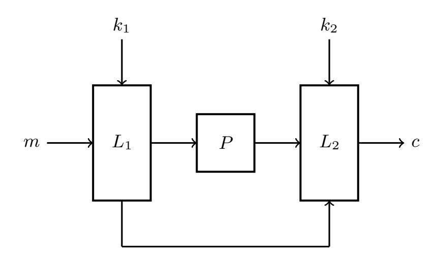
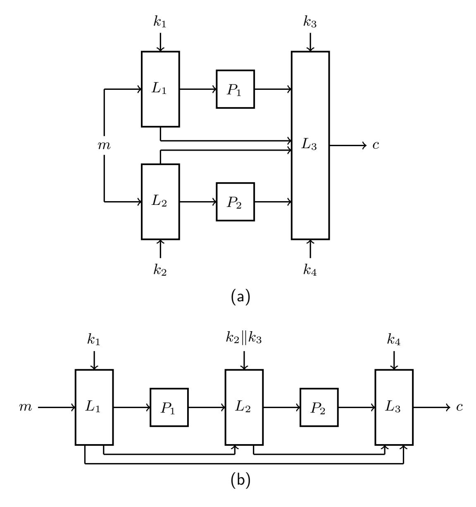
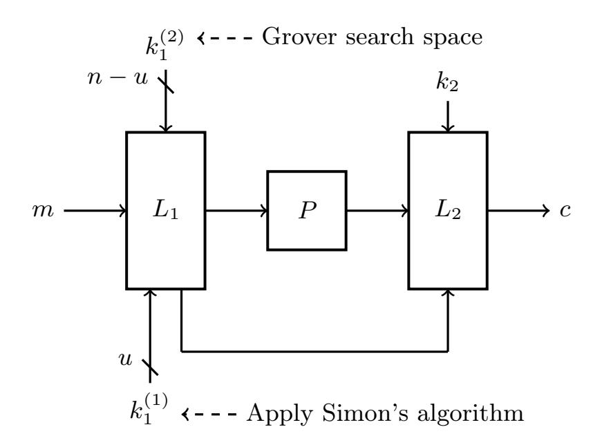
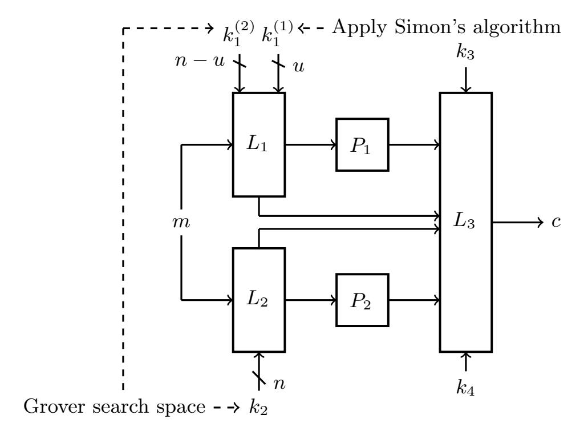
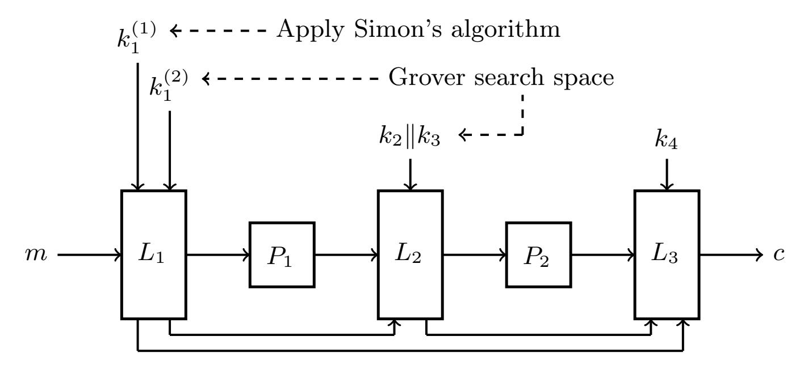

{0}------------------------------------------------

# Quantum Key-Recovery Attacks on Permutation-Based Pseudorandom Functions

Hong-Wei Sun<sup>1</sup> ? , Fei Gao<sup>2</sup> , Rong-Xue Xu<sup>1</sup> , Dan-Dan Li<sup>3</sup> , Zhen-Qiang Li<sup>4</sup> , and Ke-Jia Zhang<sup>1</sup>

<sup>1</sup> School of Computer and Big Data (School of Cybersecurity), Heilongjiang University, Harbin 150080, China.

sunhw@hlju.edu.cn

Abstract. Due to their simple security assessments, permutation-based pseudo-random functions (PRFs) have become widely used in cryptography. It has been shown that PRFs using a single n-bit permutation achieve n/2 bits of security, while those using two permutation calls provide 2n/3 bits of security in the classical setting. This paper studies the security of permutation-based PRFs within the Q1 model, where attackers are restricted to classical queries and offline quantum computations. We present improved quantum-time/classical-data tradeoffs compared with the previous attacks. Specifically, under the same assumptions/hardware as Grover's exhaustive search attack, i.e. the offline Simon algorithm, we can recover keys in quantum time O˜(2n/<sup>3</sup> ), with O(2n/<sup>3</sup> ) classical queries and O(n 2 ) qubits. Furthermore, we enhance previous superposition attacks by reducing the data complexity from exponential to polynomial, while maintaining the same time complexity. This implies that permutation-based PRFs become vulnerable when adversaries have access to quantum computing resources. It is pointed out that the above quantum attack can be used to quite a few cryptography, including PDMMAC and pEDM, as well as general instantiations like XopEM, EDMEM, EDMDEM, and others.

Keywords: symmetric cryptography · pseudorandom function · quantum algorithm · quantum cryptanalysis · Q1 model

## 1 Introduction

Quantum computing, based on quantum mechanics, offers a significant speed advantage over classical computing for solving certain problems [1–5]. In particular, quantum algorithms threaten the security of classical cryptographic methods. Indeed, Shor's algorithm [6] raised significant security concerns for the widely-used

<sup>2</sup> State Key Laboratory of Networking and Switching Technology, Beijing University of Posts and Telecommunications, Beijing, 100876, China.

<sup>3</sup> School of Computer Science (National Pilot Software Engineering School), Beijing University of Posts and Telecommunications, Beijing 100876, China. <sup>4</sup> State Key Laboratory of Cryptology, Beijing 100878, China.

<sup>?</sup> Corresponding author: Hong-Wei Sun.

{1}------------------------------------------------

RSA cryptosystem [7], while Grover's algorithm [8] notably weakened the security of symmetric encryption systems. Therefore, further research into quantum algorithms is essential for advancing quantum cryptanalysis and exploring the potential and limitations of quantum computing.

Block ciphers are symmetric encryption algorithms that divide plaintext into fixed-length blocks for encryption and decryption. Its security depends on a shared key. For years, the security of block ciphers has been a core issue in cryptographic research. With the rise of quantum computing, researchers have increasingly focused on the security of block ciphers in quantum environments to guide the design of post-quantum cryptographic algorithms. In 2010, Kuwakado et al. [9] constructed a periodic function based on a 3-round Feistel structure and applied the Simon algorithm to recover the period, effectively distinguishing between random permutations and Feistel ciphers. This reduced the query complexity from Θ(2n/<sup>2</sup> ) in the classical method to O(n), where n is the block length. Since then, various quantum attacks on block cipher structures were proposed [10–21], using quantum algorithms such as Simon [22], BV [23], and Grover-meets-Simon algorithms [24].

In quantum cryptanalysis, security models based on pseudo-random functions (PRFs) and pseudo-random permutations (PRPs) have become standard [25]. These models are generally categorized into the standard security model (Q1 model) and the quantum security model (Q2 model) [26].

Standard security: A block cipher is considered secure under the standard security model (Q1 model) if no quantum algorithm can efficiently distinguish it from a pseudorandom permutation (PRP) or a pseudorandom function (PRF) using only classical queries.

Quantum security: A block cipher is considered secure under the standard security model (Q2 model) if no quantum algorithm can efficiently distinguish it from a pseudorandom permutation (PRP) or a pseudorandom function (PRF) using quantum queries.

The primary difference between the two models lies in their approach to data collection. In the Q1 model [27,28], the attacker acquires data through classical queries, which are then processed using offline quantum computing. In contrast, the Q2 model [29] allows the attacker to execute quantum superposition queries, given by O<sup>E</sup> : Σx,yλx,y|xi|yi 7→ Σx,yλx,y|xi|E(x) ⊕ yi, where x and y represent arbitrary n-bit strings. The Q1 model is more closely associated with the primary threat model in post-quantum cryptography, known as the "harvest now, decrypt later" (HNDL) model. This paper investigates the quantum security of permutation-based PRFs within the Q1 model. Although our attack is less efficient than polynomial-time attacks based on quantum superposition queries, it employs a more realistic model and offers significant improvements over classical attacks.

Permutation-based PRFs are critical cryptographic schemes due to their simple security assessments. Notably, even the NIST standard incorporates an algorithm based on this design [30,31]. At CRYPTO 2019, Chen et al. [32] introduced a PRF design based on a single public permutation call, where the permutation 

{2}------------------------------------------------

is processed using a linear map that involves bitwise XOR and scalar multiplication. However, it has been shown that this design provides at most n/2 bits of security due to birthday collisions. To enhance security, they later proposed two schemes, SoKAC and SoEM, each constructed with two permutation calls, which successfully achieved 2n/3 bits of security beyond the birthday bound. Following their design method, numerous PRFs have been introduced, including PDMMAC [33], DS-SoEM [34], pEDM [35], etc.

Multiple attacks target permutation-based PRFs in the Q2 model. Kuwakado et al. [13] and Kaplan et al. [14] independently recovered the key of the Even-Mansour cipher by constructing a periodic function and applying the Simon algorithm with O(n) queries, highlighting the critical role of periodic tasks in key recovery. For PRFs based on two public permutation calls, Shinagawa et al. [36] proposed a key recovery attack against SoEM in 2022. They attacked SoEM1 and SoEM21 using the Simon algorithm with polynomial-time quantum queries and broke SoEM22 with O(2n/2n) quantum queries by applying the Grover-meets-Simon algorithm. Zhang [37] further demonstrated that SoEM variants with linear key scheduling are also vulnerable to the Simon and Grovermeets-Simon algorithms. Guo et al. [38] and Zhang et al. [39] separately studied quantum superposition attacks on permutation-based pseudorandom encryption schemes with query complexity O(2n/2n). In 2023, Sun et al. [10] introduced a polynomial-time related-key attack on iterative Even-Mansour structures. Recently, Li et al. [40] made the first attempt to study the quantum security of SoEM under the Q1 model where the targeted encryption oracle can only respond to classical queries rather than quantum ones.

Motivations. As noted, current attacks primarily target the Q2 model. To enhance practicality, we will focus on the security of permutation-based PRFs in the Q1 model, where adversaries perform classical queries while utilizing quantum computers for offline computations.

Our Contributions. We present quantum key-recovery attacks on permutationbased PRFs in the Q1 model. Table 1 summarizes our main results and compares them with previous work.

- 1. For PRFs with a single random permutation call, we propose a new quantum key-recovery attack in the Q1 model. Specifically, we construct a hidden periodic function f(u, x) from the targeted PRFs, use the Grover algorithm to guess the correct u, and verify the guess with the Simon algorithm. Our attack in the Q1 model requires only a polynomial number of qubits, while it demands O(2n/<sup>3</sup> ) classical queries, O(n 32 n/3 ) quantum computations, and poly(n) classical memory. As a result, the classical tradeoff of D · T = N is improved to D · T <sup>2</sup> = N, where T represents online classical queries and D represents offline quantum computations.
- 2. For PRFs with two permutation calls, including both parallel and serial public permutations, we will demonstrate how to similarly attack them in the Q1 model. Our attack requires only a polynomial number of qubits, but demands O(2<sup>2</sup>n/<sup>3</sup> ) classical queries, O(n 32 2n/3 ) quantum computations, and

{3}------------------------------------------------

#### 4 Hong-Wei Sun et al.

Table 1: Summary of the main results, where n denotes the block size.

| Target                                                               | Model | Queries       | Time              | Q-memory | C-memory | Source   |
|----------------------------------------------------------------------|-------|---------------|-------------------|----------|----------|----------|
| Single-permutation PRFs                                              | Q2    | O(n)          | $O(n^3)$          | O(n)     | $O(n^2)$ | [38, 39] |
|                                                                      | Q1    | $O(2^{n/3})$  | $O(n^3 2^{n/3})$  | $O(n^2)$ | O(n)     | Sec. 3   |
| Two-permutation PRFs                                                 | Q2    | $O(n2^{n/2})$ | $O(n^3 2^{n/2})$  | $O(n^2)$ | -        | [38, 39] |
|                                                                      | Q2    | O(n)          | $O(n^3 2^{n/2})$  | $O(n^2)$ | O(n)     | Sec. 4   |
|                                                                      |       | /             | _ \               | $O(n^2)$ | O(n)     | Sec. 4   |
| General instantiations (including XopEM, EDMEM and EDMDEM)           | Q2    | $O(n2^{n/2})$ | $O(n^3 2^{n/2})$  | $O(n^2)$ | -        | [38]     |
|                                                                      | Q2    | O(n)          | $O(n^3 2^{n/2})$  | $O(n^2)$ | O(n)     | Sec. 5   |
|                                                                      | Q1    | $O(2^{2n/3})$ | $O(n^3 2^{2n/3})$ | $O(n^2)$ | O(n)     | Sec. 5   |
| Special Instantiations (including DS-SoEM, PDMMAC, pEDM and SoKAC21) | Q2    | $O(n2^{n/2})$ | $O(n^3 2^{n/2})$  | $O(n^2)$ | -        | [38]     |
|                                                                      | Q2    | O(n)          | $O(n^3 2^{n/2})$  | $O(n^2)$ | O(n)     | Sec. 5   |
|                                                                      | Q1    | $O(2^{2n/3})$ | $O(n^3 2^{2n/3})$ | $O(n^2)$ | O(n)     | Sec. 5   |

poly(n) classical memory. This improves quantum-time/classical-data trade-offs compared to classical attacks.

Besides, the above attack can be applied to the Q2 model. It recovers the key of permutation-based PRFs with O(n) online quantum queries and  $\tilde{O}(2^{n/2})$  offline quantum computations, exponentially improving the quantum query complexity compared to previous attacks [38, 39].

3. We show that the above quantum attack can be used to quite a few cryptography, such as PDMMAC and pEDM, as well as general instantiations like XopEM, EDMEM, and EDMDEM. Our results demonstrate that these permutation-based PRFs cannot exceed the birthday bound of  $O(2^{n/2})$  in the quantum setting.

**Organization.** The rest of this paper is organized as follows: Section 2 provides the preliminaries, Section 3 discusses an attack on PRFs with one permutation call in the Q1 model, Section 4 covers an attack on PRFs with two permutation calls, Section 5 presents specific attack instantiations, and Section 6 concludes.

## 2 Preliminaries

This section reviews foundational concepts, including three general frameworks of permutation-based PRFs, the quantum security of PRFs, and an algorithm for asymmetric shift search. For a detailed overview of quantum computing fundamentals, see Reference 1.

#### 2.1 Permutation-Based Pseudorandom Function

Designing a block cipher is more complex than constructing a keyless public permutation, primarily because block ciphers require the implementation of a key scheduling algorithm. In contrast, public permutation-based designs do not require round-key storage, simplifying implementation. Furthermore, a well-established theoretical framework exists for the security analysis of cryptographic

{4}------------------------------------------------



Fig. 1: Pseudorandom Function with One Permutation Call.

schemes based on public permutations. Consequently, public permutation-based designs have become widely adopted in cryptography.

Pseudorandom function with one permutation call. At CRYPTO 2019, Chen et al. [32] conducted the first in-depth study of the design methodology for this type of PRF. They proposed a general framework for PRF design that utilizes a single permutation call, with linear mapping operations-comprising bitwise XOR and scalar multiplication-before and after the permutation (see Fig. 1).

A permutation-based PRF with input m and output c is constructed using two linear mappings  $L_1$ ,  $L_2$ , along with a random permutation P, as defined below

$$f_1: \{0,1\}^n \to \{0,1\}^n$$
  
 $m \mapsto L_2(P(L_1(m,k_1)), L_1(m,k_1), k_2)$  (1)

The linear mappings  $L_1: \{0,1\}^n \times \{0,1\}^n \to \{0,1\}^n \times \{0,1\}^n$  and  $L_2: \{0,1\}^n \times \{0,1\}^n \times \{0,1\}^n \to \{0,1\}^n$  are public and can be represented as

$$L_1 = (l_{11}, l_{12}, l_{13}, l_{14}) \tag{2a}$$

$$L_2 = (l_{21}, l_{22}, l_{23}) \tag{2b}$$

Moreover,

$$L_{1}(x_{1}, x_{2}) = A_{L_{1}} \begin{pmatrix} x_{1} \\ x_{2} \end{pmatrix} = \begin{pmatrix} a_{11} & a_{12} \\ a_{13} & a_{14} \end{pmatrix} \begin{pmatrix} x_{1} \\ x_{2} \end{pmatrix}$$

$$= \begin{pmatrix} a_{11}x_{1} + a_{12}x_{2} \\ a_{13}x_{1} + a_{14}x_{2} \end{pmatrix} = \begin{pmatrix} l_{11}(x_{1}) + l_{12}(x_{2}) \\ l_{13}(x_{1}) + l_{14}(x_{2}) \end{pmatrix}$$
(3)

$$L_{2}(x_{1}, x_{2}, x_{3}) = A_{L_{2}} \begin{pmatrix} x_{1} \\ x_{2} \\ x_{3} \end{pmatrix} = (a_{11}, a_{12}, a_{13}) \begin{pmatrix} x_{1} \\ x_{2} \\ x_{3} \end{pmatrix}$$

$$= a_{11}x_{1} + a_{12}x_{2} + a_{13}x_{3} = l_{11}(x_{1}) + l_{12}(x_{2}) + l_{13}(x_{3})$$

$$(4)$$

{5}------------------------------------------------



Fig. 2: Pseudorandom Functions with Two Permutation Calls: (a) one using two parallel permutation calls, (b) the other in series.

where AL<sup>1</sup> is a 2n×2n matrix and AL<sup>2</sup> is a n×3n matrix. The permutation-based encryption function f<sup>1</sup> can thus be expressed as

$$f_1: \{0,1\}^n \to \{0,1\}^n$$

$$m \mapsto l_{21}P(l_{11}(m) + l_{12}(k_1)) + l_{22}l_{13}(m)$$

$$+ l_{22}l_{14}(k_1) + l_{23}(k_2)$$
(5)

In the classical setting, the construction is proven insecure beyond the birthday bound, irrespective of the linear mapping applied.

Pseudorandom function with two permutation calls. Chen et al. [32] aimed to design a PRF with improved security by utilizing two public permutation calls. Furthermore, the study explored the use of the Even-Mansour cipher and its variants to construct a general BBB-secure PRF. By leveraging two permutation calls, these designs broaden existing methods and improve their applicability. Guo et al. [38] classified this type of PRF into two categories: one using two parallel permutation calls and the other in series (see Fig. 2).

{6}------------------------------------------------

First, for the case of using two parallel permutation calls, a permutation-based PRF with input m and output c is constructed using three linear mappings  $L_1$ ,  $L_2$ ,  $L_3$ , with two random permutations  $P_1$  and  $P_2$ , as defined below

$$f_2: \{0,1\}^n \to \{0,1\}^n$$

$$m \mapsto L_3(L_1(m,k_1), L_2(m,k_2), P_1(L_1(m,k_1)),$$

$$P_2(L_2(m,k_2)), k_3, k_4)$$
(6)

The linear mappings  $L_1: \{0,1\}^n \times \{0,1\}^n \to \{0,1\}^n \times \{0,1\}^n$ ,  $L_2: \{0,1\}^n \times \{0,1\}^n \to \{0,1\}^n \times \{0,1\}^n \times \{0,1\}^n \times \{0,1\}^n \times \{0,1\}^n \times \{0,1\}^n \times \{0,1\}^n \times \{0,1\}^n \times \{0,1\}^n \times \{0,1\}^n \times \{0,1\}^n \times \{0,1\}^n$  are public and can be represented as

$$L_1 = (l_{11}, l_{12}, l_{13}, l_{14}) \tag{7a}$$

$$L_2 = (l_{21}, l_{22}, l_{23}, l_{24}) \tag{7b}$$

$$L_3 = (l_{31}, l_{32}, l_{33}, l_{34}, l_{35}, l_{36}) \tag{7c}$$

Then, the permutation-based encryption function  $f_2$  can be expressed as

$$f_{2}: \{0,1\}^{n} \to \{0,1\}^{n}$$

$$m \mapsto l_{31}(l_{11}(m) + l_{12}(k_{1})) + l_{32}(l_{21}(m) + l_{22}(k_{2}))$$

$$+ l_{33}P_{1}(l_{13}(m) + l_{14}(k_{1}))$$

$$+ l_{34}P_{2}(l_{23}(m) + l_{24}(k_{2}))$$

$$+ l_{35}(k_{3}) + l_{36}(k_{4})$$
(8)

Next, for the case of using two series permutation calls, a permutation-based PRF with input m and output c is constructed using three linear mappings  $L_1$ ,  $L_2$ ,  $L_3$ , with two random permutations  $P_1$  and  $P_2$ , as defined below

$$f_{3}: \{0,1\}^{n} \to \{0,1\}^{n}$$

$$m \mapsto L_{3}(L_{1}(m,k_{1}), L_{2}(L_{1}(m,k_{1}), P_{1}(L_{1}(m,k_{1})), k_{2} || k_{3}), L_{2}(L_{2}(L_{1}(m,k_{1}), P_{1}(L_{1}(m,k_{1})), k_{2} || k_{3})), k_{4})$$

$$(9)$$

The linear mappings  $L_1: \{0,1\}^n \times \{0,1\}^n \to \{0,1\}^n \times \{0,1\}^n \times \{0,1\}^n$ ,  $L_2: \{0,1\}^n \times \{0,1\}^n \times \{0,1\}^n \to \{0,1\}^n \times \{0,1\}^n \times \{0,1\}^n \times \{0,1\}^n \times \{0,1\}^n \times \{0,1\}^n \times \{0,1\}^n \times \{0,1\}^n \times \{0,1\}^n \times \{0,1\}^n$  are public and can be represented as

$$L_1 = (l_{11}, l_{12}, l_{13}, l_{14}, l_{15}, l_{16})$$
(10a)

$$L_2 = (l_{21}, l_{22}, l_{23}, l_{24}, l_{25}, l_{26})$$
(10b)

$$L_3 = (l_{31}, l_{32}, l_{33}, l_{34}) (10c)$$

{7}------------------------------------------------

Then, the permutation-based encryption function  $f_3$  can be expressed as

```
f_{3}: \{0,1\}^{n} \to \{0,1\}^{n}
m \mapsto l_{41}(l_{11}(m) + l_{12}(k_{1})) + l_{42}(l_{21}(l_{13}(m) + l_{14}(k_{1})) + l_{22}(P_{1}(l_{15}(m) + l_{16}(k_{1}))) + l_{23}(k_{2}||k_{3}))
+ l_{43}(P_{2}(l_{24}(l_{13}(m) + l_{14}(k_{1})) + l_{25}(P_{1}(l_{15}(m) + l_{16}(k_{1}))) + l_{26}(k_{2}||k_{3}))) + l_{44}(k_{4}) \quad (11)
```

In classical settings, the security of these two schemes is generally limited to 2n/3 bits, and their designs are specifically tailored to achieve this level.

#### 2.2 The Security of Permutation-Based Pseudorandom Function

Let  $P_1, P_2, \ldots, P_l$  represent public random permutations, F denote a key-dependent function that utilizes  $P_1, P_2, \ldots, P_l$ , and  $\Psi$  signify a random function independent of  $P_1, P_2, \ldots, P_l$ . In the quantum oracle model, a distinguisher can differentiate between two scenarios by accessing  $P_1^{\pm}, P_2^{\pm}, \ldots, P_l^{\pm}$  along with either F or  $\Psi$ , where  $P_1^{\pm}, P_2^{\pm}, \ldots, P_l^{\pm}$  denote bidirectional queries to the random permutations.

The security of the quantum pseudorandom function (qPRF) F is quantified as the minimum number of quantum queries required for a distinguisher to successfully distinguish between  $(F, P_1^{\pm}, P_2^{\pm}, \dots, P_l^{\pm})$  and  $(\Psi, P_1^{\pm}, P_2^{\pm}, \dots, P_l^{\pm})$ . Quantum queries are categorized into two types:

- 1. Construction queries: Applied to F or  $\Psi$ , these queries evaluate the behavior of the pseudorandom or random function.
- 2. Primitive queries: Applied to  $P_1^{\pm}, P_2^{\pm}, \dots, P_l^{\pm}$ , these queries investigate the structural properties of public random permutations.

The quantum security of pseudorandom functions (PRFs) is a pivotal topic in cryptography, particularly due to the potential threat quantum computers pose to classical cryptographic constructions. The resilience of PRFs against quantum attacks is evaluated by measuring the number of queries required for a distinguisher to succeed. This security framework provides theoretical guidance for designing efficient and secure PRFs and underscores the distinct roles of construction and primitive queries in quantum attacks. These insights offer valuable directions for strengthening the quantum security of cryptographic algorithms.

#### 2.3 Quantum Algorithm for Asymmetric Search of a Shift

This section begins by reviewing the hidden periodic problem, a generalized combination of periodicity detection and search problems, which involves solving for an unknown period. Its solution integrates the Simon and Grover algorithms. The hidden periodic problem is a critical tool in cryptanalysis, particularly for optimizing the time-memory-data tradeoff in both the Q1 and Q2 models.

**Asymmetric Search of a Period [18].** Let  $F : \{0,1\}^m \times \{0,1\}^n \to \{0,1\}^l$  and  $g : \{0,1\}^n \to \{0,1\}^l$  be two functions. Treat F as a family of functions indexed by

{8}------------------------------------------------

 $\{0,1\}^m$ , where each index i defines a function  $f_i(\cdot) = F(i,\cdot)$ . Suppose quantum oracle access to F and either classical or quantum oracle access to g are provided. Assume there exists exactly one  $i \in \{0,1\}^m$  such that  $f_i \oplus g$  exhibits a hidden period. Specifically, for some  $s \in \{0,1\}^n$  and all  $x \in \{0,1\}^n$ , the relationship  $f_{i_0}(x) \oplus g(x) = f_{i_0}(x \oplus s) \oplus g(x \oplus s)$  holds. The goal is to identify both  $i_0$  and s.

In specific cryptanalysis scenarios, the function g typically represents an encryption algorithm parameterized by a secret key, which the attacker evaluates through online queries. In contrast, function F usually denotes a publicly accessible function, such as a public permutation, that can be queried offline. In Ref. [18], Bonnetain et al. proposed combining Simon's with Grover's algorithms to solve the problem. Starting from the superposition state  $|\psi_g\rangle = \bigotimes^{cn}(\Sigma_{x\in\{0,1\}^n}|x\rangle|g(x)\rangle$ , the state  $|\psi_{f_i\oplus g}\rangle = \bigotimes^{cn}(\Sigma_{x\in\{0,1\}^n}|x\rangle|f_i(x)\oplus g(x)\rangle$ ) can be generated by querying  $f_i$ . By applying Simon's algorithm to  $|\psi_{f_i\oplus g}\rangle$ , it is possible to determine whether  $f_i\oplus g$  has a period. Furthermore, after performing appropriate uncomputations,  $|\psi_g\rangle$  can be recovered and restored for subsequent steps. The algorithm for the asymmetric shift search is presented in Algorithm 1.

#### **Algorithm 1** An Algorithm for Asymmetric Search of a Shift

```
Require:
```

```
|\psi_{g}\rangle = \otimes^{cn}(\Sigma_{x \in \{0,1\}^{n}}|x\rangle|g(x)\rangle)
Ensure:
i_{0} \ s.t., f_{i_{0}}(x) \oplus g(x) = f_{i_{0}}(x \oplus s) \oplus g(x \oplus s)
1: Start |\psi_{g}\rangle|0\rangle
2: Apply H
>|\psi_{g}\rangle \sum_{i \in \{0,1\}^{n}}|i\rangle
3: Apply O(2^{m/2}) Grover iterations
>|i\rangle|b\rangle \stackrel{test}{\rightarrow} |u\rangle|b \oplus r\rangle
```

3: Apply  $O(2^{m/2})$  Grover iterations  $\triangleright |i\rangle |b\rangle \stackrel{test}{\to} |u\rangle |b \oplus r\rangle$ Note that the test oracle is a unitary operator that takes  $|\psi_g\rangle |i\rangle$  as input, and tests whether  $f_i \oplus g$  has a hidden period in superposition (see Algorithm 2 for details).

4: Measure the index i

Note that, g acts as a classical oracle in the Q1 setting (see Algorithm 3), whereas in the Q2 setting, g operates as a quantum oracle.

Algorithm 1 returns the index  $i_0$  such that  $f_{i_0} \oplus g$  has a period, but does not provide the actual period. To determine the exact period of  $f_{i_0} \oplus g$ , the offline Simon algorithm (see APPENDIX) must be applied. The complexity and success probability of Algorithm 1 are analyzed below.

**Theorem 1 (adapted from [18]).** Let  $m \in O(n)$ . In the period-finding problem,  $i_0 \in \{0,1\}^m$  is the index such that  $g \oplus f_{i_0}$  exhibits periodicity. Algorithm 1 identifies  $i_0$  with probability  $\Theta(1)$ , requiring  $O(2^n)$  classical queries (or O(n) quantum queries) to g and  $O(n2^{m/2})$  quantum queries to F. The offline computation of Algorithm 1, excluding the preparation of the state  $|\psi_g\rangle$ , takes  $O((n^3 + nT_F)2^{m/2})$ , where  $T_F$  represents the time needed to evaluate F once.

{9}------------------------------------------------

**Algorithm 2** The procedure checks whether the function  $f \oplus g$  has a period, without making any new queries to g.

- 1: Start  $|\psi_g\rangle|b\rangle$   $\Rightarrow \otimes^{cn} (\sum_{x\in\{0,1\}^n} |x\rangle|g(x)\rangle)|b\rangle$ 2: Apply  $cn\ U_f$   $\Rightarrow \otimes^{cn} (\sum_{x\in\{0,1\}^n} |x\rangle|g(x)\oplus f(x)\rangle)|b\rangle$
- 3: Apply  $(H^n \otimes I_m)^{cn} \otimes I_1$

$$\left(\sum_{u_1, x_1 \in \{0, 1\}^n} (-1)^{u_1 \cdot x_1} |u_1\rangle |g \oplus f\rangle(x_1)\right) \otimes \cdots$$

$$\otimes \left(\sum_{u_{cn}, x_{cn} \in \{0, 1\}^n} (-1)^{u_{cn} \cdot x_{cn}} |u_{cn}\rangle |g \oplus f\rangle(x_{cn})\right) \otimes |b\rangle$$

- 4: Compute  $d := \dim(\operatorname{Span}(u_1, \dots, u_{cn}))$
- 5: **if** d = n
- 6: set r := 0
- 7: **else**
- 8: set r := 1, and add r to b

 $\gt|b\oplus r\rangle$ 

- 9: **end if**
- 10: Uncompute step 4-2

 $> |\psi_g\rangle|b\oplus r\rangle$ 

### **Algorithm 3** Prepare $|\psi_q\rangle$

#### Require:

Classical query to access to g

#### Ensure:

$$|\psi_g\rangle = \otimes^{cn}(\Sigma_{x \in \{0,1\}^n} |x\rangle |g(x)\rangle)$$

- 1: Start  $|0\rangle|0\rangle$
- 2: Apply H

$$\triangleright \otimes^{cn} |0\rangle |0\rangle$$

$$\triangleright \otimes^{cn} \sum_{x \in \{0,1\}^n} |x\rangle |0\rangle$$

3: Classical access to q

$$\sum_{x \in \{0,1\}^n} \sum_{x \in \{0,1\}^n} p(x)$$

4: Apply unitary operation

$$|\psi_g\rangle = \otimes^{cn}(\Sigma_{x \in \{0,1\}^n} |x\rangle |g(x)\rangle)$$

{10}------------------------------------------------



Fig. 3: The Q1 Attacks on Pseudorandom Function with One Permutation Call.

## 3 Attacks on PRFs Using One Permutation Call

This section demonstrates that Algorithm 1 can be applied to construct Q1 attacks on PRFs with one permutation call, balancing the tradeoff between online classical queries (denoted as D) and offline quantum computations (denoted as T).

A permutation-based PRF with input m and output c is constructed using two linear mappings L1, L2, along with a random permutation P, as defined below (see Fig. 1)

$$f_1: \{0,1\}^n \to \{0,1\}^n$$

$$m \mapsto l_{21}P(l_{11}(m) + l_{12}(k_1)) + l_{22}l_{13}(m) + l_{22}l_{14}(k_1) + l_{23}(k_2)$$
(12)

We decompose the n-bit key k<sup>1</sup> into two segments: k (1) 1 , which consists of u bits, and k (2) 1 , which consists of n − u bits. Simon's algorithm is used to recover k (1) 1 , while k (2) 1 is retrieved using Grover's search (see Fig. 3). The proposed attack can be summarized as follows:

Let u be an integer such that 0 ≤ u ≤ n. Define F : {0, 1} <sup>n</sup>−<sup>u</sup> × {0, 1} <sup>u</sup> → {0, 1} <sup>n</sup> as

$$F(i,x) = l_{12}P(l_{11}(x||i)) + l_{23}l_{13}(x||0^{n-u})$$
(13)

and define g : {0, 1} <sup>u</sup> → {0, 1} <sup>n</sup> as

$$g(x) = f_1(x||0^{n-u}) (14)$$

{11}------------------------------------------------

That is, based on the PRFs with one permutation call, we define the following function

$$h(i,x) = g(x) + F(i,x)$$

$$= f_1(x||0^{n-u}) + l_{21}P(l_{11}(x||i))$$

$$+ l_{23}l_{13}(x||0^{n-u})$$
(15)

In particular, this function has the period  $l_{11}^{-1}l_{12}(k_1)^{(1)}$  if and only if  $i = l_{11}^{-1}l_{12}(k_1)^{(2)}$ . Moreover,

$$h(l_{11}^{-1}l_{12}(k_1)^{(2)}, x + l_{11}^{-1}l_{12}(k_1)^{(1)})$$

$$= l_{21}P(l_{11}(x||0^{n-u} + l_{11}^{-1}l_{12}(k_1)^{(1)}) + l_{12}(k_1))$$

$$+ l_{21}P(l_{11}(x||l_{11}^{-1}l_{12}(k_1)^{(2)} + l_{11}^{-1}l_{12}(k_1)^{(1)}))$$

$$+ l_{22}l_{14}(k_1) + l_{23}(k_2)$$

$$= l_{21}P(l_{11}(x||l_{11}^{-1}l_{12}(k_1)^{(2)}))$$

$$+ l_{21}P(l_{11}(x||0^{n-u}) + l_{12}(k_1)) + l_{22}l_{14}(k_1)$$

$$+ l_{23}(k_2)$$

$$= h(l_{11}^{-1}l_{12}(k_1)^{(2)}, x)$$
(16)

According to Theorem 1, Algorithm 1 can recover  $l_{11}^{-1}l_{12}(k_1)^{(2)}$  with high probability by making  $O(2^u)$  classical queries to g. The offline computation of Algorithm 1 runs in  $O(n^32^{(n-u)/2})$  time. It is important to note that each evaluation of g (or F) can be completed in O(1) operations. Additionally, Simon's algorithm can recover  $l_{11}^{-1}l_{12}(k_1)^{(1)}$  with high probability by making  $O(2^u)$  classical queries to g, and its offline computation requires  $O(n^3)$  time. Furthermore, the key  $k_1$  can be easily extracted using a simple classical query.

In conclusion, our attack recovers the keys of the targeted construction  $f_1$  with high probability by making  $D = O(2^u)$  classical queries and performing  $T = O(n^3 2^{(n-u)/2})$  offline computations. This leads to a balance where  $T = D = \widetilde{O}(2^{n/3})$ . Additionally, the proposed attack requires only  $\operatorname{poly}(n)$  qubits and  $\operatorname{poly}(n)$  classical memory. Classical attacks offer a trade-off where  $D \cdot T = 2^n$  [32]. By leveraging Grover's algorithm, the keys can be recovered with a time complexity of  $2^{n/2}$  using two plaintext-ciphertext pairs,  $(m_1, c_1)$  and  $(m_2, c_2)$ . This is achieved through an exhaustive search over the value of  $k_1$ , which satisfies the equation  $l_{21}P(l_{11}(m_1)+l_{12}(k_1))+l_{22}l_{13}(m_1)\oplus l_{21}P(l_{11}(m_2)+l_{12}(k_1))+l_{22}l_{13}(m_2)=c_1\oplus c_2$ . A detailed comparison of the attack complexities is presented in Table 2, with polynomial factors omitted for simplicity.

{12}------------------------------------------------

| · · · · · · · · · · · · · · · · · · · |                       | O                          |                     |
|---------------------------------------|-----------------------|----------------------------|---------------------|
| Source                                | Classical attack [32] | Grover algorithm [8]       | Ours                |
| Trade-off between $D$ and $T$         | $D \cdot T = 2^n$     | $T = 2^{n/2} \ (D = O(1))$ | $D \cdot T^2 = 2^n$ |
| Number of qubits                      | -                     | poly(n)                    | poly(n)             |
| Classical memory                      | D                     | poly(n)                    | poly(n)             |
| Optimal tradeoff between $D$ and $T$  | $2^{n/2}$             | -                          | $2^{n/3}$           |

Table 2: Trade-offs in Q1 Attacks on PRFs with a Single Permutation Call

## 4 Attacks on PRFs Using Two Permutation Calls

This section demonstrates that Algorithm 1 can construct Q1 attacks on PRF-s with two permutation calls (both parallel and serial public permutations), balancing the tradeoff between online classical queries D and offline quantum computations T.

#### 4.1 Attacks on PRFs Using Two Parallel Permutation Calls

For the case of two parallel permutation calls (see Fig. 2), a permutation-based PRF with input m and output c is constructed using three linear mappings  $L_1$ ,  $L_2$ ,  $L_3$ , with two random permutations  $P_1$  and  $P_2$ , as defined below

$$f_{2}: \{0,1\}^{n} \to \{0,1\}^{n}$$

$$m \mapsto l_{31}(l_{11}(m) + l_{12}(k_{1})) + l_{32}(l_{21}(m) + l_{22}(k_{2}))$$

$$+ l_{33}P_{1}(l_{13}(m) + l_{14}(k_{1}))$$

$$+ l_{34}P_{2}(l_{23}(m) + l_{24}(k_{2}))$$

$$+ l_{35}(k_{3}) + l_{36}(k_{4})$$
(17)

For convenience, the function  $f_2$  is rewritten as

$$f_2: \{0,1\}^n \to \{0,1\}^n$$

$$m \mapsto l_{33}P_1(l_{13}(m) + l_{14}(k_1))$$

$$+ l_{34}P_2(l_{23}(m) + l_{24}(k_2))$$

$$+ e(m) + C$$
(18)

where  $e(m) = l_{31}l_{11}(m) + l_{32}l_{21}(m)$  and  $C = l_{31}l_{12}(k_1) + l_{32}l_{22}(k_2) + l_{35}(k_3) + l_{36}(k_4)$ .

Similarly, for PRFs with two parallel permutation calls, the n-bit key  $k_1$  is divided into two parts:  $k_1^{(1)}$ , consisting of u bits, and  $k_1^{(2)}$ , consisting of n-u bits. Simon's algorithm is used to recover  $k_1^{(1)}$ , while  $k_1^{(2)}$  and  $k_2$  are found using Grover's search (see Fig. 4). The proposed attack is summarized as follows:

{13}------------------------------------------------



Fig. 4: The Q1 Attacks on Pseudorandom Function with Two Parallel Permutation Calls.

Let u be an integer such that  $0 \le u \le n$ . Define  $F: \{0,1\}^n \times \{0,1\}^{n-u} \times \{0,1\}^u \to \{0,1\}^n$  as

$$F(i||j,x) = l_{34}P_2(l_{23}(x||0^{n-u}) + i) + l_{33}P_1l_{13}(x||j) + e(x||0^{n-u})$$
 (19)

and define  $g:\{0,1\}^u \to \{0,1\}^n$  as

$$g(x) = f_2(x||0^{n-u}) (20)$$

That is, based on the PRFs with two parallel permutation calls, we define the following function

$$h(i||j,x) = g(x) + F(i||j,x)$$

$$= f_2(x||0^{n-u}) + l_{34}P_2(l_{23}(x||0^{n-u}) + i)$$

$$+ l_{33}P_1l_{13}(x||j)$$
(21)

In particular, this function has the period  $l_{13}^{-1}l_{14}(k_1)^{(1)}$  if and only if  $i||j \in span\{l_{24}(k_2)||l_{12}^{-1}l_{11}(k_1)^{(2)},(l_{23}l_{11}^{-1}l_{12}(k_1)+l_{24}(k_2))||l_{12}^{-1}l_{11}(k_1)^{(2)}\}$ . Moreover, take

{14}------------------------------------------------

| •                                    |                      |                        |                        |
|--------------------------------------|----------------------|------------------------|------------------------|
| Source                               | Classical attack     | Grover algorithm       | Ours                   |
| Trade-off between $D$ and $T$        | $D \cdot T = 2^{2n}$ | $T = 2^n \ (D = O(1))$ | $D \cdot T^2 = 2^{2n}$ |
| Number of qubits                     | -                    | poly(n)                | poly(n)                |
| Classical memory                     | D                    | poly(n)                | poly(n)                |
| Optimal tradeoff between $D$ and $T$ | $2^n$                | -                      | $2^{2n/3}$             |

Table 3: Trade-offs in Q1 Attacks on PRFs with Two Parallel Permutation Call

$$i||j = l_{24}(k_2)||l_{12}^{-1}l_{11}(k_1)^{(2)}$$
 as an example

$$h(l_{24}(k_2)||l_{13}^{-1}l_{14}(k_1)^{(2)}, x + l_{13}^{-1}l_{14}(k_1)^{(1)})$$

$$= f_2(x + l_{13}^{-1}l_{14}(k_1)^{(1)}||0^{n-u}) + e(x + l_{13}^{-1}l_{14}(k_1)^{(1)}||0^{n-u})$$

$$+ l_{34}P_2(l_{23}(x + l_{13}^{-1}l_{14}(k_1)^{(1)}||0^{n-u}) \oplus l_{24}(k_2))$$

$$+ l_{33}P_1l_{13}(x + l_{13}^{-1}l_{14}(k_1)^{(1)}||l_{13}^{-1}l_{14}(k_1)^{(2)})$$

$$= l_{33}P_1l_{13}(x + l_{13}^{-1}l_{14}(k_1)^{(1)}||l_{13}^{-1}l_{14}(k_1)^{(2)})$$

$$+ l_{33}P_1l_{13}(x||l_{13}^{-1}l_{14}(k_1)^{(2)}) + C$$

$$= h(l_{24}(k_2)||l_{13}^{-1}l_{14}(k_1)^{(2)}, x)$$
(22)

According to Theorem 1, Algorithm 1 can recover  $span\{l_{24}(k_2)||l_{12}^{-1}l_{11}(k_1)^{(2)}, (l_{23}l_{11}^{-1}l_{12}(k_1) + l_{24}(k_2))||l_{12}^{-1}l_{11}(k_1)^{(2)}\}$  with high probability by making  $O(2^u)$  classical queries to g. The offline computation of Algorithm 1 runs in  $O(n^32^{(2n-u)/2})$  time. It is important to note that each evaluation of g (or F) can be completed in O(1) operations. Additionally, Simon's algorithm can recover  $l_{13}^{-1}l_{14}(k_1)^{(1)}$  with high probability by making  $O(2^u)$  classical queries to g, and its offline computation requires  $O(n^3)$  time.

In conclusion, our attack recovers the keys of the targeted construction  $f_2$  with high probability by making  $D = O(2^u)$  classical queries and performing  $T = O(n^3 2^{(2n-u)/2})$  offline computations. This leads to a balance where  $T = D = \widetilde{O}(2^{2n/3})$ . Additionally, the proposed attack requires only poly(n) qubits and poly(n) classical memory. Classical attacks offer a trade-off where  $D \cdot T = 2^{2n}$ . By leveraging Grover's algorithm, the keys can be recovered with a time complexity of  $2^n$  using two plaintext-ciphertext pairs. A detailed comparison of the attack complexities is presented in Table 3, with polynomial factors omitted for simplicity.

Our attack also applies to the Q2 model. Specifically, we can make cn quantum queries to g to prepare the state  $|\psi_g\rangle$ . Then, by Theorem 1, Algorithm 1 can recover the keys of the targeted  $f_2$  construction with high probability by making O(n) quantum queries to the keyed online oracle, and it runs in  $O(n^3 2^{n/2})$  time. This results in an exponential improvement in quantum query complexity compared to previous attacks [38,39], reducing the number of online quantum

{15}------------------------------------------------

queries from  $O(2^{n/2})$  to O(n). However, a large number of offline computations are still required.

#### 4.2 Attacks on PRFs Using Two Serial Permutation Calls

In the scenario of two serial permutation calls (see Fig. 2), a permutation-based PRF is constructed using three linear mappings,  $L_1$ ,  $L_2$ , and  $L_3$ , and two randomly selected permutations,  $P_1$  and  $P_2$ , as described below

$$f_{3}: \{0,1\}^{n} \to \{0,1\}^{n}$$

$$m \mapsto l_{41}(l_{11}(m) + l_{12}(k_{1})) + l_{42}(l_{21}(l_{13}(m) + l_{14}(k_{1})) + l_{22}(P_{1}(l_{15}(m) + l_{16}(k_{1}))) + l_{23}(k_{2}||k_{3}))$$

$$+ l_{43}(P_{2}(l_{24}(l_{13}(m) + l_{14}(k_{1})) + l_{25}(P_{1}(l_{15}(m) + l_{16}(k_{1}))) + l_{26}(k_{2}||k_{3}))) + l_{44}(k_{4}) \quad (23)$$

For convenience, the function  $f_2$  is rewritten as

$$f_3: \{0,1\}^n \to \{0,1\}^n$$

$$m \mapsto l_{43}P_2(l_{25}P_1(l_{15}(m) + l_{16}(k_1)) + l_{24}l_{13}(m) + C_1)$$

$$+ l_{42}l_{22}P_1(l_{15}(m) + l_{16}(k_1)) + e(m) + C_2 \quad (24)$$

where  $e(m) = l_{41}l_{11}(m) + l_{42}l_{21}l_{13}(m)$ ,  $C_1 = l_{24}l_{14}(k_1) + l_{26}(k_2||k_3)$ , and  $C_2 = l_{41}l_{12}(k_1) + l_{42}l_{21}(k_1) + l_{42}l_{23}(k_2||k_3) + l_{44}(k_4)$ .

Similarly, for PRFs with two serial permutation calls, the n-bit key  $k_1$  is divided into two parts:  $k_1^{(1)}$ , consisting of u bits, and  $k_1^{(2)}$ , consisting of n-u bits. Simon's algorithm is used to recover  $k_1^{(1)}$ , while  $k_1^{(2)}$  and  $C_1$  are found using Grover's search (see Fig. 5). The proposed attack is summarized as follows:

Let u be an integer such that  $0 \le u \le n$ . Define  $F : \{0,1\}^n \times \{0,1\}^{n-u} \times \{0,1\}^u \to \{0,1\}^n$  as

$$F(i||j,x) = l_{43}P_2 (l_{25}P_1l_{15}(x||j) + l_{24}l_{13}(x||j) + i) + l_{42}l_{22}P_1l_{15}(x||j) + e(x||0^{n-u})$$
(25)

and define  $g: \{0,1\}^u \to \{0,1\}^n$  as

$$g(x) = f_3(x||0^{n-u}) (26)$$

That is, for PRFs that involve two serial permutation calls, we define the following function:

$$h(i||j,x) = g(x) + F(i||j,x)$$

$$= f_3(x||0^{n-u})$$

$$+ l_{43}P_2(l_{25}P_1l_{15}(x||j) + l_{24}l_{13}(x||j) + i)$$

$$+ l_{42}l_{22}P_1l_{15}(x||j) + e(x||0^{n-u})$$
(27)

{16}------------------------------------------------



Fig. 5: The Q1 Attacks on Pseudorandom Function with Two Serial Permutation Calls.

In particular, this function has the period  $l_{15}^{-1}l_{16}(k_1)^{(1)}$  if and only if  $i||j| = (l_{24}l_{13}l_{15}^{-1}l_{16}(k_1) + C_1)||l_{15}^{-1}l_{16}(k_1)^{(2)}$ . Moreover,

$$h\left((l_{24}l_{13}l_{15}^{-1}l_{16}(k_1) + C_1)||l_{15}^{-1}l_{16}(k_1)^{(2)}, x\right)$$

$$= f_3(x||0^{n-u}) + l_{43}P_2\left(l_{25}P_1l_{15}(x||l_{15}^{-1}l_{16}(k_1)^{(2)}) + l_{24}l_{13}(x||l_{15}^{-1}l_{16}(k_1)^{(2)}) + l_{24}l_{13}l_{15}^{-1}l_{16}(k_1) + C_1\right)$$

$$+ l_{24}l_{13}(x||l_{15}^{-1}l_{16}(k_1)^{(2)}) + l_{24}l_{13}l_{15}^{-1}l_{16}(k_1) + C_1\right)$$

$$+ l_{42}l_{22}P_1l_{15}(x||l_{15}^{-1}l_{16}(k_1)^{(2)}) + e(x||0^{n-u})$$

$$= l_{43}P_2\left(l_{25}P_1l_{15}\left((x + l_{15}^{-1}l_{16}(k_1)^{(1)})||l_{15}^{-1}l_{16}(k_1)^{(2)}\right) + l_{24}l_{13}(x||0^{n-u}) + C_1\right)$$

$$+ l_{42}l_{22}P_1l_{15}\left((x + l_{15}^{-1}l_{16}(k_1)^{(1)})||l_{15}^{-1}l_{16}(k_1)^{(2)}\right) + C_2$$

$$+ l_{43}P_2\left(l_{25}P_1l_{15}(x||l_{15}^{-1}l_{16}(k_1)^{(2)}) + C_2\right)$$

$$+ l_{24}l_{13}\left(x + l_{15}^{-1}l_{16}(k_1)^{(1)}\right)||0^{n-u} + C_1\right)$$

$$+ l_{42}l_{22}P_1l_{15}(x||l_{15}^{-1}l_{16}(k_1)^{(2)})$$

$$= h\left((l_{24}l_{13}l_{15}^{-1}l_{16}(k_1) + C_1)||l_{15}^{-1}l_{16}(k_1)^{(2)}, x + l_{15}^{-1}l_{16}(k_1)^{(1)}\right)$$

As stated in Theorem 1, Algorithm 1 can recover  $(l_{24}l_{13}l_{15}^{-1}l_{16}(k_1)+C_1)||l_{15}^{-1}l_{16}(k_1)^{(2)}$  with high probability after making  $O(2^u)$  classical queries to g. The offline computation of Algorithm 1 takes  $O(n^32^{(2n-u)/2})$  time. Notably, each evaluation of g (or F) can be performed in O(1) time. Additionally, Simon's algorithm can recover  $l_{15}^{-1}l_{16}(k_1)^{(1)}$  with high probability by making  $O(2^u)$  classical queries to g, with its offline computation requiring  $O(n^3)$  time.

{17}------------------------------------------------

In summary, our attack recovers the keys of the targeted construction f<sup>3</sup> with high probability by making D = O(2<sup>u</sup> ) classical queries and performing T = O(n 32 (2n−u)/2 ) offline computations. This results in a trade-off where T = <sup>D</sup> <sup>=</sup> <sup>O</sup>e(22n/<sup>3</sup> ). Furthermore, the proposed attack requires only poly(n) qubits and poly(n) classical memory, offering an improved balance between quantum time and classical data compared to traditional classical attacks (see Table 3). Our attack also applies to the Q2 model, achieving an exponential reduction in quantum query complexity by making O(n) quantum queries to the keyed online oracle, compared to O(2n/<sup>2</sup> ) in previous attacks [38,39]. However, it still requires a large amount of offline computation, with the process running in O(n 32 n/2 ) time.

## 5 Instantiations of Specific Permutation-Based Pseudorandom Functions

In this section, we demonstrate the security of specific instantiations of permutationbased PRFs. First, we present an improved quantum-time and classical-data trade-off in the Q1 model. Second, we achieve an exponential reduction in quantum query complexity in the Q2 model, making O(n) quantum queries to the keyed online oracle, compared to the previous O(2n/<sup>2</sup> ) quantum queries [38]. However, this approach still requires significant offline computation, with the process running in O(n 32 n/2 ) time.

#### 5.1 Xop Construction Instantiated Using EM Construction

We implement the Xop construction by replacing the two block ciphers with Even-Mansour constructions: EM1(x) = P1(x ⊕ k1) ⊕ k<sup>2</sup> and EM2(x) = P2(x ⊕ k3) ⊕ k4. This yields the following expression for the XopEM function, denoted as

$$XopEM(x) = P_1(x \oplus k_1) \oplus P_2(x \oplus k_3) \oplus k_2 \oplus k_4$$
 (29)

It is a general instantiation of PRFs with two parallel permutation calls. Thus we can recover k1, k<sup>2</sup> by applying the Algorithm 1 with O(2<sup>u</sup> ) classical queries (or <sup>O</sup>(u) quantum queries) to <sup>g</sup> and <sup>O</sup>e(2(2n−u)/<sup>2</sup> ) quantum queries to F using poly(n) qubits when considering a function

$$F(i||j,x) = P_1(x||j) \oplus P_2(x||0^{n-u} \oplus i)$$
(30a)

$$g(x) = XopEM(x||0^{n-u})$$
(30b)

{18}------------------------------------------------

That is, based on the targeted encryption algorithm, we define a hidden periodic function

$$h(i||j,x) = XopEM(x||0^{n-u}) \oplus P_1(x||j)$$

$$\oplus P_2(x||0^{n-u} \oplus i)$$
(31)

In particular, this function has the period k (1) 1 if and only if ikj ∈ span{k<sup>1</sup> ⊕ k3kk (2) 1 , k3kk (2) 1 }. Moreover, take ikj = k3kk (2) 1 as an example

$$h(k_{3}||k_{1}^{(2)}, x)$$

$$= XopEM(x||0^{n-u}) \oplus P_{1}(x||k_{1}^{(2)}) \oplus P_{2}(x||0^{n-u} \oplus k_{3})$$

$$= P_{1}(x \oplus k_{1}^{(1)}||k_{1}^{(2)}) \oplus P_{1}(x||k_{1}^{(2)}) \oplus k_{2} \oplus k_{4}$$

$$= h(k_{3}||k_{1}^{(2)}, x \oplus k_{1}^{(1)})$$
(32)

DS-SoEM [34]. DS-SoEM is a sum of Even-Mansour constructions with d bits of domain separation, meaning it operates on (n − d)-bit message inputs while reserving the last bit to identify different domains for each permutation uniquely. For a message x ∈ {0, 1} n−d , 'msbn−d' refers to truncating the key masks at the input to their n − d most significant bits. The encryption algorithm is denoted as

$$DS\text{-}SoEM(x) = P((x \oplus msb_{n-d}(k_1))||0^d)$$
  
$$\oplus P((x \oplus msb_{n-d}(k_2))||1^d) \oplus k_1 \oplus k_2$$
(33)

It is a concrete instantiation variant of the Xop construct. Thus we can recover msbn−d(k1), msbn−d(k2) by applying the Algorithm 1 with O(2<sup>u</sup> ) classical queries (or <sup>O</sup>(u) quantum queries) to <sup>g</sup> and <sup>O</sup>e(2(2(n−d)−u)/<sup>2</sup> ) quantum queries to F using poly(n − d) qubits when considering a function

$$F(i||j,x) = P((x||j)||0^d) \oplus P((x \oplus i)||1^d)$$
(34a)

$$g(x) = DS - SoEM(x||0^{n-u-d})$$
(34b)

That is, based on the targeted encryption algorithm, we define a hidden periodic function

$$h(i||j,x) = DS - SoEM(x||0^{n-u-d})$$

$$\oplus P((x||j)||0^d) \oplus P((x \oplus i)||1^d)$$
(35)

In particular, this function has the period msbn−d(k1) (1) if and only if ikj ∈ span{msbn−d(k<sup>1</sup> ⊕ k2)kmsbn−d(k1) (2), msbn−d(k2)kmsbn−d(k1) (2)}.

{19}------------------------------------------------

#### 5.2 EDM Construction Instantiated Using EM Construction

We implement the EDM construction by replacing the two block ciphers with Even-Mansour constructions. This yields the following expression for the ED-MEM function, denoted as

$$EDMEM(x) = P_2(P_1(x \oplus k_1) \oplus x \oplus k_2 \oplus k_3) \oplus k_3$$
 (36)

It is a general instantiation of PRFs with two serial permutation calls. Thus we can recover k<sup>1</sup> by applying the Algorithm 1 with O(2<sup>u</sup> ) classical queries (or <sup>O</sup>(u) quantum queries) to <sup>g</sup> and <sup>O</sup>e(2(2n−u)/<sup>2</sup> ) quantum queries to F using poly(n) qubits when considering a function

$$F(i||j,x) = P_2(P_1(x||j) \oplus (x||j) \oplus i)$$
(37a)

$$g(x) = EDMEM(x||0^{n-u})$$
(37b)

That is, based on the targeted encryption algorithm, we define a hidden periodic function

$$h(i||j,x) = EDMEM(x||0^{n-u})$$

$$\oplus P_2(P_1(x||j) \oplus (x||j) \oplus i)$$
(38)

In particular, this function has the period k (1) 1 if and only if ikj = (k<sup>1</sup> ⊕ k<sup>2</sup> ⊕ k3)kk (2) 1 . Moreover,

$$h((k_{1} \oplus k_{2} \oplus k_{3}) \| k_{1}^{(2)}, x)$$

$$= EDMEM(x \| 0^{n-u})$$

$$\oplus P_{2}(P_{1}(x \| k_{1}^{(2)}) \oplus (x \| k_{1}^{(2)}) \oplus k_{1} \oplus k_{2} \oplus k_{3})$$

$$= P_{2}(P_{1}((x \oplus k_{1}^{(1)}) \| k_{1}^{(2)}) \oplus x \| 0^{n-u} \oplus k_{2} \oplus k_{3}) \oplus k_{3}$$

$$\oplus P_{2}(P_{1}(x \| k_{1}^{(2)}) \oplus (x \oplus k_{1}^{(1)}) \| 0^{n-u} \oplus k_{2} \oplus k_{3})$$

$$= h((k_{1} \oplus k_{2} \oplus k_{3}) \| k_{1}^{(2)}, x \oplus k_{1}^{(1)})$$

$$(39)$$

PDMMAC [33]. PDMMAC (Permutation based Davis-Meyer) is a deterministic MAC with one permutation and one key instance. This encryption algorithm is defined as

$$PDMMAC(x) = P_1^{-1}(P_1(x \oplus k_1) \oplus x \oplus k_1 \oplus 2k_1) \oplus 2k_1$$
 (40)

It is a concrete instantiation variant of the EDM construct. Thus we can recover k<sup>1</sup> by applying the Algorithm 1 with O(2<sup>u</sup> ) classical queries (or O(u) 

{20}------------------------------------------------

quantum queries) to <sup>g</sup> and <sup>O</sup>e(2(2n−u)/<sup>2</sup> ) quantum queries to F using poly(n) qubits when considering a function

$$F(i||j,x) = P_1^{-1}(P_1(x||j) \oplus (x||j) \oplus i)$$
(41a)

$$g(x) = PDMMAC(x||0^{n-u})$$
(41b)

That is, based on the targeted encryption algorithm, we define a hidden periodic function

$$h(i||j,x) = PDMMAC(x||0^{n-u})$$

$$\oplus P_1^{-1}(P_1(x||j) \oplus (x||j) \oplus i)$$
(42)

In particular, this function has the period k (1) 1 if and only if ikj = 2k1kk (2) 1 .

pEDM [35]. pEDM is the first permutation-based PRF with fixed input and output lengths that remains secure beyond the birthday bound, operating in sequential mode without the need for an inverse permutation call. This encryption algorithm is defined as

$$pEDM(x) = P_1(P_1(m \oplus k_1) \oplus m \oplus k_1 \oplus k_2) \oplus k_1 \tag{43}$$

It is a concrete instantiation variant of the EDM construct. Thus we can recover k<sup>1</sup> and k<sup>2</sup> by applying the Algorithm 1 with O(2<sup>u</sup> ) classical queries (or <sup>O</sup>(u) quantum queries) to <sup>g</sup> and <sup>O</sup>e(2(2n−u)/<sup>2</sup> ) quantum queries to F using poly(n) qubits when considering a function

$$F(i||j,x) = P_1(P_1(x||j) \oplus (x||j) \oplus i)$$
(44a)

$$g(x) = pEDM(x||0^{n-u}) \tag{44b}$$

That is, based on the targeted encryption algorithm, we define a hidden periodic function

$$h(i||j,x) = pEDM(x||0^{n-u})$$

$$\oplus P_1(P_1(x||j) \oplus (x||j) \oplus i)$$
(45)

In particular, this function has the period k (1) 1 if and only if ikj = k2kk (2) 1 .

#### 5.3 EDMD Construction Instantiated Using EM Construction

We implement the EDMDEM construction by replacing the two block ciphers with Even-Mansour constructions. This yields the following expression for the 

{21}------------------------------------------------

EDMDEM function, denoted as

$$EDMDEM(x) = P_2(P_1(x \oplus k_1) \oplus k_2 \oplus k_3) \\ \oplus P_1(x \oplus k_1) \oplus k_2 \oplus k_4$$

$$(46)$$

It is a general instantiation of PRFs with two serial permutation calls. Thus we can recover k<sup>1</sup> by applying the Algorithm 1 with O(2<sup>u</sup> ) classical queries (or <sup>O</sup>(u) quantum queries) to <sup>g</sup> and <sup>O</sup>e(2(2n−u)/<sup>2</sup> ) quantum queries to F using poly(n) qubits when considering a function

$$F(i||j,x) = P_1(P_1(x||j) \oplus i) \oplus P_1(x||j)$$
(47a)

$$g(x) = EDMDEM(x||0^{n-u})$$
(47b)

That is, based on the targeted encryption algorithm, we define a hidden periodic function

$$h(i||j,x) = EDMDEM(x||0^{n-u}) \oplus P_1(x||j)$$
  
$$\oplus P_1(P_1(x||j) \oplus i)$$
(48)

In particular, this function has the period k (1) 1 if and only if ikj = (k<sup>2</sup> ⊕ k3)kk (2) 1 . Moreover

$$h((k_{3} \oplus k_{3}) || k_{1}^{(2)}, x)$$

$$= EDMDEM(x || 0^{n-u})$$

$$\oplus P_{2}(P_{1}(x \oplus k_{1}^{(2)}) \oplus k_{2} \oplus k_{3}) \oplus P_{1}(x || k_{1}^{(2)})$$

$$= P_{2}(P_{1}((x \oplus k_{1}^{(1)}) || k_{1}^{(2)}) \oplus k_{2} \oplus k_{3})$$

$$\oplus P_{1}((x \oplus k_{1}^{(1)}) || k_{1}^{(2)}) \oplus P_{2}(P_{1}(x || k_{1}^{(2)}) \oplus k_{2}$$

$$\oplus k_{3}) \oplus P_{1}(x || k_{1}^{(2)}) \oplus k_{2} \oplus k_{4}$$

$$= h((k_{3} \oplus k_{3}) || k_{1}^{(2)}, x \oplus k_{1}^{(1)})$$

$$(49)$$

SoKAC21 [32]. SoKAC21 is a construction based on the sum of key-alternating ciphers, which translates the encrypted Davies-Meyer dual into a public permutationbased setting. The encryption algorithm is denoted as

$$SoKAC21(x) = P_2(P_1(x \oplus k_1) \oplus k_1) \oplus P_1(x \oplus k_1) \oplus k_1$$

$$(50)$$

It is a concrete instantiation variant of the EDMD construct. Thus we can recover k<sup>1</sup> by applying the Algorithm 1 with O(2<sup>u</sup> ) classical queries (or O(u) 

{22}------------------------------------------------

quantum queries) to <sup>g</sup> and <sup>O</sup>e(2(2n−u)/<sup>2</sup> ) quantum queries to F using poly(n) qubits when considering a function

$$F(i||j,x) = P_2(P_1(x||j) \oplus i) \oplus P_1(x||j)$$
(51a)

$$g(x) = SoKAC21(x||0^{n-u})$$
 (51b)

That is, based on the targeted encryption algorithm, we define a hidden periodic function

$$h(i||j,x) = SoKAC21(x||0^{n-u}) \oplus P_2(P_1(x||j) \oplus i) \oplus P_1(x||j)$$
(52)

In particular, this function has the period k (1) 1 if and only if ikj = k1kk (2) 1 .

## 6 Conclusion

In conclusion, this paper comprehensively analyzes permutation-based PRFs in the Q1 model, focusing on attacks that combine classical queries with quantum offline computations. Our findings significantly improve the quantum-time and classical-data trade-offs compared to previous classical attacks, offering new key recovery methods that require only polynomial qubits and reducing data complexity from exponential to polynomial. Specifically, we demonstrate that these attacks can recover keys with quantum time complexities of O˜(2n/<sup>3</sup> ) for single-permutation PRFs and O(22n/<sup>3</sup> ) for two-permutation PRFs, while reducing classical query complexity and ensuring efficient memory usage. Compared to prior work, these advancements result in exponential reductions in quantum query complexity, particularly in the Q2 model. Furthermore, we highlight the vulnerabilities of permutation-based PRFs such as PDMMAC and pEDM, along with their general instantiations, showing that these constructions cannot surpass the birthday bound of O(2n/<sup>2</sup> ) in a quantum environment. Our results emphasize the growing need to secure PRFs against adversaries who can exploit quantum offline capabilities, even when no quantum queries are made during online interactions.

## Acknowledgments

This work is supported by the National Natural Science Foundation of China (Grant Nos. 62471070, 62372048, 622720560), the Fundamental Research Funds for Heilongjiang Universities under Grant No. 2024-KYYWF-0137, Open Foundation of State Key Laboratory of Public Big Data (Guizhou University) under 

{23}------------------------------------------------

Grant No. PBD2022-16, Double First-Class Project for Collaborative Innovation Achievements in Disciplines Construction in Heilongjiang Province under Grant Nos. LJGXCG2022-054 and LJGXCG2023-028, Open Foundation of State key Laboratory of Networking and Switching Technology (Beijing University of Posts and Telecommunications) (SKLNST-2024-1-04).

## Appendix: Offline Simon Algorithm

Simon's algorithm must be applied to determine the exact period of  $f_{i_0} \oplus g$ . Note that, g acts as a classical oracle in the Q1 setting, whereas in the Q2 setting, g operates as a quantum oracle.

#### Algorithm 4 Offline Simon Algorithm

```
Require:
g, f_{i_0}
Ensure:
s
1: Query g
2: Apply cn \ U_{f_{i_0}}
3: Apply H
4: Measure |u\rangle
5: Find period
```

Clearly, the probability that algorithm 4 detects the period of  $f_{i_0} \oplus g$  is identical to the probability that the original Simon's algorithm identifies the period, assuming that cn quantum queries are made to the function  $f_{i_0} \oplus g$ . This results in the following theorem.

Theorem 2 (adapted from [18]). Assume that  $f_{i_0} \oplus g$  has a nonzero period s and satisfies the condition:

$$\max_{t \neq \{s,0\}} Pr_x[(f_{i_0} \oplus g)(x \oplus t) = (f_{i_0} \oplus g)(x)] \le 1/2$$
(53)

Then, Algorithm 4 returns the period s with probability at least  $1 - 2^n \cdot (3/4)^{cn}$  by making  $O(2^n)$  classical queries to g (or cn quantum queries) and cn quantum queries to  $f_{i_0}$ . The offline computation of Algorithm 4, excluding the steps required to prepare the state  $|\psi_g\rangle$ , runs in  $O(n^3 + nT_f)$  time, where  $T_f$  represents the time needed to evaluate f once.

{24}------------------------------------------------

## References

- 1. Yanqi Song, Yusen Wu, et al. A quantum federated learning framework for classical clients. SCIENCE CHINA-PHYSICS MECHANICS and ASTRONOMY, Vol. 67, 250311, 2024.
- 2. Li, L., Li, J., Song, Y., et al. An efficient quantum proactive incremental learning algorithm. SCIENCE CHINA-PHYSICS MECHANICS and ASTRONOMY, Vol. 68, 210313, 2025.
- 3. Linchun Wan, Chaohua Yu, Shijie Pan, Sujuan Qin, Fei Gao, Qiaoyan Wen. Blockencoding-based quantum algorithm for linear systems with displacement structures, PHYSICAL REVIEW A, 2021, 104(6): 062414
- 4. S. Wu, R. Li, Y. Song, S. Qin, Q. Wen, F. Gao, Quantum-Assisted Hierarchical Fuzzy Neural Network for Image Classification, IEEE Transactions on Fuzzy Systems 2025, 33, 1 491.
- 5. Sheng-Yao Wu, Yan-Qi Song, Run-Ze Li, Su-Juan Qin, Qiao-Yan Wen, Fei Gao. Resource-Efficient Adaptive Variational Quantum Algorithm for Combinatorial Optimization Problems. Advanced Quantum Technologies, 2025, 2400484.
- 6. Shor P W. Algorithms for quantum computation: discrete logarithms and factoring[C]//Proceedings 35th annual symposium on foundations of computer science. Ieee, 1994: 124-134.
- 7. Rivest R L, Shamir A, Adleman L. A method for obtaining digital signatures and public-key cryptosystems. Communications of the ACM, 1978, 21(2): 120-126.
- 8. Grover L K. A fast quantum mechanical algorithm for database search[C]//Proceedings of the twenty-eighth annual ACM symposium on Theory of computing. 1996: 212-219.
- 9. Kuwakado H, Morii M. Quantum distinguisher between the 3-round Feistel cipher and the random permutation[C]//2010 IEEE international symposium on information theory. IEEE, 2010: 2682-2685.
- 10. Sun H W, Wei C Y, Cai B B, et al. Improved BV-based quantum attack on block ciphers. Quantum Information Processing, 2022, 22(1): 9.
- 11. Wu H Y, Feng X N, Zhang K J, et al. Enhanced QSimon Algorithm for Attacking the Offset Two-Round Scheme. Advanced Quantum Technologies, 2024, 7(9): 2300384.
- 12. Sun H W, Cai B B, Qin S J, et al. Quantum attacks on beyond-birthday-bound macs. Physica A: Statistical Mechanics and its Applications, 2023, 625: 129047.
- 13. Kuwakado H, Morii M. Security on the quantum-type Even-Mansour cipher[C]//2012 international symposium on information theory and its applications. IEEE, 2012: 312-316.
- 14. Kaplan M, Leurent G, Leverrier A, et al. Breaking symmetric cryptosystems using quantum period finding[C]//Advances in Cryptology-CRYPTO 2016: 36th Annual International Cryptology Conference, Santa Barbara, CA, USA, August 14-18, 2016, Proceedings, Part II 36. Springer Berlin Heidelberg, 2016: 207-237.
- 15. Dong X, Dong B, Wang X. Quantum attacks on some Feistel block ciphers. Designs, Codes and Cryptography, 2020, 88(6): 1179-1203.
- 16. Sun H W, Cai B B, Qin S J, et al. Quantum Attacks on Type-1 Generalized Feistel Schemes. Advanced Quantum Technologies, 2023, 6(10): 2300155.
- 17. Bonnetain X, Leurent G, Naya-Plasencia M, et al. Quantum linearization attacks[C]//Advances in Cryptology-ASIACRYPT 2021: 27th International Conference on the Theory and Application of Cryptology and Information Security, Singapore, December 6-10, 2021, Proceedings, Part I 27. Springer International Publishing, 2021: 422-452.

{25}------------------------------------------------

- 18. Bonnetain X, Hosoyamada A, Naya-Plasencia M, et al. Quantum attacks without superposition queries: the offline Simon's algorithm[C]//International Conference on the Theory and Application of Cryptology and Information Security. Cham: Springer International Publishing, 2019: 552-583.
- 19. Bonnetain X, Jaques S. Quantum Period Finding against Symmetric Primitives in Practice. IACR Transactions on Cryptographic Hardware and Embedded Systems, 2021, 2022(1): 1-27.
- 20. Canale F, Leander G, Stennes L. Simon's algorithm and symmetric crypto: Generalizations and automatized applications[C]//Annual International Cryptology Conference. Cham: Springer Nature Switzerland, 2022: 779-808.
- 21. Xu R X, Sun H W, Zhang K J, et al. Quantum differential cryptanalysis based on Bernstein-Vazirani algorithm. EPJ Quantum Technology, 2024, 11(1): 83.
- 22. Simon D R. On the power of quantum computation. SIAM journal on computing, 1997, 26(5): 1474-1483.
- 23. Bernstein E, Vazirani U. Quantum complexity theory[C]//Proceedings of the twenty-fifth annual ACM symposium on Theory of computing. 1993: 11-20.
- 24. Leander G, May A. Grover meets Simon-quantumly attacking the FXconstruction[C]//Advances in Cryptology-ASIACRYPT 2017: 23rd International Conference on the Theory and Applications of Cryptology and Information Security, Hong Kong, China, December 3-7, 2017, Proceedings, Part II 23. Springer International Publishing, 2017: 161-178.
- 25. Zhandry M. How to construct quantum random functions. Journal of the ACM (JACM), 2021, 68(5): 1-43.
- 26. Kaplan M, Leurent G, Leverrier A, et al. Quantum Differential and Linear Cryptanalysis. IACR Transactions on Symmetric Cryptology, 2016, 2016(1): 71-94.
- 27. Hosoyamada A, Sasaki Y. Cryptanalysis against symmetric-key schemes with online classical queries and offline quantum computations. Cryptographers' Track at the RSA Conference. Cham: Springer International Publishing, 2018: 198-218.
- 28. Hosoyamada A, Sasaki Y. Quantum Demiric-Selçuk meet-in-the-middle attacks: applications to 6-round generic Feistel constructions. Security and Cryptography for Networks: 11th International Conference, SCN 2018, Amalfi, Italy, September 5-7, 2018, Proceedings 11. Springer International Publishing, 2018: 386-403.
- 29. Bonnetain X, Schrottenloher A. Single-query quantum hidden shift attacks. IACR Transactions on Symmetric Cryptology, 2024, 2024(3): 266-297.
- 30. NIST: Nist sha-3 project. https://csrc.nist.gov/projects/hash-functions/ sha-3 project.
- 31. NIST: Nist lightweight cryptography. https://csrc.nist.gov/Projects/ Lightweight-Cryptography.
- 32. Chen Y L, Lambooij E, Mennink B. How to build pseudorandom functions from public random permutations[C]//Advances in Cryptology¨CCRYPTO 2019: 39th Annual International Cryptology Conference, Santa Barbara, CA, USA, August 18- 22, 2019, Proceedings, Part I 39. Springer International Publishing, 2019: 266-293.
- 33. Chakraborti A, Nandi M, Talnikar S, et al. On the composition of single-keyed tweakable even-mansour for achieving BBB security. IACR Transactions on Symmetric Cryptology, 2020: 1-39.
- 34. Bhattacharjee A, Dutta A, List E, et al. CENCPP<sup>∗</sup> : beyond-birthday-secure encryption from public permutations. Designs, Codes and Cryptography, 2022, 90(6): 1381-1425.
- 35. Dutta A, Nandi M, Talnikar S. Permutation based EDM: an inverse free BBB secure PRF. IACR Transactions on Symmetric Cryptology, 2021: 31-70.

{26}------------------------------------------------

- 36. Shinagawa K, Iwata T. Quantum attacks on Sum of Even-Mansour pseudorandom functions. Information Processing Letters, 2022, 173: 106172.
- 37. Zhang P. Quantum attacks on sum of even-mansour construction with linear key schedules. Entropy, 2022, 24(2): 153.
- 38. Guo T, Wang P, Hu L, et al. Quantum Attacks on PRFs Based on Public Random Permutations[C]//International Conference on Cryptology in India. Cham: Springer International Publishing, 2022: 566-591.
- 39. Zhang S, Guo C, Wang Q. Superposition Attacks on Pseudorandom Schemes Based on Two or Less Permutations. IET Information Security, 2024, 2024(1): 9991841.
- 40. Li Zhen-Qiang, Fan Shu-Qin, Gao Fei, Hao Yong-Lin, Sun Hong-Wei, Hu Xi-Chao, Li Dan-Dan. Quantum attacks on sum of Even-Mansour construction utilizing online classical queries. Cryptology ePrint Archive, 2025/472.