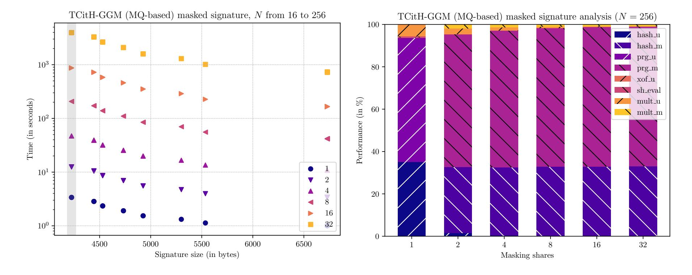
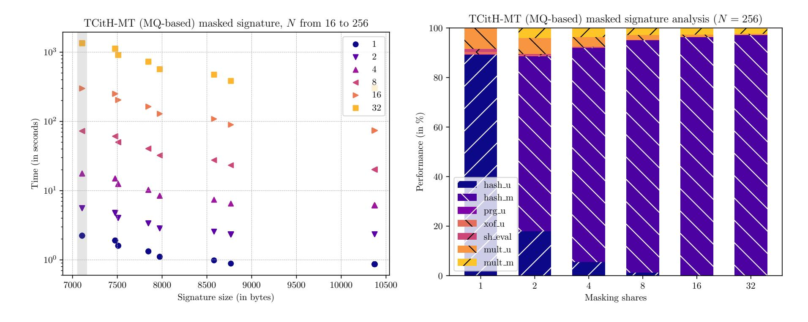
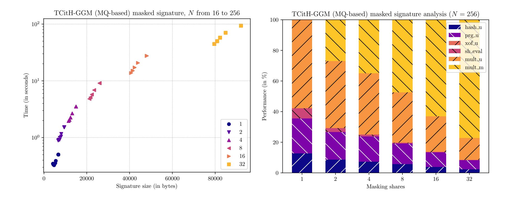
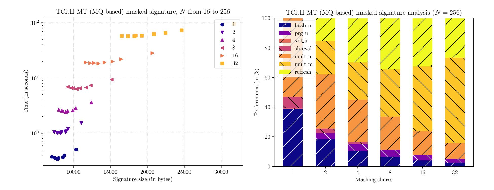
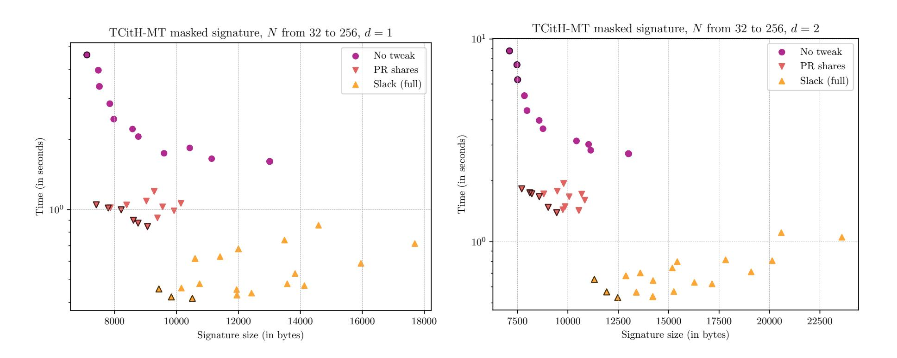
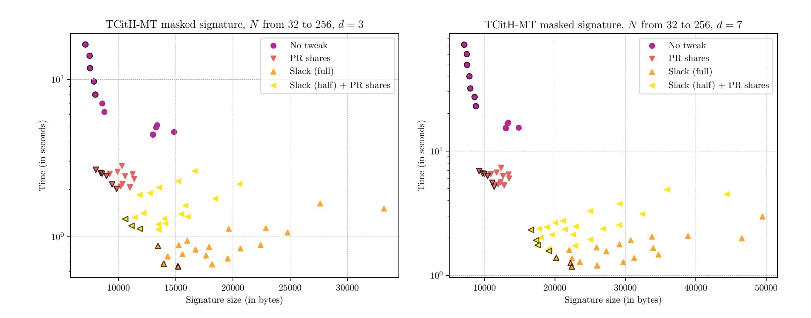
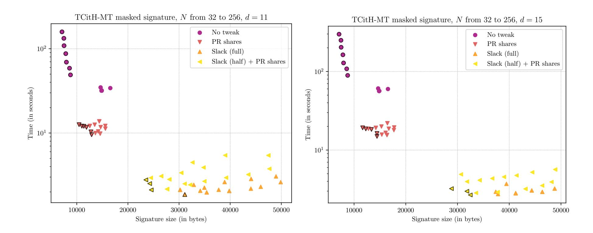
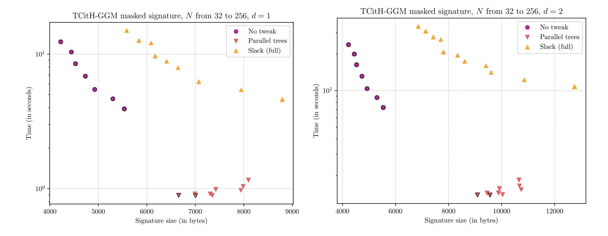
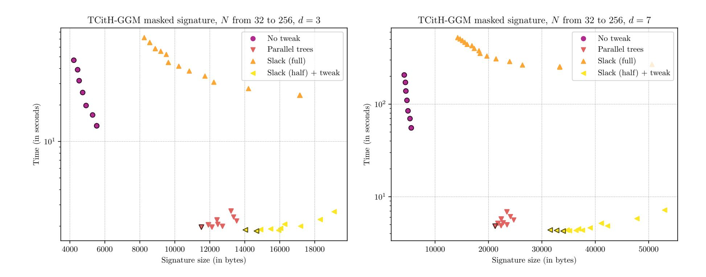
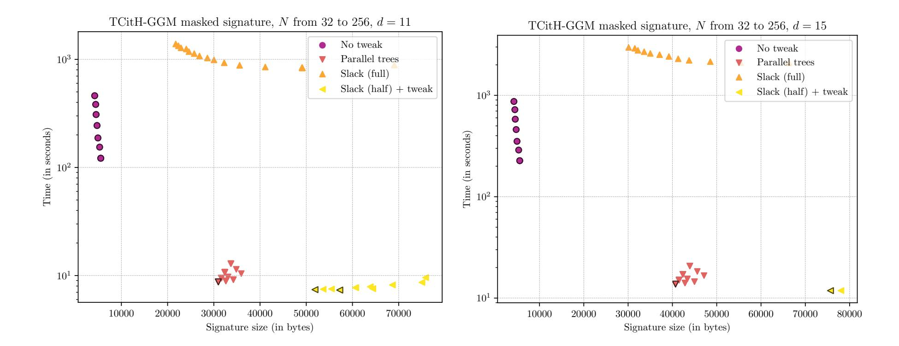

{0}------------------------------------------------

# Masking-Friendly Post-Quantum Signatures in the Threshold-Computation-in-the-Head Framework<sup>⋆</sup>

Thibauld Feneuil, Matthieu Rivain, and Auguste Warm´e-Janville

CryptoExperts, Paris, France thibauld.feneuil@cryptoexperts.com matthieu.rivain@cryptoexperts.com auguste.warme-janville@cryptoexperts.com

Abstract. Side-channel attacks pose significant threats to cryptographic implementations, which require the inclusion of countermeasures to mitigate these attacks. In this work, we study the masking of state-of-the-art post-quantum signatures based on the MPC-in-the-head paradigm. More precisely, we focus on the recent threshold-computation-in-the-head (TCitH) framework that applies to some NIST candidates of the post-quantum standardization process. We first provide an analysis of side-channel attack paths in the signature algorithms based on the TCitH framework. We then explain how to apply standard masking to achieve a d-probing secure implementation of such schemes, with performance scaling in O(d 2 ), for d the masking order.

Our main contribution is to introduce different ways to tweak those signature schemes towards their masking friendliness. While the TCitH framework comes in two variants, the GGM variant and the Merkle tree variant, we introduce a specific tweak for each of these variants. These tweaks allow us to achieve complexities of O(d) and O(d log d) at the cost of non-constant signature size, caused by the inclusion of additional seeds in the signature. We also propose a third tweak that takes advantage of the threshold secret sharing used in TCitH. With the right choice of parameters, we show how, by design, some parts of the TCitH algorithms satisfy probing security without additional countermeasures. While this approach can substantially reduce the cost of masking in some part of the signature algorithm, it degrades the soundness of the core zero-knowledge proof, hence slightly increasing the size of the signature.

We analyze the complexity of the masked implementations of our tweaked TCitH signatures and provide benchmarks on a RISC-V platform with built-in hash accelerator. We use a modular benchmarking approach, allowing to estimate the performance of diverse signature instances with different tweaks and parameters. Our results illustrate how the different variants scale for an increasing masking order. For instance, for a masking order d = 3, we obtain signatures of around 14 kB that run in 0.67 second on a the target RISC-V CPU with a 250MHz frequency. This is to be compared with the 4.7 seconds required by the original signature scheme masked at the same order on the same platform. For a masking order d = 7, we obtain a signature of 17.5 kB running in 1.75 second, to be compared with 16 seconds for the stardard masked signature.

Finally, we discuss the extension of our techniques to signature schemes based on the VOLE-in-the-Head framework, which shares similarities with the GGM variant of TCitH. One key takeaway of our work is that the Merkle tree variant of TCitH is inherently more amenable to efficient masking than frameworks based on GGM trees, such as TCitH-GGM or VOLE-in-the-Head.

Keywords: Masking · Post-quantum signatures · MPC-in-the-head · Zero-knowledge proofs · Sidechannel analysis

# 1 Introduction

The MPC-in-the-Head (MPCitH) paradigm is a method to build zero-knowledge proofs using techniques from multiparty computation. While this field of cryptography was mainly of theoretical interest at first, it

<sup>⋆</sup> This is an extended version of a paper published in IACR TCHES 2025. It includes additional background on masking at the beginning of Section 4.

{1}------------------------------------------------

has recently gained popularity thanks to its efficient application in constructing post-quantum signatures. Indeed, while modern public-key protocols such as RSA or ECDSA are resistant to classical computers, it is long known that they could be broken by a quantum computer. Although real-scale quantum computers do not exist at the moment, they are a main area of computer science research. Considering this fact, the National Institute of Standards and Technology (NIST) announced a standardization program for postquantum cryptography.

The first NIST call for post-quantum cryptographic algorithms resulted in the NIST selecting for standardization one key-encapsulation mechanism (Kyber) and three post-quantum signature schemes (Falcon, Dilithium and SPHINCS+). In 2023, a call for additional post-quantum signatures was made to get further algorithms based on diverse assumptions, as both Dilithium and Falcon rely on (structured) lattice assumptions while SPHINCS+ suffers slow signing. A total of 40 signature schemes, based on various designs and hardness assumptions, were selected for the first round, including 9 schemes based on the MPC-in-the-Head paradigm. In the second round, 6 out of the 14 selected candidates are based on this paradigm.

In computer security, in particular embedded systems (e.g. smart cards) security, side-channel attacks are a serious threat to cryptographic implementations. They exploit the physical properties of the implementation (such as timing, power consumption, or electromagnetic radiation) rather than the cryptographic algorithm in itself in order to deduce some secret information, such as the private key. As side-channel attacks on unprotected cryptographic implementations can be devastating, it is crucial to implement robust countermeasures to mitigate such threats.

Masking is the most popular countermeasure against side-channel attacks. Given a sensitive variable x (e.g. the private key), it consists of splitting it in d + 1 masking shares, such that d masking shares do not leak any information about x. The functions manipulating masked variables are called gadgets. We call d the masking order of a variable, which is essentially a security parameter against side-channel attacks. A common model to prove the security of masking is the d-probing model which assumes that an adversary A can probe d variables during multiple (and possibly different) executions of the target cryptographic algorithm. An algorithm is considered secure against A in the d-probing model if any combination of d variables does not leak secret information.

While the most widespread (pre-quantum) cryptographic schemes have already benefited from decades of research towards their secure implementation against side-channel attacks, it is not the case for many newer post-quantum candidates. The aim of the present work is to advance the study of modern MPC-in-the-Head schemes towards their efficient and secure implementation with masking.

The early MPCitH protocols – essentially the Picnic signature scheme [\[CDG](#page-42-0)<sup>+</sup>17, [KKW18,](#page-43-0) [KZ20b\]](#page-43-1) – benefited from some side-channel analysis [\[SBWE20,](#page-43-2) [ABE](#page-41-0)<sup>+</sup>21]. However, the newer schemes submitted to the last NIST call, which rely on slightly different designs and several optimizations, have not been analyzed in a side-channel context in the literature yet. While some previous MPCitH side-channel countermeasures transpose to the new designs, there is still a need for in-depth analysis.

The recent advances in MPCitH allowed the emergence of improved frameworks such as VOLE-in-the-Head [\[BBD](#page-41-1)<sup>+</sup>23] and Threshold-Computation-in-the-Head [\[FR23b\]](#page-42-1). These frameworks have been applied to various NIST candidates –see for instance [\[FR23b,](#page-42-1) [BFG](#page-42-2)<sup>+</sup>24, [BBGK24\]](#page-41-2)– leading to improvement compared to their original versions. The present work focuses on the Threshold-Computation-in-the-Head framework [\[FR23b\]](#page-42-1), hence achieving more general results than by focusing on a specific signature scheme.

Our contributions. We first present in [Section 3](#page-4-0) an in-depth leakage analysis of the Threshold Computation in the Head (TCitH) framework. We exhibit the sensitive variables and show how their knowledge can be used in a key recovery attack. This analysis is the starting point for building a masked version of a TCitH signature scheme.

Using the analysis from [Section 3,](#page-4-0) we present in [Section 4](#page-12-0) a first masked version of a standard TCitH signature in which the sensitive variables are masked and the functions manipulating them are replaced with corresponding masking gadgets. Although this first variant is d-probing secure, it suffers from a large performance overhead created by certain gadgets, with a computational complexity in O(d 2 ).

In [Section 5,](#page-20-0) we explore how the TCitH framework, in both its GGM tree and Merkle tree variants, can be optimized to improve masking efficiency. We introduce three tweaks to the original framework, aimed 

{2}------------------------------------------------

at reducing masking-related computational overhead. First, we propose two variant-specific tweaks to lower the  $O(d^2)$  complexity to O(d) or  $O(d \log d)$ . The quadratic complexity arises because the signature schemes require calls to hash functions with  $O(d^2)$  masking complexity for their non-linear operations. Both tweaks add information to the signature so that the hash functions can be unmasked, and called individually on each masking share. The third tweak leverages the threshold property of the secret sharing scheme used within the TCitH framework. By carefully selecting parameters, we can avoid masking certain parts of the signature scheme, achieving significant performance improvements at the cost of an increased signature size. For a target d-probing security, these tweaks offer various trade-offs, enabling improved computational complexity at a sometimes moderate increase in signature size.

In Section 6, we conduct a performance analysis of the various tweaked TCitH variants. This analysis estimates the runtime of each variant at a specific masking order, based on benchmarks of key routines. To achieve this, we enumerate the number of calls to all masked and unmasked primitives within each variant. By benchmarking these primitives on the RISC-V architecture, utilizing accelerated hashing from [Saa24], we provide accurate performance estimates for the different masked TCitH variants on this platform. The tweaks improve the signature performance by an order of magnitude at lower masking orders, while keeping a somewhat small signature size ( $\leq 15$  kB). At higher masking orders, the performance gain is even more impressive, at the cost of (much) larger signature sizes.

### 2 Preliminaries

#### 2.1 Cryptographic Primitives and Trees

In the following, we use the quantity  $\lambda$ , which represents the security parameter in bits. We denote Hash:  $\{0,1\}^* \to \{0,1\}^{2\lambda}$  a cryptographic hash function, and PRG:  $\{0,1\}^{\lambda} \to \{0,1\}^*$  a secure pseudorandom generator. We also denote XOF:  $\{0,1\}^* \to \{0,1\}^*$  an extendable-output hash function.

Seed tree. Using a PRG one can define a seed tree (or GGM tree), represented by the array nodes  $[1:2^{D+1}-1]$ , which is a binary tree with  $2^D$  leaves and root seed rseed = nodes [1] satisfying, for all  $i \in [1:2^D-1]$ :

<span id="page-2-0"></span>
$$(\mathsf{nodes}[2i] \parallel \mathsf{nodes}[2i+1]) := \mathsf{PRG}(\mathsf{nodes}[i]) \tag{1}$$

Note that this structure is defined from top to bottom, which means that one has to know the parent node in order to define their children. Using a GGM tree, one can decide to reveal the sibling path of a leaf  $\tilde{l}$ , which are D nodes of the tree allowing to recompute all the leaves except  $\tilde{l}$ , while keeping  $\tilde{l}$  secret. The recomputation of the tree using the sibling path requires  $\mathcal{O}(2^D)$  calls to a PRG. We denote TreePRG the function returning the tree leaves from a root seed rseed.

Merkle tree. A Merkle tree is a binary tree represented by the array  $nodes[1:2^{D+1}-1]$ . It is constructed bottom to top, using the hash digests  $h_1, \ldots, h_{2^D}$  as, for all  $i \in [2^{D-1}:1]$ :

$$nodes[i] := Hash(nodes[2i] \parallel nodes[2i+1])$$

with  $\operatorname{nodes}[2^D + i] = h_{i+1}$ ,  $\forall i \in [0, 2^D - 1]$ . We call  $h := \operatorname{nodes}[1]$  the Merkle root of the tree. In the Merkle tree case, one has to know both children of a parent node in order to compute the latter. Using a Merkle tree, one can authenticate a digest  $\tilde{h}$ , meaning that one can efficiently prove that this digest is a leaf of this Merkle tree. To do so, it requires to reveal D nodes of the Merkle tree (which are called the authentication path of  $\tilde{h}$ ) and to compute  $\mathcal{O}(D)$  hashes. We denote MerkleRoot the function taking the leaves as input and computing the Merke root.

#### 2.2 Zero Knowledge Proofs of Knowledge

Zero knowledge proofs of knowledge (ZKPoK) are a type of interactive protocols where a prover  $\mathcal{P}$ , given some public value x wants to convince a verifier  $\mathcal{V}$  that they know a secret value w, satisfying some relation  $\mathcal{R}(x,w)=1$ , without revealing any information about it. More formally, given a language  $\mathcal{L}=\{x\mid$ 

{3}------------------------------------------------

 $\exists w, \mathcal{R}(x, w) = 1$ } in  $\mathcal{NP}$  and a public value x the prover wants to convince the verifier that  $x \in \mathcal{L}$  and that they know a witness w such that  $\mathcal{R}(x, w) = 1$ . The prover and the verifier exchange a sequence of messages, after which the verifier can Accept or Reject. Such a sequence of messages is called the *transcript* of the protocol execution. A zero-knowledge proof of knowledge should satisfy the three following properties:

- Completeness: If the statement is true, an honest prover knowing a witness w for x always succeeds in convincing  $\mathcal{V}$  of their knowledge.
- Soundness: No cheating prover can convince the verifier that they know a witness w for x, except with some small probability.
- Zero-knowledge: If the statement is true, the verifier does not learn any additional information about the secret w throughout the entire execution of the protocol.

Such a protocol has an inherent soundness error, which is the probability  $\epsilon$  that the verifier is convinced by a cheating prover who does not know the witness w. In this article we consider public-coin interactive proofs of knowledge, which are interactive protocols where the messages sent by the verifier are picked at random. Such an interactive proof system can be turned into a non-interactive secure signature scheme in the random oracle model using the Fiat-Shamir transform [FS87]. The verifier challenges are chosen as the outputs of hash functions, which can be modeled as random oracles.

### 2.3 Multi-Party Computation and Secret Sharing

We introduce here the notion of secret sharing. Given a secret value  $w \in \mathbb{F}$  and N parties, a  $(\ell+1)$ -out-of-N secret sharing (or  $(\ell+1,N)$ -secret sharing) of w is a N-tuple  $\llbracket w \rrbracket = (\llbracket w \rrbracket_1, \ldots, \llbracket w \rrbracket_N)$  such that any set of  $\ell$  secret shares do not reveal any information about the secret value w, and the secret value can be reconstructed from any set of  $\ell+1$  secret shares. The secret can be shared using different methods, the common ones are additive sharings and Shamir's secret sharings. In this work, we often need to share vectors: they are shared coordinate-wise, that is  $\llbracket (w_i)_{i\in [M]} \rrbracket = (\llbracket w_1 \rrbracket, \ldots, \llbracket w_M \rrbracket)$ . For a sharing  $\llbracket w \rrbracket$  and a subset  $S \subset [N]$  we denote  $\llbracket w \rrbracket_S = (\llbracket w \rrbracket_i)_{i\in S}$  the vector of the secret shares indexed by the elements of S.

Additive sharing. Given a group  $(\mathbb{G}, +)$  an additive sharing  $(\llbracket w \rrbracket_i)_{i \in [N]}$  is computed such that  $\llbracket w \rrbracket = \llbracket w \rrbracket_1 + \cdots + \llbracket w \rrbracket_N$ . In practice, the first N-1 secret shares are picked at random and the last one is computed such that the equality holds. Note that such a sharing is a N-out-of-N secret sharing.

Shamir's secret sharing. In [Sha79], the author introduces a method to share some value w into a  $(\ell+1)$ -out-of-N secret sharing, based on polynomial interpolation. The dealer picks  $\ell$  polynomial coefficients  $r_1 \ldots, r_\ell$  at random and computes the sharing polynomial  $P(X) = (\sum_{i=1}^{\ell} r_i X^i) + w$ . Then, given some distinct non-zero evaluation points  $e_1, \ldots, e_N$ , each party gets the corresponding secret share  $[w]_i = P(e_i)$ .

Both secret sharing schemes are linear secret sharing schemes, that is, for any linear function f, and a sharing  $(\llbracket w \rrbracket_i)_{i \in [N]}$  of w,  $(f(\llbracket w \rrbracket_i))_{i \in [N]}$  is a sharing of f(w). This means, one can evaluate any linear function separately on each secret share, and then recombine thoses shares in order to get the evaluation of this function, which is the base of multi-party computation.

Multi-party computation. A multi-party computation (MPC) protocol is a type of interactive protocol where a set of players  $\mathcal{P}_1, \ldots, \mathcal{P}_N$  holding some private inputs  $[\![w]\!]_1, \ldots, [\![w]\!]_N$ , want to compute a joint function  $f([\![w]\!]_1, \ldots, [\![w]\!]_N)$ . During the execution of the protocol, the players may communicate with each other. In this work, we consider only broadcast communication and perfectly correct  $\ell$ -private protocols (i.e. the parties actually compute  $f([\![w]\!]_1, \ldots, [\![w]\!]_N)$ ) in the semi-honest model, meaning that the parties follow the protocol's specification while trying to learn some information about the other parties secret values. The protocols we consider compute a witness verification function f, which outputs ACCEPT on input a sharing of a correct witness w (namely, which satisfies  $(x, w) \in \mathcal{R}$ ) and REJECT otherwise. They may have a false positive probability p, which is the probability that the protocol outputs ACCEPT for some w such that  $(x, w) \notin \mathcal{R}$ .

{4}------------------------------------------------

### 2.4 MPC-in-the-Head Paradigm

The MPC-in-the-Head paradigm introduced in [IKOS07] is a method to build zero-knowledge proofs from multi-party computation. It transforms a MPC protocol  $\Pi$  computing a witness verification function f of a relation  $\mathcal{R}(x, w)$  into a zero-knowledge proof of knowledge for this relation. The resulting proof system is defined as follows:

- The witness w is shared in N random secret shares ( $\llbracket w \rrbracket_1, \ldots, \llbracket w \rrbracket_N$ ), and each party  $\mathcal{P}_i$  receives a secret share  $\llbracket w \rrbracket_i$ . The prover simulates the execution of the MPC protocol in their head: namely, they perform the computation for each party  $i \in [N]$  and commits to each party's view:  $\mathsf{com}_i = \mathsf{Com}(\mathsf{View}_i)$ . A view includes each party's input secret shares, its random tape and the messages received during the execution of the MPC protocol. The prover then sends the commitments  $(\mathsf{com}_i)_{i \in [N]}$  to the verifier.
- The verifier samples a random subset  $I \subset [N]$  such that  $|I| = \ell$  and asks the prover to open the views of the parties  $\{\mathcal{P}_i\}_{i \in I}$ .
- The prover sends the corresponding views, and the verifier checks if they are consistent with the commitments and an honest execution of the MPC protocol.

The soundness error  $\epsilon$  of such protocols is specific to the MPCitH instance and typically depends on  $N, \ell$  and the false probability p of the MPC protocol. In order to make this error arbitrarily small, the prover often executes parallel repetitions of the MPCitH scheme. We denote  $\tau$  the number of such repetitions.

In the TCitH framework, we consider general MPC protocols built from one or several rounds where the parties can perform different actions in each round. They can receive (common) randomness that will be used during the computation. They can also receive hints, which are secret sharings  $[\![\beta]\!]$  of a value  $\beta$  which is computed using a function  $\psi$ . The value of  $\beta$  depends on the witness and all the previous randomness used in the MPC protocol. Notably, the values of the hints may not be the same for each different execution of the TCitH framework that uses the same public key x and private key w. When those protocols are used in the context of MPCitH, they need to be committed by the prover alongside the witness. For example, in the protocol from [BN20] checking that  $z = x \cdot y$ , the parties receive secret shares of another multiplication triple a, b, c s.t.  $c = a \cdot b$  in order to check the original product without leaking information about it. The sharings  $[\![a]\!]$ ,  $[\![b]\!]$ ,  $[\![c]\!]$  can be considered as hints.

In [FR23b], the authors highlight a simple MPC protocol (denoted  $\Pi_{PC}$ ) that checks whether an input witness  $w \in \mathbb{F}^n$  is the solution to a system of m polynomial equations of degree d and that leads to very efficient proof systems through the MPC-in-the-Head paradigm. By setting d = 2, we obtain an MPC protocol checking an instance of the  $\mathcal{MQ}$  (multivariate quadratic) problem, that will be the reference MPC protocol in this work.

### <span id="page-4-0"></span>3 Side-Channel Analysis of Modern MPCitH-based Proof Systems

### 3.1 The TCitH framework

The Threshold-Computation-in-the-Head (TCitH) framework, introduced in [FR23c] and improved in [FR23b] aims to propose a generic and efficient proof system for modern MPCitH schemes. While traditional MPCitH relies on additive secret sharing, TCitH explores the application of threshold secret sharing to the MPCitH paradigm. When using threshold secret sharing with privacy parameter  $\ell$  and  $N > \ell$  parties, any set of  $\ell$  secret shares of a secret value x do not leak any information about it, while  $\ell + 1$  secret shares allow full recovery of this value. The value of  $\ell$  can be any value from the interval [1:N-1] whereas additive secret sharing requires  $\ell$  to be equal to N-1. As a consquence, the number of emulated parties by the prover and the verifier is now reduced, as only  $\ell+1$  party emulations are now needed to produce a valid proof transcript, instead of N using additive-based MPCitH (or  $1 + \log_2 N$  using the hypercube technique [AGH+23]), thus reducing the computational cost and making it independent of the total number of parties N. This also allows choosing larger values for N, yielding better soundness for the proof of knowledge.

In [FR23b] the authors extend the TCitH framework with some new features. A new variant of the framework is introduced, using GGM seed trees (instead of Merkle trees) for the generation and commitment

{5}------------------------------------------------

Table 1. Notations and parameters.

| Inputs:                  |                                                                   |  |  |
|--------------------------|-------------------------------------------------------------------|--|--|
| w                        | Witness of the signature scheme, private key.                     |  |  |
| x = F(w)                 | Public key.                                                       |  |  |
| β                        | Hints of the MPC protocol.                                        |  |  |
| Secret sharing:          |                                                                   |  |  |
| [[w]]                    | Sharing ([[w]]1, , [[w]]N<br>) of a variable w.                   |  |  |
| Pw                       | Shamir's secret sharing polynomial of a secret w.                 |  |  |
| dw                       | Degree of the sharing polynomial Pw.                              |  |  |
| MPCitH:                  |                                                                   |  |  |
| N                        | Number of parties.                                                |  |  |
| τ                        | Number of repetions of the PoK.                                   |  |  |
| ℓ                        | Privacy parameter (i.e. the number of revealed parties).          |  |  |
| t                        | Number of challenges in the proof system.                         |  |  |
| λ                        | Security parameter.                                               |  |  |
| ϵ                        | Soundness error of the proof system.                              |  |  |
| MPC:                     |                                                                   |  |  |
| ε                        | Randomness for the MPC protocol.                                  |  |  |
| α                        | Broadcast values.                                                 |  |  |
| p                        | False positive probability of the MPC protocol.                   |  |  |
| φ                        | Function representing a round of the MPC protocol.                |  |  |
| dφ                       | Degree of the MPC protocol.                                       |  |  |
| Degree enforcing scheme: |                                                                   |  |  |
| η                        | Parameter of the degree-enforcing commitment scheme.              |  |  |
| Pξ                       | Degree-enforcing polynomial.                                      |  |  |
| u                        | Witness expansion for the degree-enforcing commitment scheme.     |  |  |
| Variables and routines:  |                                                                   |  |  |
| salt                     | Salt used as an input for XOF, Hash and commitments.              |  |  |
| rseed                    | Root seed for randomness expansion.                               |  |  |
| seedi                    | Seed used by the i-th party.                                      |  |  |
| comi                     | Commitment to the i-th party's secret shares.                     |  |  |
| TreePRG                  | Returns a seed tree given a root seed.                            |  |  |
| MerkleTree               | Computes the Merkle (hash) root from the input values.            |  |  |
| Masking:                 |                                                                   |  |  |
| d                        | Masking order.                                                    |  |  |
| ⟨x⟩                      | (d + 1)-masking sharing (⟨x⟩0, ,⟨x⟩d) of a value x.               |  |  |
| φ(x)                     | Masked version of φ(x) that manipulates (d + 1)-masking sharings. |  |  |
| Misc:                    |                                                                   |  |  |
| [N1<br>: N2]             | The integer interval [N1, N2] ∩ Z.                                |  |  |
| [N]                      | The integer interval [1 : N].                                     |  |  |
| \$<br>← F<br>x           | Uniform random sampling from F.                                   |  |  |
|                          |                                                                   |  |  |

of secret sharings, yielding shorter proof sizes. Some new features are also introduced, notably to use of non-linear MPC protocols which are often simpler than linear ones, allowing even smaller proof sizes. The interactive TCitH proof system is built from the following steps:

- 1. The prover generates an (ℓ + 1)-out-of-N secret sharing [[w]] of the witness w and commits each secret share com<sup>i</sup> = Com([[w]]i). Then, they sends a digest h<sup>1</sup> of all the commitments to the verifier.
- 2. The prover emulates the MPC protocol for a subset S ⊂ {1, . . . , N} of (d<sup>φ</sup> · ℓ + 1) parties (where d<sup>φ</sup> is the degree of the MPC protocol), and sends a hash of the broadcast values h<sup>2</sup> to the verifier. The MPC protocol might need several rounds in order to complete. A round corresponds to the sequence of running the MPC protocol, broadcasting values and sending a hash of them to the verifier that can

{6}------------------------------------------------

respond with a random value that will be used in order to continue the execution of the protocol. The variable t denotes the number of such rounds.

- 3. The verifier samples a random subset of parties  $I \subset \{1, ..., N\}$  of size  $\ell$  and sends it to the prover.
- 4. The prover opens the commitments of all the parties in I, *i.e.* they reveal the secret shares  $\llbracket w \rrbracket_i$  for  $i \in I$ . In addition, they reveal the broadcast shares  $\llbracket \alpha \rrbracket_{I^*}$  of some other parties in  $I^* = S \setminus I$  necessary to verify the execution of the MPC protocol. They also send the necessary values to recompute  $h_1$ .
- 5. The verifier checks the consistency of the values sent by the prover. They first checks that the commitments of the opened shares are consistent with  $h_1$ , and if the broadcast values of the MPC protocol are consistent with  $h_2$ . If both hashes are consistent and if the output of the MPC protocol is ACCEPT, the verifier accepts the proof. Otherwise they reject it.

The TCitH framework has two variants, which have different upsides. In the GGM variant, a GGM tree is used to generate pseudo-random sharings. Instead of sending some secret shares to the verifier, the prover only needs to send the sibling path to recompute the seeds and some auxiliary values, as originally proposed in [KKW18] for additive-sharing MPCitH. Since the sibling path is built from seeds of  $\lambda$  bits, it allows to reach a lower communication cost of the protocol, yielding shorter signatures. In the MT variant, a Merkle tree is used to commit to the parties' secret shares. While this variant results in larger proof sizes, the verification time is shorter than the GGM variant: in order to verify the commitments, the prover only needs to recompute the Merkle root from the authentication path which is faster than recomputing the full GGM tree in the other variant, which results in much shorter verification time. The proof systems achieve the following soundness errors:

$$\epsilon := \begin{cases} p + (1-p) \cdot \frac{\binom{d_{\alpha}}{\ell}}{\binom{N}{\ell}} & \text{for the GGM variant,} \\ p + (1-p) \cdot \frac{\binom{d_{\alpha}}{\ell}}{\binom{N}{\ell}} + \frac{\binom{N}{\ell+2}}{|\mathbb{F}|^{\eta}} & \text{for the Merkle tree variant.} \end{cases}$$

In the rest of this work, we consider one-round MPC protocols (i.e. t=1) in order to keep things simple. We can obtain signature schemes by applying the Fiat-Shamir transformation over the TCitH proof system. We refer the reader to Figure 1 and Figure 2 for a more formal description of the obtained signature schemes.

Degree-enforcing commitment of the MT variant. In [FR23b], the authors introduce the degree-enforcing commitment scheme (DEC) in order to ensure that the committed secret shares are of the right degree in the MT variant (which is a revised version of the proximity test of Ligero [AHIV17]). First, the prover picks a random vector  $u \in \mathbb{F}^{\eta}$ , shares it into a  $(\ell+1,N)$ -sharing and commits to it. Then, the verifier sends them a random matrix  $\Gamma \in \mathbb{F}^{\eta \times |w|}$  (which is expanded from the Fiat-Shamir hash of the commitments in the signature scheme). The prover then computes the sharing  $[\![\xi]\!] = \Gamma \cdot [\![w]\!] + [\![u]\!]$  and sends it to the verifier. The verifier can then check that  $[\![\xi]\!]$  is of the right degree, and that the revealed secret shares satisfy the equality  $[\![\xi]\!] = \Gamma \cdot [\![w]\!] + [\![u]\!]$ . This ensures that the committed sharings are of the right degree with a high probability which can be parametrized with the parameter  $\eta$ .

GGM pseudorandom sharing generation. While in the MT variant, sharing polynomials of a secret w are computed directly from coefficients (from  $\{r_i\}_{i\in[1:\ell]}$ , one computes the polynomial  $P_w(X) = (\sum_{i=1}^{\ell} r_i X^i) + w$ ), the GGM tree variant uses a specific technique introduced in [CDI05] in order to build Shamir's secret sharings from the GGM tree leaves. Let us denote  $\mathcal{S}_{\ell}^N$  all the subsets of [1:N] of size  $\ell$ . Let  $T_0$  be one of those subsets. Given  $\binom{N}{\ell}$  pseudorandom coefficients  $\{s_T^w\}_{T\in\mathcal{S}_{\ell}^N}$  and  $\Delta w = w - \sum_T s_T^w$ , the degree- $\ell$  Shamir's

<span id="page-6-0"></span><sup>&</sup>lt;sup>1</sup> The authentication path of the Merkle tree is made of hash digests of size  $2\lambda$  bits vs. seeds of size  $\lambda$  bits for the GGM variant.

<span id="page-6-1"></span><sup>&</sup>lt;sup>2</sup> This is actually done by committing  $\llbracket \xi \rrbracket$  with a hash digest, then the verifier can recompute  $\llbracket \xi \rrbracket$  from revealed secret shares of  $\llbracket w \rrbracket$ ,  $\llbracket u \rrbracket$  and using additional secret shares of  $\llbracket \xi \rrbracket$  sent by the prover.

{7}------------------------------------------------

sharing polynomial of a value w is defined as:

<span id="page-7-0"></span>
$$P_w(X) := \Delta w \cdot P_{T_0}(X) + \sum_{T \in \mathcal{S}_{\ell}^N} s_T \cdot P_T(X)$$
(2)

with  $P_T \in \mathbb{F}[X]$  being the unique degree- $\ell$  polynomial such that  $P_T(0) = 1$  and  $P_T(e_j) = 1$  for all  $j \in T$ , where  $\{e_j\}$  are the parties' evaluation points for the Shamir secret sharing scheme. One can then deduce secret shares by evaluating the polynomial  $P_w(X)$  on the parties evaluation points.

Signature composition and verification. Let us now recall how the signatures are built and how the verification works in a nutshell. The signature for the GGM variant is (the corresponding signing algorithm is described in Figure 1):

$$\mathsf{salt} \mid h_1 \mid h_2 \mid \left( (\mathsf{path}_{I^{[e]}}, \Delta w^{[e]}, \Delta \beta^{[e]}), \mathsf{com}_{I^{[e]}}^{[e]}, [\![\alpha^{[e]}]\!]_{I^{\star[e]}} \right)_{e \in [\tau]}$$

and for the MT variant (the corresponding signing algorithm is described in Figure 2):

$$\mathsf{salt} \mid h_1 \mid h_1' \mid h_2 \mid \left( ([\![w^{[e]}]\!]_i, [\![\beta^{[e]}]\!]_i, [\![u_i^{[e]}]\!])_{i \in I}, \mathsf{auth}^{[e]}, [\![\alpha^{[e]}]\!]_{I^{\star[e]}}, \{P_\xi^{[e]}(e_i)\}_{i \in J^{\star[e]}} \right)_{e \in [\tau]}$$

For the sake of simplicity, let us consider only one parallel repetition i.e.  $\tau = 1$ .

In the GGM variant, the verifier starts by recomputing all the GGM tree leaves except the hidden one using the sibling path  $\mathsf{path}_I$ . Then, they can recompute the commitments to the recomputed leaves, and using  $\mathsf{com}_I$ , they verify the consistency of the commitments by recomputing  $h'_1$  and checking that  $h_1 = h'_1$ . Using the auxiliary values  $\Delta w, \Delta \beta$ , the verifier recomputes the secret shares  $[\![w]\!]_i, [\![\beta]\!]_i$  for all  $i \in I$ . Next, they expand randomness for the MPC protocol from  $h_1$  and they simulate the execution of the protocol using the secret shares  $[\![w]\!]_i, [\![\beta]\!]_i$ , yielding the broadcast shares  $[\![\alpha]\!]_I$ . From  $[\![\alpha]\!]_I$  and  $[\![\alpha]\!]_{I^*}$  they reconstruct  $\alpha$  and check that it is equal to zero. Eventually, they recompute the secret shares  $[\![\alpha]\!]_S$  and recompute the hash  $h'_2$  in order to check that  $h_2 = h'_2$ .

In the MT variant, the verifer starts by recomputing the commitments to the secret shares  $\llbracket w \rrbracket_i, \llbracket \beta \rrbracket_i, \llbracket u \rrbracket_i$  for all  $i \in I$  and check their consistency by recomputing the Merkle root  $h'_1$  using the authentication path auth and check that  $h_1 = h'_1$ . Next, they expand  $\Gamma$  from  $h_1$  and recompute the degree-enforcing polynomial secret shares  $\llbracket \xi \rrbracket_i$  using  $\llbracket w \rrbracket_i, \llbracket \beta \rrbracket_i, \llbracket u \rrbracket_i$  for all  $i \in I$ . Using  $\{P_{\xi}(e_i)\}_{i \in J^*}$ , they recompute the degree-enforcing polynomial  $P_{\xi}$  and compute the hash  $h''_1 = \mathsf{Hash}(P_{\xi})$ . Then, they check that  $h''_1 = h'_1$  in order to check the consistency of the computation of the degree-enforcing polynomial. The rest of the verification process is the same as in the GGM variant: the verifier simulates the MPC protocol and checks its consistency.

#### 3.2 Side-channel Analysis of TCitH-based Signature Scheme

We now explain the two signature schemes in detail, emphasizing the steps that are critical in a SCA context. During the analysis, we consider that all the values of the signature are known to a side-channel attacker. Thus, they can exploit them in order to try to retrieve some secret information. For the sake of simplicity, we will consider only one parallel repetition (i.e.  $\tau = 1$ ). We also consider that [w],  $[\beta]$ , [u] are  $(\ell + 1)$ -out-of-N Shamir's secret sharings. Although it is always true for [w], it is not always the case for  $[\beta]$  and [u]. The underlying sharing polynomial can have higher degree than  $\ell$ , we thus advice the reader to have this in mind through the rest of this section.

Analysis of the GGM variant. Figure 1 describes the 5-round TCitH-GGM signature scheme.

Phase 0. The protocol starts by choosing at random some root seed and some salt. While the salt is considered as a non-sensitive value since it is part of the signature, the root seed should remain secret because it is used to generate masks to the secret key (cf next phases).

{8}------------------------------------------------

Inputs: A secret key w, a public key x = F(w) and a message  $m \in \{0, 1\}^*$ .

#### Phase 0: Initialization.

- 1. Sample a random salt salt  $\stackrel{\$}{\leftarrow} \{0,1\}^{|\mathsf{salt}|}$ .
- 2. Sample a root seed rseed  $\stackrel{\$}{\leftarrow} \{0,1\}^{\lambda}$ .

#### Phase 1: Sharing generation and commitment. For each iteration $e \in [\tau]$ ,

1. Derive randomness  $r_{\psi}^{[e]} \leftarrow \mathsf{PRG}(\mathsf{salt},\mathsf{rseed},e,-1)$  and compute the plain hint

$$\beta^{[e]} \leftarrow \psi(w, r_{\psi}^{[e]})$$

2. Compute the GGM tree:

$$\{\mathsf{seed}_T^{[e]}\}_{T \in \mathcal{S}_\ell^N} \leftarrow \mathsf{TreePRG}(\mathsf{salt}, \mathsf{rseed}, e)$$

3. Derive randomness from the seed tree as, for all  $T \in \mathcal{S}_{\ell}^{N}$ ,

$$s_T^{w[e]}, s_T^{\beta[e]} \leftarrow \mathsf{PRG}(\mathsf{seed}_T^{[e]})$$

4. Compute the auxiliary values  $\Delta w^{[e]} = w - \sum_T s_T^{w[e]}$ ,  $\Delta \beta^{[e]} = \beta^{[e]} - \sum_T s_T^{\beta[e]}$  and compute the sharing polynomials  $P_w^{[e]}(X)$  and  $P_\beta^{[e]}(X)$  as:

$$P_w^{[e]}(X) \leftarrow \Delta w^{[e]} \cdot P_{T_0}(X) + \sum_{T \in \mathcal{S}_{\ell}^N} s_T^{w[e]} \cdot P_T(X), \qquad P_{\beta}^{[e]}(X) \leftarrow \Delta \beta^{[e]} \cdot P_{T_0}(X) + \sum_{T \in \mathcal{S}_{\ell}^N} s_T^{\beta[e]} \cdot P_T(X)$$

Then, compute the secret shares of all the parties in S, namely, for all  $i \in S$ :

$$[w^{[e]}]_i, [\beta^{[e]}]_i \leftarrow P_w^{[e]}(e_i), P_\beta^{[e]}(e_i)$$

with  $e_i$  being the Shamir's secret sharing evaluation point of the *i*-th party.

5. Compute the commitments, for all  $T \in \mathcal{S}_{\ell}^{N}$ ,

<span id="page-8-0"></span>
$$\mathsf{com}_{T}^{[e]} \leftarrow \mathsf{Hash}_{0}(\mathsf{salt}, \mathsf{seed}_{T}^{[e]})$$

6. Compute the hash:

$$\tilde{h}^{[e]} \leftarrow \mathsf{Hash}_0'(\{\mathsf{com}_T^{[e]}\}_T, \Delta w^{[e]}, \Delta \beta^{[e]})$$

#### Phase 2: First challenge (randomness for the MPC protocol).

- 1. Compute  $h_1 \leftarrow \mathsf{Hash}_1(\mathsf{salt}, \tilde{h}^{[1]}, \dots, \tilde{h}^{[\tau]})$ .
- 2. Expand  $h_1$  as  $(\varepsilon^{[e]})_{e \in [\tau]} \leftarrow \mathsf{XOF}(h_1)$ .

#### Phase 3: Emulation of the MPC protocol. For each iteration $e \in [\tau]$ ,

1. Compute, for  $i \in S$ ,

$$\llbracket \alpha^{[e]} \rrbracket_i \leftarrow \varphi_{x,\varepsilon^{[e]}} (\llbracket w^{[e]} \rrbracket_i, \llbracket \beta^{[e]} \rrbracket_i)$$

and recover  $\alpha^{[e]}$  from  $[\![\alpha^{[e]}]\!]_S$ .

#### Phase 4: Second challenge (parties to be opened).

- 1. Compute  $h_2 \leftarrow \mathsf{Hash}_2(m,\mathsf{salt},h_1,\llbracket\alpha^{[1]}\rrbracket_S,\ldots,\llbracket\alpha^{[\tau]}\rrbracket_S)$ .
- 2. Expand  $h_2$  as  $(I^{[e]})_{e \in [\tau]} \leftarrow \mathsf{XOF}(h_2)$  where, for every  $e, I^{[e]} \subset [N]$  is a subset of  $\ell$  parties  $(i.e. |I^{[e]}| = \ell)$ .

Phase 5: Assembling the signature. Output the signature sig built as

$$\mathsf{salt} \mid h_1 \mid h_2 \mid \left( (\mathsf{path}_{I^{[e]}}^{[e]}, \Delta w^{[e]}, \Delta \beta^{[e]}), \mathsf{com}_{I^{[e]}}^{[e]}, [\![\alpha^{[e]}]\!]_{I^{\star[e]}} \right)_{e \in [\tau]}$$

where  $\mathsf{path}_{I^{[e]}}^{[e]}$  is the sibling path of the subset of opened parties  $I^{[e]}$ , and  $I^{\star[e]}$  of cardinality  $d_{\alpha} + 1 - \ell$  is such that  $I^{\star[e]} \cap I^{[e]} = \emptyset$ .

Fig. 1. TCitH-GGM signing algorithm.

{9}------------------------------------------------

Phase 1: Sharing generation and commitment. In the GGM tree variant, the signing algorithm starts by computing the plain hint  $\beta$  from the witness w and some randomness  $r_{\psi}$  using some function  $\psi$  (which is specific to each MPC protocol and will not be detailed here). Next, it computes a GGM tree with  $\binom{N}{\ell}$  leaves, where each leaf corresponds to a subset T of  $\{1,\ldots,N\}$  such that  $|T|=\ell$ . Then, from each leaf of the tree, it derives some randomness  $s_T^w, s_T^{\beta}$  for the sharings of the witness and the hint. Using the pseudorandom sharing method, it shares  $w, \beta$  into  $(\ell+1)$ -Shamir's secret sharings. Then, for each  $T \in \mathcal{S}_{\ell}^N$  it computes the commitments to the secret tape  $\operatorname{seed}_T$ . It eventually hashes all the commitments as well as the auxiliary values  $\Delta w, \Delta \beta$  and send the hash to the verifier.

First, as the hint computation is done using the plain value of the secret w, any probing attack on this step allowing to recover this value is highly critical. Regarding the hint  $\beta$  itself, it is dependent of the MPC protocol used within the framework and shall leak some information about the secret w in general (otherwise it would not require to be shared as a hint in the first place). We should therefore always consider that the hint  $\beta$  must be protected as the secret w itself. In addition, one needs to define a probing secure version of the function  $\psi$ . Then, a probing attacker could try to attack the sharing generation in two possible ways:

- The signature includes the sibling path of the GGM tree which allows the verifier to recompute all the seeds of the GGM tree except one, which corresponds to the opened parties. From those  $\binom{N}{\ell} 1$  seeds, the verifier can recompute all the pseudorandom terms of the sum  $\sum_{T \in \mathcal{S}_{\ell}^N} s_T \cdot P_T(X)$  except one. From these, using Equation 2, they can recover the secret shares of the revealed parties,  $\llbracket w \rrbracket_i$  and  $\llbracket \beta \rrbracket_i$ , for all  $i \in I$ . In order to reconstruct the secret sharings of  $w, \beta$ , a side-channel attacker needs to probe only one secret share (among |S| possible secret shares), namely  $\llbracket w \rrbracket_i$  or  $\llbracket \beta \rrbracket_i$ , for all  $i \in S \setminus I$ . In addition, they can also probe the missing seed seed<sub>I</sub>, or the missing randomness  $s_I^w$ ,  $s_I^\beta$  in order to recompute the full sharings  $\llbracket w \rrbracket$ ,  $\llbracket \beta \rrbracket$  still using Equation 2. As the signature algorithm cannot know the secret shares to be revealed in advance, one needs to mask all the shares of  $w, \beta$ , as well as the seeds seed<sub>T</sub> and the expanded randomness  $s_T^w$ ,  $s_T^\beta$ , for all  $T \in \mathcal{S}_\ell^N$ .
- During the sharing generation, the signature algorithm computes and stores the polynomials  $P_w(X)$ ,  $P_{\beta}(X)$ . As storing a polynomial in memory simply consist of storing its coefficients, let us now analyse how one could use any of the sharing polynomial coefficients in order to fully recover the shared secret. Given a degree  $\ell$  sharing polynomial P of a secret value w, and  $\ell$  evaluation points of this polynomial, we have the following system:

$$\begin{cases} P(e_1) = e_1^{\ell} r_{\ell} + \dots + e_1 r_1 + w \\ P(e_2) = e_2^{\ell} r_{\ell} + \dots + e_2 r_1 + w \\ \dots \\ P(e_{\ell}) = e_{\ell}^{\ell} r_{\ell} + \dots + e_{\ell} r_1 + w \end{cases}$$

where the  $\ell+1$  unknowns are  $w, r_1, \ldots, r_\ell$ . This linear system has more unknowns than equations, so it does not have a unique solution. By probing any of the polynomial coefficients (*i.e.* any unknown), the system now has  $\ell$  unknowns and equations, and then has a unique solution. Thus, with the knowledge of 1 or more polynomial coefficient, finding the secret key w simply consists of solving a linear system.

During the GGM tree generation ( $\{\mathsf{seed}_T^{[e]}\}_{T\in\mathcal{S}_\ell^N} \leftarrow \mathsf{TreePRG}(\mathsf{salt},\mathsf{rseed},e)$ ), the signature algorithm computes  $\binom{N}{\ell}$  intermediate seeds in order to compute the tree leaves. From an intermediate seed, one can recompute the entire subtree with this seed as a root. So, a side-channel attacker able to probe any of the parent seeds (and in particular the root seed rseed) of the hidden seed  $\mathsf{seed}_I$  would be able to recompute all the secret sharings used by the signing algorithm during the signature, including  $[\![w]\!]$ . Hence, all the intermediate seeds need to be masked.

Regarding the intermediate values  $\Delta w$ ,  $\Delta \beta$  and all the commitments, they are either directly part of the signature or can be recomputed from other elements of the signature. Therefore we can conclude that they do not need to be masked.

Phase 2: Randomness for the MPC protocol. Using the hashes of the commitments, the signature algorithm computes the Fiat-Shamir hash  $h_1$ , from which it expands some randomness to be used in the MPC protocol.

{10}------------------------------------------------

The values manipulated by the signature algorithm in this step are also part of the signature, so they can be considered public. This phase thus does not leak secret information to a probing attacker.

Phase 3: MPC protocol. In this step, the signing algorithm emulates the MPC protocol for dφℓ + 1 different parties, using their secret shares, the public key and some public randomness. It obtains the broadcast shares of α, the output of the MPC protocol. More precisely, the signing algorithm computes, for each party i ∈ S, [[α]]<sup>i</sup> ← φx,ε [[w]]<sup>i</sup> , [[β]]<sup>i</sup> . For each i /∈ I (I being the set of opened parties), the secret shares [[w]]<sup>i</sup> , [[β]]<sup>i</sup> are not part of the signature. As a consequence, a probing attack recovering them would allow to fully recover the values w, β. Regarding [[α]]<sup>i</sup> , i /∈ I ⋆ (where I <sup>⋆</sup> = S \ I), the secret shares of α are only useful to check the consistency of the execution of the MPC protocol, and one can not deduce information about the witness from them. Therefore, as all the hidden secret shares are sensitive to probing attacks, one then needs to define a probing secure version of the MPC protocol, taking as input masking sharings of the secret shares [[w]]<sup>i</sup> , [[β]]<sup>i</sup> and returning a masking sharing of the broadcast share [[α]]<sup>i</sup> . The latter can then be unmasked as it is not sensitive.

Phase 4: Parties to be opened. Using the previous Fiat-Shamir hash, the message and the output sharings of the MPC protocol, the signing algorithm computes the Fiat-Shamir hash h<sup>2</sup> and expands from it the parties to be opened. As for Step 2, a probing attacker has no interest in attacking this step.

Phase 5: Assembling the signature. The signing algorithm includes the salt and the two Fiat-Shamir hashes h1, h<sup>2</sup> for the verification to be able to recompute the randomness for the MPC protocol and the indices of the opened parties. It also includes the witness and hint corrections ∆w, ∆β, as well as the sibling path corresponding to the opened parties so that the verifier can recompute the secret shares of those parties. Finally, it includes the commitment corresponding to the opened parties and the right number of secret shares of the output of the MPC protocol so that the verifier can check the consistency of the commitments and the output of the MPC protocol. As all the values manipulated in this step are public, they do not need to be masked.

### Analysis of the MT variant. [Figure 2](#page-11-0) describes the 7-round TCitH-MT signature scheme.

Phase 0. The protocol starts by choosing at random some root seed and some salt. Similarly than in the GGM variant, the salt is considered as a non-sensitive value and the root seed is considered as a sensitive one.

Phase 1.1: Sharing generation and commitment. In the Merkle tree variant, the signing algorithm starts by computing the plain hint β as in the GGM variant. Next, it generates the random witness expansion u and coefficients for the secret sharings of w, β, u from the root seed rseed. Then, it computes Shamir's secret sharings [[w]], [[β]], [[u]] from those coefficients. For each party i ∈ [N], it computes the commitments of each party to their secret shares, from which it deduces the Merkle root h˜.

As in the GGM variant, the computation of the hint is a sensitive step from which a probing attacker can directly extract some secret values. In the signature, the algorithm reveals ℓ secret shares of [[w]], [[β]], [[u]]. As [[w]] is a (ℓ + 1)-out-of-N secret sharing, an attacker able to probe any secret share of w would be able to fully recover the secret key. An attacker can also probe the sharing polynomial's coefficients in order to reconstruct the secret, as described in the GGM variant. The root seed rseed allows to deduce all the coefficients, so probing it also allows to recompute the secret.

Regarding the witness expansion u, it is used in the degree-enforcing commitment scheme to mask the polynomial P<sup>ξ</sup> which is revealed to the verifier so that it does not leak information about the witness. However, by probing its value, the attacker would learn some information about w (using the linear system ξ = Γ · w + u) and would be able to recover w using multiple signatures. Indeed, they only need to gather k signatures such that τ · η · k ≥ |w| to solve the linear system. In addition, a secret share [[u]]<sup>i</sup> or one of the coefficients of the sharing polynomial P<sup>u</sup> allows to recover the value of u, from which one can deduce information about w.

{11}------------------------------------------------

Inputs: A secret key w, a public key x = F(w) and a message  $m \in \{0,1\}^*$ .

#### Phase 0: Initialization.

- 1. Sample a random salt salt  $\stackrel{\$}{\leftarrow} \{0,1\}^{|\mathsf{salt}|}$ .
- 2. Sample a root seed rseed  $\stackrel{\$}{\leftarrow} \{0,1\}^{2\lambda}$ .

### Phase 1.1: Sharing generation and commitment. For each iteration $e \in [\tau]$ ,

1. Derive randomness  $r_{\psi}^{[e]} \leftarrow \mathsf{PRG}(\mathsf{salt},\mathsf{rseed},e,-1)$  and compute the plain hint

$$\beta^{[e]} \leftarrow \psi(w, r_w^{[e]})$$

2. Derive randomness and the random vector u from the root seed as,

$$\{r_k^{w[e]}\}_{k \in [0:d_w]}, \{r_k^{\beta[e]}\}_{k \in [0:d_\beta]}, \{r_k^{u[e]}\}_{k \in [0:d_u]}, u \leftarrow \mathsf{PRG}(\mathsf{salt}, \mathsf{rseed}, e)$$

3. From the random coefficients, compute the sharing polynomials  $P_w^{[e]}(X)$ ,  $P_\beta^{[e]}(X)$ ,  $P_u^{[e]}(X)$  and deduce the secret shares, for all  $i \in [N]$ :

$$\llbracket w^{[e]} \rrbracket_i, \llbracket \beta^{[e]} \rrbracket_i, \llbracket u^{[e]} \rrbracket_i \leftarrow P_w^{[e]}(e_i), P_\beta^{[e]}(e_i), P_u^{[e]}(e_i)$$

with  $e_i$  being the Shamir's secret sharing evaluation point of the *i*-th party.

4. Compute the commitments, for all  $i \in [1:N]$ ,

$$\mathsf{com}_{i}^{[e]} \leftarrow \mathsf{Hash}_{0}(\mathsf{salt}, \llbracket w^{[e]} \rrbracket_{i}, \llbracket \beta^{[e]} \rrbracket_{i}, \llbracket u^{[e]} \rrbracket_{i})$$

5. Compute the Merkle root

<span id="page-11-0"></span>
$$\tilde{h}^{[e]} \leftarrow \mathsf{MerkleRoot}(\mathsf{com}_1^{[e]}, \dots, \mathsf{com}_N^{[e]})$$

#### Phase 1.2: First challenge (randomness for the degree enforcing scheme).

- 1. Compute  $h_1 \leftarrow \mathsf{Hash}_1(\mathsf{salt}, \tilde{h}^{[1]}, \dots, \tilde{h}^{[\tau]})$ .
- 2. Expand  $h_1$  as  $(\Gamma^{[e]})_{e \in [\tau]} \leftarrow \mathsf{XOF}(h_1)$

#### Phase 1.3: Computation of the degree enforcing polynomials. For each iteration $e \in [\tau]$ :

1. Compute  $P_{\xi}^{[e]} \leftarrow \Gamma^{[e]} \cdot Q^{[e]} + P_u^{[e]}$ , where  $Q^{[e]}$  is computed from the polynomials of the sharings  $(\llbracket w^{[e]} \rrbracket, \llbracket \beta^{[e]} \rrbracket)$  and  $P_u^{[e]}$  is the sharing polynomial of  $\llbracket u^{[e]} \rrbracket$ , and compute the  $\hat{h}^{[e]} = \mathsf{Hash}(P_{\xi}^{[e]})$ .

#### Phase 2: Second challenge (randomness for the MPC protocol).

- 1. Compute  $h'_1 \leftarrow \mathsf{Hash}_2(\mathsf{salt}, h_1, \hat{h}^{[1]}, \dots, \hat{h}^{[\tau]})$ .
- 2. Expand  $h_1'$  as  $(\varepsilon^{[e]})_{e \in [\tau]} \leftarrow \mathsf{XOF}(h_1')$ .

#### Phase 3: Emulation of the MPC protocol. For each iteration $e \in [\tau]$ ,

1. Computes, for  $i \in S$ ,

$$[\![\alpha^{[e]}]\!]_i \leftarrow \varphi_{x,\varepsilon^{[e]}}([\![w^{[e]}]\!]_i,[\![\beta^{[e]}]\!]_i)$$

and recomposes  $\alpha^{[e]}$ .

#### Phase 4: Third challenge (parties to be opened).

- 1. Compute  $h_2 \leftarrow \mathsf{Hash}_3(m,\mathsf{salt},h_1',\llbracket\alpha^{[1]}\rrbracket_S,\ldots,\llbracket\alpha^{[\tau]}\rrbracket_S)$ .
- 2. Expand  $h_2$  as  $(I^{[e]})_{e \in [\tau]} \leftarrow \mathsf{XOF}(h_2)$  where, for every  $e, I^{[e]} \subset [N]$  is a subset of  $\ell$  parties  $(i.e. |I^{[e]}| = \ell)$ .

Phase 5: Assembling the signature. Output the signature sig built as

$$\mathsf{salt} \mid h_1 \mid h_1' \mid h_2 \mid \left( ([\![w^{[e]}]\!]_i, [\![\beta^{[e]}]\!]_i, [\![u_i^{[e]}]\!])_{i \in I}, \mathsf{auth}^{[e]}, [\![\alpha^{[e]}]\!]_{I^{\star[e]}}, \{P_\xi^{[e]}(e_i)\}_{i \in J^{\star[e]}} \right)_{e \in [\![\tau]\!]}$$

where  $\operatorname{\mathsf{auth}}^{[e]}$  is the authentication path for  $\{\operatorname{\mathsf{com}}_i^{[e]}\}_{i\in I}$  w.r.t. Merkle root  $\tilde{h}^{[e]}$  and  $I^{\star[e]}$  of cardinality  $d_\alpha+1-\ell$  is such that  $I^{\star[e]}\cap I^{[e]}=\emptyset$ , and  $J^{\star[e]}$  of cardinality  $\delta+1-\ell$  (where  $\delta=\max\{\ell,d_\beta\}$ ) is such that  $J^{\star[e]}\cap I^{[e]}=\emptyset$ .

Fig. 2. TCitH-MT signing algorithm.

{12}------------------------------------------------

Therefore, one needs to mask all the secret shares of  $w, \beta, u$ , as well as the root seed rseed and all the expanded randomness  $\{r_w\}, \{r_\beta\}, \{r_u\}$ . The function  $\psi$  for the generation of the hint(s) also needs to be modified.

Phases 1.2/1.3: Computation of the degree enforcing polynomials. In Phase 1.2, the signature algorithm expands randomness from the Fiat-Shamir hash  $h_1$  in order to compute the matrix  $\Gamma$  for the degree-enforcing commitment scheme. Next, in Phase 1.3, it computes the degree-enforcing polynomial  $P_{\xi} = \Gamma \cdot Q + P_u$ , and hash it as  $\tilde{h} = \mathsf{Hash}(P_{\xi})$ . The polynomial Q is the concatenation of the sharing polynomials of the witness and the hints, scaled to reach the same degree  $\delta$ , namely:

$$Q(X) := (X^{\delta - \ell} P_w(X) \mid X^{\delta - d_\beta} P_\beta(X))$$

where  $\delta = \max\{\ell, d_{\beta}\}.$ 

During the computation of  $P_{\xi}$ , an attacker able to probe either Q or  $P_u$  would be able to fully recover the secret key w. However, they would not have any interest in trying to probe  $P_{\xi}$  or  $\Gamma$  as the latters are public values: they can be deducted from the contents of the signature. Hence, the polynomials Q and  $P_u$  need to be masked while computing  $P_{\xi}$  which can then be unmasked.

Phases 2/3/4. These phases are the same as Phases 2/3/4 described in the GGM variant.

Phase 5: Assembling the signature. Similarly to the GGM variant, the signing algorithm includes the salt,  $h_1, h_2$  in the signature. It also includes the hash  $h'_1$  so that the verifier can recompute the degree enforcing polynomial. Additionally, it includes  $\ell$  secret shares of  $w, \beta, u$  so that the verifier can simulate the MPC protocol and compute the degree enforcint polynomial for the corresponding parties. For the verifier to check the consistency of the commitments, the MPC protocol and the degree enforcing polynomial, it includes the authentication path for the commitments of the subsets of the revealed secret shares, some output of the MPC protocol and some evaluation points of the degree enforcing polynomial.

All these values are public, so a side-channel attacker would have no interest in trying to probe them.

### <span id="page-12-0"></span>4 Masking of TCitH-based Signature Schemes

### 4.1 Introduction to Masking

One of the most widespread countermeasure to thwart side-channel analysis is masking. It consists of splitting a sensitive value x into d+1 masking shares, here referred to as masking shares (in contrast to the parties' secret shares arising in the MPC protocol), where d is a security parameter called the masking order. The first d masking shares are chosen randomly, and the last one is chosen such that have:

$$x = \langle x \rangle_0 + \langle x \rangle_1 + \dots + \langle x \rangle_d$$

where + is the addition law on the underlying base field  $\mathbb{F}$ . The (d+1)-tuple  $\langle x \rangle = (\langle x \rangle_0, \dots, \langle x \rangle_d)$  is refered as a masking sharing of the variable x, which is said to be masked at order d. The most widespread types of masking are Boolean masking, when the base field  $\mathbb{F}$  has characteristic 2, and arithmetic masking, for fields with characteristic greater than 2, both being additive masking types. When using masked variables within a full program, the masking type sometimes needs to be converted, usually from Boolean to arithmetic of from arithmetic to Boolean, see for instance [Gou01, CGV14, CGMZ22].

The operations on masking sharings are performed using so-called gadgets. A gadget for a function  $f:(x_1,\ldots,x_n)\mapsto (y_1,\ldots,y_m)$  (e.g., the field addition or multiplication) is a masked operator taking as input some masking sharings  $\langle x_1\rangle,\ldots,\langle x_n\rangle$ , and computing as output some masking sharings  $\langle y_1\rangle,\ldots,\langle y_m\rangle$  with  $(y_1,\ldots,y_m)=f(x_1,\ldots,x_n)$ . Gadgets often relies on (true) randomness in order to guarantee probing security and secure composition.

A common model to analyze algorithms from a SCA point-of-view is the t-probing model ([ISW03]), where an attacker is allowed to probe t different variables during the execution of the cryptographic algorithm, and

{13}------------------------------------------------

is allowed to invoke the algorithm several times, possibly with different inputs and probing different variables at each execution of the protocol. We say that a circuit C is t-probing secure (or t-private) if any set or t intermediate variables during the execution of C is independent from the secret. When designing masked algorithms at order d, one tries to reach d-probing security, which is the best achievable.

When using Boolean or arithmetic masking, the F-linear operations on masked variables are straightforward: they can be executed in parallel on each masking share; for some linear function f and a masking sharing ⟨x⟩, we have:

$$\langle f(x) \rangle = \left( f(\langle x \rangle_0), \dots, f(\langle x \rangle_d) \right)$$

The total number of operations is linear in the number of masking shares. On the other hand, non-linear operations (for example the multiplication of two variables) require interactions between the masking shares. For example, let x = ⟨x⟩<sup>0</sup> +⟨x⟩<sup>1</sup> and y = ⟨y⟩<sup>0</sup> +⟨y⟩1. We have that xy = ⟨x⟩0⟨y⟩<sup>0</sup> +⟨x⟩0⟨y⟩<sup>1</sup> +⟨x⟩1⟨y⟩<sup>0</sup> +⟨x⟩1⟨y⟩1. Using a naive implementation, the interaction between masking shares that appear in the computation often break the t-probing security property of the gadget, needed to build secure circuits. We then need some dedicated probing secure gadgets to deal with the non-linear operations. Also, non-linear operations often have a worst computational complexity than linear ones, so reducing their count is crucial to build efficient masked algorithms.

Typically, a masked algorithm is often built by composing several gadgets. In order to facilitate security proofs of masked algorithms, we rely on the notion of gadget composition. Composition properties allows to assess the security of each gadgets separately, and then guarantee that the composition of such gadgets achieve some security (and often composition) property.

### <span id="page-13-1"></span>4.2 Probing-Secure Gadgets and Masked Primitives

In the following, we define the notion of simple composition which gathers different existing composition notions. The point of simple composition is to ensure that any gadget compliant with this notion is composable with any other gadgets having the same property. Since all the gadgets and primitives used within this work are simply composable, they are composable with each other, which guarantees the probing security of the masked signature constructions.

Simple probing-secure composition. There exists many composition notions for probing security. These notions can be described with the following common blueprint. Consider a gadget G mapping n masking sharings ⟨x1⟩, . . . , ⟨xn⟩ to m masking sharings ⟨y1⟩, . . . , ⟨ym⟩. One must show that it is possible to perfectly simulate a set P of intermediate variables of the gadget (the internal probes), together with subsets J1, . . . , J<sup>m</sup> of the masking shares of ⟨y1⟩, . . . , ⟨ym⟩ from given subsets I1, . . . , I<sup>n</sup> of the masking shares of ⟨x1⟩, . . . , ⟨xm⟩. In particular, the d-SNI notion [\[BBD](#page-41-5)<sup>+</sup>16] and the PINI notion [\[CS20\]](#page-42-10) are as follows:

- d-SNI: ∀ P, {Ji}, s.t. |P| + max{|J<sup>i</sup> |} ≤ d, subsets {Ii} are s.t. max{Ii} ≤ |P|.
- PINI: ∀ P, {Ji}, subsets {Ii} are s.t. |I<sup>1</sup> ∪ . . . ∪ I<sup>n</sup> ∪ J<sup>1</sup> ∪ . . . ∪ Jm| ≤ |J<sup>1</sup> ∪ . . . ∪ Jm| + |P|. [3](#page-13-0)

In words, d-SNI ensures that the internal probes P translate to the same number of probes on each input masking sharing (since |I<sup>i</sup> | ≤ |P| for all i) and the output probes are blocked (as long as the total number of probes does not exceed d). On the other hand, PINI ensures that each internal probe in P translate to one more share index to be revealed. We note that for one-input gadgets, d-SNI implies PINI (and is strictly stronger).

A nice feature of PINI is to enable simple composition: by composing PINI gadgets, one obtains an implementation which is d-probing secure [\[BBD](#page-41-5)<sup>+</sup>16]. In a nutshell, if the total number of probes on the implementation is at most d, then the union of all the revealed masking share indices is also at most d, implying that at least one masking share is always missing to recover sensitive information. Moreover, the PINI property captures sharewise gadget, namely gadgets that process each masking share of the input

<span id="page-13-0"></span><sup>3</sup> Here, the union of sets is to be understood as the union of the corresponding masking share indexes.

{14}------------------------------------------------

masking sharing separately. One get that composing, e.g., sharewise addition gadgets and PINI multiplication gadgets (over some field  $\mathbb{F}$ ), the resulting masked circuit is probing secure.

While d-SNI is stronger than PINI for one-input gadgets, it is not for multi-input (or more) gadgets. As a matter of fact, one cannot compose d-SNI multiplications with sharewise additions in all generality: one might require additional refresh gadgets [BGR18, BCRT23]. This is because, with the d-SNI notion, each probe in  $\mathcal{P}$  might reveal information on more than one input masking shares of different indexes. A solution proposed in [GR17] (and later proved in [BGR18, CS20]) consists of refreshing one of the input masking sharings (resp. n-1) using a d-SNI refresh gadget before entering a two-input (resp. n-input) d-SNI gadget. By the d-SNI property, such double-SNI gadgets (as called in [CS20]) satisfy the following:

```
- Double-SNI: \forall \mathcal{P}, \{\mathcal{J}_i\}, s.t. |\mathcal{P}| + \max\{|\mathcal{J}_i|\} \leq d, subsets \{\mathcal{I}_i\} are s.t. |\mathcal{I}_1| + \cdots + |\mathcal{I}_n| \leq |\mathcal{P}|.
```

Double-SNI implies (and is strictly stronger than) PINI and hence satisfy simple composition as introduced above.

Our masked TCitH signature implementations leverage masked symmetric primitives, including hash functions and pseudorandom generators (PRGs), as well as masked arithmetic circuits. Both components are constructed using simply composable gadgets, ensuring that the resulting components are also simply composable. This design allows us to trivially achieve a d-probing secure implementation of the signature scheme.

In the following, we describe the specific simply composable gadgets used in our benchmark implementations. However, we emphasize that our approach remains compatible with alternative simply composable masking gadgets.

The PINI multiplication gadget. In [CS20], the authors introduce a PINI multiplication gadget detailed in Algorithm 1. It requires d(d+1)/2 random values,  $(2d+1) \cdot (d+1)$  field multiplications and  $4d \cdot (d+1)$  field additions, which yields a global complexity of  $\mathcal{O}(d^2)$ .

### Algorithm 1 PINI multiplication

```
Input: Masking sharings \langle x \rangle, \langle y \rangle such that x = \langle x \rangle_0 + \dots + \langle x \rangle_d, y = \langle y \rangle_0 + \dots + \langle y \rangle_d

Output: Masking sharing \langle z \rangle such that z = x \cdot y = \langle z \rangle_0 + \dots + \langle z \rangle_d

for i = 0 to d do

for j = i + 1 to d do

r_{i,j} \stackrel{\text{\tiny $\mathbb{R}$}}{=} \mathbb{F}_q

r_{j,i} \leftarrow r_{i,j}

for i = 0 to d do

for j = 0 to d, j \neq i do

s_{i,j} \leftarrow \langle y \rangle_j + r_{i,j}

p_{i,j}^0 \leftarrow (\langle x \rangle_i + 1) \cdot r_{i,j}

p_{i,j}^1 \leftarrow \langle x \rangle_i \cdot s_{i,j}

t_{i,j} \leftarrow p_{i,j}^0 + p_{i,j}^1

for i = 0 to d do

\langle z \rangle_i \leftarrow \langle x \rangle_i \cdot \langle y \rangle_i + \sum_{j=0, j \neq i}^d t_{i,j}
```

Mask refreshing. One sometimes needs to refresh the masks of a variable, that is to compute a new masking sharing  $\langle x \rangle'_0, \ldots, \langle x \rangle'_d$  of a variable x such that  $\langle x \rangle = (\langle x \rangle_0, \ldots, \langle x \rangle_d)$ . In [BCPZ16], the authors introduce a probing secure refresh gadget detailed in Algorithm 2 that has complexity  $\mathcal{O}(d \log d)$ . Algorithm 2 is recursive, with n as the recursion parameter, and is initially called with n = d + 1 in order to refresh a d-th order masking sharing. The algorithm has randomness cost upper bounded by  $\lceil \log_2 n \rceil \cdot n - n/2$  (which is a tight upper bound whenever n is a power of 2).

{15}------------------------------------------------

#### Algorithm 2 QuasiLinearRefresh

```
Input: Masking sharing \langle x \rangle
Output: Masking sharing \langle y \rangle such that \sum_{i=1}^{n} \langle y \rangle_i = \sum_{i=1}^{n} \langle x \rangle_i
     if n=2 then
           r \stackrel{\$}{\leftarrow} \mathbb{F}_{2^k}
           return (\langle x \rangle_1 + r, \langle x \rangle_2 + r)
    for i = 1 to n/2 do
           r_i \stackrel{\$}{\leftarrow} \mathbb{F}_{2^k}
           a_i \leftarrow \langle x \rangle_i + r_i
           a_{n/2+i} \leftarrow \langle x \rangle_{n/2+i} + r_i
     (b_1,\ldots,b_{n/2}) \leftarrow \mathsf{QuasiLinearRefresh}(a_1,\ldots,a_{n/2})
     (b_{n/2+1},\ldots,b_n) \leftarrow \mathsf{QuasiLinearRefresh}(a_{n/2+1},\ldots,a_n)
     for i = 1 to n/2 do
           r_i \stackrel{\$}{\leftarrow} \mathbb{F}_{2^k}
           \langle y \rangle_i \leftarrow b_i + r_i
           \langle y \rangle_{n/2+i} \leftarrow b_{n/2+i} + r_i
    return (\langle y \rangle_1, \ldots, \langle y \rangle_n)
```

Masked symmetric primitives. A TCitH signature relies on symmetric primitives, specifically a hash function, an extendable output function (XOF), and a pseudorandom generator (PRG). The masking of standard symmetric primitives, such as AES or Keccak, has been extensively studied. These primitives are composed of linear operations, which can be applied sharewise on masked data with O(d) complexity, and non-linear operations, which can be decomposed into field multiplications or bitwise AND operations. Non-linear operations are handled using masking gadgets, such as the PINI multiplication gadget discussed earlier, which typically induce an  $O(d^2)$  complexity. As a result, the overall complexity of a masked symmetric primitive is  $O(d^2)$ .

We focus specifically on Keccak, which is used in our concrete implementations of the hash function, the XOF, and the PRG. In the Keccak permutation, the only step involving non-linear operations is the  $\chi$  operation, defined as:

$$A_i \leftarrow A_i + (A_{i+1} + 1) \cdot A_{i+2}$$

for every i, where the  $A_i$  values represent the bits of the Keccak state array. The multiplication  $(A_{i+1}+1)\cdot A_{i+2}$  is performed using a multiplication gadget, specifically the PINI multiplication in our implementation. The remaining operations in Keccak are linear and are therefore processed sharewise.

Hereafter, we denote the masked versions of the hash function and the PRG as Hash and PRG, respectively, which are instantiated using the masked Keccak implementation described above.

Masked arithmetic circuits. The hint function  $\psi$  and the MPC computation function  $\varphi$  can be expressed as arithmetic circuits over  $\mathbb{F}$ . Masked versions of those functions will be denoted  $\overline{\psi}$  and  $\overline{\varphi}$  and their definition depends on their (non)-linearity. If those functions are linear, they can simply be applied to each masking share separately. If they contain non-linear operations, the underlying filed multiplications are instantiated using simply composable gadgets, such as the PINI multiplication gadget (see Algorithm 1).

Mask conversion. Depending on the choice of the MPC protocol (and its underlying cryptographic problem) and the symmetric primitives, masking a TCitH signature might require the use of mask conversion gadgets (see, e.g., [Gou01, Cor17, CGMZ22]). In this work, we assume that the base field F for secret sharing is a binary field, allowing us to use Boolean masking for both the symmetric primitives (e.g., Keccak or AES) and the secret shares within the MPC protocol. In cases where there is a mismatch between the masking operations used for these two types of computations, mask conversion algorithms would be necessary, similar to those employed for masking Kyber or Dilithium [BGR<sup>+</sup>21, CGTZ23]. These conversion algorithms are inherently complex and should be avoided to achieve efficient masked implementations. Therefore, as a general

{16}------------------------------------------------

guideline for masking-friendly design, it is recommended to ensure compatibility between the arithmetic and symmetric components in terms of masking operations.

### <span id="page-16-1"></span>4.3 Overview of the Masked TCitH Signing Algorithm

From the analysis of the sensitive variables and functions, we deduce a first masked version of a standard TCitH signature in either the GGM tree or the Merkle tree variant. For the algorithm to be d-probing secure, the sensitive variables are masked at order d, and the functions manipulating them are replaced by the corresponding probing secure and composable gadgets. From the composition properties, we get that the full construction is d-probing secure. We first describe the parts that are common to both TCitH variants, and then we detail the generation and commitments of secret sharings. When possible, the execution index e is made implicit for the sake of simplicity.

Phase 0: Initialization. This phase consists of randomly generating an encoded root seed ⟨rseed⟩ and a salt salt. The encoded root seed is simply generated by randomly picking each of its masking shares:

$$\langle \mathsf{rseed} \rangle_0 \overset{\$}{\leftarrow} \{0,1\}^{\lambda} \; ; \; \langle \mathsf{rseed} \rangle_1 \overset{\$}{\leftarrow} \{0,1\}^{\lambda} \; ; \; \cdots \; ; \; \langle \mathsf{rseed} \rangle_d \overset{\$}{\leftarrow} \{0,1\}^{\lambda}$$

Phase 1: Sharing generation and commitment. This phase consists of generating secret sharings of the inputs of the MPCitH protocol, and computing commitments to their values. The detailed description of this phase is given hereafter for the GGM variant in [Section 4.4](#page-16-0) and for the MT variant (including the degree-enforcing round) in [Section 4.5.](#page-17-0)

Phase 2: Challenge (randomness for the MPC protocol). This phase only manipulates public values and does not need to be masked. It is similar as the description in [Figure 1](#page-8-0) and [Figure 2.](#page-11-0)

Phase 3: Emulation of the MPC protocol. In the third phase, using the masked witness and hint, the signature algorithm computes the masked MPC protocol, for each emulated party. Namely, for all i ∈ [S], it computes:

$$\langle \llbracket \alpha \rrbracket_i \rangle = \overline{\varphi}_{x,\varepsilon} \big( \langle \llbracket w \rrbracket_i \rangle, \langle \llbracket \beta \rrbracket_i \rangle \big)$$

It then unmasks the MPC protocol output, for all i ∈ [S]:

$$\llbracket \alpha \rrbracket_i \leftarrow \mathsf{Unmask}(\langle \llbracket \alpha \rrbracket_i \rangle)$$

and recompose α. The signature algorithm can continue the execution of the protocol unmasked.

Phase 4: Challenge (parties to be opened). This phase only manipulates public values and does not need to be masked. It is similar as the description in [Figure 1](#page-8-0) and [Figure 2.](#page-11-0)

Phase 5: Assembling the signature. This phase consists of building the signature. As the signature is public, this step does not need to be masked. It is similar as the description in [Figure 1](#page-8-0) and [Figure 2,](#page-11-0) with the exception that any value part of the signature that is masked at this moment needs to be unmasked before being included in it.

### <span id="page-16-0"></span>4.4 GGM Variant: Masked Generation and Commitment of Sharings

We describe hereafter the masked version of Phase 1 (generation and commitment of sharings) for the GGM variant. In the masked signing algorithm, this phase takes as input ⟨w⟩,salt,⟨rseed⟩. First, the signature algorithm expands randomness (share by share):

$$\langle r_{\psi} \rangle_{j} \leftarrow \mathsf{PRG}(\mathsf{salt}, \langle \mathsf{rseed} \rangle_{j}, e, -1)$$

{17}------------------------------------------------

for all  $j \in [0:d]$ , and compute the plain hint:

$$\langle \beta \rangle \leftarrow \overline{\psi}(\langle w \rangle, \langle r_{\psi} \rangle)$$
.

The signing algorithm computes the masked GGM tree as:

$$\{\langle \mathsf{seed}_T \rangle\}_{T \in \mathcal{S}^N_s} \leftarrow \overline{\mathsf{TreePRG}}(\mathsf{salt}, \langle \mathsf{rseed} \rangle, e)$$

using  $\overline{\mathsf{PRG}}$ . More precisely, the masked GGM tree also satisfies Equation 1, the only difference is that the nodes of the tree are now masked seeds and the PRGs are masked. It obtains  $\binom{N}{\ell}$  masking sharings of the tree leaves  $\{\langle \mathsf{seed}_T \rangle\}_T$ , from which it derives randomness masking sharings, still using the masked PRG. For all  $T \in \mathcal{S}_{\ell}^N$ :

$$\langle s_T^w \rangle, \langle s_T^\beta \rangle \leftarrow \overline{\mathsf{PRG}}(\langle \mathsf{seed}_T \rangle)$$

Next, it computes the masked auxiliary values:

$$\langle \Delta w \rangle = \langle w \rangle - \sum_{T} \langle s_T^w \rangle , \ \langle \Delta \beta \rangle = \langle \beta \rangle - \sum_{T} \langle s_T^\beta \rangle$$

and recover the corresponding plain auxiliary values by:

$$\Delta w = \mathsf{Unmask}(\langle \Delta w \rangle)$$
,  $\Delta \beta = \mathsf{Unmask}(\langle \Delta \beta \rangle)$ .

Then, it computes the masked sharing polynomials of the witness and the hint as:

$$\langle P_w(X) \rangle = \Delta w \cdot P_{T_0}(X) + \sum_{T \in \mathcal{S}_{\ell}^N} \langle s_T^w \rangle \cdot P_T(X) , \quad \langle P_{\beta}(X) \rangle = \Delta \beta \cdot P_{T_0}(X) + \sum_{T \in \mathcal{S}_{\ell}^N} \langle s_T^{\beta} \rangle \cdot P_T(X)$$

and deduce the parties secret shares by evaluating them, for all  $i \in S$ :

$$\langle \llbracket w \rrbracket_i \rangle, \langle \llbracket \beta \rrbracket_i \rangle = \langle P_w \rangle (e_i), \langle P_\beta \rangle (e_i)$$

The polynomial evaluation  $\langle \llbracket x \rrbracket_i \rangle = \langle P_x \rangle(e_i)$  is to be understood sharewisely, that is every masking share of a secret share is obtained by evaluating the corresponding masking share of the sharing polynomial. The signature algorithm eventually computes the masking sharings of the commitments of the seeds using the masked hash function:

$$\langle \mathsf{com}_T \rangle = \overline{\mathsf{Hash}_0} \left( \mathsf{salt}, \langle \mathsf{seed}_T \rangle \right)$$

and unmask them:

$$\mathsf{com}_T = \mathsf{Unmask}(\langle \mathsf{com}_T \rangle)$$

for all  $T \in \mathcal{S}_{\ell}^{N}$ . It computes the hash of the commitments and the auxiliary values as in the unmasked version. The rest of the masked signing algorithm continues with the execution of the MPC protocol as described in Section 4.3.

#### <span id="page-17-0"></span>4.5 MT Variant: Masked Generation and Commitment of Sharings

We describe hereafter the masked version of Phase 1 (generation and commitment of sharings) for the MT variant. In the masked signing algorithm, this phase takes as input  $\langle w \rangle$ , salt,  $\langle \mathsf{rseed} \rangle$ . As in the GGM variant, the signature algorithm first expands randomness (share by share):

$$\langle r_{\psi} \rangle_{j} \leftarrow \mathsf{PRG}(\mathsf{salt}, \langle \mathsf{rseed} \rangle_{j}, e, -1)$$

for all  $j \in [0:d]$ , and compute the plain hint:

$$\langle \beta \rangle \leftarrow \overline{\psi}(\langle w \rangle, \langle r_{\psi} \rangle)$$
.

{18}------------------------------------------------

Using the standard (non-masked) PRG, the signature algorithm derives randomness masking sharings from the masked root seed for the secret sharings of w, β, u. For all j ∈ [0 : d]:

$$\{\langle r_k^w \rangle_j\}_{k \in [0:d_w]}, \{\langle r_k^\beta \rangle_j\}_{k \in [0:d_\beta]}, \{\langle r_k^u \rangle_j\}_{k \in [0:d_u]}, \langle u \rangle_j \leftarrow \mathsf{PRG}(\mathsf{salt}, \langle \mathsf{rseed} \rangle_j, e) \ .$$

Namely, each masking share of the randomness is independently expanded from ⟨rseed⟩<sup>j</sup> using an unmasked PRG. This is possible since the masking shares of random values are (pseudorandomly) uniformly distributed and mutually independent. From the random coefficients, the signing algorithm computes the masked sharing polynomials ⟨Pw(X)⟩,⟨Pβ(X)⟩,⟨Pu(X)⟩ and deduces the secret shares, for all i ∈ [N]:

$$\langle \llbracket w \rrbracket_i \rangle, \langle \llbracket \beta \rrbracket_i \rangle, \langle \llbracket u \rrbracket_i \rangle = \langle P_w \rangle(e_i), \langle P_\beta \rangle(e_i), \langle P_u \rangle(e_i)$$

Then, it commits to the secret sharings as:

$$\langle \mathsf{com}_i \rangle = \overline{\mathsf{Hash}_0}(\mathsf{salt}, \langle [\![w]\!]_i \rangle, \langle [\![\boldsymbol{\beta}]\!]_i \rangle, \langle [\![u]\!]_i \rangle)$$

and unmask them:

$$\mathsf{com}_i \leftarrow \mathsf{Unmask}(\langle \mathsf{com}_i \rangle)$$

for all i ∈ [N]. From these commitments, it computes the Merkle tree and the Fiat-Shamir hash h<sup>1</sup> as in Phase 2 of the unmasked version. In Phase 3, the signature algorithm computes the masked degree-enforcing commitment polynomial as:

$$\langle \llbracket P_{\xi} \rrbracket \rangle = \Gamma \cdot \langle \llbracket P_{w} \rrbracket \rangle + \langle \llbracket P_{u} \rrbracket \rangle .$$

This step is straightforward as the matrix-vector product is a linear operation. Next, it unmasks the polynomial as:

$$P_{\xi} \leftarrow \mathsf{Unmask}(\langle P_{\xi} \rangle)$$
.

The rest of the masked signing algorithm continues with the execution of the MPC protocol as described in [Section 4.3.](#page-16-1)

### 4.6 Performances

The benchmarking approach detailed in [Section 6](#page-24-0) allows to compute estimations of the performance and size of the masked signature schemes using the MPC protocol ΠP C from [\[FR23b\]](#page-42-1). By taking different values for the number of parties[4](#page-18-0) N and a fixed value of ℓ = 1, we obtain different tradeoffs between the signature size and performance, as illustrated in the scatter plots in [Figure 3](#page-19-0) and [Figure 4.](#page-19-1) The figures on the right of each scatter plot illustrate the distribution between the calls to different primitives for the signature instances highlighted in gray in the corresponding neighbor figure. The primitives suffixed by u are unmasked, and the ones suffixed by m are masked. The bar label sh eval corresponds to the sharing generation, and the bar label mult represent the time spent computing field multiplications, during the execution of the MPC protocol. By analysing the performance of the masked signatures, we come up to the following observations:

- In the GGM variant, most of the running time of the signature is spent executing the masked Keccak permutation, either in the case of a PRG (for the seed tree and the sharing generation) or a hash function (used to compute the commitments).
- In the MT variant, while most of the runtime of the masked signature stays distributed evenly between masked and unmasked Keccak at low masking orders, the calls to the masked Keccak permutation (used to compute the commitments) become the bottleneck of the signature at higher masking orders.

We also remark that in both variants, the proportion of time spent executing the MPC protocol (which is deducted from the count of masked/unmasked multiplications) stays relatively low compared with the time spend executing masked symmetric primitives.

<span id="page-18-0"></span><sup>4</sup> Taking a different number N of total parties modifies the soundness error of the proof of knowledge, and therefore often changes the number of parallel repetitions τ required to reach λ bits of security. Different values for τ allow to make some trade-offs between signature size and performance, which are illustrated in the figures.

{19}------------------------------------------------



<span id="page-19-0"></span>**Fig. 3.** Masked signature TCitH-GGM signature analysis  $(\ell = 1)$ , for different number of masking shares  $d + 1 \in \{1, 2, 4, 8, 16, 32\}$ .



<span id="page-19-1"></span>**Fig. 4.** Masked signature TCitH-MT signature analysis ( $\ell = 1$ ), for different number of masking shares  $d + 1 \in \{1, 2, 4, 8, 16, 32\}$ .

Remark 1. In Figure 3 and Figure 4, we present detailed benchmarks to illustrate how the runtime of the signature execution is shared between the calls to different primitives. However, in the rest of the article, we will make the hypothesis that we have a hardware accelerator that computes (plain/unmasked) Keccak-based hashes, decreasing the cost of computing the unmasked hash calls. The accelerator is not used in the figures presented in this section. To fairly compare those figures with the ones of the following sections, you can consider that the "unmasked" hash/PRG/XOF calls are computationally negligible. In practice, the hardware accelerator does not impact much the benchmarks of Figure 3 and Figure 4 for d > 0 since the computational bottleneck are the masking Keccak-based primitives (for which the hardware accelerator is useless).

{20}------------------------------------------------

### <span id="page-20-0"></span>5 Tweaking TCitH Signature Schemes for Masking Friendliness

In the unmasked TCitH signature schemes, a consequent part of the signing time is spent in symmetric cryptography primitives, namely hash functions and PRGs. In a masked implementation, we saw in Section 4 that those primitives become the efficiency bottleneck increasingly as the masking order grows. In order to make the TCitH signature schemes more masking friendly, we propose in this section different tweaks to reduce the number of calls to those masked symmetric cryptography primitives. For the sake of simplicity, we will keep the iteration index e implicit in the exposition when not explicitly required.

We introduce three different tweaks:

- Parallel seed trees: In the GGM variant, most of the running time of the masked signature is spent computing the masked GGM tree and expanding randomness using a masked PRG. Hence, we introduce a tweak that replaces the masked seed tree and masked randomness expansion with d + 1 parallel (unmasked) seed trees and randomness expansions. This tweak also allows to unmask the commitments' hash function by replacing it with d + 1 parallel commitments.
- Commitments of masked sharings (a.k.a PR shares): In the MT variant, masked symmetric primitives are only used during the computation of the commitments. We propose a tweak that allows to compute these commitments unmasked while (slightly) increasing the signature size.
- Slack in open parties: In both variants, we can introduce slack in the open parties. Namely, we reveal less secret shares than  $\ell$  (the privacy threshold) in the signature so that more than one secret share must be probed to recover secret information. This increases the inherent masking order of the signature scheme for certain parts, allowing the signing algorithm to mask the variables at a lower order while keeping the same global masking order.

#### 5.1 Parallel Seed Trees in the GGM Variant

In order to avoid costly calls to the masked PRG in the masked seed tree, a solution is to rely on d+1 parallel (unmasked) seed trees, independently generated from the masking shares of the root seed  $\langle rseed \rangle_0$ , ...,  $\langle rseed \rangle_d$ . The masked signing algorithm is modified as follows. In Phase 1, the signing algorithm computes, for all  $j \in [0:d]$ :

$$\{\langle \mathsf{seed}_T \rangle_j\}_{T \in \mathcal{S}_\ell^N} \leftarrow \mathsf{TreePRG}(\mathsf{salt}, \langle \mathsf{rseed} \rangle_j, e)$$

in order to obtain all the masking shares of the tree leaves. Next, it expands randomness using an unmasked PRG as, for all  $T \in \mathcal{S}_{\ell}^{N}$  and for all  $j \in [0:d]$ :

$$\langle s_T^w \rangle_j, \langle s_T^\beta \rangle_j \leftarrow \mathsf{PRG}(\langle \mathsf{seed}_T \rangle_j)$$

It can now compute the secret shares  $\llbracket w \rrbracket_i, \llbracket \beta \rrbracket_i$  for all  $i \in S$  as in the unmasked algorithm. It eventually computes the intermediate commitments by hashing each masking share of the seeds independently as, for each  $T \in \mathcal{S}_{\ell}^N$  and for all  $j \in [0:d]$ :

$$\mathsf{com}_T^j = \mathsf{Hash}_0(\langle \mathsf{seed}_T \rangle_j) \; ,$$

and deduces the commitments:

$$\mathsf{com}_T = \mathsf{Hash}_0'(\mathsf{salt}, \mathsf{com}_T^0, \dots, \mathsf{com}_T^d)$$

From there, the masked signing algorithm follows the description of Section 4, apart for the building of the signature which is now:

$$\mathsf{salt} \mid h_1 \mid h_2 \mid \left( (\{\mathsf{path}^{[e]}_{I^{[e]},j}\}_{j \in [0:d]}, \Delta w^{[e]}, \Delta \beta^{[e]}), \mathsf{com}^{[e]}_{I^{[e]}}, \llbracket \alpha^{[e]} \rrbracket_{I^{\star [e]}} \right)_{e \in [\tau]}$$

Instead of including a single sibling path per repetition, the signature now includes d+1 sibling paths  $\{\mathsf{path}^j\}_{j\in[0:d]}$  so that the verifier can recompute the d+1 seed trees and derive masked randomness from

{21}------------------------------------------------

their leaves for all parallel repetitions. One can now check the commitments by computing them as in the signing algorithm. Using the masked randomness, the verifier can recompute the masked secret shares necessary for the simulation of the MPC protocol and unmask them before checking the consistency of its execution.

The security of the construction follows naturally. Indeed, for all  $j \in [0:d]$ , the j-th seed tree takes as input the j-th masking share of  $\langle rseed \rangle$ , and returns the j-th masking shares of the output seeds. From those masking shares, we deduce the j-th masking shares of sharings randomness. In short, we get that the operations are now sharewise, which guarantees that they are simply composable as introduced in Section 4.2.

The parallel tree approach reduces the computation overhead: instead of computing a single d-th order masked seed tree involving operations that are quadratic in the masking order, the signing algorithm computes d+1 unmasked seed trees, for which the computational cost is linear in the masking order. However, the signing algorithm now needs to communicate d+1 sibling paths to the verifier instead of 1 per repetition so that they can regenerate the open secret shares. As sibling paths are responsible for a significant part of the size in a TCitH-GGM signature, this tweak might only be viable at low masking orders and/or for contexts where performances are critical while signature size might be relaxed.

#### <span id="page-21-2"></span>5.2 Commitments of Masked Secret Sharings in the Merkle Tree Variant

In order to avoid masking the commitments' hash function, one can hash the masking sharings of the secret shares using an unmasked hash function and communicate the full masking sharings to the verifier so that they can check the commitments. Including the full masking sharings in the signature represents  $(d+1)\cdot(|w|+|\beta|+|u|)\cdot\log_2|\mathbb{F}|$  bits per set of secret shares  $[\![w]\!]_i, [\![a]\!]_i, [\![u]\!]_i$  instead of  $(|w|+|\beta|+|u|)\cdot\log_2|\mathbb{F}|$  bits when only including the secret shares, which represents a great overhead.

In order to reduce the communication cost and the size of the data being hashed, the masking sharings can be compressed by making them pseudorandom. Such an approach has been proposed in [SR23] with the goal of reducing the memory footprint of masked implementations. Formally, a pseudorandom masking sharing of a value x (a.k.a. a compressed mask set in [SR23]), denoted  $\langle\langle x \rangle\rangle$ , is the tuple:

$$\langle\!\langle x \rangle\!\rangle = (\langle x \rangle_0, \mathsf{seed}_1, \dots, \mathsf{seed}_d)$$

such that the tuple  $(\langle x \rangle_0, \ldots, \langle x \rangle_d)$  with  $\langle x \rangle_i = \mathsf{PRG}(\mathsf{seed}_i)$  for all  $i \in [1:d]$  corresponds to a valid masking sharing of x. We also introduce in Algorithm 4 a compression gadget which converts a standard masking sharing  $\langle x \rangle$  into a pseudorandom masking sharing  $\langle x \rangle$  of the same value. This gadget is obtained by composing the quasi-linear refresh gadget from [BCPZ16] with the NI compression gadget from [SR23]. Doing so, we obtain an SNI compression gadget with quasilinear complexity (as opposed to the quadratic complexity of the SNI compression gadget from [SR23]).

#### **Algorithm 3** MaskCompressNI from [SR23]

```
Input: Masking sharing \langle x \rangle
Output: Pseudorandom masking sharing \langle x \rangle.
\langle x \rangle_0' \leftarrow \langle x \rangle_0.
for j = 1 to d do
\operatorname{seed}_j \stackrel{\$}{\leftarrow} \{0, 1\}^{\lambda}
\langle y \rangle_j \leftarrow \operatorname{PRG}(\operatorname{seed}_j)
\langle x \rangle_0' \leftarrow \langle x \rangle_0' - \langle y \rangle_j + \langle x \rangle_j
return \langle x \rangle := (\langle x \rangle_0', \operatorname{seed}_1, \dots, \operatorname{seed}_d)
```

<span id="page-21-1"></span>**Proposition 1.** Algorithm 4 is d-SNI.

{22}------------------------------------------------

### Algorithm 4 MaskCompress

<span id="page-22-0"></span>Input: Masking sharing ⟨x⟩

Output: Pseudorandom masking sharing ⟨⟨x⟩⟩.

⟨x⟩ ← Refresh(⟨x⟩)

⟨⟨x⟩⟩ ← MaskCompressNI(⟨x⟩)

return ⟨⟨x⟩⟩

Proof. [Algorithm 3](#page-21-0) is proven d-NI in [\[SR23\]](#page-43-8). It is easy to check that composing a d-NI one-to-one gadget (i.e., a gadget with one input masking share and one output masking share) with a d-SNI one-to-one gadget yields a d-SNI one-to-one gadget. We thus obtain that [Algorithm 4](#page-22-0) is d-SNI.

Using pseudorandom masking sharings and the compression gadget [\(Algorithm 4\)](#page-22-0), we can now formally introduce our tweak. Before computing the commitments on the masking sharings of the secret shares ⟨[[w]]i⟩,⟨[[β]]i⟩,⟨[[u]]i⟩ for all i ∈ [N], the signing algorithm converts them to pseudorandom masking sharings. The pseudorandom masking sharings of the revealed secret shares are then included in the signature so that the verifier can check the consistency of the commitments. The masked signature algorithm is modified as follows. After computing the secret sharings in Phase 1, the signing algorithm compresses the masking sharings of the secret sharings as, for all i ∈ [N]:

$$\langle \langle \llbracket w, \boldsymbol{\beta}, u \rrbracket_i \rangle \rangle \leftarrow \mathsf{MaskCompress}(\langle \llbracket w, \boldsymbol{\beta}, u \rrbracket_i \rangle)$$

with [[w, β, u]]<sup>i</sup> = ([[w]]<sup>i</sup> ∥ [[β]]<sup>i</sup> ∥ [[u]]i), where MaskCompress is the gadget described in [Algorithm 4.](#page-22-0) Here, we see ⟨[[w, β, u]]i⟩ as a single masking sharing of the secret share [[w, β, u]]<sup>i</sup> so that the pseudorandom masking sharing ⟨⟨[[w, β, u]]i⟩⟩ has a single set of d seeds.

Then, the parties commit to their secret shares using a plain hash function. For all i ∈ [N] and all j ∈ [0 : d], the signing algorithm computes

$$\mathsf{com}_i^j := \mathsf{Hash}_j(\langle\!\langle [\![w, \boldsymbol{\beta}, u]\!]_i \rangle\!\rangle_j) \ ,$$

which means hashing one full masking share when j = 0 and masking a seed when j > 1. It eventually hashes the intermediate digests altogether in order to get the final commitment. For all i ∈ [N]:

$$\mathsf{com}_i = \mathsf{Hash}_0'(\mathsf{salt}, \mathsf{com}_i^0, \dots, \mathsf{com}_i^d)$$

As the masking shares of each pseudorandom masking sharing are first hashed separately before computing the commitments, we get that the construction is probing secure. The rest of the signing algorithm is the same as the masked algorithm described in [Section 4,](#page-12-0) apart from the building of the signature which is now:

$$\mathsf{salt} \mid h_1 \mid h_1' \mid h_2 \mid \left( \left( \langle\!\langle [\![ w^{[e]}, \pmb{\beta}^{[e]}, u^{[e]}]\!]_i \rangle\!\rangle \right)_{i \in I^{[e]}}, \mathsf{auth}^{[e]}, [\![ \alpha^{[e]}]\!]_{I^{\star[e]}}, \{P_{\xi}^{[e]}(e_i)\}_{i \in J^{\star[e]}} \right)_{e \in [\tau]}$$

Then, the verifier can recompute the masking sharings of [[w]]<sup>i</sup> , [[β]]<sup>i</sup> , [[u]]<sup>i</sup> by setting, for a secret share [[x]]<sup>i</sup> :

$$(\langle \llbracket x \rrbracket \rangle_0, \langle \llbracket x \rrbracket \rangle_1, \dots, \langle \llbracket x \rrbracket \rangle_d) := (\langle \langle \llbracket x \rrbracket_i \rangle_0, y_1, \dots, y_d)$$

with y<sup>i</sup> = PRG(⟨⟨[[x]]i⟩⟩<sup>j</sup> ), for all j ∈ [1, d]. From these reconstructed masking sharing, the verifier recovers the plain values of [[w]]<sup>i</sup> , [[β]]<sup>i</sup> , [[u]]<sup>i</sup> for i ∈ I [e] . On the one hand, they can recompute the intermediate digests com j i using the pseudorandom masking sharings from the signature, for each i ∈ I and for all j ∈ [0 : d]. They eventually can hash those intermediate digests in order to recompute the commitments com<sup>i</sup> , ∀i ∈ I as described above. Then, they can recompute the Merkle tree using the authentication path and verify its consistency. On the other hand, they unmask the secret sharings in order to check the consistency of the execution of the MPC protocol, and check the consistency of the degree-enforcing commitment scheme.

To summarize, the masks are first compressed, and then committed in parallel. The intermediate commitments are then hashed altogether to produce the final commitments. The simple composition of the 

{23}------------------------------------------------

compression follows from Proposition 1. Then, the intermediate commitments are sharewise, so they are also simply composable. From there, the rest of the commitments computation is unmasked as it is not sensitive. Since all the intermediate functions manipulating masked variables are simply composable their composition is also simply composable and d-probing secure. This tweak adds  $\tau \cdot \ell \cdot d \cdot \lambda$  bits to the signature. This  $\mathcal{O}(d)$  increase in signature size contrasts with the plain masked signature, which has constant size no matter the masking order.

#### 5.3 Slack in Open Parties

As mentioned in Section 3, parties' secret shares are sensitive values from an SCA point of view. In [SBWE20], the authors introduce a probing attack on the Picnic signature that targets the unopened party, allowing key recovery. They present a new (N-1)-private MPCitH paradigm, where the signing algorithm only reveals N-d-1 MPC shares (instead of N-1 in a unprotected case), yielding a d-probing secure signature scheme. In the following, we apply a similar idea to the TCitH framework.

In order to design a more robust signature against probing attacks, the signature can reveal  $\ell-\sigma$  secret shares instead of  $\ell$ , where  $\ell$  is the privacy threshold of the MPC protocol and  $\sigma>0$  is the introduced slack. Introducing a slack increases the inherent masking order of certain parts of the signature scheme. For instance, for  $\sigma=1$  the attacker would need to retrieve 2 secret shares to recompute the secret. More precisely, the parts of the protocol that are concerned by this masking order amplification are all the ones where the sensitive data is only the parties' secret shares. By using adequate gadgets in the parts concerned by the masking order amplification, we also get increased probing security. Let us analyse the parts of the signing algorithm (see Figures 1 and 2) that are affected by this tweak:

- In the GGM variant, the sharing generation and commitment phase will not be affected by this tweak: since the GGM tree leaves represent each possible combination of opened parties, adding slack will only result in a smaller tree, with  $\binom{N}{\ell-\sigma}$  leaves. The signature will still include a sibling path from which the verifier can recompute every leaf of the tree except one. This hidden seed still allows to recover the full sharing polynomials of  $w, \beta$  so the inherent masking order of the sharing generation and commitment phase is not affected by slack in the GGM variant.
- In both variants, the probing security of the MPC protocol computation is amplified by the slack. For instance, let us consider  $\sigma=1$ . To recover the secret witness by targeting some secret shares in the MPC computation, the adversary should at least retrieve two distinct secret shares  $\llbracket w \rrbracket_i$  and  $\llbracket w \rrbracket_j$ , with  $i,j \in S \setminus I$  (i.e.,  $\llbracket w \rrbracket_i$  and  $\llbracket w \rrbracket_j$  are two shares that computed by the signing algorithm which are not revealed as part of the signature data). As the masked MPC function is d-probing secure, any subset of d variables is independent of the secrets  $\langle \llbracket w \rrbracket_i \rangle$  and  $\langle \llbracket w \rrbracket_j \rangle$ . If an attacker were able to probe d+1 values and reconstruct  $\llbracket w \rrbracket_i$ , they would still need to retrieve all d+1 masking shares of  $\langle \llbracket w \rrbracket_j \rangle$  in order to recover the secret w. In total, the attacker would need to retrieve 2(d+1) in order to reconstruct w. As any set of 2d+1 masking shares of  $\langle \llbracket w \rrbracket_i \rangle$  and  $\langle \llbracket w \rrbracket_j \rangle$  are independent from the secret (which follows from the randomness of the MPC shares and masking shares), we get that the MPC protocol is (2d+1)-probing secure for the MPC protocol simulation. Using the same reasoning, for a slack  $\sigma \geq 1$ , we deduce that the total probing security reaches  $(d+1)(\sigma+1)-1$ . This amounts to multiplying the number of shares by a factor  $\sigma+1$ . A a result, one could reduce the masking order of the MPC protocol variables and the corresponding gadgets to  $d' = \lceil \frac{d+1}{(\sigma+1)} \rceil 1$  in order to reach d-probing security.
- In the MT variant, the signature reveals actual secret shares, so using a slack  $\sigma \geq 1$ , an attacker would need to probe  $\sigma + 1$  hidden secret shares in order to reconstruct a secret sharing. As a consequence, in Phase 1.1 of the masked signature scheme, using the same reasoning as for the MPC protocol, we get that the inherent masking order of the secret shares masking sharings  $\langle \llbracket w \rrbracket_i \rangle, \langle \llbracket a \rrbracket_i \rangle, \langle \llbracket a \rrbracket_i \rangle$  reaches  $(\sigma + 1) \cdot d + \sigma$ . From this point, the rest of the signature scheme remains masked at this order as the only critical values being manipulated are those secret shares, or dependent of those secret shares. That is, the commitments, the computation of the degree-enforcing polynomials and the simulation of the MPC protocol are affected by this tweak. As these phases are the only sensitive ones after the computation

{24}------------------------------------------------

of the secret shares, we get that the probing security of the signature scheme after the secret shares' computation is increased to  $(d+1)(\sigma+1)-1$ . The signature algorithm can then reduce the masking order of all the variables and the primitives used in those parts of the signature to  $d' = \lceil \frac{d+1}{(\sigma+1)} \rceil - 1$  in order to reach d-probing security.

Introducing such a slack reduces the soundness of the protocol so that one needs to increase the number  $\tau$  of parallel repetitions to reach the expected security level. This results in a slight increase of the signature size.

In order to reach a global masking order equal to d while using a slack, the signature scheme is modified in the following ways:

- In the GGM variant, instead of computing a seed tree with  $\binom{N}{\ell}$  leaves, the signing algorithm now computes a tree with  $\binom{N}{\ell-\sigma}$  leaves. However, the variables in Phase 1 are still masked at order d. In Phase 3, the signing algorithm reduces the masking order of the secret shares'  $(i.e. [w]_i, [\beta]_i, \forall i \in |S|)$  from d to d' and proceeds with the MPC protocol masked at order d'.
- In the MT variant, after computing the masked secret shares  $\langle \llbracket w \rrbracket_i \rangle, \langle \llbracket a \rrbracket_i \rangle, \langle \llbracket u \rrbracket_i \rangle, \forall i \in [N]$  in Phase 1.1 by evaluating the sharing polynomials, their masking order is reduced to d'. The signing algorithm proceeds with those low-order masked variables.
- The number of opened parties and revealed broadcast shares change as follows. The set of opened secret shares I now has size  $\ell-\sigma$ . The set of the revealed broadcast shares  $I^*$  now contains  $d_{\alpha}+1-\ell+\sigma$  elements. Also, the set of opened secret shares of the degree enforcing polynomial  $J^*$  now has size  $\delta + 1 \ell + \sigma$ .

### <span id="page-24-0"></span>6 Performance Analysis and Benchmarks

The masking countermeasures presented in Section 4 and the tweaks introduced in Section 5 impact the signature performance and size. In this section, we precisely quantify this impact on the signature size and performance, focusing on the primitives we decided to benchmark in practice.

#### 6.1 Methodology

We begin by introducing the methodology used to estimate the size and performance of various masked signature variants. The problem involves two primary variants (MT and GGM), multiple parameters  $(N, \ell)$ , different combinations of tweaks (including the slack parameter), and varying masking orders (d). This results in a wide range of potential trade-offs between signature size and the performance of the masked signature algorithm. Implementing all possible variants would be highly cumbersome and impractical.

Rather than arbitrarily selecting one or a few variants, our objective is to derive meaningful estimations for the different variants on a given target execution platform. Specifically, we follow this approach:

- 1. Identification of computationally heavy subroutines: By analyzing the original signature algorithm and its masked implementation, we identify the main computational bottlenecks. For our concrete implementations, these subroutines are: 1. the Keccak permutation, 2. the masked Keccak permutation, 3. the field multiplication, 4. the masked field multiplication, 5. the mask refreshing gadget.
- 2. Formula derivation: We derive formulas to calculate the number of calls to each identified primitive for a given signature variant. These formulas account for the different parameters  $(N, \ell, \sigma, d, \text{ etc.})$ .
- 3. Benchmarking subroutines: We benchmark all the identified subroutine primitives on a target embedded platform to measure their performance.
- 4. Performance estimation: We inject the benchmarks in a script which estimates the total computation time for each signature variant. The script calculates the weighted sum of the subroutine timings, where the weights correspond to the number of calls (determined by the derived formulas).

{25}------------------------------------------------

The estimation script and the benchmarking source code are included as supplementary material with this submission and will eventually be made open-source.

In the remainder of this section, we focus on the specific case of an MPC protocol for verifying a Multivariate Quadratic (MQ) problem, resulting in an MQ-based TCitH signature scheme, as proposed in [\[FR23b\]](#page-42-1). We begin by presenting a theoretical performance analysis, followed by a detailed description of our concrete benchmarks and a comparison of the various masked TCitH variants.

### 6.2 Performance Analysis

In this subsection, we detail all the non-linear operations in the masked TCitH framework, namely the hash functions, PRG, XOF and non-linear MPC protocols.

Symmetric primitives The TCitH protocol uses a hash function, a XOF and a PRG. As aforementionned and suggested in [\[FR23b\]](#page-42-1), we instantiate these primitives with Keccak in our concrete implementations. We hence consider the Keccak internal primitive, the Keccak-f function, as one of the subroutine of our benchmarking methodology. The sponge construction operates by making a number of calls to the Keccak-f function that depends on the input and desired output sizes. The sponge operates on data blocks of bit-size r, the rate, which depends on the security parameter λ. For an instance of a SHA-3 function with rate r, input I and output O, the number of total calls to the Keccak permutation is:

$$\left\lceil \frac{|I|+8}{r} \right\rceil + \left\lceil \frac{|O|}{r} \right\rceil - 1$$

<span id="page-25-0"></span>where |·| is the size in bits. The possible values for the rate r are given in [Table 2.](#page-25-0)

Table 2. Keccak block size for different security parameters.

| λ   |      | Block size (SHA3) Block size (SHAKE) |
|-----|------|--------------------------------------|
| 128 | 1088 | 1344                                 |
| 192 | 832  | -                                    |
| 256 | 576  | 1088                                 |

The different use cases of the Keccak permutation within the TCitH framework are the following:

- (PRG) In the GGM variant, the construction of the GGM seed tree for randomness derivation and the commitments,
- (Hash) In the MT variant the construction of the Merkle trees for the commitments,
- (PRG) Randomness derivation using a PRG to compute secret sharings,
- (Hash) The commitments to each parties' views,
- (Hash) Fiat-Shamir hashes,
- (XOF) Randomness expansion for the MPC protocol,
- (XOF) In the MT variant, randomness expansion for the degree-enforcing commitment scheme,
- (XOF) Randomness expansion to choose the parties to be opened.

For each use case, we give in [Table 3](#page-26-0) the input and output sizes of the underlying symmetric primitive for the unmasked signature scheme (while taking into account the slack), together with an indication telling if the primitive usage is sensitive to side-channel attacks (meaning that it should be masked or not). When applied to the masked signature instances, the sensitive call would either be replaced by a call to a masked primitive, or (d + 1) calls to an unmasked primitive, depending on the considered tweak.

{26}------------------------------------------------

<span id="page-26-0"></span>**Table 3.** Detail of the input and output lengths of every hash function, PRG and XOF call. The input/output sizes and repetitions for the GGM/Merkle trees are given for the individual PRG/hash function calls within the tree.

| Operation                                                                                                                                            | Input size $ I $                                                                     | Output size $ O $                                                                                                                                                   | Repetitions                               | Masked? |
|------------------------------------------------------------------------------------------------------------------------------------------------------|--------------------------------------------------------------------------------------|---------------------------------------------------------------------------------------------------------------------------------------------------------------------|-------------------------------------------|---------|
| $\{seed_T^{[e]}\}_{T \in \mathcal{S}_\ell^N} \leftarrow TreePRG(salt, rseed, e)$                                                                     | $ salt  + \lambda \text{ (for each node)}$                                           | $2\lambda$ (for each node)                                                                                                                                          | $\tau \cdot (\binom{N}{\ell-\sigma} - 1)$ | Yes     |
| $s_T^w, s_T^\beta \leftarrow PRG(seed_T^{[e]})$                                                                                                      | $\lambda$                                                                            | $( w  +  \beta ) \cdot \log_2  \mathbb{F} $                                                                                                                         | $\tau \cdot \binom{N}{\ell-\sigma}$       | Yes     |
| $com_T^{[e]} \leftarrow Hash(salt, seed_T^{[e]})$                                                                                                    | $ salt  + \lambda$                                                                   | $2\lambda$                                                                                                                                                          | $\tau \cdot \binom{N}{\ell-\sigma}$       | Yes     |
| $\tilde{h}^{[e]} \leftarrow Hash(\{com_T^{[e]}\}, \varDelta w^{[e]}, \varDelta \beta^{[e]})$                                                         | $2\lambda \cdot {N \choose \ell-\sigma} + ( w  +  \beta ) \cdot \log_2  \mathbb{F} $ | $2\lambda$                                                                                                                                                          | $\tau$                                    | No      |
| $\{r_k^w\}, \{r_k^\beta\}, \{r_k^u\}, u \leftarrow PRG(salt, rseed, e)$                                                                              | $ salt  + \lambda$                                                                   | $ \frac{((d_w + 1) \cdot  w  + (d_\beta + 1) \cdot  \beta  + (d_u + 2) \cdot  u ) \cdot \log_2  \mathbb{F}  }{ + (d_u + 2) \cdot  u ) \cdot \log_2  \mathbb{F}  } $ | τ                                         | Yes     |
| $ \boxed{com_i^{[e]} \leftarrow Hash(salt, \llbracket w^{[e]} \rrbracket_i, \llbracket \beta^{[e]} \rrbracket_i, \llbracket u^{[e]} \rrbracket_i) }$ | $ salt  + ( w  +  \beta  +  u ) \cdot \log_2  \mathbb{F} $                           | $2\lambda$                                                                                                                                                          | $\tau \cdot N$                            | Yes     |
| $\tilde{h}^{[e]} \leftarrow MerkleRoot(com_1, \dots, com_N)$                                                                                         | $4\lambda$ for each hash                                                             | $2\lambda$ for each hash                                                                                                                                            | $\tau \cdot (N-1)$                        | No      |
| $(\varGamma^{[e]})_{e \in [\tau]} \leftarrow XOF(h_1)$                                                                                               | $2\lambda$                                                                           | $\tau \cdot \eta \cdot  w  \cdot \log_2  \mathbb{F} $                                                                                                               | 1                                         | No      |
| $\hat{h}^{[e]} \leftarrow Hash(P_{\xi}^{[e]})$                                                                                                       | $\delta \cdot \eta \cdot \log_2  \mathbb{F} $                                        | $2\lambda$                                                                                                                                                          | $\tau$                                    | No      |
| $h_1' \leftarrow Hash_1(salt, h_1, \hat{h}^{[1]}, \dots, \hat{h}^{[\tau]})$                                                                          | $ salt  + (\tau + 1) \cdot 2\lambda$                                                 | $2\lambda$                                                                                                                                                          | 1                                         | No      |
| $h_1 \leftarrow Hash(salt, \tilde{h}^{[1]}, \dots, \tilde{h}^{[\tau]})$                                                                              | $ salt  + 2\lambda \cdot \tau$                                                       | $2\lambda$                                                                                                                                                          | 1                                         | No      |
| $(\epsilon^{[e]})_{e \in [\tau]} \leftarrow XOF(h_1)$                                                                                                | $2\lambda$                                                                           | $\tau\cdot  \epsilon $                                                                                                                                              | 1                                         | No      |
| $h_2 \leftarrow Hash(m,salt,h_1,\llbracket \alpha^{[1]} \rrbracket_S, \ldots, \llbracket \alpha^{[\tau]} \rrbracket_S)$                              | $ m  +  salt  + 2\lambda + \tau \cdot  S  \cdot  \alpha  \cdot \log_2  \mathbb{F} $  | $2\lambda$                                                                                                                                                          | 1                                         | No      |
| $(I^{[e]})_{e \in [\tau]} \leftarrow XOF(h_2)$                                                                                                       | $2\lambda$                                                                           | $\tau \cdot (\ell - \sigma) \cdot \log_2(N)$                                                                                                                        | 1                                         | No      |

#### Masking of the Secret Sharing Generation

GGM variant. In the GGM variant, the signing algorithm first computes the sharing polynomials using pseudorandom sharing generation. More precisely, it computes for each parallel repetition:

$$P_w(X) \leftarrow \Delta w \cdot P_{T_0}(X) + \sum_{T \in \mathcal{S}_{\ell}^N} s_T^w \cdot P_T(X), \qquad P_{\beta}(X) \leftarrow \Delta \beta \cdot P_{T_0}(X) + \sum_{T \in \mathcal{S}_{\ell}^N} s_T^{\beta} \cdot P_T(X) .$$

where  $P_T(X)$  are degree  $\ell$  polynomials. It then evaluates the sharing polynomials, as, for all  $e \in [\tau]$  and for all  $i \in S$ :

$$\llbracket w \rrbracket_i, \llbracket \beta \rrbracket_i \leftarrow P_w(e_i), P_\beta(e_i)$$
.

Recall that the secret values are usually vectors, so the Shamir's secret sharing of the corresponding secret are also vectors of polynomials. The number of masked field multiplications required for pseudorandom sharing generation is the following:

$$\tau \cdot \ell \cdot (|w| + |\beta|) \cdot \left( \binom{N}{\ell - \sigma} + 1 \right) .$$

The sharing polynomials are then evaluated on the parties' evaluation points which are public values, so they can be evaluated sharewisely in the context of masking. Horner's scheme allows for evaluating degree  $\ell$  polynomials using only  $\ell$  field multiplications, so we get that the total number of (unmasked) field multiplications required for sharing polynomial evaluation is equal to:

$$(d+1)\cdot\tau\cdot|S|\cdot(|w|+|\beta|).$$

MT variant. In the MT variant, the signing algorithm generates secret sharing of the witness and the hint. More precisely, the algorithm computes, for each  $e \in [\tau]$  and for each  $i \in [N]$ :

$$[w]_i, [\beta]_i, [u]_i \leftarrow P_w(e_i), P_\beta(e_i), P_u(e_i)$$
.

Using Horner's scheme, we get that the total number of (unmasked) field multiplications required for Shamir's secret sharing generation is equal to:

$$(d+1) \cdot \tau \cdot N \cdot \ell \cdot (|w| + |\beta| + |u|)$$
.

{27}------------------------------------------------

<span id="page-27-0"></span>Masking of the MPC Protocol In our benchmarks, we instantiate the TCitH signature schemes with the MPC protocol  $\Pi_{PC}$  from [FR23b] that checks that a witness  $w \in \mathbb{F}_q^n$  is the solution of a polynomial system in m equations. By setting the equations's degree to 2, we obtain a protocol checking the solution of an instance of the  $\mathcal{MQ}$  problem, which is defined as  $((A_j)_{j\in[m]}, (b_j)_{j\in[m]}, x, y)$  such that  $\forall j \in [m], A_j \in \mathbb{F}_q^{n \times n}$  and  $b_j \in \mathbb{F}_q^n$  are uniformly sampled, and for all  $j \in [m]$ , the following equality holds:

$$y_j = x^T A_j x + b_j^T x .$$

The MPC protocol batches the equations to verify them at once. It computes, for each party:

$$[\![\alpha]\!]_i = [\![v]\!]_i + \sum_{i=1}^m \gamma_j \cdot f_j([\![w]\!]_i) ,$$

where the  $f_j$  are the  $\mathcal{MQ}$  polynomials. From the problem's definition, the polynomial evaluation can be rewritten as:

$$\sum_{j=1}^{m} \gamma_j \cdot f_j(\llbracket w \rrbracket_i) = \sum_{j=1}^{m} \gamma_j \cdot (\llbracket w \rrbracket_i^T \cdot A_j \cdot \llbracket w \rrbracket_i + b_j \cdot \llbracket w \rrbracket_i - y_j) .$$

Actually, an  $\mathcal{MQ}$  instance can be represented using only triangular matrices, which reduces the multiplication complexity of the execution of the protocol. The product  $A_j \cdot \llbracket w \rrbracket_i$  only involves linear operations and outputs a vector of dimension n. So for each execution of the MPC protocol, each party only needs to compute n non-linear multiplications. As the degree  $d_{\varphi}$  of this protocol is equal to 2, one only needs to simulate  $2\ell + 1$  parties, so we get that the number of masked multiplications is:

$$(2 \cdot \ell + 1) \cdot m \cdot n$$
,

and the number of unmasked multiplications is:

$$(2 \cdot \ell + 1) \cdot m \cdot \left(\frac{n \cdot (n+1)}{2} + n + \rho\right)$$
,

where  $\rho$  is the number of internal repetitions of the MPC protocol, i.e., the number of broadcast sharings  $[\![\alpha]\!]$  (see [FR22] for details).

#### Impact of the Tweaks

Impact in performances. The tweaks introduced in Section 5 aim to reduce the masking overhead of the masked signature scheme, so we now study how the performance is affected by those tweaks in detail. The number of calls to most primitives added by tweaking the schemes is summarized in Table 4. Only the parts of the masked signature that are affected by the tweaks are detailed, the ones following the standard masked signature algorithm description are omited. The parts that aren't mentioned in Table 4 will be detailed in the next paragraphs.

Adding slack to increase the inherent masking order of the secret sharings also modifies the signing algorithms if one wants to reach a global masking order equal to d. The computational cost of each variant is impacted in the following ways:

- In the GGM variant, the masking order of the MPC protocol is reduced to  $d' = \lceil \frac{d+1}{(\sigma+1)} \rceil 1$ . The rest of the computational cost is left unchanged.
- In the MT variant, the hash function computing the commitments, the computation of the degree-encorcing polynomial and the simulation of the MPC protocol are now masked at order  $d' = \lceil \frac{d+1}{(\sigma+1)} \rceil 1$

As adding slack increases the soundness error of the underlying zero-knowledge proof, we stress that the number  $\tau$  of parallel repetitions is likely to be changed with the addition of the slack, which also affects the computational cost.

{28}------------------------------------------------

<span id="page-28-0"></span>**Table 4.** Detail of computation overhead of different primitives used within the masking friendly tweaks. The first group of rows contains the operations appearing in the GGM variant, the second group contains the tweaked MT variant operations.  $d' = \lceil \frac{d+1}{(\sigma+1)} \rceil - 1$  denotes the reduced masking order due to the slack.

| Operation                                                                                                                                                              | Input size $ I $                                                              | Output size $ O $                                                | Repetitions                                                     |
|------------------------------------------------------------------------------------------------------------------------------------------------------------------------|-------------------------------------------------------------------------------|------------------------------------------------------------------|-----------------------------------------------------------------|
| $\left \left\{\left\langle seed_T\right\rangle_j\right\}_{T\in\mathcal{S}_\ell^N}\leftarrowTreePRG(salt,\left\langle rseed\right\rangle_j,e)\right $                   | $ salt  + \lambda \text{ (for each node)}$                                    | $2\lambda$ (for each node)                                       | $\left  (d+1) \cdot \tau \cdot {N \choose \ell-\sigma} \right $ |
| $\langle s_T^w \rangle_j, \langle s_T^\beta \rangle_j \leftarrow PRG(\langle seed_T \rangle_j)$                                                                        | $\lambda$                                                                     | $( w  +  \beta ) \cdot \log_2  \mathbb{F} $                      | $\left  (d+1) \cdot \tau \cdot {N \choose \ell-\sigma} \right $ |
| $com_T^j \leftarrow Hash_0(\langle seed_T \rangle_j)$                                                                                                                  | $\lambda$                                                                     | $2\lambda$                                                       | $\left  (d+1) \cdot \tau \cdot {N \choose \ell-\sigma} \right $ |
| $com_T = Hash_0'(salt,com_T^0,\dots,com_T^d)$                                                                                                                          | $ salt  + (d+1) \cdot 2\lambda$                                               | $2\lambda$                                                       | $\tau \cdot \binom{N}{\ell-\sigma}$                             |
| $com_i^0 \leftarrow Hash_0(\langle \llbracket w \rrbracket_i \rangle_0, \langle \llbracket \beta \rrbracket_i \rangle_0, \langle \llbracket u \rrbracket_i \rangle_0)$ | $( w  +  \beta  +  u ) \cdot \log_2  \mathbb{F} $                             | $2\lambda$                                                       | $\tau \cdot N$                                                  |
| $com_i^j \leftarrow Hash_0(mseed_i^j)$                                                                                                                                 | $\lambda$                                                                     | $2\lambda$                                                       | $\tau \cdot N \cdot d'$                                         |
| $com_i \leftarrow Hash_0'(salt, com_i^0, \dots, com_i^{d'})$                                                                                                           | $ salt  + (d'+1) \cdot 2\lambda$                                              | $2\lambda$                                                       | $\tau \cdot N$                                                  |
| $\langle \llbracket w, \beta, u \rrbracket_i \rangle \leftarrow Refresh(\langle \llbracket w, \beta, u \rrbracket_i \rangle)$                                          | $\left  (d'+1) \cdot ( w  +  \beta  +  u ) \cdot \log_2  \mathbb{F}  \right $ | Same as input                                                    | $\tau \cdot N$                                                  |
| $\langle \llbracket w, \beta, u \rrbracket_i \rangle_j \leftarrow PRG(seed_j)$                                                                                         | $\lambda$                                                                     | $\left  ( w  +  \beta  +  u ) \cdot \log_2  \mathbb{F}  \right $ | $\tau \cdot N \cdot d'$                                         |

Impact on the soundness error and the signature size. Adding the slack parameter results in a modified soundness error formula which is now:

$$\epsilon := \begin{cases} p + (1-p) \cdot \frac{\binom{d_{\alpha}}{\ell-\sigma}}{\binom{N}{\ell-\sigma}} & \text{for the GGM variant,} \\ p + (1-p) \cdot \frac{\binom{d_{\alpha}}{\ell-\sigma}}{\binom{N}{\ell-\sigma}} + \frac{\binom{N}{\ell+2}}{|\mathbb{F}|^{\eta}} & \text{for the Merkle tree variant.} \end{cases}$$

where p is the false positive probability of the MPC protocol, which equals  $1/|\mathbb{F}|^{\rho}$  for the protocol  $\Pi_{PC}$  with  $\rho$  repetitions. From this soundness error and by taking into account the attack described in [KZ20a], one can deduce the number of parallel repetitions  $\tau$  necessary to reach  $\lambda$  bits of security. The signature size depends on some quantities that are specific to each MPC protocol, that can be categorized as:

- inputs: the inputs values of the protocol, namely the witness and the non-uniformly-random hints,
- unif: the uniformly-random hints.
- comm: the communication of the MPC protocol.

The values of inputs, unif, comm are detailed in Table 5 for different MPC protocols as an example, using the parameters notations from the original articles. For instance, when using the protocol  $\Pi_{PC}$ , the inputs field corresponds to the witness w, a.k.a. the solution of the  $\mathcal{MQ}$  problem. The unif category corresponds to the secret shares of the uniformly random hint v used to mask the MPC protocol. Finally, the comm category contains the secret shares of the output value  $\alpha$  of the MPC protocol.

We then obtain the following proof size in bits when applying TCitH-GGM:

<span id="page-28-2"></span><span id="page-28-1"></span>
$$SIZE_{GGM} = (t+1) \cdot 2\lambda + \tau \cdot \left( inputs + (d_{\alpha} + 1 - \ell + \sigma) \cdot comm + \lambda \cdot \log_2 \binom{N}{\ell - \sigma} + 2\lambda \right), \quad (3)$$

and when applying TCitH-MT:

$$\begin{aligned} \mathrm{SIZE_{MT}} &= (t+1) \cdot 2\lambda + \tau \cdot \left( (\ell - \sigma) \cdot (\mathsf{inputs} + \mathsf{unif}) + (d_\alpha + 1 - \ell + \sigma) \cdot \mathsf{comm} \right. \\ &+ 2\lambda \cdot (\ell - \sigma) \cdot \log_2 \left( \frac{N}{\ell - \sigma} \right) + (\delta + 1) \cdot \eta \cdot \log_2 |\mathbb{F}| \right) \,. \end{aligned} \tag{4}$$

The above equations are general and the proof size can further be optimized depending on the MPC protocol used. For example, using  $\Pi_{PC}$ , the signing algorithm can omit one secret share of comm, as its

{29}------------------------------------------------

value is known to always be equal to zero. Then, for this MPC protocol, the signing algorithm only needs to reveal  $d_{\alpha} - \ell + \sigma$  secret shares of comm.

**Table 5.** Input and communication sizes for different MPC protocols.

<span id="page-29-0"></span>

| MPC protocol                | inputs                                                                            | unif                                                     | comm                                                  |
|-----------------------------|-----------------------------------------------------------------------------------|----------------------------------------------------------|-------------------------------------------------------|
| $\Pi_{PC}$ [FR23b]          | $ w  \cdot \log_2  \mathbb{F} $                                                   | $n_{\text{hints}} \cdot \rho \cdot \log_2  \mathbb{F} $  | $\rho \cdot \log_2  \mathbb{F} $                      |
| MQOM $v.1$ [FR23a]          | $(n + \eta \cdot (2n_1 - 1)) \cdot \log_2  \mathbb{F} $                           | $n_2 \cdot \eta \cdot \log_2  \mathbb{F} $               | $n_2 \cdot \eta \cdot \log_2  \mathbb{F} $            |
| SDitH [AFG <sup>+</sup> 23] | $ (k+2w) \cdot \log_2  \mathbb{F}  + t \cdot \log_2  \mathbb{F}_{\text{points}} $ | $ 2d \cdot t \cdot \log_2   \mathbb{F}_{\text{points}} $ | $ (2d+1) \cdot t \cdot \log_2  \mathbb{F}_{points}  $ |

Equation 3 and Equation 4 do not take into account the masking-friendly tweaks. In the GGM variant, using d+1 seed trees would yield a size of  $\tau \cdot (d+1) \cdot \left(\lambda \cdot \log_2 \binom{N}{\ell-\sigma} + 2\lambda\right)$  for the sibling path and the commitments. In the MT variant, committing pseudorandom masked secret sharing results in an overhead of  $\tau \cdot d' \cdot \lambda \cdot (\ell-\sigma)$  bits in the signature, where  $d' = \lceil \frac{d+1}{(\sigma+1)} \rceil - 1$ .

Theoretical complexities of the different variants. We summarize in Table 6 the theoretical complexities for the size and performance of the different variants of the masked TCitH signature schemes. Recall that the tweak of parallel seed trees is applied to the GGM variant while the tweak of committing pseudorandom shares (PR shares) is applied to the MT variant. In addition, the slack can be applied to both variant (with or without the previous tweaks) and induce a reduction of the masking order from d to  $d' = \lceil \frac{d+1}{(\sigma+1)} \rceil - 1$  for some parts of the masked algorithm. In the table, the function f(d) is equal to d for a linear MPC protocol and to  $d^2$  for a non-linear MPC protocol. The specific MPC protocol  $\Pi_{PC}$  for  $\mathcal{MQ}$  which we recall in Section 6.2 and consider in our benchmarks is non-linear and induce a complexity  $O(d^2)$ . An alternative would be to rely on the linear MPC protocol for  $\mathcal{MQ}$  used in the MQOM (v1) signature scheme [FR23a, BFR24].

Table 6. Theoretical complexities of each part of the different masked signature variants.

<span id="page-29-1"></span>

|                       | GGM (+slack)      | MT (+slack)       | Parallel trees | PR shares     | Parallel trees + slack | PR shares + slack |
|-----------------------|-------------------|-------------------|----------------|---------------|------------------------|-------------------|
| Randomness generation | $O(d^2), O(d^2)$  | O(d), O(d)        | O(d)           | O(d)          | O(d)                   | O(d)              |
| Sharing generation    | O(d), O(d)        | O(d), O(d)        | O(d)           | O(d)          | O(d)                   | O(d)              |
| Commitment            | $O(d^2), O(d^2)$  | $O(d^2), O(d'^2)$ | O(d)           | $O(d \log d)$ | O(d)                   | $O(d' \log d')$   |
| DEC                   | _                 | O(d), O(d')       | _              | O(d)          | _                      | O(d')             |
| MPC protocol          | O(f(d)), O(f(d')) | O(f(d)), O(f(d')) | O(f(d))        | O(f(d))       | O(f(d'))               | O(f(d'))          |

Randomness Consumption The gadgets used in this work need randomness from a True Random Number Generator (TRNG) in order to guarantee probing security. As the TRNG cost depends of the execution environment, we now detail the randomness cost of each masked algorithm, in bits.

The masked Keccak implementation used in our benchmark relies on the PINI multiplication from [CS20] for the  $\chi$  step, which requires generating d(d+1)/2 random elements. As the Keccak permutation requires 600 logical AND on 64 bits registers, a call to the masked permutation has a randomness cost of  $19\,200 \cdot d(d+1)$  bits. Using formulas from Table 3 and Table 4, one can compute the total randomness cost for masking primitives that use the Keccak permutation.

The gadget used for the masked multiplications in the MPC protocol  $\Pi_{PC}$  is also the PINI multiplication so that the total randomness cost (in bits) of the masked  $\Pi_{PC}$  protocol is equal to

$$\left(\frac{d(d+1)}{2}\right) \cdot \log_2 |\mathbb{F}| \cdot (2 \cdot \ell + 1) \cdot m \cdot n$$
.

{30}------------------------------------------------

Finally, let us consider the randomness cost of the mask compression (Algorithm 4) for the tweak of the MT variant (see Section 5.2). Recall that the mask refreshing algorithm from [BCPZ16] called in the compression has randomness complexity upper bounded by  $\frac{d+1}{2} + (k-1) \cdot (d+1)$  random elements of the base field. Since the mask refreshing is called  $\tau \cdot N$  times on elements of size  $|w| + |\beta| + |u|$ , we get that the total refresh randomness cost is equal to

$$\tau \cdot N \cdot (|w| + |\beta| + |u|) \cdot \left[ \frac{d+1}{2} + (k-1) \cdot (d+1) \right]$$

bits.

#### 6.3 Implementation and Benchmarks

We now have all the material to analyse every variant of the masked signature algorithm. In the following, we detail the platform on which the primitives are benchmarked, and give some arguments in favor of the accuracy of our benchmarking approach.

We benchmarked all the primitives used to mask the signature schemes on the RISC-V 32-bit architecture with accelerated Keccak introduced in [Saa24] using the Verilator simulator, which ensures a cycle accurate measurement. These benchmarks (in clock cycles) can then be plugged into a script<sup>5</sup> implementing the theoretical analysis. Then, for each variant of the signature scheme, one can deduce the corresponding performance estimation (in clock cycles). From this performance estimation we deduce a timing by choosing a reference frequency for FPGA embedded platforms, which we set to 250MHz. We also take advantage of the hash accelerator which greatly speeds up unmasked Keccak.

Implementation of the Primitives The primitives and gadgets benchmarked on the RISC-V platform have either been implemented from scratch, or borrowed for some other open-source libraries. Since there is not any true randomness generator (TRNG) on the platform, the primitives using true randomness were implemented assuming a fast TRNG for which getting a random byte (or word) consists of reading a hardware register without further overhead. We stress that a non-zero generation overhead can be specified to our script for platform with costly randomness generation.

In order to use the Keccak accelerator from the platform, we used a driver which allows communication with the coprocessor. While a typical execution of the Keccak permutation on the RISC-V platform takes  $\sim 50\,000$  cycles, it only takes 24 cycles using the accelerator. As a consequence, the communication cost (which consists of memory write and reads) with the coprocessor becomes the main bottleneck when using the accelerator. This has to be taken into account, and the execution time of a SHA3 function now depends more on the input and/or output sizes than the number of calls to the permutation. Here are the different functions that were benchmarked:

Keccak. The masked software Keccak implementation was built upon the source code associated to [BC22]. The unmasked Keccak variant is benchmaked using the reference XKCP library. The RISC-V platform has 2 different hardware SHA3 accelerators that can be used in parallel. They require memory reads and writes in order to communicate. In our context, we often require the use of the incremental SHA3 API, which is useful to update a Hash/XOF context many times before producing a digest. When using this platform with coprocessor, caution has to be taken to avoid having two running Keccak contexts at the same time. Indeed, when using more than 2 instances, their contexts need to be transferred back and forth whenever using an accelerator, which is not optimal and should be avoided whenever possible. The platform accelerated Keccak was benchmarked for multiple input and output sizes, which allows deducing an accurate formula to compute the corresponding cycle count. Using these Keccak benchmarks we deduce benchmarks for Hash functions, PRGs, XOFs. In practice, they are all instantiated using SHAKE- $\lambda$ ,  $\lambda \in \{128, 256\}$  chosen accordingly with the target bit security.

<span id="page-30-0"></span><sup>&</sup>lt;sup>5</sup> Available at https://github.com/CryptoExperts/tcith-sca-estimator.

<span id="page-30-1"></span><sup>6</sup> https://github.com/XKCP/XKCP

{31}------------------------------------------------

GF(256) multiplication. We use different variants of field multiplication, either based on logical operations, look-up tables, or both. The one based on logical operations is directly borrowed from the libmpcith library[7](#page-31-0) (a generic MPC-in-the-Head library). The small-table method (which requires a 1024-byte lookup table for multiplication over GF(256) and 4 memory reads) is extracted from the htable library[8](#page-31-1) (higher-order masked implementations of AES and DES), and the full table simply relies on a 216-byte lookup-table in order to perform multiplications using only one memory read. Since the RISC-V platform does not have any cache, multiplications based on lookup tables are not subject to cache timing attacks. Hence they can be used in this context to reach better performance, at the cost of an overhead in code size and memory usage that can reach up to 64 kB using full lookup table.

Masking gadgets. The gadgets used in our context are implemented from scratch following the pseudocode of the reference papers. The multiplication gadgets use one of the three field-multiplication variants mentioned above.

These primitives represent most of the execution time of the signature, so computing a performance estimation from their individual benchmarks ensures an accurate result.

Arguments in favor of the benchmarking approach The methodology we follow allows for avoiding implementing the full signature, but one might wonder if the estimation it computes is sufficiently accurate. To evaluate its accuracy, we compare the performance of the reference implementation of TCitH-MT[9](#page-31-2) (from libmpcith, using the ΠP C protocol over GF(256) and taking advantage of the SHA3 accelerator) with separate benchmarks of each part of the signature algorithm following our methodology. We present the comparison in [Table 7.](#page-31-3)

<span id="page-31-3"></span>Table 7. Arguments for the benchmarking approach. Code is compiled using riscv64-elf-gcc 14.1.0 optimized using the -O3 flag.

| Primitives          | Real performance Estimation Gap (in %) |            |        |
|---------------------|----------------------------------------|------------|--------|
| Sharings compuation | 11 517 895                             | 7 967 232  | −44,57 |
| Commitments         | 15 384 832                             | 14 251 520 | −7,95  |
| Merkle tree         | 10 924 411                             | 12 907 080 | 15,36  |
| MPC simulation      | 46 000 082                             | 52 834 981 | 12,94  |
| Sum                 | 83 827 220                             | 87 960 813 | 4,7    |
| Total               | 86 131 516                             | 88 430 479 | 2,6    |

First, we observe that the main runtime of the signature is spent executing four different parts, namely computing the secret sharings, committing to them, computing the Merkle tree and simulating the MPC protocol. Since they represent more than 97% of the actual runtime in our example, we assume that limiting our analysis to these primitives produce an accurate estimation of the actual signature performance.

Next, we look at the accuracy of our estimation for the different parts of the signature. The sharings computation and MPC simulation phases are estimated using only single benchmarks of field-multiplication, and then applying the formulas mentioned before in this section. This gives lower estimations which can be explained by the fact that we only count field multiplications and not the linear operations. The field multiplication benchmark, which is around 20 clock cycles, has a relatively small value, which can vary a lot depending on other parameters. For instance, if both operands need to be read in memory, the real-life case

<span id="page-31-0"></span><sup>7</sup> <https://github.com/CryptoExperts/libmpcith/>

<span id="page-31-1"></span><sup>8</sup> <https://github.com/coron/htable/>

<span id="page-31-2"></span><sup>9</sup> The RISC-V benchmarks we provide in [Table 7](#page-31-3) for the full signature are the first to be given on an embedded platform. Assuming the existence of a hardware SHA3 accelerator, and supposing a CPU frequency equal to 250MHz, we obtain a signature that would run in 0.34s. When taking a more conservative value for the frequency, such as 100MHz, we obtain a runtime of 0.86s, which is still less than one second.

{32}------------------------------------------------

can be worse, which can explain why the estimation of the sharings computation performance is way faster than the actual performance. Unfortunately, these fluctuations are hard to predict and widely depends on the compiler and its options.

When transitioning to masking and gadgets, these differences are expected to fade. This is because masked multiplications become the dominant factor as the masking order (d) increases. Since our estimations are derived from accurate benchmarks of full multiplications (for each masking order), the accuracy of our predictions (based on the benchmark scaled by the number of calls) quickly becomes more accurate as d grows.

We also note that the benchmarks of the primitives that use the accelerated Keccak are more accurate to the actual clock counts, since the Keccak accelerator benchmark is mainly a read/write benchmark. When using software Keccak, we also observe that the estimation is close to reality. Indeed, the Keccak permutation is heavy in computation and behaves similarly no matter the use-case. The overhead of memory reads and writes for example are much less important that the actual execution of the permutation in itself (which is around 50 000 cycles), thus the results are more accurate. For example, the estimated performance for the commitments is −7% using software Keccak while the gap for the Merkle tree computation is −5%.

To be conservative, we advise the reader to take the timings obtained by the estimation with a grain of salt, that is to say to consider these estimations more as orders of magnitude for the masked signature performance than actual cycle counts. Once again, our aim here is to explore many different scenarios and provide insights on which variants of the masked signature would be the most interesting in practice.

### 6.4 Results

We present hereafter the results we get with the estimator to evaluate the performance of the various tweaks and variants of the masked TCitH signature. We explore 2 different aspects: we first observe how the performance and sizes scale with the masking order in general; we then focus on specific instances to reach the best trade-offs that would be suitable for a real-life scenario.

Performance Scaling In this first part, we observe how the performance behaves for different number of masking shares (d+1) ∈ {1, 2, 4, 8, 16, 32} and ℓ = 1 opened parties (without slack). These numbers illustrate how the performance scales with the masking order, and thus if the variants would be suitable for high-order masking or not. We compare these results to the reference estimations of the standard masked algorithm presented in [Figure 3](#page-19-0) and [Figure 4.](#page-19-1)

We present in [Figure 5](#page-34-0) and [Figure 6,](#page-35-0) the estimated timings for the tweaked MT and tweaked GGM variants (without slack) that are to be compared with [Figure 3](#page-19-0) and [Figure 4](#page-19-1) for reference. We use the same caption as in [Section 6](#page-24-0) for the bars, with the added refresh label that correspond to the refresh function called by the MT pseudorandom shares tweak. The tweaks allow to optimize the calls to critical hash functions and XOF, by replacing all the calls to the masked Keccak permutation with d + 1 calls to the unmasked permutation. We thus make use of the platform's Keccak accelerator since it allows for strictly better performance for every variant. In this respect, the tweaks manage to reduce the computational complexity related to hashing from O(d 2 ) to O(d) for both variants. However, this comes at the cost of making the signature grow in size, reaching more than 50 kB for the GGM variant and more than 15 kB for the MT variant at higher masking orders.

In [Table 8,](#page-33-0) we illustrate how the timings of the different variants of the TCitH-MT signature scale compared with the standared masked signature. We see that we gain an order of magnitude at lower masking orders and almost two orders of magnitude at higher ones. We will further comment on this in the next part, in particular on the subject of signature size.

In [Table 9,](#page-33-1) we present scaling of the GGM variant. We see that the parallel trees approach is the most interesting tradeoff. Parallel trees with added slack is a bit better but at the (hidden) cost of massive signature size.

{33}------------------------------------------------

<span id="page-33-0"></span>Table 8. Performance scaling of the different masked TCitH-MT variants (N = 256, ℓ = σ + 1). The labeled columns correspond to the signature timing in seconds. The % columns represent the percentage of time in comparison with the "standard" column.

|    | d + 1 Standard PR shares |       | %     | ′ = 1)<br>Slack (d | %     | ′ = 2)<br>PR shares + slack (d | %     |
|----|--------------------------|-------|-------|--------------------|-------|--------------------------------|-------|
| 1  | 0,35                     | −     | −     | −                  | −     | −                              | −     |
| 2  | 5,18                     | 1,1   | 21,33 | 0,63               | 12,24 | 1,1                            | 21,33 |
| 3  | 9,84                     | 1,94  | 19,69 | 0,95               | 9,7   | 1,94                           | 19,69 |
| 4  | 18,86                    | 2,83  | 15    | 1,34               | 7,08  | 1,87                           | 9,9   |
| 8  | 81,3                     | 7,32  | 9,01  | 3,39               | 4,17  | 3,63                           | 4,47  |
| 16 | 339,05                   | 20,22 | 5,96  | 10,88              | 3,21  | 8,39                           | 2,47  |
| 32 | 1 534,04                 | 60,3  | 3,93  | 45,6               | 2,97  | 23,41                          | 1,53  |

<span id="page-33-1"></span>Table 9. Performance scaling of the different masked TCitH-GGM variants (N = 256, ℓ = σ+1). The labeled columns correspond to the signature timing in seconds. The % columns represent the percentage of time in comparison with the "standard" column.

|    |          | d + 1 Standard Parallel trees | %    | ′ = 1)<br>Slack (d | %      | ′ = 2)<br>Parallel trees + slack (d | %    |
|----|----------|-------------------------------|------|--------------------|--------|-------------------------------------|------|
| 1  | 0,35     | −                             | −    | −                  | −      | −                                   | −    |
| 2  | 14       | 0,93                          | 6,62 | 15,91              | 113,63 | 0,93                                | 6,62 |
| 3  | 27,21    | 1,43                          | 5,27 | 33,8               | 124,2  | 1,43                                | 5,27 |
| 4  | 53,31    | 2,03                          | 3,8  | 71,96              | 134,98 | 1,9                                 | 3,57 |
| 8  | 235,76   | 4,94                          | 2,09 | 523,5              | 222,05 | 4,38                                | 1,86 |
| 16 | 992,82   | 13,98                         | 1,41 | 2 969,67           | 299,11 | 11,83                               | 1,19 |
| 32 | 4 519,48 | 45,02                         | 1    | 30 215,26          | 668,56 | 36,3                                | 0,8  |

Specific Instances In order to illustrate real-life performance, we now focus on specific signature instances that provide interesting trade-offs for given masking orders. To do so, we explore different parameters sets, and we only focus on the instances giving the best results, either size-wise or performance-wise.

MT variant. For the MT variant, we present the different trade-offs for given numbers of masking shares in [Figure 7,](#page-36-0) [Figure 8](#page-36-1) and [Figure 9.](#page-37-0) We point out that that on all the figures presented in this section, the x-axis does not start from 0. We use four differents base instances, namely:

- The standard masked signing algorithm, for reference,
- The tweak of pseudorandom shares (PR shares),
- Full slack, that is using σ = d ⇒ <sup>d</sup>+1 <sup>σ</sup>+1 = 1,
- The tweak of pseudorandom shares with half slack (s.t. <sup>d</sup>+1 <sup>σ</sup>+1 = 2).

In each figure, we highlight the Pareto front points with black edges : those points are such that no points are better on both axes so that each of them provides a relevant trade-off. The four different base instances allow for 4 different trade-offs. While the standard masked signing algorithm yields the shortest signatures and full slack gives the best performance, the 2 other variants are more interesting trade-offs. In particular, when using PR shares and half slack, we get a smaller signature size than full slack, while still benefitting from slack which allows to reduce the masking order of the other parts of the signature. In addition, the hash complexity is linear in d thanks to the PR shares tweaks, which ensures similar performance as with the full slack variant.

Among all the trade-offs for the MT variant, we emphasize the most interesting instances with respect to different criteria in [Table 10](#page-34-1) for d ∈ {3, 7}.

In addition, we observe that, as the masking order grows, the variant leading to the most interesting tradeoff changes. While full slack has the best performance at lower masking order, half slack with pseudorandom shares becomes most interesting when d grows. A tentative explanation is the following. While, in both variants, the time spent computing the commmitments and executing the MPC protocol is roughly the same

{34}------------------------------------------------



Fig. 5. Masked TCitH-GGM with parallel seed trees and accelerated Keccak signature analysis (ℓ = 1), for different numbers of masking shares d + 1 ∈ {1, 2, 4, 8, 16, 32}.

<span id="page-34-1"></span>Table 10. Masked TCitH-MT signature performance for masking orders d ∈ {3, 7}. Standard (untweaked) instance parameters are chosen to have the fastest signing time. Tweaked instances use different techniques detailed in the article to reduce the computation overhead.

<span id="page-34-0"></span>

|                                                                                                                                       |                                                       | d = 3         |      |                                                                                         | d = 7 |      |
|---------------------------------------------------------------------------------------------------------------------------------------|-------------------------------------------------------|---------------|------|-----------------------------------------------------------------------------------------|-------|------|
|                                                                                                                                       | (ℓ, σ, N)                                             | Size          | Time | (ℓ, σ, N)                                                                               | Size  | Time |
| Masked (no tweak)<br>Tweaked (same size) (4, 1, 192) 11.1 kB 1.18s (2, 0, 112) 11.1 kB 5.56s<br>PR shares (short)<br>PR shares (fast) | (4, 0, 64) 11.2 kB 4.7s<br>(1, 0, 224)<br>(7, 3, 208) | 8 kB<br>14 kB |      | (4, 0, 64) 11.2 kB 16.4s<br>2.66s (1, 0, 224) 9.2 kB<br>0.67s (7, 3, 208) 17.5 kB 1.75s |       | 6.9s |
| Speedup                                                                                                                               |                                                       |               | 4-7x |                                                                                         |       | 2-9x |

at equivalent masking orders, the full slack variant requires increasingly more time to generate the sharings. Indeed, this part is not affected by slack, and requires more computation in the full slack variant since its side effect is to increase the soundness error of the underlying zero-knowledge proof (and thus also the number of required parallel repetitions).

GGM variant. In [Figure 10](#page-37-1) and [Figure 11](#page-38-0) and [Figure 12,](#page-38-1) we present the different masking trade-offs when using the GGM variant. We also highlight the Pareto front points with black edges. We observe that in any masking order, the use of slack does not yield optimal results for any parameter set: since it only affects the MPC protocol, the signature still needs to perform a lot of masked hashing, while suffering from a soundness drop. As a consequence, the standard masked signature is better in terms of size, and the signature using the parallel seed trees is better in terms of performance.

The tweak of parallel seed trees is the only viable variant here: it has constrained performance and somewhat usable signature size at low masking orders. Combining it with slack does not yield very interesting results. The performance is a bit better, but the signature size increases a lot, which adds up to the already high overhead of the parallel trees tweak.

{35}------------------------------------------------



<span id="page-35-0"></span>Fig. 6. Masked TCitH-MT with commitments of masked sharings and accelerated keccak signature analysis (ℓ = 1), for different numbers of masking shares d + 1 ∈ {1, 2, 4, 8, 16, 32}.

# 7 Extension to VOLE-in-the-Head

In this article, we focused on the TCitH framework [\[FR23b\]](#page-42-1), which is one of the most recent generic framework in the MPCitH paradigm. Another prominent work in this family is the VOLE-in-the-Head (VOLEitH) which was proposed at CRYPTO 2023 [\[BBD](#page-41-1)<sup>+</sup>23]. As explained in [\[FR23b\]](#page-42-1), TCitH-GGM framework has strong similarities with the the VOLEitH framework. While the latter has been introduced using the VOLE (Vector Oblivious Linear Evaluation) formalism, we can also interpret it using a sharing-based formalism as in TCitH. After generating τ (2, N)-secret sharings of the witness w using GGM trees (as in TCitH-GGM with ℓ = 1), the VOLEitH proof system does not run the MPC protocol τ times in parallel over those sharings, but instead it "merges" them into a (2, N<sup>τ</sup> )-secret sharing of w living in a degree-τ field extension K of F. It then runs the MPC protocol over this (big) sharing. Therefore the main differences between VOLEitH and TCitH-GGM are the following:

- VOLEitH has an additional step which consists of merging the τ sharings. In the underlying interactive proof system, this step requires an additional prover-verifier round, and so in the non-interactive setting, it adds a Fiat-Shamir hash in the signature scheme (as TCitH-MT with the degree-enforcing test). This additional round is a consistency check that aims to ensure the verifier that the shared values in the τ parallel sharings are the same (which is a required property to enable the VOLEitH framework to be sound).
- The MPC protocol is run only once over a large field extension in VOLEitH, while it is run τ times over a small field in TCitH.

Analysis. For a masked implementation, the VOLEitH's merging strategy with the consistency test is not expensive to protect since everything is linear (as the degree-enforcing test in TCitH-MT). Then, to secure the MPC execution, we can use the same approach as in TCitH: we rely on a masked variant of the MPC protocol, where each multiplication is replaced by a secure multiplication gadget. However, we will need to use gadgets over the field extension, since the sensitive values (the input shares) live in K in the VOLEitH framework.

Tweaks. In [Section 5,](#page-20-0) we proposed three tweaks to make the TCitH framework more masking-friendly. Two of them are applicable to TCitH-GGM: the parallel seed trees and the slack in open parties. Only the tweak

{36}------------------------------------------------



<span id="page-36-0"></span>Fig. 7. Masked TCitH-MT signatures comparison for order-1 and order-2 masking with hardware hash acceleration



<span id="page-36-1"></span>Fig. 8. Masked TCitH-MT signatures comparison for order-3 and order-7 masking with hardware hash acceleration

{37}------------------------------------------------



<span id="page-37-0"></span>Fig. 9. Masked TCitH-MT signatures comparison for order-11 and order-15 masking with hardware hash acceleration



<span id="page-37-1"></span>Fig. 10. Masked TCitH-GGM signatures comparison for order-1 and order-2 masking with hardware hash acceleration

{38}------------------------------------------------



<span id="page-38-0"></span>Fig. 11. Masked TCitH-GGM signatures comparison for order-3 and order-7 masking with hardware hash acceleration



<span id="page-38-1"></span>Fig. 12. Masked TCitH-GGM signatures comparison for order-11 and order-15 masking with hardware hash acceleration

{39}------------------------------------------------

using parallel seed trees can apply to the VOLEitH framework. Having a slack σ > 0 (namely revealing only ℓ − σ shares where ℓ is the privacy threshold) requires to have ℓ ≥ 1 + σ ≥ 2. However, the VOLEitH framework only supports (2, N)-secret sharings, i.e. sharings with a privacy threshold ℓ := 1, because of the merging strategy (which works only when the underlying Shamir's polynomials are of degree 1).

Summary. Masking the VOLEitH framework is very similar to masking TCitH-GGM, but it tends to be less flexible for tweaking because of the additional design constraints due to the merging strategy.

# 8 Conclusion and Perspectives

Through this work, we studied how to mask the TCitH signatures in the t-probing model and how to tweak the TCitH framework towards masking friendliness. We proposed concrete tweaks and analyzed the obtained performances and signature sizes. In particular, when using the tweaked MT variant, we obtain signatures of 10-15 kB for a number of masking shares up to 8 which can be compared with the signature sizes of Raccoon [\[dPKPR24\]](#page-42-19), another masking-friendly post-quantum signature scheme which is based on lattices.

Our proposed tweaks and experiments also provided valuable insights. A key observation is that GGM trees are not well suited for masking-friendly designs. Since recovering any parent seed allows an attacker to fully reconstruct its child nodes, these structures tend to leak information at every level. Additionally, GGM trees rely on cryptographic primitives such as AES or Keccak, which are relatively costly to mask, making them suboptimal in this context. In contrast, the TCitH-MT variant is more amenable to masking. Merkle trees, by design, only require masking at the leaf level which, thanks to our tweak, can be implemented in a masking-friendly way with only a moderate impact on signature size.

Regarding the asymptotic complexity of the masked signing algorithm, we come up with the following conclusions. The arithmetic parts of the signing algorithm can be of complexity O(d) with a linear MPC protocol or O(d 2 ) otherwise. For the non-arithmetic parts –which are the practical bottleneck– we succeed in reducing the complexity to O(d) or O(d log d) using our tweaks, as described in [Table 6](#page-29-1) (where d can be further replaced by the reduced slack order d ′ in some parts). However, the three tweaks do not produce signing algorithms with constant-size signatures. The slack parameter affects soundness –and consequently signature size– based on the masking order, while the impact of the other tweaks on signature size is similarly dependent on the masking order. As a result, we do not achieve constant-size signatures with favorable performance scaling. Addressing these limitations represents a challenging and promising direction for future research.

Finally, the benchmarking approach we use is sufficiently accurate to compare all the possible cases, and has the advantage of being highly modular and fast to use when exploring new tweaks of the original algorithms.

Note on signature size scaling. In this article, different tweaks have been presented to lower the computational cost of masking the signature scheme, but the main downside is that the verification algorithm (and the signature size) depends on the masking order. This may be an issue in a asymmetric context where the same signing and verification algorithm would be used on platforms with different SCA security requirements (e.g. some physically vulnerable embedded systems vs. unprotected server). In such settings, we would like to have a signature scheme for which the verification algorithm (and so the signature size) does not depend on the SCA security of the signer. This issue could be solved by taking an upper bound for the masking order dmax (e.g. dmax = 7), and setting the signature scheme for this given masking order. As a consequence, the resulting signature scheme would have a common verification algorithm and will be "masking-friendly" as soon as the masking order d of the signer is at most dmax (i.e. d ≤ dmax). This is the approach adopted in the masking-friendly lattice-based signature scheme Raccoon [\[dPKPR24\]](#page-42-19) where signature sizes are affected by the masking order (albeit to a lesser extent). For this reason, the authors of Raccoon selected scheme parameters that ensure masking-friendliness up to a threshold masking order (d < 32).

### Perspectives for Future Works

Full implementation. As discussed in [Section 6,](#page-24-0) our bencharking approach results in performance estimations but do not provide a cycle-accurate timings for a given variant. In this respect, it would be interesting to 

{40}------------------------------------------------

produce a complete implementation of a masked TCitH signature, for example, the tweaked Merkle tree variant which arguably provides the most interesting trade-off. For a target platform such as the RISC-V platform considered in our benchmark, or an ARM Cortex-M4 platform, the implementation would allow to obtain concrete performance results, as well as performing experimental leakage analysis. In addition, such an implementation would provide concrete timing overhead due to the randomness cost of the masked signature.

Theoretical complexity vs. signature size. The masked TCitH variants proposed in our work either reach O(d log d) complexity at the cost of a linear growth of the signature, or have constant signature size but O(d 2 ) complexity. It would be interesting to investigate, possibly with other tweaks, if it is possible to reach constant-size masked signature algorithm with at most O(d log d) performance complexity.

Further trade-offs. Through this work, we presented various ways to mask the signature schemes based on the TCitH framework. Additional directions might be investiguated in future works.

- 1. In this work, we consider a context where only a hardware accelerator for plain Keccak is available. Alternatively, one could imagine scenarios where a hardware accelerator for masked Keccak is used. For instance, [\[Saa24\]](#page-43-3) introduces a masked Keccak accelerator that operates with three masking shares. The availability of such an accelerator would impact the comparisons presented in Section [6,](#page-24-0) as it would reduce the computational overhead associated with masking certain symmetric primitives, such as seed trees and commitments.
- 2. One could combine masking-friendly tweaks and masked primitives. For example, in our work, we propose to use parallel unmasked trees to replace a computationally-expensive full masked tree. However, we can consider to merge the two approaches: we can use less parallel trees that would be masked using a small masking order d ′ < d. The hybrid approach would typically be interesting in the presence of a masked Keccak accelerator with the small masking order d ′ (for example, the one in [\[Saa24\]](#page-43-3) where d ′ = 2). A hybrid approach could also be investigated for the MT variant tweak.
- 3. In the round-2 submissions of the NIST process for additional post-quantum signature schemes, most of the MPCitH-based schemes [\[BBB](#page-41-9)<sup>+</sup>24, [AAB](#page-41-10)<sup>+</sup>24, [BBFR24,](#page-41-11) [ABB](#page-41-12)<sup>+</sup>24b, [ABB](#page-41-13)<sup>+</sup>24a] are based on the TCitH or VOLEitH frameworks and now use AES/Rijndael-based primitives in the seed trees and for the commitments because of the presence of AES hardware acceleration on Intel processors. It would be interesting to explore the tradeoffs obtained for our masking-friendly schemes with masked AES or other masking-friendly symmetric cryptography primitives.
- 4. In this work, we focused on a simple, non-linear MPC protocol. While evaluating its masked performance is straightforward –and sufficient for our purposes, which center on the TCitH framework– the protocol's non-linearity results in suboptimal masking overhead. As such, it would be interesting to explore signature performance using a linear MPC protocol (e.g., those proposed in [\[AFG](#page-41-7)<sup>+</sup>23], [\[FR23a\]](#page-42-17)). Although linear protocols would likely offer improved masked performance, they may lead to increased signature sizes. Investigating this tradeoff in detail would be a valuable direction for future work.
- 5. Finally, we focused in our article on tweaks with provable security. If we relax this constraint, we could use tricks such as the half-masked hash approach from [\[ABE](#page-41-0)<sup>+</sup>21] that consists of only masking the first 12 rounds of Keccak, assuming that the 12 remaining rounds would not leak information about the hash input.

# Acknowledgments

This work was partially supported by Bpifrance through the RESQUE project, as part of France's national quantum strategy.

{41}------------------------------------------------

# References

- <span id="page-41-10"></span>AAB<sup>+</sup>24. Gor Adj, Nicolas Aragon, Stefano Barbero, Magali Bardet, Emmanuele Bellini, Lo¨ıc Bidoux, Jes´us-Javier Chi-Dom´ınguez, Victor Dyseryn, Andre Esser, Thibauld Feneuil, Philippe Gaborit, Romaric Neveu, Matthieu Rivain, Luis Rivera-Zamarripa, Carlo Sanna, Jean-Pierre Tillich, Javier Verbel, and Floyd Zweydinger. Mirath (merger of MIRA/MiRitH). Technical report, National Institute of Standards and Technology, 2024. available at [https://csrc.nist.gov/Projects/pqc-dig-sig/](https://csrc.nist.gov/Projects/pqc-dig-sig/round-2-additional-signatures) [round-2-additional-signatures](https://csrc.nist.gov/Projects/pqc-dig-sig/round-2-additional-signatures).
- <span id="page-41-13"></span>ABB<sup>+</sup>24a. Carlos Aguilar Melchor, Slim Bettaieb, Lo¨ıc Bidoux, Thibauld Feneuil, Philippe Gaborit, Nicolas Gama, Shay Gueron, James Howe, Andreas H¨ulsing, David Joseph, Antoine Joux, Mukul Kulkarni, Edoardo Persichetti, Tovohery H. Randrianarisoa, Matthieu Rivain, and Dongze Yue. SDitH — Syndrome Decoding in the Head. Technical report, National Institute of Standards and Technology, 2024. available at <https://csrc.nist.gov/Projects/pqc-dig-sig/round-2-additional-signatures>.
- <span id="page-41-12"></span>ABB<sup>+</sup>24b. Nicolas Aragon, Magali Bardet, Lo¨ıc Bidoux, Jes´us-Javier Chi-Dom´ınguez, Victor Dyseryn, Thibauld Feneuil, Philippe Gaborit, Antoine Joux, Romaric Neveu, Matthieu Rivain, Jean-Pierre Tillich, and Adrien Vin¸cotte. RYDE. Technical report, National Institute of Standards and Technology, 2024. available at <https://csrc.nist.gov/Projects/pqc-dig-sig/round-2-additional-signatures>.
- <span id="page-41-0"></span>ABE<sup>+</sup>21. Diego F. Aranha, Sebastian Berndt, Thomas Eisenbarth, Okan Seker, Akira Takahashi, Luca Wilke, and Greg Zaverucha. Side-channel protections for picnic signatures. IACR TCHES, 2021(4):239–282, 2021.
- <span id="page-41-7"></span>AFG<sup>+</sup>23. Carlos Aguilar Melchor, Thibauld Feneuil, Nicolas Gama, Shay Gueron, James Howe, David Joseph, Antoine Joux, Edoardo Persichetti, Tovohery H. Randrianarisoa, Matthieu Rivain, and Dongze Yue. The Syndrome Decoding in the Head (SD-in-the-Head) Signature Scheme – Algorithm Specifications and Supporting Documentation. Version 1.0 – 31st May 2023, 2023. [https://sdith.org/docs/sdith-v1.0.](https://sdith.org/docs/sdith-v1.0.pdf) [pdf](https://sdith.org/docs/sdith-v1.0.pdf).
- <span id="page-41-3"></span>AGH<sup>+</sup>23. Carlos Aguilar-Melchor, Nicolas Gama, James Howe, Andreas H¨ulsing, David Joseph, and Dongze Yue. The return of the SDitH. In Carmit Hazay and Martijn Stam, editors, EUROCRYPT 2023, Part V, volume 14008 of LNCS, pages 564–596. Springer, Cham, April 2023.
- <span id="page-41-4"></span>AHIV17. Scott Ames, Carmit Hazay, Yuval Ishai, and Muthuramakrishnan Venkitasubramaniam. Ligero: Lightweight sublinear arguments without a trusted setup. In Bhavani M. Thuraisingham, David Evans, Tal Malkin, and Dongyan Xu, editors, ACM CCS 2017, pages 2087–2104. ACM Press, October / November 2017.
- <span id="page-41-9"></span>BBB<sup>+</sup>24. Carsten Baum, Lennart Braun, Ward Beullens, Cyprien Delpech de Saint Guilhem, Michael Klooß, Christian Majenz, Shibam Mukherjee, Emmanuela Orsini, Sebastian Ramacher, Christian Rechberger, Lawrence Roy, and Peter Scholl. FAEST. Technical report, National Institute of Standards and Technology, 2024. available at [https://csrc.nist.gov/Projects/pqc-dig-sig/](https://csrc.nist.gov/Projects/pqc-dig-sig/round-2-additional-signatures) [round-2-additional-signatures](https://csrc.nist.gov/Projects/pqc-dig-sig/round-2-additional-signatures).
- <span id="page-41-5"></span>BBD<sup>+</sup>16. Gilles Barthe, Sonia Bela¨ıd, Fran¸cois Dupressoir, Pierre-Alain Fouque, Benjamin Gr´egoire, Pierre-Yves Strub, and R´ebecca Zucchini. Strong non-interference and type-directed higher-order masking. In Edgar R. Weippl, Stefan Katzenbeisser, Christopher Kruegel, Andrew C. Myers, and Shai Halevi, editors, ACM CCS 2016, pages 116–129. ACM Press, October 2016.
- <span id="page-41-1"></span>BBD<sup>+</sup>23. Carsten Baum, Lennart Braun, Cyprien Delpech de Saint Guilhem, Michael Klooß, Emmanuela Orsini, Lawrence Roy, and Peter Scholl. Publicly verifiable zero-knowledge and post-quantum signatures from VOLE-in-the-head. In Helena Handschuh and Anna Lysyanskaya, editors, CRYPTO 2023, Part V, volume 14085 of LNCS, pages 581–615. Springer, Cham, August 2023.
- <span id="page-41-11"></span>BBFR24. Ryad Benadjila, Charles Bouillaguet, Thibauld Feneuil, and Matthieu Rivain. MQOM — MQ on my Mind. Technical report, National Institute of Standards and Technology, 2024. available at [https:](https://csrc.nist.gov/Projects/pqc-dig-sig/round-2-additional-signatures) [//csrc.nist.gov/Projects/pqc-dig-sig/round-2-additional-signatures](https://csrc.nist.gov/Projects/pqc-dig-sig/round-2-additional-signatures).
- <span id="page-41-2"></span>BBGK24. Slim Bettaieb, Lo¨ıc Bidoux, Philippe Gaborit, and Mukul Kulkarni. Modelings for generic PoK and applications: Shorter SD and PKP based signatures. Cryptology ePrint Archive, Report 2024/1668, 2024.
- <span id="page-41-8"></span>BC22. Olivier Bronchain and Ga¨etan Cassiers. Bitslicing arithmetic/boolean masking conversions for fun and profit with application to lattice-based KEMs. IACR TCHES, 2022(4):553–588, 2022.
- <span id="page-41-6"></span>BCPZ16. Alberto Battistello, Jean-S´ebastien Coron, Emmanuel Prouff, and Rina Zeitoun. Horizontal side-channel attacks and countermeasures on the ISW masking scheme. In Benedikt Gierlichs and Axel Y. Poschmann, editors, CHES 2016, volume 9813 of LNCS, pages 23–39. Springer, Berlin, Heidelberg, August 2016.

{42}------------------------------------------------

- <span id="page-42-12"></span>BCRT23. Sonia Bela¨ıd, Ga¨etan Cassiers, Matthieu Rivain, and Abdul Rahman Taleb. Unifying freedom and separation for tight probing-secure composition. In Helena Handschuh and Anna Lysyanskaya, editors, CRYPTO 2023, Part III, volume 14083 of LNCS, pages 440–472. Springer, Cham, August 2023.
- <span id="page-42-2"></span>BFG<sup>+</sup>24. Lo¨ıc Bidoux, Thibauld Feneuil, Philippe Gaborit, Romaric Neveu, and Matthieu Rivain. Dual support decomposition in the head: Shorter signatures from rank SD and MinRank. Cryptology ePrint Archive, Report 2024/541, 2024.
- <span id="page-42-18"></span>BFR24. Ryad Benadjila, Thibauld Feneuil, and Matthieu Rivain. MQ on my mind: Post-quantum signatures from the non-structured multivariate quadratic problem. In 2024 IEEE European Symposium on Security and Privacy, pages 468–485. IEEE Computer Society Press, July 2024.
- <span id="page-42-11"></span>BGR18. Sonia Bela¨ıd, Dahmun Goudarzi, and Matthieu Rivain. Tight private circuits: Achieving probing security with the least refreshing. In Thomas Peyrin and Steven Galbraith, editors, ASIACRYPT 2018, Part II, volume 11273 of LNCS, pages 343–372. Springer, Cham, December 2018.
- <span id="page-42-14"></span>BGR<sup>+</sup>21. Joppe W. Bos, Marc Gourjon, Joost Renes, Tobias Schneider, and Christine van Vredendaal. Masking Kyber: First- and higher-order implementations. IACR TCHES, 2021(4):173–214, 2021.
- <span id="page-42-4"></span>BN20. Carsten Baum and Ariel Nof. Concretely-efficient zero-knowledge arguments for arithmetic circuits and their application to lattice-based cryptography. In Aggelos Kiayias, Markulf Kohlweiss, Petros Wallden, and Vassilis Zikas, editors, PKC 2020, Part I, volume 12110 of LNCS, pages 495–526. Springer, Cham, May 2020.
- <span id="page-42-0"></span>CDG<sup>+</sup>17. Melissa Chase, David Derler, Steven Goldfeder, Claudio Orlandi, Sebastian Ramacher, Christian Rechberger, Daniel Slamanig, and Greg Zaverucha. Post-quantum zero-knowledge and signatures from symmetric-key primitives. In Bhavani M. Thuraisingham, David Evans, Tal Malkin, and Dongyan Xu, editors, ACM CCS 2017, pages 1825–1842. ACM Press, October / November 2017.
- <span id="page-42-6"></span>CDI05. Ronald Cramer, Ivan Damg˚ard, and Yuval Ishai. Share conversion, pseudorandom secret-sharing and applications to secure computation. In Joe Kilian, editor, TCC 2005, volume 3378 of LNCS, pages 342–362. Springer, Berlin, Heidelberg, February 2005.
- <span id="page-42-9"></span>CGMZ22. Jean-S´ebastien Coron, Fran¸cois G´erard, Simon Montoya, and Rina Zeitoun. High-order table-based conversion algorithms and masking lattice-based encryption. IACR TCHES, 2022(2):1–40, 2022.
- <span id="page-42-15"></span>CGTZ23. Jean-S´ebastien Coron, Fran¸cois G´erard, Matthias Trannoy, and Rina Zeitoun. Improved gadgets for the high-order masking of Dilithium. IACR TCHES, 2023(4):110–145, 2023.
- <span id="page-42-8"></span>CGV14. Jean-S´ebastien Coron, Johann Großsch¨adl, and Praveen Kumar Vadnala. Secure conversion between Boolean and arithmetic masking of any order. In Lejla Batina and Matthew Robshaw, editors, CHES 2014, volume 8731 of LNCS, pages 188–205. Springer, Berlin, Heidelberg, September 2014.
- <span id="page-42-13"></span>Cor17. Jean-S´ebastien Coron. High-order conversion from Boolean to arithmetic masking. In Wieland Fischer and Naofumi Homma, editors, CHES 2017, volume 10529 of LNCS, pages 93–114. Springer, Cham, September 2017.
- <span id="page-42-10"></span>CS20. Gaetan Cassiers and Fran¸cois-Xavier Standaert. Trivially and efficiently composing masked gadgets with probe isolating non-interference, 02 2020.
- <span id="page-42-19"></span>dPKPR24. Rafa¨el del Pino, Shuichi Katsumata, Thomas Prest, and M´elissa Rossi. Raccoon: A masking-friendly signature proven in the probing model. In Leonid Reyzin and Douglas Stebila, editors, CRYPTO 2024, Part I, volume 14920 of LNCS, pages 409–444. Springer, Cham, August 2024.
- <span id="page-42-16"></span>FR22. Thibauld Feneuil and Matthieu Rivain. Threshold linear secret sharing to the rescue of MPC-in-the-head. Cryptology ePrint Archive, Report 2022/1407, 2022.
- <span id="page-42-17"></span>FR23a. Thibauld Feneuil and Matthieu Rivain. MQOM: MQ on my Mind – Algorithm Specifications and Supporting Documentation. Version 1.0 – 31st May 2023, 2023. <https://mqom.org/docs/mqom-v1.0.pdf>.
- <span id="page-42-1"></span>FR23b. Thibauld Feneuil and Matthieu Rivain. Threshold computation in the head: Improved framework for post-quantum signatures and zero-knowledge arguments. Cryptology ePrint Archive, Report 2023/1573, 2023.
- <span id="page-42-5"></span>FR23c. Thibauld Feneuil and Matthieu Rivain. Threshold linear secret sharing to the rescue of MPC-in-thehead. In Jian Guo and Ron Steinfeld, editors, ASIACRYPT 2023, Part I, volume 14438 of LNCS, pages 441–473. Springer, Singapore, December 2023.
- <span id="page-42-3"></span>FS87. Amos Fiat and Adi Shamir. How to prove yourself: Practical solutions to identification and signature problems. In Andrew M. Odlyzko, editor, CRYPTO'86, volume 263 of LNCS, pages 186–194. Springer, Berlin, Heidelberg, August 1987.
- <span id="page-42-7"></span>Gou01. Louis Goubin. A sound method for switching between Boolean and arithmetic masking. In C¸ etin Kaya Ko¸c, David Naccache, and Christof Paar, editors, CHES 2001, volume 2162 of LNCS, pages 3– 15. Springer, Berlin, Heidelberg, May 2001.

{43}------------------------------------------------

- <span id="page-43-7"></span>GR17. Dahmun Goudarzi and Matthieu Rivain. How fast can higher-order masking be in software? In Jean-S´ebastien Coron and Jesper Buus Nielsen, editors, EUROCRYPT 2017, Part I, volume 10210 of LNCS, pages 567–597. Springer, Cham, April / May 2017.
- <span id="page-43-5"></span>IKOS07. Yuval Ishai, Eyal Kushilevitz, Rafail Ostrovsky, and Amit Sahai. Zero-knowledge from secure multiparty computation. In David S. Johnson and Uriel Feige, editors, 39th ACM STOC, pages 21–30. ACM Press, June 2007.
- <span id="page-43-6"></span>ISW03. Yuval Ishai, Amit Sahai, and David Wagner. Private circuits: Securing hardware against probing attacks. In Dan Boneh, editor, CRYPTO 2003, volume 2729 of LNCS, pages 463–481. Springer, Berlin, Heidelberg, August 2003.
- <span id="page-43-0"></span>KKW18. Jonathan Katz, Vladimir Kolesnikov, and Xiao Wang. Improved non-interactive zero knowledge with applications to post-quantum signatures. In David Lie, Mohammad Mannan, Michael Backes, and XiaoFeng Wang, editors, ACM CCS 2018, pages 525–537. ACM Press, October 2018.
- <span id="page-43-9"></span>KZ20a. Daniel Kales and Greg Zaverucha. An attack on some signature schemes constructed from five-pass identification schemes. In Stephan Krenn, Haya Shulman, and Serge Vaudenay, editors, CANS 20, volume 12579 of LNCS, pages 3–22. Springer, Cham, December 2020.
- <span id="page-43-1"></span>KZ20b. Daniel Kales and Greg Zaverucha. Improving the performance of the picnic signature scheme. Cryptology ePrint Archive, Report 2020/427, 2020.
- <span id="page-43-3"></span>Saa24. Markku-Juhani O. Saarinen. Accelerating SLH-DSA by two orders of magnitude with a single hash unit. In Leonid Reyzin and Douglas Stebila, editors, CRYPTO 2024, Part I, volume 14920 of LNCS, pages 276–304. Springer, Cham, August 2024.
- <span id="page-43-2"></span>SBWE20. Okan Seker, Sebastian Berndt, Luca Wilke, and Thomas Eisenbarth. SNI-in-the-head: Protecting MPCin-the-head protocols against side-channel analysis. In Jay Ligatti, Xinming Ou, Jonathan Katz, and Giovanni Vigna, editors, ACM CCS 2020, pages 1033–1049. ACM Press, November 2020.
- <span id="page-43-4"></span>Sha79. Adi Shamir. How to share a secret. Communications of the Association for Computing Machinery, 22(11):612–613, November 1979.
- <span id="page-43-8"></span>SR23. Markku-Juhani O. Saarinen and M´elissa Rossi. Mask compression: High-order masking on memoryconstrained devices. Cryptology ePrint Archive, Paper 2023/1117, 2023. [https://eprint.iacr.org/](https://eprint.iacr.org/2023/1117) [2023/1117](https://eprint.iacr.org/2023/1117).