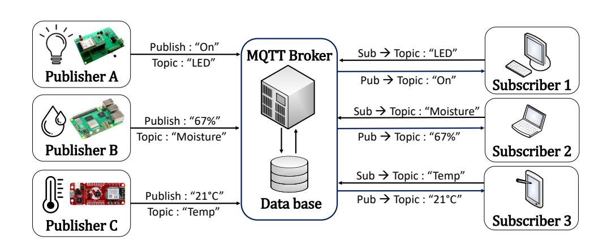
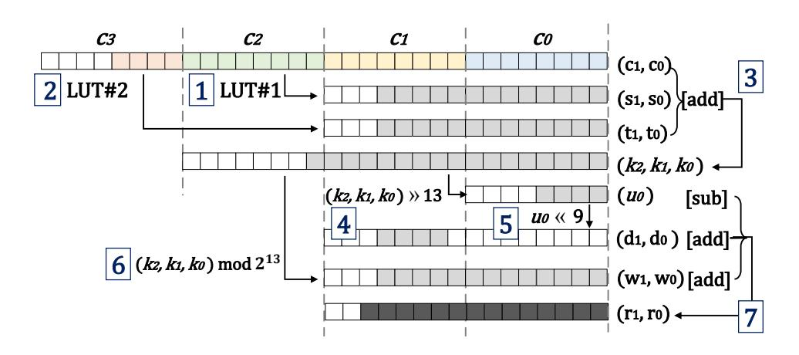
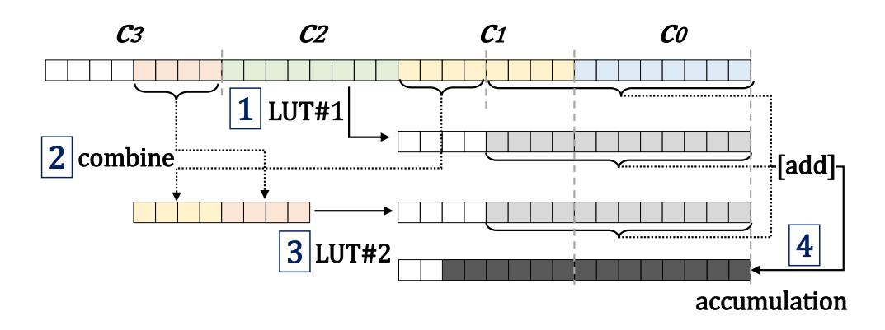
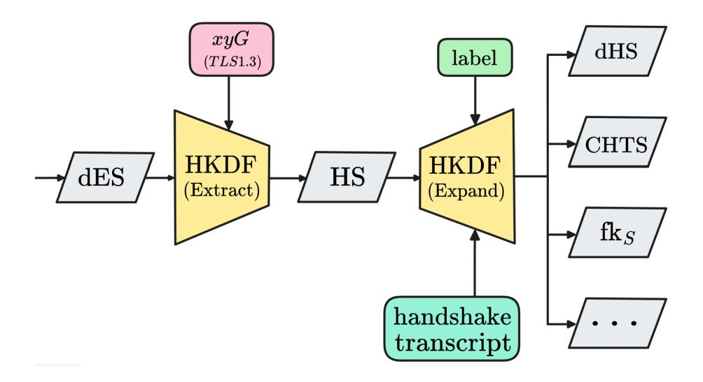

{0}------------------------------------------------

# An Optimized Instantiation of Post-Quantum MQTT protocol on 8-bit AVR Sensor Nodes

#### YoungBeom Kim

Kookmin University Seoul, Republic of Korea darania@kookmin.ac.kr

## Keywords

Post-Quantum Cryptography, Kyber, 8-bit AVR, Modular Arithmetic, IoT device, Lightweight protocol, MQTT, ML-KEM

Seog Chung Seo\*

Kookmin University

Seoul, Republic of Korea scseo@kookmin.ac.kr

**ACM Reference Format:** 

YoungBeom Kim and Seog Chung Seo. 2025. An Optimized Instantiation of Post-Quantum MQTT protocol on 8-bit AVR Sensor Nodes. In *ACM Asia Conference on Computer and Communications Security (ASIA CCS '25), August 25–29, 2025, Hanoi, Vietnam.* ACM, New York, NY, USA, 19 pages. https://doi.org/10.1145/3708821.3733873

### 1 Introduction

The advancement of quantum computing poses a significant threat to widely used public-key cryptographic systems such as RSA and Elliptic Curve Cryptography (ECC)-based Digital Signature Algorithm (DSA) [77, 78]. Currently, quantum computers have reached 127 qubits, and it is expected that within the next 20 years, quantumbased cryptographic attacks will become a reality [49, 67]. In response, the National Institute of Standards and Technology (NIST) launched the Post-Quantum Cryptography (PQC) standardization process at PQCrypto 2016, inviting proposals for PQC standards. In the past year, four algorithms (Crystals-Kyber [9], Crystals-Dilithium [8], Falcon [63], and SPHINCS+ [35]) were selected as PQC standards. Among these, Kyber is the sole Key Encapsulation Mechanism (KEM) for key establishment, while Dilithium, Falcon, and SPHINCS+ are Digital Signatures Algorithms (DSAs). Initially, PQC research primarily on cryptanalysis. However, after the Round 3 finalists were announced, the focus shifted toward practical deployment and optimization. Security professionals often raise two key questions regarding PQC adoption:

- Q1: Is PQC more efficient than ECDH and ECDSA?
- Q2: Is it necessary to migrate to PQC now?

Regarding the first question, performance studies on Kyber indicate that with proper optimization, it can outperform the elliptic curve Diffie-Hellman (ECDH). This efficiency stems from Kyber's ability to performs modular multiplication at the machineword level, making it well-suited for parallel processing. Optimized implementations demonstrate superior performance compared to the latest ECC implementations on platforms such as Cortex-M4 [2, 33], Cortex-A [14], RISC-V [34], and AVX2 [73], as well as in TLS 1.3 handshake performance tests [60]. Over the past eight years, researchers have continuously refined PQC implementations for embedded devices, introducing new optimization techniques [2, 4, 14, 16, 20, 29, 33, 34, 37, 43]. A key observation is that architecture-specific optimization is essential: for instance, state-of-the-art modular multiplication techniques vary across AVX2 [73], Cortex-A [14], and Cortex-M4 [33].

#### **Abstract**

Since the selection of the National Institute of Standards and Technology (NIST) Post-Quantum Cryptography (PQC) standardization algorithms, research on integrating PQC into security protocols such as TLS/SSL, IPSec, and DNSSEC has been actively pursued. However, PQC migration for Internet of Things (IoT) communication protocols remains largely unexplored. Embedded devices in IoT environments have limited computational power and memory, making it crucial to optimize PQC algorithms for efficient computation and minimal memory usage when deploying them on low-spec IoT devices. In this paper, we introduce KEM-MQTT, a lightweight and efficient Key Encapsulation Mechanism (KEM) for the Message Queuing Telemetry Transport (MQTT) protocol, widely used in IoT environments. Our approach applies the NIST KEM algorithm Crystals-Kyber (Kyber) while leveraging MQTT's characteristics and sensor node constraints. To enhance efficiency, we address certificate verification issues and adopt KEMTLS [71] to eliminate the need for Post-Quantum Digital Signatures Algorithm (PQC-DSA) in mutual authentication. As a result, KEM-MQTT retains its lightweight properties while maintaining the security guarantees of TLS 1.3. We identify inefficiencies in existing Kyber implementations on 8-bit AVR microcontrollers (MCUs), which are highly resource-constrained. To address this, we propose novel implementation techniques that optimize Kyber for AVR, focusing on high-speed execution, reduced memory consumption, and secure implementation, including Signed LookUp-Table (LUT) Reduction. Our optimized Kyber achieves performance gains of 81%,75%, and 85% in the KeyGen, Encaps, and DeCaps processes, respectively, compared to the reference implementation. With approximately 3 KB of stack usage, our Kyber implementation surpasses all stateof-the-art Elliptic Curve Diffie-Hellman (ECDH) implementations. Finally, in KEM-MQTT using Kyber-512, an 8-bit AVR device completes the handshake preparation process in 4.32 seconds, excluding the physical transmission and reception times.

#### **CCS Concepts**

• **Security and privacy** → *Embedded systems security*;

\*Corresponding Author.


This work is licensed under a Creative Commons Attribution 4.0 International License. *ASIA CCS '25, August 25–29, 2025, Hanoi, Vietnam*© 2025 Copyright held by the owner/author(s).
ACM ISBN 979-8-4007-1410-8/2025/08
https://doi.org/10.1145/3708821.3733873

{1}------------------------------------------------

Without such optimizations, reference implementations of Kyber impose excessive computational overhead on Internet of Things (IoT) devices, underscoring the necessity of tailored approaches for new architectures.

While large-scale quantum computers remain years away, the second question remains critical. A well-known concern is the "store now, decrypt later" attack [\[64\]](#page-13-9). If ECDH is eventually broken by quantum computers, session keys from past communications could be recovered-even if forward secrecy was applied [\[71\]](#page-13-0). Therefore transitioning to PQC is imperative. Fortunately, extensive efforts have already been made to prepare security protocols-including TLS/SSL [\[60\]](#page-13-7), SSH [\[23\]](#page-12-12), and IPSec [\[10\]](#page-12-13).

Despite these advancements, most existing PQC research has focused on specific architectures. Studies have primarily targeted embedded devices with 32-bit processors, such as 32-bit Cortex-M3/M4 and RISC-V [\[2,](#page-12-3) [4,](#page-12-7) [16,](#page-12-8) [33,](#page-12-4) [34,](#page-12-6) [84\]](#page-13-10), or high-performance processors like 64-bit ARMv8 [\[14,](#page-12-5) [43,](#page-13-8) [44\]](#page-13-11) and AVX2-based systems [\[73\]](#page-13-6). However, research on architectures with register sizes smaller than 32-bit, including 8-bit AVR and 16-bit MSP430, remainslimited. Similarly, previous studies on PQC protocol migration have primarily focused on security protocols for desktop and server-class processors (x86/64) or high-performance ARM Cortex-A devices[\[3,](#page-12-14) [10,](#page-12-13) [23,](#page-12-12) [31,](#page-12-15) [60,](#page-13-7) [66,](#page-13-12) [69\]](#page-13-13). However, low-resource IoT environments require not only protocol migration but also PQC optimization tailored to constrained hardware. The 8-bit AVR microcontroller features a simple single-stage pipeline architecture and 32 general-purpose registers, each 8 bits in size [\[52\]](#page-13-14). Although it supports 8-bit multiplication instructions, the absence of advanced arithmetic units such as a barrel shifter imposes significant constraints when implementing cryptographic algorithms [\[7\]](#page-12-16), especially in comparison to mid-range embedded systems like the Cortex-M series.

This challenge was highlighted at the 3rd PQC Standardization Conference [\[6\]](#page-12-17) and in recent surveys [\[64\]](#page-13-9), which emphasized the growing demand for 16-bit processors (MSP430) and 8-bit microcontrollers (AVR) while noting the lack of PQC research for these platforms. Currently, 32-bit ARM processors dominate the highperformance embedded systems market due to their computational power and mature software ecosystem. However, 8-bit AVR microcontrollers remain widely used in cost-sensitive, ultralow-power applications, such as sensor nodes, industrial control systems, and home automation [\[5,](#page-12-18) [56\]](#page-13-15). The simplicity of AVR architecture enables predictable execution timing and lower power consumption, making it preferable for power-constrained deployments [\[17,](#page-12-19) [65\]](#page-13-16). In large-scale sensor networks deployed in physically inaccessible environments—such as military applications or wildfire detection low-cost, low-power architectures are essential, and 8-bit AVR remains a viable solution [\[41,](#page-12-20) [42\]](#page-12-21). However, there have been few reported PQC implementations on small sensor nodes like 8-bit AVR [\[18,](#page-12-22) [37\]](#page-12-11), despite their potential vulnerability as weak links once quantum computers become practical. Currently, answering the first question for AVR is infeasible. Since PQCrypto 2016, implementations of the NIST PQC algorithms have not been able to efficiently run on 8-bit AVR microcontrollers [\[37\]](#page-12-11). For example, the ATmega4808 core of the AVR-IoT WG Development board, commonly used as a sensor node, has only 6 KB of SRAM and 48 KB of flash memory [\[52\]](#page-13-14). Thus, it is crucial to first determine whether PQC, with its larger key and ciphertext sizes, is even viable in

such resource-constrained environments [\[39\]](#page-12-23). Additionally, protocol memory requirements must be assessed, and PQC should not be prohibitively slow compared to ECDH/ECDSA.

The second question must be framed differently for AVR. As demonstrated by the Padding Oracle On Downgraded Legacy Encryption (POODLE) attack [\[25,](#page-12-24) [54\]](#page-13-17), failing to migrate AVR-based systems to PQC could create downgrade attack vectors, even if servers adopt PQC. Ensuring PQC compatibility on resourcedconstrained devices mitigates future downgrade attacks targeting these endpoints. While some may argue that 8-bit AVR should be phased out, this would be an extreme solution.

This paper addresses both key questions for 8-bit AVR sensor nodes, the most resource-constrained embedded devices. First, we propose the KEM-MQTT protocol, demonstrating that PQC protocol migration is practically feasible on 8-bit AVR. KEM-MQTT uses only Kyber to perform mutual authentication without certificates and provides security properties such as confidentiality, integrity, and non-repudiation. This is the first practical PQC migration on 8-bit AVR, designed for IoT environments. Furthermore, we demonstrate the feasibility of implementing Kyber on 8-bit AVR, showing that Kyber can be implemented more securely and efficiently than ECDH with minimal memory usage.

#### Contributions. We summarize our main contributions below:

- Presenting KEM-MQTT for Quantum-Secure WSNs on AVR : We have concluded that it is practically impossible to implement even highly optimized versions of Dilithium, Falcon, and SPHINCS+ on AVR. To ensure non-repudiation, we adopted the KEMTLS [\[28,](#page-12-25) [71,](#page-13-0) [72\]](#page-13-18) approach instead of using PQC-DSA. By considering the characteristics of MQTT and AVR sensor nodes, we addressed the issue of certificate verification and ultimately proposed a new protocol called KEM-MQTT. KEM-MQTT maintains the security properties of TLS 1.3 and additionally provides mutual authentication. The handshake of KEM-MQTT (HKDF, AEAD, etc.) was manually implemented with hand-written assembly, excluding physical transmission and reception.
- Presenting the first Kyber implementations on AVR : We applied the streaming method proposed in [\[16\]](#page-12-8) to Kyber, implementing all security levels of Kyber with approximately 3KB of stack usage. After thoroughly reviewing and directly implementing state-of-the-art modular multiplication techniques proposed in various architecture, we concluded that they are not suitable for the 8-bit AVR environment. Consequently, we propose Kyber implementation methodologies, including the Signed LookUp-Table (LUT) Reduction techniques for modular multiplication, to surpass ECDH. As a result, compared to the latest P-256-based ephemeral ECDH implementation, the Kyber-512 implementation with the same security level is 37.5% faster (reducing execution time by 1.5 seconds). Additionally, Kyber-768, a mid-term security measure, guarantees performance nearly identical to the P-256-based ephemeral ECDH. Our technique is readily adaptable to ML-KEM [\[58\]](#page-13-19) and requires no significant modifications.

{2}------------------------------------------------

- Presenting protocol-friendly Kyber software on AVR : We propose a Prehashed Public-Key technique to accelerate Kyber's encapsulation in KEM-MQTT and a flexible LUT placement strategy for adapting to different AVR board configurations. Additionally, we introduce three implementation methodologies.
  - (i) High-Speed: The optimization methods used for NTT-based polynomial multiplication in state-of-the-art implementations are either inefficient or difficult to apply in the AVR environment. To overcome this, we employ Karatsuba multiplication and the GS butterfly technique, while also introducing a new approach called crossed-butterfly.
  - (ii) Low-Memory: Based on [\[16\]](#page-12-8), we present a method to implement Kyber on AVR with minimal memory usage.
  - (iii) Secure Implementation: All our code meets constant-time requirements for cryptographic algorithms. Additionally, to counter power-based side-channel attacks, we adopt the masking technique proposed in [\[75\]](#page-13-20) for the Authenticated Encryption with Associated Data (AEAD).

Code. Our source code is publicly available at [https://github.com/](https://github.com/whYBeKim/Crystals-Kyber-on-AVR) [whYBeKim/Crystals-Kyber-on-AVR](https://github.com/whYBeKim/Crystals-Kyber-on-AVR)

Organization. In Section [2,](#page-2-0) we review related work and examine the direction of PQC migration for 8-bit AVR. Section [3](#page-4-0) introduces the necessary background knowledge. In Section [4,](#page-5-0) we propose the new KEM-MQTT protocol, and in Section [5,](#page-6-0) we introduce a novel modular reduction for Kyber (Signed LUT reduction) optimized for the 8-bit AVR environment. Section [6](#page-9-0) presents a protocol-friendly Kyber implementation.

#### <span id="page-2-0"></span>2 Related Works and Problem Statements

This section examines security protocols used in Wireless Sensor Networks (WSNs) (cf. Section [2.1\)](#page-2-1) and reviews quantum-secure protocols currently under study for various embedded platforms (cf. Section [2.2\)](#page-2-2). We then discuss key considerations for applying the PQC-KEM Kyber to WSNs and outline our approach to achieving quantum security on 8-bit AVR microcontrollers (cf. Sections [2.3](#page-2-3) and [2.4\)](#page-2-4). Finally, we briefly review recent trends in Kyber implementation on IoT devices (cf. Section [2.5\)](#page-3-0).

#### <span id="page-2-1"></span>2.1 Secure Protocols in WSNs

Advances in low-power technology have enabled WSNs to operate primarily on resource-constrained platforms such as microcontrollers, making them vulnerable to various attacks [\[41\]](#page-12-20). Due to the broadcast nature of wireless communication, WSNs are particularly exposed to threats such as eavesdropping and tampering, while their physical exposure increases risks like node capture and impersonation. Ensuring comprehensive security for microcontrollers remains a challenge. Over the past two decades, cryptographic techniques have evolved alongside improvements in sensor node performance. Initially, protocols such as IPSec and TLS were considered infeasible for sensor networks, leading to the development of lightweight alternatives like TinySec [\[41\]](#page-12-20). However, TinySec lacked mechanisms for non-repudiation and key establishment [\[51\]](#page-13-21). The proliferation of IoT services has expanded sensor node applications, increasing interest in scalable publish-subscribe models such as MQTT [\[31,](#page-12-15) [53\]](#page-13-22).

Recently, Hamad et al. [\[31\]](#page-12-15) analyzed MQTT's security features, yet most studies remain focused on conventional cryptographic schemes that are susceptible to quantum attacks [\[24,](#page-12-26) [50,](#page-13-23) [69\]](#page-13-13).

#### <span id="page-2-2"></span>2.2 WSNs in the Post-Quantum Era

As quantum security becomes increasingly critical, the migration of security protocols to PQC has emerged as a key research area. Recent studies have applied PQC to protocols such as IPSec [\[11\]](#page-12-27), SSL/TLS [\[32\]](#page-12-28), and SSH [\[79\]](#page-13-24), while similar efforts have been made for lightweight protocols like MQTT. In 2020, Agus et al. [\[3\]](#page-12-14) replaced RSA with NTRU (N-th degree truncated polynomial ring) in the MQTT-IoT protocol. The migration was successfully implemented on a Raspberry Pi, where NTRU outperformed RSA at the same security level. Schoffel et al. [\[69\]](#page-13-13) benchmarked TLS handshake latency using NIST PQC Round 3 algorithms on MQTT, targeting lowpower Cortex-M4 sensor nodes. Additionally, Rampazzo and Henriques [\[66\]](#page-13-12) evaluated PQC and hybrid cryptographic approaches within MQTT. Lukas Malina et al. [\[49\]](#page-13-3) emphasized the importance of TLS in securing MQTT but noted its limitations in resourceconstrained environments requiring lower latency. Consequently, they proposed a PQC-based solution without TLS. These studies indicate that on Cortex-M/A series devices, PQC schemes exhibit performance levels comparable to Elliptic-Curve Cryptography (ECC) based schemes. However, most practical PQC migrations have been conducted on midrange or high-performance microcontrollers (e.g., 32-bit and 64-bit architectures) [\[2,](#page-12-3) [4,](#page-12-7) [14,](#page-12-5) [16,](#page-12-8) [33,](#page-12-4) [34,](#page-12-6) [43,](#page-13-8) [44,](#page-13-11) [73,](#page-13-6) [84\]](#page-13-10). In contrast, research on smaller sensor nodes, such as 8-bit and 16-bit devices [\[76\]](#page-13-25), remains limited, with few reported implementations of PQC on 8-bit devices. As quantum computing advances, these smaller devices may become weak links systems, creating potential security vulnerabilities if the broader computing infrastructure transitions to PQC.

#### <span id="page-2-3"></span>2.3 8-bit AVR Sensor Nodes

The 8-bit AVR is a modified Harvard architecture-based, reduced instruction set computing (RISC) single-chip microcontroller [\[7\]](#page-12-16). Its smaller register size, compared to other embedded processor families, makes it particularly suitable for cost-sensitive and lowpower applications. It is widely used in residential sensor-based products, such as thermostats, fire detectors, and glass break detection systems, and continues to play a significant role in the sensor node market [\[5\]](#page-12-18). Additionally, demand for 8-bit AVR microcontrollers is expected to grow due to their ability to reduce the cost of medical devices while maintaining reliable data acquisition [\[56\]](#page-13-15). The 8-bit AVR features a simple single-level pipeline structure and 32 general-purpose registers, each 8-bit in size. The six most significant registers—denoted as X[r26:r27], Y[r28:r29], and Z[r30:r31]—function as indirect address register pointers. These can access 16-bit memory addresses in pairs, with only the Z[r30:r31] pointer capable of accessing flash memory. A detailed description of the 8-bit AVR architecture and its instruction set is provided in Appendix [A.](#page-14-0)

#### <span id="page-2-4"></span>2.4 Embedding Kyber on AVR for WSNs

Low-power sensor nodes in WSNs typically integrate a single-core microcontroller with multiple communication and sensor modules

{3}------------------------------------------------

<span id="page-3-1"></span>Table 1: Implementations of Public Key Schemes on AVR

| Algorithm  | Work                         | Speed[cc] | Stack[B] | AVR |
|------------|------------------------------|-----------|----------|-----|
| ECDH∗      | [61]                         | 29,400 k  | -        | ✓   |
| Kyber-512  | Ref [40]                     | -         | 9,576    | ✗   |
| Kyber-512  | This Work<br>(based<br>[16]) | 34,904 k  | 2,324    | ✓   |
| ECDSA∗     | [36]                         | 77,779 k  | 1,642    | ✓   |
| Dilithium2 | [37]                         | 150,676 k | 12,751   | ✗   |

∗ECDH [\[61\]](#page-13-26) uses curve P-256, and ECDSA [\[36\]](#page-12-30) uses Ed25519

rather than employing System-on-Chip solutions. A representative example is the AVR-IoT WG Development board, which features an ATmega4808 core (6KB SRAM, 48KB Flash Memory) and various submodules [\[52\]](#page-13-14). While the board can utilize the WINC1510 communication module for TLS/SSL support, achieving quantum security requires moving beyond ECC-based cryptography. Specifically, implementing PQC schemes such as PQC-KEM and PQC-DSA in an AVR environment is necessary for authentication and key establishment.

One potential approach is building OpenSSL-based OQS-TLS on AVR. However, our experiments show that even with embedded options enabled, OpenSSL requires at least 16 KB of stack memory [\[59\]](#page-13-27), which exceeds AVR's constraints. While introducing a PQC submodule similar to the ATECC608A is an option, ASIC development involves significant costs and time, making it impractical. Additionally, integrating an expensive PQC hardware module into a low-cost AVR platform is inefficient and unlikely to attract industry adoption. Instead, our goal is to implement PQC directly on the AVR core and conduct communication simulations based on this implementation.

Table [1](#page-3-1) compares the performance of recent ECDH and ECDSA implementations on 8-bit AVR. A ✓ indicates successful implementation, while ✗ denotes failure due to stack issues. Although [\[61\]](#page-13-26) does not explicitly report the stack usage of ECDH, its smooth execution on an ATmega128 (4KB SRAM) suggests that P-256 based ECDH is feasible. In contrast, ECDSA [\[36\]](#page-12-30) requires 1,642 bytes of stack memory. More recently, Vincent et al. [\[37\]](#page-12-11) simulated Dilithium2 on an 8-bit AVR using IAR AVR WorkBench with a 16 MB SRAM setting. Despite stack optimization, Dilithium 2's signature generation and verification require approximately 12 KB of SRAM, with its basic parameters (, , ) consuming 6 KB. Given the total memory usage exceeding 18 KB, executing the full Dilithium stream on an 8-bit AVR is impractical. One alternative is storing the public key in flash memory while limiting operations to signature verification. However, as discussed in [\[37\]](#page-12-11), Dilithium's reliance on 32-bit modular arithmetic makes it significantly slower on an 8-bit AVR compared to schemes using 16-bit modular arithmetic. Similarly, Falcon, which involves polynomial multiplications of degree 512/1024, is not an optimal choice for AVR.

Drawing from the KEMTLS methodology [\[71\]](#page-13-0), we avoid PQC-DSA in 8-bit AVR environments, as it demands larger parameters, increased code size, and higher computational overhead compared to PQC-KEM. KEMTLS improves performance over standard TLS 1.3 by replacing PQC-DSA with PQC-KEM for authentication. In

this work, we apply KEMTLS to the MQTT protocol without relying on TLS/SSL. However, Kyber has not yet been implemented in an AVR environment. Our attempt to port Kyber's clean reference code [\[40\]](#page-12-29) to the ATmega4808 failed due to excessive stack usage (approximately 10 KB). To address this, we implement Kyber-512 using memory optimization techniques proposed in [\[16\]](#page-12-8), achieving a maximum stack usage of 2,324 bytes on the ATmega4808. However, as shown in Table [1,](#page-3-1) Kyber-512 is significantly slower than ECDH [\[61\]](#page-13-26) at the same security level on an 8-bit AVR. Applying KEMTLS may further widen this performance gap. To mitigate this, we propose quantum-secure KEM-MQTT for AVR sensor nodes, demonstrating that Kyber can operate faster than ECDH without increasing stack requirements.

#### <span id="page-3-0"></span>2.5 Kyber implementation on IoT Devices

Since Kyber's introduction in 2017, research on its optimization has intensified, Particularly following NIST's selection of Cortex-M4 for performance evaluation in the PQC competition [\[2,](#page-12-3) [4,](#page-12-7) [6,](#page-12-17) [16,](#page-12-8) [33,](#page-12-4) [64\]](#page-13-9). Kyber's core operation, polynomial-based matrix-vector multiplication, initially focused on reducing memory footprint and efficiently porting reference code to Cortex-M4. Thanks to extensive research, highly optimized Kyber implementations now exist [\[33\]](#page-12-4). Studies have also explored PQC implementations on Cortex-M0/M3 [\[1\]](#page-12-31) and higher-tier architectures such as Cortex-A [\[14,](#page-12-5) [43,](#page-13-8) [44\]](#page-13-11). However, matrix-vector multiplication techniques differ across architectures, necessitating a tailored approach for 8-bit AVR.

<span id="page-3-2"></span>Table 2: State-of-the-art implementation techniques for Kyber across Various Architectures

| Modular Arithmetic             | Platform          | AVR |
|--------------------------------|-------------------|-----|
| Solinas [83]                   | HW (FPGA)         | ✗   |
| Plantard [33,<br>34,<br>85]    | Cortex-M4, RISC-V | ✗   |
| Montgomery [73]                | AVX2, x86/64      | ✗   |
| Barrett [14]                   | Cortex-A          | ✗   |
| Implementation Skills          | Platform          | AVR |
| Merging Layer [2,<br>4]        |                   | ✗   |
| CT-CT butterfly [2,<br>73]     |                   | ✗   |
| Streaming Coefficient [16]     | Almost all        | ✓   |
| Better Accumulation [2]        |                   | △   |
| Asymmetric Multiplication [14] |                   | △   |
|                                |                   |     |

✓: Suitable for AVR, ✗: Inefficient on AVR, △: Depends on board spec

Table [2](#page-3-2) presents the state-of-the-art optimization techniques for Kyber implementations across various platforms. An ✗ indicates inefficiency on AVR, while a ✓ denotes suitability. Unlike modular arithmetic methods, implementation techniques listed in the second section of the table can be applied to most software platforms. A △ signifies that while a technique is applicable, it may increase stack usage, requiring caution. From a modular arithmetic perspective, we introduce a new reduction method (cf. Section [5\)](#page-6-0), and from an implementation perspective, we propose a protocol-friendly methodology (cf. Section [6\)](#page-9-0).

{4}------------------------------------------------

#### <span id="page-4-0"></span>3 Preliminaries

#### **3.1 MQTT**

<span id="page-4-1"></span>

Figure 1: An example MQTT network

The MQTT architecture is based on a publish-subscribe model, involving three key entities: publisher, broker, and subscriber. The publisher, sometimes referred to as the client is typically a sensor node in IoT environments, while the broker acts as a gateway, tracking subscriptions and managing message distribution. The publisher sends sensor-generated data, such as temperature or heart rate, to the broker, which then forwards it to subscribers based on specified topics. While a single node can function as both a publisher and a subscriber, resource-constrained IoT devices often subscribe to only a few topics or none at all [31]. Figure 1 illustrates an example of MQTT interactions. Notably, pure MQTT lacks built-in security features. As discussed in Sections 2.2 and 2.1, research has proposed methods to achieve authentication, confidentiality, and integrity [24, 31, 50, 69]. Most security implementations rely on the TLS/SSL protocol stack.

#### 3.2 KEMTLS

<span id="page-4-2"></span>

| AVR(Client)                                                                    |                      | Server                                                               |
|--------------------------------------------------------------------------------|----------------------|----------------------------------------------------------------------|
| $(pk_a, sk_a) \leftarrow \text{Keygen}$                                        | $\xrightarrow{pk_a}$ | $static(Kyber_s): pk_s, sk_s$                                        |
| <b>4</b> 70                                                                    | $\leftarrow ct_a$    | $(ss_a, ct_a) \leftarrow \operatorname{Encaps}(pk_a)$                |
| $ss_a \leftarrow Decaps(ct_a, sk_a)$<br>$(ss_s, ct_s) \leftarrow Encaps(pk_s)$ | $\xrightarrow{ct_s}$ |                                                                      |
| $ss \leftarrow (ss_a  ss_s)$                                                   |                      | $ss_s \leftarrow Decaps(ct_s, sk_s)$<br>$ss \leftarrow (ss_a  ss_s)$ |
|                                                                                |                      |                                                                      |

Figure 2: High-level overview of the handshake phase on KEM-TLS, using Kyber for server authentication [28]

KEMTLS, based on TLS 1.3, employs a KEM for both key establishment and authentication. This approach enables unilaterally authenticated (server-side) key establishment without requiring additional round trips [71]. Unlike traditional TLS 1.3, KEMTLS

allows the client to send its first encrypted application data without caching or predistributing the server's public key, maintaining the same number of handshake round trips. A high-level overview of the KEMTLS handshake is shown in Figure 2, where the client is replaced by an AVR for illustration. KEMTLS consists of two KEMs: KEMe for ephemeral key exchange and KEMs for implicit authentication. Both can be instantiated using the same algorithm (in this case, Kyber). A recent benchmark study on KEMTLS in embedded environments [28] demonstrated that, on a Cortex-M4, KEMTLS reduced handshake time by up to 38% compared to TLS 1.3 while also reducing peak memory usage. Additionally, KEMTLS-PDK has been proposed for embedded devices with predistributed keys [72]. A complete outline of KEMTLS-PDK, where the client holds the server's static public key, is provided in Appendix D.

**Table 3: Kyber Parameter sets** 

<span id="page-4-3"></span>

|            | Security | n   | <i>k</i> , <i>l</i> | q    | pk[B] | sk[B] | ct[B] |
|------------|----------|-----|---------------------|------|-------|-------|-------|
| Kyber-512  | 1        | 256 | 2                   | 3329 | 800   | 1632  | 768   |
| Kyber-768  | 3        | 256 | 3                   | 3329 | 1184  | 2400  | 1088  |
| Kyber-1024 | 5        | 256 | 4                   | 3329 | 1568  | 3168  | 1568  |

#### 3.3 Crystals-Kyber

Kyber is the only Key Encapsulation Mechanism (KEM) algorithm selected by NIST and its security is based on Module Learning With Errors (Module-LWE) problem. Since characteristic of Module-LWE-based Kyber, each element in a matrix and a vector is a polynomial over Ring  $R_q = \mathbb{Z}_q[X]/(X^n+1)$  where n = 256 and q = 3329. The public matrix **A** exhibits a size of  $\ell \times \ell$ , while the secret vector **s** and noise vector **e** each possess a size of  $\ell \times 1$ . For security levels 1, 3, and 5, the corresponding values of  $\ell$  are 2, 3, and 4, respectively. The polynomial in A has coefficients less than *q*, and the polynomials in s and e have very small coefficients. Table 3 shows parameter set of Kyber. Kyber's Public Key Encryption (PKE) consists of three operations: Key generation, Encryption, and Decryption, and Kyber-KEM utilizes Kyber-PKE with Fujisaki-Okamoto transform for providing IND-CCA2 security. Except for the random sampling based on hash function, the core operation of each Kyber-PKE algorithm is either matrix by vector multiplication  $(\mathbf{A} \circ \mathbf{s})$  or vector by vector multiplication ( $\hat{\mathbf{s}}^T \circ \mathbf{u}$ ). For example, multiplication with a  $\ell \times \ell$  matrix and a  $\ell \times 1$  vector requires  $\ell^2$  polynomial multiplications (vector by vector multiplication requires  $\ell$  polynomial multiplications). The details of the Kyber description can be found in the Kyber specification document [9]. For the complete pseudocode structure of Kyber PKE, please refer to Algorithm 4, 3, and 5 in Appendix E. Please see Appendix F for the KEM algorithms. The core operation of Kyber, polynomial multiplication, is implemented using NTT. For a brief explanation of NTT, please refer to Appendix B.

#### 3.4 Modular Arithmetic

Kyber's 16-bit polynomial elements result in 32-bit multiplications, necessitating reduction by q using nonconstant-time division operations. To mitigate timing-based side-channel attacks, efficient constant-time reduction methods are essential. The following subsections review existing modular reduction algorithms, both unsigned and signed, in lattice-based cryptography.

{5}------------------------------------------------

3.4.1 Unsigned Modular Reduction Methods. Before NIST's PQC competition, various lattice-based cryptosystems were implemented on 8-bit AVR MCUs [48, 74]. Liu et al. [48] introduced an efficient modular reduction method for NTT-based polynomial multiplication, employing a Shift-Add-Multiply-Subtract-Subtract (SAMS2) technique for approximate reduction. This method estimates  $\lfloor c/q \rfloor$  using shifts and arithmetic operations, making it suitable for integer division with specific q values. However, it may require an additional subtraction for final reduction due to its unsigned range. Seo et al. [74] enhanced this approach by introducing a Lookup-Table (LUT) method that replaces quotient computation with predefined remainders. Unlike cache-based methods, this approach is resistant to cache-timing attacks on 8-bit AVR MCUs, which lack cache memory (cf. Figure 3).

<span id="page-5-1"></span>

Figure 3: Unsigned LUT reduction for q = 7681, blue box means each step, step 1,2: LUT access; step 3: addition; step 4,5: shifting; step 6: modulo; step 7: addition and subtraction [74]

3.4.2 Modular Reduction Methods used in Kyber. As efficient and constant-time reduction algorithms, Montgomery method [55] and Barrett method [13] have been widely used for efficient modular reduction in public key cryptosystems. In addition, recently an improved Plantard reduction has been proposed and applied to Kyber [62]. The algorithms for each method can be found in the Appendix H. In the context of lattice-based cryptography using small prime q, the signed Montgomery method (Algorithm 12) and signed Barrett method (Algorithm 13) were proposed [73] and have been applied to the implementations of Kyber and Dilithium. Signed reduction is denoted by  $\operatorname{mod}^{\pm} q$  and  $c \operatorname{mod}^{\pm} q$  reduces into  $(-\frac{q}{2}, \frac{q}{2})$ . The core principle of each method is replacing division by q with shift operations which can be efficiently computed on computing devices. The unsigned LUT-based reduction method from [74] has been considered as being the fastest on AVR MCUs. However, the underlying q = 7681 in their implementation is different from the q = 3329 in Kyber. Furthermore, after Seo et al.'s method [74], it has been shown that signed versions of several reduction methods [2, 4, 73] contribute to much-improved performance of Kyber on several devices on 32-bit ARM, 64-bit ARMv8, and x86-64-bit CPUs. Thus, it is necessary to fill this research gap by answering the questions: which reduction method among the unsigned LUT-based method and signed reduction methods gives the best performance on 8-bit AVR MCUs and whether there is a new method providing better performance compared with existing methods.

#### <span id="page-5-0"></span>4 Proposed Secure MQTT Protocol on AVR

#### 4.1 Security Goal

In MQTT, communication occurs among three entities, but recent research on PQC-based MQTT has primarily focused on higherperformance IoT devices, such as 64-bit Raspberry Pi and Apple Silicon, rather than resource-constrained 8-bit AVR [49, 68]. The study in [68] proposed a theoretical application of KEMTLS but did not conduct practical experiments or address migration challenges such as certificate management and authentication. Meanwhile, [49] explored the migration of certificates to PQC but focused on scenarios involving high-performance IoT devices, where a single device could act as both a publisher and a subscriber. However, resourceconstrained AVR sensor nodes are typically deployed in physically insecure environments in large numbers, often ranging from tens to hundreds. These nodes generally function solely as publishers, with the broker managing them [41, 42]. The study in [49] employed PQC-DSA for publisher authentication, but as discussed in Section 2.4, PQC-DSA is impractical for AVR environments. Therefore, we simplify the AVR-based scenario based on several assumptions and apply the KEMTLS methodology as follows:

- **Only Publisher**: The AVR device functions exclusively as a publisher and communicates only with the broker.
- **Broker Authentication**: KEMTLS provides implicit server-toclient authentication when the client sends its first application data. Similarly, we achieve implicit authentication for the broker using KEM, while explicit authentication is established upon receiving the key confirmation message.
- **Publisher Authentication**: TLS typically performs only serverside authentication. To prevent sensor node impersonation by malicious attackers, explicit authentication for the publisher is necessary without relying on PQC-DSA. By applying the KEMTLS methodology, we achieve authentication in MQTT using only KEM, ensuring mutual authentication.
- Confidentiality and Integrity: Published data and handshake messages are encrypted using Authenticated Encryption (AE). which ensures both confidentiality and integrity. Additionally, we allow the transmission of associated data, including the publisher's ID (id<sub>P</sub>) and topic (*T*), which are protected using the Authenticated Encryption with Associated Data (AEAD) algorithm. While the associated data itself is not encrypted, its integrity is guaranteed.
- No Certificates: In TLS 1.3, certificates verify the server's long-term key, but when embedded devices communicate with a limited set of preknown servers, predistributing the server's static key is a viable alternative. This is known as the Predistributed Key (PDK) or cached-key scenario [70]. Certificates can also be distributed via DNS [38], though this is suboptimal for MQTT environments. Given that AVR-based sensor nodes communicate exclusively with the broker, they can store the broker's public key (pk<sub>B</sub>) in flash memory before deployment. Similarly, the broker is assumed to know the AVR-based sensor node's public keys (pk<sub>P</sub>). In this model, the broker is considered a semitrusted entity.

In summary, our goal is to apply the KEMTLS methodology to achieve confidentiality, integrity, and mutual authentication. The keys exchanged during the handshake must be indistinguishable

{6}------------------------------------------------

<span id="page-6-1"></span>Figure 4: Sketch of KEM-MQTT with proactive client authentication

$$\begin{array}{|c|c|c|} \hline \textbf{Publisher (AVR)} & \textbf{Broker} \\ \hline \\ \textbf{static (KEM$_P$)} \ pk_P, \textbf{sk}_P, \textbf{id}_P & \textbf{static (KEM$_B$)} \ pk_B, \textbf{sk}_B \\ \textbf{knows pk}_B & \textbf{knows id}_P \ \textbf{and H(pk}_P) \\ \hline \\ (\textbf{pk}_e, \textbf{sk}_e) \leftarrow \textbf{KEM}_e. \textbf{Keygen()} \\ (\textbf{ss}_B, \textbf{ct}_B) \leftarrow \textbf{KEM}_B. \textbf{Encaps}(\textbf{pk}_B) \\ \hline \\ & K_B \leftarrow \textbf{KDF(ss}_B) \\ \textbf{pk}_e, \textbf{ct}_B, \textbf{AEAD}_{K_B}(\textbf{id}_P || \textbf{pk}_P) \\ \hline \\ & \textbf{ss}_B \leftarrow \textbf{KEM}_B. \textbf{Decaps}(\textbf{ct}_B, \textbf{sk}_B) \\ (\textbf{ss}_e, \textbf{ct}_e) \leftarrow \textbf{KEM}_e. \textbf{Encaps}(\textbf{pk}_e) \\ (\textbf{ss}_P, \textbf{ct}_P) \leftarrow \textbf{KEM}_P. \textbf{Encaps}(\textbf{pk}_P) \\ \hline \\ & \textbf{ct}_e \\ \hline \\ & \textbf{ss}_P \leftarrow \textbf{KEM}_e. \textbf{Decaps}(\textbf{ct}_e, \textbf{sk}_e) \\ \hline \\ & K_1 \leftarrow \textbf{KDF}(\textbf{ss}_e || \textbf{ss}_B) \\ \textbf{AEAD}_{K_1}(\textbf{ct}_P) \\ \hline \\ & \textbf{ss}_P \leftarrow \textbf{KEM}_P. \textbf{Decaps}(\textbf{ct}_P, \textbf{sk}_P) \\ \hline \\ & \textbf{AEAD}_{K_2}(\textbf{key confirmation same as TLS 1.3)} \\ \hline \\ & \textbf{AEAD}_{K_2''}(\textbf{key confirmation same as TLS 1.3)} \\ \hline \\ & \textbf{AEAD}_{K_2'''}(\textbf{key confirmation same as TLS 1.3)} \\ \hline \\ & \textbf{AEAD}_{K_2'''}(\textbf{timestamp } t || \textbf{Topic } T || \textbf{data } d) \\ \hline \end{array}$$

from random keys, ensuring forward secrecy—even if long-term keys are compromised; deriving secret keys. The assumption that the publisher and broker know each other's long-term keys is reasonable in a PDK scenario, as the broker must register each sensor node before deployment. If a new publisher is introduced with higher computational capabilities than an AVR, standard certificate-based public-key authentication can be employed [72]. Therefore, in our scenario, the AVR does not need to verify  $pk_B$ 's certificate, nor does the broker need to send it. Instead, the broker must reliably identify the public key of each sensor node.

#### 4.2 Quantum Secure KEM-MQTT Protocol

Figure 4 illustrates the overall KEM-MQTT process. KEM-MQTT is based on KEMTLS-PDK [72], a variant of KEMTLS that leverages the PDK scenario. KEMTLS-PDK reduces the amount of transmitted data during the handshake compared to TLS 1.3. Similarly, KEM-MQTT explicitly authenticates both the publisher and broker without requiring additional round trips. While the TLS-PDK scenario allows the client to bypass server certificate validation using cached

information [70], this approach was not widely adopted prequantum due to the relatively short length of classical certificates [82]. However, in the postquantum setting, skipping certificate validation is highly advantageous for AVR-based devices, particularly given the impracticality of PQC-DSA. As a result, in KEM-MQTT, the broker does not send  $pk_B$  to the AVR; Instead, the publisher sends its public key ( $pk_P$ ) to the broker.

From a postquantum certificate perspective, a Dilithium2 signature requires approximately 2 KB, while a Kyber-512 public key is 800 bytes. This means the broker would require at least 3 KB of buffer space per node. If certificates were further expanded, memory requirements would increase significantly. In a scenario where hundreds of AVR-based wildfire detection sensors are deployed in remote areas, requiring the broker to store all sensor nodes' certificates would impose a significant burden. To address this, we propose that the broker stores a 32 bytes hash of the public key. This provides an explicit authentication mechanism for pk<sub>P</sub>. Since the broker already knows id<sub>P</sub> and pk<sub>P</sub> prior to sensor deployment, storing all public keys is unnecessary. Instead, the broker can differentiate sensor nodes using their public-key hashes, effectively replacing certificates with hash values.

In KEM-MQTT, the publisher securely transmits its public key  $(pk_P)$  and identifier  $(id_P)$  to the broker by encapsulating it with  $pk_B$  and using the shared secret. This process is analogous to a client sending authentication information to a server during a TLS 1.3 handshake. KEM-MQTT achieves mutual authentication in a single round trip. In TLS 1.3, the server is authenticated upon receiving the first message from the client. Similarly, in KEM-MQTT, the broker is explicitly authenticated through key confirmation information included in the first message, completing authentication after one round trip.

Additionally, KEM-MQTT allows the broker (server) to send data to the publisher (client) immediately after mutual authentication, as in TLS 1.3 and KEMTLS-PDK. Since KEM-MQTT is based on the KEMTLS-PDK model, it inherits critical security properties such as forward secrecy, explicit authentication, and key-use guarantees, all of which can be formally proven using the KEMTLS-PDK Multistage-secure proof methodology [72]. The detailed security proofs of KEM-MQTT, including reduction-based security proofs and Tamarin Prover verification [72], are left for future work.

#### <span id="page-6-0"></span>5 Proposed Signed LUT Reduction for Kyber

This section presents optimization strategies for Kyber on an 8-bit AVR. Our approach focuses on reducing both multiplication and addition results. We implemented both of our proposed methods and existing ones in AVR assembly and found that our methods achieved the best performance.

#### <span id="page-6-2"></span>5.1 Design of Signed LUT Reduction

The proposed Signed LUT reduction (*SLR*) method for modulus q = 3329 is described in Algorithm 1, with a high-level overview shown in Figure 5. In this method,  $c_3$ ,  $c_2$ , and the upper 4-bits of  $c_1$  are reduced to fit within the lower 12-bit of c. Algorithm1 operates on a 28-bit input range ( $c \in (-q2^{15}, q2^{15})$ ), corresponding to the signed Montgomery method [73], and produces a 14-bit output ( $r \in (-q, 2^{13})$ ), matching the output size of the unsigned

{7}------------------------------------------------

LUT reduction method [74]. Instead of fine-tuning the input and output bit ranges, we focus on accelerating reduction with minimal instructions. Our experiments show that generating a 12-bit output incurs a higher computational cost than a 14-bit output. On 8-bit AVR MCUs, input data c is represented as four 8-bit words. However, since  $c \in (-q2^{15}, q2^{15})$ , the actual data is stored within 28-bits, with the upper 4-bits serving as a sign-bit extension.

We introduce two LookUp-Tables (LUT#1 and LUT#2), where each LUT produces a signed 12-bit output from an 8-bit signed or unsigned input. We build LUT#1 for reference to  $(c_2 \cdot 2^{16}) \mod^{\pm} q$  $\in (-\frac{q}{2}, \frac{q}{2})$  (step 1 of Figure 5). We construct the input data to LUT#2 by combining the lower 4-bit of  $c_3$  and the upper 4-bits of  $c_1$  (step 2). After that, we build LUT#2 for reference to  $((c_{3[3]}||\cdots||c_{3[0]})_{sb}$ .  $2^{24} + (c_{1[7]}||\cdots||c_{1[4]})_b \cdot 2^{12}) \mod^{\pm} q \in (-\frac{q}{2}, \frac{\bar{q}}{2})$  (step 3). These two LUTs can be precomputed because the values in them are constant. The *SLR* involves division into word units but does not require bit shift, thereby eliminating the need for additional costs. We considered various methods for applying LUTs and, after careful calculation of the output range and estimation of operational costs, confirmed that the approach depicted in Figure 5 is the most optimal. The proof of the correctness of the *SLR* method is as follows. Since the input data is less than 32-bit, experimental verification does not take long to verify all cases with a personal laptop.

#### <span id="page-7-0"></span>Algorithm 1 Signed LUT reduction for Kyber

**Input:**  $c = c_3 \cdot 2^{24} + c_2 \cdot 2^{16} + c_1 \cdot 2^8 + c_0$ , for  $c \in (-q2^{15}, q2^{15})$ , with  $c_i := (c_{i[7]} \parallel c_{i[6]} \parallel \cdots \parallel c_{i[0]})_{b(sb)}, i \in [0, 3]$  (sb means signed binary representation), all outputs of LUT#1 and LUT#2 in  $(-\frac{q}{2}, \frac{q}{2})$ 

**Output:**  $r \equiv c \mod^{\pm} q$ , where  $r \in (-q, 2^{13})$ 

1: 
$$u = (c_2 \cdot 2^{16}) \mod^{\pm} q$$
  $\Rightarrow u = LUT#1$   
2:  $v = ((c_{3[3]}||\cdots||c_{3[0]})_{sb} \cdot 2^{24} + (c_{1[7]}||\cdots||c_{1[4]})_{b} \cdot 2^{12})) \mod^{\pm} q$   $\Rightarrow v = LUT#2$   
3:  $r = u + v + (c_{1[3]}||\cdots||c_{1[0]})_{b} \cdot 2^{8} + c_{0}$ 

4: **return** *r* 

<span id="page-7-1"></span>

Figure 5: Proposed signed LUT reduction for q = 3329, step 1 and 3: accessing LUT; step 2: combining parts to be reduced; step 4: accumulating remainders

**Theorem.** Let q = 3329 be an odd modulus of Kyber, then Algorithm 1 is correct for input data  $c = c_3 \cdot 2^{24} + c_2 \cdot 2^{16} + c_1 \cdot 2^8 + c_0$ , where  $c \in (-q2^{15}, q2^{15})$ .

PROOF OF THEOREM. To prove the correctness of Algorithm 1, we need to show that there is an equivalence relation between r and c on modulus q ( $r \equiv c \mod^{\pm} q$ ); and, to show that the final result r is in  $(-q, 2^{13})$ .

First, using the linearity of modular arithmetic, we prove the modulo congruence over q. After that, we prove the range of r is well fit through signed representation.

(1) We are going to prove modulo congruence by explaining the generation of LUT#1 and LUT#2. First, *c* can be expressed in four words (8-bit) as follows:

$$c \equiv (c_3 \cdot 2^{24} + c_2 \cdot 2^{16} + c_1 \cdot 2^8 + c_0) \bmod^{\pm} q$$

$$c \equiv (c_3 \cdot 2^{24} + c_1 \cdot 2^8 + c_0 + \underbrace{(c_2 \cdot 2^{16}) \bmod^{\pm} q}_{u}) \bmod^{\pm} q$$

$$c \equiv (c_3 \cdot 2^{24} + c_1 \cdot 2^8 + c_0 + \underbrace{\text{LUT#1}}_{u}) \bmod^{\pm} q \tag{5}$$

<span id="page-7-2"></span>As shown in first step of Algorithm 1,  $u = c_2 \cdot 2^{16} \mod^{\pm} q$  can be replaced by LUT#1. Therefore, we can show  $c \equiv (c_3 \cdot 2^{24} + c_1 \cdot 2^8 + c_0 + \text{LUT#1}) \mod^{\pm} q$ .

(2) For  $c = c_3 \cdot 2^{24} + c_2 \cdot 2^{16} + c_1 \cdot 2^8 + c_0$ , Let  $c_i$  be  $(c_{i[7]} \parallel c_{i[6]} \parallel \cdots \parallel | c_{i[0]})_{(sb)}$  with  $i \in [0,3]$ , here, sb means signed binary representation. Since  $c \in (-q2^{15}, q2^{15})$ , c can actually be represented as 28-bit with signed representation. Therefore, the  $27^{th}$  bit from LSB (Least Significant Bit) of c is an extended sign-bit. Finally, Equation 5 can be re-written as follows:

<span id="page-7-3"></span>
$$c \equiv ((c_{3[3]}||\cdots||c_{3[0]})_{sb} \cdot 2^{24} + c_1 \cdot 2^8 + c_0 + \underbrace{\text{LUT#1}}_{u}) \bmod^{\pm} q$$
(6)

Please note that  $(c_{3[3]}||\cdots||c_{3[0]})_{sb}$  and  $c_1$  can be represented as  $c_1 = (c_{1[7]}||\cdots||c_{1[4]})_b \cdot 2^4 + (c_{1[3]}||\cdots||c_{1[0]})_b$ . Let LUT#2 be  $((c_{3[3]}||\cdots||c_{3[0]})_{sb}\cdot 2^{24} + (c_{1[7]}||\cdots||c_{1[4]})_b\cdot 2^{12}))$  mod<sup>±</sup>q. Then, referring to v in step 2 of Algorithm 1, Equation 6 can be simply derived as follows:

$$r \equiv c \equiv (\underbrace{\text{LUT#2}}_{v} + \underbrace{\text{LUT#1}}_{u} + (c_{1[3]}||\cdots||c_{1[0]})_{b} \cdot 2^{8} + c_{0}) \text{ mod } ^{\pm}q$$
 (7)

Therefore, for signed input  $c \in (-q2^{15}, q2^{15})$ , it is equivalent to  $r \equiv c \mod^{\pm} q$ .

(3) Since u and v are signed integers, LUT#1 and LUT#2 are in  $(-\frac{q}{2},\frac{q}{2})$ . Note that each LUT returns a 12-bit reference result value for an 8-bit input. Because  $(c_{1[3]}||\cdots||c_{1[0]})_b\cdot 2^8+c_0)$  is an unsigned integer, so the range is greater than 0 and less than  $2^{12}$ . Putting this together, we show that the ranges of input and output are correct as follows:

Since 
$$-\frac{q}{2} < \underline{\text{LUT#1}}, \ \underline{\text{LUT#2}} < \frac{q}{2} \text{ and}$$

$$0 \le (c_{1[3]}||\cdots||c_{1[0]})_b \cdot 2^8 + c_0 < 2^{12},$$
we have  $-q < r < 2^{12} + q < 2^{13}$ . (8)

{8}------------------------------------------------

#### 5.2 Design of Signed Small LUT Reduction

<span id="page-8-0"></span>Algorithm 2 Signed Small LUT reduction for Kyber

**Input:** The signed integer  $a = a_1 \cdot 2^8 + a_0$ , for  $a \in [-2^{15}, 2^{15})$  **Output:**  $r \equiv a \mod^{\pm} q$ , where  $r \in (-\frac{q}{2}, 2^{11})$ 1:  $u = (a_1 \cdot 2^8) \mod^{\pm} q$   $\Rightarrow$  LUT#3,  $u \in (-\frac{q}{2}, \frac{q}{2})$ 2: **return**  $r = u + a_0$ 

We introduce a fast method for reducing 16-bit inputs, termed signed small LUT reduction (SSLR, cf. Algorithm 2). On an 8-bit AVR environment, a 16-bit input (a) is represented as two bytes. Using a LUT (LUT#3), we first reduce the upper byte a ( $a_1 \cdot 2^8$ ) to the range ( $-\frac{q}{2}, \frac{q}{2}$ ). Then, we add the lower byte a ( $a_0$ ) to obtain the output r, which remains within 12-bit value due to the bound ( $\frac{q}{2} + 255$ ) <  $2^{11}$ . The correctness of SSLR follows directly from the same reasoning used in the SLR case. Although SSLR produces a slightly wider range of output values compared to Barrett reduction, it maintains the same input and output bit sizes. This minor increase in range does not necessitate additional reductions in the overall Kyber implementation.

While the proposed *SLR* and *SSLR* methods notably improve performance over existing signed reduction methods, they rely on lookup tables, which could be seen as a drawback. However, this issue is mitigated as follows: Our method requires additional LUTs containing double-word values—*SLR* uses two LUTs, while *SSLR* requires one. Each LUT occupies 0.5 KB (16-bit × 256), amounting to a total memory of 1.5 KB. These LUTs are stored in flash memory, as 8-bit AVR MCUs typically have ample flash memory (48 KB) relative to their RAM size (6 KB). Storing the LUTs in flash consumes only 3.15% of available flash memory. If all LUTs were allocated to the stack, *SLR* and *SSLR* would achieve execution times of 23 and 9 cycles, respectively. These configurations are particularly relevant for specific security levels or when additional SRAM is installed on the AVR board. Detailed memory placement strategies for LUTs are discussed in Section 6.

#### <span id="page-8-2"></span>5.3 Comparison to Existing Reduction Methods

Table 4 presents the cycle counts for various modular reduction methods on an 8-bit AVR device. For a fair comparison, we implemented all existing reduction methods using handwritten AVR assembly, and minimizing unnecessary operations. Appendix G provides the AVR code for *SLR* and *SSLR*. Our *SLR* and *SSLR* approaches outperform all previous methods proposed for Kyber. While our methods slightly expand the output range compared to conventional arithmetic, no additional reductions are required within Kyber's implementation.

5.3.1 Unsigned Arithmetic. The unsigned LUT reduction for modulus 7681, which is 13-bit, utilizes the  $2^{13} \equiv 2^9 - 1 \mod 7681$  to output a reduced result of 14-bit. However, Kyber's modulus q = 3329 is represented by summing consecutive powers of  $2 (q = 2^{12} - 2^9 - 2^8 + 1)$ . Therefore, rather than using the linearity of the modulus to narrow the output range, it is more effective to design the signed LUT reduction with only simple operations to increase the speed. With a simplified approach that only utilizes LUT references and accumulative operations, our *SLR* achieves huge performance improvement

(27 cycles compared to 40 cycles of unsigned LUT reduction) while preserving the same size of input and output as unsigned LUT reduction. Note that it is required to reduce intermediate results when computing NTT conversion (or inverse NTT conversion) consisting of 7 layers since the output of LUT methods is 14-bit. The method of Seo et al. [74] used a modular addition/subtraction-based approach, which is costly. In the case of our approach using signed representation, this process can be efficiently handled.

<span id="page-8-1"></span>Table 4: Cycle counts for modular reduction on 8-bit AVR

| Type     | Modular Arithmetic                                                 | cycle count                                                                                                                                                                                                                          |
|----------|--------------------------------------------------------------------|--------------------------------------------------------------------------------------------------------------------------------------------------------------------------------------------------------------------------------------|
| Unsigned | Solinas [83]                                                       | 77                                                                                                                                                                                                                                   |
| Signed   | Plantard [33]                                                      | 56                                                                                                                                                                                                                                   |
| Unsigned | LookUp-Table [74]                                                  | 40                                                                                                                                                                                                                                   |
| Signed   | Montgomery [73]                                                    | 32                                                                                                                                                                                                                                   |
| Signed   | LookUp-Table $(SLR)^{\dagger}$                                     | 27                                                                                                                                                                                                                                   |
| Signed   | LookUp-Table ( <i>SLR</i> ) <sup>‡</sup>                           | 23                                                                                                                                                                                                                                   |
| Signed   | Barrett [73]                                                       | 33                                                                                                                                                                                                                                   |
| Signed   | LookUp-Table (SSLR) <sup>†</sup>                                   | 11                                                                                                                                                                                                                                   |
| Signed   | LookUp-Table (SSLR) <sup>‡</sup>                                   | 9                                                                                                                                                                                                                                    |
|          | Unsigned Signed Unsigned Signed Signed Signed Signed Signed Signed | Unsigned Solinas [83] Signed Plantard [33] Unsigned LookUp-Table [74] Signed Montgomery [73] Signed LookUp-Table $(SLR)^{\dagger}$ Signed LookUp-Table $(SLR)^{\ddagger}$ Signed Barrett [73] Signed LookUp-Table $(SSLR)^{\dagger}$ |

<sup>†:</sup> placing LUTs in flash memory, ‡: placing LUTs in stack

*5.3.2 Signed Arithmetic.* The existing signed methods have been tailored to ARM-based MCUs providing plenty of powerful instructions such as multiply-and-accumulate, halfwords multiply, doubling multiply, and so on. Since the instruction set of 8-bit AVR is much simpler than that of 32-bit/64-bit ARM-based MCUs, the existing signed methods require an increased number of instructions when implemented on 8-bit AVR. For example, 16-bit signed multiplication requires 17 clock cycles which are computed just 1 clock cycle on ARM-based MCUs. Furthermore, there are no multiply-andaccumulate-like instructions on 8-bit AVR MCUs. There is another limitation that makes existing signed reduction methods inefficient on 8-bit AVR. Also, in order to perform signed multiplication in AVR, the upper byte of the 16-bit coefficient needs to be stored in the 16th register or higher, and the multiplication result is output in [r0:r1]. In the case of signed Montgomery and signed Barrett methods, they are related to multiplication using additional constants q and  $q^{-1}$ , which require additional data movement between registers. In the case of the signed Plantard method, it requires 32-bit  $\times$  16-bit multiplication, which results in inefficient execution in 8-bit AVR MCUs. Our proposed SLR does not require any signed multiplication, but utilizes addition, bit-wise operation, and load instructions, which makes it more efficient than the existing signed reduction methods. Typically, Barrett reduction is used when reducing 16-bit operation in Kyber. However, as discussed from [33], since Barrett reduction requires v bit-shift operation where v is not a multiple of the word size (8-bit), it is more inefficient than Plantard method. Furthermore, signed Barrett reduction requires two 16-bit signed multiplication which is inefficient. Our SSLR replaces the use of signed Barrett reduction with efficient LUT-based operations.

{9}------------------------------------------------

### <span id="page-9-0"></span>6 Proposed Protocol-friendly Implementation

#### 6.1 Placing LUTs in Stack (Option)

In previous research, various methodologies were discussed to reduce stack usage during signature generation in the Dilithium [15, 29]. Unlike Dilithium [8], Kyber does not require consideration of vector regeneration since it does not have a rejection-loop. Consequently, by streaming the public matrix **A** and error **e** as proposed in [16], each KEM API can be operated sufficiently within 8KB SRAM. From a more practical standpoint, we opt for the strategy of placing 1.5KB of LUTs on the stack implementing Kyber-512. Even with an additional 1.5KB of stack based on Kyber-512, the *pk* (800 bytes), sk (1,632 bytes), ct (768 bytes), and ss (32 bytes) can be maintained in 8KB SRAM. Analogous to the strategy of pre-hashing the public key, in the case of simple connections where the broker's public key is pre-loaded into flash memory, this can be more smoothly applied. By positioning the LUTs on the stack, the **lpm** instruction can be converted into an **1d** instruction, resulting in a one-cycle benefit. Unlike Asymmetric Multiplication [14], where the stack usage varies by security level, the same amount of stack usage can be maintained at all security levels, allowing for a more flexible selection depending on the various protocol. Finally, Placing LUT on stack, SLR and SSLR can be implemented in 23 cycles and 9 cycles on AVR environment, respectively.

#### 6.2 Using Pre-hashed Public Key

Assuming that  $pk_B$  is known, the hash value of  $pk_B$  can be stored in flash memory. This hashed public key is 32 bytes, allowing the process of hashing the broker's public key in Kyber.CCAKEM Encaps (cf. Algorithm 7) to be skipped. Specifically, Line 2 of Algorithm 7,  $(\overline{K}, r) := G(m||H(pk))$ , is accelerated. This strategy can be directly applied to our KEM-MQTT.

#### 6.3 High-Speed Implementation

In general, speed and memory are in a trade-off relationship. Therefore, we chose not to adopt methods from state-of-the-art implementations, such as storing repeated calculations (Asymmetric multiplication [14]) or computing accumulations in larger buffers (Better Accumulation [2]). Instead, we focused on optimizing for performance by leveraging the characteristics of AVR. The following three implementation strategies accelerate Kyber's entire scheme without using additional stack memory.

First, while modular multiplication on Cortex-M4 requires 2 cycles, our *SLR* on AVR takes 23 cycles, despite being the fastest method available. To improve this, we introduced the Karatsuba method in point-wise multiplication, reducing one multiplication (17 cycles) and replacing it with cheaper addition/subtraction operations (2 cycles).

Second, we did not apply the CT butterfly to iNTT as done in [2, 14, 33]. The offset distance in AVR is limited to 32 bytes, and using the CT butterfly would introduce complex offset calculations for the twiddle-factor. Additionally, it would require an extra 1KB for storing the twiddle-factor for ring-twisting. Through extensive handwritten assembly, we confirmed that GS butterfly performs better. Similar to montgomery reduction, we use *SSLR* to call coefficient reductions only in two layers of iNTT.

Third, since the 1dd instruction has a maximum offset displacement of 64, we aligned the lower byte address of polynomials to 0x00 (attribute((aligned(256))) to allow access to up to 32 coefficients from the starting address. Without this alignment, additional instructions are required to handle the 16-bit address calculations within the NTT loop. For example, accessing data beyond 64 bytes would require the adc instruction for offset calculation. Additionally, we reduced one offset calculation per loop by considering that one of the butterfly input addresses could serve as the input address for the next butterfly within the inner NTT loop. We call this approach the crossed-butterfly (code in Appendix I).

#### 6.4 Low-Memory Implementation

The reference code of Kyber-512 and Kyber-1024 respectively require approximately 10KB and 20KB of stack memory [9]. While implementations on various AVR-based boards are feasible at shortterm security levels, memory optimization becomes essential when considering mid-to-long-term security levels and real-world protocol scenarios. We apply the streaming approach for Kyber, as proposed in [16], to our implementation to its fullest extent. This method processes the public matrix A, required in the KeyGen, En-Caps, and DeCaps processes, via streaming without pre-allocating stack space. This approach is feasible under the assumption that the public matrix A already exists in the NTT domain. However, since the secret vector **s** requires NTT operations, at least one polynomial space is necessary. Consequently, the actual computation proceeds using only two polynomials, considering the space for accumulation. This approach allows all security levels of Kyber to utilize approximately 3KB of stack only. Additionally, our methodology enables flexible storage of LUTs in the stack and flash memory, depending on the board. Fundamentally, flash memory, typically sized in the tens of KB, is not a major concern in AVR.

#### <span id="page-9-1"></span>6.5 Secure Implementation

Constant-time implementation is essential for defeating timing attack, a kind of side channel analysis using timing leakage [26]. Particularly, small sensor nodes can be physically captured and analyzed with side channel analysis. To prevent timing leakage, it needs to eliminate conditional branches and memory accesses depending on secret information. In our implementation approach, we convert all branching statements to execute in constant time. We meticulously examine the compilation results of each algorithm, manually identifying and addressing any branches in the assembler code. Following the method proposed in [80], we rigorously inspect and rectify areas where cycle fluctuations may occur. Regarding cachetiming attacks, a kind of enhanced timing attack using sophisticated microarchitectural cache hierarchy and operations of the target device [26], AVR devices, which operate in a cache-less environment, are not affected. Therefore, our approach, which employs LUT, is applicable without risk. From a power analysis countermeasure perspective, we refer to the AES-GCM implementation methodology with 128-bit security in [75] for countering power-based side-channel attacks. Unfortunately, the implementation in [75] is not open-sourced, so we implement it with handwritten assembly and apply it with the AEAD algorithm.

{10}------------------------------------------------

#### 7 Experimental Results

#### 7.1 Benchmarking Setup

We benchmarked the implementation using Microchip Studio. For Kyber-512, the target device was the ATmega4808, which has 6KB of RAM and 48KB of flash memory. Performance measurements for Kyber-768 and Kyber-1024 were conducted on the ATmega1280p, which has 8KB of SRAM. Although each API is implemented within 3KB of memory, the ATmega4808 lacks sufficient stack space to store essential parameters. The code was compiled using avr-gcc, provided by Microchip Studio, with the -03 optimization flag. The key schedule for KEM-MQTT follows the same structure as TLS 1.3, with one minor modification: we reuse the SHA-3 function used in Kyber and implement it as HKDF. To verify correctness, we experimentally re-evaluated the mathematical proof of the signed (Small) LUT reduction presented in Section 5.1. Additionally, we validated the correctness of our Kyber implementation using the Known Answer Test (KAT) from the NIST Round 3 submission (https://github.com/pq-crystals/kyber/tree/main/ref/nistkat).

#### 7.2 Performance Result of NTT/iNTT

The performance analysis of the components of the NTT-based polynomial multiplication, which is the core operation of Kyber, is presented in Table 5. Through the high-speed performance of *SLR* and *SSLR*, along with register scheduling and offset operations optimized for the characteristics of 8-bit AVR, we achieved performance improvements in both NTT and iNTT. Additionally, the application of *SLR* and Karatsuba multiplication contributed to the enhancement of basemul performance. Finally, compared to the naively ported implementation based on [16], our highly optimized implementation shows performance improvements of 98 (111)%, 67 (71)%, and 106 (120)% in NTT, basemul, and iNTT, respectively, when LUT is placed in flash memory (stack).

<span id="page-10-0"></span>Table 5: Cycle counts for NTT/iNTT and single basemul

| Implementation             | NTT     | basemul | iNTT     |
|----------------------------|---------|---------|----------|
| This Work                  | 58,364  | 319     | 67,792   |
| (Signed LUT <sup>‡</sup> ) | (+111%) | (+71%)  | (+120%)  |
| This Work                  | 62,204  | 328     | 72,398   |
| (Signed LUT $^\dagger$ )   | (+98%)  | (+67%)  | (+106%)  |
| This Work                  | 123,363 | 547     | 149,4778 |
| (based [16])               | (-)     | (-)     | (-)      |

<sup>†:</sup> placing LUTs in flash memory, ‡: placing LUTs in stack

#### 7.3 Performance Result of Kyber

Table 8 shows the cycle counts and stack usage of the Kyber implementation in an 8-bit AVR environment. The strategy of placing the LUT in the stack ( $\diamond$ ), considering the board specifications, is applied only to Kyber-512. Through the *SLR* and *SSLR* techniques proposed in Section 3, and the protocol-friendly implementation methods proposed in Section 5, Kyber is optimized to the limit in the AVR environment. Compared to the naive implementation based on [15], we accelerated the Keygen, Encapsulation, and Decapsulation processes of Kyber by more than 70% across all security

levels (marked with  $\star \dagger$ ). By pre-hashing and storing the broker's public key and placing the LUT in the stack (marked with  $\star \diamond \ddagger$ ), Kyber-512 achieves performance improvements of 82%, 101%, and 86% in Keygen, Encapsulation, and Decapsulation, respectively.

<span id="page-10-1"></span>Table 6: Comparison of Key establishment performance between Ephemeral ECDH and Kyber on 8-bit AVR MCUs, 1,000 cc is denoted by k and s means a second.

| Work    | Security          | $k \cdot P$  | $l \cdot Q$ | ECDH(cc)                  | e) ECDH(s)      |  |
|---------|-------------------|--------------|-------------|---------------------------|-----------------|--|
| [81]    | GF(p), 160        | 9,920k       | 10,80k      | 20,720k                   | 2.81            |  |
| [46]    | GF(p), 160        | 15,100k      | 16,960k     | 32,060k                   | 4.35            |  |
| [47]    | GF(p), 192        | 3,460k       | 8,620k      | 12,080k                   | 1.63            |  |
| [30]    | GF(p), 224        | n/a          | 17,520k     | $24,550\mathrm{k}^\oplus$ | $3.33^{\oplus}$ |  |
| [86]    | GF(p), 256        | n/a          | 25,380k     | $35,560\mathrm{k}^\oplus$ | $4.82^{\oplus}$ |  |
| [61]    | GF(p), 256        | n/a          | 20,980k     | 29,400 $k$ <sup>⊕</sup>   | $3.98^{\oplus}$ |  |
| variant |                   | (yber-512(s) | Kyber-7     | '68(s) Kybe               | er-1024(s)      |  |
|         |                   | 2.49         | -           |                           | -               |  |
| This    |                   | -            | 3.87 (★     | ♦†) 6.0                   | 6.02 (★†)       |  |
| This [  | [16] ( <b>★</b> ) | 4.73         | 7.30        | ) .                       | 11.14           |  |
|         |                   |              | •           | •                         | ·               |  |

 $\star$ ,  $\diamond$ ,  $\dagger$ , and  $\ddagger$ : same as Table 8,  $\oplus$ : a roughly measured

#### 7.4 Performance Comparison with ECDH

Table 6 presents a comparison between ECDH and Kyber. With the sophisticated field arithmetic approach proposed in [47], optimization research for scalar multiplication implementations began in earnest. Ephemeral ECDH is implemented on the NIST Curve using the window method and requires performing scalar multiplications for both the fixed point *P* and random point *Q*. The research in [86] and [61] does not provide performance results for Ephemeral ECDH; therefore, we estimate the Ephemeral ECDH performance based on these papers. While the ATmega4808 is capable of operating at a maximum frequency of 20 MHz, much of the ECDH research has focused on the 7.37 MHz of the ATmega128. For fairness, we benchmark Kyber at this same frequency. The state-of-the-art implementation in [61] focuses on the NIST Curve P-256, which provides a security level equivalent to Kyber-512. Our implementation of Kyber-512 reduces the key establishment time by roughly 1.5 seconds compared to [61]. More impressively, our Kyber-768 variant, despite its enhanced security, manages to achieve faster key establishment times than the state-of-the-art P-256-based ECDH implementation in [61]. For a comparison of energy consumption, see Appendix J.

<span id="page-10-2"></span>Table 7: Average handshake times in second for mutually authenticated KEM-MQTT experiments (Excluding the physical transmission time during handshake). Also, We report the maximum memory peak during the handshake.

| KEM-MQTT    | Publisher     | r sent req. | Publisher recv. resp. |          |
|-------------|---------------|-------------|-----------------------|----------|
| KEWI-WIQT T | speed         | stack[B]    | speed                 | stack[B] |
| Kyber-512   | 13,876k       | 5,726       | 17,957k               | 5,184    |
| (★ ◊ †)     | (★ ◊ †) 1.88s |             | 2.44s                 | 3,104    |

★, ⋄, and †: same as Table 8

{11}------------------------------------------------

(based [16])

| Implementation            | Variant    |   | Kybe              | er-512   | Kybe              | er-768   | Kybei             | r-1024   |
|---------------------------|------------|---|-------------------|----------|-------------------|----------|-------------------|----------|
|                           | Variant    |   | cc                | stack[B] | cc                | stack[B] | cc                | stack[B] |
| This Work<br>(Signed LUT) | * \phi ‡   | K | 5,253k<br>(+82%)  | 3,720    | -                 | -        | -                 | -        |
|                           |            | E | 6,402k<br>(+101%) | 3,808    | 9,694k<br>(+101%) | 4,308    | 14,974k<br>(+99%) | 4,828    |
|                           |            | D | 6,706k<br>(+86%)  | 3,720    | -                 | -        | -                 | -        |
| This Work<br>(Signed LUT) | <b>*</b> † | K | 5,290k<br>(+81%)  | 2,220    | 8,608k<br>(+81%)  | 2,736    | 13,640k<br>(+80%) | 3,256    |
|                           |            | E | 7,385k<br>(+75%)  | 2,308    | 11,169k<br>(+75%) | 2,808    | 16,946k<br>(+76%) | 3,328    |
|                           |            | D | 6,763k<br>(+85%)  | 2,324    | 10,250k<br>(+85%) | 2,824    | 15,773k<br>(+80%) | 3,352    |
| This Work                 |            | K | 9,541k            | 2,220    | 15,554k           | 2,736    | 24,433k           | 3,256    |
|                           | *          | E | 12,879k           | 2,308    | 19,500k           | 2,808    | 29,347k           | 3,328    |

<span id="page-11-0"></span>Table 8: Cycle counts (cc) and stack usage (bytes) for all security level of Kyber on 8-bit AVR MCUs. 1,000 cc is denoted by k.

18,796k

2,324

#### 7.5 KEM-MQTT Communication Requirements

D

12,484k

To evaluate the handshake process, we simulate an MQTT publisher establishing a secure connection with a broker and transmitting an encrypted message. The experiment is conducted with a payload size of 256 bits, excluding the fixed and variable headers. The payload consists of a 64-bit timestamp (t), a 64-bit topic (T), and 128-bit data (*d*) (cf. Figure 4). Table 7 shows the actual time taken during the KEM-MQTT handshake process, excluding the physical transmission time. Although the ATmega4808 can operate at up to 20MHz, it runs at 7.37MHz to avoid confusion with Table 6. The measurement includes the time required for KEM (Kyber-512), key-schedule, AEAD, and packet generation. The key-schedule process is implemented identically to the key schedule in TLS 1.3, as described in Appendix C. As mentioned in section 6.5, we implement AEAD using handwritten assembly. When the publisher sends the initial message to the broker (Publisher sent req.), it takes approximately 1.88 seconds, and an additional 2.44 second before the broker receives the message and sends application data (Publisher recv. resp.). During the handshake, the maximum stack usage was measured at 5,726 bytes.

#### 8 Conclusion and Future Work

The transition to Post-Quantum Cryptography (PQC) is gaining momentum today. Partially driven by concerns over "store now, decrypt later" attacks, the migration to PQC is already underway before fully fault tolerant quantum computers become widely available. Most research indicates that PQC is competitive with existing cryptography methods (e.g. ECDH and ECDSA) and can be implemented within certain constraints. However, many papers emphasize that transitioning to PQC is not just about replacing algorithms, and particularly with PQC-DSA, there can be costs in terms of increased memory consumption and latency. In embedded environment, research on PQC migration has primarily focused on

devices like Cortex-M4, where highly optimized PQC implementations exist. In contrast, migrating PQC to more constrained devices like 16-bit MSP430 and 8-bit AVR remains unclear.

28,377k

3,352

2,824

In this paper, we highlighted the lack of NIST PQC migration research on the 8-bit AVR platform over the past eight years and demonstrated that state-of-the-art implementation techniques are inefficient in AVR environments. Consequently, we pushed the performance of Kyber, a PQC standard, to its limits by introducing a novel modular multiplication method, achieving an efficient implementation on AVR with minimal stack usage. Additionally, we implemented a wireless sensor network communication protocol called KEM-MQTT. Drawing inspiration from the KEMTLS method, we enhanced the security of MQTT without using PQC-DSA. By successfully migrating PQC to the most resource-constrained devices, we have opened the door for future research into applying PQC to other protocols such as Bluetooth and Wi-Fi, as well as to other low-power devices beyond AVR. For example, 16-bit MSP430, with more available resources than AVR, may offer a more accessible path forward. Our work provides insights into the feasibility of PQC implementation in resource-constrained environments and paves the way for future studies aimed at enhancing security in embedded devices.

#### Acknowledgments

The authors would like to thank the anonymous reviewers and the shepherd for their constructive feedback. This work was partly supported by the Institute of Information & Communications Technology Planning & Evaluation (IITP) grant funded by the Korea government (MSIT) (No. RS-2024-00444170, Research and international collaboration on trust model-based intelligent incident response technologies in 6G open network environment, 50%) and supported by the National Research Foundataion of Korea (NRF) grant funded by MSIT (No. 2022R1C1C1013368, 50%)

 $<sup>\</sup>star$ : based on the stack optimize version of [16],  $\diamond$ : pre-hased pk in flash memory,  $\dagger$ : placing LUTs in flash memory,  $\ddagger$ : placing LUTs in stack

{12}------------------------------------------------

#### References

- <span id="page-12-31"></span>[1] Amin Abdulrahman, Jiun-Peng Chen, Yu-Jia Chen, Vincent Hwang, Matthias J Kannwischer, and Bo-Yin Yang. 2021. Multi-moduli NTTs for saber on Cortex-M3 and Cortex-M4. *Cryptology ePrint Archive* (2021).
- <span id="page-12-3"></span>[2] Amin Abdulrahman, Vincent Hwang, Matthias J Kannwischer, and Amber Sprenkels. 2022. Faster kyber and dilithium on the cortex-M4. In *Applied Cryptography and Network Security: 20th International Conference, ACNS 2022, Rome, Italy, June 20–23, 2022.* Springer, 853–871.
- <span id="page-12-14"></span>[3] YM Agus, Muhammad Ary Murti, Fery Kurniawan, Niken DW Cahyani, and Gandeva B Satrya. 2020. An efficient implementation of ntru encryption in post-quantum internet of things. In 2020 27th International Conference on Telecommunications (ICT). IEEE, 1–5.
- <span id="page-12-7"></span>[4] Erdem Alkim, Yusuf Alper Bilgin, Murat Cenk, and François Gérard. 2020. Cortex-M4 optimizations for {R, M} LWE schemes. *IACR Transactions on Cryptographic Hardware and Embedded Systems* (2020), 336–357.
- <span id="page-12-18"></span>[5] Allied Market Research. [n. d.]. 8-Bit Microcontroller Market Size, Share, Competitive Landscape and Trend Analysis Report, by Type and, by Industry Vertical: Global Opportunity Analysis and Industry Forecast, 2023-2032. https://www.alliedmarketresearch.com/8-bit-microcontroller-market-A10035.
- <span id="page-12-17"></span>[6] Derek Atkins. 2021. Requirements for post-quantum cryptography on embedded devices in the IoT. In *Third PQC Standardization Conference*.
- <span id="page-12-16"></span>[7] Atmel. 2016. *AVR Instruction Set Manual*. https://ww1.microchip.com/downloads/en/devicedoc/atmel-0856-avr-instruction-set-manual.pdf.
- <span id="page-12-1"></span>[8] Roberto Avanzi, Joppe Bos, Léo Ducas, Eike Kiltz, Tancrède Lepoint, Vadim Lyubashevsky, John M. Schanck, Peter Schwabe, Gregor Seiler, and Damien Stehlé. 2020. CRYSTALS-Dilithium. Submission to the NIST Post-Quantum Cryptography Standardization Project [57]. https://pq-crystals.org/dilithium/.
- <span id="page-12-0"></span>[9] Roberto Avanzi, Joppe Bos, Léo Ducas, Eike Kiltz, Tancrède Lepoint, Vadim Lyubashevsky, John M. Schanck, Peter Schwabe, Gregor Seiler, and Damien Stehlé. 2020. CRYSTALS-Kyber. Submission to the NIST Post-Quantum Cryptography Standardization Project [57]. https://pq-crystals.org/kyber/.
- <span id="page-12-13"></span>[10] Seungyeon Bae, Yousung Chang, Hyeongjin Park, Minseo Kim, and Youngjoo Shin. 2022. A Performance Evaluation of IPsec with Post-Quantum Cryptography. In *International Conference on Information Security and Cryptology*. Springer, 249–266.
- <span id="page-12-27"></span>[11] Seungyeon Bae, Yousung Chang, Hyeongjin Park, Minseo Kim, and Youngjoo Shin. 2022. A performance evaluation of ipsec with post-quantum cryptography. In *International Conference on Information Security and Cryptology*. Springer, 249–266.
- <span id="page-12-40"></span>[12] Brian Baldwin, Richard Moloney, Andrew Byrne, Gary McGuire, and William P Marnane. 2009. A hardware analysis of twisted Edwards curves for an elliptic curve cryptosystem. In *International Workshop on Applied Reconfigurable Computing*. Springer, 355–361.
- <span id="page-12-32"></span>[13] Paul Barrett. 1986. Implementing the Rivest Shamir and Adleman public key encryption algorithm on a standard digital signal processor. In *Advances in Cryptology—CRYPTO'86*. Springer, 311–323.
- <span id="page-12-5"></span>[14] Hanno Becker, Vincent Hwang, Matthias J Kannwischer, Bo-Yin Yang, and Shang-Yi Yang. 2021. Neon NTT: faster dilithium, Kyber, and saber on Cortex-A72 and Apple M1. *Cryptology ePrint Archive* (2021).
- <span id="page-12-34"></span>[15] Joppe W. Bos, Joost Renes, and Amber Sprenkels. 2022. Dilithium for Memory Constrained Devices. Cryptology ePrint Archive, Paper 2022/323. https://doi.org/10.1007/978-3-031-17433-9\_10
- <span id="page-12-8"></span>[16] Leon Botros, Matthias J Kannwischer, and Peter Schwabe. 2019. Memory-efficient high-speed implementation of Kyber on Cortex-M4. In *Progress in Cryptology–AFRICACRYPT 2019: 11th International Conference on Cryptology in Africa, Rabat, Morocco, July 9–11, 2019, Proceedings 11.* Springer, 209–228.
- <span id="page-12-19"></span>[17] CHANDLER, Ariz. 2021. New 8-bit MCU Development Board Connects to 5G LTE-M Narrowband-IoT Networks. https://www.microchip.com/en-us/about/news-releases/products/new-8-bit-mcu-development-board-connects-to-5g-lte-m-narrowband.
- <span id="page-12-22"></span>[18] Hao Cheng, Johann Groszschädl, Peter Roenne, and Peter Ryan. 2019. A light-weight implementation of NTRUEncrypt for 8-bit AVR microcontrollers. (2019).
- <span id="page-12-39"></span>[19] Dalin Chu, Johann Großschädl, Zhe Liu, Volker Müller, and Yang Zhang. 2013. Twisted Edwards-form elliptic curve cryptography for 8-bit AVR-based sensor nodes. In *Proceedings of the first ACM workshop on Asia public-key cryptography*. 39–44.
- <span id="page-12-9"></span>[20] Chi-Ming Marvin Chung, Vincent Hwang, Matthias J Kannwischer, Gregor Seiler, Cheng-Jhih Shih, and Bo-Yin Yang. 2021. NTT multiplication for NTT-unfriendly rings: New speed records for Saber and NTRU on Cortex-M4 and AVX2. *IACR Transactions on Cryptographic Hardware and Embedded Systems* (2021), 159–188.
- <span id="page-12-37"></span>[21] James W Cooley and John W Tukey. 1965. An algorithm for the machine calculation of complex Fourier series. *Mathematics of computation* 19, 90 (1965), 297–301.
- <span id="page-12-41"></span>[22] Anthony Coyette. 2012. *Embedded Security for Car Telematics and Infotainment*. Ph. D. Dissertation. M. Sc. Thesis, Department of Electrical Engineering (ESAT), Katholieke . . . .

- <span id="page-12-12"></span>[23] Eric Crockett, Christian Paquin, and Douglas Stebila. 2019. Prototyping post-quantum and hybrid key exchange and authentication in TLS and SSH. *Cryptology ePrint Archive* (2019).
- <span id="page-12-26"></span>[24] Markus Dahlmanns, Jan Pennekamp, Ina Berenice Fink, Bernd Schoolmann, Klaus Wehrle, and Martin Henze. 2021. Transparent end-to-end security for publish/subscribe communication in cyber-physical systems. In *Proceedings of the 2021 ACM Workshop on Secure and Trustworthy Cyber-Physical Systems*. 78–87.
- <span id="page-12-24"></span>[25] Benjamin Fogel, Shane Farmer, Hamza Alkofahi, Anthony Skjellum, and Munawar Hafiz. 2016. POODLEs, more POODLEs, FREAK attacks too: how server administrators responded to three serious web vulnerabilities. In *Engineering Secure Software and Systems: 8th International Symposium, ESSoS 2016, London, UK, April 6–8, 2016. Proceedings 8.* Springer, 122–137.
- <span id="page-12-35"></span>[26] Qian Ge, Yuval Yarom, David Cock, and Gernot Heiser. 2018. A survey of microarchitectural timing attacks and countermeasures on contemporary hardware. *Journal of Cryptographic Engineering* 8 (2018), 1–27.
- <span id="page-12-38"></span>[27] W Morven Gentleman and Gordon Sande. 1966. Fast Fourier transforms: for fun and profit. In *Proceedings of the November 7-10, 1966, fall joint computer conference.* 563–578.
- <span id="page-12-25"></span>[28] Ruben Gonzalez and Thom Wiggers. 2022. KEMTLS vs. Post-quantum TLS: Performance on Embedded Systems. In *Security, Privacy, and Applied Cryptography Engineering*, Lejla Batina, Stjepan Picek, and Mainack Mondal (Eds.). Springer Nature Switzerland, Cham, 99–117. https://doi.org/10.1007/978-3-031-22829-2
- <span id="page-12-10"></span>[29] Denisa O. C. Greconici, Matthias J. Kannwischer, and Amber Sprenkels. 2020. Compact Dilithium Implementations on Cortex-M3 and Cortex-M4. Cryptology ePrint Archive, Paper 2020/1278. https://doi.org/10.46586/tches.v2021.i1.1-24 https://eprint.iacr.org/2020/1278.
- <span id="page-12-36"></span>[30] Nils Gura, Arun Patel, Arvinderpal Wander, Hans Eberle, and Sheueling Chang Shantz. 2004. Comparing elliptic curve cryptography and RSA on 8-bit CPUs. In Cryptographic Hardware and Embedded Systems-CHES 2004: 6th International Workshop Cambridge, MA, USA, August 11-13, 2004. Proceedings 6. Springer, 119–132.
- <span id="page-12-15"></span>[31] Mohammad Hamad, Andreas Finkenzeller, Hangmao Liu, Jan Lauinger, Vassilis Prevelakis, and Sebastian Steinhorst. 2022. SEEMQTT: secure end-to-end MQTT-based communication for mobile IoT systems using secret sharing and trust delegation. *IEEE Internet of Things Journal* 10, 4 (2022), 3384–3406.
- <span id="page-12-28"></span>[32] Johanna Henrich, Andreas Heinemann, Alex Wiesmaier, and Nicolai Schmitt. 2023. Performance Impact of PQC KEMs on TLS 1.3 Under Varying Network Characteristics. In *International Conference on Information Security*. Springer, 267–287.
- <span id="page-12-4"></span>[33] Junhao Huang, Jipeng Zhang, Haosong Zhao, Zhe Liu, Ray CC Cheung, Çetin Kaya Koç, and Donglong Chen. 2022. Improved Plantard Arithmetic for Lattice-based Cryptography. *IACR Transactions on Cryptographic Hardware and Embedded Systems* 2022, 4 (2022), 614–636.
- <span id="page-12-6"></span>[34] Junhao Huang, Haosong Zhao, Jipeng Zhang, Wangchen Dai, Lu Zhou, Ray CC Cheung, Çetin Kaya Koç, and Donglong Chen. 2024. Yet another improvement of plantard arithmetic for faster kyber on low-end 32-bit IoT devices. *IEEE Transactions on Information Forensics and Security* (2024).
- <span id="page-12-2"></span>[35] Andreas Hulsing, Daniel J. Bernstein, Christoph Dobraunig, Maria Eichlseder, Scott Fluhrer, Stefan-Lukas Gazdag, Panos Kampanakis, Stefan Kolbl, Tanja Lange, Martin M. Lauridsen, Florian Mendel, Ruben Niederhagen, Christian Rechberger, Joost Rijneveld, Peter Schwabe, Jean-Philippe Aumasson, Bas Westerbaan, and Ward Beullens. 2020. SPHINCS<sup>+</sup>. Submission to the NIST Post-Quantum Cryptography Standardization Project [57]. https://sphincs.org/.
- <span id="page-12-30"></span>[36] Michael Hutter and Peter Schwabe. 2013. NaCl on 8-bit AVR microcontrollers. In Progress in Cryptology—AFRICACRYPT 2013: 6th International Conference on Cryptology in Africa, Cairo, Egypt, June 22-24, 2013. Proceedings 6. Springer, 156–172.
- <span id="page-12-11"></span>[37] Vincent Hwang, YoungBeom Kim, and Seog Chung Seo. 2025. Multiplying Polynomials without Powerful Multiplication Instructions. *IACR Transactions on Cryptographic Hardware and Embedded Systems* 2025, 1 (2025), 160–202.
- <span id="page-12-33"></span>[38] Simon Josefsson. 2006. Storing certificates in the domain name system (dns). Technical Report.
- <span id="page-12-23"></span>[39] Matthias J Kannwischer, Joost Rijneveld, Peter Schwabe, and Ko Stoffelen. 2019. pqm4: Testing and Benchmarking NIST PQC on ARM Cortex-M4. *Cryptology ePrint Archive* (2019).
- <span id="page-12-29"></span>[40] Matthias J. Kannwischer, Peter Schwabe, Douglas Stebila, and Thom Wiggers. 2022. Improving Software Quality in Cryptography Standardization Projects. In 2022 IEEE European Symposium on Security and Privacy Workshops (EuroS&PW). 19–30. https://doi.org/10.1109/EuroSPW55150.2022.00010
- <span id="page-12-20"></span>[41] Chris Karlof, Naveen Sastry, and David Wagner. 2004. TinySec: a link layer security architecture for wireless sensor networks. In *Proceedings of the 2nd international conference on Embedded networked sensor systems.* 162–175.
- <span id="page-12-21"></span>[42] YoungBeom Kim, Hyeokdong Kwon, SangWoo An, Hwajeong Seo, and Seog Chung Seo. 2020. Efficient Implementation of ARX-Based Block Ciphers on 8-Bit AVR Microcontrollers. *Mathematics* 8, 10 (2020). https://doi.org/10.3390/math8101837

{13}------------------------------------------------

- <span id="page-13-8"></span>[43] Youngbeom Kim, Jingyo Song, and Seog Chung Seo. 2022. Accelerating falcon on ARMv8. *IEEE Access* 10 (2022), 44446–44460.
- <span id="page-13-11"></span>[44] Youngbeom Kim, Jingyo Song, Taek-Young Youn, Seog Chung Seo, et al. 2022. Crystals-dilithium on armv8. *Security and Communication Networks* 2022 (2022).
- <span id="page-13-43"></span>[45] Hyeokdong Kwon, SangWoo An, YoungBeom Kim, Hyunji Kim, Seung Ju Choi, Kyoungbae Jang, Jaehoon Park, Hyunjun Kim, Seog Chung Seo, and Hwajeong Seo. 2020. Designing a CHAM Block Cipher on Low-End Microcontrollers for Internet of Things. *Electronics* 9, 9 (2020). https://doi.org/10.3390/ electronics9091548
- <span id="page-13-39"></span>[46] An Liu and Peng Ning. 2008. TinyECC: A configurable library for elliptic curve cryptography in wireless sensor networks. In 2008 International Conference on Information Processing in Sensor Networks (ipsn 2008). IEEE, 245–256.
- <span id="page-13-40"></span>[47] Zhe Liu, Hwajeong Seo, Johann Großschädl, and Howon Kim. 2015. Efficient implementation of NIST-compliant elliptic curve cryptography for 8-bit AVR-based sensor nodes. *IEEE Transactions on Information Forensics and Security* 11, 7 (2015), 1385–1397.
- <span id="page-13-30"></span>[48] Zhe Liu, Hwajeong Seo, Sujoy Sinha Roy, Johann Großschädl, Howon Kim, and Ingrid Verbauwhede. 2015. Efficient Ring-LWE encryption on 8-bit AVR processors. In *Cryptographic Hardware and Embedded Systems—CHES 2015: 17th International Workshop, Saint-Malo, France, September 13-16, 2015, Proceedings 17.* Springer, 663–682.
- <span id="page-13-3"></span>[49] Lukas Malina, Patrik Dobias, Petr Dzurenda, and Gautam Srivastava. 2024. Quantum-Resistant and Secure MQTT Communication. In *Proceedings of the 19th International Conference on Availability, Reliability and Security.* 1–8.
- <span id="page-13-23"></span>[50] Lukas Malina, Gautam Srivastava, Petr Dzurenda, Jan Hajny, and Radek Fujdiak. 2019. A secure publish/subscribe protocol for internet of things. In *Proceedings* of the 14th international conference on availability, reliability and security. 1–10.
- <span id="page-13-21"></span>[51] Bacem Mbarek and Aref Meddeb. 2016. Energy efficient security protocols for wireless sensor networks: SPINS vs TinySec. In 2016 International Symposium on Networks, Computers and Communications (ISNCC). IEEE, 1–4.
- <span id="page-13-14"></span>[52] Microchip. 2018. *AVR-IoT WG Development Board User Guide*. https://www.mouser.com/pdfdocs/Microchip\_AVR-IoT\_UG.pdf.
- <span id="page-13-22"></span>[53] Microchip. 2020. *MPLAB*® *Code Configurator MQTT Library Release Notes*. https://ww1.microchip.com/downloads/en/DeviceDoc/MPLAB-Code-Configurator-MQTT-Library-Release-Notes-v2.0.1.pdf.
- <span id="page-13-17"></span>[54] Bodo Möller, Thai Duong, and Krzysztof Kotowicz. 2014. This POODLE bites: exploiting the SSL 3.0 fallback. *Security Advisory* 21 (2014), 34–58.
- <span id="page-13-32"></span>[55] Peter L Montgomery. 1985. Modular multiplication without trial division. *Mathematics of computation* 44, 170 (1985), 519–521.
- <span id="page-13-15"></span>[56] Mordor Intelligence. [n. d.]. 8-Bit Microcontroller Market Size and Share Analysis
   - Growth Trends and Forecasts (2025 - 2030). https://www.mordorintelligence.com/industry-reports/8-bit-microcontroller-market-industry.
- <span id="page-13-42"></span>[57] NIST, the US National Institute of Standards and Technology. [n.d.]. Post-Quantum Cryptography Standardization Project. https://csrc.nist.gov/Projects/post-quantum-cryptography.
- <span id="page-13-19"></span>[58] National Institute of Standards and Technology. 2024. FIPS 203: Module-Lattice-Based Key-Encapsulation Mechanism Standard. https://csrc.nist.gov/pubs/fips/203/final Accessed: 2025-04-01.
- <span id="page-13-27"></span>[59] OpenSSL 2024. OpenSSL Documentation. https://docs.openssl.org/master/.
- <span id="page-13-7"></span>[60] Christian Paquin, Douglas Stebila, and Goutam Tamvada. 2020. Benchmarking post-quantum cryptography in TLS. In *Post-Quantum Cryptography: 11th International Conference, PQCrypto 2020, Paris, France, April 15–17, 2020, Proceedings 11.* Springer, 72–91.
- <span id="page-13-26"></span>[61] Dong-won Park, Nam Su Chang, Sangyub Lee, and Seokhie Hong. 2020. Fast Implementation of NIST P-256 Elliptic Curve Cryptography on 8-Bit AVR Processor. *Applied Sciences* 10, 24 (2020), 8816.
- <span id="page-13-33"></span>[62] Thomas Plantard. 2021. Efficient word size modular arithmetic. *IEEE Transactions on Emerging Topics in Computing* 9, 3 (2021), 1506–1518.
- <span id="page-13-5"></span>[63] Thomas Prest, Pierre-Alain Fouque, Jeffrey Hoffstein, Paul Kirchner, Vadim Lyubashevsky, Thomas Pornin, Thomas Ricosset, Gregor Seiler, William Whyte, and Zhenfei Zhang. 2020. Falcon. Submission to the NIST Post-Quantum Cryptography Standardization Project [57]. https://falcon-sign.info/.
- <span id="page-13-9"></span>[64] Maximilian Pursche, Nikolai Puch, Sebastian N. Peters, and Michael P. Heinl. 2024. SoK: The Engineer's Guide to Post-Quantum Cryptography for Embedded Devices. Cryptology ePrint Archive, Paper 2024/1345. https://eprint.iacr.org/ 2024/1345
- <span id="page-13-16"></span>[65] Raksha Sharma. 2021. *Global 8-Bit Microcontroller Market*. https://dataintelo.com/report/global-8-bit-microcontroller-market.
- <span id="page-13-12"></span>[66] Felipe José Aguiar Rampazzo and Marco Aurélio Amaral Henriques. 2023. Assessment of the Impact of Hybrid Post-Quantum Cryptography on the Performance of the MQTT Communication Protocol. In *2023 Symposium on Internet of Things* (*SIoT*). IEEE, 1–5.
- <span id="page-13-4"></span>[67] Natasha Sachdeva, Gavin S Harnett, Smarak Maity, Samuel Marsh, Yulun Wang, Adam Winick, Ryan Dougherty, Daniel Canuto, You Quan Chong, Michael Hush, et al. 2024. Quantum optimization using a 127-qubit gate-model IBM quantum computer can outperform quantum annealers for nontrivial binary optimization problems. *arXiv preprint arXiv:2406.01743* (2024).

- <span id="page-13-34"></span>[68] Juliet Samandari and Clémentine Gritti. 2023. Post-Quantum Authentication in the MQTT Protocol. *Journal of Cybersecurity and Privacy* 3, 3 (2023), 416–434. https://doi.org/10.3390/jcp3030021
- <span id="page-13-13"></span>[69] Eduardo Buetas Sanjuan, Ismael Abad Cardiel, Jose A Cerrada, and Carlos Cerrada. 2020. Message queuing telemetry transport (MQTT) security: A cryptographic smart card approach. *IEEE Access* 8 (2020), 115051–115062.
- <span id="page-13-35"></span>[70] Stefan Santesson and Hannes Tschofenig. 2016. *Transport layer security (TLS)* cached information extension. Technical Report. RFC<sub>7</sub>924. 78,193,304 pages.
- <span id="page-13-0"></span>[71] Peter Schwabe, Douglas Stebila, and Thom Wiggers. 2020. Post-Quantum TLS Without Handshake Signatures. In *Proceedings of the 2020 ACM SIGSAC Conference on Computer and Communications Security* (Virtual Event, USA) (CCS '20). Association for Computing Machinery, New York, NY, USA, 1461–1480. https://doi.org/10.1145/3372297.3423350
- <span id="page-13-18"></span>[72] Peter Schwabe, Douglas Stebila, and Thom Wiggers. 2021. More efficient post-quantum KEMTLS with pre-distributed public keys. In *Computer Security–ESORICS 2021: 26th European Symposium on Research in Computer Security, Darm-stadt, Germany, October 4–8, 2021, Proceedings, Part I 26.* Springer, 3–22.
- <span id="page-13-6"></span>[73] Gregor Seiler. 2018. Faster AVX2 optimized NTT multiplication for Ring-LWE lattice cryptography. Cryptology ePrint Archive, Paper 2018/039. https://eprint.iacr.org/2018/039
- <span id="page-13-31"></span>[74] Hwajeong Seo, Zhe Liu, Taehwan Park, Hyeokchan Kwon, Sokjoon Lee, and Howon Kim. 2018. Secure number theoretic transform and speed record for Ring-LWE encryption on embedded processors. In *Information Security and Cryptology–ICISC 2017: 20th International Conference, Seoul, South Korea, November 29-December 1, 2017.* Springer, 175–188.
- <span id="page-13-20"></span>[75] Seog Chung Seo and Donggeun Kwon. 2020. Highly efficient SCA-resistant binary field multiplication on 8-Bit AVR microcontrollers. *Applied Sciences* 10, 8 (2020), 2821.
- <span id="page-13-25"></span>[76] DongHyun Shin, YoungBeom Kim, and Seog Chung Seo. 2025. Optimizing Crystals-Dilithium implementation in 16-bit MSP430 environment utilizing hardware multiplier. *ICT Express* 11, 1 (2025), 59–65. https://doi.org/10.1016/j.icte. 2024.09.019
- <span id="page-13-1"></span>[77] Peter W Shor. 1994. Algorithms for quantum computation: discrete logarithms and factoring. In *Proceedings 35th annual symposium on foundations of computer science*. IEEE, 124–134.
- <span id="page-13-2"></span>[78] Peter W Shor. 1999. Polynomial-time algorithms for prime factorization and discrete logarithms on a quantum computer. *SIAM review* 41, 2 (1999), 303–332.
- <span id="page-13-24"></span>[79] Dimitrios Sikeridis, Panos Kampanakis, and Michael Devetsikiotis. 2020. Assessing the overhead of post-quantum cryptography in TLS 1.3 and SSH. In Proceedings of the 16th International Conference on emerging Networking EXperiments and Technologies. 149–156.
- <span id="page-13-37"></span>[80] veorq. 2022. "coding rules" for implementations of cryptographic operations. https://github.com/veorq/cryptocoding.
- <span id="page-13-38"></span>[81] Haodong Wang and Qun Li. 2006. Efficient implementation of public key cryptosystems on mote sensors (short paper). In *Information and Communications Security: 8th International Conference, ICICS 2006, Raleigh, NC, USA, December 4-7, 2006. Proceedings 8.* Springer, 519–528.
- <span id="page-13-36"></span>[82] TV Wiggers. 2024. *Post-quantum tls.* Ph. D. Dissertation. Radboud University Nijmegen.
- <span id="page-13-28"></span>[83] Ferhat Yaman, Ahmet Can Mert, Erdinç Öztürk, and Erkay Savaş. 2021. A hardware accelerator for polynomial multiplication operation of CRYSTALS-KYBER PQC scheme. In 2021 Design, Automation & Test in Europe Conference & Exhibition (DATE). IEEE, 1020–1025.
- <span id="page-13-10"></span>[84] Jipeng Zhang, Junhao Huang, Zhe Liu, and Sujoy Sinha Roy. 2022. Time-Memory Trade-Offs for Saber+ on Memory-Constrained RISC-V Platform. *IEEE Trans. Comput.* 71, 11 (2022), 2996–3007. https://doi.org/10.1109/TC.2022.3143441
- <span id="page-13-29"></span>[85] Jipeng Zhang, Yuxing Yan, Junhao Huang, and Çetin Kaya Koç. 2025. Optimized Software Implementation of Keccak, Kyber, and Dilithium on RV {32, 64} IM {B}{V}. IACR Transactions on Cryptographic Hardware and Embedded Systems 2025, 1 (2025), 632–655.
- <span id="page-13-41"></span>[86] Lu Zhou, Chunhua Su, Zhi Hu, Sokjoon Lee, and Hwajeong Seo. 2019. Light-weight implementations of NIST P-256 and SM2 ECC on 8-bit resource-constraint embedded device. *ACM Transactions on Embedded Computing Systems (TECS)* 18, 3 (2019), 1–13.

{14}------------------------------------------------

#### <span id="page-14-0"></span>A 8-bit AVR Assembly Instructions Set

| Table 9: AVR Assemb | y Instructions | <b>[42</b> , | 45 |  |
|---------------------|----------------|--------------|----|--|
|---------------------|----------------|--------------|----|--|

<span id="page-14-3"></span>

| Asm        | Operands | Description                     | Operation                       | cc |
|------------|----------|---------------------------------|---------------------------------|----|
| dec        | Rd       | Decrement                       | Rd ← Rd-1                       | 1  |
| clr        | Rd       | Clear register                  | $Rd \leftarrow Rd \oplus Rd$    | 1  |
| eor        | Rd, Rr   | Exclusive OR                    | $Rd \leftarrow Rd \oplus Rr$    | 1  |
| andi       | Rd, K    | Logical And with Constant       | $Rd \leftarrow Rd \oplus K$     | 1  |
| add        | Rd, Rr   | Add without Carry               | $Rd \leftarrow Rd+Rr$           | 1  |
| adc        | Rd, Rr   | Add with Carry                  | $Rd \leftarrow Rd+Rr+C$         | 1  |
| sub        | Rd, Rr   | Sub without Carry               | $Rd \leftarrow Rd-Rr$           | 1  |
| sbc        | Rd, Rr   | Sub with Carry                  | $Rd \leftarrow Rd-R-C$          | 1  |
| mul        | Rd, Rr   | Multiply Unsigned               | $R0:R1 \leftarrow Rd \times Rr$ | 2  |
| muls       | Rd, Rr   | Multiply Signed                 | R0:R1 ← Rd×Rr                   | 2  |
| mulsu      | Rd, Rr   | Multiply Signed with Unsigned   | $R0:R1 \leftarrow Rd \times Rr$ | 2  |
| mov        | Rd, Rr   | Copy Register                   | $Rd \leftarrow Rr$              | 1  |
| movw       | Rd, Rr   | Copy two Register               | Rd:Rd+1 ← Rr:Rr+1               | 1  |
| ldi        | Rd, K    | Load Immediate                  | $Rd \leftarrow K$               | 1  |
| <b>1</b> d | Rd, X    | Load Indirect                   | $Rd \leftarrow (X)$             | 2  |
| ldd        | Rd, X+K  | Load Indirect with displacement | $Rd \leftarrow (X + K)$         | 2  |
| 1pm        | Rd, Z    | Load Program(flash) memory      | $Rd \leftarrow (Z)$             | 3  |
| st         | X, Rr    | Store Indirect                  | $(X) \leftarrow Rr$             | 2  |
|            |          |                                 |                                 |    |

The AVR environment has a total of 130 instructions, and memory access instructions (1d) require 2 cycles (1pm instruction requires 3 cycles for flash memory access), while common arithmetic, including 1-bit shift operations such as **add**, **adc**, **sub**, and **sbc**, only require 1 cycle. The multiply instruction (mul, muls, and mulsu) takes 2 cycles, and the result is stored in [r0:r1]. The AVR environment does not support 16-bit unit multiplication as an instruction; thus, users need to implement it directly with some combination of AVR instructions. For a description of the AVR command set used in this paper, please see Table 9. **1s1/1sr** logically shifts an 8-bit value left/right by one bit. **asr** performs an arithmetic 1-bit rightshift. Each of the above instructions takes one cycle. Excluding the early AVR architectures like the ATtiny series, which possesses byte-sized Static RAM (SRAM), the AVR microcontrollers primarily accommodate multiplication instructions via a dedicated hardware multiplication unit. There are some limitations when implementing signed multiplication of 16-bit operations in Kyber. The 8-bit AVR MCUs have a **mulsu** instruction that supports multiplication between signed and unsigned values and a **muls** instruction that can perform multiplication between signed words. The product of the multiplication is always returned in [r0:r1]. mul multiplies two unsigned 8-bit values, while **muls** multiplies two signed 8-bit values. **mulsu** multiplies 8-bit signed and unsigned values. These multiplication instructions take two cycles. Unlike **mul**, which allows all registers as operands, both **muls** and **mulsu** mandate the use of registers within the [r16:r31] range as operands.

#### <span id="page-14-1"></span>**B** Number Theoretic Transform (NTT)

NTT is one variation of DFT and enables efficient polynomial multiplication in Galois Field. Commonly, the Chinese Remainder Theorem (CRT) and the Fast Fourier Transform (FFT) algorithm are applied for an efficient NTT implementation, utilizing only  $O(n \log n)$  operations. Through the CRT algorithm, one can generate an isomorphic mapping of Negacyclic NTT  $\mathbb{Z}_q[X]/(X^n-1) \to \prod_i \mathbb{Z}_q[X]/(X-\omega_{2n}^{2i+1})$  for  $i=1,2,\cdots,n-1$ , when iterated log

n times, fully decomposes an n-1 degree polynomial into n single coefficients. Each iteration is commonly referred to as an NTT layer, where the result of the j-th layer is the remainder of any polynomial a  $f \mod (X^{2^{j-1}} \pm \omega_{2n}^{2i+1})$  for some i. The polynomial elements of Kyber belong to  $\mathbb{Z}_q[X]/(X^n+1)$  with q=3329 and n=256, and since there is no 512-th root of unity within the modulus 3329, Kyber employs an incomplete Negacyclic NTT. In other words, an NTT with 7 layers using the primitive 256-th root of unity  $\omega=17$  is actually implemented, eventually decomposing into a first-degree polynomial. Through the NTT, the original polynomial  $X^{256}+1$  is decomposed as follows:

$$X^{256} + 1 = \prod_{i=0}^{127} (X^2 - \omega_{2n}^{2i+1}) = \prod_{i=0}^{127} (X^2 - \omega_{2n}^{2br_7(i)+1})$$

In here  $br_7(i)$  for  $i \in \{0, \dots 127\}$  is the bit reversal of the unsigned 7-bit integer i. Finally, in Kyber, any polynomial  $f \in R_q$  is represented as follows by the NTT:

$$f \mod (X^2 - \omega^{2br_7(0)+1}), \cdots, f \mod (X^2 - \omega^{2br_7(127)+1})$$

Two main algorithms for computing radix-2 NTTs are the Cooley–Tukey and Gentleman–Sande FFTs. The Cooley–Tukey FFT uses the Cooley–Tukey (CT) butterfly structure using in NTT, which maps a pair  $(a_0, a_1)$  and a constant  $\omega_{2n}$  to  $(a_0 + a_1\omega_{2n}, a_0 - a_1\omega_{2n})$  [21]. In contrast, the Gentleman–Sande (GS) FFT employs the GS butterfly using in iNTT, which maps  $(a_0, a_1)$  and  $\omega_{2n}$  to  $(a_0 + a_1, (a_0 - a_1)\omega_{2n})$  [27].

#### <span id="page-14-2"></span>C Part of the TLS 1.3 key schedule



Figure 6: Part of the TLS 1.3 key schedule computations [82]

{15}------------------------------------------------

## <span id="page-15-0"></span>D Sketch of KEMTLS-PDK with proactive client authentication [72]

### Client) Server static (KEM<sub>S</sub>) $pk_S$ , $sk_S$ static (KE $M_c$ ) pk<sub>C</sub>, sk<sub>C</sub> knows pks $(pk_e, sk_e) \leftarrow KEM_e.Keygen()$ $(ss_S, ct_S) \leftarrow KEM_S.Encaps(pk_S)$ $K_S \leftarrow \mathsf{KDF}(\mathsf{ss}_S)$ $pk_e, ct_S, AEAD_{K_S}(cert[pk_C])$ $ss_S \leftarrow KEM_S.Decaps(ct_S, sk_S)$ $(ss_e, ct_e) \leftarrow KEM_e.Encaps(pk_e)$ $(ss_C, ct_C) \leftarrow KEM_C.Encaps(pk_C)$ $ct_e$ $ss_e \leftarrow KEM_e.Decaps(ct_e, sk_e)$ $K_1 \leftarrow \mathsf{KDF}(\mathsf{ss}_e || \mathsf{ss}_S)$ $AEAD_{K_1}(ct_C)$ $ss_C \leftarrow KEM_C.Decaps(ct_C, sk_C)$ $K_2, K_2', K_2'', K_2''' \leftarrow \mathsf{KDF}(\mathsf{ss}_e||\mathsf{ss}_S||\mathsf{ss}_C)$ $AEAD_{K_2}$ (key confirmation) $AEAD_{K'_2}$ (application data) $AEAD_{K_2''}$ (key confirmation) $AEAD_{K_{\alpha}^{"'}}$ (application data)

#### <span id="page-15-4"></span>E Kyber.CPAPKE Algorithm

#### <span id="page-15-2"></span>Algorithm 3 Kyber.CPAPKE Enc [9]

```
Input: pk = (\hat{\mathbf{b}}, \rho), message \mu in R_q, seed coin \in \{0, \dots, 255\}^{32}
Output: Ciphertext (\mathbf{u}', h)

1: \hat{\mathbf{A}} \leftarrow \text{GenMatrixA}(\rho)

2: \mathbf{s}' \leftarrow \text{SampleVec}(coin, 0)

3: \mathbf{e}' \leftarrow \text{SampleVec}(coin, 1)

4: \mathbf{e}'' \leftarrow \text{SampleVec}(coin, 2)

5: \hat{\mathbf{t}} \leftarrow \text{NTT}(\hat{\mathbf{s}}')

6: \mathbf{u} \leftarrow \text{iNTT}(\hat{\mathbf{A}} \circ \hat{\mathbf{t}}) + \mathbf{e}'

7: \hat{\mathbf{v}} \leftarrow \text{iNTT}(\hat{\mathbf{v}}^T \circ \hat{\mathbf{t}}) + \mathbf{e}'' + \mu

8: \mathbf{return} (\mathbf{u}' = \text{Compress}(\mathbf{u}), h = \text{Compress}(\mathbf{v}'))
```

#### <span id="page-15-1"></span>Algorithm 4 Kyber.CPAPKE KeyGen [9, 33]

```
Output: pk = (\hat{\mathbf{b}}, \rho), sk = \hat{\mathbf{s}}

1: seed \leftarrow \{0, \dots, 255\}^{32}

2: \rho, \sigma \leftarrow \text{SHAKE256}(64, seed)

3: \hat{\mathbf{A}} \leftarrow \text{GenMatrixA}(\rho)

4: \mathbf{s} \leftarrow \text{SampleVec}(\sigma, 0)

5: \mathbf{e} \leftarrow \text{SampleVec}(\sigma, 1)

6: \hat{\mathbf{b}} \leftarrow \hat{\mathbf{A}} \circ \text{NTT}(\mathbf{s}) + \text{NTT}(\mathbf{e})

7: \mathbf{return} \ pk = (\hat{\mathbf{b}}, \rho), sk = \hat{\mathbf{s}}
```

#### <span id="page-15-3"></span>Algorithm 5 Kyber.CPAPKE Dec [9]

Input: Ciphertext  $c = (\mathbf{u}', h)$ , secret key  $sk = \hat{\mathbf{s}}$ Output: Message  $\mu \in R_q$ 1:  $\mathbf{u} \leftarrow \text{Decompress}(\mathbf{u}')$ 2:  $\mathbf{v}' \leftarrow \text{Decompress}(h)$ 3:  $\mathbf{return} \ \mu = \mathbf{v}' - \mathbf{i} \text{NTT}(\hat{\mathbf{s}}^T \circ \text{NTT}(\mathbf{u}))$ 

#### <span id="page-15-5"></span>F Kyber.CCAKEM Algorithm

```
Algorithm 6 Kyber.CCAKEM Keygen [9]
```

```
Output: Public key pk
Output: Secret key sk

1: z \leftarrow \mathcal{B}^{32}

2: (pk, sk') := \text{Kyber.CPAPKE keygen()}

3: sk := (sk'||pk||\text{H}(pk)||z)

4: \mathbf{return}(pk, sk)
```

#### <span id="page-15-6"></span>**Algorithm 7** Kyber.CCAKEM Encaps [9]

Input: Public key pkOutput: Ciphertext cOutput: Shared key K1:  $m \leftarrow H(\mathcal{B}^{32})$ 2:  $(\overline{K}, r) := G(m||H(pk))$ 3: c := Kyber.CPAPKE Enc(pk, m, r)4:  $K := \text{KDF}(\overline{K}||H(c))$ 5: return(c, K)

#### Algorithm 8 Kyber.CCAKEM Decaps [9]

```
Input: Ciphertext c
Input: Secret key sk
Output: Shared key K

1: pk := sk + 12 \cdot k \cdot n/8, h := sk + 24 \cdot k \cdot n/8 + 32

2: z := sk + 24 \cdot k \cdot n/8 + 64, m' := Kyber \cdot CPAPKE \ Dec(c, sk)

3: (\overline{K}', r) := G(m'||h)

4: c' := Kyber \cdot CPAPKE \ Enc(pk, m', r')

5: if c = c' then

6: return (K := KDF(\overline{K}'||H(c)))

7: else

8: return (K := KDF(z||H(c)))

9: end if

10: return K
```

{16}------------------------------------------------

#### <span id="page-16-1"></span>**Algorithm 9** Signed LUT Reduction 32-bit $c = (c_3||c_2||c_1||c_0)$ with $c \in (-q2^{15}, q2^{15})$ , **Input:** 8-bit tmphi, tmplo, imm, LUT#1, LUT#2 **Output:** 16-bit $r = (r_1 || r_0)$ with $r \in (-q, 2^{13})$ ▶ step 2 of Figure 5 1: **mov** r30, **C**3 2: **andi** r30, 0x0F 3: **mov** imm, C<sub>1</sub> 4: andi imm, 0xF0 ▶ step 3 5: **eor** r30, imm 6: **andi** c<sub>1</sub>, 0x0F 7: **ldi** r31, hi8(LUT#2<sub>hi</sub>) 8: **1pm** tmp<sub>hi</sub>, Z 9: **ldi** r31, hi8(LUT#2<sub>lo</sub>) 10: **lpm** tmp<sub>lo</sub>, Z 11: **add** $c_0$ , tmplo 12: **adc** c<sub>1</sub>, tmphi step 1 13: **mov** r30, $c_2$ 14: **ldi** r31, hi8(LUT#1<sub>hi</sub>) 15: **lpm** $c_3$ , Ζ 16: **ldi** r31, $hi8(LUT#1_{lo})$ 17: **lpm** $c_2$ , Ζ ▶ step 4

#### <span id="page-16-0"></span>Codes of Signed (Small) LUT reduction G

18: **add**  $c_2$ ,

19: adc  $c_3$ ,

 $c_0$ 

C<sub>1</sub>

20: **return**  $r_1 = c_3$  and  $r_0 = c_2$ 

Algorithm 9 presents our *SLR* code for 8-bit AVR MCUs. For referring to 8-bit units, we divided each LUT#n,  $n \in [0, 3]$ , into an upper byte LUT(LUT# $n_{hi}$ ) and a lower byte LUT (LUT# $n_{lo}$ ). All LUTs are aligned on 256 bytes and stored in flash memory. As the lower address of the LUT is zero, the address calculation to reference the LUT can be done with only a single **mov** (1 cycle) and **lpm** (3 cycles) instruction. Therefore, step 1 of Figure 5, which refers to LUT#1, consists of 5 instructions (9 cycles) on AVR MCUs. Steps 2 and 3 consist of generating 8-bit input data and referring to the LUT#2. Finally, step 4 is accumulating and returning the referenced value. Therefore, our SLR method can be implemented on an 8-bit AVR environment at a total cost of 27 cycles. Although it is the same 14-bit  $(-q, 2^{13})$  output size as unsigned LUT reduction (40 cycles) [74], *SLR* is faster than unsigned LUT reduction.

In order to compare with the proposed SLR method, as previously mentioned in Section 5.3 using Table 4, we implemented hand-written assembly code for Montgomery reduction presented in [73]. Montgomery reduction (Algorithm 10) requires two 16-bit multiplications. In addition, modulus q of Kyber and  $q^{-1}$  mod  $2^{16}$ must be kept in registers for implementation, with modulus q held

```
Algorithm 10 Montgomery Reduction
Input:
              32-bit c = (c_3||c_2||c_1||c_0)
              with c \in (-q2^{15}, q2^{15}),
               8-bit q_{lo}, q_{hi}, qinv_{hi}, qinv_{lo},
               32-bit tmp = (t_3||t_2||t_1||t_0),
               8-bit zero
Output: 16-bit r = (r_1 || r_0),
              with r \in (-q, q)
                                                                rightarrow t = (c_1||c_0) \cdot q^{-1}
  1: mul
                c_0, qinv_{lo}
  2: MOVW
                r_0, r_0
  3: mul
                c<sub>1</sub>, qinv<sub>lo</sub>
  4: add
                r_1, r_0
  5: mul
                c<sub>0</sub>, qinv<sub>hi</sub>
  6: add
                r_1, r_0
  7: mulsu r_1, q_{hi}
                                                                             \triangleright t = t \cdot q
  8: MOVW
               t_2, r_0
  9: mul
                r_0, q_{lo}
               t_0, r0
 10: MOVW
11: mulsu r_1, q_{lo}
12: sbc
                t<sub>3</sub>, zero
13: add
                t_1, r0
                t_2, r_1
     adc
14:
15: adc
                t<sub>3</sub>, zero
16: mul
                r_0, q_{hi}
     add
17:
               t_1, r0
18: adc
                t_2, r1
     adc
19:
                t<sub>3</sub>, zero
                                                                           \triangleright c = c - t
20: sub
                c_0, t_0
21: sbc
                c_1, t_1
22: sbc
                c_2, t_2
23: sbc
                c_3, t_3
```

in high-level registers (r16 and above) for signed multiply instructions (**mulsu** or **muls**). Montgomery reduction method requires an additional movw instruction to move the result and clr instruction to initialize the carry register on an 8-bit AVR environment. In summary, the signed Montgomery reduction implementation requires 32 cycles, whereas the *SLR* implementation only takes 27 cycles.

```
Algorithm 11 Signed Small LUT Reduction
           16-bit c = (c_1 || c_0), with c \in [-2^{15}, 2^{15}),
Input:
            8-bit zero, LUT#3
```

```
Output: 16-bit r = (r_1 || r_0), with r \in (-\frac{q}{2}, 2^{11})
```

1: **mov** r30, c<sub>1</sub>

24: **MOVW** 

25: **clr** 

 $r_0$ ,  $c_2$ 

zero 26: **return**  $r_1$  and  $r_0$ 

- 2: **ldi** r31, hi8(LUT#3<sub>hi</sub>)
- 3: **lpm**  $c_1$ , Z
- 4: **ldi** r31, hi8(LUT#3<sub>lo</sub>)
- 5: **lpm** tmp, Z
- 6: **add**  $c_0$ , tmp
- 7: **add** c<sub>1</sub>, zero
- 8: **return**  $r_1 = c_1$  and  $r_0 = c_0$

{17}------------------------------------------------

Algorithm 11 presents the code for SSLR, which is used for modular reduction of a 16-bit coefficient. In the same way as Algorithm 2, the upper byte of the input data is used to reference the LUT#3 and obtain 12-bit reduced data with  $(-\frac{q}{2},2^{11})$ . On 8-bit AVR MCUs, SSLR can be implemented with only 11 clock cycles. Barrett reduction has a smaller output range than SSLR. However, it requires two signed multiplications, similar to the Montgomery reduction. Also, since the Barrett constant should be held in the upper register (r16 and above), the actual implementation of the Barrett reduction costs about 35 clock cycles. By replacing the Barrett reduction with SSLR, we can save 24 clock cycles for the modular reduction of the 16-bit coefficient. Since SSLR has a slightly wider output range than Barrett reduction, it requires additional steps in the packing process of Kyber.

#### <span id="page-17-0"></span>**H** Previous Modular Arithmetic for Kyber

```
Algorithm 12 Signed Montgomery Reduction [73]
```

```
Input: c = a \cdot b such that c = c_1 \beta + c_0 and c \in (-\frac{\beta}{2}q, \frac{\beta}{2}q), where \beta = 2^{16} if q < 2^{16}, the odd modulus q \in (0, \frac{\beta}{2})

Output: r \equiv ab\beta^{-1} \mod q, r \in (-q, q)

1: m = c_0 \cdot q^{-1} \mod^{\pm}\beta \Rightarrow signed low product

2: t_1 = \lfloor m \cdot q/\beta \rfloor \Rightarrow signed high product

3: r = c_1 - t_1

4: return r
```

Signed Montgomery reduction is given by Algorithm 12 and the constant  $\beta$  is typically set to l-bit word size such that the modulus q fits in one word. It replaces division with multiplication, shift, and subtraction operations. Note that in the case of subtraction, only the high part  $(c_1 - t_1)$  of subtraction is required. Since the result r of Algorithm 12 is in the range of (-q, q), it does not need to be unsigned.

#### <span id="page-17-2"></span>Algorithm 13 Signed Barrett Reduction [14, 73]

```
Input: q with 0 < q < \frac{\beta}{2}, and a with a \in [-\frac{\beta}{2}, \frac{\beta}{2}), where \beta = 2^{16}

Output: r \equiv a \mod q, r \in [0, q]

1: v \leftarrow \lfloor \frac{2^{\log(q) - 1} \cdot \beta}{q} \rfloor  \triangleright precomputed

2: t \leftarrow \lfloor \frac{av}{2^{\log(q) - 1} \cdot \beta} \rfloor  \triangleright signed high product

3: t \leftarrow tq \mod \beta  \triangleright signed low product

4: r \leftarrow a - t

5: return r
```

Barrett reduction [13] replaces the division-based computation of  $\lfloor c/q \rfloor$  with an approximation  $\lfloor (c \cdot \lambda)/R \rfloor$ , where  $R = 2^l$  and  $\lambda = \lfloor R/q \rfloor$  is a precomputed constant. This approach eliminates the need for expensive division by using efficient shift operations instead. Algorithm 13 is a signed Barrett method [73] used by Kyber reference code and note that the input a can be a signed value and the result r is in the range of  $0 \le r \le q$ .

#### <span id="page-17-4"></span>Algorithm 14 Improved Plantard Reduction [33]

```
Input: c = a \cdot b, where a, b \in [-q2^{\alpha}, q2^{\alpha}], q < 2^{l-\alpha-1}, and q' = q^{-1} \bmod^{\pm} 2^{2l}

Output: r = c(-2^{-2l}) \bmod^{\pm} q, where r \in (-\frac{q}{2}, \frac{q}{2})

1: r = \left[ \left( \left[ \left[ cq' \right]_{2l} \right]^l + 2^{\alpha} \right) q \right]^l

2: return r
```

The basic idea of Plantard reduction [62] is similar to Montgomery reduction, aiming to find a value of t such that (tq-ab) is divisible by  $R=2^{2l}$ . Ultimately, it should satisfy  $(tq-ab)^{-2l}\equiv ab(-2^{-2l}) \mod q$ . Recently, an improved version of Plantard multiplication was proposed in [33] for Cortex-M4, extending the method to a signed system and expanding the input range (Algorithm 14). The improved Plantard reduction method provides a range  $2^{\alpha}$  times larger ( $[-q^22^{2\alpha}, q^22^{2\alpha}]$ ) compared to Montgomery reduction, while maintaining half of the output range  $(-\frac{q}{2}, \frac{q}{2})$ . Leveraging Cortex-M4's **smulwb** and **smlabb** instructions, and when one of the operands is constant, only two multiplications occur during the modular multiplication process.

#### <span id="page-17-3"></span>I Crossed Butterfly

Applying the merging strategy on an 8-bit AVR environment is not practical due to the high cost of offset calculation and the limited number of registers available. Instead of applying the merging strategy, we choose a way to reduce the offset calculation cost in the NTT inner loop. Since the maximum offset displacement of the **1dd** instruction is 64, we can access up to 32 coefficients from the starting address. Therefore, for efficient offset calculation, we align the address lower byte of the polynomial to 0x00 (attribute((aligned(256))). If it is not aligned, an additional instruction occurs in the NTT inner loop. For instance, when accessing data with more than 64 bytes, we need to use the **adc** instruction for offset calculation. By aligning the address of the polynomial, we remove the carry operation that occurs in the inner loop. Also, for efficient offset calculation, we propose a technique called Cross Access for CT and GS butterfly.

In CT butterfly, the address registers X and Y are the starting addresses for the polynomial. In the NTT inner loop, the starting address is incremented by the inner segment length of the layer. For example, at the end of the first branch of the inner loop in the second layer of NTT, the addresses of X and Y increase by 128 (64 coefficients). Therefore, the starting address of the second branch is to add 128 to X and Y. At this time, a calculation cost of 2 cycles are incurred for each address. We consider that the ending address of Y in the first branch is the same as the starting address of X in the second branch, reducing the offset calculation from two to one per branch. That is, in the example above, when the first branch ends, Y is maintained as the start address of the next branch, and twice the original offset (256) is added to the address of X. We call this memory access approach Cross Access. Therefore, one can use Algorithm 16 and Algorithm 15 alternately while computing the NTT layer.

{18}------------------------------------------------

#### <span id="page-18-3"></span><span id="page-18-0"></span>Algorithm 15 Crossed (CT) Butterfly on 8-bit AVR

```
Input:
            16-bit a = (a_1||a_0), b = (b_1||b_0)
            16-bit zetas = (\zeta_{hi}||\zeta_{lo}),
            16-bit r = (r_1||r_0),
            32-bit tmp = (t_3||t_2||t_1||t_0)
Output: 16-bit a = (a + b\zeta), 16-bit b = (a - b\zeta)
 1: ld
            b_0 (a<sub>0</sub>), X+
 2: ld
            b_1 (a_1), X
 3: ldd
           a_0 (b_0), Y
 4: ldd a_1 (b_1), Y+1
 5: mc_mlsu16x16
                                                       \triangleright tmp = b \times zetas
                                                  ▶ r = Signed_LR(tmp)
 6: Signed_LR
 7: movw b_0, a_0
 8: add
            a_0, r_0
 9: adc
           a_1, r_1
 10: sub
            b_0, r_0
 11: sbc
            b_1, r_1
12: dec
           r26
13: st
            X+, b_0 (a_0)
            X+, b_1 (a_1)
14: st
15: st
            Y+, a_0 (b_0)
16: st
            Y+, a_1 (b_1)
```

#### <span id="page-18-2"></span>Algorithm 16 CT Butterfly on 8-bit AVR

```
Input:
            16-bit a = (a_1||a_0),
             16-bit b = (b_1||b_0),
             16-bit zetas = (\zeta_{hi}||\zeta_{lo}),
             16-bit r = (r_1 || r_0),
             32-bit tmp = (t_3||t_2||t_1||t_0)
Output: 16-bit a = (a + b\zeta),
             16-bit b = (a - b\zeta)
 1: ld
            a_0, X+
 2: ld
            a_1, X
 3: ldd
            b_0, Y
 4: ldd b<sub>1</sub>, Y+1
 5: mc_mlsu16x16
                                                        \triangleright tmp = b \times zetas
 6: Signed_LR
                                                   ▶ r = Signed_LR(tmp)
 7: movw b_0, a_0
            a_0, r_0
 8: add
 9: adc
          a_1, r_1
 10: sub
            b_0, r_0
11: sbc
            b_1, r_1
 12: dec
           r26
            X+, a_0
13: st
            X+, a_1
 14: st
15: st Y+, b_0
16: st Y+, b<sub>1</sub>
```

#### <span id="page-18-1"></span>J Energy Consumption

The AVR-IOT WG DEVELOPMENT board is equipped with an ATmega4808 microcontroller clocked at 20MHz and powered by a 3.3V battery. According to [52], this processor consumes an average of 5mA of current during cryptographic operations when powered at 3V. Based on this data, we can easily evaluate the energy consumption during the overall communication encryption process. Previous implementations of ECC on 8-bit AVR show that scalar multiplication on a 160-bit twisted Edwards curve requires 19.0mJ, while 192-bit scalar multiplication consumes 30.4mJ [19]. For FPGA implementations, a 192-bit scalar multiplication consumes 1.623mJ when using a single ALU [12], and a SW/HW co-design implementation consumes 119mJ per scalar multiplication [22]. When the ATmega4808 operates at 7.32MHz and consumes an average of 5mA during cryptographic operations, the energy consumed for 31,833,391 clock cycles during the KEM-MQTT handshake is approximately 71.75mJ. Considering that Kyber operates with fewer cycles than conventional ECDH and consumes less energy compared to known hardware accelerators on AVR, our implementation presents a reasonable software-based PQC solution for 8-bit AVR environment.

Received 20 September 2024; revised 4 March 2025; accepted 5 April 2025