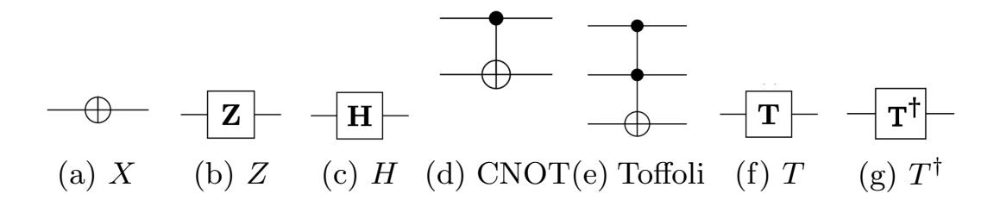
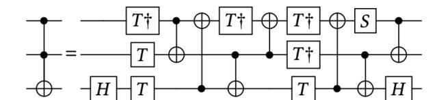
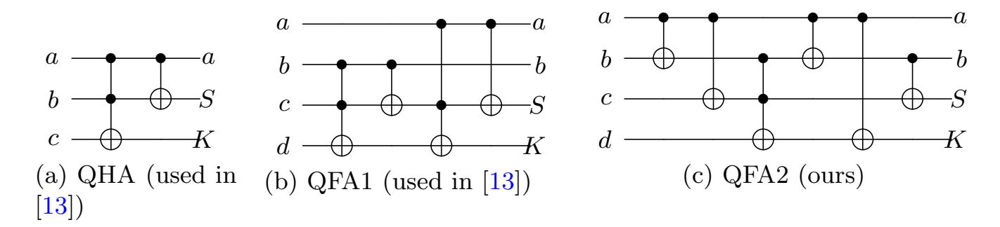
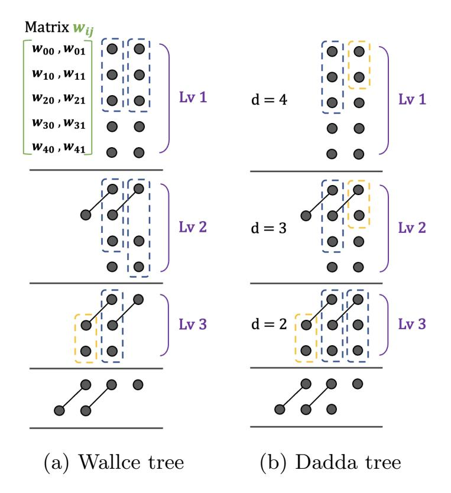
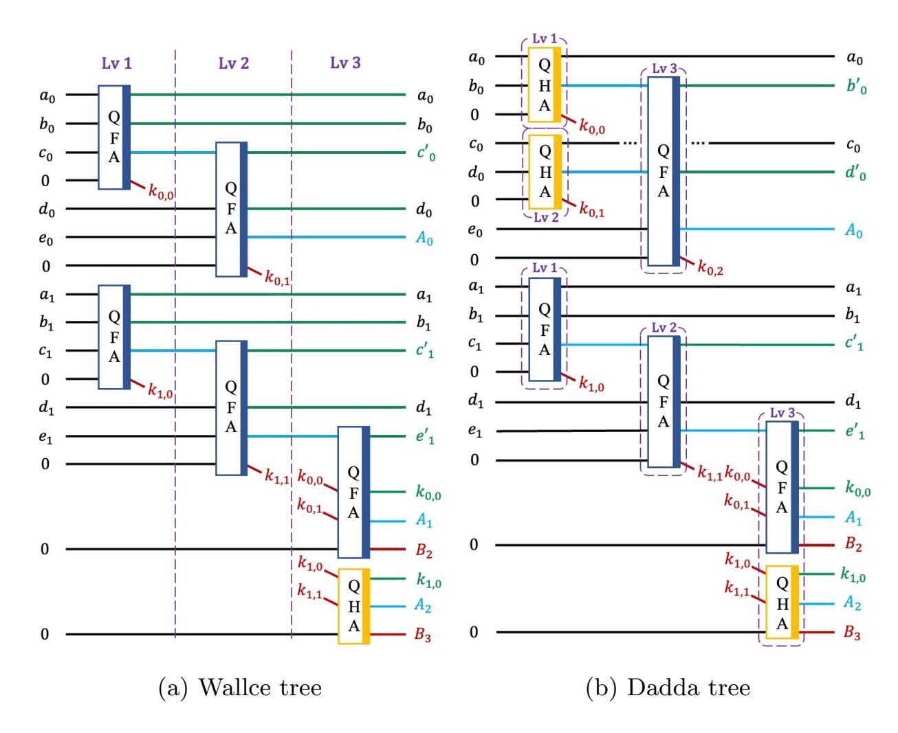
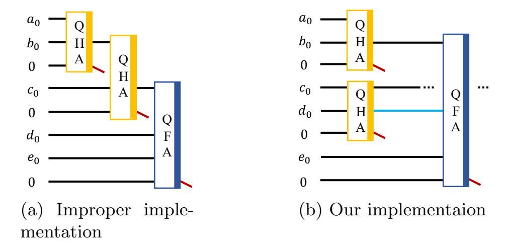
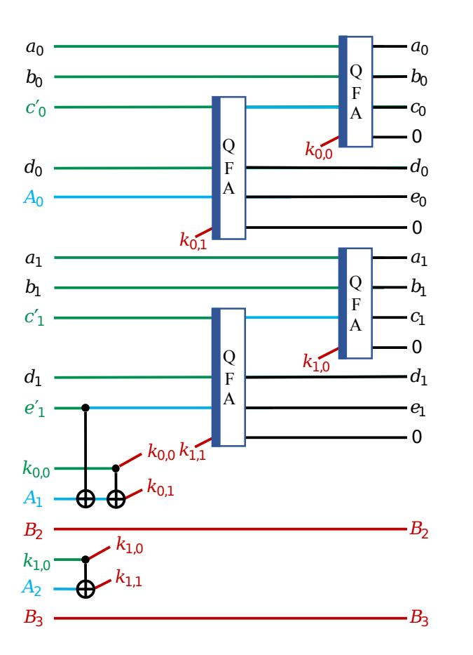
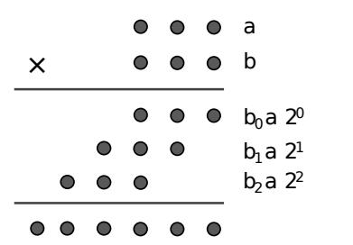
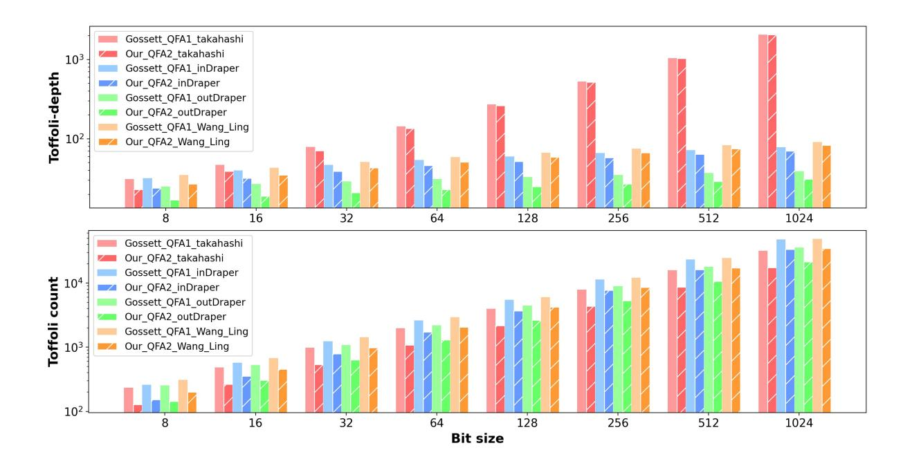
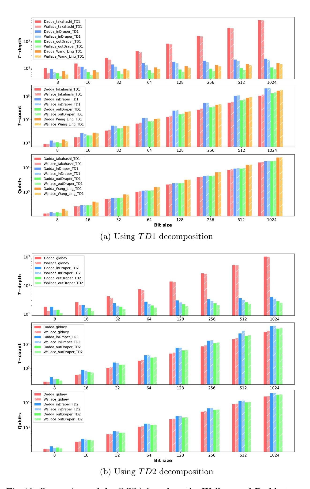

{0}------------------------------------------------

# Tree-based Quantum Carry-Save Adder

Hyunjun Kim1 , Sejin Lim1 , Kyungbae Jang1,2 , Siyi Wang2 , Anubhab Baksi3 , Anupam Chattopadhyay2 , and Hwajeong Seo1⋆

amdjd0704@gmail.com, dlatpwls834@gmail.com, starj1023@gmail.com, siyi002@e.ntu.edu.sg, anubhab.baksi@eit.lth.se, anupam@ntu.edu.sg, hwajeong84@gmail.com

Abstract. Quantum computing is regarded as one of the most significant upcoming advancements in computer science. Although fully operational quantum computers have yet to be realized, they are expected to solve specific problems that are difficult to solve using classical computers. Given the limitations of quantum computing resources, it is crucial to design compact quantum circuits for core operations, such as quantum arithmetic.

In this paper, we focus on optimizing the circuit depth of quantum multi-operand addition, which is a fundamental component in quantum implementations (as an example, SHA-2). Building on the foundational quantum carry-save approach by Phil Gossett, we introduce a tree-based quantum carry-save adder. Our design integrates the Wallace and Dadda trees to optimize carry handling during multi-operand additions. To further reduce circuit depth, we utilize additional ancilla qubits for parallel operations and introduce an efficient technique for reusing these ancilla qubits.

Our tree-based carry-save adder achieves the lowest circuit depth (Tdepth) and provides an improvement of over 82% (up to 99%) in the qubit count–circuit depth product for multi-operand addition. Furthermore, we apply our method to multiplication, achieving the lowest circuit depth and an improvement of up to 87% in the qubit count–circuit depth product.

Keywords: Quantum Computing · Quantum Carry-Save Adder · Wallace Tree · Dadda Tree

## 1 Introduction

Quantum computing offers a new computational paradigm that replaces traditional binary bits with qubits, leveraging quantum phenomena such as superposition and entanglement. These properties empower quantum computers to

1 Hansung University, Seoul, Republic of Korea 2 Nanyang Technological University, Singapore 3 Lund University, Lund, Sweden

⋆ Corresponding author

{1}------------------------------------------------

simultaneously represent multiple states, resulting in solving specific complex problems far faster than classical computers, especially in areas like cryptanalysis, drug development, weather forecasting, and modeling complex systems. Cryptanalysis has undergone significant transformations with the introduction of quantum algorithms such as Shor's algorithm [\[40\]](#page-24-0) and Grover's algorithm [\[14\]](#page-23-0). These algorithms introduce new challenges by breaking traditional encryption schemes like RSA [\[36\]](#page-24-1) and Elliptic Curve Cryptography (ECC) [\[23\]](#page-23-1) and posing a threat to symmetric key cryptography, including AES and SHA-2/3. This has led to active research in post-quantum security, including new security margins and analysis of quantum circuit implementation. However, the practical application of quantum computing poses significant challenges. Presently, the stability of qubits is lacking, and error correction techniques [\[9\]](#page-23-2) are not yet fully matured. Moreover, the actual implementation of quantum computers encounters numerous technical difficulties, one of the prominent being the optimization of quantum circuits (for instance, one may look at the recent development in the context of cryptography [\[18](#page-23-3)[,17\]](#page-23-4)).

Optimizing quantum circuits is a central aspect of quantum computing as it plays a crucial role in enhancing computational efficiency and reducing resource usage. To execute computations efficiently by manipulating qubits in quantum computers, it is essential to optimize these circuits to use as few qubits and operations as possible. This optimization is beneficial not only from the standpoint of computational speed but also in minimizing the possibility of errors and enhancing the overall stability of the system [\[35\]](#page-24-2). When designing quantum circuits for various fields where the advantages of quantum computing can be harnessed, quantum adders become virtually indispensable components. For instance, in Shor's algorithm, adders are employed to execute modular exponentiation more resource-efficiently.

The quantum adders developed thus far primarily follow two approaches: Quantum Ripple Carry Adder (QRCA) and Quantum Carry Look-ahead Adder (QCLA). QRCA operates similarly to a traditional adder, where the carry from each bit position ripples to the next. Although this method can be implemented relatively simply, the computation time increases linearly with the number of bits. On the other hand, QCLA employs parallel processing to perform addition operations more swiftly. It pre-calculates the carry and distributes it in parallel, thus offering significantly faster computation speed. However, its implementation is more complex and demands a greater number of quantum gates. QRCA examples include the Cuccaro adder [\[4\]](#page-22-0), Takahashi adder [\[41\]](#page-24-3), and Gidney adder [\[11\]](#page-23-5), while the Draper adder [\[7\]](#page-23-6), Wang's Higher Radix base adder [\[45\]](#page-25-0) and Wang's Ling base adder [\[46\]](#page-25-1) are types of QCLA .

Previous studies have predominantly concentrated on quantum adders designed for two-operand addition. In this paper, in contrast, we focus on Quantum Carry-Save Adder (QCSA), which is suitable for multi-operand addition. Prior work by Phil Gossett [\[13\]](#page-23-7) demonstrated the implementation of modular arithmetic operations essential to Shor's algorithm using the carry-save method. We extend Gossett's QCSA by presenting depth-optimized quantum circuits for multi-operand 

{2}------------------------------------------------

addition using the Wallace tree [\[44\]](#page-25-2) and Dadda tree [\[5\]](#page-23-8), which are built upon the Carry-Save Adder (CSA). Our QCSA, based on Wallace and Dadda trees, achieves the lowest circuit depths (i.e., Toffoli, T, and full depths) by utilizing additional ancilla qubits to handle multi-operand addition. Notably, in this trade-off between qubit count and circuit depth, we provide the best performance in terms of their product (i.e., qubit count - circuit depth).

Indeed, multi-operand addition is encountered in various fields, such as financial forecasting, where summing sales across different regions aids predictive modeling, and in cryptographic algorithms. For example, multiplication involves summing multiple operands in a single step to enhance computational efficiency. In Shor's algorithm, modular exponentiation (a x mod N) is a crucial operation that demands efficient multi-operand addition techniques. Additionally, in the SHA-2 hash function, the round function performs a 7-operand addition[1](#page-2-0) (W + K + h + Σ1(e) + Ch(e, f, g) + Σ0(a) + M aj(a, b, c)) in a single step.

In this context, our work may serve as an effective approach for optimizing quantum algorithms using quantum multi-operand adders.

### Our Contribution

The contributions of the paper are summarized as follows:

- 1. Tree-based Quantum Carry-Save Adder: We develop quantum adder beyond two-operand addition to multi-operand addition by implementing QCSA. Further, we present/use an improved version of the full adder (detailed in Section [3.1\)](#page-7-0) in this work. We incorporate classical structures, specifically the Wallace and Dadda trees, into quantum computing to improve carry information processing and computation. In multi-operand addition, compared to using a two-operand adder multiple times, our tree-based QCSA achieves the lowest circuit depth and offers the best performance in terms of the product of qubit count and circuit depth (see Table [4\)](#page-18-0).
- 2. Effective Reuse of Ancilla Qubits: Our design includes an uncomputation method (in Section [3.4](#page-11-0) that enables the reuse of ancilla qubits in our QCSA. These ancilla qubits, once reinitialized after uncomputation, can be effectively reused for subsequent operations, especially when the QCSA is not used as a stand-alone component. Indeed, addition in quantum computing extends beyond standalone use; i.e., it is applied at the functional or algorithmic level (see Sections [4.3](#page-17-0) and [5,](#page-18-1) for example).
- 3. Application to Quantum Multiplication: We use our QCSA to implement quantum multiplication (see Section [5\)](#page-18-1), providing an efficient option for depth optimization. As a naive approach (noting that there are various approaches), we focus on the schoolbook method and prepare operands for multi-operand addition in the multiplication using AND operations (Toffoli

1 Indeed in [\[19\]](#page-23-9), Jang et al. adopted our QCSA for the round function of the SHA-2 quantum circuit and achieved a performance improvement (see Section [4.3](#page-17-1) for details).

{3}------------------------------------------------

#### 4 H. Kim et al.

gates in quantum computing). The QCSA is applied to this multi-operand addition and demonstrates its performance.

## 2 Background

### 2.1 Quantum Gates

A quantum circuit consists of a specific sequence of quantum operations, or gates, applied to qubits for executing computational tasks. Unlike classical circuits that process bits (0 and 1) through logic gates (such as AND, OR, and NOT), quantum circuits operate on qubits, which can exist in a superposition of states (both 0 and 1 simultaneously). Quantum gates, such as the Pauli-X, Hadamard, CNOT, and Toffoli gates, manipulate qubits to perform computations. These gates are unitary operations, meaning they are reversible, a key distinction from classical gates. With the distinctive attributes of quantum mechanics, such as superposition and entanglement, quantum circuits hold the potential for executing extensive parallel processing and affording exponential acceleration to targeted computational challenges. Figure [1](#page-3-0) illustrates some of the essential quantum gates:

Fig. 1: Quantum gates.

- Pauli-X (X) gate : The X gate is similar to the classical NOT gate. It flips the state of a qubit from |0⟩ to |1⟩ and vice versa.
- Pauli-Z (Z) gate : The Z gate applies a phase shift to a qubit. It leaves the |0⟩ state unchanged but multiplies the |0⟩ state by a phase factor of -1.
- Hadamard (H) gate : The H gate creates a superposition by transforming a qubit from the basis states |0⟩ and |1⟩ to an equal superposition of both states.
- CNOT (Controlled NOT) gate : The CNOT gate is a two-qubit gate that applies the X gate to the target qubit if the control qubit is in the |1⟩ state. This gate is essential for creating quantum entanglement between qubits.
- Toffoli gate : Also known as the Controlled-Controlled NOT (CCNOT) gate, the Toffoli gate is a three-qubit gate. It applies the X gate to the target qubit if both control qubits are in the |1⟩ state. It is a universal gate for reversible classical computation.

{4}------------------------------------------------

- - T gate: The T gate is a single-qubit gate that applies a  $\frac{\pi}{4}$  phase shift to the  $|1\rangle$  state of the qubit. It is also called the  $\frac{\pi}{8}$  gate.
- $-T^{\dagger}$  (T-dagger) gate: The  $T^{\dagger}$  gate is the inverse of the T gate, meaning it applies a  $\frac{-\pi}{4}$  phase shift to the  $|1\rangle$  state of the qubit.

### 2.2 Toffoli Gate Decomposition

In quantum circuits, the T-count and T-depth are crucial for evaluating the performance and implementation complexity of quantum algorithms, especially when quantum error correction is necessary due to the potential for errors. The T-count, representing the total number of T gates in a quantum circuit, is a common metric for measuring its complexity. Amy [1] proposed a novel cost function for T-depth that measures the maximum number of non-overlapping T gate layers within a circuit. This metric serves as a crucial evaluation tool for assessing the circuit's speed and error probability.

Toffoli gate can be decomposed into simpler Clifford+T gates. Through the decomposition of the Toffoli gate, it is possible to reduce the number of T gates and optimize the quantum circuit's configuration. Various Toffoli decomposition techniques have been proposed, such as those by Amy [1], Selinger [38], and Gidney [11]. In this paper, we adopt two decomposition methods: Selinger's Toffoli decomposition and Gidney's logical AND gate (hereafter TD1 and TD2, respectively). The specific circuits for each method are depicted in Figure 2 (Figure (a), (b) and (c). TD1 achieves the minimum T-depth with the least number of qubits, while TD2 achieves the minimum T-depth with minimal additional qubit usage. In this paper, the chosen Toffoli decompositions were based on their efficient implementation for the overall circuit. TD1 involves 7 T gates with a T-depth of 3. It does not utilize ancilla qubits, which are supplementary qubits introduced to aid in quantum computations. Meanwhile, TD2 replaces pairs of Toffoli gates with Computation and Uncomputation gates. The computation gate requires 4 T gates and has a T-depth of 2 while using one ancilla qubit. The uncomputation, in contrast, is characterized by not using any T gates and involves the measurement of the ancilla qubit. TD1 does not use ancilla qubits but has a larger number of T gates and depth than TD2. On the other hand, TD2 requires one ancilla qubit per application, but it significantly reduces the number of T gates, almost by half, and offers a shallower T-depth. Moreover, the advantage of TD2 is maximized when the Toffoli gate pair structure is utilized. From the perspective of T-depth, TD1 stands out among the Toffoli decomposition techniques by achieving the lowest T-depth without using any ancilla qubits. On the other hand, TD2, despite using only one ancilla qubit, manages to reduce the T-depth to 2, making it advantageous with minimal ancilla usage.

### 2.3 Quantum Arithmetic and Quantum Adder

In this section, we briefly review quantum arithmetic and its relationship to quantum adders. Bhaskar et al. [3] proposed quantum algorithms to efficiently compute functions, such as roots, logarithms, and fractional powers, using a

{5}------------------------------------------------

(a) T D1 : Selinger's Toffoli Decomposition [\[38\]](#page-24-4)

$$\begin{array}{cccccccccccccccccccccccccccccccccccc$$

(b) T D2 : Gidney's logical AND gate (Computation) [\[11\]](#page-23-5) (c) T D2 : Uncomputation

Fig. 2: Toffoli gate decomposition (top : T D1, bottom : T D2).

modular combination of several elementary quantum circuits. Similarly, Haner et al. [\[15\]](#page-23-10) presented efficient quantum circuits for evaluating various mathematical functions, including square roots, Gaussians, hyperbolic tangents, exponentials, sines/cosines, and arcsines. Such quantum circuits for computing mathematical functions are being proposed, with a focus on performance differences between traditional algorithms and methods for their implementation.

All of these mathematical functions are based on addition or multiplication. There are QRCA [\[4](#page-22-0)[,41,](#page-24-3)[11\]](#page-23-5) and QCLA [\[7,](#page-23-6)[45,](#page-25-0)[46\]](#page-25-1) as methods of addition. These methods use a combination of CNOT gates, Toffoli gates, and other fundamental quantum gates to achieve binary addition. In the multiplication domain, quantum multipliers can be made through a series of controlled additions [\[2,](#page-22-3)[26,](#page-24-5)[20,](#page-23-11)[30](#page-24-6)[,31,](#page-24-7)[42](#page-24-8)[,34](#page-24-9)[,10\]](#page-23-12). Yet, this method is not always the most efficient, necessitating ongoing research for improved quantum multipliers. In classic circuits, the depth and size efficient methods like Karatsuba and Toom-Cook multiplication for large numbers prove efficient in quantum circuits as well. Parent et al. [\[33\]](#page-24-10) showcased a quantum circuit for integer multiplication using Karatsuba's recursive method, while Dutta et al. [\[8\]](#page-23-13) exhibited a quantum circuit using the Toom-Cook algorithm. Beyond simply replacing classical circuit operations with quantum ones, one approach involves using the Quantum Fourier Transform (QFT). While the QFT is notably employed in Shor's algorithm, its applications extend to aiding arithmetic operations [\[6,](#page-23-14)[29,](#page-24-11)[37\]](#page-24-12). Through the QFT, quantum states transition into the Fourier domain, which eases operations like addition. These states can subsequently be reverted using the inverse QFT. In multiplication, the process can be executed using controlled phase rotations, analogous to addition.

### 2.4 Carry Save Adder

The CSA is a fundamental arithmetic component in computer architecture and digital system design, primarily responsible for addition operations. Unlike tra

{6}------------------------------------------------

ditional adders that propagate carry values to the next stage, the CSA retains them within a parallel structure throughout a sequence of additions. This approach optimizes complex addition operations by leveraging parallel processing, thereby reducing overall computation time. Such optimization is crucial in largescale matrix operations, high-speed Fourier transforms, and high-performance Graphics Processing Units (GPUs).

Comprising Half Adders (HAs) and Full Adders (FAs), the CSA enables parallel processing across different operation stages. An HA adds two binary digits, producing a sum and a carry, while an FA adds three binary digits, making it essential for handling the carry bit from previous additions. Intermediate carry values are accumulated and processed in the final stage. This design not only minimizes bottlenecks but also maximizes parallelism, significantly improving overall performance.

Tree-Based Approach Tree-based CSA significantly improves upon conventional CSAs by reducing the number of operands and decreasing computation time. It is particularly beneficial in scenarios involving large-scale additions. A tree-based CSA consists of two primary stages: reduction and final carrypropagate addition. In the reduction phase, a CSA at each level of the tree reduces the number of operands. Once only two operands remain, a carry-propagate adder, such as an RCA or a CLA, produces the final result.

There are two major structures for tree-based CSA: the Wallace tree [\[44\]](#page-25-2) and the Dadda tree [\[5\]](#page-23-8). Although the Wallace and Dadda trees have different structures, they share the common goal of optimizing addition operations. The adder operates at each level using a CSA, continually reducing the tree until no further reduction is possible. Simply put, the Wallace tree applies adders as soon as three operands become available, whereas the Dadda tree delays applying adders until more than twice the required operands are present at the next level.

## 3 Tree-Based Quantum Carry Save Adder

Gossett [\[13\]](#page-23-7) proposed a method for performing modular arithmetic in quantum computing. It highlights the advantages of using carry-save arithmetic for quantum modular exponentiation but does not address the construction of multiple CSAs. By arranging the CSAs in a straightforward 2D array structure, the addition of n bits occurs at each stage, making the total number of addition operations proportional to n. This results in a time complexity of O(n).

We introduce two types of tree-based QCSA: Wallace and Dadda. While we employ principles similar to the classical tree-based CSA, our tree-based QCSA is systematically restructured to optimize quantum circuits. The Wallace and Dadda trees that we propose utilize a more efficient approach with a time complexity of O(log n). These methods adopt a structure that operates a significantly greater number of CSAs in parallel compared to 2D array approach. In our implementation, we prioritize optimizing circuit depth by allocating additional ancilla qubits. However, although circuit depth optimization is our primary focus, we do 

{7}------------------------------------------------

not excessively use qubits. Further, we present reuse techniques for initializing previously allocated ancilla qubits (in Section [3.4\)](#page-11-0).

### 3.1 Quantum Circuits for Half and Full Adders

Recall that the CSA comprises HAs and FAs as its fundamental building blocks. The Quantum Half Adder (QHA) [\[13\]](#page-23-7), analogous to the classical 3-to-2 CSA, is designed with a 3-input, 3-output structure by introducing an ancillary input. The QHA adds two qubits and produces a quantum sum and carry. In [\[13\]](#page-23-7), Vedral's Quantum Full Adder (QFA) [\[43\]](#page-25-3) is extended into a 4-input, 4-output structure with an additional ancillary input. The QFA adds three qubits while managing the quantum carry bit generated from previous additions. The circuit diagrams of these QHAs and QFAs are shown in Figures [3](#page-7-1)[\(a\)](#page-7-2) and [3](#page-7-1)[\(b\),](#page-7-3) respectively.

Our tree-based QCSA adopts Gossett's QHA (Figure [3](#page-7-1)[\(a\)\)](#page-7-2). Meanwhile, we present an optimized design of the QFA, as illustrated in Figure [3](#page-7-1)[\(c\).](#page-7-4) Our QFA is optimized using one Toffoli gate and five CNOT gates. In the proposed treebased QCSA, we employ this QFA to reduce the number of Toffoli gates and the Toffoli depth, which is particularly beneficial given the high cost of T gates in quantum computation. Additionally, the performance differences based on the QFA within the Wallace tree are illustrated in Figure [9](#page-26-0) in Appendix [A.](#page-26-1)

Fig. 3: Quantum circuits for QHA and QFA.

### 3.2 Quantum Circuit for Wallace Tree Reduction

Let the operands of the multiplication be represented by a matrix wij , where each row i corresponds to an operand, and each column j corresponds to a bit position, with the rightmost one being the least significant bit. Figure [4](#page-8-0)[\(a\)](#page-8-1) provides an example of adding five 2-bit numbers using the Wallace tree reduction. Each dot represents a bit, and horizontal lines divide the levels. Two dots inside a dashed box are inputs to an HA, and three dots inside a dashed box are inputs to an FA. The adder outputs are connected diagonally for the sum and carry outputs.

In the first step, qubits are grouped in threes for all columns j. An ancilla qubit is added to the group, and the group is connected to the QFA input. In the

{8}------------------------------------------------

Fig. 4: Dot notation representation of Wallace and Dadda trees.

second step, each adder's sum output  $S_j$  is connected to  $w_j$ , which corresponds to the same weight-bit position. Additionally, each adder's carry output  $K_j$  is connected to  $w_{j+1}$ , representing one bit higher weight-bit position. The third step involves repeating steps 1 and 2 until only three  $w_i$  remain. In the fourth step, for all columns j, if there are three remaining qubits, an ancilla qubit is added and connected to the QFA input. If there are two remaining qubits, an ancilla qubit is added and connected to the QHA input. The remaining  $w_0$  is denoted as A' and  $w_1$  as B'. Finally, A' and B' are passed to a Quantum Carry-Propagate Adder.

Figure 5(a) shows a quantum circuit for the Wallace tree adder reduction, adding the same five 2-bit numbers (see Figure 4(a)). The reduction steps consist of three levels, with two QFAs in the least significant bit column, three QFAs in the next qubit column, and one HA in the following qubit column. In this circuit, the reduction step result qubits are  $A_0$ ,  $A_1$ ,  $A_2$ ,  $B_2$ , and  $B_3$ . Among these,  $A_0$  and  $A_1$  become the qubits of the final result of the multi-operand addition. The rest are passed to the two inputs (A, B) of the final carry-propagate addition step. An ancilla qubit is added above  $A_2$  to form A, and B is composed of  $B_2$  and  $B_3$  in the order of least significant qubits. The green qubits  $(c'_0, c'_1, e'_1, k_{0,0}, k_{1,0})$  are garbage qubits that are no longer needed for the calculation. It is important to note that the uncomputation method resets these values to their initial states, and its details are provided in Section 3.4.

In the quantum circuit, several features can be observed. The reduction steps are composed of three levels, with two QFAs in the least significant bit column, three QFAs in the next bit column, and one QHA in the following bit column (see

{9}------------------------------------------------

Fig. 5: Quantum circuit of the reduction process for the Wallace and Dadda trees.

Figure [5](#page-9-0)[\(a\)\)](#page-9-1). Additionally, more qubits are needed for use as ancilla bits. One of these qubits is added for each QFA and QHA. For efficient implementation, we ensure that these additional qubits are passed to inputs A and B in the final carry-propagate addition step. If the input qubits were to be passed to the next step, additional qubits would be needed to store the results in order to reset these values to their initial states. In this case, not only would additional qubits be needed, but the uncomputation step would also be delayed and complicated.

Quantum Circuit for Dadda Tree Reduction Similarly to Wallace tree, Dadda tree also represents the operands by a matrix wij ; each row i corresponds to an operand, and each column j corresponds to a bit position, with the rightmost one being the least significant bit. Figure [4](#page-8-0)[\(b\)](#page-8-2) shows the dot notation representation of the Dadda tree reduction steps for adding five 2-bit numbers. The first step involves calculating the maximum height sequence, d ′ = ⌈1.5 ∗ d⌉. In the second step, starting from the column with the lowest weight, apply the following: if height(wj ) > d′ , add an ancilla qubit to store the carry and apply a QFA. If height(wj ) = d ′ + 1, add an ancilla qubit to store the carry and apply a QHA. In the third step, we update d to equal d ′ . In the fourth step, repeat steps 1-3 for each level until only two rows remain in the weight group. The remaining 

{10}------------------------------------------------

w0 is denoted as A′ and w1 as B′ . Finally, A′ and B′ are passed to a Quantum Carry-Propagate Adder.

Figure [5](#page-9-0)[\(b\)](#page-9-2) represents Figure [4](#page-8-0)[\(b\)](#page-8-2) as a quantum circuit. The reduction steps consist of three levels, with two QHAs and one QFA in the least significant bit column, three QFAs in the next bit column, and one QHA in the following bit column. For efficient implementation, we use ancilla qubits in QFA and QHA, just as in the Wallace tree, and pass them to the final carry-propagate addition step. To prevent the circuit depth from increasing, we arrange the operation order. The sums and carries resulting from QFA and QHA are implemented as lower-priority inputs in the next operation.

Figure [6](#page-10-0) shows an example of an inefficient operation order that results in a deeper circuit depth. Figure [5](#page-9-0)[\(a\)](#page-9-1) and Figure [5](#page-9-0)[\(b\)](#page-9-2) produce the same result, but the depth of the circuit is different. The operation order has been optimized to reduce the circuit depth by arranging the QHA in parallel, as in Figure [5](#page-9-0)[\(b\).](#page-9-2) In the example, the quantum Dadda tree circuit uses one fewer QFA and two more QHAs than the quantum Wallace tree circuit. As a result, it uses one more qubit and more T gates, depending on the type of QFA. Additionally, the input qubits A and B in the final carry-propagate addition step are 3 bits, 1 bit larger.

Classical Dadda trees are generally cheaper in terms of the number of adders and levels compared to Wallace trees. However, the actual cost difference depends on the specific implementation and optimizations performed during the design process. A comparison and measurement of the actual costs of quantum Wallace and Dadda trees are needed, which is explained in Section [4.](#page-12-0)

Fig. 6: Improper implementation for least significant bit causing depth increase in Dadda tree reduction and our implementation

### 3.3 Quantum Circuit for Final Carry-Propagate Addition

The final sum at this stage is generated using either a QRCA or a QLCA. Depending on their types, these adders incur different costs across various metrics. 

{11}------------------------------------------------

Research conducted by Wang in 2023 [\[45\]](#page-25-0) emphasize the importance of adder selection. Wang applys Toffoli decomposition to several adders and compared their T-depth, T-count, and qubit count. Adders are available in two versions: in-place and out-of-place. The out-of-place version stores the output to separate qubits, which does not create any issues related to changing input qubit values. However, for the in-place version, care must be taken as it alters the value of the input qubits. This concern is mitigated during the tree reduction phase, as additional qubits, rather than input qubits, are forwarded to the final carry-propagate addition step.

When comparing in-place adders, according to [\[45\]](#page-25-0), the CLA exhibits a lower qubit count and T-count compared to the RCA, yet the RCA possesses a significantly lower T-depth. For RCA types, the approach of Cuccaro and Takahashi is identical to that of Gidney, suggesting Gidney's approach is more cost-effective than VBE [\[43\]](#page-25-3). Among the RCAs, Takahashi is more efficient than both VBE and Cuccaro in terms of T-depth, T-count, and Qubits. Gidney's approach is identical to Cuccaro's when logical-and is applied, and when Takahashi applies logicaland appropriately, it becomes identical to Gidney. For these reasons, Takahashi and Gidney's adders are adopted in this work.

Conversely, when decomposition of the logical AND gate is utilized in CLA, Wang's Higher Radix adder proves the most efficient in terms of T-depth and Tcount, while Draper adder uses fewer qubits than Wang adder. Among the CLAs, Wang's Higher Radix base adder is excluded because the carry value becomes a garbage qubit thus we adopt Wang's Ling base adder with modifications. The choice of adder can be adjusted according to the metrics considered most crucial for the task at hand. The specific differences among various adders, including their impact on cost, are further discussed in Section [4.](#page-12-0)

## 3.4 Uncomputation

A notable issue that arises when implementing Wallace and Dadda tree adders in quantum circuits is the presence of auxiliary qubits. These auxiliary qubits are not part of the desired output state, but required during quantum computation to facilitate information processing. Management and elimination of these ancilla qubits are critical to ensuring efficiency and accuracy in quantum computations. Therefore, we include an uncomputation step to reverse the intermediate operations that generated the auxiliary qubits. This effectively separates these qubits from the output ones and returns them to their initial state.

The uncomputation returns all qubits except for the final sum output to their initial state. This is achieved by applying the QFA and QHA circuits used in the reduction stage in reverse order. The uncompute stage is influenced by whether it is in-place or out of place. In the case of outplace, the input and output are separated, so it does not affect the input. However, in the case of inplace, one of the two inputs becomes the output. Since the value of the output must be preserved, the uncompute stage restores the qubits to their original state, excluding the output. In-place is performed in fewer steps than out-ofplace. Figure [7](#page-12-1) shows an uncomputed circuit connected to the Wallace tree 

{12}------------------------------------------------

method (Figure [5](#page-9-0)[\(a\)\)](#page-9-1), which uses an in-place adder. Here, all qubits except for the output bits B2 and B3 are returned to their initial state. As a result, the QHA connected to the output bits is simply replaced with a single CNOT gate, and the QFA is replaced with two CNOT gates. The remaining qubits return to their initial state with the same cost as in the reduction stage. In the case of a circuit using an out-of-place adder, the QFA and QHA circuits from the reduction stage are simply applied in reverse order.

Fig. 7: Quantum circuit implementation for the Uncomputation stage of the Wallace tree.

## 4 Evaluation

In this section, we esitimate and analysis for the required quantum resources for the tree-based QCSA. Notably, the choice of tree method and adder type significantly influences the resource differences. Building upon that, this section explores the efficiency of adders, including QRCA and QCLA. We execute quantum versions of both trees in the Cirq framework. Due to Cirq's lack of direct circuit metric functions, we turn to Qiskit, particularly for depth evaluation. This facilitate precise comparisons in qubit metrics, Toffoli gate counts, and depths. Additionally, by decomposing the Toffoli gates, we discern key metrics: T-depth and T-count, vital for gauging quantum circuit performance and resources. The 

{13}------------------------------------------------

implementation and experimentation code are available on GitHub[2](#page-13-0) for further reference.

### 4.1 Performance Comparison of Wallace and Dadda Trees

Before comparing the performance of the Wallace and Dadda trees, we briefly discuss the differences between their classical versions. In the Wallace tree, the reduction strategy aims to minimize the number of remaining bits at each level by using all available FAs to reduce the bit count as much as possible. This results in an uneven reduction, with some columns having more remaining bits than others. Additional adders may be needed in subsequent levels to balance the reduction, which could increase the total number of adders.

In contrast, the Dadda tree uses a more conservative reduction strategy. The core idea is to reduce the number of bits at each level to a specific target determined by the Dadda ratio. The Dadda ratio follows the sequence L = 1, 2, 3, 4, 6, 9, 13, 19, 28, ..., with each subsequent element being approximately 1.5 times the previous one. For a given number of input bits n, the Dadda tree calculates the target bit count for each level using the Dadda ratio. It employs the minimum number of FA and HA required to achieve the target reduction at each level. This conservative approach results in a more balanced reduction across levels and generally requires fewer adders than the Wallace tree.

Considering these characteristics in a classical environment, it is generally expected that fewer adders are used in the Dadda tree, which would result in fewer Toffoli gates and qubits generated when implemented in a quantum circuit. Additionally, in terms of tree height, Dadda trees are typically taller than Wallace trees. The Wallace tree follows an aggressive approach, reducing the number of bits at each stage as much as possible. As a result, the tree height is lower, but a wider tree structure with more adders used at each level is formed. These characteristics influence the Toffoli depth in quantum circuits, with the Wallace tree expected to have a smaller Toffoli depth.

### 4.2 Estimation of Quantum Resources

We assume a 9-operand[3](#page-13-1) addition and estimate the quantum resource requirements for the two trees as they scale with increasing bit sizes (8, 16, 32, . . . , 1024). In our observation, although the Wallace tree requires more resources, it has a lower Toffoli depth compared to the Dadda tree. This outcome may be due to the Wallace tree's aggressive bit reduction strategy. Note that while the Wallace tree exhibits a slightly lower Toffoli depth, the Dadda tree achieves a lower Toffoli count and qubit count, as shown in Table [1](#page-14-0) (without Toffoli gate decomposition). Furthermore, our observations of T-depth and T-count in Tables [2](#page-15-0) and [3](#page-16-0) (using Toffoli gate decompositions T D1 (see Figure [2](#page-5-0)[\(a\)\)](#page-5-1) and T D2 (see Figures [2](#page-5-0)[\(b\)](#page-5-2) and [\(c\)\)](#page-5-3), respectively) are consistent with these results. This consistency

2 The code will be made publicly available after this article is accepted.

3 Note that performance varies depending on the number of operands.

{14}------------------------------------------------

suggests that the properties of the classical Dadda and Wallace trees directly influence their quantum counterparts.

Table 1: Quantum resources required for 9-operand addition using our QCSA (without Toffoli decomposition).

| Bit Size | Carry-propagate | Da            | dda-based     |        | Wallace-based |               |        |  |
|----------|-----------------|---------------|---------------|--------|---------------|---------------|--------|--|
| DII DIZE | adder           | Toffoli depth | Toffoli count | Qubits | Toffoli depth | Toffoli count | Qubits |  |
| 8        |                 | 34            | 128           | 133    | 23            | 128           | 137    |  |
| 16       |                 | 50            | 248           | 261    | 39            | 264           | 273    |  |
| 32       |                 | 82            | 488           | 517    | 71            | 536           | 545    |  |
| 64       | Takahashi [41]* | 146           | 968           | 1029   | 135           | 1080          | 1089   |  |
| 128      | (in-place)      | 274           | 1928          | 2053   | 263           | 2168          | 2177   |  |
| 256      |                 | 530           | 3848          | 4101   | 519           | 4344          | 4353   |  |
| 512      |                 | 1042          | 7688          | 8197   | 1031          | 8696          | 8705   |  |
| 1024     |                 | 2066          | 15368         | 16389  | 2055          | 17400         | 17409  |  |
| 8        |                 | 32            | 182           | 148    | 24            | 153           | 145    |  |
| 16       |                 | 38            | 379           | 291    | 32            | 355           | 295    |  |
| 32       |                 | 46            | 798           | 578    | 39            | 793           | 597    |  |
| 64       | Draper $[7]^*$  | 52            | 1679          | 1153   | 46            | 1723          | 1203   |  |
| 128      | (out-of-place)  | 58            | 3518          | 2304   | 52            | 3673          | 2417   |  |
| 256      |                 | 64            | 7339          | 4607   | 58            | 7731          | 4847   |  |
| 512      |                 | 70            | 15254         | 9214   | 64            | 16137         | 9709   |  |
| 1024     |                 | 76            | 31615         | 18429  | 70            | 33499         | 19435  |  |
| 8        |                 | 22            | 152           | 148    | 17            | 143           | 146    |  |
| 16       |                 | 24            | 301           | 291    | 19            | 305           | 296    |  |
| 32       |                 | 26            | 602           | 578    | 21            | 635           | 598    |  |
| 64       | Draper [7]*     | 28            | 1207          | 1153   | 23            | 1301          | 1204   |  |
| 128      | (out-of-place)  | 30            | 2420          | 2304   | 25            | 2639          | 2418   |  |
| 256      | ,               | 32            | 4849          | 4607   | 27            | 5321          | 4848   |  |
| 512      |                 | 34            | 9710          | 9214   | 29            | 10691         | 9710   |  |
| 1024     |                 | 36            | 19435         | 18429  | 31            | 21437         | 19436  |  |
| 8        |                 | 35            | 253           | 206    | 27            | 201           | 179    |  |
| 16       |                 | 39            | 497           | 404    | 35            | 455           | 382    |  |
| 32       |                 | 47            | 997           | 806    | 43            | 981           | 797    |  |
| 64       | Wang [46]*      | 55            | 2009          | 1616   | 51            | 2051          | 1636   |  |
| 128      | (out-of-place)  | 63            | 4045          | 3242   | 59            | 4209          | 3323   |  |
| 256      | ,               | 71            | 8129          | 6500   | 67            | 8543          | 6706   |  |
| 512      |                 | 79            | 16309         | 13022  | 75            | 17229         | 13481  |  |
| 1024     |                 | 87            | 32681         | 26072  | 83            | 34619         | 27040  |  |

**≭**: Used for the last remaining 2-operand addition.

In the final carry-propagation step, either a QRCA or a QCLA can be used. To compare the selected adders, we examine Takahashi's RCA, Draper's CLA, and Wang's Ling-based CLA. Table 1 shows the results for the required Toffoli depth, Toffoli count, and qubit count.

The Toffoli depth is the smallest in Draper's out-of-place CLA, followed by Draper's in-place CLA, Wang's Ling-based CLA, and finally Takahashi's RCA.

{15}------------------------------------------------

Table 2: Quantum resources required for 9-operand addition using our QCSA (with T D1 decomposition).

|      | Bit Size Carry-propagate |      | Dadda-based |       | Wallace-based |                                               |       |  |
|------|--------------------------|------|-------------|-------|---------------|-----------------------------------------------|-------|--|
|      | adder                    |      |             |       |               | T-depth T-count Qubits T-depth T-count Qubits |       |  |
| 8    |                          | 102  | 896         | 133   | 69            | 896                                           | 137   |  |
| 16   |                          | 150  | 1736        | 261   | 117           | 1848                                          | 273   |  |
| 32   |                          | 246  | 3416        | 517   | 213           | 3752                                          | 545   |  |
| 64   | ✲ Takahashi [41]      | 438  | 6776        | 1029  | 405           | 7560                                          | 1089  |  |
| 128  | (in-place)               | 822  | 13496       | 2053  | 789           | 15176                                         | 2177  |  |
| 256  |                          | 1590 | 26936       | 4101  | 1557          | 30408                                         | 4353  |  |
| 512  |                          | 3126 | 53816       | 8197  | 3093          | 60872                                         | 8705  |  |
| 1024 |                          | 6198 | 107576      | 16389 | 6165          | 121800                                        | 17409 |  |
| 8    |                          | 96   | 1274        | 148   | 72            | 1071                                          | 145   |  |
| 16   |                          | 114  | 2653        | 291   | 96            | 2485                                          | 295   |  |
| 32   |                          | 138  | 5586        | 578   | 117           | 5551                                          | 597   |  |
| 64   | ✲ Draper [7]          | 156  | 11753       | 1153  | 138           | 12061                                         | 1203  |  |
| 128  | (in-place)               | 174  | 24626       | 2304  | 156           | 25711                                         | 2417  |  |
| 256  |                          | 192  | 51373       | 4607  | 174           | 54117                                         | 4847  |  |
| 512  |                          | 210  | 106778      | 9214  | 192           | 112959                                        | 9709  |  |
| 1024 |                          | 228  | 221305      | 18429 | 210           | 234493                                        | 19435 |  |
| 8    |                          | 66   | 1064        | 148   | 51            | 1001                                          | 146   |  |
| 16   |                          | 72   | 2107        | 291   | 57            | 2135                                          | 296   |  |
| 32   |                          | 78   | 4214        | 578   | 63            | 4445                                          | 598   |  |
| 64   | ✲ Draper [6]          | 84   | 8449        | 1153  | 69            | 9107                                          | 1204  |  |
| 128  | (out-of-place)           | 90   | 16940       | 2304  | 75            | 18473                                         | 2418  |  |
| 256  |                          | 96   | 33943       | 4607  | 81            | 37247                                         | 4848  |  |
| 512  |                          | 102  | 67970       | 9214  | 87            | 74837                                         | 9710  |  |
| 1024 |                          | 108  | 136045      | 18429 | 93            | 150059                                        | 19436 |  |
| 8    |                          | 78   | 1407        | 206   | 60            | 1211                                          | 179   |  |
| 16   |                          | 84   | 2737        | 404   | 72            | 2632                                          | 382   |  |
| 32   |                          | 96   | 5439        | 806   | 84            | 5537                                          | 797   |  |
| 64   | ✲ Wang [46]           | 108  | 10885       | 1616  | 96            | 11410                                         | 1636  |  |
| 128  | (out-of-place)           | 120  | 21819       | 3242  | 108           | 23219                                         | 3323  |  |
| 256  |                          | 132  | 43729       | 6500  | 120           | 46900                                         | 6706  |  |
| 512  |                          | 144  | 87591       | 13022 | 132           | 94325                                         | 13481 |  |
| 1024 |                          | 156  | 175357      | 26072 | 144           | 189238                                        | 27040 |  |

✲: Used for the last remaining 2-operand addition.

{16}------------------------------------------------

Table 3: Quantum resources required for 9-operand addition using our QCSA (with T D2 decomposition).

|      | Bit Size Carry-propagate |      | Dadda-based |       | Wallace-based                                 |       |       |  |
|------|--------------------------|------|-------------|-------|-----------------------------------------------|-------|-------|--|
|      | adder                    |      |             |       | T-depth T-count Qubits T-depth T-count Qubits |       |       |  |
| 8    |                          | 18   | 276         | 143   | 13                                            | 276   | 143   |  |
| 16   |                          | 26   | 532         | 279   | 21                                            | 564   | 287   |  |
| 32   |                          | 42   | 1044        | 551   | 37                                            | 1140  | 575   |  |
| 64   | ✲ Gidney [11]         | 74   | 2068        | 1095  | 69                                            | 2292  | 1151  |  |
| 128  | (in-place)               | 138  | 4116        | 2183  | 133                                           | 4596  | 2303  |  |
| 256  |                          | 266  | 8212        | 4359  | 261                                           | 9204  | 4607  |  |
| 512  |                          | 522  | 16404       | 8711  | 517                                           | 18420 | 9215  |  |
| 1024 |                          | 1034 | 32788       | 17415 | 1029                                          | 36852 | 18431 |  |
| 8    |                          | 18   | 432         | 182   | 14                                            | 352   | 162   |  |
| 16   |                          | 21   | 864         | 362   | 17                                            | 800   | 346   |  |
| 32   |                          | 24   | 1744        | 726   | 20                                            | 1728  | 722   |  |
| 64   | ✲ Draper [7]          | 27   | 3520        | 1458  | 23                                            | 3616  | 1482  |  |
| 128  | (in-place)               | 30   | 7088        | 2926  | 26                                            | 7424  | 3010  |  |
| 256  |                          | 33   | 14240       | 5866  | 29                                            | 15072 | 6074  |  |
| 512  |                          | 36   | 28560       | 11750 | 32                                            | 37486 | 12210 |  |
| 1024 |                          | 39   | 57216       | 23522 | 35                                            | 61088 | 24490 |  |
| 8    |                          | 14   | 356         | 163   | 11                                            | 316   | 154   |  |
| 16   |                          | 16   | 700         | 321   | 13                                            | 684   | 318   |  |
| 32   |                          | 18   | 1396        | 639   | 15                                            | 1436  | 650   |  |
| 64   | ✲ Draper [7]          | 20   | 2796        | 1277  | 17                                            | 2956  | 1318  |  |
| 128  | (out-of-place)           | 22   | 5604        | 2555  | 19                                            | 6012  | 2658  |  |
| 256  |                          | 24   | 11228       | 5113  | 21                                            | 12140 | 5342  |  |
| 512  |                          | 26   | 22484       | 10231 | 23                                            | 24412 | 10714 |  |
| 1024 |                          | 28   | 45004       | 20469 | 25                                            | 48972 | 21462 |  |

✲: Used for the last remaining 2-operand addition.

Takahashi's RCA requires fewer qubits than Wang's CLA and both versions of Draper's CLA. As a result, while the RCA demonstrates superior performance in terms of Toffoli count and qubit count, the CLA offers better performance in terms of Toffoli depth. Notably, as the bit size increases, the growth in Toffoli depth is relatively slower for the CLA.

Draper's in-place version outperforms the out-of-place version in terms of Toffoli depth, whereas the out-of-place version achieves better Toffoli count than the in-place version. Additionally, Draper's in-place version requires one fewer 

{17}------------------------------------------------

qubit in the Wallace tree and the same number of qubits in the Dadda tree compared to the out-of-place version. These characteristics align with the expected features of each adder.

The differences in T-depth, T-count, and qubit count for Toffoli decomposition exhibit some variance. In our experiments, the in-place approach in the T D1 decomposition uses fewer qubits than the out-of-place approach, whereas in the T D2 decomposition, the out-of-place approach requires fewer qubits. However, in an ideal scenario, the Toffoli and T metrics should be similar. These discrepancies suggest that our experimental implementation may not be fully optimized, possibly due to the complexity of Draper's adder. Additionally, the out-of-place implementation of Wang's Ling-based CLA has potential for further optimization.

In Appendix [A,](#page-26-1) a summary of the performances depicted in the graphs is provided by Figure [10,](#page-27-0) which illustrates the required quantum resources in terms of T-depth, T-count, and qubit count. These graphs compare the impact of different Toffoli decomposition methods (i.e., T D1 and T D2), Wallace and Dadda trees, and the implemented carry-propagate adder.

### 4.3 Performance Trade-off

In this section, we evaluate the performance of our QCSA for multi-operand addition compared to using a single-operand adder. As shown in Tables [1,](#page-14-0) [2](#page-15-0) and [3;](#page-16-0) our QCSA achieves the lowest circuit depth but requires additional qubits. To assess this trade-off between circuit depth and qubit count, we use the Tdepth–qubit count product, a commonly employed metric for evaluating quantum circuit performance (see [\[18,](#page-23-3)[16](#page-23-15)[,22,](#page-23-16)[27,](#page-24-13)[28,](#page-24-14)[39\]](#page-24-15)).

We consider a 9-operand addition scenario (as in Tables [1,](#page-14-0) [2,](#page-15-0) and [3\)](#page-16-0) and compare our QCSA with Gidney's adder [\[11\]](#page-23-5), both of which employ logical AND gates. Note that multi-operand addition using Gidney's adder is performed sequentially, without considering external parallelization. For example, in the addition of a+b+c+d (i.e., 4-operand addition), the sequence follows b = a+b, then c = b + c, and finally d = c + d [4](#page-17-2) .

Table [4](#page-18-0) presents a comparison of the required quantum resources for 9 operand additions using Gidney's adder and our QCSA (with T D2). Although our QCSA requires more qubits compared to sequential additions performed with generic adders (such as those in [\[11,](#page-23-5)[4](#page-22-0)[,41,](#page-24-3)[7,](#page-23-6)[45\]](#page-25-0)), it achieves significantly lower circuit depth. In terms of the trade-off performance metric (i.e., T-depth × qubits in Table [4\)](#page-18-0), our QCSA achieves significant improvements ranging from approximately 82% to 99%. Overall, our QCSA combined with the in-place version of Draper's adder provides the best performance.

Application to SHA-2 Quantum Circuit As mentioned in Section [1,](#page-0-0) 7 operand 32-bit addition is used in the SHA-2 hash function. In [\[19\]](#page-23-9), Jang et

4 If parallelization is assumed, the circuit depth decreases, but the qubit count increases.

{18}------------------------------------------------

al. optimized quantum circuits for SHA-2 and adopted our QCSA5. Table 5 reproduces the cost comparison from [19, Table 5] for the 7-operand addition, along with the results from Kim et al. [22] and Lee et al. [25]. In [19], our QCSA is used in their 7-operand quantum circuit, while in [22,25], Draper's in-place adder is used in their implementations. The implementation in [19] with our QCSA achieves the lowest Toffoli depth but requires additional ancilla qubits. However, in this trade-off, the best performance in terms of the Toffoli depth-qubit count product is achieved in [19] (see Table 5).

Table 4: Performance comparison of 9-operand addition using Gidney's adder [11] and our QCSA (with TD2 decomposition).

|                      |         |         |             |                            | Ou                         | rs (Wallace-b | pased)                |  |  |  |
|----------------------|---------|---------|-------------|----------------------------|----------------------------|---------------|-----------------------|--|--|--|
| $\operatorname{Bit}$ |         | Cidnox  | [11] (in-p  | ologo)O                    | Gidney[11]*                | Draper[7]*    | Draper[7]*            |  |  |  |
| size                 |         | Glulley | [11] (111-1 | nace)                      | (in-place)                 | (in-place)    | (out-of-place)        |  |  |  |
|                      | T-depth | T-count | Qubits      | $T$ -depth $\times$ Qubits | $T$ -depth $\times Qubits$ |               |                       |  |  |  |
|                      | 150     | 20.4    | 0.0         | 19070                      | 1859                       | 2268          | 1694                  |  |  |  |
| 8                    | 152     | 304     | 86          | 13072                      | (85.8%)                    | (82.6%)       | (87.0%)               |  |  |  |
| 16                   | 280     | 560     | 166         | 46480                      | 6027                       | 5882          | 4134                  |  |  |  |
| 10                   | 200     | 500     | 100         | 40400                      | (87.0%)                    | (87.3%)       | (91.1%)               |  |  |  |
| 32                   | 536     | 1072    | 326         | 174726                     | 21275                      | 14440         | $\boldsymbol{9750}$   |  |  |  |
| 32                   | 550     | 1072    | 320         | 174736                     | (87.8%)                    | (91.7%)       | (94.4%)               |  |  |  |
| 64                   | 1048    | 2096    | 646         | 677008                     | 79419                      | 34086         | 22406                 |  |  |  |
| 04                   | 1040    | 2090    | 040         | 011000                     | (88.3%)                    | (95.0%)       | (96.7%)               |  |  |  |
| 128                  | 2072    | 4144    | 1286        | 2664592                    | 306299                     | 78260         | $\boldsymbol{50502}$  |  |  |  |
| 120                  | 2012    | 4144    | 1200        | 2004092                    | (88.5%)                    | (97.1%)       | (98.1%)               |  |  |  |
| 256                  | 4120    | 8240    | 2566        | 10571920                   | 1202427                    | 176146        | $\boldsymbol{112182}$ |  |  |  |
| 200                  | 4120    | 0240    | 2000        | 10071920                   | (88.6%)                    | (98.3%)       | (98.9%)               |  |  |  |
| 512                  | 8216    | 16432   | 5126        | 42115216                   | 4764155                    | 390720        | 246422                |  |  |  |
| 014                  | 0210    | 10402   | 0120        | 42110210                   | (88.7%)                    | (99.1%)       | (99.4%)               |  |  |  |
| 1024                 | 16408   | 32816   | 10246       | 168116368                  | 18965499                   | 857150        | 536550                |  |  |  |
| 1024                 | 10400   | 02010   | 10240       | 100110000                  | (88.7%)                    | (99.5%)       | (99.7%)               |  |  |  |

O: Used for 2-operand additions (performed 8 times for a 9-operand addition).

## 5 Application to Multiplication

In this section, we discuss the characteristics and possible enhancements of applying our tree-based QCSA to multiplication. Our approach follows a two-step process: first, generating all partial products using quantum AND circuits, and then summing these partial products using the QCSA. Multiplication can be

**≭**: Used for the last remaining 2-operand addition.

The authors of [19] adopted Draper's out-of-place adder for the final 2-operand addition, along with the Toffoli decomposition consisting of 8 Clifford gates, 7 T gates, and a T-depth of 4 (one of the methods proposed in [1]).

{19}------------------------------------------------

| Table 5: Quantum resources required for 7-operand 32-bit addition in SHA-2 |  |  |  |  |
|----------------------------------------------------------------------------|--|--|--|--|
| quantum circuits.                                                          |  |  |  |  |

| Source                | Toffoli depth | T-count | Qubits | Toffoli depth × Qubits |
|-----------------------|---------------|---------|--------|------------------------|
| ✢ Kim et al. [22]  | 224           | 19124   | 501    | 112224                 |
| ✢ Lee et al. [25]  | 66            | -       | 546    | 36036                  |
| ❂ Jang et al. [19] | 19            | 6546    | 819    | 15561                  |

✢: Draper [\[6\]](#page-23-14) (in-place) is used.

❂: Our QCSA is used.

simply addressed as an addition problem, as depicted in Figure [8.](#page-19-1) Given the binary nature of the system, each bit of the multiplicand can only be 0 or 1. If a particular bit is 1, the shifted value of the multiplier (equivalent to multiplying by a power of 2) is added to the cumulative sum. Note that in our implementation, addition is performed even when the bit is 0 (due to quantum superposition).

We employ the Toffoli gate to convert multiplication into its additive form (nine Toffoli gates are used in Figure [8\)](#page-19-1). In Figure [8,](#page-19-1) qubits for b0a, b1a, and b2a represent shifted results, and by summing them using our QCSA, we can obtain the result of the multiplication. It is important to note that the partial products generated in the first step are uncomputed (Section [3.4\)](#page-11-0) to remove the garbage qubits.

The difference between Dadda and Wallace trees in QCSA-based multiplication is similar to the results in the multi-operand addition. Dadda tree requires fewer T gates and qubits, whereas Wallace tree achieves a lower T-depth. A notable distinction is observed between T D1 and T D2. While T D2 uses slightly more qubits than T D1, it significantly reduces both T-depth and T-count. This is because the initial step of computing partial products in QCSA-based multiplication, as well as the uncomputation process, does not utilize T gates. The required quantum resources for the QCSA-based multiplication are shown in Table [6.](#page-20-0)

Fig. 8: The stage of the multiplication that generates all the partial products and then sums them using our QCSA

{20}------------------------------------------------

47 1984 528 43 2328 616

Bit size Carry-propagate Dadda-based Wallace-based adder T-depth T-count Qubits T-depth T-count Qubits 8 168 1589 123 171 1932 154 16 Takahashi [\[41\]](#page-24-3) ✲ 360 6720 499 369 7917 591 32 (in-place and T D1) 744 27776 2019 759 31136 2267 64 1512 112896 8131 1533 121443 8751 8 114 1834 145 123 2135 170 16 Draper [\[6\]](#page-23-14) ✲ 216 7392 551 207 8533 636 32 (out-of-place and T D1) 414 29302 2133 351 32592 2372 64 804 116172 8371 615 124656 8981 8 23 596 166 26 664 185 16 Draper [\[7\]](#page-23-6) ✲ 41 2276 602 46 2580 680

Table 6: Quantum resources required for our QCSA-based multiplication.

32 (in-place and T D2) 95 8064 2080 78 9028 2323

32 (out-of-place and T D2) 75 8724 2246 80 9636 2476 64 141 33924 8610 146 36316 9210 8 23 480 136 24 584 164

## 5.1 Performance Comparison

✲

16 Gidney [\[11\]](#page-23-5)

Quantum multiplication circuits that rely solely on classical reversible gates (i.e., CNOT and Toffoli gates) generally operate through repeated shifts and additions [\[26](#page-24-5)[,20,](#page-23-11)[30\]](#page-24-6). Additionally, multiplications in [\[31,](#page-24-7)[42,](#page-24-8)[34,](#page-24-9)[10\]](#page-23-12) employ a treebased approach similar to ours. However, these methods are restricted to small bit sizes, do not provide T-depth, are difficult to measure, and generate unnecessary garbage qubits. Our observations indicate that the method proposed in [\[30\]](#page-24-6) is the most efficient among those utilizing repeated shifts and additions. Although they do not provide explicit T-depth, due to the serial nature of their structure, we can extrapolate the T-depth. Table [7](#page-21-0) presents a comparison[6](#page-20-1) of the quantum resources required for multiplication in [\[30\]](#page-24-6) and our tree-based QCSA multiplication.

64 191 32512 8256 145 34960 8870 ✲: Used for the last remaining 2-operand addition.

6 Most works on quantum integer multiplication [\[21,](#page-23-17)[33,](#page-24-10)[8,](#page-23-13)[24\]](#page-24-17) do not report concrete costs and instead rely on asymptotic formulas. However, the authors of [\[30\]](#page-24-6) provide detailed quantum resource estimates for their quantum circuit implementation; thus, we adopt their work for comparison.

{21}------------------------------------------------

Table 7: Performance comparison of multiplication in [30] and our QCSA-based multiplication.

|             |                                    |         |        |                            | Ours (Wallace-based)        |                           |         |                 |  |
|-------------|------------------------------------|---------|--------|----------------------------|-----------------------------|---------------------------|---------|-----------------|--|
| Bit size | Muñoz-Coreas and Thapliyal [30] |         |        |                            | Takahashi[41]*              | Draper[7]* (out-of-place) |         | Gidney [11]*    |  |
|             |                                    |         |        |                            | (in-place,TD1)              | (TD1)                     | (TD2)   | (in-place, TD2) |  |
|             | T-depth                            | T-count | Qubits | $T$ -depth $\times$ Qubits | $T$ - $depth \times Qubits$ |                           |         |                 |  |
| 8           | 507                                | 1330    | 33     | 16731                      | 26334                       | 20910                     | 4810    | 3936            |  |
|             |                                    |         |        |                            | (-57.4%)                    | (-25.0%)                  | (71.3%) | (76.5%)         |  |
| 16          | 2163                               | 5362    | 65     | 140595                     | 218079                      | 131652                    | 31280   | 26488           |  |
|             |                                    |         |        |                            | (-55.1%)                    | (6.4%)                    | (77.6%) | (81.2%)         |  |
| 32          | 8931                               | 21490   | 129    | 1152099                    | 1720653                     | 832572                    | 198080  | 181194          |  |
|             |                                    |         |        |                            | (-49.3%)                    | (27.7%)                   | (82.8%) | (84.3%)         |  |
| 64          | 36291                              | 86002   | 257    | 9326787                    | 13415283                    | 5523315                   | 1344660 | 1286150         |  |
|             |                                    |         |        |                            | (-43.8%)                    | (40.8%)                   | (85.6%) | (86.2%)         |  |

**≭**: Used for the last remaining 2-operand addition.

Our QCSA-based multiplication significantly reduces T-depth by optimizing intermediate operations. However, due to the qubits allocated for storing partial products and the additional auxiliary qubits introduced in the first step and CSA, the qubit count is significantly lower in [30]. Our method provides substantial advantages in terms of T-depth and T-count in QCSA-based multiplication. In terms of the trade-off metric (i.e., T-depth  $\times$  Qubits in Table 7), we achieve improvements for bit sizes 16, 32, and 64 with TD1, and the ratio increases as the bit size increases. For TD2, due to the efficiency of AND gates and our QCSA-based method, significant improvements are achieved.

### 5.2 Further Discussion

The QFT-based multiplication [6,37] can be approximately implemented without rotation gates below a certain threshold, enabling the construction of an approximate QFT (AQFT). This optimization reduces the number of gates from  $O(n^2)$  to  $O(n \log n)$ . According to [37], multiplication requires  $O(n^3)$  gates; however, further investigation is necessary for AQFT. The QFT-based adder circuit also incorporates controlled rotation gates (controlled-R gates). In fault-tolerant quantum computing, complex controlled-R gates must be decomposed into basic gates (Clifford gates and T gates). In [32], the authors demonstrate that AQFT can be implemented with  $O(n \log n)$  T gates. However, additional research is required to assess the impact of these transformations on multiplication. Due to these factors, a direct comparison with our proposed method has certain limitations.

Further improvements can be explored through expansions using the Karatsuba and Toom-Cook algorithms. Previous research employing these algorithms

{22}------------------------------------------------

[\[33](#page-24-10)[,8](#page-23-13)[,12\]](#page-23-18) has shown asymptotic performance improvements for large-size multiplications. It is worth noting that our QCSA can be adopted in the inner multi-operand additions. In particular, Toom-Cook 3-way and 4-way require 3 operand and 4-operand additions for divided inputs, respectively, and our QCSA can be applied to enhance performance. Future research focusing on maximizing these characteristics or identifying an optimal trade-off between T-depth and qubit usage for operational efficiency could lead to even greater computational performance.

## 6 Conclusion

This paper focuses on optimizing quantum addition, particularly the Carry-Save Adder (CSA) for multi-operand addition. We propose the tree-based Quantum Carry Save Adder (QCSA), which combines quantum computing principles with classical Wallace and Dadda trees. Thanks to our QCSA, the circuit depth for multi-operand addition is significantly reduced. The key components of the QCSA are optimized: the QFA, the reduction process of Wallace and Dadda trees, and the final carry-propagate addition. We evaluate the resource efficiency of multi-operand addition using the QCSA, considering various adders for the final addition and different Toffoli gate decompositions. Our QCSA achieves the lowest circuit depths in terms of Toffoli depth, T-depth, and full depth (although full depth is not directly compared in this paper, it is evident since it closely follows the Toffoli depth). While our QCSA requires additional qubits, it provides improved performance in terms of the qubit count–depth product trade-off metric. Indeed, the improvement is demonstrated by the use case of the SHA-2 quantum circuit [\[19\]](#page-23-9). We also apply the QCSA to quantum multiplication. Our QCSA-based multiplication offers notable improvements in T-depth and in the qubit count–depth product trade-off.

Further research is anticipated to find the optimal balance between T-depth and qubit count, with the Karatsuba and Toom-Cook algorithms being prominent candidates. Additionally, given the significance of modular addition in applications such as Shor's algorithm, we aim to incorporate it for a more comprehensive analysis.

## References

- 1. Amy, M., Maslov, D., Mosca, M., Roetteler, M.: A meet-in-the-middle algorithm for fast synthesis of depth-optimal quantum circuits. IEEE Transactions on Computer-Aided Design of Integrated Circuits and Systems 32(6), 818–830 (2013) [5,](#page-4-0) [19](#page-18-3)
- 2. Babu, H.M.H.: Cost-efficient design of a quantum multiplier–accumulator unit. Quantum Information Processing 16, 1–38 (2017) [6](#page-5-4)
- 3. Bhaskar, M.K., Hadfield, S., Papageorgiou, A., Petras, I.: Quantum algorithms and circuits for scientific computing. arXiv preprint arXiv:1511.08253 (2015) [5](#page-4-0)
- 4. Cuccaro, S.A., Draper, T.G., Kutin, S.A., Moulton, D.P.: A new quantum ripplecarry addition circuit. arXiv preprint quant-ph/0410184 (2004) [2,](#page-1-0) [6,](#page-5-4) [18](#page-17-3)

{23}------------------------------------------------

- 5. Dadda, L.: Some schemes for parallel multipliers. Alta frequenza 34, 349–356 (1965) [3,](#page-2-1) [7](#page-6-0)
- 6. Draper, T.G.: Addition on a quantum computer. arXiv preprint quant-ph/0008033 (2000) [6,](#page-5-4) [16,](#page-15-1) [20,](#page-19-2) [21,](#page-20-2) [22](#page-21-1)
- 7. Draper, T.G., Kutin, S.A., Rains, E.M., Svore, K.M.: A logarithmic-depth quantum carry-lookahead adder. arXiv preprint quant-ph/0406142 (2004) [2,](#page-1-0) [6,](#page-5-4) [15,](#page-14-1) [16,](#page-15-1) [17,](#page-16-1) [18,](#page-17-3) [19,](#page-18-3) [21,](#page-20-2) [22](#page-21-1)
- 8. Dutta, S., Bhattacharjee, D., Chattopadhyay, A.: Quantum circuits for toom-cook multiplication. Physical Review A 98(1), 012311 (2018) [6,](#page-5-4) [21,](#page-20-2) [23](#page-22-4)
- 9. Egan, L., Debroy, D.M., Noel, C., Risinger, A., Zhu, D., Biswas, D., Newman, M., Li, M., Brown, K.R., Cetina, M., et al.: Fault-tolerant control of an error-corrected qubit. Nature 598(7880), 281–286 (2021) [2](#page-1-0)
- 10. Gayathri, S., Kumar, R., Dhanalakshmi, S., Kaushik, B.K., Haghparast, M.: Tcount optimized wallace tree integer multiplier for quantum computing. International Journal of Theoretical Physics 60(8), 2823–2835 (2021) [6,](#page-5-4) [21](#page-20-2)
- 11. Gidney, C.: Halving the cost of quantum addition. Quantum 2, 74 (2018) [2,](#page-1-0) [5,](#page-4-0) [6,](#page-5-4) [17,](#page-16-1) [18,](#page-17-3) [19,](#page-18-3) [21,](#page-20-2) [22](#page-21-1)
- 12. Gidney, C.: Asymptotically efficient quantum karatsuba multiplication. arXiv preprint arXiv:1904.07356 (2019) [23](#page-22-4)
- 13. Gossett, P.: Quantum carry-save arithmetic. arXiv preprint quant-ph/9808061 (1998) [2,](#page-1-0) [7,](#page-6-0) [8,](#page-7-5) [27](#page-26-2)
- 14. Grover, L.K.: A fast quantum mechanical algorithm for database search. In: Proceedings of the twenty-eighth annual ACM symposium on Theory of computing. pp. 212–219 (1996) [2](#page-1-0)
- 15. H¨aner, T., Roetteler, M., Svore, K.M.: Optimizing quantum circuits for arithmetic. arXiv preprint arXiv:1805.12445 (2018) [6](#page-5-4)
- 16. Huang, Z., Sun, S.: Synthesizing quantum circuits of AES with lower t-depth and less qubits. In: Agrawal, S., Lin, D. (eds.) Advances in Cryptology - ASI-ACRYPT 2022 - 28th International Conference on the Theory and Application of Cryptology and Information Security, Taipei, Taiwan, December 5-9, 2022, Proceedings, Part III. Lecture Notes in Computer Science, vol. 13793, pp. 614–644. Springer (2022). [https://doi.org/10.1007/978-3-031-22969-5](https://doi.org/10.1007/978-3-031-22969-5_21) 21, [https:](https://doi.org/10.1007/978-3-031-22969-5_21) [//doi.org/10.1007/978-3-031-22969-5\\_21](https://doi.org/10.1007/978-3-031-22969-5_21) [18](#page-17-3)
- 17. Jang, K., Baksi, A., Kim, H., Seo, H., Chattopadhyay, A.: Improved quantum analysis of speck and lowmc (full version). Cryptology ePrint Archive (2022) [2](#page-1-0)
- 18. Jang, K., Baksi, A., Kim, H., Song, G., Seo, H., Chattopadhyay, A.: Quantum analysis of aes. Cryptology ePrint Archive (2022) [2,](#page-1-0) [18](#page-17-3)
- 19. Jang, K., Lim, S., Oh, Y., Kim, H., Baksi, A., Chakraborty, S., Seo, H.: Quantum implementation and analysis of sha-2 and sha-3. IEEE Transactions on Emerging Topics in Computing (2025) [3,](#page-2-1) [18,](#page-17-3) [19,](#page-18-3) [20,](#page-19-2) [23](#page-22-4)
- 20. Jayashree, H., Thapliyal, H., Arabnia, H.R., Agrawal, V.K.: Ancilla-input and garbage-output optimized design of a reversible quantum integer multiplier. The Journal of Supercomputing 72, 1477–1493 (2016) [6,](#page-5-4) [21](#page-20-2)
- 21. Kahanamoku-Meyer, G.D., Yao, N.Y.: Fast quantum integer multiplication with zero ancillas. arXiv preprint arXiv:2403.18006 (2024) [21](#page-20-2)
- 22. Kim, P., Han, D., Jeong, K.C.: Time–space complexity of quantum search algorithms in symmetric cryptanalysis: applying to aes and sha-2. Quantum Information Processing 17(12), 1–39 (2018) [18,](#page-17-3) [19,](#page-18-3) [20](#page-19-2)
- 23. Koblitz, N.: A course in number theory and cryptography. Springer-Verlag, Berlin, Heidelberg (1987) [2](#page-1-0)

{24}------------------------------------------------

- 24. Larasati, H.T., Awaludin, A.M., Ji, J., Kim, H.: Quantum circuit design of toom 3-way multiplication. Applied Sciences 11(9), 3752 (2021) [21](#page-20-2)
- 25. Lee, J., Lee, S., Lee, Y.S., Choi, D.: T-depth reduction method for efficient SHA-256 quantum circuit construction. IET Information Security 17(1), 46–65 (2023) [19,](#page-18-3) [20](#page-19-2)
- 26. Lin, C.C., Chakrabarti, A., Jha, N.K.: Qlib: Quantum module library. ACM Journal on Emerging Technologies in Computing Systems (JETC) 11(1), 1–20 (2014) [6,](#page-5-4) [21](#page-20-2)
- 27. Lin, D., Xiang, Z., Xu, R., Zhang, S., Zeng, X.: Optimized quantum implementation of aes. Cryptology ePrint Archive, Paper 2023/146 (2023), [https://eprint.iacr.](https://eprint.iacr.org/2023/146) [org/2023/146](https://eprint.iacr.org/2023/146), <https://eprint.iacr.org/2023/146> [18](#page-17-3)
- 28. Liu, Q., Preneel, B., Zhao, Z., Wang, M.: Improved quantum circuits for aes: Reducing the depth and the number of qubits. Cryptology ePrint Archive, Paper 2023/1417 (2023), <https://eprint.iacr.org/2023/1417>, [https://eprint.iacr.](https://eprint.iacr.org/2023/1417) [org/2023/1417](https://eprint.iacr.org/2023/1417) [18](#page-17-3)
- 29. Maynard, C.M., Pius, E.: A quantum multiply-accumulator. Quantum information processing 13(5), 1127–1138 (2014) [6](#page-5-4)
- 30. Mu˜noz-Coreas, E., Thapliyal, H.: T-count optimized design of quantum integer multiplication. arXiv preprint arXiv:1706.05113 (2017) [6,](#page-5-4) [21,](#page-20-2) [22](#page-21-1)
- 31. Nagamani, A., Agrawal, V.K.: Design of quantum cost and delay-optimized reversible wallace tree multiplier using compressors. In: Artificial Intelligence and Evolutionary Algorithms in Engineering Systems: Proceedings of ICAEES 2014, Volume 1. pp. 323–331. Springer (2015) [6,](#page-5-4) [21](#page-20-2)
- 32. Nam, Y., Su, Y., Maslov, D.: Approximate quantum fourier transform with o (n log (n)) t gates. npj quantum information, 6, 26 (2020) [22](#page-21-1)
- 33. Parent, A., Roetteler, M., Mosca, M.: Improved reversible and quantum circuits for karatsuba-based integer multiplication. arXiv preprint arXiv:1706.03419 (2017) [6,](#page-5-4) [21,](#page-20-2) [23](#page-22-4)
- 34. PourAliAkbar, E., Mosleh, M.: An efficient design for reversible wallace unsigned multiplier. Theoretical Computer Science 773, 43–52 (2019) [6,](#page-5-4) [21](#page-20-2)
- 35. Proctor, T., Rudinger, K., Young, K., Nielsen, E., Blume-Kohout, R.: Measuring the capabilities of quantum computers. Nature Physics 18(1), 75–79 (2022) [2](#page-1-0)
- 36. Rivest, R.L., Shamir, A., Adleman, L.: A method for obtaining digital signatures and public-key cryptosystems. Commun. ACM 21(2), 120–126 (Feb 1978). [https://doi.org/10.1145/359340.359342,](https://doi.org/10.1145/359340.359342) [https://doi.org/10.1145/](https://doi.org/10.1145/359340.359342) [359340.359342](https://doi.org/10.1145/359340.359342) [2](#page-1-0)
- 37. Ruiz-Perez, L., Garcia-Escartin, J.C.: Quantum arithmetic with the quantum fourier transform. Quantum Information Processing 16, 1–14 (2017) [6,](#page-5-4) [22](#page-21-1)
- 38. Selinger, P.: Quantum circuits of t-depth one. Physical Review A 87(4), 042302 (2013) [5,](#page-4-0) [6](#page-5-4)
- 39. Shi, H., Feng, X.: Quantum circuits of aes with a low-depth linear layer and a new structure. Cryptology ePrint Archive (2024) [18](#page-17-3)
- 40. Shor, P.W.: Algorithms for quantum computation: discrete logarithms and factoring. In: Proceedings 35th annual symposium on foundations of computer science. pp. 124–134. Ieee (1994) [2](#page-1-0)
- 41. Takahashi, Y., Tani, S., Kunihiro, N.: Quantum addition circuits and unbounded fan-out. arXiv preprint arXiv:0910.2530 (2009) [2,](#page-1-0) [6,](#page-5-4) [15,](#page-14-1) [16,](#page-15-1) [18,](#page-17-3) [21,](#page-20-2) [22](#page-21-1)
- 42. Thapliyal, H., Srinivas, M.: Novel reversibletsg'gate and its application for designing components of primitive reversible/quantum alu. In: 2005 5th International Conference on Information Communications & Signal Processing. pp. 1425–1429. IEEE (2005) [6,](#page-5-4) [21](#page-20-2)

{25}------------------------------------------------

- 43. Vedral, V., Barenco, A., Ekert, A.: Quantum networks for elementary arithmetic operations. Physical Review A 54(1), 147 (1996) [8,](#page-7-5) [12](#page-11-1)
- 44. Wallace, C.S.: A suggestion for a fast multiplier. IEEE Transactions on electronic Computers (1), 14–17 (1964) [3,](#page-2-1) [7](#page-6-0)
- 45. Wang, S., Baksi, A., Chattopadhyay, A.: A higher radix architecture for quantum carry-lookahead adder. arXiv preprint arXiv:2304.02921 (2023) [2,](#page-1-0) [6,](#page-5-4) [12,](#page-11-1) [18](#page-17-3)
- 46. Wang, S., Chattopadhyay, A.: Reducing depth of quantum adder using ling structure. In: 2023 VLSI-SoC (2023) [2,](#page-1-0) [6,](#page-5-4) [15,](#page-14-1) [16](#page-15-1)

{26}------------------------------------------------

## A Performance Graph

Figure [9](#page-26-0) compares the required Toffoli depth and Toffoli count when using QFA1 from [\[13\]](#page-23-7) and our proposed QFA2 (see Section [3.1\)](#page-7-0). The quantum resource requirements for the QCSA, in terms of T-depth, T-count, and qubit count, when using T D1 and T D2 decomposition, are illustrated in Figures [10](#page-27-0)[\(a\)](#page-27-1) and [\(b\),](#page-27-2) respectively.

Fig. 9: Comparison of QFA1 (2 Toffoli gates and 2 CNOT gates) and QFA2 (1 Toffoli gate and 5 CNOT gates) in the Wallace tree.

{27}------------------------------------------------

Fig. 10: Comparison of the QCSA based on the Wallace and Dadda trees.