{0}------------------------------------------------

# Quantum Periodic Distinguisher Construction: Symbolization Method and Automated Tool

Qun Liu1,2,<sup>4</sup> , Haoyang Wang<sup>3</sup> , Jinliang Wang1,2,<sup>4</sup> , Boyun Li1,2,<sup>4</sup> , and Meiqin Wang(B) 1,2,4

- <sup>1</sup> School of Cyber Science and Technology, Shandong University, Qingdao, China {qunliu,mqwang}@sdu.edu.cn
- <sup>2</sup> State Key Laboratory of Cryptography and Digital Economy Security, Shandong University, Qingdao, China

{jinliangwang,boyunli}@mail.sdu.edu.cn

<sup>3</sup> Shanghai Jiao Tong University, Shanghai, China

haoyang.wang@sjtu.edu.cn <sup>4</sup> Key Laboratory of Cryptologic Technology and Information Security, Ministry of Education, Shandong University, Jinan, China

Abstract. As one of the famous quantum algorithms, Simon's algorithm enables the efficient derivation of the period of periodic functions in polynomial time. However, the complexity of constructing periodic functions has hindered the widespread application of Simon's algorithm in symmetric-key cryptanalysis. Currently, aside from the exhaustive search-based testing method introduced by Canale et al. at CRYPTO 2022, there is no unified model for effectively searching for periodic distinguishers. Although Xiang et al. established a link between periodic functions and truncated differential theory at ToSC 2024, their approach lacks the ability to construct periods using unknown differentials and does not provide automated tools. This limitation underscores the inadequacy of existing methods in identifying periodic distinguishers for complex structures. In this paper, we address the challenge of advancing periodic distinguishers for symmetric-key ciphers. First, we propose a more generalized method for constructing periodic distinguishers, addressing the limitations of Xiang et al.'s theory in handling unknown differences. We further extend it to probabilistic periodic distinguishers. As a result, our method can cover a wider range of periodic distinguishers. Second, we introduce a novel symbolic representation to simplify the search for periodic distinguishers, and propose the first fully automated SMT-based search model, which efficiently addresses the challenges of manual searching in complex structures. Based on our method, we have achieved new quantum distinguishers with the following round configurations: 10 rounds for GFS-4F, 10 rounds for LBlock, 10 rounds for TWINE, and 16 rounds for Skipjack-B, improving the previous best results by 1, 2, 2, and 3 rounds, respectively. Our model also identifies the first 7/8/9-round periodic distinguishers for SKINNY. Compared with existing distinguishers (Hadipour et al., CRYPTO 2024) with the same round in the classical setting, our distinguishers achieve lower data complexity.

{1}------------------------------------------------

Keywords: Quantum cryptanalysis · Automated search model · Simon's algorithm · Generalized Feistel structure · SPN structure

## 1 Introduction

Quantum computing represents a significant paradigm shift in computation, with the potential to solve specific classes of problems with exponential speedup compared to classical computing systems. Among its most significant implications is its impact on cryptography, where quantum algorithms challenge the foundation of classical cryptographic security.

Grover's algorithm [\[13\]](#page-30-0), which provides a quadratic speedup for unstructured search problems, has played an important role in evaluating the quantum threat to symmetric-key ciphers. The theoretical perspective suggests that the primary quantum vulnerability for symmetric-key ciphers arises from Grover's algorithm, necessitating a doubling of key lengths to maintain security levels equivalent to those in classical systems. However, this strategy may not fully address the broader spectrum of quantum attacks. Simon's algorithm [\[27\]](#page-32-0), on the other hand, introduces new considerations by reducing the complexity of the exponentialtime Boolean period-finding problem in classical computing to polynomial time in the quantum setting. Despite its theoretical importance, Simon's algorithm has not been extensively applied in the cryptanalysis of primitives. This gap is largely attributable to the incomplete theoretical framework and the lack of robust methodologies for constructing periodic functions of symmetric-key ciphers.

Addressing this gap is essential for advancing the theoretical foundations of symmetric cryptography. In recent years, the cryptographic community has directed significant efforts toward exploring the construction of periodic functions for various cryptographic primitives based on Simon's algorithm. A seminal contribution was made at CRYPTO 2016 by Kaplan et al. [\[19\]](#page-31-0), who demonstrated for the first time that widely deployed modes of operation for authentication and authenticated encryption, such as CBC-MAC, GCM, and OCB etc., are completely compromised utilizing Simon's algorithm. Subsequently, at ASIACRYPT 2017, Leander and May [\[22\]](#page-31-1) made a pioneering advance by proposing the Grovermeet-Simon algorithm. Another progress was achieved at ASIACRYPT 2019 by Bonnetain et al. [\[4\]](#page-30-1), who refined the Grover-meet-Simon algorithm to achieve an optimized trade-off between quantum time complexity and classical data requirements for EM and FX constructions. Then, Bonnetain et al. [\[5\]](#page-30-2) also introduced a novel methodology for applying Simon's algorithm at ASIACRYPT 2021, successfully compromising numerous parallelizable MACs that were previously considered secure. The core principle underlying these attacks is that the successful construction of a periodic function enables the execution of an attack on the cryptographic structure with significantly reduced computational complexity.

The central challenge in quantum cryptanalysis with Simon's algorithm lies in the construction of periodic functions for complex structures. For the Feistel 

{2}------------------------------------------------

structure with two branches, it is relatively easy to construct the periodic function. Kuwakado and Morii [\[21\]](#page-31-2) proposed a 3-round periodic distinguisher, while Ito et al. [\[18\]](#page-31-3) introduced a 4-round periodic distinguisher for the Feistel structure using the quantum chosen-ciphertext attack. In contrast, constructing periodic functions for more intricate designs, such as the Generalized Feistel Structure (GFS) with increased number of branches, presents significant challenges. While several heuristic manual deduction methods [\[16,](#page-31-4)[12,](#page-30-3)[23,](#page-31-5)[11](#page-30-4)[,8,](#page-30-5)[9,](#page-30-6)[28,](#page-32-1)[30\]](#page-32-2) have been used to identify periodic functions of various GFS instances, these approaches are inherently limited. Such manual methods become increasingly impractical for identifying periodic functions as the number of branches in the structure grows. Furthermore, these techniques are unsuitable for analyzing newly designed structures.

There is a need for a generalized and automated framework to efficiently evaluate the security of various cryptographic structures against quantum attacks with Simon's algorithm. Currently, three main approaches have been explored in the literature. First, in 2020, Hodˇzi´c et al. [\[15\]](#page-31-6) attempted to summarize the general properties of periodic function construction. However, their work was not able to encompass many effective periodic functions. Second, at CRYPTO 2022, Canale et al. [\[6\]](#page-30-7) proposed the first automated algorithm to identify periodic functions. Their method involved examining all possible circuits and testing each one for periodicity by instantiating the function in small dimensions. Although this approach is effective for structures with few branches, it suffers from scalability issues as the number of branches increases, making it impractical for more complex designs. Third, in order to simplify the construction of periodic distinguishers, Xiang et al. [\[32\]](#page-32-3) established the links between periodic functions and truncated differentials at ToSC 2024. Although their framework can be used to identify periodic distinguishers for various GFSs, it lacks the ability for constructing periods using unknown differences and does not provide automated tools, limiting its practical utility.

Substitution-Permutation Network (SPN) is one fundamental structure for block ciphers, prominently exemplified by AES [\[10\]](#page-30-8) and SKINNY [\[1\]](#page-29-0). SPN structures exhibit stronger avalanche properties compared to Feistel networks. However, it is more difficult to identify effective periodic distinguishers for SPN-based ciphers. Consequently, existing methods for searching effective periodic distinguishers are difficult to be applied to SPN structures. For example, for SKINNY block cipher with 4 × 4 branch configuration, the fact that all branches pass through the S-box in each round leads to unknown differences to appear very quickly. This renders the truncated differential theory [\[32\]](#page-32-3) proposed by Xiang et al. inapplicable, as it relies on predictable differential propagation patterns. Additionally, the use of Maximum Distance Separable (MDS) matrices in SPN structures further complicates the search for periodic distinguishers by introducing strong diffusion properties that disrupt traditional analytical approaches. Furthermore, the automated method proposed by Canale et al. [\[6\]](#page-30-7), which involves examining all input circuits, instantiating them, and testing each for periodicity, becomes impractical for SPN structures due to their increased complexity. 

{3}------------------------------------------------

This limitation underscores the inadequacy of existing methods in addressing the unique challenges of searching periodic distinguishers for SPN-based ciphers.

#### 1.1 Our Contributions

In this paper, we address the challenges of constructing periodic distinguishers for symmetric-key primitives. We propose a new generalized theoretical framework for building periodic distinguishers and, based on this framework, present the first efficient automated search model tailored for GFSs. Additionally, we extend this model to SPN-based block ciphers. Our key contributions are summarized as follows:

More generalized method for constructing periodic distinguishers. Our method consists of two parts, the polynomial-time periodic distinguisher (see Theorem 3) and the probabilistic periodic distinguisher (see Theorem 4). The polynomial-time periodic distinguisher not only accounts for the input difference value of x and  $\alpha_b$  ( $\alpha_0$  and  $\alpha_1$  are two distinct constants) for the input branches, but also incorporates the values and difference value after the round functions. This advancement addresses the limitation of information loss inherent in Xiang et al.'s truncated differential theory [32], enabling the construction of periodic functions even in the presence of certain unknown differences. As a direct consequence, we achieve a one-round improvement in the distinguisher for GFS-2F [25]. Furthermore, we extend the theory to probabilistic periodic distinguishers based on the collisions of  $\alpha_b$ . While previous approaches typically involved an arbitrary selection of  $\alpha_b$ , our work demonstrates that when  $\alpha_b$  satisfies certain properties (see Definition 3), it becomes possible to identify the potential new periodic function. This extends the separability property in [15]. The periodicity occurs only for particular choices of  $\alpha_0$  and  $\alpha_1$ , which we can search for using Grover's algorithm. This turns the distinguisher into a Grovermeet-Simon algorithm |22,4|.

First fully automated SMT-based search model for periodic distinguishers. Based on our generalized method, we implement the first fully automated SMT-based search model for periodic distinguishers, which significantly differs from the circuit instantiations method in [6]. Our model utilizes simplified symbol representations to identify the differences of x,  $\alpha_b$ , and the output values of the round functions, while ensuring that the output satisfies the periodicity. As a broad application of our model, we discover the first quantum periodic distinguishers with the following round configurations: 10 rounds for GFS-4F [25], 16-round Skipjack-B [20,3,9], 10 rounds for LBlock [31], and 10 rounds for TWINE [29], improving the previous best results by 1, 3, 2 and 2 rounds, respectively. Table 1 summarizes the periodic distinguishers. As the first example, the 16-round periodic distinguisher we present for Skipjack-B outperforms all known classical distinguishers in the classical setting. Based on the birthday problem, we prepare  $2^{\frac{16}{2}}$  values of x. For each x, we encrypt x for  $\alpha_0$ 

{4}------------------------------------------------

and  $\alpha_1$ , and store the corresponding outputs to identify a pair of x that satisfies the possible period. The computational complexity is about  $2^9$ . In contrast, the classical impossible differential distinguisher requires a complexity of at least  $2^{32}$  [3]. Moreover, our periodic distinguishers exhibit lower complexity compared to the differential-linear distinguishers reported at CRYPTO 2024 [14] over the same number of rounds, as shown in Table 2.

Extending the periodic distinguishers to more ciphers. As another significant application of the automated model, this paper presents the first construction of periodic distinguishers for SPN structure. For SKINNY, we discover the first 7-round polynomial-time periodic distinguisher and the first 9-round exponential-time periodic distinguisher. For the Feistel-SP structure, such as Piccolo with MDS matrices, we extend the models to incorporate the propagation through the MDS. Furthermore, for CRAFT, Type-1/2/3 GFS, SM4, MARS, and SIMON, our method can also identify periodic distinguishers. These advancements broaden the applicability of Simon's algorithm in symmetric-key cryptanalysis and are expected to influence the design of future structures.

<span id="page-4-0"></span>Table 1: The periodic distinguishers of different structures and ciphers. qCPA is the quantum chosen-plaintext attack. qCCA is the quantum chosen-ciphertext attack. N is the size of the internal state of the structure.

| Structure/Cipher | Type     | Attack | #Rounds | Probability        | Reference   |
|------------------|----------|--------|---------|--------------------|-------------|
|                  |          |        | 5       | 1                  | [33]        |
| GFS-2F           | GFS      | qCPA   | 6       | $2^{-\frac{N}{2}}$ | [33]        |
|                  |          |        | 6       | 1                  | Section 5.1 |
|                  |          |        | 8       | 1                  | [33]        |
| GFS-4F           | GFS      | qCPA   | 9       | 1                  | [7]         |
|                  |          |        | 10      | 1                  | Section 5.1 |
| CI. : I D        | GFS      | qCPA   | 13      | 1                  | [9]         |
| Skipjack-B-type  |          |        | 16      | 1                  | Section 5.2 |
|                  |          | qCPA   | 3       | 1                  | [21]        |
|                  |          | qCCA   | 4       | 1                  | [18]        |
| LBlock           | Feistel  | qCPA   | 8       | 1                  | [32]        |
|                  |          | qCPA   | 8       | 1                  | Section 5.3 |
|                  |          | qCPA   | 10      | $2^{-8}$           | Section 5.3 |
|                  |          |        | 8       | 1                  | [7]         |
| TWINE            | GFS      | qCPA   | 8       | 1                  | Section 5.3 |
|                  |          |        | 10      | $2^{-8}$           | Section 5.3 |
| CIZININIX C4/100 | SPN qCPA | CDA    | 7       | 1                  | Section 6.1 |
| SKINNY-64/128    |          | qCPA   | 9       | $2^{-16}/2^{-32}$  | Section 6.1 |

#### 1.2 Organization

In Section 2, we provide essential definitions and an introduction to quantum algorithms. In Section 3, we present the approach for constructing periodic distinguishers. The automated SMT-based searching model is introduced in Sec-

{5}------------------------------------------------

Table 2: The comparisons with [14] in the classical setting. DL is the differential-linear distinguisher. PD is the periodic distinguisher.

<span id="page-5-0"></span>

| Cipher    | Type    | Attack                   | $\# \mathbf{Rounds}$ | Complexity     | Reference   |
|-----------|---------|--------------------------|----------------------|----------------|-------------|
|           | GFS     | DL                       | 8                    | $2^{4.36}$     | [14]        |
|           |         | PD                       | 8                    | $\mathbf{2^3}$ | Section 5.3 |
| TWINE     |         | DL                       | 9                    | $2^{12.64}$    | [14]        |
| 1 WINE    |         | PD                       | 9                    | $2^{2+5}$      | Section 5.3 |
|           |         | DL                       | 10                   | $2^{16.7}$     | [14]        |
|           |         | PD                       | 10                   | $2^{8+5}$      | Section 5.3 |
|           | Feistel | DL                       | 8                    | $2^5$          | [14]        |
|           |         | PD                       | 8                    | $2^3$          | Section 5.3 |
| I Dlook   |         | $\overline{\mathrm{DL}}$ | 9                    | $2^{8.78}$     | [14]        |
| LBlock    |         | PD                       | 9                    | $2^{2+5}$      | Section 5.3 |
|           |         | DL                       | 10                   | $2^{13}$       | [14]        |
|           |         | PD                       | 10                   | $2^{8+5}$      | Section 5.3 |
| SKINNY-64 | SPN     | DL                       | 7                    | $2^{5.64}$     | [14]        |
|           |         | PD                       | 7                    | $\mathbf{2^3}$ | Section 6.1 |
|           |         | DL                       | 8                    | $2^{14.5}$     | [14]        |
|           |         | PD                       | 8                    | $2^{4+5}$      | Section 6.1 |
|           |         | DL                       | 9                    | $2^{22.72}$    | [14]        |
|           |         | PD                       | 9                    | $2^{16+5}$     | Section 6.1 |

tion 4. Section 5 and Section 6 introduce the application of the model. Section 7 concludes the paper with a summary of our method.

## <span id="page-5-1"></span>2 Preliminaries

## 2.1 Notation

We define  $E: \{0,1\}^N \to \{0,1\}^N$  as a block cipher with a block size of N. We also define  $f: \{0,1\}^n \to \{0,1\}^n$  as a Boolean function. The unitary operator  $U_f$  is defined as  $U_f: \sum_{x,y} |x\rangle |y\rangle \to \sum_{x,y} |x\rangle |y\oplus f(x)\rangle$ . For a cipher,  $f_j^i$  denotes the j-th round function applied in the i-th round. When there is only one function in each round, we denote it as  $f^i$  instead of  $f_0^i$ .

## 2.2 Simon's Algorithm

Consider a function  $f:\{0,1\}^n \to \{0,1\}^n$  that is guaranteed to be periodic with period s, meaning  $f(x) = f(x \oplus s)$  for a non-zero s. The goal of Simon's algorithm is to determine the period s. The algorithm is shown in Algorithm 1. Kaplan et al. [19] show that after cn queries, the period s can be recovered.

**Theorem 1** ([19]). If  $p_0 = \max_{t \in \{0,1\}^n \setminus \{0,s\}} \Pr_x[f(x) = f(x \oplus t)] < 1$ , then Simon's algorithm returns s with cn queries and O(n) qubits, with probability at least  $1 - (2(\frac{1+p_0}{2})^c)^n$ .

Usually, we have  $p_0 < \frac{1}{2}$ . Otherwise, f will exhibit highly non-random characteristics. Under this assumption, when we apply Simon's algorithm to f, it returns s with a probability of at least  $1 - 2^n \cdot \left(\frac{3}{4}\right)^{cn}$ .

{6}------------------------------------------------

## <span id="page-6-0"></span>Algorithm 1 The process of Simon's algorithm

- 1: Prepare two n-qubit registers initialized to the zero state |0⟩ ⊗n |0⟩ ⊗n .
- 2: Apply a Hadamard transform to the first register:

$$(H^{\otimes n} \otimes I) |0\rangle^{\otimes n} |0\rangle^{\otimes n}$$
.

3: Apply the oracle U<sup>f</sup> , we have

$$|\psi_1\rangle = \frac{1}{\sqrt{2^n}} \sum_x |x\rangle |f(x)\rangle.$$

4: Measure the second register in the computational basis yields a value f(z) and collapses the first register to the state:

$$|\psi_2\rangle = \frac{1}{\sqrt{2}}(|z\rangle + |z \oplus s\rangle).$$

5: Apply again the Hadamard transform H<sup>⊗</sup><sup>n</sup> to the first register yields

$$|\psi_3\rangle = \frac{1}{\sqrt{2}} \frac{1}{\sqrt{2^n}} \sum_{y \in \{0,1\}^n} (-1)^{y \cdot z} (1 + (-1)^{y \cdot s}) |y\rangle.$$

6: Measure the first register to get the output value y, which is guaranteed to satisfy y · s = 0.

Distinguisher without recovering the period. Ito et al. [\[18\]](#page-31-3) further relax the condition by focusing on the dimension of the vector space. Let C be a block cipher E or a random permutation Π ({0, 1} <sup>n</sup> → {0, 1} <sup>n</sup>). Obtaining η = O(n) vectors, if the dimension of Y is not n, we can distinguish E from Π with a high probability. Algorithm [2](#page-6-1) shows the process. The algorithm simplifies the analysis by removing the requirement to bound the probability of collisions other than the period, which is adopted by this paper to search for the period of the function.

#### <span id="page-6-1"></span>Algorithm 2 Distinguisher without recovering the period

- 1: Prepare an empty set Y .
- 2: for 1 ≤ i ≤ η do
- 3: Following the process of Simon's algorithm, measure the first register and add the obtained vector y to Y .
- 4: end for
- 5: Calculate the dimension d of the vector space spanned by Y .
- 6: if d = n then
- 7: return C is Π.
- 8: else
- 9: return C is E.
- 10: end if

{7}------------------------------------------------

Truncated outputs of quantum oracles. Hosoyamada and Sasaki [17] introduced the truncated outputs of quantum oracles, which can be used to obtain truncated outputs  $E|_u$ , where  $E|_u$  represents the output of E truncated to the branch u. This paper focuses more on how to search for periods and therefore does not emphasize circuit implementation.

Q1 and Q2 setting. In the Q1 setting, the adversary is allowed to perform quantum computations online but can only make classical queries to the cryptographic oracle, while the Q2 setting permits superposition queries. This work focuses on attacks in the Q2 setting, while attacks in the Q1 setting can be derived using the techniques proposed in [4].

#### 2.3 Grover-Meet-Simon Algorithm

At ASIACRYPT 2017, Leander and May [22] proposed the Grover-meet-Simon algorithm, which combines Simon's algorithm with Grover's algorithm. Based on this work, Bonnetain et al. [4] reduced the number of queries by reusing internal states. We now provide a brief introduction to the problem.

**Definition 1 (Grover-meet-Simon problem).** Let  $f: \{0,1\}^m \times \{0,1\}^n \to \{0,1\}^d$  be a function such that there exists some  $u \in \{0,1\}^m$  for which  $f(u,\cdot)$  hides a non-trivial period  $s_u$  with a probability of  $2^{-m}$ . The goal is to find any tuple  $(u,s_u) \in U_s$ , where  $U_s := \{(u,s_u) : u \in \{0,1\}^m, s_u \text{ is the period of } f(u,\cdot)\}$ .

The Grover-meet-Simon algorithm operates as follows:

- Attacker makes a guess for u (this forms the Grover part of the algorithm).
- For the correct guess, the attacker identifies a periodic function, which is then detected using Simon's algorithm.

Grover's algorithm serves as an outer loop with a running time of approximately  $O(2^{m/2})$ , while Simon's algorithm acts as an inner loop with polynomial complexity.

<span id="page-7-0"></span>**Theorem 2 (Proposition 2 in [4]).** Suppose that m is in O(n). The computation of finding u is done in time  $O\left((n^3 + nT_f)2^{m/2}\right)$ , where  $T_f$  is the time required to evaluate f once.

In this paper, we are more focused on how to automate the search for periodic distinguishers. Thus, we assume that there exists a O(1)-time quantum circuit capable of efficiently implementing a function f or a structure E and simplify the complexity as  $O(2^{\frac{m}{2}})$ , ignoring the polynomial factors in Theorem 2.

#### 2.4 Link between Periodic Functions and Truncated Differentials

We first introduce the distinguisher from Kuwakado and Morii [21], and then provide a simple example of Xiang et al.'s technique below. Kuwakado and Morii's

{8}------------------------------------------------

work distinguishes the Feistel structure (see Fig. 1) from a random permutation. The three-round Feistel structure is defined by  $(x_L^3, x_R^3) = E(x_L^0, x_R^0)$ , where  $E: \{0,1\}^{2n} \to \{0,1\}^{2n}$  and the two halves of the input are denoted as  $x_L^0$  and  $x_R^0$ , then for round i, the transformation is given by:

$$x_L^i = x_R^{i-1} \oplus f^i(x_L^{i-1}), \quad x_R^i = x_L^{i-1},$$

where  $f^i$  is the round function. They define a function f(b, x) that takes as input a bit b and a string x, XORed with two arbitrary constants  $\alpha_0$  and  $\alpha_1$ :

$$f: \{0,1\} \times \{0,1\}^n \to \{0,1\}^n,$$
$$b, x \mapsto x_R^3 \oplus \alpha_b,$$
$$f(b,x) = f^2(x \oplus f^1(\alpha_b)).$$

f(b,x) satisfies the periodic property required by Simon's algorithm and  $s = 1 || (f^1(\alpha_0) \oplus f^1(\alpha_1))$  is the period of f:

$$f(b,x) = f(b \oplus 1, x \oplus f^{1}(\alpha_{0}) \oplus f^{1}(\alpha_{1})).$$

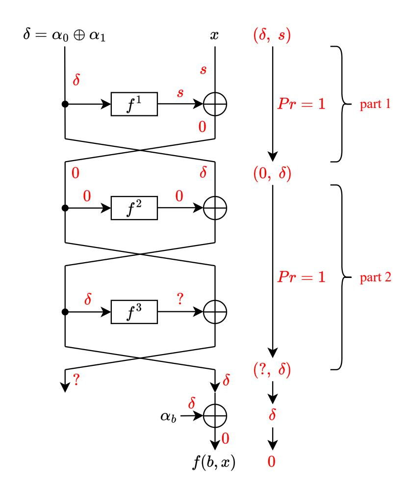

<span id="page-8-0"></span>Fig. 1: 3-round Feistel structure with the truncated differential periodicity.

At ToSC 2024, Xiang et al. studied the link between periodic functions and truncated differentials [32]. In Xiang et al.'s theory [32], the distinguisher is

{9}------------------------------------------------

divided into two parts. Part 1 is a truncated differential  $(\delta, s) \to (s \oplus f^1(\delta), \delta)$ , where  $\delta = \alpha_0 \oplus \alpha_1$  and Part 2 is a truncated differential  $(0, \delta) \to (?, \delta)$ , where  $f^1(\delta)$  is defined by  $f^1(\alpha_0) \oplus f^1(\alpha_1)$ . By setting  $x = f^1(\alpha_0) \oplus f^1(\alpha_1)$ , the output of the truncated differential in Part 1 will connect with the input of the truncated differential in Part 2. Then, we can find a 3-round periodic distinguisher  $(\delta, s) \to (?, \delta)$ . The second  $\delta$  is used to construct the periodic function in Xiang et al.'s truncated differential theory.

## <span id="page-9-0"></span>3 Generalized Method of Periodic Construction

In this section, we present a generalized method for constructing periodic distinguishers. It consists of two theorems:

- Theorem 3: A unified method to construct quantum periodic distinguishers in polynomial time.
- Theorem 4: New probabilistic periodic distinguisher. The distinguisher holds when  $\alpha_0$  and  $\alpha_1$  satisfy certain properties, where  $\alpha_0$  and  $\alpha_1$  are distinct constants.

#### <span id="page-9-2"></span>3.1 A General Method for Constructing Periodic Distinguishers

We notice that there are various methods for constructing periodic functions, which complicates the automatic search for suitable distinguishers. To address this, we first define the concepts of periodic functions and periodic distinguishers.

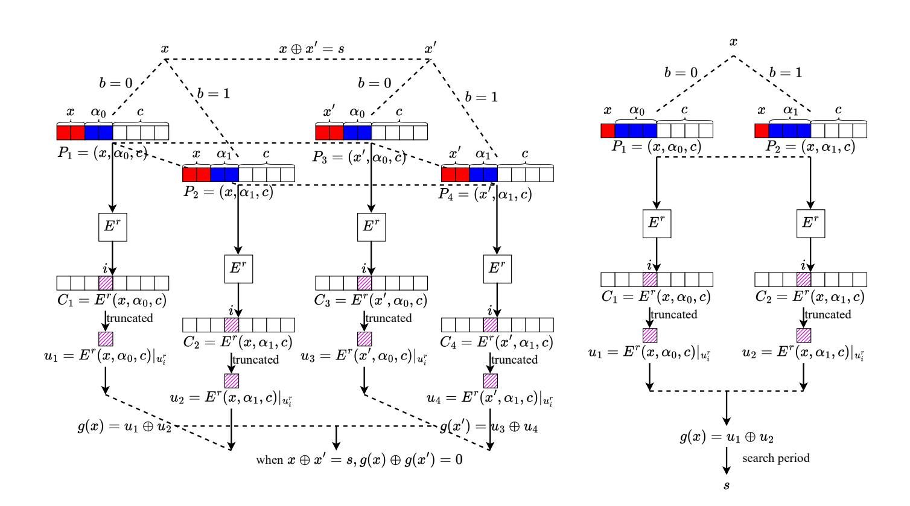

<span id="page-9-1"></span>Fig. 2: The process of the construction of periodic distinguisher.

Let  $E^r:(u_0^0,u_1^0,\ldots,u_{t-1}^0)\to(u_0^r,u_1^r,\ldots,u_{t-1}^r)$  denote an r-round function with t branches, where the size of each branch is n bits, and  $u_j^i$  represents the

{10}------------------------------------------------

j-th branch during the i-th round. Assume that the input of  $E^r$  can be written with disjoint variables as

,

where x is a variable, while  $\alpha_b$  and c are constants. For convenience, we use  $\Delta \alpha_b$  and  $\Delta f(\alpha_b)$  to represent the differences of  $\alpha_0 \oplus \alpha_1$  and  $f(\alpha_0) \oplus f(\alpha_1)$ , respectively. For any constant t, we have  $\Delta t = 0$ . Fig. 2-left illustrates the core idea of the periodic distinguisher. Define the periodic function g:

<span id="page-10-1"></span>
$$g: \{0,1\}^n \to \{0,1\}^n, x \mapsto \Delta u_i^r, g(x) = E^r(x,\alpha_0,c)|_{u_i^r} \oplus E^r(x,\alpha_1,c)|_{u_i^r},$$
 (1)

where  $\Delta u_i^r$  is the difference of the values  $u_i^r$  when b = 0 and b = 1. The construction method of the periodic function will be explained in Theorem 3. We notice that a similar function is used for Type-1 GFS in [28].

Once the period has been identified, Algorithm 3 can be applied in the distinguishing attack.

#### <span id="page-10-0"></span>**Algorithm 3** The process of the distinguishing attack.

- 1: Choose  $\alpha_0 \neq \alpha_1$  and c randomly.
- 2: Construct a quartet of plaintexts  $(P_1, P_2, P_3, P_4)$ . For b = 0,  $P_1 = (x, \alpha_0, c)$ ; for b = 1,  $P_2 = (x, \alpha_1, c)$ . Assume that  $s \in \{0, 1\}^n$  is the possible period. Let  $x' = x \oplus s$ . Then,  $P_3 = (x', \alpha_0, c)$  and  $P_4 = (x', \alpha_1, c)$ .
- 3: The ciphertexts are  $C_1 = E^r(x, \alpha_0, c), C_2 = E^r(x, \alpha_1, c), C_3 = E^r(x', \alpha_0, c), C_4 = E^r(x', \alpha_1, c).$
- 4: We focus solely on the *i*-th branch, thus truncating the ciphertext to this branch.  $u_1 = C_1|_{u_i^r}$ ,  $u_2 = C_2|_{u_i^r}$ ,  $u_3 = C_3|_{u_i^r}$ , and  $u_4 = C_4|_{u_i^r}$ .
- 5: Compute  $g(x) \oplus g(x')$ . If s is the period of g, we have  $g(x) \oplus g(x') = 0$  for any  $x \in \{0,1\}^n$ . Otherwise, this probability is negligible.

In the quantum setting, this process can be simplified (see Fig. 2-right). The period s does not need to be predetermined, and the quartet of plaintexts is not required. For b = 0 and b = 1, the encryption function E is accessed separately, and the outputs are XORed to obtain the periodic function g. Simon's algorithm can then be used to search for s from g(x).

Based on the method shown in Fig. 2-right, we define the periodic distinguisher represented by

<span id="page-10-2"></span>
$$(s, \delta, 0) \to (?, \dots, ?, 0, ?, \dots, ?).$$
 (2)

In the input, s denotes the site of x as  $g(x) \oplus g(x \oplus s) = 0$ ,  $\delta = \Delta \alpha_b$  represents the difference of  $\alpha_b$ , and  $0 = \Delta c$  is the difference of c. In the output, 0 corresponds to the branch  $u_i^r$  and can be used to construct the periodic function g(x), while ? indicates a branch without periodicity.

{11}------------------------------------------------

In this paper, each periodic function corresponds to a unique periodic distinguisher. Therefore, unless otherwise specified, we assume that the two are interchangeable without ambiguity. Next, we introduce how to search for periodic distinguishers, or construct periodic functions.

## 3.2 Polynomial-Time Periodic Distinguisher

At PQCrypto 2020, Hodˇzi´c et al. [\[15\]](#page-31-6) presented the separability property based on an observation regarding the construction of Simon's algorithm, including the strong separability property, semi-strong separability property, and weak separability property. However, the types of periodic functions are still limited, and it remains unclear which weak separability properties can be used for periodic construction.

We define four functions: F, G, P, Q : {0, 1} <sup>∗</sup> → {0, 1} <sup>n</sup>. Each function takes an input of arbitrary length and produces an n-bit output. For example, F(x, y) is defined as a function that depends only on the input x and y. The same definition applies to G, P and Q. We now present the following definition.

<span id="page-11-1"></span>Definition 2 (Differential separability property). A branch u r i satisfies the differential separability property if u r i is represented as

$$u_i^r = E^r(x, \alpha_b, c)|_{u_i^r} = F(x \oplus G(\alpha_b, c), c) \oplus P(x, c) \oplus Q(\alpha_b, c).$$

Compared with Hodˇzi´c et al.'s definition [\[15\]](#page-31-6), our definition allows any unknown values caused individually by α<sup>b</sup> or x. It directly leads to their inability to construct a polynomial-time 5-round distinguisher (only 4 rounds in [\[15\]](#page-31-6)), whereas our definition allows for the 5-round distinguisher.

In the following, Theorem [3](#page-11-0) establishes that if a branch u r i satisfies the differential separability property, it can always be used to construct a periodic function. Next, we focus solely on the existence of a branch that satisfies the differential separability property.

<span id="page-11-0"></span>Theorem 3 (Polynomial-time periodic distinguisher). Given a block cipher E<sup>r</sup> , if an output branch u r i satisfies the differential separability property, g(x) is always a periodic function.

Proof. g(x) is defined by Equation [\(1\)](#page-10-1). We have

$$g(x) = E^{r}(x, \alpha_{0}, c)|_{u_{i}^{r}} \oplus E^{r}(x, \alpha_{1}, c)|_{u_{i}^{r}}$$

$$= \Delta F(x \oplus G(\alpha_{b}, c), c) \oplus \Delta P(x, c) \oplus \Delta Q(\alpha_{b}, c)$$

$$= \Delta F(x \oplus G(\alpha_{b}, c), c) \oplus \Delta Q(\alpha_{b}, c).$$

Set s = ∆G(αb, c) = G(α0, c) ⊕ G(α1, c), then for any x:

$$g(x \oplus s) = \Delta F(x \oplus s \oplus G(\alpha_b, c), c) \oplus \Delta Q(\alpha_b, c)$$
$$= \Delta F(x \oplus G(\alpha_b, c), c) \oplus \Delta Q(\alpha_b, c)$$
$$= g(x).$$

{12}------------------------------------------------

Through our construction, aside from F(x ⊕ G(αb, c), c), the other terms either depend only on x and thus get canceled out, or depend only on αb, resulting in a fixed differential value Q(α0, c) ⊕ Q(α1, c). The period can always be set to s = ∆G(αb, c) to satisfy g(x ⊕ s) = g(x). ⊓⊔

Remark 1. As shown in Equation [\(2\)](#page-10-2) and Theorem [3,](#page-11-0) we are only interested in the differences of x, c, and αb, rather than their specific values. The following explains this in detail:

- Only when x ⊕ x ′ = s, we can find g(x) ⊕ g(x ′ ) = 0. The function F(x ⊕ G(αb, c), c) is the essential characteristic determining periodicity. For any α<sup>0</sup> ̸= α1, the difference of x equals ∆G(αb, c), which is the period s.
- For α<sup>0</sup> and α1, the constraint is ∆α<sup>b</sup> = α<sup>0</sup> ⊕ α<sup>1</sup> ̸= 0.
- The difference ∆c is always zero, meaning that c does not affect the construction of the periodicity in g(x). Thus, we can omit c in our theory and set it as a constant 0 in the periodic distinguisher.

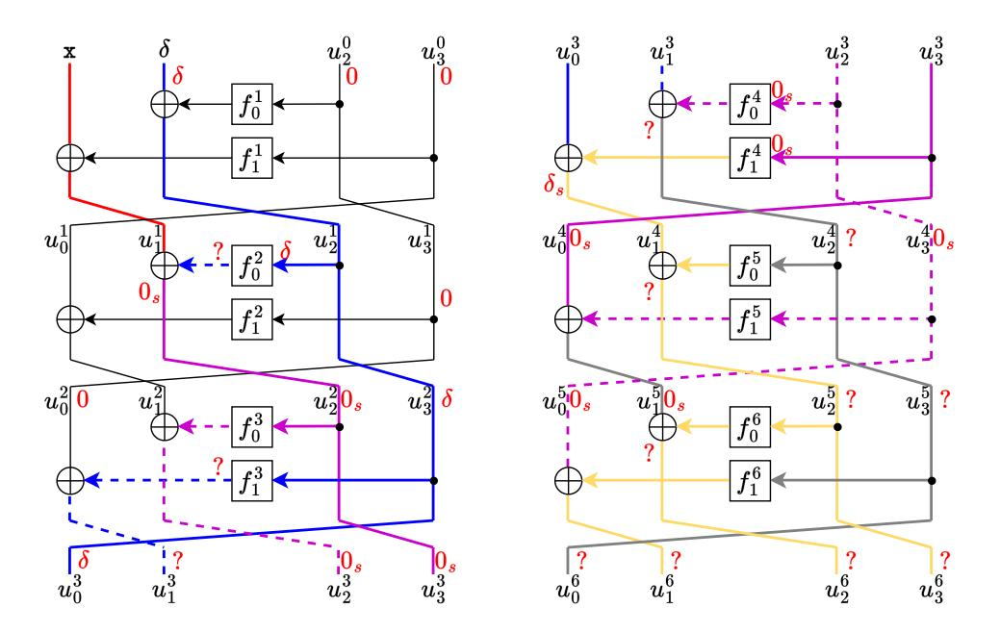

<span id="page-12-0"></span>Fig. 3: The 6-round periodic distinguisher for GFS-2F.

Example 1 (Improvement to Xiang et al.'s truncated differential theory in [\[32\]](#page-32-3)). GFS-2F [\[25\]](#page-32-4) is a type of GFS, proposed by Nyberg at ASIACRYPT 1996. Using the truncated differential theory from [\[32\]](#page-32-3), a 5-round distinguisher (s, δ, 0, 0) <sup>5</sup><sup>r</sup>→ (0, 0, ?, ?) is found. In the subsequent round, every branch has an unknown difference.

For the same input, a 6-round distinguisher (s, δ, 0, 0) <sup>6</sup><sup>r</sup>→ (0, ?, ?, ?) is identified based on Theorem [3.](#page-11-0) u 6 0 satisfies the differential separability property:

$$u_2^0 \oplus f_1^3(u_1^0 \oplus f_0^1(u_2^0)) \oplus f_0^4(u_3^0 \oplus f_1^2(u_2^0) \oplus f_0^3(u_0^0 \oplus f_1^1(u_3^0) \oplus f_0^2(u_1^0 \oplus f_0^1(u_2^0)))).$$

{13}------------------------------------------------

The corresponding periodic function is

$$g(x) = E^{6}(x, \alpha_{0}, u_{2}^{0}, u_{3}^{0})|_{u_{0}^{6}} \oplus E^{6}(x, \alpha_{1}, u_{2}^{0}, u_{3}^{0})|_{u_{0}^{6}}$$
$$= \Delta f_{1}^{3}(\alpha_{b} \oplus C_{1}) \oplus \Delta f_{0}^{4}(C_{2} \oplus f_{0}^{3}(x \oplus f_{0}^{2}(\alpha_{b} \oplus C_{3}) \oplus C_{4})),$$

where  $u_2^0$ ,  $u_3^0$  are random constants,  $C_1 = f_0^1(u_2^0)$ ,  $C_2 = u_3^0 \oplus f_1^2(u_2^0)$ ,  $C_3 = f_0^1(u_2^0)$ , and  $C_4 = f_1^1(u_3^0)$  are also constants. Then, set the period as  $s = \Delta f_0^2(\alpha_b \oplus C_3)$ . For any x, we have  $g(x \oplus s) \oplus g(x) = 0$ . Fig. 3 shows the difference.

#### 3.3 Probabilistic Periodic Distinguisher

In this section, we utilize the collisions of  $\Delta \alpha_b$  to enhance the periodic distinguisher. The difference of initial  $\Delta \alpha_b$  affects the propagation of the periodic distinguisher, even though these values were chosen randomly in Kuwakado and Morii's work [21]. Thus, we propose a method to construct the probabilistic periodic distinguisher, which can be solved by the Grover-meet-Simon algorithm.

<span id="page-13-0"></span>Definition 3 (Probabilistic periodic distinguisher problem). For any  $x, \alpha_0, \alpha_1, c$ , let  $f: \{0,1\}^n \times \{0,1\}^{e_1} \times \{0,1\}^{e_1} \times \{0,1\}^{e_2} \to \{0,1\}^n$  be a function such that there exists some  $(\alpha_0, \alpha_1) \in \{0,1\}^{2e_1}$  for which  $f(\cdot, \alpha_0, \alpha_1, c)$  hides a non-trivial period  $s_u$  with a probability of  $2^{-p}$ . The goal is to find any tuple  $(\alpha_0, \alpha_1, s_u) \in U_s$ , where  $U_s := \{(\alpha_0, \alpha_1, s_u) : (\alpha_0, \alpha_1) \in \{0,1\}^{2e_1}, s_u \text{ is the period of } f(\cdot, \alpha_0, \alpha_1, c)\}$ .

The simple example below is a demonstration of the probabilistic periodic distinguisher.

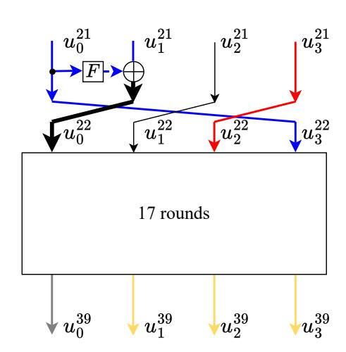

<span id="page-13-1"></span>Fig. 4: An example for CAST-256.

Example 2. In [28], Sun et al. proposed a 17-round periodic distinguisher of CAST-256:  $(0,0,s,\delta) \to (0,?,?,?)$  from  $(u_0^{22},u_1^{22},u_2^{22},u_3^{22})$  to  $(u_0^{39},u_1^{39},u_2^{39},u_3^{39})$ . With the new technique, we found a 18-round probabilistic periodic distinguisher  $(\delta^0,\delta^1,0,s) \to (0,?,?,?)$ , as shown in Fig. 4, where  $\delta$  is from two branches

{14}------------------------------------------------

by  $\delta = \delta^0 || \delta^1$ . We have  $\delta^0 = \alpha_0^0 \oplus \alpha_1^0$ ,  $\delta^1 = \alpha_0^1 \oplus \alpha_1^1$ , and  $\alpha_b = \alpha_b^0 || \alpha_b^1$ . Once the constraint  $\Delta F(\alpha_b^0) = \Delta \alpha_b^1$  holds,  $u_0^{22}$  is 0 in the distinguisher because of  $\Delta u_0^{22} = 0$ . Then,  $u_0^{39}$  can satisfy the differential separability property. The probability is  $2^{-n}$ , where n is the length of one branch. The full distinguishers are shown in Appendix I.

We refer to this phenomenon, in which  $\alpha_0, \alpha_1$  must satisfy specific conditions, as a collision. The collision resets the zero difference in the periodic function.

Accordingly, we propose the following theorem about the probabilistic periodic distinguisher using the same periodic function. The proof is similar to Theorem 3.

<span id="page-14-0"></span>Theorem 4 (Probabilistic periodic distinguisher). If after some collisions with probability  $2^{-p}$ , a branch  $u_i^r$  satisfies the differential separability property,  $u_i^r$  can be used to construct an r-round periodic distinguisher with probability  $2^{-p}$ .

Discussion on the theoretical probability and the practical collision probability. Given the randomness of the key, for any two arbitrary functions  $f_1$  and  $f_2$ , the values  $f_1(\alpha_0)$ ,  $f_1(\alpha_1)$ ,  $f_2(\alpha_0)$ , and  $f_2(\alpha_1)$  are unpredictable. On average, the probability of a collision, where  $\Delta f_1(\alpha_b) = \Delta f_2(\alpha_b)$  in two n-bit branches, is about  $2^{-n}$ . We use this average probability as an estimate of complexity. On the other hand, if multiple collisions need to be satisfied, it is essential to determine which constraints are necessary. Therefore, we provide two algorithms to evaluate the probability (see Appendix D).

Applying periodic distinguishers in the Q2 settings. Simon's algorithm can be directly applied to polynomial-time periodic distinguishers, where the periodicity condition can be efficiently verified in time O(n).

For probabilistic periodic distinguishers, we use Grover-meet-Simon algorithm to search for input pairs  $(\alpha_0, \alpha_1)$  that satisfy the periodicity condition. Assume that, for any distinct n-bit pair  $(\alpha_0 \neq \alpha_1)$ , the probability of satisfying the periodicity condition is about  $2^{-n}$ . Define the search space as  $\{(\alpha_0, \alpha_1) \in \{0,1\}^n \times \{0,1\}^n\}$ , which has size  $2^{2n}$ . In the Grover-meet-Simon algorithm, we execute cn parallel instances of Simon's algorithm. The dimension of the resulting output space reveals whether a candidate pair satisfies the periodicity condition. For the case where  $\alpha_0 = \alpha_1$ , the function  $g(x) = E^r(x, \alpha_0, c)|_{u_i^r} \oplus E^r(x, \alpha_1, c)|_{u_i^r} \equiv 0$  is constant. In Simon's algorithm, each run outputs a vector  $y \in \mathbb{F}_2^n$  such that  $y \cdot s = 0$  for all  $s \in S$ . Since  $S = \mathbb{F}_2^n$ , the only possible output is the zero vector. Thus, its impact can be neglected. The overall search complexity is approximately  $O(2^{\frac{n}{2}})$ .

Applying periodic distinguishers in the classical settings. The periodic distinguishers are effective in the classical setting. For a polynomial-time periodic distinguisher, assume that the size of each branch x is n bits. Based on the birthday paradox, we prepare  $2^{\frac{n}{2}}$  values of x and store the corresponding outputs in order to find a pair of x that satisfies the periodicity condition. For each x, we

{15}------------------------------------------------

perform one encryption for b=0 and another for b=1. Only a small number of additional tests are needed to verify whether the periodicity condition is met. The total complexity is about  $2^{\frac{n}{2}+1}$ , with a success probability exceeding 50%.

For probabilistic periodic distinguishers with probability  $2^{-p}$ , we perform encryption for each x and check whether a period exists. For each choice of  $\alpha_0$  and  $\alpha_1$ , we iterate over all n-bit values  $x \in \{0, 1, 2, \dots, 2^n - 1\}$ , and encrypt them to obtain the corresponding ciphertexts. If the chosen  $\alpha_0$  and  $\alpha_1$  are correct, the resulting ciphertexts will satisfy the expected periodicity condition and reveal the hidden period. This process will be repeated  $2^p$  times. The total complexity is about  $2^{p+n+1}$ .

## <span id="page-15-0"></span>4 Automated SMT-based Searching Model

Automating the search for periodic distinguishers remains an open problem for complex structures.

- As the number of rounds increases, the cipher function becomes more complex, making it increasingly difficult to determine the existence of a period by exhaustively searching all possible inputs.
- Manually deriving a probabilistic periodic distinguisher is also extremely challenging.

In this section, we achieve the automated search for periods for complex structures. We first introduce several symbols that represent all types of states in a distinguisher, simplifying the search process. With these new symbols, all states and their combinations can be easily represented. We then propose the first automated SMT-based model to address this open problem.

#### 4.1 Symbols in Our Model

Before introducing the model, we define all relevant operations and specify the three operations used in it.

- R: the keyed round function R taking a round key.
- XOR: the XOR operation between two branches.
- SPLIT: the branching operation.

We omit the round key and constant in our model, which does not affect the periodicity of the function.

To identify the separability property, 7 types of states are defined based on Definition 2 (see Table 3). We use the symbol  $\bot$  (the state that loses its periodic properties) and 5-bit variables (the leftmost bit is the least significant bit), corresponding to  $(0_s, R(x), x, R(\delta), \delta)$ , where  $0_s$  indicates a function like " $F(x \oplus G(\alpha_b, c), c)$ ", to represent all the states. Through this approximate representation, the complex problem of constructing periodic functions is transformed into the interaction among a limited set of symbols.

{16}------------------------------------------------

<span id="page-16-0"></span>Table 3: Notations for used symbols in our model.

| Symbol            | Encoding        | Meaning                                                                   |
|-------------------|-----------------|---------------------------------------------------------------------------|
| 0                 | (0,0,0,0,0)     | The zero difference                                                       |
| $\delta$          | (0,0,0,0,1)     | $\delta = \Delta \alpha_b$ where $\alpha_0, \alpha_1$ are chosen randomly |
| X                 | (0,0,1,0,0)     | The period difference s between $x$ and $x \oplus s$                      |
| R(x)              | (0, 1, 0, 0, 0) | Indicating a function like " $P(x,c)$ "                                   |
| ${\tt R}(\delta)$ | (0,0,0,1,0)     | Indicating a function like " $Q(\alpha_b, c)$ "                           |
| $0_s$             | (1,0,0,0,0)     | Indicating a function like " $F(x \oplus G(\alpha_b, c), c)$ "            |
| ?                 | $\perp$         | The unknown state                                                         |

According to Definition 2 and Theorem 3, a branch  $u_j^i$  has the periodicity when it can be represented by  $u_j^i = F(x \oplus G(\alpha_b, c), c) \oplus P(x, c) \oplus Q(\alpha_b, c)$ . States  $0_s$ , R(x), and  $R(\delta)$  represent  $F(x \oplus G(\alpha_b, c), c)$ , P(x, c), and  $Q(\alpha_b, c)$ , respectively.  $u_j^i$  can be written by  $0_s \oplus R(x) \oplus R(\delta)$ , which is encoded by (1, 1, 0, 1, 0), where the meaning of the encoding is the XOR value of the terms corresponding to the bits being 1. In general, (1, \*, \*, \*, \*) always satisfies the separability property, where \* represents either 0 or 1. We can always obtain a path that uses our symbols

$$(x, \delta, 0) \rightarrow (?, \ldots, ?, 0_s \oplus *, ?, \ldots, ?),$$

where \* represents any state except from ?. The path corresponds to a periodic distinguisher  $(s, \delta, 0) \to (?, \ldots, ?, 0, ?, \ldots, ?)$  (see Equation (2)).

Further discussion. This approximate representation significantly reduces the search space by mapping terms with similar properties to corresponding symbols. While this approximation introduces some loss of precision, it maintains the ability to effectively analyze complex structures. By using our symbolic representation, the process of searching for periods becomes more efficient, eliminating the need to handle numerous algebraic equations. Even without an automated model, employing these symbols enables faster identification of periodic distinguishers compared to manual methods.

## 4.2 SMT-based Automated Model

In this section, we propose a unified automated model to identify branches that satisfy the separability property from complex polynomials derived from multiple inputs. Our approach mainly uses the SMT solver, STP, to solve these models. Further details on the SMT problem are provided in Appendix A. The code is available at <a href="https://github.com/QunLiu-sdu/Quantum-Periodic-Distinguisher-Construction-Symbolization-Method-and-Automated-Tool">https://github.com/QunLiu-sdu/Quantum-Periodic-Distinguisher-Construction-Symbolization-Method-and-Automated-Tool</a>.

The complete propagation rules of our model are provided below, including the initial constraints and the propagation rules of SPLIT, R, and XOR.

**Modelling the initial constraints.** Assume that there is an r-round path with n branches:  $(u_0^0, u_1^0, \dots, u_{n-1}^0) \xrightarrow{r} (u_0^r, u_1^r, \dots, u_{n-1}^r)$ . The model is subject to the following constraints:

{17}------------------------------------------------

- 1. Each  $u_i^0$   $(0 \le i \le n-1)$  must be one of  $\{x, \delta, 0, x \oplus \delta\}$ . 2. At least one element in  $(u_0^0, u_1^0, \dots, u_{n-1}^0)$  must be  $\delta$ , and x or  $x \oplus \delta$  can appear only once.
- 3. At least one element in  $(u_0^r, u_1^r, \dots, u_{n-1}^r)$  must be (1, \*, \*, \*, \*) or (0, 0, 1, \*, \*).

Constraints 1 and 2 ensure that the initial values are valid. Constraint 3 ensures that the output satisfies the separability property or still maintains a direct relationship with the input. The encoding (0,0,1,\*,\*) actually represents a weakened function " $F(x \oplus G(\alpha_b, c), c)$ ", where F is identify function. Since (0,0,1,\*,\*) only occurs in the case of a small number of rounds, we ignore it in the end of our model. Based on these constraints, we can always find a path from  $\{x, \delta, 0, x \oplus \delta\}$  to  $0_s \oplus *$ .

Modelling the propagation rules of SPLIT. Let SPLIT duplicate a state without modifying it. That is, for each state u, the output states v, w of SPLIT satisfy u = v = w.

Modelling the propagation rules of R. R indicates that the current state undergoes a round function. The following property shows the rules.

<span id="page-17-5"></span>Property 1. The complete rules of R are:

<span id="page-17-0"></span>
$$x, R(x), R(x) \oplus x \xrightarrow{R} R(x),$$
 (3)

<span id="page-17-1"></span>
$$\delta, \ R(\delta), \ R(\delta) \oplus \delta \stackrel{R}{\to} R(\delta),$$
 (4)

<span id="page-17-2"></span>
$$0 \xrightarrow{R} 0, \quad 0_s \xrightarrow{R} 0_s, \tag{5}$$

<span id="page-17-4"></span><span id="page-17-3"></span>
$$x \oplus \delta$$
,  $x \oplus R(\delta)$ ,  $x \oplus R(\delta) \oplus \delta \xrightarrow{R} O_s$  (only once) or  $\bot$  (others), (6)

others 
$$\stackrel{R}{\to} \bot$$
. (7)

*Proof.* After applying the round function R, the new states R(x) and  $R(\delta)$  represent the outputs for x and  $\delta$ , respectively. Assume that  $R(x) \oplus x$  represents  $P(x,c) \oplus x$ .  $R(R(x) \oplus x)$  is also R(x), representing  $P'(x,c) := R(P(x,c) \oplus x)$ , where P' is a function. In general, we define any function that only contains x and c as R(x). Although this may result in R(x) not being a permutation, it generally does not affect the propagation of the period. Our model is more concerned with which initial values are included in this branch. The same rule applies to  $\delta$ . Thus, Equations (3) and (4) are proved.

Next, we prove Equation (5). The transformation  $0 \stackrel{R}{\to} 0$  is trivial. By definition, assume that  $0_s$  represents a term  $F(x \oplus G(\alpha_b, c), c)$ , where the period is  $\Delta G(\alpha_b,c)$ . The output of R is  $F'(x\oplus G(\alpha_b,c),c):=R(F(x\oplus G(\alpha_b,c),c))$ , where F' is a function. This still satisfies the definition of  $O_s$ , and the period  $\Delta G(\alpha_b, c)$ remains unchanged.

Then, we prove Equation (6). We assume that multiple occurrences can happen from  $x \oplus \delta$ ,  $x \oplus R(\delta)$ ,  $x \oplus R(\delta) \oplus \delta$  to  $O_s$ . Let us consider a counterexample:

- A branch u with the state  $\mathbf{x} \oplus \mathbf{R}(\delta)$  represents the term  $x \oplus G_1(\alpha_b, c)$ . After R, we have  $u' = R(x \oplus G_1(\alpha_b, c))$ , where the implied period is  $\Delta G_1(\alpha_b, c)$ .

{18}------------------------------------------------

- A branch v with the state  $\mathbf{x} \oplus \mathbf{R}(\delta)$  represents  $x \oplus G_2(\alpha_b, c)$ . After  $\mathbf{R}$ , we have  $v' = R(x \oplus G_2(\alpha_b, c))$ , where the implied period is  $\Delta G_2(\alpha_b, c)$ .

If two branches u' and v' have the states  $0_s$ , errors may arise in state propagation. Let us discuss this case by case.

- $-\Delta G_1(\alpha_b,c) = \Delta G_2(\alpha_b,c). \text{ The two branches have the same period. } w := u' \oplus v' = R(x \oplus G_1(\alpha_b,c)) \oplus R(x \oplus G_2(\alpha_b,c)). \text{ We construct the periodic function } g(x) = \Delta R(x \oplus G_1(\alpha_b,c)) \oplus \Delta R(x \oplus G_2(\alpha_b,c)). \text{ Setting } s = \Delta G_1(\alpha_b,c) = \Delta G_2(\alpha_b,c), \text{ we have } g(x \oplus s) = R(x \oplus s \oplus G_1(\alpha_0,c)) \oplus R(x \oplus s \oplus G_1(\alpha_1,c)) \oplus R(x \oplus s \oplus G_2(\alpha_0,c)) \oplus R(x \oplus s \oplus G_2(\alpha_1,c)) = \Delta R(x \oplus G_2(\alpha_b,c)) \oplus \Delta R(x \oplus G_2(\alpha_b,c)) \oplus \Delta R(x \oplus G_2(\alpha_b,c)) \oplus \Delta R(x \oplus G_2(\alpha_b,c)) \oplus \Delta R(x \oplus G_2(\alpha_b,c)) \oplus \Delta R(x \oplus G_2(\alpha_b,c)) \oplus \Delta R(x \oplus G_2(\alpha_b,c)) \oplus \Delta R(x \oplus G_2(\alpha_b,c)) \oplus \Delta R(x \oplus G_2(\alpha_b,c)) \oplus \Delta R(x \oplus G_2(\alpha_b,c)) \oplus \Delta R(x \oplus G_2(\alpha_b,c)) \oplus \Delta R(x \oplus G_2(\alpha_b,c)) \oplus \Delta R(x \oplus G_2(\alpha_b,c)) \oplus \Delta R(x \oplus G_2(\alpha_b,c)) \oplus \Delta R(x \oplus G_2(\alpha_b,c)) \oplus \Delta R(x \oplus G_2(\alpha_b,c)) \oplus \Delta R(x \oplus G_2(\alpha_b,c)) \oplus \Delta R(x \oplus G_2(\alpha_b,c)) \oplus \Delta R(x \oplus G_2(\alpha_b,c)) \oplus \Delta R(x \oplus G_2(\alpha_b,c)) \oplus \Delta R(x \oplus G_2(\alpha_b,c)) \oplus \Delta R(x \oplus G_2(\alpha_b,c)) \oplus \Delta R(x \oplus G_2(\alpha_b,c)) \oplus \Delta R(x \oplus G_2(\alpha_b,c)) \oplus \Delta R(x \oplus G_2(\alpha_b,c)) \oplus \Delta R(x \oplus G_2(\alpha_b,c)) \oplus \Delta R(x \oplus G_2(\alpha_b,c)) \oplus \Delta R(x \oplus G_2(\alpha_b,c)) \oplus \Delta R(x \oplus G_2(\alpha_b,c)) \oplus \Delta R(x \oplus G_2(\alpha_b,c)) \oplus \Delta R(x \oplus G_2(\alpha_b,c)) \oplus \Delta R(x \oplus G_2(\alpha_b,c)) \oplus \Delta R(x \oplus G_2(\alpha_b,c)) \oplus \Delta R(x \oplus G_2(\alpha_b,c)) \oplus \Delta R(x \oplus G_2(\alpha_b,c)) \oplus \Delta R(x \oplus G_2(\alpha_b,c)) \oplus \Delta R(x \oplus G_2(\alpha_b,c)) \oplus \Delta R(x \oplus G_2(\alpha_b,c)) \oplus \Delta R(x \oplus G_2(\alpha_b,c)) \oplus \Delta R(x \oplus G_2(\alpha_b,c)) \oplus \Delta R(x \oplus G_2(\alpha_b,c)) \oplus \Delta R(x \oplus G_2(\alpha_b,c)) \oplus \Delta R(x \oplus G_2(\alpha_b,c)) \oplus \Delta R(x \oplus G_2(\alpha_b,c)) \oplus \Delta R(x \oplus G_2(\alpha_b,c)) \oplus \Delta R(x \oplus G_2(\alpha_b,c)) \oplus \Delta R(x \oplus G_2(\alpha_b,c)) \oplus \Delta R(x \oplus G_2(\alpha_b,c)) \oplus \Delta R(x \oplus G_2(\alpha_b,c)) \oplus \Delta R(x \oplus G_2(\alpha_b,c)) \oplus \Delta R(x \oplus G_2(\alpha_b,c)) \oplus \Delta R(x \oplus G_2(\alpha_b,c)) \oplus \Delta R(x \oplus G_2(\alpha_b,c)) \oplus \Delta R(x \oplus G_2(\alpha_b,c)) \oplus \Delta R(x \oplus G_2(\alpha_b,c)) \oplus \Delta R(x \oplus G_2(\alpha_b,c)) \oplus \Delta R(x \oplus G_2(\alpha_b,c)) \oplus \Delta R(x \oplus G_2(\alpha_b,c)) \oplus \Delta R(x \oplus G_2(\alpha_b,c)) \oplus \Delta R(x \oplus G_2(\alpha_b,c)) \oplus \Delta R(x \oplus G_2(\alpha_b,c)) \oplus \Delta R(x \oplus G_2(\alpha_b,c)) \oplus \Delta R(x \oplus G_2(\alpha_b,c)) \oplus \Delta R(x \oplus G_2(\alpha_b,c)) \oplus \Delta R(x \oplus G_2(\alpha_b,c)) \oplus \Delta R(x \oplus G_2(\alpha_b,c)) \oplus \Delta R(x \oplus G_2(\alpha_b,c)) \oplus \Delta R(x \oplus G_2(\alpha_b,c)) \oplus \Delta R(x \oplus G_2(\alpha_b,c)) \oplus \Delta R(x \oplus G_2(\alpha_b,c)) \oplus \Delta R(x \oplus G_2(\alpha_b,c)) \oplus \Delta R(x \oplus G_2(\alpha_b,c)) \oplus \Delta R(x \oplus G_2(\alpha_b,c)) \oplus \Delta R(x \oplus G_2(\alpha_b,c)) \oplus \Delta R(x \oplus G_2(\alpha_b,c)) \oplus \Delta R(x \oplus G_$
- $-\Delta G_1(\alpha_b,c) \neq \Delta G_2(\alpha_b,c)$ . The two branches have different periods.  $w:=u_1 \oplus u_2 = R(x \oplus G_1(\alpha_b,c)) \oplus R(x \oplus G_2(\alpha_b,c))$  loses its periodicity. This situation must be avoided, as  $O_s$  from different branches should not interact.

Thus, we allow the occurrence of  $\mathbf{x} \oplus \mathbf{\delta}$ ,  $\mathbf{x} \oplus \mathbf{R}(\mathbf{\delta})$ ,  $\mathbf{x} \oplus \mathbf{R}(\mathbf{\delta}) \oplus \mathbf{\delta} \xrightarrow{\mathbf{R}} \mathbf{0_s}$  through R to happen only once, which ensures that the case  $\Delta G_1(\alpha_b,c) \neq \Delta G_2(\alpha_b,c)$  will not happen. Although we may lose some precision for certain special structures, this constraint ensures that the  $\mathbf{0_s}$  in the model always implicitly share the same period. As a generalized model, we consider this to be necessary.

Now, we can ensure that the first  $0_s$  is always generated by Equation (6) and all other  $0_s$  are either copies or combinations of  $0_s$  by  $0_s \stackrel{R}{\to} 0_s$  and  $0_s \oplus 0_s = 0_s$ , containing the same periods.

Equation (7) shows that for all branches where the period cannot be identified, we denote them by  $\perp$ .

In the proof, we need to add new constraints for Equation (6). We assign a Boolean variable  $s_i$  for each application of R, let  $\Sigma(s_i) = 1$ , and set

$$\begin{cases} s_i = 1, & \text{if } \mathbf{x} \oplus \delta \stackrel{\mathbb{R}}{\to} \mathbf{0_s} \text{ or } \mathbf{x} \oplus \mathbf{R}(\delta) \stackrel{\mathbb{R}}{\to} \mathbf{0_s} \text{ or } \mathbf{x} \oplus \mathbf{R}(\delta) \oplus \delta \stackrel{\mathbb{R}}{\to} \mathbf{0_s}, \\ s_i = 0, & \text{if } \mathbf{x} \oplus \delta \stackrel{\mathbb{R}}{\to} \bot \text{ or } \mathbf{x} \oplus \mathbf{R}(\delta) \stackrel{\mathbb{R}}{\to} \bot \text{ or } \mathbf{x} \oplus \mathbf{R}(\delta) \oplus \delta \stackrel{\mathbb{R}}{\to} \bot. \end{cases}$$

Modelling the propagation rules of XOR. For XOR, we need to consider the possibility of collisions. Let the input states be  $u = (u_0, u_1, u_2, u_3, u_4)$  and  $v = (v_0, v_1, v_2, v_3, v_4)$ , and the output state be  $w = (w_0, w_1, w_2, w_3, w_4)$ .

Note that only  $w_3$  and  $w_4$  may be affected by the collisions. We first consider the rules for  $w_0, w_1, w_2$ , which are established in Property 2.

<span id="page-18-0"></span>Property 2. If  $u = \bot$  or  $v = \bot$ , then  $w = \bot$ . Otherwise, the complete rules of  $(w_0, w_1, w_2)$  are:

$$w_0 = \max(u_0, v_0), \ w_1 = \max(u_1, v_1), \ w_2 = u_2 \oplus v_2.$$

*Proof.* Fig. 5 shows the propagation of states. In the proof of Property 1, we have proven  $0_s \oplus 0_s = 0_s$ . As long as the two branches with states  $0_s$  imply the same period, the equation  $0_s \oplus 0_s = 0_s$  always holds. The constraint is satisfied by Equation (6). We prove a more generalized case for different round functions:

{19}------------------------------------------------

- u has the state 0s, representing F1(x ⊕ G(αb, c), c),
- v has the state 0s, representing F2(x ⊕ G(αb, c), c),

where F<sup>1</sup> and F<sup>2</sup> are different functions. Equation [\(6\)](#page-17-3) states that u and v have the same implied period ∆G(αb, c). Let w := u ⊕ v = F1(x ⊕ G(αb, c), c) ⊕ F2(x ⊕ G(αb, c), c). We prove that the branch w also has the same period. The periodic function is g(x) = ∆F1(x ⊕ G(αb, c), c) ⊕ ∆F2(x ⊕ G(αb, c), c). Setting s = ∆G(αb, c), g(x ⊕ s) = F1(x ⊕ s ⊕ G(α0, c), c) ⊕ F1(x ⊕ s ⊕ G(α1, c), c) ⊕ F2(x ⊕ s ⊕ G(α0, c), c) ⊕ F2(x ⊕ s ⊕ G(α1, c), c) = g(x). Thus, w = u ⊕ v can be written by F ′ (x ⊕ G(αb, c), c) and also has the state 0s. On the other hand, if the periods of u and v are different, this rule does not hold.

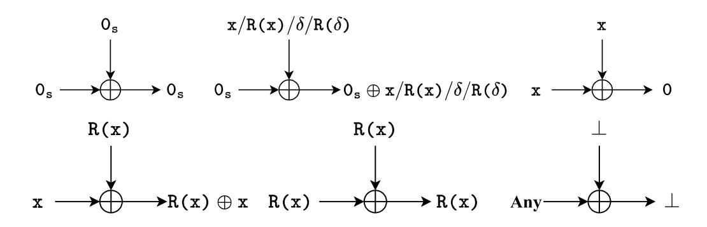

<span id="page-19-0"></span>Fig. 5: The rules of (w0, w1, w2).

The state x represents the term x. Thus, we have x ⊕ x → 0. According to the definition of R(x), R(x) ⊕ R(x) → R(x) is also trivial. ⊓⊔

Now, we consider the rules of w3, w4, i.e., R(δ) and δ. In order to compute the number of collisions, we assign a Boolean variable x<sup>i</sup> for each XOR operation. x<sup>i</sup> = 1 indicates that the collision occurs. We first consider the rules without collisions. That is, x<sup>i</sup> always be 0.

<span id="page-19-3"></span>Property 3. The rules of (u3, u4, v3, v4) → (w3, w4, xi) without collisions are:

$$\begin{cases} (0,0,v_3,v_4) => (v_3,v_4,0), & (u_3,u_4,0,0) => (u_3,u_4,0), \\ (0,1,0,1) => (0,0,0), & (0,1,1,1) => (1,0,0), & (1,1,0,1) => (1,0,0). \end{cases}$$

The proof is similar and therefore omitted. Fig. [6](#page-19-1) shows the rules.

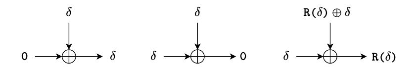

<span id="page-19-1"></span>Fig. 6: The rules of (w3, w4, xi) without collisions.

<span id="page-19-2"></span>Next, we consider the propagation rules where collisions may occur.

{20}------------------------------------------------

Property 4. The rules of (u3, u4, v3, v4) → (w3, w4, xi) with collisions are:

$$\begin{cases} ((1,0,0,1) \text{ OR } (0,1,1,0)) => ((1,1,0) \text{ OR } (0,0,1)), \\ ((1,1,1,1) \text{ OR } (1,0,1,0)) => ((1,0,0) \text{ OR } (0,0,1)), \\ ((1,1,1,0) \text{ OR } (1,0,1,1)) => ((1,1,0) \text{ OR } (0,0,1) \text{ OR } (0,1,1)). \end{cases}$$

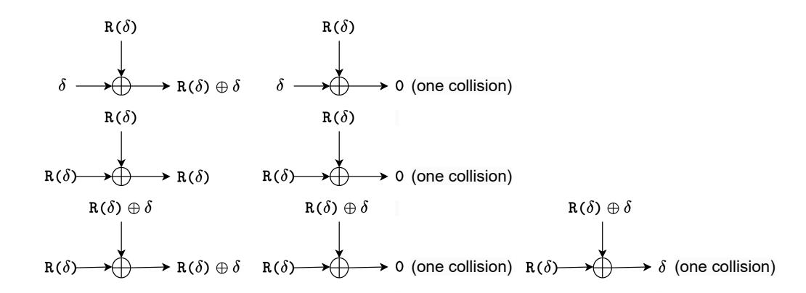

<span id="page-20-2"></span>Fig. 7: The rules of (w3, w4, xi) with collisions.

Proof. If there is no collision, the rule is the same as R(x) (see Fig. [7\)](#page-20-2). When a collision occurs, we have the following properties. The output of δ ⊕ R(δ) is 0. The output of R(δ) ⊕ R(δ) is 0. For the states R(δ) and R(δ) ⊕ δ, there are two cases. First, R(δ) and R(δ) has a collision, the output is δ. Second, R(δ) and R(δ) ⊕ δ has a collision, the output is 0. ⊓⊔

For Property [4,](#page-19-2) we define an integer variable X to count the number of collisions and set Σ(xi) = X. On average, the probability of a collision occurring in each n-bit branch is 2<sup>−</sup>n. Thus, the required probability of collisions is calculated by 2<sup>−</sup>n·X. Additionally, we impose the constraint X ≤ t−1, where t denotes the number of branches. If X = 0, a distinguisher with polynomial time complexity is returned.

# <span id="page-20-1"></span>5 Application on GFS-2F/4F, Skipjack-Type Structure, LBlock, and TWINE

In this section, we apply the automated model to GFS-2F/4F, Skipjack-type structure, LBlock, and TWINE, improving the distinguishers.

## <span id="page-20-0"></span>5.1 Application on GFS-2F/4F

GFS-2F and GFS-4F [\[25\]](#page-32-4) are two types of GFSs proposed by Nyberg at ASI-ACRYPT 1996 that are resistant to both differential and linear attacks. In [\[33\]](#page-32-7), 

{21}------------------------------------------------

the authors provided a 5-round periodic distinguisher for GFS-2F and a 8-round periodic distinguisher for GFS-4F. They also obtained a 6-round distinguisher for GFS-2F with complexity  $O(2^{\frac{N}{4}})$ .

Using our model, we find a new 6-round periodic distinguisher of GFS-2F without the need for probability, as well as the first 10-round periodic distinguisher of GFS-4F in complexity O(N). The 6-round periodic distinguisher has been explained in Section 3.1. We introduce the 10-round distinguisher below.

The 10-round periodic distinguisher of GFS-4F. We extensively use colors while depicting distinguishers. In order to have a better explanation, we take the 10-round distinguisher of GFS-4F (see Fig. 8) for illustration.

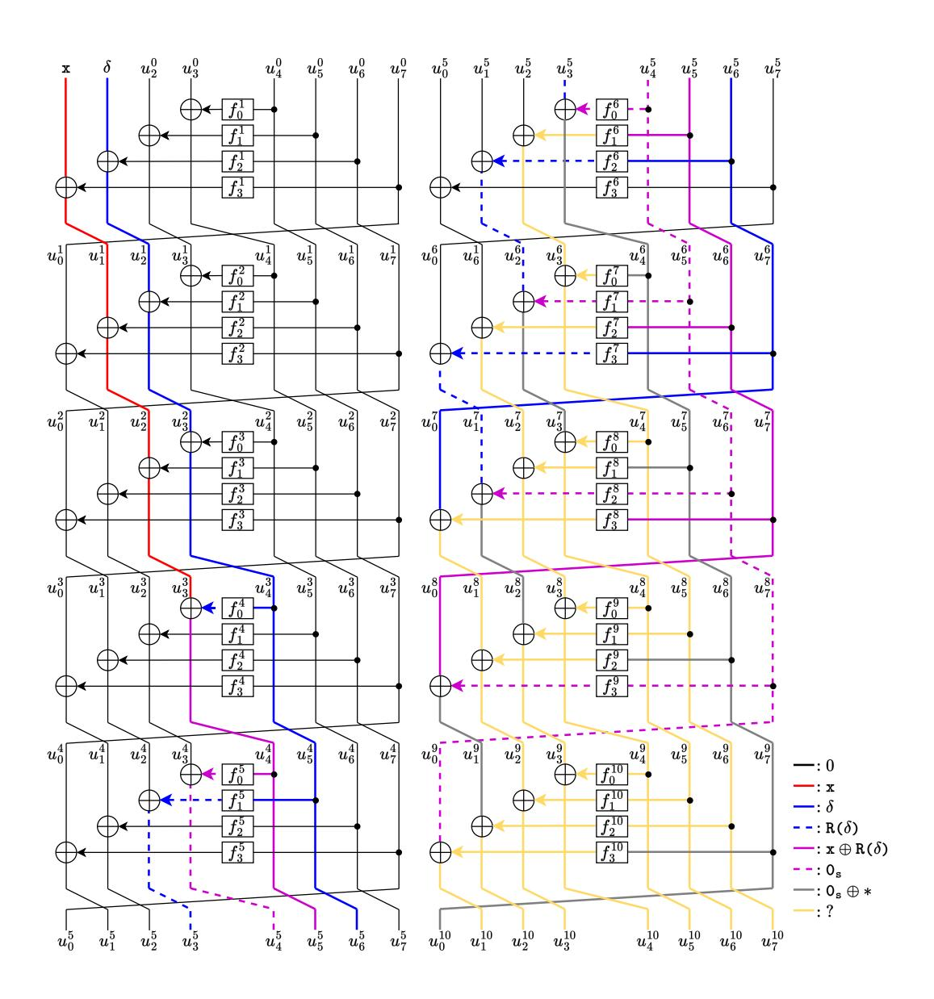

<span id="page-21-0"></span>Fig. 8: The 10-round periodic distinguisher for GFS-4F.

Solid red, blue, and black lines represent x,  $\delta$  and 0 in the model, respectively. Red and blue lines become dashed lines after passing through the round function R. A solid purple line represents  $x \oplus R(\delta)$ , indicating the existence of an explicit period. After passing through R, the explicit period will be hidden within the

{22}------------------------------------------------

dashed purple line  $(0_s)$ . According to Property 6, the rule of (the solid purple line  $\to$  the dashed purple line) occurs only once. Finally, A solid gray line  $(0_s \oplus *)$  indicates which branch still retains the separability property. According to Theorem 3, we can construct the periodic function. The period s is  $\Delta f_0^4(\alpha_b \oplus C_2)$ , where  $C_2 = f_2^1(u_0^0) \oplus f_1^2(u_4^0) \oplus f_0^3(u_2^0 \oplus f_1^1(u_5^0) \oplus f_0^2(u_3^0 \oplus f_0^1(u_4^0)))$  is a constant.

The complete periodic function is provided as follows. We can see that the advantage of symbolic representation lies in transforming complexity into simplicity, which greatly expands the applicability of periodic distinguishers. For the 10-round distinguisher for GFS-4F, we have

```
u_0^{10} = u_6^0 \oplus f_3^3(u_5^0) \oplus f_2^4(u_3^0 \oplus f_0^1(u_4^0))
\oplus f_1^5(u_1^0 \oplus f_2^1(u_6^0) \oplus f_1^2(u_4^0) \oplus f_0^3(u_2^0 \oplus f_1^1(u_5^0) \oplus f_0^2(u_3^0 \oplus f_0^1(u_4^0))))
\oplus f_0^6(u_7^0 \oplus f_3^2(u_6^0) \oplus f_2^3(u_4^0) \oplus f_1^4(u_2^0 \oplus f_1^1(u_5^0) \oplus f_0^2(u_3^0 \oplus f_0^1(u_4^0)))
\oplus f_0^5(u_0^0 \oplus f_3^1(u_7^0) \oplus f_2^2(u_5^0) \oplus f_1^3(u_3^0 \oplus f_0^1(u_4^0))
\oplus f_0^4(u_1^0 \oplus f_2^1(u_6^0) \oplus f_1^2(u_4^0) \oplus f_0^3(u_2^0 \oplus f_1^1(u_5^0) \oplus f_0^2(u_3^0 \oplus f_0^1(u_4^0))))).
```

The periodic function is constructed by

$$g(x) = E^{10}(x, \alpha_0, u_2^0, u_3^0, u_4^0, u_5^0, u_6^0, u_7^0)|_{u_0^{10}} \oplus E^{10}(x, \alpha_1, u_2^0, u_3^0, u_4^0, u_5^0, u_6^0, u_7^0)|_{u_0^{10}}$$
$$= \Delta f_1^5(\alpha_b \oplus C_1) \oplus \Delta f_0^6(f_0^5(x \oplus f_0^4(\alpha_b \oplus C_2) \oplus C_3) \oplus C_4),$$

where  $u_2^0, u_3^0, u_4^0, u_5^0, u_6^0, u_7^0$  are constants,  $C_1 = f_2^1(u_6^0) \oplus f_1^2(u_4^0) \oplus f_3^3(u_2^0 \oplus f_1^1(u_5^0) \oplus f_2^2(u_3^0 \oplus f_0^1(u_4^0))), C_2 = f_2^1(u_6^0) \oplus f_1^2(u_4^0) \oplus f_0^3(u_2^0 \oplus f_1^1(u_5^0) \oplus f_2^2(u_3^0 \oplus f_0^1(u_4^0))), C_3 = f_3^1(u_7^0) \oplus f_2^2(u_5^0) \oplus f_1^3(u_3^0 \oplus f_0^1(u_4^0)), C_4 = u_7^0 \oplus f_3^2(u_6^0) \oplus f_2^3(u_4^0) \oplus f_1^4(u_2^0 \oplus f_1^1(u_5^0) \oplus f_2^2(u_3^0 \oplus f_0^1(u_4^0)))$  are also constants.

#### <span id="page-22-0"></span>5.2 Application on Skipjack-Type Structure

Skipjack [24] is the encryption algorithm developed by the NSA for the Clipper chip and Fortezza PC card. The published description of Skipjack characterizes the rounds as either Rule A or Rule B (see Fig. 9). In [20], Knudsen and Wagner considered different combinations of the two rules. Furthermore, in [3], Blondeau et al. used the impossible differential attack and zero-correlation linear attack to show the 16-round distinguishers for two common variants:

- Skipjack-A: only use Rule A as the round function,
- Skipjack-B: only use Rule B as the round function.

Cui et al. [9] provided the first 13-round periodic distinguishers for the two variants Skipjack-A and Skipjack-B. In this section, we apply our model to Skipjack-A and Skipjack-B, and find the first 16-round polynomial-time periodic distinguisher of Skipjack-A/B. Based on the following observation, we present only the results for Skipjack-B, as the periodic distinguishers of both variants can be transformed into each other.

{23}------------------------------------------------

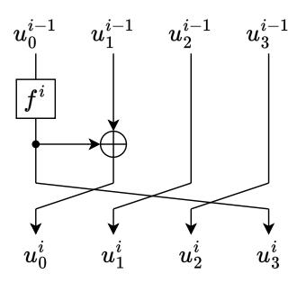

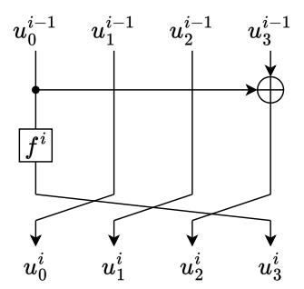

Fig. 9: The round function of Rule A (left) and Rule B (right).

<span id="page-23-1"></span>Observation 1 As Rule B is basically the inverse of Rule A with minor positioning differences, any periodic distinguisher of Skipjack-B based on qCPA can be transformed into the periodic distinguisher of Skipjack-A based on qCCA.

The first 16-round polynomial-time distinguisher of Skipjack-B with qCPA. Our model finds a 16-round periodic distinguisher of Skipjack-B (see Fig. [10\)](#page-24-0):

$$(\delta, 0, 0, s \oplus \delta) \stackrel{16r}{\rightarrow} (0, ?, ?, ?).$$

Since the initial difference can be controlled by the adversary, the XOR of the two δ results in 0 based on Property [3.](#page-19-3) This distinguisher is three rounds longer than the previous quantum distinguisher and is the longest distinguisher of Skipjack-B in polynomial time. It can be transformed into a 16-round distinguisher of Skipjack-A based on qCCA.

Applying the 16-round periodic distinguisher in the classical setting. Usually, for GFS, impossible differential and zero-correlation linear distinguishers are the most effective attacks. For Skipjack-B, in [\[3\]](#page-29-1), Blondeau et al. showed a 16-round zero-correlation distinguisher (u, u, 0, 0) 16r −−→ (0, v, 0, 0) and a 16-round impossible differential distinguisher (δ, δ, 0, 0) 16r −−→ (γ, 0, 0, 0). The complexity is not less than 232. Our distinguisher can be achieved within the complexity 2<sup>9</sup> in the classical setting.

Further discussion. Our results demonstrate that the proposed distinguisher is not only more effective in the quantum setting but also outperforms traditional distinguishers in the classical setting. This has significant implications for future structural designs. If periodic distinguishers are not considered during the design phase, they may become the primary form of cryptanalysis against the cipher.

#### <span id="page-23-0"></span>5.3 Application on LBlock and TWINE

LBlock [\[31\]](#page-32-5) is a variant of Feistel structures with the only difference that a left circular shift is performed on the right branch. TWINE [\[29\]](#page-32-6) is a variant of GFS and is designed for multiple platforms.

{24}------------------------------------------------

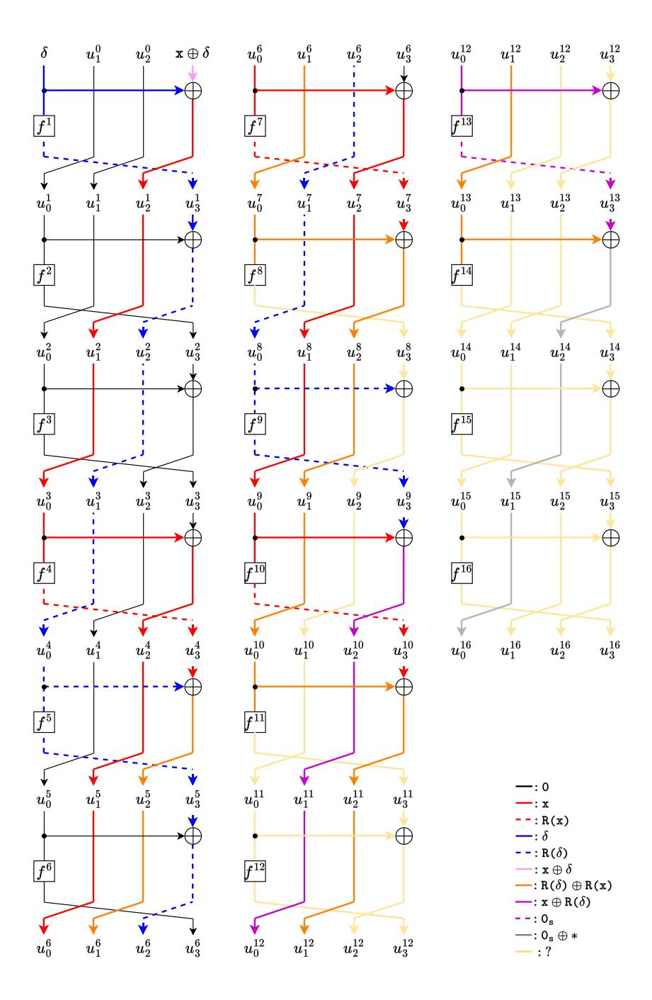

<span id="page-24-0"></span>Fig. 10: 16-round distinguisher of Skipjack-B.

Our model provides a 8-round periodic distinguisher of LBlock. Furthermore, with 4 collisions, the first 10-round distinguisher is discovered for both LBlock and TWINE. Table 4 summarizes the results. The conditions of 10-round periodic distinguisher for LBlock are  $\Delta u_0^1=0$ ,  $\Delta u_3^1=0$ ,  $\Delta u_0^2=0$ , and  $\Delta u_5^4=0$ , and the conditions of 10-round periodic distinguisher for TWINE are  $\Delta u_8^1=0$ ,  $\Delta u_{14}^1=0$ ,  $\Delta u_4^2=0$ , and  $\Delta u_0^4=0$ . The other distinguishers are explained in Appendix E.

Considering the Difference Distribution Table (DDT) in the distinguishers. We observed that the collisions arise from specific differences of  $\Delta \alpha_b$ . In structural attacks, differential transitions through the S-box happen with random probabilities. To increase the success probability of the attack, we utilize the DDT by selecting the high-probability entries. If the two input branches are freely chosen, the output can be determined and propagated using the DDT.

{25}------------------------------------------------

<span id="page-25-1"></span>Table 4: The periodic distinguishers of LBlock and TWINE.

| Cipher | #Rounds | Input                                                                               | Output                            | Probability | Reference |
|--------|---------|-------------------------------------------------------------------------------------|-----------------------------------|-------------|-----------|
|        | 3       | -                                                                                   | -                                 | 1           | [21]      |
|        | 4       | -                                                                                   | -                                 | 1           | [18]      |
| LBlock | 8       | -                                                                                   | -                                 | 1           | [32]      |
|        | 8       | $(0,0,0,0,0,s,0,0,0,0,0,0,0,0,\delta)$                                              | (?,?,?,?,?,?,?,?,0,?,?,?,?,?,?)   | 1           | Our model |
|        | 10      | $(0, \delta, \delta, 0, 0, 0, 0, 0, 0, s, \delta, \delta, \delta, 0, \delta, 0, 0)$ | (?,?,?,?,?,?,?,?,0,?,?,?,?,?,?,?) | $2^{-8}$    | Our model |
| TWINE  | 8       | -                                                                                   | -                                 | 1           | [7]       |
| 1 WINE | 8       | $(0,0,\delta,s,0,0,0,\delta,0,0,0,0,0,0,0,0)$                                       | (?,?,?,?,?,?,?,?,?,?,?,?,?,?,0)   | 1           | Our model |
|        | 10      | $(0,0,0,0,0,0,\delta,\delta,0,s,0,\delta,0,0,\delta,\delta)$                        | (?,0,?,?,?,?,?,?,?,?,?,?,?,?,?,?) | $2^{-8}$    | Our model |

Fig. 11 illustrates this property. For TWINE, the input to the 10-round distinguisher is:

(0x0, 0x0, 0x0, 0x0, 0x0, 0x0, 0x9, 0x8, 0x0, s, 0x0, 0x7, 0x0, 0x0, 0x9, 0x8).

According to the DDT, the probability of each collision is  $2^{-2}$ , thus, the probability of satisfying 4 collisions is  $2^{-8}$ .

Then, we choose the input of the 10-round distinguisher for LBlock as:

(0x0, 0x5, 0x4, 0x0, 0x0, 0x0, 0x0, 0x0, 0x0, s, 0x4, 0x4, 0x0, 0x9, 0x0, 0x0).

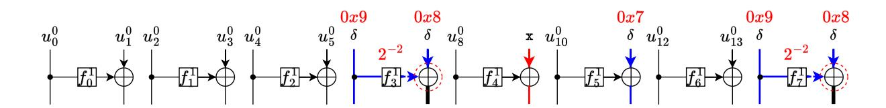

<span id="page-25-2"></span>Fig. 11: The example of using DDT.

Improvement in the classical setting. To demonstrate the effectiveness of periodic distinguishers, we apply them in the classical setting and compare the results with the best known differential-linear distinguishers in [14]. Table 2 shows that our distinguishers achieve better performance over the same number of rounds. For example, the complexities of the 8/9/10-round distinguishers for TWINE is reduced from  $2^{4.36}/2^{12.64}/2^{16.7}$  to  $2^3/2^7/2^{13}$ . We experimentally verified the corresponding probabilities (see Appendix C). The other distinguishers are presented in our experimental results.

# <span id="page-25-0"></span>6 Extending Periodic Distinguishers to SKINNY and Other Ciphers

To date, no periodic distinguisher has been proposed for any SPN structure. In this section, we successfully apply the automated model to the SPN structure, such as SKINNY. Then, we extend the model to many other ciphers and show its effectiveness, including CRAFT, Piccolo, SM4, MARS, and SIMON. Note that

{26}------------------------------------------------

we adopt an assumption from traditional distinguisher searches: The constraints of differences in different rounds are assumed to be independent after passing through the random round keys and S-boxes.

#### <span id="page-26-0"></span>6.1 New Periodic Distinguishers of SKINNY

SKINNY [1] is a family of lightweight block ciphers which adopt the SPN structure. The internal states are represented as  $4\times 4$  arrays of cells with each cell being a nibble in case of 64-bit internal state or a byte in case of 128-bit internal state. The round function is described in Fig. 12. The transformation MixColumns maps a column  $(a,b,c,d)^T$  into  $(a\oplus c\oplus d,a,b\oplus c,a\oplus c)^T$ , the word-based operations can be used to generate probabilistic distinguishers. For SubCells, let it be the operation R in our model. Since constants and keys do not affect the difference of the output of the periodic distinguisher, the two transformations AddConstants and AddRoundTweakey can be omitted.

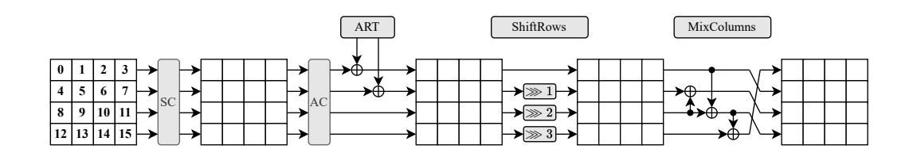

Fig. 12: The SKINNY round function: SubCells(SC), AddConstants(AC), AddRoundTweakey(ART), ShiftRows(SR), MixColumns(MC).

<span id="page-26-1"></span>We use superscripts to indicate the positions in the cipher. For example, let the values be  $\alpha_b = (\alpha_b^4, \alpha_b^7, \alpha_b^{10}, \alpha_b^{11}, \alpha_b^{13}, \alpha_b^{14}, \alpha_b^{15})$  in the 7-round distinguisher of SKINNY, and the difference be  $\delta = (\delta^4, \delta^7, \delta^{10}, \delta^{11}, \delta^{13}, \delta^{14}, \delta^{15})$ .

We provide a detailed explanation of the 7-round periodic distinguisher. Due to the structure of SKINNY, where SubCells precedes AddRoundTweakey, we adopt the method of searching for periodic distinguishers in the FK construction proposed in [9,6]. Firstly, because the first operation is SubCells, it is necessary to construct the state  $\mathbf{x} \oplus \mathbf{\delta}$  at the input. After passing through the SubCells, the state  $\mathbf{x} \oplus \mathbf{\delta}$  is transformed into  $\mathbf{0_s}$ . Next,  $\alpha_0^4, \alpha_1^4, \alpha_0^7, \alpha_1^7, \alpha_0^{15}, \alpha_1^{15}$  are chosen randomly ( $\alpha_0^4 \neq \alpha_1^4, \alpha_0^7 \neq \alpha_1^7, \alpha_0^{15} \neq \alpha_1^{15}$ ). Let  $\alpha_b^{11} = \alpha_b^4, \alpha_b^{14} = \alpha_b^4, \alpha_b^{10} = \alpha_b^7, \alpha_b^{13} = \alpha_b^7$ . Then, we can construct a 7-round periodic distinguisher.

Using the same method, we provide a detailed explanation of the 9-round periodic distinguisher. It is also necessary to construct the state  $\mathbf{x} \oplus \delta$  at the input. After passing through the SubCells, the state  $\mathbf{x} \oplus \delta$  is transformed into  $\mathbf{0_s}$ . Next,  $\alpha_0^0, \alpha_1^0, \alpha_0^3, \alpha_1^3, \alpha_0^6, \alpha_1^6, \alpha_0^{13}, \alpha_1^{13}, \alpha_0^{14}, \alpha_1^{14}$  are chosen randomly  $(\alpha_0^0 \neq \alpha_1^0, \alpha_0^3 \neq \alpha_1^3, \alpha_0^6 \neq \alpha_1^6, \alpha_0^{13} \neq \alpha_1^{13}, \alpha_0^{14} \neq \alpha_1^{14})$ . Let  $\alpha_b^7 = \alpha_b^0, \alpha_b^{10} = \alpha_b^0, \alpha_b^9 = \alpha_b^3$ . Then, we can construct a 9-round periodic distinguisher.

Let the j-th branch before and after the i-th round of MixColumns be denoted by  $SR^i_j$  and  $MC^i_j$ , respectively. The 9-round distinguisher imposes the following constraints: In Round 2:  $\Delta SR^2_1 = \Delta SR^2_5$ ,  $\Delta SR^2_1 = \Delta SR^2_9$ . In Round 3:  $\Delta SR^3_6 =$ 

{27}------------------------------------------------

 $\Delta SR_{10}^3$ . In Round 5:  $\Delta SR_1^5 = \Delta SR_{13}^5$ . Based on our assumption, the constraints of different rounds are considered independent after AddRoundTweakey and SubCells operations, which are used to calculate the theoretical probability. Experiments have verified that this probability is reasonable. The distinguishers are provided in Appendix F.

Improvement in the classical setting. We apply our distinguishers in the classical setting and compare them with the best known differential-linear distinguishers in [14]. The complexity of 7-/8-/9-round differential-linear distinguisher for SKINNY-64 is  $2^{5.64}/2^{14.5}/2^{22.72}$ , respectively. In contrast, our distinguishers achieve significantly lower complexities of  $2^3/2^9/2^{21}$  for the same number of rounds.

#### 6.2 New Periodic Distinguishers of CRAFT

CRAFT [2] is a lightweight tweakable block cipher, the internal states are represented as  $4 \times 4$  arrays of cells with each cell being a nibble. The round function is described in Fig. 13. For stronger diffusion, PermuteNibbles uses different methods, such as RShift, Shuffle, and LShift. S-box is not included in the last round.

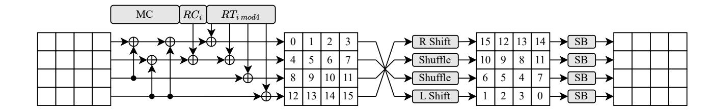

<span id="page-27-0"></span>Fig. 13: The CRAFT round function, including MixColumns(MC), AddRoundConstants(RC), AddTweakey(RT), PermuteNibbles(PN), and S-box(SB).

MixColumns maps a column  $(a,b,c,d)^T$  into  $(a \oplus c \oplus d,b \oplus d,c,d)^T$ . Then, AddRoundConstants and AddTweakey can be omitted, and we let S-box be the operation R in our model. However, if the difference with unknown values passes R, the periodicity will vanish. Since our model requires that the input is x or  $\delta$  and the period is included in  $R(x \oplus \delta)$  or  $R(x \oplus R(\delta))$ , x must occur in the first two lines. The periodic point  $O_s$  always occurs in the first round. This is similar to SKINNY. Appendix G provides more details.

## 6.3 Further Application on Piccolo

We have proven that the model is highly applicable to various structures and ciphers. However, for ciphers that include MDS matrices, there is currently no effective method to describe periodic attacks. We take Piccolo [26] as an example to illustrate how our model can be applied to this type of cipher.

{28}------------------------------------------------

Piccolo is a lightweight block cipher using the Feistel-SP structure, proposed by Shibutani et al. for extremely constrained devices. The round function for Piccolo is shown in Fig. [22,](#page-45-0) including S-box and MixColumns. For Feistel-SP structure, there exists a 3-round periodic distinguisher based on qCPA and a 4-round distinguisher based on qCCA [\[18\]](#page-31-3). The more complex permutation used in Piccolo makes it difficult for these attacks to be directly applied. It remains unknown whether a better distinguisher can be found by decomposing the round function. Finally, based on our modified model, we successfully identify the first 4-round polynomial-time periodic distinguisher. Appendix [H](#page-42-0) provides a detailed explanation.

## 6.4 Applications on Type-1/2/3 GFS, SM4, MARS, and SIMON

For Type-1/2/3 GFS, there are many periodic distinguishers. Using our method, all longest-round periodic distinguishers can be reconstructed. In [\[9,](#page-30-6)[32\]](#page-32-3), the periodic distinguishers for SM4, MARS, and SIMON are proposed. For each cipher, we can find the periodic distinguisher, which has the same rounds with [\[9,](#page-30-6)[32\]](#page-32-3). For SM4 and MARS, our method can be used to search for the 7-round periodic distinguishers with only slight modifications. Notably, for MARS, we also use a particular property in [\[9\]](#page-30-6):

<span id="page-28-1"></span>
$$u_0^4 \oplus u_1^4 \oplus u_2^4 = u_0^5 \oplus u_1^5 \oplus u_3^5 = u_0^6 \oplus u_2^6 \oplus u_3^6 = u_1^7 \oplus u_2^7 \oplus u_3^7$$
 (8)

Thus, our goal is to search for a 4-round periodic distinguisher such that u 4 0 , u 4 1 , and u 4 <sup>2</sup> are the state 0<sup>s</sup> ⊕ ∗. Then, using Equation [\(8\)](#page-28-1), we can construct a 7-round periodic distinguisher. For SIMON, we use the property in [\[32\]](#page-32-3) when two states are combined by an AND operation, and can search for the periodic distinguisher with the same rounds as [\[32\]](#page-32-3). More explanations are provided in Appendix [J.](#page-46-1) All the distinguishers are verified by our experiments.

## <span id="page-28-0"></span>7 Conclusion

This paper presents a significant advancement in quantum cryptanalysis of symmetric-key schemes by introducing an automated approach for discovering periodic distinguishers. The proposed methodology for Simon's algorithm offers a more refined and systematic framework compared to existing techniques. A key contribution is the development of probabilistic periodic distinguishers using the Grover-meet-Simon algorithm, which enhances the identification of effective periodic distinguishers through optimized strategies for selecting initial differences. This theoretical framework significantly broadens the scope of detectable periodic distinguishers. The SMT-based model demonstrates extensive applicability, achieved through significant advancements in the analysis of both generalized Feistel structures and substitution-permutation network (SPN) ciphers. This framework enables the discovery of optimized periodic distinguishers for numerous cryptographic constructions, including generalized Feistel structures (e.g., 

{29}------------------------------------------------

GFS-2F/4F, Skipjack-type structures, LBlock, and TWINE) as well as SPNbased designs (e.g., SKINNY). Our findings reveal that periodic distinguishers, as identified through our automated model, demonstrate effects that differ from traditional methods. Notably, these distinguishers not only prove effective in quantum cryptanalysis but also exhibit new insight in classical cryptanalysis settings. We anticipate that future research will further explore these distinguishers and potentially extend their application to a wider range of cryptographic primitives by providing improved periodic analysis methodologies. The results from our automated model suggest that periodic analysis may establish a novel cryptanalytic technology. However, some challenges remain, particularly in developing more precise analytical models for ciphers with MDS matrices, which represents a critical direction for future investigation.

## Acknowledgements

The authors would like to thank the anonymous reviewers and shepherd for their valuable comments and suggestions to improve the quality of the paper. This work is supported by the National Key R&D Program of China (Grant No. 2024YFA1013000, 2023YFA1009500), the National Natural Science Foundation of China (Grant No. 62032014, U2336207, 623B2067), and the National Cryptologic Science Fund of China (Grant No. 2025NCSF01013). In addition, Haoyang Wang is supported by the National Natural Science Foundation of China (Grant No. 62302293). We used generative AI tools (OpenAI's ChatGPT) for grammar checking and spell correction. All content was written and verified by the authors, who take full responsibility for the final text.

## References

- <span id="page-29-0"></span>1. Beierle, C., Jean, J., K¨olbl, S., Leander, G., Moradi, A., Peyrin, T., Sasaki, Y., Sasdrich, P., Sim, S.M.: The SKINNY family of block ciphers and its low-latency variant MANTIS. In: Robshaw, M., Katz, J. (eds.) Advances in Cryptology - CRYPTO 2016 - 36th Annual International Cryptology Conference, Santa Barbara, CA, USA, August 14-18, 2016, Proceedings, Part II. Lecture Notes in Computer Science, vol. 9815, pp. 123–153. Springer (2016). [https://doi.org/10.1007/](https://doi.org/10.1007/978-3-662-53008-5\_5) [978-3-662-53008-5\\_5](https://doi.org/10.1007/978-3-662-53008-5\_5)
- <span id="page-29-2"></span>2. Beierle, C., Leander, G., Moradi, A., Rasoolzadeh, S.: CRAFT: lightweight tweakable block cipher with efficient protection against DFA attacks. IACR Trans. Symmetric Cryptol. 2019(1), 5–45 (2019). [https://doi.org/10.13154/TOSC.V2019.](https://doi.org/10.13154/TOSC.V2019.I1.5-45) [I1.5-45](https://doi.org/10.13154/TOSC.V2019.I1.5-45)
- <span id="page-29-1"></span>3. Blondeau, C., Bogdanov, A., Wang, M.: On the (in)equivalence of impossible differential and zero-correlation distinguishers for feistel- and skipjack-type ciphers. In: Boureanu, I., Owesarski, P., Vaudenay, S. (eds.) Applied Cryptography and Network Security - 12th International Conference, ACNS 2014, Lausanne, Switzerland, June 10-13, 2014. Proceedings. Lecture Notes in Computer Science, vol. 8479, pp. 271–288. Springer (2014). <https://doi.org/10.1007/978-3-319-07536-5\_17>

{30}------------------------------------------------

- <span id="page-30-1"></span>4. Bonnetain, X., Hosoyamada, A., Naya-Plasencia, M., Sasaki, Y., Schrottenloher, A.: Quantum attacks without superposition queries: The offline Simon's algorithm. In: Galbraith, S.D., Moriai, S. (eds.) Advances in Cryptology - ASIACRYPT 2019 - 25th International Conference on the Theory and Application of Cryptology and Information Security, Kobe, Japan, December 8-12, 2019, Proceedings, Part I. Lecture Notes in Computer Science, vol. 11921, pp. 552–583. Springer (2019). <https://doi.org/10.1007/978-3-030-34578-5\_20>
- <span id="page-30-2"></span>5. Bonnetain, X., Leurent, G., Naya-Plasencia, M., Schrottenloher, A.: Quantum linearization attacks. In: Tibouchi, M., Wang, H. (eds.) Advances in Cryptology - ASIACRYPT 2021 - 27th International Conference on the Theory and Application of Cryptology and Information Security, Singapore, December 6-10, 2021, Proceedings, Part I. Lecture Notes in Computer Science, vol. 13090, pp. 422–452. Springer (2021). <https://doi.org/10.1007/978-3-030-92062-3\_15>
- <span id="page-30-7"></span>6. Canale, F., Leander, G., Stennes, L.: Simon's algorithm and symmetric crypto: Generalizations and automatized applications. In: Dodis, Y., Shrimpton, T. (eds.) Advances in Cryptology - CRYPTO 2022 - 42nd Annual International Cryptology Conference, CRYPTO 2022, Santa Barbara, CA, USA, August 15-18, 2022, Proceedings, Part III. Lecture Notes in Computer Science, vol. 13509, pp. 779–808. Springer (2022). <https://doi.org/10.1007/978-3-031-15982-4\_26>
- <span id="page-30-10"></span>7. Chen, J., Liu, Q., Li, B., Qiao, J., Wang, J.: Simplified periodic distinguishers searching: Application to gfs-4f/2f and twine. In: Lin, D., Wang, M., Yung, M. (eds.) Information Security and Cryptology. pp. 425–443. Springer Nature Singapore, Singapore (2025)
- <span id="page-30-5"></span>8. Cid, C., Hosoyamada, A., Liu, Y., Sim, S.M.: Quantum cryptanalysis on contracting feistel structures and observation on related-key settings. In: Bhargavan, K., Oswald, E., Prabhakaran, M. (eds.) Progress in Cryptology - INDOCRYPT 2020 - 21st International Conference on Cryptology in India, Bangalore, India, December 13-16, 2020, Proceedings. Lecture Notes in Computer Science, vol. 12578, pp. 373–394. Springer (2020). <https://doi.org/10.1007/978-3-030-65277-7\_17>
- <span id="page-30-6"></span>9. Cui, J., Guo, J., Ding, S.: Applications of Simon's algorithm in quantum attacks on feistel variants. Quantum Inf. Process. 20(3), 117 (2021). [https://doi.org/](https://doi.org/10.1007/S11128-021-03027-X) [10.1007/S11128-021-03027-X](https://doi.org/10.1007/S11128-021-03027-X)
- <span id="page-30-8"></span>10. Daemen, J., Rijmen, V.: The Design of Rijndael - The Advanced Encryption Standard (AES), Second Edition. Information Security and Cryptography, Springer (2020). <https://doi.org/10.1007/978-3-662-60769-5>
- <span id="page-30-4"></span>11. Dong, X., Dong, B., Wang, X.: Quantum attacks on some feistel block ciphers. Des. Codes Cryptogr. 88(6), 1179–1203 (2020). [https://doi.org/10.1007/](https://doi.org/10.1007/S10623-020-00741-Y) [S10623-020-00741-Y](https://doi.org/10.1007/S10623-020-00741-Y)
- <span id="page-30-3"></span>12. Dong, X., Li, Z., Wang, X.: Quantum cryptanalysis on some generalized feistel schemes. Sci. China Inf. Sci. 62(2), 22501:1–22501:12 (2019). [https://doi.org/](https://doi.org/10.1007/S11432-017-9436-7) [10.1007/S11432-017-9436-7](https://doi.org/10.1007/S11432-017-9436-7)
- <span id="page-30-0"></span>13. Grover, L.K.: A fast quantum mechanical algorithm for database search. In: Miller, G.L. (ed.) Proceedings of the Twenty-Eighth Annual ACM Symposium on the Theory of Computing, Philadelphia, Pennsylvania, USA, May 22-24, 1996. pp. 212–219. ACM (1996)
- <span id="page-30-9"></span>14. Hadipour, H., Derbez, P., Eichlseder, M.: Revisiting differential-linear attacks via a boomerang perspective with application to aes, ascon, clefia, skinny, present, knot, twine, warp, lblock, simeck, and SERPENT. In: Reyzin, L., Stebila, D. (eds.) Advances in Cryptology - CRYPTO 2024 - 44th Annual International Cryptology Conference, Santa Barbara, CA, USA, August 18-22, 2024, Proceedings, Part IV.

{31}------------------------------------------------

- Lecture Notes in Computer Science, vol. 14923, pp. 38–72. Springer (2024). [https:](https://doi.org/10.1007/978-3-031-68385-5\_2) [//doi.org/10.1007/978-3-031-68385-5\\_2](https://doi.org/10.1007/978-3-031-68385-5\_2)
- <span id="page-31-6"></span>15. Hodzic, S., Knudsen, L.R., Kidmose, A.B.: On quantum distinguishers for type-3 generalized feistel network based on separability. In: Ding, J., Tillich, J. (eds.) Post-Quantum Cryptography - 11th International Conference, PQCrypto 2020, Paris, France, April 15-17, 2020, Proceedings. Lecture Notes in Computer Science, vol. 12100, pp. 461–480. Springer (2020). [https://doi.org/10.1007/](https://doi.org/10.1007/978-3-030-44223-1\_25) [978-3-030-44223-1\\_25](https://doi.org/10.1007/978-3-030-44223-1\_25)
- <span id="page-31-4"></span>16. Hosoyamada, A., Aoki, K.: On quantum related-key attacks on iterated evenmansour ciphers. In: Obana, S., Chida, K. (eds.) Advances in Information and Computer Security - 12th International Workshop on Security, IWSEC 2017, Hiroshima, Japan, August 30 - September 1, 2017, Proceedings. Lecture Notes in Computer Science, vol. 10418, pp. 3–18. Springer (2017). [https://doi.org/10.](https://doi.org/10.1007/978-3-319-64200-0\_1) [1007/978-3-319-64200-0\\_1](https://doi.org/10.1007/978-3-319-64200-0\_1)
- <span id="page-31-8"></span>17. Hosoyamada, A., Sasaki, Y.: Quantum demiric-sel¸cuk meet-in-the-middle attacks: Applications to 6-round generic feistel constructions. In: Catalano, D., Prisco, R.D. (eds.) Security and Cryptography for Networks - 11th International Conference, SCN 2018, Amalfi, Italy, September 5-7, 2018, Proceedings. Lecture Notes in Computer Science, vol. 11035, pp. 386–403. Springer (2018). [https:](https://doi.org/10.1007/978-3-319-98113-0\_21) [//doi.org/10.1007/978-3-319-98113-0\\_21](https://doi.org/10.1007/978-3-319-98113-0\_21)
- <span id="page-31-3"></span>18. Ito, G., Hosoyamada, A., Matsumoto, R., Sasaki, Y., Iwata, T.: Quantum chosenciphertext attacks against feistel ciphers. In: Matsui, M. (ed.) Topics in Cryptology - CT-RSA 2019 - The Cryptographers' Track at the RSA Conference 2019, San Francisco, CA, USA, March 4-8, 2019, Proceedings. Lecture Notes in Computer Science, vol. 11405, pp. 391–411. Springer (2019). [https://doi.org/10.](https://doi.org/10.1007/978-3-030-12612-4\_20) [1007/978-3-030-12612-4\\_20](https://doi.org/10.1007/978-3-030-12612-4\_20)
- <span id="page-31-0"></span>19. Kaplan, M., Leurent, G., Leverrier, A., Naya-Plasencia, M.: Breaking symmetric cryptosystems using quantum period finding. In: Robshaw, M., Katz, J. (eds.) Advances in Cryptology - CRYPTO 2016 - 36th Annual International Cryptology Conference, Santa Barbara, CA, USA, August 14-18, 2016, Proceedings, Part II. Lecture Notes in Computer Science, vol. 9815, pp. 207–237. Springer (2016). [https:](https://doi.org/10.1007/978-3-662-53008-5\_8) [//doi.org/10.1007/978-3-662-53008-5\\_8](https://doi.org/10.1007/978-3-662-53008-5\_8)
- <span id="page-31-7"></span>20. Knudsen, L.R., Wagner, D.A.: On the structure of skipjack. Discret. Appl. Math. 111(1-2), 103–116 (2001). [https://doi.org/10.1016/S0166-218X\(00\)00347-4](https://doi.org/10.1016/S0166-218X(00)00347-4)
- <span id="page-31-2"></span>21. Kuwakado, H., Morii, M.: Quantum distinguisher between the 3-round feistel cipher and the random permutation. In: IEEE International Symposium on Information Theory, ISIT 2010, June 13-18, 2010, Austin, Texas, USA, Proceedings. pp. 2682– 2685. IEEE (2010). <https://doi.org/10.1109/ISIT.2010.5513654>
- <span id="page-31-1"></span>22. Leander, G., May, A.: Grover meets Simon - quantumly attacking the fxconstruction. In: Takagi, T., Peyrin, T. (eds.) Advances in Cryptology - ASI-ACRYPT 2017 - 23rd International Conference on the Theory and Applications of Cryptology and Information Security, Hong Kong, China, December 3-7, 2017, Proceedings, Part II. Lecture Notes in Computer Science, vol. 10625, pp. 161–178. Springer (2017). <https://doi.org/10.1007/978-3-319-70697-9\_6>
- <span id="page-31-5"></span>23. Ni, B., Ito, G., Dong, X., Iwata, T.: Quantum attacks against type-1 generalized feistel ciphers and applications to CAST-256. In: Hao, F., Ruj, S., Gupta, S.S. (eds.) Progress in Cryptology - INDOCRYPT 2019 - 20th International Conference on Cryptology in India, Hyderabad, India, December 15-18, 2019, Proceedings. Lecture Notes in Computer Science, vol. 11898, pp. 433–455. Springer (2019). <https://doi.org/10.1007/978-3-030-35423-7\_22>

{32}------------------------------------------------

- <span id="page-32-8"></span>24. NIST: Skipjack and kea algorithm specifications (1998), [https://csrc.nist.](https://csrc.nist.gov/CSRC/media//Projects/Cryptographic-Algorithm-Validation-Program/documents/skipjack/skipjack.pdf) [gov/CSRC/media//Projects/Cryptographic-Algorithm-Validation-Program/](https://csrc.nist.gov/CSRC/media//Projects/Cryptographic-Algorithm-Validation-Program/documents/skipjack/skipjack.pdf) [documents/skipjack/skipjack.pdf](https://csrc.nist.gov/CSRC/media//Projects/Cryptographic-Algorithm-Validation-Program/documents/skipjack/skipjack.pdf)
- <span id="page-32-4"></span>25. Nyberg, K.: Generalized feistel networks. In: Kim, K., Matsumoto, T. (eds.) Advances in Cryptology - ASIACRYPT '96, International Conference on the Theory and Applications of Cryptology and Information Security, Kyongju, Korea, November 3-7, 1996, Proceedings. Lecture Notes in Computer Science, vol. 1163, pp. 91–104. Springer (1996). <https://doi.org/10.1007/BFB0034838>
- <span id="page-32-9"></span>26. Shibutani, K., Isobe, T., Hiwatari, H., Mitsuda, A., Akishita, T., Shirai, T.: Piccolo: An ultra-lightweight blockcipher. In: Preneel, B., Takagi, T. (eds.) Cryptographic Hardware and Embedded Systems - CHES 2011 - 13th International Workshop, Nara, Japan, September 28 - October 1, 2011. Proceedings. Lecture Notes in Computer Science, vol. 6917, pp. 342–357. Springer (2011). [https:](https://doi.org/10.1007/978-3-642-23951-9\_23) [//doi.org/10.1007/978-3-642-23951-9\\_23](https://doi.org/10.1007/978-3-642-23951-9\_23)
- <span id="page-32-0"></span>27. Simon, D.R.: On the power of quantum computation. In: 35th Annual Symposium on Foundations of Computer Science, Santa Fe, New Mexico, USA, 20-22 November 1994. pp. 116–123. IEEE Computer Society (1994). [https://doi.org/10.1109/](https://doi.org/10.1109/SFCS.1994.365701) [SFCS.1994.365701](https://doi.org/10.1109/SFCS.1994.365701)
- <span id="page-32-1"></span>28. Sun, H.W., Cai, B.B., Qin, S.J., Wen, Q.Y., Gao, F.: Quantum attacks on type-1 generalized feistel schemes. Advanced Quantum Technologies 6(10), 2300155 (2023)
- <span id="page-32-6"></span>29. Suzaki, T., Minematsu, K., Morioka, S., Kobayashi, E.: TWINE: A lightweight block cipher for multiple platforms. In: Knudsen, L.R., Wu, H. (eds.) Selected Areas in Cryptography, 19th International Conference, SAC 2012, Windsor, ON, Canada, August 15-16, 2012, Revised Selected Papers. Lecture Notes in Computer Science, vol. 7707, pp. 339–354. Springer (2012). [https://doi.org/10.1007/](https://doi.org/10.1007/978-3-642-35999-6\_22) [978-3-642-35999-6\\_22](https://doi.org/10.1007/978-3-642-35999-6\_22)
- <span id="page-32-2"></span>30. Wang, X., Xiang, Z., Zhang, S., Chen, S., Zeng, X.: Quantum chosen-ciphertext attacks based on simon's algorithm against unified structures. In: Patra, A. (ed.) Topics in Cryptology - CT-RSA 2025 - Cryptographers' Track at the RSA Conference 2025, San Francisco, CA, USA, April 28-May 1, 2025, Proceedings. Lecture Notes in Computer Science, vol. 15598, pp. 99–122. Springer (2025). [https:](https://doi.org/10.1007/978-3-031-88661-4\_5) [//doi.org/10.1007/978-3-031-88661-4\\_5](https://doi.org/10.1007/978-3-031-88661-4\_5)
- <span id="page-32-5"></span>31. Wu, W., Zhang, L.: Lblock: A lightweight block cipher. In: L´opez, J., Tsudik, G. (eds.) Applied Cryptography and Network Security - 9th International Conference, ACNS 2011, Nerja, Spain, June 7-10, 2011. Proceedings. Lecture Notes in Computer Science, vol. 6715, pp. 327–344 (2011). [https://doi.org/10.1007/](https://doi.org/10.1007/978-3-642-21554-4\_19) [978-3-642-21554-4\\_19](https://doi.org/10.1007/978-3-642-21554-4\_19)
- <span id="page-32-3"></span>32. Xiang, Z., Wang, X., Yu, B., Sun, B., Zhang, S., Zeng, X., Shen, X., Li, N.: Links between quantum distinguishers based on Simon's algorithm and truncated differentials. IACR Trans. Symmetric Cryptol. 2024(2), 296–321 (2024). <https://doi.org/10.46586/TOSC.V2024.I2.296-321>
- <span id="page-32-7"></span>33. Xu, Y., Du, X., Jia, M., Wang, X., Zou, J.: Quantum attacks on generalized feistel networks based on the strong-weak separability. Quantum Inf. Process. 22(10), 375 (2023). <https://doi.org/10.1007/S11128-023-04135-6>

{33}------------------------------------------------

# Appendix

## <span id="page-33-0"></span>A SMT Problem

In recent years, the application of automated search tools in cryptography has become more and more extensive. The SAT problem belongs to the deterministic problem, and it is also the first problem to be proved to be NP-complete. To solve it, boolean expressions are usually encoded in Conjunctive Normal Form (CNF) as the inputs of a SAT solver.

Extending SAT to include the theory of modulus (satisfiability modulo theories, abbreviated as SMT) enriches the forms of CNF expressions, which can include linear constraints, arrays, and more. Compared to methods based on SAT problems, those based on SMT are more flexible and applicable to a broader range of scenarios, making them particularly suitable for use in the field of cryptography.

This paper primarily uses the solver of the SMT problem, STP, to automatically solve our new proposed models. CVC formats are among the commonly used file-based input languages in STP. We list some CVC language references and two examples as follows.

| Name                     | Symbol | Example                  |
|--------------------------|--------|--------------------------|
| Concatenation            | @      | t1@t2@ @tn               |
| Extraction               | i : j  | x[31 : 26]               |
| Bitwise XOR              | BVXOR  | BVXOR (t1, t2)           |
| Bitvector AND            | BVPLUS | BVPLUS (n, t1, t2, , tn) |
| Less Than Or Equal To    | BVLE   | BVLE (t1, t2)            |
| Greater Than or Equal To | BVGE   | BVGE (t1, t2)            |
| Not Equal to             | NOT    | NOT(t1 = t2)             |
| If Then                  | =>     | t1 => t2                 |

Table 5: Usage of the STP solver.

In our model, "QUERY(FALSE);COUNTEREXAMPLE;" means that we assume there is no valid distinguisher. If this assumption is incorrect, the solver outputs "invalid" and provides a counterexample (the periodic distinguisher). Conversely, "valid" means that no distinguisher was found for the given parameters. In this way, we can always determine whether a model has a solution and, if so, return the corresponding periodic distinguisher.

## B Extending the Output of the Periodic Distinguisher

We observe that for certain structures, a linear combination of multiple nonperiodic branches in the output can generate a value that satisfies the periodicity. Therefore, in this section, we propose a method that combines our automation 

{34}------------------------------------------------

model to simultaneously search for distinguishers and extensions. Since only special structures can be further extended, we have placed this part of the content in the appendix. Skipping this part will not affect the reader's understanding of the model.

Here, we discuss how to further extend the number of rounds after obtaining the output  $u_i^r$  of a constructible periodic function.

<span id="page-34-0"></span>**Definition 4** (Linear trail with known values). Set a r'-round linear trail of E from output to start. Let  $\Gamma_i^j$  represents the mask of  $u_i^j$  in the linear trail  $(r \leq j \leq r + r')$  and  $(\Gamma_0^j, \ldots, \Gamma_{n-1}^j) \neq (0, \ldots, 0)$ . Towards to the round function R, the XOR operation XOR, and the branching operation SPLIT, the trail satisfies the following rules:

```
\begin{array}{ll} - & 0 \xrightarrow{\mathbb{R}} 0, & 1 \xrightarrow{\mathbb{R}} 0, \\ - & (u_0, u_1) \xrightarrow{\mathtt{XOR}} u_2, \text{ where } u_2 = u_0 \& u_1, \\ - & u_0 \xrightarrow{\mathtt{SPLIT}} (u_1, u_2), \text{ where } u_1 = u_0, \ u_2 = u_0. \end{array}
```

<span id="page-34-1"></span>**Lemma 1.** Assume the r'-round linear trail with known values satisfies Definition 4. Let there be t  $(1 \le t \le n-1)$  masks of 1 at the start and t'  $(1 \le t' \le n-1)$  masks of 1 at the output. If the values corresponding to these t' masks are known, then the values at the head of the linear trail with masks of 1 are also known.

- For R, the output values are always indeterminate due to the unknown key.
- For XOR,  $(u_0, u_1) \xrightarrow{\text{XOR}} u_2$  requires values of  $u_0, u_1$  to calculate  $u_2$ .
- For SPLIT,  $u_0 \xrightarrow{\text{SPLIT}} (u_1, u_2)$  indicates that if  $u_0$  is known, then the other two values are also known.

Fig. 14 shows a linear path with known values. In these two structures, a is unknown ("unknown" means a is a combination of all the inputs and cannot be separated) and b satisfies the separability property. We set the masks  $(\Gamma_a, \Gamma_b) = (0,1)$ . In the left, the masks  $\Gamma_c = \Gamma_f = 1$  and  $\Gamma_d = \Gamma_e = 1$ , and  $\Gamma_f = 1$ . We have a 1-round linear path with known values from  $(\Gamma_e, \Gamma_f)$  to  $(\Gamma_a, \Gamma_b)$  with  $(1,1) \to (0,1)$  and  $b = e \oplus f$ . In the right,  $\Gamma_c$  is the output of F and must be 0. Then,  $\Gamma_d = 0$ . We cannot calculate b.

As long as an r-round trail exists, the distinguisher can be extended by r additional rounds.

Based on the above discussion, if there exists an output  $u_i^r$  of  $E^r$  satisfying the (probability) separability property and a r'-round linear trail with known values connected by  $u_i^r$ , we can construct an (r+r')-round periodic distinguisher.

Modelling the propagation rules of linear trail. Assume that there are an r-round differential trail and an r'-round linear trail. We set masks  $(\Gamma_0^r, \Gamma_1^r, \ldots, \Gamma_{n-1}^r)$  for the output  $(u_0^r, u_1^r, \ldots, u_{n-1}^r)$  of the differential trail. We define a new Boolean variable  $mask_i$  for each branch. If  $u_0^r$  does not satisfy the separability property, then set  $mask_i = 0$ . Then, let  $\Sigma(mask_i) = 1$ , as at least one branch satisfying the separability property needs to be calculated The other rules are consistent with Lemma 1.

{35}------------------------------------------------

<span id="page-35-1"></span>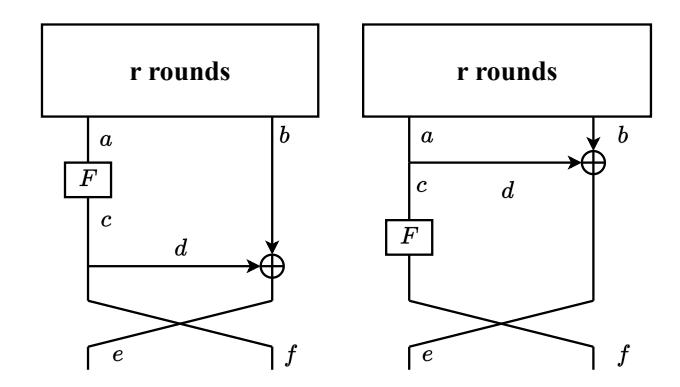

Fig. 14: An example illustrating a linear path.

## <span id="page-35-0"></span>C Validations of the Model

To validate the correctness of our model, we successfully replicated all the currently optimal periodic distinguishers, Type-1/2/3 GFS, GFS-2F/4F, Skipjack-B, LBlock, TWINE, Piccolo, SKINNY, and CRAFT, and constructed small circuit structures. We apply random keys and constants for each structure to search for periods and can consistently find the actual period by constructing a periodic function. Table [6](#page-35-2) shows the results.

<span id="page-35-2"></span>Table 6: The experiments of periodic distinguishers.

| Structure  |      |          | #Rounds Theoretical probability Experimental probability |
|------------|------|----------|----------------------------------------------------------|
| Type-1 GFS | 9    | 1        | 1                                                        |
| Type-2 GFS | 5    | 1        | 1                                                        |
| Type-3 GFS | 5    | 1        | 1                                                        |
| GFS-2F     | 6    | 1        | 1                                                        |
| GFS-4F     | 10   | 1        | 1                                                        |
| Skipjack-B | 16   | 1        | 1                                                        |
| LBlock     | 8    | 1        | 1                                                        |
| LBlock     | 9    | −2<br>2  | −2<br>2                                                  |
| LBlock     | 10   | −8<br>2  | −8<br>2                                                  |
| Twine      | 8    | 1        | 1                                                        |
| Twine      | 9    | −2<br>2  | −2<br>2                                                  |
| Twine      | 10   | −8<br>2  | −8<br>2                                                  |
| Piccolo    | 4    | 1        | 1                                                        |
| SKINNY-64  | 7    | 1        | 1                                                        |
| SKINNY-64  | 8    | −4<br>2  | −3.5<br>2                                                |
| SKINNY-64  | 9    | −16<br>2 | −15<br>2                                                 |
| CRAFT      | 7+1  | 1        | 1                                                        |
| CRAFT      | 8+1  | −4<br>2  | −3.5<br>2                                                |
| CRAFT      | 9+1  | −12<br>2 | −11<br>2                                                 |
| CRAFT      | 10+1 | −24<br>2 | −22<br>2                                                 |

{36}------------------------------------------------

# <span id="page-36-0"></span>D Algorithms for the Theoretical Probability and the Practical Collision Probability

Algorithm [4](#page-36-2) describes the procedure for determining the theoretical probability. The probability can be computed based on the rank of all collisions. If Algorithm [4](#page-36-2) detects incompatible constraints, the probability is 0. If the two constraints require only a single collision, Algorithm [4](#page-36-2) allows us to reduce the theoretical complexity by computing the rank.

Algorithm [5](#page-36-3) uses data to validate the practical collision probability. This test is based on the instantiation of the structure, which is similar to [\[6\]](#page-30-7), where we randomly generate permutations, constants, keys, etc., and then perform repeated testing. If the rank is ℓ, we conduct 2n·ℓ+4 tests. On average, a period occurs approximately 2<sup>4</sup> times.

#### <span id="page-36-2"></span>Algorithm 4 The process of calculate the theoretical probability.

Input: The collisions c0, c1, . . . , cℓ−1, the number of bits n in the branch.

Output: The theoretical probability of the collisions.

- 1: Form a system of equations S = {c0, c1, . . . , cℓ−1}.
- 2: if the system of equations S has incompatible constraints then
- 3: return 0.
- 4: end if
- 5: Compute the rank of S, denoted by rS.
- 6: return the theoretical probability 2<sup>−</sup>n·r<sup>s</sup> .

## <span id="page-36-3"></span>Algorithm 5 The process of the practical probability verification.

Input: The collisions c0, c1, . . . , cℓ−<sup>1</sup> for the r-round cipher E r , where each branch is n bits.

Output: The actual probability of the collisions.

- 1: Let T denote the number of successful verifications.
- 2: for t from 0 to 2<sup>n</sup>·ℓ+4 do
- 3: Generate random values of x ∈ {0, 1} n , α<sup>0</sup> ∈ {0, 1} e1 , α<sup>1</sup> ∈ {0, 1} e1 , c ∈ {0, 1} e2 and random keys.
- 4: Calculate E r (x, α0, c) and E r (x, α1, c) and verify whether the intermediate values satisfy the system of equations S or verify whether the period exists. If it is satisfied, let T = T + 1.
- 5: end for
- 6: return the practical probability <sup>T</sup> <sup>2</sup>n·ℓ+4 .

## <span id="page-36-1"></span>E 8/10-round Periodic Distinguishers for LBlock/TWINE

In this section, we present the periodic distinguishers for LBlock/TWINE.

{37}------------------------------------------------

- 8-round periodic distinguisher for TWINE is shown in Fig. [15.](#page-37-0)
- 8-round periodic distinguisher for LBlock is shown in Fig. [16.](#page-38-0)
- 10-round periodic distinguisher for LBlock is shown in Fig. [17,](#page-39-0) requiring 4 collisions.
- 10-round periodic distinguisher for TWINE is shown in Fig. [18,](#page-40-0) requiring 4 collisions.

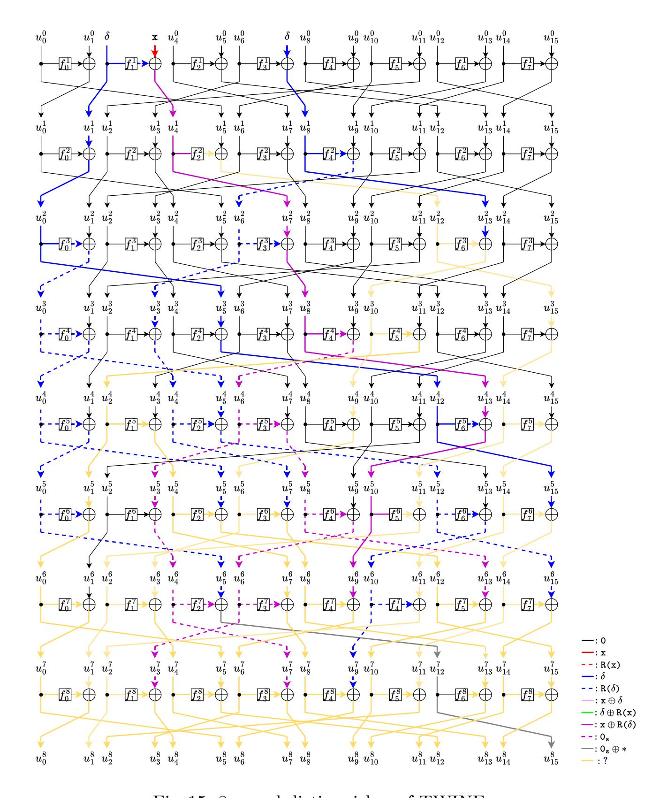

<span id="page-37-0"></span>Fig. 15: 8-round distinguisher of TWINE.

{38}------------------------------------------------

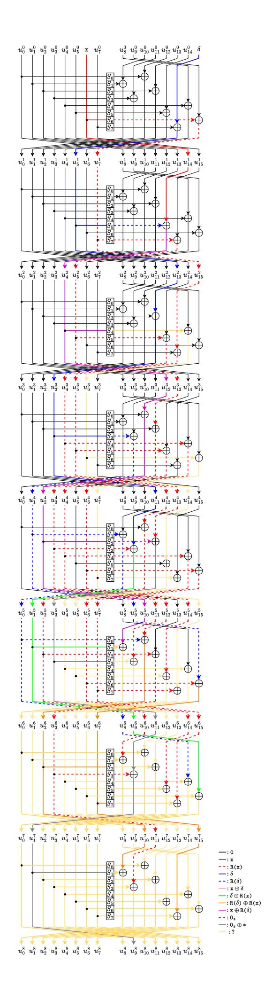

<span id="page-38-0"></span>Fig. 16: 8-round distinguisher of LBlock.

{39}------------------------------------------------

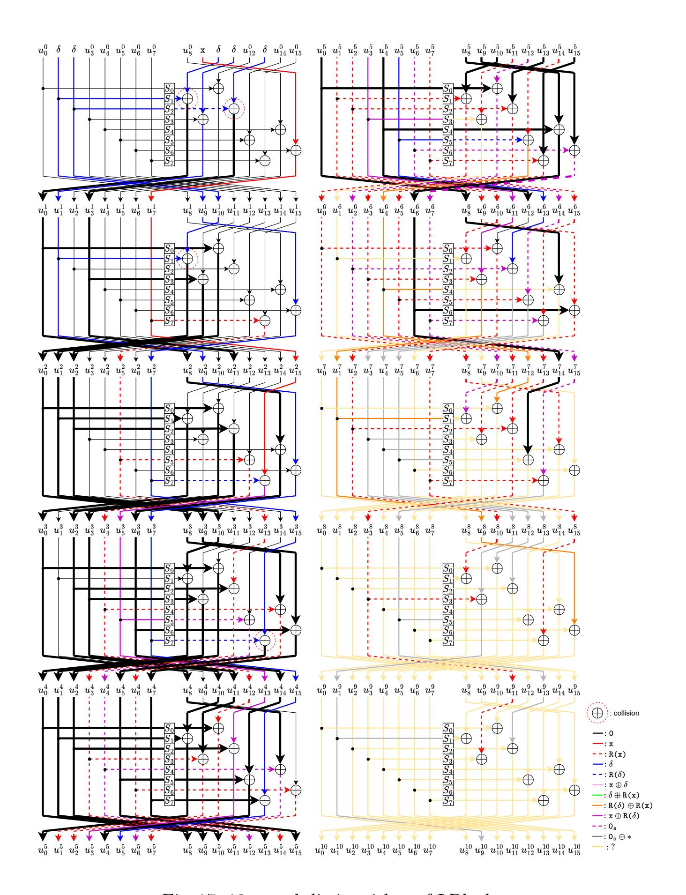

<span id="page-39-0"></span>Fig. 17: 10-round distinguisher of LBlock.

{40}------------------------------------------------

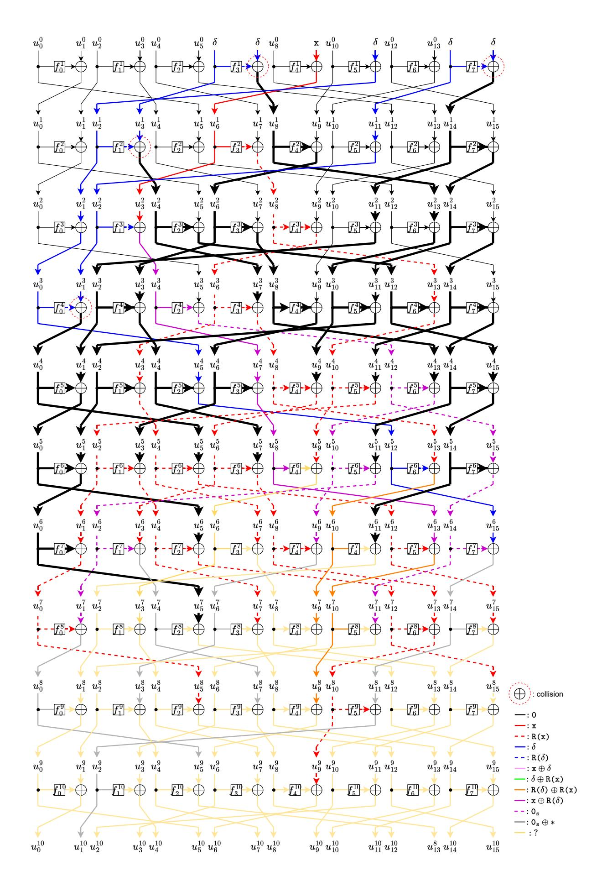

<span id="page-40-0"></span>Fig. 18: 10-round distinguisher of TWINE.

{41}------------------------------------------------

# <span id="page-41-0"></span>F Periodic Distinguishers for SKINNY

In this section, we present the periodic distinguishers for SKINNY. The advantages of our distinguishers lie in their independence from specific components, while maintaining low complexity.

- 7-round periodic distinguisher for SKINNY is shown in Fig. 19-left.
- 9-round periodic distinguisher for SKINNY is shown in Fig. 19-right, requiring 4 collisions.

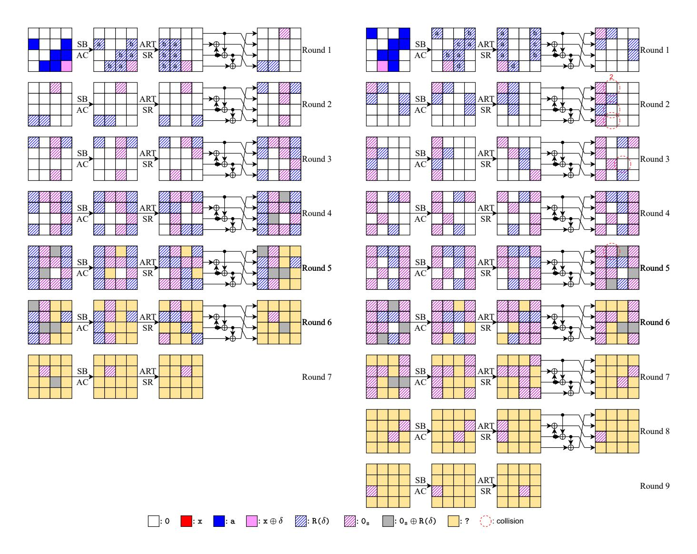

<span id="page-41-2"></span>Fig. 19: The 7-round periodic distinguisher (left) and the 9-round periodic distinguisher (right) for SKINNY .

# <span id="page-41-1"></span>G Periodic Distinguishers for CRAFT

In this section, we present the periodic distinguishers for CRAFT. The final round is omitted.

- 8-round periodic distinguisher for CRAFT is shown in Fig. 20.

{42}------------------------------------------------

– 12-round periodic distinguisher for CRAFT is shown in Fig. 21, requiring 10 collisions. Let the j-th branch before and after the i-th round of MixColumns be denoted as  $S_j^{i-1}$  and  $MC_j^i$ . In the input of the 12-round periodic distinguisher, we need to set  $\delta^5 = \delta^{13}$ ,  $\delta^2 = \delta^{14}$ , and  $\delta^7 = \delta^{11} = \delta^{15}$ , but the probability does not increase with these constraints. The 12-round distinguisher requires the following constraints with complexity  $O(2^{\frac{5N}{16}})$ . In round 2, we have the constraints  $\Delta S_0^1 = \Delta S_{12}^1$ ,  $\Delta S_1^2 = \Delta S_{10}^1$ ,  $\Delta S_3^1 = \Delta S_{15}^1$ , and  $\Delta S_7^1 = \Delta S_{15}^1$ , which affect  $\Delta MC_0^2$ ,  $\Delta MC_2^2$ ,  $\Delta MC_3^2$ , and  $\Delta MC_7^2$ . In round 3, we have  $\Delta S_0^2 = \Delta S_{12}^2$ ,  $\Delta S_4^2 = \Delta S_{12}^2$ , and  $\Delta S_1^2 = \Delta S_9^2$ , which affect  $\Delta MC_0^3$ ,  $\Delta MC_4^3$ , and  $\Delta MC_1^3$ . In round 4, we have  $\Delta S_1^3 = \Delta S_{13}^3$  and  $\Delta S_5^3 = \Delta S_{13}^3$ , which affect  $\Delta MC_1^4$  and  $\Delta MC_5^4$ . In round 5, we have  $\Delta S_2^4 = \Delta S_{10}^4$ , which affects  $\Delta MC_2^5$ .

## <span id="page-42-0"></span>H 4-round Periodic Distinguisher for Piccolo

Adapting the model for Piccolo. In Piccolo, each branch is 16 bits. To apply the model to Piccolo, we split each 16-bit branch into four 4-bit branches (see Fig. 22) and we made the following modifications:

- 1. We propose an approximate strategy for modeling MDS matrices. As long as the difference of x or  $\delta$  changes, we treat it as R(x) or  $R(\delta)$ . This constraint is necessary because once the difference changes, the cancellation property, such as  $\delta \oplus \delta = 0$ , is lost. For example, for a column of inputs  $(x_0, x_1, x_2, x_3)$ , the output  $y_0$  can be expressed as  $y_0 = R(x_0) \oplus R(x_1) \oplus x_2 \oplus x_3$ .
- 2. We relax the initial constraints. We hope all the state x come from an unsplit 16-bit branch of Piccolo. That is, at the head, x appears at most four times. However, in the actual model, we find that even without restricting the number of occurrences of x, the model still produces the same result. Therefore, we remove this restriction on the number of x in the head of Piccolo. This modifies the initial constraints of the previous model.
- 3. We relax the rule of R. In Equation (6), only one branch with state  $\mathbf{x} \oplus \delta$ ,  $\mathbf{x} \oplus \mathbf{R}(\delta)$ , or  $\mathbf{x} \oplus \mathbf{R}(\delta) \oplus \delta$  can generate the state  $\mathbf{0}_{\mathbf{s}}$ , and the others are set to  $\bot$ . Because of the modification of  $\mathbf{x}$ , we limit the rule  $\mathbf{x} \oplus \delta$ ,  $\mathbf{x} \oplus \mathbf{R}(\delta)$ ,  $\mathbf{x} \oplus \mathbf{R}(\delta) \oplus \delta \xrightarrow{\mathbf{R}} \mathbf{0}_{\mathbf{s}}$  to a maximum of 4 times. This modification is reasonable. For each x, the implicit period is the same, and the final distinguisher has at most four implicit periods from four different  $\mathbf{x}$ . In the previous proof, the output after XORing  $\mathbf{0}_{\mathbf{s}}$  with different periods was  $\bot$ . However, if the  $\mathbf{0}_{\mathbf{s}}$  are generated by different branches with x, it is also possible for the output to be  $\mathbf{0}_{\mathbf{s}}$ .

Relaxing the model's constraints invalidates our original proof of its correctness. To address this, we introduce an additional testing phase to verify whether the implicit period remains consistent for each x and to search for the actual

{43}------------------------------------------------

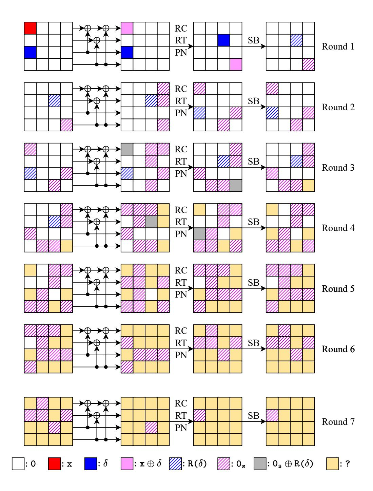

<span id="page-43-0"></span>Fig. 20: 8-round distinguisher of CRAFT.

{44}------------------------------------------------

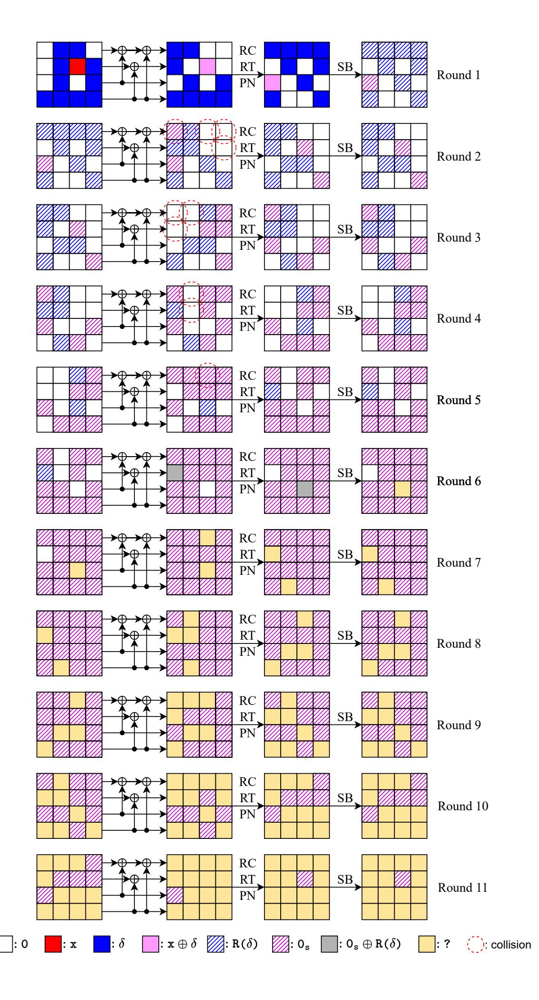

<span id="page-44-0"></span>Fig. 21: 12-round distinguisher of CRAFT.

{45}------------------------------------------------

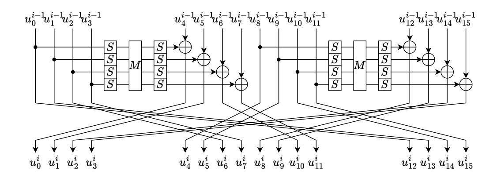

<span id="page-45-0"></span>Fig. 22: The round function of Piccolo.

period of each result returned by the model. Finally, we successfully identify the first 4-round polynomial-time periodic distinguisher:

$$(0,0,0,0,0,0,0,\delta,\delta,0,0,s,s,s,s) \rightarrow (?,?,?,?,0,0,0,0,?,?,?,?,?,?,?,?).$$

In the first round, we set  $(u_8^0, u_9^0) = (\alpha_b, \beta_b)$ , where  $\alpha_0 \neq \alpha_1, \beta_0 \neq \beta_1$ . The input of the periodic function is  $x = x_{12}||x_{13}||x_{14}||x_{15} \in \{0,1\}^{4\times 4}$ . Then, let

$$E_b := E^4(u_0^0, u_1^0, u_2^0, u_3^0, u_4^0, u_5^0, u_6^0, u_7^0, \alpha_b, \beta_b, u_{10}^0, u_{11}^0, x_{12}, x_{13}, x_{14}, x_{15}),$$

where  $u_0^0, u_1^0, u_2^0, u_3^0, u_4^0, u_5^0, u_6^0, u_7^0, u_{10}^0, u_{11}^0$  are random constants, || represents bit concatenation, and  $b \in \{0, 1\}$ . The modified periodic function is:

$$g: \{0,1\}^{16} \to \{0,1\}^{16},$$

$$x \mapsto \Delta(u_4^4||u_5^4||u_6^4||u_7^4),$$

$$g(x) = (E_0|_{u_4^4})||(E_0|_{u_5^4})||(E_0|_{u_6^4})||(E_0|_{u_7^4}) \oplus (E_1|_{u_4^4})||(E_1|_{u_5^4})||(E_1|_{u_6^4})||(E_1|_{u_7^4}).$$

Actually, we recombine the outputs of these four branches into a single 16-bit value. For the period value  $s \in \{0,1\}^{16}$ ,  $g(x \oplus s) = g(x)$  for any  $x \in \{0,1\}^{16}$ . Our experiment also verifies the periodic distinguisher.

Discussion on modelling MDS matrices. Using our approximate strategy, we can also automate the search for the number of rounds in periodic distinguishers of ciphers with MDS matrices. There are two open problems. First, we aim to develop a more precise model for MDS matrices instead of relying on the approximate strategy. Second, when the number of initial x increases, we want to explore whether there is a more precise model that ensures the correctness of the output distinguisher without requiring an additional testing phase. As the first proposed symbolic model, we leave these two problems as directions for future work.

We present the 4-round periodic distinguishers for Piccolo, which is shown in Fig. 23.

{46}------------------------------------------------

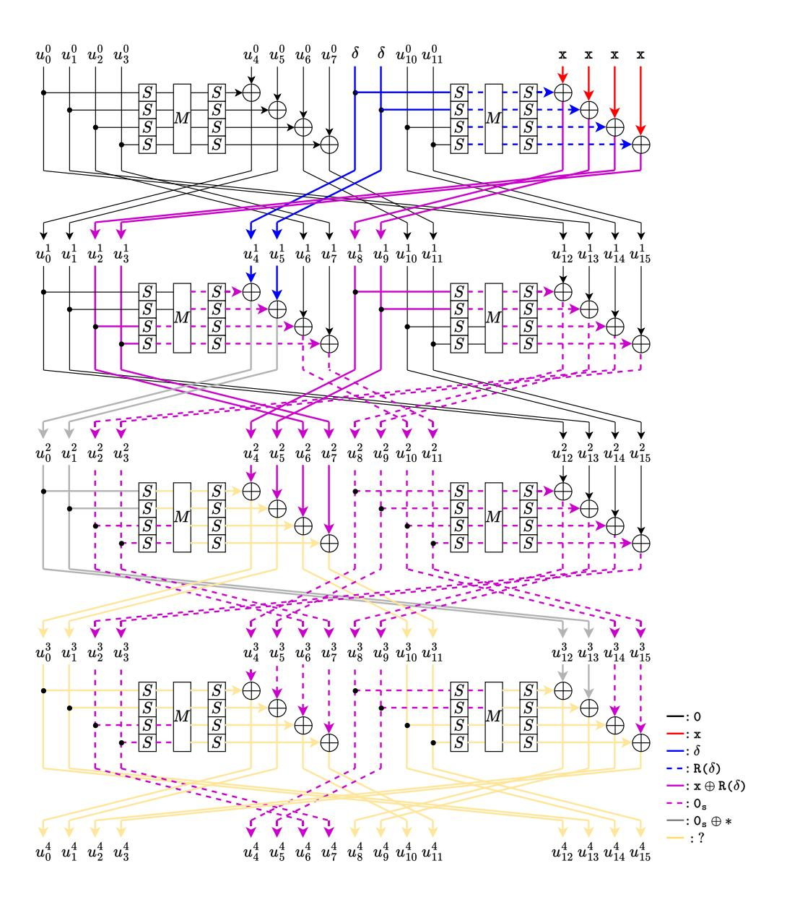

<span id="page-46-2"></span>Fig. 23: 4-round distinguisher of Piccolo.

## <span id="page-46-0"></span>I 17/18-round Periodic Distinguishers for CAST-256

In this section, we present the periodic distinguishers for CAST-256.

- 17-round periodic distinguisher for CAST-256 is shown in Fig. [24.](#page-47-0) The first two rounds are encryption, and the following 15 rounds are decryption.
- 18-round periodic distinguisher for CAST-256 is shown in Fig. [25,](#page-48-0) requiring 1 collision. The first three rounds are encryption, and the following 15 rounds are decryption.

# <span id="page-46-1"></span>J A Reinterpretation of Original Periodic Distinguishers for Type-1/2/3 GFS, SM4, MARS, and SIMON-32

The round function for Type-1 GFS is shown in Fig. [26.](#page-49-0)

{47}------------------------------------------------

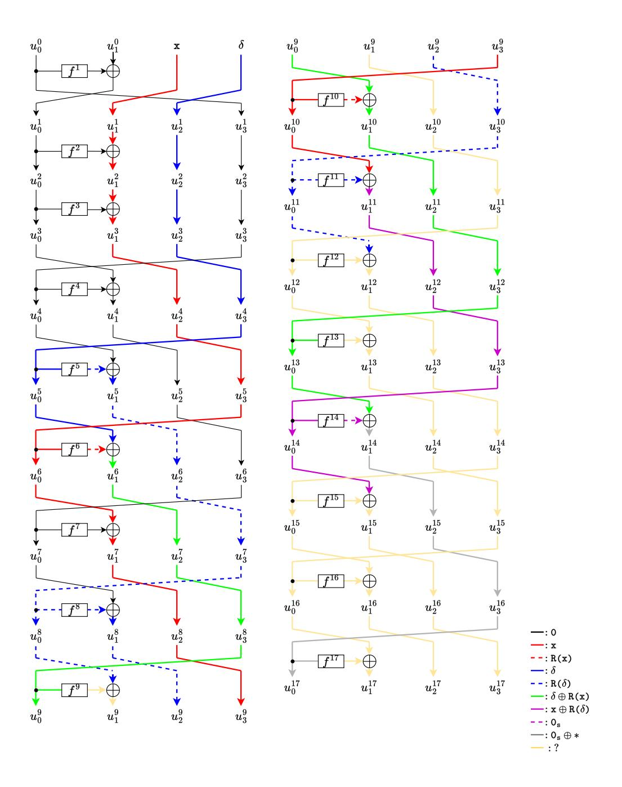

<span id="page-47-0"></span>Fig. 24: 17-round distinguisher of CAST-256.

{48}------------------------------------------------

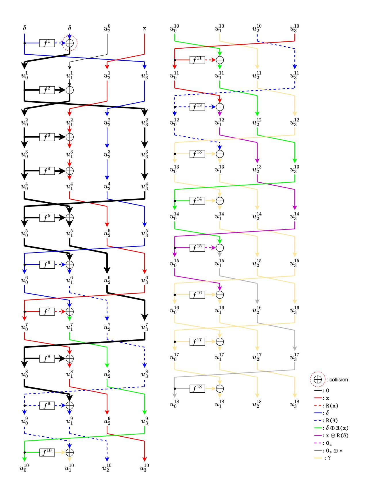

<span id="page-48-0"></span>Fig. 25: 18-round distinguisher of CAST-256.

{49}------------------------------------------------

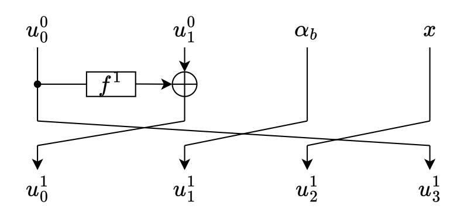

Fig. 26: The round function of Type-1 GFS.

<span id="page-49-0"></span>The decryption round function for Type-1 GFS is shown in Fig. [27.](#page-49-1)

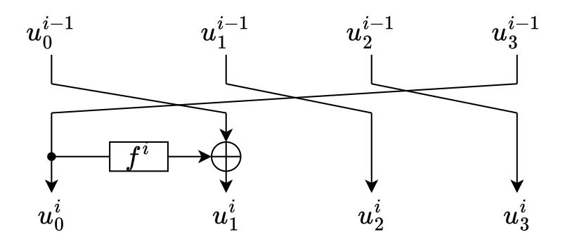

Fig. 27: The decryption round function of Type-1 GFS.

<span id="page-49-1"></span>The round function for Type-2 GFS is shown in Fig. [28.](#page-49-2)

<span id="page-49-2"></span>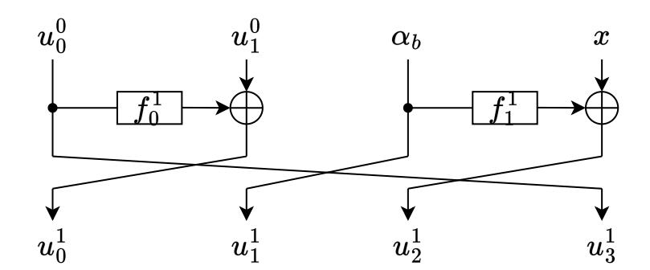

Fig. 28: The round function of Type-2 GFS.

The round function for Type-3 GFS is shown in Fig. [29.](#page-50-0)

{50}------------------------------------------------

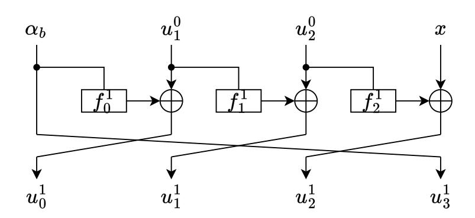

<span id="page-50-0"></span>Fig. 29: The round function of Type-3 GFS.

In this section, we present the periodic distinguishers for Type-1/2/3 GFS SM4, MARS, and SIMON-32

- 9-round periodic distinguisher for Type-1 GFS is shown in Fig. [30.](#page-51-0)
- 15-round periodic distinguisher (CCA) for Type-1 GFS is shown in Fig. [31.](#page-52-0)
- 5-round periodic distinguisher for Type-2 GFS is shown in Fig. [32.](#page-53-0)
- 5-round periodic distinguisher for Type-3 GFS is shown in Fig. [33.](#page-54-0)
- 7-round periodic distinguisher for SM4 is shown in Fig. [34.](#page-55-0)
- 7-round periodic distinguisher for MARS is shown in Fig. [35.](#page-56-0)
- 7-round periodic distinguisher for SIMON-32 is shown in Fig. [36.](#page-57-0)

All distinguishers are derived from our model and are consistent with the current best results. This demonstrates the powerful effectiveness of our model.

{51}------------------------------------------------

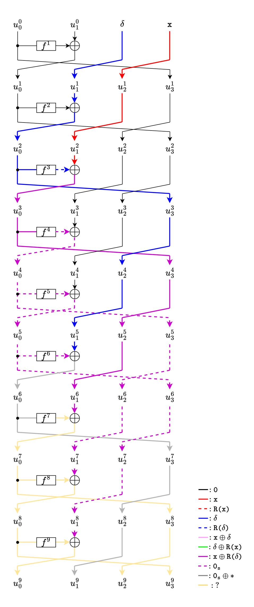

<span id="page-51-0"></span>Fig. 30: 9-round distinguisher of Type-1 GFS.

{52}------------------------------------------------

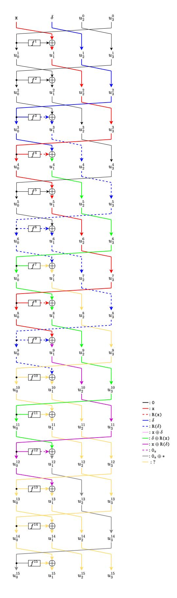

<span id="page-52-0"></span>Fig. 31: 15-round distinguisher (CCA) of Type-1 GFS.

{53}------------------------------------------------

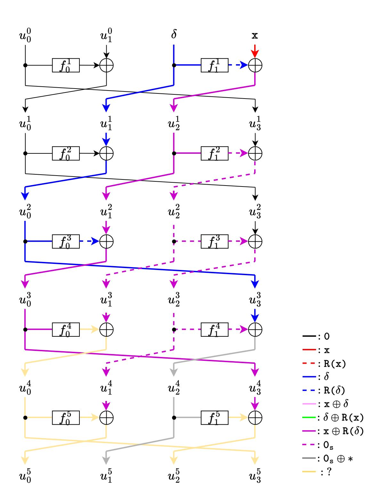

<span id="page-53-0"></span>Fig. 32: 5-round distinguisher of Type-2 GFS.

{54}------------------------------------------------

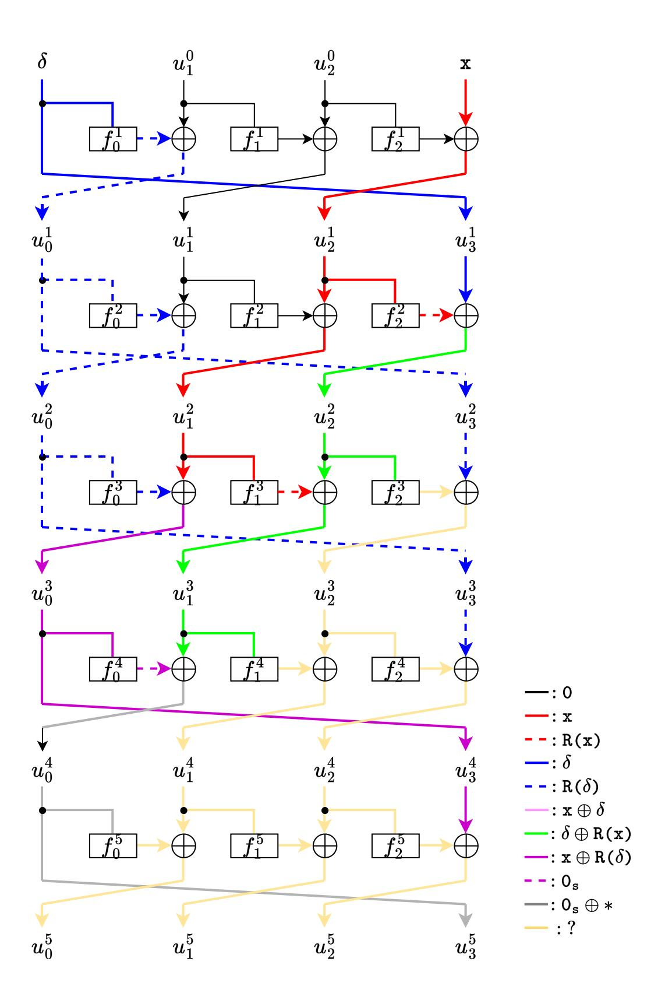

<span id="page-54-0"></span>Fig. 33: 5-round distinguisher of Type-3 GFS.

{55}------------------------------------------------

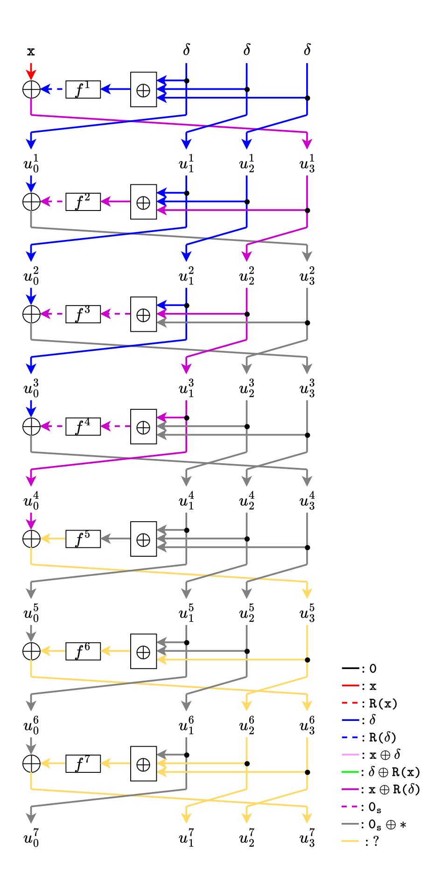

<span id="page-55-0"></span>Fig. 34: 7-round distinguisher of SM4.

{56}------------------------------------------------

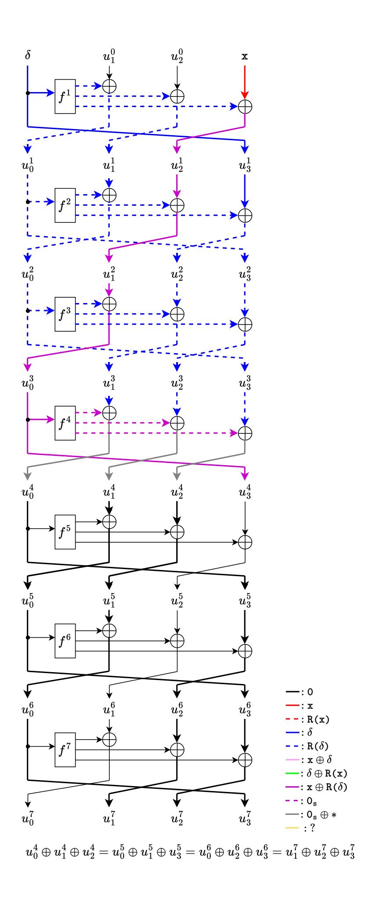

<span id="page-56-0"></span>Fig. 35: 7-round distinguisher of MARS.

{57}------------------------------------------------

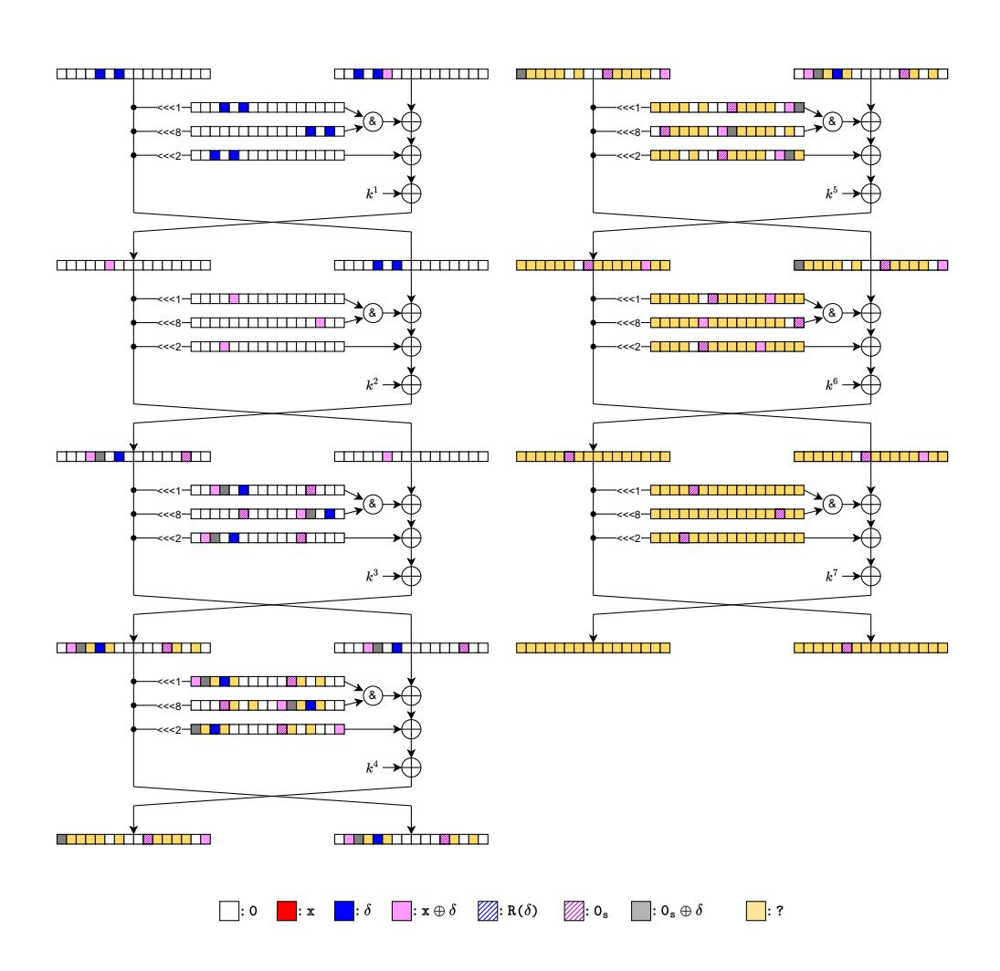

<span id="page-57-0"></span>Fig. 36: 7-round distinguisher of SIMON-32.