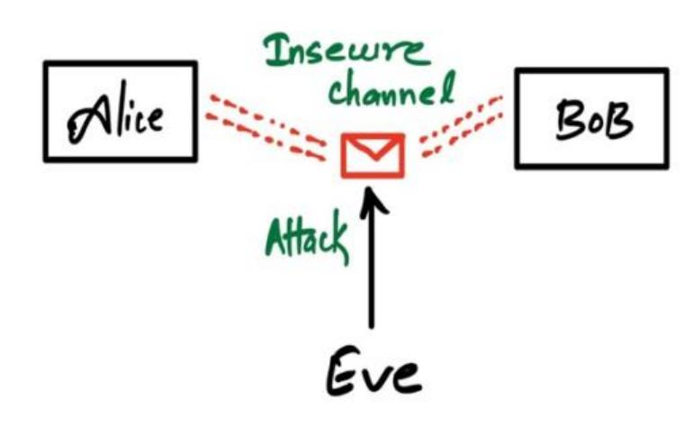
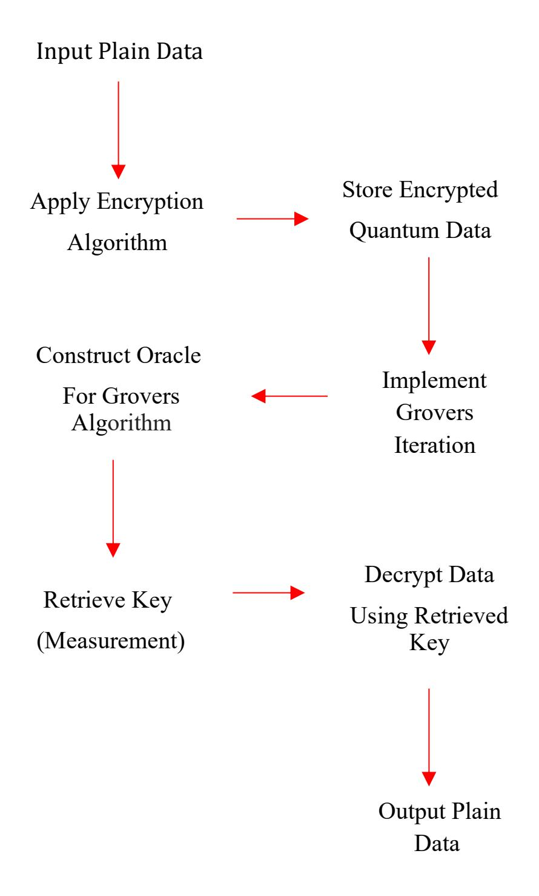
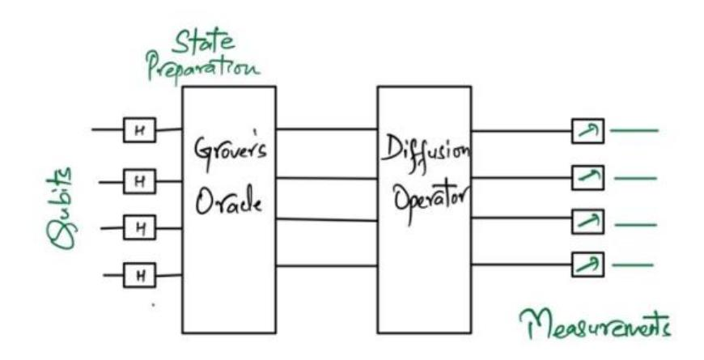
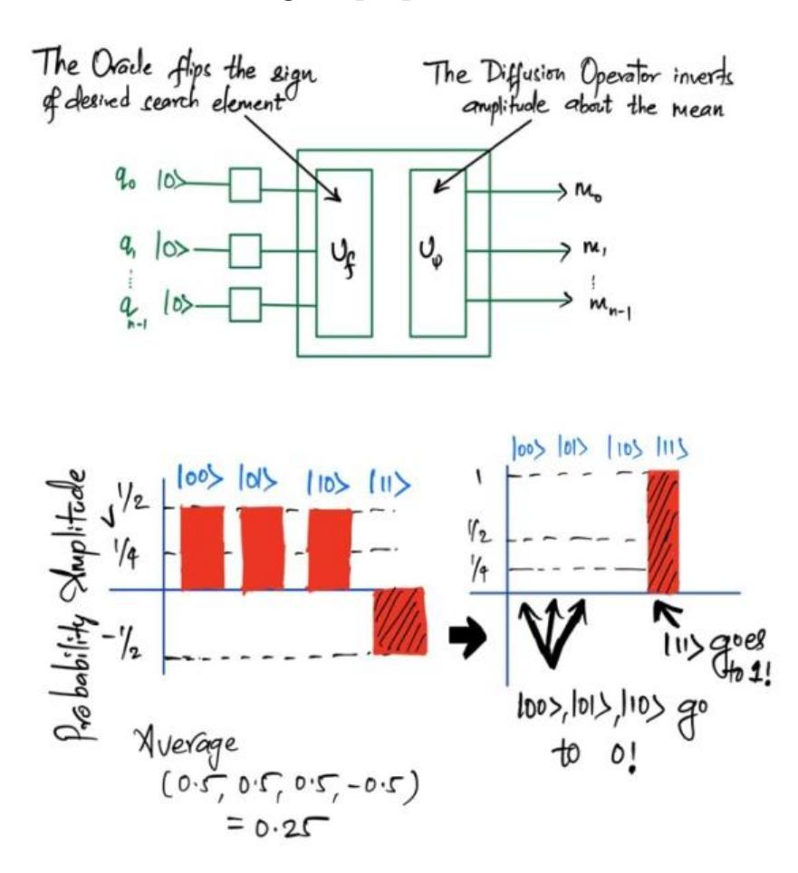
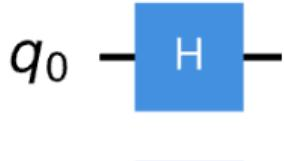
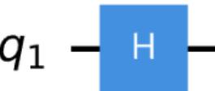
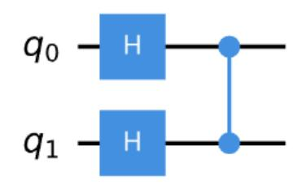
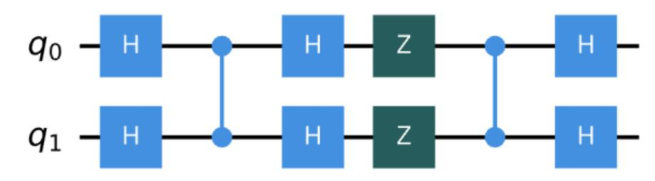
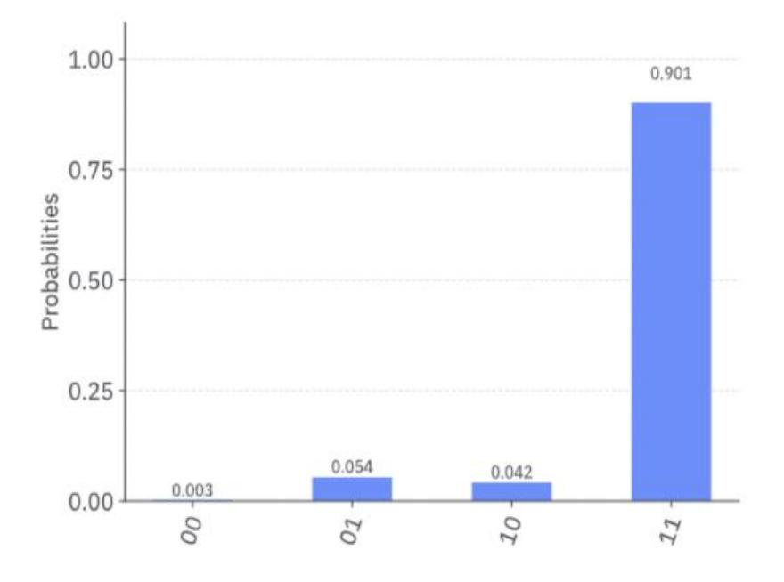

{0}------------------------------------------------

# The Role of Quantum Computing in Enhancing Encryption Security: A Review

Aashika Khanal University College of Engineering Punjabi University Patiala, India aashika.mtech2023@csepup.ac.in

Navjot Kaur Department of computer science and engineering Punjabi University, Patiala navjot@pbi.ac.in

*Abstract***—This paper examines how quantum computing enhances the encryption system. It studies the relationship between cryptography and quantum physics. The paper considers the historical progression of encryption techniques paying attention to the altering nature of security challenges. Moreover, it analyzes the basic principles of quantum computing, describing its theoretical concept and its advantages over classical systems in terms of potential performance. Also, it focuses on an in-depth analysis of Grovers' Algorithm showing its unique searching capability and its implications for encryption schemes. The paper also reviews the limitations of Grover's Algorithm that could make it vulnerable to attacks and how to make it safer. Also, the methods of quantum computing that create strong encryption are briefly outlined. Overall, in the quest for secure systems of communication in the era of quantum, the paper aims at the futuristic paradigm shift by considering the emergence of Quantum-Powered Encryption Systems. It answers key questions about this subject through both, qualitative and quantitative analysis. The provided scientific report supplements the existing body of knowledge about the relationship between quantum computers and encryption systems and sets the foundation for better and more secure encryption for the digital world.**

*Keywords—Quantum-safe transition, post-quantum cryptography, quantum-resistant, key distribution, information infrastructures, Grover's algorithm, Qiskit*

# I. INTRODUCTION

In today's world, the safety of information is much more significant. Encryption can be compared to a strong wall that protects data from being viewed or stolen by those who do not have access to it. Over the years, encryption has become more intelligent by using technology. With the development of Quantum computing, which can perform tasks that simple computers cannot perform, we are entering into a new era. This is exciting but brings new challenges for how we keep our information safe. In this section, we'll dive deeper into what encryption is, how it has changed over time, and what quantum computing means for that [1].

# *A. Evolution of Encryption*

Imagine that we can lock our diary with a secret code. It functions somewhat similarly to how encryption protects our digital data. In earlier days, people kept secrets using simple methods, such as rearranging words or changing letters in a message. As technology advances, encoding information has become more sophisticated. So, we developed different ways to encode our data using complex mathematics as a result, it became difficult to crack the code. For example, think of a password that we use to protect our data on our phones or computers from unauthorized access. That's a form of encryption too! In simple words, we can understand encryption as the process of converting plain text (our data) into cipher text (a secret code), to prevent unauthorized access.

#### *B. A brief roadmap of the encryption technique*

In the historical period, encryption methods were simpler than today's standards. People employed substitution ciphers, where letters were replaced with other symbols. Caesar Cipher, created by Julius Caesar, is an example of a message that is encoded by shifting each letter in the message by a fixed number of positions in the alphabet. The Enigma machine used by the Germans during World War II set a new milestone in encryption technology. It operated by changing letter substitutions daily, making it difficult to decrypt. However, the field of cryptography kept moving and using methods like frequency analysis. This technique enabled analysts to decode substitution ciphers by analyzing the frequency of letters within the encrypted message. Through systematic examination, patterns could be found and could figure out the original message. This helps to decrypt substitution cipher [\[2\]](/var/folders/01/7ch87rjd5gv1hzlyz_q9__100000gn/T/net.whatsapp.WhatsApp/documents/70E51A3B-2D50-4FD3-9577-CA07915588DD/Quantum%20computing;%20Vision%20and%20Challenges.pdf). As computers grew more advanced, encryption techniques also became more sophisticated. The modern computer's encryption technique is divided into symmetric and asymmetric encryption.

**Symmetric encryption** uses the same key for both encryption and decryption. It's like having a single key to lock and unlock a box. For example, imagine that a sender wants to send a secret message to a receiver using symmetric encryption. They agree on a secret key, let's say "KEY1'''. The sender uses this key to encrypt her message, turning "DANKE" into something like "ANEDK" and sending this encrypted message to the receiver. To read it, the receiver needs the same key, "KEY1" and uses it to decrypt the message, turning "ANEDK'' back into "DANKE". Algorithms like Data Encryption Standard (DES) and Advanced Encryption Standard (AES) are commonly used symmetric encryption algorithms. The main challenge with symmetric encryption is securely sharing the key. So, they use asymmetric encryption for secure key exchange over unsafe channels. This method works with a pair of keys – a public key and a private key. Public key (open for everyone) and private key (with receiver only). Think of it like having a lock and a key that is uniquely matched.

Also, in **asymmetric,** by using the receiver's public key, the sender can encrypt a symmetric key and send it to the receiver. This creates a secure channel for future 

{1}------------------------------------------------

communications with the symmetric key, which is used to encrypt and decrypt messages. Imagine a sender who wants to share a secret message with a receiver. The receiver already has two keys: a public key they've shared with everyone and a private key they keep hidden. The sender uses the receiver's public key to lock (encrypt) the message, making it unreadable to anyone else. When the receiver gets the message, they use their private key to unlock (decrypt) it. Even if someone has access to the receiver's public key, they cannot encrypt the message without the private key. RSA (Rivest-Shamir-Adleman) and Diffie-Hellman are commonly used asymmetric encryption algorithms.

With asymmetric encryption, the problem of securely sharing keys is also solved. The receiver now openly shares his public key with everyone, but only the receiver knows the private key. It's like a mailbox where anyone can drop in letters (using the public key), but only the mailbox owner (with the private key) can open them.

How it works? Suppose Alice and Bob are two parties, sender, and receiver. Bob generates a public and a private key, and then shares the public key with Alice but keeps the private key secret. Alice encrypts a Symmetric key which will be used to encrypt the actual message by using BOB's public key and sends it to Bob. Bob decrypts the symmetric key using his private key. Now, both Alice and Bob have the same symmetric key, which they use for secure communication. If Eve has a powerful quantum computer, she can use Quantum algorithms to break the RSA and AES encryption, as a result, Eve could decrypt all messages between Alice and Bob as shown in Fig. 1 [3].



Fig. 1. Communication between Alice and Bob is intercepted by Eve. Here channel is insecure which means that information is not encrypted by a cipher, thus vulnerable to attacks by Eve.

The main drawback to traditional encryption is it is vulnerable to Quantum Computing. The traditional encryption system uses algorithms like DSA, RSA, and AES, which are based on mathematical problems like factoring large numbers or solving discrete logarithms, which are difficult for classical computers to solve efficiently. However, these problems can be solved quickly using Quantum Computing, which means Quantum computers could theoretically break RSA and DSA encryption by factoring large numbers much faster than classical computers can. This means Eve could decrypt all messages between Alice and Bob.

Now advancement in cryptography is **quantum computers and their algorithms.** Let's first discuss what quantum computing is and its algorithms. Quantum computers are supercomputers that are built on the law of physics and function similarly to classical computers, but instead of using traditional bits, they use an extraordinary quantum mechanical property of computation called quantum bits or Qubits. Qubits means particles can be in more than one place or more than one state at the same time.

**E.g.,** For a coin, when we toss it in the air, the coin will be in more than two states at the same time i.e. head and tail. But when it comes down, the state will be changed to either head or tail (0 or 1).

#### *C. Understanding Quantum Computing*

Quantum computing operates on the fundamental principles of quantum mechanics, which describe how very tiny particles like electrons and photons behave. Quantum computing is very special because of the concept of a quantum bit, or qubit, which serves as the basic unit of information and can exist in a superposition of both states simultaneously. As a result, this allows quantum computers to perform multiple calculations in parallel, which exponentially increases the computational power of quantum systems compared to classical computers. Qubits store encoded information using two orthogonal states of a microscopic object, such as the spin of an electron or the polarization of a photon. These states form the basis for manipulating and processing quantum information. By carefully controlling and manipulating the states of qubits, quantum computers can perform complex calculations and solve problems that are nearly impossible for classical computers. To solve a problem using a quantum computer, qubits are initialized in certain initial states that represent the input data. Quantum operations, such as quantum gates, like logic gates in classical computing are then applied to manipulate the states of the qubits, which transforms the initial state into the desired output state that represents the solution to the problem. Quantum algorithms take advantage of the principles of superposition and entanglement to efficiently search through vast solution spaces and find optimal solutions to complex problems [4] [5]. By using the inherent parallelism and entanglement of quantum systems, quantum computers promise to revolutionize cryptography, optimization, and drug discovery by solving problems currently unsolvable for classical computers. Quantum computers are in the verse of their successful development, which could revolutionize encryption because of their fast, efficient, and secure search algorithms.

#### *D. Quantum Computing Algorithms*

Let's talk about different types of algorithms used in Quantum computing based on their complexities.

- Shor's Algorithm is used for factoring large numbers and easily breaks certain types of encryptions (like RSA). For, if we want to find the prime factors of a large number, say 15, classical methods try dividing by possible factors until they find 3 and 5. With a large number like 2048-bit RSA encryption, this process will take classical computers years. Shor's algorithm can perform this much faster, threatening traditional encryption security.
- Grover's Algorithm is known for its ability to perform unstructured search tasks with a quadratic speedup over classical algorithms. From a geometric point of view, Grover's algorithm can be interpreted as a rotation in a high-dimensional space towards the target state. In a

{2}------------------------------------------------

regular search, you need to look through all N items to find a specific target value. Grover's algorithm can find the target item with only √N tries. E.g.: if you have a list of 100 numbers and try to find a target value. In classical, you must try all 100 possibilities, but the Grovers algorithm only needs about 10 tries.

- Quantum Key Distribution (QKD) is not used to encrypt messages but rather to make secure key exchange between 2 parties. It works by sending photon light particles that only travel in a single direction across a fiber optic cable with each photon particle representing a single bit or qubit. The sender and receiver compare the sent photon positions to decoded positions, and the set that matches becomes the key. If they detect a change in the quantum state of the photons, they'll know that someone is eavesdropping.
- Variational Quantum Eigen Solver (VQE) is a method used in chemistry and optimization to find the lowest energy state of a molecule, combines quantum with classical computing, where a quantum computer explores different solutions, and a classical computer picks the best solution. This algorithm is useful in those areas of chemistry where calculating the electronic structure of molecules is nearly impossible for classical computers.
- Quantum Fourier Transform (QFT) is the quantum version of the classical Fourier Transform, which converts quantum states into different frequency components, that help to identify patterns in data. It is exponentially faster than Classical Fourier Transform.

#### II. RELATED WORK

Utilizing the principles of quantum computing, such as entanglement and uncertainty, Quantum Computing aims to create encryption keys that are nearly impossible to break. Also, it offers the ability for real-time detection of quantum attacks, providing alerts to legitimate parties.

In 2022, the researchers in the paper [5] investigated the fundamentals, implementations, and real-world uses of quantum computing, which highlighted its transformative potential. The power of quantum computing lies in its key elements like qubits and quantum gates, which unlock a level of computational power far beyond what classical computing can achieve. Using strategies such as spin transfer torque (STT) offers pathways for building quantum computing architectures, thereby taking advantage of unique physical phenomena for enhanced performance. Furthermore, the paper dives into the rapidly growing field of quantum cryptography, where the principles of quantum mechanics provide unmatched security levels. By bringing these key components together, the review highlights how quantum computing is set to play a role in shaping the future of both computation and information security.

In particular, the authors [6] discuss in detail the application of quantum principles, such as the uncertainty principle and the no-cloning theorem, to encryption techniques. Through comprehensive research and analysis, the paper explains how these foundational principles can be used to develop encryption systems that utilize quantum mechanics to achieve unprecedented levels of security and privacy in communication. Nielsen and Chuang's work provides theoretical insights and real-world applications, making it a key resource for researchers and practitioners seeking to harness the power of quantum computing for cryptographic purposes.

An interdisciplinary perspective on quantum computing use cases is explained in detail in the paper [4], which explores the dynamic landscape of quantum computing and highlights its diverse impacts across different application domains. Understanding the complexities of the quantum computing ecosystem demands a robust framework that encompasses the dynamics of technology adoption challenges, interdisciplinary research initiatives, and market disruption. A collaborative ecosystem approach emphasizes the importance of coordination among various stakeholders, including governmental agencies, businesses, and researchers, to effectively address these complexities. As quantum technologies continue to advance, factors like security, political consequences, and strategic marketing approaches are becoming key factors that shape the quantum computing landscape and affect its significant impact on the global economy.

The paper [2] explains the current state and future challenges of quantum computing technology. Researchers are studying how quantum computing intersects with a variety of key technological areas. It discusses how quantum computing could transform fields like artificial intelligence and machine learning by revolutionizing data processing and pattern recognition. It also explores the implications of quantum computing on cloud computing, cryptography, and cybersecurity, and highlights the importance of quantum-resistant encryption methods for protecting sensitive data. The paper also explains the concept of qubits, which are essential for quantum information processing and contribute to the incredible computational power of quantum computers. Overall, the paper provides valuable insights into the opportunities and challenges associated with the development of quantum computing technology.

[7] explores the new paradigm of quantum cloud computing, by integrating quantum computing with cloud infrastructure which has the potential to revolutionize data processing and computation. Although quantum computing is still a nascent and expensive technology, it is an attractive addition to cloud systems because it offers exceptional computing power to handle complex and data-intensive tasks. This paper highlights the benefits of having quantum computing over classical methods, particularly in terms of processing speed and efficiency, and discusses how quantum computing can be integrated into cloud environments to provide these powerful resources to users via isolated remote servers. However, it also addresses significant challenges and research gaps in quantum cloud computing, such as the qubit stability and the efficient allocation of quantum resources, which require further investigation. Additionally, it also discusses the use of quantum computing on cloud systems, including cost, security, and scalability, and raises questions about the practicality and sustainability of these systems as they scale. Overall, the paper provides a comprehensive overview of quantum cloud computing, identifying both its transformative potential and the challenges that need to be addressed to fully realize its benefits, using keywords that reflect the interdisciplinary nature of the research.

A thorough analysis of the challenges quantum computing poses to cybersecurity, particularly in protecting critical infrastructure is given in [8]. Researchers have explained that as quantum computing advances, conventional cryptographic methods are increasingly at risk, driving the need for quantum-resistant security strategies. The paper highlights the potential vulnerabilities 

{3}------------------------------------------------

across various infrastructure layers including applications, data, runtime, middleware, operating systems, virtualization, hardware, storage, and networks, highlighting the urgency of developing and implementing quantum-resistant cryptographic solutions to protect infrastructures and cloud services. Advocating for innovative security strategies and cross-disciplinary collaboration, the paper introduces a baseline vulnerability and risk assessment and proposes a tailored security plan to enhance the protection of nine critical infrastructure components. This survey not only anticipates the quantum threats but also provides a detailed framework for improving infrastructure and cloud security, emphasizing the importance of proactive measures in the quantum era.

In 2022, researchers [1] explored how cryptography systems are impacted by quantum computing. It discusses recent achievements and challenges in this area. It explains how powerful quantum computers can be and why new encryption methods are needed to protect them, especially since Shor's algorithm can break asymmetric cryptography. The paper also looks at Grover's algorithm, which speeds up the search for encryption keys. It discusses asymmetric and symmetric cryptography to help us understand how quantum computing will revolutionize cryptography and how it can protect your data. Grover's algorithm presented here achieves approximately 50% accuracy in finding the correct key in symmetric encryption scenarios, which is significantly better than classical brute-force methods. Grove's algorithm is one of the most basic quantum algorithms known for its ability to perform unstructured search tasks with a quadratic speed over classical algorithms. Geometrically, Grover's algorithm can be viewed as a many-dimensional rotation towards the target state.

In 2023, [9] depicted the use of Grover's algorithm and discussed the idea of secure communication using Grover's algorithm by combining the techniques of quantum mechanics and Grover's algorithm. In this paper, we explore how quantum cryptography provides unrivaled security against classical and quantum adversaries using qubits, the fundamental unit of quantum information processing. The core of his methodology is the use of Grover's algorithm, which significantly reduces the time required for key distribution and encryption, thereby improving the efficiency of cryptographic protocols. This paper innovatively integrates quantum principles and algorithmic optimization to demonstrate how Grover-based quantum cryptography has great potential to address the new challenges of secure communications in an increasingly interconnected world.

In 2022, [10] explore the complexity of implementing Grover's algorithm on 2-, 3- and 4-qubit systems in Quantum Programming Studio. The new mechanism is based on Grover's algorithm, quantum search, in which quantum parallelism and amplitude gain are used to speed up searching. This work addresses the difficulty of designing quantum circuits, mainly concentrating on key units such as quantum oracles, qubit operations, Hadamard transforms, and phase shifts. Using these quantum operations, the algorithm finds the search space exponentially faster, which performs a notable advantage over classical algorithms. This work provides insight into the practical applications of Grover's Algorithm and discusses the potential for it to be a game changer in quantum programming studios.

The disruption of classical cryptography by quantum algorithms which centered around the Shor and Grover algorithm comes from the 2018 work of researchers [11] come to re-evaluate the implications of quantum computers in the modern cryptographic paradigm. The paper analyzes the destructive potential of Shor's and Grover's algorithms and illustrates the coming threat they represent to asymmetric and symmetric cryptosystems. It reflects upon the post-quantum cryptographic schemes, illustrating the growing necessity for shifts towards quantum-secure cryptography to fortify sensitive data and communications infrastructures against the looming threat posed by quantum computing.

Another algorithm **Quantum Key Distribution Protocols,** which are used for secure exchange keys between two parties provides a comprehensive analysis of various Quantum Key Distribution (QKD) protocols, including Continuous-Variable QKD (CV-QKD), Discrete-Variable QKD (DV-QKD), Measurement-Device-Independent QKD (MDI-QKD), and others in [12]. It explores the fundamental principles of quantum cryptography and studies how these protocols solve the secure key distribution in the presence of potential eavesdroppers. By comparing the strengths and weaknesses of different QKD approaches, the review sheds light on the status of quantum cryptography and its potential applications in enhancing the security of communication networks. Protocols for quantum cryptography such as BB84, E91, and BBM92 employ quantum phenomena including superposition and entanglement to enable secure communication.

Researchers [13], provide an in-depth review of the BB84 protocol, the cornerstone of quantum key distribution (QKD) protocol. Using an extensive analysis, the article dives into the principles behind BB84, detailing its security and reliability when transmitting cryptographic keys. With a focus on QKD, quantum bits, and quantum cryptography, the study explores the complexities of the quantum-based approach of BB84 to secure key distribution. This sheds light on the theoretical foundations and practical implementations of BB84, providing valuable insights into the development of quantum cryptographic techniques, and offering a roadmap for improving security in digital communication.

AI algorithms integrated with quantum cryptographic methods like QKD protocols such as **BB84 and EBB84**, aim to enhance security and efficiency in key distribution processes is discussed in [14], explores the intersection of artificial intelligence (AI) and quantum cryptography, two rapidly emerging fields that are poised to redefine digital security. Technological advances in AI and quantum computing have significantly influenced quantum cryptography and AI methodologies are increasingly being considered as tools to improve the efficiency and robustness of cryptographic systems. AI, especially neural networks, offers promising potential for developing more complex and secure cryptographic algorithms. However, the advent of quantum computing poses a formidable challenge, known as the "quantum threat," which threatens the security of existing cryptographic protocols. Despite this threat, the integration of AI into cryptography, especially quantum cryptography, opens new possibilities for building resilient security frameworks. The paper delves into the potential benefits of AI-based cryptography, emphasizing how AI can be utilized to develop adaptive and more secure encryption methods. It also explores the 

{4}------------------------------------------------

challenges of merging these technologies, such as ensuring that AI-enhanced cryptographic systems can withstand the computational power of quantum computers. The applications and implications of this interdisciplinary research are vast, as they suggest that the future of digital security may largely depend on the synergy of AI and quantum cryptography. This review emphasizes the importance of continued research in this area and recognizes its potential for information security in an era when traditional cryptographic approaches are no longer sufficient. **"Lattice-based and hash-based"** classical quantum resistant cryptographic algorithms which are designed to resist quantum attacks. Unlike QKD, which is hardware-based, post-quantum algorithms can be implemented on standard computers and don't require a quantum computer.

[15], provides a comprehensive overview of latticebased cryptography, focusing on its application, areas of interest, and prospects. Exploring the complex mathematics of lattices and their cryptographic implications, the paper examines how lattice-based cryptosystems provide strong security against attacks, particularly in the context of postquantum cryptography. Through a thorough analysis of the resilience to quantum threats, including lattice-based algorithms and Shor's algorithm, the paper highlights the growing importance of lattice-based cryptography in mitigating vulnerabilities introduced by quantum computing. This paper contributes to the development and prospects of the field of cryptography by identifying new research directions and potential applications.

[16] provides a comprehensive survey on the design and implementation of hash and encryption engines leveraging quantum computing. By exploring the intersection of cryptographic primitives such as hashing, encryption, and decryption, the paper demonstrates the potential of quantum algorithms to improve the security and efficiency of data protection mechanisms. Through an analysis of existing research and developments in quantum cryptography, the paper evaluates the feasibility and practicality of utilizing quantum computing for designing robust hash and encryption engines. This review focuses on innovative approaches and emerging trends that contribute to the development of quantum cryptography methods and their integration into modern computing systems.

The paper [17] discusses fundamental post-quantum algorithms designed to protect against quantum attacks and their implications for modern cryptography. The researchers provide a comprehensive analysis of how quantum computing threatens modern cryptographic methods, emphasizing the urgent need for post-quantum algorithms. As quantum computing advances rapidly, it poses a significant risk to existing public-key cryptographic systems, required for secure online transactions. The article emphasizes that quantum-resistant alternatives are of greatimportance, as commercial quantum computers with enormous computing power have the potential to crack all current cryptographic methods. It also explores quantum cryptography as a promising solution, emphasizing the development of techniques for secure key distribution that remain robust even against the most general quantum attacks. Additionally, the paper discusses the challenges protocol designers face when implementing these quantumresistant algorithms, which are essential for the future security of digital communications. Overall this study focuses on the intersection of quantum computing and cryptography, highlighting the need for innovative approaches to address the emerging quantum threats.

A critical need to move towards quantum-safe (QS) cryptography in the face of emerging threats from quantum computing is discussed in [18], Since quantum computers have the potential to break the cryptographic algorithms that underpin modern information infrastructures, there is an urgent need for development and adoption of QS cryptographic solutions. However, this article highlights that despite significant progress in the development of QS algorithms, relatively little attention has been paid to the institutional, organizational, and political issues associated with the transition to these new systems. Through empirical analysis and interviews with experts and practitioners from the Dutch government, the study demonstrates the interconnected nature of these challenges and highlights that solutions for QS transitions are currently scattered. This fragmentation could lead organizations into a Catch-22 situation, where they struggle to implement QS transitions effectively without further actionable approaches and comprehensive planning. The paper underscores the need for coordinated policy guidance and strategic planning to facilitate a smooth and secure transition to quantum-safe cryptography, and to ensure the security of information infrastructure in the quantum era. The keywords such as quantum-safe transition, postquantum cryptography, information infrastructures, information sharing, digital government, policy recommendations, adoption, and Implementation demonstrates the focus of this article on the multidisciplinary challenges and necessary actions for achieving quantum-safe information sharing.

[19], Focus on the introduction of a scalable Grover's Quantum Search algorithm implemented using 5-qubit and 6-qubit quantum circuits. The authors criticize that these implementations are limited to smaller qubit systems (2–4 qubits) and call for exploration of a larger search space. In this paper, we present a V-shaped oracle design that reduces the number of gates to reduce the possible gate errors and is easily scalable to larger numbers of qubits. The experiments were performed on IBM Q. Each plan ran 1024 averages, and a high accuracy of 90% was observed for the proposed plan. These results were compared with the state-of-the-art solutions for 3- and 4-qubitsystems. Both performance and scalability have been reported to have improved.

Here, the recent works in Quantum Computing is now summarized in following Table 1.

{5}------------------------------------------------

TABLE I. *SUMMARIZES THE RECENT WORKS IN THE AREA OF QUANTUM COMPUTING.*

| Reference<br>Number | Title and<br>Published Date                                                                | Journal                                                                            | Techniques/<br>algorithms used                                               | Accuracy                                                                            | Conclusion                                                                                                                            |
|---------------------|--------------------------------------------------------------------------------------------|------------------------------------------------------------------------------------|------------------------------------------------------------------------------|-------------------------------------------------------------------------------------|---------------------------------------------------------------------------------------------------------------------------------------|
| [1]                 | Review on<br>Cryptography<br>Using Quantum<br>Computing<br>(2022)                          | International<br>Journal<br>for Modern Trends in<br>Science<br>and<br>Technology   | Shor's Algorithm<br>and Grover's<br>Algorithm                                | Shor's Algorithm: 100%<br>Grover's Algorithm: 50%                                   | •<br>Urgent Need for Quantum<br>Solutions<br>•<br>Future of Cryptography<br>•<br>Call for Collaboration                               |
| [2]                 | Quantum<br>Computing: Vision<br>and Challenges.<br>(2024)                                  | Technical Report for<br>knowledge sharing                                          | Shor's<br>Algorithm<br>and<br>Grover's<br>Algorithm                          | Shor's Algorithm: 100%<br>Grover's Algorithm: 75-<br>90%                            | •<br>Interdisciplinary Approach<br>Required<br>•<br>Long-Term Vision<br>•<br>Policy Implications                                      |
| [9]                 | Quantum<br>Cryptography<br>Based on Grover's<br>Algorithm.<br>(2012)                       | Journal of Information<br>Security Research                                        | Grover's Algorithm                                                           | Grover's Algorithm: 90%                                                             | •<br>Significant Advancements<br>in<br>Security<br>•<br>Practical<br>Implementation<br>Feasibility<br>•<br>Future Research Directions |
| [4]                 | Framework for<br>Understanding<br>Quantum<br>Computing Use<br>Cases<br>(2023)              | Elsevier                                                                           | Shor's<br>Algorithm<br>and<br>Grover's<br>Algorithm                          | Shor's Algorithm: 100%<br>Grover's Algorithm: 80-<br>90%                            | •<br>Framework for Future Research<br>•<br>Importance of Collaboration<br>•<br>Addressing Research Gaps                               |
| [5]                 | Quantum<br>Computing<br>Fundamentals,<br>Implementations<br>and<br>Applications.<br>(2022) | IEEE Open Journal of<br>Nanotechnology                                             | Shor's Algorithm,<br>Grover's Algorithm,<br>Quantum Key<br>Distribution (QKD | Shor's Algorithm: 100%<br>Grover's Algorithm: 75-<br>85%<br>QKD protocols: over 95% | •<br>Foundational Resource<br>•<br>Call for Continued Research<br>•<br>Future Directions                                              |
| [10]                | Design of Grover's<br>Algorithm over 2, 3<br>and<br>4-Qubit<br>Systems (2022)              | International<br>Journal<br>of<br>Electronics<br>and<br>Telecommunications         | Grover's Algorithm                                                           | High Accuracy                                                                       | •<br>Significance<br>of<br>Grover's<br>Algorithm                                                                                      |
| [12]                | An Overview of<br>Quantum Key<br>Distribution<br>Protocols (2018)                          | Information<br>Technology and<br>Management Science                                | Various<br>QKD<br>Protocols                                                  | Variable Accuracy                                                                   | •<br>Advancements in QKD                                                                                                              |
| [11]                | The Impact of<br>Quantum<br>Computing on<br>Present<br>Cryptography<br>(2018)              | International<br>Journal<br>of<br>Advanced<br>Computer Science and<br>Applications | Shor's Algorithm and<br>Grover's Algorithm                                   | High Accuracy                                                                       | •<br>Need for Post-Quantum<br>Cryptography                                                                                            |

{6}------------------------------------------------

| [6]  | Quantum<br>Computation and<br>Quantum<br>Information (2010)                                                                     | United<br>States<br>of<br>America by Sheridan<br>Books, Inc.                            | Shor's<br>Algorithm,<br>Grover's<br>Algorithm,<br>Quantum<br>Error<br>Correction Algorithms                                 | High Accuracy                                 | •<br>Understanding quantum<br>computation is essential for<br>future advancements in<br>technology and information<br>security.                                                                   |
|------|---------------------------------------------------------------------------------------------------------------------------------|-----------------------------------------------------------------------------------------|-----------------------------------------------------------------------------------------------------------------------------|-----------------------------------------------|---------------------------------------------------------------------------------------------------------------------------------------------------------------------------------------------------|
| [13] | Comprehensive<br>Study of BB84, A<br>Quantum Key<br>Distribution<br>Protocol (2023)                                             | International Research<br>Journal of Engineering<br>and<br>Technology<br>(IRJET)        | BB84<br>Protocol<br>(Quantum<br>Key<br>Distribution)                                                                        | High Accuracy                                 | •<br>QKD algorithms, particularly<br>BB84, are among the most<br>secure methods for key<br>distribution in the quantum era.                                                                       |
| [15] | Lattice<br>Based<br>Cryptography:<br>Its<br>Applications, Areas<br>of Interest & Future<br>Scope (2019)                         | International<br>Conference<br>on<br>Computing<br>Methodologies<br>and<br>Communication | Lattice-Based<br>Cryptographic<br>Algorithms                                                                                | High Accuracy                                 | •<br>lattice-based cryptography is a<br>promising area for future<br>research and development,<br>particularly in the context of<br>emerging quantum computing<br>threats.                        |
| [16] | Designing Hash and<br>Encryption Engines<br>using<br>Quantum<br>Computing (2023)                                                | Not mentioned                                                                           | Quantum-based hash<br>functions and AES<br>128                                                                              | High Accuracy                                 | •<br>Quantum computing has the<br>potential to revolutionize<br>cryptographic practices by<br>providing new methods for<br>secure data transmission and<br>storage.                               |
| [14] | Artificial<br>Intelligence<br>and<br>Quantum<br>Cryptography<br>(2024)                                                          | Journal of Analytical<br>Science<br>and<br>Technology                                   | AI<br>algorithms<br>integrated<br>with<br>quantum<br>cryptographic methods                                                  | Moderate Accuracy                             | •<br>The convergence of AI and<br>quantum cryptography<br>represents a significant<br>advancement in securing<br>communication channels.                                                          |
| [8]  | Cybersecurity in the<br>Quantum<br>Era:<br>Assessing<br>the<br>Impact of Quantum<br>Computing<br>on<br>Infrastructure<br>(2024) | Nanotechnology<br>Perceptions<br>(ISSN<br>1660-6795)                                    | Lattice-Based<br>Cryptography,<br>Learning With Errors<br>(LWE),<br>Hash-Based<br>Signature,<br>Code<br>Based Cryptography. | High Accuracy                                 | •<br>Organizations must adopt<br>innovative security strategies<br>and conduct thorough risk<br>assessments to navigate the<br>complexities introduced by<br>quantum technologies<br>effectively. |
| [17] | A<br>SYSTEMATIC<br>SURVEY<br>ON<br>CRYPTO<br>ALGORITHMS<br>USING<br>QUANTUM<br>COMPUTING<br>(2023)                              | Journal of Theoretical<br>and<br>Applied<br>Information<br>Technology                   | Multivariate<br>Polynomial<br>Cryptography and<br>Isogeny-Based<br>Cryptography                                             | Moderate to High                              | •<br>A shift towards post-quantum<br>cryptography is essential to<br>ensure the security of digital<br>communications in the quantum<br>era.                                                      |
| [7]  | Quantum<br>Cloud<br>Computing: Trends<br>and<br>Challenges<br>(2024)                                                            | Journal of Economy<br>and Technology                                                    | Shor's Algorithm and<br>Grover's Algorithm                                                                                  | High accuracy for both<br>shor's and grover's | •<br>The urgency of preparing cloud<br>infrastructures for quantum<br>threats, advocating for research<br>into practical implementations<br>of quantum-resistant algorithms.                      |

{7}------------------------------------------------

| [18] | Realizing quantum     | Government            | Quantum-safe (QS)      | High accuracy              | • | Transition<br>to<br>quantum-safe  |
|------|-----------------------|-----------------------|------------------------|----------------------------|---|-----------------------------------|
|      | safe<br>information   | Information Quarterly | Cryptographic          |                            |   | cryptography<br>involves<br>much  |
|      | sharing               |                       | Algorithms             |                            |   | more than just developing new     |
|      |                       |                       |                        |                            |   | algorithms.                       |
|      |                       |                       |                        |                            |   |                                   |
| [19] | A<br>Scalable<br>5,6- |                       | Grover's algorithm,    | High Accuracy indicating a | • | The successful implementation     |
|      | Qubit<br>Grover's     | eprint                | with introduction of a | strong performance         |   | of a scalable Grover's quantum    |
|      | Quantum<br>Search     | arXiv:2205.00117      | V-shaped Oracle        | compared to existing       |   | search algorithm using 5-qubit    |
|      | Algorithm (2022)      |                       | design.                | implementations for        |   | and 6-qubit circuits by           |
|      |                       |                       |                        | smaller qubit systems (3-  |   | introduction of V-oracle pattern. |
|      |                       |                       |                        | qubit and 4-qubit)         |   |                                   |
|      |                       |                       |                        |                            |   |                                   |

According to summarized Table 1., Shor's algorithm achieves around 100% accuracy in breaking RSA encryption and factoring integers, Grover's algorithm is known for its ability to perform unstructured search tasks with a quadratic speedup over classical algorithms. Although its approximate 50% accuracy is lower than Shor's accuracy, Grover's no. of iterations can be optimized to enhance success rates, making it highly practical for encryption systems. So, Grover's algorithm was chosen for this research and its implementation will be discussed further.

## III. QUANTUM CRYPTOGRAPHIC METHODS AND CHALLENGES

Quantum Encryption systems use the unique features of quantum mechanics to enhance security and efficiency. Several techniques are employed in these systems to achieve robust encryption, one of them is

#### *A. Quantum Key Distribution (QKD)*

It enables the secure exchange of cryptographic keys between two parties by taking advantage of the uncertainty principle and the no-cloning theorem [6] of quantum mechanics. Quantum states are utilized to create cryptographic keys, ensuring that any eavesdropping attempts are detectable. The Heisenberg uncertainty principle implies that when you measure a quantum state, it will change. In the context of QKD, this means that an eavesdropper observing the data stream will physically change the values of some of the bits in a detectable way [21]. As discussed in [21], the no-cloning theorem states that it is physically impossible to make a perfect copy of an unknown quantum state. This means that an attacker can't duplicate a bit in the data stream to only measure one of the copies in hopes of hiding their spying. [20] explains there exist properties of quantum entanglement that set fundamental limits on the information leaked to unauthorized third parties.

### *B. Quantum Cryptography Protocols*

Quantum Cryptography Protocols such as BB84, E91, and BBM92, use quantum properties like superposition and entanglement to achieve secure communication. These protocols work by encoding information onto quantum states and using quantum operations for key distribution and encryption. The BB84 protocol was developed by Bennet–Brassard in 1984 [13], which depends on the nocloning theorem [20], for non-orthogonal quantum states

briefly explains the Bennet–Brassard protocol working as follows: The sender (usually called Alice) sends out a series of single photons one by one. For each photon, she randomly picks one of two types of polarization: one is vertical/horizontal, and the other is angled by 45. She also picks a random polarization direction for each photon. The receiver (called Bob) detects the polarization of the incoming photons, also arbitrarily selecting the base states. [23] This means that on average half of the photons will be determined with the "wrong" base states, i.e. with states not corresponding to those of the sender. Later, Alice and Bob use a public communication channel to talk about which polarization base they each used, but not the specific directions.

By doing this, they can figure out which of the photons were by chance preserved with the same base states on both sides. Then they discard all photons with a "wrong" basis and keep the ones that match. These remaining photons give them a sequence of bits that should be the same for both, assuming no one interfered with the transmission. To check if the transmission is secure or not, they can test by comparing some number of the obtained bits via the public information channel. If those bits match, they can be confidentthat the other ones are also correct and can finally be used for the actual data transmission.

## *C. Quantum- resistant Cryptographic Algorithms*

They are designed to protect data from quantum computer attacks, while traditional cryptographic algorithms, such as RSA, AES, and ECC, are vulnerable to quantum computer attacks. These algorithms, such as lattice-based cryptography and hash-based cryptography, are designed to remain secure even when facing quantum threats.

#### *D. Lattice-based Cryptography*

It relies on complex mathematical problems related to lattices in high-dimensional spaces. It uses hard lattice problems, such as the Shortest Vector Problem (SVP) or the Learning with Errors (LWE) problem, to construct cryptographic primitives like encryption schemes and digital signatures [15]. Encryption schemes based on lattice problems are believed to be resistant to quantum attacks because these problems are tough for quantum computers to solve.

### *E. Hash-based Cryptography*

It uses properties of cryptographic hash functions, which are mathematical functions that take an input (or 

{8}------------------------------------------------

message) and produce a fixed-length string of characters, known as a hash value or digest. Types of hash-based signatures like Lamport and Merkle signature schemes, provide security using one-wayness and collision resistance properties of hash functions. Breaking this hash-based algorithm would require finding collisions in the hash function, which is believed to be computationally difficult even for quantum computers. One example of hash-based cryptography is the Merkle tree, which is used to organize data securely [16].

## *F. Post-quantum Cryptography*

It refers to new era of cryptographic algorithms that are believed to be secure against both classical and quantum attacks. The proposed algorithms undergo extensive analysis and testing to ensure they are both strong and efficient. This includes assessing their resistance to known quantum algorithms, like Shor's algorithm, and evaluating their performance in various scenarios, as it can break many current cryptographic methods. Some of the approaches code-based cryptography, multivariate cryptography, and hash-based cryptography, are being standardized to ensure long-term security in the era of quantum computing.

#### *G. Quantum Error Correction Codes*

They are crucial for protecting quantum information from errors and decoherence, which naturally occur in quantum computing systems. These codes enable the store and handle quantum states, ensuring the integrity of cryptographic operations.

### *H. Quantum Random Number Generators (QRNG)*

It uses the randomness inherent in quantum processes, like photon detection or quantum noise, to generate truly random numbers. These random numbers are crucial for making cryptographic keys and keeping encryption algorithms unpredictable and secure.

Let's talk about some potential challenges. Quantum computing has the potential to greatly improve digital security, however, there are several challenges it must overcome to fully integrate into encryption systems.

- **Quantum Algorithm Vulnerabilities:** Quantum algorithms like Shor's algorithm, can break the security of traditional cryptographic schemes, such as RSA and AES, by solving certain mathematical problems on which they rely. So, we need to move towards quantumresistant or post-quantum cryptographic algorithms.
- **Quantum Key Distribution Limitations:** Quantum key distribution (QKD) protocols offer a secure way to share encryption using properties of quantum mechanics. However, there are still some challenges related to scalability, distance limitations, and vulnerability to certain types of attacks, such as sidechannel attacks and Trojan horse attacks.
- **Quantum Error Correction Complexity:** Quantum computers are prone to errors and disturbances, as a result, there are challenges for implementing reliable quantum cryptographic protocols. Quantum error correction codes are essential for mitigating these errors, but it is complicated and create computational overhead during implementation.
- **Resource Requirements:** Quantum cryptographic protocols often require specialized, expensive hardware, such as quantum key distribution systems and

- quantum computers, which may be expensive and resource-intensive to develop and deploy.
- **Interoperability and Standardization:** The field of quantum cryptography lacks standardized protocols and interoperability standards, leading to compatibility issues across different implementations. To make quantum computing more widespread, common protocols and standards are needed.

### IV. RESEARCH METHODOLOGY

This chapter explains the methodology used to create a quantum encryption system using Grover's algorithm, a key algorithm in quantum computing known for its efficiency in searching large datasets. Grover's algorithm enhances encryption by significantly decreasing the time it takes to break cryptographic keys through brute-force attacks. Here, this section provides a structured outline of the design and implementation steps, including a step-by-step explanation of methodology, details of tools and platforms used, theoretical background, and a flowchart illustrating the encryption and decryption processes. Below is the flowchart illustrating the encryption and decryption processes using **Grover's algorithm:**



#### *A. Evolution of Encryption*

Encryption refers to converting any readable information (plain text) into a secure, unreadable format to protect it from unauthorized access. This can be achieved by encrypting the data with a security key, which can be either classical or quantum. In classical encryption, anyone who has access to the decryption keys can read the encoded 

{9}------------------------------------------------

information easily. However, in quantum, the principle of quantum mechanics is combined with the principles of encryption algorithms. Firstly, the system starts with plain text or any readable data as input. The input data is then encrypted using either classical encryption algorithms (e.g., AES, DES, RSA) or quantum encryption algorithms like BB84 Protocol and quantum random number generators (QRNGs) that generate truly random keys for encryption, ensuring unpredictability. The encrypted output is stored in a secure quantum memory, ready for future use.

#### B. Implementation of Grover's Algorithm

In contrast to the hardware-focused approach presented by [24] in implementing a 4-qubit Grover's algorithm on the IBM Q computer ibmqx5, this paper explores a software-centric approach using Qiskit. Implementation involves **state preparation**, **the oracle**, **and the diffusion operator**. [25]. The state preparation is where we create the search space, which is all possible cases the answer could take. In the list, the search space would be all the items of that list. The oracle is what identifies the correct answer, or answers we are looking for by flipping its sign, and the diffusion operator magnifies these answers and increases the probability of the correct state while lowering the probabilities of other states as demonstrated in [25], Grover's algorithm implementation step by step using Qiskit as shown in Fig. 2



Fig. 2. Grover's algorithm implementation.

**Initialization: Prepare the Qubits:** Start with n qubits, where n is the number of qubits needed to represent N items (specifically, N=2n). Apply a Hadamard gate to all qubits and transform the initial state (usuallsy all zeros) into a superposition of all possible states. Mathematically, for n qubits, the state becomes  $|\psi\rangle = \frac{1}{\sqrt{N}} \sum_{x=0}^{N-1} |x\rangle$ 

Oracle Function: Define the Oracle: It is a special quantum operation that identifies the correct answer by flipping the sign of the amplitude of the correct state (the item you are searching for). If the correct item is  $|w\rangle$ , the Oracle function O is defined as:

$$O|x\rangle = \begin{cases} -|x\rangle & \text{if } x = w \\ |x\rangle & \text{otherwise} \end{cases}$$

**Diffusion Operator (Amplification):** The diffusion operator increases the probability of the marked state (the correct answer) while reducing the probabilities of the other states. It first computes the average amplitude of all states. States below the average have their amplitudes increased, while states above the average will decrease their

amplitudes. Since the marked state has a negative amplitude after the Oracle is applied, this process increases its overall amplitude significantly. Each combination of the oracle and diffusion operator forms a single iteration of Grover's algorithm. Multiple iterations are applied  $(O(\sqrt{N}))$  times to maximize the chances of finding the correct solution. After the end, the quantum state is calculated to achieve the correct cryptographic key with high probability. A detailed explanation is provided using a diagram, as shown in Fig. 3. [26].



Fig. 3. How Grover's algorithm works.

Quantum encryption systems can be developed and tested using quantum simulators, such as Qiskit (IBM), [25], which provides quantum gate operations and Grover's algorithm implementation. We now implement Grover's algorithm for the above case of 2 qubits for  $|w\rangle=|11\rangle$ .

#initialization

import matplotlib.pyplot as plt

import numpy as np

**import** math

# importing Qiskit

from qiskit import IBMQ, Aer, transpile, execute

**from** qiskit **import** QuantumCircuit, ClassicalRegister, QuantumRegister

from qiskit.providers.ibmq import least\_busy

# import basic plot tools

from qiskit.visualization import plot histogram

We start by preparing a quantum circuit with two qubits:

n = 2

grover circuit = QuantumCircuit(n)

{10}------------------------------------------------

Then we simply need to write out the commands for the circuit depicted above. First, we need to initialize the state |s⟩. Let's create a general function (for any number of qubits) so we can use it again later:

```
def initialize_s(qc, qubits):
 """Apply a H-gate to 'qubits' in qc"""
 for q in qubits:
 qc.h(q)
return qc
grover_circuit = initialize_s(grover_circuit, [0,1])
grover_circuit.draw()
Output is:
```





Apply the Oracle for |w⟩=|11⟩. This oracle is specific to 2 qubits:

## Output is:



We now want to apply the diffuser (Us). As with the circuit that initializes |s⟩, we'll create a general diffuser (for any number of qubits) so we can use it later in other problems.

```
# Diffusion operator (U_s)
grover_circuit.h([0,1])
grover_circuit.z([0,1])
grover_circuit.cz(0,1)
grover_circuit.h([0,1])
grover_circuit.draw()
```

## Output is:



This is our finished circuit. After running Grover's algorithm, you can visualize the results in a histogram to see the probability distribution over the states [21].

## **Code:**

counts = result.circuit\_results[0]

#### plot\_histogram(counts)




## *C. Decryption*

Decryption is the process, where the encrypted data is turned back into its original content and made readable again using a key that was retrieved. It is the reverse of encryption. In the decryption phase, the oracle is reused to identify the key that was used during encryption. This key is retrieved by Grover's method. For classical algorithms, standard decryption procedures such as RSA decryption with a private key are applied and for quantum algorithms, quantum circuits perform decryption, using quantum properties like entanglement to ensure secure and efficient decryption. The plaintext produced is an output of the decryption process and is expected to be identical to the original input plaintext if the decryption was done correctly and no inferences occurred during the process.

# V. MODIFICATIONS AND IMPROVEMENTS TO GROVERS ALGORITHM

Although the Grover algorithm offers a quadratic speedup for non-structured search, several modifications have been proposed to make it more effective. One notable improvement is the implementation of randomization techniques, which optimize the probability distribution of the listed states, thereby reducing the number of randomized queries required. Furthermore, the development of adaptive Grover searches, where the number of iterations is dynamically adjusted according to real-time feedback from intermediate measurements [27], improves the stability and error tolerance of the algorithm under realistic noisy conditions. Integrating these changes into the Qiskit simulation demonstrates a measurable improvement in the probability of success and resilience against decoherence, paving the way for more practical attacks on symmetric encryption schemes.

Another notable improvement is the adaptive Grover search, where the number of iterations is dynamically adjusted according to the results of the intermediate measurements, which reduces the search time in practical noisy quantum interferometry (NISQ) devices [28]. In addition, recent research has explored amplitude enhancement techniques, which increase the probability distribution of the Grover distribution, making the search process more resistant to noise and hardware imperfections. 

{11}------------------------------------------------

By integrating error mitigation strategies such as zero-noise extrapolation and measurement error correction, the Grover algorithm can be made more practical for use with quantum hardware. These advances pave the way for Grover's algorithm not only as a theoretical construct but also as a reliable tool for cryptanalysis.

## VI. VALIDATION THROUGH REAL HARDWARE EXPERIMENTS OR PERFORMANCE COMPARISON AGAINST CLASSICAL ALTERNATIVES

While previous simulations of the Qiskit system have provided valuable insights, testing on actual quantum computers offers a more realistic benchmark. Recent experiments with IBM ibmq\_lima and ibmq\_belem hardware have shown that Grover's algorithm can be run on realistic hardware with a low fidelity of about 75 percent compared to 100 percent in classical simulations, despite limited qubits and decoherence. These findings concur with the work of Sund, P. I., Uppu, R., Paesani, S., & Lodahl, P. (2024) [29], shows that although Quantum advantage is theoretically valid, practical implementation requires significant hardware improvements.

Another remarkable implementation of Grover's algorithm is achieved on IBM's superconducting quantum computers using the IBM Q Experience (*IBM's cloudbased quantum computing platform, where users can access real quantum computers and simulators to run quantum algorithms and experiments*). Although limited by current hardware noise and time of day, the experiments show a measurable probability of success, which is in line with theoretical expectations for small search windows (n = 6 qubits). IBM Q Experience shows how the Grover search algorithm is implemented in IBM quantum processors and provides practical insight into how it performs under real-world conditions. The study compared the performance of the algorithm with classical alternatives, focusing on the computational speed that the Grover algorithm provides for search problems. This comparison is crucial to the chapter on verification by realworld hardware experiments and performance comparisons with classical alternatives, as it highlights the gap between idealized theoretical results and the problems encountered with existing quantum hardware. The paper also discusses the noise and error rates encountered by quantum devices and how they affect the effectiveness of the Grover search engine. These experiments are critical to show how Grover's algorithm performs in practice, to shed light on its feasibility for real-world applications, and to provide concrete examples of how theoretical quantum algorithms can be validated and evaluated with current hardware and how they can compete with classical methods. These experimental confirmations highlight the real potential of quantum-based cryptography, while also underlining the importance of continued hardware development.

## VII. INTRODUCING NEW CRYPTOGRAPHIC SCHEMES

In light of the quantum threat, new cryptographic paradigms have emerged, notably quantum-proof algorithms and post-quantum cryptography (PGM). Lattice-based schemes such as Kyber and Dilithium [30]. offer a powerful resistance to both Shor and Grover algorithms by exploiting mathematical problems that are thought to be difficult for quantum computers. In addition, quantum key distribution (QKD) protocols such as BB84 and E91 introduce cryptographic systems in which the laws of quantum mechanics guarantee the detection of eavesdropping. Such hybrid models ensure backward compatibility with existing systems, while at the same time using quantum information techniques to enhance confidentiality. Recent innovations such as QKD independent of measurement devices and two-field QKD further increase the practical security and transmission distances of quantum cryptographic systems. The integration of these new cryptographic frameworks into existing infrastructures is crucial for future-proof security architectures. Miscellaneous: experimental studies, such as that of Lo et al. [31], show that hybrid systems can significantly delay the emergence of quantum holes before full quantum networks are deployed.

## VIII. COMPARATIVE EVALUATION OF GROVER'S ALGORITHM AGAINST OTHER SEARCH METHODS OR CRYPTOGRAPHIC TECHNIQUES IN TERMS OF PRACTICAL EFFICIENCY

In practical cryptography, the secret password must be different from the secret password. Although Grover's algorithm can sometimes reduce the size of the effective key by half (for example, 128-bit security becomes equivalent to 64-bit), classical attacks, such as differential and linear cryptanalysis, can sometimes outperform quantum searches for specific block cipher [32]. However, for searching for cryptographic keys, the algorithm of unanimity remains. However, its practical efficiency is limited by the error rate of quantum computers and the overhead of quantum error correction, making its advantage less dramatic than theoretical models suggest.

While the Grover algorithm offers a theoretical quadratic boost, alternative quantum search strategies, such as quantum walk, have been studied for similar cryptanalysis tasks. Quantum smoothing, especially on specific graph structures, sometimes provides a faster smoothing depending on the problem topology [33]. However, Grover's algorithm remains more widely applicable because of its simplicity and universality. In cryptographic contexts, the effective key size of Grover's algorithm is doubled, which means that symmetric key lengths must be doubled to maintain the same security against quantum attacks.

Compared to the legendary Satan, the Shor algorithm poses a greater threat to asymmetric systems such as RSA (Rivest–Shamir–Adleman: *It's a widely used asymmetric encryption algorithm based on the difficulty of factoring large integers which is hard for classical computers*) and ECC (Elliptic Curve Cryptography: *It's a form of asymmetric encryption, but it's based on the algebraic structure of elliptic curves over finite fields*), because it provides exponential speed. Overall, Grover's algorithm remains the main concern for symmetric cryptosystems, requiring key management strategies to preemptively mitigate quantum threats, with low resource requirements compared to more complex quantum algorithms and a significant but manageable impact on cryptographic security standards.

IX. FEASIBILITY OF ADOPTING QUANTUM CRYPTOGRAPHY SYSTEMS IN INDUSTRIAL SETTINGS OR WITHIN CURRENT SECURITY STANDARDS

{12}------------------------------------------------

Significant technical and economic barriers to the industrial adoption of quantum cryptography exist. Although protocols such as QKD have been demonstrated over metropolitan distances [34]., the need for specialized infrastructure, such as dedicated fiber channels or satellite links, limits immediate scalability. Integration into existing security standards such as TLS 1.3 and IPSec requires a careful standardization effort, currently led by bodies such as the ETSI Quantum Security Working Party and the NIST Post-Quantum Cryptography Project. Other challenges include cost, operational complexity, and backward compatibility. In addition, recent efforts to implement measurement-independent quantum cryptography (MDI-QKD) address some practical gaps and increase confidence in commercial deployment, but full deployment is likely to require hybrid quantum-class security models that can gradually phase in quantum resilience without compromising legacy systems. However, alignment of these systems with frameworks for compliance, such as the General Data Protection Regulation and ISO 27001, will be essential to ensure wide acceptance by the industry.

#### X. RESEARCH GAPS AND FUTURE DIRECTION

In this paper, we have explored ways quantum computers can improve encryption systems. We investigated the relationship between encryption and quantum physics. This paper considers historical advances in encryption technology that pay attention to changing security challenges. Additionally, we analyze the fundamental principles of quantum computers and explain their advantages over classical systems in terms of theoretical concepts and potential performance. Additionally, it focuses on a detailed analysis of the Glover algorithm. This demonstrates its unique search capabilities and impact on encryption schemes. This paper also briefly explains the limitations of the Glover algorithm, making it more susceptible to attacks, and how to make it safer. By implementing the significant ability of Grover's search engine, this paper contributes to researchers discovering several techniques and methods for how quantum computers can create strong encryption. Despite significant progress in understanding the quantum threats to classical cryptographic systems, several gaps remain. Current studies are mainly focused on theoretical simulations, with limited validation of actual quantum hardware, where noise and decoherence pose practical problems. Moreover, while Grover and Shor's algorithms have been well analyzed, the comparative performance of alternative quantum search methods and their effectiveness in the real world remains underexplored. Few research papers integrate quantumresistant cryptographic schemes into existing industrial standards, which highlights the critical need for frameworks that assess the feasibility of large-scale deployment in the real world. Future research should focus on hardware-based validation, the development of hybrid quantum-classical encryption protocols, and the development of adaptive security standards that evolve with quantum technology. In addition, practical deployment strategies for quantum secure cryptography in critical infrastructure and global industry need to be urgently addressed to ensure a smooth transition to a postquantum era.

## XI. CONCLUSION

This paper concludes the urgent need to create new encryption methods that can withstand the power of quantum computers. As technology advances, it poses a serious threat to the current security methods used for protecting information. It highlights the step-by-step implementation of Grover's search algorithm using Qiskit, a popular framework for quantum computing. Also, how Grover's algorithm boots the efficiency of searching cryptographic keys for encryption and decryption by significantly decreasing the time. It also highlights the realworld benefits of applying Grover's algorithm in quantum cryptography, showcasing its potential to enhance security in digital communications. Quantum technology could transform finance, healthcare, and defense by introducing highly secure communication methods. There is an importance of moving to "quantum-safe" cryptography to keep our digital communication secure. While new and promising algorithms are being developed, still there are many challenges in implementing these solutions effectively. So, this study calls for innovative approaches and coordinated efforts to improve and enhance security and face the security threats posed by advancing quantum technology.

#### ACKNOWLEDGMENT

I am extremely grateful to **Dr. Navjot Kaur** for providing me with the remarkable opportunity to write this scientific report on "The Role of Quantum Computing in Enhancing Encryption Security: A Review" with her significant guidance and supervision. Special thanks to the Computer Science and Engineering Department of Punjabi University, Patiala for administrative support. I also appreciate feedback and suggestions from my peers for their valuable discussion and encouragement, as well as my family for their understanding and support during the completion of this work. I am also extremely thankful and indebted to the authors of the reference papers surveyed in this report. Their research and scholarly contributions have provided key insights and laid the analysis foundation. Their innovative ideas and groundbreaking discoveries have greatly enhanced discussions on topics ranging from the evolution of encryption and implementation of Grover's algorithm to the vulnerabilities of Grover's in encryption systems. Besides, I would like to acknowledge the academic institutions and libraries that have provided access to resources and literature essential for conducting this survey-based research.

## REFERENCES

- [1] Ankita Pathare and Dr. Bharti Deshmukh, "Review on cryptography using quantum computing," International Journal for Modern Trends in Science and Technology, 8 pp. 141-146, 2022.
- [2] S S Gill et al., "Quantum Computing: Vision and Challenges," \*arXiv preprint\*, arXiv:2403.02240, 2024. [Online]. Available: <https://arxiv.org/abs/2403.02240>
- [3] A. Singh, K. Dev, H. Šiljak, H. D. Joshi, and M. Magarini, "Quantum Internet—Applications, Functionalities, Enabling Technologies, Challenges, and Research Directions," IEEE Communications Surveys & Tutorials, vol. 23, no. 4, pp. 2218-2247, Fourthquarter 2021, doi: 10.1109/COMST.2021.3109944.
- [4] D. Ukpabi et al., "Framework for understanding quantum computing use cases from a multidisciplinary perspective and future research directions," \*Futures\*, vol. 154, p. 103277, 2023.
- [5] H. A. Bhat, F. A. Khanday, B. K. Kaushik, F. Bashir, and K. A. Shah, "Quantum computing: fundamentals, implementations, and applications," IEEE Open J. Nanotechnol*.*, vol. 3, pp. 61-77, 2022.

{13}------------------------------------------------

- [6] M. A. Nielsen and I. L. Chuang, *Quantum Computation and Quantum Information.* Cambridge, U.K.: Cambridge University Press, Dec. 9, 2010.
- [7] M. Golec, E. S. Hatay, M. Golec, M. Uyar, M. Golec, and S. S. Gill, "Quantum cloud computing: Trends and challenges," Journal of Economy and Technology, vol. 2, pp. 190-199, 2024, doi: 10.1016/j.ject.2024.05.001.
- [8] Y. Baseri, V. Chouhan, and A. Ghorbani, "Cybersecurity in the Quantum Era: Assessing the Impact of Quantum Computing on Infrastructure," *arXiv*, 2024. [Online]. Available: [https://arxiv.org/abs/2404.10659.](https://arxiv.org/abs/2404.10659) Accessed: Oct. 10, 2024.
- [9] Z. Sakhi, R. Kabil, A. Tragha, and M. Bennai, "Quantum cryptography based on Grover's algorithm," in Proc. Second Int. Conf. Innovative Computing Technology (INTECH 2012), Casablanca, Morocco, pp. 33-37, 2012, doi: 10.1109/INTECH.2012.6457788.
- [10] D. Jingle, S. Sam, M. Paul, J. Ananth, and D. Selvaraj, "Design of Grover's Algorithm over 2, 3 and 4-Qubit Systems in Quantum Programming Studio," International Journal of Electronics and Telecommunications, vol. 68, no. 1, pp. 77-82, 2022.
- [11] V. Mavroeidis, K. Vishi, D. Mateusz, and A. Jøsang, "The Impact of Quantum Computing on Present Cryptography," International Journal of Advanced Computer Science and Applications, vol. 9, no. 3,2018.[Online]. Available: [http://dx.doi.org/10.14569/IJACSA.2018.090354.](http://dx.doi.org/10.14569/IJACSA.2018.090354) Accessed: Oct. 14, 2024.
- [12] A. Trizna and A. Ozols, "An overview of quantum key distribution protocols," Inf. Technol. Manage. Sci., vol. 21, pp. 37-44, 2018.
- [13] S. Reddy, S. Mandal, and C. Mohan, "Comprehensive Study of BB84, A Quantum Key Distribution Protocol," International Research Journal of Engineering and Technology (IRJET), vol. 10, no.3, Apr. 2023. [Online]. Available: [http://dx.doi.org/10.13140/RG.2.2.31905.28008.](http://dx.doi.org/10.13140/RG.2.2.31905.28008) Accessed: Oct. 15, 2024.
- [14] P. Radanliev, "Artificial intelligence and quantum cryptography," J. Anal. Sci. Technol., vol. 15, art. no. 4, 2024. [Online]. Available: [https://doi.org/10.1186/s40543-024-00416-6.](https://doi.org/10.1186/s40543-024-00416-6) Accessed: Oct. 17, 2024.
- [15] P. K. Pradhan, S. Rakshit, and S. Datta, "Lattice-Based Cryptography: Its Applications, Areas of Interest & Future Scope," in Proc. 2019 3rd Int. Conf. Computing Methodologies and Communication (ICCMC), Erode, India, 2019, pp. 988-993, doi: 10.1109/ICCMC.2019.8819706.
- [16] S. Upadhyay, R. Roy, and S. Ghosh, "Designing Hash and Encryption Engines using Quantum Computing," in Proc. 37th Int. Conf. VLSI Design and 23rd Int. Conf. Embedded Systems (VLSID), Kolkata, India, pp. 571-576, 2024, doi: 10.1109/VLSID60093.2024.00101.
- [17] R. SurlA and I. Thamarai, "A systematic survey on crypto algorithms using quantum computing," Journal of Theoretical and Applied Information Technology, vol. 101, no. 12, Jun. 2023. [Online]. Available: [www.jatit.org.](http://www.jatit.org/) Accessed: Dec. 10, 2024.
- [18] I. Kong, M. Janssen, and N. Bharosa, "Realizing quantum-safe information sharing: Implementation and adoption challenges and policy recommendations for quantum-safe transitions," *Government Information Quarterly*, vol. 41, no. 1, art. no. 101884, Mar. 2024. [Online]. Available: [https://doi.org/10.1016/j.giq.2023.101884.](https://doi.org/10.1016/j.giq.2023.101884)  Accessed: Dec. 10, 2024.
- [19] D. R. Vemula, D. Konar, S. Satheesan, S. M. Kalidasu, and A. Cangi, "A scalable 5,6-qubit Grover's quantum search algorithm," *arXiv*, 2022, arXiv:2205.00117 [quant-ph]. [Online]. Available: [https://arxiv.org/abs/2205.00117.](https://arxiv.org/abs/2205.00117) Accessed: Dec. 15, 2024.

- [20] C. H. Bennett and G. Brassard, "Quantum cryptography: Public key distribution and coin tossing," in *Proceedings of the IEEE International Conference on Computers Systems and Signal Processing*, Bangalore, India, pp. 175-179, Dec. 1984.
- [21] L. B. Isal and C. J. Shelke, "Communication through photon using quantum cryptography: A survey," *Int. J. Innovative Res. Comput. Commun. Eng.*, vol. 3, no. 3, pp. 1605-1610, Mar. 2015, doi: 10.15680/ijircce.2015.0303031.
- [22] T. V. N. Rao, M. Simhachalam, S. Bandyala, and B. V. Devi, "Enabling new generation security paradigm with quantum cryptography," *Oriental J. Comput. Sci. Technol.*, vol. 8, no. 2, pp. 103-109, Aug. 2015.
- [23] R. Paschotta, "Quantum key distribution," *RP Photonics Encyclopedia*, [Online]. Available: [https://www.rp](https://www.rp-photonics.com/quantum_key_distribution.html)[photonics.com/quantum\\_key\\_distribution.html.](https://www.rp-photonics.com/quantum_key_distribution.html) [Accessed: Jan. 11, 2025].
- [24] P. Strömberg and V. Blomkvist Karlsson, "4-qubit Grover's algorithm implemented for the ibmqx5 architecture," Degree Project in Computer Science, First Cycle, 15 Credits, Stockholm, Sweden, 2018. [Online]. Available: [https://www.divaportal.org/smash/get/diva2:1214481/FULLTEXT01.pdf]. Accessed: Jan. 10, 2025.
- [25] Qiskit, "Grover.ipynb," *GitHub*, Jan. 18, 2024. [Online]. Available: [https://github.com/Qiskit/textbook/blob/main/notebooks](https://github.com/Qiskit/textbook/blob/main/notebooks/ch-algorithms/grover.ipynb) [/ch-algorithms/grover.ipynb.](https://github.com/Qiskit/textbook/blob/main/notebooks/ch-algorithms/grover.ipynb) Accessed: Jan. 10, 2025.
- [26] I. Shukla, "Grover's algorithm explained," *Medium*, Jan. 10, 2025. [Online]. Available: [https://medium.com/@ishita.shukla/grovers](https://medium.com/@ishita.shukla/grovers-algorithm-explained-4c3b6aee8a58)[algorithm-explained-4c3b6aee8a58.](https://medium.com/@ishita.shukla/grovers-algorithm-explained-4c3b6aee8a58) Accessed: Jan. 10, 2025.
- [27] Mitarai, K., & Fujii, K. (2019). Quantum algorithms for efficiently solving non-structured search problems. *Quantum Information Processing, 18(2), 57.* Available: https://doi.org/10.1007/s11128-019-2249-2
- [28] Zhou, S., Wang, Y., et al. (2022). Adaptive Grover Search with Error Mitigation on NISQ Devices. *Physical Review A*, Volume 105, Issue 3, 032602.
- [29] Sund, P. I., Uppu, R., Paesani, S., & Lodahl, P. (2024). *Hardware requirements for realizing a quantum advantage with deterministic single-photon sources*. Physical Review A, 109(4), 042613. Available[: https://doi.org/10.1103/PhysRevA.109.042613](https://doi.org/10.1103/PhysRevA.109.042613)
- [30] Bos, J. W., Ducas, L., Kiltz, E., Lepoint, T., Lyubashevsky, V., Schanck, J. M., Schwabe, P., & Seiler, G. (2018). CRYSTALS - Kyber: A CCA-Secure Module-Lattice-Based KEM. *2018 IEEE European Symposium on Security and Privacy (EuroS&P), pp. 353–367.* Available: <https://doi.org/10.1109/EuroSP.2018.00032>
- [31] Lo, H.-K., Curty, M., & Tamaki, K. (2014). Secure quantum key distribution**.** *Nature Photonics, 8(8), 595–604.* Available: <https://doi.org/10.1038/nphoton.2014.149>
- [32] Eli Biham and Adi Shamir (1991). Differential Cryptanalysis of the Data Encryption Standard (DES). *Journal of Cryptology, 4, 3–72.* Available: https://doi.org/10.1007/BF00196725
- [33] Frédéric Magniez, Ashwin Nayak, Jeroen Roland, and Miklos Santha (2011). Search via Quantum Walk. *SIAM Journal on Computing, 40(1), 142–164.* Available: <https://doi.org/10.1137/090745854>
- [34] Wang, S., Chen, W., Yin, Z.-Q., et al. (2022). Field and long-term demonstration of a wide area quantum key distribution network. *Light: Science & Applications, 11, 30.* Available: https://doi.org/10.1038/s41377-022-00711-0