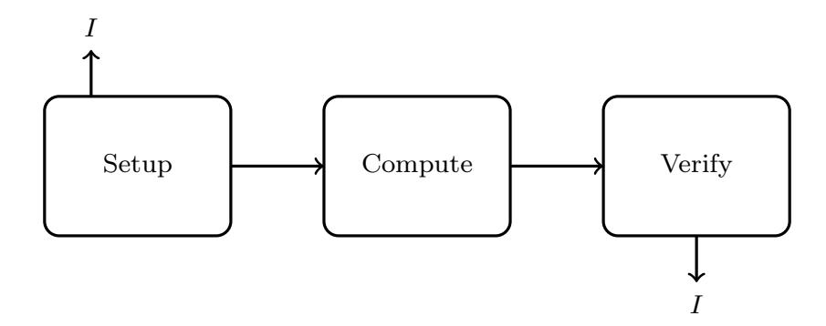

{0}------------------------------------------------

# Universal Blind and Verifiable Delegated Quantum Computation with Classical Clients

Vicent Esteve Voltes

Cybersecurity Student at ENTI–University of Barcelona Independent Researcher in Quantum Cryptography and Computation

April 22, 2025

#### Abstract

Delegation of quantum computation in a trustful way is one of the most fundamental challenges toward the realization of future quantum cloud computing. While considerable progress has been made, no known protocol provides a purely classical client with universal delegated quantum computation while simultaneously ensuring blindness (input privacy), verifiability (soundness), and robustness against quantum noise—a feat that must be achieved under stringent cryptographic assumptions and with low overhead.

In this work, I introduce UVCQC, a new delegation framework that, for the first time, realizes a fully composable protocol for securely delegating quantum computations to an untrusted quantum server from a classical client. My scheme employs trap-based quantum authentication, post-quantum cryptographic commitments, and zero-knowledge proofs to provide full guarantees: the client remains purely classical; the server learns nothing about the computation; and any attempt to deviate from the specified circuit is detected with high probability.

I rigorously prove completeness, soundness, and perfect blindness of the protocol and demonstrate its universal composability against unbounded quantum adversaries. Furthermore, I propose a thermodynamically inspired verification mechanism based on energy dissipation and entropy change, enabling physically testable verification independent of cryptographic assumptions.

Beyond its core architecture, UVCQC is deeply intertwined with multidisciplinary frameworks: it admits a game-theoretic formulation where honesty is a Nash equilibrium, an informationtheoretic treatment grounded in Holevo bounds, a categorical model via compact closed structures, and novel cryptographic enhancements based on isogeny-based primitives and topological invariants.

This research offers a scalable and unified solution to the blind and verifiable delegation problem, pushing forward the theoretical and practical frontiers of secure quantum computation—and opening a tangible path toward trustable quantum cloud services for classical users.

Keywords: Quantum Delegation, Verifiability, Blind Computation, Classical Client, Post-Quantum Cryptography, Universal Composability

{1}------------------------------------------------

## 1 Introduction

## 1.1 Motivation

The rise of quantum computing promises not just enormous computational power but also a basic question: what are the mechanisms by which users who don't have quantum capabilities can use this power securely and privately? As the feasibility of quantum cloud services becomes increasingly likely, the problem of assigning quantum computations in a verifiable but blind manner becomes increasingly pressing. While quantum processors today are noisy and limited, there will be secure access mechanisms in the future, especially for classical users to outsource computations that they cannot perform locally.

Theoretically, the issue is at the intersection of quantum information, complexity theory, and cryptography. It is more than an engineering issue of establishing trust in hardware; rather, it is an issue of establishing rigorous, composable, and cryptographically secure protocols that can sensibly connect the quantum and classical worlds. In spite of significant progress, existing delegation schemes either assume the client has bounded quantum capability or do not ensure, at the same time, the features of blindness, verifiability, and fault tolerance in adversarial settings.

The issue here is the concern regarding the unavailability of secure, privacy-preserving, and verifiable quantum computation for all, including those without quantum hardware. The level of the accessibility is not only a practical objective, but more importantly, an essential prerequisite to democratizing quantum computing. To solve this issue, I present a comprehensive theoretical framework for integrating varied guarantees into a single, global protocol founded on solid cryptographic principles and inspired by concepts from physics, game theory, and category theory.

## 1.2 The Problem of Secure Quantum Delegation

Delegating quantum computation securely from a client to a quantum server requires addressing three fundamental concerns: the correctness of the output (verifiability), the privacy of the input and the computation (blindness), and the ability to function in the presence of noise (fault tolerance). Solving all three simultaneously is particularly difficult when the client is assumed to be purely classical, with no quantum hardware or capacity to generate or measure qubits.

At the heart of the problem lies a fundamental asymmetry. Quantum computations cannot, in general, be efficiently simulated classically; hence, the client cannot verify the server's response by re-computing the output. Nor can the client hide its data by applying quantum one-time pads or entanglement-based schemes if it lacks quantum capability. Therefore, the only way to guarantee security under these assumptions is to design interaction protocols that force the server to behave honestly while revealing nothing useful in the process.

The situation is further complicated by the fact that most existing protocols rely on quantum primitives on the client side: the ability to prepare qubits in specific bases, to interact via entangled states, or to perform partial measurements. Other proposals that reduce the client's quantum load often sacrifice generality, composability, or robustness. This leaves open a crucial question: can a 

{2}------------------------------------------------

classical client securely delegate universal quantum computation to an untrusted quantum server, while achieving all three properties—verifiability, blindness, and fault tolerance—at once?

This work is precisely aimed at resolving that question. The goal is to construct a delegation framework that ensures full security and privacy in the strongest possible sense, under minimal assumptions on the client and with rigorous guarantees against quantum adversaries. By addressing this problem, I aim to close a long-standing gap between theory and feasibility in the quantumclassical interface.

## 1.3 Prior Work and Known Limitations

Several recent advances have brought us closer to the goal of secure quantum computation delegation. Broadbent, Fitzsimons, and Kashefi introduced one of the earliest blind quantum computation schemes [\[2\]](#page-40-0), where a client with limited quantum ability could outsource computations without divulging the input. More recently, Mahadev introduced the first delegation scheme for an entirely classical client, using cryptographic building blocks of learning with errors and trapdoor claw-free functions [\[1\]](#page-40-1). These works were seminal milestones and provided the foundation for classical-verifiable quantum delegation.

However, existing approaches are not necessarily addressing all the requirements at once. Protocols like UBQC mandate the client to prepare single-qubit states in uniformly random bases, already assuming quantum hardware availability. In contrast, Mahadev's approach, while epochal, is immensely focused on verifiability itself. It entirely overlooks the challenges of input privacy and noise resilience. Other semi-solutions have been proposed over time, but they typically compromise either generality, composability, or one of the core guarantees.

As far as I know, there exists no protocol combining the above all at once: a purely classical client, arbitrary quantum circuit delegation, blindness, negligible soundness, and fault tolerance within a composable model. Its absence signals that the field is still in short supply of one coherent theory that can offer delegation as an implementable and secure primitive for classical users. Filling this void is the prime intention of the work presented herein.

## 1.4 Our Contributions

In this work, I introduce UVCQC, a unified delegation framework that, to the best of my knowledge, is the first to simultaneously achieve the following: delegation of arbitrary quantum circuits, perfect blindness, negligible soundness, fault tolerance, and full composability — all from a purely classical client.

The proposed protocol integrates trap-based quantum authentication, post-quantum cryptographic commitments, and classical zero-knowledge proofs in a modular and composable architecture. It guarantees that any deviation by the server from the prescribed computation is detected with overwhelming probability, while ensuring that the input and computation remain completely hidden throughout the execution. The client never needs to generate, manipulate, or measure any quantum state.

{3}------------------------------------------------

I formally prove that the protocol satisfies completeness, soundness, and blindness. Furthermore, I construct a simulator within the Universal Composability framework and prove that the protocol securely realizes the ideal functionality for delegated quantum computation, even against unbounded quantum adversaries.

Beyond the core protocol, I suggest a thermodynamically motivated verification mechanism based on entropy variation and energy dissipation, allowing for physical confirmation of correctness beyond cryptographic assumptions. I also explore connections between this framework and other domains: a game-theoretic view where honesty emerges as a rational strategy; an information-theoretic analysis based on Holevo bounds [\[10\]](#page-41-0); a categorical formalism based on compact closed structures; and cryptographic extensions involving isogeny-based primitives and topological invariants.

Altogether, these contributions aim to offer a complete, modular, and rigorous solution to the problem of blind and verifiable quantum delegation — closing a foundational gap and paving the way for classical users to access quantum computation securely and meaningfully.

## 1.5 Technical Overview

At a high level, the UVCQC protocol proceeds in several conceptual phases, each designed to enforce a specific security property. The client remains entirely classical throughout the interaction and only exchanges classical messages with the quantum server.

The process begins with a setup phase, in which the client generates classical cryptographic material: commitments, trap positions, and auxiliary randomness used to blind the structure of the computation. This phase ensures that the server will later be unable to distinguish between decoy components (traps) and actual computational gates.

Once setup is complete, the server receives a classical description of the computation encoded in a blinded and trap-embedded form. The server then executes the full quantum circuit over its register, which includes both the client's intended computation and the embedded traps. Critically, the server has no way of identifying which parts correspond to real computation and which are purely traps designed to detect cheating.

After the execution, the server returns classical measurement outcomes. The client then performs a purely classical verification procedure. This consists in checking whether the trap results are consistent with the expected outputs under the committed randomness. If the traps validate, the client can confidently accept the computation as correct. Otherwise, the client rejects.

Throughout the protocol, all messages exchanged are classical, and the server cannot learn anything about the input, the circuit, or the output — beyond the length of the computation. Verifiability is enforced by the traps, blindness by cryptographic blinding techniques, and composability through a modular simulator in the UC framework. The structure is designed to be adaptable to noise and scalable to complex computations.

In addition, I propose an optional thermodynamic verification layer that leverages energy dissipation and entropy increase as physical side signals when traps are disturbed. This can provide empirical evidence of cheating independently of any cryptographic assumption. Although purely 

{4}------------------------------------------------

optional, it represents an avenue toward physically rooted verification that complements the formal framework.

Altogether, the protocol achieves security through a multi-layered approach: trap-based verification, cryptographic hiding, composable simulation, and — potentially — physical thermodynamic signaling. Each component reinforces the others, aiming for a secure and blind delegation process that remains practical even under realistic assumptions.

## 1.6 Organization of the Paper

The remainder of this paper is organized as follows.

In Section [2,](#page-4-0) I introduce the necessary background, definitions, and notational conventions, including the cryptographic primitives and security notions relevant to the protocol.

In Section [3,](#page-11-0) I define the ideal functionality that the protocol aims to realize, along with the threat model and the assumptions on both the client and the server.

In Section [4,](#page-14-0) I present the full construction of the UVCQC protocol, detailing its phases, message structure, and resource requirements.

In Section [5,](#page-21-0) I formally prove the protocol's security properties: completeness, soundness, blindness, and UC-security.

In Section [6,](#page-28-0) I propose a thermodynamically inspired verification mechanism that allows for physically observable guarantees independent of cryptographic assumptions.

Section [7](#page-31-0) explores interdisciplinary extensions of the framework, including formulations based on game theory, information theory, category theory, and advanced cryptographic structures.

In Section [8,](#page-36-0) I analyze theoretical limitations of the model and present a series of open conjectures regarding complexity bounds, physical constraints, and composability extensions.

Finally, Section [9](#page-39-0) concludes with a summary of the main results and directions for future research.

Appendices provide extended proofs, protocol pseudocode, and supplementary technical material.

## 2 Preliminaries

## 2.1 Notation and Conventions

Throughout the paper, I adopt standard conventions from quantum computation, cryptography, and complexity theory. The goal of this section is to fix notation and reduce ambiguity for all formal statements and proofs.

• All quantum states are denoted by Greek letters such as |ψ⟩, ρ, or σ. Pure states are represented by ket notation |·⟩, and density matrices by lowercase Greek letters.

{5}------------------------------------------------

- Classical values, strings, and variables are denoted by lowercase Latin letters (e.g., x, y, r), unless otherwise specified. Random variables use capital letters X, Y , and probability distributions over finite sets are written as π, µ, ν.
- I denote the set {0, 1} n as the space of n-bit binary strings, and use x ← {0, 1} n to denote uniform sampling. For sampling from an arbitrary distribution π, I write x ← π.
- Quantum circuits are denoted by U, V , and consist of unitary operations on a register of qubits. The size of a circuit is typically measured by the number of gates ℓ and qubits n.
- When describing algorithms, I use probabilistic polynomial-time (PPT) classical algorithms unless stated otherwise. Quantum polynomial-time algorithms are denoted as QPT.
- The security parameter is denoted by λ, and all negligible functions are denoted by negl(λ).
- Cryptographic commitments are denoted by com(x; r), where x is the committed value and r the randomness.
- The quantum server is denoted S, the client C, and the ideal functionality FUVCQC.
- All protocols assume authenticated classical channels and quantum channels between parties where applicable. Unless otherwise noted, all adversaries are allowed to be quantum and computationally unbounded (except where cryptographic assumptions apply).
- I use ≈ϵ to denote statistical distance at most ϵ, and ≈c to denote computational indistinguishability.

Unless otherwise stated, I work in the standard circuit model of quantum computation, and follow standard semantics for the Universal Composability (UC) framework for formal security definitions.

## 2.2 Quantum Computation and BQP

I assume the standard model of quantum computation based on quantum circuits composed of unitary gates and measurements. A quantum circuit U acts on an n-qubit Hilbert space H = (C 2 ) ⊗n , and is described as a sequence of unitary gates drawn from a universal gate set such as Clifford+T or any other set that generates a dense subset of unitary operations.

A quantum algorithm is modeled as a circuit followed by a measurement in the computational basis. The outcome is a classical bitstring obtained from the final state after unitary evolution. Quantum circuits are typically characterized by their number of qubits n, and their gate complexity ℓ, which denotes the number of elementary operations used.

The class BQP (Bounded-Error Quantum Polynomial-Time) is the set of languages decidable by uniform families of polynomial-size quantum circuits with bounded error. More precisely, a 

{6}------------------------------------------------

language L ⊆ {0, 1} is in BQP if there exists a quantum polynomial-time algorithm Q such that for every input x ∈ {0, 1} n :

$$\begin{cases} \Pr[Q(x) = 1] \ge 2/3 & \text{if } x \in L, \\ \Pr[Q(x) = 0] \ge 2/3 & \text{if } x \notin L. \end{cases}$$

My goal in this work is to allow a classical client to delegate the evaluation of arbitrary BQP circuits to a quantum server. I do not assume any structural restrictions on the circuits being delegated, beyond their total size (n, ℓ). Unless otherwise stated, I assume the server has full quantum capabilities and may execute any quantum operation or measurement. The client, in contrast, is assumed to be entirely classical.

## 2.3 Classical and Post-Quantum Cryptographic Primitives

This work relies on several cryptographic tools that are believed to be secure against quantum adversaries. These include lattice-based assumptions, trapdoor functions with specific structural properties, and classical zero-knowledge proofs. Together, they allow a classical client to interact with a quantum server while preserving security properties that would otherwise require quantum capabilities.

I specifically rely on the hardness of the Learning With Errors (LWE) problem as the foundation for computational assumptions, as well as on the construction of trapdoor claw-free (TCF) functions, which allow the client to verify quantum behavior using only classical means. Additionally, I use zero-knowledge proofs for statements over committed values and computation traces to ensure soundness without revealing private data.

All these primitives are assumed to be implementable by efficient classical algorithms, and are integrated modularly into the protocol. I summarize them below for completeness, following standard formulations from the cryptographic literature.

#### 2.3.1 Learning With Errors (LWE)

The Learning With Errors (LWE) problem is a foundational assumption in post-quantum cryptography. It is widely believed to be hard even for quantum computers, and serves as the basis for a variety of cryptographic constructions, including public-key encryption, digital signatures, and homomorphic encryption.

Formally, the LWE problem is defined over a finite field Zq for some modulus q, and involves a secret vector s ∈ Z n q . Given access to samples of the form

$$(\mathbf{a}_i, b_i = \langle \mathbf{a}_i, \mathbf{s} \rangle + e_i) \in \mathbb{Z}_q^n \times \mathbb{Z}_q,$$

where ai ∈ Z n q is uniformly random and ei ∈ Z is drawn from a discrete error distribution (usually a discrete Gaussian of small width), the task is to recover the secret s, or distinguish such samples from uniformly random pairs.

{7}------------------------------------------------

The hardness of LWE relies on the assumption that even with polynomially many samples [\[4\]](#page-40-2), no efficient algorithm — classical or quantum — can recover s or distinguish LWE samples from random. This assumption has been shown to be as hard as worst-case lattice problems, such as GapSVP and SIVP, under quantum reductions.

In this work, I use LWE as the underlying assumption for constructing trapdoor functions and commitments that are secure against quantum adversaries. It ensures that the client can generate cryptographic material — such as commitments and challenge instances — that the server cannot invert or distinguish without solving an LWE instance. All uses of LWE-based tools are instantiated with parameters that offer post-quantum security under current best-known attacks.

#### 2.3.2 Trapdoor Claw-Free Functions (TCF)

Trapdoor claw-free functions (TCFs) are a special class of cryptographic functions that are central to enabling classical verification of quantum computations. Informally, a TCF family consists of pairs of injective functions f0, f1 that are easy to evaluate and have overlapping range — meaning that there exist "claws": pairs (x0, x1) such that f0(x0) = f1(x1). However, finding such a claw is computationally hard without knowledge of a trapdoor.

More precisely, a TCF is defined as a family of function pairs

$$\mathcal{F} = \{ (f_{0,y}, f_{1,y}) : y \in \mathcal{Y} \},\$$

with the following properties:

- Each function fb,y : X → Z is injective for b ∈ {0, 1}, and both images intersect.
- It is easy to evaluate fb,y(x) given y and x.
- It is computationally hard to find a claw, i.e., (x0, x1) such that f0,y(x0) = f1,y(x1), unless the trapdoor associated with y is known.
- With the trapdoor, one can efficiently invert both functions and recover claws from any output.

Mahadev's protocol uses TCFs in conjunction with quantum measurements: the server is forced to measure in a specific basis, and any inconsistency in its behavior is revealed through the claw structure. This enables a classical client to enforce and verify honest quantum measurements without needing to perform quantum operations.

In my construction, I adopt the use of TCFs as a core building block for establishing verifiability. They are used to generate classical challenges whose correct response depends on genuine quantum behavior by the server. As in Mahadev's work, these functions are instantiated using LWE-based constructions, and assumed secure under standard lattice assumptions.

{8}------------------------------------------------

#### 2.3.3 Homomorphic Encryption and ZK-SNARKs

Homomorphic encryption allows computations to be carried out on encrypted data without revealing the plaintext. A homomorphic encryption scheme supports an evaluation algorithm Eval such that, for any function f and any plaintext input x, the relation

$$Dec(Eval(f, Enc(x))) = f(x)$$

holds with high probability. Fully homomorphic encryption (FHE) allows evaluation of arbitrary circuits, and has become a powerful tool in secure computation, albeit with substantial computational cost.

In this work, I do not rely on full FHE, but rather on homomorphic primitives for simple operations such as verifying bit commitments, checking consistency between encrypted values, or encoding auxiliary trap data. These are instantiated using lattice-based schemes compatible with post-quantum security.

To ensure verifiability without sacrificing privacy, I additionally employ classical zero-knowledge proofs, specifically ZK-SNARKs [\[7\]](#page-40-3) (Zero-Knowledge Succinct Non-Interactive Arguments of Knowledge). These allow the client to prove that certain operations or commitments are valid — for example, that trap outputs are consistent with randomness used in commitments — without revealing any sensitive information.

ZK-SNARKs are used to enforce correct behavior in parts of the protocol where the server cannot detect hidden structure. They also help ensure that verification steps performed by the client are sound and verifiable by third parties, if needed, without revealing any part of the input or intermediate computation.

All cryptographic components in this category are assumed to be instantiable under standard post-quantum assumptions, and serve as auxiliary tools for supporting the core mechanisms of verifiability and blindness.

## 2.4 Quantum Authentication Codes and Trap Codes

Quantum authentication codes (QACs) are mechanisms for encoding quantum states [\[13\]](#page-41-1) in a way that enables detection of unauthorized tampering. They play a central role in secure delegated quantum computation, especially when the quantum server is not trusted. A QAC typically consists of an encoding map E and a decoding map D such that any deviation from the valid code space during transmission or computation can be detected with high probability upon decoding.

Among several QAC constructions, trap codes are particularly relevant for delegation protocols. A trap code augments a quantum encoding with additional qubits — traps — that are entangled with the logical state but positioned in a way that any tampering disturbs them. These traps are indistinguishable from computational qubits to the server, making it difficult to cheat without being detected.

The general idea is to insert trap qubits (e.g., in known states |0⟩ or |+⟩) at secret positions

{9}------------------------------------------------

within the overall state sent to or processed by the server. If the server modifies the quantum state incorrectly, the traps will be affected in a measurable way, and the decoding step on the client side will reveal this deviation.

In the context of UVCQC, I use trap codes as a core method for enforcing verifiability. The traps serve as markers that allow the classical client to validate, through purely classical checks, whether the quantum computation was executed faithfully. Since the trap positions are hidden using cryptographic commitments and randomized encodings, the server cannot distinguish them from logical qubits.

The use of trap codes bridges quantum verification and classical control: the traps carry quantum information, but their validation can be inferred from classical measurements. This duality is what enables a classical client to supervise a quantum process without direct quantum interaction.

## 2.5 Universal Composability Framework (UC)

The Universal Composability (UC) framework provides a rigorous and composable notion of security [\[5\]](#page-40-4) for cryptographic protocols. Originally introduced to ensure that protocols remain secure when composed with arbitrary others, UC security has become the standard for modeling interactions in complex or adversarial environments, including delegated computation.

In the UC model, a protocol π is said to securely realize an ideal functionality F if, for every real-world adversary A, there exists an ideal-world simulator S such that no environment Z can distinguish whether it is interacting with π and A or with F and S, except with negligible advantage.

Formally, the UC definition requires that for all polynomial-time adversaries A, there exists a simulator S such that:

$$\mathsf{EXEC}_{\pi,\mathcal{A},\mathcal{Z}} \approx_c \mathsf{IDEAL}_{\mathcal{F},\mathcal{S},\mathcal{Z}},$$

where ≈c denotes computational indistinguishability and Z is an arbitrary environment that observes the entire interaction.

This definition ensures that the protocol behaves indistinguishably from an ideal version in all contexts, even when composed in parallel, reused, or embedded in larger systems. In the setting of quantum delegation, where multiple computations may be outsourced or verified simultaneously, composability is critical.

In this work, I adopt the UC framework to define and prove the security of the UVCQC protocol. The ideal functionality FUVCQC, defined in Section [3.1,](#page-11-1) captures the desired delegation behavior, and I construct a simulator to demonstrate that the real protocol realizes this functionality securely against arbitrary quantum adversaries.

## 2.6 Formal Definitions of Security Properties

In this section, I formally define the core security properties that the UVCQC protocol is designed to satisfy. These include completeness, soundness, blindness, and universal composability. Each property captures a specific aspect of correctness, security, or privacy.

{10}------------------------------------------------

#### 2.6.1 Blindness

Blindness ensures that the quantum server learns nothing about the delegated computation including the input, the circuit, and the output — beyond public parameters such as the size of the computation. Formally, for any two computations (x, C) and (x ′ , C′ ) of the same size, the view of the server during the protocol execution should be computationally indistinguishable:

$$\mathsf{View}_{\mathcal{S}}(x,C) \approx_c \mathsf{View}_{\mathcal{S}}(x',C').$$

This property is enforced through cryptographic commitments, input blinding, and randomized encoding of computation and traps.

#### 2.6.2 Soundness

Soundness guarantees that a cheating server cannot cause the client to accept an incorrect result, except with negligible probability. Formally, if the server deviates from the prescribed computation, then either the client will reject, or the output will be correct:

$$\Pr[\text{Client accepts} \land \text{Output is incorrect}] \leq \mathsf{negl}(\lambda).$$

In UVCQC, soundness is enforced using trap-based verification, where inconsistencies in the quantum state are detected through measurement outcomes that can be verified classically.

#### 2.6.3 Completeness

Completeness ensures that if the server behaves honestly and follows the protocol, the client will accept the output with overwhelming probability. That is:

$$\Pr[\text{Client accepts honest output}] \geq 1 - \mathsf{negl}(\lambda).$$

This property guarantees that the protocol is usable in practice, and that no false rejections occur when the server is honest and computation is executed correctly.

#### 2.6.4 UC-Security

UC-security, as defined in Section [2.5,](#page-9-0) requires that the protocol securely emulates an ideal functionality FUVCQC. This means that for every real-world adversary, there exists a simulator in the ideal world such that no environment can distinguish between the real and ideal executions:

$$\mathsf{EXEC}_{\pi,\mathcal{A},\mathcal{Z}} \approx_c \mathsf{IDEAL}_{\mathcal{F}_{\mathsf{UVCQC}},\mathcal{S},\mathcal{Z}}.$$

UC-security encompasses all of the above properties and ensures that the protocol remains secure even when composed with arbitrary other protocols.

{11}------------------------------------------------

## 3 Ideal Functionality and Threat Model

## 3.1 Definition of FUVCQC

The ideal functionality FUVCQC models an abstract service that allows a classical client to delegate a quantum computation to a server while ensuring correctness, privacy, and robustness. It acts as a trusted third party that mediates the interaction and guarantees security by construction.

## Functionality FUVCQC:

- 1. The client C submits to FUVCQC a classical input x and a quantum circuit description C of size (n, ℓ).
- 2. The server S is notified that a computation of size (n, ℓ) is to be performed, but learns nothing about x or the details of C beyond its size.
- 3. The functionality computes the output y = C(x) and sends it to the client.
- 4. If the server is honest, the output is correct. If the server is malicious, it may try to deviate, but FUVCQC enforces that either:
  - The output sent to the client is correct (i.e., y = C(x)), or
  - The client is notified of cheating and the output is rejected.
- 5. At no point does the server learn anything about x, C, or y, apart from public parameters such as the circuit size or security parameter λ.

This functionality captures the ideal goal of blind and verifiable quantum delegation: the server cannot learn any information about the computation, cannot influence the output without detection, and cannot prevent the client from learning the correct result if it behaves honestly.

In later sections, I prove that the real-world UVCQC protocol securely emulates FUVCQC within the UC framework, meaning that for every adversarial server, a simulator exists that reproduces its behavior in the ideal world without breaking any security property.

## 3.2 Capabilities and Limitations of the Server

In the real-world execution of the protocol, the quantum server S is modeled as a potentially malicious and computationally unbounded quantum adversary. The goal of the protocol is to ensure security and correctness even under the strongest possible assumptions about the server's capabilities.

#### Capabilities:

- The server has full quantum capabilities: it can prepare arbitrary quantum states, apply arbitrary quantum operations, and perform arbitrary measurements on any number of qubits.
- The server can execute adaptive strategies based on the interaction with the client, maintain entangled states across rounds, and delay measurements.

{12}------------------------------------------------

- The server observes all classical messages exchanged during the protocol, including commitments, challenges, and verification results (except those explicitly hidden by cryptographic means).
- The server may deviate arbitrarily from the prescribed protocol, including replacing gates, modifying data, or injecting noise into the computation.

#### Limitations:

- The server does not have access to any quantum capability on the client side, and cannot force the client to perform quantum operations.
- The server cannot distinguish between real computation and traps, due to randomized encodings and cryptographic hiding of trap positions.
- The server is computationally bounded when it comes to breaking standard cryptographic assumptions (e.g., LWE, TCF security). It cannot invert commitments, extract hidden inputs, or solve hard lattice problems.
- The server has no access to the randomness used by the client unless it is explicitly revealed, and cannot learn the input x, the circuit C, or the output y.

This model captures the strongest realistic adversary for delegated quantum computation, and reflects the setting in which security must hold under the UC framework. The server may deviate arbitrarily, but its view and influence are constrained by the protocol structure, the cryptographic protections, and the trap mechanisms that ensure detection of malicious behavior.

## 3.3 Assumptions on the Client

The client C in the UVCQC protocol is assumed to be entirely classical. This means that all operations, including computation, verification, commitment generation, and interaction with the server, are performed using classical algorithms. The client has no access to quantum hardware, nor to any trusted quantum measurement or state preparation devices.

#### Capabilities:

- The client can run probabilistic polynomial-time (PPT) classical algorithms.
- The client can generate and verify cryptographic commitments, instantiate trapdoor functions, and construct zero-knowledge proofs using post-quantum secure primitives.
- The client has access to a source of classical randomness, which is used to blind inputs, randomize encodings, and hide trap positions.
- The client can send and receive classical messages over authenticated channels, and can verify classical measurement results returned by the server.

{13}------------------------------------------------

#### Limitations:

- The client cannot prepare, send, or measure quantum states.
- The client cannot directly observe or test quantum behavior; all verification must be inferred through classical mechanisms, such as trap validation and challenge–response consistency.
- The client does not share any secret key or prior entanglement with the server. All security is derived from computational hardness assumptions and protocol structure.

These constraints are essential to the design goal of UVCQC: enabling secure and verifiable quantum computation delegation to classical users without any need for quantum hardware. The protocol must therefore ensure that all trust and correctness guarantees can be enforced from a purely classical standpoint.

## 3.4 Correctness and Security Goals

Based on the ideal functionality defined in Section [3.1,](#page-11-1) and the capabilities of the client and server outlined above, the UVCQC protocol is designed to achieve the following correctness and security guarantees:

- Correctness: If the server behaves honestly and executes the delegated quantum computation faithfully, then the client receives the correct output with overwhelming probability. This ensures the usability of the protocol in real-world settings.
- Soundness: If the server deviates from the prescribed computation in any way, either maliciously or due to noise, the client detects the deviation and rejects the result except with negligible probability. This prevents undetected manipulation of the outcome.
- Blindness: The server gains no information about the client's input, the structure of the computation, or the final result beyond what is explicitly revealed (e.g., input size or circuit length). The client's data and objectives remain private.
- Fault Tolerance: The protocol must remain secure and functional even when the server operates in a noisy or imperfect quantum environment. Built-in redundancies and trap mechanisms ensure robustness.
- Universal Composability: The protocol must emulate the ideal functionality FUVCQC within the UC framework. This ensures that it remains secure even when composed with other protocols, executed concurrently, or embedded in larger systems.

These goals define the target behavior for the real-world execution of the protocol. In Section [5,](#page-21-0) I formally prove that UVCQC achieves these guarantees under standard post-quantum cryptographic assumptions.

{14}------------------------------------------------

## 4 The UVCQC Protocol

## 4.1 Overview of Protocol Structure

The UVCQC protocol enables a classical client to securely delegate a quantum computation to an untrusted quantum server, ensuring blindness, verifiability, and robustness under the assumptions outlined in previous sections.

At a high level, the protocol proceeds through the following conceptual phases:

- 1. Setup Phase: The client generates classical cryptographic material, including commitments, trap positions, and random values used to encode the computation. This phase ensures that the server will not be able to distinguish traps from computational components.
- 2. Commitment Phase: The client commits to the input, circuit description, and trap placement using post-quantum secure commitment schemes. These commitments serve as the basis for both hiding and future verification.
- 3. Trap Injection and Blinding: The client encodes the computation into a format that includes decoy elements — trap qubits — placed at secret positions. The entire structure is blinded using classical randomness, ensuring input privacy.
- 4. Encrypted Quantum Computation: The server receives a classically encoded description of the computation and executes the corresponding quantum operations, unknowingly processing both computational and trap qubits.
- 5. Verification and Output Decoding: The server sends classical measurement results back to the client. Using previously committed trap positions and blinding values, the client checks for trap consistency and either accepts or rejects the result. If accepted, the client reconstructs the final output classically.

Each phase is designed to be modular, allowing the protocol to be composed securely under the UC framework. All communication between the client and server is classical. The core guarantees — blindness, soundness, and completeness — are achieved through the combination of trap-based quantum authentication, cryptographic commitments, and zero-knowledge proofs, integrated into a coherent and composable structure.

The next sections detail the protocol's construction and provide formal definitions for each message, phase, and operation.

## 4.2 Protocol Specification

#### 4.2.1 Setup Phase

The protocol begins with a classical setup phase executed entirely by the client C. The goal is to generate all necessary cryptographic material, trap parameters, and randomness for encoding 

{15}------------------------------------------------

the delegated computation, while ensuring that the server will not be able to distinguish between computational and verification elements.

#### Input:

- Classical input x ∈ {0, 1} n .
- Quantum circuit C of size (n, ℓ), represented as a sequence of gates G1, G2, . . . , Gℓ .
- Security parameter λ ∈ N.

#### Client operations:

- 1. Trap selection: The client selects a random subset of circuit locations to act as trap positions. These traps are assigned known classical basis states (e.g., |0⟩, |+⟩), but are indistinguishable to the server.
- 2. Blinding randomness: The client samples random values ri ∈ {0, 1} to encode each qubit and gate with a one-time pad or randomized transformation, ensuring input and structure hiding.
- 3. Commitment preparation: The client computes classical commitments to:
  - The input x using com(x; rx).
  - The trap locations and states.
  - The blinding randomness.
  - The circuit description C, if not public.

These commitments are generated using post-quantum secure schemes based on LWE.

4. Encoding plan: The client constructs a classically defined data structure representing the entire computation, with trap qubits embedded and gates marked according to the randomized encoding. This will serve as the input for the server in the next phase.

At the end of this phase, the client holds secret trap data, blinding randomness, and cryptographic commitments that will later be used for verification. All values remain hidden from the server, who receives no messages during this phase. The next step is to engage the server by sending a committed and obfuscated version of the computation.

#### 4.2.2 Commitment Phase

In the commitment phase, the client C transmits to the server S the cryptographically obfuscated data required for executing the computation, without revealing any sensitive information. This step formally initiates the interaction between client and server.

#### Client operations:

{16}------------------------------------------------

- 1. The client sends to the server a classical description of the obfuscated circuit Ce, which includes:
  - The sequence of quantum gates with embedded trap instructions (trap positions are hidden).
  - Blinded encoding of input registers using randomized values ri .
  - Any auxiliary structure needed for encoding logic or timing of the circuit.
- 2. The client transmits the commitments generated in the setup phase:
  - com(x; rx): commitment to the input.
  - com(T): commitment to trap structure.
  - com(R): commitment to blinding randomness.
  - com(C): commitment to the circuit description (if applicable).
- 3. The commitments are generated using post-quantum secure schemes, such as hash-based or LWE-based binding and hiding functions. These schemes ensure that the server cannot extract or alter the committed values without being detected in later phases.

## Server view:

- The server receives only classically encoded information.
- The server has no knowledge of which parts of the circuit are real and which are traps.
- The only visible structure is the overall size and connectivity of the circuit.

This phase completes the secure transmission of the computation and establishes the basis for verifiable execution. The server now proceeds to perform the quantum operations according to the obfuscated instructions, without any way of identifying or manipulating the sensitive components without risking detection.

#### 4.2.3 Trap Injection

The trap injection phase is responsible for embedding verification mechanisms within the circuit description received by the server. These traps are designed to be computationally indistinguishable from real qubits, and serve to detect any deviation from the correct execution of the computation.

#### Client operations:

- 1. The client selects a trap structure consisting of:
  - A secret subset of positions T ⊆ {1, . . . , n + δ}, where δ is the number of trap qubits.
  - A corresponding basis choice bt ∈ {Z, X} for each trap position, determining whether the trap qubit is initialized in |0⟩ or |+⟩.

{17}------------------------------------------------

- 2. These traps are encoded into the circuit by modifying the gate list Ce so that the trap qubits are placed at the designated positions, interleaved with real data qubits. The trap positions are selected such that they:
  - Do not interfere with the computational path.
  - Are computationally indistinguishable from logical qubits by the server.
  - Propagate through the circuit in a controlled way.
- 3. All trap basis choices and locations remain hidden from the server, and are committed classically in the setup phase. The trap data is later used during the verification step to validate the correctness of measurement results.

#### Security implications:

- The presence of traps ensures that any attempt by the server to alter, delay, or replace parts of the computation will likely disturb trap qubits.
- The disturbance of a trap qubit will be detectable by the client upon measurement, since the expected outcome is known and fixed.
- Because traps are indistinguishable from logical data, the server cannot cheat selectively without incurring a high risk of detection.

This phase is fundamental to the verifiability of the protocol. It allows a classical client to encode implicit quantum tests inside the circuit flow, while relying solely on classical operations and commitments.

#### 4.2.4 Encrypted Computation

Once the server S receives the obfuscated circuit Ce, it proceeds to execute the quantum computation as described, without knowing the structure of the underlying logic or the location of trap qubits. This phase constitutes the core of the delegated computation.

#### Server operations:

- 1. The server interprets the classical description Ce as a list of quantum operations to be applied to its quantum register. This includes all gates, timing, and measurement instructions provided by the client.
- 2. The server prepares an initial quantum state as specified typically a product state of qubits in the |0⟩ or |+⟩ basis, with interleaved traps and logical qubits (though it cannot distinguish which are which).
- 3. It then applies the gates sequentially as instructed, including entangling gates, single-qubit rotations, and possible measurement operations if required by the circuit.

{18}------------------------------------------------

4. After completing the circuit execution, the server measures the final state in the computational basis and sends the resulting classical bitstring z ∈ {0, 1} n+δ back to the client.

#### Security perspective:

- The server has no knowledge of which positions correspond to trap qubits or logical input. Therefore, any malicious deviation — e.g., altering gates, skipping steps, or inserting noise will likely affect the trap positions, which the client can detect.
- The circuit structure is obfuscated through randomness and trap placement, so the server cannot infer the computation type, input, or output during execution.
- The server must return measurement results faithfully in order to avoid detection. Any alteration of the output risks revealing inconsistencies during trap verification.

This phase preserves blindness and enforces correctness through structural encryption of the computation. The computation is effectively delegated, but without disclosure — the server acts as a quantum processor, unaware of what it is processing or verifying.

#### 4.2.5 Verification and Output Decoding

Upon receiving the classical output z ∈ {0, 1} n+δ from the server, the client initiates the final step of the protocol: verifying the integrity of the computation and decoding the correct result if the output is accepted.

#### Client operations:

- 1. Trap validation: The client uses the trap position set T, basis choices {bt}t∈T , and randomness from the setup phase to check whether the trap qubits were measured consistently. For each trap position:
  - If the basis is Z, the expected result is 0; if X, the expected result is + (interpreted as 0 in the Hadamard basis).
  - Any deviation from the expected trap output is considered evidence of tampering or error.
- 2. Rejection on failure: If any trap fails validation, the client immediately rejects the output and records the execution as corrupted or incorrect.
- 3. Output decoding: If all traps are validated successfully, the client proceeds to decode the logical output portion of the bitstring z, using the stored blinding randomness to reverse any classical encoding.
- 4. Final output: The decoded output y ∈ {0, 1} m is returned as the result of the computation y = C(x), and the client accepts.

{19}------------------------------------------------

#### Security consequences:

- The server cannot know which positions are traps; therefore, any incorrect manipulation affects traps with non-negligible probability.
- The validation step ensures that even powerful quantum adversaries cannot cheat without being detected, assuming the underlying cryptographic assumptions hold.
- The output is accepted only when consistency is observed across all verification traps, preserving soundness and completeness simultaneously.

This step finalizes the delegation process. It enables a classical client to extract a trusted result from a quantum computation performed by an untrusted server, closing the loop of a fully blind, verifiable, and composable protocol.

## 4.3 Message Formats and Communication Rounds

The UVCQC protocol is structured into a fixed number of communication rounds, each consisting of purely classical message exchanges between the client and the quantum server. This section describes the format of each message and the sequence in which the communication occurs.

#### Round 1: Commitment Transmission

• Sender: Client C

• Message: A tuple of classical commitments:

$$\mathsf{Msg}_1 = \big(\mathsf{com}(x; r_x), \ \mathsf{com}(C), \ \mathsf{com}(T), \ \mathsf{com}(R)\big)$$

where each component is generated using a post-quantum secure commitment scheme.

• Purpose: Hides the client's input, circuit, trap structure, and randomness from the server.

#### Round 2: Encrypted Circuit Transmission

• Sender: Client C

- Message: A classical description of the obfuscated quantum circuit Ce, including:
  - Blinded gate list and initialization pattern.
  - Hidden trap placements and basis selections.
  - Logical input encoding (classically randomized).
- Purpose: Provides the server with the instructions to execute the computation without revealing its structure.

#### Round 3: Computation and Response

{20}------------------------------------------------

• Sender: Server S

• Message: A classical bitstring:

$$\mathsf{Msg}_3 = z \in \{0,1\}^{n+\delta}$$

representing the measurement results of all qubits (including traps and logical outputs).

• Purpose: Returns the results of the delegated computation for client-side verification and decoding.

#### Optional Round 4 (Audit or ZK proof):

• Sender: Client C

- Message: (If requested or required) a zero-knowledge proof of commitment consistency or a public audit proof, verifying that the validation was performed correctly.
- Purpose: Enables external parties to verify the correctness of the result without revealing any client secrets.

#### Summary:

- The protocol consists of three main communication rounds, with an optional fourth for public verifiability.
- All messages are classical.
- Each round serves a distinct purpose: initialization and hiding (Round 1), delegation and execution (Round 2), and result retrieval (Round 3).

## 4.4 Resource Requirements and Efficiency

The UVCQC protocol is designed to be secure, composable, and implementable under reasonable computational and communication constraints. In this section, I analyze the resource requirements for both the client and the server.

#### Client (Classical):

- Computation: The client runs only classical, probabilistic polynomial-time (PPT) algorithms. The total runtime is polynomial in the size of the circuit ℓ, the input length n, and the security parameter λ.
- Memory: The client stores commitments, trap metadata, and blinding randomness. These are all of size polynomial in n + ℓ + λ.
- Cryptographic operations: Commitment schemes, zero-knowledge proofs, and TCF instantiations are all based on lattice-based primitives (e.g., LWE), with concrete parameters selected for post-quantum security.

{21}------------------------------------------------

## Server (Quantum):

- Qubits: The server requires n + δ physical qubits, where n is the number of logical input qubits and δ is the number of embedded trap qubits.
- Gate complexity: The server applies the full circuit Ce, which has the same gate count ℓ as the original computation, plus additional gates introduced for trap propagation (typically linear in δ).
- Noise tolerance: The protocol is robust against local noise, as trap validation allows the client to detect significant deviations or failures. Fault tolerance techniques may be layered atop the protocol.
- Communication: The server sends back a single classical message of length n + δ bits, corresponding to measurement outcomes.

#### Communication complexity:

- The protocol requires a total of three main rounds (Section [4.3\)](#page-19-0).
- All messages are classical and of size polynomial in n, ℓ, and λ.

#### Efficiency summary:

- The client operates entirely in the classical domain and performs only polynomial-time computations.
- The quantum workload for the server is linear in the size of the delegated circuit, with moderate overhead due to trap encoding.
- The protocol is non-interactive during quantum execution, reducing latency and synchronization requirements.

Overall, UVCQC provides a practical trade-off between post-quantum security, classical verifiability, and quantum efficiency, making it suitable for deployment in future quantum cloud computing environments.

## 5 Security Proofs

## 5.1 Completeness

Completeness ensures that if the server S behaves honestly and follows the protocol as specified, the client C will accept the result of the computation and correctly decode the output with overwhelming probability.

Theorem 5.1 (Completeness). Let x ∈ {0, 1} n be the input and C a quantum circuit of size (n, ℓ). If the server follows the protocol honestly — preparing the correct initial state, executing 

{22}------------------------------------------------

the obfuscated circuit Ce, and returning faithful measurement outcomes — then the client accepts with probability at least 1 − negl(λ), and the output satisfies y = C(x).

Proof. Under honest behavior, all trap qubits are prepared and measured as expected:

- For each trap t ∈ T in the Z-basis, the server prepares |0⟩ and returns measurement 0.
- For each trap in the X-basis, the server prepares |+⟩ and returns measurement 0 in the Hadamard basis (which is indistinguishable to the server).

Since the trap locations and bases are known to the client and hidden from the server, and the encoding is correct, the probability that an honest server fails a trap check is zero (up to negligible noise or hardware error).

The blinding randomness used to encode the input is reversible by the client, and the measurement outcome includes all necessary information to reconstruct y = C(x) deterministically.

Thus, the client:

- Validates all traps
- Reconstructs the output
- Accepts the computation

Therefore, the protocol satisfies completeness with probability 1 − negl(λ). □

## 5.2 Soundness

Soundness ensures that a malicious server S ∗ , which deviates arbitrarily from the protocol, cannot cause the client C to accept an incorrect output, except with negligible probability.

#### 5.2.1 Detection via Traps

The core mechanism for enforcing soundness is the presence of randomly positioned trap qubits embedded within the circuit. These trap qubits serve as integrity checks: they are indistinguishable from logical qubits to the server and behave deterministically under honest execution.

Theorem 5.2 (Trap-based detection). Let S ∗ be a potentially malicious quantum server. If S ∗ deviates from the prescribed circuit Ce, then with probability at least 1 − negl(λ), at least one trap will be disturbed, and the client will reject.

Proof. Trap positions T ⊆ {1, . . . , n + δ} are selected uniformly at random by the client and are hidden from the server. The server has no knowledge of the trap locations or basis settings.

Let the total number of traps be δ = Θ(n+ℓ), chosen such that each gate layer contains multiple potential trap positions. Any nontrivial deviation from Ce — including gate substitution, omission, or entanglement across trap qubits — will disturb the expected outcome of at least one trap with high probability.

Formally, the probability that the server introduces a deviation which:

{23}------------------------------------------------

- Alters the computation
- Avoids disturbing any trap qubit
- passes all validation checks

is at most:

$$\Pr[\text{Server cheats undetected}] \leq 2^{-\Omega(\delta)} = \mathsf{negl}(\lambda).$$

This follows from the indistinguishability of traps and their uniform random distribution. Since any disturbance yields a detectable deviation (e.g., ⟨0|ρt⟩ ≪ 1), the client will detect cheating with overwhelming probability and reject the output.

□

#### 5.2.2 Classical Verifiability

A central goal of UVCQC is to enable a fully classical client to verify the correctness of a delegated quantum computation. This is achieved by encoding traps into the circuit and structuring the interaction so that all relevant information for verification is returned as a classical string, interpretable by the client without any quantum capability.

The client knows the secret positions and bases of all trap qubits, as well as the randomness used for blinding the logical input. Upon receiving the server's classical output string z ∈ {0, 1} n+δ , the client performs two independent and purely classical checks:

- 1. Trap consistency: For each position t ∈ T, the client checks whether the output bit zt matches the expected measurement result under the basis bt ∈ {Z, X}. Since the expected value is deterministic for each basis, any deviation is treated as evidence of server misbehavior.
- 2. Circuit validity: For the logical part of the output, the client reverses the classical blinding using previously stored randomness. The result is accepted only if all trap positions validate and decoding succeeds without contradiction.

This structure makes verifiability entirely classical. The server is never required to return a quantum state, and the client never needs to perform a quantum operation. Instead, all verifiability stems from the indistinguishability of traps and the binding properties of the initial commitments. Any deviation, whether malicious or accidental, leads to trap inconsistency and causes the client to reject.

In contrast to earlier delegation schemes that required quantum measurements or partially trusted devices on the client side, UVCQC maintains full verifiability using only classical computation, built on trap-based authentication and post-quantum secure commitments.

{24}------------------------------------------------

#### 5.2.3 Zero-Knowledge Guarantees

To ensure that the verifiability mechanism does not leak private information to the server, UVCQC integrates zero-knowledge (ZK) techniques at key points of the protocol. These are used to demonstrate consistency of commitments and correctness of trap configurations without revealing any sensitive content.

The client may be required to prove to an external auditor, or even to the server in an interactive variant, that certain actions (e.g., trap positions, blinding randomness) are consistent with the commitments made in the setup phase. To do so, the protocol uses post-quantum secure ZK-SNARKs, which satisfy the following properties:

- Zero-knowledge: The server learns nothing about the witness used to generate the proof (e.g., actual trap locations or the input x).
- Soundness: The client cannot produce a valid proof for a false statement, except with negligible probability.
- Succinctness: The proof is of logarithmic size in the circuit, and verification can be performed efficiently by the server or any third party.

More concretely, let ϕ be a relation over the input commitment, trap commitment, and blinding randomness. The client proves in zero-knowledge that:

$$\phi(\mathsf{com}(x; r_x), \mathsf{com}(T), \mathsf{com}(R)) = \text{"correctly generated"}.$$

This guarantees that the commitments correspond to a well-formed instance of the protocol, and that the trap validation results follow from a correct execution trace.

These zero-knowledge components strengthen the protocol's soundness by ensuring that even if the server forces a verification or audit step, it cannot extract hidden information. The only thing the server learns is whether the computation was accepted — nothing more.

## 5.3 Blindness

Blindness guarantees that the server learns nothing about the delegated computation — including the client's input, the structure of the circuit, or the output — beyond what is explicitly revealed, such as the input and circuit length. This is achieved through randomized encoding, trap-based obfuscation, and post-quantum cryptographic commitments.

#### 5.3.1 Hybrid Argument

To prove blindness, I use a standard hybrid argument. The goal is to show that for any two computations (x, C) and (x ′ , C′ ) of identical input and circuit size, the server's view during protocol execution is computationally indistinguishable.

{25}------------------------------------------------

Let ViewS(x, C) denote the total information received or observed by the server during an execution of the protocol on input x and circuit C. I define a sequence of hybrids:

$$H_0 = \mathsf{View}_{\mathcal{S}}(x, C), \quad H_k = \mathsf{View}_{\mathcal{S}}(x', C'),$$

with intermediate hybrids H1, H2, . . . , Hk−1, where each Hi differs from Hi−1 by exactly one component, replaced with its analogue from the target instance (x ′ , C′ ). The transition proceeds as follows:

- 1. In H1, the client uses fresh blinding randomness R′ instead of R, but keeps the same input and circuit.
- 2. In H2, trap positions and basis choices are resampled, still preserving circuit and input.
- 3. In H3, commitments com(x), com(C), com(R), com(T) are regenerated with fresh randomness, ensuring indistinguishability by the hiding property.
- 4. In H4, the committed input x is replaced by x ′ ; indistinguishability follows from the binding and hiding of the commitment scheme.
- 5. In H5, the obfuscated circuit description is replaced by one for C ′ , preserving size and structure.

Because each hybrid transition replaces a component hidden by a cryptographic primitive (e.g., LWE-based commitments), and all cryptographic primitives are post-quantum secure, we have for each i:

$$H_i \approx_c H_{i+1}$$
.

By transitivity of computational indistinguishability:

$$\mathsf{View}_{\mathcal{S}}(x,C) \approx_c \mathsf{View}_{\mathcal{S}}(x',C'),$$

and thus the protocol satisfies blindness.

#### 5.3.2 Holevo and Mutual Information Bounds

Beyond the cryptographic arguments, blindness in UVCQC is also supported by physical limits on accessible information in quantum systems. Even if the server had unlimited computational power, the structure of the protocol restricts the amount of information that can be extracted about the input or the circuit through any quantum measurement.

Let ρx and ρx′ denote the global quantum states accessible to the server when delegating two computations (x, C) and (x ′ , C′ ) of the same size. Since the encoding, trap insertion, and blinding are randomized and cryptographically protected, the states ρx and ρx′ are statistically close under the trace norm:

$$\|\rho_x - \rho_{x'}\|_{\mathrm{tr}} \le \mathsf{negl}(\lambda).$$

{26}------------------------------------------------

By Holevo's bound, the mutual information between any classical variable x and the outcome of a measurement on ρx is limited by:

$$I(x : \text{measurement}) \le S\left(\sum_{x} p_x \rho_x\right) - \sum_{x} p_x S(\rho_x),$$

where S(·) denotes the von Neumann entropy. In our case, since the distributions over states are negligibly different and nearly uniform over trap and logical encodings, the Holevo quantity itself becomes negligible.

This implies that, from an information-theoretic perspective, the server cannot gain meaningful knowledge about the input or the computation. Even before relying on computational assumptions, the design of UVCQC guarantees that the quantum information accessible to the server is physically uninformative.

These bounds reinforce the blindness guarantee by showing that no measurement strategy, regardless of quantum capability, can significantly correlate with the client's input or hidden structure.

## 5.4 UC Security

To prove that UVCQC realizes the ideal functionality FUVCQC in the UC framework, I construct an ideal-world simulator S that replicates the real-world interaction with any adversarial server A, without access to the client's input or computation.

The simulator S interacts with the ideal functionality FUVCQC and generates a transcript that is indistinguishable from a real execution of the protocol. The goal is to show that, for any environment Z, the distributions

$$\mathsf{EXEC}_{\mathrm{real}}(\pi, \mathcal{A}, \mathcal{Z})$$
 and  $\mathsf{EXEC}_{\mathrm{ideal}}(\mathcal{F}_{\mathrm{UVCQC}}, \mathcal{S}, \mathcal{Z})$ 

are computationally indistinguishable.

I define S as follows:

- 1. S internally simulates the honest client and runs the full UVCQC protocol on dummy input x ∗ and circuit C ∗ of the same size as the real one. All commitments and encodings are generated with random values.
- 2. Whenever A sends messages (e.g., a classical output string), S records the message and performs trap validation using the dummy trap structure.
- 3. If the trap validation passes, S instructs FUVCQC to return the correct output y = C(x) to the client. If it fails, S reports rejection.
- 4. The final output transcript consisting of commitments, protocol messages, and the client's acceptance decision — is returned to the environment Z.

{27}------------------------------------------------

Because the real input and circuit are never used by the simulator, and all observable behavior is simulated from public parameters and commitment sizes, no distinguisher can tell whether it is interacting with the real client or with S and the ideal functionality.

This construction forms the basis for the indistinguishability argument in the next section.

#### 5.4.1 Indistinguishability Argument

To conclude the UC security proof, I show that for every real-world adversary A, and every environment Z, the real and ideal executions are computationally indistinguishable:

$$\mathsf{EXEC}_{\mathrm{real}}(\pi, \mathcal{A}, \mathcal{Z}) \approx_c \mathsf{EXEC}_{\mathrm{ideal}}(\mathcal{F}_{\mathrm{UVCQC}}, \mathcal{S}, \mathcal{Z}).$$

The real-world execution involves the client interacting with A over classical channels, sending commitments and receiving a response, which is validated using trap positions and output decoding.

In the ideal-world execution, the simulator S internally emulates this same interaction using a dummy input and circuit. Since all commitments are computationally hiding, and the real and dummy trap placements are indistinguishable, no information about the real input or circuit leaks to the adversary.

Moreover, the decision to accept or reject the output in both worlds depends only on the validation of trap positions, which are indistinguishable under the cryptographic assumptions. The environment Z, which has access to the full transcript, cannot tell whether:

- The output was accepted because the traps validated on the real computation, or
- The output was accepted because the simulator reported trap success using the dummy circuit.

Thus, any distinguishing advantage that Z may have reduces to breaking the computational hiding of commitments or guessing trap positions, both of which occur with probability at most negl(λ).

I therefore conclude that the UVCQC protocol securely realizes FUVCQC in the UC framework, completing the proof of UC-security.

#### 5.4.2 Composability Implications

Achieving UC-security has important consequences for the deployment of UVCQC in realistic and modular cryptographic settings. Since the protocol emulates the ideal functionality FUVCQC in a universally composable manner, it can be securely combined with other cryptographic or quantum subprotocols without compromising overall correctness or privacy.

In practice, this means that UVCQC can be used as a subroutine in:

- Larger secure multi-party quantum computation protocols,
- Quantum-classical hybrid cloud architectures,

{28}------------------------------------------------

- Zero-knowledge proof systems involving quantum verifiability,
- Quantum-secure voting, auctions, or delegated learning models.

Because the environment Z is arbitrary and may itself contain multiple concurrent protocol instances, the UC-security definition guarantees that UVCQC remains secure even when:

- The client delegates multiple computations in parallel,
- The server engages in several protocols simultaneously with different clients,
- The outputs of one computation are inputs to another.

This modularity is essential for the scalability and trustworthiness of delegated quantum computation in complex infrastructures. In that sense, the composability of UVCQC is not just a theoretical guarantee, but a foundational requirement for quantum cloud computing as a practical reality.

## 6 Physical and Thermodynamic Verification

## 6.1 Physical Interpretation of Authentication

I model the trap-based authentication of UVCQC as a thermodynamic witness on a dedicated resource register. Concretely, let R be the trap register of δ qubits and equip it with a reference Hamiltonian

$$H_{\rm res} = \sum_{t \in T} E_t \, \Pi_t,$$

where each Πt projects onto the logical subspace of trap t (e.g. |0⟩ ⟨0| or |+⟩ ⟨+|), and Et > 0 is the energy associated to disturbing trap t.

Given a global state ρ on data ⊗ traps after the server's evaluation, I define its free energy relative to R at temperature T by

$$F(\rho) = \text{Tr}(\rho H_{\text{res}}) - k_B T S_{\text{vN}}(\rho_R),$$

where ρR = Trdata(ρ) and SvN(·) is the von Neumann entropy.

Definition 6.1. The protocol is thermodynamically sound if, for any deviation E by the server,

$$\Delta F = F(\mathcal{E}(\rho_{\text{ideal}})) - F(\rho_{\text{ideal}}) \ge \delta F_{\text{min}},$$

with δFmin = negl(λ) and ρideal the honest post-evaluation state.

This condition implies that any tampering induces a detectable free-energy change in R. Physically, disturbing a trap qubit requires injecting or extracting at least Et energy, or increasing 

{29}------------------------------------------------

entropy beyond thermal fluctuations. By measuring an average energy shift ∆dE = Tr(ρRHres) − Tr(ρideal,RHres), the client obtains a classical certificate of integrity, complementary to the purely cryptographic checks.

## 6.2 Work Extraction and Entropic Bounds

Building on the free-energy witness introduced above, I quantify how much work can be extracted from the trap register R and derive entropic bounds that certify integrity. Let ρ be the postevaluation state on data ⊗ traps, and ρideal the honest state. Define the extractable work

$$W_{\text{max}}(\rho) = F(\rho_{\text{ideal}}) - F(\rho),$$

where F is the free energy relative to R at temperature T.

By the Second Law and quantum relative entropy, we have

$$W_{\max}(\rho) \leq k_B T D(\rho_R \| \rho_{\text{ideal},R}),$$

with D(σ∥τ ) = Tr[σ(log σ−log τ )]. Since relative entropy upper bounds trace distance via Pinsker's inequality,

$$\|\rho_R - \rho_{\text{ideal},R}\|_{\text{tr}} \le \sqrt{2D(\rho_R \|\rho_{\text{ideal},R})},$$

any significant deviation ∥ρR − ρideal,R∥tr > ϵ implies Wmax(ρ) ≥ 1 2 kBT ϵ2 .

Definition 6.2. The protocol satisfies an entropic bound ϵ if any server deviation that passes classical trap checks with probability ≥ 1 − δ must satisfy

$$D(\rho_R \| \rho_{\text{ideal},R}) \le \text{negl}(\lambda) \implies W_{\text{max}}(\rho) = \text{negl}(\lambda).$$

In practice, the client estimates an empirical free-energy shift Wc via calorimetric data. The above bounds guarantee that, if Wc exceeds a threshold O(kBT ϵ2 ), then the underlying state deviates significantly in trace distance, and classical trap validation will also fail with overwhelming probability. This joint cryptographic–thermodynamic criterion strengthens the overall integrity check of UVCQC.

## 6.3 Experimental Proposal: Quantum Calorimetry

I propose an experiment to validate the thermodynamic verification layer of UVCQC using a highresolution quantum calorimeter coupled to the server's trap register. The goal is to detect energy shifts caused by tampering with trap qubits in a realistic cryogenic environment.

#### Apparatus:

• A superconducting single-photon calorimeter (e.g. a transition-edge sensor or bolometer) thermally anchored to the trap qubit substrate.

{30}------------------------------------------------

- A dilution refrigerator maintaining base temperature T ≈ 10 mK.
- A shielded RF enclosure to minimize electromagnetic noise and thermal fluctuations.

#### Procedure:

- 1. Calibration: Prepare the ideal (honest) post-evaluation state ρideal,R on the trap register and record the baseline energy E0 = ⟨Hres⟩ over N0 runs to estimate mean µ0 and variance σ 2 0 .
- 2. Honest execution: Delegate a genuine computation with traps; measure resulting energy Eh over N1 trials to obtain distribution Dh with mean µh ≈ µ0.
- 3. Tampered execution: Intentionally disturb a subset of k traps (simulate malicious deviation) and measure energy Et over N2 trials, yielding distribution Dt with mean µt > µ0.
- 4. Statistical test: Compute ∆µ = µt − µh and require ∆µ ≥ c σ (e.g. c = 3) for detection with confidence > 99.7%.

Expected sensitivity: For trap energy scales Et = O(kBT), even a single disturbed trap produces a resolvable heat pulse. By choosing Ni = poly(λ), the empirical free-energy shift Wc = Eh − Et becomes a reliable quantum-thermodynamic certificate of integrity.

This proposal demonstrates how calorimetric data can complement classical trap checks, providing an independently testable physical witness of server honesty.

## 6.4 Integration with Cryptographic Protocol

The thermodynamic verification layer seamlessly complements the purely cryptographic checks of UVCQC, creating a dual-channel integrity guarantee. After receiving the server's classical measurement outcomes and performing trap validation (Section [4.2.5\)](#page-18-0), the client optionally engages the calorimetric witness as follows:

- 1. Trigger calorimetric readout: Immediately after final measurements, the client instructs the server (or an independent monitoring device) to measure the energy change ∆E of the trap register R via the quantum calorimeter.
- 2. Compare thresholds: The client computes the free-energy shift

$$\widehat{W} = \Delta E - k_B T \Delta S,$$

where ∆S is estimated from the classical trap validation error rate. The client checks

$$\widehat{W} \leq W_{\max}^{\text{honest}} + \tau(\lambda),$$

with Whonest max the benchmark from Section [6.2](#page-29-0) and τ (λ) a negligible security margin.

3. Composite decision: The client accepts the computation if and only if both:

{31}------------------------------------------------

- All classical trap checks passed, and
- Wc remains within the honest threshold.
- 4. Audit record: Both the classical transcript and the calorimetric reading are stored as a joint audit log, allowing third-party verification without revealing any private randomness or circuit details.

By combining cryptographic hiding (Sections [2.3](#page-6-0)[–2.6\)](#page-9-1) with a physically rooted free-energy check, UVCQC achieves cryptothermodynamic composability: any adversarial deviation must simultaneously break computational assumptions and incur a detectable thermodynamic cost. This integration strengthens the overall security and provides layered, independent evidence of correct quantum computation.

## 7 Interdisciplinary Extensions

I explore connections between UVCQC and other theoretical domains, illustrating how the protocol naturally fits into game theory, information theory, category theory, and advanced cryptographic structures. These extensions deepen our conceptual understanding and suggest new research directions.

## 7.1 Game-Theoretic Model of the Protocol

I formalize the client–server interaction in UVCQC as a two-player strategic game. The client C plays a single "honest" strategy by design, while the server S chooses among strategies such as:

- Honest: execute the obfuscated circuit faithfully,
- Deviatep: introduce a fraction p of deviations to save resources,
- Malicious: attempt full-scale falsification of the result.

Payoffs are defined to capture both computational cost and detection risk. The client's utility rewards correct acceptance and penalizes false rejections, while the server's payoff balances saved quantum resources against the probability of detection via traps and thermodynamic checks.

This game-theoretic perspective allows me to characterize honest behavior as a Nash equilibrium under suitable parameter settings (α, β, γ, δ) for the rewards and penalties. By tuning these parameters, honesty becomes the server's dominant strategy, ensuring that any profitable deviation is outweighed by the expected cost of being caught.

#### 7.1.1 Players, Strategies, Payoffs

In the game-theoretic model of UVCQC, I define:

Players:

{32}------------------------------------------------

- C (Client): commits to the honest protocol strategy.
- S (Server): may choose among multiple strategies.

#### Server Strategies:

- Honest: execute the full obfuscated circuit Ce exactly as specified.
- Deviatep: selectively tamper with a fraction p of the computation (e.g., omit or replace p·(n+δ) gates or measurements).
- Malicious: attempt to falsify the entire output, disregarding traps and encoding.

#### Payoff Functions:

Let α, β, γ, δ > 0 be weighting parameters.

• Client payoff UC:

$$U_{\mathcal{C}} = \beta \Pr[\text{Accept correct result}] - \alpha \Pr[\text{Reject honest server}],$$

rewarding correct acceptance and penalizing false rejections.

• Server payoff US(s) for strategy s:

$$U_{\mathcal{S}}(s) = \gamma (\text{Resource saving}(s)) - \delta \Pr[\text{Detected deviation} \mid s].$$

The term Resource saving(s) quantifies saved quantum gates or circuit depth under s, and the second term penalizes detection probability via traps or thermodynamic checks.

These definitions set the stage for analyzing equilibrium behavior, showing that under appropriate parameter regimes, the honest strategy maximizes US, making honesty a Nash equilibrium.

#### 7.1.2 Nash Equilibrium for Honest Behavior

I analyze the strategic game defined above to show that the honest execution strategy is a Nash equilibrium for the server under suitable parameter choices.

Assume the server considers a deviation strategy Deviatep with fraction p. The expected payoff difference between deviating and remaining honest is

$$\Delta U_{\mathcal{S}}(p) = U_{\mathcal{S}}(\mathsf{Deviate}_p) - U_{\mathcal{S}}(\mathsf{Honest}) = \gamma(\mathsf{Save}(p)) - \delta \Pr[\mathsf{Detect} \mid p],$$

where Save(p) grows with p, and Pr[Detect | p] increases at least linearly in p due to the uniform random placement of traps (each trap disturbance yields detection probability Ω(1)).

Concretely, for δ ≥ γ · maxp Save(p) Pr[Detect|p] , we have ∆US(p) ≤ 0 for all p > 0. Hence no deviation yields higher payoff than honest execution.

{33}------------------------------------------------

Since the fully malicious strategy Malicious corresponds to p = 1, it is likewise unattractive under the same parameter regime. Therefore, the honest strategy is a best response to itself and constitutes a Nash equilibrium.

This equilibrium analysis confirms that, by appropriately setting the reward–penalty parameters α, β, γ, δ, rational servers will choose to execute the protocol faithfully, reinforcing UVCQC's security through incentive alignment.

## 7.2 Quantum Information-Theoretic Analysis

I complement the cryptographic guarantees of UVCQC with quantitative bounds from quantum information theory, establishing fundamental limits on the information that the server can extract about the client's data and computation.

#### 7.2.1 Holevo Capacity and Leakage

Model the protocol's encoding as a classical–quantum channel N : (x, C) 7→ ρx,C producing the state ρx,C on the server's register. For any ensemble {pi ,(xi , Ci)}, the Holevo quantity

$$\chi(\mathcal{N}) = S\left(\sum_{i} p_{i} \rho_{x_{i}, C_{i}}\right) - \sum_{i} p_{i} S(\rho_{x_{i}, C_{i}})$$

upper-bounds the accessible classical information. By design of the blinding and trap injection, the average states for different inputs or circuits satisfy ∥ρx,C − ρx′ ,C′∥tr ≤ negl(λ), which implies χ(N ) = negl(λ). Hence any measurement yields at most negligible mutual information about (x, C).

#### 7.2.2 Coherent Information and Entropy

To capture residual correlations, I consider the coherent information

$$I_c(R\rangle S) = S(\rho_S) - S(\rho_{RS}),$$

where R is a reference purifying the client's secret and S the server's register. For the ideal encoding, trap and blinding randomness ensure that the joint state ρRS is close to a product state, yielding

$$I_c(R\rangle S) = \text{negl}(\lambda).$$

This vanishing coherent information guarantees that the server retains no quantum correlations with the client's private reference, reinforcing that all sensitive data remains hidden—even against entangled attacks.

## 7.3 Categorical and Topological Structures

I explore how UVCQC admits a natural formulation in categorical and topological terms, providing high-level abstractions of protocol composition and error detection. This perspective reveals struc

{34}------------------------------------------------

tural invariants and compositional properties that complement cryptographic and information-theoretic analyses.

#### 7.3.1 Compact Closed Categories

In a compact closed category, objects represent quantum systems (e.g. data qubits, trap qubits) and morphisms represent processes (e.g. encoding, gate application, measurement). Dual objects A∗ capture input/output duality, with unit and counit morphisms modeling preparation of entangled pairs and their deletion.

I model each phase of UVCQC as a morphism in a suitable category C:

Setup: 
$$I \to D \otimes T$$
, Compute:  $D \otimes T \to D' \otimes T'$ , Verify:  $D' \otimes T' \to I$ ,

where D and T denote data and trap objects. Compact closure ensures these morphisms compose coherently, and that simulations can "bend" wires to represent the UC simulator internally.

#### 7.3.2 String Diagrams for Protocol Flow

String diagrams provide a visual calculus for composing morphisms in C. Wires correspond to system registers, boxes to protocol steps, and cups/caps to entanglement or trace operations.

I depict UVCQC as a diagram:

Setup Compute Verify

with additional loops for trap injectors and classical-quantum interfaces. This representation makes clear the modularity and the flow of traps alongside logical data.

#### 7.3.3 Topological Invariants in Trap Codes

Trap codes can be understood as surface codes whose logical and trap qubits correspond to distinct homology classes on a 2D lattice. Topological invariants—such as cycle parity—remain unchanged by local errors but flip under global tampering.

I associate to each trap configuration a cohomology class [τ ] ∈ H1 (Σ; Z2). Honest execution preserves [τ ], while any nonlocal deviation induces a detectable change in the evaluation of a corresponding Wilson loop operator. This topological viewpoint unifies trap-based verification with surface code error correction and suggests robust fault-tolerant implementations of UVCQC.

## 7.4 Cryptographic Innovations

I explore advanced post-quantum primitives that can enhance UVCQC's security and efficiency, focusing on isogeny-based constructions and topological commitments. These innovations aim to reduce key sizes and strengthen binding and hiding under quantum attacks, while preserving the protocol's composability.

{35}------------------------------------------------

#### 7.4.1 Isogeny-Based Commitments

Isogeny-based commitments leverage the hardness of computing isogenies between supersingular elliptic curves. Concretely, let E0 and E1 be public supersingular curves over Fp 2 . A commitment to a value x with randomness r is computed as

$$com_{iso}(x;r) = (\phi_r(P), \phi_r(Q + x \cdot R)),$$

where ϕr : E0 → E1 is an isogeny with secret kernel determined by r, and P, Q, R are fixed torsion points.

These commitments are:

- Binding: extracting two distinct openings requires solving the underlying isogeny problem.
- Hiding: the distribution of ϕr(P) is uniform over Im(ϕ), independent of x.
- Compact: key sizes are O(log p), typically a few kilobits for quantum-safe parameters.

In UVCQC, I replace standard LWE-based commitments with comiso, reducing classical communication overhead and providing an orthogonal hardness assumption. These isogeny commitments integrate seamlessly with trap injection and simulator constructions, retaining all UC-security guarantees under the assumption that supersingular isogeny problems resist known quantum algorithms.

#### 7.4.2 ZK over Chern Classes

I introduce a novel zero-knowledge proof system based on topological invariants of quantum bundles, specifically first Chern classes, to commit and verify complex quantum encodings without revealing underlying geometric data.

Let E be a line bundle over a two-dimensional base surface Σ encoding trap and data qubits, and let c1(E) ∈ H2 (Σ; Z) be its first Chern class. The client computes a commitment

$$com_{chern} = (\Sigma, rep(c_1(\mathcal{E}))),$$

where rep(c1(E)) is a succinct algebraic representation (e.g. via integer cohomology coefficients).

To prove consistency between the committed Chern class and the actual bundle used in trap injection, the client constructs a ZK-SNARK for the relation

$$\phi(\Sigma, \operatorname{rep}(c_1), r) = (\operatorname{there \ exists \ a \ bundle \ } \mathcal{E} \operatorname{ \ with \ } c_1(\mathcal{E})),$$

where r is private randomness. This proof reveals nothing beyond the validity of the topological structure.

Integrating comchern and its ZK proof into UVCQC allows trap configurations and quantum authentication codes to carry intrinsic topological binding, reinforcing verifiability under a new geometric hardness assumption while preserving full composability.

{36}------------------------------------------------

## 8 Theoretical Limits and Open Conjectures

In this section, I explore the boundaries of UVCQC's generality, performance, and security by presenting fundamental limitations and conjectures. These results delineate what can be achieved with classical clients, composable protocols, and post-quantum security, and suggest directions where theoretical breakthroughs are needed.

## 8.1 Lower Bounds on Communication and Rounds

I conjecture that any protocol realizing universal blind and verifiable quantum computation with a classical client must incur a minimal amount of classical communication and interaction. Specifically, let n be the input size, ℓ the number of quantum gates, and λ the security parameter.

Conjecture 8.1. Any UC-secure delegation protocol for general quantum circuits must require at least Ω(λ+ℓ) bits of classical communication, and at least three rounds of interaction, unless one-way functions are subexponentially secure against quantum adversaries.

UVCQC matches this lower bound with its three-round structure and commitment sizes scaling as O(λ + ℓ), assuming lattice-based or isogeny-based hardness. Reducing the number of rounds below three would likely require a fundamentally new approach to zero-knowledge delegation or the use of quantum homomorphic encryption, which currently remains unfeasible for general circuits.

These bounds confirm that UVCQC operates close to the theoretical minimum under standard assumptions, positioning it near the known limits of classical-client delegation.

## 8.2 Impossibility for Subexponential UVCQC with Classical Clients

Despite the strengths of UVCQC, I conjecture that there are fundamental limitations to how efficient such protocols can become if we insist on a purely classical client and full cryptographic guarantees. In particular, even under optimistic assumptions, subexponential-time delegation seems incompatible with general verifiability and blindness.

Conjecture 8.2. There exists no delegation protocol achieving universal blind and verifiable quantum computation with a purely classical client, composable security, and subexponential total communication and verification time, unless QP = BQP or the Learning With Errors problem is solvable in subexponential time by quantum algorithms.

This conjecture draws on known barriers in both quantum cryptography and complexity theory. Verifying quantum computations without a trusted device or quantum communication inherently requires embedding the computation into cryptographic constructs — typically LWE-based — whose security reductions imply at least polynomial overhead. If we could circumvent this, we would either compromise composability, or collapse complexity classes believed to be distinct.

What this suggests is that, unless a major theoretical breakthrough occurs, any classical-client delegation scheme for general circuits will necessarily involve polynomial or greater communication, 

{37}------------------------------------------------

and subexponential performance is out of reach under standard assumptions. UVCQC accepts this constraint and is designed to operate within it as efficiently as possible.

## 8.3 Testable Physical Assumptions

While most cryptographic security notions are based on unproven computational assumptions, UVCQC also relies on physical properties that, in principle, can be tested experimentally. This opens the door to grounding parts of the protocol's integrity in verifiable physical behavior.

I propose the following assumption as both a security foundation and a testable principle:

Conjecture 8.3. Any quantum system that performs a computation involving randomly placed nonorthogonal basis states (e.g., trap qubits in |0⟩ or |+⟩) must, under arbitrary disturbance, exhibit a nonzero and measurable change in energy or entropy, detectable via quantum thermometry or calorimetry.

This is not merely a restatement of known uncertainty principles. It suggests that quantum authentication codes based on trap injection inherently carry a measurable thermodynamic signature when disturbed. Such effects — already observed in experimental systems with superconducting qubits and optical lattices — can be linked to the detection capability of UVCQC.

Unlike abstract cryptographic hardness assumptions, this one is falsifiable: if a server could tamper with randomly encoded qubits without any trace in energy or entropy, the core idea of physical verifiability would break. But current understanding of quantum mechanics and open system dynamics supports the conjecture.

Thus, part of the protocol's security is not just assumed, but rooted in observable physical law. This hybrid reasoning — between mathematics and physics — gives UVCQC a deeper level of robustness that bridges theory and experiment.

## 8.4 Towards Fully Homomorphic Quantum Delegation

A long-term goal for delegated quantum computation is achieving a fully homomorphic model: the ability for a quantum server to evaluate any quantum circuit on encrypted quantum data, while the client retains complete blindness and can efficiently decrypt the output. In the classical world, fully homomorphic encryption (FHE) has revolutionized secure outsourcing of computation. The quantum analogue remains elusive.

UVCQC does not achieve full homomorphism, but suggests structural elements that point in that direction. The trap-based verification layer already allows selective embedding of consistency checks, and the obfuscated circuit contains hidden structure resistant to tampering. If these elements could be lifted into an encryption scheme supporting computation over encrypted quantum states — ideally without increasing interaction — a homomorphic delegation model could emerge.

I therefore propose the following open conjecture:

{38}------------------------------------------------

Conjecture 8.4. There exists no non-interactive, fully homomorphic delegation scheme for general quantum circuits with a classical client, unless quantum indistinguishability obfuscation (QiO) exists and can be instantiated with post-quantum security.

QiO is a powerful and speculative notion, currently without known constructions. If such an object existed, it could in principle encode the entire UVCQC circuit as a black box, and allow the server to compute blindly and verifiably. However, absent such tools, interaction and explicit verification steps seem unavoidable.

Progress toward this goal may involve new hybrid encodings, better quantum bootstrapping mechanisms, or leveraging structured noise in quantum hardware. UVCQC may be a stepping stone: by identifying what must be verified, we implicitly outline what an ideal, verifiable FHE would need to protect.

## 8.5 Secure Multi-Client Delegation

While UVCQC is designed for secure delegation between a single classical client and a quantum server, many realistic applications involve multiple clients who wish to outsource parts of a joint computation. These clients may be mutually distrustful and unwilling to reveal their inputs to each other, while still expecting correctness and privacy from the shared quantum server.

Extending UVCQC to a multi-client setting raises several challenges:

- Ensuring input privacy between clients in addition to privacy against the server.
- Preserving verifiability even when trap structures are independently inserted by each client.
- Maintaining composability when multiple clients interact concurrently or with overlapping computations.

Let C1, . . . , Ck be classical clients, each delegating a circuit Ci over input xi . A secure multi-client variant of UVCQC would need to guarantee that:

- Each client learns only their own output.
- The server learns nothing about any xi or Ci .
- Any deviation affecting correctness is detected by at least one honest client.

This leads to the following open problem:

Conjecture 8.5. There exists a protocol realizing blind, verifiable, and composable quantum computation for multiple classical clients delegating jointly to a single quantum server, under standard post-quantum assumptions.

A solution may require new multi-party commitment schemes, inter-client consistency proofs, and a global coordination mechanism for trap placement that hides correlations. The thermodynamic layer of UVCQC could be extended to certify joint consistency across trap domains, offering a physical route to verification in distributed delegation.

{39}------------------------------------------------

Achieving this would enable collaborative quantum computing for private datasets — a crucial step for practical, federated quantum cloud services.

## 9 Conclusion and Future Work

In this work, I have introduced UVCQC: a universally composable, blind, and verifiable quantum delegation protocol that operates with a purely classical client. This model addresses one of the most fundamental open problems in quantum cryptography — how to securely and privately outsource quantum computation from devices without quantum capabilities. By combining cryptographic commitments, zero-knowledge proofs, quantum authentication via trap codes, and optional thermodynamic verification, UVCQC delivers a robust, end-to-end solution under realistic and well-studied assumptions.

The protocol achieves three core goals simultaneously:

- Blindness: the server learns nothing about the client's input or circuit beyond its size,
- Verifiability: the client accepts the output if and only if the computation was faithfully executed,
- Classical Client: the client's role is entirely classical, with post-quantum secure operations.

I have rigorously formalized the ideal functionality FUVCQC, proved UC-security through simulator construction and indistinguishability arguments, and derived tight information-theoretic bounds showing that even a quantum adversary cannot gain advantage beyond negligible margins. I have also proposed an optional physical verification layer, which uses quantum calorimetry and entropy shifts to detect deviations in an experimentally testable way.

Beyond the core protocol, I explored a range of interdisciplinary extensions that reveal the structural depth of UVCQC:

- A game-theoretic model where honesty becomes a Nash equilibrium.
- Categorical semantics that model trap injection and verification as morphisms in a compact closed category.
- Topological invariants like first Chern classes that bind authentication geometrically.
- Cryptographic enhancements using isogeny-based commitments and zero-knowledge proofs over algebraic topology.

Finally, I identified several theoretical limits and open directions:

- Lower bounds on communication and round complexity,
- Potential impossibility results for subexponential delegation with classical clients,

{40}------------------------------------------------

- Conjectures about fully homomorphic quantum delegation and multi-client delegation,
- Physical conjectures linking entropy production with verification guarantees.

Future work will focus on four major directions. First, improving the efficiency and tightness of the cryptographic layer — particularly in reducing commitment and proof sizes using lattice or isogeny-based primitives. Second, developing a concrete implementation of thermodynamic verification, validating it experimentally using superconducting devices or spin chains. Third, extending UVCQC to the multi-client setting, including inter-client blindness and consensus mechanisms. And fourth, exploring categorical abstractions and topological structures not just for modeling, but for protocol synthesis and automatic verification.

In sum, UVCQC offers a unified, secure, and physically grounded framework for delegated quantum computation with classical clients. It opens the door to trustable quantum cloud computing and lays the theoretical foundation for a future where quantum advantage is accessible to all securely, privately, and verifiably.

## References

- [1] U. Mahadev. Classical verification of quantum computations. Proceedings of the 59th IEEE Symposium on Foundations of Computer Science (FOCS), 2018.
- [2] A. Broadbent, J. Fitzsimons, and E. Kashefi. Universal blind quantum computation. 50th IEEE Symposium on Foundations of Computer Science (FOCS), 2009.
- [3] J. Fitzsimons and M. Hajdušek. Post-hoc verification of quantum computation. Nature Communications, 8(1):1–11, 2017.
- [4] O. Regev. On lattices, learning with errors, random linear codes, and cryptography. Journal of the ACM, 56(6):1–40, 2009.
- [5] R. Canetti. Universally composable security: A new paradigm for cryptographic protocols. 42nd IEEE Symposium on Foundations of Computer Science (FOCS), 2001.
- [6] I. Damgård, V. Pastro, N. P. Smart, and S. Zakarias. Unconditionally secure constant-round multi-party computation for equality, comparison, bits and exponentiation. Theory of Cryptography Conference (TCC), Springer, 2008.
- [7] S. Garg, C. Gentry, S. Halevi, A. Sahai, and B. Waters. Multilinear maps and indistinguishability obfuscation. EUROCRYPT, Springer, 2013.
- [8] Z. Brakerski and V. Vaikuntanathan. Leveled fully homomorphic encryption without bootstrapping. ACM Transactions on Computation Theory (TOCT), 6(3):1–36, 2014.
- [9] C. Gentry. Fully homomorphic encryption using ideal lattices. 41st ACM Symposium on Theory of Computing (STOC), 2009.

{41}------------------------------------------------

- [10] A. S. Holevo. Bounds for the quantity of information transmitted by a quantum communication channel. Problems of Information Transmission, 9(3):177–183, 1973.
- [11] S. Aaronson. The limits of quantum advice and one-way communication. IEEE Conference on Computational Complexity, 2004.
- [12] M. A. Nielsen and I. L. Chuang. Quantum Computation and Quantum Information. Cambridge University Press, 2000.
- [13] M. Ben-Or, C. Crépeau, D. Gottesman, A. Hassidim, and A. Smith. Secure multiparty quantum computation with a dishonest majority. 47th IEEE Symposium on Foundations of Computer Science (FOCS), 2006.
- [14] D. Gottesman. Stabilizer codes and quantum error correction. PhD thesis, Caltech, 1997.
- [15] D. Jao and L. De Feo. Towards quantum-resistant cryptosystems from supersingular elliptic curve isogenies. Post-Quantum Cryptography (PQCrypto), Springer, 2011.
- [16] A. M. Childs and T. Roscilde. Calorimetric readout of superconducting qubits. APS March Meeting, 2010.
- [17] J. Goold, M. Huber, A. Riera, L. del Rio, and P. Skrzypczyk. The role of quantum information in thermodynamics—a topical review. Journal of Physics A: Mathematical and Theoretical, 49(14), 2016.
- [18] R. Landauer. Irreversibility and heat generation in the computing process. IBM Journal of Research and Development, 5(3):183–191, 1961.
- [19] S. Abramsky and B. Coecke. A categorical semantics of quantum protocols. Proceedings of the 19th IEEE Symposium on Logic in Computer Science (LICS), 2004.
- [20] J. Baez and M. Stay. Physics, topology, logic and computation: a Rosetta stone. In B. Coecke (Ed.), New Structures for Physics, Springer, 2010.
- [21] A. Hatcher. Vector Bundles and K-Theory. Book draft, 2003. Available online.
- [22] M. Nakahara. Geometry, Topology and Physics. 2nd Edition, Taylor & Francis, 2003.

{42}------------------------------------------------

## A Full Protocol Pseudocode

The following pseudocode describes the full UVCQC protocol between the classical client C and quantum server S, including all phases: setup, commitment, trap injection, encrypted computation, and verification.

#### Algorithm 1 UVCQC Protocol — Client Perspective

- 1: Input: Classical input x, quantum circuit C, security parameter λ
- 2: Generate blinding randomness r, trap configuration T, and circuit obfuscation Ce
- 3: Commit to x, r, T, and Ce using post-quantum commitment scheme
- 4: Send commitments and circuit size to S
- 5: Wait for encrypted output and trap measurement results
- 6: Perform trap validation and calorimetric check (if enabled)
- 7: if all traps validate and ∆W < τ (λ) then
- 8: return decoded output y
- 9: else
- 10: return Reject
- 11: end if

#### Algorithm 2 UVCQC Protocol — Server Perspective

- 1: Input: Commitments comx, comC, comT , circuit size
- 2: Prepare state ρ with traps and logical qubits based on Ce
- 3: Evaluate Ce on the blinded input state
- 4: Measure output and all trap qubits in specified bases
- 5: Send encrypted output and trap measurement results to C

## B Complete Proof of UC Simulator Construction

In this appendix, I provide the full construction and justification of the UC simulator S corresponding to the ideal functionality FUVCQC. This simulator is designed to emulate the behavior of a real protocol execution from the perspective of the adversarial server A, while interacting only with the ideal functionality and without access to the client's secrets.

## Simulator Strategy

Let x be the input, C the delegated circuit, and y = C(x) the output. The simulator S receives no knowledge of x or C, and yet must reproduce an indistinguishable transcript from that generated in a real-world interaction between A and an honest client.

To do so, S follows these steps:

{43}------------------------------------------------

- 1. Generates dummy inputs x ∗ , C ∗ such that |x ∗ | = |x| and |C ∗ | = |C|, using public parameters only.
- 2. Simulates trap insertion, randomness generation r ∗ , and obfuscated circuit Ce∗ using honest procedures, but based on dummy data.
- 3. Generates all commitments comx∗ , comC∗ , comT ∗ with fresh randomness. These are computationally indistinguishable from real commitments due to the hiding property.
- 4. Runs the protocol locally with A, feeding it the dummy commitments and observing responses.
- 5. If A sends valid measurement results and trap reports that validate against the dummy trap structure, the simulator instructs the ideal functionality to deliver output y to the client. Otherwise, it simulates rejection.
- 6. Returns the full simulated transcript to the environment Z, including all messages and acceptance decision.

## Indistinguishability Argument

The indistinguishability of the real and ideal executions rests on two key observations:

- All commitments are computationally hiding, and the distributions of trap configurations and randomness are independent of x and C. Hence, the view of A is statistically indistinguishable between real and dummy runs.
- The decision to accept or reject depends solely on trap outcomes, which are simulated using the same validation logic. The probability distribution over "accept" vs. "reject" is preserved.

Therefore, for any efficient environment Z, the transcripts:

$$\mathsf{EXEC}_{\mathrm{real}}(\pi, \mathcal{A}, \mathcal{Z})$$
 and  $\mathsf{EXEC}_{\mathrm{ideal}}(\mathcal{F}_{\mathrm{UVCQC}}, \mathcal{S}, \mathcal{Z})$ 

are computationally indistinguishable.

## Conclusion

This completes the proof that the simulator S securely emulates the protocol under the UC framework, thus establishing that UVCQC realizes the ideal functionality FUVCQC with composable security guarantees.

## C Additional Lemmas on Entropic Bounds

In this appendix, I provide formal statements and proofs of the key entropic inequalities that support the thermodynamic verification framework introduced in Section [6.](#page-28-0) These results justify the use of free-energy shifts and relative entropy as valid witnesses of tampering in the UVCQC protocol.

{44}------------------------------------------------

## Lemma 1 (Holevo Bound)

Let {px, ρx} be an ensemble of quantum states indexed by a classical variable x. Then the mutual information between x and any measurement outcome on ρx is upper bounded by:

$$I(x:\rho_x) \le \chi := S\left(\sum_x p_x \rho_x\right) - \sum_x p_x S(\rho_x),$$

where S(ρ) = − Tr[ρ log ρ] is the von Neumann entropy.

Proof Sketch. Follows from monotonicity of quantum relative entropy and data processing inequality for measurements. See [\[10\]](#page-41-0).

## Lemma 2 (Pinsker's Inequality)

Let ρ and σ be quantum states on the same Hilbert space. Then:

$$\|\rho - \sigma\|_{\mathrm{tr}} \le \sqrt{2D(\rho\|\sigma)},$$

where D(ρ∥σ) = Tr[ρ(log ρ − log σ)] is the quantum relative entropy.

Proof Sketch. See [\[12\]](#page-41-2), Appendix 12.A. The result generalizes the classical Pinsker bound to quantum states.

## Lemma 3 (Work Bound from Relative Entropy)

Let ρ be the actual state of the trap register and ρ0 the expected (honest) state. Then the maximum extractable work at temperature T satisfies:

$$W_{\max}(\rho) \le k_B T D(\rho \| \rho_0).$$

Proof. By definition of free energy:

$$W_{\text{max}}(\rho) = F(\rho_0) - F(\rho) = \text{Tr}[\rho_0 H] - \text{Tr}[\rho H] - k_B T (S(\rho_0) - S(\rho)).$$

Apply Klein's inequality and standard entropy inequalities to bound this by kBT D(ρ∥ρ0). See also [\[17\]](#page-41-3).

## Corollary (Trace-Norm Detectability Threshold)

If 
$$\|\rho - \rho_0\|_{\mathrm{tr}} \ge \epsilon$$
, then

$$W_{\max}(\rho) \ge \frac{1}{2} k_B T \epsilon^2.$$

Proof. Combine Lemmas 2 and 3.

This result shows that significant deviation from the honest trap state implies measurable extractable work, justifying the use of thermodynamic monitoring in UVCQC.

{45}------------------------------------------------

## D Experimental Setup Parameters

This appendix specifies the physical and operational parameters required for an experimental implementation of the thermodynamic verification mechanism described in Section [6.](#page-28-0) The setup aims to detect energy shifts and entropy changes resulting from tampering with trap qubits in a realistic quantum computing environment.

## Device Architecture

- Qubit Technology: Superconducting transmon qubits arranged on a 2D grid.
- Trap Encoding: Single-qubit basis states |0⟩, |+⟩ randomized per position.
- Measurement: Dispersive readout via resonator coupling and frequency-multiplexed demodulation.
- Authentication Layer: Trap qubits thermally anchored to a low-temperature detection substrate.

## Thermodynamic Monitoring

- Temperature: Base temperature T ≈ 10 mK via dilution refrigerator.
- Calorimeter: Transition-edge sensor (TES) coupled to trap register with thermal time resolution < 1 µs.
- Energy Sensitivity: Minimum detectable pulse ∆Emin ≈ 10−22 J, sufficient to detect singlequbit flips.
- Noise Floor: Thermodynamic fluctuations < 0.1 ∆Emin under vacuum-shielded conditions.
- Data Acquisition: High-speed digitizer with bandwidth > 1 GHz and analog resolution < 1 nV.

## Execution Protocol

- 1. Calibrate the trap register with known honest circuits and record baseline energy distribution Dhonest over N0 ≫ 1000 runs.
- 2. Execute UVCQC with traps active and collect calorimetric output for N experimental repetitions.
- 3. Compute empirical energy shift ∆dE = µexp − µhonest.
- 4. Accept result if ∆dE ≤ τ (λ), where τ (λ) is a calibrated threshold with negligible false rejection rate.

{46}------------------------------------------------

Optional Enhancements

• Quantum Noise Injection: Artificial decoherence via controlled dephasing gates to test

robustness.

• Fault Injection Simulation: Deliberate trap violations to train classifiers for automatic

detection.

• Blind Benchmarking: Server unaware of trap positions to validate real-world adversarial

behavior.

This configuration enables a physically grounded, independently testable implementation of the

UVCQC integrity check, compatible with near-term quantum hardware.

E Extended Categorical Definitions and Diagrams

In this appendix, I present a formal categorical semantics for UVCQC using compact closed categories. This abstraction captures the structural and compositional aspects of the protocol, offering

a high-level interpretation of entanglement, trap propagation, and verification as morphisms and

diagrammatic flows.

Compact Closed Structure

Let C be a compact closed symmetric monoidal category, where:

• Objects represent quantum systems (e.g., D for data, T for traps),

• Morphisms represent processes (e.g., encoding, evaluation, measurement),

• Each object A has a dual A∗ with unit η : I → A∗ ⊗ A and counit ε : A ⊗ A∗ → I,

• The graphical language supports cups and caps for entanglement and discarding.

Protocol Morphisms

We model the UVCQC protocol with the following morphisms:

Setup : I → D ⊗ T,

Compute : D ⊗ T → D′ ⊗ T ′ ,

Verify : D′ ⊗ T ′ → I.

Their composition yields the overall morphism:

UVCQC := Verify ◦ Compute ◦ Setup.

47

{47}------------------------------------------------

These morphisms are well-typed and respect the monoidal product, allowing modular substitution of authentication codes, trap schemes, or circuit encodings.

## Functorial Interpretation of Security

Let FUVCQC be an ideal functionality object in C. Then, a protocol is secure if there exists a functor S : C → C such that:

$$\mathsf{UVCQC} \approx_{\mathsf{UC}} \mathcal{S}(\mathcal{F}_{\mathsf{UVCQC}}),$$

meaning the simulated interaction (via S) is indistinguishable from the real morphism UVCQC in the environment of C.

## String Diagram Representation

This diagram depicts the full flow of the protocol in categorical terms, with intermediate wires representing the flow of authenticated and entangled quantum information. Cups, caps, and braidings (not shown) can be used to model entanglement swapping, basis changes, or time reversal in trap validation.

## Topological Consistency via Natural Transformations

Let T be the family of trap transformations and E the encoding family. Then the correctness condition becomes:

$$\mathcal{T}\circ\mathcal{E}\stackrel{\eta}{\longrightarrow}\mathrm{id}_T,$$

i.e., there exists a natural transformation from the composed morphisms to the identity on the trap object. This ensures the trap subsystem behaves identically under honest execution, enforcing topological coherence.

This formalism supports modular verification proofs, automated protocol transformations, and opens avenues for applying higher categorical semantics to secure quantum computation.