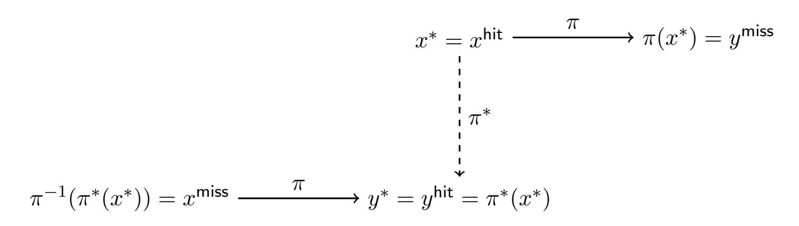
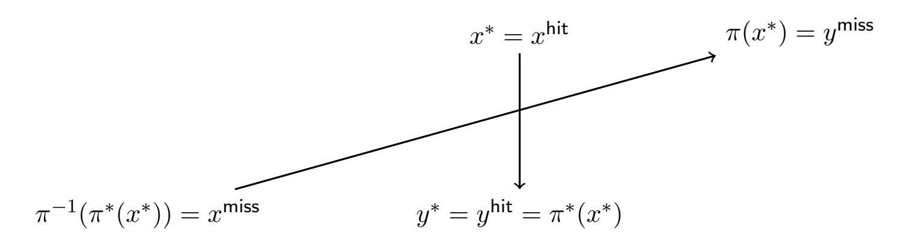
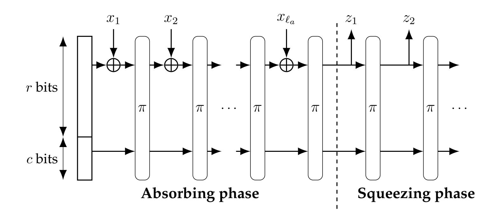

{0}------------------------------------------------

# Quantum Lifting for Invertible Permutations and Ideal Ciphers

Alexandru Cojocaru \* Minki Hhan † Qipeng Liu ‡ Takashi Yamakawa § Aaram Yun ¶

#### **Abstract**

In this work, we derive the first lifting theorems for establishing security in the quantum random permutation and ideal cipher models. These theorems relate the success probability of an arbitrary quantum adversary to that of a classical algorithm making only a small number of classical queries.

By applying these lifting theorems, we improve previous results and obtain new quantum query complexity bounds and post-quantum security results. Notably, we derive tight bounds for the quantum hardness of the double-sided zero search game and establish the postquantum security for the preimage resistance, one-wayness, and multi-collision resistance of constant-round sponge, as well as the collision resistance of the Davies-Meyer construction.

# **Contents**

| 1 | Introduction                               |                                              |          |
|---|--------------------------------------------|----------------------------------------------|----------|
|   | 1.1                                        | Our Results                               | 2 4   |
|   | 1.2                                        | Technical Overview                           | 5        |
|   | 1.3                                        | Concurrent Work                           | 12       |
|   | 1.4                                        | Paper Organization                           | 12       |
| 2 | Preparation for Lifting Theorem            |                                              |          |
|   | 2.1                                        | Algorithms with Permutation Oracles       | 12 12 |
|   | 2.2                                        | Reprogramming of Permutations                | 13       |
| 3 | Classical Lifting Theorem for Permutations |                                              |          |
|   | 3.1                                        | Measure and Reprogram Lemma for Permutations | 16 17 |
|   | 3.2                                        | Proof of the Classical Lifting Theorem    | 19       |
| 4 |                                            | Quantum Lifting Theorem for Permutations     | 20       |

\*University of Edinburgh

†The University of Texas at Austin

‡UC San Diego

§NTT Social Informatics Laboratories

¶Ewha Womans University

{1}------------------------------------------------

| 5 | Quantum Lifting Theorem for Ideal Ciphers       |    |
|---|-------------------------------------------------|----|
| 6 | Applications6.1 Generalized Double-Sided Search | 32 |
| A | Deferred Proofs                                 |    |
| В | Handling Interactive Setting                    | 45 |
| C | Proof of Lemma 4.3                              | 47 |

#### 1 Introduction

The random permutation model (RPM) and the ideal cipher model (ICM) are idealized models that provide simplified analyses for cryptographic constructions based on block ciphers and hash function designs, which often lack rigorous security foundations. Similar to the random oracle model (ROM), both RPM and ICM capture generic attacks — those that treat the underlying cryptographic primitives as black boxes. Such models often offer insight into the best possible attacks for many natural applications1. This approach is commonly referred to as the so-called RPM/ICM methodology [CDG18]:

**RPM/ICM methodology.** For "natural" applications of hash functions and block ciphers, the concrete security proven in the RPM/ICM is the right bound even in the standard model, assuming the "best possible" instantiation for the idealized component (permutation or block cipher) is chosen.

In the random permutation model (RPM), every party has access to  $\pi$  and  $\pi^{-1}$  for a uniformly chosen random permutation  $\pi$ . In the ideal cipher model (ICM), each party has oracle access to  $E_K(\cdot)$  and  $E_K^{-1}(\cdot)$ , where each  $E_K(\cdot)$  is an independent random permutation. A wide range of constructions and proofs have been developed within the RPM/ICM framework, leading to significant successes. Many of these constructions have been standardized by the National Institute of Standards and Technology, including the Even-Mansour cipher (AES), the Davies-Meyer hash function (SHA-1/2 and MD5), the sponge construction (SHA-3).

**Quantum RPM/ICM.** While RPM/ICM provides a precise characterization of generic attacks, it does not account for potential quantum attacks: i.e., the ability to compute the public function in superposition. In the quantum random permutation model (or QRPM), a quantum algorithm can query the following unitaries for one unit of cost:

$$U_{\pi} \ket{x} \ket{y} = \ket{x} \ket{y \oplus \pi(x)}$$
, and  $U_{\pi^{-1}} \ket{x} \ket{y} = \ket{x} \ket{y \oplus \pi^{-1}(x)}$ .

&lt;sup>1While several studies have established separations between idealized models [GK03, CGH04, Bla06] and the standard model, these separations are often contrived (except for the very recent work [KRS25]) and rely on specific structures that can only be exploited by non-black-box attacks.

{2}------------------------------------------------

Similarly, in the quantum ideal cipher model (or QICM), a quantum algorithm can query the function (·, ·) in superposition (i.e., both the key and the input ):

$$U_E \ket{K}\ket{x}\ket{y} = \ket{K}\ket{x}\ket{y} \oplus E_K(x)$$
, and 
$$U_{E^{-1}}\ket{K}\ket{x}\ket{y} = \ket{K}\ket{x}\ket{y} \oplus E_K^{-1}(x)$$
.

Since the proposal of the quantum random oracle model (QROM) [\[BDF](#page-38-1)+11], the quantum idealized models have received a lot of attention because it characterizes the "best-possible" quantum generic attacks. Many tools have been developed in the QROM [\[AHU19,](#page-38-2) [Zha19,](#page-41-1) [YZ21\]](#page-41-2) and almost all important constructions in the ROM, including the Fiat-Shamir transformation [\[DFMS19,](#page-39-3) [LZ19\]](#page-40-1) and the Fujisaki-Okamoto transformation [\[TU16,](#page-40-2) [HHK17,](#page-39-4) [JZC](#page-40-3)+18], have their security shown in the QROM.

However, the situation becomes far less clear in the QRPM and QICM. There are already two major differences between the QROM and QRPM/QICM:

- 1. Random functions exhibit perfect independence; that is, the outputs for all inputs are pairwise independent. In contrast, while the outputs of a random permutation are close to independent, the weak correlations between them completely invalidate or complicate almost all methods used in the QROM. This issue persists even when an algorithm has oracle access only to the forward permutation and not to its inverse −1 .
- 2. In both QRPM and QICM, an algorithm has quantum access not only to the original permutation but also to its inverse −1 . The ability to query the backward oracle −1 destroys independence, making it significantly more challenging to extend QROM-based arguments to these settings.

Various approaches have been proposed to establish security in QPRM and QICM, but each comes with its own limitations. When an algorithm has oracle access only to the forward oracle of a random permutation, one can leverage the indistinguishability between random permutations and random functions [\[Yue13,](#page-40-4) [Zha13\]](#page-41-3) to argue security in QROM. This approach introduces a small additive loss in the security analysis but nonetheless preserves the overall security guarantees.

However, when an algorithm has oracle access to both the forward and inverse oracles, it can immediately distinguish a random permutation from a random function, rendering the above method ineffective. To address this, one line of work attempts to extend Zhandry's compressed oracle technique [\[Ros21,](#page-40-5) [ABKM22,](#page-38-3) [Unr23,](#page-40-6) [ABK](#page-37-0)+24, [MMW24\]](#page-40-7), while another introduces novel techniques [\[HY18,](#page-39-5) [Zha21,](#page-41-4) [ABPS23,](#page-38-4) [CP24,](#page-39-6) [CPZ24\]](#page-39-7) for specific constructions.

These approaches, however, are often problem-specific and challenging to generalize. For example, [\[MMW24\]](#page-40-7) employs a strictly monotone factorization to represent permutations, establishing a lower bound for finding (, ()) in a relation . While their method is theoretically generalizable, it quickly becomes complex as the underlying problem grows in complexity. Similarly, [\[CP24\]](#page-39-6) introduces a symmetrization technique to prove the one-wayness of the single-round sponge construction, but this method does not easily extend to multiple rounds or to other properties of the sponge construction.

The difficulty described above in analyzing the QRPM/QICM is not merely a technical limitation. Indeed, we can construct cryptographic schemes that are secure in the (classical) RPM/ICM 

{3}------------------------------------------------

but insecure in the QRPM/QICM.2 In fact, a similar gap also exists between the QROM and the ROM. Nonetheless, [YZ21] has proposed a "lifting theorem" which, albeit with some loss, upgrades a proof in the ROM to one in the QROM. This leads to the following natural question:

Is there a general theorem that seamlessly lifts any classical RPM/ICM proof to a proof in QRPM/QICM?

We answer this question affirmatively, and reprove numerous results from previous works within the QRPM/QICM framework as well as obtain new ones using simple arguments.

#### 1.1 Our Results

**Quantum Lifting Theorem for Interactive Search Games in RPM/ICM.** Our central result proposes a novel lifting theorem for *interactive search games* in RPM/ICM that relates the success probability of an arbitrary quantum algorithm with the success probability of a classical algorithm performing a much smaller number of queries. More concretely, our main results for QRPM can be stated as follows:

**Theorem 1.1** (Quantum Lifting Theorem on Random Permutation). Let  $\mathcal{G}$  be an (interactive) search game with a challenger  $\mathcal{C}$  that performs at most k classical queries to the invertible random permutation  $\pi: X \to X$ , and let  $\mathcal{A}$  be an algorithm that performs q quantum queries to  $\pi$ . Then there exists an adversary  $\mathcal{B}$  making at most k classical queries to  $\pi$  such that:

$$\Pr[\mathcal{B} \ wins \ \mathcal{G}] \ge \frac{\left(1 - \frac{k^2}{|X|}\right)}{(8q+1)^{2k}} \Pr[\mathcal{A} \ wins \ \mathcal{G}].$$

Note that in almost all games, the challenger  $\mathcal{C}$  is efficient and thus makes only a polynomial number of queries. Consequently, we can safely assume that  $1 - \frac{k^2}{|X|} \ge \frac{1}{2}$ , which does not affect the asymptotic order of the success probability in the search game.

We demonstrate the power and simplicity of our lifting theorem through the example of double-sided zero search [Unr23]. In this game  $\mathcal{G}_{\text{double-sided}}$ , a random permutation  $\pi: \{0,1\}^{2n} \to \{0,1\}^{2n}$ , as well as its inverse  $\pi^{-1}$  are given, and the goal is to find x,y such that  $\pi(x)=y$ , where both x and y have at least n leading zeros. Clearly, k=1, as the challenger makes only a single oracle query to the random permutation.

For a single-classical-query algorithm  $\mathcal{A}$ , the probability that  $\mathcal{B}$  wins  $\mathcal{G}_{\mathsf{double-sided}}$  is at most  $2/2^n$ . This follows from two possibilities: either the algorithm queries a valid pair or it correctly guesses one. The probabilities of these events sum to  $1/2^n + 1/2^n = 2/2^n$ . Applying our main theorem (Theorem 1.1), we obtain the following bound for any q-query quantum algorithm in QRPM.

$$\Pr[\mathcal{A} \text{ wins } \mathcal{G}_{\mathsf{double-sided}}] \leq 2(8q+1)^2 \Pr[\mathcal{B} \text{ wins } \mathcal{G}_{\mathsf{double-sided}}] = O(q^2/2^n).$$

This bound is tight to that by [CP24]. Furthermore, this result can be easily generalized to the game  $G_R$  to find a pair (x, y) in an arbitrary relation R:

$$\Pr[\mathcal{A} \text{ wins } \mathcal{G}_R] \leq (8q+1)^2 \Pr[\mathcal{B} \text{ wins } \mathcal{G}_R] = O(r_{\mathsf{max}} \cdot q^2/2^{2n})$$

&lt;sup>2[YZ24] gave cryptographic schemes that are secure in the (classical) ROM but insecure in the QROM. This can be extended to a separation between the QRPM/QICM and RPM/ICM by instantiating a random oracle using a permutation-based hash function that is indifferentiable from a random oracle (e.g., sponge construction [BDPV11, BDPV08]).

{4}------------------------------------------------

where /2 2 is the probability that a single query reveals a pair (, ) ∈ . This improves the bound ̃( 3/2 2 ) by [\[MMW24\]](#page-40-7) and is also tight to Grover's search.

We also prove a similar lifting theorem in the QICM.

**Theorem 1.2** (Quantum Lifting Theorem on Ideal Ciphers)**.** *Let be an (interactive) search game with a challenger that performs at most classical queries to an ideal cipher oracle* : × → *, and let be an algorithm that performs quantum queries to the ideal cipher. Then there exists an adversary* ℬ *making at most classical queries to such that:*

$$\Pr[\mathcal{B} \ wins \ \mathcal{G}] \ge \frac{\left(1 - \frac{k^2}{|X|}\right)}{(8q+1)^{2k}} \Pr[\mathcal{A} \ wins \ \mathcal{G}].$$

**Other Applications in QRPM/QICM.** Beyond the generalized double-sided search, as previously mentioned, our lifting theorems also have many applications in the random permutation and ideal cipher models.

**Sponge construction.** The sponge construction [\[BDPV11\]](#page-38-5) is a permutation-based hashing algorithm that underlies SHA-3. In the classical setting, it is known to be indifferentiable from a random oracle [\[BDPV08\]](#page-38-6), intuitively meaning it is as secure as a random oracle in the RPM. However, little is known about its security in the post-quantum setting. The current state of the art is that the *single-round* sponge satisfies preimage-resistance and one-wayness [\[CP24,](#page-39-6) [MMW24\]](#page-40-7), and also achieves *reset indifferentiability* (even with advice) under a certain parameter regime [\[Zha21,](#page-41-4) [CPZ24\]](#page-39-7),[3](#page-4-1) implying that in this regime it is as secure as a random oracle against quantum adversaries. In contrast, no results were previously known for the multi-round sponge.

Using our lifting theorem, we reduce the post-quantum security of sponge to its classical counterpart. As a result, we obtain non-trivial security bounds for preimage-resistance, one-wayness, and (multi-)collision-resistance of *constant-round* sponge. Although these bounds are not tight, this work represents the first non-trivial security result for multi-round sponge constructions.

**Davies-Meyer and PGV hash functions.** The Davies-Meyer construction [\[Win84\]](#page-40-8) is a blockcipher-based hashing algorithm that underlies SHA-1, SHA-2, and MD5. In the classical setting, it is proven to satisfy one-wayness and collision-resistance in the ICM [\[Win84,](#page-40-8) [BRS02,](#page-38-7) [BRSS10\]](#page-38-8). In the quantum setting, although it is shown to be one-way in the QICM [\[HY18\]](#page-39-5), its collisionresistance remained an open question.

By applying our lifting theorem, we prove that the Davies-Meyer construction satisfies collisionresistance in the QICM, albeit our result is not tight. We remark that our analysis is not specific to the Davies-Mayer construction, and applicable to, say, any of the PGV-hash functions [\[PGV93,](#page-40-9) [BRS02,](#page-38-7) [BRSS10\]](#page-38-8).

## **1.2 Technical Overview**

In this section, we revisit the approaches from [\[YZ21\]](#page-41-2), outlining the barriers in QRPM/QICM and the novel ideas to overcome them. Given the similarities between QRPM and QICM, we focus on QRPM in this overview, deferring the details of QICM to the main body.

3 Specifically, ≤ where is the rate and is the capacity.

{5}------------------------------------------------

**The Lifting Theorem in the (Q)ROM.** We begin by reviewing the idea behind the lifting theorem in QROM from [\[YZ21\]](#page-41-2), which builds on the measure-and-reprogram lemma first introduced in [\[DFMS19\]](#page-39-3) and later improved in [\[DFM20\]](#page-39-8). To make the ideas more intuitive, we focus on the function inversion problem: given a random oracle : {0, 1} → {0, 1} , the goal is to find an such that () = 0 . Before proceeding, we introduce the notation for a reprogrammed oracle: given a random oracle , we define [ → ] as the function that behaves identically to except that it outputs on input .

We will first look at a lemma that reduces a classical -query algorithm to another classical query algorithm with a much smaller number of queries; this will provide some intuition for the lifting theorem. Consider a *classical* -query algorithm . Let \* be the final outcome of under a random oracle . There are two possibilities: (i) \* is queried by among one of the queries; or (ii) \* is never queried. Let \* ∈ {1, 2, . . . , , ⊥} be the index of that query where ⊥ indicates that \* is never queried. The key observation in [\[YZ21\]](#page-41-2) is that, the algorithm cannot distinguish these two cases for \* ∈ {0, 1} :

- 1. has oracle access to [ \* → \* ] for all these queries;
- 2. has oracle access to for the first \*−1 queries, then [ \* → \* ] for the rest of the queries.

This is simply because without querying on \* , the algorithm will have identical views on the transcript (and thus the computation). With the above observation, [\[YZ21\]](#page-41-2) defines the following simulator [, , \* ] that only makes one query to \* : [, , \* ] randomly guesses a uniform \* ← {1, 2, . . . , , ⊥}. If \* = ⊥, it returns what returns. Otherwise, it runs with a random oracle for the first \* − 1 steps, and runs the rest of the computation with [ → \* ()] where is the input of the \* -th query.

They show the following *classical* measure-and-reprogram lemma:

**Lemma 1.3** (Measure and Reprogram Lemma)**.** *Let and* \* *be any two functions (not random functions). Let be an arbitrary classical algorithm equipped with classical queries to the oracle .*

*Let* \* ∈ *be an input and* \* = \* ( \* )*. Then there exists a simulator algorithm that given oracle access to ,* \* *, making at most one query to* \* *, such that for any , and for any output (can be arbitrarily dependent on* , \* , \* *), simulates the output of having oracle access to* [ \* → \* ] *(the reprogrammed version of ) with probability:*

$$\Pr\left[S[\mathcal{A}, H, H^*] \text{ outputs } z\right] \geq \frac{1}{(q+1)} \Pr\left[\mathcal{A}^{H[x^* \to y^*]} \text{ outputs } z\right].$$

By taking expectation over , \* , and summing over all such that = \* and \* () = 0 , the left-hand side is equal to the success probability of a one-classical-query algorithm ℬ finding a pre-image:

$$\sum_{x^*} \mathbb{E}_{H,H^*} \left[ \Pr[S[\mathcal{A}, H, H^*] \to x^* \text{ s.t. } H^*(x^*) = 0^n] \right] = \Pr[\mathcal{B} \text{ finds a pre-image of } 0^n].$$

Here we simply treat as the one query algorithm who simulates itself and makes a single oracle query to \* .

The right-hand side is equal to the success probability of a -classical-query algorithm finding a pre-image, since

$$\sum_{x^*} \mathbb{E}_{H,H^*} \left[ \Pr[\mathcal{A}^{H[x^* \to y^*]} \to x^* \text{ s.t. } H^*(x^*) = 0^n] \right] = \Pr[\mathcal{A} \text{ finds a pre-image of } 0^n].$$

{6}------------------------------------------------

Using the measure-and-reprogram lemma and the linearity of expectation, we have:

$$\Pr[\mathcal{B} \text{ finds a pre-image of } 0^n] \ge \frac{1}{(q+1)} \Pr[\mathcal{A} \text{ finds a pre-image of } 0^n].$$

Finally, since the winning probability of ℬ is at most (1/), we establish an upper bound for the success probability of as (/).

The above inequality is the basic form of the lifting theorem. The similar idea applies to the quantum setting, as well as a general (interactive) search game.

**The Classical Lifting in the RPM.** The above approach fails even in the classical RPM/ICM setting. To illustrate this issue, consider a simple setting where an algorithm has no oracle access to the inverse of a permutation : {0, 1} → {0, 1} and its goal is to find an such that both and () have enough leading zeros (the double-sided search problem). For any *classical* -query algorithm , similar to the argument in ROM, there must exist some \* ∈ {1, 2, . . . , , ⊥} such that the final output \* is either queried as the \* -th query or never queried at all (when \* = ⊥). Following the approach of [\[YZ21\]](#page-41-2), we consider the following simulator [, , \* ]:

- It randomly selects \* ← {1, 2, . . . , , ⊥}.
- If \* = ⊥, it returns whatever outputs.
- Otherwise, it runs with for the first \* − 1 steps, then completes the remaining computation using [ → \* ()], where is the input of the \* -th query.

Ideally, we would like to argue that [, , \* ] behaves similarly to \* , up to a multiplicative loss of ( + 1), which is coming from guessing a correct \* . However, this no longer holds due to the weak dependence inherent in permutations. Even if correctly guesses \* , it remains possible that an earlier query (before the \* -th query) returns \* (); i.e., some input ′ under permutation evaluates to ( ′ ) = \* (), which makes [ → \* ()] is not even a permutation. In this case, even if itself is only queried at the \* -th step, the algorithm can still detect an inconsistency two distinct queries producing the same output contradicts the structure of a permutation. This issue becomes even more pronounced when access to the inverse oracle is provided, making such inconsistencies easier to detect.

Our first contribution is to identify this issue as well as provide a solution to enable the classical reprogram lemma in the RPM/ICM. For a forward oracle query, we call a query "hit" (or just ) with respect to the final outcome \* if = \* , just as in the random oracle case; we call a query "miss" (or just ) with respect to \* if () = \* ( \* ). When we reprogram a permutation with [ \* → \* ( \* )], we will maintain its injective structure. We define the reprogrammed permutation as:

$$\pi[x^* \to \pi^*(x^*)](x) = \begin{cases} \pi^*(x^*) & \text{if } x = x^{\mathsf{hit}} \\ \pi(x^*) & \text{if } x = x^{\mathsf{miss}} \\ \pi(x) & \text{otherwise} \end{cases}.$$

In other words, when we only hardcode [ \* → \* ( \* )], it violates the injective structure of the permutation. Thus, we will have to find the element with more than one preimage and reprogram that as well.[4](#page-6-0) This corresponds to [Figure 1,](#page-7-0) where to maintain the injectiveness, we have to reprogram both and . This corresponds to removing the two solid edges to \* ( \* ) and to ( \* ) in [Figure 1](#page-7-0) and adding two edges as in [Figure 2.](#page-7-1)

4The idea of reprogramming a permutation by swapping two outputs is also used in [\[ABKM22\]](#page-38-3).

{7}------------------------------------------------

**Figure 1:** An illustration of hit and miss inputs regarding \* , \*

**Figure 2:** An illustration of mappings in the reprogrammed permutation [ \* → \* ( \* )]

Similarly, for a backward query to −1 , we call a query "hit" (or just ) with respect to the final outcome \* = \* ( \* ) if = \* . We call a query "miss" (or just ) if = ( \* ) as in [Figure 1.](#page-7-0)

Giving the above definition, we consider the following simulator that not only guesses the index \* but also whether the \* -th query is a hit or a miss query. [, , \* ] is defined as:

- 1. samples ( \* , ) ← ({1, 2, . . . , } × {0, 1}) ∪ {(⊥, ⊥)}
- 2. If \* = ⊥, it returns whatever outputs;
- 3. Otherwise, it runs using (both the forward and the inverse) for the first \* − 1 queries; for the \* -th query:
  - If = 0 (indicating a hit query):
    - **–** A forward query on input : compute = \* () and reprogram [ → ].
    - **–** A backward query on input : compute = \*−1 () and reprogram [ → ].
  - If = 1 (indicating a miss query):
    - **–** A forward query on input : compute = ( \*−1 (())) and reprogram [ → ].
    - **–** A backward query on input : compute = −1 ( \* ( −1 ())) and reprogram [ → ].

Then it runs the rest of 's computation under [ → ] (and its inverse).

We show that, by defining both hit and miss queries, it captures the first query that "touches" the final outcome \* — either by querying the miss query or the hit query. This modified simulator allows us to establish a similar reprogram lemma in the classical RPM. For example, we can show that for any -query for the double-sided search problem, there always exists a one-query ℬ such that

$$\Pr[\mathcal{B} \text{ wins}] \ge \frac{1}{(2q+1)} \Pr[\mathcal{A} \text{ wins}].$$

{8}------------------------------------------------

This can be further generalized to any search game, for which we will discuss the quantum setting.

**State Decomposition.** With the above idea in the classical setting, we are now ready to generalize it to the quantum setting and give a lifting theorem for QRPM. To explain the high level idea for our measure-and-reprogram lemma in the QRPM setting, we start with the following example. Let  $\mathcal{A}$  be a q-quantum-query algorithm that solves the double-sided search game, and let  $x^*, y^*$  be some pair. Consider  $\mathcal{A}$  with oracle access to  $\pi[x^* \to y^*]$  and its inverse, whose computation can be written as:

$$U_{q+1} O_{\pi[x^* \to y^*]} U_q \cdots O_{(\pi[x^* \to y^*])^{-1}} U_2 O_{\pi[x^* \to y^*]} U_1 |0\rangle.$$

Without loss of generality, we assume the first query is a forward query. We start by considering the state up to the first query:  $O_{\pi[x^* \to y^*]}U_1|0\rangle$ . We insert an additional identity operator and have,

$$\begin{split} &O_{\pi[x^* \to y^*]} U_1 \left| 0 \right\rangle = O_{\pi[x^* \to y^*]} \, I \, U_1 \left| 0 \right\rangle \\ &= O_{\pi[x^* \to y^*]} \left( I - |x^{*\mathsf{hit}}\rangle \langle x^{*\mathsf{hit}}| + |x^{*\mathsf{hit}}\rangle \langle x^{*\mathsf{hit}}| - |x^{*\mathsf{miss}}\rangle \langle x^{*\mathsf{miss}}| + |x^{*\mathsf{miss}}\rangle \langle x^{*\mathsf{miss}}| \right) U_1 \left| 0 \right\rangle \\ &= \underbrace{O_{\pi[x^* \to y^*]} \left( I - |x^{*\mathsf{hit}}\rangle \langle x^{*\mathsf{hit}}| - |x^{*\mathsf{miss}}\rangle \langle x^{*\mathsf{miss}}| \right) U_1 \left| 0 \right\rangle}_{(i)} + \underbrace{O_{\pi[x^* \to y^*]} \left| x^{*\mathsf{hit}}\rangle \langle x^{*\mathsf{hit}}| \, U_1 \left| 0 \right\rangle}_{(iii)}. \end{split}$$

Here  $x^{*hit}$  and  $x^{*miss}$  are defined according to  $\pi$  as in Figure 1.

The first term (i) equals to

$$\begin{split} &O_{\pi[x^* \to y^*]} \left( I - |x^{* \, \text{hit}}\rangle \langle x^{* \, \text{hit}}| - |x^{* \, \text{miss}}\rangle \langle x^{* \, \text{miss}}| \right) U_1 \, |0\rangle \\ = &O_{\pi} \left( I - |x^{* \, \text{hit}}\rangle \langle x^{* \, \text{hit}}| - |x^{* \, \text{miss}}\rangle \langle x^{* \, \text{miss}}| \right) U_1 \, |0\rangle \\ = &O_{\pi} U_1 \, |0\rangle - O_{\pi} \, |x^{* \, \text{hit}}\rangle \langle x^{* \, \text{hit}}| \, U_1 \, |0\rangle - O_{\pi} \, |x^{* \, \text{miss}}\rangle \langle x^{* \, \text{miss}}| \, U_1 \, |0\rangle \,. \end{split}$$

This is because on inputs that are neither hit nor miss inputs,  $O_{\pi}$  and  $O_{\pi[x^* \to y^*]}$  are identical. Combining with other terms, we have that the state after the first query is equal to:

$$O_{\pi[x^* \to y^*]} U_1 |0\rangle = O_{\pi} U_1 |0\rangle - O_{\pi} |x^{*\text{hit}}\rangle \langle x^{*\text{hit}}| U_1 |0\rangle - O_{\pi} |x^{*\text{miss}}\rangle \langle x^{*\text{miss}}| U_1 |0\rangle + O_{\pi[x^* \to y^*]} |x^{*\text{miss}}\rangle \langle x^{*\text{miss}}| U_1 |0\rangle.$$

These five terms can be interpreted in the following way:

- 1.  $O_{\pi}U_1|0\rangle$ : the first term corresponds to the case that we do not measure the first query and use  $\pi$  for this query.
- 2.  $O_{\pi} |x^{*\text{hit}}\rangle \langle x^{*\text{hit}}| U_1 |0\rangle$  and  $O_{\pi} |x^{*\text{miss}}\rangle \langle x^{*\text{miss}}| U_1 |0\rangle$ : both terms correspond to the case that we measure the first query and it is either a hit or miss query; but we still use  $\pi$  for the first query. Looking ahead, these two terms will correspond to  $|\phi_{1,0,1}\rangle$  and  $|\phi_{1,1,1}\rangle$  in the final decomposition defined below.

{9}------------------------------------------------

3.  $O_{\pi[x^* \to y^*]} |x^{*\text{hit}}\rangle\langle x^{*\text{hit}}| U_1 |0\rangle$  and  $O_{\pi[x^* \to y^*]} |x^{*\text{miss}}\rangle\langle x^{*\text{miss}}| U_1 |0\rangle$ : both terms correspond to the case that we measure the first query and it is either a hit or miss query; we use the reprogrammed  $\pi[x^* \to y^*]$  for the first query. Looking ahead, these two terms will correspond to  $|\phi_{1,0,0}\rangle$  and  $|\phi_{1,1,0}\rangle$  in the final decomposition defined below.

The similar argument extends to the second query, where we will decompose the component  $O_{\pi}U_1|0\rangle$ . Similar to the first query case, this decomposition introduces four more terms. By decomposing the state to the last query, eventually we will have (4q+1) terms. Among them:

- There is one term  $|\phi_{\perp}\rangle$  for the case that we do not measure any query and run  $\mathcal{A}$  under  $\pi$ .
- There are q terms  $|\phi_{i,0,0}\rangle$  for the case that we measure the i-th query for  $i \in \{1, 2, ..., q\}$ , it is  $x^{*\text{hit}}$  (or  $y^{*\text{hit}}$ , if it is a backward query). The remaining queries (including the i-th query) are under  $\pi[x^* \to y^*]$ .
- There are q terms  $|\phi_{i,1,0}\rangle$  for the case that we measure the i-th query for  $i \in \{1, 2, ..., q\}$ , it is  $x^{* \text{miss}}$  (or  $y^{* \text{miss}}$ , if it is a backward query). The remaining queries (including the i-th query) are under  $\pi[x^* \to y^*]$ .
- Similarly, we have 2q terms  $|\phi_{i,b,1}\rangle$  for  $b\in\{0,1\}$ . They stand for the case that we measure the i-th query for  $i\in\{1,2,\ldots,q\}$ , it is either a miss or hit (depending on b). The i-th query is under  $\pi$  and the remaining queries are under  $\pi[x^*\to y^*]$ .

By induction on the state decomposition, we can show that the original computation is equal to the summation of all these 4q + 1 terms:

$$U_{q+1} O_{\pi[x^* \to y^*]} U_q \cdots O_{(\pi[x^* \to y^*])^{-1}} U_2 O_{\pi[x^* \to y^*]} U_1 |0\rangle = |\phi_{\perp}\rangle + \sum_{i=1}^q \sum_{b,c \in \{0,1\}} (-1)^c |\phi_{i,b,c}\rangle.$$

Thus for a projection  $\Pi$  (representing the winning condition), from the above identity and Cauchy-Schwarz, we have

$$\|\Pi U_{q+1} O_{\pi[x^* \to y^*]} U_q \cdots O_{\pi[x^* \to y^*]} U_1 |0\rangle \|^2$$

$$\leq (4q+1) \cdot \left( \|\Pi |\phi_{\perp}\rangle \|^2 + \sum_{i=1}^q \sum_{b,c \in \{0,1\}} \|\Pi |\phi_{i,b,c}\rangle \|^2 \right).$$

Here each term  $\|\Pi |\phi_{\perp}\rangle\|^2$  or  $\|\Pi |\phi_{i,b,c}\rangle\|^2$  has an operational meaning: the probability that the final outcome is in  $\Pi$ , where the execution will use oracles specified by  $\bot$  or i,b,c. We give a formal description of the simulator below.

The Quantum Lifting Theorem in the QRPM. We define the following simulator in the quantum setting for RPM.  $S[A, \pi, \pi^*]$  is defined as:

- 1. S samples  $(i, b, c) \leftarrow (\{1, 2, ..., q\} \times \{0, 1\} \times \{0, 1\}) \cup \{(\bot, \bot, \bot)\}$ , where b stands for if it is "hit" or "miss" and c stands for whether the reprogramming happens before or after the query.
- 2. If  $i = \bot$ , it returns whatever  $\mathcal{A}^{\pi}$  outputs;
- 3. Otherwise, it runs A using  $\pi$  (both the forward and the inverse) for the first i-1 queries; for the i-th query, S measures the input register :

{10}------------------------------------------------

- If b = 0 (indicating a hit query):
  - A forward query on input x: compute  $y = \pi^*(x)$ .
  - A backward query on input y: compute  $x = \pi^{*-1}(y)$ .
- If b = 1 (indicating a miss query):
  - A forward query on input x: compute  $y = \pi(\pi^{*-1}(\pi(x)))$ .
  - A backward query on input y: compute  $x = \pi^{-1}(\pi^*(\pi^{-1}(y)))$ .

Then for the remaining queries,

- If c = 0, it answers all  $\mathcal{A}'$ s remaining queries using  $\pi[x \to y]$ .
- If c=1, it answers  $\mathcal{A}$ 's i-th query using  $\pi$  and the remaining queries using  $\pi[x \to y]$ .

S outputs whatever  $\mathcal{A}$  outputs.

If the first step samples (i,b,c), then the probability that the simulator produces z is at least  $\|\Pi |\phi_{i,b,c}\rangle\|^2$  (or  $\|\Pi |\phi_{\perp}\rangle\|^2$  if  $(i,b,c)=(\perp,\perp,\perp)$ ). Building on the previous discussion, we conclude that for any outcome z, the probability of the simulator producing z is at least  $\frac{1}{(4q+1)^2}$  times the probability of  $\mathcal{A}$  producing z.

This simulator can be easily generalized to any number of reprogramming. In the simulator, we will choose k coordinates instead of one to measure and reprogram, one for each final output  $x_i^*$ ; similarly to the k=1 case, there are (4q+1) such possibilities for each  $x_i^*$ . One subtlety is that, when we sequentially reprogram a permutation multiple times, these reprogramming may interfere with each other, which makes the analysis more involved. To avoid this, we introduce the "goodness" condition, which ensures that such interference does not occur. (See Definition 2.7 for the formal definition of the goodness). Fortunately, we show that the goodness condition is satisfied except for an exponentially small probability.

Now we propose the measure-and-reprogram lemma. In order to describe the formal measure-and-reprogram result, we need to additionally introduce the following notions. We will denote the reprogrammed permutation on k pairs  $p_1 = (x_1, y_1), ..., p_k = (x_k, y_k)$  by  $\pi[x_1 \to y_1]...[x_k \to y_k]$ .

**Lemma 1.4** (Measure and Reprogram Lemma, Informal). Let  $\pi$  and  $\pi^*$  be two fixed permutations (not random permutations). Let  $\mathcal{A}$  be an arbitrary quantum algorithm equipped with q quantum queries to the oracle  $\pi$ ,  $\pi^{-1}$ .

Let  $\vec{x}^* = (x_1^*, ..., x_k^*) \in X^k$  be any k-vector of inputs and  $\vec{y}^* = (y_1^*, ..., y_k^*) = (\pi^*(x_1^*), ..., \pi^*(x_k^*))$ , such that the k-tuple  $(x_1^*, y_1^*), ..., (x_k^*, y_k^*)$  is "good" with respect to  $\pi$ . Then there exists a simulator algorithm S that given oracle access to  $\pi$ ,  $\pi^*$  and A, for any z (can be arbitrarily dependent on  $\pi$ ,  $\pi^*$ ,  $\vec{x}^*$ ), simulates the output of A having oracle access to  $\pi[x_1^* \to y_1^*]...[x_k^* \to y_k^*]$  (the reprogrammed version of  $\pi$ ) with probability:

$$\Pr_{\pi,\pi^*} \left[ S[\mathcal{A}, \pi, \pi^*] \text{ outputs } z \right] \ge \frac{1}{(8q+1)^{2k}} \Pr_{\pi,\pi^*} \left[ \mathcal{A}^{\pi[x_1^* \to y_1^*] \dots [x_k^* \to y_k^*]} \text{ outputs } z \right].$$

Here, we have (8q+1) instead of (4q+1) because we consider the most general algorithm, which can make superposition queries to  $\pi$  and  $\pi^{-1}$  within a single query. To handle this, we decompose each query into two: one querying only  $\pi$  and the other querying only  $\pi^{-1}$ . This transformation introduces an additional multiplicative factor of 2.

&lt;sup>5For simplicity, we do not state the formal definition of "good" in the introduction.

{11}------------------------------------------------

Finally, for any game , by summing over all valid ⃗\* , (⃗\* ) ∈ × , when take expectation over , \* , we have for any -quantum-query , there exists a -classical-query ℬ such that

$$\Pr[\mathcal{B} \text{ wins } \mathcal{G}] \ge \frac{(1 - k^2/|X|)}{(8q + 1)^{2k}} \Pr[\mathcal{A} \text{ wins } \mathcal{G}].$$

Here (1 − 2/||) comes from the probability that the goodness condition holds for uniform , \* . This completes the high level idea of our lifting theorem in the QRPM.

### **1.3 Concurrent Work**

A concurrent work by Alagic, Carolan, Majenz, and Tokat [\[ACMT25\]](#page-38-9) establishes quantum indifferentiability for the (multi-round) sponge construction. Although their bounds are still not tight, their results encompass ours in most settings, with a few exceptions, such as preimage-resistance in the single- and two-round cases, and collision-resistance in the single-round case. However, their approach is tailored specifically to sponge, whereas our lifting theorem applies more broadly to any permutation-based construction.

### **1.4 Paper Organization**

In [Section 2](#page-11-2) we introduce a series of intermediate results that are going to be used to prove the main lifting theorems. Part of the proofs of these results are deferred to [Appendix A.](#page-41-0) [Section 3](#page-15-0) contains the classical lifting for permutations as a classical analogue of our main quantum lifting theorem, shown in [Section 4,](#page-19-0) while the extension of the quantum lifting to the interactive setting is proven in [Appendix B.](#page-44-0) The quantum lifting theorem in the ideal cipher model is shown in [Section 5.](#page-27-0) Finally, the applications of our quantum lifting theorems can be found in [Section 6.](#page-30-0)

# **2 Preparation for Lifting Theorem**

In this section, we introduce notations, definitions and easy lemmas, that are used in the proofs of the (classical and quantum) lifting theorem for permutations in [Sections 3](#page-15-0) and [4.](#page-19-0)

#### **2.1 Algorithms with Permutation Oracles**

We define basic notations for algorithms with oracle access to an invertible permutation.

Let : → be a permutation and −1 be its inverse. A -query classical algorithm with permutation oracles can query both and −1 , but in total times. A -query quantum algorithm can query the following unitary in total times:

$$U_{\pi} |b\rangle |x\rangle |y\rangle = \begin{cases} |b\rangle \otimes O_{\pi} (|x\rangle |y\rangle) & \text{if } b = 0\\ |b\rangle \otimes O_{\pi^{-1}} (|x\rangle |y\rangle) & \text{if } b = 1, \end{cases}$$

where , −1 are the coherent computation for and −1 , We will typically denote a quantum (or classical) query algorithm by . By we mean that has quantum (or classical) access to the permutation , as well as to its inverse, −1 .

{12}------------------------------------------------

**Lemma 2.1** (Normal form)**.** *Let be a quantum algorithm making at most quantum queries to a permutation (i.e., ). There always exists a quantum algorithm whose output is identical to that of , making at most* 2 *quantum queries to and* −1 *, and of the following normal form:*

$$O_{\pi^{-1}}U_{2q}O_{\pi}U_{2q-1}\cdots O_{\pi^{-1}}U_{2}O_{\pi}U_{1}|0\rangle;$$

*i.e., making exactly queries to (for odd-numbered queries) and queries to* −1 *(for even-numbered queries).*

*Proof.* Every oracle access to can be replaced with one query access to and one query access to −1 (by introducing dummy queries).

### **2.2 Reprogramming of Permutations**

Our lifting theorems are established using simulators that gradually reprogram a permutation given to an algorithm. We introduce notation for reprogramming of permutations and show their basic properties.

**Definition 2.2.** *For a permutation* : → *and* ⃗ = (1, ..., ) ∈ *, we define* (⃗) = ((1), ..., ())*.*

**Definition 2.3** (Reprogramming permutations)**.** *Let a permutation* : → *and* (, ) ∈ × *be an arbitrary pair. Then we denote the reprogramming of by* (, ) *as:*

$$\pi[x \to y](z) = \begin{cases} y & \text{if } z = x \\ \pi(x) & \text{if } z = \pi^{-1}(y) \\ \pi(z) & \text{if } z \notin \{x, \pi^{-1}(y)\} \end{cases}$$
 (1)

*If we denote* (, ) *by a pair , we also use* [] *for* [ → ]*.*

*Similarly, for pairs* 1 = (1, 1), ..., = (, ) *we can define the reprogramming of by* 1, ..., *, denoted by* [1 → 1]...[ → ] *(or* [1] . . . []*) in a recursive manner by* [1 → 1]...[ → ] := ([1 → 1]...[−1 → −1])[ → ]*. We often denote* [1 → 1] . . . [ → ] *by* [⃗ → ⃗] *for brevity.*

**Lemma 2.4.** *For any permutation and pairs* (1, 1), . . . ,(, )*, we have*

$$(\pi[x_1 \to y_1] \dots [x_k \to y_k])^{-1} = \pi^{-1}[y_1 \to x_1] \dots [y_k \to x_k].$$

*Proof.* The proof is trivial: it suffices to check the statement for the case = 1, which we skip.

**Definition 2.5** (Disjoint pairs)**.** *For pairs* 1 = (1, 1), ..., = (, )*, we say they are disjoint pairs (or simply disjoint) if there is no duplicated or entries: for any* < *, we have* ̸= *and* ̸= *. We say* ⃗, ⃗ ∈ × *are disjoint if* (1, 1), . . . ,(, ) *are disjoint.*

*Similarly, we say* ⃗ *(or* ⃗*) is disjoint if there are no duplicated entries.*

**Lemma 2.6** (Commutativity of reprogramming for disjoint pairs)**.** *For every permutation* : → *, disjoint* ⃗, ⃗ ∈ × *, and any permutation* : [] → []*, we have:*

$$\pi[x_1 \to y_1] \dots [x_k \to y_k] = \pi[x_{\sigma(1)} \to y_{\sigma(1)}] \dots [x_{\sigma(k)} \to y_{\sigma(k)}].$$

The proof of this will be given in the Appendix, page [42.](#page-41-6)

{13}------------------------------------------------

#### **Good Tuples of Permutations**

In our lifting theorems, we consider a simulator that gradually reprograms a permutation  $\pi$  according to disjoint pairs  $p_1^* = (x_1^*, y_1^*), \dots, p_k^* = (x_k^*, y_k^*)$ . In its analysis, it is useful to ensure that, if one reprogramming changes the value of the permutation on some input, no subsequent reprogramming changes that value. To guarantee this property, we define the *goodness condition* for  $(p_1^*,\ldots,p_k^*)$  as follows:

**Definition 2.7** (Good tuples). We say that a k-tuple of pairs  $(p_1^*,...,p_k^*)$ , where  $p_1^*=(x_1^*,y_1^*),...,p_k^*=$  $(x_k^*, y_k^*)$ , is good w.r.t.  $\pi$  if the following hold:

- $p_1^*, \dots, p_k^*$  are disjoint (Definition 2.5), and  $\pi(x_i^*) \neq y_j^*$  for any  $i, j \in [k]$ .

**Definition 2.8** (Good pairs of permutations). For any distinct  $\vec{x}^* = (x_1^*, ..., x_k^*)$ , let  $G[\vec{x}^*]$  be the set consisting of all pairs  $(\pi, \pi^*)$  such that the k-tuple  $(p_1^* = (x_1^*, \pi^*(x_1^*)), ..., p_k^* = (x_k^*, \pi^*(x_k^*)))$  is good w.r.t.  $\pi$ .

Then the following lemmas are easy to prove.

**Lemma 2.9** (Reprogramming on good tuples). *Consider any permutation*  $\pi$  *and* k *pairs*  $p_1^*, \ldots, p_k^*$  *with*  $p_j^* = (x_j^*, y_j^*)$  for  $j = 1, \ldots, k$ . Suppose the tuple of pairs  $(p_1^*, \ldots, p_k^*)$  is good w.r.t.  $\pi$ . Then we have:

$$\pi[\vec{x}^* \to \vec{y}^*](z) = \begin{cases} y_j^* & \text{if } z = x_j^* \text{ for some } j \in [k], \\ \pi(x_j^*) & \text{if } z = \pi^{-1}(y_j^*) \text{ for some } j \in [k], \\ \pi(z) & \text{otherwise.} \end{cases}$$

The proof of this lemma is given in the Appendix, page 44.

**Lemma 2.10** (Bad probability). Let  $\pi$  be a (fixed) permutation and  $\vec{x}^* = (x_1^*, ..., x_k^*)$  be a (fixed) distinct tuple. Then we have

$$\Pr_{\pi^*}[(\pi, \pi^*) \notin G[\vec{x}^*]] \le \frac{k^2}{|X|}$$

*Proof.* Recall that  $(\pi, \pi^*) \in G[\vec{x}^*]$  means that  $(p_1^* = (x_1^*, y_1^* = \pi^*(x_1^*)), \dots, p_k^* = (x_k^*, y_k^* = \pi^*(x_k^*))$  is good with respect to  $\pi$ , i.e.,  $(p_1^*, ..., p_j^*)$  is disjoint and  $\pi(x_i^*) \neq y_j^*$  for all  $i, j \in [k]$ . Since  $\vec{x}^*$  is assumed to be distinct, the disjointness of  $(p_1^*, ..., p_i^*)$  is always satisfied.

The only condition that might fail is the other one. We aim to find an upper bound on the probability that  $\pi(x_i^*) = y_j^*$  for some i, j.

For each pair (i, j), consider the event  $E_{i,j}$  that  $\pi(x_i^*) = y_j^*$  holds. Since  $\pi(x_i^*)$  is a fixed element in X, and  $y_j^* = \pi^*(x_j^*)$  is uniformly random over X, the probability that  $\pi(x_i^*) = y_j^*$  is:

$$\Pr[E_{i,j}] = \frac{1}{|X|}.$$

There are  $k^2$  such pairs (i, j). By the union bound, the probability that at least one of these events occurs is at most the sum of their individual probabilities:

$$\Pr\left(\bigcup_{i\neq j} E_{i,j}\right) \leq \sum_{i,j} \Pr[E_{i,j}] = \frac{k^2}{|X|}.$$

{14}------------------------------------------------

Therefore, the probability that  $(\pi, \pi^*) \in G[\vec{x}^*]$  is at most  $\frac{k^2}{|X|}$ .

**Lemma 2.11** (Uniformity of reprogrammed permutation). For any distinct  $\vec{x}^* = (x_1^*, ..., x_k^*)$ , suppose that we uniformly take  $(\pi, \pi^*) \leftarrow G[\vec{x}^*]$  and set  $\vec{y}^* = \pi^*(\vec{x}^*)$ . Then  $\pi[\vec{x}^* \to \vec{y}^*]$  is distributed uniformly randomly.

*Proof.* Observe that for any permutation  $\sigma$ ,  $((x_1^*, \sigma\pi^*(x_1^*)), ..., (x_k^*, \sigma\pi^*(x_k^*)))$  is good w.r.t.  $\sigma\pi$  if and only if  $((x_1^*, \pi^*(x_1^*)), ..., (x_k^*, \pi^*(x_k^*)))$  is good w.r.t.  $\pi$ . This means that for any  $\sigma$ , if we take uniform  $(\pi, \pi^*) \leftarrow G[\vec{x}^*]$ , then  $(\sigma\pi, \sigma\pi^*)$  is also distributed uniformly on  $G[\vec{x}^*]$ .

For any  $\sigma$ , we have the following equivalence of distributions:

$$\{ \sigma \left( \pi[x_1^* \to \pi^*(x_1^*)] ... [x_k^* \to \pi^*(x_k^*)] \right) : (\pi, \pi^*) \leftarrow G[\vec{x}^*] \} \\
\equiv \{ (\sigma \pi)[x_1^* \to \sigma \pi^*(x_1^*)] ... [x_k^* \to \sigma \pi^*(x_k^*)] : (\pi, \pi^*) \leftarrow G[\vec{x}^*] \} \\
\equiv \{ \pi[x_1^* \to \pi^*(x_1^*)] ... [x_k^* \to \pi^*(x_k^*)] : (\pi, \pi^*) \leftarrow G[\vec{x}^*] \}$$

where the first equivalence easily follows from the definition of reprogramming and the second equivalence follows from the above observation. The above equivalence means that the distribution of  $\pi[x_1^* \to \pi^*(x_1^*)]...[x_k^* \to \pi^*(x_k^*)]$  for  $(\pi, \pi^*) \leftarrow G[\vec{x}^*]$  is invariant under left multiplication by any permutation  $\sigma$ . This means that the distribution of  $\pi[\vec{x}^* \to \vec{y}^*] = \pi[x_1^* \to \pi^*(x_1^*)]...[x_k^* \to \pi^*(x_k^*)]$  is uniform.

#### Hit and Miss Queries

In the proof of our main theorems, we will need the following definition.

**Definition 2.12** (Hit and Miss queries). Fix any distinct  $\vec{x}^* = (x_1^*, ..., x_k^*) \in X^k$ , permutations  $(\pi, \pi^*) \in G[\vec{x}^*]$ ,  $\vec{y}^* = \pi^*(\vec{x}^*)$ , and  $j \in [k]$ , we define the Hit and Miss input for forward queries as follows:

$$x_j^{\mathsf{hit}} = x_j^*,$$
 
$$x_j^{\mathsf{miss}} = \pi^{-1}(y_j^*).$$

Similarly, we define the Hit and Miss input for backward queries as follows:

$$y_j^{\mathsf{hit}} = y_j^*, \ y_j^{\mathsf{miss}} = \pi(x_j^*).$$

**Remark 2.13.** Since we assume  $(\pi, \pi^*) \in G[\vec{x}^*]$ , there is not duplicate entry in  $(x_1^{\mathsf{hit}}, x_1^{\mathsf{miss}}, ..., x_k^{\mathsf{hit}}, x_k^{\mathsf{miss}})$  or  $(y_1^{\mathsf{hit}}, y_1^{\mathsf{miss}}, ..., y_k^{\mathsf{hit}}, y_k^{\mathsf{miss}})$ .

The following corollary immediately follows from Lemma 2.9.

**Corollary 2.14.** Let  $\vec{x}^* = (x_1^*, ..., x_k^*) \in X^k$  be a distinct tuple,  $(\pi, \pi^*) \in G[\vec{x}^*]$ ,  $\vec{y}^* = (y_1^*, ..., y_k^*) = \pi^*(\vec{x}^*)$ , and  $(x_j^{\mathsf{hit}}, x_j^{\mathsf{miss}}, y_j^{\mathsf{hit}}, y_j^{\mathsf{miss}})$  be as defined in Definition 2.12 for  $j \in [k]$ . Then we have:

$$\pi[\vec{x}^* \to \vec{y}^*](z) = \begin{cases} y_j^{\mathsf{hit}} & \textit{if } z = x_j^{\mathsf{hit}} \textit{ for some } j \in [k], \\ y_j^{\mathsf{miss}} & \textit{if } z = x_j^{\mathsf{miss}} \textit{ for some } j \in [k], \\ \pi(z) & \textit{otherwise}. \end{cases}$$

{15}------------------------------------------------

#### **Partial Reprogramming**

We define *partial reprogramming*. Looking ahead, this corresponds to a "snapshot" of the oracle simulated by the simulator at some point of its execution.

**Definition 2.15** (Partial reprogramming). Let  $\vec{x}^* = (x_1^*, ..., x_k^*) \in X^k$  and  $\vec{y}^* = (y_1^*, ..., y_k^*) \in X^k$  be distinct tuples and  $\pi: X \to X$  be a permutation. We say that  $\pi'$  is a partial reprogramming of  $\pi$  w.r.t.  $(\vec{x}^*, \vec{y}^*)$  if  $\pi' = \pi[x_{j_1}^* \to y_{j_1}^*]...[x_{j_\ell}^* \to y_{j_\ell}^*]$  for some distinct sequence  $j_1, ..., j_\ell \in [k]$  and  $\ell \leq k$ . For  $j \in [k]$ , we say that  $\pi'$  is reprogrammed on j if  $j \in \{j_1, ..., j_\ell\}$ .

The following lemma immediately follows from Corollary 2.14.

**Lemma 2.16** (Partial reprogramming on good tuples). Let  $\vec{x}^* = (x_1^*, ..., x_k^*) \in X^k$  be a distinct tuple,  $(\pi, \pi^*) \in G[\vec{x}^*]$ ,  $\vec{y}^* = (y_1^*, ..., y_k^*) = \pi^*(\vec{x}^*)$ ,  $\pi'$  be a partial reprogramming of  $\pi$  w.r.t.  $(\vec{x}^*, \vec{y}^*)$ , and  $(x_j^{\mathsf{hit}}, x_j^{\mathsf{miss}}, y_j^{\mathsf{hit}}, y_j^{\mathsf{miss}})$  be as defined in Definition 2.12 for  $j \in [k]$ . Then the following hold.

1. For any  $x \in X \setminus \bigcup_{j \in [k]} \{x_j^{\mathsf{hit}}, x_j^{\mathsf{miss}}\}$ ,

$$\pi'(x) = \pi[\vec{x}^* \to \vec{y}^*](x) = \pi(x).$$

2. For any  $x \in \{x_j^{\mathsf{hit}}, x_j^{\mathsf{miss}}\}$  for some  $j \in [k]$ , if  $\pi'$  is reprogrammed on j, then

$$\pi'(x) = \pi[\vec{x}^* \to \vec{y}^*](x).$$

3. For any  $y \in X \setminus \bigcup_{j \in [k]} \{y_j^{\mathsf{hit}}, y_j^{\mathsf{miss}}\}$ ,

$$\pi'^{-1}(y) = \pi[\vec{x}^* \to \vec{y}^*]^{-1}(y) = \pi^{-1}(y).$$

4. For any  $y \in \{y_j^{\mathsf{hit}}, y_j^{\mathsf{miss}}\}$  for some  $j \in [k]$ , if  $\pi'$  is reprogrammed on j, then

$$\pi'^{-1}(y) = \pi[\vec{x}^* \to \vec{y}^*]^{-1}(y).$$

# 3 Classical Lifting Theorem for Permutations

In this section, as a warm-up, we prove a classical analogue of our main lifting theorem. While we encourage the readers to read this section for intuition before moving on to the quantum lifting theorem, it is also possible to skip directly to Section 4.

We prove the following theorem:

**Theorem 3.1** (Classical Lifting Theorem). Let A be an algorithm that makes q classical queries to an (invertible) random permutation oracle on X and R is a relation on  $X^k \times X^k \times Z$ . Then there exists an algorithm  $\mathcal{B}$  making at most k classical queries such that

$$\Pr_{\pi^*} \left[ (x_1, ..., x_k, \pi^*(x_1), ..., \pi^*(x_k), z) \in R : (x_1, ..., x_k, z) \leftarrow \mathcal{B}^{\pi^*} \right] \\
\geq \frac{\left(1 - \frac{k^2}{|X|}\right)}{(2q+1)^k} \Pr_{\pi^*} \left[ (x_1, ..., x_k, \pi^*(x_1), ..., \pi^*(x_k), z) \in R : (x_1, ..., x_k, z) \leftarrow \mathcal{A}^{\pi^*} \right].$$

{16}------------------------------------------------

#### 3.1 Measure and Reprogram Lemma for Permutations

For proving Theorem 3.1, we first prove a lemma which we call the *measure and reprogram lemma*. The lemma is stated using the simulator  $S[A, \pi, \pi^*]$  defined below. Looking ahead, the algorithm  $\mathcal{B}$  in the lifting theorem runs  $S[A, \pi, \pi^*]$  where  $\pi^*$  is  $\mathcal{B}$ 's own oracle while  $\pi$  is internally uniformly chosen.

**Definition 3.2** (Permutation Measure-and-Reprogram Experiment, Classical). For two permutations  $\pi: X \to X$ ,  $\pi^*: X \to X$  let  $S[\mathcal{A}, \pi, \pi^*]$  be an algorithm that has oracle access to  $\pi$  and  $\pi^*$  and runs  $\mathcal{A}$  with a stateful oracle O as follows:

- 1. Pick  $\vec{v} \in ([q] \cup \{\bot\})^k$  and  $\vec{b} \in \{0, 1, \bot\}^k$  uniformly at random, conditioned that
  - there is no duplicate entry for  $\vec{v}$  other than  $\perp$ , and
  - for any  $j \in [k]$ ,  $b_j = \bot$  if and only if  $v_j = \bot$ .
- 2. Initialize  $O := \pi$ ; here O provides both forward and backward queries.
- 3. Run  $\mathcal{A}^O$  where when  $\mathcal{A}$  makes its i-th query, the oracle is simulated as follows:
  - (a) If  $i = v_j$  for some  $j \in [k]$ , we denote the i-th query by  $x'_{v_j}$  if it is a forward query and by  $y'_{v_j}$  if it is a backward query. Then reprogram O as follows according to the value of  $b_j$  and answer the query using the reprogrammed oracle.
    - i. If  $b_j = 0$  (hit),
      - If A's  $v_j$ -th query is a forward query  $x'_{v_j}$ , then query  $x'_{v_j}$  to  $\pi^*$  to get  $y'_{v_j} = \pi^*(x'_{v_j})$  and reprogram O to  $O[x'_{v_j} \to y'_{v_j}]$ .
      - If  $\mathcal{A}'s\ v_j$ -th query is a backward query  $y'_{v_j}$ , then query  $y'_{v_j}$  to  $\pi^{*-1}$  to get  $x'_{v_j} = \pi^{*-1}(y'_{v_j})$  and reprogram O to  $O[x'_{v_j} \to y'_{v_j}]$ .
    - ii. If  $b_i = 1$  (miss),
      - if  $\mathcal{A}$ 's  $v_j$ -th query is a forward query  $x'_{v_j}$ , then query  $\pi(x'_{v_j})$  to  $\pi^{*-1}$  to get  $\pi^{*-1}(\pi(x'_{v_j}))$  and reprogram O to  $O[\pi^{*-1}(\pi(x'_{v_j})) \to \pi(x'_{v_j})]$ .
      - if  $\mathcal{A}$ 's  $v_j$ -th query is a backward query  $y'_{v_j}$ , then query  $\pi^{-1}(y'_{v_j})$  to  $\pi^*$  to get  $\pi^*(\pi^{-1}(y'_{v_j}))$  and reprogram O to  $O[\pi^{-1}(y'_{v_j}) \to \pi^*(\pi^{-1}(y'_{v_j}))]$ .
  - (b) Else, answer A's i-th query by just using the stateful oracle O without any measurement or reprogramming;
- 4. Let  $(\vec{x} = (x_1, ..., x_k), z)$  be A's output;
- 5. Output  $(x_1, ..., x_k, z)$ .

First, we observe the following easy lemma about  $S[A, \pi, \pi^*]$ .

**Lemma 3.3.** Let  $\vec{x}^* \in X^k$  be a distinct tuple,  $\vec{y}^* = \pi^*(\vec{x}^*)$ ,  $(\pi, \pi^*) \in G[\vec{x}^*]$ , and  $(x_j^{\mathsf{hit}}, x_j^{\mathsf{miss}}, y_j^{\mathsf{hit}}, y_j^{\mathsf{miss}})$  be as defined in Definition 2.12. In an execution of  $S[\mathcal{A}, \pi, \pi^*]$ , suppose that  $v_j \neq \bot$  and one of the following holds:

- $b_j = 0$  and the  $v_j$ -th query is a forward query  $x'_{v_j} = x_j^{hit}$ ;
- $b_j = 0$  and the  $v_j$ -th query is a backward query  $y'_{v_j} = y_j^{\mathsf{hit}}$ ;
- $b_j = 1$  and the  $v_j$ -th query is a forward query  $x'_{v_j} = x_j^{\text{miss}}$ ;
- $b_j = 1$  and the  $v_j$ -th query is a backward query  $y'_{v_j} = y_j^{\text{miss}}$ .

{17}------------------------------------------------

Then  $S[A, \pi, \pi^*]$  reprograms O to  $O[x_i^* \to y_i^*]$  at the  $v_j$ -th query.

The proof of the above lemma is straightforward based on Definition 2.12 and the definition of  $S[A, \pi, \pi^*]$ .

Then we prove the "measure and reprogram lemma" below:

**Lemma 3.4** (Measure and Reprogram Lemma, Classical). Let A be an algorithm that makes q classical queries,  $\vec{x}^* = (x_1^*, ..., x_k^*) \in X^k$  be a distinct tuple,  $(\pi, \pi^*) \in G[\vec{x}^*]$ ,  $\vec{y}^* = (y_1^*, ..., y_k^*) = \pi^*(\vec{x}^*)$ , and  $R \subseteq X^k \times X^k \times Z$  be a relation. Then we have

$$\Pr\left[\begin{array}{c} (x_{1}^{*},...,x_{k}^{*},y_{1}^{*},...,y_{k}^{*},z) \in R \\ \wedge \forall j \in [k] \ x_{j} = x_{j}^{*} \end{array} : (x_{1},...,x_{k},z) \leftarrow S[\mathcal{A},\pi,\pi^{*}] \right]$$

$$\geq \frac{1}{(2q+1)^{k}} \Pr\left[\begin{array}{c} (x_{1}^{*},...,x_{k}^{*},y_{1}^{*},...,y_{k}^{*},z) \in R \\ \wedge \forall j \in [k] \ x_{j} = x_{j}^{*} \end{array} : (x_{1},...,x_{k},z) \leftarrow \mathcal{A}^{\pi[\vec{x}^{*} \to \vec{y}^{*}]} \right].$$

*Proof.* In an execution of  $\mathcal{A}^{\pi[\vec{x}^* \to \vec{y}^*]}$ , we say that a query  $\pi$ -touches  $p_j^* = (x_j^*, y_j^*)$  if the query is either a forward query  $x \in X_j := \{x_j^{\mathsf{hit}}, x_j^{\mathsf{miss}}\}$  or a backward query  $y \in Y_j := \{y_j^{\mathsf{hit}}, y_j^{\mathsf{miss}}\}$  where  $x_j^{\mathsf{hit}}, x_j^{\mathsf{miss}}, y_j^{\mathsf{hit}}, y_j^{\mathsf{miss}}$  are defined in Definition 2.12. We say that  $(\vec{v}, \vec{b})$  is a correct guess if for all  $j \in [k]$ , either of the following hold:

- $\mathcal{A}$ 's  $v_j$ -th query is the first query that  $\pi$ -touches  $p_j^*$ , and moreover the way of touching it is as specified by  $b_j$  ( $b_j = 0$  refers to a Hit query and  $b_j = 1$  refers to a Miss query), i.e., if  $b_j = 0$ , then the query is either  $x = x_j^{\mathsf{hit}}$  in the forward direction or  $y = y_j^{\mathsf{hit}}$  in the backward direction, and if  $b_j = 1$ , then the query is either  $x = x_j^{\mathsf{miss}}$  in the forward direction or  $y = y_j^{\mathsf{miss}}$  in the backward direction;
- $\mathcal{A}$  never makes a query that  $\pi$ -touches  $p_j^*$  and  $v_j = \bot$ .

Then we have

$$\Pr_{\vec{v}, \vec{b}} \begin{bmatrix} (x_1^*, ..., x_k^*, y_1^*, ..., y_k^*, z) \in R \\ \land \forall j \in [k] \ x_j = x_j^* \\ \land (\vec{v}, \vec{b}) \text{ is the correct guess} \end{bmatrix} : (x_1, ..., x_k, z) \leftarrow \mathcal{A}^{\pi[\vec{x}^* \to \vec{y}^*]}$$

$$\geq \frac{1}{(2q+1)^k} \Pr\left[ \begin{array}{c} (x_1^*, ..., x_k^*, y_1^*, ..., y_k^*, z) \in R \\ \land \forall j \in [k] \ x_j = x_j^* \end{array} \right] : (x_1, ..., x_k, z) \leftarrow \mathcal{A}^{\pi[\vec{x}^* \to \vec{y}^*]}$$

since for an execution of  $\mathcal{A}^{\pi[\vec{x}^* \to \vec{y}^*]}$ , there is a unique correct guess among at most  $(2q+1)^k$  possibilities, and the choice of  $(\vec{v}, \vec{b})$  is independent of the execution of  $\mathcal{A}$ .

We also have

$$\Pr\left[\begin{array}{l} (x_{1}^{*},...,x_{k}^{*},y_{1}^{*},...,y_{k}^{*},z) \in R \\ \wedge \forall j \in [k] \ x_{j} = x_{j}^{*} \end{array} : (x_{1},...,x_{k},z) \leftarrow S[\mathcal{A},\pi,\pi^{*}] \right] \\ \geq \Pr_{\vec{v},\vec{b}}\left[\begin{array}{l} (x_{1}^{*},...,x_{k}^{*},y_{1}^{*},...,y_{k}^{*},z) \in R \\ \wedge \forall j \in [k] \ x_{j} = x_{j}^{*} \\ \wedge (\vec{v},\vec{b}) \text{ is the correct guess} \end{array} : (x_{1},...,x_{k},z) \leftarrow \mathcal{A}^{\pi[\vec{x}^{*} \to \vec{y}^{*}]} \right].$$

&lt;sup>6For each  $j \in [k]$ , we have  $(v_j, b_j) \in ([q] \times \{0, 1\}) \cup \{(\bot, \bot)\}$ , and thus there are at most (2q + 1) possibilities.

{18}------------------------------------------------

since conditioned on that  $(\vec{v}, \vec{b})$  is the correct guess, O simulated by  $S[\mathcal{A}, \pi, \pi^*]$  behaves exactly in the same way as  $\pi[\vec{x}^* \to \vec{y}^*]$ . Indeed, if the guess is correct, at the  $v_j$ -th query,  $S[\mathcal{A}, \pi, \pi^*]$  reprograms O as  $x_j^* \to y_j^*$  by Lemma 3.3, and any query  $x \in X_j$  in the forward direction or  $y \in Y_j$  in the backward direction is answered after this reprogramming is done. In this case the response from O is identical to that from  $\pi[\vec{x}^* \to \vec{y}^*]$  by Lemma 2.16. Combining the above, we obtain Lemma 3.4.

### 3.2 Proof of the Classical Lifting Theorem

We prove Theorem 3.1 based on Lemma 3.4.

*Proof of Theorem 3.1.*  $\mathcal{B}^{\pi^*}$  runs  $S[\mathcal{A}, \pi, \pi^*]$  for uniformly random  $\pi$ . Then one can see that for any  $\pi^*$ ,

$$\Pr\left[ (x_1, ..., x_k, \pi^*(x_1), ..., \pi^*(x_k), z) \in R : (x_1, ..., x_k, z) \leftarrow \mathcal{B}^{\pi^*} \right]$$

$$= \sum_{\substack{(x_1^*, ..., x_k^*) \\ \pi}} \Pr_{\pi} \left[ \begin{array}{c} (x_1^*, ..., x_k^*, y_1^*, ..., y_k^*, z) \in R \\ \wedge \forall j \in [k] \ x_j = x_j^* \end{array} \right] : (x_1, ..., x_k, z) \leftarrow S[\mathcal{A}, \pi, \pi^*]$$

where  $y_i^* = \pi^*(x_i^*)$ . By taking an average over random  $\pi^*$ , we have

$$\begin{split} &\Pr_{\pi^*} \left[ (x_1, ..., x_k, \pi^*(x_1), ..., \pi^*(x_k), z) \in R : (x_1, ..., x_k, z) \leftarrow \mathcal{B}^{\pi^*} \right] \\ &= \sum_{(x_1^*, ..., x_k^*)} \Pr_{\pi, \pi^*} \left[ \begin{array}{c} (x_1^*, ..., x_k^*, y_1^*, ..., y_k^*, z) \in R \\ \land \forall j \in [k] \ x_j = x_j^* \end{array} \right] : (x_1, ..., x_k, z) \leftarrow S[\mathcal{A}, \pi, \pi^*] \\ &\geq \sum_{(x_1^*, ..., x_k^*)} \Pr_{\pi, \pi^*} \left[ (\pi, \pi^*) \in G[\vec{x}^*] \right] \\ &\cdot \Pr_{(\pi, \pi^*) \leftarrow G[\vec{x}^*]} \left[ \begin{array}{c} (x_1^*, ..., x_k^*, y_1^*, ..., y_k^*, z) \in R \\ \land \forall j \in [k] \ x_j = x_j^* \end{array} \right] : (x_1, ..., x_k, z) \leftarrow S[\mathcal{A}, \pi, \pi^*] \\ &\geq \sum_{(x_1^*, ..., x_k^*)} \left( 1 - \frac{k^2}{|X|} \right) \\ &\cdot \Pr_{(\pi, \pi^*) \leftarrow G[\vec{x}^*]} \left[ \begin{array}{c} (x_1^*, ..., x_k^*, y_1^*, ..., y_k^*, z) \in R \\ \land \forall j \in [k] \ x_j = x_j^* \end{array} \right] : (x_1, ..., x_k, z) \leftarrow S[\mathcal{A}, \pi, \pi^*] \\ &\geq \sum_{(x_1^*, ..., x_k^*)} \left( 1 - \frac{k^2}{|X|} \right) \frac{1}{(2q+1)^k} \\ &\cdot \Pr_{(\pi, \pi^*) \leftarrow G[\vec{x}^*]} \left[ \begin{array}{c} (x_1^*, ..., x_k^*, y_1^*, ..., y_k^*, z) \in R \\ \land \forall j \in [k] \ x_j = x_j^* \end{array} \right] : (x_1, ..., x_k, z) \leftarrow \mathcal{A}^{\pi[x_1^* \rightarrow y_1^*] ... [x_k^* \rightarrow y_k^*]} \\ &= \sum_{(x_1^*, ..., x_k^*)} \left( 1 - \frac{k^2}{|X|} \right) \frac{1}{(2q+1)^k} \Pr_{\pi} \left[ \begin{array}{c} (x_1^*, ..., x_k^*, \pi(x_1^*), ..., \pi(x_k^*), z) \in R \\ \land \forall j \in [k] \ x_j = x_j^* \end{array} \right] : (x_1, ..., x_k, z) \leftarrow \mathcal{A}^{\pi} \\ &= \left( 1 - \frac{k^2}{|X|} \right) \frac{1}{(2q+1)^k} \Pr_{\pi} \left[ (x_1, ..., x_k, \pi(x_1), ..., \pi(x_k), z) \in R : (x_1, ..., x_k, z) \leftarrow \mathcal{A}^{\pi} \right] \end{aligned}$$

{19}------------------------------------------------

where the second inequality follows from Lemma 2.10, the third inequality follows from Lemma 3.4, and the second-to-last equality follows from Lemma 2.11.

4 Quantum Lifting Theorem for Permutations

We first state the main quantum lifting result:

**Theorem 4.1** (Quantum Lifting Theorem). Let A be a quantum algorithm that makes q quantum queries to an (invertible) random permutation oracle on X and R is a relation on  $X^k \times X^k \times Z$ . Then there exists an algorithm  $\mathcal{B}$  making at most k classical queries such that

$$\Pr_{\pi^*} \left[ (x_1, ..., x_k, \pi^*(x_1), ..., \pi^*(x_k), z) \in R : (x_1, ..., x_k, z) \leftarrow \mathcal{B}^{\pi^*} \right] \\
\geq \frac{\left(1 - \frac{k^2}{|X|}\right)}{(8q+1)^{2k}} \Pr_{\pi^*} \left[ (x_1, ..., x_k, \pi^*(x_1), ..., \pi^*(x_k), z) \in R : (x_1, ..., x_k, z) \leftarrow \mathcal{A}^{\pi^*} \right].$$

Similarly to the classical case in Section 3, we first define a simulator  $S[\mathcal{A}, \pi, \pi^*]$ . This simulator works similarly to the classical setting (Definition 3.2) except that it *measures* the  $v_j$ -th query for each j to determine the point on which the oracle is reprogrammed, and incorporates additional randomness  $\vec{c}$ , which determines whether reprogramming occurs before or after answering a query.

**Definition 4.2** (Permutation Measure-and-Reprogram Experiment). For two permutations  $\pi: X \to X$ ,  $\pi^*: X \to X$  let  $S[\mathcal{A}, \pi, \pi^*]$  be an algorithm that has oracle access to  $\pi$  and  $\pi^*$  and runs  $\mathcal{A}$  with a stateful oracle O as follows:

- 1. Pick  $\vec{v} \in ([q] \cup \{\bot\})^k$ ,  $\vec{b} \in \{0,1,\bot\}^k$ , and  $\vec{c} \in \{0,1,\bot\}^k$  uniformly at random, conditioned that
  - there is no duplicate entry for  $\vec{v}$  other than  $\perp$ , and
  - for any  $j \in [k]$ , if  $v_j = \bot$ , then  $b_j = c_j = \bot$  and otherwise  $b_j \neq \bot$  and  $c_j \neq \bot$ .
- 2. Initialize  $O := \pi$ ; here O provides both forward and backward queries.
- 3. Run  $A^O$  where when A makes its i-th query, the oracle is simulated as follows:
  - (a) If  $i = v_j$  for some  $j \in [k]$ , measure A's query register. We denote the measurement outcome by  $x'_{v_j}$  if it is a forward query and by  $y'_{v_j}$  if it is a backward query.

If  $c_j = 0$ , first do the following reprogramming (according to the value of  $b_j$ ) and then answer A's  $v_j$ -th query using the reprogrammed oracle. Else if  $c_j = 1$ , answer A's  $v_j$ -th query using oracle before reprogramming, and then do the following reprogramming.

- i. If  $b_j = 0$  (hit),
  - If the measurement outcome is a forward query  $x'_{v_j}$ , then query  $x'_{v_j}$  to  $\pi^*$  to get  $y'_{v_j} = \pi^*(x'_{v_j})$  and reprogram O to  $O[x'_{v_j} \to y'_{v_j}]$ .
  - If the measurement outcome is a backward query  $y'_{v_j}$ , then query  $y'_{v_j}$  to  $\pi^{*-1}$  to get  $x'_{v_j} = \pi^{*-1}(y'_{v_j})$  and reprogram O to  $O[x'_{v_j} \to y'_{v_j}]$ .
- ii. If  $b_j = 1$  (miss),
  - If the measurement outcome is a forward query  $x'_{v_j}$ , then query  $\pi(x'_{v_j})$  to  $\pi^{*-1}$  to get  $\pi^{*-1}(\pi(x'_{v_i}))$  and reprogram O to  $O[\pi^{*-1}(\pi(x'_{v_i})) \to \pi(x'_{v_i})]$ .

{20}------------------------------------------------

- If the measurement outcome is a backward query  $y'_{v_j}$ , then query  $\pi^{-1}(y'_{v_j})$  to  $\pi^*$  to get  $\pi^*(\pi^{-1}(y'_{v_i}))$  and reprogram O to  $O[\pi^{-1}(y'_{v_i}) \to \pi^*(\pi^{-1}(y'_{v_i}))]$ .
- (b) Else, answer A's i-th query by just using the stateful oracle O without any measurement or reprogramming;
- 4. Let  $(\vec{x} = (x_1, ..., x_k), z)$  be A's output;
- 5. Output  $(x_1, ..., x_k, z)$ .

Similarly to the classical case, we observe the following lemma:

**Lemma 4.3.** Let  $\vec{x}^* \in X^k$  be a distinct tuple,  $\vec{y}^* = \pi^*(\vec{x}^*)$ ,  $(\pi, \pi^*) \in G[\vec{x}^*]$ , and  $(x_j^{\mathsf{hit}}, x_j^{\mathsf{miss}}, y_j^{\mathsf{hit}}, y_j^{\mathsf{miss}})$  be as defined in Definition 2.12. In an execution of  $S[\mathcal{A}, \pi, \pi^*]$ , suppose that  $v_j \neq \bot$  and one of the following holds:

- $b_j = 0$  and the measured  $v_j$ -th query is a forward query  $x'_{v_j} = x_j^{hit}$ ;
- $b_j = 0$  and the measured  $v_j$ -th query is a backward query  $y'_{v_j} = y_j^{hit}$ ;
- $b_j = 1$  and the measured  $v_j$ -th query is a forward query  $x'_{v_j} = x_j^{\text{miss}}$ ;
- $b_j = 1$  and the measured  $v_j$ -th query is a backward query  $y'_{v_j} = y_j^{\text{miss}}$ .

Then  $S[A, \pi, \pi^*]$  reprograms O to  $O[x_i^* \to y_i^*]$  at the  $v_j$ -th query (before or after answering the query).

The proof of the above lemma is straightforward based on Definition 2.12 and the definition of  $S[\mathcal{A}, \pi, \pi^*]$ . For completeness, we give a proof in Appendix C.

Then we prove the following quantum measure-and-reprogram lemma.

**Lemma 4.4** (Quantum Measure-and-Reprogram Lemma). Let  $\mathcal{A}$  be an algorithm that makes q quantum queries,  $\vec{x}^* = (x_1^*, ..., x_k^*) \in X^k$  be a distinct tuple,  $(\pi, \pi^*) \in G[\vec{x}^*]$ ,  $\vec{y}^* = (y_1^*, ..., y_k^*) = \pi^*(\vec{x}^*)$ , and  $R \subseteq X^k \times X^k \times Z$  be a relation. Then, we have:

$$\Pr\left[\begin{array}{l} (x_{1}^{*},...,x_{k}^{*},y_{1}^{*},...,y_{k}^{*},z) \in R \\ \wedge \forall j \in [k] \ x_{j} = x_{j}^{*} \end{array} : (x_{1},...,x_{k},z) \leftarrow S[\mathcal{A},\pi,\pi^{*}] \right]$$

$$\geq \frac{1}{(8q+1)^{2k}} \Pr\left[\begin{array}{l} (x_{1}^{*},...,x_{k}^{*},y_{1}^{*},...,y_{k}^{*},z) \in R \\ \wedge \forall j \in [k] \ x_{j} = x_{j}^{*} \end{array} : (x_{1},...,x_{k},z) \leftarrow \mathcal{A}^{\pi[\vec{x}^{*} \to \vec{y}^{*}]} \right].$$

*Proof of Lemma 4.4.* By relying on the normal form in Lemma 2.1  $^7$ , we can assume the algorithm is in the normal form and makes 2q queries.

We will use the following notation. Similar to the notations defined in Section 2.1, we will denote a forward quantum query to the original permutation  $\pi$ , by the query operator  $O_{\pi}$ ; a backward quantum query to the original permutation  $\pi$ , by the query operator  $O_{\pi^{-1}}$ . A forward (or backward) quantum query to the reprogrammed permutation  $\pi[x_j^* \to y_j^*]$  will be referred to, as standard, by the operator  $O_{\pi[x_j^* \to y_j^*]}$  (or  $O_{\pi[x_j^* \to y_j^*]^{-1}}$  respectively) and a forward quantum query to the reprogrammed permutation  $\pi[\vec{x}^* \to \vec{y}^*]$ , by the vectors  $\vec{x}^*$  and  $\vec{y}^*$  will be denoted by  $O_{\pi[\vec{x}^* \to \vec{y}^*]}$  (or  $O_{\pi[\vec{x}^* \to \vec{y}^*]^{-1}}$  respectively).

Fix a permutation  $\pi$ , any  $\vec{x}^* \in X^k$  without duplicate entries and  $\vec{y}^* = \pi^*(\vec{x}^*) \in X^k$ , let  $\left|\psi_{2q}^{\pi[\vec{x}^* \to \vec{y}^*]}\right\rangle$  denote the state of the algorithm  $\mathcal A$  after making all its queries to  $\pi[\vec{x}^* \to \vec{y}^*]$ . Now, we

&lt;sup>7Using this definition allows us to assume w.l.o.g. each query is already fixed as a forward or backward query before the execution (causing only a constant loss).

{21}------------------------------------------------

will analyze the execution of an algorithm  $\mathcal{A}$  that has oracle access to the reprogrammed permutation  $\pi[\vec{x}^* \to \vec{y}^*]$ .

Then the final state  $\left|\psi_{2q}^{\pi[\vec{x}^*\to\vec{y}^*]}\right\rangle$  of the algorithm  $\mathcal{A}$  (before applying the final measurement) can be described by the following quantum state:

$$\left| \psi_{2q}^{\pi[\vec{x}^* \to \vec{y}^*]} \right\rangle = O_{\pi[\vec{x}^* \to \vec{y}^*]^{-1}} U_{2q} O_{\pi[\vec{x}^* \to \vec{y}^*]} \cdots O_{\pi[\vec{x}^* \to \vec{y}^*]^{-1}} U_2 O_{\pi[\vec{x}^* \to \vec{y}^*]} U_1 \left| 0 \right\rangle. \tag{2}$$

In the next step, we decompose this quantum state, so that each component in the decomposition corresponds to one of the cases in the quantum simulator; i.e., each component corresponds to a set of possible parameters  $\vec{v}, \vec{b}, \vec{c}$  and the simulator with these parameters outputs  $\vec{x}^*$  and some z.

More formally, we will show the following:

$$\left|\psi_{2q}^{\pi[\vec{x}^* \to \vec{y}^*]}\right\rangle = \sum_{\vec{v}, \vec{b}, \vec{c}} (-1)^{\beta_{\vec{v}, \vec{b}, \vec{c}}} \left|\phi_{\vec{v}, \vec{b}, \vec{c}}\right\rangle \tag{3}$$

where  $\beta_{\vec{v},\vec{b},\vec{c}} \in \{0,1\}$  and the sum is taken over all  $(\vec{v},\vec{b},\vec{c})$  that satisfies the conditions in Item 1 of Definition 4.2. Here,  $|\phi_{\vec{v},\vec{b},\vec{c}}\rangle$  is a subnormalized state corresponding to the final state of  $S[\mathcal{A},\pi,\pi^*]$  (before applying the final measurement) with the fixed choice of  $(\vec{v},\vec{b},\vec{c})$ , where we insert the following projections: for all  $j \in [k]$  such that  $v_j \neq \bot$ , insert the following projections right after receiving the  $v_j$ -th query:8

- If  $v_j$  is odd and  $b_j = 0$ , the  $v_j$ -th query resister is projected onto  $|x_j^{\mathsf{hit}}\rangle$ ;
- If  $v_j$  is odd and  $b_j = 1$ , the  $v_j$ -th query resister is projected onto  $|x_j^{\text{miss}}\rangle$ ;
- If  $v_j$  is even and  $b_j = 0$ , the  $v_j$ -th query resister is projected onto  $|\hat{y}_j^{\mathsf{hit}}\rangle$ ;
- If  $v_j$  is even and  $b_j = 1$ , the  $v_j$ -th query resister is projected onto  $|y_j^{\mathsf{miss}}\rangle$ ;

where  $x_j^{\text{hit}}$ ,  $x_j^{\text{miss}}$   $y_j^{\text{hit}}$ , and  $y_j^{\text{miss}}$  are defined in Definition 2.12.

We will proceed to show Equation (3) by induction over the index of the query of the algorithm  $\mathcal{A}$ . More specifically, we will show that for any  $1 \le t \le 2q$ , the state of the algorithm  $\mathcal{A}$  right after the t-th query can be written as:

$$\left| \psi_t^{\pi[\vec{x}^* \to \vec{y}^*]} \right\rangle = \sum_{\vec{v}, \vec{b}, \vec{c}} (-1)^{\beta_{\vec{v}, \vec{b}, \vec{c}}^{(t)}} \left| \phi_{\vec{v}, \vec{b}, \vec{c}}^{(t)} \right\rangle \tag{4}$$

where  $\beta^{(t)}_{\vec{v},\vec{b},\vec{c}} \in \{0,1\}$  and the sum is taken over all  $\vec{v} \in ([t] \cup \{\bot\})^k$ ,  $\vec{b} \in \{0,1,\bot\}^k$ , and  $\vec{c} \in \{0,1,\bot\}^k$  that satisfy the conditions in Item 1 of Definition 4.2, and  $|\phi^{(t)}_{\vec{v},\vec{b},\vec{c}}\rangle$  is defined similarly to  $|\phi_{\vec{v},\vec{b},\vec{c}}\rangle$  except that we consider the state after the t-th query rather than the final state. Note that  $|\phi^{(2q)}_{\vec{v},\vec{b},\vec{c}}\rangle = |\phi_{\vec{v},\vec{b},\vec{c}}\rangle$ , thus it suffices to prove Equation (4) holds for all  $1 \le t \le 2q$ .

We will first analyze the base case, i.e. the state of the algorithm after the first query.

&lt;sup>8Recall that the  $v_j$ -th query is a forward query if  $v_j$  is odd and is a backward query if  $v_j$  is even.

{22}------------------------------------------------

The first query. Without loss of generality, we assume the first query is a forward query. We start by considering the state up to the first query:  $\left|\psi_1^{\pi[\vec{x}^* \to \vec{y}^*]}\right\rangle = O_{\pi[\vec{x}^* \to \vec{y}^*]}U_1\left|0\right\rangle$ . We insert an additional identity operator and have,

$$\begin{split} &O_{\pi[\vec{x}^* \to \vec{y}^*]} U_1 \left| 0 \right\rangle = O_{\pi[\vec{x}^* \to \vec{y}^*]} I \ U_1 \left| 0 \right\rangle \\ &= O_{\pi[\vec{x}^* \to \vec{y}^*]} \left( I - \sum_{j=1}^k |x_j^{\mathsf{hit}}\rangle \langle x_j^{\mathsf{hit}}| + \sum_{j=1}^k |x_j^{\mathsf{hit}}\rangle \langle x_j^{\mathsf{hit}}| - \sum_{j=1}^k |x_j^{\mathsf{miss}}\rangle \langle x_j^{\mathsf{miss}}| + \sum_{j=1}^k |x_j^{\mathsf{miss}}\rangle \langle x_j^{\mathsf{miss}}| \right) U_1 \left| 0 \right\rangle \\ &= O_{\pi[\vec{x}^* \to \vec{y}^*]} \left( I - \sum_{j=1}^k |x_j^{\mathsf{hit}}\rangle \langle x_j^{\mathsf{hit}}| - \sum_{j=1}^k |x_j^{\mathsf{miss}}\rangle \langle x_j^{\mathsf{miss}}| \right) U_1 \left| 0 \right\rangle + O_{\pi[\vec{x}^* \to \vec{y}^*]} \sum_{j=1}^k |x_j^{\mathsf{hit}}\rangle \langle x_j^{\mathsf{hit}}| \ U_1 \left| 0 \right\rangle \\ &+ O_{\pi[\vec{x}^* \to \vec{y}^*]} \sum_{j=1}^k |x_j^{\mathsf{miss}}\rangle \langle x_j^{\mathsf{miss}}| \ U_1 \left| 0 \right\rangle \,. \end{split}$$

The first term (i) equals to

$$\begin{split} O_{\pi[\vec{x}^* \to \vec{y}^*]} \left( I - \sum_{j=1}^k |x_j^{\mathsf{hit}}\rangle \langle x_j^{\mathsf{hit}}| - \sum_{j=1}^k |x_j^{\mathsf{miss}}\rangle \langle x_j^{\mathsf{miss}}| \right) U_1 \left| 0 \right\rangle \\ = &O_{\pi} \left( I - \sum_{j=1}^k |x_j^{\mathsf{hit}}\rangle \langle x_j^{\mathsf{hit}}| - \sum_{j=1}^k |x_j^{\mathsf{miss}}\rangle \langle x_j^{\mathsf{miss}}| \right) U_1 \left| 0 \right\rangle \\ = &O_{\pi} U_1 \left| 0 \right\rangle - \sum_{j=1}^k O_{\pi} \left| x_j^{\mathsf{hit}} \right\rangle \langle x_j^{\mathsf{hit}}| U_1 \left| 0 \right\rangle - \sum_{j=1}^k O_{\pi} \left| x_j^{\mathsf{miss}} \right\rangle \langle x_j^{\mathsf{miss}}| U_1 \left| 0 \right\rangle. \end{split}$$

This is because  $x_j^{\mathsf{hit}} \neq x_j^{\mathsf{miss}}$  for all  $j \in [k]$  by  $(\pi, \pi^*) \in G[\vec{x}^*]$ , and on inputs that are neither hit nor miss inputs,  $O_{\pi}$  and  $O_{\pi[\vec{x}^* \to \vec{y}^*]}$  are identical.

The second term (ii) is

$$O_{\pi[\vec{x}^* \to \vec{y}^*]} \sum_{j=1}^k |x_j^{\mathsf{hit}}\rangle \langle x_j^{\mathsf{hit}}| \, U_1 \, |0\rangle = \sum_{j=1}^k O_{\pi[x_j^* \to y_j^*]} \, |x_j^{\mathsf{hit}}\rangle \langle x_j^{\mathsf{hit}}| \, U_1 \, |0\rangle \, .$$

Similarly, the third term (iii) is

$$O_{\pi[\vec{x}^* \to \vec{y}^*]} \sum_{j=1}^k |x_j^{\mathsf{miss}}\rangle \langle x_j^{\mathsf{miss}}| \, U_1 \, |0\rangle = \sum_{j=1}^k O_{\pi[x_j^* \to y_j^*]} \, |x_j^{\mathsf{miss}}\rangle \langle x_j^{\mathsf{miss}}| \, U_1 \, |0\rangle \, .$$

{23}------------------------------------------------

Combining everything together, we have,

$$\begin{split} O_{\pi[\vec{x}^* \to \vec{y}^*]} U_1 \left| 0 \right\rangle &= O_{\pi} U_1 \left| 0 \right\rangle - \sum_{j=1}^k O_{\pi} \left| x_j^{\mathsf{hit}} \right\rangle \langle x_j^{\mathsf{hit}} | \, U_1 \left| 0 \right\rangle - \sum_{j=1}^k O_{\pi} \left| x_j^{\mathsf{miss}} \right\rangle \langle x_j^{\mathsf{miss}} | \, U_1 \left| 0 \right\rangle \\ &+ \sum_{j=1}^k O_{\pi[x_j^* \to y_j^*]} \left| x_j^{\mathsf{hit}} \right\rangle \langle x_j^{\mathsf{hit}} | \, U_1 \left| 0 \right\rangle + \sum_{j=1}^k O_{\pi[x_j^* \to y_j^*]} \left| x_j^{\mathsf{miss}} \right\rangle \langle x_j^{\mathsf{miss}} | \, U_1 \left| 0 \right\rangle. \end{split}$$

Each term corresponds to either (1) do not measure the current query, or (2) measure the current query (which is a hit or miss query) and reprogram before or after the query. More specifically, we have

$$O_{\pi}U_1|0\rangle = |\phi_{\perp^k,\perp^k,\perp^k}^{(1)}\rangle$$

and for any  $j \in [k]$ ,

$$\begin{split} O_{\pi} \, |x_{j}^{\mathsf{hit}}\rangle\langle x_{j}^{\mathsf{hit}}| \, U_{1} \, |0\rangle &= |\phi_{\perp_{j\rightarrow 1}^{k}, \perp_{j\rightarrow 0}^{k}, \perp_{j\rightarrow 1}^{k}}^{(1)}\rangle\,, \\ O_{\pi} \, |x_{j}^{\mathsf{miss}}\rangle\langle x_{j}^{\mathsf{miss}}| \, U_{1} \, |0\rangle &= |\phi_{\perp_{j\rightarrow 1}^{k}, \perp_{j\rightarrow 1}^{k}, \perp_{j\rightarrow 1}^{k}}^{(1)}\rangle\,, \\ O_{\pi[x_{j}^{*}\rightarrow y_{j}^{*}]} \, |x_{j}^{\mathsf{hit}}\rangle\langle x_{j}^{\mathsf{hit}}| \, U_{1} \, |0\rangle &= |\phi_{\perp_{j\rightarrow 1}^{k}, \perp_{j\rightarrow 0}^{k}, \perp_{j\rightarrow 0}^{k}}^{(1)}\rangle\,, \\ O_{\pi[x_{j}^{*}\rightarrow y_{j}^{*}]} \, |x_{j}^{\mathsf{miss}}\rangle\langle x_{j}^{\mathsf{miss}}| \, U_{1} \, |0\rangle &= |\phi_{\perp_{j\rightarrow 1}^{k}, \perp_{j\rightarrow 1}^{k}, \perp_{j\rightarrow 0}^{k}}^{(1)}\rangle\,, \end{split}$$

where for  $d \in \{0,1\}$ ,  $\perp_{j \to d}^k$  is the sequence whose j-th entry is d and all other entries are  $\perp$ .

Thus,  $\left|\psi_1^{\pi[\vec{x}^* \to \vec{y}^*]}\right\rangle$  can be decomposed as in Equation (4) (by trivially observing that  $\beta_{\perp^k,\perp^k,\perp^k}^{(1)} = \beta_{\perp^k_{j\to 1},\perp^k_{j\to 0},\perp^k_{j\to 0}}^{(1)} = \beta_{\perp^k_{j\to 1},\perp^k_{j\to 0},\perp^k_{j\to 1}}^{(1)} = \beta_{\perp^k_{j\to 1},\perp^k_{j\to 1},\perp^k_{j\to 1}}^{(1)} = \beta_{\perp^k_{j\to 1},\perp^k_{j\to 1},\perp^k_{j\to 1}}^{(1)} = 1$ ). Next, we will show the inductive step.

The general case. Assume that  $\left|\psi_t^{\pi[\vec{x}^*\to\vec{y}^*]}\right>$  is decomposed as in Equation (4). Below, we show that  $\left|\psi_{t+1}^{\pi[\vec{x}^*\to\vec{y}^*]}\right>$  can also be decomposed as in Equation (4). We only give the proof for even t, in which case the (t+1)-th query is the forward query, but the proof is similar for the case of odd t. For a fixed subnormalized state  $|\phi_{\vec{v},\vec{b},\vec{c}}^{(t)}\rangle$  that appears in the decomposition of  $\left|\psi_t^{\pi[\vec{x}^*\to\vec{y}^*]}\right>$  in

Equation (4), let  $J = \{j_1, j_2, \dots, j_\ell\} \subseteq [k]$  be the set of all indices on which  $\vec{v}$  takes a non- $\perp$  entry, i.e.,  $v_{j_i} \neq \perp$  for  $i \in [\ell]$ .

&lt;sup>9We only have to replace  $O_{\pi[\vec{x}^* \to \vec{y}^*]}$  with  $O_{\pi[\vec{x}^* \to \vec{y}^*]}^{-1}$  and  $(x_j^{\mathsf{hit}}, x_j^{\mathsf{miss}})$  with  $(y_j^{\mathsf{hit}}, y_j^{\mathsf{miss}})$ , and then we can see that this yields the desired decomposition by a similar argument.

{24}------------------------------------------------

After applying the next internal unitary and the (forward) query operator, the overall state is:10

$$\begin{split} O_{\pi[\overrightarrow{x}^* \to \overrightarrow{y}^*]}U_{t+1} &\mid \phi_{\overrightarrow{v}, \overrightarrow{b}, \overrightarrow{c}}^{(t)} \rangle = O_{\pi[\overrightarrow{x}^* \to \overrightarrow{y}^*]} I \, U_{t+1} \mid \phi_{\overrightarrow{v}, \overrightarrow{b}, \overrightarrow{c}}^{(t)} \rangle \\ &= O_{\pi[\overrightarrow{x}^* \to \overrightarrow{y}^*]} \left( I - \sum_{j \not\in J} |x_j^{\mathsf{hit}}\rangle \langle x_j^{\mathsf{hit}}| + \sum_{j \not\in J} |x_j^{\mathsf{hit}}\rangle \langle x_j^{\mathsf{hit}}| - \sum_{j \not\in J} |x_j^{\mathsf{miss}}\rangle \langle x_j^{\mathsf{miss}}| \right) \\ &+ \sum_{j \not\in J} |x_j^{\mathsf{miss}}\rangle \langle x_j^{\mathsf{miss}}| \right) U_{t+1} \mid \phi_{\overrightarrow{v}, \overrightarrow{b}, \overrightarrow{c}}^{(t)} \rangle \\ &= O_{\pi[\overrightarrow{x}^* \to \overrightarrow{y}^*]} \left( I - \sum_{j \not\in J} |x_j^{\mathsf{hit}}\rangle \langle x_j^{\mathsf{hit}}| - \sum_{j \not\in J} |x_j^{\mathsf{miss}}\rangle \langle x_j^{\mathsf{miss}}| \right) U_{t+1} \mid \phi_{\overrightarrow{v}, \overrightarrow{b}, \overrightarrow{c}}^{(t)} \rangle \\ &+ O_{\pi[\overrightarrow{x}^* \to \overrightarrow{y}^*]} \sum_{j \not\in J} |x_j^{\mathsf{hit}}\rangle \langle x_j^{\mathsf{hit}}| \, U_{t+1} \mid \phi_{\overrightarrow{v}, \overrightarrow{b}, \overrightarrow{c}}^{(t)} \rangle \\ &+ O_{\pi[\overrightarrow{x}^* \to \overrightarrow{y}^*]} \sum_{j \not\in J} |x_j^{\mathsf{miss}}\rangle \langle x_j^{\mathsf{miss}}| \, U_{t+1} \mid \phi_{\overrightarrow{v}, \overrightarrow{b}, \overrightarrow{c}}^{(t)} \rangle \, . \end{split}$$

The term (i) is equal to

$$O_{\pi[\vec{x}_{J}^{*} \to \vec{y}_{J}^{*}]} U_{t+1} |\phi_{\vec{v}, \vec{b}, \vec{c}}^{(t)}\rangle - \sum_{j \notin J} O_{\pi[\vec{x}_{J}^{*} \to \vec{y}_{J}^{*}]} |x_{j}^{\mathsf{hit}}\rangle \langle x_{j}^{\mathsf{hit}}| U_{t+1} |\phi_{\vec{v}, \vec{b}, \vec{c}}^{(t)}\rangle - \sum_{j \notin J} O_{\pi[\vec{x}_{J}^{*} \to \vec{y}_{J}^{*}]} |x_{j}^{\mathsf{miss}}\rangle \langle x_{j}^{\mathsf{miss}}| U_{t+1} |\phi_{\vec{v}, \vec{b}, \vec{c}}^{(t)}\rangle$$

where  $\pi[\vec{x}_J^* \to \vec{y}_J^*] = \pi[x_{j_1}^* \to y_{j_1}^*]...[x_{j_\ell}^* \to y_{j_\ell}^*].^{11}$  This is because  $x_j^{\mathsf{hit}} \neq x_j^{\mathsf{miss}}$  for all  $j \in [k]$  by  $(\pi, \pi^*) \in G[\vec{x}^*]$ , and for any  $x \notin \bigcup_{j \notin J} \{x_j^{\mathsf{hit}}, x_j^{\mathsf{miss}}\}$ , we have  $\pi[\vec{x}^* \to \vec{y}^*](x) = \pi[\vec{x}_J^* \to \vec{y}_J^*](x)$  by Items 1 and 2 of Lemma 2.16.

The second term (ii) is

$$O_{\pi[\vec{x}^* \to \vec{y}^*]} \sum_{j \notin J} |x_j^{\mathsf{hit}}\rangle \langle x_j^{\mathsf{hit}}| \, U_{t+1} \, |\phi_{\vec{v}, \vec{b}, \vec{c}}^{(t)}\rangle = \sum_{j \notin J} O_{\pi[\vec{x}^*_{J \cup \{j\}} \to \vec{y}^*_{J \cup \{j\}}]} \, |x_j^{\mathsf{hit}}\rangle \langle x_j^{\mathsf{hit}}| \, U_{t+1} \, |\phi_{\vec{v}, \vec{b}, \vec{c}}^{(t)}\rangle \,,$$

and the third term (iii) is

$$O_{\pi[\vec{x}^* \to \vec{y}^*]} \sum_{j \notin J} |x_j^{\mathsf{miss}}\rangle \langle x_j^{\mathsf{miss}}| \ U_{t+1} \ |\phi_{\vec{v}, \vec{b}, \vec{c}}^{(t)}\rangle = \sum_{j \notin J} O_{\pi[\vec{x}^*_{J \cup \{j\}} \to \vec{y}^*_{J \cup \{j\}}]} \ |x_j^{\mathsf{miss}}\rangle \langle x_j^{\mathsf{miss}}| \ U_{t+1} \ |\phi_{\vec{v}, \vec{b}, \vec{c}}^{(t)}\rangle = \sum_{j \notin J} O_{\pi[\vec{x}^*_{J \cup \{j\}} \to \vec{y}^*_{J \cup \{j\}}]} \ |x_j^{\mathsf{miss}}\rangle \langle x_j^{\mathsf{miss}}| \ U_{t+1} \ |\phi_{\vec{v}, \vec{b}, \vec{c}}^{(t)}\rangle$$

where  $\pi[\vec{x}_{J\cup\{j\}}^* \to \vec{y}_{J\cup\{j\}}^*] = \pi[x_J^* \to y_J^*][x_j^* \to y_j^*]$ . This is because  $\pi[\vec{x}^* \to \vec{y}^*](x_j^{\mathsf{hit}}) = \pi[\vec{x}_{J\cup\{j\}}^* \to \vec{y}_{J\cup\{j\}}^*](x_j^{\mathsf{hit}})$  and  $\pi[\vec{x}^* \to \vec{y}^*](x_j^{\mathsf{miss}}) = \pi[\vec{x}_{J\cup\{j\}}^* \to \vec{y}_{J\cup\{j\}}^*](x_j^{\mathsf{miss}})$  by Item 2 of Lemma 2.16.

 $^{10}$ Whenever we write  $j \notin J$ , it means  $j \in [k] \setminus J$ .

&lt;sup>11This is well-defined since the sequential reprogramming does not depend on the order by Lemma 2.6.

{25}------------------------------------------------

Combining all the cases,  $O_{\pi[\vec{x}^* \to \vec{y}^*]}U_{t+1} | \phi_{\vec{v}, \vec{b}, \vec{c}}^{(t)} \rangle$  can be decomposed as:

$$O_{\pi[\vec{x}_{J}^{*} \to \vec{y}_{J}^{*}]}U_{t+1} | \phi_{\vec{v}, \vec{b}, \vec{c}}^{(t)} \rangle$$

$$- \sum_{j \notin J} O_{\pi[\vec{x}_{J}^{*} \to \vec{y}_{J}^{*}]} | x_{j}^{\mathsf{hit}} \rangle \langle x_{j}^{\mathsf{hit}} | U_{t+1} | \phi_{\vec{v}, \vec{b}, \vec{c}}^{(t)} \rangle - \sum_{j \notin J} O_{\pi[\vec{x}_{J}^{*} \to \vec{y}_{J}^{*}]} | x_{j}^{\mathsf{miss}} \rangle \langle x_{j}^{\mathsf{miss}} | U_{t+1} | \phi_{\vec{v}, \vec{b}, \vec{c}}^{(t)} \rangle$$

$$+ \sum_{j \notin J} O_{\pi[\vec{x}_{J \cup \{j\}}^{*} \to \vec{y}_{J \cup \{j\}}^{*}]} | x_{j}^{\mathsf{hit}} \rangle \langle x_{j}^{\mathsf{hit}} | U_{t+1} | \phi_{\vec{v}, \vec{b}, \vec{c}}^{(t)} \rangle$$

$$+ \sum_{j \notin J} O_{\pi[\vec{x}_{J \cup \{j\}}^{*} \to \vec{y}_{J \cup \{j\}}^{*}]} | x_{j}^{\mathsf{miss}} \rangle \langle x_{j}^{\mathsf{miss}} | U_{t+1} | \phi_{\vec{v}, \vec{b}, \vec{c}}^{(t)} \rangle.$$

$$(5)$$

We observe that each term of Equation (5) can be written as  $|\phi_{\vec{v}',\vec{b}',\vec{c}'}^{(t+1)}\rangle$  for some  $(\vec{v}',\vec{b}',\vec{c}')$ .

• The first term  $O_{\pi[\vec{x}_J^* \to \vec{y}_J^*]} U_{t+1} |\phi_{\vec{v}, \vec{b}, \vec{c}}^{(t)}\rangle$  corresponds to the case that there is no measure-and-reprogram happened for the (t+1)-th query, which intuitively means that after the (t+1)-th query, the sequences  $\vec{v}, \vec{b}, \vec{c}$  are going to remain unchanged. That is, we have

$$O_{\pi[\vec{x}_J^* \to \vec{y}_J^*]} U_{t+1} |\phi_{\vec{v},\vec{b},\vec{c}}^{(t)}\rangle = |\phi_{\vec{v},\vec{b},\vec{c}}^{(t+1)}\rangle.$$

• The second and the third terms correspond to the case that a measure-and-reprogram occurs for the (t+1)-th query, but the reprogramming is done after the measurement. Specifically, for each  $j \notin J$  and  $d \in \{0,1\}$ , let  $\vec{v}_{j \to t+1}$  be the sequence obtained by replacing the j-th entry of  $\vec{v}$  (which must be  $\bot$ ) with t+1, let  $\vec{b}_{j \to d}$  be the sequence obtained by replacing the j-th entry of  $\vec{v}$  (which must be  $\bot$ ) with d. and let  $\vec{c}_{j \to d}$  be the sequence obtained by replacing the j-th entry of  $\vec{c}$  (which must be  $\bot$ ) with d. Then for any  $j \notin J$ , we have

$$\begin{split} O_{\pi[\vec{x}_{J}^{*} \to \vec{y}_{J}^{*}]} \, |x_{j}^{\mathsf{hit}}\rangle \langle x_{j}^{\mathsf{hit}}| \, U_{t+1} \, |\phi_{\vec{v}, \vec{b}, \vec{c}}^{(t)}\rangle &= |\phi_{\vec{v}_{j} \to t+1, \vec{b}_{j} \to 0, \vec{c}_{j} \to 1}^{(t+1)}\rangle \,, \\ O_{\pi[\vec{x}_{J}^{*} \to \vec{y}_{J}^{*}]} \, |x_{j}^{\mathsf{miss}}\rangle \langle x_{j}^{\mathsf{miss}}| \, U_{t+1} \, |\phi_{\vec{v}, \vec{b}, \vec{c}}^{(t)}\rangle &= |\phi_{\vec{v}_{j} \to t+1, \vec{b}_{j} \to 1, \vec{c}_{j} \to 1}^{(t+1)}\rangle \,. \end{split}$$

This is because under the inserted projections corresponding to  $|\phi_{\vec{v},\vec{b},\vec{c}}^{(t)}\rangle$ , the oracle kept by  $S[\mathcal{A},\pi,\pi^*]$  after the t-th query is  $\pi[\vec{x}_J^*\to \vec{y}_J^*]$  by Lemma 4.3.

• The fourth and the last terms correspond to the case that a measure-and-reprogram occurs for the (t+1)-th query, and the reprogramming is done before the measurement. Similarly to the above item, for any  $j \notin J$ , we have

$$\begin{split} O_{\pi[\vec{x}^*_{J\cup\{j\}}\to\vec{y}^*_{J\cup\{j\}}]} \, |x^{\mathsf{hit}}_{j}\rangle\langle x^{\mathsf{hit}}_{j}| \, U_{t+1} \, |\phi^{(t)}_{\vec{v},\vec{b},\vec{c}}\rangle &= |\phi^{(t+1)}_{\vec{v}_{j\to t+1},\vec{b}_{j\to 0},\vec{c}_{j\to 0}}\rangle \,, \\ O_{\pi[\vec{x}^*_{J\cup\{j\}}\to\vec{y}^*_{J\cup\{j\}}]} \, |x^{\mathsf{miss}}_{j}\rangle\langle x^{\mathsf{miss}}_{j}| \, U_{t+1} \, |\phi^{(t)}_{\vec{v},\vec{b},\vec{c}}\rangle &= |\phi^{(t+1)}_{\vec{v}_{j\to t+1},\vec{b}_{j\to 1},\vec{c}_{j\to 0}}\rangle \,. \end{split}$$

This is because if  $b_j = 0$  and the measured (t+1)-th query is  $x_j^{\mathsf{hit}}$  or  $b_j = 1$  and the measured (t+1)-th query is  $x_j^{\mathsf{miss}}$ , then  $S[\mathcal{A}, \pi, \pi^*]$  reprograms the oracle as  $x_j^* \to y_j^*$  by Lemma 4.3.

By the above argument, we can see that  $\left|\psi_{t+1}^{\pi[\vec{x}^* \to \vec{y}^*]}\right\rangle$  can be written as a sum of states of the form  $\pm |\phi_{\vec{v}',\vec{b}',\vec{c}'}^{(t+1)}\rangle$  for  $(\vec{v}',\vec{b}',\vec{c}')$  that satisfy the required conditions  $(\vec{v}' \in ([t+1] \times \{\bot\})^k, \vec{b}' \in \{0,1,\bot\}^k,$ 

{26}------------------------------------------------

 $\vec{c}' \in \{0,1,\bot\}^k$ , and they satisfy the conditions in Item 1 of Definition 4.2).12 Moreover, it is easy to see that each term may appear only at most once in the sum. Thus, the induction hypothesis holds for the state after the (t+1)-th query, i.e.,  $\left|\psi_{t+1}^{\pi[\vec{x}^* \to \vec{y}^*]}\right\rangle$  can be decomposed as in Equation (4). This completes the proof of Equation (3).

**Bounding the loss.** For  $(x_1,...,x_k,z) \in X^k \times Z$ , let  $\Pi_{x_1,...,x_k,z}$  be the projector that projects the output of  $\mathcal{A}$  onto  $|x_1,...,x_k,z\rangle$ . By Equation (3) and Triangle and Cauchy-Schwarz inequalities,

$$\left\| \Pi_{x_1,...,x_k,z} \left| \phi_{2q}^{\pi[\vec{x}^* \to \vec{y}^*]} \right\rangle \right\|^2 \le (8q+1)^k \sum_{\vec{v},\vec{b},\vec{c}} \left\| \Pi_{x_1,...,x_k,z} \left| \phi_{\vec{v},\vec{b},\vec{c}} \right\rangle \right\|^2$$

where we used the fact that there are at most  $(8q+1)^k$  possible choices for  $(\vec{v}, \vec{b}, \vec{c})$ . Since  $|\phi_{\vec{v}, \vec{b}, \vec{c}}\rangle$  corresponds to the final state of  $S[\mathcal{A}, \pi, \pi^*]$  for the fixed choices of  $(\vec{v}, \vec{b}, \vec{c})$  with some inserted projections, the above implies that

$$\Pr[(x_1, ..., x_k, z) \leftarrow \mathcal{A}^{\pi^*}] \le (8q+1)^{2k} \Pr[(x_1, ..., x_k, z) \leftarrow S[\mathcal{A}, \pi, \pi^*]].$$

Since this holds for all  $(x_1, ..., x_k, z)$ , Lemma 4.4 follows.

We then use Lemma 4.4 to prove Theorem 4.1.

*Proof of Theorem 4.1.* We define  $\mathcal{B}^{\pi^*}$  as an algorithm that runs  $S[\mathcal{A}, \pi, \pi^*]$  for a uniformly random

&lt;sup>12We can easily see that  $(\vec{v}', \vec{b}', \vec{c}')$  satisfies the required condition for the (t+1)-th query by the induction hypothesis that  $(\vec{v}, \vec{b}, \vec{c})$  satisfies the required condition for the t-th query.

&lt;sup>13For each  $j \in [k]$ , we have  $(v_j, b_j, c_j) \in ([2q] \times \{0, 1\} \times \{0, 1\}) \cup \{(\bot, \bot, \bot)\}$ , and thus there are at most (8q + 1) possibilities.

{27}------------------------------------------------

 $\pi$ . Then we have:

$$\begin{split} &\Pr_{\pi^*} \left[ (x_1, ..., x_k, \pi^*(x_1), ..., \pi^*(x_k), z) \in R : (x_1, ..., x_k, z) \leftarrow \mathcal{B}^{\pi^*} \right] \\ &= \sum_{(x_1^*, ..., x_k^*)} \Pr_{\pi, \pi^*} \left[ \begin{array}{c} (x_1^*, ..., x_k^*, y_1^*, ..., y_k^*, z) \in R \\ \land \forall j \in [k] \ x_j = x_j^* \end{array} \right] : (x_1, ..., x_k, z) \leftarrow S[\mathcal{A}, \pi, \pi^*] \\ &\geq \sum_{(x_1^*, ..., x_k^*)} \Pr_{\pi, \pi^*} \left[ (\pi, \pi^*) \in G[\vec{x}^*] \right] \\ & \cdot \Pr_{(\pi, \pi^*) \leftarrow G[\vec{x}^*]} \left[ \begin{array}{c} (x_1^*, ..., x_k^*, y_1^*, ..., y_k^*, z) \in R \\ \land \forall j \in [k] \ x_j = x_j^* \end{array} \right] : (x_1, ..., x_k, z) \leftarrow S[\mathcal{A}, \pi, \pi^*] \\ &\geq \sum_{(x_1^*, ..., x_k^*)} \left( 1 - \frac{k^2}{|X|} \right) \\ & \cdot \Pr_{(\pi, \pi^*) \leftarrow G[\vec{x}^*]} \left[ \begin{array}{c} (x_1^*, ..., x_k^*, y_1^*, ..., y_k^*, z) \in R \\ \land \forall j \in [k] \ x_j = x_j^* \end{array} \right] : (x_1, ..., x_k, z) \leftarrow S[\mathcal{A}, \pi, \pi^*] \\ &\geq \sum_{(x_1^*, ..., x_k^*)} \left( 1 - \frac{k^2}{|X|} \right) \frac{1}{(8q+1)^{2k}} \\ & \cdot \Pr_{(\pi, \pi^*) \leftarrow G[\vec{x}^*]} \left[ \begin{array}{c} (x_1^*, ..., x_k^*, y_1^*, ..., y_k^*, z) \in R \\ \land \forall j \in [k] \ x_j = x_j^* \end{array} \right] : (x_1, ..., x_k, z) \leftarrow \mathcal{A}^{\pi[\vec{x}^* \rightarrow \vec{y}^*]} \\ &= \sum_{(x_1^*, ..., x_k^*)} \left( 1 - \frac{k^2}{|X|} \right) \frac{1}{(8q+1)^{2k}} \Pr_{\pi} \left[ \begin{array}{c} (x_1^*, ..., x_k^*, \pi(x_1^*), ..., \pi(x_k^*), z) \in R \\ \land \forall j \in [k] \ x_j = x_j^* \end{array} \right] : (x_1, ..., x_k, z) \leftarrow \mathcal{A}^{\pi} \\ &= \left( 1 - \frac{k^2}{|X|} \right) \frac{1}{(8q+1)^{2k}} \Pr_{\pi} \left[ (x_1, ..., x_k, \pi(x_1), ..., \pi(x_k), z) \in R : (x_1, ..., x_k, z) \leftarrow \mathcal{A}^{\pi} \\ &= \left( 1 - \frac{k^2}{|X|} \right) \frac{1}{(8q+1)^{2k}} \Pr_{\pi} \left[ (x_1, ..., x_k, \pi(x_1), ..., \pi(x_k), z) \in R : (x_1, ..., x_k, z) \leftarrow \mathcal{A}^{\pi} \\ &= \left( 1 - \frac{k^2}{|X|} \right) \frac{1}{(8q+1)^{2k}} \Pr_{\pi} \left[ (x_1, ..., x_k, \pi(x_1), ..., \pi(x_k), z) \in R : (x_1, ..., x_k, z) \leftarrow \mathcal{A}^{\pi} \\ &= \left( 1 - \frac{k^2}{|X|} \right) \frac{1}{(8q+1)^{2k}} \Pr_{\pi} \left[ (x_1, ..., x_k, \pi(x_1), ..., \pi(x_k), z) \in R : (x_1, ..., x_k, z) \leftarrow \mathcal{A}^{\pi} \\ &= \left( 1 - \frac{k^2}{|X|} \right) \frac{1}{(8q+1)^{2k}} \Pr_{\pi} \left[ (x_1, ..., x_k, \pi(x_1), ..., \pi(x_k), z) \in R : (x_1, ..., x_k, z) \leftarrow \mathcal{A}^{\pi} \\ &= \left( 1 - \frac{k^2}{|X|} \right) \frac{1}{(8q+1)^{2k}} \Pr_{\pi} \left[ (x_1, ..., x_k, \pi(x_1), ..., \pi(x_k), z) \in R : (x_1, ..., x_k, z) \leftarrow \mathcal{A}^{\pi} \\ &= \left( 1 - \frac{k^2}{|X|} \right) \frac{1}{(8q+1)^{2k}} \Pr_{\pi} \left[ (x_1, ..., x_k, \pi(x_1), ..., \pi(x_k), z) \in R : (x_1, ..., x_k, z) \leftarrow \mathcal{A}^{\pi} \right$$

where the second inequality follows from Lemma 2.10, the third inequality follows from Lemma 4.4, and the second-to-last equality follows from Lemma 2.11. This completes the proof of Theorem 4.1.

# 5 Quantum Lifting Theorem for Ideal Ciphers

In this section, we generalize our lifting theorem to ideal ciphers. We may show the following theorem given in the Introduction.

**Theorem 1.2** (Quantum Lifting Theorem on Ideal Ciphers). Let  $\mathcal{G}$  be an (interactive) search game with a classical challenger  $\mathcal{C}$  that performs at most k queries to an ideal cipher oracle  $E: \mathcal{K} \times X \to X$ , and let  $\mathcal{A}$  be an algorithm that performs q quantum queries to the ideal cipher. Then there exists an adversary  $\mathcal{B}$  making at most k classical queries to E such that:

$$\Pr[\mathcal{B} \ wins \ \mathcal{G}] \ge \frac{\left(1 - \frac{k^2}{|X|}\right)}{(8q+1)^{2k}} \Pr[\mathcal{A} \ wins \ \mathcal{G}].$$

Since the proof and the proof methodology are very similar to those of random permutations, instead of providing a formal proof, we will give a brief sketch how we can adapt the proofs for random permutations to ideal ciphers.

{28}------------------------------------------------

Just like the random permutation case, we rely on reprogramming of ciphers to prove Theorem 1.2. First, let us define some terminologies.

Given two finite sets K, X, a *cipher* over K and X is a function  $E: K \times X \to X$  such that for each  $K \in K$ , the function  $E_K: X \to X$  defined by  $E_K(x) := E(K, x)$  is invertible. We then define the inverse cipher  $E^{-1}$  as the cipher defined by  $E^{-1}(K, x) := E_K^{-1}(x)$ .

An *ideal cipher* over K and X is a cipher chosen uniform randomly over the set of all ciphers over K and X. When an algorithm has oracle access to a cipher E, it may make both forward (E) and backward  $(E^{-1})$  queries. Also, a quantum algorithm may make quantum superposition queries to a cipher oracle E via the following unitary  $U_E$ :

$$U_E \ket{b} \ket{K} \ket{x} \ket{y} := \begin{cases} \ket{b} \otimes O_E(\ket{K} \ket{x} \ket{y}) & \text{if } b = 0, \ \ket{b} \otimes O_{E^{-1}}(\ket{K} \ket{x} \ket{y}) & \text{if } b = 1, \end{cases}$$

with  $O_E \ket{K}\ket{x}\ket{y} := \ket{K}\ket{x}\ket{y} + E_K(x)$  and  $O_{E^{-1}}\ket{K}\ket{x}\ket{y} := \ket{K}\ket{x}\ket{y} + E_K^{-1}(x)$ .

Just like Lemma 2.1, if A is a q-query algorithm having quantum access to a cipher oracle, then we may assume that it is in the normal form and makes 2q queries to  $O_E$  and  $O_{E^{-1}}$ , alternatingly.

Now, we define how we can reprogram a cipher, using reprogramming of a permutation, as follows.

**Definition 5.1.** Let  $E: \mathcal{K} \times X \to X$  be a cipher, and  $(K, x, y) \in \mathcal{K} \times X \times X$  be an arbitrary tuple. Then we denote the reprogramming of E by (K, x, y) as:

$$E[x \underset{K}{\rightarrow} y](K', x') = \begin{cases} E_K[x \rightarrow y](x') & \text{if } K' = K, \\ E(K', x') & \text{otherwise.} \end{cases}$$
 (6)

Essentially, we may understand a cipher as a function which maps a key K to a permutation  $E_K$ , and an ideal cipher as a function which maps a key K to an independent random permutation  $E_K$ . Here, we see that reprogramming occurs with respect to a key K:  $E[x \to y]$  leaves all 'components' of E unchanged, except that it reprograms the permutation  $E_K$  to  $E_K[x \to y]$ .

Also, given  $\vec{K} = (K_1, \dots, K_k)$ ,  $\vec{x} = (x_1, \dots, x_k)$ ,  $\vec{y} = (y_1, \dots, y_k)$ , we may denote by  $E[\vec{x} \to \vec{y}]$  the reprogrammed cipher

$$E[x_1 \underset{K_1}{\to} y_1] \dots [x_k \underset{K_k}{\to} y_k].$$

In order to prove the lifting theorem for ideal ciphers, we need to define when a k-tuple input  $(t_1^*, \ldots, t_k^*)$  of tuples  $t_i^* = (K_i^*, x_i^*, y_i^*)$  is *good* with respect to a cipher E.

**Definition 5.2** (Good tuples). Suppose we have a k-tuple  $t^* = (t_1^*, \dots, t_k^*)$  of tuples  $t_i^* = (K_i^*, x_i^*, y_i^*)$ . Then we say that the tuple  $t^*$  is good with respect to a cipher E, if the following hold:

- For any  $1 \le i < j \le k$ , if  $K_i^* = K_j^*$ , then we have  $x_i^* \ne x_j^*$  and  $y_i^* \ne y_j^*$ . (In other words,  $x_i^*$  which share the same key are distinct, and so are  $y_i^*$ .)
- For any  $i, j \in [k]$ ,  $E_{K_i^*}(x_i^*) \neq y_j^*$ .

**Definition 5.3** (Good pairs of ciphers). For any vectors  $\vec{K}^* = (K_1^*, \dots, K_k^*) \in \mathcal{K}^k$  and  $\vec{x}^* = (x_1^*, \dots, x_k^*) \in X^k$  satisfying

$$\forall i < j, K_i^* = K_j^* \implies x_i^* \neq x_j^*,$$

we define  $G[\vec{K}^*, \vec{x}^*]$  as the set consisting of all pairs  $(E, E^*)$  such that the tuple  $(t_1^*, \ldots, t_k^*)$  with  $t_i^* = (K_i^*, x_i^*, E^*(K_i^*, x_i^*))$  is good with respect to E.

{29}------------------------------------------------

Just as in the case of permutations, we may show that if we pick ciphers randomly, then with high probability we get good pairs of ciphers.

**Lemma 5.4** (Bad probability for ciphers). Let E be a (fixed) permutation and let  $\vec{K}^* = (K_1^*, \dots, K_k^*) \in \mathcal{K}^k$  and  $\vec{x}^* = (x_1^*, \dots, x_k^*) \in X^k$  be (fixed) vectors satisfying

$$\forall i < j, K_i^* = K_i^* \implies x_i^* \neq x_i^*.$$

Then we have

$$\Pr_{E^*}[(E, E^*) \notin G[\vec{K}^*, \vec{x}^*]] \le \frac{k^2}{|X|}$$

In fact, we may show that the bad probability is maximized when all keys are identical,  $K_1^* = \cdots = K_k^*$ , and in that case we have the same upper bound as in Lemma 2.10.

When we prove the lifting theorem for ideal ciphers, we follow essentially the same analysis as in the lifting theorem for permutations. For this, we need to define the hit and miss inputs, incorporating the cipher keys as follows.

**Definition 5.5** (Hit and Miss queries for ciphers). Fix any  $\vec{K}^* = (K_1^*, \dots, K_k^*) \in \mathcal{K}^k$  and  $\vec{x}^* = (x_1^*, \dots, x_k^*) \in X^k$  satisfying

$$\forall i < j, K_i^* = K_j^* \implies x_i^* \neq x_j^*,$$

ciphers  $E, E^* \in G[\vec{K}^*, \vec{x}^*]$ , and  $\vec{y}^* = (y_1^*, \dots, y_k^*)$  with  $y_i^* = E_{K_i^*}(x_i^*)$ . For the j-th tuple  $(K_j^*, x_j^*, y_j^*)$ , we define the Hit and Miss input for forward queries as follows:

$$(K_j^{hit}, x_j^{hit}) := (K_j^*, x_j^*),$$
  
$$(K_j^{miss}, x_j^{miss}) := (K_j^*, E_{K_j^*}^{-1}(y_j^*)).$$

Similarly, for the j-th tuple  $(K_j^*, x_j^*, y_j^*)$ , we define the Hit and Miss input for backward queries as follows:

$$(K_j^{hit}, y_j^{hit}) := (K_j^*, y_j^*),$$
  
 $(K_j^{miss}, y_j^{miss}) := (K_j^*, E_{K_j^*}(x_j^*)).$ 

Now, we may prove the following lemma, which is essentially Lemma 4.4 for ciphers.

**Lemma 5.6** (Quantum Measure-and-Reprogram Lemma for Ciphers). Let  $\mathcal{A}$  be a q-query quantum algorithm, and  $E, E^*$  be ciphers over  $\mathcal{K}$  and X. And let  $\vec{K}^* = (K_1^*, \dots, K_k^*) \in \mathcal{K}^k$ ,  $\vec{x}^* = (x_1^*, \dots, x_k^*) \in X^k$  be vectors satisfying

$$\forall i < j, K_i^* = K_j^* \implies x_i^* \neq x_j^*,$$

such that  $(E, E^*) \in G[\vec{K}^*, \vec{x}^*]$ ,  $\vec{y}^* := (y_1^*, \dots, y_k^*)$  with  $y_i^* := E_{K_i^*}^*(x_i^*)$ , and  $R \subseteq \mathcal{K}^k \times X^k \times X^k \times Z$  be a relation. Then, we have:

$$\Pr\left[\begin{array}{c} (K_{1}^{*}, \dots, K_{k}^{*}, x_{1}^{*}, \dots, x_{k}^{*}, y_{1}^{*}, \dots, y_{k}^{*}, z) \in R \\ \wedge \forall j \in [k] \ K_{j} = K_{j}^{*} \ \wedge \ \forall j \in [k] \ x_{j} = x_{j}^{*} \end{array} \right] : (K_{1}, \dots, K_{k}, x_{1}, \dots, x_{k}, z) \leftarrow S[\mathcal{A}, E, E^{*}]$$

$$\geq \frac{1}{(8q+1)^{2k}} \Pr\left[\begin{array}{c} (K_{1}^{*}, \dots, K_{k}^{*}, x_{1}^{*}, \dots, x_{k}^{*}, y_{1}^{*}, \dots, y_{k}^{*}, z) \in R \\ \wedge \forall j \in [k] \ K_{j} = K_{j}^{*} \ \wedge \ \forall j \in [k] \ x_{j} = x_{j}^{*} \end{array} \right] : (K_{1}, \dots, K_{k}, x_{1}, \dots, x_{k}, z) \leftarrow \mathcal{A}^{E[\vec{x}^{*} \xrightarrow{\rightarrow} \vec{y}^{*}]} \right].$$

{30}------------------------------------------------

In Lemma 4.4, we had a simulator  $S[\mathcal{A}, \pi, \pi^*]$  which tries to guess the first query of  $\mathcal{A}$  which touches  $(x_j^*, y_j^*)$ , for each  $j \in [k]$ . For Lemma 5.6, we define a similar simulator  $S[\mathcal{A}, E, E^*]$  which works essentially the same as  $S[\mathcal{A}, \pi, \pi^*]$  of Lemma 4.4, except that cipher keys are also involved, and we use the definition of the hit and miss queries given in Definition 5.5. Then, the proof is essentially a duplicate of that of Lemma 4.4.

Finally, using Lemma 5.6, we prove the lifting theorem for ideal ciphers.

**Theorem 5.7** (Quantum Lifting Theorem for Ideal Ciphers). Let A be a quantum algorithm that makes q quantum queries to an ideal cipher oracle over K and X, and R is a relation on  $K^k \times X^k \times X^k \times Z$ . Then there exists an algorithm B making at most k classical queries such that

$$\Pr_{E^*} \left[ (K_1, \dots, K_k, x_1, \dots, x_k, E_{K_1}^*(x_1), \dots, E_{K_k}^*(x_k), z) \in R : (K_1, \dots, K_k, x_1, \dots, x_k, z) \leftarrow \mathcal{B}^{E^*} \right] \\
\geq \frac{\left(1 - \frac{k^2}{|X|}\right)}{(8q+1)^{2k}} \Pr_{E^*} \left[ (K_1, \dots, K_k, x_1, \dots, x_k, E_{K_1}^*(x_1), \dots, E_{K_k}^*(x_k), z) \in R : \\
(K_1, \dots, K_k, x_1, \dots, x_k, z) \leftarrow \mathcal{A}^{E^*} \right].$$

Again, the proof is almost a duplicate of that of Theorem 4.1. We use Lemma 5.6 instead of Lemma 4.4, and we use the bound for the bad probability for ciphers given in Lemma 5.4.

Also, the interactive case can be extended to the ideal ciphers, in a similar way.

# 6 Applications

In this section, we discuss applications of our lifting theorem (Theorem 4.1).

#### 6.1 Generalized Double-Sided Search

We give an improved bound for the generalized double-sided search problem considered in [MMW24, Theorem 6.11] as a generalization of Unruh's double-sided zero-search conjecture [Unr23].

**Theorem 6.1** (Generalized Double-Sided Search). Let  $N \ge 2$  be an integer, A be a quantum algorithm that makes q quantum queries to a uniformly random permutation  $\pi$  on [N] and its inverse, and  $R \subseteq [N] \times [N]$  be an arbitrary relation. Then it holds that

$$\Pr_{\pi} \left[ (x, \pi(x)) \in R : x \leftarrow \mathcal{A}^{\pi} \right] \le \frac{8 \cdot (8q+1)^2 \cdot r_{\max}}{N}$$

where  $r_{\max} = \max\{\max_x |R_x|, \max_y |R_y^{\text{inv}}|\}$  with  $R_x = \{y : (x, y) \in R\}$  and  $R_y^{\text{inv}} = \{x : (x, y) \in R\}$ .

*Proof.* By Theorem 4.1, there is a one-classical-query algorithm  $\mathcal{B}$  such that

$$\Pr_{\pi} \left[ (x, \pi(x)) \in R : x \leftarrow \mathcal{A}^{\pi} \right] \le \frac{(8q+1)^2}{(1-\frac{1}{N})} \Pr_{\pi} \left[ (x, \pi(x)) \in R : x \leftarrow \mathcal{B}^{\pi} \right].$$

To analyze  $\mathcal{B}$ 's success probability, suppose that  $\mathcal{B}$ 's query forms an input-output pair  $(x^*, y^*)$ , that is,  $\mathcal{B}$  queries  $x^*$  to  $\pi$  or queries  $y^*$  to  $\pi^{-1}$ . If  $\mathcal{B}$  outputs  $x = x^*$ ,  $(x, \pi(x)) \in R$  holds with probability at most  $\max_x |R_x|/(N-1)$ . By the union bound,  $(x, \pi(x)) \in R$  holds with probability at most  $2r_{\max}/(N-1) \le 4r_{\max}/N$ . Noting that  $1 - 1/N \ge 1/2$ , we obtain the theorem.

{31}------------------------------------------------

[Theorem 6.1](#page-30-2) improves upon the bound of 914max· 3 ·(ln()+2) established by [\[MMW24\]](#page-40-7). In particular, ours is tight up to a constant factor since it matches a straightforward algorithm based on Grover's search [\[Gro96\]](#page-39-9).

As an application of [Theorem 6.1,](#page-30-2) we provide an alternative proof of the correctness of Unruh's double-sided zero-search conjecture.

**Corollary 6.2** (Double-Sided Zero-Search)**.** *Let be a positive integer and be a quantum algorithm that makes quantum queries to a uniformly random permutation on* {0, 1} 2 *and its inverse. Then it holds that*

$$\Pr_{\pi} \left[ \pi(x||0^n) = y||0^n : (x,y) \leftarrow \mathcal{A}^{\pi} \right] \le \frac{8 \cdot (8q+1)^2}{2^n}.$$

*Proof.* Define relation := { ∈ {0, 1} : ∃ ∈ {0, 1} .. (||0 ) = ||0 }. Then we clearly have max = 2 . Substituting this into [Theorem 6.1](#page-30-2) yields [Corollary 6.2.](#page-31-1)

The bound in [Corollary 6.2](#page-31-1) is tight up to a constant factor, though [\[CP24\]](#page-39-6) provides a slightly better constant factor; their bound is 50( + 1)2/2 .

As another application of [Theorem 6.1,](#page-30-2) we show an improved bound for the fixed point finding problem studied in [\[HY18\]](#page-39-5).

**Corollary 6.3** (Fixed Point Finding)**.** *Let be a positive integer and be a quantum algorithm that makes quantum queries to a uniformly random permutation on* [] *and its inverse. Then it holds that*

$$\Pr_{\pi} \left[ \pi(x) = x : x \leftarrow \mathcal{A}^{\pi} \right] \le \frac{8 \cdot (8q+1)^2}{N}.$$

*Proof.* Define relation := { ∈ {0, 1} : = ()}. Then we clearly have max = 1. Substituting this into [Theorem 6.1](#page-30-2) yields [Corollary 6.3.](#page-31-2)

The bound in [Corollary 6.3](#page-31-2) is tight up to a constant factor, and improves the existing bound of (/√ ) shown by [\[HY18\]](#page-39-5).

Similarly to [\[MMW24\]](#page-40-7), we can also use [Theorem 6.1](#page-30-2) to show preimage-resistance of singleround sponge, but we omit this since we discuss (not necessarily single-round) sponge in detail in [Section 6.2.](#page-31-0)

#### **6.2 Sponge Construction**

The sponge construction [\[BDPV11\]](#page-38-5) is a hashing algorithm that underlies SHA-3.

The sponge construction makes use of a permutation on {0, 1} + , where and are positive integers called *rate* and *capacity*, respectively. We fix and throughout this subsection. While the sponge construction is designed to support unbounded-length inputs and outputs, we focus on fixed input and output lengths, as our security bounds degrade with them. For input length and output length , the sponge construction, which we denote by [, ], works as follows (see also [Figure 3\)](#page-32-0):[14](#page-31-3)[15](#page-31-4)

Input: ∈ {0, 1} 

14The sponge construction supports more general padding functions. We adopt the simplest one that simply appends 1||0...0.

15[Figure 3](#page-32-0) is made based on the one taken from [\[Jea16\]](#page-40-10).

{32}------------------------------------------------

Figure 3: Sponge construction

- Let  $\ell_a := \lceil \frac{m+1}{r} \rceil$  and  $\ell_s := \lceil \frac{n}{r} \rceil$ . Parse  $x||1||0^{\ell_a r m 1}$  to  $x_1||x_2||\dots||x_{\ell_a}$  where each  $x_i$  is a r-bit string.
- $s \leftarrow 0^{r+c}$
- For i = 1 to  $\ell_a$ , do the following:
  - $s \leftarrow s \oplus (x_i||0^c)$ .
  - $-s \leftarrow \pi(s)$ .
- For i = 1 to  $\ell_s$ , do the following:
  - Let  $z_i$  be the first r-bit of s.
  - $-s \leftarrow \pi(s)$ .
- Output the first *n*-bit of  $z_1||z_2||...||z_{\ell_s}$ .

We note that  $Sp^{\pi}[m, n]$  calls  $\pi$  a total of  $\ell := \ell_a + \ell_s - 1$  times.

We prove the following lifting theorem for the sponge construction.

**Theorem 6.4** (Lifting Theorem for Sponge). Let  $R \subseteq (\{0,1\}^m)^k \times (\{0,1\}^n)^k$  be any relation. Define  $P_{\mathrm{max}}^{R}$  as

$$P_{\max}^R := \max_{B} \Pr_{H} \left[ (x_1, ..., x_k, H(x_1), ..., H(x_k)) \in R : (x_1, ..., x_k) \leftarrow B^H \right]$$

where  $H: \{0,1\}^m \to \{0,1\}^n$  is a uniformly random function and the max is taken over all k-classicalquery algorithms B. Let A be a quantum algorithm that makes q quantum queries to a uniformly random permutation  $\pi$  on  $\{0,1\}^{r+c}$  and its inverse. Then it holds that

$$\Pr_{\pi} \left[ (x_1, ..., x_k, \mathsf{Sp}^{\pi}[m, n](x_1), ..., \mathsf{Sp}^{\pi}[m, n](x_k)) \in R : (x_1, ..., x_k) \leftarrow A^{\pi} \right] \\
\leq 2 \cdot (8q+1)^{2k\ell} \left( P_{\max}^R + \frac{(k\ell + k + 1)^2}{2^c} \right)$$

where we recall that  $\ell = \ell_a + \ell_s - 1$  is the number of calls to  $\pi$  made by  $Sp^{\pi}[m, n]$ .

{33}------------------------------------------------

**Remark 6.5.** The above theorem is meaningful only if  $(8q+1)^{2k\ell}(k\ell+k+1)^2 \ll 2^c$ . However, this condition does not generally hold in typical usage scenarios for hash functions, where the input length can be arbitrarily large. On the other hand, as discussed e.g., in [Lef23], hash functions with fixed input lengths are sufficient for certain applications, such as Fiat-Shamir transforms and password hashing. In particular, by using the security parameter  $\lambda$ , if  $c = \Omega(\lambda)$ ,  $q = \text{poly}(\lambda)$ , and  $\ell$  and k are constant, then  $(8q+1)^{2k\ell}(k\ell+k+1)^2 \cdot 2^{-c} = 2^{-\Omega(\lambda)}$ , providing a meaningful bound.

We defer the proof of Theorem 6.4 to the end of this subsection.

It is typically easy to upper bound  $P_{\max}^R$  since it is just a bound in the classical random oracle model. In particular, we show two examples where  $P_{\max}^R$  can be upper bounded by a simple term.

**Lemma 6.6** (Upper Bounds of  $P_{\text{max}}^R$ ). Let  $R \subseteq (\{0,1\}^m)^k \times (\{0,1\}^n)^k$  be any relation, and  $P_{\text{max}}^R$  be as in Theorem 6.4. Then the following hold:

- If k = 1, it holds that  $P_{\max}^R \le 2 \max_x \Pr_y[(x, y) \in R]$ .
- If R does not depend on  $(x_1,...,x_k)$ , i.e., R can be written as  $R = (\{0,1\}^m)^k \times R^{out}$  by using some relation  $R^{out} \subseteq (\{0,1\}^n)^k$ , then it holds that:  $P_{\max}^R \le {2k \choose k} \Pr_{y_1,...,y_k} [\exists \pi \ s.t. \ (y_{\pi(1)},...,y_{\pi(k)}) \in R^{out}]$  where  $\pi$  is a permutation on [k].

Proof.

**First item.** Let B be an algorithm that makes a single classical query to a random function  $H: \{0,1\}^m \to \{0,1\}^n$ . Let  $x^* \in \{0,1\}^m$  be B's query. The probability that  $(x^*,H(x^*)) \in R$  is  $\Pr_{y^*}[(x^*,y^*) \in R]$ . If does not occur, the best choice for B is to output some  $x \neq x^*$ . Again, the probability that  $(x,H(x)) \in R$  is  $\Pr_y[(x,y) \in R]$ . Thus, by the union bound, the probability that B's output x satisfies  $(x,H(x)) \in R$  is at most  $2\max_x \Pr_y[(x,y) \in R]$ . This completes the proof of the first item.

**Second item.** Let B be an algorithm that makes k classical queries to a random function  $H: \{0,1\}^m \to \{0,1\}^n$ . By modifying B to query its outputs to H before outputting them, we can assume that the outputs  $(x_1,...,x_k)$  of B are queried to H if we increase the number of queries to 2k. In this case, B's output satisfies  $(x_1,...,x_k,H(x_1),...,H(x_k)) \in R^{out}$  only if a permutation of a k-subset of its queries satisfies it. For any fixed input  $(x_1,...,x_k)$ , the probability that it holds is  $\Pr_{y_1,...,y_k}[\exists \pi \ s.t. \ (y_{\pi(1)},...,y_{\pi(k)}) \in R^{out}]$ . Thus, the second item follows from the union bound.  $\square$ 

As examples, we show that the above immediately implies preimage-resistance and (multi-)collision resistance.

**Corollary 6.7** (Preimage-Resistance of Sponge). Let A be a quantum algorithm that makes q quantum queries to a uniformly random permutation  $\pi$  on  $\{0,1\}^{r+c}$  and its inverse. For any  $y \in \{0,1\}^n$ , it holds that

$$\Pr_{\pi} \left[ \mathsf{Sp}^{\pi}[m,n](x) = y : x \leftarrow A^{\pi} \right] \le (8q+1)^{2\ell} \left( \frac{4}{2^n} + \frac{2(\ell+2)^2}{2^c} \right).$$

*Proof.* Define  $R := \{0,1\}^m \times \{y\}$ . By the first (or second) item of Lemma 6.6, we have  $P_{\max}^R \le 2 \cdot 2^{-n}$ . Substituting this and k = 1 to Theorem 6.4 gives the corollary.

{34}------------------------------------------------

For the single-round case where  $\ell=1$ , Corollary 6.7 gives a bound of  $(8q+1)^2\left(\frac{4}{2^n}+\frac{18}{2^c}\right)$ . In particular,  $\Omega(2^{\min\{n,c\}})$  quantum queries are needed to succeed with constant probability, which is tight due to Grover's algorithm [Gro96]. This matches the bound shown in [CP24] up to a constant factor. More generally, when  $\ell=O(1)$ ,  $n=\Omega(\lambda)$ ,  $c=\Omega(\lambda)$ , and  $q=\operatorname{poly}(\lambda)$ , the RHS is  $2^{-\Omega(\lambda)}$ . This is the first non-trivial bound for the preimage-resistance of sponge with more than one round though it is non-tight.

Note that the above corollary does not imply one-wayness of sponge since the target output y is fixed independently of  $\pi$  rather than being set to be  $\pi(x)$  for a random input x. For obtaining a bound for one-wayness, we can invoke the interactive version of the lifting lemma (Theorem B.1), albeit with a looser bound.

**Corollary 6.8** (One-Wayness of Sponge). Let A be a quantum algorithm that makes q quantum queries to a uniformly random permutation  $\pi$  on  $\{0,1\}^{r+c}$  and its inverse. Then it holds that

$$\Pr_{\pi} \left[ \mathsf{Sp}^{\pi}[m,n](x') = y : \begin{array}{c} x \leftarrow \{0,1\}^{m} \\ y := \mathsf{Sp}^{\pi}[m,n](x) \\ x' \leftarrow A^{\pi}(y) \end{array} \right] \leq (8q+1)^{4\ell} \left( \frac{12}{2^{\min\{m,n\}}} + \frac{2(2\ell+3)^{2}}{2^{c}} \right).$$

We omit its proof since this can be proven similarly by using Theorem B.1 instead of Theorem 4.1. Note that this is non-tight even in the single-round case due to the quartic loss in q. We note that a tight bound in the single-round setting is shown in [CP24].

Next, we show the collision-resistance.

**Corollary 6.9** (Collision-Resistance of Sponge). Let A be a quantum algorithm that makes q quantum queries to a uniformly random permutation  $\pi$  on  $\{0,1\}^{r+c}$  and its inverse. Then it holds that

$$\Pr_{\pi} \left[ \mathsf{Sp}^{\pi}[m,n](x_1) = \mathsf{Sp}^{\pi}[m,n](x_2) : (x_1,x_2) \leftarrow A^{\pi} \right] \le (8q+1)^{4\ell} \left( \frac{12}{2^n} + \frac{2(2\ell+3)^2}{2^c} \right).$$

*Proof.* Define  $R:=(\{0,1\}^n)^2\times \cup_{y\in\{0,1\}^n} \{(y,y)\}$ . By the second item of Lemma 6.6, we have  $P_{\max}^R\leq 6\cdot 2^{-n}$ . Substituting this and k=2 to Theorem 6.4 gives the corollary.

For the single-round case where  $\ell=1$ , Corollary 6.9 gives a bound of  $(8q+1)^4\left(\frac{12}{2^n}+\frac{50}{2^c}\right)$ . This is unlikely to be tight since the BHT algorithm [BHT98] would find a collision with  $O(2^{n/3})$  queries. [CPZ24] showed that single-round sponge satisfies quantum indifferentiability (even with precomputation) when  $r\leq c$ , which would give a tight bound for collision-resistance. However, to our knowledge, ours is the first non-trivial bound in the regime of r>c even for the single-round case. More generally, when  $\ell=O(1)$ ,  $n=\Omega(\lambda)$ ,  $c=\Omega(\lambda)$ , and  $q=\operatorname{poly}(\lambda)$ , the RHS is  $2^{-\Omega(\lambda)}$ . This is the first non-trivial bound for the collision-resistance of sponge with more than one round though it is non-tight.

The above corollary can be easily generalized to the multi-collision case.

**Corollary 6.10** (Multi-Collision-Resistance of Sponge). Let k be a positive integer and A be a quantum algorithm that makes q quantum queries to a uniformly random permutation  $\pi$  on  $\{0,1\}^{r+c}$  and its inverse. Then it holds that

$$\Pr_{\pi} \left[ \mathsf{Sp}^{\pi}(x_1) = \dots = \mathsf{Sp}^{\pi}(x_k) : (x_1, \dots, x_k) \leftarrow A^{\pi} \right]$$

$$\leq 2 \cdot (8q+1)^{2k\ell} \left( \frac{\binom{2k}{k}}{2^{(k-1)n}} + \frac{(k\ell+k+1)^2}{2^c} \right).$$

{35}------------------------------------------------

where we write  $\mathsf{Sp}^{\pi}$  to mean  $\mathsf{Sp}^{\pi}[m,n]$ .

Since its proof is similar to that of Corollary 6.9, we omit it.

**Proof of Theorem 6.4** Finally, we prove Theorem 6.4. We prove it by using Theorem 3.1 to reduce quantum security to classical security. To analyze classical security of sponge, we recall the following lemma.

**Lemma 6.11** (Classical Indifferentiability of Sponge [BDPV08]). There exists a stateful algorithm S such that for any algorithm D that makes  $q_1$  classical queries to the sponge function  $\mathsf{Sp}^\pi[m,n]$  and  $q_2$  classical queries to  $\pi$  (in either forward or backward direction), it holds that

$$\left| \Pr_{\pi} [D^{\mathsf{Sp}^{\pi}[m,n],\pi} = 1] - \Pr_{H} [D^{H,S^{H}} = 1] \right| \leq \frac{N(N+1)}{2^{c}}$$

where  $\pi$  is a uniformly random permutation on  $\{0,1\}^{r+c}$ , H is a uniformly random function from  $\{0,1\}^m$  to  $\{0,1\}^n$ , and  $N := q_1\ell + q_2$ . Moreover S makes at most one classical query to H whenever it is queried.

**Remark 6.12.** [BDPV08, Theorem 1] shows a bound  $1 - \prod_{i=1}^{N} \left( \frac{1 - \frac{i+1}{2^c}}{1 - \frac{i}{2^r 2^c}} \right)$  when  $N < 2^c$ . This can be further upper bounded as follows:

$$1 - \prod_{i=1}^{N} \left( \frac{1 - \frac{i+1}{2^c}}{1 - \frac{i}{2^r 2^c}} \right) \le 1 - \left( 1 - \frac{N+1}{2^c} \right)^N \le 1 - \left( 1 - \frac{N(N+1)}{2^c} \right) = \frac{N(N+1)}{2^c}.$$

Moreover, the bound in the lemma trivially holds when  $N \geq 2^c$  since in this case  $\frac{N(N+1)}{2^c} \geq 1$ . Thus, we obtain the above lemma.

Then we prove Theorem 6.4.

*Proof of Theorem 6.4.* When  $\frac{(k\ell+k+1)^2}{2^c} \ge 1$ , the inequality trivially holds. Thus, we only have to prove the theorem assuming  $\frac{(k\ell+k+1)^2}{2^c} \le 1$ . In this case, we have  $\frac{k^2\ell^2}{2^c} \le 1$  and thus  $\frac{k^2\ell^2}{2^{r+c}} \le \frac{1}{2}$ .

Noting that each invocation of  $Sp^{\pi}[n, m]$  makes  $\ell$  queries to  $\pi$ , Theorem 3.1 directly gives the following: There exists a k-classical-query algorithm B such that

$$\begin{split} &\Pr_{\pi}\left[(x_{1},...,x_{k},\mathsf{Sp}^{\pi}[m,n](x_{1}),...,\mathsf{Sp}^{\pi}[m,n](x_{k})) \in R: (x_{1},...,x_{k}) \leftarrow A^{\pi}\right] \\ &\leq 2\cdot(8q+1)^{2k\ell}\Pr_{\pi}\left[(x_{1},...,x_{k},\mathsf{Sp}^{\pi}[m,n](x_{1}),...,\mathsf{Sp}^{\pi}[m,n](x_{k})) \in R: (x_{1},...,x_{k}) \leftarrow B^{\pi}\right] \end{split}$$

where we used  $\frac{k^2\ell^2}{2^{r+c}} \leq \frac{1}{2}$ . Let  $P_B$  the probability in the second line. To upper bound  $P_B$ , consider the following algorithm D:

 $D^{\mathsf{Sp}^{\pi}[m,n],\pi}$ : It runs  $B^{\pi}$  to obtain an output  $(x_1,...,x_k)$ . Then it outputs 1 if and only if

$$(x_1,...,x_k,\mathsf{Sp}^{\pi}[m,n](x_1),...,\mathsf{Sp}^{\pi}[m,n](x_k))\in R.$$

{36}------------------------------------------------

Then we clearly have

$$P_B = \Pr[D^{\mathsf{Sp}^{\pi}[m,n],\pi} = 1].$$

Note that D makes at most k classical queries to  $\operatorname{Sp}^{\pi}[m,n]$  and at most k queries to  $\pi$  and  $\pi^{-1}$ . Thus, by Lemma 6.11, there is  $S=(S_0,S_1)$  that makes at most one classical query such that

$$\left|\Pr_{\pi}[D^{\mathsf{Sp}^{\pi}[m,n],\pi}=1] - \Pr_{H}[D^{H,S^{H}}=1]\right| \leq \frac{(k\ell+k)(k\ell+k+1)}{2^{c}} \leq \frac{(k\ell+k+1)^{2}}{2^{c}}.$$

By the definition of D and  $P_{\max}^R$ , we have  $\Pr_H[D^{H,S^H}=1] \leq P_{\max}^R$ . Combining the above we obtain Theorem 6.4.

**Remark 6.13.** The above proof only relies on the fact that the sponge construction satisfies classical indifferentiability. Thus, a similar argument works for any construction that satisfies classical indifferentiability in the invertible permutation model or ideal cipher model (e.g., [GBJ+23]).

### 6.3 Davies-Meyer and PGV hash functions

The Merkle-Damgård hash function is a class of hash functions which uses a 'compression function' f(h,m) and use it iteratively to process a long message M block-by-block to compute the hash of the message. One benefit of the Merkle-Damgård construction is that, as long as f(h,m) is collision-resistant, the Merkle-Damgård hash function constructed from f is also collision-resistant. Hence, the job of designing a collision-resistant hash function is reduced to designing a secure compression function, which is a fixed-input-length hash function.

The Davies-Meyer construction [Win84] is a block-cipher-based compression function that underlies SHA-1, SHA-2, and MD5. When E is a block cipher, then the Davies-Meyer construction turns E into a compression function f by

$$f(h,m) := E_m(h) \oplus h.$$

In other words, in the Davies-Meyer construction, the previous state h is first 'encrypted' by E, using the message block m as the cipher key, and the resulting ciphertext is XORed with h (feed-forward).

Since we cannot expect the cipher key m to be uniform random in this scenario, it would be difficult to prove the security of Davies-Meyer by modeling the block cipher E as a pseudorandom permutation. But, in the classical setting, it is proven to satisfy one-wayness and collision-resistance in the ideal cipher model [Win84, BRS02, BRSS10].

In the quantum setting, although it is shown to be one-way in the QICM [HY18], its collision-resistance remained an open question.

In fact, the Davies-Meyer construction can be considered as a special case of a family of block-cipher-based compression functions. Preneel, Govaerts, and Vandewalle [PGV93] studied block-cipher-based compression functions of the following form:

$$f(h,m) = E_k(x) \oplus s$$
, where  $k, x, s \in \{c, h, m, h \oplus m\}$ .

Here, c is an arbitrarily fixed constant. We may call the resulting 64 functions as PGV functions. PGV studied them from the point of view of cryptanalysis. They regarded 12 of them as secure,

{37}------------------------------------------------

and showed that 39 of them are insecure by exhibiting damaging attacks. The rest of 13 functions are subject to not very severe potential attacks.

Black, Rogaway, and Shrimpton [\[BRS02\]](#page-38-7) studied the classical security of the PGV hash functions from the point of view of provable security. Let 1, . . . , 64 be the PGV compression functions, and 1, . . . , 64 be the corresponding Merkle-Damgård hash functions. They classified these hash functions into three groups. Group-1 consists of 12 hash functions 1, . . . , 12, for which they have proved optimal one-wayness and collision-resistance in the ideal cipher model. In fact, for group-1, the underlying compression functions 1, . . . , 12 have optimal one-wayness and collision-resistance. Davies-Meyer is 5 in group-1, according to this classification.

Their group-2 consists of 8 hash functions 13, . . . , 20, for which they have also proved one-wayness and collision-resistance in the ideal cipher model, but group-2 hash functions have suboptimal one-wayness: the adversarial advantage for breaking one-wayness is bounded by Θ( 2/2 ), where is the total number of queries. In case of group-2, the underlying compression functions *do not* have one-wayness or collision-resistance: they are easily invertible and also allow quick collision-finding. But, using the Merkle-Damgård construction, the compression functions can be turned into secure hash functions.

The rest, group-3, consists of 44 hash functions 21, . . . , 64, for which there are damaging collision-finding attacks.

We may lift the security proofs of Black et al. on PGV functions to quantum adversaries in the quantum ideal cipher model. For example, consider the following classical collision-resistance of the group-1 compression functions given in [\[BRS02\]](#page-38-7).

**Lemma 6.14.** *Let be a group-1 PGV compression function of -bit output. Then, if is a collisionfinding algorithm making classical queries to the ideal cipher , then the collision-finding probability of is bounded above by* ( + 1)/2 *.*

Given a potential collsion pair (ℎ, ) ̸= (ℎ ′ , ′ ), it takes = 2 classical queries to the cipher to compute (ℎ, ) and (ℎ ′ , ′ ) and verify whether it is indeed a collision pair or not. Hence, using Theorem [1.2,](#page-4-2) we obtain the following theorem.

**Theorem 6.15.** *Let be a group-1 PGV compression function of -bit output. Then, if is a collisionfinding algorithm making quantum queries to the ideal cipher , then the collision-finding probability of is bounded above by*

$$\frac{6(8q+1)^4}{2^n-4} = O\left(\frac{q^4}{2^n}\right).$$

While the bound is not tight (when we compare it with the BHT quantum collsion-finding algorithm), still the collsion-resistance of Davies-Meyer or other secure PGV functions in QICM was not known before.

# **References**

[ABK+24] Gorjan Alagic, Chen Bai, Jonathan Katz, Christian Majenz, and Patrick Struck. "Postquantum Security of Tweakable Even-Mansour, and Applications". In: *Annual International Conference on the Theory and Applications of Cryptographic Techniques*. Springer. 2024, pp. 310–338 (cit. on p. [3\)](#page-2-0).

{38}------------------------------------------------

- [ABKM22] Gorjan Alagic, Chen Bai, Jonathan Katz, and Christian Majenz. "Post-quantum security of the Even-Mansour cipher". In: *Annual International Conference on the Theory and Applications of Cryptographic Techniques*. Springer. 2022, pp. 458–487 (cit. on pp. [3,](#page-2-0) [7\)](#page-6-1).
- [ABPS23] Gorjan Alagic, Chen Bai, Alexander Poremba, and Kaiyan Shi. "On the Two-sided Permutation Inversion Problem". In: *arXiv preprint arXiv:2306.13729* (2023) (cit. on p. [3\)](#page-2-0).
- [ACMT25] Gorjan Alagic, Joseph Carolan, Christian Majenz, and Saliha Tokat. *The Sponge is Quantum Indifferentiable*. Cryptology ePrint Archive, Paper 2025/731. 2025. URL: [https](https://eprint.iacr.org/2025/731): [//eprint.iacr.org/2025/731](https://eprint.iacr.org/2025/731) (cit. on p. [12\)](#page-11-5).
- [AHU19] Andris Ambainis, Mike Hamburg, and Dominique Unruh. "Quantum security proofs using semi-classical oracles". In: *Annual International Cryptology Conference*. Springer. 2019, pp. 269–295 (cit. on p. [3\)](#page-2-0).
- [BDF+11] Dan Boneh, Özgür Dagdelen, Marc Fischlin, Anja Lehmann, Christian Schaffner, and Mark Zhandry. "Random Oracles in a Quantum World". In: *Advances in Cryptology - ASIACRYPT 2011 - 17th International Conference on the Theory and Application of Cryptology and Information Security, Seoul, South Korea, December 4-8, 2011. Proceedings*. Vol. 7073. 2011, pp. 41–69. DOI: [10.1007/978-3-642-25385-0\\_3](https://doi.org/10.1007/978-3-642-25385-0_3) (cit. on p. [3\)](#page-2-0).
- [BDPV08] Guido Bertoni, Joan Daemen, Michaël Peeters, and Gilles Van Assche. "On the Indifferentiability of the Sponge Construction". In: *Advances in Cryptology – EUROCRYPT 2008*. 2008, pp. 181–197 (cit. on pp. [4,](#page-3-3) [5,](#page-4-3) [36\)](#page-35-1).
- [BDPV11] Guidoand Bertoni, Joan Daemen, Michaël Peeters, and Gilles Van Assche. "Sponge Functions". In: (2011). URL: <https://keccak.team/files/CSF-0.1.pdf> (cit. on pp. [4,](#page-3-3) [5,](#page-4-3) [32\)](#page-31-5).
- [BHT98] Gilles Brassard, Peter Høyer, and Alain Tapp. "Quantum Cryptanalysis of Hash and Claw-Free Functions". In: *LATIN: : Theoretical Informatics, Latin American Symposium*. 1998, pp. 163–169 (cit. on p. [35\)](#page-34-1).
- [Bla06] John Black. "The ideal-cipher model, revisited: An uninstantiable blockcipher-based hash function". In: *Fast Software Encryption: 13th International Workshop, FSE 2006, Graz, Austria, March 15-17, 2006, Revised Selected Papers 13*. Springer. 2006, pp. 328– 340 (cit. on p. [2\)](#page-1-2).
- [BRS02] John Black, Phillip Rogaway, and Thomas Shrimpton. "Black-Box Analysis of the Block-Cipher-Based Hash-Function Constructions from PGV". In: *Advances in Cryptology - CRYPTO 2002, 22nd Annual International Cryptology Conference, Santa Barbara, California, USA, August 18-22, 2002, Proceedings*. Vol. 2442. 2002, pp. 320–335. DOI: [10.1007/3- 540- 45708- 9\\\_21](https://doi.org/10.1007/3-540-45708-9\_21). URL: [https://doi.org/10.1007/3- 540- 45708-](https://doi.org/10.1007/3-540-45708-9%5C_21) [9%5C\\_21](https://doi.org/10.1007/3-540-45708-9%5C_21) (cit. on pp. [5,](#page-4-3) [37,](#page-36-1) [38\)](#page-37-1).
- [BRSS10] J. Black, P. Rogaway, T. Shrimpton, and M. Stam. "An Analysis of the Blockcipher-Based Hash Functions from PGV". In: *Journal of Cryptology* 23.4 (2010), pp. 519–545. DOI: [10.1007/s00145-010-9071-0](https://doi.org/10.1007/s00145-010-9071-0). URL: [https://doi.org/10.1007/s00145-010-](https://doi.org/10.1007/s00145-010-9071-0) [9071-0](https://doi.org/10.1007/s00145-010-9071-0) (cit. on pp. [5,](#page-4-3) [37\)](#page-36-1).

{39}------------------------------------------------

- [CDG18] Sandro Coretti, Yevgeniy Dodis, and Siyao Guo. "Non-uniform bounds in the randompermutation, ideal-cipher, and generic-group models". In: *Advances in Cryptology– CRYPTO 2018: 38th Annual International Cryptology Conference, Santa Barbara, CA, USA, August 19–23, 2018, Proceedings, Part I 38*. Springer. 2018, pp. 693–721 (cit. on p. [2\)](#page-1-2).
- [CGH04] Ran Canetti, Oded Goldreich, and Shai Halevi. "On the random-oracle methodology as applied to length-restricted signature schemes". In: *Theory of Cryptography: First Theory of Cryptography Conference, TCC 2004, Cambridge, MA, USA, February 19-21, 2004. Proceedings 1*. Springer. 2004, pp. 40–57 (cit. on p. [2\)](#page-1-2).
- [CP24] Joseph Carolan and Alexander Poremba. "Quantum One-Wayness of the Single-Round Sponge with Invertible Permutations". In: *Advances in Cryptology – CRYPTO 2024: 44th Annual International Cryptology Conference, Santa Barbara, CA, USA, August 18–22, 2024, Proceedings, Part VI*. 2024, pp. 218–252. DOI: [10.1007/978-3-031-68391-6\\_7](https://doi.org/10.1007/978-3-031-68391-6_7). URL: [https://doi.org/10.1007/978-3-031-68391-6\\_7](https://doi.org/10.1007/978-3-031-68391-6_7) (cit. on pp. [3](#page-2-0)[–5,](#page-4-3) [32,](#page-31-5) [35\)](#page-34-1).
- [CPZ24] Joseph Carolan, Alexander Poremba, and Mark Zhandry. *(Quantum) Indifferentiability and Pre-Computation*. Cryptology ePrint Archive, Paper 2024/1727. 2024. URL: [https:](https://eprint.iacr.org/2024/1727) [//eprint.iacr.org/2024/1727](https://eprint.iacr.org/2024/1727) (cit. on pp. [3,](#page-2-0) [5,](#page-4-3) [35\)](#page-34-1).
- [DFM20] Jelle Don, Serge Fehr, and Christian Majenz. "The Measure-and-Reprogram Technique 2.0: Multi-round Fiat-Shamir and More". In: *Lecture Notes in Computer Science*. 2020, pp. 602–631. DOI: [10.1007/978-3-030-56877-1\\_21](https://doi.org/10.1007/978-3-030-56877-1_21). URL: [http://dx.doi.org/](http://dx.doi.org/10.1007/978-3-030-56877-1_21) [10.1007/978-3-030-56877-1\\_21](http://dx.doi.org/10.1007/978-3-030-56877-1_21) (cit. on p. [6\)](#page-5-0).
- [DFMS19] Jelle Don, Serge Fehr, Christian Majenz, and Christian Schaffner. "Security of the Fiat-Shamir Transformation in the Quantum Random-Oracle Model". In: *Advances in Cryptology – CRYPTO 2019*. 2019, pp. 356–383 (cit. on pp. [3,](#page-2-0) [6\)](#page-5-0).
- [GBJ+23] Aldo Gunsing, Ritam Bhaumik, Ashwin Jha, Bart Mennink, and Yaobin Shen. "Revisiting the Indifferentiability of the Sum of Permutations". In: *Advances in Cryptology – CRYPTO 2023*. 2023, pp. 628–660 (cit. on p. [37\)](#page-36-1).
- [GK03] Shafi Goldwasser and Yael Tauman Kalai. "On the (in) security of the Fiat-Shamir paradigm". In: *44th Annual IEEE Symposium on Foundations of Computer Science, 2003. Proceedings.* IEEE. 2003, pp. 102–113 (cit. on p. [2\)](#page-1-2).
- [Gro96] Lov K Grover. "A fast quantum mechanical algorithm for database search". In: *Proceedings of the twenty-eighth annual ACM symposium on Theory of computing*. 1996, pp. 212– 219 (cit. on pp. [32,](#page-31-5) [35\)](#page-34-1).
- [HHK17] Dennis Hofheinz, Kathrin Hövelmanns, and Eike Kiltz. "A Modular Analysis of the Fujisaki-Okamoto Transformation". In: *Theory of Cryptography - 15th International Conference, TCC 2017, Baltimore, MD, USA, November 12-15, 2017, Proceedings, Part I*. Vol. 10677. 2017, pp. 341–371. DOI: [10.1007/978-3-319-70500-2\\\_12](https://doi.org/10.1007/978-3-319-70500-2\_12). URL: [https://doi.org/](https://doi.org/10.1007/978-3-319-70500-2%5C_12) [10.1007/978-3-319-70500-2%5C\\_12](https://doi.org/10.1007/978-3-319-70500-2%5C_12) (cit. on p. [3\)](#page-2-0).
- [HY18] Akinori Hosoyamada and Kan Yasuda. "Building Quantum-One-Way Functions from Block Ciphers: Davies-Meyer and Merkle-Damgård Constructions". In: *Advances in Cryptology - ASIACRYPT 2018 - 24th International Conference on the Theory and Application of Cryptology and Information Security, Brisbane, QLD, Australia, December 2-6, 2018, Proceedings, Part I*. Vol. 11272. 2018, pp. 275–304. DOI: [10.1007/978-3-030-03326-](https://doi.org/10.1007/978-3-030-03326-2\_10)

{40}------------------------------------------------

- [2\\\_10](https://doi.org/10.1007/978-3-030-03326-2\_10). URL: [https://doi.org/10.1007/978-3-030-03326-2%5C\\_10](https://doi.org/10.1007/978-3-030-03326-2%5C_10) (cit. on pp. [3,](#page-2-0) [5,](#page-4-3) [32,](#page-31-5) [37\)](#page-36-1).
- [Jea16] Jérémy Jean. *TikZ for Cryptographers*. <https://www.iacr.org/authors/tikz/>. 2016 (cit. on p. [32\)](#page-31-5).
- [JZC+18] Haodong Jiang, Zhenfeng Zhang, Long Chen, Hong Wang, and Zhi Ma. "IND-CCA-Secure Key Encapsulation Mechanism in the Quantum Random Oracle Model, Revisited". In: *Advances in Cryptology - CRYPTO 2018 - 38th Annual International Cryptology Conference, Santa Barbara, CA, USA, August 19-23, 2018, Proceedings, Part III*. Vol. 10993. 2018, pp. 96–125. DOI: [10.1007/978- 3- 319- 96878- 0\\\_4](https://doi.org/10.1007/978-3-319-96878-0\_4). URL: [https:](https://doi.org/10.1007/978-3-319-96878-0%5C_4) [//doi.org/10.1007/978-3-319-96878-0%5C\\_4](https://doi.org/10.1007/978-3-319-96878-0%5C_4) (cit. on p. [3\)](#page-2-0).
- [KRS25] Dmitry Khovratovich, Ron D Rothblum, and Lev Soukhanov. "How to Prove False Statements: Practical Attacks on Fiat-Shamir". In: *Cryptology ePrint Archive* (2025) (cit. on p. [2\)](#page-1-2).
- [Lef23] Charlotte Lefevre. *Indifferentiability of the Sponge Construction with a Restricted Number of Message Blocks*. Cryptology ePrint Archive, Paper 2023/217. 2023. URL: [https://](https://eprint.iacr.org/2023/217) [eprint.iacr.org/2023/217](https://eprint.iacr.org/2023/217) (cit. on p. [34\)](#page-33-2).
- [LZ19] Qipeng Liu and Mark Zhandry. "Revisiting Post-Quantum Fiat-Shamir." In: *IACR Cryptology ePrint Archive* 2019 (2019), p. 262 (cit. on p. [3\)](#page-2-0).
- [MMW24] Christian Majenz, Giulio Malavolta, and Michael Walter. *Permutation Superposition Oracles for Quantum Query Lower Bounds*. Cryptology ePrint Archive, Paper 2024/1140. 2024. URL: <https://eprint.iacr.org/2024/1140> (cit. on pp. [3,](#page-2-0) [5,](#page-4-3) [31,](#page-30-3) [32\)](#page-31-5).
- [PGV93] Bart Preneel, René Govaerts, and Joos Vandewalle. "Hash Functions Based on Block Ciphers: A Synthetic Approach". In: *Advances in Cryptology - CRYPTO '93, 13th Annual International Cryptology Conference, Santa Barbara, California, USA, August 22-26, 1993, Proceedings*. Vol. 773. 1993, pp. 368–378. DOI: [10.1007/3- 540- 48329- 2\\\_31](https://doi.org/10.1007/3-540-48329-2\_31). URL: [https://doi.org/10.1007/3-540-48329-2%5C\\_31](https://doi.org/10.1007/3-540-48329-2%5C_31) (cit. on pp. [5,](#page-4-3) [37\)](#page-36-1).
- [Ros21] Ansis Rosmanis. "Tight bounds for inverting permutations via compressed oracle arguments". In: *arXiv preprint arXiv:2103.08975* (2021) (cit. on p. [3\)](#page-2-0).
- [TU16] Ehsan Ebrahimi Targhi and Dominique Unruh. "Post-Quantum Security of the Fujisaki-Okamoto and OAEP Transforms". In: *Theory of Cryptography - 14th International Conference, TCC 2016-B, Beijing, China, October 31 - November 3, 2016, Proceedings, Part II*. Vol. 9986. 2016, pp. 192–216. DOI: [10.1007/978-3-662-53644-5\\_8](https://doi.org/10.1007/978-3-662-53644-5_8) (cit. on p. [3\)](#page-2-0).
- [Unr23] Dominique Unruh. "Towards Compressed Permutation Oracles". In: *Advances in Cryptology - ASIACRYPT 2023 - 29th International Conference on the Theory and Application of Cryptology and Information Security, Guangzhou, China, December 4-8, 2023, Proceedings, Part IV*. Vol. 14441. 2023, pp. 369–400. DOI: [10.1007/978-981-99-8730-6\\\_12](https://doi.org/10.1007/978-981-99-8730-6\_12). URL: [https://doi.org/10.1007/978-981-99-8730-6%5C\\_12](https://doi.org/10.1007/978-981-99-8730-6%5C_12) (cit. on pp. [3,](#page-2-0) [4,](#page-3-3) [31\)](#page-30-3).
- [Win84] Robert S. Winternitz. "A Secure One-Way Hash Function Built from DES". In: *1984 IEEE Symposium on Security and Privacy*. 1984, pp. 88–88. DOI: [10 . 1109 / SP . 1984 .](https://doi.org/10.1109/SP.1984.10027) [10027](https://doi.org/10.1109/SP.1984.10027) (cit. on pp. [5,](#page-4-3) [37\)](#page-36-1).
- [Yue13] Henry Yuen. "A quantum lower bound for distinguishing random functions from random permutations". In: *arXiv preprint arXiv:1310.2885* (2013) (cit. on p. [3\)](#page-2-0).

{41}------------------------------------------------

- [YZ21] Takashi Yamakawa and Mark Zhandry. "Classical vs Quantum Random Oracles". In: *Advances in Cryptology – EUROCRYPT 2021*. 2021, pp. 568–597 (cit. on pp. [3–](#page-2-0)[7,](#page-6-1) [45\)](#page-44-2).
- [YZ24] Takashi Yamakawa and Mark Zhandry. "Verifiable Quantum Advantage without Structure". In: *J. ACM* 71.3 (2024), p. 20. DOI: [10 . 1145 / 3658665](https://doi.org/10.1145/3658665). URL: [https : / /](https://doi.org/10.1145/3658665) [doi.org/10.1145/3658665](https://doi.org/10.1145/3658665) (cit. on p. [4\)](#page-3-3).
- [Zha13] Mark Zhandry. "A note on the quantum collision and set equality problems". In: *arXiv preprint arXiv:1312.1027* (2013) (cit. on p. [3\)](#page-2-0).
- [Zha19] Mark Zhandry. "How to record quantum queries, and applications to quantum indifferentiability". In: *Annual International Cryptology Conference*. Springer. 2019, pp. 239– 268 (cit. on p. [3\)](#page-2-0).
- [Zha21] Mark Zhandry. "Redeeming Reset Indifferentiability and Applications to Post-quantum Security". In: *Advances in Cryptology - ASIACRYPT 2021 - 27th International Conference on the Theory and Application of Cryptology and Information Security, Singapore, December 6-10, 2021, Proceedings, Part I*. Vol. 13090. 2021, pp. 518–548. DOI: [10.1007/978-3-](https://doi.org/10.1007/978-3-030-92062-3\_18) [030- 92062- 3\\\_18](https://doi.org/10.1007/978-3-030-92062-3\_18). URL: [https://doi.org/10.1007/978- 3- 030- 92062- 3%5C\\_18](https://doi.org/10.1007/978-3-030-92062-3%5C_18) (cit. on pp. [3,](#page-2-0) [5\)](#page-4-3).

# **A Deferred Proofs**

In this section, we present some proofs deferred for better readability.

**Lemma [2.6](#page-12-2)** (Commutativity of reprogramming for disjoint pairs)**.** *For every permutation* : → *, disjoint* ⃗, ⃗ ∈ × *, and any permutation* : [] → []*, we have:*

$$\pi[x_1 \to y_1] \dots [x_k \to y_k] = \pi[x_{\sigma(1)} \to y_{\sigma(1)}] \dots [x_{\sigma(k)} \to y_{\sigma(k)}].$$

*Proof.* We need only to show that

$$\pi[x \to y][x' \to y'] = \pi[x' \to y'][x \to y],$$

for any ̸= ′ , ̸= ′ , and .

For this, let us denote by (1 2 . . . ) the cycle, which is the permutation which maps to +1 for = 1, . . . , − 1, and also maps to 1, and leaves everything else. The special case ( ), is the transposition of and , and ( ) is the identity permutation for any .

Now, observe that [ → ] = ∘ ( −1 ()). Then, [ → ] −1 = ( −1 ()) ∘ −1 . Then,

$$\pi[x \to y][x' \to y'] = \pi \circ (x \, \pi^{-1}(y)) \circ (x' \, \pi[x \to y]^{-1}(y'))$$
$$= \pi \circ (x \, \pi^{-1}(y)) \circ (x' \, (x \, \pi^{-1}(y))(\pi^{-1}(y'))).$$

Similarly, we have

$$\pi[x' \to y'][x \to y] = \pi \circ (x' \pi^{-1}(y')) \circ (x (x' \pi^{-1}(y'))(\pi^{-1}(y))).$$

So, we need only to show that

$$(x \pi^{-1}(y)) \circ (x' (x \pi^{-1}(y))(\pi^{-1}(y'))) = (x' \pi^{-1}(y')) \circ (x (x' \pi^{-1}(y'))(\pi^{-1}(y))).$$

{42}------------------------------------------------

For this, we perform case analysis. We will consider four cases:

First, when  $y' = \pi(x)$  and  $y = \pi(x')$ , then

LHS = 
$$(x \ x') \circ (x' \ \pi^{-1}(y)) = (x \ x') \circ (x' \ x') = (x \ x'),$$
  
RHS =  $(x' \ x) \circ (x \ \pi^{-1}(y')) = (x' \ x) \circ (x \ x) = (x' \ x).$ 

Here,  $(x \pi^{-1}(y))(\pi^{-1}(y')) = \pi^{-1}(y) = x'$ , because  $y' = \pi(x) \implies \pi^{-1}(y') = x$ . Similarly we have  $(x' \pi^{-1}(y'))(\pi^{-1}(y)) = \pi^{-1}(y')$ . So we see that the two sides are equal in this case.

Next, consider the case when  $y' = \pi(x)$  but  $y \neq \pi(x')$ . Then,

LHS = 
$$(x \pi^{-1}(y)) \circ (x' \pi^{-1}(y)) = (\pi^{-1}(y) x' x),$$
  
RHS =  $(x' x) \circ (x \pi^{-1}(y)) = (\pi^{-1}(y) x' x).$ 

Here,  $(x' \pi^{-1}(y'))(\pi^{-1}(y)) = \pi^{-1}(y)$ , because  $y \neq y'$  and  $y \neq \pi(x')$ . Again, the two sides are equal. The other case when  $y' \neq \pi(x)$  but  $y = \pi(x')$  can be done symmetrically. Finally, when  $y' \neq \pi(x)$  and  $y \neq \pi(x')$ ,

LHS = 
$$(x \pi^{-1}(y)) \circ (x' \pi^{-1}(y')),$$
  
RHS =  $(x' \pi^{-1}(y')) \circ (x \pi^{-1}(y)).$ 

Since it is easy to check that  $(a\ b)\circ (c\ d)=(c\ d)\circ (a\ b)$ , if  $\{a,b\}\cap \{c,d\}=\emptyset$ , and in this case we have  $\{x,\pi^{-1}(y)\}\cap \{x',\pi^{-1}(y')\}=\emptyset$ , we see that the two sides agree.

Therefore, we see that  $\pi[x \to y][x' \to y'] = \pi[x' \to y'][x \to y]$  holds, if  $x \neq x'$  and  $y \neq y'$ .

In order to prove Lemma 2.9, we first prove a few simple properties of the reprogramming.

**Lemma A.1.** For any permutation  $\pi$  and any tuple  $(p_1^*, \ldots, p_k^*)$  of pairs  $p_i^* = (x_i^*, y_i^*)$  which is good w.r.t.  $\pi$ , the following are all true:

- 1.  $\pi[x_1^* \to y_1^*] \dots [x_k^* \to y_k^*](x_k^*) = y_k^*$ .
- 2.  $\pi[x_1^* \to y_1^*] \dots [x_{k-1}^* \to y_{k-1}^*](x_k^*) = \pi(x_k^*).$
- 3.  $\pi[x_1^* \to y_1^*] \dots [x_{k-1}^* \to y_{k-1}^*]^{-1}(y_k^*) = \pi^{-1}(y_k^*).$
- 4.  $\pi[x_1^* \to y_1^*] \dots [x_k^* \to y_k^*] (\pi^{-1}(y_k^*)) = \pi(x_k^*).$

*Proof.* Let us prove the above statements one by one.

- Statement 1: It directly follows from the definition of the permutation reprogramming.
- Statement 2: It can be proved by mathematical induction.

The base case is where k = 1, and in that case the equality holds trivially.

Now, suppose that this statement holds for some k-1, and we prove it for k.

Consider the permutation  $\pi' = \pi[x_1^* \to y_1^*]$ . Then, we can see that the tuple  $(p_2^*, \dots, p_k^*)$  is good w.r.t.  $\pi'$ : for any i, j > 1, since  $x_i^* \neq x_1^*$  and also  $x_i^* \neq \pi^{-1}(y_1^*)$  (due to goodness), we get  $\pi'(x_i^*) = \pi[x_1^* \to y_1^*](x_i^*) = \pi(x_i^*) \neq y_j^*$  by the definition of reprogramming and also by goodness.

Then, according to the induction hypothesis applied to  $\pi'$  and  $(p_2^*, \dots, p_k^*)$ , a tuple of length k-1, we have

$$\pi'[x_2^* \to y_2^*] \dots [x_{k-1}^* \to y_{k-1}^*](x_k^*) = \pi'(x_k^*).$$

This shows that  $\pi[x_1^* \to y_1^*] \dots [x_{k-1}^* \to y_{k-1}^*](x_k^*) = \pi'(x_k^*)$ , which we have already seen to be equal to  $\pi(x_k^*)$ , finishing the mathematical induction.

{43}------------------------------------------------

- Statement 3: This is a direct consequence of Statement 2, after we invert the reprogramming using Lemma 2.4.
- Statement 4: Let us define  $\pi'=\pi[x_1^*\to y_1^*]\dots[x_{k-1}^*\to y_{k-1}^*]$ . Then, Statement 2 says that  $\pi'(x_k^*)=\pi(x_k^*)$ , and Statement 3 says that  $\pi'^{-1}(y_k^*)=\pi^{-1}(y_k^*)$ . Then,

$$\pi[x_1^* \to y_1^*] \dots [x_k^* \to y_k^*](\pi^{-1}(y_k^*)) = \pi'[x_k^* \to y_k^*](\pi^{-1}(y_k^*))$$
$$= \pi'[x_k^* \to y_k^*](\pi'^{-1}(y_k^*))$$
$$= \pi'(x_k^*) = \pi(x_k).$$

**Lemma 2.9** (Reprogramming on good tuples). Consider any permutation  $\pi$  and k pairs  $p_1^*, \ldots, p_k^*$  with  $p_j^* = (x_j^*, y_j^*)$  for  $j = 1, \ldots, k$ . Suppose the tuple of pairs  $(p_1^*, \ldots, p_k^*)$  is good w.r.t.  $\pi$ . Then we have:

$$\pi[\vec{x}^* \to \vec{y}^*](z) = \begin{cases} y_j^* & \text{if } z = x_j^* \text{ for some } j \in [k], \\ \pi(x_j^*) & \text{if } z = \pi^{-1}(y_j^*) \text{ for some } j \in [k], \\ \pi(z) & \text{otherwise.} \end{cases}$$

*Proof.* We have to prove this case by case.

First, for the case  $z = x_i^*$  for some  $j \in [k]$ , we need to show

$$\pi[x_1^* \to y_1^*] \dots [x_k^* \to y_k^*](x_i^*) = y_i^*.$$

In fact, Statement 1 of Lemma A.1 already shows this equation for the case j = k, but since we can shuffle the order or reprogramming arbitrarily, thanks to Lemma 2.6, the general case also follows from Statement 1.

Second, for the case  $z=\pi^{-1}(y_j^*)$  for some  $j\in[k]$ , we need to show

$$\pi[x_1^* \to y_1^*] \dots [x_k^* \to y_k^*] (\pi^{-1}(y_i^*)) = \pi(x_i^*).$$

Again, Statement 4 of Lemma A.1, together with Lemma 2.6, proves this equality. Finally, for the case  $z \neq x_j^*$  and  $z \neq \pi^{-1}(y_j^*)$  for any  $j \in [k]$ , we need to show

$$\pi[x_1^* \to y_1^*] \dots [x_k^* \to y_k^*](z) = \pi(z).$$

Observe that we need only to prove that it is possible to get rid of just one reprogramming:

$$\pi[x_1^* \to y_1^*] \dots [x_k^* \to y_k^*](z) = \pi[x_1^* \to y_1^*] \dots [x_{k-1}^* \to y_{k-1}^*](z).$$

From this, we get the desired equality by repeatedly removing one reprogramming at a time. Let  $\pi' = \pi[x_1^* \to y_1^*] \dots [x_{k-1}^* \to y_{k-1}^*]$ . Then we need to show

$$\pi'[x_k^* \to y_k^*](z) = \pi'(z).$$

But since  $z \neq x_k^*$  and  $z \neq \pi'^{-1}(y_k^*)$ , this just comes from the definition of reprogramming. (Note that Statement 3 of Lemma A.1 says that  $\pi'^{-1}(y_k^*) = \pi^{-1}(y_k^*)$ .)

{44}------------------------------------------------

# **B** Handling Interactive Setting

In this section, we extend our lifting theorem in order to show that the lifting also holds in the interactive setting, when  $\mathcal{C}$  and  $\mathcal{A}$  are allowed send multiple messages and their queries can depend on the interaction. At a high level, we can show this by suitably adapting the strategy of [YZ21] to the permutation setting. More formally, we can show that:

**Theorem B.1.** Let G be any search-type classically verifiable game (as defined in [YZ21]) played with a Challenger that performs at most k classical queries to a random permutation  $\pi^*: X \to X$ . Then for any adversary A equipped with q quantum queries against the game G, we can construct a simulator  $\mathcal{B}$  performing at most k classical queries such that:

$$\Pr_{\pi^*}[\mathcal{B}^{\pi^*} \ \textit{wins} \ G] \geq \frac{\left(1 - \frac{k^2}{|X|}\right)}{(8q+1)^{2k}} \Pr_{\pi}[\mathcal{A}^{\pi^*} \ \textit{wins} \ G]$$

*Proof.* The algorithm  $\mathcal{B}^{\pi^*}$  will follow exactly the simulator in the permutation measure-and-reprogram experiment in Definition 4.2 for uniformly chosen  $\pi$ , with the only difference that in the interactive setting,  $\mathcal{B}$  will run the algorithm  $\mathcal{A}$  by forwarding all messages supposed to be sent to  $\mathcal{C}$  to the external challenger and forwarding all messages sent back from the external challenger to  $\mathcal{A}$ .

As argued in [YZ21], we can assume that the challenger  $\mathcal{C}$  is deterministic without loss of generality. We define  $\mathcal{C}$ 's view as consisting of the set of k query response pairs together with the transcript consisting of the messages exchanged with  $\mathcal{A}$ . More formally, we will denote the view by:  $v := (\vec{x} = (x_1, ..., x_k), \vec{y} = (y_1, ..., y_k), t)$ , where  $y_i = \pi^*(x_i)$  and t denotes the transcript.

Additionally, we define the relation  $R_{\text{view}}$  corresponding to all accepting views of  $\mathcal{C}$ , in other words, all possible views of the challenger that would result in  $\mathcal{C}$  outputting accept. More concretely, we say  $v=(\vec{x},\vec{y},t)\in R_{\text{view}}$  if and only if the following view verification algorithm  $\text{VerView}(\vec{x},\vec{y},t)$  accepts.

VerView( $\vec{x}, \vec{y}, t$ ):

- Run C such that the messages supposed to be sent from A and its query responses are consistent with the view v;
- If C cannot be consistent with v, then output reject;
- Else output C's output.

The goal is to apply the measure and reprogram lemma with the target relation instantiated as  $R_{\text{view}}$  and where the target algorithm will be an algorithm  $S_{\text{interact}}^{\pi'}$  simulating the interaction between  $\mathcal{A}$  and  $\mathcal{C}$ . Specifically, for any permutation  $\pi': X \to X$ , we define  $S_{\text{interact}}^{\pi'}$  as follows.  $S_{\text{interact}}^{\pi'}$ :

- $\mathcal{A}$ 's queries are forwarded to  $\pi'$  and responded using  $\pi'$ ;
- For every query  $x_i$  of  $\mathcal{C}$  respond with the original  $\pi^*(x_i)$ , for  $i \in [k]$ ;
- Output C's queries  $\vec{x} = (x_1, ..., x_k)$  and the transcript t' between A and C.

By Lemma 4.4 where we instantiate R with  $R_{\text{view}}$  and the adversary  $\mathcal{A}$  with  $S_{\text{interact}}$ , for any distinct  $\vec{x}^*$  and  $(\pi, \pi^*) \in G[\vec{x}^*]$ , we have:

{45}------------------------------------------------

$$\Pr\left[\begin{array}{c} (x_{1}^{*},...,x_{k}^{*},y_{1}^{*},...,y_{k}^{*},z) \in R_{\mathsf{view}} \\ \land \forall j \in [k] \ x_{j} = x_{j}^{*} \end{array} : (x_{1},...,x_{k},z) \leftarrow S[S_{\mathsf{interact}},\pi,\pi^{*}] \right]$$

$$\geq \frac{1}{(8q+1)^{2k}} \Pr\left[\begin{array}{c} (x_{1}^{*},...,x_{k}^{*},y_{1}^{*},...,y_{k}^{*},z) \in R_{\mathsf{view}} \\ \land \forall j \in [k] \ x_{j} = x_{j}^{*} \end{array} : (x_{1},...,x_{k},z) \leftarrow S_{\mathsf{interact}}^{\pi[\vec{x}^{*} \to \vec{y}^{*}]} \right]$$

$$(7)$$

where  $y_i^* = \pi^*(x_i^*)$  for any  $i \in [k]$ .

Now let us examine the simulator  $S_{\text{interact}}^{\pi[\vec{x}^* \to \vec{y}^*]}$ . By construction,  $S_{\text{interact}}^{\pi[\vec{x}^* \to \vec{y}^*]}$  (where we instantiate  $\pi' = \pi[\vec{x}^* \to \vec{y}^*]$ ) will simulate the interaction between the original adversary  $\mathcal{A}$  and the challenger  $\mathcal{C}$  of the game G, where now  $\mathcal{A}$ 's oracle queries are simulated by  $\pi[\vec{x}^* \to \vec{y}^*]$ ,  $\mathcal{C}$ 's queries are simulated by the original permutation  $\pi^*$ , and  $S_{\text{interact}}^{\pi[\vec{x}^* \to \vec{y}^*]}$  will output  $\mathcal{C}$ 's queries  $\vec{x}$  and the transcript z := t' (between  $\mathcal{A}$  and  $\mathcal{C}$ ).

Additionally, conditioned on  $\vec{x}=\vec{x}^*$ ,  $S_{\text{interact}}^{\pi[\vec{x}^*\to\vec{y}^*]}$  will simulate the interaction between  $\mathcal{A}$  and  $\mathcal{C}$  where now  $\mathcal{A}$  and  $\mathcal{C}$  are going to query exactly the same oracle  $\pi[\vec{x}^*\to\vec{y}^*]$ , as for any  $x^*\in\vec{x}^*$  we have:  $\pi[\vec{x}^*\to\vec{y}^*](x^*)=\pi^*(x^*)=y^*$ . Moreover, conditioned on  $\vec{x}=\vec{x}^*$ , the condition  $(\vec{x},\pi^*(\vec{x}^*),z)\in R_{\text{view}}$  is equivalent to  $\mathcal{A}^{\pi[\vec{x}^*\to\pi^*(\vec{x}^*)]}$  wins  $\mathcal{C}^{\pi[\vec{x}^*\to\pi^*(\vec{x}^*)]}$  in the executed simulation of  $S_{\text{interact}}^{\pi[\vec{x}^*\to\pi^*(\vec{x}^*)]}$ .

Therefore, we can rewrite Equation (7) as:

$$\Pr\left[\begin{array}{c} (x_1^*, ..., x_k^*, y_1^*, ..., y_k^*, z) \in R_{\mathsf{view}} \\ \land \forall j \in [k] \ x_j = x_j^* \end{array} : (x_1, ..., x_k, z) \leftarrow S[S_{\mathsf{interact}}, \pi, \pi^*] \right]$$

$$\geq \frac{1}{(8q+1)^{2k}} \Pr\left[\vec{x} = \vec{x}^* \land \mathcal{A}^{\pi[\vec{x}^* \to \vec{y}^*]} \text{ wins } G \text{ with } \mathcal{C}^{\pi[\vec{x}^* \to \vec{y}^*]} \right]$$

$$(8)$$

where  $\vec{x}$  denotes the queries made by  $\mathcal{C}$ .

By Lemma 2.11, for any fixed  $\vec{x}^*$ , if  $\pi$  and  $\pi^*$  are uniformly picked from  $G[\vec{x}^*]$ , then  $\pi[\vec{x}^* \to \pi^*(\vec{x}^*)]$  is also uniform over all permutations. Then, by taking the average over  $(\pi, \pi^*) \in G[\vec{x}^*]$  and by summing over all  $\vec{x}^*$  in Equation (8), we get:

$$\sum_{\vec{x}^*} \Pr_{\pi,\pi^* \leftarrow G[\vec{x}^*]} \begin{bmatrix} (x_1^*, ..., x_k^*, y_1^*, ..., y_k^*, z) \in R_{\text{view}} \\ \land \forall j \in [k] \ x_j = x_j^* \end{bmatrix} : (x_1, ..., x_k, z) \leftarrow S[S_{\text{interact}}, \pi, \pi^*] \end{bmatrix}$$

$$\geq \frac{1}{(8q+1)^{2k}} \Pr_{\pi^*} \left[ \mathcal{A}^{\pi^*} \text{ wins } G \text{ with } \mathcal{C}^{\pi^*} \right].$$
 (9)

{46}------------------------------------------------

On the other hand, we have:

$$\begin{split} &\Pr_{\pi^*}[\mathcal{B}^{\pi^*} \text{ wins } G] \\ &= \sum_{(x_1^*, \dots, x_k^*)} \Pr_{\pi, \pi^*} \left[ \begin{array}{c} (x_1^*, \dots, x_k^*, y_1^*, \dots, y_k^*, z) \in R_{\mathsf{view}} \\ & \wedge \forall j \in [k] \ x_j = x_j^* \end{array} \right] : (x_1, \dots, x_k, z) \leftarrow S[S_{\mathsf{interact}}, \pi, \pi^*] \right] \\ &\geq \sum_{(x_1^*, \dots, x_k^*)} \Pr_{\pi, \pi^*} [(\pi, \pi^*) \in G[\vec{x}^*]] \\ & \cdot \Pr_{(\pi, \pi^*) \leftarrow G[\vec{x}^*]} \left[ \begin{array}{c} (x_1^*, \dots, x_k^*, y_1^*, \dots, y_k^*, z) \in R_{\mathsf{view}} \\ & \wedge \forall j \in [k] \ x_j = x_j^* \end{array} \right] : (x_1, \dots, x_k, z) \leftarrow S[S_{\mathsf{interact}}, \pi, \pi^*] \right] \\ &\geq \sum_{(x_1^*, \dots, x_k^*)} \left( 1 - \frac{k^2}{|X|} \right) \\ & \cdot \Pr_{(\pi, \pi^*) \leftarrow G[\vec{x}^*]} \left[ \begin{array}{c} (x_1^*, \dots, x_k^*, y_1^*, \dots, y_k^*, z) \in R_{\mathsf{view}} \\ & \wedge \forall j \in [k] \ x_j = x_j^* \end{array} \right] : (x_1, \dots, x_k, z) \leftarrow S[S_{\mathsf{interact}}, \pi, \pi^*] \right] \end{split}$$

where the second inequality follows from Lemma 2.10. Combining the above with Equation (9), we conclude the proof of Theorem B.1.  $\Box$ 

# C Proof of Lemma 4.3

*Proof of Lemma 4.3.* By the assumption,  $v_j \in [q]$ . We analyze the behavior of  $S[A, \pi, \pi^*]$  at the  $v_j$ -th query for each case:

**First case.** In this case,  $b_j = 0$ , and the measured query is a forward query  $x'_{v_j} = x_j^{\text{hit}}$ . By the definition of  $x_j^{\text{hit}}$  (Definition 6), this means that  $x'_{v_j} = x_j^*$ . By the description of  $S[\mathcal{A}, \pi, \pi^*]$ , the simulator queries  $x'_{v_j}$  to  $\pi^*$  to obtain  $y'_{v_j} = \pi^*(x'_{v_j}) = \pi^*(x_j^*) = y_j^*$ . Then the simulator reprograms O to  $O[x'_{v_j} \to y'_{v_j}]$  (before or after answering  $\mathcal{A}$ 's query according to  $c_j$ .) As shown above,  $x'_{v_j} = x_j^*$  and  $y'_{v_j} = y_j^*$ . Thus, the claim of the lemma is satisfied.

**Second case.** In this case,  $b_j = 0$ , and the measured query is a backward query  $y'_{v_j} = y_j^{\text{hit}}$ . By the definition of  $y_j^{\text{hit}}$  (Definition 6), this means that  $y'_{v_j} = y_j^*$ . By the description of  $S[\mathcal{A}, \pi, \pi^*]$ , the simulator queries  $y'_{v_j}$  to  $\pi^{*-1}$  to obtain  $x'_{v_j} = \pi^{*-1}(y'_{v_j}) = \pi^{*-1}(y_j^*) = x_j^*$ . Then the simulator reprograms O to  $O[x'_{v_j} \to y'_{v_j}]$  (before or after answering  $\mathcal{A}$ 's query according to  $c_j$ .) As shown above,  $x'_{v_j} = x_j^*$  and  $y'_{v_j} = y_j^*$ . Thus, the claim of the lemma is satisfied.

Third case. In this case,  $b_j = 1$ , and the measured query is a forward query  $x'_{v_j} = x_j^{\text{miss}}$ . By the definition of  $x_j^{\text{miss}}$  (Definition 6), this means that  $x'_{v_j} = \pi^{-1}(y_j^*)$  and thus  $\pi(x'_{v_j}) = y_j^*$ . By the description of  $S[\mathcal{A}, \pi, \pi^*]$ , the simulator queries  $\pi(x'_{v_j})$  to  $\pi^{*-1}$  to obtain  $\pi^{*-1}(\pi(x'_{v_j})) = \pi^{*-1}(y_j^*) = x_j^*$ . Then the simulator reprograms O to  $O[\pi^{*-1}(\pi(x'_{v_j})) \to \pi(x'_{v_j})]$  (before or after answering  $\mathcal{A}$ 's query according to  $c_j$ .) As shown above,  $\pi^{*-1}(\pi(x'_{v_j})) = x_j^*$  and  $\pi(x'_{v_j}) = y_j^*$ . Thus, the claim of the lemma is satisfied.

{47}------------------------------------------------

**Fourth case.** In this case,  $b_j=1$ , and the measured query is a backward query  $y'_{v_j}=y_j^{\text{miss}}$ . By the definition of  $y_j^{\text{miss}}$  (Definition 6), this means that  $y'_{v_j}=\pi(x_j^*)$  and thus  $\pi^{-1}(y'_{v_j})=x_j^*$ . By the description of  $S[\mathcal{A},\pi,\pi^*]$ , the simulator queries  $\pi^{-1}(y'_{v_j})$  to  $\pi^*$  to obtain  $\pi^*(\pi^{-1}(y'_{v_j}))=\pi^*(x_j^*)=y_j^*$ . Then the simulator reprograms O to  $O[\pi^{-1}(y'_{v_j})\to\pi^*(\pi^{-1}(y'_{v_j}))]$  (before or after answering  $\mathcal{A}$ 's query according to  $c_j$ .) As shown above,  $\pi^{-1}(y'_{v_j})=x_j^*$  and  $\pi^*(\pi^{-1}(y'_{v_j}))=y_j^*$ . Thus, the claim of the lemma is satisfied.