{0}------------------------------------------------

# GOLF: Unleashing GPU-Driven Acceleration for FALCON Post-Quantum Cryptography

Ruihao Dai, Jiankuo Dong, Mingrui Qiu, Zhenjiang Dong, Fu Xiao and Jingqiang Lin

*Abstract*—Quantum computers leverage qubits to solve certain computational problems significantly faster than classical computers. This capability poses a severe threat to traditional cryptographic algorithms, leading to the rise of post-quantum cryptography (PQC) designed to withstand quantum attacks. FALCON, a lattice-based signature algorithm, has been selected by the National Institute of Standards and Technology (NIST) as part of its post-quantum cryptography standardization process. However, due to the computational complexity of PQC, especially in cloud-based environments, throughput limitations during peak demand periods have become a bottleneck, particularly for FALCON. In this paper, we introduce GOLF (GPU-accelerated Optimization for Lattice-based FALCON), a novel GPU-based parallel acceleration framework for FALCON. GOLF includes algorithm porting to the GPU, compatibility modifications, multithreaded parallelism with distinct data, single-thread optimization for single tasks, and specific enhancements to the Fast Fourier Transform (FFT) module within FALCON. Our approach achieves unprecedented performance in FALCON acceleration on GPUs, setting the highest throughput record in the history of FALCON digital signature generation and verification. On the NVIDIA RTX 4090, GOLF reaches a signature generation throughput of 420.25 kops/s and a signature verification throughput of 10,311.04 kops/s. These results represent a 58.05× / 73.14× improvement over the reference FALCON implementation and a 7.17× / 3.79× improvement compared to the fastest known GPU implementation to date. Additionally, since we have not modified the content of the algorithm, but only optimized its engineering implementation, the security of the algorithm has not changed, and the security of the original algorithm has been maintained. GOLF demonstrates that GPU acceleration is not only feasible for post-quantum cryptography but also crucial for addressing throughput bottlenecks in real-world applications.

*Index Terms*—GPU, FALCON, Post-quantum cryptography, CUDA

## I. INTRODUCTION

Quantum computers utilize qubits, which can exist in superposition, allowing them to perform parallel computations at significantly faster rates than classical computers. This capability enables quantum computers to solve complex mathematical problems, such as factoring large integers, those are computationally infeasible for classical systems [2, 3]. Quantum algorithms, like Shor's algorithm, can solve such problems in polynomial time [4], thereby posing a serious threat to

This submitted manuscript is identical to the preprint [1] except for minor editorial differences, and has been posted on the Cryptology ePrint Archive:https://eprint.iacr.org/2025/749. R. Dai, J. Dong, M. Qiu, Z. Dong and F. Xiao are with School of Computer Science, Nanjing University of Posts and Telecommunications, Nanjing, China. J. Lin is with School of Cyber Security, University of Science and Technology of China, Hefei, China.

*Corresponding author: Jiankuo Dong.*

traditional cryptographic systems. To address this risk, a range of post-quantum cryptographic (PQC) algorithms [5, 6] has been developed, based on hard mathematical problems believed to be resistant to quantum attacks, including latticebased encryption [7, 8], code-based encryption [9, 10], hashbased encryption [11], and multivariate polynomial encryption [12].

The design, security evaluation, and deployment of postquantum cryptographic (PQC) algorithms present considerable technical challenges. In response to these challenges, the National Institute of Standards and Technology (NIST) initiated a multi-phase selection process in 2016 to identify cryptographic algorithms capable of withstanding quantum computational threats [13, 14]. By 2022, NIST selected four algorithms for standardization [15], including the lattice-based signature scheme FALCON (Fast Fourier Lattice-based Compact Signatures over NTRU) [8]. Although the other three algorithms have been fully standardized [16], continued research on FALCON remains essential to address its performance and security in real-world deployments. This further highlights its importance within future cryptographic infrastructures.

FALCON, a lattice-based post-quantum digital signature scheme selected by NIST, represents a promising alternative to traditional public key cryptosystems such as RSA and ECC. As with these classical schemes, FALCON is fundamentally suited for key cloud security functionalities including identity authentication, data integrity verification, and secure access control. Numerous studies have demonstrated the widespread adoption of public key cryptography in diverse cloud scenarios, ranging from multi-tenancy and big data storage to IoT, robotics, and multi-cloud data auditing—highlighting the foundational role of such algorithms in securing modern cloud infrastructures [17]. However, post-quantum algorithms like FALCON tend to exhibit significantly higher computational overhead, which presents challenges for real-time or largescale deployment [18]. To address this, GPU acceleration offers a viable solution, enabling efficient parallel computation that aligns with the performance requirements of cloud platforms. Leveraging GPU-enabled FALCON implementations not only ensures future-resilient cryptographic strength but also meets the scalability and throughput demands typical of contemporary cloud services. Therefore, the integration of FALCON into GPU-supported cloud environments is both technically justified and strategically aligned with the evolution of post-quantum cloud security.In this paper, we proposes a GPU-based parallelization approach that significantly im

{1}------------------------------------------------

proves the throughput of both the signature generation and verification processes, enabling FALCON to better meet the demands of cloud services.

## *A. Related Works*

In 2019, Oder et al. [19] revised the memory layout in the FALCON implementation for Cortex-M4 microcontrollers and succeeded in reducing dynamic memory consumption by 43%. Also in 2019, Thomas Pornin [20] proposed a version of FALCON that leverages AVX2 instructions to optimize on CPU and a Cortex-M4 microcontroller. In 2021, Beckwith et al. [21] implemented Crystal-Dilithium on different hardwares, achieving a lowest latency. In 2022, Kim et al. [22] demonstrated the technology of parallelizing FFT and NTT operations using NEON instructions in NVIDIA Carmel and ARMv8 architectures. Also in 2022, Kim et al. [23] proposed another work that implement Crystal-Dilithium on ARMv8, achieving a performance improvement of 113.25% in signing, and 41.92% in verification compared to the reference implementation. In 2023, Nguyen et al. [24] proposed techniques to compress the size of the butterfly factor table and optimize memory access patterns in FFT on Cortex-A72.

Graphics Processing Unit (GPU) has since been considered an accelerator in many cloud services now [25]. Therefore, many researchers have begun experimenting with GPU to accelerate PQC algorithms, including various algorithms selected by NIST. In 2024, Ji et al. [26] optimize and implement the core operations of CRYSTALS-Kyber, improving key exchange performance to 1,664 kops/s. Also in 2024, Shen et al. [27] proposed an implementation of Crystal-Dilithium on GPU, and the peak throughput of the work is 118×/79× of reference implementation. In another work, Lee et al. [28] completed the parallel acceleration of the FALCON algorithm on the GPU and the signature throughput achieved 58, 595 op/s, 20× faster than AVX2 implementation.

For other PQC algorithms like Kyber, SPHINCS+ and others, the throughput achieved by the GPU implementation can reach hundreds to thousands of times that of the reference implementation. The current optimal GPU implementation of Curve25519 [29] outperforms the CPU OpenSSL algorithm library by 600×. However, the current most efficient GPU implementation for FALCON is only about 10× better than the reference implementation, so there is still a lot of potential and room for improvement in the implementation of FALCON on GPU.

# *B. Contributions and Paper Organization*

In this paper, we first ported the code to the GPU platform and refactored the recursive functions into explicit loop-based implementations to make sure the code can be compiled by the NVCC compiler. Then, two parallelization strategies are studied: coarse-grained and fine-grained. After testing the two strategies, we choose to use coarse-grained to implement FALCON on GPU. Finally, we changed the calculation order of butterfly units in FFT, improving the temporal locality to lower the latency.

- First, we fully utilized the parallel architecture of the GPU by adopting two different parallel methods: coarsegrained parallelism and fine-grained parallelism. After testing both parallel implementations, the coarse-grained parallel implementation demonstrated higher throughput. Therefore, we ultimately chose to implement FALCON using coarse-grained parallelism.
- Second, we optimize the memory access of FFT/iFFT, which accounts for 48% of the algorithm [22], to further improve the throughput of the algorithm. We split the FFT into multiple butterfly unit operations and altered the order of execution. Without compromising correctness, this improved the temporal locality of the algorithm, reduced the latency of the FFT component, and increased the overall throughput by 14.51%.
- Third, after Parallel implementation on the GPU of FALCON and optimizing the FFT/iFFT part, we have achieved a considerable improvement in performance, breaking through the bottleneck of FALCON in terms of throughput to a certain extent. The results of GOLF are 70.65× and 387.84× to the reference implementation. In addition, compared to other related FALCON implementations [28], the throughput of signatures is also increased by 7.17× and 3.79×.

The rest of the paper is organized as follows. Section II covers the basic knowledge. Section III provides a detailed description of our FALCON implementation. Section IV gives performance evaluation and comparison. Section V concludes the paper.

# II. PRELIMINARIES

# *A. Notations*

Table I shows the symbols used in this paper with its explanation.

TABLE I: Notations

| Symbol | Explanation                                               |
|--------|-----------------------------------------------------------|
| pk     | The public key, used to generate a signature of plaintext |
| sk     | The secret key, used with m to Verify a signature         |
| m      | A piece of message, the plaintext to be encrypted         |
| β      | The maximum acceptance bound of the signature vector      |
| sig    | The signature generated from the message m                |
| r      | The salt, a randomly generated string to combine with m   |
| c      | The point that the combined string r  m hashed to         |
| C      | The complex sets, consist of all complex numbers          |
| ϕ      | The polynomial has n distinct roots over complex sets C   |
| Ωϕ     | The set that consists of all complex root of ϕ            |

## *B. Signature Generation and Verification of FALCON*

{2}------------------------------------------------

# Algorithm 1 Signature Generation(sk, β, m)

# Input:

Secret key sk, Bound β, Message m.

# Output:

```
A signature sig of m.
1: r ← {0, 1}
              320 uniformly
2: c ← HashT oP oint(r||m)
3: t ← (F F T(c), F F T(0)) · Bˆ−1
4: while ||s1, s2|| ≤ β do
5: z ← ffsamplingn(t, T)
6: s ← (t − z) · Bˆ
7: end while
8: (s1, s2) ← invF F T(s)
9: s ← Compress(s2)
10: return sig = (r, s)
```

# Algorithm 2 Signature Verification(pk, sig, m, β)

# Input:

Public key pk, Signature sig, Message m, Bound β. Output:

```
Accept or Reject.
```

```
1: c ← HashT oP oint(r||m, q, n)
2: s2 ← Decompress(s)
3: s1 = c − s2h mod q
4: if ||s|| ≤ β then
5: return Accept
6: else
7: return Reject
8: end if
```

FALCON is a lattice-based post-quantum cryptography algorithm, mainly used for digital signatures. The signature generation is shown in Algorithm 1. The input is the secret key sk, the message m is the message, and the output is the signed sig. First, 0,1 random numbers are uniformly generated in the array r, and the strings concatenated by r and m are then hashed to the point c. A preimage t of c (not necessarily short) is then computed, which is then used as input to the fast Fourier sampling algorithm, generating two short polynomials (s1, s2) in the form of FFT such that s<sup>1</sup> + s2h = c mod q. The s<sup>2</sup> is then compressed (encoded) into a specified string of bits. Finally, the signature sig = (r, s) is generated. The signature verification is shown in Algorithm 2. The inputs are the public key pk and message m along with the signature sig and the acceptance bound β. The output is verified to be correct. The value r (called "the salt") and the message m are concatenated into a string r||m, which is hashed to polynomial c. s is then decoded (decompressed) into a polynomial s2. Calculated value s<sup>1</sup> = c−s2h mod q. If the ||s1, s2|| ≤ β, the signature verification is successful and the signature is valid, otherwise the signature is invalid.

# *C. Fast Fourier Transform (FFT)*

Under high-precision multiplication, for the multiplication of two polynomials expressed by coefficients, let the two polynomials be A(x) and B(x) respectively, and we want to multiply the coefficients of each bit of A by the coefficients of each bit of B, then the coefficient notation does the multiplication of polynomials with the time complexity O(n 2 ). But the multiplication of two polynomials expressed by point values only takes O(n) time. Therefore, FALCON[8] introduced the Fast Fourier Transform (FFT) to convert the coefficient notation to the point value notation. Let f ∈ Q[x]/(ϕ). Note that Ω<sup>ϕ</sup> the set of complex root of ϕ. Suppose that ϕ has n distinct roots over C, so that ϕ(x) = Q ζ∈Ω<sup>ϕ</sup> (x − ζ). Denote by F F Tϕ(f) the fast Fourier transform of f with respect to ϕ:

$$FFT_{\phi}(f) = (f(\zeta))_{\zeta \in \Omega_{\phi}} \tag{1}$$

We use the notation ˆf to indicate the FFT of f. Additions, subtractions, multiplications and divisions of polynomials modulo p can be computed in FFT representations by simply performing them on each coordinate. In particular, it makes multiplications and divisions very efficient.

## *D. CUDA Architecture*

The most basic unit of the CUDA memory model is the Streaming Processor (SP). Each SP has its own registers and local memory. Registers and local memory can only be accessed by the SP itself, and different SPs are independent of each other. A Streaming Multiprocessor (SM) consists of multiple SPs and shared memory. The multiple SPs within an SM operate in parallel and do not affect each other. Further up, multiple SMs along with global memory make up the GPU.

# III. METHODOLOGY

In this section, we first introduce the overall framework of FALCON, including signature generation and verification, as shown in Fig. 1. When implementing the FALCON algorithm on a GPU, the code is first ported to the platform. Due to GPU hardware limitations, the recursive function fast Fourier sampling (*ffsampling*) is modified into iterative form. After the portion is completed, two parallelization strategies are studied: coarse-grain parallelism and fine-grain parallelism. By comparing the throughput of the two strategies, we ultimately choose to use coarse-grain parallelism to complete the implementation of FALCON on the GPU. After determining that coarse-grain parallelism is more suitable for FALCON, we further explored optimizations. Since the latency of the signature generation is about 25 to 50 times higher than that of the signature verification, our focus is on optimizing the signature generation process. Given that FFT accounts for about 48% of the signature generation time [22], we decided to optimize the FFT to reduce FALCON's overall latency.

{3}------------------------------------------------

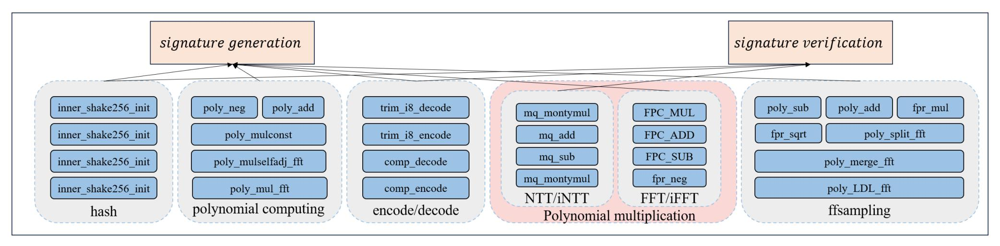

Fig. 1: The overall framework of FALCON

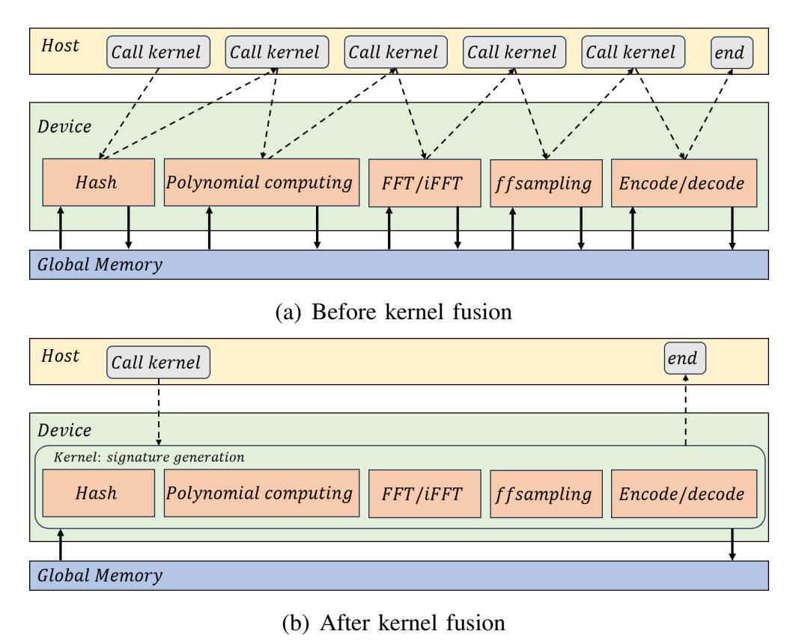

Fig. 2: Kernel fusion

## *A. Kernel fusion*

In CUDA programs, function types are divided into global functions and device functions; the former is also called a kernel. Due to the different calling methods, the calling times of global functions and device functions vary significantly. Since the global function is called from the host (CPU) and executed on the device (GPU), its entire call time includes: boot overhead, kernel startup delay and execution time. The boot overhead and kernel startup latency are typically in the range of tens to hundreds of microseconds. A device function is a function called by the device. The device function call does not involve communication between the host and the device, and its call time mainly includes: function call overhead and execution time. The overhead of calling device functions is very small, usually in the range of tens to hundreds of nanoseconds.

As shown in Fig. 2, before kernel fusion, each kernel needs to exchange data from global memory multiple times, and the host must call a kernel several times, resulting in significant overhead. However, after kernel fusion, there will be only one kernel call and one data exchange from global memory. Because the intermediate results can be stored in the registers of threads, the overhead of accessing global memory can be minimized. In order to achieve the goal of kernel fusion, we reduce the number of global functions as much as possible and rewrite most functions as device functions. The entire FALCON algorithm can be divided into three parts: key generation, signature generation, and signature verification. Therefore, we only keep three corresponding global functions, while the other functions are device functions that call each other between kernels.

# *B. Iterative of recursive functions*

The fast Fourier sampling used in FALCON is implemented on the CPU in the form of recursive functions; however, some issues may arise when using recursive functions on the GPU. The hardware architecture and execution model of the GPU differ from those of the CPU, and some common recursive optimization techniques cannot be directly applied to the GPU. The GPU is designed to be more suitable for performing largescale parallel computing tasks and generally does not support calls with excessive recursion depth.

Additionally, the GPU has limited hardware resources, such as registers and shared memory. If the recursion depth is too deep, it may exceed these resource limits. GPU compilers often attempt to convert code into a form suitable for parallel execution, but the structure of recursive functions can be difficult for the compiler to optimize. As a result, the compiler may refuse to compile code that contains recursive functions. Each thread on the GPU has its own stack space, which is usually smaller than that of the CPU. Recursive functions can cause the stack space to run out, potentially causing the program to crash or terminate unexpectedly. Therefore, when implemented on a GPU, the function needs to be rewritten in an iterative form to pass the compilation. We refer to the way Lee [28] gives a way to use stack frames to simulate the recursive function as a loop.

Whenever a recursive function is called, a new stack frame is created that stores the local variables, parameters, and execution state of the function. When a recursive call occurs inside a function, each recursive call creates a new stack frame, forming a chain of stack frames. These stack frames are arranged in a first-in, last-out (FILO) order in the stack area of memory. During a recursive call, each new recursive call 

{4}------------------------------------------------

temporarily saves the execution state of the current function to the stack frame and executes the called function in the new stack frame. When a recursive call reaches a termination condition, it begins to return layer by layer. Each return destroys a stack frame, restoring the saved execution state to the last call point until it returns to the original call point. Therefore, this paper completes the iteration of recursive functions by simulating the implementation of this calling principle through code.

#### C. Fine-grain vs Coarse-grain

Since the most significant difference between the GPU platform and the CPU platform is the ability for parallel computing, the key to accelerating the algorithm on the GPU platform lies in parallelization. When parallelizing algorithms on the GPU for server environments, there are typically two common strategies: fine-grain and coarse-grain.

1) Fine-grain: The fine-grain approach assigns multiple threads to compute an algorithm in parallel. Although the workload is relatively low, this allows us to get the most out of the GPU. The fine-grain approach has low latency but typically exhibits lower throughput performance. Fine-grain parallelization uses multiple threads to calculate a signature, enabling the serial parts of the computation process to be completed more quickly.

Generated Signatures = 
$$\frac{\text{Gridsize} \times \text{Blocksize}}{\text{Threads Used}}$$
 (2)

If we use k threads to calculate a signature with m blocks and n threads in one block, there will be only  $\frac{m \times n}{k}$  signatures calculated. As a result, the throughput will decrease unless the latency decreases to  $k^{-1} \times$  or lower. If we choose the fine-grain parallelization method, we need to identify the parts of the algorithm that are computed serially and where each step of the calculation is not related to the previous step, and modify the code of these parts to run in parallel.

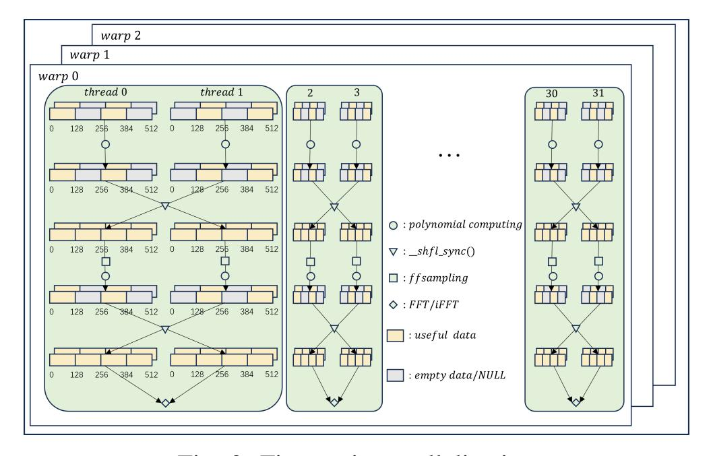

Fig. 3: Fine-grain parallelization

One part of fine-grain parallelism that can be exploited is polynomial arithmetic. The function content involved in this part is the operation of polynomial coefficients, so there is no dependency between the coefficients in the same polynomial, which is suitable for fine-grain parallel computation. For example, the original addition of polynomials uses a for loop to implement the addition of coefficients one by one. Algorithm 3 is the optimized version. The input to each polynomial computation algorithm is one or more arrays of length n, and the array of length n represents a polynomial of n/2 terms. The first n/2 terms of the array are the real part of the polynomial coefficient, and the last n/2 terms are the imaginary part. Therefore, we divide the two threads into a group, with thread 0 operating on the first half of the polynomial coefficients and thread 1 operating on the second half. The two threads execute the same instruction that loops from start to end, with the values defined by the  $tid\_tag$ . We first set start to the value it should be when  $tid\_tag = 1$ , then

$$start = start \times tid\_tag$$

$$end = start \times 2^{tid\_tag}$$
(3)

 $tid\_tag$  is obtained by dividing the thread ID by the remainder of 2, so the  $tid\_tag$  of threads with odd IDs is 1, and the  $tid\_tag$  of threads with even IDs is 2. Every two threads in one group compute the two loops separately but simultaneously, thus reducing the latency of this part.

```
Algorithm 3 Poly_add_gpu(a[n], b[n])
```

```
Input:
```

a[n], b[n].

#### **Output:**

a[n].

1: int  $tid\_tag = threadidx.x\%2;$ 

/\* Devide threads by odd or even IDs \*/

2: int start = n/4;

3: int  $end = start * 2^{tid\_tag}$ ;

4: start = start \* tid tag;

/\* Determine which additions the thread
needs to perform by the parity of the
IDs \*/

5: **for**  $i = start \ to \ end \ do$ 

 $6: \quad a[i] += b[i]$ 

7: a[i+n/2] + = b[i+n/2]

8: end for

9: **return** a[n]

However, there are some problems in the implementation of fine-grain parallelization. The first issue is the number of threads enabled. If too many threads are used, not every part of the signature generation process can achieve a high degree of parallelism. As a result, a large number of threads may end up performing the same tasks repeatedly during execution, which reduces computational efficiency. Therefore, when we test fine-grain parallelization, only two threads are enabled for a single task. Since each thread calculates different data separately in parallel, it is necessary to exchange data between threads when all data is needed simultaneously. To accomplish this, we have two options: the first is to store all the

{5}------------------------------------------------

data that needs to be exchanged in shared memory or global memory, and the second is to use  $\_shfl\_sync()$  instructions to exchange data between the registers of the two threads.

For the first option, because the size of shared memory is limited, it is impossible to store a large number of intermediate results generated by the program, so the intermediate results can only be placed into global memory. Since we only use two threads to generate one signature, the access latency of global memory is much higher than the access speed when using  $\_shfl\_sync()$  instructions, so we choose to use the second option. A total of 128 thread blocks are enabled, and each thread block is tested with 512 threads. Under finegrain parallelization mode, the signature generation reaches 177,026.80 signatures per second with a latency of 185.10 ms. However, due to the large amount of data that needs to be exchanged, the significant number of  $\_shfl\_sync()$ instructions, characterized by low latency, also introduces high overall latency. Thus, this algorithm is relatively more suitable for using coarse-grain methods.

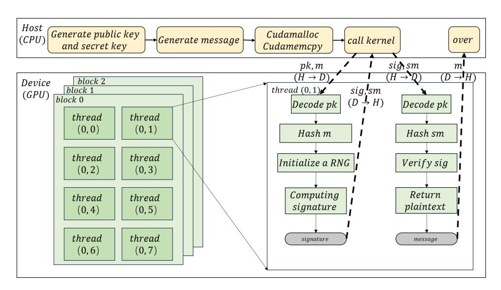

Fig. 4: Coarse-grain parallelization

2) Coarse-grain: Coarse-grain implementations complete the entire algorithm in a single thread, which is essentially a serial implementation. Parallelism is achieved by processing many threads simultaneously, where sufficient workload is required to take full advantage of the computing power of the GPU. The coarse-grain approach relies on a large amount of work to achieve high throughput performance, but this is not always possible, and it has high latency, which is undesirable for applications that require fast response times. Coarse-grain parallelization means that each thread computes one signature to achieve the effect of multiple signatures per unit of time. If a coarse-grain parallel method is selected, it is equivalent to each thread implementing a task and completing parallelism through multiple threads at the same time.

Generated Signatures = 
$$Gridsize \times Blocksize$$
 (4)

As shown in Fig. 4, m blocks are used, and n threads are enabled in each block. Each thread generates and verifies a signature, resulting in  $m \times n$  signatures generated in parallel at the same time, which leads to higher throughput.

Compared with fine-grain parallelization, coarse-grain parallelization does not require a large amount of code to be changed and split, nor does it require significant overhead to access global memory multiple times. With 128 thread blocks enabled and 512 threads per thread block for testing, the signature generation reached 361,726.42 signatures per second with a latency of 181.18 ms under the coarse-grain parallelization mode of single-threaded single-task. Compared with the fine-grain parallelization method described above, the throughput of the signature in the coarse-grain mode is about  $2\times$  that of the fine-grain method, while the latency is almost identical. Since throughput is a more critical, and the demand for signatures on the cloud server far exceeds the number of threads (65,536) provided in this experiment, we choose to implement the FALCON algorithm using coarsegrain parallelization. In this paper, the signature generation and verification are encapsulated into two kernel functions, which are called by each thread in turn. To reduce small-scale frequent data transfers, we generate the public key and private key in advance and allocate them to each thread to complete a large amount of data transmission at once, thereby improving the efficiency of the GPU.

#### D. FFT/iFFT with better temporal locality

In section II, we introduced the Fast Fourier Transform (FFT), which consists of multiple Butterfly operations. Correspondingly, the inverse transformation (iFFT) contains multiple iButterfly operations. According to the test results in the article by Kim [22], FFT accounts for up to 48% of the signature generation process, so the optimization of FFT is the focus of this article. The original FFT algorithm is shown in Fig. 5(a) (taking the real part as an example; the imaginary part is operated as the same).

We should first know the inner work of butterfly operation unit, as shown in Fig. 6, in a butterfly operation unit with a length of t ( $t = 2 \times ht$ ), the two inputs of each butterfly operation are two coefficients with a distance of ht in the input f. In f[n] ( $n = 2 \times hn$ ), which is the input of FFT algorithm, the kth complex number coefficient is divided into a real part and an imaginary part, and saved in f[k] and f[k+hn], so a butterfly operation in a unit with length of t needs to calculate the values of four points:

$$\hat{f}[k] = f[k] + W_t^k \cdot f[k+ht]$$

$$\hat{f}[k+hn] = f[k+hn] + W_t^k \cdot f[k+ht+hn]$$

$$\hat{f}[k+ht] = f[k] + W_t^{k+ht} \cdot f[k+ht]$$

$$\hat{f}[k+ht+hn] = f[k+hn] + W_t^{k+ht} \cdot f[k+ht+hn]$$
(5)

Because  $W_t^k$  is periodic for k , as shown in the formula 6:

$$\begin{aligned} W_t^{k+ht} &= W_t^{ht} \cdot W_t^k \\ &= e^{-i\frac{2\pi}{t}ht} \cdot W_t^k \\ &= e^{-i \cdot \pi} \cdot W_t^k \\ &= -W_t^k \end{aligned} \tag{6}$$

Therefore, formula 5 can be rewritten as:

{6}------------------------------------------------

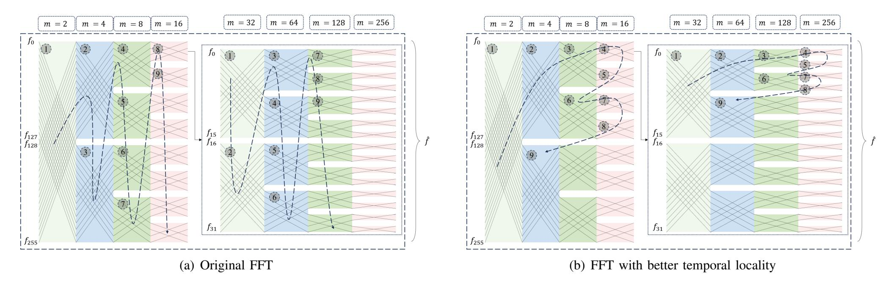

Fig. 5: FFT with/without better temporal locality

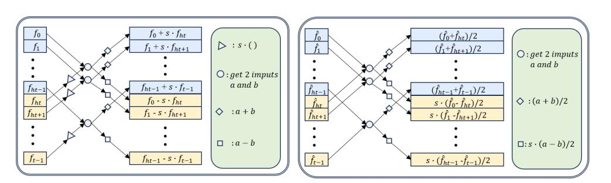

Fig. 6: Butterfly and iButterfly operation

$$\hat{f}[k] = f[k] + W_t^k \cdot f[k+ht] 
\hat{f}[k+hn] = f[k+hn] + W_t^k \cdot f[k+hn+ht] 
\hat{f}[k+ht] = f[k] - W_t^k \cdot f[k+ht] 
\hat{f}[k+hn+ht] = f[k+hn] - W_t^k \cdot f[k+hn+ht]$$
(7)

In the original version of the FFT algorithm, the butterfly operation unit is calculated one by one in the same layer, and each layer is calculated backwards in turn. Since the data at the same location in f[n] must be calculated in layer order, it is most logical to compute one layer after the former layer has been completely calculated, as shown in Fig. 5(a). However, this order of calculation requires loading every data point from beginning to end at each layer of computation and does not fully take advantage of the speed benefits of cache. Therefore, we optimized the FFT to make full use of the cache.

To better utilize the cache, we chose to strengthen the temporal locality of the FFT algorithm, minimizing the time interval between two identical data accesses. The FFT can be visualized as a full binary tree, where each leaf node represents one of the coefficients in the input polynomial. As shown in Fig. 8, each node has its Len, which is the number of coefficients it includes and varies across different layers of the tree. Lennode<sup>i</sup> is the number of data in the node<sup>i</sup> . Since it is a full binary tree, every node except the leaf nodes has two child nodes. These two child nodes encompass all coefficients in their parent node and have the same Len, with one containing the first half and the other containing the second half. Before optimization, the FFT employed a breadth-first search of the tree, performing a butterfly operation on the coefficients within a node when searched. After our optimization, however, the FFT utilizes a depth-first search of the tree.

The FFT algorithm requires that before a certain data point in a given layer enters the butterfly operation, it must have participated in the butterfly operation at every preceding layer. Thus, the original version uses a breadth-first search for the butterfly operation, ensuring that the next layer's butterfly operation can only occur after the complete calculation of each previous layer. However, in addition to this intuitive approach, the depth-first search method can also fulfill this requirement. Each data in the child node belongs to its parent node. The depth-first search ensures that a node is accessed only after its parent node, which guarantees that the data participates in the butterfly operation in earlier layers before entering the current layer.

Given that both depth-first search and breadth-first search satisfy the correctness requirements of the FFT algorithm, the depth-first algorithm can reduce or maintain the time interval from the first access to the last access of each data point to the same duration, thereby enhancing temporal locality and improving the cache hit rate. We define the time that a piece of data has been accessed as the cumulative amount of data accessed prior, and the amount of data accessed increases by Len of the node each time it is accessed. Setting the amount of data accessed as Count acc, and placing every accessed node in Acc, we can express Count acc as:

$$Count\_acc = \sum_{i}^{i} Len_{node_i} \ (node_i \in Acc)$$
 (8)

The first node accessed by both search methods is the root node, which includes all data. Therefore, the time for each data to be accessed for the first time is the same, that is to say, when every piece of data is first accessed,

$$Count\_acc\_first_{DFS} = Count\_acc\_first_{BFS}$$

$$(9)$$

Because the breadth-first search order places all leaf nodes last, when each data point is last accessed, the Acc set contains

{7}------------------------------------------------

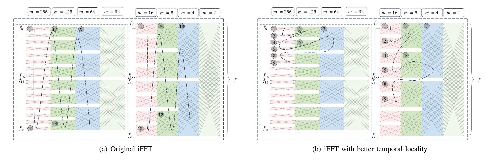

Fig. 7: iFFT with/without better temporal locality

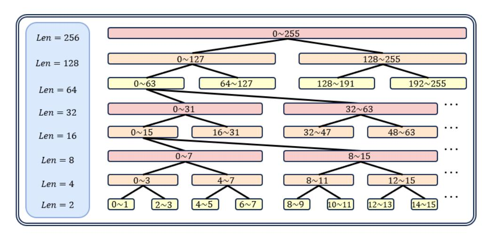

Fig. 8: Full Binary Tree of FFT/iFFT

nodes excluding the leaf nodes corresponding to that data and all subsequent data. In contrast, in the depth-first search order, when a leaf node (except for the last two leaf nodes) is accessed, the leaf nodes corresponding to subsequent data points are not accessed, meaning these nodes are absent from Acc. Additionally, some non-leaf nodes are also not accessed, so some nodes are excluded from Acc compared to breadthfirst search, yielding Count accDF S < Count accBF S. When the last two leaf nodes are accessed, the nodes in Acc are identical to those in the breadth-first search, thus Count accDF S = Count accBF S. As a result, when every piece of data was last accessed,

$$Count\_acc\_last_{DFS}$$

$$\leq Count\_acc\_last_{BFS}$$
(10)

Therefore, for each piece of data, the interval from its first access to its last access is shorter when using depthfirst search. This implies that the optimized algorithm exhibits better temporal locality, resulting in a higher cache hit rate and improved operational efficiency.

Compared with the original version, the optimized FFT algorithm alters the calculation order of each butterfly operation unit, as shown in Fig. 5(b). Since the method of optimizing the FFT presented in this paper follows an order similar to that of the depth-first method, yet the most common and intuitive recursive implementation of the depth-first algorithm is not recommended on the GPU, we provide an algorithm for backtracking after reaching the maximum depth to control the order of each unit. As shown in Algorithm 4, we encapsulate the operations in each butterfly unit into butterfly(), and then sort each unit to maximize temporal locality. Specifically, we first define an array count cal, where the value of count cal[k] is the number of units that will be calculated when layer k is accessed next. We then define logm, representing the current accessed layer number. Every time we calculate a butterfly unit, the count cal of the layer will be incremented to ensure that the correct unit will be calculated when the layer is accessed next. If the last layer has not yet been accessed, each time butterfly() is called, logm will be incremented to access the next layer. When the last layer is accessed, we need to find the count of units that have been calculated in the last layer. If (2i−1)∗2 <sup>u</sup> units (i, u ∈ Z) have been calculated, we subtract u from logm to access the layer logm − u, but if logm − u = 1, the function will return, and F F T() will conclude. In addition to the above, we continue to calculate the next unit in the last layer until one of the above conditions applies.

As shown in Fig. 7(a), the iFFT is calculated layer by layer like the FFT, which also has the disadvantage of not fully utilizing the cache. We chose to modify the iFFT in the inverse order of calculation from the cache-friendly FFT to obtain the cache-friendly iFFT. Similar to the FFT, the optimization of the iFFT is depth-first-like, as shown in Algorithm 6. First, we define the arrays count cal and loghm to represent the location of the next visit for each layer and the layer ID that is currently being accessed. When the first layer is accessed, if (2i − 1) ∗ 2 u (i, u ∈ Z) is reached, that is

$$count\_cal[1] = (2i - 1) * 2^{u} (i, u \in \mathbb{Z}),$$
 (11)

the forward calcu is assigned to u, and the u layers are accessed backwards in a row. Otherwise, the first downward access continues until (2i − 1) ∗ 2 u is reached, and the entire algorithm concludes when the last butterfly unit of the last layer is accessed.

{8}------------------------------------------------

### **Algorithm 4** FFT\_optimized(f[n], logn)

```
Input:
   f[n], logn.
Output:
   f[n].
 1: int count\_cal|logn| = 0;
 2: int log m = 0;
 3: loop
     if log m < log n - 1 then
 4:
        /* The former layers */
        m=1 << logm;
 5:
        ht = 1 \ll (log n - log m - 1);
 6:
        Butterfly(f|n|, ht, m, count\_cal|logm|, logn);
 7:
        count\_cal[logm] + +;
 8:
        logm + +
 9:
        /* Enter the next layer */
     else
10:
        /* The last layer */
        m = 1 \ll logm;
11:
        ht = 1 \ll (log n - log m - 1);
12:
        Butterfly(f[n], ht, m, count\_cal[logm], logn);
13:
        count\_cal|logm| + +;
14:
        /* Count of units have been
        calculated */
        for u = (log n - 2) \ to \ 0 \ do
15:
          if count\_cal[logm]\%(1 << u) == 0 then
16:
            /\star a multiple of 2^u units have
            been calculated */
17:
            if u = (log n - 2) then
              return
18:
              /* The last layer is
              calculated completely, end
              the function*/
19:
            end if
            logm-=u;
20:
            break;
21:
          end if
22:
        end for
23:
        /* Determine whether need to
        backtrack and the distance */
     end if
24:
25: end loop
```

From the formula 7, we know what the butterfly operation do. Similarly, inverse FFT also consists of multiple iButterfly operation units. Based on the formula 7, the formula for the inverse FFT can be derived:

# **Algorithm 5** Butterfly( $f[n], ht, m, i_1, logn$ )

```
Input:
    f[n], m, i_1, log n.
Output:
    f[n].
 1: j_1 \leftarrow i_1 * (ht << 1)
 2: s \leftarrow GM[m+i_1]
    /* Get twiddle factor from the twiddle
    factor table */
 3: for j = j_1 \ to \ j_1 + ht \ do
      x \leftarrow f[j]
 4:
     y \leftarrow s * f[j + ht]
 5:
       f[j] \leftarrow x + y
 6:
 7: f[j+ht] \leftarrow x-y
 8: end for
 9: return \hat{f}[n]
```

$$f[k] = \frac{\hat{f}[k] + \hat{f}[k+ht]}{2}$$

$$f[k+ht] = \frac{W_t^k \cdot (\hat{f}[k] - \hat{f}[k+ht])}{2}$$

$$f[k+hn] = \frac{\hat{f}[k+hn] + \hat{f}[k+ht+hn]}{2}$$

$$f[k+ht+hn] = \frac{W_t^k \cdot (\hat{f}[k+hn] - \hat{f}[k+ht+hn])}{2}$$
(12)

Since there is a logn-1 layer in the iButterfly operation, and we can omit the division by two in the formula when implementing iButterfly operation. After all the iButterfly operation in the iFFT are over, the entire f[n] needs to be divided by  $2^{logn-1}=(n>>1)$  in order to get the final  $\hat{f}[n]$ , as shown in the line 32 of Algorithm 6.

The iFFT can also be visualized as a full binary tree, as shown in Fig. 8, but it is searched from bottom to top. Therefore, we apply the inverse order of the optimized FFT. As with the FFT algorithm, every time a node is accessed, it is placed into *accessed*. However, in contrast to the FFT, a parent node can only be accessed when both child nodes are in the *accessed* set. This ensures that the data at the same location has been involved in the butterfly operation in the lower layer, maintaining the correctness of the iFFT.

For the iFFT, the root node of the full binary tree is the last node to be visited, resulting in a constant last access time for each node. Therefore, the first access time defines the interval between the first and last access of the same data. In the original version of the iFFT, each leaf node was accessed for the first time in order. However, after optimization, non-leaf nodes will be accessed before each leaf node (except for the first two leaf nodes), ensuring that the first access time for every piece of data is not earlier than in the original version. Consequently, the interval is shorter, leading to better temporal locality and a higher cache hit rate.

{9}------------------------------------------------

# **Algorithm 6** iFFT\_optimized(f[n], logn)

```
Input:
   f[n], logn.
Output:
   f[n].
 1: int count\_cal[logn] = 0;
 2: int loghm = 0;
 3: int forward\_calcu = 0;
 4: loop
      if loghm = logn - 1 then
 5:
        /* The last layer */
        hm = 1 \ll loghm;
 6:
        t = 1 \ll (log n - log hm - 1);
 7:
        iButterfly(f[n], t, hm, count\_cal[loghm], logn);
 8:
        count\_cal[loghm] + +;
 9:
        for u = (log n - 2) to 0 do
10:
          if count\_cal[loghm]\%(1 << u) == 0 then
11:
             /\star a multiple of 2^u units have
            been calculated */
            loghm - -;
12:
             forward\_calcu = u;
13:
             /* Determine whether need to
            backtrack and the distance */
             break:
14:
          end if
15:
        end for
16:
      else if forward\_calcu > 0 then
17:
        /* Backtrack to former layers */
        hm = 1 \ll loghm;
18:
        t = 1 \ll (log n - log hm - 1);
19:
        iButterfly(f[n], t, hm, count\_cal[loghm], logn);
20:
        count\_cal|loghm| + +;
21:
        loghm - -;
22:
        forward\_calcu - -;
23:
      else
24:
        if loghm = 0 then
25:
          /* The first layer is calculated
          */
26:
          break;
        end if
27:
        loghm = logn - 1
28:
      end if
29:
30: end loop
31: for i_1 = 0 to n do
      f[i_1] \leftarrow f[i_1]/(n >> 1)
32:
33: end for
```

After the FFT/iFFT were optimized, we tested the throughput and latency of the signature generation with 128 blocks and 512 threads per block. Before optimization, the signature generation reached 361,726.42 signatures per second with a latency of 181.18 ms. After optimization, the signature generation reached 414,216.48 signatures per second with a latency of 158.22 ms, increasing by 14.51% compared to the

```
Algorithm 7 iButterfly(f[n], t, m, i_1, log n)
```

```
Input:
    f[n], hm, i_1, logn.
Output:
    f[n].
 1: j_1 \leftarrow i_1 * (t << 1)
 2: s \leftarrow iGM[hm + i_1]
    /* Get twiddle factor from the twiddle
    factor table */
 3: for j = j_1 \ to \ j_1 + t \ do
       x \leftarrow f[j]
 4:
       y \leftarrow f[j+t]
 5:
       f[j] \leftarrow x + y
 6:
       f[j+t] \leftarrow s * (x-y)
 7:
 8: end for
 9: return f[n]
```

throughput before optimization.

#### IV. PERFORMANCE EVALUATION

In this paper, the FALCON algorithm is accelerated on the GPU platform, and its correctness is tested. The CPU is powered by an 8-core AMD Ryzen<sup>TM</sup> 7 5700G with 64 GB of RAM running at 3.80 GHz, while the GPU is powered by an NVIDIA Ada Lovelace GeForce RTX 4090 with 24 GB of memory and 1008 GB/s of memory bandwidth. The software environment utilizes the NVCC compiler, with compilation parameters set to -rdc=true -arch sm\_89 -maxrregcount=127, and the CUDA version is 12.1.

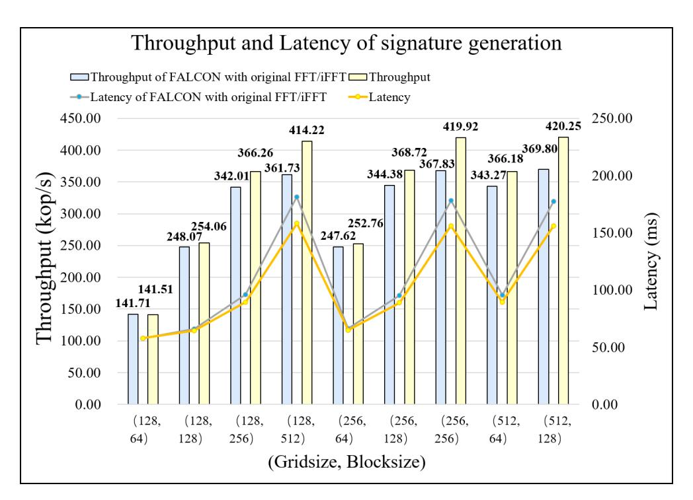

Fig. 9: Performance with(out) FFT/iFFT optimization

## A. Side-channel analysis

In the version of the implementation given in this paper, all loops involving polynomial operations are pre-fixed based on the open constant n and FFT length, and do not exit or extend early due to the size or sign of the intermediate secret value; When accessing polynomial coefficients, indexes are calculated only by publicly available parameters such as

{10}------------------------------------------------

TABLE II: Comparison with related works

| Works                   | Algorithm |     |                                                | Generation (Encryption) |              | Verification (Decryption) |              |
|-------------------------|-----------|-----|------------------------------------------------|-------------------------|--------------|---------------------------|--------------|
|                         |           |     | Platform                                       | Throughput/(ops/s)      | Latency/(ms) | Throughput/(ops/s)        | Latency/(ms) |
| Fouque et al. (Ref) [8] | FALCON    | CPU | i5-8259U                                       | 5,948.1                 | /            | 27,933.0                  | /            |
| Pornin [20]             | FALCON    | CPU | i7-6567U                                       | 7,021.28                | /            | 40,243.90                 | /            |
| Kim et al. [22]         | FALCON    | CPU | Jetson AGX Xavier                              | 4,533.05                | /            | 77,869.28                 | /            |
| Nguyen et al. [24]      | FALCON    | CPU | Apple M1                                       | 7,239.82                | /            | 140,969.16                | /            |
| Schmid et al. [30]      | FALCON    | CPU | Zynq UltraScale+ MPSoC ZCU104                  | 238.10                  | /            | 1,618.12                  | /            |
| Ji et al. [26]          | Kyber     | GPU | NVIDIA Tesla V100 Volta GV100, 5120 CUDA cores | 2,105,977               | /            | 9,378,937                 | /            |
| Ning et al. [31]        | SPHINCS+  | GPU | NVIDIA Geforce RTX 4090                        | 146,363                 | /            | 1,319,610                 | /            |
| Shen et al. [27]        | Dilithium | GPU | NVIDIA A100 tensor core GPU                    | 574,953                 | /            | 1,408,703                 | /            |
| Lee et al. [28]         | FALCON    | GPU | NVIDIA A100 tensor core GPU                    | 58,595                  | 279.61       | 2,721,562                 | 6.01         |
| GOLF (Our work)         | FALCON    | GPU | NVIDIA Geforce RTX 4090                        | 420,250.10              | 155.95       | 10,311,039.30             | 6.36         |
|                         |           |     | NVIDIA A100 tensor core GPU                    | 157,994.98              | 414.80       | 4,180,879.43              | 15.68        |

polynomial degrees, predefined FFT subscript sequences, or signature randomness, and never contain bits or conditional judgments derived from the private key; When reducing the modulo q, the code performs a fixed number of conditional subtraction and bitmask operations for each candidate value, instead of scheduling based on the size branch, so that all possible negative values or overflow corrections are embedded in the main calculation path. At the same time, for potential symbol expansion and overflow scenarios, there is a full reliance on bitwise operation masks rather than branching logic such as if(v < 0), ensuring that the executed instruction stream and memory access patterns are independent of the secret data under any key or message input.

Currently, there are few published studies on side-channel attacks against GPU global memory, mainly due to the blackbox nature of drivers and hardware, complex memory access paths, and high measurement costs. Most of the GPU drivers are closed-source implementations, and the scheduling strategies and cache management details of different vendors are far apart, which makes it difficult for researchers to obtain a unified running behavior. The GPU's global memory is isolated from the host memory, accessing via PCIe or dedicated interconnect channels, and constantly shuffling through multiple layers of on-chip cache (L1/L2) and shared storage within thread blocks. Capturing and restoring memory access information at a granular enough level requires not only highresolution monitoring of PCIe transactions, electromagnetic emissions, or power fluctuations, but also extensive reverse engineering analysis, which undoubtedly raises the cost and technical barrier to entry far beyond that of CPU platforms. Therefore, under the existing technical conditions and public results, the side-channel risk of GPU global memory has not yet posed a real threat to the security of common applications and systems. Existing attack and defense research focuses on areas such as more observable GPU cache behavior, branch prediction units, or specialized cryptographic modules, rather than global memory access. In other words, for now, the difficulty and cost of GPU memory-side channels make them not practical and don't need to be paid much attention to in security strategies.

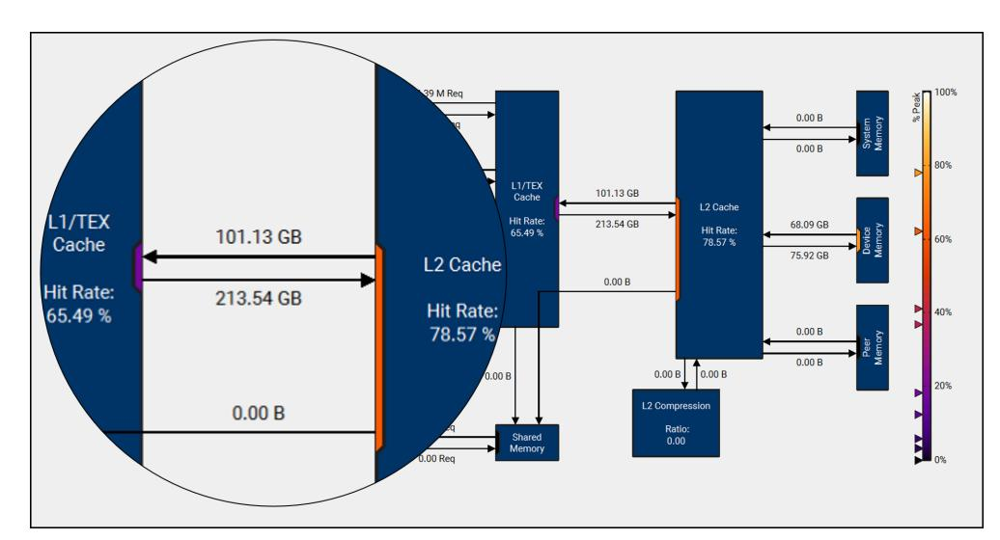

(a) Nsight memory chart of original code

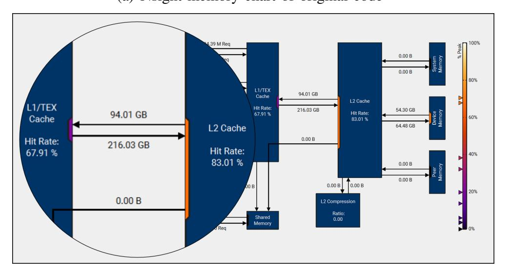

(b) Nsight memory chart of optimized code

Fig. 10: Nsight memory charts

# *B. Evaluation criteria*

In this article, two metrics are used for testing: throughput and latency. Throughput refers to the number of signatures generated or verified by the host and the device in a unit of time. Latency is the average time it takes for a host and device to receive a request and complete the computation each time in a cryptographic algorithm. Due to the development of today's

{11}------------------------------------------------

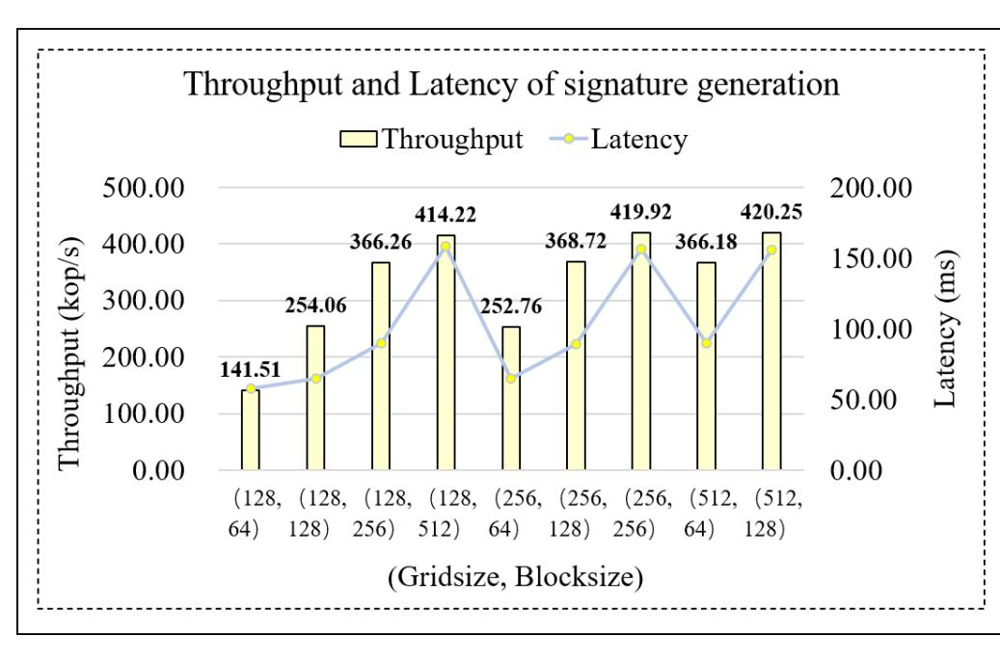

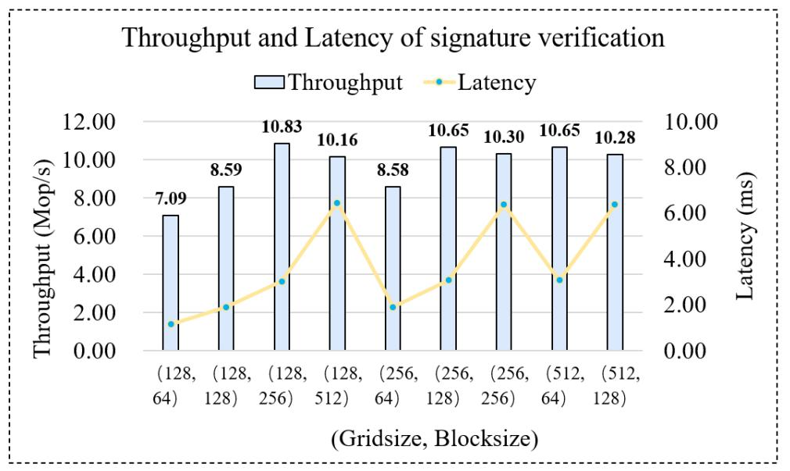

Fig. 11: Performance of FALCON implementation

network technology, and the number of concurrent signature generation and verification requests has significantly increased, the most critical indicator is the throughput of FALCON. In the course of the experiment, we test the throughput and latency across nine combinations of grid size and block size.

# *C. Comparison before and after FFT/iFFT optimization*

In Section III, we introduced the optimization of FFT/iFFT, which shortens the interval between the first and last accesses of each data point, strengthens temporal locality, and improves the cache hit rate and the efficiency of FFT/iFFT. After optimization, the peak throughput of the entire signature generation process increased from 369801.57 ops/s to 420250.10 ops/s, approximately 14.51% higher. From Fig. 9, we can note that the more threads used, the greater the improvement after optimizing FFT/iFFT. Specifically, when using 128 blocks with 512 threads per block, the maximum increase is 14.51%.

In this study, to evaluate the memory workload of our CUDA kernels, we applied NVIDIA Nsight Compute to generate the Memory Chart, thereby visualizing the request paths and bandwidth utilization from logical accesses to the physical memory hierarchy. As shown in Fig. 10, the optimized code has a significant improvement in cache hit rate, bringing performance improvement. Due to the increase in the cache hit rate, the transfer size between L2 cache and device memory is also reduced by 18%, saving a lot of additional overhead.

# *D. Comparison of different combinations of threads on GPU*

When we tested on the GPU, we used a total of nine combinations, with a minimum of 16,384 threads and a maximum of 65,536 threads. Since we have tested and found that the maximum number of registers in per thread set at 127 will maximize register utilization, we added the compilation option -maxrregcount=127 while compiling, so that a maximum of 512 threads can be enabled in a single thread block. In general, the higher the total number of threads, the higher the throughput, as shown in Fig. 11. However, as the number of threads increases, the latency also rises, leading to a gradual decrease in the increase of throughput. Since threads on the GPU are executed completely synchronously on a warp basis, and each warp contains only 32 threads, an increase in the total number of threads results in more warps. Because different warps cannot be executed synchronously, a higher number of warps leads to a greater maximum delay between them, which in turn increases the overall latency of the algorithm. Similar to signature generation, the greater the number of threads, the higher the throughput of verification, and the increase in throughput diminishes as the number of threads increases. Unlike signature generation, the latency of the signature verification process is relatively low. Therefore, as the number of threads increases, the impact of the delay between warps becomes more pronounced. Consequently, the throughput of signature verification increases only slightly with the increasing number of threads. The highest throughput for signature generation on the GPU is 2.93 times the lowest value, whereas the highest throughput for signature verification is only 1.47 times the lowest value.

# *E. Comparison with related works*

Table II shows the performance of FALCON implementations on various platforms and compares them to the work presented in this paper. We obtained the original test results of FALCON from the official website, which were tested on an Intel® Core™ i5-8279U. The throughput of GOLF is 70.65× to 369.13× better than it, achieving the goal of accelerating the FALCON algorithm.

References [20], [22], [24], and [30] implemented FAL-CON on the CPU, but their efficiency is relatively low, with the throughput of their signature generation being less than 10 kops/s. The performance of our GPU implementation is 59.85×, 92.71×, 58.05×, and 1765.02× in the signature generation part, while in the signature verification part, it is 256.21×, 132.42×, 73.14×, and 6372.23×, respectively. The most efficient GPU implementation found so far is from Lee et al. [28], whose signature generation and verification far outperform various implementations on the CPU. Our GOLF gives a increase of 7.17× in the throughput of the signature generation part and 3.79× in the throughput of the signature verification part. GPU is a complete many

{12}------------------------------------------------

core parallel architecture whose resources are typically fully utilized to achieve peak performance. Consequently, when evaluating GPU performance, one usually refers directly to its Thermal Design Power (TDP) rather than examining additional power metrics. Considering that the lowest-power version of the A100 which is used in [28] has a TDP of about 250W, while the RTX 4090 used in this work has a TDP of 450W, the throughput power ratio of this job is still far higher than that of [28]. To provide a clearer comparison with [28], we also conducted performance tests on an A100 GPU. The results show that our performance still achieves a 2.69x / 1.53x improvement over [28].

Additionally, we compare GOLF with works aimed at accelerating other post-quantum cryptography (PQC) algorithms on GPUs. Ji et al. [26] implemented Kyber on an NVIDIA Tesla V100 Volta GV100 with 5120 CUDA cores, improving throughput by over 332.8× compared with the reference implementation. Ning et al. [31] used an NVIDIA GeForce RTX 4090 to accelerate SPHINCS+, showing a result that is more than 3659.08× faster than the reference implementation. Shen et al. [27] conducted a GPU-accelerated implementation of Dilithium on an NVIDIA A100 tensor core GPU, achieving an improvement of 111× over the throughput of the reference implementation. The result of GOLF is 70.65× faster than the reference implementation, which is lower than the results reported in the works mentioned above.

# V. CONCLUSION

In light of the efficiency bottlenecks currently faced by postquantum cryptography, this paper utilizes the high parallelism of the GPU platform to parallelize the FALCON algorithm. This approach significantly enhances the algorithm's throughput, achieving a signature generation rate that is 58.05× higher than the fastest CPU implementation and 7.17× higher than the fastest GPU implementation. Additionally, signature verification is 73.14× better than the fastest CPU implementation and 3.79× better than the fastest GPU implementation available.

# REFERENCES

- [1] R. Dai, J. Dong, M. Qiu, Z. Dong, F. Xiao, and J. Lin, "Golf: Unleashing gpu-driven acceleration for falcon post-quantum cryptography," *Cryptology ePrint Archive*, 2025.
- [2] D.-T. Dam, T.-H. Tran, V.-P. Hoang, C.-K. Pham, and T.-T. Hoang, "A survey of post-quantum cryptography: Start of a new race," *Cryptography*, vol. 7, no. 3, p. 40, 2023.
- [3] Z. Yang, M. Zolanvari, and R. Jain, "A survey of important issues in quantum computing and communications," *IEEE Communications Surveys & Tutorials*, vol. 25, no. 2, pp. 1059–1094, 2023.
- [4] P. W. Shor, "Polynomial-time algorithms for prime factorization and discrete logarithms on a quantum computer," *SIAM review*, vol. 41, no. 2, pp. 303–332, 1999.
- [5] M. Kumar and P. Pattnaik, "Post quantum cryptography (pqc)-an overview," in *2020 IEEE High Performance Extreme Computing Conference (HPEC)*. IEEE, 2020, pp. 1–9.
- [6] N. Di Chiano, R. Longo, A. Meneghetti, and G. Santilli, "A survey on nist pq signatures," *arXiv preprint arXiv:2107.11082*, 2021.

- [7] J. Bos, L. Ducas, E. Kiltz, T. Lepoint, V. Lyubashevsky, J. M. Schanck, P. Schwabe, G. Seiler, and D. Stehle, "Crystals-kyber: ´ a cca-secure module-lattice-based kem," in *2018 IEEE European Symposium on Security and Privacy (EuroS&P)*. IEEE, 2018, pp. 353–367.
- [8] P.-A. Fouque, J. Hoffstein, P. Kirchner, V. Lyubashevsky, T. Pornin, T. Prest, T. Ricosset, G. Seiler, W. Whyte, Z. Zhang *et al.*, "Falcon: Fast-fourier lattice-based compact signatures over ntru," *Submission to the NIST's post-quantum cryptography standardization process*, vol. 36, no. 5, pp. 1–75, 2018.
- [9] N. Aragon, P. Barreto, S. Bettaieb, L. Bidoux, O. Blazy, J.-C. Deneuville, P. Gaborit, S. Ghosh, S. Gueron, T. Guneysu ¨ *et al.*, "Bike: bit flipping key encapsulation," 2022.
- [10] C. A. Melchor, N. Aragon, S. Bettaieb, L. Bidoux, O. Blazy, J.-C. Deneuville, P. Gaborit, E. Persichetti, G. Zemor, and ´ I. Bourges, "Hamming quasi-cyclic (hqc)," *NIST PQC Round*, vol. 2, no. 4, p. 13, 2018.
- [11] D. J. Bernstein, A. Hulsing, S. K ¨ olbl, R. Niederhagen, J. Rijn- ¨ eveld, and P. Schwabe, "The sphincs+ signature framework," in *Proceedings of the 2019 ACM SIGSAC conference on computer and communications security*, 2019, pp. 2129–2146.
- [12] J. Patarin, "Hidden fields equations (hfe) and isomorphisms of polynomials (ip): Two new families of asymmetric algorithms," in *International conference on the theory and applications of cryptographic techniques*. Springer, 1996, pp. 33–48.
- [13] G. Alagic, J. Alperin-Sheriff, D. Apon, D. Cooper, Q. Dang, J. Kelsey, Y.-K. Liu, C. Miller, D. Moody, R. Peralta *et al.*, "Status report on the second round of the nist post-quantum cryptography standardization process," *US Department of Commerce, NIST*, vol. 2, p. 69, 2020.
- [14] G. Alagic, G. Alagic, D. Apon, D. Cooper, Q. Dang, T. Dang, J. Kelsey, J. Lichtinger, Y.-K. Liu, C. Miller *et al.*, "Status report on the third round of the nist post-quantum cryptography standardization process," 2022.
- [15] National Institute of Standards and Technology, "Post-quantum cryptography: Selected algorithms 2022," https://csrc.nist.gov/Projects/post-quantumcryptography/selected-algorithms-2022, 2022, accessed: 2024-10-05.
- [16] N. I. of Standards and Technology. (2024, August) Nist releases first 3 finalized post-quantum encryption standards. [Online]. Available: https://www.nist.gov/news-events/news/2024/08/nistreleases-first-3-finalized-post-quantum-encryption-standards
- [17] M. Kaleem, M. A. Mushtaq, U. Jamil, S. A. Ramay, T. A. Khan, S. Patel, R. Zahidy, and S. K. Hussain, "New efficient cryptographic techniques for cloud computing security," *Migration Letters*, vol. 21, no. S11, pp. 13–28, 2024.
- [18] S. Li, Y. Chen, L. Chen, J. Liao, C. Kuang, K. Li, W. Liang, and N. Xiong, "Post-quantum security: Opportunities and challenges," *Sensors*, vol. 23, no. 21, p. 8744, 2023.
- [19] T. Oder, J. Speith, K. Holtgen, and T. G ¨ uneysu, "Towards prac- ¨ tical microcontroller implementation of the signature scheme falcon," in *Post-Quantum Cryptography: 10th International Conference, PQCrypto 2019, Chongqing, China, May 8–10, 2019 Revised Selected Papers 10*. Springer, 2019, pp. 65–80.
- [20] T. Pornin, "New efficient, constant-time implementations of falcon," *Cryptology ePrint Archive*, 2019.
- [21] L. Beckwith, D. T. Nguyen, and K. Gaj, "High-performance hardware implementation of crystals-dilithium," in *2021 International Conference on Field-Programmable Technology (ICFPT)*. IEEE, 2021, pp. 1–10.
- [22] Y. Kim, J. Song, and S. C. Seo, "Accelerating falcon on armv8," *IEEE Access*, vol. 10, pp. 44 446–44 460, 2022.
- [23] Y. Kim, J. Song, T.-Y. Youn, and S. C. Seo, "Crystals-dilithium on armv8," *Security and Communication Networks*, vol. 2022, no. 1, p. 5226390, 2022.
- [24] D. T. Nguyen and K. Gaj, "Fast falcon signature generation

{13}------------------------------------------------

- and verification using armv8 neon instructions," in *International Conference on Cryptology in Africa*. Springer, 2023, pp. 417– 441.
- [25] R. Shrestha, R. Bajracharya, A. Mishra, and S. Kim, "Ai accelerators for cloud and server applications," in *Artificial intelligence and hardware accelerators*. Springer, 2023, pp. 95–125.
- [26] X. Ji, J. Dong, T. Deng, P. Zhang, J. Hua, and F. Xiao, "Hi-kyber: A novel high-performance implementation scheme of kyber based on gpu," *IEEE Transactions on Parallel and Distributed Systems*, 2024.
- [27] S. Shen, H. Yang, W. Dai, H. Zhang, Z. Liu, and Y. Zhao, "Highthroughput gpu implementation of dilithium post-quantum digital signature," *IEEE Transactions on Parallel and Distributed Systems*, 2024.
- [28] W.-K. Lee, R. K. Zhao, R. Steinfeld, A. Sakzad, and S. O. Hwang, "High throughput lattice-based signatures on gpus: Comparing falcon and mitaka," *IEEE Transactions on Parallel and Distributed Systems*, vol. 35, no. 4, pp. 675–692, 2024.
- [29] L. Gao, F. Zheng, R. Wei, J. Dong, N. Emmart, Y. Ma, J. Lin, and C. Weems, "Dpf-ecc: A framework for efficient ecc with double precision floating-point computing power," *IEEE Transactions on Information Forensics and Security*, vol. 16, pp. 3988–4002, 2021.
- [30] M. Schmid, D. Amiet, J. Wendler, P. Zbinden, and T. Wei, "Falcon takes off-a hardware implementation of the falcon signature scheme," *Cryptology ePrint Archive*, 2023.
- [31] Y. Ning, J. Dong, J. Lin, F. Zheng, Y. Fu, Z. Dong, and F. Xiao, "Grasp: Accelerating hash-based pqc performance on gpu parallel architecture," *Cryptology ePrint Archive*, 2024.