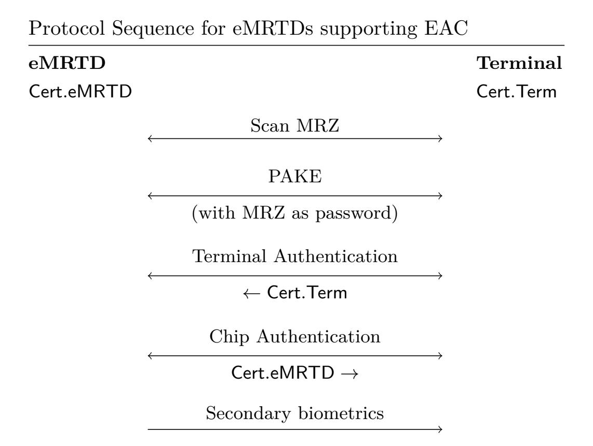

{0}------------------------------------------------

# **Post-Quantum Cryptography in eMRTDs**

### **Evaluating PAKE and PKI for Travel Documents**

Nouri Alnahawi1*,*2 [,](https://fbi.h-da.de/personen/alnahawi-nouri) Melissa Azouaoui3 [,](https://orcid.org/0000-0003-2011-5633) Joppe W. Bos4 [,](https://www.joppebos.com/) Gareth T. Davies4 [,](https://gareth-t-davies.github.io/) SeoJeong Moon4 , Christine van Vredendaal5 and Alexander Wiesmaier1*,*2

> Darmstadt University of Applied Sciences, Darmstadt, Germany European University of Technology, European Union NXP Semiconductors, Hamburg, Germany NXP Semiconductors, Leuven, Belgium NXP Semiconductors, Eindhoven, Netherlands

**Abstract.** Passports, identity cards and travel visas are examples of machine readable travel documents (MRTDs) or eMRTDs for their electronic variants. The security of the data exchanged between these documents and a reader is secured with a standardized password authenticated key exchange (PAKE) protocol known as PACE.

A new world-wide protocol migration is expected with the arrival of post-quantum cryptography (PQC) standards. In this paper, we focus on the impact of this migration on constrained embedded devices as used in eMRTDs. We present a feasibility study of a candidate post-quantum secure PAKE scheme as the replacement for PACE on existing widely deployed resource-constrained chips. In a wider context, we study the size, performance and security impact of adding post-quantum cryptography with a focus on chip storage and certificate chains for existing eMRTDs.

We show that if the required post-quantum certificates for the eMRTD fit in memory, the migration of existing eMRTD protocols to their post-quantum secure equivalent is already feasible but a performance penalty has to be paid. When using a resource constrained SmartMX3 P71D600 smart card, designed with classical cryptography in mind, then execution times of a post-quantum secure PAKE algorithm using the recommended post-quantum parameter of the new PQC standard ML-KEM can be done in under a second. This migration will be aided by future inclusion of dedicated hardware accelerators and increased memory to allow storage of larger keys and improve performance.

**Keywords:** post-quantum cryptography · electronic travel documents · passwordauthenticated key exchange · cryptography implementations

This research work was supported by the National Research Center for Applied Cybersecurity ATHENE. This result is part of the IPCEI ME/CT and is funded by the European Union Next Generation EU, the German Federal Ministry for Economic Affairs and Climate Action, the Bavarian Ministry of Economic Affairs, Regional Development and Energy, the Free State of Saxony with the help of tax revenue based on the budget approved by the Saxon State parliament and the Free and Hanseatic City of Hamburg.

E-mail: [nouri.alnahawi@h-da.de](mailto:nouri.alnahawi@h-da.de) (Nouri Alnahawi), [melissa.azouaoui@nxp.com](mailto:melissa.azouaoui@nxp.com) (Melissa Azouaoui), [joppe.bos@nxp.com](mailto:joppe.bos@nxp.com) (Joppe W. Bos), [gareththomas.davies@nxp.com](mailto:gareththomas.davies@nxp.com) (Gareth T. Davies), [seojeo](mailto:seojeong.moon@nxp.com) [ng.moon@nxp.com](mailto:seojeong.moon@nxp.com) (SeoJeong Moon), [christine.cloostermans@nxp.com](mailto:christine.cloostermans@nxp.com) (Christine van Vredendaal), [alexander.wiesmaier@h-da.de](mailto:alexander.wiesmaier@h-da.de) (Alexander Wiesmaier)

{1}------------------------------------------------

### 1 Introduction

Virtually all security building blocks, components and systems of the world's digital infrastructure rely today on traditional1 asymmetric or public-key cryptography, based on RSA [RSA78] or elliptic curve cryptography [Kob87, Mil86] (ECC) whose security relies on the hardness of the integer factorization or variants of the discrete logarithm problem. With a powerful quantum computer these problems can be efficiently solved [Sho94] compromising the security of world-wide security standards. Symmetric cryptography algorithms, such as AES [AES01], are not as critically impacted by the development of quantum computers and can be made more resistant to quantum cryptanalysis by increasing their key sizes (where deemed necessary). The main solution to remain secure in a post-quantum era is the use of post-quantum cryptography (PQC), i.e. asymmetric cryptography schemes that have been designed to resist attacks from both classic and quantum computers.

In 2016, the USA's National Institute of Standards and Technology (NIST) launched a standardization process for PQC schemes [NIS]. After almost eight years the first three PQC standards have been selected and published. These schemes have different trade-offs in terms of data size (e.g. key, certificate, signature or ciphertext) versus execution performance and infrastructure complexity compared to traditional systems based on ECC or RSA. In 2024 the schemes ML-KEM [NIS24b], ML-DSA [NIS24a] and SLH-DSA [NIS24c] were standardized. In addition, the digital signature scheme FALCON [PFH+22] and the key encapsulation mechanism HQC [AAB+22] will be standardized by NIST at a later date. Many other national bodies are developing their own algorithms through competitions such as in Korea [KPQb] and China [KPQa]. The fragmented situation is further exacerbated by government agencies in Europe recommending schemes such as FrodoKEM [NAB+20] and Classic McEliece [ABC+22] (see Section 2.1), these schemes are now in the process of standardization in bodies such as ISO and the IETF.

The PQC migration of public key infrastructures, software and all affected systems with heterogeneous hardware platforms is a significant effort [vNWAH24]. It is not as simple as using PQC as another plug-in to existing cryptographic protocols, and it is often crucial for applications to guarantee continuity and backwards compatibility. Governmental agencies have already begun to issue migration guidance for the upcoming transition [MPR+24, NCS23, ANS22, BSI20]. An example of such an application where migration is essential but also challenging is electronic Machine Readable Travel Documents (eMRTDs) [ASWZ24]. The International Civil Aviation Organization (ICAO) supports the international coordination of global civil aviation systems, and publishes standards for machine-readable passports [ICA]. In particular, parts 11 [ICA21a] and 12 [ICA21b] of the ICAO Doc 9303 series [ICA] describe the cryptographic protocols and the public key infrastructure for eMRTDs, respectively.

**Table 1:** Security Protocols for eIDs and eMRTDs, where DS denotes digital signatures, SKE denotes symmetric-key encryption and MAC denotes Message Authentication Code.

| ${\bf Protocol}$        | Security Goal                                          | Cryptographic Mechanism   |
|-------------------------|--------------------------------------------------------|---------------------------|
| Passive Authentication  | Check Authenticity of Chip Data                        | DS (on chip data)         |
| Active Authentication   | Check Chip Genuineness                                 | Challenge-Response (DS)   |
| Basic Access Control    | Initial comms. channel, prevent eavesdropping          | Challenge-Response (SKE)  |
| PACE                    | Initial comms. channel, prevent eavesdropping          | PAKE (incl. ephemeral DH) |
| Chip Authentication     | Check Chip Genuineness                                 | Ephemeral-Static DH       |
| Terminal Authentication | Check terminal authorized to read secondary biometrics | Challenge-Response (DS)   |
| Payload Comms.          | Confidentiality / Data Integrity                       | SKE, MAC                  |

Electronic MRTDs vary considerably due to the global nature of the ecosystem. Nations have different policies regarding cryptographic recommendations and different generations

&lt;sup>1In this document we follow IETF nomenclature for PQC [DPH25].

{2}------------------------------------------------

**Figure 1:** EAC is the combination of Terminal Authentication and Chip Authentication; passive authentication is a subroutine of Chip Auth. EAC occurs in a channel secured by a PAKE session key, and produces a further session key that is used to encrypt secondary biometrics. MRZ is used to denote the machine-readable zone, which encodes many of the data fields on the (photo page of the) identity document. PAKE migration is described in Section [3;](#page-6-0) PKI migration is described in Section [4.](#page-9-0)

of chips (that enable cryptography in the documents) and reader terminals, which leads to differences in capabilities. In this high-security setting, the need for interoperability across borders means that chips need to be able to securely communicate with as many terminals as possible, leading to a need for maximal backwards compatibility. The advent of PQC and the new generation of standardized cryptographic algorithms that it brings, will further complicate these constraints: the size of PQC certificates, physical attack protection requirements, hybrid usage of cryptographic algorithms and backward compatibility should all be considered. Figure [1](#page-2-0) depicts the flow between an eMRTD chip and the terminal (reader) device. Secondary biometrics (fingerprints, iris) are only transferred from chip to terminal if both entities are convinced that the other is genuine, i.e. can use cryptographic credentials present in a certificate containing a signature from a valid trusted authority.

One of the components of the eMRTD protocol flow is password-authenticated key exchange (PAKE), instantiated using the (quantum-vulnerable) PACE protocol [\[BFK09,](#page-15-1) [ICA\]](#page-16-0), with the goal of establishing an initial secure channel between chip and reader based on the visually-readable data in the travel document. Constructing post-quantum secure PAKE is a challenging task (see Section [2.4\)](#page-5-0) and at present no clear frontrunners exist for future standardization This makes it important to evaluate the performance of candidate schemes on the real hardware (chips and readers) that are used in high-security environments, such as protection of sensitive data as provided by eMRTD protocols.

**Prior Work.** Pradel and Mitchell were the first to investigate the migration of eMRTD applications to PQC [\[PM20\]](#page-18-7). In particular, they proposed a PKI based on post-quantum X.509 certificates and considered qTESLA [\[BAA](#page-14-3)+19] (a NIST round 2 candidate), both at the country Certificate Authority (CA) and document signer levels. They showed the practicality (efficiency of document verification and signing request generation) of migrating an eMRTD PKI to PQC however the focus on qTESLA makes it difficult to extend their conclusions to other signature schemes: we discuss options for now-standardized schemes 

{3}------------------------------------------------

in Section [4.](#page-9-0)

In [\[FvdHM](#page-16-4)+23] the Extended Access Control (EAC) protocol was investigated in the context of the PQC migration, and suggested two modes for terminal authentication, via signatures and via KEMs. The first approach corresponds to what is done now in EAC: the chip generates a random challenge value which is then signed by the terminal and the resulting signature is then verified by the chip. The KEM-based approach has a few benefits including privacy of the eMRTD certificate and possibly replacing a variable-time operation, such as ML-DSA signing with a constant-time one, namely a KEM decapsulation. They did not discuss the PQC migration of the PACE protocol used for initial channel establishment, which is executed before EAC, nor the impact of signature scheme choice on transferred data in the PKI. We aim to close this gap by analyzing the practical use of a PQ-PAKE in the context of eMRTDs.

A variety of PQ-PAKEs have been proposed and are surveyed in [\[AHMW25\]](#page-14-4). Of the 49 investigated PAKEs 26 provide benchmarks on CPU platforms (laptop grade or higher) but none on the constrained chips used in eMRTDs. Of the six PAKEs that provide an implementation two are augmented[2](#page-3-0) which does not fit our use case [\[LZJY19,](#page-17-5) [DCQ22\]](#page-16-5). Of the four remaining balanced PAKEs two are non-generic (cannot be instantiated with KEMs) [\[RGW23,](#page-19-3) [SA23\]](#page-19-4). Of the two remaining generic PAKEs [\[ABJS24\]](#page-13-2) needs KEMs with splittable public keys[3](#page-3-1) while [\[AHHR24\]](#page-14-5) works with general KEMs.

**Contributions.** In this paper, we discuss and show the feasibility of developing a PQC migration strategy for eMRTDs. We build on the work performed in [\[FvdHM](#page-16-4)+23] and [\[AHHR24\]](#page-14-5), but add design choices and recommendations that ease implementation on embedded devices involved in eMRTD protocols: the chips and the terminals. Our main contributions are twofold:

- 1. A demonstration of the feasibility of a candidate post-quantum PAKE scheme as the replacement for the PACE protocol on existing constrained chips. We show that a PAKE scheme using the level 3 parameter set of ML-KEM can be completed in under a second on existing resource-constrained hardware (not designed and optimized for PQC);
- 2. A study of the size, performance and security impact of adding post-quantum cryptography in the context of chip storage and certificate chains for existing eMRTD protocols. This includes protocol solutions to ease protection against physical attacks, as well as the impact of PQC scheme choices on the system.

These two aspects have received little attention in prior work and therefore we believe that our contribution can serve as a guidance document to government stakeholders for planning PQC migration in the eMRTD context.

**Outline.** In Section [2](#page-4-1) we first introduce ICAO eMRTD protocols and their different components that need to be considered when migrating them to PQC. Then in Section [3](#page-6-0) we consider the PAKE component. We expand on our design choice for the KEM-based scheme OCAKE [\[BCP](#page-15-2)+23] and its suitability for low-memory embedded devices. As the first contribution mentioned above, this section also includes implementation results of OCAKE on a low-cost chip used today in eMRTD contexts. In Section [4](#page-9-0) we examine the impact of PQC migration on certificate and credential sizes that have to be stored on the constrained eMRTD chip. We investigate which schemes are more suitable at which level of the certificate chain and PKI and provide the size impact of different combinations of schemes.

2While augmented PAKEs use a one-way-transformation of the password on server side, balanced PAKEs assume the possession of the same password on both sides.

3Splittable public keys usually consist of a structured part and an unstructured part which can be transferred separately.

{4}------------------------------------------------

## **2 Preliminaries**

### **2.1 PQC schemes and hybrid PQC**

Since eMRTDs make use of ECDH and ECDSA, migrating their infrastructures and protocols to PQC requires both a KEM for secure session establishment and a digital signature for proving authenticity and integrity of data. ML-KEM [\[NIS24b\]](#page-18-1) was selected by NIST as the recommended KEM for standardization, and later HQC [\[AAB](#page-13-0)+22] was selected as a secondary choice. The German Federal Office for Information Security (BSI) has additionally recommended FrodoKEM [\[NAB](#page-18-5)+20] (a Round 3 candidate in the NIST PQC standardization process that did not progress further) and Classic McEliece [\[ABC](#page-13-1)+22] (a Round 4 candidate that did not progress further). ML-DSA [\[NIS24a\]](#page-18-2) was selected as the recommended digital signature algorithm by NIST. Additionally, the schemes SLH-DSA [\[NIS24c\]](#page-18-3) and FALCON [\[PFH](#page-18-4)+22] were also selected by NIST. The stateful hash-based signature schemes XMSS and LMS [\[NIS20\]](#page-18-8) were also standardized for particular use cases, e.g., software signing, due to their statefulness and the need to carefully maintain the state.

Many national information security bodies such as the German BSI [\[BSI24\]](#page-15-3), the French ANSSI [\[ANS22,](#page-14-1) [ANS23\]](#page-14-6) and the UK's NCSC [\[NCS23\]](#page-18-6) recommend the use of hybrid PQC schemes. Hybrid PQC combines a PQC scheme along with a standard public-key cryptography scheme based on RSA or ECC. This thwarts attacks using a quantum computer against traditional cryptography, but also caters to the possibility that the PQC scheme used is weakened or compromised by a classic attack, while no sufficiently powerful quantum computer has been yet realized. Hybrid PQC seems to be a rational solution from a security viewpoint, in particular for highly critical infrastructures and applications such as eMRTDs to build trust in these new PQC standards.

A major challenges in deploying hybrid PQC relates to interoperability and in particular certificate formats. ICAO and eMRTDs, like numerous other applications, use the X.509 certificate format. There have been a few proposals, mainly in IETF working groups, on how to adopt hybrid X.509 certificates [\[OGP](#page-18-9)+25, [BGH](#page-15-4)+25], and case studies, e.g. [\[KPDV18,](#page-17-6) [PSW22,](#page-18-10) [CL24\]](#page-15-5). The set of proposals includes having two independent certificates, one classic and one PQC. For a certificate authority this proposal would translate into having two independent parallel certificate authorities, one signing with a classic RSA or ECC key and the other with a PQC digital signature scheme. Another proposal includes combining the traditional certificates with a PQ signature, included in the extension field of an X.509 certificate. The benefit of this approach is backwards compatibility, since processing or taking into account the extension field of a X.509 certificate is optional.

#### **2.2 ICAO eMRTD PKI**

In the context of eMRTDs, certificates are used to attest to the authenticity of the eMRTD key, eMRTD data and terminal key. A country's CA consists of two CAs: the Country Signing Certificate Authority (CSCA) and the Country Verifying Certificate Authority (CVCA). The CSCA generates root certificates to sign document signers' certificates. In turn, the document signer's key signs the eMRTD data contained in the chip, including its public key. The document signer's certificate is also stored on the eMRTD, along with the eMRTD's own certificate, for verification by a terminal during Chip Authentication. The CVCA also generates root certificates used to sign document verifiers' certificates, which in turn sign certificates to authorize terminals after Terminal Authentication to read MRTD data and verify them. Authorization certificates are also issued separately to authorities of other countries such that other countries and terminals can verify documents. More details are provided in ICAO Doc 9303 part 12 [\[ICA21b\]](#page-16-2).

{5}------------------------------------------------

### **2.3 ICAO eMRTD protocols**

The protocols described by ICAO Doc 9303 part 11 [\[ICA21a\]](#page-16-1) are carried out between a *chip* (travel document) and a *terminal* (reader). The terminal is sometimes referred to as an *inspection system* in ICAO documents. Figure [1](#page-2-0) depicts the flow between an eMRTD chip and the terminal (reader) device and which protocols are used for each step. At the beginning of the communication between the terminal and the chip, the terminal requests the SecurityInfos data held by the chip in Data Group 14 to learn which protocols/algorithms the chip supports (refer to ICAO Doc 9303 part 11 [\[ICA21a\]](#page-16-1) for more details). We assume that any chip or terminal upgraded to support PQC will also include these capabilities in its SecurityInfos data (in the case of a chip) or will be able to interpret these capabilities (in the case of a terminal).

Primary biometrics and identifiers are visibly available in the machine-readable zone (MRZ) of the eMRTD. These fields are read by a terminal using optical character recognition and not RFID, to thwart eavesdropping. Anyone in possession of the document can see these values by opening it: the MRZ values are used for initial channel establishment via either Basic Access Control (BAC) or Password-Authenticated Channel Establishment (PACE). BAC derives a cryptographic key from a subset of the primary biometrics/identifiers, whereas PACE uses a password extracted from the eMRTD's MRZ in combination with Diffie-Hellman key exchange to derive a shared session key. Since post-quantum PACE for eMRTDs is the main topic explored in this paper, it will be later discussed in more detail in Sections [2.4](#page-5-0) and [3.](#page-6-0)

After establishing a secure communication channel, authentication is carried out. Passive Authentication is the minimal level of authentication security we consider in this paper: the data groups in the MRZ are signed by the document signer and the chip stores this signature in a Document Security Object (SecObjDoc), to protect their integrity. Passive Authentication does not protect against cloning of the eMRTD's chip.

Secondary biometrics such as fingerprints and iris scans are only transmitted from the chip to the terminal after successful completion of Terminal Authentication. Terminal Authentication is performed as part of the Extended Access Control (EAC) protocol. EAC is the combination of Chip Authentication, which includes passive authentication, and terminal authentication. For more information on EAC and its migration to PQC we refer the interested readers to [\[FvdHM](#page-16-4)+23].

### **2.4 Password-Authenticated Key Exchange in eMRTDs**

The Password Authenticated Connection Establishment (PACE) protocol is a balanced two-party PAKE protocol (with MRZ data as the password), and was defined in BSI TR-03110 [\[BSI16\]](#page-15-6) as a successor BAC (based on symmetric cryptography). PACE establishes a secure communication channel before the transmission of primary biometrics and certificates, providing privacy by prohibiting eavesdroppers from learning unique document certificates. PACE relies mainly on a password and an asymmetric key agreement to protect against two types of known attacks against PAKE protocols: offline dictionary attacks targeting the password, and man-in-the-middle (MitM) attacks targeting the key agreement. Further, PACE also provides forward secrecy, untraceability, and unlinkability.

While PACE shares many aspects with other PAKEs, its design rationale differs slightly. Conceptually PACE utilizes an additional DH key agreement to protect the password, whereas the use of the password protects the real DH key agreement that leads to a final session key. This is realized by adding a random nonce (generated by the chip) as a required dependency to the DH public parameters (group generator), without actually becoming part of the final key. This is naturally possible thanks to the mathematical properties of (EC)DH, and its underlying algebraic structure (commutativity under addition and scalar multiplication). However, since PACE is built from classical number theoretic

{6}------------------------------------------------

hardness assumptions ((EC)DH), it is not quantum-safe and can be considered vulnerable to multiple types of attacks that can be executed with a CRQC. The first type is a Store-Now-Decrypt-Later (SNDL) attack, where an attacker with a CRQC would be able to compute PACE session keys, even a long time after capturing a session transcript, and therefore read any primary biometrics/certificates sent in session traffic and obviate the privacy goals. The second type actively targets the DH key agreement in MitM manner. Although an attacker cannot directly read the password used as input using a CRQC, they would be able to break the first DH and thus determine the exact value of the used nonce and trace it back to the correct password (or its hash). Guessing the password breaks the security for all following sessions, and in the worst case may also lead to active establishment of a compromised communication channel.

**Post-quantum PAKE.** Although there is a significant amount of work on quantumsafe PAKEs, most of the proposed constructions in the literature are based on direct constructions from PQC primitives (e.g. [\[KV09,](#page-17-7) [DAL](#page-16-6)+17, [KAA19,](#page-17-8) [AEK](#page-14-7)+22]) and strongly vary in their designs and security properties [\[AHMW25\]](#page-14-4). In the last two years, a number of KEM-based PQC PAKEs were proposed, which mainly aim at achieving concrete and secure instantiations utilizing CRYSTALS-Kyber (ML-KEM) in a black-box manner [\[BCP](#page-15-2)+23, [TES23,](#page-19-5) [AHHR24,](#page-14-5) [PZ23,](#page-19-6) [AAA](#page-13-3)+24, [ABJS24,](#page-13-2) [HHKR25\]](#page-16-7). Nevertheless, there is still little consensus on how to build post-quantum secure PAKEs [\[AAA](#page-13-3)+24, [AHMW25\]](#page-14-4), considering aspects related to formal analysis (e.g., ROM vs QROM and IC vs QIC) and KEM security properties (e.g., key uniformity and ciphertext robustness). There is hence still no standardized construction and no official standardization process for PQC PAKEs. Given the requirement of active CRQC attacks and the relatively small gain—the secondary biometrics would remain secure if PQC algorithms were used in the EAC phase—it appears less urgent to plan PQC migration of the PACE component. However, the long lead time for standardization indicates that work needs to start as soon as possible to assess the viability of PQC PAKE candidates on current and future hardware platforms.

## **3 Implementation of a Candidate Post-Quantum PAKE**

All KEM-based PQC PAKEs (i.e., generic PQC PAKEs) follow the design approach of the classical PAKE Encrypted Key Exchange (EKE) and its variant OEKE. This trend can be clearly seen in the first proposed generic PQC PAKE CAKE [\[BCP](#page-15-2)+23] and its variant OCAKE shown in Figure [2.](#page-7-0) The design idea of CAKE is to encrypt the KEM public key and the ciphertext using a password derived symmetric key using a block cipher modeled as an ideal cipher (IC). Alternatively, the ciphertext is authenticated with a key confirmation tag in OCAKE, which is modeled as a random oracle (RO). Additionally, mutual explicit authentication can be achieved via a key confirmation round at the end of the protocol. This design concept is especially appealing, as it allows relying on well studied idealized models and abstract KEM properties for the overall PAKE security (session key indistinguishability and public key anonymity). On the other hand, it is much more feasible to implement such constructions in practice, as opposed to PAKEs relying on hash to group (H2G) operations in the RO model [\[AHMW25\]](#page-14-4), which are often accompanied with expensive computational costs. In this work, we provide an evaluation of an OCAKE instantiation using an optimized ML-KEM implementation, which also utilizes optimized cryptographic building blocks.

{7}------------------------------------------------

| Initiator $\mathcal{I}$ (Client)               | OCAKE                                                  | Responder $\mathcal{R}$ (Server)               |
|------------------------------------------------|--------------------------------------------------------|------------------------------------------------|
| Password $pw$                                  |                                                        | Password $pw$                                  |
|                                                | Transmit Encrypted                                     |                                                |
|                                                | Public Key                                             |                                                |
| $k_{pw} \leftarrow KDF(pw)$                    |                                                        | $k_{pw} \leftarrow KDF(pw)$                    |
| $(pk, sk) \leftarrow \$KGen$                   |                                                        |                                                |
| $apk \leftarrow IC(k_{pw}, pk)$                | apk                                                    | $pk' \leftarrow IC^{-1}(k_{pw}, apk)$          |
|                                                | $\stackrel{\longrightarrow}{\text{Establish Session}}$ |                                                |
|                                                | $\mathbf{Pre}\text{-}\mathbf{Key}$                     |                                                |
| $K' \leftarrow Decap(sk,c)$                    | $_{\angle}$ $c$                                        | $(c,K) \leftarrow \$Encap(pk')$                |
|                                                | $tag_1$                                                | $tag_1 \leftarrow H(pw, apk, pk', c, K, "r")$  |
| $tag_2 \leftarrow H(pw, apk, pk, c, K', "i")$  | $\xrightarrow{tag_2}$                                  |                                                |
|                                                | Key Confirmation &                                     |                                                |
|                                                | Key Derivation                                         |                                                |
| $tag_1' \leftarrow H(pw, apk, pk, c, K', "r")$ | -                                                      | $tag_2' \leftarrow H(pw, apk, pk', c, K, "i")$ |
| if $tag_1'=tag_1$                              |                                                        | if $tag_2' = tag_2$                            |
| $SK \leftarrow KDF'(tag_1, K')$                |                                                        | $SK' \leftarrow KDF'(tag_1, K)$                |
| output $SK$ and accept                         |                                                        | output $SK^\prime$ and accept                  |
| terminate                                      |                                                        | terminate                                      |

Figure 2: The OCAKE protocol adapted from [BCP+23].

#### 3.1 Implementing OCAKE on Low-Memory Chips

The implementation environment was an NXP SmartMX3 P71D600 microcontroller4 in a smartcard form factor and an Identive 4700F dual-interface smart card reader5. Testing was performed on the ISO/IEC 7816 contact interface. This chip and reader were both chosen to be low-cost and commercially available, reflecting real-world usage of eMRTDs.

In addition to providing benchmarks for ML-KEM-based OCAKE, we also provide performance numbers for PACE using the BrainpoolP256r1 curve. This allows a comparison to pre-quantum alternatives. The chip was loaded with a proprietary, memory-optimized Java Card implementation of ML-KEM (following a similar strategy as described for ML-DSA in [BRS22]): performing various time-memory trade-offs to ensure an implementation which reduces footprint. The library and the reader used a C-implementation on a midrange Dell laptop (connected via USB). Aligning these two implementations required careful construction of the appropriate APDUs. The chip had approximately 4.5kB of RAM available for our cryptographic operations, and around 3kB of this was used during execution. The on-chip cryptographic library did not expose SHAKE/SHA3 directly, therefore the hash function SHA2 has been used for the OCAKE experiments. AES was used as the symmetric encryption component for PACE and OCAKE, with security levels aligned to the Kyber/PACE parameter set.

The classical cryptography on the SmartMX3 P71D600 includes side-channel and fault attack countermeasures to achieve the highest certification levels and is FIPS 140-3 certified6. The ML-KEM implementation does not include such advanced countermeasures.

 $^4 https://www.nxp.com/products/security-and-authentication/security-microcontrollers: MC\_71108\\ ^5 https://www.cardlogix.com/product/identive-utrust-4700f-dual-interface-contactless-smart-card-reader-905320$ 

&lt;sup>6https://csrc.nist.gov/projects/cryptographic-module-validation-program/certificate/4679

{8}------------------------------------------------

### **3.2 Results and Analysis**

Using the on-chip cryptographic library, which provided the core (post-quantum) cryptography, we implemented the OCAKE protocol in the provided Securebox environment: this allows developpers to implement, manage, and load assets independently. Performance figures for the different parameter sets are provided in Table [2.](#page-8-0) Timings are an average of 10 protocol runs, however there was very little variation in runtime (as one would expect).

As expected the runtime of OCAKE is slower than PACE: this is inherent to the change of algorithm and protocol. This slowdown varies between a factor 3*.*0 and 10*.*4 depending on the role of the card and the parameter set resulting in a running time of 652 and 2257 ms, respectively. A running time of OCAKE-ML-KEM-512 and OCAKE-ML-KEM-768 of less than a second (independent of the role of the card) is already impressive taking into account that this constrained chip that was not designed to support post-quantum cryptography. We note that next-generation chips will have dedicated hardware accelerators for PQC operations. These accelerators in combination with more memory will lead to performance that is significantly better, and even with side-channel countermeasures it can be anticipated that ML-KEM runtimes will be an order of magnitude faster compared to Table [2](#page-8-0) on dedicated hardware.

It should also be noted that OCAKE uses an ephemeral KEM plus symmetric cryptography, therefore other KEM-based PAKEs that only additionally use (standardized) symmetric crypto will have comparable performance on similar platforms when implemented with ML-KEM.

**Deploying Post-Quantum PAKE in Future eMRTDs.** The chips in eMRTDs are constrained in memory and processing power but also the gate area allocated to cryptography acceleration. Component/sub-routine re-use is therefore very beneficial: a PAKE scheme built using KEMs is more likely to be adopted in eMRTD hardware than a dedicated non-generic construction, even if the non-generic construction appears to perform faster in software in laptop/server-grade environments. Physical attack protection is inherited from the KEM implementations, yielding faster certification at higher assurance levels.

For KEM-based PAKE schemes ML-KEM is particularly well suited for PAKE on constrained devices due to its balanced profile for performance and its data sizes. This is especially apparent when considering the constrained nature of the communication channel between the eMRTD chip and the terminal, and the APDUs in which data must be transported. An ephemeral public key and an encapsulation ciphertext inherently need to be transmitted, therefore schemes such as HQC [\[AAB](#page-13-0)+22], Classic McEliece [\[ABC](#page-13-1)+22] and FrodoKEM [\[NAB](#page-18-5)+20] are unsuitable even before considering their performance efficiency issues.

If in the future an ephemeral KEM-based PAKE were to be recommended for usage by ICAO, then it would be desirable for the terminal to perform key generation and

**Table 2:** Performance results for OCAKE and PACE on the NXP SmartMX3 P71D600 microcontroller.

| Protocol             |                   | Runtime (ms) |
|----------------------|-------------------|--------------|
| PACE-BrainpoolP256r1 | 217               |              |
| Card as Responder    | OCAKE-ML-KEM-512  | 652          |
|                      | OCAKE-ML-KEM-768  | 995          |
|                      | OCAKE-ML-KEM-1024 | 1 406        |
|                      | OCAKE-ML-KEM-512  | 917          |
| Card as Initiator    | OCAKE-ML-KEM-768  | 1 500        |
|                      | OCAKE-ML-KEM-1024 | 2 257        |

{9}------------------------------------------------

decapsulation while the chip performs encapsulation, for two reasons. First, the terminal would incur the bulk of the operations, i.e. key generation and decapsulation, instead of the chip, which would only have to perform encapsulation (in our on-chip experiments, decapsulation was slightly slower than encapsulation which was slightly slower than key generation, for all parameter sets). Second, as has been described extensively in the literature [\[UXT](#page-19-7)+22, [ABH](#page-13-4)+22], a PQ KEM decapsulation involves a critical physical attack vector. Avoiding decapsulation on an eMRTD chip also implies reducing the attack surface and overhead, assuming a terminal can better and more efficiently handle the overhead incurred by stronger countermeasures and hardened implementations. Furthermore, in any future recommendation for PQC PAKE, communication bandwidth could be saved by deploying KEMs with smaller keys and ciphertexts by requiring a lower security level parameter set (e.g. ML-KEM-512 at NIST level 1). We also note that this component is unaffected by the CSR issues described in Section [4.2,](#page-11-0) as the KEM keys used here are ephemeral and not static.

**Hybrid PAKE.** Since hybrid approaches are recommended in the migration phase, it is natural to consider how a traditional PAKE scheme (such as PACE) could be securely combined with a post-quantum-secure PAKE scheme (such as OCAKE). Hybrid KEMs have already been proposed in the literature as generic combiners [\[GHP18\]](#page-16-8) and dedicated constructions such as X-Wing [\[BCD](#page-15-8)+24] that rely on non-standard security properties of their underlying components to achieve greater efficiency. Considering hybrid PAKEs, there is still no clear path to finding a generic approach [\[KR24\]](#page-17-9). Nonetheless, Hesse and Rosenberg [\[HR24\]](#page-16-9), and Lyu and Liu [\[LL24\]](#page-17-10) address this issue in two very recent publications: both suggest a generic recipe for the construction of hybrid PQC PAKEs based on parallel and sequential (serial) combiners [\[AHMW25\]](#page-14-4). Further, Günther et al. recently showed how to realize a secure hybrid PAKE from Obfuscated KEMs [\[GRSV25\]](#page-16-10), working around issues related to the public key uniformity of ML-KEM.

## **4 Post-Quantum Migration for eMRTD PKIs**

In this section we focus on migration prioritization and identify the impacts of scheme choices in different parts of the eMRTD ecosystem. Compromise of the signing key of a country's signing certificate authority is the most critical threat and forms the highest risk to eMRTD security. An adversary would be able to create (valid) document signing authorities and issue documents on their behalf: this would remove the trust even for the minimum level of security provided by Passive Authentication (PA). The data groups in the MRZ on the eMRTD are signed and stored in a Document Security Object (SecObjDoc) to ensure the integrity and authenticity of the document through PA (see Section [2.3\)](#page-5-1). Hence, an attacker able to compromise the signing algorithm and recovering the secret signing key can forge eMRTDs. On the other hand, the compromise of a country's verifying certificate authority, document verifier or terminal secret key is less critical, but nonetheless would imply that all eMRTD data can be read.

#### **4.1 Migration options and impact**

As mentioned in Section [2.1,](#page-4-0) using hybrid PQC is a pragmatic option to protect against attacks on standard cryptography and attacks on PQC. However, to simplify the analysis and comments, we restrict them to only the PQC schemes and to NIST-standardized schemes. An overview for a hybrid scheme including RSA or ECC can be deduced from the following analysis, based on the selected certificate format and hybrid mechanism. In this work, we are mainly interested in the impact of the PQC migration on eMRTD chips. For many eMRTDs and countries, the embedded chips used are constrained devices. Long-term key/credential storage in non-volatile memory can be considered as a criteria when selecting

{10}------------------------------------------------

schemes for the PKI. Note, however, that since PACE/PAKE uses ephemeral keys it does not affect the PKI and vice versa.

**Relevant KEMs and signature schemes.** ML-KEM is the only suitable choice since other KEMs are neither (currently) standardized nor can be efficiently supported by constrained devices [\[KKPY24\]](#page-17-11). Although efforts have been made to make FrodoKEM more embedded friendly and optimize its implementation [\[BBC](#page-14-8)+23], it remains significantly more challenging to deploy than ML-KEM.

For signatures, some level of flexibility is available. We consider ML-DSA suitable for most use cases, including certificate generation at the certificate authority level and signature generation on the terminals. In addition, we also consider the stateful HBS scheme LMS, but only at the certificate authorities' level. LMS seems significantly more suitable than their stateless counterpart SPHINCS+ for such an application since they have smaller signatures. Furthermore, it can be assumed that a certificate authority can securely and reliably handle the signing state and does not require a prohibitive number of signatures during the lifetime of its root certificate.

FALCON can be considered at the certificate authorities' and document signers' levels. Its main advantage is its relatively smaller signature size. However, its implementation requires specific hardware for floating-point computation during signing. In eMRTDs signing only happens on the terminal and not on the chip (only signature verification is required on the chip which doesn't require floating-point support), however this still represents a significant implementation challenge for performance and physical security, e.g. protection against side-channel attacks. Hence, in the following we do not consider FALCON.

**Scheme combinations size comparison.** Tables [3](#page-11-1) and [4](#page-12-0) provide an overview of the impact of scheme choices on the long term post-quantum cryptographic data that has to be stored on the eMRTD chip. The analysis considers combinations of the previous set of schemes as choices for each level of the certificate chain. The long term cryptographic data includes the following. The *CVCA public key*, which is needed to verify the terminal's certificate during TA. The *document signer's certificate*, which is needed during passive and chip authentication for the terminal to verify the eMRTD's certificate chain. For document signers we only consider ML-DSA due to the large number of signatures that a document signer has to produce making stateful HBS schemes impractical. The *chip's certificate*, containing its public key and a signature from the document signer, which is used for the purpose of chip authentication and to perform key establishment with a terminal. The *chip's secret key* for key establishment, corresponding to the previous certified public key.

Note that the tables do not include the choice of the signature scheme on the terminal. This choice does not impact the *long-term* cryptographic data stored on the eMRTD chip, it however impacts the data stored during the execution of ICAO protocols and the code size on the eMRTD chip.

First, Table [3](#page-11-1) displays numbers for key sizes based on the specification or the standard of each scheme for the following cases: when both the certificate authority and document signer use ML-DSA-65, corresponding to NIST security level 3, when the certificate authority uses LMS-h20-192-w8 and the document signer ML-DSA-65 and finally when the certificate authority uses LMS-h20-256-w8 and the document signer ML-DSA-65. The parameter sets considered for LMS are based on a presentation related to the BSI's PKI [\[Bas23\]](#page-14-9). Naturally, the table can be easily adapted to many more parameter sets, however in this work it serves the purpose of giving initial estimates of the impact on the eMRTD chip requirements of different schemes and their combinations along the certificate chain. We assume that both the CSCA and the CVCA use the same scheme and parameter set for signing.

Looking at the last row of Table [3,](#page-11-1) it highlights that the migration to PQC will have a significant impact on certificate and credential sizes. The usage of a stateful HBS scheme

{11}------------------------------------------------

such as LMS, even only at the CSCA/CVCA level, already reduces the total footprint by a few kBytes. The selected LMS parameter *w* = 8 is helpful in this context, since it reduces the signature size by a factor two or four compared to using *w* = 4 and *w* = 2, respectively at the cost of a slower key generation, signature generation and signature verification which is typically not a problem at the CSCA/CVCA level.

Table [4](#page-12-0) displays the impact for the same combination of schemes as Table [3](#page-11-1) but using ML-DSA-87 and ML-KEM-1024 corresponding to NIST security level 5. In practice, it may not be necessary to match security levels of schemes used at different levels of the eMRTD PKI. For instance, it may be the case that since ML-DSA is used for a more critical target, i.e. the certificate authority and the authenticity of the eMRTD, compared to the ML-KEM key pair which is device specific, one could use a higher security level parameter set for ML-DSA than for ML-KEM. The main benefit would be to reduce the footprint on the eMRTD's embedded chip in terms of stored data and the execution of the ML-KEM functions during chip authentication.

### **4.2 Certificate signing requests**

One potential challenge when using a KEM is acquiring certificates for chip public keys from a certificate authority, namely the Document Signer, in an efficient and asynchronous manner without further interaction. For digital signatures the Certificate Signing Request (CSR) is straightforward: the requester provides alongside its request a signature on the request itself, thus proving that it is indeed in possession of the secret signing key, using standardized mechanisms such as PKCS #10 as defined in RFC 2986 [\[NK00\]](#page-18-11).

For KEMs it is not straightforward to do this in a non-interactive, 'offline' manner: the owner of the secret decapsulation key needs to prove that it can decapsulate arbitrary ciphertexts that were generated by some other entity. It has been observed that using advanced cryptographic techniques such as multi-party-computation-in-the-head (MPCitH) proof systems, it is possible for the owner of an ML-KEM-512 secret key to prove this fact with proof sizes ranging from 17.8-52.9 kB (with clear speed-size trade-offs) and proofs starting at around 130 kB for ML-KEM-1024 [\[GHL](#page-16-11)+22]. This approach is not standardized, and invokes considerable overhead in key management and trust provisioning systems.

#### **4.3 Backwards compatibility**

In the (hybrid) post-quantum setting, backwards compatibility mandates that if only one party supports PQC, then the parties should still be able to perform the traditional authentication mechanism that maximizes security (e.g. if the chip supports PQC-Hybrid

**Table 3:** eMRTD long term PQ data based on scheme choice at different levels of the PKI. This table uses ML-DSA-65 and ML-KEM-768 (NIST security level 3).

| scheme choice | CSCA/CVCA         | ML-DSA-65  | LMS-h20-192-w8 | LMS-h20-256-w8 |
|---------------|-------------------|------------|----------------|----------------|
|               | DS                | ML-DSA-65  |                |                |
|               | C                 | ML-KEM-768 |                |                |
| pkCVCA        |                   | 1 952      | 56             | 64             |
| CertDS        | pkDS              | 1 952      | 1952           | 1952           |
|               | Signature by CSCA | 3 293      | 1 140          | 1 772          |
| CertC         | pkC               | 1 184      | 1 184          | 1 184          |
|               | Signature by DS   | 3 293      | 3 293          | 3 293          |
| skC           |                   | 2 400      | 2 400          | 2 400          |
| Total (Bytes) |                   | 14 074     | 10 025         | 10 665         |

{12}------------------------------------------------

EAC but the terminal only supports traditional PA then the traditional PA should still occur). If this is a requirement for the a next generation protocol, then hybrid PQC must allow fall back in every possible configuration, and this is made easier by the already available eMRTD mechanisms described by ICAO, namely that the terminal can read the capabilities of the chip at the beginning of the communication protocol and proceed accordingly.

#### **4.4 Downgrade attacks**

A downgrade attack is successful when an attacker forces the algorithm/protocol negotiation process (that defines the establishment of the communication channel and/or the authentication mechanism) to agree on something weaker than what would have been agreed in an unattacked session, often by exploiting deprecated cryptography. Notable examples of protocol downgrade attacks are FREAK [\[BBD](#page-15-9)+15], LogJam [\[ABD](#page-13-5)+15] and POODLE [\[MDK14\]](#page-17-12) on TLS.

The existence of CRQCs would deem (almost all widely used) traditional asymmetric cryptography to be considered broken. For eMRTDs the terminal chooses which cryptographic algorithms to use in the subsequent protocol and therefore it is very difficult to protect against a malicious terminal that downgrades communication, however this attack vector is not necessarily important to prevent anyway since this terminal can always read all sensitive information from an eMRTD. In the other direction there no threat, since in the protocol flow there is no secret information passed from the terminal to the chip.

## **5 Conclusions**

In this paper we analyzed different aspects of migrating eMRTD applications and infrastructures to their post-quantum secure versions. Previous work on PQC eMRTDs considered only part of the protocol flow and previous work on PQ-PAKEs did not consider the eMRTD PACE context, whereas we closed this gap by analyzing the complete, practical use of a PQ-PAKE in the context of eMRTDs. We show that post-quantum PAKE is already feasible to implement on current generation constrained HW, although naturally a performance penalty must be paid. As a result, the PAKE scheme using the level 3 parameter set of ML-KEM can be completed in under a second on existing resource-constrained hardware (not designed and optimized for PQC).

Since the eMRTD PKI involves different actors at different levels of the certificate chains, we considered different combinations of PQC schemes and analyzed the impact

**Table 4:** eMRTD long term PQ data based on scheme choice at different levels of the PKI. This table uses ML-DSA-87 and ML-KEM-1024 (NIST security level 5).

| scheme choice | CSCA/CVCA         | ML-DSA-87   | LMS-h20-192-w8 | LMS-h20-256-w8 |
|---------------|-------------------|-------------|----------------|----------------|
|               | DS                | ML-DSA-87   |                |                |
|               | C                 | ML-KEM-1024 |                |                |
| pkCVCA        |                   | 2 592       | 56             | 64             |
| CertDS        | pkDS              | 2 592       | 2 592          | 2 592          |
|               | Signature by CSCA | 4 595       | 1 140          | 1 772          |
| CertC         | pkC               | 1 568       | 1 568          | 1 568          |
|               | Signature by DS   | 4 595       | 4 595          | 4 595          |
| skC           |                   | 3 168       | 3 168          | 3 168          |
| Total (Bytes) |                   | 19 110      | 13 119         | 13 759         |

{13}------------------------------------------------

of scheme choices on the constrained eMRTD chips. We show LMS is a good choice at the certificate authority level, since it allows for relatively smaller certificates. While FALCON's signature size is advantageous compared to other PQC schemes, its practicality in terms of an efficient and secure implementation is unclear. ML-DSA seems to be suitable for many applications, including document signers and terminals.

By considering physical security and its impact on scheme selection for eMRTDs, our work closes the gap with the state-of-the-art by providing a comprehensive overview of PQC considerations in the eMRTD ecosystem.

## **Acknowledgements**

The authors would like to thank Erik Mauß, Bernhard Teuschl and Lutz Jordan for their significant contributions to the OCAKE implementations.

## **References**

- [AAA+24] Nouri Alnahawi, Jacob Alperin-Sheriff, Daniel Apon, Gareth T. Davies, and Alexander Wiesmaier. NICE-PAKE: On the security of KEM-based PAKE constructions without ideal ciphers. Cryptology ePrint Archive, Report 2024/1957, 2024. URL: [https://eprint.iacr.org/2024/1957.](https://eprint.iacr.org/2024/1957)
- [AAB+22] Carlos Aguilar-Melchor, Nicolas Aragon, Slim Bettaieb, Loïc Bidoux, Olivier Blazy, Jean-Christophe Deneuville, Philippe Gaborit, Edoardo Persichetti, Gilles Zémor, Jurjen Bos, Arnaud Dion, Jerome Lacan, Jean-Marc Robert, and Pascal Veron. HQC. Technical report, National Institute of Standards and Technology, 2022. available at [https://csrc.nist.gov/Projects/post-qua](https://csrc.nist.gov/Projects/post-quantum-cryptography/round-4-submissions) [ntum-cryptography/round-4-submissions.](https://csrc.nist.gov/Projects/post-quantum-cryptography/round-4-submissions)
- [ABC+22] Martin R. Albrecht, Daniel J. Bernstein, Tung Chou, Carlos Cid, Jan Gilcher, Tanja Lange, Varun Maram, Ingo von Maurich, Rafael Misoczki, Ruben Niederhagen, Kenneth G. Paterson, Edoardo Persichetti, Christiane Peters, Peter Schwabe, Nicolas Sendrier, Jakub Szefer, Cen Jung Tjhai, Martin Tomlinson, and Wen Wang. Classic McEliece. Technical report, National Institute of Standards and Technology, 2022. available at [https://csrc.nist.](https://csrc.nist.gov/projects/post-quantum-cryptography/round-4-submissions) [gov/projects/post-quantum-cryptography/round-4-submissions.](https://csrc.nist.gov/projects/post-quantum-cryptography/round-4-submissions)
- [ABD+15] David Adrian, Karthikeyan Bhargavan, Zakir Durumeric, Pierrick Gaudry, Matthew Green, J. Alex Halderman, Nadia Heninger, Drew Springall, Emmanuel Thomé, Luke Valenta, Benjamin VanderSloot, Eric Wustrow, Santiago Zanella-Béguelin, and Paul Zimmermann. Imperfect forward secrecy: How Diffie-Hellman fails in practice. In Indrajit Ray, Ninghui Li, and Christopher Kruegel, editors, *ACM CCS 2015*, pages 5–17. ACM Press, October 2015. [doi:10.1145/2810103.2813707](https://doi.org/10.1145/2810103.2813707).
- [ABH+22] Melissa Azouaoui, Olivier Bronchain, Clément Hoffmann, Yulia Kuzovkova, Tobias Schneider, and François-Xavier Standaert. Systematic study of decryption and re-encryption leakage: The case of Kyber. In Josep Balasch and Colin O'Flynn, editors, *COSADE 2022*, volume 13211 of *LNCS*, pages 236–256. Springer, Cham, April 2022. [doi:10.1007/978-3-030-99766-3](https://doi.org/10.1007/978-3-030-99766-3_11) [\\_11](https://doi.org/10.1007/978-3-030-99766-3_11).
- [ABJS24] Afonso Arriaga, Manuel Barbosa, Stanislaw Jarecki, and Marjan Skrobot. C'est Très CHIC: A compact password-authenticated key exchange from

{14}------------------------------------------------

- lattice-based KEM. In Kai-Min Chung and Yu Sasaki, editors, *ASI-ACRYPT 2024, Part V*, volume 15488 of *LNCS*, pages 3–33. Springer, Singapore, December 2024. [doi:10.1007/978-981-96-0935-2\\_1](https://doi.org/10.1007/978-981-96-0935-2_1).
- [AEK+22] Michel Abdalla, Thorsten Eisenhofer, Eike Kiltz, Sabrina Kunzweiler, and Doreen Riepel. Password-authenticated key exchange from group actions. In Yevgeniy Dodis and Thomas Shrimpton, editors, *CRYPTO 2022, Part II*, volume 13508 of *LNCS*, pages 699–728. Springer, Cham, August 2022. [doi:](https://doi.org/10.1007/978-3-031-15979-4_24) [10.1007/978-3-031-15979-4\\_24](https://doi.org/10.1007/978-3-031-15979-4_24).
- [AES01] Advanced Encryption Standard (AES). National Institute of Standards and Technology, NIST FIPS PUB 197, U.S. Department of Commerce, November 2001.
- [AHHR24] Nouri Alnahawi, Kathrin Hövelmanns, Andreas Hülsing, and Silvia Ritsch. Towards post-quantum secure PAKE - A tight security proof for OCAKE in the BPR model. In Markulf Kohlweiss, Roberto Di Pietro, and Alastair R. Beresford, editors, *CANS 2014, Part II*, volume 14906 of *LNCS*, pages 191– 212. Springer, Singapore, September 2024. [doi:10.1007/978-981-97-801](https://doi.org/10.1007/978-981-97-8016-7_9) [6-7\\_9](https://doi.org/10.1007/978-981-97-8016-7_9).
- [AHMW25] Nouri Alnahawi, David Haas, Erik Mauß, and Alexander Wiesmaier. SoK: PQC PAKEs - cryptographic primitives, design and security. Cryptology ePrint Archive, Report 2025/119, 2025. URL: [https://eprint.iacr.org/2025/1](https://eprint.iacr.org/2025/119) [19.](https://eprint.iacr.org/2025/119)
- [ANS22] ANSSI views on the post-quantum cryptography transition, 2022. ANSSI France, [https://cyber.gouv.fr/en/publications/anssi-views-post-quantum](https://cyber.gouv.fr/en/publications/anssi-views-post-quantum-cryptography-transition) [-cryptography-transition.](https://cyber.gouv.fr/en/publications/anssi-views-post-quantum-cryptography-transition)
- [ANS23] Follow up position paper on post-quantum cryptography, 2023. ANSSI France, [https://cyber.gouv.fr/en/publications/follow-position-paper-pos](https://cyber.gouv.fr/en/publications/follow-position-paper-post-quantum-cryptography) [t-quantum-cryptography.](https://cyber.gouv.fr/en/publications/follow-position-paper-post-quantum-cryptography)
- [ASWZ24] N. Alnahawi, N. Schmitt, A. Wiesmaier, and C.M. Zok. Toward Next Generation Quantum-Safe eIDs and eMRTDs: A Survey. *ACM Trans. Embed. Comput. Syst.*, 23(2), March 2024. [doi:10.1145/3585517](https://doi.org/10.1145/3585517).
- [BAA+19] Nina Bindel, Sedat Akleylek, Erdem Alkim, Paulo S. L. M. Barreto, Johannes Buchmann, Edward Eaton, Gus Gutoski, Juliane Kramer, Patrick Longa, Harun Polat, Jefferson E. Ricardini, and Gustavo Zanon. qTESLA. Technical report, National Institute of Standards and Technology, 2019. available at [https://csrc.nist.gov/projects/post-quantum-cryptography/post-quantum](https://csrc.nist.gov/projects/post-quantum-cryptography/post-quantum-cryptography-standardization/round-2-submissions) [-cryptography-standardization/round-2-submissions.](https://csrc.nist.gov/projects/post-quantum-cryptography/post-quantum-cryptography-standardization/round-2-submissions)
- [Bas23] Kaveh Bashiri. Quantum-safe PKI for the German administration, November 2023. Post-Quantum Cryptography Conference, PKI Constortium. URL: [https://pkic.org/events/2023/pqc-conference-amsterdam-nl/pkic-pqcc\\_ka](https://pkic.org/events/2023/pqc-conference-amsterdam-nl/pkic-pqcc_kaveh-bashiri_bsi_quantum-safe-pki-for-the-german-administration.pdf) [veh-bashiri\\_bsi\\_quantum-safe-pki-for-the-german-administration.pdf.](https://pkic.org/events/2023/pqc-conference-amsterdam-nl/pkic-pqcc_kaveh-bashiri_bsi_quantum-safe-pki-for-the-german-administration.pdf)
- [BBC+23] Joppe W. Bos, Olivier Bronchain, Frank Custers, Joost Renes, Denise Verbakel, and Christine van Vredendaal. Enabling FrodoKEM on embedded devices. *IACR TCHES*, 2023(3):74–96, 2023. [doi:10.46586/tches.v2023](https://doi.org/10.46586/tches.v2023.i3.74-96) [.i3.74-96](https://doi.org/10.46586/tches.v2023.i3.74-96).

{15}------------------------------------------------

- [BBD+15] Benjamin Beurdouche, Karthikeyan Bhargavan, Antoine Delignat-Lavaud, Cédric Fournet, Markulf Kohlweiss, Alfredo Pironti, Pierre-Yves Strub, and Jean Karim Zinzindohoue. A messy state of the union: Taming the composite state machines of TLS. In *2015 IEEE Symposium on Security and Privacy*, pages 535–552. IEEE Computer Society Press, May 2015. [doi:10.1109/SP.2015.39](https://doi.org/10.1109/SP.2015.39).
- [BCD+24] Manuel Barbosa, Deirdre Connolly, João Diogo Duarte, Aaron Kaiser, Peter Schwabe, Karoline Varner, and Bas Westerbaan. X-wing. *CiC*, 1(1):21, 2024. [doi:10.62056/a3qj89n4e](https://doi.org/10.62056/a3qj89n4e).
- [BCP+23] Hugo Beguinet, Céline Chevalier, David Pointcheval, Thomas Ricosset, and Mélissa Rossi. GeT a CAKE: Generic transformations from key encaspulation mechanisms to password authenticated key exchanges. In Mehdi Tibouchi and Xiaofeng Wang, editors, *ACNS 23International Conference on Applied Cryptography and Network Security, Part II*, volume 13906 of *LNCS*, pages 516–538. Springer, Cham, June 2023. [doi:10.1007/978-3-031-33491-7\\_1](https://doi.org/10.1007/978-3-031-33491-7_19) [9](https://doi.org/10.1007/978-3-031-33491-7_19).
- [BFK09] Jens Bender, Marc Fischlin, and Dennis Kügler. Security analysis of the PACE key-agreement protocol. In Pierangela Samarati, Moti Yung, Fabio Martinelli, and Claudio Agostino Ardagna, editors, *ISC 2009*, volume 5735 of *LNCS*, pages 33–48. Springer, Berlin, Heidelberg, September 2009. [doi:](https://doi.org/10.1007/978-3-642-04474-8_3) [10.1007/978-3-642-04474-8\\_3](https://doi.org/10.1007/978-3-642-04474-8_3).
- [BGH+25] Corey Bonnell, John Gray, D. Hook, Tomofumi Okubo, and Mike Ounsworth. A Mechanism for Encoding Differences in Paired Certificates. Internet-Draft draft-bonnell-lamps-chameleon-certs-06, Internet Engineering Task Force, April 2025. Work in Progress. URL: [https://datatracker.ietf.org/doc/draft](https://datatracker.ietf.org/doc/draft-bonnell-lamps-chameleon-certs/06/) [-bonnell-lamps-chameleon-certs/06/.](https://datatracker.ietf.org/doc/draft-bonnell-lamps-chameleon-certs/06/)
- [BRS22] Joppe W. Bos, Joost Renes, and Amber Sprenkels. Dilithium for memory constrained devices. In Lejla Batina and Joan Daemen, editors, *AFRICACRYPT 22*, volume 2022 of *LNCS*, pages 217–235. Springer, Cham, July 2022. [doi:10.1007/978-3-031-17433-9\\_10](https://doi.org/10.1007/978-3-031-17433-9_10).
- [BSI16] BSI TR-03110: Technical guideline advanced security mechanisms for machine readable travel documents and eIDAS token, 2016. [https://www.bsi.](https://www.bsi.bund.de/EN/Themen/Unternehmen-und-Organisationen/Standards-und-Zertifizierung/Technische-Richtlinien/TR-nach-Thema-sortiert/tr03110/tr-03110.html) [bund.de/EN/Themen/Unternehmen-und-Organisationen/Standards-und](https://www.bsi.bund.de/EN/Themen/Unternehmen-und-Organisationen/Standards-und-Zertifizierung/Technische-Richtlinien/TR-nach-Thema-sortiert/tr03110/tr-03110.html) [-Zertifizierung/Technische-Richtlinien/TR-nach-Thema-sortiert/tr03110/](https://www.bsi.bund.de/EN/Themen/Unternehmen-und-Organisationen/Standards-und-Zertifizierung/Technische-Richtlinien/TR-nach-Thema-sortiert/tr03110/tr-03110.html) [tr-03110.html.](https://www.bsi.bund.de/EN/Themen/Unternehmen-und-Organisationen/Standards-und-Zertifizierung/Technische-Richtlinien/TR-nach-Thema-sortiert/tr03110/tr-03110.html)
- [BSI20] Migration to post quantum cryptography, 2020. BSI Germany, [https:](https://www.bsi.bund.de/SharedDocs/Downloads/EN/BSI/Crypto/Migration_to_Post_Quantum_Cryptography.pdf) [//www.bsi.bund.de/SharedDocs/Downloads/EN/BSI/Crypto/Migration](https://www.bsi.bund.de/SharedDocs/Downloads/EN/BSI/Crypto/Migration_to_Post_Quantum_Cryptography.pdf) [\\_to\\_Post\\_Quantum\\_Cryptography.pdf.](https://www.bsi.bund.de/SharedDocs/Downloads/EN/BSI/Crypto/Migration_to_Post_Quantum_Cryptography.pdf)
- [BSI24] BSI TR-02102-1: Cryptographic mechanisms: Recommendations and key lengths, version: 2024-1, 2024. [https://www.bsi.bund.de/EN/Themen/Unte](https://www.bsi.bund.de/EN/Themen/Unternehmen-und-Organisationen/Standards-und-Zertifizierung/Technische-Richtlinien/TR-nach-Thema-sortiert/tr02102/tr02102_node.html) [rnehmen-und-Organisationen/Standards-und-Zertifizierung/Technische-R](https://www.bsi.bund.de/EN/Themen/Unternehmen-und-Organisationen/Standards-und-Zertifizierung/Technische-Richtlinien/TR-nach-Thema-sortiert/tr02102/tr02102_node.html) [ichtlinien/TR-nach-Thema-sortiert/tr02102/tr02102\\_node.html.](https://www.bsi.bund.de/EN/Themen/Unternehmen-und-Organisationen/Standards-und-Zertifizierung/Technische-Richtlinien/TR-nach-Thema-sortiert/tr02102/tr02102_node.html)
- [CL24] Abel C. H. Chen and Bon-Yeh Lin. Hybrid scheme of post-quantum cryptography and elliptic-curve cryptography for certificates - a case study of security credential management system in vehicle-to-everything communications. In *ICCPCT*, volume 1, pages 426–430, 2024. [doi:10.1109/ICCPCT61902.20](https://doi.org/10.1109/ICCPCT61902.2024.10673280) [24.10673280](https://doi.org/10.1109/ICCPCT61902.2024.10673280).

{16}------------------------------------------------

- [DAL+17] Jintai Ding, Saed Alsayigh, Jean Lancrenon, Saraswathy RV, and Michael Snook. Provably secure password authenticated key exchange based on RLWE for the post-quantum world. In Helena Handschuh, editor, *CT-RSA 2017*, volume 10159 of *LNCS*, pages 183–204. Springer, Cham, February 2017. [doi:10.1007/978-3-319-52153-4\\_11](https://doi.org/10.1007/978-3-319-52153-4_11).
- [DCQ22] Ruoyu Ding, Chi Cheng, and Yue Qin. Further analysis and improvements of a lattice-based anonymous PAKE scheme. *IEEE Syst. J.*, 16(3):5035–5043, 2022. [doi:10.1109/JSYST.2022.3161264](https://doi.org/10.1109/JSYST.2022.3161264).
- [DPH25] Florence D, Michael P, and Britta Hale. Terminology for Post-Quantum Traditional Hybrid Schemes. Internet-Draft draft-ietf-pquip-pqt-hybridterminology-06, Internet Engineering Task Force, January 2025. Work in Progress. URL: [https://datatracker.ietf.org/doc/draft-ietf-pquip-pqt-hybri](https://datatracker.ietf.org/doc/draft-ietf-pquip-pqt-hybrid-terminology/06/) [d-terminology/06/.](https://datatracker.ietf.org/doc/draft-ietf-pquip-pqt-hybrid-terminology/06/)
- [FvdHM+23] Marc Fischlin, Jonas von der Heyden, Marian Margraf, Frank Morgner, Andreas Wallner, and Holger Bock. Post-quantum security for the extended access control protocol. In Felix Günther and Julia Hesse, editors, *SSR 2023*, volume 13895 of *LNCS*, pages 22–52. Springer, 2023. [doi:10.1007/978-3](https://doi.org/10.1007/978-3-031-30731-7_2) [-031-30731-7\\\_2](https://doi.org/10.1007/978-3-031-30731-7_2).
- [GHL+22] Tim Güneysu, Philip W. Hodges, Georg Land, Mike Ounsworth, Douglas Stebila, and Greg Zaverucha. Proof-of-possession for KEM certificates using verifiable generation. In Heng Yin, Angelos Stavrou, Cas Cremers, and Elaine Shi, editors, *ACM CCS 2022*, pages 1337–1351. ACM Press, November 2022. [doi:10.1145/3548606.3560560](https://doi.org/10.1145/3548606.3560560).
- [GHP18] Federico Giacon, Felix Heuer, and Bertram Poettering. KEM combiners. In Michel Abdalla and Ricardo Dahab, editors, *PKC 2018, Part I*, volume 10769 of *LNCS*, pages 190–218. Springer, Cham, March 2018. [doi:10.100](https://doi.org/10.1007/978-3-319-76578-5_7) [7/978-3-319-76578-5\\_7](https://doi.org/10.1007/978-3-319-76578-5_7).
- [GRSV25] Felix Günther, Michael Rosenberg, Douglas Stebila, and Shannon Veitch. Hybrid obfuscated key exchange and KEMs. Cryptology ePrint Archive, Report 2025/408, 2025. URL: [https://eprint.iacr.org/2025/408.](https://eprint.iacr.org/2025/408)
- [HHKR25] Kathrin Hövelmanns, Andreas Hülsing, Mikhail Kudinov, and Silvia Ritsch. CAKE requires programming - on the provable post-quantum security of (O)CAKE. Cryptology ePrint Archive, Report 2025/458, 2025. URL: [https:](https://eprint.iacr.org/2025/458) [//eprint.iacr.org/2025/458.](https://eprint.iacr.org/2025/458)
- [HR24] Julia Hesse and Michael Rosenberg. PAKE combiners and efficient postquantum instantiations. Cryptology ePrint Archive, Report 2024/1621, 2024. URL: [https://eprint.iacr.org/2024/1621.](https://eprint.iacr.org/2024/1621)
- [ICA] International Civil Aviation Organization. *Doc 9303. Machine Readable Travel Documents*. [https://www.icao.int/publications/pages/publication.as](https://www.icao.int/publications/pages/publication.aspx?docnum=9303) [px?docnum=9303.](https://www.icao.int/publications/pages/publication.aspx?docnum=9303)
- [ICA21a] ICAO machine readable travel documents, 9303-part 11: Security Mechanisms for MRTDs, 2021. [https://www.icao.int/publications/Documents/93](https://www.icao.int/publications/Documents/9303_p11_cons_en.pdf) [03\\_p11\\_cons\\_en.pdf.](https://www.icao.int/publications/Documents/9303_p11_cons_en.pdf)
- [ICA21b] ICAO machine readable travel documents, 9303-part 12: Public Key Infrastructure for MRTDs, 2021. [https://www.icao.int/publications/Documents/](https://www.icao.int/publications/Documents/9303_p12_cons_en.pdf) [9303\\_p12\\_cons\\_en.pdf.](https://www.icao.int/publications/Documents/9303_p12_cons_en.pdf)

{17}------------------------------------------------

- [KAA19] Amir Hassani Karbasi, Reza Ebrahimi Atani, and Shahabaddin Ebrahimi Atani. A New Ring-Based SPHF and PAKE Protocol on Ideal Lattices. *ISeCure*, 2019.
- [KKPY24] Matthias J. Kannwischer, Markus Krausz, Richard Petri, and Shang-Yi Yang. pqm4: Benchmarking NIST additional post-quantum signature schemes on microcontrollers. Cryptology ePrint Archive, Report 2024/112, 2024. URL: [https://eprint.iacr.org/2024/112.](https://eprint.iacr.org/2024/112)
- [Kob87] N. Koblitz. Elliptic curve cryptosystems. *Mathematics of Computation*, 48:203–209, 1987.
- [KPDV18] Panos Kampanakis, Peter Panburana, Ellie Daw, and Daniel Van Geest. The viability of post-quantum X.509 certificates. Cryptology ePrint Archive, Report 2018/063, 2018. URL: [https://eprint.iacr.org/2018/063.](https://eprint.iacr.org/2018/063)
- [KPQa] Institute of Commercial Cryptography Standards (ICCS). *Next-generation Commercial Cryptographic Algorithms Program (NGCC)*. [https://www.nicc](https://www.niccs.org.cn/en/) [s.org.cn/en/.](https://www.niccs.org.cn/en/)
- [KPQb] National Security Research Institute (NSR) and National Intelligence Service (NIS). *Korean Post-Quantum Cryptography (KpqC) Competition*. [https:](https://www.kpqc.or.kr/competition.html) [//www.kpqc.or.kr/competition.html.](https://www.kpqc.or.kr/competition.html)
- [KR24] Jonathan Katz and Michael Rosenberg. LATKE: A framework for constructing identity-binding PAKEs. In Leonid Reyzin and Douglas Stebila, editors, *CRYPTO 2024, Part II*, volume 14921 of *LNCS*, pages 218–250. Springer, Cham, August 2024. [doi:10.1007/978-3-031-68379-4\\_7](https://doi.org/10.1007/978-3-031-68379-4_7).
- [KV09] Jonathan Katz and Vinod Vaikuntanathan. Smooth projective hashing and password-based authenticated key exchange from lattices. In Mitsuru Matsui, editor, *ASIACRYPT 2009*, volume 5912 of *LNCS*, pages 636–652. Springer, Berlin, Heidelberg, December 2009. [doi:10.1007/978-3-642-10366-7\\_37](https://doi.org/10.1007/978-3-642-10366-7_37).
- [LL24] You Lyu and Shengli Liu. Hybrid password authentication key exchange in the UC framework. Cryptology ePrint Archive, Report 2024/1630, 2024. URL: [https://eprint.iacr.org/2024/1630.](https://eprint.iacr.org/2024/1630)
- [LZJY19] Chao Liu, Zhongxiang Zheng, Keting Jia, and Qidi You. Provably secure three-party password-based authenticated key exchange from RLWE (full version). Cryptology ePrint Archive, Report 2019/1386, 2019. URL: [https:](https://eprint.iacr.org/2019/1386) [//eprint.iacr.org/2019/1386.](https://eprint.iacr.org/2019/1386)
- [MDK14] Bodo Möller, Thai Duong, and Krzysztof Kotowicz. This poodle bites: exploiting the ssl 3.0 fallback. *Security Advisory*, 21:34–58, 2014. [https://se](https://security.googleblog.com/2014/10/this-poodle-bites-exploiting-ssl-30.html) [curity.googleblog.com/2014/10/this-poodle-bites-exploiting-ssl-30.html.](https://security.googleblog.com/2014/10/this-poodle-bites-exploiting-ssl-30.html)
- [Mil86] Victor S. Miller. Use of elliptic curves in cryptography. In Hugh C. Williams, editor, *CRYPTO'85*, volume 218 of *LNCS*, pages 417–426. Springer, Berlin, Heidelberg, August 1986. [doi:10.1007/3-540-39799-X\\_31](https://doi.org/10.1007/3-540-39799-X_31).
- [MPR+24] Dustin Moody, Ray Perlner, Andrew Regenscheid, Angela Robinson, and David Cooper. NIST IR 8547 - transition to post-quantum cryptography standards (initial public draft). Technical report, National Institute of Standards and Technology, 2024. URL: [https://csrc.nist.gov/pubs/ir/8547/i](https://csrc.nist.gov/pubs/ir/8547/ipd) [pd.](https://csrc.nist.gov/pubs/ir/8547/ipd)

{18}------------------------------------------------

- [NAB+20] Michael Naehrig, Erdem Alkim, Joppe Bos, Léo Ducas, Karen Easterbrook, Brian LaMacchia, Patrick Longa, Ilya Mironov, Valeria Nikolaenko, Christopher Peikert, Ananth Raghunathan, and Douglas Stebila. FrodoKEM. Technical report, National Institute of Standards and Technology, 2020. available at [https://csrc.nist.gov/projects/post-quantum-cryptography/post-quant](https://csrc.nist.gov/projects/post-quantum-cryptography/post-quantum-cryptography-standardization/round-3-submissions) [um-cryptography-standardization/round-3-submissions.](https://csrc.nist.gov/projects/post-quantum-cryptography/post-quantum-cryptography-standardization/round-3-submissions)
- [NCS23] Next steps in preparing for post-quantum cryptography, 2023. NCSC UK, [https://www.ncsc.gov.uk/whitepaper/next-steps-preparing-for-post-quant](https://www.ncsc.gov.uk/whitepaper/next-steps-preparing-for-post-quantum-cryptography) [um-cryptography.](https://www.ncsc.gov.uk/whitepaper/next-steps-preparing-for-post-quantum-cryptography)
- [NIS] National Institute of Standards and Technology. *Post quantum cryptography standardization*. [https://csrc.nist.gov/Projects/Post-Quantum-Cryptograph](https://csrc.nist.gov/Projects/Post-Quantum-Cryptography/Post-Quantum-Cryptography-Standardization) [y/Post-Quantum-Cryptography-Standardization.](https://csrc.nist.gov/Projects/Post-Quantum-Cryptography/Post-Quantum-Cryptography-Standardization)
- [NIS20] National Institute of Standards and Technology. *Recommendation for Stateful Hash-Based Signature Schemes*, 2020. NIST Special Publication 800-208, [https://nvlpubs.nist.gov/nistpubs/SpecialPublications/NIST.SP.800-208.p](https://nvlpubs.nist.gov/nistpubs/SpecialPublications/NIST.SP.800-208.pdf) [df.](https://nvlpubs.nist.gov/nistpubs/SpecialPublications/NIST.SP.800-208.pdf)
- [NIS24a] National Institute of Standards and Technology. *Module-Lattice-Based Digital Signature Standard (ML-DSA)*, 2024. Federal Information Processing Standards Publication 204, [https://doi.org/10.6028/NIST.FIPS.204.](https://doi.org/10.6028/NIST.FIPS.204)
- [NIS24b] National Institute of Standards and Technology. *Module-Lattice-Based Key-Encapsulation Mechanism Standard (ML-KEM)*, 2024. Federal Information Processing Standards Publication 203, [https://doi.org/10.6028/NIST.FIPS.](https://doi.org/10.6028/NIST.FIPS.203) [203.](https://doi.org/10.6028/NIST.FIPS.203)
- [NIS24c] National Institute of Standards and Technology. *Stateless Hash-Based Digital Signature Standard (SLH-DSA)*, 2024. Federal Information Processing Standards Publication 205, [https://doi.org/10.6028/NIST.FIPS.205.](https://doi.org/10.6028/NIST.FIPS.205)
- [NK00] Magnus Nyström and Burt Kaliski. PKCS #10: Certification Request Syntax Specification Version 1.7. RFC 2986, November 2000. URL: [https:](https://www.rfc-editor.org/info/rfc2986) [//www.rfc-editor.org/info/rfc2986,](https://www.rfc-editor.org/info/rfc2986) [doi:10.17487/RFC2986](https://doi.org/10.17487/RFC2986).
- [OGP+25] Mike Ounsworth, John Gray, Massimiliano Pala, Jan Klaußner, and Scott Fluhrer. Composite ML-DSA for use in X.509 Public Key Infrastructure and CMS. Internet-Draft draft-ietf-lamps-pq-composite-sigs-04, Internet Engineering Task Force, March 2025. Work in Progress. URL: [https:](https://datatracker.ietf.org/doc/draft-ietf-lamps-pq-composite-sigs/04/) [//datatracker.ietf.org/doc/draft-ietf-lamps-pq-composite-sigs/04/.](https://datatracker.ietf.org/doc/draft-ietf-lamps-pq-composite-sigs/04/)
- [PFH+22] Thomas Prest, Pierre-Alain Fouque, Jeffrey Hoffstein, Paul Kirchner, Vadim Lyubashevsky, Thomas Pornin, Thomas Ricosset, Gregor Seiler, William Whyte, and Zhenfei Zhang. FALCON. Technical report, National Institute of Standards and Technology, 2022. available at [https://csrc.nist.gov/Proj](https://csrc.nist.gov/Projects/post-quantum-cryptography/selected-algorithms-2022) [ects/post-quantum-cryptography/selected-algorithms-2022.](https://csrc.nist.gov/Projects/post-quantum-cryptography/selected-algorithms-2022)
- [PM20] Gaëtan Pradel and Chris J. Mitchell. Post-quantum certificates for electronic travel documents. In Ioana Boureanu, Constantin Catalin Dragan, and Mark Manulis, editors, *DETIPS Workshop, ESORICS 2020*, volume 12580 of *LNCS*, pages 56–73. Springer, 2020. [doi:10.1007/978-3-030-66504-3\\\_4](https://doi.org/10.1007/978-3-030-66504-3_4).
- [PSW22] Sebastian Paul, Patrik Scheible, and Friedrich Wiemer. Towards postquantum security for cyber-physical systems: Integrating PQC into industrial M2M communication. *J. Comput. Secur.*, 30(4):623–653, 2022. [doi:10.323](https://doi.org/10.3233/JCS-210037) [3/JCS-210037](https://doi.org/10.3233/JCS-210037).

{19}------------------------------------------------

- [PZ23] Jiaxin Pan and Runzhi Zeng. A generic construction of tightly secure password-based authenticated key exchange. In Jian Guo and Ron Steinfeld, editors, *ASIACRYPT 2023, Part VIII*, volume 14445 of *LNCS*, pages 143–175. Springer, Singapore, December 2023. [doi:10.1007/978-981-99-8742-9\\_5](https://doi.org/10.1007/978-981-99-8742-9_5).
- [RGW23] Peixin Ren, Xiaozhuo Gu, and Ziliang Wang. Efficient module learning with errors-based post-quantum password-authenticated key exchange. *IET Inf. Secur.*, 17(1):3–17, 2023. [doi:10.1049/ISE2.12094](https://doi.org/10.1049/ISE2.12094).
- [RSA78] Ronald L. Rivest, Adi Shamir, and Leonard M. Adleman. A method for obtaining digital signatures and public-key cryptosystems. *Communications of the ACM*, 21(2):120–126, 1978. [doi:10.1145/359340.359342](https://doi.org/10.1145/359340.359342).
- [SA23] Kübra Seyhan and Sedat Akleylek. A new password-authenticated module learning with rounding-based key exchange protocol: Saber.PAKE. *J. Supercomput.*, 79(16):17859–17896, 2023. [doi:10.1007/S11227-023-05251-X](https://doi.org/10.1007/S11227-023-05251-X).
- [Sho94] Peter W. Shor. Algorithms for quantum computation: Discrete logarithms and factoring. In *35th FOCS*, pages 124–134. IEEE Computer Society Press, November 1994. [doi:10.1109/SFCS.1994.365700](https://doi.org/10.1109/SFCS.1994.365700).
- [TES23] Marcel Tiepelt, Edward Eaton, and Douglas Stebila. Making an asymmetric PAKE quantum-annoying by hiding group elements. In Gene Tsudik, Mauro Conti, Kaitai Liang, and Georgios Smaragdakis, editors, *ESORICS 2023, Part I*, volume 14344 of *LNCS*, pages 168–188. Springer, Cham, September 2023. [doi:10.1007/978-3-031-50594-2\\_9](https://doi.org/10.1007/978-3-031-50594-2_9).
- [UXT+22] Rei Ueno, Keita Xagawa, Yutaro Tanaka, Akira Ito, Junko Takahashi, and Naofumi Homma. Curse of re-encryption: A generic power/EM analysis on post-quantum KEMs. *IACR TCHES*, 2022(1):296–322, 2022. [doi:](https://doi.org/10.46586/tches.v2022.i1.296-322) [10.46586/tches.v2022.i1.296-322](https://doi.org/10.46586/tches.v2022.i1.296-322).
- [vNWAH24] N. von Nethen, A. Wiesmaier, N. Alnahawi, and J. Henrich. PMMP - PQC Migration Management Process. In *EICC'24*, pages 144–154. ACM, June 2024. [doi:10.1145/3655693.3655719](https://doi.org/10.1145/3655693.3655719).