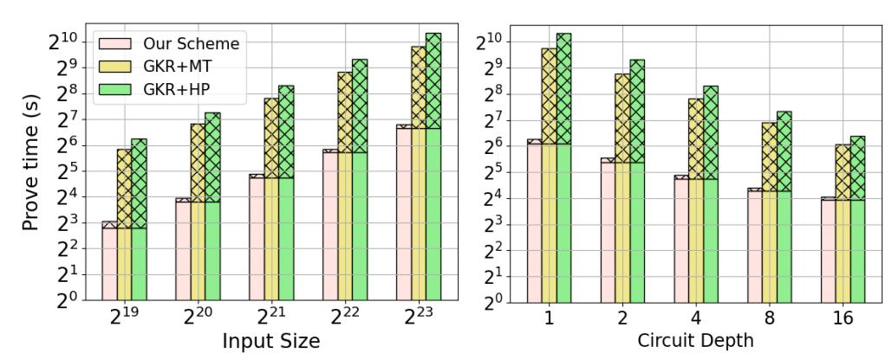
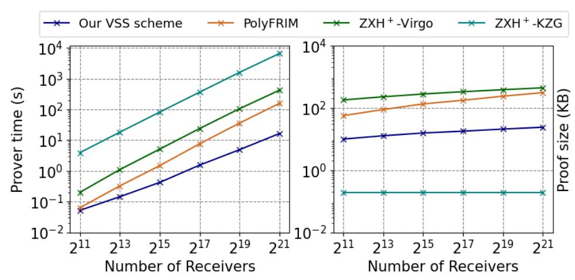
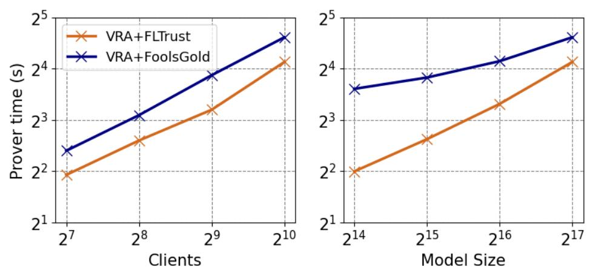

{0}------------------------------------------------

## HydraProofs: Optimally Computing All Proofs in a Vector Commitment

(with applications to efficient zkSNARKs over data from multiple users)

Christodoulos Pappas *Hong Kong University of Science and Technology cpappas@connect.ust.hk*

Dimitrios Papadopoulos *Hong Kong University of Science and Technology dipapado@cse.ust.hk*

Charalampos Papamanthou *Yale University charalampos.papamanthou@yale.edu*

*Abstract*—In this work, we introduce HydraProofs, the first *vector commitment (VC)* scheme that achieves the following two properties. *(i)* The prover can produce all the opening proofs for different elements (or consecutive sub-arrays) for a vector of size N in optimal time O(N). *(ii)* It is directly compatible with a family of zkSNARKs that encode their input as a multi-linear polynomial, i.e., our VC can be directly used when running the zkSNARK on its pre-image, without the need to "open" the entire vector pre-image inside the zkSNARK. To the best of our knowledge, all prior VC schemes either achieve *(i)* but are not efficiently "pluggable" into zkSNARKs (e.g., a Merkle tree commitment that requires re-computing the entire hash tree inside the circuit), or achieve *(ii)* but take O(N log N) time. We then combine HydraProofs with the seminal GKR protocol and apply the resulting zkSNARK in a setting where *multiple users* participate in a computation executed by an untrusted server and each user wants to ensure the correctness of the result and that her data was included. Our experimental evaluation shows our approach outperforms prior ones by 4 − 16× for prover times on general circuits. Finally, we consider two concrete application use cases, *verifiable secret sharing* and *verifiable robust aggregation*. For the former, our construction achieves the first scheme for Shamir's secret sharing with *linear time prover* (lower than the time needed for the dealer computation). For the second, we propose a scheme that works against misbehaving aggregators and our experiments show it can be reasonably deployed in existing schemes with minimal slow-downs.

## <span id="page-0-0"></span>1. Introduction

Zero-knowledge succinct non-interactive arguments of Knowledge (zkSNARKs) [\[1,](#page-13-0) [2\]](#page-13-1) are cryptographic protocols between a *prover* P and *verifier* V holding input x, that enable the former to generate small and fast-toverify proofs for the fact that y is the result of running computation C(x, w) (typically represented as an arithmetic circuit), where w may be private input held by the prover. zk-SNARKs are currently used to secure numerous real-world applications, such as scaling blockchains [\[3\]](#page-13-2), anonymizing transactions [\[4\]](#page-13-3) and ensuring the integrity of machine learning tasks [\[5,](#page-13-4) [6,](#page-13-5) [7\]](#page-13-6), and verifying network traffic policies [\[8\]](#page-13-7).

In general, it is commonly accepted that zkSNARKs can achieve "cheap" (in terms of verifier resources) verifiability for the end-user. What is arguably less well-established is how to effectively use zkSNARKs in a setting where *multiple users* provide their individual data to participate in a joint computation by a service provider. That is, each participant knows only its own data x<sup>j</sup> (and not those of the others). The N users forward their data to a service provider who then runs C((x1, . . . , x<sup>N</sup> ),w) and shares the result. This abstraction captures a wide range of applications such as distributed machine learning [\[9\]](#page-13-8), crowdsourcing [\[10\]](#page-13-9), secret sharing [\[11\]](#page-13-10) and collaborative filtering [\[12\]](#page-13-11). For many of these applications, it may be crucial to avoid having to "blindly" trust the service provider, who has the power to arbitrarily cheat (for monetary or other gains) when computing the result, or even altogether omit or modify certain users' inputs. Indeed, prior works have tried to address this, e.g., [\[13\]](#page-13-12) for crowdsourcing, or [\[14\]](#page-13-13) for secret sharing.

Unfortunately, zkSNARKs are not directly compatible with computations in this setting, as V is expected to know the entire input x, which is not the case here. Instead, we now have N verifiers V1, . . . , V<sup>N</sup> , where each V<sup>j</sup> only holds x<sup>j</sup> . *All of them* want to check the correctness of the computation over their accumulated input, but *each of them individually* wants to check its input participated in the computation. Directly using a zkSNARK would require all verifiers to have access to the accumulated input x. This, not only blows up the communication costs of each verifier but is also prohibitive in some cases due to privacy concerns [\[9,](#page-13-8) [11\]](#page-13-10) of users not wanting to share their data with other users. One solution could be to ask users to commit their x<sup>j</sup> via a (hiding) cryptographic commitment [\[15\]](#page-13-14) and only share the commitment C<sup>j</sup> with other users. The prover would then use a zkSNARK, additionally ensuring that it was run on the commitment pre-images. This can be done via a commit-and-prove zkSNARK [\[16,](#page-13-15) [17\]](#page-13-16). Unfortunately, the verification cost and overall communication for each verifier scales linearly with the number of users, which would be undesirable for many real-world applications [\[9,](#page-13-8) [10,](#page-13-9) [12\]](#page-13-11). A third option would be to have the prover generate N separate proofs for the N users. Again, directly using a zkSNARK, this can be done by running a separate prover for each V<sup>j</sup> for the computation C(x<sup>j</sup> ,w<sup>j</sup> ), where 

{1}------------------------------------------------

 $\mathbf{w}_j = (x_1, \dots, x_{j-1}, x_{j+1}, \dots, x_N, \mathbf{w})$ . Clearly, this makes the service provider's overhead N times larger; given the concrete computation costs of modern zkSNARK provers, this approach would be entirely impractical.

**zkSNARKs** and **Vector Commitments**. While the last approach above failed in terms of efficiency, the idea of generating (somewhat) different proofs for the different users is promising. At the end of the day, the computation circuit  $\mathcal{C}$  is the same for all of them, so perhaps we can have a single proof for its evaluation, whereas the proof for the participation of  $x_j$  sent to each  $\mathcal{V}_j$  can be different. To further explore this idea, without loss of generality let us consider  $\mathbf{x} = (x_1, \dots, x_N)$  as a vector. The prover can then use a vector commitment (VC) [18] to commit to  $\mathbf{x}$  via a single commitment C, and run a zkSNARK for  $C(\mathbf{x}, \mathbf{w})$  (similar to commit-and-prove SNARKs mentioned above). Moreover, vector commitments offer opening proofs for chosen indexes. For each  $V_i$ , the prover can compute a proof that its  $x_i$  is the j-th element of the pre-image of C that was used in the zkSNARK, which solves our problem!

Let us now consider how existing VC schemes perform when used in this context. Perhaps the simplest form of VC is a Merkle tree [19]. In fact, having built the tree in time  $\mathcal{O}(N)$ , all opening proofs are already computed as sibling paths from leafs to the root. Unfortunately, "loading" this VC pre-image to existing zkSNARKs would require essentially rebuilding the entire tree inside the zkSNARK arithmetic circuit used to perform the computation. This, would be very inefficient even with so-called SNARKfriendly hash functions [20, 21]. On the other hand, some modern VC schemes, e.g., based on elliptic curve cryptography [22, 23, 24, 25, 26] or error-correcting codes [27, 28] are directly compatible with many existing zkSNARKs (such as [29, 30, 31] as they encode their data in the same way. However, it turns out we have the opposite problem of Merkle trees: producing all opening proofs. Naively, with any VC this can be done in time  $\mathcal{O}(N^2)$  assuming its opening prover takes linear time. Some constructions [23, 27, 28] further improve this to  $\mathcal{O}(N \log N)$  but, to the best of our knowledge, there is no existing VC scheme (except for Merkle trees) that can produce all individual opening proofs in linear time. For completeness, we also mention here other approaches used to load (parts of) a dataset to a zkSNARK, e.g., accumulator-based [32, 33], which also take superlinear time for partial proofs and/or require opening the pre-image inside the circuit. Likewise, we do not consider lattice-based VC techniques [34, 35] as the corresponding lattice zkSNARKs remain rather impractical.

**Our Main Result.** In this work, we propose HydraProofs, the first VC scheme that needs *linear time* in the size of the vector to produce all opening proofs, while also being directly "pluggable" into a family of zkSNARKs that encode their data as *multi-linear polynomials* [29, 30, 36]. That is, we can use the zkSNARK prover on the VC preimage without having to "open" the entire commitment

inside the circuit (as is the case with Merkle trees). At a high level, HydraProofs first encodes its vector as a multi-linear polynomial and commits to it using a *polynomial commitment (PC)* scheme with linear time commit and evaluation algorithms [29, 37, 38]. As shown in previous works following this approach [39], computing all the N opening proofs, requires the prover to generate N PC proofs for the correct evaluation of the polynomial on its hypercube points  $\{0,1\}^{\log N}$ . The best existing algorithm for this, called HyperEval [39], still takes  $\mathcal{O}(N\log N)$  time.

Here, we are able to reduce this to  $\mathcal{O}(N)$  following a different approach. First, we "break down" the vector to  $\sqrt{N}$ sub-vectors  $\mathbf{x}_1, \dots, \mathbf{x}_{\sqrt{N}}$ . Essentially, we are breaking down the task of providing proofs for the fact that  $x_j = \mathbf{x}[j]$ , to the equivalent statement  $x_j = \mathbf{x}_i[j \mod \sqrt{N}]$  where  $i = \lfloor j/\sqrt{N} \rfloor$ . To do this, after committing to **x** as C, the prover also commits to the  $\sqrt{N}$  sub-arrays as  $C_1, \ldots, C_{\sqrt{N}}$ . Then, it must prove that (i) the pre-image of  $C_i$  is the i-th  $\sqrt{N}$ -sized sub-array of the pre-image of C, and (ii)  $x_j$  is the  $(j \mod \sqrt{N})$ -th element of the pre-image of  $C_i$ . For (i), we can exploit the structure of multi-linear polynomials to check this sub-array relation by checking the evaluation of the corresponding polynomials at a random point. Still, achieving this in linear time for all sub-arrays requires additional techniques, which we discuss in Section 3. Regarding (ii), unfortunately, we cannot just run HyperEval separately for each sub-array  $\mathbf{x}_i$  as this would still take time  $\mathcal{O}(N \log N)$ . Instead, we will try to combine these  $\sqrt{N}$  separate tasks into one, relying on *folding* techniques [31, 40]. Namely, we introduce a *folding scheme* for the evaluation of multi-linear polynomials on all the hypercube points, such that for  $\sqrt{N}$  polynomials of size  $\sqrt{N}$  its prover takes  $\mathcal{O}(N)$ .

Our experimental evaluation (Section 6) shows that HydraProofs has very good performance when producing all opening proofs of a vector. E.g., for a vector of size  $N=2^{22}$  producing all proofs takes 7.07seconds. Each proof is of size 20KB and takes less than 5ms to verify. Compared with prior VC schemes that use PC encoding and hence are compatible with SNARKs [39, 22], HydraProofs is  $38.4-767\times$  faster. We also note that for fairness we re-implemented [39, 22], and our versions that we used as benchmarks are already  $2-4\times$  faster than the original ones.

Combining HydraProofs with the GKR zSNARK. As we mentioned, HydraProofs encodes its vector as a multi-linear polynomial and commits to it via a PC. This choice is intentional because it then allows us to plug it directly into existing zkSNARKs that use such PCs to encode their circuit inputs [29, 30, 36], without additional costs. In Section 4, we describe how HydraProofs can be easily combined with the GKR protocol [41] to give a zkSNARK with optimal prover  $\mathcal{O}(|\mathcal{C}|)$  time and with efficient proofs of participation for each verifier's input in our target setting.

To experimentally benchmark the performance of our scheme, we test it for "generic" circuits of variable input size but fixed circuit depth, and then of variable circuit depth and fixed input size. These would correspond to different applications, e.g., relational database queries [42] or machine

<span id="page-1-0"></span><sup>1.</sup> We also generalize this to  $\mathbf{x} = (\mathbf{x}_1, \dots, \mathbf{x}_N)$ , i.e.,  $\mathbf{x}$  consists of N consecutive same-size sub-arrays, each corresponding to a different user.

{2}------------------------------------------------

learning inference and training [\[5,](#page-13-4) [6\]](#page-13-5). We also compare it with the best prior approaches for our target setting, i.e., using (a) a Merkle tree as the VC for GKR and an optimized check for its hash function [\[6\]](#page-13-5), and (b) using the state-of-theart VC of [\[39\]](#page-14-15) which is also directly compatible with GKR. Our experimental results show that our scheme significantly outperforms the competitors between 4 − 16× for prover time. For instance, for circuit size 2 <sup>25</sup>, ours takes 110sec where (a) takes 898.1sec and (b) takes 1307.52sec. At the same time, HydraProofs+GKR achieves significantly faster verification and proof size than the Merkle tree approach and only slightly larger proofs (< 1.4×) than when using [\[39\]](#page-14-15).

Finally, we consider two real-world use-cases of applications involving multiple users' data to which we apply our scheme, which we discuss next.

*Application 1: Verifiable Secret Sharing.* The first concrete use-case we consider is *verifiable secret sharing (VSS)*. At a high level, a secret sharing scheme [\[11\]](#page-13-10) allows a dealer to split a secret value s to N secret shares such that t + 1 of them are necessary to re-construct it, and any combination of at most t of them reveals nothing about it. Verifiability here safeguards the receivers of these shares against a misbehaving dealer that may issue, say, malformed or inconsistent shares. This is a heavily studied problem in the literature [\[14,](#page-13-13) [43\]](#page-14-19), as we further elaborate in Section [5.1.](#page-8-0) A recent line of works on communication-efficient VSS (i.e., avoiding the need to broadcast N-sized information to all receivers) combines PC and zkSNARK schemes to produce succinct proofs of well-formedness for each receiver. Even the best schemes in this direction [\[27,](#page-14-3) [28\]](#page-14-4) require time at least O(N log t) (this is O(N log N) for schemes with transparent setup). Our combination of Hydraproofs+GKR yields *the first VSS for Shamir's secret sharing with* O(N) *prover time*. In fact, this is less than the time it takes to simply evaluate the polynomial encoding at N points, i.e., in this case, the prover time is asymptotically smaller than the time to perform the underlying computation! Concretely, when compared with the VSS of [\[28\]](#page-14-4) and the two schemes of [\[27\]](#page-14-3), our VSS has 1.3−402× faster prover. E.g., for 2 21 receivers ours takes 16.4sec vs. 157.35sec and 506.06sec, 1.83hours respectively. It also achieves up to 5.7× smaller proofs than other constructions with polylogarithmic proofs.

Finally, our VSS is amenable to *batch-proving* multiple VSS instances with the same receivers (e.g., as is the case when VSS is used as a building block for other protocols [\[44,](#page-14-20) [45\]](#page-14-21)). This approach not only produces a single proof independently of the batch size, but it also drastically reduces the amortized prover cost. For the largest case we tested, the amortized per instance prover time is only 1.28× slower than the polynomial evaluation time.

*Application 2: Verifiable Robust Aggregation.* Another application that fits our setting is that of *federated learning* (FL) [\[46,](#page-14-22) [9,](#page-13-8) [47\]](#page-14-23), where multiple clients train local models on their respective datasets and send the resulting gradients to an *aggregator* who combines them into a new global model. The process is repeated iteratively until convergence criteria are met. Due to its decentralized nature, FL is susceptible to misbehaving clients who may "attack" the training process by providing "low-quality" gradients (e.g., using "poisoned" inputs) to decrease the model's quality, or causing misclassifications [\[48,](#page-14-24) [49,](#page-14-25) [50\]](#page-14-26). There is a long line of research on *robust aggregation* that aims to mitigate adversarial behavior from such client inputs. Researchers have proposed algorithms for this (e.g., [\[51,](#page-14-27) [52,](#page-14-28) [53,](#page-14-29) [54,](#page-14-30) [55\]](#page-14-31)) that mostly rely on statistical methods (e.g., similarity measurements, clustering) to detect and filter out outlier gradients.

However, works on robust aggregation assume the robustness checking is applied correctly by the honest aggregator to filter out or weigh down poisoned or low-quality gradients. In other words, their robustness guarantees do not hold if the aggregator is not trusted to follow the procedure. Unfortunately, in reality, the aggregator may often have good motivation to "exploit" its power for personal benefit. For instance, in federated recommendation systems [\[56,](#page-14-32) [57,](#page-14-33) [58\]](#page-14-34) (one of the most common uses of collaborative machine learning [\[59,](#page-14-35) [58\]](#page-14-34)) the aggregator can tamper with the model to promote its products [\[60\]](#page-14-36), influence financial markets, or manipulate common opinion pushing its political agenda [\[61,](#page-14-37) [62,](#page-14-38) [63\]](#page-14-39). In settings like FL-as-a-Service [\[64\]](#page-14-40), it can also affect the model quality to delay convergence, motivated by monetary or other gains [\[65,](#page-14-41) [66,](#page-14-42) [67\]](#page-14-43).

To safeguard FL against a scenario where we have both a misbehaving aggregator and possibly malicious clients, we introduce in Section [5.2](#page-9-0) the notion of *verifiable robust aggregation (VRA)* and we show how to instantiate it using Hydraproofs+GKR for two state-of-the-art robust aggregation algorithms: *FLTrust* [\[51\]](#page-14-27) and *FoolsGold* [\[53\]](#page-14-29).

We extensively tested the performance of our VRA scheme with both *FLTrust* and *FoolsGold*, for different model sizes ranging from 16K to 128K parameters and clients ranging from 128 to 1024. When we deploy VRA in a multi-threaded system, generating proofs for *FLTrust*, with 1024 clients and a model of 32K parameters only takes *less than 7 seconds* while for the more complex *FoolsGold* algorithm this takes *15 seconds*. Even for the largest sizes we tested, our VRA maintains its performance. For 1024 clients and 128K parameters, the proving time for *FLTrust* is approximately 15-18 seconds, whereas for *FoolsGold* this is less than 25 seconds. These results are not only encouraging on their own, but we believe they are more interesting when considered in the context of real-world FL deployments. For instance, [\[68,](#page-14-44) [69,](#page-14-45) [58\]](#page-14-34) report an average time of 2-3 minutes to complete one FL round. This means that our VRA proofs could be integrated with minimal slowdowns (e.g., computing proofs for the prior round while collecting the updated models of the next one and providing these proofs as a "piggyback" with the next global model).

## 2. Preliminaries

Notation. We denote [n] = {1, ..., n} and with **F**, a field of prime order p. In addition, we use [k1]<sup>k</sup><sup>2</sup> to denote the number k<sup>1</sup> modulo k2. We use x = (x1, ..., xn) ∈ **F** <sup>N</sup> to represent a vector of N elements, x[i] the i-th element of the 

{3}------------------------------------------------

vector, and  $\mathbf{x}[i:j] = (x_i, ..., x_j)$  the sub-vector of elements from  $\mathbf{x}[i]$  to  $\mathbf{x}[j]$ , where j > i. We can encode any vector  $\mathbf{x}: \{0,1\}^{\log N} \to \mathbb{F}$  as a multi-linear polynomial  $f_{\mathbf{x}}: \mathbb{F}^{\log N} \to \mathbb{F}$  s.t.  $f_{\mathbf{x}}(\mathbf{z}) = \sum_{\mathbf{b} \in \{0,1\}^{\log N}} \beta(\mathbf{z}, \mathbf{b}) \mathbf{x}(\mathbf{b})$  where  $\beta(\mathbf{z}, \mathbf{b}) = \prod_{i \in [\log N]} (b_i z_i + (1-b_i)(1-z_i))$  is the identity polynomial. We call  $f_{\mathbf{x}}$ , the *multi-linear extension* of  $\mathbf{x}$ . Next, we briefly present our building blocks.

### <span id="page-3-1"></span>2.1. Polynomial Commitments

A polynomial commitment (PC) scheme [70, 71, 72, 73] enables a prover to commit to an n-variate polynomial of maximum degree d (per variable), and later prove its correct evaluation at any point by generating a small and fast-to-verify evaluation proof. A PC consists of four algorithms:

- $\mathbf{pk}$ ,  $\mathbf{vk} \leftarrow PC.Gen(1^{\lambda}, d, n)$ : Given the security parameter  $\lambda$ , d and n generates the public parameters.
- $C \leftarrow PC.Commit(\mathbf{pk}, f)$ : Outputs the commitment of f.
- $y, \pi \leftarrow PC.Eval(\mathbf{pk}, f, \mathbf{r})$ : Generates a proof  $\pi$  showing that  $f(\mathbf{r}) = y$ .
- $0, 1 \leftarrow PC.Verify(\mathbf{vk}, C, \pi, y, \mathbf{r})$ : Returns 1 if for the committed polynomial f it holds that  $f(\mathbf{r}) = y$ .

A PC is knowledge sound if for any probabilistic polynomial time (PPT) adversary that produces an accepting proof, there exists an extractor  $\mathcal{E}_{PC}$  that extracts the committed polynomial f, such that the probability that  $f(\mathbf{r}) \neq y$  is negligible. It is *complete* if the verifier always accepts the proof for a correctly evaluated point and *zero-knowledge* if a verifier learns nothing more besides the evaluation.

For our constructions, we use PC schemes for multi-linear polynomials, i.e., d=1. We also require them to have commit and evaluation complexities *linear* to the size of the polynomial and poly-logarithmic proof size and verification times. We can categorize these into hash-based [38] and elliptic curve-based [71, 74, 37]. The first has the advantage of being plausibly post-quantum and extremely fast, while the second generates significantly smaller proofs. Our constructions are agnostic to the category of the scheme.

**HyperEval Algorithm.** In our construction, the prover needs to generate N evaluation proofs of a multi-linear polynomial  $f: \mathbb{F}^{\log N} \to \mathbb{F}$  in all hypercube points  $\mathbf{i} \in \{0,1\}^{\log N}$ . More formally:

•  $\{y_i, \pi_i\}_{i \in [N]} \leftarrow PC.HyperEval(\mathbf{pk}, f)$ : Generate N evaluation proofs showing that  $y_i = f(\mathbf{i}), \forall i \in [N]$ .

Among existing constructions, KZG-based [39] and FRI-based [28] PC schemes for multi-linear polynomials support a *HyperEval* algorithm with  $\mathcal{O}(N \log N)$  prover time.

## <span id="page-3-0"></span>2.2. Vector Commitment Schemes

A Vector Commitment Scheme (VC) [75, 76] is a cryptographic protocol that enables a prover to commit to a vector  $\mathbf{x} \in \mathbb{F}^N$  and later prove that an element  $\hat{x}_i$  is the *i*-th element of the committed vector. A VC scheme consists of the following algorithms:

•  $\mathbf{pk}$ ,  $\mathbf{vk} \leftarrow VC.Gen(1^{\lambda}, N)$ : Given the security parameter  $\lambda$  and N, outputs public parameters.

- $C \leftarrow VC.Commit(\mathbf{pk}, \mathbf{x})$ : Outputs the vector commitment of  $\mathbf{x}$ .
- $\pi_i, \hat{x}_i \leftarrow VC.Open(\mathbf{pk}, \mathbf{x}, i)$ : Outputs an opening proof  $\pi$  showing that  $\hat{x}_i = \mathbf{x}[i]$ .
- $0, 1 \leftarrow VC.Verify(\mathbf{vk}, C, \pi_i, i, \hat{x}_i)$ : Output 1 if  $\hat{x}_i$  is the *i*-th element of the committed vector.

Informally, a VC is *binding* if a PPT adversary can generate valid proofs for two different elements at the same index i with negligible probability (w.r.t  $\lambda$ ). It is *hiding*, if the verifier learns nothing else about the committed vector.

**OpenAll Algorithm.** Modern VC schemes [39, 22, 23, 26] also support an *OpenAll* algorithm that *efficiently* generates all opening proofs in an offline pre-processing phase (usually after commitment [22]) and later reply to open queries with no additional computation.

•  $\{\hat{x}_i, \pi_i\}_{i \in [N]} \leftarrow VC.OpenAll(\mathbf{pk}, \mathbf{x})$ : Generate N opening proofs, one for each element of the vector.

To the best of our knowledge, all known algorithms for Ope-nAll require  $\mathcal{O}(N \log N)$  time, except Merkle trees [19, 77] where this takes  $\mathcal{O}(N)$  just to build the tree.

#### 2.3. Argument Systems

An argument system [78] for an NP language  $\mathcal{L}$  is a protocol between a computationally-bounded prover and a verifier in which both parties hold a statement  $\mathbf{x}$  and the prover wants to prove to the verifier that  $(\mathbf{x}, \mathbf{w}) \in \mathcal{R}_{\mathcal{L}}$ . An argument system is knowledge sound if, for an accepting proof, there exists a PPT program called extractor that extracts a valid witness for x with overwhelming probability (with respect to the security parameter). Furthermore, it is zero-knowledge if the verifier, after the interaction with the prover learns nothing more besides  $\mathbf{x} \in \mathcal{L}$ . When the prover does not need to interact with the verifier to generate a proof, then it is *non-interactive*. Finally, it is *succinct* if the proof size and verification time are poly-logarithmic to  $|\mathbf{w}|$ . When both properties are satisfied the construction is a zkSNARK (e.g., [2, 42, 31]). In this work, we will focus on zkSNARKs based on the GKR protocol. First, we briefly describe GKR and then show how to turn it into a zkSNARK.

**GKR Protocol.** The *GKR* protocol proposed by Goldwasser et al. [41] is an interactive proof system [79] for proving the correct computation of a d-depth layered arithmetic circuit  $\mathcal{C}$ . For each layer  $i \in [d]$ , we set  $S_i = 2^{s_i}$  to its number of gates. Let layer 0 be the output layer and layer d be the input layer of  $\mathcal{C}$ . We denote as  $\mathbf{V}_i : \mathbb{F}^{S_i}$  the vector consisting of the outputs values of each gate in the i-th level. We denote the functions  $add_i, mul_i : \{0,1\}^{s_i+2s_{i+1}} \to \{0,1\}$  such that  $add_i(z,x,y)=1$  (or  $mul_i(z,x,y)=1$ ) if the addition (or multiplication) gate of the circuit with label z takes as input the output of the gates with labels x and y in the (i+1)-th layer, and 0 otherwise. We call these functions wiring predicates of the circuit. Finally, let  $f_+^{(i)}, f_*^{(i)}$  and  $\tilde{V}_i$  be the multi-linear extensions of  $add_i, mul_i$  and  $\tilde{V}_i$  respectively.

{4}------------------------------------------------

Given  $(C, \mathbf{V}_0, \mathbf{V}_d)$ , the verifier selects a random point  $r_0 \in \mathbb{F}^{s_0}$ , evaluates  $V_0(s_0)$  and sends  $r_0$  to the prover. Then, the prover interacts with the verifier to prove the following:

$$\tilde{V}_0(r_i) = \sum_{(x,y)\in\{0,1\}^{2s_1}} \left( f_+^{(0)}(r_0, x, y)(\tilde{V}_1(x) + \tilde{V}_1(y)) + f_*^{(0)}(r_0, x, y)\tilde{V}_1(x)\tilde{V}_1(y) \right)$$

To prove the above sum, both parties follow the *sumcheck* protocol [80]. At the end of this protocol, the verifier gets  $\tilde{V}_1(r_1')$ ,  $\tilde{V}_1(r_1'')$ ,  $f_+^{(0)}(r_0,r_1',r_1'')$ ,  $f_*^{(0)}(r_0,r_1',r_1'')$ . Although it can check locally the validity of the last two values, it cannot do so for the first two. To overcome this limitation, the verifier reduces the two points into one and interacts over an identical sumcheck instance but for the next layer.

This process continues until the d-th layer. At the end, the verifier holds  $\tilde{V}_d(r'_d)$ ,  $\tilde{V}_d(r''_d)$ ,  $f_+^{(d-1)}(r_{d-1}, r'_d, r''_d)$ ,  $f_*^{(d-1)}(r_{d-1}, r'_d, r''_d)$ , and can verify their validity locally. Recently, GKR has been significantly improved and extended to support arbitrary arithmetic circuits [29, 81]. The resulting protocol has prover complexity of  $\mathcal{O}(|\mathcal{C}|)$ ,  $\mathcal{O}(d\log|\mathcal{C}|)$  proof size. If  $\mathcal{C}$  is log-space uniform [41, 82], GKR has  $\mathcal{O}(d\log|\mathcal{C}|+|\mathbf{V}_0|+|\mathbf{V}_d|)$  verification time.

Using a PC scheme, we can turn the GKR protocol into a zkSNARK in the following way [42, 29]. First, the prover commits to  $f_w$ , the multi-linear extension of the witness  $\mathbf{w}$ , and sends it to the verifier. Then, it runs the GKR protocol to prove that  $\mathcal{C}(\mathbf{x},\mathbf{w})=1$ . Finally, the verifier ends up with two evaluation claims of  $f_w$  at the points  $r'_d$ ,  $r''_d$ , the validity of which is proven by "opening" the PC at these points.

## <span id="page-4-0"></span>3. HydraProofs: A VC Scheme with Linear-Time *OpenAll*

In this section, we show how to construct HydraProofs, a VC scheme with linear-time *OpenAll*. The only other existing scheme with this property is a Merkle tree. However, as explained in the introduction our goal is to combine our VC with a zkSNARK proving computations over the VC preimage vector. With a Merkle tree, this would require opening the entire tree inside the zkSNARK resulting in a very large number of embedded hashes and prohibitive prover times. In contrast, looking ahead to Section 4, our VC is directly "pluggable" to a variety of zkSNARKs [29, 30, 36] without modifying the zkSNARK prover. Similar to prior work [39], we build HydraProofs by encoding the vector **x** via its multilinear extension  $f: \mathbb{F}^{\log N} \to \mathbb{F}$  and use a PC scheme for multi-linear polynomials to commit to it. More specifically, our *VC.Gen* algorithm runs  $\mathbf{pk}, \mathbf{vk} \leftarrow PC.Gen(1^{\lambda}, 1, \log N)$ and the commitment of vector  $\mathbf{x} \in \mathbb{F}^N$ , is computed as  $C \leftarrow PC.Commit(\mathbf{pk}, f)$ . Note that, to achieve our desired complexity, the PC commitment and evaluation times must be linear to the polynomial size [38, 37, 74].

In the rest of this section, we will describe our *OpenAll* as a protocol between a prover holding  $\mathbf{x}$  and N verifiers  $(\mathcal{V}_1, \dots, \mathcal{V}_N)$ . Each verifier  $\mathcal{V}_i$  holds the commitment C and

a value  $\hat{x}_j \in \mathbb{F}$  and interacts with the prover to validate that  $\hat{x}_j$  is the *j*-th element of the pre-image vector of C. Here we describe it as an interactive protocol but looking ahead we will show how to make it non-interactive using the Fiat-Shamir variant of [27]. That enables the prover to run OpenAll the same way as we described in Section 2.2.

Intuition of our Protocol. Because we commit our vector as a multi-linear polynomial, a simple solution to generate all opening proofs would be to let the prover compute N evaluation proofs, one for each  $V_j$  showing that  $f(\mathbf{j}) = \hat{x}_j$  where  $\mathbf{j}$  is the bit-decomposition of j. This can be done using the HyperEval algorithm (defined in Section 2.1). To the best of our knowledge, however, existing algorithms require at best  $\mathcal{O}(N \log N)$  time [39]—whereas our goal is  $\mathcal{O}(N)$ .

Instead, our protocol starts by "breaking down" the task of proving the hypercube evaluations of an N-sized polynomial, into proving the hypercube evaluations of  $\sqrt{N}$  polynomials of size  $\sqrt{N}$ . At first glance, this is a seemingly redundant step because directly invoking HyperEval on these smaller polynomials would still result in at least  $\mathcal{O}(\sqrt{N}\cdot\sqrt{N}\log\sqrt{N})\approx\mathcal{O}(N\log N)$  time. However, breaking down the main task into smaller ones, enables us to *efficiently* "combine" them into one of size  $\sqrt{N}$  for which we can now invoke HyperEval. What remains is to show how to: (1) break down the original task into multiple tasks of smaller size and (2) combine these tasks.

For the first, the prover segments  $\mathbf{x}$  into  $\sqrt{N}$  vectors of size  $\sqrt{N}$  such that  $\mathbf{x} = (\mathbf{x}_1, \dots, \mathbf{x}_{\sqrt{N}})$ . For each  $\mathbf{x}_i$ , let  $f_i$  be its multi-linear extension. Then, for every  $i \in [\sqrt{N}]$ , the prover sends  $C_i$ , the polynomial commitment of  $f_i$ , to all verifiers  $\{\mathcal{V}_{i\sqrt{N}}, \dots, \mathcal{V}_{(i+1)\sqrt{N}}\}$ , and proves that its preimage corresponds to the i-th segment of the vector  $\mathbf{x}$ . This fulfills our goal since after completing this step every  $\mathcal{V}_j$  knows that the equality  $\mathbf{x}[j] = \mathbf{x}_i[[j]_{\sqrt{N}}]$  holds (where  $i = \lfloor j/\sqrt{N} \rfloor$  and  $[j]_{\sqrt{N}} = j mod \sqrt{N}$ ). Hence it only needs to check whether  $\mathbf{x}_i[[j]_{\sqrt{N}}] = \hat{x}_j$  or alternatively  $f_i([\mathbf{j}]_{\sqrt{N}}) = \hat{x}_j$  where  $[\mathbf{j}]_{\sqrt{N}}$  is the bit-decomposition of  $[j]_{\sqrt{N}}$ .

For the second, we observe that it is possible to combine two HyperEval instances into one by folding them [40, 83]. At a high level, a folding scheme for two HyperEval instances enables us to linearly combine the two polynomials into a folded polynomial in such way that if an evaluation claim at a hypercube point is wrong in one of the original polynomials, then it will also be wrong for the folded polynomial with overwhelming probability. By utilizing this observation, we fold all  $\sqrt{N}$  HyperEval instances into one, for which we invoke HyperEval.

**Protocol Description.** Following the above intuition, we derive our *OpenAll* construction shown in **Construction 1**. In its current form, our *OpenAll* is an interactive protocol where verifiers need to issue random challenge points in different rounds. Similarly to previous works in this area [27, 28], our protocol assumes that in every round, all verifiers must respond to the prover with the *same random challenge point*—if this were not the case, the prover would have to repeat the process independently for each verifier, blowing up the prover time to  $\mathcal{O}(N^2)$ . For now, the reader may

{5}------------------------------------------------

**Construction 1: Efficient OpenAll.** We assume a prover  $\mathcal{P}$  holding a vector  $\mathbf{x} \in \mathbb{F}^N$  and the polynomial commitment of its multi-linear extension  $C_f$ . Furthermore we assume N verifiers  $\{V_1, \ldots, V_N\}$ . Every  $V_j$  holds the commitment  $C_f$  and an element  $\hat{x}_j \in \mathbb{F}$  claimed to be the j-th element of  $\mathbf{x}$ . Each  $V_j$ , wants to validate that  $\hat{x}_j = \mathbf{x}[j]$ .

- $\mathcal{P}$ : Segment  $\mathbf{x}$  in  $\sqrt{N}$  vectors of size  $\sqrt{N}$  such that  $\mathbf{x} = (\mathbf{x}_1, \dots, \mathbf{x}_{\sqrt{N}})$ . For every  $i \in [\sqrt{N}]$ , compute  $C_i \leftarrow PC.Commit(\mathbf{pp}, f_i)$ , where  $f_i : \mathbb{F}^{\log \sqrt{N}} \to \mathbb{F}$  the multi-linear extension of  $\mathbf{x}_i$ . Send  $C_i$  to the verifiers  $\{\mathcal{V}_{\sqrt{N}\cdot i}, \dots, \mathcal{V}_{\sqrt{N}\cdot (i+1)}\}$ , for all  $i \in [\sqrt{N}]$ .
- Phase 1: Prove the consistency of all segments. Namely, for every  $i \in [\sqrt{N}]$ , prove that  $x_i = x[i\sqrt{N}:(i+1)\sqrt{N}]$ .

  1)  $\mathcal{P}$ : Receive a random challenge point  $\mathbf{r}_1 \in \mathbb{F}^{(\log N)/2}$  from all verifiers. Compute  $f'(z) = f(z, \mathbf{r}_1)$  and  $C' \leftarrow PC.Commit(\mathbf{pp}, f')$ . In addition, for every  $i \in [\sqrt{N}]$  compute the following: (a) an evaluation proof  $\pi_i$  proving that  $y_i = f_i(\mathbf{r}_1)$  and (b) an evaluation proof  $\pi_i'$  proving that  $y_i' = f(\mathbf{i})$ . To generate all proofs for (b) it uses HyperEval. Finally send C' to all verifiers and  $y_i, y_i', \pi_i, \pi_i'$  to the verifiers  $\{V_{i\sqrt{N}}, \dots, V_{(i+1)\sqrt{N}}\}$ , for all  $i \in [\sqrt{N}]$ .
- 2)  $V_j$ : Validate  $\pi_i, \pi'_i$ , and check if  $y_i = y'_i$ .
- 3)  $\mathcal{P}$ : Receive a random challenge point  $\mathbf{r}_2 \in \mathbb{F}^{(\log N)/2}$  from all verifiers and compute: (a) an evaluation proof  $\pi$  proving that  $y = f(\mathbf{r}_1, \mathbf{r}_2)$ , and (b) an evaluation proof  $\pi'$  proving that  $y' = f'(\mathbf{r}_2)$ . Send  $\pi, \pi', y, y'$  to all verifiers. 4)  $\mathcal{V}_j$ : Validate the evaluation proofs  $\pi, \pi'$  and check if y = y'.
- Phase 2: Fold  $\sqrt{N}$  HyperEval instances to a single one. Let  $\mathcal{V}_i^{\log \sqrt{N}} \leftarrow \{\mathcal{V}_{i\sqrt{N}}, \dots, \mathcal{V}_{(i+1)\sqrt{N}}\}$  and  $f_i^{\log \sqrt{N}} \leftarrow f_i$ .
- 1) For every  $l = \log \sqrt{N}, \dots, 1$ , the prover and all verifiers interact as follows:
  - a) For every  $i=1,\ldots,\sqrt{N}/2^{\log N-l+1}$ ,  $\mathcal{P}$  and  $\{\mathcal{V}_{2i}^l,\mathcal{V}_{2i+1}^l\}$  interact following the **Protocol 2** to fold the HyperEval instances of the polynomials  $f_{2i}^l, f_{2i+1}^l : \mathbb{F}^{\log \sqrt{N}} \to \mathbb{F}$ . At the end of each invocation of **Protocol 2**, the prover gets the folded polynomial  $f^*$ , sets  $f_i^{l-1} \leftarrow f^*$  and  $\mathcal{V}_i^{l+1} \leftarrow \{\mathcal{V}_{2i,1}^l \cup \mathcal{V}_{2i+1,1}^l, \ldots, \mathcal{V}_{2i,\sqrt{N}}^l \cup \mathcal{V}_{2i+1,\sqrt{N}}^l\}$ .
- 2) Let  $f^*$  be the final folded polynomial. The prover follows the HyperEval algorithm to generate  $\sqrt{N}$  evaluation proofs  $\pi_i^*$  proving that  $y_i^* = f^*(\mathbf{i})$  and sends  $\pi_i^*$  to all verifiers  $\mathcal{V}_i^1 = \{\mathcal{V}_i, \mathcal{V}_{\sqrt{N}+i}, \dots, \mathcal{V}_{\sqrt{N}(\sqrt{N}-1)+i}\}$ .

assume for simplicity that all verifiers agree on the same challenges during the execution of the protocol, e.g., by running a joint randomness protocol. Later, we will show how this common randomness can be established without interaction among the clients in the random oracle model using the modified Fiat-Shamir version of [27].

Initial Step: For every segment  $\mathbf{x}_i$ , the prover computes the commitment  $C_i$  of its multi-linear extension  $f_i$  using the underlying PC. Then, for every  $i \in [\sqrt{N}]$ , it sends  $C_i$  to the verifiers  $\{\mathcal{V}_{i\sqrt{N}}, \dots, \mathcal{V}_{(i+1)\sqrt{N}}\}$ . After this, each  $\mathcal{V}_j$  holds the commitment of the vector C and a segment commitment  $C_i$ , where  $i = \lfloor j/\sqrt{N} \rfloor$ . Next, we partition our protocol into two phases. In Phase I, the prover convinces each  $\mathcal{V}_j$  that the committed vector  $\mathbf{x}_i$  is the i-th segment of the committed  $\mathbf{x}$  (i.e.,  $\mathbf{x}_i = \mathbf{x}[i\sqrt{N}:(i+1)\sqrt{N}]$ ). In Phase 2, the prover convinces each  $\mathcal{V}_j$  that  $f_i([\mathbf{j}]_{\sqrt{N}}) = \hat{x}_j$ .

<u>Phase 1:</u> As a starting point we observe that for a random point  $\mathbf{r}_1 \in \mathbb{F}^{(\log N)/2}$  the following holds with overwhelming probability: " $\mathbf{x}_i$  is the *i*-th segment of  $\mathbf{x}$  if and only if  $f_i(\mathbf{r}_1) = f(\mathbf{i}, \mathbf{r}_1)$  where  $\mathbf{i}$  the bit-decomposition of  $\mathbf{i}$ ". Based on this, the prover receives the challenge point  $\mathbf{r}_1$  from the verifiers and generates (a) an evaluation proof  $\pi_i$  of  $f_i$  at  $\mathbf{r}_1$  for every  $i \in [\sqrt{N}]$  and (b) an evaluation proof of f at  $(\mathbf{i}, \mathbf{r}_1)$ , for all  $\mathbf{i} \in \{0, 1\}^{(\log N)/2}$ . For (a), it directly computes all  $\pi_i$  along with the evaluation  $y_i$  and sends  $(\pi_i, y_i)$  to the verifiers  $\{\mathcal{V}_{i\sqrt{N}}, \dots, \mathcal{V}_{(i+1)\sqrt{N}}\}$ . For (b), the prover needs to generate  $\sqrt{N}$  evaluation proofs for a committed polynomial of size N—leading to prohibitive proving times. To circumvent that issue, it first commits to the  $\sqrt{N}$ -sized polynomial  $f'(\mathbf{z}) = f(\mathbf{z}, \mathbf{r}_1)$ , and sends its commitment C'

to all verifiers. Then, it invokes the *HyperEval* algorithm to generate  $\sqrt{N}$  evaluation proofs at the hypercube points of f' and sends  $\pi'_i$  and  $y'_i$  (claimed to be  $f'(\mathbf{i})$ ) to the verifiers  $\{\mathcal{V}_{i\sqrt{N}}, \dots, \mathcal{V}_{(i+1)\sqrt{N}}\}$  (step 2 of *Phase 1*).

After receiving  $\pi_i$ ,  $\pi'_i$ , C',  $y_i$  and  $y'_i$ , each  $\mathcal{V}_j$  verifies  $\pi_i$  and  $\pi'_i$  and checks if  $y_i = y'_i$  (step 3 of *Phase 1*). If all checks pass,  $\mathcal{V}_j$  knows that  $f_i(\mathbf{r}_1) = f'(\mathbf{i})$ . What remains, is to validate that  $f'(\mathbf{z}) = f(\mathbf{z}, \mathbf{r}_1)$ . To achieve this, it sends the next random point  $\mathbf{r}_2 \in \mathbb{F}^{(\log N)/2}$  to the prover. The latter, generates two evaluation proofs  $\pi$  and  $\pi'$  of f and f' at the points  $(\mathbf{r}_2, \mathbf{r}_1)$  and  $\mathbf{r}_2$  respectively (step 4 of *Phase 1*). Finally, it sends them along with the evaluations g and g' to all verifiers who validate the proofs and check if g is g.

<u>Phase 2:</u> At this point,  $V_i$  knows that the pre-image of  $C_i$  is indeed the i-th sub-array of the pre-image of C. It remains to validate that  $f_i([\mathbf{j}]_{\sqrt{N}}) = \hat{x}_i$ . From the prover's perspective, this translates to generating evaluation proofs for all boolean hypercube points  $\mathbf{j} \in \{0,1\}^{\log \sqrt{N}}$  and all  $\sqrt{N}$  commitments  $C_i$ . As discussed earlier, directly using HyperEval on each  $C_i$  leads to  $\mathcal{O}(N\log\sqrt{N})$  proving time. To avoid this, we first fold all  $\sqrt{N}$  HyperEval instances to one and later invoke the HyperEval algorithm for the folded instance. To simplify our presentation, we initially describe the folding protocol as shown in **Protocol 2**, which folds two *HyperEval* instances of size K (in our case  $K = \sqrt{N}$ ). Then we show how to use it in order to fold  $\sqrt{N}$  HyperEval instances. For ease of presentation, we assume a homomorphic PC scheme. However, we note that we can generalize this to hash-based PC schemes utilizing the PC aggregation scheme first formalized by Boneh et. al. [40] (see Appendix E).

{6}------------------------------------------------

**Protocol 2: Folding HyperEval instances.** Consider a  $\mathcal{P}$  holding two polynomials  $f_0, f_1 : \mathbb{F}^{\log N} \to \mathbb{F}$  and two sets of verifiers  $\mathcal{V}_0 = \{\mathcal{V}_{0,1}, \dots, \mathcal{V}_{0,N}\}$  and  $\mathcal{V}_1 = \{\mathcal{V}_{1,1}, \dots, \mathcal{V}_{1,N}\}$ . All verifiers in  $\mathcal{V}_i$  where  $i \in \{0,1\}$  have the polynomial commitment  $C_i$ . Each  $\mathcal{V}_{i,k}$  individually holds  $y_{i,k}$ , claimed to be  $f_i(\mathbf{k})$ .

- 1)  $\mathcal{P}$ : For every  $k \in [N]$ , sends  $y_{1,k}$  to  $\mathcal{V}_{0,k}$  and  $y_{0,k}$  to  $\mathcal{V}_{1,k}$ . Furthermore sends  $C_1$  to all  $\mathcal{V}_0$  and  $C_0$  to all  $\mathcal{V}_1$ .
- 2)  $V_{i,k}$ : Upon receiving  $y_{1-i,k}$  and  $C_{1-i}$ , picks two random points  $a, b \in \mathbb{F}$  and sends them to  $\mathcal{P}$ . Then computes  $y_k^* \leftarrow ay_{0,k} + by_{2,k}$  and  $C_{f^*} \leftarrow C_0^a C_1^b$ .
- 3)  $\mathcal{P}$ : Computes the folded polynomial  $f^*(x) \leftarrow af_0(x) + bf_1(x)$ .

Folding two HyperEval Instances: Assume two sets of verifiers  $\mathcal{V}_0 = \{\mathcal{V}_{0,1}, \dots, \mathcal{V}_{0,K}\}$  and  $\mathcal{V}_1 = \{\mathcal{V}_{1,1}, \dots, \mathcal{V}_{1,K}\}$ of size K. Each verifier in  $V_{i,j}$ , where  $i \in \{0,1\}$  and  $j \in [K]$ , holds a point  $y_{i,j}$  claimed to be  $f_i(\mathbf{j})$  and a PC commitment of  $f_i$  denoted with  $C_i$ . The prover also holds the two K-sized polynomials  $f_0$  and  $f_1$ . At the end of the protocol, we require that both  $\mathcal{V}_{0,j}$  and  $\mathcal{V}_{1,j}$  should end up with a common claim  $y_j^*$  and commitment  $C_{f^*}$ , such that if  $y_{0,j}$  or  $y_{1,j}$  are wrong, then  $y_i^*$  should also be wrong with overwhelming probability. Our protocol works as follows. For every  $\mathcal{V}_{0,j} \in \mathcal{V}_0$ , the prover sends  $C_1$  and  $y_{1,j}$  and for every  $\mathcal{V}_{1,j} \in \mathcal{V}_1$ , it sends  $C_0$  and  $y_{0,j}$  (step 1). Next, every  $V_{i,j}$  picks two random points  $a, b \in \mathbb{F}$ , computes  $C_{f^*} \leftarrow C_0^a C_1^b$  and  $y_j^* \leftarrow ay_{0,j} + by_{1,j}$  (step 2). Finally, it sends a, b to the prover which computes the folded polynomial  $f^*(\mathbf{x}) = af_1(\mathbf{x}) + bf_2(\mathbf{x})$  (step 3).

Folding  $\sqrt{N}$  HyperEval Instances: To fold  $\sqrt{N}$  instances, the prover folds all segments in a tree-like fashion. More precisely, in the leaf level, it initializes the sets of verifiers  $\mathcal{V}_i^l=\{\mathcal{V}_{i\sqrt{N}},\dots,\mathcal{V}_{(i+1)\sqrt{N}}\}$ , for all  $i\in[\sqrt{N}]$  and  $l = \log \sqrt{N}$ . Then for every pair  $\mathcal{V}_{2i}^l$  and  $\mathcal{V}_{2i+1}^l$ , invokes the **Protocol 2**, folding the two *HyperEval* instances. For the rest of the tree layers  $l \in [\log \sqrt{N} - 1]$ , the prover sets  $\mathcal{V}_i^l =$  $\{\mathcal{V}^{l+1}_{2i\sqrt{N},1}\cup\mathcal{V}^{l+1}_{(2i+1)\sqrt{N},1},\ldots,\mathcal{V}^{l+1}_{2i\sqrt{N},\sqrt{N}}\cup\mathcal{V}^{l+1}_{(2i+1)\sqrt{N},\sqrt{N}}\},$  for all  $i\in[\sqrt{N}/2^{\log N-l}]$  and for every pair  $\mathcal{V}^l_{2i},\mathcal{V}^l_{2i+1}$ invokes the Protocol 2. Observe that, compared to the leaf layer,  $\mathcal{V}_i^l$  is a multi-set, containing  $\sqrt{N}$  sets of verifiers of size  $2^{\log N - l}$ . Nevertheless, the prover follows **Protocol 2** as defined earlier but with the difference that when sending a message, it broadcasts it to all verifiers that belong to the same set. When reaching the root, the prover ends up with a folded polynomial  $f^*: \mathbb{F}^{\log \sqrt{N}} \to \mathbb{F}$ . All verifiers hold the PC commitment of  $f^*$ ,  $C_{f^*}$ , every  $\mathcal{V}_j$  holds its claimed evaluation  $y_i^*$  at  $\mathbf{i} \in \{0,1\}^{\log \sqrt{N}}$ , the bit decomposition of  $i=[j]_{\sqrt{N}}$ . Finally, the prover invokes the *HyperEval* algorithm for  $f^*$  to generate  $\sqrt{N}$  proofs  $\{\pi_i^{(2)}\}_{i\in[\sqrt{N}]}$  proving that  $y_i^*=f(\mathbf{i})$  and sends i to all  $\mathcal{V}_j$  such that  $i=[j]_{\sqrt{N}}$ .

Establishing Common Randomness in the Non-Interactive Setting. Up until this point, we have presented our protocol in the interactive setting, assuming that all

verifiers somehow reply with the same random challenge. However, in practice, we are interested in enforcing this requirement in the non-interactive setting. To achieve this, we use the Fiat-Shamir variant described in [27], specifically designed for this multi-verifier setting and proven secure in the random oracle model, which we explain next at a high level. First, let us focus on a single round of the protocol. In order to establish a common randomness without directly interacting with each other, each verifier can independently choose a random challenge and send it to the prover. The latter commits to these challenges by building a Merkle tree over them and uses its root as the common random challenge. Modeling the hash function used as a random oracle guarantees the randomness of the root, as long as one of the verifiers produced honest randomness. Then, the proof provided to each verifier includes a membership proof (via the Merkle path) to show that its challenge is accounted for. This can then be made non-interactive in the style of Fiat-Shamir, by having the prover build the Merkle tree by hashing the individual statements of the verifiers at the leafs (together with any common statement). Finally, for multiround protocols like ours, this can be extended by building a different Merkle tree per round, each time including in the leafs the common challenge (Merkle root) of the previous round. We refer the reader to [27] for additional details.

Making Our Protocol Non-Interactive. Based on the above, we can make our protocol non-interactive as follows. First, to generate  $\mathbf{r}_1$  in *Phase 1*, the prover uses  $rt_1$ , the Merkle root of a tree with leaves the vector  $\mathbf{x}$  and all commitments  $C_i$ . For  $\mathbf{r}_2$ , observe that C' is common to all verifiers, so the prover follows the standard Fiat-Shamir. For *Phase 2*, recall that the prover has to fold all  $\sqrt{N}$  HyperEval instances in a tree-like fashion. For every layer  $l \in [\log \sqrt{N}]$  of that tree, the prover Merkle commits the  $\sqrt{N}/2^{\log \sqrt{N}-l}$  coefficients of all to-be-folded polynomials and their  $\sqrt{N}/2^{\log \sqrt{N}-l}$  commitments. Finally, it uses its root along with the previous randomness to generate the new random challenges.

Note that we can also instantiate a zero-knowledge variant of our protocol using standard techniques [84]. Finally, given the *OpenAll* algorithm, HydraProofs uses it after the commitment in a pre-processing phase and replies to *Open* queries by sending corresponding proof. Next we claim the following which we prove in Appendix B.

<span id="page-6-0"></span>**Theorem 1.** Assuming a homomorphic PC scheme for multi-linear polynomials with  $\mathcal{O}(N)$  commitment and evaluation complexity, proof size of ps(N) and verification time of vt(N), HydraProofs is a VC scheme with  $\mathcal{O}(N)$  Commit and OpenAll complexity,  $\mathcal{O}(ps(N) + \log^2 N)$  proof size and  $\mathcal{O}(vt(N) + \log^2 N)$  verification time.

Optimization 1: Reducing proof size & verification time. Since we use the Fiat-Shamir variant of [27], HydraProofs achieve  $\mathcal{O}(\log^2 N)$  proof size and verification time. Here, we discuss an optimization that achieves smaller proofs and verification times if we specifically use the multi-linear KZG PC of [71]. The prover first breaks down  $\mathbf{x}$  in  $\log N$  seg-

{7}------------------------------------------------

**Construction 2:** We assume a prover  $\mathcal{P}$  and N verifiers  $\{V_1, \ldots, V_N\}$ . The prover holds the input  $\mathbf{x}$  and a witness  $\mathbf{w}$ . Each  $V_j$  holds only a part of the input  $\hat{\mathbf{x}}_j$ . Furthermore, all parties share the circuit  $\mathcal{C}$ . Without loss of generality we assume that  $|\mathbf{w}| = |\mathbf{x}| = L \geq N$ . The prover interacts with all verifiers and wants to convince each  $V_j$  that (1)  $\mathcal{C}(\mathbf{x}, \mathbf{w}) = 1$  and (2)  $\mathbf{x}_j = \hat{\mathbf{x}}_j$ .

- 1)  $\mathcal{P}$ : Let  $f_x: \mathbb{F}^{\log L} \to \mathbb{F}$  to be the multi-linear extension of  $\mathbf{x}$ . Compute  $C_x \leftarrow VC.Commit(\mathbf{pk}_{VC}, \mathbf{x})$  (= $PC.Commit(\mathbf{pk}_{PC}, f_x)$ ) and send  $C_x$  to all verifiers.
- 2)  $\mathcal{P}$ - $\{\mathcal{V}_1,\ldots,\mathcal{V}_N\}$ : Interact following the **Construction 1** to prove to each  $\mathcal{V}_j$  that  $\hat{\mathbf{x}}_j = \mathbf{x}_j$ .
- 3)  $\mathcal{P}$ : Let  $f_w : \mathbb{F}^{\log L} \to \mathbb{F}$  be the multi-linear extension of  $\mathbf{w}$ . Compute  $C_w \leftarrow PC.Commit(\mathbf{pk}_{PC}, f_w)$  and send it to all verifiers.
- 4)  $\mathcal{P}$ - $\{V_1, \ldots, V_N\}$ : Interact following the GKR protocol to prove that  $\mathcal{C}(\mathbf{x}, \mathbf{w}) = 1$ . At the end of the protocol, all verifiers end-up with evaluation claims  $y_x, y_w$  of  $f_x, f_w$  at a point  $\mathbf{r} \in \mathbb{F}^{\log L}$ . The prover generates their evaluation proofs  $\pi_x, \pi_w$  and sends them to all verifiers which use  $C_x$  and  $C_w$  to validate their correctness.

ments (instead of  $\sqrt{N}$ ), and sends all  $\log N$  commitments to the verifiers. In *Phase* 2, it folds the  $\log N$  *HyperEval* instances using directly **Protocol 2** (adapted for  $\log N$  polynomials). Thus, the proof size and verification time are reduced to  $\mathcal{O}(\log N)$ . In fact, we can make this version non-interactive using the "classic" Fiat-Shamir heuristic, since all verifiers share the same statement, avoiding the modified version of [27]. The prover time remains  $\mathcal{O}(N)$  (since the prover uses the *HyperEval* algorithm of [39] twice for  $N/\log N$  sized polynomials) but we expect it to be concretely slower than the one shown in **Construction 1**.

**Optimization 2: Extending** *OpenAll* **for sub-arrays.** As described above, *OpenAll* generates opening proofs for all individual elements of x. Here we extend this to generating opening proofs for all consecutive sub-arrays. More formally, we wish to generate M opening proofs, one for each  $\mathcal{V}_j$ , where  $j \in [N/M]$ , showing that its array  $\hat{\mathbf{x}}_j \in \mathbb{F}^{N/M}$ is the j-th sub-array of the committed vector  $\mathbf{x} \in \mathbb{F}^N$  (e.g.,  $\mathbf{x}_i = \mathbf{x}|(j-1)N/M:jN/M|$ ). Observe that this is identical to what the prover shows in the *Phase 1* of our *OpenAll*. Hence, to generate all opening proofs in this setting, all parties follow *Phase 1* but with the following differences. Firstly, the prover partitions the vector  $\mathbf{x}$  into M (and not  $\sqrt{N}$ ) segments of size N/M such that  $\mathbf{x} = (\mathbf{x}_1, \dots, \mathbf{x}_N)$ . For each segment  $\mathbf{x}_j$ , computes the commitment  $C_j$  of its multi-linear extension and sends it to  $V_j$ . Upon receiving its commitment,  $V_j$  checks if the pre-image of  $C_j$  corresponds to the multi-linear extension of  $\hat{\mathbf{x}}_i$ . Secondly, in step 1.b of *Phase 1*, it uses *OpenAll* instead *HyperEval*. This enables the prover to achieve a total proving complexity of  $\mathcal{O}(N)$ . Furthermore, each verifier receives a constant number of evaluation proofs and one opening proof for a M-sized vector. Hence, the proof size is  $\mathcal{O}(\log^2 M + ps(N))$  and the verification time is  $\mathcal{O}(\log^2 M + vt(N) + N/M)$ .

As a concrete optimization, observe that in the protocol above,  $V_j$  already holds  $\hat{\mathbf{x}}_j$ , the pre-image of  $C_j$ . Hence, the *Initial Step* can be omitted altogether since the prover does not need to compute and send  $C_j$  to  $V_j$ . Likewise, it does not need to generate the evaluation proof of  $C_j$  at  $\mathbf{r}_1$  (step 1 task (a)) since each  $V_j$  can compute  $y_i$  by itself.

## <span id="page-7-0"></span>4. Combining HydraProofs with GKR

In this section, we show how to combine HydraProofs with a zkSNARK in order to prove the correctness of a computation using data that come from multiple sources. More formally, we consider a setting with a single prover holding the vector  $\mathbf{x} = (\mathbf{x}_1, \dots, \mathbf{x}_N)$  and N verifiers  $\{\mathcal{V}_1,\ldots,\mathcal{V}_N\}$  where each  $\mathcal{V}_i$  only holds  $\mathbf{x}_i$ . In this setting, the prover performs a computation, which we represent with an arithmetic circuit C that takes as input x and possibly additional private input w from the prover. Following the discussion from the introduction, in this setting the prover has to generate (1) N proofs showing that the input of each  $V_j$  is the j-th segment of the pre-image of  $C_x$ , the vector commitment of x, and (2) a zkSNARK proof for the statement: " $C(\mathbf{x}, \mathbf{w}) = 1$  and  $\mathbf{x}$  is the pre-image of  $C_x$ ". For (1) we can use HydraProofs to compute  $C_x$  and all opening proofs. What remains is to select a zkSNARK that proves (2) without any additional overhead. First, note that  $C_x$  encodes x as a multi-linear polynomial. This makes HydraProofs compatible with zkSNARKs that encode their data (e.g., **x,w**) as multi-linear polynomials [29, 30, 36]. Namely, we focus on zkSNARKs that combine the GKR protocol with a multi-linear PC [29, 42]. Choosing this PC to be the same as the one used to instantiate HydraProofs means that the two parts are directly "pluggable" with no additional overhead.

We present the interactive version of our protocol in **Construction 2**. As in the previous section, we initially assume that in each round the prover receives the same random challenge from all verifiers. Then we discuss its non-interactive variant without this assumption.

**Protocol Description.** The prover starts by computing  $C_x$  the VC commitment of  $\mathbf{x}$  using HydraProofs and sends it to all verifiers. Then, they interact following the *OpenAll* protocol, as presented in **Construction 1** to generate N opening proofs, one for each  $\mathcal{V}_j$ . Finally, the prover interacts with the verifiers to generate a zkSNARK proof for the relation  $\mathcal{R} = \{(C_x; \mathbf{x}, \mathbf{w}) : \mathcal{C}(\mathbf{x}, \mathbf{w}) = 1 \land C_x = VC.Commit(\mathbf{pk}, \mathbf{x})\}$ . We use the techniques of [42] to split the input commitment into two parts. First, the prover commits to  $f_w$ , the multi-linear extension of  $\mathbf{w}$ , and sends its commitment to all verifiers. Next, it interacts with them running the GKR protocol. At its final round, all verifiers end up with an evaluation claim of  $f_x$  (the multi-linear extension of  $\mathbf{x}$ ) and  $f_w$  at a random

{8}------------------------------------------------

point. The prover shows their correctness by generating evaluation proofs for  $f_x$  and  $f_w$  at the random point, which are then combined. Note that the first is possible because HydraProofs uses a PC to commit the vector  $\mathbf{x}$ , which can provide evaluation proofs for  $f_x$ .

Making the Protocol non-Interactive. To make our protocol non-interactive, we use the non-interactive version of Construction 1 as described in section 3 and the standard Fiat-Shamir transformation for step 3. The proof of each  $V_j$  will consist of  $C_x$ , the opening proof  $\pi_i$ , and the zkSNARK proof  $\pi$  for the relation  $\mathcal{R}$ . Finally, we state the following result which we prove in Appendix 2 where we also show how to make it zero-knowledge by using the techniques of [29].

<span id="page-8-1"></span>**Theorem 2.** For each  $V_j$  and  $\mathcal{P}$  the non-interactive variant of **Construction 2** is a non-interactive argument system for the relation  $\mathcal{R}_j = \{(\hat{\boldsymbol{x}}_j; (\boldsymbol{x}, \boldsymbol{w}) : \mathcal{C}(\boldsymbol{x}, \boldsymbol{w})) = 1 \land \hat{\boldsymbol{x}}_j = \boldsymbol{x}_j\}$ . Assuming a PC scheme with linear commitment and evaluation time, vt(N) verification time and ps(N) proof size, the total prover complexity is  $\mathcal{O}(|\mathcal{C}|)$ . The proof size is  $\mathcal{O}(d \log |\mathcal{C}| + ps(|\boldsymbol{w}|) + ps(|\boldsymbol{x}|) + \log^2 N)$ . Furthermore, if  $\mathcal{C}$  is log-space uniform, the verification time is  $\mathcal{O}(d \log |\mathcal{C}| + \log^2 N + vt(N) + |\hat{\boldsymbol{x}}_j|)$ .

## 5. Applications

In this section, we explain how our approach from Section 4 can be adopted in scenarios where many users contribute or receive data from a joint computation that must be verified. We consider two specific applications: (1) a verifiable secret sharing (VSS), and (2) verifiable robust model aggregation in collaborative/distributed learning.

## <span id="page-8-0"></span>5.1. VSS with Asymptotically Faster Prover Time than Dealer Time

A (N, t+1) secret sharing scheme, enables a *dealer* that holds a secret value s to "split" it among N receivers by computing shares  $s_j$ . Then, s is reconstructed if and only if at least t+1 receivers combine their shares. Crucially, a coalition of less than t receivers learns nothing about s. A verifiable secret sharing (VSS) scheme [14, 43] allows each receiver to validate the correctness of its share, protecting against malicious dealers computing malformed shares.

Arguably, the most widely used such scheme is Shamir's secret sharing [11], which can be simply described as follows. Let  $f_s : \mathbb{F} \to \mathbb{F}$  be a degree t univariate polynomial chosen uniformly at random by the dealer, conditioned on  $f_s(0) = s$ . The shares are computed as  $s_j = f_s(x_j)$ , for  $j \in [N]$ , where  $x_j$  are points corresponding to receivers (for the remainder, let  $x_j$  be the j-th root of unity in  $\mathbb{F}$ ). Clearly, t+1 shares suffice to uniquely reconstruct  $f_s$  (hence s) via interpolation, while any combination of t or fewer shares leaks nothing for the polynomial. Several works build verifiable versions of Shamir's secret sharing. To avoid broadcasting information that is linear to the polynomial degree [14, 85],

<span id="page-8-2"></span>TABLE 1: Asymptotic comparison of communication-efficient VSS schemes for Shamir's secret sharing. The dealer's computation time to evaluate the degree-t polynomial at N roots of unity (N > t) is  $\mathcal{O}(N \log t)$ .

| VSS Scheme                   | Transparent<br>Setup | Prover<br>Time | Total<br>Communication |
|------------------------------|----------------------|----------------|------------------------|
| KZG [86]                     | X                    | Nt             | N                      |
| AMT [88]                     | X                    | $N \log t$     | $N \log t$             |
| $ZXH^+$ -KZG [27]            | X                    | $N \log N$     | N                      |
| ZXH <sup>+</sup> -Virgo [27] | ✓                    | $N \log N$     | $N \log^2 N$           |
| FRI-Based [28]               | ✓                    | $N \log N$     | $N \log^2 N$           |
| Ours                         | ✓                    | N              | $N \log^2 N$           |
| Ours w/ KZG                  | X                    | N              | $N \log N$             |

a line of works on practical VSS relies on polynomial commitments and/or zkSNARKs [86, 87, 27, 28], thus achieving reduced total communication that is linear or quasi-linear to N. This requires the dealer to first commit to  $f_s$  and then produce N succinct (and zero-knowledge) proofs, one for each receiver, for the correct polynomial evaluation of  $s_j = f_s(x_j)$ . Kate et. al. [86] produced the first such VSS directly from KZG PC achieving optimal proof size and verification time. However, it computes each proof individually resulting in  $\mathcal{O}(Nt)$  prover time. For comparison, evaluating  $f_s$  on N roots of unity can be done in time  $\mathcal{O}(N\log t)$  via FFT. Tomescu et. al. [87] subsequently reduced the prover time to  $\mathcal{O}(N\log t)$  at the cost of a slight increase in proof size and verification time.

Zhang et. al. [27] proposed two schemes based on "one-to-many" proofs for polynomial evaluation. The first is also based on KZG and achieves optimal verification time and proof size. The second uses a zkSNARK based on GKR combined with the Virgo PC scheme [73] and is asymptotically strictly worse for verification time and proof size. That said, it has a concretely much faster prover as it avoids KZG's costly group operations. This was further improved recently [28] using an FRI-based PC scheme. We also note that these last two schemes have a transparent setup, i.e., they do not need a trusted entity to generate the public parameters of the schemes, which is very important for the security of applications using VSS. Table 5.1 summarizes the asymptotic complexity of these VSS schemes.

Our VSS with linear prover time. Here, we describe our VSS that achieves  $\mathcal{O}(N)$  prover time for N shares. To the best of our knowledge, this is the first communication-efficient VSS with this property. In fact, our prover is asymptotically *faster* than a dealer that simply produces the N shares for Shamir's secret sharing!

Our starting observation is that the VSS prover operates in a setting similar to the one described in Section 4. The target computation is an FFT to evaluate the share points, and each verifier wishes to validate the correctness of a single element of the output. The prover needs to generate for each  $V_j$  a proof showing that: (1)  $C_{FFT}(\mathbf{x}, \mathbf{w}) = 1$  where  $\mathbf{x}$  consists of the shares,  $\mathbf{w}$  consists of the coefficients of  $f_s$ , and  $C_{FFT}$  computes the FFT, evaluates the share points, and outputs 1 if and only if they are equal to the elements of  $\mathbf{x}$ . (2) The share of  $V_j$  is equal to  $\mathbf{x}[j]$ . We can prove the above directly using the zero-knowledge variant of **Construction** 2 but this will lead to  $\mathcal{O}(N \log N)$  prover time for our

{9}------------------------------------------------

VSS as the size of  $C_{FFT}$  is  $\mathcal{O}(N \log N)$ . To circumvent this, we prove the correct computation of the FFT using the specialized sumcheck of [5] which only requires  $\mathcal{O}(N)$  field operations—thus reducing the overall proving complexity to  $\mathcal{O}(N)$ , since HydraProofs *OpenAll* takes linear time.

Choice of PC scheme. As explained previously, we have a variety of options when choosing the PC to initialize HydraProofs. If we instantiate HydraProofs with any of [74, 38], our VSS achieves verification time  $\mathcal{O}(\log^2 N)$  and total communication  $\mathcal{O}(N\log^2 N)$  (following from Theorem 2). Moreover, this makes the setup of our VSS transparent. As an alternative, as explained in Section 3, we can use the KZG PC which improves verification time and total communication by a logarithmic factor, at the cost of requiring a universal trusted setup. A third option, which we also adopt in our implementation is to use Kopis [37] which maintains the increased overhead for verification and communication and also requires trusted setup, however, it achieves the fastest concrete proving runtime.

Batch proving multiple VSS instances. Very often in the bibliography, VSS is used as a building block to construct more elaborate cryptographic protocols, say, for threshold cryptography (e.g., [89, 15]) or multi-party computation (e.g, [90, 91, 44, 45]). In these use cases, VSS will usually be applied to numerous secrets. For instance, as part of an MPC protocol, parties may secret-share their private inputs. More recent works on efficient MPC [44, 45] consider an offline/online model. In the offline phase, parties act as dealers to secret-share with VSS, so-called, multiplication triplets [92] that will be then used during the online phase—the number of these triplets for each party typically scales with the number of multiplication gates in the MPC circuit.

Hence, we are motivated to explore *batch proving* multiple VSS instances. As it turns out, our scheme is extremely good for this. Consider k VSS instances (with the same receivers), and assume that the shares are organized as k-sized sub-arrays of  $\mathbf{x}$  such that the first sub-array contains the k instance shares for the first receiver, and so on. Now, we can directly use the sub-array version of HydraProofs OpenAll presented in Section 3 to prove all the k shares to each receiver at once. As we show in our experimental evaluation (Section 6) this tremendously reduces the amortized per-share prover cost in our scheme. In fact, the larger the number of instances being batch-proven, the larger the gain versus running k independent provers.

## <span id="page-9-0"></span>5.2. Verifiable Robust Aggregation

Another application scenario that fits our setting is federated learning (FL) [9], where many clients iteratively train local models (gradient vectors) on their data and then share them with an aggregator that combines (e.g., by averaging the gradient vectors) them to produce a global model that is the starting point for the next training iteration. In that context, a *robust aggregation algorithm* [93, 94, 53, 95, 96, 97, 51, 52, 55, 54] safeguards the quality of the global model against malicious clients that may contribute "low-quality" models, e.g., launching poisoning attacks [49].

In more detail, assuming N clients where  $\mathcal{H}$  is the set of honest clients and  $\mathcal{M}$  the set of malicious clients that actively "attack" the model (e.g., by sending maliciously crafted gradients) then, for a security threshold  $\rho$  a robust aggregation algorithm  $\mathcal{F}$  provides the following guarantee: If  $|\mathcal{H}| \geq \rho N$  then  $\mathbf{m}^* = \mathcal{F}(\{\mathbf{g}_i\}_{i \in \mathcal{H}} \cup \{\mathbf{g}_i\}_{i \in \mathcal{M}})$  has approximately identical accuracy with the model  $\mathbf{m} = \mathcal{F}(\{\mathbf{g}_i\}_{i \in \mathcal{H}})$ , where  $\mathbf{g}_i \in \mathbb{R}^L$  is the gradients vector of the i-th client.

To the best of our knowledge, all existing works on robust model aggregation [51, 53], assume the aggregator will honestly apply the robust aggregation algorithm when producing the aggregated result. Any robustness guarantee breaks down in the case of a misbehaving aggregator that does not follow this procedure. In this section, we consider how to safeguard robust aggregation in the presence of such a misbehaving aggregator by introducing a verifiable robust aggregation (VRA) scheme. There exist several works constructing secure (privacy-preserving) FL with robust aggregation (e.g., [98, 99, 100, 101, 102, 103, 104]), e.g., based on secure multi-party computation (MPC), secretsharing, or homomorphic encryption. Some of these works operate in the so-called malicious setting (as defined in MPC terminology), where the adversary can arbitrarily deviate from the protocol, in order to extract information about the clients' private inputs. However, these works explicitly constrain themselves to a "restricted" malicious aggregator that may cheat to learn clients' private inputs but is still interested in preserving the quality of the model, i.e., will not tamper with the aggregation phase to compromise the integrity of the model [99], hence they do not care to achieve verifiability of the produced model. Finally, there is a line of works [105, 66, 65, 106] on FL with verifiable aggregation, but these do not consider robustness (i.e., honest clients).

Our VRA scheme. To achieve our goal, the VRA must provide the following guarantee: if at least  $\rho N$  honest clients validate their proofs then the aggregated model **m**\* has approximately identical accuracy with the model  $\mathbf{m} = \mathcal{F}(\{\mathbf{g}_i\}_{i \in \mathcal{H}})$ , even with an untrusted aggregator. Based on this, we require the aggregator to generate N proofs, one for each client, that ensure: (1) correct computation of arithmetic circuit  $\mathcal{C}_{\mathcal{F}}$  that takes as input the gradients stored in x, auxiliary information stored in w (e.g., bit-decompositions for efficient comparisons) and outputs  $\mathbf{m}^* = \mathcal{F}(\mathbf{x})$ , and (2) gradient vector  $\mathbf{g}_i$  held by the j-client corresponds to the j-th sub-array of x. This is exactly the setting captured by our Construction 2, and we can generate all these proofs in  $\mathcal{O}(|\mathcal{C}_{\mathcal{F}}|)$  time. In the remainder of this section, we focus on how to efficiently represent some existing robust aggregation algorithms as arithmetic circuits  $C_{\mathcal{F}}$ .

Input quantization and range-checking. Because  $\mathcal{C}_{\mathcal{F}}$  operates over a finite field we need to quantize the gradients, for which we use the standard method of [107]. Quantizing the gradients, however, creates the following problem. A malicious party can "exploit" the gap between zkSNARK field and quantization domain, e.g., by sending larger values, to achieve targeted domain overflows and hopefully "bypass" the robustness check. To protect against such

{10}------------------------------------------------

attacks,  $C_{\mathcal{F}}$  has to ensure that all encoded gradients belong in the quantization domain by performing a range check for each gradient value. Due to the large input sizes we consider, "naively" performing these checks inside  $C_{\mathcal{F}}$  via bit decomposition (the classic approach for GKR in the literature [5, 42, 108]) quickly becomes the main performance bottleneck. To address this, we propose novel *lookup-based range proofs* [109, 110] that are specifically designed to be compatible with GKR (see Appendix D.1 for more details).

Next, we describe two state-of-the-art robust aggregation algorithms, *FLTrust* [51] and *FoolsGold* [53], and how we encode them as arithmetic circuits.

(1) FLTrust [51] assumes the existence of a small, clean, public dataset  $D_0$  and that in every FL round, an honest party computes a trusted gradient  $\mathbf{g}_0$  using  $D_0$ . Overall, FLTrust consists of three steps. First, the aggregator computes  $c_i = \mathbf{g}_i^T \cdot \mathbf{g}_0$  and uses  $c_i$  to compute  $\mathbf{w}_i = ReLu(c_i)$ , for  $i \in [N]$ . Finally, it outputs  $\mathbf{m}^* = \mathbf{G}^T \mathbf{w}$  where  $\mathbf{G} \in \mathbb{D}^{N \times L}$  is the gradients matrix. Informally, the reason why robustness holds lies in the fact that if a gradient  $\mathbf{g}_i$  is wellformed, then it will have similar direction and magnitude with  $\mathbf{g}_0$ , both of them measured by applying the cosine similarity. In contrast, if a gradient maintains an opposite direction, then it gets filtered by ReLu.

(2) FoolsGold [53] starts by computing the pairwise cosine similarity of each gradient producing the matrix  $\mathbf{P} = \mathbf{G} \cdot \mathbf{G}^T \in \mathbb{D}^{N \times N}$ . Then, it computes the vector  $\mathbf{p} \in \mathbb{D}^N$  containing the row-wise maximum elements of  $\mathbf{P}$  and evaluates the matrix  $\mathbf{P}'$  such that  $\mathbf{P}'[i][j] = \mathbf{p}[i]\mathbf{P}[i][j]/\mathbf{p}[j]$  for  $\mathbf{p}[j] > \mathbf{p}[i]$  and  $\mathbf{P}'[i][j] = \mathbf{P}[i][j]$  otherwise. Next, it computes  $\mathbf{p}' \in \mathbb{D}^N$ , setting  $\mathbf{p}'[i] = (1 - max(\mathbf{P}[i,:]))/max(\mathbf{P})$ . Finally, it evaluates the weights vector  $\mathbf{w} \in \mathbb{D}^N$  by setting  $\mathbf{w}[i] = \text{Logit}(\mathbf{p}'[i])$  and clipping all negative or greaterthan-one values. At a high level, robustness is based on the observation that malicious gradients share similar characteristics. To detect all possible malicious gradients FoolsGold computes  $\mathbf{p}$ . Note that if  $\mathbf{p}[i]$  is large then the i-th gradient is possibly malicious. Computing  $\mathbf{p}'$  avoids penalizing "honest" gradients with large  $\mathbf{p}[i]$  and applying the Logit function further encourages high divergence among gradients.

To improve the performance of our VRA when using *FLTrust* and *FoolsGold*, instead of translating robust aggregation algorithms into "monolithic" arithmetic circuits, we adopt a more modular approach. We decompose the algorithm into separate components, each one corresponding to a simpler sub-circuit. We prove its correct evaluation separately using GKR or specialized sumchecks (as we did for our VSS in Section 5.1). Components can then be "glued" together with standard techniques from [81, 5, 111]. From the description of the two algorithms, the majority of operations involve (1) matrix computations (2) finding rowwise maximums, (3) element-wise divisions of vectors, and (4) non-linear operations (e.g, ReLu and Logit).

For (1) we use the specialized sumchecks for matrix computations from [82]. For (2), we construct an arithmetic circuit that takes as input the matrix  $\mathbf{M} \in \mathbb{F}^{n \times m}$  and the vector  $\mathbf{m} \in \mathbb{F}^n$ . The circuit first computes the matrix

 $\mathbf{D}[i,j] = \mathbf{m}[i] - \mathbf{M}[i,j], \forall i,j \in [n] \times [m].$  Next, validates that  $\mathbf{D}[i,j] \geq 0$  (via range proofs) and outputs the product of each row of **D** (via multiplication trees [82]). If the product of each row is zero then the verifier knows that the *i*-th row of **D** contains  $\mathbf{m}|i|$ . For (3), we construct an arithmetic circuit that takes as input the dividend, divisor, quotient, and remainder vectors  $\mathbf{a}, \mathbf{b}, \mathbf{q}, \mathbf{r} \in \mathbb{F}^n$ , and shows that  $\mathbf{b}[i] \geq \mathbf{r}[i]$ ,  $\mathbf{a}[i] \geq \mathbf{q}[i]$  and  $\mathbf{a}[i] = \mathbf{b}[i]\mathbf{q}[i] + \mathbf{r}[i]$ , for all  $i \in |n|$ . For the first two, the circuit performs range checks while for the last one, we use the sumcheck instance:  $f_{\mathbf{a}}(\mathbf{c}) - f_{\mathbf{r}}(\mathbf{c}) = \sum_{x \in \{0,1\}^{\log n}} \beta(x,\mathbf{c}) f_{\mathbf{b}}(x) f_{\mathbf{q}}(x)$  for a random challenge point c. For (4) we use the circuits of [5, 6]. Asymptotically, the prover complexity of our VRA scheme for *FLTrust* is  $\mathcal{O}(NL)$  and  $\mathcal{O}(NL+N^2)$  for *FoolsGold*. Interestingly, proving FoolsGold is asymptotically faster than computing it as the latter takes  $\mathcal{O}(N^2L)$  time (this is similar to what we achieved with our VSS). Finally, verification time and proof size are  $\mathcal{O}(\log^2 N + \log L)$  for both.

## <span id="page-10-0"></span>6. Experimental Evaluation

We implemented and experimentally evaluated HydraProofs, its combination with GKR (Construction 2), as well as our VSS scheme and VRA for *FLTrust* and *FoolsGold*. Here we present our findings.

**Software.** We implemented the non-interactive variants of all schemes in C++ in approximately 10K lines of code. Our code is publicly available in [112]. For field and group operations, we used the mcl library [113] and utilized the BN\_SNARK1 elliptic curve (supporting a field with a 254bit prime order), offering approximately 100 bits of security. In all our schemes, we used Kopis [37] as the underlying PC scheme since it achieves the concretely fastest evaluation times (it needs,  $\mathcal{O}(N)$  field operations but only  $\mathcal{O}(\sqrt{N})$ cryptographic). Furthermore, when generating a Kopis commitment, the prover needs to compute and store  $\sqrt{N}$  multivariate KZG commitments of size  $\sqrt{N}$  each. Within our OpenAll protocol, these correspond to the commitments of the segments. Hence, the prover does not need to compute anything in the *Initial Phase* of Construction 1, which concretely reduces the *OpenAll* prover time.

**Hardware.** We use as a testbed a Microsoft Azure Standard\_E64s\_v5 instance running Ubuntu 20.04 with 64 vC-PUs, 512GB of RAM. In all our experiments (except when testing our VRA), we used a single thread.

## 6.1. Benchmarking HydraProofs

We test the performance of HydraProofs focusing on the time needed to compute all opening proofs for vector sizes ranging from  $2^{18}$  to  $2^{22}$ . We also compared our scheme with two state-of-the-art vector commitments, Hyperproofs [39] and Balanceproofs [22]. We selected these VC schemes for benchmarking HydraProofs, because they provide the best versions of *OpenAll* among existing works and they correspond to different settings. Hyperproofs works over vectors encoded as multi-linear polynomials, while Balanceproofs

{11}------------------------------------------------

TABLE 2: *OpenAll* times of Hyperproofs, Balanceproofs and HydraProofs in seconds for vector sizes ranging from  $2^{18}$ - $2^{22}$ .

|                    | Vector size |          |          |          |          |
|--------------------|-------------|----------|----------|----------|----------|
|                    | $2^{18}$    | $2^{19}$ | $2^{20}$ | $2^{21}$ | $2^{22}$ |
| Hyperproofs [39]   | 33.10       | 67.56    | 138.4    | 282.65   | 578      |
| Balanceproofs [22] | 292.8       | 606.6    | 1212.2   | 2593.4   | 5370.8   |
| HydraProofs        | 0.86        | 1.68     | 2.33     | 4.58     | 7.07     |
| HydraProofs+KZG    | 2.3         | 4.6      | 7.9      | 17.8     | 34.7     |

is more general (in fact, its *OpenAll* is the same as the one used by the majority of VC schemes [22, 23, 24, 25, 26]). They both have  $\mathcal{O}(N \log N)$  complexity. For a fair comparison, we re-implemented both schemes in C++ using the same elliptic curve and techniques as HydraProofs. This already made our implementations of Hyperproofs and Balanceproofs  $4\times$  and  $2\times$  faster than the original ones, respectively. We also note Hyperproofs and Balanceproofs can only work with the KZG PC, whereas HydraProofs can work with different PC schemes. Since the Kopis PC we use in our implementation of HydraProofs is faster than KZG, it is interesting to report the performance of HydraProofs when built with KZG, purely for benchmarking purposes, to measure to what extent our overall improved performance over [39, 22] comes from our novel *OpenAll* design or from using a better PC. We refer to this variant as HydraProofs+KZG.

Table 4 reports the time needed to generate all opening proofs with respect to increasing vector sizes. Our *OpenAll* algorithm is  $38.4-81\times$  and  $340.4-767\times$  faster than the *OpenAll* algorithms of Hyperproofs and Balanceproofs respectively. In more detail, to generate all opening proofs for a vector of size 2<sup>22</sup>, Hyperproofs and Balanceproofs would take 578sec and 5370.8sec, while our scheme only takes 7sec! Commitment times are a bit slower with HydraProofs, roughly  $1.2\times$ , because Kopis requires some additional cryptographic operations in the commitment phase. For instance, to commit a  $2^{22}$ -sized vector our scheme requires 28sec compared to the 23sec of Hyperproofs and Balanceproofs. HydraProofs produces larger opening proofs than both schemes but the actual sizes remain practical (up to 20KB for HydraProofs, whereas for Hyperproofs it is up to 1.03KB, and Balanceproofs produces  $\mathcal{O}(1)$ -size proofs of 192B). Finally, verification times for all schemes are < 6ms. Impact of using better PC scheme. Observe that while using a better PC scheme such as Kopis improves the prover time of our scheme, it is not the primary source of performance improvement. Specifically, Hydraproofs+KZG is already  $\times 14.4 \times -16.6 \times$  and  $127.3 \times -154.7 \times$  faster than HyperProofs and BalanceProofs, respectively. The additional speedup we gain by replacing KZG with Kopis is only  $\times 3.4$ .

## 6.2. Performance of Hydraproofs+GKR zkSNARK

Next, we evaluate the performance of our **Construction 2**. We benchmark it using arbitrary data-parallel arithmetic circuits of different characteristics. First, we use a constant-depth circuit (d=4) and vary its input size between  $2^{19}$  and  $2^{23}$  (thus increasing the total circuit size  $|\mathcal{C}|$  from  $2^{21}$ - $2^{25}$ ). As a second scenario we keep the circuit

<span id="page-11-0"></span>

Figure 1: (Left) Proving time of all schemes over a circuit with fixed depth d=4 and increasing input size. (Right) proving time of all schemes over a circuit with fixed size  $|\mathcal{C}|=2^{23}$  and increasing depth (hence progressively smaller inputs). Dashed texture, refers to the overhead needed for OpenAll. For GKR+MT, we include the time to open the Merkle tree in the SNARK as part of OpenAll.

size constant  $|\mathcal{C}|=2^{23}$  but vary its depth from 1 to 16 (thus varying input size from  $2^{23}$  to  $2^{19}$ ). In both cases, we assume as many verifiers as the input size, that is, the prover has to generate an opening proof for each input element (worst-case scenario for HydraProofs that could benefit from larger sub-array proofs). These scenarios were chosen to capture different real-world applications. E.g., the first corresponds to batch proving selection or aggregation queries in verifiable databases [42, 13] while the second is similar to batch inference or training of ML models [5, 6, 7].

We also compare against the two alternative approaches described in Section 1. The first uses a Merkle tree to commit to the input, which makes it very easy to produce sub-array proofs but the prover has to open *the entire Merkle tree* inside the GKR circuit. To be efficient, we use the SNARK-friendly MiMC hash [20] for the Merkle tree and to evaluate the MiMC hashes inside the GKR SNARK we adopt the specialized sumcheck of [6]. We call this scheme GKR+MT. Note that its prover takes  $\mathcal{O}(N)$ , as is the case for Hydraproofs+GKR. The second (GKR+HP) uses the state-of-the-art Hyperproofs VC [39], which is directly compatible with GKR and its prover takes  $\mathcal{O}(N \log N)$ .

Prover time. Figure 1 reports the proving time of the three schemes with respect to increasing input sizes (left) and circuit depth (right). Our scheme outperforms both GKR+HP and GKR+MT by  $5\text{-}16\times$  and  $4\text{-}11\times$ , respectively. For instance, to prove the correct computation of a  $2^{25}$ -sized circuit with input size  $2^{23}$  it takes 1307.52sec with GKR+HP and 898.1sec with GKR+MT, but only 110sec for Hydraproofs+GKR! We also can make the following interesting observation. For the same computation, the *OpenAll* of GKR+MT and GKR+HP corresponds to 76-92% and 81-94% of the total prover time (for GKR+MT we measure the necessary hashes embedded to the zkSNARK circuit). Instead, for our scheme this takes <15% of the total prover.

*Proof size & verification time.* Overall, the proof size produced by our scheme ranges from 26-33.7KB for the first scenario and from 23.8-60.1KB for the second, while the verification time is less than 16ms. Notably, as the circuit's depth increases, the proof size is dominated by the GKR proof since its size linearly depends on the depth. Compared to GKR+HP, our scheme incurs only 1.4× larger proofs

{12}------------------------------------------------

<span id="page-12-0"></span>

Figure 2: Prover time (left) and proof size (right) of our VSS scheme from HydraProofs, PolyFRIM, ZXH<sup>+</sup>-Virgo and ZXH<sup>+</sup>-KZG, for variable number of receivers.

and  $1.1\times$  slower verification times. At the same time, our scheme generates  $5\times$  smaller proofs and  $2.5\times$  faster verification times versus GKR+MT. This is because proving the correct computation of MiMC hashes results in circuits with large depths and the GKR has linear dependence on the depth. This seems to be an inherent limitation since trying to decrease the proof size (by "flattening" the circuit [7]) would result in concrete increases in proving time.

#### 6.3. Performance of our VSS

We tested the performance of our VSS for varying number of receivers ranging between  $N=2^{16}$ - $2^{21}$ , always setting t=N/2 (i.e., majority reconstruction). We compared our scheme with the PolyFRIM VSS from [28] and both schemes of [27] which we denote with ZXH<sup>+</sup>-Virgo and ZXH<sup>+</sup>-KZG. Figure 6.2 reports the prover time and proof size of the four VSS schemes. Our scheme significantly outperforms all others in prover time. In particular, it is 1.3- $9.6\times$  faster than the PolyFRIM,  $4-25.7\times$  faster than ZXH<sup>+</sup>-Virgo and  $75-402\times$  faster than ZXH<sup>+</sup> - KZG. In particular, for  $2^{21}$  receivers, the dealing times of PolyFRIM, ZXH<sup>+</sup>-Virgo and ZXH<sup>+</sup> - KZG are 157.35sec, 506.06sec and 1.83hr respectively. In comparison, our VSS takes 16.4sec.

Furthermore, while our scheme has the same proof size complexity with PolyFRIM and ZXH<sup>+</sup>-Virgo, it generates concretely smaller proofs. In particular, our proof size ranges from 9.95-23.9KB compared to the 56.4-309.7KB of PolyFRIM and 200-442.5KB of ZXH+-Virgo. This is because PolyFRIM and ZXH<sup>+</sup>-Virgo use FRI-based PC schemes which tend to produce larger proofs. Not surprisingly, ZXH<sup>+</sup>-KZG has the best proof size since it uses KZG which has  $\mathcal{O}(1)$ -size proofs—however it has by far the slowest prover. All schemes take less than 5ms to verify. Batch-proving VSS instances. We also report the prover time of our scheme when batch-proving VSS instances, varying the batch size from 1-28 for a fixed number of 2<sup>18</sup> receivers. We used PolyFRIM for comparison. Since the latter does not support batch proving, we generate the VSS proofs independently. Table 3 shows the total (top) and amortized per-instance prover time (bottom), for our VSS and PolyFRIM. For reference, we report separately the dealer time to evaluate the shares (common to all schemes).

<span id="page-12-1"></span>TABLE 3: Prover time (total and amortized per instance) when batch proving 1 to 2<sup>8</sup> instances with PolyFRIM and our VSS. Dealer time is reported separately. The bottom line shows the relative overheard of our VSS over simply running the dealer as the batch size increases.

|                   | # VSS instances |               |              |               |               |
|-------------------|-----------------|---------------|--------------|---------------|---------------|
|                   | 1               | $2^{2}$       | $2^4$        | $2^{6}$       | $2^{8}$       |
| Dealer            | 0.17            | 0.71          | 2.85         | 11.47         | 43.51         |
| PolyFRIM [28]     |                 |               |              |               |               |
| total time        | 16.4            | 65.6          | 262.4        | 1049.6        | 4198.4        |
| amortized         | 16.4            | 16.4          | 16.4         | 16.4          | 16.4          |
| Ours              |                 |               |              |               |               |
| total time        | 2.56            | 4.11          | 6.9          | 17.55         | 58.85         |
| amortized         | 2.56            | 1.02          | 0.43         | 0.27          | 0.23          |
| Prover time ratio | $14.3 \times$   | $5.75 \times$ | $2.4 \times$ | $1.53 \times$ | $1.28 \times$ |

Compared to PolyFRIM, our prover eventually becomes up to  $71 \times$  faster. Since PolyFRIM does not support batch proving, its overhead increases proportionally to the batch size. This is not true for our VSS, since the overhead of the prover that corresponds to opening the shares subarrays is the same, regardless of the batch size. This leads to the following interesting situation. Generating proofs of correctness of the shares for 28 instances takes 58.85sec while just computing these shares requires 43.513sec. In other words, proving all these instances together is only  $1.28 \times$  slower than computing them in the first place! Finally, there is a large gap between the two schemes in terms of proof size. PolyFRIM needs to send separate proofs for each instance, whereas with our VSS the proof size grows logarithmically to the batch size (between 18.7-23.1KB for the above table, while PolyFRIM grows up to 52.9MB).

#### **6.4. VRA Benchmarks**

We test the performance of our VRA scheme with FLTrust and FoolsGold, which we denote with VRA+FLTtrust and VRA+FoolsGold respectively, by measuring proving/verification times and proof size for the following settings: (i) constant number of N=1024 clients and model size ranging from  $L=\{2^{14},\ldots,2^{17}\}$ , and (ii) constant model size  $L=2^{17}$  and variable number of clients ranging from  $N=\{128,\ldots,1024\}$ . For these experiments, we use an 8-bit quantization domain to encode the gradient values which is the norm for prior works on ML integrity [5, 114]. We also tested our schemes for a 16-bit domain. Note that for VRA tests we used all 64 cores of our machine and ran in multi-thread mode.

First, observe that the prover times of VRA+FLTrust and VRA+FoolsGold start to converge when the model size increases. This agrees with our asymptotic analysis since VRA+FoolsGold has an additional prover complexity of  $\mathcal{O}(N^2)$  that dominates proving time when having a small model but many clients. Overall, the prover time of VRA+FLTrust is  $1.3\text{-}3\times$  faster than VRA+FoolsGold. Nevertheless, both provers are highly efficient. E.g., for N=1024 and  $L=2^{17}$  (which corresponds to a circuit of size  $>2^{28}$ ) VRA+FLTrust 17.45sec and VRA+FoolsGold takes 24.52sec. Also, the overhead for the opening proofs is negligible compared to the rest of the computation

{13}------------------------------------------------



Figure 3: VRA benchmark for 8-bit quantization. (Left) Prover time for model size of 2 <sup>17</sup> parameters and varying clients. (Right) Prover time for 1024 clients and variable model size.

(< 100ms)! For reference, the speedup we achieve due to parallelization is 6-11× vs. running in a single thread.

*Proof size & Verification time.* For increasing model sizes our VRA+FLTrust generates proofs of size 85.14-89.73KB, and VRA+FoolsGold 434.53-439.12KB. For variable number of clients this ranges to 75.71-89.73KB and 287.85- 439.12KB for FLTrust+FLTrust and FoolsGold+FLTrust respectively. The latter generates larger proofs since *FoolsGold* has a circuit with large depth. Lastly, note that the number of clients impacts proof size more significantly than model size, due to the increasing size of the opening proof. The same holds for verification times, ranging from 110-150ms for VRA+FoolsGold and from 23-35ms for VRA+FLtrust.

*Impact of domain size.* When increasing the domain size to 16-bits, the prover becomes roughly 2× slower. However, there is only a minor increase in proof size and verification times attributed solely to the range proofs. We experimentally evaluated that convergence comes faster with larger quantization levels, however, the number of iterations to achieve the desired accuracy does increase entirely linearly with the quantization level and might also depend on other factors, such as dataset distribution. Hence, it is not clear which domain size leads to the best end-to-end performance, which mostly depends on specific applications.

*Using our VRA scheme in a real-world setting.* To roughly estimate the performance of a robust FL system that uses VRA, we need to first measure the end-to-end time of each round without VRA. This mainly depends on factors like number of participants or model size. A sample of actual deployments [\[68,](#page-14-44) [69,](#page-14-45) [58\]](#page-14-34) shows that for 100 clients, and ≈ 1Million model parameters, each round averages at 2-3 minutes. According to the numbers we measured for VRA, even "naively" embedding it (i.e., in each round the aggregator computes the model and then runs the VRA prover, would only slow down the process by roughly 10% to 2×. Even more realistically, the aggregator would instantly send the aggregated model and then compute the VRA proof while waiting for the updated models for the next round, essentially with minimal or no slowdown to the system.

## 7. Acknowledgments

We thank the anonymous reviewers for their feedback. This work was supported in part by the Hong Kong Research Grants Council under grant GRF-16200721. Charalampos Papamanthou was supported by the National Science Foundation and Protocol Labs.

## References

- <span id="page-13-0"></span>[1] J. Kilian, "A note on efficient zero-knowledge proofs and arguments (extended abstract)," in *ACM STOC*, 1992, pp. 723–732.
- <span id="page-13-1"></span>[2] J. Groth, "On the size of pairing-based non-interactive arguments," in *EUROCRYPT*, 2016, pp. 305–326.
- <span id="page-13-2"></span>[3] T. Liu, T. Xie, J. Zhang, D. Song, and Y. Zhang, "Pianist: Scalable zkrollups via fully distributed zero-knowledge proofs," in *IEEE Symposium on Security and Privacy, SP 2024*. IEEE, 2024, pp. 1777–1793.
- <span id="page-13-3"></span>[4] E. Ben-Sasson, A. Chiesa, C. Garman, M. Green, I. Miers, E. Tromer, and M. Virza, "Zerocash: Decentralized anonymous payments from bitcoin," in *IEEE SP*, 2014, pp. 459–474.
- <span id="page-13-4"></span>[5] T. Liu, X. Xie, and Y. Zhang, "ZkCNN: Zero knowledge proofs for convolutional neural network predictions and accuracy," in *ACM CCS*, 2021, pp. 2968–2985.
- <span id="page-13-5"></span>[6] K. Abbaszadeh, C. Pappas, J. Katz, and D. Papadopoulos, "Zeroknowledge proofs of training for deep neural networks," in *ACM CCS*, 2024, pp. 4316–4330.
- <span id="page-13-6"></span>[7] C. Pappas and D. Papadopoulos, "Sparrow: Space-efficient zksnark for data-parallel circuits and applications to zero-knowledge decision trees," in *ACM CCS*, 2024, pp. 3110–3124.
- <span id="page-13-7"></span>[8] P. Grubbs, A. Arun, Y. Zhang, J. Bonneau, and M. Walfish, "Zeroknowledge middleboxes," in *USENIX Security 2022*, 2022, pp. 4255–4272.
- <span id="page-13-8"></span>[9] B. McMahan, E. Moore, D. Ramage, S. Hampson, and B. A. y Arcas, "Communication-efficient learning of deep networks from decentralized data," in *AISTATS*, 2017, pp. 1273–1282.
- <span id="page-13-9"></span>[10] J. Howe *et al.*, "The rise of crowdsourcing," *Wired magazine*, pp. 176–183, 2006.
- <span id="page-13-10"></span>[11] A. Shamir, "How to share a secret," *Commun. ACM*, pp. 612–613, 1979.
- <span id="page-13-11"></span>[12] J. B. Schafer, D. Frankowski, J. Herlocker, and S. Sen, "Collaborative filtering recommender systems," in *The adaptive web: methods and strategies of web personalization*, 2007, pp. 291–324.
- <span id="page-13-12"></span>[13] X. Liu, X. Yang, X. Zhang, and X. Yang, "Evaluate and guard the wisdom of crowds: Zero knowledge proofs for crowdsourcing truth inference," *CoRR*, 2023.
- <span id="page-13-13"></span>[14] P. Feldman, "A practical scheme for non-interactive verifiable secret sharing," in *IEEE FOCS*, 1987, pp. 427–437.
- <span id="page-13-14"></span>[15] T. P. Pedersen, "Non-interactive and information-theoretic secure verifiable secret sharing," in *CRYPTO'91*, 2001, pp. 129–140.
- <span id="page-13-15"></span>[16] D. Fiore, C. Fournet, E. Ghosh, M. Kohlweiss, O. Ohrimenko, and B. Parno, "Hash first, argue later: Adaptive verifiable computations on outsourced data," in *ACM CCS*, 2016, pp. 1304–1316.
- <span id="page-13-16"></span>[17] M. Campanelli, D. Fiore, and A. Querol, "LegoSNARK: modular design and composition of succinct zero-knowledge proofs," in *ACM CCS*, 2019, pp. 2075–2092.
- <span id="page-13-17"></span>[18] D. Catalano and D. Fiore, "Vector commitments and their applications," in *PKC*. Springer, 2013, pp. 55–72.
- <span id="page-13-18"></span>[19] R. C. Merkle, "A digital signature based on a conventional encryption function," in *Conference on the theory and application of cryptographic techniques*. Springer, 1987, pp. 369–378.
- <span id="page-13-19"></span>[20] M. R. Albrecht, L. Grassi, C. Rechberger, A. Roy, and T. Tiessen, "Mimc: Efficient encryption and cryptographic hashing with minimal multiplicative complexity," in *ASIACRYPT*, 2016, pp. 191–219.
- <span id="page-13-20"></span>[21] L. Grassi, D. Khovratovich, C. Rechberger, A. Roy, and M. Schofnegger, "Poseidon: A new hash function for {Zero-Knowledge} proof systems," in *30th USENIX Security Symposium (USENIX Security 21)*, 2021, pp. 519–535.
- <span id="page-13-21"></span>[22] W. Wang, A. Ulichney, and C. Papamanthou, "Balanceproofs: Maintainable vector commitments with fast aggregation," in *USENIX Sec*, 2023, pp. 4409–4426.
- <span id="page-13-22"></span>[23] A. Tomescu, I. Abraham, V. Buterin, J. Drake, D. Feist, and D. Khovratovich, "Aggregatable subvector commitments for stateless cryptocurrencies," in *SCN 2020*, 2020, pp. 45–64.

{14}------------------------------------------------

- <span id="page-14-0"></span>[24] S. Gorbunov, L. Reyzin, H. Wee, and Z. Zhang, "Pointproofs: Aggregating proofs for multiple vector commitments," in *ACM CCS 2020*, 2020, pp. 2007–2023.
- <span id="page-14-1"></span>[25] B. Libert, A. Passelègue, and M. Riahinia, "Pointproofs, revisited," in *ASIACRYPT 2022*, 2022, pp. 220–246.
- <span id="page-14-2"></span>[26] J. Liu and L. F. Zhang, "Matproofs: Maintainable matrix commitment with efficient aggregation," in *ACM CCS 2022*, 2022, pp. 2041–2054.
- <span id="page-14-3"></span>[27] J. Zhang, T. Xie, T. Hoang, E. Shi, and Y. Zhang, "Polynomial commitment with a one-to-many prover and applications," in *USENIX SEC 2022*, pp. 2965–2982.
- <span id="page-14-4"></span>[28] Z. Zhang, W. Li, Y. Guo, K. Shi, S. S. M. Chow, X. Liu, and J. Dong, "Fast RS-IOP multivariate polynomial commitments and verifiable secret sharing," in *USENIX Sec*, 2024.
- <span id="page-14-5"></span>[29] T. Xie, J. Zhang, Y. Zhang, C. Papamanthou, and D. Song, "Libra: Succinct zero-knowledge proofs with optimal prover computation," in *CRYPTO*, 2019, pp. 733–764.
- <span id="page-14-6"></span>[30] S. Setty, "Spartan: Efficient and general-purpose zkSNARKs without trusted setup," in *CRYPTO*, 2020, pp. 704–737.
- <span id="page-14-7"></span>[31] A. Gabizon, Z. J. Williamson, and O. Ciobotaru, "Plonk: Permutations over lagrange-bases for oecumenical noninteractive arguments of knowledge," *Cryptology ePrint Archive*, 2019.
- <span id="page-14-8"></span>[32] A. Ozdemir, R. S. Wahby, B. Whitehat, and D. Boneh, "Scaling verifiable computation using efficient set accumulators," in *USENIX Security 2020*, 2020, pp. 2075–2092.
- <span id="page-14-9"></span>[33] J. Xin, A. Haghighi, X. Tian, and D. Papadopoulos, "Notus: Dynamic proofs of liabilities from zero-knowledge RSA accumulators," in *USENIX Security 2024*, 2024.
- <span id="page-14-10"></span>[34] C. Peikert, Z. Pepin, and C. Sharp, "Vector and functional commitments from lattices," in *Theory of Cryptography: 19th International Conference, TCC 2021, Raleigh, NC, USA, November 8–11, 2021, Proceedings, Part III 19*. Springer, 2021, pp. 480–511.
- <span id="page-14-11"></span>[35] H. Wee and D. J. Wu, "Succinct vector, polynomial, and functional commitments from lattices," in *Annual International Conference on the Theory and Applications of Cryptographic Techniques*. Springer, 2023, pp. 385–416.
- <span id="page-14-12"></span>[36] B. Chen, B. Bünz, D. Boneh, and Z. Zhang, "Hyperplonk: Plonk with linear-time prover and high-degree custom gates," in *EURO-CRYPT*, 2023, pp. 499–530.
- <span id="page-14-13"></span>[37] S. Setty and J. Lee, "Quarks: Quadruple-efficient transparent zk-SNARKs," *Cryptology ePrint Archive*, 2020.
- <span id="page-14-14"></span>[38] T. Xie, Y. Zhang, and D. Song, "Orion: Zero knowledge proof with linear prover time," in *CRYPTO 2022*, 2022, pp. 299–328.
- <span id="page-14-15"></span>[39] S. Srinivasan, A. Chepurnoy, C. Papamanthou, A. Tomescu, and Y. Zhang, "Hyperproofs: Aggregating and maintaining proofs in vector commitments," in *USENIX Security*, 2022, pp. 3001–3018.
- <span id="page-14-16"></span>[40] D. Boneh, J. Drake, B. Fisch, and A. Gabizon, "Halo infinite: Proofcarrying data from additive polynomial commitments," in *CRYPTO*, 2021, pp. 649–680.
- <span id="page-14-17"></span>[41] S. Goldwasser, Y. T. Kalai, and G. N. Rothblum, "Delegating computation: interactive proofs for muggles," *JACM*, pp. 1–64, 2015.
- <span id="page-14-18"></span>[42] Y. Zhang, D. Genkin, J. Katz, D. Papadopoulos, and C. Papamanthou, "vSQL: Verifying arbitrary SQL queries over dynamic outsourced databases," in *IEEE SP*, 2017, pp. 863–880.
- <span id="page-14-19"></span>[43] B. Chor, S. Goldwasser, S. Micali, and B. Awerbuch, "Verifiable secret sharing and achieving simultaneity in the presence of faults (extended abstract)," in *IEEE FOCS*, 1985, pp. 383–395.
- <span id="page-14-20"></span>[44] I. Abraham, G. Asharov, S. Patil, and A. Patra, "Detect, pack and batch: Perfectly-secure MPC with linear communication and constant expected time," in *EUROCRYPT 2023*, pp. 251–281.
- <span id="page-14-21"></span>[45] A. Momose, "Practical asynchronous MPC from lightweight cryptography," *IACR Cryptol. ePrint Arch.*, 2024.
- <span id="page-14-22"></span>[46] R. Bekkerman, M. Bilenko, and J. Langford, *Scaling up machine learning: Parallel and distributed approaches*. Cambridge University Press, 2011.
- <span id="page-14-23"></span>[47] J. Konecnˇ y, H. B. McMahan, F. X. Yu, P. Richtárik, A. T. Suresh, ` and D. Bacon, "Federated learning: Strategies for improving communication efficiency," *arXiv*, 2016.
- <span id="page-14-24"></span>[48] B. Biggio, B. Nelson, and P. Laskov, "Poisoning attacks against support vector machines," *arXiv*, 2012.
- <span id="page-14-25"></span>[49] E. Bagdasaryan, A. Veit, Y. Hua, D. Estrin, and V. Shmatikov,

- "How to backdoor federated learning," in *International Conference on Artificial Intelligence and Statistics*, 2020, pp. 2938–2948.
- <span id="page-14-26"></span>[50] H. Kasyap and S. Tripathy, "Hidden vulnerabilities in cosine similarity based poisoning defense," in *CISS*, 2022, pp. 263–268.
- <span id="page-14-27"></span>[51] X. Cao, M. Fang, J. Liu, and N. Z. Gong, "Fltrust: Byzantine-robust federated learning via trust bootstrapping," in *NDSS*, 2021.
- <span id="page-14-28"></span>[52] Z. Ma, J. Ma, Y. Miao, Y. Li, and R. H. Deng, "ShieldFL: Mitigating Model Poisoning Attacks in Privacy-Preserving Federated Learning," *IEEE Transactions on Information Forensics and Security*, vol. 17, pp. 1639–1654, 2022.
- <span id="page-14-29"></span>[53] C. Fung, C. J. Yoon, and I. Beschastnikh, "Mitigating sybils in federated learning poisoning," *arXiv*, 2018.
- <span id="page-14-30"></span>[54] C. Xie, S. Koyejo, and I. Gupta, "Zeno: Distributed stochastic gradient descent with suspicion-based fault-tolerance," in *ICML*, 2019, pp. 6893–6901.
- <span id="page-14-31"></span>[55] ——, "Zeno++: Robust fully asynchronous SGD," in *ICML*, 2020, pp. 10 495–10 503.
- <span id="page-14-32"></span>[56] L. Yang, B. Tan, V. W. Zheng, K. Chen, and Q. Yang, "Federated recommendation systems," *Federated Learning: Privacy and Incentive*, pp. 225–239, 2020.
- <span id="page-14-33"></span>[57] B. Tan, B. Liu, V. Zheng, and Q. Yang, "A federated recommender system for online services," in *Conference on Recommender Systems*, 2020, pp. 579–581.
- <span id="page-14-34"></span>[58] T. Yang, G. Andrew, H. Eichner, H. Sun, W. Li, N. Kong, D. Ramage, and F. Beaufays, "Applied federated learning: Improving google keyboard query suggestions," *arXiv*, 2018.
- <span id="page-14-35"></span>[59] "How Apple personalizes Siri without hoovering up your data." [Online]. Available: [https://www.technologyreview.com/2019/12/11/](https://www.technologyreview.com/2019/12/11/131629/apple-ai-personalizes-siri-federated-learning/) [131629/apple-ai-personalizes-siri-federated-learning/](https://www.technologyreview.com/2019/12/11/131629/apple-ai-personalizes-siri-federated-learning/)
- <span id="page-14-36"></span>[60] CNBC, "Amazon has been promoting its own products at the bottom of competitors' listings," https://www.cnbc.com/2018/10/02/amazon-is-testing-a-new-featurethat-promotes-its-private-label-brands-inside-a-competitors-productlisting.html.
- <span id="page-14-37"></span>[61] The Guardian, "Revealed: the Facebook loophole that lets world leaders deceive and harass their citizens." [Online]. Available: [https://www.theguardian.com/technology/2021/](https://www.theguardian.com/technology/2021/apr/12/facebook-loophole-state-backed-manipulation) [apr/12/facebook-loophole-state-backed-manipulation](https://www.theguardian.com/technology/2021/apr/12/facebook-loophole-state-backed-manipulation)
- <span id="page-14-38"></span>[62] R. Hu, Y. Guo, M. Pan, and Y. Gong, "Targeted poisoning attacks on social recommender systems," in *GLOBECOM*. IEEE, 2019, pp. 1–6.
- <span id="page-14-39"></span>[63] H. Huang, J. Mu, N. Z. Gong, Q. Li, B. Liu, and M. Xu, "Data Poisoning Attacks to Deep Learning Based Recommender Systems."
- <span id="page-14-40"></span>[64] N. Kourtellis, K. Katevas, and D. Perino, "Flaas: Federated learning as a service," in *DistributedML@CoNEXT*, 2020, pp. 7–13.
- <span id="page-14-41"></span>[65] G. Xu, H. Li, S. Liu, K. Yang, and X. Lin, "Verifynet: Secure and verifiable federated learning," *IEEE Transactions on Information Forensics and Security*, pp. 911–926, 2019.
- <span id="page-14-42"></span>[66] X. Guo, Z. Liu, J. Li, J. Gao, B. Hou, C. Dong, and T. Baker, "V eri fl: Communication-efficient and fast verifiable aggregation for federated learning," *IEEE Transactions on Information Forensics and Security*, pp. 1736–1751, 2020.
- <span id="page-14-43"></span>[67] C. Pappas, D. Papadopoulos, D. Chatzopoulos, E. Panagou, S. Lalis, and M. Vavalis, "Towards Efficient Decentralized Federated Learning," in *ICDCSW*, 2022, pp. 79–85.
- <span id="page-14-44"></span>[68] K. Bonawitz, H. Eichner, W. Grieskamp, D. Huba, A. Ingerman, V. Ivanov, C. Kiddon, J. Konecnˇ y, S. Mazzocchi, B. McMahan ` *et al.*, "Towards federated learning at scale: System design," *Proceedings of machine learning and systems*, pp. 374–388, 2019.
- <span id="page-14-45"></span>[69] A. Hard, K. Rao, R. Mathews, S. Ramaswamy, F. Beaufays, S. Augenstein, H. Eichner, C. Kiddon, and D. Ramage, "Federated learning for mobile keyboard prediction," *arXiv*, 2018.
- <span id="page-14-46"></span>[70] S. Benabbas, R. Gennaro, and Y. Vahlis, "Verifiable delegation of computation over large datasets," in *CRYPTO*, 2011, pp. 111–131.
- <span id="page-14-47"></span>[71] C. Papamanthou, E. Shi, and R. Tamassia, "Signatures of correct computation," in *TCC*, 2013, pp. 222–242.
- <span id="page-14-48"></span>[72] R. S. Wahby, I. Tzialla, A. Shelat, J. Thaler, and M. Walfish, "Doubly-efficient zkSNARKs without trusted setup," in *IEEE SP*, 2018, pp. 926–943.
- <span id="page-14-49"></span>[73] J. Zhang, T. Xie, Y. Zhang, and D. Song, "Transparent polynomial delegation and its applications to zero knowledge proof," in *IEEE*

{15}------------------------------------------------

- *SP*, 2020, pp. 859–876.
- <span id="page-15-0"></span>[74] J. Lee, "Dory: Efficient, transparent arguments for generalised inner products and polynomial commitments," in *TCC*, 2021, pp. 1–34.
- <span id="page-15-1"></span>[75] D. Catalano and D. Fiore, "Vector commitments and their applications," in *PKC*, 2013, pp. 55–72.
- <span id="page-15-2"></span>[76] B. Libert and M. Yung, "Concise mercurial vector commitments and independent zero-knowledge sets with short proofs," in *TCC*, 2010, pp. 499–517.
- <span id="page-15-3"></span>[77] C. Papamanthou, E. Shi, R. Tamassia, and K. Yi, "Streaming authenticated data structures," in *EUROCRYPT*, 2013, pp. 353–370.
- <span id="page-15-4"></span>[78] J. Kilian, "A note on efficient zero-knowledge proofs and arguments," in *STOC*, 1992, pp. 723–732.
- <span id="page-15-5"></span>[79] S. Goldwasser, S. Micali, and C. Rackoff, "The knowledge complexity of interactive proof-systems (extended abstract)," in *ACM STOC*, 1985, pp. 291–304.
- <span id="page-15-6"></span>[80] C. Lund, L. Fortnow, H. Karloff, and N. Nisan, "Algebraic methods for interactive proof systems," *JACM*, pp. 859–868, 1992.
- <span id="page-15-7"></span>[81] J. Zhang, T. Liu, W. Wang, Y. Zhang, D. Song, X. Xie, and Y. Zhang, "Doubly efficient interactive proofs for general arithmetic circuits with linear prover time," in *ACM CCS*, 2021, pp. 159–177.
- <span id="page-15-8"></span>[82] J. Thaler, "Time-optimal interactive proofs for circuit evaluation," in *CRYPTO*, 2013, pp. 71–89.
- <span id="page-15-9"></span>[83] A. Kothapalli, S. Setty, and I. Tzialla, "Nova: Recursive zeroknowledge arguments from folding schemes," in *CRYPTO*, 2022, pp. 359–388.
- <span id="page-15-10"></span>[84] A. Chiesa, M. A. Forbes, and N. Spooner, "A zero knowledge sumcheck and its applications," *arXiv*, 2017.
- <span id="page-15-11"></span>[85] S. Das, Z. Xiang, A. Tomescu, A. Spiegelman, B. Pinkas, and L. Ren, "Verifiable secret sharing simplified," *Cryptology ePrint Archive*, 2023.
- <span id="page-15-12"></span>[86] A. Kate, G. M. Zaverucha, and I. Goldberg, "Constant-size commitments to polynomials and their applications," in *ASIACRYPT*, 2010, pp. 177–194.
- <span id="page-15-14"></span>[87] A. Tomescu, "How to compute all pointproofs," *IACR Cryptol. ePrint Arch.*
- <span id="page-15-13"></span>[88] A. Tomescu, R. Chen, Y. Zheng, I. Abraham, B. Pinkas, G. Golan-Gueta, and S. Devadas, "Towards scalable threshold cryptosystems," in *IEEE SP*, 2020, pp. 877–893.
- <span id="page-15-15"></span>[89] R. Gennaro, S. Jarecki, H. Krawczyk, and T. Rabin, "Robust threshold DSS signatures," in *EUROCRYPT*, 1996, pp. 354–371.
- <span id="page-15-16"></span>[90] D. Chaum, C. Crépeau, and I. Damgård, "Multiparty unconditionally secure protocols (extended abstract)," in *ACM STOC*, 1988, pp. 11– 19.
- <span id="page-15-17"></span>[91] A. Choudhury and A. Patra, "An efficient framework for unconditionally secure multiparty computation," *IEEE Trans. Inf. Theory*, pp. 428–468, 2017.
- <span id="page-15-18"></span>[92] D. Beaver, "Efficient multiparty protocols using circuit randomization," in *CRYPTO*, 1991, pp. 420–432.
- <span id="page-15-19"></span>[93] J. Xu, S.-L. Huang, L. Song, and T. Lan, "Byzantine-robust federated learning through collaborative malicious gradient filtering," in *2022 IEEE 42nd International Conference on Distributed Computing Systems (ICDCS)*. IEEE, 2022, pp. 1223–1235.
- <span id="page-15-20"></span>[94] R. Wang, X. Wang, H. Chen, S. Picek, Z. Liu, and K. Liang, "BRIEF but Powerful: Byzantine-Robust and Privacy-Preserving Federated Learning via Model Segmentation and Secure clustering," *arXiv*, 2022.
- <span id="page-15-21"></span>[95] A. Ghosh, J. Hong, D. Yin, and K. Ramchandran, "Robust federated learning in a heterogeneous environment," *arXiv*, 2019.
- <span id="page-15-22"></span>[96] B. Zhao, P. Sun, T. Wang, and K. Jiang, "Fedinv: Byzantine-robust federated learning by inversing local model updates," in *AAAI*, 2022, pp. 9171–9179.
- <span id="page-15-23"></span>[97] T. D. Nguyen, P. Rieger, H. Chen, H. Yalame, H. Möllering, H. Fereidooni, S. Marchal, M. Miettinen, A. Mirhoseini, S. Zeitouni *et al.*, "{FLAME}: Taming backdoors in federated learning," in *USENIX Security*, 2022, pp. 1415–1432.
- <span id="page-15-24"></span>[98] M. Rathee, C. Shen, S. Wagh, and R. A. Popa, "ELSA: Secure Aggregation for Federated Learning with Malicious Actors," in *IEEE SP*, 2022, pp. 1573–1591.
- <span id="page-15-25"></span>[99] A. Roy Chowdhury, C. Guo, S. Jha, and L. van der Maaten, "EIFFeL: Ensuring Integrity for Federated Learning," in *ACM CCS*, 2022, pp. 2535–2549.

- <span id="page-15-26"></span>[100] H. Corrigan-Gibbs and D. Boneh, "Prio: private, robust, and scalable computation of aggregate statistics," in *USENIX NSDI*, 2017, pp. 259–282.
- <span id="page-15-27"></span>[101] M. Hao, H. Li, G. Xu, H. Chen, and T. Zhang, "Efficient, private and robust federated learning," in *ACSAC*, 2021, pp. 45–60.
- <span id="page-15-28"></span>[102] L. Burkhalter, H. Lycklama, A. Viand, N. Küchler, and A. Hithnawi, "Rofl: Attestable robustness for secure federated learning," *arXiv*, 2021.
- <span id="page-15-29"></span>[103] J. Bell, A. Gascón, T. Lepoint, B. Li, S. Meiklejohn, M. Raykova, and C. Yun, "ACORN: input validation for secure aggregation," in *USENIX*, 2023, pp. 4805–4822.
- <span id="page-15-30"></span>[104] J. So, B. Güler, and A. S. Avestimehr, "Byzantine-resilient secure federated learning," *IEEE Journal on Selected Areas in Communications*, pp. 2168–2181, 2020.
- <span id="page-15-31"></span>[105] A. Fu, X. Zhang, N. Xiong, Y. Gao, H. Wang, and J. Zhang, "VFL: A verifiable federated learning with privacy-preserving for big data in industrial iot," *IEEE Trans. Ind. Informatics*, no. 5, pp. 3316– 3326, 2022.
- <span id="page-15-32"></span>[106] C. Pappas, D. Papadopoulos, D. Chatzopoulos, E. Panagou, S. Lalis, and M. Vavalis, "Towards efficient decentralized federated learning," in *IEEE ICDCS Workshops*, 2022, pp. 79–85.
- <span id="page-15-33"></span>[107] B. Jacob, S. Kligys, B. Chen, M. Zhu, M. Tang, A. Howard, H. Adam, and D. Kalenichenko, "Quantization and training of neural networks for efficient integer-arithmetic-only inference," in *IEEE conference on computer vision and pattern recognition*, 2018, pp. 2704–2713.
- <span id="page-15-34"></span>[108] Y. Zhang, D. Genkin, J. Katz, D. Papadopoulos, and C. Papamanthou, "vRAM: Faster verifiable RAM with program-independent preprocessing," in *IEEE SP*, 2018, pp. 908–925.
- <span id="page-15-35"></span>[109] S. T. V. Setty, J. Thaler, and R. S. Wahby, "Unlocking the lookup singularity with lasso," in *EUROCRYPT*, 2024, pp. 180–209.
- <span id="page-15-36"></span>[110] A. Gabizon and Z. J. Williamson, "plookup: A simplified polynomial protocol for lookup tables," *Cryptology ePrint Archive*, 2020.
- <span id="page-15-37"></span>[111] D. Balbás, D. Fiore, M. I. G. Vasco, D. Robissout, and C. Soriente, "Modular sumcheck proofs with applications to machine learning and image processing," in *ACM CCS*, 2023, pp. 1437–1451.
- <span id="page-15-38"></span>[112] "Full version." [Online]. Available:<https://github.com/cpdpIEEEsp>
- <span id="page-15-39"></span>[113] Github.com/herumi/mcl.
- <span id="page-15-40"></span>[114] B. Feng, L. Qin, Z. Zhang, Y. Ding, and S. Chu, "Zen: An optimizing compiler for verifiable, zero-knowledge neural network inferences," *Cryptology ePrint Archive*, 2021.
- <span id="page-15-41"></span>[115] I. S. Reed and G. Solomon, "Polynomial codes over certain finite fields," *Journal of the society for industrial and applied mathematics*, vol. 8, no. 2, pp. 300–304, 1960.
- <span id="page-15-42"></span>[116] A. Golovnev, J. Lee, S. T. V. Setty, J. Thaler, and R. S. Wahby, "Brakedown: Linear-time and field-agnostic snarks for R1CS," in *CRYPTO 2023*. Springer, 2023, pp. 193–226.

## Appendix A. Definitions

Definition 1 (Polynomial Commitment). *A polynomial commitment (PC) scheme is a tuple of four algorithms (Gen, Commit, Eval, Verify) with the following properties:*

• *Completeness. A PC scheme is complete, if for any* λ*,* n *variables and degree* d *it holds that:*

$$Pr \begin{pmatrix} \mathbf{pk}, \mathbf{vk} \leftarrow PC.Gen(1^{\lambda}, n, d), \\ C_f \leftarrow PC.Commit(\mathbf{pk}, f, r) \\ y, \pi \leftarrow PC.Eval(\mathbf{pk}, f, \mathbf{x}); \\ PC.Verify(\mathbf{vk}, C, \pi, y, \mathbf{x}) = 1 \end{pmatrix} = 1$$

• *Knowledge Soundness. A polynomial commitment scheme is knowledge sound, if for any* λ, n, d *and PPT adversary* AP C *there exists an extractor* EP C *having access to* AP C *such that:*

{16}------------------------------------------------

$$Pr \begin{pmatrix} \mathbf{pk}, \mathbf{vk} \leftarrow PC.Gen(1^{\lambda}, n, d), \\ C_f, y, \pi, \mathbf{x} \leftarrow \mathcal{A}(\mathbf{pk}, \mathbf{vk}) : \\ f, r \leftarrow \mathcal{E}_{PC}(\mathbf{pk}, \mathbf{vk}) \land \\ PC.Verify(\mathbf{vk}, C_f, \pi, y, \mathbf{x}) = 1 \land \\ \left( f(\mathbf{x}) \neq y \lor C_f \neq PC.Commit(\mathbf{pk}, f, r) \right) \end{pmatrix} \leq negl(\mathbf{x})$$

• **Zero-Knowledge.** A PC scheme is zero-knowledge if for any  $\lambda$ , n, d, adversary A and simulator S we have:

$$Pr\left(Real_{\mathcal{A},f}(1^{\lambda})=1\right) \approx Pr\left(Ideal_{\mathcal{A},\mathcal{S}}(1^{\lambda})=1\right)$$

```
\textit{Real}_{A,f}(1^{\lambda}):
          1) \mathbf{pk}, \mathbf{vk} \leftarrow PC.Gen(1^{\lambda}, l, d)
         2) C_f \leftarrow PC.Commit(\mathbf{pk}, f, r_f)
          3) n \leftarrow \mathcal{A}(1^{\lambda}, \mathbf{pk}, \mathbf{vk}, C_f)
         4) For each step j \in \{2, 3, ..., n\}:

a) \mathbf{x}_i \leftarrow \mathcal{A}(1^{\lambda}, C_f, y_1, ..., y_{j-1}, \pi_1, ..., \pi_{j-1}, pp)

b) y_j, \pi_j \leftarrow PC.Eval(pp, f, \mathbf{x}_i)
         b) y_j, \pi_j \leftarrow PC.Eval(pp, f, \mathbf{x}_i)
5) Output b \leftarrow \mathcal{A}(1^{\lambda}, C_f, y_1, ..., y_n, \pi_1, ..., \pi_n, pp).
```

```
Ideal<sub>A,S</sub>(1^{\lambda}):
     1) (C_f, \mathbf{pk}, \mathbf{vk}, t) \leftarrow \mathcal{S}(1^{\lambda}, l)
     2) n \leftarrow \mathcal{A}(1^{\lambda}, pp, C_f)
    3) For each step j \in \{2, 3, ..., n\}:

a) \mathbf{x}_i \leftarrow \mathcal{A}(1^{\lambda}, C_f, y_1, ..., y_{j-1}, \pi_1, ..., \pi_{j-1}, pp)

b) y_j, \pi_j \leftarrow \mathcal{S}(pp, f, \mathbf{x}_i)
     4) Output b \leftarrow A(1^{\lambda}, C_f, y_1, ..., y_n, \pi_1, ..., \pi_n, pp)
```

**Definition 2** (Vector Commitment). A vector commitment (VC) scheme is a tuple of five algorithms (Gen, Commit, *Open, OpenAll, Verify) with the following properties:* 

• Completeness. For any  $N, \lambda$ , a VC scheme is complete if the following holds:

$$Pr \begin{pmatrix} \mathbf{pk}, \mathbf{vk} \leftarrow VC.Gen(1^{\lambda}, N), \\ C \leftarrow VC.Commit(\mathbf{pk}, \mathbf{x}, r) \\ \hat{x}_i, \pi_i \leftarrow VC.Open(\mathbf{pk}, \mathbf{x}, i); \\ PC.Verify(\mathbf{vk}, C, \pi_i, \hat{x}_i) = 1 \end{pmatrix} = 1$$

• **Position Binding.** A VC scheme is position binding if for any PPT adversary A and N, the following holds:

$$Pr\begin{pmatrix} \mathbf{pk}, \mathbf{vk} \leftarrow VC.Gen(1^{\lambda}, N), \\ C, \hat{x}_i \neq \hat{x}_i', \pi_i, \pi_i' \leftarrow \mathcal{A}(\mathbf{pk}, \mathbf{vk}) : \\ VC.Verify(\mathbf{pk}, C, \pi_i, i, \hat{x}_i) = \\ VC.Verify(\mathbf{pk}, C, \pi_i', i, \hat{x}_i') = 1 \end{pmatrix} \leq negl(\lambda)$$

• **Position Hiding.** A VC scheme is position hiding if for any PPT adversary A and simulator S the following holds:

$$Pr\left(Real_{\mathcal{A}}(1^{\lambda}) = 1\right) \approx Pr\left(Ideal_{\mathcal{A},\mathcal{S}}(1^{\lambda}) = 1\right)$$

**Definition 3** (Zero-Knowledge Arguments of Knowledge). For any NP relation  $\mathcal{R}$ , the tuple of PPT algorithms  $(\mathcal{G}, \mathcal{P}, \mathcal{V})$  is a Zero-Knowledge Argument of Knowledge if it satisfies the following:

**Real**<sub>A,x</sub> $(1^{\lambda})$ :

- 1)  $pp \leftarrow VC.Gen(1^{\lambda}, N)$
- 2)  $C \leftarrow VC.Commit(\mathbf{pk}, \mathbf{x})$
- 3)  $i_1, \ldots, i_n, \hat{x}_{i_1}, \ldots, \hat{x}_{i_n} \leftarrow \mathcal{A}(1^{\lambda}, pp, \mathbf{vk}, C), \text{ for } n < N.$ 4)  $\{\pi_i\}_{i \in [N]} \leftarrow VC.OpenAll(pp, \mathbf{x}). \text{ Send } \{\pi_{i_1}, \ldots, \pi_{i_n}\}$ to A.
- 5) Output  $b \leftarrow \mathcal{A}(1^{\lambda}, C, \hat{x}_{i_1}, ..., \hat{x}_{i_n}, \pi_{i_1}, ..., \pi_{i_n}, pp)$ .

**Ideal**<sub>A,S</sub> $(1^{\lambda})$ :

- 1)  $(C, pp, trap) \leftarrow \mathcal{S}(1^{\lambda}, N)$
- 2)  $i_1, ..., i_n, \hat{x}_{i_1}, ..., \hat{x}_{i_n} \leftarrow \mathcal{A}(1^{\lambda}, pp, \mathbf{vk}, C), \text{ for } n < N.$ 3)  $\{\pi_{i_1}, ..., \pi_{i_n}\} \leftarrow \mathcal{S}(i_1, ..., i_n, \hat{x}_{i_1}, ..., \hat{x}_{i_n}, trap, pp)$ 4) Output  $b \leftarrow \mathcal{A}(1^{\lambda}, C, \hat{x}_{i_1}, ..., \hat{x}_{i_n}, \pi_{i_1}, ..., \pi_{i_n}, pp).$

- Completeness. For any security parameter  $\lambda$ ,  $(x, w) \in$  $R \text{ and } (pk, vk) \leftarrow \mathcal{G}(1^{\lambda}) \ Pr(\langle \mathcal{P}(pk, w), \mathcal{V}(vk) \rangle(x) =$ 1) = 1.
- $\bullet$  Knowledge Soundness. For every PPT prover  $\mathcal{P}^*$  there exists a PPT extractor  $\mathcal{E}$  that have access to  $\mathcal{P}^*$ 's random tape, such that for any security parameter  $\lambda, (pk, vk) \leftarrow G(1^{\lambda})$  and x it holds that:

$$Pr \begin{pmatrix} t = \langle \mathcal{P}^*(pk), \mathcal{V}(vk) \rangle(x), \\ \mathcal{V}(vk, t, x) = accept \land \\ w \leftarrow \mathcal{E}(pk, x) \land \\ (x, w) \notin \mathcal{R} \end{pmatrix} \leq negl(\lambda)$$

 $\bullet$  **Zero-Knowledge** There exists a PPT simulator  ${\mathcal S}$  such that for any PPT adversary A,  $(x, w) \in \mathbb{R}$  and auxiliary input  $z \in \{0,1\}^*$ , it holds that:

$$View(t) \approx View(t^*)$$

Where  $t = \langle \mathcal{P}(pk, w), \mathcal{A}(vk) \rangle(x)$  and  $t^*$  $\langle \mathcal{S}(pk,z), \mathcal{A}(vk) \rangle(x)$  are accepting transcripts and  $View(\cdot)$  denotes the distribution of the transcript.

## <span id="page-16-0"></span>Appendix B. **Proof of Theorem 1**

#### **B.1. Complexity Analysis**

First, we analyze the prover complexity and then focus on verification time and proof size. Computing the commitments of all  $f_i$  requires the prover to commit  $\sqrt{N}$  polynomials of size  $\sqrt{N}$  leading to  $\mathcal{O}(N)$  prover complexity. In step 2 of *Phase 1* the prover has to (i) commit to a  $\sqrt{N}$ sized polynomial (ii) compute an evaluation proof for  $\sqrt{N}$ ,  $\sqrt{N}$ -sized polynomials (iii) invoke a HyperEval for a  $\sqrt{N}$ sized polynomial. Due to the linear commit and evaluation complexity of our PC scheme, (i),(ii),(iii) have a prover complexity of  $\mathcal{O}(\sqrt{N})$ ,  $\mathcal{O}(N)$  and  $\mathcal{O}(N)$  respectively. For step 4, the prover has to generate two evaluation proofs for an N-sized and  $\sqrt{N}$ -sized polynomial leading to a total proof size of  $\mathcal{O}(N)$ . Consequently, the total prover time for *Phase 1* is  $\mathcal{O}(N)$ .

As for *Phase 2*, first observe that folding two *HyperEval* instances of size  $\sqrt{N}$  requires  $\mathcal{O}(\sqrt{N})$  field operations 

{17}------------------------------------------------

(step 3 of **Protocol 3**) and at most  $\mathcal{O}(\sqrt{N})$  cryptographic operations (in case the PCS is not homomorphic the prover needs to commit the aggregated polynomial). Thus, the total prover time of folding two HyperEval instances of size  $\sqrt{N}$  is  $\mathcal{O}(\sqrt{N})$ . In step 1 of **Construction 1** the prover, in each level l, invokes  $2^l$  HyperEval foldings for  $\sqrt{N}$ -sized polynomials. Hence the total prover complexity for step 1 is  $\mathcal{O}(\sqrt{N}\sum_{l\in[\log\sqrt{N}]}2^l)=\mathcal{O}(N)$ . Finally, in step 2, the prover invokes a HyperEval instance, which has a prover complexity of  $\mathcal{O}(N)$ . Consequently,  $Phase\ 2$  also has  $\mathcal{O}(N)$  prover complexity.

Regarding proof size, each  $V_j$  receives four opening proofs and two commitments at *Phase 1*. At *Phase 2* it receives  $\log \sqrt{N}$  commitments/claimed evaluations and one opening proof. Thus, the proof size would be  $\mathcal{O}(\log N + ps(N))$  for the interactive version and  $\mathcal{O}(\log^2 N + ps(N))$  for the non-interactive version. Likewise, we argue about verification time.

### **B.2. Position Binding**

Before proving the position binding of HydraProofs, we first need to show that the protocol of **Construction 1** is an argument of knowledge in which the prover interacts with a verifier  $\mathcal{V}_j$  for proving the relationship  $\mathcal{R}_j = \{(C, j, \hat{x}_j; \mathbf{x}) : \mathbf{x}[j] = \hat{x}_j \wedge C = VC.Commit(\mathbf{pp}_{VC}, \mathbf{x})\}$ . To prove this we show that for any PPT adversary  $\mathcal{A}_{OpenAll}$ , that outputs  $\hat{x}_j$ , C and an accepting proof for  $\mathcal{R}_j$ , we can construct a PPT extractor  $\mathcal{E}_{OpenAll}$  that extracts the vector  $\mathbf{x}$  such that:

$$Pr \begin{pmatrix} \mathbf{pp}_{VC} \leftarrow VC.Gen(1^{\lambda}, N), \\ \langle \mathcal{A}_{OpenAll}(pp), \mathcal{V}_{j}(pp) \rangle (pp, C, j, \hat{x}_{j}) = 1 \land \\ \mathbf{x} \leftarrow \mathcal{E}_{OpenAll}(pp) \land \\ \mathbf{x}[j] \neq \hat{x}_{j} \land \\ C \neq VC.Commit(\mathbf{pp}_{VC}, \mathbf{x}) \end{pmatrix} \leq negl(\lambda)$$

We will show how to construct the extractor  $\mathcal{E}_{OpenAll}$ , making black-box use of the extractor  $\mathcal{E}_{PC}$  and the extractor  $\mathcal{E}_{HP}$  for the folding scheme for HyperEval. We show how to construct the later at the end of this section. To simplify presentation, we divide the extractor's work with respect to the phases of **Construction 1**.

Phase 1:  $\mathcal{E}_{OpenAll}$  builds a PC adversary  $\mathcal{A}_{PC}$  against the extractability game of the polynomial commitment scheme.  $\mathcal{A}_{PC}$  is given the public parameters pp and accesses  $\mathcal{A}_{OpenAll}$  to retrieve the commitments  $C, C', C_i$  and their evaluation proofs  $\pi, \pi', \pi'_i, \pi_i$ . Then  $\mathcal{E}_{OpenAll}$  invokes  $\mathcal{E}_{PC}$  which outputs the polynomials  $f, f', f_i$ , s.t  $f(\mathbf{r}_1, \mathbf{r}_2) = f'(\mathbf{r}_2)$  and  $f'(\mathbf{i}) = f_i(\mathbf{r}_1)$ , where  $i = \lfloor j/\sqrt{N} \rfloor$ . The probability  $\mathcal{E}_{PC}$  fails is only negligible to the security parameter. Phase 2: Next  $\mathcal{E}_{OpenAll}$  creates an adversary  $\mathcal{A}_{HF}$  which is given as input the public parameters, invokes  $\mathcal{A}_{OpenAll}$  and outputs  $C_i$ ,  $\hat{x}_j$ ,  $[\mathbf{j}]_{\sqrt{N}}$ . Next  $\mathcal{E}_{OpenAll}$  invokes  $\mathcal{E}_{HF}$  which extracts the polynomial  $\hat{f}_i$  such that  $\hat{f}_i([\mathbf{j}]_{\sqrt{N}}) = \hat{x}_j$  with overwhelming probability. Note that due the binding property of the PC scheme,  $\hat{f}_i = f_i$  with overwhelming probability.

Now we will prove that  $f(\mathbf{j}) = \hat{x}_j$ , with overwhelming probability. Because  $f_i([\mathbf{j}]_{\sqrt{N}}) = \hat{x}_j$ , we need to show that  $\mathbf{x}_i \neq \mathbf{x}$  (e.g.,  $\mathbf{x}$  is not the *i*-th segment of  $\mathbf{x}$ ) holds with negligible probability, where  $\mathbf{x}, \mathbf{x}', \mathbf{x}_i$  are the vectors that correspond to the multi-linear extensions of the extracted polynomials f, f' and  $f_i$ . We consider two cases, in the first case the compressed polynomial f' is inconsistent with f but still the verifier accepts. In the second case, f' is consistent but f does not contain the partial polynomial  $f_i$ . For the first case where  $f'(\mathbf{z}) \neq f(\mathbf{z}, \mathbf{r}_1)$ , it must hold that  $f'(\mathbf{r}_2) = f(\mathbf{r}_2, \mathbf{r}_1)$  since verification passed. However due to Schwartz-Zippel lemma, that can happen with probability  $\frac{\log \sqrt{N}}{|\mathbb{F}|}$  which is negligible. For the second case, where  $f'(\mathbf{z}) = f(\mathbf{r}_1, \mathbf{z})$ , but  $f(\mathbf{i}, \mathbf{z}) \neq f_i(\mathbf{z})$  it must hold that  $f'(\mathbf{i}) = f_i(\mathbf{r}_2)$  since verification passed. Due to Schwartz-Zippel lemma, the probability that this can happen is  $\frac{log\sqrt{N}}{|\mathbb{F}|}$ . Thus, the probability  $\mathcal{E}_{OpenAll}$  fails is negligible to the security parameter  $\lambda$ .

Constructing  $\mathcal{E}_{HF}$ . To begin with, assume a PPT adversary  $\mathcal{A}_{HF}$  which is given the public parameters and outputs  $C_i, \hat{x}_j, j$  and an accepting proof transcript of the **Phase 2** of **Construction 1** for the verifier  $\mathcal{V}_j$ . For any such adversary we will construct an extractor  $\mathcal{E}_{HF}$  such that:

$$Pr \begin{pmatrix} pp \leftarrow PC.Gen(1^{\lambda}, l), \\ \langle \mathcal{A}_{HF}, \mathcal{V}_{j} \rangle (pp, C_{i}, \hat{x}_{j}, j) = 1 \wedge \\ f_{i} \leftarrow \mathcal{E}_{BHE}(pp) \wedge \\ f_{i}([\mathbf{j}]_{\sqrt{N}}) \neq \hat{x}_{j} \end{pmatrix} \leq negl(\lambda)$$

First, recall that the proof transcript of  $\mathcal{V}_j$  consists of the following: (1) a commitment and opening proof of the final folded polynomial denoted with  $C^*, \pi^*_{[j]\sqrt{N}}$  and (2)  $\log \sqrt{N}$  pairs  $\{C^l_{2p(l+1,j)}, C^l_{2p(l+1,j)+1}, a_l, b_l, x^l_{2p(l+1,j)}, x^l_{2p(l+1,j)+1}\}$ ,  $\forall l \in [\log \sqrt{N}]$ . Note that the function  $p(l,j) = \lfloor p(l+1,j)/2 \rfloor$  with  $p(\log \sqrt{N},j) = i = \lfloor j/\sqrt{N} \rfloor$  indicates the path from  $\mathcal{V}_j$  to the root in the folding tree.

We will construct  $\mathcal{E}_{HF}$  assuming the existence of an extractor for a polynomial commitment scheme  $\mathcal{E}_{PC}$  and an extractor  $\mathcal{E}_{Fold}$  for folding schemes of polynomial commitment schemes. The existence of the later is guaranteed by [31, 40]. Having established that, we will show that exist a family of extractors  $\mathcal{E}_{HF}^l$ ,  $\forall l \in [\log \sqrt{N}]$  such that  $\mathcal{E}_{HF}^l$ , assuming the existence of an extractor  $\mathcal{E}_{HF}^{l-1}$ , extracts the polynomials  $f_{2p(l,i)}^{l+1}$ ,  $f_{2p(l,i)+1}^{l+1}$  of the commitments  $C_{2p(i)}^{l+1}$ ,  $C_{2p(i)+1}^{l+1}$  with overwhelming probability.

**Base step** (l=1). Given a convincing transcript for **Phase** 2,  $\mathcal{E}_{HF}^l$  begins by constructing an adversary  $\mathcal{A}_{PC}$  against the extractability game of the polynomial commitment scheme which given the public parameters invokes  $\mathcal{A}_{HF}$  to obtain  $C^*, x_{[j]\sqrt{N}}^*, [\mathbf{j}]_{\sqrt{N}}$  and a valid evaluation proof  $\pi_{[j]\sqrt{N}}^*$  (as defined in step 2 of **Phase 2**). Then  $\mathcal{E}_{HF}^l$  invokes  $\mathcal{E}_{PC}$  which extracts the folded polynomial  $f^*: \mathbb{F}^{\log \sqrt{N}} \to \mathbb{F}$ . Note that due to knowledge soundness of the polynomial commitment scheme,  $\mathcal{E}_{PC}$  fails only with negligible probability. Next  $\mathcal{E}_{HF}^l$  constructs an 2-polynomial folding adversary  $\mathcal{A}_{Fold}^l$ ,

{18}------------------------------------------------

that invokes  $\mathcal{A}_{HF}$  and outputs the folding transcript of the l-th level:  $C_0^l$ ,  $C_1^l$ ,  $x_0^l$ ,  $x_1^l$ ,  $[j]_{\sqrt{N}}$ ,  $a_l$  and  $b_l$ . Having that, the extractor  $\mathcal{E}_{HF}^l$  invokes  $\mathcal{E}_{Fold}$  on the adversary  $\mathcal{A}_{Fold}^l$  and outputs  $f_0^{l+1}$ ,  $f_1^{l+1}$ . Similarly, due to knowledge soundness of the 2-polynomial folding scheme, the probability  $\mathcal{E}_{Fold}$  fails, e.g.,  $f_0^{l+1}([\mathbf{j}]_{\sqrt{N}}) \neq x_0^l$  or  $f_1^{l+1}([\mathbf{j}]_{\sqrt{N}}) \neq x_1^l$  is negligible. Finally  $\mathcal{E}_{HF}^l$  outputs  $f_{p(l,j)}^{l+1}$ .

**Recursive step.** For the l-th level of recursion, we construct an extractor  $\mathcal{E}_{HF}^l$ , assuming the existence of an extractor from the previous level  $\mathcal{E}_{HF}^{l-1}$ . In more detail,  $\mathcal{E}_{HF}^l$  constructs an adversary  $\mathcal{A}_{HF}^{l-1}$ , which calls the extractor  $\mathcal{E}_{HF}^{l-1}$  and returns  $f_{p(l,j)}^l, C_{p(l,j)}^l, x_{p(l,j)}^l, j$ . Then it constructs the adversary  $\mathcal{A}_{Fold}^l$  which outputs the folding transcript of the l-th level  $C_{2p(l+1,j)}^l, C_{2p(l+1,j)+1}^l, x_{2p(l+1,j)}^l, x_{2p(l+1,i)+1}^l, f_{p(l,j)}^l$  and  $a_l, b_l$ . Then, the extractor  $\mathcal{E}_{HF}^l$ , invokes the extractor  $\mathcal{E}_{Fold}^l$  to extract  $f_{2p(l,j)}^{l+1}, f_{2p(l,j)+1}^{l+1}$ . Note that the extractor  $\mathcal{E}_{Fold}^l$  fails with negligible probability. Finally,  $\mathcal{E}_{HF}^l$  returns  $f_{p(l+1,i)}^{l+1}$  such that  $f_{p(l+1,i)}^{l+1}([\mathbf{j}]_{\sqrt{N}}) = x_{p(l+1,i)}^{l+1}$ . What is left is to construct the extractor  $\mathcal{E}_{HF}^l$ . That is

What is left is to construct the extractor  $\mathcal{E}_{HF}$ . That is done by invoking the extractor  $\mathcal{E}_{HF}^0$ . Regarding the running time of  $\mathcal{E}_{HF}$ , let  $f_i(k)$  be the running time of  $\mathcal{E}_{HF}^i$ , then we know that  $f_i(k) = f_{i+1}(k) + g(k)$ , where g(k) is the running time of  $\mathcal{E}_{Fold}$  extractor. Assuming that  $f_l = \alpha |w| + g(k)$ , where |w| the witness size and  $\alpha \geq 1$ , then  $f_i = ig(k) + \alpha |w|$ . Thus  $f_0(k) = lg(k) + \alpha |w|$ . Consequently  $\mathcal{E}_{HF}$  runs in polynomial time.

Because the fiat-shamir transformation we use is identical with [27] we use the techniques to prove soundness of the non-interactive variant of our construction.

**Proving Position Binding.** From the above, we prove position binding of our VC scheme as follows. Assuming that an adversary  $\mathcal{A}$  outputs C,  $\hat{x}_j$ ,  $\hat{x}'_j$  and two accepting opening proofs  $\pi_j$ ,  $\pi'_j$ . By the knowledge soundness of our argument system, this means that we can extract two vectors  $\mathbf{x} \neq \mathbf{x}'$  such that (1)  $\mathbf{x}[j] = \hat{x}_j$ ,  $\mathbf{x}[j]' = \hat{x}'_j$  and (2)  $C = VC.Commit(\mathbf{pp}_{VC}, \mathbf{x}) = VC.Commit(\mathbf{pp}_{VC}, \mathbf{x}')$  with overwhelming probability. Observe, however, that (2) happens only with negligible probability due to the binding properties of the PC scheme used to commit  $\mathbf{x}$  and  $\mathbf{x}'$ .

#### **B.3.** Zero-Knowledge Variant of our Protocol

Until now, we presented our construction without considering zero-knowledge. Clearly, the current protocol is not zero-knowledge since the prover has to send partial evaluation and elements of the vector  $\mathbf{x}$  to  $\mathcal{V}_j$  which leak information.

To make our protocol zero-knowledge, we first replace all PCS algorithms with their zero-knowledge variants. Next, the prover distributes the (hiding) polynomial commitments to the corresponding clients. Before entering **Phase 1**, it samples a polynomial  $h^{(1)}: \mathbb{F}^{\log N} \to \mathbb{F}$ , computes its partial polynomials  $h^{(1)}_i: \mathbb{F}^{\log \sqrt{N}} \to \mathbb{F}$  for all  $i \in [\sqrt{N}]$ , produces their hiding commitments and sends  $C_{h^{(1)}}$  to all verifiers and  $C_{h^{(1)}}$  to  $\{\mathcal{V}_{i\sqrt{N}}, \dots, \mathcal{V}_{(i+1)\sqrt{N}}\}$ . Now, when entering **Phase 1**, the prover receives a random point  $a \in \mathbb{F}$ ,

and interacts following the existing protocol but for the masked polynomial  $\tilde{f}(\mathbf{z}) = f(\mathbf{z}) + ah^{(1)}(\mathbf{z})$ . Regarding **Phase 2**, the prover works in a similar fashion. First samples  $\sqrt{N}$  random polynomials  $h_i^{(2)} : \mathbb{F}^{\log \sqrt{N}} \to \mathbb{F}$  and distributes their hiding commitments accordingly. In addition, for every  $\mathcal{V}_j$ , the prover sends  $h_i^{(2)}([\mathbf{j}]_{\sqrt{N}})$ , where  $i = \lfloor j/\sqrt{N} \rfloor$ . Next it receives a random point  $b \in \mathbb{F}$  from all verifiers and masks all partial polynomials. Finally runs **Phase 2** as described in **Construction 1** using the masked polynomials.

**Proof of Zero-Knowledge.** To prove zero-knowledge, we will construct a simulator S that is given the public parameters, and a trapdoor and simulates the view of  $V_j$ . Without loss of generality, for a vector of size N we consider the "worst" case where the simulator has to generate N-1 opening proofs. Without loss of generality, we will assume the set of verifiers  $V^* = \{V_1, \dots, V_{N-1}\}$ 

More precisely our simulator works as follows:

- 1) Invokes the simulator  $S_1$  of the underlying PC scheme to receive the vector commitment  $C^*$ ,  $pp = (\mathbf{pk}_{PC}, \mathbf{vk}_{PC})$  and a trapdoor trap.
- 2) Given the indexes (which in our case are  $1, \ldots, N-1$ ) and  $\hat{x}_1, \ldots, \hat{x}_{N-1}$ , it computes the polynomials  $f_i$ :  $\mathbb{F}^{\log \sqrt{N}} \to \mathbb{F}$  such that  $f_i(\mathbf{j}) = \hat{x}_{i\sqrt{N}+j}$  where  $f_{\sqrt{N}}([\mathbf{N}]_{\sqrt{N}}) = 0$ . Furthermore, sample the random points  $r_i^* \in \mathbb{F}$  and compute the hiding polynomial commitments of all  $f_i$  and send them to  $\mathcal{A}$ .
- 3) Samples the polynomials  $h^* : \mathbb{F}^{\log N} \to \mathbb{F}$  and  $h_i^{(1)*} : \mathbb{F}^{\log \sqrt{N}} \to \mathbb{F}$  for all  $i = [\sqrt{N}]$ . Samples  $r'^*, r_i'^* \in \mathbb{F}$  and sends their hiding PC commitments to  $\mathcal{A}$ .
- 4) Receives  $a \in \mathbb{F}$  and  $\mathbf{r}_1 \in \mathbb{F}^{\log \sqrt{N}}$  from  $\mathcal{A}$ .
- 5) Sets  $\tilde{f}_i^* \leftarrow f_i^* + ah_i^{(1)*}$  and computes  $f'^* : \mathbb{F}^{\log \sqrt{N}} \to \mathbb{F}$  such that  $f'^*(\mathbf{i}) = \tilde{f}_i^*(\mathbf{r}_1)$ , for all  $i \in [\sqrt{N}]$ . Evaluates  $C'^* \leftarrow PC.Commit(\mathbf{pk}, f'^*, r'^*)$  and generates all zero-knowledge evaluation proofs  $\pi_i^*, \pi_i'^*$ . Finally sends  $C'^*, \pi_i^*, \pi_i'^*$  and  $y_i^*, y_i'^*, \forall i \in [\sqrt{N}]$  to  $\mathcal{A}$ .
- 6) Receives  $\mathbf{r}_2$  from  $\mathcal{A}$  and generates the evaluation proofs of the zero-knowledge variant of the PCS  $\pi^*, \pi'^*$ . Note that in order to compute a valid proof  $\pi^*$  at the desired evaluation point, our simulator makes black-box use of the simulator  $S_2$  of the PC scheme.
- 7) Samples  $h_i^{(2)*}: \mathbb{F}^{\log \sqrt{N}} \to \mathbb{F}, r_i^{(2)*} \in \mathbb{F}$  and sends  $C_{h_i^{(2)}}^* \leftarrow PC.Commit(\mathbf{pk}, h_i^{(2)*}, r_i^{(2)*}),$  for every  $i \in [\sqrt{N}]$ , to  $\mathcal{A}$ .
- 8) Receives  $b \in \mathbb{F}$  from A.
- 9) Runs step 3 as described in *Phase 2*.
- 10) Generates a zero-knowledge evaluation proof for all hypercube points of the folded polynomial and sends the proofs to A.

To prove zero-knowledge, observe that steps 4,8 are obviously indistinguishable since they consists of messages from the adversary. Next, due to the zero-knowledge properties of the PC scheme, steps 1,2,3,7 and 10 are indistinguishable. Regarding step 5,  $C'^*$ ,  $\pi_i'^*$ ,  $\pi_i^*$  are indistinguishable from C',  $\pi_i'$ ,  $\pi_i$  due to the zero-knowledge properties of the PC scheme. What remains is to show indistinguishability among  $y_i^* (= y_i'^*)$  and  $y_i (= y_i')$ . Note that since  $h^{(1)}$  and

{19}------------------------------------------------

**Construction 1: HydraProofs OpenAll.** Let  $\mathbf{x} \in \mathbb{F}^N$  be a vector and  $\mathcal{P}$  a prover holding  $\mathbf{x}$ . Furthermore we assume N verifiers  $\{V_1, \ldots, V_N\}$ . Every  $V_i$  holds a claimed element  $\hat{\mathbf{x}}_i \in \mathbb{F}$  and  $C_{\mathbf{x}}$ , the vector commitment to  $\mathbf{x}$ , and interacts with the prover to validate that  $\hat{\mathbf{x}}_i = \mathbf{x}[i]$ .

- Initial Phase:
- 1)  $\mathcal{P}$ : Segment  $\mathbf{x}$  in  $\sqrt{N}$  vectors of size  $\sqrt{N}$  such that  $\mathbf{x} = (\mathbf{x}_1, \dots, \mathbf{x}_{\sqrt{N}})$ . For every  $i \in [\sqrt{N}]$ , compute  $C_i \leftarrow PC.Commit(\mathbf{pp}, f_i, r_i)$ , where  $f_i : \mathbb{F}^{\log \sqrt{N}} \to \mathbb{F}$  the multi-linear extension of  $\mathbf{x}_i$  and  $r_i$  a randomly selected point. Send  $C_i$  to all verifiers  $\{\mathcal{V}_{\sqrt{N}\cdot i}, \dots, \mathcal{V}_{\sqrt{N}\cdot (i+1)}\}$ , for all  $i \in [\sqrt{N}]$ .
- 2)  $\mathcal{P}$ : Sample a random polynomial  $h^{(1)}: \mathbb{F}^{\log N} \to \mathbb{F}$  and let  $h_i^{(1)}: \mathbb{F}^{\log N} \to \mathbb{F}$  be the polynomials such that  $h^{(1)}(z_1, z_2) = \sum_{i \in [\sqrt{N}]} \beta(i, z_1) h_i^{(1)}(z_2)$ . The prover commits to  $C_{h^{(1)}}$  and all partial polynomials  $C_{h_i^{(1)}}$ . Finally, sends  $C_{h^{(1)}}$  to all verifiers and  $C_{h_i^{(1)}}$  to all  $\{\mathcal{V}_{\sqrt{N} \cdot i}, \dots, \mathcal{V}_{\sqrt{N} \cdot (i+1)}\}$ .
- Phase 1: Prove the consistency of segments. For every  $i \in [\sqrt{N}]$ , prove that  $\mathbf{x}_i = \mathbf{x}[i\sqrt{N}:(i+1)\sqrt{N}]$ .
- 1)  $V_j$ : Sample a random point  $a \in \mathbb{F}$ , and set  $\tilde{C}_f \leftarrow C_f C_{h^{(1)}}^a$  and  $\tilde{C}_i \leftarrow C_i C_{h_i^{(1)}}^a$ . Next, pick a random point  $r_1 \in \mathbb{F}^{\frac{\log N}{2}}$  and send it to  $\mathcal{P}$  along with a.
- 2)  $\mathcal{P}$ : First, set  $\tilde{f}(\mathbf{z}) \leftarrow f(\mathbf{z}) + ah^{(1)}(\mathbf{z})$  and  $\tilde{f}_i(\mathbf{z}) \leftarrow f_i(\mathbf{z}) + ah^{(1)}_i(\mathbf{z})$ , for all  $i \in [\sqrt{N}]$ . Then Compute  $f'(\mathbf{z}) = \tilde{f}(\mathbf{z}, \mathbf{r}_1)$ ,  $C' \leftarrow PC.Commit(\mathbf{pp}, f')$ . In addition generate (a)  $\sqrt{N}$  evaluation proofs  $\pi_i$  proving that  $y_i = \tilde{f}_i(\mathbf{i})$ , for all  $i \in [\sqrt{N}]$  and (b)  $\sqrt{N}$  evaluation proofs  $\pi'_i$  proving that  $y'_i = f'(\mathbf{i})$ , for all  $i \in [\sqrt{N}]$ . Finally send C' to all verifiers and  $y_i, y'_i, \pi_i, \pi'_i$  to all verifiers  $\{V_{i\sqrt{N}}, \dots, V_{(i+1)\sqrt{N}}\}$ ,  $\forall i \in [\sqrt{N}]$ .
- 3)  $V_j$ : Validate  $\pi_i, \pi'_i$ , and check if  $y_i = y'_i$ . Pick a random point  $\mathbf{r}_2 \in \mathbb{F}^{\frac{\log N}{2}}$  and send it to  $\mathcal{P}$ .
- 4)  $\mathcal{P}$ : Generate the following evaluation proofs: (a) an evaluation proof  $\pi$  proving that  $y = \tilde{f}(\mathbf{r}_1, \mathbf{r}_2)$ , (b) an evaluation proof  $\pi'$  proving that  $y' = f'(\mathbf{r}_2)$ . Send  $\pi, \pi', y, y'$  to all verifiers.
- 5)  $V_j$ : Validate the evaluation proofs  $\pi, \pi'$  and check if y = y'.
- $\mathcal{P}$ : Sample  $\sqrt{N}$  random polynomials  $h_i^{(2)}: \mathbb{F}^{\log \sqrt{N}} \to \mathbb{F}$  and compute their hiding PC commitments  $C_{h_i^{(2)}}$ . Send  $C_{h_i^{(2)}}$  to all  $\{\mathcal{V}_{\sqrt{N}\cdot i},\dots,\mathcal{V}_{\sqrt{N}\cdot (i+1)}\}$ . In addition, every  $\mathcal{V}_j$  receives  $h_i^{(2)}([j]_{\sqrt{N}})$ .
- Phase 2: Fold  $\sqrt{N}$  HyperEval instances to a single one. Let  $\mathcal{V}_i^{\log \sqrt{N}} \leftarrow \{\mathcal{V}_{i\sqrt{N}}, \dots, \mathcal{V}_{(i+1)\sqrt{N}}\}$  and  $f_i^l \leftarrow f_i$ .
- 1)  $V_j$ : Sample a point  $b \in \mathbb{F}$  and set  $\tilde{x}_j \leftarrow \hat{x}_j + bh_i^{(2)}([j]_{\sqrt{N}})$ ,  $\tilde{C}_i \leftarrow C_i C_{h_i^{(2)}}^b$ . Send b to  $\mathcal{P}$ .
- 2)  $\mathcal{P}$ : For every  $i \in [\sqrt{N}]$ , set  $\tilde{f}_i^l(z) \leftarrow f_i^l(z) + bh_i^{(2)}(z)$ .
- 3) For every  $l = \log \sqrt{N}, \dots, 1$ , the prover and all verifiers interact over the following protocol:
  - a) For every  $i=1,\ldots,\sqrt{N}/2^{\log N-l-1}$ ,  $\mathcal{P}$  and  $\{\mathcal{V}_{2i}^l,\mathcal{V}_{2i+1}^l\}$  interact following the **Protocol 2** to fold the **HyperEval** instances of the polynomials  $\tilde{f}_{2i}^l, f_{2i+1}^{l^*}: \mathbb{F}^{\log \sqrt{N}} \to \mathbb{F}$ . At the end of each invocation of **Protocol 2**, the prover gets the folded polynomial  $f^*$ , sets  $f_i^{l-1} \leftarrow f^*$  and  $\mathcal{V}_i^{l+1} \leftarrow \{\mathcal{V}_{2i,1}^l \cup \mathcal{V}_{2i+1,1}^l, \ldots, \mathcal{V}_{2i,\sqrt{N}}^l \cup \mathcal{V}_{2i+1,\sqrt{N}}^l\}$ .
- 4) Let  $f^*$  be the final folded polynomial. The prover follows the **HyperEval** algorithm to generate  $\sqrt{N}$  evaluation proofs  $\pi_i^*$  proving that  $y_i^* = f^*(\mathbf{i})$  and sends  $\pi_i^*$  to all verifiers  $\mathcal{V}_i^1$ .

 $h^{(1)*}$  are sampled uniformly at random, it turns out that  $\tilde{f}_i^*$  and  $\tilde{f}_i'^*$  will be indistinguishable and likewise their evaluations at  $\mathbf{r}_1$ . As for step 6, due to the zero-knowledge properties of the PCS,  $\pi^*, \pi'^*$  will be indistinguishable from  $\pi, \pi'$ . Note that the  $\mathcal{A}$  already has  $y_i^*$ , hence, getting  $y^*$  does not reveal any further information since it can compute  $y^*$  by itself. Finally, for step 9 we follow a similar argument as in step 5. Namely, since  $h_{\sqrt{N}}^{(2)}$  and  $h^{\sqrt{N}(2)*}$  are indistinguishable, so their will be their linear combinations with  $f_{\sqrt{N}}^l$  and  $f_{\sqrt{N}}^l$  and thus their evaluation at the point  $[\mathbf{N}]_{\sqrt{N}}$ .

## Appendix C. Proof of Theorem 2

#### C.1. Complexity Analysis

Regarding prover time, step 1 has  $\mathcal{O}(|\mathbf{w}|)$  prover complexity due to the commit time of the underlying PC and our VC scheme. From [29] we know that step 2 has prover complexity of  $\mathcal{O}(|\mathcal{C}|)$  and from Theorem 1 we get  $\mathcal{O}(|\mathbf{w}_s|)$  prover complexity for step 3. Because  $|\mathbf{w}| \leq |\mathcal{C}|$ , we get an overall prover complexity of  $\mathcal{O}(|\mathcal{C}|)$ .

As for proof size, steps 2 and 3 generate proofs of size  $\mathcal{O}(d \log |\mathcal{C}| + ps(|\mathbf{w}|))$  and  $\mathcal{O}(\log^2 N + ps(|\mathbf{x}|))$  where  $ps(\cdot)$  is the proof size of the underlying PC scheme. This leads to

{20}------------------------------------------------

a total proof size of  $\mathcal{O}(d \log |\mathcal{C}| + ps(|\mathbf{w}|) + ps(|\mathbf{x}|) + \log^2 N)$ . Likewise we argue for verification time when  $\mathcal{C}$  is log-space uniform.

### C.2. Completeness

Comes directly from the completeness of our VC scheme and GKR-based zkSNARKs [29].

### C.3. Knowledge-Soundness

Assume a PPT adversary  $\mathcal{A}$  that generates a convincing proof for  $\mathcal{R}_j$ . We will show how to construct a PPT extractor that given access to  $\hat{\mathbf{x}}_j$ ,  $\mathbf{x}$  and  $\mathcal{A}$ , outputs a witness  $\mathbf{w} = (\mathbf{w}_s, \mathbf{w}_c)$  such that  $\mathcal{C}(\mathbf{x}, \mathbf{w}) = 1$  and  $\mathbf{w}_s^j = \hat{\mathbf{w}}_j$ . Our extractor will make black box use of the GKR-based SNARK extractor of [42]  $\mathcal{E}_{SNARK}$  and our VC extractor  $\mathcal{E}_{OpenAll}$  as defined earlier.

Having established that, first we construct an adversary  $\mathcal{A}_{SNARK}$  against the extractability game of the GKR-based SNARK which invokes  $\mathcal{A}$  and gets  $\mathbf{x}$ . Then we invoke the extractor  $\mathcal{E}_{SNARK}$  which outputs  $\mathbf{w}_s$   $\mathbf{w}_c$  such that  $\mathcal{C}(\mathbf{x}, (\mathbf{w}_s, \mathbf{w}_c)) = 1$  with overwhelming probability. Then we construct  $\mathcal{A}_{OpenAll}$  against the extractability game of our OpenAll protocol which invokes  $\mathcal{A}$  and outputs  $C_s$ , j,  $\hat{\mathbf{x}}_j$  and an accepting opening proof. Then we invoke the extractor  $\mathcal{E}_{OpenAll}$  and get  $f_s'$  such that  $f_s'(\mathbf{j}) = \hat{\mathbf{x}}_j$  with overwhelming probability. To complete the proof we need is to show that  $\mathbf{w}_s$  and  $\mathbf{w}_s'$  (the vector which multi-linear extension is  $f_s'$ ) are the same. This comes directly from the binding property of the underlying PC scheme.

#### C.4. Zero-Knowledge

To make our protocol zero-knowledge we use directly the zero-knowledge variant of the GKR-based SNARK as described in [29] and the zero-knowledge variant of our *OpenAll* protocol as described above. Our simulator follows **Construction 2** but makes black-box use if the simulators for (1) the PC scheme (2) the GKR-based SNARK scheme and (3) our *OpenAll* protocol. Note that all three steps will be indistinguishable from the real world.

# **Appendix D. Application Details**

#### <span id="page-20-1"></span>D.1. Our Optimized Range Proof for Small Ranges

Here, we will show how to construct a new lookup-based range-proof protocol. First, let  $\mathbf{x} \in \mathbb{F}^N$  be the vector of the elements we want to perform a range check. Furthermore, we consider the vector  $\mathbf{v} = (0, \dots, 2^k - 1)$  consisting of all elements in that range. Based on these, the prover needs to prove that  $\forall i \in [N], \exists j \in [2^k]$  such that  $\mathbf{x}[i] = \mathbf{v}[i]$ .

The high-level idea of our protocol is to use a predicate function  $sub: \{0,1\}^{\log N+k} \to \{0,1\}$  defined as follows. If  $\mathbf{x}[i] = \mathbf{v}[j]$  then  $sub(\mathbf{i},\mathbf{j}) = 1$  and 0 otherwise. Given

<span id="page-20-2"></span>TABLE 4: Prover time of our range proof vs Lasso for an 8-bit domain.

| Scheme | $2^{18}$ | $2^{19}$ | $2^{20}$ | $2^{21}$ |
|--------|----------|----------|----------|----------|
| Lasso  | 1.378    | 2.52     | 4.940    | 9.36     |
| Ours   | 1.08     | 1.491    | 2.49     | 4.015    |

this, all elements of  $\mathbf{x}$  belong to the correct domain if and only if: i) for every  $\mathbf{i} \in \{0,1\}^{\log N}$  there exists (at least one)  $\mathbf{j} \in \{0,1\}^k$  where  $sub(\mathbf{i},\mathbf{j}) \neq 0$  and ii) for all  $(\mathbf{i},\mathbf{j}) \in \{0,1\}^{\log N+k}$ ,  $sub(\mathbf{i},\mathbf{j})(f_x(\mathbf{i})-f_v(\mathbf{j}))=0$ . We can enforce these constraints via the following sumcheck instances:

$$0 = \sum_{\mathbf{i} \in \{0,1\}^{\log N}} \beta(\mathbf{r}_1, \mathbf{i}) \left( \left( \sum_{\mathbf{j} \in \{0,1\}^k} \tilde{sub}(\mathbf{i}, \mathbf{j}) \right) - 1 \right)$$
 (1)

$$0 = \sum_{(\mathbf{i}, \mathbf{j}) \in \{0, 1\}^{\log N + k}} \beta(\mathbf{r}_2, (\mathbf{i}, \mathbf{j})) \tilde{sub}(\mathbf{i}, \mathbf{j}) (f_x(\mathbf{i}) - f_v(\mathbf{j}))$$
(2)

Where  $\tilde{sub}: \mathbb{F}^{\log N+k} \to \mathbb{F}$  is the multi-linear extension of sub,  $f_x$  and  $f_v$  the multi-linear extensions of  $\mathbf{x}$  and  $\mathbf{v}$  respectively and  $\mathbf{r}_1 \in \mathbb{F}^{\log N}, \mathbf{r}_2 \in \mathbb{F}^{\log N+k}$  randomly chosen points.

Based on the above, the prover first commits to  $f_x$  and  $\tilde{sub}$  using a PC scheme and sends the commitments to the verifier. Next, both parties interact following the sumcheck protocol over the two instances. Finally, the verifier ends up with evaluation claims of  $\tilde{sub}$ ,  $f_x$ , and  $f_v$  at a random point and validates the latter locally, in logarithmic time. For the first two, the prover generates their evaluation proofs and sends them to the verifier, which validates their correctness.

Straightforwardly proving the above, however, leads to  $\mathcal{O}(N \cdot 2^k)$  prover complexity. Next, we show how to reduce this to only  $\mathcal{O}(N)$ . Regarding the sumcheck protocols, observe that sub is a sparse polynomial (i.e., it only has N non-zero coefficients). Hence, we can use the sumcheck protocol described in [29], which requires only  $\mathcal{O}(N)$  field operations. Next, to commit and evaluate sub we use the Kopis PC scheme [37] which, for a  $2^l$ -sized polynomial, has commitment complexity of  $\mathcal{O}(2^l)$  and evaluation complexity of  $\mathcal{O}(2^l)$  field operations and  $\mathcal{O}(2^{l/2})$  cryptographic operations. Since all coefficients of sub are binary, we can commit it by only considering the N non-zero values (by performing only group additions). Likewise, in the evaluation, the prover performs only  $\mathcal{O}(N)$  field operations and  $\mathcal{O}(\sqrt{N2^k})$  cryptographic operations. Finally, the proof size and verification time are  $\mathcal{O}(k + \log N)$ . Compared with Lasso, our scheme is  $1.3-2.3\times$  faster. Furthermore our proof size ranges from 24.75-27.09Kb compared to the 55.687-67.125Kb of Lasso. Note that we instantiated the most efficient variant of Lasso (in terms of prover time) that uses multiplication trees [82].

# <span id="page-20-0"></span>Appendix E. Aggregating Non-Homomorphic PC Schemes

In this section, we give a high-level idea on how to aggregate non-homomorphic PC schemes from [40]. First, note that the majority of non-homomorphic PC schemes (e.g., [73, 38]) commit a polynomial  $f : \mathbb{F}^{\log N} \to \mathbb{F}$ 

{21}------------------------------------------------

as follows. First, they use a linear error-correction code such as Reed Solomon or Spielman code [115, 116], to compute the codeword  $\mathbf{v} \in \mathbb{F}^{\Theta(N)}$  of the coefficients of f and then Merkle commit the vector  $\mathbf{v}$ . Now, to aggregate the commitments  $C_1, C_2$  (corresponding to the polynomials  $f_1, f_2 \in \mathbb{F}^{\log N} \to \mathbb{F}$ ) the prover interacts with the verifier over the following protocol. First, it receives the random points  $a, b \in \mathbb{F}$  from the verifier, computes  $f^*(x) \leftarrow af_1(x) + bf_2(x)$ , commits to  $f^*$  and sends its commitment  $C^*$  to the verifier. Upon receiving  $C^*$ , the verifier has to ensure that its pre-image  $\mathbf{v}^*$  of  $C^*$  is "close" to the codeword of  $f^*(x)$ , namely,  $a\mathbf{v}_1 + b\mathbf{v}_2$ . For this, it samples a constant number of random indexes  $\mathcal{I}$  (the actual value depends on the security parameter and relative distance of the code) and sends them to the prover. The later, responds with the elements of  $\mathbf{v}^*$ ,  $\mathbf{v}_1$  and  $\mathbf{v}_2$ , at the sampled indices  $\mathcal{I}$ , along with their respective membership proofs. Finally, the verifier validates the membership proofs and checks whether  $\mathbf{v}^*[i] = a\mathbf{v}_1[i] + b\mathbf{v}_2[i], \ \forall i \in \mathcal{I}.$