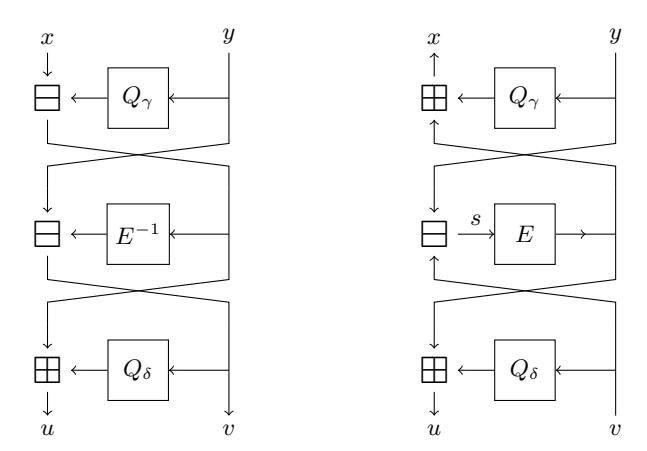

# Gröbner Basis Cryptanalysis of Anemoi

Luca Campa[1](https://orcid.org/0009-0004-6916-1918) and Arnab Roy[2](https://orcid.org/0000-0002-3284-7076)

University of Innsbruck luca.campa@uibk.ac.at, arnab.roy@uibk.ac.at

Abstract. Arithmetization-Oriented (AO) symmetric primitives play an important role in the efficiency and security of zero-knowledge (ZK) proof systems. The design and cryptanalysis of AO symmetric-key primitives is a new topic particularly focusing on algebraic aspects. An efficient AO hash function aims at lowering the multiplicative complexity in the arithmetic circuit of the hash function over a suitable finite field. The AO hash function Anemoiwas proposed in CRYPTO 2023.

In this work we present an in-depth Gröbner basis (GB) cryptanalysis of Anemoiover Fp. The main aim of any GB cryptanalysis is to obtain a well-structured set of polynomials representing the target primitive, and finally solve this system of polynomials using an efficient algorithm.

We propose a new polynomial modelling for Anemoithat we call ACICO. We show that using ACICO one can obtain a GB defined by a wellstructured set of polynomials. Moreover, by utilising ACICO we can prove the exact complexity of the Gröbner basis computation (w.r.t Buchberger's algorithm) in the cryptanalysis of AnemoiThe structured GB ˙ further allows us to prove the dimension of the quotient space[1](#page-0-0) which was conjectured in a recently published work.

Afterwards, we provide the complexity analysis for computing the variety (or the solutions) of the GB polynomial system (corresponding to Anemoi) which is the final step in GB cryptanalysis, by using known approaches. In particular, we show that GB polynomial structure allows us to use the Wiedemann algorithm and improve the efficiency of cryptanalysis compared to previous works.

Our GB cryptanalysis is applicable to more than two branches (a parameter in Anemoi ), while the previously published results showed cryptanalysis only for two branches. Our complexity analysis implies that the security of Anemoishould not rely upon the GB computation.

We also address an important mathematical question in GB cryptanalysis of Anemoinamely, does the Anemoi polynomial system has a Shape form?, positively. By proving this we guarantee that upon application of basis conversion method like FGLM one can obtain a convenient system of polynomials that are easy to solve.

<span id="page-0-0"></span><sup>1</sup> The quotient space dimension implicitly decides the complexity of the polynomial system solving step.

# Table of Contents

| 1 | Introduction                                           | 3  |
|---|--------------------------------------------------------|----|
| 2 | Preliminaries                                          | 5  |
| 3 | Gröbner Basis Cryptanalysis                            | 8  |
| 4 | Polynomial Representation of Anemoi                    | 11 |
| 5 | On the shape form of some zero-dimensional ideals      | 14 |
| 6 | Gröbner basis cryptanalysis of Anemoi                  | 18 |
| 7 | Anemoi cryptanalysis results                           | 29 |
|   | References<br>                                         | 35 |
| A | Mathematical background                                | 38 |
| B | A brief description of Anemoi                          | 38 |
| C | Buchberger Gröbner basis algorithm                     | 40 |
| D | Wiedemann algorithms                                   | 41 |
| E | Gröbner basis proofs                                   | 42 |
| F | SparseFGLM vs. Wiedemann algorithm: a brief comparison | 52 |
| G | Fast variety finding                                   | 52 |
| H | Experimental results                                   | 55 |

# <span id="page-2-0"></span>1 Introduction

Cryptanalysis of a cipher based on "solving a system of simultaneous equations" in a number of unknowns was considered by Claude E. Shannon [\[34\]](#page-36-0). For modern block ciphers like AES the idea of using system solving strategies was explored in a number of works [\[8,](#page-34-1) [9,](#page-34-2) [41\]](#page-37-2). However, these analysis did not pose any security threat to AES, and the cryptanalytic impact of such a system-solving approach on block ciphers and hash functions remained unclear possibly due to much less exploration of the topic after the initial ineffectiveness against AES, until recently.

The main aim of Gröbner basis (GB) cryptanalysis is to solve a system of polynomials for obtaining the values of a set of target variables. For example, in case of a hash function H the target variables can be the input to H. Thus, obtaining the value of these variables means finding a pre-image of H. Typically, a system of polynomials, say F, over a suitable finite field K is obtained from the description of a cryptographic function e.g. permutation. Next, a Gröbner basis G w.r.t a suitable monomial ordering is computed for the ideal I = ⟨F ⟩, generated by F. Then, one can obtain the values of the target variables by solving the polynomial system defining the GB G. Computing a GB particularly facilitates the process of solving the system of polynomials in it. For example, one can employ basis conversion techniques to obtain a favourable set of polynomials that are easy to solve, or eigenvalue method to obtain univariate polynomial (possibly for each target variable).

An important outcome that emerges from the GB analysis (in both previous and our results) of the AO primitives is that their security against GB analysis is not due to the high computational complexity of Gröbner basis computation step. AO primitives like MiMC [\[2\]](#page-34-3), GMiMC [\[2\]](#page-34-3), Poseidon [\[22\]](#page-35-0) etc. do not provide useful bound on the complexity of the GB computation step. Giving the exact complexity of Gröbner basis computation is a non-trivial problem. Previous works rely on the row reduction complexity bound of Macaulay matrices (and is a function of solving degree). It is well known that the bound is loose and often the experimental complexity turns out to be better than the bound. Thus, from both cryptanalytic and design perspectives it is not meaningful. Steiner [\[38\]](#page-36-1) tried to tighten the GB computation complexity by proving the solving degree bound for iterated polynomial systems, and in particular for the attacks on MiMC, Hades [\[23\]](#page-35-1) and GMiMC, showing the relation between the fall degree and the Castelnuovo-Mumford regularity. Moreover, as shown by [\[1\]](#page-34-4), the designers should pay particular attention to the algebraic structure of a cipher and its components, becasue a clever representation of those components can lead to experimental complexities far better than the theoretical estimates. An example of how the algebraic structure of a cipher can be exploited is given again in [\[1\]](#page-34-4), where the authors show how the modelling choices matter e.g. the choice of the variables and the field to operate with. In this paper we show similar issue namely, we provide a new algebraic model for Anemoi and utilising it compute the exact complexity of the GB computation w.r.t. the Buchberger's algorithm.

## 4 Luca Camp[a](https://orcid.org/0009-0004-6916-1918) and Arnab Ro[y](https://orcid.org/0000-0002-3284-7076)

One of the components in GB cryptanalysis is to obtain a "nice" set of polynomials (from the GB G of I) that is convenient to solve. This step has a significant complexity and an important role in GB cryptanalysis. After computing the Gröbner basis G, one may choose to employ basis conversion technique like FGLM to obtain a GB G′ w.r.t lexicographic monomial ordering. The only requirement is that I is a zero-dimensional ideal. The main advantage of this basis conversion is that, if I meets some conditions, G′ consists of one univariate polynomial, say g(x), and other polynomials which are of the form y<sup>i</sup> −fi(x) for each variable y<sup>i</sup> . This means that the solutions of the variables y<sup>i</sup> can be obtained by substituting the solutions of g(x) = 0. Usually, obtaining such form, which is commonly referred to as shape form, requires the condition that the ideal I = ⟨F ⟩ is a radical ideal. Alternatively, if the radicality condition is not met, one has to show that the GB G′ of I w.r.t lexicographic monomial ordering consists of polynomials in such nice form. Checking the condition for proving the shape form for the Gröbner basis of I is often omitted or concluded from experimental results in GB cryptanalysis of AO primitives. In this paper we tackle this problem for the GB cryptanalysis of Anemoi.

When it is not possible to confirm the conditions for applying basis conversion techniques like FGLM one can resort to eigenvalue method. The main objective of this technique is to obtain a univariate polynomial corresponding to each target variable and find at least one solution to the polynomial (if it is not irreducible). An additional advantage of this technique is that it can sometimes be more efficient than the basis conversion technique. We will show that using probabilistic version of the eigenvalue method is more efficient than the technique used in [\[3,](#page-34-5) [29\]](#page-36-2).

## 1.1 Our Result

In this paper we provide an in-depth Gröbner basis cryptanalysis of Anemoi. The main aim of any GB cryptanalysis is to obtain a well-structured set of polynomials representing the target primitive, and finally solve this system of polynomials using an efficient algorithm.

In this work we propose a new polynomial modelling of Anemoi permutation and construct a polynomial system that we call ACICO corresponding to the Anemoi hash function (Section [4\)](#page-10-0). We prove structural properties of the polynomials defining the Gröbner basis corresponding to the ideal generated by ACICO (Section [6.1\)](#page-17-1). Providing the exact complexity of GB computation is a non-trivial problem. Our ACICO modeling allows us to prove the complexity of GB computation by following the steps of Buchberger's algorithm. Note that our complexity analysis for the GB computation is applicable to any number of branches of Anemoi.

Additionally, the structural property (that we prove in Section [6.1\)](#page-17-1) of the polynomials constituting the Gröbner basis (for Anemoi) allows us to prove the conjectured (in [\[29\]](#page-36-2)) dimension of the quotient space K[x1, x2, . . . , xn]/I (Section [6.3\)](#page-25-0). By establishing the dimension of the quotient space, we can define the complexity of obtaining univariate polynomials which is one of the main steps towards solving the polynomial system corresponding to Anemoi (Section 6.3).

A common approach in using GB method in cryptanalysis is to apply the basis conversion technique which converts the GB polynomial system to an easily solvable polynomial system. However, without assuring the existence of such easily solvable form e.g. Shape form, application of existing conversion algorithms such as FGLM is meaningless. We prove, for the first time, the Shape form for the GB of Anemoi and in general for constrained zero-dimensional ideals which does not satisfy the radicality condition (Sections 5 and 6.2). This result guarantees that we can apply FGLM algorithm for converting the GB of Anemoi to a system of polynomials that is easy to solve.

Although this is the standard approach, we use efficient eigenvalue method for obtaining univariate polynomials. In an eigenvalue method the aim is to obtain a set of univariate polynomials from the GB polynomial system of Anemoi. More specifically, we use Wiedemann algorithm to obtain these univariate polynomials (Section 6.3), and improve (Section 7, Table 2) the efficiency of GB cryptanalysis w.r.t existing works [3, 29].

Our GB cryptanalysis is applicable to *more than two branches* (a parameter in Anemoi), while the previously published results showed cryptanalysis only for two branches. Our complexity analysis (for GB computation) implies that the security of Anemoi should not be relied upon the GB computation.

## <span id="page-4-0"></span>2 Preliminaries

In this section we give a brief and necessary algebraic background. We use  $\mathbb{K}$  to denote a field and  $R := \mathbb{K}[x_1,\ldots,x_n]$  to denote the polynomial ring over  $\mathbb{K}$  in the variables  $x_1,\ldots,x_n$ . When  $\mathbb{K}=\mathbb{F}_p$  the ring is denoted as  $R_p$ . Due to ease of notation, at times we use the notation  $\mathbb{K}[\mathbf{x}]$  to denote the ring where the variables  $x_i$  are made clear in the corresponding context. We use  $\mathsf{LM}_k(g)$  for k>1 to denote the k-th leading monomial of the polynomial g with respect to a monomial order (which will be specified). For the first leading monomial, we simply use  $\mathsf{LM}(g)$ .  $|\mathcal{B}|$  denotes the cardinality of the set  $\mathcal{B}$ . Throughout the paper, we will use deg to denote both the degree of a variable x and a polynomial g. The correct interpretation will be clear from the context.

The following definitions and results are mainly taken from [14, 15].

**Definition 1 (Affine Variety).** Let  $f_1, \ldots, f_s \in \mathbb{K}[x_1, \ldots, x_n]$ . Then, the set

$$\mathbb{V}(f_1, \dots, f_s) = \{(a_1, \dots, a_n) \in \mathbb{K}^n \mid f_i(a_1, \dots, a_n) = 0, 1 \le i \le s\}$$

is called the **affine variety** defined by the polynomials  $f_1, \ldots, f_s$ .

**Definition 2** (Ideal). A subset  $I \subseteq R$  is an ideal if it satisfies the following conditions:

•  $0 \in I$

- if  $f, g \in I$ , then  $f + g \in I$
- if  $f \in I$  and  $h \in R$ , then  $hf \in I$

Let  $f_1, \ldots, f_s$  be polynomials in R, then the set

$$\langle f_1, \dots, f_s \rangle = \left\{ \sum_{i=1}^s h_i f_i \mid h_1, \dots, h_s \in R \right\}$$

is an ideal in R generated by  $f_i$  for  $1 \le i \le s$ .

**Definition 3 (Variety of ideal).** Let  $s, n \in \mathbb{N}$  and let  $I = \langle f_1, \dots, f_s \rangle \in R$  be an ideal. Then, the set

$$\mathbb{V}(I) = \mathbb{V}(f_1, \dots, f_s) := \{(a_1, \dots, a_n) \in \mathbb{K}^n \mid f_i(a_1, \dots, a_n) = 0, 1 \le i \le s\}$$

is called the affine variety of the ideal I. Moreover, for any field  $\mathbb{K} \subset \mathbb{K}'$ ,  $\mathbb{V}_{\mathbb{K}'}(I)$  denotes the set of solutions  $(a_1,\ldots,a_n)$  over the n-dimensional affine space  $A^n(\mathbb{K}')$ . In particular,  $\mathbb{V}_{\bar{\mathbb{K}}}(I)$  denotes the variety of I over the algebraic closure  $\mathbb{K}$  of  $\mathbb{K}$ .

The variety of an ideal is independent of the generating set of polynomials. There could be multiple sets of polynomials which define the same set of solutions. One important class of these sets is the class of Gröbner Basis.

**Definition 4 (Monomial Ordering).** A monomial ordering  $\prec$  on  $\mathbb{K}[x_1,\ldots,x_n]$ is a relation  $\prec$  on  $\mathbb{Z}^n_{\geq 0}$ , or rather a relation on the set of monomials  $x^{\alpha}$  where  $\alpha \in \mathbb{Z}_{\geq 0}^n$ , satisfying  $t\bar{h}e$  following conditions:

- $\prec$  is a total (or linear) order on  $\mathbb{Z}^n_{\geq 0}$  if  $\alpha \prec \beta$  and  $\gamma \in \mathbb{Z}^n_{\geq 0}$ , then  $\alpha + \gamma \prec \beta + \gamma$   $\prec$  is a well-ordering on  $\mathbb{Z}^n_{\geq 0}$ , meaning that every non-empty subset of  $\mathbb{Z}^n_{\geq 0}$ has a smallest element under the relation  $\prec$ .

The well-known ordering Lexicographic (LEX), Degree reverse lexicographic (DRL) are of particular interest in the context of GB analysis.

**Definition 5 (Lexicographic Order).** Let  $\alpha = (\alpha_1, \dots, \alpha_n)$  and  $\beta = (\beta_1, \dots, \beta_n)$ be in  $\mathbb{Z}^n_{\geq 0}$ . We say  $\alpha >_{\mathsf{LEX}} \beta$  if the leftmost nonzero entry of the vector difference  $\alpha - \beta \in \mathbb{Z}^n$  is positive. We say  $x^{\alpha} >_{\mathsf{LEX}} x^{\beta}$  if  $\alpha >_{\mathsf{LEX}} \beta$ .

Definition 6 (Reverse Lexicographic Order). Let  $\alpha = (\alpha_1, \dots, \alpha_n)$  and  $\beta = (\beta_1, \dots, \beta_n)$  be in  $\mathbb{Z}_{\geq 0}^n$ . We say  $\alpha >_{\mathsf{RLEX}} \beta$  if the rightmost nonzero entry of the vector difference  $\alpha - \beta \in \mathbb{Z}^n$  is negative. We say  $x^{\alpha} >_{\mathsf{RLEX}} x^{\beta}$  if  $\alpha >_{\mathsf{RLEX}} \beta$ .

Definition 7 (Degree Reverse Lexicographic Order). Let  $\alpha, \beta \in \mathbb{Z}_{>0}^n$ . We  $say \alpha >_{DRL} \beta if$

$$|\alpha| = \sum_{i=1}^n \alpha_i > |\beta| = \sum_{i=1}^n \beta_i, \ \ or \ |\alpha| = |\beta| \ \ and \ \alpha >_{\mathit{RLEX}} \beta.$$

We say  $x^{\alpha} >_{DRL} x^{\beta}$  if  $\alpha >_{DRL} \beta$ .

**Definition 8 (Gröbner Basis).** Let  $I = \langle f_1, \ldots, f_s \rangle$  be an ideal in  $\mathbb{K}[x_1, \ldots, x_n]$  and let  $\prec$  be a valid monomial ordering. A finite subset  $G = \{g_1, \ldots, g_t\}$  of I different from  $\{0\}$  is said to be a **Gröbner Basis** (or Standard Basis) w.r.t.  $\prec$  if

<span id="page-6-0"></span>
$$\langle \mathsf{LM}(g_1), \dots, \mathsf{LM}(g_t) \rangle = \langle \mathsf{LM}(I) \rangle$$

where LM() denotes the leading monomial of a polynomial with respect to  $\prec$ .

To keep in mind the ordering we will often denote a Gröbner basis w.r.t to a monomial ordering  $\prec$  as  $G_{\prec}$ .

Every monomial ordering can be defined by a series of weights. Moreover, different monomial orderings can be combined to exploit different properties. The following definition will be useful in the next sections:

**Definition 9.** Given a weight vector  $w = (w_1, ..., w_n) \in \mathbb{R}^n_{\geq 0}$ , where  $w_1 \neq 0$ . We say that w is associated with the monomial ordering  $\prec$ , defined by:

$$\prod_{i=1}^n x_i^{\alpha_i} \prec \prod_{i=1}^n x_i^{\beta_i} \iff \begin{cases} \sum_{i=1}^n w_i \alpha_i > \sum_{i=1}^n w_i \beta_i \\ \sum_{i=1}^n w_i \alpha_i = \sum_{i=1}^n w_i \beta_i, \alpha \prec_M \beta \end{cases}$$

where M is another monomial order like LEX, RLEX.

For a fixed a monomial ordering, there exist a unique **reduced Gröbner** basis.

**Definition 10 (Reduced Gröbner Basis).** Let G be a Gröbner basis for the ideal  $I \subset \mathbb{K}[x_1, \ldots, x_n]$  with respect to a monomial ordering  $\prec$ , if

- LC(g) = 1 for all  $g \in G$
- for all  $g \in G$ , no monomial of g lies in  $\langle \mathsf{LT}(G \setminus \{g\}) \rangle$

(where LC and LT denote the leading coefficient and the leading term respectively  $w.r.t \prec$ ) G is said to be a **reduced Gröbner basis**.

An important property of reduced Gröbner basis is that the polynomial division modulo a Gröbner basis yields unique division remainders. Then, if G is a reduced Gröbner basis for the ideal I we are able to uniquely represent residue classes in the quotient ring R/I. The quotient ring R/I is a  $\mathbb{K}$ -vector space, called the quotient space. The basis which defines that quotient space can be finite of infinite-dimensional. In particular, a standard basis for  $\mathbb{K}[x_1,\ldots,x_n]/I$  is given by the set of monomials

$$B_I := \left\{ X^\alpha \mid X^\alpha \notin \langle \mathsf{LM}(I) \rangle \right\} = \left\{ X^\alpha = \prod_{i=1}^n x_i^{\alpha_i} \mid X^\alpha \notin \langle \mathsf{LM}(G) \rangle \right\}.$$

**Definition 11 (Zero-dimensional Ideal).** Let  $I \subset R$  be a non-zero ideal, let  $\prec$  a valid monomial ordering and let G be a reduced Gröbner basis for I with respect to  $\prec$ . If the quotient space R/I is finite-dimensional, that is

$$d_I = dim_{\mathbb{K}}(R/I) = |B_I| < \infty$$

then I is called zero-dimensional ideal.

An ideal I is zero-dimensional if the associated variety  $\mathbb{V}(I)$  is a finite set.

**Lemma 1.** Let G be a Gröbner basis for the ideal  $I \subset R = \mathbb{K}[x_1, \dots, x_n]$ . The ideal I is zero-dimensional if and only if for each  $1 \leq i \leq n$ , there exist an element in G whose initial term is a pure power of  $x_i$ :

$$\mathbb{V}(I)$$
 finite  $\iff \forall_{i=1}^n (\exists \ f \in G \mid \mathsf{LM}(f) = x_i^{\alpha_i}) \text{ where } \alpha_i \in \mathbb{N}.$

The well-known shape lemma characterizes a zero-dimensional ideal w.r.t  $G_{\mathsf{LEX}}$ :

**Theorem 1 (Shape Lemma).** Let I be a zero-dimensional radical ideal such that the  $x_n$  coordinate of the points in  $\mathbb{V}(I)$  are distinct. Let G be a reduced Gröbner basis for I relative to a LEX monomial order with  $x_n$  as the last variable.

$$G = \{x_1 - g_1(x_n), x_2 - g_2(x_n), \dots, g_n(x_n)\}\$$

where  $\deg(g_i) < \deg(g_n)$  for each  $1 \le i < n$  and  $\deg(g_n) = \dim_{\mathbb{K}}(R/I)$ . We say, equivalently, that the ideal I has shape lemma or shape form.

Due to their structure, it is straightforward to see that  $d_I = \deg(g_n)$  and the complexity of computing the variety of such an ideal is equivalent to the complexity of factorizing the univariate polynomial  $g_n$ .

If the quotient space is finite-dimensional, each remainder can be written as vector in the basis monomials of  $B_I$ . That means we can define a linear transformation  $T_j: \mathbb{K}[x_1,\ldots,x_n]/I \to \mathbb{K}[x_1,\ldots,x_n]/I$  corresponding to the multiplication by  $x_j$  for all  $1 \leq j \leq n$ .

<span id="page-7-1"></span>**Definition 12 (Multiplication matrix).** Let I be a zero-dimensional ideal in  $\mathbb{K}[x_1,\ldots,x_n]$ , G a reduced Gröbner basis for I with respect to a monomial ordering  $\prec$  and  $B_I = (e_1,\ldots,e_{d_I})$  the standard basis for the quotient space  $\mathbb{K}[x_1,\ldots,x_n]/I$ , the **multiplication matrix**  $T_j$  of  $x_j$  is defined by the square matrix whose i-th vector is represented by the coefficients of the monomials of the basis  $B_I$  contained in the reduction of  $x_je_i$  modulo the Gröbner Basis G.

There is a strong connection between zero dimensional ideals, their quotient space and their variety. In particular, for zero dimensional ideals, the number of solutions to an equation system equals the dimension of the quotient space (counted with multiplicities). Counting the number of solutions or finding a good bound on it could be a difficult problem.

## <span id="page-7-0"></span>3 Gröbner Basis Cryptanalysis

In Gröbner basis (GB) cryptanalysis a cryptographic primitive is represented as a system  $\mathcal{F}$  of polynomial equations with a certain number of variables. Depending on the primitive description, different approaches can be taken towards constructing the polynomial system. For finding solutions to that system, the Gröbner basis method is applied. Since cryptographic primitives are typically

function with fixed input (and output) length constructed over a finite field K, the polynomial system representing such a primitive will always have a finite number of solutions in K. In algebraic geometry language this result in zerodimensional ideals. Solving system of polynomials with GB means finding at least one solution to the problem. This is usually divided into three main computations:

- 1) A GB G of the ideal I = ⟨F ⟩ is computed with respect to a chosen monomial ordering (usually Degree Reverse Lexicographic) using one of the known algorithms, e.g. F4 [\[21\]](#page-35-4), F5 [\[18\]](#page-35-5) etc. We will denote the complexity of this part CGB.
- 2) One or more univariate polynomials are obtained towards solving the system of polynomials in G. The complexity of this computation is denoted as Cunivar.
- 3) Factorize that univariate polynomial by using an off-the-shelf polynomial factoring algorithm to find at least one root (solution) of that representative variable. The complexity of this part is denoted as Croot.

## 3.1 Complexity of GB cryptanalysis

The complexity of a GB cryptanalysis depends on the 3 computations described above: finding a Gröbner basis G≺, obtaining a univariate polynomial in GB, and factorizing or root finding of a univariate polynomial from GLEX.

Computing a Gröbner basis Determining the complexity of GB computation, particularly providing a good theoretical bound is a non-trivial task in the context of GB cryptanalysis. Only a good theoretical bound on CGB can be relied upon to compute the security parameter(s) based on this part of the GB cryptanalysis. The generic Macaulay bound[2](#page-8-0) is a function of the solving degree dsolv which is the maximum degree reached during the GB computation. This bound does not take any structure of the underlying polynomials into account. In Section [6.1](#page-17-1) we provide a more concrete bound on the complexity of computing GB corresponding to the ideal generated by the Anemoi polynomial system.

Obtaining a univariate polynomial We briefly discuss the two main ways to obtain a univariate polynomial e.g. FGLM and Eigenvalue method. Further details on this part in the cryptanalysis of Anemoi are provided in Section [6.1.](#page-17-1)

FGLM The common way of computing the univariate polynomial, which can be used to obtain the variety of the ideal, is to convert GDRL to GLEX. Owing to the zero-dimensional ideal, one of the equations in GLEX is univariate. From it, we can perform the third step and obtain the variety of the original ideal. For zero dimensional ideals, the change of monomial order is typically done by using the FGLM algorithm [\[19\]](#page-35-6) which has complexity O(n<sup>v</sup> · d 3 I ) operations in K, where

<span id="page-8-0"></span><sup>2</sup> we ignore the expression as it is not necessary to follow our result.

 $n_v$  is the number of variables in R and  $d_I = dim_{\mathbb{K}}(R/I)$  is the dimension of the quotient ring R/I. By using fast linear algebra and taking into account that our polynomials are sparse, the bound can be improved to a runtime complexity of  $\mathcal{O}(n_v \cdot d_I^{\omega} \log(d_I))$  operation in  $\mathbb{K}$  [20], where  $\omega$  is the linear algebra constant which theoretically is bounded by  $2 \leq \omega \leq 2.3727$  [43], but practically the best known procedure is the Strassen algorithm which sets the value of  $\omega$  to 2.8074.

**Eigenvalue method** However, the eigenvalue method, which exploits the multiplication matrices of the target variables, can be used instead of FGLM. This method avoids converting Gröbner basis w.r.t monomial ordering, and it is derived from the following result (also known as Stickelberger Theorem) [15, Chapter 2.4].

**Theorem 2.** Let  $\overline{\mathbb{K}}$  be the algebraic closure of the field  $\mathbb{K}$  and  $I \subset \overline{\mathbb{K}}[x_1, \ldots, x_n]$  be a zero-dimensional ideal. For each  $i = 1, \ldots, n$  and any  $\lambda \in \overline{\mathbb{K}}$ , the value  $\lambda$  is an eigenvalue of the endomorphism  $T_i$  if and only if there exist a point  $a \in \mathbb{V}(I)$  with  $a_i = \lambda$ .

<span id="page-9-0"></span>**Corollary 1.** Let  $\overline{\mathbb{K}}$  be an algebraically closed finite field, I be a zero dimensional ideal in  $\overline{\mathbb{K}}[x_1, x_2, \ldots, x_n]$ ,  $\prec$  a valid monomial order and  $T_i$  the multiplication matrix of the variable  $x_i$  with respect to  $\prec$ . The set of solutions for  $x_i$  is described by the roots of the minimal univariate polynomial in  $x_i$  defined by  $\det(x_i \mathbf{I}_{d_I} - T_i) \in I$ , where  $\mathbf{I}$  is the identity matrix.

Remark 1. In this context we note that in [3], the authors provide a similar result to Corollary 1 without requiring closure of  $\mathbb{K}$ . Note that a solution to  $\det(x_i\mathbf{I}_{d_I}-T_i)$  can not be guaranteed without considering the polynomial in the closure of  $\mathbb{K}$ . Indeed, in GB cryptanalysis it can happen that the derived univariate polynomial does not have any solution in the finite field  $\mathbb{K}$ .

Let  $x_i$  be the target variable for which we want to obtain a univariate polynomial, and let  $T_i$  be the associated multiplication matrix defined as in Definition 12. The corresponding univariate polynomial can be defined by computing  $\det(x_i\mathbf{I}_{d_I}-T_i)$ , whose roots, by Corollary 1, are the possible values for  $x_i$  and the solutions we are interested in. The computation of the determinant i.e. the univariate polynomial has complexity  $\mathcal{O}(d_I^{\omega}[s])$  operations in  $\mathbb{K}$  using the algorithm by Labahn et al. [30]. Here, s denotes the mean of the column degrees, that is the mean of the maximum degrees (of the polynomials) within each column.

FACTORING POLYNOMIALS OR FINDING ROOTS To factorize polynomials we can choose one of the off-the-shelf algorithms such as the Kaltofen-Shoup algorithm [27] whose probabilistic version has a runtime complexity of  $\mathcal{O}(d^{1.815}\log(q))$  field operations, where d is the degree of the univariate polynomial h we have obtained from the previous step and q is the field characteristic. Due to the fact that we are dealing with zero-dimensional ideals, the degree of the univariate polynomial will be equal to the dimension of the quotient space R/I:  $\deg(h) = d_I$ .

## <span id="page-10-0"></span>4 Polynomial Representation of Anemoi

Our analysis considers the odd characteristic case, i.e. when q=p is an odd prime. In this section, we firstly provide a brief description of Anemoi over field of odd characteristic, then we describe the polynomial representation of Anemoi for  $l \geq 1$ , where l is the number of non-linear transformations at each round. This polynomial representation (or modelling) has an important role in our GB cryptanalysis. We refer to [7] for a more detailed description of the Anemoi permutation.

#### 4.1 Anemoi in odd characteristic

We only provide a brief description of the main components of Anemoi that are important to follow our GB cryptanalysis. More details can be found in Appendix B.

- Linear Layer: The Anemoi state consists of 2l elements  $(X,Y) \in \mathbb{F}_q^l \times \mathbb{F}_q^l$  where  $l \geq 1$ . After constant addition to the state, linear transformations  $M_l$  and  $M_l \circ \rho$  (where  $\rho$  is a linear permutation) are applied to the two halves X and Y respectively. On this output a pseudo-hadamard transform denoted as P is applied to the vector (X,Y).
- Non-linear layer: Let  $Q_{\gamma}: \mathbb{F}_q \to \mathbb{F}_q$ ,  $Q_{\delta}: \mathbb{F}_q \to \mathbb{F}_q$  be quadratic polynomials and let  $E: \mathbb{F}_q \to \mathbb{F}_q$  be a power map inducing the low-degree permutation over  $\mathbb{F}_q$ , that is  $E=x^{\alpha}$  with  $\alpha \geq 3$  coprime with  $\varphi(q)$ . The non-linear layer is a so-called open Flystel, denoted as H, applied component-wise to X and Y (Figure 1 shows both open Flystel and closed Flystel, an equivalent representation also denoted as verification phase).  $Q_{\gamma}$  and  $Q_{\delta}$  are defined as follows:

$$Q_{\gamma} = \beta x^2 + \gamma \qquad Q_{\delta} = \beta x^2 + \delta$$

where common values for  $\beta, \gamma$  and  $\delta$  are respectively g (generator of the multiplicative subgroup of the field  $\mathbb{F}_q$ ), 0 and  $g^{-1} \mod q$ .

Previous works introduced two main models to describe the Anemoi function. In particular, [7] proposed two models:  $F_{\rm CICO}$  which represents each round with two equations whose unknowns are the inputs of the main function and  $P_{\rm CICO}$  which represents each round with a single equation. [7] shows the analysis of  $F_{\rm CICO}$ , whilst [29] recently shows the security analysis of  $P_{\rm CICO}$  and its differences with respect to the first one. Although, those models were not extended to more than 2 branches. To enhance the GB analysis to more than 2 branches, we propose a new model which we denote as  $A_{\rm CICO}$ .

A variable x involved in the modelling is indexed as  $x_{i,j}$  where i and j correspond to branch number and round number respectively. For ease of notation we use  $\mathbf{x}_a$  to denote all the variables  $x_{i,a}$  for  $1 \le i \le l$  from round a. Moreover, we use  $\deg(\mathbf{x}_a) = \{\deg(x_{1,a}), \ldots, \deg(x_{l,a})\}$  to identify the degrees of the variables  $\mathbf{x}_a$ .

<span id="page-11-0"></span>

Fig. 1: Flystel evaluation (left) and verification (right) circuit representations in Anemoi

The so-called CICO (Constrained Input Constrained Output) problem in algebraic modelling and analysis of cryptographic primitives is given as follows.

**Definition 13 (CICO problem).** Let  $F: \mathbb{F}_q^t \to \mathbb{F}_q^t$  be a function and let u < t be an integer. The CICO problem consists of finding  $x, y \in \mathbb{F}_q^u$  such that F(x||0) = (y||0).

For Anemoi , [7] suggests fixing the first l inputs and outputs to zero. Therefore, the CICO problem for Anemoi is represented by

<span id="page-11-2"></span>
$$Anemoi(0||\mathbf{y}_0) = (0||\mathbf{y}_{out}) \tag{1}$$

and we aim to find values for the variables  $\mathbf{y}_0$ . In the following section, we describe our model  $A_{\text{CICO}}$  for  $l \geq 1$ .

#### 4.2 ACICO model

Let  $(\mathbf{x}_0, \mathbf{y}_0) = (x_{1,0}, \dots, x_{l,0}, y_{1,0}, \dots, y_{l,0})$  be the inputs to the Anemoi permutation and  $(\mathbf{x}_{r-1}, \mathbf{y}_{r-1}) = (x_{1,r-1}, \dots, x_{l,r-1}, y_{1,r-1}, \dots, y_{l,r-1})$  be the inputs to the r-th round for  $1 \leq r \leq N$ . Moreover, let  $s_{i,r}$  for  $1 \leq i \leq l$  model the input to the function E within the Flystel verification as shown in Figure 1.

For ease of notation, we denote as  $\mathcal{L}_r$  the application of the Anemoi linear layer at round r. In particular

<span id="page-11-1"></span>
$$\begin{bmatrix} \mathbf{L}_{r}^{(1)} \\ \mathbf{L}_{r}^{(2)} \end{bmatrix} = \mathcal{L}_{r}(\mathbf{x}, \mathbf{y}) := \begin{bmatrix} 2 & 1 \\ 1 & 1 \end{bmatrix} \begin{pmatrix} M_{l} \begin{bmatrix} x_{1,r-1} + c_{1,r-1} & y_{2,r-1} + c_{2,r-1} \\ \dots & \dots \\ x_{l-1,r-1} + c_{l-1,r-1} & y_{l,r-1} + c_{l,r-1} \\ x_{l,r-1} + c_{l,r-1} & y_{1,r-1} + c_{1,r-1} \end{bmatrix} \end{pmatrix}^{T}$$
(2)

where  $c_i$  and  $d_i$  are the round constants. Note that the  $\mathbf{y} + \mathbf{c}$  in Equation (2) is written as the output of  $\rho(\mathbf{y} + \mathbf{c})$ . Furthermore, we use  $L_{i,r}^{(j)}$  to denote the *i*-th entry of the *j*-th vector of the output matrix generated by the application of the linear layer at the round r. Sometimes, when we want to specify what are the inputs to the linear layer  $\mathcal{L}$  and then, what are the variables which the output depends on, we use  $\mathcal{L}_{i,r}^{(j)}(\mathbf{x},\mathbf{y}) = L_{i,r}^{(j)}$ .

**Polynomial representation** We can define the following functions for every  $1 \le r \le N$ :

1) Let  $L_{i,r}^{(2)}$  and  $y_{i,r}$  be the inputs to the non-linear verification layer V in the r-th round. Notice that this operation is performed for each couple  $(L_{i,r}^{(2)}, y_{i,r})$  for  $1 \leq i \leq l$ . It outputs  $L_{i,r}^{(1)}, x_{i,r}$  where:

$$\begin{bmatrix} L_{i,r}^{(1)} \\ x_{i,r} \end{bmatrix} := V(L_{i,r}^{(2)}, y_{i,r}) = \begin{bmatrix} Q_{\gamma}(L_{i,r}^{(2)}) + E(s_{i,r}) \\ Q_{\delta}(y_{i,r}) + E(s_{i,r}) \end{bmatrix}$$

By that definition:

- for r = 1 and  $1 \le i \le l$ ,  $L_{i,1}^{(2)} \in \mathbb{F}_q[\mathbf{x}_0, \mathbf{y}_0]$ ,  $x_{i,1} \in \mathbb{F}_q[y_{i,1}, s_{i,1}]$  and  $L_{i,1}^{(1)} \in \mathbb{F}_q[\mathbf{x}_0, \mathbf{y}_0, s_{i,r}]$
- for  $1 < r \le N$  and  $1 \le i \le l$ ,  $L_{i,r}^{(2)} \in \mathbb{F}_q[\mathbf{x}_{r-1}, \mathbf{y}_{r-1}, \mathbf{s}_{r-1}], x_{i,r} \in \mathbb{F}_q[y_{i,r}, s_{i,r}]$ and  $L_{i,r}^{(1)} \in \mathbb{F}_q[\mathbf{x}_{r-1}, \mathbf{y}_{r-1}, \mathbf{s}_{r-1}, s_{i,r}]$

By applying the input constraint, that is setting  $x_{i,0} = 0$  for all  $1 \le i \le l$ , we get the first family of polynomials:

<span id="page-12-3"></span>
$$a_{i,1} := \mathcal{L}_{i,1}^{(1)}(\mathbf{0}, \mathbf{y}_0) - Q_{\gamma}\left(\mathcal{L}_{i,1}^{(2)}(\mathbf{0}, \mathbf{y}_0)\right) - s_{i,1}^{\alpha}, \text{ where } 1 \le i \le l.$$
 (3)

Assuming  $m_{i,r} := Q_{\delta}(y_{i,r-1}) + E(s_{i,r-1})$ , we get

<span id="page-12-0"></span>
$$a_{i,r} := \mathcal{L}_{i,r}^{(1)}(\mathbf{m}_r, \mathbf{y}_{r-1}) - Q_{\gamma} \left( \mathcal{L}_{i,r}^{(2)}(\mathbf{m}_r, \mathbf{y}_{r-1}) \right) - s_{i,r}^{\alpha}$$

$$\tag{4}$$

where  $1 \le i \le l$  and  $1 < r \le N$ . Thus we have  $\deg(a_{i,1}) = \alpha$ . Since  $\deg(m_{i,r}) = \alpha$  and  $\mathcal{L}_{i,r}$  is a linear function we have

$$\mathsf{deg}(a_{i,r}) = \max\{\mathsf{deg}(\mathbf{m}_r), \mathsf{deg}(\mathbf{m}_r)^2, \mathsf{deg}(s_{i,r-1})^{\alpha}\} = 2\alpha$$

Additionally, for each round, from the relations of the variables  $\mathbf{y}_{r-1}$ ,  $y_{i,r}$  and  $s_{i,r}$  we get

<span id="page-12-2"></span>
$$b_{i,1} := \mathcal{L}_{i,1}^{(2)}(\mathbf{0}, \mathbf{y}_0) - y_{i,1} - s_{i,1}, \text{ for } r = 1$$
 (5)

<span id="page-12-1"></span>
$$b_{i,r} := \mathcal{L}_{i,r}^{(2)}(\mathbf{m}_r, \mathbf{y}_{r-1}) - y_{i,r} - s_{i,r}, \text{ for } 1 < r \le N$$
(6)

From the above two equations it is clear that  $deg(b_{i,1}) = 1$ , and  $deg(b_{i,r}) = \max\{\alpha, 1\} = \alpha$ . Thus, we obtain 2l polynomials per round given by  $a_{i,r}, b_{i,r}$  (for  $1 \le i \le l$ ) i.e. 2Nl equations overall. At the end, after the last rounds, the linear transformation  $\mathcal{L}$  is applied. This leads to l equations of the form:

<span id="page-13-1"></span>
$$f_{i,N+1} := \mathcal{L}_{i,N}^{(1)}(\mathbf{m}_{N+1}, \mathbf{y}_N)$$
 (7)

which are equal to zero due to constrained output and  $deg(f_{i,N+1}) = \alpha$ .

**Definition 14 (ACICO model for**  $l \geq 1$ ). An algebraic model of the Anemoi permutation  $A_{\pi}: \mathbb{F}_q^{2l} \to \mathbb{F}_q^{2l}$  applied for N rounds, under the CICO constraints in Equation (1), is given by the system

$$A_{\text{CICO}} = \{a_1, \dots, a_N, b_1, \dots, b_N, f_{N+1}\}$$

where  $A_{\text{CICO}} \subset \mathbb{F}_q[\boldsymbol{y}_0, \dots \boldsymbol{y}_N, \boldsymbol{s}_1, \dots, \boldsymbol{s}_N]$  and  $a_{i,r}$ ,  $b_{i,r}$ ,  $f_{i,N+1}$  are as defined in Equations (4), (6) and (7) respectively. The generated system contains l(2N+1) equations in l(2N+1) variables.

**Degrees of polynomials** For GB analysis with ACICO model, we require the degrees of the polynomials in  $A_{\rm CICO}$ , that are as follows

$$\deg(a_{i,1}) = \alpha, \deg(b_{i,1}) = 1, \deg(f_{i,N+1}) = \alpha \tag{8}$$

$$\deg(a_{i,r}) = 2\alpha, \deg(b_{i,r}) = \alpha \tag{9}$$

for  $1 \le i \le l$  and  $1 < r \le N$ .

# <span id="page-13-0"></span>5 On the shape form of some zero-dimensional ideals

As pointed out in Section 3, current literature says that FGLM generates a LEX Gröbner basis in Shape form under certain assumptions, such as the radicality. Having a shape form would be useful to easily determine the variety of the ideal. As far from our knowledge, all the algebraic cryptanalysis done so far, blindly applied the FGLM algorithm, searching for this advantageous structure. In this section we are going to prove the Shape form for a constrained system generating a zero-dimensional ideal, while in Section 6.2 we use that result to prove the Shape form of the ideal  $I = \langle A_{\text{CICO}} \rangle$  corresponding to Anemoi. In particular, throughout the section, we will consider systems whose polynomials are of the form  $f_i := c_i x_i^{\alpha_i} + q_i(x_1, \dots, x_n)$  where  $\deg_{\prec}(q_i) < \deg_{\prec}(\mathsf{LM}(f_i))$  w.r.t. a generic monomial ordering  $\prec$ . We will use  $\deg_{\prec}(x^{\beta})$  to denote the degree of  $x^{\beta}$  w.r.t the monomial ordering  $\prec$  e.g. in a weighted monomial ordering, if  $w_x = 2$ ,  $\deg_{\prec}(x^{\beta}) = 2\beta$ .

Some of the theorems taken from [15] are written with respect to  $\mathbb{C}$ . Due to the fact that their proofs can be easily adapted to work with a generic algebraically closed field  $\overline{\mathbb{K}}$ , we present those theorems in terms of  $\overline{\mathbb{K}}$ . Moreover, we use Res to denote the resultant of the specified polynomials and  $\operatorname{Res}_{d_1,\ldots,d_n}^x$  to denote the resultant, w.r.t the variable x, of the specified homogeneous polynomials whose degrees are  $d_1,\ldots,d_n$  respectively. To prove the shape form of the ideal, we will need the following results.

## <span id="page-14-3"></span>5.1 Necessary results

Remark 2. Given a system of homogenous polynomials, the solutions at infinity  $(\infty)$  are the solutions of the system obtained by setting the homogenization variable to 0. If the obtained system does not have any other solutions than the trivial one (zero solution) we say that the system has no solutions at infinity.

<span id="page-14-2"></span>**Theorem 3 ( [15, Chapter 3, §3, Theorem 3.4]).** Given homogeneous polynomials  $F_0, \ldots, F_n \in \overline{\mathbb{K}}[x_0, \ldots, x_n]$  of degrees  $d_0, \ldots, d_n$ , let

$$f_i(x_0, \dots, x_{n-1}) = F_i(x_0, \dots, x_{n-1}, 1)$$

$$\overline{F}_i(x_0, \dots, x_{n-1}) = F_i(x_0, \dots, x_{n-1}, 0).$$
(10)

Note that  $f_i$  is the dehomogenization by the variable  $x_n = 1$  and  $\overline{F}_0, \ldots, \overline{F}_{n-1}$  are homogeneous polynomials in  $\overline{\mathbb{K}}[x_0, \ldots, x_{n-1}]$  of degrees  $d_0, \ldots, d_{n-1}$ .

If  $\operatorname{Res}(\overline{F}_0,\ldots,\overline{F}_{n-1}) \neq 0$ , then the quotient ring  $A := \overline{\mathbb{K}}[x_0,\ldots,x_{n-1}]/I$ , where  $I := \langle f_0,\ldots,f_{n-1} \rangle \subset \overline{\mathbb{K}}[x_0,\ldots,x_{n-1}]$ , has dimension  $d_0 \cdots d_{n-1}$  as a vector space over  $\overline{\mathbb{K}}$  and

$$\operatorname{Res}(F_0,\ldots,F_n) = \operatorname{Res}(\overline{F}_0,\ldots,\overline{F}_{n-1})^{d_n} \det(m_{f_n}),$$

where  $m_{f_n}: A \to A$  is the linear map given by the multiplication by  $f_n$ .

<span id="page-14-0"></span>**Theorem 4.** Let  $I \subset \mathbb{K}[x_1,\ldots,x_n]$  be a zero-dimensional ideal and let G be its Gröbner basis (w.r.t. a generic monomial order  $\prec$ ) which contains elements  $f_i$  such that  $\mathsf{LM}(f_i) = x_i^{\alpha_i}$  for each  $1 \leq i \leq n$ . If  $f_i := x_i^{\alpha_i} + Q_i(x_1,\ldots,x_n)$  and  $\deg_{\prec}(Q_i) < \deg_{\prec}(x_i^{\alpha_i})$ , then the ideal I has no solutions at infinity except the trivial solution, that is  $\mathbf{0}$ .

*Proof.* Let  $s, n \in \mathbb{N}$  and  $s \geq n$ . Let  $I := \langle f_1, \ldots, f_s \rangle \subset \mathbb{K}[x_1, \ldots, x_n]$  where  $f_i := x_i^{\alpha_i} + Q_i(x_1, \ldots, x_n)$  and  $\deg_{\prec}(Q_i) < \deg_{\prec}(x_i^{\alpha_i})$  for each  $1 \leq i \leq n$ . It is, by Lemma 14, a zero-dimensional ideal.

For each  $1 \leq i \leq n$ , compute  $f_i^H$  that is the homogenization of  $f_i$  with respect to a homogenization variable  $x_0$  whose generic weight is  $w_{x_0} = 1$  (recall that every monomial ordering can be expressed as a weighted monomial order). By definition, elements of  $\mathbb{V}(f_1^H,\ldots,f_n^H)$  with  $x_0=0$  are called solutions at  $\infty$  of  $f_1=f_2=\cdots=f_n=0$ .

$$f_i^H := x_i^{\alpha_i} + x_0^{\alpha_i w_{x_i}} Q\left(\frac{x_1}{x_0^{w_{x_1}}}, \dots, \frac{x_n}{x_0^{w_{x_n}}}\right).$$

Due to the fact that each monomial in Q has degree (w.r.t  $\prec$ ) strictly less than  $\alpha_i$ , all those monomials will be of the form  $x_0^e \prod_{i=1}^n x_i^{\beta_i}$  where e > 0 and  $ew_{x_0} + \sum_{j=1}^n (\beta_j w_{x_j}) = \alpha_i w_{x_i}$ . By setting  $x_0 = 0$ , the equations  $f_i^H$  become of the form

$$f_i^H(x_0 = 0) := x_i^{\alpha_i} = 0$$

<span id="page-14-1"></span>for  $1 \le i \le n$ . The unique solution to this system is the trivial one where  $x_i = 0$  for each  $1 \le i \le n$ . Hence, we conclude that the system has no solutions at  $\infty$  except the trivial one (the zero solution).

**Theorem 5 ( [15, Chapter 3, §2, Theorem 2.3]).** If we fix positive degrees  $d_0, \ldots, d_n$ , then there is a unique polynomial  $\text{Res} \in \mathbb{Z}[u_{i,a}]$  which has the following properties:

a. If  $f_0^H, \ldots, f_n^H \in \overline{\mathbb{K}}[x_1, \ldots, x_n]$  are homogeneous of degrees  $d_0, \ldots, d_n$ , then the equations

$$f_0^H(x_0, x_1, \dots, x_n) = f_1^H(x_0, x_1, \dots, x_n) = \dots, f_n^H(x_0, x_1, \dots, x_n) = 0$$

have a non-trivial solution over  $\overline{\mathbb{K}}$  if and only if  $\operatorname{Res}(f_0^H,\ldots,f_n^H)=0$ .

- b.  $\operatorname{Res}(x_0^{d_0}, x_1^{d_1}, \dots, x_n^{d_n}) = 1.$
- c. Res is irreducible, even when regarded as a polynomial in  $\overline{\mathbb{K}}[u_{i,a}]$ .

Now, given a set of n polynomials  $f_i$  defined as in Theorem 4. Compute their homogenization  $f_i^H$  and denote as

$$\overline{f}_i(x_1, \dots, x_n) = f_i^H(1, x_1, \dots, x_n) = f_i
\overline{F}_i(x_1, \dots, x_n) = f_i^H(0, x_1, \dots, x_n).$$
(11)

<span id="page-15-0"></span>In particular,  $\overline{f}_i(x_1,\ldots,x_n)$  denotes the dehomogenization of  $f_i^H$  by setting  $x_0=1$  and  $\overline{F}_i(x_1,\ldots,x_n)$  denotes the equations obtained by setting  $x_0=0$ . Note that each  $f_i$  has total degree  $\alpha_i$  due to our construction. Moreover, due to the fact that we are considering homogeneous polynomials, we are working in the projective space  $\mathbb{P}^n$ . Inside  $\mathbb{P}^n$  we have the affine space  $\overline{\mathbb{K}}^n \subset \mathbb{P}^n$  (the algebraic closure of  $\mathbb{K}$ ) defined by  $x_0=1$  and the solutions of the affine equations

$$\overline{f}_1 = \overline{f}_2 = \dots = \overline{f}_n = 0$$

are the solutions which lie in  $\overline{\mathbb{K}}$ . Similarly, the nontrivial solutions of the homogeneous equations

$$\overline{F}_1 = \overline{F}_2 = \dots = \overline{F}_n = 0$$

are the solutions at  $\infty$ . From Theorem 4, we know that our system has no nontrivial solutions at  $\infty$ . By Theorem 5, this is equivalent to the condition

$$\operatorname{Res}(\overline{F}_1, \overline{F}_2, \dots, \overline{F}_n) \neq 0.$$

Therefore, by Theorem 3, we conclude a well-known result for algebraically closed fields and zero-dimensional ideals, the Bézout's theorem.

Theorem 6 ([15, Chapter 3, §5, Theorem 5.5, Exercise 6]). Assume we have defined equations as in Equation (11). Moreover, assume that our system has no solutions at  $\infty$ . Then, these equations have  $\alpha_1 \cdots \alpha_n$  solutions (counted with multiplicities) and the quotient ring  $A := \overline{\mathbb{K}}[x_1, \ldots, x_n]/I$ , where  $I := \langle f_1, \ldots, f_n \rangle \subset \mathbb{K}[x_1, \ldots, x_n]$  is the ideal defined by the considered equations, has dimension  $\alpha_1 \cdots \alpha_n$  as a vector space over  $\overline{\mathbb{K}}$ . More generically, these solutions are also distinct.

Theorem 3 can be rewritten by changing the homogenization variable. Indeed, we can modify it by considering  $x_0$  as the homogenization variable.

The next step of the proof path is to show how the resultant is linked with the determinant of the multiplication matrix, meaning the mapping  $m_f$ . The hidden variable technique is a method for solving polynomial systems through resultants. In particular, the main result of this method follows.

**Proposition 1** ( [15, Chapter 3, §5, Proposition 5.15]). Generically,  $\operatorname{Res}_{d_1,\ldots,d_n}^{x_n}(f_1,\ldots f_n)$  is a polynomial in  $x_n$  whose roots are the  $x_n$ -coordinates of the solutions of

<span id="page-16-0"></span>
$$f_1 = f_2 = \dots = f_n = 0.$$

Moreover, by [15, Chapter 3, §4, Theorem 4.9, Proposition 4.6] and Proposition 1:

$$\mathsf{Res}_{d_1,\ldots,d_n}^{x_n}(f_1,\ldots f_n) = \pm \frac{\hat{D}_0}{\hat{D}_0'}$$

where  $x_n$  is the target variable for which we want to find solutions,  $\hat{D}_0$  is the determinant of the coefficient matrix and  $\hat{D}'_0$  doesn't involve  $x_n$ , meaning that it is a *scalar* value. For our purposes, finding solutions for the variable  $x_n$ ,  $\hat{D}'_0$  can be ignored due to the fact that we just need to factor  $\hat{D}_0$  to find the desired values.

Now, let us call  $\hat{M}_0$  the coefficient matrix whose determinant is  $\hat{D}_0 = \det(\hat{M}_0)$ . Since  $\hat{M}_0$  depends on the variable  $x_n$ , it can be written as

$$\hat{M}_0 = A_0 + x_n A_1 + \dots + x_n^l A_l$$

where each  $A_i$  has constant entries and  $A_l \neq \mathbf{0}$ . Suppose  $A_i$  are matrices of dimension  $m \times m$ , if  $A_l$  is invertible we can define the generalized companion matrix:

$$C = \begin{bmatrix} 0 & I_m & 0 & \dots & 0 \\ 0 & 0 & I_m & \dots & 0 \\ \vdots & \vdots & \vdots & \ddots & \vdots \\ 0 & 0 & 0 & \dots & I_m \\ -A_l^{-1}A_0 - A_l^{-1}A_1 & \dots & -A_l^{-1}A_{l-1} \end{bmatrix}$$

where  $I_m$  is the  $m \times m$  identity matrix. The eigenvalues of C are precisely the roots of the polynomial  $\det(\hat{M}_0) = \hat{D}_0$ , as shown by [31, 32].

In other words, let  $x_n$  be the target variable and  $f_1, \ldots, f_n$  the considered equations, by [15, Chapter 2, Theorem 4.5, Corollary 4.6], by Theorem 3 and by [13, Section 3 and 4], the univariate polynomial (denoted as  $p_1$ ) defined by the determinant of the multiplication matrix  $m_{x_n}$  and the one (denoted as  $p_2$ ) defined by the resultant of the considered equations with respect to the target variable are the same or they differ by a constant c:

$$p_1 = c \cdot p_2.$$

The ideal generated by  $p_1$  is the elimination ideal  $I \cap \mathbb{K}[x_n]$ . As a consequence,  $\langle p_1 \rangle = I \cap \mathbb{K}[x_n] = \langle p_2 \rangle$ . Further details can be found in [15, Chapter 3, §6].

#### 5.2 The shape lemma for constrained zero-dimensional ideals

<span id="page-17-2"></span>**Theorem 7 ([13, Theorem 1.2]).** Let  $I = \langle f_1, \ldots, f_n \rangle$  be a zero-dimensional ideal such that the map  $\mathbb{V}(I) \to \mathbb{A}^1_{\mathbb{K}}$  given by the projection onto the  $n^{th}$  coordinate is injective as a map of sets. Then, any two of the following three conditions imply the third:

- (1) I has Shape Lemma
- (2)  $f_1, \ldots, f_n$  have no solutions at  $\infty$
- (3)  $I \cap \mathbb{K}[x_n] = \langle \operatorname{Res}_{d_1, \dots, d_n}^{x_n}(f_1, \dots f_n) \rangle$

<span id="page-17-4"></span>**Theorem 8.** Let  $I \subset \mathbb{K}[x_1,\ldots,x_n]$  be a zero-dimensional ideal and let G be its Gröbner basis (w.r.t a generic monomial ordering  $\prec$ ) which contains elements  $f_i$  such that  $\mathsf{LM}(f_i) = x_i^{\alpha_i}$  for each  $1 \leq i \leq n$ . If I has no solutions at  $\infty$ , then the ideal I has a Shape Form in the reduced LEX Gröbner basis.

Proof. In Section 5.1 we proved that a system of such kind satisfies the following property:

$$\langle p_1 \rangle = I \cap \mathbb{K}[x_n] = \langle p_2 \rangle = \langle \operatorname{Res}_{d_1, \dots, d_n}^{x_n}(f_1, \dots f_n) \rangle$$

From Theorem 7, conditions (2) and (3) imply condition (1). Therefore, I has Shape form.

# <span id="page-17-0"></span>6 Gröbner basis cryptanalysis of Anemoi

In this section we describe the Gröbner basis cryptanalysis of Anemoi. In particular, we will show what are the particular structures of the DRL and  $W_{DRL}$  Gröbner basis generated by the  $A_{\rm CICO}$  polynomials and how we can avoid converting it to a LEX Gröbner basis to obtain a univariate polynomial. Indeed, we will present three methods to determine the univariate polynomial: FGLM and the computation of  $\det(x_i\mathbf{I}_{d_I}-T_i)$  that were already presented in Subsection 3 and another one based on the Wiedemann algorithm. For each of them, we will show how to improve the complexity thanks to the  $A_{\rm CICO}$  model. At the end, we compare our results to previous ones.

#### <span id="page-17-1"></span>6.1 Gröbner basis for Anemoi

Here, we prove the structural properties of the polynomials in the GB of the ideal  $\langle A_{\rm CICO} \rangle$  w.r.t DRL and W<sub>DRL</sub> monomial orderings.

#### <span id="page-17-3"></span>**DRL** Gröbner basis

**Lemma 2.** Given the list of l > 1 polynomials

$$b_{i,1} := \mathcal{L}_{i,1}^{(2)}(\boldsymbol{0}, \boldsymbol{y}_0) - y_{i,1} - s_{i,1} \in A_{\text{CICO}}$$

as defined in eq. (5) for  $1 \le i \le l$  with respect to the DRL monomial ordering, generate the pairs as in Step 2 of the Algorithm 1 and compute the corresponding

S-polynomials. Recursive application of the same procedure on the outputs leads to a stage when we obtain only one S-polynomial. As result of this process, we obtain a set of polynomials whose leading monomials are  $y_{i,0}$  for  $1 \le i \le l$ . When l = 1, the unique polynomial  $b_{1,1}$  is already in the desired form.

<span id="page-18-1"></span>**Lemma 3.** Fix r to be a round number such that  $1 < r \le N$ , given a list of l > 1 polynomials

$$b_{i,r} = \mathcal{L}_{i,r}^{(2)}(\mathbf{m}_r, \mathbf{y}_{r-1}) - y_{i,r} - s_{i,r} \in A_{\text{CICO}}$$

as defined in eq. (6) for  $1 \le i \le l$  with respect to the DRL monomial ordering, generate the pairs as in Step 2 of the Algorithm 1 and compute the corresponding S-polynomials. We (recursively) apply the same procedure on the outputs until you get only one S-polynomial. As a result, we obtain a set of polynomials whose leading monomials are  $s_{i,r-1}^{\alpha}$  for  $1 \le i \le l$ . When l = 1, the unique polynomial  $b_{1,r}$  is already in the desired form.

<span id="page-18-0"></span>**Lemma 4.** Given a list of l > 1 polynomials

$$f_{i,N+1} = \mathcal{L}_{i,N}^{(1)}(m_{N+1}, y_N)$$

as defined in eq. (7) for  $1 \le i \le l$  with respect to the DRL monomial ordering, generate the pairs as in Step 2 of the Algorithm 1 and compute the corresponding S-polynomials. We (recursively) apply the same procedure on the outputs until you obtain only one S-polynomial. As a result, we obtain a set of polynomials whose leading monomials are  $s_{i,N}^{\alpha}$  for  $1 \le i \le l$ . When l = 1, the unique polynomial  $f_{1,N+1}$  is already in the desired form.

<span id="page-18-2"></span>**Lemma 5.** After the application of Lemmas 2 to 4, the set of leading monomials of the polynomials in the set G, denoted as LM(G), is composed by:

$$\{\boldsymbol{y}_0, \boldsymbol{s}_1^{\alpha}, \boldsymbol{s}_2^{\alpha}, \dots, \boldsymbol{s}_N^{\alpha} \}.$$

Let us denote as  $f_{i,1}$  the polynomials whose leading monomial is  $s_{i,1}^{\alpha}$  generated by Lemma 3. Consider the pairs  $(f_{i,1}; a_{i,1})$  for  $1 \leq i \leq l$  where

$$a_{i,1} := \mathcal{L}_{i,1}^{(1)}(\boldsymbol{\textit{0}},\boldsymbol{\textit{y}}_0) - Q_{\gamma}\left(\mathcal{L}_{i,1}^{(2)}(\boldsymbol{\textit{0}},\boldsymbol{\textit{y}}_0)\right) - s_{i,1}^{\alpha} \in A_{\text{CICO}}$$

as defined in eq. (3). Moreover,  $\mathsf{LM}(f_{i,1}) = s_{i,1}^{\alpha}$  and  $\mathsf{LM}(a_{i,1}) = s_{i,1}^{\alpha}$ . Before the reduction, the corresponding S-polynomials  $\mathcal{S}(f_{i,1}, a_{i,1})$  have the following monomials (sorted by DRL monomial ordering):

<span id="page-18-4"></span>
$$\{s_{i+1,1}^{\alpha}, \dots, s_{l,1}^{\alpha}\} \cup \bigcup_{k=1}^{l} J_k \cup \{y_1^2, y_0, y_1, y_{i,2}, s_{i,2}\}$$
 (12)

<span id="page-18-3"></span>where  $J_k := \{y_{k-1,0}^2, y_{0,0}y_{k,0}, \dots, y_{k-1,0}y_{k,0}\}$ After the reduction by G, that is getting the remainder of the multivariate polynomial division by G (step 8 of Algorithm 1):

$$\mathsf{LM}(\overline{\mathcal{S}(f_{i,1}, a_{i,1})}^G) = y_{i,1} s_{i,1}$$

**Lemma 6.** After the application of Lemmas 2 to 5 the set of leading monomials of the polynomials in the set G, denoted as LM(G), is composed by:

$$\{\boldsymbol{y}_0, \boldsymbol{s}_1^{\alpha}, \dots, \boldsymbol{s}_N^{\alpha}, y_{i,1}s_{i,1}\}$$

for  $1 \le i \le l$ .

Let consider the pairs  $(b_{i,r}; a_{j,r})$  for  $1 \le i, j \le l$ , where

$$a_{j,r} := \mathcal{L}_{j,r}^{(1)}(\boldsymbol{m}_r, \boldsymbol{y}_{r-1}) - Q_{\gamma}\left(\mathcal{L}_{j,r}^{(2)}(\boldsymbol{m}_r, \boldsymbol{y}_{r-1})\right) - s_{j,r}^{\alpha} \in A_{\mathrm{CICO}}$$

as defined in eq. (4) for the DRL monomial ordering and for a fixed value of  $r \geq 2$ . Thanks to the Buchberger criterion, consider only the pairs  $(b_{1,r}; a_{j,r})$  for  $1 \leq j \leq l$ , where  $\mathsf{LM}(b_{1,r}) = s_{1,r-1}^{\alpha}$  and  $\mathsf{LM}(a_{j,r}) = s_{1,r-1}^{2\alpha}$ . The reduction by G of the corresponding S-polynomial  $S(b_{1,r}, a_{j,r})$  generates a new equation such that:

$$\mathsf{LM}(\overline{\mathcal{S}(b_{1,r},a_{j,r})}^G) = y_{j,r}s_{j,r}$$

<span id="page-19-0"></span>**Lemma 7.** After the application of Lemmas  $\frac{2}{2}$  to  $\frac{6}{6}$  the set of leading monomials of the polynomials in the set G, denoted as LM(G), is composed by:

$$\{y_0, s_1^{\alpha}, \dots, s_N^{\alpha}, y_{i,r}s_{i,r}\}$$

for  $1 \le i \le l$  and  $1 \le r \le N$ .

Let us denote as  $h_{i,r}$  and  $f_{i,r}$  the polynomials whose leading monomials are  $y_{i,r}s_{i,r}$  and  $s_{i,r}^{\alpha}$  respectively (generated by Lemmas 3, 5 and 6). Consider all the pairs  $(f_{i,r};h_{i,r})$ . Notice that the Buchberger criterion cannot be used to reduce the amount of considered pairs. The reduction of the corresponding S-polynomial generates new equations such that:

$$\mathsf{LM}(\overline{S(f_{i,r},h_{i,r})}^G) = y_{i,r}^\alpha$$

Moreover, for  $\alpha = 3$ , the algorithm terminates due to the fact that there are no other pairs to be considered with respect to the Buchberger Criterion.

<span id="page-19-1"></span>**Proposition 2 (DRL Basis structure for**  $\alpha = 3$ **).** Let F be the system of polynomials generated by the  $A_{\text{CICO}}$  model and I the corresponding ideal. For  $\alpha = 3$ , the DRL Gröbner basis  $G_{\text{DRL}}$  of I contains a well-structured set of polynomials. In particular, let  $i, k \in \mathbb{Z}_{>0}$ , those polynomials have the following form:

• l equations of degree 1 whose leading terms are  $y_{i,0}$  for all  $1 \le i \le l$ :

$$g_{i,0} := y_{i,0} + Q(\mathbf{y}_1, \mathbf{s}_1)$$

for  $1 \leq k \leq l$ , where  $\mathrm{LM}(Q) = y_{1,1}$  and the other monomials are linear terms. • Nl equations of degree  $\alpha$  whose leading term is  $y_{i,j}^{\alpha}$  for all  $1 \leq i \leq l$  and  $1 \leq j \leq r$ :

$$g'_{i,j} := y^{\alpha}_{i,j} + Q(s_{i,j}, \boldsymbol{s}_{j+1}, \boldsymbol{y}_{j-1}, \boldsymbol{y}_{j}, \boldsymbol{y}_{j+1}) \ for \ 1 \leq k \leq l$$

for  $l < k \leq Nl + l$ , where  $\mathrm{LM}(Q) = y_{i,j-1}^{\lfloor \frac{\alpha}{2} \rfloor + 1} s_{i,j}^{\lfloor \frac{\alpha}{2} \rfloor}$  and the remaining monomials define a generic polynomial up to degree  $\alpha$ .

• Nl equations of degree  $\alpha$  whose leading term is  $s_{i,j}^{\alpha}$  for all  $1 \leq i \leq l$  and  $1 \leq j \leq r$ :

$$g_{i,j} := s_{i,j}^{\alpha} + Q(y_j, y_{j+1}, s_{j+1})$$

for  $Nl+l < k \leq 2Nl+l$ , where  $\mathrm{LM}(Q) = y_{i,j}^2$  and the other monomials are linear terms.

• Nl equations of degree 2 whose leading terms are  $y_{i,j}s_{i,j}$  for all  $1 \le i \le l$  and  $1 \le j \le N$ :

$$g_{i,j}'' := y_{i,j}s_{i,j} + Q(s_{i,j}, s_{j+1}, y_{j-1}, y_j, y_{j+1})$$

for  $2Nl+l < k \leq 3Nl+l$ , where  $\mathrm{LM}(Q) = s_{i,j}^2$  and the other monomials are linear terms.

Notice that when j = N, the variables  $s_{N+1}$  and  $y_{N+1}$  do not exist, meaning that the equation depend only on the remaining variables. Moreover, the complexity of computing the Gröbner basis is given by

$$\mathcal{O}\left(\frac{poly_1(l)N - poly_2(l)}{2}\right)$$

field operations where  $poly_1(l) = l^2(24l^4 + 40l^3 + 32l^2 + 29l - 1)$  and  $poly_2(l) = l^2(17l^4 + 4l^3 + 27l^2 + 15l + 1)$ . The given complexity does not take care of the final reductions to obtain a reduced Gröbner basis.

*Proof.* The result follows from Lemmas 2 to 7. Moreover, the complexity is given by the sum of the values given in the proofs of the lemmas which can be found in Appendix E.1.

<span id="page-20-0"></span>Remark 3. (DRL Basis structure for  $\alpha=5,7,11$ .) Let F be the system of polynomials generated by the  $A_{\rm CICO}$  model and I the corresponding ideal. For  $\alpha=5,7,11$ , the DRL Gröbner basis  $G_{\rm DRL}$  of I contains the polynomials  $g_{i,j}$  defined in Proposition 2 plus other polynomials which are useful to shorten the quotient ring basis and obtain the minimum univariate polynomial degree needed in Section 6.3.

 $\mathbf{W}_{DRL}$  Gröbner basis The phenomenon described in Remark 3 prohibits from efficiently computing the DRL Gröbner basis for  $\alpha=5,7,11$ . The issue comes from the condition  $s^{\alpha} \prec_{\mathsf{DRL}} y^2$  that triggers several polynomial reductions. To circumvent this issue we introduce a weighted monomial ordering, denoted as  $\mathbf{W}_{DRL}$ , such that  $y^2 \prec_{\mathbf{W}_{DRL}} s^{\alpha}$ . In particular, we want to define weights such that  $2w(y) \geq \alpha w(s)$ , e.g. if w(s) = 2k then  $w(y) = \alpha k$ . The following definition is an instantiation of Definition 9.

**Definition 15 (Weighted monomial ordering for** Anemoi). Let  $\mathbf{w} = (w_0, w_1) \in \mathbb{R}^2$ , where  $w_j \neq 0$  for j = 0, 1. We define  $\prec_{W_{DRL}}$  to be the weighted DRL monomial order defined by weights  $w_0, w_1$ , where  $w_0$  is the weight associated with the variables  $y_{i,r}$  for  $1 \leq i \leq l$  and  $0 \leq r \leq N$  and  $w_1$  is the weight associated with

the variables  $s_{i,r}$  for  $1 \leq i \leq l$  and  $1 \leq r \leq N$ . Moreover, we constrain the

weights to satisfy the following inequality:  $2w_0 \ge \alpha w_1$ . Given two monomials  $M_0$  and  $M_1$ , let  $k_y^{(0)}$  and  $k_y^{(1)}$  be the number of variables  $y_{i,r}$  in  $M_0$  and  $M_1$ . Furthermore,  $k_s^{(0)}$  and  $k_s^{(1)}$  are the number of variables  $s_{i,r}$ in  $M_0$  and  $M_1$ . We say that:

$$\begin{split} M_0 := \prod_{i=1}^{k_y^{(0)}} y^{e_i^{(0)}} \prod_{i=1}^{k_s^{(0)}} s^{u_i^{(0)}} \prec_{W_{DRL}} \prod_{i=1}^{k_y^{(1)}} y^{e_i^{(1)}} \prod_{i=1}^{k_s^{(1)}} s^{u_i^{(1)}} \\ & \qquad \qquad \qquad \qquad \qquad \qquad \qquad \qquad \qquad \qquad \qquad \qquad \qquad \qquad \qquad \qquad \qquad \qquad$$

<span id="page-21-0"></span>**Lemma 8.** Given the list of l > 1 polynomials

$$b_{i,1} := \mathcal{L}_{i,1}^{(2)}(\mathbf{0}, \mathbf{y}_0) - y_{i,1} - s_{i,1} \in A_{\text{CICO}}$$

as defined in eq. (5) for  $1 \le i \le l$  with respect to the  $W_{DRL}$  monomial ordering, generate the pairs as in Step 2 of the Algorithm 1 and compute the corresponding S-polynomials. Recursive application of the same procedure on the outputs leads to a stage when we obtain only one S-polynomial. As result of this process, we obtain a set of polynomials whose leading monomials are  $y_{i,0}$  for  $1 \le i \le l$ . When l=1, the unique polynomial  $b_{1,1}$  is already in the desired form.

<span id="page-21-3"></span>**Lemma 9.** Fix r to be a round number such that  $1 < r \le N$ , given a list of l > 1 polynomials

$$b_{i,r} = \mathcal{L}_{i,r}^{(2)}(\boldsymbol{m}_r, \boldsymbol{y}_{r-1}) - y_{i,r} - s_{i,r} \in A_{\text{CICO}}$$

as defined in eq. (6) for  $1 \le i \le l$  with respect to the  $W_{DRL}$  monomial ordering, generate the pairs as in Step 2 of the Algorithm 1 and compute the corresponding S-polynomials. We (recursively) apply the same procedure on the outputs until you get only one S-polynomial. As a result, we obtain a set of polynomials whose leading monomials are  $y_{i,r-1}^2$  for  $1 \leq i \leq l$ . When l = 1, the unique polynomial  $b_{1,r}$  is already in the desired form.

<span id="page-21-1"></span>**Lemma 10.** Given a list of l > 1 polynomials

$$f_{i,N+1} = \mathcal{L}_{i,N}^{(1)}(\pmb{m}_{N+1}, \pmb{y}_N)$$

<span id="page-21-2"></span>as defined in eq. (7) for  $1 \le i \le l$  with respect to the  $W_{DRL}$  monomial ordering, generate the pairs as in Step 2 of the Algorithm 1 and compute the corresponding S-polynomials. We (recursively) apply the same procedure on the outputs until you obtain only one S-polynomial. As a result, we obtain a set of polynomials whose leading monomials are  $y_{i,N}^2$  for  $1 \leq i \leq l$ . When l = 1, the unique polynomial  $f_{1,N+1}$  is already in the desired form.

**Lemma 11.** After the application of Lemmas 8 to 10, the set of leading monomials of the polynomials in the set G, denoted as LM(G), is composed by:

$$\{y_0, y_1^2, y_2^2, \dots, y_N^2\}.$$

Consider the pairs  $(b_{i,1}; a_{i,1})$  for  $1 \le i \le l$  where

$$a_{i,1} := \mathcal{L}_{i,1}^{(1)}(\boldsymbol{\textit{0}},\boldsymbol{\textit{y}}_0) - Q_{\gamma}\left(\mathcal{L}_{i,1}^{(2)}(\boldsymbol{\textit{0}},\boldsymbol{\textit{y}}_0)\right) - s_{i,1}^{\alpha} \in A_{\mathrm{CICO}}$$

as defined in eq. (3). For  $1 \le i \le l$ ,  $\mathsf{LM}(b_{i,1}) = y_{1,0}$  and  $\mathsf{LM}(a_{i,1}) = y_{1,0}^2$ . Before the reduction, the corresponding S-polynomials  $\mathcal{S}(b_{i,1}, a_{i,1})$  have the following monomials (sorted by  $W_{DRL}$  monomial ordering):

<span id="page-22-2"></span>
$$\bigcup_{k=2}^{l} J_k \cup \{y_{1,0}y_{i,1}, s_{i,1}^{\alpha}\} \cup \{y_{1,0}s_{i,1}, \mathbf{y}_0, y_{i,1}, s_{i,1}\}$$
(13)

where  $J_k := \{y_{1,0}y_{k,0}, \dots, y_{k-1,0}y_{k,0}, y_{k,0}^2\}$

After the reduction by G, that is getting the remainder of the multivariate polynomial division by G (step 8 of Algorithm 1):

$$\mathsf{LM}(\overline{\mathcal{S}(b_{i,1},a_{i,1})}^G) = y_{i,1}s_{i,1}$$

<span id="page-22-0"></span>**Lemma 12.** After the application of Lemmas 8 to 11 the set of leading monomials of the polynomials in the set G, denoted as LM(G), is composed by:

$$\{y_0, y_1^2 \dots, y_N^2, y_{i,1}s_{i,1}\}$$

for  $1 \leq i \leq l$ .

Let consider the pairs  $(b_{i,r}; a_{j,r})$  for  $1 \leq i, j \leq l$ , where

$$a_{j,r} := \mathcal{L}_{j,r}^{(1)}(\pmb{m}_r, \pmb{y}_{r-1}) - Q_{\gamma}\left(\mathcal{L}_{j,r}^{(2)}(\pmb{m}_r, \pmb{y}_{r-1})\right) - s_{j,r}^{\alpha} \in A_{\text{CICO}}$$

as defined in eq. (4) for the  $W_{DRL}$  monomial ordering and for a fixed value of  $r \geq 2$ . Thanks to the Buchberger criterion, consider only the pairs  $(b_{1,r}; a_{j,r})$  for  $1 \leq j \leq l$ , where  $\mathsf{LM}(b_{1,r}) = y_{1,r-1}^2$  and  $\mathsf{LM}(a_{j,r}) = y_{1,r-1}^4$ . The reduction by G of the corresponding S-polynomial  $S(b_{1,r}, a_{j,r})$  generates a new equation such that:

$$\mathsf{LM}(\overline{\mathcal{S}(b_{1,r},a_{j,r})}^G) = y_{j,r}s_{j,r}$$

<span id="page-22-1"></span>**Lemma 13.** After the application of Lemmas 8 to 12 the set of leading monomials of the polynomials in the set G, denoted as LM(G), is composed by:

$$\{y_0, y_1^2, \dots, y_N^2, y_{i,r}s_{i,r}\}$$

for  $1 \le i \le l$  and  $1 \le r \le N$ .

Let us denote as  $h_{i,r}$  and  $f_{i,r}$  the polynomials whose leading monomials are  $y_{i,r}s_{i,r}$  and  $y_{i,r}^2$  respectively (generated by Lemmas 9, 11 and 12). Consider all

the pairs  $(f_{i,r}; h_{i,r})$ . Notice that the Buchberger criterion cannot be used to reduce the amount of considered pairs. The reduction of the S-polynomial  $S(f_{i,r}, h_{i,r})$  generates a new equation such that:

$$\mathsf{LM}(\overline{S(f_{i,r},h_{i,r})}^G) = s_{i,r}^{\alpha+1}$$

<span id="page-23-0"></span>**Proposition 3 (DRL Basis structure for**  $\alpha = 5,7,11$  with  $\mathbf{W}_{DRL}$ ). Let F be the system of polynomials generated by the  $A_{\text{CICO}}$  model and I the corresponding ideal. For  $\alpha = 5,7,11$ , the  $W_{DRL}$  Gröbner basis  $G_{W_{DRL}}$  of I contains a well-structured set of polynomials. In particular, let  $i, k \in \mathbb{Z}_{>0}$ , those polynomials have the following form:

• l equations of degree 1 whose leading terms are  $y_{i,0}$  for all  $1 \le i \le l$ :

$$g_{i,0} := y_{i,0} + Q(\mathbf{y}_1, \mathbf{s}_1)$$

for  $1 \le k \le l$ , where  $LM(Q) = y_{1,1}$  and the other monomials are linear terms. • Nl equations of degree  $\alpha + 1$  whose leading term is  $s_{i,j}^{\alpha+1}$  for all  $1 \le i \le l$  and  $1 \le j \le r$ :

$$g'_{i,j} := s_{i,j}^{\alpha+1} + Q(s_{i,j}, \boldsymbol{s}_{j+1}, \boldsymbol{y}_{j-1}, \boldsymbol{y}_{j}, \boldsymbol{y}_{j+1}) \text{ for } 1 \leq k \leq l$$

for  $l < k \le Nl + l$ , where  $LM(Q) = y_{1,j-1}y_{i,j}$  and the remaining monomials define a generic polynomial up to degree  $\alpha$ .

• Nl equations of degree 2 whose leading term is  $y_{i,j}^2$  for all  $1 \le i \le l$  and  $1 \le j \le r$ :

$$g_{i,j} := y_{i,j}^2 + Q(s_{i,j}^{\alpha}, y_{l-i-1,j}, \boldsymbol{y}_{j+1}, \boldsymbol{s}_{j+1})$$

for  $Nl+l < k \leq 2Nl+l$ , where  $\mathrm{LM}(Q) = s_{i,j}^{\alpha}$  and the other monomials are linear terms.

• Nl equations of degree 2 whose leading terms are  $y_{i,j}s_{i,j}$  for all  $1 \le i \le l$  and  $1 \le j \le N$ :

$$g''_{i,j} := y_{i,j}s_{i,j} + Q(s_{i,j}, \boldsymbol{s}_{j+1}, \boldsymbol{y}_{j-1}, \boldsymbol{y}_{j}, \boldsymbol{y}_{j+1})$$

for  $2Nl+l < k \leq 3Nl+l$ , where  $\mathrm{LM}(Q) = y_{1,j-1}$  and the other monomials are linear terms.

Notice that when j = N, the variables  $s_{N+1}$  and  $y_{N+1}$  do not exist, meaning that the equation depend only on the remaining variables. Moreover, the complexity of computing the Gröbner basis is given by

$$\mathcal{O}\left(\frac{poly_1(l)N + poly_2(l)}{2}\right)$$

field operations where  $poly_1(l) = l^2(24l^3 + 6l^2 + 7l - 1)$  and  $poly_2(l) = l^2(4l^4 - 6l^3 + 18l^2 + 11l - 1)$ . The given complexity does not take care of the final reductions to obtain a reduced Gröbner basis.

*Proof.* The proof follows the same technique done for the DRL case. The result follows from Lemmas 8 to 13. Moreover, the complexity is given by the sum of the values given in the proofs of the lemmas which can be found in Appendix E.2.

## <span id="page-24-1"></span>6.2 The shape lemma for Anemoi

<span id="page-24-2"></span>Corollary 2 (The Shape Lemma for Anemoi). The polynomials generated by the Gröbner basis for Anemoi (see Propositions 2 and 3) follow the preconditions of Theorem 8. Hence, we conclude that Anemoi has Shape form.

Indeed, it is straightforward to notice that the system of polynomials generated by the Gröbner basis for Anemoi (see Propositions 2 and 3) has no solutions at  $\infty$ . Recursively, we can consider only the equations  $f_i$  such that  $f_i := x_i^{\alpha_i} + Q_i(x_1, \ldots, x_n)$  and  $\deg_{\prec}(Q_i) < \deg_{\prec}(x_i^{\alpha_i})$  where  $\prec$  is either DRL or  $W_{DRL}$ , and back-substitute each considered variable with the only solution (which is zero) until we consider all the polynomials in the GB. At the end, we conclude that the only possible solution at  $\infty$  is the trivial one, that is the zero solution. As a consequence, the Anemoi polynomials follow the preconditions of Theorem 8. Thus we conclude that Anemoi has Shape form.

## <span id="page-24-0"></span>6.3 Univariate polynomial finding

For obtaining the univariate polynomial(s), we can mainly use two different approaches:

- $\bullet$  Basis conversion: converting  $G_{\mathsf{DRL}}$  to  $G_{\mathsf{LEX}}$  using  $\mathsf{SparseFGLM}$
- Eigenvalue method: applying one of the following methods:
  - computing  $\det(x_i \mathbf{I}_{d_I} T_i)$  that we refer as polyDet (following [3])
  - applying Wiedemann algorithm that we call linSeq (since it generates a linearly recurring sequence from the multiplication matrix  $T_i$ ).

CHANGE OF BASIS WITH SPARSEFGLM One common approach is to apply the FGLM [19] algorithm to convert  $G_{\mathsf{DRL}}$  to  $G_{\mathsf{LEX}}$ . In particular, due to the sparsity of the polynomials involved, we can apply  $\mathsf{SparseFGLM}$  [20], whose complexity is:

$$\mathcal{O}(n_v \cdot d_I^\omega \log(d_I)) \tag{14}$$

operation in  $\mathbb{F}_q$ , where  $\omega$  is the linear algebra constant which, in our case, is theoretically bounded by  $2 \leq \omega \leq 2.3727$  [43].  $d_I = dim_{\mathbb{F}_q}(R/I)$  is the dimension of the quotient ring R/I. By applying that algorithm we obtain a Gröbner basis  $G_{\mathsf{LEX}}$  containing a univariate polynomial in the smallest variable. Thanks to Corollary 2, we only need to factorize that polynomial to find the values for all the variables of the system. The complexity of SparseFGLM can also be given in terms of the sparsity of the involved matrices:

$$\mathcal{O}(d_I(\mathcal{Z} + n_v \log(d_I))) \tag{15}$$

where  $\mathcal{Z}$  is the number of non-zero entries [20].

EIGENVALUE METHOD WITH POLYDET SparseFGLM introduces a lot of unnecessary computations with respect to our objective namely, finding possible values for the inputs  $y_{1,0}, \ldots, y_{l,0}$ . Instead of using SparseFGLM we can compute the multiplication matrix of the l variables we are interested in and, for each of them, compute  $\det(y_{i,0}\mathbf{I}_{d_I}-T_i)$  for  $1\leq i\leq l$ . To compute such determinant we can apply the Labahn et al. algorithm [30] whose complexity is given by  $\mathcal{O}(d_I^{\omega}\lceil s\rceil)$  where s is the mean of the column degrees. As a consequence, if we use that method to find l univariate polynomials, the overall complexity of polyDet becomes  $\mathcal{O}(l \cdot d_I^{\omega})$ . Further details are given in Section 7.

EIGENVALUE METHOD WITH WIEDEMANN ALGORITHM A third option which can save a lot of unnecessary computations is given by the Wiedemann algorithm. Indeed, we can compute the multiplication matrix of the l variables we are interested in and, for each of them, generate a linearly recurring sequence to determine, thanks to the Berlekamp-Massey algorithm [5], its minimal polynomial [20, 26]. Out of the determistic and probabilistic versions of the Wiedemann algorithm [20, 42], we use, in our analysis, the probabilistic version whose complexity is bounded by

$$\mathcal{O}(d_I(\mathcal{Z} + \log(d_I))) \tag{16}$$

operation in  $\mathbb{F}_q$ , where  $\mathcal{Z}$  is the number of non-zero entries in  $T_i$ . The probability of success (generating the minimal polynomial associated to the generated sequence) is very high, close to 1 in our case, and it is given by:

<span id="page-25-2"></span>
$$P_q(n) = \begin{cases} (1 - \frac{1}{q})^{2n} & \text{if } q \ge n\\ (1 - \frac{1}{q})^{2q} (1 - \frac{1}{q^2})^{n-q} & \text{if } \sqrt{n} \le q < n \end{cases}$$
 (17)

where q is the field cardinality and n is the matrix dimension (for sake of simplicity we are considering square matrices) [26]. Due to the fact that we need to apply the method for all the l input variables, the overall complexity is given by:

<span id="page-25-1"></span>
$$\mathcal{O}(ld_I(\mathcal{Z} + \log(d_I))) \tag{18}$$

Note that the Wiedemann algorithm is used in the initial step of SparseFGLM. In Appendix F we provide a brief comparison between the two methods and a way to decide which one fits better for the specific application.

<span id="page-25-0"></span>The value of  $d_I$  The dimension  $d_I$  is crucial in determining the complexity of obtaining univariate polynomial. In [29]  $d_I$  for Anemoi is conjectured as  $d_I = (\alpha + 2)^N$  for l = 1 with experimental evidences. We prove and extend this conjecture.

Proposition 4 (Quotient ring dimension for Anemoi). Let N be the number of rounds of Anemoi for  $l \geq 1$  and  $\alpha = 3$  (resp.  $\alpha = 3, 5, 7, 11$ ). The dimension of the quotient ring basis of the DRL Gröbner basis (resp.  $W_{DRL}$  Gröbner basis) w.r.t Anemoi(N,  $\alpha$ , l) is:

$$d_I = |B_{G_{DRL}}| = |B_{G_{W_{DRL}}}| := (\alpha + 2)^{Nl}$$

*Proof.* We need to distinguish two cases:

**DRL** From Proposition 2, we know that  $G_{DRL}$  will be composed by:

- 1) l equations of degree 1 whose leading terms are  $y_{i,0}$  for all  $1 \le i \le l$ .
- 2) 2Nl equations of degree  $\alpha$  whose leading term is  $y_{i,j}^{\alpha}$  or  $s_{i,j}^{\alpha}$  for all  $1 \leq i \leq l$  and  $1 \leq j \leq N$ .
- 3) Nl equations of degree 2 whose leading terms are  $y_{i,j}s_{i,j}$  for all  $1 \le i \le l$  and  $1 \le j \le N$ .

We are interested in defining the quotient ring basis  $B_{G_{DRL}}$ . Due to the fact that the equations from point 1 have got degree 1, we can directly skip them. By considering the equations given at point 2 we would define a quotient ring basis made by  $\alpha^{2Nl}$  monomials. But, by point 3, we have to remove all the monomials which are multiples of the leading monomials of the equations at point 3, which act as filter equations: e.g. if  $y_{i,j}^2 s_{i,j}^2 \in B_{G_{DRL}}$ , due to the fact that  $y_{i,j} s_{i,j}$  is the leading monomial of one of those equations, we must remove it from  $B_{G_{DRL}}$ . In order to directly count the cardinality of the final quotient ring basis, we need to consider what are the possible monomials  $y_{i,j}^{a_0} s_{i,j}^{a_1} Q$ , where Q is a polynomial depending on other variables and  $a_0, a_1 \in [0, \ldots, \alpha-1]$ , which are not deleted by equations at point 3. For each monomial of that kind:

- if  $a_0 > 0$ , then  $a_1 = 0$  and the possible couples of degrees are: [1, 0], [2, 0].
- if  $a_1 > 0$ , then  $a_0 = 0$  and the possible couples of degrees are: [0, 1], [0, 2].
- the last possibility is  $a_0 = 0$  and  $a_1 = 0$ : [0, 0].

For each couple  $(y_{i,j}, s_{i,j})$ , we have  $2(\alpha - 1) + 1 = 2\alpha - 1$  possible combinations. Due to the fact that  $\alpha = 3$ ,  $2\alpha - 1 = \alpha + 2$ . We have Nl couples, then the possible valid monomials within the quotient ring basis are in total  $(\alpha + 2)^{Nl}$ .

 $\mathbf{W}_{DRL}$  From Proposition 3, we know that  $G_{\mathbf{W}_{DRL}}$  will be composed by:

- 1) l equations of degree 1 whose leading terms are  $y_{i,0}$  for all  $1 \le i \le l$ .
- 2) Nl equations of degree 2 whose leading term is  $y_{i,j}^2$  for all  $1 \le i \le l$  and  $1 \le j \le N$ .
- 3) Nl equations of degree  $\alpha + 1$  whose leading term is  $s_{i,j}^{\alpha+1}$  for all  $1 \leq i \leq l$  and  $1 \leq j \leq N$ .
- 4) Nl of degree 2 whose leading terms are  $y_{i,j}s_{i,j}$  for all  $1 \leq i \leq l$  and  $1 \leq j \leq N$ .

We are interested in defining the quotient ring basis  $B_{G_{W_{DRL}}}$ . As done for the previous case, we can directly skip equations at point 1. By considering only the equations at points 2 and 3, we would define a quotient ring basis made by  $2^{Nl}\alpha^{Nl}$  monomials. But, by point 4, we have to remove all the monomials which are multiples of the leading monomials of the equations at point 4: e.g. if  $y_{i,j}^2 s_{i,j}^2 \in B_{G_{W_{DRL}}}$ , due to the fact that  $y_{i,j} s_{i,j}$  is the leading monomial of one of those equations, we must remove it from  $B_{G_{W_{DRL}}}$ . In order to directly count the cardinality of the final quotient ring basis, we need to consider what are the possible monomials  $y_{i,j}^{a_0} s_{i,j}^{a_1} Q$ , where Q is a polynomial depending on other variables and  $a_0 \in \{0,1\}$  and  $a_1 \in \{0,\ldots,\alpha\}$ , which are not deleted by equations at point 4. For each monomial of that kind:

• if a<sup>0</sup> > 0, then a<sup>1</sup> = 0 and the possible couples of degrees are:

$$[1,0]$$
 (1 couple).

• if a<sup>1</sup> > 0, then a<sup>0</sup> = 0 and the possible couples of degrees are:

$$[0,1], [0,2], \ldots, [0,\alpha] \ (\alpha \text{ couples}).$$

• the last possibility is a<sup>0</sup> = 0 and a<sup>1</sup> = 0:

$$[0,0]$$
 (1 couple).

For each couple (yi,j , si,j ), we have α + 2 possible combinations. We have Nl couples, then the possible valid monomials within the quotient ring basis are in total (α + 2)N l .

Due to the fact that our target variables are involved only in the degree 1 equations, their multiplication matrix dimension will represent the degree of the associated univariate polynomial, that is also the number of roots. The dimension of the multiplication matrix is the dimension of the quotient ring basis, that is composed by all the monomials which are not multiples or a composition of the elements in LM(I), where I is, in our case, the DRL or WDRL Gröbner Basis. The obtained result validates and extends [\[29,](#page-36-2) Conjecture 3] for the case l = 1.

## 6.4 Polynomial Factorization or Root Finding

For Anemoi cryptanalysis (or for GB cryptanalysis in general) this part corresponds to finding the collision or preimage (resp. finding solution(s) to the polynomial system). The input to this section is the univariate polynomial obtained in the previous one. To find its roots, we can simply apply one of the off-the-shelf factorization algorithms.

Polynomial factorization As for the polynomial factorization, there are multiple choices. Some of them are: Cantor-Zassenhaus [\[12,](#page-35-9) [17\]](#page-35-10), Berlekamp Algorithm [\[4\]](#page-34-8) and Kaltofen-Shoup probabilistic algorithm [\[27\]](#page-36-4).

Since we are dealing with finite fields, the latter one gives the best complexity. Therefore, for our analysis, we choose the Kaltofen-Shoup probabilistic algorithm, whose probabilistic complexity is given by

$$\mathcal{O}(d^{1.815}\log(q))\tag{19}$$

where d is the degree of the univariate polynomial and q is the field characteristic. From an experimental point of view, the best algorithm can vary depending on the type of polynomial and on the implementation [\[36,](#page-36-8) [37\]](#page-36-9).

Root finding To determine the complexity of finding the solutions to the system of polynomials, we need to figure out if we are dealing with an ideal in Shape form, if we have a particular structure to exploit or if we must apply the methods in the previous section for each variable. The Shape form for Anemoi is guaranteed by Corollary [2.](#page-24-2) As a result, the complete variety of the system can be determined by applying SparseFGLM, factorizing the only univariate polynomial and exploiting the "nice" form of the derived LEX GB. However, we could be interested in finding a limited number of variables (say nv). Therefore, other methods can be exploited, e.g. the eigenvalue methods can be applied for each of those variables, raising to a complexity of

$$\mathcal{O}(n_v \cdot d_I^\omega) \ \text{ for polyDet}$$

$$\mathcal{O}(n_v d_I(\mathcal{Z} + \log(d_I))) \ \text{ for the Wiedemann algorithm}.$$

As a result of this process, we find n<sup>v</sup> univariate polynomials whose roots can be computed with the factorization algorithms above.

Fortunately, the system of polynomials defined by ACICO has a particular structure which can be exploited to avoid the computation of many univariate polynomials. We can just compute l univariate polynomials with the eigenvalue methods, factorize them and find the values for the remaining variables by using gcd (resp. Gaussian elimination) if l = 1 (resp. l > 1). Indeed, we can exploit Theorem 5 and Corollary 1 from [\[10\]](#page-35-11). Their analysis works on LEX Gröbner basis, but the algorithm proposed in Corollary 1 can be easily extended to our case. To apply a modified version of [\[10,](#page-35-11) Corollary 1], we need to find at least l univariate polynomials that depend on yi,N for 1 ≤ i ≤ l. Hence, to determine those polynomials, which we will denote as hi(yi,N ), we can use one of the eigenvalue methods. Afterwards, we add them to the equations of our GB in order to obtain the desired form. The procedure to compute the variety of the ideal generated by the DRL basis of Anemoi with respect to the ACICO modelling is given in detail in Algorithm [4](#page-53-0) (see Appendix [G\)](#page-51-1). The same can be done for the WDRL basis given in Proposition [3](#page-23-0) due to the similar structure of the generated equations. The complexity of this algorithm depends on the computation of the required l univariate polynomials for which we can choose one of the algorithms previously presented. The complexities of other operations are dominated by that one. Indeed, the complexity of solving a linear system of l equations in l unknowns is in the worst case O(l 3 ). Moreover, if l = 1, we deal with 2 equations of degree 1 in 1 unknown, meaning that its solution comes for free.

## <span id="page-28-0"></span>7 Anemoi cryptanalysis results

In this section we discuss the complexities for the first two steps of the Gröbner basis cryptanalysis methodology with respect to Anemoi. Finally, we discuss the experimental results where we show the ease of the GB computation and how the Wiedemann algorithm gives us the possibility to attack more rounds with respect to previous works.

<span id="page-29-0"></span>Table 1: Complexity of the existing Gröbner Basis attacks for l = 1. The number of rounds is given in brackets. The two articles used different values of ω.

|          |       | Koschatko et al. [29] (ω = 2)                                           |       |        |       |       | Bariant et al. [3] (ω = 2.8074) |        |
|----------|-------|-------------------------------------------------------------------------|-------|--------|-------|-------|---------------------------------|--------|
| Security | α = 3 | α = 5                                                                   | α = 7 | α = 11 | α = 3 | α = 5 | α = 7                           | α = 11 |
| 128      |       | 117 (21) 144 (21) 152 (20) 152 (19) 118 (21) 156 (21) 174 (20) 198 (19) |       |        |       |       |                                 |        |
| 256      |       | 210 (37) 257 (37) 277 (36) 280 (35) 203 (37) 270 (37) 307 (36) 358 (35) |       |        |       |       |                                 |        |

## 7.1 Gröbner basis computation complexity

Propositions [2](#page-19-1) and [3](#page-23-0) show that the Gröbner basis computation complexity, with respect to the system generated by the ACICO model, polynomially depends on the number of branches l and number of rounds N. Therefore, due to the fact that such result makes the computation of the univariate polynomial the dominant step of the methodology, it is a good choice to make the security of Anemoi relying on that latter complexity bound. Moreover, our experimental results heavily support our choice. As a consequence, we will consider a threat model where the attacker is always able to efficiently compute the GB, focusing our attention on the second step of the Gröbner basis attack, meaning the univariate polynomial finding.

#### 7.2 Univariate polynomial finding complexities

Firstly, we introduce the currently known results. Secondly, we present the results with ω = 2.8074 and, in particular, we show how this complexity can be improved by using the Wiedemann algorithm. We will use {CFGLM, CpolyDet, ClinSeq} to denote the SparseFGLM (basis conversion), the determinant computation and the Wiedemann algorithm complexities respectively. Moreover, in Tables [2](#page-31-0) to [4](#page-32-0) we use underlined values to denote reduced number of rounds.

Koschatko et al. [\[29\]](#page-36-2) apply the GB attack presented in Section [3](#page-7-0) and its dominating complexity is represented by the Gröbner basis computation CGB (although their small scale experimental results showed it is not the dominating complexity). Table [1](#page-29-0) presents their results showing the security level reached by the standard number of rounds of Anemoi. On the other hand, Bariant et al. [\[3\]](#page-34-5) present the attack based on the construction of the FreeLunch systems. In this case, the dominating complexity is represented by the matrix determinant computation CpolyDet. Table [1](#page-29-0) summarizes their results showing the achieved security level with respect to the standard number of rounds of Anemoi. From a designer perspective it is important to notice that, whilst Koschatko et al. used ω = 2 as a conservative choice, Bariant et al. gave a more practical result by using ω = 2.8074, that is the algebra constant for the currently best known algorithm for matrix multiplication.

Due to our improved results on CGB, our solution is applicable to more than 2 branches (l ≥ 1), and the dominating complexity is always represented by one of the methodologies ( $C_{\text{FGLM}}$ ,  $C_{\text{polyDet}}$ ,  $C_{\text{linSeq}}$ ) we apply for the second step of the Gröbner basis attack. Moreover, the usage of the Wiedemann algorithm allows us to fully exploit the sparsity of the involved equations and multiplication matrices, leading to a significant improvement to the currently known attacks. As well explained in Subsection 6.3, both SparseFGLM both Wiedemann algorithm rely on the sparsity of the involved multiplication matrices. Hence, we derived the following conjecture for  $\alpha = 3.5$ :

<span id="page-30-0"></span>Conjecture 1 (Sparsity of the multiplication matrices). The level of sparsity of the multiplication matrices of the input variables  $y_{i,0}$  for  $1 \le i \le l$ , computed as  $\mathbb{Z}/d_I^2$  where  $\mathbb{Z}$  is the number of non-zero entries, is approximately given by:

$$Sparsity(T_i) \approx \begin{cases} 0.9e^{-1.148N}/l & \text{for } \alpha = 3\\ 0.32e^{-1.06N}/l & \text{for } \alpha = 5 \end{cases}$$
 (20)

With Conjecture 1, we can define the complexity given in Equation (18) with respect to the number of rounds of Anemoi.

The corresponding probability of success, given in Equation (17), depends on the field size. When the required conditions are met, it is extremely high and close to 1. With this method we can give a correct value for the complexity of the Wiedemann algorithm without depending on the linear algebra constant, and we have seen that  $\log_{d_I}(C_{\text{linSeq}})$  get closer to the conservative choice of  $\omega = 2$  when the number of rounds grows. From an experimental point of view, that result is more applicable than polyDet and SparseFGLM. Moreover, sparse matrices can be represented in the CSR format [33] which maintains the amount of memory usage low with respect to keeping in memory the entire matrix. This, together with the Keller-Gehrig algorithm [28] and the possibility of using the GPU to speed up the matrix-vector multiplication [25] needed to determine the linearly recurring sequence, leads to the possibility of experimentally applying that method also for larger matrices and more Anemoi rounds. Although, it must be kept in mind that having more RAM and being able to reduce the complexity of the multiplication matrix computation would give the possibility to refine the results given in Conjecture 1, leading to more accurate outcomes and to the extension to other values of  $\alpha$ . Table 2 shows the complexity of the Wiedemann algorithm, with the Conjecture 1, applied to the standard number of rounds of Anemoi for  $\alpha = 3, 5$ . For the sake of completeness, we also discuss the complexities given by the application of the other two methodologies for the univariate polynomial finding: SparseFGLM and polyDet.

Main differences with the polyDet method applied by [3] The main difference between the complexity of the polyDet method applied in [3] and ours derives from the generated square multiplication matrices. The one generated by the FreeLunch attack is bigger than the proved value of  $d_I$ , leading to univariate polynomials of higher degree. Nevertheless, their method to compute the determinant works on the top-right matrix of dimension  $\alpha^N$  (notice that l=1 due to the fact that the FreeLunch method is not extending to more than 2 branches)

<span id="page-31-0"></span>Table 2: Complexity given by linSeq,  $ld_I(\mathcal{Z} + log(d_I))$ , with the Conjecture 1 on the sparsity level of the matrices. The first line shows the complexity of the algorithm with respect to the number of rounds of Anemoi and the second line shows the number of rounds whose complexity is below the target security level.

| Security | 12                                                                   | 28                            | 2                                                                    | 56                            |
|----------|----------------------------------------------------------------------|-------------------------------|----------------------------------------------------------------------|-------------------------------|
| $\alpha$ | 3                                                                    | 5                             | 3                                                                    | 5                             |
| l=1      | 111 (21)<br>111 (21)                                                 | 143 (21)<br>122 ( <u>18</u> ) | 196 (37)<br>196 (37)                                                 | 253 (37)<br>253 (37)          |
| l = 2    | $\begin{vmatrix} 171 & (14) \\ 122 & (\underline{10}) \end{vmatrix}$ | 212 (14)<br>120 ( <u>8</u> )  | $\begin{vmatrix} 269 & (22) \\ 245 & (\underline{20}) \end{vmatrix}$ | 335 (22)<br>243 ( <u>16</u> ) |
| l=3      | 230 (12)<br>115 ( <u>6</u> )                                         | 283 (12)<br>117 ( <u>5</u> )  | 326 (17)<br>249 ( <u>13</u> )                                        | 401 (17)<br>235 ( <u>10</u> ) |

whose columns have maximum degree a value  $u_0$  defined as in [3, Definition 15]. As a consequence, even if the computation of the determinant is slightly better, its degree is higher than  $d_I$  (as shown by [3] itself), making the last step of the Gröbner basis cryptanalysis worst. In contrast, in our case, the maximum degree of each column of the matrix  $y_{i,0}\mathbf{I}_{d_I} - T_i$  is 1, leading to a complexity of  $d_I^{\omega}$  for each input variable  $y_{i,0}$  where  $1 \leq i \leq l$  and to univariate polynomials of degree  $d_I$ . As a result, for a generic value of l, that is we can apply that method to more than 2 branches, the overall complexity of polyDet is  $\mathcal{O}(l \cdot d_I^{\omega})$ . Table 3 shows the complexities given by polyDet when applied to the standard number of rounds of Anemoi.

<span id="page-31-1"></span>Table 3: Complexity given by polyDet:  $ld_I^{\omega}$ , for  $\omega=2.8074$ . The first line shows the complexity of the algorithm with respect to the number of rounds of Anemoi, the second line shows the number of rounds whose complexity is below the target security level.

| Security | 7                                                                   | 1:                                                                 | 28                                |                                  |                                                                      | 2                             | 56                            |                               |
|----------|---------------------------------------------------------------------|--------------------------------------------------------------------|-----------------------------------|----------------------------------|----------------------------------------------------------------------|-------------------------------|-------------------------------|-------------------------------|
| $\alpha$ | 3                                                                   | 5                                                                  | 7                                 | 11                               | 3                                                                    | 5                             | 7                             | 11                            |
| l=1      | 136 (21)<br>123 ( <u>19</u> )                                       | 165 (21)<br>126 ( <u>16</u> )                                      | 177 (20)<br>124 ( <u>14</u> )     | 197 (19)<br>124 ( <u>12</u> )    | 241 (37)<br>241 (37)                                                 | 291 (37)<br>252 ( <u>32</u> ) | 320 (36)<br>249 ( <u>28</u> ) | 363 (35)<br>249 ( <u>24</u> ) |
| l=2      | 183 (14)<br>118 ( <u>9</u> )                                        | 221 (14)<br>127 ( <u>8</u> )                                       | 232 (13)<br>125 ( <u>7</u> )      | 271 (13)<br>125 ( <u>6</u> )     | 287 (22)<br>248 ( <u>19</u> )                                        | 347 (22)<br>253 ( <u>16</u> ) | 374 (21)<br>250 ( <u>14</u> ) | 437 (21)<br>250 ( <u>12</u> ) |
| l=3      | $\begin{vmatrix} 236 & (12) \\ 118 & (\underline{6}) \end{vmatrix}$ | $\begin{array}{c} 285 \ (12) \\ 119 \ (\underline{5}) \end{array}$ | $321 (12) \\ 108 (\underline{4})$ | $344 (11)$ $126 (\underline{4})$ | $\begin{vmatrix} 334 & (17) \\ 255 & (\underline{13}) \end{vmatrix}$ | 403 (17)<br>238 ( <u>10</u> ) | 455 (17)<br>241 ( <u>9</u> )  | 531 (17)<br>250 ( <u>8</u> )  |

On the usage of SparseFGLM The application of FGLM is supported by Corollary 2. In particular, thanks to the high sparsity of the GB polynomials (Propositions 2 and 3) and of the derived multiplication matrices, we can apply SparseFGLM [20] (see Subsection 6.3). Table 4 shows the complexities given by SparseFGLM when applied to the standard number of rounds of Anemoi.

<span id="page-32-0"></span>Table 4: Complexity given by deterministic SparseFGLM:  $n_v \cdot d_I^{\omega} \cdot \log(d_I)$ , for  $\omega = 2.8074$ . The first line shows the complexity of the algorithm with respect to the number of rounds of Anemoi, the second line shows the number of rounds whose complexity is below the target security level.

| Security | -                                                                    | 128                           |                               |                               |                               | 2                             | 56                            |                               |
|----------|----------------------------------------------------------------------|-------------------------------|-------------------------------|-------------------------------|-------------------------------|-------------------------------|-------------------------------|-------------------------------|
| $\alpha$ | 3                                                                    | 5                             | 7                             | 11                            | 3                             | 5                             | 7                             | 11                            |
| l=1      | $\begin{vmatrix} 147 & (21) \\ 127 & (\underline{18}) \end{vmatrix}$ | 176 (21)<br>120 ( <u>14</u> ) | 189 (20)<br>125 ( <u>13</u> ) | 208 (19)<br>124 ( <u>11</u> ) | 253 (37)<br>253 (37)          | 304 (37)<br>248 ( <u>30</u> ) | 333 (36)<br>252 ( <u>27</u> ) | 376 (35)<br>250 ( <u>23</u> ) |
| l=2      | $\begin{vmatrix} 194 & (14) \\ 127 & (\underline{9}) \end{vmatrix}$  | 232 (14)<br>120 ( <u>7</u> )  | 243 (13)<br>116 ( <u>6</u> )  | 282 (13)<br>113 ( <u>5</u> )  | 299 (22)<br>247 ( <u>18</u> ) | 360 (22)<br>248 ( <u>15</u> ) | 387 (21)<br>243 ( <u>13</u> ) | 450 (21)<br>240 ( <u>11</u> ) |
| l=3      | $\begin{vmatrix} 247 & (12) \\ 107 & (\underline{5}) \end{vmatrix}$  | 296 (12)<br>104 ( <u>4</u> )  | 333 (12)<br>116 ( <u>4</u> )  | 355 (11)<br>102 ( <u>3</u> )  | 346 (17)<br>247 ( <u>12</u> ) | 415 (17)<br>248 ( <u>10</u> ) | 467 (17)<br>252 ( <u>9</u> )  | 544 (17)<br>229 ( <u>7</u> )  |

#### 7.3 Small scale experimental results

We experimentally test the methodologies in Subsection 6.1 on the  $A_{\rm CICO}$  Model applied to a small version of Anemoi. In particular, those results where achieved for Anemoi over  $\mathbb{F}_q$  with a 31-bits prime q=1481823929 on a machine with Intel Xeon(R) Gold 6342 CPU @ 2.80GHz (32 cores), 48GB RAM and NVIDIA 48GB L40 GPU under Ubuntu 22.04 using SageMath [40], MSOLVE [6], NTL [35], Macaulay2 [24], Singular [16] and FLINT [39]. Our experimental results and the derived conjectures perfectly match with the theoretical ones. Further details can be found Appendix H.

Comparison with previous works Previous works [3, 29] were able to apply their model to the case l=1 (Anemoi with 2 branches) without mentioning the possibility to extend the attack to more branches. Due to their construction,  $P_{\rm CICO}$  and  $F_{\rm CICO}$  models are not efficient enough to be applied to more than 2 branches. Moreover, neither the Bariant et al. approach [3] is possible to extend to more than two branches due to the impossibility of finding valid (positive) monomial weights for the generation of the FreeLunch system. Therefore, thanks to our methodology we were able to (a.) precisely define the complexity of computing the GB for Anemoi (b.) reduce the complexity of the first two steps of the attack (see Section 3) and, then, (c.) apply it to more than two branches. Moreover, we supported the application of the FGLM algorithms by proving the Shape

Lemma for Anemoi (and, in general, for a particular type of zero-dimensional ideals which can be frequently found in algebraic cryptanalysis).

# Acknowledgments

We acknowledge the helpful discussion of the results in [\[3,](#page-34-5) [29\]](#page-36-2) with the corresponding authors during the workshop ALPSY[3](#page-33-0) (2024). Parts of this work were included in Luca Campa's Master's Thesis [\[11\]](#page-35-13) at the University of Udine.

<span id="page-33-0"></span><sup>3</sup> <https://alpsy-workshop.github.io>

# References

- <span id="page-34-4"></span><span id="page-34-0"></span>[1] Albrecht, M.R., Cid, C., Grassi, L., Khovratovich, D., Lüftenegger, R., Rechberger, C., Schofnegger, M.: Algebraic cryptanalysis of STARKfriendly designs: Application to MARVELlous and MiMC. In: Galbraith, S.D., Moriai, S. (eds.) Advances in Cryptology - ASIACRYPT 2019, Proceedings, Part III. Lecture Notes in Computer Science, vol. 11923, pp. 371– 397. Springer (2019). <https://doi.org/10.1007/978-3-030-34618-8\_13>
- <span id="page-34-3"></span>[2] Albrecht, M.R., Grassi, L., Rechberger, C., Roy, A., Tiessen, T.: MiMC: Efficient encryption and cryptographic hashing with minimal multiplicative complexity. In: Cheon, J.H., Takagi, T. (eds.) Advances in Cryptology - ASIACRYPT 2016, Proceedings, Part I. Lecture Notes in Computer Science, vol. 10031, pp. 191–219 (2016). [https://doi.org/10.1007/](https://doi.org/10.1007/978-3-662-53887-6\_7) [978-3-662-53887-6\\_7](https://doi.org/10.1007/978-3-662-53887-6\_7)
- <span id="page-34-5"></span>[3] Bariant, A., Boeuf, A., Lemoine, A., Ayala, I.M., Øygarden, M., Perrin, L., Raddum, H.: The Algebraic FreeLunch: Efficient Gröbner basis attacks against Arithmetization-Oriented primitives. In: Reyzin, L., Stebila, D. (eds.) Advances in Cryptology - CRYPTO 2024, Proceedings, Part IV. Lecture Notes in Computer Science, vol. 14923, pp. 139–173. Springer (2024). <https://doi.org/10.1007/978-3-031-68385-5\_5>
- <span id="page-34-8"></span>[4] Berlekamp, E.R.: Factoring polynomials over large finite fields p. 223 (1971). <https://doi.org/10.1145/800204.806290>
- <span id="page-34-7"></span>[5] Berlekamp, E.R.: Algebraic Coding Theory - Revised Edition. WorldScientific (2015). <https://doi.org/10.1142/9407>
- <span id="page-34-9"></span>[6] Berthomieu, J., Eder, C., Safey El Din, M.: msolve: A Library for Solving Polynomial Systems. In: 2021 International Symposium on Symbolic and Algebraic Computation. pp. 51–58. 46th International Symposium on Symbolic and Algebraic Computation, ACM (2021). [https://doi.org/10.](https://doi.org/10.1145/3452143.3465545) [1145/3452143.3465545](https://doi.org/10.1145/3452143.3465545)
- <span id="page-34-6"></span>[7] Bouvier, C., Briaud, P., Chaidos, P., Perrin, L., Salen, R., Velichkov, V., Willems, D.: New design techniques for efficient arithmetization-oriented hash functions: Anemoi permutations and Jive compression mode. In: Handschuh, H., Lysyanskaya, A. (eds.) CRYPTO 2023, Part III. LNCS, vol. 14083, pp. 507–539. Springer, Heidelberg, Germany (2023). [https:](https://doi.org/10.1007/978-3-031-38548-3_17) [//doi.org/10.1007/978-3-031-38548-3\\_17](https://doi.org/10.1007/978-3-031-38548-3_17)
- <span id="page-34-1"></span>[8] Buchmann, J., Pyshkin, A., Weinmann, R.: A zero-dimensional Gröbner basis for AES-128. In: Robshaw, M.J.B. (ed.) Fast Software Encryption, 13th International Workshop, FSE 2006, Revised Selected Papers. Lecture Notes in Computer Science, vol. 4047, pp. 78–88. Springer (2006). [https:](https://doi.org/10.1007/11799313\_6) [//doi.org/10.1007/11799313\\_6](https://doi.org/10.1007/11799313\_6)
- <span id="page-34-2"></span>[9] Bulygin, S., Brickenstein, M.: Obtaining and solving systems of equations in key variables only for the small variants of AES. Math. Comput. Sci. 3(2), 185–200 (2010). <https://doi.org/10.1007/S11786-009-0020-Y>

- <span id="page-35-11"></span>[10] Caminata, A., Gorla, E.: Solving multivariate polynomial systems and an invariant from commutative algebra. In: Bajard, J., Topuzoglu, A. (eds.) Arithmetic of Finite Fields - 8th International Workshop, WAIFI 2020, Revised Selected and Invited Papers. Lecture Notes in Computer Science, vol. 12542, pp. 3–36. Springer (2020). [https://doi.org/10.1007/](https://doi.org/10.1007/978-3-030-68869-1\_1) [978-3-030-68869-1\\_1](https://doi.org/10.1007/978-3-030-68869-1\_1)
- <span id="page-35-13"></span>[11] Campa, L.: Gröbner Basis Cryptanalysis and its Application to Arithmetization Oriented Symmetric Primitives. Master's thesis, University of Udine (IT), University of Klagenfurt (AU) (2024), [https://netlibrary.aau.at/](https://netlibrary.aau.at/obvuklhs/content/titleinfo/11390967/full.pdf) [obvuklhs/content/titleinfo/11390967/full.pdf](https://netlibrary.aau.at/obvuklhs/content/titleinfo/11390967/full.pdf)
- <span id="page-35-9"></span>[12] Cantor, D.G., Zassenhaus, H.: A new algorithm for factoring polynomials over finite fields. Mathematics of Computation 36(154), 587–592 (1981)
- <span id="page-35-8"></span>[13] Cox, D., D'andrea, C.: Subresultants and the Shape Lemma. Math. Comput. 92(343), 2355–2379 (2023). <https://doi.org/10.1090/MCOM/3840>
- <span id="page-35-2"></span>[14] Cox, D.A., Little, J., O'Shea, D.: Ideals, Varieties, and Algorithms. Undergraduate Texts in Mathematics, Springer, fourth edn. (2015). [https:](https://doi.org/10.1007/978-3-319-16721-3) [//doi.org/10.1007/978-3-319-16721-3](https://doi.org/10.1007/978-3-319-16721-3)
- <span id="page-35-3"></span>[15] Cox, D.A., Little, J.B., O'Shea, D.: Using Algebraic Geometry, Graduate Texts in Mathematics, vol. 185. Springer, first edn. (1998). [https://doi.](https://doi.org/10.1007/978-1-4757-6911-1) [org/10.1007/978-1-4757-6911-1](https://doi.org/10.1007/978-1-4757-6911-1)
- <span id="page-35-12"></span>[16] Decker, W., Greuel, G.M., Pfister, G., Schönemann, H.: Singular 4-3-0 — A computer algebra system for polynomial computations. [http://www.](http://www.singular.uni-kl.de) [singular.uni-kl.de](http://www.singular.uni-kl.de) (2022)
- <span id="page-35-10"></span>[17] Elia, M., Schipani, D.: Improvements on Cantor-Zassenhaus factorization algorithm. arXiv preprint arXiv:1012.5322 (2010)
- <span id="page-35-5"></span>[18] Faugère, J.C.: A new efficient algorithm for computing gröbner bases without reduction to zero (F5). In: Proceedings of the 2002 International Symposium on Symbolic and Algebraic Computation. p. 75–83. ISSAC '02, Association for Computing Machinery (2002). [https://doi.org/10.1145/](https://doi.org/10.1145/780506.780516) [780506.780516](https://doi.org/10.1145/780506.780516)
- <span id="page-35-6"></span>[19] Faugère, J., Gianni, P.M., Lazard, D., Mora, T.: Efficient computation of zero-dimensional Gröbner bases by change of ordering. J. Symb. Comput. 16(4), 329–344 (1993). <https://doi.org/10.1006/JSCO.1993.1051>
- <span id="page-35-7"></span>[20] Faugère, J., Mou, C.: Sparse FGLM algorithms. J. Symb. Comput. 80, 538– 569 (2017). <https://doi.org/10.1016/J.JSC.2016.07.025>
- <span id="page-35-4"></span>[21] Faugére, J.C.: A new efficient algorithm for computing gröbner bases (F4). Journal of Pure and Applied Algebra 139(1), 61–88 (1999). [https://doi.](https://doi.org/https://doi.org/10.1016/S0022-4049(99)00005-5) [org/https://doi.org/10.1016/S0022-4049\(99\)00005-5](https://doi.org/https://doi.org/10.1016/S0022-4049(99)00005-5)
- <span id="page-35-0"></span>[22] Grassi, L., Khovratovich, D., Rechberger, C., Roy, A., Schofnegger, M.: Poseidon: A new hash function for zero-knowledge proof systems. In: Bailey, M.D., Greenstadt, R. (eds.) 30th USENIX Security Symposium, USENIX Security 2021. pp. 519–535. USENIX Association (2021), [https://www.](https://www.usenix.org/conference/usenixsecurity21/presentation/grassi) [usenix.org/conference/usenixsecurity21/presentation/grassi](https://www.usenix.org/conference/usenixsecurity21/presentation/grassi)
- <span id="page-35-1"></span>[23] Grassi, L., Lüftenegger, R., Rechberger, C., Rotaru, D., Schofnegger, M.: On a generalization of substitution-permutation networks: The HADES design strategy. In: Canteaut, A., Ishai, Y. (eds.) Advances in Cryptology -

- EUROCRYPT 2020, Proceedings, Part II. Lecture Notes in Computer Science, vol. 12106, pp. 674–704. Springer (2020). [https://doi.org/10.1007/](https://doi.org/10.1007/978-3-030-45724-2\_23) [978-3-030-45724-2\\_23](https://doi.org/10.1007/978-3-030-45724-2\_23)
- <span id="page-36-14"></span>[24] Grayson, D.R., Stillman, M.E.: Macaulay2, a software system for research in algebraic geometry. Available at <http://www2.macaulay2.com>
- <span id="page-36-12"></span>[25] Greathouse, J.L., Daga, M.: Efficient sparse matrix-vector multiplication on GPUs using the CSR storage format. In: Damkroger, T., Dongarra, J.J. (eds.) International Conference for High Performance Computing, Networking, Storage and Analysis, SC 2014. pp. 769–780. IEEE Computer Society (2014). <https://doi.org/10.1109/SC.2014.68>
- <span id="page-36-7"></span>[26] Harrison, G., Johnson, J., Saunders, B.D.: Probabilistic analysis of Wiedemann's algorithm for minimal polynomial computation. J. Symb. Comput. 74, 55–69 (2016). <https://doi.org/10.1016/J.JSC.2015.06.005>
- <span id="page-36-4"></span>[27] Kaltofen, E., Shoup, V.: Subquadratic-time factoring of polynomials over finite fields. In: 27th ACM STOC. pp. 398–406. ACM Press (1995). [https:](https://doi.org/10.1145/225058.225166) [//doi.org/10.1145/225058.225166](https://doi.org/10.1145/225058.225166)
- <span id="page-36-11"></span>[28] Keller-Gehrig, W.: Fast algorithms for the characteristics polynomial. Theoretical Computer Science 36, 309–317 (1985). [https://doi.org/https:](https://doi.org/https://doi.org/10.1016/0304-3975(85)90049-0) [//doi.org/10.1016/0304-3975\(85\)90049-0](https://doi.org/https://doi.org/10.1016/0304-3975(85)90049-0)
- <span id="page-36-2"></span>[29] Koschatko, K., Lüftenegger, R., Rechberger, C.: Exploring the six worlds of gröbner basis cryptanalysis: Application to Anemoi. IACR Trans. Symmetric Cryptol. 2024(4), 138–190 (2024). [https://doi.org/10.46586/TOSC.](https://doi.org/10.46586/TOSC.V2024.I4.138-190) [V2024.I4.138-190](https://doi.org/10.46586/TOSC.V2024.I4.138-190)
- <span id="page-36-3"></span>[30] Labahn, G., Neiger, V., Zhou, W.: Fast, deterministic computation of the hermite normal form and determinant of a polynomial matrix. J. Complex. 42, 44–71 (2017). <https://doi.org/10.1016/J.JCO.2017.03.003>
- <span id="page-36-5"></span>[31] Manocha, D.: Multipolynomial resultant algorithms. J. Symb. Comput. 15(2), 99–122 (1993). <https://doi.org/10.1006/JSCO.1993.1009>
- <span id="page-36-6"></span>[32] Manocha, D.: Solving systems of polynomial equations. IEEE Computer Graphics and Applications 14(2), 46–55 (1994). [https://doi.org/10.](https://doi.org/10.1109/38.267470) [1109/38.267470](https://doi.org/10.1109/38.267470)
- <span id="page-36-10"></span>[33] Oberhuber, T., Suzuki, A., Vacata, J.: New row-grouped CSR format for storing the sparse matrices on GPU with implementation in CUDA. CoRR abs/1012.2270 (2010), <http://arxiv.org/abs/1012.2270>
- <span id="page-36-0"></span>[34] Shannon, C.E.: Communication theory of secrecy systems. Bell Syst. Tech. J. 28(4), 656–715 (1949). [https://doi.org/10.1002/J.1538-7305.1949.](https://doi.org/10.1002/J.1538-7305.1949.TB00928.X) [TB00928.X](https://doi.org/10.1002/J.1538-7305.1949.TB00928.X)
- <span id="page-36-13"></span>[35] Shoup, V.: NTL: A library for doing number theory. <https://libntl.org/>
- <span id="page-36-8"></span>[36] Shoup, V.: Factoring polynomials over finite fields: Asymptotic complexity vs. reality (1993), [https://api.semanticscholar.org/CorpusID:](https://api.semanticscholar.org/CorpusID:15241727) [15241727](https://api.semanticscholar.org/CorpusID:15241727)
- <span id="page-36-9"></span>[37] Shoup, V.: Ntl vs flint. <https://libntl.org/benchmarks.pdf> (2021)
- <span id="page-36-1"></span>[38] Steiner, M.J.: Solving degree bounds for iterated polynomial systems. IACR Trans. Symmetric Cryptol. 2024(1), 357–411 (2024). [https://doi.org/](https://doi.org/10.46586/TOSC.V2024.I1.357-411) [10.46586/TOSC.V2024.I1.357-411](https://doi.org/10.46586/TOSC.V2024.I1.357-411)

- <span id="page-37-7"></span>[39] team, T.F.: FLINT: Fast Library for Number Theory (2023), version 3.0.0, <https://flintlib.org>
- <span id="page-37-6"></span>[40] The Sage Developers: SageMath, the Sage Mathematics Software System (Version 10.4.0) (2024), https://www.sagemath.org
- <span id="page-37-2"></span>[41] Weinmann, R.P.: Evaluating algebraic attacks on the AES. Diplom thesis, Technische Universität Darmstadt (2003)
- <span id="page-37-5"></span>[42] Wiedemann, D.H.: Solving sparse linear equations over finite fields. IEEE Trans. Inf. Theory 32(1), 54–62 (1986). [https://doi.org/10.1109/TIT.](https://doi.org/10.1109/TIT.1986.1057137) [1986.1057137](https://doi.org/10.1109/TIT.1986.1057137)
- <span id="page-37-3"></span>[43] Williams, V.V.: Multiplying matrices faster than coppersmith-winograd. In: Karloff, H.J., Pitassi, T. (eds.) 44th ACM STOC. pp. 887–898. ACM Press (2012). <https://doi.org/10.1145/2213977.2214056>

## <span id="page-37-0"></span>A Mathematical background

<span id="page-37-4"></span>Lemma 14. Let G be a Gröbner basis for the ideal I ⊂ R = K[x1, . . . , xn]. The ideal I is zero-dimensional if and only if for each 1 ≤ i ≤ n, there exist an element in G whose initial term is a pure power of xi:

$$\mathbb{V}(I) \ \textit{finite} \ \iff \forall_{i=1}^n (\exists \ f \in G \ | \ \mathsf{LM}(f) = x_i^{\alpha_i}) \quad \textit{where} \ \alpha_i \in \mathbb{N}.$$

Theorem 9 (Shape Lemma). Let I be a zero-dimensional radical ideal such that the x<sup>n</sup> coordinate of the points in V(I) are distinct. Let G be a reduced Gröbner basis for I relative to a LEX monomial order with x<sup>n</sup> as the last variable. G consists of n polynomials

$$\{x_1-g_1(x_n),x_2-g_2(x_n),\ldots,g_n(x_n)\}\$$

where deg(gi) < deg(gn) for each 1 ≤ i < n and deg(gn) = dimK(K[x1, . . . , xn]/I). We say, equivalently, that the ideal I has shape lemma or shape form.

# <span id="page-37-1"></span>B A brief description of Anemoi

We provide a brief description of the main components of Anemoi that are important to follow our GB cryptanalysis

• Linear Layer: The Anemoi state consists of 2l elements (X, Y ) ∈ F l <sup>q</sup> × F l q where l ≥ 1. After constant addition to the state, linear transformations M<sup>l</sup> and M<sup>l</sup> ◦ ρ are applied to the two halves X and Y respectively. On this output a pseudo-hadamard transform denoted as P is applied to the vector (X, Y ). The examples of matrices M<sup>l</sup> are

$$M_1 = \begin{bmatrix} 1 \end{bmatrix} \quad M_2 = \begin{bmatrix} 1 & g \\ g & g^2 + 1 \end{bmatrix}$$

Examples of more matrices and ρ are provided in Appendix [B.1.](#page-38-0) For our analysis, we will denote as L the block of operations composed by the round constant addition and the linear transformations.

• Non-linear layer: Let  $Q_{\gamma} : \mathbb{F}_q \to \mathbb{F}_q$ ,  $Q_{\delta} : \mathbb{F}_q \to \mathbb{F}_q$  be quadratic polynomials and let  $E : \mathbb{F}_q \to \mathbb{F}_q$  be a power map inducing the low-degree permutation over  $\mathbb{F}_q$ , that is  $E = x^{\alpha}$  with  $\alpha \geq 3$  coprime with  $\varphi(q)$ . The non-linear layer is a so-called open Flystel, denoted as H, applied component-wise to X and Y (Figure 1).  $Q_{\gamma}$  and  $Q_{\delta}$  are defined as follows:

$$Q_{\gamma} = \begin{cases} \beta x^2 + \gamma & \text{if } q > 2 \text{ is prime} \\ \beta x^3 + \gamma & \text{if } q = 2^n \end{cases} \quad Q_{\delta} = \begin{cases} \beta x^2 + \delta & \text{if } q > 2 \text{ is prime} \\ \beta x^3 + \delta & \text{if } q = 2^n \end{cases}$$

where common values for  $\beta, \gamma$  and  $\delta$  are respectively g (generator of the multiplicative subgroup of the field  $\mathbb{F}_q$ ), 0 and  $g^{-1} \mod q$ .

The Anemoi permutation on inputs  $(\mathbf{x}_0, \mathbf{y}_0) = (x_{1,0}, \dots, x_{l,0}, y_{1,0}, \dots, y_{l,0})$  (where  $w_{i,j}$  denotes the *i*-th input w of the *j*-th round and  $\mathbf{w}_j = \{w_{1,j}, \dots, w_{l,j}\}$ ) can be summarized by the following function:

$$\mathtt{Anemoi}_{q,\alpha}(\mathbf{x}_0,\mathbf{y}_0) = L \circ R_N \circ R_{N-1} \circ \cdots \circ R_1(\mathbf{x}_0,\mathbf{y}_0) = (\mathbf{x}_{N+1},\mathbf{y}_{N+1})$$

where N is the number of rounds.

## Flystel evaluation and verification in detail

Evaluation phase Let  $x_i, y_i$  be the inputs to the open Flystel procedure that we denoted as H. The output of H is:

$$\begin{bmatrix} u_i \\ v_i \end{bmatrix} = H \begin{pmatrix} \begin{bmatrix} x_i \\ y_i \end{bmatrix} \end{pmatrix} = \begin{bmatrix} x_i - Q_\gamma(y_i) + Q_\delta(y_i - E^{-1}(x_i - Q_\gamma(y_i))) \\ y_i - E^{-1}(x_i - Q_\gamma(y_i)) \end{bmatrix}$$

Verification phase It is the corresponding counterpart of the open Flystel procedure, and it is called *closed* Flystel (denoted as V). It is defined in order to verify that  $(u_i, v_i) = H(x_i, y_i)$ . That operation is equivalent to verify that  $(x_i, u_i) = V(y_i, v_i)$ . The output of V is:

$$\begin{bmatrix} x_i \\ u_i \end{bmatrix} = V \left( \begin{bmatrix} y_i \\ v_i \end{bmatrix} \right) = \begin{bmatrix} Q_\gamma(y_i) + E(y_i - v_i) \\ Q_\delta(v_i) + E(y_i - v_i) \end{bmatrix}$$

Refer to Figure 1 for the meaning of these formulas.

#### <span id="page-38-0"></span>**B.1** Matrices and parameters

For l = 3, 4 the matrices involved in the linear layer are

$$M_3 = \begin{bmatrix} g+1 & 1 & g+1 \\ 1 & 1 & g \\ g & 1 & 1 \end{bmatrix}, \quad M_4 = \begin{bmatrix} 1 & g^2 & g^2 & g+1 \\ g+1 & g^2+g & g^2 & 2g+1 \\ g & g+1 & 1 & g \\ g & 2g+1 & g+1 & g+1 \end{bmatrix}$$

Moreover, the permutation ρ is defined as a circular shift by one position, meaning that the first entry is moved to the last position while shifting the other ones to the previous position:

```
ρ(i) := (i − 1) mod l for i ∈ {0, . . . , l − 1}.
```

<span id="page-39-2"></span>In the Anemoi proposal, the authors provide different number of rounds depending on the choice of (α), the number of branches (2l) and the target security levels. These values are summarized in Table [5.](#page-39-2)

| Security |   |   | 128 |                         |   | 256 |      |
|----------|---|---|-----|-------------------------|---|-----|------|
| α        | 3 | 5 |     | 7 11 3                  | 5 |     | 7 11 |
| l = 1    |   |   |     | 21 21 20 19 37 37 36 35 |   |     |      |
| l = 2    |   |   |     | 14 14 13 13 22 22 21 21 |   |     |      |
| l = 3    |   |   |     | 12 12 12 11 17 17 17 17 |   |     |      |

Table 5: Number of rounds for Anemoi [\[7\]](#page-34-6)

# <span id="page-39-0"></span>C Buchberger Gröbner basis algorithm

<span id="page-39-1"></span>Algorithm 1 Buchberger Gröbner basis algorithm

13: B := B ∪ {(i, t) | 1 ≤ i ≤ t − 1}

14: B := B \ {(i, j)}

15: return G

## 1: procedure getGB(F = {f1, . . . , fn}) ▷ 2: B := {(i, j) | 1 ≤ i < j ≤ n} 3: G := F 4: t := n 5: while B ̸= ∅ do 6: Select (i, j) ∈ B 7: if lcm(LM(fi), LM(f<sup>j</sup> )) ̸= LM(fi)LM(f<sup>j</sup> )∧Criterion(fi, f<sup>j</sup> , B) = False then 8: r := RedG(S(fi, f<sup>j</sup> )) 9: if r ̸= 0 then 10: t := t + 1 11: f<sup>t</sup> := r 12: G := G ∪ {ft}

where Criterion(f<sup>i</sup> , f<sup>j</sup> , B) is True if and only if there exist some l /∈ {i, j} for which the pairs [i, l] and [j, l] are not in B and LM(fl) divides lcm(LM(fi), LM(f<sup>j</sup> )).

## <span id="page-40-0"></span>D Wiedemann algorithms

Wiedemann algorithm is one of the main techniques for solving the second pat of the Gröbner basis cryptanalysis methodology. There exist two versions of the algorithm:

• the probabilistic algorithm (Algorithm [2\)](#page-40-1) has a runtime complexity of

$$\mathcal{O}(d_I(\mathcal{Z} + \log(d_I))) \tag{21}$$

operation in K, where Z is the number of non-zero entries in T<sup>i</sup> . It returns, with large probability, the minimal polynomial associated to the generated sequence [\[42\]](#page-37-5).

• the deterministic algorithm (Algorithm [3\)](#page-40-2) has a runtime complexity of

$$\mathcal{O}(d_I(\mathcal{Z} + d_I \log(d_I) \log \log(d_I))) \tag{22}$$

operations in K, where Z is still the number of non-zero entries in T<sup>i</sup> .

## <span id="page-40-1"></span>Algorithm 2 Probabilistic Algorithm [\[20,](#page-35-7) [42\]](#page-37-5)

```
1: procedure getMinPoly(Ti, dI ) ▷ The polynomial fi relative to xi
2: e := (1, 0, . . . , 0)T ∈ K
                          dI×1
3: Choose r0 = r ∈ K
                       dI×1
                           randomly
4: for j = 1, . . . , 2dI − 1 do
5: rj := (Ti)
                 T
                   rj−1
6: Generate the sequence s := [⟨rj , e⟩ : j = 0, . . . , 2dI − 1]
7: fi := BerlekampMassey(s)
8: return fi
```

#### <span id="page-40-2"></span>Algorithm 3 Deterministic Algorithm [\[20,](#page-35-7) [42\]](#page-37-5)

```
1: procedure getMinPoly(Ti, dI ) ▷ The polynomial fi relative to xi
2: e1 := (1, 0, . . . , 0)T
                        , e2 := (0, 1, . . . , 0)T
                                           , . . . , edI
                                                    := (0, 0, . . . , 1)T ∈ K
                                                                        dI×1
3: k := 1; F := []; f := 1; d := 0; b := e1; S := []
4: while b ̸= 0 do
5: s := [⟨ek, Tj
                    i b⟩ : j = 0, . . . , 2dI − 1]
6: g := BerlekampMassey(s)
7: f := f · g; d := deg(f); F := F + [g]; b := g(Ti)b; S := S + [s]
8: k := k + 1
9: h =
           Q
             f∈F
                 f
10: return h
```

# <span id="page-41-0"></span>E Gröbner basis proofs

In this section we prove the lemmas required by Proposition [2](#page-19-1) and Proposition [3.](#page-23-0) We will denote the S-polynomial of two polynomials a, b as S(a, b) that is defined as

$$\mathcal{S}(a,b) = \frac{lcm(\mathsf{LM}(a),\mathsf{LM}(b))}{LT(a)} a - \frac{lcm(\mathsf{LM}(a),\mathsf{LM}(b))}{LT(b)} b.$$

S(a, b) G denotes the reduction of the S-polynomial by the set of polynomials in G w.r.t to the corresponding monomial ordering. We use LMk(f) to denote the k th (≥ 2) monomial of the polynomial f.

<span id="page-41-2"></span>Lemma 15. Let p<sup>i</sup> , p<sup>j</sup> ∈ K[x] be such that LM(pi) = LM(p<sup>j</sup> ) and LMt(pi) = LMt(p<sup>j</sup> ) for k ≥ t ≥ 2, then

$$S_{i,j} := S(p_i, p_j) = \frac{p_i}{LC(p_i)} - \frac{p_j}{LC(p_j)}$$

Moreover, LM(Si,j ) = LM2(pi) = LM2(p<sup>j</sup> ), and for t ≤ k − 1

$$\mathsf{LM}_t(\mathcal{S}_{i,j}) = \mathsf{LM}_{t+1}(p_i) = \mathsf{LM}_{t+1}(p_j).$$

Proof. Let p<sup>i</sup> , p<sup>j</sup> ∈ K[xn] such that LM(pi) = LM(p<sup>j</sup> ) and LMt(pi) = LMt(p<sup>j</sup> ) for k ≥ t ≥ 2. Since lcm(LM(pi), LM(p<sup>j</sup> )) = LM(pi) = LM(p<sup>j</sup> ), from the definition of S-polynomial we have

$$\mathcal{S}_{i,j} = \mathcal{S}(p_i, p_j) = \frac{\mathsf{LM}(p_i)}{LT(p_i)} p_i - \frac{\mathsf{LM}(p_j)}{LT(p_j)} p_j = \frac{1}{LC(p_i)} p_i - \frac{1}{LC(p_j)} p_j$$

Since LM(pi) = LM(p<sup>j</sup> ), it is clear that LM(Si,j ) = LM2(pi) and LMt(Si,j ) = LMt+1(pi) where 2 ≤ t ≤ k − 1. Hence, the result follows.

## <span id="page-41-1"></span>E.1 Lemmas for DRL case

Proof (Lemma [2\)](#page-17-3). Each bi,<sup>1</sup> is described as follows

$$b_{i,1} := \sum_{k=1}^{l} c_{i,k} y_{k,0} - y_{i,1} - s_{i,1}$$
 where  $c_{i,k} \in \mathbb{K}$ .

Observe that LMt(bi,1) = LMt(bj,1) for all 1 ≤ i, j ≤ l and 1 ≤ t ≤ l. The Step 2 of Algorithm [1](#page-39-1) uses the pairs (bi,1, bj,1) with i < j for 1 ≤ i, j ≤ l. But, Buchberger Criterion (Appendix [C\)](#page-39-0), reduces it to l − 1 pairs (b1,1, bj,1) where 1 < j ≤ l.

For each S (0) j := S(b1,1, bj,1), using Lemma [15,](#page-41-2) we have

$$\mathsf{LM}(\mathcal{S}_{j}^{(0)}) = \mathsf{LM}_{2}(b_{1,1})$$
 and  $\mathsf{LM}_{t}(\mathcal{S}_{j}^{(0)}) = \mathsf{LM}_{t+1}(b_{1,1})$  for  $2 \le t \le l-1$ .

Next, we compute S-polynomials from the l − 1 polynomials S (0) j (2 ≤ j ≤ l) using l − 2 pairs (S (0) 2 , S (0) i ) for 2 < i ≤ l. For each S (1) i := S(S (0) 2 , S (0) i ), by Lemma [15,](#page-41-2) we have

$$\begin{split} \mathsf{LM}(\mathcal{S}_i^{(1)}) &= \mathsf{LM}_2(\mathcal{S}_2^{(0)}) = \mathsf{LM}_3(b_{1,1}) \\ \mathsf{LM}_2(\mathcal{S}_i^{(1)}) &= \mathsf{LM}_3(\mathcal{S}_2^{(0)}) = \mathsf{LM}_4(b_{1,1}) \end{split}$$

Next we proceed in the same way with l−2 polynomials S (1) i . Continuing this way l − 1 times we get only one pair (S (l−2) l−1 , S (l−2) l ) and thus one S-polynomial output S (l−1) l := S(S (l−2) l−1 , S (l−2) l ) with leading monomial yl,<sup>0</sup> = LMl(b1,1).

The overall complexity is given by O( (l−1)l 2 2 ) field operations.

Proof (Lemma [3\)](#page-18-1). Since mi,r := Qδ(yi,r−1) + E(si,r−1), the polynomial bi,r is described with the following set of monomials (sorted w.r.t DRL):

$$\bigcup_{k=1}^{l} \{s_{k,r-1}^{\alpha}\} \cup \bigcup_{k=1}^{l} \{y_{k,r-1}^{2}\} \cup \bigcup_{k=1}^{l} \{y_{k,r-1}\} \cup \{y_{i,r}, s_{i,r}\}.$$

Note that LMt(bi,r) = LMt(bj,r) = s α t,r−1 for 1 ≤ i, j ≤ l and 1 ≤ t ≤ l. The step 2 of Algorithm [1](#page-39-1) uses the pairs (bi,r, bj,r) with i < j for 1 ≤ i, j ≤ l. But, the Buchberger Criterion (Appendix [C\)](#page-39-0) reduces it to the l−1 pairs (b1,r, bj,r) where 1 < j ≤ l. For each S (0) j := S(b1,r; bj,r), using Lemma [15,](#page-41-2) we have

$$\mathsf{LM}(\mathcal{S}_{j}^{(0)}) = \mathsf{LM}_{2}(b_{1,r})$$
 and  $\mathsf{LM}_{t}(\mathcal{S}_{j}^{(0)}) = \mathsf{LM}_{t+1}(b_{1,r})$  for  $2 \le t \le l-1$ .

Next, we compute S-polynomials from the l − 1 polynomials S (0) j (2 ≤ j ≤ l) using l − 2 pairs (S (0) 2 , S (0) i ) for 2 < i ≤ l. For each S (1) i := S(S (0) 2 , S (0) i ), by Lemma [15,](#page-41-2) we have

$$\begin{split} \mathsf{LM}(\mathcal{S}_i^{(1)}) &= \mathsf{LM}_2(\mathcal{S}_2^{(0)}) = \mathsf{LM}_3(b_{1,r}) \\ \mathsf{LM}_2(\mathcal{S}_i^{(1)}) &= \mathsf{LM}_3(\mathcal{S}_2^{(0)}) = \mathsf{LM}_4(b_{1,r}) \end{split}$$

Next, we proceed in the same way with l−2 polynomials S (1) i . Continuing this way l − 1 times, we get only one pair (S (l−2) l−1 , S (l−2) l ) and thus one S-polynomial output S (l−1) l := S(S (l−2) l−1 , S (l−2) l ) with leading monomial s α l,r−<sup>1</sup> = LMl(b1,r).

The overall complexity is given by O( (N−1)(l−1)l 2 2 ) field operations.

Proof (Lemma [4\)](#page-18-0). Recall that mi,r := Qδ(yi,r−1) + E(si,r−1). Hence, fi,N+1 is described with the following set of monomials (sorted w.r.t DRL):

$$\bigcup_{k=1}^{l} \{s_{k,N}^{\alpha}\} \cup \bigcup_{k=1}^{l} \{y_{k,N}^{2}\} \cup \bigcup_{k=1}^{l} \{y_{k,N}\}.$$

From the above description, it follows  $\mathsf{LM}_t(f_{i,N+1}) = \mathsf{LM}_t(f_{j,N+1}) = s_{t,N}^{\alpha}$  for  $1 \le i, j \le l$  and  $1 \le t \le l$  The step 2 of Algorithm 1 uses the pairs  $(f_{i,N+1}; f_{j,N+1})$  with i < j for  $1 \le i, j \le l$ . But, the Buchberger Criterion (Appendix C) reduces it to the l-1 pairs  $(f_{1,N+1}; f_{j,N+1})$  where  $1 < j \le l$ .

For each  $\mathcal{S}_i^{(0)} := \mathcal{S}(f_{1,N+1}; f_{j,N+1})$ , using Lemma 15, we have

$$\mathsf{LM}(\mathcal{S}_{j}^{(0)}) = \mathsf{LM}_{2}(f_{1,N+1}) \quad \text{and} \quad \mathsf{LM}_{t}(\mathcal{S}_{j}^{(0)}) = \mathsf{LM}_{t+1}(f_{1,N+1}) \quad \text{for } 2 \leq t \leq l-1.$$

Next, we compute S-polynomials from the l-1 polynomials  $\mathcal{S}_{j}^{(0)}$   $(2 \leq j \leq l)$  using l-2 pairs  $(\mathcal{S}_{2}^{(0)}, \mathcal{S}_{i}^{(0)})$  for  $2 < i \leq l$ . For each  $\mathcal{S}_{i}^{(1)} := \mathcal{S}(\mathcal{S}_{2}^{(0)}, \mathcal{S}_{i}^{(0)})$ , by Lemma 15, we have

$$\begin{split} \mathsf{LM}(\mathcal{S}_i^{(1)}) &= \mathsf{LM}_2(\mathcal{S}_2^{(0)}) = \mathsf{LM}_3(f_{1,N+1}) \\ \mathsf{LM}_2(\mathcal{S}_i^{(1)}) &= \mathsf{LM}_3(\mathcal{S}_2^{(0)}) = \mathsf{LM}_4(f_{1,N+1}). \end{split}$$

Next, we proceed in the same way with l-2 polynomials  $\mathcal{S}_i^{(1)}$ . Continuing this way l-1 times, we get only one pair  $(\mathcal{S}_{l-1}^{(l-2)}, \mathcal{S}_l^{(l-2)})$  and thus one S-polynomial output  $\mathcal{S}_l^{(l-1)} := \mathcal{S}(\mathcal{S}_{l-1}^{(l-2)}, \mathcal{S}_l^{(l-2)})$  with leading monomial  $s_{l,N}^{\alpha} = \mathsf{LM}_l(f_{1,N+1})$ .

The overall complexity is given by  $\mathcal{O}(\frac{(l-1)l^2}{2})$  field operations.

*Proof (Lemma 5)*. The polynomials  $a_{i,1}$  for  $1 \le i \le l$  have the following form:

$$a_{i,1} = s_{i,1}^{\alpha} + \sum_{j=0}^{l} \left( c_{i,j} y_{j,0}^2 + \sum_{k=1}^{j-1} d_{i,j,k} y_{k,0} y_{j,0} \right) + \sum_{j=0}^{l} z_{i,j} y_{j,0}$$

where  $c_{i,j}, d_{i,j,k}, z_{i,j} \in \mathbb{K}$  are generic coefficients.

Buchberger algorithm tackles one pair at a time. At each iteration, creates the S-polynomial of the chosen pair, compute its reduction (steps 6-8) and, if the remainder is different from 0, adds the result to the set G.

First iteration The first pair to be considered is  $(f_{1,1}; a_{1,1})$ . Its corresponding S-polynomial  $\mathcal{S}_1^{(0)} := \mathcal{S}(f_{1,1}; a_{1,1})$ , has the form given in Equation (12). This means that each monomial which is divisible by one of the monomials in the set  $\mathsf{LM}(G)$ , will be replaced by something else. At the moment,  $\mathsf{LM}(G) = \{\mathbf{y}_0, \mathbf{s}_1^{\alpha}, \dots, \mathbf{s}_N^{\alpha}\}$ .

 $\mathsf{LM}(\mathcal{S}_1^{(0)}) = s_{2,1}^{\alpha}$ , which is one of the monomials in  $\mathsf{LM}(G)$ . It means that we can divide it by the polynomial  $p \in G \mid \mathsf{LM}(p) = s_{2,1}^{\alpha}$ , that is  $f_{2,1}$ . After the first step of the division algorithm,  $s_{2,1}^{\alpha}$  will be removed and substituted with the other monomials of p, in particular by  $\sum_{k=3}^{l} s_{k,1}^{\alpha}$ .

By following the division algorithm, we can remove all the monomials of the type  $s_{k,1}^{\alpha}$ . After having deleted  $s_{l,1}^{\alpha}$ ,  $\mathsf{LM}(\mathcal{S}_1^{(0)}) = y_{1,0}^2$  and  $\mathsf{LM}_2(\mathcal{S}_1^{(0)}) = y_{1,0}y_{2,0}$ . Since  $y_{1,0} \in \mathsf{LM}(G)$ , we can proceed with the division algorithm. By performing the division with  $p \in G \mid \mathsf{LM}(p) = y_{1,0}$  (notice that it was generated in Lemma 2), we are removing  $y_{1,0}^2$ , but adding the monomials given by  $y_{1,0}(p-y_{1,0})$ , in particular we add the monomials  $y_{1,0}s_{1,1}$ ,  $y_{1,0}y_{1,1}$ . After this process  $\mathsf{LM}(\mathcal{S}_1^{(0)}) = y_{1,0}y_{2,0}$

and  $\mathsf{LM}_2(\mathcal{S}_1^{(0)}) = y_{2,0}^2$ . We can proceed in this way by doing that for each monomial of the type  $y_{i,0}^2$  or  $y_{i,0}y_{j,0}$  with  $i \neq j$ . Hence, at the end of this process,  $\mathsf{LM}(\mathcal{S}_1^{(0)}) = y_{l,0}y_{1,1}$  and  $\mathsf{LM}_2(\mathcal{S}_1^{(0)}) = y_{1,1}^2$ . Again, by dividing with  $p \in G \mid \mathsf{LM}(p) = y_{l,0}$ , we add the monomials of  $y_{1,1}(p-y_{l,0}y_{1,1})$ . Due to the linear layer, the term  $y_{1,1}^2$  is removed and  $\mathsf{LM}(\mathcal{S}_1^{(0)}) = y_{1,0}y_{2,1}$  and  $\mathsf{LM}_2(\mathcal{S}_1^{(0)}) = y_{2,0}y_{2,1}$ . We continue dividing until we get  $y_{l,0}y_{2,1}$  as the leading monomial. Due to the linear layer, its simplification removes also the term  $y_{2,1}^2$ . We repeat that procedure until we get  $y_{l,0}y_{l,1}$  as the leading monomial. The division by  $p \in G \mid \mathsf{LM}(p) = y_{l,0}$  also removes the term  $y_{l,1}^2$ , as done before. After this step,  $\mathsf{LM}(\mathcal{S}_1^{(0)}) = y_{1,0}s_{1,1}$  and  $\mathsf{LM}_2(\mathcal{S}_1^{(0)}) = y_{1,0}s_{2,1}$ . We can divide it by the polynomial whose leading monomial is  $y_{1,0}$  until all the monomials of the type  $y_{i,0}s_{j,1}$  are removed. At the end of the process  $\mathsf{LM}(\mathcal{S}_1^{(0)}) = y_{1,1}s_{1,1}$  and  $\mathsf{LM}_2(\mathcal{S}_1^{(0)}) = s_{1,1}^2$ . Notice that there is no polynomial  $p \in G$  such that  $\mathsf{LM}(p)|y_{1,1}s_{1,1}$ . As a result of this process, the obtained equation is added to the set G.

**i-th iteration** Suppose we computed the reduction of the pair  $(f_{i-1,1}; a_{i-1,1})$ , meaning that the set  $\mathsf{LM}(G)$  contains all the monomials  $y_{j,1}s_{j,1}$  for  $1 \leq j \leq i-1$  and consider the next pair  $(f_{i,1}; a_{i,1})$ . By following what we have done before for the first pair, we end in a polynomial  $\mathcal{S}_i^{(0)}$  such that  $\mathsf{LM}(\mathcal{S}_i^{(0)}) = y_{i-1,1}s_{i-1,1}$  and  $\mathsf{LM}_2(\mathcal{S}_i^{(0)}) = s_{i-1,1}^2$ . Due to the fact that  $y_{i-1,1}s_{i-1,1} \in \mathsf{LM}(G)$ , it can be divided again. In particular, after the division, also  $\mathsf{LM}_2(\mathcal{S}_i^{(0)})$  will be removed because of the linear layer. Therefore, the leading monomial would become  $\mathsf{LM}(\mathcal{S}_i^{(0)}) = y_{1,0}s_{i,1}$  and  $\mathsf{LM}_2(\mathcal{S}_i^{(0)}) = y_{2,0}s_{i,1}$ . We know that there is a polynomial p such that  $\mathsf{LM}(p) = y_{1,0}$ , then we can proceed with the division algorithm, getting  $\mathsf{LM}(\mathcal{S}_i^{(0)}) = y_{2,0}s_{i,1}$  and  $\mathsf{LM}_2(\mathcal{S}_i^{(0)}) = y_{3,0}s_{i,1}$ . We repeat the process until we get a leading monomial of the type  $y_{l,0}s_{i,1}$ . The last reduction will give  $\mathsf{LM}(\mathcal{S}) = y_{i,1}s_{i,1}$  and  $\mathsf{LM}_2(\mathcal{S}) = s_{i,1}^2$ . Notice that there is no polynomial  $p \in G$  such that  $\mathsf{LM}(p)|y_{i,1}s_{i,1}$ . Finally, this equation is added to the set G.

The overall complexity is given by  $\mathcal{O}(\frac{l^3(7l+1)(5l+l^2)}{2})$  field operations.

Proof (Lemma 6). Fix a value  $r \geq 2$ , then, for each pair  $(b_{1,r}; a_{i,r})$  where  $1 \leq i \leq l$ , the corresponding S-polynomials  $S_i^{(0)} := S(b_{1,r}, a_{i,r})$  contains the following monomials (sorted by DRL monomial ordering):

$$\begin{split} \{\mathbf{s}_{2:l,r-1}^{2\alpha}\} \cup \bigcup_{j,k=1}^{l} \{y_{j,r-1}^{2}s_{k,r-1}^{\alpha}\} \cup \bigcup_{k=2}^{l+1} \{y_{k-1,r-1}^{4}, y_{1,r-1}^{2}y_{k,r-1}^{2}, \dots, y_{k-1,r-1}^{2}y_{k,r-1}^{2}\} \\ \cup \bigcup_{j,k=1}^{l} y_{j,r-1}s_{k,r-1}^{\alpha} \cup \bigcup_{k=2}^{l+1} \{y_{k-1,r-1}^{3}, y_{1,r-1}^{2}y_{k,r-1}, \dots, y_{k-1,r-1}^{2}y_{k,r}^{2}\} \\ \cup \{\mathbf{s}_{r-1}^{\alpha}, s_{i,r}^{\alpha}, \mathbf{y}_{r-1}^{2}, \mathbf{y}_{r-1}\} \end{split}$$

As done for Lemma 5, our objective is to follow the multivariate polynomial division algorithm. In particular, at each step we choose a polynomial in G such that its leading monomial divides the leading monomial of the current

value of  $\mathcal{S}_i^{(0)}$ . To avoid unnecessary computations, we are going to see what are the leading monomials until a certain step. At the beginning  $\mathsf{LM}(\mathcal{S}_i^{(0)}) = s_{2,r-1}^{2\alpha}$  and  $\mathsf{LM}_2(\mathcal{S}_i^{(0)}) = s_{3,r-1}^{2\alpha}$ . There is  $p \in G \mid \mathsf{LM}(p) = s_{2,r-1}^{\alpha}$  (Lemma 3), then we can proceed with the reduction phase. By doing so,  $\mathsf{LM}(\mathcal{S}_i^{(0)}) = s_{3,r-1}^{2\alpha}$  and  $\mathsf{LM}_2(\mathcal{S}_i^{(0)}) = s_{4,r-1}^{2\alpha}$ . During those reductions, we always add new monomials, in particular  $s_{i,r-1}^{\alpha}s_{j,r}$ , where j is the index of the considered divisor  $p \mid \mathsf{LM}(p) = s_{j,r-1}^{\alpha}$ . Continuing this way and after having removed  $s_{l,r-1}^{2\alpha}$ ,  $\mathsf{LM}(\mathcal{S}_i^{(0)}) = y_{1,r-1}^2s_{1,r-1}^\alpha$ . We repeat this process until all the following monomials are removed:

$$\begin{split} \sum_{j=1}^{l} s_{j,r-1}^{2\alpha} + \sum_{j,k=1}^{l} y_{j,r-1}^{2} s_{k,r-1}^{\alpha} + \sum_{j=1}^{l} y_{j,r-1}^{4} + \\ \sum_{j=1,k=2 \land j \neq k}^{l} y_{j,r-1}^{2} y_{k,r-1}^{2} + \sum_{j,k=1}^{l} y_{j,r-1} s_{k,r-1}^{\alpha}. \end{split}$$

The last set of reduction, because of the linear layer, removes also the monomials

$$\sum_{j,k=1}^{l} y_{j,r-1}^2 y_{k,r-1}.$$

At this point something crucial is happening.  $\mathsf{LM}(\mathcal{S}_i^{(0)}) = s_{i,r-1}^\alpha s_{i,r}$ . We can reduce again by  $p \in G|\mathsf{LM}(p) = s_{i,r-1}^\alpha$ , and by doing so, we are introducing the monomial  $y_{i,r}s_{i,r}$ . At this step we are almost at the end.  $\mathsf{LM}(\mathcal{S}_i^{(0)}) = s_{1,r-1}^\alpha$  and  $\mathsf{LM}_2(\mathcal{S}_i^{(0)}) = s_{2,r-1}^\alpha$ . As done before, we continue dividing  $\mathcal{S}_i^{(0)}$  and, due to the linear layer and to the structure of our divisors  $p_i$  generated in Lemma 3  $(\mathsf{LM}_2(p_i) = y_{i,r-1}^2)$ , we also remove the monomials  $y_{i,r-1}^2$ . After having removed all the monomials of the type  $s_{i,r-1}^\alpha$  and  $y_{i,r-1}^2$ ,  $\mathsf{LM}(\mathcal{S}_i^{(0)}) = s_{i,r}^\alpha$  and  $\mathsf{LM}_2(\mathcal{S}_i^{(0)}) = y_{i,r}s_{i,r}$ . After the last division, we remove  $s_{i,r}^\alpha$ , and we get a polynomial whose leading monomial is  $y_{i,r}s_{i,r}$ . Finally, this equation is added to the set G.

The overall complexity is given by  $\mathcal{O}(l^3(N-1)(3l^2+2l+2)(4l+4))$  field operations.

*Proof (Lemma 7)*. Fix a round r such that  $1 \le r \le N$ . From Lemmas 5 and 6 we know that the polynomials  $h_{i,r}$  are of the following form

$$\mathsf{LM}(h_{i,r}) = y_{i,r} s_{i,r}$$
 and  $\mathsf{LM}_2(h_{i,r}) = s_{i,r}^2$  for  $1 \le i \le l$ .

In the same way, from Lemmas 2 to 4, the polynomials  $f_{i,r}$  have the following properties:

$$\mathsf{LM}(f_{i,r}) = s_{i,r}^{\alpha}$$
 and  $\mathsf{LM}_2(f_{i,r}) = y_{i,r}^2$  for  $1 \le i \le l$ .

Let consider the pairs  $(f_{i,r}; h_{i,r})$  for  $1 \le i \le l$  and  $1 \le r \le N$ . The corresponding S-polynomial  $\mathcal{S}_i^{(0)} := \mathcal{S}(f_{i,r}; h_{i,r})$  is such that:

$$\begin{split} \mathsf{LM}(\mathcal{S}_i^{(0)}) &= s_{i,r}^4 \\ \mathsf{LM}_2(\mathcal{S}_i^{(0)}) &= y_{i,r}^3 \end{split}$$

We can divide it due to the fact that  $s_{i,r}^{\alpha} \in \mathsf{LM}(G)$ . After that reduction:

$$\begin{split} \mathsf{LM}(\mathcal{S}_i^{(0)}) &= y_{i,r}^3 \\ \mathsf{LM}_2(\mathcal{S}_i^{(0)}) &= y_{i,r}^2 s_{i,r} \end{split}$$

At this point, there is no monomial in  $\mathsf{LM}(G)$  able to reduce again the result. Therefore, we include those polynomials in the set G. As a result of this process, the set  $\mathsf{LM}(G)$  is composed by:

$$\{\mathbf{y}_0, \mathbf{s}_1^{\alpha}, \dots, \mathbf{s}_N^{\alpha}, y_{i,r}s_{i,r}, y_{i,r}^3\}$$

for  $1 \le i \le l$  and  $1 \le r \le N$ .

For  $\alpha=3$ , due to the Buchberger Criterion, there are no other pairs to be considered, hence the algorithm terminates. The polynomials created are not reduced, meaning that the set G is not a reduced Gröbner basis yet. We can reduce each polynomial in G by the other ones in order to remove the monomials which depend on the leading monomials of the other equations. That operation does not change the set  $\mathsf{LM}(G)$ .

The overall complexity is given by  $\mathcal{O}(6Nl^3)$  field operations.

## <span id="page-46-0"></span>E.2 Lemmas for $W_{DRL}$ case

*Proof* (Lemma 8). Each  $b_{i,1}$  is described as follows

$$b_{i,1} := \sum_{k=1}^{l} c_{i,k} y_{k,0} - y_{i,1} - s_{i,1}$$
 where  $c_{i,k} \in \mathbb{K}$ .

Observe that  $\mathsf{LM}_t(b_{i,1}) = \mathsf{LM}_t(b_{j,1})$  for all  $1 \leq i, j \leq l$  and  $1 \leq t \leq l$ . The Step 2 of Algorithm 1 uses the pairs  $(b_{i,1}, b_{j,1})$  with i < j for  $1 \leq i, j \leq l$ . But, Buchberger Criterion (Appendix C), reduces it to l-1 pairs  $(b_{1,1}, b_{j,1})$  where  $1 < j \leq l$ .

For each  $\mathcal{S}_{j}^{(0)}:=\mathcal{S}(b_{1,1},b_{j,1}),$  using Lemma 15, we have

$$\mathsf{LM}(\mathcal{S}_{j}^{(0)}) = \mathsf{LM}_{2}(b_{1,1})$$
 and  $\mathsf{LM}_{t}(\mathcal{S}_{j}^{(0)}) = \mathsf{LM}_{t+1}(b_{1,1})$  for  $2 \le t \le l-1$

Next, we compute S-polynomials from the l-1 polynomials  $\mathcal{S}_{j}^{(0)}$   $(2 \leq j \leq l)$  using l-2 pairs  $(\mathcal{S}_{2}^{(0)}, \mathcal{S}_{i}^{(0)})$  for  $2 < i \leq l$ . For each  $\mathcal{S}_{i}^{(1)} := \mathcal{S}(\mathcal{S}_{2}^{(0)}, \mathcal{S}_{i}^{(0)})$ , by Lemma 15, we have

$$\mathsf{LM}(\mathcal{S}_{i}^{(1)}) = \mathsf{LM}_{2}(\mathcal{S}_{2}^{(0)}) = \mathsf{LM}_{3}(b_{1,1})$$
$$\mathsf{LM}_{2}(\mathcal{S}_{i}^{(1)}) = \mathsf{LM}_{3}(\mathcal{S}_{2}^{(0)}) = \mathsf{LM}_{4}(b_{1,1})$$

Next we proceed in the same way with l-2 polynomials  $\mathcal{S}_i^{(1)}$ . Continuing this way l-1 times we get only one pair  $(\mathcal{S}_{l-1}^{(l-2)},\mathcal{S}_l^{(l-2)})$  and thus one S-polynomial output  $\mathcal{S}_l^{(l-1)} := \mathcal{S}(\mathcal{S}_{l-1}^{(l-2)}, \mathcal{S}_l^{(l-2)})$  with leading monomial  $y_{l,0} = \mathsf{LM}_l(b_{1,1})$ . The overall complexity is given by  $\mathcal{O}(\frac{(l-1)l^2}{2})$  field operations.

Proof (Lemma 9). Since  $m_{i,r} := Q_{\delta}(y_{i,r-1}) + E(s_{i,r-1})$ , the polynomial  $b_{i,r}$  is described by the following set of monomials (sorted w.r.t.  $W_{DRL}$ ):

$$\bigcup_{k=1}^{l} \{y_{k,r-1}^2\} \cup \bigcup_{k=1}^{l} \{s_{k,r-1}^{\alpha}\} \cup \bigcup_{k=1}^{l} \{y_{k,r-1}\} \cup \{y_{i,r}, s_{i,r}\}.$$

Note that  $\mathsf{LM}_t(b_{i,r}) = \mathsf{LM}_t(b_{j,r}) = y_{t,r-1}^2$  for  $1 \le i, j \le l$  and  $1 \le t \le l$ . The step 2 of Algorithm 1 uses the pairs  $(b_{i,r}, b_{j,r})$  for  $1 \le i < j \le l$ . But, the Buchberger Criterion (Appendix C) reduces it to the l-1 pairs  $(b_{1,r},b_{j,r})$  where  $1 < j \le l$ . For each  $S_i^{(0)} := S(b_{1,r}; b_{j,r})$ , using Lemma 15, we have

$$\mathsf{LM}(\mathcal{S}_{j}^{(0)}) = \mathsf{LM}_{2}(b_{1,r})$$
 and  $\mathsf{LM}_{t}(\mathcal{S}_{j}^{(0)}) = \mathsf{LM}_{t+1}(b_{1,r})$  for  $2 \le t \le l-1$ .

Next, we compute S-polynomials from the l-1 polynomials  $\mathcal{S}_{j}^{(0)}$   $(2 \leq j \leq l)$  using l-2 pairs  $(\mathcal{S}_{2}^{(0)},\mathcal{S}_{i}^{(0)})$  for  $2 < i \leq l$ . For each  $\mathcal{S}_{i}^{(1)} := \mathcal{S}(\mathcal{S}_{2}^{(0)},\mathcal{S}_{i}^{(0)})$ , by Lemma 15, we have

$$\begin{split} \mathsf{LM}(\mathcal{S}_i^{(1)}) &= \mathsf{LM}_2(\mathcal{S}_2^{(0)}) = \mathsf{LM}_3(b_{1,r}) \\ \mathsf{LM}_2(\mathcal{S}_i^{(1)}) &= \mathsf{LM}_3(\mathcal{S}_2^{(0)}) = \mathsf{LM}_4(b_{1,r}) \end{split}$$

Next, we proceed in the same way with l-2 polynomials  $\mathcal{S}_i^{(1)}$ . Continuing this way l-1 times, we get only one pair  $(\mathcal{S}_{l-1}^{(l-2)},\mathcal{S}_{l}^{(l-2)})$  and thus one S-polynomial output  $\mathcal{S}_l^{(l-1)} := \mathcal{S}(\mathcal{S}_{l-1}^{(l-2)}, \mathcal{S}_l^{(l-2)})$  with leading monomial  $y_{l,r-1}^2 = \mathsf{LM}_l(b_{1,r})$ .

The overall complexity is given by  $\mathcal{O}(\frac{(N-1)(l-1)l^2}{2})$  field operations.

*Proof (Lemma 10).* Recall that  $m_{i,r} := Q_{\delta}(y_{i,r-1}) + E(s_{i,r-1})$ . Hence,  $f_{i,N+1}$  is described by the following set of monomials (sorted w.r.t.  $W_{DRL}$ ):

$$\bigcup_{k=1}^{l} \{y_{k,r-1}^2\} \cup \bigcup_{k=1}^{l} \{s_{k,r-1}^{\alpha}\} \cup \bigcup_{k=1}^{l} \{y_{k,r-1}\}.$$

From the above description, it follows  $\mathsf{LM}_t(f_{i,N+1}) = \mathsf{LM}_t(f_{j,N+1}) = y_{t,N}^2$  for  $1 \le t$  $i, j \leq l$  and  $1 \leq t \leq l$  The step 2 of Algorithm 1 uses the pairs  $(f_{i,N+1}; f_{j,N+1})$ for  $1 \le i < j \le l$ . But, the Buchberger Criterion (Appendix C) reduces it to the  $l-1 \text{ pairs } (f_{1,N+1}; f_{j,N+1}) \text{ where } 1 < j \le l.$

For each  $\mathcal{S}_i^{(0)} := \mathcal{S}(f_{1,N+1}; f_{j,N+1})$ , using Lemma 15, we have

$$\mathsf{LM}(\mathcal{S}_{j}^{(0)}) = \mathsf{LM}_{2}(f_{1,N+1}) \quad \text{and} \quad \mathsf{LM}_{t}(\mathcal{S}_{j}^{(0)}) = \mathsf{LM}_{t+1}(f_{1,N+1}) \quad \text{for } 2 \leq t \leq l-1$$

Next, we compute S-polynomials from the l-1 polynomials  $\mathcal{S}_{j}^{(0)}$   $(2 \leq j \leq l)$  using l-2 pairs  $(\mathcal{S}_{2}^{(0)}, \mathcal{S}_{i}^{(0)})$  for  $2 < i \leq l$ . For each  $\mathcal{S}_{i}^{(1)} := \mathcal{S}(\mathcal{S}_{2}^{(0)}, \mathcal{S}_{i}^{(0)})$ , by Lemma 15, we have

$$\begin{split} \mathsf{LM}(\mathcal{S}_i^{(1)}) &= \mathsf{LM}_2(\mathcal{S}_2^{(0)}) = \mathsf{LM}_3(f_{1,N+1}) \\ \mathsf{LM}_2(\mathcal{S}_i^{(1)}) &= \mathsf{LM}_3(\mathcal{S}_2^{(0)}) = \mathsf{LM}_4(f_{1,N+1}) \end{split}$$

Next, we proceed in the same way with l-2 polynomials  $\mathcal{S}_i^{(1)}$ . Continuing this way l-1 times, we get only one pair  $(\mathcal{S}_{l-1}^{(l-2)},\mathcal{S}_l^{(l-2)})$  and thus one S-polynomial output  $\mathcal{S}_l^{(l-1)}:=\mathcal{S}(\mathcal{S}_{l-1}^{(l-2)},\mathcal{S}_l^{(l-2)})$  with leading monomial  $y_{l,N}^2=\mathsf{LM}_l(f_{1,N+1})$ .

The overall complexity is given by  $\mathcal{O}(\frac{(l-1)l^2}{2})$  field operations.

Proof (Lemma 11). Let us consider the pair  $(b_{i,1}; a_{i,1})$ . Its corresponding S-polynomial  $\mathcal{S}_1^{(0)} := \mathcal{S}(b_{i,1}; a_{i,1})$ , has the form given in Equation (13). This means that each monomial which is divisible by one of the monomials in the set  $\mathsf{LM}(G)$ , will be replaced by something else. At the moment,  $\mathsf{LM}(G) = \{\mathbf{y}_0, \mathbf{y}_1^2, \mathbf{y}_2^2, \dots, \mathbf{y}_N^2\}$

Computing the S-polynomial introduces newer monomials, in particular it generates  $y_{1,0}y_{i,1}$ .  $\mathsf{LM}(\mathcal{S}_1^{(0)}) = y_{1,0}y_{2,0}$ , which is divisible by one of the monomials in  $\mathsf{LM}(G)$ . It means that we can divide it by the polynomial  $p \in G \mid \mathsf{LM}(p) = y_{1,0}$ . After the first step of the division algorithm,  $y_{1,0}y_{2,0}$  will be removed and substituted with the monomials of p multiplied by  $y_{2,0}$ .

By following the division algorithm, we can remove all the monomials of the type  $y_{i,0}^2$  and  $y_{i,0}y_{j,0}$  until we obtain  $\mathsf{LM}(\mathcal{S}_1^{(0)}) = y_{1,0}y_{i,1}$ . Since  $y_{1,0} \in \mathsf{LM}(G)$ , we can proceed with the division algorithm. By performing the division with  $p \in G \mid \mathsf{LM}(p) = y_{1,0}$ , we are removing  $y_{1,0}y_{i,1}$ , but adding the monomials given by  $y_{i,1}(p-y_{1,0})$ , in particular we add the monomials  $y_{i,1}^2$  and  $y_{i,1}s_{i,1}$ . It is straightforward to notice that  $y_{i,1}^2$  is one of the leading monomials of the equations we introduced with Lemma 9. The next reductions will remove the monomials of the type  $y_{i,1}^2$  and  $y_{i,0}s_{i,1}$ . Moreover, due to the linear layer, even  $s_{i,1}^\alpha$  is removed during the reduction by  $p \in G \mid \mathsf{LM}(p) = y_{i,1}^2$ . At this step,  $\mathsf{LM}(\mathcal{S}_1^{(0)}) = y_{i,1}s_{i,1}$ . Notice that there is no polynomial  $p \in G$  such that  $\mathsf{LM}(p)$  divides  $y_{i,1}s_{i,1}$ . As a result of this process, the obtained equation is added to the set G.

The overall complexity is given by  $\mathcal{O}(l^2(l+1)^2(5l+2l^2))$  field operations.

Proof (Lemma 12). Fix a value  $r \geq 2$ , then, for each pair  $(b_{1,r}; a_{i,r})$  where  $1 \leq i \leq l$ , the corresponding S-polynomials  $\mathcal{S}_i^{(0)} := \mathcal{S}(b_{1,r}, a_{i,r})$  contain the

following monomials (sorted by  $W_{DRL}$  monomial ordering):

$$\{y_{1,r-1}^{2}y_{2,r-1}^{2}\} \cup \bigcup_{k=3}^{l+1} \{y_{k-1,r-1}^{4}, y_{1,r-1}^{2}y_{k,r-1}^{2}, \dots, y_{k-1,r-1}^{2}y_{k,r-1}^{2}\}$$

$$\cup \bigcup_{k=1}^{l} \left(\bigcup_{j=1}^{l} \{y_{j,r-1}^{2}s_{k,r-1}^{\alpha}\} \cup \{s_{k,r-1}^{2\alpha}\}\right)$$

$$\cup \bigcup_{k=1}^{l} \{y_{k,r-1}^{3}, y_{1,r-1}^{2}y_{k+1,r-1}, \dots, y_{k,r-1}^{2}y_{k+1,r-1}, \dots, y_{k,r-1}^{2}y_{k+1,r-1}\}$$

$$\cup \bigcup_{j,k=1}^{l} y_{j,r-1}s_{k,r-1}^{\alpha}$$

$$\cup \{\mathbf{y}_{r-1}^{2}, \mathbf{s}_{r-1}^{\alpha}, s_{i,r}^{\alpha}, \mathbf{y}_{r-1}\}.$$

$$(24)$$

As done for Lemma 11, our objective is to follow the multivariate polynomial division algorithm. In particular, at each step we choose a polynomial in G such that its leading monomial divides the leading monomial of the current value of  $\mathcal{S}_i^{(0)}$ . To avoid unnecessary computations, we are going to see what are the leading monomials until a certain step. At the beginning  $\mathsf{LM}(\mathcal{S}_i^{(0)}) = y_{1,r-1}^2 y_{2,r-1}^2$  and  $\mathsf{LM}_2(\mathcal{S}_i^{(0)}) = y_{2,r-1}^4$ . There is  $p \in G \mid \mathsf{LM}(p) = y_{1,r-1}^2$  (Lemma 9), then we can proceed with the reduction phase. By doing so,  $\mathsf{LM}(\mathcal{S}_i^{(0)}) = y_{2,r-1}^4$  and  $\mathsf{LM}_2(\mathcal{S}_i^{(0)}) = y_{1,r-1}^2 y_{3,r-1}^2$ . Now, we can reduce by  $p \in G \mid \mathsf{LM}(p) = y_{2,r-1}^2$  and  $\mathsf{LM}(\mathcal{S}_i^{(0)}) = y_{1,r-1}^2 y_{3,r-1}^2$  and  $\mathsf{LM}_2(\mathcal{S}_i^{(0)}) = y_{2,r-1}^2 y_{3,r-1}^2$ . Continuing this way and after having removed  $y_{l,r-1}^4$ ,  $\mathsf{LM}(\mathcal{S}_i^{(0)}) = y_{1,r-1}^2 s_{1,r-1}^2$  and  $\mathsf{LM}_2(\mathcal{S}_i^{(0)}) = y_{2,r-1}^2 s_{1,r-1}^2$ . At this point, we can reduce again by  $p \in G \mid \mathsf{LM}(p) = y_{1,r-1}^2$ . Because of the linear layer, it removes the monomials  $\bigcup_{j=1}^l \{y_{j,r-1}^2 s_{1,r-1}^\alpha\} \cup \{s_{1,r-1}^{2\alpha}\}$ , leading to  $\mathsf{LM}(\mathcal{S}_i^{(0)}) = y_{1,r-1}^2 s_{2,r-1}^2$  and  $\mathsf{LM}_2(\mathcal{S}_i^{(0)}) = y_{2,r-1}^2 s_{2,r-1}^2$ . We repeat this process until all the following monomials are removed:

$$\begin{aligned} \{y_{1,r-1}^2y_{2,r-1}^2\} & \cup \bigcup_{k=3}^{l+1} \{y_{k-1,r-1}^4, y_{2,r-1}^2y_{k,r-1}^2, \dots, y_{k-1,r-1}^2y_{k,r-1}^2\} \cup \\ & \cup \bigcup_{k=1}^{l} \left( \bigcup_{j=1}^{l} \{y_{j,r-1}^2s_{k,r-1}^\alpha\} \cup \{s_{k,r-1}^{2\alpha}\} \right). \end{aligned}$$

The previous reductions introduced the monomials

$$\bigcup_{j=1}^{l} y_{j,r}^2 \cup \bigcup_{j,k=1}^{l} y_{j,r-1}^2 y_{k,r} \cup \bigcup_{j,k=1 \land j \neq k}^{l} y_{j,r-1}^2 s_{k,r-1}.$$

At this step  $\mathsf{LM}(\mathcal{S}_i^{(0)}) = y_{1,k-1}^3$ . Proceeding in that way, we remove all the monomials:

$$\bigcup_{k=1}^{l} \{y_{k,r-1}^3, y_{1,r-1}^2 y_{k+1,r-1}, \dots, y_{k,r-1}^2 y_{k+1,r-1}, \\ y_{1,r-1} y_{k+1,r-1}^2, \dots, y_{k,r-1} y_{k+1,r-1}^2 \} \\ \cup \bigcup_{j,k=1}^{l} y_{j,r-1}^2 y_{k,r} \cup \bigcup_{j,k=1 \land j \neq k}^{l} y_{j,r-1}^2 s_{k,r-1}.$$

Something crucial is happening, removing the monomials  $\bigcup_{j,k=1}^{l} y_{j,r-1}^2 y_{k,r}$  introduces the following ones:  $\bigcup_{j,k=1}^{l} y_{j,r} s_{k,r}$  and  $\bigcup_{j=1}^{l} y_{j,r}^2$ .

Moreover,  $\mathsf{LM}(\mathcal{S}_i^{(0)}) = y_{1,r-1}^2$  and  $\mathsf{LM}_2(\mathcal{S}_i^{(0)}) = y_{2,r-1}^2$  We can reduce again by the required  $p \in G|\mathsf{LM}(p) = y_{j,r-1}^2$  until we obtain  $\mathsf{LM}(\mathcal{S}_i^{(0)}) = y_{1,r}^2$ . Again, thanks to the linear layer and the structure of the polynomials generated by Lemmas 8 and 9, this operation will also remove the monomials  $\bigcup_{j,k=1}^l y_{j,r} s_{k,r}$  except  $y_{i,r} s_{i,r}$ . Continuing the reduction with the polynomials created by Lemma 9, we remove the monomials  $y_{j,r}^2$  for  $1 \leq j \leq l$ . After the last division, we remove  $y_{l,r}^2$ , and we get a polynomial whose leading monomial is  $y_{i,r} s_{i,r}$ . Finally, this equation is added to the set G.

The overall complexity is given by  $\mathcal{O}(3l^3(N-1)(4l^2+l))$  field operations.

*Proof (Lemma 13).* Fix a round r such that  $1 \le r \le N$ . From Lemma 12 we know that the polynomials  $h_{i,r}$  are of the following form

$$\mathsf{LM}(h_{i,r}) = y_{i,r} s_{i,r} \quad \text{and} \quad \mathsf{LM}_2(h_{i,r}) = s_{i,r}^2 \quad \text{for } 1 \leq i \leq l.$$

In the same way, from Lemmas 8 to 10, the polynomials  $f_{i,r}$  have the following properties:

$$\mathsf{LM}(f_{i,r}) = y_{i,r}^2 \quad \text{and} \quad \mathsf{LM}_2(f_{i,r}) = s_{i,r}^\alpha \quad \text{for } 1 \leq i \leq l.$$

Let consider the pairs  $(f_{i,r}; h_{i,r})$  for  $1 \le i \le l$  and  $1 \le r \le N$ . The corresponding S-polynomial  $\mathcal{S}_i^{(0)} := \mathcal{S}(f_{i,r}; h_{i,r})$  is such that  $\mathsf{LM}(\mathcal{S}_i^{(0)}) = s_{i,r}^{\alpha+1}$ . At this point, there is no monomial in  $\mathsf{LM}(G)$  able to reduce again the result. Therefore, we include those polynomials in the set G. As a result of this process, the set  $\mathsf{LM}(G)$  is composed by:

$$\{\mathbf{y}_0, \mathbf{y}_1^2, \dots, \mathbf{y}_N^2, y_{i,r}s_{i,r}, s_{i,r}^{\alpha+1}\}$$

for  $1 \le i \le l$  and  $1 \le r \le N$ .

Due to the Buchberger Criterion, there are no other pairs to be considered, hence the algorithm terminates. The polynomials created are not reduced, meaning that the set G is not a reduced Gröbner basis yet. We can reduce each polynomial in G by the other ones in order to remove the monomials which depend on the leading monomials of the other equations. That operation does not change the set  $\mathsf{LM}(G)$ .

The overall complexity is given by  $\mathcal{O}(3Nl^3)$  field operations.

# <span id="page-51-0"></span>F SparseFGLM vs. Wiedemann algorithm: a brief comparison

For cryptanalysis purposes, applying FGLM algorithms is useful when the output is a basis in Shape Form, and we need to find the complete variety of the system. Theorem 8 gives us the chance to determine whether it is convenient to apply such algorithms or not. Moreover, if we are dealing with sparse polynomials, it makes sense to apply SparseFGLM and Wiedemann algorithm. It is important to notice that Wiedemann algorithm is the starting step of SparseFGLM. Therefore, depending on the situation, what is the best to apply? Generically, it is worth using Wiedemann algorithm when we don't need to compute the entire variety of a system. For example, given an algebraic model for a hash function, cryptographers are usually not interested in the values assumed by the inner variables, but only on those of the input or output variables. The complexity of SparseFGLM can be defined in terms of the number of non-zero entries in the considered matrices. Hence, we can directly compare the two methods and define when one performs extremely better than the other. Suppose we are interested in finding the solutions of k out of n variables. With Wiedemann algorithm, we find a univariate polynomial for each of those variables. Therefore, the overall complexity is k times the complexity of computing the univariate polynomial:  $\mathcal{O}(kd_I(\mathcal{Z} + \log(d_I)))$ . With SparseFGLM the complexity is given by the computation of one univariate polynomial (for the smaller variable with respect to a certain monomial order) plus the conversion of the system to a LEX Gröbner basis in Shape form:  $\mathcal{O}(d_I(\mathcal{Z}+n\log(d_I)))$ . In order to discover when the Wiedemann algorithm performs better than SparseFGLM, we can temporarily remove the asymptotic notation and define the following inequality:

$$d_I(\mathcal{Z} + n\log(d_I)) - kd_I(\mathcal{Z} + \log(d_I)) \ge 0$$

By rewriting the above equation accordingly we get  $(n-k)\log(d_I) \geq (k-1)\mathcal{Z}$ . From that result we can conclude that:

- if n = k = 1 the complexities are the same
- if  $Z \leq \frac{n-k}{k-1}\log(d_I)$ , repeating Wiedemann algorithm performs better that SparseFGLM.

Note that we assume the sparsity of the multiplication matrices to be almost the same for each variable. This is not always the case. Therefore, this is another check that has to be done to choose the best algorithm.

## <span id="page-51-1"></span>G Fast variety finding

Before going to the proposed algorithm, we need to discuss the nice form given by the polynomials in the DRL Gröbner basis in Proposition 2. They can be sorted with respect to the number and the type of variables they depend on. Currently, we have: • l equations which depend only on l + 1 variables:

$$g_{i,N}(s_{i,N}, \mathbf{y}_N)$$
 where  $\mathsf{LM}(g_{i,N}) = s_{i,N}^{\alpha}$

• 2l equations which depend on 2l + 1 variables:

$$\begin{split} g_{i,N}'(s_{i,N},\mathbf{y}_{N-1},\mathbf{y}_N) \text{ where } \mathsf{LM}(g_{i,N}') &= y_{i,N}^\alpha \\ g_{i,N}''(s_{i,N},\mathbf{y}_{N-1},\mathbf{y}_N) \text{ where } \mathsf{LM}(g_{i,N}'') &= y_{i,N}s_{i,N} \end{split}$$

• l equations which depend on 3l + 1 variables:

$$g_{i,N-1}(s_{i,N-1}, \mathbf{y}_{N-1}, \mathbf{y}_{N}, \mathbf{s}_{N})$$
 where  $\mathsf{LM}(g_{i,N-1}) = s_{i,N-1}^{\alpha}$

• 2l equations which depend on 4l + 1 variables:

$$\begin{split} g'_{i,N-1}(s_{i,N-1},\mathbf{s}_N,\mathbf{y}_{N-2},\mathbf{y}_{N-1},\mathbf{y}_N) \text{ where } \mathsf{LM}(g_{i,N}) &= y_{i,N-1}^\alpha \\ g''_{i,N-1}(s_{i,N-1},\mathbf{s}_N,\mathbf{y}_{N-2},\mathbf{y}_{N-1},\mathbf{y}_N) \text{ where } \mathsf{LM}(g''_{i,N}) &= y_{i,N-1}s_{i,N-1} \end{split}$$

- . . .
- l equations which depend on 3l + 1 variables:

$$g_{i,j}(s_{i,j}, \mathbf{y}_j, \mathbf{y}_{j+1}, \mathbf{s}_{j+1})$$
 where  $\mathsf{LM}(g_{i,j}) = s_{i,j}^{\alpha}$

• 2l equations which depend on 4l + 1 variables:

$$\begin{split} g'_{i,j}(\mathbf{y}_{j-1}, \mathbf{y}_{j}, \mathbf{y}_{j+1}, \mathbf{s}_{j+1}, s_{i,j}) \text{ where } \mathsf{LM}(g'_{i,j}) &= y^{\alpha}_{i,j} \\ g''_{i,j}(\mathbf{y}_{j-1}, \mathbf{y}_{j}, \mathbf{y}_{j+1}, \mathbf{s}_{j+1}, s_{i,j}) \text{ where } \mathsf{LM}(g''_{i,j}) &= y_{i,j} s_{i,j} \end{split}$$

- . . .
- l equations which depend on 2l + 1 variables:

$$g_{i,0}(y_{i,0}, \mathbf{s}_1, \mathbf{y}_1)$$
 where  $\mathsf{LM}(g_{i,0}) = y_{i,0}$

Algorithm [4](#page-53-0) gives the possibility to efficiently compute the variety of the ideal generated by the DRL (or WDRL ) basis of Anemoi w.r.t the ACICO model.

Remark 4. For l = 1, the previous algorithm can be simplified by substituting the linear system solving procedure with the gcd computation as in Corollary 1 from [\[10\]](#page-35-11). On the other hand, due to the fact that the equations generated in Steps 6, 9, etc... are degree 1 polynomials, we can simply solve one of the equations to get the value of the unknown variable.

## <span id="page-53-0"></span>Algorithm 4 Solutions of the polynomial system

Let  $I_{DRL} \subset R$  be the ideal generated by the DRL basis of Anemoi with respect to the  $A_{CICO}$  representation.  $\mathbb{V}(I_{DRL})$  can be computed as follows:

- 1. Compute the univariate polynomials  $h_i(y_{i,N})$  for  $1 \leq i \leq N$  by using polyDet or Wiedemann algorithm.
- 2. Find the roots of the univariate polynomials, that is finding a set of solutions for each of the variables  $y_{i,N}$ .
- 3. If  $\exists h_i$  such that  $h_i$  is irreducible,  $\mathbb{V}(I_{\mathsf{DRL}}) = \emptyset$  else, compute the Cartesian product between those sets.
- 4. For each tuple of roots  $\tau = (\tau_1, \dots, \tau_l)$  in the Cartesian product, compute:

$$p_{i,N} = g_{i,N}(s_{i,N},\tau)$$

for  $1 \leq i \leq l$ .

- 5. Compute the roots of  $p_{i,N}$  for  $1 \le i \le l$  to find the possible values of  $s_{i,N}$ . If  $\exists p_{i,N}$  irreducible,  $\mathbb{V}(I_{\mathsf{DRL}}) = \emptyset$  else compute the Cartesian product between the found sets of roots.
- 6. For each tuple of roots  $\tau' = (\tau'_1, \dots, \tau'_l)$  in the Cartesian product, compute the system of 2l linear equations:

$$\{g'_{i,N}(\mathbf{y}_{N-1},\tau'_i,\tau),\ldots,g''_{i,N}(\mathbf{y}_{N-1},\tau'_i,\tau)\}$$

where  $1 \leq i \leq l$ . Solve the system of 2l equations in l unknowns (we just need l equations) and get the new set of roots  $\tau'' = (\tau_1'', \dots, \tau_l'')$ .

7. Compute

$$p_{i,N-1} = g_{i,N-1}(s_{i,N-1}, \tau, \tau', \tau'')$$

for each  $1 \leq i \leq l$ .

- 8. Compute the roots  $p_{i,N-1}$  for  $1 \leq i \leq l$ . If  $\exists p_{i,N-1}$  irreducible,  $\mathbb{V}(I_{\mathsf{DRL}}) = \emptyset$  else compute the Cartesian product between the found sets of roots.
- 9. For each tuple of roots  $\tau''' = (\tau_1''', \dots, \tau_l''')$  in the Cartesian product, compute the system of 2l linear equations:

$$\{g_{i,N-1}'(\mathbf{y}_{N-2},\tau_i''',\tau',\tau),\ldots,g_{i,N-1}''(\mathbf{y}_{N-2},\tau_i''',\tau',\tau)\}$$

where  $1 \leq i \leq l$ . Solve the system in l unknowns as done in step 6 and get the new set of roots  $\tau'''' = (\tau_1'''', \dots, \tau_l'''')$ .

- 10. Proceed similarly for the other polynomials  $g_{i,j}, g'_{i,j}, g''_{i,j}$  for  $1 \le i \le l$  and  $1 \le j \le N-2$ .
- 11. At the end, consider the polynomials  $g_{i,0}$ . If we reached this step, it means that we know values for each of the variables they depend on. Being equations of degree 1, the values of the variables  $y_{i,0}$  are easy to find by substitution.

## <span id="page-54-0"></span>H Experimental results

Here we present our experimental results and the derived conjecture on the sparsity of the multiplication matrices.

GB computation One of the main advantages of the ACICO model is the possibility to efficiently compute the Gröbner basis. As shown by Propositions [2](#page-19-1) and [3,](#page-23-0) we precisely defined the complexity of computing the GB for Anemoi. Table [6](#page-54-1) shows the computation time (in milliseconds) of the GB with respect to the standard number of rounds of Anemoi for l = 1, 2, 3 and α = 3, 5, 7, 11. It is straightforward to notice how those results are confirming our complexity definition. Moreover, we were able to compute the GB for more than 100 rounds. As a consequence, both theoretical results both experimental results support our choice of making the security of Anemoi relying only on the second step of the GB cryptanalysis methodology.

<span id="page-54-1"></span>Table 6: For l = 1, 2, 3, the GDRL (if α = 3) and G<sup>W</sup>DRL (if α = 5, 7, 11) computation time in millisecond and the solving degree dsolv. We present the GB results with respect to the number of rounds of Anemoi (in brackets), but we were able to compute the Gröbner basis for more than 100 rounds.

|                                                                | α = 3 | α = 5 | α = 7 | α = 11 |
|----------------------------------------------------------------|-------|-------|-------|--------|
| l = 1 TGB[ms] 2.16 (21) 2.33 (21) 2.12 (20) 1.94 (19)<br>dsolv | 9     | 30    | 42    | 66     |
| l = 2 TGB[ms] 4.57 (14) 4.39 (14) 3.83 (13) 4.02 (13)<br>dsolv | 9     | 30    | 42    | 66     |
| l = 3 TGB[ms] 11.0 (12) 8.79 (12) 8.74 (12) 8.49 (11)<br>dsolv | 9     | 30    | 42    | 66     |

Univariate polynomial finding Tables [7](#page-55-0) to [9](#page-56-0) show the experimental results for ACICO, l = 1, 2, 3 and α = 3, 5, 7, 11. As pointed out, the generation of the univariate polynomial is the most involving part of the attack, but it is interesting to notice the differences between the three approaches: SparseFGLM, polyDet and Wiedemann algorithm. Due to the fact that our polynomials are extremely sparse as well as the multiplication matrices, SparseFGLM and Wiedemann algorithm are performing better than polyDetAs well explained in Section ˙ [6.3,](#page-24-0) both SparseFGLM both Wiedemann algorithm rely on the sparsity of the involved multiplication matrices. Hence, to precisely define their complexity we derived Conjecture [1.](#page-30-0) Computing the multiplication matrix is one of the most involving parts. Being able to reduce the complexity of this step would give us the possibility to refine our results, extending them to other values of α.

For cryptanalysis purposes we are not interested in finding the solutions of all the variables involved in the system. As suggested by the CICO problem, we are interested in finding solutions for the input variables. Therefore, applying the Wiedemann algorithm for each variable results in the possibility of applying the attack to more rounds.

<span id="page-55-0"></span>Table 7: For q = 1481823929, l = 1, the computation times for the 3 steps in GB cryptanalysis are listed. As d<sup>I</sup> grows, the SparseFGLM, polyDet and Wiedemann algorithm fails due to memory constraint. For α = 3 the structure of the GB was obtained with DRL monomial ordering, whilst for α = 5, 7, 11 the structure of the GB was obtained with WDRL.

|    | Gröbner basis<br>α<br>N |       |         |        | Univariate Poly. | Factorization |                                |           |
|----|-------------------------|-------|---------|--------|------------------|---------------|--------------------------------|-----------|
|    |                         | dsolv | TGB[s]  | dI     | TSparseF GLM     |               | [s] TpolyDet[s] TW iedemann[s] | TF act[s] |
|    | 2                       | 9     | 0.0010  | 2<br>5 | 0.0237           | 0.0020        | 1.0502                         | 0.0004    |
|    | 3                       | 9     | 0.0005  | 3<br>5 | 0.0588           | 8.3710        | 3.3447                         | 0.0235    |
|    | 4                       | 9     | 0.0006  | 4<br>5 | 0.2866           | 1045.4280     | 6.8501                         | 0.4097    |
| 3  | 5                       | 9     | 0.00063 | 5<br>5 | 7.7925           |               | 20.7408                        | 6.0211    |
|    | 6                       | 9     | 0.00066 | 6<br>5 | 1008.2052        |               | 110.5109                       | 128.1806  |
|    | 7                       | 9     | 0.00076 | 7<br>5 |                  |               | 750.8691                       | 6443.1831 |
|    | 8                       | 9     | 0.00078 | 8<br>5 |                  |               | 1212.9214                      | 14567.52  |
|    | 2                       | 30    | 0.0012  | 2<br>7 | 2.6680           | 0.2355        | 0.2368                         | 0.0012    |
|    | 3                       | 30    | 0.0009  | 3<br>7 | 11.5976          | 239.9753      | 1.6871                         | 0.4430    |
| 5  | 4                       | 30    | 0.0010  | 4<br>7 | 132.9562         | 7256.5462     | 16.0431                        | 28.0277   |
|    | 5                       | 30    | 0.0011  | 5<br>7 | -                | -             | 131.0137                       | 278.0756  |
|    | 6                       | 30    | 0.0012  | 6<br>7 | -                | -             | 1104.3812                      | 3273.5400 |
|    | 2                       | 42    | 0.0013  | 2<br>9 | 0.0541           | 1.1463        | 0.4012                         | 0.0033    |
|    | 3                       | 42    | 0.0008  | 3<br>9 | 2.021            | 2348.871      | 4.7974                         | 2.2697    |
| 7  | 4                       | 42    | 0.0010  | 4<br>9 | -                | -             | 47.0143                        | 61.6649   |
|    | 5                       | 42    | 0.0011  | 5<br>9 | -                | -             | 1307.0560                      | 903.4305  |
|    | 2                       | 66    | 0.0012  | 132    | 0.0896           | 15.8898       | 0.8268                         | 0.0741    |
| 11 | 3                       | 66    | 0.0008  | 133    | 29.5011          | 5491.1795     | 14.9939                        | 11.9790   |
|    | 4                       | 66    | 0.0010  | 134    | -                | -             | 214.0266                       | 138.7288  |

Table 8: For q = 1481823929, l = 2 and α = 3, the computation times for the 3 steps in GB cryptanalysis are listed. For α = 3 the structure of the GB was obtained with DRL monomial ordering, whilst for α = 5, 7, 11 the structure of the GB was obtained with WDRL.

| Gröbner basis<br>α<br>N |                    |                  | Univ. Poly          | Factorization  |                                |                      |
|-------------------------|--------------------|------------------|---------------------|----------------|--------------------------------|----------------------|
| dsolv                   | TGB[s]             | dI               | TSparseF GLM        |                | [s] TpolyDet[s] TW iedemann[s] | TF act[s]            |
| 2<br>9<br>3<br>3<br>9   | 0.00071<br>0.00082 | 4<br>5<br>6<br>5 | 0.6711<br>1258.0808 | 1567.6331<br>- | 8.6146<br>283.0214             | 1.4307<br>269.6457   |
| 5<br>2<br>30<br>3<br>30 | 0.0013<br>0.0014   | 4<br>7<br>6<br>7 | 185.3975<br>-       | 7389.7569<br>- | 32.4342<br>5349.7558           | 23.8519<br>3104.4810 |
| 7<br>2<br>42            | 0.0013             | 4<br>9           | 722.2398            | -              | 97.7862                        | 65.0040              |
| 11 2<br>66              | 0.0013             | 134              | -                   | -              | 486.0422                       | 141.8831             |

<span id="page-56-0"></span>Table 9: For q = 1481823929, l = 3 and α = 3, the computation times for the 3 steps in GB cryptanalysis are listed. For α = 3 the structure of the GB was obtained with DRL monomial ordering.

| Gröbner basis<br>α N |         |                     | Univ. Poly<br>Factorization    |           |  |
|----------------------|---------|---------------------|--------------------------------|-----------|--|
| dsolv                | TGB[s]  | dI<br>TSparseF GLM  | [s] TpolyDet[s] TW iedemann[s] | TF act[s] |  |
| 3<br>2<br>9          | 0.00106 | 6<br>5<br>2072.0338 | 789.9852                       | 422.6369  |  |