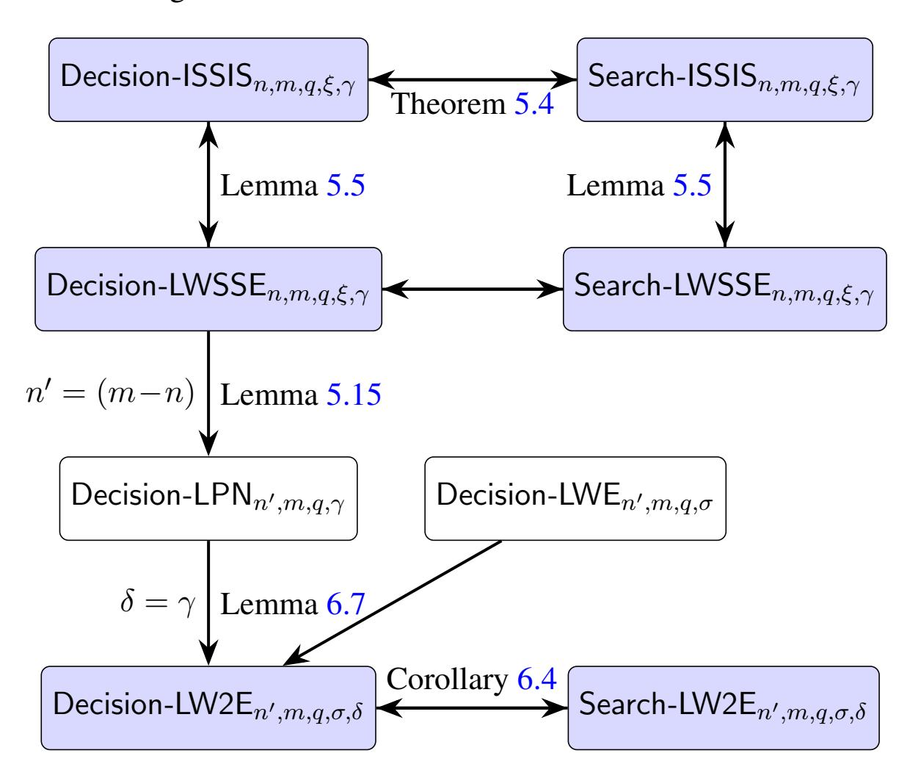
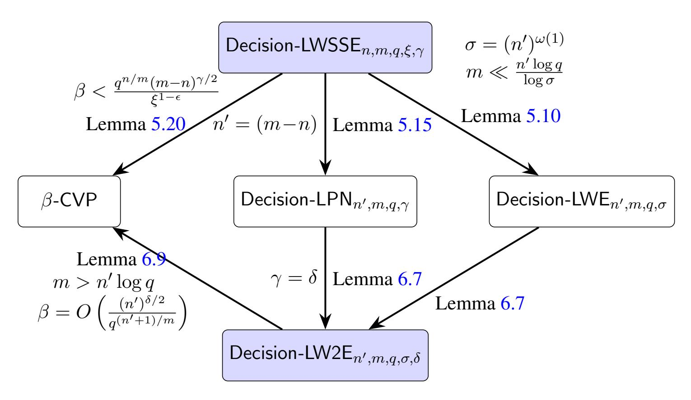

{0}------------------------------------------------

# Post-Quantum PKE

# from Unstructured Noisy Linear Algebraic Assumptions: Beyond LWE and Alekhnovich's LPN

Riddhi Ghosal \* UCLA Aayush Jain † CMU Paul Lou ‡ UCLA Amit Sahai § UCLA Neekon Vafa ¶ MIT

### Abstract

Noisy linear algebraic assumptions with respect to random matrices, in particular Learning with Errors (LWE) and Alekhnovich Learning Parity with Noise (Alekhnovich LPN), are among the most investigated assumptions that imply post-quantum public-key encryption (PKE). They enjoy elegant mathematical structure. Indeed, efforts to build post-quantum PKE and advanced primitives such as homomorphic encryption and indistinguishability obfuscation have increasingly focused their attention on these two assumptions and their variants.

Unfortunately, this increasing reliance on these two assumptions for building post-quantum cryptography leaves us vulnerable to potential quantum (and classical) attacks on Alekhnovich LPN and LWE. Quantum algorithms is a rapidly advancing area, and we must stay prepared for unexpected cryptanalytic breakthroughs. Just three decades ago, a short time frame in the development of our field, Shor's algorithm rendered most then-popular number theoretic and algebraic assumptions quantumly broken. Furthermore, within the last several years, we have witnessed major classical and quantum breaks on several assumptions previously introduced for post-quantum cryptography. Therefore, we ask the following question:

*In a world where both* LWE *and Alekhnovich* LPN *are broken, can there still exist noisy linear assumptions that remain plausibly quantum hard and imply PKE?*

To answer this question positively, we introduce two natural noisy-linear algebraic assumptions that are both with respect to random matrices, exactly like LWE and Alekhnovich LPN, but with different error distributions. Our error distribution combines aspects of both small norm and sparse error distributions. We design a PKE from these assumptions and give evidence that these assumptions are likely to still be secure even in a world where both the LWE and Alekhnovich LPN assumptions are simultaneously broken. We also study basic properties of these assumptions, and show that in the parameter settings we employ to build PKE, neither of them are "lattice" assumptions in the sense that we don't see a way to attack them using a lattice closest vector problem solver, except via NP-completeness reductions.

## 1 Introduction

Constructing post-quantum public-key encryption (PKE) is of the utmost concern due to the possibility of practical quantum computing in the near future. Over the past two decades, there has been growing interest

\*riddhi@cs.ucla.edu

†aayushja@andrew.cmu.edu

‡pslou@cs.ucla.edu

§sahai@cs.ucla.edu

¶nvafa@mit.edu

{1}------------------------------------------------

in post-quantum PKE from noisy linear algebraic assumptions, namely assumptions of the form  $(\mathbf{A}, \mathbf{As} + \mathbf{e})$  being computationally indistinguishable from  $(\mathbf{A}, \mathbf{u})$  for polynomial-time adversaries, where  $\mathbf{A} \in \mathbb{F}_q^{m \times n}$  is a uniform random expanding matrix (m > n), s is uniform over  $\mathbb{F}_q^n$ , u is uniform over  $\mathbb{F}_q^n$ , and  $\mathbf{e} \in \mathbb{F}_q^m$  is "noise" that satisfies some structural constraint. Two key assumptions in this category are (1) Learning with Errors (LWE) [Reg09] where the error vector  $\mathbf{e}$  has small integer entries from a discrete gaussian distribution centered at zero, and (2) Alekhnovich's setting for Learning Parity with Noise [Ale03] (Alekhnovich LPN) where  $\mathbf{e}$  is a sparse vector with roughly  $mn^{-\frac{1}{2}}$  many non-zero entries that are uniform over  $\mathbb{F}_q$ . In general, LPN is said to be  $\delta$ -dense if the probability of non-zero entries is  $n^{-\delta}$ , and Alekhnovich's LPN is the special case of  $\delta = \frac{1}{2}$ . The simple mathematical structure of these two noisy linear algebraic assumptions, involving only *unstructured* noisy linear equations over finite fields is versatile for designing cryptographic primitives (see, e.g. [Gen10, BV11, BGV12, GSW13, GVW12, BGG+14, GKP+13, WZ17, PS19, JLS21, VWW22]).

How worried should we be about a (quantum) break on assumptions such as LWE and Alekhnovich LPN? The short history of modern cryptography teaches us that it is vital to prepare ourselves against unexpected cryptanalytic breakthroughs. Only 30 years ago, a minuscule time-frame in the development of a scientific field, Shor's algorithm [Sho94] single-handedly quantumly broke the two most centrally used cryptographic assumptions at the time, the hardness of factoring and the hardness of discrete logarithm. More surprisingly, there have even been classical attacks on isogeny [Rob23] and multivariate quadratic [Beu22] based assumptions that were initially believed to be quantum safe. Therefore, as things stand, we have very few well-studied assumptions that are potentially quantum safe, let alone being suitable for constructing PKE. Moreover, in recent times, there have been some serious (albeit failed) attempts to break LWE quantumly [ES16, Che24] and quantum speed-ups against certain LPN type assumptions [Has19, SOKB24]. At the same time, noisy linear algebraic assumptions have proven extremely versatile. Given that our understanding of quantum algorithms is nascent and that quantum algorithms is a rapidly advancing area of study, it is imperative to explore new presumably quantum safe noisy linear algebraic assumptions beyond LWE and LPN. In the context of this discussion, we address the following primary question in this work:

In a world where both LWE and Alekhnovich LPN are polynomially broken, are there noisy linear assumptions that remain plausibly quantum polynomially-hard and imply PKE?

In this work, we provide evidence that the answer is yes, indeed for assumptions that only assume polynomial hardness. We introduce two noisy linear algebraic assumptions that *together* imply PKE in a parameter regime in which *both* assumptions are potentially quantum-secure even if *both* LWE and Alekhnovich LPN are (quantum)-broken.

Indeed for our two new assumptions, we give evidence that they are not subject to complexity-theoretic reductions to lattice assumptions nor to typical cryptanalytical strategies applicable to lattice assumptions. On the other hand, we also give evidence that only by decoding random linear codes from sparse errors that are well beyond the Alekhnovich barrier ( $\delta = \frac{1}{2}$ ) in terms of density, can our new assumptions be plausibly attacked.

Moreover, exactly like LWE and LPN as described above, our assumptions are also defined with respect to polynomial-time adversaries and truly random and *unstructured* matrices  $\bf A$ , differing only in the noise model. This is in contrast to structured variants of LWE and LPN such as sparse [DIJL23, DJ24, CDMT24], ring [HPS98, LPR10, DP12, LPR13, PRS17] and McEliece's [McE78] variants of these assumptions, which have previously leveraged their structure, or  $2^{\omega(n^{1/2})}$ -subexponentially strong LPN assumptions [YZ16] to give PKE constructions beyond the Alekhnovich barrier [Ale03].

Furthermore, our construction of PKE from our new assumptions is natural and exploits a new kind of asymmetry, as we will describe shortly. We now describe both of our assumptions:

1. The **Learning with Two Errors (LW2E)** assumption consists of unstructured linear equations perturbed by both an LWE error term and an LPN sparse error term (over  $\mathbb{F}_q$ ), i.e., it has the form  $\mathbf{As} + \mathbf{e}$ 

{2}------------------------------------------------

where  $e = e_1 + e_2$ . Here  $e_1$  is the short LWE error and  $e_2$  is the sparse LPN error. The aggregate error term is therefore neither sparse nor small. From a complexity-theoretic viewpoint, we prove that this assumption is at least as hard as both LWE and Alekhnovich LPN, while intuitively being strictly harder than both. We concretely support this intuition in Section 6, where we provide strong evidence that hardness would be preserved even in the presence of oracles that could break both LWE and Alekhnovich LPN.

2. The Denser-than-Alekhnovich Learning with Short and Sparse Errors assumption (LWSSE) consists of perturbing uniform random linear equations by a sparse error e that has a small  $\ell_2$ -norm error but that is denser than the Alekhnovich regime. We introduce the assumption in the parameter regime where the matrix  $\mathbf{A} \in \mathbb{F}_q^{(m-n)\times m}$  is nearly square, that is with secret dimension (m-n) and sample count m. It is convenient to think of the density parameter as 0.1 (much denser than the Alekhnovic 0.5 setting); that is, with probability  $(m-n)^{-0.1}$  an error coordinate is non-zero. The parameters used to construct our PKE have been chosen particularly to ensure that they are (1) beyond the Alekhnovich regime and (2) outside of the regime in which LWSSE reduces to LW2E or LWE.

We also introduce an equivalent dual form of this assumption called the Inhomogeneous Short and Sparse Integer Solution (ISSIS) which is inspired from the dual analogue of the LWE problem, namely that Inhomogeneous Shortest Integer Solution (ISIS). As a decision problem, ISSIS states that  $(\mathbf{A}^{\perp}, \mathbf{e}^{\top} \mathbf{A}^{\perp})$  is computationally indistinguishable from  $(\mathbf{A}^{\perp}, \mathbf{u})$  for uniform random  $\mathbf{u} \in \mathbb{F}_q^n$  and  $\mathbf{A}^{\perp} : \mathbf{A} \mathbf{A}^{\perp} = 0$ . Similar to ISIS, this problem also has a "total" regime where the decision problem is information theoretically hard. However, as we detail shortly, we will always operate with parameters in the "planted" regime where the decision problem is only computationally hard.

A more detailed overview on the hardness and complexity-theoretic relations of these two assumptions will be discussed in Section 1.2. We now elaborate on how we combine the two assumptions to construct our PKE.

## 1.1 PKE from LW2E and LWSSE Beyond LWE and Alekhnovich

The well-known PKE constructions from LWE due to Regev [Reg09] and from LPN due to Alekhnovich [Ale03] follow a similar template. Typically, these constructions rely on the special structure of the error vector. In particular, the crucial property that ensures decryption correctness is the following: (1) In the case of LWE, the inner product of two vectors with small entries is small compared to the prime modulus q, and (2) In the case of LPN, when you take the inner product of two sparse vectors, the non-zero entries of one vector are likely to coincide with the zero entries of the other, if the sparsity parameters are chosen carefully, thereby resulting in 0. The following is a general blueprint that we follow as well:

- Key Generation: Sample a random  $\mathbf{A} \in \mathbb{F}_q^{m \times n}$ , a random  $\mathbf{s} \in \mathbb{F}_q^n$  and an error vector  $\mathbf{e} \in \mathbb{F}_q^m$  as per the distribution defined by a noisy linear assumption. Set  $(\mathbf{A}, \mathbf{b} = \mathbf{A}\mathbf{s} + \mathbf{e})$  as the public key pk and set  $\mathbf{s}$ ,  $\mathbf{e}$  as the secret key sk.
- Encryption: To encrypt a 1, sample a uniform random  $\mathbf{u}_1 \in \mathbb{F}_q^n$  and  $u_2 \in \mathbb{F}_q$  and output  $(\mathbf{u}_1, u_2)$ . To encrypt a 0, sample a random vector  $\mathbf{r} \in \mathbb{F}_q^m$  from the error distribution of a noisy linear assumption and output  $(\mathsf{ct}_1^\top = \mathbf{r}^\top \mathbf{A}, \mathsf{ct}_2 = \mathbf{r}^\top \mathbf{b})$ .
- Decryption: Compute  $ct_2 ct_1^{\top}s$ . If the result is below some pre-determined threshold, then output 0; otherwise output 1.

Correctness of this construction intuitively works because  $\mathsf{ct}_2 - \mathsf{ct}_1^\top \mathbf{s}$  is going to be uniform random over  $\mathbb{F}_q$  if 1 was encrypted. On the other hand, if 0 was encrypted, then  $\mathsf{ct}_2 - \mathsf{ct}_1^\top \mathbf{s} = \mathbf{r}^\top \mathbf{e}$ . Now if  $\mathbf{r}$  and

{3}------------------------------------------------

e are either both small or both sufficiently sparse, then we expect their inner product to be small or zero, respectively, and we can set an appropriate threshold to detect this gap.

The security proof typically has two phases: First to replace **b** in the public key to uniform random, i.e., replace **b** with a uniform random  $\mathbf{u} \in \mathbb{F}_q^m$ . At this point, the view of the adversary is of the form  $(\mathbf{A}, \mathbf{u}, \mathbf{r}^{\top} \mathbf{A}, \mathbf{r}^{\top} \mathbf{u})$ . At a high level, we then need to argue that we can replace  $(\mathbf{A} | \mathbf{u}, \mathbf{r}^{\top} (\mathbf{A} | \mathbf{u}))$  with  $(\mathbf{A} | \mathbf{u}, \mathbf{y}^{\top})$ , where **y** is a uniform random vector over  $\mathbb{F}_q^n$ .

A first failed attempt to set the stage. Since both of our assumptions have the same overarching structure as LWE and LPN, we can of course try to instantiate the above template with either LW2E or ISSIS. Let us begin with the LW2E assumption. In particular, we can replace  ${\bf e}$  and  ${\bf r}_1$  in the above template with  ${\bf e}_1$  in the sparse-but-large error distribution. Immediately, we can see an issue with the decryption correctness. In particular, decryption in the above construction exploits the fact that the inner product of  ${\bf r}$  with  ${\bf e}$  will result in some small value. However in the case of LW2E, both  ${\bf e}_1$  in the equation of  ${\bf e}_2$  and  ${\bf e}_3$  are neither small or sparse. Therefore their inner product will likely not be a small value and we cannot get any appropriate threshold that will guarantee decryption with overwhelming probability.

Idea 1. Exploit asymmetry:  $\mathbf{r}$  and  $(\mathbf{e}_1 + \mathbf{e}_2)$  need not be from the same distribution! What if we choose  $\mathbf{r}$  from a distribution which is both short and sparse, i.e., the indices where  $\mathbf{r}$  is non-zero are sparse and each non-zero entry is B-bounded for some  $B \ll q$ . The hope is that decryption correctness will now work because both  $\mathbf{r}$  and  $\mathbf{e}_2$  are sparse, as was the case in Alekhnovich, and therefore will likely cancel out, and therefore  $\mathbf{r}^{\top}(\mathbf{e}_1 + \mathbf{e}_2)$  will be equal to  $\mathbf{r}^{\top}\mathbf{e}_1$ . Now, it is easy to see that  $\mathbf{r}^{\top}\mathbf{e}_1$  will result in a small value as both vectors individually have small entries. A concern at this point is that we want to do better than Alekhnovich – but if we are using sparsity to ensure correctness, how will we surpass the Alekhnovich barrier? As we will see below, asymmetry will save us again! But before we tackle that, let's first consider security.

First we can appeal to the hardness of decisional LW2E and replace  $pk = (\mathbf{A}, \mathbf{A}\mathbf{s} + \mathbf{e}_1 + \mathbf{e}_2), \text{ct} = (\mathbf{r}^\top \mathbf{A}, \mathbf{r}^\top (\mathbf{A}\mathbf{s} + \mathbf{e}_1 + \mathbf{e}_2)))$  with  $pk' = (\mathbf{A}, \mathbf{u}), \text{ct}' = (\mathbf{r}^\top \mathbf{A}, \mathbf{r}^\top \mathbf{u})$  for some uniform random  $\mathbf{u} \in \mathbb{F}_q^m$ .

Now, what about the ciphertext? Since m > n, can we hope to appeal to the Leftover Hash Lemma as per Regev [Reg09]? If so, we could conclude that  $((\mathbf{A}\|\mathbf{u}), \mathbf{r}^{\top}(\mathbf{A}\|\mathbf{u}))$  is statistically indistinguishable from  $((\mathbf{A}\|\mathbf{u}), \mathbf{y}^{\top})$  where  $\mathbf{y}^{\top}$  is chosen uniformly. However to achieve correctness and security simultaneously, there are two crucial properties that need to be satisfied simultaneously:

- 1. Increasing the sparsity of **r** increases the number of 0 entries, and therefore reduces the entropy of **r**. If we make the sparsity high enough then we cannot have enough entropy to apply the Leftover Hash Lemma. Thus, we desire **r** to be dense enough.
- 2. On the other hand, increasing the density of  $\mathbf{r}$  reduces the chances that  $\mathbf{r}^{\top}\mathbf{e}_{2}=0$ . So to ensure decryption correctness, we need the sparsity of  $\mathbf{r}$  to be more than a certain threshold.

Unfortunately it turns out that there are no settings of parameters that allow us to achieve both decryption correctness and use the Leftover Hash Lemma. Indeed, a similar issue arises in Alekhnovich [Ale03] as well, and this is exactly where the Alekhnovich  $n^{-0.5}$  barrier on density comes from.

**Idea 2. Let's use computational hardness via LWSSE/ISSIS instead!** This is where the LWSSE/ISSIS assumption comes into the picture. Observe that **r** here has the same distribution as the secret distribution

{4}------------------------------------------------

of ISSIS. Rather than trying to argue statistical indistinguishability of ((A∥u), r ⊤(A∥u)) and ((A∥u), y ⊤) via the Leftover Hash Lemma, we will appeal to the hardness of decisional ISSIS to assert that the above distributions are computationally indistinguishable, completing the proof of security!

Idea 3. Beyond the Alekhnovich barrier via asymmetry! Now that we have taken care of security, the immediate question to ask is how can we proceed beyond the Alekhnovich barrier? It seems like we relied on the sparsity of r, and certainly if this vector is γ-dense for γ ≥ 0.5, then we will be again be stuck in the Alekhnovich regime. In fact, we do show a reduction from LWSSE to LPN with comparable parameter in Lemma [5.15,](#page-21-0) therefore it is crucial that we choose γ < 0.5. But is it possible to do so in our case?

For Alekhnovich LPN-based PKE, one needs to use the LPN assumption twice, i.e., once to replace the public key with random and then to replace the ciphertext with random. Say that the density parameter of the LPN error e used in the public key is δ. It was shown in [\[Ale03\]](#page-33-0) that decryption is possible only when γ + δ ≥ 1, and therefore one cannot hope for anything better than setting γ = δ = 0.5. In particular, this *symmetry* in our choice for γ and δ is the optimal choice, since both the dual and primal forms of the LPN assumption are equivalent.

However, in our case the error e1 + e2 in the LW2E assumption is *already* dense due to the presence of the LWE error e1, which is not at all sparse. Since we do not have any evidence of how to use an LPN breaker to attack noisy linear equations where the noise is very dense, this error distribution seems completely outside the reach of any LPN-based attacks. Therefore we can actually afford to have e2 that is quite sparse, and specifically we can pick δ > 0.5. This then gives us the freedom to pick γ < 0.5. In particular there are no other restrictions on the choice of γ and δ beyond γ + δ ≥ 1, so δ = 0.9 and γ = 0.1 are perfectly valid choices that move the LWSSE assumption to a density setting far beyond Alekhnovich's LPN. In fact, it is natural to conjecture that any attack that breaks LWSSE with density parameter 0.1 might have consequences on LPN with density parameter 0.1 as well.

And what about lattice attacks? In fact, as we argue below, our choice of parameters will be such that actually there will exist exponentially many vectors that solve the ISSIS equation that are *much smaller* than r, but these "decoy" vectors will be very dense! As a result, even a huge breakthrough in (quantum) lattice-based attacks would discover these "decoy" vectors instead the actual r vector needed to break our PKE system[1](#page-4-0) !

To summarize, in this work, we achieve the following theorem:

Theorem 1.1. *(Informal) Assuming the hardness of the (1) Decisional Learning with Two Errors Problem and (2) Decisional Inhomogeneous Short and Sparse Solutions assumptions, the Public Key Encryption constructed in Section [4](#page-10-0) is statistically correct and semantically secure.*

We refer to Section [4](#page-10-0) for a formal and parameterized theorem statement.

Remark 1.2 (Semi-honest OT). The construction scheme involved in the above Theorem has a publickey that is pseudorandom. By a known construction of semi-honest 1-out-of-2 oblivious transfer from public-key encryption with pseudorandom public keys [\[EGL82\]](#page-34-9), the above Theorem immediately implies a construction of semi-honest 1-out-of-2 oblivious transfer based on the hardness of the two problems. More specifically, the receiver with a choice bit b generates a PKE key-pair (pkb ,skb) and a random string pk1−b of the appropriate length. The receiver sends (pk0 , pk1 ) to the sender, who replies with encryptions of messages mb under key pkb . The receiver can only decrypt mb, while the sender is unable to distinguish between pk0 and pk1 . By known techniques [\[GMW87,](#page-34-10) [KO04\]](#page-34-11), this semi-honest OT protocol implies the existence of a malicious OT protocol.

1A similar situation arises in the context of our LW2E assumption, rendering lattice attacks ineffective.

{5}------------------------------------------------

#### 1.2 Parameters and the hardness of LW2E and LWSSE

Additionally, we also perform a systematic study of the hardness of both assumptions and provide evidence that under our parameter setting, LW2E and LWSSE are potentially hard even in the presence of oracles that can break both LWE and LPN. We first formally restate the hardness assumptions with all the parameters.

**Definition 1.3** (Decisional Learning With Two Errors Assumption (LW2E)). For all  $n \in \mathbb{N}$ , m = poly(n), prime  $q \in \mathbb{N}$ ,  $\sigma = \text{poly}(n)$ ,  $\delta \in (0,1)$ , the decisional learning with two errors assumption (decisional-LW2E), formally parameterized by LW2E $n,m,q,\mathcal{D}_{\mathbb{Z},\sigma},\delta$ , states that the following distributions are computationally indistinguishable:

1. 
$$\left(\mathbf{A} \stackrel{\$}{\leftarrow} \mathbb{F}_q^{m \times n}, \mathbf{A}\mathbf{s} + \mathbf{e}^{(1)} + \mathbf{e}^{(2)} \pmod{q}\right)$$
 where  $\mathbf{s} \stackrel{\$}{\leftarrow} \mathbb{F}_q^n$ ,  $\mathbf{e}^{(1)} \leftarrow \mathcal{D}_{\mathbb{Z},\sigma}^m$ , and  $\mathbf{e}^{(2)} \leftarrow \mathcal{S}_{n,q,\delta}^m$ .

2. 
$$\left(\mathbf{A} \stackrel{\$}{\leftarrow} \mathbb{F}_q^{m \times n}, \mathbf{b} \stackrel{\$}{\leftarrow} \mathbb{F}_q^m\right)$$
.

Here,

- $\mathcal{D}_{\mathbb{Z},\sigma}$ : For  $\sigma \in \mathbb{R}^+$ , we let  $\mathcal{D}_{\mathbb{Z},\sigma}$  denote the discrete Gaussian distribution over the integer lattice  $\mathbb{Z}$  with mean 0 and scale parameter  $\sigma > 0$ .
- $S_{n,q,\delta}$ : For  $n,q \in \mathbb{N}, \delta \in (0,1)$ , we define  $S_{n,q,\delta}$  to be the distribution samples 0 with probability  $1-n^{-\delta}$  or a uniformly random element from  $\mathbb{F}_q$  with probability  $n^{-\delta}$ .

**Definition 1.4** (Decisional Learning With Short and Sparse Errors Assumption (LWSSE)). For all  $n \in \mathbb{N}$ ,  $m = \mathsf{poly}(n) > n$ , prime  $q \in \mathbb{N}$ ,  $\xi = \mathsf{poly}(n)$ ,  $\gamma \in (0,1)$ , the decisional learning with short and sparse errors assumption (decisional-LWSSE), formally parameterized by LWSSE $n,m,q,\xi,\gamma$ , states that the following distributions are computationally indistinguishable:

1. 
$$\left(\mathbf{A}^{\perp} \stackrel{\$}{\leftarrow} \mathbb{F}_q^{(m-n) \times m}, \mathbf{s}^{\top} \mathbf{A}^{\perp} + \mathbf{e}^{\top} \pmod{q}\right)$$
 where  $\mathbf{s} \stackrel{\$}{\leftarrow} \mathbb{F}_q^{m-n}$ ,  $\mathbf{e} \leftarrow \mathcal{E}_{m,n,\xi,\gamma}^m$ .

2. 
$$\left(\mathbf{A}^{\perp} \stackrel{\$}{\leftarrow} \mathbb{F}_q^{(m-n)\times m}, \mathbf{b}^{\top} \stackrel{\$}{\leftarrow} \mathbb{F}_q^m\right)$$
.

Here, we define  $\mathcal{E}_{m,n,\xi,\gamma}$  for  $m,n,\xi\in\mathbb{N}$ ,  $\gamma\in(0,1)$ , with m>n, to be the distribution over  $\mathbb{Z}$  which samples 0 with probability  $1-(m-n)^{-\gamma}$  or a random element from the distribution  $\mathcal{D}_{\mathbb{Z},\xi}$  with probability  $(m-n)^{-\gamma}$ .

Our Parameter Settings for LW2E and LWSSE, for building PKE. We will now describe how we set the parameters for our assumptions, in ways that are sufficient for constructing PKE. While these are not the only possible setting of parameters that would achieve the security desired from our PKE, this setting of parameters is easy to understand and achieve all the goals we desire to achieve. We will think of the dimension n as a security parameter, and we will also make use of an arbitrarily small constant  $\gamma \in (0, \frac{1}{2})$ . Then, we set parameters for LW2E and LWSSE as follows:

- Secret dimension of LW2E: n = n.
- ISSIS sparsity parameter:  $\gamma = \gamma$ .
- Smallness parameter for LW2E noise  $e_1$ :  $\sigma = n$ .
- Sparsity parameter for LW2E noise  $e_2$ :  $\delta = 1 \gamma$ .
- Dimension of ISSIS secret or number of LW2E samples: m = 20n.
- Prime modulus  $q \in [m^{10}, 2m^{10}]$ .
- ISSIS smallness parameter:  $\xi = n^{0.5+\gamma}$ .

{6}------------------------------------------------

Understanding our Assumptions more broadly. In Section 5 and Section 6, we perform a careful evaluation of the hardness of our newly introduced assumptions. We do so via two general approaches: (1) Show reductions to other lattice problems or LPN with parameters that we **do not use** in our PKE and (2) Explore some natural approaches to attack our assumptions using cryptanalysis of LWE and show why they do not apply to the parameter settings that we do use. We summarize the reductions in Figure 1 that apply for all settings of parameters, including those that we use in our PKE.

Figure 1: Reductions between the assumptions when we are in the setting of parameters that we use for our PKE. An arrow from assumption A to B implies that an adversary breaking assumption B can be used to break assumption A, i.e., reduction from A to B. The new assumptions we introduce in this paper are highlighted with a blue background.

Up next, in Figure 2, we provide reductions from LW2E and LWSSE to various lattice problems that hold only for a very **restricted set of parameters**. The goal then is to construct our PKE relying on the the hardness of LW2E $_{n,m,q,\mathcal{D}_{\mathbb{Z},\sigma},\delta}$  and ISSIS $_{n,m,q,\xi,\gamma}$  with parameters that **do not** allow these reductions to go through.

#### Discussion on the reductions.

- Figure 1 seems to suggest that there is reduction from decision-LWSSE to decision-LW2E via decision-LPN with parameters that we use in our PKE. However, there is a parameter mismatch here. It is true that LWSSE $_{n,m,q,\xi,\gamma}$  reduces to LPN $_{m-n,m,q,\gamma}$ , However the next reduction, i.e., from LPN $_{m-n,m,q,\gamma}$  to LW2E $_{m-n,m,q,\mathcal{D}_{\mathbb{Z},\sigma},\gamma}$  only works when  $m < \frac{n\log q}{\log \sigma}$ . Outside these parameters, decision LW2E $_{m-n,m,q,\mathcal{D}_{\mathbb{Z},\sigma},\gamma}$  is information theoretically secure and search LW2E $_{m-n,m,q,\mathcal{D}_{\mathbb{Z},\sigma},\gamma}$  has exponentially many solutions, and therefore this reduction fails to work. However, there is indeed a reduction outside of the PKE regime which is consistent with the direct reduction from LWSSE to LW2E.
- Although we do not have a reduction from LWE to search-ISSIS, in Section 5 we give a moral argument about how can one use a search-ISSIS breaker to solve LWE. Such an argument only works

{7}------------------------------------------------

Figure 2: Reductions between various assumptions that work for restricted parameter settings. An arrow from assumption A to B implies that an adversary breaking assumption B can be used to break assumption A, i.e., reduction from A to B. The parameters for which these reductions hold have are mentioned with the arrows. The new assumptions we introduce in this paper are highlighted with a blue background.

when  $m = \tilde{\Omega}(n^{\frac{1}{1-\gamma}})$  i.e., the total ISSIS regime. Unfortunately, we cannot afford to pick m to be so big in our PKE as we will end up losing decryption correctness.

• With regards to proving a separation between LWE and LW2E, we do not, as a community, even know how to separate factoring from LWE. Note that an oracle separation is meaningless here, because neither LWE nor LW2E are defined with respect to oracles. What we are able to argue is this: LWE is broken given a  $\sqrt{n}$ -CVP oracle, whereas we do not know how to use a  $\sqrt{n}$ -CVP oracle to break LW2E. We furthermore explore under what circumstances a  $\sqrt{n}$ -CVP oracle could possibly be used to break LW2E, and we find that natural approaches would not work unless the sparse error components are *extremely sparse* and the field size q is also limited with respect to the dimension n. Note that if we were able to actually prove that no efficient algorithm given a  $\sqrt{n}$ -CVP oracle can break LW2E, this would imply that no efficient algorithm that does not use  $\sqrt{n}$ -CVP oracle can break LW2E, implying P  $\neq$  NP. Nevertheless, our work does motivate a further deep exploration of such separation questions.

Relating Noisy Linear Algebraic Assumptions If we adopt the perspective of best-known *current* attack algorithms, LWE and LW2E share similar tools and might appear to be "similar assumptions" as a result. On the other hand, if we adopt the complexity-theoretic/cryptographic perspective, these two assumptions have clearly different complexity-theoretic standing and cryptographic utility. In this paper, we take the latter perspective of complexity-theoretic/cryptographic evidence, but we believe both perspectives are important. We hope that in studying this question, both perspectives converge in deeper insight about the landscape of computational assumptions necessary for PKE. Indeed, our results also further motivate the algorithmic study of "mixed-error" assumptions.

{8}------------------------------------------------

## 2 Preliminaries

## 2.1 Lattices

**Lemma 2.1** ([Lyu12]. Lemma 4.4). For any k > 1,  $\Pr[\|\mathbf{z}\|_2 > k\sigma \cdot \sqrt{m} : \mathbf{z} \xleftarrow{\$} \mathcal{D}_{\mathbb{Z},\sigma}^m] \le k^m e^{m(1-k^2)/2}$ .

**Corollary 2.2.** For any  $\sigma \in (0, \infty)$ , for any  $m \in \mathbb{N}$ , for  $B \geq 2\sigma \cdot \sqrt{m}$ ,

$$\Pr_{\mathbf{e} \sim \mathcal{D}_{\mathbb{Z}, \sigma}^m} \left[ \|\mathbf{e}\|_{\infty} \leq B \right] \geq 1 - \left( \frac{2}{e^{3/2}} \right)^m = 1 - \mathsf{negl}(m)$$

where  $\mathbf{e} = (e_1, \dots, e_m)$  and where  $\|\mathbf{e}\|_{\infty} = \max_{i \in [m]} |e_i|$ .

*Proof.* It suffices to consider when  $B = 2\sigma \cdot \sqrt{m}$ . Then Lemma 2.1 tells us that

$$\Pr_{\mathbf{e} \sim \mathcal{D}_{\mathbb{Z},\sigma}^m} \left[ \|\mathbf{e}\|_2 \leq B \right] \geq 1 - \left( \frac{2}{e^{3/2}} \right)^m = 1 - \mathsf{negl}(m).$$

Observe that since  $\mathbf{e}$  is an integral vector, we can bound the max norm by the  $\ell_2$ -norm, that is for all  $\mathbf{e} \in \mathbb{Z}^m$ , we have  $\|\mathbf{e}\|_{\infty} \leq \|\mathbf{e}\|_2$ . This relation on the norms immediately implies our corollary statement.

**Notation.** We define some notation for distributions:

- $\mathcal{D}_{\mathbb{Z},\sigma}$ : For  $\sigma \in \mathbb{R}^+$ , we let  $\mathcal{D}_{\mathbb{Z},\sigma}$  denote the discrete Gaussian distribution over the integer lattice  $\mathbb{Z}$  with mean 0 and scale parameter  $\sigma > 0$ .
- $S_{n,q,\delta}$ : For  $n,q \in \mathbb{N}, \delta \in (0,1)$ , we define  $S_{n,q,\delta}$  to be the distribution samples 0 with probability  $1-n^{-\delta}$  or a uniformly random element from  $\mathbb{F}_q$  with probability  $n^{-\delta}$ .

**Definition 2.3** (Decisional Learning With Errors Assumption). *The decisional learning with errors assumption (decisional-LWE), formally parameterized by*  $\mathsf{LWE}_{n,m,q,\mathcal{D}_{\mathbb{Z},\sigma}}$ , *states that the following distributions are computationally indistinguishable:* 

1. 
$$\left(\mathbf{A} \stackrel{\$}{\leftarrow} \mathbb{F}_q^{m \times n}, \mathbf{A}\mathbf{s} + \mathbf{e} \pmod{q}\right)$$
 where  $\mathbf{s} \stackrel{\$}{\leftarrow} \mathbb{F}_q^n$  and  $\mathbf{e} \leftarrow \mathcal{D}_{\mathbb{Z},\sigma}^m$ .

2. 
$$\left(\mathbf{A} \stackrel{\$}{\leftarrow} \mathbb{F}_q^{m \times n}, \mathbf{b} \stackrel{\$}{\leftarrow} \mathbb{F}_q^m\right)$$
.

**Definition 2.4** (Decisional Learning Parity with Noise Assumption over Large Fields). *The decisional learning parity with noise assumption over large fields (decisional-LPN), formally parameterized by* LPN $n,m,q,\delta$ , *states that the following distributions are computationally indistinguishable:* 

1. 
$$\left(\mathbf{A} \stackrel{\$}{\leftarrow} \mathbb{F}_q^{m \times n}, \mathbf{A}\mathbf{s} + \mathbf{e} \pmod{q}\right)$$
 where  $\mathbf{s} \stackrel{\$}{\leftarrow} \mathbb{F}_q^n$  and  $\mathbf{e} \leftarrow \mathcal{S}_{n,q,\delta}^m$ .

2. 
$$\left(\mathbf{A} \stackrel{\$}{\leftarrow} \mathbb{F}_q^{m \times n}, \mathbf{b} \stackrel{\$}{\leftarrow} \mathbb{F}_q^m\right)$$
.

{9}------------------------------------------------

## 3 New Assumptions

Definition 3.1 (Learning With Two Errors Assumption). *For all* n ∈ N*,* m = poly(n)*, prime* q ∈ N*,* σ = poly(n)*,* δ ∈ (0, 1)*, the decisional learning with two errors assumption (decisional-LW2E), formally parameterized by* LW2En,m,q,DZ,σ,δ*, states that the following distributions are computationally indistinguishable:*

1. 
$$\left(\mathbf{A} \stackrel{\$}{\leftarrow} \mathbb{F}_q^{m \times n}, \mathbf{A}\mathbf{s} + \mathbf{e}^{(1)} + \mathbf{e}^{(2)} \pmod{q}\right)$$
 where  $\mathbf{s} \stackrel{\$}{\leftarrow} \mathbb{F}_q^n$ ,  $\mathbf{e}^{(1)} \leftarrow \mathcal{D}_{\mathbb{Z},\sigma}^m$ , and  $\mathbf{e}^{(2)} \leftarrow \mathcal{S}_{n,q,\delta}^m$ .

2. 
$$\left(\mathbf{A} \stackrel{\$}{\leftarrow} \mathbb{F}_q^{m \times n}, \mathbf{b} \stackrel{\$}{\leftarrow} \mathbb{F}_q^m\right)$$
.

*Similarly, the search-LW2E assumption, formally parameterized by* Search*-*LW2En,m,q,DZ,σ,δ*, states that every polynomial time adversary, given Item [1](#page-9-0) as input, outputs* s *with at most negligible probability.*

Remark 3.2. Observe that the error term e (1) is sampled from an LWE error distribution, and the error term e (2) is sampled from an LPN over large fields error distribution.

Notation. We define some new notation for error vectors with small ℓ2 and ℓ0 norm:

• Em,n,ξ,γ: For m, n, ξ ∈ N, γ ∈ (0, 1), with m > n, we define Em,n,ξ,γ to be the distribution over Z which samples 0 with probability 1−(m−n) −γ or a random element from the distribution DZ,ξ with probability (m − n) −γ .

Definition 3.3 (The Inhomogeneous Short and Sparse Decision Assumption (ISSIS)). *For all* n ∈ N*,* m = poly(n) > n*, prime* q ∈ N*,* ξ = poly(n)*,* γ ∈ (0, 1)*, the decisional inhomogeneous short and sparse assumption (decisional-ISSIS), formally parameterized as* ISSISn,m,q,ξ,γ*, states that the following distributions are computationally indistinguishable:*

1. 
$$\left(\mathbf{A} \stackrel{\$}{\leftarrow} \mathbb{F}_q^{m \times n}, \mathbf{r}^{\top} \mathbf{A} \pmod{q}\right)$$
 where  $\mathbf{r} \leftarrow \mathcal{E}_{m,n,\xi,\gamma}^m$ .

2. 
$$\left(\mathbf{A} \stackrel{\$}{\leftarrow} \mathbb{F}_q^{m \times n}, \mathbf{u}^{\top} \stackrel{\$}{\leftarrow} \mathbb{F}_q^n\right)$$
.

Remark 3.4 (Statistical Indistinguishability). Note that the sparsity of the secret in the decisional-ISSIS assumption makes it*statistically distinguishable* from uniform random for certain choice of parameters. By the leftover hash lemma, only when m = Ω (n log q) 1 1−γ , the decisional-ISSIS is information-theoretically hard. Refer to Section [5](#page-15-0) for details. In fact, in this work, we will only use the decisional-ISSIS assumption in the computational regime.

Remark 3.5. We can analogously define the search version of ISSIS where a PPT adversary is required to output a "short and sparse" secret upon given a sample from the ISSIS distribution. Refer to Definition [5.3](#page-16-2) for the formal definition.

We also define a "dualized", equivalent version of ISSIS that looks more like an LWE-style assumption, as opposed to an SIS-style one.

Definition 3.6 (Decisional Learning With Short and Sparse Errors Assumption). *For all* n ∈ N*,* m = poly(n) > n*, prime* q ∈ N*,* ξ = poly(n)*,* γ ∈ (0, 1)*, the decisional learning with short and sparse errors assumption (decisional-LWSSE), formally parameterized by* LWSSEn,m,q,ξ,γ*, states that the following distributions are computationally indistinguishable:*

1. 
$$\left(\mathbf{A}^{\perp} \stackrel{\$}{\leftarrow} \mathbb{F}_q^{(m-n) \times m}, \mathbf{s}^{\top} \mathbf{A}^{\perp} + \mathbf{e}^{\top} \pmod{q}\right)$$
 where  $\mathbf{s} \stackrel{\$}{\leftarrow} \mathbb{F}_q^{m-n}$ ,  $\mathbf{e} \leftarrow \mathcal{E}_{m,n,\xi,\gamma}^m$ .

{10}------------------------------------------------

2. 
$$\left(\mathbf{A}^{\perp} \stackrel{\$}{\leftarrow} \mathbb{F}_q^{(m-n) \times m}, \mathbf{b}^{\top} \stackrel{\$}{\leftarrow} \mathbb{F}_q^m\right)$$
.

Similarly, the search-LWSSE assumption, formally parameterized by Search-LWSSE $n,m,q,\xi,\gamma$ , states that every polynomial time adversary, given Item 1 as input, outputs  $\mathbf{s}^{\top}$  with at most negligible probability.

We prove in Lemma 5.5 that the decisional (search)-ISSIS hardness assumption is equivalent to the decisional (search)-LWSSE assumption with identical parameters.

## 4 Public Key Encryption from LW2E and ISSIS

**Suggested Parameters:** We suggest the following choices of parameters. Assume that the security parameter is n:

- Decryption threshold parameter:  $\zeta \in \mathbb{N}$ .
- Secret dimension of LW2E: n.
- ISSIS sparsity parameter:  $\gamma < \frac{1}{2}$ .
- Smallness parameter for LW2E noise  $e_1$ :  $\sigma = n$ .
- Sparsity parameter for LW2E noise  $e_2$ :  $\delta = 1 \gamma$ .
- Dimension of ISSIS secret or number of LW2E samples: m = 20n.
- Prime modulus  $q > n^{11}$ .
- ISSIS smallness parameter:  $\xi = n^{0.5+\gamma}$ .

More generally, we want to choose the parameters such that they satisfy the following constraints simultaneously: Pick any suitable constant  $\varepsilon < \gamma$  such that

- Dimension of ISSIS secret or number of LW2E samples:  $m < \frac{2(n+1)\log q}{\delta\log n}$ .
- Define  $B = \xi^{1-\frac{\varepsilon}{3}}$ :  $B > q^{\frac{n}{m}} m^{\frac{\gamma}{2} + \varepsilon}$ .
- Prime modulus  $q > \zeta m \sigma^{1+\frac{\varepsilon}{3}} \xi^{1+\frac{\varepsilon}{3}}$ .

For example, the following can be choices of parameters:

$$\gamma = 0.1, \delta = 0.9, \varepsilon = 0.0001, \sigma = n, m = 20n, \text{ prime } q > n^{11}, \xi = n^{0.6}.$$

**Parameters**:  $n, m, q, \delta, \gamma, \xi, \sigma, \zeta$ .

### **Error Distributions:**

- 1. Sparse Error for LW2E. Let  $S_{n,q,\delta}$  be a distribution over  $\mathbb{F}_q$  such that sampling results in 0 with probability  $1 n^{-\delta}$  and a uniform random element from  $\mathbb{F}_q$  with probability  $n^{-\delta}$ .
- 2. Gaussian Error for LW2E. Let  $\mathcal{D}_{\mathbb{Z},\sigma}$  be a discrete Gaussian with width  $\sigma$ .
- 3. **Small and Sparse Error for ISSIS.** Let  $\mathcal{E}_{m,n,\xi,\gamma}$  be a distribution over  $\mathbb{F}_q$  such that sampling results in 0 with probability  $1-(m-n)^{-\gamma}$  and in a random value from  $\mathcal{D}_{\mathbb{Z},\xi}$  with probability  $(m-n)^{-\gamma}$ .

{11}------------------------------------------------

## Algorithms:

$$\star \ (\mathsf{pk}, \mathsf{sk}) \leftarrow \mathsf{Gen}(1^{\lambda})$$
:

- 1. Sample a uniform random matrix A ∈ F m×n q .
- 2. Sample uniform random s ∈ F n q , sample e1 ∼ Dm σ , sample e2 ∼ S m n,q,δ.
- 3. Set pk ← (A, A · s + e1 + e2). Set sk ← s.
- 4. Output (pk,sk).

\* ct 
$$\leftarrow \mathsf{Enc}(1^{\lambda}, \mathsf{pk}, b \in \{0, 1\})$$
:

- 1. Parse pk as (A, y).
- 2. Sample r ∼ Em m,n,ξ,γ.
- 3. If b = 0, output (r ⊤A,⟨r, y⟩).
- 4. If b = 1, output (u1, u2) for uniform randomly sampled u ⊤ 1 ∈ F n q , and u2 ∈ Fq.

$$\star b' \leftarrow \mathsf{Dec}(1^{\lambda}, \mathsf{sk}, \mathsf{ct})$$
:

- 1. Parse sk as s, and parse ct as (ct1 ∈ F n q , ct2 ∈ Fq)
- 2. x ← (ct2 − ⟨ct1, s⟩) mod q
- 3. If x ≤ ⌊ q ζ ⌋, then output b ′ = 0, otherwise output b ′ = 1.

## Correctness.

Lemma 4.1. *Let* λ ∈ N *be the security parameter. Then there exists a constant* c < 1/2*, such that for all* n = n(λ) = poly(λ) ∈ N*,* m = O(n)*,* δ ∈ (0, 1)*,* γ = 1 − δ*,* b ∈ {0, 1}*,* ζ ∈ N*,* ζ ≥ 2*,* µ, ν > 0*,* σ = σ(λ) > 0*,* ξ = ξ(λ) > 0 *prime* q = q(λ) > ζmξ1+νσ 1+µ *,*

$$\Pr \left[ (\mathsf{pk}, \mathsf{sk}) \leftarrow \mathsf{Gen}(1^{\lambda}) \land \mathsf{Dec}(\mathsf{sk}, \mathsf{Enc}(\mathsf{pk}, b)) = b) \right] \geq 1 - c.$$

*Proof.* We proceed by analyzing the decryption error for the cases of b = 1 and b = 0 separately.

Case 1: If b = 1, in Step [2](#page-11-0) of the decryption procedure,

$$x = \operatorname{ct}_2 - \langle \operatorname{ct}_1, \mathbf{s} \rangle = u_2 - \sum_{i \in [m]} s_i u_{1,i} \mod q.$$

Since, each u1,i and si are independent and uniformly sampled from Fq, y is also distributed uniformly over Fq, thus

$$\Pr\left[x \ge \lfloor \frac{q}{\zeta} \rfloor\right] \ge 1 - \frac{1}{\zeta}.$$

Thus,

$$\Pr \Big[ (\mathsf{pk}, \mathsf{sk}) \leftarrow \mathsf{Gen}(1^\lambda) \wedge \mathsf{Dec}(\mathsf{sk}, \mathsf{Enc}(\mathsf{pk}, 1)) = 1) \Big] = 1 - \frac{1}{\zeta}.$$

Case 2: If b = 0, then in Step [2](#page-11-0) of the decryption procedure,

$$x = (\mathsf{ct}_2 - \langle \mathsf{sk}_1, \mathsf{ct}_1 \rangle) \bmod q = (\mathbf{r}^\top \mathbf{e}_1 + \mathbf{r}^\top \mathbf{e}_2) \bmod q.$$

{12}------------------------------------------------

We first compute the probability that the event  $\mathbf{r}^{\top}\mathbf{e}_2 = 0$  occurs that relies on the sparsity of  $\mathbf{e}_2$ .

To do so, first observe that the expected number of non-zero entries in  $\mathbf{r} \sim \mathcal{E}_{m,n,\xi,\gamma}^m$  is  $m(m-n)^{-\gamma}$ . By a standard Chernoff bound, with an all but negligible probability in n over the choice of  $\mathbf{r}$ , the number of non-zero entries in  $\mathbf{r}$  is at most  $2m(m-n)^{-\gamma}$ . Clearly  $\mathbf{r}^{\top}\mathbf{e}_2 = 0$  if  $\mathbf{r}$  has  $2m(m-n)^{-\gamma}$  non-zero elements in the worst case, and all the corresponding entries in  $\mathbf{e}_2$  at these indices are 0. Therefore, the probability that  $\mathbf{r}^{\top}\mathbf{e}_2 = 0$  is upper bounded by the probability that  $\mathbf{e}_2$  has 0 at the  $2m(m-n)^{-\gamma}$  many non-zero entries of  $\mathbf{r}$ . The probability of this is

$$(1 - n^{-\delta})^{2m(m-n)^{-\gamma}} = (1 - n^{-\delta})^{c'n^{\delta}} = \Theta(1)$$

for some constant  $c' \in \mathbb{N}$ , m = O(n) and  $\gamma + \delta = 1$ .

Conditioning on the event that  $\mathbf{r}^{\top}\mathbf{e}_{2} = 0$ , we have that  $x = \mathbf{r}^{\top}\mathbf{e}_{1} \mod q$ . For correctness to hold, we need to show that this value of x will be sufficiently small with high probability. First, we note that the entries of  $\mathbf{e}_{1}$  will all be upper bounded by  $\sigma^{1+\mu}$  with overwhelming probability. Let  $e_{1,i}$  denote the  $i^{th}$  coordinate of the vector  $\mathbf{e}_{1}$ . From Lemma 2.1, we know that for a fixed  $e_{1,i}$  and small constant  $\mu > 0$ ,

$$\Pr\left[e_{1,i} > \sigma^{1+\mu}\right] \le 2e^{-\pi\sigma^{2\mu}}.$$

Taking a union bound,

$$\Pr\left[\exists i \in [m] : e_{1,i} > \sigma^{1+\mu}\right] \le 2m \cdot e^{-\pi\sigma^{2\mu}}.$$

Similarly applying the same lemma on r gives us

$$\Pr\left[\exists i \in [m] : r_i > \xi^{1+\nu}\right] \le 2m \cdot e^{-\pi\sigma^{2\nu}}.$$

Therefore it must be that  $\mathbf{r}^{\top}\mathbf{e}_{1} \leq m\xi^{1+\nu}\sigma^{1+\mu}$  with probability at least  $1-2m\cdot e^{-\pi\sigma^{2\mu}}-2m\cdot e^{-\pi\sigma^{2\nu}}$ . Since we have chosen  $q>\zeta m\xi^{1+\nu}\sigma^{1+\mu}$ , x must be less than  $\lfloor \frac{q}{\zeta} \rfloor$ .

Then,

$$\Pr \Big[ (\mathsf{pk}, \mathsf{sk}) \leftarrow \mathsf{Gen}(1^{\lambda}) \wedge \mathsf{Dec}(\mathsf{sk}, \mathsf{Enc}(\mathsf{pk}, 0)) = 0) \Big] \geq 1 - c.$$

Combining Case 1 and Case 2 gives us our desired correctness statement.

**Remark 4.2.** While we achieve only constant decryption error in the above lemma, correctness can be amplified to achieve negligible decryption error by considering an encryption process that outputs several fresh encryptions for a single bit and a decryption process that outputs the majority value of their decryptions.

### **Semantic Security.**

**Lemma 4.3** (Semantic Security). Let  $\lambda$  be the security parameter. Then for every  $n = \text{poly}(\lambda)$ ,  $m = \text{poly}(\lambda)$ , prime  $q(\lambda)$ ,  $\xi = \text{poly}(\lambda)$ ,  $\gamma \in (0,1)$ , and for all polynomial-sized adversaries  $\mathcal{A}$ , assuming the hardness of the Decisional-LW2E $_{n,m,q,\sigma\delta}$  problem (Assumption 3.1) and the hardness of the Decisional-ISSIS $_{n,m,q,\xi,\gamma}$  problem (Assumption 3.3), there exists a negligible function  $\mu(\cdot): \mathbb{N} \to [0,1]$  such that

$$\begin{split} \Big| \Pr \Big[ (\mathsf{pk}, \mathsf{sk}) \leftarrow \mathsf{Gen}(1^\lambda); \mathcal{A}(\mathsf{pk}, \mathsf{Enc}(\mathsf{pk}, 0)) = 1, \Big] \\ - \Pr \Big[ (\mathsf{pk}, \mathsf{sk}) \leftarrow \mathsf{Gen}(1^\lambda); \mathcal{A}(\mathsf{pk}, \mathsf{Enc}(\mathsf{pk}, 1)) = 1 \Big] \Big| \leq \mu(\lambda) \end{split}$$

where the probability statement is over the coins of Gen, the coins of Enc, and the coins of A.

*Proof.* We proceed by arguing the indistinguishability of several hybrids.

{13}------------------------------------------------

#### Hybrid H0(1λ ):

- 1. (pk,sk) ← Gen(1λ ) where pk = (A, y := A · s + e1 + e2) and A \$ ←− F m×n q , s \$ ←− F n q and e1, e2 are sampled from the appropriate distributions as in Gen(1λ ).
- 2. ct ← Enc(pk, 0) where

$$\mathsf{ct} \leftarrow (\mathbf{r}^{\top} \mathbf{A}, \langle \mathbf{r}, \mathbf{y} \rangle)$$

where r ∼ Em m,n,B,γ

3. Output (pk, ct).

#### Hybrid H0,\$ (1λ ):

- 1. (pk,sk) ← Gen(1λ ) where pk = (A, y) and A \$ ←− F m×n q , y \$ ←− F m q .
- 2. ct ← Enc(pk, 0) where

$$\mathsf{ct} \leftarrow (\mathbf{r}^{\top} \mathbf{A}, \langle \mathbf{r}, \mathbf{y} \rangle)$$

where r ∼ Em m,n,ξ,γ

3. Output (pk, ct).

#### Hybrid H1,\$ (1λ ):

- 1. (pk,sk) ← Gen(1λ ) where pk = (A, y) and A \$ ←− F m×n q , y \$ ←− F m q .
- 2. ct ← Enc(pk, 1) so that

$$\mathsf{ct} \leftarrow (\mathbf{u}_1, u_2),$$

where, u1 \$ ←− F n q , u2 \$ ←− Fq.

3. Output (pk, ct).

#### Hybrid H1(1λ ):

- 1. (pk,sk) ← Gen(1λ ) where pk = (A, y := A · s + e1 + e2) and A \$ ←− F m×n q , s \$ ←− F n q and e1, e2 are sampled from the appropriate distributions as in Gen(1λ ).
- 2. ct ← Enc(pk, 1) so that

$$\mathsf{ct} \leftarrow (\mathbf{u}_1, u_2),$$

where, u1 \$ ←− F n q , u2 \$ ←− Fq.

3. Output (pk, ct).

Lemma 4.4 (H0 ≈ξ0 H0,\$ ). *For every* n = poly(λ), m = poly(λ)*,* σ(λ) > 0*,* δ < 1*, prime* q(λ)*, and every polynomial sized adversary* A*, if the hardness of the decisional-*LW2En,m,q,DZ,σ,δ *problem holds* 

{14}------------------------------------------------

(Assumption 3.1), then there exists a negligible function  $\mu : \mathbb{N} \to [0,1]$  such that for all sufficiently large  $\lambda \in \mathbb{N}$ ,

$$\left| \Pr \left[ \mathcal{A}(1^{\lambda}, \mathcal{H}_0(1^{\lambda})) = 1 \right] - \Pr \left[ \mathcal{A}(1^{\lambda}, \mathcal{H}_{0,\$}(1^{\lambda})) = 1 \right] \right| \leq \xi_0(\lambda).$$

*Proof.* Suppose there exists a polynomial-sized  $\mathcal{A}$  that distinguishes  $\mathcal{H}_0(1^{\lambda})$  and  $\mathcal{H}_{0,\$}(1^{\lambda})$  with probability  $\frac{1}{2} + \mathsf{adv}(\lambda)$  for non-negligible  $\mathsf{adv} : \mathbb{N} \to [0,1]$ . We now construct a distinguisher  $\mathcal{D}$  that breaks the decisional-LW2E problem (Assumption 3.1).  $\mathcal{D}$  takes as input  $\mathbf{A} \xleftarrow{\$} \mathbb{F}_q^{m \times n}$ , and  $\mathbf{y}$  is sampled either as  $\mathbf{A} \cdot \mathbf{s} + \mathbf{e}_1 + \mathbf{e}_2 \mod q$  or uniformly at random from  $\mathbb{F}_q^m$ .

- 1.  $\mathcal{D}$  sets  $pk \leftarrow (\mathbf{A}, \mathbf{y})$ .
- 2. Sample a random  $\mathbf{r} \stackrel{\$}{\leftarrow} \mathcal{E}_{m,n,\xi,\gamma}^m$ .
- 3.  $\mathcal{D}$  sets ct  $\leftarrow (\mathbf{r}^{\top} \mathbf{A}, \mathbf{r}^{\top} \mathbf{y})$ .
- 4. Output A(pk, ct).

Observe that if  $\mathbf{y}$  is uniform randomly sampled, then  $(\mathsf{pk},\mathsf{ct})$  is exactly from the distribution  $\mathcal{H}_{0,\$}(1^{\lambda})$  and if  $\mathbf{y}$  is of the form  $\mathbf{A} \cdot \mathbf{s} + \mathbf{e}_1 + \mathbf{e}_2 \bmod q$ , then  $(\mathsf{pk},\mathsf{ct})$  is exactly from the distribution  $\mathcal{H}_0(1^{\lambda})$ . Therefore,  $\mathcal{D}$  distinguishes between the two settings with non-negligible advantage  $\mathsf{adv}(\lambda)$ , contradicting Assumption 3.1. Therefore, no such  $\mathcal{A}$  can exist.

**Lemma 4.5** ( $\mathcal{H}_{0,\$} \approx_{\xi_1} \mathcal{H}_{1,\$}$ ). Assuming hardness of homogeneous Decisional-ISSIS $m,n+1,q,\xi,\gamma$ , for all polynomial-sized adversaries  $\mathcal{A}$ , there exists a negligible function  $\xi_1(\cdot): \mathbb{N} \to [0,1]$  such that for all sufficiently large  $\lambda \in \mathbb{N}$ ,

$$\left| \Pr \left[ \mathcal{A}(1^{\lambda}, \mathcal{H}_{0,\$}(1^{\lambda})) = 1 \right] - \Pr \left[ \mathcal{A}(1^{\lambda}, \mathcal{H}_{1,\$}(1^{\lambda})) = 1 \right] \right| \leq \xi_1(\lambda).$$

*Proof.* The indistinguishability of these two hybrids follows from the hardness of the homogeneous Decisional-ISSIS $_{m,n+1,q,\xi,\gamma}$  assumption.

Suppose there exists a polynomial-sized  $\mathcal{A}$  that distinguishes  $\mathcal{H}_{0,\$}(1^{\lambda})$  and  $\mathcal{H}_{1,\$}(1^{\lambda})$  with probability  $\frac{1}{2} + \mathsf{adv}(\lambda)$  for non-negligible  $\mathsf{adv} : \mathbb{N} \to [0,1]$ , we construct a distinguisher  $\mathcal{D}$  for the Decisional-ISSIS $_{m,n+1,q,\xi,\gamma}$  assumption as follows.

 $\mathcal{D}$  takes as input  $((\mathbf{A}, \mathbf{y}), (\mathbf{u}_1, u_2))$  for which it must distinguish having received a sample from one of two settings. In the first setting,  $(\mathbf{u}_1, u_2)$  are sampled as  $\mathbf{u}_1 \leftarrow \mathbf{r}^{\top} \mathbf{A}$  and  $u_2 \leftarrow \mathbf{r}^{\top} \mathbf{y}$ , where  $\mathbf{r} \leftarrow \mathcal{E}_{m,n+1,\xi,\gamma}^m$ . In the second setting,  $(\mathbf{u}_1, u_2) \leftarrow \mathbb{F}_q^{n+1}$ .  $\mathcal{D}$  proceeds as follows.

- 1. Set  $pk \leftarrow (\mathbf{A}, \mathbf{y})$ ,  $ct \leftarrow (\mathbf{u}_1, u_2)$ .
- 2. Output A(pk, ct).

Observe that given an input from the first setting, (pk, ct) is exactly from the distribution  $\mathcal{H}_{0,\$}(1^{\lambda})$ . Given an input from the second setting, then (pk, ct) is exactly from the distribution  $\mathcal{H}_{1,\$}(1^{\lambda})$ . Therefore  $\mathcal{D}$  distinguishes with advantage  $\mathsf{adv}(\lambda)$ .

Therefore no such  $\mathcal{A}$  exists, implying that for all polynomial-sized adversaries  $\mathcal{A}$  there exists some negligible function  $\xi_1$  such that  $\mathcal{A}$  has at most a  $\xi_1(1^{\lambda})$  distinguishing advantage for all  $\lambda \in \mathbb{N}$ .

{15}------------------------------------------------

**Lemma 4.6**  $(\mathcal{H}_{1,\$}(1^{\lambda}) \approx_{\xi_2} \mathcal{H}_1(1^{\lambda}))$ . For every  $n = \mathsf{poly}(\lambda), m = \mathsf{poly}(\lambda), \sigma(\lambda) > 0, \delta < 1$ , prime  $q(\lambda)$ , and every polynomial sized adversary  $\mathcal{A}$ , if the hardness of the decisional-LW2E $_{n,m,q,\mathcal{D}_{\mathbb{Z},\sigma},\delta}$  problem holds (Assumption 3.1), then there exists a negligible function  $\mu : \mathbb{N} \to [0,1]$  such that for all sufficiently large  $\lambda \in \mathbb{N}$ ,

$$\left| \Pr \left[ \mathcal{A}(1^{\lambda}, \mathcal{H}_{1,\$}(1^{\lambda})) = 1 \right] - \Pr \left[ \mathcal{A}(1^{\lambda}, \mathcal{H}_{1}(1^{\lambda})) = 1 \right] \right| \leq \xi_{2}(\lambda).$$

*Proof.* The indistinguishability of these two hybrids is proven in exactly the same manner as Lemma 4.4 (by symmetry).

Combining Lemmas 4.4, 4.5, 4.6 gives the desired statement.

**Remark 4.7** (Achieving CCA Security). Note that one can achieve CCA security by combining our CPA secure encryption scheme together with a non-interactive zero knowledge (NIZK) proof system using the Naor-Yung paradigm [NY90, Sah99]. Such a NIZK can even be constructed unconditionally in the random oracle model, implying a CCA secure PKE from our assumptions. We do not explore the possibility of constructing a direct CCA secure PKE and leave this for future work.

## **5** Analysis of the ISSIS Assumption

**Convention.** As shown in the proof of Lemma 4.1, we know that when  $r_i \stackrel{\$}{\leftarrow} \mathcal{E}_{m,n,\xi,\gamma}$ , the probability that  $r_i > \xi^{1+\nu}$  for some positive constant  $\nu$  is negligible. Sometimes in this section, for notational convenience, we will use  $B := \xi^{1+\nu}$ . We will refer to any vector  $\mathbf{r} \stackrel{\$}{\leftarrow} \mathcal{E}_{m,n,\xi,\gamma}^m$  as being B-bounded while ignoring the fact that it might not be so with a negligible probability. This is solely done for ease of exposition in this section and does not impact any of the analysis.

Necessary Condition for Totality. Totality is the regime where for all  $\mathbf{b} \in \mathbb{F}_q^n$ , there will exist a "short and sparse"  $\mathbf{r} \leftarrow \mathcal{E}_{m,n,\xi,\gamma}$  such that  $\mathbf{r}^{\top}\mathbf{A} = \mathbf{b}$  with overwhelming probability over the choice of  $\mathbf{A} \in \mathbb{F}_q^{m \times n}$ . In computing the sufficient asymptotic condition for totality, it suffices to consider the number of B-bounded, exactly  $m(m-n)^{-\gamma}$ -sparse vectors in  $\mathbb{F}_q^m$ . This number is exactly  $B^{m(m-n)^{-\gamma}} \cdot \binom{m}{m(m-n)^{-\gamma}}$ . A necessary condition for totality, in other words surjectivity from the domain of B-bounded  $m(m-n)^{-\gamma}$ -sparse vectors in  $\mathbb{F}_q^m$  to the codomain of  $\mathbb{F}_q^n$ , is that  $B^{m(m-n)^{-\gamma}} \cdot \binom{m}{m(m-n)^{-\gamma}} > q^n$ . A lower bound of the LHS is given by  $(B(m-n)^{\gamma})^{m(m-n)^{-\gamma}}$  and therefore  $(B(m-n)^{\gamma})^{m(m-n)^{-\gamma}} > q^n$ , then totality is possible. This happens when  $m > \left(\frac{n \log q}{\log B}\right)^{\frac{1}{1-\gamma}}$ .

For our PKE construction, we will not be in the ISSIS total regime because the parameter setting is that  $\gamma = 1 - \delta \in (0,1)$  in which the correctness of our PKE requires m = O(n). A natural question is whether we could avoid the usage of LWSSE/ISSIS and only obtain PKE from LW2E via the usage of the leftover hash lemma. This would be possible if there were a parameter setting in which we were in the ISSIS total regime.

### 5.1 ISSIS Search-to-Decision Reduction

The core idea behind this reduction are the techniques used to achieve a *sample-preserving* search-to-decision reduction as done by Micciancio and Mol [MM11]. We will first import some relevant definitions and theorems from their work.

{16}------------------------------------------------

**Definition 5.1** (Knapsack Family [MM11]). For any group G and input distribution  $\mathcal{X}$  over  $\mathbb{Z}^m$ , the knapsack family  $\mathcal{K}(G,\mathcal{X})$  is the function family with input distribution  $\mathcal{X}$  and set of functions  $f_{\mathbf{g}}: [\mathcal{X}] \to \mathbb{F}_q$  indexed by  $\mathbf{g} \in G^m$  and defined as  $f_{\mathbf{g}}(\mathbf{x}) = \mathbf{x}^{\top}\mathbf{g} \in G$  where  $\mathbf{x}^{\top}\mathbf{g} = \sum_{i \in [m]} x_i g_i$  denotes the integer linear combination of elements of an additive group. Typically, the input distribution  $\mathcal{X} = S^m$  is given by m independent identically distributed samples  $(x_1, \ldots, x_m)$ , chosen from some probability distribution S over a finite (and polynomially sized) subset of the integers  $[S] \subseteq \mathbb{Z}$ .

A knapsack family  $\mathcal{K}(G,\mathcal{X})$  is said to be pseudorandom if the joint distribution  $(\mathbf{g} \in G^m, \mathbf{x}^\top \mathbf{g} \in G)$  where  $\mathbf{x} \stackrel{\$}{\leftarrow} \mathcal{X}$  is computationally indistinguishable from  $(\mathbf{g}, \mathbf{u} \stackrel{\$}{\leftarrow} G)$ . Similarly, one can also define a search analogue where a knapsack family is said to be one-way if it is is hard for any PPT adversary to recover an  $\mathbf{x}' \in \mathcal{X}$  such that  $\mathbf{x}'^\top \mathbf{g} = \mathbf{x}^\top \mathbf{g}$  with non-negligible advantage given  $(\mathbf{g} \in G^m, \mathbf{x}^\top \mathbf{g} \in G)$  for a random choice of  $\mathbf{x} \in \mathcal{X}$ .

**Theorem 5.2** (Theorem 3.1 in [MM11]). Let  $\lambda \in \mathbb{N}$  be the security parameter. Let  $\mathcal{X}$  be a distribution over  $[s]^m \subset \mathbb{Z}^m$  for some  $s = \mathsf{poly}(\lambda)$  and  $m = \mathsf{poly}(\lambda)$ . If  $\mathcal{K}(G, \mathcal{X})$  is one-way then  $\mathcal{K}(G, \mathcal{X})$  is pseudorandom.

**ISSIS** is a knapsack family. The ISSIS problem is a particular instance of a knapsack family where the group G is the finite field  $\mathbb{F}_q^n$ , and  $\mathcal{X} = [q]^m$ .

**Definition 5.3** (The Search Inhomogeneous Short and Sparse Decision Assumption (ISSIS)). Let  $\lambda$  be the security parameter. The search inhomogeneous short and sparse assumption (search-ISSIS), formally parameterized as search-ISSIS $_{n,m,q,\xi,\gamma}$ , states that for all PPT adversaries  $\mathcal{A}$ , there exists a negligible function  $negl(\cdot)$  such that

$$\begin{split} \Pr\left[\mathbf{r'}^{\top}\mathbf{A} = \mathbf{r}^{\top}\mathbf{A} \ and \ \max_{i}(\mathbf{r'}_{i}) \leq B \ and \ \mathsf{hw}(\mathbf{r'}) \leq 2m(m-n)^{-\gamma} \\ \left|\mathbf{r'} \leftarrow \mathcal{A}(\mathbf{A}, \mathbf{r}^{\top}\mathbf{A}), \mathbf{A} \xleftarrow{\$} \mathbb{F}_{q}^{m \times n}, \mathbf{r} \xleftarrow{\$} \mathcal{E}_{m,n,\xi,\gamma}^{m} \right] \leq \mathsf{negl}(\lambda). \end{split}$$

Here,  $hw(\mathbf{r}') = |i: \mathbf{r}'_i \neq 0|$ , n < m and  $\mathcal{E}_{m,n,\xi,\gamma}$  is a distribution over  $\mathbb{Z}$  which samples 0 with probability  $1 - (m-n)^{-\gamma}$  or a random element from  $\mathcal{D}_{\mathbb{Z},\xi}$  with probability  $(m-n)^{-\gamma}$ .

The observation that ISSIS is a knapsack family along with Theorem 5.2 gives us the necessary search-to-decision reduction.

**Theorem 5.4** (Decision ISSIS is at least as hard as search ISSIS). If there exists a PPT algorithm  $\mathcal{A}$  that has non-negligible distinguishing advantage  $\varepsilon: \mathbb{N} \to [0,1]$  for the decisional  $\mathsf{ISSIS}_{n,m,q,\xi,\gamma}$  assumption, then there exists a PPT algorithm  $\mathcal{B}$  that inverts the search  $\mathsf{ISSIS}_{n,m,q,\xi,\gamma}$  assumption with non-negligible inversion advantage.

## **5.2** Equivalence of ISSIS and LWSSE

Here, we show that (decisional) ISSIS and LWSSE are equivalent assumptions. The same holds for the search versions of the assumptions, but for simplicity we state the proof for the decisional versions.

**Lemma 5.5** (Primal and Dual Equivalence). For any  $m \ge n + \omega(\log n)$ , there are polynomial time reductions in both directions between LWSSE $n,m,q,\xi,\gamma$  and ISSIS $n,m,q,\xi,\gamma$ .

*Proof.* We first reduce  $\mathsf{LWSSE}_{n,m,q,\xi,\gamma}$  to  $\mathsf{ISSIS}_{n,m,q,\xi,\gamma}$ . On given a LWSSE instance  $\left(\mathbf{A}^{\perp} \in \mathbb{F}_q^{(m-n) \times m}, \mathbf{b}^{\top} \in \mathbb{F}_q^m\right)$ , we first check that  $\mathbf{A}^{\perp}$  is full rank over  $\mathbb{F}_q$ , and we abort if not. By standard linear algebra operations, we can compute a random full-rank  $\mathbf{A} \in \mathbb{F}_q^{m \times n}$  such that  $\mathbf{A}^{\perp}\mathbf{A} = 0$ .

{17}------------------------------------------------

We then output  $(\mathbf{A}, \mathbf{b}^{\top} \mathbf{A})$  as the ISSIS instance. To see correctness of this reduction (assuming it does not abort), note that because  $\mathbf{A}$  is full rank, if  $\mathbf{b}^{\top}$  is uniformly random, then so is  $(\mathbf{A}, \mathbf{b}^{\top} \mathbf{A})$ , showing correctness in the "null" case (up to rank issues). In the "planted" case, we have

$$\mathbf{b}^{\top} = \mathbf{s}^{\top} \mathbf{A}^{\perp} + \mathbf{e}^{\top} \pmod{q},$$

where  $\mathbf{s} \stackrel{\$}{\leftarrow} \mathbb{F}_q^{m-n}$ ,  $\mathbf{e} \leftarrow \mathcal{E}_{m,n,\xi,\gamma}^m$ . Multiplying by  $\mathbf{A}$  on the right gives

$$\mathbf{b}^{\top} \mathbf{A} = \left( \mathbf{s}^{\top} \mathbf{A}^{\perp} + \mathbf{e}^{\top} \right) \mathbf{A} = \mathbf{e}^{\top} \mathbf{A},$$

which matches the distribution of the "planted" case in ISSIS (up to rank issues).

We now reduce  $\mathsf{ISSIS}_{n,m,q,\xi,\gamma}$  to  $\mathsf{LWSSE}_{n,m,q,\xi,\gamma}$ . On a given  $\mathsf{ISSIS}$  instance  $(\mathbf{A} \in \mathbb{F}_q^{m \times n}, \mathbf{u}^{\top} \in \mathbb{F}_q^n)$ , we first check that  $\mathbf{A}$  is full rank over  $\mathbb{F}_q$ , and we abort if not. By standard linear algebra operations, we can compute a random  $\mathbf{v} \in \mathbb{F}_q^m$  such that  $\mathbf{v}^{\top} = \mathbf{v}^{\top}$  such that  $\mathbf{A}^{\perp} = \mathbf{v}^{\top}$ . We then output  $(\mathbf{A}^{\perp}, \mathbf{v}^{\top})$  as the LWSSE instance. To see correctness of the reduction (again assuming it does not abort), note that because  $\mathbf{A}^{\perp}$  is full rank, if  $\mathbf{u}$  is uniformly random, then so is  $\mathbf{v}$ , showing correctness in the "null" case (up to rank issues). In the "planted" case, we know that  $\mathbf{u}^{\top} = \mathbf{r}^{\top} \mathbf{A}$  where  $\mathbf{r} \leftarrow \mathcal{E}_{m,n,\xi,\gamma}^m$ . Recalling that  $\mathbf{u}^{\top} = \mathbf{v}^{\top} \mathbf{A}$ , we know that  $\mathbf{v}^{\top} - \mathbf{r}^{\top}$  is in the left kernel of  $\mathbf{A}$ . Therefore,  $\mathbf{v}^{\top} - \mathbf{r}^{\top}$  is in the left image of  $\mathbf{A}^{\perp}$ , meaning there exists some vector  $\mathbf{v}^{\top} = \mathbf{v}^{\top} \mathbf{v}^{\top}$  such that

$$\mathbf{v}^{\top} - \mathbf{r}^{\top} = \mathbf{s}^{\top} \mathbf{A}^{\perp}$$
.

or equivalently,

$$\mathbf{v}^{\top} = \mathbf{s}^{\top} \mathbf{A}^{\perp} + \mathbf{r}^{\top}.$$

Moreover, since  $\mathbf{v}$  was chosen uniformly randomly subject to  $\mathbf{v}^{\top}\mathbf{A} = \mathbf{u}^{\top}$ , we know that  $\mathbf{s}^{\top}$  is uniformly random. Up to rank issues, this matches the distribution of the "planted" case in LWSSE, as desired. In both cases, note that the probability that  $\mathbf{A} \xleftarrow{\$} \mathbb{F}_q^{m \times n}$  is full rank is at least

$$\left(1 - \frac{1}{q^{m-n+1}}\right)^n \ge 1 - \frac{n}{q^{m-n+1}} = 1 - \mathsf{negl}(n),$$

and similarly, note that the probability that  $\mathbf{A}^\perp \xleftarrow{\$} \mathbb{F}_q^{(m-n) \times m}$  is full rank is at least

$$\left(1 - \frac{1}{q^{n+1}}\right)^{m-n} \ge 1 - \frac{m-n}{q^{n+1}} = 1 - \mathsf{negl}(n).$$

Therefore, the statistical difference incurred in the reductions is negligible.

## 5.3 Reduction between LWSSE and LW2E

Intuitively, LW2E seems harder than LWSSE because the structure of LWSSE resembles that of LPN (we will see that LWSSE indeed reduces to LPN with the same sparsity). Whereas the lack of sparsity or smallness (in the  $\ell_2$  norm) of the LW2E error resembles neither the structure of LPN or LWE.

We are not aware of a reduction from distinguishing LW2E (respectively, recovering the secret), to the problem of distinguishing LWSSE (resp. recovering the planted short and sparse solution in LWSSE). In the other direction, however, we now show a natural reduction idea from LWSSE to LW2E using noise smudging.

**Lemma 5.6** (Gaussian Smudging Lemma [LLW21]). Let  $n \in \mathbb{N}$ ,  $\forall \sigma > \omega(\sqrt{\log n})$ , for any  $\mathbf{c} \in \mathbb{Z}^n$ ,

$$\Delta(\mathcal{D}_{\mathbb{Z}^n,\sigma},\mathcal{D}_{\mathbb{Z}^n,\sigma,\mathbf{c}}) \leq \frac{\|\mathbf{c}\|_2}{\sigma}.$$

{18}------------------------------------------------

**LWSSE to LW2E.** Using an algorithm  $\mathcal{A}$  that distinguishes the decisional-LW2E assumption LW2E $_{m-n,m,q,\mathcal{D}_{\mathbb{Z},\sigma},\delta}$  for  $q=(m-n)^{\omega(1)}$ , with non-negligible advantage  $\varepsilon$ , we construct an algorithm  $\mathcal{B}$  that distinguishes the decisional-LWSSE assumption LWSSE $_{n,m,q,\xi,\gamma}$  for  $\xi=\frac{\sigma}{(m-n)^{\omega(1)}}$  and for any value of  $\gamma$  with non-negligible advantage  $\varepsilon'$ .

The algorithm  $\mathcal{B}$  on input  $(\mathbf{A} \in \mathbb{F}_q^{(m-n)\times m}, \mathbf{y} \in \mathbb{F}_q^{1\times m})$ , where either  $\mathbf{y} = \mathbf{s}\mathbf{A} + \mathbf{e}$  for  $\mathbf{e} \in \mathbb{F}_q^{1\times m}$  sampled from  $\mathcal{E}_{m,n,\xi,\gamma}$  or  $\mathbf{y} \sim \mathsf{Unif}(\mathbb{F}_q^{1\times m})$ , performs the following computational steps:

- 1. Sample a vector  $\mathbf{e}_{\mathsf{flood}} \leftarrow \mathcal{D}^m_{\mathbb{Z},\sigma}$  where  $\sigma = (m-n)^{\omega(1)} \cdot \xi$ .
- 2. Sample a vector  $\mathbf{e}_{\mathsf{flood},\mathsf{sp}} \leftarrow \mathcal{S}_{m-n,q,\delta}^m$ .
- 3. Output  $A(\mathbf{A}, \mathbf{y} + \mathbf{e}_{\mathsf{flood}} + \mathbf{e}_{\mathsf{flood},\mathsf{sp}})$ .

**Lemma 5.7** (Correctness of Reduction to LW2E). If  $\mathcal{A}$  is a polynomial-time algorithm that distinguishes LW2E $_{m-n,m,q,\mathcal{D}_{\mathbb{Z},\sigma},\delta}$  for  $q=(m-n)^{\omega(1)}$ , for  $\xi=\mathsf{poly}(n)$ , and for any  $\delta\in[0,1]$  with advantage  $\varepsilon$ , then  $\mathcal{B}$  is a polynomial-time algorithm that distinguishes LWSSE $_{n,m,q,\xi,\gamma}$  for  $\xi=\frac{\sigma}{(m-n)^{\omega(1)}}$  and for any  $\gamma\in[0,1]$  with advantage at least  $\varepsilon-\frac{1}{(m-n)^{\omega(1)}}$ .

*Proof.* We know that e is B-bounded with all but negligible probability and therefore  $\|\mathbf{e}\|_2 \leq B\sqrt{m}$  By Lemma 5.6, the distribution of  $\mathbf{e} + \mathbf{e}_{\mathsf{flood}}$  has statistical distance bounded above by  $\frac{B\sqrt{m}}{\sigma}$  from the distribution of  $\mathbf{e}_{\mathsf{flood}}$ , i.e.  $\mathcal{D}_{\mathbb{Z}^n,\sigma}$ . Therefore  $\mathbf{e} + \mathbf{e}_{\mathsf{flood}} + \mathbf{e}_{\mathsf{flood},\mathsf{sp}}$  has statistical distance at most  $\frac{B\sqrt{m}}{\sigma}$  from the distribution of  $\mathbf{e}_{\mathsf{flood}} + \mathbf{e}_{\mathsf{flood},\mathsf{sp}}$ , which is exactly the error distribution of  $\mathsf{LW2E}_{n,m,q,\mathcal{D}_{\mathbb{Z},\sigma},\delta}$ .

**Remark 5.8** (Non-applicability of the Reduction for the PKE Parameter Setting). If we are in the information-theoretically hard regime of the LW2E $_{m-n,m,q,\mathcal{D}_{\mathbb{Z},\sigma},\delta}$  assumption, then this reduction vacuously fails as the assumption that there exists an efficient algorithm  $\mathcal{A}$  that distinguishes LW2E is false. In particular, as elaborate in Section 6, we hit the information-theoretically hard regime when

$$m = o\left(\frac{(m-n)\log q}{\log q - \log \sigma}\right)$$

which occurs when  $m > n \cdot \left(\frac{\log q}{\log \sigma}\right)$ . In our PKE scheme, the parameters for the ISSIS problem, and its corresponding dualized form as a LWSSE problem, fall into this information-theoretically hard regime of the LW2E assumption.

**Remark 5.9.** As we will see later, there is another way to have an "indirect" reduction from LWSSE to LW2E. Lemma 5.15 says that LWSSE $_{n,m,q,\xi,\gamma}$  reduces to LPN $_{m-n,m,q,\gamma}$  and Lemma 6.7 says that LPN $_{m-n,m,q,\gamma}$  reduces to LW2E $_{m-n,m,q,\mathcal{D}_{\mathbb{Z},\sigma},\gamma}$ . Therefore, together we can conclude that LWSSE $_{n,m,q,\xi,\gamma}$  reduces to LW2E $_{m-n,m,q,\mathcal{D}_{\mathbb{Z},\sigma},\gamma}$ . The catch here is that for most setting of parameters, i.e.,  $m > \frac{n \log q}{\log \sigma}$ , LW2E $_{m-n,m,q,\mathcal{D}_{\mathbb{Z},\sigma},\gamma}$  is information theoretically secure, and therefore this reduction vacuously fails.

## 5.4 Reduction between LWSSE and LWE

The same idea of noise smudging gives a reduction from LWSSE to LWE. Using an algorithm  $\mathcal{A}$  that distinguishes the decisional-LWE assumption LWE $_{(m-n),m,q,\sigma}$  for  $q=(m-n)^{\omega(1)}$ , with non-negligible advantage  $\varepsilon$ , we construct an algorithm  $\mathcal{B}$  that distinguishes the decisional-LWSSE assumption LWSSE $_{n,m,q,\xi,\gamma}$  for  $\xi=\frac{\sigma}{(m-n)^{\omega(1)}}$  and for any value of  $\gamma$  with non-negligible advantage  $\varepsilon-\frac{1}{(m-n)^{\omega(1)}}$ . The algorithm  $\mathcal{B}$  on input  $\left(\mathbf{A}\in\mathbb{F}_q^{(m-n)\times m},\mathbf{y}\in\mathbb{F}_q^{1\times m}\right)$ , where either  $\mathbf{y}=\mathbf{s}\mathbf{A}+\mathbf{e}$  for  $\mathbf{e}\in\mathbb{F}_q^{1\times m}$  sampled from  $\mathcal{D}_{\mathbb{Z}^m,\sigma}$  or  $\mathbf{y}\sim \mathsf{Unif}\left(\mathbb{F}_q^{1\times m}\right)$ , performs the following computational steps:

{19}------------------------------------------------

- 1. Sample a vector  $\mathbf{e}_{\mathsf{flood}} \leftarrow \mathcal{D}^m_{\mathbb{Z},\sigma}$  where  $\sigma = (m-n)^{\omega(1)} \cdot B$ .
- 2. Output  $A(\mathbf{A}, \mathbf{y} + \mathbf{e}_{\mathsf{flood}})$ .

**Lemma 5.10** (Correctness of Reduction to LWE). If  $\mathcal{A}$  is a polynomial-time algorithm that distinguishes LWE $_{(m-n),m,q,\sigma}$  for  $q=(m-n)^{\omega(1)}$ , for  $\sigma>\omega(\sqrt{\log m})$ , and for any  $\delta\in[0,1]$  with advantage  $\varepsilon$ , then  $\mathcal{B}$  is a polynomial-time algorithm that distinguishes LWSSE $_{n,m,q,\xi,\gamma}$  for  $\xi=\frac{\sigma}{(m-n)^{\omega(1)}}$  and for any  $\gamma\in[0,1]$  with advantage at least  $\varepsilon-\frac{1}{(m-n)^{\omega(1)}}$ .

*Proof.* The proof is immediate by application of Lemma 5.6.

**Corollary 5.11** (ISSIS to LWE). If A is a polynomial-time algorithm that distinguishes  $\mathsf{LWE}_{(m-n),m,q,\sigma}$  for  $q = (m-n)^{\omega(1)}$ , for  $\xi > \mathsf{poly}(n)$ , and for any  $\delta \in [0,1]$  with advantage  $\varepsilon$ , then  $\mathcal B$  is a polynomial-time algorithm that distinguishes  $\mathsf{ISSIS}_{n,m,q,\xi,\gamma}$  for  $\xi = \frac{\sigma}{(m-n)^{\omega(1)}}$  and for any  $\gamma \in [0,1]$  with advantage at least  $\varepsilon - \frac{1}{(m-n)^{\omega(1)}}$ .

*Proof.* This follows from Lemma 5.5 and Lemma 5.10.  $\Box$ 

Remark 5.12 (No Known Reduction Inside the Total SIS Regime). In the LWE $_{m-n,m,q,\sigma}$  problem, the parameter setting of  $m = \Omega\left(n \cdot \frac{\log q}{\log \sigma}\right)$  is inside of the total SIS regime, which can be computed by a direct entropy calculation:  $(m-n)\log q + m\log \sigma \gg m\log q$ . In this parameter setting, there does not exist any efficient algorithm  $\mathcal{A}$  that distinguishes (resp. solves) the corresponding decisional-LWE assumption as the decisional-LWE assumption is statistically hard to distinguish. Vacuously, then, there is no known reduction from decisional-LWSSE to decisional-LWE. Our PKE parameters have been set to be in this setting where the above reduction from decisional-LWSSE to decisional-LWE does not hold. Similarly, while there is a reduction from search-LWSSE to search-LWE, in the total SIS regime the corresponding search-LWE problem does not have a unique s, so there's no guarantee that the search-LWE solver returns the correct s.

**Remark 5.13** (Gap between Total SIS and Total ISSIS Regime). Remark 5.12 and the totality computation for ISSIS show that there is a wide range of parameters for which we have both the conjectured computational hardness of decisional-ISSIS and no known reduction from decisional-ISSIS to decisional-LWE. That range of parameters are any parameters inside of the total SIS regime, namely when  $m = \Omega\left(n \cdot \frac{\log q}{\log \sigma}\right)$ , and outside of the total ISSIS regime, namely when  $m = O\left(\left(n \cdot \frac{\log q}{\log \sigma}\right)^{1/(1-\gamma)}\right)$  where  $\gamma < 1$ .

On a Potential Reduction from LWE to ISSIS. We briefly note a potential reduction from decisional-LWE to search-ISSIS. Namely, a search-ISSIS breaker should be able to distinguish the LWE problem with suitable parameters. The same reduction idea from LWE to SIS should work to reduce LWE to search-ISSIS. The reduction starts with an instance of the form  $(\mathbf{A}, \mathbf{b})$ , uses the search-ISSIS breaker on  $\mathbf{A}$  to find a short and sparse solution  $\mathbf{r} \in \mathbb{Z}^m$ , and computes  $\langle \mathbf{b}, \mathbf{r} \rangle \mod q$ . In the case that  $\mathbf{b} = \mathbf{A}\mathbf{s} + \mathbf{e}$ , then the above inner product is small relative to q. Otherwise, if  $\mathbf{b}$  is uniformly distributed, the above inner product is O(q). This reduction can only be possible when a short and sparse  $\mathbf{r}$  exists, i.e. in the total regime of ISSIS, for which we have computed a necessary condition above. While we computed a necessary condition for the total regime for ISSIS, we have not yet computed a sufficient condition for the existence of a short and sparse vector, which would give us our desired reduction. We can now observe two crucial points:

• The parameter regime for our PKE is in the non-total regime for ISSIS, so this reduction does not work, and we do not know a reduction from decision LWE to search ISSIS for such parameter settings.

{20}------------------------------------------------

• This *does not* imply a reduction from decision LWE to decision ISSIS because in the total ISSIS regime, the decisional ISSIS problem is information theoretically secure, hence there is no search-decision reduction.

This also implies that we do not know any relation between (decisional) LWE and (search) ISSIS in the parameter regime that implies PKE.

Relation between SIS and ISSIS. Heuristically, there is a parameter regime for ISSIS in which a SIS oracle is unlikely to return a planted *short and sparse* vector. Consider an ISSIS instance of the form  $(\mathbf{A} \in \mathbb{F}_q^{m \times n}, \mathbf{r}^{\top} \mathbf{A})$ . For our choice of parameters for our PKE scheme, any SIS oracle that can possibly output  $\mathbf{r}$  must select this  $\mathbf{r}$  from exponentially many short integer solutions. That is, the expected  $\ell_2$  norm of  $\mathbf{r}$  is so large that there exists a positive D such that  $D^m \gg q^n$  and the  $\ell_2$  norm of  $\mathbf{r}$  is concentrated above  $2D\sqrt{m}$ . Since there are exponentially many short integer solutions that are shorter than  $\mathbf{r}$ , an SIS oracle that can possibly output  $\mathbf{r}$  must somehow select  $\mathbf{r}$  out of an exponential sized set of integer solutions that are shorter. Only the sparseness of  $\mathbf{r}$  distinguishes it, which an SIS oracle is blind to.

## 5.5 Reducing LWSSE to LPN

We begin with a helpful lemma about the mass of discrete Gaussians on  $0 \pmod{q}$ .

**Lemma 5.14.** For any  $q \ge \xi \ge 2$ , we have

$$\Pr_{Z \leftarrow \mathcal{D}_{\mathbb{Z},\xi}}[Z = 0 \pmod{q}] = \Theta\left(\frac{1}{\xi}\right).$$

*Proof.* We have

$$\Pr_{Z \leftarrow \mathcal{D}_{\mathbb{Z},\xi}}[Z = 0 \pmod{q}] = \frac{\sum_{x \in q\mathbb{Z}} e^{-\pi x^2/\xi^2}}{\sum_{x \in \mathbb{Z}} e^{-\pi x^2/\xi^2}} \tag{1}$$

For the numerator, we have

$$\sum_{x \in q\mathbb{Z}} e^{-\pi x^2/\xi^2} = 1 + 2 \sum_{y=1}^{\infty} e^{-\pi (yq)^2/\xi^2}$$

$$\leq 1 + 2 \sum_{y=1}^{\infty} e^{-\pi y (q/\xi)^2}$$

$$\leq 1 + 2 \sum_{y=1}^{\infty} e^{-\pi y}$$

$$= 1 + O(1),$$

using the fact that  $\xi \leq q$ . Therefore the numerator in (1) is clearly  $\Theta(1)$ . For the denominator in (1), we

{21}------------------------------------------------

have

$$\sum_{x \in \mathbb{Z}} e^{-\pi x^2/\xi^2} = \sum_{x = -\xi + 1}^{\xi - 1} e^{-\pi x^2/\xi^2} + \sum_{|x| \ge \xi} e^{-\pi x^2/\xi^2}$$

$$= \Theta(\xi) + 2 \sum_{y = 1}^{\infty} \sum_{z = 0}^{\xi - 1} e^{-\pi (y\xi + z)^2/\xi^2}$$

$$\leq \Theta(\xi) + 2 \sum_{y = 1}^{\infty} \xi \cdot e^{-\pi (y\xi)^2/\xi^2}$$

$$= \Theta(\xi) + 2\xi \sum_{y = 1}^{\infty} e^{-\pi y^2} = \Theta(\xi).$$

Therefore, the denominator in [\(1\)](#page-20-0) is Θ(ξ). Plugging back into [\(1\)](#page-20-0), we get

$$\Pr_{Z \leftarrow \mathcal{D}_{\mathbb{Z},\xi}}[Z = 0 \pmod{q}] = \frac{\sum_{x \in q\mathbb{Z}} e^{-\pi x^2/\xi^2}}{\sum_{x \in \mathbb{Z}} e^{-\pi x^2/\xi^2}} = \frac{\Theta(1)}{\Theta(\xi)} = \Theta\left(\frac{1}{\xi}\right).$$

Now we give the reduction from LWSSE to LPN. Note that the additive difference between γ and γ ′ is sub-constant, while we typically consider γ and γ ′ set to be constants in (0, 1), so this additive fudge factor is a lower order term for us. Moreover, the reason there is a difference between γ and γ ′ is due to the way we defined the error distributions: if with probability (m − n) −γ we were *guaranteed* that the error is non-zero (instead of drawn from a discrete Gaussian or from the uniform distribution over Fq), then γ ′ = γ.

We emphasize that for γ < 1/2, this only reduces LPN in a regime where γ ′ < 1/2, which is *not* the Alekhnovich regime for LPN.

Lemma 5.15. *For prime* q *with* 2 ≤ ξ ≤ q*, there is an efficient reduction from* LWSSEn,m,q,ξ,γ *to* LPNm−n,m,q,γ′*, for*

$$\gamma' = \gamma - \frac{\log\left(1 - \Theta\left(\frac{1}{\xi}\right)\right)}{\log(m - n)} - \frac{\log\frac{q}{q - 1}}{\log(m - n)}.$$

*Proof.* Let Ä A⊥ ∈ F (m−n)×m q , b ⊤ ∈ F m q ä be the LWSSE instance. Sample i.i.d. values r1, · · · , rm ← Fq \ {0}. Then, let R = diag(r1, · · · , rm) ∈ F m×m q be the diagonal matrix with Ri,i = ri for all i ∈ [m]. The reduction outputs (the transposes of)

$$\left(\mathbf{A}' := \mathbf{A}^{\perp} \mathbf{R} \in \mathbb{F}_q^{(m-n) \times m}, (\mathbf{b}')^{\top} := \mathbf{b}^{\top} \mathbf{R} \in \mathbb{F}_q^m \right)$$

as the LPN instance.

To see why this is correct, suppose we are in the "null" case where b ⊤ is uniformly random. Since R is clearly invertible (as q is prime), the distribution exactly matches the LPN "null" distribution. Now suppose we are in the "planted" case, where

$$\mathbf{b}^{\top} = \mathbf{s}^{\top} \mathbf{A}^{\perp} + \mathbf{e}^{\top} \pmod{q},$$

for s \$ ←− F m−n q , e ← Em m,n,ξ,γ. Then,

$$(\mathbf{b}')^{\top} = \mathbf{b}^{\top} \mathbf{R} = (\mathbf{s}^{\top} \mathbf{A}^{\perp} + \mathbf{e}^{\top}) \mathbf{R} = \mathbf{s}^{\top} \mathbf{A}' + \mathbf{e}^{\top} \mathbf{R} = \mathbf{s}^{\top} \mathbf{A}' + (\mathbf{e}')^{\top},$$

{22}------------------------------------------------

where we define  $(\mathbf{e}')^{\top} := \mathbf{e}^{\top} \mathbf{R}$ . It suffices to show that the distributions of  $(\mathbf{e}')^{\top}$  and  $\mathbf{A}'$  are independent and have the correct marginals for a LPN instance. For  $(\mathbf{e}')^{\top} = \mathbf{e}^{\top} \mathbf{R}$ , observe that multiplying  $\mathbf{e}^{\top}$  by  $\mathbf{R}$  multiplicatively re-randomizes all non-zero entries of  $\mathbf{e}^{\top}$  to be uniformly random in  $\mathbb{F}_q$ , since q is prime, while preserving all 0 values of  $\mathbf{e}^{\top}$ . Let  $p \in [0,1]$  denote the probability that a given entry of  $\mathbf{e}^{\top}$  is non-zero (i.e., zero with probability 1-p). This reduction produces  $(\mathbf{e}')^{\top}$  where each entry is 0 with probability 1-p, and every other element in  $\mathbb{F}_q$  has probability p/(q-1). Equivalently, this can be phrased as a mixture distribution of uniform over  $\mathbb{F}_q$ , with probability pq/(q-1), and the singleton distribution  $\{0\}$ , with probability 1-pq/(q-1). We need

$$(m-n)^{-\gamma'} = pq/(q-1).$$
 (2)

If this holds, then this reduction maps  $\mathcal{E}_{m,n,\xi,\gamma}$  to  $\mathcal{S}_{m-n,q,\gamma'}$ , making the marginal distribution of  $\mathbf{e}^{\top}$  correct. We defer this setting of  $\gamma'$  to later in the proof. For  $\mathbf{A}'$ , note that for any fixed, invertible  $\mathbf{R}$ , the distribution of  $\mathbf{A}' = \mathbf{A}^{\perp} \mathbf{R}$  is uniformly random, by the randomness of  $\mathbf{A}^{\perp}$ . Therefore,  $\mathbf{A}'$  and  $\mathbf{e}^{\top}$  are independent, and the marginal distribution of  $\mathbf{A}'$  is correct, as desired.

To set  $\gamma'$ , we now analyze this probability p. A given entry of  $\mathbf{e}^{\top}$  is non-zero with probability

$$p = (m-n)^{-\gamma} \cdot \left(1 - \Pr_{Z \leftarrow \mathcal{D}_{\mathbb{Z}, \mathcal{E}}}[Z = 0 \pmod{q}]\right). \tag{3}$$

Applying Lemma 5.14 and plugging the result back into (3), we have

$$p = (m-n)^{-\gamma} \cdot \left(1 - \Pr_{Z \leftarrow \mathcal{D}_{\mathbb{Z}, \xi}}[Z = 0 \pmod{q}]\right) = (m-n)^{-\gamma} \cdot \left(1 - \Theta\left(\frac{1}{\xi}\right)\right).$$

Plugging back into (2), we need

$$(m-n)^{-\gamma'} = p \cdot \frac{q}{q-1} = (m-n)^{-\gamma} \cdot \left(1 - \Theta\left(\frac{1}{\xi}\right)\right) \cdot \frac{q}{q-1}.$$

For  $q \ge 2$  and  $\xi \ge 1$ , this becomes

$$(m-n)^{-\gamma'} = \Theta\left((m-n)^{-\gamma}\right).$$

Thus,

$$\gamma' = \gamma \pm O\left(\frac{1}{\log(m-n)}\right).$$

Comparing with Alekhnovich's LPN. The above lemma implies that our PKE scheme is broken in the presence of an LPN oracle. But, that is fine because we pick the sparsity parameter  $\gamma$  to satisfy  $\gamma < \frac{1}{2}$ . This means that an adversary that breaks LPN in this parameter regime is stronger than one that breaks Alekhnovich's LPN. In particular, in the world where Alekhnovich's LPN is broken, i.e., there exists an adversary that solves LPN with  $\gamma \geq \frac{1}{2}$ , our assumption is still secure as the sparsity parameter is strictly less than  $\frac{1}{2}$ . In fact, we do not have any lower bound on the choice of  $\gamma$  and it can as small as one wants, e.g.,  $\gamma = 0.01$ , which should be beyond the reach of a breaker for Alekhnovich's LPN.

{23}------------------------------------------------

## 5.6 Reducing LWSSE to Lattice Problems

In this subsection, we show that for reasonable parameter choices in ISSIS/LWSSE, there is no (obvious) reduction to a lattice problem. We adopt a cryptanalytic approach here and attempt to rule out the obvious ways to interpret ISSIS/LWSSE as a lattice problem.

**Notation.** For  $\mathbf{A}^{\perp} \in \mathbb{F}_q^{(m-n) \times m}$ , define the lattices

$$\Lambda_q(\mathbf{A}^{\perp}) := \left\{ \mathbf{x} \in \mathbb{Z}^m : \exists \mathbf{s} \in \mathbb{F}_q^{m-n}, \mathbf{s}^{\top} \mathbf{A}^{\perp} = \mathbf{x}^{\top} \pmod{q} \right\},$$
$$\Lambda_q^{\perp}(\mathbf{A}^{\perp}) := \left\{ \mathbf{x} \in \mathbb{Z}^m : \mathbf{A}^{\perp} \mathbf{x} = 0 \pmod{q} \right\},$$

We now define standard lattice parameters. For a lattice  $\mathcal{L}$ , we use the notation

$$\lambda_1(\mathcal{L}) := \min_{\mathbf{v} \in \mathcal{L} \setminus \{0\}} \|\mathbf{v}\|_2$$

to denote the minimum distance of the lattice  $\mathcal{L}$ . For an m-dimensional lattice  $\mathcal{L}$  and a vector  $\mathbf{x} \in \mathbb{R}^m$ , we use the notation

$$\|\mathcal{L} - \mathbf{x}\|_2 := \min_{\mathbf{v} \in \mathcal{L}} \|\mathbf{v} - \mathbf{x}\|_2$$

to denote the distance from the lattice  $\mathcal{L}$  to  $\mathbf{v}$ . For a full-rank m-dimensional lattice  $\mathcal{L}$ , we use the notation

$$\rho(\mathcal{L}) := \max_{\mathbf{x} \in \mathbb{R}^m} \|\mathcal{L} - \mathbf{x}\|_2$$

to denote the covering radius of the lattice  $\mathcal{L}$ . By definition, for any  $\mathbf{x} \in \mathbb{R}^n$ , there exists some lattice vector  $\mathbf{v} \in \mathcal{L}$  such that  $\|\mathbf{x} - \mathbf{v}\| \leq \rho(\mathcal{L})$ .

By standard bounds on random lattices, we have the following:

**Lemma 5.16** ([Mic11]). There exists a universal constant  $\delta \in (0,1)$  such that the following equations hold for all  $q \ge m^{\max\left(\frac{m}{2n}, \frac{m}{2(m-n)}\right)}$ :

$$\Pr_{\mathbf{A}^{\perp} \overset{\$}{\leftarrow} \mathbb{F}_q^{(m-n) \times m}} \left[ \lambda_1(\Lambda_q(\mathbf{A}^{\perp})) \in \left[ \delta \sqrt{m} \cdot q^{n/m}, \sqrt{m} \cdot q^{n/m} \right] \right] \geq 1 - \mathsf{negl}(n),$$

$$\Pr_{\mathbf{A}^{\perp} \overset{\$}{\leftarrow} \mathbb{F}_q^{(m-n) \times m}} \left[ \lambda_1(\Lambda_q^{\perp}(\mathbf{A}^{\perp})) \in \left[ \delta \sqrt{m} \cdot q^{1-n/m}, \sqrt{m} \cdot q^{1-n/m} \right] \right] \geq 1 - \mathsf{negl}(m-n).$$

**Lemma 5.17** ([Mic11]). There exists a universal constant  $\delta \in (0,1)$  such that the following equation holds for all  $q \geq m^{\frac{m}{2(m-n)}}$ :

$$\Pr_{\mathbf{A}^{\perp} \xleftarrow{\$} \mathbb{F}_q^{(m-n) \times m}} \left[ \rho(\Lambda_q(\mathbf{A}^{\perp})) \in \left[ \delta \sqrt{m} \cdot q^{n/m}, \frac{1}{\delta} \sqrt{m} \cdot q^{n/m} \right] \right] \geq 1 - \mathsf{negl}(n),$$

The lower bounds on q needed above, which our PKE parameter settings satisfy since  $q \geq m^{10}$  and m = 20n, are to rule out trivial shortest vectors of the form  $q\mathbb{Z}^m$ . Therefore, we can assume  $\lambda_1(\Lambda_q(\mathbf{A}^\perp)) = \Theta\left(\sqrt{m}\cdot q^{n/m}\right)$ ,  $\lambda_1(\Lambda_q^\perp(\mathbf{A}^\perp)) = \Theta\left(\sqrt{m}\cdot q^{1-n/m}\right)$ , and  $\rho(\Lambda_q(\mathbf{A}^\perp)) = \Theta\left(\sqrt{m}\cdot q^{n/m}\right)$ .

We now set up notation for LWSSE $_{n,m,q,\xi,\gamma}$ . In the planted case for LWSSE $_{n,m,q,\xi,\gamma}$ , we have

$$\mathbf{b}^{\top} = \mathbf{s}^{\top} \mathbf{A}^{\perp} + \mathbf{e}^{\top} \pmod{q},$$

for 
$$\mathbf{s} \stackrel{\$}{\leftarrow} \mathbb{F}_q^{m-n}$$
,  $\mathbf{e} \leftarrow \mathcal{E}_{m,n,\xi,\gamma}^m$ .

{24}------------------------------------------------

### 5.6.1 Closest Vector Problem and Bounded Distance Decoding

The natural way to view this as a lattice problem is to phrase it as an instance of the closest vector problem (CVP) (or bounded distance decoding (BDD)), where  $\mathbf{b}^{\top}$  is a target vector within the lattice  $\Lambda_q(\mathbf{A}^{\perp})$ . The distance from  $\mathbf{b}^{\top}$  to the lattice is at most  $\mathbf{e}^{\top}$ , which has expected squared norm

$$\mathbb{E}\left[\|\mathbf{e}\|_{2}^{2}\right] = \Theta\left(\xi^{2} \cdot \frac{m}{(m-n)^{\gamma}}\right),\tag{4}$$

and this norm concentrates well by standard Chernoff and Gaussian bounds. We begin by observing that we can have a reduction to the  $\mathsf{CVP}_\beta$  problem when  $\xi = o(q^{n/m} \cdot (m-n)^{\gamma/2})$ .

**Definition 5.18.** The BDD $\alpha$  problem, parameterized by  $\alpha \in (0, 1/2)$ : Given an instance  $(\mathbf{A} \in \mathbb{Q}^{m \times m}, \mathbf{t} \in \mathbb{Q}^m)$  where  $\mathbf{A}$  is a basis for a lattice  $\mathcal{L} \subseteq \mathbb{Q}^m$  and the promise that  $\|\mathcal{L} - \mathbf{t}\|_2 \leq \alpha \cdot \lambda_1(\mathcal{L})$ , find the unique lattice point  $\mathbf{x} \in \mathcal{L}$  such that  $\|\mathbf{x} - \mathbf{t}\|_2 \leq \alpha \cdot \lambda_1(\mathcal{L})$ .

**Definition 5.19.** The  $\mathsf{CVP}_\beta$  (or  $\beta\text{-}\mathsf{CVP}$ ) problem, parameterized by  $\beta \geq 1$ : Given an instance  $(\mathbf{A} \in \mathbb{Q}^m \times m, \mathbf{t} \in \mathbb{Q}^m)$  where  $\mathbf{A}$  is a basis for a lattice  $\mathcal{L} \subseteq \mathbb{Q}^m$ , output any lattice point  $\mathbf{x} \in \mathcal{L}$  such that  $\|\mathbf{x} - \mathbf{t}\|_2 \leq \beta \cdot \|\mathcal{L} - \mathbf{t}\|_2$ .

**Lemma 5.20.** If  $\xi = o(q^{n/m} \cdot (m-n)^{\gamma/2})$ , then decisional-LWSSEn,m,q,\xi,\gamma reduces to  $\mathsf{CVP}_{\beta}$  for  $\beta > 1$  where

$$\beta = \frac{q^{n/m}(m-n)^{\gamma/2}}{\xi}.$$

*Proof.* The reduction  $\mathcal{B}$  is given as input  $(\mathbf{A}^{\perp} \in \mathbb{F}_q^{(m-n) \times m}, \mathbf{b}^{\top} = \mathbf{s}^{\top} \mathbf{A}^{\perp} + \mathbf{e}^{\top})$  where  $\mathbf{b}^{\top} = \mathbf{s}^{\top} \mathbf{A}^{\perp} + \mathbf{e}^{\top}$  or  $\mathbf{b}^{\top}$  is uniform random. Let  $\tilde{\mathbf{A}}^{\perp}$  be a basis for  $\Lambda_q(\mathbf{A}^{\perp})$ . Recall that by Lemma 5.16, we have  $\lambda_1(\Lambda_q(\mathbf{A}^{\perp})) = \Theta(\sqrt{m}q^{n/m})$  with all but negligible probability. When  $\xi = o(q^{n/m} \cdot (m-n)^{\gamma/2})$ , then the expected squared error norm satisfies

$$\mathbb{E}\left[\|\mathbf{e}\|_{2}^{2}\right] = \Theta(m \cdot (m-n)^{-\gamma} \cdot \xi^{2}) = o(\lambda_{1}(\Lambda_{q}(\mathbf{A}^{\perp}))^{2}).$$

Observe that  $\|\Lambda_q(\mathbf{A}^{\perp}) - \mathbf{b}^{\top}\|_2 \leq \|\mathbf{e}^{\top}\|_2$  when  $\mathbf{b}^{\top}$  is planted. The reduction  $\mathcal{B}$  obtains  $\mathbf{y}^{\top} \leftarrow \text{CVP}_{\beta}(\tilde{\mathbf{A}}^{\perp}, \mathbf{b}^{\top})$ , and outputs 1 if  $\mathbf{y} \in \Lambda_q(\mathbf{A}^{\perp})$  and  $\|\mathbf{b}^{\top} - \mathbf{y}^{\top}\|_2 \leq \frac{1}{100} \cdot \sqrt{m}q^{n/m}$ . The oracle guarantees that when  $\mathbf{b}^{\top}$  is planted,

$$\|\mathbf{b}^{\top} - \mathbf{y}^{\top}\|_{2} \leq \beta \cdot \|\mathbf{e}^{\top}\|_{2} = o\left(\lambda_{1}(\Lambda_{q}(\mathbf{A}^{\perp}))\right).$$

On the other hand, when  $\mathbf{b}^{\top}$  is not planted, with high probability, there does not exist any lattice vector  $\mathbf{y} \in \Lambda_q(\mathbf{A}^{\perp})$  such that  $\|\mathbf{b}^{\top} - \mathbf{y}^{\top}\|_2 \leq \frac{1}{100} \cdot \sqrt{m} q^{n/m}$ . This completes the reduction.

**Remark 5.21.** Also, a bounded distance decoding solver can be used to solve search-LWSSE $n,m,q,\xi,\gamma$  with parameter  $\alpha \in (0,1/2)$  given by

$$\alpha = \omega \left( \frac{\xi}{q^{n/m}(m-n)^{\gamma/2}} \right).$$

The statement for the  $\alpha$ -bounded distance decoding follows from the last equation in the above proof for the reduction to CVP, in which we observe that since  $\beta \cdot \|\mathbf{e}\|_2$  is asymptotically smaller than  $\lambda_1(\Lambda_q(\mathbf{A}^{\perp}))$ , we have  $\|\mathbf{e}\|_2 \ll \frac{1}{2\beta}\lambda_1(\Lambda_q(\mathbf{A}^{\perp}))$ , so solving is possible from using a  $\alpha$ -BDD solver for  $\alpha = \omega(1/\beta)$ .

**Remark 5.22** (Discussion on Larger Values of  $\xi$ ). Comparing Lemma 5.16 to Eq. (4), we see that  $\mathbf{e}^{\top}$  is *larger* than the shortest vector in  $\Lambda_q(\mathbf{A}^{\perp})$  and more so, the covering radius of  $\Lambda_q(\mathbf{A}^{\perp})$  iff

$$\xi \gg q^{n/m} \cdot (m-n)^{\gamma/2}. \tag{5}$$

{25}------------------------------------------------

If Eq. (5) holds, then solving CVP or BDD on  $\Lambda_q(\mathbf{A}^\perp)$  with target  $\mathbf{b}^\top$  would *not* necessarily yield  $\mathbf{s}^\top \mathbf{A}^\perp$  or  $\mathbf{e}^\top$ , as the closest vector to  $\mathbf{b}^\top$  would very likely not recover  $\mathbf{e}$ . In fact, there are likely exponentially many "decoy" values one could recover instead of  $\mathbf{e}^\top$ . For example, as in our suggested parameters for our PKE scheme, when we set m as  $m = n(1 + \Theta(1))$ , Eq. (5) becomes  $\xi \gg q^{1-\Theta(1)} \cdot n^{\gamma/2}$ —a feasible parameter setting.

**Discussion: The SIS perspective.** Alternatively, one can look at the lattice  $\mathcal{L} = \Lambda_q^{\perp}(\mathbf{A}^{\perp})$ , with the idea being that a short (nonzero) vector  $\mathbf{x} \in \mathcal{L}$  can distinguish LWSSE by computing

$$\mathbf{b}^{\top}\mathbf{x} = (\mathbf{s}^{\top}\mathbf{A}^{\perp} + \mathbf{e}^{\top})\mathbf{x} = \mathbf{e}^{\top}\mathbf{x} \pmod{q},$$

where hopefully  $|\mathbf{e}^{\top}\mathbf{x}| \ll q$ . From the calculations above, the smallest non-zero  $\mathbf{x} \in \mathcal{L}$  we can hope for has  $\|\mathbf{x}\|_2 = \Theta(\sqrt{m} \cdot q^{1-n/m})$ . By using independence of  $\mathbf{x}$  and  $\mathbf{e}$ , we roughly have

$$|\mathbf{e}^{\top}\mathbf{x}| \approx \xi \cdot q^{1-n/m} \cdot \sqrt{\frac{m}{(m-n)^{\gamma}}}.$$

For the reduction to be unsuccessful, this would be above q. This holds when

$$\xi \gg q^{n/m} \cdot \sqrt{\frac{(m-n)^{\gamma}}{m}}.$$
(6)

Comparing Eqs. (5) and (6), the only difference is a  $\sqrt{m}$  factor. Therefore, as long as Eq. (5) holds, none of these lattice reductions seem to work.

## **6** Analysis of the LW2E Assumption

Information-theoretically Secure Parameter Regime of LW2E As per Lemma 2.1, with all but negligible probability, every entry of  $e_1$  is upper bound by  $\sigma^{1+\mu}$ , for non-negative constant  $\mu \in (0,1)$ .

Most of the mass of the distribution of  $\mathbf{e}_1 + \mathbf{e}_2$  for  $\mathbf{e}_1 \sim \mathcal{D}_{\mathbb{Z},\sigma}^m$  and  $\mathbf{e}_2 \sim \mathcal{S}_{n,q,\delta}^m$  lies in a set of size  $T = \binom{m}{n^{-\delta}m} q^{n^{-\delta}m} \sigma^{m(1+\mu)(1-n^{-\delta})}$ . A straightforward entropic/combinatorial argument shows that Leftover Hash Lemma applies when  $m \log q < n \log q + \log T$ , and therefore, LW2E is information-theoretically hard. When  $q = n^{O(1)}$ , then standard algebraic manipulation shows that the above constraint gets satisfied when

$$m \ll \frac{n \log q}{\log q - \log \sigma}.$$

### 6.1 Search-to-decision Reduction of LW2E

**Definition 6.1** (The Decisional Dual LW2E Assumption). The decisional dual learning with two errors assumption (decisional-dual-LW2E), formally parameterized as dual-LW2E $n,m,q,\mathcal{D}_{\mathbb{Z},\sigma},\delta$ , states that the following distributions are computationally indistinguishable:

1. 
$$\left(\mathbf{A} \stackrel{\$}{\leftarrow} \mathbb{F}_q^{m \times n}, \mathbf{r}^{\top} \mathbf{A} \pmod{q}\right)$$
 where  $\mathbf{r} \coloneqq \mathbf{e}_1 + \mathbf{e}_2$ , and  $\mathbf{e}_1 \leftarrow \mathcal{D}_{\mathbb{Z}, \sigma}^m$  and  $\mathbf{e}_2 \leftarrow \mathcal{S}_{n,q,\delta}^m$ .

2. 
$$\left(\mathbf{A} \stackrel{\$}{\leftarrow} \mathbb{F}_q^{m \times n}, \mathbf{u}^{\top} \stackrel{\$}{\leftarrow} \mathbb{F}_q^n\right)$$

**Lemma 6.2** (Primal-Dual equivalence for LW2E). For any  $m \ge n + \omega(\log n)$ , there are polynomial time reductions in both directions between LW2E $n,m,q,\mathcal{D}_{\mathbb{Z},\sigma},\delta$  and dual-LW2E $m-n,m,q,\mathcal{D}_{\mathbb{Z},\sigma},\tau$ , where  $\tau = \frac{\delta \log n}{\log(m-n)}$ .

The proof of this lemma is identical to that of the primal-dual equivalence of ISSIS. See proof of Lemma 5.5 for details.

{26}------------------------------------------------

**Dual LW2E is a knapsack family.** The dual-LW2E problem is a particular instance of a knapsack family where the group G is the finite field  $\mathbb{F}_q^n$ , and  $\mathcal{X} = [q]^m$ .

The observation that dual LW2E is a knapsack family along with theorem 5.2 gives us the necessary search-to-decision reduction.

**Theorem 6.3** (Decision dual-LW2E is at least as hard as search dual-LW2E). If there exists a PPT algorithm  $\mathcal{A}$  that has non-negligible distinguishing advantage  $\varepsilon:\mathbb{N}\to[0,1]$  for the decisional dual-LW2E $_{m-n,m,q,\mathcal{D}_{\mathbb{Z},\sigma},\tau}$  assumption, then there exists a PPT algorithm  $\mathcal{B}$  that inverts the search dual-LW2E $_{m-n,m,q,\mathcal{D}_{\mathbb{Z},\sigma},\tau}$  assumption with non-negligible inversion advantage.

Combining this theorem with the primal-dual equivalence of LW2E (Lemma 6.2), we get the following corollary:

**Corollary 6.4** (Decision LW2E is at least as hard as search LW2E). *If there exists a PPT algorithm A that has non-negligible distinguishing advantage*  $\varepsilon : \mathbb{N} \to [0,1]$  *for the decisional* LW2E $_{n,m,q,\mathcal{D}_{\mathbb{Z},\sigma},\delta}$  *assumption, then there exists a PPT algorithm B that inverts the search* LW2E $_{n,m,q,\mathcal{D}_{\mathbb{Z},\sigma},\delta}$  *assumption with non-negligible inversion advantage.* 

**Remark 6.5.** Note that we can also get the decision-search equivalence using Regev's search-to-decision reduction for LWE [Reg09], which is entirely agnostic to the error distribution. The advantage of this approach over Regev's one is that it preserves the sample complexity.

### **6.2** Reduction from LPN and LWE

In this section, we prove that the learning with two errors assumption is at least as hard as both LWE and LPN with comparable parameters. Formally, we prove that the hardness of  $\mathsf{LPN}_{n,m,q,\delta}$  and  $\mathsf{LWE}_{n,m,q,\mathcal{D}_{\mathbb{Z},\sigma}}$  can be reduced to the hardness of  $\mathsf{LW2E}_{n,m,q,\mathcal{D}_{\mathbb{Z},\sigma},\delta}$ . In other words,  $\mathsf{LW2E}_{n,m,q,\mathcal{D}_{\mathbb{Z},\sigma},\delta}$  is at least as hard as  $\mathsf{LPN}_{n,m,q,\delta}$  and  $\mathsf{LWE}_{n,m,q,\mathcal{D}_{\mathbb{Z},\sigma}}$ .

**Remark 6.6.** Alekhnovich constructed the first public key encryption from LPN $_{n,m,q,\frac{1}{2}}$  [Ale03], and no other construction has since succeeded in beating the Alekhnovich bound, i.e., achieve PKE from LPN $_{n,m,q,\alpha}$ , for  $\alpha<\frac{1}{2}$ . This leaves the question of constructing PKE from harder instances of LPN wide open. From here onwards we refer to LPN $_{n,m,q,\frac{1}{2}}$  as LPN $_{\text{Ale}}$  and sometimes refer to an oracle which break LPN with  $\alpha=\frac{1}{2}$  as an Alekhnovich breaking oracle.

**Lemma 6.7.** For all  $n \in \mathbb{N}$ ,  $m \in \mathbb{N}$ , prime  $q \in \mathbb{N}$ ,  $\sigma > 0$ ,  $\delta \in (0,1)$ , if there exists a polynomial sized breaker for search2-LW2E $n,m,q,\mathcal{D}_{\mathbb{Z},\sigma}$ , then there exists a polynomial sized breaker for search-LPN $n,m,q,\delta$  and search-LWE $n,m,q,\mathcal{D}_{\mathbb{Z},\sigma}$ .

*Proof.* We first consider the reduction from LPN to search-LW2E $_{n,m,q,\mathcal{D}_{\mathbb{Z},\sigma},\delta}$ . Let  $\mathcal{A}$  be an efficient breaker for search-LW2E $_{n,m,q,\mathcal{D}_{\mathbb{Z},\sigma},\delta}$ . We will show that one can use  $\mathcal{A}$  to construct an efficient adversary  $\mathcal{B}$  which breaks search-LPN $_{n,m,q,\delta}$ .

We consider a search-LW2E $_{n,m,q,\mathcal{D}_{\mathbb{Z},\sigma},\delta}$  breaker  $\mathcal{O}_{\mathsf{LW2E}}$  that operates in the following manner. For any input  $(\mathbf{A} \in \mathbb{F}_q^{m \times n}, \mathbf{b} \in \mathbb{F}_q^m)$  such that  $\mathbf{b}$  is from the distribution  $\mathcal{F}_{\mathbf{s},\sigma,\delta}$  for some  $\mathbf{s} \in \mathbb{F}_q^n$ ,  $\mathcal{O}_{\mathsf{LW2E}}$  returns  $(\mathbf{s}' \in \mathbb{F}_q^n, \mathbf{e} \in \mathbb{F}_q^m)$  such that

1. 
$$As' + e = b$$
.

&lt;sup>2The lemma and its proof works as it is even if we refer to the decisional variant of the respective assumptions

{27}------------------------------------------------

2. And e can be written as  $\mathbf{e} = \mathbf{e}_1 + \mathbf{e}_2$  such that  $\mathbf{e}_1$  has small entries, i.e, for all  $i \in [m]$ ,  $e_{1,i} \leq O(\sigma^{1+\mu})$ , for small constant  $\mu > 0$ , and where  $\mathbf{e}_2$  is  $\delta$ -sparse, i.e., the expected number of non-zero entries in  $\mathbf{e}_2$  is  $mn^{-\delta}$  and every non-zero entry is in  $\mathbb{F}_q$ .

If b is not from the above distribution for any  $s \in \mathbb{F}_q^n$ , then  $\mathcal{O}_{\mathsf{LW2E}}$  returns  $(\bot, \bot)$ .

We now construct our LPN $n,m,q,\delta$  breaker  $\mathcal{B}$ , which given an input( $\mathbf{A} \in \mathbb{F}_q^{m \times n}$ ,  $\mathbf{b} \in \mathbb{F}_q^m$ ) performs the following steps:

- 1. Randomly pick an error vector from the LWE error distribution, i.e.,  $\mathbf{e} \xleftarrow{\$} \mathcal{D}_{\mathbb{Z},\sigma}^m$ .
- 2. Let  $\mathbf{s}, \mathbf{e} \leftarrow \mathcal{O}_{\mathsf{LW2E}}(\mathbf{A}, \mathbf{b} + \mathbf{e})$
- 3. If neither returned value from the oracle is  $\perp$ , then output (s, b As). Otherwise, output  $\perp$ .

Clearly when **b** is a valid search-LPN $n,m,q,\delta$  instance, **b** + **e** is indeed a valid LW2E $n,m,q,\mathcal{D}_{\mathbb{Z},\sigma},\frac{1}{2}$  sample. This simply follows from the definition of the Learning With Two Errors assumption. The correctness of  $\mathcal{B}$  is now directly implied by the inversion correctness of  $\mathcal{O}_{LW2E}$ .

On the other hand, if **b** was uniformly sampled, then  $\mathbf{b} + \mathbf{e}$  is also uniform in which case  $\mathcal{O}_{\mathsf{LW2E}}$  will output  $(\bot, \bot)$ , implying that  $\mathcal{B}$  also outputs  $\bot$ . Therefore  $\mathcal{B}$  breaks search-LPN $n,m,q,\delta$ . Thus, it is evident from this analysis that LPN $n,m,q,\delta$  is indeed invertible in the presence of an LW2E $n,m,q,\mathcal{D}_{\mathbb{Z},\sigma},\delta$  breaker.

A similar reduction will work for LWE as well. We can construct an analogous adversary  $\mathcal{B}'$  which will use  $\mathcal{A}$  to break the LWE assumption.

The reduction will be identical to LPN case except that in the first step, the LWE breaker  $\mathcal{B}'$  will sample a sparse noise term from  $\mathcal{S}^m_{n,q,\delta}$ , which we defined as the LPN noise distribution in Definition 3.1. The adversary  $\mathcal{B}'$  then adds it to b. All other steps of the reduction remain identical to the LPN case, and its correctness can be identically argued.

## 6.3 Hardness of LW2E in the presence of LWE and LPN breaking oracles

Having shown that LW2E is at least as hard as LWE and LPN, we provide some evidence that LW2E is a strictly harder problem. In particular, we show that it is unclear how to make use of an LWE or LPN breaking adversary in any natural ways to break LW2E.

**Conjecture 6.8.** LW2E $_{n,m,q,\mathcal{D}_{\mathbb{Z},\sigma},\delta}$  is secure even in the presence of an LPN $_{n,m,q,\delta}$ -breaking oracle or an LWE $_{n,m,q,\mathcal{D}_{\mathbb{Z},\sigma}}$ -breaking oracle.

We believe that all the arguments here apply to both the search and decisional variant of the respective assumptions. However, to keep things succinct, we only talk explicitly about the search versions in the following discussion.

We strongly believe that this conjecture is true because of the very nature of the Learning With Two Errors assumption in which the error is neither small nor sparse. Recall that an LW2E $_{n,m,q,\mathcal{D}_{\mathbb{Z},\sigma},\delta}$  sample is of the form

$$\left(\mathbf{A}, \mathbf{A}\mathbf{s} + \mathbf{e}_1 + \mathbf{e}_2\right)$$

where  $\mathbf{A} \overset{\$}{\leftarrow} \mathbb{F}_q^{m \times n}$ ,  $\mathbf{s} \overset{\$}{\leftarrow} \mathbb{F}_q^t$ ,  $\mathbf{e}_1 \overset{\$}{\leftarrow} \mathcal{D}_{\mathbb{Z},\sigma}^m$ , and  $\mathbf{e}_2 \overset{\$}{\leftarrow} \mathcal{S}_{q,\delta}^m$ . Here  $\mathcal{D}_{\mathbb{Z},\sigma}$  is the small LWE error distribution, and  $\mathcal{S}_{n,q,\delta}^m$  is the sparse but large LPN error distribution.

Let us assume that there is a LPN $n,m,q,\delta$ -breaking oracle which can solve search-LPN $n,m,q,\delta$ . Now say that we have received an LW2E $n,m,q,\mathcal{D}_{\mathbb{Z},\sigma},\delta$  sample  $(\mathbf{A},\mathbf{b}=\mathbf{A}\mathbf{s}+\mathbf{e}_1+\mathbf{e}_2)$ . A direct use of the LPN $n,m,q,\delta$ -breaking oracle to break LW2E is as follows:

{28}------------------------------------------------

- Since we know that as an Learning With Two Errors sample **b** must be of the form  $\mathbf{u} + \mathbf{e}$  where **u** is a random vector in the column space of **A** and **e** is *some* error term. We can simply send  $(\mathbf{A}, \mathbf{b})$  to the LPN breaking oracle.
- The oracle then sends us a response (s', e).
- We can now output s' which satisfies As' + e = b because of the correctness of LPN-breaking oracle.

However, observe that for the above algorithm to work, the number of non-zero elements in e must be less than the maximum number of non-zero error terms an  $\mathsf{LPN}_{n,m,q,\delta}$  breaking oracle can handle, i.e., an expected number of non-zero entries of no more than  $\frac{m}{n^\delta}$ .

However, it is easy to see that  $\mathbf{e}_1 + \mathbf{e}_2$  is very far from being sparse. In our case,  $\mathbf{e}_1$  can have very few entries which are 0 and  $\mathbf{e}_2$  already has  $\frac{m}{n^\delta}$  many non-zero terms. Even with a few terms cancelling out over  $\mathbb{F}_q$ , it is definitely true that with an overwhelming (i.e., 1 - negl, where negl is a negligible function) probability, the number of non-zero entries in  $\mathbf{e}$  i.e.,  $\mathbf{e}_1 + \mathbf{e}_2$  will be strictly greater than  $\frac{m}{n^\delta}$  in which case there is no hope for a LPN $_{n,m,q,\delta}$  breaking oracle to succeed in inverting  $\mathbf{b}$ .

But what about using a LWE $_{n,m,q,\mathcal{D}_{\mathbb{Z},\sigma}}$  oracle instead? Again, let us attempt to proceed by directly invoking the oracle. Observe that

• The error term  $e_1$  is sampled from  $\mathcal{D}^m_{\mathbb{Z},\sigma}$ . In such a case, as per Lemma 2.1, for a small constant  $\mu > 0$ ,

$$\Pr\left[e_{1,i} > \sigma^{1+\mu}\right] \le 2e^{-\pi\sigma^{2\mu}}.$$

Since  $e_1$  has m many entries, taking a union bound, we get

$$\Pr\left[\exists i \in [m] : e_{1,i} > \sigma^{1+\mu}\right] \le 2m \cdot e^{-\pi\sigma^{2\mu}}.$$

This implies that with an overwhelming probability, there will be no entry in  $e_1$  which is more than  $\sigma^{1+\mu}$ .

• In the error term  $e_2$ , the probability that an entry is greater than  $\sigma^{1+\mu}$  and less than  $q-\sigma^{1+\mu}$  is

$$\frac{1}{n^{\delta}} \cdot \frac{q - 2\sigma^{1+\mu}}{q}.$$

Therefore the expected number of entries in  $e_2$  which are greater than  $\sigma^{1+\mu}$  and less than  $q-\sigma^{1+\mu}$  is

$$\frac{m}{n^{\delta}} \cdot \frac{q - 2\sigma^{1+\mu}}{q}.$$

Here  $n \leq m$  and  $\delta \in (0,1)$  and as per our choice of parameters  $q > \zeta m B \sigma^{1+\mu}$  which makes the above expression  $\Omega(m^{1-\delta})$ .

The above two observations indicate that with an overwhelming probability there will be  $\Omega(m^{1-\delta})$  many indices  $i \in [m]$  in expectation such that

$$2\sigma^{1+\mu} < e_{1,i} + e_{2,i} < q.$$

Note that here the addition is over the integers.

On the other hand, clearly a LWE $_{n,m,q,\mathcal{D}_{\mathbb{Z},\sigma}}$ -breaking oracle will only work if e is sampled from  $\mathcal{D}^m_{\mathbb{Z},\sigma}$ , in which case, with probability  $1-2m\cdot e^{-\pi\sigma^{2\mu}}$  every entry of the error term must be less than  $\sigma^{1+\mu}$ . Thus an LW2E $_{n,m,q,\mathcal{D}_{\mathbb{Z},\sigma},\delta}$  sample has errors much larger than what a LWE-breaking oracle can tolerate, indicating no clear way to use such an oracle to tackle the Learning With Two Errors assumption.

To summarize, a Learning With Two Errors error term is neither small nor sparse enough for either an LPN-breaking oracle or an LWE-breaking oracle to be useful. In fact, we conjecture that LW2E is secure even if we simultaneously had access to *both* an ISIS-breaking oracle and a LPN-breaking oracle.

{29}------------------------------------------------

## **6.4** Hardness of LW2E in the presence of $CVP_{\beta}$ oracles

We first show a reduction from LW2E to approximate  $\mathsf{CVP}_\beta$ , for appropriate approximation factor  $\beta > 1$ . While such a reduction exists for all choices of parameters that yield our PKE, we observe that the approximation factor required for the reduction is significantly smaller compared to what is sufficient to break LWE. Formally, we prove the following lemma:

**Lemma 6.9.** There exists a constant  $\kappa \in (0,1)$  such that for all  $n \in \mathbb{N}$ ,  $m = \mathsf{poly}(n)$ ,  $\sigma = \mathsf{poly}(n)$ ,  $q = \mathsf{poly}(n) > n^{0.5}\sigma^{1.1}$ ,  $\delta \in (0,1)$ , decisional-LW2E $_{n,m,q,\sigma,\delta}$  reduces to  $\mathsf{CVP}_\beta$  where  $\beta = \frac{3\kappa n^{\delta/2}}{q^{\frac{n+1}{m}}}$ .

*Proof.* Let  $\mathcal{A}$  be the adversary that gets as input  $(\mathbf{A} \in \mathbb{F}_q^{m \times n}, \mathbf{b} \in \mathbb{F}_q^m)$ . It sends  $(\mathbf{A}, \mathbf{b})$  to the  $\mathsf{CVP}_\beta$  breaker  $\mathcal{B}$  that then outputs some vector  $\mathbf{t} \in \mathbb{F}_q^m$ . If  $\|\mathbf{b} - \mathbf{t}\|_2 \le \kappa \sqrt{m} q^{1 - \frac{n+1}{m}}$ , then output 1, else output 0.

To prove the correctness of the reduction, it suffices to show that  $\mathcal{B}$  outputs 1 with all but negligible probability when  $\mathbf{b} = \mathbf{A}\mathbf{s} + \mathbf{e}_1 + \mathbf{e}_2$  where the errors are from the appropriate LW2E error distribution.

If b is of the form  $As + e_1 + e_2$ . Then,

$$\|\Lambda_q(\mathbf{A}) - \mathbf{b}\|_2 = \|\mathbf{e}_1 + \mathbf{e}_2\|_2.$$

Our goal is to upper bound this norm first.

$$\|\mathbf{e}_1 + \mathbf{e}_2\|_2 \le \|\mathbf{e}_1\|_2 + \|\mathbf{e}_2\|_2.$$

By Chernoff, we know that  $\mathbf{e}_2$  will have less than  $2mn^{-\delta}$  many nonzero positions with all but negligible probability. Thus with all but negligible probability, it must be that  $\|\mathbf{e}_2\|_2 \leq q\sqrt{2m}n^{-\delta/2}$ . Similarly using the Gaussian tail bound, we know that every entry of  $\mathbf{e}_1$  will be at most  $\sigma^{1.1}$  with all but negligible probability, and therefore its norm will be upper bounded by  $\sigma^{1.1}\sqrt{m}$ . Thus with all but negligible probability

$$\|\mathbf{e}_1 + \mathbf{e}_2\|_2 \le \sigma^{1.1} \sqrt{m} + q\sqrt{2m} n^{-\delta/2} \le 3q\sqrt{m} n^{-\delta/2}.$$

The last inequality holds due to the lower bound on the choice of q.

Therefore, by the correctness of the  $\mathsf{CVP}_\beta$  breaker, we know that with all but negligible probability,  $\mathcal B$  returns  $\mathbf t$  such that

$$\|\mathbf{b} - \mathbf{t}\|_2 \le \beta \cdot 3q\sqrt{m}n^{-\delta/2} = \kappa\sqrt{m}q^{1 - \frac{n+1}{m}},$$

and therefore A correctly outputs 1.

To complete the proof, we need to show that if **b** is uniform random, then  $\|\Lambda_q(\mathbf{A}) - \mathbf{b}\|_2$  will be greater than  $\kappa \sqrt{m}q^{1-\frac{n+1}{m}}$ .

Observe that  $\|\Lambda_q(\mathbf{A}) - \mathbf{b}\|_2$  is exactly equal the the  $\lambda_1$  of a random lattice generated by the  $((n+1)\times m)$  dimensional matrix  $\mathbf{A}\|\mathbf{b}$ .  $\kappa$  is exactly the value in Lemma 5.16 where with all but negligible probability  $\lambda_1(\Lambda_q(\mathbf{A}\|\mathbf{b})) > \kappa \sqrt{m}q^{1-\frac{n+1}{m}}$  and therefore  $\mathcal{A}$  must correctly output 0 in this case and we have the proof.

While we already show that our assumptions are unlikely to be broken using natural LWE and Ale breaking oracles, we would like to make a stronger claim. In particular we provide evidence that the LW2E assumption is potentially hard even upon given access to a approximate  $\mathsf{CVP}_\beta$  for a wide range of parameters.

**Remark 6.10** (In-applicability of the reduction in the PKE parameter regime.). Note that the above reduction is meaningless for  $\beta < 1$ . If we pick m = 20n as in our PKE,  $\delta = 0.9$ , and  $q = m^{10}$ , then  $q^{\frac{n+1}{m}} > q^{0.05} = \sqrt{m} > \sqrt{n} > n^{\delta/2}$ , implying that  $\beta < 1$ .

{30}------------------------------------------------

Discussion on larger values of  $\beta$ .

**Conjecture 6.11.** For all  $\beta > \omega\left(\frac{n^{\frac{\delta}{2}}}{q^{\frac{n+1}{m}}}\right)$ , LW2E $n,m,q,\mathcal{D}_{\mathbb{Z},\sigma},\delta$  is secure even in the presence of a CVP $\beta$ -breaking oracle when  $q \gg \sigma^{1+\mu} n^{\delta/2}$ , for some constant  $\mu > 0$ .

Observe that the above reduction works crucially because the choice of  $\beta$  ensures that  $\beta \cdot \|\mathbf{e}_1 + \mathbf{e}_2\|_2$  never exceeds  $\kappa \sqrt{m} q^{1-\frac{n+1}{m}}$  with overwhelming probability. However if we picked  $\beta \gg \frac{n^{\frac{\delta}{2}}}{q^{\frac{n+1}{m}}}$ , then there is no more correctness guarantee as  $\beta \cdot \|\mathbf{e}_1 + \mathbf{e}_2\|_2$  goes past the  $\lambda_1$  of a random m-dimensional lattice spanned by an n+1 dimensional basis.

**Remark 6.12** (LW2E Harder than LWE Relative to a GapCVP Oracle.). A back-of-the-envelope calculation shows that a  $\mathsf{CVP}_\beta$  breaking oracle with  $\beta=n^\frac12$  will break LWE [BV14, SD16]. On the other hand, we have given the above heuristic evidence that a  $\mathsf{CVP}_\beta$  breaking oracle with  $\beta=\omega(n^{\delta/2})$  does not break the LW2E assumption. In our setting, we have set  $\delta$  such that  $\frac12<\delta<1$ , which means that  $\beta$  is strictly  $o(n^\frac12)$ .

## 7 Cryptanalysis on LWSSE and LW2E

We now begin a discussion on adapting known cryptanalysis on LWE to our setting of ISSIS and LW2E. These attacks follow general strategies in the context of LWE that we review below (see [APS15] for more details).

- 1. Solving Search-LWE via BDD/CVP Given an LWE instance (A, b), b is close in  $\ell_2$ -norm to a lattice point in the lattice spanned by the columns of A because the error is short,. Therefore, any algorithm that acts as a  $\ell_2$ -norm bounded distance decoding (BDD) oracle can be used as a subroutine to first find a close lattice point y to b and using linear algebra, assuming A is invertible, on y to solve for s such that As = y.
- 2. Solving for s in Search-LWE Given an LWE instance  $(\mathbf{A}, \mathbf{b})$ , one can also directly solve for  $\mathbf{s} \in \mathbb{Z}^n$  such that  $\|\mathbf{A}\mathbf{s} \mathbf{b}\|_2$  is small. The Arora-Ge algorithm [AG11] can efficiently find such an s if the number of samples  $m = \Omega(n^{2B+1})$  when every coordinate of the error is in [-B, B]. For a runtime estimate under certain regularity assumptions, see [ACF+15, Ste24].

Non-Applicability of Known General Approaches for LW2E. Consider any LW2E $n,m,q,\mathcal{D}_{\mathbb{Z},\sigma},\delta$  instance  $(\mathbf{A},\mathbf{b}=\mathbf{A}\mathbf{s}+\mathbf{e}_1+\mathbf{e}_2).$ 

- 1. Solving Search-LW2E with an  $\ell_2$ -norm BDD/CVP solver is unlikely to succeed. Observe that  $\mathbf{e}_2$  has entries that are arbitrary  $\mathbb{F}_q$  elements so the expected value of  $\|\mathbf{e}_1 + \mathbf{e}_2\|_2 = \Omega\left(q \cdot \sqrt{mn^{-\delta}}\right)$  which is larger than the expected covering radius  $\rho(\Lambda_q(\mathbf{A})) = \Theta(\sqrt{mq^{n/m}})$  when  $q \gg n^{(\delta/2)}$ . In our PKE parameter regime,  $q \gg m \geq 2n$ , in which case there will be an exponential number of lattice points in  $\Lambda_q(\mathbf{A})$  closer to  $\mathbf{b}$  than  $\mathbf{A}\mathbf{s}$ .
- 2. Solving for s in Search-LW2E directly with the Arora-Ge algorithm will fail since there are entries of  $\mathbf{e}_1 + \mathbf{e}_2$  that can take any value in  $\mathbb{F}_q$ . Therefore the degree of the equations in the Arora-Ge attack is O(q), for which linearization would introduce an exponential number of variables.

**Remark 7.1.** Much cryptanalytical work remains open on the LW2E assumption. In particular, the above general approaches do not exploit the sparsity of the large error terms. Whether there exist direct ways to exploit the joint error structure rather than iteratively attacking each error term separately is an intriguing challenge.

{31}------------------------------------------------

## 7.1 Attacking Decisional-LWSSE via Solving SIS

Warm Up: A strategy to distinguish Decisional-LWE via Solving SIS. The attacker is given an instance of the form  $(\mathbf{A} \in \mathbb{F}_q^{m \times n}, \mathbf{b} \in \mathbb{F}_q^{m \times 1})$ , and its goal is to distinguish whether  $\mathbf{b}$  is an LWE sample of the form  $\mathbf{b} = \mathbf{A}\mathbf{s} + \mathbf{e}$  or if  $\mathbf{b}$  is a uniform random vector over  $\mathbb{F}_q$ . One general strategy is to find a short solution  $\mathbf{v}$  such that  $\mathbf{v}\mathbf{A} = \mathbf{0}$ , which is exactly the SIS problem. If the attacker can find  $\mathbf{v}$ , then the attacker checks whether the value  $\langle \mathbf{v}, \mathbf{b} \rangle$  is small, in which case the attacker guesses that vector  $\mathbf{b}$  is a LWE instance. Otherwise, the attacker guesses that the vector  $\mathbf{b}$  is a uniform random instance.

Specific implementations of this strategy generally involve first using linear algebra to compute a basis for the dual lattice of the lattice generated by the columns of A:

$$\Lambda_{\mathbf{A}} \coloneqq \left\{ \mathbf{w} \in \mathbb{Z}^{m \times 1} : \mathbf{w} \cdot \mathbf{A} = \mathbf{0} \bmod q \right\},$$

then running a lattice basis reduction algorithm, such as BKZ/LLL, and outputting the shortest length basis vector in the reduced basis. The shortness of this vector can be captured by the Hermite factor of the basis output by the algorithm.

We first recall the definition of the volume of a lattice before defining the Hermite factor.

**Definition 7.2** (Volume of a Lattice). Let  $\mathcal{L}(\mathcal{B})$  be a lattice with basis  $\mathcal{B} = (\mathbf{b}_1, \dots, \mathbf{b}_n)$ . Let  $\mathcal{B}^* = (\mathbf{b}_1^*, \dots, \mathbf{b}_n^*)$  be the Gram-Schmidt orthogonalization of  $\mathcal{B}$ . Then the volume of the lattice  $\mathcal{L}$  is defined to be

$$\mathsf{Vol}(\mathcal{L}) \coloneqq \prod_{i \in [n]} \|\mathbf{b}_i^*\|_2.$$

**Definition 7.3** (Root-Hermite Factor). The Root-Hermite factor of a basis  $\mathcal{B}$ , with shortest non-zero basis element  $\mathbf{b}_0$ , for lattice  $\mathcal{L} \subseteq \mathbb{R}^m$ , is defined to be

$$\delta_0 \coloneqq \left( \frac{\|\mathbf{b}_0\|_2}{\mathsf{Vol}(\mathcal{L})^{1/m}} \right)^{1/m}$$

**Lemma 7.4** (Lemma 7 in [APS15]). Let an LWE instance be parameterized by  $n, \alpha, q$  so that the standard deviation of the Gaussian is  $\sigma = \alpha q$ . Any lattice reduction algorithm achieving log root-Hermite factor

$$\log \delta_0 = \frac{\log^2 \left(\alpha \cdot \sqrt{\ln(1/\varepsilon)/\pi}\right)}{4n \log a}$$

can distinguish between an LWE sample oracle for a fixed uniformly sampled s, and a uniform random oracle with probability  $\varepsilon$ .

The Hermite factor  $\delta_0$  achieved by the BKZ algorithm with block size parameter k can be approximated by  $\delta_0 \approx k^{1/(2k)}$ , an approximation termed by Albrecht et al. as the "lattice rule of thumb" [APS15]. The BKZ runtime is a function of the Hermite factor  $\delta_0$  and the running time of the SVP oracle (See Corollary 1 in [APS15]).

Assuming that  $\mathbf{A}^{\perp} \in \mathbb{Z}_q^{(m-n) \times m}$  is full row rank, which occurs with overwhelming probability when  $m \geq 2n$ , then  $\operatorname{Vol}(\Lambda_q^{\perp}(\mathbf{A}^{\perp} || \mathbf{b})) = q^{m-n}$ .

Following the above strategy, we can hope to do a similar thing for solving decisional LWSSE i.e., find a "short enough" vector in the dual lattice of  $\mathbf{A}$ , and then check if  $\langle \mathbf{x}, \mathbf{b} \rangle$  is small enough. For the sake of simplicity, let us pick this cutoff to be q/4.

We now compute the length of a suitably short vector  $\mathbf{x}$  that would give a distinguisher.

{32}------------------------------------------------

Lemma 7.5. *For all real* ξ > 0*, for all* T > 0*, for all* x ∈ R m

$$\Pr\left[\left|\left\langle \mathbf{x}, \mathcal{E}_{n,m,\xi,\gamma}^{m}\right\rangle\right| \geq T \cdot \xi \cdot \left\|\mathbf{x}\right\|_{1} \cdot (m-n)^{-\gamma}\right] \leq \exp\left\{-\frac{(T-1)^{2}}{T+1} \cdot \xi \cdot \left\|\mathbf{x}\right\|_{1} \cdot (m-n)^{-\gamma}\right\}.$$

*Proof.* Observe that

$$\mathbb{E}\left[\left|\mathcal{E}_{n,m,\xi,\gamma}\right|\right] = (m-n)^{-\gamma} \cdot \mathbb{E}\left[\left|\mathcal{D}_{\mathbb{Z},\xi}\right|\right] = (m-n)^{-\gamma}\xi.$$

Then by the triangle inequality,

$$\mathbb{E}\left[\left|\left\langle \mathbf{x}, \mathcal{E}_{n,m,\xi,\gamma}^{m}\right\rangle\right|\right] \leq \mathbb{E}\left[\sum_{i=1}^{m} \left|x_{i} \cdot \mathcal{E}_{n,m,\xi,\gamma}\right|\right]$$

$$\leq \mathbb{E}\left[\sum_{i=1}^{m} \left|x_{i}\right| \cdot \left|\mathcal{E}_{n,m,\xi,\gamma}\right|\right]$$

$$= \left\|\mathbf{x}\right\|_{1} \cdot \mathbb{E}\left[\left|\mathcal{E}_{n,m,\xi,\gamma}\right|\right].$$

The statement then follows by a standard multiplicative Chernoff bound.

The above lemma implies that for ξ > 0, finding any short vector x with ℓ1-norm satisfying

$$\|\mathbf{x}\|_1 \le \frac{1}{8} \cdot (m-n)^{\gamma} \cdot \frac{q}{\xi}$$

suffices to distinguish the decisional-LWSSE problem. Note that ∥x∥1 ≤ √ m∥x∥2 so we would like to find a short vector with ℓ2 norm satisfying

$$\|\mathbf{x}\|_2 \le \frac{1}{8} \cdot \frac{(m-n)^{\gamma} \cdot q}{\sqrt{m} \cdot \xi}.$$

Therefore, any lattice reduction algorithm achieving any Hermite factor less than

$$\delta_0 = \left(\frac{(m-n)^{\gamma} \cdot q^{n/m}}{\sqrt{m} \cdot \xi}\right)^{1/m}$$

can be used as a high probability distinguisher. In our PKE parameter regime, ξ ≫ q n/m · p (m − n) γ. Therefore such a distinguisher, if it works at all, would require a Hermite factor bounded above by ((m − n) γ/2 ) 1/m. For BKZ to achieve such a Hermite factor would require a block size of k = O(m), which would require 2 Θ(m) time, to achieve such a small Hermite factor according to the "lattice rule of thumb" [\[APS15\]](#page-33-10) that δ0 ≈ k 1/(2k) .

## Acknowledgements

This research was supported in part from a Simons Investigator Award, DARPA SIEVE award, NTT Research, NSF grant 2333935, BSF grant 2022370, a Xerox Faculty Research Award, a Google Faculty Research Award, an Okawa Foundation Research Grant, and the Symantec Chair of Computer Science. This material is based upon work supported by the Defense Advanced Research Projects Agency through Award HR00112020024. Aayush Jain was supported by a Google Faculty Research Scholar 2023, a Stellar Foundation Grant, CYLAB of CMU, and an NSF CAREER CNS-2441647. The last author is supported in part by DARPA under Agreement No. HR00112020023, NSF CNS-2154149, NSF DGE-2141064, and a Simons Investigator Award.

{33}------------------------------------------------

## 8 References

- [ACF+15] Martin R. Albrecht, Carlos Cid, Jean-Charles Faugere, Robert Fitzpatrick, and Ludovic Perret. ` Algebraic algorithms for LWE problems. *ACM Commun. Comput. Algebra*, 49(2):62, 2015. [31](#page-30-0)
- [AG11] Sanjeev Arora and Rong Ge. New algorithms for learning in presence of errors. In Luca Aceto, Monika Henzinger, and Jir´ı Sgall, editors, *Automata, Languages and Programming - 38th International Colloquium, ICALP 2011, Zurich, Switzerland, July 4-8, 2011, Proceedings, Part I*, volume 6755 of *Lecture Notes in Computer Science*, pages 403–415. Springer, 2011. [31](#page-30-0)
- [Ale03] Michael Alekhnovich. More on average case vs approximation complexity. In *44th FOCS*, pages 298–307. IEEE Computer Society Press, October 2003. [2,](#page-1-0) [3,](#page-2-0) [4,](#page-3-0) [5,](#page-4-1) [27](#page-26-3)
- [APS15] Martin R. Albrecht, Rachel Player, and Sam Scott. On the concrete hardness of learning with errors. *J. Math. Cryptol.*, 9(3):169–203, 2015. [31,](#page-30-0) [32,](#page-31-0) [33](#page-32-0)
- [Beu22] Ward Beullens. Breaking rainbow takes a weekend on a laptop. In Yevgeniy Dodis and Thomas Shrimpton, editors, *CRYPTO 2022, Part II*, volume 13508 of *LNCS*, pages 464–479. Springer, Cham, August 2022. [2](#page-1-0)
- [BGG+14] Dan Boneh, Craig Gentry, Sergey Gorbunov, Shai Halevi, Valeria Nikolaenko, Gil Segev, Vinod Vaikuntanathan, and Dhinakaran Vinayagamurthy. Fully key-homomorphic encryption, arithmetic circuit ABE and compact garbled circuits. In Phong Q. Nguyen and Elisabeth Oswald, editors, *EUROCRYPT 2014*, volume 8441 of *LNCS*, pages 533–556. Springer, Berlin, Heidelberg, May 2014. [2](#page-1-0)
- [BGV12] Zvika Brakerski, Craig Gentry, and Vinod Vaikuntanathan. (Leveled) fully homomorphic encryption without bootstrapping. In Shafi Goldwasser, editor, *ITCS 2012*, pages 309–325. ACM, January 2012. [2](#page-1-0)
- [BV11] Zvika Brakerski and Vinod Vaikuntanathan. Efficient fully homomorphic encryption from (standard) LWE. In Rafail Ostrovsky, editor, *52nd FOCS*, pages 97–106. IEEE Computer Society Press, October 2011. [2](#page-1-0)
- [BV14] Zvika Brakerski and Vinod Vaikuntanathan. Lattice-based fhe as secure as pke. In *Proceedings of the 5th conference on Innovations in theoretical computer science*, pages 1–12, 2014. [31](#page-30-0)
- [CDMT24] Kevin Carrier, Thomas Debris-Alazard, Charles Meyer-Hilfiger, and Jean-Pierre Tillich. Re- ´ duction from sparse LPN to LPN, dual attack 3.0. In Marc Joye and Gregor Leander, editors, *EUROCRYPT 2024, Part VII*, volume 14657 of *LNCS*, pages 286–315. Springer, Cham, May 2024. [2](#page-1-0)
- [Che24] Yilei Chen. Quantum algorithms for lattice problems. *Cryptology ePrint Archive*, 2024. [2](#page-1-0)
- [DIJL23] Quang Dao, Yuval Ishai, Aayush Jain, and Huijia Lin. Multi-party homomorphic secret sharing and sublinear MPC from sparse LPN. In Helena Handschuh and Anna Lysyanskaya, editors, *CRYPTO 2023, Part II*, volume 14082 of *LNCS*, pages 315–348. Springer, Cham, August 2023. [2](#page-1-0)
- [DJ24] Quang Dao and Aayush Jain. Lossy cryptography from code-based assumptions. In Leonid Reyzin and Douglas Stebila, editors, *CRYPTO 2024, Part III*, volume 14922 of *LNCS*, pages 34–75. Springer, Cham, August 2024. [2](#page-1-0)

{34}------------------------------------------------

- [DP12] Ivan Damgard and Sunoo Park. Is public-key encryption based on LPN practical? ˚ *IACR Cryptol. ePrint Arch.*, page 699, 2012. [2](#page-1-0)
- [EGL82] Shimon Even, Oded Goldreich, and Abraham Lempel. A randomized protocol for signing contracts. In David Chaum, Ronald L. Rivest, and Alan T. Sherman, editors, *CRYPTO'82*, pages 205–210. Plenum Press, New York, USA, 1982. [5](#page-4-1)
- [ES16] Lior Eldar and Peter W Shor. An efficient quantum algorithm for a variant of the closest latticevector problem. *arXiv preprint arXiv:1611.06999*, 2016. [2](#page-1-0)
- [Gen10] Craig Gentry. Toward basing fully homomorphic encryption on worst-case hardness. In Tal Rabin, editor, *CRYPTO 2010*, volume 6223 of *LNCS*, pages 116–137. Springer, Berlin, Heidelberg, August 2010. [2](#page-1-0)
- [GKP+13] Shafi Goldwasser, Yael Tauman Kalai, Raluca A. Popa, Vinod Vaikuntanathan, and Nickolai Zeldovich. Reusable garbled circuits and succinct functional encryption. In Dan Boneh, Tim Roughgarden, and Joan Feigenbaum, editors, *45th ACM STOC*, pages 555–564. ACM Press, June 2013. [2](#page-1-0)
- [GMW87] Oded Goldreich, Silvio Micali, and Avi Wigderson. How to play any mental game or A completeness theorem for protocols with honest majority. In Alfred Aho, editor, *19th ACM STOC*, pages 218–229. ACM Press, May 1987. [5](#page-4-1)
- [GSW13] Craig Gentry, Amit Sahai, and Brent Waters. Homomorphic encryption from learning with errors: Conceptually-simpler, asymptotically-faster, attribute-based. In Ran Canetti and Juan A. Garay, editors, *CRYPTO 2013, Part I*, volume 8042 of *LNCS*, pages 75–92. Springer, Berlin, Heidelberg, August 2013. [2](#page-1-0)
- [GVW12] Sergey Gorbunov, Vinod Vaikuntanathan, and Hoeteck Wee. Functional encryption with bounded collusions via multi-party computation. In Reihaneh Safavi-Naini and Ran Canetti, editors, *CRYPTO 2012*, volume 7417 of *LNCS*, pages 162–179. Springer, Berlin, Heidelberg, August 2012. [2](#page-1-0)
- [Has19] Matthew B Hastings. Classical and quantum bounded depth approximation algorithms. *arXiv preprint arXiv:1905.07047*, 2019. [2](#page-1-0)
- [HPS98] Jeffrey Hoffstein, Jill Pipher, and Joseph H. Silverman. NTRU: A ring-based public key cryptosystem. In Joe Buhler, editor, *Algorithmic Number Theory, Third International Symposium, ANTS-III, Portland, Oregon, USA, June 21-25, 1998, Proceedings*, volume 1423 of *Lecture Notes in Computer Science*, pages 267–288. Springer, 1998. [2](#page-1-0)
- [JLS21] Aayush Jain, Huijia Lin, and Amit Sahai. Indistinguishability obfuscation from well-founded assumptions. In Samir Khuller and Virginia Vassilevska Williams, editors, *53rd ACM STOC*, pages 60–73. ACM Press, June 2021. [2](#page-1-0)
- [KO04] Jonathan Katz and Rafail Ostrovsky. Round-optimal secure two-party computation. In Matthew Franklin, editor, *CRYPTO 2004*, volume 3152 of *LNCS*, pages 335–354. Springer, Berlin, Heidelberg, August 2004. [5](#page-4-1)
- [LLW21] Qiqi Lai, Feng-Hao Liu, and Zhedong Wang. New lattice two-stage sampling technique and its applications to functional encryption - stronger security and smaller ciphertexts. In Anne Canteaut and Franc¸ois-Xavier Standaert, editors, *EUROCRYPT 2021, Part I*, volume 12696 of *LNCS*, pages 498–527. Springer, Cham, October 2021. [18](#page-17-1)

{35}------------------------------------------------

- [LPR10] Vadim Lyubashevsky, Chris Peikert, and Oded Regev. On ideal lattices and learning with errors over rings. In Henri Gilbert, editor, *EUROCRYPT 2010*, volume 6110 of *LNCS*, pages 1–23. Springer, Berlin, Heidelberg, May / June 2010. [2](#page-1-0)
- [LPR13] Vadim Lyubashevsky, Chris Peikert, and Oded Regev. A toolkit for ring-LWE cryptography. In Thomas Johansson and Phong Q. Nguyen, editors, *EUROCRYPT 2013*, volume 7881 of *LNCS*, pages 35–54. Springer, Berlin, Heidelberg, May 2013. [2](#page-1-0)
- [Lyu12] Vadim Lyubashevsky. Lattice signatures without trapdoors. In David Pointcheval and Thomas Johansson, editors, *EUROCRYPT 2012*, volume 7237 of *LNCS*, pages 738–755. Springer, Berlin, Heidelberg, April 2012. [9](#page-8-1)
- [McE78] Robert J. McEliece. A public-key cryptosystem based on algebraic coding theory. The deep space network progress report 42-44, Jet Propulsion Laboratory, California Institute of Technology, January/February 1978. [https://ipnpr.jpl.nasa.gov/progress\\_](https://ipnpr.jpl.nasa.gov/progress_report2/42-44/44N.PDF) [report2/42-44/44N.PDF](https://ipnpr.jpl.nasa.gov/progress_report2/42-44/44N.PDF). [2](#page-1-0)
- [Mic11] Daniele Micciancio. The geometry of lattice cryptography. In Alessandro Aldini and Roberto Gorrieri, editors, *Foundations of Security Analysis and Design VI - FOSAD Tutorial Lectures*, volume 6858 of *Lecture Notes in Computer Science*, pages 185–210. Springer, 2011. [24](#page-23-1)
- [MM11] Daniele Micciancio and Petros Mol. Pseudorandom knapsacks and the sample complexity of LWE search-to-decision reductions. In Phillip Rogaway, editor, *CRYPTO 2011*, volume 6841 of *LNCS*, pages 465–484. Springer, Berlin, Heidelberg, August 2011. [16,](#page-15-2) [17](#page-16-4)
- [NY90] Moni Naor and Moti Yung. Public-key cryptosystems provably secure against chosen ciphertext attacks. In *22nd ACM STOC*, pages 427–437. ACM Press, May 1990. [16](#page-15-2)
- [PRS17] Chris Peikert, Oded Regev, and Noah Stephens-Davidowitz. Pseudorandomness of ring-LWE for any ring and modulus. In Hamed Hatami, Pierre McKenzie, and Valerie King, editors, *49th ACM STOC*, pages 461–473. ACM Press, June 2017. [2](#page-1-0)
- [PS19] Chris Peikert and Sina Shiehian. Noninteractive zero knowledge for NP from (plain) learning with errors. In Alexandra Boldyreva and Daniele Micciancio, editors, *CRYPTO 2019, Part I*, volume 11692 of *LNCS*, pages 89–114. Springer, Cham, August 2019. [2](#page-1-0)
- [Reg09] Oded Regev. On lattices, learning with errors, random linear codes, and cryptography. *Journal of the ACM (JACM)*, 56(6):1–40, 2009. [2,](#page-1-0) [3,](#page-2-0) [4,](#page-3-0) [27](#page-26-3)
- [Rob23] Damien Robert. Breaking SIDH in polynomial time. In Carmit Hazay and Martijn Stam, editors, *EUROCRYPT 2023, Part V*, volume 14008 of *LNCS*, pages 472–503. Springer, Cham, April 2023. [2](#page-1-0)
- [Sah99] Amit Sahai. Non-malleable non-interactive zero knowledge and adaptive chosen-ciphertext security. In *40th FOCS*, pages 543–553. IEEE Computer Society Press, October 1999. [16](#page-15-2)
- [SD16] Noah Stephens-Davidowitz. Dimension-preserving reductions between lattice problems. *http://www.noahsd.com/latticeproblems.pdf*, 2016. [31](#page-30-0)
- [Sho94] Peter W. Shor. Algorithms for quantum computation: Discrete logarithms and factoring. In *35th FOCS*, pages 124–134. IEEE Computer Society Press, November 1994. [2](#page-1-0)

{36}------------------------------------------------

- [SOKB24] Alexander Schmidhuber, Ryan O'Donnell, Robin Kothari, and Ryan Babbush. Quartic quantum speedups for planted inference. *arXiv preprint arXiv:2406.19378*, 2024. [2](#page-1-0)
- [Ste24] Matthias Johann Steiner. The complexity of algebraic algorithms for LWE. In Marc Joye and Gregor Leander, editors, *EUROCRYPT 2024, Part III*, volume 14653 of *LNCS*, pages 375–403. Springer, Cham, May 2024. [31](#page-30-0)
- [VWW22] Vinod Vaikuntanathan, Hoeteck Wee, and Daniel Wichs. Witness encryption and null-IO from evasive LWE. In Shweta Agrawal and Dongdai Lin, editors, *ASIACRYPT 2022, Part I*, volume 13791 of *LNCS*, pages 195–221. Springer, Cham, December 2022. [2](#page-1-0)
- [WZ17] Daniel Wichs and Giorgos Zirdelis. Obfuscating compute-and-compare programs under LWE. In Chris Umans, editor, *58th FOCS*, pages 600–611. IEEE Computer Society Press, October 2017. [2](#page-1-0)
- [YZ16] Yu Yu and Jiang Zhang. Cryptography with auxiliary input and trapdoor from constant-noise LPN. In Matthew Robshaw and Jonathan Katz, editors, *CRYPTO 2016, Part I*, volume 9814 of *LNCS*, pages 214–243. Springer, Berlin, Heidelberg, August 2016. [2](#page-1-0)