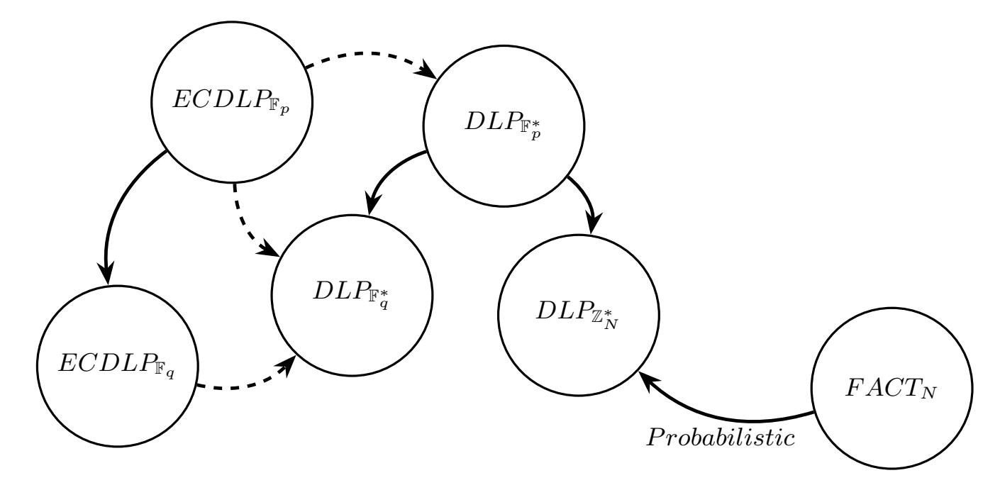
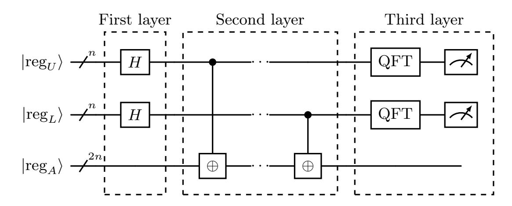
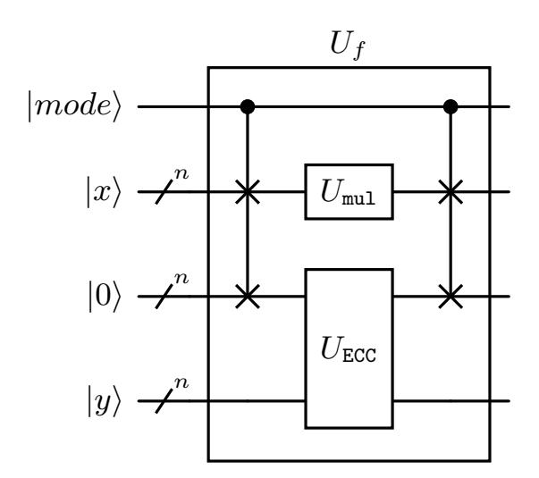

{0}------------------------------------------------

# One for All, All for One: Universal semi-agnostic quantum circuit for solving (Standard) Abelian Hidden Subgroup Problems

Michał Wroński1[0000−0002−8679−9399], Łukasz Dzierzkowski2[0000−0002−9204−4558], Mateusz Leśniak1[0009−0001−0092−2975], and Ewa Syta3[0000−0003−0860−0927]

1 NASK - National Research Institute, Kolska 12, 01-045 Warsaw, Poland michal.wronski@nask.pl, mateusz.lesniak@nask.pl 2 Military University of Technology, 00-908 Warsaw, Sylwestra Kaliskiego 2, 01-045 Warsaw, Poland lukasz.dzierzkowski@wat.edu.pl

3 Trinity College, Hartford, CT, USA ewa.syta@trincoll.edu

Abstract. Quantum algorithms for factoring, finite-field discrete logarithms (DLP), and elliptic-curve discrete logarithms (ECDLP) are usually presented as three separate attack pipelines, even though all three are instances of the Abelian Hidden Subgroup Problem (AHSP). We prove that the semi-agnostic elliptic-curve discrete logarithm problem

(semi-agnostic ECDLP), defined on smooth elliptic curves, singular nodal cubics, and over rings such as ZN , is complete for all standard abelian hidden subgroup problems (SAHSPs). In other words, factoring, finitefield DLP, and ECDLP all reduce to semi-agnostic ECDLP. This gives the first completeness theorem for the cryptographic subclass of HSP. To argue minimality from the practical point of view (for example, the minimal size of Shor's circuit implementation), we formalize the No Efficient Injective Homomorphism (NEIH) hypothesis: no generic polynomial-time injective homomorphism exists from elliptic curve subgroups into small cyclic groups. NEIH is strongly supported by three provable limitations: (i) the embedding-degree barrier, (ii) an algebraic rigidity lemma, and (iii) a generic-group model barrier, ruling out nonalgebraic embeddings without already solving the ECDLP.

The completeness result has practical implications, as it identifies a minimal universal Shor engine: a single, programmable Weierstrass circuit that implements reversible field arithmetic and point addition on a smooth or nodal Weierstrass model. This one circuit instance suffices to execute Shor's algorithm for factoring, finite-field DLP, and ECDLP without recompilation and with the same asymptotic resources as specialized designs.

# 1 Introduction

Modern classical public-key cryptography is built on the presumed hardness of three cornerstone problems: integer factorization (RSA [\[17\]](#page-19-0)), the discrete logarithm problem in finite fields (Diffie–Hellman [\[4\]](#page-18-0)), and the elliptic-curve discrete 

{1}------------------------------------------------

logarithm problem (ECC [11,8]). Each of these problems can be formulated as an instance of the *abelian hidden subgroup problem* (AHSP), and together they form what we refer to as the *standard AHSPs* (SAHSPs): factoring, finite-field DLP, and ECDLP.

Shor's algorithm [19] solves all SAHSPs in polynomial time on a quantum computer. Current implementations, however, remain fragmented: circuits for RSA and finite-field DLP are built around modular exponentiation, whereas circuits for ECDLP rely on reversible point addition. This separation complicates verification, benchmarking, and deployment, and it obscures the shared algebraic structure underlying all three problems.

In the quantum setting, the security of ECDLP, factoring, and finite-field DLP should be compared on the basis of modulus length for RSA and DLP and on the basis of field size for ECDLP. In the classical setting, DLP and factoring are considered easier than ECDLP because index calculus methods are highly effective against multiplicative groups and RSA moduli. Under quantum algorithms, however, these advantages disappear: Shor's algorithm solves all three problems in polynomial time, rendering index calculus irrelevant. As a result, quantum security is governed uniformly by bitlength rather than by the classical separation between RSA, DLP, and elliptic curves.

Unified approach. We show that a single primitive, the semi-agnostic ECDLP, suffices to capture all SAHSPs. Following this approach, algorithms operate directly on explicit Weierstrass models, either smooth or nodal, defined over fields or rings, without relying on knowledge of the group order. Over finite fields, nodal cubics realize  $\mathbb{F}_q^*$  as a subgroup of  $E(\mathbb{F}_q)$ ; over  $\mathbb{Z}_N$ , undefined denominators naturally reveal factors of N. Thus every SAHSP instance reduces uniformly to semi-agnostic ECDLP.

Minimality and NEIH. We prove that

SAHSP 
$$=_T^P$$
 semi-agnostic ECDLP,

where  $A =_T^P B$  means that each problem can be reduced to the other in polynomial time by a Turing reduction.

We also formalize the No Efficient Injective Homomorphism (NEIH) hypothesis, which states that there is no generic polynomial-time algorithm that constructs an injective homomorphism from elliptic subgroups to small multiplicative groups that can be efficiently computed. NEIH is strongly supported by three probable limitations: (i) the **embedding-degree barrier**, which shows that pairings require  $\mathbb{F}_{q^k}^*$  with  $k \geq k_E(r)$ , typically exponential (for  $k_E(r)$  being an embedding degree, defined in Section 5.1); (ii) the **algebraic rigidity lemma**, which proves that any algebraic morphism  $E \to \mathbb{G}_m$  is constant so that pairings on torsion are the only available algebraic route; and (iii) the **generic-group barrier**, which rules out any non-algebraic embedding without already solving the ECDLP. Taken together, these barriers explain why no efficient reduction from ECDLP to DLP is possible.

{2}------------------------------------------------

Practical impact: the minimal Shor engine. Our completeness result shows that a single reversible arithmetic block, consisting of field or ring arithmetic together with Weierstrass addition (including the nodal specialization), is sufficient to instantiate Shor's algorithm for factoring, finite-field DLP, and ECDLP. In particular, a circuit that supports reversible addition, multiplication, and inversion over  $\mathbb{F}_p$  and  $\mathbb{Z}_N$ , together with table-free point addition and doubling on a Weierstrass model that degenerates to  $y^2 = x^3 + x^2$ , constitutes the first minimally universal circuit for all SAHSPs. This design eliminates the need for recompilation and achieves the best known asymptotic resource bounds for each problem.

Contributions.

- Completeness theorem. We show that every SAHSP instance reduces to the semi-agnostic ECDLP, establishing it as a *complete problem* for the class.
- Minimality under NEIH. Under the NEIH hypothesis, semi-agnostic DLP is strictly weaker:

semi-agnostic DLP 
$$<_T^P$$
 semi-agnostic ECDLP.

This gives the first principled separation between finite-field DLP and ECDLP.

- **Supporting barriers.** We identify three barriers: embedding-degree lower bounds, algebraic rigidity, and the generic-group model (GGM) barrier that together explain why no efficient embedding exists beyond pairings.
- **Equivalence**. We prove the equivalence

SAHSP 
$$=_T^P$$
 semi-agnostic ECDLP,

through explicit reductions: nodal-cubic embeddings for  $\mathbb{F}_q^*$  and a CRT/Hensel argument combined with factoring for ring instances.

- Universal circuit. We construct a universal Weierstrass circuit that implements Shor's algorithm for factoring, finite-field DLP, and ECDLP within a single programmable design, matching the best known asymptotics while eliminating the need for recompilation.

*Impact.* Conceptually, our results establish the semi-agnostic ECDLP as the natural *minimal complete problem* for the SAHSP class. Practically, they provide a foundation for universal quantum cryptanalytic engines, reinforcing the urgency of transitioning to post-quantum cryptographic standards.

# 2 Related Work

In this section, we review the related work and explain our contributions in the context of prior research. Our work unifies all standard abelian hidden subgroup problems (SAHSPs) via a single semi-agnostic ECDLP solver, implemented as a reconfigurable quantum circuit. Consequently, the most relevant prior works fall into two previously unconnected areas.

{3}------------------------------------------------

**Reductions among SAHSPs.** Reductions of *some* abelian problems to others (e.g., factoring  $\rightarrow$  DLP or ECDLP  $-\rightarrow$  finite field DLP).

**Problem-specific quantum circuits.** Implementations and cost analyses of Shor's algorithm tailored to one problem class at a time (e.g., factoring, finite field DLP, or ECDLP).

We summarize each line of work below and describe how our contributions relate to both. For completeness, formal definitions of HSP, AHSP and SAHSP are in Section 3.

### 2.1 Reductions among SAHSPs

Several known reductions among SAHSPs are illustrated in Fig. 1. Solid arrows represent classical polynomial-time reductions, while dashed arrows denote reductions based on bilinear pairing.

- Field-restriction reductions. Any instance of ECDLP or finite field DLP over  $\mathbb{F}_p$  can be reduced to the same problem over a  $\mathbb{F}_q$  when  $q = p^k$  (arrows  $ECDLP_{\mathbb{F}_p} \to ECDLP_{\mathbb{F}_q}$  and  $DLP_{\mathbb{F}_p^*} \to DLP_{\mathbb{F}_q^*}$ ).
- MOV-type embeddings. The Menezes-Okamoto-Vanstone reduction [9] embeds ECDLP into a finite field DLP via pairings (arrows  $ECDLP_{\mathbb{F}_q} \dashrightarrow DLP_{\mathbb{F}_q^*}$ ,  $ECDLP_{\mathbb{F}_q} \dashrightarrow DLP_{\mathbb{F}_q^*}$ ). In practice, this only applies to special "pairing-friendly" curves. No reduction is currently known in the reverse direction.
- Bach's reductions. Bach [2] showed that solving DLP in  $\mathbb{Z}_N^*$  suffices to factor N (arrow  $FACT_N \underset{probabilistic}{\rightarrow} DLP_{\mathbb{Z}_N^*}$ ) in probabilistic polynomial time, and also suffices to solve DLP over  $\mathbb{F}_p^*$  via the Pohlig–Hellman lift [15] ( $DLP_{\mathbb{F}_p^*} \rightarrow DLP_{\mathbb{Z}_N^*}$ ).

Limitations of prior reductions. Existing reductions among SAHSPs are typically one-directional. While they demonstrate that some problems in the class can be reduced to others under specific conditions, no prior work identifies a single algorithmic core that uniformly realizes all SAHSPs without problem-specific circuitry.

Our contribution. In Sections 4 and 6, we show that ECDLP in the semi-agnostic model suffices for all SAHSP instances via explicit embeddings (including singular models). This collapses many specialized routes into a single schedule and yields a practical universal circuit.

### 2.2 Problem-specific quantum circuits

Quantum circuit implementations of Shor's algorithm have been studied extensively in the context of specific problems such as factoring, DLP, and ECDLP. These circuits typically rely on two costly components: modular exponentiation

{4}------------------------------------------------

Fig. 1: Known reductions between distinct SAHSPs.

Table 1: Resources required for specific circuits.

| Problem                                   | n    | Qubits | Gates                |
|-------------------------------------------|------|--------|----------------------|
| Elliptic curve discrete logarithm problem | 192  | 1754   | $5.30\cdot10^{10}$   |
|                                           | 256  | 2330   | $1.26\cdot 10^{11}$  |
|                                           |      |        | $1.14 \cdot 10^{12}$ |
| Factoring of RSA modulus                  | 512  | 1026   | $6.41 \cdot 10^{10}$ |
|                                           |      |        | $5.81 \cdot 10^{11}$ |
|                                           | 2048 | 4098   | $5.20 \cdot 10^{12}$ |

for RSA and DLP, and reversible point addition for ECDLP. The most efficient circuit designs for each are as follows. The Table 1 presents resource estimates for selected sample n, based on [18,5].

- Modular exponentiation. Häner et al. [5] proposed circuit for factorization using modular multiplication, requiring 2n+1 qubits and  $64n^3 \log_2 n + \mathcal{O}(n^3)$  gates, for an n-bit modulus.
- Reversible point addition. Roetteler et al. [18] proposed circuit for ECDLP on Weierstrass curves using affine coordinates, requiring  $9n + 2\lceil \log_2 n \rceil + 10$  qubits and  $448n^3 \log_2 n + \mathcal{O}(n^3)$  gates. In [6] Häner et al. proposed three improved circuits optimized for the number of qubits, number of gates and circuit depth.

Limitations of prior circuit designs. Existing circuit designs are tightly coupled to specific problems. For instance, a modular exponentiation circuit optimized for RSA cannot be repurposed to support ECDLP. As a result, executing multiple cryptanalytic tasks on the same quantum hardware typically requires distinct circuits or substantial redesign effort.

{5}------------------------------------------------

Our contribution. In Section 6, we refactor such specialized circuits into a parameterized, universal quantum circuit. Our circuit performs modular arithmetic over  $\mathbb{Z}_N$  and  $\mathbb{F}_p$ , supports point addition on both ordinary and singular elliptic curves, and uses runtime-configurable control logic to adapt to any SAHSP instance. The reconfigurability incurs only polynomial overhead, which is asymptotically negligible compared to maintaining dedicated circuits for individual problems.

### 3 Preliminaries

We recall the hidden subgroup problem (HSP) and its abelian variant (AHSP), then give a formalization of the *standard abelian HSP (SAHSP)* encodings used in cryptography (factoring, finite-field DLP, ECDLP). Finally, we state the two algorithmic models we work with: *black-box (agnostic)* and *semi-agnostic*.

### 3.1 HSP and AHSP

**Definition 1 (Hidden Subgroup Problem (HSP)).** Let G be a finite group and X a finite set. An oracle  $f: G \to X$  hides a subgroup  $H \le G$  if f is constant on left cosets of H and distinct on different cosets:

$$f(g_1) = f(g_2) \iff g_1 H = g_2 H.$$

The HSP is: given access to oracle f, recover (generators for) H.

### 3.2 Standard abelian HSP (SAHSP)

Many cryptographic problems solved by the Shor's algorithm are instances of AHSP once G and hiding oracle f are specified. We group the canonical encodings below; each fits the HSP definition (domain G is the group in which the hidden subgroup lives, not merely the group on which an external computation is performed).

(1) Integer factorization (order-finding). Fix composite  $N \geq 2$  and a base  $a \in \mathbb{Z}_N^*$  with (unknown) order  $r = \operatorname{ord}_N(a)$ . Let M be any multiple of r (e.g., set  $M = 2^m$  with  $m \geq 2n + O(1)$  for an n-bit N). Define

$$G = \mathbb{Z}_M, \qquad f(x) = a^x \mod N.$$

Then  $f(x) = f(y) \iff x \equiv y \pmod{r}$ , so f hides  $H = \langle r \rangle \leq \mathbb{Z}_M$ . Recovering r yields factors of N by standard post-processing.

(2) Finite-field DLP. Let  $\mathbb{F}_p^*$  be cyclic of order p-1, g a generator, and  $h=g^d$  with unknown d; let  $r=\operatorname{ord}(g)$ . Define

$$G = \mathbb{Z}_r \times \mathbb{Z}_r, \qquad f(x, y) = g^x h^y \in \mathbb{F}_p^*.$$

Then f hides the cyclic subgroup  $H = \langle (d, -1) \rangle \leq \mathbb{Z}_r \times \mathbb{Z}_r$ . Recovering H reveals d (up to r), since (d, -1) generates the kernel of  $(x, y) \mapsto g^x h^y$ .

{6}------------------------------------------------

(3) Elliptic-curve DLP (ECDLP). Let  $E/\mathbb{F}_q$  and  $P \in E(\mathbb{F}_q)$  have prime order r, and let Q = [d]P. Define

$$G = \mathbb{Z}_r \times \mathbb{Z}_r, \qquad f(x,y) = [x]P + [y]Q \in E(\mathbb{F}_q).$$

Then f hides the cyclic subgroup  $H = \langle (d, -1) \rangle$ . Recovering H again yields  $d \pmod{r}$ .

**Definition 2 (SAHSP** — **Standard abelian HSP).** The class SAHSP consists of AHSP instances arising from the canonical cryptographic encodings above (and close variants with the same hidden subgroup). An algorithm that solves SAHSP solves, in particular, integer factorization, the finite-field DLP, and the elliptic-curve DLP.

Remark 1 (On domains and finiteness). Shor's period-finding can be presented over  $\mathbb{Z}$ ; for the HSP formalization we restrict to a finite cyclic  $G = \mathbb{Z}_M$  with M a multiple of the order, which preserves the same hidden subgroup. For DLP/ECDLP, restricting to a prime-order subgroup is standard and yields  $G = \mathbb{Z}_r \times \mathbb{Z}_r$ .

### 3.3 Algorithmic models: black-box (agnostic) vs. semi-agnostic

Notation for the group domain. Given a Weierstrass cubic C/R (smooth or singular), write  $C^{ns}(R)$  for its nonsingular R-points and let  $C^{grp}(R) \subseteq C^{ns}(R)$  denote the subset on which the chord–tangent addition law is defined and closed. Over fields this is  $C^{grp}(R) = C^{ns}(R)$  with identity the (smooth) point at infinity. Over rings (e.g.,  $R = \mathbb{Z}_N$ ) we further restrict to inputs for which all denominators that appear in the addition/doubling formulas are units in R; whenever a denominator is a non-unit, a nontrivial  $gcd(\cdot, N)$  is returned ("factoring by failure").

We isolate the minimal assumptions our algorithms make about the input structure and oracles.

Definition 3 (Black-box abelian group model (agnostic algorithm)). An agnostic algorithm for AHSP works in the black-box group model: it receives (i) uniform encodings of elements of a finite abelian group G, (ii) oracles for equality and group operations (multiplication/inversion or addition/negation), and (iii) oracle access to  $f: G \to X$  that hides a subgroup  $H \leq G$ . The algorithm may not assume any presentation of G beyond these oracles.

**Definition 4 (Semi-agnostic ECDLP solver).** A semi-agnostic ECDLP solver is an algorithm that, given an explicit model of a (possibly singular) Weier-strass cubic C over a base ring/field R (e.g.,  $R = \mathbb{F}_q$  or  $R = \mathbb{Z}_N$ ), together with a well-defined group law  $\oplus$  on a specified subset  $C^{\text{grp}}(R)$ , solves:

Given 
$$P, Q \in C^{grp}(R)$$
 with  $Q = [x]P$ , recover  $x \mod \operatorname{ord}(P)$ .

Crucially, the solver:

{7}------------------------------------------------

- does not require a priori knowledge of #C grp(R), its factorization, or a decomposition of C grp(R);
- may operate over rings (e.g., R = ZN ) without knowing the factorization of N;
- relies only on the explicit arithmetic of the given model (addition/doubling formulas where defined), i.e., it is semi-agnostic to structure beyond the provided law ⊕ and its domain of definition.

Remark 2 (Well-defined instances and domain of definition). All inputs P, Q must lie in the declared group domain C grp(R) where ⊕ is closed and efficiently computable (e.g., the nonsingular locus with the point at infinity as identity for a split nodal cubic). When working over rings, the algorithm rejects or sanitizes points for which the formulas are undefined (e.g., denominator non-units), which is standard in ECDLP over rings.

Summary. The SAHSP encodings above align each cryptographic task with a bona fide AHSP instance on the right domain group G, and the two models separate the fully black-box setting from our semi-agnostic setting, where one uses explicit (possibly singular) Weierstrass models without assuming group-order information.

# 4 Semi-agnostic model and singular-cubic arithmetic

Throughout, K denotes a commutative base ring (typically a field Fq of characteristic p > 3 or the ring ZN ), and all equalities are in K unless stated otherwise.

### 4.1 Algorithmic models: black-box vs. semi-agnostic

Remark 3 (On Black-box abelian group model (agnostic algorithm)). See Definition [3.](#page-6-0)

Remark 4 (On Semi-agnostic ECDLP solver). See Definition [4.](#page-6-1)

Remark 5 (Domain of definition over rings). Over a ring K = ZN , we restrict to the subset C grp(K) where the rational formulas defining ⊕ have all denominators in K∗ . Whenever a denominator fails to be a unit, we detect and report this (e.g., by a nontrivial gcd), which can be used to factor N in our reductions. Thus the algorithm never "operates on an ill-defined instance".

#### 4.2 The nodal cubic E : y 2 = x 3 + x 2 and its group law

Consider the affine plane cubic

$$E: y^2 = x^3 + x^2 = x^2(x+1).$$

{8}------------------------------------------------

Let F(x, y) = y 2 − x 3 − x 2 . Then the partial derivatives are

$$\frac{\partial F}{\partial x} = -3x^2 - 2x, \qquad \frac{\partial F}{\partial y} = 2y.$$

The only common zero of F, ∂F ∂x , ∂F ∂y over K is (x, y) = (0, 0).

Lemma 1 (Singularity and type). The point (0, 0) is the unique singular point of E. Over any K of characteristic ̸= 2, 3 it is an ordinary double point (a node), with distinct tangent directions y = ±x.

Write Ens for the nonsingular locus of E. We use the standard rational parametrization of Ens by the parameter t ∈ P 1 \ {±1}:

$$P(t) = (x(t), y(t)) = (t^2 - 1, t(t^2 - 1)),$$

where t = ±1 map to the node (0, 0), and t = ∞ maps to the point at infinity (which we take as the identity).

A parameter that linearizes the group law is

$$\psi: \mathbb{P}^1 \setminus \{t = -1\} \longrightarrow K \cup \{\infty\}, \qquad \psi(t) = \frac{t - 1}{t + 1}.$$
 (1)

Its inverse on K \ {1} is t = (1 + u)/(1 − u). Substituting yields the birational map

$$\Phi: K \setminus \{1\} \longrightarrow E^{\mathrm{ns}}(K), \quad \Phi(u) = \left(\frac{4u}{(1-u)^2}, \frac{4u(1+u)}{(1-u)^3}\right), \tag{2}$$

with u = 1 the identity.

Proposition 1 (Group structure on Ens). Let K be a field of characteristic ̸= 2, 3. Then (Ens(K), ⊕) with the chord–tangent law and identity the point at infinity is canonically isomorphic to K∗ via Φ:

$$\Phi(uv) = \Phi(u) \oplus \Phi(v)$$
, with  $u = 1$  mapping to the identity.

Proof. If a line meets E at three affine points P(t1), P(t2), P(t3) (counting multiplicities), then

$$\psi(t_1)\psi(t_2)\psi(t_3)=1.$$

This is checked by substituting x(t), y(t) into the line equation ax + by + c = 0, yielding a cubic polynomial in t whose Vieta relations imply Q (ti−1) = Q (ti+1). Reflection across the x-axis corresponds to t 7→ −t and satisfies ψ(−t) = 1/ψ(t). Consequently, the group law defined by

$$P(t_1) \oplus P(t_2) = P(-t_3)$$

is transported by ψ into multiplication:

$$\psi(\text{parameter of }P(t_1)\oplus P(t_2))=\psi(t_1)\psi(t_2).$$

{9}------------------------------------------------

Doubling. For a tangent at P(t) intersecting again at  $t_3$ , one obtains

$$\psi(-t_3) = \psi(t)^2.$$

Thus the doubling law also matches multiplicative structure.

Using the "three collinear points" identity and the involution  $t \mapsto -t$  corresponding to  $y \mapsto -y$ , one derives  $\psi(t_1)\psi(t_2)\psi(t_3) = 1$  whenever  $P(t_1), P(t_2), P(t_3)$  are collinear (with multiplicity). Translating via (2) yields multiplicativity.

Remark 6 (Over a ring). When  $K = \mathbb{Z}_N$ , formulas (2) define a (partial) map provided all denominators are units. Restrict to

$$K_{(1)}^* = \{ u \in \mathbb{Z}_N^* : 1 - u \in \mathbb{Z}_N^* \}.$$

On this set  $\Phi(uv) = \Phi(u) \oplus \Phi(v)$ . If a denominator is not a unit,  $gcd(\cdot, N) > 1$  yields a nontrivial factor of N.

Remark 7 (On subgroup status of  $K_{(1)}^*$ ). Formally, the set

$$K_{(1)}^* = \{ u \in \mathbb{Z}_N^* : 1 - u \in \mathbb{Z}_N^* \}$$

is not a subgroup of  $\mathbb{Z}_N^*$ , since it excludes the identity element u=1 and closure may fail for certain products (e.g. when  $uv\equiv 1\pmod N$ ). In our setting this corner case is harmless: u=1 corresponds to the identity on the nodal cubic, which can be handled separately in all reductions.

### 4.3 Finite-field DLP $\leq$ semi-agnostic ECDLP

Let  $K = \mathbb{F}_q$ ,  $G = \mathbb{F}_q^* = \langle g \rangle$  cyclic of order q - 1, and define  $\Phi$  as in (2) on  $K^*$ .

Theorem 1 (Finite-field DLP reduces to semi-agnostic ECDLP). Given  $(g, h = g^x) \in \mathbb{F}_q^*$ , set  $P = \Phi(g)$  and  $Q = \Phi(h) \in E^{ns}(\mathbb{F}_q)$ . Then Q = [x]P in  $(E^{ns}(\mathbb{F}_q), \oplus)$ . Hence any semi-agnostic ECDLP solver (Def. 4) returns  $x \mod (P)$  in polynomial time in  $\log q$ .

*Proof.* Over  $\mathbb{F}_q$  with char $(\mathbb{F}_q) > 3$ , the map

$$\psi(t) = \frac{t-1}{t+1}, \qquad \Phi(u) = \left(\frac{4u}{(1-u)^2}, \frac{4u(1+u)}{(1-u)^3}\right)$$

gives an isomorphism  $(\mathbb{F}_q^*,\cdot) \simeq (E^{\mathrm{ns}}(\mathbb{F}_q),\oplus)$ , sending u=1 to the identity (the point at infinity). Hence

$$Q = \Phi(h) = \Phi(g^x) = [x] \Phi(g) = [x]P.$$

Any semi-agnostic ECDLP solver that returns  $x \mod \operatorname{ord}(P)$  thus recovers the DLP exponent  $x \pmod{q-1}$ . This reduction runs in time polynomial in  $\log q$  and excludes only trivial cases where  $g \in \{1, -1\}$ .

{10}------------------------------------------------

### 4.4 Working over $\mathbb{Z}_N$ : domain, failure modes, and factoring

Proposition 2 (Partial multiplicative embedding on a large subset of  $\mathbb{Z}_N^*$ ). Let  $K = \mathbb{Z}_N$  and  $D := K_{(1)}^* = \{u \in \mathbb{Z}_N^* : 1 - u \in \mathbb{Z}_N^*\}$ . The map  $\Phi: D \dashrightarrow C^{grp}(K)$  is a partial multiplicative embedding in the following sense: for all  $u, v \in D$  such that  $uv \in \mathbb{Z}_N^*$  and  $1 - uv \in \mathbb{Z}_N^*$ , we have

$$\Phi(uv) = \Phi(u) \oplus \Phi(v).$$

Equivalently,  $\Phi$  is a homomorphism on any multiplicatively closed subset  $S \subseteq D$ . Moreover, during the evaluation of  $\Phi(\cdot)$  or of the group law  $\oplus$  on  $C^{grp}(K)$ , if a required denominator is not a unit, then  $\gcd(\operatorname{denominator}, N) > 1$  yields a nontrivial factor of N ("factoring by failure").

# Proposition 3 (Factoring via semi-agnostic ECDLP on the nodal curve over $\mathbb{Z}_N$ ).

Recall the factorization problem as defined in Section 3.2. In the semi-agnostic ECDLP setting, the corner case  $1 \in \mathbb{Z}_N$  does not map to a valid point on the nodal cubic  $E: y^2 = x^3 + x^2$  over  $\mathbb{Z}_N$ , so the reduction cannot proceed via the trivial encoding h = 1, for  $g^r \equiv h \pmod{N}$ . Instead, consider the two-variable hiding function

$$f(x,y) = g^x g^y \equiv g^{x+y} \pmod{N},$$

which defines an instance of the standard abelian HSP.

Running Shor's algorithm on this instance yields samples (x, y) such that  $x + y \equiv 0 \pmod{\operatorname{ord}_N(g)}$ . The two complementary routes then lead to factorization:

- (i) Projective check. Compute classically  $Q = [x + y]\Phi(g)$  in projective coordinates on  $E/\mathbb{Z}_N$ . If the Z-coordinate of Q satisfies  $\gcd(Q_Z, N) > 1$ , then with non-negligible probability in  $\log N$  a nontrivial factor of N is obtained ("factoring by failure"). In practice, when computing multiples in affine/projective coordinates, non-unit denominators or normalization factors can reveal factors ('ECM-style factoring-by-failure'). This is an implementation advantage, not part of the formal reduction.
- (ii) Order recovery. Collect a set of samples  $S = \{(x_1, y_1), \ldots, (x_\ell, y_\ell)\}$  and form the integers  $k_i = x_i + y_i$ . Then  $\gcd(k_i, k_j)$  for distinct i, j yields (with overwhelming probability after  $O(\log n)$  samples) the exact order  $\operatorname{ord}_N(g)$  or a multiple thereof. From  $\operatorname{ord}_N(g)$ , one extracts a nontrivial factor of N via the standard Shor post-processing step  $\gcd(g^{r/2} \pm 1, N)$ .

Summary. The nonsingular locus of  $y^2 = x^3 + x^2$  (point at infinity as identity) is a copy of  $\mathbf{G}_m$ , via (2). This yields a uniform reduction of finite-field DLP to ECDLP on E, and a ring version over  $\mathbb{Z}_N$  with domain-of-definition guarantees and useful failure modes.

{11}------------------------------------------------

#### Transformation to short Weierstrass form 4.5

For compatibility with standard cryptographic tools, E can be written in short Weierstrass form by shifting  $X = x + \frac{1}{3}$ , Y = y (over fields of characteristic  $\neq 3$ or rings where 3 is a unit), yielding

$$E_2: Y^2 = X^3 - \frac{1}{3}X + \frac{2}{27}.$$

This preserves intersection multiplicaties and the chord-tangent law, so the  $\psi$ -multiplicativity carries over unchanged.

#### Empirical validation 4.6

We implemented the embedding in SageMath [22]. The implementation may be found in [1]. Two use cases were verified:

- 1. Cryptanalysis: DLP instances in  $\mathbb{F}_p^*$  mapped into  $E(\mathbb{F}_p)$  and solved via brute force or Pollard's  $\rho$  on E.
- 2. Cryptography: Exponentiation  $g^x$  realized as  $[x]\Phi(g)$  on E, then mapped back with  $\psi$ .

In all experiments the  $\psi$ -multiplicativity law held, and failures over  $\mathbb{Z}_N$  consistently revealed nontrivial factors.

#### Section summary 4.7

The nodal cubic  $y^2 = x^3 + x^2$  provides an explicit, rigorous realization of the isomorphism  $E^{\rm ns} \cong \mathbf{G}_m$ . The  $\psi$  map transports chord-tangent addition into multiplicative structure, with doubling handled seamlessly. Over  $\mathbb{F}_q$  this yields a clean reduction of  $DLP_{\mathbb{F}_q^*}$  to  $ECDLP_{\mathbb{F}_q}$ ; over  $\mathbb{Z}_N$  it provides factoring-byfailure. These details justify the reductions assumed in Sec. 4 and the hardness separations in Sec. 5.

#### Minimality of Semi-Agnostic ECDLP 5

This section shows that the *semi-agnostic ECDLP* oracle (Def. 4) is the right abstraction for SAHSP: it is complete for the class and functionally minimal in the sense defined below. Throughout, we write " $\hookrightarrow$ " for injective homomorphisms.

**Definition 5 (Functional minimality).** Let C be a problem class (here: SAHSP). An oracle  $\mathcal{O}$  is a functionally minimal complete oracle for  $\mathcal{C}$  if

- 1. (Completeness)  $C \leq_T^P \mathcal{O}$  any problem from C may be solved with  $\mathcal{O}$ ; 2. (Equivalence)  $\mathcal{O} \leq_T^P C$  being able to solve any problem from C allows one to realize functionality of  $\mathcal{O}$ , hence  $\mathcal{C} =_T^P \mathcal{O}$ ;
- 3. (Irreducibility) for any strict restriction  $\mathcal{O}'$  obtained by removing one allowed instance family from the domain of  $\mathcal{O}$ , we have  $\mathcal{C} \nleq_T^P \mathcal{O}'$ .

{12}------------------------------------------------

Scope of the oracle. By Def. 4, the semi-agnostic ECDLP oracle covers:

- (i) smooth elliptic curves over finite fields  $\mathbb{F}_q$ ;
- (ii) the nodal cubic  $y^2 = x^3 + x^2$  over  $\mathbb{F}_q$  (with the standard  $\psi/\Phi$  parametrization);
- (iii) the same nodal cubic over  $\mathbb{Z}_N$ , evaluated on its unit domain.

We show that these three families are sufficient and jointly necessary for SAHSP-completeness.

### 5.1 Definitions and Hypothesis

Let  $q = p^e$ ,  $E/\mathbb{F}_q$  be an elliptic curve, and let  $r \mid \#E(\mathbb{F}_q)$  be prime. The *embedding degree* is

$$k_E(r) = \min\{k \ge 1 : r \mid (q^k - 1)\} = \operatorname{ord}_r(q).$$

**Definition 6 (Semi-agnostic DLP).** Oracle access to the discrete logarithm problem in explicit cyclic groups of size at most poly(q), e.g. in  $\mathbb{Z}_N^*$  and  $\mathbb{F}_{q^n}^*$  for  $N, q^n \leq poly(q)$ , with efficient encodings and group operations.

Definition 7 (NEIH — No Efficient Injective Homomorphism Hypothesis). There exist infinitely many pairs  $(E/\mathbb{F}_q, P)$  such that for no  $A \in \{\mathbb{Z}_N^*, \mathbb{F}_s^*\}$  with  $|A| \leq \text{poly}(q)$  does there exist a ppt algorithm that constructs and efficiently evaluates an injective homomorphism

$$\phi: \langle P \rangle \hookrightarrow A,$$

where  $\langle P \rangle$  denotes the cyclic subgroup of  $E(\mathbb{F}_q)$  generated by P.

### 5.2 Algebraic Rigidity and Pairings

**Lemma 2 (Algebraic rigidity).** Let k be a field, E/k an elliptic curve (or abelian variety), and  $\mathbb{G}_m$  the multiplicative group. Then any algebraic group morphism  $\varphi: E \to \mathbb{G}_m$  is constant.

*Proof.* As an abelian variety, E is proper over k, while  $\mathbb{G}_m$  is affine. Any morphism from a proper variety to an affine variety is constant (e.g., [7, Prop. I.5.1]; see also [12]). Hence  $\operatorname{Hom}_{\operatorname{alg-groups}}(E, \mathbb{G}_m) = 0$ .

Theorem 2 (Pairings as the only algebraic route). An algebraic morphism  $\phi: E(k) \to \mathbb{F}_s^*$  can exist only if  $\operatorname{char}(k) = \operatorname{char}(\mathbb{F}_s)$ . For injectivity on a subgroup  $\langle P \rangle$  of order r, one requires  $r \mid (s-1)$ ; since  $r \simeq q$ , this forces  $s = q^k$  with  $k \geq k_E(r)$ . Such nontrivial algebraic maps are bilinear pairings

$$e_r: E[r] \times E[r] \longrightarrow \mu_r \subset \mathbb{F}_{q^k}^*,$$

and necessarily incur the embedding-degree cost  $k \geq k_E(r)$ . For many curves  $k_E(r) \approx r$ , so  $|\mathbb{F}_{q^k}^*|$  is exponential in q.

{13}------------------------------------------------

### 5.3 Generic-Group Model Barrier

**Theorem 3 (Generic-group Model barrier).** Let  $G = \langle P \rangle \subseteq E(\mathbb{F}_q)$  be cyclic of prime order  $r \simeq q$  in the generic group model [13,20]. Let  $\{A_i\}$  be any polynomial-size family of explicit cyclic groups with  $|A_i| \leq \text{poly}(q)$  and efficient DLP. Then no polynomial-time algorithm outputs an injective, efficiently evaluable homomorphism  $\phi: G \hookrightarrow A_i$  for any  $A_i$ .

*Proof.* If such  $\phi$  existed, then given Q = [x]P one could compute  $\phi(P)$ ,  $\phi(Q)$  and solve  $\log_{\phi(P)}(\phi(Q))$  in  $A_i$  efficiently. This contradicts the  $\Omega(\sqrt{r})$  lower bound for generic DLP algorithms [21].

Corollary 1 (Strict separation under NEIH). Assuming NEIH,

semi-agnostic DLP  $<_T^P$  semi-agnostic ECDLP.

### 5.4 Ring-to-field reduction for ECDLP

Lemma 3 (ECDLP over  $\mathbb{Z}_N$  reduces to field ECDLP + factoring). Let  $N = \prod_i p_i^{e_i}$ . Any ECDLP instance Q = [x]P over  $E^{grp}(\mathbb{Z}_N)$  reduces in polynomial time to:

- 1. factoring N, and
- 2. solving ECDLP instances on the reductions  $E(\mathbb{F}_{p_i})$ .

*Proof.* By the Chinese remainder theorem,  $E^{grp}(\mathbb{Z}_N) \cong \prod_i E^{grp}(\mathbb{Z}_{p_i^{e_i}})$ . Each factor reduces to  $E(\mathbb{F}_{p_i})$  plus at most  $e_i - 1$  p-adic lifts. Factoring N is obtained either explicitly or via gcd failures when denominators are non-units. Thus all  $\mathbb{Z}_N$  instances reduce to finite-field ECDLP plus factoring.

### 5.5 Minimal completeness and irreducibility

Theorem 4 (Minimal completeness). We have

SAHSP 
$$=_T^P$$
 semi-agnostic ECDLP.

Moreover, the three instance families (i)-(iii) covered by the semi-agnostic ECDLP are jointly necessary for SAHSP-completeness (unconditionally for (ii)-(iii), and under NEIH for (i)).

*Proof.* (SAHSP  $\leq_T^P$  oracle). Finite-field DLP reduces via the nodal-cubic embedding  $\Phi: \mathbb{F}_q^* \to E^{\mathrm{ns}}(\mathbb{F}_q)$  (Sec. 4.2); factoring reduces to DLP in  $\mathbb{Z}_N^*$  (Bach), and DLP in  $K_{(1)}^*$  reduces to the nodal cubic over  $\mathbb{Z}_N$ ; ECDLP over  $\mathbb{F}_q$  is solved directly on smooth curves.

 $(Oracle \leq_T^P SAHSP)$ . Any  $\mathbb{Z}_N$  instance reduces to factoring plus field ECDLP by Lemma 3; field instances are themselves SAHSP.

(Irreducibility). Dropping the nodal family over  $\mathbb{F}_q$  removes the route for finite-field DLP. Dropping the nodal family over  $\mathbb{Z}_N$  breaks the factoring chain. Dropping smooth curves over  $\mathbb{F}_q$  would force ECDLP to embed into multiplicative groups, contradicting NEIH.

{14}------------------------------------------------

Algorithm Usage (%) Main Use Cases Verified Source RSA (Integer Factorization) 15-30% Legacy TLS 1.2, PGP, S/MIME, legacy ECRYPT (CORDIS) PKI DLP over  $\mathbb{F}_p$ < 1%Legacy IPsec, government systems ECRYPT (CORDIS) ECDLP over  $\mathbb{F}_p$ 60-80%TLS 1.3, Signal, cryptocurrencies, SSH ECRYPT (CORDIS), crt.sh, Mozilla Telemetry ENISA 2023 DLP over  $\mathbb{F}_{2^n}$ 2-5%Smart cards, legacy hardware Smart cards, older embedded systems ECDLP over  $\mathbb{F}_{2^n}$ 2-5%ENISA 2023Post-Quantum Cryptography (PQC) < 0.1% Experimental in government, some cloud NIST PQC, IETF Hybrid KEM pilots

Table 2: Reference Table - Asymmetric Cryptography Usage (2025)

Practical corollary. Because the semi-agnostic ECDLP oracle suffices for all SAHSP instances, a single, programmable Weierstrass schedule (field/ring arithmetic + point addition with the nodal specialization) yields a minimal universal Shor engine for factoring, finite-field DLP, and ECDLP, with no asymptotic overhead versus specialized designs. Replacing the oracle by a strictly smaller one (e.g., semi-agnostic DLP) fails to capture ECDLP at comparable bitlengths under NEIH, so it cannot be universal at SAHSP scale.

# 6 Shor's Algorithm and Universal Reconfigurable Quantum Circuit for Cryptanalysis

We now show how Shor's SAHSP algorithm specializes to factoring, finite-field DLP, and elliptic-curve DLP in the semi-agnostic model, and we present a universal reconfigurable circuit that supports all of these instances.

### 6.1 Application of the Shor's algorithm

Table 2 presents current real-life applications of asymmetric cryptography, along with approximate usage percentages.

As shown in Table 2, field extensions are not needed to cover most real-world applications. Solving  $FACT_N$ ,  $DLP_{\mathbb{F}_p^*}$ , and  $ECDLP_{\mathbb{F}_p}$  already accounts for about 90% of current asymmetric algorithms deployments and will likely cover a large share of future use cases as well. Hence, our analysis is restricted to  $\mathbb{F}_p$ .

Shor's algorithm, introduced in [19], reduces these problems to order finding in finite abelian groups [16]. In general, the circuit for Shor's algorithm consists of three layers, as illustrated in Figure 2.

The structure of each layer depends on the problem under consideration. The first layer consists of three registers: the upper register  $\operatorname{reg}_U$  and the lower register  $\operatorname{reg}_L$ , to which the Hadamard gate is applied, together with an additional register  $\operatorname{reg}_A$  whose initial state and size depend on the specific problem. The second layer performs the group action by implementing the quantum transformation  $U_f$ . Depending on the problem, this transformation is realized either as a sequence of controlled modular multiplications or as controlled additions of points on an elliptic curve, denoted by  $\oplus$ . The third layer applies the Quantum Fourier Transform (QFT) to the upper and lower registers, followed by measurement.

{15}------------------------------------------------

The outcomes of these measurements are then processed classically to recover the final solution.

Fig. 2: Schematic Shor layout with an abstract arithmetic block  $\oplus$ .

**Factoring.** For factorization of an integer N with bitlength n, the algorithm uses a combined upper and lower register of size 2n, together with an additional register of size n [14]. Transformation  $U_f$  is defined as follows:

$$U_f: |x\rangle \mapsto |x, a^x \bmod N\rangle$$
.

Using the binary notation of the value x, we get sequence of controlled modular multiplications, by  $a^{2^i}$  [14,3].

**Finite-field discrete logarithm.** For solving discrete logarithm over finite fields algorithm uses upper, lower and additional register size of n bits. For  $\mathbb{F}_p^* = \langle g \rangle$  and  $h = g^d$ , transformation  $U_f$  is defined as follows:

$$U_f: |x,y\rangle \mapsto |x,y,g^x h^y\rangle$$
.

As with factorization, the transformation can be decomposed as a sequence of controlled modular multiplications, by  $g^{2^i}$  and  $h^{2^j}$ .

Elliptic-curve discrete logarithm. The algorithm for solving discrete logarithm on elliptic curves uses upper and lower n bit-registers and 2n-bit additional register which is supposed to hold results of point addition [6]. For Q = [d]P, transformation  $U_f$  is defined as follows:

$$U_f: |x,y\rangle \mapsto |x,y,[x]P + [y]Q\rangle$$
.

As for the two previous problems, this transformation can be decomposed as a sequence of controlled additions of precomputed doubles  $[2^i]P$  and  $[2^j]Q$  [16].

{16}------------------------------------------------

Fig. 3: Universal circuit for the hidden subgroup problem implementing a group operation.

### 6.2 Universal circuits for group operations

In this section we examine the construction of a universal Shor circuit capable of solving  $FACT_N$ ,  $DLP_{\mathbb{F}_p^*}$ , and  $ECDLP_{\mathbb{F}_p}$ . As described in the previous subsection, the circuits for these problems differ in the second layer, since each requires a distinct group operation.

To build a single circuit that solves all three problems without relying on three separate implementations, we need a universal  $U_f$  transformation. We compare our proposal for such a transformation with two baseline approaches that do not introduce unified arithmetic: static allocation of resources and dynamic switching between two arithmetic units. Our design, which we call the Universal Weierstrass Circuit, enables solving all three problems within a single framework based on Weierstrass cubic equation.

Approach 1: Static allocation with recompilation. In this approach, the number of qubits and gates is allocated according to the requirements of the most costly circuit. The resource demands are dominated by elliptic curve point addition. If the problem to be solved changes, the entire circuit must be recompiled using the preallocated resources.

Approach 2: Dynamic switching with controlled swaps. This approach uses controlled swap gates, known as Fredkin gates [10]. Figure 3 presents a schematic diagram of the proposed universal arithmetic circuit. The  $U_f$  transformation consists of two preloaded arithmetic blocks: modular multiplication  $U_{\text{mul}}$  [3,5] and point addition on an elliptic curve  $U_{\text{ECC}}$  [18,6]. The block selection is done by an additional qubit and a Fredkin gate. This approach requires  $n+1+|q_{\text{mul}}|+|q_{\text{ECC}}|$  qubits,  $\max\{D_{\text{mul}}, D_{\text{ECC}}\}$  depth and  $|G_{\text{mul}}|+|G_{\text{ECC}}|+2n$  gates. We denote |q| as number of qubits, D as depth of circuit and |G| as number of gates.

Our proposal. Universal Weierstrass Circuit. This approach allows each SAHSP problem to be solved using the same arithmetic. As described in Section 4

{17}------------------------------------------------

Table 3: Resource estimates for universal Shor circuits with parameter size n (bitlength of modulus or field size). Estimations from from [\[5,](#page-18-6)[18\]](#page-19-2).

| Circuit design                                                   | Qubits                  | Gates                 | Depth           |
|------------------------------------------------------------------|-------------------------|-----------------------|-----------------|
| Static allocation with recompilation                             | 9n + 2⌈log n⌉ + 10 448n | 3 3 log n + O(n | 3 ) O(n ) |
| Dynamic switching with controlled swaps 12n + 2⌈log n⌉ + 13 512n |                         | 3 3 log n + O(n | 3 ) O(n ) |
| Universal Weierstrass (Our proposal) 9n + 2⌈log n⌉ + 10 448n     |                         | 3 3 log n + O(n | 3 ) O(n ) |

only the addition of points on Weierstrass curves is required. It implements modular multiplication via nodal embeddings and supports ring arithmetic over ZN . Our circuit achieves:

- no asymptotic overhead vs. specialized circuits;
- simpler deployment across RSA, DH, and ECC;
- practical factoring-by-failure detection over ZN .

This circuit avoids a complete rearrangement of the arithmetic logic when changing the problem being solved; only the precomputed constants need to be updated. Moreover, our design does not require implementing two separate arithmetic circuits at the same time.

### 6.3 Complexity discussion

We now estimate the resources required for each of the approaches discussed. As noted in [\[18\]](#page-19-2), providing precise estimates is difficult, but the leading-order terms are sufficient to evaluate our solution. The estimates for modular multiplication are taken from [\[5\]](#page-18-6), while those for elliptic curve point addition are taken from [\[18\]](#page-19-2).

Table [3](#page-17-0) compares the resource requirements of the different approaches. Our Universal Weierstrass Circuit requires the same resources as static allocation with recompilation, but it eliminates the need for full recompilation, saving time when switching between different SAHSP instances. In contrast, dynamic switching between arithmetic circuits with Fredkin gates consumes significantly more resources: the Fredkin-switching circuit requires approximately 33% more qubits and approximately 14% more gates.

Summarizing, we showed that a single Universal Weierstrass Circuit suffices to for factoring, finite-field DLP, and ECDLP. This approach matches the resource requirements of recompilation while avoiding the time needed for a full recompilation. In addition, it requires significantly fewer resources than Fredkin switching with two preloaded arithmetic units.

# 7 Conclusions

We presented a unified framework showing that the semi-agnostic ECDLP suffices for all standard abelian hidden subgroup problems, with explicit realizations 

{18}------------------------------------------------

over fields and rings, including factoring-by-failure over ZN . We formalized the NEIH hypothesis and identified algebraic constraints that rule out encodings into Gm, providing structural evidence for a strict separation between the semiagnostic DLP and the semi-agnostic ECDLP. Finally, we described a universal quantum-circuit architecture that achieves the same asymptotic performance as specialized designs while enabling a single programmable approach across all SAHSP instances.

# References

- 1. Authors: Example implementation (2025), [https://anonymous.4open.science/](https://anonymous.4open.science/r/SAHSP-CF7D/) [r/SAHSP-CF7D/](https://anonymous.4open.science/r/SAHSP-CF7D/)
- 2. Bach, E.: Discrete logarithms and factoring. Tech. rep., University of California, Berkeley (1984)
- 3. Beauregard, S.: Circuit for shor's algorithm using 2n+3 qubits (2003), [https:](https://arxiv.org/abs/quant-ph/0205095) [//arxiv.org/abs/quant-ph/0205095](https://arxiv.org/abs/quant-ph/0205095)
- 4. Diffie, W., Hellman, M.E.: New directions in cryptography. IEEE Transactions on Information Theory 22(6), 644–654 (1976)
- 5. Haner, T., Roetteler, M., Svore, K.M.: Factoring using 2n+2 qubits with toffoli based modular multiplication (2017), <https://arxiv.org/abs/1611.07995>
- 6. Häner, T., Roetteler, M., Svore, K.M.: Improved quantum circuits for elliptic curve discrete logarithms. In: Post-Quantum Cryptography (PQCrypto 2020). LNCS, vol. 12100, pp. 425–444. Springer (2020)
- 7. Hartshorne, R.: Algebraic Geometry, Graduate Texts in Mathematics, vol. 52. Springer-Verlag, New York (1977). [https://doi.org/10.1007/](https://doi.org/10.1007/978-1-4757-3849-0) [978-1-4757-3849-0](https://doi.org/10.1007/978-1-4757-3849-0)
- 8. Koblitz, N.: Elliptic curve cryptosystems. Mathematics of Computation 48(177), 203–209 (1987)
- 9. Menezes, A., Okamoto, T., Vanstone, S.: Reducing elliptic curve discrete logarithm to the discrete logarithm in a finite field. IEEE Transactions on Information Theory 39(5), 1639–1646 (1993)
- 10. Milburn, G.J.: Quantum optical fredkin gate. Phys. Rev. Lett. 62, 2124–2127 (May 1989). <https://doi.org/10.1103/PhysRevLett.62.2124>, [https://link.](https://link.aps.org/doi/10.1103/PhysRevLett.62.2124) [aps.org/doi/10.1103/PhysRevLett.62.2124](https://link.aps.org/doi/10.1103/PhysRevLett.62.2124)
- 11. Miller, V.S.: Use of elliptic curves in cryptography. In: Advances in Cryptology — CRYPTO '85. LNCS, vol. 218, pp. 417–426. Springer (1986)
- 12. Mumford, D.: Abelian Varieties, Tata Institute of Fundamental Research Studies in Mathematics, vol. 5. Oxford University Press (1970)
- 13. Nechaev, V.I.: Complexity of a determinate algorithm for the discrete logarithm. Mathematical Notes 55(2), 165–172 (1994)
- 14. Pavlidis, A., Gizopoulos, D.: Fast quantum modular exponentiation architecture. In: Proceedings of the 2013 Design, Automation & Test in Europe Conference & Exhibition (DATE). pp. 1–6. IEEE (2013)
- 15. Pohlig, S.C., Hellman, M.E.: An improved algorithm for computing logarithms over gf(p) and its cryptographic significance. IEEE Transactions on Information Theory 24(1), 106–110 (1978)
- 16. Proos, J., Zalka, C.: Shor's discrete logarithm quantum algorithm for elliptic curves. Quantum Information & Computation 3(4), 317–344 (2003)

{19}------------------------------------------------

- 17. Rivest, R.L., Shamir, A., Adleman, L.: A method for obtaining digital signatures and public-key cryptosystems. Communications of the ACM 21(2), 120–126 (1978)
- 18. Roetteler, M., Naehrig, M., Svore, K.M., Lauter, K.: Quantum resource estimates for computing elliptic curve discrete logarithms. IACR Cryptology ePrint Archive 2017, 598 (2017)
- 19. Shor, P.W.: Algorithms for quantum computation: Discrete logarithms and factoring. In: Proceedings of the 35th Annual Symposium on Foundations of Computer Science (FOCS). pp. 124–134. IEEE (1994)
- 20. Shoup, V.: Lower bounds for discrete logarithms and related problems. In: Advances in Cryptology – EUROCRYPT '97. LNCS, vol. 1233, pp. 256–266. Springer (1997)
- 21. Shoup, V.: Lower bounds for discrete logarithms and related problems. In: Advances in Cryptology — EUROCRYPT '97. Lecture Notes in Computer Science, vol. 1233, pp. 256–266. Springer (1997). [https://doi.org/10.1007/](https://doi.org/10.1007/3-540-69053-0_19) [3-540-69053-0\\_19](https://doi.org/10.1007/3-540-69053-0_19)
- 22. The Sage Developers: Sagemath, the sage mathematics software system (version 9.x). <https://www.sagemath.org> (2023)