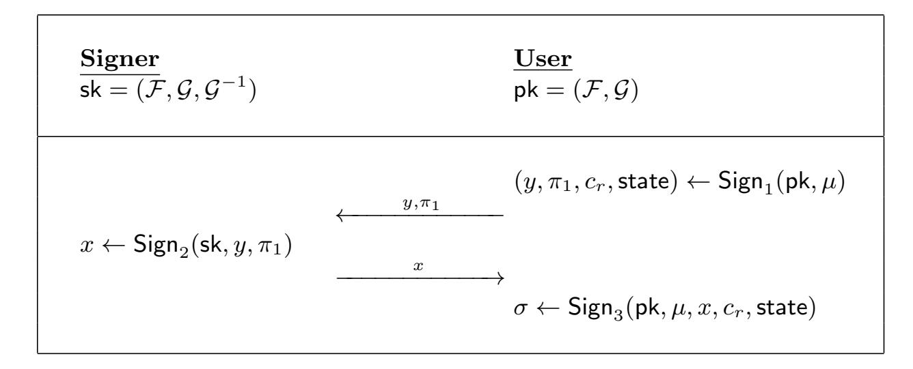
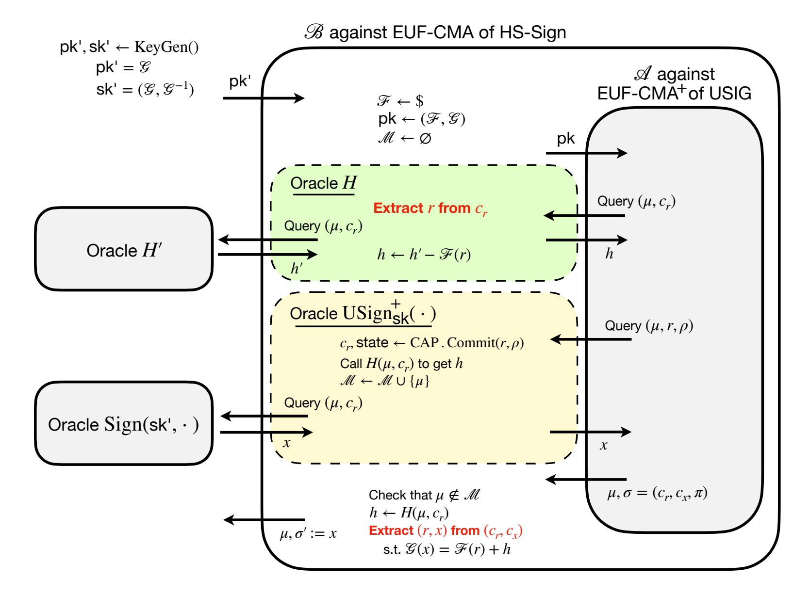
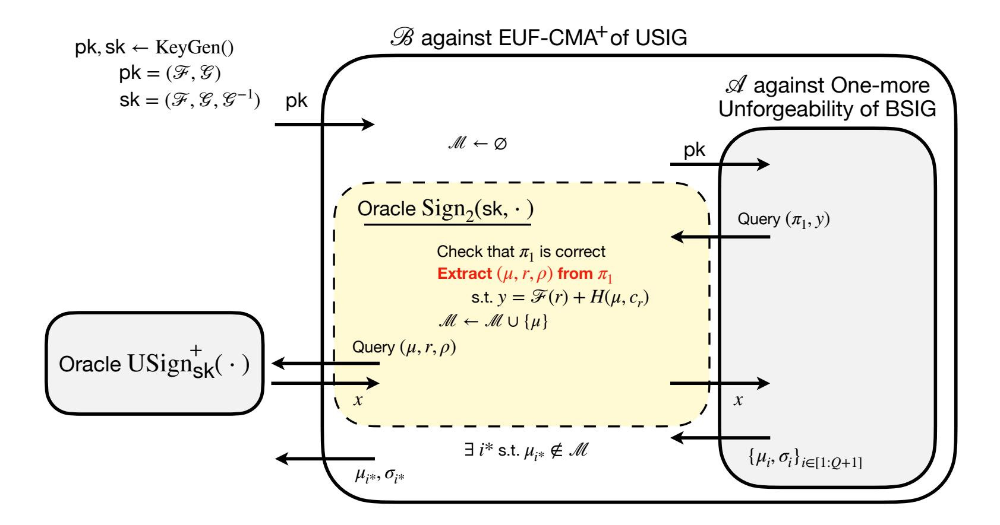
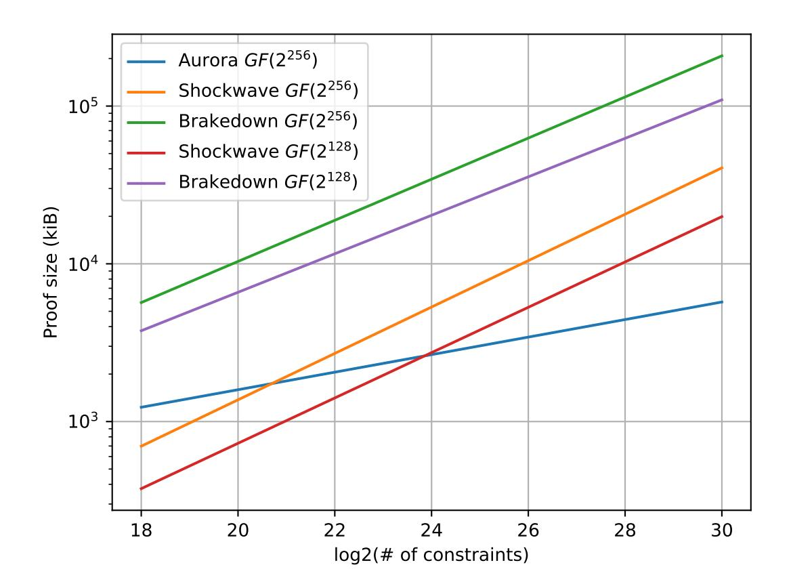
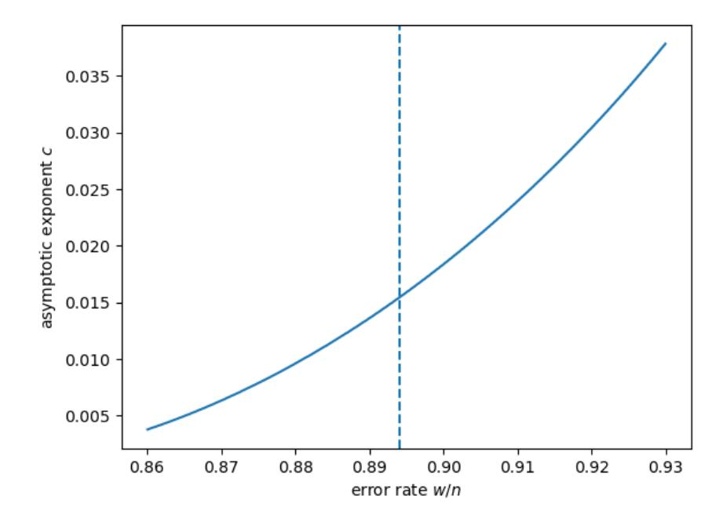

{0}------------------------------------------------

# Blinding Post-Quantum Hash-and-Sign Signatures

Charles Bouillaguet<sup>1</sup> , Thibauld Feneuil<sup>2</sup> , Jules Maire<sup>3</sup> , Matthieu Rivain<sup>2</sup> , Julia Sauvage<sup>1</sup> , and Damien Vergnaud<sup>1</sup>

<sup>1</sup> Sorbonne Universit´e, CNRS, LIP6, F-75005 Paris, France <sup>2</sup> CryptoExperts, Paris, France <sup>3</sup> DIENS, Ecole normale sup´erieure, PSL University, CNRS, INRIA, Paris, France ´

Abstract. Blind signature schemes are essential for privacy-preserving applications such as electronic voting, digital currencies or anonymous credentials. In this paper, we revisit Fischlin's framework for round-optimal blind signature schemes and its recent efficient lattice-based instantiations. Our proposed framework compiles any post-quantum hash-and-sign signature scheme into a blind signature scheme. The resulting scheme ensures blindness by design and achieves one-more unforgeability, relying solely on the unforgeability of the underlying signature scheme and the random oracle model.

To achieve this we introduce the notion of commit-append-and-prove (CAP) systems, which generalizes traditional commit-and-prove system by making their commitments updatable before proving. This building block allows us to unlock the technical challenges encountered when generalizing previous variants of the Fischlin's framework to any hash-and-sign signature scheme. We provide efficient CAP system instantiations based on recent MPC-in-the-Head techniques.

We showcase our framework by constructing blind versions of UOV and Wave, thereby introducing the first practical blind signatures based on multivariate cryptography and code-based cryptography. Our blind UOV signatures range from 3.8 KB to 11 KB, significantly outperforming previous post-quantum blind signatures, such as the 22 KB lattice-based blind signatures, which were the most compact until now.

## <span id="page-0-0"></span>1 Introduction

Proposed by Chaum in 1982 [\[Cha82\]](#page-29-0), blind signature schemes define an interactive digital signature protocol between a user and a signer, guaranteeing that the signed message, and even the resulting signature, remain unknown to the signer; this property is called blindness. The second key security property for blind signatures is one-more unforgeability, formalized by Pointcheval and Stern [\[PS00\]](#page-30-0): a user should not be able to produce more message/signature pairs than the number of signing executions with the signer. The significance of blind signatures extends to various privacy-preserving applications, such as electronic voting, digital currencies or anonymous credentials.

Traditional blind signature protocols often involve multiple rounds of communication, which can introduce delays and complexity. In [\[Fis06\]](#page-30-1), Fischlin introduced a generic construction of round-optimal blind signature schemes, which require only one round of communication between the user and the signer. Several efficient instantiations of this blueprint were subsequently proposed based on various assumptions (e.g. pairingbased [\[AFG](#page-28-0)<sup>+</sup>10], lattice-based [\[dPK22\]](#page-29-1) or code-based [\[BGSS17,](#page-29-2) [BGM21\]](#page-29-3)).

As quantum computing continues to advance, designing blind signatures that are secure against quantum attacks is critical to ensuring the long-term viability of privacy-preserving applications in a post-quantum world. The goal of the present paper is to revisit Fischlin's framework and to present efficient and compact blind signature schemes based on hash-and-sign post-quantum signatures.

### <span id="page-0-1"></span>1.1 Related Works and Technical Overview

Our construction relies on the framework of Fischlin [\[Fis06\]](#page-30-1) and is further inspired from recent lattice-based instantiations of this framework [\[AKSY22,](#page-28-1) [BLNS23\]](#page-29-4).

{1}------------------------------------------------

Fischlin framework. The Fischlin framework offers a generic approach to constructing round-optimal (i.e., 3 round) blind signatures, utilizing commitment schemes and non-interactive zero-knowledge proofs (NIZKs). The protocol consists of three phases:

- 1. The User generates a hiding and binding commitment c to the message and sends it to the Signer along with an NIZK proof that the commitment is valid.
- 2. The Signer, after verifying the proof, generates a signature σ of the commitment and sends it back to the User.
- 3. The User computes a public-key encryption c ′ of (c, σ) as well an NIZK proof that c ′ encrypts a pair (c, σ) where c is a valid commitment of the message and σ is a valid signature of c.

Efficient lattice-based instantiation. An efficient lattice-based instantiation of this framework has recently been introduced by Agrawal, Kirshanova, Stehl´e and Yadav [\[AKSY22\]](#page-28-1). Their scheme uses two matrices, A and B, where A, following the GPV signature scheme [\[GPV08\]](#page-30-2), has an associated trapdoor that allows for sampling short pre-images x such that Ax = y for any arbitrary y. To blindly sign a message µ, the User generates a random short vector r and sends a commitment y = Br + H(µ) to the Signer. The Signer, using the trapdoor, responds with a short vector x such that Ax = y. To create the blind signature, the User produces an NIZK proof π showing knowledge of short vectors r, x that satisfy Ax = Br + H(µ). This is done using recent lattice-based zero-knowledge techniques [\[LNP22\]](#page-30-3), resulting in a blind signature of 45 KB. Because they remove the NIZK proof from the signing request, the authors introduce a non-standard lattice assumption, the One-more-ISIS assumption, to prove the security of their scheme. This is necessary because an adversary can request trapdoor pre-images for chosen values of y. While adding an NIZK proof of wellformedness for the commitment y could avoid this, it does not entirely solve the problem since an adversary could still manipulate the distribution of y by choosing r after computing H(µ).

Eliminating One-more-ISIS. Beullens, Lyubashevsky, Nguyen, and Seiler address this issue in a follow-up work [\[BLNS23\]](#page-29-4). They modify the commitment definition to:

$$y = Br + H(\mu, H(r))$$

and reintroduce the NIZK proof in the signing request. This forces the adversary to choose r before calculating y and to request H(r) and H(µ, H(r)) to the random oracle (thus enabling the security reduction to recover (µ, r) associated to y). Additionally, they employ the encryption in the sky technique [\[Fis06\]](#page-30-1) which involves sending an encryption of r to the Signer (which correctness is proved within the NIZK proof). This ciphertext is never decrypted but enables efficient extraction of r during the security reduction. The final blind signature includes ρ := H(r) and an NIZK proof of knowledge of short vectors r, x satisfying Ax = Br + H(µ, ρ), without needing to prove ρ = H(r). Thanks to this tweak, the authors obtain a blind signature secure under standard lattice assumptions (SIS, LWE and NTRU) with a signature size of 22 KB.

Our general construction. Our goal is to generalize this approach to obtain blind signatures from any hashand-sign signature scheme, relying only on standard assumptions and the random oracle model. We emphasize that, in this work, the term hash-and-sign signatures refers specifically to schemes built from algebraic oneway functions with trapdoors (and thus excludes hash-based signatures), following the convention commonly adopted in the post-quantum literature.

In the above constructions, Br serves as a mask to ensure the scheme's blindness. The Signer should not recover H(µ, ρ), as this would enable linking the signing request to the message. We propose to replace Br with F(r), where F is any pseudorandom generator (PRG). Additionally, we substitute the GPV trapdoor relation y = Ax with any other trapdoor function from a hash-and-sign signature scheme. Consider a scheme where inverting a one-way function G on a hashed message H(µ), using the trapdoor G −1 (private key), creates the signature. Here, we replace y = Ax with y = G(x).

However, this is not satisfactory regarding unforgeability. Indeed, an adversary could try to forge a signature by first picking µ and ρ and then finding a pair (x, r) satisfying G(x) = F(r)+h where h = H(µ, ρ). The security of this scheme would hence rely on assuming that the pair of functions (G, F ′ := F + h) is 

{2}------------------------------------------------

claw-free [\[GMR84\]](#page-30-4). Namely, it should be hard to find a pair of pre-images (x, r) satisfying G(x) = F ′ (r). While this reduces to a Ring-SIS assumption for the lattice-based instantiation of [\[BLNS23\]](#page-29-4), the obtained claw-freeness assumption may not hold for other choices of F and G. The key issue is that ρ = H(r) is not proved in the final NIZK, allowing the adversary to solve G(x) = F(r) + h with r independent of h. Proving ρ = H(r) would make the signature larger, which we want to avoid.

Our solution is to rely on a commit-and-prove system [\[CLOS02\]](#page-29-5). In such a system, one first commits to a witness w and later proves a statement about w with a proof π appended to the commitment. Using this principle, our solution consists in deriving a commitment c<sup>r</sup> to r which is input to the hash function in place of ρ. Namely, we define

$$y = \mathcal{F}(r) + H(\mu, c_r) .$$

After receiving x = G −1 (y) from the Signer, the User produces a proof for the statement G(x) = F(r) + h based on the commitment c<sup>r</sup> thanks to the commit-and-prove system. The verification involves recomputing h = H(µ, cr) and then checking the proof which is composed of cr, hence preventing the above claw-solving forgery. If the adversary fixes h (and hence cr) to search for a claw solution (x, r) to G(x) = F(r) + h, the obtained solution is unlikely to be provable using the previously fixed c<sup>r</sup> (while if the solution matches c<sup>r</sup> this means that the adversary has simply inverted G on y = F(r) + h).

There is an additional aspect that we have not yet addressed: the proven statement G(x) = F(r) +h also involves the value x as a witness, which must remain private to preserve the blindness property. Therefore, before proving this statement, we need to update the commitment c<sup>r</sup> to include x as well. To handle this, we introduce the notion of a commit-append-and-prove (CAP) system.

Commit-append-and-prove systems. A CAP system allows for sequential commitments to multiple witnesses w1, . . . , wn, and later, a proof of a statement involving the entire witness tuple (w1, . . . , wn). Each new commitment c<sup>i</sup> is appended to the previous sequence of commitments (c1, . . . , ci−1). Finally, the statement on the full witness tuple is proven by appending a proof π to the final commitment sequence (c1, . . . , cn). CAP systems are instrumental to contexts where a prover must commit to multiple values across different rounds and later prove a global statement about these committed values. The append feature of CAP enables more communication-efficient constructions compared to using independent commitments. Our blind signature framework is a typical use-case for such systems.

In our blind signature framework, the User first computes a commitment c<sup>r</sup> to r, which is used to derive the hash h = H(µ, cr) and the value y = F(r) + H(µ, cr). Upon receiving x = G −1 (y) from the Signer, the User updates the previous commitment to (cr, cx), which now commits to both r and x. The statement G(x) = F(r) + h is then proven by appending a proof π to this updated commitment. The final CAP proof in the blind signature consists of the tuple (cr, cx, π).

To implement an efficient and concrete CAP system, we leverage recent developments in the MPCin-the-Head paradigm, such as the from VOLE-in-the-Head [\[BBD](#page-28-2)+23] and Threshold-Computation-in-the-Head [\[FR23\]](#page-30-5) frameworks. These proof systems naturally align with the CAP structure, as they begin by committing to a witness independently of the statement, and later append a statement-dependent proof to the existing commitment. Moreover, extending these commitments to be updatable (i.e. to be able to append new committed values to the commitment) is straightforward, making them a natural fit for our purposes.

We further demonstrate that these CAP systems satisfy the strong property of straightline-extractable knowledge soundness. This property, in the random oracle model, ensures that it is possible to straightline extract a witness (w1, . . . , wn) from an (updated) commitment (c1, . . . , cn) as soon as the commitment can be later used to successfully prove a statement involving the witness. Notably, neither the statement nor the proof itself is required for extraction. This straightline extractability eliminates the need for the "encryption in the sky" technique, thereby simplifying the overall scheme.

Security reduction. The one-more unforgeability of our general blind signature scheme follows from the unforgeability of the standard hash-and-sign signature scheme associated with the trapdoor function G. Our security reduction involves a two-step application of the random oracle model (ROM). First, we reduce the EUF-CMA security of the standard signature scheme to that of an unblinded version of the blind signature 

{3}------------------------------------------------

<span id="page-3-0"></span>scheme, which does not rely on the NIZK. This reduction is based on the ROM for H and the hash function of the CAP. Next, we further reduce the security of this intermediate scheme to the one-more unforgeability of the blind signature scheme, relying on the ROM for the hash function of the NIZK. We note that such a two-step application of the ROM heuristic was previously used in [\[BLNS23\]](#page-29-4).

| Scheme                 | Assumptions                | Signature size |
|------------------------|----------------------------|----------------|
| [dPK22]                | SIS + LWE                  | 100 KB         |
| [AKSY22]               | One-more-ISIS + LWE + NTRU | 45 KB          |
| [BLNS23]               | SIS + LWE + NTRU           | 22 KB          |
| This work (UOV-based)  | UOV [BCD+24]               | 3.8 – 11 KB    |
| This work (MAYO-based) | MAYO [BCC+24]              | 4.6 – 18 KB    |
| This work (Wave-based) | Wave [BCC+23a]             | 39 – 138 KB    |

Table 1: Comparison of round-optimal post-quantum blind signatures.

Instantiations. We showcase our framework by applying it to two families of post-quantum hash-and-sign signature schemes: UOV and Wave. These instantiations fill the current gap in practical blind signatures based on multivariate cryptography and code-based cryptography. Table [1](#page-3-0) provides a high-level comparison of our results with the current state of practical post-quantum blind signatures (for a 128-bit security). Our blind UOV signatures range from 3.8 KB to 11 KB (this range reflects a trade-off between signature size and user-server communication), making them more compact than any other post-quantum blind signature in the literature. We believe our framework opens new avenues for the design of such schemes, particularly by targeting small proofs using CAP systems based on the MPC-in-the-Head paradigm.

## 2 Preliminaries

### <span id="page-3-1"></span>2.1 Basic Cryptographic Definitions

Pseudorandom generation. Two distributions {Dλ}<sup>λ</sup> and {Eλ}<sup>λ</sup> indexed by a security parameter λ are (t, ε)-indistinguishable (where t and ε are N → R functions) if, for any algorithm A running in time at most t(λ) we have

$$\left| \Pr[\mathcal{A}^{D_{\lambda}}() = 1] - \Pr[\mathcal{A}^{E_{\lambda}}() = 1] \right| \le \varepsilon(\lambda) ,$$

with ADist meaning that A has access to a sampling oracle of distribution Dist. The two distributions are said

- computationally indistinguishable if ε(λ) ≤ t(λ) · 2 −λ for every λ;
- statistically indistinguishable if ε ≤ 2 −λ for every λ;
- perfectly indistinguishable if ε(λ) = 0 for every λ.

Definition 1 (Pseudorandom Generator (PRG)). Let G : {0, 1} <sup>∗</sup> → {0, 1} <sup>∗</sup> and let ℓ(·) be a polynomial such that for any input s ∈ {0, 1} <sup>λ</sup> we have G(s) ∈ {0, 1} ℓ(λ) . Then, G is a (t, ϵ)-secure pseudorandom generator if the distributions

$$\{G(s) \mid s \stackrel{\$}{\leftarrow} \{0,1\}^{\lambda}\} \quad and \quad \{r \mid r \stackrel{\$}{\leftarrow} \{0,1\}^{\ell(\lambda)}\}$$

are (t, ε)-indistinguishable.

{4}------------------------------------------------

**Universal hashing.** In our constructions, we need to perform an efficient consistency check to verify whatever two vectors are the same, without revealing them. To proceed, we will rely on linear universal hash functions.

**Definition 2.** A family of linear hash functions is a family of matrices  $\mathcal{H} \subset \mathbb{F}_q^{r \times n}$ . The family is  $\varepsilon$ -almost universal if for any non-zero  $x \in \mathbb{F}_q^n$ ,

$$\Pr_{H \leftarrow \mathcal{H}} \left[ Hx = 0 \right] \le \varepsilon.$$

The family is  $\varepsilon$ -almost uniform, if for any non-zero  $x \in \mathbb{F}_q^n$  and for any  $v \in F_q^r$ ,

$$\Pr_{H \leftarrow \mathcal{H}} [Hx = v] \le \varepsilon.$$

Non-interactive zero-knowledge. We formally define NIZK in the next definition. Our definition restricts to transparent NIZK schemes which do not require a trusted setup and we keep the setup implicit of the sake of simplicity. Moreover, we focus on NIZK achieving straightline-extractable in an idealized model (e.g. the random oracle model) where the proving and verification algorithms are given access to a cryptographic oracle.

**Definition 3 (NIZK).** A non-interactive zero-knowledge proof system for a family of relations  $\mathcal{R}$  and using a cryptographic oracle  $\mathcal{O}$  is defined by the following algorithms:

- $\mathsf{Prove}^{\mathcal{O}}: (w \mid R, x) \mapsto \pi$ . Given a witness w, a relation  $R \in \mathcal{R}$  and a statement x, such that  $(x, w) \in R$ , outputs a proof  $\pi$ .
- Verify  $^{\mathcal{O}}: (\pi \mid R, x) \mapsto 1/0$ . Given a proof  $\pi$ , a relation  $R \in \mathcal{R}$  and a statement x, outputs 1 ("accept") or 0 ("reject").

The algorithm Prove is probabilistic while the algorithm Verify is deterministic.

- The NIZK is complete meaning that for any relation  $R \in \mathcal{R}$  and statement-witness pair  $(x, w) \in R$ , we have:

$$\Pr\left[\mathsf{Verify}^{\mathcal{O}}(\pi\mid R,x) = 1\mid \pi\leftarrow\mathsf{Prove}^{\mathcal{O}}(w\mid R,x)\right] = 1$$
.

- The NIZK is  $\varepsilon$ -zero knowledge meaning that there exists a PPT algorithm Sim which outputs a simulated proof indistinguishable from a genuine proof. Specifically, for any relation  $R \in \mathcal{R}$  and statement-witness pair  $(x, w) \in R$ , we have:

$$Adv_{\textit{NIZK}}(\mathcal{A}) := \Pr \left[ \hat{b} = b \; \middle| \begin{array}{l} \pi^{(0)} \leftarrow \mathsf{Prove}^{\mathcal{O}}(w \mid R, x) \\ \pi^{(1)} \leftarrow \mathsf{Sim}() \\ b \leftarrow \{0, 1\} \\ \hat{b} \leftarrow \mathcal{A}^{\mathcal{O}}(\pi^{(b)}) \end{array} \right] \; \leq \; \varepsilon \; .$$

- The NIZK is  $\varepsilon$ -straightline-extractable knowledge sound if there exists a PPT algorithm Ext which given a set Q of query-response pairs to  $\mathcal{O}$  and a proof  $\pi$  such that for any relation  $R \in \mathcal{R}$  and statement-witness pair  $(x, w) \in R$ , we have:

$$\mathsf{Adv}_{\mathsf{KS-NIZK}}(\mathcal{A}) := \Pr \left[ \begin{array}{c|c} \mathsf{Verify}^{\mathcal{O}}(\pi \mid R, x) = 1 & \pi \leftarrow \mathcal{A}^{\mathcal{O}}() \\ \wedge (x, w) \not \in R & w \leftarrow \mathsf{Ext}(Q, \pi) \end{array} \right] \ \leq \ \varepsilon \ ,$$

where Q denotes the set of query-response pairs made by A to O.

{5}------------------------------------------------

#### 2.2 Blind Signatures

There exist several (essentially equivalent) syntactic definition for (round-optimal) blind signatures. In the present paper, we follow the definition from [BLNS23].

**Definition 4 (Blind Signatures).** A round-optimal blind signature scheme is a tuple of five (probabilistic) PPT algorithms (KeyGen, Sign<sub>1</sub>, Sign<sub>2</sub>, Sign<sub>3</sub>, Verify):

- KeyGen( $1^{\lambda}$ )  $\rightarrow$  (sk, pk): this probabilistic algorithm takes the security parameter as input and outputs a signing secret key sk and a verifying public key pk;
- $\operatorname{Sign}_1(pk,\mu) \to (\rho_1, S_{\mathcal{U}})$ : this probabilistic algorithm is run by a user  $\mathcal{U}$ ; it takes as input a public key pk belonging to a signer  $\mathcal{S}$  and a message  $\mu \in \{0,1\}^*$  and outputs a state  $S_{\mathcal{U}}$  and a first message  $\rho_1$ , which they send to  $\mathcal{S}$ ;
- $\operatorname{Sign}_2(\operatorname{sk}, \rho_1) \to \rho_2$ : this probabilistic algorithm is run by a signer  $\mathcal S$  and takes as input a secret key  $\operatorname{sk}$  and a first message  $\rho_1$  and outputs a second message  $\rho_2$ , which they send to  $\mathcal U$ ;
- $\operatorname{Sign}_3(\rho_2, S_{\mathcal{U}}) \to \sigma$ : this probabilistic algorithm is run by a user  $\mathcal{U}$ ; it takes as input a second message  $\rho_2$  and a state  $S_{\mathcal{U}}$  and outputs a signature  $\sigma$  or an error message  $\perp$ ;
- Verify $(pk, \mu, \sigma) \rightarrow \{0, 1\}$ : this deterministic algorithm takes as input a public key pk, a message  $\mu$  and a signature  $\sigma$  and outputs a bit to indicate whether the signature is deemed valid (1) or invalid (0).

A round-optimal blind signature scheme must satisfy the three following properties:

- 1. **correctness**, ensuring that signatures generated honestly will verify with overwhelming probability;
- 2. **blindness**, ensuring that the signer cannot link signatures to the interactions in which they were created;
- 3. and **one-more unforgeability**, ensuring that if a user is runs the signing protocol q times, they cannot obtain more than q valid signatures.

**Definition 5 (Correctness).** A round-optimal blind signature scheme (KeyGen, Sign<sub>1</sub>, Sign<sub>2</sub>, Sign<sub>3</sub>, Verify) is deemed correct if, given there exists a negligible function negl such that, we have:

$$\Pr\left[ \mathsf{Verify}(\textit{pk}, \mu, \sigma) = 0 \, \middle| \, \begin{array}{l} (\textit{sk}, \textit{pk}) \xleftarrow{\$} \mathsf{KeyGen}(1^{\lambda}) \\ (\rho_1, S_{\mathcal{U}}) \xleftarrow{\$} \mathsf{Sign}_1(\textit{pk}, \mu) \\ \rho_2 \xleftarrow{\$} \mathsf{Sign}_2(\textit{sk}, \rho_1) \\ \sigma \xleftarrow{\$} \mathsf{Sign}_3(\rho_2, S_{\mathcal{U}}) \end{array} \right] \leq \mathsf{negl}(\lambda) \; .$$

**Definition 6 (Blindness).** A round-optimal blind signature scheme (KeyGen, Sign<sub>1</sub>, Sign<sub>2</sub>, Sign<sub>3</sub>, Verify) is deemed blind if for every three-part stateful PPT adversary  $\mathcal{A} = (\mathcal{A}_1, \mathcal{A}_2, \mathcal{A}_3)$ , there exists a negligible function negl such that, for any two messages  $\mu_0, \mu_1 \in \{0, 1\}^*$ , we have:

 $Adv_{BLIND}(A) :=$ 

$$\left| \Pr \left[ \mathcal{A}_{3}(\sigma_{0}, \sigma_{1}) = b \right| \begin{array}{l} \rho k \xleftarrow{\$} \mathcal{A}_{1}(1^{\lambda}) \\ b \xleftarrow{\$} \{0, 1\}(\rho_{1}^{0}, S_{\mathcal{U}}^{0}) \leftarrow \operatorname{Sign}_{1}(\rho k, \mu_{0}) \\ (\rho_{1}^{1} S_{\mathcal{U}}^{1}) \leftarrow \operatorname{Sign}_{1}(\rho k, \mu_{1}) \\ (\rho_{2}^{b}, \rho_{2}^{1-b}) \leftarrow \mathcal{A}_{2}(\rho_{1}^{b}, \rho_{1}^{1-b}) \\ \sigma^{0} \leftarrow \operatorname{Sign}_{3}(\rho_{2}^{0}, S_{\mathcal{U}}^{0}) \\ \sigma^{1} \leftarrow \operatorname{Sign}_{3}(\rho_{2}^{1}, S_{\mathcal{U}}^{1}) \\ \text{if } \bot \in \{\sigma_{0}, \sigma_{1}\} \text{ then } (\sigma_{0}, \sigma_{1}) \leftarrow (\bot, \bot) \end{array} \right] - \frac{1}{2} \le \operatorname{negl}(\lambda) \ .$$

**Definition 7 (One-more unforgeability).** A round-optimal blind signature scheme (KeyGen, Sign<sub>1</sub>, Sign<sub>2</sub>, Sign<sub>3</sub>, Verify) is deemed one-more unforgeable if for every PPT adversary  $\mathcal{A}$  that makes at most q queries to a signing oracle (where q is a function of  $\lambda$ ), there exists a negligible function negl such that, we have:

{6}------------------------------------------------

$$Adv_{BSIG}(A) :=$$

$$\left| \Pr \left[ \begin{array}{l} \forall i \in \{1, \dots, q+1\}, \mathsf{Verify}(\mathit{pk}, \mu_i, \sigma_i) = 1 \\ \forall i, j \in \{1, \dots, q+1\}, i \neq j \Rightarrow \mu_i \neq \mu_j \end{array} \right| \begin{array}{l} (\mathit{sk}, \mathit{pk}) \xleftarrow{\$} \mathsf{KeyGen}(1^\lambda) \\ \{(\mu_i, \sigma_i)\}_{i \in \{1, \dots, q+1\}} \\ \xleftarrow{\$} \mathcal{A}^{\mathsf{Sign}_2(\mathit{sk}, \cdot)}(\mathit{pk}) \end{array} \right] \right| \leq \mathsf{negl}(\lambda) \ .$$

## 3 Commit-Append-and-Prove Systems

A commit-and-prove system (see, e.g., [CLOS02, EG14, CFH<sup>+</sup>15]) is a proof system in which the prover first builds commitments and then proves statements on the committed values. In this section, we formalize the variant notion of commit-append-and-prove (CAP) system. In such a system, a commitment  $c_1$  of a first value  $w_1$  can be updated by appending further committed values  $w_2$ ,  $w_3$ , ... into a commitment  $(c_1, c_2, c_3, ...)$ , where each update is appended to the previous commitment. The (updated) commitment can then be used to prove a statement on the committed values. Such a commitment scheme enables us to commit to values one by one (instead of committing to all of them at once) while keeping the proof functionality, providing greater flexibility in designing cryptographic protocols based on it. After formally defining commit-appendand-prove systems using cryptographic oracles, we show that commitments and proof systems arising from the MPC-in-the-Head paradigm provide natural CAP systems with small commitment and proof sizes.

#### 3.1 Formal Definition

A CAP system for a family of relations is defined by four algorithms. The subroutine Commit initializes the commitment and commits a first value, the subroutine Append can be used to update a commitment with additional values. The subroutine Prove can be used to produce a proof  $\pi$  associated to a (possibly updated) commitment  $(c_1, c_2, c_3, \ldots)$  w.r.t. a relation and statement from the considered family. The subroutine Verify then checks correctness of a pair  $((c_1, c_2, c_3, \ldots), \pi)$  which should accept if the committed values satisfy the statement and reject otherwise. We formally introduce the notion hereafter.

In our definitions, we call and denote  $\mathcal{O} = (\mathcal{O}_1, \dots, \mathcal{O}_t)$  a *cryptographic oracle*, an oracle interface to one or several ideal primitives  $\mathcal{O}_1, \dots, \mathcal{O}_t$  (random oracle, ideal cipher, etc.).

**Definition 8 (CAP System).** Let  $\mathcal{O}$  be a cryptographic oracle. A commit-append-and-prove (CAP) system using  $\mathcal{O}$  for a family of relations  $\mathcal{R}$  is defined by the following algorithms:

- Commit<sup>O</sup>:  $(w, \rho) \mapsto (c, st)$ . Given an input w and randomness  $\rho$ , outputs a commitment c and a state st.
   Append<sup>O</sup>:  $(w, st) \mapsto (c, st')$ . Given an input w and a state st, outputs a commitment c and an updated
- Append  $c : (w, st) \mapsto (c, st')$ . Given an input w and a state st, outputs a commitment c and an updated state st'.
- Prove  $C : (c_1, \ldots, c_n, \operatorname{st} \mid R, x) \mapsto \pi$ . Given commitments  $c_1, \ldots, c_n$ , a state  $\operatorname{st}$ , a relation  $R \in \mathcal{R}$  and a statement x, outputs a proof  $\pi$ .
- Verify  $(c_1, \ldots, c_n, \pi \mid R, x) \mapsto 1/0$ . Given commitments  $c_1, \ldots, c_n$ , a proof  $\pi$ , a relation  $R \in \mathcal{R}$  and a statement x, outputs 1 ("accept") or 0 ("reject").

The algorithms Commit, Append and Verify are deterministic, while the algorithm Prove is probabilistic. We shall denote by

$$(c_1,\ldots,c_n,\mathsf{st}) = \mathsf{SeqCommit}^{\mathcal{O}}(w_1,\ldots,w_n,\rho)$$

the sequence of calls:

$$(c_1, \mathsf{st}) = \mathsf{Commit}^{\mathcal{O}}(w_1, \rho)$$
 $(c_2, \mathsf{st}) = \mathsf{Append}^{\mathcal{O}}(w_2, \mathsf{st})$ 
 $\vdots$ 
 $(c_n, \mathsf{st}) = \mathsf{Append}^{\mathcal{O}}(w_n, \mathsf{st})$ 

{7}------------------------------------------------

Remark 1. In the above definition, we implicitly assume that all the commitment randomness is input in the first call (as input of the Commit routine). While we do not need this in this work, we could propose a more general definition where the Append routine also takes randomness as input.

Let us define the properties that a CAP system should satisfy. The first notion is the completeness property which states that an honest prover always convinces the verifier whenever the committed witness satisfies the statement.

**Definition 9 (Completeness).** The CAP system (Commit<sup>O</sup>, Append<sup>O</sup>, Prove<sup>O</sup>, Verify<sup>O</sup>) for  $\mathcal{R}$  is complete if for every  $R \in \mathcal{R}$  and  $(x, (w_1, \dots, w_n)) \in R$ , we have:

$$\Pr\left[\mathsf{Verify}^{\mathcal{O}}(c_1,\ldots,c_n,\pi\mid R,x) = 1 \; \middle| \; \begin{array}{l} \rho\leftarrow\$\;;\;\;(c_1,\ldots,c_n,\mathsf{st}) = \mathsf{SeqCommit}^{\mathcal{O}}(w_1,\ldots,w_n,\rho) \\ \pi\leftarrow\mathsf{Prove}^{\mathcal{O}}(c_1,\ldots,c_n,\mathsf{st}\mid R,x) \end{array} \right] = 1 \; .$$

We next introduce the notion of straightline-extractable knowledge soundness for a CAP system. This notion ensures that there exists a straightline extractor of a witness  $(w_1, \ldots, w_n)$  from an (updated) commitment  $(c_1, \ldots, c_n)$  as soon as the commitment can be later used to successfully prove a statement involving the witness. We stress that neither the statement nor the proof itself is required for extraction. Formally:

<span id="page-7-0"></span>**Definition 10 (Straightline-Extractable Knowledge Soundness).** The commit-append-and-prove system (Commit<sup>O</sup>, Append<sup>O</sup>, Prove<sup>O</sup>, Verify<sup>O</sup>) for  $\mathcal{R}$  using  $\mathcal{O}$  as oracle is  $\varepsilon$ -straightline-extractable knowledge sound if it satisfies the following. For all  $i \in \{1, \ldots, n\}$ , there exists a PPT algorithm

$$\mathsf{Ext}_i : (Q, (c_1, \dots, c_i)) \mapsto (w_1, \dots, w_i)$$

which given a set Q of query-response pairs to  $\mathcal{O}$  and an (updated) commitment  $(c_1, \ldots, c_i)$  outputs a witness  $(w_1, \ldots, w_i)$  such that for any relation  $R \in \mathcal{R}$ , statement x and adversary  $\mathcal{A}$ , we have:

$$\mathsf{Adv}_{\mathsf{KS-CAP}}(\mathcal{A}) := \Pr \left[ \begin{array}{c} \mathsf{Verify}^{\mathcal{O}}(c_1, \dots, c_n, \pi \mid R, x) = 1 \\ \land \ \forall (w_{i+1}, \dots, w_n), \\ (x, (w_1, \dots, w_n)) \notin R \end{array} \right| \begin{array}{c} (c_1, \dots, c_n, \pi) \leftarrow \mathcal{A}^{\mathcal{O}}() \\ (w_1, \dots, w_i) \leftarrow \mathsf{Ext}_i(Q, (c_1, \dots, c_i)) \end{array} \right] \ \leq \ \varepsilon \ ,$$

where Q denotes the set of query-response pairs made by A to O.

Remark 2. Let us stress that the extractor of the knowledge soundness property does not take the proof  $\pi$  as input. Namely, they extract the witness only from the commitment and the oracle query-response pairs. This is the reason why we call this property straightline-extractable knowledge soundness.

Remark 3. One can remark that the above notion of straightline-extractable knowledge soundness naturally implies that the commitment scheme satisfies some notion of straightline-extractable binding. The latter notion states that, if an adversary can produce a genuine commitment  $(c_1, \ldots, c_n)$ , i.e., a commitment for which there exists a witness  $(w_1, \ldots, w_n)$  and a randomness  $\rho$  such that  $(c_1, \ldots, c_n, st) = \text{SeqCommit}^{\mathcal{O}}(w_1, \ldots, w_n, \rho)$ , then this witness can be recovered by an extractor from the query-response pairs to the oracle  $\mathcal{O}$ . Assuming that the family of relations  $\mathcal{R}$  contains the "opening relation" which states that the committed values  $(w_1, \ldots, w_n)$  are equal to some public values  $(x_1, \ldots, x_n)$ , the probability that the extractor  $\text{Ext}_n$  does not output  $(w_1, \ldots, w_n) = (x_1, \ldots, x_n)$  is upper bounded by the straightline-extractable knowledge soundness error  $\varepsilon$ .

The following definition formalizes the notion of zero-knowledge for the CAP system. Informally, it requires that the (possibly updated) commitment and proof transcript  $((c_1, \ldots, c_n), \pi)$  leak no information on the committed values beyond the fact that they satisfy the proven statement, i.e.,  $(x, (w_1, \ldots, w_n)) \in R$ .

**Definition 11 (Zero Knowledge).** The CAP system (Commit<sup>O</sup>, Append<sup>O</sup>, Prove<sup>O</sup>, Verify<sup>O</sup>) for  $\mathcal{R}$  is  $\varepsilon$ -zero knowledge if there exists a PPT algorithm Sim which outputs a simulated proof indistinguishable from

{8}------------------------------------------------

a genuine proof. Specifically, for any relation  $R \in \mathcal{R}$ , statement and witness  $(x, (w_1, \ldots, w_n)) \in R$  and adversary  $\mathcal{A}$ , we have:

$$\textit{Adv}_{\textit{ZK-CAP}}(\mathcal{A}) := \Pr \left[ \hat{b} = b \; \middle| \begin{array}{l} \rho \leftarrow \$ \; ; \; (c_1^{(0)}, \ldots, c_n^{(0)}, \mathsf{st}) = \mathsf{SeqCommit}^{\mathcal{O}}(w_1, \ldots, w_n, \rho) \\ \pi^{(0)} \leftarrow \mathsf{Prove}^{\mathcal{O}}(c_1^{(0)}, \ldots, c_n^{(0)}, \mathsf{st} \mid R, x) \\ (c_1^{(1)}, \ldots, c_n^{(1)}, \pi^{(1)}) \leftarrow \mathsf{Sim}() \\ b \leftarrow \{0, 1\} \; ; \; \hat{b} \leftarrow \mathcal{A}^{\mathcal{O}}(\pi^{(b)}) \end{array} \right] \; \leq \; \varepsilon \; .$$

We note that the zero-knowledge property might either hold in an idealized model (e.g. the ROM), where the simulator has the ability of programming the cryptographic oracle  $\mathcal{O}$ , or in the standard model, where the oracle is replaced by concrete primitives on which we make computational hardness assumptions. While our CAP constructions presented hereafter are straightline-extractable knowledge sound in the ROM, they are zero-knowledge under standard assumptions.

#### <span id="page-8-0"></span>3.2 Concrete CAP Systems from MPC in the Head

In this section, we describe concrete CAP systems using recent MPC-in-the-Head (MPCitH) techniques, specifically the VOLE-in-the-Head [BBD<sup>+</sup>23] and Threshold-Computation-in-the-Head [FR23] frameworks. We observe that (besides small technical differences) our notion of CAP system provides an abstraction for these proof systems. In particular, the first rounds in these proof systems consist of committing a witness in a way that is independent of the proven statement. The final rounds are then dedicated to proving that the committed values satisfy some target statement. In these proof systems, the witness is committed by first committing to some long enough random value r and then providing a correction value (or auxiliary value)  $\Delta_w = (\Delta_{w_1} \parallel \ldots \parallel \Delta_{w_n})$  such that  $w = r + \Delta_w$ . This process is amenable to the appending mechanism of the CAP system as the prover can first commit to r and then update the commitment by communicating correction values. More formally, the TCitH and VOLEitH proof systems are made of:

- a proof generation routine  $\mathsf{PS.Prove}(w,\mathsf{rnd},x)$  which, from a witness w, a random tape  $\mathsf{rnd}$ , and a statement x, builds a transcript  $\mathsf{proof}$  proving that the user knows w satisfying x. This routine can be decomposed as:
  - $1. \ (r, \mathsf{com}, \mathsf{ps\_state}) = \mathsf{PS}.\mathsf{CommitPhase}(\mathsf{rnd})$
  - $2. \ \Delta_w = w r$
  - 3.  $\operatorname{chal} = \operatorname{Hash}(\operatorname{\mathsf{com}}, \Delta_w)$
  - 4. rsp = PS.ResponsePhase(ps\_state, chal,  $\Delta_w$ , x)
  - 5. Return proof :=  $(com, \Delta_w, rsp)$
- a verification routine  $\mathsf{PS.Verify}(\mathsf{proof},x)$  that checks whether  $\mathsf{proof}$  is valid with respect to the statement x.

Using these notations, our CAP system is formally described in Protocol 1.

In the MPC-in-the-Head literature, one can find two approaches to commit witnesses: either we use GGM seed trees (a.k.a. puncturable pseudorandom functions), or we use Merkle trees. In this work, we focus on the GGM-based techniques since they tend to produce smaller proofs for small statements. Moreover, GGM-tree techniques are more amenable to small fields (as the binary or ternary field) matching our concrete applications.

Relation family. While the MPCitH paradigm is generic in the sense that it can apply to any statement which can be verified by a multiparty computation protocol, we chose here to focus on polynomial constraint systems, like the proof system obtained by applying TCitH-GGM to the  $\Pi_{PC}$  protocol (see [FR23, Section 6.2]). Specifically, we consider the relation family  $\mathcal{R} = \{R_{\bar{n},q,m,d}\}$  with  $\bar{n} \in \mathbb{N}$ , the witness length, q

{9}------------------------------------------------

```
CAP.Commit(w_1, rnd)
       (r, com, ps\_state) = PS.CommitPhase(rnd)
       cap\_state = (r, ps\_state)
       (\Delta_{w_1}, \mathsf{cap\_state'}) = \mathsf{CAP.Append}(w_1, \mathsf{cap\_state})
      Return ((\mathsf{com}, \Delta_{w_1}), \mathsf{cap\_state'})
\mathsf{CAP}.\mathsf{Append}(w_i,\mathsf{cap\_state} := (r,\mathsf{ps\_state}))
      Split r into (r' \parallel r'') such that |r'| = |w_i|
      \Delta_{w_i} = w_i - r'
      Return (\Delta_{w_i}, \mathsf{cap\_state'} := (r'', \mathsf{ps\_state}))
\mathsf{CAP}.\mathsf{Prove}(c_1,\ldots,c_n,\mathsf{cap\_state}) \mid x)
      Parse c_1 as (com, \Delta_{w_1}) and c_2, \ldots, c_n as \Delta_{w_2}, \ldots, \Delta_{w_n}
       \Delta_w = \Delta_{w_1} \parallel \Delta_{w_2} \parallel \ldots \parallel \Delta_{w_n}
      chal = Hash(com, \Delta_w)
       rsp = PS.ResponsePhase(ps_state, chal, \Delta_w, x)
      Return rsp
CAP. Verify(c_1, \ldots, c_n, \text{rsp} \mid x)
      Parse c_1 as (com, \Delta_{w_1}) and c_2, \ldots, c_n as \Delta_{w_2}, \ldots, \Delta_{w_n}
       \Delta_w = \Delta_{w_1} \parallel \Delta_{w_2} \parallel \ldots \parallel \Delta_{w_n}
       \mathsf{proof} = (\mathsf{com}, \Delta_w, \mathsf{rsp})
       Return PS. Verify(proof)
```

Protocol 1: High-level Description of the CAP systems built from TCitH or VOLEitH proof systems.

a prime power, the size of the base field,  $m \in \mathbb{N}$ , the number of constraints,  $d \in \mathbb{N}$ , the constraints' degree. For any  $w \in \mathbb{F}_q^{\bar{n}}$  and  $\bar{n}$ -variate polynomials  $f_1, \ldots, f_m \in \mathbb{F}_q[X_1, \ldots, X_{\bar{n}}]$  of total degree at most d, we have:

$$((f_1,\ldots,f_m),w) \in R_{\bar{n},q,m,d} \Leftrightarrow \forall j \in [1:m], f_j(w) = 0.$$

Let us stress that for an updated commitment, the witness w is defined as the concatenation of n successively committed witnesses  $w_1, \ldots, w_n$  through the append mechanism, so that we have  $w = (w_1^\top \parallel \ldots \parallel w_n^\top)^\top \in \mathbb{F}_q^{\bar{n}}$ , with  $\bar{n} = |w_1| + \ldots + |w_n|$ .

Witness uniqueness. By definition of the straightline-extractable soundness property (see Definition 10), a CAP system requires that an extractor can recover a unique witness from the commitment whenever this commitment can later be used to generate a valid proof. In the two frameworks, the witness is usually committed several times in parallel to achieve the desired soundness via parallel repetitions of the core proof system. For this reason, the commitment phase should include an additional consistency check to show that the witness is the same across all the parallel repetitions (which might be a proof artifact). While this additional check is already present in the VOLEitH proof system (using linear universal hash functions), it should be added to the CAP relying on the TCitH proof system. This is the main difference between our CAP constructions and the original frameworks. Besides this difference and the CAP formalism, the security of the proposed constructions follows from the security of the VOLEitH and TCitH frameworks.

**Detailed description.** The detailed description of the two CAP systems built from the VOLEitH and TCitH frameworks is provided in Appendix A.

{10}------------------------------------------------

## <span id="page-10-1"></span>4 Our Blinding Framework for Hash-and-Sign Signatures

In this section we describe a general hash-and-sign blind signature scheme based on an arbitrary family of trapdoor functions. The term "hash-and-sign" can be interpreted in different ways:

- In this article, we adopt the narrow definition: a hash-and-sign scheme is one in which the signer first computes a cryptographic hash of the message, and then applies a signing algorithm based on an algebraic one-way function with a trapdoor.
- More broadly, the term may also be understood to include any signature scheme that begins by hashing the message. In that sense, for example, SLH-DSA could be described as a hash-and-sign scheme.

In the post-quantum literature, however, the narrow definition is more common. There, "hash-and-sign" typically refers specifically to trapdoor-based signatures (such as Falcon [\[PFH](#page-30-7)+22], UOV [\[BCD](#page-29-6)+24], MAYO [\[BCC](#page-29-7)+24], or Wave [\[BCC](#page-29-8)+23a]), in contrast with signatures derived from zero-knowledge proofs via the Fiat-Shamir transform (such as Dilithium/ML-DSA [\[LDK](#page-30-8)+22] or MQOM [\[BBFR24\]](#page-28-3)). This is the convention we adopt in this work. With this in mind, we propose a general hash-and-sign blind signature scheme based on any family of trapdoor functions G = {(G, G −1 )}, following the structure described in [Protocol 2,](#page-10-0) where H′ denotes a hash function.

```
KeyGen()
 1. Sample (G, G
                  −1
                    ) ∈ G
 2. pk = G, sk = (G, G
                       −1
                          )
 3. Return (pk,sk)
Sign(sk, µ)
 1. Parse sk = (G, G
                     −1
                        )
 2. h = H′
            (µ)
 3. x = G
          −1
             (h)
 4. Return σ = x
Verify(pk, µ, σ)
 1. Parse x = σ, G = pk
 2. h = H′
            (µ)
 3. If G(x) ̸= h, return 0
 4. Return 1
```

Protocol 2: Standard hash-and-sign signature scheme.

Our construction follows the general framework of Fischlin [\[Fis06\]](#page-30-1) and is further inspired by the latticebased construction from Beullens, Lyubashevsky, Nguyen and Seiler [\[BLNS23\]](#page-29-4). As discussed in [Section 1.1,](#page-0-1) a direct adaptation of the later work to our general context gives rise to a sort of non-standard claw-freeness assumption. In contrast, our solution based on a CAP system allows us to strictly rely on the security of the underlying hash-and-sign signature scheme. In addition, basing our construction on NIZK and CAP systems which are straightline extractable in the random oracle model, we avoid relying on encryption in the sky [\[Fis06\]](#page-30-1).

We show that the unforgeability of our blind scheme reduces to that of the underlying hash-and-sign signature scheme if the underlying proof systems are (straightline) extractable knowledge sound. On the other hand, its blindness holds from the zero-knowledge property of the proof systems and the pseudorandomness of the PRG arising in the construction.

We first give the general description of our blinding framework in [Section 4.1](#page-11-0) and then prove its security in [Section 4.2.](#page-12-0)

{11}------------------------------------------------

#### <span id="page-11-0"></span>4.1 Description

Let  $\lambda \in \mathbb{N}$  denote the security parameter. Let  $S_1, S_2$  some finite sets and A an additive group. Our general hash-and-sign blind signature scheme is based on the following ingredients (which implicitly depend on the security parameter  $\lambda$ ):

- a samplable family of trapdoor functions  $G = \{(\mathcal{G}, \mathcal{G}^{-1})\}$ , with  $\mathcal{G} : \mathbb{S}_1 \to \mathbb{A}$ ,
- a secure PRG family  $F = \{\mathcal{F}\}$ , with  $\mathcal{F} : \mathbb{S}_2 \to \mathbb{A}$ ,
- a hash function  $H: \{0,1\}^* \to \mathbb{A}$ ,
- a non-interactive zero-knowledge proof system NIZK,
- a commit-append-and-prove system CAP,

with both NIZK and CAP being zero-knowledge under standard assumptions and straightline-extractable knowledge sound in the ROM.

We note that F might be a singleton in which case the PRG  $\mathcal{F}$  is a fixed public parameter of the scheme instead of being part of the public key. As a particular case,  $\mathcal{F}$  can be the identity function since we do not require it to be expansive (i.e., the identity function is a secure PRG of stretch factor 1). On the other hand, G could be a family of trapdoor permutations, in which case  $\mathbb{S}_1 = \mathbb{A}$ . It can also be a family of probabilistic trapdoor functions for which  $c \in \mathbb{A}$  has several preimages through  $\mathcal{G}$ . In this context,  $\mathcal{G}^{-1}$  is a probabilistic algorithm sampling a preimage s such that  $c = \mathcal{G}(s)$ . We stress that this consideration does not directly impact our purpose since the security of our construction reduces to the security of the underlying hash-and-sign signature scheme and, besides the security of this scheme, the choice of G has no further incidence on our scheme.

<span id="page-11-1"></span>

Protocol 3: Blind signature protocol.

The 3-pass blind signature protocol is represented in Protocol 3 while the associated key generation, signing and verification algorithms are depicted in Protocol 4. In a nutshell, the User first picks random values r and  $\rho$ , computes a commitment  $c_r$  of r using the CAP with random tape  $\rho$ , computes a hash digest h of the message  $\mu$  and the commitment  $c_r$  and asks the Signer to sign  $y = \mathcal{F}(r) + h$ . To support this request, the User provides an NIZK proof  $\pi_1$  that y was correctly built. If the proof is accepted, the Signer replies with the signature  $x = \mathcal{G}^{-1}(y)$ . The User finally constructs the blind signature as a proof  $(c_r, c_x, \pi_2)$  of the statement  $\mathcal{G}(x) = \mathcal{F}(r) + h$  using the CAP system. The verification simply consists in recomputing the hash digest  $h = H(\mu, c_r)$  and verifying the CAP proof. Intuitively, the unforgeability holds because the secret key  $\mathcal{G}^{-1}$  is necessary to generate a valid signature and, as we will show, an oracle to Sign<sub>2</sub> does not break this property. On the other hand, the blindness holds since the value y sent to the Signer does not reveal any information about the signature (h being masked by  $\mathcal{F}(r)$ ).

{12}------------------------------------------------

```
KeyGen()
 1. Sample (\mathcal{G}, \mathcal{G}^{-1}) \in G
 2. Sample \mathcal{F} \in \mathsf{F}
 3. \mathsf{pk} = (\mathcal{F}, \mathcal{G}), \, \mathsf{sk} = (\mathcal{F}, \mathcal{G}, \mathcal{G}^{-1})
\mathsf{Sign}_1(\mathsf{pk},\mu)
  1. Parse (\mathcal{F}, \mathcal{G}) = pk
  2. r \leftarrow \mathbb{S}_2; \rho \leftarrow \$
  3. (c_r, \mathsf{state}) = \mathsf{CAP}.\mathsf{Commit}(r, \rho)
  4. h = H(\mu, c_r)
 5. \ y = \mathcal{F}(r) + h
 6. \pi_1 = \mathsf{NIZK.Prove}\left(\begin{array}{c} \mathsf{instance:} & (y,\mathcal{F}) \\ \mathsf{witness:} & (\mu,r,\rho) \end{array} \right| \quad \begin{subarray}{c} "y = \mathcal{F}(r) + H(\mu,c_r) \\ \mathsf{where} & (c_r,\cdot) := \mathsf{CAP.Commit}(r,\rho) \end{subarray} \right)
  7. Return (y, \pi_1, c_r, \text{state})
\mathsf{Sign}_2(\mathsf{sk},y,\pi_1)
 1. Parse (\mathcal{F}, \mathcal{G}, \mathcal{G}^{-1}) = \mathsf{sk}
 2. If NIZK. Verify(\pi_1) = 0, abort
 3. x \leftarrow \mathcal{G}^{-1}(y)
 4. Return x
\mathsf{Sign}_3(\mathsf{pk},\mu,x,c_r,\mathsf{state})
 1. Parse (\mathcal{F}, \mathcal{G}) = \mathsf{pk}
  2. h = H(\mu, c_r)
 3. (c_x, state) = CAP.Append(x, state)
 4. \pi_2 = \mathsf{CAP.Prove} \left( \begin{array}{c} \mathsf{instance:} \ (h, \mathcal{F}, \mathcal{G}) \\ \mathsf{commitment:} \ (c_r, c_x) \\ \mathsf{state:} \ \mathsf{state} \end{array} \right) \ \text{"} \mathcal{G}(x) = \mathcal{F}(r) + h"
  5. \sigma = (c_r, c_x, \pi_2)
  6. Return \sigma
\mathsf{Verify}(\mathsf{pk},\mu,\sigma)
  1. Parse (c_r, c_x, \pi_2) = \sigma, (\mathcal{F}, \mathcal{G}) = \mathsf{pk}
  2. h = H(\mu, c_r)
  3. Return CAP. Verify(c_r, c_x, \pi_2)
```

Protocol 4: Key generation, signing and verification algorithms for the blind signature.

## <span id="page-12-0"></span>4.2 Security

In this section, we show the unforgeability and blindness of our blind signature scheme. For the unforgeability, we reduce the security of our scheme to the EUF-CMA security of a standard hash-and-sign signature scheme, relying on the trapdoor function  $(\mathcal{G}, \mathcal{G}^{-1})$ , which is depicted in Protocol 2.

For this purpose, we consider an intermediate unforgeability game for the unblinded signature scheme depicted in Protocol 5. The unblinded signature scheme produces signatures in the same format as the blind signature scheme but relies on a single non-interactive signing algorithm taking  $(\mu, r, \rho)$  as input message, which prevents the blindness property (hence our terminology of "unblinded" signature scheme). For this intermediate game, we consider a variant of the EUF-CMA security with a more powerful adversary. Specifically, the adversary is given access to an oracle  $\mathrm{USign}_{\mathsf{sk}}^+(\cdot)$  as depicted in Protocol 6 instead of the standard signing oracle. It is not hard to check that such an adversary is strictly more powerful than the standard one as any query to  $\mathsf{Sign}(\mathsf{sk}, \cdot)$  can be answered from a query to  $\mathsf{USign}_{\mathsf{sk}}^+(\cdot)$  while the converse is not

{13}------------------------------------------------

<span id="page-13-0"></span>true. We call this intermediate game the EUF-CMA<sup>+</sup> game against the unblinded signature scheme. This game is formally depicted in Protocol 7 for the sake of completeness.

```
KeyGen()
 1. Sample (\mathcal{G}, \mathcal{G}^{-1}) \in \mathsf{G}
 2. Sample \mathcal{F} \in \mathsf{F}
 3. pk = (\mathcal{G}, \mathcal{F}), sk = (\mathcal{F}, \mathcal{G}, \mathcal{G}^{-1})
 4. Return (pk, sk)
\mathsf{Sign}(\mathsf{sk},(\mu,r,\rho))
 1. Parse sk = (\mathcal{F}, \mathcal{G}, \mathcal{G}^{-1})
 2. (c_r, \mathsf{state}) = \mathsf{CAP}.\mathsf{Commit}(r, \rho)
 3. h = H(\mu, c_r)
 4. y = h + \mathcal{F}(r)
 5. x = \mathcal{G}^{-1}(y)
 6. (c_x, state) = CAP.Append(x, state)
 7. \pi = \mathsf{CAP.Prove}(c_r, c_x, \mathsf{state} \mid "\mathcal{G}(x) = \mathcal{F}(r) + h")
 8. Return \sigma = (c_r, c_x, \pi)
Verify(pk, \mu, \sigma = (c_r, c_x, \pi))
 1. Parse pk = (\mathcal{G}, \mathcal{F})
 2. h = H(\mu, c_r)
 3. Return CAP. Verify(c_r, c_x, \pi \mid "\mathcal{G}(x) = \mathcal{F}(r) + h")
```

Protocol 5: Unblinded signature scheme.

```
 \frac{\text{USign}_{\mathsf{sk}}^{+}(\mu, r, \rho)}{1. \text{ Parse } \mathsf{sk} = (\mathcal{F}, \mathcal{G}, \mathcal{G}^{-1})} 
 2. \ (c_r, \mathsf{state}) = \mathsf{CAP}.\mathsf{Commit}(r, \rho) 
 3. \ h = H(\mu, c_r) 
 4. \ y = h + \mathcal{F}(r) 
 5. \ x = \mathcal{G}^{-1}(y) 
 6. \ \mathcal{S} = \mathcal{S} \cup \{x\} 
 7. \ \mathsf{Return} \ x
```

Protocol 6: Oracle  $USign_{sk}^+(\cdot)$  of the EUF-CMA<sup>+</sup> game against the unblinded signature scheme. S is the list of all the signatures produced by the oracle (see Protocol 7).

The following theorem formally shows that, the EUF-CMA<sup>+</sup> game against the unblinded signature scheme is essentially as hard as the EUF-CMA game against the standard hash-and-sign signature in the random oracle model.

<span id="page-13-2"></span>In the scope of this theorem, the random oracle involved in the hash-and-sign signature scheme is denoted H' while the random oracle involved in the unblinded signature scheme is denoted H. The random oracle involved in the CAP system is denoted  $H_{\sf cap}$ .

{14}------------------------------------------------

Protocol 7: EUF-CMA<sup>+</sup> security game against the unblinded signature scheme described in Protocol 5 with the  $USign_{sk}^+(\cdot)$  oracle from Protocol 6.  $\mathcal{A}$  wins the game if the EUF-CMA<sup>+</sup> experiment returns 1.

**Theorem 1.** Assume H, H' and  $H_{\mathsf{cap}}$  are random oracles. For any adversary  $\mathcal{A}^{H(\cdot),H_{\mathsf{cap}}(\cdot),\mathrm{USign}_{\mathsf{sk}}^+(\cdot)}$  (with oracle access to H,  $H_{\mathsf{cap}}$  and  $\mathrm{USign}_{\mathsf{sk}}^+$ ) against the EUF-CMA<sup>+</sup> game of the unblinded signature that has advantage  $\mathsf{Adv}_{\mathsf{USIG}}(\mathcal{A})$ , there exist:

- an adversary  $\mathcal{B}^{H'(\cdot),\mathsf{Sign}(\mathsf{sk},\cdot)}$  (with oracle access to H' and  $\mathsf{Sign}(\mathsf{sk},\cdot)$ ) against the EUF-CMA game of the standard hash-and-sign signature scheme of Protocol 2 that has advantage  $\mathsf{Adv}_{\mathsf{HS-SIG}}(\mathcal{B})$ , and
- an adversary  $\mathcal{C}^{H_{\mathsf{cap}}(\cdot)}$  (with oracle access to  $H_{\mathsf{cap}}$ ) against the straightline-extractable knowledge soundness property of the CAP system that has advantage  $\mathsf{Adv}_{\mathsf{KS-CAP}}(\mathcal{C})$ ,

such that

<span id="page-14-1"></span>
$$Adv_{USIG}(A) \le Adv_{HS-SIG}(B) + Adv_{KS-CAP}(C).$$
 (1)

*Proof.* Our reduction assumes the existence of an adversary  $\mathcal{A}$  against the EUF-CMA<sup>+</sup> game of the unblinded signature scheme. In the random oracle model,  $\mathcal{A}$  has oracle access to H and  $H_{\mathsf{cap}}$  in addition to the signing oracle USign<sup>+</sup>. Upon receiving a public key  $\mathsf{pk} = (\mathcal{F}, \mathcal{G})$  and interacting with the oracles,  $\mathcal{A}$  returns a valid forgery  $(c_r, c_x, \pi)$  with advantage  $\mathsf{Adv}_{\mathsf{USIG}}(\mathcal{A})$ .

Our reduction then constructs an adversary  $\mathcal{B}$  against the EUF-CMA game of the standard hash-and-sign signature scheme. Namely,

- receiving as input a public key  $pk' = \mathcal{G}$ ,
- given access to a signing oracle  $Sign(sk', \cdot)$  answering signing queries with the private key  $sk' = (\mathcal{G}, \mathcal{G}^{-1})$  associated to pk' according to the standard hash-and-sign signature scheme (see Protocol 2),
- given access to the random oracle H',

 $\mathcal{B}$  returns a valid forgery  $(\mu', \sigma')$  for the hash-and-sign signature scheme with advantage  $\mathsf{Adv}_{\mathsf{HS-SIG}}(\mathcal{B})$  satisfying Equation 1. While the adversary  $\mathcal{B}$  can query the signing oracle  $\mathsf{Sign}$  and the random oracle H', they must answer the queries of  $\mathcal{A}$  to H,  $H_{\mathsf{cap}}$  and  $\mathsf{USign}^+$ . Besides,  $\mathcal{B}$  can program the random oracle H while they can only query the random oracle H'.  $\mathcal{B}$  can further program the random oracle  $H_{\mathsf{cap}}$ .

A high-level description of the reduction is given in Figure 1. The query-response interactions with  $H_{\mathsf{cap}}$  are left implicit. First, on receiving  $\mathsf{pk}' = \mathcal{G}$ ,  $\mathcal{B}$  starts by sampling  $\mathcal{F} \in \mathsf{F}$  at random and building  $\mathsf{pk} = (\mathcal{F}, \mathcal{G})$ .  $\mathcal{B}$  then calls  $\mathcal{A}$  on input  $\mathsf{pk}$ . Then  $\mathcal{B}$  answers any queries from  $\mathcal{A}$  to H,  $H_{\mathsf{cap}}$  and  $\mathsf{USign}^+$  as follows.

{15}------------------------------------------------

<span id="page-15-0"></span>

Fig. 1: Security reduction:  $\mathcal{A}$  against EUF-CMA<sup>+</sup> of the unblinded signature  $\Rightarrow \mathcal{B}$  against EUF-CMA of the standard hash-and-sign signature.

{16}------------------------------------------------

Random oracle queries.  $\mathcal{B}$  simply answers queires to  $H_{\mathsf{cap}}$  using lazy sampling by keeping a list  $L_{\mathsf{cap}}$  of all the query-response pairs made to  $H_{\mathsf{cap}}$ .  $\mathcal{B}$  also maintains a list L to answer queries to H. On receiving a query  $(\mu, c_r)$  to H,  $\mathcal{B}$  checks whether  $(\mu, c_r, h) \in L$  for some h. If so,  $\mathcal{B}$  replies  $H(\mu, c_r) := h$ , otherwise  $\mathcal{B}$  attempts to recover r by calling the CAP extractor with the query-response list  $L_{\mathsf{cap}}$  made to  $H_{\mathsf{cap}}$ . In case the extraction succeeds,  $\mathcal{B}$  calls H' to obtain  $h' = H'(\mu, c_r)$ , computes  $h = h' - \mathcal{F}(r)$ , adds  $(\mu, c_r, h)$  to L and returns  $H(\mu, c_r) := h$ . In case the extraction fails,  $\mathcal{B}$  draws a random h, adds  $(\mu, c_r, h)$  to L and returns  $H(\mu, c_r) := h$ .

Signing oracle queries. On query  $(\mu, r, \rho)$  to  $\mathrm{USign}^+$ ,  $\mathcal{B}$  first computes  $(c_r, \mathsf{state}) = \mathsf{CAP}.\mathsf{Commit}(r, \rho)$  and then processes the query  $(\mu, c_r)$  to H as depicted above to obtain  $h := H(\mu, c_r)$ . Then  $\mathcal{B}$  queries the signing oracle Sign on input  $(\mu, c_r)$  and receives x such that  $\mathcal{G}(x) = H'(\mu, c_r)$  as response.  $\mathcal{B}$  forwards this x as response to the  $\mathsf{USign}^+$  query. Assuming that the extraction of r from  $c_r$  was successful during the processing of the query  $(\mu, r, \rho)$  to H, we have  $h = h' - \mathcal{F}(r)$  for  $h = H(\mu, c_r)$  and  $h' = H'(\mu, c_r)$ , implying  $\mathcal{G}(x) = h + \mathcal{F}(r)$ . Therefore, unless a break of the commitment extractability occurs,  $\mathcal{B}$  thus correctly responds to the  $\mathsf{USign}^+$  query.

End of game. We have shown above how to answer the signing and random oracle queries from  $\mathcal{A}$  so that they finally produce a valid forgery  $(\mu, \sigma)$ ,  $\sigma = (c_r, c_x, \pi)$  with advantage  $\mathsf{Adv}_{\mathsf{USIG}}(\mathcal{A})$ . The reduction can then use the CAP extractor to recover (r, x) from  $(c_r, c_x)$  and the query-response list  $L_{\mathsf{cap}}$  such that  $\mathcal{G}(x) = h + \mathcal{F}(r)$  where  $h = H(\mu, c_r)$ . Here again, while processing the query  $h := H(\mu, c_r)$ , either the extraction was successful meaning that  $h = h' - \mathcal{F}(r)$  with  $h' = H'(\mu, c_r)$ , or the extraction failed. In the former case,  $\mathcal{B}$  outputs  $\sigma = x$  as correct signature for  $\mu' = (\mu, c_r)$ . In the latter case  $\mathcal{A}$  has broken the straightline extractable knowledge soundness property of the CAP.

The probability that  $\mathcal{A}$  produces a break of the straightline-extractable knowledge soundness property of the CAP during the game is upper bounded by  $\mathsf{Adv}_{\mathsf{KS-CAP}}(\mathcal{C})$ . In the absence of such an event, we have that  $\mathcal{B}$  correctly answers to the  $\mathsf{USign}^+$  queries and correctly produces a forge for the hash-and-sign signature scheme provided that  $\mathcal{A}$  wins the EUF-CMA<sup>+</sup> game of the unblinded signature. In other words, we have shown that Equation 1 holds.

The next theorem formally shows that the one-more unforgeability game against the blind signature scheme is essentially as hard as the EUF-CMA<sup>+</sup> game against the unblinded signature scheme, which closes the gap to reduce the security of our blind signature scheme to that of the underlying hash-and-sign signature. In the scope of this theorem, H and  $H_{cap}$  are considered to be concrete hash functions and not random oracles so that the adversary against this game only has oracle access to USign<sup>+</sup>. On the other hand, the hash function  $H_{nizk}$  of the NIZK scheme is modelled as a random oracle.

<span id="page-16-0"></span>**Theorem 2.** Assume the NIZK hash function  $H_{nizk}$  is a random oracle. The blind signature scheme in Protocol 3 and Protocol 4 is one-more unforgeable based on the EUF-CMA<sup>+</sup> security of the unblinded signature scheme and the extractable knowledge soundness of the NIZK. More precisely, for every adversary  $\mathcal{A}^{H_{nizk}(\cdot)}$  (with oracle access to  $H_{nizk}$ ) that has advantage  $Adv_{BSIG}(\mathcal{A})$  against the one-more unforgeability game, there exist:

- an adversary  $\mathcal{B}^{\mathrm{USign}_{sk}^+(\cdot)}$  (with oracle access to  $\mathrm{USign}^+$ ) that has advantage  $\mathsf{Adv}_{\mathsf{USIG}}(\mathcal{B})$  against the EUF- $CMA^+$  game of the unblinded signature scheme, and
- an adversary  $\mathcal{C}^{H_{\mathsf{nizk}}(\cdot)}$  (with oracle access to  $H_{\mathsf{nizk}}$ ) that has advantage  $\mathsf{Adv}_{\mathsf{KS-NIZK}}(\mathcal{C})$  against the extractable knowledge soundness of the NIZK,

such that

$$Adv_{BSIG}(A) < Adv_{USIG}(B) + Adv_{KS-NIZK}(C)$$
.

*Proof.* This proof is similar to the proof of Theorem 3.2 from [BLNS23] adapted to our context. Assuming the existence of an adversary  $\mathcal{A}$  that has advantage  $\mathsf{Adv}_{\mathsf{BSIG}}(\mathcal{A})$  against the one-more unforgeability game, we

{17}------------------------------------------------

<span id="page-17-0"></span>

Fig. 2: Security reduction:  $\mathcal{A}$  against One-more Unforgeability of the blind signature scheme  $\Rightarrow \mathcal{B}$  against EUF-CMA<sup>+</sup> of the unblinded signature.

exhibit a reduction such that  $Adv_{KS-NIZK}(\mathcal{B}) + Adv_{USIG}(\mathcal{C})$  is greater than or equal to  $Adv_{BSIG}(\mathcal{A})$ . A high-level description of the reduction is given in Figure 2.

The query-response interactions with  $H_{\text{nizk}}$  (which are left implicit on Figure 2) are simply replied by  $\mathcal{B}$  using lazy sampling. We denote  $L_{\text{nizk}}$  the query-response list to  $H_{\text{nizk}}$ .

When the adversary  $\mathcal{A}$  makes a signing query  $(\pi_1, y)$ , the reduction verifies  $\pi_1$  and, if correct, extracts  $(\mu, r, \rho)$  from  $\pi_1$  and  $L_{\mathsf{nizk}}$  using the NIZK extractor. By the straightline-extractable knowledge soundness of the NIZK, the adversary cannot come up with a valid proof for which the reduction fails to extract a valid triplet  $(\mu, r, \rho)$ , except with advantage  $\mathsf{Adv}_{\mathsf{KS-NIZK}}(\mathcal{B})$ . So assume the statement  $y = \mathcal{F}(r) + H(\mu, c_r)$  with  $c_r = \mathsf{CAP}.\mathsf{Commit}(r, \rho)$  is true. Then the reduction can query the oracle  $\mathsf{USign}_{\mathsf{sk}}^+(\cdot)$  with input  $(\mu, r, \rho)$  to obtain a valid signature x such that  $\mathcal{G}(x) = y$ . Hence the reduction can answer the signing query from  $\mathcal{A}$  with this x.

Now, when  $\mathcal{A}$  successfully produces Q+1 signed messages, for Q the number of queries to the signing oracle, there exists at least one pair  $(\mu^*, \sigma^*)$ , with  $\sigma^* = (c_{r^*}, c_{x^*}, \pi_2^*)$ , for which the message  $\mu^*$  was not queried to the signing oracle. The reduction thus obtains a valid forgery  $(\mu^*, \sigma^*)$  for the unforgeability game of the blind signature.

Remark 4. Besides the sake of the proof clarity, splitting the reduction in two steps (Theorem 1 and Theorem 2) is necessary for applying a hybrid argument. Specifically, this separation enables a two-step application of the random oracle heuristic, which would not be possible with a single reduction. Indeed, a single reduction would require applying the NIZK to prove knowledge of a witness  $(\mu, r, \rho)$  for the statement:

$$y = \mathcal{F}(r) + H(\mu, c_r)$$
 with  $(c_r, \cdot) = \mathsf{CAP}.\mathsf{Commit}(r, \rho)$ 

which is not well defined while treating H and  $H_{\mathsf{cap}}$  (the CAP hash function) as random oracles. For this reason, the first reduction (Theorem 1) proves  $\mathsf{Adv}_{\mathsf{USIG}} \leq \mathsf{Adv}_{\mathsf{HS-SIG}} + \mathsf{Adv}_{\mathsf{KS-CAP}}$  in the random oracle model without involving the NIZK. The second reduction (Theorem 2) no longer requires treating H or  $H_{\mathsf{cap}}$  as random oracles. At this stage, the NIZK can safely be applied to the above statement. This reduction then proves  $\mathsf{Adv}_{\mathsf{BSIG}} \leq \mathsf{Adv}_{\mathsf{KS-NIZK}} + \mathsf{Adv}_{\mathsf{USIG}}$  still within the random oracle model but for  $H_{\mathsf{nizk}}$ , the hash function of the NIZK. Assuming no adversary can exploit structural weaknesses in these three hash functions (i.e.,

{18}------------------------------------------------

they are treated as random oracles), we heuristically obtain:

$$Adv_{BSIG} \le Adv_{KS-NIZK} + Adv_{HS-SIG} + Adv_{KS-CAP}$$
.

It is worth noting that a similar approach is employed in [\[BLNS23\]](#page-29-4) where the first reduction relies on the random oracle for a hash function H while the second reduction involves an NIZK to prove a statement including H(µ, H(r)) (see [Section 1.1\)](#page-0-1).

Theorem 3. The blind signature scheme in [Protocol 3](#page-11-1) and [Protocol 4](#page-12-1) achieves blindness based on the zeroknowledge property of the NIZK and the CAP system and the pseudorandomness of F. More precisely, for every adversary A with advantage AdvBLIND(A) against the blindness game, there exist:

- an adversary B that can distinguish simulated NIZK proofs from real ones with advantage AdvZK-NIZK(B),
- an adversary C that can distinguish simulated CAP proofs from real ones with advantage AdvZK-CAP(C), and
- an adversary D that can distinguish outputs of F from true randomness with advantage AdvPRG(D),

such that

$$Adv_{BLIND}(A) \leq Adv_{ZK-NISK}(B) + Adv_{ZK-CAP}(C) + Adv_{PRG}(D)$$
.

Proof. This proof is similar to the proof of Theorem 3.3 from [\[BLNS23\]](#page-29-4) adapted to our context. First we replace π<sup>1</sup> and (cr, cx, π2) in the signing protocol by their simulations. This can only be distinguished by the adversary with advantage at most AdvZK-NIZK(B)+AdvZK-CAP(C). Then we replace F(r) in y = H(µ, cr)+F(r) by true randomness, which can only be distinguished by the adversary with advantage at most AdvPRG(D). At this stage, all the adversary can see is independent of the messages µ0, µ1, and of the random bit b drawn by the blindness game, thus making the adversary's advantage equal to 0. □

## 5 Applications

In this section, we demonstrate the application of our general framework to several existing post-quantum hash-and-sign signature schemes. First, in Section [5.1,](#page-18-0) we describe the general blind signature derived from instantiating our framework with the MPCitH-based CAP systems introduced in Section [3.2.](#page-8-0) Next, we present concrete multivariate blind signatures based on the UOV scheme in Section [5.3,](#page-23-0) followed by codebased blind signatures using the Wave scheme in Section [5.4.](#page-25-0) Although our framework is versatile enough to support lattice-based blind signatures, e.g. based on Falcon [\[FHK](#page-30-9)+20], the resulting schemes would be less efficient compared to the existing solutions within lattice-based cryptography.

### <span id="page-18-0"></span>5.1 Blind Signatures from MPCitH

In what follows, we describe the blind signatures we obtain from the MPCitH-based CAP systems given in Section [3.2.](#page-8-0)

Proven statement. In our blind signature framework, the CAP system is employed to commit to two values: the randomness r used to mask the message y sent by the user to the signer, and the signature x satisfying G(x) = y. The CAP system then proves that (r, x) satisfies the statement

<span id="page-18-1"></span>
$$\mathcal{G}(x) = \mathcal{F}(r) + h,\tag{2}$$

where h := H(µ, cr) is public. The CAP systems described in Section [3.2](#page-8-0) can be used to prove any set of degree-d constraints on the witness. If Equation [\(2\)](#page-18-1) does not directly express degree-d relations on the witness, we use a multivariate degree-d system, denoted Dh, such that:

$$\mathcal{G}(x) = \mathcal{F}(r) + h \iff \exists r', x' : \mathcal{D}_h(r, r', x, x') = 0.$$

The values r ′ and x ′ are respectively extensions of r and x enabling us to have constraints on the right degree. For simplicity, we assume that r and x already include these extensions to avoid introducing additional variables.

{19}------------------------------------------------

Optimization and CAP parameters. The optimizations proposed in [BBM<sup>+</sup>24] can be used to decrease the cost of sending the sibling paths of the GGM trees in the CAP systems of Section 3.2. Indeed, [BBM<sup>+</sup>24] proposed to use some proof-of-work and a unified GGM tree to decrease the number of releaved seeds and the number  $\tau$  of repetitions for a given security level. Moreover, we can rely on GGM trees of different sizes to have more flexibility in the parameter choice: in our schemes, we will use CAP systems with  $\tau_1$  trees with  $N_1$  leaves and  $\tau_2 := \tau - \tau_1$  trees with  $N_2$  trees. Then, thanks to the proof-of-work of  $w_{tot}$  bits, the total number of revealed seeds of the GGM trees is upper bounded by a parameter  $T_{open}$ . We refer to [BFG<sup>+</sup>24, Section 5.3] for an more detailed high-level explanation of the [BBM<sup>+</sup>24]'s optimisations.

We give in Table 2 the parameter sets we will use to instantiate our CAP systems in the next sections. For each security level and variant, we provide several trade-offs communication-computation. Between TCitH and VOLEitH, for a given trade-off, the parameters are chosen such that the total number of tree leaves (namely  $N_1 \cdot \tau_1 + N_2 \cdot \tau_2$ ) and the total proof-of-work are the same. The parameters of the "Short" and "Shortest" come from [BFG<sup>+</sup>24, Section 6], while we compute the parameters for the other trade-offs. Let us precise that TCitH scales as good as VOLEitH for small N. It is why it is not possible to get the TCitH variant for the instances "Faster" according to the selection criteria.

<span id="page-19-0"></span>

| Security Level | Trade-off         | Variant | $\tau$ | $(\tau_1,N_1)$ | $(\tau_2,N_2)$ | $T_{open}$ | w  | $w_{tot}$ |
|----------------|-------------------|---------|--------|----------------|----------------|------------|----|-----------|
|                | Shorter           | TCitH   | 12     | $(10, 2^{11})$ | $(2,2^{10})$   | 111        | 9  | 14.0      |
|                |                   | VOLEitH | 11     | $(0,2^{12})$   | $(11, 2^{11})$ | 99         | 7  | 14.2      |
|                | Short             | TCitH   | 20     | $(4,2^8)$      | $(16, 2^7)$    | 113        | 3  | 10.1      |
| NIST I         | SHOLL             | VOLEitH | 16     | $(8,2^8)$      | $(8,2^7)$      | 102        | 8  | 10.9      |
| INIST I        | Fast              | TCitH   | 35     | $(15,2^5)$     | $(20,2^4)$     | 130        | 7  | 7.9       |
|                | 1 450             | VOLEitH | 25     | $(25,2^5)$     | $(0,2^4)$      | 96         | 3  | 7.7       |
|                | Faster            | TCitH   | -      | ı              | -              | -          | ı  | _         |
|                | 1 45001           | VOLEitH | 40     | $(40,2^3)$     | $(0,2^2)$      | 110        | 8  | 8.0       |
|                | Shorter           | TCitH   | 18     | $(2,2^{12})$   | $(16, 2^{11})$ | 174        | 9  | 13.9      |
|                | Snorter           | VOLEitH | 16     | $(4,2^{12})$   | $(12,2^{11})$  | 162        | 12 | 14.7      |
|                | Short Fast Faster | TCitH   | 30     | $(10, 2^8)$    | $(20, 2^7)$    | 178        | 1  | 7.9       |
| NIST III       |                   | VOLEitH | 24     | $(16, 2^8)$    | $(8,2^7)$      | 176        | 8  | 8.0       |
| 11101 111      |                   | TCitH   | 57     | $(17,2^5)$     | $(40,2^4)$     | 187        | 3  | 7.9       |
|                |                   | VOLEitH | 37     | $(37, 2^5)$    | $(0,2^4)$      | 156        | 7  | 8.0       |
|                |                   | TCitH   | -      | -              | -              | -          | -  | -         |
|                |                   | VOLEitH | 62     | $(62,2^3)$     | $(0,2^2)$      | 142        | 6  | 7.8       |
|                | Shorter           | TCitH   | 25     | $(5,2^{12})$   | $(20,2^{11})$  | 245        | 0  | 5.6       |
|                |                   | VOLEitH | 22     | $(8,2^{12})$   | $(14, 2^{11})$ | 248        | 6  | 6.0       |
|                | Short             | TCitH   | 39     | $(17, 2^8)$    | $(22,2^7)$     | 247        | 4  | 7.7       |
| NIST V         | Snort             | VOLEitH | 32     | $(24, 2^8)$    | $(8,2^7)$      | 247        | 8  | 8.0       |
|                | Fast              | TCitH   | 76     | $(24, 2^5)$    | $(52, 2^4)$    | 255        | 3  | 7.9       |
|                |                   | VOLEitH | 50     | $(50, 2^5)$    | $(0,2^4)$      | 205        | 6  | 7.9       |
|                | Faster            | TCitH   | -      | -              | -              | -          | _  | -         |
|                | 1 00001           | VOLEitH | 83     | $(83,2^3)$     | $(0,2^2)$      | 196        | 7  | 7.9       |

Table 2: Parameters for our CAP systems (when considering degree-2 constraints). Our CAP system commits  $\tau := \tau_1 + \tau_2$  polynomial vectors, using  $\tau_1$  seed trees of  $N_1$  leaves and  $\tau_2$  seed trees of  $N_2$  leaves. They also have a proof-of-work of  $w_{tot}$  bits that corresponds to opening only  $T_{open}$  seeds in the trees and to an explicit proof-of-proof of w bits.

{20}------------------------------------------------

Signature Size. Let us explicit the size of our blind signature. We assume that we work over the finite field  $\mathbb{F}_q$  of q elements. A signature is composed of three elements  $(c_r, c_x, \pi_2)$ :

- $-c_r$  is the initial commitment value, committing to the randomness r. It is composed of (using notations from Protocols 9 and 10)
  - the salt salt  $\in \{0,1\}^{2\lambda}$ ;
  - the hash digest  $h_2' \in \{0,1\}^{2\lambda}$ ;
  - some correction values correction\_data that includes the common constant term  $\alpha' \in \mathbb{F}_q^{\rho}$  of the polynomials  $\{\boldsymbol{\xi}^{(e)}\}_e$  and the auxiliary values which is
    - \*  $\{(\Delta_{\boldsymbol{P}}^{(e)}, \Delta_{\hat{\boldsymbol{M}}}^{(e)})\}_{e \geq 2}$  with TCitH,
  - \*  $\{(\Delta_{\boldsymbol{P}}^{(e)}, \Delta_{\boldsymbol{M}}^{(e)}, \Delta_{\hat{\boldsymbol{M}}}^{(e)})\}_{e \geq 2}$  with VOLEitH; the auxiliary value  $\Delta_r$ .
- $-c_x$  is the second commitment value, committing to the hash-and-sign signature x. It is just composed of the auxiliary value  $\Delta_x$ .
- the proof transcript  $\pi_2$ , which is composed of
  - the hash digest  $h_3 \in \{0,1\}^{2\lambda}$ ;
  - the opening opening which includes a seed commitment digest  $com_{i^*(e)}^{(e)}$  and a path  $path_{i^*(e)}^{(e)}$  in the GGM tree for each repetition;
  - the  $\tau \cdot \rho$  degree-(d-2) polynomials  $\{\bar{Q}_k^{(e)}\}_{e,k}$ , in the TCitH variant; the degree-(d-2) polynomial  $\bar{Q} \in \mathbb{F}_{q^{\tau}}[X]$ , in the VOLEitH variant.

Remark 5. In practice, we can avoid having  $\Delta_r$  in  $c_r$ . The auxiliary value  $\Delta_r$  aims to correct a random vector to be equal to the sampled randomness r in the blind signature protocol. However, instead of sampling r, we could directly define r as the random vector involved in the CAP system.

Let us denote  $\bar{n}_r$  the size of the randomness r and  $\bar{n}_x$  the size of the hash-and-sign signature x in the blind signature protocol. We thus have that the witness size of the CAP system is  $\bar{n} := \bar{n}_r + \bar{n}_x$ . Therefore, the signature size (in bits) for the TCitH variant is

$$\begin{aligned} \text{SIZE}_{\text{TCitH}} &= \underbrace{\frac{6\lambda}{\text{salt}, h_2', h_3}} + \underbrace{\frac{\lambda \cdot T_{open} + \tau \cdot 2\lambda}{\text{opening}}} + \underbrace{\frac{\bar{n}_x \cdot \log_2 q}{\Delta_x}} + \underbrace{\frac{\tau \cdot \rho \cdot (d-1) \cdot \log_2 q}{\{\bar{Q}_k^{(e)}\}_{e,k}}} \\ &+ \underbrace{\left[\eta + (\tau-1) \cdot (\bar{n}+\eta)\right] \cdot \log_2 q}_{\text{correction data}} \,, \end{aligned}$$

while the signature size (in bits) for the VOLEitH variant is

$$\begin{aligned} \text{Size}_{\text{VOLEitH}} &= \underbrace{6\lambda}_{\text{salt},h_2',h_3} + \underbrace{\lambda \cdot T_{open} + \tau \cdot 2\lambda}_{\text{opening}} + \underbrace{\bar{n}_x \cdot \log_2 q}_{\Delta_x} + \underbrace{(d-1) \cdot \log_2 q^\tau}_{\bar{Q}} \\ &+ \underbrace{[\eta + (\tau-1) \cdot (\bar{n} + (d-1)\rho + \eta)] \cdot \log_2 q}_{\text{correction data}}. \end{aligned}$$

Consistency check. The CAP systems we rely on use some linear universal hash functions to check that the committed values are the same accross all the parallel repetition. There exists many families of linear hash functions. In what follows, we will rely on a polynomial-based hash in a large field extension  $\mathbb{F}_{q^{\kappa}}$  of  $\mathbb{F}_q$ . To hash a vector  $\boldsymbol{v} \in \mathbb{F}_q^n$ ,

- we parse v as a vector of  $\mathbb{F}_{q^{\kappa}}$  elements (while padding with zero values if n is not a multiple of  $\kappa$ ) and interpret the new vector as the coefficients of a polynomial P of degree  $\lceil \frac{n}{\kappa} \rceil - 1$ .
- we sample a field element  $r \in \mathbb{F}_{q^{\kappa}}$  and the hash digest corresponds to the evaluation of P into the point r.

{21}------------------------------------------------

This hash family is  $(n-1)/q^{\kappa}$ -almost universal (i.e.  $\epsilon_{\text{UUH}} = \frac{n-1}{q^{\kappa}}$ ). To achieve a  $\lambda$ -bit security, we should have  $\binom{\tau}{2} \cdot \epsilon_{\text{UUH}} \leq 2^{-\lambda}$ . When the field is too small to achieve the desired security level, we can evaluate the polynomial P into t random points (instead of one) to have  $\epsilon_{\text{UUH}} = \left(\frac{n-1}{q^{\kappa}}\right)^t$ . The advantage of this hash family is that it is extremely efficient to check using a SNARK when  $\mathbb{F}_{q^{\kappa}}$  is (a subfield of) the field on which the SNARK works.

#### 5.2 SNARK-based Instantiation of the NIZK

Our blind signature protocol is round-optimal, namely it has a single round of communication between the user and the signer. The first message is sent by the user and corresponds to the masked commitment value y and a NIZK proof  $\pi_1$  proving that y is well-form. The second message is the signer's response and corresponds to the signature x of y. While in our concrete instances x and y are a few bytes, the communication bottleneck is the proof  $\pi_1$ . For this reason, we rely on Succinct Non-interactive Argument of Knowledge (SNARKs) to make the proof  $\pi_1$  as compact as possible. While many choices of SNARK are possible, the purpose of this section is only to illustrate the typical proof size one could obtain using state-of-the-art schemes. We stress that this research field is rapidly evolving and it is very likely that future post-quantum SNARKs will achieve better sizes and performances.

Let us remind ourselves that  $\pi_1$  aims to prove the user's knowledge of a witness  $(r, \mu, \rho)$  satisfying the statement  $y = \mathcal{F}(r) + H(\mu, c_r)$  with  $(c_r, \cdot) = \mathsf{CAP}.\mathsf{Commit}(r, \rho)$ , where y and  $\mathcal{F}$  are known to the verifier. To feed a SNARK with such a statement, it should be previously arithmetized, meaning that it should be expressed in the input syntax of the SNARK. One of the most common choice for this syntax is the Rank-1 Constraint Systems (R1CS), which we shall use for our illustrative instantiations. Roughly speaking, a statement verification encoded as an arithmetic circuit with m multiplication gates gives rise to m R1CS constraints (linear operations are "free" in R1CS arithmetization). The size of  $\pi_1$  and the performances of computing and verifying  $\pi_1$  with a specific SNARK shall then directly result from the number of R1CS constraints of the arithmetized statement. We explain hereafter how to arithmetize our statement in the R1CS format and evaluate the resulting number of constraints. We then focus on specific SNARKs for which we provide the proof sizes with respect to the number of constraints.

Evaluation of R1CS constraints. In the following, we assume that r, x and y are composed of  $\mathbb{F}_2$  elements so that the base field of our R1CS statement shall be a binary field. We further assume that the function  $\mathcal{F}$  is the identity function, which matches our main concrete instantiations. The CAP.Commit routine involves two cryptographic primitives: a PRG and a hash function. We will consider two settings for their instantiation, either using standard primitives or a SNARK-friendly primitive.

For the standard setting, we instantiate the PRG and hash function of the CAP system with AES and SHA3. The field of our R1CS constraints shall then be an extension of  $\mathbb{F}_{2^8}$  so that we can easily embed an AES verification, concretely we select  $\mathbb{F}_{2^{256}}$ . For the R1CS arithmetization of AES, only the s-boxes give rise to R1CS constraints (the other operations being linear). Each s-box can be represented as a arithmetic circuit with 17 multiplications over  $\mathbb{F}_{2^8}$  making a total of  $10 \times (16 + 4) \times 17 = 3400$  constraints for each block of AES-128.<sup>4</sup> For SHA3, each AND gate gives rise to one R1CS constraint making a total of  $24 \times 1600 = 38400$  constraints per permutation.

Recently, many SNARK-friendly symmetric primitives have been proposed in the literature [SAD20, GKR<sup>+</sup>21, BBC<sup>+</sup>23]. These primitives are specifically crafted to efficient arithmetization leading to a much lower number of R1CS constraints than standard primitives. For our SNARK-friendly setting, we select Anemoi [BBC<sup>+</sup>23], a family of permutations which can be compiled into a sponge-based extendable-output function (yielding both a hash function and a PRG). These permutations are defined as arithmetic circuits

<span id="page-21-0"></span><sup>&</sup>lt;sup>4</sup> The AES s-box is the composition of an  $\mathbb{F}_2^8$ -affine mapping and the exponentiation to the 254 over  $\mathbb{F}_{2^{256}}$ . The former can be represented as a linearized polynomial over  $\mathbb{F}_{2^8}$  which can be evaluated with 6 multiplications, while the latter can be evaluated with 11 multiplications, making a total of 17 multiplications per s-boxes. AES is then composed of 10 rounds, each with 16 s-boxes plus 4 s-boxes for the key schedule.

{22}------------------------------------------------

over a base field, making them very suitable for R1CS arithmetization. Anemoi can only handle binary field of odd extensions, we therefore consider the fields  $\mathbb{F}_{2^{129}}$ ,  $\mathbb{F}_{2^{193}}$  and  $\mathbb{F}_{2^{257}}$  for the three security levels. For these fields and associated parameters, an Anemoi permutation gives rise to 192, 240 and 272 R1CS constraints respectively (for a state of size 8). To make an optimal use of Anemoi over those fields, we can tweak a bit the CAP definition. First, we consider that all the seeds of the GGM trees lie in  $\mathbb{F}_{2^{\lambda+1}}$  (namely the Anemoi and R1CS base field) instead of  $\{0,1\}^{\lambda}$  in order to avoid costly field-to-bit conversion. Same for the hash digests which are defined to be pairs of field elements.

We give in Table 3 the number of R1CS constraints we obtain for the statement of  $\pi_1$ , broken down between the seed derivation (seed trees), the seed commitments, the seed expansion, the Fiat-Shamir hash (of the seed commitments), the consistency check and the hash of  $(\mu, c_r)$ . In this table, we consider the illustrative example of a witness composed of 1250 elements of  $\mathbb{F}_2$  (which is representative of our concrete applications). For the consistency check, we use a specific instantiation to make it SNARK-friendly which is explained in Appendix B.1 making it very cheap in terms of R1CS constraints. We can observe that the bottleneck in terms of R1CS constraints is the first part of the commitment scheme which includes generating, committing and expanding the seeds. For the standard setting, we observe that the "shorter" trade-off (with large GGM trees) leads to a very large number of R1CS constraints—more than two billions—while the "fast"/"faster" trade-offs are more reasonable. As expected, we also observe that the number of constraints is much lower with Anemoi than with standard primitives.

<span id="page-22-0"></span>

|                   | SHA3    | + AES-ba | ased PR | $G\left(\mathbb{F}_{2^{256}}\right)$ | Anemoi-based Sponge $(\mathbb{F}_{2^{129}})$ |       |      |        |
|-------------------|---------|----------|---------|--------------------------------------|----------------------------------------------|-------|------|--------|
|                   | Shorter | Short    | Fast    | Faster                               | Shorter                                      | Short | Fast | Faster |
| Seed derivation   | 152     | 21       | 5.4     | 2.1                                  | 2.7                                          | 0.37  | 0.10 | 0.04   |
| Seed commitments  | 865     | 118      | 31      | 12                                   | 2.7                                          | 0.37  | 0.10 | 0.04   |
| Seed expansion    | 897     | 122      | 32      | 13                                   | 13                                           | 1.77  | 0.46 | 0.18   |
| Fiat-Shamir hash  | 205     | 30       | 10      | 5.7                                  | 1.4                                          | 0.21  | 0.07 | 0.04   |
| Consistency check | < 2     | < 2      | < 2     | < 2                                  | 0.01                                         | 0.01  | 0.01 | 0.01   |
| $H(\mu, c_r)$     | 1.7     | 2.3      | 3.1     | 2.8                                  | 0.01                                         | 0.01  | 0.02 | 0.02   |
| Total             | 2122    | 295      | 83      | 37                                   | 19.9                                         | 2.75  | 0.76 | 0.33   |

Table 3: Number of R1CS constraints (in millions) for our statement with a 128-bit security for the CAP system. We consider a witness made of 1250 elements of  $\mathbb{F}_2$ . The number of constraints is similar for both the TCitH and the VOLEitH variants of the CAP system.

Application of hash-based SNARKs. We rely on the family of hash-based SNARKs, such as Ligero [AHIV17, AHIV23], Aurora [BCR<sup>+</sup>19], STARKs [BBHR19], Shockwave and Brakedown [GLS<sup>+</sup>23] whose security solely rely on the random oracle model while providing extractable knowledge soundness (which fits the requirement of our blind signature framework). We specifically consider Aurora, Shockwave and Brakedown which handle R1CS statements. Figure 3 provides the proof sizes for these SNARKs with respect to the number of R1CS constraints which were extracted and extrapolated from [GLS<sup>+</sup>23]. We note that the benchmarked implementations do not provide the zero-knowledge property but according to the authors, the latter should not strongly impact the proof size. While Aurora is asymptotically better than the others (polylogarithmic against square-root in the number of constraints), Shockwave and Brakedown are better for a smaller field and number of constraints. Regarding the prover time, it is linear or quasilinear in the number of constraints. According to [GLS<sup>+</sup>23], proving 1 million constraints takes between 1 and 100 seconds (depending on the selected SNARK). The verification algorithm is faster and scales sublinearly in the number of constraints. According to this figure, applying Aurora to the "fast" or "faster" instances of the standard setting yields a proof  $\pi_1$  between 1 and 2 MB. On the other hand, the same instances with Anemoi are around 300 KB.

Given the rapid advancements and broad scope of SNARK research, it is likely that the estimates provided above will decrease in the future.

<span id="page-22-1"></span><sup>&</sup>lt;sup>5</sup> The tweaked consistency check relies on a polynomial-based universal hash function. With a universal hash function based on a fully random binary matrix, the number of R1CS constraints would be around 20-35 millions for the consistency check.

{23}------------------------------------------------

<span id="page-23-1"></span>

Fig. 3: Proof sizes of some hash-based SNARKs. Extracted and interpolated from [GLS<sup>+</sup>23, Figures 4 and 5].

Remark 6. In the following sections, we do not account for the slight increase in signature sizes when using Anemoi, which results from the seeds and hash digest sizes being  $\lambda + 1$  and  $2(\lambda + 1)$  bits, respectively—an increase of less than 1%. The sizes provided here correspond to those when using SHA3 and AES.

#### <span id="page-23-0"></span>5.3 Blind UOV Signatures

As first application, we provide multivariate blind signature scheme based on UOV [KPG99], the most popular family of multivariate hash-and-sign signature schemes. In particular, many variants of UOV have been submitted to the recent NIST call for additional post-quantum signature schemes [NIS22]. An UOV-based signature scheme follows the standard hash-and-sign signature blueprint depicted in Protocol 2 (Section 4) with trapdoor function  $(\mathcal{G}, \mathcal{G}^{-1}) = (\mathcal{Q}, \mathcal{Q}^{-1})$  with  $\mathcal{Q}$  a quadratic system and  $\mathcal{Q}^{-1}$  a randomized pre-image solver for  $\mathcal{Q}$ .

We shall first consider that the secure PRG family F is solely composed of the identity function. The value y is thus defined as y = r + h where h is the hash digest of the message to sign and of the commitment (see Protocol 4). Therefore, the CAP system aims to verify the following statement:

$$Q(x) = r + h$$

which is a quadratic system in the witness (x, r). The size of r is equal to the size of y, which correspond to the number of equations in Q, while the size of x corresponds to the number of variables in Q.

There exist many instantiations and variants of UOV. In Table 4, we give the key and signature sizes of the blind signature when applying the framework to two UOV-based NIST candidates, namely UOV and MAYO. We also give in 5, we give the number of R1CS constraints for  $\pi_1$ , together with an estimation of the transcript size and running times assuming we use Shockwave [GLS<sup>+</sup>23]. The only other multivariate blind signature in the current state of the art is presented in [PSM17]. This scheme has a signature size of approximately 28.5 KB and a public key size of around 106.8 KB for a 128-bit security. Our blind UOV signatures achieve much smaller sizes. Furthermore, as demonstrated in [Beu24], this previous scheme is actually insecure.

In the previous paragraph, we assumed that F consists solely of the identity function. However, other choices for F can be considered. To reduce the signature size, we should select functions that are expansive,

{24}------------------------------------------------

<span id="page-24-0"></span>

| Scheme                  | λ         | $\bar{n}_r$ (in | $ \bar{n}_x $ bits) | Trade-off | PK Size               | Signature Size |
|-------------------------|-----------|-----------------|---------------------|-----------|-----------------------|----------------|
| Dial non T              | 128       | 352             |                     | Shorter   |                       | 4256 B         |
|                         |           |                 | 896                 | Short     | 43.6 KB               | 5492 B         |
| Blind-UOV-Ip            |           |                 |                     | Fast      | 45.0 KD               | 7511 B         |
|                         |           |                 |                     | Faster    |                       | 11 244 B       |
|                         |           | 256             |                     | Shorter   |                       | 3772 B         |
| Blind-UOV-Is            | $ _{128}$ |                 | 640                 | Short     | $_{66.6~\mathrm{KB}}$ | 4788 B         |
| Dillid-001-18           | 120       | 250             | 040                 | Fast      | 00.0 KD               | 6411 B         |
|                         |           |                 |                     | Faster    |                       | 9 484 B        |
|                         |           |                 |                     | Shorter   |                       | 11 644 B       |
| Blind-UOV-III           | 102       | 576             | 1 472               | Short     | 189.2 KB              | 13 364 B       |
| Dund-001-111            | 192       |                 |                     | Fast      | 109.4 KD              | 17 741 B       |
|                         |           |                 |                     | Faster    | ]                     | 26 791 B       |
|                         | 256       | 768             |                     | Shorter   |                       | 19 106 B       |
| Blind-UOV-V             |           |                 | 1 952               | Short     | 447.0 KB              | 24 052 B       |
| Dillid-00V-V            |           |                 |                     | Fast      |                       | 31 672 B       |
|                         |           |                 |                     | Faster    |                       | 47 849 B       |
|                         | 128       | 256             |                     | Shorter   |                       | 6159 B         |
| Blind-MAYO <sub>1</sub> |           |                 | 2 376               | Short     | 1168 B                | 8 260 B        |
| Dillid-ria (O)          |           |                 |                     | Fast      |                       | 11 836 B       |
|                         |           |                 |                     | Faster    |                       | 18 164 B       |
|                         |           |                 |                     | Shorter   |                       | 4608 B         |
| $Blind-MAYO_2$          | 128       | 256             | 1 2/18              | Short     | $5488~\mathrm{B}$     | 6004 B         |
| DIIIIG-FIATU2           | 123       | 256             | 1 248               | Fast      | 9400 D                | 8311 B         |
|                         |           |                 |                     | Faster    |                       | 12 524 B       |
|                         |           |                 |                     | Shorter   |                       | 18 375 B       |
| Blind MAVO              | 102       | 384             | 4356                | Short     | $2656~\mathrm{B}$     | 21 441 B       |
| Blind-MAYO <sub>3</sub> | 192       | 384             | 4 200               | Fast      | 4000 D                | 30 192 B       |
|                         |           |                 |                     | Faster    | ]                     | 47 654 B       |
|                         |           | 512             |                     | Shorter   |                       | 30 590 B       |
| Blind MAVO              | 256       |                 | 6 384               | Short     | 5 008 B               | 40 756 B       |
| Blind-MAYO <sub>5</sub> | 250       |                 |                     | Fast      | 1 2000 D              | 57 772 B       |
|                         |           |                 |                     | Faster    |                       | 91 175 B       |

Table 4: Performance of the blind signatures obtained by applying our framework to the NIST candidates UOV and MAYO.

ensuring that r is smaller than y. Additionally, it is important to avoid increasing the degree of the multivariate system  $\mathcal{Q}(x) = \mathcal{F}(r) + h$ , which needs to be verified using the CAP system. An ideal choice would be to use an expansive MQ system for  $\mathcal{F}$ , for which the output can be considered pseudo-random when the input is random. It is shown in [BGP06, Th. 2 and 3] that an MQ system over  $\mathbb{F}_2$  is securely hiding if the underlying MQ problem is hard to solve. Using the CryptographicEstimators software library [EVZB24], we derive parameters for  $\mathcal{F}$ , which are presented in Table 6. We observe that using those PRG functions, instead of the identity function, reduces the signature size by up to 220 bytes for the "shorter" trade-off and up to 880 bytes for the "faster" trade-off (for the first security level). However, this optimization adds a few million R1CS constraints for verifying  $\pi_1$ . It is important to note that this approach introduces an additional security assumption—the hardness of solving the MQ system for the selected parameters—whereas using the identity function for  $\mathcal{F}$  results in blind signatures that rely on the same security assumptions as original hash-and-sign signature schemes.

As last point of comparison, we might wonder what would be the concrete signature sizes and communication cost when simply instantiating Fischlin's framework [Fis06] with a UOV-based signature scheme using a state-of-the-art hash-based SNARK. This framework notably involves using the NIZK to prove knowledge of a signature, which includes proving correctness of a hash computation. Assuming this computation relies on a single Keccak permutation, the NIZK would need to prove the correctness of  $24 \times 1600 = 38400$  AND gates. To the best of our knowledge, in this parameter regime, the most efficient proof systems are Ligero [AHIV17, AHIV23] and TCitH-MT[FR23]. Applying these systems would result in a blind signature

{25}------------------------------------------------

<span id="page-25-1"></span>

| Scheme<br>Trade-off |         |        | Keccak-based |       |                 | Anemoi |        |     |                 |
|---------------------|---------|--------|--------------|-------|-----------------|--------|--------|-----|-----------------|
|                     |         | R1CS   | Size         |       | P. time V. time | R1CS   | Size   |     | P. time V. time |
|                     | Shorter | 2122 M | 29 MB        | 4 600 | 240             | 20 M   | 3.1 MB | 40  | 3.1             |
|                     | Short   | 294 M  | 11 MB        | 620   | 38              | 2.7 M  | 1.2 MB | 5.1 | 0.5             |
| Blind-UOV-Ip        | Fast    | 81 M   | 6.0 MB       | 180   | 11              | 0.75 M | 0.6 MB | 1.4 | 0.1             |
|                     | Faster  | 37 M   | 4.1 MB       | 74    | 5.5             | 0.33 M | 0.4 MB | 0.6 | 0.1             |
|                     | Shorter | 1918 M | 28 MB        | 4 200 | 220             | 16 M   | 2.8 MB | 32  | 2.5             |
|                     | Short   | 265 M  | 11 MB        | 550   | 34              | 2.1 M  | 1.0 MB | 3.4 | 0.4             |
| Blind-UOV-Is        | Fast    | 73 M   | 5.7 MB       | 150   | 10              | 0.59 M | 0.6 MB | 1.1 | 0.1             |
|                     | Faster  | 33 M   | 3.9 MB       | 66    | 5.0             | 0.26 M | 0.4 MB | 0.5 | 0.1             |
|                     | Shorter | 2868 M | 34 MB        | 6 300 | 310             | 29 M   | 3.7 MB | 58  | 4.4             |
|                     | Short   | 397 M  | 13 MB        | 840   | 50              | 3.9 M  | 1.4 MB | 7.5 | 0.7             |
| Blind-MAYO1         | Fast    | 110 M  | 7.0 MB       | 230   | 15              | 1.1 M  | 0.8 MB | 2.1 | 0.2             |
|                     | Faster  | 51 M   | 4.8 MB       | 100   | 7.5             | 0.48 M | 0.5 MB | 0.9 | 0.1             |
|                     | Shorter | 2257 M | 30 MB        | 4 900 | 250             | 20 M   | 3.1 MB | 40  | 3.1             |
|                     | Short   | 312 M  | 12 MB        | 650   | 40              | 2.7 M  | 1.2 MB | 5   | 0.5             |
| Blind-MAYO2         | Fast    | 86 M   | 6.2 MB       | 176   | 12              | 0.75 M | 0.6 MB | 1.4 | 0.1             |
|                     | Faster  | 39 M   | 4.2 MB       | 78    | 5.8             | 0.34 M | 0.4 MB | 0.6 | 0.1             |

Table 5: Estimed performance of the NIZK usage in the blind signatures obtained by applying our framework to the NIST candidates UOV and MAYO. It gives the number of R1CS constraints of the NIZK proved statements. It also give estimations of the resulting proof sizes, prover running times and the verifier times when using Shockwave. Those estimations are interpolated from [\[GLS](#page-30-11)+23, Figures 5]. The running times are given in seconds. We do not claim that these estimations are highly accurate, but they are intended to provide insight into the overall performance of the scheme.

<span id="page-25-2"></span>

|         | Parameters F |        | Complexity |
|---------|--------------|--------|------------|
| Scheme  | Nb Var.      | Nb Eq. | (in bits)  |
| UOV-Ip  | 176          | 352    | 143.7      |
| UOV-Is  | 161          | 256    | 143.8      |
| UOV-III | 278          | 576    | 207.8      |
| UOV-V   | 377          | 768    | 272.6      |

| Scheme | Parameters F |        | Complexity |
|--------|--------------|--------|------------|
|        | Nb Var.      | Nb Eq. | (in bits)  |
| MAYO1  | 161          | 256    | 143.8      |
| MAYO2  | 161          | 256    | 143.8      |
| MAYO3  | 245          | 384    | 207.4      |
| MAYO5  | 332          | 512    | 272.9      |

Table 6: Parameters for F when taking expansive multivariate quadratic system. Bit complexity estimated using CryptographicEstimators [\[EVZB24\]](#page-30-15), by taking the linear algebra constant as ω = 2.

size exceeding 100 KB (still, considering only the Keccak permutation within the NIZK). In contrast, the communication cost would be limited to just a few kilobytes (i.e. roughly the size of a UOV-based signature). Let us emphasize that having small signatures (but large communication costs) is preferred most of the time to having small communication costs (but large signatures). While the signatures are stored and put in many protocols, the transcript size is not stored and only impacts the communication between the User and the Signer during the signing protocol. Searching for the smallest possible signatures is relevant in contexts such as e-voting where publicly verifiable blind signatures are accumulated on a bulletin board which size should remain as small as possible (while signing communication, which is not stored, is less of a matter). Another such context is blockchain where we also want to minimize the storage. Note that few (non-stored) MB between a user and a server is affordable for a lot of applications.

## <span id="page-25-0"></span>5.4 Blind Wave Signatures

We now apply our blinding framework to a code-based hash-and-sign signature scheme. Currently, there exists only one practical scheme which is still secure, namely Wave [\[BCC](#page-29-15)<sup>+</sup>23b], candidate to the NIST call for additional post-quantum signatures [\[NIS22\]](#page-30-13). An instance of Wave is based on three integer parameters: n, the code length, k, the code dimension, and w, the weight. Wave follows the standard hash-and-sign signature blueprint depicted in Protocol [2](#page-10-0) (Section [4\)](#page-10-1) with trapdoor function (G, G −1 ) as:

$$\mathcal{G}: x \in \{x \in \mathbb{F}_3^n \mid w_H(x) = w\} \mapsto (I_{n-k} \mid R) \cdot x$$

{26}------------------------------------------------

where  $R \in \mathbb{F}^{(n-k)\times k}$  is a matrix sampled with a trapdoor. Given  $y \in \mathbb{F}_3^{n-k}$ , the trapdoor allows for the efficient sampling of x satisfying  $(I_{n-k} \mid R) \cdot x = y$  and  $w_H(x) = w$ , namely it provides a pre-image sampler  $\mathcal{G}^{-1}$ .

Wave follows the GPV framework [GPV08] which, for security reasons, requires the distribution of signatures to be independent of the trapdoor. In the original article introducing Wave [DST19], a safe distribution of signatures was achieved through rejection sampling. However, such a rejection sampling would be an issue for an application of our blind signature framework. Indeed, if the signer fails to sign the request of the user, it would leak information about the secret key. If the rejection rate is small enough, we can imagine strategies to overcome this issue. For example, the user could propose several commitments of the same message and the signer would sign a random one. However, such a tweak would drastically degrade the efficiency of the scheme. Hopefully, the later Wave NIST candidate achieves secure signature distributions without rejection sampling by carefully choosing some internal distribution [BCC<sup>+</sup>23b]. In the specification of this scheme, it is shown that the Rényi divergence of order  $2\lambda$  between the Wave signature distribution and a safe signature distribution is  $1 + \varepsilon_{\text{Renyi}}$  with  $\varepsilon_{\text{Renyi}} \leq 2^{-68}$ . This is enough to prove that the signatures produced by Wave do not leak information about the used trapdoor if adversaries are restricted to  $2^{64}$  signing queries, which is a common limitation.

Here again, we assume that the secure PRG family F is solely composed of the identity function. The value y is thus defined as y = r + h where h is the public hash digest  $h = H(\mu, c_r)$  and the CAP system aims to verify the following statement:

$$w_H(x) = w$$
 where  $x := ((r+h) - Re \parallel e)$ 

given a witness (e, r). This statement does not straightly give a system of polynomial constraints because of the weight equality.

In what follows, we will slightly tweak Wave: we do not change the key generation and the signing algorithm, we just relax a bit the signature verification. Instead of checking that x has a Hamming weight w, we check that it has a Hamming weight of  $at \ least \ w$ , since the Wave signatures are based on high-weight error vectors  $(i.e.\ w)$  is close to n). This small tweak will enable us to produce more efficient zero-knowledge proof of knowledge for a Wave signature. First let us remark that we do not change the key generation and the signing process, so the produced signatures do not leak information about the trapdoor (as the signature distribution is the same as in the standard Wave). We just need to argue that the tweak does not help an adversary to forge a signature which would pass the verification algorithm. Since the parameters of Wave have been chosen such that the manipulated codes are computationally indistinguishable from random linear codes, we should simply discuss whatever it is easier or not to find a solution which has a Hamming weight of at least w (instead of exactly w) for a syndrome decoding (SD) problem with the same parameters as Wave: given a matrix  $H \in \mathbb{F}_3^{(n-k) \times n}$  and a vector  $y \in \mathbb{F}_3^{n-k}$  such that k/n = 0.5, what is the complexity to find a vector  $x \in \mathbb{F}_3^n$  of relative weight at least  $0.895 \cdot n$  such that y = Hx?

Figure 4 gives the cost of the best algorithm to find a SD solution of relative weight (exactly)  $\frac{w}{n}$  when considering a relative code rate of  $\frac{k}{n} = 0.5$  as in Wave. We can observe that the forgery attack would be exponentially more expensive if an adversary tries to find a codeword of weight w' such that w' > w.

An adversary can also try to directly find a codeword of weight  $w' \in \{w, ..., n\}$ . The state of the art in solving such syndrome decoding problem consists of using Information Set Decoding (ISD) algorithms. We could try to tweak those algorithms to find a codeword for which the weight is in the interval: it can be done easily (we just need to filter the vectors outputed by the ISD subroutine to keep all those satisfying the weight constraint), but it requires to optimize the ISD parameters in this new context if we want concrete values. Instead, we propose a high-level ISD-agnostic argument. Let us denote  $WF_{\mathcal{A}}(t)$  the cost in bits of the best SD solver when targeting a weight t. Figure 4 shows that  $WF_{\mathcal{A}}(t) \geq WF_{\mathcal{A}}(w)$  when  $t \geq w$ . Let us denote  $WF_{\mathcal{A}}(w) \rightarrow n$  the cost in bits of the best SD solver which target a weight in  $\{w, \ldots, n\}$ . We can easily remark that

<span id="page-26-0"></span>
$$WF_{\mathcal{A}}(w \to n) \ge WF_{\mathcal{A}}(w) - \log_2(n - w + 1). \tag{3}$$

Indeed, let us denote  $W_{\text{output}}$  the random variable which corresponds to the weight of the codeword returned by the SD solver. There exists  $t^* \in \{w, \dots, n\}$  such that  $\Pr[W_{\text{output}} = t^*] \ge \frac{1}{n-w+1}$ , so we can use this solver

{27}------------------------------------------------

<span id="page-27-0"></span>

Fig. 4: Cost  $2^{n \cdot c}$  of solving the SD problem over  $\mathbb{F}_3$  when k/n = 0.5.

to build a solver for the targeted weight  $t^*$ . We thus have

$$WF_{A}(w \to n) + \log_{2}(n - w + 1) > WF_{A}(t^{*}).$$

Since we know that  $WF_{\mathcal{A}}(t^*) \geq WF_{\mathcal{A}}(w)$ , we get Equation (3). This very conservative analysis yields to the following numbers: the tweak decreases the security of at most 9.8 bits for Wave822 (level I), 10.4 bits for Wave1249 (level III) and 10.7 bits for Wave1644 (level V). This analysis does not take into account that the algorithm which searches a codeword of weight larger than w is exponentially more expensive than the one searching a codeword of weight w (c.f. Figure 4). We can refine the reduction. Let us consider a parameter  $\Delta \in \{1, \ldots, n-w\}$ . Then, we have the following:

- Either  $\Pr[W_{\text{output}} \in \{w, \dots, w + \Delta - 1\}] \ge \frac{1}{2}$ . In that case, there exists  $t^* \in \{w, \dots, w + \Delta - 1\}$  such that  $\Pr[W_{\text{output}} = t^*] \ge \frac{1}{2\Delta}$ . So, we have

$$WF_{\mathcal{A}}(w \to n) + \log_2(\Delta) + 1 \ge WF_{\mathcal{A}}(t^*) \ge WF_{\mathcal{A}}(w),$$

implying that  $WF_{\mathcal{A}}(w \to n) \ge WF_{\mathcal{A}}(w) - \log_2(\Delta) - 1$ . - Or  $\Pr[W_{\text{output}} \in \{w + \Delta, \dots, n\}] \ge \frac{1}{2}$ . In that case, there exists  $t^* \in \{w + \Delta, \dots, n\}$  such that  $\Pr[W_{\text{output}} = t^*] \ge \frac{1}{2(n-w-\Delta+1)}$ . So, we have

$$WF_{\mathcal{A}}(w \to n) + \log_2(n - w - \Delta + 1) + 1 \ge WF_{\mathcal{A}}(t^*) \ge WF_{\mathcal{A}}(w + \Delta),$$

implying that  $WF_{\mathcal{A}}(w \to n) \ge WF_{\mathcal{A}}(w + \Delta) - \log_2(n - w - \Delta + 1) - 1$ .

In any case, we have

$$WF_{\mathcal{A}}(w \to n) \ge \min\{WF_{\mathcal{A}}(w) - \log_2(\Delta) - 1, WF_{\mathcal{A}}(w + \Delta) - \log_2(n - w - \Delta + 1) - 1\}$$

for any  $\Delta \in \{1, \dots, n-w\}$ , so

$$WF_{\mathcal{A}}(w \to n) \ge \max_{1 \le \Delta \le n - w} \left\{ \min \{ WF_{\mathcal{A}}(w) - \log_2(\Delta) - 1, WF_{\mathcal{A}}(w + \Delta) - \log_2(n - w - \Delta + 1) - 1 \} \right\}.$$

If we plug the data of Figure 4 in the above equation, we get that the tweak decreases the security of Wave of at most 4.9 bits for all security levels.

In the state of the art, there exist two prior code-based blind signatures. The first one is [BGSS17], which relies on the hash-and-sign CFS scheme |CFS01|, while the second one |CZC22| is a variant of |BGSS17|.

{28}------------------------------------------------

| Scheme         | λ        | $\frac{\bar{n}_r}{(\text{in tr})}$ | $[\bar{n}_x]$ its, $\mathbb{F}_3$ | Trade-off | PK Size | Signature Size |
|----------------|----------|------------------------------------|-----------------------------------|-----------|---------|----------------|
| Blind-Wave822  | 128 4    | 4 288                              | 12 460                            | Shorter   | 3.7 MB  | 39 041 B       |
|                |          |                                    |                                   | Short     |         | 56 137 B       |
|                |          |                                    |                                   | Fast      |         | 86 670 B       |
|                |          |                                    |                                   | Faster    |         | 137 764 B      |
| Blind-Wave1249 | 192 6    | 6 272                              | 18 134                            | Shorter   | 7.9 MB  | 103 266 B      |
|                |          |                                    |                                   | Short     |         | 123 378 B      |
|                |          |                                    |                                   | Fast      |         | 187 406 B      |
|                |          |                                    |                                   | Faster    |         | 310 791 B      |
| Blind-Wave1644 | 256 8 28 |                                    | 6 23 808                          | Shorter   | 13.6 MB | 151 424 B      |
|                |          | 2 256                              |                                   | Short     |         | 216 648 B      |
|                |          | 8 200                              |                                   | Fast      |         | 332 717 B      |
|                |          |                                    |                                   | Faster    |         | 547 035 B      |

Table 7: Performance of the blind signatures obtained when applying the framework to the NIST candidate Wave.

While there was an issue in their security proof, it has been patched in [BGM21]. The signature and public key sizes in [BGSS17] and [CZC22] are larger than one megabyte for a security of 80 bits. Moreover, as explained in the introduction of [DST19], the CFS scheme does not scale well for higher security levels. For example, the public keys would be of few gigabytes if targeting a security of 128 bits.

**Acknowledgements.** The authors would like to thank Thomas Debris-Alazard and Nicolas Sendrier for the helpful discussions related to Wave. This work is supported in part by the French ANR SANGRIA project (ANR-21-CE39-0006).

## References

- <span id="page-28-0"></span>AFG<sup>+</sup>10. Masayuki Abe, Georg Fuchsbauer, Jens Groth, Kristiyan Haralambiev, and Miyako Ohkubo. Structure-preserving signatures and commitments to group elements. In Tal Rabin, editor, *CRYPTO 2010*, volume 6223 of *LNCS*, pages 209–236. Springer, Berlin, Heidelberg, August 2010.
- <span id="page-28-5"></span>AHIV17. Scott Ames, Carmit Hazay, Yuval Ishai, and Muthuramakrishnan Venkitasubramaniam. Ligero: Lightweight sublinear arguments without a trusted setup. In Bhavani M. Thuraisingham, David Evans, Tal Malkin, and Dongyan Xu, editors, *ACM CCS 2017*, pages 2087–2104. ACM Press, October / November 2017.
- <span id="page-28-6"></span>AHIV23. Scott Ames, Carmit Hazay, Yuval Ishai, and Muthuramakrishnan Venkitasubramaniam. Ligero: lightweight sublinear arguments without a trusted setup. *DCC*, 91(11):3379–3424, 2023.
- <span id="page-28-1"></span>AKSY22. Shweta Agrawal, Elena Kirshanova, Damien Stehlé, and Anshu Yadav. Practical, round-optimal lattice-based blind signatures. In Heng Yin, Angelos Stavrou, Cas Cremers, and Elaine Shi, editors, *ACM CCS* 2022, pages 39–53. ACM Press, November 2022.
- <span id="page-28-4"></span>BBC<sup>+</sup>23. Clémence Bouvier, Pierre Briaud, Pyrros Chaidos, Léo Perrin, Robin Salen, Vesselin Velichkov, and Danny Willems. New design techniques for efficient arithmetization-oriented hash functions: Anemoi permutations and Jive compression mode. In Helena Handschuh and Anna Lysyanskaya, editors, *CRYPTO 2023*, *Part III*, volume 14083 of *LNCS*, pages 507–539. Springer, Cham, August 2023.
- <span id="page-28-2"></span>BBD<sup>+</sup>23. Carsten Baum, Lennart Braun, Cyprien Delpech de Saint Guilhem, Michael Klooß, Emmanuela Orsini, Lawrence Roy, and Peter Scholl. Publicly verifiable zero-knowledge and post-quantum signatures from VOLE-in-the-head. In Helena Handschuh and Anna Lysyanskaya, editors, *CRYPTO 2023, Part V*, volume 14085 of *LNCS*, pages 581–615. Springer, Cham, August 2023.
- <span id="page-28-3"></span>BBFR24. Ryad Benadjila, Charles Bouillaguet, Thibauld Feneuil, and Matthieu Rivain. MQOM — MQ on my Mind. Technical report, National Institute of Standards and Technology, 2024. available at https://csrc.nist.gov/Projects/pqc-dig-sig/round-2-additional-signatures.
- <span id="page-28-7"></span>BBHR19. Eli Ben-Sasson, Iddo Bentov, Yinon Horesh, and Michael Riabzev. Scalable zero knowledge with no trusted setup. In Alexandra Boldyreva and Daniele Micciancio, editors, *CRYPTO 2019, Part III*, volume 11694 of *LNCS*, pages 701–732. Springer, Cham, August 2019.

{29}------------------------------------------------

- <span id="page-29-10"></span>BBM<sup>+</sup>24. Carsten Baum, Ward Beullens, Shibam Mukherjee, Emmanuela Orsini, Sebastian Ramacher, Christian Rechberger, Lawrence Roy, and Peter Scholl. One tree to rule them all: Optimizing GGM trees and OWFs for post-quantum signatures. Cryptology ePrint Archive, Report 2024/490, 2024.
- <span id="page-29-8"></span>BCC<sup>+</sup>23a. Gustavo Banegas, K´evin Carrier, Andr´e Chailloux, Alain Couvreur, Thomas Debris-Alazard, Philippe Gaborit, Pierre Karpman, Johanna Loyer, Ruben Niederhagen, Nicolas Sendrier, Benjamin Smith, and Jean-Pierre Tillich. Wave. Technical report, National Institute of Standards and Technology, 2023. available at <https://csrc.nist.gov/Projects/pqc-dig-sig/round-1-additional-signatures>.
- <span id="page-29-15"></span>BCC<sup>+</sup>23b. Gustavo Banegas, K´evin Carrier, Andr´e Chailloux, Alain Couvreur, Thomas Debris-Alazard, Philippe Gaborit, Pierre Karpman, Johanna Loyer, Ruben Niederhagen, Nicolas Sendrier, Benjamin Smith, and Jean-Pierre Tillich. Wave – Round 1 Submission. Version 1 – June 1, 2023, 2023. [https://wave-sign.](https://wave-sign.org/wave_documentation.pdf) [org/wave\\_documentation.pdf](https://wave-sign.org/wave_documentation.pdf).
- <span id="page-29-7"></span>BCC<sup>+</sup>24. Ward Beullens, Fabio Campos, Sof´ıa Celi, Basil Hess, and Matthias J. Kannwischer. MAYO. Technical report, National Institute of Standards and Technology, 2024. available at [https://csrc.nist.gov/](https://csrc.nist.gov/Projects/pqc-dig-sig/round-2-additional-signatures) [Projects/pqc-dig-sig/round-2-additional-signatures](https://csrc.nist.gov/Projects/pqc-dig-sig/round-2-additional-signatures).
- <span id="page-29-6"></span>BCD<sup>+</sup>24. Ward Beullens, Ming-Shing Chen, Jintai Ding, Boru Gong, Matthias J. Kannwischer, Jacques Patarin, Bo-Yuan Peng, Dieter Schmidt, Cheng-Jhih Shih, Chengdong Tao, and Bo-Yin Yang. UOV — Unbalanced Oil and Vinegar. Technical report, National Institute of Standards and Technology, 2024. available at <https://csrc.nist.gov/Projects/pqc-dig-sig/round-2-additional-signatures>.
- <span id="page-29-12"></span>BCR<sup>+</sup>19. Eli Ben-Sasson, Alessandro Chiesa, Michael Riabzev, Nicholas Spooner, Madars Virza, and Nicholas P. Ward. Aurora: Transparent succinct arguments for R1CS. In Yuval Ishai and Vincent Rijmen, editors, EUROCRYPT 2019, Part I, volume 11476 of LNCS, pages 103–128. Springer, Cham, May 2019.
- <span id="page-29-13"></span>Beu24. Ward Beullens. Multivariate blind signatures revisited. Cryptology ePrint Archive, Report 2024/720, 2024.
- <span id="page-29-11"></span>BFG<sup>+</sup>24. Lo¨ıc Bidoux, Thibauld Feneuil, Philippe Gaborit, Romaric Neveu, and Matthieu Rivain. Dual support decomposition in the head: Shorter signatures from rank SD and MinRank. Cryptology ePrint Archive, Report 2024/541, 2024.
- <span id="page-29-3"></span>BGM21. Olivier Blazy, Philippe Gaborit, and Dang Truong Mac. A correction to a code-based blind signature scheme. In Antonia Wachter-Zeh, Hannes Bartz, and Gianluigi Liva, editors, Code-Based Cryptography - 9th International Workshop, CBCrypto 2021, Munich, Germany, June 21-22, 2021 Revised Selected Papers, volume 13150 of Lecture Notes in Computer Science, pages 84–94. Springer, 2021.
- <span id="page-29-14"></span>BGP06. Cˆome Berbain, Henri Gilbert, and Jacques Patarin. QUAD: A practical stream cipher with provable security. In Serge Vaudenay, editor, EUROCRYPT 2006, volume 4004 of LNCS, pages 109–128. Springer, Berlin, Heidelberg, May / June 2006.
- <span id="page-29-2"></span>BGSS17. Olivier Blazy, Philippe Gaborit, Julien Schrek, and Nicolas Sendrier. A code-based blind signature. In 2017 IEEE International Symposium on Information Theory, ISIT 2017, Aachen, Germany, June 25-30, 2017, pages 2718–2722. IEEE, 2017.
- <span id="page-29-4"></span>BLNS23. Ward Beullens, Vadim Lyubashevsky, Ngoc Khanh Nguyen, and Gregor Seiler. Lattice-based blind signatures: Short, efficient, and round-optimal. In Weizhi Meng, Christian Damsgaard Jensen, Cas Cremers, and Engin Kirda, editors, ACM CCS 2023, pages 16–29. ACM Press, November 2023.
- <span id="page-29-18"></span>CDI05. Ronald Cramer, Ivan Damg˚ard, and Yuval Ishai. Share conversion, pseudorandom secret-sharing and applications to secure computation. In Joe Kilian, editor, TCC 2005, volume 3378 of LNCS, pages 342–362. Springer, Berlin, Heidelberg, February 2005.
- <span id="page-29-9"></span>CFH<sup>+</sup>15. Craig Costello, C´edric Fournet, Jon Howell, Markulf Kohlweiss, Benjamin Kreuter, Michael Naehrig, Bryan Parno, and Samee Zahur. Geppetto: Versatile verifiable computation. In 2015 IEEE Symposium on Security and Privacy, pages 253–270. IEEE Computer Society Press, May 2015.
- <span id="page-29-16"></span>CFS01. Nicolas Courtois, Matthieu Finiasz, and Nicolas Sendrier. How to achieve a McEliece-based digital signature scheme. In Colin Boyd, editor, ASIACRYPT 2001, volume 2248 of LNCS, pages 157–174. Springer, Berlin, Heidelberg, December 2001.
- <span id="page-29-0"></span>Cha82. David Chaum. Blind signatures for untraceable payments. In David Chaum, Ronald L. Rivest, and Alan T. Sherman, editors, CRYPTO'82, pages 199–203. Plenum Press, New York, USA, 1982.
- <span id="page-29-5"></span>CLOS02. Ran Canetti, Yehuda Lindell, Rafail Ostrovsky, and Amit Sahai. Universally composable two-party and multi-party secure computation. In 34th ACM STOC, pages 494–503. ACM Press, May 2002.
- <span id="page-29-17"></span>CZC22. Siyuan Chen, Peng Zeng, and Kim-Kwang Raymond Choo. A new code-based blind signature scheme. Comput. J., 65(7):1776–1786, 2022.
- <span id="page-29-1"></span>dPK22. Rafa¨el del Pino and Shuichi Katsumata. A new framework for more efficient round-optimal lattice-based (partially) blind signature via trapdoor sampling. In Yevgeniy Dodis and Thomas Shrimpton, editors, CRYPTO 2022, Part II, volume 13508 of LNCS, pages 306–336. Springer, Cham, August 2022.

{30}------------------------------------------------

- <span id="page-30-16"></span>DST19. Thomas Debris-Alazard, Nicolas Sendrier, and Jean-Pierre Tillich. Wave: A new family of trapdoor oneway preimage sampleable functions based on codes. In Steven D. Galbraith and Shiho Moriai, editors, ASIACRYPT 2019, Part I, volume 11921 of LNCS, pages 21–51. Springer, Cham, December 2019.
- <span id="page-30-6"></span>EG14. Alex Escala and Jens Groth. Fine-tuning Groth-Sahai proofs. In Hugo Krawczyk, editor, PKC 2014, volume 8383 of LNCS, pages 630–649. Springer, Berlin, Heidelberg, March 2014.
- <span id="page-30-15"></span>EVZB24. Andre Esser, Javier A. Verbel, Floyd Zweydinger, and Emanuele Bellini. Sok: Cryptographicestimators - a software library for cryptographic hardness estimation. In Jianying Zhou, Tony Q. S. Quek, Debin Gao, and Alvaro A. C´ardenas, editors, Proceedings of the 19th ACM Asia Conference on Computer and Communications Security, ASIA CCS 2024, Singapore, July 1-5, 2024. ACM, 2024.
- <span id="page-30-9"></span>FHK<sup>+</sup>20. Pierre-Alain Fouque, Jeffrey Hoffstein, Paul Kirchner, Vadim Lyubashevsky, Thomas Pornin, Thomas Prest, Thomas Ricosset, Gregor Seiler, William Whyte, and Zhenfei Zhang. Falcon: Fast-Fourier Latticebased Compact Signatures over NTRU. Specification v1.2 — 01/10/2020, 2020. [https://wave-sign.](https://wave-sign.org/wave_documentation.pdf) [org/wave\\_documentation.pdf](https://wave-sign.org/wave_documentation.pdf).
- <span id="page-30-1"></span>Fis06. Marc Fischlin. Round-optimal composable blind signatures in the common reference string model. In Cynthia Dwork, editor, CRYPTO 2006, volume 4117 of LNCS, pages 60–77. Springer, Berlin, Heidelberg, August 2006.
- <span id="page-30-5"></span>FR23. Thibauld Feneuil and Matthieu Rivain. Threshold computation in the head: Improved framework for post-quantum signatures and zero-knowledge arguments. Cryptology ePrint Archive, Report 2023/1573, 2023.
- <span id="page-30-10"></span>GKR<sup>+</sup>21. Lorenzo Grassi, Dmitry Khovratovich, Christian Rechberger, Arnab Roy, and Markus Schofnegger. Poseidon: A new hash function for zero-knowledge proof systems. In Michael Bailey and Rachel Greenstadt, editors, USENIX Security 2021, pages 519–535. USENIX Association, August 2021.
- <span id="page-30-11"></span>GLS<sup>+</sup>23. Alexander Golovnev, Jonathan Lee, Srinath T. V. Setty, Justin Thaler, and Riad S. Wahby. Brakedown: Linear-time and field-agnostic SNARKs for R1CS. In Helena Handschuh and Anna Lysyanskaya, editors, CRYPTO 2023, Part II, volume 14082 of LNCS, pages 193–226. Springer, Cham, August 2023.
- <span id="page-30-4"></span>GMR84. Shafi Goldwasser, Silvio Micali, and Ronald L. Rivest. A "paradoxical" solution to the signature problem (extended abstract). In 25th FOCS, pages 441–448. IEEE Computer Society Press, October 1984.
- <span id="page-30-2"></span>GPV08. Craig Gentry, Chris Peikert, and Vinod Vaikuntanathan. Trapdoors for hard lattices and new cryptographic constructions. In Richard E. Ladner and Cynthia Dwork, editors, 40th ACM STOC, pages 197–206. ACM Press, May 2008.
- <span id="page-30-18"></span>GYW<sup>+</sup>23. Xiaojie Guo, Kang Yang, Xiao Wang, Wenhao Zhang, Xiang Xie, Jiang Zhang, and Zheli Liu. Half-tree: Halving the cost of tree expansion in COT and DPF. In Carmit Hazay and Martijn Stam, editors, EUROCRYPT 2023, Part I, volume 14004 of LNCS, pages 330–362. Springer, Cham, April 2023.
- <span id="page-30-17"></span>ISN89. Mitsuru Ito, Akira Saito, and Takao Nishizeki. Secret sharing scheme realizing general access structure. Electronics and Communications in Japan (Part III: Fundamental Electronic Science), 72(9):56–64, 1989.
- <span id="page-30-12"></span>KPG99. Aviad Kipnis, Jacques Patarin, and Louis Goubin. Unbalanced Oil and Vinegar signature schemes. In Jacques Stern, editor, EUROCRYPT'99, volume 1592 of LNCS, pages 206–222. Springer, Berlin, Heidelberg, May 1999.
- <span id="page-30-8"></span>LDK<sup>+</sup>22. Vadim Lyubashevsky, L´eo Ducas, Eike Kiltz, Tancr`ede Lepoint, Peter Schwabe, Gregor Seiler, Damien Stehl´e, and Shi Bai. CRYSTALS-DILITHIUM. Technical report, National Institute of Standards and Technology, 2022. available at [https://csrc.nist.gov/Projects/post-quantum-cryptography/](https://csrc.nist.gov/Projects/post-quantum-cryptography/selected-algorithms-2022) [selected-algorithms-2022](https://csrc.nist.gov/Projects/post-quantum-cryptography/selected-algorithms-2022).
- <span id="page-30-3"></span>LNP22. Vadim Lyubashevsky, Ngoc Khanh Nguyen, and Maxime Plan¸con. Lattice-based zero-knowledge proofs and applications: Shorter, simpler, and more general. In Yevgeniy Dodis and Thomas Shrimpton, editors, CRYPTO 2022, Part II, volume 13508 of LNCS, pages 71–101. Springer, Cham, August 2022.
- <span id="page-30-13"></span>NIS22. NIST. Call for Additional Digital Signature Schemes for the Post-Quantum Cryptography Standardization Process, 2022. [https://csrc.nist.gov/csrc/media/Projects/pqc-dig-sig/documents/](https://csrc.nist.gov/csrc/media/Projects/pqc-dig-sig/documents/call-for-proposals-dig-sig-sept-2022.pdf) [call-for-proposals-dig-sig-sept-2022.pdf](https://csrc.nist.gov/csrc/media/Projects/pqc-dig-sig/documents/call-for-proposals-dig-sig-sept-2022.pdf).
- <span id="page-30-7"></span>PFH<sup>+</sup>22. Thomas Prest, Pierre-Alain Fouque, Jeffrey Hoffstein, Paul Kirchner, Vadim Lyubashevsky, Thomas Pornin, Thomas Ricosset, Gregor Seiler, William Whyte, and Zhenfei Zhang. FALCON. Technical report, National Institute of Standards and Technology, 2022. available at [https://csrc.nist.gov/Projects/](https://csrc.nist.gov/Projects/post-quantum-cryptography/selected-algorithms-2022) [post-quantum-cryptography/selected-algorithms-2022](https://csrc.nist.gov/Projects/post-quantum-cryptography/selected-algorithms-2022).
- <span id="page-30-0"></span>PS00. David Pointcheval and Jacques Stern. Security arguments for digital signatures and blind signatures. Journal of Cryptology, 13(3):361–396, June 2000.
- <span id="page-30-14"></span>PSM17. Albrecht Petzoldt, Alan Szepieniec, and Mohamed Saied Emam Mohamed. A practical multivariate blind signature scheme. In Aggelos Kiayias, editor, FC 2017, volume 10322 of LNCS, pages 437–454. Springer, Cham, April 2017.

{31}------------------------------------------------

<span id="page-31-0"></span>SAD20. Alan Szepieniec, Tomer Ashur, and Siemen Dhooghe. Rescue-prime: a standard specification (SoK). Cryptology ePrint Archive, Report 2020/1143, 2020.

{32}------------------------------------------------

## A Concrete CAP Systems from MPC in the Head (Extended)

In this section, we describe concrete CAP systems using techniques from VOLE-in-the-Head [BBD<sup>+</sup>23] and Threshold-Computation-in-the-Head [FR23]. We observe that (besides small technical differences) our notion of CAP system provides an abstraction for these proof systems. In particular, the first rounds in these proof systems consist of committing a witness in a way that is independent of the proven statement. The final rounds are then dedicated to proving that the committed values satisfy some target statement. In these proof systems, the witness is committed by first committing to some long enough random value r and then providing correction values (or auxiliary values)  $\Delta_{w_1}, \ldots, \Delta_{w_n}$  such that  $(w_1 \parallel \ldots \parallel w_n) = r + (\Delta_{w_1} \parallel \ldots \parallel \Delta_{w_n})$ . This process is amenable to the append mechanism of the CAP system as the prover can first commit to r and then append the commitment by communicating correction values.

In the MPC-in-the-Head literature, one can find two approaches to commit witnesses: either we use GGM-based puncturable pseudorandom functions (*i.e.* seed trees), or we use Merkle trees. We will focus on the approach with seed trees since it tends to produce smaller communication cost when the statement to prove is very small and since it is easier to handle the small fields (as the binary or ternary field) with it.

In what follows, we will propose two CAP systems:

- the first one follows the TCitH-GGM approach [FR23] which relies on the parallel repetition to achieve the desired security level. The main difference between the construction we will propose and the TCitH-GGM framework is that it includes a consistency check verifying that the witnesses committed in the parallel repetitions are the same, to meet the soundness property for the CAP system.
- the second one follows the VOLEitH approach [BBD<sup>+</sup>23] which relies on a large field embedding to achieve the target security level. This framework already includes a consistency check to be sound. The small editorial difference between our proposal and the framework is that the witness is encoded as the constant term of a polynomial instead of as the leading term.

Let us remark that the following description presents the TCitH and VOLEitH framework using the formalism of polynomial Interactive Oracle Proof (IOP), instead of using the MPCitH formalism.

#### A.1 Relation Family

While the MPCitH framework is generic in the sense that it can apply to any statement which can be verified by a multiparty computation protocol, we chose here to focus on polynomial constraint systems, like the proof system obtained by applying TCitH-GGM to the  $\Pi_{PC}$  protocol (see [FR23, Section 6.2]). Specifically, we consider the relation family  $\mathcal{R} = \{R_{\bar{n},q,m,d}\}$  with  $\bar{n} \in \mathbb{N}$ , the witness length, q a prime power, the size of the base field,  $m \in \mathbb{N}$ , the number of constraints,  $d \in \mathbb{N}$ , the constraints' degree. For any  $w \in \mathbb{F}_q^{\bar{n}}$  and  $\bar{n}$ -variate polynomials  $f_1, \ldots, f_m \in \mathbb{F}_q[X_1, \ldots, X_{\bar{n}}]$  of total degree at most d, we have:

$$((f_1,\ldots,f_m),w)\in R_{\bar{n},q,m,d} \Leftrightarrow \forall j\in[1:m], f_j(w)=0.$$

Let us stress that for an updated commitment, the witness w is defined as the concatenation of n successively committed witnesses  $w_1, \ldots, w_n$  through the append mechanism, so that we have  $w = (w_1^\top \parallel \ldots \parallel w_n^\top)^\top \in \mathbb{F}_q^{\bar{n}}$ , with  $\bar{n} = |w_1| + \ldots + |w_n|$ .

## A.2 Parameters of the CAP System

Besides the statement parameters  $(\bar{n}, q, m, d)$ , the CAP system has the following parameters:

- -N, the number of leaves in the GGM seed trees,
- $-\tau$ , the number of parallel commitments,
- $-\mu$ , the field extension degree, which is the smallest integer such that  $|\mathbb{F}_{q^{\mu}}| \geq N$ .
- $-\rho$ , the number of internal repetitions such that  $|\mathbb{F}_{q^{\mu}}|^{\rho} \geq 2^{\lambda}$ , in the TCitH variant.
- $-\eta$ , the size of the consistency check digest.

The proposed TCitH-based CAP system is formally described in Protocols 10 and 11, while the proposed VOLEitH-based CAP system is formally described in Protocols 10 and 12. Both are relying on the subroutines defined in Protocols 8 and 9. We explain the different ingredients hereafter.

{33}------------------------------------------------

### A.3 Commitment and Append

The TCitH framework [FR23] shows that we can commit  $\bar{n}$  random polynomials using seed trees thanks to ideas from [ISN89, CDI05]. Here is the process for degree-1 polynomials:<sup>6</sup>

- 1. One generates a (salted) GGM seed tree with N leaves denoted  $seed_1, \ldots, seed_N$ .
- 2. One expands each  $\operatorname{\mathsf{seed}}_i$  as  $\operatorname{\mathsf{tape}}_i := \operatorname{PRG}(\operatorname{\mathsf{seed}}_i) \in \mathbb{F}_q^{\bar{n}}$  for  $i \in \{1, \dots, N\}$ , where PRG is a pseudorandom generator.
- 3. One computes

$$\begin{aligned} & \mathsf{plain} \leftarrow \sum_{i=1}^N \mathsf{tape}_i \in \mathbb{F}_q^{\bar{n}} \\ & \mathsf{mask} \leftarrow -\sum_{i=1}^N \frac{1}{\phi(i)} \cdot \mathsf{tape}_i \in \mathbb{F}_{q^\mu}^{\bar{n}} \end{aligned}$$

where  $\phi: [1:N] \to \mathbb{F}_{q^{\mu}} \setminus \{0\}$  is a public one-to-one function.

4. One computes a commitment  $com_i$  for each  $seed_i$  (typically using a salted hash function).

The values  $\{\mathsf{com}_i\}_{i\in[1:N]}$  form a commitment of the polynomials  $\{P_j\}_{j\in\{1,\ldots,\bar{n}\}}$  defined as  $P_j(X) = \mathsf{mask}_j \cdot X + \mathsf{plain}_j$ . To commit polynomials of the form  $P_j(X) = \mathsf{mask}_j \cdot X + v_j$ , where the  $v_j$ 's are witness coordinates, the prover relies on correction values (a.k.a. auxiliary values):  $\Delta v_j = v_j - \mathsf{plain}_j$  which are transmitted as part of the commitment. This way, the proof system can work on the polynomials  $P'_j(X) := P_j(X) + \Delta v_j = \mathsf{mask}_j \cdot X + v_j$ .

GGM seed trees. Let us detail the GGM seed tree procedure. We rely on a pseudo-random generator for the seed derivation and a hash function for the seed commitment, as follows:

- Seed derivation: The seed derivation proceeds as follows:

$$(\mathsf{child}_1, \mathsf{child}_2) \leftarrow \mathrm{PRG}(\mathsf{salt}, \mathsf{parent}) \in \{0, 1\}^{\lambda} \times \{0, 1\}^{\lambda}.$$

We could use the half-tree technique [GYW<sup>+</sup>23] to optimize the seed derivation, but it introduces an additional security assumption. For the sake of simplicity, we simply rely on a pseudo-random generator to expand two seeds.

- Seed commitment: The seed commitment is computed as

$$com_i = Hash(salt, seed_i).$$

Evaluation opening. This commitment procedure has the main advantage to enable the prover to reveal one evaluation  $\{P_j(\phi(i^*))\}_j$  for  $i^* \in [1:N]$  while keeping secret the coefficients plain and mask: they just need to reveal all the  $\{\text{seed}_i\}_i$  except  $\text{seed}_{i^*}$  (by revealing the co-path of the  $i^{*\text{th}}$  leave in the GGM tree) and the verifier will be able to compute  $P_j(\phi(i^*))$  as

<span id="page-33-1"></span>
$$\sum_{i=1, i \neq i^*}^{N} \left( 1 - \frac{\phi(i^*)}{\phi(i)} \right) \cdot (\mathsf{tape}_i)_j \quad \text{with} \quad \mathsf{tape}_i := \mathrm{PRG}(\mathsf{seed}_i). \tag{4}$$

<span id="page-33-0"></span><sup>&</sup>lt;sup>6</sup> This process can be generalized for polynomials of any degree, as explained in [FR23].

{34}------------------------------------------------

Parallel commitment. From this commitment, we can build a proof system with soundness  $\approx 1/N$  [FR23]. To obtain a soundness error of  $2^{-\lambda}$ , there are several approaches [BBD<sup>+</sup>23, FR23], but in all cases, one needs to repeat the commit process  $\tau$  times in parallel. The commitment scheme we will rely on is described in Protocol 8:

- The algorithm CommitRandomPolynomials<sub>nb\_polys</sub> use the above procedure to commit nb\_polys random degree-1 polynomials  $\tau$  times in parallel: for each parallel repetition,
  - 1. it computes a binary GGM tree with N leaves,
  - 2. it commits each leaf and expands them using a pseudo-random generator,
  - 3. it computes the coefficients  $(\text{plain}_{j}^{(e)}, \text{mask}_{j}^{(e)})_{j}$  of the pseudo-random polynomials,
  - 4. and it deduces the polynomials  $\{P_1^{(e)}(X), \dots, P_{\mathsf{nb\_polys}}^{(e)}(X)\}_e$ .

It returns the committed random polynomials together with the commitment value (and a state for the opening algorithm).

- The algorithm OpenEval open the polynomials of the  $e^{\text{th}}$  repetition in the given evaluation point  $i^{*(e)}$ , by revealing the sibling path and the commitment digest of the hidden leaf for all repetition. This algorithm is run by the committer to reveal some evaluations of the committed polynomials.
- The algorithm GetEvalFromOpening<sub>nb\_polys</sub> enables the verifier to get (and check) the claimed evaluations of the committed polynomials. For each repetition, it retrieve all the seed leaves except one, expands them and deduces the evaluations using Equation (4). At the same time, it recover the commitment value. By checking that the recomputing commitment value corresponds to the one sent by the committer, the verifier will have the guarantee that the opening is consistent with the commitment.

Witness uniqueness. By definition of the soundness property (see Definition 10), a CAP system requires that an extractor can recover a unique witness from the commitment whenever this commitment can be used to generate a valid proof. This implies that the committed witness should be unique across the  $\tau$  repetitions, or it should not be usable to prove any statement. Indeed, let us assume that a malicious committer commits a good witness in  $\tau - 1$  parallel repetition and a bad witness in the last repetition. In that setting, the extractor will recover all those candidate witnesses (two in that case), but will have no way to guess which candidate will be a good witness since the extraction is done before the proved statement x is chosen/revealed. Therefore, the extractor will need to choose one at random, but in that case, the malicious committer will be enable to build a valid transcript with high probability while the extractor will output a bad witness.

The algorithm CommitRandomPolynomials<sub>nb\_polys</sub> will output several random degree-1 polynomials  $\tau$  times in parallel. As explained at the beginning, the goal is to commit a random vector r in all the parallel repetitions, so we will rely on auxiliary values. Given the polynomial vectors  $\{P^{(e)}\}$ , we will build the polynomial vectors

$$\boldsymbol{P}'^{(e)}(X) \leftarrow \boldsymbol{P}(X) + \Delta_{\boldsymbol{P}}^{(e)}, \quad \text{with } \Delta_{\boldsymbol{P}}^{(e)} \leftarrow \boldsymbol{P}^{(1)}(0) - \boldsymbol{P}^{(e)}(0),$$

for all  $e \in \{1, ..., \tau\}$ . We have that the constant terms of  $\mathbf{P}'^{(e)}(X)$  are the same, *i.e.* are equal to  $\mathbf{P}^{(1)}(0)$ , which is a pseudo-random vector since  $\mathbf{P}^{(1)}$  is a pseudo-random polynomial vector. By revealing the correction values  $\Delta_{\mathbf{P}}^{(2)}, \ldots, \Delta_{\mathbf{P}}^{(e)}$ , the verifier will be able to compute evaluations  $v_{\mathbf{P}'}^{(e)}$  of  $\mathbf{P}'^{(e)}(X)$  from evaluations  $v_{\mathbf{P}}^{(e)}$  of  $\mathbf{P}'^{(e)}(X)$  in the same evaluation point:

$$v_{\boldsymbol{P}'}^{(e)} \leftarrow v_{\boldsymbol{P}}^{(e)} + \Delta_{\boldsymbol{P}}^{(e)}.$$

However, proceeding like that does not ensure for the verifier that the polynomials  $\{P'^{(e)}(X)\}$  have the same constant term as it is required to meet the soundness property of the CAP system, a malicious committer can cheat on the computation of the correction value. To ensure that the polynomials  $\{P'^{(e)}(X)\}$  have the same constant term, we include a consistency check using universal hash functions to the commitment as in the VOLEitH framework [BBD<sup>+</sup>23]. To prove that  $\tau$  committed polynomials  $P'^{(1)}, \ldots, P'^{(\tau)}$  have the same constant term, we proceed as follows:

{35}------------------------------------------------

```
{\sf CommitRandomPolynomials_{nb\_polys}(salt,rnd)}
  1. Parse \operatorname{rnd} \in \{0,1\}^{(2+2\tau)\cdot\lambda} as \{\operatorname{\mathsf{node}}_{2,1}^{(e)}, \operatorname{\mathsf{node}}_{2,2}^{(e)}\}_{e \in [1:\tau]}.
  2. For each proof repetition e \in [1:\tau],
               - Expand the seed tree: for each level f \in \{2, \ldots, d'-1\}, where N := 2^{d'},
                                 For each i \in [1:2^{f-1}],
              (\mathsf{node}_{f+1,2i-1}^{(e)}, \mathsf{node}_{f+1,2i}^{(e)}) \leftarrow \mathrm{PRG}(\mathsf{salt}, \mathsf{node}_{f,i}^{(e)}) \\ - \ \mathrm{For} \ i \in [1:N], \ \mathrm{set}
                                 \mathsf{seed}_i^{(e)} \leftarrow \mathsf{node}_{d.i}^{(e)}
                                 \begin{aligned} & \mathsf{com}_i^{(e)} \leftarrow \mathsf{Hash}(\mathsf{salt}, \mathsf{seed}_i^{(e)}) \\ & \mathsf{tape}_i^{(e)} \leftarrow \mathsf{PRG}(\mathsf{seed}_i^{(e)}) \in \mathbb{F}_q^{\mathsf{nb-polys}} \end{aligned}
              - Compute the coefficients of the committed random polynomials:  \mathsf{plain}^{(e)} \leftarrow \sum_{i=1}^{N} \mathsf{tape}_i^{(e)} \in \mathbb{F}_q^{\mathsf{nb-polys}} \\ \mathsf{mask}^{(e)} \leftarrow \sum_{i=1}^{N} \frac{1}{\phi(i)} \cdot \mathsf{tape}_i^{(e)} \in \mathbb{F}_q^{\mathsf{nb-polys}} 
               - Compute the committed random polynomials: for all j \in \{1, ..., nb\_polys\},
                                                                                                                                P_i^{(e)}(X) \leftarrow \mathsf{mask}_i^{(e)} \cdot X + \mathsf{plain}_i^{(e)}
 \begin{aligned} &3. \text{ st} \leftarrow \{\mathsf{node}_{f,i}^{(e)}\}_{e,f,i} \parallel \{\mathsf{com}_i^{(e)}\}_{e,i} \\ &4. \text{ Return } \{P_1^{(e)}(X), \dots, P_{\mathsf{nb\_polys}}^{(e)}(X)\}_{e \in \{1, \dots, \tau\}}, \{\mathsf{com}_i^{(e)}\}_{e,i}, \mathsf{st} \end{aligned}
\mathsf{OpenEval}(\mathsf{st}, \{i^{*(e)}\}_e)
 1. Parse st as \{\mathsf{node}_{f,i}^{(e)}\}_{e,f,i} \parallel \{\mathsf{com}_{i}^{(e)}\}_{e,i}.

    For all e, compute path (e) / i*(e) as the sibling path of i*(e) in the e<sup>th</sup> seed tree.
    Return opening := {path (e) / i*(e)}, com (e) / i*(e)}e

\mathsf{GetEvalFromOpening}_{\mathsf{nb\_polys}}(\{i^{*(e)}\}_e, \mathsf{salt}, \mathsf{opening})
  1. Parse salt as (\mathsf{salt}_1, \mathsf{salt}_2) \in \{0, 1\}^{\lambda} \times \{0, 1\}^{\lambda}
  2. Parse opening as \{\mathsf{path}_{i^*(e)}^{(e)}, \mathsf{com}_{i^*(e)}^{(e)}\}_e.
  3. For all e \in \{1, ..., \tau\},
                      Retrieve all \{\mathsf{seed}_i^{(e)}\}_{e,i \neq i^*(e)} from \mathsf{path}_{i^*(e)}^{(e)}
                      For i \in [1:N] \setminus \{i^{*(e)}\}, set
                     \begin{aligned} & \operatorname{com}_{i}^{(e)} \leftarrow \operatorname{Hash}(\operatorname{salt}, \operatorname{seed}_{i}^{(e)}) \\ & \operatorname{tape}_{i}^{(e)} \leftarrow \operatorname{PRG}(\operatorname{seed}_{i}^{(e)}) \in \mathbb{F}_{q}^{\operatorname{nb-polys}} \\ v^{(e)} \leftarrow \sum_{i=1, i \neq i^{*(e)}}^{N} \left(1 - \frac{\phi(i^{*(e)})}{\phi(i)}\right) \cdot \operatorname{tape}_{i}^{(e)} \in \mathbb{F}_{q}^{\operatorname{nb-polys}} \end{aligned}
  4. Return \{v^{(e)}\}_e, \{\mathsf{com}_i^{(e)}\}_{e,i}
```

Protocol 8: Procedures for committing random polynomials  $\tau$  times in parallel.

{36}------------------------------------------------

- the committer samples and commits random vector polynomials  $\hat{M}'^{(1)}, \dots, \hat{M}'^{(\tau)} \in \mathbb{F}_q^{\eta}[X]$  such that they have the same constant term in  $\mathbb{F}_q^{\eta}$  (we proceed as we did for  $\{P'^{(e)}\}_e$ );
- the verifier samples a random matrix  $H \in \mathbb{F}_q^{\eta \times |P|}$  (in the non-interactive setting, it would be the output of a random oracle);
- the committer computes and reveals

<span id="page-36-0"></span>
$$\boldsymbol{\xi}^{(e)}(X) = H \cdot \boldsymbol{P}^{\prime(e)}(X) + \hat{\boldsymbol{M}}^{\prime(e)}(X) , \qquad (5)$$

for all e;

- the verifier can check that
  - 1. for all e, the  $\boldsymbol{\xi}^{(e)}(X)$  has been well-computing by checking Equation 5 in a random evaluation point (if  $\boldsymbol{\xi}^{(e)}(X)$  was maliciously built, checking the relation for a random point enables the verifier to detect the cheating with high probability according to the Schwartz-Zippel Lemma);
  - 2. all the computed  $\boldsymbol{\xi}^{(e)}(X)$ 's have the same constant term, implying that the polynomials  $\{\boldsymbol{P}'^{(e)}\}_e$  (and the polynomials  $\{\boldsymbol{M}'^{(e)}\}_e$ ) have the same constant term with high probability.

Let us mention that the consistency would be sound without the polynomials  $\{\hat{M}'^{(e)}\}_e$ , but would leak information about the polynomial  $\{P'^{(e)}\}_e$ .

To sum up, we describe in Protocol 9 the algorithms we use to get polynomials for which the verifier will have the guarantee that they have the same constant term:

- The algorithm CorrectPolynomials takes as inputs two sets of vector polynomials  $\{P^{(e)}\}_e$  and  $\{M^{(e)}\}_e$ . Using auxiliary values, it first transforms them into two sets of vector polynomials  $\{P'^{(e)}\}_e$  and  $\{M'^{(e)}\}_e$  for which each polynomial vector has the constant term in a set. It then computes the vector polynomial  $\boldsymbol{\xi}^{(e)}$  as  $H \cdot P'^{(e)}(X) + M'^{(e)}(X)$ , where H is chosen at random. By revealing the latter, the verifier can check that the constant term of  $\boldsymbol{\xi}^{(e)}$  is the same for all e, showing with high probability that  $\{P'^{(e)}(X)\}_e$  have the same constant term. It returns the corrected polynomial  $\{P'^{(e)}(X)\}_e$ , a commitment of the polynomials  $\{\boldsymbol{\xi}^{(e)}\}_e$  and some correction values.
- The algorithm ComputeCorrectedEvaluations takes evaluations of  $\{P^{(e)}\}_e$  and  $\{M^{(e)}\}_e$ , the commitment of the polynomials  $\{\xi^{(e)}\}_e$  and some correction values. Using the latter, it deduces the evaluations of  $\{P'^{(e)}\}_e$  and  $\{M'^{(e)}\}_e$ . It then deduces the evaluations of  $\{\xi^{(e)}\}_e$  and checks that the commitment of the consistency check is valid (instead of getting directly  $\xi^{(e)}$ , the verifier can recover them and check that they are valid by hashing them, enabling us to save communication). Finally, it returns the evaluations of  $\{P^{(e)}\}_e$ .

Commitment procedure. As explained at the beginning of the section, the commitment procedure of our CAP systems consists of committing a random string  $r \in \mathbb{F}_q^{\bar{n}}$ . Then, to commit the witness w, we will just send an auxiliary value  $\Delta_w$  such that

$$w = r + \Delta_w .$$

To commit a random string r, we sample and commit a random vector polynomial  $\mathbf{P}^e(X)$  such that  $\mathbf{P}^e(0) = r$  (i.e.  $P_j^{(e)}(0) = r_j$  for all j)  $\tau$  times. At the same time, we will sample some random polynomials  $\mathbf{M}^{(e)}$   $\tau$  times which will be used later to prevent information leakage in the proving procedure. More precisely, the commitment procedure proceeds as follows:

- we sample and commit random degree-1  $\bar{n}$  polynomials  $\mathbf{P}^{(e)} := (P_j^{(e)})_j, (d-1)\rho$  polynomials  $\mathbf{M}^{(e)} := (M_{1,1}^{(e)}, \dots, M_{d-1,\rho}^{(e)})$  and  $\eta$  polynomials  $\hat{\mathbf{M}}^{(e)} := (\hat{M}_j^{(e)})_j$ , using the subroutine CommitRandomPolynomials.
- we correct (in a provable way) the vector polynomials  $\{P^{(e)}\}_e$  into  $\{P'^{(e)}\}_e$  such that the later have the same constant term, using CorrectPolynomials and the vector polynomials  $\{\hat{M}^{(e)}\}_e$ . Depending on the proof system we will consider, we will also correct the vector polynomials  $\{M^{(e)}\}_e$ .
- finally, the first commitment value of the CAP system will contain some auxiliary values to correct the first coordinates of the string r into the given partial witness  $w_1$ .

We describe the commitment procedure Commit in Protocol 10.

{37}------------------------------------------------

<span id="page-37-0"></span>CorrectPolynomials(com\_polys,  $\{\boldsymbol{P}^{(e)}\}_e, \{\hat{\boldsymbol{M}}^{(e)}\}_e$ )

1. Let us compute auxiliary values to have polynomials with the same constant terms: for  $e \in \{1, \dots, \tau\}$ ,

$$P'^{(e)}(X) \leftarrow P(X) + \Delta_{P}^{(e)}, \quad \text{with } \Delta_{P}^{(e)} \leftarrow P^{(1)}(0) - P^{(e)}(0)$$
  
 $\hat{M}'^{(e)}(X) \leftarrow \hat{M}(X) + \Delta_{\hat{M}}^{(e)}, \quad \text{with } \Delta_{\hat{M}}^{(e)} \leftarrow \hat{M}^{(1)}(0) - \hat{M}^{(e)}(0).$ 

Now,  $P'^{(1)}$ ,  $P'^{(2)}$ , ...,  $P'^{(\tau)}$  have the same constant term. Same for  $\hat{M}'$ .

2. Consistency check. We first generate the verifier challenge H from a uniform family of linear hash functions:

$$-h_1 = \operatorname{Hash}(\mathsf{com\_polys}, (\Delta_{\bm{P}}^{(2)}, \Delta_{\hat{\bm{M}}}^{(2)}), \dots, (\Delta_{\bm{P}}^{(\tau)}, \Delta_{\hat{\bm{M}}}^{(\tau)}))$$

 $-H \leftarrow \mathrm{PRG}(h_1).$ 

We then compute the hash digest of P'(X), masked by  $\hat{M}'(X)$ : for  $e \in [1:\tau]$ ,

$$\boldsymbol{\xi}^{(e)}(X) \leftarrow H \cdot \boldsymbol{P}'^{(e)}(X) + \hat{\boldsymbol{M}}'^{(e)}(X).$$

All  $\{\boldsymbol{\xi}^{(e)}(X)\}_e$  have the same constant term, that we denote  $\alpha' \in \mathbb{F}_q^{\eta}$ .

3. We compute the commitment of the consistency check:

$$h_2' = \operatorname{Hash}(h_1, \boldsymbol{\xi}^{(1)}(X), \dots, \boldsymbol{\xi}^{(\tau)}(X))$$

4. Return  $P'^{(e)}(X)$ ,  $h'_2$ ,  $(\alpha', \{(\Delta_{\mathbf{P}}^{(e)}, \Delta_{\hat{\mathbf{M}}}^{(e)})\}_{e\geq 2})$ 

1. Get the evaluations of  $P'^{(e)}$ ,  $\hat{M}'^{(e)}$  into  $\phi(i^{*(e)})$ :

$$v_{P'}^{(e)} \leftarrow v_{P}^{(e)} + \Delta_{P}^{(e)}, \quad v_{\hat{M}'}^{(e)} \leftarrow v_{\hat{M}}^{(e)} + \Delta_{\hat{M}}^{(e)}$$

with  $(\Delta_{\mathbf{P}}^{(1)}, \Delta_{\hat{\mathbf{M}}}^{(1)}) = (0, 0).$ 

- 2. Verification consistency check.  $h_1 = \operatorname{Hash}(\mathsf{com\_polys}, (\Delta_{\boldsymbol{P}}^{(2)}, \Delta_{\hat{\boldsymbol{M}}}^{(2)}), \dots, (\Delta_{\boldsymbol{P}}^{(\tau)}, \Delta_{\hat{\boldsymbol{M}}}^{(\tau)}))$ 
  - $-H \leftarrow PRG(h_1)$
  - For all  $e \in \{1, \ldots, \tau\}$ ,

$$\boldsymbol{\xi}(X) \leftarrow \alpha' + X \cdot \left(\frac{1}{\phi(i^{*(e)})} \cdot (v_{\boldsymbol{\xi}}^{(e)} - \alpha')\right), \text{ where } v_{\boldsymbol{\xi}}^{(e)} = H \cdot v_{\boldsymbol{P}'}^{(e)} + v_{\hat{\boldsymbol{M}}'}^{(e)}$$

- Check  $h'_2 = \operatorname{Hash}(h_1, \boldsymbol{\xi}^{(1)}(X), \dots, \boldsymbol{\xi}^{(\tau)}(X))$ 

3. Return  $\{v_{P'}^{(e)}\}_e$ 

Protocol 9: Procedures for enforcing polynomials to have the same constant term, using a consistency check.

{38}------------------------------------------------

Append procedure. An appending simply consists in computing auxiliary values  $\Delta_{w_i}$  to correct the next coordinates of the string r into the given partial witness  $w_i$ . We describe the procedure Append in Protocol 10.

#### <span id="page-38-0"></span> $Commit(w_1, salt, rnd)$

1. Let us generate  $\bar{n} + (d-1)\rho + \eta$  random degree-1 polynomials  $\tau$  times:

 $\{\boldsymbol{P}^{(e)},\boldsymbol{M}^{(e)},\boldsymbol{\hat{M}}^{(e)}\}_e,\mathsf{com},\mathsf{st\_com}\leftarrow\mathsf{CommitRandomPolynomials}_{\bar{n}+d\rho}(\mathsf{salt},\mathsf{rnd}),\ \mathrm{with}\ \mathrm{for}\ \mathrm{all}\ e,$ 

$$\mathbf{P}^{(e)} := (P_1^{(e)}, \dots, P_{\bar{n}}^{(e)}), \quad \mathbf{M}^{(e)} := (M_{1,1}^{(e)}, \dots, M_{d-1,o}^{(e)}), \quad \text{and } \hat{\mathbf{M}}^{(e)} := (\hat{M}_1^{(e)}, \dots, \hat{M}_{\eta}^{(e)}).$$

2. Variant 1 (TCitH). Let us correct the polynomials  $P^{(1)}, \ldots, P^{(\tau)}$  to have the same constant terms:

$$\{\boldsymbol{P}'^{(e)}\}_e, h_2', \mathsf{correction\_data} \leftarrow \mathsf{CorrectPolynomials}(\mathsf{com}, \{\boldsymbol{P}^{(e)}\}_e, \{\boldsymbol{\hat{M}}^{(e)}\}_e).$$

Now,  $P'^{(1)}$ , ...,  $P'^{(\tau)}$  have the same constant term, that will denote  $r := P'^{(1)}(0) \in \mathbb{F}_q^{\bar{n}}$ . We build the initial commitment state as

$$\mathsf{st} = \{\boldsymbol{P'}^{(e)}, \boldsymbol{M}^{(e)}\}_e \parallel \mathsf{st\_com} \parallel r \parallel 0.$$

Variant 2 (VOLEitH). Let us correct the polynomials  $P^{(1)}, \ldots, P^{(\tau)}$  to have the same constant terms:

$$\{\boldsymbol{P}'^{(e)},\boldsymbol{M}'^{(e)},\}_e,h_2',\mathsf{correction\_data} \leftarrow \mathsf{CorrectPolynomials}(\mathsf{com},\{\boldsymbol{P}^{(e)},\boldsymbol{M}^{(e)}\}_e,\{\boldsymbol{\hat{M}}^{(e)}\}_e).$$

Now,  $\mathbf{P}'^{(1)}$ , ...,  $\mathbf{P}'^{(\tau)}$  have the same constant term, that will denote  $r := \mathbf{P}'^{(1)}(0) \in \mathbb{F}_q^{\bar{n}}$ . Same for  $\mathbf{M}'^{(1)}$ , ...,  $\mathbf{M}'^{(\tau)}$  We build the initial commitment state as

$$\mathsf{st} = \{ \boldsymbol{P'}^{(e)}, \boldsymbol{M'}^{(e)} \}_e \parallel \mathsf{st\_com} \parallel r \parallel 0.$$

- 3. Preparation of the initial commitment.
  - $-(c',\mathsf{st}') = \mathsf{Append}^H(w_1,\mathsf{st})$
  - $-c_1 = (\mathsf{salt}, h_2', \mathsf{correction\_data}, c')$
- 4. Return  $(c_1, st')$

#### $\mathsf{Append}(w,\mathsf{st})$

- 1. Parse st as polys  $\parallel$  st\_com  $\parallel r \parallel$  pos.
- 2.  $\Delta_w = w (r_{\mathsf{pos}+1}, \dots, r_{\mathsf{pos}+|w|})^{\top}$
- 3.  $\mathsf{st}' = \mathsf{polys} \parallel \mathsf{st\_com} \parallel r \parallel \mathsf{pos} + |w|$
- 4.  $c = \Delta_w$
- 5. Return (c, st')

Protocol 10: Commitment routines of the proposed CAP system.

## A.4 Prove and Verify

Let us explain the high-level idea of the proof system. Let  $\bar{n}$  be an upper bound on the size of the complete committed witness (the witness committed with Commit, concatenating with all the additional witnesses committed using Append). Let us assume that the committer has committed  $\bar{n}$  random degree-1 polynomials  $P_1(X), \ldots, P_{\bar{n}}(X)$  with (d-1) additional random degree-1 polynomials  $M_1(X), \ldots, M_{d-1}(X)$  such that  $P_1(0) = w_1, \ldots, P_{\bar{n}}(0) = w_{\bar{n}}$  (let us ignore for the moment the fact that the prover have committed such polynomials  $\tau$  times). The proof system simply consists in revealing the degree-(d-1) polynomial Q built such that

<span id="page-38-1"></span>
$$X \cdot Q(X) = X \cdot \sum_{j=1}^{d-1} M_j(X) \cdot X^{j-1} + \sum_{j=1}^{m} \gamma_j \cdot f_j(P_1(X), \dots, P_{\bar{n}}(X))$$
 (6)

{39}------------------------------------------------

for some random values  $\gamma_1, \ldots, \gamma_m$  in  $\mathbb{F}_{q^{\mu}}$ . Let us stress that Q is well-defined when w satisfies the polynomial relations since

$$0 \cdot \sum_{j=1}^{d-1} M_j(0) \cdot 0^{j-1} + \sum_{j=1}^m \gamma_j \cdot f_j(P_1(0), \dots, P_n(0)) = 0 + \sum_{j=1}^m \gamma_j \cdot f_j(w)$$
$$= \sum_{j=1}^m \gamma_j \cdot 0 = 0.$$

Then, the prover just reveal  $v_{P_1} := P_1(r), \dots, v_{P_{\bar{n}}} = P_{\bar{n}}(r)$  and  $v_{M_1} = M_1(r), \dots, v_{M_{d-1}} = M_{d-1}(r)$  for some random value r sampled from a size-N set and the verifier checks that Equation (6) holds when evaluating into r, namely that

$$r \cdot Q(r) = r \cdot \sum_{j=1}^{d-1} v_{M_j} \cdot r^{j-1} + \sum_{j=1}^{m} \gamma_j \cdot f_j(v_{P_1}, \dots, v_{P_{\bar{n}}}) .$$

While the polynomials  $P_1, \ldots, P_{\bar{n}}$  encode the witness, the polynomials  $M_1, \ldots, M_{d-1}$  aims to achieve the zero-knowledge properties. The prover reveals two types of information: one evaluation of  $P_1(X), \ldots, P_{\bar{n}}(X), M_1(X), \ldots, M_{d-1}(X)$  and the polynomial Q. As shown previously, the commitment scheme based on GGM trees enables us to open one evaluation of the committed polynomials without revealing the other evaluations, and so without revealing the witness which is encoded as constant term. Then, the degree-(d-1) polynomial Q does not leak information about the witness because it is masked by the degree-(d-1) polynomial  $\sum_{j=1}^{d-1} M_j(X) \cdot X^{j-1}$ .

A malicious prover will commit degree-1 polynomials  $\tilde{P}_1(X), \ldots, \tilde{P}_{\bar{n}}(X)$  such that there exists  $j^*$  for which  $f_{j^*}(\tilde{P}_1(0), \ldots, \tilde{P}_{\bar{n}}(0)) \neq 0$  for all parallel repetitions, otherwise they would know the witness. In that case, the probability that  $\sum_{j=1}^m \gamma_j \cdot f_j(\tilde{P}_1(0), \ldots, \tilde{P}_{\bar{n}}(0))$  is zero is  $1/q^{\mu}$ . If this event does not occur, the malicious prover reveals some  $\tilde{Q}$ . However, we have the guarantee that

$$X \cdot \tilde{Q}(X) \neq X \cdot \sum_{j=1}^{d-1} M_j(X) \cdot X^{j-1} + \sum_{j=1}^{m} \gamma_j \cdot f_j(\tilde{P}_1(X), \dots, \tilde{P}_{\bar{n}}(X))$$

since the left term is zero when evaluating to zero, while the right term is not. Then, the verifier evaluates both terms in a random point r. The probability that  $r \cdot \tilde{Q}(r) = r \cdot \sum_{j=1}^{d-1} M_j(r) \cdot r^{j-1} + \sum_{j=1}^m \gamma_j \cdot f_j(\tilde{P}_1(r), \dots, \tilde{P}_{\bar{n}}(r))$  when the polynomial relation does not hold is  $\frac{d}{N}$  according to the Schwartz-Zippel Lemma (since both terms are of degree d). We thus obtain a proof system with soundness error of

$$\frac{1}{q^{\mu}} + \left(1 - \frac{1}{q^{\mu}}\right) \cdot \frac{d}{N}.$$

The issue is that, since the random evaluation point r is sampled from a size-N set, the soundness error is upper bounded by  $\frac{d}{N}$ . In what follows, we describe two methods to improve the soundness.

The TCitH approach. The TCitH-GGM approach [FR23], which is the most natural one, simply consists in repeating the proof system  $\tau$  times in parallel. Therefore, the prover commits  $\tau$  times the witness polynomials and sends  $\tau$  times the polynomial Q. Then, the evaluation points for all parallel repetitions are chosen independently from the size-N set. Assuming that the challenges  $\gamma_1, \ldots, \gamma_m \in \mathbb{F}_{q^{\mu}}$  are the same across all the repetitions, one gets a proof system of soundness error

$$\frac{1}{q^{\mu}} + \left(1 - \frac{1}{q^{\mu}}\right) \cdot \left(\frac{d}{N}\right)^{\tau}.$$

To improve further the soundness, for each parallel repetition, the prover can reveal  $\rho$  polynomials Q, using independent randomness  $\{\gamma_j\}_j$ . The soundness error is thus

$$\frac{1}{q^{\rho \cdot \mu}} + \left(1 - \frac{1}{q^{\rho \cdot \mu}}\right) \cdot \left(\frac{d}{N}\right)^{\tau}.$$

{40}------------------------------------------------

The resulting Prove and Verify procedures are described in Protocol 11.

```
\mathsf{Prove}^H_{\mathsf{TCitH}}(c_1, c_2, \dots, c_n, \mathsf{st} | f_1, \dots, f_m)
 1. Parsing.
         - Parse st as \{P^{\prime(e)}, M^{(e)}\}_e \parallel \text{st\_com} \parallel r \parallel \text{pos.}
         - Parse c_1 as (salt, h'_2, correction_data, \Delta_{w_1}) and, for j \geq 2, parse c_j as \Delta_{w_j}.
          - Concatenate all \Delta_{w_i} into a vector \Delta_w and pad it with zero to be of size \bar{n}.
 2. h_2 \leftarrow \operatorname{Hash}(h_2', \Delta_w)
 3. \{\gamma_{k,j}\}_{k\in\{1,\dots,\rho\},j\in\{1,\dots,m\}} \leftarrow PRG(h_2)
 4. Compute the witness polynomials P''^{(e)}(X) := a^{(e)} \cdot X + u as P'^{(e)}(X) + \Delta_w for all e. We have that P''^{(e)}(0) is equal to the
       committed witness for all e.
 5. For all k \in \{1, ..., \rho\} and for all e \in \{1, ..., \tau\}, compute Q_k^{(e)}(X) := q_k^{(e)} + X \cdot \bar{Q}_k^{(e)}(X) such that
                                            X \cdot \left( q_k^{(e)} + X \cdot \bar{Q}_k^{(e)}(X) \right) = \sum_{i=1}^{d-1} M_{j,k}^{(e)}(X) \cdot X^{j-1} + \sum_{i=1}^{m} \gamma_{k,j} \cdot f_j \left( P_1^{\prime\prime(e)}(X), \dots, P_{\bar{n}}^{\prime\prime(e)}(X) \right) .
 6. h_3 \leftarrow \text{Hash}(h_2, \{q_k^{(e)}, \bar{Q}_k^{(e)}\}_{e,k})
 7. \{i^{*(e)}\}_{e} \leftarrow PRG(h_3)
 8. opening \leftarrow OpenEval(st_com, \{i^{*(e)}\}_e)
 9. \pi \leftarrow (h_3, \text{opening}, \{\bar{Q}_k^{(e)}\}_{e,k})
\mathsf{Verify}^H_{\mathrm{TCitH}}(c_1, c_2, \dots, c_n, \pi | f_1, \dots, f_m)
 1. Parsing.
         - Parse \pi as (h_3, \mathsf{opening}, \{\bar{Q}_k^{(e)}\}_{e,k}).
         - Parse c_1 as (salt, h'_2, correction_data, \Delta_{w_1}) and, for j \geq 2, parse c_j as \Delta_{w_j}.
         - Concatenate all \Delta_{w_i} into a vector \Delta_w and pad it with zero to be of size \bar{n}.
 2. \{i^{*(e)}\}_e \leftarrow PRG(h_3)
 3. Get the evaluations of P''^{(e)}, M^{(e)} into \phi(i^{*(e)}):
                                          \{v_{P}^{(e)}, v_{M}^{(e)}, v_{\hat{M}}^{(e)}, v_{\hat{M}}^{(e)}\}_{e}, \mathsf{com} \leftarrow \mathsf{GetEvalFromOpening}(\{i^{*}(e)\}_{e}, \mathsf{salt}, \mathsf{opening})
                                                                          v_{P'}^{(e)} \leftarrow \mathsf{ComputeCorrectedEvaluations}^H(\mathsf{com}, \{v_P^{(e)}\}_e, v_{\hat{M}}^{(e)}, h_2', \mathsf{correction\_data})
                                                                         v_{\mathbf{P''}}^{(e)} \leftarrow v_{\mathbf{P'}}^{(e)} + \Delta_w \in \mathbb{F}_q^{\bar{n}}
 4. Verification Polynomial constraints.
          -h_2 \leftarrow \operatorname{Hash}(h_2', \Delta_w)
         - \{\gamma_{k,j}\}_{k \in \{1,\dots,\rho\}, j \in \{1,\dots,m\}} \leftarrow \operatorname{PRG}(h_2)
- For all k \in \{1,\dots,\rho\} and for all e \in \{1,\dots,\tau\}, set
                                                   q_k^{(e)} \leftarrow \frac{1}{\phi(i^{*(e)})} \cdot v_{k,\text{RIGHT}}^{(e)} - \phi(i^{*(e)}) \cdot \bar{Q}_k^{(e)} \left(\phi(i^{*(e)})\right)
                                                                      with v_{k,\text{RIGHT}}^{(e)} := \sum_{i=1}^{d-1} (v_{\boldsymbol{M}}^{(e)})_{j,k} \cdot \phi(i^{*(e)})^{j-1} + \sum_{i=1}^{m} \gamma_{k,j} \cdot f_j\left((v_{\boldsymbol{P}''}^{(e)})_1, \dots, (v_{\boldsymbol{P}'}^{(e)})_{\bar{n}}\right).
         - Check that h_3 = \operatorname{Hash}(h_2, \{q_k^{(e)}, \bar{Q}_k^{(e)}\}_{e,k})
```

Protocol 11: Proof-related routines of the proposed CAP system (TCitH variant).

The VOLEitH approach. Instead of considering the  $\tau$  polynomials  $P^{(1)}, \ldots, P^{(\tau)}$  individually as the TCitH framework, the VOLEitH framework [BBD<sup>+</sup>23] consists in "merging them" into a polynomial for which we will be able to open  $N^{\tau}$  evaluations. Let us decompose the polynomials  $P^{(i)}$  as  $P^{(i)}(X) = a^{(i)} \cdot X + w$  (let us recall that we have  $P^{(i)}(0) = w$  for all i). We can build the polynomial  $\tilde{P}$  as

$$\tilde{P}(X) = \psi(a^{(1)}, \dots, a^{(\tau)}) \cdot X + w ,$$

{41}------------------------------------------------

where  $\psi$  is a isomorphism from  $\mathbb{F}_q^{\tau}$  to  $\mathbb{F}_{q^{\tau}}$ . The key observation is that we can evaluate  $\tilde{P}(X)$  into any point of

$$E := \left\{ \left( \psi \left( \frac{1}{v_1}, \dots, \frac{1}{v_{\tau}} \right) \right)^{-1}, (v_1, \dots, v_{\tau}) \in \{ \phi(1), \dots, \phi(N) \}^{\tau} \right\} \subset \mathbb{F}_{q^{\tau \cdot \mu}}$$

by opening evaluations of  $P^{(1)}, \ldots, P^{(\tau)}$ . Let us assume that we want to compute  $\tilde{P}(r)$  where  $r := \frac{1}{\psi\left(\frac{1}{\phi(i^{(1)})}, \ldots, \frac{1}{\phi(i^{(\tau)})}\right)}$ 

for some  $(i^{(1)}, \dots, i^{(\tau)}) \in \{1, \dots, N\}^{\tau}$  using evaluations  $v^{(1)} := P^{(1)}(\phi(i^{(1)})), \dots, v^{(\tau)} := P^{(\tau)}(\phi(i^{(\tau)}))$ . We just need to compute

$$\frac{1}{\psi\left(\frac{1}{\phi(i^{(1)})},\ldots,\frac{1}{\phi(i^{(\tau)})}\right)}\cdot\psi\left(\frac{1}{\phi(i^{(1)})}\cdot v^{(1)},\ldots,\frac{1}{\phi(i^{(\tau)})}\cdot v^{(\tau)}\right).$$

Indeed, we have

$$\frac{\psi\left(\frac{1}{\phi(i^{(1)})} \cdot v^{(1)}, \dots, \frac{1}{\phi(i^{(\tau)})} \cdot v^{(\tau)}\right)}{\psi\left(\frac{1}{\phi(i^{(1)})}, \dots, \frac{1}{\phi(i^{(\tau)})}\right)} = \frac{\psi\left(a^{(1)} + w \cdot \frac{1}{\phi(i^{(1)})}, \dots, a^{(\tau)} + w \cdot \frac{1}{\phi(i^{(\tau)})}\right)}{\psi\left(\frac{1}{\phi(i^{(1)})}, \dots, \frac{1}{\phi(i^{(\tau)})}\right)}$$

$$= \frac{\psi\left(a^{(1)}, \dots, a^{(\tau)}\right) + w \cdot \psi\left(\frac{1}{\phi(i^{(1)})}, \dots, \frac{1}{\phi(i^{(\tau)})}\right)}{\psi\left(\frac{1}{\phi(i^{(1)})}, \dots, \frac{1}{\phi(i^{(\tau)})}\right)}$$

$$= \psi\left(a^{(1)}, \dots, a^{(\tau)}\right) \cdot r + w = \hat{P}(r) .$$

So, instead of running the proof system  $\tau$  times in parallel over the polynomials  $P^{(1)}, \ldots, P^{(\tau)}$ , we just run it once over the polynomials  $\hat{P}$ . Since the evaluation set is now of size  $N^{\tau}$  and that the  $\{\gamma_1, \ldots, \gamma_m\}$  are sampled in the large field extension  $\mathbb{F}_{q^{\tau}}$ , the resulting soundness error is thus

$$\frac{1}{q^{\tau \cdot \mu}} + \left(1 - \frac{1}{q^{\tau \cdot \mu}}\right) \cdot \frac{d}{N^{\tau}}.$$

Remark 7. The article [BBD<sup>+</sup>23] only shows how to merge  $\tau$  degree-1 polynomials into a single one when they have the same leading coefficient. As shown above, we can generalize the process: we can merge  $\tau$  degree-1 polynomials as soon as they have the same value in a fixed evaluation point. We show above the case when they have the same value in zero, but it can be easily adapted into another evaluation point by adding offsets.

**Security of the CAP systems.** The security of the proposed CAP systems is given by the following theorems.

<span id="page-41-0"></span>**Theorem 4.** The TCitH-based CAP system described in Protocol 10 and Protocol 11 for the relation  $\mathcal{R}$  is complete, zero-knowledge, and  $\varepsilon$ -extractable knowledge sound in the random oracle model, where

$$\varepsilon \leq \frac{q_H}{2^{2\lambda}} + \frac{q_H^2}{2^{2\lambda+1}} + q_H \cdot \binom{\tau}{2} \cdot \varepsilon_{\text{UUH}} + q_H \cdot \left(\frac{1}{N}\right)^{\tau} + q_H \cdot \frac{1}{q^{\rho \cdot \mu}} + q_H \cdot \left(\frac{d}{N}\right)^{\tau}$$

where  $q_H$  is the number of queries to the random oracle, assuming that H is sampled from a  $\varepsilon_{\text{UUH}}$ -almost uniform family of linear hash functions.

*Proof.* The completeness directly holds from the above description. The zero-knowledge property holds since (1) the pseudo-random generator is secure, so a sibling path in a GGM tree does not leak information about the hidden leaf, (2) the seed commitment is hiding because there is enough entropy in the input of the hash

{42}------------------------------------------------

```
\mathsf{Prove}^H_{\mathsf{VOLEitH}}(c_1, c_2, \dots, c_n, \mathsf{st} | f_1, \dots, f_m)
 1. Parsing.
          - Parse st as \{P'^{(e)}, M'^{(e)}\}_e \parallel \operatorname{st\_com} \parallel r \parallel \operatorname{pos.}
          - Parse c_1 as (salt, h'_2, correction_data, \Delta_{w_1}) and, for j \geq 2, parse c_j as \Delta_{w_j}.
          - Concatenate all \Delta_{w_i} into a vector \Delta_w and pad it with zero to be of size \bar{n}.
 2. h_2 \leftarrow \operatorname{Hash}(h_2', \Delta_w)
 3. \{\gamma_j\}_{j\in\{1,\ldots,m\}} \leftarrow \text{PRG}(h_2)
 4. Compute the witness polynomials \mathbf{P}^{\prime\prime(e)}(X) := a^{(e)} \cdot X + u as \mathbf{P}^{\prime(e)}(X) + \Delta_w for all e.
 5. Compute the merged witness polynomials \tilde{\mathbf{P}} := a \cdot X + u, where a \in \mathbb{F}_{q^{\tau}}^{\bar{n}} is computed as
                                                                                                                 a_j \leftarrow \psi(a_i^{(1)}, \dots, a_i^{(\tau)}).
 6. Compute Q(X) := q + X \cdot \bar{Q}(X) such that
                                                         X \cdot (q + X \cdot \bar{Q}(X)) = \sum_{i=1}^{d-1} M'^{(e)}_{j,k}(X) \cdot X^{j-1} + \sum_{i=1}^{m} \gamma_{k,j} \cdot f_j \left( \tilde{P}_1(X), \dots, \tilde{P}_{\bar{n}}(X) \right).
 7. h_3 \leftarrow \operatorname{Hash}(h_2, q, \bar{Q})
 8. \{i^{*(e)}\}_e \leftarrow PRG(h_3)
 9. opening \leftarrow OpenEval(st_com, \{i^{*(e)}\}_e)
10. \pi \leftarrow (h_3, \mathsf{opening}, \bar{Q})
\mathsf{Verify}^H_{\mathrm{VOLEitH}}(c_1, c_2, \dots, c_n, \pi | f_1, \dots, f_m)
 1. Parsing.
          - Parse \pi as (h_3, \mathsf{opening}, Q).
          - Parse c_1 as (salt, h'_2, correction_data, \Delta_{w_1}) and, for j \geq 2, parse c_j as \Delta_{w_j}.
          - Concatenate all \Delta_{w_i} into a vector \Delta_w and pad it with zero to be of size \bar{n}.
 2. \{i^{*(e)}\}_e \leftarrow PRG(h_3)
 3. Get the evaluations of P''^{(e)}, M'^{(e)} into \phi(i^{*(e)}):
                                         \{v_{P}^{(e)}, v_{M}^{(e)}, v_{\hat{M}}^{(e)}\}_{e}, \mathsf{com} \leftarrow \mathsf{GetEvalFromOpening}(\{i^{*(e)}\}_{e}, \mathsf{salt}, \mathsf{opening})\}_{e}
                                                                  v_{\boldsymbol{P'}}^{(e)}, v_{\boldsymbol{M'}}^{(e)} \leftarrow \mathsf{ComputeCorrectedEvaluations}(\mathsf{com}, \{v_{\boldsymbol{P}}^{(e)}, v_{\boldsymbol{M}}^{(e)}\}_{e}, v_{\hat{\boldsymbol{M}}}^{(e)}, h_{2}', \mathsf{correction\_data})
                                                                           v_{\mathbf{P''}}^{(e)} \leftarrow v_{\mathbf{P'}}^{(e)} + \Delta_w \in \mathbb{F}_q^{\bar{n}}
 4. Get the evaluations of \tilde{\boldsymbol{P}} into \mathbf{r} := 1/\psi(\frac{1}{\phi(i^{*}(1))}, \dots, \frac{1}{\phi(i^{*}(\tau))}):
                                                              v_{\tilde{P}} \leftarrow \frac{1}{\psi\left(\frac{1}{\phi(i^{*}(1))}, \dots, \frac{1}{\phi(i^{*}(\tau))}\right)} \cdot \psi\left(\frac{1}{\phi(i^{*}(1))} \cdot (v_{P''}^{(1)}), \dots, \frac{1}{\phi(i^{*}(\tau))} \cdot (v_{P''}^{(\tau)})\right)
 5. Verification Polynomial constraints.
          -h_2 \leftarrow \operatorname{Hash}(h_2', \Delta_w)
          - \{\gamma_j\}_{j \in \{1, \dots, m\}} \leftarrow PRG(h_2)
          - Set
                                                                q \leftarrow \frac{1}{\mathbf{r}} \cdot v_{\text{Right}} - \mathbf{r} \cdot \bar{Q}(\mathbf{r}) \; ,
                                                                                          with v_{\text{RIGHT}} := \sum_{i=1}^{d-1} (v_{\boldsymbol{M'}}) \cdot \mathbf{r}^{j-1} + \sum_{j=1}^{m} \gamma_{k,j} \cdot f_j\left((v_{\tilde{\boldsymbol{P}}})_1, \dots, (v_{\tilde{\boldsymbol{P}}})_{\bar{n}}\right).
```

Protocol 12: Proof-related routines of the proposed CAP system (VOLEitH variant).

- Check that  $h_3 = \operatorname{Hash}(h_2, q, \bar{Q})$ 

{43}------------------------------------------------

function, (3) the polynomial  $\boldsymbol{\xi}^{(e)}$  is masked thanks to  $\hat{\boldsymbol{M}}^{(e)}$ , and (4) the polynomial  $\boldsymbol{Q}^{(e)}$  is masked thanks to  $M^{(e)}$ . We do not provide a formal proof of the zero-knowledge since the used techniques are standard in the MPCitH literature. We refer the readers to prior works for details. In what follows, we focus on the extractable knowledge soundness of the CAP system. The proposed proof is an adaptation of the soundness proofs for MPCitH-based proofs of knowledge.

Let us first build the extractors involved in the security proof, then we will prove that the CAP system is sound with respect to these extractors.

Extraction. Let us fix a value  $k \in \{1, \ldots, n\}$  and build the extractor  $\mathsf{Ext}_k$ .  $\mathsf{Ext}_k$  takes as inputs the k first commitments  $(c_1, \ldots, c_k)$ , together with the set  $Q_H$  of query-response pairs to the hash function. It proceeds as follows:

1. It parses  $c_1$  as (salt,  $h'_2$ , correction\_data,  $\Delta_{w_1}$ ), with

correction\_data := 
$$(\alpha', \{(\Delta_{\boldsymbol{P}}^{(e)}, \Delta_{\hat{\boldsymbol{M}}}^{(e)})\}_{e \geq 2}),$$

while, for all  $j \in \{2, ..., k\}$  it parses  $c_j$  as  $\Delta_{w_j}$ .

- 2.  $\operatorname{Ext}_k$  parses  $Q_H$  to find the pre-image  $(h_1, \boldsymbol{\xi}^{(1)}(X), \dots, \boldsymbol{\xi}^{(\tau)}(X))$  of  $h_2'$  under Hash. If this either does not exist under this format or is defined multiple times, then  $\mathsf{Ext}_k$  outputs  $(\bot, \ldots, \bot)$ .
- 3. Ext<sub>k</sub> parses  $Q_H$  to find the pre-image  $\left(\{\mathsf{com}_i^{(e)}\}_{e,i}, (\Delta_{\boldsymbol{P}}^{(2)}, \Delta_{\hat{\boldsymbol{M}}}^{(2)}), \dots, (\Delta_{\boldsymbol{P}}^{(\tau)}, \Delta_{\hat{\boldsymbol{M}}}^{(\tau)})\right)$  of  $h_1$  under Hash. If this either does not exist under this format or is defined multiple times, then  $\mathsf{Ext}_k$  outputs  $(\bot, \ldots, \bot)$ .
- 4. For each  $com_i^{(e)}$ ,  $Ext_k$  uses  $Q_H$  to extract the tree leaf  $seed_i^{(e)}$  such that  $com_i^{(e)} = Hash(salt, seed_i^{(e)})$ , we denote  $seed_i^{(e)} = \bot$  if it does not exist. If any  $com_i^{(e)}$  has more than one preimage, then  $Ext_k$  outputs  $(\perp,\ldots,\perp)$ .
- 5. For each  $\operatorname{\mathsf{seed}}_i^{(e)}$ , it computes  $\operatorname{\mathsf{tape}}_i^{(e)}$  as  $\operatorname{\mathsf{tape}}_i^{(e)} := \operatorname{PRG}(\operatorname{\mathsf{seed}}_i^{(e)}) \in \mathbb{F}_q^{\bar{n} + (d-1)\rho + \eta}$  when  $\operatorname{\mathsf{seed}}_i^{(e)} \neq \bot$ . Moreover, for all e, it computes  $r^{(e)}$  as

$$\mathsf{plain}^{(e)} := (\mathsf{plain}^{(e)}_{\boldsymbol{P}}, \mathsf{plain}^{(e)}_{\boldsymbol{M}}, \mathsf{plain}^{(e)}_{\hat{\boldsymbol{M}}}) = \begin{cases} \bot & \text{if there exists } i' \text{ s.t. seed}^{(e)}_{i'} = \bot \\ \sum_{i=1}^{N} \mathsf{tape}^{(e)}_{i} & \text{otherwise}, \end{cases}$$

 $\text{with plain}_{\boldsymbol{P}}^{(e)} \in \mathbb{F}_q^{\bar{n}}, \text{plain}_{\boldsymbol{M}}^{(e)} \in \mathbb{F}_q^{(d-1)\rho}, \text{plain}_{\hat{\boldsymbol{P}}}^{(e)} \in \mathbb{F}_q^{\kappa}. \text{ When plain}_{\boldsymbol{P}}^{(e)} \neq \bot, \text{ we denote plain}_{\boldsymbol{P}'}^{(e)} \leftarrow \text{plain}_{\boldsymbol{P}}^{(e)} + \Delta_{\boldsymbol{P}}^{(e)}$ and  $\mathsf{plain}_{\hat{\boldsymbol{M}}'}^{(e)} \leftarrow \mathsf{plain}_{\hat{\boldsymbol{M}}}^{(e)} + \Delta_{\hat{\boldsymbol{M}}}^{(e)} \text{ for all } e, \text{ with } \Delta_{\boldsymbol{P}}^{(1)} = 0 \text{ and } \Delta_{\hat{\boldsymbol{M}}}^{(1)} = 0.$ 

6. It sets S as

$$S := \{(\mathsf{plain}_{\boldsymbol{P}'}^{(e)}, \mathsf{plain}_{\hat{\boldsymbol{M}}'}^{(e)}) : \alpha' = H \cdot \mathsf{plain}_{\boldsymbol{P}'}^{(e)} + \mathsf{plain}_{\hat{\boldsymbol{M}}'}^{(e)}\}$$

where  $H \leftarrow \operatorname{PRG}(h_1)$ . If |S| > 1 or |S| = 0, it returns  $(\bot, \ldots, \bot)$ . Otherwise, – it defines r such that  $S = \{(r, \mathsf{plain}_{\hat{M}'}^{(e)})\}$  for some  $\mathsf{plain}_{\hat{M}'}^{(e)}$ ,

- it splits r as  $r_1 \parallel \ldots \parallel r_k \parallel \ldots$  such that, for all  $i \in \{1, \ldots, k\}, |r_i| = |w_i|,$
- it returns  $(r_1 + \Delta_{w_1}, r_2 + \Delta_{w_2}, \dots, r_k + \Delta_{w_k})$ .

Soundness. We want to upper bound the probability that an adversary succeeds in forging a valid commitmentproof transcript  $((c_1,\ldots,c_n),\pi)$  while  $\mathsf{Ext}_k$  fails in extracting a partial witness  $(w_1,\ldots,w_k)$  (i.e. for all  $(w_{k+1},\ldots,w_n), (w_1,\ldots,w_n) \notin R$ .

First, let us bound the probability that the extraction fails  $(i.e. \text{ outputs } (\bot, \ldots, \bot))$  while an adversary succeeds in forging a valid commitment-proof transcript.

- If  $h'_2$  or  $h_1$  is not a hash digest in  $Q_H$ , it would mean that the adversary did not get them yet using the random oracle. The probability that the adversary obtains a valid transcript at the end using them then corresponds to the probability that he finds later a pre-image of them, which is at most  $|Q_H|/2^{2\lambda}$ . In what follows, we assume that  $h'_2$  and  $h_1$  are valid hash digests of Hash, so  $Q_H$  have at least one pre-image for  $h'_2$  and  $h_1$ .

{44}------------------------------------------------

- Multiple preimages for  $h'_2$ ,  $h_1$  or some  $\mathsf{com}_i^{(e)}$  would consist in a collision for Hash. Since the later is modelled as a random oracle, the probability  $\mathsf{Ext}_k$  outputs  $(\bot, \ldots, \bot)$  at Steps 2, 3 and 4 is then bound by  $|Q_H|^2/2^{2\lambda+1}$ .
- At Step 5, having |S| > 1 would imply that there are two couples  $(\mathsf{plain}_{\boldsymbol{P}'}^{(e_1)}, \mathsf{plain}_{\hat{\boldsymbol{M}}'}^{(e_1)})$  and  $(\mathsf{plain}_{\boldsymbol{P}'}^{(e_2)}, \mathsf{plain}_{\hat{\boldsymbol{M}}'}^{(e_2)})$  satisfying

$$H \cdot \mathsf{plain}_{\bm{P}'}^{(e_1)} + \mathsf{plain}_{\bm{\hat{M}}'}^{(e_1)} = H \cdot \mathsf{plain}_{\bm{P}'}^{(e_2)} + \mathsf{plain}_{\bm{\hat{M}}'}^{(e_2)},$$

i.e.

$$H \cdot (\mathsf{plain}_{\boldsymbol{P}'}^{(e_1)} - \mathsf{plain}_{\boldsymbol{P}'}^{(e_2)}) = \mathsf{plain}_{\hat{\boldsymbol{M}}'}^{(e_2)} - \mathsf{plain}_{\hat{\boldsymbol{M}}'}^{(e_1)}.$$

Since H is sampled from a linear universal family of hash functions that is  $\varepsilon_{\text{UUH}}$ -almost uniform, the probability that the above event occurs for a couple (plain, plain') is  $\varepsilon_{\text{UUH}}$ . It means that the probability that |S| > 1 is at most  $|Q_H| \cdot {\tau \choose 2} \cdot \varepsilon_{\text{UUH}}$  since R is at most of size  $\tau$ .

- Let assume that there is no collision on  $\mathsf{com}_i^{(e)}$ . Having |R| = 0 would prevent to forge a valid commitment-proof transcript except with probability  $\left(\frac{1}{N}\right)^N$ . Indeed, having |R| = 0 means that, for all e,
  - either we have  $\mathsf{plain}^{(e)} = \bot$ , implying that there is at least one  $\mathsf{com}_i^{(e)}$  which has no preimage. In practice, we assume that there is only one, since otherwise it would be impossible to produce a valid commitment-proof transcript. Let us denote  $\mathsf{com}_{i^*(e)}^{(e)}$  the commitment that has no preimage.
  - or we have

$$\underbrace{\alpha'}_{\boldsymbol{\xi}^{(e)}(0)} \neq H \cdot \underbrace{\mathsf{plain}_{\boldsymbol{P'}}^{(e)}}_{\boldsymbol{P'}^{(e)}(0)} + \underbrace{\mathsf{plain}_{\hat{\boldsymbol{M'}}}^{(e)}}_{\hat{\boldsymbol{M'}}^{(e)}(0)},$$

implying that

$$\boldsymbol{\xi}^{(e)}(X) \neq H \cdot \boldsymbol{P'}^{(e)}(X) + \hat{\boldsymbol{M}'}^{(e)}(X),$$

where  $\boldsymbol{\xi}^{(e)}(X)$ ,  $\boldsymbol{P'}^{(e)}(X)$  and  $\boldsymbol{\hat{M'}}^{(e)}(X)$  are defined as in the scheme. It implies that there is at most one evaluation  $\phi(i^{*(e)})$  for which the above equation holds according to Schwartz-Zippel Lemma.

In that case, the only way to produce a valid transcript is that  $\{i^{*(e)}\}_e$  corresponds to the last challenge of the proof system, which is the case with probability  $|Q_H| \cdot (1/N)^{\tau}$  (i.e. probability  $(1/N)^{\tau}$  for each request to the random oracle).

To sum up, the probability that the extractor fails while the adversary produces a valid commitment-proof transcript is upper bounded by

$$\frac{|Q_H|}{2^{2\lambda}} + \frac{|Q_H|^2}{2^{2\lambda+1}} + |Q_H| \cdot {\tau \choose 2} \cdot \varepsilon_{\text{UUH}} + |Q_H| \cdot \left(\frac{1}{N}\right)^{\tau}.$$

Let us now bound the probability that the adversary produces a valid commitment-proof transcript while the extractor returns an incorrect (partial) witness. First of all, let us split this event into two subevents depending on whether the adversary succeeds in having

<span id="page-44-0"></span>
$$\forall k, \quad m_{0,k} + \sum_{j=1}^{m} \gamma_{k,j} \cdot f_{j^*}(w_1, \dots, w_{\bar{n}}) = 0$$
 (7)

where w is outputted by  $\mathsf{Ext}_n$  (the n commitments can be obtained as preimage of  $h_2$ ) and  $\{m_{0,k}\}_k$  is derived from  $\mathsf{plain}_{\boldsymbol{M}}^{(e^*)}$  such as  $S = \{(\mathsf{plain}_{\boldsymbol{P}'}^{(e^*)}, \mathsf{plain}_{\hat{\boldsymbol{M}}'}^{(e^*)})\}$  in  $\mathsf{Ext}_n$ .

For each request to the random oracle to get  $h_2$ , the probability that Equation (7) holds knowing that there exists  $j^*$  such that

$$f_{j^*}(w_1,\ldots,w_{\bar{n}})\neq 0$$

(because  $(w_1, \ldots, w_k)$  is a invalid partial witness) is  $\frac{1}{|\mathbb{F}|^{\rho}}$ . Therefore, the probability that the adversary succeeds in producing such an event is at most  $|Q_H| \cdot \frac{1}{|\mathbb{F}|^{\rho}}$ .

Let us now assume that the adversary did not succeed in obtaining Equation (7). For each parallel repetition e,

{45}------------------------------------------------

- either  $\mathsf{plain}_{P'}^{(e)} + \Delta_w$  does not match with the extracted witness w. In that case, there exists at most one challenge  $i^{*(e)}$  which would lead to a valid transcript because there is an unopenable commitment ( $\mathsf{plain} = \bot$ ), or the consistency check will pass for only one evaluation since  $\alpha' \neq H \cdot \mathsf{plain}_{P'}^{(e)} + \mathsf{plain}_{\hat{M}'}^{(e)}$ .
- or  $\mathsf{plain}_{P'}^{(e)} + \Delta_w = w$ . Since Equation (7) does not hold, for any  $Q_k^{(e)}(X)$ , we have

$$X \cdot Q_k^{(e)}(X) \neq \sum_{j=1}^{d-1} M_{j,k}^{(e)}(X) \cdot X^{j-1} + \sum_{j=1}^m \gamma_{k,j} \cdot f_j(P_1^{\prime\prime\prime(e)}(X), \dots, P_{\bar{n}}^{\prime\prime\prime(e)}(X)) ,$$

since both terms differ when evaluating to zero. It means there are at most d evaluations  $\{\phi(i)\}_{i\in I^{(e)}:|I^{(e)}|=d}$  such that the above equation holds according to Schwartz-Zippel Lemma.

In that case, the only way to produce a valid transcript is that the last challenge of the proof system satisfies  $\forall e, i^{*(e)} \in I^{(e)}$ , which is the case with probability  $\left(\frac{d}{N}\right)^{\tau}$  per (tried) challenges. Therefore, the overall probability is at most  $|Q_H| \cdot \left(\frac{d}{N}\right)^{\tau}$ 

Therefore, by union bound, we get that the probability that an adversary forges a valid commitment-proof transcript while the extractor outputs an invalid partial witness is

$$\frac{|Q_H|}{2^{2\lambda}} + \frac{|Q_H|^2}{2^{2\lambda+1}} + |Q_H| \cdot {\tau \choose 2} \cdot \varepsilon_{\text{UUH}} + |Q_H| \cdot \left(\frac{1}{N}\right)^{\tau} + |Q_H| \cdot \frac{1}{|\mathbb{F}|^{\rho}} + |Q_H| \cdot \left(\frac{d}{N}\right)^{\tau}.$$

**Theorem 5.** The VOLEitH-based CAP system described in Protocol 10 and Protocol 12 for the relation  $\mathcal{R}$  is complete, zero-knowledge, and  $\varepsilon$ -extractable knowledge sound in the random oracle model, where

$$\varepsilon \leq \frac{q_H}{2^{2\lambda}} + \frac{q_H^2}{2^{2\lambda+1}} + q_H \cdot \binom{\tau}{2} \cdot \varepsilon_{\text{\tiny UUH}} + q_H \cdot \frac{1}{N^{\tau}} + q_H \cdot \frac{1}{|\mathbb{F}|^{\tau}} + q_H \cdot \frac{d}{N^{\tau}} ,$$

where  $q_H$  is the number of queries to the random oracle, assuming that H is sampled from a  $\varepsilon_{\text{UUH}}$ -almost uniform family of linear hash functions.

*Proof.* The proof follows exactly the same reasoning as the proof of Theorem 4.

#### A.5 Alternative Constructions of the CAP Systems

The previous section proposes two specific instantiations of a commit-append-and-prove system, respectively based on the TCitH and VOLEitH approaches (using GGM trees). Alternative constructions could be proposed. For example, the previous construction requires that we know an upper bound for the size of the complete witness that will be committed. We can remove this limitation, but in that case, we need to run the consistency check at each commitment update. In the case we want to delay the consistency check in the Prove subroutine, we would need to rely on a relaxed definition of the extractable soundness property. Indeed, delaying this check prevents the extractor to have the guarantee that the committed witnesses are the same across all the  $\tau$  parallel repetitions, implying that it would extract a set of  $\tau$  possible witnesses instead of a single one. While it is possible to proceed like that, it would degrade the security of the blind signature proposed in Section 4 of a few bits.

Moreover, we can also build CAP systems using Merkle trees instead of GGM trees, using the same ideas as in the TCitH framework [FR23]. Using Merkle trees requires to use a degree-enforcing commitment scheme or a proximity test to ensure that the committed polynomial is of the right degree. This additional check can be combined with the consistency check. The main advantage of using Merkle trees would be to rely on packing to achieve smaller proofs for the CAP system when considering "small to middle size" statements. Another advantage is that we can have negligible soundness error with only one tree, while we need to have many parallel trees when using GGM trees. For example, using a Merkle tree of N=256 leaves, we achieve a security level of 128 bits if we open 30 leaves. While it tends to lead to higher communication, it might be interesting as it offers other trade-offs in case we want to reduce the use of symmetric primitives (cf Section 5.1).

{46}------------------------------------------------

## B Additional Details on Blind Signatures from MPCitH

#### B.1 Consistency Check

The CAP systems we rely on use some linear universal hash functions to check that the committed values are the same accross all the parallel repetition. There exists many families of linear hash functions. In what follows, we will rely on a polynomial-based hash in a large field extension  $\mathbb{F}_{q^{\kappa}}$  of  $\mathbb{F}_q$ . To hash a vector  $\mathbf{v} \in \mathbb{F}_q^n$ ,

- we parse v as a vector of  $\mathbb{F}_{q^{\kappa}}$  elements (while padding with zero values if n is not a multiple of  $\kappa$ ) and interpret the new vector as the coefficients of a polynomial P of degree  $\left\lceil \frac{n}{\kappa} \right\rceil 1$ .
- we sample a field element  $r \in \mathbb{F}_{q^{\kappa}}$  and the hash digest corresponds to the evaluation of P into the point r.

This hash family is  $(n-1)/q^{\kappa}$ -almost universal (i.e.  $\epsilon_{\text{UUH}} = \frac{n-1}{q^{\kappa}}$ ). To achieve a  $\lambda$ -bit security, we should have  $\binom{\tau}{2} \cdot \epsilon_{\text{UUH}} \leq 2^{-\lambda}$ . When the field is too small to achieve the desired security level, we can evaluate the polynomial P into t random points (instead of one) to have  $\epsilon_{\text{UUH}} = \left(\frac{n-1}{q^{\kappa}}\right)^{t}$ . The advantage of this hash family is that it is extremely efficient to check using a SNARK when  $\mathbb{F}_{q^{\kappa}}$  is (a subfield of) the field on which the SNARK works.