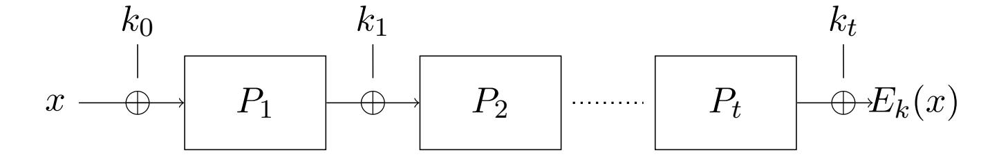

{0}------------------------------------------------

## Quantum Security Analysis of the Key-Alternating Ciphers

Chen Bai \* Mehdi Esmaili † and Atul Mantri †

Department of Computer Science, Virginia Tech, USA 24061

#### **Abstract**

In this work, we study the quantum security of key-alternating ciphers (KAC), a natural multi-round generalization of the Even–Mansour (EM) cipher underlying many block cipher constructions, including AES. While the classical security of KAC and the quantum security of the 1-round KAC (i.e. Even-Mansour) cipher are well understood, the quantum resistance of multi-round KAC remains largely unexplored. We focus on the 2-round KAC construction, defined using public n-bit permutations  $P_1$ ,  $P_2$  and keys  $k_0$ ,  $k_1$ , and  $k_2$  as  $E(x) = P_2(P_1(x \oplus k_0) \oplus k_1) \oplus k_2$ . Our main contributions are as follows:

- Quantum Lower Bounds. We provide the first formal analysis showing that a 2-round KAC is quantum-secure in both the Q1 and Q2 models. Specifically, in the Q1 model, a (non-adaptive) adversary must make at least  $2^{2n/5}$  quantum queries to the public permutations and at least  $2^{2n/5}$  classical queries to the cipher in order to distinguish it from a random permutation (in contrast to the classical lower bound of  $2^{2n/3}$  queries). As a corollary, we show that in the Q2 model, a (non-adaptive) adversary requires  $2^{n/4}$  quantum queries. To achieve such a result, we employ the quantum hybrid method along with recently proposed lifting theorems in the ideal cipher and random permutation oracle model.
- Quantum Key-Recovery Attack. We give the first nontrivial quantum key-recovery attack on multi-round KAC in the Q1 model where the adversary has quantum access to all of the public permutations. Our quantum attack applies to any t-round KAC and achieves quantum query complexity  $O(2^{\alpha n})$ , where  $\alpha = \frac{t(t+1)}{(t+1)^2+1}$ , improving over the best known classical bound of  $O(2^{\alpha'n})$ , where  $\alpha' = \frac{t}{t+1}$ , from Bogdanov et al. (EUROCRYPT 2012). The attack leverages a novel application of quantum walk algorithms specifically adapted to the KAC structure.
- The  $Q1^*$  Model. To bridge the classical and Q1 settings, we introduce the  $Q1^*$ , in which the adversary has quantum superposition access to at most one permutation. This model is crucial for our Q1 lower bound and supports similar key-recovery attacks to Q1, using fewer quantum resources. We believe  $Q1^*$  is of independent interest.

#### Contents

| 1 | Introduction |                                    |            |  |
|---|--------------|------------------------------------|------------|--|
|   | 1.1          | Our Results and Technical Overview | 4          |  |
|   | 1.2          | Related Work                       | 7          |  |
| 2 | Pre          | liminary                           | 8          |  |
|   | 2.1          | Quantum Walk Algorithm             | $\epsilon$ |  |
|   | 2.2          | Useful Lemmas                      | 10         |  |

<sup>\*</sup>cbai1@vt.edu

<sup>†</sup>mesmaili@vt.edu

<sup>&</sup>lt;sup>‡</sup>atulmantri@vt.edu

{1}------------------------------------------------

<span id="page-1-1"></span>

| 3                                                 | Quantum Lower bounds for 2-KAC                                          | 10 |  |  |  |  |  |
|---------------------------------------------------|-------------------------------------------------------------------------|----|--|--|--|--|--|
|                                                   | 3.1<br>Security of 2-KAC in the Q1* Model<br>                           | 11 |  |  |  |  |  |
|                                                   | 3.2<br>Lifting to the Q1 model<br>                                      | 17 |  |  |  |  |  |
|                                                   | 3.3<br>Analyzing the Q2 security<br>                                    | 20 |  |  |  |  |  |
| 4                                                 | Quantum Key-Recovery Attack for KAC                                     | 20 |  |  |  |  |  |
|                                                   | 4.1<br>Revisiting the Classical Key-Recovery Attack<br>                 | 21 |  |  |  |  |  |
|                                                   | 4.2<br>Quantum Key-Recovery Attack for t-KAC in<br>Q1 Model<br>         | 22 |  |  |  |  |  |
|                                                   | References<br>25                                                        |    |  |  |  |  |  |
|                                                   | Appendix A: Extending the security of 2-KAC in the Q1* model to t-KAC   | 30 |  |  |  |  |  |
| Appendix B: Proof of Classical Attack Lemma<br>30 |                                                                         |    |  |  |  |  |  |
|                                                   | Appendix C: Quantum Key-Recovery Attacks in Special Cases<br>31         |    |  |  |  |  |  |
|                                                   | Appendix D: Quantum Key-Recovery Attack for t-KAC in Q1*                | 34 |  |  |  |  |  |
|                                                   | Appendix E: Discussion on Query Complexity in Restricted Quantum Models | 37 |  |  |  |  |  |

## <span id="page-1-0"></span>1 Introduction

Key-alternating ciphers (KAC), also known as iterated Even-Mansour (EM) ciphers, are a fundamental class of block ciphers that serve as abstractions for many real-world cryptographic constructions, such as the Advanced Encryption Standard (AES) [\[DR02,](#page-26-0)[DR01,](#page-26-1)[BKL](#page-25-0)+12]. In its simplest form, a single-round KAC cipher was introduced by Even and Mansour in 1991 [\[EM97\]](#page-26-2), where the cipher is constructed by alternating public fixed permutations and secret key additions. It is more commonly known as the Even-Mansour cipher and is considered one of the simplest block cipher designs. EM cipher uses a public permutation P and two independent secret keys k<sup>0</sup> and k1. The encryption function Ek1,k<sup>0</sup> is defined as:

$$E_{k_1,k_0}(x) = k_1 \oplus P(k_0 \oplus x),$$

where x is the plaintext and ⊕ represents the bitwise XOR operation. The classical security of such a construction has been well-studied [\[EM97\]](#page-26-2), and the best-known attacks require approximately 2n/<sup>2</sup> queries, which is in line with other well-known block cipher constructions like Feistel networks and substitution-permutation networks.

Quantum technologies are rapidly evolving and pose significant threats to the security of digital communications [\[Sho99\]](#page-27-0). Besides public-key encryption and digital signatures, the security of symmetric cryptography against quantum adversaries is a critical and pressing issue. Quantum algorithms [\[Gro96,](#page-26-3) [Sim97\]](#page-27-1) significantly threaten symmetric ciphers by providing a quadratic speedup in exhaustive key search [\[GLRS16,](#page-26-4) [JNRV20\]](#page-26-5) and sometimes even beyond quadratic speedups [\[BSS22\]](#page-26-6), potentially compromising widely used ciphers such as the AES [\[BNPS19\]](#page-25-1). Although doubling key lengths is believed to mitigate this risk, such assumptions require rigorous validation, and proving/disproving such a hypothesis is one of the important goals of post-quantum cryptography.

In the quantum setting, an adversary may have quantum access to the encryption oracles and/or public permutation oracles, and the security of the Even-Mansour scheme (1-round KAC) has been settled in both cases [\[KM12,](#page-27-2) [KLLNP16,](#page-27-3) [LM17,](#page-27-4) [BHNP](#page-25-2)+19a, [JST21,](#page-27-5) [ABKM22\]](#page-25-3). Depending on the adversarial model, a quantum adversary may completely break the cipher using Simon's algorithm [\[Sim97\]](#page-27-1) (in the Q2 model), or degrade the security to a complexity of 2 n/<sup>3</sup> queries in the Q1 model, which restricts quantum access to permutation oracles only.

{2}------------------------------------------------

<span id="page-2-1"></span>

| Adversary Model | Encryption Oracle<br>Access | Permutation Oracle Access | Even-Mansour<br>Security Impact                  |
|-----------------|-----------------------------|---------------------------|--------------------------------------------------|
| Classical       | Classical                   | Classical                 | Standard classical $(2^{n/2} \text{ queries})$   |
| Q1              | Classical                   | Quantum                   | Degraded to $2^{n/3}$ queries                    |
| Q2              | Quantum                     | Quantum                   | Insecure $(O(n))$ queries via Simon's algorithm) |

Table 1: Comparison of Adversarial Models. Classical oracle access implies queries are made with classical bit strings, and outputs are classical bit strings. Quantum oracle access implies queries can be made with quantum superpositions of inputs, and outputs are returned in superposition.

The situation becomes significantly more complex when generalizing this construction to multiple rounds, which gives rise to t-round KAC (we will refer to it as t-KAC). In this case, t distinct public permutations are interleaved with t+1 secret keys (as shown in the Figure 1). Formally, given t public permutations  $P_1, P_2, \ldots, P_t$  over n-bit strings, and t+1 independent secret keys  $k_0, k_1, \ldots, k_t$  of size n, the encryption function  $E_k$  for a t-KAC is defined as:

$$E_k(x) = k_t \oplus P_t(k_{t-1} \oplus P_{t-1}(\dots P_1(k_0 \oplus x) \dots)),$$

where x is the plaintext. This generalization is structurally similar to real-world block ciphers such as AES, where multiple rounds of key addition and permutations increase the security of the cipher by introducing more layers of diffusion and confusion.



Figure 1: A key-alternating cipher, where Boxes represent public permutations  $P_i$ 's and  $\oplus$  is XOR of the input from left with the keys  $k_i$ 's.

<span id="page-2-0"></span>The classical security of multi-round KAC has been thoroughly explored in several works. For instance, Bogdanov et al. [BKL<sup>+</sup>12] presented a classical attack on t-KAC for t > 1 using approximately  $O(2^{\alpha'n})$  queries, where  $\alpha' = \frac{t}{t+1}$ , a bound later shown to be tight by Chen and Steinberger [CS14]. However, the security of multi-round KAC against quantum adversaries has remained an open problem. Quantum adversaries, with their ability to query superpositions of states and perform quantum computations, make the analysis of such constructions more intricate.

Despite significant progress in understanding the classical security of t-round key-alternating ciphers (KAC) and the quantum security of the Even-Mansour cipher (1-KAC), the post-quantum security of multi-round (or even 2-round) KAC remains poorly understood. In particular, no prior work establishes non-trivial quantum lower bounds for distinguishing multi-round KAC from a random permutation, nor are there generic quantum attacks for arbitrary t. This leaves two important questions open:

• (Lower Bound) Can we show provable security of multi-round KAC against quantum adversaries?

{3}------------------------------------------------

<span id="page-3-2"></span>• (Upper Bound) For t-KAC, can a quantum adversary do better than classical attacks in the realistic quantum threat models?

We give the first formal quantum security proof for 2-round KAC, showing that it resists nonadaptive quantum adversaries in both the Q1 and Q2 models. Specifically, in the Q1 model, we prove that distinguishing 2-KAC from a random permutation requires Ω(22n/<sup>5</sup> ) quantum queries to the public permutations (P1, P2) and Ω(22n/<sup>5</sup> ) classical queries to the cipher (Ek). Moreover, our result in the Q1 model extends to the Q2 model, implying that 2-KAC requires Ω(2n/<sup>4</sup> ) quantum queries in the Q2 setting.

The latter demonstrates resistance of such ciphers against known polynomial-query quantum attacks like Simon's algorithm, which can efficiently break the 1-round Even-Mansour cipher [\[KM12,](#page-27-2)[KLLNP16\]](#page-27-3). These crucial lower bounds are obtained using the quantum hybrid method [\[BBBV97,](#page-25-4) [ABKM22\]](#page-25-3) and leveraging recently proposed lifting theorems in quantum random permutation and ideal cipher models [\[CHL](#page-26-8)+25].

Complementing our lower bounds, we also address the second question by presenting the first non-trivial quantum key-recovery attack applicable to arbitrary t-round KAC. This attack operates in the Q1 model, where the adversary has quantum access to the public permutations. Our attack achieves a quantum query complexity of O(2 t(t+1)n (t+1)2+1 ), which outperforms the best known classical bound of Θ(2 tn <sup>t</sup>+1 ) from Bogdanov et al. [\[BKL](#page-25-0)+12]. This result provides the first concrete evidence of a generic quantum advantage for key recovery against multi-round KAC constructions in a realistic threat model. The attack uses a novel adaptation of quantum walk techniques tailored to the KAC structure.

To establish our Q1 bounds, we introduce a new threat model, Q1 ∗ , where the adversary has quantum access to only one permutation. This places Q1 <sup>∗</sup> between the classical and Q1 models in strength. We use Q1 <sup>∗</sup> as an intermediate step in proving the Q1 lower bound, and notably, our Q1 upper bound also holds in the Q1 ∗ setting, showing that similar quantum attacks are possible even with limited quantum access.

Together, our results give a comprehensive view of the quantum security landscape for keyalternating ciphers, especially on the decade-old question of Kuwakado and Morii [\[KM12\]](#page-27-2) about the security of 2-round AES-like constructions against quantum adversaries.

## <span id="page-3-0"></span>1.1 Overview of Our Contributions

We present an informal overview of our main results (also highlighted in the [Table](#page-3-0) [1.1\)](#page-3-0). We first provide a high-level idea behind our quantum lower bound results, followed by a description of our quantum key-recovery attack.

Lower bound for 2-KAC. We consider the Q1 model, where an adversary has classical access to E<sup>k</sup> and quantum access to P1, P<sup>2</sup> (and their inverse). In this setting, an adversary is able to evaluate the unitary operators UP<sup>i</sup> : |x⟩|y⟩ → |x⟩|y ⊕ Pi(x)⟩ on any quantum state it prepares. However, the adversary could only make classical queries to Ek, i.e., learning input and output pairs. In this paper, we consider a non-adaptive adversary that makes classical queries to E<sup>k</sup> and quantum queries to P<sup>1</sup> first, then makes quantum queries to P2. [1](#page-3-1) Our work was motivated by the framework proposed by Alagic et al. [\[ABKM22\]](#page-25-3), where they used the hybrid method to show the post-quantum security of the EM cipher in the Q1 model. However, no post-quantum security results have been established for multi-round EM, i.e., multi-round Key-Alternating Ciphers (KAC). In this work, using the hybrid approach, we demonstrate the post-quantum security of 2-KAC in the Q1 model. We prove the following theorem.

Informal Theorem [3.1](#page-10-1) (Security of 2-KAC in the Q1 model). In the Q1 model, any nonadaptive adversary requires roughly Ω(22n/<sup>5</sup> ) total queries (across classical queries to the cipher

<span id="page-3-1"></span><sup>1</sup> It is entirely symmetric to swap the order of P<sup>1</sup> and P2, we will elaborate this later.

{4}------------------------------------------------

<span id="page-4-0"></span>and quantum queries to the internal permutations) to distinguish the 2-round Key-Alternating Cipher from a random permutation.

To analyze 2-KAC in the Q1 model, we first introduce an *intermediate* model in which the adversary has classical access to E and  $P_1$ , and quantum access to  $P_2$ . We refer to this model as  $Q1^*$  throughout the remainder of the paper. Then, we extend our proof from the  $Q1^*$  model to the Q1 model, using the quantum lifting theorem for invertible permutations by Cojocaru et al. [CHL<sup>+</sup>25].

Security in the Q1\* Model. We first establish the security of 2-KAC in the Q1\* model. This model captures an adversary  $\mathcal{A}$  that makes classical queries to the underlying block cipher  $(E_k \text{ or a random permutation } R)$  and the permutation  $P_1$ , followed by quantum queries to the permutation  $P_2$  (and their inverse).

Our result shows that the advantage of such an adversary in distinguishing 2-KAC from a random permutation is bounded:

$$\operatorname{Adv}_{2\text{-KAC},Q1^*}(\mathcal{A}) \leq \mathcal{O}\left(\frac{q_E^2 q_{P_1}^2}{2^{3n}} + \frac{q_{P_2} \sqrt{q_E q_{P_1}}}{2^n}\right).$$

Here,  $q_E, q_{P_1}, q_{P_2}$  are the number of classical queries to the block cipher, classical queries to  $P_1$ , and quantum queries to  $P_2$  (or to their inverse), respectively.

The proof for the  $Q1^*$  model uses a hybrid argument. We define three experiments:  $\mathcal{H}_0$  (real world with  $E_k, P_1, P_2$ ),  $\mathcal{H}_2$  (ideal world with  $R, P_1, P_2$ ), and  $\mathcal{H}_1$  (intermediate world with  $R, P_1, P_2^{T_{out}, k}$ ). In  $\mathcal{H}_1$ ,  $P_2$  is reprogrammed based on the outcomes of classical queries. The total distinguishing advantage is bounded by summing the advantages between adjacent hybrids:  $|\Pr[\mathcal{A}(\mathcal{H}_0) = 1] - \Pr[\mathcal{A}(\mathcal{H}_2) = 1]| \le |\Pr[\mathcal{A}(\mathcal{H}_0) = 1] - \Pr[\mathcal{A}(\mathcal{H}_1) = 1]| + |\Pr[\mathcal{A}(\mathcal{H}_1) = 1] - \Pr[\mathcal{A}(\mathcal{H}_2) = 1]|$ .

The  $|\Pr[\mathcal{A}(\mathcal{H}_0) = 1] - \Pr[\mathcal{A}(\mathcal{H}_1) = 1]|$  bound arises from the classical query phase and the probabilistic nature of setting up the  $P_2$  reprogramming. This is related to the likelihood of certain *swap collisions* occurring during the reprogramming process, which depends on the size of a set of relevant classical query pairs,  $S_{E,P_1,k_0}$ . With classical access to  $P_1$ , the size of this set is typically  $\mathcal{O}(q_E q_{P_1}/2^n)$ , leading to a bound term roughly  $\mathcal{O}((q_E q_{P_1}/2^n)^2/2^n)$ .

The  $|\Pr[\mathcal{A}(\mathcal{H}_1) = 1] - \Pr[\mathcal{A}(\mathcal{H}_2) = 1]|$  bound relates to the adversary's ability to distinguish the reprogrammed  $P_2$  from a fresh random  $P_2$  using quantum queries. This is bounded by a term proportional to the number of quantum queries to  $P_2$  and the square root of the probability that a query point is affected by the reprogramming, which is proportional to the size of the reprogrammed set. This gives a bound term roughly  $\mathcal{O}(q_{P_2}\sqrt{(q_Eq_{P_1}/2^n)/2^n})$ . The sum of these terms provides the overall  $Q1^*$  security bound.

Security in the Q1 Model. We then analyze the security of 2-KAC in the Q1 model, where an adversary first makes classical queries to  $E_k$  and quantum queries to  $P_1$ , and then quantum queries to  $P_2$ .

Our result for the Q1 model is:

$$\operatorname{Adv}_{2\text{-KAC},Q1}(\mathcal{A}) \leq \mathcal{O}\left(\frac{q_E^2 q_{P_1}^4}{2^{3n}} + \frac{q_{P_1} q_{P_2} \sqrt{q_E}}{2^n}\right).$$

Here,  $q_E$  is the number of classical queries to the block cipher, and  $q_{P_1}, q_{P_2}$  are the number of quantum queries to  $P_1$  and  $P_2$ , respectively.

The proof for the Q1 model adapts the hybrid argument from the  $Q1^*$  case. The key difference is accounting for the adversary's quantum access to  $P_1$ . This primarily impacts the size of the set  $S_{E,P_1,k_0}$  that corresponds to the  $P_2$  reprogramming. To bound the size of

{5}------------------------------------------------

<span id="page-5-0"></span>this set when  $P_1$  is queried quantumly, we utilize a quantum lifting theorem (Theorem 3.1). This theorem relates the success probability of a quantum adversary in a search game on a permutation to that of a classical adversary in a similar game.

We apply Theorem 3.1 to bound the adversary's ability to find pairs that contribute to  $S_{E,P_1,k_0}$  using quantum queries to  $P_1$ . This analysis shows that with  $q_{P_1}$  quantum queries, the expected size of  $S_{E,P_1,k_0}$  is bounded by approximately  $\mathcal{O}(q_E q_{P_1}^2/2^n)$ , which is a higher bound compared to the classical  $P_1$  case.

This increased bound on the size of the reprogramming set is then used within the hybrid analysis. The bound for the first hybrid transition (related to swap collisions) becomes proportional to the square of this new set size, roughly  $\mathcal{O}((q_E q_{P_1}^2/2^n)^2/2^n)$ . The bound for the second hybrid transition (distinguishing reprogrammed  $P_2$ ) becomes proportional to  $q_{P_2}$  and the square root of the new set size, roughly  $\mathcal{O}(q_{P_2}\sqrt{(q_E q_{P_1}^2/2^n)/2^n})$ .

The resulting bound for the Q1 model reflects the enhanced capabilities of the adversary due to quantum access to  $P_1$ . The dominant term in this bound is typically the second term, showing the interplay between quantum access to  $P_1$  and  $P_2$  in limiting security. Our results provide concrete security bounds for 2-KAC in these relevant quantum attack models, highlighting the impact of different types of query access on the scheme's security.

Security in the Q2 Model. We also analyze the security of 2-round KAC in the strong Q2 model, which allows the adversary quantum access to the cipher in addition to the internal permutations. We provide the first proof of security for 2-round KAC against non-adaptive adversaries in this model.

Corollary 3.11 (Security of 2-KAC in the Q2 model). Even in the strong Q2 model, where adversaries have quantum access to both the cipher and its internal permutations, a non-adaptive adversary needs at least  $\Omega(2^{n/4})$  quantum queries to distinguish 2-round KAC from a random permutation.

This exponential bound is crucial, demonstrating that 2-round KAC resists polynomial-time quantum attacks, such as those based on Simon's algorithm that breaks 1-round Even-Mansour efficiently. This bound is derived as a corollary from our detailed Q1 security analysis.

Quantum Key-Recovery Attack on t-KAC. Complementing our lower bound results which establish hardness, we also provide a concrete key-recovery attack on the t-round KAC in the Q1 model. This attack demonstrates an achievable upper bound on the query complexity required for a successful key recovery.

The attack leverages the core idea from the classical attack [BKL<sup>+</sup>12], which identifies the correct key by finding multiple input tuples that result in the same key candidate via a set of equations involving  $E_k$  and  $P_i$ . While the classical attack achieves this by exhaustively searching over large sampled sets, incurring a cost of  $O(2^{tn/(t+1)})$ , our quantum attack significantly speeds up this search process.

We achieve this by transforming the problem of finding the required input tuples into a quantum search problem on a specially constructed graph. The vertices of this graph correspond to tuples of subsets of inputs to the permutations  $P_1, \ldots, P_t$ . A vertex is marked if the subsets it represents contain elements that, when combined with classically queried  $E_k$  values, allow for the efficient identification of the correct key via the classical collision property. We then apply the MNRS-style quantum walk framework [MNRS07] on this graph to find a marked vertex, which yields the necessary information to recover the keys.

**Informal Theorem 4.3** (Quantum Key-Recovery Attack). There exists a quantum key-recovery attack on t-round Key-Alternating Cipher in the Q1 model that recovers the secret keys with high probability using roughly  $2^{\alpha n}$  classical queries to  $E_k$  and quantum queries to  $P_1, \ldots, P_t$ ,

{6}------------------------------------------------

<span id="page-6-1"></span>

| Target | Setting              | Upper Bound                                               | Lower Bound                                                                                                        |
|--------|----------------------|-----------------------------------------------------------|--------------------------------------------------------------------------------------------------------------------|
| KAC    | Classical<br>Q1      | $O(2^{n/2})$ [Dae93] $\tilde{O}(2^{n/3})$ [KM12,BHNP+19a] | $ \begin{array}{ c c c c }\hline \Omega(2^{n/2}) \text{ [EM97]}\\ \Omega(2^{n/3}) \text{ [ABKM22]}\\ \end{array} $ |
|        | Q2                   | O(n) [KM12]                                               | _                                                                                                                  |
|        | Classical            | $O(2^{2n/3})$ ( [BKL <sup>+</sup> 12])                    | $\Omega(2^{2n/3})$ ( [BKL <sup>+</sup> 12])                                                                        |
| 2-KAC  | Q1                   | $O(2^{3n/5})$ Thm 4.3                                     | $\Omega(2^{2n/5})$ Thm 3.1                                                                                         |
|        | Q2                   | $O(n2^{n/2})$ [CGL22]                                     | $\Omega(2^{n/4})$ Cor 3.11                                                                                         |
|        | Q1*                  | $O(2^{3n/5})$ Thm D.2                                     | $\Omega(2^{n/2})$ Thm 3.3                                                                                          |
| 4-KAC  | Q2 (2 keys)          | $O(n2^{n/2})$ [AGIS24]                                    | _                                                                                                                  |
|        | Classical            | $O(2^{\frac{tn}{t+1}}) [BKL^+12]$                         | $\Omega(2^{\frac{tn}{t+1}})$ [CS14]                                                                                |
| t-KAC  | Q2 (same keys/perms) |                                                           |                                                                                                                    |
|        | Q1                   | $O(2^{\frac{t(t+1)n}{(t+1)^2+1}}) \text{ Thm } 4.3$       | _                                                                                                                  |
| t-KAC  | Q1*                  | $O(2^{\frac{t(t+1)n}{(t+1)^2+1}}) \text{ Thm D.2}$        | $\Omega(2^{(t-1)n/t})$ Thm A.1                                                                                     |

Table 2: Summary of known upper and lower bounds for key-alternating ciphers under various settings.

where 
$$\alpha = \frac{t(t+1)}{(t+1)^2+1}$$
.

While this bound shows a quantum speedup over classical attacks, the form of the exponent suggests that the advantage gained from quantum access in this Q1 model might align with query complexities observed in models with restricted quantum oracle access, a phenomenon discussed later.

### <span id="page-6-0"></span>1.2 Related Work

Classical Attacks. The Even-Mansour (EM) cipher was first introduced by Even and Mansour [EM97] to construct a block cipher from a publicly known permutation. Later, Daemen extended this idea into the key-alternating cipher (KAC) [DR01,DR02], which forms the basis of AES. In the case of a single round (t=1), the construction is referred to as 1-EM, where an adversary requires about  $2^{n/2}$  queries to distinguish  $E_k$  from a random permutation. For t=2, Bogdanov et al. [BKL+12] proved a security bound of  $2^{2n/3}$ , while Steinberger [Ste12] improved the bound to  $2^{3n/4}$  for t=3. A conjectured general bound of  $2^{\frac{tn}{t+1}}$  was eventually proven by Chen and Steinberger [CS14]. These bounds assume independent public permutations and random keys, but [CLL+18, WYCD20, YWY+23] showed specific constructions that achieve similar security levels.

**Quantum Attacks.** Quantum attacks against the EM and KAC ciphers have been extensively studied, particularly in the Q1 and Q2 models. Kuwakado and Morii [KM12] showed that 1-EM is completely broken in the Q2 model using Simon's algorithm. In the Q1 model, they presented an attack with approximately  $2^{n/3}$  oracle queries, using the BHT collision-finding algorithm, though it required exponential memory. Bonnetain et al. [BHNP+19b] later improved this attack to use only polynomial memory by combining Grover's search with Simon's algorithm.

For  $t \geq 2$ , results are sparse. A recent result by Cai et al. [CGL22] provided a Q1 attack on 2-KAC using offline Simon's algorithm, but the attack has the same query complexity as the best classical attack, implying no quantum speedup.

On the lower-bound side, Jaeger et al. [JST21] established security for the Even-Mansour cipher against non-adaptive adversaries using a public random function, and Alagic et al. [ABKM22, ABK<sup>+</sup>24] showed post-quantum security of the 1-EM and tweakable 1-EM con-

{7}------------------------------------------------

<span id="page-7-1"></span>struction against adaptive adversaries. However, proving quantum security for t-KAC remains largely unexplored.

The quantum lifting theorem, introduced by Yamakawa and Zhandry [YZ21], is a general technique for upgrading security proofs from the classical random oracle model (ROM) to the quantum random oracle model (QROM). The approach builds on the measurement-and-reprogramming lemma, originally proposed in [DFMS19] and later improved in [DFM20]. More recently, Cojocaru et al. [CHL<sup>+</sup>25] extended this framework to the setting of invertible permutations, establishing a quantum lifting theorem applicable in that context.

**Paper Organization.** Section 2 gives preliminaries. Section 3 shows indistinguishability analysis of 2-KAC against non-adaptive quantum adversaries in the Q1,  $Q1^*$  and Q2 model. Section 4 describes our quantum attack for t-KAC.

## <span id="page-7-0"></span>2 Preliminary

**Notation and basic definitions.** We let  $\mathcal{P}(n)$  denote the set of all permutations on  $\{0,1\}^n$ . In the *public-permutation model* (or random-permutation model), a uniform permutation  $P \leftarrow \mathcal{P}(n)$  is sampled and then provided as an oracle (in both the forward and inverse directions) to all parties.

A block cipher  $E : \{0,1\}^m \times \{0,1\}^n \to \{0,1\}^n$  is a keyed permutation, i.e.,  $E_k(\cdot) = E(k,\cdot)$  is a permutation of  $\{0,1\}^n$  for all  $k \in \{0,1\}^m$ . We say E is a (quantum-secure) pseudorandom permutation if  $E_k$  (for uniform  $k \in \{0,1\}^m$ ) is indistinguishable from a uniform permutation in  $\mathcal{P}(n)$  even for (quantum) adversaries who may query their oracle in both the forward and inverse directions.

Quantum query model. A quantum oracle is a black-box quantum operation that performs a specific task or computes a specific function. Quantum oracles are often associated with quantum queries, which are used in many quantum algorithms. For a function  $f: \{0,1\}^n \to \{0,1\}^m$ , a quantum oracle  $O_f$  is the following unitary transformation:  $O_f: |x\rangle|y\rangle \to |x\rangle|y \oplus f(x)\rangle$ , where  $|x\rangle$  and  $|y\rangle$  represent the states of the input and output registers, respectively. An adversary with quantum oracle access to f means that the adversary can evaluate the above unitary on any quantum states it prepares.

Quantum algorithms typically interact with oracles and their own internal unitaries in an interleaved manner to harness the strengths of each in solving specific computational problems. Consider a T-query quantum algorithm starting with an initial state,  $\phi_0$  (often an all-zero state), and then alternately applying unitary operators  $U_0, \dots, U_T$ , and quantum oracle  $O_f$ . The final state of the algorithm after T quantum queries is given by  $U_T O_f U_{T-1} O_f \cdots U_1 O_f U_0 |\phi_0\rangle$ . The algorithm produces its output by measuring the final state.

Quantum distinguishing advantages. Let  $\mathcal{A}$  be a quantum algorithm that makes at most q queries and outputs 0 or 1 as the final output, and let  $O_1$  and  $O_2$  be some oracles. We define the quantum distinguishing advantage of  $\mathcal{A}$  by

$$\mathbf{Adv}_{O_1,O_2}^{dist} \coloneqq \left| \Pr_{O_1} \left[ \mathcal{A}^{O_1}(1^n) = 1 \right] - \Pr_{O_2} \left[ \mathcal{A}^{O_2}(1^n) = 1 \right] \right|.$$

In the case of information theoretic adversaries (i.e. when we only consider the number of queries), we use the notation  $\mathbf{Adv}_{O_1,O_2}^{dist} := \max_{\mathcal{A}} \{\mathbf{Adv}_{O_1,O_2}^{dist}(\mathcal{A})\}$  where the maximum is taken over all quantum algorithms that make at most q quantum queries. By R we denote the quantum oracle of random permutations, i.e., the oracle such that a permutation  $R \in \mathcal{P}(n)$  is chosen uniformly at random, and adversaries are given oracle access to R.

{8}------------------------------------------------

#### <span id="page-8-3"></span><span id="page-8-0"></span>2.1 Quantum Walk Algorithm

We start with a regular, undirected graph G = (V, E) with a set of marked vertices M. The content of this subsection is adapted from the following papers [Amb07, MNRS07, BCSS23].

**Definition 2.1.** The Johnson graph G = (N, r) is a connected regular graph that contains  $\binom{N}{r}$  vertices such that each vertex is a subset of  $\{1, \dots, N\}$  with r elements. Two vertices  $v_1$  and  $v_2$  are adjacent if and only if  $v_1$  and  $v_2$  are only different in one element, i.e.,  $|v_1 \cap v_2| = r - 1$ .

**Definition 2.2.** Let  $G = (V_G, E_G)$  and  $H = (V_H, E_H)$  be two graphs. The Cartesian product  $R = G \times H$  is the graph with vertices  $V_R = V_G \times V_H$ , where two vertices  $(u_1, u_2)$  and  $(v_1, v_2)$  are adjacent in R if and only if  $(u_1, v_1) \in E_G$  and  $(u_2, v_2) \in E_H$ .

Quantum walk. Classically, the random walk algorithm looks for a marked vertex in the graph. The algorithm requires associated data d(v) from a data structure d for each  $v \in V$  to determine if v contains a marked element. Let  $V_d$  be the set of vertices along with the associated data, i.e.,  $V_d = \{(v, d(v)) : v \in V\}$ . In the quantum setting, each vertex is a quantum state  $|v\rangle$  in a Hilbert space  $\mathcal{H}$ . Then, the quantum analog of  $V_d$  is the quantum state  $|v\rangle_d = |v\rangle|d(v)\rangle$  in a Hilbert space  $\mathcal{H}_d$ . The quantum walk algorithm will be discussed in the space  $\mathcal{H}_d$ .

In the quantum walk algorithms [Amb07, Sze04, MNRS07], the state space is  $C^{|V|\times|V|}$ . This means that the walk is on the edges instead of the vertices. At each step, the right end-point of an edge (v,y) is mixed over the neighbors of v, and the left end-point is mixed over the neighbors of the new right end-point. Namely, for each vertex v, define  $|p_v\rangle$  as the superposition over all neighbors, i.e.  $|p_v\rangle = \frac{1}{\sqrt{m}}\sum_{y\in N_v}|y\rangle$  and  $|p_v\rangle_d = \frac{1}{\sqrt{m}}\sum_{y\in N_v}|y\rangle_d$ , where m=r(N-r) is the number of adjacent vertices. Let  $A=\{\text{span}|v\rangle_d|p_v\rangle_d, v\in V\}$  and  $B=\{\text{span}|p_y\rangle_d|y\rangle_d, y\in V\}$ . For a state  $|\psi\rangle\in\mathcal{H}$ , let  $\text{ref}_{\psi}=2|\psi\rangle\langle\psi|-\mathbb{I}$  be the reflection operator. If  $\mathcal{S}$  is subspace of H spanned by a set of mutually orthogonal states  $\{|\psi_i\rangle, i\in I\}$ ,  $\text{ref}(\mathcal{S})=2\sum_{i\in I}|\psi_i\rangle\langle\psi_i|-\mathbb{I}$ . Then, the quantum walk operator can be defined as  $W_d=\text{ref}(B)\cdot\text{ref}(A)$ . The first reflection ref(A) can be implemented as follows: first move  $|v\rangle_d|p_v\rangle_d$  to  $|v\rangle_d|0\rangle_d$ , perform reflection  $\text{ref}(\mathcal{H}_d\otimes|0\rangle_d)$  around  $|v\rangle_d|0\rangle_d$  and then reverse the first operation. Followed by the swap operation  $|v\rangle_d|y\rangle_d\to|y\rangle_d|v\rangle_d$ , the second reflection ref(B) can be implemented similarly.

MNRS quantum walk framework. The MNRS framework aims to create a quantum algorithm analogous to the classical walk described above. The goal is to move the initial state  $|\psi\rangle_d = \frac{1}{|V|} \sum_{v \in V} |v\rangle_d |p_v\rangle_d$  to its projection on the target state  $|\phi\rangle_d = \frac{1}{\sqrt{|M|}} \sum_{v \in M} |v\rangle_d |p_v\rangle_d$ . Here, V is the set of all vertices and M is the set of marked vertices. Grover's algorithm says that this can be done by applying the rotation  $\operatorname{ref}(\psi)_d\operatorname{ref}(\phi^\perp)_d$  repeatedly, where  $|\phi^\perp\rangle$  is the state that orthogonal to  $|\phi\rangle^2$ . Since  $\operatorname{ref}(\phi^\perp)_d = -\operatorname{ref}(M)_d$ , it can be applied with one oracle call. Implementing the operator  $\operatorname{ref}(\psi)_d$  is not trivial and requires phase estimation. In [MNRS07], the idea is to design a quantum circuit  $R_d$  that simulates  $\operatorname{ref}(\psi)_d$ . This quantum circuit needs to call  $W_d$  a total of  $O(\frac{1}{\sqrt{\delta}})$  times, where  $\delta$  is the spectral gap of G. We have omitted the details and would like to direct the interested readers to [MNRS07].

#### <span id="page-8-2"></span>Algorithm 1 MNRS Quantum Walk Algorithm (See [MNRS07])

- 1. Initialize the state  $|\psi\rangle_d$ .
- 2. Repeat  $O(\frac{1}{\sqrt{\epsilon}})$  times ( $\epsilon$  = probability of having a marked vertex):
  - (a) For any basis  $|v\rangle_d|y\rangle_d$ , flip the phase if  $v\in M$ .
  - (b) Apply the operation  $R_d$ .
- 3. Observe the first register  $|v\rangle_d$ .

<span id="page-8-1"></span> $<sup>^2\</sup>phi^{\perp}$  can be considered as the set of unmarked states

{9}------------------------------------------------

<span id="page-9-5"></span>We analyze the cost of Algorithm 1.

- Setup cost S: The cost to prepare the initialization state  $|\psi\rangle_d$ .
- Update cost U: Cost to update the state using operator R.
- Check cost C: The cost of checking if a vertex v is a marked vertex.

<span id="page-9-3"></span>**Theorem 2.1** (Quantum walk (For more details, see [MNRS07])). Let  $\delta$  be the spectral gap of a graph G = (V, E) and let  $\epsilon = \frac{|M|}{|V|}$ , where M is the set of marked vertices. There exists a quantum algorithm that can find an element of M with high probability. The cost is  $S + \frac{1}{\sqrt{\epsilon}}(\frac{1}{\sqrt{\delta}}U + C)$ .

#### <span id="page-9-0"></span>2.2 Useful Lemmas

In this section, we provide some lemmas that are used in our proof.

<span id="page-9-4"></span>**Lemma 2.2.** (Adapted from [Bab89]) Let G be a finite abelian group of order n, written additively. Let  $A_1, \ldots, A_t \subset G$  and let a be a fixed element of G. Set  $|A_i| = m_i$  for every  $i \in \{1, \ldots, t\}$ . The expected number of solutions of the equation  $x_1 \oplus \ldots \oplus x_t = a$   $(x_i \in A_i, i = 1, \ldots, t)$  is equal to  $\frac{m_1 \cdot \ldots \cdot m_t}{2^n}$ .

Next, we also need an "arbitrary reprogramming" in the lower bound proof to bound the number of quantum queries.

<span id="page-9-2"></span>**Lemma 2.3** (Reprogramming Lemma [ABKM22]). Let  $\mathcal{D}$  be a distinguisher in the following experiment:

**Phase 1:**  $\mathcal{D}$  outputs descriptions of a function  $F_0 = F : \{0,1\}^m \to \{0,1\}^n$  and a randomized algorithm  $\mathcal{B}$  whose output is a set  $B \subset \{0,1\}^m \times \{0,1\}^n$  where each  $x \in \{0,1\}^m$  is the first element of at most one tuple in B. Let  $B_1 = \{x \mid \exists y : (x,y) \in B\}$  and  $\epsilon = \max_{x \in \{0,1\}^m} \{\Pr_{B \leftarrow \mathcal{B}}[x \in B_1]\}$ .

**Phase 2:**  $\mathcal{B}$  is run to obtain B. Let  $F_1 = F^{(B)}$ .

The challenger samples a uniform bit b, and  $\mathcal{D}$  is given quantum access to  $F_b$ .

**Phase 3:**  $\mathcal{D}$  loses access to  $F_b$ , and receives the randomness r used to invoke  $\mathcal{B}$  in phase 2. Then,  $\mathcal{D}$  outputs a guess of b.

For any  $\mathcal{D}$  making q queries in expectation when its oracle is  $F_0$ , it holds that

$$|\Pr[\mathcal{D} \text{ outputs } 1 \mid b = 1] - \Pr[\mathcal{D} \text{ outputs } 1 \mid b = 0]| \le 2q \cdot \sqrt{\epsilon}.$$

## <span id="page-9-1"></span>3 Quantum Lower bounds for 2-KAC

In this section, we present a security proof for 2-KAC in the Q1 model against a non-adaptive adversary A that makes classical queries to E and quantum queries to  $P_1$  first, before making any quantum queries to  $P_2$ . Throughout this work, we consider the case where A has both forward and inverse access to the oracles.

First, recall the definition of 2-KAC :  $E_k(x) = k_2 \oplus P_2(k_1 \oplus P_1(k_0 \oplus x))$ , where  $k_0, k_1, k_2 \in \{0, 1\}^n$ ,  $k = (k_0, k_1, k_2)$  is a key and  $P_1, P_2 : \{0, 1\}^n \to \{0, 1\}^n$  are independent random public permutations.

The goal of the adversary  $\mathcal{A}$  is to distinguish between two worlds: the *real* world where  $\mathcal{A}$  gets access to  $(E_k, P_1, P_2)$ ; the *ideal* world where  $\mathcal{A}$  gets access to  $(R, P_1, P_2)$ , where R is a truly random permutation. Our main theorem is stated as follows.

{10}------------------------------------------------

<span id="page-10-3"></span><span id="page-10-1"></span>**Theorem 3.1** (Security of 2-KAC,  $Q1 \mod 1$ ). Let D be a distribution over  $k = (k_0, k_1, k_2)$  such that the marginal distributions of  $k_0$ ,  $k_1$  and  $k_2$  are each uniform, and let A be an adversary first making  $q_E$  classical queries to the cipher and  $q_{P_1}$  quantum queries to  $P_1$ , and then making  $q_{P_2}$  quantum queries to  $P_2$ . Let  $\mathbf{Adv}_{2\text{-}KAC,Q1}(A)$  denote the qPRP advantage of A:

$$\mathbf{Adv}_{2\text{-}KAC,Q1}(\mathcal{A}) := \left| \Pr_{\substack{k \leftarrow D \\ P_1, P_2 \leftarrow \mathcal{P}_n}} \left[ \mathcal{A}^{E_k, P_1, P_2}(1^n) = 1 \right] - \Pr_{\substack{R \leftarrow \mathcal{P}_n \\ P_1, P_2 \leftarrow \mathcal{P}_n}} \left[ \mathcal{A}^{R, P_1, P_2}(1^n) = 1 \right] \right|.$$

Then for 
$$\gamma = \Theta(1)$$
, we obtain  $\mathbf{Adv}_{2\text{-}KAC,Q1} \leq 2q_{P_2}q_{P_1}\sqrt{\frac{2\gamma q_E}{2^{2n}}} + \frac{\gamma^2 q_E^2 q_{P_1}^4}{2^{3n}}$ .

Our proof proceeds in two main stages. First, we introduce an intermediate security model, which we term the  $Q1^*$  model. In this model, the adversary  $\mathcal{A}$  has only classical access to the permutation  $P_1$  but retains quantum access to  $P_2$ . We will establish the security of 2-KAC in this  $Q1^*$  model (see Section 3.1). Second, we will demonstrate how to lift this security proof from the  $Q1^*$  model to the Q1 model (where  $\mathcal{A}$  has quantum access to  $P_1$ ) by employing the quantum lifting theorem from [CHL<sup>+</sup>25] (see Section 3.2). This staged approach allows us to first analyze a simpler scenario and then generalize the result. We begin by defining and analyzing the security of  $Q1^*$  model.

## <span id="page-10-0"></span>3.1 Security of 2-KAC in the Q1\* Model

In the classical world, if an input tuple (e, z, c) of  $(E_k, P_1, P_2)$  satisfies the following conditions for the secret key k:

$$\triangle: e \oplus z = k_0, \quad P_1(e) \oplus c = k_1, \quad P_2(c) \oplus E_k(e) = k_2,$$

this input tuple is defined as a bad transcript. Note that there is only a negligible probability that  $\triangle$  holds in the ideal world (where  $E_k(x)$  is replaced by a random permutation R(x)). Therefore, the security bound will essentially depend on the probability of  $\mathcal{A}$  encountering or forming such bad transcripts.

Without loss of generality, we assume  $\mathcal{A}$  makes no redundant classical queries. In the  $Q1^*$  model, we consider an adversary  $\mathcal{A}$  that initially makes

- $q_E$  classical queries to E (the cipher  $E_k$  in the real world, or a random permutation R in the ideal world);
- $q_{P_1}$  classical queries to  $P_1$ ;
- $q_{P_2}$  quantum queries to  $P_2$ .

From its classical interactions,  $\mathcal{A}$  learns:

$$S_E = \{(e_1, g_1), \dots, (e_{q_E}, g_{q_E})\},$$

$$S_E^1 = \{(z_1, u_1), \dots, (z_{q_{P_1}}, u_{q_{P_1}})\},$$

$$S_E^1 = \{z_1, \dots, z_{q_{P_1}}\},$$

$$S_{P_1}^1 = \{z_1, \dots, z_{q_{P_1}}\}.$$

Let's define the set:

<span id="page-10-2"></span>
$$S_{E,P_1,k_0} := \{ (e,g,z,u) \mid (e,g) \in S_E, (z,u) \in S_{P_1}, \text{ such that } e \oplus z = k_0 \}.$$
 (1)

The expected size of  $S_{E,P_1,k_0}$  is  $\frac{|S_E^1||S_{P_1}^1|}{2^n} = \frac{q_E q_{P_1}}{2^n}$ . If we consider  $|S_{E,P_1,k_0}|$  as a sum of indicator random variables,  $|S_{E,P_1,k_0}| = \sum_{e \in S_E^1} \sum_{z \in S_{P_1}^1} \mathbb{I}(e \oplus z = k_0)$ , we can analyze its concentration. More specifically, we consider a classical search game.

{11}------------------------------------------------

## Search Game $\mathcal{G}^C$ (Classical)

This game between a Challenger C and an Adversary A models the adversary's strategy for finding pairs (e, z) such that  $e \oplus z = k_0$ .

- 1.  $\mathcal{A}$  makes  $q_E$  classical queries to R and  $q_{P_1}$  classical queries to  $P_1$ .  $\mathcal{C}$  constructs  $S_E$  using  $q_E$  query/response pairs from R.
- **2.** Initialize  $S_{E,P_1,k_0}$  as an empty set. For each  $e_i \in S_E^1$ ,  $\mathcal{C}$  plays a sub-game  $\mathcal{G}_i^C$ :
  - Without letting  $\mathcal{A}$  make more queries, asks  $\mathcal{A}$  to output  $P_1(e_i \oplus k_0)$ .
  - If  $\mathcal{A}$  wins the game by outputting the correct value,  $\mathcal{C}$  adds  $(e_i, R(e_i), e_i \oplus k_0, P_1(e_i \oplus k_0))$  to the set  $S_{E,P_1,k_0}$ .
- **3.**  $\mathcal{C}$  outputs the set  $S_{E,P_1,k_0}$ .

The success of adversary  $\mathcal{A}$  in identifying a specific pair  $(e_i, e_i \oplus k_0)$  within the framework of game  $\mathcal{G}^C$  crucially depends on its previous queries to  $P_1$ . Since  $\mathcal{A}$  cannot make additional queries to  $P_1$  after its initial  $q_{P_1}$  queries (this is because of the non-adaptivity nature of adversary), its success in any sub-game for a given  $e_i \in S_E^1$  (i.e., whether  $e_i \oplus k_0 \in S_{P_1}^1$ ) depends on whether  $e_i \oplus k_0$  was one of the  $q_{P_1}$  points  $\mathcal{A}$  initially queried to  $P_1$ . Assuming  $k_0$  is uniformly random over  $\{0,1\}^n$  and unknown to  $\mathcal{A}$  when choosing its  $P_1$  queries, and that the  $e_i$  values are distinct, the probability that  $e_i \oplus k_0 \in S_{P_1}^1$  is precisely  $\frac{q_{P_1}}{2^n}$  for each  $e_i$ . This probability relies on standard assumptions about  $\mathcal{A}$ 's query strategy (e.g., the choice of  $e_i$  values does not provide information about  $k_0$  relative to  $S_{P_1}^1$ ).

This individual success probability of  $\frac{q_{P_1}}{2^n}$  applies to each of the  $q_E$  sub-games, one for each  $e_i$ . While these sub-games (events  $e_i \oplus k_0 \in S_{P_1}^1$ ) are predicated on the same fixed set  $S_{P_1}^1$  chosen by  $\mathcal{A}$ , if  $k_0$  is the source of randomness, the events are independent. The probability of  $e_i \oplus k_0 \in S_{P_1}^1$  is  $\frac{q_{P_1}}{2^n}$  for each i, and these can be treated as independent Bernoulli trials. Consequently, the expected size of the set  $S_{E,P_1,k_0}$  (which is the output of game  $\mathcal{G}^C$ ) is the sum of probabilities of these individual events:

$$E[|S_{E,P_1,k_0}|] = \sum_{i=1}^{q_E} \Pr[e_i \oplus k_0 \in S_{P_1}^1] = q_E \cdot \frac{q_{P_1}}{2^n}.$$

The game  $\mathcal{G}^C$  thus formally models the process by which  $\mathcal{A}$  constructs the set  $S_{E,P_1,k_0}$ .

To characterize the typical size of  $|S_{E,P_1,k_0}|$ , we can apply a Chernoff-type bound. For a sum of independent Bernoulli variables, a standard form of the bound for 0 < c < 1 states:

$$\Pr\left[\left||S_{E,P_1,k_0}| - E[|S_{E,P_1,k_0}|]\right| \ge cE[|S_{E,P_1,k_0}|]\right] \le 2e^{-\frac{c^2E[|S_{E,P_1,k_0}|]}{3}}.$$

This inequality implies that  $|S_{E,P_1,k_0}|$  is typically concentrated around its expectation, provided  $E[|S_{E,P_1,k_0}|]$  is sufficiently large for the bound to be meaningful. Informally, this means we can often consider  $|S_{E,P_1,k_0}| \approx \gamma \cdot E[|S_{E,P_1,k_0}|]$  for some factor  $\gamma = \Theta(1)$ . We use the notation  $\frac{\gamma q_E q_{P_1}}{2^n}$  to denote this typical size of  $|S_{E,P_1,k_0}|$ .

This leads to the following corollary:

<span id="page-11-1"></span>Corollary 3.2. Typically, 
$$|S_{E,P_1,k_0}| = \frac{\gamma q_E q_{P_1}}{2^n}$$
, where  $\gamma = \Theta(1)$ .

We then state our main theorem as follows.

<span id="page-11-0"></span>**Theorem 3.3** (Security of 2-KAC,  $Q1^*$  model). Let  $\mathcal{P}_n$  denote the set of all permutations on  $\{0,1\}^n$ . Let D be a distribution over  $k=(k_0,k_1,k_2)$  such that the marginal distributions of

{12}------------------------------------------------

<span id="page-12-1"></span> $k_0$ ,  $k_1$ , and  $k_2$  are each uniform over  $\{0,1\}^n$ . Let  $\mathcal{A}$  be an adversary first making  $q_E$  classical queries to the cipher  $(E_k \text{ or } R)$  and  $q_{P_1}$  classical queries to  $P_1$ , and then making  $q_{P_2}$  quantum queries to  $P_2$ . For  $\gamma = \Theta(1)$  as previously defined (see Corollary 3.2),

$$\begin{vmatrix}
\Pr_{\substack{k \leftarrow D \\ P_1, P_2 \leftarrow \mathcal{P}_n}} \left[ \mathcal{A}^{E_k, P_1, P_2}(1^n) = 1 \right] - \Pr_{\substack{R \leftarrow \mathcal{P}_n \\ P_1, P_2 \leftarrow \mathcal{P}_n}} \left[ \mathcal{A}^{R, P_1, P_2}(1^n) = 1 \right] \\
\leq 2q_{P_2} \sqrt{\frac{2\gamma q_E q_{P_1}}{2^{2n}}} + \frac{\gamma^2 q_E^2 q_{P_1}^2}{2^{3n}}.$$

Proof of Theorem 3.3. The proof employs a hybrid argument, simplified from that in [ABKM22] due to the non-adaptive nature of the classical versus quantum query phases. We define three experiments (hybrids) and bound the adversary's ability to distinguish between them.

Recall that  $\mathcal{A}$ 's classical interaction consists of:

$$S_E = \{(e_1, g_1), \dots, (e_{q_E}, g_{q_E})\},$$
  $S_E^1 = \{e_1, \dots, e_{q_E}\},$   $S_{P_1} = \{(z_1, u_1), \dots, (z_{q_{P_1}}, u_{q_{P_1}})\},$   $S_{P_1}^1 = \{z_1, \dots, z_{q_{P_1}}\}.$ 

The target set  $S_{E,P_1,k_0}$  as defined in Equation 1 consists of a quadruplet (e,g,z,u) such that  $e \oplus z = k_0$ . By Corollary 3.2, the typical size of this set is  $t := |S_{E,P_1,k_0}| = \frac{\gamma q_E q_{P_1}}{2^n}$ . From  $S_{E,P_1,k_0}$ , we identify t quadruplets; let the j-th such quadruplet be  $(e_j,g_j,z_j,u_j)$ , where  $g_j$  is  $E_k(e_j)$  in the real world or  $R(e_j)$  in an ideal world context. We form ordered lists of pairs that will be crucial for reprogramming:

<span id="page-12-0"></span>
$$T_{\text{in}} := \{(e_1, z_1), \dots, (e_t, z_t)\}, \qquad T_{\text{out}} := \{(g_1, u_1), \dots, (g_t, u_t)\}.$$
 (2)

Here,  $e_j \in S_E^1$  and  $z_j \in S_{P_1}^1$  satisfy  $e_j \oplus z_j = k_0$ . Also,  $g_j$  is either  $E_k(e_j)$  or  $R(e_j)$ , and  $u_j = P_1(z_j)$ .

We define reprogramming operations for a permutation  $P_2$ . Let  $T_{\text{out}}$  be a generic list of t output pairs  $\{(g_j, u_j)\}_{j=1}^t$ . For  $j=1,\ldots,t$ , let  $y_j:=u_j\oplus k_1$  and  $y_j':=g_j\oplus k_2$ . The operations  $\overrightarrow{Q}$  and  $\overleftarrow{Q}$  represent sequences of swaps defined as follows:

$$\overrightarrow{Q}_{T_{\mathsf{out}},P_2,k} := \prod_{j=1}^t \operatorname{swap}_{y_j,P_2^{-1}(y_j')}, \qquad \qquad \overleftarrow{Q}_{T_{\mathsf{out}},P_2,k} := \prod_{j=t}^1 \operatorname{swap}_{P_2(y_j),y_j'}.$$

Here, swap<sub>A,B</sub>, when applied to  $P_2$ , implies that if  $P_2(X) = A$ , then X is mapped to B, and if  $P_2(Y) = B$ , then Y is mapped to A. More precisely,  $P_2$  is modified such that its value at  $y_j$  becomes  $y'_j$ , and its value at  $P_2^{-1}(y'_j)$  (the original preimage of  $y'_j$ ) becomes  $P_2(y_j)$  (the original image of  $y_j$ ). The reprogrammed permutation  $P_2^{T_{\text{out}},k}$  is then defined as:

$$P_2^{T_{\mathsf{out}},k} := P_2 \circ \overrightarrow{Q}_{T_{\mathsf{out}},P_2,k} = \overleftarrow{Q}_{T_{\mathsf{out}},P_2,k} \circ P_2.$$

This construction ensures that for each  $j \in \{1, ..., t\}$ ,  $P_2^{T_{\mathsf{out}}, k}(u_j \oplus k_1) = g_j \oplus k_2$ .

**Hybrid Arguments.** We define a sequence of experiments:

**H**<sub>0</sub>. (Real World) This is the actual interaction. The challenger samples  $k = (k_0, k_1, k_2) \leftarrow D$ , and  $P_1, P_2 \leftarrow \mathcal{P}_n$ .  $\mathcal{A}$  makes  $q_E$  classical queries to  $E_k$ ,  $q_{P_1}$  classical queries to  $P_1$ , and  $q_{P_2}$  quantum queries to  $P_2$ .  $\mathcal{A}$ 's view is  $(E_k, P_1, P_2)$ .

{13}------------------------------------------------

 $\mathbf{H}_1$ . This experiment modifies  $\mathbf{H}_0$  in the following way. The encryption  $E_k$  is replaced by a random permutation R and the permutation  $P_2$  is reprogrammed based on k and the classical queries to  $R, P_1$ .

The challenger first samples  $k \leftarrow D$ , and  $R, P_1, P_2 \leftarrow \mathcal{P}_n$ .  $\mathcal{A}$  makes classical queries to R and  $P_1$ . Then the challenger does the following:

- It plays the  $\mathcal{G}^C$  with  $\mathcal{A}$  and outputs  $S_{E,P_1,k_0}$ . This is done in the following manner:
  - Runs  $\mathcal{A}$ , makes  $q_E$  classical queries to R and  $q_{P_1}$  classical queries to  $P_1$ . Constructs  $S_E$  using query/response pairs from R.
  - Initialize  $S_{E,P_1,k_0}$  as an empty set. Then, for each  $i=1,\ldots,q_E$ , plays the sub-game  $\mathcal{G}_i^C$  in  $\mathcal{G}^C$  and updates  $S_{E,P_1,k_0}$ . After  $q_E$  games, the challenger obtains the final  $S_{E,P_1,k_0}$ .
- Constructs the target sets  $T_{in}$ ,  $T_{out}$  from Equation 2 and construct  $P_2^{T_{out},k}$  as above. Then, runs  $\mathcal{A}$  with  $q_{P_2}$  quantum queries to  $P_2^{T_{out},k}$ .  $\mathcal{A}$ 's view is  $(R, P_1, P_2^{T_{out},k})$ .

 $\mathbf{H}_2$ . (Ideal World) This experiment modifies  $\mathbf{H}_1$  by replacing the reprogrammed  $P_2$ , i.e.  $P_2^{T_{\text{out}},k}$  with  $P_2$ .

The challenger samples  $k \leftarrow D$  (though k is not used by the oracles  $\mathcal{A}$  sees), and  $R, P_1, P_2 \leftarrow \mathcal{P}_n$ .  $\mathcal{A}$  makes classical queries to R and  $P_1$ .  $\mathcal{A}$  makes  $q_{P_2}$  quantum queries to the original, unmodified  $P_2$ .  $\mathcal{A}$ 's view is  $(R, P_1, P_2)$ . This is the ideal world interaction.

We bound the distinguishing probability for adjacent hybrids. Let  $\Pr[\mathcal{A}(\mathbf{H}_i) = 1]$  be the probability that  $\mathcal{A}$  outputs 1 in experiment  $\mathbf{H}_i$ .

<span id="page-13-0"></span>**Lemma 3.4.** Let  $\mathbf{H}_0$  and  $\mathbf{H}_1$  be defined as above. The distinguishing advantage for an adversary  $\mathcal{A}$  between experiments  $\mathbf{H}_0$  and  $\mathbf{H}_1$  is bounded by:

$$|\Pr[\mathcal{A}(\mathbf{H}_0) = 1] - \Pr[\mathcal{A}(\mathbf{H}_1) = 1]| \approx \frac{\gamma^2 q_E^2 q_{P_1}^2}{2^{3n}}.$$

Proof. Experiment  $\mathbf{H}_0$  provides the adversary  $\mathcal{A}$  with oracles  $(E_k, P_1, P_2)$ , while Experiment  $\mathbf{H}_1$  provides  $(R, P_1, P_2^{T_{\text{out}}, k})$ , where R is a random permutation, and  $P_2^{T_{\text{out}}, k}$  is permutation  $P_2$  reprogrammed at t specific points. The reprogramming ensures that  $P_2^{T_{\text{out}}, k}(u_j \oplus k_1) = g_j \oplus k_2$  for each  $j \in \{1, \ldots, t\}$ , where  $(e_j, g_j, z_j, u_j) \in S_{E, P_1, k_0}$  (with  $e_j \oplus z_j = k_0$  and  $u_j = P_1(z_j)$ ) and  $g_j = R(e_j)$ . The main idea is to show that the distinguishing advantage between  $\mathbf{H}_0$  and  $\mathbf{H}_1$  arises from the structural properties of the reprogrammed permutation  $P_2^{T_{\text{out}}, k}$  compared to an ideal  $P_2$ .

Note that the permutation  $P_2^{T_{\text{out}},k}$  is constructed from  $P_2$  by applying t swap operations. For each  $j \in \{1,\ldots,t\}$ , let  $y_j := u_j \oplus k_1$  be the input point to  $P_2$  that is reprogrammed, and let  $v_j := R(e_j) \oplus k_2$  be its new target image. The swap operation sets  $P_2^{T_{\text{out}},k}(y_j) = v_j$ . To maintain the permutation property, if  $x_j := P_2^{-1}(v_j)$  is the original preimage of  $v_j$  under  $P_2$ , then  $P_2^{T_{\text{out}},k}(x_j)$  is set to  $P_2(y_j)$  (the original image of  $y_j$ ).

Let  $\Gamma_Y = \{y_1, \dots, y_t\}$  be the set of t input points used for reprogramming. Since  $P_1$  is a permutation and the  $z_j$  values (from  $S_{E,P_1,k_0}$ ) are distinct, the  $u_j = P_1(z_j)$  values are distinct. As  $k_1$  is uniform, the t values in  $\Gamma_Y$  are distinct and uniformly distributed over  $\{0,1\}^n$ . Let  $\Gamma_V = \{v_1, \dots, v_t\}$  be the set of t new target images. Note that R is a random permutation,  $e_j$  values (from  $S_{E,P_1,k_0}$ ) are distinct, and  $k_2$  is uniform, therefore t values in  $\Gamma_V$  are distinct and uniformly distributed. Let  $\Gamma_X = \{P_2^{-1}(v_1), \dots, P_2^{-1}(v_t)\}$  be the set of original preimages of the values in  $\Gamma_V$  under the random permutation  $P_2$ . The elements of  $\Gamma_X$  are also t distinct and uniformly distributed values.

{14}------------------------------------------------

The reprogramming procedure is well-defined and results in a permutation  $P_2^{T_{\text{out}},k}$  that behaves identically to  $P_2$  except (potentially) at points in  $\Gamma_Y \cap \Gamma_X$ . Swap collision arises if the set of reprogrammed inputs  $\Gamma_Y$  intersects with the set of original preimages  $\Gamma_X$ , i.e., if  $\Gamma_Y \cap \Gamma_X \neq \emptyset$ .

The probability that  $\Gamma_Y \cap \Gamma_X = \emptyset$ , where  $\Gamma_Y$  and  $\Gamma_X$  are two independently chosen sets of t distinct elements from a domain of size  $2^n$ , is  $\frac{\binom{2^n-t}{t}}{\binom{2^n}{t}}$ . For  $t \ll 2^n$ , this probability can be approximated:

$$\Pr[\Gamma_Y \cap \Gamma_X = \emptyset] = \prod_{i=0}^{t-1} \frac{2^n - t - i}{2^n - i} = \prod_{i=0}^{t-1} \left(1 - \frac{t}{2^n - i}\right) \approx \left(1 - \frac{t}{2^n}\right)^t.$$

Using the approximation  $(1-x)^k \approx e^{-xk}$  for small  $x = t/2^n$ , we have  $\Pr[\Gamma_Y \cap \Gamma_X = \emptyset] \approx e^{-t^2/2^n}$ . Consequently, the probability of a swap collision is:

$$\Pr[\Gamma_Y \cap \Gamma_X \neq \emptyset] = 1 - \Pr[\Gamma_Y \cap \Gamma_X = \emptyset] \approx 1 - e^{-t^2/2^n}.$$

For small arguments  $x' = t^2/2^n$ ,  $1 - e^{-x'} \approx x'$ . The collision probability is:  $\Pr[\text{swap collision}] \approx \frac{t^2}{2^n}$ . This collision probability represents the primary avenue by which  $\mathcal{A}$  might distinguish  $\mathbf{H}_0$  from  $\mathbf{H}_1$  due to the structural definition of  $P_2^{T_{\text{out}},k}$ . Therefore, the distinguishing advantage is approximately bounded by  $\frac{t^2}{2^n}$ . Substituting the typical size  $t = \frac{\gamma q_E q_{P_1}}{2^n}$  (Corollary 3.2):

$$\frac{t^2}{2^n} = \frac{\left(\frac{\gamma q_E q_{P_1}}{2^n}\right)^2}{2^n} = \frac{\gamma^2 q_E^2 q_{P_1}^2}{2^{2n} \cdot 2^n} = \frac{\gamma^2 q_E^2 q_{P_1}^2}{2^{3n}}.$$

This yields the bound stated in the lemma.

<span id="page-14-0"></span>**Lemma 3.5.** Let  $\mathbf{H}_1$  and  $\mathbf{H}_2$  be defined as above. The distinguishing advantage for an adversary  $\mathcal{A}$  between experiments  $\mathbf{H}_1$  and  $\mathbf{H}_2$  is:

$$|\Pr[\mathcal{A}(\mathbf{H}_1) = 1] - \Pr[\mathcal{A}(\mathbf{H}_2) = 1]| \le 2 \cdot q_{P_2} \cdot \sqrt{\frac{2\gamma q_E q_{P_1}}{2^{2n}}},$$

*Proof.* From  $\mathcal{A}$ , we construct a distinguisher  $\mathcal{D}$  for the reprogramming experiment (as defined in Lemma 2.3). Our distinguisher  $\mathcal{D}$  proceeds as follows:

Phase 1: Setup and Definition of Reprogramming (for Lemma 2.3).  $\mathcal{D}$  prepares the components to be submitted to the challenger of Lemma 2.3.

- 1.  $\mathcal{D}$  samples three independent random permutations  $R, P_1, P_2 \leftarrow \mathcal{P}_n$ .
- 2.  $\mathcal{D}$  runs  $\mathcal{A}$  with classical access to R and  $P_1$ . After  $\mathcal{A}$  making  $q_E$  classical queries to R and  $q_{P_1}$  classical queries to  $P_1$ , constructs  $S_E$  (from R) and  $S_{P_1}$  (from  $P_1$ ).
- 3.  $\mathcal{D}$  defines the function  $F_0: \{+1, -1\} \times \{0, 1\}^n \to \{0, 1\}^n$  as  $F_0(op, x) := P_2^{op}(x)$ . Here, op denotes the direction of the query.
- 4.  $\mathcal{D}$  defines the randomized algorithm  $\mathcal{B}$ . When  $\mathcal{B}$  is run (by the challenger of Lemma 2.3), it takes  $P_2, S_E, S_{P_1}$  as fixed parameters from  $\mathcal{D}$ 's context and performs:

#### Algorithm $\mathcal{B}(P_2, S_E, S_{P_1})$ :

- (i) Sample the key  $k = (k_0, k_1, k_2) \leftarrow D$ . This sampled k is the randomness of  $\mathcal{B}$ .
- (ii) Initialize  $S_{E,P_1,k_0}$  as an empty set. For each  $i=1,\dots,q_E$ , play search game  $\mathcal{G}_i^C$  in  $\mathcal{G}^C$  and update  $S_{E,P_1,k_0}$ .
- (iii) Construct  $P_2^{T_{\text{out}},k}$  from  $P_2$  using  $k_1, k_2$  and  $S_{E,P_1,k_0}$ , where  $|S_{E,P_1,k_0}| = t$  in the following way:

{15}------------------------------------------------

- For  $j \in [t]$ , set  $P_2^{T_{\mathsf{out}},k}(u_j \oplus k_1) = g_j \oplus k_2$ .
- To maintain the permutation property, if  $x'_{\text{in},j} = P_2^{-1}(g_j \oplus k_2)$ , then set  $P_2^{T_{\text{out}},k}(x'_{\text{in},j}) = P_2(u_j \oplus k_1)$ .
- (iv) Let  $F_1(op, x) := (P_2^{T_{\text{out}}, k})^{op}(x)$ .
- (v) Define the set  $B \subset (\{+1, -1\} \times \{0, 1\}^n) \times \{0, 1\}^n$  as  $B := \{((op, x'), F_1(op, x')) \mid F_1(op, x') \neq F_0(op, x')\}.$
- (vi) Return B.
- 5.  $\mathcal{D}$  outputs the description of  $F_0$  and the algorithm  $\mathcal{B}$  to its challenger.
- **Phase 2: Quantum Simulation.** The challenger of Lemma 2.3 runs  $\mathcal{B}(P_2, S_E, S_{P_1})$  to obtain the set B (this involves sampling k). It then defines  $F_1 = F_0^{(B)}$ . A uniform bit b is chosen, and  $\mathcal{D}$  is given quantum access to  $F_b$ .  $\mathcal{D}$  resumes running  $\mathcal{A}$ , answering its quantum queries using  $F_b$ . Phase 2 ends when  $\mathcal{A}$  makes  $q_{P_2}$  quantum queries.
- **Phase 3: Output (for Lemma 2.3).**  $\mathcal{D}$  loses access to  $F_b$ . The challenger provides  $\mathcal{D}$  with k (the randomness used by  $\mathcal{B}$ ). Once  $\mathcal{A}$  produces an output bit,  $\mathcal{D}$  outputs that same bit as its guess for b.

Correctness of the Reduction. A's view within D's simulation:

- If b = 0,  $\mathcal{A}$  gets quantum access to  $F_0(op, x) = P_2^{op}(x)$ . Classical oracles are  $R, P_1$ . This is experiment  $\mathbf{H}_2$ .
- If b = 1,  $\mathcal{A}$  gets quantum access to  $F_1(op, x) = (P_2^{T_{\text{out}}, k})^{op}(x)$ , where k was sampled in  $\mathcal{B}$ . Classical oracles are  $R, P_1$ . This is experiment  $\mathbf{H}_1$ .

Bounding the Advantage. We apply Lemma 2.3.

- Number of Quantum Queries (q):  $\mathcal{D}$  makes  $q_{P_2}$  queries to  $F_b$ ,  $q = q_{P_2}$ .
- Reprogramming Probability ( $\epsilon$ ): As per Lemma 2.3,

$$\epsilon = \max_{(op^*, x^*) \in \{+1, -1\} \times \{0, 1\}^n} \left\{ \Pr_{B \leftarrow \mathcal{B}}[(op^*, x^*) \in B_1] \right\},$$

where  $B_1 = \{(op, x') \mid F_1(op, x') \neq F_0(op, x')\}$ . The randomness of  $\mathcal{B}$  is the choice of  $k \leftarrow D$ . So,  $\epsilon = \max_{(op^*, x^*)} \Pr_{k \leftarrow D}[F_1(op^*, x^*) \neq F_0(op^*, x^*)]$ . The function  $F_1$  (derived from  $P_2^{T_{\text{out}}, k}$ ) differs from  $F_0$  (derived from  $P_2$ ) if the input  $(op^*, x^*)$  corresponds to one of the following sets:

- If 
$$op^* = 1$$
:  $x^* \in \{u_j \oplus k_1\}_{j=1}^t$  or  $x^* \in \{P_2^{-1}(g_j \oplus k_2)\}_{j=1}^t$ .

- If 
$$op^* = -1$$
:  $x^* \in \{g_j \oplus k_2\}_{j=1}^t$  or  $x^* \in \{P_2(u_j \oplus k_1)\}_{j=1}^t$ .

For any fixed  $(op^*, x^*)$ , the values  $u_j, g_j$  are determined by  $k_0$  (from k) and  $S_E, S_{P_1}$ . The probability that  $x^*$  is affected then depends on  $k_1, k_2$  (from k). There are at most 2t such points of divergence for  $x^*$  for any fixed  $op^*$ . Since  $k_1, k_2$  are components of  $k \leftarrow D$  and assumed to be uniformly random over  $\{0, 1\}^n$ , the probability that a fixed  $x^*$  matches one of these 2t specific values (which themselves depend on  $k_1$  or  $k_2$ ) is bounded. For any fixed  $(op^*, x^*)$ ,  $\Pr_{k \leftarrow D}[F_1(op^*, x^*) \neq F_0(op^*, x^*)] \leq \frac{2t}{2^n}$ . This holds because for any  $k_0$ , the subsequent choice of  $k_1, k_2$  makes each of the 2t values (where  $F_0$  and  $F_1$  might differ) hit  $x^*$  with probability  $1/2^n$ . Thus,  $\epsilon = \max_{(op^*, x^*)} \Pr_{k \leftarrow D}[F_1(op^*, x^*) \neq F_0(op^*, x^*)] \leq \frac{2t}{2^n}$ .

{16}------------------------------------------------

<span id="page-16-2"></span>Applying the bound from Lemma 2.3:

$$|\Pr[\mathcal{A}(\mathbf{H}_1) = 1] - \Pr[\mathcal{A}(\mathbf{H}_2) = 1]| \le 2q_{P_2} \cdot \sqrt{\epsilon} \le 2q_{P_2} \cdot \sqrt{\frac{2t}{2^n}}.$$

For 
$$t = \frac{\gamma q_E q_{P_1}}{2^n}$$
,  $|\Pr[\mathcal{A}(\mathbf{H}_1) = 1] - \Pr[\mathcal{A}(\mathbf{H}_2) = 1]| \le 2q_{P_2} \cdot \sqrt{\frac{2\gamma q_E q_{P_1}}{2^{2n}}}$ .

From Lemma 3.4 and Lemma 3.5 and by the triangle inequality, we have:

$$|\Pr[\mathcal{A}(\mathbf{H}_0) = 1] - \Pr[\mathcal{A}(\mathbf{H}_2) = 1]| \le \frac{\gamma^2 q_E^2 q_{P_1}^2}{2^{3n}} + 2q_{P_2} \sqrt{\frac{2\gamma q_E q_{P_1}}{2^{2n}}}.$$

This completes the proof of Theorem 3.3.

#### <span id="page-16-0"></span>3.2 Lifting to the Q1 model

In this section, we prove a lower bound for 2-KAC in the Q1 model. We consider a non-adaptive adversary  $\mathcal{A}$  which first makes classical queries to E and quantum queries to  $P_1$  at the same time, followed by quantum queries to  $P_2$ . Moreover, we use the same hybrid method as in the  $Q1^*$  model. Our key idea is to apply the quantum lifting theorem for invertible permutations from [CHL<sup>+</sup>25, Theorem 1.1] to lift our analysis from the  $Q1^*$  model to the Q1 model.

<span id="page-16-1"></span>**Theorem 3.6** (Theorem 1.1, [CHL<sup>+</sup>25]). Let  $\mathcal{G}$  be an (interactive) search game with a challenger  $\mathcal{C}$  that performs at most k classical queries to the invertible random permutation  $\pi$ :  $\{0,1\}^n \to \{0,1\}^n$ , and let  $\mathcal{A}$  be an algorithm that performs q quantum queries to  $\pi$ . Then there exists an adversary  $\mathcal{B}$  making at most k classical queries to  $\pi$  such that:

$$\Pr[\mathcal{B} \ wins \ \mathcal{G}] \ge \frac{\left(1 - \frac{k^2}{2^n}\right)}{(8q+1)^{2k}} \Pr[\mathcal{A} \ wins \ \mathcal{G}].$$

In the  $Q1^*$  model, the construction of the set  $S_{E,P_1,k_0}$  in  $\mathbf{H}_1$  is essentially related to a search game where the simulator acts as the challenger. Specifically, for each classical query  $(e_i, g_i)$  to E, we can consider a game where the adversary tries to find corresponding information from its  $P_1$  queries. In the  $Q1^*$  case (classical  $P_1$ ), the simulator checks if  $P_1(e_i \oplus k_0)$  matches any observed  $P_1$  output.

Then, in the Q1 model, we lift the process of constructing the set  $S_{E,P_1,k_0}$  to a quantum search game  $\mathcal{G}^Q$ , which is identical to Game  $\mathcal{G}^C$  except that  $\mathcal{A}$  gets quantum access to  $P_1$ .

## Search Game $\mathcal{G}^Q$ (Quantum)

This game between a Challenger C and an Adversary A models the adversary's strategy for finding pairs (e, z) such that  $e \oplus z = k_0$ .

- 1.  $\mathcal{A}$  makes  $q_E$  classical queries to R and  $q_{P_1}$  quantum queries to  $P_1$ .  $\mathcal{C}$  constructs  $S_E$  using  $q_E$  query/response pairs from R.
- **2.** Initialize  $S_{E,P_1,k_0}$  as an empty set. For each  $e_i \in S_E^1$ ,  $\mathcal{C}$  plays a sub-game  $\mathcal{G}_i^Q$ :
  - Without letting  $\mathcal{A}$  make more queries, asks  $\mathcal{A}$  to output  $P_1(e_i \oplus k_0)$ .
  - If  $\mathcal{A}$  wins the game by outputting the correct value,  $\mathcal{C}$  adds  $(e_i, R(e_i), e_i \oplus k_0, P_1(e_i \oplus k_0))$  to the set  $S_{E,P_1,k_0}$ .
- **3.**  $\mathcal{C}$  outputs the set  $S_{E,P_1,k_0}$ .

{17}------------------------------------------------

This game is conceptually related to finding pairs  $(z, P_1(z))$  from which  $S_{E,P_1,k_0}$  is formed. Let  $\mathcal{B}$  be a classical algorithm that plays game  $\mathcal{G}^C$  with one query to  $P_1$ . For  $i = 1, \ldots, q_E$ ,  $\Pr[\mathcal{B} \text{ wins } \mathcal{G}_i^C] = \frac{1}{2^n}$ . Let  $\mathcal{A}$  be a quantum algorithm that plays game  $\mathcal{G}^Q$  with  $q_{P_1}$  quantum queries to  $P_1$ . Using Theorem 3.6 with k = 1 we have:

$$\Pr[\mathcal{B} \text{ wins } \mathcal{G}_i^C] \ge \frac{\left(1 - \frac{1}{2^n}\right)}{(8q_{P_1} + 1)^2} \Pr[\mathcal{A} \text{ wins } \mathcal{G}_i^Q].$$

Rearranging, we bound the success probability of the quantum adversary in the game  $\mathcal{G}_i^Q$ :

$$\Pr[\mathcal{A} \text{ wins } \mathcal{G}_i^Q] \le \frac{(8q_{P_1} + 1)^2}{2^n (1 - \frac{1}{2^n})} \approx \frac{64q_{P_1}^2}{2^n}.$$

The expected size of the set  $S_{E,P_1,k_0}$  is the sum of probabilities that each pair  $(e_i, z_j)$  contributes to the set, or framed in terms of the game above, the expected number of times the game  $\mathcal{G}_i^Q$  (for  $i = 1, \ldots, q_E$ ) is "won" by the adversary's interaction with  $P_1$ . Thus, we have:

$$E[|S_{E,P_1,k_0}|] = \sum_{i=1}^{q_E} \Pr[\mathcal{A} \text{ wins } \mathcal{G}_i^Q] \le q_E \cdot \frac{(8q_{P_1} + 1)^2}{2^n \left(1 - \frac{1}{2^n}\right)} \approx \frac{64q_E q_{P_1}^2}{2^n}.$$

Using a concentration bound (similar to Corollary 3.2 in the  $Q1^*$  analysis), we can state that  $|S_{E,P_1,k_0}|$  is bounded with high probability:

<span id="page-17-0"></span>
$$|S_{E,P_1,k_0}| \le \frac{\gamma q_E q_{P_1}^2}{2^n} \tag{3}$$

where  $\gamma = \Theta(1)$ . We are now ready to prove Theorem 3.1.

**Proof of Theorem 3.1.** The hybrids  $\mathbf{H}_0, \mathbf{H}_1, \mathbf{H}_2$  in the Q1 model are analogous to those in the  $Q1^*$  model, with the key difference being that  $\mathcal{A}$  has quantum query access to  $P_1$  instead of classical.

**Hybrid Arguments.** We define a sequence of experiments:

**H**<sub>0</sub>. (Real World) This is the actual interaction. The challenger C samples  $P_1, P_2 \leftarrow \mathcal{P}_n$  and  $k \leftarrow D$ . A makes classical queries to  $E_k$  and quantum queries to  $P_1$  in the first phase  $(q_E \text{ classical to } E_k, q_{P_1} \text{ quantum to } P_1)$ . Let  $S_E = \{(e_1, g_1), \dots, (e_{q_E}, g_{q_E})\}$  be the ordered list of  $E_k$ -queries/answers. In the second phase  $(q_{P_2} \text{ quantum queries})$ , A makes quantum queries using  $P_2$ . A's view is  $(E_k, P_1, P_2)$ .

 $\mathbf{H}_1$ . This experiment modifies  $\mathbf{H}_0$  in the following way. The challenger  $\mathcal{C}$  first samples  $R, P_1, P_2 \leftarrow \mathcal{P}_n$  and  $k \leftarrow D$ .  $\mathcal{A}$  makes classical queries to R and quantum queries to  $P_1$  in the first phase. Then  $\mathcal{C}$  does the following:

- It plays the  $\mathcal{G}^Q$  with  $\mathcal{A}$  and outputs  $S_{E,P_1,k_0}$ . This is done in the following manner:
  - Runs  $\mathcal{A}$ , makes  $q_E$  classical queries to R and  $q_{P_1}$  quantum queries to  $P_1$ . Constructs  $S_E$  using query/response pairs from R.
  - Initialize  $S_{E,P_1,k_0}$  as an empty set. Then, for each  $i=1,\ldots,q_E$ , plays the sub-game  $\mathcal{G}_i^Q$  in  $\mathcal{G}^Q$  and updates  $S_{E,P_1,k_0}$ . After  $q_E$  games,  $\mathcal{C}$  gets the final  $S_{E,P_1,k_0}$ .
- Constructs the target sets  $T_{in}$  and  $T_{out}$  from Equation 2 using  $S_{E,P_1,k_0}$  and the reprogrammed permutation  $P_2^{T_{out},k}$ . In the second phase,  $\mathcal{A}$  makes  $q_{P_2}$  quantum queries to  $P_2^{T_{out},k}$ .  $\mathcal{A}$ 's view is  $(R,P_1,P_2^{T_{out},k})$ .

{18}------------------------------------------------

**H**<sub>2</sub>. (Ideal World) This experiment modifies **H**<sub>1</sub> in the following way. The challenger C samples  $R, P_1, P_2 \leftarrow \mathcal{P}_n$  and  $k \leftarrow D$ . A makes  $q_E$  classical queries to R and  $q_{P_1}$  quantum queries to  $P_1$  in the first phase. In the remainder of the execution, A makes  $q_{P_2}$  quantum queries to  $P_2$ . A's view is  $(R, P_1, P_2)$ .

Next, we bound the distinguishing probabilities between adjacent hybrids.

<span id="page-18-0"></span>**Lemma 3.7.** Let  $\mathbf{H}_0$  and  $\mathbf{H}_1$  be defined as above. The distinguishing advantage for an adversary  $\mathcal{A}$  between experiments  $\mathbf{H}_0$  and  $\mathbf{H}_1$  is

$$|\Pr[\mathcal{A}(\mathbf{H}_0) = 1] - \Pr[\mathcal{A}(\mathbf{H}_1) = 1]| \le \frac{\gamma^2 q_E^2 q_{P_1}^4}{2^{3n}}.$$
 (4)

Proof. Let  $t = |S_{E,P_1,k_0}|$ . From Equation 3, we have  $t \leq \frac{\gamma q_E q_{P_1}^2}{2^n}$  with high probability. Substituting this bound into the proof of Lemma 3.4 (from the  $Q1^*$  analysis), which bounds the distinguishing advantage based on the probability of swap collisions  $(t^2/2^n)$ , we get the desired bound:  $\frac{t^2}{2^n} \leq \frac{(\gamma q_E q_{P_1}^2/2^n)^2}{2^n} = \frac{\gamma^2 q_E^2 q_{P_1}^4}{2^{3n}}$ .

<span id="page-18-1"></span>**Lemma 3.8.** Let  $\mathbf{H}_1$  and  $\mathbf{H}_2$  be defined as above. The distinguishing advantage for an adversary  $\mathcal{A}$  between experiments  $\mathbf{H}_1$  and  $\mathbf{H}_2$  is:

$$|\Pr[\mathcal{A}(\mathbf{H}_1) = 1] - \Pr[\mathcal{A}(\mathbf{H}_2) = 1]| \le 2 \cdot q_{P_2} \cdot \sqrt{\frac{2\gamma q_E q_{P_1}^2}{2^{2n}}}.$$
 (5)

Proof. This bound follows the structure of the proof for Lemma 3.5 (from the  $Q1^*$  analysis). The key difference is the size of the set of reprogrammed points,  $t = |S_{E,P_1,k_0}|$ . Substituting the bound  $t \leq \frac{\gamma q_E q_{P_1}^2}{2^n}$  (from Equation 3) into  $2q_{P_2}\sqrt{\frac{2t}{2^n}}$ , the distinguishing advantage is now bounded by  $2q_{P_2}\sqrt{\frac{2(\gamma q_E q_{P_1}^2/2^n)}{2^n}} = 2q_{P_2}\sqrt{\frac{2\gamma q_E q_{P_1}^2}{2^{2n}}} = 2q_{P_2}q_{P_1}\sqrt{\frac{2\gamma q_E}{2^{2n}}}$ .

From Lemma 3.7 and Lemma 3.8, by the triangle inequality, we obtain:

$$|\Pr[\mathcal{A}(\mathbf{H}_0) = 1] - \Pr[\mathcal{A}(\mathbf{H}_2) = 1]| \le 2q_{P_1}q_{P_2}\sqrt{\frac{2\gamma q_E}{2^{2n}}} + \frac{\gamma^2 q_E^2 q_{P_1}^4}{2^{3n}}.$$

**Remark 3.9.** The first term of the above upper bound becomes non-negligible when  $q_E \cdot q_{P_1}^2 \cdot q_{P_2}^2 \approx 2^{2n}$ , while the second term becomes non-negligible when  $q_E^2 \cdot q_{P_1}^4 \approx 2^{3n}$ . The first term suggests a query complexity involving  $q_E, q_{P_1}, q_{P_2}$  products, specifically requiring  $\Omega(2^{2n/5})$  total queries if they are roughly balanced, and the second term requires  $\Omega(2^{n/2})$  if  $q_E \approx q_{P_1}$ . The first term  $2q_{P_1}q_{P_2}\sqrt{2\gamma q_E/2^{2n}}$  can be regarded as dominating term and controls the adversary's distinguishing advantage.

**Remark 3.10.** Due to the symmetric construction of 2-KAC, a similar security analysis can be done in the setting when the adversary queries  $P_2$  before  $P_1^3$ . Instead of relating the size of  $S_{E,P_1,k_0}$  in order to find  $P_1(e_i \oplus k_0)$ , the analysis would involve finding  $P_2^{-1}(g_i \oplus k_2)$ , where  $g_i = E_k(e_i)$ . Following the same hybrid method along with Theorem 3.6, we can lift the classical search game that uses  $P_2^{-1}$  (which is also a random permutation) to obtain a similar bound:

$$|\Pr[\mathcal{A}(\mathbf{H}_0) = 1] - \Pr[\mathcal{A}(\mathbf{H}_2) = 1]| \le 2q_{P_1}q_{P_2}\sqrt{\frac{2\gamma q_E}{2^{2n}}} + \frac{\gamma^2 q_E^2 q_{P_2}^4}{2^{3n}}.$$

Since the dominant term  $2q_{P_1}q_{P_2}\sqrt{2\gamma q_E/2^{2n}}$  stays the same (up to constant factors), the overall security bound is similar regardless of the order of quantum access to  $P_1$  and  $P_2$ . For A to achieve a non-negligible advantage (i.e.,  $\Omega(1)$ ), the query complexity must satisfy  $q_E \cdot q_{P_1}^2 \cdot q_{P_2}^2 = \Omega(2^{2n})$ .

<span id="page-18-2"></span><sup>&</sup>lt;sup>3</sup>Throughout the paper, we assumed that  $\mathcal{A}$  first makes queries to  $P_1$ , then to  $P_2$ .

{19}------------------------------------------------

#### <span id="page-19-3"></span><span id="page-19-0"></span>3.3 Analyzing the Q2 security

While EM cipher (1-KAC) is broken by Simon's algorithm in polynomial quantum time [Sim97, KM12, KLLNP16], the quantum security of multi-round KAC, particularly in the strong Q2 model, has been an open question. We show that 2-round KAC provides provable security against non-adaptive adversaries in the Q2 model.

Recall that Theorem 3.1 establishes that any successful attack in the Q1 model requires  $q_E \cdot q_{P_1}^2 \cdot q_{P_2}^2 \approx 2^{2n}$ . This implies a query complexity lower bound of at least  $\Omega(2^{2n/5})$  in Q1 model. As a corollary to this result, we obtain:

<span id="page-19-2"></span>Corollary 3.11. To distinguish 2-KAC from a random permutation in the Q2 model, a non-adaptive quantum adversary requires at least  $\Omega(2^{n/4})$  quantum queries to the internal permutations.

To show this, we consider an adversary in the Q1 model that is given the entire codebook of  $E_k$  (i.e.  $q_E = 2^n$ ). This adversary captures the Q2 adversary as it can simulate the quantum access to the E oracle. By putting  $q_E = 2^n$ , Theorem 3.1 shows that even this powerful adversary still requires  $q_{P_1}^2 \cdot q_{P_2}^2 \approx 2^n$ , resulting in at least  $\Omega(2^{n/4})$  quantum queries to successfully distinguish the real world from the ideal world. This demonstrates the security of 2-KAC against polynomial-time quantum attacks like Simon's algorithm (unlike the complete break of 1-KAC as shown by Kuwakado and Morii [KM12]).

We note that this  $\Omega(2^{n/4})$  lower bound applies to non-adaptive adversaries and is likely not tight, given its derivation. Establishing tighter lower bounds for 2-round KAC in the Q2 model against adaptive or non-adaptive adversaries remains an important open question for future work.

**Remark 3.12.** (Security of multi-round KAC). So far, our discussion has primarily focused on the security of 2-round KAC. For the security of multi-round KAC, we consider our intermediate model,  $Q1^*$ , and extend the security analysis from 2-round to t-round KAC within this model in Appendix A.

To conclude this overall section, we highlight the following open questions for future research:

- Q1. Extending Security to Multiple Rounds: Is it possible to extend the security analysis of KAC from the 2-round setting to a more general t-round KAC ( $t \ge 3$ ) within the Q1 and Q2 quantum models? In this work, we give security proof for the 2-round KAC which relies crucially on a recently introduced quantum lifting theorem [CHL<sup>+</sup>25]. Following a similar approach, extending to t-rounds would likely necessitate the development of a lifting theorem capable of handling multiple independent permutations.
- Q2. Security Against Adaptive Adversaries: Can one formally prove the security of multi-round KAC (or even 2-round KAC) in the Q1 and Q2 models against adaptive quantum adversaries? While we make progress in understanding the security of KAC against non-adaptive quantum adversaries, analyzing its security against adaptive quantum adversaries remains a significant open challenge.

## <span id="page-19-1"></span>4 Quantum Key-Recovery Attack for KAC

In this section, we present a quantum attack on the KAC cipher within the Q1 model. We first revisit the classical attack, highlighting the property we will leverage.

Given t public permutations  $P_1, P_2, \ldots, P_t$  over n-bit strings, and t+1 independent secret keys  $k_0, k_1, \ldots, k_t$  of size n, the t-round KAC encryption function  $E_k : \{0, 1\}^{(t+1)n} \times \{0, 1\}^n \to \{0, 1\}^n$  for a t-KAC on a plaintext x is defined as:

$$E_k(x) = k_t \oplus P_t(k_{t-1} \oplus P_{t-1}(\dots P_1(k_0 \oplus x) \dots)). \tag{6}$$

{20}------------------------------------------------

## <span id="page-20-6"></span><span id="page-20-0"></span>4.1 Revisiting the Classical Key-Recovery Attack

The classical attack [\[BKL](#page-25-0)+12] establishes a query complexity of O(22n/<sup>3</sup> ). The idea is to sample inputs and look for collisions in generated key candidates. The attack proceeds as follows: First, the adversary A randomly selects subsets of the input domains of E, P1, . . . , P<sup>t</sup> , denoted by S0, . . . , S<sup>t</sup> . These sets are defined as:

<span id="page-20-2"></span>
$$S_i = \{x_{i,1}, \dots, x_{i,|S_i|}\}$$
 for  $i = 0, \dots, t$ . (7)

with the condition of |S0| · |S1| · . . . · |S<sup>t</sup> | = β2 tn, for some constant β ≥ t + 1.

A queries each of E, P1, . . . , P<sup>t</sup> on the inputs taken from the sets S0, . . . , S<sup>t</sup> , respectively. A obtains all query/response pairs (x0,i, Ek(x0,i)) for x0,i ∈ S0, and (xj,i, P<sup>j</sup> (xj,i)) for xj,i ∈ S<sup>j</sup> where j ∈ {1, . . . , t}. A then stores these pairs.

Then, for each tuple (x0, . . . , xt) ∈ S<sup>0</sup> × · · · × S<sup>t</sup> , the adversary collect a key candidate (κ0, . . . , κt) via the following sequence of equations:

<span id="page-20-1"></span>
$$\kappa_0 = x_0 \oplus x_1, \quad \kappa_i = P_i(x_i) \oplus x_{i+1} \text{ for } 1 \le i \le t-1, \quad \kappa_t = P_t(x_t) \oplus E_k(x_0).$$
(8)

Finally, among all the β2 tn generated key candidates, the algorithm returns the one that occurs the most frequently.

To analyze the attack, first observe that since the sets S0, . . . , S<sup>t</sup> are chosen randomly, the first t equations in [Equation](#page-20-1) [8](#page-20-1) generate each possible key candidate for (k0, . . . , kt−1) approximately β times. Now, suppose the algorithm produces two key candidates that share the same first t components derived from distinct input tuples (x (1) 0 , . . . , x (1) t ) and (x (2) 0 , . . . , x (2) t ) from S<sup>0</sup> × · · · × S<sup>t</sup> :

$$(\kappa_0,\ldots,\kappa_{t-1},\kappa_t^{(1)})$$
 and  $(\kappa_0,\ldots,\kappa_{t-1},\kappa_t^{(2)})$ .

Then, the following holds based on the properties of random permutations and keys:

<span id="page-20-4"></span>
$$\Pr[\kappa_t^{(1)} = \kappa_t^{(2)}] = \begin{cases} 1 & \text{if } (\kappa_0, \dots, \kappa_{t-1}) = (k_0, \dots, k_{t-1}), \\ \frac{1}{2^n} & \text{otherwise.} \end{cases}$$
(9)

This implies that (k0, . . . , kt) is the one that appears most frequently among all the generated candidates, with high probability. Now, we can rewrite the classical attack in the following way:

#### <span id="page-20-3"></span>Algorithm 2 Classical Key-Recovery Attack for t-KAC

1. Set β = t + 1. Sample t + 1 random sets as [Equation](#page-20-2) [7](#page-20-2) conditioning on

$$|S_0| \cdot |S_1| \cdot \ldots \cdot |S_t| = \beta 2^{tn}.$$

Set E : S<sup>0</sup> → {0, 1} <sup>n</sup> and P<sup>i</sup> : S<sup>i</sup> → {0, 1} <sup>n</sup> for all i ∈ {1, . . . , t}.

- 2. A gets classical access to E, P1, . . . , Pt. A then queries all possible inputs in S<sup>0</sup> for E, and all possible inputs in S<sup>i</sup> for P<sup>i</sup> for 1 ≤ i ≤ t. A then stores the query/response pairs.
- <span id="page-20-7"></span>3. For each input tuple (x0, . . . , xt) ∈ S0×. . .×S<sup>t</sup> , A generates a key tuple (κ0, . . . , κt) by [Equation](#page-20-1) [8.](#page-20-1)
- <span id="page-20-8"></span>4. A checks whether there exists a key tuple that is generated by at least t + 1 different input tuples. It then collects all such key candidates and uses a constant number of queries to E, P1, . . . , P<sup>t</sup> to test each candidate and identify the correct key.

The following lemma establishes the optimal query complexity of the algorithm and proves its correctness.

<span id="page-20-5"></span>Lemma 4.1. [Algorithm](#page-20-3) [2](#page-20-3) recovers keys of t-KAC with O(2 tn <sup>t</sup>+1 ) classical queries with the probability of 1 − ε.

{21}------------------------------------------------

<span id="page-21-6"></span>*Proof Sketch.* The optimal query complexity is achieved by balancing the sizes of the sets  $S_0, \ldots, S_t$ . Correctness relies on showing that the correct key is generated with sufficiently high frequency compared to any incorrect key candidate. The full proof is provided in Appendix B. Next, we generalize the classical attack (presented in Algorithm 2) to Q1 setting.

### <span id="page-21-0"></span>4.2 Quantum Key-Recovery Attack for t-KAC in Q1 Model

In this section, we generalize the classical attack (Algorithm 2) to the Q1 model, where the adversary A has classical access to  $E_k$  and quantum access to  $P_1, \ldots, P_t$ . We focus on query complexity, defining the cost as the number of classical queries to  $E_k$  and quantum queries to  $P_i$  or their inverses.

The key observation from the classical attack is that the correct key  $(k_0, \ldots, k_t)$  is uniquely identified by the property that it generated by multiple input tuples from  $S_0 \times S_1 \times \ldots \times S_t$ . Our quantum attack uses a quantum walk to find a subset of  $S_0, S_1, \ldots, S_t$  (corresponding to a vertex in a product graph) that is likely to contain the values needed to generate the correct key multiple times when combined with  $S_0$ .

 $\mathcal{A}$  begins by querying  $E_k$  on all elements of  $S_0$ . Then,  $\mathcal{A}$  defines a graph G which is the Cartesian product of t Johnson graphs  $J(S_i, r)$ , for  $1 \leq i \leq t$ . A vertex in G is a tuple of t subsets, one from each  $S_i$ . A vertex  $V = (V_1, \ldots, V_t)$  with  $V_i \subseteq S_i$ ,  $|V_i| = r$  is considered marked if it contains the necessary elements such that combining them with  $S_0$  allows generating the correct key  $(k_0, \ldots, k_t)$  at least t+1 times via Equation 8.

By performing a quantum walk on G to find a marked vertex, A can recover the correct key. Below, we present the steps of our Q1 attack and provide a detailed explanation of each phase.

## <span id="page-21-2"></span>**Algorithm 3** Quantum Key-Recovery Attack for t-KAC in the Q1 Model.

<span id="page-21-1"></span>1. (Classical Initialization:) Set  $\alpha = (t+1)^{\frac{1}{t+1}}$ . Sample t+1 random sets  $S_0, \ldots, S_t$  as in Equation 7, such that  $|S_0| = \alpha N_c$ ,  $|S_1| = \ldots = |S_t| = \alpha N_q$ , and

<span id="page-21-5"></span>
$$N_c.N_q^{\ t} = 2^{nt}. (10)$$

The optimal values for  $N_c$  and  $N_q$  will be determined later. Query  $E_k$  on all inputs in  $S_0$ . Store query/response pairs.

- <span id="page-21-3"></span>2. (Quantum Walk Search:) Define the graph  $G = J(S_1, r) \times ... \times J(S_t, r)$  (Cartesian product). Vertices  $V = (V_1, ..., V_t)$  are tuples of subsets  $V_i \subseteq S_i$  with  $|V_i| = r$ . Define marked vertices as specified below. Run the quantum walk algorithm (Algorithm 1) on G to find a marked vertex V. If no marked vertex is found after a sufficient number of iterations, restart from Step 1. Otherwise, obtain the marked vertex V and its associated data d(V).
- <span id="page-21-4"></span>3. (Verification) Using V and d(V) (which contains  $P_i(x)$  for  $x \in V_i$ ), identify key candidates  $(\kappa_0, \ldots, \kappa_t)$  generated by tuples  $(x_0, \ldots, x_t)$  where  $x_0 \in S_0, x_i \in V_i$  for  $i \geq 1$ , that are repeated at least t+1 times. For each such candidate, test its correction by checking  $E_{\kappa}(m) = E_k(m)$  for a constant number c of random  $m \in S_0$ . Query  $E_k(m)$  is precomputed.  $E_{\kappa}(m)$  requires t quantum queries to  $P_1, \ldots, P_t$ . If a candidate passes the test, output it. Otherwise, restart from Step 1.

We now provide details for Algorithm 3. The graph G is the Cartesian product of t Johnson graphs  $J_i = J(S_i, r)$ , where  $1 \le i \le t$ . The spectral gap of  $J_i$  is  $\frac{|S_i| - r}{r(|S_i| - r + 1)}$ , which simplifies to  $\approx 1/r$  for large N, r. The spectral gap of the Cartesian product G is the minimum of the spectral gaps of the component graphs [Tan09], so  $\delta \approx 1/r$ .

We first define the data structure d and the marked vertices.

{22}------------------------------------------------

<span id="page-22-1"></span>**Marked Vertex.** A vertex  $V = (V_1, ..., V_t)$  in G is a tuple of t subsets, where  $V_i \subseteq S_i$  and  $|V_i| = r$ . V is marked if the following two conditions hold:

- 1. There exist at least t+1 distinct input tuples  $(x_0, x_1, \ldots, x_t)$  from  $S_0 \times V_1 \times \ldots \times V_t$  that generate the *same* key candidate  $(\kappa_0, \ldots, \kappa_t)$  via Equation 8.
- 2. This key candidate  $(\kappa_0, \ldots, \kappa_t)$  is the correct secret key  $(k_0, \ldots, k_t)$ .

Note that by Equation 9, the correct key is expected to be generated t+1 times, while incorrect prefixes are highly unlikely to result in the same final key component t+1 times.

**Data structure** d. For a vertex  $V = (V_1, \ldots, V_t)$ , the data d(V) consists of the query/response pairs for  $P_i$  on all inputs in  $V_i$  for  $i = 1, \ldots, t$ . Classically, d(V) would be the set  $\{(x, P_i(x)) \mid x \in V_i, i = 1, \ldots, t\}$ . In the quantum setting, the data is represented as a quantum state:

$$|d(V)\rangle = |P_1(x_{1,1}), \dots P_1(x_{1,r})\rangle \otimes \dots \otimes |P_t(x_{t,1}), \dots P_t(x_{t,r})\rangle.$$

Recall that  $|V\rangle_d = |V, d(V)\rangle$ . We analyze the costs of Algorithm 1 when applied to G with the defined marked vertices and data structure.

<span id="page-22-0"></span>**Lemma 4.2.** The quantum walk algorithm in Algorithm 1 finds a marked vertex in G with high probability using  $O(N_q^{\alpha})$  total quantum queries, where  $\alpha = \frac{t(t+1)}{t(t+1)+1}$ .

*Proof.* The total cost of the quantum walk is given by Theorem 2.1:  $q_{P_t} = S + \frac{1}{\sqrt{\epsilon}} (\frac{1}{\sqrt{\delta}} U + C)$ , where S, U, and C are the Setup, Update, and Check costs associated with the quantum random walk. Let's estimate the individual costs and parameters.

• Setup cost S: The initial state, typically a uniform superposition over all vertices in G is given by

$$\bigotimes_{j=1}^t \sum_{i=1}^{\binom{n}{r}} |V\rangle_d |\overline{0}\rangle_d = \bigotimes_{j=1}^t \sum_{i=1}^{\binom{n}{r}} |x_{j,i,1}, \dots x_{j,i,r}, P_j(x_{j,i,1}), \dots, P_j(x_{j,i,r})\rangle_d |\overline{0}\rangle_d.$$

Preparing this state quantumly requires r quantum queries to each  $P_j$  for each j, totaling tr quantum queries. Thus, S = O(tr).

- **Update cost** U: The cost of simulating one step of the quantum walk operator  $W_d$ . In G, an edge connects  $V = (V_1, \ldots, V_t)$  and  $V' = (V'_1, \ldots, V'_t)$  if, for each  $1 \leq j \leq t$ , the vertices  $V_j$  and  $V'_j$  differ in exactly one component, and are adjacent in the graph  $J(S_j, r)$ . A step in  $J(S_i, r)$  costs O(1) queries to the underlying permutation  $P_i$  (or its inverse) [MNRS07]. For the Cartesian product of t graphs, an update costs O(t) queries. Thus, U = O(t).
- Check cost C: Consider a vertex  $V \in V_G$ . Assume it has subsets of size r from  $S_1, \ldots, S_t$  as  $V_1, \ldots, V_t$ . V is marked if Algorithm 4 returns 1.

Note that in Algorithm 4, all the calculations up until the line 12 can be done without additional queries. Also, Lemma 4.1 shows that there are only a couple of key candidates can be repeated t + 1 times. This means that the total number of queries for Line 12 is O(ct). Therefore, C = O(t).

To estimate the success probability, we first note that  $|S_0| \cdot \ldots \cdot |S_t| = (t+1)2^{tn}$ . By Lemma 2.2, the expected number of input tuples  $(x_0, \ldots, x_t)$  that could generate the correct key  $(k_0, \ldots, k_t)$  via Equation 8 is  $\frac{|S_0| \cdot \ldots \cdot |S_t|}{2^{tn}} = t+1$ . Thus, t+1 inputs in  $S_0 \times S_1 \times \ldots \times P_t$  can generate

{23}------------------------------------------------

#### <span id="page-23-1"></span>Algorithm 4 Decide whether a vertex is marked

```
1: for all (x_0, x_1, \dots, x_t) \in S_0 \times V_1 \dots \times V_t \times \mathbf{do}
         \kappa_0 \leftarrow x_0 \oplus x_1
 2:
         \kappa_1 \leftarrow P_1(x_1) \oplus x_2
 3:
 4:
         \kappa_t \leftarrow P_t(x_t) \oplus E(x_0)
 5:
          Add (\kappa_0, \kappa_1, \dots, \kappa_t) to C
 6:
 7: end for
 8: for all key in C do
          d \leftarrow frequency of key in C
 9:
          if d \ge t + 1 then
10:
               Select c random inputs in S_0: m_1, \ldots, m_c
11:
               if E_{key}(m_i) = E_k(m_i) for all 1 \le i \le c then
12:
                    return 1
13:
               end if
14:
          end if
15:
16: end for
17: return 0
```

 $(k_0, \ldots, k_t)$ . Then, a marked vertex v must contain all those t(t+1) inputs, i.e., (t+1) inputs from each permutation. Set  $\alpha N_q = T$ , then the number of marked vertices is given by

$$|M| = {|S_1| - (t+1) \choose r - (t+1)} \cdot {|S_2| - (t+1) \choose r - (t+1)} \cdot \dots \cdot {|S_t| - (t+1) \choose r - (t+1)} = {|T - (t+1) \choose r - (t+1)}^t.$$

Therefore, the probability that a vertex is marked is

$$\epsilon = \frac{|M|}{|V|} = \frac{\binom{T - (t+1)}{r - (t+1)}^t}{\binom{T}{r}^t} \approx \frac{r^{t(t+1)}}{T^{t(t+1)}}.$$

Substituting all the values of S, U, C,  $\delta$ , and  $\epsilon$  into the cost equation (Theorem 2.1):

$$q_{P_t} = tr + \sqrt{\frac{T^{t(t+1)}}{r^{t(t+1)}}} (t\sqrt{r} + t),$$

which is optimized by setting  $r = O(T^{\frac{t(t+1)}{t(t+1)+1}})$ . Therefore, we have  $q_{P_t} = O(T^{\frac{t(t+1)}{t(t+1)+1}}) = O(N_q^{\alpha})$ , with  $\alpha = \frac{t(t+1)}{t(t+1)+1}$ .

<span id="page-23-0"></span>**Theorem 4.3** (Quantum attack for t-KAC). The quantum key-recovery attack given in Algorithm 3 finds the keys with high probability for t-KAC in the Q1 model with total classical and quantum query complexity  $O(2^{\gamma n})$ , where  $\gamma = \frac{t(t+1)}{(t+1)^2+1}$  and n is the size of each individual key in KAC.

*Proof.* We analyze the query complexity of Algorithm 3. Step 1 incurs  $O(N_c)$  classical queries to  $E_k$ . As shown in Lemma 4.2, Step 2 would incur  $O(N_q^{\frac{t(t+1)}{t(t+1)+1}})$  quantum queries to  $P_1, \ldots, P_t$ . Step 3 will only add O(1) additional queries. To optimize the overall attack complexity, we balance the classical and quantum costs by setting

<span id="page-23-2"></span>
$$N_c = N_q^{\frac{t(t+1)}{t(t+1)+1}}. (11)$$

{24}------------------------------------------------

<span id="page-24-2"></span>By combining Equation 10 and Equation 11, we conclude that  $N_c = N_q = 2^{\frac{t(t+1)n}{(t+1)^2+1}}$ . Therefore, our quantum key-recovery attack on t-KAC in the Q1 model requires  $O(2^{\gamma n})$  classical and quantum queries, where  $\gamma = \frac{t(t+1)}{(t+1)^2+1}$ .

Remark 4.4. Algorithm 4.3 for the EM cipher (1-KAC) requires  $O(2^{2n/5})$  quantum queries. In contrast, it is known that an optimal algorithm can recover the secret keys with only  $O(2^{n/3})$  quantum queries. One possible reason for such a difference in query complexity is because Algorithm 4.3 is more similar to known-plaintext attack (KPA), whereas the attacks achieving  $\tilde{O}(2^{n/3})$  query complexity are closer to chosen-plaintext attack (CPA) model [KM12,BHNP+19a]. Identifying a known-plaintext-type attack with  $O(2^{n/3})$  quantum query complexity for the EM cipher, or alternatively, devising a chosen-plaintext-type attack for the general case of t-KAC with  $t \geq 2$ , are intriguing directions for future research.

While our primary results focus on the Q1 model, special cases of t-KAC (e.g., where keys and/or permutations are related or identical) or variants of the Q1 model (like  $Q1^*$ ) can offer further insights or alternative attack strategies. Examining such instances can enhance our understanding and potentially guide future research on tighter quantum query bounds for general t-KAC. We present quantum attacks in the Q1 model for specific constructions of KAC and a detailed analysis of attack in the  $Q1^*$  in the Appendix C.

**Theorem 4.5** (Quantum attack for t-KAC in  $Q1^*$ ). There exists a quantum key-recovery attack that finds all the keys with high probability for t-KAC with  $O(2^{\gamma n})$  number of queries in  $Q1^*$  model, where  $\gamma = \frac{t(t+1)}{(t+1)^2+1}$  and n is the size of the key in KAC.

This attack demonstrates a quantum speedup in the  $Q1^*$  model. For a detailed description, analysis, and proof, please refer to Appendix D

**Discussion on** Q1 and  $Q1^*$ . The quantum attack presented in the paper demonstrates a speedup for t-KAC in the Q1 model. Notably, this observed speedup is achieved in  $Q1^*$  as well. This aligns with a pattern seen in quantum query complexity for problems involving multiple functions, where optimal or near-optimal quantum speedups often do not necessitate the strongest form of quantum access to all functions. For instance, in problems like Collision Finding (F(X) = G(Y)) or the k-XOR problem  $(F_1(x_1) \oplus \ldots \oplus F_k(x_k) = 0)$ , optimal quantum complexities of  $O(2^{n/3})$  and  $O(2^{n/(k+1)})$  respectively can be achieved even when quantum access is restricted to only a subset of the functions, while others are accessed classically. In other words, access to all t internal permutations may not yield a significant query advantage compared to models with more limited quantum access (like  $Q1^*$ ). Developing tighter bounds for t-KAC in the Q1 and  $Q1^*$  models remains an interesting avenue for future research.

# <span id="page-24-0"></span>Acknowledgement

The authors would like to thank Gorjan Alagic for insightful discussions and Eurocrypt reviewers for constructive feedback on the previous version of this work. This work is supported by AM's faculty startup grant from Virginia Tech and, in part, by the Commonwealth Cyber Initiative, an investment in the advancement of cyber research, innovation, and workforce development.

## References

<span id="page-24-1"></span>[ABK<sup>+</sup>24] Gorjan Alagic, Chen Bai, Jonathan Katz, Christian Majenz, and Patrick Struck. Post-quantum security of tweakable even-mansour, and applications. In *Annual International Conference on the Theory and Applications of Cryptographic Techniques*, pages 310–338. Springer, 2024. 7

{25}------------------------------------------------

- <span id="page-25-3"></span>[ABKM22] Gorjan Alagic, Chen Bai, Jonathan Katz, and Christian Majenz. Post-quantum security of the even-mansour cipher. In Annual International Conference on the Theory and Applications of Cryptographic Techniques, pages 458–487. Springer, 2022. [2,](#page-1-1) [4,](#page-3-2) [7,](#page-6-1) [10,](#page-9-5) [13,](#page-12-1) [30](#page-29-3)
- <span id="page-25-5"></span>[AGIS24] Ravi Anand, Shibam Ghosh, Takanori Isobe, and Rentaro Shiba. Quantum key recovery attacks on 4-round iterated even-mansour with two keys. Cryptology ePrint Archive, 2024. [7](#page-6-1)
- <span id="page-25-7"></span>[Amb07] Andris Ambainis. Quantum walk algorithm for element distinctness. SIAM Journal on Computing, 37(1):210–239, 2007. [9](#page-8-3)
- <span id="page-25-10"></span>[AS04] Scott Aaronson and Yaoyun Shi. Quantum lower bounds for the collision and the element distinctness problems. Journal of the ACM (JACM), 51(4):595–605, 2004. [37](#page-36-2)
- <span id="page-25-9"></span>[Bab89] L´aszl´o Babai. The fourier transform and equations over finite abelian groups: An introduction to the method of trigonometric sums. In Lecture notes, pages 8–9, 1989. [10](#page-9-5)
- <span id="page-25-4"></span>[BBBV97] Charles H. Bennett, Ethan Bernstein, Gilles Brassard, and Umesh Vazirani. Strengths and weaknesses of quantum computing. SIAM Journal on Computing, 26(5):1510–1523, October 1997. [4](#page-3-2)
- <span id="page-25-8"></span>[BCSS23] Xavier Bonnetain, Andr´e Chailloux, Andr´e Schrottenloher, and Yixin Shen. Finding many collisions via reusable quantum walks: Application to lattice sieving. In Annual International Conference on the Theory and Applications of Cryptographic Techniques, pages 221–251. Springer, 2023. [9](#page-8-3)
- <span id="page-25-2"></span>[BHNP+19a] Xavier Bonnetain, Akinori Hosoyamada, Mar´ıa Naya-Plasencia, Yu Sasaki, and Andr´e Schrottenloher. Quantum attacks without superposition queries: the offline simon's algorithm. In International Conference on the Theory and Application of Cryptology and Information Security, pages 552–583. Springer, 2019. [2,](#page-1-1) [7,](#page-6-1) [25](#page-24-2)
- <span id="page-25-6"></span>[BHNP+19b] Xavier Bonnetain, Akinori Hosoyamada, Mar´ıa Naya-Plasencia, Yu Sasaki, and Andr´e Schrottenloher. Quantum attacks without superposition queries: the offline simon's algorithm. In International Conference on the Theory and Application of Cryptology and Information Security, pages 552–583. Springer, 2019. [7,](#page-6-1) [32](#page-31-0)
- <span id="page-25-0"></span>[BKL+12] Andrey Bogdanov, Lars R Knudsen, Gregor Leander, Fran¸cois-Xavier Standaert, John Steinberger, and Elmar Tischhauser. Key-alternating ciphers in a provable setting: encryption using a small number of public permutations. In Advances in Cryptology–EUROCRYPT 2012: 31st Annual International Conference on the Theory and Applications of Cryptographic Techniques, Cambridge, UK, April 15- 19, 2012. Proceedings 31, pages 45–62. Springer, 2012. [2,](#page-1-1) [3,](#page-2-1) [4,](#page-3-2) [6,](#page-5-0) [7,](#page-6-1) [21,](#page-20-6) [37](#page-36-2)
- <span id="page-25-1"></span>[BNPS19] Xavier Bonnetain, Mar´ıa Naya-Plasencia, and Andr´e Schrottenloher. Quantum security analysis of aes. IACR Transactions on Symmetric Cryptology, 2019(2):55–93, 2019. [2](#page-1-1)
- <span id="page-25-11"></span>[BS13] Aleksandrs Belovs and Robert Spalek. Adversary lower bound for the k-sum problem. In Proceedings of the 4th conference on Innovations in Theoretical Computer Science, pages 323–328, 2013. [37](#page-36-2)

{26}------------------------------------------------

- <span id="page-26-6"></span>[BSS22] Xavier Bonnetain, Andr´e Schrottenloher, and Ferdinand Sibleyras. Beyond quadratic speedups in quantum attacks on symmetric schemes. In Annual International Conference on the Theory and Applications of Cryptographic Techniques, pages 315–344. Springer, 2022. [2](#page-1-1)
- <span id="page-26-10"></span>[CGL22] BinBin Cai, Fei Gao, and Gregor Leander. Quantum attacks on two-round evenmansour. Frontiers in Physics, 10:1028014, 2022. [7,](#page-6-1) [32](#page-31-0)
- <span id="page-26-8"></span>[CHL+25] Alexandru Cojocaru, Minki Hhan, Qipeng Liu, Takashi Yamakawa, and Aaram Yun. Quantum lifting for invertible permutations and ideal ciphers. arXiv preprint arXiv:2504.18188, 2025. [4,](#page-3-2) [5,](#page-4-0) [8,](#page-7-1) [11,](#page-10-3) [17,](#page-16-2) [20](#page-19-3)
- <span id="page-26-11"></span>[CLL+18] Shan Chen, Rodolphe Lampe, Jooyoung Lee, Yannick Seurin, and John Steinberger. Minimizing the two-round even–mansour cipher. Journal of Cryptology, 31:1064–1119, 2018. [7,](#page-6-1) [32](#page-31-0)
- <span id="page-26-7"></span>[CS14] Shan Chen and John Steinberger. Tight security bounds for key-alternating ciphers. In Annual International Conference on the Theory and Applications of Cryptographic Techniques, pages 327–350. Springer, 2014. [3,](#page-2-1) [7,](#page-6-1) [32](#page-31-0)
- <span id="page-26-9"></span>[Dae93] Joan Daemen. Limitations of the even-mansour construction. In Advances in Cryptology—ASIACRYPT'91: International Conference on the Theory and Application of Cryptology Fujiyosida, Japan, November 1991 Proceedings 2, pages 495–498. Springer, 1993. [7](#page-6-1)
- <span id="page-26-13"></span>[DFM20] Jelle Don, Serge Fehr, and Christian Majenz. The measure-and-reprogram technique 2.0: Multi-round fiat-shamir and more. In Annual International Cryptology Conference, pages 602–631. Springer, 2020. [8](#page-7-1)
- <span id="page-26-12"></span>[DFMS19] Jelle Don, Serge Fehr, Christian Majenz, and Christian Schaffner. Security of the fiat-shamir transformation in the quantum random-oracle model. In Advances in Cryptology–CRYPTO 2019: 39th Annual International Cryptology Conference, Santa Barbara, CA, USA, August 18–22, 2019, Proceedings, Part II 39, pages 356–383. Springer, 2019. [8](#page-7-1)
- <span id="page-26-1"></span>[DR01] Joan Daemen and Vincent Rijmen. The wide trail design strategy. In Cryptography and Coding: 8th IMA International Conference Cirencester, UK, December 17–19, 2001 Proceedings 8, pages 222–238. Springer, 2001. [2,](#page-1-1) [7](#page-6-1)
- <span id="page-26-0"></span>[DR02] Joan Daemen and Vincent Rijmen. The design of Rijndael, volume 2. Springer, 2002. [2,](#page-1-1) [7](#page-6-1)
- <span id="page-26-2"></span>[EM97] Shimon Even and Yishay Mansour. A construction of a cipher from a single pseudorandom permutation. Journal of cryptology, 10:151–161, 1997. [2,](#page-1-1) [7](#page-6-1)
- <span id="page-26-4"></span>[GLRS16] Markus Grassl, Brandon Langenberg, Martin Roetteler, and Rainer Steinwandt. Applying grover's algorithm to aes: quantum resource estimates. In International Workshop on Post-Quantum Cryptography, pages 29–43. Springer, 2016. [2](#page-1-1)
- <span id="page-26-3"></span>[Gro96] Lov K Grover. A fast quantum mechanical algorithm for database search. In Proceedings of the twenty-eighth annual ACM symposium on Theory of computing, pages 212–219, 1996. [2](#page-1-1)
- <span id="page-26-5"></span>[JNRV20] Samuel Jaques, Michael Naehrig, Martin Roetteler, and Fernando Virdia. Implementing grover oracles for quantum key search on aes and lowmc. In Advances in Cryptology–EUROCRYPT 2020: 39th Annual International Conference on the

{27}------------------------------------------------

- Theory and Applications of Cryptographic Techniques, Zagreb, Croatia, May 10– 14, 2020, Proceedings, Part II 30, pages 280–310. Springer, 2020. [2](#page-1-1)
- <span id="page-27-5"></span>[JST21] Joseph Jaeger, Fang Song, and Stefano Tessaro. Quantum key-length extension. In Theory of Cryptography Conference, pages 209–239. Springer, 2021. [2,](#page-1-1) [7](#page-6-1)
- <span id="page-27-3"></span>[KLLNP16] Marc Kaplan, Ga¨etan Leurent, Anthony Leverrier, and Mar´ıa Naya-Plasencia. Breaking symmetric cryptosystems using quantum period finding. In Advances in Cryptology–CRYPTO 2016: 36th Annual International Cryptology Conference, Santa Barbara, CA, USA, August 14-18, 2016, Proceedings, Part II 36, pages 207–237. Springer, 2016. [2,](#page-1-1) [4,](#page-3-2) [7,](#page-6-1) [20](#page-19-3)
- <span id="page-27-2"></span>[KM12] Hidenori Kuwakado and Masakatu Morii. Security on the quantum-type evenmansour cipher. In 2012 international symposium on information theory and its applications, pages 312–316. IEEE, 2012. [2,](#page-1-1) [4,](#page-3-2) [7,](#page-6-1) [20,](#page-19-3) [25](#page-24-2)
- <span id="page-27-4"></span>[LM17] Gregor Leander and Alexander May. Grover meets simon–quantumly attacking the fx-construction. In Advances in Cryptology–ASIACRYPT 2017: 23rd International Conference on the Theory and Applications of Cryptology and Information Security, Hong Kong, China, December 3-7, 2017, Proceedings, Part II 23, pages 161–178. Springer, 2017. [2](#page-1-1)
- <span id="page-27-6"></span>[MNRS07] Fr´ed´eric Magniez, Ashwin Nayak, J´er´emie Roland, and Miklos Santha. Search via quantum walk. In Proceedings of the thirty-ninth annual ACM symposium on Theory of computing, pages 575–584, 2007. [6,](#page-5-0) [9,](#page-8-3) [10,](#page-9-5) [23,](#page-22-1) [34,](#page-33-1) [35](#page-34-0)
- <span id="page-27-12"></span>[Shi02] Yaoyun Shi. Quantum lower bounds for the collision and the element distinctness problems. In The 43rd Annual IEEE Symposium on Foundations of Computer Science, 2002. Proceedings., pages 513–519. IEEE, 2002. [37](#page-36-2)
- <span id="page-27-0"></span>[Sho99] Peter W Shor. Polynomial-time algorithms for prime factorization and discrete logarithms on a quantum computer. SIAM review, 41(2):303–332, 1999. [2](#page-1-1)
- <span id="page-27-1"></span>[Sim97] Daniel R Simon. On the power of quantum computation. SIAM journal on computing, 26(5):1474–1483, 1997. [2,](#page-1-1) [20](#page-19-3)
- <span id="page-27-7"></span>[Ste12] John Steinberger. Improved security bounds for key-alternating ciphers via hellinger distance. Cryptology ePrint Archive, 2012. [7](#page-6-1)
- <span id="page-27-10"></span>[Sze04] Mario Szegedy. Quantum speed-up of markov chain based algorithms. In 45th Annual IEEE symposium on foundations of computer science, pages 32–41. IEEE, 2004. [9](#page-8-3)
- <span id="page-27-11"></span>[Tan09] Seiichiro Tani. Claw finding algorithms using quantum walk. Theoretical Computer Science, 410(50):5285–5297, November 2009. [22](#page-21-6)
- <span id="page-27-8"></span>[WYCD20] Yusai Wu, Liqing Yu, Zhenfu Cao, and Xiaolei Dong. Tight security analysis of 3-round key-alternating cipher with a single permutation. In Advances in Cryptology–ASIACRYPT 2020: 26th International Conference on the Theory and Application of Cryptology and Information Security, Daejeon, South Korea, December 7–11, 2020, Proceedings, Part I 26, pages 662–693. Springer, 2020. [7](#page-6-1)
- <span id="page-27-9"></span>[YWY+23] Liqing Yu, Yusai Wu, Yu Yu, Zhenfu Cao, and Xiaolei Dong. Security proofs for key-alternating ciphers with non-independent round permutations. In Theory of Cryptography Conference, pages 238–267. Springer, 2023. [7](#page-6-1)

{28}------------------------------------------------

<span id="page-28-0"></span>[YZ21] Takashi Yamakawa and Mark Zhandry. Classical vs quantum random oracles. In Annual International Conference on the Theory and Applications of Cryptographic Techniques, pages 568–597. Springer, 2021. [8](#page-7-1)

{29}------------------------------------------------

# <span id="page-29-3"></span><span id="page-29-0"></span>Appendix A: Extending the security of 2-KAC in the Q1\* model to t-KAC

For a t-KAC cipher  $E:\{0,1\}^{(t+1)n}\times\{0,1\}^n\to\{0,1\}^n$ 

$$E_k(x) = k_t \oplus P_t(k_{t-1} \oplus P_{t-1}(\dots P_2(k_1 \oplus P_1(k_0 \oplus x)) \dots),$$

where  $k = (k_0, \ldots, k_t) \in \{0, 1\}^{(t+1)n}$  is a key and  $P_1, P_2, \ldots, P_t : \{0, 1\}^n \to \{0, 1\}^n$  are independent public random permutations. In the  $Q1^*$  model, we consider an adversary  $\mathcal{A}$  that has classical access to  $(E, P_1, \ldots, P_{t-1})$  and quantum access to  $P_t$ . Then, our Theorem 3.3 can be extended to the t-KAC case in this model:

<span id="page-29-2"></span>**Theorem A.1** (Security of t-KAC,  $Q1^*$  model). Let  $\mathcal{P}_n$  denote the set of all permutations on  $\{0,1\}^n$ . Let D be a distribution over  $k=(k_0,\ldots,k_t)$  such that the marginal distributions of  $k_0$ ,  $k_1$ , and  $k_2$  are each uniform over  $\{0,1\}^n$ . Let  $\mathcal{A}$  be an adversary first making  $q_E$  classical queries to the cipher  $(E_k \text{ or } R)$  and  $q_{P_i}$  classical queries to  $P_i$  for  $i=\{1,\ldots,t-1\}$ , and then making  $q_{P_t}$  quantum queries to  $P_t$ . For  $\gamma=\Theta(1)$  as previously defined (see Corollary 3.2). Substituting the updated size of  $T_{out}$  into

$$\begin{vmatrix} \Pr_{\substack{k \leftarrow D \\ P_1, \dots, P_t \leftarrow \mathcal{P}_n}} \left[ \mathcal{A}^{E_k, P_1, \dots, P_t} (1^n) = 1 \right] - \Pr_{\substack{R \leftarrow \mathcal{P}_n \\ P_1, \dots, P_t \leftarrow \mathcal{P}_n}} \left[ \mathcal{A}^{R, P_1, \dots, P_t} (1^n) = 1 \right] \end{vmatrix}$$

$$\leq 2 \cdot q_{P_t} \cdot \sqrt{\frac{2\gamma q_E q_{P_1} \dots q_{P_{t-1}}}{2^{tn}}} + \frac{\gamma^2 q_E^2 q_{P_1}^2 \dots q_{P_{t-1}}^2}{2^{(2t+1)n}}$$

*Proof.* The proof is similar to Theorem 3.3. In t-KAC, a bad transcript is a tuple  $(x, a_1, \ldots, a_{t-1}, a_t)$  which satisfies

$$\triangle : \begin{cases} x \oplus a_1 = k_0 \\ P_1(a_1) \oplus a_2 = k_1 \\ P_2(a_2) \oplus a_3 = k_2 \\ \vdots \\ P_{t-1}(a_{t-1}) \oplus a_t = k_{t-1} \\ P_t(a_t) \oplus E_k(x) = k_t. \end{cases}$$

The proof follows the same hybrid structure as in the 2-KAC case. For t-KAC, the typical size of  $T_{out}$  is given by  $|T_{out}| = \frac{\gamma q_E q_{P_1} \cdots q_{P_{t-1}}}{2^{(t-1)n}}$  (Corollary 3.2). Substituting this expression into Lemma 3.4 and Lemma 3.5 yields the desired result.

Our theorem proves that  $\mathcal{A}$  is required to make  $q_{P_t}^2 \cdot q_E \cdot q_{P_1} \cdot \ldots \cdot q_{p_{t-1}} = \Omega(2^{tn})$ , under the condition on  $q_E \cdot q_{P_1} \cdot \ldots \cdot q_{P_{t-1}} \geq 2^{(t-1)n}$ . When t = 1,  $\approx 2^{n/3}$  classical and quantum queries are necessary for a successful attack, which matches the result in [ABKM22]. When  $t \geq 2$ ,  $\approx 2^{\frac{(t-1)n}{t}}$  classical queries and  $\approx 2^{n/2}$  quantum queries are necessary for a non-adaptive adversary to attack t-KAC in the  $Q1^*$  model.

## <span id="page-29-1"></span>Appendix B: Proof of Classical Attack Lemma

This appendix provides the detailed proof for the classical key-recovery attack lemma presented in Section 4.1.

**Lemma B.1** (Restatement of Lemma 4.1). Algorithm 2 recovers keys of t-KAC with  $O(2^{\frac{tn}{t+1}})$  classical queries with the probability of  $1-\varepsilon$ .

{30}------------------------------------------------

Proof. Let's suppose an adversary  $\mathcal{A}$  makes  $q_E$  queries to E and  $q_{P_i}$  queries to  $P_i$ . From Algorithm 2,  $q_E = |S_0|$  and  $q_{P_i} = |S_i|$  for all  $i \in \{1, \ldots, t\}$ . Therefore, the total classical query complexity is  $q_E + \sum_{i=1}^t q_{P_i}$ . This sum is minimized for a fixed product  $|S_0| \cdot |S_1| \cdot \ldots \cdot |S_t| = \beta 2^{tn}$  when  $|S_0| \approx |S_1| \approx \ldots \approx |S_t| \approx (\beta 2^{tn})^{\frac{1}{t+1}} = \beta^{\frac{1}{t+1}} 2^{\frac{tn}{t+1}}$ . Thus, the optimal query complexity is  $O(t \cdot \beta^{\frac{1}{t+1}} 2^{\frac{tn}{t+1}}) = O(2^{\frac{tn}{t+1}})$ .

For the correctness of the algorithm, consider an arbitrary key candidate  $\kappa = (\kappa_0, \dots, \kappa_t) \neq (k_0, \dots, k_t)$  that can be generated in Step 3. Let  $\kappa^* = (\kappa_0, \dots, \kappa_{t-1})$  be the first t elements in  $\kappa$ . Equation 9 implies that  $\kappa^* \neq (k_0, \dots, k_{t-1})$ .

Consider the tuples  $(x_0, \ldots, x_t)$  that generate a fixed prefix  $\kappa^*$ . As mentioned before, the expected number of such tuples for a random  $\kappa^*$  is  $\beta$ . Let those keys be  $\kappa^{(j)} = (\kappa^*, \kappa_t^{(j)})$  for  $j = 1, \ldots, \beta^4$ . Based on Equation 9, if  $\kappa^* \neq (k_0, \ldots, k_{t-1})$ , the last components  $\kappa_t^{(j)}$  are essentially independent random values. The probability that all  $\beta$  of these values are equal is  $(1/2^n)^{\beta-1} = 1/2^{tn}$ .

In general, there are  $2^{tn}-1$  unique  $\kappa^* \neq (k_0, \ldots, k_{t-1})$  in the input. Hence, the expected number of key candidates that is at least repeated t+1 times is upper bounded by  $1+\frac{2^{tn}-1}{2^{tn}}\approx 2$ . Among these, one is the correct key, which passes all of the c checked queries at Step 4. Any incorrect key passes the test with probability at most  $\frac{1}{2^{cn}}=\varepsilon$ . Therefore, with probability at least  $1-\varepsilon$ , the algorithm correctly recovers the right key.

## <span id="page-30-0"></span>Appendix C: Quantum Key-Recovery Attacks in Special Cases

In this section, we present quantum key-recovery attacks in the Q1 model for specific constructions of KAC that offer better query complexity than the general case.

**Theorem C.1.** For the same key t-KAC,  $E: \{0,1\}^n \times \{0,1\}^n \to \{0,1\}^n$ , defined as  $E_k(x) = k \oplus P_t(k \oplus P_{t-1}(\dots P_2(k \oplus P_1(k \oplus x))\dots))$ , where  $P_1, \dots, P_t$  are independent random permutations and  $k \in \{0,1\}^n$  is a secret key. There exists a quantum key-recovery attack in the Q1 model that finds the key k with high probability using one classical query to E and  $O(2^{n/2})$  quantum queries to the permutations  $P_1, \dots, P_t$ .

This attack leverages Grover's search algorithm on a specially constructed function that utilizes a single classical query/answer pair from E and quantum access to the internal permutations. The query complexity is dominated by the  $O(2^{n/2})$  quantum queries.

*Proof.* We present a Q1 attack using Grover search. The attack proceeds as follows:

- 1.  $\mathcal{A}$  first makes a classical query to E and learns a query/answer pair (x, y), such that  $y = E_k(x) = k \oplus P_t(k \oplus P_{t-1}(\dots P_2(k \oplus P_1(k \oplus x))\dots))$ .
- 2.  $\mathcal{A}$  then runs Grover search on a function  $f:\{0,1\}^n \to \{0,1\}$  to find  $i \in \{0,1\}^n$  such that f(i) = 1. The function f is defined using the known values (x,y):

$$f(i) = \begin{cases} 1 & \text{if } i \oplus P_t(i \oplus P_{t-1}(\dots P_2(i \oplus P_1(i \oplus x)) \dots)) \oplus y = 0^n, \\ 0 & \text{otherwise.} \end{cases}$$

Note that  $i \oplus P_t(i \oplus \dots P_1(i \oplus x) \dots) \oplus y = 0^n$  if and only if  $i \oplus P_t(i \oplus \dots P_1(i \oplus x) \dots) = y$ . If i = k, then  $k \oplus P_t(k \oplus \dots P_1(k \oplus x) \dots) = E_k(x) = y$ , so f(k) = 1.

<span id="page-30-1"></span>3.  $\mathcal{A}$  outputs the value *i* found by Grover search.

<sup>&</sup>lt;sup>4</sup>Here we use the expected number for analysis. For a concrete attack,  $\mathcal{A}$  could make more queries to ensure the correctness of the algorithm. By increasing the value of  $\beta$ ,  $\mathcal{A}$  can make sure that the correct key is generated at least t+1 times, which helps distinguish it from incorrect keys whose generated  $\kappa_t$  values are likely to vary.

{31}------------------------------------------------

<span id="page-31-0"></span>Note that since all permutations are uniform, for a random  $i \neq k$ , the value  $i \oplus P_t(i \oplus \dots P_1(i \oplus x) \dots)$  is essentially a random value. Thus,  $\Pr[f(i) = 1 | i \neq k] = \frac{1}{2^n}$ .

In the Q1 model,  $\mathcal{A}$  gets quantum access to  $P_1, \ldots P_t$ . This allows  $\mathcal{A}$  to construct a quantum oracle for the function f and run Grover's search on it to find the unique (with high probability) solution k. The domain of f is  $\{0,1\}^n$ , so Grover's search requires  $O(\sqrt{2^n}) = O(2^{n/2})$  quantum queries to the oracle for f. Since each query to f(i) for a given i requires evaluating the expression  $i \oplus P_t(i \oplus \ldots P_1(i \oplus x) \ldots)) \oplus y$ , which involves calls to  $P_1, \ldots, P_t$ , each quantum query on f translates to one quantum query on each of  $P_1, \ldots, P_t$  (for a total of t quantum queries).

The attack requires one classical query to E (to get (x,y)) and  $O(2^{n/2})$  quantum queries to the oracle f. The oracle for f is constructed using quantum access to  $P_1, \ldots, P_t$ . Therefore, this attack requires  $q_E = 1$  and  $q_{P_1} = \ldots = q_{P_t} = O(2^{n/2})$ , totaling  $O(2^{n/2})$  quantum queries to the permutations. This recovers the key k.

**Remark C.2.** Our attack also works efficiently for the same permutation case  $(P_1 = ... = P_t = P)$ , which is notably different from the classical world where the best known attack for the same key, same permutation case requires  $2^{n/2}$  classical queries using a slide attack. For independent permutations in 2-KAC, the same key construction is one of the minimum variations known to achieve a similar level of classical security  $(\tilde{O}(2^{2n/3}))$  compared to the general case  $[CLL^+18]$ .

<span id="page-31-1"></span>**Theorem C.3.** For the 2-round KAC construction where the first and last keys are the same,  $E: \{0,1\}^{2n} \times \{0,1\}^n \to \{0,1\}^n$ , defined as  $E_k(x) = P_2(P_1(x \oplus k_0) \oplus k_1) \oplus k_0$ , where  $P_1, P_2$  are independent random permutations and  $k = (k_0, k_1) \in \{0,1\}^{2n}$  is the secret key. There exists a quantum key-recovery attack in the Q1 model that finds the key  $(k_0, k_1)$  with high probability using two classical queries to E and  $O(2^{n/2})$  quantum queries to  $P_1$  and  $P_2$ .

This attack utilizes two classical queries to the cipher E and combines the resulting query-answer pairs with quantum queries to  $P_1$  and  $P_2$  via Grover's search to recover the key  $(k_0, k_1)$ . This improves upon previous quantum attacks for this specific structure that had  $O(2^{2n/3})$  complexity.

*Proof.* This construction is the 2-EM2 construction mentioned in [CGL22]. Previous work presented a Q1 attack using  $O(2^{2n/3})$  queries with the offline Simon's algorithm [BHNP<sup>+</sup>19b], which had the same query complexity as the best classical attack [CS14, CLL<sup>+</sup>18]. We present a better quantum attack in the Q1 model, which only requires two classical queries and  $O(2^{n/2})$  quantum queries. Our Q1 key search attack is based on Grover's search.

**Key-recovery Attack.** The attack proceeds as follows:

- 1.  $\mathcal{A}$  first queries E twice and learns  $(x_1, y_1)$  and  $(x_2, y_2)$ . Without loss of generality,  $x_1 \neq x_2$ . We have  $y_1 = P_2(P_1(x_1 \oplus k_0) \oplus k_1) \oplus k_0$  and  $y_2 = P_2(P_1(x_2 \oplus k_0) \oplus k_1) \oplus k_0$ .
- 2.  $\mathcal{A}$  defines two functions. The first function  $f_1: \{0,1\}^n \to \{0,1\}^n$  takes a candidate for  $k_0$ , denoted by i, and maps it to a candidate for  $k_1$ . Using the first classical query  $(x_1, y_1)$ , this function is defined as:

$$f_1(i) = P_1(x_1 \oplus i) \oplus P_2^{-1}(y_1 \oplus i).$$

Note that if  $i = k_0$ , then  $f_1(k_0) = P_1(x_1 \oplus k_0) \oplus P_2^{-1}(y_1 \oplus k_0)$ . Since  $y_1 = P_2(P_1(x_1 \oplus k_0) \oplus k_1) \oplus k_0$ , we have  $y_1 \oplus k_0 = P_2(P_1(x_1 \oplus k_0) \oplus k_1)$ . Applying  $P_2^{-1}$  to both sides gives  $P_2^{-1}(y_1 \oplus k_0) = P_1(x_1 \oplus k_0) \oplus k_1$ . Rearranging,  $P_1(x_1 \oplus k_0) \oplus P_2^{-1}(y_1 \oplus k_0) = k_1$ . Thus,  $f_1(k_0) = k_1$ . So, if the input i is the correct  $k_0$ , the output  $f_1(i)$  is the correct  $k_1$ .

The second function,  $f_2: \{0,1\}^n \to \{0,1\}$ , takes a candidate  $k_0 = i$  and checks if the pair  $(i, f_1(i))$  is consistent with the second classical query  $(x_2, y_2)$ . This function uses the

{32}------------------------------------------------

second classical query  $(x_2, y_2)$  and the function  $f_1(i)$ :

$$f_2(i) = \begin{cases} 1 & \text{if } P_2(P_1(x_2 \oplus i) \oplus f_1(i)) \oplus i \oplus y_2 = 0^n, \\ 0 & \text{otherwise.} \end{cases}$$

Note that  $P_2(P_1(x_2 \oplus i) \oplus f_1(i)) \oplus i \oplus y_2 = 0^n$  if and only if  $P_2(P_1(x_2 \oplus i) \oplus f_1(i)) \oplus i = y_2$ . If  $(i, f_1(i)) = (k_0, k_1)$ , this condition becomes  $P_2(P_1(x_2 \oplus k_0) \oplus k_1) \oplus k_0 = y_2$ , which is exactly  $E_k(x_2) = y_2$ . Thus,  $f_2(i) = 1$  if and only if the key candidate  $(i, f_1(i))$  maps  $x_2$  to  $y_2$ .

- 3.  $\mathcal{A}$  performs Grover search on the function  $f_2(i)$  to find  $i \in \{0,1\}^n$  such that  $f_2(i) = 1$ . Since  $f_2(k_0) = 1$ , there is at least one solution  $k_0$ . With high probability,  $k_0$  is the unique solution.
- 4.  $\mathcal{A}$  outputs the pair  $(i, f_1(i))$ , where i is the value found by Grover search.

Attack analysis. The main idea of this attack is that for any  $k_0$ -candidate  $i \in \{0,1\}^n$ ,  $\mathcal{A}$  can construct a  $k_1$ -candidate  $f_1(i) \in \{0,1\}^n$  using the first classical query  $(x_1, y_1)$ . This construction involves queries to  $P_1$  and  $P_2^{-1}$ . The next step is to check if such a pair  $(i, f_1(i))$  is the correct key  $(k_0, k_1)$ . This check is performed by evaluating the function  $f_2(i)$ , which utilizes the second classical query  $(x_2, y_2)$ . If  $f_2(i) = 1$ , it means that the key candidate  $(i, f_1(i))$  is consistent with the second query-answer pair  $(x_2, y_2)$ .

The bad event of this attack occurs when  $f_2(i) = 1$  for an  $(i, f_1(i)) \neq (k_0, k_1)$ . This happens if the incorrect key candidate  $(i, f_1(i))$  by chance maps  $x_2$  to  $y_2$ . The probability of a random incorrect key pair  $(i, k'_1)$  mapping  $x_2$  to  $y_2$  is  $1/2^n$ . The number of possible incorrect i values is  $2^n - 1$ . For a fixed incorrect i,  $f_1(i)$  is essentially a random value. Thus, the probability that a random pair  $(i, f_1(i))$  (for  $i \neq k_0$ ) happens to satisfy the condition  $P_2(P_1(x_2 \oplus i) \oplus f_1(i)) \oplus i = y_2$  is  $O(\frac{1}{2^n})$  since  $P_1$  and  $P_2$  are random permutations and  $i \neq k_0$ . With high probability,  $k_0$  is the unique input to  $f_2$  that evaluates to 1.

The attack uses Grover search on a function with domain size  $2^n$ , requiring  $O(\sqrt{2^n}) = O(2^{n/2})$  quantum queries to the oracle for  $f_2$ . Constructing the oracle for  $f_2(i)$  for a given i requires evaluating  $P_2(P_1(x_2 \oplus i) \oplus f_1(i)) \oplus i \oplus y_2$ . This evaluation requires a call to  $f_1(i)$ , which involves  $P_1$  and  $P_2^{-1}$ . The overall evaluation of  $f_2(i)$  involves  $P_1$ ,  $P_2^{-1}$ , and  $P_2$ . Thus, each query to  $f_2$  translates to a constant number of quantum queries to  $P_1$  and  $P_2$ .

The attack requires two classical queries to E (to get  $(x_1, y_1)$  and  $(x_2, y_2)$ ) and  $O(2^{n/2})$  quantum queries to the oracle  $f_2$ , which in turn requires  $O(2^{n/2})$  quantum queries to  $P_1$  and  $P_2$ . This recovers the key pair  $(k_0, k_1)$ .

Generalization to t-KAC with t same keys. The approach used in Theorem C.3 can be generalized to t-KAC constructions where t of the t+1 keys are identical. Assume  $k_j$  is the unique key that is different from the other t keys for some  $j \in \{0, \ldots, t\}$ . Let the repeated key be  $k^*$ . We can use two classical queries to the cipher,  $(x_1, y_1)$  and  $(x_2, y_2)$ , to set up a Grover search for the unique key  $k_j$ . The search is performed over the domain  $\{0, 1\}^n$  for  $k_j$ . Similar to the 2-round case, we can construct an oracle for a function  $f: \{0, 1\}^n \to \{0, 1\}$  such that f(i) = 1 if and only if  $i = k_j$  (with high probability), where the evaluation of f(i) involves applying the KAC structure using i as a candidate for  $k_j$  and potentially using auxiliary functions involving  $P_1, \ldots, P_t$  and  $P_1^{-1}, \ldots, P_t^{-1}$  based on the classical queries.

For example, if  $k_0$  is the unique key  $(k_1 = \ldots = k_t = k^*)$ , we can use  $(x_1, y_1)$  to define functions that propose  $k^*$  given a candidate  $k_0$ , and use  $(x_2, y_2)$  to verify consistency. If  $k_t$  is the unique key  $(k_0 = \ldots = k_{t-1} = k^*)$ , we can use  $(x_1, y_1)$  to relate a candidate  $k_t$  to a candidate  $k^*$  and  $(x_2, y_2)$  for verification.

The functions  $f_1, f_2, f_3, f_4$  defined in the original Remark illustrate this for a general j. Assume  $k_j$  is the unique key, and  $k_l = k^*$  for  $l \neq j$ . Let i be a candidate for  $k^*$ . The 

{33}------------------------------------------------

<span id="page-33-1"></span>functions can be constructed based on two classical queries  $(x_1, y_1)$  and  $(x_2, y_2)$ . For instance, the functions might relate  $y_1 \oplus i$  through inverse permutations  $P_t^{-1}, \ldots, P_{j+1}^{-1}$  to an intermediate value, and relate  $x_1 \oplus i$  through forward permutations  $P_1, \ldots, P_j$  to another intermediate value. These intermediate values are then linked by the keys  $k_{j+1}, \ldots, k_t$  (which are all  $k^* = i$ ) and  $k_0, \ldots, k_{j-1}$  (which are all  $k^* = i$ ) respectively. This allows setting up equations that, when combined with  $(x_2, y_2)$ , yield a check function  $f_4(i)$  which is 1 if  $i = k^*$ .

The functions defined in the original Remark were:  $f_1(i) = P_j(i \oplus P_{j-1}(\dots P_2(i \oplus P_1(i \oplus x_1))\dots))$ , which seems to trace forward from  $x_1$  assuming keys  $k_0, \dots, k_{j-1}$  are i.  $f_2(i) = f_1(i) \oplus P_{j+1}^{-1}(\dots P_{t-1}^{-1}(P_t^{-1}(y_1 \oplus i) \oplus i)\dots))$ , which seems to trace backward from  $y_1$  assuming  $k_t, \dots, k_{j+1}$  are i, and links it to the value after  $P_j$ .  $f_3(i) = P_j(i \oplus P_{j-1}(\dots P_2(i \oplus P_1(i \oplus x_2))\dots))$ , similar to  $f_1$  but using  $x_2$ .  $f_4(i)$  checks consistency using  $x_2, y_2$  and the intermediate values computed based on candidate i and functions  $f_2, f_3$ .

Applying Grover's search on  $f_4(i)$  finds  $i = k^*$ . Once  $k^*$  is found, the unique key  $k_j$  can be recovered using function  $f_2(k^*) \oplus P_{j+1}^{-1}(\dots P_t^{-1}(y_1 \oplus k^*)\dots)$ . This part requires careful reconstruction based on the specific key indices involved.

In all such cases where only one key is distinct, a similar structure using two classical queries and a Grover search on a function with domain size  $2^n$  can recover the keys with  $O(2^{n/2})$  quantum queries to the permutations  $P_l$  and  $P_l^{-1}$ .

**Remark C.4.** As detailed above, the approach for the attack in Theorem C.3 can be generalized to t-KAC constructions where t of the t+1 keys are identical. This generalization also yields a key-recovery attack with  $O(2^{n/2})$  quantum query complexity.

## <span id="page-33-0"></span>Appendix D: Quantum Key-Recovery Attack for t-KAC in Q1\*

In this section, we present a quantum key-recovery attack on t-KAC in the  $Q1^*$  model, where the adversary  $\mathcal{A}$  has classical access to  $E_k, P_1, \ldots, P_{t-1}$  and quantum access to  $P_t$ . Our attack leverages the MNRS-style quantum walk algorithm [MNRS07] as a subroutine, specifically designed to exploit quantum queries in combination with classical ones. This approach allows us to achieve a non-trivial query complexity on multi-round KAC.

It is important to note that, in this section, we focus only on query complexity, where the "cost" refers solely to the number of queries made. Below, we present the steps of our  $Q1^*$  attack and provide a detailed explanation of each phase.

## <span id="page-33-4"></span>**Algorithm 5** Quantum Key-Recovery Attack for t-KAC in the Q1\* Model.

<span id="page-33-2"></span>1. (Classical Initialization) Set  $\alpha = (t+1)^{\frac{1}{t+1}}$ ,  $|S_0| = |S_1| = \ldots = |S_{t-1}| = \alpha N_c$ , and  $|S_t| = \alpha N_q$ , with the condition of

<span id="page-33-6"></span>
$$N_c^{\ t}.N_q = 2^{nt}. (12)$$

The optimal values for  $N_c$  and  $N_q$  will be determined later. Run the classical initialization to prepare the query/response pairs for all inputs in  $E, P_1, \ldots, P_{t-1}$  by Equation 13.

- <span id="page-33-3"></span>2. (MNRS-style Quantum walk algorithm) Run the quantum walk algorithm (Algorithm 1) on  $P_t$  to find a marked vertex v and d(v). If there is no marked element, restart from step 1. Otherwise, output the marked vertex v along with d(v).
- <span id="page-33-5"></span>3. (Verification) Using d(v) to check if there exists t+1 elements  $i_0, \ldots, i_t \in v$  such that  $d(i_0) \cap \ldots \cap d(i_t) \neq \emptyset$ . If there exists such  $i_0, \ldots, i_t$ , output all the intersection tuples  $(\kappa_0, \ldots, \kappa_t)$ . Check if there exists a right key candidate tuple  $(k_0, \ldots, k_t)$ . If not, restart from step 1. If yes, output the corresponding key candidate tuple.

{34}------------------------------------------------

<span id="page-34-0"></span>Our attack uses classical query-response preparation (Step 1) followed by the MNRS-style quantum walk algorithm (Step 2) to recover the correct key. Below, we detail both the steps of the attack to provide a deeper understanding of the process and explain the reasoning behind the chosen parameters and methods.

#### Step 1: Classical Initialization

1. Sample t+1 random sets as Equation 7 such that

$$|S_0| \cdot |S_1| \cdot \ldots \cdot |S_t| = (t+1)2^{tn}.$$

Set  $E: S_0 \to \{0,1\}^n$  and  $P_i: S_i \to \{0,1\}^n$  for all  $i \in \{1,\ldots,t\}$ .  $\mathcal{A}$  gets classical access to  $E, P_1, \ldots, P_{t-1}$  and quantum access to  $P_t$ .

2. Let  $\mathcal{A}$  first query  $E, P_1, \ldots, P_{t-1}$  for all possible inputs, i.e.,  $q_E = |S_0|$  and  $q_{P_i} = |S_i|, \forall i \in \{1, \ldots, t-1\}$ .  $\mathcal{A}$  stores the query/response pairs for all classical queries.

 $\mathcal{A}$  learns

<span id="page-34-1"></span>
$$\begin{cases}
\{(x_{0,1}, E(x_{0,1}), \dots, (x_{0,|S_0|}, E(x_{0,|S_0|}))\} \\
\{(x_{1,1}, P_1(x_{0,1}), \dots, (x_{1,|S_1|}, P_1(x_{1,|S_1|}))\} \\
\vdots \\
\{(x_{t-1,1}, P_{t-1}(x_{t-1,1}), \dots, (x_{1,|S_{t-1}|}, P_{t-1}(x_{1,|S_{t-1}|}))\},
\end{cases} (13)$$

which means  $\mathcal{A}$  learns  $|S_0| \cdot \ldots \cdot |S_{t-1}|$  number of tuples  $(x_0, \ldots, x_{t-1})$  from  $E, P_1, \ldots, P_{t-1}$  and the correspond outputs.

Step 2: MNRS-style Quantum Walk Algorithm Next, we present the details of the quantum walk algorithm that is based on the Johnson graph  $G = (S_t, r)$ . Our algorithm uses the framework proposed by Magniez et al [MNRS07] (hereafter referred to as MNRS). The non-trivial part is that we need a specific data structure d and a corresponding definition for the marked vertices. We first define the data structure d and the marked vertices.

**Data structure** d. For any input  $x_{t,i}$  to  $P_t$ ,  $d(x_{t,i})$  is a set that stores  $|S_0| \cdot |S_1| \cdot \ldots \cdot |S_{t-1}|$  number of key candidate tuples  $(\kappa_0, \ldots, \kappa_t)$ . This can be done by applying one quantum query to  $P_t$ . This is because after the classical initialization, each input  $x_{t,i}$  corresponds to  $|S_0| \cdot |S_1| \cdot \ldots \cdot |S_{t-1}|$  input tuples for  $E, P_1, \ldots, P_{t-1}$ . Then, for each tuple, running Equation 8 will generate a key candidate tuple. The whole process just requires one quantum query on  $x_{t,i}$  along with all the classical information the algorithm learned from the classical initialization.

**Marked vertex.** A vertex  $v = \{x_{t,1}, \dots x_{t,r}\}$  on G is a marked vertex if it contains (t+1) elements  $i_0, \dots, i_t$  such that

$$d(i_0) \cap \ldots \cap d(i_t) \neq \emptyset.$$

Then, we run Algorithm 1 using the setting above, and we are able to compute the cost of the quantum walk.

<span id="page-34-2"></span>**Lemma D.1.** The quantum walk algorithm given in Algorithm 1 uses  $O(N_q^{\frac{t+1}{t+2}})$  total number of quantum queries to recover the keys.

*Proof.* From Theorem 2.1, we know that the number of quantum queries for running the quantum walk algorithm is given by

{35}------------------------------------------------

<span id="page-35-1"></span>
$$q_{P_t} = \mathsf{S} + \frac{1}{\sqrt{\epsilon}} (\frac{1}{\sqrt{\delta}} \mathsf{U} + \mathsf{C}),\tag{14}$$

where S, U and C are the Setup, Update, and Check costs associated with the quantum random walk. Let's compute each of these costs individually.

- Setup cost S: The cost to prepare the initialization state  $|\psi\rangle_d$ , which takes r quantum queries.
- Update cost U: The cost to update the state

$$|v\rangle_d|0\rangle_d \to |v\rangle_d|p_v\rangle_d$$

and its inverse

$$|0\rangle_d|y\rangle_d \rightarrow |p_u\rangle_d|y\rangle_d$$

which takes two quantum queries.

• Check cost C: The cost of checking if a vertex v is a marked vertex. This is done by checking if v contains (t+1) elements  $i_0, \ldots, i_t$  such that

$$d(i_0) \cap \ldots \cap d(i_t) \neq \emptyset.$$

This step doesn't involve any new queries.

As noted before, the spectral gap,  $\delta$ , for the Johnson graph is  $\frac{N}{r(N-r)} \approx \frac{1}{r}$ . Next, to compute the success probability, we first note that  $|S_0| \cdot \ldots \cdot |S_t| = \alpha^{t+1} \cdot 2^{tn} = (t+1)2^{tn}$ . By Lemma 2.2, the expected number of input tuples  $(x_0, \ldots, x_t)$  that could generate the correct key  $(k_0, \ldots, k_t)$  via Equation 8 is

$$\frac{|S_0|\cdot\ldots\cdot|S_t|}{2^{tn}}=t+1.$$

Thus, t+1 inputs<sup>5</sup>  $\{i_0, \ldots, i_t\}$  in  $P_t$  can generate  $(k_0, \ldots, k_t)$  with the classical information from step 1. Then, a marked vertex v must contain all those t+1 inputs. Set  $|S_t| = \alpha N_q = T$ , then the number of marked vertices is given by

$$|M| = \binom{T - (t+1)}{r - (t+1)}.$$

Thus, the probability that a vertex is marked is given by

$$\epsilon = \frac{|M|}{|V|} = \frac{\binom{T - (t+1)}{r - (t+1)}}{\binom{T}{r}} \approx \frac{r^{t+1}}{T^{t+1}}.$$

Substituting all the values of S, U, C,  $\delta$ , and  $\epsilon$  in Equation 14, we get

$$q_{P_t} = r + 2\sqrt{\frac{T^{t+1}}{r^{t+1}}}\sqrt{r},$$

which is optimized by setting  $r = O(T^{\frac{t+1}{t+2}})$ . Therefore, we have

$$q_{P_t} = O(T^{\frac{t+1}{t+2}}) = O(N_q^{\frac{t+1}{t+2}}).$$

<span id="page-35-0"></span> $<sup>^{5}</sup>$ Here, we use the expected number for analysis. For a concrete attack,  $\mathcal{A}$  could make more queries to ensure the correctness of the algorithm.

{36}------------------------------------------------

<span id="page-36-2"></span><span id="page-36-1"></span>**Theorem D.2** (Quantum attack for t-KAC). The quantum key-recovery attack given in Attack 5 finds all the keys with high probability for t-KAC with  $O(2^{\gamma n})$  number of queries in  $Q1^*$  model, where  $\gamma = \frac{t(t+1)}{(t+1)^2+1}$  and n is the size of the key in KAC.

*Proof.* We analyze all the steps of Algorithm 5. Step 1 takes  $O(N_c)$  classical queries to  $E, P_1, \ldots, P_{t-1}$ . From Lemma D.1, Step 2 would cost  $O(N_q^{\frac{t+1}{t+2}})$  quantum queries to  $P_t$ . Moreover, Step 3 is an analysis of d(v), which doesn't cost any queries. The optimal values for  $N_c$  and  $N_q$  are obtained under the assumption that number of classical queries equals to the number of quantum queries. Consequently, we have

<span id="page-36-3"></span>
$$N_c = N_q^{\frac{t+1}{t+2}}. (15)$$

By combining Equation 12 and Equation 15, we conclude that  $N_c = 2^{\frac{t(t+1)n}{(t+1)^2+1}}$  and  $N_q = 2^{\frac{t(t+2)n}{(t+1)^2+1}}$ . Therefore, our quantum key-recovery attack on t-KAC in the  $Q1^*$  model requires  $O(2^{\frac{t(t+1)n}{(t+1)^2+1}})$  classical and quantum queries.

# <span id="page-36-0"></span>Appendix E: Discussion on Query Complexity in Restricted Quantum Models

In Section 4, we presented a quantum key-recovery attack on t-round KAC in the Q1 model with complexity  $O(2^{\frac{t(t+1)}{(t+1)^2+1}n})$ . This demonstrates a quantum speedup over the classical  $O(2^{\frac{t}{t+1}n})$  attack [BKL<sup>+</sup>12]. However, the observed speedup, while non-trivial, might be less than intuitively expected when an adversary has quantum access to all t internal permutations  $P_1, \ldots, P_t$ .

This phenomenon, where optimal or near-optimal quantum query complexity is achieved with restricted quantum oracle access, is notable in quantum query complexity. For problems involving multiple functions, optimal quantum speedups often do not require quantum access to *all* functions simultaneously. Consider two examples:

**Collision Finding.** Finding X, Y such that F(X) = G(Y) for functions  $F, G : \{0, 1\}^n \to \{0, 1\}^n$  has classical complexity  $O(2^{n/2})$ . The optimal quantum complexity is  $O(2^{n/3})$  [AS04, Shi02], which can be achieved even if only one function (F or G) is available quantumly while the other is classical [AS04]. For example, one algorithm queries F classically  $O(2^{n/3})$  times, storing the pairs (x, F(x)). Then, it uses a quantum search on G's domain to find g such that G(g) is in the list of g-outputs. More sophisticated  $O(2^{n/3})$  algorithms exist, but the key point is that this quantum speedup is achievable without requiring quantum access to both g and g simultaneously in the strongest sense (i.e., a Q2 type model).

**k-XOR Problem.** Given query access to k random functions  $F_1, \ldots, F_k : \{0,1\}^n \to \{0,1\}^n$ , the goal is to find  $x_1, \ldots, x_k \in \{0,1\}^n$  such that  $F_1(x_1) \oplus \ldots \oplus F_k(x_k) = 0$ . The optimal quantum query complexity is  $O(2^{n/(k+1)})$  [BS13]. This optimum can also be achieved by querying k-1 of the functions classically to prepare a structure (e.g., a list of partial XOR sums), and then using quantum queries on the *single* remaining function to efficiently find an input that satisfies the final XOR condition against the prepared structure [BS13].

Our t-KAC Q1 attack, where quantum access is available to multiple permutations  $P_i$  but not the cipher E, aligns with this pattern. The complexity bound suggests that quantum access to all t internal permutations may not provide a significant query advantage compared to models with more limited quantum access (like  $Q1^*$  where only one  $P_i$  is quantum). Developing tighter lower bounds for t-KAC in the Q1 and  $Q1^*$  models remains an interesting direction for future work.