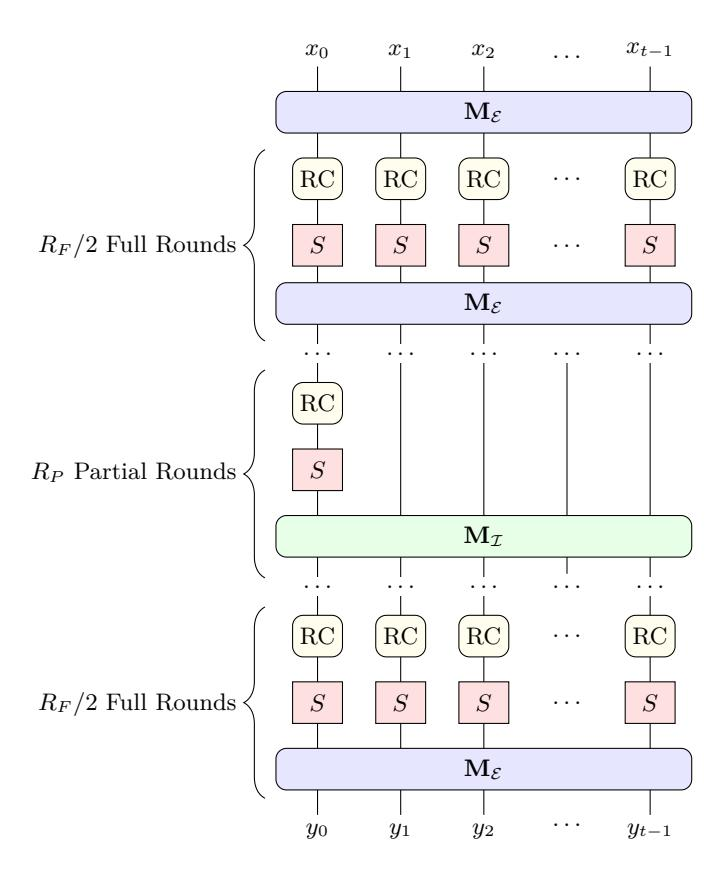
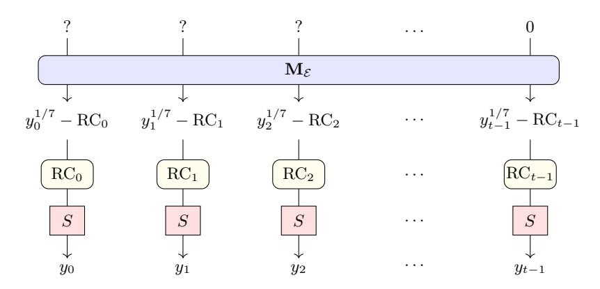
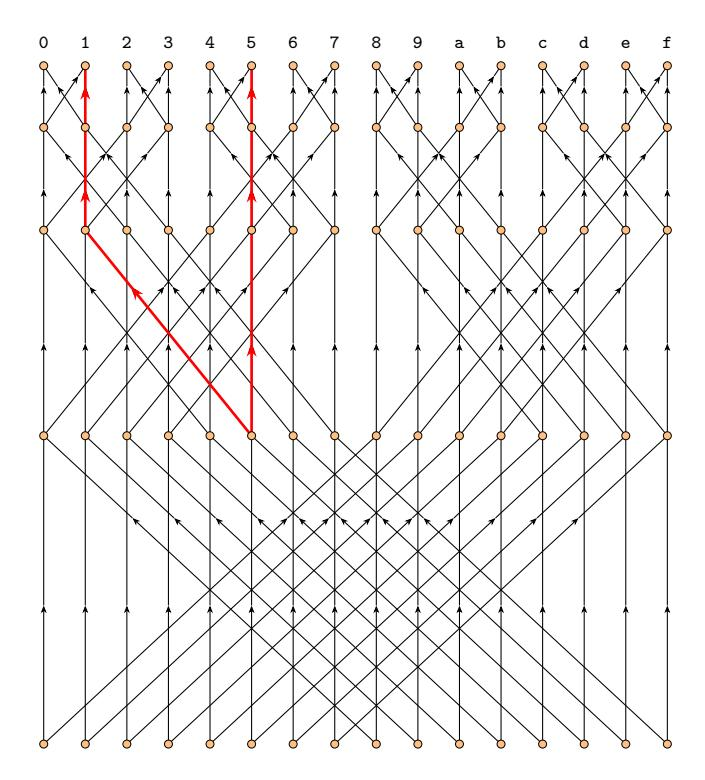

# **Breaking Poseidon Challenges with Graeffe Transforms and Complexity Analysis by FFT Lower Bounds**

Ziyu Zhao<sup>1</sup> and Jintai Ding<sup>2</sup> (B)

<sup>1</sup> Department of Mathematical Science, Tsinghua University, Beijing, China ziyuzhao0008@outlook.com <sup>2</sup> Xi'an Jiaotong-Liverpool University, Suzhou, China Basque Center For Applied Mathematics, Bilbao, Spain jintai.ding@gmail.com

**Abstract.** Poseidon and Poseidon2 are cryptographic hash functions designed for efficient zero-knowledge proof protocols and have been widely adopted in Ethereum applications. To encourage security research, the Ethereum Foundation announced a bounty program in November 2024 for breaking the Poseidon challenges, i.e. solving the CICO (Constrained Input, Constrained Output) problems for round-reduced Poseidon constructions. In this paper, we explain how to apply the Graeffe transform to univariate polynomial solving, enabling efficient interpolation attacks against Poseidon. We will provide an open-source code [3](#page-0-0) and details our approach for solving several challenges valued at \$20000 in total. Compared to existing attacks, we improves 2 <sup>13</sup> and 2 4*.*5 times in wall time and memory usage, respectively. For all challenges we solved, the cost of memory access turns out to be an essential barrier, which makes the security margin much larger than expected. We actually prove that the memory access cost for FFT grows as the 4*/*3-power of the input size, up to a logarithmic factor. This indicates the commonly used pseudolinear estimate may be overly conservative. This is very different from multivariate equation solving whose main bottleneck is linear algebra over finite fields. Thus, it might be preferable to choose parameters such that the best known attack is interpolation, as it presents more inherent hardness.

# **1 Introduction**

Cryptographic hash functions are fundamental to modern cryptography. With the rise of advanced applications such as zero-knowledge proofs, especially STARK protocols [\[8](#page-21-0)], there is a growing demand for hash functions that are efficient not only on conventional hardware but also when represented as arithmetic circuits over large prime fields. While general designs like SHA-2 and SHA-3 are highly optimized for modern CPUs, they cannot be represented as small arithmetic

<span id="page-0-0"></span><sup>3</sup> Not ready now

circuits, which essentially becomes a bottleneck for the performance of proof systems. As a result, several new so-called STARK-friendly or arithmetization-oriented constructions have been proposed, including Rescue-Prime [39,5], Feistel-MIMC [2], Poseidon [20], and Reinforced Concrete [19]. Among these, Poseidon and its successor Poseidon2 [21] have emerged as top performers in recent STARK benchmarks by StarkNet, making them promising candidates for use in Ethereum and other applications that require efficient and verifiable computation.

However, unlike classic hash functions such as SHA-2 and SHA-3, which have been thoroughly analyzed over decades, these STARK-friendly constructions are relatively recent and lack extensive cryptanalysis. Their security cannot be directly inferred from traditional designs. The best known attacks are also quite different: instead of relying on differential path search, it often exploit the algebraic structure of these hash functions. For example, Jarvis [4] has been shown to be vulnerable to certain algebraic attacks [1]. Also, the polynomial systems that arise in these symmetric primitives are quite different from those in multivariate cryptography. The underlying field is large, the degree is high, and there are fewer variables. More importantly, the equations are highly structured rather than random, which might be exploited for more efficient attacks, as shown in [6] at CRYPTO24. Therefore, a deeper understanding of the security of Poseidon and its variants is urgently needed, especially as they are increasingly adopted in real-world applications. To encourage further research and practical cryptanalysis, the Ethereum Foundation announced a bounty program [16] in November 2024 for breaking Poseidon challenges, aiming to motivate the community to analyze these constructions in practical settings.

The participants are required to solve the CICO (Constrained Input, Constrained Output) problems for the inner sponge permutation (denoted by Perm) under different Poseidon parameterizations. The details of the challenges are summarized in Table 1. The CICO problem asks for input and output pairs such that the last several elements in both are zero. For example, Poseidon-64 asks for  $X_0, \ldots, X_6, Y_0, \ldots, Y_6$  such that  $\mathsf{Perm}(X_0, \ldots, X_6, 0) = (Y_0, \ldots, Y_6, 0)$ .

<span id="page-1-0"></span>Table 1. Summary of Poseidon Challenges

| Name         | Field                             | #States | S-box           | Linear Layer |
|--------------|-----------------------------------|---------|-----------------|--------------|
| Poseidon-256 | (                                 |         |                 | Poseidon     |
| Poseidon-64  |                                   |         |                 | Poseidon2    |
| Poseidon-31  | M31 / KoalaBear ( $\sim 2^{31}$ ) | 16      | $x \mapsto x^5$ | Poseidon2    |

We note that Poseidon and Poseidon2 differ only in their choice of linear layer and round constants. For each parameter set, the Ethereum Foundation provided four challenge instances with different numbers of rounds, corresponding to 24-, 28-, 32-, and 40-bit security levels. After the challenges were announced, the 24- and 28-bit instances of Poseidon-256, as well as the 24-, 28-, and 32-bit instances

of Poseidon-31, were solved within a short period. However, none of the Poseidon-64 instances were solved until our work, highlighting their difficulty.

Currently, the most effective attack against Poseidon is the interpolation attack [28]. For example, to solve  $\mathsf{Perm}(X_0,\ldots,X_6,0) = (Y_0,\ldots,Y_6,0)$  for Poseidon-64, the interpolation attack first fixes  $X_1,\ldots,X_6$  to random values. Then, the mapping from  $X_0$  to the last coordinate of  $\mathsf{Perm}(X_0,\ldots,X_6,0)$  becomes a univariate polynomial. This is because each round function in the Poseidon permutation can be expressed as a polynomial mapping. In practice, these univariate polynomials typically have roots with high probability, so solutions to the CICO problem can found by univariate polynomial root finding.

The interpolation attack is not only theoretically sound, but also highly practical. The recent practical attack record [7] was achieved by interpolation. For the root finding step, they find the roots of a polynomial f(x) over  $\mathbb{F}_p$  in three steps:

- (1) compute  $g(x) = x^p x \mod f(x)$  using the square-and-multiply method;
- (2) compute gcd(g, f) using the Half-GCD algorithm, the result typically has a small degree;
  - (3) find the roots, e.g., by the Berlekamp algorithm.

Based on this, they are able to find roots of polynomials of degree  $3^{18}$  over  $p \approx 2^{64}$  in roughly one day.

The Graeffe Transform. Historically, The Graeffe transform dates back to the 1820s-1830s, with independent contributions from Dandelin, Lobachevsky, and Gräffe [27]. It was originally designed for finding roots of real polynomials by mapping each root to its square, effectively spreading the roots apart and making them easier to find numerically.

Here we briefly review the original idea of the Graeffe transform. Suppose f(x) is a degree-d polynomial with roots  $r_1, \ldots, r_d \in \mathbb{R}$ , ordered so that  $|r_0| > |r_1| > \cdots > |r_{d-1}|$ . The Graeffe transform of f(x), denoted by  $\mathsf{GT}_2(f)$ , is defined such that

$$(\mathsf{GT}_2(f))(x^2) = f(x)f(-x).$$

This construction yields a new polynomial whose roots are exactly  $r_0^2, r_1^2, \ldots, r_{d-1}^2$ . By applying the Graeffe transform v times, we obtain a polynomial  $g(x) = x^d - c_{d-1}x^{d-1} + c_{d-2}x^{d-2} - \cdots + (-1)^d c_0$  (after normalizing the leading coefficient), whose roots are exactly  $r_0^{2^v} \gg r_1^{2^v} \gg \cdots \gg r_{d-1}^{2^v}$ . By Vieta's formulas, the coefficients satisfy

$$\begin{split} c_{d-1} &= r_0^{2^v} + r_1^{2^v} + \dots + r_{d-1}^{2^v} \approx r_0^{2^v}, \\ c_{d-2} &= r_0^{2^v} r_1^{2^v} + r_0^{2^v} r_2^{2^v} + \dots + r_{d-1}^{2^v} r_{d-2}^{2^v} \approx r_0^{2^v} r_1^{2^v}, \\ c_{d-3} &= r_0^{2^v} r_1^{2^v} r_2^{2^v} + r_0^{2^v} r_1^{2^v} r_3^{2^v} + \dots + r_{d-1}^{2^v} r_{d-2}^{2^v} r_{d-3}^{2^v} \approx r_0^{2^v} r_1^{2^v} r_2^{2^v}, \\ &\vdots \\ c_0 &= r_0^{2^v} r_1^{2^v} \dots r_{d-1}^{2^v}. \end{split}$$

From these relations, we can approximately recover the original roots of f(x) as

$$r_0 \approx \sqrt[2^v]{c_{d-1}},$$
  $r_1 \approx \sqrt[2^v]{\frac{c_{d-2}}{c_{d-1}}},$   $\vdots$   $r_{d-1} \approx \sqrt[2^v]{\frac{c_0}{c_1}}.$

Based on this idea, later works have extended the Graeffe transform to handle cases with multiple roots of higher multiplicity [11], as well as roots in the complex plane [12]. In the context of finite fields, some studies [23,24,26] have introduced the so-called "Tangent Graeffe method" for factoring polynomials that split over the field, which is less efficient in our case. It was primarily aimed at sparse multivariate polynomial interpolation problems, and mostly from a mathematical perspective. However, we are not aware of any previous application of the Graeffe transform to cryptanalysis, nor any root finding implementation that handled equations of degree even one-thousandth of what we achieved—most are limited to toy examples. Our results from the challenge provide a deeper understanding of the inherent difficulty of univariate root finding, as will be discussed later in this section.

**Contribution.** This work improves the most time-consuming root finding step of the interpolation attack by using the Graeffe transform. Suppose  $\omega_{\ell}$  is a primitive  $\ell$ -th root of unity in the underlying field. Given a polynomial f, the Graeffe transform  $\mathsf{GT}_{\ell}$  computes a new polynomial  $g = \mathsf{GT}_{\ell}(f)$  such that  $g(x^{\ell}) = f(x)f(x\omega_{\ell}^{1})\cdots f(x\omega_{\ell}^{\ell-1})$ . If f has a root  $x_{0} \in \mathbb{F}_{p}$  and  $\ell$  divides  $|\mathbb{F}_{p}^{\times}|$ , then  $x_{0}^{\ell}$  will be a root of g which lies in a subgroup of  $\mathbb{F}_{p}^{\times}$  of size  $(p-1)/\ell$ . By taking a large enough  $\ell$ ,  $x_{0}^{\ell}$  can be found easily by enumeration, from which we can recover  $x_{0}$ .

It is easy to show that  $\mathsf{GT}_{\ell_0\ell_1} = \mathsf{GT}_{\ell_0} \circ \mathsf{GT}_{\ell_1}$ , so the Graeffe transform  $\mathsf{GT}_\ell$  can be efficiently computed when  $\ell$  is smooth. This is exactly the case for the Poseidon-64 challenges in Table 1, where the Goldilocks field has size  $p_{64} = 2^{32} \cdot 3 \cdot 5 \cdot 17 \cdot 257 \cdot 65537 + 1$ . We implemented our Graeffe transform-based root finding algorithm in C++ with CUDA. Although our code is tailored for the Goldilocks field, we designed it in a modular way, separating field operations from FFT logic and memory management. As a result, it can be easily adapted to other 64-bit moduli where p-1 is sufficiently smooth, simply by rewriting a few field operation functions. Our code is available at to add the repo link. Compared to the previous record in [7], our implementation is about  $2^{13}$  times faster in wall time and uses  $2^{4.5}$  times less memory. With this, we were able to solve the previously unsolved 24-bit, 28-bit, and 32-bit Poseidon-64 challenges, corresponding to polynomials of degree  $7^{12}$ ,  $7^{13}$ , and  $7^{15}$ , respectively. See Table 3 for details.

Our new implementation allows us to find roots of polynomials with degrees several thousand times larger than what was previously possible, far beyond the reach of existing methods. This also provides new insight into the actual hardness of interpolation attacks. Even after these improvements, the 32-bit instances are still much harder than the 32-bit instances of other well-known cryptographic problems, such as code decoding, lattice problems, or solving multivariate quadratic systems (e.g. see [[3\]](#page-20-5)). This indicates a large security margin for Poseidon.

Actually, in all the challenges we solved, memory access was the main bottleneck, and GPUs played only a minor role in our speedup. For example, in the large degree cases, before switching to GPUs, our toy CPU implementation with almost no optimization for field operations (no SIMD, etc.)—was only about four times slower than the GPU version. During the Radix-2 FFT or invFFT, the typical GPU utilization was less than 10%.

Theoretically, for a 3-D array storing *N* bits, the average energy or resource cost to access a random bit is *O*(*N*1*/*<sup>3</sup> ) [[33\]](#page-22-5). Even with the structured access patterns of FFT, we have proved that the total memory access cost is asymptotically at least proportional to the 4*/*3-power of the polynomial size, up to a logarithmic factor. These results are due to the fact that, physically, the information transfer cost is at least proportional to the distance it travels. Most existing literature [\[29](#page-22-6),[35,](#page-22-7)[38\]](#page-23-1) only considers idealized hierarchical memory models, which do not fit this context.

Thus, it is reasonable to model the memory access cost as proportional to *d* 4*/*3 , while the computation cost is pseudo-linear in *d* for a polynomial of degree *d*. The crossover point *dc*, where memory access begins to dominate, should be well below *d* = 7<sup>15</sup> according to our experiments. Based on this, we suggest estimating the cost of root finding for a degree *d ′* polynomial as (*d ′/dc*) 4*/*3 times the cost for degree *d<sup>c</sup>* root finding, for any *d ′ > dc*, rather than assuming pseudolinear scaling. Using this model, in Section [4.2](#page-15-1), we estimate that the cost of interpolation attacks on the 128-bit Poseidon-256 instances is equivalent to about 2 <sup>200</sup> SHA-256 evaluations. It may be tempting to reduce the number of rounds for better efficiency.

It is important to emphasize that the above security analysis only applies when the CICO problem requires just the last coordinate to be zero. For example, the Poseidon-31 challenge in Table [1](#page-1-0) requires Perm(*X*0*, . . . , X*13*,* 0*,* 0) = (*Y*0*, . . . , Y*13*,* 0*,* 0). Then the best known attack would be the Gröbner basis computation [[13](#page-21-8)[,18](#page-21-9)] together with the FGLM [[17\]](#page-21-10) algorithm, or the mutant XL [[14](#page-21-11)[,32](#page-22-8)] algorithm, where the main bottleneck is linear algebra, which is no longer memory-bound. In such cases, the security margin would be much tighter. Thus, it might be preferable for designers to choose parameters such that the best known attacks are interpolation rather than Gröbner basis approaches, as the former is *simpler* and presents more inherent hardness.

**Roadmap.** The rest of the paper is organized as follows. In Section [2,](#page-5-0) we review the necessary background on the Poseidon permutation and introduce the Skip First Rounds Trick from [7], which we also use in our attacks. Section 3 details the Graeffe transform and its application to univariate polynomial root finding, and briefly reviews GCD-based root finding algorithms. In Section 4, we describe our implementation and present performance results, including details of the solved challenges and a discussion on security. In Section 5, we prove an asymptotic lower bound for the memory access cost during FFT, which is used in the security analysis presented in the previous section. Finally, we conclude in Section 6.

#### <span id="page-5-0"></span>2 Preliminaries

#### 2.1 Notations

All indices start from 0. Bold uppercase letters denote matrices, while bold lowercase letters denote vectors. The *i*-th entry of a vector  $\mathbf{v}$  is written as  $v_i$ , and the (i, j)-th position of a matrix  $\mathbf{M}$  is  $\mathbf{M}_{i,j}$ . We denote by  $\mathbb{F}_p$  the prime field with p elements, and by  $\mathbb{F}_p^{\times}$  its multiplicative group. When the underlying field is clear, we denote the cost of multiplying two degree-d polynomials by  $\mathbf{M}(d)$ . For convenience, throughout the paper we will use

 $p_{64} = 0$ xffffffff00000001

 $p_{255} = 0$ x73eda753299d7d483339d80809a1d80553bda402fffe5bfefffffff00000001

to denote the Goldilocks prime and BLS12-381, respectively. We do not distinguish between a polynomial and the corresponding polynomial mapping.

For notation related to the Poseidon permutation construction, we follow the conventions in the original paper [20]: t denotes the number of states,  $R_P$  and  $R_F$  denote the number of partial and full rounds, respectively, and  $\alpha$  is the S-box exponent.

#### 2.2 The Poseidon Permutation and the CICO problem

In this subsection, we present the construction of the inner sponge permutation used in the Poseidon family of hash functions. Since the challenges we solved are all Poseidon2 instances, we will first describe the Poseidon2 sponge permutation in detail and then briefly mention the differences with Poseidon.

The Poseidon2 sponge permutation, as shown in Figure 1, is based on the HADES [22] design strategy. After the input  $(x_0, \ldots, x_{t-1}) \in \mathbb{F}_p^t$  is transformed by the matrix  $\mathbf{M}_{\mathcal{E}}$ , the permutation proceeds by applying  $R_F/2$  full rounds,  $R_P$  partial rounds, and then another  $R_F/2$  full rounds. In Figure 1, each RC gate represents the addition of a round constant (with a different constant at each gate). The S-box S is the power map  $x \mapsto x^{\alpha}$ , where  $\alpha$  is chosen as the smallest integer greater than 1 such that the S-box is invertible. During the partial rounds, the S-box and RC gates only apply to the first state, and the linear transformation used in these rounds differs from that in the full rounds. This



<span id="page-6-0"></span>**Fig. 1.** Circuit for Poseidon2 Sponge Permutation

design choice improves efficiency while maintaining a high polynomial degree for interpolation attacks.

For the Poseidon-64 challenges, the linear transformations are taken to be

$$\mathbf{M}_{\mathcal{E}} = \begin{pmatrix} 10 & 14 & 2 & 6 & 5 & 7 & 1 & 3 \\ 8 & 12 & 2 & 2 & 4 & 6 & 1 & 1 \\ 2 & 6 & 10 & 14 & 1 & 3 & 5 & 7 \\ 2 & 2 & 8 & 12 & 1 & 1 & 4 & 6 \\ 5 & 7 & 1 & 3 & 10 & 14 & 2 & 6 \\ 4 & 6 & 1 & 1 & 8 & 12 & 2 & 2 \\ 1 & 3 & 5 & 7 & 2 & 6 & 10 & 14 \\ 1 & 1 & 4 & 6 & 2 & 2 & 8 & 12 \end{pmatrix} \quad (\mathbf{M}_{\mathcal{I}})_{i,j} = \begin{cases} 1 + \mu_i & \text{if } i = j \\ 1 & \text{otherwise} \end{cases}$$

where the *µ<sup>i</sup>* 's, together with the round constants, can be generated by the script at [https://github.com/HorizenLabs/poseidon2.](https://github.com/HorizenLabs/poseidon2)

The Poseidon challenge asks for a solution to the CICO problem:

**Definition 1 (CICO Problem).** Given a function  $F : \mathbb{F}_p^t \to \mathbb{F}_p^t$  and an integer u < t, the CICO problem asks for  $X_0, \ldots, X_{t-1-u}, Y_0, \ldots, Y_{t-1-u} \in \mathbb{F}_p$  such that

$$F(X_0,\ldots,X_{t-1-u},0,\ldots,0)=(Y_0,\ldots,Y_{t-1-u},0,\ldots,0).$$

The Poseidon-64 and Poseidon-256 challenge instances have u=1, which means we only require the last coordinate of both the input and output to be zero.

We now briefly mention the differences between Poseidon and Poseidon2 to conclude this subsection:

- (a) Poseidon does not apply the initial linear transform before the first round.
- (b) Poseidon uses the same MDS matrix for all rounds.
- (c) For the partial rounds, Poseidon also applies the RC gates to all states.

## <span id="page-7-1"></span>2.3 Skip First Rounds Trick

In this subsection, for ease of reference we provide a brief review of the Skip First Rounds Trick from [7], which we also used in our challenges. For simplicity, we focus on the case of Poseidon-64. This technique reduces the polynomial degree by a factor of  $\alpha$  for Poseidon2 and by  $\alpha^2$  for Poseidon, respectively. The impact is less significant for Poseidon2, owing to the presence of the initial linear transformation—this is precisely why [21] introduced the initial linear transform in the first place.



<span id="page-7-0"></span>Fig. 2. First Several Operations of Poseidon-64

The first few steps of Poseidon-64 are illustrated in Figure 2. Let the last row of  $(\mathbf{M}_{\mathcal{E}})^{-1}$  be  $(\lambda_0, \ldots, \lambda_{t-1})$ . Then,  $(y_0, \ldots, y_{t-1})$  corresponds to an input whose last coordinate is zero if and only if

$$\sum_{i=0}^{t-1} \lambda_i y_i^{1/7} = \sum_{i=0}^{t-1} \lambda_i \cdot RC_i.$$

This condition is satisfied, for example, by taking *yt−*<sup>1</sup> = (∑*<sup>t</sup>−*<sup>1</sup> *<sup>i</sup>*=0 *λi/λt−*<sup>1</sup> *·* RC*<sup>i</sup>* )7 , setting *y*<sup>2</sup> = *. . .* = *yt−*<sup>2</sup> = 0, and letting *y*<sup>1</sup> = (*λ*0*/λ*1) 7 *· y*0. Under these choices, the permutation becomes a univariate polynomial in *y*<sup>0</sup> of degree *α R<sup>F</sup>* +*R<sup>P</sup> −*1 . Finding the roots of this polynomial gives a solution to the CICO problem, so the polynomial degree can be reduced by a factor of *α*.

# <span id="page-8-0"></span>**3 Root Finding for Univariate Polynomials**

In this section, we first review current polynomial solving methods for practical attacks on STARK-friendly hash functions. Then we present our Graeffe transform-based algorithm in detail, with a focus on the Goldilocks field.

## <span id="page-8-1"></span>**3.1 GCD-Based Methods**

The polynomials that appear in interpolation attacks, such as those described in Section [2.3,](#page-7-1) usually have only a few roots in the underlying field, much like random polynomials. This allows the use of the following GCD-based root finding approach, which was used to set the Poseidon interpolation record [\[7](#page-21-5)].

If *f*(*x*) is a polynomial of degree *d* over F*p*, to compute its roots, the GCDbased approach first replaces *f*(*x*) with its GCD with the Frobenius polynomial *x <sup>p</sup> − x*, reducing the problem to the case where *f*(*x*) is split over F*p*, then finds the roots by the Berlekamp algorithm [[10\]](#page-21-12) or the Cantor-Zassenhaus algorithm [[15](#page-21-13)]. Since the polynomials involved in the interpolation attack usually have only a few roots, the cost of the second step is negligible.

Before the GCD computation, since *f*(*x*) usually degree much less than *x <sup>p</sup>−x*, it will be helpful to compute *g*(*x*) = *x <sup>p</sup> − x* mod *f*(*x*) to replace *x <sup>p</sup> − x* in the computation. This step can be performed using the square-and-multiply method, which requires *O*(log *p*) modular polynomial multiplications for a total computational cost of *O*(log(*p*)M(*d*)).

The computation of the GCD, although it can also be done by the Half-GCD algorithm in *O*(log(*n*)M(*d*)), turns out to be the most troublesome part of the root finding process. The key step in the classical Half-GCD algorithm [\[31](#page-22-10)], which reduces the GCD computation to half size, is presented in Algorithm [1.](#page-9-0)

The greatest common divisor computation is unattractive for the following reasons:

(a) As shown in Algorithm [1](#page-9-0), the algorithm is highly sequential. While it manages to reduce the polynomial degree, each step is entangled with the results of previous steps. This strong dependency makes the GCD computation notoriously difficult to parallelize, especially when aiming to keep the total computational cost optimal—some works [\[34](#page-22-11)] have (theoretically) achieved polylogarithmic runtime using almost quadratic (in the polynomial degree) number of arithmetic processors, which is unacceptable. Parallelizing GCD computation in practice, even with several CPU cores, is highly non-trivial—let alone achieving massive parallelism with tens of thousands of threads on modern parallel architectures like GPUs, as is common in cryptographic applications.

## **Algorithm 1:** $\mathsf{HGCD}(f(x), g(x))$

<span id="page-9-0"></span>Input:  $f(x), g(x) \in \mathbb{F}_p[x], \deg(f) > \deg(g) \geqslant 0.$

**Output:** An unimodular matrix **M** such that  $\begin{pmatrix} f \\ g \end{pmatrix} = \mathbf{M} \begin{pmatrix} \tilde{f} \\ \tilde{g} \end{pmatrix}$  where

$$\deg(\tilde{f}) \geqslant \left\lceil \frac{\deg(f)}{2} \right\rceil > \deg(\tilde{g}).$$

- $1 \ d_0 \leftarrow \lceil \deg(f)/2 \rceil;$
- 2 if  $\deg(g) < d_0$  then return  $\begin{pmatrix} 1 & 0 \\ 0 & 1 \end{pmatrix}$ ; 3  $\mathbf{M}_0 \leftarrow \mathsf{HGCD}((f (f \bmod x^{d_0}))/x^{d_0}, (g (g \bmod x^{d_0}))/x^{d_0});$

$$\mathbf{4} \ \begin{pmatrix} f_0 \\ g_0 \end{pmatrix} \leftarrow \mathbf{M}_0^{-1} \begin{pmatrix} f \\ g \end{pmatrix};$$

- 5 if  $deg(g_0) < d_0$  then return  $\mathbf{M}_0$ ;
- **6** compute division  $f_0 = q_0 g_0 + r_0$  with  $\deg(r_0) < \deg(g_0)$ ;
- 7 if  $deg(r_0) < d_0$  then return  $\mathbf{M}_0 \begin{pmatrix} q_0 & 1 \\ 1 & 0 \end{pmatrix}$ ;
- **8**  $d_1 \leftarrow 2d_0 \deg(g_0);$
- 9  $\mathbf{M}_1 \leftarrow \mathsf{HGCD}((g_0 (g_0 \bmod x^{d_1}))/x^{d_1}, (r_0 (r_0 \bmod x^{d_1}))/x^{d_1});$
- 10 return  $\mathbf{M}_0 \begin{pmatrix} q_0 & 1 \\ 1 & 0 \end{pmatrix} \mathbf{M}_1$
- (b) Although the Half-GCD runs in  $\mathcal{O}(\log(n)\mathsf{M}(d))$  time, the constant factor is quite large. In the original paper [31], the computation cost is bounded by  $22 \log(n) M(d)$ . Later works [25] reduce this constant factor somewhat by modifying the algorithm, but these modifications make the already complex algorithm even more involved and further exacerbate issue (c).
- (c) Last but not least, the Half-GCD algorithm is presented in recursive form and is extremely painful to implement, especially when dealing with large (possibly heterogeneous) memory or attempting to parallelize the computation. As a result, we have no interest in using it and instead choose the much simpler and cleaner Graeffe transform for the Poseidon challenges, which turns out to be even more efficient than we expected.

#### <span id="page-9-1"></span>Root Finding via Graeffe Transform

Throughout this paper, we use the following definition of the Graeffe transform.

**Definition 2 (Graeffe Transform).** Let  $f(x) \in \mathbb{F}_p[x]$  be a polynomial. For any positive integer  $\ell$  coprime to p, the Graeffe transform of f(x) of order  $\ell$ , denoted  $GT_{\ell}(f)$ , is defined as the unique polynomial g such that

$$g(x^{\ell}) = f(x)f(x\omega_{\ell}^{1})\cdots f(x\omega_{\ell}^{\ell-1}),$$

where  $\omega_{\ell}$  is a primitive  $\ell$ -th root of unity, possibly in an extension field of  $\mathbb{F}_{p}$ .

**Lemma 1.** If  $f(x) \in \mathbb{F}_p[x]$  is a polynomial of degree d,  $\ell$  is coprime to p, then the Graeffe transform  $\mathsf{GT}_\ell(f)$  is also a well-defined polynomial in  $\mathbb{F}_p[x]$  of degree d.

Proof. Let  $h(x) = f(x)f(x\omega_{\ell}^1)\cdots f(x\omega_{\ell}^{\ell-1})$ . By construction, h(x) is invariant under the substitution  $x\mapsto x\omega_{\ell}$ , which multiplies the coefficient of  $x^i$  by  $\omega_{\ell}^i$ . Thus, the coefficients of  $x^i$  in h(x) can be nonzero only if  $\omega_{\ell}^i = 1$ , i.e., i is a multiple of  $\ell$ . Therefore, the existence of g(x) is guaranteed, and the degree of g(x) is  $\deg(h(x))/\ell = d$ . It remains to show that the coefficients of g(x) lie in  $\mathbb{F}_p$ . This holds because, by construction, each coefficient of h(x) is fixed under any Galois conjugation. Therefore, the coefficients must lie in the fixed field of the Galois group, which is exactly  $\mathbb{F}_p$ .

<span id="page-10-0"></span>**Lemma 2.** If  $f(x) \in \mathbb{F}_p[x]$  is a polynomial of degree d,  $\ell_0, \ell_1$  are coprime to p, then  $GT_{\ell_0}(\mathsf{GT}_{\ell_1}(f)) = \mathsf{GT}_{\ell_0 \cdot \ell_1}(f)$ .

*Proof.* Suppose  $\omega$  is a primitive  $\ell_0\ell_1$ -th root of unity. Then  $\omega^{\ell_1}$  is a primitive  $\ell_0$ -th root of unity, and  $\omega^{\ell_0}$  is a primitive  $\ell_1$ -th root of unity. By the definition of the Graeffe transform, we have

$$\begin{split} \mathsf{GT}_{\ell_0}(\mathsf{GT}_{\ell_1}(f))(x^{\ell_0\ell_1}) &= \mathsf{GT}_{\ell_1}(f)(x^{\ell_1})\mathsf{GT}_{\ell_1}(f)(x^{\ell_1}\omega^{\ell_1})\cdots\mathsf{GT}_{\ell_1}(f)(x^{\ell_1}\omega^{(\ell_0-1)\ell_1}) \\ &= \mathsf{GT}_{\ell_1}(f)(x^{\ell_1})\mathsf{GT}_{\ell_1}(f)((x\omega)^{\ell_1})\cdots\mathsf{GT}_{\ell_1}(f)((x\omega^{\ell_0-1})^{\ell_1}) \\ &= \prod_{j=0}^{\ell_0-1} f(x\omega^j)f(x\omega^{j+\ell_0})\cdots f(x\omega^{j+(\ell_1-1)\ell_0}) \\ &= \mathsf{GT}_{\ell_0\cdot\ell_1}(f)(x^{\ell_0\ell_1}). \end{split}$$

which concludes the proof.

Lemma 2 allows us to compute the Graeffe transform of large order  $\ell$  by successively applying Graeffe transforms of smaller orders. This can be effectively done when  $\ell$  is smooth, which is exactly the case for the challenges we solved. We now describe how we compute  $\mathsf{GT}_\ell(f)$  in practice for prime  $\ell < p$ .

Suppose f(x) is a polynomial of degree d over  $\mathbb{F}_p$ . For  $\ell=2$ , if  $f(x)=f_0(x^2)+xf_1(x^2)$ , then

$$f(x)f(-x) = (f_0(x^2) + xf_1(x^2))(f_0(x^2) - xf_1(x^2)) = f_0(x^2)^2 - x^2f_1(x^2)^2.$$

Therefore, the Graeffe transform of order 2 is given by  $\mathsf{GT}_2(f) = f_0(x)^2 - x f_1(x)^2$ . This can be computed using two FFTs and one invFFT with FFT group size at least d, costing only  $\mathsf{M}(d/2)$ .

For  $\ell \geqslant 3$ , we follow the method mentioned in [23]. If  $P_h(x)$  is the product

$$P_h(x) = f(x)f(x\omega_\ell^1)\cdots f(x\omega_\ell^{h-1}),$$

then it suffices to compute  $P_{\ell}(x)$ , which can be done by recursively compute

$$P_h(x) = \begin{cases} f(x) & \text{if } h = 1\\ P_{h/2}(x)P_{h/2}(x\omega_\ell^{h/2}) & \text{if } h \text{ even}\\ f(x)P_{(h-1)/2}(x\omega_\ell)P_{(h-1)/2}(x\omega_\ell^{(h+1)/2}) & \text{otherwise.} \end{cases}$$

Unlike the case of  $\ell=2$ , this recursive method computes  $\mathsf{GT}_\ell(f)(x^\ell)$  first. As a result, it is easier to implement, but it requires roughly  $2\ell$  times more memory than the output polynomial size. However, this is not a problem in our challenge, since Graeffe transforms of order greater than 2 are only applied to small-degree polynomials in the final steps. Thus, the memory usage can be controlled, as shown in Algorithm 2.

#### Algorithm 2: Root Finding over the Goldilocks Field

```
Input: A polynomial f(x) \in \mathbb{F}_{p_{64}}[x] of degree d.
     Output: A root of f(x) in \mathbb{F}_{p_{64}}, if one exists.
 1 \beta \leftarrow p_{64} - 1; \mu \leftarrow 1; g \leftarrow f;
 2 while \beta is even do
      \beta \leftarrow \beta/2;
      g \leftarrow \mathsf{GT}_2(g) \bmod (x^\beta - \mu);
 5 \beta \leftarrow \beta/3; g_3 \leftarrow \mathsf{GT}_3(g) \bmod (x^\beta - \mu);
 6 \beta \leftarrow \beta/5; g_5 \leftarrow \mathsf{GT}_5(g_3) \bmod (x^\beta - \mu);
 7 \beta \leftarrow \beta/17; g_{17} \leftarrow \mathsf{GT}_{17}(g_5) \bmod (x^{\beta} - \mu);
 8 \beta \leftarrow \beta/257; g_{257} \leftarrow \mathsf{GT}_{257}(g_{17}) \bmod (x^{\beta} - \mu);
 9 if g_{257} has no roots in \mathbb{F}_{p_{64}} then return \perp;
10 \mu \leftarrow a common root of g_{257} and x^{65537} - \mu;
11 \mu \leftarrow a common root of g_{17} and x^{257} - \mu;
12 \mu \leftarrow a common root of q_5 and x^{17} - \mu;
13 \mu \leftarrow a common root of g_3 and x^5 - \mu;
14 \mu \leftarrow a common root of g and x^3 - \mu;
15 \beta \leftarrow 2^{32}; h \leftarrow f \mod (x^{\beta} - \mu);
16 return a common root of h and x^{2^{32}} - \mu;
```

Suppose  $\lambda \in \mathbb{F}_{p_{64}}$  is a root of f(x). By the definition of the Graeffe transform, in lines 2 to 8 of Algorithm 2, we compute a polynomial  $g_{257}$  which shares a common root  $\lambda^{(p_{64}-1)/65537}$  with the Graeffe transform  $\mathsf{GT}_{(p_{64}-1)/65537}(f)$ . This common root can be found by enumeration, since the modulo operation in lines 2 to 8 has made the polynomial degree small enough. Once  $\lambda^{(p_{64}-1)/65537} = \lambda^{2^{32}.65535}$  is known, we successively recover  $\lambda^{2^{32}.255}$ ,  $\lambda^{2^{32}.15}$ ,  $\lambda^{2^{32}.3}$ , and  $\lambda^{2^{32}}$  in lines 11 to 14, each corresponding to  $\mu$  in the respective step. Finally, we can recover  $\lambda$  by computing a common root of f and  $x^{2^{32}} - \lambda^{2^{32}}$ , using a process similar to that in lines 5 to 14.

We now briefly discuss the computational cost of Algorithm 2. As with Poseidon-64, we assume the input polynomial has degree  $2^{32} \ll d < p_{64}$ . All operations after line 5 of Algorithm 2 work with polynomials of degree at most  $\sim 2^{32}$ , so their cost is negligible in the overall computation. In lines 2 to 4, there are roughly  $\log_2(p_{64}) - \log_2(d)$  GT<sub>2</sub> operations applied to degree d polynomials, each costing M(d/2). The remaining GT<sub>2</sub> operations are applied to polynomials of degree at most d/2, d/4, d/8, and so on, with a total cost of roughly M(d/2).

Therefore, we estimate the overall cost of Algorithm 2 to be approximately  $(\log_2(p_{64}) - \log_2(d) + 1)M(d/2)$ . The constant factor here is much smaller than that of GCD-based methods, which is part of the reason for our speedup.

We conclude this section by remarking that the numbers 2, 3, 5, 17, 257 in Algorithm 2 exactly correspond to the factorization  $p_{64}-1=2^{32}\cdot 3\cdot 5\cdot 17\cdot 257\cdot 65537$ . It is clear how to adapt it to other prime fields, as long as the multiplicative group size of the field is smooth enough. Furthermore, all prime numbers appearing in the Poseidon Challenge [16] have quite smooth multiplicative group sizes, e.g.

$$p_{255} - 1 = 2^{32} \cdot 3 \cdot 11 \cdot 19 \cdot 10177 \cdot 125527 \cdot 859267 \cdot 906349^{2} \cdot 2508409 \cdot 2529403 \cdot 52437899 \cdot 254760293^{2}.$$

## <span id="page-12-0"></span>4 Implementation and Security Estimation

#### 4.1 Implementation details

We have implemented our Graeffe transform-based algorithm in C++ with CUDA, with about 4k-5k lines in total. Our code uses a modular design, which decouples memory management, polynomial algorithms, and field arithmetic. Thus, it is possible to adapt the code to other 64-bit prime fields by changing the FFT group choice and field arithmetic code as long as the multiplicative group size is smooth enough, although the current implementation is constrained to the Goldilocks field. With this implementation, we have solved the 24-, 28-, and 32-bit Poseidon-64 challenges, which (using the Skip First Rounds Trick in Section 2.3) correspond to polynomial degrees  $7^{12}$ ,  $7^{13}$ , and  $7^{15}$ , respectively.

**Architecture.** Our code was initially developed, tuned, and executed on a dual-socket Intel Xeon Platinum 8474C server equipped with several Nvidia RTX 4090 graphics cards. Each card is connected to the system's 2TB RAM via a PCIe 4.0 interface, providing a unidirectional bandwidth of roughly 200 GiB/s in total under real-world conditions.

Although our code was developed for Nvidia's Ada architecture with compute capability 8.9, we performed almost no low-level optimization of finite field arithmetic or FFT routines specifically for GPU or CPU architectures, for reasons discussed later in this subsection. Thus, our implementation is largely hardware-agnostic and should achieve similar efficiency on most modern GPUs or CPUs—the performance is mainly determined by memory bandwidth rather than compute throughput.

Also, large system RAM is not necessary for running our code. When available memory is limited, users can configure the maximum RAM usage, and our implementation will automatically swap polynomial coefficients and FFT data to and from disk as needed. All other data, aside from polynomial coefficients and FFT values, require only a few gigabytes and should fit comfortably in RAM on most systems. In this scenario, overall speed will be limited by disk I/O, but still acceptable — in our case it is about  $2\sim3$  times slower than running entirely in RAM.

**The Graeffe Transform.** As discussed in Section 3.2, we perform the Graeffe transform of  $f(x) = f_0(x^2) + xf_1(x^2)$  by computing  $f_0(x)^2 - xf_1(x)^2$ . This is done by first applying the FFT to both  $f_0(x)$  and  $f_1(x)$ , then doing pointwise operations, and finally applying the invFFT to obtain the result. Thus, FFT and invFFT are the most time-consuming parts of our implementation.

There are tons of papers studying various aspects of the FFT algorithm, so we only emphasize the field arithmetic and FFT group size choices in our implementation, which are not as commonly used as those in the literature.

Throughout the implementation, we represented Goldilocks field elements as 64-bit unsigned integers in the range  $[0, p_{64})$ . The Ada architecture supports 64-bit operations poorly, as it lacks native hardware instructions and instead emulates them using multiple 32-bit operations. So we take advantage of the special structure of  $p_{64} = 2^{64} - 2^{32} + 1$  to avoid costly 64-bit multiplications and modular reductions. The multiplication code is shown below, which may also be useful for implementing the Poseidon-64 hash function on similar architectures.

```
__device__ __forceinline__ uint64_t cumul(uint64_t x, uint64_t y) {
    uint32_t x_lo = x & Oxfffffffff, x_hi = x >> 32;
    uint52_t y_lo = y & Oxfffffffff, y_hi = y >> 32;
    uint64_t xhyh = (uint64_t)x_hi * y_hi;
    uint64_t xlyh = (uint64_t)x_lo * y_hi;
    uint64_t xlyl = (uint64_t)x_lo * y_lo;
    uint64_t xlyl = (uint64_t)x_lo * y_lo;
    uint64_t xlyl = (uint64_t)x_lo * y_lo;
    xhyh += (xhyl >> 32) + (xlyh >> 32);
    uint32_t ph64 = xhyh & Oxffffffff;
    uint64_t tt32 = (xlyh & Oxffffffff) + (xlyl >> 32) +
```

In the Poseidon challenges, we need to compute FFT and invFFT with group sizes of at least  $7^{12}$ ,  $7^{13}$ , and  $7^{15}$ , all of which are larger than  $2^{32}$ . This means the Goldilocks field does not support such large radix-2 fast Fourier transforms directly. Possible approaches include the Schönhage-Strassen algorithm [37] and the Elliptic Curve FFT [9], but we choose to use mixed-radix FFT for simplicity. Our implementation supports at most two odd radices, meaning it can handle FFT group sizes of the form  $2^{e_2}q_1q_2$ , where  $q_1$  and  $q_2$  are odd divisors of  $|\mathbb{F}_{p_{64}}^{\times}|$ . For example, for a polynomial of degree  $7^{15}$ , we use a group size of  $2^{32} \cdot 5 \cdot 257$ . Although using a Radix-257 FFT significantly increases the computational cost, this overhead remains well hidden below the memory bandwidth limit.

Memory Issue. Surprisingly, even after we have made significant improvements to the root finding algorithm, the "32-bit" challenge still takes several days (see Table 3). For other well-known hard problems, such as lattice problems, multivariate polynomial system solving, or decoding [3], it is typically

feasible to solve instances up to 60 or even 70 "bits". This suggests that the Poseidon interpolation attack has some inherent hardness, and that previous security estimates might have been somewhat too conservative.

In fact, this difficulty can largely be attributed to the cost of memory access. Even when using architectures that support 64-bit operations poorly, memory access remains the main performance bottleneck for all three challenges we solved.

Due to the pseudo-linear complexity and the GPU RAM limit, the Radix-2 part of our FFT implementation executes roughly 25 field multiplications and 25 field additions (or subtractions) each time a field element (8 bytes) is transferred to the device. Assuming a *∼*16GB/s host-to-device bandwidth, this requires only a multiplication throughput of 50 GOPS, which is less than 10% of the architecture's capability. This ratio is even lower when the data is swapped from disk, i.e., the issue becomes increasingly severe as the polynomial degree grows.

|  | Table 2. Measured Throughput for Goldilocks Field Operations |
|--|--------------------------------------------------------------|
|--|--------------------------------------------------------------|

| Operation              | Throughput (TOPS) |
|------------------------|-------------------|
| float32 FMA            | 41.3              |
| Addition<br>Fp64       | 3.41              |
| Subtraction<br>Fp64    | 2.95              |
| Multiplication<br>Fp64 | 0.76              |

**Performance.** Now we compare the performance of our implementation with previous GCD-based results in [\[7](#page-21-5)]. For the GCD-based method, direct computation is infeasible even for the degree 7 <sup>12</sup> case. Therefore, we use the fitting curve from Figure 12 of [\[7](#page-21-5)] to estimate the wall time and memory usage in Table [3.](#page-15-0) This estimation optimistically assumes that the speed will not be further slowed by accessing petabytes of memory — in reality, such memory obviously cannot be placed in fast RAM as in the original experiments used to get the fitting curve.

We remark that the experiments in [\[7](#page-21-5)] were done with one Intel Xeon E7-4860 core, which may also benefit from parallelism. However, we expect this benefit to be minor. The GCD computation step, as explained in Section [3.1,](#page-8-1) is actually highly nontrivial — if not impossible — to massively parallelize without greatly increasing the total computational cost. In contrast, the Graeffe transform-based method is algorithmically parallelism-friendly, memory efficient, and easy to implement, which fits the usual settings for large scale attacks.

From the table, we can see that for degrees 7 <sup>12</sup> and 7 <sup>13</sup>, our result is about 10,000 times faster and uses only 4% to 5% of the memory, which clearly shows the advantage. For 7 <sup>15</sup>, although swapping data to disk causes some slowdown, our method is still about 6,000 times faster than the previous result.

| Degree             | Time                      | Memory          | Time [7]                   | Memory [7]      |
|--------------------|---------------------------|-----------------|----------------------------|-----------------|
| 12<br>7<br>13<br>7 | 8.56s<br>2<br>11.38s<br>2 | 0.32TB<br>1.8TB | 21.81s<br>2<br>24.83s<br>2 | 6.1 TB<br>41 TB |
| 15<br>7            | 18.35s<br>2<br>†          | 90TB            | 30.88s<br>2                | 1.9 PB          |

<span id="page-15-0"></span>**Table 3.** Comparison of Wall Time and Memory Usage

#### <span id="page-15-1"></span>**4.2 Security Estimation**

Based on the results from the previous subsection, it is worthwhile to provide a security estimation for the interpolation attack. Here, we focus on the "128-bit" instance of Poseidon, where the prime field size is *p*255. (For 64-bit primes to achieve 128-bit security, both the input and output of the sponge permutation would need two zeros, which does not correspond to interpolation attacks).

The central question is how to quantify the impact of memory access on the attack. Some literature [\[29](#page-22-6),[35\]](#page-22-7) uses a simplified two-level hierarchical memory model (corresponding to most real-world settings) to derive lower bounds of memory access cost. But we are aiming for a lower bound that holds for any physically realizable architecture. Therefore, we avoid arbitrary or oversimplified assumptions about memory architectures and use only the physical fact that the cost of moving information is at least proportional to the distance it travels. With this, we prove in Theorem [1](#page-16-1) (see Section [5](#page-16-0)) that the memory access cost for executing FFT is at least proportional to the 4*/*3-power of the input size. Based on this, we also (with some boldness) model the root finding cost as scaling with the 4*/*3-power of the polynomial degree, since FFT is essential in all known attacks and it is difficult to image fast polynomial algorithms without it.

Thus, the pseudo-linear arithmetic cost will ultimately become negligible. And our implementation suggests that:

- (1) the crossover point *dc*, where memory access begins to dominate, is well below 7 15 .
- (2) On the same machine (being conservative by not considering ASICs of similar price, which would make the number even larger), it is possible to execute about 2 <sup>59</sup> SHA-256 permutations in the same running time as a degree 7 <sup>15</sup> root finding over F*<sup>p</sup>*<sup>257</sup> .

For 128-bit security, the [estimation script](https://github.com/HorizenLabs/poseidon2) gives round numbers *R<sup>F</sup>* = 8*, R<sup>P</sup>* = 56, corresponding to a polynomial degree of 5 <sup>63</sup> using the Skip First Rounds Trick (Section [2.3](#page-7-1)). We estimate the attack cost as hard as

$$\left(\frac{5^{63}}{7^{15}}\right)^{4/3} \times 2^{59} \approx 2^{198}$$

*<sup>†</sup>* Data swapped to disk.

SHA-256 permutations. So the current parameter choice looks a little bit conservative, and it may be tempting to reduce the number of rounds for better efficiency.

It is crucial to remark that this estimation applies only when a single zero is required in both the input and output of the sponge permutation. Otherwise, the best known attack would involve multivariate polynomial solving, where the main bottleneck is linear algebra over finite fields and memory cost is less relevant. Therefore, it may be preferable to choose a large underlying field so that interpolation is the best known attack when parameterizing Poseidon hash functions.

### <span id="page-16-0"></span>5 Memory Access Lower Bounds for FFT

We will prove a lower bound for the data movement cost of the fast Fourier transform in this section. Specifically, we show that any arithmetic circuit corresponding to the FFT algorithm, regardless of how it is realized in our three-dimensional world, will require information to travel a total distance roughly proportional to the 4/3-power of the input size. Here we make use of the physical fact:

Fact 1. The cost of memory movement is proportional to the physical distance over which it is transferred (and, of course, the amount of data moved).

Based on this, we will use the following definition to quantify the cost throughout the rest of this section.

**Definition 3 (Cost of Data Movement).** For two positions  $\mathbf{x}$  and  $\mathbf{y}$  in  $\mathbb{R}^3$ , we define the cost of moving a field element from position  $\mathbf{x}$  to position  $\mathbf{y}$  as the Euclidean distance  $\|\mathbf{x} - \mathbf{y}\|$ .

In our proof we will also use:

Fact 2. Each bit of data must be stored in a physical volume bounded below by a positive constant (i.e., information density is finite).

These facts are also commonly used, for example, in the NIST hardness estimation for lattice sieving [33], where (arguably, though not formally proven) memory access is modeled as "random", meaning the arithmetic unit cannot predict in advance which memory addresses will be accessed. Using Fact 2, these addresses will on average be  $\mathcal{O}(n^{1/3})$  far away if the total memory usage is  $\mathcal{O}(n)$ . Fact 1 then implies a lower bound of  $\mathcal{O}(n^{1/3})$  per access.

However, in the case of the fast Fourier transform, memory movement patterns are highly structured and can be far from random. Therefore, the lower bounds of NIST do not directly apply. Instead, our argument relies on the particular structure of the FFT circuit and develops techniques specifically adapted to this context. The main theorem of this section is stated as follows:

<span id="page-16-1"></span>**Theorem 1.** The arithmetic circuit of FFT over a finite field with input size  $n = 2^{e_2}$ , regardless of how it is realized in our three-dimensional world, will incur a memory movement cost of at least  $\tilde{\mathcal{O}}(n^{4/3})$ .

To prove the theorem, we first briefly introduce the Directed Acyclic Graph (DAG) for the FFT circuit, as shown in Figure [3](#page-17-0).



<span id="page-17-0"></span>**Fig. 3.** DAG of FFT with input size *n* = 16.

Following the literature on memory analysis [\[29](#page-22-6)], the DAG consists of *n* input nodes and *n* output nodes. The remaining nodes represent intermediate values computed within the circuit. A directed edge *v<sup>i</sup> → v<sup>j</sup>* indicates that the value at node *v<sup>j</sup>* (linearly) depends on the value at node *v<sup>i</sup>* .

For simplicity, *⊕* is used to denote the bitwise XOR operation on integers. We then have the following lemma:

**Lemma 3.** *Suppose that, when a particular realization of the FFT circuit in Theorem [1](#page-16-1) halts, the i-th output node is stored at position* **p**(*i*) *∈* R 3 *. Then the memory movement cost during the execution is at least*

$$\sum_{i \in \{0,\dots,n-1\}, i < i \oplus 2^r} \|\mathbf{p}(i) - \mathbf{p}(i \oplus 2^r)\|$$

*for any r* = 0*,* 1*, . . . , e*<sup>2</sup> *−* 1*.*

*Proof.* We label the nodes in the DAG as *vi,*0*, vi,*1*, . . . , vi,e*<sup>2</sup> for *i* = 0*, . . . , n −* 1. The nodes *vi,*<sup>0</sup> and *vi,e*<sup>2</sup> for *i* = 0*, . . . , n −* 1 correspond to the input and output nodes, respectively, while the remaining nodes represent intermediate values. From each node *vi,s* with 0 ⩽ *s < e*2, there are two directed edges: one to *vi,s*+1 and one to *vi⊕*<sup>2</sup> *<sup>e</sup>*2*−*1*−s,s*+1. The DAG for *n* = 16 is shown in Figure [3.](#page-17-0)

Suppose *i*<sup>0</sup> *∈ {*0*, . . . , n −* 1*}* and *i*<sup>0</sup> *< i*<sup>0</sup> *⊕* 2 *r* . We construct a subgraph *Gi*<sup>0</sup> = (*Vi*<sup>0</sup> *, Ei*<sup>0</sup> ) of the DAG as follows:

$$V_{i_0} = \{v_{i_0 \oplus 2^r, \ell} : e_2 - 1 - r \leqslant \ell \leqslant e_2\} \cup \{v_{i_0, \ell} : e_2 - r \leqslant \ell \leqslant e_2\},$$

$$E_{i_0} = \{v_{i_0 \oplus 2^r, e_2 - 1 - r} \to v_{i_0, e_2 - r}\} \cup \{v_{i, s} \to v_{i, s + 1} : v_{i, s} \in V_{i_0}, s < e_2\}.$$

For example, when *n* = 16 and *r* = 2, the subgraph corresponding to *i*<sup>0</sup> = 1 is marked as red in Figure [3.](#page-17-0) By construction, the images for different *i*<sup>0</sup> are pairwise disjoint. Therefore, the total memory movement cost is at least the sum of the costs corresponding to the subgraphs *Gi*<sup>0</sup> , for all *i*<sup>0</sup> *∈ {*0*, . . . , n −* 1*}* with *i*<sup>0</sup> *< i*<sup>0</sup> *⊕* 2 *r* .

Now, it suffices to show that the memory movement cost within *G<sup>i</sup>*<sup>0</sup> is at least *k***p**(*i*0)*−***p**(*i*<sup>0</sup> *⊕*2 *r* )*k*. Assume that the value corresponding to node *vi*0*⊕*<sup>2</sup> *<sup>r</sup>,e*2*−*1*−r* is, at some point, computed at position **p**<sup>0</sup> *∈* R 3 . By the construction of the DAG, the two output nodes in *Gi*<sup>0</sup> are the endpoints of two directed paths inside *Gi*<sup>0</sup> , both starting from *vi*0*⊕*<sup>2</sup> *<sup>r</sup>,e*2*−*1*−r*. Therefore, when the algorithm halts, the information from node *vi*0*⊕*<sup>2</sup> *<sup>r</sup>,e*2*−*1*−r*, initially computed at **p**0, must be transferred to positions **p**(*i*0) and **p**(*i*<sup>0</sup> *⊕* 2 *r* ), corresponding to nodes *vi*0*,e*<sup>2</sup> and *vi*0*⊕*<sup>2</sup> *<sup>r</sup>,e*<sup>2</sup> , respectively. The total movement distance is at least

$$\|\mathbf{p}(i_0) - \mathbf{p}(i_0 \oplus 2^r)\|,$$

by the triangle inequality in Euclidean space. *ut*

Now, the main theorem is a direct consequence of the following two lemmas.

**Lemma 4.** *The summation of pairwise distances of the output nodes is*

$$\sum_{i,j\in\{0,\dots,n-1\}} \|\mathbf{p}(i) - \mathbf{p}(j)\| = \mathcal{O}(n^{7/3}).$$

*Proof.* This lemma is a direct consequence of Fact 2. By Fact 2, there exists a constant *C*<sup>0</sup> such that there are at most *C*0*R*<sup>3</sup> field elements stored within any ball of radius *R*. Thus, for each *i ∈ {*0*, . . . , n −* 1*}*, we have

$$\sum_{0 \leqslant j \leqslant n-1} \|\mathbf{p}(i) - \mathbf{p}(j)\| \geqslant \sum_{\substack{0 \leqslant j \leqslant n-1, \\ \|\mathbf{p}(i) - \mathbf{p}(j)\| > (n/2C_0)^{1/3}}} \|\mathbf{p}(i) - \mathbf{p}(j)\|$$

$$\geqslant \sum_{\substack{0 \leqslant j \leqslant n-1, \\ \|\mathbf{p}(i) - \mathbf{p}(j)\| > (n/2C_0)^{1/3}}} (2C_0)^{-1/3} \cdot n^{1/3}$$

$$\geqslant \left(n - C_0 \cdot \left(\frac{n}{2C_0}\right)\right) \cdot \left(\frac{n}{2C_0}\right)^{1/3}$$

$$= (16C_0)^{-1/3} \cdot n^{4/3}.$$

The proof concludes by taking the sum over all 0 ⩽ *i* ⩽ *n −* 1. *ut*

**Lemma 5.** There must exist an  $r \in \{0, 1, ..., e_2 - 1\}$  such that

$$\sum_{i \in \{0, \dots, n-1\}, \ i < i \oplus 2^r} \|\mathbf{p}(i) - \mathbf{p}(i \oplus 2^r)\| \geqslant \frac{1}{ne_2} \sum_{i, j \in \{0, \dots, n-1\}} \|\mathbf{p}(i) - \mathbf{p}(j)\|.$$

*Proof.* For simplicity, we denote by S(r) the summation

$$S(r) = \sum_{i \in \{0, \dots, n-1\}, i < i \oplus 2^r} \|\mathbf{p}(i) - \mathbf{p}(i \oplus 2^r)\|.$$

Let  $r_0$  be such that  $S(r_0)$  is the largest among  $S(0), \ldots, S(e_2-1)$ . Then we have

$$\begin{split} \sum_{0 \leqslant i,j < n} \|\mathbf{p}(i) - \mathbf{p}(j)\| &= \sum_{\substack{0 \leqslant i,j < n, \\ r_0 < \dots < r_\ell}} \|\mathbf{p}(i) - \mathbf{p}(i \oplus j)\| \\ &\leqslant \sum_{\substack{0 \leqslant i,j < n, \\ j = 2^{r_0} + \dots + 2^{r_\ell}, \\ r_0 < \dots < r_\ell}} \left( \|\mathbf{p}(i) - \mathbf{p}(i \oplus 2^{r_0})\| + \dots + \right. \\ &\left. \|\mathbf{p}(i \oplus (2^{r_0} + \dots + 2^{r_{\ell-1}})) - \mathbf{p}(i \oplus j)\| \right) \\ &= 2 \cdot \sum_{\substack{0 \leqslant j < n, \\ j = 2^{r_0} + \dots + 2^{r_\ell}, \\ r_0 < \dots < r_\ell}} \left( S(r_0) + \dots + S(r_\ell) \right) \\ &= n \cdot \left( S(0) + \dots + S(e_2 - 1) \right) \\ &\leqslant ne_2 \cdot S(r_0) \end{split}$$

as desired.  $\Box$

#### <span id="page-19-0"></span>6 Conclusions

So far, we have presented a Graeffe transform-based algorithm for root finding over finite fields, and how we have used it to solve several Poseidon challenges from the Ethereum Foundation. Our results show a speedup of several orders of magnitude over previous methods, while using only about 4-5% of the memory. Based on these results, we provide a security estimate for interpolation attacks with the current proposed parameters. In particular, we have proven that the FFT algorithm incurs a memory access cost proportional to the 4/3-power of the input size, up to logarithmic factors, which differs from previous analyses using hierarchical memory models.

A few points are worth highlighting. First, our results apply only to the classical setting; the quantum resistance of root finding in interpolation attacks, or other potential attacks, remains unclear compared to the well-established hardness of problems used in post-quantum cryptography. Future work may focus on this if quantum resistance is a desired property.

Moreover, FFTs are also used in other cryptanalytic contexts. For example, certain dual lattice attacks on LWE (see [[30\]](#page-22-13)) use FFTs to accelerate the distinguishing step. The lower bound for FFTs derived here may be relevant in those settings as well, indicating that some attack complexity estimates in the literature may be overly optimistic.

**Acknowledgments.** We would like to thank the Ethereum Foundation for launching the Poseidon bounty program, which is the initial motivation and starting point for this research. On May 22nd, about one month after submitting our first bounty instance, we sent this report and the code to the Ethereum Foundation and later were informed about ongoing parallel work by Antonio Sanso (Ethereum Foundation Poseidon Group) and Giuseppe Vitto [\[36\]](#page-22-14), who independently studied a similar idea. While their work places more emphasis on the tangent Graeffe Transform, ours provides a complexity analysis based on FFT lower bounds. In the case of Poseidon-64, our results are roughly two orders of magnitude faster – we are not sure about the reasons yet, as we do not know the details of their implementation.

## **References**

- <span id="page-20-3"></span>1. Albrecht, M.R., Cid, C., Grassi, L., Khovratovich, D., Lüftenegger, R., Rechberger, C., Schofnegger, M.: Algebraic cryptanalysis of stark-friendly designs: Application to marvellous and mimc. In: Advances in Cryptology - ASIACRYPT 2019: 25th International Conference on the Theory and Application of Cryptology and Information Security, Kobe, Japan, December 8-12, 2019, Proceedings, Part III. pp. 371–397. Springer-Verlag, Berlin, Heidelberg (2019), [https:](https://doi.org/10.1007/978-3-030-34618-8_13) [//doi.org/10.1007/978-3-030-34618-8\\_13](https://doi.org/10.1007/978-3-030-34618-8_13)
- <span id="page-20-1"></span>2. Albrecht, M.R., Grassi, L., Rechberger, C., Roy, A., Tiessen, T.: Mimc: Efficient encryption and cryptographic hashing with minimal multiplicative complexity. In: Cheon, J.H., Takagi, T. (eds.) Advances in Cryptology - ASIACRYPT 2016 - 22nd International Conference on the Theory and Application of Cryptology and Information Security, Hanoi, Vietnam, December 4-8, 2016, Proceedings, Part I. Lecture Notes in Computer Science, vol. 10031, pp. 191–219 (2016), [https://doi.](https://doi.org/10.1007/978-3-662-53887-6_7) [org/10.1007/978-3-662-53887-6\\_7](https://doi.org/10.1007/978-3-662-53887-6_7)
- <span id="page-20-5"></span>3. Aragon, N., Lavauzelle, J., Lequesne, M.: decodingchallenge.org (2019), [http://](http://decodingchallenge.org) [decodingchallenge.org](http://decodingchallenge.org)
- <span id="page-20-2"></span>4. Ashur, T., Dhooghe, S.: MARVELlous: a STARK-friendly family of cryptographic primitives. Cryptology ePrint Archive, Paper 2018/1098 (2018), [https://eprint.](https://eprint.iacr.org/2018/1098) [iacr.org/2018/1098](https://eprint.iacr.org/2018/1098)
- <span id="page-20-0"></span>5. Ashur, T., Kindi, A., Meier, W., Szepieniec, A., Threadbare, B.: Rescue-prime optimized. Cryptology ePrint Archive, Paper 2022/1577 (2022), [https://eprint.](https://eprint.iacr.org/2022/1577) [iacr.org/2022/1577](https://eprint.iacr.org/2022/1577)
- <span id="page-20-4"></span>6. Bariant, A., Boeuf, A., Lemoine, A., Manterola Ayala, I., Øygarden, M., Perrin, L., Raddum, H.: The algebraic freelunch: Efficient gröbner basis attacks against arithmetization-oriented primitives. In: Advances in Cryptology - CRYPTO 2024: 44th Annual International Cryptology Conference, Santa Barbara, CA, USA, August 18-22, 2024, Proceedings, Part IV. pp. 139–173. Springer-Verlag, Berlin, Heidelberg (2024), [https://doi.org/10.1007/978-3-031-68385-5\\_5](https://doi.org/10.1007/978-3-031-68385-5_5)

- <span id="page-21-5"></span>7. Bariant, A., Bouvier, C., Leurent, G., Perrin, L.: Algebraic attacks against some arithmetization-oriented primitives. IACR Trans. Symmetric Cryptol. **2022**(3), 73–101 (2022), <https://doi.org/10.46586/tosc.v2022.i3.73-101>
- <span id="page-21-0"></span>8. Ben-Sasson, E., Bentov, I., Horesh, Y., Riabzev, M.: Scalable zero knowledge with no trusted setup. In: Advances in Cryptology - CRYPTO 2019: 39th Annual International Cryptology Conference, Santa Barbara, CA, USA, August 18-22, 2019, Proceedings, Part III. pp. 701–732. Springer-Verlag, Berlin, Heidelberg (2019), [https://doi.org/10.1007/978-3-030-26954-8\\_23](https://doi.org/10.1007/978-3-030-26954-8_23)
- <span id="page-21-14"></span>9. Ben-Sasson, E., Carmon, D., Kopparty, S., Levit, D.: Elliptic Curve Fast Fourier Transform (ECFFT) Part I: Low-degree Extension in Time O(n log n) over all Finite Fields, pp. 700–737. [https://epubs.siam.org/doi/abs/10.1137/1.](https://epubs.siam.org/doi/abs/10.1137/1.9781611977554.ch30) [9781611977554.ch30](https://epubs.siam.org/doi/abs/10.1137/1.9781611977554.ch30)
- <span id="page-21-12"></span>10. Berlekamp, E.R.: Factoring polynomials over large finite fields\*. In: Proceedings of the Second ACM Symposium on Symbolic and Algebraic Manipulation. p. 223. SYMSAC '71, Association for Computing Machinery, New York, NY, USA (1971), <https://doi.org/10.1145/800204.806290>
- <span id="page-21-6"></span>11. Best, G.C.: Notes on the graeffe method of root squaring. The American Mathematical Monthly **56**(2), 91–94 (1949), <http://www.jstor.org/stable/2306166>
- <span id="page-21-7"></span>12. Brodetsky, S., Smeal, G.: On graeffe's method for complex roots of algebraic equations. Mathematical Proceedings of the Cambridge Philosophical Society **22**(2), 83–87 (1924). <https://doi.org/10.1017/S0305004100002802>
- <span id="page-21-8"></span>13. Buchberger, B.: Bruno buchberger's phd thesis 1965: An algorithm for finding the basis elements of the residue class ring of a zero dimensional polynomial ideal. Journal of Symbolic Computation **41**(3), 475–511 (2006). <https://doi.org/https://doi.org/10.1016/j.jsc.2005.09.007>, logic, Mathematics and Computer Science: Interactions in honor of Bruno Buchberger (60th birthday)
- <span id="page-21-11"></span>14. Buchmann, J.A., Ding, J., Mohamed, M.S.E., Mohamed, W.S.A.E.: Mutantxl: Solving multivariate polynomial equations for cryptanalysis. In: Symmetric Cryptography (2009)
- <span id="page-21-13"></span>15. Cantor, D.G., Zassenhaus, H.: A new algorithm for factoring polynomials over finite fields. Mathematics of Computation **36**, 587–592 (1981)
- <span id="page-21-4"></span>16. Ethereum Foundation: Poseidon cryptanalysis initiative 2024–2026. [https://www.](https://www.poseidon-initiative.info/) [poseidon-initiative.info/](https://www.poseidon-initiative.info/) (2024)
- <span id="page-21-10"></span>17. Faugère, J., Gianni, P., Lazard, D., Mora, T.: Efficient computation of zerodimensional gröbner bases by change of ordering. Journal of Symbolic Computation **16**(4), 329–344 (1993). <https://doi.org/https://doi.org/10.1006/jsco.1993.1051>
- <span id="page-21-9"></span>18. Faugére, J.C.: A new efficient algorithm for computing gröbner bases (f4). Journal of Pure and Applied Algebra **139**(1), 61–88 (1999). [https://doi.org/https://doi.org/10.1016/S0022-4049\(99\)00005-5](https://doi.org/https://doi.org/10.1016/S0022-4049(99)00005-5)
- <span id="page-21-2"></span>19. Grassi, L., Khovratovich, D., Lüftenegger, R., Rechberger, C., Schofnegger, M., Walch, R.: Reinforced concrete: A fast hash function for verifiable computation. In: Proceedings of the 2022 ACM SIGSAC Conference on Computer and Communications Security. pp. 1323–1335. CCS '22, Association for Computing Machinery, New York, NY, USA (2022), <https://doi.org/10.1145/3548606.3560686>
- <span id="page-21-1"></span>20. Grassi, L., Khovratovich, D., Rechberger, C., Roy, A., Schofnegger, M.: Poseidon: A new hash function for Zero-Knowledge proof systems. In: 30th USENIX Security Symposium (USENIX Security 21). pp. 519–535. USENIX Association (Aug 2021), <https://www.usenix.org/conference/usenixsecurity21/presentation/grassi>
- <span id="page-21-3"></span>21. Grassi, L., Khovratovich, D., Schofnegger, M.: Poseidon2: A faster version of the poseidon hash function. Cryptology ePrint Archive, Paper 2023/323 (2023), [https:](https://eprint.iacr.org/2023/323) [//eprint.iacr.org/2023/323](https://eprint.iacr.org/2023/323)

- <span id="page-22-9"></span>22. Grassi, L., Lüftenegger, R., Rechberger, C., Rotaru, D., Schofnegger, M.: On a generalization of substitution-permutation networks: The hades design strategy. In: Advances in Cryptology - EUROCRYPT 2020: 39th Annual International Conference on the Theory and Applications of Cryptographic Techniques, Zagreb, Croatia, May 10–14, 2020, Proceedings, Part II. pp. 674–704. Springer-Verlag, Berlin, Heidelberg (2020), [https://doi.org/10.1007/978-3-030-45724-2\\_23](https://doi.org/10.1007/978-3-030-45724-2_23)
- <span id="page-22-2"></span>23. Grenet, B., van der Hoeven, J., Lecerf, G.: Randomized root finding over finite fft-fields using tangent graeffe transforms. In: Proceedings of the 2015 ACM International Symposium on Symbolic and Algebraic Computation. pp. 197–204. ISSAC '15, Association for Computing Machinery, New York, NY, USA (2015), <https://doi.org/10.1145/2755996.2756647>
- <span id="page-22-3"></span>24. Grenet, B., Hoeven, J., Lecerf, G.: Deterministic root finding over finite fields using graeffe transforms. Appl. Algebra Eng., Commun. Comput. **27**(3), 237–257 (Jun 2016), <https://doi.org/10.1007/s00200-015-0280-5>
- <span id="page-22-12"></span>25. van der Hoeven, J.: Optimizing the half-gcd algorithm. ArXiv **abs/2212.12389** (2022), <https://arxiv.org/abs/2212.12389>
- <span id="page-22-4"></span>26. van der Hoeven, J., Monagan, M.: Implementing the tangent graeffe root finding method. In: Bigatti, A.M., Carette, J., Davenport, J.H., Joswig, M., de Wolff, T. (eds.) Mathematical Software – ICMS 2020. pp. 482–492. Springer International Publishing, Cham (2020)
- <span id="page-22-1"></span>27. Householder, A.S.: Dandelin, lobacevskii, or graeffe. The American Mathematical Monthly **66**(6), 464–466 (1959), <http://www.jstor.org/stable/2310626>
- <span id="page-22-0"></span>28. Jakobsen, T., Knudsen, L.R.: The interpolation attack on block ciphers. In: Biham, E. (ed.) Fast Software Encryption. pp. 28–40. Springer Berlin Heidelberg, Berlin, Heidelberg (1997)
- <span id="page-22-6"></span>29. Jia-Wei, H., Kung, H.T.: I/o complexity: The red-blue pebble game. In: Proceedings of the Thirteenth Annual ACM Symposium on Theory of Computing. pp. 326–333. STOC '81, Association for Computing Machinery, New York, NY, USA (1981), <https://doi.org/10.1145/800076.802486>
- <span id="page-22-13"></span>30. MATZOV: Report on the security of lwe: Improved dual lattice attack (Apr 2022), <https://doi.org/10.5281/zenodo.6412487>
- <span id="page-22-10"></span>31. Moenck, R.T.: Fast computation of gcds. In: Proceedings of the Fifth Annual ACM Symposium on Theory of Computing. pp. 142–151. STOC '73, Association for Computing Machinery, New York, NY, USA (1973), [https://doi.org/10.1145/](https://doi.org/10.1145/800125.804045) [800125.804045](https://doi.org/10.1145/800125.804045)
- <span id="page-22-8"></span>32. Mohamed, M.S.E., Cabarcas, D., Ding, J., Buchmann, J., Bulygin, S.: Mxl3: An efficient algorithm for computing gröbner bases of zero-dimensional ideals. In: Lee, D., Hong, S. (eds.) Information, Security and Cryptology – ICISC 2009. pp. 87–100. Springer Berlin Heidelberg, Berlin, Heidelberg (2010)
- <span id="page-22-5"></span>33. NIST: Faq on kyber512. [https://csrc.nist.gov/csrc/media/Projects/](https://csrc.nist.gov/csrc/media/Projects/post-quantum-cryptography/documents/faq/Kyber-512-FAQ.pdf) [post-quantum-cryptography/documents/faq/Kyber-512-FAQ.pdf](https://csrc.nist.gov/csrc/media/Projects/post-quantum-cryptography/documents/faq/Kyber-512-FAQ.pdf) (December 2023), accessed: 2025-05-09
- <span id="page-22-11"></span>34. Pan, V.Y.: Parallel computation of polynomial gcd and some related parallel computations over abstract fields. Theoretical Computer Science **162**(2), 173–223 (1996). [https://doi.org/https://doi.org/10.1016/0304-3975\(96\)00030-8](https://doi.org/https://doi.org/10.1016/0304-3975(96)00030-8)
- <span id="page-22-7"></span>35. Ranjan, D., Savage, J., Zubair, M.: Strong i/o lower bounds for binomial and fft computation graphs. In: Fu, B., Du, D.Z. (eds.) Computing and Combinatorics. pp. 134–145. Springer Berlin Heidelberg, Berlin, Heidelberg (2011)
- <span id="page-22-14"></span>36. Sanso, A., Vitto, G.: Attacking poseidon via graeffe-based root-finding over NTTfriendly fields. Cryptology ePrint Archive, Paper 2025/937 (2025), [https://eprint.](https://eprint.iacr.org/2025/937) [iacr.org/2025/937](https://eprint.iacr.org/2025/937)

- <span id="page-23-2"></span>37. Schönhage, A., Strassen, V.: Schnelle multiplikation großer zahlen. Computing **7**(3-4), 281–292 (1971), <https://doi.org/10.1007/BF02242355>
- <span id="page-23-1"></span>38. Scquizzato, M., Silvestri, F.: Communication lower bounds for distributed-memory computations. CoRR **abs/1307.1805** (2013), <http://arxiv.org/abs/1307.1805>
- <span id="page-23-0"></span>39. Szepieniec, A., Ashur, T., Dhooghe, S.: Rescue-prime: a standard specification (SoK). Cryptology ePrint Archive, Paper 2020/1143 (2020), [https://eprint.iacr.](https://eprint.iacr.org/2020/1143) [org/2020/1143](https://eprint.iacr.org/2020/1143)