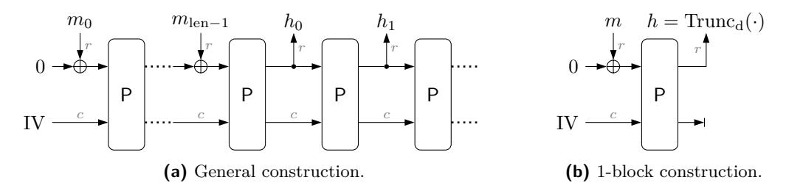
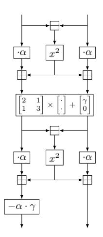
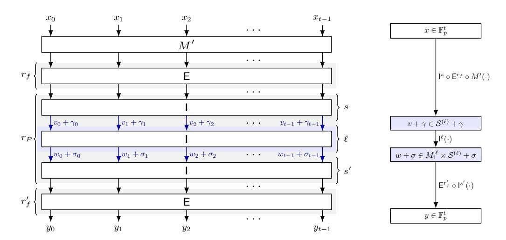
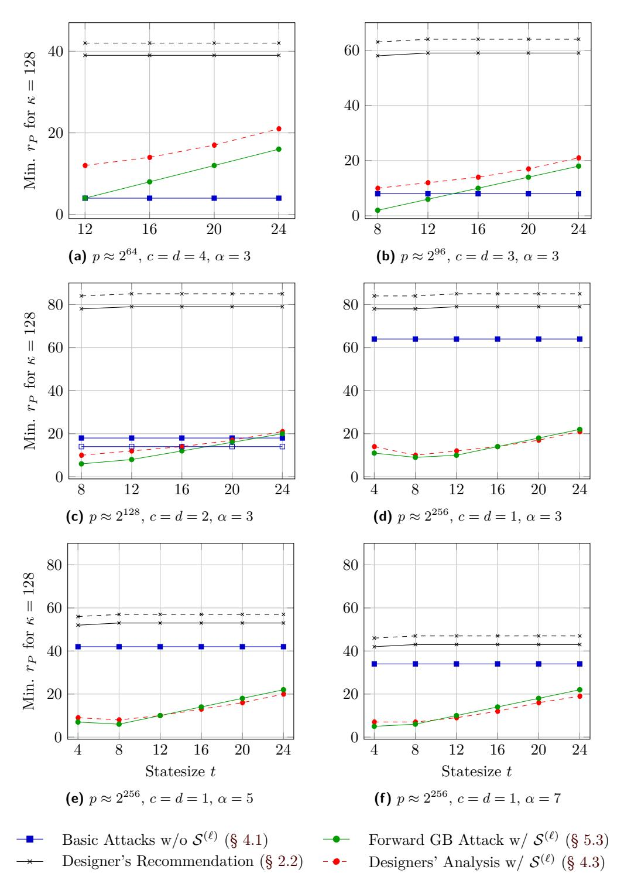
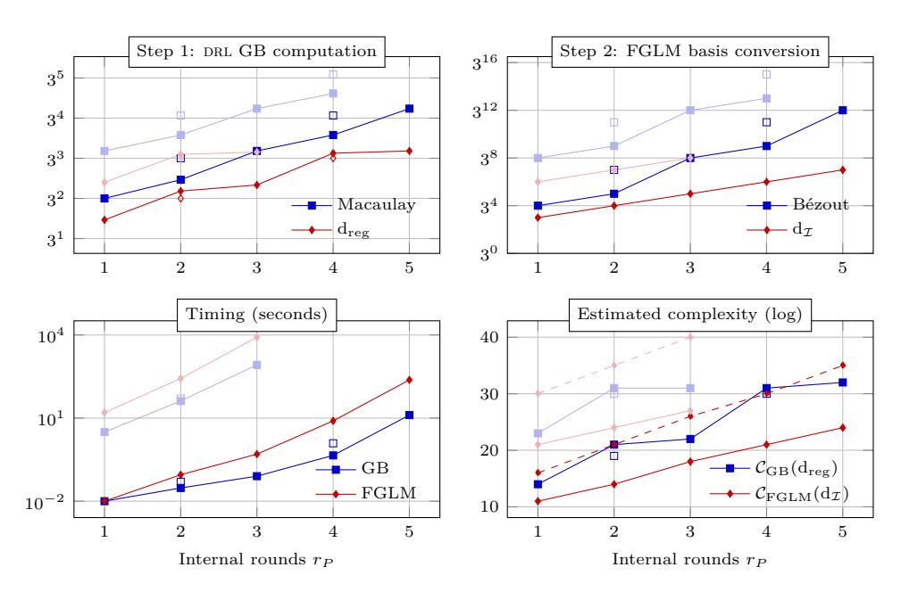
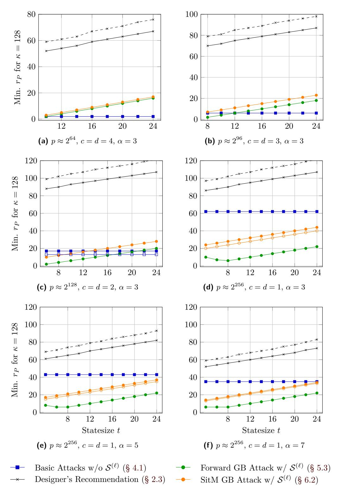
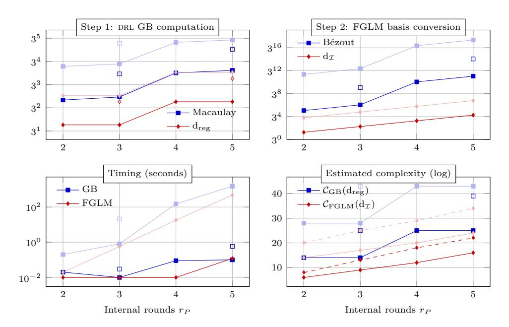
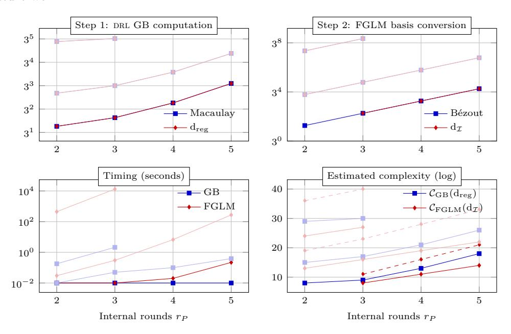
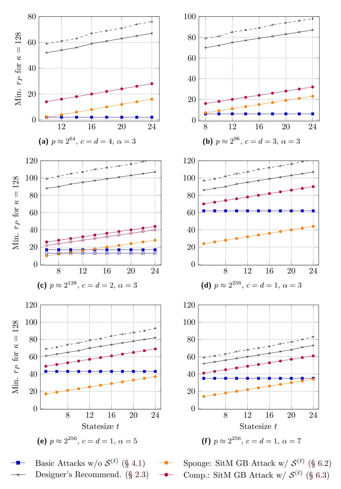

# Poseidon and Neptune: Gröbner Basis Cryptanalysis Exploiting Subspace Trails

Lorenzo Grassi1,2, Katharina Koschatko3 and Christian Rechberger3

**Abstract.** At the current state of the art, algebraic attacks are the most efficient method for finding preimages and collisions for arithmetization-oriented hash functions, such as the closely related primitives Poseidon/Poseidon2 and Neptune. In this paper, we revisit Gröbner basis (GB) attacks that exploit subspace trails to linearize some partial rounds, considering both sponge and compression modes.

Starting from Poseidon's original security evaluation, we identified some inaccuracies in the model description that may lead to misestimated round requirements. Consequently, we reevaluate and improve the proposed attack strategy. We find that depending on the concrete instantiation, the original security analysis of Poseidon under- or overestimates the number of rounds needed for security. Moreover, we demonstrate that GB attacks leveraging subspace trails can outperform basic GB attacks for Poseidon/Poseidon2 and Neptune.

We propose a variant of the previous attack strategy that exploits a crucial difference between Poseidon/Poseidon2 and Neptune: while Poseidon's inverse round functions have a high degree, Neptune's inverse external rounds maintain the same degree as the forward rounds. Using this new model, we demonstrate that Neptune's security in compression mode cannot be reduced to its security against the Constrained-Input-Constrained-Output (CICO) problem. To the best of our knowledge, this is the first time a concrete example has been provided where finding preimages is easier than solving the corresponding CICO problem.

Our results emphasize the importance of considering the mode of operation in security analysis while confirming the overall security of Poseidon/Poseidon2 and Neptune against the presented algebraic attacks.

**Keywords:** Poseidon/Poseidon2 · Neptune · Gröbner Basis · Subspace Trail · Mode of Operation · Sponge (CICO) · Compression

## 1 Introduction

The Poseidon hash function [GKR+21] can be seen as a de facto standard for use-cases of Zero-Knowledge (ZK) proofs and protocols. It has seen widespread adoption across the foundations of decentralized computation and storage [Ale, Min, Dus, Mat, Net, Pol], privacy tools and developer frameworks [Ano, Wor, ide, Zerb, Zera, Sta, Con], and hardware acceleration [Fab, Ing]. Notably, Poseidon is currently under consideration by the Ethereum Foundation (EF) for integration into its core infrastructure. To support this effort, EF is coordinating a broad cryptanalysis initiative. Also, in the scholarly literature on ZK-proofs – private/verifiable computation more broadly – Poseidon is frequently regarded as the default choice for various needs around cryptographic hashing [KZHB25, BMNW24, DKKW25, Lee24, PSG+24, CGG+23, ZBK+22, SG23, ASTW22].

&lt;sup>1 Eindhoven University of Technology, Eindhoven, the Netherlands, l.grassi@tue.nl 2 Ponos Technology, Zug, Switzerland, lorenzo@ponos.technology

&lt;sup>3 Graz University of Technology, Graz, Austria, {firstname.lastname}@tugraz.at

1https://www.poseidon-initiative.info/

Defined over a prime field F*p* for *p* ≫ 3, Poseidon is based on the Hades design strategy [\[GLR](#page-41-1)+20], which generalizes the Substitution-Permutation Network (SPN) construction. In SPN, each round is defined via the concatenation of two layers: a non-linear layer and a linear one. Focusing on the non-linear layer, a non-linear function called S-Box is applied on each chunk of the state. The Hades design makes use of external rounds with full S-Box layers (which are placed at the beginning and at the end), and of internal rounds with partial S-Box layers, in which some S-Boxes are removed/replaced by the identity map. The particular layout of Poseidon combined with the use of low-degree invertible S-Boxes leads to good performance in ZK proofs by reducing the number of non-linear operations (i.e., multiplications) in the verification process— a key cost metric for ZK-friendly schemes. Consequently, two evolutions of such design appeared in the literature, namely Poseidon2 [\[GKS23\]](#page-41-2) and Neptune [\[GOPS22\]](#page-41-3). For Poseidon2, the main difference lies in the linear layer matrices, which were chosen and fixed to improve plain performance. Neptune, on the other hand, introduces more significant changes, affecting both linear and non-linear layers. Specifically, it uses two distinct non-linear layers: one for internal partial rounds and a new one for external full rounds, aiming to minimize non-linear operations.

Due to their specific design aspects, Poseidon, Poseidon2, and Neptune are more vulnerable to algebraic attacks than "standard/classical" symmetric primitives. While their designers provide concrete security arguments to mitigate algebraic attacks, these remain less explored and understood compared to statistical attacks. Indeed, most standard symmetric primitives, such as the AES and/or Keccak/SHA-3, are more vulnerable to statistical attacks, and until recently, the symmetric cryptography community primarily focused on this threat. However, the situation is different for ZK-friendly symmetric primitives, which by design admit a simple algebraic description. The introduction of new ZK-friendly designs has spurred increased cryptanalytic effort in the algebraic direction, leading to new insights and the breakage of many such schemes, as evidenced by the growing number of algebraic attacks in recent literature, including [\[ACG](#page-38-3)+19, [BCD](#page-39-1)+20, [EGL](#page-40-5)+20, [GKRS22,](#page-41-4) [GRS21,](#page-42-7) [KR21,](#page-42-8) [BBLP22,](#page-39-2) [BBL](#page-39-3)+24, [KLR24,](#page-42-9) [YZY](#page-43-8)+24].

In order to increase our confidence regarding the security of ZK-friendly schemes, the goal of this paper is to better understand the security of Poseidon-like primitives with respect to Gröbner Basis (GB) attacks.

### **1.1 State of the Art: Gröbner Basis Cryptanalysis of Poseidon**

To contextualize our contribution, we first recall the algebraic attacks on Poseidon. Notably, these attacks also extend to Poseidon2 and Neptune.

**Attack by Beyne et al. [\[BCD](#page-39-1)+20].** The first third-party cryptanalysis of Hades-like designs appeared in [\[BCD](#page-39-1)+20], exploiting a weakness in the choice of the linear layer. Assume, for simplicity, the usual case in which the internal partial rounds are composed of a single S-Box. Since the S-Box layer is only partial, it is *always* possible to find a set of inputs for which the S-Boxes remain constant (i.e., not active) over several consecutive rounds. The number of rounds for which this property holds is tightly linked to the matrix used in the linear layer. A weak choice allows this property to persist over an *arbitrary* number of partial rounds. Beyne *et al.* in [\[BCD](#page-39-1)+20] exploited this weakness to mount a GB attack on HadesMiMC [\[GLR](#page-41-1)+20], a keyed cipher structurally similar to Poseidon. It was further analyzed by Keller and Rosemarin in [\[KR21\]](#page-42-8) and subsequently addressed by Grassi *et al.* [\[GRS21\]](#page-42-7), who proposed a matrix selection algorithm to prevent the property from extending indefinitely. Nevertheless, even with well-chosen matrices, this property always holds for a certain *finite* number of partial rounds.

**Designers' Analysis.** As just explained, it is always possible to find a set of inputs for which the S-Boxes defining a certain finite number of the partial rounds remain constant. From an algebraic point of view, this means that the degree of the system of equations describing those rounds does not change (i.e., remains constant). This property can potentially be exploited to speed up an algebraic attack. In particular, an attacker can leverage a so-called *subspace trail* to linearize some partial rounds by employing the following approach:

- a certain number of equations to ensure that the input message falls into the desired subset of texts after a certain number of rounds;
- a certain number of equations that describe the evolution of the text for the internal rounds in which the S-Boxes inputs are constant;
- a certain number of equations that link the output of the previous rounds to the output of the primitive (and so, to the desired hash value/collision).

As recalled in Section 4, Poseidon's designers were aware of this attack strategy, and an analysis was presented in the original Poseidon paper. However, upon closer examination, we identified certain imprecisions, which we discuss in Section 5.1. This forms the starting point of our work.

Other Results on Poseidon. For completeness, we note that several other cryptanalytic results on Poseidon have been presented in the literature. To begin with, [FP20, Thm. 10] provided a closed-form expression of the degree of the univariate polynomial in the lexicographic Gröbner basis. As part of addressing several of the EF's cryptographic challenges3, [BBLP22] showed that the first full round of Poseidon can be skipped – an issue that has since been addressed in Poseidon2 and Neptune. However, by restricting to a one-dimensional subspace, [BBLP22] further demonstrated how to skip an additional full round of Poseidon, and consequently, one full round of Poseidon2. More recently, [ABM24] reconsidered the possibility of setting up GB attacks by considering systems of equations defined at round level, as originally described in [GLR+20]. Based on practical experiments, they argue that the resistance of Poseidon against GB attacks is overstated, providing an affected instance for an unusual security level of  $\kappa = 1024$ .

Recent Results Not Applied to Poseidon. The FreeLunch [BBL+24] approach – successfully applied to full-round instances of Anemoi, Arion, and GRIFFIN – consists in choosing a monomial ordering such that the round-level model of the CICO-1 problem (cf. Definition 2) is already a Gröbner basis, allowing a dedicated solving algorithm to be applied. However, for Poseidon/Poseidon2/Neptune, the low degree of the S-Box reduces CICO-1 to solving a single univariate polynomial (cf. Section 4.1), a step involved in all solving strategies. Thus, this type of attack is not worthwhile for Poseidon-like primitives, as also noted in a more recent iterated resultants-based approach [BBB+25]. Whether either technique can be extended to more general settings remains an open question. A more general approach to Gröbner basis cryptanalysis is described in [KLR24], which suggests analyzing the complexity of all three steps of a GB attack using both theoretical bounds and experimental conjectures for key metrics. However, no rigorous application of the Six worlds of Gröbner Basis Cryptanalysis has yet been carried out for Poseidon-like primitives.

&lt;sup>2This analysis was published as part of a security report on STARK-friendly hashes [BSGL20].

 $^3 \verb|https://web.archive.org/web/20211101211629/https://www.zkhashbounties.info/defined-large-large-large-large-large-large-large-large-large-large-large-large-large-large-large-large-large-large-large-large-large-large-large-large-large-large-large-large-large-large-large-large-large-large-large-large-large-large-large-large-large-large-large-large-large-large-large-large-large-large-large-large-large-large-large-large-large-large-large-large-large-large-large-large-large-large-large-large-large-large-large-large-large-large-large-large-large-large-large-large-large-large-large-large-large-large-large-large-large-large-large-large-large-large-large-large-large-large-large-large-large-large-large-large-large-large-large-large-large-large-large-large-large-large-large-large-large-large-large-large-large-large-large-large-large-large-large-large-large-large-large-large-large-large-large-large-large-large-large-large-large-large-large-large-large-large-large-large-large-large-large-large-large-large-large-large-large-large-large-large-large-large-large-large-large-large-large-large-large-large-large-large-large-large-large-large-large-large-large-large-large-large-large-large-large-large-large-large-large-large-large-large-large-large-large-large-large-large-large-large-large-large-large-large-large-large-large-large-large-large-large-large-large-large-large-large-large-large-large-large-large-large-large-large-large-large-large-large-large-large-large-large-large-large-large-large-large-large-large-large-large-large-large-large-large-large-large-large-large-large-large-large-large-large-large-large-large-large-large-large-large-large-large-large-large-large-large-large-large-large-large-large-large-large-large-large-large-large-large-large-large-large-large-large-large-large-large-large-large-large-large-large-large-large-large-large-large-large-large-large-large-large-large-large-large-large-large-large-large-large-large-large-large-large-large-large-large-large-large-large-large-large-large-large-large-large-$

#### 1.2 Our Contribution

In this paper, we re-consider Gröbner basis attacks against Poseidon, Poseidon2, and Neptune that exploit the existence of subspace trails for linearizing some internal partial rounds. Our results are a step forward in the understanding of the security of Poseidon-like schemes against such GB attacks. As an additional result, such attacks point out an important difference between the security requirements of Poseidon/Poseidon2 and Neptune when used in compression mode. Our main results as well as previous work are summarized in Tables 1 and 2.

Remark 1. In this paper, we do not make a distinction between the minimum number of rounds needed to guarantee security and the maximum number of rounds that an attacker can break. For completeness, we point out that a similar approach has already been used in the literature for analyzing the security of arithmetization-friendly schemes, see e.g. [BCD+20, BBLP22, GKRS22].

Designers' Analysis Revisited: Improved Variant of the GB Attack with Linearization of the Internal Partial Rounds. As previously mentioned, the starting point of this paper is the analysis conducted by Poseidon's designers. As our first contribution, in Section 5, we revisit their analysis, addressing the discovered inaccuracies and refining the general attack strategy. Depending on the instantiation of Poseidon/Poseidon2, our analysis shows that the designers' estimation of the number of rounds required for the targeted security level (or equivalently, the number of rounds that can potentially be attacked) is, in some cases, overestimated and, in others, underestimated – see Figure 5 in Section 7.2.

We compare our model against one that does not utilize subspace trails and observe that the best algebraic attack depends on the concrete instantiation of Poseidon/Poseidon2. For a security level of 128 bits, we find that when the prime field  $\mathbb{F}_p$  is relatively small (e.g.,  $p \approx 2^{32}$  or  $2^{64}$ ) and the hash output consists of several field elements, Gröbner basis attacks exploiting the linearization of internal partial rounds via subspace trails (as in Section 5.2) are most effective. Conversely, for larger prime fields (e.g.,  $p \approx 2^{256}$ ), where the hash output consists of only one or two field elements, the best algebraic attacks do not rely on subspaces but instead exploit alternative solving techniques, such as computing the roots of a univariate polynomial or resultants, to improve efficiency. Analogous attacks (and conclusions) are proposed and hold for Neptune.

Remark 2. The main differences between Poseidon and Poseidon2 are (1) the details of the linear layer, and (2) the fact that Poseidon2 starts with a matrix multiplication, which is absent in Poseidon. Since our attacks do not depend on the details of the linear layer, in this paper we limit ourselves to focus on Poseidon2 only. Our attacks extend naturally to Poseidon as well, as we will discuss in detail later.

Start-in-the-Middle GB Attack with Linearization of Internal Rounds: Crucial Difference between Poseidon/Poseidon2 and Neptune. Our second main contribution introduces an alternative model that leverages the linearization of certain internal partial rounds through proper subspace trails, see Section 6. In the previous strategy, the attacker starts at the hash input and imposes equations to ensure that the input message falls into the desired subspace after a certain number of rounds, allowing the attack to exploit the subspace trail. In contrast, our new model directly starts in this subspace, eliminating the need for such equations. However, when reasoning about the hash input, this requires working in the backward direction:

- For Poseidon/Poseidon2, the degree of the inverse round is almost maximal.
- For Neptune, the inverse round has the same degree as the forward round for the external round function.

Note that for Poseidon/Poseidon2, this attack never outperforms the previous one due to the high degrees. In contrast, for Neptune, it is typically the most competitive one among the GB attacks exploiting subspace trails, even outperforming the basic GB attack without linearization of internal rounds. Concrete results are given in Sections 7.2 and 8.2.

Security of Neptune in Compression Mode. Finally, as our third main contribution, we evaluate Neptune in compression mode.4 In Section 9, we adapt the previously described attack to this setting. Consequently, we show that the number of rounds required to guarantee security of Neptune against the Constrained Input Constrained Output (CICO) problem is not sufficient to prevent our attack when Neptune is used in compression mode. This result is highly relevant, as the CICO problem is the primary algebraic attack vector considered by the designers of arithmetization-oriented symmetric primitives—see, e.g., the security analysis of Poseidon/Poseidon2, Neptune, Anemoi [BBC+23], Griffin [GHR+23], and Monolith [GKL+24]. To the best of our knowledge, we are the first to show that the common assumption—namely, that algebraic security against CICO implies security of the symmetric primitive against algebraic attacks—does not hold in general. This finding is especially important for the community as it increases our confidence regarding the security of arithmetization-oriented symmetric primitives used in compression mode.

Practical Verification. In line with [KLR24], we experimentally verified all the proposed attacks, and we present the results of our tests in Sections 7.3 and 8.3. With the exception of Neptune, our tests suggest that the resulting systems are in general not regular. Still, by extrapolating the complexity of the dominating step from these experimental results, we have been able to confirm the number of internal partial rounds necessary for achieving security predicted by our theory. Moreover, while we could not formulate a closed-form conjecture for the degree of regularity, we did establish a conjecture for the quotient space dimension in the attack described in Section 5.2 for Poseidon2. We leave the open problem to prove this conjecture (and other observations related to our experiments) for future work.

Impact of Our Results. We emphasize that the security of Poseidon/Poseidon2 and Neptune is not threatened by the attacks presented in this paper. Indeed, the number of rounds of Poseidon/Poseidon2 and Neptune are usually derived by the interpolation attack [JK97]. At the same time, the interpolation attack against a hash function does not allow to find preimages and/or collisions, and it can be considered as a distinguisher on the internal permutation that instantiates the sponge hash function or the compression one. Instead, at the current state of the art, the most efficient strategy for finding preimages and/or collisions consists of using Gröbner bases (or factorization/resultant depending on the number of equations and variables that define the system of equations to solve). From this point of view, our results provide a better estimation of the security margin of Poseidon/Poseidon2 and Neptune against this crucial attack.

**Organization.** Section 2 recalls the necessary preliminaries on the targeted designs. Section 3 provides background on algebraic system solving. Section 4 presents the designers' original security analysis and introduces the notion of subspace trails. In Section 5, we revisit and refine the algebraic model initially proposed by the designers of Poseidon. Section 6 presents an alternative attack in which the attacker "starts in the middle", i.e., directly within an affine subspace. Finally, Sections 7 to 9 give concrete results for Poseidon/Poseidon2 and Neptune in sponge and compression mode.

 $^4$ Note that while Neptune was originally proposed in sponge mode, there is no a priori reason why it cannot also be used in compression mode.

**Table 1:** Overview of algebraic attacks against Poseidon2 in sponge mode – details of the system of equations. Parameters: S-Box degree  $\alpha$ , number of full/external rounds  $r_F := 2 \cdot r_f$ , number of partial/internal rounds  $r_P$ , statesize t, capacity c, digest d. Analogous results hold for Poseidon, for which the initial full S-Box layer can be skipped for free [BBLP22], and for Poseidon2/Poseidon in compression mode.

| Modeling Strategy                  | System of                                  | References and Notes                                                                                                                  |                                                                           |
|------------------------------------|--------------------------------------------|---------------------------------------------------------------------------------------------------------------------------------------|---------------------------------------------------------------------------|
|                                    | # Equations                                | Degree                                                                                                                                | 100,07010000 4114 170100                                                  |
| inputs-outputs                     | d                                          | $\alpha^{r_F+r_P}$                                                                                                                    | Designers' analysis [GKR + 21]                                 |
| round-level                        | $t \cdot (r_F - 1) + d + r_P - c$          | $\alpha$                                                                                                                              | Designers' analysis [GKR + 21] & revisited in [ABM24]          |
| inputs-outputs + input subspace    | d                                          | $\alpha^{r_F+r_P-1}$                                                                                                                  | [BBLP22] (skip first full round)                                       |
| SitM +                             | $t \cdot r_f - c$                          | $\alpha$                                                                                                                              | [BCD + 20]                                                     |
| internal subspace                  | $t \cdot (r_f - 1) + d$                    | $\alpha$                                                                                                                              | (only for "weak" MDS matrix)                                              |
| inputs-outputs + internal subspace | $\begin{array}{c} t \ t-1 \ t \end{array}$ | $\alpha^{r_F+\frac{r_P-(t-1)}{2}} \alpha^{t-1} \ \alpha^{r_F+\frac{r_P-(t-1)}{2}}$                                                    | Designers' analysis [GKR + 21] (imprecise, see Section 5.1) |
| inputs-outputs + internal subspace | $t \ d$                                    | $\frac{\sqrt{d/t} \cdot \alpha^{r_f + \frac{r_P - (t - (c + d))}{2}}}{\sqrt{t/d} \cdot \alpha^{r_f + \frac{r_P - (t - (c + d))}{2}}}$ | Sections 5.3 and 7 (Designers' analysis revisited)                        |
| SitM + internal subspace           | $t \cdot r_f - c$ $d$                      | $\alpha^{r_f+r_P-(t-(c+d))}$                                                                                                          | Section 6.2 and Appendix B.1 (not competitive)                            |

**Table 2:** Overview of algebraic attacks against NEPTUNE in sponge mode – details of the system of equations. Parameters: S-Box degree  $\alpha$ , number of initial full rounds  $r_f$ , number of final full rounds  $r_f$ , number of full/external rounds  $r_F := r_f + r_f'$ , number of partial/internal rounds  $r_P$ , state size t, capacity c, digest d.

| Modeling Strategy                  | System of Equations                    |                                                                                                                                                   | References and Notes                                           |  |
|------------------------------------|----------------------------------------|---------------------------------------------------------------------------------------------------------------------------------------------------|----------------------------------------------------------------|--|
|                                    | # Equations                            | Degree                                                                                                                                            | regerences una rivies                                          |  |
| inputs-outputs                     | d                                      | $4^{r_F} \cdot \alpha^{r_P}$                                                                                                                      | Designers' analysis [GOPS22]                                   |  |
| round-level                        | $t \cdot (r_F - 1) + d - c$ $r_P$      | $\frac{4}{\alpha}$                                                                                                                                | Designers' analysis [GOPS22]                                   |  |
| inputs-outputs + internal subspace | -                                      | -                                                                                                                                                 | Designers' analysis [GOPS22] $(t-1)$ extra rounds for security |  |
| inputs-outputs + internal subspace | $t \ d$                                | $\frac{\sqrt{d/t} \cdot 2^{r_F} \cdot \alpha^{\frac{r_P - (t - (c+d))}{2}}}{\sqrt{t/d} \cdot 2^{r_F} \cdot \alpha^{\frac{r_P - (t - (c+d))}{2}}}$ | Sections 5.3 and 8                                             |  |
| SitM + internal subspace        | $\begin{array}{c} t-c \ d \end{array}$ | $4^{r_f} \cdot \alpha^{r_P - (t - (c+d))}$                                                                                                        | Sections 6.2 and 8                                             |  |

# 2 Preliminary: Poseidon-Like Symmetric Primitives

We begin by recalling the details of POSEIDON, POSEIDON2, and NEPTUNE, along with the modes of operation in which they are used. For simplicity, we unify the notation throughout, while the original notation used by the designers is summarized in Appendix A.

**Notation.** Let  $p \geq 3$  be a prime integer and let  $\mathbb{F}_p$  be the prime field with p > 2 elements. We use the symbol "·" to denote the product between (i) elements of  $\mathbb{F}_p$ , and (ii) one element of  $\mathbb{F}_p$  with one element of  $\mathbb{F}_p^n$ , while we use the symbol "×" to denote the product between elements of  $\mathbb{F}_p^n$  and/or  $\mathbb{F}_p^{n \times m}$ . Given  $x \in \mathbb{F}_p^n$ , we denote by  $x_i$  its i-th component for each  $i \in \{0, 1, \ldots, n-1\}$ . That is,  $x = (x_0, x_1, \ldots, x_{n-1})$  or, equivalently,  $x = x_0 ||x_1|| \ldots ||x_{n-1}||$ , where  $\cdot ||\cdot|$  denotes concatenation. Given  $x \in \mathbb{F}_p^n$ ,  $x^T$  denotes its transpose. We use the

Figure 1: The Sponge Hash Function.

calligraphic notation  $\mathcal{S}$  to denote a subspace,  $\langle \ldots \rangle$  for the linear span of vector(s), and  $\mathcal{S}^{\perp}$  for the orthogonal subspace. We also introduce the following truncation functions.

**Definition 1** (Truncation). Let  $1 \leq \tau < t$ . The functions  $\mathrm{Trunc}_{\tau} : \mathbb{F}_p^t \to \mathbb{F}_p^{\tau}$  and  $\mathrm{Trunc}_{\tau}' : \mathbb{F}_p^t \to \mathbb{F}_p^{\tau}$  return, respectively, the first and the last  $\tau$   $\mathbb{F}_p$ -elements, that is,

Trunc\tau(
$$x \equiv (x_0, x_1, \dots, x_{t-1})$$
) =  $x_0 ||x_1|| \dots ||x_{\tau-1}||$ ,
Trunc'\tau( $x \equiv (x_0, x_1, \dots, x_{t-1})$ ) =  $x_{t-\tau} ||x_{t-\tau+1}|| \dots ||x_{t-1}||$ .

## 2.1 Modes of Operation: Sponge Hash and Compression Functions

Poseidon, Poseidon2, and Neptune are permutations to be used either in sponge or compression mode of operation.5 Here, we briefly recall them.

#### 2.1.1 Sponge Hash Function

The sponge construction [BDPA08] can be used to model or implement many cryptographic primitives, including cryptographic hashes. Instantiated with a permutation  $P: \mathbb{F}_p^t \to \mathbb{F}_p^t$ , it operates on an internal state of t field elements which is divided into two parts: the outer part of r field elements and the inner part of c field elements, where r is called the rate and c = t - r is called the capacity. The sponge construction is illustrated in Figure 1.

In each step of the absorbing phase, r field elements are read from the input and are added to the outer part of the state, followed by the application of the permutation P. In each step of the squeezing phase, the first r field elements of the state are returned as output blocks, interleaved by the application of the permutation P.

**Security.** If the inner permutation resembles a random one, the sponge construction is indifferentiable from a random oracle for up to around  $p^{c/2}$  queries [BDPA08]. To provide  $\kappa$  bits of security, we thus require  $p^{c/2} \geq 2^{\kappa}$ . To guarantee security against birthday bound attacks,  $p^{d/2} \geq 2^{\kappa}$  has to hold, where d denotes the total digest length over  $\mathbb{F}_p$ . Further, we recall that the security of a sponge hash function is strictly related to the infeasibility of solving any CICO (*Constrained Input, Constrained Output*) problem for the permutation that instantiates the sponge [BDPA11].

**Definition 2** (CICO problem). The invertible function  $P: \mathbb{F}_p^t \to \mathbb{F}_p^t$  is  $\kappa$ -secure against the CICO- $(n_I, n_O)$  problem (where  $0 < n_I, n_O < t$  and  $n_I + n_O \le t$ ) if no algorithm ,with expected complexity smaller than  $2^{\kappa}$  finds  $x \in \mathbb{F}_p^{t-n_I} \times \{0\}^{n_I}$  and  $y \in \mathbb{F}_p^{t-n_O} \times \{0\}^{n_O}$  such that P(x) = y. In other words,  $n_I$  input elements and  $n_O$  output elements are fixed. The CICO-(k, k) problem is typically referred to simply as the CICO-k problem.

 $^5\mathrm{For}$  completeness, we point out that only Poseidon2 has been formally proposed in the 2-to-1 compression mode.

&lt;sup>6The zeros can be replaced by other fixed constants. For example, fixing  $n_I = c$  elements in the inner part to the initial value (IV) and  $n_O = d$  elements in the outer part to the hash digest corresponds to a preimage attack on a 1-block sponge, see Figure 1b. Note that in this setting we always assume  $r \ge d$ .

**Padding.** Different padding rules apply depending on whether the input has a fixed length or a variable length. Here, we limit ourselves two padding rules especially suitable for arithmetization-oriented primitives, that is, the SAFE one proposed in [KBM23], and the one proposed in [LBM25]. In details:

- [KBM23] consists in (1st) adding the smallest number < r of zeroes such that the  $\mathbb{F}_p$ -size of  $m||0^*$  is a multiple of r, and (2nd) making the initial value IV dependent on the size of the message to hash;
- [LBM25] consists in (1st) adding the smallest number < r of zeroes such that the  $\mathbb{F}_p$ -size of  $m||0^*$  is a multiple of r, and (2nd) applying an invertible function with no fix point (e.g., a non-zero constant addition) to the inner value at the end of the absorption phase (equivalently, before the squeezing phase) in the case in which the size of m is not a multiple of r.

Here, we omit extra details, since all our attacks assume fixed-length inputs only.

#### 2.1.2 Cryptographic Compression Function (for Poseidon2)

A fixed-size t-to-d compression function is crucial in, e.g., Merkle trees. Concretely, it is defined as  $C: \mathbb{F}_p^t \to \mathbb{F}_p^d$  where

$$C(x) := Trunc_d(P(x) + M \times x)$$
,

where P is a permutation over  $\mathbb{F}_p$ , and M is an invertible matrix (not necessary the identity matrix – see e.g. Jive [BBC+23]). As discussed e.g. in [GHR+23], this approach can be seen as a permutation-based variant of the Davies-Meyer mode [PGV93, BRS02] which, like the latter, crucially relies on a feed-forward operation for one-wayness.

**Security.** For a security level of  $\kappa$  bits and assuming P behaves like a pseudo-random (known) permutation, C is a secure compression function with respect to collisions and (second) preimages if  $p^d \geq 2^{2\kappa}$  (due to the birthday bound attack whose cost is in  $\mathcal{O}(p^{d/2})$ ) and  $p^{t-d} \geq 2^{\kappa}$  (in order to avoid a guessing attack on the truncated part). Moreover, in the case in which P is not a "weak" permutation (equivalently, it does not present any clear weakness), then the matrix M does not play any role on the security if P, since  $\mathrm{Trunc_d}(\mathsf{P}(x) + M \times x)$  and  $\mathrm{Trunc_d}(\mathsf{P}(M^{-1} \times x) + x)$  are equivalent (see e.g. [GHR+23, Sect. 4.2] for more details). For this reason, in the following we simply assume M to be the identity matrix.

#### 2.2 Poseidon and Poseidon2

Due to the similarity between Poseidon and Poseidon2, we first present them in a general way. Next, we list the differences between the two.

Let  $p > 2^{30}$  be a prime number and let  $2 \le t \le 24$ . The Poseidon permutation P over  $\mathbb{F}_p^t$  is defined by

$$\mathsf{P}(x) = \mathsf{E}_{r_f + r_f' - 1} \circ \dots \circ \mathsf{E}_{r_f} \circ \mathsf{I}_{r_P - 1} \circ \dots \circ \mathsf{I}_0 \circ \mathsf{E}_{r_f - 1} \circ \dots \circ \mathsf{E}_0(M' \times x), \tag{1}$$

where M' is an invertible  $t \times t$  matrix, E is an external full round function, and I is an internal partial round function. The value  $r_F = r_f + r_f'$  denotes the number of external (initial and final) rounds, and  $r_P$  is the number of internal rounds.

Every external round  $\mathsf{E}:\mathbb{F}_p^t\to\mathbb{F}_p^t$  is defined by

$$\mathsf{E}(x) = \mathsf{E}(x_0, x_1, \dots, x_{t-1}) = M_\mathsf{E} \times \left( (x_0 + c_0)^\alpha, (x_1 + c_1)^\alpha, \dots, (x_{t-1} + c_{t-1})^\alpha \right)^T \;,$$

**Figure 2:** General construction in Poseidon and Poseidon2.

**Figure 3:** Lai-Massey based construction as non-linear layer in full rounds E in Neptune.

where  $\alpha \geq 3$  is the smallest positive integer that satisfies  $\gcd(\alpha, p-1) = 1$  and  $c_j$  is the j-th round constant. Every internal round  $\mathsf{I}: \mathbb{F}_p^t \to \mathbb{F}_p^t$  is defined by

$$I(x) = I(x_0, x_1, \dots, x_{t-1}) = M_I \times ((x_0 + c')^{\alpha}, x_1, \dots, x_{t-1})^T,$$

where  $\alpha$  is defined as before, and where c' is the round constant.

**Details of Poseidon.** In Poseidon, M' is the identity matrix. Both  $M_{\mathsf{E}}$  and  $M_{\mathsf{I}}$  are instantiated by the same Maximum Distance Separable (MDS) matrix M, fulfilling particular properties in order to prevent arbitrarily long subspace trails. We refer to [GRS21] and to Section 4 for more details regarding the condition for preventing arbitrarily long subspace trails. Here we limit ourselves to recall that such a condition is satisfied if the minimal polynomials of  $M, M^2, \ldots, M^\ell$  for a certain  $\ell \geq 1$  are irreducible and of maximum degree.

**Details of Poseidon2.** In Poseidon2, a restriction on the values of t is imposed, that is,  $t \in \{2, 3, 4 \cdot t'\}$  for each  $t' \in \{1, 2, \dots, 6\}$ . The initial matrix M' is equal to  $M_{\mathsf{E}}$ , that is,  $M' = M_{\mathsf{E}}$ . (Note that the initial non-linear layer does not provide any additional security when, e.g., M' = identity matrix.)  $M_{\mathsf{E}}$  is MDS for t = 3, 4, and it has branch number t' + 4 for  $t \geq 8$ . The matrix  $M_{\mathsf{I}}$  is different from  $M_{\mathsf{E}}$ , and it must satisfy the same condition given before for Poseidon. Since the details of  $M_{\mathsf{E}}$  and  $M_{\mathsf{I}}$  do not impact our attacks, we refer to [GKS23] for more details.

**Number of Rounds.** For a security level of  $\kappa$  bits with  $2^{80} \leq 2^{\kappa} \leq \min\{2^{256}, p^{t/3}\}$ , due to the security of the sponge hash function and compression function given before, the round numbers are derived as follows:

$$r_F = 6 (r_f = 3, r'_f = 3),$$
 (2)

$$r_P = \left\lceil \max \left\{ 1 + \frac{\min\{\kappa, \log_2(p)\}}{\log_2(\alpha)} + \log_\alpha(t) - r_F, r_{GB} \right\} \right\rceil, \tag{3}$$

where  $\alpha$  is the degree of the S-Boxes, the first term in Equation (3) accounts for interpolation attacks, and the second term is related to Gröbner basis attacks. In particular,7

$$r_{\mathrm{GB}} = \max \left\{ \frac{\min\{\log_2(p), \kappa\}}{\log_2(\alpha)} - r_F, \, t - 1 + \log_\alpha(2) \cdot \min\left\{\frac{\kappa}{t+1}, \frac{\log_2(p)}{2}\right\} - r_F, \, r_{\mathrm{GB}}' \right\},$$

where the second term intends to protect against GB attacks exploiting linear subspace trails (see Section 4.3), while  $r'_{\rm GB}$  accounts for the results presented in [ABM24].

The security margin consists of 2 external full rounds ( $r_F = 8$  instead of 6) and 7.5% more internal partial rounds.

## 2.3 Neptune

NEPTUNE is a variant of POSEIDON proposed by Grassi *et al.* [GOPS22]. Defined over  $\mathbb{F}_p^t$  for  $t=2\cdot t'\leq 24$  even, it follows the same structure given in Equation (1), where the initial matrix M' and the internal rounds I are defined exactly as in POSEIDON2. The difference arises in the external rounds  $\mathsf{E}:\mathbb{F}_p^t\to\mathbb{F}_p^t$ , which are defined as

$$\mathsf{E}(x) = M_{\mathsf{E}} \times (\mathsf{S}(x_0 + c_0, x_1 + c_1), \mathsf{S}(x_2 + c_2, x_3 + c_3), \dots, \mathsf{S}(x_{t-2} + c_{t-2}, x_{t-1} + c_{t-1})) \ ,$$

where

- $M_{\mathsf{E}}$  is an invertible  $t \times t$  matrix defined via two  $t/2 \times t/2$  matrices concatenated together in a particular way (see [GOPS22, Sect. 7] for more details),8 and where  $c_j$  is the j-th round constant;
- given  $\gamma \in \mathbb{F}_p \setminus \{0\}$ ,  $S : \mathbb{F}_p^2 \to \mathbb{F}_p^2$  is defined as  $S(x_0, x_1) = y_0 \| y_1 \text{ where}^9$

$$y_0 = (2 \cdot x_0 + x_1) + 3 \cdot (x_0 - x_1)^2 + (\gamma + (x_0 - 2 \cdot x_1) - (x_0 - x_1)^2)^2,$$

$$y_1 = (x_0 + 3 \cdot x_1) + 4 \cdot (x_0 - x_1)^2 + (\gamma + (x_0 - 2 \cdot x_1) - (x_0 - x_1)^2)^2.$$

Focusing on S, we point out that it is based on the Lai-Massey construction [LM90], that is,  $(x_0, x_1) \mapsto (x_0 + (x_0 - x_1)^2, x_1 + (x_0 - x_1)^2)$ . It implies that both the degree of S and of  $S^{-1}$  are equal to four. See Figure 3.

**Number of Rounds.** For a security level of  $\kappa$  bits with  $2^{80} \leq 2^{\kappa} \leq \min\{2^{256}, p^{t/3}\}$ , due to the security of the sponge hash function and compression function given before, the round numbers are derived as follows:

$$r_F = 6 (r_f = 4, r'_f = 2),$$
 (4)

$$r_P = \left\lceil \max \left\{ \frac{\min\{\kappa, \log_2(p)\} - 6}{\log_2(\alpha)} + 3 + t + \log_\alpha(t), \frac{\kappa}{2} - 4 \cdot t - 2 \right\} \right\rceil$$
 (5)

where  $\alpha$  is the degree of the S-Boxes. We limit ourselves to recall that the first part of Equation (5) aims to ensure protection against interpolation attacks, where t internal rounds are added due to the possibility of covering them with an invariant subspace trail [GOPS22, §7.4.3].

The security margin consists of 12.5% more internal partial rounds. Note that no additional external full rounds are added.

&lt;sup>7Here we propose a generalization of the formula given in [GKR+21, GKR+19] for a generic  $r_F$ .

&lt;sup>8We point out the following. By re-writing the state as a  $2 \times (t/2)$  square, S operates on each column, and the two  $t/2 \times t/2$  matrices that defines  $M_{\mathsf{E}}$  multiply each row.

 $^9$ For simplicity, we fixed the constant  $\alpha$  that defines  ${\sf S}$  to 1, as suggested by the designers.

## 3 Preliminary: Solving Systems of Polynomial Equations

Throughout this paper, we model the target primitive as a system of polynomial equations over a prime field  $\mathbb{F}_p$  and solve it using an off-the-shelf solver. To assess a primitive's security against algebraic attacks, it is crucial to consider the complexity of various solving methods. In this section, we recall several strategies for solving a system of m equations in n variables, assuming  $n \geq m$ .10 If n > m, we limit ourselves to point out that besides trying to solve an under-determined system of equations, an attacker could simply fix n - m variables in order to decrease the degree and/or simplify the system of equations.

We recall univariate system solving, i.e. factorization over  $\mathbb{F}_p$ , in Section 3.1, the special case of bivariate system solving in Section 3.2, and the general multivariate case in Section 3.3.

**About the System of Equations.** Let  $\{F_1, \ldots, F_m\} \subset \mathbb{F}_p[x_1, \ldots, x_n]$  be a set of m polynomials in n variables over  $\mathbb{F}_p$ . The corresponding equation system is given by

$$\begin{cases} \mathsf{F}_1(x_1,\dots,x_n) &= 0 \\ &\vdots & \cdot \\ \mathsf{F}_m(x_1,\dots,x_n) &= 0 \end{cases}$$

The total degree of  $\mathsf{F}_i$  is denoted by  $\deg(\mathsf{F}_i)$  and the degree of  $\mathsf{F}_i$  with respect to  $x_j$  is written  $\deg_{x_j}(\mathsf{F}_i)$ , for  $1 \leq i \leq m, \ 1 \leq j \leq n$ . We write  $\mathcal{I} := \langle \mathsf{F}_1, \dots, \mathsf{F}_m \rangle$  for the ideal generated by  $\{\mathsf{F}_1, \dots, \mathsf{F}_m\}$ , and use  $\mathsf{d}_{\mathcal{I}} := \dim_{\bar{\mathbb{F}}_p}(\mathbb{F}_p[x_1, \dots, x_n]/\mathcal{I})$ , called the *degree of the ideal*, to denote the dimension of the quotient ring  $\mathbb{F}_p[x_1, \dots, x_n]/\mathcal{I}$  as  $\bar{\mathbb{F}}_p$ -vector space, where  $\bar{\mathbb{F}}_p$  is the algebraic closure of  $\mathbb{F}_p$ .

We denote by  $\mathsf{M}(\delta)$  the complexity of multiplying two univariate polynomials of degree  $\leq \delta$  in operations in  $\mathbb{F}_p$ . Using the approach by Cantor and Kaltofen [CK91], we have  $\mathsf{M}(\delta) = \mathcal{O}(\delta \cdot \log(\delta) \cdot \log\log(\delta))$ . Finally,  $2 < \omega \leq 3$  denotes the linear algebra constant accounting for the complexity of multiplying two  $k \times k$  matrices:  $\mathcal{O}(k^{\omega})$ . In practice, designers typically assume  $\omega = 2$  in the security assessment to account for future developments, and attackers mostly either use  $\omega = \log_2(7) \approx 2.81$  [Str69] or  $w \approx 2.37$  [WXXZ23].

#### 3.1 Univariate Solving: 1 Equation in 1 Variable

To find the solutions of a single univariate equation F(x) = 0 of degree  $\delta = \deg(F)$  over a finite field  $\mathbb{F}_p$ , the following strategy can be applied [BBLP22, § 3.1]:

- 1. Compute  $\mathsf{G}(x) = x^p x \mod \mathsf{F}(x)$ . This requires  $\mathcal{O}(\delta \cdot \log(\delta) \cdot \log(p) \cdot \log\log(\delta))$  finite field operations.
- 2. Compute  $H(x) = \gcd(G(x), F(x))$ . This requires  $\mathcal{O}(\delta \cdot \log^2(\delta) \cdot \log \log(\delta))$  finite field operations.
- 3. Factorize H. If F, and thus H, has only a few roots in  $\mathbb{F}_p$ , this step is of negligible complexity.

Complexity. The total cost of solving the (univariate) system is given by

$$C_{\text{UNI}}(\delta) = \mathcal{O}(\delta \cdot \log(\delta) \cdot (\log(\delta) + \log(p)) \cdot \log\log(\delta)) \tag{6}$$

finite field operations.

 $^{10}\mathrm{Note}$  that the case n < m does not occur in this paper.

#### 3.2 Resultant: 2 Equations in 2 Variables

Next, we discuss a strategy for solving 2 equations in 2 variables. For this goal, we first recall the resultant of two univariate polynomials. See [CLO15, Chapter 3].

**Definition 3.** Given two non-constant polynomials  $\mathsf{F} = \sum_{i=0}^{\delta} a_i x^i$  and  $\mathsf{G} = \sum_{j=0}^{\epsilon} b_i x^i$  in  $\mathbb{F}_p[x]$  with  $a_{\delta}, b_{\epsilon} \neq 0$ . The *Sylvester matrix* of  $\mathsf{F}$  and  $\mathsf{G}$  with respect to x is the  $(\delta + \epsilon) \times (\delta + \epsilon)$  matrix defined as

$$\operatorname{Syl}_{x}(\mathsf{F},\mathsf{G}) = \begin{bmatrix} a_{\delta} & b_{\epsilon} & b_{\epsilon-1} & b_{\epsilon} \\ a_{\delta-1} & a_{\delta} & b_{\epsilon-1} & b_{\epsilon} \\ a_{\delta-2} & a_{\delta-1} & \ddots & b_{\epsilon-2} & b_{\epsilon-1} & \ddots \\ \vdots & & \ddots & a_{\delta} & \vdots & & \ddots & b_{\epsilon} \\ \vdots & & & a_{\delta-1} & \vdots & & & b_{\epsilon-1} \\ a_{0} & a_{1} & \vdots & b_{0} & b_{1} & \vdots \\ & & a_{0} & \ddots & \vdots & & b_{0} & \ddots & \vdots \\ & & & \ddots & a_{1} & & & \ddots & b_{1} \\ & & & & a_{0} & & & \delta \text{ columns} \end{bmatrix}$$

where zeros fill the blank spaces. Note that the first  $\epsilon$  columns depend on the coefficients  $a_0, a_1, \ldots, a_{\delta}$  only, while the last  $\delta$  columns depend on the coefficients  $b_0, b_1, \ldots, b_{\epsilon}$  only. The resultant of f and g with respect to x is the determinant of the Sylvester:

$$\mathrm{Res}_x(\mathsf{F},\mathsf{G}) = \det\left(\mathrm{Syl}_x(\mathsf{F},\mathsf{G})\right).$$

The resultant  $\operatorname{Res}_x(\mathsf{F},\mathsf{G})$  is closely related to the (common) roots of  $\mathsf{F}$  and  $\mathsf{G}$ :

**Theorem 1.** Let  $F, G \in \mathbb{F}_p[x]$  as above, and let  $\alpha_1, \ldots, \alpha_\delta$  and  $\beta_1, \ldots, \beta_\epsilon$  denote their respective roots (in the algebraic closure of  $\mathbb{F}_p$ ). Then the resultant can be expressed as

$$\operatorname{Res}_{x}(\mathsf{F},\mathsf{G}) = a_{\delta}^{\epsilon} \cdot b_{\epsilon}^{\delta} \cdot \prod_{i=1}^{\delta} \prod_{j=1}^{\epsilon} (\alpha_{i} - \beta_{j}).$$

In particular,  $\mathrm{Res}_x(F,G)$  is equal to zero if and only if F and G have a nontrivial common factor in  $\mathbb{F}_p[x]$ .

One important application of the resultant is in elimination theory, which focuses on eliminating variables from systems of multivariate polynomials. From the definition, the resultant takes two polynomials in the variable x and gives one polynomial with no variables. In multiple variables, this approach can be generalized to removing (or eliminating) one variable – see [YZY $^+24$ ] for a recent example of it in symmetric cryptography.

Let  $\mathsf{F}(x,y)$  and  $\mathsf{G}(x,y)$  be two polynomials in  $\mathbb{F}_p[x,y]$ . To eliminate y,  $\mathsf{F}$  and  $\mathsf{G}$  are interpreted as polynomials in y whose coefficients are polynomials in  $\mathbb{F}_p[x]$ . To find the common zeros, one proceeds as follows:

- 1. Compute the univariate polynomial  $\operatorname{Res}_{y}(\mathsf{F},\mathsf{G}) \in \mathbb{F}_{p}[x]$ .
- 2. Compute the roots of  $\operatorname{Res}_y(\mathsf{F},\mathsf{G})$  in  $\mathbb{F}_p$  by using, for example, the strategy described in Section 3.1. Since  $\operatorname{Res}_y(\mathsf{F},\mathsf{G})$  vanishes at any common solution of  $\mathsf{F}=\mathsf{G}=0$ , the roots of the univariate polynomial  $\operatorname{Res}_y(\mathsf{F},\mathsf{G})$  yield the x-coordinates of the solutions.
- 3. Let x' be a zero of  $\operatorname{Res}_y(\mathsf{F},\mathsf{G})$ . To find the common zeros of  $\mathsf{F}$  and  $\mathsf{G}$  with x=x', it is sufficient to compute the roots of their GCD, that is,  $\mathsf{H}(y)=\gcd(\mathsf{F}(x',y),\mathsf{G}(x',y))$ .

**Complexity.** Let  $\mathsf{F},\mathsf{G}\in\mathbb{F}_p[x,y]\equiv\mathbb{F}_p[x][y].$  The cost of the described strategy is as follows:

1. Let  $\delta_x = \max\{\deg_x(\mathsf{F}), \deg_x(\mathsf{G})\}$ ,  $\delta_y = \max\{\deg_y(\mathsf{F}), \deg_y(\mathsf{G})\}$ , and w.l.o.g.  $\delta_x \geq \delta_y$ . As proved in [vzGG13, Corollary 11.21], the bivariate resultant  $\mathrm{Res}_y(\mathsf{F},\mathsf{G}) \in \mathbb{F}_p[x]$  can be computed in

$$C_{\text{RES}}(\delta_x, \delta_y) = \mathcal{O}\left(\delta_y \cdot \mathsf{M}(\delta_x \delta_y) \cdot \log(\delta_x \delta_y)\right) \tag{7}$$

or  $\tilde{\mathcal{O}}\left(\delta_x \cdot \delta_y^2\right) \subseteq \mathcal{O}\left(\delta_x \cdot \delta_y^2\right)^{1+o(1)}$  arithmetic operations in  $\mathbb{F}_p$ , where the "soft Oh" notation  $\tilde{\mathcal{O}}(\cdot)$  omits all logarithmic factors.

- 2. The resultant  $\operatorname{Res}_y(\mathsf{F},\mathsf{G}) \in \mathbb{F}_p[x]$  has degree at most  $2\delta_x\delta_y$ , since  $\operatorname{Syl}_y(\mathsf{F},\mathsf{G})$  is at most of size  $2\delta_y \times 2\delta_y$ , and each entry is a polynomial in x of degree at most  $\delta_x$ . The cost for factorizing it is given by  $\mathcal{C}_{\mathrm{UNI}}(2\delta_x\delta_y)$  from Equation (6). Note that this is only an upper bound since the real degree of the resultant might be much smaller.
- 3. Finally, finding the GCD of two polynomials of degree  $\leq \delta_y$  and its zeros costs approximately  $\mathcal{O}(\delta_y \cdot \log^2(\delta_y) \cdot \log \log(\delta_y))$ .

It is not hard to check that the cost of the first step is usually much higher than the costs of the other two steps.

#### 3.3 Gröbner Basis Attacks: n Equations in n Variables

Algebraic models for symmetric primitives typically give rise to equation systems that generate a zero-dimensional ideal  $\mathcal{I}$ , that is, the number of solutions in  $\bar{\mathbb{F}}_p$  is finite. A widely used strategy is, therefore, to employ Gröbner bases [Buc76, CLO18] to solve such systems. In particular, to find the common zeros, one proceeds as follows:

- 1. Compute the Gröbner basis of  $\mathcal{I}$  with respect to the DRL (degree–reverse–lexicographic) order, using, for example, Faugère's F4 [Fau99] or F5 [Fau02] algorithm.
- 2. Apply the FGLM basis conversion algorithm [FGLM93] to convert it into a Gröbner basis with respect to the LEX (lexicographic) order.
- 3. Since the LEX Gröbner basis admits a triangular form [Bar04, § 1.3], solutions can be recovered and extended iteratively by solving (a system of) univariate equation(s) [CLO18, § 3.1]:

$$\{\mathsf{G}_1(x_1),\mathsf{G}_{2,1}(x_1,x_2),\ldots,\mathsf{G}_{2,k_2}(x_1,x_2),\ldots,\mathsf{G}_{n,1}(x_1,\ldots,x_n),\ldots,\mathsf{G}_{n,k_n}(x_1,\ldots,x_n)\}.$$

**Complexity.** In the following, we only consider well-defined systems, i.e. m = n. Moreover, we assume that the ideal  $\mathcal{I} = \langle \mathsf{F}_1, \ldots, \mathsf{F}_n \rangle$  is zero-dimensional.

1. A DRL Gröbner basis of  $\mathcal I$  can be computed in

$$C_{\text{GB}}(n, d_{\text{reg}}) = \mathcal{O}\left(\binom{n + d_{\text{reg}}}{n}^{\omega}\right)$$
 (8)

arithmetic operations over  $\mathbb{F}_p$  [FBS04], where  $d_{reg}$  denotes the degree of regularity, as defined in [BSGL20, § A 2.2.1].

2. A LEX Gröbner basis can be computed from a DRL Gröbner basis in

$$C_{\text{FGLM}}(n, d_{\mathcal{I}}) = \mathcal{O}(n \cdot d_{\mathcal{I}}^{\omega})$$
(9)

arithmetic operations over  $\mathbb{F}_p$  using a (sparse) FGLM algorithm [FGLM93, FGHR14].

3. We refer to Section 3.1 for the complexity of finding the roots of a univariate polynomial and computing the GCD.

While an attacker of a primitive has to show that all of those steps are below the targeted security level, designers tend to focus only on the first step to derive "secure" round numbers.

In general, the degree of regularity and the quotient space dimension are upper bounded by the *Macaulay bound* and the *Bézout bound*, respectively:

$$d_{reg} \le 1 + \sum_{i=1}^{n} (\deg(F_i) - 1),$$
  $d_{\mathcal{I}} \le \prod_{i=1}^{n} \deg(F_i).$  (10)

If the system  $F_1 = \cdots = F_n = 0$  is  $regular^{11}$ , these bounds are tight. For regular systems, [BBLP22] observed that if all equations have the same degree  $\delta$ , F5 is asymptotically easier than FGLM if n is small, and asymptotically harder if  $\delta$  is small and n is high.

It has been shown that structured polynomial systems stemming from symmetric cryptography are often not regular [DG10, BBLP22, KLR24, ABM24]. Nevertheless, since the previous formulas still provide (loose) upper bounds, designers often estimate the complexity of a Gröbner basis attack using an equivalent regular system and then introduce additional rounds to account for potential non-regularity in the system. In the following, when estimating the complexity of Gröbner basis attacks, we will refer to the following assumptions as the "usual assumptions":

**Assumption 1.** Given a polynomial equation system  $F_1 = \cdots = F_n = 0$ , we assume that the ideal generated by these polynomials is zero-dimensional and that the system is regular.

To verify whether the above assumptions hold, i.e., the value of  $d_{\rm reg}$ , the cost to compute the Gröbner basis, as well as the cost to find the solution, we will conduct small-scale experiments.

**Practical experiments.** All practical experiments are conducted on a machine with an Intel Xeon E5-2630 v3 @  $2.40\,\mathrm{GHz}$  (using 8 cores) and 378 GB RAM under Debian 11 using Magma V2.26-2. We determine the degree of regularity in Magma by computing the "degree-d Gröbner basis": The degree of regularity is the smallest d for which this truncated Gröbner basis remains a complete Gröbner basis.

For all conducted experiments, we report the degree of regularity  $d_{reg}$ , the maximum degree  $d_{max}^{DRL}$  of the elements of the DRL Gröbner basis, as well as the Macaulay bound  $d_{MAC}$ . Additionally, we report the *solving degree*  $d_{sol}$ , as defined by Ding and Schmidt [DS13]. They argue that since algorithms such as F4 are computationally dominated by the *solving step* – the stage where Gaussian elimination takes the longest (or requires the most memory) – the solving degree, which is the highest degree of polynomials involved in this step, serves as a crucial measure for analyzing and optimizing algorithmic efficiency.

Resultant versus GB: 2 Equations in 2 Variables. Finally, we emphasize that it is more efficient to solve a system of 2 equations in 2 variables via the resultant rather than GB. Indeed, assuming  $\delta$  to be the degree of the two equations to solve, the cost in the first case is well approximated by  $\tilde{\mathcal{O}}(\delta^3)$  operations, versus  $\mathcal{O}(\delta^{2\cdot\omega})$  for GB, where  $2\leq\omega<3$ .

11 For all i = 1, ..., n,  $\mathsf{F}_i$  is not a zero-divisor in the quotient ring  $\mathbb{F}_p[x_1, ..., x_n] / \langle \mathsf{F}_1, ..., \mathsf{F}_{i-1} \rangle$ . See, for example, [BFS15].

## 4 Designers' Analysis of Algebraic Attacks

In this section, we review the security analysis of Poseidon-like primitives as conducted by their designers, with a particular focus on algebraic attacks exploiting subspace trails to linearize some internal partial rounds.

Attacks on Poseidon vs. Poseidon2. As already pointed out in the introduction, we recall that all attacks defined on Poseidon2 can be extended to Poseidon as well, and vice-versa. Since Poseidon does not start with a matrix multiplication, the first full S-Box layer can be skipped for free [BBLP22], making it more vulnerable than Poseidon2.

## 4.1 Basic Attacks Against Poseidon

We start by recalling the (basic) algebraic attacks and respective attack complexities against the sponge hash function POSEIDON that exploit the link between the inputs and the outputs of the hash function without considering subspace trails. In the preimage-attack scenario, a special case of the CICO problem , an attacker has to solve a system of d equations of degree  $\alpha^{r_F+r_P}$  in r=t-c variables. Depending on the value of d, and in the case r=d, the minimum number of internal partial rounds to achieve  $\kappa$ -bit security is estimated as follows:

• If d=1, the attacker can find roots as described in Section 3.1. The symmetric primitive is considered secure against this attack if  $\mathcal{C}_{\text{UNI}}(\alpha^{r_F+r_P}) \geq 2^{\kappa}$ , i.e.,

$$\alpha^{r_F+r_P} \cdot \log_2(\alpha^{r_F+r_P}) \cdot (\log_2(\alpha^{r_F+r_P}) + \log_2(p)) \cdot \log_2(\log_2(\alpha^{r_F+r_P})) \ge 2^{\kappa}. \quad (11)$$

• If d=2, the attacker can use the resultant as described in Section 3.2.12 Since both equations are of degree  $\alpha^{r_F+r_P}$  with respect to each of the variables, the symmetric primitive is considered secure against this attack if  $\mathcal{C}_{\text{RES}}(\alpha^{r_F+r_P}, \alpha^{r_F+r_P}) \geq 2^{\kappa}$ , i.e.,

$$4 \cdot (\alpha^{r_F + r_P})^3 \cdot \left(\log_2(\alpha^{r_F + r_P})\right)^2 \cdot \left(1 + \log_2(\log_2(\alpha^{r_F + r_P}))\right) \ge 2^{\kappa}. \tag{12}$$

• If  $d \ge 3$ , the attacker can set up a GB attack as described in Section 3.3. Under the usual assumptions (see Assumption 1), we get

$$d_{\text{reg}} = 1 + d \cdot (\alpha^{r_F + r_P} - 1),$$

which implies that the symmetric primitive is considered secure against GB attacks if

$$C_{GB}(d, d_{reg}) = \left( \begin{pmatrix} 1 + d \cdot \alpha^{r_F + r_P} \\ d \end{pmatrix} \right)^{\omega} \ge 2^{\kappa}.$$
 (13)

Under-Determined System of Equations (r > d). In all cases where the system of equations is under-determined (that is, r > d), the designers' security analysis suggested fixing some variables at random to obtain a determined system with as many equations as variables. However, this is not necessarily the best attack strategy, as a more careful choice of variables can simplify the system significantly. For example, [BBLP22] showed that one full round of Poseidon/Poseidon2 can be skipped by restricting inputs to a (properly chosen) one-dimensional subspace and exploiting the fact that the power map is a multiplicative homomorphism, i.e.,  $(x \cdot y)^{\alpha} = x^{\alpha} \cdot y^{\alpha}$ . This external round-skipping trick uses up all available degrees of freedom, resulting in a determined system. An alternative strategy – pursued in this paper – is to use subspace trails to linearize as many internal partial rounds as possible. To exploit this internal round-skipping trick, the extra r - d degrees of freedom are required to map the input to a suitable (affine) subspace.

&lt;sup>12We point out that the designers did not use the resultant for solving a system of 2 equations in 2 variables. We consider this strategy since it is more competitive than the GB approach.

Working at Round Level. We note that one can alternatively model the problem at round level by introducing variables for each S-Box at every round (see [ABM24]). However, we do not adopt this approach, as the designers of POSEIDON argue it is less effective than modeling the input-output relation directly (see, e.g., the conclusion in [GKR+19, App. C.2.2]). We leave it as an open problem to rigorously verify this claim.

## 4.2 Subspace Trails for the Hades Design Strategy

We limit ourselves to consider the scenario of Poseidon/Poseidon2 and Neptune. In both cases, the partial/internal rounds are defined via only 1 S-Box per round. In the following, we adapt the notation for consistency and clarity when citing results, potentially without restating them in full.

**Definition 4.** [GRS21, Definition 11] Let  $p \geq 3$  be a prime integer, and let  $M \in \mathbb{F}_p^{t \times t}$  be an invertible matrix. For each  $\ell \geq 0$ , the subspace  $\mathcal{S}^{(\ell)} \subseteq \mathbb{F}_p^t$  is defined as

$$\mathcal{S}^{(\ell)} := \left\{ x \in \mathbb{F}_p^t \mid (M^j \times x)_0 = 0 \quad \forall \, 0 \le j < \ell \right\}, \tag{14}$$

where  $M^0 = I$  is the identity matrix and  $(x)_0$  denotes the first coefficient of  $x \in \mathbb{F}_p^t$ . In particular,  $\mathcal{S}^{(0)} = \mathbb{F}_p^t$ .

By definition of  $\mathcal{S}^{(\ell)}$ , any input difference in  $\mathcal{S}^{(\ell)}$  does not active any S-Box in the following  $\ell$  consecutive partial/internal rounds.

**Lemma 1.** [BCD+ 20, Lemma 2] Let  $F : \mathbb{F}_p^t \to \mathbb{F}_p^t$  denote a permutation obtained from  $\ell \geq 1$  partial HADESMiMC rounds instantiated with linear layer M and round constants  $c_0, c_2, \ldots, c_{\ell-1}$ . Let  $\mathcal{S}^{(\ell)} \subseteq \mathbb{F}_p^t$  be a subspace as in Definition 4, that is,

$$\mathcal{S}^{(\ell)} = \langle e_0, e_0 \times M, e_0 \times M^2, \dots, e_0 \times M^{\ell-1} \rangle^{\perp}, \tag{15}$$

where  $e_0 := (1,0,0,\ldots,0) \in \mathbb{F}_p^t$  is a row vector. If M has multiplicative order h, then  $D := \dim(\mathcal{S}^{(\ell)}) \geq t - \min\{h,\ell\}.$

Clearly, we have  $\dim(\mathcal{S}^{(\ell)}) > t - \ell$  for  $1 \le \ell \le t - 1$ . In other words, one can always find a non-trivial subspace  $\mathcal{S}^{(\ell)}$  as defined above. Moreover, the following result holds:

**Lemma 2.** [GRS21, Lemma 2] Let  $F: \mathbb{F}_p^t \to \mathbb{F}_p^t$  denote a permutation obtained from  $1 \leq \ell \leq t-1$  partial HADESMIMC rounds instantiated with linear layer M and round constants  $c_0, c_1, \ldots, c_{\ell-1}$ . Let  $\mathcal{S}^{(\ell)} \subseteq \mathbb{F}_p^t$  be the vector space defined as before. Then, for all  $v \in \mathcal{S}^{(\ell)}$  and  $\gamma \in \mathbb{F}_p^t$  we have

$$F(v+\gamma) = M^{\ell} \times v + F(\gamma). \tag{16}$$

In particular, F maps elements from the affine subspace  $\mathcal{S}^{(\ell)} + \gamma$  to the affine subspace  $M^{\ell} \cdot \mathcal{S}^{(\ell)} + \sigma$ , where  $\sigma = \mathsf{F}(\gamma)$  and  $M^{\ell} \times \mathcal{S}^{(\ell)} = \{M^{\ell} \times v \mid v \in \mathcal{S}^{(\ell)}\}$ . The collection

$$\left(\mathcal{S}^{(\ell)}, M \times \mathcal{S}^{(\ell)}, M^2 \times \mathcal{S}^{(\ell)}, \dots, M^{\ell-1} \times \mathcal{S}^{(\ell)}\right) \tag{17}$$

is called a subspace trail for the first  $\ell$  rounds generated by  $\mathcal{S}^{(\ell)}$  without active S-Boxes.

*Proof.* By definition,  $\mathsf{F} = \mathsf{R}_{\ell-1} \circ \mathsf{R}_{\ell-2} \circ \ldots \circ \mathsf{R}_0$ , where  $\mathsf{R}_i(x) = M \times \mathsf{S}(x+c_i)$  denotes one partial round of HADESMIMC. In particular,  $\mathsf{S}(x) = x_0^\alpha \|x_1\| \ldots \|x_{t-1}\|$  for  $\alpha \geq 3$  being the smallest integer co-prime to p-1. We prove the statement by induction.

Let  $\ell = 1$ . Then  $v \in \mathcal{S}^{(1)}$ , i.e.,  $(v)_0 = 0$ . Since S(v) = v, the S-Box layer only changes the coset  $\gamma$  and we have

$$\mathsf{F}(v+\gamma) = \mathsf{R}_0(v+\gamma) = M \times \mathsf{S}(v+\gamma+c_0) = M \times (v+\mathsf{S}(\gamma+c_0)) = M^1 \times v + \mathsf{F}(\gamma) \,.$$

Now let
$$v \in \mathcal{S}^{(\ell)}$$
, i.e.  $(M^j \times v)_0 = 0$  for all  $0 \le j < \ell$ . By induction, we get
$$\mathsf{F}(v + \gamma) = \mathsf{R}_{\ell-1} \left( M^{\ell-1} \times v + R_{\ell-2} \circ \ldots \circ \mathsf{R}_0(\gamma) \right) = M^\ell \times v + \mathsf{F}(\gamma).$$

About the Choice of the Matrix in Poseidon, Poseidon2, and Neptune. We emphasize that the choice of the matrix M in Poseidon, Poseidon2, and Neptune guarantees that  $\dim(\mathcal{S}^{(\ell)}) = t - \ell$ , and so  $\mathcal{S}^{(\ell)} = \emptyset$  for each  $\ell \geq t$ . We refer to [GRS21] for more details and note that in the following, we only work with matrices M satisfying such requirements.

## 4.3 Gröbner Basis Attack Against Poseidon Exploiting Subspace Trails

This section recalls Gröbner basis attacks against Poseidon exploiting subspace trails to linearize some internal partial rounds, as described in [GKR+19, § C.2.2], paragraph "Exploiting the Subspace  $S^{(i)}$  to Improve the Attack". In essence, the idea is to ensure that the input to the permutation maps to a one-dimensional affine subspace  $S^{(t-1)} + \gamma$  after the initial full rounds and some partial rounds, so that Lemma 2 can be used to linearize the subsequent t-1 partial rounds.

Algebraic Modeling Strategy. The idea of the attack can be summarized as follows:

$$x \in \mathbb{F}_p^t \xrightarrow{\mathsf{I}^s \circ \mathsf{E}^{r_f} \circ M'(\cdot)} \mathcal{S}^{(t-1)} + \gamma \xrightarrow{\mathsf{I}^{t-1}(\cdot)} M^{t-1} \times \mathcal{S}^{(t-1)} + \sigma \xrightarrow{\mathsf{E}^{r_f'} \circ \mathsf{I}^{s'}(\cdot)} y \in \mathbb{F}_p^t, \tag{18}$$

where  $r_P = s + s' + t - 1$ . In particular, a one-dimensional affine subspace  $\mathcal{S}^{(t-1)} + \gamma$  is used to produce a subspace trail of length  $\ell = t - 1$ , allowing for a linear mapping  $\mathcal{S}^{(t-1)} \to M^{t-1} \times \mathcal{S}^{(t-1)}$ . The scenario is then modeled as follows:

- (a) Initial part: t equations of degree  $\alpha^{r_f+s}$  to choose inputs x that are in the affine subspace  $\mathcal{S}^{(t-1)} + \gamma$  after  $r_f$  full rounds and s partial rounds.
- (b) Middle part  $(t-1 \ rounds)$ : 1 linear equation (for the dimension-1 subspace) and t-1 nonlinear equations of degree  $\alpha^{t-1}$  (for the coset of the subspace).
- (c) Final part: t equations of degree  $\alpha^{r'_f+s'}$  to impose the constraint(s) regarding the target hash value over the remaining s' partial rounds and  $r'_f$  full rounds.

The values of s and s' are chosen in order to minimize the cost. In particular, POSEIDON's designers fixed s=s', approximately equal to  $\frac{r_P-(t-1)}{2}$ . We emphasize that the coset  $\gamma \in \mathcal{S}^{(t-1)^{\perp}}$  of the affine subspace  $\mathcal{S}^{(t-1)}+\gamma$  is not fixed in advance, which implies that its evolution has to be described by non-linear equations.

The advantage of such an attack strategy compared to the ones summarized in Section 4.1 is that some internal rounds behave linearly when the state belongs to the affine subspace  $S^{(t-1)} + \gamma$ . Poseidon's designers estimated that the minimum number of internal partial rounds (without security margin) necessary to provide security against this attack strategy must satisfy

$$r_P \ge t - 1 + \log_{\alpha}(2) \cdot \min\left\{\frac{\kappa}{t+1}, \frac{\log_2(p)}{2}\right\} - r_F.$$
 (19)

**Initial Considerations.** As we will discuss in Section 5.1, the given analysis is not precise, leading to (potentially) wrong conclusions regarding the cost and feasibility of the attack. 13 In Section 5, we present a corrected and slightly modified version of the attack, including a detailed cost analysis, supported by practical experiments. For this reason, we refrain from repeating further details of the designers' analysis here.

 $^{13}$ This claim has been double-checked with Poseidon designers.

**Regarding the Round-Skipping Trick [BBLP22].** When the external round-skipping trick is used, all degrees of freedom are consumed. Consequently, an attacker cannot simultaneously leverage a subspace trail to linearize some internal rounds.

## 4.4 Attacks Against Neptune

For completeness, we recall the designers' analysis of algebraic attacks against NEPTUNE.

Basic Attacks against Neptune. In the preimage-attack scenario, an attacker has to solve a system of d equations of degree  $4^{r_F} \cdot \alpha^{r_P}$  in r = t - c variables. Depending on the value of d, and in the case r = d, the minimum number of internal partial rounds to achieve  $\kappa$ -bit security is estimated as follows:

• If d = 1, the attacker can find roots as described in Section 3.1. The symmetric primitive is considered secure against this attack if

$$C_{\text{UNI}}(4^{r_F} \cdot \alpha^{r_P}) \ge 2^{\kappa} \,. \tag{20}$$

• If d=2, the attacker can use the resultant as described in Section 3.2. Since both equations are of degree  $4^{r_F} \cdot \alpha^{r_P}$  with respect to each of the variables, the symmetric primitive is considered secure against this attack if

$$4 \cdot (4^{r_F} \cdot \alpha^{r_P})^3 \cdot (\log_2 (4^{r_F} \cdot \alpha^{r_P}))^2 \cdot (1 + \log_2 (\log_2 (4^{r_F} \cdot \alpha^{r_P}))) \ge 2^{\kappa}. \tag{21}$$

• If  $d \ge 3$ , the attacker can set up a GB attack as described in Section 3.3. Under the usual assumptions (see Assumption 1), we get

$$d_{\text{reg}} = 1 + d \cdot (4^{r_F} \cdot \alpha^{r_P} - 1),$$

which implies that the symmetric primitive is considered secure against GB attacks if

$$C_{GB}(d, d_{reg}) = \left( \binom{1 + d \cdot 4^{r_F} \cdot \alpha^{r_P}}{d} \right)^{\omega} \ge 2^{\kappa}.$$
 (22)

Resistance Against Attacks Exploiting Subspace Trails. To protect against algebraic attacks exploiting subspace trails, the designers of NEPTUNE increased the number of partial rounds by t. This choice is motivated by the fact that t-1 is the maximum length of a subspace trail associated with a non-null subspace, i.e., the maximum number of rounds we could possibly skip using subspace trails.

# 5 Forward GB Attack Exploiting Subspace Trails: Designers' Analysis Revisited

In this section, we revisit the GB attack on Poseidon presented in Section 4.3 and provide a formal analysis for both Poseidon2 and Neptune. We recall that one extra initial full round can be attacked in the case of Poseidon for free.

## 5.1 Considerations About the Designers' Analysis of Poseidon

As mentioned earlier, the designers' analysis of the attack recalled in Section 4.3 is not precise, potentially leading to incorrect conclusions about its actual cost and feasibility. Below, we discuss the specific issues in detail. We mainly focus on the sponge construction, as POSEIDON was originally defined in this mode, and provide analogous considerations for the compression case where relevant.

**Conservative Approach: About the Dimension of the Subspace.** It is assumed that an attacker can cover *t* − 1 rounds by using a subspace of dimension one. However, since conditions for both the initial value in the inner part (*c* ≥ 1 conditions) and the digest (*d* ≥ 1 conditions) need to be satisfied, the remaining degrees of freedom are not enough to practically achieve such a result. More precisely, an attacker can cover at most 0 ≤ *t* − (*c* + *d*) ≤ *t* − 2 rounds without exhausting the degrees of freedom necessary to solve the CICO problem/compute a preimage of the hash function in sponge mode. In compression mode, we get *t*−(*c* + *d*) ≤ *t*−1 by artificially setting *c* = 0. Hence, using *t*−1 could be a way to introduce a security margin against this type of attack in the design analysis, as done by the designers of Neptune.

**Conservative Approach: About the Round Number Derivation.** The designers of Poseidon derive the minimum number of partial rounds required for security using a lower bound based on their estimate of the attack cost, namely, *α* (*t*+*d*)·(*rF* +*rP* −*ℓ*)*/*2 instead of (*t*+*d*)·*α* (*rF* +*rP* −*ℓ*)*/*2 *t*+*d ω* . Notably, this approach might significantly overestimate the number of rounds required to ensure security. While such conservatism is reasonable from a designer's perspective and can be interpreted as introducing a security margin, our goal is to understand the actual attack complexity across different parameter choices.

**About the "Middle Part".** When dealing with the "middle part" covering *t*−1 rounds, the coset *γ* of the one-dimensional affine subspace S (*t*−1) + *γ* is not fixed in advance. However, this approach does not truly exploit the existence of a subspace trail to completely linearize internal rounds. Indeed, *t* − 1 non-linear equations of degree *α t*−1 are needed to model the propagation of the coset through the partial rounds, as the coset lies in a subspace of dimension *t* − 1. *In order to solve this issue, we simply fix the coset γ of the subspace in advance*. In particular, since no secret key material is involved, the attacker can just impose that the input of the hash falls into the desired affine subspace S (*ℓ*) + *γ* after the "initial part". Consequently, the output coset *σ* of *Mℓ* × S(*ℓ*) + *σ* can be precomputed by applying [Lemma 2.](#page-15-1) In the following, we will use this approach.

**About the "Final Part".** The "final part" is described by *t* equations. However, *d* equations are sufficient to match the target hash value, where *d* denotes the digest.

**About the Choice of** *s* **and** *s* **′ .** The subspace S (*ℓ*) is placed exactly at the middle of the partial rounds, that is, *s* = *s* ′ ≈ *rP* −(*t*−1) 2 . However, no theoretical argument is given to support this choice. In the following, we formally analyze how to choose *s* and *s* ′ in order to minimize the cost of the attacks.

**Regularity Assumption.** The designers adopt the common strategy of analyzing only the first step of a GB attack and relying on the Macaulay bound, which typically only serves as a loose upper bound on the degree of regularity when the system is not regular. To ensure comparability from a designer's perspective, we follow the same approach and work with the assumptions stated in [Assumption 1.](#page-13-1) However, we complement this analysis with practical small-scale experiments, including an evaluation of the FGLM step, to substantiate our arguments and assess the reliability of the theoretical bounds in practice. We point out that due to the rapid growth of the degree of the equations as a power of *α*, we have been able to perform experiments only for *α* = 3 and with reduced versions of the system (smaller number of external rounds and up to 5 internal rounds). However, we are confident that our findings generalize to larger values of *α*.

**Figure 4:** Generic model using an affine subspace of dimension  $D = t - \ell$  to linearize (at most)  $\ell$  partial rounds.

**About the Maximum Degree.** Poseidon was originally proposed over  $\mathbb{F}_p$  with  $p \approx 2^{256}$  only. Given the number of rounds, the maximum degree is never achieved.14 However, recent versions of Poseidon (including Poseidon2) have been introduced for much smaller values of p, such as  $p = 2^{64} - 2^{32} + 1$  or  $p = 2^{31} - 1$ . In these cases, the maximum degree could be achieved due to the large number of internal rounds. In particular, adding more rounds does not (necessarily) increase the degree. However, a formal analysis of this is missing in the original Poseidon paper. Therefore, in our analysis, we also take the size of p into account.

#### 5.2 Algebraic Modeling Strategy

In the following, we revisit the algebraic model provided by the designers for attacks on Poseidon and Poseidon2 that exploit subspace trails to linearize internal rounds (cf. Section 4.3). However, we consider a more general setting, where:

- the analyzed scheme is a generalization of Poseidon2 and Neptune. To this end, we denote the degree of an external round by  $\zeta$  and that of an internal round by  $\alpha$ ;
- the attacker can skip  $1 \le \ell \le t (c+d)$  partial rounds via the subspace  $\mathcal{S}^{(\ell)}$  of dimension  $D = t \ell$ , under the assumption that t > c + d.

**Model 1: Forward (FW).** The high-level idea of the model, illustrated in Figure 4, is given by

$$x \in \mathbb{F}_p^t \xrightarrow[(a)]{\mathsf{I}^s \circ \mathsf{E}^{r_f} \circ M'(\cdot)} \mathcal{S}^{(\ell)} + \gamma \xrightarrow[(b)]{\mathsf{I}^\ell(\cdot)} M_{\mathsf{I}}^\ell \times \mathcal{S}^{(\ell)} + \sigma \xrightarrow[(c)]{\mathsf{E}^{r_f'} \circ \mathsf{I}^{s'}(\cdot)} y \in \mathbb{F}_p^t, \tag{23}$$

where  $r_P = s + \ell + s'$  for  $s, s', \ell \geq 0$ . The goal of the attacker is to ensure that the input x maps to the desired affine subspace  $\mathcal{S}^{(\ell)} + \gamma$  after the first  $r_f$  external rounds and the first s partial rounds. By doing so, the following (at most)  $\ell$  partial rounds can be linearized. Finally, the attacker links the output of the subspace trail with the output of the hash. The algebraic modeling proceeds as follows, capturing each component in detail:

&lt;sup>14We recall that the maximum degree of an invertible function over  $\mathbb{F}_p^t$  is  $t \cdot (p-2)$ .

(a) Initial part: To ensure that the input  $x \in \mathbb{F}_p^t$  maps into an affine subspace  $\mathcal{S}^{(\ell)} + \gamma$  of dimension  $D = t - \ell$  after  $r_f$  full rounds and s partial rounds, we require

$$\mathsf{I}^s \circ \mathsf{E}^{r_f} \circ M'(x) \in \mathcal{S}^{(\ell)} + \gamma. \tag{24}$$

To achieve this, one explicitly models the elements of the affine subspace. More precisely, let  $\{b_0,\ldots,b_{\mathrm{D}-1}\}$  be a basis of the subspace  $\mathcal{S}^{(\ell)}\subseteq\mathbb{F}_p^t$ . Then every element  $v\in\mathcal{S}^{(\ell)}$  is uniquely defined by its coordinate vector  $\lambda\in\mathbb{F}_p^D$ , i.e.,  $v=\sum_{j=0}^{D-1}\lambda_j\cdot b_j$ . Additionally, a specific coset  $\gamma$  is fixed.15 An attacker now has to ensure that

$$\mathsf{I}^s \circ \mathsf{E}^{r_f} \circ M'(x) = v + \gamma. \tag{25}$$

- (b) Middle part: The application of the next  $\ell$  internal rounds is equivalent to an affine transformation of  $v \in \mathcal{S}^{(\ell)}$ , plus some  $\sigma \in \mathbb{F}_p^t$  (cf. Lemma 2). In particular,  $v + \gamma \mapsto \mathsf{I}^\ell(v + \gamma) = w + \sigma$ , where  $w = M_\mathsf{I}^\ell \times v = \text{and } \sigma$  has to fulfill  $\mathsf{I}^\ell(\gamma) = \sigma$ .
- (c) Final part: Finally, the output  $w+\sigma$  of the affine subspace trail is linked to the permutation output  $y\in\mathbb{F}_p^t$  via

$$\mathsf{E}^{r_f'} \circ \mathsf{I}^{s'}(w + \sigma) = y. \tag{26}$$

A Variant of the Proposed Strategy. For completeness, we point out that we considered a variant of the strategy just presented, in which the attacker only ensures that the input message falls into the desired subset of texts after a certain number of rounds, but without identifying the element in the subspace. However, by practical tests, it turned out that this attack never outperforms the GB attack without linearization of the internal rounds for practical instances of Poseidon2/Poseidon and Neptune. For this reason, we decided to omit the details.

## 5.3 Attack Details in Sponge Mode

Working in the forward direction, the attacker has to fix the inner part of the sponge to the initial value  $IV \in \mathbb{F}_p^c$ , while the outer part is unknown.

#### 5.3.1 A Deeper Look at the Algebraic Model

We introduce r = t - c input variables (capacity c elements in the inner part fixed) and  $D = t - \ell$  variables to model the coefficient vector  $\lambda \in \mathbb{F}_p^D$  of  $v \in \mathcal{S}^{(s)} \subseteq \mathbb{F}_p^t$ . The individual parts are described via the following equations:

- (a) Initial part: t equations of degree  $\min\{p-2, \zeta^{r_f} \cdot \alpha^s\}$  to map the constraint input  $x \| \text{IV} \in \mathbb{F}_p^t$  into the affine subspace  $\mathcal{S}^{(\ell)} + \gamma$ , where  $\text{IV} \in \mathbb{F}_p^c$  is the initial value that instantiates the inner part of the sponge.
- (b) Middle part: The output of the subspace trail is given by  $w + \sigma = M_1^{\ell} \times v + l^{\ell}(\gamma)$ , that is, t linear equations in  $\lambda \in \mathbb{F}_p^D$ . Those can be directly inserted into the final part.
- (c) Final part: d equations of degree  $\min\{p-2,\zeta^{r'_f}\cdot\alpha^{s'}\}$  in order to satisfy the hash value  $h\in\mathbb{F}_p^d$  conditions, i.e,  $\mathrm{Trunc}_d\left(\mathsf{E}^{r'_f}\circ\mathsf{I}^{s'}(w+\sigma)\right)=h.$

It total, this leads to a multivariate polynomial equation system in  $r+D=t-c+t-\ell=2t-c-\ell$  variables and t+d equations. Clearly, we need  $2t-c-\ell \geq t+d$ , that is,  $t \geq c+d+\ell$  in order to have enough degrees of freedom.

&lt;sup>15It is possible to model the coset explicitly:  $\gamma \in \mathcal{S}^{(\ell)^{\perp}} = \langle e_0, M_{\mathsf{I}} \times e_0, M_{\mathsf{I}}^2 \times e_0, \dots, M_{\mathsf{I}}^{\ell-1} \times e_0 \rangle \subseteq \mathbb{F}_p^t$ , i.e.  $\gamma = \sum_{i=0}^{\ell-1} \mu_i \cdot M_{\mathsf{I}}^i \times e_0$  for  $\mu \in \mathbb{F}_p^\ell$ . However, nonlinear equations are required to model the middle part. Thus, a coset  $\gamma$  is a priori fixed by fixing a coordinate vector  $\mu$ .

#### 5.3.2 Complexity

Independently of the dimension of the subspace, we have t equations in the initial part. However, maximizing the length  $\ell$  of the subspace trail (i.e. minimizing the subspace dimension D) allows for minimizing the degree of the monomials in the final part as well as the total number of variables, and so the final cost of the attack. Thus, we concentrate on the case

$$\ell = t - (c+d) > 0 \tag{27}$$

and assume that  $r_P > \ell$ . We get a well-defined system of t + d non-linear equations in

$$2t - c - \ell = 2t - c - (t - c - d) = t + d \tag{28}$$

variables. Under the usual assumptions (see Assumption 1), the degree of regularity is given by the Macaulay bound

$$\begin{aligned} \mathbf{d}_{\text{reg}} &= 1 + t \cdot (\min\{p - 2, \zeta^{r_f} \cdot \alpha^s\} - 1) + d \cdot (\min\{p - 2, \zeta^{r_f'} \cdot \alpha^{s'}\} - 1) \\ &= 1 + t \cdot (\min\{p - 2, \zeta^{r_f} \cdot \alpha^s\} - 1) + d \cdot (\min\{p - 2, \zeta^{r_f'} \cdot \alpha^{r_P - s - \ell}\} - 1) \,, \end{aligned}$$

and for  $\ell = t - (c + d)$  fixed the cost of a GB attack can be estimated using

$$\min_{0 \le s \le r_P - \ell} \left( \binom{1 + t \cdot \zeta^{r_f} \cdot \alpha^s + d \cdot \zeta^{r'_f} \cdot \alpha^{r_P - s - \ell}}{t + d} \right)^{\omega}. \tag{29}$$

To be precise, we implicitly assumed that  $\zeta^{r_f} \cdot \alpha^s \leq p-2$  and  $\zeta^{r'_f} \cdot \alpha^{s'} \leq p-2$ , i.e.,

$$s \le \log_{\alpha}(p-2) - r_f \cdot \log_{\alpha}(\zeta)$$
 and  $s' \le \log_{\alpha}(p-2) - r_f' \cdot \log_{\alpha}(\zeta)$ . (30)

We will see that this assumption holds for usual instances of Poseidon 2 and Neptune in Section 7.1 and Section 8.1, respectively.

Minimizing the Attack Complexity. To estimate the minimum of the cost, we first note that the number of equations is independent of s and s'. It follows that the minimum is achieved for the smallest possible degree of regularity, which is minimized for

$$t \cdot \zeta^{r_f} \cdot \alpha^s \approx d \cdot \zeta^{r_f'} \cdot \alpha^{s'} \implies s' \approx s + \log_{\alpha}(t/d) + (r_f - r_f') \cdot \log_{\alpha}(\zeta)$$
.

Since  $s' + s = r_P - \ell > 0$ , we conclude that for  $\varepsilon := \frac{1}{2} \cdot (\log_{\alpha}(t/d) + (r_f - r_f') \cdot \log_{\alpha}(\zeta))$

$$s \approx \frac{r_P - \ell}{2} - \varepsilon$$
 and  $s' \approx \frac{r_P - \ell}{2} + \varepsilon$ . (31)

Finally, if  $\zeta^{\frac{r_f+r_f'}{2}} \cdot \alpha^{\frac{r_P-(r-d)}{2}} \leq p-2$ , the cost of the attack is well approximated by

$$\left( \begin{pmatrix} 1 + 2 \cdot \sqrt{dt} \cdot \zeta^{\frac{r_f + r'_f}{2}} \cdot \alpha^{\frac{r_P - (t - (c + d))}{2}} \\ t + d \end{pmatrix} \right)^{\omega} .$$
(32)

Note, however, that this is only an approximation the minimum. The real minimal value is obtained by considering integer values of s and s'.

16 If  $r_P \leq \ell$ , the attacker can skip all the partial rounds via a subspace of dimension smaller than t - (c + d), placed at s = 0. The remaining degrees of freedom can be used to randomly fix some variables.

#### 5.4 Attack Details in Compression Mode

All previous considerations hold by using c=0 in the compression mode, which implies that the input is simply  $x \in \mathbb{F}_p^t$ . We limit ourselves to mentioning that the system of equations that defines the compression mode is, in general, different from the one that defines the sponge case (due to the feed-forward). However, both the number of equations/variables and the values of the equations' degree are equal for both cases.

## 6 Start-in-the-Middle GB Attack Exploiting Subspace Trails

Instead of starting from the permutation/hash input, it is possible to directly start from a subspace  $\mathcal{S}^{(\ell)}$ , i.e., in the middle. In particular, there is a one-to-one correspondence between the input of the hash and the input of the subspace since we are working with permutation. However, using this strategy, one needs to work in the backwards as well as the forwards direction. This highlights a crucial difference between Poseidon/Poseidon2 and Neptune, as we will see later. To keep the discussion general in what follows, we denote the degrees of the round functions in the respective directions as follows:

$$\zeta = \deg \mathsf{E}$$
  $\overline{\zeta} = \deg \mathsf{E}^{-1}$   $\alpha = \deg \mathsf{I}$   $\overline{\alpha} = \deg \mathsf{I}^{-1}$

In general, a Start-in-the-Middle (SitM) strategy is particularly interesting if  $\overline{\zeta}$  and/or  $\overline{\alpha}$  are small as well. Concrete examples of symmetric primitives that satisfy this requirement are Neptune and GMiMC. In the case of Neptune, the external rounds are defined via a Lai-Massey construction of degree 4, thus  $\zeta=\overline{\zeta}=4$ . GMiMC [AGP+19] is a Feistel scheme, in which each round has degree  $d\geq 3$  (where d is the smallest integer co-prime with p-1). Hence, every round of GMiMC has degree d in the forward and backward direction. In contrast, it is not hard to observe that Poseidon does not satisfy the requirement just given. Indeed, it is sufficient to notice that the degree of the inverse round of Poseidon is almost maximum.

#### 6.1 Algebraic Modeling Strategy

As before, we assume that the attacker uses a subspace trail of length  $\ell$  to linearize partial rounds, where  $1 \le \ell \le t - (c + d)$ .

Model 2: Start-in-the-Middle (SitM). The high-level idea of the model is given by

$$x \in \mathbb{F}_p^t \xrightarrow{M'^{-1} \circ \mathsf{E}^{-r_f} \circ \mathsf{I}^{-s}(\cdot)} \mathcal{S}^{(\ell)} + \gamma \xrightarrow{\mathsf{I}^\ell(\cdot)} M^\ell \times \mathcal{S}^{(\ell)} + \sigma \xrightarrow{\mathsf{E}^{r_f'} \circ \mathsf{I}^{s'}(\cdot)} y \in \mathbb{F}_p^t, \tag{33}$$

where  $r_P = s + \ell + s'$  for  $s, s', \ell \ge 0$ . As before, the coset  $\gamma$  of the affine subspace  $\mathcal{S}^{(\ell)} + \gamma$  is fixed in advance. The algebraic modeling proceeds as follows, capturing each component in detail:

(a) Backward part: Given  $v \in \mathcal{S}^{(\ell)}$  as before (cf. Model 1), the attacker goes backwards to the permutation input x, that is,

$$M'^{-1} \circ \mathsf{E}^{-r_f} \circ \mathsf{I}^{-s}(v+\gamma) = x.$$
 (34)

Importantly, neither in sponge nor in compression mode it is necessary to actively introduce variables to model the permutation input x, as we will soon see.

(b) Middle part: As before, the application of the next  $\ell$  partial rounds is equivalent to an affine transformation of  $v \in \mathcal{S}^{(\ell)}$ , plus some precomputable  $\sigma \in \mathbb{F}_p^t$ .

(c) Forward part: As before, the output  $w + \sigma$  of the affine subspace trail is linked to the permutation output  $y \in \mathbb{F}_p^t$  via

$$\mathsf{E}^{r_f'} \circ \mathsf{I}^{s'}(w + \sigma) = y. \tag{35}$$

While the last two steps are the same as before, the first one makes a crucial difference when setting up the attack. As we are going to show (especially for the case of Neptune), following this strategy can be much more efficient than the ones described so far.

A Variant of the Proposed Strategy. In the backward direction, a challenge arises if  $\overline{\zeta}$  and/or  $\overline{\alpha}$  are high. In particular, the degree of the resulting equations may reach its maximum after only a few rounds, rendering the attack using a direct model *infeasible*.17 The only way to circumvent this issue is to operate at round level, which allows the attacker to work with equations of low degree  $\zeta$  and/or  $\alpha$ . However, this comes at the cost of a significantly increased number of variables and equations to solve. As a result, this strategy is not competitive with Model 1 (for Poseidon/Poseidon2) and Model 2 (for Neptune). We therefore do not consider this model further in the main text, and refer the interested reader to Appendix B for additional details.

## 6.2 Attack Details in Sponge Mode

Working in the backward direction, the attacker has to impose the constraint related to the initial value set  $IV \in \mathbb{F}_p^c$  for the inner part of the sponge. In the forward direction, the hash value  $h \in \mathbb{F}_p^d$  must be satisfied.

#### 6.2.1 A Deeper Look at the Algebraic Model

We introduce  $D = t - \ell$  variables to model the coefficient vector  $\lambda \in \mathbb{F}_p^D$  of  $v \in \mathcal{S}^{(s)} \subseteq \mathbb{F}_p^t$ . The individual parts are described via the following equations:

(a) Backward part: c equations of degree  $\min\{p-2, \overline{\zeta}^{r_f} \cdot \overline{\alpha}^s\}$  to guarantee that the initial value in the inner part of the sponge is satisfied, that is,

$$\operatorname{Trunc}_{c}'\left({M'}^{-1} \circ \mathsf{E}^{-r_{f}} \circ \mathsf{I}^{-s}(v+\gamma)\right) = \operatorname{IV}. \tag{36}$$

- (b) Middle part: The output of the subspace trail is given by  $w + \sigma = M_1^{\ell} \times v + l^{\ell}(\gamma)$ , that is, t linear equations in  $\lambda \in \mathbb{F}_p^D$  that can be directly inserted into the forward part.
- (c) Forward part: d equations of degree  $\min\{p-2, \zeta^{r'_f} \cdot \alpha^{s'}\}$  in order to satisfy the hash value  $h \in \mathbb{F}_p^d$  conditions, i.e,  $\operatorname{Trunc}_d\left(\mathsf{E}^{r'_f} \circ \mathsf{I}^{s'}(w+\sigma)\right) = h$ .

It total, this leads to a multivariate polynomial equation system in D variables and c+d equations. Clearly, using a subspace of minimal dimension, i.e., linearizing the largest number of rounds, leads to a well-defined system.

&lt;sup>17For example, for Poseidon with  $\zeta = \alpha = 3$ , we have  $\overline{\zeta} = \overline{\alpha} = 1/\alpha = (2p-1)/3$  and the degree of the equations would be maximal after two rounds.

#### 6.2.2 Complexity

As in the previous attack model, maximizing the length  $\ell=t-(c+d)=r-d$  of the subspace trail (i.e. minimizing the subspace dimension D) is the best choice from the attacker point of view. Indeed, note that  $\ell$  does not impact the number of equations and the number of variables, but only the degree of the involved equations. Hence, it makes sense to maximize it. In this scenario, we get a well-defined system of c+d non-linear equations in c+d variables.

Under the usual assumptions (see Assumption 1), the degree of regularity is given by the Macaulay bound

$$\begin{split} d_{\text{reg}} &= 1 + c \cdot \left( \min\{p - 2, \overline{\zeta}^{r_f} \cdot \overline{\alpha}^s\} - 1 \right) + d \cdot \left( \min\{p - 2, \zeta^{r'_f} \cdot \alpha^{s'}\} - 1 \right) \\ &= 1 + c \cdot \left( \min\{p - 2, \overline{\zeta}^{r_f} \cdot \overline{\alpha}^s\} - 1 \right) + d \cdot \left( \min\{p - 2, \zeta^{r'_f} \cdot \alpha^{r_P - s - \ell}\} - 1 \right) \end{split}$$

and for  $\ell = t - (c + d)$  fixed the cost of a GB attack can be estimated using

$$\min_{0 \le s \le r_P - \ell} \left( \binom{1 + c \cdot \overline{\zeta}^{r_f} \cdot \overline{\alpha}^s + d \cdot \zeta^{r'_f} \cdot \alpha^{r_P - s - \ell}}{c + d} \right)^{\omega}. \tag{37}$$

To be precise, we implicitly assumed that  $\overline{\zeta}^{r_f} \cdot \overline{\alpha}^s \leq p-2$  and  $\zeta^{r'_f} \cdot \alpha^{s'} \leq p-2$ , i.e.,

$$s \le \log_{\overline{\alpha}}(p-2) - r_f \cdot \log_{\alpha}(\overline{\zeta})$$
 and  $s' \le \log_{\alpha}(p-2) - r'_f \cdot \log_{\alpha}(\zeta)$ . (38)

Note that this assumption does not hold in general for full-round instances of Neptune, see Section 8.1.

We limit ourselves to pointing out that if c + d = 2, then the system of equations can be solved by exploiting the resultant, as explained in detail in Section 8.1 for Neptune.

**Minimizing the Attack Complexity.** To minimize the attack complexity, we first note that the number of equations is independent of s and s'. It follows that the minimum is achieved for the smallest possible degree of regularity, which is minimized for

$$c \cdot \overline{\zeta}^{r_f} \cdot \overline{\alpha}^s \approx d \cdot \zeta^{r'_f} \cdot \alpha^{s'} \quad \Longrightarrow \quad s' \approx s \cdot \log_{\alpha}(\overline{\alpha}) + \log_{\alpha}\left(\frac{c}{d}\right) + r_f \cdot \log_{\alpha}(\overline{\zeta}) - r'_f \cdot \log_{\alpha}(\zeta).$$

Depending on the degrees of the inverse round functions, we get:

• If  $\overline{\zeta} = \zeta$  and  $\alpha = \overline{\alpha}$  (as in GMiMC), then

$$s' \approx s + \log_{\alpha} \left(\frac{c}{d}\right) + (r_f - r'_f) \cdot \log_{\alpha}(\zeta),$$
 (39)

which reduces to the same scenario studied in Section 5.3.2. Hence,  $s \approx \frac{r_P - \ell}{2} - \varepsilon$  and  $s' \approx \frac{r_P - \ell}{2} + \varepsilon$  for  $\varepsilon := \frac{1}{2} \cdot (\log_{\alpha}(c/d) + (r_f - r_f') \cdot \log_{\alpha}(\zeta))$ , and the cost is minimized as before.

• If  $\overline{\zeta} = \zeta$  and  $\overline{\alpha} \gg \alpha$  (as in Neptune): it follows that

$$s' \approx s \cdot \log_{\alpha}(\overline{\alpha}) + \log_{\alpha}\left(\frac{c}{d}\right) + (r_f - r'_f) \cdot \log_{\alpha}(\zeta).$$
 (40)

Since  $s' + s = r_P - \ell > 0$ , it follows that that

$$s \approx \frac{r_P - \ell - \log_\alpha\left(\frac{c}{d}\right) - (r_f - r_f') \cdot \log_\alpha(\zeta)}{1 + \log_\alpha(\overline{\alpha})} \approx 0$$
 (41)

for  $\log_{\alpha}(\overline{\alpha}) \gg 1$ , which implies  $s' = r_P - \ell$ . Hence, under the assumption that  $\overline{\zeta}^{r_f} \cdot \overline{\alpha}^s \leq p - 2$  and  $\zeta^{r_f'} \cdot \alpha^{s'} \leq p - 2$ , the cost of the attack is well approximated by

$$\left( \begin{pmatrix} 1 + c \cdot \zeta^{r_f} + d \cdot \zeta^{r'_f} \cdot \alpha^{r_P - \ell} \\ c + d \end{pmatrix} \right)^{\omega} .$$
(42)

## **6.3 Attack Details in Compression Mode**

While the middle part stays the same, the forward and backward parts can be directly connected to model the feedforward of the compression mode. Thus, only the hash value *h* ∈ F *d p* must be satisfied.

#### **6.3.1 A Deeper Look at the Algebraic Model**

We introduce D = *t* − *ℓ* variables to model the coefficient vector *λ* ∈ F *D p* of *v* ∈ S(*s*) ⊆ F *t p* .

- (b) *Middle part*: As before, the output of the subspace trail is given by *w* + *σ* = *M*I *ℓ* × *v* + I *ℓ* (*γ*) and can be directly inserted into the forward part.
- (ac) *Forward & backward parts*: *d* equations of degree min{*p* − 2*, ζ rf* · *α s , ζr* ′ *f* · *α s* } in order to satisfy the hash value *h* ∈ F *d p* conditions, i.e,

$$\operatorname{Trunc}_{d}\left(\mathsf{E}^{r'_{f}} \circ \mathsf{I}^{s'}(w+\sigma) + {M'}^{-1} \circ \mathsf{E}^{-r_{f}} \circ \mathsf{I}^{-s}(v+\gamma)\right) = h. \tag{43}$$

Altogether, this results in a multivariate polynomial system with D variables and *d* equations. Again, choosing a subspace of minimal dimension (D = *c*, *ℓ* = *t* − *c*) minimizes the attack cost and ensures that the resulting system is well-defined.

#### **6.3.2 Complexity**

As before, the best attack scenario occurs when the length of the subspace trail is maximized, that is, *ℓ* = *t* − *d*. In this scenario, we get a well-defined system of *d* non-linear equations in *d* variables.

Under the usual assumptions (see [Assumption 1\)](#page-13-1), the degree of regularity is given by the Macaulay bound

$$\begin{split} d_{\text{reg}} &= 1 + d \cdot (\min\{p-2, \max\{\overline{\zeta}^{r_f} \cdot \overline{\alpha}^s, \zeta^{r'_f} \cdot \alpha^{s'}\}\} - 1) \\ &= 1 + d \cdot (\min\{p-2, \max\{\overline{\zeta}^{r_f} \cdot \overline{\alpha}^s, \zeta^{r'_f} \cdot \alpha^{r_P - s - \ell}\}\} - 1) \,, \end{split}$$

and for *ℓ* = *t* − *d* fixed the cost of a GB attack can be estimated using

$$\min_{0 \le s \le r_P - \ell} \left( \binom{1 + d \cdot \max\{\overline{\zeta}^{r_f} \cdot \overline{\alpha}^s, \zeta^{r'_f} \cdot \alpha^{s'}\}}{d} \right)^{\omega}. \tag{44}$$

Finally, we limit ourselves to point out that if *d* ≤ 2, then the system of equations can be solved by univariate solving (*d* = 1) or the resultant approach (*d* = 2), as explained in detail in [Section 9.](#page-35-0)

**Minimizing the Attack Complexity.** The minimum of the cost is achieved when

$$\overline{\zeta}^{r_f} \cdot \overline{\alpha}^s \approx \zeta^{r_f'} \cdot \alpha^{s'} \qquad \Longrightarrow \qquad s' \approx s \cdot \log_{\alpha}(\overline{\alpha}) + r_f \cdot \log_{\alpha}(\overline{\zeta}) - r_f' \cdot \log_{\alpha}(\zeta) \,.$$

Due to the analogies between this case and the one previously discussed, we refer to [Section 6.2.2](#page-24-0) for more details.

# **7 Results for Poseidon/Poseidon2**

In this section, we provide concrete results for Poseidon2 in sponge and compression mode and perform practical experiments to support our arguments. We recall that all results can be extended to Poseidon by using *rf* − 1, since the first full round of Poseidon can be skipped for free.

#### 7.1 Attack Complexity

For Poseidon2 over  $\mathbb{F}_p$ , we have  $\zeta = \alpha$  for some small  $\alpha \geq 3$  with  $\gcd(p-1,\alpha) = 1$  and  $r_f = r_f'$ . In particular, the degree of the inverse round functions is high. Thus, we concentrate on Model 1 (FW), presented in Section 5, and refer to Appendix B for the less competitive round-based version of Model 2. As noted before, all results presented for the sponge mode equivalently hold for the compression mode by setting c = 0.

**Model 1 (FW).** To minimize the attack complexity, the subspace is placed roughly at the middle of the partial rounds, as described in Section 5.3.2. For usual instantiations of Poseidon2 with  $p \ge 2^{31}$ , the degrees of the equations do not reach the maximum possible degree of p-2. In particular, the two inequalities in Equation (30) are satisfied:

$$r_f \cdot \log_{\alpha}(\alpha) + s = r_f + s \le \log_{\alpha}(p - 2)$$

$$\iff 2 \cdot r_f + r_P \le \log_{\alpha}(t/d) + \ell + 2 \cdot \log_{\alpha}(p - 2)$$

$$\iff r_F + r_P - \ell \le \log_{\alpha}(t/d) + 2 \cdot \log_{\alpha}(p - 2)$$

With  $r_F = 8$  and  $r_P \approx \frac{\min\{\kappa, \log_2(p)\}}{\log_2(\alpha)} + \log_{\alpha}(t) - 5$ , the last inequality holds for practical instances of Poseidon2. Similarly,  $r_f + s' \leq \log_{\alpha}(p-2)$ . Thus, the cost of a GB attack exploiting a subspace trail of (maximal) length  $\ell = t - (c+d) = r - d$  is given by

$$\min_{0 \le s \le r_P - \ell} \left( \binom{1 + t \cdot \alpha^{r_f + s} + d \cdot \alpha^{r_f' + r_P - s - \ell}}{t + d} \right)^{\omega} \approx \left( \binom{1 + 2 \cdot \sqrt{t \cdot d} \cdot \alpha^{r_f + \frac{r_P - (r - d)}{2}}}{t + d} \right)^{\omega}.$$

## 7.2 Concrete Round Numbers

In this section, we present concrete round numbers for different (practical) instantiations of Poseidon2 in sponge mode for  $p \in \{2^{64}, 2^{96}, 2^{128}, 2^{256}\}$ ,  $\kappa = 128$ , and  $c = d = \lceil \log_p(2^{2\kappa}) \rceil$ , Figure 5. We recall that similar results hold for Poseidon2 in compression mode by using c = 0. The given numbers indicate the minimum number of (internal) rounds necessary for guaranteeing security against the discussed algebraic attacks. Equivalently, they represent the maximum potential number of (internal) rounds that an attacker can break. Before going into the details, we emphasize that no instance of Poseidon2 (similarly for Poseidon) is broken by the considered attacks (with/without linearization of the internal rounds). Still, at the current state of the art, and in the case of Poseidon/Poseidon2, algebraic attacks are the most efficient attack vectors for finding preimages/collisions, hence, they are of crucial importance for practical use cases.

In the following, we compare the following strategies illustrated in Figure 5:

- The **blue** line corresponds to the basic attacks against Poseidon/Poseidon2 proposed in Section 4.1. The system solving is based on Gröbner bases for  $d \geq 3$ , resultants for d = 2 and univariate solving for d = 1. For d = 2, we additionally compare the resultant (full squares) with the GB strategy (empty squares) to emphasize the different costs.
- The **red** dashed line represents the designers' analysis of Gröbner basis attacks against Poseidon exploiting subspace trails, as recalled in Section 4.3.
- The green line corresponds to the Forward (FW) GB attack exploiting subspace trails, presented in Section 5.2. We recall that our FW model is a revision of the designers' analysis.

• The **black** lines indicate the designers' round number recommendation (cf. [Equa](#page-8-0)[tion \(3\)\)](#page-8-0) without security margin (solid line; *rF* = 6) and with security margin (dashed line; *rF* = 6 and +7*.*5% on *rP* ).

In the following, we summarize our observations and conclusions for Poseidon/Poseidon2.

**Observation 1**: *Basic Attacks vs. Forward GB Attack*. Depending on the concrete instantiation of Poseidon2, the forward Gröbner basis attack that exploits subspace trails to linearize partial rounds can outperform the basic attack strategy – but not universally. Specifically, [Figure 5](#page-28-0) shows:

- For *p* ≈ 2 64 [\(Figure 5a\)](#page-28-0), the FW-GB w/ subspace attack consistently outperforms the basic GB attack.
- *p* ≈ 2 96 [\(Figure 5b\)](#page-28-0), the advantage of the FW-GB w/ subspace attack emerges only for larger state sizes, i.e., *t* ≥ 14.
- For *p* ≈ 2 128 [\(Figure 5c\)](#page-28-0), the FW-GB w/ subspace attack almost never outperforms the basic resultant attack, although it still beats basic GB for *t* ≥ 18.
- For *p* ≈ 2 256 [\(Figures 5d](#page-28-0) to [5f\)](#page-28-0), the FW-GB w/ subspace attack never outperforms the basic attack, which in this case relies on univariate solving (due to *d* = 1).

Note that across all instances, the effectiveness of the FW-GB w/ subspace attack increases with the state size *t*, since the number of linearizable rounds grows with *ℓ* = *t* − (*c* + *d*), while the basic attack's cost remains essentially constant. In general, the smaller the prime, the larger the parameters *c* and *d* must be to meet sponge security requirements. This reduces *ℓ*, and thus the number of rounds that can be linearized. Surprisingly, however, for *d* ≥ 2, the FW-GB w/ subspace attack is still more effective for smaller primes.

**Observation 2**: *Conservative Estimates in Designers' Analysis*. For small primes, the designers' analysis significantly overestimates the number of rounds needed for security against the FW-GB w/ subspace attack. In contrast, for large primes (e.g., *p* ≈ 2 256), the estimates are very close to our results – though in some cases, they slightly underestimate the required number of rounds. This behavior is intuitive, as Poseidon was originally designed for large prime fields. In conclusion, while conservative round numbers strengthen security margins, they may negatively impact performance in small-field applications, where the overestimation is most pronounced.

**Observation 3**: *Impact of the Degree α of the S-Box*. To Study the effect of the S-Box degree *α*, we focus on the case *p* ≈ 2 256, where higher values of *α* are typically required (see [Figures 5d](#page-28-0) to [5f\)](#page-28-0). All subfigures use the same scale to allow direct comparison. We observe the following:

- The number of internal partial rounds required for security decreases as *α* increases, which is expected: higher-degree S-Boxes lead to faster degree growth, improving resistance to algebraic attacks.
- The number of rounds needed to resist the FW-GB w/ subspace attack is almost the same across all considered *α* ∈ {3*,* 6*,* 7}. Interestingly, for small *t*, a higher *α* slightly reduces the number of rounds needed. For large *t*, the effect of *α* is minimal, since the number of linearizable rounds (i.e., *t* − 2) dominates the attack's complexity.

We further note that the gap between the basic attack (e.g., univariate solving) and the FW-GB w/ subspace attack narrows as *α* increases. As a result, in scenarios where *p* − 1 is divisible by many small primes (i.e., higher *α* is necessary), the attack presented here could be decisive in determining the number of rounds needed to ensure the security of Poseidon/Poseidon2. [18](#page-27-0)

18For example, *p* = 2256 + 1105635 satisfies that *p* − 1 is divisible by 3*,* 5*,* 7*,* 11 and 13. Hence, *α* = 17.

Figure 5: Minimum number of internal rounds  $r_P$  required to achieve  $\kappa = 128$ -bit security for Poseidon2 over  $\mathbb{F}_p$  in sponge mode (capacity c and digest d set to  $\lceil \log_p(2^{2\kappa}) \rceil$ ), plotted against varying state sizes t. We assume no security margin for the full rounds ( $r_F = 6$  fixed) and compare against the designers' recommendation for  $r_P$  (with and without +7.5% security margin). The red and blue curves are based on algebraic models that exploit a subspace trail of maximum length  $\ell = t - (c + d)$  to linearize internal rounds. Here,  $\omega = 2$ .

#### 7.3 Practical Verification

Figure 6: Practical results for attacking a reduced-round version of Poseidon2 in sponge mode using the forward GB attack that exploits subspace trails to linearize internal rounds, cf. Section 5. Parameters:  $\alpha=3,\ t=3,\ c=d=1$ . Saturated colors correspond to  $(r_f,r_f')=(1,1)$ , while lighter shades indicate  $(r_f,r_f')=(2,2)$ . Complexities are derived using w=2 (solid lines) or  $\omega=3$  (dashed lines).

In the following, we compare our theoretical predictions regarding the behavior of the Gröbner basis attack against Poseidon2 with our experimental results. We exemplarily use Figure 6 to discuss our findings and refer to Tables 5 and 6 in Appendix C for concrete numbers.

- Positioning of the Subspace: Both GB and FGLM steps performed best when positioning the subspace trail in the middle of the internal rounds. While the Macaulay bound was minimized with  $s = \left \lfloor \frac{r_P \ell}{2} \right \rfloor$ , our experiments often showed that the smallest  $d_{reg}$  was obtained using the ceiled version instead. To distinguish between these cases in Figure 6, we used filled markers for the first version and empty markers for the second. As expected, the choice of s had no effect on the dimension of the quotient space.
- *GB Step*: The Macaulay bound consistently overestimates the degree of regularity, but its growth rate aligns well with the actual values. In particular, our experiments suggest that the theoretical bound and the computed dreg do not differ by more than a factor of 3.
- FGLM Step: The Bézout bound similarly overestimates the dimension of the quotient space. However, we were able to formulate a closed-form conjecture that precisely matches the experimental results presented in Tables 5b and 6b:

Conjecture 1. For Poseidon2, the quotient space dimension is given by

$$\alpha^{r_f \cdot (r+d) + r_P - \ell} \,. \tag{45}$$

We leave the problem to prove it open for future work.

**Table 3:** Minimum number of internal rounds  $r_P$  required to achieve  $\kappa = 128$ -bit security for Poseidon2 over  $\mathbb{F}_p$  in sponge mode (capacity c and digest d set to  $\lceil \log_p(2^{2\kappa}) \rceil$ ). We assume no security margin for the full rounds ( $r_F = 6$  fixed) and use for the round number derivation (left) the estimated GB complexity  $\mathcal{C}_{\text{GB}}(d_{\text{MAC}}, \omega = 2)$  and (right) the conjectured FGLM complexity  $\mathcal{C}_{\text{FGLM}}(d_{\mathcal{I}}, \omega = 3)$ .

|    | $\alpha = 3$              |                        |                                          | $p \approx$  | $\approx 2^{256} (d =$ | : 1)         |
|----|---------------------------|------------------------|------------------------------------------|--------------|------------------------|--------------|
| t  | $p \approx 2^{64}  (d=4)$ | $p\approx 2^{96}(d=3)$ | $p \approx 2^{128} \left( d = 2 \right)$ | $\alpha = 3$ | $\alpha = 5$           | $\alpha = 7$ |
| 4  |                           |                        |                                          | 11 - 17      | 7 - 9                  | 5 - 6        |
| 8  |                           | 2 - 5                  | 6 - 7                                    | 9 - 9        | 6 - 6                  | 6 - 6        |
| 12 | 4 - 4                     | 6 - 6                  | 8 - 8                                    | 10 - 10      | 10 - 10                | 10 - 10      |
| 16 | 8 - 8                     | 10 - 10                | 12 - 12                                  | 14 - 14      | 14 - 14                | 14 - 14      |
| 20 | 12 - 12                   | 14 - 14                | 16 - 16                                  | 18 - 18      | 18 - 18                | 18 - 18      |
| 24 | 16 - 16                   | 18 - 18                | 20 - 20                                  | 22 - 22      | 22 - 22                | 22 - 22      |

• Computational Complexity: Assessing the relative hardness of the individual solving steps remains challenging. Empirically, the FGLM step requires more runtime than F4 in Magma, though both appear to scale similarly. When comparing estimated complexities, we observe the following relationship in our small-scale experiments:

$$C_{\text{FGLM}}(d_{\mathcal{I}}, \omega = 2) < C_{\text{GB}}(d_{\text{reg}}, \omega = 2) \le C_{\text{FGLM}}(d_{\mathcal{I}}, \omega = 3),$$
 (46)

where  $\mathcal{C}_{GB}$  and  $\mathcal{C}_{FGLM}$  denote the complexity of the first and the second step in a Gröbner basis attack, respectively. This suggests that, for deriving round numbers, it is reasonable to focus on the complexity of the first step in the Gröbner basis attack.

Finally, in Table 3, we compare the minimum round numbers necessary to guarantee security derived from the GB step (with the Macaulay bound) against those derived from the FGLM step (using our conjectured  $d_{\mathcal{I}}$ ). The results are similar overall, though for smaller values of t, the FGLM-based approach tends to predict a higher number of secure rounds. We are currently not able to explain this fact, and we leave its analysis as an open problem for future work.

# 8 Results for Neptune in Sponge Mode

In this section, we provide concrete results for Neptune in sponge mode and perform practical experiments to support our arguments.

## 8.1 Attack Complexity

For Neptune over  $\mathbb{F}_p$ , we have  $\zeta=\overline{\zeta}=4$  due to the Lai-Massey construction in the external rounds,  $\alpha\geq 3$  small and  $\overline{\alpha}=\alpha^{-1}$  large. Thus, unlike for Poseidon2, both algebraic models exploiting subspace trails can be applied efficiently, and we fix  $\ell=t-(c+d)=r-d$  to minimize the cost (i.e., linearize the maximum number of partial rounds). Further, we have  $r_f>r_f'$ . In Section 8.2 we will see that the SitM strategy outperforms the FW strategy to attack Neptune in Sponge mode in all scenarios.

**Model 1 (FW).** To minimize the attack complexity, the subspace is placed roughly at the middle of the partial rounds with a slight shift towards the beginning, as described in Section 5.3.2. We note that similar to POSEIDON2, for usual instantiations of NEPTUNE with  $p \geq 2^{31}$ , the degrees of the equations do not reach the maximum possible degree of

p-2, i.e. the requirements in Equation (30) are fulfilled. Thus, the cost of the FW-GB attack is given by

$$\min_{0 \leq s \leq r_P - \ell} \left( \begin{pmatrix} 1 + t \cdot 4^{r_f} \cdot \alpha^s + d \cdot 4^{r_f'} \cdot \alpha^{r_P - \ell - s} \\ t + d \end{pmatrix} \right)^{\omega} \approx \left( \begin{pmatrix} 1 + 2 \cdot \sqrt{td} \cdot 2^{r_f + r_f'} \cdot \alpha^{\frac{r_P - (r - d)}{2}} \\ t + d \end{pmatrix} \right)^{\omega}.$$

**Model 2 (SitM).** To minimize the attack complexity, the subspace is placed at the beginning of the partial rounds, i.e. s=0 and  $s'=r_P-\ell.^{19}$  We note that for usual instantiations of Neptune with  $p\geq 2^{31}$ , the degrees of the equations do not reach the maximum possible degree of p-2, i.e. the requirements in Equation (38) are fulfilled:

We point out that for certain instances of Neptune, the degrees of the equations in the forward direction would reach the maximum possible degree of p-2. In other words, the requirements in Equation (38), that is, the inequality

$$4^{r'_f} \cdot \alpha^{r_P - \ell} \le p - 2 \quad \Leftrightarrow \quad r_P \le \log_{\alpha}(p - 2) + \ell - 2 \cdot r'_f \cdot \log_{\alpha}(2)$$

is not always fulfilled. Indeed, with  $r'_f = 2$  and  $r_P \approx \frac{\min\{\kappa, \log_2(p)\} - 6}{\log_2(\alpha)} + 3 + t + \log_\alpha(t)$ ,

$$r_P \le \log_{\alpha}(p-2) + \ell - 4 \cdot \log_{\alpha}(2)$$
  $\iff$

$$\frac{\min\{\kappa, \log_2(p)\} - 6}{\log_2(\alpha)} + 3 + t + \log_\alpha(t) \le \log_\alpha(p - 2) + \ell - 4 \cdot \log_\alpha(2) \iff$$

$$\min \left\{ \frac{\kappa}{\log_2(\alpha)}, \frac{\log_2(p)}{\log_2(\alpha)} \right\} + 3 + t + \log_\alpha(t) + 2 \cdot \log_2(\alpha) \le \log_\alpha(p-2) + \ell.$$

Depending on the prime size, and using  $\log_{\alpha}(p) \approx \log_{\alpha}(p-2)$ , this implies the following:

• For  $p < 2^{\kappa}$ , the minimum evaluates to  $\log_{\alpha}(p)$  and the inequality becomes

$$3 + t + \log_{\alpha}(t) + 2 \cdot \log_2(\alpha) \le \ell,$$

which is not satisfied, since by definition  $\ell < t$  and  $\alpha > 2$  (and usually also  $\alpha \le t$ ).

• For  $p > 2^{\kappa}$ , the minimum evaluates to  $\frac{\kappa}{\log_2(\alpha)}$  and the resulting inequality can be satisfied depending on the concrete value of the other parameters. This is, for example, the case for the instances with  $p \approx 2^{256}$  and c = d = 1 that we consider in the following.

Under the usual assumptions (see Assumption 1) and given that the maximum degree is not reached, we get the following attack complexities:

• If c + d > 2, the complexity of the first step in a GB attack is given by

$$\left( \begin{pmatrix} 1+c\cdot 4^{r_f}+d\cdot \min\{p-2,4^{r_f'}\cdot \alpha^{r_P-(r-d)}\} \\ c+d \end{pmatrix} \right)^{\omega}.$$

• If d=c=1, the attacker has to solve a system of two equations in two variables. Using the resultant approach, and since typically  $4^{r_f'} \cdot \alpha^{r_P-\ell} \geq 4^{r_f}$ , the cost is estimated as

$$4 \cdot \left(4^{r_f'} \cdot \alpha^{r_P-t+2}\right)^3 \cdot \left(\log(4^{r_f'} \cdot \alpha^{r_P-t+2})\right)^2 \cdot \left(1 + \log_2\left(\log_2(4^{r_f'} \cdot \alpha^{r_P-t+2})\right)\right) \ .$$

&lt;sup>19Indeed, for  $s \ge 1$ , the attacker has to work at round level to cover the s rounds between the output of the full/external rounds and the input to the subspace trail, see Appendix B.3.

#### **8.2 Concrete Round Numbers**

The concrete numbers for Neptune in sponge mode are given in [Figure 7.](#page-33-0) [20](#page-32-2) In particular:

- The **blue**, **green**, and **black** lines represent the same strategies given before (cf. [Section 7.2\)](#page-26-0);
- The **orange** line corresponds to the Start-in-the-Middle (SitM) GB attack exploiting subspace trails to linearize some internal partial rounds (see [Section 6.1\)](#page-22-2). Similar to before, for *c* + *d* = 2, we compare the standard GB approach (full circles) with the resultant approach (empty circle) to solve the system in order to emphasize the different costs.

We recall that the designers did not provide an analysis of GB attacks exploiting subspace trails. Instead, they simply accounted for such attacks by adding *t* additional (partial) rounds.

As before, although no Neptune instance is broken by the considered algebraic attacks – whether or not internal rounds are linearized using subspace trails – these remain the strongest known approaches for finding preimages or collisions. Therefore, they are of critical importance in practical applications.

**Observation 4**: *Forward vs. SitM Attack*. As expected, the SitM-GB w/ subspace attack (in orange) outperforms the FW approach from [Section 5](#page-17-1) in all cases. For larger *p*, the SitM approach additionally benefits from the smaller system it operates on and the applicability of the resultant technique.

**Observation 5**: *Basic Attacks vs. SitM Attack*. The relation between the basic attack (in blue) and the FW-GB w/ subspace attack (in green) is very similar to what we previously observed in [Figure 5.](#page-28-0) Notably, for large primes *p* ≈ 2 256 and *c* = *d* = 1 [\(Figures 7d](#page-33-0) to [7f\)](#page-33-0), the basic attack – based on univariate solving – remains dominant. However, in the uncommon case where both *α* and *t* are large in this setting, the SitM attack becomes competitive, approaching the efficiency of the basic attack. This suggests that when a sufficiently large number of rounds can be linearized, the SitM strategy can even outperform univariate solving based attacks.

#### **8.3 Practical Verification**

In the following, we compare our theoretical predictions regarding the behavior of the Gröbner basis attack against Neptune with our experimental results. We exemplarily use [Figures 8](#page-34-0) and [9](#page-35-1) to discuss our findings for the two approaches exploiting subspaces to linearize some partial rounds, i.e., the Forward (FW) and the Start-in-the-Middle (SitM) strategy presented in [Sections 5.3](#page-20-0) and [6.2,](#page-23-0) and refer to [Appendix C](#page-47-0) for concrete numbers.

**[Model 1](#page-19-3) (FW).** Key observations are summarized below (see [Tables 7](#page-50-0) and [8](#page-51-0) for concrete numbers):

- *Positioning of the Subspace*: The best performance for both GB and FGLM steps occurs when positioning the subspace trail in the middle of the internal rounds, as predicted.
- *GB Step*: The Macaulay bound overestimates the degree of regularity. Notably, both the Macaulay bound and the degree of regularity exhibit similar growth patterns, forming a staircase-like structure. Specifically, two consecutive steps show the same value, followed by a jump upwards.

20We recall that the security margin of Neptune only involves the partial internal rounds, and it does not affect the external full rounds.

Figure 7: Minimum number of internal rounds  $r_P$  required to achieve  $\kappa=128$ -bit security for Neptune over  $\mathbb{F}_p$  in sponge mode (capacity c and digest d set to  $\lceil \log_p(2^{2\kappa}) \rceil$ ), plotted against varying state sizes t. We compare against the designers' recommendation for  $r_P$  (with and without +12.5% security margin). The green and orange curves are based on algebraic models that exploit a subspace trail of maximum length  $\ell=t-(c+d)$  to linearize internal rounds. Here,  $\omega=2$ .

**Figure 8:** Practical results for attacking a reduced-round version of Neptune in sponge mode using the forward GB attack that exploits subspace trails to linearize internal rounds, cf. Section 5. Parameters:  $\alpha = 3$ , t = 4, c = d = 1. Saturated colors correspond to  $(r_f, r_f') = (1, 0)$ , while lighter shades indicate  $(r_f, r_f') = (2, 1)$ . Complexities are derived using w = 2 (solid lines) or  $\omega = 3$  (dashed lines).

- FGLM Step: The Bézout bound significantly overestimates the quotient space dimension. When the number of external rounds is fixed, the quotient space dimension grows as  $\alpha^{r_P-\ell}$ , similar to what was observed for Poseidon2. Fixing the number of internal rounds, the growth follows a pattern of  $2^x$ , where x depends on  $r_f$  and  $r_f'$ . However, we were unable to find a concrete conjecture that holds for all experimental results.
- Computational Complexity: Based on our findings, we believe it is reasonable to assume that the Gröbner basis step is harder, as we observed that

$$C_{\text{FGLM}}(d_{\mathcal{I}}, \omega = 3) < C_{\text{GB}}(d_{\text{reg}}, \omega = 2),$$
 (47)

where  $C_{GB}$  and  $C_{FGLM}$  denote the complexity of the first and the second step in a Gröbner basis attack, respectively.

**Model 2 (SitM).** Key observations are summarized below (see Tables 9 and 10 for concrete numbers):

• Degree of the Backward Equations: While for  $r_f \in \{1,2\}$ , the degree of the equations in the backward direction is  $4^{r_f}$ , we found that for  $r_f = 4$ , the degree is only  $200 = 2^3 \cdot 5^2$  instead of  $256 = 4^4$ . Note that we could not practically verify this observation for values of t larger than 4, as the Sage scripts did not finish. However, we expect the behavior to remain the same. Note that this influences the attack complexity described in Section 8.1 for these instances, in particular for larger values of t. For the round numbers presented in Section 8.2, only the case t0 with t1 is affected, resulting in the derived round number being one higher. See Figures 7a to 7c. We leave the problem to further investigate the degree and density of the (external round) equations open for future work.

- • Regular Systems: For certain instances of Neptune, the equation system behaves regularly, with the Macaulay and Bézout bounds being tight, as shown in Figure Figure 9. However, this does not hold in general (see Table 9 in Appendix C).
- FGLM Step: For the quotient space dimension, we can identify the same pattern as before: for  $r_F$  fixed, the dimension grows exponentially by a factor of 3 when increasing the number of partial rounds.

Note that with the SitM model, we were finally able to perform experiments for  $r_F=6$  full rounds, as suggested by the designers. As before, it remains difficult to determine which step dominates the attack complexity. An in-depth analysis is left as an open problem for future work.

**Figure 9:** Practical results for attacking a reduced-round version of Neptune in sponge mode using the SitM GB attack that exploits subspace trails to linearize internal rounds, cf. Section 6. Parameters:  $\alpha = 3$ , t = 4, c = d = 1. Saturated colors correspond to  $(r_f, r'_f) = (1, 0)$ , while lighter shades indicate  $(r_f, r'_f) = (2, 1)$ . Complexities are derived using w = 2 (solid lines) or  $\omega = 3$  (dashed lines).

# 9 Neptune in Compression Mode: Do Not Rely on the CICO Problem!

As we already pointed out in the introduction, in several works published in the literature, authors reduce the security of their proposed designs to the security against CICO problem (see, e.g., the security analysis of Poseidon/Poseidon2, Neptune, Anemoi, Griffin, and Monolith). For a concrete example, we recall the discussion of the CICO problem in the security analysis of the Poseidon2 compression function [GKS23, Sect. 7.2]:

"[...] For the sponge mode using only a single permutation call, solving the CICO problem directly translates to a preimage attack on the sponge, and conversely, a preimage attack on the sponge mode is a solution to the CICO problem. Solving CICO is also sufficient to break the compression mode, but an attack on the compression

*mode does not necessarily result in a solution to the CICO problem. Still, the CICO problem gives a good estimate of the strength of a cryptographic permutation, and of how much it deviates from a strong one.*"

Indeed, security against the CICO problem is not sufficient to guarantee the security of a compression function. In particular, it is not possible *in general* to reduce the security of a compression function to the security against the CICO problem. To support this claim, we present a concrete example based on Neptune in compression mode.

*Remark* 3*.* We emphasize that Neptune was originally proposed in sponge mode only [\[GOPS22\]](#page-41-3). However, there is no a priori reason why it could not be used in compression mode as well. The results of this section suggests that the security of Neptune in compression mode should be carefully analyzed, and it cannot be derived directly from the sponge case.

## **9.1 Attack Complexity**

Assume the goal is to find a preimage of a certain value *h* ∈ F*p*. In compression mode, this corresponds to solving a system of *d* equations in *d* variables of degree

$$\max \left\{ 4^4, \min \{ p-2, 4^2 \cdot \alpha^{r_P} \} \right\} = \min \{ p-2, 4^2 \cdot \alpha^{r_P} \} .$$

Due to the possibility of linearizing up to *t* − *d* internal rounds of Neptune, it is possible to work with a system of *d* equations of degree

$$\min\{p-2, 4^2 \cdot \alpha^{r_P - (t-d)}\}\$$

by starting from a subspace of dimension *d*, as described in [Section 6.3.](#page-25-1) We recall that *d* degrees of freedom are necessary to satisfy the digest/hash, thus only *t* − *d* partial rounds can be linearized exploiting this subspace.

Depending on *d*, the attacker can solve the resulting system of equations using: (i) univariate solving for *d* = 1, (ii) resultants for *d* = 2, and (iii) Gröbner bases for *d* ≥ 3. We omit the concrete complexity formulas, as Neptune has not been formally defined in compression mode, and instead refer the reader to [Sections 6.3.2](#page-25-2) and [8.1](#page-30-1) for details.

## **9.2 Concrete Round Numbers**

In this section we present some concrete instances of Neptune for which finding a preimage in compression mode is cheaper than solving the CICO problem. Concrete results are given in [Figure 10](#page-37-0) for several values of *p*. In particular:

- The **blue** line corresponds to the basic attacks against Poseidon/Poseidon2 proposed in [Section 4.1.](#page-14-1) The system solving is based on Gröbner bases for *d* ≥ 3, resultants for *d* = 2 and univariate solving for *d* = 1. For *d* = 2, we compare the resultant (full squares) with the GB strategy (empty squares) to emphasize the different costs.
- The **orange** line corresponds to the Start-in-the-Middle (SitM) GB attack exploiting subspace trails to linearize some internal partial rounds (see [Section 6.1\)](#page-22-2) for solving the CICO problem. It is equivalent to the one in [Section 8.](#page-30-0)
- The **purple** line corresponds to the SitM GB exploiting subspace trails to linearize some internal partial rounds (see [Section 6.1\)](#page-22-2) for attacking Neptune in compression mode. For *d* = 2, we compare the standard GB approach (full circles) with the resultant approach (empty circle) to emphasize the different costs.

Figure 10: Minimum number of internal rounds  $r_P$  required to achieve  $\kappa=128$ -bit security for Neptune over  $\mathbb{F}_p$  in sponge mode (capacity c and digest d set to  $\lceil \log_p(2^{2\kappa}) \rceil$ ) and compression mode, plotted against varying state sizes t. We compare against the designers' recommendation for  $r_P$  (with and without +12.5% security margin). The orange and purple curves are based on algebraic models that exploit a subspace trail of maximum length  $\ell=t-(c+d)$  to linearize internal rounds, starting from the permutation input (FW) or the middle (SitM). Here,  $\omega=2$ .

• The **black** lines indicate the designers' round number recommendation for the sponge case (with *c* = 0 for dealing with the compression case, see [Section 2.3\)](#page-9-4).

As we expected, the attack described here is the most efficient one, being able to break more rounds than any other approach (with/without linearization of the internal partial rounds) described so far. Notable, this attack also outperforms the basic attack for *p* ≈ 2 256 and *d* = 1, regardless of the statesize or powermap degree *α* (cf. [Section 8.2\)](#page-32-0).

#### **Acknowledgment**

This work was initiated during the *Dagstuhl Seminar 24041* (Germany, January 2024). The authors would like to thank (in alphabetical order) Antoine Joux, Patrick Neumann, Léo Perrin, Ferdinand Sibleyras, Aleksei Udovenko, and Qingju Wang for the initial discussions. We also thank Morten Øygarden for the advice regarding the resultant attacks.

Lorenzo Grassi was supported by the European Research Council (ERC), grant number 101160608 "SYMPZON", and by the Ethereum Foundation via the Academic Grant Program 2024.

## **References**

- [ABM24] Tomer Ashur, Thomas Buschman, and Mohammad Mahzoun. Algebraic cryptanalysis of the HADES design strategy: Application to Poseidon and Poseidon2. In *ACISP*, volume 14896 of *LNCS*, pages 225–244. Springer, 2024. [doi:10.1007/978-981-97-5028-3\\_12](https://doi.org/10.1007/978-981-97-5028-3_12).
- [ACG+19] Martin R. Albrecht, Carlos Cid, Lorenzo Grassi, Dmitry Khovratovich, Reinhard Lüftenegger, Christian Rechberger, and Markus Schofnegger. Algebraic cryptanalysis of STARK-friendly designs: Application to MARVELlous and MiMC. In *ASIACRYPT (3)*, volume 11923 of *LNCS*, pages 371–397. Springer, 2019. [doi:10.1007/978-3-030-34618-8\\_13](https://doi.org/10.1007/978-3-030-34618-8_13).
- [AGP+19] Martin R. Albrecht, Lorenzo Grassi, Léo Perrin, Sebastian Ramacher, Christian Rechberger, Dragos Rotaru, Arnab Roy, and Markus Schofnegger. Feistel structures for MPC, and more. In *ESORICS (2)*, volume 11736 of *LNCS*, pages 151–171. Springer, 2019. [doi:10.1007/978-3-030-29962-0\\_8](https://doi.org/10.1007/978-3-030-29962-0_8).
- [Ale] Aleo. Aleo Developer Documentation - Hash Functions, Poseidon OpCodes. <https://developer.aleo.org/guides/aleo/opcodes/>.
- [Ano] Anoma. Privacy-preserving use of 'intents'. [https://github.com/anoma/](https://github.com/anoma/taiga/tree/main/taiga_halo2) [taiga/tree/main/taiga\\_halo2](https://github.com/anoma/taiga/tree/main/taiga_halo2).
- [ASTW22] Miguel Ambrona, Anne-Laure Schmitt, Raphael R. Toledo, and Danny Willems. New optimization techniques for PlonK's arithmetization. Cryptology ePrint Archive, Paper 2022/462, 2022. URL: [https://eprint.iacr.](https://eprint.iacr.org/2022/462) [org/2022/462](https://eprint.iacr.org/2022/462).
- [Bar04] Magali Bardet. *Étude des Systèmes Algébriques Surdéterminés. Applications aux Codes Correcteurs et à la Cryptographie*. PhD thesis, Pierre and Marie Curie University, Paris, France, 2004. [https://theses.](https://theses.hal.science/tel-00449609) [hal.science/tel-00449609](https://theses.hal.science/tel-00449609). URL: [https://tel.archives-ouvertes.fr/](https://tel.archives-ouvertes.fr/tel-00449609) [tel-00449609](https://tel.archives-ouvertes.fr/tel-00449609).
- [BBB+25] Augustin Bariant, Aurélien Boeuf, Pierre Briaud, Maël Hostettler, Morten Øygarden, and Håvard Raddum. Improved resultant attack against

- arithmetization-oriented primitives. IACR Cryptology ePrint Archive, Paper 2025/259, 2025. URL: <https://eprint.iacr.org/2025/259>.
- [BBC+23] Clémence Bouvier, Pierre Briaud, Pyrros Chaidos, Léo Perrin, Robin Salen, Vesselin Velichkov, and Danny Willems. New design techniques for efficient arithmetization-oriented hash functions: Anemoi permutations and Jive compression mode. In *CRYPTO (3)*, volume 14083 of *LNCS*, pages 507–539. Springer, 2023. [doi:10.1007/978-3-031-38548-3\\_17](https://doi.org/10.1007/978-3-031-38548-3_17).
- [BBL+24] Augustin Bariant, Aurélien Boeuf, Axel Lemoine, Irati Manterola Ayala, Morten Øygarden, Léo Perrin, and Håvard Raddum. The algebraic FreeLunch: Efficient gröbner basis attacks against arithmetization-oriented primitives. In *CRYPTO 2024*, volume 14923 of *LNCS*, pages 139–173. Springer, 2024. [doi:10.1007/978-3-031-68385-5\\_5](https://doi.org/10.1007/978-3-031-68385-5_5).
- [BBLP22] Augustin Bariant, Clémence Bouvier, Gaëtan Leurent, and Léo Perrin. Algebraic attacks against some arithmetization-oriented primitives. *IACR Trans. Symmetric Cryptol.*, 2022(3):73–101, 2022. [doi:10.46586/TOSC.V2022.I3.](https://doi.org/10.46586/TOSC.V2022.I3.73-101) [73-101](https://doi.org/10.46586/TOSC.V2022.I3.73-101).
- [BCD+20] Tim Beyne, Anne Canteaut, Itai Dinur, Maria Eichlseder, Gregor Leander, Gaëtan Leurent, María Naya-Plasencia, Léo Perrin, Yu Sasaki, Yosuke Todo, and Friedrich Wiemer. Out of Oddity - New cryptanalytic techniques against symmetric primitives optimized for integrity proof systems. In *CRYPTO (3)*, volume 12172 of *LNCS*, pages 299–328. Springer, 2020. [doi:10.1007/](https://doi.org/10.1007/978-3-030-56877-1_11) [978-3-030-56877-1\\_11](https://doi.org/10.1007/978-3-030-56877-1_11).
- [BDPA08] Guido Bertoni, Joan Daemen, Michaël Peeters, and Gilles Van Assche. On the indifferentiability of the Sponge construction. In *EUROCRYPT*, volume 4965 of *LNCS*, pages 181–197. Springer, 2008. [doi:10.1007/978-3-540-78967-3\\_](https://doi.org/10.1007/978-3-540-78967-3_11) [11](https://doi.org/10.1007/978-3-540-78967-3_11).
- [BDPA11] Guido Bertoni, Joan Daemen, Michaël Peeters, and Gilles Van Assche. Cryptographic sponge functions, 2011. URL: [https://keccak.team/files/CSF-0.](https://keccak.team/files/CSF-0.1.pdf) [1.pdf](https://keccak.team/files/CSF-0.1.pdf).
- [BFS15] Magali Bardet, Jean-Charles Faugère, and Bruno Salvy. On the complexity of the F5 Gröbner basis algorithm. *J. Symb. Comput.*, 70:49–70, 2015. [doi:](https://doi.org/10.1016/j.jsc.2014.09.025) [10.1016/j.jsc.2014.09.025](https://doi.org/10.1016/j.jsc.2014.09.025).
- [BMNW24] Benedikt Bünz, Pratyush Mishra, Wilson Nguyen, and William Wang. Arc: Accumulation for Reed–Solomon Codes. Cryptology ePrint Archive, Paper 2024/1731, 2024. URL: <https://eprint.iacr.org/2024/1731>.
- [BRS02] John Black, Phillip Rogaway, and Thomas Shrimpton. Black-box analysis of the block-cipher-based hash-function constructions from PGV. In *CRYPTO 2002*, volume 2442 of *LNCS*, pages 320–335. Springer, 2002. [doi:10.1007/](https://doi.org/10.1007/3-540-45708-9_21) [3-540-45708-9\\_21](https://doi.org/10.1007/3-540-45708-9_21).
- [BSGL20] Eli Ben-Sasson, Lior Goldberg, and David Levit. STARK friendly hash – Survey and recommendation. Cryptology ePrint Archive, Paper 2020/948, 2020. <https://eprint.iacr.org/2020/948>.
- [Buc76] Bruno Buchberger. A theoretical basis for the reduction of polynomials to canonical forms. *SIGSAM Bull.*, 10(3):19–29, 1976. [doi:10.1145/1088216.](https://doi.org/10.1145/1088216.1088219) [1088219](https://doi.org/10.1145/1088216.1088219).

- [CGG+23] Matteo Campanelli, Nicolas Gailly, Rosario Gennaro, Philipp Jovanovic, Mara Mihali, and Justin Thaler. sfTestudo: Linear time prover SNARKs with constant size proofs and square root size universal setup. In *LATINCRYPT 2023*, volume 14168 of *LNCS*, pages 331–351. Springer, 2023. [doi:10.1007/](https://doi.org/10.1007/978-3-031-44469-2_17) [978-3-031-44469-2\\_17](https://doi.org/10.1007/978-3-031-44469-2_17).
- [CK91] David G. Cantor and Erich L. Kaltofen. On fast multiplication of polynomials over arbitrary algebras. *Acta Informatica*, 28(7):693–701, 1991. [doi:10.1007/](https://doi.org/10.1007/BF01178683) [BF01178683](https://doi.org/10.1007/BF01178683).
- [CLO15] David A. Cox, John Little, and Donal O'Shea. *Using algebraic geometry*. Graduate Texts in Mathematics. Springer, 2 edition, 2015. [doi:10.1007/](https://doi.org/10.1007/b138611) [b138611](https://doi.org/10.1007/b138611).
- [CLO18] David A. Cox, John Little, and Donal O'Shea. *Ideals, varieties, and algorithms*. Undergraduate Texts in Mathematics. Springer, 4 edition, 2018. [doi:10.1007/](https://doi.org/10.1007/978-3-319-16721-3) [978-3-319-16721-3](https://doi.org/10.1007/978-3-319-16721-3).
- [Con] ConsenSys. gnark Documentation - Hash Functions - Poseidon. [https:](https://docs.gnark.consensys.io/overview) [//docs.gnark.consensys.io/overview](https://docs.gnark.consensys.io/overview).
- [DG10] Vivien Dubois and Nicolas Gama. The Degree of Regularity of HFE Systems. In *ASIACRYPT 2010*, volume 6477 of *LNCS*, pages 557–576. Springer, 2010. [doi:10.1007/978-3-642-17373-8\\_32](https://doi.org/10.1007/978-3-642-17373-8_32).
- [DKKW25] Justin Drake, Dmitry Khovratovich, Mikhail Kudinov, and Benedikt Wagner. Hash-Based Multi-Signatures for Post-Quantum Ethereum. Cryptology ePrint Archive, Paper 2025/055, 2025. URL: <https://eprint.iacr.org/2025/055>.
- [DS13] Jintai Ding and Dieter Schmidt. Solving degree and degree of regularity for polynomial systems over a finite fields. In *Number Theory and Cryptography*, volume 8260 of *LNCS*, pages 34–49. Springer, 2013. [doi:](https://doi.org/10.1007/978-3-642-42001-6_4) [10.1007/978-3-642-42001-6\\_4](https://doi.org/10.1007/978-3-642-42001-6_4).
- [Dus] Dusk Network. Dusk Network Core Components. [https://docs.dusk.](https://docs.dusk.network/learn/core-components/#poseidon) [network/learn/core-components/#poseidon](https://docs.dusk.network/learn/core-components/#poseidon).
- [EGL+20] Maria Eichlseder, Lorenzo Grassi, Reinhard Lüftenegger, Morten Øygarden, Christian Rechberger, Markus Schofnegger, and Qingju Wang. An algebraic attack on ciphers with low-degree round functions: Application to full MiMC. In *ASIACRYPT*, volume 12491 of *LNCS*, pages 477–506. Springer, 2020. [doi:10.1007/978-3-030-64837-4\\_16](https://doi.org/10.1007/978-3-030-64837-4_16).
- [Fab] Fabric. Hardware acceleration (custom chip). [https://www.](https://www.fabriccryptography.com) [fabriccryptography.com](https://www.fabriccryptography.com).
- [Fau99] Jean-Charles Faugère. A new efficient algorithm for computing Gröbner bases (F4). *Journal of Pure and Applied Algebra*, 139(1):61–88, 1999. [doi:](https://doi.org/10.1016/S0022-4049(99)00005-5) [10.1016/S0022-4049\(99\)00005-5](https://doi.org/10.1016/S0022-4049(99)00005-5).
- [Fau02] Jean-Charles Faugère. A new efficient algorithm for computing Gröbner bases without reduction to zero (F5). In *ISSAC*, ISSAC, page 75–83. Association for Computing Machinery, 2002. [doi:10.1145/780506.780516](https://doi.org/10.1145/780506.780516).
- [FBS04] Jean-Charles Faugère, Magali Bardet, and Bruno Salvy. On the complexity of Gröbner basis computation of semi-regular overdetermined algebraic equations. In *Proceedings of the International Conference on Polynomial System Solving*, page 71–74, 2004.

- [FGHR14] Jean-Charles Faugère, Pierrick Gaudry, Louise Huot, and Guénaël Renault. Sub-cubic change of ordering for Gröbner basis: A probabilistic approach. ISSAC, page 170–177, 2014. [doi:10.1145/2608628.2608669](https://doi.org/10.1145/2608628.2608669).
- [FGLM93] Jean-Charles Faugère, Patrizia M. Gianni, Daniel Lazard, and Teo Mora. Efficient computation of zero-dimensional Gröbner bases by change of ordering. *Journal of Symbolic Computation*, 16(4):329–344, 1993. [doi:10.1006/jsco.](https://doi.org/10.1006/jsco.1993.1051) [1993.1051](https://doi.org/10.1006/jsco.1993.1051).
- [FP20] Jean-Charles Faugère and Ludovic Perret. Algebraic attacks against STARKfriendly ciphers (version 1.2). Cryptology ePrint Archive, Paper 2020/948, 2020. <https://eprint.iacr.org/2020/948>.
- [GHR+23] Lorenzo Grassi, Yonglin Hao, Christian Rechberger, Markus Schofnegger, Roman Walch, and Qingju Wang. Horst meets Fluid-SPN: Griffin for zeroknowledge applications. In *CRYPTO (3)*, volume 14083 of *LNCS*, pages 573–606. Springer, 2023. [doi:10.1007/978-3-031-38548-3\\_19](https://doi.org/10.1007/978-3-031-38548-3_19).
- [GKL+24] Lorenzo Grassi, Dmitry Khovratovich, Reinhard Lüftenegger, Christian Rechberger, Markus Schofnegger, and Roman Walch. Monolith: Circuitfriendly hash functions with new nonlinear layers for fast and constant-time implementations. *IACR Trans. Symmetric Cryptol.*, 2024(3):44–83, 2024. [doi:10.46586/TOSC.V2024.I3.44-83](https://doi.org/10.46586/TOSC.V2024.I3.44-83).
- [GKR+19] Lorenzo Grassi, Dmitry Khovratovich, Christian Rechberger, Arnab Roy, and Markus Schofnegger. Poseidon: A new hash function for zero-knowledge proof systems (extended version). Cryptology ePrint Archive, Paper 2019/458, 2019. URL: <https://eprint.iacr.org/2019/458>.
- [GKR+21] Lorenzo Grassi, Dmitry Khovratovich, Christian Rechberger, Arnab Roy, and Markus Schofnegger. Poseidon: A new hash function for zero-knowledge proof systems. In *30th USENIX Security Symposium USENIX Security 2021*, pages 519–535. USENIX Association, 2021. URL: [https://www.usenix.org/](https://www.usenix.org/conference/usenixsecurity21/presentation/grassi) [conference/usenixsecurity21/presentation/grassi](https://www.usenix.org/conference/usenixsecurity21/presentation/grassi).
- [GKRS22] Lorenzo Grassi, Dmitry Khovratovich, Sondre Rønjom, and Markus Schofnegger. The Legendre symbol and the modulo-2 operator in symmetric schemes over *Fp n* : Preimage attack on full Grendel. *IACR Trans. Symmetric Cryptol.*, 2022(1):5–37, 2022. [doi:10.46586/TOSC.V2022.I1.5-37](https://doi.org/10.46586/TOSC.V2022.I1.5-37).
- [GKS23] Lorenzo Grassi, Dmitry Khovratovich, and Markus Schofnegger. Poseidon2: A faster version of the Poseidon hash function. In *AFRICACRYPT*, volume 14064 of *LNCS*, pages 177–203. Springer, 2023. [doi:10.1007/978-3-031-37679-5\\_](https://doi.org/10.1007/978-3-031-37679-5_8) [8](https://doi.org/10.1007/978-3-031-37679-5_8).
- [GLR+20] Lorenzo Grassi, Reinhard Lüftenegger, Christian Rechberger, Dragos Rotaru, and Markus Schofnegger. On a generalization of substitution-permutation networks: The HADES design strategy. In *EUROCRYPT (2)*, volume 12106 of *LNCS*, pages 674–704. Springer, 2020. Full version: [https://ia.cr/2019/](https://ia.cr/2019/1107) [1107](https://ia.cr/2019/1107). [doi:10.1007/978-3-030-45724-2\\_23](https://doi.org/10.1007/978-3-030-45724-2_23).
- [GOPS22] Lorenzo Grassi, Silvia Onofri, Marco Pedicini, and Luca Sozzi. Invertible quadratic non-linear layers for MPC-/FHE-/ZK-friendly schemes over *F n p* : Application to Poseidon. *IACR Trans. Symmetric Cryptol.*, 2022(3):20–72, 2022. [doi:10.46586/TOSC.V2022.I3.20-72](https://doi.org/10.46586/TOSC.V2022.I3.20-72).

- [GRS21] Lorenzo Grassi, Christian Rechberger, and Markus Schofnegger. Proving resistance against infinitely long subspace trails: How to choose the linear layer. *IACR Trans. Symmetric Cryptol.*, 2021(2):314–352, 2021. [doi:10.](https://doi.org/10.46586/TOSC.V2021.I2.314-352) [46586/TOSC.V2021.I2.314-352](https://doi.org/10.46586/TOSC.V2021.I2.314-352).
- [ide] iden3. Poseidon Circuit in Circomlib. [https://github.com/iden3/](https://github.com/iden3/circomlib/blob/master/circuits/poseidon.circom) [circomlib/blob/master/circuits/poseidon.circom](https://github.com/iden3/circomlib/blob/master/circuits/poseidon.circom).
- [Ing] Ingonyama. Hardware acceleration (gpu). [https://github.com/](https://github.com/ingonyama-zk/poseidon-hash) [ingonyama-zk/poseidon-hash](https://github.com/ingonyama-zk/poseidon-hash).
- [JK97] Thomas Jakobsen and Lars R. Knudsen. The interpolation attack on block ciphers. In *FSE*, volume 1267 of *LNCS*, pages 28–40, 1997. [doi:10.1007/](https://doi.org/10.1007/BFB0052332) [BFB0052332](https://doi.org/10.1007/BFB0052332).
- [KBM23] Dmitry Khovratovich, Mario Marhuenda Beltrán, and Bart Mennink. Generic security of the SAFE API and its applications. In *ASIACRYPT 2023*, volume 14445 of *LNCS*, pages 301–327. Springer, 2023. [doi:10.1007/](https://doi.org/10.1007/978-981-99-8742-9_10) [978-981-99-8742-9\\_10](https://doi.org/10.1007/978-981-99-8742-9_10).
- [KLR24] Katharina Koschatko, Reinhard Lüftenegger, and Christian Rechberger. Exploring the six worlds of Gröbner basis cryptanalysis: Application to Anemoi. *IACR Transactions on Symmetric Cryptology*, 2024(4):138–190, 2024. [doi:10.46586/tosc.v2024.i4.138-190](https://doi.org/10.46586/tosc.v2024.i4.138-190).
- [KR21] Nathan Keller and Asaf Rosemarin. Mind the middle layer: The HADES design strategy revisited. In *EUROCRYPT (2)*, volume 12697 of *LNCS*, pages 35–63. Springer, 2021. [doi:10.1007/978-3-030-77886-6\\_2](https://doi.org/10.1007/978-3-030-77886-6_2).
- [KZHB25] George Kadianakis, Arantxa Zapico, Hossein Hafezi, and Benedikt Bünz. KZHfold: Accountable voting from sublinear accumulation. Cryptology ePrint Archive, Paper 2025/144, 2025. URL: <https://eprint.iacr.org/2025/144>.
- [LBM25] Charlotte Lefevre, Mario Marhuenda Beltrán, and Bart Mennink. To pad or not to pad? padding-free arithmetization-oriented Sponges. *IACR Trans. Symmetric Cryptol.*, 2025(1):97–137, 2025. [doi:10.46586/TOSC.V2025.I1.](https://doi.org/10.46586/TOSC.V2025.I1.97-137) [97-137](https://doi.org/10.46586/TOSC.V2025.I1.97-137).
- [Lee24] Alexander John Lee. Proof of time: A method for verifiable temporal commitments without timestamp disclosure. Cryptology ePrint Archive, Paper 2024/1963, 2024. URL: <https://eprint.iacr.org/2024/1963>.
- [LM90] Xuejia Lai and James L. Massey. A proposal for a new block encryption standard. In *EUROCRYPT*, volume 473 of *LNCS*, pages 389–404. Springer, 1990. [doi:10.1007/3-540-46877-3\\_35](https://doi.org/10.1007/3-540-46877-3_35).
- [Mat] Matter Labs. zkSync Documentation - Poseidon as the only arithmetizationoriented hash mentioned. [https://docs.zksync.io/zksync-protocol/](https://docs.zksync.io/zksync-protocol/circuits/boojum-gadgets#queues) [circuits/boojum-gadgets#queues](https://docs.zksync.io/zksync-protocol/circuits/boojum-gadgets#queues).
- [Min] Mina Protocol. Advanced SnarkyJS - Poseidon. [https://docs.](https://docs.minaprotocol.com/zkapps/o1js-reference/variables/Hash#poseidon) [minaprotocol.com/zkapps/o1js-reference/variables/Hash#poseidon](https://docs.minaprotocol.com/zkapps/o1js-reference/variables/Hash#poseidon).
- [Net] Nethermind. Core ethereum infrastructure, scaling with juno. [https://](https://github.com/NethermindEth/juno) [github.com/NethermindEth/juno](https://github.com/NethermindEth/juno).

- [PGV93] Bart Preneel, René Govaerts, and Joos Vandewalle. Hash functions based on block ciphers: A synthetic approach. In *CRYPTO*, volume 773 of *LNCS*, pages 368–378. Springer, 1993. [doi:10.1007/3-540-48329-2\\_31](https://doi.org/10.1007/3-540-48329-2_31).
- [Pol] Polygon Zero. Polygon Knowledge Layer: Poseidon state machine. [https://docs.polygon.technology/zkEVM/architecture/](https://docs.polygon.technology/zkEVM/architecture/zkprover/hashing-state-machines/poseidon-sm/?h=poseidon#poseidon-hash-function) [zkprover/hashing-state-machines/poseidon-sm/?h=poseidon#](https://docs.polygon.technology/zkEVM/architecture/zkprover/hashing-state-machines/poseidon-sm/?h=poseidon#poseidon-hash-function) [poseidon-hash-function](https://docs.polygon.technology/zkEVM/architecture/zkprover/hashing-state-machines/poseidon-sm/?h=poseidon#poseidon-hash-function).
- [PSG+24] Charalampos Papamanthou, Shravan Srinivasan, Nicolas Gailly, Ismael Hishon-Rezaizadeh, Andrus Salumets, and Stjepan Golemac. Reckle trees: Updatable merkle batch proofs with applications. In *CCS 2024*, pages 1538–1551. ACM, 2024. [doi:10.1145/3658644.3670354](https://doi.org/10.1145/3658644.3670354).
- [SG23] Colin Steidtmann and Sanjay Gollapudi. Benchmarking ZK-circuits in circom. Cryptology ePrint Archive, Paper 2023/681, 2023. URL: [https://eprint.](https://eprint.iacr.org/2023/681) [iacr.org/2023/681](https://eprint.iacr.org/2023/681).
- [Sta] StarkWare. Starkware poseidon hash. [https://github.com/](https://github.com/starkware-industries/poseidon) [starkware-industries/poseidon](https://github.com/starkware-industries/poseidon).
- [Str69] Volker Strassen. Gaussian elimination is not optimal. *Numerische Mathematik*, 13:354–356, 1969. URL: [https://api.semanticscholar.org/CorpusID:](https://api.semanticscholar.org/CorpusID:121656251) [121656251](https://api.semanticscholar.org/CorpusID:121656251).
- [vzGG13] Joachim von zur Gathen and Jürgen Gerhard. *Modern computer algebra*. Cambridge University Press, 3 edition, 2013. [doi:10.1017/CBO9781139856065](https://doi.org/10.1017/CBO9781139856065).
- [Wor] Worldcoin. Worldcoin Developer Documentation - Hash Functions. [https://developer.worldcoin.org/docs/technical-reference/](https://developer.worldcoin.org/docs/technical-reference/core-components/hash-functions) [core-components/hash-functions](https://developer.worldcoin.org/docs/technical-reference/core-components/hash-functions).
- [WXXZ23] Virginia Vassilevska Williams, Yinzhan Xu, Zixuan Xu, and Renfei Zhou. New bounds for matrix multiplication: from alpha to omega. In *ACM-SIAM Symposium on Discrete Algorithms*, 2023. URL: [https://api.semanticscholar.](https://api.semanticscholar.org/CorpusID:259937341) [org/CorpusID:259937341](https://api.semanticscholar.org/CorpusID:259937341).
- [YZY+24] Hong-Sen Yang, Qun-Xiong Zheng, Jing Yang, Quan-feng Liu, and Deng Tang. A new security evaluation method based on resultant for arithmetic-oriented algorithms. In *ASIACRYPT (7)*, volume 15490 of *LNCS*, pages 457–489. Springer, 2024. [doi:10.1007/978-981-96-0941-3\\_15](https://doi.org/10.1007/978-981-96-0941-3_15).
- [ZBK+22] Arantxa Zapico, Vitalik Buterin, Dmitry Khovratovich, Mary Maller, Anca Nitulescu, and Mark Simkin. Caulk: Lookup arguments in sublinear time. In *CCS 2022*, pages 3121–3134. ACM, 2022. [doi:10.1145/3548606.3560646](https://doi.org/10.1145/3548606.3560646).
- [Zera] Polygon Zero. Plonly2. <https://github.com/0xPolygonZero/plonky2>.
- [Zerb] Risc Zero. zkvm, zkevm. [https://github.com/risc0/risc0/tree/main/](https://github.com/risc0/risc0/tree/main/risc0/zkp/src/core/hash) [risc0/zkp/src/core/hash](https://github.com/risc0/risc0/tree/main/risc0/zkp/src/core/hash).

## **SUPPLEMENTARY MATERIAL**

## **Contents**

| 1 | Introduction                                                               | 1  |  |  |
|---|----------------------------------------------------------------------------|----|--|--|
|   | State of the Art: Gröbner Basis Cryptanalysis of Poseidon 1.1        | 2  |  |  |
|   | 1.2 Our Contribution                                                    | 4  |  |  |
| 2 | Preliminary: Poseidon-Like Symmetric Primitives                            | 6  |  |  |
|   | 2.1 Modes of Operation: Sponge Hash and Compression Functions        | 7  |  |  |
|   | Poseidon and Poseidon2 2.2                                        | 8  |  |  |
|   | Neptune 2.3                                                          | 10 |  |  |
| 3 | Preliminary: Solving Systems of Polynomial Equations                       | 11 |  |  |
|   | 3.1 Univariate Solving: 1 Equation in 1 Variable                     | 11 |  |  |
|   | 3.2 Resultant: 2 Equations in 2 Variables                            | 12 |  |  |
|   | 3.3 Gröbner Basis Attacks: n Equations in n Variables                   | 13 |  |  |
| 4 | Designers' Analysis of Algebraic Attacks                                   | 15 |  |  |
|   | Basic Attacks Against Poseidon 4.1                                   | 15 |  |  |
|   | 4.2 Subspace Trails for the Hades Design Strategy                    | 16 |  |  |
|   | Gröbner Basis Attack Against Poseidon 4.3 Exploiting Subspace Trails | 17 |  |  |
|   | Attacks Against Neptune 4.4                                          | 18 |  |  |
| 5 | Forward GB Attack Exploiting Subspace Trails: Designers' Analysis       |    |  |  |
|   | Revisited                                                                  | 18 |  |  |
|   | Considerations About the Designers' Analysis of Poseidon 5.1         | 18 |  |  |
|   | 5.2 Algebraic Modeling Strategy                                         | 20 |  |  |
|   | 5.3 Attack Details in Sponge Mode                                    | 21 |  |  |
|   | 5.4 Attack Details in Compression Mode                                  | 23 |  |  |
| 6 | Start-in-the-Middle GB Attack Exploiting Subspace Trails                   | 23 |  |  |
|   | 6.1 Algebraic Modeling Strategy                                         | 23 |  |  |
|   | 6.2 Attack Details in Sponge Mode                                    | 24 |  |  |
|   | 6.3 Attack Details in Compression Mode                                  | 26 |  |  |
| 7 | Results for Poseidon/Poseidon2                                             | 26 |  |  |
|   | 7.1 Attack Complexity                                                | 27 |  |  |
|   | 7.2 Concrete Round Numbers                                           | 27 |  |  |
|   | 7.3 Practical Verification                                              | 30 |  |  |
| 8 | Results for Neptune in Sponge Mode                                         | 31 |  |  |
|   | 8.1 Attack Complexity                                                | 31 |  |  |
|   | 8.2 Concrete Round Numbers                                           | 33 |  |  |
|   | 8.3 Practical Verification                                              | 33 |  |  |
| 9 | Neptune in Compression Mode: Do Not Rely on the CICO Problem!              |    |  |  |
|   | 9.1 Attack Complexity                                                | 37 |  |  |
|   | 9.2 Concrete Round Numbers                                           | 37 |  |  |
| A | Original Notation of Poseidon, Poseidon2, and Neptune                      | 46 |  |  |

| В            | SitM GB Attack with Round-Level Modeling               | 46 |
|--------------|--------------------------------------------------------|----|
|              | B.1 Attack on Poseidon2 (and Poseidon) in Sponge Mode  | 46 |
|              | B.2 Attack on Poseidon2 (Poseidon) in Compression Mode | 47 |
|              | B.3 Attack on Neptune in Sponge Mode                   | 47 |
| $\mathbf{C}$ | Practical Results                                      | 48 |

# A Original Notation of Poseidon, Poseidon2, and Neptune

**Table 4:** Parameters used in this paper, and the ones employed in the original papers for Poseidon [GKR+21, GKR+19], Poseidon2 [GKS23], and Neptune [GOPS22].

|                                                                                  | This work                        | Poseidon                                               | Poseidon2                            | Neptune                         |
|----------------------------------------------------------------------------------|----------------------------------|--------------------------------------------------------|--------------------------------------|---------------------------------|
| Prime                                                                            | $p\approx 2^n>2^{30}$            | $p \approx 2^n > 2^{30}$                               | $p > 2^{30}$                         | $p > 2^{63}$                    |
| Statesize over $\mathbb{F}_p$                                                    | t                                | t                                                      | t                                    | t                               |
| Statesize in bits                                                                | -                                | $N = n \cdot t$                                        |                                      |                                 |
| Full/external round $(\#)$                                                       | $E\left(r_F = r_f + r_f'\right)$ | $R_F (R_F = 2R_f)$                                     | $\mathcal{E}\left(R_F = 2R_f\right)$ | $\mathcal{E}\left(R_{E}\right)$ |
| Partial/internal round (#)                                                       | $I(r_P)$                         | $R_P(R_P)$                                             | $\mathcal{I}\left(R_{P}\right)$      | $\mathcal{I}\left(R_{I}\right)$ |
| Power map                                                                        | $x^{\alpha}$                     | $x^{\alpha}$                                           | $x^d$                                | $x^d$                           |
| Matrices                                                                         | $M', M_{E}, M_{I}$               | M                                                      | $M_{\mathcal{E}}, M_{\mathcal{I}}$   | $M^{(E)}, M^{(I)}$              |
| Security level in bits                                                           | $\kappa$                         | M, s                                                   | $\kappa$                             | $\kappa$                        |
| Hash/digest size over $\mathbb{F}_p$                                             | d                                | o                                                      | n, r                                 | h                               |
| Sponge: (rate, capacity) over $\mathbb{F}_p$ Sponge: (rate, capacity) in bits | (r, c)                           | $ (\mathcal{X}, t - \mathcal{X}) $ $(r, c) = (r, 2M) $ | (r,c)                                | (r,c)                           |

# B SitM GB Attack with Round-Level Modeling

In this section, we revisit the attack from Section 6, now modeling the backward direction at round-level. This allows the approach to be applied even when the degree of the inverted rounds is high, as is the case for Poseidon/Poseidon2. To this end, recall that we denote the degree of an external round by  $\zeta$  and that of an internal round by  $\alpha$ . The attacker can skip  $1 \le \ell \le t - (c+d)$  partial rounds using a subspace  $\mathcal{S}^{(\ell)}$  of dimension  $D = t - \ell$ , under the assumption that t > c + d.

## B.1 Attack on Poseidon2 (and Poseidon) in Sponge Mode

Algebraic Model for Sponge Mode (CICO problem). Assuming  $\ell = t - (c + r)$  and s' = 0 (i.e., the best case for the attacker), it follows that:

- Backward part: this part takes into account the initial external full rounds, and it is described by  $(r_f 1) \cdot t + c + s$  equations of degree  $\alpha$ ;
- $Middle\ part$ : the middle part is described by linear equations only. Hence, the output of this middle part is defined via t linear equations;
- Forward part: d equations of degree  $\min\{p-2, \alpha^{r_f+r_P-s-(r-d)}\}\$  in order to satisfy the hash value conditions.

Overall, we have  $(r_f - 1) \cdot t + c + d + s \equiv r_f \cdot t + s + d - r$  equations in  $(r_f - 1) \cdot t + c + d + s \equiv r_f \cdot t + d + s - r$  variables (as before, we emphasize that the number of equations is equal to the number of variables).

**Attack Complexity.** Under the usual assumptions (see [Assumption 1\)](#page-13-1), the degree of regularity is given by

$$d_{\text{reg}} = 1 + ((r_f - 1) \cdot t + c + s) \cdot (\alpha - 1) + d \cdot (\min\{p - 2, \alpha^{r_f + r_P - s - (r - d)}\} - 1).$$

Under the usual assumptions (see [Assumption 1\)](#page-13-1), the complexity of the attack is given by

$$\min_{0 \leq s \leq r_P - (r-d)} \left( \binom{1 + ((r_f - 1) \cdot t + s + c) \cdot \alpha + d \cdot \min\left\{p - 2, \alpha^{r_f + r_P - s - (r-d)}\right\}}{r_f \cdot t + s + d - r} \right)^{\omega}.$$

Note that the complexity of this attack is, in general, *much higher* than the ones presented in [Section 7.1.](#page-26-1) This is due to the higher number of equations that the attacker has to solve, which follows from the fact that the attacker has to work at round level in order to handle the initial full rounds in the backward direction.

## **B.2 Attack on Poseidon2 (Poseidon) in Compression Mode**

The attack on Poseidon2 in compression mode works similarly to the one in sponge mode. The main difference relies on the fact that no constraint is imposed on the input of the hash (remember that this corresponds to *c* = 0), while such an input is added to the output of the hash. In more detail, assuming *s* = 0:

- *Backward part:* this part takes into account the initial external full rounds, and it is described by (*rf* − 1) · *t* + *d* equations of degree *α*. With respect to the attack in [Appendix B.1,](#page-45-0) no constraint is imposed on the input of the hash. Still, the attacker has to identify it in order to sum with the output of the hash;
- *Middle part:* the middle part is described by linear equations only. Hence, the output of this middle part is defined via *t* linear equations;
- *Forward part: d* equations of degree *α rf* +*rP* −(*r*−*d*) in order to satisfy the hash value conditions. We emphasize that the equations that describes this part are different from the ones in [Appendix B.1,](#page-45-0) since an additional term corresponding to the input of the hash is summed here.

Overall, with respect to the attack presented in [Appendix B.1,](#page-45-0) the number of equations is smaller, that is, (*rf* − 1) · *t* + 2 · *d* instead of *rf* · *t* + *d*. Still, the conclusion given in [Appendix B.1](#page-45-0) regarding the prohibitive cost of the attack for concrete instances of Poseidon2 (and Poseidon) holds here as well. For this reason, we omit the details of the complexity cost of the attack.

## **B.3 Attack on Neptune in Sponge Mode**

By exploiting the same strategy proposed for Poseidon in [Appendix B.1,](#page-45-0) we have to solve a system of equations defined as follows:

- *Backward part:* this part takes into account the initial external full rounds, and it is described by (*rf* − 1) · *t* + *c* equations of degree 4 and *s* equations of degree *α*;
- *Middle part:* the middle part is described by linear equations only. Hence, the output of this middle part is defined via *t* linear equations;
- *Forward part: d* equations of degree min{*p* − 2*,* 4 *rf* · *α rP* −*s*−*ℓ*} in order to satisfy the hash value conditions.

It is not hard to check that the best situation for the attacker occurs for *ℓ* = *t*−(*c*+*d*) = *r*−*d*. Indeed, note that *ℓ* does not impact the number of equations and the number of variables, but only the degree of the involved equations. Hence, it makes sense to maximize it.

As a result, we have (*rf* −1)·*t*+*c*+*d*+*s* = *rf* ·*t*+*s*+*d*−*r* equations in (*rf* −1)·*t*+*c*+*d*+*s* = *rf* · *t* + *d* + *s* − *r* variables.

Under the usual assumptions (see [Assumption 1\)](#page-13-1), the cost of the attack against Neptune is given by

$$\min_{0\leq s\leq r_P-(r-d)}\left(\begin{pmatrix}1+((r_f-1)\cdot t+c)\cdot 4+s\cdot \alpha+d\cdot 4^{r_f'}\cdot \alpha^{r_P-s-(r-d))}\\ (r_f-1)\cdot t+s+d+c\end{pmatrix}\right)^{\omega},$$

where we assume 4 *rf* · *α rP* −*s*−(*r*−*d*) ≤ *p* − 2. As for Poseidon, the complexity of this attack is, in general, much higher than the ones presented in [Section 8.1.](#page-30-1)

# **C Practical Results**

We conducted practical experiments to verify the described GB attacks with linearization of some internal rounds. We focused on *α* = 3 due to system size limitations in Magma. Experiments covered up to 5 internal rounds.

- For the GB step, we report the Macaulay bound, the maximum degree in the drl Gröbner basis, the degree of regularity, as well as the solving degree (timing-based) as defined in [Section 3.3.](#page-12-0)
- For the FGLM step, we provide the Bézout bound, the quotient space dimension (logged by Magma), and the number of solutions over F*p*.

Note that some cells contain two values (the right one in braces), corresponding to different choices for the subspace trail starting round. The left value uses *s* = *rP* −*ℓ* 2 , and the right value *s* = *rP* −*ℓ* 2 , if different.

**Table 5:** Forward GB + Linearization of Internal Rounds (Sections 5 and 7): Practical results of attacking reduced versions of POSEIDON2 in **sponge mode (CICO)** over the 31-bit prime field  $\mathbb{F}_p$  with p = 0x40000007 instantiated with  $\alpha = 3$ . We consider different values of t (state size), c (capacity), and d (digest), as well as full/external rounds  $r_F \in \{2,4,6\}$  (rows) and partial/internal rounds  $r_P \in \{1,2,3,4,5\}$  (columns).

| Р              | araı | me | ter | 'S     |    | Macaı    | ılay bou | nd d MA0 |          |    | Maxin   | num de | gree $d_{max}^{DRI}$ | x       |    | Degree | of regu | larity d r | eg      |    | Solv    | ing degr | $ree d_{sol}$ |         |
|----------------|------|----|-----|--------|----|----------|----------|---------------------|----------|----|---------|--------|----------------------|---------|----|--------|---------|-----------------------|---------|----|---------|----------|---------------|---------|
| $\overline{t}$ | d    | c  | :   | $\ell$ | 1  | 2        | 3        | 4                   | 5        | 1  | 2       | 3      | 4                    | 5       | 1  | 2      | 3       | 4                     | 5       | 1  | 2       | 3        | 4             | 5       |
| 3              | 1    | 1  |     | 1      | 9  | 15 (27)  | 33       | 51 (87)             | 105      | 5  | 11 (7)  | 13     | 31 (15)              | 33      | 5  | 11 (9) | 13      | 31 (27)               | 33      | 7  | 13 (10) | 15       | 34 (27)       | 35      |
| 3              | 1    | 1  | L   | 1      | 33 | 51 (87)  | 105      | 159(267)            | ?        | 12 | 29(15)  | 31     | ?(?)                 | ?       | 14 | 30(27) | 32      | ?(?)                  | ?       | 20 | 45(28)  | 32       | ?(?)          | ?       |
| 4              | 1    | 1  |     | 2      | _  | 11       | 17 (35)  | 41                  | 59 (113) | _  | 6       | 11(8)  | 13                   | 31 (15) | -  | 6      | 12(9)   | 13                    | 31 (27) | _  | 8       | 15 (11)  | 17            | 41 (28) |
| 4              | 1    | 1  | L   | 4      | -  | 41       | 59 (113) | 131                 | 185 (?)  | -  | 15      | ?(?)   | ?                    | ?(?)    | -  | 17     | ?(?)    | ?                     | ?(?)    | -  | 16      | ?(?)     | ?             | ?(?)    |
| 4              | 1    | 2  | ,   | 1      | 11 | 17 (35)  | 41       | 59 (113)            | 131      | 5  | 11 (7)  | 13     | 31 (15)              | 33      | 5  | 11 (9) | 13      | 31 (27)               | 33      | 6  | 12 (11) | 14       | 32 (28)       | 34      |
| 4              | 1    |    | ۵   | 1      | 41 | 59 (113) | 131      | 185                 | ?        | 11 | 29 (13) | ?      | ? (?)                | ?       | 12 | 29(27) | ?       | ?(?)                  | ?       | 19 | 30(27)  | ?        | ?(?)          | ?       |
| 4              | 2    | 1  | L   | 1      | 13 | 25 (37)  | 49       | 85 (121)            | 157      | 7  | 9 (9)   | 11     | ? (13)               | ?       | 7  | 11 (9) | 12      | ? (27)                | ?       | 11 | 14 (13) | 12       | ? (14)        | ?       |

| Р | aran | nete | ers            |          |                                   | Bézout be                        | ound                               |                                    | Q       | uotient | space d        | V       |                |   |   |   |   |   |
|---|------|------|----------------|----------|-----------------------------------|----------------------------------|------------------------------------|------------------------------------|---------|---------|----------------|---------|----------------|---|---|---|---|---|
| t | d    | c    | $\overline{l}$ | 1        | 2                                 | 3                                | 4                                  | 5                                  | 1       | 2       | 3              | 4       | 5              | 1 | 2 | 3 | 4 | 5 |
| 9 | 1    | 1    | 1              | $3^{4}$  | 3 5 (3 7 )  | 38                               | 39 (311)                           | 312                                | $3^{3}$ | $3^{4}$ | $3^{5}$        | $3^{6}$ | 37             | 0 | 0 | 0 | 0 | 0 |
| 3 | 1    | 1    | 1              | $3^8$    | $3^9 (3^{11})$                    | $3^{12}$                         | $3^{13} (3^{15})$                  | ?                                  | $3^6$   | $3^7$   | $3^8$          | ?       | ?              | 1 | 1 | 2 | ? | ? |
| 4 | 1    | 1    | 2              | _        | $3^{5}$                           | 3 6 (3 9 ) | 3 10                    | 3 11 (3 14 ) | _       | $3^4$   | $3^{5}$        | $3^{6}$ | 3 7 | _ | 1 | 3 | 2 | 0 |
| 4 | 1    | 1    | 2              | _        | $3^{10}$                          | $3^{11} (3^{14})$                | $3^{15}$                           | $3^{16}(?)$                        | _       | $3^{8}$ | ?              | ?       | ?              | - | 0 | ? | ? | ? |
| 4 | 1    | 0    | 1              | $3^{5}$  | 3 6 (3 9 )  | 310                              | 3 11 (3 14 ) | $3^{15}$                           | 33      | $3^{4}$ | $3^{5}$        | $3^{6}$ | 37             | 1 | 0 | 2 | 1 | 1 |
| 4 | 1    | 2    | 1              | $3^{10}$ | $3^{11} (3^{14})$                 | $3^{15}$                         | $3^{16}(?)$                        | ?                                  | $3^6$   | $3^7$   | ?              | ?       | ?              | 1 | 1 | ? | ? | ? |
| 4 | 2    | 1    | 1              | 36       | 3 8 (3 10 ) | $3^{12}$                         | 3 14 (3 16 ) | 318                                | $3^{5}$ | $3^{6}$ | 3 7 | 38      | ?              | 0 | 2 | 0 | ? | ? |

**Table 6:** Forward GB + Linearization of Internal Rounds (Sections 5 and 7): Practical results of attacking reduced versions of POSEIDON2 in **compression mode** over the 31-bit prime field  $\mathbb{F}_p$  with p = 0x40000007 instantiated with  $\alpha = 3$ . We consider different values of t (state size), c (capacity), and d (digest), as well as full/external rounds  $r_F \in \{2,4,6\}$  (rows) and partial/internal rounds  $r_P \in \{1,2,3,4,5\}$  (columns).

| Р | araı | met | ter | 's     |    | Maca      | ulay bou  | nd d MA | C         |    | Maxir    | num deg | gree $d_{ma}^{DRI}$ | x       |    | Degree   | of regul | larity d r | eg      |    | Solv     | ving degr | ree $d_{sol}$ |         |
|---|------|-----|-----|--------|----|-----------|-----------|--------------------|-----------|----|----------|---------|---------------------|---------|----|----------|----------|-----------------------|---------|----|----------|-----------|---------------|---------|
| t | d    | c   | 3   | $\ell$ | 1  | 2         | 3         | 4                  | 5         | 1  | 2        | 3       | 4                   | 5       | 1  | 2        | 3        | 4                     | 5       | 1  | 2        | 3         | 4             | 5       |
|   |      |     |     |        | 7  | 13 (19)   | 25        | 43 (61)            | 79        | 5  | 9 (11)   | 11      | 27 (17)             | 27      | 5  | 9 (11)   | 11       | 27 (27)               | 27      | 6  | 6 (12)   | 12        | 12 (27)       | 27      |
| 2 | 1    | 0   | )   | 1      | 25 | 43 (61)   | 79        | 133 (187)          | 241       | 17 | 27 (35)  | 35      | 81 (53)             | 81      | 17 | 27 (35)  | 35       | 81 (81)               | 81      | 18 | 18 (36)  | 36        | 36 (81)       | 81      |
|   |      |     |     |        | 79 | 133 (187) | 241       | ? (9)              | ?         | 53 | 81 (107) | 107     | ?(?)                | _       | 53 | 81 (107) | 107      | ?                     | -       | 54 | 54 (108) | 108       | ?(?)          | ?       |
|   |      |     |     |        | _  | 9         | 15 (27)   | 33                 | 51 (87)   | _  | 7        | 9 (13)  | 13                  | 27 (19) | _  | 7        | 9 (13)   | 13                    | 27 (27) | _  | 8        | 8 (14)    | 14            | 14 (27) |
| 3 | 1    | 0   | )   | 2      | _  | 33        | 51 (87)   | 105                | 159 (267) | _  | 25       | 27 (43) | 43                  | 81 (?)  | _  | 25       | 27 (43)  | 43                    | 81 (?)  | _  | 26       | 26 (44)   | 44            | 44 (?)  |
|   |      |     |     |        | -  | 105       | 159 (267) | ?                  | ?(?)      | -  | 79       | 81 (?)  | ?                   | ?(?)    | -  | 79       | 81 (?)   | ?                     | ?(?)    | -  | 72       | 73 (?)    | ?             | ?(?)    |
| 9 | 9    | 0   | `   | 1      | 11 | 23 (29)   | 41        | 77 (95)            | 131       | 7  | 13 (13)  | 19      | 22 (25)             | ?       | 7  | 13 (13)  | 19       | 27 (27)               | ?       | 8  | 15 (14)  | 21        | 22 (26)       | ?       |
| 3 | 2    | 0   | )   | 1      | 41 | 77 (95)   | 131       | 239 (293)          | ?         | 25 | ? (43)   | ?       | ?(?)                | ?       | 25 | ? (43)   | ?        | ?(?)                  | ?       | 26 | ? (44)   | ?         | ?(?)          | ?       |
| _ | -1   | 0   | `   | 9      | _  | _         | 11        | 17 (35)            | 41        | _  | _        | 9       | 9 (15)              | 15      | _  | _        | 9        | 9 (15)                | 15      | _  | _        | 10        | 10 (16)       | 16      |
| 4 | 1    | 0   | J   | 3      | _  | -         | 41        | 59 (113)           | 131       | -  | _        | 33      | 33 (?)              | ?       | -  | _        | 33       | 33 (?)                | ?       | -  | -        | 28        | 28 (?)        | ?       |
| 4 | 0    | 0   |     |        | _  | 13        | 25 (37)   | 49                 | 85 (121)  | _  | 9        | 15 (15) | 21                  | ? (?)   | _  | 9        | 15 (15)  | 21                    | ? (?)   | _  | 10       | 17 (16)   | 19            | ? (?)   |
| 4 | 2    | 0   | J   | 2      | _  | 49        | 85 (121)  | 157                | 265 (?)   | _  | 33       | ? (?)   | ?                   | ? (?)   | _  | 33       | ? (?)    | ?                     | ? (?)   | _  | 27       | ? (?)     | ?             | ? (?)   |

| P              | aran | nete | rs             |          |                                  | Bézout be         | ound                               |                                    | Q              | uotient  | space d        | imension | $\mathrm{d}_{\mathcal{I}}$ |   |   | V |   |   |
|----------------|------|------|----------------|----------|----------------------------------|-------------------|------------------------------------|------------------------------------|----------------|----------|----------------|----------|----------------------------|---|---|---|---|---|
| $\overline{t}$ | d    | c    | $\overline{l}$ | 1        | 2                                | 3                 | 4                                  | 5                                  | 1              | 2        | 3              | 4        | 5                          | 1 | 2 | 3 | 4 | 5 |
|                |      |      |                | $3^3$    | 3 4 (3 5 ) | $3^{6}$           | 3 7 (3 8 )   | 39                                 | 3 3 | $3^{4}$  | $3^{5}$        | $3^{6}$  | 3 7             | 0 | 2 | 2 | 0 | 3 |
| 2              | 1    | 0    | 1              | $3^{6}$  | $3^7 (3^8)$                      | $3^{9}$           | $3^{10}(3^{11})$                   | $3^{12}$                           | $3^{6}$        | $3^7$    | $3^{8}$        | $3^{9}$  | $3^{10}$                   | 3 | 0 | 0 | ? | ? |
|                |      |      |                | $3^9$    | $3^{10} (3^{11})$                | $3^{12}$          | ? (?)                              | ?                                  | $3^9$          | $3^{10}$ | $3^{11}$       | ?        | ?                          | ? | ? | ? | ? | ? |
|                |      |      |                | _        | $3^{4}$                          | $3^5 (3^7)$       | 38                                 | 39 (311)                           | _              | $3^{4}$  | $3^{5}$        | $3^{6}$  | 37                         | _ | 1 | 3 | 0 | 0 |
| 3              | 1    | 0    | 2              | _        | 38                               | $3^9 (3^{11})$    | $3^{12}$                           | $3^{13}(3^{15})$                   | _              | $3^8$    | $3^9$          | $3^{10}$ | ?                          | _ | 0 | ? | ? | ? |
|                |      |      |                | -        | $3^{12}$                         | $3^{13} (3^{15})$ | ?                                  | ? (?)                              | -              | $3^{12}$ | ?              | ?        | ?                          | - | ? | ? | ? | ? |
|                | 0    |      | 4              | $3^{5}$  | 3 7 (3 8 ) | 310               | 3 12 (3 13 ) | 315                                | 35             | $3^{6}$  | 3 7 | 38       | ?                          | 1 | 1 | 2 | ? | ? |
| 3              | 2    | 0    | 1              | $3^{10}$ | $3^{12} (3^{13})$                | $3^{15}$          | $3^{17} (3^{18})$                  | ?                                  | $3^{10}$       | $3^{11}$ | ?              | ?        | ?                          | ? | ? | ? | ? | ? |
| 4              | 1    | 0    | 9              | _        | _                                | $3^{5}$           | 3 6 (3 9 )   | $3^{10}$                           | _              | _        | 3 5 | $3^{6}$  | 37                         | _ | _ | 1 | 0 | 3 |
| 4              | 1    | 0    | 3              | _        | _                                | $3^{10}$          | $3^{11} (3^{14})$                  | $3^{15}$                           | _              | -        | $3^{10}$       | ?        | ?                          | - | - | ? | ? | ? |
|                | 0    |      | 0              | _        | $3^{6}$                          | 38 (310)          | $3^{12}$                           | 3 14 (3 16 ) | _              | $3^{6}$  | 37             | 38       | ?                          | _ | 1 | 0 | ? | ? |
| 4              | 2    | 0    | 2              | _        | $3^{12}$                         | $3^{14} (3^{16})$ | $3^{18}$                           | 3 20 (?)                | _              | $3^{12}$ | ?              | ?        | ?                          | _ | ? | ? | ? | ? |

**Table 7:** Forward GB + Linearization of Internal Rounds (Sections 5 and 8): Practical results of attacking reduced versions of Neptune in **sponge mode (CICO)** over the 31-bit prime field  $\mathbb{F}_p$  with p = 0x40000007 instantiated with  $\alpha = 3$ . We consider different values of t (state size), c (capacity), and d (digest), as well as full/external rounds  $r_F \in \{1,3\}$  (rows), i.e.  $(r_f, r'_f) \in \{(1,0),(2,1)\}$ , and partial/internal rounds  $r_P \in \{1,2,3,4,5\}$  (columns).

| F              | araı         | met | ter | 'S     | Macaulay bound $d_{MAC}$ |          |         |          |          | Maximum degree $d_{max}^{DRL}$ |         |       |         | Degree of regularity $d_{reg}$ |    |         |        |         |         | Solving degree $d_{sol}$ |         |        |         |         |  |
|----------------|--------------|-----|-----|--------|--------------------------|----------|---------|----------|----------|--------------------------------|---------|-------|---------|--------------------------------|----|---------|--------|---------|---------|--------------------------|---------|--------|---------|---------|--|
| $\overline{t}$ | d            | С   | ;   | $\ell$ | 1                        | 2        | 3       | 4        | 5        | 1                              | 2       | 3     | 4       | 5                              | 1  | 2       | 3      | 4       | 5       | 1                        | 2       | 3      | 4       | 5       |  |
|                | 1            | 1   |     | 2      | _                        | 13       | 15 (45) | 47       | 53 (143) | -                              | 2       | 3 (3) | 4       | 6 (5)                          | _  | 4       | 4 (12) | 12      | 12 (36) | -                        | 5       | 5 (12) | 12      | 15 (37) |  |
| 4              | <i>i</i> 1 1 | L   | ۷ . | _      | 64                       | 72 (192) | 200     | 224 (?)  | -        | 5                              | 7(6)    | 8     | 12 (?)  | _                              | 16 | 16 (48) | 48     | 48 (?)  | _       | 16                       | 20(48)  | 48     | 43 (?)  |         |  |
| 4              | 1            | 2   | )   | 1      | 13                       | 15 (45)  | 47      | 53 (143) | 149      | 3                              | 4(6)    | 8     | 14 (10) | 16                             | 4  | 4 (12)  | 12     | 14 (36) | 36      | 5                        | 6 (12)  | 12     | 16 (37) | 37      |  |
| 4              | 1            | 2   |     | 1      | 64                       | 72 (192) | 200     | 224 (?)  | ?        | 10                             | 18 (12) | 20    | 44(?)   | ?                              | 16 | 18(48)  | 48     | 48 (?)  | ?       | 16                       | 22(48)  | 19     | 43 (?)  | ?       |  |
| 4              | 2            | 1   |     | 1      | 13                       | 17 (45)  | 49      | 61 (145) | 157      | 2                              | 3 (3)   | 4     | 5 (5)   | 6                              | 4  | 4 (12)  | 12     | 12 (36) | 36      | 5                        | 5 (12)  | 12     | 12 (37) | 37      |  |
| 4              | 1 2          | 1   | L   | 1      | 67                       | 83 (195) | 211     | 259 (?)  | ?        | 6                              | 8 (7)   | ?     | ?(?)    | ?                              | 16 | 16 (48) | 48     | ?(?)    | ?       | 16                       | 16 (48) | ?      | ?(?)    | ?       |  |

| P | aran | nete | rs |              |                        | Bézout be          | ound                                                           |                                                                | Q            | uotier       | t space o    | dimensio     | n $\mathrm{d}_{\mathcal{I}}$ | V |     |     |    |   |  |
|---|------|------|----|--------------|------------------------|--------------------|----------------------------------------------------------------|----------------------------------------------------------------|--------------|--------------|--------------|--------------|------------------------------|---|-----|-----|----|---|--|
| t | d    | c    | l  |              | 1                      | 2 3                | 34                                                             | 5                                                              |              | 1            | 2            | 34           | 5                            |   | 1 : | 2 3 | 34 | 5 |  |
| 4 | 1    | 1    | 2  | _            | $4^{4}3^{0}$           | $4^43^1 (4^43^4)$  | $4^{4}3^{5}$                                                   | 4 4 3 6 (4 4 3 9 ) | _            | $4^{1}3^{0}$ | $4^{1}3^{1}$ | $4^{1}3^{2}$ | $4^{1}3^{3}$                 | _ | 2   | 1   | 0  | 1 |  |
| 4 | 1    | 1    | 2  | _            | $4^{9}3^{0}$           | $4^93^1\ (4^93^4)$ | $4^{9}3^{5}$                                                   | $4^93^6$ (?)                                                   | _            | $4^{3}3^{0}$ | $4^{3}3^{1}$ | $4^{3}3^{2}$ | $4^{3}3^{3}$                 | - | 1   | 0   | 3  | 1 |  |
| 4 | 1    | 2    | 1  | $4^{4}3^{0}$ | $4^43^1 (4^43^4)$      | $4^{4}3^{5}$       | 4 4 3 6 (4 4 3 9 ) | $4^43^{10}$                                                    | $4^{2}3^{0}$ | $4^{2}3^{1}$ | $4^{2}3^{2}$ | $4^{2}3^{3}$ | $4^{2}3^{4}$                 | 2 | 0   | 0   | 0  | 1 |  |
| 4 | 1    | 2    | 1  | $4^{9}3^{0}$ | $4^93^1(4^93^4)$       | $4^9 3^5$          | $4^{9}3^{6}$ (?)                                               | ?                                                              | $2^{7}3^{1}$ | $2^{7}3^{2}$ | $2^{7}3^{3}$ | $2^73^4$     | ?                            | 1 | 1   | 2   | ?  | ? |  |
| 4 | 0    | 1    | 1  | $4^4$        | $4^43^2(4^43^4)$       | $4^{4}3^{6}$       | $4^43^8 (4^43^{10})$                                           | $4^43^{12}$                                                    | $4^{1}3^{0}$ | $4^{1}3^{1}$ | $4^{1}3^{2}$ | $4^{1}3^{3}$ | $4^{1}3^{4}$                 | 2 | 0   | 1   | 1  | 2 |  |
| 4 | 2    | 1    | 1  | $4^{10}$     | $4^{10}3^2(4^{10}3^4)$ | $4^{10}3^{6}$      | $4^{10}3^{8}$ (?)                                              | ?                                                              | $4^{4}3^{0}$ | $4^{4}3^{1}$ | ?            | ?            | ?                            | 2 | 1   | ?   | ?  | ? |  |

| ∈                      |         | (         | lum co       | ). ns                          |                                    |                                      |                         |                        |                                      | ds n rF            | { 1, 3 ∈      | } ( ro         | ws                   | ), i.e                    | ( rf r ,       | ′f ) { ∈                 | ( ), ( 1, 0 | ) 2, | },                   | p                | /                       |                                   | ds                     |
|------------------------|---------|-----------|-----------------|-----------------------------------|------------------------------------|--------------------------------------|-------------------------|------------------------|--------------------------------------|--------------------------|------------------------|----------------------|----------------------|------------------------------|-------------------------|-----------------------------------|-------------------------|---------|----------------------|------------------|-------------------------|-----------------------------------|------------------------|
| Pa ete ram rs |         | M         | aca             | ula bo y                    | d dM un                      | AC                                   |                         | Ma xim              | de um                             | ddr l max gre e |                        |                      |                      | De gre e o             | f re gu              | lar ity                        | dre g                |         |                      | Sol              | deg vin g         | dso ree l                   |                        |
| ℓ d t c       | 1       |           | 2               | 3                                 | 4                                  | 5                                    | 1                       | 2                      | 3                                    | 4                        | 5                      |                      | 1                    | 2                            | 3                       | 4                                 | 5                       |         | 1                    | 2                | 3                       | 4                                 | 5                      |
| 2 1 0 1       | 7 34 | 9 ( 42 | 23) (98 ) | 25 106                         | (73 31 (29 130            | ) 79 8) ?                   | 2 4                  | 2 ( 5) 4 ( 6) | 3 6                               | 5 ( 6) 8 ( 9)   | 7 ?                 |                      | 4 16              | 4 ( 12) (48 ) 16 | 12 48                | (36 ) 12 (14 4) 48 | 36 ?                 |         | 4 ( 4 16 16 | 12) (48 )  | 12 48                | (36 ) 12 (14 4) 48 | 36 ?                |
| 4 1 0 3       | − −  |           | − −          | 13 64                          | (45 15 (19 72             | ) 47 2) 200                 | − −                  | − −                 | 2 3                               | 2 ( 3) 3 ( ?)   | 3 ?                 |                      | − −               | − −                       | 4 16                 | 4 ( 12) (?) 16           | 12 ?                 |         | − −               | − −           | 4 16                 | 5 ( 12) (?) 17           | 12 ?                |
| 4 2 0 2       | − −  |           | 13 67        | (45 ) 17 (19 5) 83 | 49 21 1                      | ? ( ?) ? ( ?)               | − −                  | 3 5                 | 3 ( 6) 6 ( ?)               | 4 ?                   | ? ( ?) ? ( ?) |                      | − −               | 4 16                      | 4 ( 12) (?) 16 | 12 ?                           | ? ( ?) ? ( ?)  |         | − −               | 4 18          | 5 ( 12) (?) 16 | 12 ?                           | ? ( ?) ? ( ?) |
|                        |         |           |                 |                                   |                                    |                                      |                         |                        |                                      | ( ) a              | G B ste          | p.                   |                      |                              |                         |                                   |                         |         |                      |                  |                         |                                   |                        |
|                        | Pa      | ram       | ete             | rs                                |                                    |                                      | Bé zou               | t b nd ou        |                                      |                          |                        | Q                    | tie uo            | nt spa                    | dim ce               | dI ion ens                  |                         |         |  V                |                  |                         |                                   |                        |
|                        | t       | d         | c               | l                                 |                                    | 1 2                               |                         | 34                     | 5                                    |                          |                        |                      | 1                    | 2                            | 34                      | 5                                 |                         | 1       | 2                    | 34               | 5                       |                                   |                        |
|                        | 2       | 1         | 0               | 1                                 | 423 0 423 453 0 453 | 1 (4 232 ) 1 (4 532 ) | 423 3 453 3    | 423 453             | 4 (4 235 ) 4 (4 535 ) | 423 6 ?            |                        | 413 0 423 0 | 413 1 423 1 | 413 423                   | 1 1                  | 413 2 423 2              | 403 4 ?           | 0 0  | 3 2               | 1 0 3 1 | 1 ?                  |                                   |                        |
|                        | 4       | 1         | 0               | 3                                 | − −                             | − −                               | 443 0 493 0    | 443 493             | 1 (4 434 ) 1 (4 934 ) | 443 5 493 5     |                        | − −               | − −               | 413 423                   | 0 0                  | 413 1 ?                     | 413 1 ?           | − −  | − −               | 1 1 1 ? | 1 ?                  |                                   |                        |
|                        |         | 2         | 0               | 2                                 | −                                  | 443 0                             | 443 2 (4 434 ) |                        | 443 6                             | ?                        |                        | −                    | 423 0             | 423                          | 1                       | 423 1                          | ?                       | −       | 0                    | 1 0           | ?                       |                                   |                        |

| Рε       | aran | nete | rs |              |                    | Bézout bo               | ound                |              | Q            | uotier       | it space     | dimensio     | on $d_{\mathcal{I}}$ |   |     | V   |    |   |
|----------|------|------|----|--------------|--------------------|-------------------------|---------------------|--------------|--------------|--------------|--------------|--------------|----------------------|---|-----|-----|----|---|
| t        | d    | c    | l  |              | 1                  | 2 3                     | 4 5                 |              |              | 1            | 2            | 34           | 5                    |   | 1 : | 2 3 | 34 | 5 |
| <u> </u> | 1    | 0    | 1  | $4^{2}3^{0}$ | $4^23^1(4^23^2)$   | $4^{2}3^{3}$            | $4^23^4 (4^23^5)$   | $4^{2}3^{6}$ | $4^{1}3^{0}$ | $4^{1}3^{1}$ | $4^{1}3^{1}$ | $4^{1}3^{2}$ | $4^{0}3^{4}$         | 0 | 3   | 1   | 0  | 1 |
| 2        | 1    | 0    | 1  | $4^{5}3^{0}$ | $4^53^1  (4^53^2)$ | $4^{5}3^{3}$            | $4^53^4 \ (4^53^5)$ | ?            | $4^23^0$     | $4^23^1$     | $4^23^1$     | $4^23^2$     | ?                    | 0 | 2   | 3   | 1  | ? |
| 1        | 1    | 0    | 9  | _            | _                  | $4^{4}3^{0}$            | $4^43^1 (4^43^4)$   | $4^{4}3^{5}$ | _            | _            | $4^{1}3^{0}$ | $4^{1}3^{1}$ | $4^{1}3^{1}$         | _ | _   | 1   | 1  | 1 |
| Ŧ        | 1    | 0    | 3  | _            | _                  | $4^{9}3^{0}$            | $4^93^1\ (4^93^4)$  | $4^{9}3^{5}$ | _            | _            | $4^23^0$     | ?            | ?                    | - | -   | 1   | ?  | ? |
| 4        | 9    | 0    | 0  | _            | $4^{4}3^{0}$       | $4^43^2 (4^43^4)$       | $4^43^6$            | ?            | _            | $4^{2}3^{0}$ | $4^{2}3^{1}$ | $4^{2}3^{1}$ | ?                    | _ | 0   | 1   | 0  | ? |
| Ŧ        | 2    | 0    | 2  | _            | $4^{10}3^{0}$      | $4^{10}3^2 (4^{10}3^4)$ | $4^{10}3^{6}$       | ?            | _            | $2^{5}3^{1}$ | ?            | ?            | ?                    | _ | 1   | ?   | ?  | ? |

**Table 9:** SitM GB + Linearization of Internal Rounds (Sections 6 and 8): Practical results of attacking reduced versions of Neptune in **sponge** mode (CICO) over the 31-bit prime field  $\mathbb{F}_p$  with p = 0x40000007 instantiated with  $\alpha = 3$ . We consider different values of t (state size), c (capacity), and d (digest), as well as full/external rounds  $r_F \in \{1, 3, 6\}$  (rows), i.e.  $(r_f, r'_f) \in \{(1, 0), (2, 1), (4, 2)\}$ , and partial/internal rounds  $r_P \in \{1, 2, 3, 4, 5\}$  (columns).

| Paramet   | ters          |    | Macai | ulay bou | nd d MA | С   |    | Maxii | num deg | ree d ma | x   |    | Degree | e of regu | larity d | reg |    | Solv | ving degr | ree d sol |      |
|-----------|---------------|----|-------|----------|--------------------|-----|----|-------|---------|---------------------|-----|----|--------|-----------|----------|-----|----|------|-----------|----------------------|------|
| t $d$ $c$ | · · · · · · · | 1  | 2     | 3        | 4                  | 5   | 1  | 2     | 3       | 4                   | 5   | 1  | 2      | 3         | 4        | 5   | 1  | 2    | 3         | 4                    | 5    |
|           |               | -  | 4     | 6        | 12                 | 30  | _  | 4     | 6       | 12                  | 30  | -  | 4      | 6         | 12       | 30  | _  | 4    | 7         | 13                   | 31   |
| 4 1 1     | . 2           | _  | 19    | 27       | 51                 | 123 | -  | 19    | 27      | 51                  | 123 | -  | 19     | 27        | 51       | 123 | _  | 20   | 28        | 52                   | 124  |
|           | _             | _  | 215   | 247      | ?                  | -   | _  | 215   | 247     | ?                   | -   | -  | 215    | 247       | ?        | _   | -  | 216  | 248       | ?                    | _    |
| 4 1 9     | 2 1           | 7  | 9     | 15       | 33                 | 87  | 7  | 8     | 14      | 32                  | ?   | 7  | 8      | 14        | 32       | ?   | 8  | 12   | 18        | 36                   | None |
| 4 1 2     | . 1           | 34 | 42    | 66       | 138                | ?   | 16 | 24    | 48      | ?                   | ?   | 17 | 25     | 49        | ?        | ?   | 28 | 35   | 59        | ?                    | ?    |
| 4 0 1     | 1             | 4  | 8     | 20       | 56                 | 164 | 4  | 6     | 8       | 11                  | ?   | 4  | 6      | 9         | 27       | ?   | 4  | 7    | 9         | 27                   | ?    |
| 4 2 1     | . 1           | 22 | 38    | 86       | 230                | ?   | 22 | 27    | 30      | ?                   | ?   | 22 | 27     | 36        | ?        | ?   | 23 | 28   | 36        | ?                    | ?    |

| Pa             | aran | nete | ers               |               |               | Bézout be     | ound         |              | Ç            | Quotient space dimension $d_{\mathcal{I}}$ |               |              |              |   |   |   | V |   |  |  |  |  |  |
|----------------|------|------|-------------------|---------------|---------------|---------------|--------------|--------------|--------------|--------------------------------------------|---------------|--------------|--------------|---|---|---|---|---|--|--|--|--|--|
| $\overline{t}$ | d    | c    | $\overline{\ell}$ | 1             | 2             | 3             | 4            | 5            | 1            | 2                                          | 3             | 4            | 5            | 1 | 2 | 3 | 4 | 5 |  |  |  |  |  |
|                |      |      |                   | _             | $2^{2}3^{0}$  | $2^{2}3^{1}$  | $2^{2}3^{2}$ | $2^{2}3^{3}$ | _            | ?                                          | $2^{2}3^{1}$  | $2^{2}3^{2}$ | $2^{2}3^{3}$ | _ | 2 | 1 | 0 | 2 |  |  |  |  |  |
| 4              | 1    | 1    | 2                 | _             | $2^{6}3^{0}$  | $2^{6}3^{1}$  | $2^{6}3^{2}$ | $2^{6}3^{3}$ | _            | $2^{6}3^{0}$                               | $2^{6}3^{1}$  | $2^{6}3^{2}$ | $2^{6}3^{3}$ | _ | 1 | 2 | 3 | 1 |  |  |  |  |  |
|                |      |      |                   | _             | $2^7 3^0 5^2$ | $2^7 3^1 5^2$ | ?            | -            | _            | $2^7 3^0 5^2$                              | $2^7 3^1 5^2$ | ?            | -            | - | 0 | 2 | ? | - |  |  |  |  |  |
| 4              | 1    | 0    | 1                 | $2^{4}3^{0}$  | $2^{4}3^{1}$  | $2^{4}3^{2}$  | $2^{4}3^{3}$ | $2^{4}3^{4}$ | $2^{4}3^{0}$ | $2^{4}3^{1}$                               | $2^{4}3^{2}$  | $2^{4}3^{3}$ | ?            | 2 | 2 | 2 | 0 | ? |  |  |  |  |  |
| 4              | 1    | 2    | 1                 | $2^{10}3^{0}$ | $2^{10}3^1$   | $2^{10}3^2$   | $2^{10}3^3$  | ?            | $2^{7}3^{1}$ | $2^{7}3^{2}$                               | $2^{7}3^{3}$  | ?            | ?            | 1 | 0 | 2 | ? | ? |  |  |  |  |  |
| ,              | 2    |      |                   | $2^{2}3^{0}$  | $2^{2}3^{2}$  | $2^{2}3^{4}$  | $2^{2}3^{6}$ | $2^{2}3^{8}$ | ?            | $2^{2}3^{1}$                               | $2^{2}3^{2}$  | $2^{2}3^{3}$ | ?            | 2 | 3 | 0 | 0 | ? |  |  |  |  |  |
| 4              | 2    | 1    | 1                 | $2^{8}3^{0}$  | $2^8 3^2$     | $2^{8}3^{4}$  | $2^{8}3^{6}$ | ?            | $2^{8}3^{0}$ | $2^{8}3^{1}$                               | $2^{8}3^{2}$  | ?            | ?            | 2 | 0 | 3 | ? | ? |  |  |  |  |  |

| ete                            | } 4, | ( co M | lum ula | ). ns bo | dM     |         |           | Ma xim       | de       | ds rF ddr        | } ∈               | (         | ), ( De   | ′f ) rf f re lar | ∈ dre |     |   |   | Sol vin | deg    | dso           |     |
|--------------------------------|---------|--------------|------------|----------------|--------|---------|-----------|-----------------|----------|------------------------|----------------------|-----------|-----------------|------------------------------|----------|-----|---|---|------------|--------|---------------|-----|
| Pa ram rs d ℓ c | 1       | 2            | aca        | y un 3   | d 4 | AC 5 | 1         | 2               | um 3  | l max gre e 4 | 5                    | 1         | gre e o 2 | ity gu 3               | g 4   | 5   |   | 1 | 2          | g 3 | ree l 4 | 5   |
| 2 0 2                    | −       | 7            |            | 7              | 17     | 53      | −         | 7               | 7        | 12                     | 20                   | −         | 7               | 7 12                      |          | 27  |   | − | 8          | 8      | 13            | 27  |
|                                | −       | 31           |            | 31             | 71     | 215     | −         | 14              | 25       | 49 ( ) G a | 61 B ste p. | −         | 16              | 26 49                     |          | 108 |   | − | 17         | 26     | 50            | 108 |
|                                |         | Pa ram    | ete rs  |                |        |         | Bé zou | t b nd ou |          |                        | Q                    | tie uo | nt spa ce | dim ion ens            | dI       |     |   |   |  V      |        |               |     |
|                                | t       | d            | ℓ c     | 1              |        | 2       | 3         |                 | 4        | 5                      | 1                    | 2         | 3               | 4                            | 5        |     | 1 | 2 | 3 4     | 5      |               |     |
|                                |         | 2            | 0          | −              |        | 24      | 24        |                 | 34       | 36                     | −                    | 24        | 24              | 223 2                     | 223 3 |     | − | 0 | 2 4     | 0      |               |     |
|                                | 4       |              | 2          | −              |        | 28      | 28        |                 | 243 4 | 243 6               | −                    | 253 1  | 263 1        | 263 2                     | 263 3 |     | − | 1 | 1 2     | 1      |               |     |

| P | araı | mete | ers    |   |         |         | C         | <b>Q</b> uotient | space di | V            |              |              |              |   |   |   |   |   |
|---|------|------|--------|---|---------|---------|-----------|------------------|----------|--------------|--------------|--------------|--------------|---|---|---|---|---|
| t | d    | c    | $\ell$ | 1 | 2       | 3       | 4         | 5                | 1        | 2            | 3            | 4            | 5            | 1 | 2 | 3 | 4 | 5 |
|   | 2    | 0    | 9      | _ | $2^{4}$ | $2^{4}$ | $3^{4}$   | $3^{6}$          | _        | 24           | $2^{4}$      | $2^{2}3^{2}$ | $2^{2}3^{3}$ | _ | 0 | 2 | 4 | 0 |
| 4 | 2    | U    | 2      | - | $2^{8}$ | $2^{8}$ | $2^4 3^4$ | $2^4 3^6$        | _        | $2^{5}3^{1}$ | $2^{6}3^{1}$ | $2^{6}3^{2}$ | $2^{6}3^{3}$ | _ | 1 | 1 | 2 | 1 |