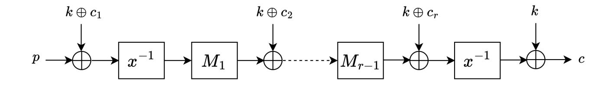
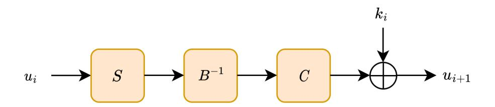
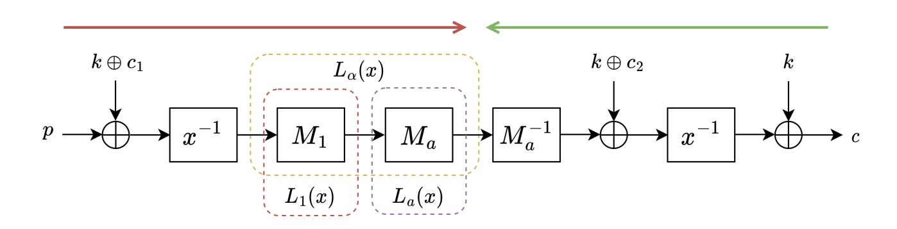
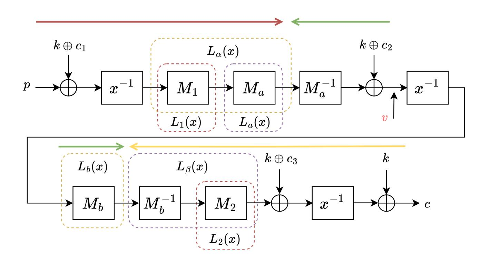
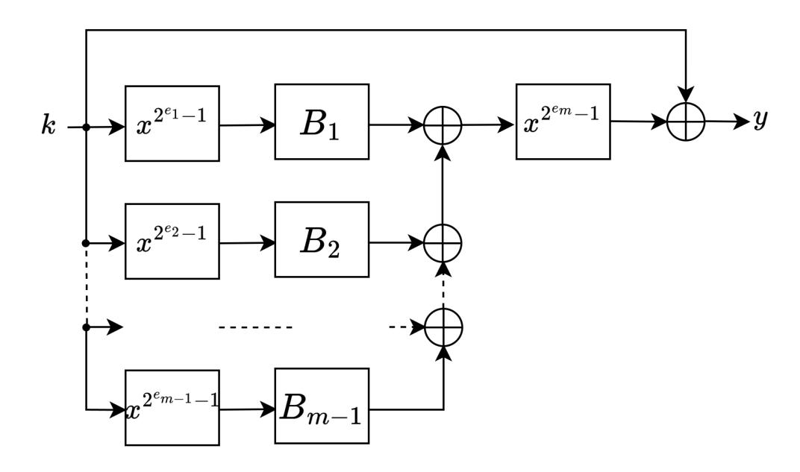
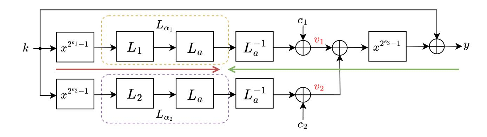
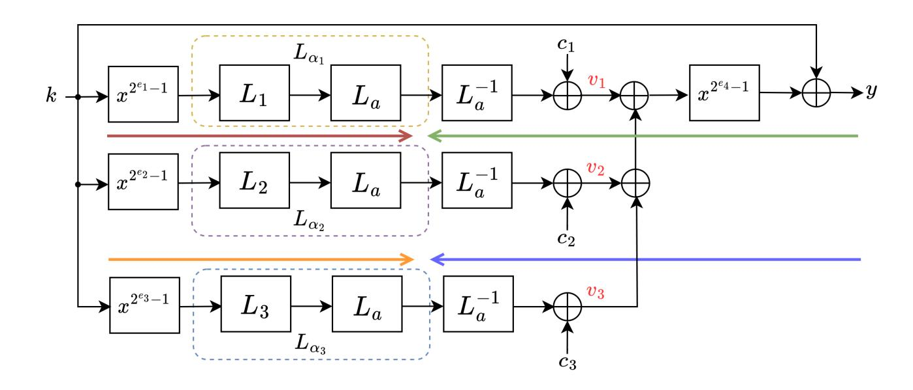

{0}------------------------------------------------

# Algebraic Cryptanalysis of AO Primitives Based on Polynomial Decomposition

Applications to Rain and Full AIM-I/III/V

Hong-Sen Yang, Qun-Xiong Zheng(B) , and Jing Yang(B)

Information Engineering University, Zhengzhou 450001, China moonlight0833@outlook.com qunxiong\_zheng@163.com yangjingfi@163.com

Abstract. The LowMC-based post-quantum signature scheme Picnic was selected as a third-round candidate for NIST PQC, attracting wide attention to the design of efficient and secure post-quantum signature schemes using Symmetric Techniques for Advanced Protocols (STAP). Symmetric primitives designed for advanced protocols such as secure multi-party computation (MPC), fully homomorphic encryption (FHE), and zero-knowledge (ZK) proof systems, with the goal of reducing the number of multiplication operations, are referred to as arithmetic-oriented (AO) primitives. These cryptographic primitives are typically constructed over large finite fields, which makes classical statistical analysis methods like differential and linear cryptanalysis inefficient. Due to their inherent algebraic properties, the mainstream security evaluation approaches are based on algebraic attacks. In this paper, we analyze the security of the MPC-friendly primitives Rain (CCS 2022) and AIM (CCS 2023) used in the post-quantum signature schemes Rainier and AIMer. Existing algebraic attacks on Rain and AIM were conducted over F2. We propose a novel algebraic attack over F2n that uses the polynomial decomposition to reduce degrees of equations. By further combining with the guess-and-determine technique, meet-in-the-middle modeling, and resultant, we are able to attack Rain and the full AIM. Specifically, we successfully attacked 2-round Rain with 2 73.7 /2 107.0 /2 138.9 primitive calls, 3-round Rain with 2 167.6 /2 243.6 /2 319.1 field operations, for the 128/192/256-bit key. For the full AIM, we successfully attacked it with 2 114.0 /2 163.2 /2 228.3 primitive calls for the 128/192/256-bit key. The attack complexities mainly lie in solving univariate polynomial equations and computing resultants, and hence the complexity evaluations are accurate.

Keywords: Polynomial Decomposition· MITM · Rain · AIM · Guessand-determine · Resultant.

# 1 Introduction

The emergence of privacy-preserving protocols such as zero-knowledge (ZK) proofs, secure multi-party computation (MPC), and fully homomorphic encryp

{1}------------------------------------------------

tion (FHE) has gained extensive attention and wide research in recent years. These advanced schemes have motivated the development of one type of novel symmetric cryptographic primitives known as arithmetic-oriented (AO) primitives. AO primitives are designed to optimize performance in arithmetic circuits. Different from classical symmetric ciphers like AES [33] and SHA-3 [17] that are designed for optimizing speeds in software or hardware, the algebraic structures of these primitives are most designed to be well aligned with the privacy-preserving protocols that operate over large finite fields1. For instance, the AO primitives Rescue variants [4,36,6], POSEIDON variants [22,23], Arion [34], GRIFFIN [19], Reinforced Concrete [20], Tip5 variants [37], and the Monolith family [21] are all operating over large prime fields. MiMC [1], Jarvis [5], Vision [4], RAIN [16] and AIM [28] etc. are working on binary extension fields with large degrees of extension. GMiMC [3], Ciminion [15], Anemoi [12] are operating over both large prime fields and binary extension fields.

In parallel, the urgency to develop post-quantum digital signatures has intensified and the MPC-in-the-Head (MPCitH) paradigm proposed by Ishai et al [24] presents a novel constructing way. The MPCitH paradigm is basically a non-interactive zero-knowledge proof of knowledge (NIZKPoK) that verifies the correspondence between the input (the secret key of a signature) and the output (the public key of the signature) of a specific one-way function. The performance of MPCitH-based signatures is typically closely related to the number of nonlinear operations in the circuit of the underlying one-way function. Therefore, AO primitives that target to reduce the number of multiplication operations are well-suited to meet this requirement. The authors in [13,26] pioneered the research of NIZKPoK-based signatures and designed the Picnic scheme, which utilized the MPC-friendly block cipher LowMC to instantiated a one-way function. In this paper, we mainly study the MPC-friendly one-way functions RAIN [16] and AIM [28]. Their MPCitH-based signatures Rainier and AIMer (a candidate of NIST Round 1 PQC Additional Signatures2 and a final algorithm of Korean Round 2 PQC Competition3) managed to reduce multiplications as well as the signature sizes.

Security of AO primitives. The cryptanalysis of AO cryptographic primitives has experienced significant advances in recent years. The security of an AO primitive often relies on the hardness of solving an equation system using a single plaintext-ciphertext pair since very few amount of available plaintext-ciphertext data can be obtained. Besides, due to the inherent algebraic properties of AO primitives, algebraic attacks typically outperform other statistical analysis such as differential and linear cryptanalysis. For instance, Gröbner basis attacks combined with low-degree equation modeling on some AO primitives are proposed in [10,2,30]. In Crypto 2024 and Asiacrypt 2024, two novel algebraic attacks have

&lt;sup>1 There are also examples where very small fields are used (e.g., TFHE-friendly stream ciphers)

2 https://csrc.nist.gov/Projects/pqc-dig-sig/round-1-additional-signatures

3 https://kpqc.or.kr

{2}------------------------------------------------

been proposed, named the FreeLunch [9] and the resultant-based method [38], both of which have proved high efficiency for a wide range of AO primitives.

Another type of widely used attacks is the guessing-based algebraic attack [32,7,8,35,39]. For RAIN and AIM, Zhang et al. proposed guess-and-determine attacks on 2-round Rain and full AIM-III (the variant targeting for 192 bits of security) at ASIACRYPT 2023 [39]. They linearize the S-box by guessing the power of the input of the S-box such that the attack is reduced to solve a system of linear equations. At FSE 2024 [31], Liu et al. further improved the attack on 2-round RAIN by using Dinur's methods [14] or the Crossbred method [25] to solve the low-degree equivalent equation representation of RAIN. They also employed the fast exhaustive search method [11] to solve the lowdegree equivalent equation of AIM, demonstrating that AIM does not meet its security claims. In CCS 2023 [28], the designers of AIM proposed using Gröbner basis attacks and XL attacks to analyze the security of 3-round RAIN. They estimated the complexities of the XL attacks based on the strong independence assumption between the equations with  $\omega = 2$ , where  $\omega$  denotes the exponent of the time complexity of matrix multiplication. The authors also admit that the independent assumption is too ideal, therefore, the complexities in [28] do not imply that RAIN has been broken. At ASIACRYPT 2024 [30], Liu et al. improved the equation modeling in 28 and constructed more equations to build the overdetermined system for 3-round RAIN and reduced the time complexities of the Gröbner basis attacks. It is worth noting that the aforementioned attacks on Rain and AIM are implemented over  $\mathbb{F}_2$ , which will introduce a large number of variables and enlarge the scale of the equation system. Besides, only one pair of plaintext and ciphertext is available for attacks on keyed AO primitives, which makes the construction of an over-determined system and linearization technique over  $\mathbb{F}_2$  difficult. Furthermore, algebraic attacks that directly solve equations using Gröbner basis on AO primitives over  $\mathbb{F}_2$  fail to make full use of the inherent algebraic properties of the AO primitives, and the complexities of Gröbner basis algorithms are not precise, leading to inaccurate evaluation of the security of AO primitives. In this paper, we propose a novel algebraic attack over the extension field  $\mathbb{F}_{2^n}$  that can make full use of the properties of linear layers. Such an attack can derive more powerful attacking results and the evaluation of complexities are accurate.

Our Contributions. In this paper, we propose to use polynomial decomposition in algebraic attacks on RAIN and AIM over  $\mathbb{F}_{2^n}$ . Our attack is highly flexible, allowing integration with guess-and-determine attacks [39] and resultant-substitution [38] methods. The complexity of our attack is primarily from solving univariate polynomial equations and computing a bivariate resultant, which can be estimated accurately. Our main contributions are as below and Table 1 and 2 presents the comparison of our attacks with existing ones.

1. We discovered a useful property of linearized polynomials: a linearized polynomial  $\mathcal{L}$  of degree  $2^{n-1}$  can be decomposed into  $\mathcal{L} = \mathcal{L}_1(\mathcal{L}_2^{-1})$  with  $\deg(\mathcal{L}_1) \leq 2^{\lceil n/2 \rceil}$  and  $\deg(\mathcal{L}_2) \leq 2^{\lceil n/2 \rceil}$  with overwhelming probability. This property

{3}------------------------------------------------

cannot be utilized in algebraic attacks over  $\mathbb{F}_2$ , but can be exploited in algebraic attacks over  $\mathbb{F}_{2^n}$ . Taking advantage of this property and combing with the meet-in-the-middle (MITM) modeling, we decompose the linearized polynomial and derive a univariate polynomial equation with a degree not exceeding  $2^{n/2+2}$  for 2-round RAIN ( $n \in \{128, 192, 256\}$ ). Solving this relatively low-degree univariate polynomial equation can significantly reduce the attack complexity. The 2-round RAIN can be broken with  $2^{73.7}/2^{107.0}/2^{138.9}$  primitive calls for 128/192/256-bit key, respectively.

- 2. To extend our algebraic attack to the full-round (3-round) RAIN, we further incorporate the idea of the guess-and-determine attack. By guessing the value of the  $2^{n/2+1}$ -th power of the input of the middle S-box, we can linearize the S-box and thus the two linear layers of the 3-round RAIN can be combined and regarded as one linear layer. Then using the MITM modeling and polynomial decomposition, we can obtain an equivalent representation of the 3-round RAIN as a univariate polynomial equation with degree at most  $2^{2n/3+1}$ . Furthermore, we can attack the 3-round RAIN with  $2^{167.6}/2^{243.6}/2^{319.1}$  field operations for 128/192/256-bit key, respectively.
- 3. For the full AIM, we observe that all its linear layers can be decomposed using appropriate linearized polynomials and merged into a single linear layer. By using the MITM modeling, we obtain a system of two special forms of bivariate equations. We find that this system has the property of variable isolation mentioned in [38], making it especially suitable for deriving solutions using the resultant-based method. Based on the special parameter settings of AIM, we propose a fast substitution method such that the complexity of the substitution is negligible, and the complexities of the algebraic attacks on the full AIM are primarily determined by computing the resultants and solving univariate polynomial equations. We finally successfully attack the full AIM with 2114.0/2163.2/2228.3 primitive calls for 128/192/256-bit key, respectively. The results indicate that AIM cannot achieve its security claims.

**Organization.** In Section 2, we introduce the background knowledge used in this paper, including linearized polynomials and resultants. In Section 3, we describe our algebraic attack on 2-round RAIN based on polynomial decomposition in Section 3.3 and extend the attack to 3-round RAIN by further combing with the guess-and-determine technique in Section 3.4. In Section 4, we discuss how to integrate the MITM modeling and resultant with our approach to attack the full AIM. We end the paper with conclusions in Section 5.

#### 2 Preliminaries

#### 2.1 Notation

Let  $q = p^n$  be a prime power and  $\mathbb{F}_q$  the finite field with q elements, where p is a prime number and n is a positive integer. We also use n to denote both the security level and the block size, since they are the same both in RAIN and

{4}------------------------------------------------

AIM. Let  $\mathbb{F}_q[x_1, x_2, \dots, x_s]$  be the multivariate polynomial ring over  $\mathbb{F}_q$  with indeterminates  $x_1, x_2, \dots, x_s$ .

Table 1: Time complexities for attacking 2-round and full AIM, which are given in the number of equivalent calls of the primitives.

| Primitives    | Techniques                                                                             | 128                                                                          | 192                                                                             | 256                                                                             |
|---------------|----------------------------------------------------------------------------------------|------------------------------------------------------------------------------|---------------------------------------------------------------------------------|---------------------------------------------------------------------------------|
| 2-round Rain* | guess-and-determine [39] polynomial method** [31] crossbred algorithm [31] Section 3.3 | $ \begin{array}{c c} 2^{120.3} \\ 2^{97} \\ 2^{90} \\ 2^{73.7} \end{array} $ | $ \begin{array}{c c} 2^{180.4} \\ 2^{149} \\ 2^{147} \\ 2^{107.0} \end{array} $ | $ \begin{array}{c c} 2^{243.1} \\ 2^{201} \\ 2^{204} \\ 2^{138.9} \end{array} $ |
| Full AIM      | guess-and-determine [39] fast exhaustive search [31] Section 4 ( $\omega$ =2.8)  | $\begin{array}{c c} 2^{125.7} \\ 2^{115} \\ 2^{114.0} \end{array}$           | $\begin{array}{c c} 2^{186.5} \\ 2^{178} \\ 2^{163.2} \end{array}$              | $\begin{array}{c c} 2^{254.4} \\ 2^{241} \\ 2^{228.3} \end{array}$              |

\* The attack for 2-round RAIN in [39] additionally considered one linear layer in the last round.

Table 2: Time complexities for attacking 3-round RAIN, which are given in the number of field operations.

| Primitives   | Techniques                                                                                            | 128                                                                | 192                                                                | 256                                                                |
|--------------|-------------------------------------------------------------------------------------------------------|--------------------------------------------------------------------|--------------------------------------------------------------------|--------------------------------------------------------------------|
| 3-round Rain | Gröbner basis method [30] ( $\omega$ =2) Gröbner basis method [30] ( $\omega$ =2.8) Section 3.4 | $ \begin{array}{c c} 2^{139} \\ 2^{195} \\ 2^{167.6} \end{array} $ | $ \begin{array}{c c} 2^{196} \\ 2^{274} \\ 2^{243.6} \end{array} $ | $ \begin{array}{c c} 2^{252} \\ 2^{352} \\ 2^{319.1} \end{array} $ |

A product of the form  $x_1^{k_1}x_2^{k_2}\cdots x_s^{k_s}$  is called a term, where all exponents  $k_1,k_2,\ldots,k_s$  are nonnegative integers. For any  $f\in\mathbb{F}_q\left[x_1,x_2,\ldots,x_s\right]$  with  $f\neq 0$ , the set of all terms of f is denoted by T(f) and the degree of f, denoted by  $\deg(f)$ , is defined as the maximum degree among all its terms, i.e.,

$$\deg(f) = \max \left\{ \sum_{j=1}^{s} k_j \mid x_1^{k_1} x_2^{k_2} \cdots x_s^{k_s} \in T(f) \right\}$$

For  $1 \leq i \leq s$ , let  $\deg_{x_i}(f)$  be the maximum degree of f in variable  $x_i$ , that is

$$\deg_{x_i}(f) = \max \left\{ k_i \mid x_1^{k_1} x_2^{k_2} \cdots x_s^{k_s} \in T(f) \right\}.$$

\*\* The so-called polynomial method in [31] is to use the Dinur's methods [14] to solve the low-degree equivalent equations representation of RAIN.

{5}------------------------------------------------

### 2.2 Linearized Polynomial

Definition 1 (Linearized Polynomial and Affine Polynomial). A polynomial of the form  $L(x) = \sum_{i=0}^{n-1} \alpha_i x^{p^i}$  with coefficients  $\alpha_i \in \mathbb{F}_q$  is called a linearized polynomial over  $\mathbb{F}_q$ . A polynomial of the form A(x) = L(x) + c is called an affine polynomial, where L(x) is a linearized polynomial and  $c \in \mathbb{F}_q$ .

The terminology linearized polynomial stems from the following property:

$$L(a+b) = L(a) + L(b)$$
 for all  $a, b \in \mathbb{F}_q$ ,  $c \cdot L(a) = L(c \cdot a)$  for all  $a \in \mathbb{F}_q$  and  $c \in \mathbb{F}_p$ .

We can view  $x \in \mathbb{F}_q = \mathbb{F}_{p^n}$  as  $\hat{x} \in \mathbb{F}_p^n$  when  $\mathbb{F}_q$  is regarded as a vector space over  $\mathbb{F}_p$ . In this case, a linearized polynomial over  $\mathbb{F}_q$  has a one-to-one correspondence with a linear transformation over  $\mathbb{F}_p$ , and hence there exists a matrix  $M \in \mathbb{F}_p^{n \times n}$  such that  $L(x) = M\hat{x}$ . Due to the linearity of linearized polynomials, the composition  $L_3(x) = L_1(L_2(x))$  of two linearized polynomials  $L_1(x)$  and  $L_2(x)$  remains a linearized polynomial. For convenience, we sometimes also denote the composition of linearized polynomials as  $L_3 = L_1 \circ L_2$ .

Our new method, based on polynomial decomposition, requires the target linearized polynomial to be a permutation polynomial (called linearized permutation polynomial). However, not all linearized polynomials satisfy this property. In [29, page 362], it is proved that a linearized polynomial  $L(x) = \sum_{i=0}^{n-1} a_i x^{p^i} \in \mathbb{F}_q[x]$  is a permutation polynomial if and only if its Dickson matrix  $D_L$  is invertible, where

$$D_L = \begin{pmatrix} a_0 & a_1 & \cdots & a_{n-1} \\ a_{n-1}^2 & a_0^2 & \cdots & a_{n-2}^2 \\ \vdots & \vdots & \vdots & \vdots \\ a_1^{2^{n-1}} & a_2^{2^{n-1}} & \cdots & a_0^{2^{n-1}} \end{pmatrix}.$$

We note that, in [16], the designers impose a critical constraint that all coefficients of the terms of both the linearized polynomials representing the linear layer and its inverse must be non-zero. Furthermore, [16] shows that the inverse of a linearized polynomial L(x) can be explicitly derived through its associated Dickson matrix, that is

$$L^{-1}(x) = \frac{1}{\det(D_L)} \cdot \sum_{i=0}^{n-1} \bar{a}_i x^{2^i},$$

where  $\bar{a}_i$  is the (i,0)-th cofactor of  $D_L$ .

## 2.3 Resultant

The resultant is a powerful tool for solving systems of polynomial equations. In [38], the authors propose a novel algebraic attack method on AO primitives based on the resultant. In this paper, we will also utilize the resultant to eliminate variables.

{6}------------------------------------------------

**Definition 2 (Resultant).** Let  $f(x,y), g(x,y) \in \mathbb{F}_q[x,y]$  with  $x = (x_1, \dots, x_s)$ . The resultant of f(x,y) and g(x,y) with respect to the indeterminant y, denoted by R(f,g,y), is defined as the determinant of the Sylvester matrix of f(x,y) and g(x,y) when considered as polynomials in the single indeterminate y. That is, if  $f(x,y) = \sum_{i=0}^m f_i y^i$  and  $g(x,y) = \sum_{i=0}^n g_i y^i$ , where  $f_i, g_i \in \mathbb{F}_q[x]$ , then

$$R(f,g,y) = \begin{vmatrix} f_m & f_{m-1} & \cdots & f_0 \\ f_m & f_{m-1} & \cdots & f_0 \\ & \ddots & \ddots & \ddots & \ddots \\ & & \ddots & \ddots & \ddots & \ddots \\ & & & \ddots & \ddots$$

It is well known that the resultant of two polynomials is non-zero if and only if they have no common factors other than non-zero constants. In this case, the resultant yields a new polynomial h(x), such that if  $(x_0, y_0)$  is a root of both f(x, y) and g(x, y), then  $h(x_0) = 0$ . In this way, we can remove one variable from two polynomials while retaining information about the roots of the original polynomials. Given  $\ell$  polynomials in s variables, we can repeatedly compute resultants of the polynomials until we get a univariate polynomial. Solving for the roots of the univariate polynomial and repeatedly substituting them back, we can derive the roots that the polynomials have in common.

## 2.4 Finding Roots of Univariate Polynomials over $\mathbb{F}_q$

Finding roots of univariate polynomials over  $\mathbb{F}_q$  plays a crucial role in solving a system of multivariate polynomials over  $\mathbb{F}_q$ , regardless of whether one employs resultant-based algorithms or Gröbner basis techniques. The authors in [10] showed that the roots of a univariate polynomial  $R(x) \in \mathbb{F}_q[x]$  can be found in  $\mathcal{O}(d \log d + \log q) \log \log d$  field operations, provided that the multiplication of two univariate polynomials of degree d over  $\mathbb{F}_q$  can be done in  $\mathcal{O}(d \log d \log \log d)$  field operations using an FFT (Fast Fourier Transform) algorithm. We note that the log function is of base 2 throughout the paper. The process consists of three main steps.

- 1. Compute  $Q(x) = x^q x \mod R(x)$ . The complexity of this step mainly lies in computing  $x^q \mod R(x)$ , which requires  $\mathcal{O}(d \log d \log q \log \log d)$  field operations using a double-and-add algorithm.
- 2. Compute  $P(x) = \gcd(R(x), Q(x))$ . This step requires  $\mathcal{O}(d(\log d)^2 \log \log d)$  field operations.

{7}------------------------------------------------

3. Factor P(x). The complexity of this step is negligible since P(x) is of degree one or two in general.

By using a fast gcd algorithm called half-gcd (see [18, Section 11.1]), the complexity of the second step can be reduced to  $\mathcal{O}(d(\log d)^2)$ . Then the complexity of finding roots of univariate polynomials over  $\mathbb{F}_q$  can be reduced to  $\mathcal{O}(d\log d(\log d + \log q \log \log d))$  field operations.

# 3 Improved Algebraic Attacks on RAIN

In this section, we present improved algebraic attacks on 2-round and 3-round RAIN. The MPC-friendly cipher RAIN [16] was first proposed at CCS 2022 and designed as the one-way function for the post-quantum signature scheme Rainier. We start with a brief introduction to RAIN.

## 3.1 Description of RAIN

The schematic of the r-round RAIN is depicted in Fig. 1, where the plaintext p and ciphertext c are public, while the key k is kept secret. The security of RAIN relies on the difficulty of solving the key from a single pair of plaintext and ciphertext. Let  $R_i$  denote the permutation in the i-th round, defined as

$$R_i = M_i (S(x + k + c_i)), 1 \le i \le r - 1,$$

where  $c_i \in \mathbb{F}_{2^n}$  is the round constant and  $M_i \in \mathbb{F}_2^{n \times n}$  is the linear-layer matrix used in the *i*-th round. Note that the "+" operation denotes the " $\oplus$ " operation as done in the original paper. The permutation in the final round is given by

$$R_r = S(x + k + c_r) + k.$$

Each  $M_i(1 \le i \le r-1)$  is constructed from a linearized polynomial over  $\mathbb{F}_{2^n}$ , expressed as

$$L_i(x) = \sum_{j=0}^{n-1} d_{i,j} x^{2^j}.$$

All the coefficients in both  $L_i(x)$  and its inverse  $L_i^{-1}(x)$  are non-zero, which means that  $\deg(L_i(x)) = \deg(L_i^{-1}(x)) = 2^{n-1}$ . The S-box  $S : \mathbb{F}_{2^n} \to \mathbb{F}_{2^n}$  is defined by

$$S(x) = x^{2^{n}-2} = \begin{cases} x^{-1}, & \text{if } x \neq 0, \\ 0, & \text{if } x = 0. \end{cases}$$

For simplicity, we define  $0^{-1} = 0$ . Furthermore, we simply use  $x^{-1}$  to represent the S-box throughout the rest of paper, when there is no ambiguity.

{8}------------------------------------------------

Fig. 1: The r-round RAIN

Concrete Instances. The designers instantiate three variants of RAIN targeted for 128, 192, and 256 bits of security, respectively. Two security levels for each variants are recommended with the round number as 3 or 4. The parameters and irreducible polynomials for constructing the corresponding finite fields are shown in Table 3.

Table 3: Three instantiations of RAIN

| scheme                           | security level (block size) | round                         | finite field polynomial over $\mathbb{F}_2$                                                                                                                      |
|----------------------------------|-----------------------------|-------------------------------|------------------------------------------------------------------------------------------------------------------------------------------------------------------|
| RAIN-128 RAIN-192 RAIN-256 | 128 192 256           | $\{3,4\}$ $\{3,4\}$ $\{3,4\}$ | $\mathbb{F}_{2^{128}}: X^{128} + X^7 + X^2 + X + 1$ $\mathbb{F}_{2^{192}}: X^{192} + X^7 + X^2 + X + 1$ $\mathbb{F}_{2^{256}}: X^{256} + X^{10} + X^5 + X^2 + 1$ |

### 3.2 Existing Cryptanalysis of RAIN

In this subsection, we mainly review the cryptanalysis results of the 2-round and 3-round RAIN. We note that the main idea of existing attacks on RAIN is converting the problem into solving systems of linear or quadratic equations over  $\mathbb{F}_2$ . In Asiacrypt 2023 [39], Zhang et al. proposed that the multiplicative inverse function  $x^{-1}$  can be linearized by guessing the value of its input to a specific power  $x^d$ . For 2-round RAIN, the authors selected a suitable value of d that divides  $2^n - 1$ , then constructed an overdefined system of equations and solved the system using linearization techniques. In FSE 2024 [31], Liu et al. pointed out that it is feasible to construct a low-degree equation system to describe 2-round RAIN, then employed the Dinur's method [14] or the crossbred method [25] to solve the well-determined or over-determined system, respectively.

For 3-round RAIN, the designers of AIM proposed using Gröbner basis attacks and XL attacks to analyze its security in [28]. Liu et al. in Asiacrypt 2024 [30] improved the modeling approach in [28] to derive more equations for constructing an over-determined system and thus reducing the complexity of Gröbner basis attacks.

The main barrier of the previous work over  $\mathbb{F}_2$  lies in the number of S-boxes: typically, a larger number of S-boxes indicates a higher attacking complexity.

{9}------------------------------------------------

As a comparison, we model Rain over F2n and the influence of the number of S-boxes is much smaller, instead, we need to carefully deal with the linear layers. Specifically, we decompose the linearized polynomial of the linear layer into composition of low-degree polynomials and obtain equations with much lower degrees. For 2-round Rain, we can construct an equivalent univariate polynomial equation with a degree no more than 2 n/2+2. By further combining the method of polynomial decomposition with guess-and-determine techniques, we can extend our attack to 3-round Rain. As the complexities of our attacks mainly lie in finding the roots of univariate polynomials and computing resultants, the evaluations of complexities are accurate.

# 3.3 Improved Algebraic Attack on 2-round Rain

In this subsection, we present improved algebraic attacks on 2-round Rain using decomposition of linearized polynomials.

Inspiration of Decomposition of Linearized Polynomials. Our idea for decomposition of the linearized polynomials is inspired by the design of Jarvis [\[5\]](#page-26-3). The round function of Jarvis is shown in Fig. [2,](#page-9-1) in which the linear layer is constructed from the composition of two quartic affine polynomials B(x) and C(x), i.e., A = C ◦ B−1 , where

$$B(x) = x^4 + b_2 x^2 + b_1 x + b_0,$$
  

$$C(x) = x^4 + c_2 x^2 + c_1 x + c_0,$$

with b2, b1, b0, c2, c1, c0 ∈ F2n .

Fig. 2: The i-th round of the Jarvis block cipher.

In Asiacrypt 2019 [\[2\]](#page-26-6), low-degree representation for Jarvis was proposed and used to break its security claims. In Asiacrypt 2024 [\[38\]](#page-28-7), Yang et al. further proposed to use the resultant to solve the equations of the low-degree representation of Jarvis. Motivated by these work, we wonder if the high-degree linear layers of Rain could be represented as compositions of low-degree linearized polynomials, such that we can employ the tools such as the resultant to solve the derived system. Below we show how we achieve it for Rain.

{10}------------------------------------------------

Meet-in-the-Middle (MITM) Modeling for 2-round RAIN. The meet-in-the-middle modeling for 2-round RAIN is illustrated in Fig. 3, where  $M_1$  is the original linear-layer matrix while  $M_a$  is another nonsingular matrix of a low degree that we introduced. We append  $M_a^{-1}$ , the inverse of  $M_a$ , immediately after  $M_a$  to cancel out the influence of the introduction of  $M_a$ . Let  $L_1(x)$  and  $L_a(x)$  denote the linearized polynomials corresponding to  $M_1$  and  $M_a$ , respectively. Denote  $L_\alpha(x) = L_a(L_1(x))$  and the goal is to find a low-degree  $L_a$  such that  $L_\alpha$  also has a low degree. It is worth noting that we do not directly construct the matrix  $M_a$ , instead, we find linearized polynomials by solving a system of linear equations in the coefficients of the polynomials. We will elaborate the process later on.

Fig. 3: MITM modeling for 2-round RAIN

After we have found an appropriate  $L_a$ , we employ the MITM modeling to construct equations for k. Specifically, we regard p, c as knowns and run the cipher forward and backward, respectively, and then meet in the middle at where the value should be identical. Then we can derive the equation below

$$L_{\alpha}(\frac{1}{p+k+c_1}) = L_a(\frac{1}{c+k} + k + c_2). \tag{1}$$

Construct Low-degree Decomposition of Linearized Polynomials. We now show how we decompose a linearized polynomial into the composition of two low-degree polynomials, i.e., how we find low-degree  $L_a(x)$  and  $L_{\alpha}$  in Fig. 3. The degree of Equation (1) relies on the degrees of  $L_a$  and  $L_{\alpha}$ . Let

$$L_a(x) = \sum_{i=0}^{n-1} a_i x^{2^i}, \ L_1(x) = \sum_{j=0}^{n-1} d_{1,j} x^{2^j},$$

where  $d_{1,j}$ 's are known while  $a_i$ 's are the unknowns to be solved. It is clear that

$$L_{\alpha}(x) = L_{a}(L_{1}(x)) = \sum_{i=0}^{n-1} a_{i} (\sum_{j=0}^{n-1} d_{1,j} x^{2^{j}})^{2^{i}}$$

{11}------------------------------------------------

$$= \sum_{i=0}^{n-1} \sum_{j=0}^{n-1} a_i d_{1,j}^{2^i} x^{2^{(i+j) \bmod n}}.$$

If we expect that  $deg(L_a(x)) \leq 2^l$  and  $deg(L_\alpha(x)) \leq 2^{\gamma}$  for some integers  $0 \leq l, \gamma \leq n-1$ , then we can obtain the following system of linear equations

$$\begin{cases}
 a_i = 0 & \text{for } l+1 \le i \le n-1, \\
 \sum_{\substack{0 \le i, j \le n-1 \\ i+j \equiv t \mod n}} a_i d_{1,j}^{2^i} = 0 & \text{for } \gamma+1 \le t \le n-1.
\end{cases}$$
(2)

After removing the  $a_i$ 's that are zero, Equation (2) can be simplified to a system of  $n-\gamma-1$  linear equations with l+1 unknowns, i.e.,  $a_0, a_1, \ldots, a_l$ . To guarantee a non-zero solution, l and  $\gamma$  should satisfy that  $l+1>n-\gamma-1$ , or equivalently,  $l+\gamma>n-2$ . Furthermore, to minimize the degree of Equation (1), we prefer  $\gamma$  and l to be as close as possible. In our experiments, we start to select l=n/2-1 and  $\gamma=n/2$ . Once the values of  $\gamma$  and l are determined, we can solve the system of linear equations. When we have derived a solution vector  $\mathbf{a}=(a_0,a_1,\ldots,a_l)$ , we check if the Dickson matrix mentioned in Section 2.2 is invertible. If not, we try a different solution or increase the null space by increasing the values of l and l until we find one satisfying the requirements, which indicates that we get a pair of l and l and l and l with degrees below the thresholds we have set. According to the experiments performed for the linearized polynomials chosen for RAIN, we observed that l will not exceed l and l will not exceed l and l will not exceed l and l will not exceed l and l will not exceed l and l will not exceed l and l will not exceed l and l will not exceed l and l will not exceed l and l will not exceed l and l will not exceed l and l will not exceed l and l will not exceed l and l will not exceed l and l will not exceed l and l will not exceed l and l will not exceed l and l will not exceed l and l will not exceed l and l will not exceed l and l will not exceed l and l will not exceed l and l will not exceed l and l will not exceed l and l will not exceed l and l will not exceed l and l will not exceed l and l will not exceed l and l will not exceed l and l will not exceed l and l will not exceed l and l will not exceed l and l will not exceed l and l and l and l and l and l and l are determined at l and l and l and l and l

**Key Recovery.** After we have found  $L_a$  and  $L_{\alpha}$ , we can solve the univariate polynomial equation in Equation (1) using the method described in Section 2.4 and recover the secret key k.

Complexity Analysis. The complexity of finding one solution of Equation (2) does not exceed  $\mathcal{O}(n^{\omega})$  and can be neglected. Therefore, we below mainly focus on the complexity of solving Equation (1).

Let  $L_a^*$  and  $L_\alpha^*$  be the reciprocal polynomials of  $L_a$  and  $L_\alpha$ , which are defined by

$$L_a^*(x) = x^{\deg(L_a)} L_a\left(\frac{1}{x}\right),$$
  
$$L_\alpha^*(x) = x^{\deg(L_\alpha)} L_\alpha\left(\frac{1}{x}\right),$$

respectively. Using the linearity of linearized polynomials, Equation (1) can be rewritten as below

$$L_{\alpha}(\frac{1}{p+k+c_1}) = L_a(\frac{1}{c+k}) + L_a(k+c_2),$$

We found that there exist linearized polynomials over  $\mathbb{F}_{2^8}$  which cannot be decomposed into two linearized permutation polynomials of degrees  $2^4$ . Relaxing the restriction in degrees can increase the possibility of existence of permutation polynomials but it seems hard to theoretically prove the existence.

{12}------------------------------------------------

or equivalently,

$$L_{\alpha}(\frac{1}{p+k+c_1}) + L_{\alpha}(\frac{1}{c+k}) + L_{\alpha}(k+c_2) = 0.$$

Multiplying both sides of the equation by  $(p+k+c_1)^{2^{\gamma}}(c+k)^{2^{l}}$  to eliminate the denominators, we have

$$(p+k+c_1)^{2^{\gamma}} \cdot (c+k)^{2^l} \cdot \left(L_{\alpha}\left(\frac{1}{p+k+c_1}\right) + L_a\left(\frac{1}{c+k}\right) + L_a(k+c_2)\right) = 0,$$

or equivalently,

$$G(k) := (p+k+c_1)^{2^{\gamma}} \cdot L_a^* (c+k) + (c+k)^{2^l} \cdot L_{\alpha}^* (p+k+c_1) + (p+k+c_1)^{2^{\gamma}} \cdot (c+k)^{2^l} \cdot L_a (k+c_2) = 0.$$

Since  $deg(L_a^*) < 2^l$  and  $deg(L_\alpha^*) < 2^\gamma$ , it follows that

$$\deg(G(k)) \le 2^{\gamma} + 2^{l} + 2^{l} = 2^{\gamma} + 2^{l+1}.$$

In our experiments, we observe that l and  $\gamma$  will not exceed n/2 and n/2 + 1, respectively, so that  $\deg(G(k))$  will not exceed  $2^{n/2+2}$ . According to Section 2.4, the complexity of solving G(k) will not exceed

$$\mathcal{O}\left(2^{n/2+2}(n/2+2)(n/2+2+n\log(n/2+2))\right).$$
 (3)

The complexity above is expressed in terms of the number of field operations denoted as T. For fair comparison with [31,39], we also convert all complexity estimates into bit operations  $T_{bit}$  and number of encryptions  $T_{enc}$ . Specifically:

- A field multiplication over  $\mathbb{F}_{2^n}$  is equivalent to  $n^2$  bit operations,
- A field addition over  $\mathbb{F}_{2^n}$  is equivalent to n bitwise XOR operations,
- One call of 2-round RAIN over  $\mathbb{F}_{2^n}$  is equivalent to  $n^3$  bit operations [39, Page 14].

For simplicity, we uniformly equate one field operation to  $n^2$  bit operations. Therefore, we have  $T_{bit} = n^2 \cdot T$  and  $T_{enc} = T/n$ .

**Experimental Verification** We generated the linearized polynomial  $L_1$  using the rain\_instance\_gen.sage program provided in [16] for 2-round RAIN. We started with l = n/2 - 1,  $\gamma = n/2$  and got the concrete linearized permutation polynomials  $L_a$  and  $L_\alpha$  that satisfy  $L_1 = L_\alpha \circ L_a^{-1}$ . The degrees of  $L_a$  and  $L_\alpha$  are  $2^{63}/2^{95}/2^{127}$  and  $2^{64}/2^{97}/2^{128}$ , respectively, for RAIN-128/192/256. Based on the experimental results, the degrees of the linearized polynomials derived through polynomial decomposition and the time complexities are shown in Table 4. We also verified the correctness of our novel attack on all variants of 2-round

{13}------------------------------------------------

RAIN over small finite fields (e.g.,  $\mathbb{F}_{2^{30}}$ ), specific results of linearized polynomial composite decomposition and verification programs are available on GitHub 5.

As the space of the key and plaintext is larger than that of the ciphertext, there may exist two (key,plaintext) pairs with the plaintext being the same that are mapped to the same ciphertext. In our experiments, we observed the existence of pseudo-keys, meaning that a single pair of plaintext and ciphertext might yield more than two keys. That is, a pseudo-key can also encrypt the same plaintext to the same ciphertext as the actual key. However, the number of pseudo-keys is very limited.

Table 4: Time complexities of our attacks on 2-round RAIN

| Scheme                           | n                 | l                             | $\gamma$                                                     | T                                                                   | $T_{bit}$                                                           | $T_{enc}$                                                           |
|----------------------------------|-------------------|-------------------------------|--------------------------------------------------------------|---------------------------------------------------------------------|---------------------------------------------------------------------|---------------------------------------------------------------------|
| RAIN-128 RAIN-192 RAIN-256 | 128 192 256 | $2^{63} \\ 2^{95} \\ 2^{127}$ | $ \begin{array}{r} 2^{64} \\ 2^{97} \\ 2^{128} \end{array} $ | $ \begin{array}{c} 2^{80.7} \\ 2^{114.6} \\ 2^{146.9} \end{array} $ | $ \begin{array}{c} 2^{94.7} \\ 2^{129.8} \\ 2^{162.9} \end{array} $ | $ \begin{array}{c} 2^{73.7} \\ 2^{107.0} \\ 2^{138.9} \end{array} $ |

# 3.4 Attacks on 3-round RAIN Combined with the Guess-and-determine Attack

It is natural to consider how to extend our attack to 3-round RAIN. However, due to the presence of two linear-layer matrices that are separated by one S-box in 3-round RAIN, it is hard to trivially connect them together and directly apply our method. To address this issue, we employ the linearization technique for  $x^{-1}$  proposed by Zhang et al in [39].

**Linearization Technique for**  $x^{-1}$ . For even n, the multiplicative inverse function  $x^{-1}$  can be linearized by guessing  $2^{n/2} - 1$  possible values for  $x^d$ , where  $d = 2^{n/2} + 1$ . More specifically, the  $x^{-1}$  over  $\mathbb{F}_{2^n}$  can be represented as

$$x^{2^{n}-2} = (x^{2^{n/2}+1})^{2^{n/2}-2} \cdot x^{2^{n/2}}.$$

Once the value of  $(x^{2^{n/2}+1})^{2^{n/2}-2}$  is guessed,  $x^{2^n-2}$  becomes a linearized polynomial.

MITM Modeling for 3-round RAIN. Fig. 4 illustrates the MITM modeling for 3-round RAIN, where  $M_1$  and  $M_2$  are the original linear-layer matrices while  $M_a$  and  $M_b$  are two nonsingular matrices we introduced. Similarly, to cancel out the influence of  $M_a$  and  $M_b$ , we add their inverses right before or after them, respectively. Let  $L_1(x), L_2^{-1}(x), L_a(x)$ , and  $L_b(x)$  denote the linearized polynomials corresponding to  $M_1, M_2^{-1}, M_a$ , and  $M_b$ , respectively. Denote  $L_{\alpha}(x) = L_a(L_1(x)), L_{\beta}(x) = L_b(L_2^{-1}(x))$ , and the input of the second

5 https://github.com/moonlight0833/Polynomial-Decomposition

{14}------------------------------------------------

S-box as variable v. We apply meet-in-the-middle modeling between the red and first green arrows, as well as between the yellow and the second green arrows, respectively. Hence, we derive a system of bivariate equations as below

$$\begin{cases}
L_{\alpha}(\frac{1}{p+k+c_1}) = L_a(k+c_2+v) \\
L_{\beta}(\frac{1}{c+k}+k+c_3) = L_b(\frac{1}{v})
\end{cases}$$
(4)

Extracting a Univariate Equation from Equation (4). To eliminate the variable v, we rewrite Equation (4) as below

$$\begin{cases}
L_{\alpha}(\frac{1}{p+k+c_1}) + L_a(k+c_2) = L_a(v) \\
L_{\beta}(\frac{1}{c+k} + k + c_3) = L_b(\frac{1}{v})
\end{cases}$$
(5)

Fig. 4: MITM modeling for 3-round RAIN

We can linearize the second S-box by guessing the value of  $v^{2^{n/2}+1}$ . More precisely, suppose that  $v^{2^{n/2}+1}=\eta$ , let  $\theta=\eta^{2^{n/2}-2}$ , then it is clear that  $\eta,\theta\in\mathbb{F}^*_{2^{n/2}}$ , and

$$L_b(\frac{1}{v}) = L_b(v^{2^n - 2}) = L_b(\eta^{2^{n/2} - 2}v^{2^{n/2}}) = L_b(\theta v^{2^{n/2}}).$$

We can rewirte Equation (5) as:

$$\begin{cases}
L_{\alpha}(\frac{1}{p+k+c_1}) + L_a(k+c_2) = L_a(v) \\
L_{\beta}(\frac{1}{c+k}) + L_{\beta}(k+c_3) = L_b(\theta v^{2^{n/2}})
\end{cases}$$
(6)

{15}------------------------------------------------

By guessing the value of  $\theta$ , we can transform  $L_b(\theta v^{2^{n/2}})$  into a linearized polynomial, the next step is to solve the coefficients of  $L_a$  and  $L_b$  to make  $L_a(v) = L_b(\theta v^{2^{n/2}})$ . Let

$$L_a(x) = \sum_{i=0}^{n-1} a_i x^{2^i}, L_b(x) = \sum_{i=0}^{n-1} b_i x^{2^i},$$

$$L_1(x) = \sum_{j=0}^{n-1} d_{1,j} x^{2^j}, L_2^{-1}(x) = \sum_{j=0}^{n-1} d'_{2,j} x^{2^j},$$

then we have

$$L_{\alpha}(x) = L_{a}(L_{1}(x)) = \sum_{i=0}^{n-1} a_{i} (\sum_{j=0}^{n-1} d_{1,j} x^{2^{j}})^{2^{i}} = \sum_{i=0}^{n-1} \sum_{j=0}^{n-1} a_{i} d_{1,j}^{2^{i}} x^{2^{(i+j) \bmod n}},$$

$$L_{\beta}(x) = L_{b}(L_{2}^{-1}(x)) = \sum_{i=0}^{n-1} b_{i} (\sum_{j=0}^{n-1} d'_{2,j} x^{2^{j}})^{2^{i}} = \sum_{i=0}^{n-1} \sum_{j=0}^{n-1} b_{i} d'_{2,j}^{2^{i}} x^{2^{(i+j) \bmod n}},$$

where  $d_{1,j}$ 's,  $d'_{2,j}$ 's are known, while  $a_i$ 's,  $b_i$ 's are unknowns to be solved. To elimilate v, we need  $L_a(v) = L_b(\theta v^{2^{n/2}})$ , which yields

$$a_{(i+n/2) \mod n} = b_i \theta^{2^i} \text{ for } 0 \le i \le n-1.$$
 (7)

In other words, if the equations in Equation (7) have solutions, we can eliminate the variable v. After v is eliminated, we add the two equations in Equation (6) and derive the equation below

$$L_{\alpha}(\frac{1}{p+k+c_1}) + L_a(k+c_2) + L_{\beta}(\frac{1}{c+k}) + L_{\beta}(k+c_3) = 0.$$
 (8)

Construct Low-degree Decomposition of Linearized Polynomials. Suppose we expect that  $\deg(L_a(x)) \leq 2^l$ ,  $\deg(L_\alpha(x)) \leq 2^\gamma$ , and  $\deg(L_\beta(x)) \leq 2^\lambda$  for some integers  $0 \leq l, \lambda, \gamma \leq n-1$ , then we can obtain the following system of linear equations

$$\begin{cases}
a_{i} = 0 & \text{for } l+1 \leq i \leq n-1 \\
\sum_{\substack{0 \leq i, j \leq n-1 \\ i+j \equiv t_{1} \bmod n}} a_{i} d_{1,j}^{2^{i}} = 0 & \text{for } \gamma+1 \leq t_{1} \leq n-1 \\
\sum_{\substack{0 \leq i, j \leq n-1 \\ i+j \equiv t_{2} \bmod n}} b_{i} d_{2,j}^{\prime 2^{i}} = 0 & \text{for } \lambda+1 \leq t_{2} \leq n-1 \\
\end{cases}$$
(9)

There are a total of 2n variables  $\boldsymbol{u}=(a_0,a_1,\ldots,a_{n-1},b_0,b_1,\ldots,b_{n-1})$  and  $4n-\gamma-\lambda-l-3$  equations in Equations (7) and (9). To ensure that the system of equations has a non-zero solution, the number of variables should be larger than the number of equations, i.e.,  $\lambda+\gamma+l+3>2n$ . To minimize the degree of the targeted equation in Equation (8), we aim to make  $\gamma$ ,  $\lambda$ , and l as close as possible. In practice, we start by choosing  $l=\lceil 2n/3-1\rceil$ ,  $\gamma=\lceil 2n/3-1\rceil$ , and  $\lambda=\lceil 2n/3\rceil$ .

{16}------------------------------------------------

The Steps and Complexities of Our Attacks. Our attacks and complexities on 3-round RAIN can be outlined as follows.

- 1. Eliminating the intermediate variable v through enumerating  $\theta$ . Let g be a generator of  $\mathbb{F}_{2^n}^*$ . Then any element in  $\mathbb{F}_{2^n}^*$  can be represented as  $g^i, 0 \le i \le 2^n 2$ . The values of  $\theta \in \mathbb{F}_{2^{n/2}}^* = \left\{g^{i \cdot (2^{n/2} + 1)} : i = 0, \dots, 2^{n/2} 2\right\}$ , which implies that  $\theta$  has only  $2^{n/2} 1$  possible values. Therefore, we directly assign  $\theta$  the value of  $g^{i \cdot (2^{n/2} + 1)}$ .
- 2. Solving  $L_a$  and  $L_b$ . This step involves solving a linear system derived from Equations (7) and (9). For each solution derived, we check if the Dickson polynomials of  $L_a$  and  $L_b$  are invertible. Therefore, the complexity of this step can be estimated as  $\delta \cdot \mathcal{O}((2n)^{\omega})$ , where  $\delta$  denotes the number that one repeats the solving and checking process. In experiments,  $\delta$  is small than 5, indicating that we only need to try few times. Therefore, the time complexity of this step is negligible compared to the complexity of solving the univariate polynomial below.
- 3. Solving Equation (8). Similar to Equation (1), by eliminating the denominators, we can obtain a univariate equation in terms of the key k for 3-round RAIN as

$$G(k) := (c+k)^{2^{\lambda}} \cdot L_{\alpha}^{*}(p+k+c_{1}) + (p+k+c_{1})^{2^{\gamma}} \cdot L_{\beta}^{*}(c+k)$$
$$+ (c+k)^{2^{\lambda}} \cdot (p+k+c_{1})^{2^{\gamma}} \cdot (L_{\alpha}(k+c_{2}) + L_{\beta}(k+c_{3})) = 0,$$

where  $L_{\alpha}^*$  and  $L_{\beta}^*$  are the reciprocal polynomials of  $L_{\alpha}$  and  $L_{\beta}$ , respectively. In our experiments, we have  $l, \gamma, \lambda \leq \left\lceil \frac{2}{3}n \right\rceil$ . The degree of G(k) satisfies that  $\deg(G(k)) \leq \max(2^l + 2^{\lambda} + 2^{\gamma}, 2^{\lambda+1} + 2^{\gamma}) \leq 2^{\left\lceil \frac{2}{3}n \right\rceil + 2}$ .

Therefore, the time complexity of our attack can be evaluated as

$$\mathcal{O}\left(\left(2^{n/2} - 1\right) \cdot \left(d\log d\left(\log d + \log q\log\log d\right)\right)\right),\tag{10}$$

where  $d = 2^{\left\lceil \frac{2}{3}n \right\rceil + 2}$ .

Remark 1. The above attack method only works when n is even. If n is odd, the technique for linearizing  $x^{-1}$  may not be applicable—meaning Equation (6) does not necessarily hold. However, the decomposition of linearized polynomials still remains valid (i.e., Equation (5) is legitimate). To address this, other techniques (such as resultants) can be used to eliminate the variable v, thereby deriving a univariate polynomial in terms of k. Since n is even in all three instances of RAIN, we do not discuss the attack complexity in the case of odd n in detail here.

**Experimental Verification.** For 3-round RAIN, we generated the linearized polynomials  $L_1$  and  $L_2$  using the rain\_instance\_gen.sage program provided in [16]. Due to the large size of the finite field, we cannot traverse all possibilities of  $\theta$ . However, through experiments on small finite fields and verifications under

{17}------------------------------------------------

some guessed values of  $\theta$  on RAIN-128/192/256, we found that when  $l, \gamma, \lambda \leq \left\lceil \frac{2}{3}n \right\rceil$ , there always exist linearized permutation polynomials  $L_a, L_\alpha, L_b$ , and  $L_\beta$  such that  $L_1 = L_\alpha \circ L_a^{-1}$  and  $L_2 = L_\beta \circ L_b^{-1}$ . Therefore, it is appropriate to use  $2^{\left\lceil \frac{2}{3}n \right\rceil + 2}$  to estimate the degree of G(k) after each guess. Based on the experimental results, we set  $l = \gamma = \lambda = \left\lceil \frac{2}{3}n \right\rceil$  and the time complexities for attacking different variants of 3-round RAIN are shown in Table 5. Furthermore, we also verified the correctness of our novel attack on all variants of 3-round RAIN over small finite fields (e.g.,  $\mathbb{F}_{2^{18}}$ ).

Table 5: Time complexities of attacking 3-round RAIN

| Scheme               | n          | l                  | $\gamma$           | $\lambda$          | T                        |
|----------------------|------------|--------------------|--------------------|--------------------|--------------------------|
| RAIN-128 RAIN-192 | 128 192 | $2^{86}$ $2^{128}$ | $2^{86}$ $2^{128}$ | $2^{86}$ $2^{128}$ | $2^{167.6} \\ 2^{243.6}$ |
| Rain- $256$          | 256        | $2^{171}$          | $2^{171}$          | $2^{171}$          | $2^{319.1}$              |

# 4 Attacks on Full AIM Combined with the Resultant and Substitution Theory

We observed that AIM [28] has a similar linear layer to RAIN and thus we can extend the idea of polynomial decomposition to AIM. However, the S-boxes  $x^{2^{e_i}-1}$  in AIM are quite different to those in RAIN. Specifically, the inverses of the S-boxes in AIM have high degrees, and correspondingly, the constructed equations in the backward direction would have high degrees when using the MITM modeling. Therefore, we adopt the substitution theory and resultant in [38] to reduce the degrees of equations and derive a univariate polynomial for AIM.

#### 4.1 Description of AIM

The general construction of AIM is illustrated in Fig. 5. It takes a secret k as the input of several (say m-1) parallel branches each consisting of an S-box and a linear layer, and uses all the outputs to produces a public output y through an additional S-box. The S-boxes have the form of  $x^{2^{e_i}-1} (i=1,2,\ldots,m)$  where  $e_i$ 's are distinct prime numbers for which  $2^{e_i}-1$  are Mersenne primes. The linear layer  $B_i(x)$  can be expressed as  $B_i(x) = L_i(x) + c_i$ , with  $L_i(x)$  being a linearized polynomial over  $\mathbb{F}_q$  and  $c_i \in \mathbb{F}_q$ . Denote

$$z_i = k^{2^{e_i} - 1}$$
 for  $i = 1, 2, \dots, m - 1$ ,

then the output y can be represented as:

$$y = \left(\sum_{i=1}^{m-1} B_i(z_i)\right)^{2^{e_m}-1} + k.$$

{18}------------------------------------------------

We note that for the security evaluation of AIM, unlike RAIN, the attacker can only obtain the output y to recover the secret k.

Fig. 5: The general construction of AIM

**Parameter Sets.** The extension fields  $\mathbb{F}_{2^{128}}$ ,  $\mathbb{F}_{2^{192}}$ , and  $\mathbb{F}_{2^{256}}$  are constructed using the same irreducible polynomials over  $\mathbb{F}_2$  as those specified in RAIN (see Subsection 3.1). Other parameters are presented in Table 6.

Table 6: Parameters sets of AIM

| Scheme  | n   | m | $e_1$ | $e_2$ | $e_3$ | $e_4$ |
|---------|-----|---|-------|-------|-------|-------|
| AIM-I   | 128 | 3 | 3     | 27    | 5     | -     |
| AIM-III | 192 | 3 | 5     | 29    | 7     | -     |
| AIM-V   | 256 | 4 | 3     | 53    | 7     | 5     |

## 4.2 Algebraic Attacks on AIM-I/III

Our improved algebraic attack applies to all variants of AIM. In this section, we first focus on AIM-I/III (with m=3) to illustrate our attack.

MITM Modeling for AIM-I/III. Fig. 6 presents the MITM modeling of AIM-I/III. As defined,  $B_i(x) = L_i(x) + c_i$ , where  $L_i(x)$  is a linearized polynomial for i = 1, 2. We introduce a linearized polynomial denoted as  $L_a(x)$  aiming to get two low-degree linearized polynomials  $L_{\alpha_1}(x)$  and  $L_{\alpha_2}(x)$  as below

$$L_{\alpha_1}(x) = L_a(L_1(x)), L_{\alpha_2}(x) = L_a(L_2(x)).$$

{19}------------------------------------------------

Note that we introduce the same linearized polynomial  $L_a(x)$  for both  $L_1(x)$  and  $L_2(x)$  to reduce the number of variables. Similarly, we additionally introduce  $L_a^{-1}(x)$  right after  $L_a(x)$  to cancel out the influence of  $L_a(x)$ . We also introduce two variables  $v_1$  and  $v_2$  after the linear layers as shown in Fig. 6.

Fig. 6: MITM modeling for AIM-I/III

As shown in Fig. 6, we construct equations at the intersection of the red and green arrows as well as at the last S-box as below

$$\begin{cases}
L_{\alpha_1}(k^{2^{e_1}-1}) = L_a(v_1 + c_1) \\
L_{\alpha_2}(k^{2^{e_2}-1}) = L_a(v_2 + c_2) \\
(v_1 + v_2)^{2^{e_3}-1} = y + k
\end{cases}$$
(11)

Let  $v = v_1 + v_2$ ,  $c = c_1 + c_2$ , then Equation (11) can be transformed into the following form by adding the first two equations

$$\begin{cases}
L_{\alpha_1}(k^{2^{e_1}-1}) + L_{\alpha_2}(k^{2^{e_2}-1}) + L_a(c) = L_a(v) \\
v^{2^{e_3}-1} = y + k
\end{cases}$$
(12)

Constructing Low-degree Equations. We now proceed to get low-degree representation for Equation (12). Precisely, let

$$L_a(x) = \sum_{i=0}^{n-1} a_i x^{2^i}, \ L_1(x) = \sum_{j=0}^{n-1} d_{1,j} x^{2^j}, \ L_2(x) = \sum_{j=0}^{n-1} d_{2,j} x^{2^j},$$

where  $d_{1,j}$ 's,  $d_{2,j}$ 's  $\in \mathbb{F}_q$  are known coefficients, while  $a_i$ 's  $\in \mathbb{F}_q$  are the unknowns to be determined. Then  $L_{\alpha_1}(x)$  and  $L_{\alpha_2}(x)$  can be represented as:

$$\begin{cases} L_{\alpha_1}(x) = L_a(L_1(x)) = \sum_{i=0}^{n-1} a_i (\sum_{j=0}^{n-1} d_{1,j} x^{2^j})^{2^i} \\ L_{\alpha_2}(x) = L_a(L_2(x)) = \sum_{i=0}^{n-1} a_i (\sum_{j=0}^{n-1} d_{2,j} x^{2^j})^{2^i} \end{cases}$$

If we expect that

$$\deg(L_a(x)) \le 2^l, \deg(L_{\alpha_1}(x)) \le 2^{\gamma}, \deg(L_{\alpha_2}(x)) \le 2^{\lambda}$$

{20}------------------------------------------------

for some integers  $0 \le l, \gamma, \lambda \le n-1$ , then we can obtain the following system of linear equations:

$$\begin{cases}
 a_{i} = 0 & \text{for } l+1 \leq i \leq n-1 \\
 \sum_{\substack{0 \leq i,j \leq n-1 \\ i+j \equiv t_{1} \mod n}} a_{i} d_{1,j}^{2^{i}} = 0 & \text{for } \gamma+1 \leq t_{1} \leq n-1 \\
 \sum_{\substack{0 \leq i,j \leq n-1 \\ i+j \equiv t_{2} \mod n}} a_{i} d_{2,j}^{2^{i}} = 0 & \text{for } \lambda+1 \leq t_{2} \leq n-1 \\
 \vdots \\
 a_{i} = 0 & \text{for } \alpha_{i} d_{1,j}^{2^{i}} = 0 & \text{for } \alpha_{i} d_{2,j}^{2^{i}} = 0
\end{cases}$$
(13)

After removing the  $a_i$  variables that are zero, Equation (13) can be simplified to a system of  $2n-\gamma-\lambda-2$  linear equations with l+1 unknowns. To guarantee a non-zero solution, the number of variables should be larger than that of equations, i.e.,  $l+\gamma+\lambda+3>2n$ .

Extracting a Univariate Equation. Next, we eliminate the variable v in Equation (12) to obtain a univariate polynomial with respect to k. Equation (12) has the property of variable isolation mentioned in [38], meaning that there are no cross terms between variables v and k and the powers of v can be substituted by an expression of k. Therefore, the resultant and substitution theory can be well applied to achieve the goal. However, directly applying the resultant to eliminate v would lead to high computational complexity, as the resulting polynomial would have an excessively large degree. To mitigate this, we first employ the substitution theory to reduce the degree of v below  $2^{e_3} - 1$ . Specifically, we substitute  $v^{2^{e_3}-1} = y + k$  into the linearized polynomial  $L_a(v) = \sum_{i=0}^l a_i v^{2^i}$ . For each  $e_3 \leq i \leq l$ , the term  $v^{2^i}$  can be rewritten as

$$v^{2^{i}} = (v^{2^{e_3}-1})^{s_i} v^{r_i} = (y+k)^{s_i} v^{r_i},$$

where  $r_i < 2^{e_3} - 1$ ,  $s_i < 2^{i-e_3+1}$ , and  $(2^{e_3} - 1)s_i + r_i = 2^i$ . In practice, we use the substitution  $v^{2^{e_3}} = v \cdot (y+k)$  rather than  $v^{2^{e_3}-1} = y+k$  to improve the computational efficiency. To illustrate this, consider the substitution for  $v^{2^l}$ , which yields:

$$v^{2^{l}} = (v^{2^{e_3}})^{2^{l-e_3}}$$

$$= v^{2^{l-e_3}} \cdot (y+k)^{2^{l-e_3}}$$

$$= v^{2^{l-2e_3}} \cdot (y+k)^{2^{l-e_3}+2^{l-2e_3}}$$

$$= \cdots$$

$$= v^{2^{l-s\cdot e_3}} \cdot (y+k)^{2^{l-e_3}+2^{l-2e_3}+\cdots+2^{l-s\cdot e_3}}$$

$$= v^{2^r} \cdot (y+k)^{2^{l-e_3}+2^{l-2e_3}+\cdots+2^{l-s\cdot e_3}}$$

$$= v^{2^r} \cdot \prod_{i=1}^{s} (y^{2^{l-j\cdot e_3}} + k^{2^{l-j\cdot e_3}}),$$
(14)

where s and r are the unique integers such that  $l = s \cdot e_3 + r$  with  $0 \le r < e_3$ .

{21}------------------------------------------------

Denote the expression of  $L_a(v)$  after substitution as h(v,k), we have  $\deg_k(h) < 2^{l-e_3+1}$  and  $\deg_v(h) \leq 2^{e_3-1}$  (derived from Equation 14). Let

$$\begin{cases}
f(k,v) := L_{\alpha_1}(k^{2^{e_1}-1}) + L_{\alpha_2}(k^{2^{e_2}-1}) + L_a(c) + h(v,k) = 0 \\
g(k,v) := v^{2^{e_3}-1} + y + k = 0
\end{cases} ,$$
(15)

where  $\deg_k(f)$  is bounded by

$$D := \deg_k(f) \le \max((2^{e_1} - 1)2^{\gamma}, (2^{e_2} - 1)2^{\lambda}, 2^{l - e_3 + 1}). \tag{16}$$

The next step is to compute G(k) = R(f, g, v). According to Definition 2, the size of the Sylvester matrix corresponding to R(f, g, v) is at most  $(2^{e_3} + 2^{e_3-1} - 1) \times (2^{e_3} + 2^{e_3-1} - 1)$ . In this determinant, each entry in the first  $2^{e_3-1}$  rows contains the variable k with degree D, while each entry in the remaining  $2^{e_3} - 1$  rows contains k with degree 1. Consequently, the degree of G(k) is bounded by

$$\deg(G(k)) < D(2^{e_3-1}) + 2^{e_3} - 1.$$

The complexities of resultant computation and root-finding for G(k) are both highly dependent on D. As shown later, these two steps dominate the computational cost, far exceeding that of the substitution step. Thus, our objective reduces to selecting optimal values for  $\gamma$ ,  $\lambda$ , and l to minimize D. From (16), this requires balancing  $(2^{e_1} - 1)2^{\gamma}$ ,  $(2^{e_2} - 1)2^{\lambda}$ , and  $2^{l-e_3+1}$  as close as possible under the condition  $l + \gamma + \lambda + 3 > 2n$ . Neglecting lower-order terms, we aim for  $\gamma + e_1 = \lambda + e_2 = l - e_3 + 1$  and  $l + \gamma + \lambda + 3 = 2n + 1$ . Rearranging yields the equality:

$$(l-e_3+1)+(\gamma+e_1)+(\lambda+e_2)=2n-2+e_1+e_2-e_3.$$

Let  $\beta = \lceil (2n - 2 + e_1 + e_2 - e_3)/3 \rceil$ . We then start to choose  $l = \beta + e_3 - 1$ ,  $\gamma = \beta - e_1$  and  $\lambda = \beta - e_2$ .

Complexity Analysis. Our attacks and their computational complexities can be summarized as follows.

- 1. Constructing  $L_a$ . This step can be precomputed with an estimated time complexity of  $\mathcal{O}(n^{\omega})$ , which can be neglected.
- 2. Substitution of  $L_a(v)$ . In the substituted Equation (14), we only need to compute the product  $\prod_{j=1}^{s} (y^{2^{l-j\cdot e_3}} + k^{2^{l-j\cdot e_3}})$ , where  $s \leq \lceil l/e_3 \rceil \leq \lceil n/e_3 \rceil$ . This step requires at most  $\mathcal{O}(2^s)$  field operations, and since s is small compared to l, the cost remains low. Consequently, the substitution of  $L_a(v)$  has a time complexity of at most  $\mathcal{O}(l\cdot 2^s)$  field operations, which is also negligible in the overall computation.
- 3. **Resultant Computation.** The computational complexity of evaluating the univariate determinant can be analyzed using the framework introduced in [9]. Specifically, for a  $D_H \times D_H$  determinant with entries of degree at most  $\alpha_0$ , the number of required field operations is bounded by

$$\mathcal{O}\left(\alpha_0 \left(\log \alpha_0\right)^2 D_H^{\omega} + \alpha_0 \left(\log \alpha_0\right)^2 \log\log \alpha_0 D_H^2\right) \approx \mathcal{O}\left(\alpha_0 \left(\log \alpha_0\right)^2 D_H^{\omega}\right).$$

{22}------------------------------------------------

In our setting, the Sylvester matrix associated with R(f,g,v) has size at most  $(2^{e_3} + 2^{e_3-1} - 1) \times (2^{e_3} + 2^{e_3-1} - 1)$ . Notably, each entry in the first  $2^{e_3-1}$  rows contains the variable k with degree D (as defined in (16)), while each entry in the remaining  $2^{e_3} - 1$  rows contains k with degree 1. Using this structure, we can further reduce the determinant size to  $(2^{e_3} - 1) \times (2^{e_3} - 1)$ . In detail, let  $f = \sum_{i=0}^{2^{e_3-1}} f_i v^i$  and  $g = v^{2^{e_3-1}} + g_0$ , where each  $f_i \in \mathbb{F}_{2^n}[k]$  has degree at most D and  $g_0 = y + k$ . The resultant R(f, g, v) is given by

$$G(k) = R(f, g, v) = \begin{vmatrix} f_{2^{e_3-1}} & f_{2^{e_3-1}-1} & \cdots & f_0 \\ & f_{2^{e_3-1}} & f_{2^{e_3-1}-1} & \cdots & f_0 \\ & & \ddots & \ddots & \ddots & \ddots \\ & & & \ddots & \ddots & \ddots &$$

By performing Gaussian elimination on the first  $2^{e_3} - 1$  rows using the pivot elements 1 in the last  $2^{e_3-1}$  rows, we simplify the resultant to

$$G(k) = R(f, g, v) = \begin{vmatrix} f_0 & f_{2^{e_3-1}}g_0 & \cdots & f_2g_0 & f_1g_0 \\ f_1 & f_0 & \cdots & f_3g_0 & f_2g_0 \\ \vdots & \vdots & \vdots & \vdots & \vdots \\ f_{2^{e_3-1}-1} & f_{2^{e_3-1}-2} & \cdots & f_0 & f_{2^{e_3-1}}g_0 \\ f_{2^{e_3-1}} & f_{2^{e_3-1}-1} & \cdots & f_1 & f_0 \end{vmatrix},$$
(18)

where each entry of (18) has degree at most D+1. Thus, the complexity of this step can be estimated as

$$\mathcal{O}\left((D+1)\left(\log(D+1)\right)^2(2^{e_3}-1)^{\omega}\right).$$

4. Solving G(k). Let deg(G(k)) = d, then we have

$$\deg(d) \le D(2^{e_3-1}) + 2^{e_3} - 1 \le 2^{\lceil (2n-2+e_1+e_2-e_3)/3 \rceil} \cdot (2^{e_3-1}) + 2^{e_3} - 1.$$

The overall time complexity of our attack on AIM-I/III can be estimated as

$$\mathcal{O}\left((D+1)(\log(D+1))^2(2^{e_3}-1)^{\omega}+d\log d(\log d+\log q\log\log d)\right).$$

#### 4.3 Algebraic Attack on AIM-V

The attack for AIM-I/III can be naturally extended to AIM-V (with m=4). Below, we provide a brief introduction to the algebraic attack on AIM-V and

{23}------------------------------------------------

Fig. [7](#page-23-0) presents the MITM modeling. Using the notations introduced earlier, we define Lα1 , Lα2 , and Lα3 as follows:

$$L_{\alpha_1} = L_a \circ L_1, L_{\alpha_2} = L_a \circ L_2, L_{\alpha_3} = L_a \circ L_3.$$

We further introduce intermediate variables v1, v2, and v3 after the linear layer in each branch as shown in Fig[.7.](#page-23-0)

Fig. 7: MITM modeling for AIM-V

Then we can construct equations for each branch and the output as below

$$\begin{cases}
L_{\alpha_1}(k^{2^{e_1}-1}) = L_a(v_1 + c_1) \\
L_{\alpha_2}(k^{2^{e_2}-1}) = L_a(v_2 + c_2) \\
L_{\alpha_3}(k^{2^{e_3}-1}) = L_a(v_3 + c_3) \\
(v_1 + v_2 + v_3)^{2^{e_4}-1} = y + k
\end{cases}$$
(19)

.

Let v = v1 + v2 + v3, c = c1 + c2 + c3, then Equation [\(19\)](#page-23-1) can be transformed into the following form by adding the first three equations

$$\begin{cases}
L_{\alpha_1}(k^{2^{e_1}-1}) + L_{\alpha_2}(k^{2^{e_2}-1}) + L_{\alpha_3}(k^{2^{e_3}-1}) + L_a(c) = L_a(v) \\
v^{2^{e_4}-1} = y + k
\end{cases}$$
(20)

Let

$$L_a(x) = \sum_{i=0}^{n-1} a_i x^{2^i}, \ L_1(x) = \sum_{j=0}^{n-1} d_{1,j} x^{2^j}, \ L_2(x) = \sum_{j=0}^{n-1} d_{2,j} x^{2^j}, \ L_3(x) = \sum_{j=0}^{n-1} d_{3,j} x^{2^j}$$

If we expect that

$$\deg(L_a(x)) \le 2^l, \deg(L_{\alpha_1}(x)) \le 2^{\gamma}, \deg(L_{\alpha_2}(x)) \le 2^{\lambda}, \deg(L_{\alpha_3}(x)) \le 2^{\tau}$$

{24}------------------------------------------------

for some integers  $0 \le l, \gamma, \lambda, \tau \le n-1$ , then we can obtain the following system of linear equations:

$$\begin{cases} a_{i} = 0 & \text{for } l+1 \leq i \leq n-1 \\ \sum_{\substack{0 \leq i, j \leq n-1 \\ i+j \equiv t_{1} \bmod n}} a_{i} d_{1,j}^{2^{i}} = 0 & \text{for } \gamma+1 \leq t_{1} \leq n-1 \\ \sum_{\substack{0 \leq i, j \leq n-1 \\ i+j \equiv t_{2} \bmod n}} a_{i} d_{2,j}^{2^{i}} = 0 & \text{for } \lambda+1 \leq t_{2} \leq n-1 \\ \sum_{\substack{0 \leq i, j \leq n-1 \\ i+j \equiv t_{3} \bmod n}} a_{i} d_{3,j}^{2^{i}} = 0 & \text{for } \tau+1 \leq t_{3} \leq n-1 \\ \sum_{\substack{0 \leq i, j \leq n-1 \\ i+j \equiv t_{3} \bmod n}} a_{i} d_{3,j}^{2^{i}} = 0 & \text{for } \tau+1 \leq t_{3} \leq n-1 \end{cases}$$

$$(21)$$

Similarly, to ensure that the system of Equation (21) has a non-zero solution, the condition  $l + \gamma + \lambda + \tau + 4 > 3n$  should be satisfied. Employing the substitution  $v^{2^{e_4}-1} = y + k$  to  $L_a(v) = \sum_{i=0}^{l} a_i v^{2^i}$  and for each  $e_4 \le i \le l$ , the term  $v^{2^i}$  will be substituted as

$$v^{2^{i}} = (v^{2^{e_4}-1})^{s_i} v^{r_i} = (y+k)^{s_i} v^{r_i}, r_i < 2^{e_4} - 1 \text{ and } s_i < 2^{l-e_4+1}$$

Denote the substituted  $L_a(v)$  as h(v, k), we have  $\deg_k(h) \leq 2^{l-e_4+1}$  and  $\deg_v(h) \leq 2^{e_4-1}$  (derived from Equation 14). Let

$$\begin{cases}
f(k,v) := L_{\alpha_1}(k^{2^{e_1}-1}) + L_{\alpha_2}(k^{2^{e_2}-1}) + L_{\alpha_3}(k^{2^{e_3}-1}) + L_a(c) + h(v,k) = 0 \\
g(k,v) := v^{2^{e_4}-1} + y + k = 0
\end{cases}$$
(22)

where  $\deg_k(f)$  is bounded by

$$D := \deg_k(f) \le \max((2^{e_1} - 1)2^{\gamma}, (2^{e_2} - 1)2^{\lambda}, (2^{e_3} - 1)2^{\tau}, 2^{l - e_4 + 1}).$$

In our setting, the Sylvester matrix associated with R(f, g, v) has size at most  $(2^{e_4} + 2^{e_4-1} - 1) \times (2^{e_4} + 2^{e_4-1} - 1)$ , each entry in the first  $2^{e_4-1}$  rows contains the variable k with degree D, while each entry in the remaining  $2^{e_4} - 1$  rows contains k with degree 1. Similar to the case of AIM-I/III, we can further reduce the determinant size to  $(2^{e_4} - 1) \times (2^{e_4} - 1)$ , with each entry of the determinant has degree at most D + 1. Thus, the complexity of this step can be estimated as

$$\mathcal{O}\left((D+1)\left(\log(D+1)\right)^2(2^{e_4}-1)^{\omega}\right).$$

Next, we aim to select optimal values for l,  $\gamma$ ,  $\lambda$ , and  $\tau$  to minimize D. This involves balancing  $(2^{e_1}-1)2^{\gamma}$ ,  $(2^{e_2}-1)2^{\lambda}$ ,  $(2^{e_3}-1)2^{\tau}$ , and  $2^{l-e_4+1}$  as close as possible under the condition  $l+\gamma+\lambda+\tau+4>3n$ . Using the same deduction process as before, let  $\beta=\lceil (3n-3+e_1+e_2+e_3-e_4)/4 \rceil$ , we start to choose  $l=\beta+e_4-1$ ,  $\tau=\beta-e_3$ ,  $\lambda=\beta-e_2$ , and  $\gamma=\beta-e_1$ . Let G(k)=R(f,g,v), then the degree d of G(k) is bounded by

$$d \le D(2^{e_4} - 2) + 2^{e_4} - 1$$
  
 
$$\le 2^{\lceil (3n - 3 + e_1 + e_2 + e_3 - e_4)/4 \rceil} \cdot (2^{e_4} - 2) + 2^{e_4} - 1.$$

{25}------------------------------------------------

The overall time complexity of our attack on AIM-V can be estimated as

$$\mathcal{O}\left((D+1)\log((D+1))^2(2^{e_4}-1)^{\omega}+d\log d(\log(d)+\log q\log\log d)\right).$$

#### 4.4 Experimental Verification.

For AIM-I and AIM-III, we randomly generated two linearized permutation polynomials,  $L_1$  and  $L_2$ , with all non-zero coefficients. Starting with the parameters  $l = \beta + e_3 - 1$ ,  $\gamma = \beta - e_1$ , and  $\lambda = \beta - e_2$ , we go to find low-degree linearized permutation polynomials  $L_a, L_{\alpha_1}$ , and  $L_{\alpha_2}$  such that  $L_1 = L_{\alpha_1} \cdot L_a^{-1}$  and  $L_2 = L_{\alpha_2} \cdot L_a^{-1}$ . We finally got concrete linearized permutation polynomials  $L_a, L_{\alpha_1}$ , and  $L_{\alpha_2}$  for AIM-I/III with degrees  $2^{97}/2^{143}$ ,  $2^{91}/2^{132}$ , and  $2^{67}/2^{108}$ , respectively. For AIM-V, we randomly generated three linearized permutation polynomials  $L_1, L_2$ , and  $L_3$  with all non-zero coefficients. We found concrete linearized permutation polynomials with  $deg(L_a) = 2^{210}$ ,  $deg(L_{\alpha_1}) = 2^{204}$ ,  $deg(L_{\alpha_2}) = 2^{154}$ , and  $deg(L_{\alpha_3}) = 2^{200}$  such that  $L_1 = L_{\alpha_1} \cdot L_a^{-1}, L_2 = L_{\alpha_2} \cdot L_a^{-1}$ , and  $L_3 = L_{\alpha_3} \cdot L_a^{-1}$ . The time complexities of our attacks are shown in Table 7. Furthermore, we also verified the correctness of our novel attack on all AIM variants over small finite fields (e.g.,  $\mathbb{F}_{2^{18}}$ ).

Table 7: Time complexities of our attacks on AIM

| Scheme  | n   | m | l         | $\gamma$  | $\lambda$ | $\tau$    | T           | $T_{bit}$   | $T_{enc}$   |
|---------|-----|---|-----------|-----------|-----------|-----------|-------------|-------------|-------------|
| AIM-I   | 128 | 3 |           |           | $2^{67}$  | _         | $2^{121.0}$ | _           | _           |
| AIM-III | 192 | 3 | $2^{143}$ | $2^{132}$ | $2^{108}$ | -         | $2^{170.8}$ | _           | $2^{163.2}$ |
| AIM-V   | 256 | 4 | $2^{210}$ | $2^{204}$ | $2^{154}$ | $2^{200}$ | $2^{236.3}$ | $2^{252.3}$ | $2^{228.3}$ |

## 5 Conclusions and Discussions

In this paper, we propose a novel algebraic attack over  $\mathbb{F}_{2^n}$  on AO primitives and apply them to RAIN and AIM. The main idea of our attack is to decompose the linearized polynomials with high degrees of the linear layers into low-degree polynomials, such that we can build low-degree equations. To further simplify the equation system, we additionally combine with the meet-in-the-middle modeling, guess-and-determine technique, and resultant, either to reduce the degrees of equations or eliminate variables. All the variants of the 2-round RAIN and full AIM are broken under our attacks.

For future work, it is worth exploring whether our attacks can be combined with other cryptanalysis techniques for AO primitives. Besides, extending the attack to AIM2 [27] would also be interesting. Our attack can also provide some insights for the design of AO primitives. For example, we suggest using two or more linear layers that cannot be merged into one equivalent linear layer when designing AO primitives to resist our attacks.

{26}------------------------------------------------

Acknowledgements. We would like to thank the anonymous reviewers for their positive reviews, valuable comments and questions. Thanks also go to Professor Tang Deng from Shanghai University for introducing us to the Rain and AIM, and thank Dr. Sun Yimeng from Shandong University for the helpful discussions. This work was supported by the National Key Research and Development Program of China (No. 2024YFB4504700) and the National Natural Science Foundation of China under grant numbers 12371526, 62202492, and 62272303.

# References

- 1. Albrecht, M., Grassi, L., Rechberger, C., Roy, A., Tiessen, T.: MiMC: Efficient encryption and cryptographic hashing with minimal multiplicative complexity. In: International Conference on the Theory and Application of Cryptology and Information Security. pp. 191–219. Springer (2016)
- 2. Albrecht, M.R., Cid, C., Grassi, L., Khovratovich, D., Lüftenegger, R., Rechberger, C., Schofnegger, M.: Algebraic cryptanalysis of stark-friendly designs: application to marvellous and mimc. In: Advances in Cryptology–ASIACRYPT 2019: 25th International Conference on the Theory and Application of Cryptology and Information Security, Kobe, Japan, December 8–12, 2019, Proceedings, Part III 25. pp. 371–397. Springer (2019)
- 3. Albrecht, M.R., Grassi, L., Perrin, L., Ramacher, S., Rechberger, C., Rotaru, D., Roy, A., Schofnegger, M.: Feistel structures for mpc, and more. In: Sako, K., Schneider, S., Ryan, P.Y.A. (eds.) Computer Security – ESORICS 2019. pp. 151–171. Springer International Publishing, Cham (2019)
- 4. Aly, A., Ashur, T., Ben-Sasson, E., Dhooghe, S., Szepieniec, A.: Design of symmetric-key primitives for advanced cryptographic protocols. IACR Transactions on Symmetric Cryptology pp. 1–45 (2020)
- 5. Ashur, T., Dhooghe, S.: MARVELlous: a STARK-friendly family of cryptographic primitives. Cryptology ePrint Archive, Paper 2018/1098 (2018), [https://eprint.](https://eprint.iacr.org/2018/1098) [iacr.org/2018/1098](https://eprint.iacr.org/2018/1098)
- 6. Ashur, T., Kindi, A., Meier, W., Szepieniec, A., Threadbare, B.: Rescue-prime optimized. Cryptology ePrint Archive, Paper 2022/1577 (2022), [https://eprint.](https://eprint.iacr.org/2022/1577) [iacr.org/2022/1577](https://eprint.iacr.org/2022/1577)
- 7. Banik, S., Barooti, K., Durak, F.B., Vaudenay, S.: Cryptanalysis of LowMC instances using single plaintext/ciphertext pair. IACR Transactions on Symmetric Cryptology 2020(ARTICLE), 130–146 (2020)
- 8. Banik, S., Barooti, K., Vaudenay, S., Yan, H.: New attacks on LowMC instances with a single plaintext/ciphertext pair. In: Advances in Cryptology–ASIACRYPT 2021: 27th International Conference on the Theory and Application of Cryptology and Information Security, Singapore, December 6–10, 2021, Proceedings, Part I 27. pp. 303–331. Springer (2021)
- 9. Bariant, A., Boeuf, A., Lemoine, A., Manterola Ayala, I., Øygarden, M., Perrin, L., Raddum, H.: The algebraic freelunch: Efficient gröbner basis attacks against arithmetization-oriented primitives. In: Reyzin, L., Stebila, D. (eds.) Advances in Cryptology – CRYPTO 2024. pp. 139–173. Springer Nature Switzerland, Cham (2024)
- 10. Bariant, A., Bouvier, C., Leurent, G., Perrin, L.: Algebraic attacks against some arithmetization-oriented primitives. IACR Transactions on Symmetric Cryptology pp. 73–101 (2022)

{27}------------------------------------------------

- 11. Bouillaguet, C., Chen, H.C., Cheng, C.M., Chou, T., Niederhagen, R., Shamir, A., Yang, B.Y.: Fast exhaustive search for polynomial systems in f2. In: CHES. Lecture Notes in Computer Science, vol. 6225, pp. 203–218. Springer (2010)
- 12. Bouvier, C., Briaud, P., Chaidos, P., Perrin, L., Salen, R., Velichkov, V., Willems, D.: New design techniques for efficient arithmetization-oriented hash functions: Anemoi permutations and jive compression mode. In: Annual International Cryptology Conference. pp. 507–539. Springer (2023)
- 13. Chase, M., Derler, D., Goldfeder, S., Orlandi, C., Ramacher, S., Rechberger, C., Slamanig, D., Zaverucha, G.: Post-quantum zero-knowledge and signatures from symmetric-key primitives. In: Proceedings of the 2017 acm sigsac conference on computer and communications security. pp. 1825–1842 (2017)
- 14. Dinur, I.: Cryptanalytic applications of the polynomial method for solving multivariate equation systems over gf(2). In: Canteaut, A., Standaert, F.X. (eds.) Advances in Cryptology – EUROCRYPT 2021. pp. 374–403. Springer International Publishing, Cham (2021)
- 15. Dobraunig, C., Grassi, L., Guinet, A., Kuijsters, D.: Ciminion: symmetric encryption based on toffoli-gates over large finite fields. In: Annual International Conference on the Theory and Applications of Cryptographic Techniques. pp. 3–34. Springer (2021)
- 16. Dobraunig, C., Kales, D., Rechberger, C., Schofnegger, M., Zaverucha, G.: Shorter signatures based on tailor-made minimalist symmetric-key crypto. In: Proceedings of the 2022 ACM SIGSAC Conference on Computer and Communications Security. p. 843–857. CCS '22, Association for Computing Machinery, New York, NY, USA (2022), <https://doi.org/10.1145/3548606.3559353>
- 17. Dworkin, M.J.: Sha-3 standard: Permutation-based hash and extendable-output functions (2015)
- 18. von zur Gathen, J., Gerhard, J.: Modern computer algebra. Cambridge: Cambridge University Press, 2nd ed. edn. (2003)
- 19. Grassi, L., Hao, Y., Rechberger, C., Schofnegger, M., Walch, R., Wang, Q.: Horst meets fluid-spn: Griffin for zero-knowledge applications. In: Annual International Cryptology Conference. pp. 573–606. Springer (2023)
- 20. Grassi, L., Khovratovich, D., Lüftenegger, R., Rechberger, C., Schofnegger, M., Walch, R.: Reinforced concrete: A fast hash function for verifiable computation. In: Proceedings of the 2022 ACM SIGSAC Conference on Computer and Communications Security. p. 1323–1335. CCS '22, Association for Computing Machinery, New York, NY, USA (2022), <https://doi.org/10.1145/3548606.3560686>
- 21. Grassi, L., Khovratovich, D., Lüftenegger, R., Rechberger, C., Schofnegger, M., Walch, R.: Monolith: Circuit-friendly hash functions with new nonlinear layers for fast and constant-time implementations. IACR Transactions on Symmetric Cryptology 2024(3), 44–83 (2024)
- 22. Grassi, L., Khovratovich, D., Rechberger, C., Roy, A., Schofnegger, M.: Poseidon: A new hash function for {Zero-Knowledge} proof systems. In: 30th USENIX Security Symposium (USENIX Security 21). pp. 519–535 (2021)
- 23. Grassi, L., Khovratovich, D., Schofnegger, M.: Poseidon2: A faster version of the poseidon hash function. In: International Conference on Cryptology in Africa. pp. 177–203. Springer (2023)
- 24. Ishai, Y., Kushilevitz, E., Ostrovsky, R., Sahai, A.: Zero-knowledge from secure multiparty computation. In: Proceedings of the thirty-ninth annual ACM symposium on Theory of computing. pp. 21–30 (2007)

{28}------------------------------------------------

- 25. Joux, A., Vitse, V.: A crossbred algorithm for solving boolean polynomial systems. In: International Conference on Number-Theoretic Methods in Cryptology. pp. 3– 21. Springer (2017)
- 26. Katz, J., Kolesnikov, V., Wang, X.: Improved non-interactive zero knowledge with applications to post-quantum signatures. In: Proceedings of the 2018 ACM SIGSAC Conference on Computer and Communications Security. pp. 525–537 (2018)
- 27. Kim, S., Ha, J., Son, M., Lee, B.: Efficacy and mitigation of the cryptanalysis on AIM. Cryptology ePrint Archive, Paper 2023/1474 (2023), [https://eprint.iacr.](https://eprint.iacr.org/2023/1474) [org/2023/1474](https://eprint.iacr.org/2023/1474)
- 28. Kim, S., Ha, J., Son, M., Lee, B., Moon, D., Lee, J., Lee, S., Kwon, J., Cho, J., Yoon, H., Lee, J.: AIM: Symmetric primitive for shorter signatures with stronger security. In: Proceedings of the 2023 ACM SIGSAC Conference on Computer and Communications Security. p. 401–415. CCS '23, Association for Computing Machinery, New York, NY, USA (2023)
- 29. Lidl, R., Niederreiter, H.: Finite fields. No. 20, Cambridge university press (1997)
- 30. Liu, F., Mahzoun, M., Meier, W.: Modelling ciphers with overdefined systems of quadratic equations: Application to friday, vision, rain and biscuit. Springer-Verlag (2024)
- 31. Liu, F., Mahzoun, M., Øygarden, M., Meier, W.: Algebraic attacks on RAIN and AIM using equivalent representations. IACR Transactions on Symmetric Cryptology 2023(4), 166–186 (Dec 2023). [https://doi.org/10.46586/tosc.v2023.i4.](https://doi.org/10.46586/tosc.v2023.i4.166-186) [166-186](https://doi.org/10.46586/tosc.v2023.i4.166-186)
- 32. Liu, F., et al.: New low-memory algebraic attacks on LowMC in the picnic setting. IACR Transactions on Symmetric Cryptology pp. 102–122 (2022)
- 33. Rijmen, V., Daemen, J.: Advanced encryption standard. Proceedings of federal information processing standards publications, national institute of standards and technology 19, 22 (2001)
- 34. Roy, A., Steiner, M.J., Trevisani, S.: Arion: Arithmetization-oriented permutation and hashing from generalized triangular dynamical systems (2023)
- 35. Sun, Y., Cui, J., Wang, M.: Improved attacks on LowMC with algebraic techniques 2023, 143–165 (Dec 2023). <https://doi.org/10.46586/tosc.v2023.i4.143-165>
- 36. Szepieniec, A., Ashur, T., Dhooghe, S.: Rescue-prime: a standard specification (SoK). Cryptology ePrint Archive, Paper 2020/1143 (2020), [https://eprint.](https://eprint.iacr.org/2020/1143) [iacr.org/2020/1143](https://eprint.iacr.org/2020/1143)
- 37. Szepieniec, A., Lemmens, A., Sauer, J.F., Threadbare, B., Al-Kindi: The Tip5 hash function for recursive STARKs. Cryptology ePrint Archive, Paper 2023/107 (2023), <https://eprint.iacr.org/2023/107>
- 38. Yang, H.S., Zheng, Q.X., Yang, J., Liu, Q.F., Tang, D.: A new security evaluation method based on resultant for arithmetic-oriented algorithms. In: Chung, K.M., Sasaki, Y. (eds.) Advances in Cryptology – ASIACRYPT 2024. pp. 457– 489. Springer Nature Singapore, Singapore (2025)
- 39. Zhang, K., Wang, Q., Yu, Y., Guo, C., Cui, H.: Algebraic attacks on round-reduced Rain and full AIM-III. In: Guo, J., Steinfeld, R. (eds.) Advances in Cryptology – ASIACRYPT 2023. pp. 285–310. Springer Nature Singapore, Singapore (2023)