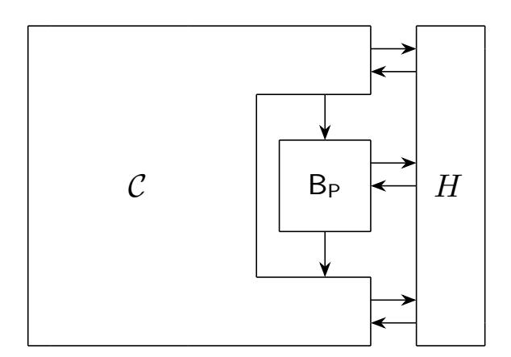
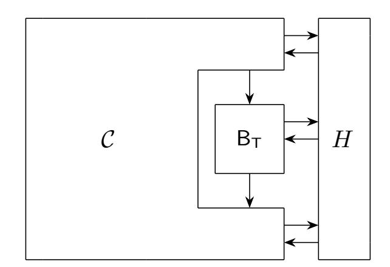

{0}------------------------------------------------

# Tighter Quantum Security for Fiat-Shamir-with-Aborts and Hash-and-Sign-with-Retry Signatures

Pouria Fallahpour<sup>1</sup>, Serge Fehr<sup>2,3</sup>, and Yu-Hsuan Huang<sup>2</sup>

Sorbonne Université, CNRS and LIP6, France
 Centrum Wiskunde & Informatica, The Netherlands
 Leiden University, The Netherlands
 pouria.fallahpour@lip6.fr, {serge.fehr, yhh}@cwi.nl

**Abstract.** We revisit the quantum security (in the QROM) of digital signature schemes that follow the Fiat-Shamir-with-aborts (FSwA) or the probabilistic hash-and-sign with retry/abort (HSwA) design paradigm. Important examples of such signature schemes are Dilithium, SeaSign, Falcon<sup>+</sup> and UOV. In particular, we are interested in the UF-CMA-to-UF-NMA reduction for such schemes. We observe that previous such reductions have a reduction loss that is larger than what one would hope for, or require a more stringent notion of zero-knowledge than one would hope for.

We resolve this matter here by means of a novel UF-CMA-to-UF-NMA reduction that applies to FSwA and HSwA signature schemes simultaneously, and that offers an improved reduction loss (without making the zero-knowledge assumption more stringent).

# 1 Introduction

**Background.** Fiat-Shamir-with-aborts (FSwA) and probabilistic hash-and-sign with retry/abort (HSwA) are important design principles for digital signature schemes (in the random oracle model), in particular for constructing quantum-secure signature schemes. Both have in common that the signature generation may require several trials until a "good" signature is obtained. Informally speaking, the retrying is typically necessary in order to not leak unwanted information about the secret key via a "bad" choice of the signature.

Examples of signature schemes that follow one or the other design principle are: Lyubashevsky's signature [Lyu09,Lyu12], GLP [GLP12], TESLA [ABB<sup>+</sup>17], Dilithium [DKL<sup>+</sup>18], SeaSign [DFG19], and HAETAE [CCD<sup>+</sup>24], which follow the FSwA paradigm, and Hidden Field Equation (HFE) signatures [Pat96], Unbalanced Oil and Vinegar (UOV) [KPG99], the Courtois-Finiasz-Sendrier (CFS) signature [CFS01,Dal08], GeMSS [CFMR<sup>+</sup>17], Wave [DST19], MAYO [Beu21], QR-UOV [FIKT21], and Falcon<sup>+</sup> [GJK24] (an updated version of Falcon), which follow the HSwA paradigm.

The two design principles, FSwA and HSwA, also have in common that security is typically proven in two steps: first, the specific instantiation is exploited in order to show UF-NMA-security, and then an argument that is generic for the design principle (and only requires some mild additional properties from the instantiation) is used to conclude full-fledged (strong or ordinary) UF-CMA-security, i.e., security against chosen-message attacks.

It turned out that the generic UF-CMA-to-UF-NMA reductions for FSwA and HSwA are quite insidious, with several works getting it wrong by overlooking subtle dependencies that are introduced by the retrying, which is inherent to the design. Indeed, Barbosa et al. [BBD+23] and Devevey et al. [DFPS23] showed (independently) that prior UF-CMA-to-UF-NMA reductions for FSwA, ranging back all the way to [Lyu12] and including [KLS18] (which considered the QROM case), are faulty and without simple patches. On the positive side, by reconsidering the problem from scratch, both works showed correct such UF-CMA-to-UF-NMA reductions for FSwA signatures, in both the classical and the quantum (i.e. QROM) cases, with different reduction losses for the two.

Suppressing less relevant terms, the reduction loss obtained in [BBD<sup>+</sup>23] scales as  $q_H q_S \epsilon$  for the classical ROM case, and as  $q_H \sqrt{q_S \epsilon} + q_S \sqrt{q_H \epsilon}$  for the QROM case, where  $q_H$  is the number of (quantum) queries to the random oracle,  $q_S$  is the number of signing queries, and  $0 < \epsilon < 1$  is a (small) number determined by

{1}------------------------------------------------

the scheme. Concretely, this means that any UF-CMA attacker can be turned into a UF-NMA attacker with similar runtime and a success probability that differs (additively) by no more than the said loss. Since in natural settings q<sup>H</sup> ≫ qS, the dominating term in the loss in the QROM case is q<sup>H</sup> <sup>√</sup>qSϵ; this is somewhat unfortunate as it requires the number of random oracle queries to be bounded in the order of the square root of 1/ϵ, for the reduction to be meaningful.

The approach taken in [\[DFPS23\]](#page-19-13) avoids the suboptimal q<sup>H</sup> <sup>√</sup>qS<sup>ϵ</sup> term in the additive reduction loss, but only works if the underlying Σ-protocol is full-fledged honest-verifier zero-knowledge (HVZK), which is a nonstandard requirement for FSwA (e.g., [\[BBD](#page-18-3)+23] merely requires accepting transcripts to be simulateable). In that sense, this reduction is less generic and it typically requires substantial additional work to show the stronger zero-knowledge property, and/or it may only hold computationally, or not at all.[4](#page-1-0) If it (only) holds computationally then the security loss depends on the runtime of the attacker (and the hardness of a computational problem) and so cannot be given as an explicit number, compared to the statistical case where the zero-knowledge error is then solely determined by the parameters of the scheme. Another downside of the reduction in [\[DFPS23\]](#page-19-13) is that the computational overhead in the reduction is larger compared to [\[BBD](#page-18-3)+23] (see Table [1](#page-1-1) below).

Moving on to HSwA signatures, Kosuge and Xagawa [\[KX24\]](#page-19-15) followed up on the observation from [\[CDP23\]](#page-18-4) that the original analysis of the UF-CMA-to-UF-NMA reduction for HSwA signatures in [\[SSH11\]](#page-19-16) is incorrect, and they provide the first correct such reduction, both in the ROM and in the QROM. However, their QROM reduction suffers from the same suboptimal q<sup>H</sup> <sup>√</sup>qS<sup>ϵ</sup> term.

Our Contribution. In this work, we consider a certain abstract design for digital signature schemes (in the random oracle model) that covers both, FSwA and HSwA signatures, in one go, when considering corresponding instantiations. Our main result then is a UF-CMA-to-UF-NMA reduction in the QROM for the abstract signature scheme we consider, with a reduction loss that is dominated by q<sup>S</sup> <sup>√</sup>qHϵ, while relying on the standard assumption that accepting transcript can be simulated (see Table [1\)](#page-1-1).

Our approach is inspired by [\[BBD](#page-18-3)+23], but then deviates significantly in the crucial part. As corollaries of our generic result, we obtain such UF-CMA-to-UF-NMA reductions in particular for FSwA signatures and for HSwA signatures.

<span id="page-1-1"></span>

|                       | Reduction loss                                          | Reduction runtime overhead |                                       |  |
|-----------------------|---------------------------------------------------------|----------------------------|---------------------------------------|--|
|                       |                                                         | with QRAM                  | without QRAM                          |  |
| [BBD+23, Th. 2]       | √q<br>p<br>qH<br>Sϵ + qS<br>(qS<br>+ qH)ϵ<br>+qSζacHVZK | qSTacHVZK<br>+ qH          | qSTacHVZK<br>+ qSqH<br>2<br>+q<br>S   |  |
| [DFPS23, Th. 10 & 12] | p<br>λqS<br>(λqS<br>+ qH)ϵ<br>+λqSζHVZK                 | λqSTHVZK<br>+ qH           | 2<br>2<br>λ<br>q<br>STHVZK<br>+ λqSqH |  |
| Corollary 1           | √q<br>qS<br>Hϵ + qSζacHVZK                              | qSTacHVZK<br>+ qH          | qSTacHVZK<br>+ qSqH<br>2<br>+q<br>S   |  |

Table 1. Comparison of previous and our new QROM UF-NMA-to-UF-CMA security reduction for FSwA signatures, where λ denotes the security parameter, T the runtime of the zero-knowledge simulator, for full-fledged HVZK for [\[DFPS23\]](#page-19-13) and for accepting HVZK in the other cases, and ζ the corresponding statistical simulation error (or the computational simulation error, but then it is dependent on the adversary's runtime). Logarithmic factors and constant terms are omitted for the sake of simplicity. Numbering of referred theorems are in terms of the full version.

<span id="page-1-0"></span><sup>4</sup> It is shown in [\[DFPS23\]](#page-19-13) that full-fledged HVZK is satisfied by (the Σ-protocols underlying) Lyubashevsky's signatures, statistically or computationally dependent on some parameter; however, the techniques for showing this do not carry over to Dilithium for instance.

{2}------------------------------------------------

For FSwA signatures, our result improves on [BBD<sup>+</sup>23] by offering a loss of order  $q_S\sqrt{q_H\epsilon}$ , thus avoiding the expensive  $q_H\sqrt{q_S\epsilon}$  term. Assuming that, in practice, the concrete values of  $q_H$  and  $q_S$  are considered to be up to  $2^{128}$  and  $2^{64}$ , respectively, and  $\zeta_{acHVZK} \approx 0$ , our analysis proportionally reduces the loss in [BBD<sup>+</sup>23] by an order of magnitude  $\approx 2^{32}$ . Compared to [DFPS23], we can rely on the weaker notion of accepting HVZK, which only requires to simulate accepting transcripts; this is (more) standard for FSwA and typically satisfied, statistically, for relevant instantiations. Thus, our work unifies the positive features of [BBD<sup>+</sup>23] and [DFPS23] in one reduction, avoiding the individual drawbacks of the two prior solutions.

For HSwA signatures, comparing with [KX24], we get the same improvement as above over [BBD<sup>+</sup>23] by offering a loss of order  $q_S\sqrt{q_H\epsilon}$ , i.e., also here avoiding the  $q_H\sqrt{q_S\epsilon}$  term.

Beyond the above quantitative and qualitative improvements, we also would like to emphasize the conceptual contribution of providing the means to treat FSwA and HSwA signatures simultaneously.

The Challenge. At the core of our result is the following technical challenge (somewhat simplified here for the easy of exposition). Let D be a distribution over a set  $\mathcal{R}$  with the promise that  $\Pr[r=r_{\circ}] \leq \epsilon$  for any  $r_{\circ} \in \mathcal{R}$  and  $r \leftarrow D$ , and let f be an arbitrary (randomized or deterministic) function with domain  $\mathcal{R} \times \mathcal{Y}$  and with a special symbol  $\bot$  in its range. Consider an arbitrary quantum algorithm  $\mathcal{A}^H$  that gets a sample produced by one or the other of the following two procedures:

```
1: r \leftarrow D

2: H(r) := y \leftarrow \mathcal{Y}

3: z \leftarrow f(r, y)

4: or 2: y \leftarrow \mathcal{Y}

3: z \leftarrow f(r, y)

4: if z \neq \bot then H(r) := y

5: if z = \bot then return \bot else return (r, z)
```

and that can make superposition queries to the random oracle H before and after it gets the sample, say  $q_H$  in total. The goal now is to show that it is hard for  $\mathcal{A}^H$  to decide from which of the two it got the sample.

We note that the only difference between the two is that the first procedure reprograms H(r) to y no matter what, while the latter does so only in case of a non- $\bot$  output. Thus, intuitively it is clear that it is hard for  $\mathcal{A}^H$  to distinguish the two: it can notice the difference only when the procedure outputs  $\bot$  and  $\mathcal{A}^H$  queries H(r) after having received the sample (thus  $\bot$ ); but the latter is unlikely to happen then due to the high entropy in r. However, making this a rigorous argument in the case of quantum queries results in a hybrid argument over all the queries to H (after having received the sample), where (for the sake of the argument) one would then measure for each query if the query is to r or not. This then leads to a distinguishing advantage of  $q_H \sqrt{\epsilon}$ , where the square-root comes from the Gentle-Measurement Lemma, used to argue that the measurements cause little disturbance, and the factor  $q_H$  by quantifying over all queries. Thus, the real challenge is to prove a bound on the distinguishing advantage that scales as  $\sqrt{q_H \epsilon}$  instead; this is what we aim for and achieve in this work.

Impact on Dilithium. We show the impact of our improved reduction loss for the Dilithium signature scheme, compared to the numbers obtained in [BBD<sup>+</sup>23]. Working out the loss for Dilithium requires control on  $\epsilon$  (for the different choices of Dilithium parameters considered). This is done in [BBD<sup>+</sup>23] by means of a computer-aided computation, which we reuse here. Additionally, as a small additional contribution, we provide a rigorous, analytic bound on  $\epsilon$  in terms of the different Dilithium parameters. As a matter of fact, since  $\epsilon$  is key-dependent and there may be some bad choices of key-pairs (sk, pk) for which  $\epsilon$  is large, the goal is to find a as-small-as-possible upper bound on  $Pr[\Gamma] \mathbb{E}[\epsilon|\Gamma]$  for a suitable subset/event  $\Gamma$  of key-pairs.

<span id="page-2-0"></span>One might also be tempted to argue that the two can only be distinguished by  $\mathcal{A}^H$  if  $\mathcal{A}^H$  has queried H(r) before it receives the sample (and then use compressed-oracle techniques to get the  $q_H$  inside the square-root)—but then one falls for the same trap as earlier, faulty FSwA proofs: due to the *conditional* reprogramming of H in the second procedure, H may become non-uniformly random there. One expects this non-uniformity to be negligible and hard to notice for  $\mathcal{A}^H$ , but giving a concrete (and sufficiently good) bound appears difficult.

{3}------------------------------------------------

### 2 Preliminaries

In Sect. 2.1, we recall the (quantum) random oracle model, and we fix a formalism for referring to algorithms that may query the random oracle and possibly yet another oracle, and for related concepts.<sup>6</sup> In Sect. 2.2, we specify the family of signature schemes, to which our result applies, and in Sect. 2.3 we state a variant of the adaptive reprogramming lemma from [GHHM21], which we use later.

#### <span id="page-3-0"></span>2.1 Oracle algorithms and the (quantum) random oracle model

**Basic notation.** Throughout this work, we consider the random oracle model, where parties/algorithms have oracle access to a uniformly random function  $H: \mathcal{X} \to \mathcal{Y}$ , with suitably chosen finite domain  $\mathcal{X}$  and range  $\mathcal{Y}$ . We also consider quantum algorithms, which can then query H "in superposition", i.e., in the form of the unitary  $|x,y\rangle \mapsto |x,y+H(x)\rangle$ . We write  $\mathcal{A}^H$  to denote a (classical or quantum) algorithm with query access to H. Similarly, we write  $\mathcal{A}^{H,\bullet}$  in case  $\mathcal{A}$  may additionally make queries to another, possibly unspecified oracle, hinted at with a placeholder " $\bullet$ " (or  $\bullet$ ,  $\bullet$ ,  $\bullet$  etc.). Furthermore, in case of such an oracle algorithm  $\mathcal{A}^{H,\bullet}$ , we write  $\mathcal{A}^{H,\mathcal{O}}$  to express that the unspecified oracle is instantiated with the particular algorithm  $\mathcal{O}$ . We note that such an instantiation may also have access to H, i.e., the oracle may be instantiated with an algorithm  $\mathcal{O}^H$ , in which case we then naturally write  $\mathcal{A}^{H,\mathcal{O}^H}$ .

We stress that we use the same notation for classical and quantum algorithms with respective classical or quantum access to the random oracle H, while the query access to any other oracle is always assumed to be classical in this work, and thus so is any oracle instantiation  $\mathcal{O}$  we consider. Furthermore, by default we assume any oracle instantiation  $\mathcal{O}$  to be at most *statically stateful*, meaning that the state (if any) is chosen at the beginning and then remains fixed.<sup>7</sup>

Regarding language and notation, since in the random oracle model by default all algorithms have access to H, we reserve the terminology *oracle* algorithm for those that have access to one (or more) additional oracle(s). Also, once we have specified that an oracle algorithm is of the form, say,  $\mathcal{A}^{H,\bullet}$ , i.e., with access to H and to another, unspecified oracle, we may then simply write  $\mathcal{A}$  in later occurrences, taking the considered form as understood.

We note that even though an oracle algorithm  $\mathcal{A}^{H,\bullet}$  typically expects a particular instantiation  $\mathcal{O}$  of the oracle, we may consider a run of  $\mathcal{A}^{H,\mathcal{O}'}$  for any instantiation  $\mathcal{O}'$ . We may also consider a run of  $\mathcal{A}$  where different calls to the oracle are answered by different instantiations. We then write

$$\mathcal{A}^{H,[\mathcal{O}_1^{i_1},\mathcal{O}_2^{i_2},\ldots]}$$

to capture that the first  $i_1$  oracle queries are answered by  $\mathcal{O}_1$ , the following  $i_2$  queries by  $\mathcal{O}_2$ , etc. We note that in-between these oracle queries, there may be multiple queries to H.

For proof-technical reasons, we will also consider the case where an (oracle) algorithm may make write (a.k.a. reprogramming) queries to the random oracle H. On input (x, y), such a write query will redefine the function value of H(x) to y; we will capture this by the command H(x) := y. We only consider classical write queries, and we will write  $\mathcal{A}^{\bar{H}}, \mathcal{A}^{\bar{H}, \bullet}, \mathcal{A}^{\bar{H}, \mathcal{O}^{\bar{H}}}$  etc. to indicate that  $\mathcal{A}$  (and  $\mathcal{O}$ ) may also make classical write queries to H, next to the ordinary (classical or quantum) read queries.

For an oracle algorithm  $\mathcal{A}^{\bar{H},\bullet}$  and a specific instantiation of the oracle, say, as  $\mathcal{O}^{\bar{H}}$ , we write

$$\mathcal{B}^{\bar{H}}:=\mathcal{A}^{\bar{H},\mathcal{O}^{\bar{H}}}$$

<span id="page-3-1"></span><sup>&</sup>lt;sup>6</sup> For the purpose of this work only, Section 2.1 may feel a bit overkill; however, we believe that such a rigorous formalism may be useful beyond the scope of this work.

<span id="page-3-2"></span>For comparison, the random oracle H with read queries only is statically stateful when instantiated/implemented (inefficiently) by choosing a random function at the beginning, while it is adaptively stateful when done using lazy sampling. The random oracle  $\bar{H}$  with write queries (see below) is adaptively stateful no matter how it is implemented.

{4}------------------------------------------------

to specify that the algorithm  $\mathcal{B}$  runs  $\mathcal{A}$  and answers all oracle queries by means of running  $\mathcal{O}^{\bar{H}}$  internally, while forwarding all random oracle queries of  $\mathcal{A}$  and  $\mathcal{O}$  to H. This indeed makes  $\mathcal{B}$  an algorithm of the form  $\mathcal{B}^{\bar{H}}$ .

Pushing this a bit further,  $\mathcal{B}^{\bar{H},\bullet} := \mathcal{A}^{\bar{H},[\mathcal{O}^{i-1},\bullet,\mathcal{P}^{\infty}]}$  then denotes the oracle algorithm that runs  $\mathcal{A}$ , answers the first i-1 oracle queries with  $\mathcal{O}$ , forwards the i-th query to  $\mathcal{B}$ 's oracle, and answers all the remaining ones with  $\mathcal{P}$ . In case  $\mathcal{A}$  makes at most q oracle queries, we could just as well write  $\mathcal{P}^{q-i}$  instead of  $\mathcal{P}^{\infty}$ .

**Equivalences.** Different (oracle) algorithms may "behave the same way". We want to formally capture the possible meanings of the latter that will be important for us.

We say that two algorithms  $\mathcal{B}^{\bar{H}}$  and  $\mathcal{C}^{\bar{H}}$  are semantically equal, written as equality  $\mathcal{B}^{\bar{H}} = \mathcal{C}^{\bar{H}}$ , if the joint distribution of: (1) the output of the considered algorithm, and (2) the (possibly reprogrammed) random oracle H at the end of the execution of the algorithm, are the same, for any initial choice of H and any joint input. This is for instance satisfied when  $\mathcal{C}$  is a purely syntactic rewriting of the defining code of  $\mathcal{B}$ .

Another natural, but weaker, equivalence relation, which we call *output equivalent*, is  $\mathcal{B}^{\bar{H}} \simeq \mathcal{C}^{\bar{H}}$ , which (by our definition) expresses that the two distributions of the respective *outputs only* are equal, *on average* over the random choice of H and for any joint input.

We stress that the assignment  $\mathcal{B}^{\bar{H}} := \mathcal{A}^{\bar{H},\mathcal{O}^{\bar{H}}}$  implies semantical equivalence  $\mathcal{B}^{\bar{H}} = \mathcal{A}^{\bar{H},\mathcal{O}^{\bar{H}}}$ . Furthermore,

$$\mathcal{O}^{\bar{H}}=\mathcal{P}^{\bar{H}} \implies \mathcal{A}^{\bar{H},\mathcal{O}^{\bar{H}}}=\mathcal{A}^{\bar{H},\mathcal{P}^{\bar{H}}}$$

for any  $\mathcal{A}^{\bar{H},\bullet}$ , while  $\mathcal{O}^{\bar{H}} \simeq \mathcal{P}^{\bar{H}}$  is in general not sufficient to conclude  $\mathcal{A}^{\bar{H},\mathcal{O}^{\bar{H}}} \simeq \mathcal{A}^{\bar{H},\mathcal{P}^{\bar{H}}}$ .8

Output equivalence sometimes only holds approximately, informally denoted as  $\mathcal{B}^{\bar{H}} \approx \mathcal{C}^{\bar{H}}$  then. This is commonly quantified via the distinguishing advantage

$$|\Pr[1 \leftarrow \mathcal{B}^{\bar{H}}] - \Pr[1 \leftarrow \mathcal{C}^{\bar{H}}]|,$$

where  $\mathcal{B}$  and  $\mathcal{C}$  are then typically assumed to have a binary output, and where the probability is over the randomness of the algorithms ( $\mathcal{B}$  and  $\mathcal{C}$ ) and the random choice of the random oracle H. We note that for simplicity, we consider here algorithms with no input, but the same quantities can also be considered for any choice of input, of course. In case of binary outputs, the above distinguishing advantage coincides with the statistical distance  $SD(\mathcal{B}^{\bar{H}}, \mathcal{C}^{\bar{H}})$  between the two output distributions, and so we then use the two expressions interchangeably.<sup>9</sup> In case of non-binary outputs, the statistical distance upper bounds the distinguishing advantage.

Conditioning. The run of an algorithm  $\mathcal{A}^{\bar{H}}$  defines the (distribution of the) output of the algorithm, but also various internal variables, like the local randomness of  $\mathcal{A}$  in case of a classical algorithm or the measurement outcomes of measurements performed by  $\mathcal{A}$  in case of a quantum algorithm, the (classical) write queries to H, etc. For any event  $\Lambda$  defined by these random variables, we can then consider a run of  $\mathcal{A}^{\bar{H}}$  conditioned on  $\Lambda$ , which we will denote by  $\mathcal{A}^{\bar{H}}[\Lambda]$ . We may use the variation  $\mathcal{A}[\Lambda]^{\bar{H}}$  on the notation to indicate that  $\Lambda$  does not depend on H. We mainly use the latter in case of a classical algorithm  $\mathcal{A}$ , where it then means that  $\Lambda$  is determined by  $\mathcal{A}$ 's local randomness (and its input). In this case, the assignment  $\mathcal{B}^{\bar{H}} := \mathcal{A}[\Lambda]^{\bar{H}}$  is well-defined as the oracle algorithm that runs  $\mathcal{A}$  but samples the local randomness conditioned on  $\Lambda$ .

This notation extends naturally to  $\mathcal{A}^{\bar{H},\mathcal{O}^{\bar{H}}}[\Lambda]$  for any oracle algorithm  $\mathcal{A}^{\bar{H},\bullet}$  and instantiation  $\mathcal{O}^{\bar{H}}$ , as well as to the variations  $\mathcal{A}[\Lambda]^{\bar{H},\bullet}$  and  $\mathcal{A}^{\bar{H}}[\Lambda]^{\bullet}$ , when  $\Lambda$  does not depend on (H and) the oracle.

The above notation will mainly be useful in the following context. Consider two algorithms  $\mathcal{B}^{\bar{H}}$  and  $\mathcal{C}^{\bar{H}}$ , as well as an event  $\Lambda$  that is well-defined for either of the two executions. Then the equivalences  $\mathcal{B}^{\bar{H}}[\Lambda] = \mathcal{C}^{\bar{H}}[\Lambda]$  and  $\mathcal{B}^{\bar{H}}[\Lambda] \simeq \mathcal{C}^{\bar{H}}[\Lambda]$  are naturally defined by means of the equality of the respective *conditional* distributions. Furthermore, if  $\Lambda$  has the same probability  $\Pr[\Lambda]$  in a run of  $\mathcal{B}^{\bar{H}}$  and in a run of  $\mathcal{C}^{\bar{H}}$ , then

$$SD(\mathcal{B}^{\bar{H}}, \mathcal{C}^{\bar{H}}) \leq \Pr[\Lambda] \cdot SD(\mathcal{B}^{\bar{H}}[\Lambda], \mathcal{C}^{\bar{H}}[\Lambda]) + \Pr[\neg \Lambda] \cdot SD(\mathcal{B}^{\bar{H}}[\neg \Lambda], \mathcal{C}^{\bar{H}}[\neg \Lambda]).$$

<span id="page-4-0"></span><sup>&</sup>lt;sup>8</sup> Even if  $\mathcal{O}$  and  $\mathcal{P}$  are restricted to read access only, still  $\mathcal{O}^H \simeq \mathcal{P}^H \not\Rightarrow \mathcal{A}^{\bar{H},\mathcal{O}^H} \simeq \mathcal{A}^{\bar{H},\mathcal{P}^H}$ .

<span id="page-4-1"></span><sup>&</sup>lt;sup>9</sup> The former is more common in the cryptography literature, while the advantage of the latter is its succinctness.

{5}------------------------------------------------

In particular, if  $\mathcal{B}^{\bar{H}}[\Lambda] \simeq \mathcal{C}^{\bar{H}}[\Lambda]$  then  $SD(\mathcal{B}^{\bar{H}}, \mathcal{C}^{\bar{H}}) \leq \Pr[\neg \Lambda]$ .

We conclude by noting that in case of an oracle algorithm  $\mathcal{A}^{\bar{H},\bullet}$ , an instantiation  $\mathcal{O}^{\bar{H}}$  of the oracle, and an event  $\Lambda$  defined by the local randomness of  $\mathcal{O}$  (for any fixed input to  $\mathcal{O}$ ), if  $\mathcal{A}^{\bar{H},\bullet}$  is promised to make precisely one query to the oracle then the event  $\Lambda$  is also well-defined by a run of  $\mathcal{A}^{\bar{H},\mathcal{O}^{\bar{H}}}$ , and  $\mathcal{A}^{\bar{H},\mathcal{O}[\Lambda]^{\bar{H}}} = \mathcal{A}^{\bar{H},\mathcal{O}^{\bar{H}}}[\Lambda]$ .

Simulating the write access. It is not too hard to see that write queries to H can always be simulated internally, in the sense that there exists an (adaptively stateful) algorithm  $\mathcal{S}^H$ , which makes one H-query whenever it is invoked with a read request (and no query upon any write request), and such that  $\mathcal{A}^{\bar{H}} \simeq \mathcal{A}^{\mathcal{S}^H}$  for every  $\mathcal{A}^{\bar{H}}$ .  $\mathcal{S}$  simply simulates any write query to H by bookkeeping the reprogramming requests and properly adjusting the future read queries to H, which it relays. It is obvious how this works in case  $\mathcal{A}$  makes classical read queries to H, but it can also be done in case of quantum read queries, where  $\mathcal{S}$  then is a suitable quantum algorithm; the details of the latter are in Appendix A.

By default, we then write  $\bar{\mathcal{A}}^H := \mathcal{A}^{\mathcal{S}^H}$  for the algorithm that simulates  $\mathcal{A}$ 's write queries internally, and thus is such that  $\bar{\mathcal{A}}^H \simeq \mathcal{A}^{\bar{H}}$ . We note that in case of an oracle algorithm  $\mathcal{A}^{\bar{H},\bullet}$  and setting  $\bar{\mathcal{A}}^{H,\bullet} := \mathcal{A}^{\mathcal{S}^H,\bullet}$ , the equality  $\bar{\mathcal{A}}^{H,\mathcal{O}^{\bar{H}}} \simeq \mathcal{A}^{\bar{H},\mathcal{O}^{\bar{H}}}$  of the output distributions holds (only) conditioned on the event that  $\mathcal{O}$  makes no (read or write) query to H on a point that has previously been reprogrammed by  $\mathcal{A}$ . Thus,  $\bar{\mathcal{A}}^{H,\mathcal{O}^{\bar{H}}}[\Omega] \simeq \mathcal{A}^{\bar{H},\mathcal{O}^{\bar{H}}}[\Omega]$  with  $\Omega$  being the said event.

#### <span id="page-5-0"></span>2.2 Generalized Fiat-Shamir with Aborts signatures

Let  $\mathcal{M}, \mathcal{R}, \mathcal{Y}$  and  $\mathcal{Z}$  be arbitrary non-empty finite sets, and fix the domain and the range of the random oracle as  $\mathcal{R} \times \mathcal{M}$  and  $\mathcal{Y}$ , respectively, i.e.  $H : \mathcal{R} \times \mathcal{M} \to \mathcal{Y}$ . Furthermore, let  $\bot$  be some special symbol not contained in  $\mathcal{Z}$ . These sets may depend on a security parameter, but we leave this dependency—and the security parameter itself—implicit throughout most of the document.

We consider signature schemes (KeyGen, Sign<sup>H</sup>, Verify<sup>H</sup>) in the random oracle model of the following form. On input the security parameter, the key-generation algorithm KeyGen produces a key pair (sk, pk), which in turn specifies a distribution D over a set  $\mathcal{R}$  and an ensemble  $\{f(r,y)\}_{r\in\mathcal{R},y\in\mathcal{Y}}$  of distributions over  $\mathcal{Z} \cup \{\bot\}$ . Signing of a message  $m \in \mathcal{M}$  works as specified in Fig. 1 below, and a claimed signature  $\sigma = (r, z)$  for a message  $m \in \mathcal{M}$  is accepted by Verify if and only if z is in the support of the distribution f(r, H(r, m)).

```
Sign<sup>H</sup>(sk, m):

1: repeat

2: r \leftarrow D

3: y := H(r, m)

4: z \leftarrow f(r, y)

5: until z \neq \bot

6: return (r, z)
```

**Fig. 1.** The signing procedure, where the hash function H in step 3 is modeled as a random oracle. The dependency of D and f on sk is left implicit.

Obviously, for signing to be efficient, it is necessary that D is efficiently samplable when given the secret key sk, and f(r,y) is efficiently samplable (for any r and y) when given sk and the randomness used to sample  $r \leftarrow D$ . For verification to be efficient, it needs to be efficiently testable given the public key (only) if z is in the support of f(r,y), for any r,y,z. Similarly, for the scheme to be secure (against key-only attacks) it is necessary that signing should be computationally hard when only given the public key pk. However,

<span id="page-5-1"></span>Here the respective output distributions of the two algorithms are actually equal for any choice of H; thus, we have an equivalence that lies in-between = and  $\simeq$ , but this is not important to us.

{6}------------------------------------------------

these (in)efficiency aspects are not our concern; our security reductions also apply for non-efficient or insecure schemes (though they become somewhat pointless then). Therefore, we keep the public key pk and the secret key sk implicit—unless specified otherwise, we consider them arbitrary but fixed—and so we also keep the dependency of D and f on (pk, sk), implicit; the same for the parameters p and  $\epsilon$  below.

Two important parameters for such a signature scheme are

<span id="page-6-1"></span>
$$p := \Pr_{\substack{r \leftarrow D, y \leftarrow \mathcal{Y} \\ z \leftarrow f(r, y)}} [z = \bot], \tag{1}$$

referred to as the abort probability, and

<span id="page-6-2"></span>
$$\epsilon := \max_{r^{\circ}} D(r^{\circ}) = \max_{r^{\circ}} \Pr_{r \leftarrow D}[r = r^{\circ}], \qquad (2)$$

which is the *quessing probability* of the distribution D.

The above abstract signature scheme design is well motivated by the fact that it covers both Fiat-Shamir-with-aborts (FSwA) signatures, as well as probabilistic hash-and-sign with retry/abort (HSwA) signatures. In the case of FSwA signatures, f is usually a deterministic function, which can be efficiently computed given the secret key and the randomness used to sample r (the "first message" in the  $\Sigma$ -protocol); in the case of HSwA signatures, D is typically the uniform distribution over strings of a certain length, and f is the preimage-sampling algorithm of a so-called weak preimage-samplable function.

As a matter of fact, a HSwA signature can be understood as the FSwA signature obtained from the  $\Sigma$ -protocol that chooses a random bit string r as the "first message", and samples the response z as a preimage of the (random) challenge under the weak preimage-samplable function. We therefore call the general class of signature schemes specified above (covering FSwA and HSwA signatures) generalized FSwA signature schemes.

Motivated by the case of (ordinary) Fiat-Shamir with aborts and the definition of acHVZK in [BBD<sup>+</sup>23], we define the following.

**Definition 1 (Accepting (Statistical) Honest-Verifier Zero-Knowledge).** Let  $\zeta$  and T be functions of the security parameter. A generalized FSwA signature scheme is called  $(\zeta, T)$ -acHVZK if there exists an algorithm acSim with runtime T, such that on input a public key pk it outputs a triple  $(\hat{r}, \hat{y}, \hat{z})$  that (on average over the choice of pk generated by KeyGen) is  $\zeta$ -close in statistical distance to (r, y, z) conditioned on  $z \neq \bot$ , where  $r \leftarrow D$ ,  $y \leftarrow \mathcal{Y}$  and  $z \leftarrow f(r, y)$ .

The above definition of acHVZK matches up with the definition in [BBD<sup>+</sup>23] for the FSwA instantiation of the generic signature scheme; for the HSwA instantiation, it matches up with the requirement on the advantage of the " $Preimage\ Sampling\ Game$ ", as defined in [KX24, Def. 2.5], being at most  $\zeta$  (for an algorithm SampDom with runtime T). Thus, our work covers both the FSwA schemes considered in [BBD<sup>+</sup>23] as well as the HSwA schemes from [KX24].

For simplicity, we consider the statistical version of the above zero-knowledge properly only, but our results naturally extend to a computational variant (where we then need to require polynomially many accepted transcripts (r, y, z) to be computationally indistinguishable from the simulated ones).

#### <span id="page-6-0"></span>2.3 A variant of the Adaptive Reprogramming Lemma

We consider the following, slightly extended variant of the Adaptive Reprogramming Lemma from [GHHM21]. It differs from the original variant in that, next to the quantum read queries, we allow the distinguisher to make (classical) write queries to H (with a bound on the *expected* number of write queries).

<span id="page-6-3"></span>**Lemma 1.** Let  $H: \mathcal{X} \to \mathcal{Y}$  be the random oracle. Let  $\epsilon > 0$ , and let  $\{D_i\}_{i \in \mathcal{I}}$  be a family of distributions over  $\mathcal{X}$  indexed by a finite set  $\mathcal{I}$ , such that

$$\max_{x^{\circ} \in \mathcal{X}} D_i(x^{\circ}) = \max_{x^{\circ} \in \mathcal{X}} \Pr_{x \leftarrow D_i} [x = x^{\circ}] \le \epsilon$$

{7}------------------------------------------------

<span id="page-7-0"></span>

| $\mathcal{O}_0^H(i)$ : | $\underline{\mathcal{O}_{1}^{\bar{H}}(i)}$ : |
|------------------------|----------------------------------------------|
| 1: $x \leftarrow D_i$  | 1: $x \leftarrow D_i$                        |
| 2: y := H(x)           | $2: \ H(x) := y \leftarrow \mathcal{Y}$      |
| 3: return $(x,y)$      | 3: <b>return</b> $(x,y)$                     |

Fig. 2. Reprogramming or not reprogramming, that is the question.

for all  $i \in \mathcal{I}$ . Let  $\mathcal{A}^{\bar{H}, \bullet}$  be an oracle algorithm that makes one query to an oracle  $(\bullet)$ , which is to be instantiated by  $\mathcal{O}_0^H$  or  $\mathcal{O}_1^{\bar{H}}$  as specified in Fig. 2; furthermore, prior to that query,  $\mathcal{A}$  makes at most  $q_r$  quantum read queries to H, and in expectation at most  $q_w$  classical write queries to H, for given positive numbers  $q_r, q_w \in \mathbb{Z}$ . Then

$$\left| \operatorname{Pr} \left[ 1 \leftarrow \mathcal{A}^{\bar{H}, \mathcal{O}_0^H} \right] - \operatorname{Pr} \left[ 1 \leftarrow \mathcal{A}^{\bar{H}, \mathcal{O}_1^{\bar{H}}} \right] \right| \leq \left( 2q_w + \frac{q_r}{2} \right) \epsilon + \sqrt{q_r \epsilon} .$$

The proof for this extended variant is a reduction to the original version [GHHM21], exploiting that we can simulate the write queries.

*Proof.* Consider  $\bar{\mathcal{A}}^{H,\mathcal{O}_0^H} = \mathcal{A}^{S^H,\mathcal{O}_0^H}$  and  $\bar{\mathcal{A}}^{H,\mathcal{O}_1^{\bar{H}}} = \mathcal{A}^{S^H,\mathcal{O}_1^{\bar{H}}}$ , which run  $\mathcal{A}$  and simulate the write queries locally, and let  $\Omega$  be the event that  $\mathcal{A}$  has not made a write query (prior to the oracle call) for the value x sampled by the oracle then. This event is well-defined and has the same probability in any of the executions of  $\mathcal{A}^{\bar{H},\mathcal{O}_0}$ ,  $\bar{\mathcal{A}}^{H,\mathcal{O}_0}$ ,  $\bar{\mathcal{A}}^{H,\mathcal{O}_1}$ ,  $\mathcal{A}^{\bar{H},\mathcal{O}_1}$ . Furthermore,

$$\bar{\mathcal{A}}^{H,\mathcal{O}_0^H}[\Omega] \simeq \mathcal{A}^{\bar{H},\mathcal{O}_0^H}[\Omega] \quad \text{and} \quad \bar{\mathcal{A}}^{H,\mathcal{O}_1^{\bar{H}}}[\Omega] \simeq \mathcal{A}^{\bar{H},\mathcal{O}_1^{\bar{H}}}[\Omega].$$

It thus follows that

$$SD(\mathcal{A}^{\bar{H},\mathcal{O}_{0}^{H}},\mathcal{A}^{\bar{H},\mathcal{O}_{1}^{\bar{H}}}) \leq SD(\mathcal{A}^{\bar{H},\mathcal{O}_{0}^{H}},\bar{\mathcal{A}}^{H,\mathcal{O}_{0}^{H}}) + SD(\bar{\mathcal{A}}^{H,\mathcal{O}_{0}^{H}},\bar{\mathcal{A}}^{H,\mathcal{O}_{1}^{\bar{H}}}) + SD(\bar{\mathcal{A}}^{H,\mathcal{O}_{1}^{\bar{H}}}) + SD(\bar{\mathcal{A}}^{H,\mathcal{O}_{1}^{\bar{H}}}) \leq 2q_{w}\epsilon + \frac{q_{r}}{2}\epsilon + \sqrt{q_{r}\epsilon}.$$

where the bound on  $SD(\bar{\mathcal{A}}^{H,\mathcal{O}_0^H}, \bar{\mathcal{A}}^{H,\mathcal{O}_1^{\bar{H}}})$  follows from the standard adaptive reprogramming lemma (see Proposition 2 in [GHHM21]).

# 3 A Tighter UF-CMA-to-UF-NMA Reduction

Throughout the entirety of this section, let  $S = (KeyGen, Sign^H, Ver^H)$  be a generalized FSwA signature scheme as introduced in Sect. 2.2, with parameters  $\epsilon$  and p defined as in (1) and (2). We assume S to be  $(\zeta, T)$ -acHVZK for given  $\zeta$  and T.

Following standard notation, we write  $\mathsf{Adv}^{\mathsf{CMA}}_{\mathcal{S}}(\mathcal{A})$  for the advantage of an attacker  $\mathcal{A}$  of winning the standard UF-CMA-security game (in the QROM) for the scheme  $\mathcal{S}$ , and similarly  $\mathsf{Adv}^{\mathsf{NMA}}_{\mathcal{S}}(\mathcal{B})$  for the advantage of an attacker  $\mathcal{B}$  of winning the standard UF-NMA-security game.

#### 3.1 Main result

Our main result is an improved UF-CMA-to-UF-NMA reduction. The reductions loss is in terms of (bounds on) the parameters p and  $\epsilon$ . Since these parameters are in general key-dependent, we first state the improved reduction loss for a fixed choice of key pair (sk, pk), and we write  $p_{sk}$  and  $\epsilon_{sk}$  when we want to make the dependency on the choice of the key explicit (where we assume without loss of generality that pk is determined by sk).

<span id="page-7-1"></span>We allow arbitrary many read/write H-queries after the query to  $\mathcal{O}_0$  or  $\mathcal{O}_1$ .

{8}------------------------------------------------

Similarly, we write  $\zeta_{sk}$  for the statistical distance of the simulated transcript to the actual accepted transcript for the specific choice sk of the key pair; it then obviously holds that  $\mathbb{E}[\zeta_{sk}] = \zeta$ , with the expectation taken over  $(sk, pk) \leftarrow \text{KeyGen}$ . Finally, we write  $\text{Adv}_{\mathcal{S}}^{\text{CMA}}(\mathcal{A}, sk)$  and  $\text{Adv}_{\mathcal{S}}^{\text{NMA}}(\mathcal{B}, sk)$  for the respective advantages when the key is chosen to be sk.

The proof of the following main theorem is presented in the subsequent subsections.

<span id="page-8-1"></span>**Theorem 1.** Let  $S = (\text{KeyGen}, \text{Sign}^H, \text{Ver}^H)$  be  $(\zeta, T)$ -acHVZK. Then for every UF-CMA attacker  $\mathcal{A}^{H, \bullet}$  making at most  $q_H$  quantum queries to H and  $q_S$  classical queries to the signing oracle, there exists an NMA attacker  $\mathcal{B}^H$  making at most  $q_H$  quantum queries to H such that for every fixed choice of key sk with  $p_{sk} < 1$ , we have

$$\mathsf{Adv}_{\mathcal{S}}^{\mathsf{CMA}}(\mathcal{A}, sk) \leq \mathsf{Adv}_{\mathcal{S}}^{\mathsf{NMA}}(\mathcal{B}, sk) + \frac{8q_S\sqrt{(q_H + 1)\epsilon_{sk}}}{1 - p_{sk}} + q_S \cdot \zeta_{sk} \; .$$

Moreover, if we count runtime in terms of the number of gates, except that each arithmetic operation on  $\mathcal{X}$  and  $\mathcal{Y}$  and every comparison among them (with respect to a strict total ordering) are counted as unit runtime, then  $\mathsf{TIME}(\mathcal{B}) \leq \mathsf{TIME}(\mathcal{A}) + O(q_ST + q_Hq_S + q_S^2)$ .

Remark 1. Suppose  $\mathcal{B}$  is allowed to use a QRAM, where each cell may contain an element of  $\mathcal{X} \times \mathcal{Y}$ , up to O(1) many memory pointers and up to O(1) many auxiliary bits. If we count each arithmetic operation and each comparison of the memory pointers as being unit runtime, then  $\mathcal{B}$  can further achieve the runtime  $\mathsf{TIME}(\mathcal{B}) \leq \mathsf{TIME}(\mathcal{A}) + O(q_S T + (q_S + q_H) \log q_S)$  using only  $O(q_S)$  many cells.

When taking the expectation over sk on both sides, in order to get the average reduction loss for a random key-pair, one can apply Jensen's inequality to  $\mathbb{E}[\sqrt{\epsilon_{sk}}]$  get a bound in terms of the expectation of  $\epsilon_{sk}$  (over the choice of sk). Unfortunately, this does not work for the parameter  $p_{sk}$ , where Jensen's inequality goes the wrong way round. Hence, we need to have a bound  $\bar{p}$  on  $p_{sk}$  that holds for all sk, or holds except with small probability (over the choice of sk).

Towards optimizing the bound, it may also make sense to avoid some bad, yet unlikely, choices of (sk, pk) that make  $\epsilon_{sk}$  large, i.e. to consider a bound  $\bar{\epsilon}$  on the sub-normalized conditional expectation  $\Pr[sk \in \Gamma_{\epsilon}]\mathbb{E}[\epsilon_{sk}|sk \in \Gamma_{\epsilon}]$ , where  $\Gamma_{\epsilon}$  is a subset of the keys for which  $\Pr[sk \notin \Gamma_{\epsilon}]$  is small.

Altogether, this then gives the following statement.

<span id="page-8-0"></span>Corollary 1. Let  $S = (\text{KeyGen}, \text{Sign}^H, \text{Ver}^H)$  be  $(\zeta, T)$ -acHVZK. Furthermore, let  $\Gamma_{\epsilon}$  and  $\Gamma_{p}$  be subset of keys sk such that  $p_{sk} \leq \bar{p}$  for all  $sk \in \Gamma_{p}$  and  $\Pr[sk \in \Gamma_{\epsilon}] \mathbb{E}[\epsilon_{sk} | sk \in \Gamma_{\epsilon}] \leq \bar{\epsilon}$ , for parameters for  $0 < \bar{\epsilon}, \bar{p} < 1$ . Then for every UF-CMA attacker A making at most  $q_H$  quantum queries to H and  $q_S$  classical queries to the signing oracle, the UF-NMA attacker B (dependent on A) as defined in Theorem 1 is such that

$$\mathsf{Adv}^{\mathsf{CMA}}_{\mathcal{S}}(\mathcal{A}) \leq \mathsf{Adv}^{\mathsf{NMA}}_{\mathcal{S}}(\mathcal{B}) + \frac{8q_S\sqrt{(q_H+1)\bar{\epsilon}}}{1-\bar{p}} + q_S\zeta + \Pr[sk \not\in \varGamma_p] + \Pr[sk \not\in \varGamma_\epsilon] \;.$$

#### 3.2 Our proof strategy

Towards proving the above claim, we consider an arbitrary UF-CMA attacker  $\mathcal{A}^{H,\bullet}$ , where by default the queries to the oracle  $\bullet$  are answered by the signing algorithm/oracle Sign in the obvious way. <sup>12</sup> It will be convenient to assume that  $\mathcal{A}$  makes one more query to H in order to check himself if the forged signature is valid under a new message that has not been queried, and then aborts (i.e. outputs  $\bot$ ) if the check fails.

Our goal is to show that

<span id="page-8-3"></span>
$$\mathcal{A}^{H,\mathsf{Sign}^{H}(sk,\cdot)}(pk) \approx \mathcal{A}^{H,\mathsf{Sim}^{\bar{H}}(pk,\cdot)}(pk) \tag{3}$$

with an upper bound on the distance that is in line with the security loss in the theorem statement. Here, Sim simulates the signing oracle by exploiting the non-abort ZK property and the ability to reprogram H, as specified in Fig. 3 below.

<span id="page-8-2"></span> $<sup>\</sup>overline{}^{12}$  I.e., using the secret key that corresponds to the public key that is given to  $\mathcal{A}$  as input.

{9}------------------------------------------------

```
\begin{aligned} &\operatorname{\mathsf{Sim}}^{\bar{H}}(pk,m) \colon \\ &1 \colon \ (\hat{r},\hat{y},\hat{z}) \leftarrow \operatorname{\mathsf{acSim}}(pk) \\ &2 \colon \ H(\hat{r},m) := \hat{y} \\ &3 \colon \mathbf{return} \ \ (\hat{r},\hat{z}) \end{aligned}
```

Fig. 3. Simulating the signing oracle by means of the acHVZK simulator and reprogramming H.

This then implies that the UF-NMA attacker  $\bar{\mathcal{B}}^H(pk) = \mathcal{B}^{\mathcal{S}^H}(pk)$  obtained by running  $\mathcal{B}^{\bar{H}}(pk) := \mathcal{A}^{H,\operatorname{Sim}^{\bar{H}}(pk,\cdot)}(pk)$  but simulating the write queries to H internally as in Lemma 4, is similarly successful in forging a signature as the original UF-CMA attacker  $\mathcal{A}$ . The crucial property of Sim is of course that it does not need the secret key, and so can indeed be simulated by  $\mathcal{B}$  itself.

By assumption on  $\mathcal{A}$  (to verify the forged signature before outputting it), we know that  $\mathcal{B}^{\bar{H}}(pk)$  outputs a forgery  $\sigma^*$  for a message  $m^*$  that correctly verifies under the reprogrammed oracle H (or else outputs  $\bot$ ). However, since H gets reprogrammed only at places  $(\hat{r}, m)$  for  $m^* \neq m$ ,  $\sigma^*$  also verifies under the original (unreprogrammed) choice of H. Consequently, whenever  $\bar{\mathcal{B}}$  outputs non- $\bot$ , it outputs a valid forgery. Thus, we have

$$\mathsf{Adv}^{\mathsf{NMA}}(\bar{\mathcal{B}}) = \Pr\left[\bar{\mathcal{B}}^{H}(pk) \neq \bot\right] = \Pr\left[\mathcal{B}^{\bar{H}}(pk) \neq \bot\right] = \Pr\left[\mathcal{A}^{H,\mathsf{Sim}^{\bar{H}}(pk,\cdot)}(pk) \neq \bot\right]$$
$$\geq \mathsf{Adv}^{\mathsf{CMA}}(\mathcal{A}) - SD\left(\mathcal{A}^{H,\mathsf{Sign}^{H}(sk,\cdot)}(pk), \mathcal{A}^{H,\mathsf{Sim}^{\bar{H}}(sk,\cdot)}(pk)\right),$$

where the second and third equality follows  $\bar{\mathcal{B}}^H(pk) \simeq \mathcal{B}^{\bar{H}}(pk) = \mathcal{A}^{H,\mathsf{Sim}^{\bar{H}}(sk,\cdot)}(pk)$ .

Remark 2. If we aim for strong unforgeability, similar argument applies, but we additionally require what is known as the computational unique-responses property, which prevents an efficient attacker to come up with two valid triples  $(r, y, z_1), (r, y, z_2)$  with the same first message r and the same challenge y but distinct responses  $z_1 \neq z_2$ 

```
Loop(sk, m)
1: repeat
2: out \leftarrow (sk, m)
3: until out \neq \bot
4: return out
```

```
\mathsf{B}_\mathsf{T}^{\bar{H}}(sk,m)
\mathsf{B}^H_\mathsf{S}(sk,m)
                                                      \mathsf{B}^H_\mathsf{P}(sk,m)
 1: r \leftarrow D
                                                       1: r \leftarrow D
                                                                                                             1: r \leftarrow D
 2: y := H(r, m)
                                                       2: H(r,m) := y \leftarrow \mathcal{Y}
                                                                                                             2: y \leftarrow \mathcal{Y}
 3: z \leftarrow f(r,y)
                                                       3: z \leftarrow f(r,y)
                                                                                                             3: z \leftarrow f(r,y)
                                                       4: if z \neq \bot then
                                                                                                             4: if z \neq \bot then
                                                                H(r,m) := y
                                                                                                                      H(r,m) := y
 5: if z = \bot then
                                                                                                             5: if z = \bot then
                                                        5: if z = \bot then
         \operatorname{return} \perp
                                                                \operatorname{return} \perp
                                                                                                                      \rm return \perp
 6: return (r,z)
                                                       6: else return (r,z)
                                                                                                             6: else return (r,z)
```

**Fig. 4.** The repetition loop Loop<sup>↑</sup> (top), and different instantiations of the body of the loop (bottom). The greyed out line 4 in B<sub>P</sub> is irrelevant and can be ignored.

Towards showing the closeness (3), we first observe that  $\mathsf{Sign}^H = \mathsf{Loop}^{\mathsf{B}^H_\mathsf{S}}$ , where  $\mathsf{Loop}^{\bullet}$  is as in Fig. 4 (top) and  $\mathsf{B}_\mathsf{S}$  as in Fig. 4 (bottom left). The closeness (3) is to be shown by means of the following sequence

{10}------------------------------------------------

of closeness results:

$$\mathcal{A}^{H,\mathsf{Sign}^H(sk,\cdot)}(pk) \overset{(a)}{\approx} \mathcal{A}^{H,\mathsf{Prog}^{\bar{H}}(sk,\cdot)}(pk) \overset{(b)}{\approx} \mathcal{A}^{H,\mathsf{Trans}^{\bar{H}}(sk,\cdot)}(pk) \overset{(c)}{\approx} \mathcal{A}^{H,\mathsf{Sim}^{\bar{H}}_{pk}}(pk)$$

where  $\mathsf{Prog}^{\bar{H}} := \mathsf{Loop}^{\mathsf{B}^{\bar{H}}_{\mathsf{P}}}$  and  $\mathsf{Trans}^{\bar{H}} := \mathsf{Loop}^{\mathsf{B}^{\bar{H}}_{\mathsf{T}}}$ , with  $\mathsf{B}_{\mathsf{P}}$  and  $\mathsf{B}_{\mathsf{T}}$  given in Fig. 4.

The closeness claim (c) follows directly from the defining properties of the non-abort ZK simulator; with distance  $\zeta_k$  for a fixed choice k of the key, and with distance  $\zeta$  on average. The closeness claim (a) is proven in [BBD<sup>+</sup>23].<sup>13</sup> The formal statement is recalled in Lemma 2 below. The challenging part is to show the closeness claim (b) with the right upper bound on the distance. Indeed, (b) was also shown in [BBD<sup>+</sup>23], but with a distance of the order  $q_H \sqrt{q_S \epsilon}$ , while the objective here is to get a bound on the distance in the order of  $q_S \sqrt{q_H \epsilon}$ . As discussed, this is a significant quantitative improvement, since in realistic scenarios  $q_H \gg q_S$ . The closeness claim (b) with the claimed distance bound is proven in the upcoming Section 3.3.

Since (a) and (b) hold for any fixed choices of sk and pk, we now consider them arbitrary but fixed in the remainder of this work, and we do not write them explicitly anymore as input to  $\mathcal{A}$ , Sign etc., and we leave the dependency of p and  $\epsilon$  on the key implicit again.

<span id="page-10-1"></span>Lemma 2 ([BBD+23, Corollary 1] with a slightly improved bound). Let A be given  $q_H$  quantum queries to H and  $q_S$  queries to Sign. Then

$$SD\left(\mathcal{A}^{H,\mathsf{Sign}^H},\mathcal{A}^{H,\mathsf{Prog}^{\bar{H}}}\right) \leq \frac{2q_S^2\epsilon}{(1-p)^2} + \frac{3q_S\sqrt{q_H\epsilon}}{2(1-p)} \leq \frac{3q_S\sqrt{q_H\epsilon}}{1-p} \;,$$

where the last inequality holds as long as  $q_H > 0$  and the right-hand side is at most 1.

Proof. Let  $\mathcal{G}_i^{\bar{H},\bullet}:=\mathcal{A}^{H,[(\mathsf{Prog}^{\bar{H}})^{i-1},\bullet,(\mathsf{Sign}^H)^{q_S-i}]}$  be a run of  $\mathcal{A}$  such that the first i-1 signing queries are answered by Prog, the ith signing query is answered by an unspecified oracle (which will later be instantiated either by Sign or by Prog), and all remaining signing queries are answered by Sign. Our goal here, is to prove the closeness of  $\mathcal{G}_i^{\bar{H},\mathsf{Sign}} \approx \mathcal{G}_i^{\bar{H},\mathsf{Prog}}$ . For that purpose, we consider the following sequence of intermediate oracles  $\mathcal{O}_j^{\bullet}:=\mathsf{Loop}^{[(\mathsf{B}_\mathsf{P})^{j-1},\bullet,(\mathsf{B}_\mathsf{S})^{\infty}]}$  for every  $j\in\mathbb{Z}_{>0}$ , where  $\mathcal{O}_1^{\mathsf{B}_\mathsf{S}}=\mathsf{Loop}^{\mathsf{B}_\mathsf{S}}=\mathsf{Sign}$  and  $\mathcal{O}_\infty^{\bullet}=\mathsf{Loop}^{\mathsf{B}_\mathsf{P}}=\mathsf{Prog}$  regardless of the instantiation of  $\bullet$ , and so we might just denote the latter as  $\mathcal{O}_\infty$ . Moreover, for every  $j\in\mathbb{Z}_{>0}$ , let  $E_j$  be the (local) classical event for the loop in  $\mathcal{O}_j^{\bullet}$  (or in  $\mathcal{O}_\infty$ ) to reach the jth iteration, then we have

$$SD\left(\mathcal{G}_{i}^{\bar{H},\mathcal{O}_{j}^{\bullet}},\mathcal{G}_{i}^{\bar{H},\mathcal{O}_{\infty}}\right) \leq \Pr[E_{j}] \leq p^{j-1}$$
,

where the inequalities hold regardless of the instantiation of •. It remains to control the closeness between

$$\mathcal{G}_i^{\bar{H},\mathcal{O}_j^{\mathsf{B}_\mathsf{S}}}\approx \mathcal{G}_i^{\bar{H},\mathcal{O}_j^{\mathsf{B}_\mathsf{P}}}=\mathcal{G}_i^{\bar{H},\mathcal{O}_{j+1}^{\mathsf{B}_\mathsf{S}}}\;,$$

where the last equality follows from the fact that  $\mathcal{O}_j^{\mathsf{B}_\mathsf{P}} = \mathcal{O}_{j+1}^{\mathsf{B}_\mathsf{S}}$ . We do so via

$$SD\left(\mathcal{G}_{i}^{\bar{H},\mathcal{O}_{j}^{\mathsf{Bs}}},\mathcal{G}_{i}^{\bar{H},\mathcal{O}_{j}^{\mathsf{Bp}}}\right) \leq \Pr[E_{j}] \cdot SD\left(\mathcal{G}_{i}^{\bar{H},\mathcal{O}_{j}^{\mathsf{Bs}}[E_{j}]},\mathcal{G}_{i}^{\bar{H},\mathcal{O}_{j}^{\mathsf{Bp}}[E_{j}]}\right)$$

$$\leq p^{j-1} \cdot \left(\left(\frac{2(i-1)}{1-p} + 2(j-1) + \frac{q_{H}}{2}\right)\epsilon + \sqrt{q_{H}\epsilon}\right) ,$$

where the second inequality is by a direct application of our variant of the adaptive reprogramming lemma (Lemma 1). We stress that the event  $E_j$  is determined by the local randomness (concretely, the choices of y is the first j-1 executions of  $B_P$ ) and thus independent of H (before reprogramming); therefore, Lemma 1 is indeed applicable when conditioning of  $E_j$ .

<span id="page-10-0"></span>The proof in [BBD<sup>+</sup>23] is tailored to FSwA signature schemes, but it carries over one-to-one to the slightly more abstract/general signature scheme considered here.

{11}------------------------------------------------

Collecting the numbers, we obtain

$$\begin{split} SD\left(\mathcal{G}_{i}^{\bar{H},\mathsf{Sign}},\mathcal{G}_{i+1}^{\bar{H},\mathsf{Prog}}\right) &\leq SD\left(\mathcal{G}_{i}^{\bar{H},\mathcal{O}_{k+1}^{\mathsf{BS}}},\mathcal{G}_{i}^{\bar{H},\mathcal{O}_{\infty}}\right) + \sum_{j \in [k]} SD\left(\mathcal{G}_{i}^{\bar{H},\mathcal{O}_{j}^{\mathsf{BS}}},\mathcal{G}_{i}^{\bar{H},\mathcal{O}_{j+1}^{\mathsf{BS}}}\right) \\ &\leq p^{k} + \sum_{j \in [k]} p^{j-1} \left(\left(\frac{2(i-1)}{1-p} + 2(j-1) + \frac{q_{H}}{2}\right)\epsilon + \sqrt{q_{H}\epsilon}\right) \\ &\leq p^{k} + \frac{2q_{S}\epsilon}{(1-p)^{2}} + \frac{q_{H}\epsilon}{2(1-p)} + \frac{\sqrt{q_{H}\epsilon}}{1-p} \;, \end{split}$$

where the last inequality is via p < 1 and  $i \le q_S$  and the  $p^k$  term vanishes as  $k \to \infty$ . Summing the above over  $i \in [q_H]$ , the proof is concluded.

# <span id="page-11-0"></span>3.3 Closeness of $\mathcal{A}^{H,\mathsf{Prog}^{\bar{H}}}$ and $\mathcal{A}^{H,\mathsf{Trans}^{\bar{H}}}$

Our strategy for proving closeness of  $\mathcal{A}^{H,\mathsf{Prog}^{\bar{H}}}$  and  $\mathcal{A}^{H,\mathsf{Trans}^{\bar{H}}}$  is to replace, query by query and iteration by iteration, the body  $\mathsf{B}^{\bar{H}}_\mathsf{P}$  of the repeat loop of  $\mathsf{Prog}^{\bar{H}} = \mathsf{Loop}^{\mathsf{B}^{\bar{H}}_\mathsf{P}}$  by the body  $\mathsf{B}^{\bar{H}}_\mathsf{T}$  of the repeat loop of  $\mathsf{Trans}^{\bar{H}} = \mathsf{Loop}^{\mathsf{B}^{\bar{H}}_\mathsf{T}}$ .

In order to capture the corresponding hybrid game and hybrid step, we introduce the following game, played by an oracle algorithm  $\mathcal{C}^{\bar{H}, \bullet}$  with the following features (see Fig. 5). During its run,  $\mathcal{C}$  is allowed to make multiple quantum read and classical write queries to H, and moreover one single query to an unspecified oracle that is to be instantiated by  $\mathsf{B}_\mathsf{P}$  or  $\mathsf{B}_\mathsf{T}$ .





**Fig. 5.** The oracle algorithm C, which makes an fixed number of (at most)  $q_r$  quantum read queries to H, an expected number of (at most)  $q_w$  classical write queries to H, and one query to either  $B_P$  or  $B_T$ .

For parameters  $q_r, q_w$ , we then define  $adv(q_r, q_w)$  to be the maximal advantage of distinguishing the two games from Fig. 5, i.e.,

<span id="page-11-3"></span><span id="page-11-1"></span>
$$adv(q_r, q_w) := \max_{\mathcal{C}} \left| \Pr \left[ 1 \leftarrow \mathcal{C}^{\bar{H}, \mathsf{B}_{\mathsf{P}}} \right] - \Pr \left[ 1 \leftarrow \mathcal{C}^{\bar{H}, \mathsf{B}_{\mathsf{T}}} \right] \right|, \tag{4}$$

maximized over all  $\mathcal{C}^{\bar{H}, \bullet}$  as above that make at most  $q_r$  quantum read queries to H in the worst case and at most  $q_w$  classical write queries on average, regardless of how the unspecified oracle  $(\bullet)$  is instantiated.

The following allows us to control the closeness of  $\mathcal{A}^{H,\mathsf{Prog}^{\bar{H}}}$  and  $\mathcal{A}^{H,\mathsf{Trans}^{\bar{H}}}$  in terms of  $adv(q_r,q_w)$ .

<span id="page-11-2"></span>**Lemma 3.** Let  $\mathcal{A}^{H,\bullet}$  be given  $q_H$  (read) queries to H and  $q_S$  signing queries. Then for p as in (1), it holds that

$$SD\left(\mathcal{A}^{H,\mathsf{Prog}^{\bar{H}}},\mathcal{A}^{H,\mathsf{Trans}^{\bar{H}}}\right) \leq \frac{q_S}{1-p} \cdot adv\left(q_H,\, \frac{q_S}{1-p}\right) \;.$$

{12}------------------------------------------------

At first glance, this is a straightforward hybrid argument, where we switch, one by one, the body of the jth iteration of the repeat loop in the ith signing query from  $B_P$  to  $B_T$ ; however, one needs to be careful since there is no fixed upper bound on the number of times the loop in Prog and Trans is repeated. However, via similar reasoning as in  $[BBD^+23]$ , we can exploit that it becomes less and less likely that the loop where we switch from  $B_P$  to  $B_T$  is reached, and so we can bound the distinguishing advantage by an infinite geometric series, which can be controlled. For this to work it is crucial that  $\mathcal{A}$  cannot influence the number of loop repetitions (by the way of choosing m); whether the loop is repeated or not depends solely on the random choice of r.

Proof of Lemma 3. Let

$$\mathcal{G}_{i}^{\bar{H},\bullet}:=\mathcal{A}^{H,[(\mathsf{Trans}^{\bar{H}})^{i-1},\bullet,(\mathsf{Prog}^{\bar{H}})^{q_S-i}]}$$

be a run of  $\mathcal{A}$  such that the first i-1 signing queries are answered by Trans, the ith signing query is answered by an unspecified oracle (which will later be instantiate either by Trans or by Prog), and all remaining signing queries are answered by Prog. By construction,  $\mathcal{G}_i^{\bar{H},\bullet}$  makes  $q_H$  quantum read queries to H, an expected number of at most  $q_S/(1-p)$  classical write queries to H (the ones made by the runs of Trans and Prog), and one query to the unspecified oracle. Furthermore,

$$\mathcal{A}^{H,\mathsf{Prog}^{\bar{H}}} = \mathcal{G}_1^{\bar{H},\mathsf{Prog}^{\bar{H}}} \,, \quad \mathcal{G}_i^{\bar{H},\mathsf{Trans}^{\bar{H}}} = \mathcal{G}_{i+1}^{\bar{H},\mathsf{Prog}^{\bar{H}}} \quad \text{and} \quad \mathcal{G}_{q_S}^{\bar{H},\mathsf{Trans}^{\bar{H}}} = \mathcal{A}^{H,\mathsf{Trans}^{\bar{H}}} \,.$$

Our goal is to show the closeness of  $\mathcal{G}_i^{\bar{H},\mathsf{Trans}^{\bar{H}}}$  and  $\mathcal{G}_i^{\bar{H},\mathsf{Prog}^{\bar{H}}}$  for every  $i \in \{1,\ldots,q_S\}$ , with error at most  $adv(q_H,\frac{q_S}{1-p})/(1-p)$ , which then implies the claim via

$$\mathcal{A}^{H,\mathsf{Prog}^{\bar{H}}} = \mathcal{G}_1^{\bar{H},\mathsf{Prog}^{\bar{H}}} \approx \mathcal{G}_1^{\bar{H},\mathsf{Trans}^{\bar{H}}} = \mathcal{G}_2^{\bar{H},\mathsf{Prog}^{\bar{H}}} \approx \cdots \approx \mathcal{G}_{q_S}^{\bar{H},\mathsf{Trans}^{\bar{H}}} = \mathcal{A}^{H,\mathsf{Trans}^{\bar{H}}} \; .$$

To show the claimed closeness, we do a similar hybrid argument as above, but now over the different iterations of the repeat loop in Trans and Prog. Concretely, we consider

<span id="page-12-1"></span>
$$\mathsf{Loop}_{j}^{\bar{H}, \blacklozenge} := \mathsf{Loop}^{[(\mathsf{B}^{\bar{H}}_{\mathsf{T}})^{j-1}, \blacklozenge, (\mathsf{B}^{\bar{H}}_{\mathsf{P}})^{\infty}]}$$

and observe that

$$\begin{split} \mathsf{Loop}_1^{\bar{H},\mathsf{B}_\mathsf{P}} &= \mathsf{Prog}^{\bar{H}} \,, \quad \mathsf{Loop}_j^{\bar{H},\mathsf{B}_\mathsf{T}} = \mathsf{Loop}_{j+1}^{\bar{H},\mathsf{B}_\mathsf{P}} \,, \\ \mathrm{and} \quad \mathsf{Loop}_\infty^{\bar{H},\mathsf{B}_\mathsf{P}} &= \mathsf{Loop}_\infty^{\bar{H},\mathsf{B}_\mathsf{T}} = \mathsf{Trans}^{\bar{H}} \,. \end{split}$$

Therefore, it suffices to show the following closeness claims:

$$\begin{split} \mathcal{G}_{i}^{\bar{H},\mathsf{Prog}^{\bar{H}}} &= \mathcal{G}_{i}^{\bar{H},\mathsf{Loop}_{1}^{\bar{H},\mathsf{Bp}}} \approx \mathcal{G}_{i}^{\bar{H},\mathsf{Loop}_{1}^{\bar{H},\mathsf{BT}}} = \mathcal{G}_{i}^{\bar{H},\mathsf{Loop}_{2}^{\bar{H},\mathsf{Bp}}} \\ &\approx \cdots \approx \mathcal{G}_{i}^{\bar{H},\mathsf{Loop}_{k}^{\bar{H},\mathsf{Bp}}} \approx \mathcal{G}_{i}^{\bar{H},\mathsf{Loop}_{\infty}^{\bar{H},\mathsf{Bp}}} = \mathcal{G}_{i}^{\bar{H},\mathsf{Trans}^{\bar{H}}} \end{split} \tag{5}$$

as k tends to infinity.

The last closeness claim is rather straightforward. Indeed,  $\mathsf{Loop}_\infty^{\bar{H},\mathsf{B}_\mathsf{P}}$  and  $\mathsf{Loop}_k^{\bar{H},\mathsf{B}_\mathsf{P}}$  behave (potentially) differently only if the repeat loop, which is at the core of the two algorithms, is repeated at least k times, which happens only if all the k prior calls to  $\mathsf{B}_\mathsf{T}$  produce  $\bot$ .<sup>14</sup> Formally, we write  $E_k$  for this event that the loop is repeated at least k times, and we observe that it happens with probability  $\Pr[E_k] = p^{k-1}$  only. Then  $\mathsf{Loop}_k[\neg E_k] = \mathsf{Loop}_\infty[\neg E_k]$ , and therefore, exploiting that  $\mathcal{G}_i$  makes only one call to (whatever version of)  $\mathsf{Loop}$ ,

$$SD\left(\mathcal{G}_{i}^{\bar{H},\mathsf{Loop}_{k}^{\bar{H},\mathsf{Bp}}},\mathcal{G}_{i}^{\bar{H},\mathsf{Loop}_{\infty}^{\bar{H},\mathsf{Bp}}}\right) \leq SD\left(\mathcal{G}_{i}^{\bar{H},\mathsf{Loop}_{k}^{\bar{H},\mathsf{Bp}}[E_{k}]},\mathcal{G}_{i}^{\bar{H},\mathsf{Loop}_{\infty}^{\bar{H},\mathsf{Bp}}[E_{k}]}\right) \Pr[E_{k}]$$

$$\leq \Pr[E_{k}]$$

$$\leq p^{k-1}.$$

<span id="page-12-0"></span>It is actually necessary to loop for k+1 iterations for the two to behave differently, but we do not need to be tight here.

{13}------------------------------------------------

It remains to show that  $\mathcal{G}_i^{\bar{H},\mathsf{Loop}_j^{\bar{H},\mathsf{Bp}}} \approx \mathcal{G}_i^{\bar{H},\mathsf{Loop}_j^{\bar{H},\mathsf{BT}}}$  for every j. Similar to above, we note and exploit that

$$\mathsf{Loop}_j^{\bar{H},\mathsf{B}_\mathsf{P}}[\lnot E_j] = \mathsf{Loop}_j^{\bar{H},\mathsf{B}_\mathsf{T}}[\lnot E_j]\,,$$

i.e., the two behave identically if the jth iteration is not reached. Thus,

$$SD\left(\mathcal{G}_{i}^{\bar{H},\mathsf{Loop}_{j}^{\bar{H}},\mathsf{Bp}},\mathcal{G}_{i}^{\bar{H},\mathsf{Loop}_{j}^{\bar{H}},\mathsf{BT}}\right) \leq SD\left(\mathcal{G}_{i}^{\bar{H},\mathsf{Loop}_{j}^{\bar{H}},\mathsf{Bp}}[E_{j}],\mathcal{G}_{i}^{\bar{H},\mathsf{Loop}_{j}^{\bar{H}},\mathsf{BT}}[E_{j}]\right) \Pr[E_{j}]$$

$$\leq SD\left(\mathcal{C}_{i,j}^{\bar{H},\mathsf{Bp}},\mathcal{C}_{i,j}^{\bar{H},\mathsf{Bp}}\right) p^{j-1}$$

$$\leq adv\left(q_{H},\frac{q_{S}}{1-p}\right) p^{j-1},$$

where the second inequality is obtained by letting  $C_{i,j}^{\bar{H},\bullet}$  to be the oracle algorithm  $\mathcal{G}_{i}^{\bar{H},\mathsf{Loop}_{j}^{\bar{H},\bullet}}$ , which performs the run of  $\mathsf{Loop}_{j}[E_{j}]$  (which is promised to reach the jth iteration) internally, but forwards the oracle query. Noting that  $C_{i,j}^{\bar{H},\bullet}$  is as required, with at most  $q_{H}$  quantum read queries to H and an average of at most  $q_{S}/(1-p)$  classical write queries, the final upper bound applies. Also here, we emphasize that  $E_{j}$  is independent of H, and so in this definition of  $C_{i,j}$  the random oracle H remains uniformly random and thus the upper bound indeed applies.

Adding up all the error terms in (5), we get that

$$SD\left(\mathcal{G}_i^{\bar{H},\mathsf{Prog}^{\bar{H}}},\mathcal{G}_i^{\bar{H},\mathsf{Trans}^{\bar{H}}}\right) \leq adv\Big(q_H,\frac{q_S}{1-p}\Big)\sum_{j=1}^{k-1}p^{j-1} + p^{k-1}\,.$$

By letting  $k \to \infty$ , the right hand side converges to

$$\frac{1}{1-p} adv \left( q_H, \frac{q_S}{1-p} \right),$$

which concludes the proof.

<span id="page-13-0"></span>The main technical challenge, and so the main innovation of this work, lies in establishing the following.

**Proposition 1.** For any positive  $q_r, q_w \in \mathbb{Z}$  and for adv as specified in (4)

$$adv(q_r, q_w) < (5q_w + q_r)\epsilon + 2\sqrt{q_r\epsilon}$$
.

We note that the only difference between  $B_P$  and  $B_T$  is whether H gets reprogrammed or not in case  $z = \bot$  (in which case r remains unknown). This difference can only be detected when  $\mathcal{C}$  makes a future query to H on input r; but due to the assumed high entropy in r, this is unlikely to happen. Turning this intuition into a proof when  $\mathcal{C}$  can make quantum queries to H results in a hybrid argument over the  $q_r$  queries to H, which in turn results in a bound on the distinguishing advantage of the order  $q_r\sqrt{\epsilon}$ . Thus, the actual challenge lies in finding a hybrid argument that shows that the advantage actually scales as  $\sqrt{q_r\epsilon}$  (plus negligible terms).

Proof of Proposition 1. For the sake of the analysis, we introduce the following aborting variants of  $\mathsf{B}_\mathsf{P}$  and  $\mathsf{B}_\mathsf{T}$ , defined in Fig. 6. The only different to the non-aborting variants is line 6., where  $\mathsf{a}\mathsf{B}_\mathsf{P}$  and  $\mathsf{a}\mathsf{B}_\mathsf{T}$  instruct to abort instead of returning (r,z) in case  $z \neq \bot$ . We stress that the abort command is a global abort, causing the ambient game  $(\mathcal{C}^{\bar{H},\mathsf{a}\mathsf{B}_\mathsf{P}})$  or  $\mathcal{C}^{\bar{H},\mathsf{a}\mathsf{B}_\mathsf{T}})$  to abort if  $z \neq \bot$ , instead of returning (r,z) to the ambient game then.

{14}------------------------------------------------

```
\begin{array}{c|ccccccccccccccccccccccccccccccccccc
```

Fig. 6. Aborting variants of  $B_P$  and  $B_T$ , which cause the ambient game to abort if  $z \neq \bot$ , instead of returning (r, z). Note that Line 4 is irrelevant for  $aB_T$ .

Since  $\mathsf{B}^{\bar{H}}_\mathsf{P}$  and  $\mathsf{B}^{\bar{H}}_\mathsf{T}$  behave identically anyway if  $z \neq \bot$  (both have reprogrammed H(r,m) and return (r,m)), asking to abort in that a case does not affect the distinguishing advantage, i.e.,

$$\Pr\left[1\leftarrow\mathcal{C}^{\bar{H},\mathsf{B}_\mathsf{P}^{\bar{H}}}\right]-\Pr\left[1\leftarrow\mathcal{C}^{\bar{H},\mathsf{B}_\mathsf{T}^{\bar{H}}}\right]=\Pr\left[1\leftarrow\mathcal{C}^{\bar{H},\mathsf{aB}_\mathsf{P}^{\bar{H}}}\right]-\Pr\left[1\leftarrow\mathcal{C}^{\bar{H},\mathsf{aB}_\mathsf{T}}\right]\;.$$

In order to show that the right hand side is small, we proceed through the following sequence of hybrid games  $\mathcal{G}_0$  to  $\mathcal{G}_5$ , given in Fig. 7. We refer to the  $\mathcal{G}_i$ 's as "games" but after all these are just algorithms  $\mathcal{G}_i^{\bar{H}}$  with write access to H, and so the concepts from Sect. 2.1 readily apply.

We also note that  $\mathcal{G}_0^{\bar{H}}$  is semantically equal to  $\mathcal{C}^{\bar{H},\mathsf{aB}_\mathsf{P}^{\bar{H}}}$ , i.e.  $\mathcal{G}_0^{\bar{H}} = \mathcal{C}^{\bar{H},\mathsf{aB}_\mathsf{P}^{\bar{H}}}$ ; we merely have split  $\mathcal{C}$  into two parts, which respectively captures  $\mathcal{C}$ 's behavior before and after the call to  $\mathsf{aB}_\mathsf{P}^{\bar{H}}$ , and we have spelled out  $\mathsf{aB}_\mathsf{P}^{\bar{H}}$ . Correspondingly for  $\mathcal{G}_5^{\bar{H}}$  and  $\mathcal{C}^{\bar{H},\mathsf{aB}_\mathsf{T}^{\bar{H}}}$ .

```
\mathcal{G}_1:
                                                                                                                                                   \mathcal{G}_2:
\mathcal{G}_0:
1: (m, \mathsf{st}) \leftarrow \mathcal{C}_0^{\bar{H}}
                                                                          1: (m, \mathsf{st}) \leftarrow \mathcal{C}_0^{\bar{H}}
                                                                                                                                                    1: (m, \mathsf{st}) \leftarrow \mathcal{C}_0^{\bar{H}}
                                                                                                                                                     2: b \leftarrow \mathcal{C}_1^{\bar{H}}(\mathsf{st}, \perp)
                                                                           2:
 2:
 3: r \leftarrow D
                                                                           3: r \leftarrow D
                                                                                                                                                     3: r \leftarrow D
 4: H(r,m) := y \leftarrow \mathcal{Y}
                                                                           4: y := H(r, m)
                                                                                                                                                     4: y := H(r, m)
 5: z \leftarrow f(r, y)
                                                                           5: z \leftarrow f(r, y)
                                                                                                                                                     5: z \leftarrow f(r,y)
6: if z \neq \bot then abort
                                                                           6: if z \neq \bot then abort
                                                                                                                                                     6: if z \neq \bot then abort
 7: b \leftarrow \mathcal{C}_1^{\bar{H}}(\mathsf{st}, \perp)
                                                                           7: b \leftarrow \mathcal{C}_1^H(\mathsf{st}, \perp)
                                                                                                                                                     7:
 8: return b
                                                                           8: return b
                                                                                                                                                     8: return b
\mathcal{G}_3:
                                                                         \mathcal{G}_4:
                                                                                                                                                   \mathcal{G}_5:
1: (m, \mathsf{st}) \leftarrow \mathcal{C}_0^{\bar{H}}
                                                                          1: (m, \mathsf{st}) \leftarrow \mathcal{C}_0^{\bar{H}}
                                                                                                                                                    1: (m, \mathsf{st}) \leftarrow \mathcal{C}_0^H
2: \ b \leftarrow \mathcal{C}_1^{\bar{H}}(\mathsf{st},\bot)
                                                                          2: b \leftarrow \mathcal{C}_1^{\bar{H}}(\mathsf{st},\bot)
                                                                                                                                                     2:
 3: r \leftarrow D
                                                                           3: r \leftarrow D
                                                                                                                                                     3: r \leftarrow D
 4: H(r,m) := y \leftarrow \mathcal{Y}
                                                                           4: y \leftarrow \mathcal{Y}
                                                                                                                                                     4: y \leftarrow \mathcal{Y}
 5: z \leftarrow f(r, y)
                                                                           5: z \leftarrow f(r, y)
                                                                                                                                                     5: z \leftarrow f(r, y)
 6: if z \neq \bot then abort
                                                                           6: if z \neq \bot then abort
                                                                                                                                                     6: if z \neq \bot then abort
 7:
                                                                           7:
                                                                                                                                                     7: b \leftarrow \mathcal{C}_1^H(\mathsf{st}, \perp)
 8: return b
                                                                           8: return b
                                                                                                                                                     8: return b
```

<span id="page-14-1"></span>Fig. 7. The hybrid games.

Game hop  $\mathcal{G}_0$  to  $\mathcal{G}_1$ . The game  $\mathcal{G}_1$  is obtained from  $\mathcal{G}_0$  by replacing the reprogramming step  $H(r,m) := y \leftarrow \mathcal{Y}$  to the hash evaluation y := H(r,m) in line 4. Therefore, recalling the bound  $q_r$  on the number of quantum read queries to H and the bound  $q_w$  on the expected number of (classical) write queries of  $\mathcal{C}$ , from directly

{15}------------------------------------------------

applying our variant of the adaptive reprogramming lemma (Lemma 1) we obtain

$$|\Pr[1 \leftarrow \mathcal{G}_0] - \Pr[1 \leftarrow \mathcal{G}_1]| \le (2q_w + \frac{q_r}{2})\epsilon + \sqrt{q_r\epsilon}.$$

As a quick remark, considering the bigger context, we note that y is now computed as in the original signing oracle; thus, at first glance it seems that we are making a step back again, towards  $\mathcal{A}^{H,\mathsf{Sign}}$  instead of  $\mathcal{A}^{H,\mathsf{Trans}}$ . However, it is a crucial step in this delicate sequence of hybrids.

Game hop  $\mathcal{G}_1$  to  $\mathcal{G}_2$ . The game  $\mathcal{G}_2$  is identical to  $\mathcal{G}_1$  except that the run of  $\mathsf{aB}_\mathsf{P}$  (including the decision to abort) is delayed to the very end of the game. Conditioned on the event that the execution of  $\mathcal{C}_1^{\bar{H}}(\mathsf{st},\bot)$  does not reprogram H at the point (r,m), for the r sampled in step 3., the two games  $\mathcal{G}_1$  and  $\mathcal{G}_2$  behave identically. I.e., using our formalism,

$$\mathcal{G}_1[\mathcal{C}_1^{\bar{H}}(\mathsf{st},\perp) \text{ does not reprogram } H(r,m)]$$
  
=  $\mathcal{G}_2[\mathcal{C}_1^{\bar{H}}(\mathsf{st},\perp) \text{ does not reprogram } H(r,m)].$ 

Due to the min-entropy requirement (2) on r, and due to the bound  $q_w$  on the expected number of write queries that  $\mathcal{C}$  performs, the probability that  $\mathcal{C}_1^{\bar{H}}(\mathsf{st},\bot)$  does reprogram H(r,m) is at most  $q_w\epsilon$  (and it is the same probability in both games). Therefore,

$$|\Pr[1 \leftarrow \mathcal{G}_1] - \Pr[1 \leftarrow \mathcal{G}_2]| \le q_w \epsilon.$$

Game hop  $\mathcal{G}_2$  to  $\mathcal{G}_3$ . The game  $\mathcal{G}_3$  is defined from  $\mathcal{G}_2$  by replacing the hash evaluation y := H(r, m) in line 4 to reprogramming  $H(r, m) := y \leftarrow \mathcal{Y}$ . This is again a direct application of the adaptive reprogramming lemma, and so

$$|\Pr[1 \leftarrow \mathcal{G}_2] - \Pr[1 \leftarrow \mathcal{G}_3]| \leq (2q_w + \frac{q_r}{2})\epsilon + \sqrt{q_r\epsilon}.$$

Game hop  $\mathcal{G}_3$  to  $\mathcal{G}_4$ . The game  $\mathcal{G}_4$  is obtained from  $\mathcal{G}_3$  by dropping the reprogramming H(r,m) := y in line 4. Since there are no further queries to H after that point, this change has no effect on the output b, and so

$$\Pr[1 \leftarrow \mathcal{G}_3] = \Pr[1 \leftarrow \mathcal{G}_4]$$
.

Game hop  $\mathcal{G}_4$  to  $\mathcal{G}_5$ . The game  $\mathcal{G}_5$  is the same as  $\mathcal{G}_4$ , but the run of  $\mathcal{C}_1^{\bar{H}}(\mathsf{st},\bot)$  is moved to the end again. This is just a syntactic change, which only affects when the abort decision is made, but does not affect the actual outcome of the game. Hence

$$\Pr\left[1 \leftarrow \mathcal{G}_4\right] = \Pr\left[1 \leftarrow \mathcal{G}_5\right]$$
.

Collecting the upperbounds, the proof is concluded.

# 4 Concrete Analysis of Dilithium

We note that Dilithium ( $\mathsf{KeyGen_{Dilithium}}, \mathsf{Sign}_{\mathsf{Dilithium}}^H, \mathsf{Ver}_{\mathsf{Dilithium}}^H$ ), as detailed in [BBD<sup>+</sup>23], is captured as an instance of our previously defined generalized Fiat-Shamir with aborts signature scheme. Therefore, in this section, we apply our main result and obtain a better CMA-to-NMA reduction for Dilithium.

In order to apply our main result, we need to control the distributions of  $p_{sk}$  and  $\epsilon_{sk}$  over the random choice of  $(sk, pk) \leftarrow \mathsf{KeyGen}^H_{\mathsf{Dilithium}}$ . For  $p_{sk}$ , we take the existing heuristic as in [BBD<sup>+</sup>23] that provides an upperbound  $\bar{p}$  of  $p_{sk}$  for all keys simultaneously, i.e.  $\Pr[p_{sk} \leq \bar{p}] = 1$ . For  $\epsilon_{sk}$  we provide a numerical upperbound in Section 4.1 that is worked out via the similar approach as in Appendix A of the full version of [BBD<sup>+</sup>23]. In addition, we also provide an analytic bound for  $\epsilon_{sk}$  in Section 4.2.

{16}------------------------------------------------

#### <span id="page-16-0"></span>4.1 Controlling $\epsilon_{sk}$ numerically

Each key pair (sk, pk) of the Dilithium scheme contains an  $k \times \ell$  matrix  $\mathbf{A}$  for  $k \geq \ell$ . Each component of  $\mathbf{A}$  is chosen uniformly and independently from the cyclotomic ring  $R_q := \mathbb{F}_q[X]/(X^n + 1)$ , where  $X^n + 1$  splits completely in the finite field  $\mathbb{F}_q$  of order q. Let  $\mathbf{A}^{\square} \in R_q^{\ell \times \ell}$  be the top-most square sub-matrix of  $\mathbf{A}$ . It has been shown in Section A.1 of the full version of [BBD<sup>+</sup>23], that the matrix  $\mathbf{A}^{\square}$  gives an upperbound of the corresponding  $\epsilon_{sk}$  as follows:

<span id="page-16-3"></span>
$$\epsilon_{sk} \le \left(\frac{2\gamma_2 + 1}{2\gamma_1 - 1}\right)^{n\ell} \cdot q^{n\ell - \mathsf{rank}(\mathbf{A}^{\square})} ,$$
 (6)

where  $\gamma_1, \gamma_2 \in \mathbb{Z}_{>0}$  are relevant parameters such that  $0 < \gamma_2 < \gamma_1 < q/2$ , as described in Table 2. For a suitable  $a \in \mathbb{Z}_{>0}$  (which is determined via computer optimization), let  $\Gamma_{\epsilon}$  be the event that  $\operatorname{rank}(\mathbf{A}^{\square}) \geq n\ell - a$ . Aided by computer again, we numerically compute an upperbound  $\bar{\epsilon}$  of  $\Pr[\Gamma_{\epsilon}] \cdot \mathbb{E}[\epsilon_{sk} \mid \Gamma_{\epsilon}]$  and an upperbound of  $\Pr[\neg \Gamma_{\epsilon}]$  via the similar approach as in Appendix A of the full version of [BBD<sup>+</sup>23], and then plug the numbers into Corollary 1 with  $n, \ell, q, \gamma_1, \gamma_2$  as specified in Fig. 10 of the full version of [BBD<sup>+</sup>23], which we duplicate below.

<span id="page-16-2"></span>

|       | n   | $\ell$ | q       | $\gamma_1$ | $\gamma_2$ |
|-------|-----|--------|---------|------------|------------|
| NIST2 | 256 | 4      | 8380417 | $2^{17}$   | (q-1)/88   |
| NIST3 | 256 | 5      | 8380417 | $2^{19}$   | (q-1)/32   |
| NIST5 | 256 | 7      | 8380417 | $2^{19}$   | (q-1)/32   |

**Table 2.** NIST $\{2,3,5\}$  parameters for Dilithium as in [BBD<sup>+</sup>23, Fig. 10]

We compare the obtained (quantum) security loss in Corollary 1 with the corresponding one in [BBD<sup>+</sup>23] as follows (taking  $\Gamma_p$  as always satisfied, and a heuristic choice for  $\bar{p}$ , as in [BBD<sup>+</sup>23]):

|       | $\bar{p}$               | $q_S$    | $q_H$     | a  | $\Pr[\neg \Gamma_{\epsilon}]$ | $\Pr[\Gamma_{\epsilon}] \cdot \mathbb{E}[\epsilon_{sk} \mid \Gamma_{\epsilon}]$ | our loss   | $[BBD^+23]$ |
|-------|-------------------------|----------|-----------|----|-------------------------------|---------------------------------------------------------------------------------|------------|-------------|
|       |                         |          | $2^{128}$ | 5  | $\leq 2^{-99}$                | $\leq 1.53924 \cdot 10^{-132}$                                                  | $2^{-85}$  | $2^{-62}$   |
| NIST2 | $\leq \frac{49}{64}$    | $2^{64}$ | $2^{64}$  | 6  | $\leq 2^{-117}$               | $\leq 4.99773 \cdot 10^{-131}$                                                  | $2^{-114}$ | $2^{-115}$  |
|       |                         |          | 1         | 8  | $\leq 2^{-153}$               | $\leq 5.11022 \cdot 10^{-128}$                                                  | $2^{-141}$ | $2^{-115}$  |
| NIST3 | $\leq \frac{103}{128}$  | $2^{64}$ | $2^{192}$ | 23 | $\leq 2^{-440}$               | $\leq 9.38300 \cdot 10^{-354}$                                                  | $2^{-421}$ | $2^{-365}$  |
| NIST5 | $\leq \frac{759}{1024}$ | $2^{64}$ | $2^{256}$ | 33 | $\leq 2^{-641}$               | $\leq 4.82293 \cdot 10^{-499}$                                                  | $2^{-641}$ | $2^{-543}$  |

**Table 3.** Concrete security loss of Dilithium, worked out via numeric calculation as in [BBD<sup>+</sup>23].

#### <span id="page-16-1"></span>4.2 Controlling $\epsilon_{sk}$ analytically

Next, we give an analytic bound controlling  $\operatorname{rank}(\mathbf{A}^{\square})$  and hence  $\epsilon_{sk}$  via (6). Crucially, by Lemma 8 in the full version of [BBD<sup>+</sup>23], over the random choice of the key pair (sk, pk), the distribution of  $\operatorname{rank}(\mathbf{A}^{\square})$  is identical to that of  $\sum_{i \in [n]} \operatorname{rank}(\mathbf{D}_i)$  where  $\mathbf{D}_1, \ldots, \mathbf{D}_n \leftarrow \mathbb{F}_q^{\ell \times \ell}$  are sampled uniformly and independently, which we bound below.

**Theorem 2.** Let  $\ell, n \geq 1$  and q be a prime. Then for  $\mathbf{D}_1, \dots, \mathbf{D}_n \leftarrow \mathbb{F}_q^{\ell \times \ell}$  and for every  $a \geq 0$ ,

$$\Pr\left[\sum_{i\in[n]}\operatorname{rank}(\mathbf{D}_i) \le n\ell - a\right] \le e^{4/3} \left(\frac{n}{q}\right)^a \cdot \left(1 - \frac{1}{q}\right)^{-n\ell} \ .$$

{17}------------------------------------------------

*Proof.* Informally speaking, our analysis relies on the observation that the co-rank distribution of the random square matrices  $\mathbf{D}_i \leftarrow \mathbb{F}_q^{\ell \times \ell}$  is almost independent of  $\ell$  for large q, i.e. there is an approximation function f(q,r) independent of  $\ell$  (which turns out to be  $q^{-r^2}$ ), such that for every  $r \leq \ell$ ,

<span id="page-17-0"></span>
$$\Pr\left[\operatorname{corank}(D_i) = r\right] = f(q, r) \cdot (1 + o(1)) ,$$

as  $q \to \infty$ , where  $\operatorname{corank}(\mathbf{D}_i) := \ell - \operatorname{rank}(\mathbf{D}_i)$  and the underlying constants of the asymptotic bound may depend on  $r, \ell$ . In fact, as has been presented in Equation (0-2), page 38 of [Bel93] (see [FG15, Equation (1)] for a simpler phrasing), there is a concrete bound on the residue o(1) term as below

$$\Pr\left[\operatorname{corank}(\mathbf{D}_{i}) = r\right] = q^{-r^{2}} \cdot \frac{\prod_{1 \leq i \leq \ell} \left(1 - \frac{1}{q^{i}}\right) \prod_{r < i \leq n} \left(1 - \frac{1}{q^{i}}\right)}{\prod_{1 \leq i \leq \ell - r} \left(1 - \frac{1}{q^{i}}\right) \prod_{1 \leq i \leq r} \left(1 - \frac{1}{q^{i}}\right)}$$

$$\leq q^{-r^{2}} \cdot \left(1 - \frac{1}{q}\right)^{-\ell} . \tag{7}$$

We notice that, for  $\operatorname{\mathsf{corank}}(\mathbf{A}^{\square}) := n\ell - \operatorname{\mathsf{rank}}(\mathbf{A}^{\square})$  and for every t > 0

$$\Pr\left[\operatorname{corank}(\mathbf{A}^{\square}) \geq a\right] \leq e^{-at} \cdot \mathbb{E}\left[e^{\operatorname{corank}(\mathbf{A}^{\square}) \cdot t}\right] = e^{-at} \prod_{i \in [n]} \mathbb{E}\left[e^{\operatorname{corank}(\mathbf{D}_{i}) \cdot t}\right]$$

$$\leq e^{-at} \cdot \left(\sum_{r \geq 0} e^{rt} \cdot q^{-r^{2}}\right)^{n} \cdot \left(1 - \frac{1}{q}\right)^{-n\ell}$$

$$\leq e^{-at} \cdot \exp\left(\sum_{r > 0} n \cdot e^{rt} \cdot q^{-r^{2}}\right) \cdot \left(1 - \frac{1}{q}\right)^{-n\ell} ,$$

$$(8)$$

where the first inequality is via Markov's bound, the first equality is via noticing that  $\operatorname{corank}(\mathbf{A}^{\square})$  being identically distributed as  $\sum_{i} \operatorname{corank}(\mathbf{D}_{i})$ , and that  $\mathbf{D}_{1}, \ldots, \mathbf{D}_{n}$  are mutually independent, the second inequality is via (7), and the last inequality is via the fact that  $1 + x \leq \exp(x)$  for every  $x \in \mathbb{R}$ . Plugging in  $t = \ln(q) - \ln(n)$ , we immediately obtain

$$(8) \le \left(\frac{n}{q}\right)^{a} \cdot \exp\left(\sum_{r>0} n^{-(r-1)} \cdot q^{-r(r-1)}\right) \cdot \left(1 - \frac{1}{q}\right)^{-n\ell}$$

$$\le \left(\frac{n}{q}\right)^{a} \cdot \exp\left(\sum_{r\geq0} n^{-r} \cdot q^{-2r}\right) \cdot \left(1 - \frac{1}{q}\right)^{-n\ell}$$

$$\le \left(\frac{n}{q}\right)^{a} \cdot \exp\left(\frac{1}{1 - 1/(nq^{2})}\right) \cdot \left(1 - \frac{1}{q}\right)^{-n\ell}$$

$$\le \left(\frac{n}{q}\right)^{a} \cdot e^{4/3} \cdot \left(1 - \frac{1}{q}\right)^{-n\ell},$$

<span id="page-17-1"></span>

where the last inequality is via the fact that  $q \geq 2$ . This concludes the proof.

Combining the above and (6) with  $\Gamma_{\epsilon}$ : corank $(A^{\square}) \leq a$ , we get

$$\begin{split} \Pr\left[\Gamma_{\epsilon}\right] \cdot \mathbb{E}[\epsilon_{sk} \mid \Gamma_{\epsilon}] &\leq \sum_{0 \leq r \leq a} \Pr\left[\operatorname{corank}(\mathbf{A}^{\square}) = r\right] \cdot \mathbb{E}\left[\epsilon_{sk} \mid \operatorname{corank}(\mathbf{A}^{\square}) = r\right] \\ &\leq \sum_{0 \leq r \leq a} e^{4/3} \left(\frac{n}{q}\right)^{r} \cdot \left(1 - \frac{1}{q}\right)^{-n\ell} \cdot \left(\frac{2\gamma_{2} + 1}{2\gamma_{1} - 1}\right)^{n\ell} \cdot q^{r} \\ &\leq a \cdot e^{4/3} \cdot n^{a} \cdot \left(\frac{2\gamma_{2} + 1}{2\gamma_{1} - 1}\right)^{n\ell} \cdot \left(1 - \frac{1}{q}\right)^{-n\ell} \;. \end{split}$$

{18}------------------------------------------------

Corollary 2. Let Dilithium with relevant parameters  $n, q, \ell, \gamma_1, \gamma_2$  be as described in  $[BBD^+23]$ , and in addition  $q \ge n\ell$ . Then for every  $a \in \mathbb{Z}_{>0}$  there is an event  $\Gamma_{\epsilon}$  of the key sk such that  $\Pr[\neg \Gamma_{\epsilon}] \le e^{7/3} (n/q)^{a+1}$ , and

<span id="page-18-7"></span>
$$\Pr\left[\Gamma_{\epsilon}\right] \cdot \mathbb{E}\left[\epsilon_{sk} \mid \Gamma_{\epsilon}\right] \leq a \cdot e^{7/3} \cdot n^{a} \cdot \left(\frac{2\gamma_{2}+1}{2\gamma_{1}-1}\right)^{n\ell}.$$

Combining the above bound with Corollary 1 yields following concrete reduction, and Table 4 (taking  $\Gamma_p$  as always satisfied, and a heuristic choice for  $\bar{p}$ , as in [BBD<sup>+</sup>23]).

Corollary 3. Let Dilithium with relevant parameters  $n, q, \ell, \gamma_1, \gamma_2$  be as described in  $[BBD^+23]$  and above, and in addition  $q \geq n\ell$ . Let  $0 < \bar{p} < 1$  and  $\Gamma_p$  be an event on  $(sk, pk) \leftarrow \text{KeyGen}$  that implies  $p_{sk} \leq \bar{p}$ . Then for every UF-CMA attacker A making at most  $q_H$  quantum queries to H and  $q_S$  classical queries to the signing oracle, the UF-NMA attacker B (dependent on A) as defined in Theorem 1 is such that

$$\mathsf{Adv}^{\mathsf{CMA}}_{\mathsf{Dilithium}}(\mathcal{A}) \leq \mathsf{Adv}^{\mathsf{NMA}}_{\mathsf{Dilithium}}(\mathcal{B}) + \frac{37 \cdot q_S}{1 - \bar{p}} \sqrt{a \cdot n^a (q_H + 1) \left(\frac{2\gamma_2 + 1}{2\gamma_1 - 1}\right)^{n\ell}} + \Pr[\neg \varGamma_p] \;,$$

whenever

<span id="page-18-6"></span>
$$a := \left\lceil \frac{n\ell \cdot \lg\left(\frac{2\gamma_1 - 1}{2\gamma_2 + 1}\right) + \lg\left(\frac{q}{n}\right) - \lg\left(q_S^2 q_H\right)}{2\lg q - \lg n} \right\rceil \ge 1.$$

|       | p                       | $q_S$    | $q_H$     | a  | $\Pr[\Gamma_{\epsilon}] \cdot \mathbb{E}[\epsilon_{sk} \mid \Gamma_{\epsilon}]$ | loss       |
|-------|-------------------------|----------|-----------|----|---------------------------------------------------------------------------------|------------|
|       |                         |          | $2^{128}$ | 7  | $\leq 2^{-409}$                                                                 | $2^{-71}$  |
| NIST2 | $\leq \frac{49}{64}$    | $2^{64}$ | $2^{64}$  | 8  | $\leq 2^{-401}$                                                                 | $2^{-99}$  |
|       |                         |          | 1         | 10 | $\leq 2^{-385}$                                                                 | $2^{-122}$ |
| NIST3 | $\leq \frac{103}{128}$  | $2^{64}$ | $2^{192}$ | 26 | $\leq 2^{-1065}$                                                                | $2^{-366}$ |
| NIST5 | $\leq \frac{759}{1024}$ | $2^{64}$ | $2^{256}$ | 38 | $\leq 2^{-1481}$                                                                | $2^{-543}$ |

**Table 4.** Concrete security loss of Dilithium from Corollary 3.

# References

- <span id="page-18-0"></span>ABB<sup>+</sup>17. Erdem Alkim, Nina Bindel, Johannes Buchmann, Özgür Dagdelen, Edward Eaton, Gus Gutoski, Juliane Krämer, and Filip Pawlega. Revisiting tesla in the quantum random oracle model. In Tanja Lange and Tsuyoshi Takagi, editors, *Post-Quantum Cryptography*, 2017.
- <span id="page-18-3"></span>BBD<sup>+</sup>23. Manuel Barbosa, Gilles Barthe, Christian Doczkal, Jelle Don, Serge Fehr, Benjamin Grégoire, Yu-Hsuan Huang, Andreas Hülsing, Yi Lee, and Xiaodi Wu. Fixing and mechanizing the security proof of Fiat-Shamir with aborts and Dilithium. In *Advances in Cryptology – CRYPTO 2023*, 2023.
- <span id="page-18-5"></span>Bel93. Eric David Belsley. Rates of convergence of Markov chains related to association schemes. Harvard University, 1993.
- <span id="page-18-2"></span>Beu21. Ward Beullens. Mayo: Practical post-quantum signatures from oil-and-vinegar maps. In Selected Areas in Cryptography: 28th International Conference, 2021.
- <span id="page-18-1"></span>CCD<sup>+</sup>24. Jung Hee Cheon, Hyeongmin Choe, Julien Devevey, Tim Güneysu, Dongyeon Hong, Markus Krausz, Georg Land, Marc Möller, Damien Stehlé, and MinJune Yi. Haetae: Shorter lattice-based Fiat-Shamir signatures. *IACR Transactions on Cryptographic Hardware and Embedded Systems*, 2024, 2024.
- <span id="page-18-4"></span>CDP23. Sanjit Chatterjee, M. Prem Laxman Das, and Tapas Pandit. Revisiting the security of salted uov signature. In *Progress in Cryptology – INDOCRYPT 2022*, 2023.

{19}------------------------------------------------

- <span id="page-19-9"></span>CFMR<sup>+</sup>17. Antoine Casanova, Jean-Charles Faugère, Gilles Macario-Rat, Jacques Patarin, Ludovic Perret, and Jocelyn Ryckeghem. GeMSS: A Great Multivariate Short Signature. Research report, December 2017.
- <span id="page-19-7"></span>CFS01. Nicolas T. Courtois, Matthieu Finiasz, and Nicolas Sendrier. How to achieve a McEliece-based digital signature scheme. In Colin Boyd, editor, Advances in Cryptology — ASIACRYPT 2001, 2001.
- <span id="page-19-8"></span>Dal08. Léonard Dallot. Towards a concrete security proof of courtois, finiasz and sendrier signature scheme. In Research in Cryptology, 2008.
- <span id="page-19-4"></span>DFG19. Luca De Feo and Steven D. Galbraith. Seasign: Compact isogeny signatures from class group actions. In Yuval Ishai and Vincent Rijmen, editors, Advances in Cryptology – EUROCRYPT 2019, 2019.
- <span id="page-19-13"></span>DFPS23. Julien Devevey, Pouria Fallahpour, Alain Passelègue, and Damien Stehlé. A detailed analysis of Fiat-Shamir with aborts. In *Advances in Cryptology - CRYPTO 2023*, 2023.
- <span id="page-19-3"></span>DKL<sup>+</sup>18. Léo Ducas, Eike Kiltz, Tancrède Lepoint, Vadim Lyubashevsky, Peter Schwabe, Gregor Seiler, and Damien Stehlé. Crystals-dilithium: A lattice-based digital signature scheme. *IACR Trans. Cryptogr. Hardw. Embed. Syst.*, 2018.
- <span id="page-19-10"></span>DST19. Thomas Debris-Alazard, Nicolas Sendrier, and Jean-Pierre Tillich. Wave: A new family of trapdoor one-way preimage sampleable functions based on codes. In Steven D. Galbraith and Shiho Moriai, editors, Advances in Cryptology – ASIACRYPT 2019, 2019.
- <span id="page-19-20"></span>FG15. Jason Fulman and Larry Goldstein. Stein's method and the rank distribution of random matrices over finite fields. The Annals of Probability, 43(3):1274 – 1314, 2015.
- <span id="page-19-11"></span>FIKT21. Hiroki Furue, Yasuhiko Ikematsu, Yutaro Kiyomura, and Tsuyoshi Takagi. A new variant of unbalanced oil and vinegar using quotient ring: Qr-uov. In Advances in Cryptology – ASIACRYPT 2021, 2021.
- <span id="page-19-17"></span>GHHM21. Alex B. Grilo, Kathrin Hövelmanns, Andreas Hülsing, and Christian Majenz. Tight adaptive reprogramming in the QROM. In *Advances in Cryptology – ASIACRYPT 2021*, 2021.
- <span id="page-19-12"></span>GJK24. Phillip Gajland, Jonas Janneck, and Eike Kiltz. A closer look at Falcon. Cryptology ePrint Archive, Paper 2024/1769, 2024.
- <span id="page-19-2"></span>GLP12. Tim Güneysu, Vadim Lyubashevsky, and Thomas Pöppelmann. Practical lattice-based cryptography: A signature scheme for embedded systems. In Workshop on Cryptographic Hardware and Embedded Systems, 2012.
- <span id="page-19-14"></span>KLS18. Eike Kiltz, Vadim Lyubashevsky, and Christian Schaffner. A concrete treatment of fiat-shamir signatures in the quantum random-oracle model. In *Advances in Cryptology – EUROCRYPT 2018*, 2018.
- <span id="page-19-6"></span>KPG99. Aviad Kipnis, Jacques Patarin, and Louis Goubin. Unbalanced oil and vinegar signature schemes. In Advances in Cryptology — EUROCRYPT '99, 1999.
- <span id="page-19-15"></span>KX24. Haruhisa Kosuge and Keita Xagawa. Probabilistic hash-and-sign with retry in the quantum random oracle model. In *Public-Key Cryptography – PKC 2024*, 2024.
- <span id="page-19-0"></span>Lyu09. Vadim Lyubashevsky. Fiat-shamir with aborts: Applications to lattice and factoring-based signatures. In Mitsuru Matsui, editor, Advances in Cryptology – ASIACRYPT 2009, 2009.
- <span id="page-19-1"></span>Lyu12. Vadim Lyubashevsky. Lattice signatures without trapdoors. In David Pointcheval and Thomas Johansson, editors, Advances in Cryptology – EUROCRYPT 2012, 2012.
- <span id="page-19-5"></span>Pat96. Jacques Patarin. Hidden fields equations (HFE) and isomorphisms of polynomials (IP): Two new families of asymmetric algorithms. In Ueli Maurer, editor, Advances in Cryptology — EUROCRYPT '96, 1996.
- <span id="page-19-16"></span>SSH11. Koichi Sakumoto, Taizo Shirai, and Harunaga Hiwatari. On provable security of UOV and HFE signature schemes against chosen-message attack. In *Post-Quantum Cryptography*, 2011.

# Appendix

### <span id="page-19-18"></span>A Simulating Write Queries

<span id="page-19-19"></span>**Lemma 4.** There exists a stateful oracle algorithm  $S^H$ , which makes 1 read query per each read-query invocation, and such that  $A^{\bar{H}} = A^{S^H}$  for every  $A^{\bar{H}}$ .

*Proof.* The oracle algorithm  $\mathcal{S}^H$  operates by bookkeeping a list of classical write queries of  $\mathcal{A}$ . Upon receiving a write query (x, y), it first removes any occurrences of the form  $(x, \cdot)$  from the list (if there exists any) and then inserts (x, y) into the list. Answering a read query then can be performed by  $\mathcal{S}^H$ , by invoking one single query to H, as follows. Given a list  $\{(x_1, y_1), \ldots, (x_L, y_L)\} \subset \mathcal{X} \times \mathcal{Y}$  of classical write queries with pairwise

{20}------------------------------------------------

distinct x<sup>i</sup> 's, S <sup>H</sup> (efficiently) computes the unitary |x, y⟩ 7→ |x, y + H′ (x)⟩ by means of a quantum algorithm that makes a single quantum query to H, i.e. to the unitary |x, y⟩ 7→ |x, y + H(x)⟩, for H′ defined as

$$H'(x) = \begin{cases} y_i & \text{if } \exists i : x = x_i, \\ H(x) & \text{otherwise.} \end{cases}$$

This is trivial if S is given control access to H, i.e., access to the unitary |b, x, y⟩ 7→ |b, x, y + bH(x)⟩. Furthermore, control access to H can be simulated using a single ordinary quantum access to H as follows: S first prepares a uniform superposition of elements in Y in an auxiliary register |z⟩, applies a control swap to |y, z⟩ with |b⟩ being the control bit, makes the quantum query to H, and finally applies a control swap again. One can conclude by noting that S <sup>H</sup> perfectly simulates the view of the attacker A.