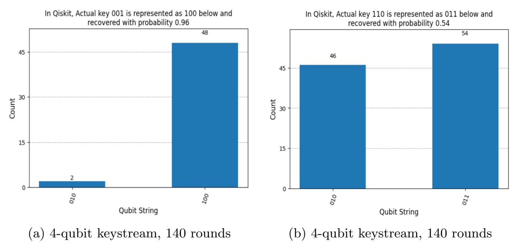

{0}------------------------------------------------

# Grover-Based Quantum Attack on Atom

Sumanta Chakraborty1,2[0000−0003−0260−9891] and SK Hafizul Islam2[0000−0002−2703−0213]

Abstract. In this paper, we present some research on quantum complexity measurements for applying Grover's search algorithm to recover the key of a stream cipher, Atom. As a foundational step, we propose a novel and complete quantum gate-level design of Atom. We incorporate a quantum lookup table to implement the key filtering with a specific decimal counter value during the keystream generation phase, which is absent in the only known previous work on the quantum attack against Atom. Based on the proposed design, we present an algorithm based on Grover's search to recover the key of Atom. Considering the limited qubit capacity of the IBM Qiskit simulator, the proposed search algorithm, with a round-reduced initialization phase, is simulated for 3-qubit key recovery with a probability greater than 0.9. We provide resource estimations for the proposed quantum algorithms. We also perform optimizations on the resources required by the proposed Grover oracle and present a benchmark for Grover's search algorithm on Atom. The research findings in this paper claim that Atom satisfies NIST Level 1 security.

Keywords: Grover's search · Quantum memory management · Quantum lookup table · Quantum cryptanalysis · Stream cipher · Atom.

## 1 Introduction

Quantum cryptanalysis is nowadays very popular among cryptographic research communities. Grover et al. [\[16\]](#page-22-0) design a search algorithm based on quantum mechanical phenomena. Grover's search algorithm finds its application in Symmetric Key Ciphers (SKCs) to successfully find the secret keys. Under the Known Plaintext Attack (KPA) model, Grover's search algorithm reduces the key search time complexity to the square root of the brute-force search time complexity. However, recovering the entire key may not be practically feasible with the current qubit limitations of available quantum processors. The ciphers considered in this research direction are mostly block ciphers (including, but not limited to, [\[15\]](#page-21-0), [\[23\]](#page-22-1), [\[29\]](#page-22-2)), whereas such investigations on stream ciphers are comparatively rare.

<sup>1</sup> Department of Computer Science and Engineering, Techno International New Town, West Bengal, India

<sup>2</sup> Department of Computer Science and Engineering, Indian Institute of Information Technology Kalyani, West Bengal, India {csum1009,hafi786}@gmail.com

{1}------------------------------------------------

Anand et al. [\[2\]](#page-21-1) propose a quantum attack based on Grover's search against Grain-128-AEAD, TinyJAMBU, LIZARD, and Grain-v1, and present the quantum cost estimation of the attack, considering the MAXDEPTH constraint defined by the National Institute of Standards and Technology (NIST). Tiny-JAMBU was one of the 10 final candidates in the lightweight cryptography standardization process[3](#page-1-0) run by NIST. Maitra et al. [\[25\]](#page-22-3) present a work on a chosen-IV-related attack based on Grover's search against Grain-128a, and present quantum resource requirements under NIST's MAXDEPTH constraint, claiming that the attack reduces the required number of IVs to 232. There are significantly few research works on quantum key recovery attacks against dynamic cryptographic primitives. Chakraborty et al. [\[10\]](#page-21-2) propose a quantum implementation of a dynamic stream cipher, LESCA (Lightweight Stream Cipher Algorithm). They provide the quantum cost associated with Grover's search on LESCA under NIST's MAXDEPTH limit. However, their quantum algorithms are directly fed with the permutation tables generated by a modified RC4 cipher because, in order to reduce the cost, they do not provide any quantum implementation of RC4. Nevertheless, LESCA still meets NIST security levels 1, 2, and 3. Chakraborty et al. [\[9\]](#page-21-3) present a quantum analysis of the full-round (1152) Trivium cipher, and provide benchmark quantum costs associated with a Grover's search-based attack against Trivium. They present a simulation of their proposed quantum algorithms to recover up to a 4-qubit key for the full round.

#### 1.1 Motivations and Contributions

This study explores the quantum cryptanalysis of the Atom [\[5\]](#page-21-4), whose architecture is based on a Grain-like structure. With a small state size, Atom targets lower hardware complexity, while its additional key filter maintains security comparable to the Grain family and other Grain-based stream ciphers. To date, no classical attack has been reported against Atom. The major advantage of Atom is the use of the double key filter. One additional key filter makes Atom resistant to the most recent attacks on the ciphers with small states. Atom can resist Time-Memory-Data (TMD) tradeoff attacks, differential attacks, cube attacks, algebraic attacks, and one distinguishing attack.

In this paper, we implement the quantum algorithms of Atom [\[5\]](#page-21-4). To the best of our knowledge, this is the first complete and optimized quantum implementation and analysis of Atom. The optimization is based on the simplification of the h function by reducing its 56 terms, and then the available gate decompositions. This paper incorporates a quantum lookup table in the keystream generation phase to access a key value from the counter in a particular round. This aspect of the quantum lookup table lacks in the previous quantum attack on Atom [\[3\]](#page-21-5). This paper also addresses the bugs in [\[3\]](#page-21-5). The test vectors computed in our implementation match those generated from the Atom source code [\[5\]](#page-21-4). We generate up to 2000 qubits with 511 initialization rounds and implement

<span id="page-1-0"></span><sup>3</sup> [Refer to https://csrc.nist.gov on lightweight-cryptography-round-2-candidates](https://csrc.nist.gov/projects/lightweight-cryptography/round-2-candidates)

{2}------------------------------------------------

the quantum algorithms in IBM Qiskit[4](#page-2-0) on the qBraid[5](#page-2-1) online platform. We use the 'matrix product state' method [\[30\]](#page-22-4) available in IBM Qiskit. We propose a Grover-based search to recover the key of Atom, with 511 and 200 iterations for the initialization and keystream generation phases, respectively. We implement the proposed algorithms in Qiskit, running the initialization phase for 140 rounds and the keystream generation phase for 4 rounds to recover 3 unknown qubits out of 128 key qubits with a probability greater than 0.9, assuming the remaining key qubits are known. We then present detailed quantum resource estimates for the proposed algorithms and the Grover-based key recovery method, and provide benchmarks for quantum cost estimation after optimizing the proposed Grover-based search using the Toffoli gate and multi-controlled NOT gate decompositions [\[1](#page-21-6)[,32\]](#page-23-0). Our findings show that Atom achieves NIST Level 1 security. The source-code for the proposed algorithms is available as open-access[6](#page-2-2) .

#### 1.2 Paper Organization

The subsequent sections are arranged as follows. In Section [2,](#page-2-3) we provide a brief introduction to quantum computation. In Section [3,](#page-3-0) we present a literature survey on Atom, its comparison with other stream ciphers, and the existing quantum attack. In Section [4,](#page-6-0) we present the proposed quantum algorithms for Atom. In Section [5,](#page-14-0) we provide the test cases and thoroughly discuss the simulation results for 3-qubit key recovery with Grover's search. In Section [6,](#page-16-0) we discuss the quantum cost of the proposed algorithm, provide benchmark results for the Atom, and compare it with other ciphers from the aspect of Grover's search. We also provide a detailed comparison with the previous work [\[3\]](#page-21-5) in Section [7.](#page-19-0) In Section [8,](#page-20-0) we present concluding remarks and future research directions.

## <span id="page-2-3"></span>2 Brief Overview of Quantum Computation

A qubit is the smallest quantum system, which can exist in 0, 1, or both states. Superposition, entanglement, interference, and decoherence are the four fundamental principles of quantum mechanics that quantum computation exploits. A quantum gate operates on qubit(s). In this paper, we use some basic quantum gates along with a multi-controlled X gates (MCX gates) [\[9\]](#page-21-3). Algorithms [1](#page-3-1) and [2](#page-3-2) show the decomposition of 3-controlled and 4-controlled X gates into 3 and 5 Toffoli gates, respectively, based on some available resources[7](#page-2-4) , [8](#page-2-5) . An MCX gate can be decomposed into (2m − 3) number of Toffoli gates, using (m − 2) ancilla qubits where m is the number of control qubits.

<span id="page-2-0"></span><sup>4</sup> <https://www.ibm.com/quantum/qiskit>

<span id="page-2-1"></span><sup>5</sup> <https://www.qbraid.com/>

<span id="page-2-2"></span><sup>6</sup> [https://github.com/sumanta1009/Atom\\_Grover](https://github.com/sumanta1009/Atom_Grover)

<span id="page-2-4"></span><sup>7</sup> [quantumcomputing.stackexchange.com on MCTs and their implementation in Qiskit](https://quantumcomputing.stackexchange.com/questions/35119/questions-on-multi-controlled-toffolis-and-their-implementation-in-qiskit)

<span id="page-2-5"></span><sup>8</sup> [algassert.com/circuits on large CNOT gates](https://algassert.com/circuits/2015/06/05/Constructing-Large-Controlled-Nots.html)

{3}------------------------------------------------

#### <span id="page-3-1"></span>**Algorithm 1** Implementation of 3-controlled X gate

```
1: procedure MCX3_DECOMPOSED(qc, control_{list}, target, ancilla)
2: ctrl_0, ctrl_1, ctrl_2 \leftarrow control_{list}
3: Toffoli(ctrl_0, ctrl_1, ancilla)
4: Toffoli(ancilla, ctrl_2, target)
5: Toffoli(ctrl_0, ctrl_1, ancilla) \triangleright Uncompute ancilla
6: end procedure
```

#### <span id="page-3-2"></span>**Algorithm 2** Implementation of 4-controlled X gate

```
1: procedure MCX4_DECOMPOSED(qc, control_{list}, target, ancilla_{list})
        ctrl_0, ctrl_1, ctrl_2, ctrl_3 \leftarrow control_{list}
2:
        anc_0, anc_1 \leftarrow ancilla_{list}
3:
        Toffoli(ctrl_0, ctrl_1, anc_0)
4:
        Toffoli(anc_0, ctrl_2, anc_1)
5:
        Toffoli(anc_1, ctrl_3, target)
6:
7:
        Toffoli(anc_0, ctrl_2, anc_1)
                                                                            \triangleright Uncompute anc_1
                                                                            \triangleright Uncompute anc_0
        Toffoli(ctrl_0, ctrl_1, anc_0)
8:
9: end procedure
```

Grover's search [16] is the fastest possible search algorithm designed by Lov Kumar Grover. Given an unsorted database of N items, this algorithm finds the search element in  $O(\sqrt{N})$  time. In an n-qubit quantum system, there are  $N=2^n$  number of possible states, each states having n qubits. Grover's search iterates for  $\lfloor \frac{\pi}{4} \sqrt{N} \rfloor$  times [7] to obtain the search state  $(s_0)$  with high probability. In each iteration, Grover's oracle negates the probability amplitude of  $s_0$ , which is increased by Grover's diffusion. Readers may refer to [2] for further detail of Grover's search and its application on stream ciphers.

## <span id="page-3-0"></span>3 Brief Overview of Atom

Atom is a Grain-like stream cipher [5], which is designed as a combination of both Linear Feedback Shift Register (LFSR) and Non-linear Feedback Shift Register (NFSR). The NFSR of 90 bits is XORed with the LFSR of 69 bits. For any particular round r, the NFSR is denoted by  $N^r = (n_0^r, n_1^r, \dots, n_{89}^r)$  and the LFSR is denoted by  $L^r = (l_0^r, l_1^r, \dots, l_{68}^r)$ . The output function,  $O(N^r, L^r)$ , of Atom is defined in Eq. 1. However, in the source code<sup>9</sup> shared by the Atom designers, Eq. 1 is redefined in Eq. 3, where  $l_{67}^r$  and  $l_{62}^r$  are replaced with  $C_7^r$  and  $C_2^r$ , respectively. The C array of 9 bits is obtained from Eq. 2.

<span id="page-3-3"></span>
$$O(N^r, L^r) = n_1^r \oplus n_5^r \oplus n_{11}^r \oplus n_{22}^r \oplus n_{36}^r \oplus n_{53}^r \oplus n_{72}^r \oplus n_{80}^r \oplus n_{84}^r \oplus l_5^r l_{16}^r \\ \oplus l_{13}^r l_{15}^r \oplus l_{30}^r l_{42}^r \oplus l_{22}^r l_{67}^r \oplus h(l_7^r, l_{33}^r, l_{38}^r, l_{50}^r, l_{59}^r, l_{62}^r, n_{85}^r, n_{41}^r, n_9^r)$$
(1)

<span id="page-3-5"></span>
$$C_{8-i}^r = (r \gg i) \land 1$$
, where  $i = 0, 1, \dots, 8$  (2)

<span id="page-3-4"></span><sup>9</sup> https://github.com/qantik/atom

{4}------------------------------------------------

<span id="page-4-0"></span>
$$O_{init}(N^r, L^r) = n_1^r \oplus n_5^r \oplus n_{11}^r \oplus n_{22}^r \oplus n_{36}^r \oplus n_{53}^r \oplus n_{72}^r \oplus n_{80}^r \oplus n_{84}^r \oplus l_{13}^r l_{15}^r \oplus l_{30}^r l_{42}^r \oplus C_7^r l_{22}^r \oplus h(l_7^r, l_{33}^r, l_{38}^r, l_{50}^r, l_{59}^r, C_2^r, n_{85}^r, n_{41}^r, n_9^r)$$
(3)

The function, h(Q) is defined in Eq. 4, where Q is a set of 9 bits  $(q_0, q_1, \dots, q_8)$ . The update functions,  $G(N^r)$  and  $F(L^r)$  on NFSR and LFSR, respectively are defined in Eqs. 5 and 6, respectively.

 $h(Q) = q_0q_1q_2q_7q_8 \oplus q_0q_1q_2q_7 \oplus q_0q_1q_2q_8 \oplus q_0q_1q_3q_7q_8 \oplus q_0q_1q_3q_7 \oplus q_0q_1q_4q_7q_8$   $\oplus q_0q_1q_4q_7 \oplus q_0q_1q_4q_8 \oplus q_0q_1q_4 \oplus q_0q_1q_5q_7q_8 \oplus q_0q_1q_5q_7 \oplus q_0q_1q_6q_7q_8 \oplus q_0q_1q_6q_8 \oplus q_0q_1q_7q_8$   $\oplus q_0q_1q_8 \oplus q_0q_2q_3q_7q_8 \oplus q_0q_2q_3q_7 \oplus q_0q_2q_3q_8 \oplus q_0q_2q_3 \oplus q_0q_2q_4q_7q_8 \oplus q_0q_2q_4q_8 \oplus q_0q_2q_5q_7q_8$   $\oplus q_0q_2q_5q_7 \oplus q_0q_2q_5q_8 \oplus q_0q_2q_5 \oplus q_0q_2q_6q_7q_8 \oplus q_0q_2q_6q_8 \oplus q_0q_2q_7q_8 \oplus q_0q_2q_8 \oplus q_0q_3q_4q_7q_8$   $\oplus q_0q_3q_4q_7 \oplus q_0q_3q_5q_7q_8 \oplus q_0q_3q_5q_7 \oplus q_0q_3q_6q_7q_8 \oplus q_0q_3q_6q_7 \oplus q_0q_3q_8 \oplus q_0q_3 \oplus q_0q_4q_5q_7q_8$   $\oplus q_0q_4q_5q_7 \oplus q_0q_4q_6q_7q_8 \oplus q_0q_4q_6q_8 \oplus q_0q_4q_7 \oplus q_0q_4 \oplus q_0q_5q_6q_7q_8 \oplus q_0q_5q_6q_7 \oplus q_0q_5q_7q_8$   $\oplus q_0q_5q_7 \oplus q_0q_6q_7 \oplus q_0q_6q_8 \oplus q_0q_7q_8 \oplus q_1q_2q_3q_7q_8 \oplus q_1q_2q_4q_7q_8 \oplus q_1q_2q_4q_8 \oplus q_1q_2q_5q_7q_8$   $\oplus q_1q_2q_6q_7q_8 \oplus q_1q_2q_6q_8 \oplus q_1q_2q_7 \oplus q_1q_2q_8 \oplus q_1q_2\phi q_1q_3q_4q_7q_8 \oplus q_1q_3q_5q_7q_8 \oplus q_1q_3q_6q_7q_8$   $\oplus q_1q_3q_7 \oplus q_1q_4q_5q_7q_8 \oplus q_1q_4q_5q_8 \oplus q_1q_4q_6q_7q_8 \oplus q_1q_4q_7 \oplus q_1q_4 \oplus q_1q_5q_6q_7q_8 \oplus q_1q_5q_6q_7q_8$   $\oplus q_1q_5q_7q_8 \oplus q_1q_5q_7 \oplus q_1q_5q_8 \oplus q_1q_4q_6q_7 \oplus q_1q_4q_7 \oplus q_1q_4 \oplus q_1q_5q_6q_7q_8 \oplus q_2q_3q_6q_7q_8$   $\oplus q_2q_4q_5q_7q_8 \oplus q_2q_4q_5q_8 \oplus q_1q_6q_7 \oplus q_1q_8 \oplus q_1 \oplus q_2q_3q_4q_7q_8 \oplus q_2q_3q_5q_7q_8 \oplus q_2q_3q_6q_7q_8$   $\oplus q_2q_4q_5q_7q_8 \oplus q_2q_4q_5q_8 \oplus q_2q_4q_6q_7q_8 \oplus q_2q_4q_7q_8 \oplus q_2q_4q_8 \oplus q_2q_5q_6q_7q_8 \oplus q_2q_5q_8$   $\oplus q_2q_6q_7q_8 \oplus q_2q_6q_8 \oplus q_2q_4q_6q_7q_8 \oplus q_2q_4q_7q_8 \oplus q_2q_4q_5q_7q_8 \oplus q_2q_5q_6q_8 \oplus q_2q_5q_8$   $\oplus q_2q_6q_7q_8 \oplus q_2q_6q_8 \oplus q_2q_7q_8 \oplus q_2 \oplus q_3q_4q_5q_7q_8 \oplus q_2q_4q_5q_7q_8 \oplus q_2q_5q_6q_7q_8 \oplus q_2q_5q_8$   $\oplus q_2q_6q_7q_8 \oplus q_2q_6q_8 \oplus q_2q_7q_8 \oplus q_2 \oplus q_3q_4q_5q_7q_8 \oplus q_2q_4q_5q_7q_8 \oplus q_2q_5q_6q_8 \oplus q_2q_5q_8$   $\oplus q_2q_6q_7q_8 \oplus q_2q_6q_8 \oplus q_2q_7q_8 \oplus q_2 \oplus q_3q_4q_5q_7q_8 \oplus q_3q_4q_5q_7q_8 \oplus q_3q_4q_5q_7q_8 \oplus q_3q_4q_6q_7q_8$   $\oplus q_3q_5q_6q_7q_8 \oplus q_3q_5q_7q_8 \oplus q_3q_6q_7q_8 \oplus q_3q_6q_7\theta_3q_4q_5q_7q_8 \oplus q_3q_4q_5q_7q_8 \oplus q_3q_6q_7q_8 \oplus q_3q_6q_7q_8 \oplus q_3q_6q_7q_8 \oplus q_3q_6q_7q_8 \oplus q_3q_6q_7q_8 \oplus q_3q_$ 

<span id="page-4-1"></span>
$$\oplus q_4q_6q_8 \oplus q_4q_7 \oplus q_5q_7q_8 \oplus q_5 \oplus q_6 \oplus q_7q_8 \oplus q_7 \oplus q_8 \oplus 1 \quad (4)$$

<span id="page-4-3"></span><span id="page-4-2"></span>
$$G(N^r) = n_0^r \oplus n_{24}^r \oplus n_{49}^r \oplus n_{79}^r \oplus n_{84}^r \oplus n_{3}^r n_{59}^r \oplus n_{10}^r n_{12}^r \oplus n_{15}^r n_{16}^r \oplus n_{25}^r n_{53}^r \\ \oplus n_{35}^r n_{42}^r \oplus n_{55}^r n_{58}^r \oplus n_{60}^r n_{74}^r \oplus n_{20}^r n_{22}^r n_{23}^r \oplus n_{62}^r n_{68}^r n_{72}^r \oplus n_{77}^r n_{80}^r n_{81}^r n_{83}^r \end{cases}$$
(5)

$$F(L^r) = l_0^r \oplus l_5^r \oplus l_{12}^r \oplus l_{22}^r \oplus l_{28}^r \oplus l_{37}^r \oplus l_{45}^r \oplus l_{58}^r \tag{6}$$

#### 3.1 Initialization Phase

At round 0, the NFSR,  $N^0 = (n_0^0, n_1^0, \cdots, n_{89}^0)$ , is fed with the first 90 bits of IV, and the first 38 LFSR bits,  $L^0 = (l_0^0, l_1^0, \cdots, l_{37}^0)$ , are fed with the remaining 38 bits of IV. The next 22 LFSR bits, i.e.,  $l_{38}^0, l_{39}^0, \cdots, l_{59}^0$  are padded with all 1's. The remaining 9 LFSR bits, i.e.,  $l_{60}^0, l_{61}^0, \cdots, l_{68}^0$  are initialized with 0's. These last 9 LFSR bits entirely act as a decimal up-counter. After the initialization of the LFSR and the NFSR, some particular bits of the NFSR and LFSR are updated (Eqs. 7–12) for every round r, where  $0 \le r \le 510$ .

<span id="page-4-4"></span>
$$z^r = O_{init}(N^r, L^r) (7)$$

<span id="page-4-5"></span>
$$count = l_{62}^r \parallel l_{63}^r \parallel l_{64}^r \parallel l_{65}^r \parallel l_{66}^r \parallel l_{67}^r \parallel l_{68}^r$$
 (8)

<span id="page-4-6"></span>
$$n_{89}^{r+1} = G(N^r) \oplus l_0^r \oplus key_{count} \oplus z^r \tag{9}$$

where Key is defined as  $key = key_0, key_1, \dots, key_{127}$ 

{5}------------------------------------------------

<span id="page-5-7"></span>
$$n_i^{r+1} = n_{i+1}^r$$
, where  $i = 0, 1, \dots, 88$  (10)

$$l_{59}^{r+1} = F(L^r) \oplus z^r \tag{11}$$

<span id="page-5-0"></span>
$$l_i^{r+1} = l_{i+1}^r$$
, where  $i = 0, 1, \dots, 58$  (12)

As given in Eq. 8, the last 7 LFSR bits  $(l_{62}^0, l_{63}^0, \cdots, l_{68}^0)$  together represent a decimal number which is stored in the 'count' variable. The particular key bit  $(key_{count})$  at the count index is used to update the last NFSR bits as defined in Eq. 9. However, in the source code shared by the Atom designers,  $key_{rnd\%128}$  is used in place of  $key_{count}$  in Eq. 9. We follow the source code specification. Also, according to the source code, Eq. 13 is implemented only once after 511 rounds (starting from 0) where (r+1) is 511. Since the number of rounds in the initialization phase is 511, at the end of 511 rounds the 9 LFSR bits are all 1's  $(2^8 \times 1 + 2^7 \times 1 + \cdots + 2^0 \times 1 = 511)$ .

<span id="page-5-1"></span>
$$l_{i+60}^{r+1} = ((r+1) \gg (8-i)) \wedge 1$$
, where  $i = 0, 1, \dots, 8$  (13)

#### 3.2 Keystream Generation Phase

At every round  $r \geq 511$  of the keystream generation phase,  $Z^r$  is the generated keystream bit obtained from Eq. 14, where  $Z^{511}$  is the first keystream bit. During the keystream generation phase, the last 7 LFSR bits together act as a decimal up-counter (Eq. 15). At every round r, some particular NFSR and LFSR bits are updated in Eqs. 16–19. According to the authors, from a given key-IV pair, the number of generated keystream bits is limited to  $2^{64}$  bits.

<span id="page-5-2"></span>
$$Z^r = O(N^r, L^r) \tag{14}$$

<span id="page-5-3"></span>
$$count = l_{62}^r \parallel l_{63}^r \parallel l_{64}^r \parallel l_{65}^r \parallel l_{66}^r \parallel l_{67}^r \parallel l_{68}^r$$
 (15)

<span id="page-5-4"></span>
$$n_{89}^{r+1} = G(N^r) \oplus l_0^r \oplus key_{count} \oplus key_{r\%128}$$

$$\tag{16}$$

<span id="page-5-8"></span>
$$n_i^{r+1} = n_{i+1}^r$$
, where  $i = 0, 1, \dots, 88$  (17)

$$l_{68}^{r+1} = F(L^r) (18)$$

<span id="page-5-5"></span>
$$l_i^{r+1} = l_{i+1}^r$$
, where  $i = 0, 1, \dots, 67$  (19)

We present a survey in Table 1 that shows a comparison 10 provided by the Atom designers on Atom with some stream ciphers, like Grain-v1 [18], Trivium [8], Sprout [4], Lizard [17], Grain-128 [26], AES-CTR [11]. Sprout and Lizard are stream ciphers designed with Grain-like architecture.

<span id="page-5-6"></span>The hardware comparison is performed in [5], using TSMC 28 nm process

{6}------------------------------------------------

<span id="page-6-1"></span>

| Cipher         | Key    | IV     | State  | Area        | Latency | Throughput | Power     | Energy |
|----------------|--------|--------|--------|-------------|---------|------------|-----------|--------|
|                | (bits) | (bits) | (bits) | $(\mu m^2)$ | (ns)    | (Mbit/s)   | $(\mu W)$ | (pJ)   |
| Atom [5]       | 128    | 128    | 159    | 720.61      | 0.93    | 1075.27    | 121       | 1.25   |
| Grain-v1 [18]  | 80     | 64     | 160    | 493.53      | 0.81    | 1234.57    | 101       | 1.04   |
| Trivium [8]    | 80     | 80     | 288    | 730.74      | 0.61    | 1639.34    | 163       | 1.68   |
| Sprout [4]     | 80     | 70     | 80     | 333.27      | 0.50    | 2000.00    | 60.8      | 0.62   |
| Lizard [17]    | 120    | 64     | 121    | 596.93      | 0.92    | 1086.96    | 86.9      | 0.89   |
| Grain-128 [26] | 128    | 96     | 256    | 736.77      | 0.57    | 1754.39    | 155       | 1.60   |
| AES-CTR [11]   | 128    | 128    | 288    | 1054.3      | 1.62    | 448.93     | 254       | 3.49   |

Table 1: Comparison of Atom with other stream ciphers

#### 3.3 Existing quantum attacks on Atom

In 2023, Anand et al. [3] propose the first quantum analysis of Atom. They present their quantum algorithms to implement the initialization and the keystream generation phases. However, their work does not show any quantum implementation to obtain the counter values, which are provided as the indices to the key for a particular round of the keystream generation phase. They show the quantum cost of their algorithms and present the security analysis of Atom against Grover's search-based attacks and quantum TMD tradeoff attacks [27].

## <span id="page-6-0"></span>4 Proposed Quantum Algorithms for Atom

This section discusses the proposed quantum algorithms to implement Atom. To execute the Grover search—based key-recovery attack on Atom, the Grover oracle calls its encryption process twice, with the second call performed in reverse order. The attack proposed in this paper falls under the Q1 model [6] with classical queries.

#### <span id="page-6-3"></span>4.1 Quantum Algorithms for implementing Atom

The implementation of the two phases requires 8 quantum registers  $(l, b, key, c, z, z_1, ancilla, ancilla_h)$  to store the qubit values for LFSR, NFSR, Key, C,  $Z^r$ 's  $(r = 0, \dots, 510)$ ,  $Z^r$ 's (representing keystream qubits for rest  $r = 511, \dots, 511$ +keystream size), ancilla to implement MCX3\_DECOMPOSED (Algorithm 1) and MCX4\_DECOMPOSED (Algorithm 2) functions, ancilla\_h to implement the h function, respectively. The sizes of the registers l, b, key, c, z, ancilla, and  $ancilla_h$ , in terms of the number of qubits, are 69, 90, 128, 2, 511, 2, and 16, respectively. The size of  $z_1$  equals the keystream size. The 128-bit binary variables,  $Key\_bin$  and  $IV\_bin$  represent the Key and the IV values, respectively.

## <span id="page-6-2"></span>Algorithm 3 Setting up LFSR, NFSR & Key

- 1: procedure LFSR\_NFSR\_KEY\_SETUP
- 2: Take Key\_bin to represent 128-bit binary Key values

{7}------------------------------------------------

```
3: Take IV bin to represent 128-bit binary IV values
4: for i ← 0 to 127 do ▷ Key Initialization
5: if Key bini == "1" then
6: NOT(keyi)
7: end if
8: end for
9: for i ← 0 to 89 do ▷ IV Initialization
10: if IV bini == "1" then
11: NOT(bi)
12: end if
13: end for
14: for i ← 0 to 37 do ▷ IV Initialization
15: if IV bini+90 == "1" then
16: NOT(li)
17: end if
18: end for
19: for i ← 38 to 59 do ▷ Padding 22 1's
20: NOT(li)
21: end for
22: end procedure
```

A simplified version of h(Q), redefined in Eq [20,](#page-7-0) reduces 114 terms into 58 terms. There are some terms containing 3, 4, 5 variables, for example, the term, 'q0q1q5q7q8' containing 5 variables. In place of directly using m-controlled X gates (m = 3, 4, 5), Toffoli and CNOT gates are used in Algorithm [4.](#page-7-1) For this purpose, we decompose higher-order terms into smaller terms, and we call mcx3 decomposed and mcx4 decomposed procedures of Algorithms [1](#page-3-1) and [2,](#page-3-2) respectively. We use 16 ancilla qubits to store 16 common sub-expressions of two variables present in the 58 terms. For example, q0q<sup>1</sup> is a common sub-expression in 5 terms (q0q1q6q7q8, q0q1q2q7q8, q0q1q4q7q8, q0q1q3q7q8, and q0q1q5q7q8). Now, we show how the first term in Eq [20](#page-7-0) is decomposed into smaller terms. Algorithm [4](#page-7-1) shows that a<sup>0</sup> gets q0q<sup>1</sup> at line [3,](#page-7-1) a<sup>3</sup> gets q7q<sup>8</sup> at line [11.](#page-7-1) At line [26,](#page-7-1) yout gets q0q1q6q7q8. In this manner, we compute the remaining terms. In lines [94,](#page-7-1) [96,](#page-7-1) [99,](#page-7-1) and lines [101–112,](#page-7-1) we uncompute the ancillas.

<span id="page-7-1"></span><span id="page-7-0"></span>h(Q) = q0q1q6q7q8⊕q0q2q6q7q8⊕q0q5q6q7q8⊕q1q5q6q7q8⊕q2q4q6q7q8⊕q3q5q6q7q<sup>8</sup> ⊕q0q3q8⊕q1q2q8⊕q0q4q7⊕q1q4q7⊕q3q7⊕q1q5q8⊕q2q5q6q7q8⊕q4q5q6q7q8⊕q0q1q2q7q<sup>8</sup> ⊕q0q1q4q7q8⊕q0q1q3q7q8⊕q0q1q5q7q8⊕q0q2q3q7q8⊕q0q2q4q7q8⊕q0q2q5q7q8⊕q0q3q4q7q<sup>8</sup> ⊕q0q3q5q7q8⊕q0q3q6q7q8⊕q0q4q5q7q8⊕q0q4q6q7q8⊕q0q6q7⊕q0q6q8⊕q0q7q8⊕q1q2q3q7q<sup>8</sup> ⊕q1q2q4q7q8⊕q1q2q5q7q8⊕q1q2q6q7q8⊕q1q2q7⊕q1q3q4q7q8⊕q1q3q5q7q8⊕q1q3q6q7q<sup>8</sup> ⊕q1q3q7⊕q1q4q5q7q8⊕q1q4q6q7q8⊕q1q6q7⊕q1⊕q2q3q4q7q8⊕q2q3q5q7q8⊕q2q3q6q7q<sup>8</sup> ⊕q2q4q5q7q8⊕q2q4q8⊕q2q5q8⊕q2q7q8⊕q2⊕q3q4q5q7q8⊕q3q4q6q7q8⊕q3q6q7q8⊕q7q<sup>8</sup> ⊕ q4q<sup>7</sup> ⊕ q5q7q<sup>8</sup> ⊕ q<sup>5</sup> ⊕ q<sup>6</sup> (20)

{8}------------------------------------------------

#### **Algorithm 4** Implementation of h function

```
1: procedure h_{\text{FUNC}}(q_0, q_1, q_2, q_3, q_4, q_5, q_6, q_7, q_8, ancilla_h, y_{out})
         a_0,\,a_1,\,a_2,\,a_3,\,a_4,\,a_5,\,a_6,\,a_7,\,a_8,\,a_9,\,a_{10},\,a_{11},\,a_{12},\,a_{13},\,a_{14},\,a_{15}\leftarrow ancilla_h
 2:
         Toffoli(q_0, q_1, a_0)
 3:
                                                                               \triangleright Complement of q_7
 4:
         NOT(q_7)
                                                                               \triangleright Complement of q_8
         NOT(q_8)
 5:
 6:
         Toffoli(q_7, q_8, a_1)
 7:
         NOT(q_7)
                                                                                    \triangleright Uncompute q_7
         Toffoli(q_7, q_8, a_2)
 8:
                                                                               \triangleright Complement of q_7
 9:
         NOT(q_7)
         NOT(q_8)
                                                                                    \triangleright Uncompute q_8
10:
         Toffoli(q_7, q_8, a_3)
11:
12:
         NOT(q_7)
                                                                                    \triangleright Uncompute q_7
         Toffoli(q_0, q_2, a_4)
13:
         Toffoli(q_0, q_3, a_5)
14:
         Toffoli(q_0, q_4, a_6)
15:
         Toffoli(q_0, q_5, a_7)
16:
17:
         Toffoli(q_0, q_6, a_8)
         Toffoli(q_7, q_8, a_9)
18:
         Toffoli(q_1, q_2, a_{10})
19:
         Toffoli(q_1, q_3, a_{11})
20:
         Toffoli(q_1, q_4, a_{12})
21:
         Toffoli(q_2, q_3, a_{13})
22:
23:
         Toffoli(q_2, q_4, a_{14})
         Toffoli(q_3, q_4, a_{15})
24:
25:
         NOT(q_6)
                                                                               \triangleright Complement of q_6
         MCX3\_DECOMPOSED(qc, [a_0, q_6, a_3], y_{out}, ancilla_0)
26:
         MCX3\_DECOMPOSED(qc, [a_4, q_6, a_3], y_{out}, ancilla_0)
27:
         MCX3\_DECOMPOSED(qc, [a_7, q_6, a_2], y_{out}, ancilla_0)
28:
         MCX4\_DECOMPOSED(qc, [q_1, q_5, q_6, a_2], y_{out}, ancilla)
29:
         MCX3\_DECOMPOSED(qc, [a_{14}, q_6, a_9], y_{out}, ancilla_0)
30:
         MCX4\_DECOMPOSED(qc, [q_3, q_5, q_6, a_9], y_{out}, ancilla)
31:
         NOT(q_6)
32:
                                                                                    \triangleright Uncompute q_6
         NOT(q_8)
                                                                               \triangleright Complement of q_8
33:
34:
         Toffoli(a_5, q_8, y_{out})
35:
         Toffoli(a_{10}, q_8, y_{out})
                                                                                    \triangleright Uncompute q_8
         NOT(q_8)
36:
         NOT(q_7)
                                                                               \triangleright Complement of q_7
37:
         Toffoli(a_6, q_7, y_{out})
38:
         Toffoli(a_{12}, q_7, y_{out})
39:
         Toffoli(q_3, q_7, y_{out})
40:
         NOT(q_7)
                                                                                    \triangleright Uncompute q_7
41:
         NOT(q_5)
                                                                              \triangleright Complement of q_5
42:
         \text{MCX3\_DECOMPOSED}(qc, [q_1, q_5, q_8], y_{out}, ancilla_0)
43:
         MCX4\_DECOMPOSED(qc, [q_2, q_5, q_6, a_3], y_{out}, ancilla)
44:
```

{9}------------------------------------------------

```
MCX4\_DECOMPOSED(qc, [q_4, q_5, q_6, a_3], y_{out}, ancilla)
45:
        NOT(q_5)
46:
                                                                           \triangleright Uncompute q_5
        MCX3\_DECOMPOSED(qc, [a_0, q_2, a_1], y_{out}, ancilla_0)
47:
        MCX3\_DECOMPOSED(qc, [a_0, q_4, a_1], y_{out}, ancilla_0)
48:
        MCX3\_DECOMPOSED(qc, [a_0, q_3, a_2], y_{out}, ancilla_0)
49:
        MCX3\_DECOMPOSED(qc, [a_0, q_5, a_2], y_{out}, ancilla_0)
50:
        MCX3\_DECOMPOSED(qc, [a_4, q_3, a_1], y_{out}, ancilla_0)
51:
        MCX3\_DECOMPOSED(qc, [a_4, q_4, a_3], y_{out}, ancilla_0)
52:
        MCX3\_DECOMPOSED(qc, [a_4, q_5, a_1], y_{out}, ancilla_0)
53:
        MCX3\_DECOMPOSED(qc, [a_5, q_4, a_2], y_{out}, ancilla_0)
54:
        MCX3\_DECOMPOSED(qc, [a_5, q_5, a_2], y_{out}, ancilla_0)
55:
        MCX3\_DECOMPOSED(qc, [a_5, q_6, a_2], y_{out}, ancilla_0)
56:
        MCX3\_DECOMPOSED(qc, [a_6, q_5, a_2], y_{out}, ancilla_0)
57:
58:
        MCX3\_DECOMPOSED(qc, [a_6, q_6, a_3], y_{out}, ancilla_0)
59:
        Toffoli(a_8, q_7, y_{out})
        Toffoli(a_8, q_8, y_{out})
60:
61:
        Toffoli(q_0, a_9, y_{out})
        MCX3\_DECOMPOSED(qc, |a_{10}, q_3, a_9|, y_{out}, ancilla_0)
62:
        MCX3\_DECOMPOSED(qc, [a_{10}, q_4, a_3], y_{out}, ancilla_0)
63:
        MCX3\_DECOMPOSED(qc, [a_{10}, q_5, a_9], y_{out}, ancilla_0)
64:
65:
        MCX3\_DECOMPOSED(qc, |a_{10}, q_{6}, a_{3}|, y_{out}, ancilla_{0})
        Toffoli(a_{10}, q_7, y_{out})
66:
        MCX3\_DECOMPOSED(qc, [a_{11}, q_4, a_9], y_{out}, ancilla_0)
67:
68:
        MCX3\_DECOMPOSED(qc, [a_{11}, q_5, a_9], y_{out}, ancilla_0)
        MCX3\_DECOMPOSED(qc, [a_{11}, q_6, a_9], y_{out}, ancilla_0)
69:
70:
        Toffoli(a_{11}, q_7, y_{out})
        MCX3\_DECOMPOSED(qc, [a_{12}, q_5, a_3], y_{out}, ancilla_0)
71:
        MCX3\_DECOMPOSED(qc, [a_{12}, q_6, a_9], y_{out}, ancilla_0)
72:
        MCX3\_DECOMPOSED(qc, [q_1, q_6, q_7], y_{out}, ancilla_0)
73:
        CNOT(q_1, y_{out})
74:
        MCX3\_DECOMPOSED(qc, [a_{13}, q_4, a_9], y_{out}, ancilla_0)
75:
        MCX3\_DECOMPOSED(qc, [a_{13}, q_5, a_9], y_{out}, ancilla_0)
76:
        MCX3\_DECOMPOSED(qc, [a_{13}, q_6, a_9], y_{out}, ancilla_0)
77:
        MCX3\_DECOMPOSED(qc, [a_{14}, q_5, a_3], y_{out}, ancilla_0)
78:
        Toffoli(a_{14}, q_8, y_{out})
79:
        MCX3\_DECOMPOSED(qc, [q_2, q_5, q_8], y_{out}, ancilla_0)
80:
        Toffoli(q_2, a_9, y_{out})
81:
82:
        CNOT(q_2, y_{out})
        MCX3\_DECOMPOSED(qc, [a_{15}, q_5, a_2], y_{out}, ancilla_0)
83:
        \text{MCX3\_DECOMPOSED}(qc, [a_{15}, q_6, a_2], y_{out}, ancilla_0)
84:
        MCX3\_DECOMPOSED(qc, [q_3, q_6, a_2], y_{out}, ancilla_0)
85:
        CNOT(a_1, y_{out})
86:
        Toffoli(q_4, q_7, y_{out})
87:
        Toffoli(q_5, a_9, y_{out})
88:
        CNOT(q_5, y_{out})
89:
```

{10}------------------------------------------------

```
90: CNOT(q6, yout)
91: Toffoli(q0, q1, a0)
92: NOT(q7) ▷ Complement of q7
93: NOT(q8) ▷ Complement of q8
94: Toffoli(q7, q8, a1)
95: NOT(q7) ▷ Uncompute q7
96: Toffoli(q7, q8, a2)
97: NOT(q7) ▷ Complement of q7
98: NOT(q8) ▷ Uncompute q8
99: Toffoli(q7, q8, a3)
100: NOT(q7) ▷ Uncompute q7
101: Toffoli(q0, q2, a4)
102: Toffoli(q0, q3, a5)
103: Toffoli(q0, q4, a6)
104: Toffoli(q0, q5, a7)
105: Toffoli(q0, q6, a8)
106: Toffoli(q7, q8, a9)
107: Toffoli(q1, q2, a10)
108: Toffoli(q1, q3, a11)
109: Toffoli(q1, q4, a12)
110: Toffoli(q2, q3, a13)
111: Toffoli(q2, q4, a14)
112: Toffoli(q3, q4, a15)
113: end procedure
```

Algorithms [5](#page-10-0) and [6](#page-11-0) present the quantum implementation of the Output functions used in the initialization and the keystream generation phases, respectively. The quantum algorithms of the update functions, G func(b) and F func(l) are presented in Algorithms [7](#page-11-1) and [8,](#page-11-2) respectively. Algorithm [8](#page-11-2) is similar to [\[3\]](#page-21-5). Algorithm [9](#page-11-3) describes the quantum implementation of the initialization phase.

## <span id="page-10-0"></span>Algorithm 5 Implementation of Output function (initialization phase)

```
1: procedure Output init(z, c0, c1)
2: for i ← 1, 5, 11, 22, 36, 53, 72, 80, 84 do
3: CNOT(bi
                  , z)
4: end for
5: x ← [5, 13, 30]
6: y ← [16, 15, 42]
7: for i ← 0 to 2 do
8: Toffoli(lxi
                   , lyi
                      , z)
9: end for
10: Toffoli(l22, c1, z)
11: h func(l7, l33, l38, l50, l59, c0, b85, b41, b9, ancillah, z)
12: end procedure
```

{11}------------------------------------------------

# <span id="page-11-0"></span>**Algorithm 6** Implementation of Output function (keystream generation phase)

```
1: procedure OUTPUT_KS(z_1)
         for i \leftarrow 1, 5, 11, 22, 36, 53, 72, 80, 84 do
 2:
             CNOT(b_i, z_1)
 3:
         end for
 4:
         x \leftarrow [5, 13, 30, 22]
 5:
 6:
         y \leftarrow [16, 15, 42, 67]
         for i \leftarrow 0 to 3 do
 7:
             \text{Toffoli}(l_{x_i}, l_{y_i}, z_1)
 8:
         end for
 9:
         h_FUNC(l_7, l_{33}, l_{38}, l_{50}, l_{59}, l_{62}, b_{85}, b_{41}, b_9, ancilla_h, z_1)
10:
11: end procedure
```

## <span id="page-11-1"></span>**Algorithm 7** Implementation of update function $(G_{\text{-FUNC}}(b))$

```
1: procedure G_{\text{-}}FUNC(b)
        for i \leftarrow 24, 49, 79, 84 do
 2:
             CNOT(b_i, b_0)
 3:
        end for
 4:
        x \leftarrow [3, 10, 15, 25, 35, 55, 60]
 5:
        y \leftarrow [59, 12, 16, 53, 42, 58, 74]
 6:
 7:
        for i \leftarrow 0 to 6 do
             Toffoli(b_{x_i}, b_{y_i}, b_0)
 8:
 9:
        end for
        MCX3\_DECOMPOSED(qc, [b_{20}, b_{22}, b_{23}], b_0, ancilla_0)
10:
        MCX3\_DECOMPOSED(qc, [b_{62}, b_{68}, b_{72}], b_0, ancilla_0)
11:
        MCX4\_DECOMPOSED(qc, [b_{77}, b_{80}, b_{81}, b_{83}], b_0, ancilla)
12:
13: end procedure
```

## <span id="page-11-2"></span>**Algorithm 8** Implementation of update function $(F_{\text{FUNC}}(l))$

```
1: procedure F_{\text{-FUNC}}(l)

2: for i \leftarrow 5, 12, 22, 28, 37, 45, 58 do

3: CNOT(l_i, l_0)

4: end for

5: end procedure
```

#### <span id="page-11-3"></span>**Algorithm 9** Implementation of the initialization phase

```
1: procedure INITIALIZATION
2: for round \leftarrow 0 to 510 do
3: C \leftarrow [0] * 9
4: for i \leftarrow 0 to 8 do
5: C_{8-i} = (round \gg i) \& 1
6: end for
```

{12}------------------------------------------------

```
7:
             if C_2 == 1 then
                 NOT(c_0)
 8:
             end if
 9:
             if C_7 == 1 then
10:
                 NOT(c_1)
11:
             end if
12:
             OUTPUT_INIT(z[round], c_0, c_1)
13:
14:
             G_{\text{-}}FUNC(b)
15:
             CNOT(l_0, b_0)
             CNOT(key_{round\%128}, b_0)
16:
             CNOT(z_{round}, b_0)
17:
             for i \leftarrow 0 to 88 do
18:
19:
                 \operatorname{Swap}(b_i, b_{i+1})
             end for
20:
21:
             F_{\text{-}}\text{FUNC}(l)
             CNOT(z_{round}, l_0)
22:
             for i \leftarrow 0 to 58 do
23:
                 \operatorname{Swap}(l_i, l_{i+1})
24:
25:
             end for
26:
             if C_2 == 1 then
27:
                 NOT(c_0)
                                                                                \triangleright Uncompute c_0
             end if
28:
             if C_7 == 1 then
29:
                 NOT(c_1)
                                                                               \triangleright Uncompute c_1
30:
             end if
31:
         end for
32:
         Set round \leftarrow 511
33:
         for i \leftarrow 0 to 8 do
34:
             C_{8-i} = (round \gg i) \& 1
35:
         end for
36:
         for i \leftarrow 0 to 8 do
37:
             if C_i == 1 then
38:
39:
                 NOT(l_{60+i})
             end if
40:
         end for
41:
42: end procedure
```

In Algorithm 10, the quantum algorithm of the keystream generation phase is described. Lines 4–8 implement Eq. 15 to obtain the particular key qubit  $(key_{count})$  corresponding to the binary up-counter, with the help of a  $2^7$ :1 Quantum Multiplexer (QMUX) (one may refer to [31] for designing a QMUX using Fredkin gates, i.e., CSwap gates). The 7 qubits  $(l_{62}, l_{63}, \dots, l_{68})$  of the counter act as the select lines of the QMUX. After all the 127 CSwap operations are performed,  $key_{count}$  is stored into  $key_0$  which is used in Eq. 16. Lines 9–12 implement Eq. 16. However, due to the CSwap operations, key values are changed.

{13}------------------------------------------------

In order to return the key qubits to the previous values, the same CSwap operations in lines [4–8](#page-13-0) are performed in reverse order in lines [13–17.](#page-13-0)

<span id="page-13-0"></span>Algorithm 10 Implementation of the keystream generation phase

```
1: procedure ks generation
2: for round ← 0 to ks size do ▷ ks size: The size of the keystream
3: Output ks(z1,rnd)
4: for i ← select − 1 to 0 do ▷ select is 7 for 7-qubit up-counter
5: for j ← 0 to 2i − 1 do
6: CSwap(l68−i
                      , keyj , keyj+2i )
7: end for
8: end for ▷ Output pin is key0 at the end of the loop
9: G func(b)
10: CNOT(l0, b0)
11: CNOT(keyround%128, b0)
12: CNOT(key0, b0)
13: for i ← 0 to select − 1 do ▷ Return key to its previous values
14: for j ← 2
                  i − 1 to 0 do
15: CSwap(l68−i
                      , keyj , keyj+2i )
16: end for
17: end for
18: for i ← 0 to 88 do
19: Swap(bi
                , bi+1)
20: end for
21: F func(l)
22: for i ← 0 to 67 do
23: Swap(li
                , li+1)
24: end for
25: end for
26: end procedure
```

#### 4.2 Quantum Algorithm for Grover-based Search on Atom

Algorithm [11](#page-14-1) presents the proposed Grover-based search algorithm to recover the key of Atom. The quantum encryption process of Atom calls Algorithms [3,](#page-6-2) [9,](#page-11-3) and [10,](#page-13-0) and then XORs the resultant keystream of ks size qubits with the plaintext of ks size qubits to produce the ciphertext of ks size qubits. However, there is a small modification in the Algorithm [3](#page-6-2) that is called before Grover search begins. In case of recovering n unknown key qubits, the remaining 128 − n key qubits are initialized with Key bin. For example, to recover the first 3 key qubits, the remaining 125 key qubits are initialized with Key bin. So, in line [2,](#page-14-1) Algorithm [3](#page-6-2) is called; however, instead of using the iteration from 0 to 127 in line [4](#page-6-2) of Algorithm [3,](#page-6-2) the loop iterates for n to 127 for the first n unknown key qubits. Say, for a size ks size qubits, the attacker can retrieve the actual keystream from a known plaintext-ciphertext pair. In case of n qubit key recovery, Algorithm [11](#page-14-1) requires the quantum registers, r key, r output, rev ks, 

{14}------------------------------------------------

and ancilla of n qubits, 1 qubit, ks size qubits, and ks size qubits, respectively, in the Grover oracle, along with the quantum registers used in Algorithms [3,](#page-6-2) [9,](#page-11-3) and [10.](#page-13-0) After applying the Hadamard gates, r key exists in a state of equal superposition with N = 2<sup>n</sup> number of possible quantum states. The Grover search iterates twice to find 3 unknown qubits.

<span id="page-14-1"></span>Algorithm 11 Grover-based Search on Atom to recover n unknown key qubits

```
1: procedure Grover Search Atom
2: Call Algorithm 3
3: Initialize rev ks with the known keystream of ks size qubits
4: Apply Hadamard gates on n qubits of r key register
5: NOT(r output)
6: Hadamard(r output)
7: for i ← 1 to ⌊
                   π
                   4
                    √
                     N⌋ do
8: Feed r key into the non-initialized first n index positions of key
9: Call Algorithms 9 and 10, respectively to generate the keystream (z1)
10: Feed ancilla register with rev ks
11: Perform CNOT operations on ancilla qubits with z1 qubits
12: NOT (ancilla) ▷ If there is a match, ancilla gets all |1⟩'s
13: Apply an MCX gate on r output qubit with ancilla qubits
14: Repeat lines 10–12 in reverse order
15: Call Algorithms 10 and 9, respectively, in reverse order
16: Repeat line 8
17: Grover's diffusion operation
18: end for
19: end procedure
```

## <span id="page-14-0"></span>5 Results and Discussions

In Table [2,](#page-15-0) we show the 200-qubit keystreams generated from a given pair of Key and IV, each of size 128-qubit on 'qasm simulator' and the generation time is ∼ 90s in qBraid. We generate up to 2000-qubit keystream with 4GB memory of qBraid. We implement the initialization phase in Algorithm [9](#page-11-3) and the keystream generation phase in Algorithm [10](#page-13-0) in IBM Qiskit to generate the keystreams. We run our code with the 'qasm simulator' and 'matrix product state' method [\[30\]](#page-22-4) available in IBM Qiskit. The generated keystreams match the keystreams obtained from the code provided by the designers of Atom for its classical implementation.

Assume that the attacker knows ⟨key3, · · · , key127⟩ is 0x1dc54efe8d051b64a 1c8168dca14273d (in hexa-decimal format), and IV is 0x9d21f56d9f18bf15216fd818 cebed1a6, provided that the initialization phase iterates for 140 rounds. The 3 key qubits, key0, key1, and key<sup>2</sup> are unknown. In Table [3,](#page-15-1) we show the generated keystreams for 8 different combinations of key0, key1, and key2. Table [3](#page-15-1) shows that some keystreams are the same for different key combinations. For example, keystream is 0x2, i.e., 0b010 for ⟨key0, key1, key2⟩ = 0x2 and 0x4 and 0x6.

{15}------------------------------------------------

Table 2: Generated keystreams of Atom on 'qasm simulator'

<span id="page-15-0"></span>

|            | Key (128-qubit)                                            | IV (128-qubit)       | Keystream                                     |
|------------|------------------------------------------------------------|----------------------|-----------------------------------------------|
|            | 0x000000000000000                                          | 0x000000000000000    | 0x8ddb7baf22c4ce3ab3bc350faa13552b81b996347   |
| keystream  | 0000000000000000                                           | 0000000000000000     | f521047af                                     |
|            | 0xfffffffffffffffffffffffff<br>0xfffffffffffffffffffffffff |                      | 0xafb97898d9c3e65e2df7e5988d83ab91f82e91cc99  |
|            | fffffff                                                    | fffffff              | 1003b5d0                                      |
|            | 0x0f0f0f0f0f0f0f0f0f                                       | 0x0f0f0f0f0f0f0f0f0f | 0xe5c8f70c7fc92018703fce3b9104c32873e0a39c533 |
|            | 0f0f0f0f0f0f0f                                             | 0f0f0f0f0f0f0f       | 29f1841                                       |
|            | 0x9dc54efe8d051b6                                          | 0x9d23356d9f18bd1    | 0xa3f89b6ef9a1eb03ab15190a72c038d54a7581e5c   |
| 200-qubit  | 4a1c816edca9c273d                                          | 5216fd818ccbcd1a6    | 726393dbc                                     |
|            | 0xfdc54efe8d051b6                                          | 0x9d21f56d9f18bf1    | 0xc01f2e81ac23675fca5dc7c3eff0cbdbea99aa52d6  |
|            | 4a1c8168dca14273d                                          | 5216fd818cebed1a6    | ea021bb4                                      |
|            | 0xfdc54efe8d051b6                                          | 0x9d21f56d9f18bf1    | 0xc01f2e81ac23675fca5dc7c3eff0cbdbea99aa52d6e |
|            | 4a1c8168dca14273d                                          | 5216fd818cebed1a6    | a021bb4c1eb69011c71362bee92d301443372a30037   |
| keystream  |                                                            |                      | 417dc66354d5da74defcc1d7a277bbb80bae4246374   |
|            |                                                            |                      | bce6cc06cac764a750f09d5283cf1623920c6230072e  |
|            |                                                            |                      | c5953f7ba8d296df99b27679dc05e3cb1955ff75913e  |
|            |                                                            |                      | 5f05de4df943a5a8fe4adb78a781bae93b687a0c8ac3  |
|            |                                                            |                      | f510ab91d5d0a9f9391b7a49da9c3b509d1188ac5d6   |
|            |                                                            |                      | 76b6344f573e3739e1c72e8941c57b06ca5a3513ce36  |
| 2000-qubit |                                                            |                      | 7a9f1d4eb1958f4cb0e8f6265a1f5948fa4daeef3e3e7 |
|            |                                                            |                      | 334d4081b0e6194e516a83de600d5ab7385dc13bb0    |
|            |                                                            |                      | 1217406c59a08d52068ecc85bdf4b4335e61d505ad1   |
|            |                                                            |                      | 801063fffea81119825064                        |

<span id="page-15-1"></span>Table 3: Generated keystreams for a particular specification of Atom

| key0 | key1 | key2 |     | 3-qubit keystream 4-qubit keystream |
|------|------|------|-----|-------------------------------------|
| 0    | 0    | 0    | 001 | 0010                                |
| 0    | 0    | 1    | 011 | 0111                                |
| 0    | 1    | 0    | 010 | 0100                                |
| 0    | 1    | 1    | 011 | 0110                                |
| 1    | 0    | 0    | 010 | 0101                                |
| 1    | 0    | 1    | 100 | 1001                                |
| 1    | 1    | 0    | 010 | 0100                                |
| 1    | 1    | 1    | 011 | 0110                                |

The proposed Grover-based search algorithm to find 3 unknown key qubits is implemented with the 'matrix product state' method which is used with 'qasm simulator' when a quantum circuit has greater than or equal to 100 qubits[11](#page-15-2). In Figure [1,](#page-16-1) we plot the histograms showing how many times different key values occur after measuring the proposed quantum circuit for 50 or 100 shots (trials) in the simulator. We also show the search probabilities of finding key0, key1, and key<sup>2</sup>

<span id="page-15-2"></span><sup>11</sup> [Qiskit github repository on 'matrix](https://qiskit.github.io/qiskit-aer/tutorials/7_matrix_product_state_method.html) product state' method

{16}------------------------------------------------

corresponding to specific 4-qubit keystreams as shown in Table [3.](#page-15-1) In Figure [1a,](#page-16-1) the search probability of finding the actual key qubits (0, 0, 1, respectively) for a known keystream '0b0111' is 0.96, where the Grover oracle and the Grover diffusion functions together are iterated twice. However, in the histogram, '001' is displayed as '100' because the measurement of ⟨q0, q1, q2⟩ = '001' is stored into the classical register as ⟨q2, q1, q0⟩ = '100'. However, in Figure [1b,](#page-16-1) the two high peaks correspond to the two different key qubits ('010' and '110') for a known keystream ('0b0100'). These are spurious keys [\[21\]](#page-22-9). Also, in Figure [1b,](#page-16-1) the result obtained with only one iteration of Grover search because it iterates for j π 4 · q N M k number of times instead of j π 4 · √ N k in case of M number of solutions and M is 2 in this case. Measured time for Figures [1a](#page-16-1) and [1b](#page-16-1) is 743.33 sec and 379.01 sec, respectively, on qBraid, and it can vary.

<span id="page-16-1"></span>

Figure 1: Measurement of the proposed Grover-based search (Algorithm [11\)](#page-14-1), using IBM Qiskit simulator to find 3 unknown key qubits for different rounds of the initialization phase of Atom with 4-qubit known keystreams

We submit the Qiskit implementation of the proposed algorithms to the IBM quantum hardware. However, due to the large circuit complexity (discussed in the next section) and with 10-minute free access, we fail to get the results.

## <span id="page-16-0"></span>6 Resource Estimation

In this section, we show the quantum resource estimation for the proposed quantum algorithms. We calculate the cost of the proposed quantum circuits in terms of CNOT gates, Toffoli gates, Clifford gates, T gates, Swap gates, and CSwap gates. In Table [4,](#page-17-0) we present the cost of the functions designed with quantum gates. In Table [5,](#page-17-1) we show the quantum cost for the initialization phase of Atom (Algorithm [9\)](#page-11-3). In Table [6,](#page-17-2) we show the quantum cost for the keystream generation phase (Algorithm [10\)](#page-13-0) that iterates for ks size times, where ks size is the size of the keystream. In Table [7,](#page-17-3) we show the cost of the quantum implementation of Atom by executing the Algorithm [9](#page-11-3) 511 times and Algorithm [10](#page-13-0) ks size

{17}------------------------------------------------

times. The required number of qubits to deploy the 8 quantum registers (refer to Subsection [4.1\)](#page-6-3) is (69 + 90 + 128 + 2 + 511 + ks size + 2 + 16). For example, to generate a keystream of 1-qubit, 819 qubits are required. In Algorithm [3,](#page-6-2) we see that the maximum #NOT gates depend on the number of 1's present in Key bin and IV bin inputs that are fed into LFSR, NFSR, and Key.

<span id="page-17-0"></span>Table 4: Quantum cost of different functions used in Atom

| Function       |    | #NOT #CNOT #Toffoli |     |
|----------------|----|---------------------|-----|
| h func         | 20 | 5                   | 171 |
| Output<br>init | 20 | 14                  | 175 |
| Output<br>ks   | 20 | 14                  | 175 |
| G func         | 0  | 4                   | 18  |
| F func         | 0  | 7                   | 0   |

<span id="page-17-1"></span>Table 5: Quantum cost of the initialization function of Atom

| #Rounds #NOT #CNOT #Toffoli #Swap |       |       |       |       |
|-----------------------------------|-------|-------|-------|-------|
| 1                                 | 33    | 29    | 193   | 148   |
| 511                               | 12273 | 14819 | 98623 | 75628 |

<span id="page-17-2"></span>Table 6: Quantum cost of the keystream generation function of Atom

| keystream size #NOT #CNOT #Toffoli #Swap #CSwap |      |      |       |       |       |
|-------------------------------------------------|------|------|-------|-------|-------|
| (in qubits)                                     |      |      |       |       |       |
| 1                                               | 20   | 28   | 193   | 157   | 254   |
| 138                                             | 2760 | 3864 | 26634 | 21666 | 35052 |
| 200                                             | 4000 | 5600 | 38600 | 31400 | 50800 |

Table 7: Quantum cost of Atom

<span id="page-17-3"></span>

| keystream size #Qubits #NOT #CNOT #Toffoli #Swap #CSwap Full depth |      |       |       |        |        |       |        |
|--------------------------------------------------------------------|------|-------|-------|--------|--------|-------|--------|
| (in qubits)                                                        |      |       |       |        |        |       |        |
| 1                                                                  | 819  | 12571 | 14847 | 98816  | 75785  | 254   | 117843 |
| 138                                                                | 956  | 15311 | 18683 | 125257 | 97294  | 35052 | 158061 |
| 200                                                                | 1018 | 16551 | 20419 | 137223 | 107028 | 50800 | 176255 |

In case of full key recovery with the Grover's search, the approximate size of the keystream should be 10 more than the key length [\[2\]](#page-21-1). So, in Table [8,](#page-18-0) we present our cost estimation for 138 qubits of the keystream because the key size of Atom is 128 qubits. As we know that a Swap gate can be realized with 3

{18}------------------------------------------------

<span id="page-18-0"></span>Table 8: Cost of Grover's oracle for Atom with Toffoli decomposition

| keystream size #Qubits #NOT #CNOT #Clifford |      |       |        |         | #T      | Full depth T-depth |         |
|---------------------------------------------|------|-------|--------|---------|---------|--------------------|---------|
| (in qubits)                                 |      |       |        |         |         |                    |         |
| 138                                         | 1361 | 30759 | 762146 | 2564944 | 2248658 | 316122             | 1282472 |

<span id="page-18-1"></span>Table 9: Cost of Grover-based search for Atom using Toffoli decomposition

|             | keystream size Key recovered #Qubits |      | #NOT     | #CNOT          | #T             | #Clifford      | Total                |
|-------------|--------------------------------------|------|----------|----------------|----------------|----------------|----------------------|
| (in qubits) | (in qubits)                          | (M)  |          |                |                |                | Gates (G)            |
| 138         | 128                                  | 1361 | 1.48 × 2 | 78 1.14<br>× 2 | 83 1.68<br>× 2 | 84 1.92<br>× 2 | 84 1.04<br>86<br>× 2 |

CNOT gates, and a CSwap gate can be realized with 2 CNOT gates and 1 Toffoli gate, we update #CNOT gates and #Toffoli gates accordingly, replacing Swap and CSwap gates to construct Table [8.](#page-18-0) The Grover oracle calls Algorithms [9](#page-11-3) and [10](#page-13-0) twice. Therefore, the total number of NOT gates, CNOT gates, and Toffoli gates, and the Full depth of our Grover oracle is twice that presented in Table [7.](#page-17-3) According to [\[1\]](#page-21-6), the decomposition of a Toffoli gate results in 7 T gates, 8 Clifford gates, and a T depth of 4. To check whether the generated keystream matches the actual one, the proposed algorithm also uses a multi-controlled NOT gate having ks size number of control qubits. The decomposition of this gate results in (32 × ks size − 84) T gates [\[32\]](#page-23-0). Therefore, the required #T gates is 7 × (2 × #Toffoli gates in Table [7\)](#page-17-3) + (32 × ks size − 84), and the required #Clifford gates is 8 × (2 × #Toffoli gates in Table [7\)](#page-17-3). Also, according to [\[14\]](#page-21-12), a multi-controlled NOT gate can be into decomposed into (4 × ks size − 6) T gates, and according to [\[28\]](#page-22-10), the T-depth of O(log<sup>2</sup> (ks size)). In this case, the #T gates becomes 7 × (2 × #Toffoli gates in Table [7\)](#page-17-3) + (4 × ks size − 6) = 2244872 and the T-depth becomes T-depth in Table [8](#page-18-0) + O(log<sup>2</sup> (ks size)). However, due to large circuit complexity of Grover's search, the #T gates and T-depth in Tables [9](#page-18-1) and [10](#page-18-2) remain the same. Also, The techniques in [\[14\]](#page-21-12), [\[28\]](#page-22-10) have some limitations explored by [\[22\]](#page-22-11), [\[13\]](#page-21-13). In Table [9,](#page-18-1) we present our benchmark cost of the proposed Grover-based search algorithm against Atom with the Toffoli decomposition discussed above. The required cost is obtained from the multiplication of ⌊ π 4 √ N⌋ with the respective cost in Table [8.](#page-18-0) Table [10](#page-18-2) presents the proposed benchmark for the total cost of the proposed work. In Table [10,](#page-18-2) we observe that G × F D is 1.98 × 2 <sup>167</sup> for 128-qubit key recovery. Also, the Full depth for the proposed search to recover a 128-qubit key with a

<span id="page-18-2"></span>Table 10: Total cost of Grover-based search for Atom using Toffoli decomposition

|             | keystream size Key recovered Full depth |          | T-depth        | Total Cost Total Cost |                       |
|-------------|-----------------------------------------|----------|----------------|-----------------------|-----------------------|
| (in qubits) | (in qubits)                             | (F D)    | (T D)          |                       | (G × F D) (T D × M)   |
| 138         | 128                                     | 1.89 × 2 | 81 1.92<br>× 2 | 83 1.98<br>× 2        | 167 1.28<br>94<br>× 2 |

{19}------------------------------------------------

138-qubit keystream lies within the NIST-defined MAXDEPTH range of logic gates  $(2^{40} - 2^{96})$ . Therefore, we conclude that Atom achieves NIST Level 1 security, according to [20, Table 11]. In Table 11, we provide a comparison of the cost of Grover-based search against Atom and other ciphers. The proposed work suggests that  $G \times FD$  is very close to that of AES-128.

| Cipher             | Key         | #Qubits | #T                   | #Clifford            | Total gates          | T-depth              | Full depth           | Total Cost            |
|--------------------|-------------|---------|----------------------|----------------------|----------------------|----------------------|----------------------|-----------------------|
|                    | (in qubits) | \ /     |                      |                      | (G)                  | (TD)                 | (FD)                 | $(G \times FD)$       |
| Atom (Ours)        | 128         | 1361    | $1.68 \times 2^{84}$ | $1.92 \times 2^{84}$ | $1.04 \times 2^{86}$ | $1.92 \times 2^{83}$ | $1.89 \times 2^{81}$ | $1.98 \times 2^{167}$ |
| Trivium [9]        | 80          | 642     |                      |                      | $1.28 \times 2^{59}$ |                      |                      |                       |
| Grain-v1 [2]       | 80          | 347     |                      |                      | $1.47 \times 2^{58}$ |                      |                      |                       |
| AES-128 [15]       | 128         | 2953    |                      |                      | $1.37 \times 2^{87}$ |                      |                      |                       |
| Grain-128-AEAD [2] | 128         | 523     |                      |                      | $1.72 \times 2^{82}$ |                      |                      |                       |
| TinyJAMBU [2]      | 128         | 771     | $1.27 \times 2^{82}$ | $1.78 \times 2^{82}$ | $1.53 \times 2^{83}$ | $1.42 \times 2^{80}$ | $1.51 \times 2^{81}$ | $1.15 \times 2^{165}$ |

<span id="page-19-1"></span>Table 11: Cost of applying Grover's search on Atom and some ciphers

## <span id="page-19-0"></span>7 Comparative Study

This section thoroughly compares the proposed algorithms with the work presented in [3]. Table 12 presents a comparison of the quantum cost estimation of Grover search on Atom. Anand et al. 3 show that 13 CNOT and 138 Toffoli gates are required for the quantum implementation of the function h. The uncomputation operations on the additional qubits are not performed. However, those qubits should get the original values in the next call of the h function. Algorithm 4 requires 20 NOT, 5 CNOT, and 171 Toffoli gates to implement the function h. We simplify h, as discussed in subsection 4.1, to reduce the number of terms with the cost of some additional NOT gates. We uncompute additional qubits in Algorithm 4 so that those qubits can be reused with their original values in the next call of the h function. In contrast to Anand et al. 's work, we introduce our simplified h function in the output functions for the two phases of Atom. The rest of the implementation is similar in both works. They state that 7 CNOT and 21 Toffoli gates are required to implement the g function. Our g function requires fewer gate counts (4 CNOT gates and 18 Toffoli gates) with the help of MCX3\_DECOMPOSED and MCX4\_DECOMPOSED functions which require fewer Toffoli gates than 'Toff3' and 'Toff4', respectively, used by them. The implementation of the f function is similar in both works. However, the number of CNOT gates mentioned by them should be 7 instead of 6.

We proceed to analyze the shortcomings in the initialization phase implementation of Anand  $et\ al.$  The shifting operations in Eqs. 10 and 12 are not implemented in their algorithm. Also, the number of rounds presented by them is 512, which should be 511. The C register has a 9-qubit size, and so the forloop should not run 10 times. The two CNOT gates operate on improper l and b qubits. They call the output function in reverse order, which is not correct. The parameters of the update functions  $(g\ and\ f)$  are incorrect due to improper

{20}------------------------------------------------

T-depth Total Cost Total Cost Cipher #Qubits #CNOT #T#Clifford Total gates Full depth (TD)(FD) $(G \times FD)$  $(TD \times M)$ (M)(G) $-1.02 \times 2^{86}$  $1.29 \times 2^{82}$  $1.66 \times 2^{84} | 1.87 \times 2^{84}$  $1.65 \times 2^{84}$  $1.68 \times 2^{170}$  $1.52 \times 2^{91}$ Atom [3] 605  $1.07 \times 2^{83}$  $1.11 \times 2^{84} | 1.28 \times 2^{82}$  $1.21 \times 2^{85}$  $1.98 \times 2^{83}$  $1.03 \times 2^{80}$  $1.99 \times 2^{83}$  $1.2 \times 2^{169}$  $1.12 \times 2^{90}$ 1115  $Atom^{\dagger}$ [3]  $1.14 \times 2^{83} | 1.68 \times 2^{84} | 1.92 \times 2^{84}$  $1.04\times2^{86}$  $1.92 \times 2^{83}$  $1.89 \times 2^{81}$  $1.98\times2^{167}$  $1.28 \times 2^{94}$ Atom (Ours) 1361

<span id="page-20-1"></span>Table 12: Comparison of the cost estimation of Grover-based search on Atom

indexing. The two CNOT gates between these functions operate on incorrect l and b qubits. The C register is re-initialized at the improper place, and again the for-loop should not run 10 times. The re-initialization of C and the NOT operations on  $l_{60}$ ,  $l_{61}$ ,  $\cdots$ ,  $l_{68}$  should be performed only once after 511 rounds, not in every round as shown in their algorithm. They perform NOT operation on a non-existing qubit,  $l_{69}$ .

In Anand  $et\ al.$  's keystream generation algorithm, the count value is computed directly using the classical approach, which cannot be implemented on quantum circuits. Furthermore, the shifting operations in Eq. 17 and Eq. 19 are not executed. In addition, the indices of the parameters provided to the update functions are incorrect. Finally, the 3 CNOT gates between these functions operate on incorrect l and b qubits.

The proposed work presented in this paper does not suffer from the loopholes discussed above. Our simulation results demonstrate the key recovery of up to 3 qubits for 140 rounds of the initialization phase. Furthermore, we show how to handle spurious keys, a case not addressed in their work.

#### <span id="page-20-0"></span>8 Conclusions and Future Works

In this paper, we design the quantum algorithms for the initialization phase (full 511 rounds) and the keystream generation phase of Atom. We use a quantum lookup table in the keystream generation phase and generate up to 2000-qubit keystreams by implementing the proposed quantum algorithms in IBM Qiskit. We also present the corresponding quantum cost of the implementation. Furthermore, we propose a Grover-based search to recover n key qubits of Atom, and implement it, using the IBM Qiskit simulator for up to 140 rounds of the initialization phase. We successfully recover up to 3 unknown key qubits for a specific 4-qubit keystream. The proposed work provides a benchmark cost estimation in terms of the total number of gates (G), full depth (FD), T-depth (TD), and the composite metrics  $G \times FD$  and  $TD \times M$  for the proposed Grover-based search algorithm on Atom. Finally, we show that Atom meets the NIST Level 1 security requirements.

Future research directions include designing the Atom encryption algorithm from the context of lattice-based post-quantum cryptography, analyzing the impact of noise when executing the proposed algorithms on real quantum hardware and applying quantum error correction techniques, and investigating the vulnerability of Atom under various quantum attacks, such as the quantum guess-

{21}------------------------------------------------

and-determine attack [\[12\]](#page-21-14), Grover search-based chosen-IV-related attack [\[25\]](#page-22-3), quantum-annealing-based attack [\[24\]](#page-22-13), and quantum fast correlation attack [\[19\]](#page-22-14).

## References

- <span id="page-21-6"></span>1. Amy, M., Maslov, D., Mosca, M., Roetteler, M.: A Meet-in-the-Middle Algorithm for Fast Synthesis of Depth-Optimal Quantum Circuits. IEEE Transactions on Computer-Aided Design of Integrated Circuits and Systems 32(6), 818–830 (May 2013)
- <span id="page-21-1"></span>2. Anand, R., Maitra, A., Maitra, S., Mukherjee, C.S., Mukhopadhyay, S.: Quantum resource estimation for fsr based symmetric ciphers and related grover's attacks. In: Adhikari, A., K¨usters, R., Preneel, B. (eds.) Proceedings of the Progress in Cryptology (INDOCRYPT 2021). LNCS, vol. 13143, pp. 179–198. Springer International Publishing, Jaipur, India (December 2021)
- <span id="page-21-5"></span>3. Anand, R., Nandi, R., Isobe, T.: Analysis of Atom against quantum attacks. IET Quantum Communication 5(1), 88–102 (2024)
- <span id="page-21-9"></span>4. Armknecht, F., Mikhalev, V.: On lightweight stream ciphers with shorter internal states. In: Leander, G. (ed.) Fast Software Encryption. pp. 451–470. Springer Berlin Heidelberg, Berlin, Heidelberg (2015)
- <span id="page-21-4"></span>5. Banik, S., Caforio, A., Isobe, T., Liu, F., Meier, W., Sakamoto, K., Sarkar, S.: Atom: A Stream Cipher with Double Key Filter. IACR Transactions on Symmetric Cryptology 2021(1), 5–36 (Mar 2021)
- <span id="page-21-11"></span>6. Bonnetain, X., Schrottenloher, A., Sibleyras, F.: Beyond quadratic speedups in quantum attacks on symmetric schemes. In: Advances in Cryptology – EURO-CRYPT 2022: 41st Annual International Conference on the Theory and Applications of Cryptographic Techniques, Trondheim, Norway, May 30 – June 3, 2022, Proceedings, Part III. p. 315–344. Springer-Verlag, Berlin, Heidelberg (2022)
- <span id="page-21-7"></span>7. Boyer, M., Brassard, G., Høyer, P., Tapp, A.: Tight Bounds on Quantum Searching. Progress of Physics 46(4-5), 493–505 (1998)
- <span id="page-21-8"></span>8. Canni`ere, C.D., Preneel, B.: Trivium. In: Robshaw, M., Billet, O. (eds.) New Stream Cipher Designs: The eSTREAM Finalists. LNCS, vol. 4986, pp. 244–266. Springer Berlin Heidelberg (2008)
- <span id="page-21-3"></span>9. Chakraborty, S., Islam, S.H., Baksi, A.: Quantum Analysis of Trivium. Computers and Electrical Engineering 124, 110370 (2025)
- <span id="page-21-2"></span>10. Chakraborty, S., Mandal, D., Islam, S.H.: Quantum Analysis of LESCA. In: 2025 38th International Conference on VLSI Design and 2024 23rd International Conference on Embedded Systems (VLSID). pp. 416–420 (Jan 2025)
- <span id="page-21-10"></span>11. Daemen, J., Rijmen, V.: The Advanced Encryption Standard Process, pp. 1–8. Springer Berlin, Heidelberg (01 2002)
- <span id="page-21-14"></span>12. Ding, L., Wu, Z., Zhang, G., Shi, T.: Quantum guess and determine attack on stream ciphers. The Computer Journal 67(1), 292–303 (12 2022)
- <span id="page-21-13"></span>13. Dutta, S., Wang, S., Baksi, A., Chattopadhyay, A., Maitra, S.: Exact space-depth trade-offs in multicontrolled toffoli decomposition. Phys. Rev. A 111, 052611 (May 2025). [https://doi.org/10.1103/PhysRevA.111.052611,](https://doi.org/10.1103/PhysRevA.111.052611) [https://link.aps.](https://link.aps.org/doi/10.1103/PhysRevA.111.052611) [org/doi/10.1103/PhysRevA.111.052611](https://link.aps.org/doi/10.1103/PhysRevA.111.052611)
- <span id="page-21-12"></span>14. Gidney, C., Jones, N.C.: A cccz gate performed with 6 t gates (2021), [https:](https://arxiv.org/abs/2106.11513) [//arxiv.org/abs/2106.11513](https://arxiv.org/abs/2106.11513)
- <span id="page-21-0"></span>15. Grassl, M., Langenberg, B., Roetteler, M., Steinwandt, R.: Applying Grover's Algorithm to AES: Quantum Resource Estimates. In: Takagi, T. (ed.) Proceedings

{22}------------------------------------------------

- of the 7th International Workshop on Post-Quantum Cryptography (PQCrypto 2016). LNCS, vol. 9606, pp. 29–43. Springer International Publishing, Fukuoka, Japan (February 2016)
- <span id="page-22-0"></span>16. Grover, L.K.: A Fast Quantum Mechanical Algorithm for Database Search. In: Proceedings of the Twenty-Eighth Annual ACM Symposium on Theory of Computing (STOC 1996). pp. 212–219. Association for Computing Machinery, New York, NY, USA (1996)
- <span id="page-22-6"></span>17. Hamann, M., Krause, M., Meier, W.: Lizard - a lightweight stream cipher for powerconstrained devices. IACR Transactions on Symmetric Cryptology 2017(1), 45–79 (Mar 2017)
- <span id="page-22-5"></span>18. Hell, M., Johansson, T., Meier, W.: Grain: a stream cipher for constrained environments. International Journal of Wireless and Mobile Computing 2(1), 86–93 (2007)
- <span id="page-22-14"></span>19. Hosoyamada, A.: Quantum algorithms for fast correlation attacks on lfsr-based stream ciphers. In: Chung, KM., Sasaki, Y. (eds.) Advances in Cryptology – ASI-ACRYPT 2024. pp. 396–430. Springer Nature Singapore, Singapore (2025)
- <span id="page-22-12"></span>20. Jang, K., Baksi, A., Kim, H., Song, G., Seo, H., Chattopadhyay, A.: Quantum Analysis of AES. IACR Cryptology ePrint Archive (May 2022), Article number 2022/683
- <span id="page-22-9"></span>21. Jaques, S., Naehrig, M., Roetteler, M., Virdia, F.: Implementing grover oracles for quantum key search on aes and lowmc. In: Canteaut, A., Ishai, Y. (eds.) Proceedings of the Advances in Cryptology (EUROCRYPT 2020). LNCS, vol. 14651, pp. 280–310. Springer International Publishing, Zagreb, Croatia (May 2020)
- <span id="page-22-11"></span>22. Khattar, T., Gidney, C.: Rise of conditionally clean ancillae for efficient quantum circuit constructions. Quantum 9, 1752 (May 2025). [https://doi.org/10.22331/q-](https://doi.org/10.22331/q-2025-05-21-1752)[2025-05-21-1752,](https://doi.org/10.22331/q-2025-05-21-1752) <http://dx.doi.org/10.22331/q-2025-05-21-1752>
- <span id="page-22-1"></span>23. Langenberg, B., Pham, H., Steinwandt, R.: Reducing the Cost of Implementing the Advanced Encryption Standard as a Quantum Circuit. IEEE Transactions on Quantum Engineering 1 (January 2020), Article number 2500112
- <span id="page-22-13"></span>24. Le´sniak, M., Burek, E., Wro´nski, M.: Unsafe Mechanisms of Bluetooth, E<sup>0</sup> Stream Cipher Cryptanalysis with Quantum Annealing. In: Franco, L., de Mulatier, C., Paszynski, M., Krzhizhanovskaya, V.V., Dongarra, J.J., Sloot, P.M.A. (eds.) Computational Science – ICCS 2024. pp. 389–404. Springer Nature Switzerland, Cham (2024)
- <span id="page-22-3"></span>25. Maitra, A., Samanta, A., Kar, S., Garai, H.K., Mandal, M., Dey, S.: Grover on chosen iv related key attack against grain-128a. In: Chattopadhyay, A., Bhasin, S., Picek, S., Rebeiro, C. (eds.) Progress in Cryptology – INDOCRYPT 2023. pp. 287–306. Springer Nature Switzerland, Cham (2024)
- <span id="page-22-7"></span>26. A˚gren, M., Hell, M., Johansson, T., Meier, W.: Grain-128a: A new version of Grain-128 with optional authentication. International Journal of Wireless and Mobile Computing 5, 48–59 (December 2011)
- <span id="page-22-8"></span>27. Nayebi, A., Aaronson, S., Belovs, A., Trevisan, L.: Quantum lower bound for inverting a permutation with advice (2015)
- <span id="page-22-10"></span>28. Nie, J., Zi, W., Sun, X.: Quantum circuit for multi-qubit toffoli gate with optimal resource (2024), <https://arxiv.org/abs/2402.05053>
- <span id="page-22-2"></span>29. Oh, Y., Jang, K., Baksi, A., Seo, H.: Depth-Optimized Quantum Circuits for AS-CON: AEAD and HASH. Mathematics 12(9) (April 2024), Article number 1337
- <span id="page-22-4"></span>30. Perez-Garcia, D., Verstraete, F., Wolf, M.M., Cirac, J.I.: Matrix Product State Representations. Quantum Information & Computation 7(5), 401–430 (July 2007)

{23}------------------------------------------------

<span id="page-23-1"></span>31. Tara, V., Sharma, N., Kumar, P., Gautam, K.: Analysis of Design Quantum Multiplexer Using CSWAP and Controlled-R Gates, chap. 3, pp. 31–43. John Wiley Sons, Ltd (2023)

<span id="page-23-0"></span>32. Wiebe, N., Roetteler, M.: Quantum arithmetic and numerical analysis using Repeat-Until-Success circuits. Quantum Information & Computation 16(1-2), 134– 178 (06 2014)