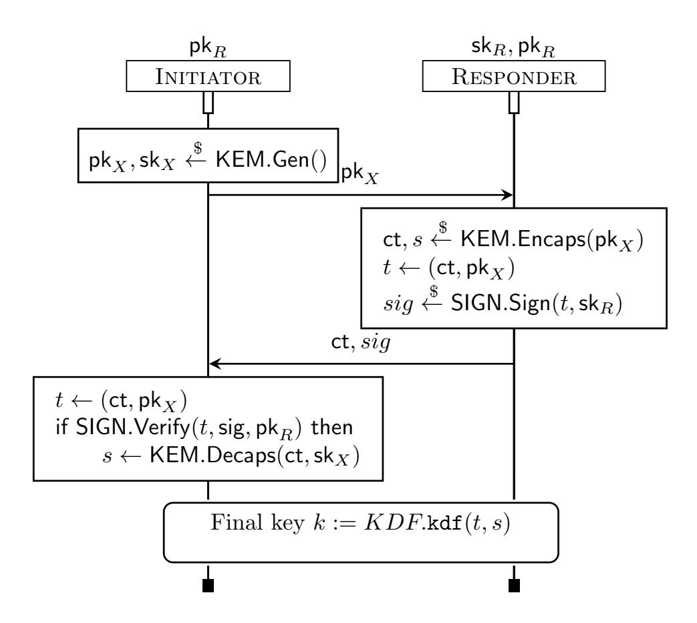
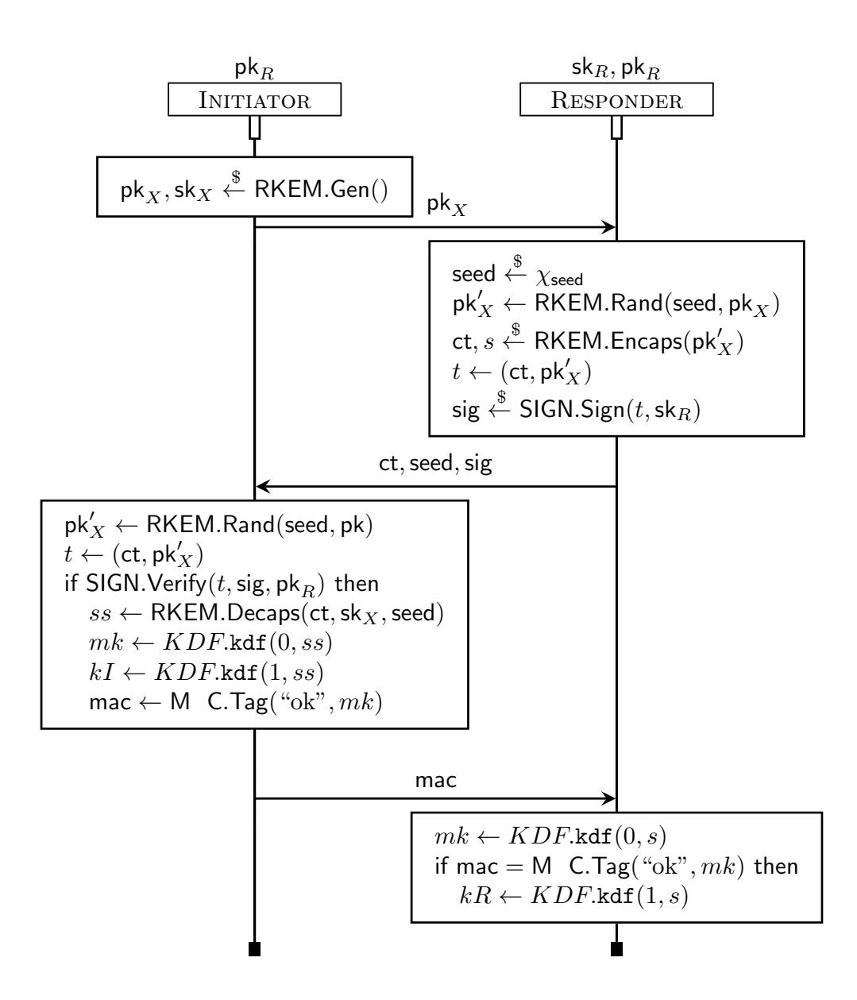
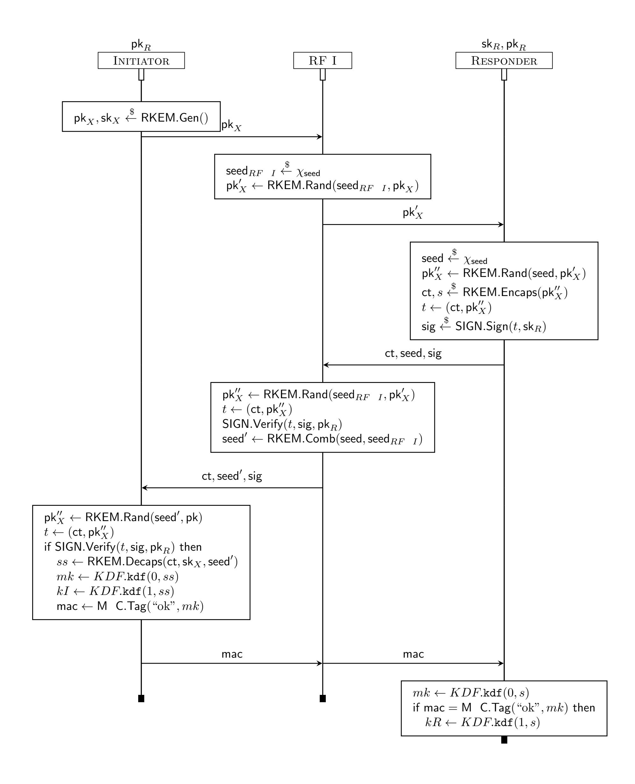

{0}------------------------------------------------

# Ptaudqrhnm qdrhihdms -dx dvbgWmed hm sgd Knrs otWmstl Snqic

Jduhm Ctudqedq. ´ Ohdqqd,8iXhm Dntptd<sup>1</sup> ´ AgXqihd IXbnlld<sup>2</sup> ´ Fthigdl Mhns<sup>3</sup> ´ Xmc AqhrshmX Nmdsd.

> .Smhudqrhsd cd Khlnedr´ UKGL´ AMQR 5020 Smhudqrhsd cd Qdmmdr Smhudqrhsd cd KnqqXhmd´ AMQR´ GmqhX´ KNQG8 Smhudqrhsd cd Qdmmdr´ AMQR´ GQGR8´ OPRghdic

> > Rdosdladq 7´ 0-02

#### arscAbs

Rtaudqrhnm,qdrhkhdms :tsgdmshb]sdc idx,dwbg]mfd ':HD( ]hlr sn ]bghdud sgd ft]q]msddr ne rdbtqd :HD dudm hm sgd oqdrdmbd ne ]m ]cudqr]qx sg]s g]r s]lodqdc vhsg o]qsr ne sgd oqnsnbnk'r hlokdldms]shnm- Mmd v]x sn ]bghdud rtaudqrhnm,qdrhkhdms :HD hr sgd trd ne Odudqrd Ehqdv]kkr 'OEr() ]m tmsqtrsdc sghqc,o]qsx sg]s b]m qdrsnqd rdbtqhsx- Odbdms vnqi W.1[ ghfgkhfgsr sgd bg]kkdmfdr ne cdrhfmhmf OEr enq oq]bshb]k rdbtqd bg]mmdk,drs]akhrgldms-

Sghr o]odq dwsdmcr dwhrshmf OE,a]rdc rtaudqrhnm,qdrhkhdms :HD ]s sgqdd kdudkr8 rdbtqhsx cd mhshnmr) bnmrsqtbshnmr) ]mc sgd trd ne enql]k udqh b]shnm- Ehqrs) vd hmsqnctbd ] trdetk qdk]w]shnm ne sgd mnshnm ne rdbtqhsx hm rtaudqrhnm,qdrhkhdms :HD vhsg OEr8 sgd fn]k hr mn knmfdq sn oqdudms ]kk dw ksq]shnm) ats q]sgdq sn qdrsnqd sn sgd :HD oqnsnbnk ] oqnodqsx knrs tonm rtaudqrhnm- Vd enbtr rodbh b]kkx nm ]tsgdmshb]shmf ]mc 'idx,(rdbtqhmf OEr- Vd ]krn chrbtrr rtaudqrhnm,qdrhkhdmbd ]f]hmrs ] *rodbsptl ne bnlopnlhrdr*) cdrhfmhmf ] fidwhakd eq]ldvnqi hm vghbg oqnsnbnkr ]qd oqnudc rdbtqd vhsg qdrodbs sn ]cudqr]qhdr sg]s b]m s]lodq vhsg *rnld* bnlonmdmsr ne sgd hlokdldms]shnm) ats odqg]or mns nsgdqr-

Mtq tkshl]sd fn]k hr sn ]bghdud onrs,pt]mstl rdbtqd rtaudqrhnm,qdrhkhdms idx,dwbg]mfd-E]q eqnl adhmf sqhuh]k) sghr qdpthqdr sgd hmsqnctbshnm ne ] l]kkd]akd,xds,rdbtqd mnshnm ne idx, dmb]ortk]shnm) vghbg vd cta *pd pMmcnlhyMaid Edu -mbMortiMshnm KdbfMmhrl*- Vd b]qdetkkx enql]khyd sghr mdv oqhlhshud ]mc hmrs]msh]sd hs qrs a]rdc nm ] bk]rrhb]k Chfld,Fdkkl]m HDK ]mc nmd a]rdc nm Hxadq-

Ehm]kkx) vd k]x sgd entmc]shnmr enq sgd enql]k udqh b]shnm ne OE a]rdc oqnsnbnkr) ax enq, l]kkx oqnuhmf ntq oqnsnbnk vhsg sgd BqxosnTdqhe oqnudq) hm ]cchshnm sn bnlots]shnm]k,rdbtqhsx oqnner hm trt]k Adkk]qd,Onf]v]x ldsgncnknfx-

## . Hmsqnctbshnm

Oqnuˆakd rdbtqhsx ˆmc enqlˆk udqhfibˆshnm ˆqd onvdqetk ldsgncnknfhdr+ dmˆakhmf sgd lˆsgdlˆshbˆk rdbtqhsx ˆmˆkxrhr ne bqxosnfqˆoghb oqhlhshudr ˆmc oqnsnbnkr+ ˆfˆhmrs aqnˆc bkˆrrdr ne ˆcudqrˆqhdr-Sgd rdbtqhsx ne sgd bqxosnfqˆoghb rbgdld hr ldˆrtqdc ax ldˆmr ne ˆ oqnne+ vghbg lˆx ad dwˆbs 'toodq,antmchmf sgd ˆcudqrˆqx#r vhmmhmf oqnaˆahkhsx cdodmchmf nm sgd rdbtqhsx ne sgd tmcdqkxhmf oqhlhshudr(+ nq ˆrxlosnshb 'sgd ˆcudqrˆqx#r vhmmhmf oqnaˆahkhsx hr oqnudc sn ad mdfkhfhakd ˆr ˆ etmbshnm ne sgd rdbtqhsx oˆqˆldsdq(- Rtbg ˆ oqnne dmˆakdr [rdbtqhsx ax cdrhfm´ enq sgd bqxosnfqˆoghb oqhlhshud-

Tmenqstmˆsdkx+ dudm ˆ rntmc rdbtqhsx oqnne oqnuhcdc ˆfˆhmrs ˆ rsqnmf ˆcudqrˆqx hm ˆ qdˆkhrshb lncdk+ nmkx ftˆqˆmsddr sgd rdbtqhsx ne sgd oqnsnbnk#r *bqxosnfqYoghb rodbh*fi*bYshnmr*- Sgd fˆo adsvddm 

{1}------------------------------------------------

theoretically-sound protocols and their implementations is a known one, with implementation-specific vulnerabilities affecting even well-used schemes such as TLS [1, 2, 3].

Implementation flaws may occur by accident even in well maintained and documented libraries, such as OpenSSL. Worst still, flaws can be willfully introduced in order to weaken cryptographic algorithms. Subverting implementations is an instance of a more generic type of attacks (called algorithm-substitution attacks – ASAs [10]), with the goal of making otherwise-honest parties exfiltrate data to the subverter – while not seeming to deviate from protocol at all.

The first examples of such adversaries were captured in the literature in 1985 [38] with the existence of subliminal channels, as well as in [39] where an insidious public key in an RSA key-distribution allowed the attacker to reconstruct the private key. Startlingly, in 2013 thousands of classified NSA documents revealed by Edward Snowden confirmed the existence of widespread mass-surveillance – thus appraising the entire population of two facts: (i) a new, very powerful class of adversaries, acting as a Big Brother, is after everyone's data, (ii) in order to be secure, cryptography must not only be provably-secure, but also subversion-resilient.

Like all ASAs, subversion consists of modifying parts of a cryptographic implementation so that it seems to behave according to specifications, even though it is not. In the case of a pseudorandom generator, this could lead to the randomness becoming predictable [12]; signature schemes could be altered such that some signatures are not verified; or, at a systemic level, a back door could be added, through a seldom-used library, to SSH servers [4].

Subversion is not easily countered. Two ways of providing some cryptographic protection against it are the use of watchdogs or reverse firewalls (RF). Watchdogs are meant to ensure that a given primitive has not been tampered with, and are orthogonal to the design of a given protocol. On the other hand, RFs are meant to act as middleboxes inside a key-exchange, filtering and sanitizing data produced by a potentially-subverted endpoint.

Unfortunately, not all protocols are RF-friendly. Designing RF-friendly authenticated key-exchange is a challenge – requiring building blocks with special properties, such as malleability or uniqueness of ciphertexts [23, 18, 31]. It is especially challenging to consider subversion-resilient AKE in the post-quantum setting, as subversion-resilience often requires an unusual degree of malleability and rerandomization, or even a trusted setup phase between the RF and the endpoint. For instance, in order to guarantee exfiltration-resilience for a scheme approaching the complexity of TLS 1.3, Bossuat et al. [18] require pairing-friendly curves, a double layer of encryption, and AEAD that can resist key-related attacks.

One reason it is hard and (comparatively) inefficient to design RF-friendly AKE is that exfiltration resilience is a very difficult property to achieve. Our key observation is that, at least in some cases, such complexity may not be warranted. Another challenge in designing post-quantum-resistant AKE is that quantum-resistant key-encapsulation mechanisms (KEMs) are either insufficiently secure (IND-CPA) or insufficiently malleable (they are IND-CCA, and thus non-malleable) for our purposes. In this work, our goal is to expand on existing subversion-resilient AKE literature and provide the first practically-secure post-quantum SR-AKE protocols.

## 1.1 Contributions

Our contributions extend the state of the art in subversion-resilient AKE at three levels: models, protocols, and proofs.

**Models** We provide new security definitions for subversion-resilient authenticated key-exchange (SR-AKE) with reverse firewalls, attempting to balance practicality of possible instantiations and meaningful security requirements. This is done by altering typical exfiltration resilience notions in two ways:

- **Relaxation:** We relax the notion of exfiltration resilience to a slightly weaker, but still meaningful requirement: we want RFs to *restore* the original security properties of AKE (authentication and (key-)security).

{2}------------------------------------------------

- **Compromise:** We shift from the perspective of a binary subversion (either the entire implementation is subverted, or no part of it is) and introduce a *spectrum* of compromise.

Finally, we define the notion of *setup-freeness* for reverse firewalls as a highly-desirable property, which allows RFs to be mounted on the fly in order to protect any subverted implementation.

**Protocols** We instantiate our notions of SR-AKE through an RF-friendly KEM-based AKE construction. The setup-free reverse firewalls we construct are provably *authenticating* and *securing*.

At the core of our construction lies a novel type of KEM scheme with controlled malleability, which we dub rerandomizable KEMs (RKEM). The RKEM public keys can be rerandomized by external entities; subsequently, an unrandomization process allows the original party to decapsulate the RKEM ciphertext. We instantiate RKEMs in both the classic and the quantum-resistant settings.

**Proofs** We prove the security of our construction in two ways. The first uses computational penand-paper security proofs, which allow us to integrate our work in previous subversion-resilience literature, such as [23, 18]. We also prove our construction, employing formal verification using CRYPTOVERIF. Our CRYPTOVERIF security models, provided in their entirety in [24], represent to our knowledge the first mechanized definitions and verifications of subversion-resilient AKE properties in the literature. We hope that it will enable further research in subversion resilience in general.

## 1.2 Related Work

Reverse-Firewalls and AKE Introduced in 2015 [33], Reverse Firewalls (RFs) are semi-trusted components acting as middleboxes that sanitize protocol transmissions from potentially subverted parties. Dodis et al. defined RFs for authenticated key-exchange (AKE) protocols [23]. Later work [18] strengthened the notion of exfiltration-resilience and constructed an RF-friendly version of a TLS 1.3-like protocol, at the cost of a necessary setup step for the RF, and of allowing the RF to compute some handshake secrets. In our work, we relax, rather than strengthen, RFs security notions.

As in earlier work [23, 18] we use game-based definitions, and additionally lay the groundwork to the formal verification of SR-AKE security via CryptoVerif. An alternative to game-based security is to use the UC framework, as shown in [21]. This compositional definition is close in spirit to our relaxation of exfiltration resilience: the idea is for the RF to restore to the subverted protocol its original properties. In this paper, we prefer a game-based approach for two main reasons: first, it allows us greater flexibility for modelling and allowing reveal and corrupt queries; second, the game-based approach allows us to construct RFs that can be authenticating (but not securing), securing (but not authenticating), or authenticating and securing, as needed. Indeed, a core difference between UC and game-based security is the ability of our definitions to stay adaptive with respect to what is referred to as "freshness" predicates, which specify which key-exchange sessions are expected to be secure. In a UC approach, we would have to condition in the ideal world the running of certain queries (or rather, the responses) on freshness and/or other winning conditions. It is not immediately clear that we can define the same adaptive games in a UC framework, but this is certainly promising further work.

**Alternatives to RFs** Several alternatives to achieving subversion-resilience exist in the literature. We mention two prominent ones: the use of watchdogs, and self-guarding.

Watchdogs are algorithms which verify that the implementation of a protocol is either subverted (in which case it should not be deployed) or it works as it is meant to (in which case it is safe). This concept was introduced by [36]: the idea is to split a program into multiple components and then check that each component is compliant. Offline watchdogs test implementations before runtime, while online watchdogs do so during the protocol's execution. Related work has

{3}------------------------------------------------

shown how to construct subversion-resilient primitives with practical watchdogs, including one-way permutations [36], random number generators [37], semantically secure encryption schemes [37], signature schemes [22], or PKE schemes [11]. However, the watchdog approach has mainly been focused on primitives, and using RFs seems more intuitive for many interactive protocols, including AKE. An interesting idea for future research is to consider the potential equivalence between online watchdogs and RFs.

Another approach to subversion-resilience is *self-guarding* [27], which can be viewed as a two-step sanitization: an initial trusted setup first generates some effective outputs; then these values will "sanitize" the output produced by a potentially corrupted implementation. This approach has the advantage of not requiring an external party, such as an RF or a watchdog; however, its security depends directly on the number of samples collected during the initialization phase, which can be restrictive in practice.

Key Encapsulation Mechanisms (KEMs) Key encapsulation allows one party to share a secret value with another party. This primitive represents a cornerstone of authenticated key-exchange (AKE). Classical KEM constructions rely on RSA [35] and ECC [25]. Recently, Kyber [6], and HQC [5] were selected by the NIST to be standardized as quantum-secure KEMs. Most KEM constructions are IND-CPA, and become IND-CCA-secure by means of the Fujisaki-Okamoto transform [28]. These standard properties are insufficient in our case, as we require stronger than IND-CPA security, but also malleability for our KEMs: a notion we dub rerandomizable KEMs. We instantiate these in the classical setting using a DH-based construction, and in the lattice setting using Kyber.

## 2 Background: Reverse Firewalls

We consider the case of unilaterally-authenticated key-exchange (AKE) schemes allowing an *Initiator* and a *Responder* to derive a shared secret key if the Responder correctly authenticated to the Initiator. If the two parties employ a secure AKE protocol, the shared secret is known to the honest endpoints, but *indistinguishable from a random value of the same length* with respect to any attacker.

Unfortunately, this guarantee only holds as long as the implementation of the protocol on both sides faithfully follows the technical specifications. If a Big Brother attacker is able to subvert that implementation, the security guarantees of the AKE protocol plummet. In order to provide AKE security in the presence of Big Brother, we add another protocol intermediary: the reverse firewall (RF). The latter sits between the compromised party and the outside world, and filters messages transmitted between the former and the latter, in order to restore the protocol's original security. Such a RF can typically be installed on a WiFi router or at the exit of a VPN tunnel, or both. If an outside network attacker cannot access the channel between the party and the RF, the RF can "sanitize" data sent over the network, and ensure that the cryptographic protocol works correctly in spite of the potential subversion of the implementation.

Reverse firewalls need not be constrained to act only on one side of a cryptographic protocol. In fact, RFs can be associated with any of the protocol participants. In two-party Authenticated Key-Exchange (AKE), reverse firewalls can be installed for the initiator, the responder, or potentially for both, and they should guarantee:

Ex Itration resilience: Assuming the connection between a party and its firewall is secure, a malicious attacker that fully controls the party's protocol implementation (potentially corrupting it) cannot leak even a single bit of information out to an attacker on the other side of the firewall.

**Obliviousness:** From the point of view of a network attacker, placed as a Meddler-in-the-Middle (MitM), the presence or absence of RFs on either the initiator or the responder side is transparent. In other words, the network attacker cannot distinguish between a protocol run featuring RFs and one executed in the absence of RFs by honest endpoints.

{4}------------------------------------------------



Figure 1: Basic KEM-based key-exchange

**Protocol security:** RFs are not trusted by the initiator and responder, so they must be unable to distinguish established session keys from random, or impersonate legitimate parties.

From a more practical standpoint, the reverse firewall should be *easy to set up*: ideally, no interaction should be required between the RF and the endpoint that it protects.

Remaining challenges and this work In 2020 Bossuat et al. [18] described an RF-friendly protocol which gave a subversion-resilient version of a TLS 1.3-like scheme. While this work presents a positive result – it is possible to leverage pairings and double-layered AEAD in order to achieve strong subversion-resilience – it also highlights the difficulties of achieving exfiltration-resilience in this context. In particular, we identify two challenges that remain unsolved. First, in order to achieve both obliviousness and subversion-resilience, AKE protocols must be designed to be RF-friendly. Bossuat et al. [18] showed how this can be achieved with classical cryptography, but it is not clear how to construct RF-friendly AKE in the post-quantum setting, without using pairings and relying, in a black-box manner, on Key Encapsulation Mechanisms (KEMs). Moreover, even if KEM-based RF-friendly AKE could be designed, the required assumptions on the KEM in question remain unclear. Second, existing RF-friendly AKE remains complex, and achieving exfiltration-resilience yields complex constructions which are not always efficient.

Here, we set out to answer both these challenges: we describe KEM-based RF-friendly key exchange, and simultaneously further explore the design space, considering several trade-offs between the complexity of RF-friendly protocols and their security properties.

# 3 Our Approach

Consider the KEM based authenticated key-exchange protocol depicted in Fig. 1. This signed-KEM protocol provides unilateral authentication (the Initiator authenticates the Responder by verifying the latter's signature on the transcript hash), and guarantees the strong secrecy of the derived final session-key k whenever the Initiator relies on the public key  $\mathsf{pk}_R$  of a non-compromised server. This second property is due to the KEM itself, which securely transports a common, fresh secret s from the responder to the initiator.

{5}------------------------------------------------

Unfortunately, such security statements only hold if the protocol executed by honest parties corresponds to the specifications indicated in Fig. 1. Indeed, if we assume that the protocol implementation has been tampered with, no security is guaranteed at all. For instance, if the implementation of the signature verification function has been tampered with on the initiator side so that the client never actually verifies the signature (but accepts to continue the protocol anyway), then authentication is lost. If an attacker wanted to tamper with the implementation to furthermore damage the key-secrecy of the protocol, multiple attack options are open:

The KEM key-generation algorithm  $\mathsf{KEM}.\mathsf{Gen}(\eta)$  is modified on the initiator side in order to produce predictable keypairs;

The KEM encapsulation algorithm KEM. Encaps is modified on the responder side in order to generate weak or predictable secrets s;

The KDF calculation  $KDF.\mathtt{kdf}(t,s)$  is modified so that the output keys are always weak or predictable.

Even more disappointingly, it is not clear how to design – for this basic protocol – an RF that guarantees both exfiltration resilience and obliviousness. One of the main reasons is that exfiltration resilience demands that a corrupt implementation be unable to bias *any* bit of the information sent past the RF whether that bit of information directly a ects the standard security properties of the scheme or not. On the other hand, requiring exfiltration resilience seems the only viable alternative if the goal is to provide resistance to any kind of compromise of the implementation.

The key insight of this work is that, in cases where at least some parts of the implementation can be trusted, some more limited exfiltration requirements can suffice. As a naïve example, if we assume that the attacker can only tamper with the signature verification algorithm on the initiator side of our basic protocol, it is possible to design a very simple RF that verifies received signatures, forwards them if they are legitimate, and aborts otherwise. This simple RF immediately restores the authentication properties of the protocol. Placing trust in parts of the implementation and not others might look arbitrary at first glance. However, different and independent sources could have designed the algorithms used by the protocol, thus considering some parts to be subverted and others more trustful seems reasonable. Furthermore, trust can be restored in some algorithms and not others through the use of verified implementations and/or deep attestation.

## 3.1 A spectrum of compromise and relaxed security properties

We push further the idea of allowing the attacker only partial tampering access to implementations, formally modelled as  $C[\mathsf{alg}_1, \ldots, \mathsf{alg}_n]$ , where C is the code of the legitimate protocol participant. The code may include a number of cryptographic algorithms, and we will consider adversaries that compromise some subset of those algorithms. A compromise scenario is then given by a subset of  $\{C, \mathsf{alg}_1, \ldots, \mathsf{alg}_n\}$ , which specifies which parts of the code can be modified by the attacker. In the extreme case of adversaries tampering with the full set  $\{C, \mathsf{alg}_1, \ldots, \mathsf{alg}_n\}$ , we return to the classic RF scenario, in which every part of the implementation may be tampered with. In the previous example, the client is typically parameterized by the algorithms KEM.Gen, KEM.Decaps, SIGN.Verify, KDF.kdf, and for our naive example, we only consider the scenario  $\{SIGN.Verify\}$ .

Relaxed notions of security for RFs Exfiltration-resilience is a strong property that requires RFs to prevent *any* potential data from leaking from the tampered implementation past the RF – whether that leakage actually damages the security properties required by the original protocol or not.

The approach of always considering a worst-case scenario can be very sound – but it may also lead to unnecessarily-strong properties. Suppose for instance that an AKE protocol implementation is tampered with such that the first bit of a (long) nonce becomes predictable to the

{6}------------------------------------------------

adversary. It is unclear whether this comparatively small change affects the protocol's security; yet, such leakage would count as a valid exfiltration if it passed the RF.

In this paper, we suggest that it might be worthwhile to achieve slightly weaker, but more focused security, in the presence of a wider range of adversaries.

New subversion-resilience notions for AKE Our Reverse Firewalls will accomplish two traditional goals: no-vulnerability and obliviousness:

No vulnerability: the Reverse Firewall is not an added vulnerability to the scheme. If the initiator and responder are honest, then the protocol will provide both authentication and the security of keys even in the presence of potentially-malicious RFs on the initiator side, the responder side, or both. Thus, in this attack scenario, the endpoints are honest, but the RFs are potentially malicious, and aim to break either the authentication or the key-secrecy properties.

**Obliviousness:** From the point of view of a network adversary, it is impossible to distinguish between a protocol run via an RF or a protocol without the RF.

The main goal of RFs will be to restore security notions – authentication and key-secrecy – to the AKE protocol, against a collusion between a subverting Big Brother tampering with the set of subvertable algorithms  $\mathcal{C}$ , and a MitM between the initiator's RF (or the initiator, if its implementation is not subverted) and the responder's RF (or the responder, if its implementation is not subverted). The RF can guarantee one or more of the following properties:

**Securing:** The MitM adversary cannot break the key-secrecy of the protocol, even after Big Brother tampered with some of the subvertable algorithms in the protocol.

**Authenticating:** The MitM adversary cannot break the authentication properties of the protocol, even after Big Brother tampered with some of the subvertable algorithms in the protocol.

**Setup-freeness:** The RFs are not required to share any data with the party they protect in order to function.

If we return to our naïve example, the above discussion proposes a very basic setup-free authenticating initiator-RF for the compromise scenario {SIGN.Verify}. While this is only a baby step forward, it provides a basis for our contribution in this paper, which translates to constructing a fully-fledged setup-free RF of KEM-based AKE protocols. Still, we were not able to include some of the algorithms in our final compromise scenario, either because we wanted to focus on the client or because this requires a complex adaptation of a previous solution. For the case of Decaps and the KDF, we could use the double-layered encryption trick of [18] but at the cost of setup-freeness. The case of Encaps is even more interesting, since the client is not authenticated the attacker could connect to the server and the latter would exfiltrate informations through the symmetric key. This seems very hard to defend against because the key exchange needs some correctness, but one idea would be to add a first message from the server that would commit to some randomness used in Encaps. However, this approach fails spectacularly if the KEM allows to choose a secret without the contribution of the client (the public key), furthermore this adds a round trip and completely destroys our efficiency requirement. Considering mutual authentication might help with this issue since the attacker could not connect to the server anymore, but we wanted to focus on this more popular case.

## 3.2 Formal proof techniques

We provide computational security definitions and pen-and-paper proofs; however, in addition, we give formal guarantees by relying on computer-aided cryptography to verify our protocol. Among existing verification tools for cryptographic protocols, such as EASYCRYPT [9], CRYPTOVERIF [15],

{7}------------------------------------------------

and SQUIRREL [7], we choose CRYPTOVERIF, which appears to have been the most effective tool to verify key-exchange security (like TLS 1.3 [13], SSH [20], PQXDH [14]).

CRYPTOVERIF enables to perform security proofs almost as in pen-and-paper cryptographic proofs, and yields similar guarantees:

It enables to specify games by defining the set of oracles to which the attacker will have access to;

It implements a set of proof tactics that are in effect game-hops between equivalent games, and also allows writing user-defined cryptographic assumptions which the tool can use for reductionist game-hops;

It allows to prove the generic equivalence between two games, either automatically through a heuristic proof search, or interactively by specifying the main steps of the proof;

It yields as a proof witness the full sequence of games with the explicit advantage of the attacker.

In the context of key-exchange and to ease proofs, CRYPTOVERIF relies on two specific ways to express security, rather than using generic AKE definitions. In a single game which models the protocol, we can express two kinds of queries, internally encoded as cryptographic indistinguishability:

Correspondence queries: where by inserting events inside the oracles, we can specify that whenever a given event is raised, another was previously raised with similar arguments. This is typically used to model and prove authentication.

**Secrecy queries:** where we ask whether the values that the protocol stores inside some array variable are all real-or-random, in a multi-session sense where each part of the array should be secret even if all other elements of the array are leaked. For the *i*-th replication of the initiator, we typically store inside the variable kI[i] the final session-key, and then query the secrecy of the array kI. We can express freshness conditions by only populating kI when e.g. the long term key of the responder was not corrupted.

In this paper, we provide the first analysis of subversion-resilient key-exchange, notably by formalizing security definitions for our novel RKEM in a way amenable to CRYPTOVERIF automation. We model the secure, trusted channel between the initiator and its RF by simply in-lining the multiple parts of the code in the same oracle. Finally, we model implementations that have been partially subverted by using non-axiomatized abstract functions, that can be instantiated by any arbitrary piece of code.

## 4 Re-randomizable K M

Consider once more the KEM-based construction in Figure 1 from the perspective of an initiator-RF. The first message sent in the protocol is a KEM public key. If the initiator is honest, then it will run the KEM key-generation algorithm honestly and obtain a strong pair of keys. However, a subverted implementation could choose keys maliciously so that the adversary already knows the private key or can easily guess it. The task of the RF is, in this case, far from trivial. Indeed, the RF may not be able to distinguish the public key it receives from a subverted initiator from a key it might have received from an honest one.

In order to sanitize communications the RF could rerandomize the public key sent by the initiator in order to turn potentially weak keys into stronger ones and ensure that the adversary cannot break KEM security. This solves the problem of weak keys, but renders the initiator unable to decapsulate the received ciphertext. Hence, the initiator will need a trapdoor to update its decapsulation key to the stronger one obtained through rerandomization.

{8}------------------------------------------------

Rerandomizable KEM (RKEM) In order to enable RF-friendly KEM-based key exchange, we define a RKEM by modifying the KEM interface to include six algorithms and a distribution of seeds  $\chi_{\text{seed}}$ , as listed below:

 $\mathsf{params} \overset{\$}{\leftarrow} \mathsf{RKEM}.\mathsf{GenParams}(\lambda)$  is queried only once and sets up the public parameters for an instance of RKEM, given a security parameter  $\lambda$ . For ease of writing, we will always assume in our games that the setup phase has been run, and all other algorithms (including the attacker  $\mathcal{A}$ ) use params as implicit input parameters.

(sk, pk) <sup>\$</sup> RKEM.Gen() honestly generate a keypair.

 $pk' \leftarrow RKEM.Rand(seed, pk)$  allows to rerandomize a public key given a random seed sampled from a distribution  $\chi_{seed}$ . We assume the existence of a fixed neutral seed, denoted as 0, such that for any public key pk, pk = RKEM.Rand(0, pk).

 $(s, \mathsf{ct'}) \xleftarrow{\$} \mathsf{RKEM.Encaps}(\mathsf{pk'})$  is the classical encapsulation algorithm, which, given in input a public key  $\mathsf{pk'}$ , outputs a secret value s and a ciphertext  $\mathsf{ct'}$ .

 $p \leftarrow \mathsf{RKEM.Decaps}(\mathsf{ct}, \mathsf{sk}, \mathsf{seed})$ , is an extension of the classical decapsulation algorithm, which now allows to decapsulate a ciphertext with the keypair  $(\mathsf{sk}, \mathsf{pk})$ , if the ciphertext is of the form  $\mathsf{RKEM.Encaps}(\mathsf{RKEM.Rand}(\mathsf{seed}, \mathsf{pk}))$ .

 $\mathsf{seed}_c \leftarrow \mathsf{RKEM.Comb}(\mathsf{seed}_1, \mathsf{seed}_2)$ , which allows to recombine two seeds into one, i.e., multiple rerandomizations of the same public key are equivalent to a single rerandomization under the combination of their seeds. We will denote by  $\mathsf{RKEM.Comb}(\mathsf{seed}_1, ..., \mathsf{seed}_N)$ , the iteration of the  $\mathsf{RKEM.Comb}$  function.

Notice that RKEM.Encaps(\_) and RKEM.Decaps(\_, \_, 0) behave as a classical non-rerandomizable KEM. All algorithms are allowed to abort and make its caller abort, for instance if the decapsulation fails, or if RKEM.Rand is given an invalid seed in input.

Correctness of RKEM The correctness of this primitive is expressed in terms of two security games, both presented in Figure 2. The first game is called *Unrandomization correctness* and it captures the requirement that, with overwhelming probability w.r.t. the security parameter<sup>1</sup>, the modified decapsulation algorithm (which takes a seed as an additional parameter) returns the same secret as the one returned by the encapsulation algorithm on a public key randomized with the same seed. The second correctness notion captures a property we call *homomorphic randomization*. The requirement concerns chiefly the seed-combining algorithm, whose output must ensure that randomizing a public key with the combination of two seeds is equivalent to randomizing with the first seed and then with the second. This can be summarized in the definition below.

**De nition 1** (RKEM Correctness). A RKEM is correct, if, and only if, the following statements hold simultaneously:

Unrandomization correctness game Rand Corr<sub>RKEM</sub> (Fig. 2) outputs 1 with overwhelming probability (as a function of the security parameter).

HOMOMORPHIC RERAND: The homomorphic rerandomization game RComb  $Corr_{RKEM}$  (Fig. 2) outputs 1 with overwhelming probability (as a function of the security parameter).

Looking forward, these strong correctness notions are hard to achieve in the post-quantum setting, and in particular using lattices that use short vectors that are non-trivial to combine. We thus propose a weaker notion of correctness that supports at most N randomizations and combinations.

<sup>&</sup>lt;sup>1</sup>We recall that a function of the security parameter  $f(\lambda)$  is said negligible if,  $\forall \lambda, \forall \text{polynomial } P, \exists N, \lambda > N \Rightarrow f(\lambda) \leq \frac{1}{P(\lambda)}$ , that is, f is asymptotically smaller than the inverse of any polynomial. A function  $f(\lambda)$  is overwhelming if  $f(\lambda)$  is negligible.

{9}------------------------------------------------

```
Experiment \; \mathtt{Rand} \; \; \mathtt{Corr}_{\mathsf{RKEM}}
\mathsf{sk}, \mathsf{pk} \xleftarrow{\$} \mathsf{RKEM}.\mathsf{Gen}()
seed \stackrel{\$}{\leftarrow} \chi_{seed}
pk' \leftarrow RKEM.Rand(seed, pk)
(s,\mathsf{ct}') \overset{\$}{\leftarrow} \mathsf{RKEM}.\mathsf{Encaps}(\mathsf{pk}')
return RKEM.Decaps(ct, sk, seed) = s
Experiment \; \mathtt{RComb} \; \; \mathtt{Corr}_{\mathsf{RKEM}}
\forall s, s' \in \mathsf{Supp}(\chi_{\mathsf{seed}}), \mathsf{pk}.
return RKEM.Rand(s, RKEM.Rand(s', pk))
                   = \mathsf{RKEM}.\mathsf{Rand}(\mathsf{RKEM}.\mathsf{Comb}(s,s'),\mathsf{pk})
\mathit{Experiment} \; \mathtt{P} \; \mathtt{RComb} \; \mathtt{Corr}_{\mathsf{RKEM}}(N)
\forall \mathsf{pk}, s_1, ..., s_N \overset{\$}{\leftarrow} \chi^N_{\mathsf{seed}}
pk' = pk
for i = N, ..., 1 do
     \mathsf{pk'} = \mathsf{RKEM}.\mathsf{Rand}(s_i,\mathsf{pk'})
\mathbf{return} \ \mathsf{pk'} = \mathsf{RKEM}.\mathsf{Rand}(\mathsf{RKEM}.\mathsf{Comb}(s_1,...,s_N),\mathsf{pk})
```

Figure 2: Rerandomization correctness definitions

P RComb Corr<sub>RKEM</sub> additionally differs from RComb Corr<sub>RKEM</sub> in that it requires that combining seeds yield the same result as applying sequentially over the choice of seeds, while RComb Corr<sub>RKEM</sub> requires this for any seeds in the allowed domain. This relaxation is necessary in settings (such as lattices) where combining many random seeds may, with negligible probability, result in a seed outside the allowed domain (e.g., exceeding a norm bound), causing the property to fail in rare cases.

**De nition 2** (Weak RKEM Correctness). We say that a RKEM is N-weakly correct, if it guarantees:

N Unrandomization: RKEM is N-unrandomization correct if for any  $i \leq N$ , RKEM is unrandomization correct with  $\chi'_{\mathsf{seed}} = \mathsf{RKEM.Comb}((X_j)_{j=1,\ldots,i})$  with  $X_j \overset{\$}{\leftarrow} \chi_{\mathsf{seed}}$ . Here,  $\chi'_{\mathsf{seed}}$  denotes the result of combining up to N independently sampled seeds  $X_j$  using the seed-combining algorithm RKEM.Comb.

N PROBABILISTIC HOMOMORPHIC RERAND: The probabilistic homomorphic rerandomization game P RComb Corr<sub>RKEM</sub> (Fig. 2) outputs 1 with overwhelming probability (as a function of the security parameter and N).

**Rerandomizable IND-CPA security** Recall that in the classical KEM-IND CPA notion, the challenger first generates a public key, then creates both an honest encapsulation (with an honest secret  $K_0$ ), and a random secret  $K_1$ . The goal for the adversary is to tell  $K_0$  and  $K_1$  apart, given the public key and the ciphertext (we recall the KEM-IND CPA security experiment in the Appendix, Fig. 7).

Adding rerandomization allows an attacker some malleability over the RKEM. Since we will eventually have the RF, which is a semi-trusted party in our security model, perform rerandomizations, we want to control the effects this malleability has on the actual security of the RKEM. We proceed in two steps.

The first step is to add rerandomization into IND CPA security, thus obtaining the RIND CPA security game in Fig. 3, where the attacker  $\mathcal{A}$  wins if – given a public key  $\mathsf{pk}$  honestly generated by the challenger– it can produce a rerandomization  $\mathsf{pk}'$  of  $\mathsf{pk}$  that can be used by  $\mathcal{A}$  to break IND CPA.

{10}------------------------------------------------

| Experiment RIND CPARKEM                                   | Experiment Rand IND <sub>RKEM</sub>                                       |
|-----------------------------------------------------------|---------------------------------------------------------------------------|
|                                                           |                                                                           |
| $sk, pk \overset{\$}{\leftarrow} RKEM.Gen()$              | $pk \leftarrow \mathcal{A}()$                                             |
| $pk' \leftarrow \mathcal{A}(pk)$                          | $pk \leftarrow \mathcal{A}()$ $seed \overset{\$}{\leftarrow} \chi_{seed}$ |
| $b \xleftarrow{\$} \{0,1\}$                               | $pk'_0 \leftarrow RKEM.Rand(seed,pk)$                                     |
| $(K_0^*, c^*) \stackrel{\$}{\leftarrow} RKEM.Encaps(pk')$ | $sk_1', pk_1' \overset{\$}{\leftarrow} RKEM.Gen()$                        |
| $K_1^* \stackrel{\$}{\leftarrow} \mathcal{K}$             | $b \stackrel{\$}{\leftarrow} \{0,1\}$                                     |
| $b'$ , seed $\leftarrow \mathcal{A}(c^*, K_b^*)$          | $b' \leftarrow \mathcal{A}(pk_b')$                                        |
| if RKEM.Rand(seed, $pk$ ) = $pk'$ then                    | return $b = b'$                                                           |
| $\mathbf{return}\ (b=b')$                                 |                                                                           |
| $\mathbf{else} \ \mathbf{return} \ b$                     |                                                                           |

Figure 3: RKEM, RIND CPA and Rand IND definitions

Notice that the adversary is required to produce the seed which transforms the challenger's public key pk, through rerandomization, into the adversary's key pk'. By achieving security against this type of adversary, we can ensure that the RF does not abuse its malleability in order to learn session-key material. Note that by using pk' = pk, we can instantly see that RIND CPA is stronger than IND CPA. If the attacker does not produce a valid rerandomization seed, the RIND CPA game returns b, which means that the attacker in such cases wins with exactly one-half probability and RIND CPA security then requires an attacker to win the game with non-negligibly more than one-half probability.

The second step is to ensure that rerandomization e ectively maps the input key to a random public key; in particular, when the RF rerandomizes a weak key provided by a subverted initiator, the result will be a perfectly random public key (for which IND CPA security holds). This is captured by the game depicted in Fig. 3. Note that this property will also be needed to achieve obliviousness with respect to a MitM adversary.

Thus, the security of a RKEM can be summarized as follows.

**De nition 3** (RKEM Security). A RKEM is  $\epsilon$ -RIND CPA-secure, resp.  $\epsilon$ -Rand IND-secure, if, and only if, for any Probabilistic Polynomial Time (PPT) adversary  $\mathcal A$  it holds that  $|\Pr[\mathcal A \text{ wins RIND CPA}] = \frac{1}{2} |< \epsilon, \text{ resp}, |\Pr[\mathcal A \text{ wins Rand IND}] = \frac{1}{2} |< \epsilon.$ 

RIND CPA is the natural security property underlying the security of our subversion-resilient authenticated key-exchange schemes: once an initiator outputs an ephemeral public key, the RF (or a MitM attacker) might forward a rerandomized version of this public key to a responder that makes an honest encapsulation. In order to allow the initiator to decapsulate this honest encryption, the rerandomizing party must forward the rerandomization seed – which is hard to produce by an attacker that simply provides a malicious public key. This ensures that either the MitM attacker honestly rerandomizes the initiator's keys (in which case it cannot learn the secret) or it maliciously provides a new key (in which case, the initiator decapsulation fails).

## 4.1 DH based secure RK M

We illustrate the validity of our approach in a non post-quantum setting, by showing how a RKEM can be instantiated in a straightforward fashion using prime order groups. This section also allows us to give a simpler introduction to our novel primitive, before instantiating it in the more complex lattice setting.

**Parameters** Let p be a prime, and  $\mathbb{G} \subseteq \mathbb{F}_p$  be a group of order p generated by g for which the Gap Diffie-Hellman problem (gDH) is hard. We let H be a hash function modelled as a random oracle.

{11}------------------------------------------------

```
\mathsf{DHKEM}.\mathsf{Gen}() :=
   \operatorname{sk} \overset{\$}{\leftarrow} \mathbb{F}_p \operatorname{pk} = g^{\operatorname{sk}}
                                                            DHKEM.Rand(seed, pk) :=
                                                                abort if pk = g^0
return (sk, pk)
                                                               pk' = pk^{seed}
                                                            return pk'
DHKEM.Decaps(ct, sk, seed) :=
    abort if seed = 0
                                                            DHKEM.Encaps(pk) :=
    s = H(\mathsf{ct}^{\mathsf{sk}^{\mathsf{seed}}})
                                                               x \stackrel{\$}{\leftarrow} \mathbb{F}_p
return s
                                                               s = H(\mathsf{pk}^x)
                                                               \mathsf{ct} = g^x
\mathsf{DHKEM}.\mathsf{Comb}(\mathsf{seed}_1,\mathsf{seed}_2) :=
                                                           return (s, ct)
    abort if seed_i = 0
    seed = seed_1 \times seed_2
return seed
```

Figure 4: DHKEM algorithms

Construction We define DHKEM, our DH-based RKEM, with  $\chi_{\text{seed}} = \mathcal{U}(\mathbb{F}_p)$ , DHKEM.GenParams() := **return** ( $\mathbb{G}, g, p, H$ ) and the algorithms of Fig. 4.

Correctness and security We give a brief intuition of the correctness and security of this RKEM (the proofs are straightforward). Note however that, for a better applicability of our results, we prove RIND CPA using CRYPTOVERIF in the specific case of curve X25519, which is not a prime-order group.

Theorem 1. DHKEM is a correct RKEM.

Proof. First, we verify Rand Corr<sub>DHKEM</sub>. The game yields  $ct' = g^x$  and  $s = H(g^{x \times \mathsf{seed} \times \mathsf{sk}})$ . Since DHKEM.Decaps $(g^x, \mathsf{sk}, \mathsf{seed}) = H(((g^x)^{\mathsf{sk}})^{\mathsf{seed}})$  this concludes the proof. Moreover, since we have  $(\mathsf{pk}^{\mathsf{seed}})^{\mathsf{seed}'} = \mathsf{pk}^{\mathsf{seed} \times \mathsf{seed}'}$ , RComb Corr<sub>DHKEM</sub> holds.

**Theorem 2.** (CryptoVerif) If gDH is hard in  $\mathbb{G}$  and if H is modelled as a random oracle, then DHKEM is RIND CPA secure.

Proof. We prove using CRYPTOVERIF, see [24], that as soon as the winning condition DHKEM.Rand(seed, pk) = pk' is met for a call to DHKEM.Encaps(pk'), we have the strong secrecy of the shared secret  $K_0^*$  (which directly implies the RIND CPA game). Intuitively, in DHKEM.Encaps(pk'), the winning condition implies that  $pk' = pk^{seed}$ . Thus,  $K_0^* = H(((g^{sk})^x)^{seed})$ . Now, unless the attacker can compute  $((g^{sk})^x)^{seed}$ ,  $K_0^*$  is strongly secret from the ROM. However, the attacker can compute  $((g^{sk})^x)^{seed}$  only if it can compute  $((g^{sk})^x)^x$  (we use the inverse of seed, that the attacker knows). We thus conclude with the gDH assumption.

Theorem 3. If G is a prime order group, we have Rand IND<sub>DHKEM</sub>.

*Proof.* In Rand IND<sub>DHKEM</sub>, after the rerandomization, we have  $pk_1 = pk^{seed}$ , which has the same distribution as any randomly sampled key, and thus pk is a generator of the prime order group (because we excluded the neutral group element).

Corollary 1. If gDH is hard in  $\mathbb{G}$  and H is a random oracle, DHKEM is a correct and secure RKEM.

{12}------------------------------------------------

#### 4.2Lattice-based IND-RCPA KEM

We propose here an instantiation of a rerandomizable KEM based on lattice assumptions. Unlike the DH-based construction, the lattice-based KEM only supports a bounded number of rerandomizations, due to the growth of noise in the secret and public keys with each randomization. This bound, denoted by  $\eta$ , is reflected in our parameter choices and correctness guarantees below. Related to that, it seems challenging to achieve all the security properties of Definition 3, and in particular a perfect correctness and seed combination. Our starting point is a Kyber-like KEM [17], building a IND CPA secure KEM from the MLWE assumption over the ring  $\mathcal{R}_q = \mathbb{Z}[x]/(x^n+1)$ . At a high-level, Kyber samples as keypair a secret composed of short vectors sk = (s, e), and a public key  $pk = As + e \in \mathcal{R}_q^k$ , where  $A \in \mathcal{R}_q^{k \times k}$  is a public matrix. In order to encapsulate a message  $\mu \in \{0,1\}^n$  for a key pk, a party samples a short randomness  $\mathbf{r}$  and error  $\mathbf{e}'$  and computes  $\mathsf{ct} = \begin{bmatrix} \mathbf{u} \\ v \end{bmatrix} = \begin{bmatrix} \mathbf{A}^T \\ \mathsf{pk} \end{bmatrix} \cdot \mathbf{r} + \mathbf{e}' + \begin{bmatrix} 0 \\ \lfloor q/2 \rfloor \cdot \mu \end{bmatrix}$ . The knowledge of the secret key  $\mathbf{s}$  enables decapsulating  $\mu$  by rounding the value  $v = \mathbf{s}^T \cdot \mathbf{u}$ , as only small terms appear in it apart from  $\lfloor q/2 \rfloor \cdot \mu$ . For

simplicity, we omit Kyber's ciphertext rounding optimizations from our descriptions.

In Kyber, the matrix A is derived using a hash function from a seed that is included in each public key. An RKEM would however not be able to randomize this value so as to make the key appear as freshly sampled. Instead, we select the matrix A as a public parameter of the RKEM. Concretely, this trades off security slightly by allowing all-at-once attacks as an attacker could try to perform lattice reduction attacks against the global A instead of having to do it for each individual key.

We describe this construction, introducing distributions over  $\mathcal{R}_q$ :  $\chi_s$  for secret keys,  $\chi_r, \chi_{e_2}$ for encapsulation randomness and error.

$$\begin{array}{lll} \mathsf{LKEM}.\mathsf{GenParams}() := & & \mathsf{LKEM}.\mathsf{Gen}() := \\ \mathbf{A} \xleftarrow{\$} \mathcal{R}_q^{k \times \ell} & & \mathsf{sk} = (\mathbf{s}, \mathbf{e}) \leftarrow \chi_\mathbf{s}^{2k} \\ \mathbf{return} \ \mathbf{A} & & \mathsf{pk} = \mathbf{A} \cdot \mathbf{s} + \mathbf{e} \\ \mathsf{LKEM}.\mathsf{Encaps}(\mathsf{pk}) := & & \mathsf{LKEM}.\mathsf{Decaps}(\mathsf{ct} = (\mathbf{u}, v), \\ (\mathbf{r}, \mathbf{e}_1) \leftarrow \chi_\mathbf{r}^{2k}, e_2 \leftarrow \chi_{e_2} & & \mathsf{LKEM}.\mathsf{Decaps}(\mathsf{ct} = (\mathbf{u}, v), \\ \mu \xleftarrow{\$} \{0, 1\}^n & & \mathsf{sk} = (\mathbf{s}, \mathbf{e})) := \\ s = H(\mu) & & z = v \quad \mathbf{s}^T \cdot \mathbf{u} \\ v = \mathsf{pk}^T \cdot \mathbf{r} + e_1 & \mu = \lfloor 2/q \cdot z \rceil \bmod 2 \\ v = \mathsf{pk}^T \cdot \mathbf{r} + e_2 + \lfloor q/2 \cdot \mu \rceil & \mathbf{return} \ s & & \mathbf{return} \ s & & \mathbf{return} \ s & & \mathbf{return} \ s & & \mathbf{return} \ s & & \mathbf{return} \ s & & \mathbf{return} \ s & & \mathbf{return} \ s & & \mathbf{return} \ s & & \mathbf{return} \ s & & \mathbf{return} \ s & & \mathbf{return} \ s & & \mathbf{return} \ s & & \mathbf{return} \ s & & \mathbf{return} \ s & & \mathbf{return} \ s & & \mathbf{return} \ s & & \mathbf{return} \ s & & \mathbf{return} \ s & & \mathbf{return} \ s & & \mathbf{return} \ s & & \mathbf{return} \ s & & \mathbf{return} \ s & & \mathbf{return} \ s & & \mathbf{return} \ s & & \mathbf{return} \ s & & \mathbf{return} \ s & & \mathbf{return} \ s & & \mathbf{return} \ s & & \mathbf{return} \ s & & \mathbf{return} \ s & & \mathbf{return} \ s & & \mathbf{return} \ s & & \mathbf{return} \ s & & \mathbf{return} \ s & & \mathbf{return} \ s & & \mathbf{return} \ s & & \mathbf{return} \ s & & \mathbf{return} \ s & & \mathbf{return} \ s & & \mathbf{return} \ s & & \mathbf{return} \ s & & \mathbf{return} \ s & & \mathbf{return} \ s & & \mathbf{return} \ s & & \mathbf{return} \ s & & \mathbf{return} \ s & & \mathbf{return} \ s & & \mathbf{return} \ s & & \mathbf{return} \ s & & \mathbf{return} \ s & & \mathbf{return} \ s & & \mathbf{return} \ s & & \mathbf{return} \ s & & \mathbf{return} \ s & & \mathbf{return} \ s & & \mathbf{return} \ s & & \mathbf{return} \ s & & \mathbf{return} \ s & & \mathbf{return} \ s & & \mathbf{return} \ s & & \mathbf{return} \ s & & \mathbf{return} \ s & & \mathbf{return} \ s & & \mathbf{return} \ s & & \mathbf{return} \ s & & \mathbf{return} \ s & & \mathbf{return} \ s & & \mathbf{return} \ s & & \mathbf{return} \ s & & \mathbf{return} \ s & & \mathbf{return} \ s & & \mathbf{return} \ s & & \mathbf{return} \ s & & \mathbf{return} \ s & & \mathbf{return} \ s & & \mathbf{return} \ s & & \mathbf{return} \ s & & \mathbf{return} \ s & & \mathbf{return} \ s & & \mathbf{return} \ s & & \mathbf{return} \ s & & \mathbf{return} \ s & & \mathbf{return} \ s & & \mathbf{return} \ s & & \mathbf{retur$$

Then, we randomize an LKEM key by sampling as seed new short vectors seed =  $(\mathbf{s}^*, \mathbf{e}^*)$  from the distribution  $\chi_{\mathbf{s}}^{2k}$  and adding  $\mathbf{pk}^* = \mathbf{As}^* + \mathbf{e}^*$  to the original public key. The intuition is that  $pk^*$  appears pseudo-random under the MLWE assumption, and thus  $pk + pk^*$  resembles a genuine, fresh public key, independent of pk.

Decapsulation for the public key  $pk + pk^*$  works as before using the secret key sk + seed. We combine seeds by summing them; unfortunately, this increases the combined seed's size, supporting only a bounded number  $\eta$  of combinations (for correctness) and leaking that a randomization occurred. For this reason, we guarantee only the weaker correctness from Definition 2.

In order to ensure both correctness and security, we introduce bound checks on the norm of the operator  $\varphi_{\mathsf{seed}}(\mathbf{a}, \mathbf{b}) \mapsto \mathbf{s}^{*T}\mathbf{a} + \mathbf{e}^{*T}\mathbf{b}$  for  $\mathsf{seed} = (\mathbf{s}^*, \mathbf{e}^*)$ . We are in particular interested in its spectral norm  $\|\varphi\|_2 = \max_{\mathbf{a}, \mathbf{b}} \frac{\|\varphi(\mathbf{a}, \mathbf{b})\|_2}{\|(\mathbf{a}, \mathbf{b})\|_2}$  that we denote  $s_1(\mathsf{seed})$ , and we introduce an overwhelming 

{13}------------------------------------------------

bound  $\beta$  on  $s_1(\text{seed})$  when  $\text{seed} \leftarrow \sum_{i=1}^{\eta} \chi_{\text{seed}}$  to check the size of up to  $\eta$  randomizing seeds.

```
\begin{array}{ll} \mathsf{LKEM}.\mathsf{Rand}(\mathsf{seed},\mathsf{pk}) := & \mathsf{LKEM}.\mathsf{Decaps}(\mathsf{ct},\mathsf{sk},\mathsf{seed}) := \\ & (\mathsf{s}^*,\mathsf{e}^*) = \mathsf{seed} \\ & \mathsf{abort} \ \mathsf{if} \ s_1(\mathsf{seed}) > \beta \\ & \mathsf{pk}^* = \mathbf{A}\mathbf{s}^* + \mathbf{e}^* \\ & \mathsf{pk}' = \mathsf{pk} + \mathsf{pk}^* \\ & \mathsf{return} \ \mathsf{pk}' \end{array} \quad \begin{array}{ll} \mathsf{LKEM}.\mathsf{Decaps}(\mathsf{ct},\mathsf{sk},\mathsf{seed}) := \\ & s = \mathsf{LKEM}.\mathsf{Decaps}(\mathsf{ct},\mathsf{sk}+\mathsf{seed}) \\ & \mathsf{return} \ s \end{array}
```

Correctness We first prove the weak correctness of our lattice-based RKEM with up to  $\eta$  randomizations.

Omitted proofs are in Appendix C.

**Theorem 4.** If q is an integer such that  $\|(\mathbf{e} + \mathbf{e}^*)^T \cdot \mathbf{r} - (\mathbf{s} + \mathbf{s}^*)^T \cdot \mathbf{e}_1 + e_2\|_{\infty} \leq \lfloor q/4 \rfloor$  with overwhelming probability when  $\mathsf{sk} \xleftarrow{\$} \chi^{2k}_{\mathsf{s}}, (\mathbf{r}, \mathbf{e}_1) \xleftarrow{\$} \chi^{2k}_{\mathsf{r}}, e_2 \xleftarrow{\$} \chi_{e_2}, \mathsf{seed} \xleftarrow{\$} \sum_{i=1}^{\eta} \chi_{\mathsf{seed}}, \ and \ s_1(\mathsf{seed}) \leq \beta$  when  $\mathsf{seed} \xleftarrow{\$} \sum_{i=1}^{\eta} \chi_{\mathsf{seed}}, \ \mathsf{LKEM} \ is \ N\text{-unrandomization correct}.$ 

**Theorem 5.** Assume that, with overwhelming probability, when  $s_1(\text{seed}) \leq \beta$  then  $\text{seed} \leftarrow \sum_{i=1}^{\eta} \chi_{\text{seed}}$ . Then, LKEM is N-Probabilistic Homomorphic Rerand correct.

**Security** First notice that honestly-randomized public keys appear independent of the original keys under the MLWE assumption, ensuring Rand IND. However, contrary to the classical setting, randomization may actually weaken the RIND CPA security of the KEM in the presence of a malicious reverse firewall. Usually, a KEM like Kyber relies on the pseudo-randomness of the public key  $\mathbf{t}$  to prove security; however, a malicious reverse firewall can bias the distribution of  $\mathbf{t}' = \mathbf{t} + \mathbf{t}^*$ . For instance, one can choose  $\mathbf{e}^*$  in order to compensate the lower bits of  $\mathbf{t}$  making it easy to distinguish it from uniform.

Interestingly, as long as the seed  $= (\mathbf{s}^*, \mathbf{e}^*)$  is small, this bias can be compensated in the ciphertext by sampling a larger error  $\mathbf{e}_2$  during encapsulation. At a high-level, this bias can be seen as learning some information about the encapsulation randomness  $(\mathbf{r}, \mathbf{e}_1)$  in the form  $h = \mathbf{e}^{*T}\mathbf{r} + \mathbf{s}^{*T}\mathbf{e}_1 + \mathbf{e}_2$ . For security, we wish for  $[\mathbf{A}^T \quad \mathsf{pk}^T] \cdot \mathbf{r} + \begin{bmatrix} e_1 \\ e_2 \end{bmatrix}$  to remain pseudorandom so that it hides the message. In the literature, this problem is referred to as MLWE with Hints (denoted Hint-MLWE). We defer its definition to Appendix C. For appropriate parameters, Hint-MLWE is as hard as MLWE.

**Theorem 6.** If  $MLWE_{q,k,k,\chi_s}$  and  $MLWE_{q,k,k,\chi_{seed}}$  are hard, then LKEM is Rand IND secure.

**Theorem 7.** Assume that  $\chi_{\mathbf{r}} = \mathcal{D}_{\mathcal{R},\sigma}$ ,  $\chi_{e_2} = \mathcal{D}_{\mathcal{R},\sigma_{e_2}}$ , verifying for some negligible  $\varepsilon$ ,  $\frac{1}{\sigma^2} + \frac{1}{\sigma^2} \leq \eta_{\varepsilon}(\mathbb{Z}^n)^{-2}$ , with  $\eta_{\varepsilon}(\mathbb{Z}^n)$  the smoothing parameter. If H is modeled as a random oracle,  $\mathsf{MLWE}_{q,k,k,\chi_{\mathbf{s}}}$  and  $\mathsf{Hint}\text{-MLWE}_{q,k,k+1}$  for a hint  $h = \mathbf{e}^{*T}\mathbf{r} + \mathbf{s}^{*T}\mathbf{e}_1 + \mathbf{e}_2$  such that  $s_1((\mathbf{e}^*,\mathbf{s}^*)) \leq \beta$  are hard, then  $\mathsf{LKEM}$  is  $\mathsf{RIND}$  CPA secure.

Note that our proof of Theorem 7 is only done in the ROM, and also the intermediate Lemma 9 relies on rewinding which assumes a classical adversary. We leave as future work a proof in the QROM, and removing the need of rewinding.

**Parameters** We provide several parameter sets for LKEM, for various bounds for the number of randomizations  $\eta$ . In particular, our subversion-resilient key-exchange protocol from Section 5 requires at least two randomizations (one for the responder, one for the RF), and this is our main aim. We also consider up to 128 randomizations.

For the final parameters, we introduce the same ciphertext rounding as Kyber. That is, we make use of the compression and decompression functions from [17], and we keep only  $d_{\mathbf{u}}$  (resp.

{14}------------------------------------------------

 $d_v$ ) bits for  $\mathbf{u}$  (resp. v) in ciphertexts. This does not affect the Rand IND and RIND CPA security of LKEM. However, it increases the decapsulation failure probability in Theorem 4 by adding terms depending on the lower bits of  $\mathbf{u}$  and  $\mathbf{v}$  that are dropped.

We evaluate overwhelming bounds for correctness numerically with the same script as Kyber<sup>2</sup>, and ensure NIST I security level under the MLWE assumption, evaluating its concrete security using the lattice-estimator tool<sup>3</sup>. For  $\eta$  set to 2 (resp. 128), we get public keys of size 1056 B (resp. 1360 B), and ciphertexts of size 848 B (resp. 1216 B). We provide a detailed selection in Appendix C.3.

## 5 Setup-free authenticating and securing SR- KE

In this section we show how to build RKEM-based subversion-resilient AKE (SR-AKE) with a setup-free, initiator-side reverse firewall (the responder-side RF is a trivial proxy). The protocol achieves obliviousness, AKE security with respect to malicious RFs, and our relaxed security properties of authenticating and securing RFs.

We begin by formalizing the syntax of SR-AKE, which includes essential notions like partnering and correctness. We then give our protocol, formalize the security that SR-AKE must provide, and describe our protocol's security in Theorems 8 and 9. Due to space restrictions, some details of the formalization, including a precise instantiation of the syntax, are relegated to Appendix A.

## 5.1 Subversion-resilient AKE with RFs (SR- KE)

We consider an environment with parties P, which run SR-AKE protocol sessions. Such parties can be initiators, responders, or reverse-firewalls, but parties of one type can never be of another type (for instance, an RF can never also be a responder).

Protocol sessions are run by a subset of party *instances*: an instance of the initiator, an instance of its reverse firewall (if it exists), an instance of the responder, and an instance of the latter's reverse firewall (if it exists). We denote by  $P.\pi^i$  the *i*-th instance of party P.

In the following we discuss the basic syntax and security properties of our SR-AKE protocols, leaving full details to the Appendix A.1.

All parties P may store long-term credentials, as follows:

(sk, pk): long-term private and public keys.

 $(\mathsf{sk}_{rf}, \mathsf{pk}_{rf})$ : credentials that RFs can set up when paired with an endpoint that it has to protect. The party will store either or both of these as well. If the RF is setup-free, the attribute values are set to  $\bot$ .

(P.usedRF, type): each endpoint P may have (at most) one reverse firewall set up for it, whose identity the party stores as P.usedRF. The RF also stores the endpoint type, (initiator or responder).

P.Code: used by endpoints only, this attribute stores the protocol implementation used by the party. This value is set initially to the honest implementation  $C[\mathsf{alg}_1, \ldots, \mathsf{alg}_n]$ , and may later be changed to  $C^*[\mathsf{alg}_1^*, \ldots, \mathsf{alg}_n^*]$ , such that  $C^*$  and C only differ in some algorithms  $\{\mathsf{alg}_i, \ldots, \mathsf{alg}_k\}$  which are included in the *compromise scenario*.

 $\in \{0,1\}$ : this corrupt bit is a flag, that indicates whether parties have been corrupted.

Additionally, instances of the initiator and responder store attributes, specifically:

PSet: this set stores the entities present in the session: the endpoints and potential RFs.

PlnstSet: this set stores the instances present in the session.

<sup>&</sup>lt;sup>2</sup>https://github.com/pq crystals/security estimates

<sup>&</sup>lt;sup>3</sup>https://github.com/malb/lattice estimator

{15}------------------------------------------------

sid: this value stores the session identifier as viewed by a participating party.

k: the session key computed by the initiator and responder instances at the end of the AKE session.

 $\rho \in \{0,1\}$ : the reveal bit is originally set to 0, but will turn to 1 if a reveal query is made against the instance.

Finally, instances of all parties (initiator, responder, and reverse firewalls) keep track of the following attributes:

 $\in \{\bot, 0, 1\}$ : for endpoints, this flag indicates whether the instance has accepted its intended peer's authentication. For an RF instance protecting an endpoint, it indicates whether the RF has accepted the authentication of the endpoint's peer.

state: an optional, auxiliary session state that can store additional protocol values.

 $\gamma \in \{0,1\}$ : this corrupt bit is an instance-specific flag. When parties are corrupted, ongoing and future instances become corrupted.

**Syntax** We extend typical AKE syntax to accommodate RFs at either endpoint. For simplicity, we assume that any RF is equipped to act either on the initiator or the responder side (as is likely to happen in practice).

We define subversion-resilient AKE SR-AKE as consisting of the following components:

 $\mathsf{ppar} \leftarrow \mathsf{Setup}(1^{\lambda})$ : this global setup algorithm generates system parameters  $\mathsf{ppar}$ . The latter are taken in implicit input by all the algorithms listed below.

 $(sk, pk, P) \leftarrow P.Init(P.type)$ : this algorithm initiates a new party (initiator if P.type =  $\mathbb{I}$  and responder if P.type =  $\mathbb{R}$ ), outputting its identity and long-term credentials.

 $(sk, pk, RF) \leftarrow RF.Init()$ : this algorithm initiates a new reverse firewall. It outputs the long-term credentials for a new reverse firewall, and the latter's identity.

 $(\mathsf{sk}_{rf}, \mathsf{pk}_{rf}) \leftarrow \mathsf{RF}.\mathsf{Setup}(\mathsf{P}, \mathsf{RF})$ : this algorithm sets up the RF RF for the party P, outputting a tuple of keys  $(\mathsf{sk}_{rf}, \mathsf{pk}_{rf})$ , which may be set to  $(\bot, \bot)$  if the RF is setup-free. Only at most a single RF can be set up for a single party – the attribute P.usedRF will be instantiated as RF.

 $(P.\pi^i, RF.\pi^j) \leftarrow InstGen_{sub}(P, Q)$ : this algorithm works in two modes, depending on the bit sub. It generates a new instance  $P.\pi^i$  of an endpoint P (wanting to communicate with partner Q). If the bit sub = 1, the oracle provides a fresh instance of both that party and the reverse firewall P.usedRF (else, if sub = 0, only the party instance is created). The flag sub is chosen depending on the envisaged scenario, for each party.

 $m' \leftarrow \mathsf{Send}(\mathsf{P}.\pi^i, m)$ : this algorithm is used to send a message to an instance of a party  $\mathsf{P}$  – either an initiator or a responder, and receive a response m'. Sending the special message  $m = \mathsf{PROMPT}$  to an initiator instance will yield the first message in the protocol. If there is an RF instance that was created at the same time as  $\mathsf{P}.\pi^i$  (i.e.,  $\mathsf{P}.\pi^i$  was created via  $\mathsf{InstGen}_1$ ), then the message is first sent to that instance of the RF – which will forward it to  $\mathsf{P}.\pi^i$ , receive the response of that instance, and finally forward a message m'.

**De nition 4** (Setup-Free RF). A Reverse Firewall RF is setup-free if, and only if, it shares no long-term secret values with the endpoints it acts on behalf of. In particular, RF.Setup returns  $(\bot, \bot)$  at each query.

We extend the classical notion of partnering in order to include potential RF instances, using the attributes PSet, PInstSet, and sid. We will use sid-based partnering in order to define partnering; however, note that the use of RFs can complicate matters, as they can potentially modify the sid values seen by endpoints.

{16}------------------------------------------------

**De nition 5.** Let P be an endpoint in a protocol session between P and Q, and let the protocol session be run by an instance  $P.\pi^i$  of P (which is either the initiator or responder). Then:

#### **Algorithm 1:** Partnering with own RF

```
\begin{array}{l} \textbf{if} \ \mathsf{P.usedRF} \neq \perp \ \textbf{then} \\ & | \ \textbf{if} \ \exists \mathsf{InstGen}_1(P,Q) \to \mathsf{P.}\pi^i, \mathsf{P.usedRF.}\pi^s \ \textbf{then} \\ & | \ \mathsf{L} \ \mathbf{return} \ \mathsf{P.usedRF.}\pi^s \\ & | \ \mathbf{return} \ \bot \end{array}
```

#### Algorithm 2: Partnering with other endpoint

```
\begin{array}{l} \mathsf{pRF} \leftarrow \mathsf{RFpartner}(\mathsf{P}.\pi^i) \; ; & // \; \mathsf{can} \; \mathsf{be} \; \bot \\ \mathsf{sid} \leftarrow \mathsf{P}.\pi^i.\mathsf{sid}; \\ \mathsf{if} \; \mathsf{pRF} \neq \bot \; \mathsf{then} \\
```

For an instance  $\mathsf{RF}.\pi^s$  created simultaneously as an endpoint instance  $\mathsf{P}.\pi^i$  such that  $\mathsf{RF} = \mathsf{P.usedRF}$ , the instances partnered with  $\mathsf{RF}.\pi^s$  are those partnered with  $\mathsf{P.\pi}^i$ .

Note that by construction, no instance of an RF can be generated indepedently of its endpoint.

Consider  $P.\pi^i$  such that  $P.\mathsf{type} \in \{\mathbb{I}, \mathbb{R}\}$ , in other words, an endpoint, and let Q be the partner endpoint of  $P.\pi^i$  (meaning that  $Q \in P.\pi^i.\mathsf{PSet}$  and  $\exists s | Q.\pi^s \in P.\pi^i.\mathsf{PInstSet}$ ). The correctness property for our protocol can be expressed as :  $P.\pi^i.k = Q.\pi^s.k$ .

#### 5.2 Instantiating RKEM-based SR- KE

We set our focus on unilaterally-authenticated (R)KEM-based key-exchange, such as the one indicated in Fig. 1. Specifically, in this scheme, the initiator authenticates the responder. We will focus on the compromise scenario in which the adversary is able to tamper with some of the initiator's code, notably the verification of the signatures, and the generation of the (R)KEM public keys (formally,  $\mathcal{C} = \{\text{SIGN.Verify}, \text{KEM.Gen}\}$ ). Note that this compromise scenario does not touch (R)KEM-decapsulation, nor the key-derivation step: hence, we assume that the initiator computes the keys faithfully once it receives the ciphertext. Also, none of the responder-side algorithms are affected, which in practice allows us to set a trivial (proxying) RF for the responder.

Our RF-friendly RKEM-based protocol is depicted in Fig. 5. The protocol's first flight is similar to that of Fig. 1. When the public RKEM key arrives at the responder, the latter rerandomizes it. This step is added in order to later guarantee obliviousness (since the initiator-side RF will rerandomize public keys that it receives, and the addition of a message element would serve as a distinguisher in obliviousness). Then, the responder generates the session secret s, encapsulates it, and then authenticates its message by signing it. Upon receiving the responder's message,

{17}------------------------------------------------



Figure 5: RF friendly RKEM based key-exchange

the initiator can decapsulate it to obtain s. For technical reasons presented at the end of this section, at this point the initiator has to split its key-derivation, and we are forced to add a key-confirmation as a third message to the key-exchange. We do this in a minimal fashion, but many designs could be adopted here.

An authenticating and securing initiator-side RF for our protocol Notice that on our key-exchange, there is in fact a MitM "attack", where an attacker does its own rerandomization forwarding RKEM.Rand(seed<sub>A</sub>, pk<sub>X</sub>) to the responder, and then replaces seed by RKEM.Comb(seed, seed<sub>A</sub>) in the other direction. This does not break the execution of the protocol, essentially the server believes RKEM.Rand(seed<sub>A</sub>, pk<sub>X</sub>) is the client's original key, and the client believes that the server used as seed RKEM.Comb(seed, seed<sub>A</sub>).

Interestingly, this "attack" does not affect the secrecy or the authentication property and it is the core property we use to define our RF, which is defined through two algorithms:

Upon receiving  $\mathsf{pk}_X$  from an initiator, sample a fresh seed,  $\mathsf{seed}_{RF} \ _I \xleftarrow{\$} \chi_{\mathsf{seed}}$ , and forward the message with the rerandomization  $\mathsf{RKEM}.\mathsf{Rand}(\mathsf{seed}_{RF} \ _I,\mathsf{pk}_X)$ .

Upon receiving ct, seed, sig, compute the public key used by the responder with  $\mathsf{pk}_X'' \leftarrow \mathsf{RKEM.Rand}(\mathsf{seed}_{RF}\ _I, \mathsf{pk}_X')$ , compute the transcript t, verify the signature sig, then finally forward the message to the initiator after replacing seed with  $\mathsf{RKEM.Comb}(\mathsf{seed}, \mathsf{seed}_{RF}\ _I)$ .

A full execution of the key-exchange with one RF is given in Appendix, Fig. 8.

The need of a third message The malleability of the RKEM public keys introduces an interesting side effect: at the end of the processing of the first message by the responder, we cannot know whether this responder session will correspond to an honest session or not. Indeed, since we

{18}------------------------------------------------

|                  | AKE (mal. RFs) | Authenticating | Securing | Ex l-resilience | Obliviousness |
|------------------|----------------|----------------|----------|-----------------|---------------|
| $oNewInstance_0$ |                | X              | X        | X               | *             |
| $oNewInstance_1$ |                |                |          |                 | *             |

Table 1: Games requiring endpoints instances to be created with RFs (oNewInstance<sub>1</sub>) or without (oNewInstance<sub>0</sub>). In the obliviousness game, instances are created by the challenger with or without RFs depending on a secret bit.

cannot decide if the  $pk'_X$  received by the responder is a rerandomization of an honest key or not, we cannot define a freshness condition for corruption in this responder session. Mathematically, for any  $pk'_X$  and any  $pk_X$ , there may always exist a *seed* that maps one onto another; the question is whether the attacker can produce it or not, which we know only if an initiator instance successfully terminated. Hence, the need for a third message that acts as key-confirmation.

The need of a third message might then look like an artifice of the proof: without it, we do not know how to define correct partnering when the responder accepts. This issue appears to be linked with a possible variant of RIND CPA, where instead of asking the attacker to provide the randomization seed at the end, we can ask it to provide it right at the beginning. We call this variant RIND CPA b, presented in Appendix, Fig. 12, and which is used to simplify the proofs. We in fact show in Appendix, Lemma 9, that the two variants are equivalent, but this proof requires rewinding. This hints that there might be ways to remove the third message and find ways to define some AKE security variant where the attacker must provide early on the rerandomization seed of the attacked session, and rewinding would be used to prove equivalence between the variants. We keep such developments as future works, notably keeping in mind that rewinding is tricky in the PQ setting.

#### 5.3 Security de nitions

Our reverse firewalls are set up as "useful middleboxes", acting between endpoints and the network. An honest challenger acts on behalf of honest parties. The adversary is, in most games, a MitM, which is positioned between the RFs of the endpoints (or the endpoints themselves, if such RFs are non-existent). In our games, we give the adversary access to the following oracles:

 $(pk^*, sk^*, RF) \leftarrow oNewRF(badRF, pk)$ : this oracle allows the adversary to create a new reverse firewall RF. There are two ways to run this oracle, depending on the input bit badRF: either RF is created honestly (badRF = 0), in which case the second input pk is ignored; or RF is created maliciously (badRF = 1) and in that case, the output  $sk^* = \bot$ . In the former case, with badRF = 0, then the oracle runs RF.Init() as a black box, and returns the algorithm's output. If the RF is created maliciously (badRF = 1), the adversary inputs a public key of its choice pk, then the oracle outputs  $pk^* = pk$ ,  $sk^* = \bot$ , and a new party identifier RF. The corrupt bit of RF is set to RF. = 1 and every instance of that RF has its corrupt bit set to 1: RF. $\pi^s.\gamma = 1$ .

 $\mathsf{pk}_{rf} \leftarrow \mathsf{oSetupRF}(\mathsf{P}, \mathsf{RF}, \mathsf{sk}^*, \mathsf{pk}^*)$ : the adversary uses this oracle to associate, to an endpoint  $\mathsf{P}$  an (existing) RF. If the RF was adversarially-created using  $\mathsf{oNewRF}$  with  $\mathsf{badRF} = 1$ , then the oracle allows the adversary to set the keys  $\mathsf{pk}_{rf}, \mathsf{sk}_{rf}$  to the input values  $\mathsf{pk}^*, \mathsf{sk}^*$ , and sets RF as P's default reverse firewall. Else, if RF was honestly generated, then this oracle runs RF.Setup as a black box and returns the public key  $\mathsf{pk}_{rf}$  to the adversary.

 $P.\pi^i, RF.\pi^j \leftarrow oNewInstance_{sub}(P,Q)$ : enables the adversary to create a new instance of an endpoint party P intending to communicate with another endpoint Q. This oracle is parameterized by a bit  $sub \in \{0,1\}$ , which indicates whether the endpoint instance should be instantiated together with an RF instance. This oracle runs the  $InstGen_{sub}(P,Q)$  algorithm as a black box and forwards the output.

{19}------------------------------------------------

```
AKE-security malicious RF
                                                                                                                                                          Securing
                                                                                                                                                         ppar \leftarrow Setup(1
ppar \leftarrow Setup(1)
\{P, \mathsf{type}, P.\mathsf{sk}, P.\mathsf{pk}\}_{\forall P \in \mathcal{I} \cup \mathcal{R}} \leftarrow \mathsf{SysInit}(1, \mathsf{ppar})
                                                                                                                                                         b \leftarrow \{0, 1\}
b \leftarrow \{0, 1\}
                                                                                                                                                          \{P, \mathsf{type}, P.\mathsf{sk}, P.\mathsf{pk}\}_{\forall P \in \mathcal{I} \cup \mathcal{R} \cup \mathcal{RF}} \leftarrow \mathsf{SysInit}(1, \mathsf{ppar})
O \leftarrow \{oNewInstance_0, oNewInstance_1, oSend, oReveal\}
                                                                                                                                                         O \leftarrow \{oNewInstance_1, oSend, oReveal, oCorrupt\}
                                                                                                                                                                          \cup{oSetupRF, oSetCode, oTest<sub>b</sub>}
                \cup \{ \mathsf{oCorrupt}, \mathsf{oNewRF}, \mathsf{oSetupRF}, \mathsf{oTest}_b \}
d \leftarrow \mathcal{A}^{\mathsf{O}}(1 \ , \mathsf{ppar}, \{\mathsf{P}, \mathsf{P.pk}\}_{\forall \mathsf{P} \in \mathcal{I} \cup \mathcal{R}\}})
                                                                                                                                                                     \mathcal{A}^{\mathsf{O}}(1,\mathsf{ppar},\{\mathsf{P},\mathsf{P.pk}\}_{\forall\mathsf{P}\in\mathcal{I}\cup\mathcal{R}\cup\mathcal{RF}})
   return (if oTest<sub>b</sub> queried on AKE-RF-fresh P.\pi^i then
                                                                                                                                                             return (if oTest<sub>b</sub> queried on securing-fresh P.\pi^i then
                            b = d
                                                                                                                                                                                      b = d
                      else b)
                                                                                                                                                                                else b)
                                                                                                                                                                  Obliviousness
         Authenticating
                                                                                                                                                                  ppar \leftarrow Setup(1)
         ppar \leftarrow Setup(1)
         \{\mathsf{P}, \mathsf{type}, \mathsf{P.sk}, \mathsf{P.pk}\}_{\forall \mathsf{P} \in \mathcal{I} \cup \mathcal{R} \cup \mathcal{RF}} \leftarrow \mathsf{SysInit}(1_{_{_{\square}}}, \mathsf{ppar})
                                                                                                                                                                 b \leftarrow \{0, 1\}
         O \leftarrow \{oNewInstance_1, oSend, oReveal, oCorrupt\}
                                                                                                                                                                  \begin{aligned} & \{\mathsf{P}, \mathsf{type}, \mathsf{sk}_\mathsf{P}, \mathsf{pk}_\mathsf{P}\}_{\forall \mathsf{P} \in \{\mathcal{I} \cup \mathcal{R} \cup \mathcal{R}\mathcal{F}\}} \leftarrow \mathsf{SysInit}(1 \ , \mathsf{ppar}) \\ & \mathsf{O} \leftarrow \{\mathsf{oSend}, \mathsf{oReveal}, \mathsf{oSetupRF}, \mathsf{oNewInstance}_b^*\} \end{aligned} 
                         \cup \{ oSetupRF, oSetCode \}
        \mathsf{done} \leftarrow \mathcal{A}^\mathsf{O}(1 \ , \mathsf{ppar}, \{\mathsf{P}, \mathsf{P.pk}\}_{\forall \mathsf{P} \in \mathcal{I} \cup \mathcal{R} \cup \mathcal{RF}})
                                                                                                                                                                 d \leftarrow \mathcal{A}^{\mathsf{O}}(1, \mathsf{ppar}, \{\mathsf{P}, \mathsf{P.pk}\}_{\forall \mathsf{P} \in \{\mathcal{I} \cup \mathcal{R} \cup \mathcal{RF}\}})
        return \exists \mathsf{RF}.\pi^j that has accepted maliciously
                                                                                                                                                                 return b = d
```

Figure 6: Security games: AKE-RF (top left), authenticating (bottom left), securing (top right) obliviousness (bottom right).

 $m' \leftarrow \mathsf{oSend}(\mathsf{P}.\pi^i, m)$ : this oracle allows the adversary to play a MitM role and send messages to endpoint party instance  $\mathsf{P}.\pi^i$ . This oracle internally runs the  $\mathsf{Send}(\mathsf{P}.\pi^i, m)$  algorithm as a black box, and forwards the returned output.

 $k \leftarrow \mathsf{oReveal}(\mathsf{P}.\pi^i)$ : this oracle will return the session key k computed by a specific endpoint instance (if the latter has computed a key). If  $\mathsf{P}.\pi^i$ .type =  $\mathbb{RF}$  or if  $\mathsf{P}.\pi^i$ .  $\neq 1$ , this oracle will return  $\perp$ . Otherwise, the key k of the instance is returned and its reveal bit is set to 1:  $\mathsf{P}.\pi^i.\rho = 1$ .

 $sk \leftarrow \mathsf{oCorrupt}(\mathsf{P})$ : this oracle allows the adversary to retrieve the long-term secret of a party  $\mathsf{P}$ . If  $\mathsf{P}$  is an RF, the oracle returns, in addition, the values  $\mathsf{sk}_{rf}$  for each endpoint  $\mathsf{Q}$  such that  $\mathsf{Q}.\mathsf{usedRF} = \mathsf{P}$ . The corrupted party has its corrupt bit  $(\mathsf{P}. = 1)$  set to 1, thus automatically also setting the corrupt bits of all its ongoing but unfinished instances to 1:  $\mathsf{P}.\pi^i.\gamma = 1$ . Furthermore, all future instances of  $\mathsf{P}$  will automatically have their corrupt bit set  $(\mathsf{P}.\pi^j.\gamma = 1)$ .

 $\mathsf{OK} \cup \bot \leftarrow \mathsf{oSetCode}(\mathsf{P}, C^*[\mathsf{alg}_1^*, \dots, \mathsf{alg}_n^*])$ : on input an endpoint  $\mathsf{P}$  and an implementation  $\mathsf{Code}^*$ , this oracle allows the adversary to replace the implementation of an endpoint by a new implementation  $C^*[\mathsf{alg}_1^*, \dots, \mathsf{alg}_n^*]$ . The oracle returns  $\bot$  if  $C^*$  differs from the honest implementation  $C[\mathsf{alg}_1, \dots, \mathsf{alg}_n]$  of the protocol in at least one algorithm  $\mathsf{alg}_i$  which is not in the compromise scenario. If  $C^*$  is compatible with the compromise scenario and  $\mathsf{P.Code} = C[\mathsf{alg}_1, \dots, \mathsf{alg}_n]$  at the time of the query, then the oracle returns  $\mathsf{OK}$ ; else, it returns  $\bot$ . Thus, this is a one-time oracle, and the adversary is not able to use it in an adaptive manner.

 $k^* \leftarrow \mathsf{oTest}_b(\mathsf{P}.\pi^i)$ : the Test oracle returns either the real key k computed by an instance  $(\mathsf{P}.\pi^i)$  or a random key from the key space. The choice of real or random key depends on the bit b taken as a parameter to the oracle (we set b=0 for the real key, and b=1 for a random one). The oracle returns  $\bot$  if  $\mathsf{P}.\pi^i$ .type =  $\mathbb{RF}$  or  $\mathsf{P}.\pi^i$ .  $\neq 1$ .

In our new version of subversion-resilient AKE, RFs are only required to restore the properties of authenticating and (key-) securing to the AKE protocol. However, we also extend the notion of classical exfiltration-resilience with respect to our newly-introduced compromise-scenarios (and prove that our RFs achieve it for some partial subversions). This definition is described in Appendix A.1.

Depending on the security game, the adversary can create endpoint instances that are shielded by RFs (by using oNewInstance<sub>1</sub>) or not (oNewInstance<sub>0</sub>). Whenever the attacker can tamper with implementations, the endpoints are always protected by their RFs (only oNewInstance<sub>1</sub> queries are

{20}------------------------------------------------

allowed). For AKE security, the adversary can create both unprotected and protected endpoint instances. Finally, for obliviousness, endpoint instances are either created protected or unprotected, depending on a bit that the adversary must guess. These characteristics are summarized in Table 1.

Each one of the games begins with a global setup, after which the private/public parameters of a set of  $Nb_I$  initiators and  $Nb_R$  responders (as well as some potential RFs) are created – we use the notation  $SysInit(1^{\lambda}, ppar)$  to indicate that this is done honestly. This notation is a simplification that incorporates  $Nb_I$  runs of l.init,  $Nb_R$  runs of R.init and the ones of RF.Init. The adversary will have access to a subset (or all) of the oracles listed above. The security games are depicted in Fig. 6.

**AKE-RF-security** In this game, the attacker can use malicious RFs to attack the AKE-security of the protocol. The adversary's success is conditioned on the following freshness predicate (described more formally in Appendix A.1).

**De nition 6** (AKE-RF-Freshness). An endpoint instance  $P.\pi^i$  is fresh if: it ends in an accepted state; no Reveal query was made for it and for its partnered endpoint; no Corrupt query was made for the intended partner endpoint at the time at which this instance accepted; and the partnered instance set of  $P.\pi^i$  contains an instance of all unauthenticated endpoints.

Authenticating RFs For the authenticating game, the adversary can subvert implementations using oSetCode and its goal is to make an endpoint instance (or rather, its RF) maliciously-accept the authentication of its endpoint peer. The adversary's success is measured in terms of whether the RF protecting the verifier ends in an accepting state.

De nition 7 (Malicious accept). An RF instance  $RF.\pi^j$  created simultaneously with an endpoint instance  $P.\pi^i$  is said to have maliciously accepted in a protocol session if it ends in an accepting state  $RF.\pi^j$ . = 1, and, simultaneously:  $P.\pi^i$ . PlnstSet only contains one endpoint instance  $(P.\pi^i$  itself); the intended partner endpoint of  $P.\pi^i$  was not corrupted prior to the acceptance of  $RF.\pi^j$ .

**Securing RFs.** This game similar to the notion of authenticating RFs, but the adversary's goal is to guess whether the key returned by the Test oracle is real or random, provided that the tested instance is securing-fresh as described below.

**De nition 8** (Securing-Freshness). An endpoint instance  $P.\pi^i$  is securing-fresh if: its matching RF instance  $P.\text{usedRF}.\pi^j$  ends in an accepted state; no Reveal query was made for either  $P.\pi^i$  or for its endpoint partner instance; no Corrupt query was made for the intended partner endpoint at the time at which  $P.\text{usedRF}.\pi^j$  accepted; and the partnered instance set of  $P.\pi^i$  contains an instance of all unauthenticated endpoints.

**Obliviousness.** In this game, the adversary needs to distinguish between communications via an RF to an honest endpoint and communications directly emitting from the honest endpoint itself. Thus, we have two cases, either only an honest endpoint, or the combination of an honest endpoint with an honest RF. We use a modified version of the **oNewInstance** oracle, which now only returns the created endpoint instance (regardless of whether an RF instance was also created or not).

 $P.\pi^i, RF.\pi^j \leftarrow oNewInstance_{sub}^*(P,Q)$ : this oracle works as the traditional oNewInstance oracle, except that, even when the oracle generates  $RF.\pi^j$ , this handle is no longer output to the adversary. Regardless of sub, if the oracle creates an endpoint instance, that is its only output to the adversary.

{21}------------------------------------------------

## 5.4 The security of our scheme

We describe the guarantees achieved by our protocol, both as verified formally in CRYPTOVERIF and in our AKE-RF security.

**Theorem 8** (CryptoVerif Security). If SIGN is an EUF-CMA signature, the RKEM is correct (or 2-weakly-correct), RIND CPA and Rand IND secure, KDF.kdf is a PRF, and M C.Tag is an EUF-CMA mac, then:

- 1. The protocol achieves unilateral injective authentication.
- 2. The protocol achieves the key secrecy on both sides.
- 3. The initiator RF is setup-free, authenticating and securing with  $C = \{RKEM.Gen, SIGN.Verify\}$ .
- 4. The RF is oblivious.

Note that CryptoVerif provides post-quantum sound guarantees [16], and as such, any set of primitives satisfying the assumptions against quantum attacker instantly yield post-quantum guarantees on our key-exchange with Theorem 8.

We prove Theorem 8 using CRYPTOVERIF and refer to the full models [24] for the precise security statements. At a high-level, the properties are proved in a scenario capturing multiple sessions of multiple initiators and responders. Initiator session-keys kI are provided indistinguishable from random as long as the responder's long-term signing key is uncorrupted at the time the session takes place, even if the adversary learns the values kI of all other sessions and the session keys kR of corrupted responder instances. Each kR is indistinguishable from random as long as the responder's long-term signing key is uncorrupted at the time of the session, even if the adversary learns the values kR of session keys for all other sessions, and the values kI of initiators talking to corrupted servers. A caveat of our model is that we must assume that the attacker must decide before triggering the start of an initiator session whether it will talk with a corrupted server or not, instead of being able to do it after the first message of an initiator session was sent. This is due to a limitation of CRYPTOVERIF, where in order to be able to apply the security assumptions, we must be able to split early on into two distinct sets the random secrets used by initiators that will correspond to secret sessions, and the ones that will correspond to compromised sessions.

Finally, our pen-and-paper formalization of the security of SR-AKE allows us to prove the next theorem with game-based reductions.

**Theorem 9** (Pen-and-Paper security). Let  $\Pi$  be the instantiation of SR-AKE described in Figure 5 with the initiator-side RF protocol described in Figure 8, and a trivial responder-side RF which forwards messages between the network and the responder. Assuming that SIGN is an EUF-CMA signature, that the RKEM is correct (or 2-weakly-correct), RIND CPA, and Rand IND secure, that KDF.kdf is PRF-secure, and that M C.Tag is an EUF-CMA mac, then:

- 1. The protocol achieves AKE-RF-security.
- 2. The RFs on the initiator and responder side are setup-free, authenticating and securing for  $C = \{SIGN.Verify, RKEM.Gen\}.$
- 3. The protocol achieves obliviousness.
- 4. Additionally, our protocol also achieves exfiltration-resilience in the compromise scenario  $C = \{SIGN.Verify, RKEM.Gen\}.$

**Proof sketch** We give a sketch of the proofs for the different properties to get Theorem 9. The session identifier will be taken as  $(pk_X'', ct)$ .

**AKE-RF-security** proof. **Game 1** first bans the adversary from performing oNewInstance<sub>1</sub> queries. **Game 2** selects a responder party (R\*) that the attacker must use in the tested session. **Game 3** prevents the adversary from impersonating the R\* we selected by aborting if he manages

{22}------------------------------------------------

to craft a valid signature (this relies on EUF-CMA for the signature scheme). **Game 4** replaces the shared secret of initiator instances that accept with an R\* partner instance by the secret of that partner. **Game 5** aborts if two initiators accept with the same session identifier (if the couples  $(pk_0, seed_0)$  and  $(pk_1, seed_1)$  give the same rerandomization). **Game 6** selects an initiator party (I\*) and an instance of that party (I\*. $\pi^{i^*}$ ) that the adversary must use in the attacked session. **Game 7** aborts if multiple responders accept with the same session identifier (they generate the same ciphertexts in response to the same public key). **Game 8** selects the only partner of the previously selected initiator instance (R\*. $\pi^{s^*}$ ). **Game 9** replaces the shared secret of the selected instances by a random values (which is based on IND-CPA for the KEM). **Game 10** and **Game 11** replace both KDFs by random functions. **Game 12**, the final one, aborts if the adversary crafts a valid MAC.

Authenticating proof. Games 1 - 3 are the same as Game 2 - 4 of the AKE-RF-security proof. Game 4 replaces the public key that goes over the network by an honestly generated one (relying on RandIND for the KEM). Game 5 changes the computation of the session identifier on the initiator so that it is the same one as its RF. Game 6 is the same as Game 5 for the AKE-RF-security proof.

Securing proof. Games 1 - 6 are the same as Games 1 - 6 for the authenticating proof. Games 7 - 13 are the same as Games 6 - 12 of the AKE-RF-security proof, this is possible since we replaced the public key by an honestly generated one.

Obliviousness proof. Game 1 aborts if the adversary crafts a signature for any of the responders. Game 2 replaces the shared secret of initiator instances by the shared secret of the first responder partner. Game 3 replaces the public key that goes out on the network by an honestly generated public key, ending the proof.

**Ex** Itration-resilience proof. The proof is the same as obliviousness.

Even if our LKEM supports only a bounded number of rerandomizations, note that it does not impact obliviousness. Indeed, we only need that the single rerandomization performed by the first honest RF works correctly in order to achieve obliviousness. Also, while exfiltration-resilience is not our primary objective, it still remains an interesting target, and another result of this paper is that the SR-AKE protocol we introduce is indeed exfiltration-resilient.

All of the proofs were done with the previously defined one-time oSetCode oracle which raises the question of whether the results still hold even with an adaptive oSetCode. For CryptoVerif this is not considered. In the pen-and-paper proofs, this was not considered to keep the model simple. However the fact that the proofs do not consider the specifics of the subversions strongly suggest that the RFs described in the paper still achieve the security properties above even with an adversary that has the ability to adaptively tamper with the implementation.

## Aknowledgments

This work received funding from the France 2030 program, managed by the French National Research Agency under grant agreement No. ANR-22-PETQ-0008 PQ-TLS.

## References

- [1] The Heartbleed vulnerability. CVE-2014-0160, 2014.
- [2] ChaCha20-Poly1305 with Long Nonces. CVE-2019-1543, 2019.
- [3] Timing-based side-channel in openssl rsa decryption. CVE-2022-4304, 2022.
- [4] Backdoor in upstream xz/liblzma leading to SSH server compromise. 2024.
- [5] Carlos Aguilar Melchor, Nicolas Aragon, Slim Bettaieb, Loïc Bidoux, Olivier Blazy, Jurjen Bos, Jean-Christophe Deneuville, Arnaud Dion, Philippe Gaborit, Jérôme Lacan, Edoardo

{23}------------------------------------------------

- Persichetti, Jean-Marc Robert, Pascal Véron, and Gilles Zémor. Hamming quasi-cyclic (hqc), 2025.
- [6] Roberto Avanzi, Joppe Bos, Léo Ducas, Eike Kiltz, Tancrède Lepoint, Vadim Lyubashevsky, John M Schanck, Peter Schwabe, Gregor Seiler, and Damien Stehlé. Crystals-kyber, 2022.
- [7] David Baelde, Stéphanie Delaune, Charlie Jacomme, Adrien Koutsos, and Solène Moreau. An interactive prover for protocol verification in the computational model. In 42nd IEEE Symposium on Security and Privacy, SP 2021, San Francisco, CA, USA, 24-27 May 2021, pages 537–554. IEEE, 2021.
- [8] W. Banaszczyk. New bounds in some transference theorems in the geometry of numbers. Mathematische Annalen, 296(1):625–635, Dec 1993.
- [9] Gilles Barthe, Benjamin Grégoire, Sylvain Heraud, and Santiago Zanella Béguelin. Computeraided security proofs for the working cryptographer. In Phillip Rogaway, editor, Advances in Cryptology CRYPTO 2011 31st Annual Cryptology Conference, Santa Barbara, CA, USA, August 14-18, 2011. Proceedings, volume 6841 of Lecture Notes in Computer Science, pages 71–90. Springer, 2011.
- [10] Mihir Bellare, Kenneth G. Paterson, and Phillip Rogaway. Security of symmetric encryption against mass surveillance. In *Advances in Cryptology CRYPTO 2014*, pages 1–19, 2014.
- [11] Pascal Bemmann, Rongmao Chen, and Tibor Jager. Subversion-resilient public key encryption with practical watchdogs. In *Proceedings of PKC*, pages 627–658, 2021.
- [12] Daniel J. Bernstein, Tanja Lange, and Ruben Niederhagen. Dual ec: A standardized back door. In *LNCS Essays on The New Codebreakers Volume 9100*, page 256–281, 2015.
- [13] Karthikeyan Bhargavan, Bruno Blanchet, and Nadim Kobeissi. Verified models and reference implementations for the tls 1.3 standard candidate. In 2017 IEEE Symposium on Security and Privacy (SP), pages 483–502. IEEE, 2017.
- [14] Karthikeyan Bhargavan, Charlie Jacomme, Franziskus Kiefer, and Rolfe Schmidt. Formal verification of the {PQXDH}{Post-Quantum} key agreement protocol for end-to-end secure messaging. In 33rd USENIX Security Symposium (USENIX Security 24), pages 469–486, 2024.
- [15] Bruno Blanchet. A computationally sound mechanized prover for security protocols. *IEEE Trans. Dependable Secur. Comput.*, 5(4):193–207, 2008.
- [16] Bruno Blanchet and Charlie Jacomme. Post-quantum sound cryptoverif and verification of hybrid tls and ssh key-exchanges. In 2024 IEEE 37th Computer Security Foundations Symposium (CSF), pages 543–556. IEEE, 2024.
- [17] Joppe Bos, Leo Ducas, Eike Kiltz, T Lepoint, Vadim Lyubashevsky, John M. Schanck, Peter Schwabe, Gregor Seiler, and Damien Stehle. Crystals kyber: A cca-secure module-lattice-based kem. In 2018 IEEE European Symposium on Security and Privacy (EuroS&P), pages 353–367, 2018.
- [18] Angèle Bossuat, Xavier Bultel, Pierre-Alain Fouque, Cristina Onete, and Thyla van Der Merwe. Designing reverse firewalls for the real world. In Computer Security–ESORICS 2020: 25th European Symposium on Research in Computer Security, ESORICS 2020, Guildford, UK, September 14–18, 2020, Proceedings, Part I 25, pages 193–213. Springer, 2020.
- [19] Katharina Boudgoust and Hannah Keller. Module learning with errors with truncated matrices. Cryptology ePrint Archive, Paper 2025/120, 2025.

{24}------------------------------------------------

- [20] David Cadé and Bruno Blanchet. From computationally-proved protocol specifications to implementations and application to ssh. J. Wirel. Mob. Networks Ubiquitous Comput. Dependable Appl., 4(1):4–31, 2013.
- [21] Suvradip Chakraborty, Bernardo Magri, Jesper Buus Nielsen, and Daniele Venturi. Universally composable subversion-resilient cryptography. In Orr Dunkelman and Stefan Dziembowski, editors, Advances in Cryptology EUROCRYPT 2022 41st Annual International Conference on the Theory and Applications of Cryptographic Techniques, Trondheim, Norway, May 30 June 3, 2022, Proceedings, Part I, volume 13275 of Lecture Notes in Computer Science, pages 272–302. Springer, 2022.
- [22] Sherman S. M. Chow, Alexander Russell, Qiang Tang, Moti Yung, Yongjun Zhao, and Hong-Sheng Zhou. Let a non-barking watchdog bite: Cliptographic signatures with an offline watchdog. In Dongdai Lin and Kazue Sako, editors, Public-Key Cryptography PKC 2019 22nd IACR International Conference on Practice and Theory of Public-Key Cryptography, Beijing, China, April 14-17, 2019, Proceedings, Part I, volume 11442 of Lecture Notes in Computer Science, pages 221–251. Springer, 2019.
- [23] Yevgeniy Dodis, Ilya Mironov, and Noah Stephens-Davidowitz. Message transmission with reverse firewalls secure communication on corrupted machines. In Matthew Robshaw and Jonathan Katz, editors, Advances in Cryptology CRYPTO 2016 36th Annual International Cryptology Conference, Santa Barbara, CA, USA, August 14-18, 2016, Proceedings, Part I, volume 9814 of Lecture Notes in Computer Science, pages 341–372. Springer, 2016.
- [24] Kévin Duverger, Pierre-Alain Fouque, Charlie Jacomme, Guilhem Niot, and Cristina Onete. Cryptoverif models, 2025. https://github.com/charlie j/subversion resilient pqke.
- [25] Taher ElGamal. A public key cryptosystem and a signature scheme based on discrete logarithms. pages 10–18, 1984.
- [26] Thomas Espitau, Guilhem Niot, and Thomas Prest. Flood and submerse: Distributed key generation and robust threshold signature from lattices. pages 425–458, 2024.
- [27] Marc Fischlin and Sogol Mazaheri. Self-guarding cryptographic protocols against algorithm substitution attacks. In 31st IEEE Computer Security Foundations Symposium, CSF 2018, Oxford, United Kingdom, July 9-12, 2018, pages 76–90. IEEE Computer Society, 2018.
- [28] Eiichiro Fujisaki and Tatsuaki Okamoto. Secure integration of asymmetric and symmetric encryption schemes. In *Advances in Cryptology CRYPTO*, pages 537–554, 1999.
- [29] Nicholas Genise, Daniele Micciancio, Chris Peikert, and Michael Walter. Improved discrete gaussian and subgaussian analysis for lattice cryptography. pages 623–651, 2020.
- [30] Duhyeong Kim, Dongwon Lee, Jinyeong Seo, and Yongsoo Song. Toward practical lattice-based proof of knowledge from hint-MLWE. pages 549–580, 2023.
- [31] Jiahao Liu, Rongmao Chen, Yi Wang, Xincheng Tang, and Jinshu Su. Subversion-resilient authenticated key exchange with reverse firewalls. In Joseph K. Liu, Liqun Chen, Shi-Feng Sun, and Xiaoning Liu, editors, *Provable and Practical Security*, pages 181–200, Singapore, 2025. Springer Nature Singapore.
- [32] Vadim Lyubashevsky. Lattice signatures without trapdoors. pages 738–755, 2012.
- [33] Ilya Mironov and Noah Stephens-Davidowitz. Cryptographic reverse firewalls. In Elisabeth Oswald and Marc Fischlin, editors, Advances in Cryptology EUROCRYPT 2015 34th Annual International Conference on the Theory and Applications of Cryptographic Techniques, Sofia, Bulgaria, April 26-30, 2015, Proceedings, Part II, volume 9057 of Lecture Notes in Computer Science, pages 657–686. Springer, 2015.

{25}------------------------------------------------

- Z23" Bgqhr Odhjdqs- ?m dflbhdms ˆmc oˆqˆkkdk Fˆtrrhˆm rˆlokdq enq kˆsshbdr- oˆfdr 7/z86+ 1/0/-
- Z24" OJBR "09 QR? bqxosnfqˆogx rsˆmcˆqc- QR? Cˆsˆ Rdbtqhsx+ Hmb-+ Rdosdladq 0887- Udqrhnm 1-/-
- Z25" ?kdwˆmcdq Qtrrdkk+ Phˆmf Sˆmf+ Lnsh Xtmf+ ˆmc Gnmf,Rgdmf Ygnt- Bkhosnfqˆogx9 Bkhoohmf sgd onvdq ne jkdosnfqˆoghb ˆssˆbjr- Hm Itmf Gdd Bgdnm ˆmc Srtxnrgh Sˆjˆfh+ dchsnqr+ *;c, uYmbdr hm Bqxosnknfx , ;RH;BPXOS 1.05 , 11mc HmsdqmYshnmYk Bnmedqdmbd nm sgd Sgdnqx Ymc ;ookhbYshnm ne Bqxosnknfx Ymc HmenqlYshnm Rdbtqhsx) GYmnh) UhdsmYl) Cdbdladq 3,7) 1.05) Oqnbddchmfr) OYqs HH*+ unktld 0//21 ne *Kdbstqd Mnsdr hm Bnlotsdq Rbhdmbd*+ oˆfdr 23z53+ 1/05-
- Z26" ?kdwˆmcdq Qtrrdkk+ Phˆmf Sˆmf+ Lnsh Xtmf+ ˆmc Gnmf,Rgdmf Ygnt- Fdmdqhb rdlˆmshb rdbtqhsx ˆfˆhmrs ˆ jkdosnfqˆoghb ˆcudqrˆqx- Hm Agˆuˆmh Sgtqˆhrhmfgˆl+ Cˆuhc Duˆmr+ Sˆk Lˆkjhm+ ˆmc Cnmfxˆm Wt+ dchsnqr+ *Oqnbddchmfr ne sgd 1.06 ;BL RHFR;B Bnmedqdmbd nm Bnlotsdq Ymc BnlltmhbYshnmr Rdbtqhsx) BBR 1.06) CYkkYr) SW) TR;) Nbsnadq 2. , Mnudladq .2) 1.06*+ oˆfdr 8/6z811- ?BL+ 1/06-
- Z27" Ftrsˆutr I- Rhllnmr- ? rdbtqd rtakhlhmˆk bgˆmmdk '=(- Hm Gtfg B- Vhkkhˆlr+ dchsnq+ *;c, uYmbdr hm Bqxosnknfx , BPXOSN &74) RYmsY AYqaYqY) BYkhenqmhY) TR;) ;tftrs 07,11) 0874) Oqnbddchmfr*+ unktld 107 ne *Kdbstqd Mnsdr hm Bnlotsdq Rbhdmbd*+ oˆfdr 22z30- Roqhmfdq+ 0874-
- Z28" ?cˆl K- Xntmf ˆmc Lnsh Xtmf- Jkdosnfqˆogx9 Trhmf bqxosnfqˆogx ˆfˆhmrs bqxosnfqˆogx- Hm Vˆksdq Etlx+ dchsnq+ *;cuYmbdr hm Bqxosnknfx , DTPNBPXOS &86) HmsdqmYshnmYk Bnmedqdmbd nm sgd Sgdnqx Ymc ;ookhbYshnm ne BqxosnfqYoghb Sdbgmhptdr) JnmrsYmy) FdqlYmx) LYx 00,04) 0886) Oqnbddchmf*+ unktld 0122 ne *Kdbstqd Mnsdr hm Bnlotsdq Rbhdmbd*+ oˆfdr 51z63- Roqhmfdq+ 0886-

{26}------------------------------------------------

```
Experiment IND CPA<sub>KEM</sub>
sk, pk \xleftarrow{\$} KEM.Gen()
b \xleftarrow{\$} \{0, 1\}
(K_0^*, c^*) \xleftarrow{\$} KEM.Encaps(pk)
K_1^* \xleftarrow{\$} \mathcal{K}
b' \xleftarrow{\$} \mathcal{A}(pk, c^*, K_b^*)
\mathbf{return} \ (b = b')
```

Figure 7: Basic KEM IND CPA definition

## A Full protocol and security de nitions:

Because of space restrictions, we had to move some formalism here, in the appendices. This part reviews the previously defined syntax and model in more detail. Furthermore, we give an instantiation of the protocol in the newly defined syntax.

## A.1 Subversion-resilient AKE with RFs

Parties and instances As stated in Section 5, we follow typical Bellare-Rogaway methodology with parties running an SR-AKE protocol in sessions. The parties can either be initiators (I), responders (R) or reverse firewalls (respectively RF<sub>I</sub>, RF<sub>R</sub>) but they keep this type during the execution. The sessions are run by *instances* of each party, and we denote  $P.\pi^i$  the *i*-th instance of party P.

All parties P may store long-term credentials, as follows:

(sk, pk): long-term private and public keys. If a party does not use such long-term credentials, they are set to  $(\bot, \bot)$ .

 $(\mathsf{sk}_{rf}, \mathsf{pk}_{rf})$ : if an RF is not setup-free, then it might set up a number of keys that it shares with the party that it protects. Both the RF and the endpoint that is being protected will store such parameters in  $(\mathsf{sk}_{rf}, \mathsf{pk}_{rf})$ .

(P.usedRF, type): we allow endpoint parties P to have (at most one) reverse firewall set up for it. The identity of this RF is stored in P.usedRF. We also store the type of party that P is (initiator or responder). The reverse firewall may also store such entries for each endpoint that it acts on behalf of. If no RFs are used by party P, then the value of P.usedRF is set to  $\bot$ .

P.Code: this attribute is stored by endpoints only, and it stores the actual implementation of the party's protocol. This implementation is of the form  $C^*[\mathsf{alg}_1^*, \dots, \mathsf{alg}_n^*]$ . If we define  $C[\mathsf{alg}_1, \dots, \mathsf{alg}_n]$  to be the honest implementation of the protocol, we require that  $C^*$  and C only differ in some algorithms  $\{\mathsf{alg}_i, \dots, \mathsf{alg}_k\}$  which are included in the *compromise scenario*.

 $\in \{0,1\}$ : this corrupt bit is a flag, which is by default set to 0. If a corrupt query is made against the party, the flag is set to 1. All ongoing party instances of this party (parties for which  $\notin \{0,1\}$ ) will have their corrupt bits  $\gamma$  set to 1.

We draw the attention of the reader in particular to the Code variable, which stores for each endpoint the code actually used by that party in its session. In security games for which the party is honest, we assume that Code reflects correctly the expected implementation (technical specifications) of that protocol. In cases where we assume that the adversary can tamper with the endpoints, the Code variable may be set by an adversary.

Additionally, instances of the initiator and responder store attributes, specifically:

{27}------------------------------------------------



Figure 8: RF friendly KEM based key-exchange

{28}------------------------------------------------

PSet: this set stores the entities present in the communication, specifically the initiator, the responder (which are partnered to each other), and potentially the reverse firewalls set up for those parties.

PlnstSet: this set stores the partner instances present in the communication, specifically the instances of the parties in PSet that are deemed partnered here.

sid: this value stores the session identifier as viewed by a participating party.

k: the session key computed by the initiator and responder instances at the end of the AKE session.

 $\rho \in \{0,1\}$ : the reveal bit is originally set to 0, but will turn to 1 if a reveal query is made against the instance.

Finally, instances of all parties (initiator, responder, and reverse firewalls) keep track of the following attributes:

 $\in \{\bot, 0, 1\}$ : for endpoints, this flag indicates whether the instance has accepted its intended peer's authentication. For an RF instance protecting an endpoint, it indicates whether the RF has accepted the authentication of the endpoint's peer. Initially the accept bit of all instances is set to a neutral symbol  $\bot$ . As the session is run, the accept bit will be set to either 0 or 1.

state: an auxiliary session state, which can also be computed by reverse firewalls, and which might include persistent session values – other than session keys – that protocol participants might want to store.

 $\gamma \in \{0,1\}$ : this corrupt bit is an instance-specific flag. When a new instance is created for a party P which is corrupted (its party-corrupt bit P. = 1) then the instance's  $\gamma$  is initialized to 1. If the instance is ongoing when a corruption occurs, then  $\gamma$  is set to 1. For all other instances,  $\gamma$  is originally set to 0 (but may later be set to 1). Once this bit is set to 1, it can never be set back to 0.

**Syntax** Typical AKE protocols have a syntax consisting of essentially two components: one that creates new instances, and another that sends messages.

When adding (potentially non setup-free) reverse firewalls, this syntax becomes a little more complicated. To simplify the model, we will assume that reverse firewall parties RF can act either on the initiator or the responder side (note that this is likely to be the case in practice). Therefore we assume that the RF can be set up to act for either endpoint.

We define subversion-resilient AKE SR-AKE as consisting of the following components:

 $ppar \leftarrow Setup(1^{\wedge})$ : this global setup algorithm allows for the generation of system parameters ppar. The latter are taken in implicit input by all the algorithms listed below.

 $(sk, pk, P) \leftarrow P.Init(P.type)$ : this algorithm initiates a new party (initiator if P.type =  $\mathbb{I}$  and responder if P.type =  $\mathbb{R}$ ). It outputs the long term credentials of party P, and the latter's identity.

 $(sk, pk, RF) \leftarrow RF.Init()$ : this algorithm initiates a new reverse firewall. It outputs the long-term credentials for a new reverse firewall, and the latter's identity.

 $(\mathsf{sk}_{rf}, \mathsf{pk}_{rf}) \leftarrow \mathsf{RF.Setup}(\mathsf{P}, \mathsf{RF})$ : this algorithm sets up the RF RF for the party P. The algorithm outputs a tuple of keys  $(\mathsf{sk}_{rf}, \mathsf{pk}_{rf})$ , which may be set to  $(\bot, \bot)$  if the RF is setup-free. Only at most a single RF can be set up for a single party – the attribute P.usedRF will be instantiated as RF.

{29}------------------------------------------------

 $(P.\pi^i, RF.\pi^j) \leftarrow InstGen_{sub}(P, Q)$ : this algorithm works in two modes, with or without a RF, depending on the value of the flag sub. Its purpose is to create a new instance of party P (with or without an RF), which aims to communicate with an instance of party Q. Of these two parties, exactly one must be an initiator and exactly one, a responder (else, the oracle outputs  $\bot$ ). If sub = 0, then the oracle provides only a fresh instance of an existing party P. Else, if sub = 1, the oracle provides a fresh instance of both that party and the reverse firewall that has been set up for that party. If such an RF has not yet been set up, then the algorithm returns  $\bot$ . The flag sub is chosen depending on the envisaged scenario, for each party.

 $m' \leftarrow \mathsf{Send}(\mathsf{P}.\pi^i, m)$ : this algorithm is used to send a message to an instance of a party  $\mathsf{P}$  – either an initiator or a responder, and receive a response m'. Sending the special message  $m = \mathsf{PROMPT}$  to an initiator instance will yield the first message in the protocol. If there is an RF instance that was created at the same time as  $\mathsf{P}.\pi^i$  (i.e.,  $\mathsf{P}.\pi^i$  was created via  $\mathsf{InstGen}_1$ ), then the message is first sent to that instance of the RF – which will forward it to  $\mathsf{P}.\pi^i$ , receive the response of that instance, and finally forward a message m'.

**De nition 9** (Setup-Free RF). A Reverse Firewall RF is setup-free if, and only if, it shares no long-term secret values with the endpoints it acts on behalf of. In particular, RF.Setup returns  $(\bot, \bot)$  at each query.

The creation of (potentially partnered) instances is handled during both the creation of instances and the exchange of messages (which updates the session identifier).

**Partnering and partnered instances.** We extend the classical notion of partnering in order to include potential RF instances. The main attributes that keep track of partnering are: PSet, PInstSet, and sid.

The session identifier attribute sid is an attribute storing protocol-specific values, which are (hopefully) unique for each session, and which ultimately identify the participating instances (and point to a hopefully-unique session key). This comes with a complication due to the use of RFs: namely, session identifier values perceived by endpoints may be different from those perfeceived by RFs at the opposite end. This will complicate the notion of partnering.

The partnering attributes in a session must include the identities of all the four parties (and the representative instances). When new protocol instances are created, the partner set PSet will include: the initiator, the responder, and – if instances are created with specific RFs – then also those respective RFs. For the PInstSet, the difficulty of setting the complete (and correct) partner instance set for a protocol participant is that – while parties can be assumed to know which endpoint-partner they are trying to reach – sid-based partnering may be established later in the session (when the sid is fully-computable) and so the precise instances of the partnering entities may not be immediately traceable.

**De nition 10.** Let P be an endpoint in a protocol session between P and Q, and let the protocol session be run by an instance  $P.\pi^i$  of P (which is either the initiator or responder). Then:

```
Algorithm 3: Partnering with own RF
```

```
\begin{array}{c|c} \textbf{if} \ \mathsf{P.usedRF} \neq \perp \ \textbf{then} \\ & \ \  \  \, \textbf{if} \ \exists \mathsf{InstGen}_1(P,Q) \to \mathsf{P.}\pi^i, \mathsf{P.usedRF.}\pi^s \ \textbf{then} \\ & \  \  \, \bot \ \textbf{return} \ \mathsf{P.usedRF.}\pi^s \\ & \  \  \, \textbf{return} \ \bot \end{array}
```

For an instance  $\mathsf{RF}.\pi^s$  created simultaneously as an endpoint instance  $\mathsf{P}_i$  such that  $\mathsf{RF} = \mathsf{P.usedRF},$  the instances partnered with  $\mathsf{RF}.\pi^s$  are those partnered with  $\mathsf{P}_i$ .

Note that by construction, no instance of an RF can be generated indepedently of its endpoint.

{30}------------------------------------------------

#### **Algorithm 4:** Partnering with other endpoint

```
\begin{array}{l} \mathsf{pRF} \leftarrow \mathsf{RFpartner}(\mathsf{P}.\pi^i) \; ; & // \; \mathsf{can} \; \mathsf{be} \; \bot \\ \mathsf{sid} \leftarrow \mathsf{P}.\pi^i.\mathsf{sid}; \\ \mathsf{if} \; \mathsf{pRF} \neq \bot \; \mathsf{then} \\ \;
```

Consider  $P.\pi^i$  such that  $P.\mathsf{type} \in \{\mathbb{I}, \mathbb{R}\}$ , in other words, an endpoint, and let Q be the partner endpoint of  $P.\pi^i$  (meaning that  $Q \in P.\pi^i.\mathsf{PSet}$  and  $\exists s | Q.\pi^s \in P.\pi^i.\mathsf{PInstSet}$ ). The correctness property for our protocol can be expressed as :  $P.\pi^i.k = Q.\pi^s.k$ .

#### A.2 Instantiating SR- KE

Our instantiation of SR-AKE relies on the following components: a randomizable KEM scheme RKEM = (RKEM.GenParams, RKEM.Gen, RKEM.Rand, RKEM.Encaps, RKEM.Decaps, RKEM.Comb), a signature scheme SIGN = (SIGN.KGen, SIGN.Sign, SIGN.Verify), a key-derivation function KDF = (KDF.KGen, KDF.kdf), and a MAC scheme M C = (M C.KGen, M C.Tag) (note that MAC verification requires use of the same M C.Tag algorithm as the one used for tag-generation)<sup>4</sup>.

We describe our scheme as an instance of the SR-AKE syntax presented in this paper, the specifications that honest parties (endpoints and reverse firewalls) should follow. For the sake of legibility, we use the notation m = x as shorthand for first testing whether the message m is compatible with an expected value x; and then, depending on the value of x, following through with the protocol. For instance, m = pk indicates that the receiver of this message will check whether the received message m is a possible value of a public key pk.

 $\mathsf{ppar} \leftarrow \mathsf{Setup}(1^{\lambda})$ : it runs RKEM.GenParams as a black box, then uses its output as  $\mathsf{ppar}$  (i.e., a tuple g, p for DHKEM, and the matrix A for LKEM).

 $(\mathsf{sk},\mathsf{pk},\mathsf{P}) \leftarrow \mathsf{P.Init}(\mathsf{P.type}): \text{ if } \mathsf{P.type} = \mathbb{I}, \text{ then this algorithm returns } (\bot,\bot,\mathsf{I}) \text{ since initiators do not have long-term parameters. If } \mathsf{P.type} = \mathbb{R}, \text{ then this algorithm runs } \mathsf{SIGN.KGen} \text{ (obtaining } \mathsf{sk}_R,\mathsf{pk}_R) \text{ and returns } (\mathsf{sk}_R,\mathsf{pk}_R,\mathsf{R}).$ 

 $(\mathsf{sk}, \mathsf{pk}, \mathsf{RF}) \leftarrow \mathsf{RF}.\mathsf{Init}() : \mathsf{our} \ \mathsf{RFs} \ \mathsf{are} \ \mathsf{setup}.\mathsf{free}, \ \mathsf{hence} \ \mathsf{this} \ \mathsf{algorithm} \ \mathsf{always} \ \mathsf{returns} \ \bot.$ 

 $(\mathsf{sk}_{rf}, \mathsf{pk}_{rf}) \leftarrow \mathsf{RF.Setup}()$ : the RF is set up for that endpoint if the endpoint does not already have one RF; however, since it is setup-free, the output values for this algorithm are also  $\bot$ .

 $(P.\pi^i, RF.\pi^j) \leftarrow InstGen_{sub}(P, Q)$ : this algorithm creates party instances whose attributes are set as described in the syntax.

 $<sup>^4</sup>$ While we do not actually employ the KDF.KGen and M  $\,$ C.KGen algorithms in the instantiation of this primitive, we include them in the syntax for completeness.

{31}------------------------------------------------

 $m' \leftarrow \mathsf{Send}(\mathsf{P}.\pi^i, m)$  (we call Q the endpoint partner in  $\mathsf{P}.\pi^i.\mathsf{PSet}$ ):

m = PROMPT. If  $\mathsf{P}.\pi^i$ .type  $= \mathbb{R}$  or  $\mathsf{P}.\pi^i$ .type  $= \mathbb{I} \wedge \mathsf{init} \in \mathsf{P}.\pi^i$ .state, then the instance outputs  $m' \leftarrow \bot$ , sets its accept flag to reject, and aborts this session. Otherwise, this message is directly sent to the initiator instance  $\mathsf{P}.\pi^i$  that adds the special init tag to its state, and then gets  $\mathsf{sk}_X, \mathsf{pk}_X$  through a  $\mathsf{RKEM}.\mathsf{Gen}(1^\lambda)$  call. If there is no reverse firewall,  $\mathsf{pk}_X' \leftarrow \mathsf{pk}_X$ ; if an RF instance is partnered, however, with this instance, then the RF receives  $\mathsf{pk}_X$  and chooses a random seed  $\mathsf{seed}_{RF}$  to get  $\mathsf{pk}_X' \leftarrow \mathsf{Pk}_X$ . Finally, the algorithm returns the message  $m' \leftarrow (\mathsf{pk}_X')$ .

 $m = (\mathsf{pk}_X)$ . If  $\mathsf{P}.\pi^i$ .type =  $\mathbb{I}$  or  $\mathsf{P}.\pi^i$ .type =  $\mathbb{R} \land \mathsf{init} \in \mathsf{P}.\pi^i$ .state, then we return  $m' \leftarrow \bot$ , the endpoint instance sets its accept flag to reject, and aborts this session. If that is not the case, the responder first adds the special init tag to its state. It then generates a random seed named  $\mathsf{seed}_R$  that it uses to rerandomize  $\mathsf{pk}_X$  into  $\mathsf{pk}_X'$ . Then it runs  $\mathsf{RKEM}.\mathsf{Encaps}(\mathsf{pk}_X')$  in order to obtain  $(\mathsf{ct}, K)$ , and afterwards runs  $\mathsf{SIGN}.\mathsf{Sign}((\mathsf{ct}, \mathsf{pk}_X'), \mathsf{P.sk})$  to get  $\mathsf{sig}$ . Finally, the responder simply returns the following response :  $m' \leftarrow (\mathsf{ct}, \mathsf{seed}_R, \mathsf{sig})$ .

 $m = (\mathsf{ct}, \mathsf{seed}, \mathsf{sig})$ . If  $\mathsf{P}.\pi^i.\mathsf{type} = \mathbb{R}$  or  $\mathsf{P}.\pi^i. \neq \perp$  we return  $m' \leftarrow \perp$ , the endpoint instance sets its accept flag to reject, and aborts this session. Otherwise, the message is passed to the reverse firewall (if it exists) – the RF outputs  $\mathsf{ct}, \mathsf{seed}', \mathsf{sig}$  to the initiator (we show how this message is obtained in the bullet point marked  $\mathsf{RF}$  below); the initiator responds as described below in bullet point  $\mathsf{Initiator}$ ; then the initiator's messages passes again to the RF, which, this time, simply forwards it as such.

**RF**. It rerandomizes  $\mathsf{pk}_X'$  into  $\mathsf{pk}_X''$  with seed and checks the signature with  $(\mathsf{ct}, \mathsf{pk}_X''), \mathsf{Q.pk}$ . If the verification of the signature fails, it sets  $\mathsf{P.usedRF}.\pi^j$ .  $= 0, \, \mathsf{P.}\pi^i$ . = 0 and returns  $m' \leftarrow \bot$ . If not, it sets its accept bit to 1 and computes  $\mathsf{seed}' \leftarrow \mathsf{RKEM.Comb}(\mathsf{seed}_R, \mathsf{seed}_{RF})$  for the initiator.

**Initiator**. Similarly to the reverse firewall it rerandomizes  $\mathsf{pk}_X$  into  $\mathsf{pk}_X''$  with  $\mathsf{seed}'$ . It can then use it, the ciphertext and the public key of the intended partner to verify the signature. If it fails, the accept bit is set to  $0 \ (\mathsf{P}.\pi^i. = 0)$  and it returns  $m' \leftarrow \bot$ . Otherwise this accept bit is 1 and the session identifier sees its value changed to  $(\mathsf{pk}_X'',\mathsf{ct})$ . Finally, the initiator continues with  $K \leftarrow \mathsf{RKEM.Decaps}(\mathsf{ct},\mathsf{sk}_X,\mathsf{seed}_f)$ , it changes  $\mathsf{P}.\pi^i.k$  to  $KDF.\mathsf{kdf}(1,K)$ , and computes the mac key  $mk \leftarrow KDF.\mathsf{kdf}(0,K)$  to send back  $m' \leftarrow \mathsf{M} \ \mathsf{C.Tag}(ok,mk)$ . For partnering, if a server instance that received  $\mathsf{pk}_X^*$  and sent  $(\mathsf{ct},\mathsf{seed}^*,\mathsf{sig})$  with  $\mathsf{pk}_X'' = \mathsf{RKEM.Rand}(\mathsf{pk}_X^*,\mathsf{seed}^*)$  exists, we add it to  $\mathsf{P}.\pi^i.\mathsf{PInstSet}$ .

m = mac. We always return  $\bot$  but if  $\mathsf{P}.\pi^i.\mathsf{type} = \mathbb{I}$  or  $\mathsf{P}.\pi^i. \neq \bot$  we do nothing. The responder then computes the key  $mk \leftarrow KDF.\mathsf{kdf}(0,K)$  and verifies the MAC that was just received. If verification fails, then it sets  $\mathsf{P}.\pi^i. = 0$  and stops here, but if it is indeed verified we have :  $\mathsf{P}.\pi^i.k = KDF.\mathsf{kdf}(1,K), \, \mathsf{P}.\pi^i. = 1, \, \mathsf{P}.\pi^i.\mathsf{sid} = (\mathsf{pk}_X''',ct)$ . To set the partner of this responder, we have to find an initiator that has the same session identifier.

In all other cases, nothing is done and the output is  $\perp$  and the instances abort.

For this instantiation, the honest initiator implementation contains honest algorithms in this list: (RKEM.Gen, RKEM.Decaps, SIGN.Verify, KDF.kdf, M C.Tag). The responder's implementation contains the algorithms (RKEM.Rand, RKEM.Encaps, SIGN.KGen, SIGN.Sign, KDF.kdf, M C.Tag).

## A.3 Full security de nitions

In our new, relaxed version of subversion-resilient AKE, RFs are only required to restore the classical properties of authenticating and (key-) securing to the AKE protocol. However, we also extend the notion of classical exfiltration-resilience with respect to our newly-introduced compromise-scenarios (and prove that our RFs achieve it for some partial subversions).

{32}------------------------------------------------

AKE-security (malicious RF) game The AKE-with-RF game in Figure 6 begins with a global setup, after which the private/public parameters of a set of  $Nb_I$  initiators and  $Nb_R$  responders are created – we use the notation  $SysInit(1^{\lambda}, ppar)$  to indicate that this is done honestly (as stated in the core of the paper this is just a simplification that incorporates all honest initializations). The adversary can create (malicious or honest) RFs, assign them to endpoints, and run protocol sessions with either protected or unprotected honest parties, querying also the oTest<sub>b</sub> oracle once. Its goal is to guess the value of b.

**De nition 11** (AKE-RF-Freshness). An endpoint instance  $P.\pi^i$  is fresh if: it ends in an accepted state; no Reveal query was made for it and for its partnered endpoint; no Corrupt query was made for the intended partner endpoint at the time at which this instance accepted; and the partnered instance set of  $P.\pi^i$  contains an instance of all unauthenticated endpoints.

**De nition 12** (AKE-with-RF-Security). An SR-AKE protocol  $\Pi$  is  $(\epsilon, \mathsf{Nb}_I, \mathsf{Nb}_R, n_I, n_R)$ -AKE-with-RFs secure if for any PPT adversary  $\mathcal A$  creating at most  $n_I$  initiator instances and  $n_R$  responder ones per party, its advantage to win is at most  $\epsilon$ :

$$\mathsf{dv}^{\mathit{AKE \ with \ RFs}}_\Pi(1^\lambda,\mathcal{A}) := \left| \mathbb{P}[\mathcal{A} \ \mathit{wins \ AKE \ with \ RFs}] - \frac{1}{2} \right| < \epsilon.$$

Authenticating RFs In the authenticating game (see Figure 6), we start similarly, but this time initiators, responders, and RFs are all created. In addition to oracles used for AKE-RF, the adversary can subvert implementations by using the oSetCode oracle. In this game, all endpoint instances are protected by RFs. As we cannot make assumptions on subverted-endpoint behaviour, the adversary's win/loss is measured in terms of whether the RF protecting the verifier ends in an accepting state.

De nition 13 (Malicious accept). An RF instance  $RF.\pi^j$  created simultaneously with an endpoint instance  $P.\pi^i$  is said to have maliciously accepted in a protocol session if it ends in an accepting state  $RF.\pi^j$ . = 1, and, simultaneously:  $P.\pi^i$ . PlnstSet only contains one endpoint instance  $(P.\pi^i$  itself); the intended partner endpoint of  $P.\pi^i$  was not corrupted prior to the acceptance of  $RF.\pi^j$ .

**De nition 14** (Authenticating RFs). We say that an SR-AKE protocol  $\Pi$  is  $(\epsilon, \mathcal{C}, \mathsf{Nb}_I, \mathsf{Nb}_R, n_I, n_R)$ authenticating given a compromise scenario  $\mathcal{C}$  if for any PPT adversary  $\mathcal{A}$  creating at most  $n_I$ \ninitiator instances and  $n_R$  responder ones, it holds that its advantage is at most  $\epsilon$ :

$$\mathsf{dv}^{\mathit{authenticating}}_{\Pi,\mathcal{C}}(1^\lambda,\mathcal{A}) := \mathbb{P}[\mathcal{A} \ \mathit{wins} \ \mathit{authenticating}] < \epsilon.$$

**Securing RFs.** This game similar to the notion of authenticating RFs, but the adversary's goal is to guess whether the key returned by the Test oracle is real or random, provided that the tested instance is securing-fresh as described below.

De nition 15 (Securing-Freshness). An endpoint instance  $P.\pi^i$  is securing-fresh if: its matching RF instance  $P.usedRF.\pi^j$  ends in an accepted state; no Reveal query was made for either  $P.\pi^i$  or for its endpoint partner instance; no Corrupt query was made for the intended partner endpoint at the time at which  $P.usedRF.\pi^j$  accepted; and the partnered instance set of  $P.\pi^i$  contains an instance of all unauthenticated endpoints.

**De nition 16** (Securing). We say that an SR-AKE protocol  $\Pi$  is  $(\epsilon, \mathcal{C}, \mathsf{Nb}_I, \mathsf{Nb}_R, n_I, n_R)$ -securing in a compromise scenario  $\mathcal{C}$  if for any PPT adversary  $\mathcal{A}$  creating at most  $n_I$  initiator instances and  $n_R$  responder ones, it holds that its advantage is at most  $\epsilon$ :

$$\mathsf{dv}^{\textit{securing}}_{\Pi,\mathcal{C}}(1^{\lambda},\mathcal{A}) := \left| \mathbb{P}[\mathcal{A} \ \textit{wins securing}] \quad \frac{1}{2} \right| < \epsilon.$$

**Note on securing RFs** The notion of securing RFs is trivially broken if an attacker compromises decapsulation or key-derivation, as this allows corrupted instances to store arbitrary keys. The work of Bossuat et al. [18] describes a way to handle such cases, though this brings the resulting security to essentially an ACCE-like notion, and is not achieved with setup-free RFs.

{33}------------------------------------------------

```
\begin{aligned} & Exfiltration\text{-}resilience \\ & ppar \leftarrow \mathsf{Setup}(1^{\lambda}) \\ & b \overset{\$}{\leftarrow} \{0,1\} \\ & \{\mathsf{P},\mathsf{type},\mathsf{P.sk},\mathsf{P.pk}\}_{\forall \mathsf{P} \in \mathcal{I} \cup \mathcal{R} \cup \mathcal{R} \mathcal{F}} \leftarrow \mathsf{SysInit}(1^{\lambda},\mathsf{ppar}) \\ & O \leftarrow \{\mathsf{oNewInstance}_1,\mathsf{oSend},\mathsf{oReveal},\mathsf{oSetupRF},\mathsf{oSetCode}_b\} \\ & d \leftarrow \mathcal{A}^\mathsf{O}(1^{\lambda},\mathsf{ppar},\{\mathsf{P},\mathsf{P.pk}\}_{\forall \mathsf{P} \in \mathcal{I} \cup \mathcal{R} \cup \mathcal{R} \mathcal{F}}) \\ & \mathbf{return} \ b = d \end{aligned}
```

Figure 9: The exfiltration-resilience game

**Obliviousness.** In this game, the adversary needs to distinguish between communications via an RF to an honest endpoint and communications directly emitting from the honest endpoint itself. Central to this definition is the oNewInstance oracle, which allows, depending on the bit sub, to create either unprotected (sub = 0) or RF-protected (sub = 1) endpoint instances. In order to prevent the adversary's trivial distinguishing between these two cases, we modify oNewInstance<sub>sub</sub> so that it no longer outputs the identifier of RF instances to the adversary, even if such an instance is created.

 $P.\pi^i, RF.\pi^j \leftarrow oNewInstance_{sub}^*(P,Q)$ : this oracle works as the traditional oNewInstance oracle, except that, even when the oracle generates  $RF.\pi^j$ , this handle is no longer output to the adversary. Regardless of sub, if the oracle creates an endpoint instance, that is its only output to the adversary.

**De nition 17** (Obliviousness). We say that an SR-AKE protocol  $\Pi$  is  $(\epsilon, \mathsf{Nb}_I, \mathsf{Nb}_R, n_I, n_R)$ -oblivious if for any PPT adversary  $\mathcal A$  creating at most  $n_I$  initiator instances and  $n_R$  responder ones, it holds that its advantage is at most  $\epsilon$ :

$$\mathsf{dv}_\Pi^{\textit{obliviousness}}(1^\lambda, \mathcal{A}) := \left| \mathbb{P}[\mathcal{A} \textit{ wins obliviousness}] - \frac{1}{2} \right| < \epsilon.$$

**Ex Itration-resilience** For the sake of backward-compatibility we also extend classical exfiltration-resilience in the case of our spectrum of compromises. In this game, the adversary gets access to a slightly-modified oSetCode algorithm, which works as follows:

-  $\mathsf{OK} \cup \bot \leftarrow \mathsf{oSetCode}_b(\mathsf{P}, C^*[\mathsf{alg}_1^*, \dots], \tilde{C}[\mathsf{alg}_1^*, \dots])$ : this oracle checks that both malicious implementations  $C^*$  and  $\tilde{C}$  are compatible with the compromise scenario, that the two implementations and the honest implementation C all give rise to equivalent transcripts in the terminology of [18], and that party P has not had its implementation modified prior to this query. If all these conditions hold, depending on the bit b either the left (b=0) or right (b=1) implementations are used for  $\mathsf{P}$ .

We recall to the reader that the notion of **equivalent transcripts** given in [18] require that implementations should give rise to the same number of messages and the same size for all of the messages.

**De nition 18** (Exfiltration-resilience). An SR-AKE protocol  $\Pi$  is  $(\epsilon, C, \mathsf{Nb}_I, \mathsf{Nb}_R, n_I, n_R)$ -exfiltration-resilient for compromise-scenario C if for any PPT adversary A creating at most  $n_I$  initiator instances and  $n_R$  responder ones, it holds that:

$$\mathsf{dv}_{\Pi,\mathcal{C}}^{\textit{exf res}}(1^{\lambda},\mathcal{A}) := \left| \mathbb{P}[\mathcal{A} \; \textit{wins exf res}] \quad \frac{1}{2} \right| < \epsilon$$

The value  $dv_{\Pi,C}^{\textit{exf res}}(1^{\lambda}, A)$  is the advantage of A in winning the exfiltration-resilience game.

{34}------------------------------------------------

```
\begin{split} & \text{NoSameSID I}(n) \\ & \{(\mathsf{pk}_k, \mathsf{sk}_k)\}_{1 \leq k \leq n} \xleftarrow{\$} \mathsf{RKEM.Gen}(1^{\lambda})^n \\ & i, j, s_1, s_2 \leftarrow \mathcal{A}(1^{\lambda}, \{\mathsf{pk}_k\}_{1 \leq k \leq n}) \\ & \mathcal{A} \text{ wins iff } i \neq j \land \mathsf{RKEM.Rand}(\mathsf{pk}_i, s_1) = \mathsf{RKEM.Rand}(\mathsf{pk}_j, s_2) \end{split}
```

Figure 10: The NoSameSID-I game

```
\begin{split} & \text{NoSameSID R}(n) \\ & (\mathsf{pk}_X, \mathsf{sk}_X) \overset{\$}{\leftarrow} \mathsf{RKEM.Gen}(1^\lambda) \\ & \mathsf{pk}_X' \leftarrow \mathcal{A}(\mathsf{pk}_X) \\ & \mathsf{seed}_R \overset{\$}{\leftarrow} \chi_{\mathsf{seed}} \\ & \mathsf{pk}_X'' \leftarrow \mathsf{RKEM.Rand}(\mathsf{pk}_X', \mathsf{seed}_R) \\ & \{(\mathsf{ct}_k, K_k)\}_{1 \leq k \leq n} \overset{\$}{\leftarrow} \mathsf{RKEM.Encaps}(\mathsf{pk}_X'')^n \\ & i, j, \mathsf{seed}_A \leftarrow \mathcal{A}(\mathsf{seed}_R, \{\mathsf{ct}_k\}_{1 \leq k \leq n}) \\ & \mathcal{A} \text{ wins iff } i \neq j \land \mathsf{ct}_i = \mathsf{ct}_j \land \mathsf{RKEM.Rand}(\mathsf{pk}_X, \mathsf{seed}_A) = \mathsf{pk}_X' \end{split}
```

Figure 11: The NoSameSID-R game

## B Protocol proofs:

## B.1 Some preparations:

NoSameSID I In order to prove that it is unlikely for two initiators to have the same responder partner, we want to show that, given two honestly generated public keys, it is hard for the adversary to find two seeds such that the rerandomizations are the same. To achieve this goal, we formalize the NoSameSID I game shown in Fig. 10. In this game a number n of private/public keys are generated honestly, and the adversary must find two distinct keys and two distinct seeds such that the rerandomizations of the two keys under the seeds collide. We show a reduction from this new game to RIND CPA to bound the advantage of any adversary, this is expressed by Lemma 1.

```
 \begin{array}{l} \textbf{Lemma 1.} \ \textit{Let} \ \mathsf{RKEM} \ \textit{be a RIND CPA-secure} \ \mathsf{RKEM}. \ \textit{Then}, \ \mathsf{RKEM} \ \textit{is also NoSameSID I}(n) \textit{-secure}, \\ \textit{and we have} \ \ \mathsf{dv}^{\textit{NoSameSID I}}_{\mathsf{RKEM}}(1^{\lambda}, n) \leq 2n \times \ \ \mathsf{dv}^{\textit{RIND CPA}}_{\mathsf{RKEM}}(1^{\lambda}) \\ \end{array}
```

Proof. We consider an adversary  $\mathcal{A}$  against NoSameSID I and show that it can be transformed into a reduction  $\mathcal{R}$  against RIND CPA.  $\mathcal{R}$  first gets some  $\mathsf{pk}^*$  from the RIND CPA challenger, it then selects a random index  $k \leq n$  in which this public key should be injected. The reduction can now simulate the NoSameSID I game for  $\mathcal{A}$  by generating n-1 honest keypairs, injecting  $\mathsf{pk}^*$  as the missing key, at index k. Then,  $\mathcal{A}$  returns two indexes and two seeds, the reduction will play randomly if both indexes are different than k or if the winning condition of  $\mathcal{A}$  is not true. However, if  $\mathcal{A}$  wins its own game, suppose k' is the other index, we simply send  $\mathsf{pk}' \leftarrow \mathsf{RKEM.Rand}(\mathsf{pk}_{k'}, s_2)$  to the RIND CPA challenger. The latter returns a ciphertext ct and the a real or random secret  $K_b$ . At this point, the reduction can just decapsulate the ciphertext thanks to  $\mathsf{sk}_{k'}$  and  $s_2$ , it compares the result of this decapsulation to the secret it has received, and ultimately always provides a correct guess d of the challenge bit b, sending  $(s_1, d)$  to the challenger.

```
To conclude, if \mathcal{A} wins with probability p, then \mathcal{R} wins with probability p' = (1/n)p + (1 - (1/n)p) \times 0.5 = 0.5 + 0.5(1/n)p. Thus, \mathsf{dv}_{\mathsf{RKEM}}^{\mathsf{RIND}} (1^{\lambda}, \mathcal{R}) = 0.5(1/n) \ \mathsf{dv}_{\mathsf{RKEM}}^{\mathsf{NoSameSID}} (1^{\lambda}, \mathcal{A}) and we finally get \mathsf{dv}_{\mathsf{RKEM}}^{\mathsf{RIND}} (1^{\lambda}) \geq 1/(2n) \ \mathsf{dv}_{\mathsf{RKEM}}^{\mathsf{NoSameSID}} (1^{\lambda}) by removing the adversaries, thus ending the proof. \square
```

NoSameSID R In similar fashion, we introduce this game to prove that no two responders will accept with the same session identifier. In particular, we will rule out the fact that two different responder instances compute the same KEM ciphertext. We consider a worst case scenario where all responder instances encapsulate under the same public key  $pk'_X$ . This gives rise to the

{35}------------------------------------------------

NoSameSID R game shown in figure Fig. 11.

In this new game, the challenger first generates an honest KEM key pair (just like the honest initiator would do), the public key  $\mathsf{pk}_X$ . Then, the adversary gives another public key  $\mathsf{pk}_X'$  that will then be honestly rerandomized to a  $\mathsf{pk}_X''$ . Finally, n different encapsulations are performed with  $\mathsf{pk}_X''$ . The adversary is given access to the seed used to transform  $\mathsf{pk}_X'$  to  $\mathsf{pk}_X''$ , and its goal is to return two different indexes and a seed such that the ciphertexts at the two indexes are identical and the seed turns  $\mathsf{pk}_X$  into  $\mathsf{pk}_X'$ . One final point about this game is that we need an honest  $\mathsf{pk}_X$  at the start and this is only possible after choosing an initiator in the proofs. We now reduce this game to the RIND CPA one as stated in Lemma 2

 $\begin{array}{llllllllllllllllllllllllllllllllllll$ 

Proof. We suppose an adversary  $\mathcal{A}$  against NoSameSID R and we transform it into a reduction  $\mathcal{R}$  against RIND CPA. The challenger first sends some  $\mathsf{pk}_X$  to the reduction that forwards it to  $\mathcal{A}$ . The adversary responds with its own public key, that the reduction rerandomizes into  $\mathsf{pk}_X''$  and forwards to the challenger. Then, the challenger sends some  $(\mathsf{ct},K)$  to the reduction that then chooses a random index k between 1 and n to know when to inject the  $\mathsf{ct}$ , and then generates the n-1 ciphertexts. At some point,  $\mathcal{A}$  returns some  $(i,j,\mathsf{seed})$  to the reduction, if this does not verify the winning condition or  $i \neq k \land j \neq k$  the reduction plays randomly. Otherwise it gets the shared secret that the non-injected encaps call gave as an output and compares it with the one received to trivially win RIND CPA.

The study of the advantage is the same as in Lemma 1.

Multi Rand IND In the authenticating and securing games, we will need to apply the Rand IND assumption multiple times. We prove here that even though the adversary sees honest rerandomizations between the different experiments, the final advantage scales linearly with the number of public keys that undergo replacement.

**Lemma 3.** Let RKEM be a Rand IND-secure RKEM. Then, RKEM is also Multi Rand IND-secure for an adversary that sees n public key replacements, and we have  $\operatorname{dv}_{\mathsf{RKEM}}^{\mathit{Multi Rand IND}}(1^{\lambda}, n) \leq n \times \operatorname{dv}_{\mathsf{RKEM}}^{\mathit{Rand IND}}(1^{\lambda})$ 

*Proof.* To prove Lemma 3, we use a standard hybrid argument. We define  $H_i$  to be the distribution where the challenger sends i honestly-generating public keys, then all subsequent ones as rerandomizations of adversarially sent public keys. One can easily see that  $H_0$  corresponds to the Multi Rand IND game when b=0 and  $H_n$  to the same game but when b=1.

All that remains is to prove that no adversary can distinguish  $H_i$  from  $H_{i+1}$  with advantage greater than Rand IND, for any value of  $i \leq n$ . Thus, we suppose an adversary  $\mathcal{A}$  that can distinguish the two distributions and show that we can turn it into a reduction  $\mathcal{R}$  that wins the Rand IND game. The reduction first starts by simulating the i first queries by sending honestly generated public keys to the adversary, then it forwards the (i+1)-th key of the adversary to its challenger and sends back the response, and after this it simulates all the following queries by choosing a random seed and return the rerandomization of  $\mathcal{A}$ 's public key. Finally,  $\mathcal{A}$  returns a bit d that the reduction forwards to its challenger. The reduction perfectly simulates distribution  $H_i$  if the bit of the challenger is 0 and perfectly simulates  $H_{i+1}$  otherwise, thus distinguishing the two distribution leads to winning Rand IND. This ends the proof of Lemma 3.

## B.2 AKE (malicious RF) proof

*Proof.* We prove here the security of our protocol in regards to the AKE (malicious RF) definition.

**Game 0**. This is the AKE (malicious RF) game. We have that  $\epsilon_0 = \mathsf{dv}_{\Pi,\mathcal{A}}^{G_0}(1^{\lambda},\mathsf{Nb}_I,\mathsf{Nb}_R,n_I,n_R)$ 

{36}------------------------------------------------

**Game 1.** This game is identical to game 0, except now the adversary can no longer query  $oNewInstance_1$ . Although the two games are distinguishable, we argue that the adversary's success probability does not change because the RFs designed for our scheme are setup-free. There are two cases to consider. The first concerns  $oNewInstance_1$  queries made for instances whose RF is honestly-generated. We argue that in this case the adversary could simulate the honest RF's messages towards the initiator. On the return route, the adversary is now given access to the messages sent by the initiator (thus it has more, rather than less power in Game 1). In the second case, the  $oNewInstance_1$  queries are made for instances whose RF is malicious. Since the RF is setup-free, the adversary cannot use its registration of a malicious RF in order to impose additional shared material to the Initiator – as a result, the adversary can once more simulate the effect of the RF directly, by combining its own actions and those the malicious RF would have performed. Thus, the adversary has at least as much advantage to win in game 1 as in game 0:  $\epsilon_1 \geq \epsilon_0$ .

**Game 2.** The challenger guesses the identity of the party that the adversary queries to the Test oracle. We denote this identity as  $R^*$  in later games. Thus, this is the same game as game 1, but an abort will be triggered if the adversary attacks an initiator instance whose intended partner party is not  $R^*$  or an instance of responder which is not an instance of  $R^*$ . We have  $\epsilon_1 = Nb_R \times \epsilon_2$ 

**Game 3**. This is the same as game 2 but the challenger aborts the game if there exists an AKE-RF-fresh instance of an initiator, which has R\* as its intended partner party that has accepted – but there is no matching R\* instance in the partner instance set of the initiator's instance. We call this event abort<sub>2</sub>.

This abort happens if some initiator instance  $I.\pi^i$  that sent a  $pk_X$  receives a (ct, seed, sig) such that sig is valid signature for the pair  $(ct, RKEM.Rand(pk_X, seed))$  but no instance of  $R^*$  created a signature for this couple (and  $R^*$  is uncorrupted).

We claim that  $|\epsilon_2 - \epsilon_3| \leq Pr[\mathsf{abort}_2] \leq \mathsf{dv}_{\mathsf{SIGN}}^{\mathsf{EUF}}(1^{\mathsf{MA}})$ . To prove it, we consider an adversary  $\mathcal{A}_2$  against game 2 that makes the abort condition come true, and we show how to create a reduction  $\mathcal{R}_2$  against EUF-CMA. The reduction first gets the public key from the EUF-CMA challenger, it then simulates game 2 for the adversary. Whenever a responder instance has to create a signature,  $\mathcal{R}_2$  queries the signing oracle of the EUF-CMA challenger. We prohibit corrupt queries on  $\mathsf{R}^*$  simply because the adversary invalidates its winning condition if it makes such a query. Finally, the reduction uses the signature verification to know when one input was never given to the signing oracle, and, if that happens, it forwards the message and signature to its challenger (and wins). After this game, all AKE-RF-fresh instances of initiators with  $\mathsf{R}^*$  as their intended partner party accept with at least 1 honest responder instance as partner.

**Game 4**. In this game, whenever a fresh initiator instance has more than one honest partnering instance of  $R^*$ , we replace the initiator instance's decapsulated secret s by the secret held by the first of the honest partnering instances of  $R^*$ . We claim that this is just a rewriting: thanks to the signature we have the integrity of ct, seed and by using the correctness property of RKEM we justify the validity of this claim. Note that ct is here made of two rerandomizations, 2-weak-correctness of the RKEM is thus sufficient.

We have  $\epsilon_3 = \epsilon_4$ .

**Game 5**. Now that we have removed all usages of  $sk_X$ , we can make the challenger abort the game if two initiators having an  $R^*$  instance partner accept with the same session identifier. We call this event  $abort_4$ .

To be more precise, let  $\mathsf{I}.\pi^i, \mathsf{I}.\pi^j$  be the two initiator instances that have accepted. At some point they were given the special PROMPT message to which they responded with  $\mathsf{pk}_X^i$  and  $\mathsf{pk}_X^j$ . Afterwards, the adversary performs oSend queries to both of them, giving respectively  $(\mathsf{ct}_i, \mathsf{seed}_i, \mathsf{sig}_i)$  and  $(\mathsf{ct}_j, \mathsf{seed}_j, \mathsf{sig}_j)$ . Our abort condition is simply KEM.Rand $(\mathsf{pk}_X^i, \mathsf{seed}_i)$ 

{37}------------------------------------------------

KEM.Rand( $pk_X^j$ , seed<sub>j</sub>), we dont require anything else since the adversary can trivially set  $ct_j = ct_i$  and  $sig_j = sig_i$ .

We claim that  $|\epsilon_4 - \epsilon_5| \leq Pr[\mathsf{abort}_4] \leq 2\mathsf{Nb}_I n_I \, \mathsf{dv}_{\mathsf{RKEM}}^{\mathsf{RIND CPA}}(1^{\lambda})$ . To prove it, we show how a reduction  $\mathcal{R}_4$  for NoSameSID I can be built from the previous adversary (that we call  $\mathcal{A}_4$ ). The reduction will simulate the whole game 4 for  $\mathcal{A}_4$  and whenever a new initiator instance has to be created,  $\mathcal{R}_4$  will inject a new key provided by its challenger. When the abort<sub>4</sub> event happens,  $\mathcal{R}_4$  will abort the game and send  $i, j, \mathsf{seed}_i, \mathsf{seed}_j$  to its challenger, winning its own game. Thus, every time  $\mathcal{A}_4$  makes the condition come true,  $\mathcal{R}_4$  will win giving us the loss in advantage of the adversary (by using Lemma 1).

After this game, all initiator instances with an R\* partner accept with a unique session identifier. In other words all responders instances that the adversary can use in the attacked session have exactly 1 partner.

**Game 6**. We now select the initiator instance the adversary will have to attack in the tested session, we note it  $I^*.\pi^{i*}$ . This can be implemented with an abort condition where the challenger aborts if the adversary attacks an initiator instance that is not the previous one, or a responder instance whose initiator instance partner is not the previous one.

We have  $\epsilon_5 = \mathsf{Nb}_I n_I \times \epsilon_6$ 

Game 7. This game is identical to game 6, except that the challenger will abort if the initiator instance that we selected has multiple responder partners. We call this event abort<sub>6</sub>.

We claim that  $|\epsilon_6 - \epsilon_7| \leq Pr[\mathsf{abort}_6] \leq 2n_R \, \mathsf{dv}_{\mathsf{RKEM}}^{\mathsf{RIND}\ \mathsf{CPA}}(1^\lambda)$ . To show this, we consider an attacker  $\mathcal{A}_6$  that makes the abort condition come true, and we turn it into an adversary  $\mathcal{R}_6$  against the NoSameSID R game. The challenger first sends some  $\mathsf{pk}_X$  to the reduction that will inject it into the initiator we selected previously. It then simulates game 6 for  $\mathcal{A}_6$ , we suppose that all responder instances of  $\mathsf{R}^*$  are trying to be partners of the selected initiator instance, and that they are unlucky in that they all generate the same  $\mathsf{pk}_X''$  honestly. When the reduction notices the first  $\mathsf{R}^*.\pi^s$  that receives some  $\mathsf{pk}_X'$  it is forwarded to its challenger and it gets the seed to send back to the network. The other responder instances can also send the right seed on the network because of their extreme bad luck (if they fail to generate the same  $\mathsf{pk}_X''$  they will not be partners of the selected initiator). Whenever an encapsulation happens on those responders, the reduction will query the challenger for a ciphertext. Finally, when the reduction sees two responders that send out the same ciphertext it can win its own game, the seed to send will be gathered from the first session using an  $\mathsf{R}^*$  instance. To conclude, when  $\mathcal{A}_6$  triggers the abort condition, the reduction wins its own game, ending the proof of this claim.

After this game,  $I^*.\pi^{i*}$  has only one responder instance partner that we still need to select.

**Game 8.** We select a responder instance of party  $R^*$ , denoted  $R^*.\pi^{s^*}$ . We abort if these two instances do not end up being partnered to each other. We need this step for RIND CPA since we cannot predict partnering at the first message received by the responder (so it needs to be selected beforehand).

We have  $\epsilon_7 = n_R \times \epsilon_8$ 

**Game 9**. This is the same game 8 except that we will replace the shared secret by a random value.

We claim that  $|\epsilon_8 - \epsilon_9| \leq dv_{\mathsf{RKEM}}^{\mathsf{RIND}}(1^{\lambda})$ . To prove it, we take an adversary  $\mathcal{A}_8$  that distinguishes between game 8 and game 9, and we turn it into an adversary  $\mathcal{R}_8$  against RIND CPA. The challenger first sends some public key  $\mathsf{pk}_X$  that we inject into the selected initiator. When a public key  $\mathsf{pk}_X'$  is received on the selected responder, it is sent to the challenger that returns values to inject in the responder. The first one is the ciphertext that will simply be sent on the network, we also have either a random key of the real one that will be given to the two instances. Finally, when the initiator receives the second message, the reduction can just wait for  $\mathcal{A}_8$  to give its bit, and it will forward the seed and the bit to its challenger. This reduction perfectly simulates game 8 if

{38}------------------------------------------------

the bit of the challenger is the one for the real key, and it perfectly simulates game 9 otherwise, ending the proof of this claim.

**Game 10**. This is the same game as before, but we replace the  $KDF.\mathtt{kdf}(1,.)$  by a random function.

We claim that  $|\epsilon_9 - \epsilon_{10}| \leq dv_{KDF}^{KDF}(1^{\lambda})$ . We consider an adversary  $\mathcal{A}_9$  whose goal is to distinguish between game 9 and game 10, and we transform it into  $\mathcal{R}_9$  against KDF. The challenger either sends the real function or a random one depending on some secret bit, this function is injected into both the initiator and responder. The reduction perfectly simulates game 9 if the bit corresponds to the real function, or game 10 otherwise, ending the proof of this claim.

**Game 11**. We now replace the  $KDF.\mathtt{kdf}(0,.)$  by a random function. Similarly to game 10, we have  $|\epsilon_{10} \quad \epsilon_{11}| \leq \mathsf{dv_{KDF}^{KDF}}(1^{\lambda})$ 

Game 12. This is the same game as before, but an abort is triggered if the adversary manages to create a valid tag for "ok" with the random key we obtained before. We call this event  $abort_{11}$ .

We claim that  $|\epsilon_{11} \quad \epsilon_{12}| \leq \text{dv}_{M-C,Tag}^{\text{EUF CMA}}(1^{\lambda})$ . We take one final adversary  $\mathcal{A}_{11}$  that tries to craft a valid tag to send to  $R^*.\pi^{s^*}$  and we turn it into an adversary  $\mathcal{R}_{11}$  against the EUF-CMA property of the MAC. The challenger first sends a random key that will be placed in the initiator and responder instances, if the reduction sees a crafted tag it simply returns it to its challenger.

Lemma 4. Let  $\Pi$  be the SR-AKE protocol shown in Fig. 8.  $\Pi$  is a  $(\epsilon, \mathsf{Nb}_I, \mathsf{Nb}_R, n_I, n_R)$ -AKE-with-RFs secure subversion-resilient key-exchange. The advantage of any adversary against this property is bounded by :  $\epsilon = (2\mathsf{Nb}_I\mathsf{Nb}_Rn_I + 3\mathsf{Nb}_I\mathsf{Nb}_Rn_In_R) \times \mathsf{dv}_{\mathsf{RKEM}}^{\mathit{RIND CPA}}(1^\lambda) + \mathsf{Nb}_I\mathsf{Nb}_Rn_In_R \times \mathsf{dv}_{\mathsf{KDF}}^{\mathit{EUF CMA}}(1^\lambda) + 2\mathsf{Nb}_I\mathsf{Nb}_Rn_In_R \times \mathsf{dv}_{\mathsf{KDF}}^{\mathsf{KDF}}(1^\lambda) + \mathsf{Nb}_R \times \mathsf{dv}_{\mathsf{SIGN}}^{\mathit{EUF CMA}}(1^\lambda)$ 

## B.3 Proof for authenticating RF

*Proof.* We now aim to prove that the RF in our protocol restores the authentication property for the initiator even if the following algorithms are subverted: (RKEM.Gen, SIGN.Verify).

**Game 0**. This is the authenticating game. We have that  $\epsilon_0 = \operatorname{dv}_{\Pi,\mathcal{A}}^{G_0}(1^{\lambda},\operatorname{Nb}_I,\operatorname{Nb}_R,n_I,n_R)$ 

**Game 1**. This game-hop is the same as the second game of the AKE (malicious RF) proof. In this step, we select a responder party with which the adversary must win this game, we note it R\*.

We have  $\epsilon_0 = \mathsf{Nb}_R \times \epsilon_1$ 

**Game 2**. This is the same game as game 3 of the AKE (malicious RF) proof, except that we use the RF to know whether we should abort or not (since the RF's signature-verification can be trusted, whereas the initiator's cannot).

We have  $|\epsilon_1 - \epsilon_2| \le \operatorname{dv}_{\mathsf{SIGN}}^{\mathtt{EUF}\ \mathtt{CMA}}(1^{\lambda}).$ 

**Game 3**. The transformation is identical to game 4 in the AKE (malicious RF) proof, except that we need an additional justification to make it work. To be able to replace the secret computed by fresh initiator instances by the secret stored by the first of its responder-partner instances, we also need to state that the algorithm in charge of computing those secrets (and all steps it depends on for the computation) are not in the compromise scenario (which is the case here). Thus,  $\epsilon_2 = \epsilon_3$ .

Game 4. Before using the same argument as game 5 for the AKE (malicious RF) proof, we

{39}------------------------------------------------

need one important change. Previously, an honest public key was sent over the network to then use the NoSameSID I game, but this is not what happens there. Instead of an honest public key we have the honest rerandomization of an adversarially chosen public key. This game will solve this issue by replacing the public key the reverse firewall of the initiator computes by an honestly generated public key (using the Rand IND assumption).

We claim that  $|\epsilon_3| \epsilon_4| \leq \mathsf{Nb}_I n_I$   $\mathsf{dv}_{\mathsf{RKEM}}^{\mathsf{Rand}} \mathsf{IND}(1^{\lambda})$ . To prove it, we suppose that some adversary  $\mathcal{A}_3$  can differentiate game 3 and game 4, and we turn it into an adversary  $\mathcal{R}_3$  against Multi-Rand IND. Whenever the reduction sees a public key that enters a reverse firewall to be rerandomized, it sends it to its challenger and gets back the key to send over the network. It is easy to see that the reduction perfectly simulates game 3 if the bit of the challenger is 0 and perfectly simulates game 4 otherwise. Thus, if  $\mathcal{A}_3$  distinguishes between the two games, we can win the Multi-Rand IND game, proving our claim.

**Game 5**. We change the computation of the session identifier on the initiator so that it is the same one as its reverse firewall. This is a simple rewriting step. Thus,  $\epsilon_4 = \epsilon_5$ .

**Game 6.** This last step is the same one as game 5 in the AKE (malicious RF) proof which we can apply since we have an honestly generated public key as a base. Hence,  $|\epsilon_5| = \epsilon_6| \leq 2 \text{Nb}_I n_I \text{ dv}_{\mathsf{RKEM}}^{\mathsf{RIND CPA}}(1^{\lambda})$ 

Lemma 5. Let  $\Pi$  be the SR-AKE protocol shown in Fig. 8.  $\Pi$  is a  $(\epsilon, \mathsf{Nb}_I, \mathsf{Nb}_R, n_I, n_R)$ -authenticating secure subversion-resilient key-exchange. The advantage of any adversary against this property is bounded by the following:  $\epsilon = \mathsf{Nb}_R \times \mathsf{dv}_{\mathsf{SIGN}}^{\mathit{EUF}\ \mathit{CMA}}(1^\lambda) + 2\mathsf{Nb}_I\mathsf{Nb}_R n_I \times \mathsf{dv}_{\mathsf{RKEM}}^{\mathit{RIND}\ \mathit{CPA}}(1^\lambda) + \mathsf{Nb}_I n_I \times \mathsf{dv}_{\mathsf{RKEM}}^{\mathit{Rand}\ \mathit{IND}}(1^\lambda)$ 

### B.4 Proof for Securing RF

*Proof.* Now that we have proven authentication, we seek to prove that the reverse firewall of the initiator restores the secrecy of the key, with the same compromise scenario. Thanks to the two previous proofs, this one will be quite straightforward.

**Game 0 - Game 6**: those are exactly the same ones as in the authenticating proof.

Game 7 - Game 13: we map these games to games 6 through 12 of the AKE-security proof. This is possible since the key derivation is not subverted, the responder is identical to the AKE (malicious RF) case, and also because we now use the honestly generated key that goes out of the reverse firewall. With this, the view of what happens from a point of view exterior to the subverted initiator is identical to the non-subverted case.

Lemma 6. Let  $\Pi$  be the SR-AKE protocol shown in Fig. 8.  $\Pi$  is a  $(\epsilon, \mathsf{Nb}_I, \mathsf{Nb}_R, n_I, n_R)$ -securing subversion-resilient key-exchange. The advantage of any adversary against this property is bounded by the following:  $\epsilon = (2\mathsf{Nb}_I\mathsf{Nb}_Rn_I+3\mathsf{Nb}_I\mathsf{Nb}_Rn_In_R) \times \mathsf{dv}_{\mathsf{RKEM}}^{\mathsf{RIND}}{}^{\mathsf{CPA}}(1^{\lambda}) + \mathsf{Nb}_I\mathsf{Nb}_Rn_In_R \times \mathsf{dv}_{\mathsf{M}}^{\mathsf{EUF}}{}^{\mathsf{CMA}}(1^{\lambda}) + \mathsf{Nb}_I\mathsf{Nb}_Rn_In_R \times \mathsf{dv}_{\mathsf{KDF}}^{\mathsf{RIND}}(1^{\lambda}) + \mathsf{Nb}_Rn_In_R \times \mathsf{dv}_{\mathsf{RKEM}}^{\mathsf{RIND}}(1^{\lambda}) + \mathsf{Nb}_Rn_In_R \times \mathsf{dv}_{\mathsf{RKEM}}^{\mathsf{RIND}}(1^{\lambda})$ 

## B.5 Obliviousness proof

*Proof.* We now seek to prove that it is impossible for an adversary to know whether it is talking directly to an initiator instance or its reverse firewall (we trivially have the property on the responder side since it has a dummy reverse firewall that does nothing but forward messages). The end goal on the initiator is to use Rand IND to replace the key that goes out on the network by an honestly generated one, but since the Rand IND challenger does not give the secret key, we need to remove all uses of sk before doing this change.

{40}------------------------------------------------

**Game 0**: this is the original obliviousness game. We have that  $\epsilon_0 = \mathsf{dv}_{\Pi,\mathcal{A}}^{G_0}(1^{\lambda},\mathsf{Nb}_I,\mathsf{Nb}_R,n_I,n_R)$ 

**Game 1**: this is the same game as before, but the challenger aborts if the adversary manages to craft a signature for any responder party. We call this event  $abort_0$ .

We claim that  $|\epsilon_0 - \epsilon_1| \leq Pr[\mathsf{abort}_0] \leq \mathsf{Nb}_R \times \mathsf{dv}_{\mathsf{SIGN}}^{\mathsf{EUF}\ \mathsf{CMA}}(1^\lambda)$ . To prove it we suppose an adversary  $\mathcal{A}_0$  that creates a signature for some  $(\mathsf{ct},\mathsf{pk})$  that was never sent to any responder, and we transform it into an attacker  $\mathcal{R}_0$  against the EUF CMA property of the signature scheme. The reduction first guesses an index  $k \leq n$  where the adversary might strike first, it simulates all responder parties except  $\mathsf{R}_k$ . For the simulation of  $\mathsf{R}_k$ , the reduction uses the EUF CMA challenger. It sends a request to the signing oracle whenever a signature should be created on the responder, it then uses the verification to test whether some couple  $(\mathsf{ct},\mathsf{pk})$  was already signed or not. If not, it sends the signature and this plaintext to its challenger. Thus, if  $\mathcal{A}_0$  triggers the abort condition,  $\mathcal{R}_0$  will win EUF CMA ending the proof of the claim.

**Game 2**: this is the same as game 1 except that we replace the shared secret derived by each initiator by the shared secret of the first responder partner. This is done on all initiator instances and just as in previous proofs, we can justify that this is just a rewriting. Thus,  $|\epsilon_1 - \epsilon_2| \le 0$ 

**Game 3**: in this final game, we replace the key that goes out on the network by a completely random public key. We do this on each one of the initiator instances.

We claim that  $|\epsilon_2| \epsilon_3| \leq \mathsf{Nb}_I n_I \, \, \mathsf{dv}_{\mathsf{RKEM}}^{\mathsf{Rand IND}}(1^{\lambda})$ . To prove it, we take an adversary  $\mathcal{A}_2$  that tries to distinguish game 2 from game 3 and we turn it into an adversary  $\mathcal{R}_2$  against the Multi-Rand IND property of the RKEM. The reduction will simulate game 2 for  $\mathcal{A}_2$  but whenever an initiator instance sends a public key on the network, it will be intercepted and replaced by  $\mathcal{R}_2$ . To do this, the reduction queries the Multi-Rand IND challenger to get the public key that should be sent on the network, and this key is the one sent to the adversary. In the end,  $\mathcal{A}_2$  sends some bit to guess the game in use, this bit is simply forwarded to  $\mathcal{R}_2$ 's challenger. We can see that the reduction simulates game 2 if the bit of the challenger is 0, otherwise it simulates game 3, thus if an adversary can differentiate both games, then  $\mathcal{R}_2$  wins the Multi-Rand-IND game ending the proof.

Finally, we argue that it is impossible for the adversary to win with probability better than 0.5 in this last game. This is because the distribution of the public keys whether there is a reverse firewall or not is the same, and the MAC is not changed by the reverse firewall. Furthermore, the presence or the absence of a RF does not have any effect on the shared key making reveal queries useless in this game.

**Lemma 7.** Let  $\Pi$  be the SR-AKE protocol shown in Fig. 8.  $\Pi$  is a  $(\epsilon, \mathsf{Nb}_I, \mathsf{Nb}_R, n_I, n_R)$ -oblivious subversion-resilient key-exchange. The advantage of any adversary against this property is bounded by the following:  $\epsilon = \mathsf{Nb}_R \times \mathsf{dv}_{\mathsf{SIGN}}^{\mathit{EUF}\ \mathit{CMA}}(1^\lambda) + \mathsf{Nb}_I n_I \times \mathsf{dv}_{\mathsf{RKEM}}^{\mathit{Rand}\ \mathit{IND}}(1^\lambda)$ 

#### B.6 Ex Itration-resilience proof

*Proof.* In the same spirit as obliviousness, we can finish with the exfiltration-resilience proof for our protocol. Once again, our end goal is to replace the public key sent on the network by an honestly generated public key and justify that the advantage of the adversary in the last game is 0.

**Game 0**: this is the original exfiltration-resilience game. We have that  $\epsilon_0 = \mathsf{dv}_{\Pi,\mathcal{A}}^{G_0}(1^{\lambda},\mathsf{Nb}_I,\mathsf{Nb}_R,n_I,n_R)$ 

 ${\bf Game~1~-~Game~3}$ : these changes are identical to the ones in obliviousness so we don't give them again here.

{41}------------------------------------------------

Once again, it is impossible for the adversary to win with probability better than 0.5 in this game. No matter the program run on the initiator instance the distribution of the public keys seen by an eavesdropper on the network are the same. Furthemore, the algorithms related to key derivation and the MAC computation are not in the compromise scenario, thus they do not contribute to the advantage of the adversary.

**Lemma 8.** Let  $\Pi$  be the SR-AKE protocol shown in Fig. 8.  $\Pi$  is a  $(\epsilon, \mathsf{Nb}_I, \mathsf{Nb}_R, n_I, n_R)$ -exfiltration-resilient subversion-resilient key-exchange. The advantage of any adversary against this property is bounded by the following:  $\epsilon = \mathsf{Nb}_R \times \mathsf{dv}_{\mathsf{SIGN}}^{\mathsf{EUF}\ \mathsf{CMA}}(1^\lambda) + \mathsf{Nb}_I n_I \times \mathsf{dv}_{\mathsf{RKEM}}^{\mathsf{Rand}\ \mathsf{IND}}(1^\lambda)$ 

## B.7 Conclusions on Theorem 9

We have now proven Theorem 9 thanks to Lemma 4, Lemma 5, Lemma 6, Lemma 7 and Lemma 8.

# C Omitted proofs for LK M and detailed parameter selection

In this section, we provide formal proofs of the correctness and security of LKEM. We also detail our parameter selection.

Before starting, we recall the definition of the MLWE problem that underlies the security of Kyber and of our scheme.

**De nition 19** (MLWE). Let  $\ell, k, q$  be integers, and  $\mathcal{D}, \mathcal{G}$  be probability distributions over  $\mathcal{R}_q$ . The advantage of an adversary  $\mathcal{A}$  against the Module Learning with Errors  $\mathsf{MLWE}_{q,\ell,k,\mathcal{D}}$  problem is defined as:

$$\mathsf{dv}_{\mathcal{A}}^{\mathsf{MLWE}}(1^{\lambda}) = \left| \, \Pr\left[ 1 \leftarrow \mathcal{A}\left( \mathbf{A}, \left[ \mathbf{A} \mid \mathbf{I} \right] \cdot \mathbf{s} \right) \right] \right. \\ \left. \left. \, \Pr\left[ 1 \leftarrow \mathcal{A}\left( \mathbf{A}, \mathbf{b} \right) \right] \right|$$

where  $(\mathbf{A}, \mathbf{b}, \mathbf{s}) \leftarrow \mathcal{R}_q^{k \times \ell} \times \mathcal{R}_q^k \times \mathcal{D}^{k+\ell}$ . The  $\mathsf{MLWE}_{q,\ell,k,\mathcal{D}}$  assumption states that any efficient adversary  $\mathcal{A}$  has negligible advantage.

This problem can be generalized to additionally reveal *hints* on the secret s to the adversary. In this case, this problem is called *Hint Module Learning with Errors* (Hint-MLWE). For appropriate parameters, it is as hard as MLWE. We rely on this additional problem in our analysis, and define it in Definition 20.

## C.1 Correctness

We start with correctness and the proofs for N-unrandomization correctness (Theorem 4) and N-Probabilistic Homomorphic Rerand (Theorem 5).

Proof of Theorem 4. First, the condition on  $s_1(seed)$  ensures that for an honestly sampled seed it will pass the Rand bound check and a randomized public key will correctly be output.

Note  $\mathsf{ct} = (\mathbf{u}, v)$  the ciphertext output by LKEM.Encaps where  $\mathbf{u} = \mathbf{A}^T \cdot \mathbf{r} + \mathbf{e}_1$  and  $v = \mathsf{pk'}^T \cdot \mathbf{r} + e_2 + \lfloor q/2 \cdot \mu \rfloor$ .

Decapsulation later computes

$$z = v \quad (\mathbf{s} + \mathbf{s}^*)^T \cdot \mathbf{u}$$

$$= \left( (\mathbf{A} \cdot (\mathbf{s} + \mathbf{s}^*) + \mathbf{e} + \mathbf{e}^*)^T \cdot \mathbf{r} + e_2 + \lfloor q/2 \cdot \mu \rceil \right)$$

$$(\mathbf{s} + \mathbf{s}^*)^T \cdot \mathbf{A}^T \cdot \mathbf{r} + \mathbf{e}_1$$

$$= (\mathbf{e} + \mathbf{e}^*)^T \cdot \mathbf{r} \quad (\mathbf{s} + \mathbf{s}^*)^T \cdot \mathbf{e}_1 + e_2 + \lfloor q/2 \cdot \mu \rceil$$

{42}------------------------------------------------

The same argument as Kyber [17, Theorem 1] applies, and  $\mu = \lfloor 2/q \cdot z \rfloor \mod 2$  – i.e. the correct  $\mu$  is computed during decapsulation – as long as  $\|(\mathbf{e} + \mathbf{e}^*)^T \cdot \mathbf{r} \cdot (\mathbf{s} + \mathbf{s}^*)^T \cdot \mathbf{e}_1 + e_2\|_{\infty} \leq \lfloor q/4 \rfloor$ . This is true with overwhelming probability by assumption, which concludes the proof.

Proof of Theorem 5. This holds straightforwardly as by assumption  $s_1(\text{seed}) \leq \beta$  with overwhelming probability, thus Rand succeeds also with overwhelming probability.

## C.2 Security

We start with the proof for Rand IND.

Proof of Theorem 6. Let  $\mathcal{A}$  be an adversary against Rand IND security for LKEM. In the following sequence of games, let  $S_i$  denote the event that  $\mathcal{A}$  is successful in Game i, and let  $\epsilon_i = \Pr[S_i] = \frac{1}{2}$ . Thus,  $S_i$  denotes the event that  $\mathcal{A}$  correctly guesses the index b of the public key  $\mathsf{pk}_b$  it receives.

Game 0. This is the original Rand INDLKEM game.

**Game 1.** In this game, we replace the public key  $\mathsf{pk}_1'$  by a value uniformly sampled in  $\mathcal{R}_q^k$ . This change is indistinguishable for an adversary assuming that  $\mathsf{MLWE}_{q,k,k,\chi_{\mathbf{s}}}$  is hard.

Formally, we define an adversary  $\mathcal{B}_1$  against  $\mathsf{MLWE}_{q,k,k,\chi_{\mathbf{s}}}$  that takes as input  $(\mathbf{A},\mathbf{b})$  and simulates the view of  $\mathcal{A}$  in Game 0 replacing the LKEM matrix  $\mathbf{A}$  by the one given by the  $\mathsf{MLWE}$  instance, and replacing  $\mathsf{pk}_1'$  by  $\mathbf{b}$ . We obtain,

$$|\epsilon_0 \quad \epsilon_1| \leq \operatorname{dv}_{\mathcal{B}_1}^{\mathsf{MLWE}}(1^{\lambda})$$

**Game 2.** In this game, we replace the randomizing public key  $pk^*$  by a value uniformly sampled in  $\mathcal{R}_q^k$ . Analogously to the previous game, this change is indistinguishable for an adversary assuming that  $\mathsf{MLWE}_{q,k,k,\chi_{\mathsf{seed}}}$  is hard.

We also formally define an adversary  $\mathcal{B}_2$  against  $\mathsf{MLWE}_{q,k,k,\chi_{\mathsf{seed}}}$  that simulates the view of  $\mathcal{A}$  in Game 1 from the inputs provided by the  $\mathsf{MLWE}$  challenger. We obtain,

$$|\epsilon_1 \quad \epsilon_2| \le \ \mathsf{dv}^{\mathsf{MLWE}}_{\mathcal{B}_2}(1^{\lambda})$$

**Conclusion.** At this point, we observe that both  $\mathsf{pk}_0' = \mathsf{pk} + \mathsf{pk}^*$  and  $\mathsf{pk}_1'$  are uniformly distributed in  $\mathcal{R}_q^k$ , and thus the adversary's view is the same in both cases b = 0 and b = 1. Hence,  $\epsilon_2 = 0$ .

We also want to prove RIND CPA. First, we reduce RIND CPA to an equivalent but simpler to instantiate property, RIND CPA b, presented in Fig. 12, asking for the attacker to provide the seed at the beginnig instead of the end.

**Lemma 9.** We have RIND CPA  $b \Leftrightarrow RIND$  CPA.

*Proof.* Notice that we trivially have RIND CPA  $\Rightarrow$  RIND CPA b, we thus consider the converse direction.

Let  $\mathcal{A}$  be an attacker against RIND CPA. We build  $\mathcal{A}'$  against RIND CPA b as follows:

- 1. Upon receiving pk from the game, it runs  $\mathcal{A}(pk)$ , and obtains pk'.
- 2. At this step, we duplicate the inner state of  $\mathcal{A}$ , in order to obtain two active copies of  $\mathcal{A}$  in the same state, denoted by  $\mathcal{A}_1$  and  $\mathcal{A}_2$ .
- 3. It computes an encapsulation  $(K, c) \stackrel{\$}{\leftarrow} \mathsf{RKEM}.\mathsf{Encaps}(\mathsf{pk}')$ , and calls  $\mathcal{A}_1(c, K)$ , obtaining b', seed. It then throws away b'.
- 4. It then finally answers to the game seed.

{43}------------------------------------------------

```
Experiment RIND CPA b<sub>RKEM</sub>

\mathsf{sk}, \mathsf{pk} \xleftarrow{\$} \mathsf{RKEM}.\mathsf{Gen}()

\mathsf{seed} \xleftarrow{\$} \mathcal{A}(\mathsf{pk})

\mathsf{pk'} \xleftarrow{\$} \mathsf{RKEM}.\mathsf{Rand}(\mathsf{seed}, \mathsf{pk})

b \xleftarrow{\$} \{0,1\}

(K_0^*, c^*) \xleftarrow{\$} \mathsf{RKEM}.\mathsf{Encaps}(\mathsf{pk'})

K_1^* \xleftarrow{\$} \mathcal{K}

b' \xleftarrow{\$} \mathcal{A}(c^*, K_b^*)

\mathsf{return} \ (b = b')
```

Figure 12: RKEM, RIND CPA b definition

5. Upon receiving  $c^*$ ,  $K_b^*$ , it simulates  $\mathcal{A}_2(c^*, K_b^*)$ , obtaining b', seed', and returns to the game b'.

This simulator corresponds to a rewinding. Now, notice that the execution of  $\mathcal{A}_1$  perfectly follows the RIND CPA experiment, where our attacker  $\mathcal{A}'$  did itself the honest encapsulation. So,  $\mathcal{A}_1$  gives us at step 3 with non-negligible probability a seed such that pk' = RKEM.Rand(seed, pk).

Now, the execution of  $A_2$  also exactly matches the RIND CPA experiment, and we thus also obtain a correct guess b'.

We now focus on proving RIND CPA b. As explained in Section 4.2, we will rely on the Hint-MLWE problem to do so.

Recall that the bias introduced by a malicious seed can be seen as learning some information about the encapsulation randomness  $(\mathbf{r}, \mathbf{e}_1)$  in the form  $h = \mathbf{e}^{*T}\mathbf{r} + \mathbf{s}^{*T}\mathbf{e}_1 + \mathbf{e}_2$ . For security, we wish for  $[\mathbf{A}^T \quad \mathsf{pk}^T] \cdot \mathbf{r} + \begin{bmatrix} e_1 \\ e_2 \end{bmatrix}$  to remain pseudo-random so that it hides the message. In the litterature, this problem has been referred to as MLWE with Hints (denoted by Hint-MLWE), where some approximate hints on the MLWE secret  $\mathbf{s}$  of the form  $h = \mathbf{M} \cdot \begin{bmatrix} \mathbf{s} \\ \mathbf{e} \end{bmatrix} + \mathbf{e}'$  — for a hint matrix  $\mathbf{M}$  and a large noise  $\mathbf{e}'$  — are additionally given to the adversary. Several variants of this problem exist, notably depending on how the hint matrix is chosen, honestly from a fixed distribution [30, 26], or adversarially after observing the matrix  $\mathbf{A}$  [19].

In our case, the hint matrix is derived from the seed  $(\mathbf{s}^*, \mathbf{e}^*)$  which can be chosen adversarially after seeing  $\mathbf{A}$  in the RCPA game. We thus need the later variant Hint-MLWE. We recall below its definition.

**De nition 20** (Hint-MLWE). Let  $\ell, k, q, Q$  be integers,  $\mathcal{D}, \mathcal{G}$  be probability distributions over  $\mathcal{R}_q$ , and  $\mathcal{M}$  be a set over  $\mathbb{Z}^{(k+\ell)n\times(k+\ell)n}$ . The advantage of an adversary  $\mathcal{A}$  against the Hint Module Learning with Errors Hint-MLWE $_{q,\ell,k,Q,\mathcal{D},\mathcal{G},\mathcal{M}}$  problem is defined as:

$$\begin{aligned} \mathsf{dv}^{\mathsf{Hint-MLWE}}_{\mathcal{A}}(1^{\lambda}) \\ = & \left| \Pr \left[ (\mathbf{M}_i)_{i \in [Q]}, \mathsf{st} \leftarrow \mathcal{A}(\mathbf{A}); 1 \leftarrow \mathcal{A} \ \mathsf{st}, [\mathbf{A} \mid \mathbf{I}] \cdot \mathbf{s}, (\mathbf{z}_i)_{i \in [Q]} \right) \right] \\ & \Pr \left[ (\mathbf{M}_i)_{i \in [Q]}, \mathsf{st} \leftarrow \mathcal{A}(\mathbf{A}); 1 \leftarrow \mathcal{A} \ \mathsf{st}, \mathbf{b}, (\mathbf{z}_i)_{i \in [Q]} \right) \right] \end{aligned}$$

where  $(\mathbf{A}, \mathbf{b}, \mathbf{s}) \leftarrow \mathcal{R}_q^{k \times \ell} \times \mathcal{R}_q^k \times \mathcal{D}^{k+\ell}$ ,  $\mathbf{M}_i \in \mathcal{M}$  for  $i \in [Q]$ . Moreover,  $\mathbf{r}_i \leftarrow \mathcal{G}^{k+\ell}$  for  $i \in [Q]$ . The Hint-MLWE<sub> $q,\ell,k,Q,\mathcal{D},\mathcal{G},\mathcal{M}$ </sub> assumption states that any efficient adversary  $\mathcal{A}$  has negligible advantage. We may write Hint-MLWE<sub> $q,\ell,k,Q,\sigma_{\mathcal{D}},\sigma_{\mathcal{G}},\mathcal{M}$ </sub> as a shorthand when  $\mathcal{D}$  and  $\mathcal{G}$  are the discrete Gaussian distributions of standard deviation  $\sigma_{\mathcal{D}}$  and  $\sigma_{\mathcal{G}}$ , respectively.

{44}------------------------------------------------

When sampling secrets and noises from discrete Gaussian distributions, there is an efficient reduction from MLWE to Hint-MLWE. The proof in [26] can straightforwardly be adapted to support the adversarial choice of the hint matrices  $\mathbf{M}_i$  given the matrix  $\mathbf{A}$ .

**Lemma 10** (Hardness of Hint-MLWE). Let  $k, \ell, q, Q$  positive integers, and  $\mathcal{M}$  a set over  $\mathbb{Z}^{n(k+\ell)\times n(k+\ell)}$ . Let  $\Delta = \max_{\in \mathcal{M}} s_1(\mathbf{M})$ . For  $\sigma_{\mathcal{D}}, \sigma_{\mathcal{G}} > 0$ , let  $\sigma > 0$  be a real number defined as  $\frac{1}{\sigma^2} = 2(\frac{1}{\sigma_{\mathcal{D}}^2} + \frac{Q\cdot^{-2}}{\sigma_{\mathcal{G}}^2})$ .

If  $\sigma \geq \sqrt{2} \cdot \eta$  ( $\mathbb{Z}^{n(k+\ell)}$ ) for some  $\epsilon \in (0,1/2]$  – where  $\eta$  is the smoothing parameter, then there exists an efficient reduction from  $\mathsf{MLWE}_{q,\ell,k,\sigma}$  to  $\mathsf{Hint}\text{-}\mathsf{MLWE}_{q,\ell,k,Q,\sigma_{\mathcal{D}},\sigma_{\mathcal{G}},\mathcal{M}}$  that reduces the advantage by at most  $2\epsilon$ .

Theorem 7 is stated with an Hint-MLWE assumption using the seed as hint matrix for simplicity. Formally, it corresponds to Hint-MLWE<sub>q,k,k+1,Q=1,\chi\$</sub>,  $\mathcal{D}_{\mathcal{R},\sqrt{\sigma_{e_2}^2-\sigma^2}}$ ,  $\mathcal{M}$ , where we define  $\mathcal{M} = \{\mathbf{M} \in \mathbb{Z}^{((2k+1)n\times(2k+1)n)} \mid s_1(\mathbf{M}) \leq \beta\}$  – i.e. considering only hint matrices having a spectral norm bounded by  $\beta$ .

Proof of Theorem 7. Let use first take  $\mathcal{A}$  an adversary against the RIND CPA b security of LKEM. In the following sequence of games, let  $S_i$  denote the event that  $\mathcal{A}$  is successful in Game i, and let  $\epsilon_i = \Pr[S_i] = \frac{1}{2}$ . Thus,  $S_i$  denotes the event that  $\mathcal{A}$  correctly guesses the index b of the shared key  $K_b$  it receives.

The strategy for this proof is to show that we can simulate the ciphertext  $c^*$  independently of the encapsulated secret  $K_0^*$ .

Game 0. This is the original RIND CPA b game.

**Game 1.** In this game, we replace the public key pk by a value uniformly sampled in  $\mathcal{R}_q^k$ . This change is indistinguishable for an adversary assuming that  $\mathsf{MLWE}_{q,k,k,\chi_\mathbf{s}}$  is hard.

Formally, we define an adversary  $\mathcal{B}_1$  against  $\mathsf{MLWE}_{q,k,k,\chi_s}$  that takes as input  $(\mathbf{A},\mathbf{b})$  and simulates the view of  $\mathcal{A}$  in Game 0 replacing the LKEM matrix  $\mathbf{A}$  by the one given by the  $\mathsf{MLWE}$  instance, and replacing  $\mathsf{pk}$  by  $\mathbf{b}$ . We obtain,

$$|\epsilon_0 - \epsilon_1| \le |\mathsf{dv}_{\mathcal{B}_1}^{\mathsf{MLWE}}(1^{\lambda})$$

**Game 2.** In this game, we replace the sampling of  $e_2 \stackrel{\$}{\leftarrow} \chi_{e_2}$  during Encaps by the sum of two Gaussians  $e_2^{(1)}$  and  $e_2^{(2)}$  sampled respectively from  $\mathcal{D}_{\mathcal{R},\sigma}$  and  $\mathcal{D}_{\mathcal{R},\sqrt{\sigma_{e_2}^2-\sigma^2}}$ .

This change introduces a negligible statistical distance by convolutions of discrete Gaussians. We recall a useful lemma to formalize this argument.

**Lemma 11** (Simplified convolution lemma [34]). Let positive reals  $\sigma_1, \sigma_2$  such that  $\sigma_1^2 + \sigma_2^2 \le \eta_{\varepsilon}(\mathbb{Z}^n)^2$  for some positive  $\varepsilon \le 1/2$ . Then the distribution  $D_{n,\sigma_1} + D_{n,\sigma_2}$  is within statistical distance  $8\varepsilon$  of  $D_{n,\sqrt{\sigma_1^2 + \sigma_2^2}}$ .

The assumption  $\frac{1}{\sigma^2} + \frac{1}{\sigma_{e_2}^2 - \sigma^2} \leq \eta_{\varepsilon}(\mathbb{Z}^n)^{-2}$  for a negligible  $\varepsilon$  allows to directly apply Lemma 11 to bound the statistical distance between Game 1 and Game 2 by  $8\varepsilon$  which is negligible.

**Game 3.** In this game, we rewrite the second part v of the ciphertext to explicit the part that is leaked after encapsulating to a malicious randomized key.

{45}------------------------------------------------

We have

$$\begin{split} v &= (\mathsf{pk} + \mathsf{pk}^*)^T \cdot \mathbf{r} + e_2^{(1)} + e_2^{(2)} + \lfloor q/2 \cdot \mu \rceil \\ &= \left( \mathsf{pk}^T \cdot \mathbf{r} + e_2^{(1)} + \lfloor q/2 \cdot \mu \rceil \right) + \mathsf{pk}^{*T} \cdot \mathbf{r} + e_2^{(2)} \\ &= \left( \mathsf{pk}^T \cdot \mathbf{r} + e_2^{(1)} + \lfloor q/2 \cdot \mu \rceil \right) + \left( \mathbf{A} \cdot \mathbf{s}^* + \mathbf{e}^* \right)^T \cdot \mathbf{r} + e_2^{(2)} \\ &= \left( \mathsf{pk}^T \cdot \mathbf{r} + e_2^{(1)} + \lfloor q/2 \cdot \mu \rceil \right) + \left( \mathbf{s}^{*T} \cdot \mathbf{u} \quad \mathbf{s}^{*T} \cdot \mathbf{e}_1 + \mathbf{e}^{*T} \cdot \mathbf{r} + e_2^{(2)} \right) \\ &= v_{\mathsf{honest}} + v_{\mathsf{leak}} + \lfloor q/2 \cdot \mu \rceil \end{split}$$

with  $v_{\mathsf{honest}} := \mathsf{pk}^T \cdot \mathbf{r} + e_2^{(1)}$  and  $v_{\mathsf{leak}} = \mathbf{s}^{*T} \cdot \mathbf{u}$   $\mathbf{s}^{*T} \cdot \mathbf{e}_1 + \mathbf{e}^{*T} \cdot \mathbf{r} + e_2^{(2)}$ .

In this game, we first compute  $v_{\mathsf{honest}}$  et  $v_{\mathsf{leak}}$  and then derive v from them according to the above formula. This expression is equivalent to the expression of v in Game 2 and we have

$$\varepsilon_2 = \varepsilon_3$$

Game 4. In this game, we replace the first part of the ciphertext **u** and the honest element  $v_{\mathsf{honest}}$  in the second part of the ciphertext by uniform elements, respectively in  $\mathcal{R}_q^k$  and  $\mathcal{R}_q$ .

We can argue the indistinguishability of this change under the hardness of the problem Hint-MLWE $_{q,k,k+1,Q=1,\chi}$ ,  $\mathcal{D}_{\mathcal{R},\sqrt{\sigma_q^2}}$ 

where  $\mathcal{M} = \{ \mathbf{M} \in \mathbb{Z}^{((2k+1)n \times (2k+1)n)} \mid s_1(\mathbf{M}) \leq \beta \}$  – i.e. with a hint matrix having a spectral norm bounded by  $\beta$ . Indeed, when  $\begin{bmatrix} \mathbf{s}^{*T} & \mathbf{e}^{*T} \end{bmatrix}^T$  has a low spectral norm, we can see  $v_{\mathsf{leak}}$  as a hint on the randomness vector  $\begin{bmatrix} \mathbf{r} & \mathbf{e}_1 & e_2^{(1)} \end{bmatrix}^T$ . Since  $\mathsf{pk}$  is uniformly sampled, we can see

$$\begin{bmatrix} \mathbf{u} \\ v_{\mathsf{honest}} \end{bmatrix} = \begin{bmatrix} \mathbf{A} \\ \mathsf{pk} \end{bmatrix} \cdot \mathbf{r} + \begin{bmatrix} \mathbf{e}_1 \\ \mathbf{e}_2^{(1)} \end{bmatrix} \text{ as an MLWE sampled with hint } h = \begin{bmatrix} \mathbf{e}^{*T} & \mathbf{s}^{*T} & 0 \end{bmatrix} \cdot \begin{bmatrix} \mathbf{r} \\ \mathbf{e}_1 \\ e_2^{(1)} \end{bmatrix}. \text{ By }$$

assertion in LKEM. Rand, we have that  $\varphi_{seed}$  has a spectral norm bounded by  $\beta$ .

Formally, we construct an adversary  $\mathcal{B}_2$  against the problem Hint-MLWE $_{q,k,k+1,Q=1,\chi}$ ,  $\mathcal{D}_{\mathcal{R},\sqrt{\sigma_{e_0}^2-\sigma^2}}$ ,  $\mathcal{M}$ . Its goal is to simulate the views of A in Game 3 and Game 4. It first takes as input the Hint- $\dot{M}L\dot{W}E$ 

matrix  $\mathbf{A}' = \begin{vmatrix} \mathbf{A} \\ \mathbf{pk} \end{vmatrix} \in \mathcal{R}^{k \times (k+1)}$  and sets up the LKEM matrix  $\mathbf{A}$ , and the LKEM public key  $\mathbf{pk}$  with

it. Then it calls  $\bar{\mathcal{A}}$  with pk to obtain seed =  $(\mathbf{s}^*, \mathbf{e}^*)$ . Now, it goes back to the Hint-MLWE challenger with the challenge matrix corresponding to the operator  $\varphi_{\mathsf{seed}}(\mathbf{r}, \mathbf{e}_1, \mathbf{e}_2^{(1)}) \mapsto \mathbf{s}^{*T} \cdot \mathbf{u} \quad \mathbf{s}^{*T} \cdot \mathbf{e}_1 + \mathbf{e}^{*T} \cdot \mathbf{r}.$ As previously stated, it has a spectral norm bounded by  $\beta$  and thus belongs to  $\mathcal{M}$ . The Hint-MLWE challenger then provides  $\mathcal{B}_1$  with the MLWE samples  $(\mathbf{u}, v_{\mathsf{honest}})$  and the hint  $v_{\mathsf{leak}}$ , which we use to simulate the ciphertext. When the MLWE samples are setup honestly, the distributions correspond exactly to the distributions in Game 3, and when they are distributed uniformly they correspond to Game 4.

We conclude,

$$|\epsilon_3 \quad \epsilon_4| \leq \operatorname{dv}_{\mathcal{B}_1}^{\mathsf{Hint-MLWE}}(1^{\lambda})$$

**Game 5.** In this game, we replace the second part v of the encapsulated ciphertext by a uniform sample in  $\mathcal{R}_q$ .

At this stage,  $v_{\mathsf{honest}}$  is uniformly sampled in  $\mathcal{R}_q$  and as it is independent from  $\mu$  and  $v_{\mathsf{leak}}$ , we deduce that v is uniformly distributed. We deduce that the view of the adversary is identically distributed after this change.

$$\epsilon_4 = \epsilon_5$$

**Game 6.** In this game, we ensure the random oracle is never called on the value  $\mu$  used during encapsulation. The game returns a random value otherwise.

Since the only dependency of the adversary's view on  $\mu$  is through the random oracle, this event happens with probability bounded by  $Q_s \cdot 2^{-n}$ .

{46}------------------------------------------------

**Conclusion.** In Game 5, the view of the adversary (ciphertext and random oracle) no longer depends on the shared key  $K_0^*$ , and we thus deduce that the view of the adversary is independent of b. Finally,  $\epsilon_5 = 0$ .

## C.3 Parameters

We provide several parameter sets for LKEM. As our construction only supports a bounded number of randomizations – that we note  $\eta$ , we propose different bounds for it. Looking forward, our AKEM from Section 5 requires at least two randomizations to work (one for the server, one for the reverse firewall), and this is our main aim. For more scalability, we also consider up to 128 randomizations.

For the final parameters, we additionally consider the same ciphertext rounding as Kyber. That is, we make use of the compression and decompression functions from [17], and we keep only  $d_{\mathbf{u}}$  (resp.  $d_{\mathbf{v}}$ ) bits for  $\mathbf{u}$  (resp. v) in ciphertexts. This does not affect the Rand IND and RIND CPA b security of LKEM. However, it increases the decapsulation failure probability in Theorem 4 by adding terms depending on the lower bits of  $\mathbf{u}$  and  $\mathbf{v}$  that are dropped.

We will use Gaussian distributions for the secrets and errors. We note  $\sigma_{\mathbf{s}}, \sigma_{\mathbf{r}}, \sigma_{e_2}$  the standard deviations respectively of  $\chi_{\mathbf{s}}, \chi_{\mathbf{r}}, \chi_{e_2}$ .

**Evaluating correctness.** Correctness is subsumed to two elements: (i) the combination of  $\eta$  seeds should be a proper randomization, i.e. the spectral norm of their sum should be less than  $\beta$ , and (ii) decapsulation of a ciphertext produced using a key randomized  $\eta$  times should return the original message. For the parameters we select, the convolution Lemma 11 ensures that the sum of K Gaussians of standard deviation  $\sigma$ , follows a Gaussian distribution of standard deviation  $\sqrt{K}\sigma$ .

We evaluate (i) using the following lemma from a private communication. For completeness, we recall its proof in Appendix D.

**Lemma 12** (Heuristic spectral norm of gaussian vector, from private communication). Let  $\mathbf{x} \leftarrow \mathcal{D}_{\mathcal{R}^{\ell},\sigma}$ . It holds that  $s_1(\mathbf{x}) \leq \tau \sigma \sqrt{n\ell}$ , except with negligible probability if  $\tau \geq \sqrt{D+1}$  where  $D = \frac{\log n + (1-1)\log 2}{\ell}$ .

For (ii), we numerically evaluate the probability that the error in Theorem 4 (augmented with rounding terms) is below q/4. We use the same script as Kyber<sup>5</sup>, after adding the support of Gaussian distributions.

**Evaluating security.** The security of our scheme relies on the assumptions MLWE and Hint-MLWE as per Theorem 6 and Theorem 7. We evaluate the security of Hint-MLWE by first computing MLWE parameters provided by the reduction Lemma 10. Then, we evaluate the hardness of MLWE using the lattice-estimator tool<sup>6</sup>.

We provide our detailed parameter sets in Table 2.

# D Spectral norm of a gaussian vector

For completeness, we now recall the proof of Lemma 12, which was communicated to us by a private communication, and comes from another paper under review. We do not claim ownership of this result.

They complete their proof with an heuristic extending a norm bound result on lattices to a more complex structure. Although it is unclear how to fully formally prove it, it appears like a

<sup>&</sup>lt;sup>5</sup>https://github.com/pq crystals/security estimates

<sup>&</sup>lt;sup>6</sup>https://github.com/malb/lattice estimator

{47}------------------------------------------------

Table 2: Parameters for LKEM

| _ | Table 2: I alamout for Live W |   |       |                       |                       |                |                  |       |       |        |                  |                  |
|---|-------------------------------|---|-------|-----------------------|-----------------------|----------------|------------------|-------|-------|--------|------------------|------------------|
|   | n                             | k | q     | $\sigma_{\mathbf{s}}$ | $\sigma_{\mathbf{r}}$ | $\sigma_{e_2}$ | $d_{\mathbf{u}}$ | $d_v$ | β     | $\eta$ | pk               | ct               |
|   | 128                           | 5 | 7681  | 0.7                   | 0.75                  | $2^6$          | 10               | 3     | 46.2  | 2      | $1056\mathrm{B}$ | 848 B            |
|   | 128                           | 6 | 15361 | 0.4                   | 0.6                   | $2^{7}$        | 12               | 4     | 231.7 | 128    | $1360\mathrm{B}$ | $1216\mathrm{B}$ |

n: Ring dimension. k: Dimension of public matrix  $\mathbf{A} \in \mathcal{R}_q^{k-k}$ . q: Modulus.  $\sigma_{\mathbf{s}}, \sigma$ ,  $\sigma_{e_2}$ : Standard deviations of the secret Gaussian vectors.  $d_{\mathbf{u}}, d_v$ : Bits kept in ciphertexts. : Norm bound on randomization seeds.  $\eta$ : Upper bound on number of randomizations.

rather weak heuristic, and they also verify that the finalized lemma corresponds to the behavior observed in practice.

We first introduce some new notations to prove this result.

Recall that we consider polynomials in the cyclotomic ring  $\mathcal{R} = \mathbb{Z}[x]/(x^n+1)$  of degree n. Multiplications in this ring can be represented by matrices. Given a polynomial  $a = \sum_{i \in [n]} a_i \cdot x^i \in \mathcal{R}$ , we define the anti-circulant matrix  $\mathcal{M}(a)$ :

$$\mathcal{M}(a) = \begin{bmatrix} a_0 & a_{n-1} & a_{n-2} & \dots & a_1 \\ a_1 & a_0 & a_{n-1} & & a_2 \\ a_2 & a_1 & a_0 & & a_3 \\ \vdots & & \ddots & \vdots \\ a_n & a_{n-1} & a_{n-2} & \dots & a_0 \end{bmatrix}$$

Note that  $\mathcal{M}(a)$  is the matrix representation of the endomorphism  $b \in \mathcal{R} \mapsto a \cdot b$  in the basis

 $\{1, x, ..., x^{n-1}\}$ . We can additionally extend this notation to the operator  $\varphi_{\mathbf{a}}: \mathbf{b} = \begin{bmatrix} b_0 \\ \vdots \\ b_{k-1} \end{bmatrix} \in$ 

$$\mathcal{R}^k \mapsto \sum_{i \in [k]} a_i \cdot b_i, \text{ for some } \mathbf{a} = \begin{bmatrix} a_0 \\ \vdots \\ a_{k-1} \end{bmatrix} \in \mathcal{R}^k, \text{ by defining } \mathcal{M}(\mathbf{a}) = \begin{bmatrix} \mathcal{M}(a_0) & \dots & \mathcal{M}(a_{k-1}) \end{bmatrix}.$$

The spectral norm of a vector  $\mathbf{a} \in \mathcal{R}^k$  is defined as the spectral norm of the operator  $\varphi_{\mathbf{a}}$ , which can equivalently be expressed using the matrix  $\mathcal{M}(\mathbf{a})$ :  $s_1(\mathbf{a}) := \mathcal{M}(\mathbf{a})$ .

Our goal is to bound  $s_1(\mathbf{a})$  when  $\mathbf{a}$  is sampled from a Gaussian distribution.

The proof strategy relies on a change of basis using the complex roots of  $x^n + 1$ , noted  $\Omega = \{\zeta_i, i \in [n]\}$ . We also introduce the Vandermonde matrix  $\mathbf{V} := \left[\zeta_i^j\right]_{i,j\in[n]}$  associated to  $\Omega$ . Recall that  $\mathbf{V}^t \cdot \mathbf{V} = \mathbf{V} \cdot \mathbf{V}^t = n\mathbf{I}_n$ .

The first useful lemma reexpresses  $s_1(\mathbf{a})$  using the root of unity  $(\zeta_i)_i$ .

**Lemma 13.** Let  $\mathbf{a} = (a_i)_{i \in [k]} \in \mathcal{R}^k$ . We have

$$s_1(\mathbf{a}) = \max_{\zeta \in \Omega} \sqrt{\sum_{i \in [k]} |a_i(\zeta)|^2}$$

*Proof.* Observe for a single polynomial  $a \in \mathcal{R}$  that we can diagonalize  $\mathcal{M}(a)$  using  $\mathbf{V} \colon \mathbf{U}^* \cdot \mathcal{M}(a) \cdot \mathbf{U} = \mathsf{Diag}(a(\zeta))_{\zeta \in \Omega}$ , where  $\mathbf{U} = \frac{1}{\sqrt{n}}\mathbf{V}$  and  $\mathbf{U}^*$  is the conjugate transpose of  $\mathbf{U}$ .

Then, for a vector 
$$\mathbf{a} = \begin{bmatrix} a_0 \\ \vdots \\ a_{k-1} \end{bmatrix} \in \mathcal{R}^k$$
, we observe that  $\mathcal{M}(\mathbf{a}) \cdot \mathcal{M}(\mathbf{a})^t = \sum_{i \in [k]} \mathcal{M}(a_i) \cdot \mathcal{M}(a_i)^t$ .

{48}------------------------------------------------

We can diagonalize it as before:

$$\mathbf{U}^* \cdot \mathcal{M}(\mathbf{a}) \cdot \mathcal{M}(\mathbf{a})^t \cdot \mathbf{U} = \sum_{i \in [k]} \mathsf{Diag}(|a_i(\zeta)|^2)_{\zeta \in \Omega}$$

$$= \mathsf{Diag}\left(\sum_{i \in [k]} |a_i(\zeta)|^2\right)_{\zeta \in \Omega}$$

Since the spectral norm of  $\mathcal{M}(\mathbf{a})$  is the largest eigenvalue of  $\mathcal{M}(\mathbf{a}) \cdot \mathcal{M}(\mathbf{a})^t$ , this concludes the proof.

Before proving the main theorem, we introduce useful lemmas.

**Lemma 14** (Lemma 4.4 in [32], extended). For any  $\tau > 1$ , and any lattice  $\Delta \subseteq \mathbb{R}^n$ ,

$$\Pr[\|\mathbf{z}\| > \tau \sigma \sqrt{n} \mid \mathbf{z} \leftarrow \mathcal{D}_{,\sigma}] \leq C^n$$

where  $C = \tau \cdot e^{\frac{1}{2}(1-\tau^2)} < 1$ . In particular, if  $(\tau \ge 1 + \frac{1-\log 2}{3n})$  or if  $(\tau \ge 1 + \sqrt{\frac{41-\log 2}{n}})$ , then  $C^n \le 2^{-1}$ .

Lemma 14 is easily derived from the proof of Lemma 4.4 in [32], by observing that [8] applies to any lattice and not only  $\mathbb{Z}^n$ .

**Lemma 15** (Lemma 2.3 of [29]). For any lattice  $\Delta \subseteq \mathbb{R}^n$ , matrix  $T \in \mathbb{R}^{k \times n}$ , and real  $\sigma > 0$ . If T is injective on  $\Delta$ , then

$$T \cdot \mathcal{D}_{,\sigma} = \mathcal{D}_{T \cdot ,\sqrt{TT^t} \cdot \sigma}$$

We now have all the components to prove Lemma 12.

of Lemma 12. Consider a vector  $\mathbf{a} \leftarrow \mathcal{D}_{\mathcal{R}^k,\sigma}$ .

Recall from Lemma 13 that  $s_1(\mathbf{a}) = \max_{\zeta \in \Omega} \sqrt{\sum_{i \in [k]} |a_i(\zeta)|^2}$ .

Fix some  $\zeta_j \in \Omega$ , we can express  $\sqrt{\sum_{i \in [k]} |a_i(\zeta_j)|^2}$  as follow:

$$\begin{bmatrix} a_0(\zeta_j) \ \vdots \ a_{k-1}(\zeta_j) \end{bmatrix} = \mathbf{T} \cdot \mathbf{a}$$

where  $\mathbf{T} = \mathbb{Z}^k \bigotimes \begin{bmatrix} 1 & \zeta_j & \dots & \zeta_j^{n-1} \end{bmatrix} \in {}^{nk \times nk}$ .

Note  $\mathbf{T}' := \begin{bmatrix} \mathsf{Re}(\mathbf{T}) \\ \mathsf{Im}(\mathbf{T}) \end{bmatrix}$ . Then the vector  $\mathbf{T}' \cdot \mathbf{a}$  has as coordinates the real and imaginary values of  $a_0(\zeta_j),...,a_{k-1}(\zeta_j)$ . In particular,  $|p(\mathbf{T}' \cdot \mathbf{a})|^2 = \sum_{i \in [k]} |a_i(\zeta_j)|^2$ .

We now would like to bound  $|\mathbf{T}' \cdot \mathbf{a}|$ . This is where some heuristics kick in.

We heuristically assume that Lemma 15 applies on  $\mathbf{T}' \cdot \mathbf{a}$  as if  $\mathbf{T}'$  was injective. Then, we would have that  $\mathbf{T}' \cdot \mathbf{a}$  follows the Gaussian distribution  $\mathcal{D}_{\mathbf{T}' \cdot n^k, \sqrt{\mathbf{T}'\mathbf{T}'^t}\sigma}$ . Interestingly,  $\mathbf{T}' \cdot \mathbf{T}'^t = \frac{n}{2} \cdot \mathbf{I}_{2k}$ , and thus  $\mathbf{T}' \cdot \mathbf{a}$  heuristically follows  $\mathcal{D}_{\mathbf{T}' \cdot n^k, \sqrt{n/2}\sigma}$ .

In a second step, we assume that  $\mathcal{D}_{\mathbf{T}', n_k, \sqrt{n/2}\sigma}$  behaves like a discrete Gaussian over an arbitrary lattice, even though  $\mathbf{T}' \cdot \mathbb{Z}^{nk}$  is not a lattice. Heuristically applying Lemma 14, we obtain that  $\|\mathbf{T} \cdot \mathbf{a}\| \leq \tau \cdot \sqrt{n/2}\sigma \cdot \sqrt{2k} = \tau \cdot \sigma \cdot \sqrt{nk}$  except with probability  $C^{2k}$ . Applying the union bound for the n/2  $\zeta \in \Omega$  with positive imaginary part concludes the proof.