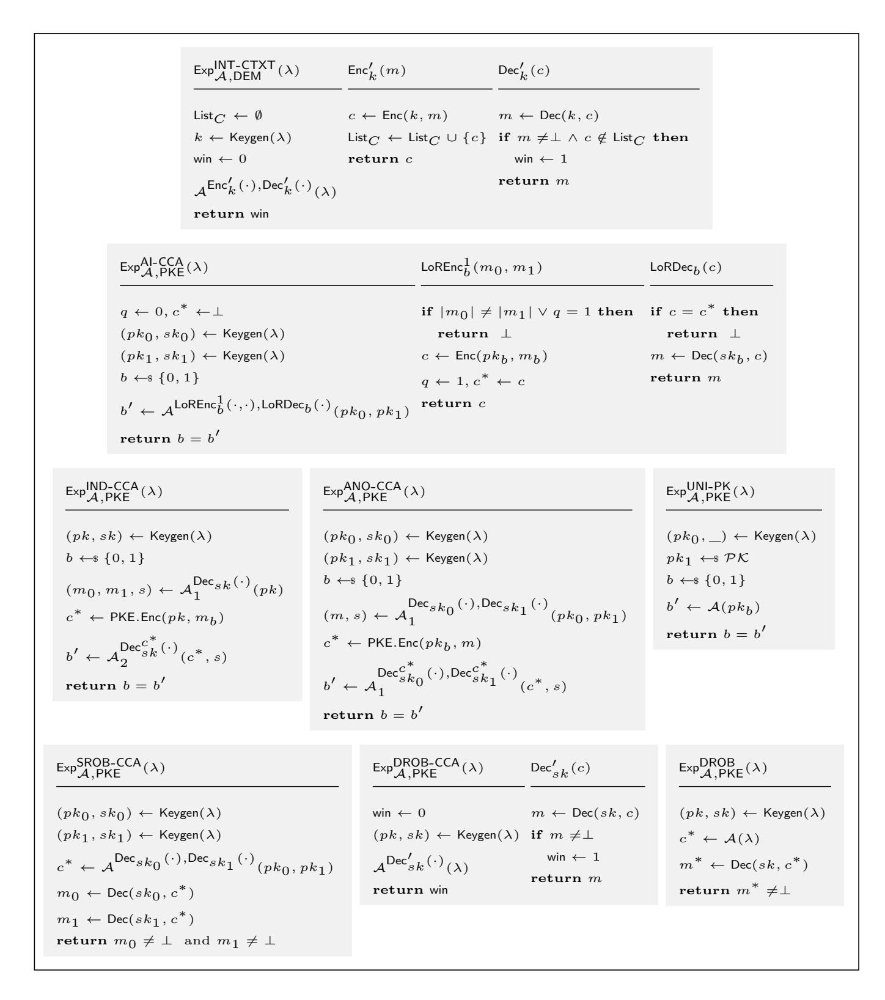
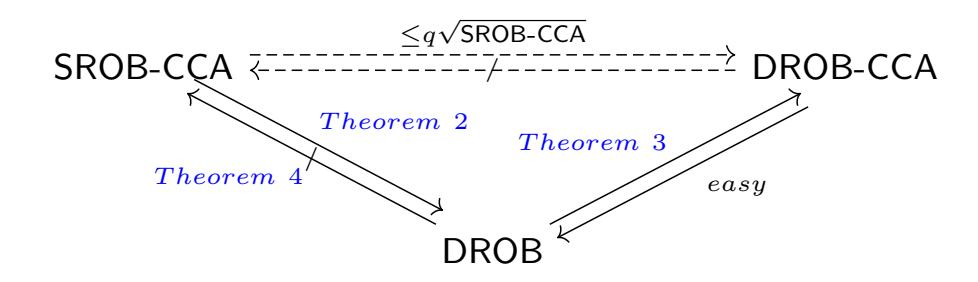
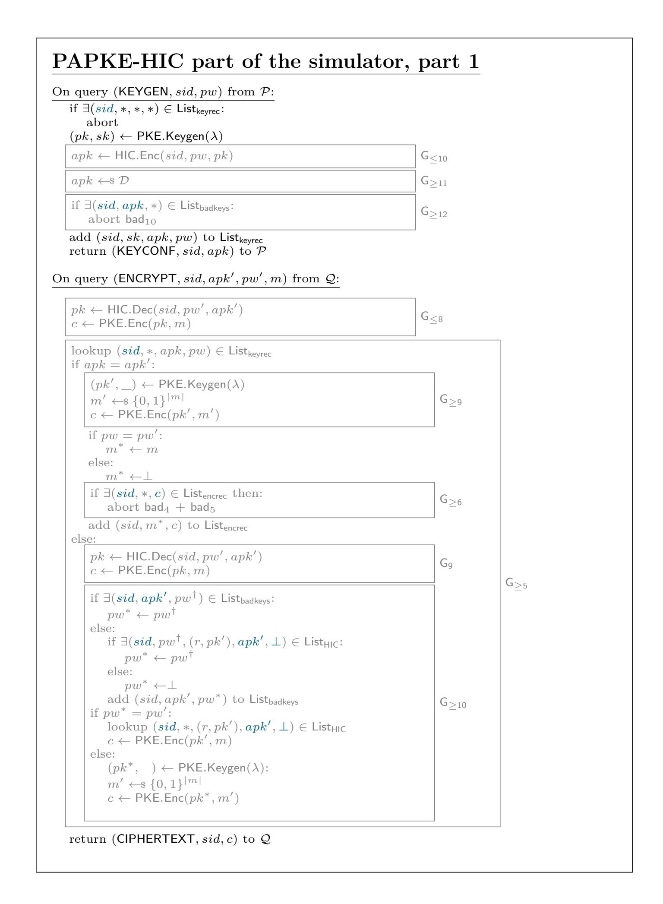
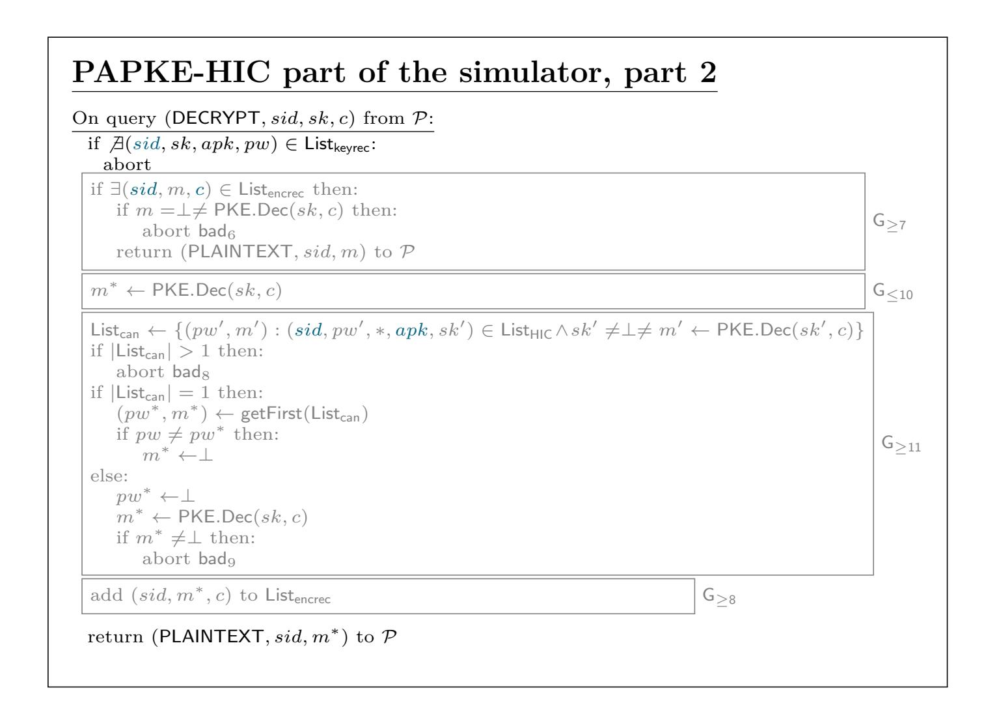
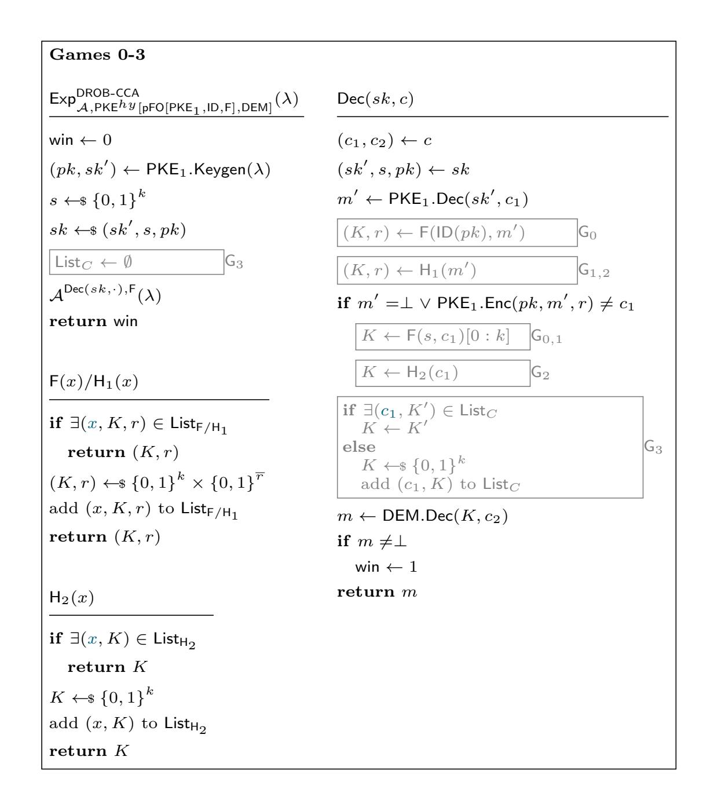
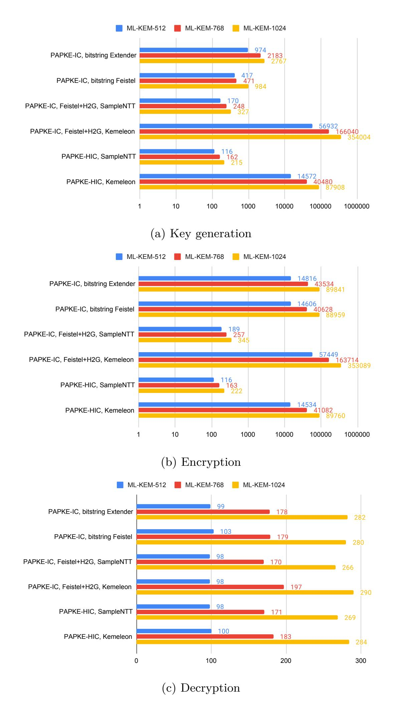
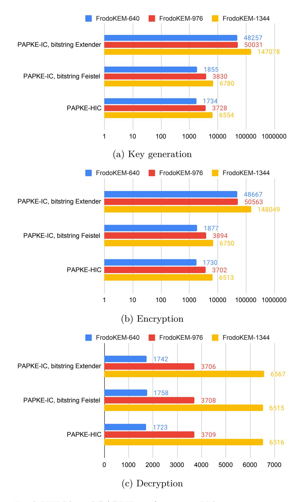
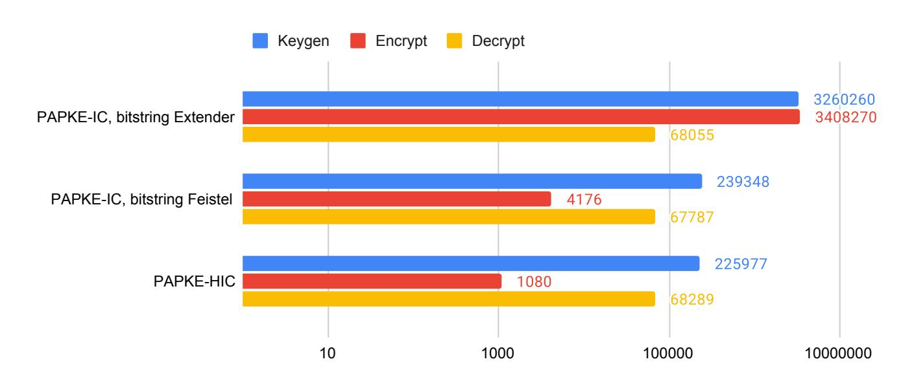

{0}------------------------------------------------

# **HIC is all you need: Practical Post-Quantum Password-Authenticated Public Key Encryption**

Afonso Arriaga<sup>1</sup> [,](https://orcid.org/0000-0002-1967-3390) David Mestel<sup>2</sup> [,](https://orcid.org/0000-0003-3186-8307) Jan Oupický<sup>1</sup> [\(](https://orcid.org/0009-0005-8204-7551)) , Peter Browne Rønne<sup>1</sup> [,](https://orcid.org/0000-0002-2785-8301) and Marjan Škrobot[1](https://orcid.org/0000-0002-7132-7591)

> <sup>1</sup> University of Luxembourg {afonso.delerue,jan.oupicky,peter.roenne}@uni.lu marjanskrobot@gmail.com <sup>2</sup> Maastricht University david.mestel@maastrichtuniversity.nl

**Abstract.** Password-Authenticated Public Key Encryption (PAPKE) enables secure encryption using only a shared, human-memorable password—eliminating the need for trusted intermediaries or pre-established infrastructure. It allows a sender to encrypt a message for a recipient, using the recipient's password-authenticated public key and a shared password, while provably resisting man-in-the-middle and offline dictionary attacks. PAPKE's support for reusable password-authenticated public keys makes it especially suitable for asynchronous, PKI-free communication scenarios.

An important open problem is to construct PAPKE schemes that are secure against quantum adversaries, as existing instantiations rely on Diffie-Hellman assumptions. The PAPKE-IC construction (ACNS 2019) is generic and admits integration with post-quantum PKE schemes. However, the scheme assumes an Ideal Cipher (IC) over the public key domain, which is large for most post-quantum PKE schemes. While an IC is typically instantiated using a block cipher, standard block ciphers operate over much smaller domains (e.g., 128 or 256 bits). Alternatively, one can use an 8-round Feistel network, which achieves indifferentiability from an ideal cipher, or domain extenders. The latter are inefficient at the domain sizes required, making the efficient and secure instantiation of the IC in PAPKE-IC, in combination with post-quantum PKE, particularly challenging.

In this paper, we propose PAPKE-HIC, a UC-secure PAPKE scheme built from a PKE scheme and a Half-Ideal Cipher (HIC, introduced at EUROCRYPT 2023), which circumvents the challenges of instantiating ideal ciphers over large domains. We provide a detailed security proof of PAPKE-HIC and establish precise requirements for the underlying PKE: strong robustness, one-wayness, ciphertext anonymity, and pseudo-uniformity of public keys. Our analysis identifies a gap in the original PAPKE-IC security proof, motivating the introduction of a novel property, which we denote Decryption Robustness (DROB-CCA). Although DROB-CCA is implied by strong robustness (SROB-CCA), the reduction is not tight and incurs a quadratic security loss. We analyze which PKE schemes directly satisfy DROB-CCA, and conclude by pre

{1}------------------------------------------------

senting concrete instantiations of PAPKE-HIC. To our knowledge, this is the first practical, post-quantum instantiation of the PAPKE primitive.

**Keywords:** Password-Authenticated Public Key Encryption (PAPKE) · Post-Quantum PAPKE · PAKE · Decryption Robustness (DROB-CCA).

## **1 Introduction**

Password-based authentication remains an important and widely deployed mechanism in modern cryptographic systems. While traditional Authenticated Key Exchange (AKE) protocols rely on long-term private keys managed through Public Key Infrastructures (PKI), such frameworks assume stable device identity and secure key storage—assumptions that do not hold universally. Advances such as passkeys, secure enclaves, and biometric authentication have improved key management on end-user devices, but these solutions depend on proprietary hardware and platform support, and remain inaccessible in many contexts. In contrast, numerous real-world scenarios—such as onboarding in IoT protocols like Thread [\[34\]](#page-29-0), ePassport inspection [\[26\]](#page-28-0), peer-to-peer file transfers [\[36\]](#page-29-1), and ephemeral wireless network sessions [\[37\]](#page-29-2)—lack the infrastructure or trust anchors required for PKI-based schemes. In these settings, password-based authentication remains a practical and cryptographically meaningful tool as it enables secure communication using pre-shared low-entropy secrets without requiring persistent credentials, trusted intermediaries, or pre-established infrastructure.

**PAKE.** Password-Authenticated Key Exchange (PAKE) protocols address the core limitations of traditional password-based authentication, e.g., sending a password over a server-authenticated TLS channel. A PAKE enables two parties, who only share a low-entropy password, to establish a high-entropy session key, while provably resisting offline dictionary attacks. This is a core security guarantee: an adversary must interact with an honest party to test each password guess. Passive eavesdropping yields no advantage, even under full transcript access. This interaction-bound guessing constraint makes PAKE significantly more robust than simple password transmission schemes, and mutual authentication offers the additional benefit of protecting against phishing attacks.

**PAPKE.** Password-Authenticated Public Key Encryption (PAPKE) [\[12\]](#page-26-0) is a cryptographic primitive that combines password authentication and CCA-secure encryption into a single mechanism, unifying two core security objectives: secrecy and authenticity. It enables a sender to encrypt a message for a recipient, using the recipient's password-authenticated public key and a shared password. The resulting ciphertext enforces password-based access control over the message, provides chosen-ciphertext security, and resists man-in-the-middle attacks, assuming the password remains unknown to the adversary.

Unlike PAKE, which derives a shared session key through mutual interaction, PAPKE supports *unilateral* encryption, enabling secure message delivery without requiring real-time interaction or composition with a symmetric key 

{2}------------------------------------------------

scheme. PAPKE also provides a theoretically stronger abstraction than PAKE: a UC-secure PAKE protocol can be derived from a UC-secure PAPKE instance by encrypting a session key rather than an arbitrary message. The inverse, however, does not hold due to a defining feature of PAPKE: the use of a reusable authenticated public key.[3](#page-2-0) Such reusability enables any sender, who holds an authenticated public key from the receiver and the corresponding password, to generate multiple valid ciphertexts without fresh interaction or per-session key derivation. The reusability of public keys makes PAPKE especially well-suited for scenarios requiring asynchronous communication, credential recovery, and oneto-many password-authenticated key exchange protocols such as SweetPAKE [\[6\]](#page-25-0) and Oblivious PAKE [\[28,](#page-28-1) [6\]](#page-25-0), where scalability and minimal communication overhead are essential. These PAPKE-based protocols are natural candidates for extending WPA3 to support multi-password authentication [\[35\]](#page-29-3). Importantly, such an extension should ensure post-quantum security with minimal communication and interaction overhead.

**Two existing approaches to PAPKE and their limitations.** PAPKE has been realized using two main approaches [\[12\]](#page-26-0). The first is a generic construction, PAPKE-IC, which relies on the Ideal Cipher (IC) model. The second, PAPKE-FO, is a direct construction based on the Decisional Diffie-Hellman (DDH) assumption and applies the Fujisaki-Okamoto (FO) transform, thus relying on the Random Oracle (RO) model instead.

When comparing the two approaches, PAPKE-IC is conceptually simpler and reflects the design of the classic Encrypted Key Exchange (EKE) protocol. However, it presents IC instantiability challenges. A poor IC instantiation may enable offline dictionary attacks. For example, if the IC is instantiated using a block cipher whose block size does not match the public key space, an adversary can decrypt the password-authenticated ciphertext under candidate passwords and discard those that do not yield a plaintext within the valid public key space.

To instantiate the ideal cipher over larger domains in PAPKE-IC, one may employ an 8-round Feistel network [\[18\]](#page-27-0) or a domain extender from [\[15\]](#page-26-1), both shown to achieve indifferentiability from an ideal cipher. These constructions are costly to implement over large algebraic domains (and in constant time). Consequently, practical and efficient instantiations of PAPKE-IC remain elusive in the post-quantum setting, underscoring the need for alternative designs.

### **1.1 Our Contributions**

**Main contribution: PAPKE-HIC with precise security requirements.** We introduce a new UC-secure Password-Authenticated Public Key Encryption scheme, PAPKE-HIC, using the Half-Ideal Cipher (HIC) from [\[33\]](#page-28-2). Concretely, we show how to generically construct a PAPKE scheme from a public key encryption (PKE) scheme and a Half-Ideal Cipher (HIC) that can be instantiated using a modified 2-round Feistel construction m2F. The main advantage of m2F is that

<span id="page-2-0"></span><sup>3</sup> A recent notion, Bare PAKE [\[7\]](#page-26-2), captures a form of reusability within PAKEs.

{3}------------------------------------------------

it employs an Ideal Cipher defined over a fixed-length bitstring domain, rather than over large algebraic domains required in prior IC-based constructions such as PAPKE-IC, making it significantly easier to instantiate efficiently. As a result, our design resolves a key open question: how to efficiently realize PAPKE in the post-quantum setting without sacrificing concrete security or performance.

We provide a detailed and rigorous proof that PAPKE-HIC realizes the UC-PAPKE functionality in the Universal Composability (UC) framework [\(Theo](#page-11-0)[rem 1\)](#page-11-0). In doing so, we formally establish precise security requirements for the underlying public key encryption scheme. As in the PAPKE-IC proof [\[12\]](#page-26-0), we identify three necessary properties: *anonymity and indistinguishability security* (AI-CCA), *strong robustness* (SROB-CCA), and *pseudo-uniformity of public keys* (UNI-PK). We further generalize the proof to accommodate public key encryption schemes with imperfect correctness and pseudo-uniform public key distributions (UNI-PK)—features that are relevant for several post-quantum public key encryption schemes.

**Second contribution: Security gap in the original** PAPKE**-**IC **proof and new public key encryption property—Decryption Robustness.** Our analysis reveals a subtle gap in the original analysis of PAPKE-IC [\[12\]](#page-26-0): the proof must ensure that an adversary, without access to the public key, cannot forge a ciphertext that decrypts successfully. We formalize this requirement as a new property called *decryption robustness* (DROB-CCA). While DROB-CCA is implied by strong robustness (SROB-CCA), as shown in [Theorem 2,](#page-14-0) the reduction is not tight and incurs a quadratic security loss. Critically, when applying [Theorem 2](#page-14-0) to derive the concrete bound of PAPKE-HIC in [Theorem 1,](#page-11-0) the DROB-CCA-related advantage becomes the dominant term, significantly weakening the overall security guarantee. (In addition, we identify a further minor omission in the original analysis: the "badkeys abort" mechanism in the FPAPKE functionality was not accounted for in the proof.)

**Third contribution: Concrete instantiations of** PAPKE**-**HIC **with postquantum PKE.** Motivated by the limitations of the reduction in [Theorem 2,](#page-14-0) we investigate which public key encryption schemes satisfy DROB-CCA directly with tighter bounds. We show that any PKE built using the standard KEM+DEM paradigm, where the KEM employs a variant of the *prefix-hashing* Fujisaki-Okamoto (FO) transform [\[20\]](#page-27-1) and the DEM satisfies ciphertext integrity (INT-CTXT), achieves DROB-CCA without relying on the generic reduction [\(The](#page-18-0)[orem 5\)](#page-18-0). This applies to post-quantum PKEs built from ML-KEM [\[31\]](#page-28-3), or FrodoKEM [\[30\]](#page-28-4).

We further show how to build DROB-CCA-secure PKE from KEMs that do not employ the prefix-hashing FO transform, such as Classic McEliece [\[3\]](#page-25-1). We also prove that the DHIES<sup>∗</sup> [\[1\]](#page-25-2), the hybrid PKE that was originally used to instantiate PAPKE-IC [\[12\]](#page-26-0), also satisfies DROB-CCA with a tighter bound.

Finally, we implement and benchmark post-quantum PAPKE-IC and PAPKE-HIC using ML-KEM [\[31\]](#page-28-3), FrodoKEM [\[30\]](#page-28-4) and Classic McEliece [\[3\]](#page-25-1) in various configurations.

{4}------------------------------------------------

### <span id="page-4-1"></span>2 Preliminaries

In this section, we present the cryptographic primitives relevant to our work. We begin with standard definitions of Public Key Encryption (PKE), Key Encapsulation Mechanism (KEM), and Data Encapsulation Mechanism (DEM). We then introduce Password-Authenticated Public Key Encryption (PAPKE) [12], followed by the Half-Ideal Cipher (HIC) [33], which forms the foundation of our construction.

All relevant security definitions are provided in Figures 1 and 9. Let SCH be a scheme and EXP be a security experiment. For experiments where the adversary's ( $\mathcal{A}$ ) goal is to guess the challenger's bit, we define its advantage as  $\mathsf{Adv}^{\mathsf{EXP}}_{\mathcal{A},\mathsf{SCH}}(\lambda) \coloneqq \left| \Pr \left[ \mathsf{Exp}^{\mathsf{EXP}}_{\mathcal{A},\mathsf{SCH}}(\lambda) = 1 \right] - \frac{1}{2} \right|$ , and  $\mathsf{Adv}^{\mathsf{EXP}}_{\mathcal{A},\mathsf{SCH}}(\lambda) \coloneqq \Pr \left[ \mathsf{Exp}^{\mathsf{EXP}}_{\mathcal{A},\mathsf{SCH}}(\lambda) = 1 \right]$  otherwise. We say that SCH is EXP-secure if  $\mathsf{Adv}^{\mathsf{EXP}}_{\mathcal{A},\mathsf{SCH}}(\lambda)$  is negligible for any PPT adversary  $\mathcal{A}$ .

### 2.1 Public Key Encryption (PKE)

We present the definition of a Public Key Encryption scheme (PKE) and relevant security notions.

**Definition 1.** A Public Key Encryption scheme (PKE) is a triple of PPT algorithms (Keygen, Enc, Dec): Keygen:  $\mathbb{N} \to \mathcal{PK} \times \mathcal{SK}$ , Enc:  $\mathcal{PK} \times \mathcal{M} \times \mathcal{R} \to \mathcal{C}$ , Dec:  $\mathcal{SK} \times \mathcal{C} \to \mathcal{M} \cup \{\bot\}$ , where  $\mathcal{PK}$  is the public key space,  $\mathcal{SK}$  is the private key space,  $\mathcal{M}$  is the message space,  $\mathcal{R}$  is the randomness space and  $\mathcal{C}$  is the ciphertext space.

Correctness. [24] We say a public key encryption scheme is  $\delta$ -correct if

$$\mathbb{E}_{(pk,sk)\leftarrow \mathrm{\$Keygen}(\lambda)}\left[\max_{m\in\mathcal{M}} \mathrm{Pr}_{r\leftarrow \mathrm{\$}\mathcal{R}}[\mathsf{Dec}(sk,\mathsf{Enc}(pk,m,r)) \neq m]\right] \leq \delta(\lambda).$$

PKE security properties. The standard security requirement for public key encryption is indistinguishability under chosen-ciphertext attacks (IND-CCA). Another crucial property is public key anonymity under chosen-ciphertext attacks (ANO-CCA), which ensures that ciphertexts reveal no information about the specific public key used during encryption. These properties can be combined into the anonymity and indistinguishability under chosen-ciphertext attacks (AI-CCA), as done in [12].<sup>4</sup> A more recent property that has proven essential for the construction of PAKE from KEM is the pseudo-uniformity of public keys (UNI-PK), which captures the notion that public keys produced by the key generation algorithm are (computationally) indistinguishable from uniformly random elements of the public key space  $\mathcal{PK}$  (called fuzziness in [8]; see also [5] for reference). Another important property of a PKE is strong robustness under chosen-ciphertext attacks (SROB-CCA), which ensures that it is computationally hard to create a

<span id="page-4-0"></span> $<sup>\</sup>overline{^4}$  Note that the notions are equivalent: Al-CCA  $\iff$  IND-CCA + ANO-CCA.

{5}------------------------------------------------

ciphertext that decrypts successfully under two distinct secret keys, both honestly generated via Keygen. All of these properties are defined in [Figure 1.](#page-6-0)

In this work, we introduce two novel properties: *decryption robustness* (DROB) and its chosen-ciphertext analogue, *decryption robustness under chosen-ciphertext attacks* (DROB-CCA). These properties formalize the requirement that it should be hard to craft a ciphertext that decrypts correctly *without knowledge of the public key*. While unconventional in standard PKE settings—where public keys are, by definition, public—this property becomes essential in PAPKE, where the public key is treated as secret. We provide exact definitions in [Figure 1](#page-6-0) and a detailed discussion in [Section 4,](#page-13-0) including its relationship to SROB-CCA.

### **2.2 Key Encapsulation Mechanism (KEM)**

We define a Key Encapsulation Mechanism (KEM). See [Appendix A.1](#page-29-4) for KEM security properties.

**Definition 2.** *A Key Encapsulation Mechanism (KEM) is a triple of PPT algorithms* (Keygen, Encap, Decap) *defined as:* Keygen : N → PK × SK*,* Encap : PK → K × C*,* Decap : SK × C → K ∪ {⊥}*, where* PK *is the public key space,* SK *is the private key space,* K *is the symmetric key space, and* C *is the ciphertext space.*

*We say a KEM is* implicitly rejecting *if* Decap *never outputs the symbol* ⊥*; otherwise, it is called* explicitly rejecting*.*

### **2.3 Data Encapsulation Mechanism (DEM)**

We present the definition of a Data Encapsulation Mechanism (DEM) and relevant security notions.

**Definition 3.** *A DEM is a triple of PPT algorithms* (Keygen, Enc, Dec) *defined as:* Keygen : N → K*,* Enc : K ×M → C*,* Dec : K × C → M ∪ {⊥}*, where* K *is the symmetric key space,* M *is the message space, and* C *is the ciphertext space.*

A DEM is typically an authenticated symmetric-key encryption scheme used in hybrid encryption. We assume that the symmetric key space K, resp. the message space M, is the same in the DEM and the KEM, resp. PKE, definitions.

*DEM security properties.* In our proofs, we only directly work with the *integrity of ciphertexts* (INT-CTXT) property of DEM from [\[10\]](#page-26-4) [\(Figure 1\)](#page-6-0). This property captures the difficulty of generating a valid ciphertext (that decrypts to a valid message, i.e., m 6=⊥) without knowledge of the corresponding symmetric key.

### **2.4 Password-Authenticated Public Key Encryption (PAPKE)**

A Password-Authenticated Public Key Encryption scheme (PAPKE) is a relatively recent primitive introduced in [\[12\]](#page-26-0). PAPKE extends public key encryption with password-based authentication.

{6}------------------------------------------------

<span id="page-6-0"></span>

Fig. 1: Security experiments defining properties of PKEs and DEMs. (1) INT-CTXT is the standard ciphertext integrity from [10]; (2) Al-CCA is the anonymity and indistinguishability from [12, 1] which is equivalent to IND-CCA+ ANO-CCA; (3) IND-CCA is the standard indistinguishability under chosen-ciphertext attacks; (4) ANO-CCA for is the anonymity under chosen-ciphertext attacks from [9]; (5) UNI-PK is the pseudo-uniformity of public keys similar to the one from [5] and fuzziness from [8]; (6) SROB-CCA is the strong-robustness from [12]; (7) DROB-CCA is the decryption robustness under chosen-ciphertext attacks; (8) DROB is the decryption robustness.  $Dec_{sk}^{c^*}(\cdot)$  is a decryption oracle with a private key sk which returns  $\bot$  if  $c^*$  is queried.

{7}------------------------------------------------

**Definition 4.** *A Password-Authenticated Public Key Encryption (PAPKE) is a triple of PPT algorithms* (Keygen, Enc, Dec) *defined as:* Keygen : N × PW → SK×APK*,* Enc : APK×PW ×M → C*,* Dec : SK×C → M∪{⊥}*, where* PW *is the password dictionary,* SK *is the private key space,* APK *is the authenticated public key space,* M *is the message space, and* C *is the ciphertext space.*

*PAPKE security properties.* The PAPKE paper [\[12\]](#page-26-0) defines two game-based security definitions: *indistinguishability against chosen-ciphertext and chosenkey attacks* (IND-CCKA) and *ciphertext authenticity* (AUTH-CTXT). IND-CCKA captures resistance against offline dictionary attacks, secrecy of messages under chosen-ciphertext attacks, security against man-in-the-middle attacks, and longterm security. AUTH-CTXT ensures that an adversary cannot create a valid ciphertext without knowing the password.

We do not detail these game-based definitions, as we work within the Universal Composability (UC) framework [\[13\]](#page-26-6), which implies both definitions. The ideal functionality of PAPKE (FPAPKE) is defined in [Figure 2.](#page-8-0)

Compared to the original functionality in [\[12\]](#page-26-0), we slightly modify FPAPKE to ensure that the messages ENC-M and ENC-L also send apk<sup>0</sup> to A together with m and |m|, respectively. We believe this is an accidental omission in the original definition, since in the proofs of PAPKE-IC and PAPKE-FO the authors write ". . .(ENC-M, sid, apk, m) from FPAPKE . . . ". In our proof of PAPKE-HIC [\(Theorem 1\)](#page-11-0), we found that sending apk<sup>0</sup> in ENC-M is necessary because the simulator must encrypt the message "honestly" and otherwise cannot determine the correct apk<sup>0</sup> to use with certainty.

### <span id="page-7-1"></span>**2.5 Half-Ideal Cipher (HIC)**

The (randomized) Half-Ideal Cipher (HIC) is a Universal Composability (UC) security notion recently proposed in [\[33\]](#page-28-2). It serves as a relaxation of the Ideal Cipher (IC) notion with application to PAKEs. The HIC security model is formalized by an ideal functionality FHIC [\(Figure 4\)](#page-10-0), which is parameterized by the domain D = R × G. Note that in our use case, G = PK, where PK is the public key space of a PKE. The HIC abstraction offers a practical alternative to ideal ciphers in the design of EKE-like protocols, eliminating the need for direct application of an IC over groups, which can be complex to instantiate [\[33\]](#page-28-2).

Notably, HIC provides an *honest interface* accessible to honest parties, and an *adversarial interface* accessible to the adversary. The adversarial interface is more powerful because it allows the adversary to choose 1) the encryption randomness r ∈ R and half of the ciphertext T ∈ G during encryption and 2) the adversary also receives r ∈ R (compared to only M ∈ G) during decryption.

<span id="page-7-0"></span>It was shown in [\[33\]](#page-28-2) that the *Modified 2-Feistel* (m2F) construction [\(Defini](#page-7-0)[tion 5](#page-7-0)) realizes FHIC in the Random Oracle (RO) and Ideal Cipher (IC) model. Although m2F internally uses an ideal cipher, it is an ideal cipher over bitstrings of small size, which is easy to instantiate using a regular block cipher.

{8}------------------------------------------------

```
1. Key Generation. On input (KEYGEN, sid, pwd) from party \mathcal{P}:
    - If sid \neq (\mathcal{P}, sid') or a record (keyrec, sid, \cdot, \cdot) exists, ignore.
    - Send (KEYGEN, sid) to \mathcal{A} and wait for (KEYCONF, sid, apk, \mathcal{M}) from \mathcal{A}.
```

- If a record (backeys, sid, apk', ·) with apk' = apk exists, abort.
- Create a record (keyrec, sid, apk, pwd) and output (KEYCONF, sid, apk) to  $\mathcal{P}$ .
- 2. **Encryption**. On input (ENCRYPT, sid, apk', pwd', m) from party Q where  $m \in \mathcal{M}$ :
  - If a record (keyrec, sid, apk, pwd) with apk = apk' exists and  $\mathcal{P}$  (from  $(\mathcal{P}, sid') \leftarrow sid$ ) is honest, then:
  - Send (ENC-L, sid, apk', |m|) to  $\mathcal{A}$  and wait for (CIPHERTEXT, sid, c) from  $\mathcal{A}$ .
    - Abort if a record (enrec, sid,  $\cdot$ , c) for c already exists.
    - Create a record (enrec, sid, m', c) with  $m' \leftarrow m$  if pwd' = pwd, and  $m \leftarrow \perp$ , else.
  - Else:
    - If a record (badkeys, sid,  $apk_j$ ,  $pwd_j$ ) with  $apk_j = apk'$  exists, set  $pwd^* \leftarrow pwd_j$ .
    - Else, send (GUESS, sid, apk') to  $\mathcal{A}$ , wait for (GUESS, sid,  $pwd^*$ ) from  $\mathcal{A}$  and create record (badkeys, sid, apk',  $pwd^*$ ).
    - If  $pwd' = pwd^*$ , send (ENC-M, sid, apk', m) to  $\mathcal{A}$ , and wait for (CIPHERTEXT, sid, c) from A.
    - If  $pwd' \neq pwd^*$ , send (ENC-L, sid, apk', |m|) to A, and wait for (CIPHERTEXT, sid, c) from A.
  - Output (CIPHERTEXT, sid, c) to Q.
- 3. **Decryption**. On input (DECRYPT, sid, c) from party  $\mathcal{P}$ :
  - If  $sid \neq (\mathcal{P}, sid')$  or no record (keyrec, sid, apk, pwd) exists, ignore.
  - If a record (enrec, sid, m, c) for c exists, where  $m \in \mathcal{M} \cup \{\bot\}$ :
    - Output (PLAINTEXT, sid, m) to  $\mathcal{P}$ .
  - Else:
    - Send (DECRYPT, sid, c) to A and wait for (PLAINTEXT, sid, m,  $pwd^*$ ) from A.
    - If  $pwd^* = pwd$ , set  $m' \leftarrow m$  and  $m' \leftarrow \perp$  otherwise.
    - Create a record (enrec, sid, m', c).
    - Output (PLAINTEXT, sid, m') to  $\mathcal{P}$ .

Fig. 2: Patched ideal functionality  $\mathcal{F}_{\mathsf{PAPKE}}$  from [12]—the functionality additionally sends apk' for messages ENC-M and ENC-L. The functionality is parametrized by the message space  $\mathcal{M}$ .

{9}------------------------------------------------

**Definition 5.** Let  $H: \mathcal{PW} \times \mathcal{R} \to \mathbb{G}$  and  $G: \mathcal{PW} \times \mathbb{G} \to \mathcal{K}$  be random oracles and let IC = (IC.Enc, IC.Dec) be an ideal cipher over  $\mathcal{R}$ . A Modified 2-Feistel construction m2F = m2F[H, G, IC] is a tuple of PPT algorithms  $m2F.Enc/m2F.Dec: \mathcal{PW} \times \mathcal{R} \times \mathbb{G} \to \mathcal{R} \times \mathbb{G}$  where  $\mathcal{PW}$  is the dictionary of possible passwords,  $\mathcal{R} = \{0,1\}^n$ ,  $\mathbb{G}$  is a group and  $\mathcal{K}$  is the keyspace of IC. The descriptions of m2F.Enc and m2F.Dec are in Figure 3.

<span id="page-9-0"></span>

| m2F.Enc(pw,r,M)            | m2F.Dec(pw,s,T)               |
|----------------------------|-------------------------------|
| $R \leftarrow H(pw,r)$     | $t \leftarrow G(pw,T)$        |
| $T \leftarrow M \odot R$   | $r \leftarrow IC.Dec(t,s)$    |
| $t \leftarrow G(pw,T)$     | $R \leftarrow H(pw,r)$        |
| $s \leftarrow IC.Enc(t,r)$ | $M \leftarrow T \odot R^{-1}$ |
| return $(s,T)$             | $\mathbf{return}\ (r,M)$      |

Fig. 3: The modified 2-Feistel (m2F[H, G, IC]) [33],  $\odot$  is the group operation in  $\mathbb{G}$  and  $(\cdot)^{-1}$  is the inverse in  $\mathbb{G}$ .

### <span id="page-9-2"></span>3 PAPKE-HIC—Practical Post-Quantum PAPKE

In this section, we present a new practical PAPKE construction, PAPKE-HIC (Figure 5), which achieves the UC-PAPKE notion, offers strong security guarantees, and avoids the need to instantiate an ideal cipher over groups or large domains. We show how to instantiate PAPKE-HIC using any AI-CCA, SROB-CCA, UNI-PK, and DROB-CCA-secure public key encryption scheme and a half-ideal cipher. Furthermore, we discuss subtle issues overlooked in the original proof of PAPKE-IC in [12].

```
Setup. Let PKE = (Keygen, Enc, Dec) be a public key encryption scheme with a public key space \mathcal{PK} and let HIC = (HIC.Enc, HIC.Dec) be a half-ideal cipher with the domain \mathcal{D} = \mathcal{R} \times \mathcal{PK}.

\frac{\mathsf{PAPKE}.\mathsf{Keygen}(\lambda, pw)}{\mathsf{Compute}(sk, pk)} \leftarrow \mathsf{PKE}.\mathsf{Keygen}(\lambda) \text{ and } apk \leftarrow \mathsf{HIC}.\mathsf{Enc}(pw, pk). \text{ Output } (sk, apk).
\frac{\mathsf{PAPKE}.\mathsf{Enc}(apk', pw', m)}{\mathsf{Compute}} = \mathsf{PKE}.\mathsf{Enc}(pk', m).
\frac{\mathsf{PAPKE}.\mathsf{Dec}(sk, c')}{\mathsf{Decrypt}} = \mathsf{PKE}.\mathsf{Dec}(sk, c') \text{ and output } m.
```

Fig. 5: The generic PAPKE-HIC construction.

{10}------------------------------------------------

```
Interface for honest parties:
1. Encryption. On query (Enc, sid, pw, M) from P where M ∈ G:
   – r ←$ R
   – If ∃c s.t. (sid, pw, (r, M), c) ∈ ListHIC, then:
      • Output c to P
   – Else:
      • c ←$ D \ {c
                    0 ∈ D : ∃(sid, pw, ∗, c0
                                          ) ∈ ListHIC}
      • ListHIC ← {(sid, pw, (r, M), c)} ∪ ListHIC
      • Output c to P
2. Decryption. On query (Dec, sid, pw, c) from P where c ∈ D:
   – Query (r, M) ← FHIC.AdvDec(sid, pw, c)
   – Output M to P.
Interface for Adversary A (or corrupt parties):
1. Encryption. On query (AdvEnc, sid, pw, (r, M), T) from A where (r, M) ∈ D and T ∈ G:
   – If ∃c s.t. (sid, pw, (r, M), c) ∈ ListHIC, then:
      • Output c to A
   – Else:
      • s ←$ R \ {s
                    0 ∈ R : ∃(sid, pw, ∗, (s
                                          0
                                           , T)) ∈ ListHIC}
      • c ← (s, T)
      • ListHIC ← {(sid, pw, (r, M), c)} ∪ ListHIC
      • Output c to A
2. Decryption. On query (AdvDec, sid, pw, c) from A where c ∈ D:
   – If ∃m s.t. (sid, pw, m, c) ∈ ListHIC, then:
      • Output m to A
   – Else:
      • m ←$ D \ {m0 ∈ D : ∃(sid, pw, m0
                                          , ∗) ∈ ListHIC}
      • ListHIC ← {(sid, pw, m, c)} ∪ ListHIC
      • Output m to A
```

Fig. 4: Ideal functionality FHIC for the Half-Ideal Cipher from [\[33\]](#page-28-2). The functionality is parametrized by the domain D = R × G.

{11}------------------------------------------------

### **3.1 Benefits of PAPKE-HIC**

PAPKE-HIC, depicted in [Figure 5,](#page-9-1) is inspired by the original PAPKE-IC construction from [\[12\]](#page-26-0), with the difference that a half-ideal cipher (HIC) [\[33\]](#page-28-2) is used instead of an ideal cipher (IC). The main benefit of a HIC, or more precisely its instantiation m2F [\(Section 2.5\)](#page-7-1), is that it avoids the need for an IC over the public key space. Constructing a post-quantum PAPKE requires a postquantum PKE, and such schemes typically involve large public keys. As a result, instantiating a post-quantum PAPKE-IC in practice is challenging, making the HIC-based approach a more practical alternative.

Recall that m2F uses an ideal cipher internally, but this cipher operates over bitstrings of length 256 (assuming a 128-bit security), which can be instantiated using a regular block cipher. Even though some post-quantum KEMs, such as Classic McEliece [\[3\]](#page-25-1), have public keys that are indistinguishable from random bitstrings, and there exist methods for encoding public keys as random bitstrings (e.g., Kemeleon for ML-KEM [\[23\]](#page-27-2)), the main challenge remains their size. For instance, the size of a Kemeleon-encoded ML-KEM public key is 781 *bytes*, and for Classic McEliece it is 261120 *bytes* at NIST security level 1.

There are techniques to instantiate an ideal cipher over bitstrings > 256 [\[15,](#page-26-1) [18\]](#page-27-0); however, these are practically inefficient for large domains.

While m2F requires a *hash-to-group* function, hashing into the group—which in this case is the public key space—is easy in our setting, as most of the postquantum KEMs derive their keys from a seed. This derivation mechanism can be used to implement the required hash-to-group function.

### <span id="page-11-1"></span>**3.2 Proof of PAPKE-HIC and Issues with the PAPKE-IC Proof**

We now explain why substituting an ideal cipher (IC) with a half-ideal cipher (HIC) in the PAPKE construction does not compromise security. First, a HIC ciphertext generated via the HIC.Enc interface effectively commits the adversary to a unique key (password) used to produce that ciphertext (authenticated public key). This commitment property holds just as it does in the IC setting, despite the adversary having additional power to specify part of a ciphertext using the adversarial HIC.AdvEnc interface. Crucially, the simulator can straight-line extract the associated key (password), ensuring that only a single password guess is possible per adversarially generated authenticated public key. Furthermore, as with IC, decrypting a HIC ciphertext (authenticated public key) using a key (password) different from the one used in encryption yields a random element in the HIC domain. This allows the simulator to embed a public key of its choice when simulating HIC.Dec responses.

In [Theorem 1,](#page-11-0) we prove that PAPKE-HIC [\(Figure 5\)](#page-9-1) securely realizes the PAPKE UC functionality [\(Figure 2\)](#page-8-0) by leveraging the HIC functionality [\(Fig](#page-10-0)[ure 4\)](#page-10-0) and several security properties of the underlying PKE scheme.

<span id="page-11-0"></span>**Theorem 1.** *The scheme* PAPKE*-*HIC *[\(Figure 5\)](#page-9-1) UC-realizes* FPAPKE *[\(Figure 2\)](#page-8-0) in the* FHIC*-hybrid model, if the public key encryption scheme* PKE *is* AI*-*CCA*,* 

{12}------------------------------------------------

SROB-CCA, UNI-PK, DROB-CCA-secure and  $\delta$ -correct. Specifically, there exists a simulator SIM, such that for all environments  $\mathcal{Z}$  controlling a dummy adversary  $\mathcal{A}$ , its distinguishing advantage, Adv, between the real and ideal world is

$$\begin{split} \mathsf{Adv}(\lambda) & \leq \frac{q_{\mathsf{HIC}}^2}{2 \cdot |\mathcal{R}|} + \frac{q_{\mathsf{HIC}}^2}{2 \cdot |\mathcal{PK}|} + \frac{q_{\mathsf{PAPKE}}}{|\mathcal{R} \times \mathcal{PK}|} + q_{\mathsf{PAPKE}} \cdot \delta(\lambda) \\ & + 2 \cdot q_{\mathsf{HIC}} \cdot (q_{\mathsf{HIC}} + 1) \cdot \mathsf{Adv}_{\mathcal{B},\mathsf{PKE}}^{\mathsf{SROB-CCA}}(\lambda) \\ & + 2 \cdot (q_{\mathsf{HIC}} + 1) \cdot q_{\mathsf{PAPKE},\mathsf{Enc}} \cdot \mathsf{Adv}_{\mathcal{B},\mathsf{PKE}}^{\mathsf{AI-CCA}}(\lambda) \\ & + q_{\mathsf{HIC}} \cdot \mathsf{Adv}_{\mathcal{B},\mathsf{PKE}}^{\mathsf{UNI-PK}}(\lambda) + \mathsf{Adv}_{\mathcal{B},\mathsf{PKE}}^{\mathsf{DROB-CCA}}(\lambda). \end{split}$$

Here  $q_{\text{HIC}}$  and  $q_{\text{PAPKE}}$  represent upper bounds on the number of queries to  $\mathcal{F}_{\text{HIC}}$  and  $\mathcal{F}_{\text{PAPKE}}$ , respectively.  $\mathcal{R}$  is the HIC randomness space and  $\mathcal{PK}$  is the public key space of PKE.

The proof of Theorem 1 is provided in Appendix B. Given the similarities between the IC and the HIC, our proof is inspired by the original proof of PAPKE-IC (Theorem 3, [12]). However, we identified and addressed several subtle issues in the original proof.

The main issue concerns the treatment of the event bad<sub>5</sub> in Game<sub>5</sub> (using numbering from [12]). The original proof claims that this event cannot occur because there always exists a row in  $\mathbf{L}$  for the honest apk such that  $sk \neq \perp$ . However, under the simulator's decryption procedure in  $\mathsf{Game_5}$ , the corresponding row in  $\mathbf{L}$  is generated via a call to  $\mathsf{IC.Enc}(pw,pk)$  and therefore contains  $sk = \perp$ . One could alter the simulation of the key generation process to avoid this issue—for example, by sampling apk, querying  $\mathsf{IC.Dec}(pw,apk)$ , and retrieving (pk,sk) from  $\mathbf{L}$  to ensure  $sk \neq \perp$ . While this would prevent  $\mathsf{bad_5}$  in  $\mathsf{Game_5}$ , it does not extend to later games such as  $\mathsf{Game_8}$ , where the generated (pk,sk) pair becomes independent of apk, and the simulator cannot rely on knowing the password. In such settings, the environment could potentially craft a valid ciphertext without knowing the public key, which reintroduces  $\mathsf{bad_5}$ .

This motivates our decryption robustness property DROB-CCA (Section 4), which formalizes the requirement that an adversary cannot forge a valid ciphertext under a public key it does not know, even with access to a decryption oracle. In our proof, we argue the equivalent of the bad<sub>5</sub> event (in our proof referred to as bad<sub>9</sub>) using the DROB-CCA-security of the PKE. This corresponds to the final term in the bound stated in Theorem 1.

We also observed that the "badkeys" abort (3rd line in the key generation of  $\mathcal{F}_{\mathsf{PAPKE}}$ ) is not mentioned in the original proof. Although minor, this omission is relevant. The event occurs with negligible probability, assuming a large apk keyspace. In our proof, it contributes the  $q_{\mathsf{PAPKE}} \cdot |\mathcal{R} \times \mathcal{PK}|^{-1}$  term in Theorem 1.

Additionally, we generalize the proof to consider non-perfectly correct public key encryption schemes with non-perfectly uniform public keys (UNI-PK). This is important when instantiating PAPKE-HIC with a post-quantum PKE, as most available schemes are neither perfectly correct nor have perfectly uniform public keys. (Note that our proof of PAPKE-HIC can be adapted into a PAPKE-IC proof by modifying our Game<sub>2</sub> to accommodate for an IC instead of a HIC.)

{13}------------------------------------------------

### **3.3 Why DROB-CCA Matters for the Security of UC-PAPKE?**

Let us first explain why the DROB-CCA property is necessary in the context of PAPKE within the Universal Composability (UC) framework. Consider the following PAPKE attack in the UC framework. The environment Z initiates a party P with a *high-entropy password* pw by sending the message (KEYGEN, sid, pw). The simulator, upon receiving the message (KEYGEN, sid), must choose a (random) apk, without knowing the actual password pw.

Later, Z instructs P to decrypt a randomly chosen ciphertext c by sending (DECRYPT, sid, c). Since P was honestly initiated, there exists a key record (sid, apk, pw) ∈ Listkeyrec. However, there is no corresponding encryption record in Listencrec, because the ciphertext c was chosen independently by the environment.

The simulator, upon receiving query (DECRYPT, sid, c), must respond with (PLAINTEXT, sid, m, pw<sup>∗</sup> ). The probability that pw<sup>∗</sup> = pw, i.e., that the simulator guesses the correct password, is negligible because pw is hidden from the simulator and was chosen from a high-entropy distribution. Thus, with overwhelming probability, the response sent to P must be ⊥, i.e., decryption fails.

At first glance, this may seem like an artificial attack: the environment is not even trying to learn the underlying public key, but rather to exploit behavioral inconsistencies between the real world and the simulated ideal world. Nevertheless, it pinpoints an important observation: we can only ensure a sound simulation if ciphertexts selected before key generation are also rejected in the real world. This motivates the need for our DROB-CCA property.

## <span id="page-13-0"></span>**4 Decryption Robustness of Public Key Encryption**

Motivated by the requirements of the proof of PAPKE-(H)IC [\(Section 3.2\)](#page-11-1), we defined in [Section 2](#page-4-1) a new public key encryption property, called *decryption robustness under chosen ciphertext-attacks* (DROB-CCA). In this section, we examine how it relates the existing *strong robustness* (SROB-CCA) property and also which schemes satisfy DROB-CCA directly. To the best of our knowledge, this is a new property, relevant in a setting where the public key is not yet known—an atypical situation in public-key encryption security modeling, where public keys are generally assumed to be known to all parties.

First, we show that DROB-CCA is implied by SROB-CCA in [Section 4.1.](#page-14-1) However, the reduction is not tight, with at least a quadratic security loss. A direct proof with a tighter bound is therefore preferable for concrete security analyses.

In [Section 4.2,](#page-16-0) we show that a hybrid PKE constructed from a KEM and a DEM satisfies DROB-CCA if 1) the DEM is INT-CTXT-secure and 2) the KEM is constructed using a variant of an FO transform that is contributory, i.e., that utilizes the public key during the symmetric key derivation. Note that many postquantum KEMs satisfy condition 2), e.g., ML-KEM [\[31\]](#page-28-3) or FrodoKEM [\[30\]](#page-28-4). We prove the result for a specific variant of the FO transform introduced in [\[20\]](#page-27-1) 

{14}------------------------------------------------

called *Fujisaki-Okamoto Transformation with Prefix Hashing*. The transform is described in [Figure 7.](#page-17-0)

It's also worth noting that not all KEMs satisfy condition 2). For example, Classic McEliece [\[3\]](#page-25-1) does not involve the public key during the symmetric key derivation. More importantly, as observed in [\[21\]](#page-27-3), there exist ciphertexts that decapsulate to the same key under any keypair. This implies that a hybrid PKE using Classic McEliece cannot satisfy DROB-CCA since an adversary can select one of these ciphertexts and use its decapsulated value as the DEM key.

This motivates our *hashed public key* KEM transform (HPK), presented in [Appendix D,](#page-49-0) which transforms any KEM into one that can be used to build a DROB-CCA-secure PKE scheme.

In [Appendix E,](#page-53-0) we show that DHIES<sup>∗</sup> , originally used to instantiate PAPKE-IC in [\[12\]](#page-26-0), also directly satisfies DROB-CCA.

### <span id="page-14-1"></span>**4.1 Strong Robustness Implies Decryption Robustness**

We separate the proof SROB-CCA =⇒ DROB-CCA into two steps. First, in [Theorem 2,](#page-14-0) we prove that SROB-CCA =⇒ DROB, where DROB [\(Figure 1\)](#page-6-0) is a weaker variant of DROB-CCA in which the adversary does not have access to the Dec oracle. Then, we prove that DROB is equivalent to DROB-CCA, albeit with a q ∈ poly(λ) security loss. The relationships are visualized in [Figure 6.](#page-14-2)

<span id="page-14-2"></span>

Fig. 6: Relations among SROB-CCA, DROB-CCA and DROB.

<span id="page-14-0"></span>**Theorem 2.** *If a public key encryption scheme* PKE *satisfies* SROB*-*CCA*, then it also satisfies* DROB*. In other words, for any PPT adversary* A *against* DROB*, there exists a PPT adversary* B *against* SROB*-*CCA *such that*

$$\mathsf{Adv}^{\mathsf{DROB}}_{\mathcal{A},\mathsf{PKE}}(\lambda) \leq \sqrt{\mathsf{Adv}^{\mathsf{SROB-CCA}}_{\mathcal{B},\mathsf{PKE}}(\lambda)}.$$

*Proof.* We prove the contrapositive: if there is an efficient adversary A against DROB, then there is an efficient adversary B against SROB-CCA.

The SROB-CCA adversary B receives the security parameter λ, two public keys pk0, pk<sup>1</sup> corresponding to the private keys sk0, sk1, and access to two decryption oracles Dec(sk0, ·), Dec(sk1, ·). B simply runs A with λ as input and once A outputs c ∗ , B submits it to the challenger. Let us analyze the advantage of B.

{15}------------------------------------------------

We need to show that  $f(\lambda) := \Pr \Big[ \mathsf{Exp}^{\mathsf{SROB\text{-}CCA}}_{\mathcal{B},\mathsf{PKE}}(\lambda) = 1 \Big]$  is <u>non-negligible</u>; specifically that

$$\exists d \in \mathbb{N}, \forall n_0 \in \mathbb{N}, \exists \lambda \ge n_0 : f(\lambda) > \frac{1}{\lambda^d}.$$

By assumption,  $g(\lambda) := \Pr \Big[ \mathsf{Exp}_{\mathcal{A},\mathsf{PKE}}^{\mathsf{DROB}}(\lambda) = 1 \Big]$  is non-negligible, i.e., there exists  $d_{\mathsf{DROB}} \in \mathbb{N}$  s.t. for any  $n_0 \in \mathbb{N}$  there exists  $\lambda \geq n_0$  for which  $g(\lambda) > \frac{1}{\lambda^{d_{\mathsf{DROB}}}}$ . Note that

$$\begin{split} g(\lambda) &= \Pr_{\substack{(pk,sk) \sim \mathsf{Keygen}(\lambda) \\ r \sim U}} \left[ \mathsf{Dec}(sk,\mathcal{A}(\lambda,r)) \neq \bot \right] \\ &= \sum_{c \in \mathcal{C}} \left( \Pr_{r \sim U} \left[ \mathcal{A}(\lambda,r) = c \right] \cdot \Pr_{\substack{(pk,sk) \sim \mathsf{Keygen}(\lambda) \\ (pk,sk) \sim \mathsf{Keygen}(\lambda)}} \left[ \mathsf{Dec}(sk,c) \neq \bot \right] \right) \\ &> \frac{1}{\lambda^{d_{\mathsf{DROB}}}}, \end{split}$$

where  $\mathcal{C}$  is the set of ciphertexts and r denotes the random coins for  $\mathcal{A}$  from the uniform distribution over  $\{0,1\}^{\mathsf{poly}(\lambda)}$  (denoted as U). By explicit definition of  $\mathcal{B}$  in terms of  $\mathcal{A}$ , we have

$$\begin{split} f(\lambda) &= \Pr\left[\mathsf{Exp}_{\mathcal{B},\mathsf{PKE}}^{\mathsf{SROB-CCA}}(\lambda) = 1\right] \\ &= \Pr_{\substack{(pk_0,sk_0) \sim \mathsf{Keygen}(\lambda) \\ (pk_1,sk_1) \sim \mathsf{Keygen}(\lambda) \\ r \sim U}} \left[\mathsf{Dec}(sk_0,\mathcal{A}(\lambda,r)) \neq \bot \land \mathsf{Dec}(sk_1,\mathcal{A}(\lambda,r)) \neq \bot\right] \\ &= \sum_{c \in \mathcal{C}} \left(\Pr_{r \sim U} \left[\mathcal{A}(\lambda,r) = c\right] \cdot \Pr_{\substack{(pk_0,sk_0) \sim \mathsf{Keygen}(\lambda) \\ (pk_1,sk_1) \sim \mathsf{Keygen}(\lambda)}} \left[\mathsf{Dec}(sk_0,c) \neq \bot \land \mathsf{Dec}(sk_1,c) \neq \bot\right]\right). \end{split}$$

For a fixed c, the probabilities that  $\mathsf{Dec}(sk_0,c) \neq \perp$  and  $\mathsf{Dec}(sk_1,c) \neq \perp$  are independent since  $sk_0$  and  $sk_1$  are independently sampled, therefore

$$f(\lambda) = \sum_{c \in \mathcal{C}} \left( \Pr_{r \sim U} \left[ \mathcal{A}(\lambda, r) = c \right] \cdot \left( \Pr_{(pk, sk) \sim \mathsf{Keygen}(\lambda)} \left[ \mathsf{Dec}(sk, c) \neq \bot \right] \right)^2 \right). \tag{1}$$

Jensen's inequality gives us that  $\psi(\mathbb{E}[X]) \leq \mathbb{E}(\psi(X))$  where  $\psi$  is a real convex function and  $X: \Omega \to \mathcal{X}$  a random variable. Furthermore, for any  $h: \mathcal{X} \to \mathbb{R}$ , h(X) is a random variable and  $\mathbb{E}[h(X)] = \sum_{x \in \mathcal{X}} h(x) \Pr[X = x]$ . In our case  $\psi(x) \coloneqq x^2$ ,  $X \coloneqq \mathcal{A}(\lambda, r)$  where r is sampled uniformly at random from the appropriate domain and

<span id="page-15-0"></span>
$$h(c) \coloneqq \Pr_{(sk,pk) \sim \mathsf{Keygen}(\lambda)} \left[ \mathsf{Dec}(sk,c) \neq \perp \right].$$

{16}------------------------------------------------

Therefore, by applying Jensen's inequality to Equation (1) we get

$$\begin{split} f(\lambda) \geq & \left( \sum_{c \in \mathcal{C}} \Pr_{r \sim U} \left[ \mathcal{A}(\lambda, r) = c \right] \cdot \Pr_{(sk, pk) \sim \mathsf{Keygen}(\lambda)} \left[ \mathsf{Dec}(sk, c) \neq \bot \right] \right)^2 \\ = & g(\lambda)^2 > \frac{1}{\lambda^{2d_{\mathsf{DROB}}}}. \end{split}$$

In other words, we have found  $d := 2d_{\mathsf{DROB}}$  which proves that  $f(\lambda)$  is non-negligible.

Next, we show that DROB is nearly equivalent to DROB-CCA. The implication DROB-CCA  $\Longrightarrow$  DROB is clear as any successful DROB adversary always wins the DROB-CCA game by submitting its output  $c^*$  to the Dec oracle at the end. So,  $\mathsf{Adv}^{\mathsf{DROB}}_{\mathcal{A},\mathsf{PKE}}(\lambda) \leq \mathsf{Adv}^{\mathsf{DROB-CCA}}_{\mathcal{B},\mathsf{PKE}}(\lambda)$ . We prove the other implication in Theorem 3.

<span id="page-16-1"></span>**Theorem 3.** If a public key encryption scheme PKE satisfies DROB, then it also satisfies DROB-CCA. Specifically, for any PPT adversary  $\mathcal{A}$  against DROB-CCA, there exists a PPT adversary  $\mathcal{B}$  against DROB such that

$$\mathsf{Adv}^{\mathsf{DROB\text{-}CCA}}_{\mathcal{A},\mathsf{PKE}}(\lambda) \leq q_D \cdot \mathsf{Adv}^{\mathsf{DROB}}_{\mathcal{B},\mathsf{PKE}}(\lambda).$$

where  $q_D$  is the number of A's Dec oracle queries.

<span id="page-16-3"></span>Theorem 3 is proven in Appendix C.1.

Corollary 1. If a public key encryption scheme PKE satisfies SROB-CCA, then it also satisfies DROB-CCA. More precisely, for any PPT adversary  $\mathcal A$  against DROB-CCA there exists a PPT adversary  $\mathcal B$  against SROB-CCA such that

$$\mathsf{Adv}_{\mathcal{A},\mathsf{PKE}}^{\mathsf{DROB-CCA}}(\lambda) \leq q_D \cdot \sqrt{\mathsf{Adv}_{\mathcal{B},\mathsf{PKE}}^{\mathsf{SROB-CCA}}(\lambda)}.$$

where  $q_D$  is the number of A's Dec oracle queries.

<span id="page-16-2"></span>**Theorem 4.** There exists a public key encryption scheme that is DROB-secure, but is not SROB-CCA-secure. In other words, DROB does not imply SROB-CCA.

Theorem 4 is proven in Appendix C.2. Note that Theorem 4 shows that DROB-CCA and SROB-CCA are not equivalent notions.

#### <span id="page-16-0"></span>4.2 Building a DROB-CCA PKE from a Prefix-Hashing FO KEM

In Section 4.1, we have shown that SROB-CCA implies DROB-CCA. However, the reduction is not tight. Specifically, there is at least a quadratic security loss. This motivates Theorem 5, which shows that the standard hybrid (KEM+DEM) public key encryption construction (PKE $^{hy}$  in Figure 8) directly satisfies DROB-CCA, provided that 1) the DEM is INT-CTXT-secure and 2) the KEM is constructed using the prefix-hashing Fujisaki-Okamoto transform pFO (Figure 7).

{17}------------------------------------------------

The pFO transform is a modified version of the transform introduced in [\[20,](#page-27-1) Figure 4]—this transform does not derive the "rejection key" K¯ from ID(pk), which exactly models KEMs such as ML-KEM [\[31\]](#page-28-3). Note that in the proof and the description of the transform [\(Figure 7\)](#page-17-0) we use Python-like syntax to indicate truncated outputs, e.g., the first 128 bits of the value F(x) is denoted as F(x)[0 : 128].

```
pFO[PKE1, ID, F].Keygen(λ)
(pk, sk0
       ) ← PKE1.Keygen(λ)
s ←$ M
sk ← (sk0
          , s, pk)
return (pk, sk)
                               pFO[PKE1, ID, F].Encap(pk)
                               m ←$ M
                               (K, r) ← F(ID(pk), m)
                               c ← PKE1.Enc(pk, m, r)
                               return (K, c)
                                                             pFO[PKE1, ID, F].Decap(sk, c)
                                                             (sk0
                                                                 , s, pk) ← sk
                                                             m0 ← PKE1.Dec(sk0
                                                                                 , c)
                                                             (K, r) ← F(ID(pk), m0
                                                                                   )
                                                             K¯ ← F(s, c)[0 : k]
                                                             if m0 =⊥ ∨ PKE1.Enc(pk, m0
                                                                                           , r) 6= c
                                                               return K¯ /⊥
                                                             return K
```

Fig. 7: pFO[PKE1, ID, F] is the prefix-hashing FO transform inspired by [\[20,](#page-27-1) Figure 4]. PKE<sup>1</sup> is a PKE, ID is a fixed-length output function and F is a random oracle. The inclusion of the boxed code defines the explicitly rejecting transform.

<span id="page-17-1"></span>

| PKEhy[KEM, DEM].Keygen(λ)                   | PKEhy[KEM, DEM].Enc(pk, m)                                                | PKEhy[KEM, DEM].Dec(sk, c)                                        |
|---------------------------------------------|---------------------------------------------------------------------------|-------------------------------------------------------------------|
| (pk, sk) ← KEM.Keygen(λ)<br>return (pk, sk) | (c1, k) ← KEM.Encap(pk)<br>c2 ← DEM.Enc(k, m)<br>c ← (c1, c2)<br>return c | (c1, c2) ← c<br>k ← KEM.Decap(sk, c1)<br>if k =⊥ then<br>return ⊥ |
|                                             |                                                                           | m ← DEM.Dec(k, c2)<br>return m                                    |

Fig. 8: Description of the standard hybrid PKE construction using a KEM and a DEM. The inclusion of the boxed code defines the construction for explicitly rejecting KEMs.

<span id="page-17-2"></span>We prove [Theorem 5](#page-18-0) in the QROM model [\[11\]](#page-26-7) using the following lemma from [\[32,](#page-28-6) Lemma 2.2] which shows that a quantum random oracle can be used as a PRF.

{18}------------------------------------------------

**Lemma 1.** Let  $l \in \mathbb{N}$ . Let  $F : \{0,1\}^l \times \mathcal{X} \to \mathcal{Y}$  and  $H : \mathcal{X} \to \mathcal{Y}$  be two independent random oracles. If an unbounded-time quantum adversary  $\mathcal{D}$  makes at most q queries to its quantum-accessible random oracles, then we have

$$\left| \Pr \left[ 1 \leftarrow \mathcal{D}^{\mathsf{F},\mathsf{F}(t,\cdot)}() | t \leftarrow \$ \{0,1\}^l \right] - \Pr \left[ 1 \leftarrow \mathcal{D}^{\mathsf{F},\mathsf{H}}() \right] \right| \leq \frac{2 \cdot q}{\sqrt{2^l}}.$$

<span id="page-18-0"></span>**Theorem 5.** Let  $PKE = PKE^{hy}[KEM, DEM]$  be a hybrid public key encryption scheme constructed from an implicitly rejecting key encapsulation mechanism KEM and a data encapsulation mechanism DEM. If KEM is constructed using the prefix-hashing FO transform pFO (Figure 7), i.e., KEM = pFO[PKE<sub>1</sub>, ID, F] where  $PKE_1$  is a public key encryption scheme,  $ID : \mathcal{PK} \to \{0,1\}^n$  is a fixed-length output function,  $F : \{0,1\}^* \to \{0,1\}^k \times \{0,1\}^{\overline{r}}$  is a quantum random oracle and DEM is INT-CTXT-secure, then for any QPT adversary  $\mathcal{A}$  against DROB-CCA of PKE there exists a QPT adversary  $\mathcal{B}$  against INT-CTXT of DEM such that

$$\mathsf{Adv}^{\mathsf{DROB\text{-}CCA}}_{\mathcal{A},\mathsf{PKE}}(\lambda) \leq \frac{4 \cdot q_{\mathsf{F}}}{\sqrt{2^{\min(m,k)}}} + q_D \cdot \mathsf{Adv}^{\mathsf{INT\text{-}CTXT}}_{\mathcal{B},\mathsf{DEM}}(\lambda),$$

for  $(pk, sk) \leftarrow \mathsf{PKE}_1.\mathsf{Keygen}(\lambda)$ , where  $m = H_\infty(\mathsf{ID}(pk))$  is the min-entropy of  $\mathsf{ID}(pk)$ ,  $q_\mathsf{F}$  denotes the number of queries to the quantum random oracle  $\mathsf{F}$  and  $q_D$  denotes the number of queries to the (classical) oracle  $\mathsf{Dec}$ .

*Proof.* Let  $\mathcal{A}$  be an adversary against DROB-CCA of PKE. Denote by  $\Pr[\mathsf{Game}_i]$  the probability that  $\mathcal{A}$  wins the *i*-th game. Figure 17 provides a detailed description of the games.

Game<sub>0</sub>. This is the unmodified DROB-CCA game with an unpacked PKE, i.e.,

$$\mathsf{Adv}^{\mathsf{DROB-CCA}}_{\mathcal{A},\mathsf{PKE}}(\lambda) = \Pr[\mathsf{Game}_0].$$

 $\mathsf{Game}_1$ . In  $\mathsf{Game}_1$ , we replace the KEM key and randomness derivation in the decryption oracle  $(K,r) \leftarrow \mathsf{F}(\mathsf{ID}(pk),m_1)$  with  $(K,r) \leftarrow \mathsf{H}_1(m_1)$  where  $\mathsf{H}_1$  is an internal random oracle. This change is undetectable by  $\mathcal A$  with probability given by Lemma 1.

We build a distinguisher  $\mathcal{D}$  from Lemma 1 as follows.  $\mathcal{D}$  has access to two quantum random oracles  $\mathsf{F},\mathsf{F}'$  where  $\mathsf{F}'(\cdot)=\mathsf{F}(t,\cdot)$  for  $t \leftarrow \{0,1\}^m$ , or  $\mathsf{F}'(\cdot)=\mathsf{H}_1(\cdot)$ .  $\mathcal{D}$  runs  $\mathcal{A}$  in a modified  $\mathsf{Game}_0$  where  $(K,r) \leftarrow \mathsf{F}(\mathsf{ID}(pk),m_1)$  in the decryption oracle is replaced with  $(K,r) \leftarrow \mathsf{F}'(m_1)$ .  $\mathcal{D}$  outputs 1 if  $\mathcal{A}$  wins the game, i.e., submits a decrypting ciphertext. Clearly, if  $\mathsf{F}'(\cdot)=\mathsf{F}(t,\cdot)$  then the game corresponds to  $\mathsf{Game}_0$  since t has the same min-entropy as  $\mathsf{ID}(pk)$  and if  $\mathsf{F}'(\cdot)=\mathsf{H}_1(\cdot)$ , then it corresponds to  $\mathsf{Game}_1$ .

By Lemma 1,  $|\Pr[\mathsf{Game}_0] - \Pr[\mathsf{Game}_1]| =$ 

$$\left| \Pr \left[ 1 \leftarrow \mathcal{D}^{\mathsf{F},\mathsf{F}(t,\cdot)}() | t \leftarrow \$ \left\{ 0,1 \right\}^m \right] - \Pr \left[ 1 \leftarrow \mathcal{D}^{\mathsf{F},\mathsf{H}_1}() \right] \right| \leq \frac{2 \cdot q_{\mathsf{F}}}{\sqrt{2^m}}.$$

{19}------------------------------------------------

Game<sub>2</sub>. In Game<sub>2</sub>, we replace the rejection KEM key derivation in the decryption oracle  $K' \leftarrow \mathsf{F}(s, c_1)$  with  $K' \leftarrow \mathsf{H}_2(c_1)$  where  $\mathsf{H}_2$  is an internal random oracle. Analogously to the previous game hop, by Lemma 1 we get

$$|\Pr[\mathsf{Game}_1] - \Pr[\mathsf{Game}_2]| \leq \frac{2 \cdot q_\mathsf{F}}{\sqrt{2^k}}.$$

Game<sub>3</sub>. In Game<sub>3</sub>, we reorganize the decryption oracle code. K is sampled from the same distribution regardless of whether  $H_1$  or  $H_2$  is called. Therefore, we can "unroll"  $H_1$  and  $H_2$  and replace them with sampling of  $K \leftarrow \$ \{0,1\}^k$  with record keeping. We also remove the "rejection if branch."

We keep a list  $\mathsf{List}_C$  with pairs  $(c_1, K)$  where  $c_1$  is the queried KEM ciphertext. Observe that keeping the list indexed by  $c_1$  is enough to preserve consistency. Consider that  $\mathcal{A}$  queries  $c = (c_1, c_2)$  and  $c' = (c'_1, c'_2)$  to the Dec oracle:

- If  $c_1 = c'_1$ , then the lookup in  $\mathsf{List}_C$  assures consistency.
- If  $c_1 \neq c_1'$  and  $\mathsf{PKE}_1.\mathsf{Dec}(sk, c_1) \neq \mathsf{PKE}_1.\mathsf{Dec}(sk, c_1')$ , then  $\mathsf{Game}_2$  also derives independent DEM keys.
- If  $c_1 \neq c'_1$  and  $\mathsf{PKE}_1.\mathsf{Dec}(sk, c_1) = m' = \mathsf{PKE}_1.\mathsf{Dec}(sk, c'_1)$ , then observe that the derived DEM keys are also independent because  $c_1$  or  $c'_1$  must fail the FO re-encryption check given that  $\mathsf{PKE}_1.\mathsf{Enc}(pk, m', r)$  is deterministic.

Since this game is just a code reorganization, we have  $\Pr[\mathsf{Game}_2] = \Pr[\mathsf{Game}_3]$ . Observe that  $\mathcal{A}$  wins  $\mathsf{Game}_3$  iff it queries  $c = (c_1, c_2)$  where  $\mathsf{DEM}.\mathsf{Dec}(K, c_2) \neq \bot$  where  $K \leftarrow \$ \{0, 1\}^k$ . We show that we can build an INT-CTXT adversary  $\mathcal{B}$  using  $\mathcal{A}$  in  $\mathsf{Game}_2$ .

Let  $i \in \{1, ..., q_D\}$  be the index of the first query from  $\mathcal{A}$  that decrypts.  $\mathcal{B}$  guesses  $i \in \{1, ..., q_D\}$  and runs  $\mathcal{A}$  in a modified  $\mathsf{Game}_2$  where  $\mathcal{B}$  answers with  $\bot$  to the first i-1 queries. During the i-th query, it uses its  $\mathsf{Dec}$  oracle from the INT-CTXT challenger instead of calling  $\mathsf{DEM.Dec}(K, \cdot)$  with  $K \leftarrow \$\{0, 1\}^k$ . Observe that K is sampled from the same distribution in  $\mathsf{Game}_2$  and in the INT-CTXT game and  $\mathcal{B}$  perfectly simulates  $\mathsf{Game}_2$  if it guessed i. Therefore,  $\mathcal{B}$  always wins if it correctly guessed i and  $\mathcal{A}$  wins. In other words,

$$\Pr[\mathsf{Game}_3] \leq q_D \cdot \mathsf{Adv}_{\mathcal{B},\mathsf{DEM}}^{\mathsf{INT-CTXT}}(\lambda).$$

In total, we have

$$\mathsf{Adv}^{\mathsf{DROB\text{-}CCA}}_{\mathcal{A},\mathsf{PKE}}(\lambda) \leq \frac{4 \cdot q_{\mathsf{F}}}{\sqrt{2^{\min(m,k)}}} + q_D \cdot \mathsf{Adv}^{\mathsf{INT\text{-}CTXT}}_{\mathcal{B},\mathsf{DEM}}(\lambda).$$

Explicitly rejecting pFO. Note that a variant of Theorem 5 also holds for a PKE constructed from an explicitly rejecting pFO KEM. The proof is almost identical except we do not need to consider the rejection key. As a consequence there is no  $s \in \{0,1\}^k$  and the bound is  $\mathsf{Adv}_{\mathcal{A},\mathsf{PKE}}^{\mathsf{DROB-CCA}}(\lambda) \leq \frac{2 \cdot q_{\mathsf{F}}}{\sqrt{2^m}} + q_D \cdot \mathsf{Adv}_{\mathcal{B},\mathsf{DEM}}^{\mathsf{INT-CTXT}}(\lambda)$ .

{20}------------------------------------------------

Application of Theorem 5 to existing KEMs. Recall that compared to prefix-hashing FO transform from [20], the pFO transform is slightly modified so that it directly models KEMs such as ML-KEM [31] and FrodoKEM [30]. However, the inclusion of ID(pk) in rejection key derivation only tightens the bound from Theorem 5—we get  $4 \cdot q_F \cdot \sqrt{2^{-m}}$  instead of  $4 \cdot q_F \cdot \sqrt{2^{-\min(m,k)}}$ .

As discussed in [20], the function ID may either be a hash function or a function that selects the random portion of the public key. For instance, in ML-KEM, ID is instantiated as SHA3-256, meaning the entire public key is hashed—including a 256-bit random seed. In FrodoKEM, the key derivation is more involved, however, it still incorporates a hash of the entire public key.

Impact of Theorem 5 on concrete security. We compare the concrete DROB-CCA security bounds implied by Theorem 2 and by Theorem 5 considering a hybrid PKE instantiated with ML-KEM [31].

From [21, Theorem 2 + Theorem 12], we have  $\mathsf{Adv}_{\mathcal{A},\mathsf{PKE}}^{\mathsf{SROB-CCA}}(\lambda) \leq \frac{4 \cdot q_{\mathsf{F}}}{2^{128}} + \epsilon$ , where  $q_{\mathsf{F}}$  denotes the number of queries to the quantum-accessible random oracle and  $\epsilon \ll 2^{-128}$  a negligible term. By Corollary 1, we have  $\mathsf{Adv}_{\mathcal{A},\mathsf{PKE}}^{\mathsf{DROB-CCA}}(\lambda) \leq q_D \cdot \sqrt{\mathsf{Adv}_{\mathcal{B},\mathsf{PKE}}^{\mathsf{SROB-CCA}}(\lambda)}$ , where  $q_D$  is the number of decryption queries. Replacing  $\mathsf{Adv}_{\mathcal{A},\mathsf{PKE}}^{\mathsf{SROB-CCA}}(\lambda)$  term with the bound above, we get  $\mathsf{Adv}_{\mathcal{A},\mathsf{PKE}}^{\mathsf{DROB-CCA}}(\lambda) \leq q_D \cdot \sqrt{\frac{4 \cdot q_{\mathsf{F}}}{2^{128}}} + \epsilon$ . While Corollary 1 shows that DROB-CCA and SROB-CCA are asymptotically equivalent, a concrete security analysis reveals that even for arguably modest upper bounds on  $q_{\mathsf{F}}$  and  $q_D$  (say  $q_{\mathsf{F}} = 2^{40}$  and  $q_D = 2^{16}$ ), the combination of [21, Theorem 2 + Theorem 12] and Corollary 1 provides limited insight into the actual security guarantees that ML-KEM delivers in terms of decryption robustness, as it does not yield an upper bound that would be regarded as meaningful under modern security standards.

In contrast, the direct analysis of the prefix-hashing FO transform allows us to establish security bounds via Theorem 5 that remain meaningful in practical settings, i.e., we have that  $\mathsf{Adv}_{\mathcal{A},\mathsf{PKE}}^{\mathsf{DROB-CCA}}(\lambda) \leq \frac{4 \cdot q_{\mathsf{F}}}{\sqrt{2^{\min(m,k)}}} + q_D \cdot \mathsf{Adv}_{\mathcal{B},\mathsf{DEM}}^{\mathsf{INT-CTXT}}(\lambda)$ , where m = k = 256 for ML-KEM. Since the DEM can be selected such that  $\mathsf{Adv}_{\mathcal{B},\mathsf{DEM}}^{\mathsf{INT-CTXT}}(\lambda)$  becomes the non-dominant term, this gives a meaningful upper bound on the decryption-robustness advantage against PKE from ML-KEM in practical settings.

### <span id="page-20-0"></span>5 Implementation and Performance

In this section, we discuss which KEMs are suitable to build a post-quantum PAPKE-HIC. The main advantage of PAPKE-HIC compared to PAPKE-IC is the fact that it does not require an ideal cipher over large algebraic domains, which affects performance. To demonstrate the concrete advantage of our HIC-based approach, we implemented post-quantum PAPKE-HIC and PAPKE-IC using ML-KEM [31], FrodoKEM [30] and Classic McEliece [3]. We focus on ML-KEM implementation details and performance results in this section, while further results for FrodoKEM and Classic McEliece are provided in Appendix F.

{21}------------------------------------------------

### **5.1 Possible PAPKE-HIC instantiations**

We consider three post-quantum KEMs: ML-KEM [\[31\]](#page-28-3), FrodoKEM [\[30\]](#page-28-4) and Classic McEliece [\[3\]](#page-25-1) as candidates for PAPKE-HIC instantiation. Recall that PAPKE-HIC requires a PKE scheme that is IND-CCA, ANO-CCA, SROB-CCA, UNI-PK, and DROB-CCA [\(Theorem 1\)](#page-11-0). We construct a post-quantum PKE using the standard KEM+DEM construction [\(Figure 8\)](#page-17-1). Note that IND-CCA-security of the PKE is easily achievable since each mentioned KEM is IND-CCA. As shown in [Section 4.1,](#page-14-1) deriving DROB-CCA from SROB-CCA incurs a quadratic security degradation, which then becomes the dominant term in the security bound of [Theorem 1.](#page-11-0) Considering concrete security, this may require choosing larger security parameters for PAPKE-HIC instantiations. However, as shown in [Section 4.2,](#page-16-0) this is unnecessary for KEMs with the prefix-hashing FO transform (pFO) described in [Figure 7.](#page-17-0) We now analyze each KEM separately.

*ML-KEM.* The hybrid PKE with ML-KEM is ANO-CCA [\[29\]](#page-28-7) and SROB-CCA [\[21\]](#page-27-3). Moreover, in ML-KEM, the public key is computationally indistinguishable from uniform under the MLWE assumption [\[8\]](#page-26-3), thus supporting the UNI-PK property in practice. ML-KEM uses the pFO transform, and thus directly satisfies DROB-CCA with the bound from [Theorem 5.](#page-18-0)

*FrodoKEM.* The hybrid PKE with FrodoKEM is ANO-CCA and SROB-CCA as shown in [\[38\]](#page-29-6). FrodoKEM uses the pFO transform, so it satisfies DROB-CCA with the bound from [Theorem 5.](#page-18-0) FrodoKEM satisfies UNI-PK under the LWE assumption by an analogous argument as for ML-KEM in [\[8\]](#page-26-3).

*Classic McEliece.* It was shown in [\[38\]](#page-29-6) that Classic McEliece satisfies ANO-CCA under additional assumptions. UNI-PK is considered a standard assumption for Classic McEliece [\[3\]](#page-25-1). However, [\[21\]](#page-27-3) demonstrated that Classic McEliece does not satisfy SCFR-CCA, which means that the hybrid PKE with Classic McEliece is not SROB-CCA. A modified variant of Classic McEliece, proposed in [\[38\]](#page-29-6), yields a hybrid PKE that satisfies SROB-CCA. This modified variant essentially integrates the pFO transform internally into Classic McEliece, thus directly satisfying DROB-CCA per [Theorem 5.](#page-18-0)

Still, modifying the internals of an existing scheme can be impractical. That is why we introduce the *hashed public key* (HPK) KEM transform in [Appendix D,](#page-49-0) a simpler black-box modification resulting in a DROB-CCA-secure scheme (via [Theorem 6\)](#page-50-0). We show that HPK preserves anonymity and that any HPK-transformed KEM is SCFR-CCA and consequently the hybrid PKE is SROB-CCA.

### <span id="page-21-0"></span>**5.2 ML-KEM PAPKE implementation**

The crux of implementing PAPKE-IC is the instantiation of the ideal cipher over the ML-KEM public key space, which is a group. There exist two approaches to implement an ideal cipher over the ML-KEM public key space. The first approach is to combine an ideal cipher over bitstrings with a quasi-bijective 

{22}------------------------------------------------

encoding of the public keys to bitstrings [\[22\]](#page-27-4). This requires an ideal cipher over a large bitstring domain, which can be realized either via domain extenders [\[15\]](#page-26-1) or via an 8-round Feistel network [\[18\]](#page-27-0). The second approach is to use the 8 round Feistel construction [\[18\]](#page-27-0) to build an ideal cipher over the public key space directly, which in turn requires 4 hash-to-group operations.[5](#page-22-0)

Regarding the PAPKE-HIC implementation, there currently exists only one HIC construction, m2F [\(Figure 3\)](#page-9-0), which requires one hash-to-group operation, i.e., hashing to the ML-KEM public key space. To realize this, we implemented two hash-to-group approaches. The first one employs the SampleNTT subroutine from [\[31,](#page-28-3) Algorithm 7], the same rejection sampling routine used by ML-KEM key generation. The second approach is to use Kemeleon [\[23\]](#page-27-2), specifically Kemeleon decoding, which maps bitstrings to ML-KEM public keys.

To summarize, we have implemented and benchmarked the following implementations of post-quantum PAPKE with ML-KEM:

- (a) PAPKE-IC is implemented by combining Kemeleon—used to encode ML-KEM as a pseudo-uniform bitstring—with an ideal cipher instantiated over bitstrings, either via a domain extender or an 8-round Feistel network.
- (b) PAPKE-IC is also implemented by directly employing an 8-round Feistel, in which four of the hashing operations are hash-to-group operations realized using either SampleNTT or Kemeleon decoding.
- (c) PAPKE-HIC is implemented with a 2-round modified Feistel m2F, in which the single hash-to-group operation is implemented either via SampleNTT or Kemeleon decoding.

Note that the underlying public key encryption scheme is the KEM+DEM hybrid construction PKEhy [\(Figure 8\)](#page-17-1) with ML-KEM serving as the KEM. Recall from [Section 3](#page-9-2) that we require the PKE to be SROB-CCA-secure, which in this case requires the DEM to be FROB-secure [\[21,](#page-27-3) Theorem 2]. Standard AEAD constructions, such as AES-GCM, are typically not FROB-secure [\[19\]](#page-27-5), therefore, we use the CTX construction introduced in [\[14,](#page-26-8) Figure 2] which builds an FROBsecure[6](#page-22-1) DEM from an AEAD and a collision-resistant hash function. We use AES-256-GCM as the underlying AEAD and SHA-256 as the hash function.

Our C++ implementation uses libraries Botan [\(https://botan.randombit.](https://botan.randombit.net/) [net/\)](https://botan.randombit.net/) and Catch2 [\(https://github.com/catchorg/Catch2\)](https://github.com/catchorg/Catch2). Specifically, we use Botan for cryptographic primitives, such as ML-KEM and AES-256-GCM, and Catch2 for benchmarking. More details and the full code is available at [https:](https://github.com/PAPKE-HIC/benchmarks) [//github.com/PAPKE-HIC/benchmarks.](https://github.com/PAPKE-HIC/benchmarks)

### **5.3 ML-KEM PAPKE Performance Results**

We executed the benchmarks on a machine with AMD EPYC 7543 (2,8 GHz) as a CPU, running Ubuntu 24.04 and compiled using GCC 13. We used the –-benchmark-samples 1000 Catch2 parameter during benchmarking.

<span id="page-22-0"></span><sup>5</sup> One wire carries the group element while the second carries a random bitstring.

<span id="page-22-1"></span><sup>6</sup> The paper in question [\[14\]](#page-26-8) uses a different security notion (CAEXX) which implies FROB from [\[21\]](#page-27-3).

{23}------------------------------------------------

[Table 1](#page-23-0) provides performance results of our PAPKE-IC and PAPKE-HIC implementations with ML-KEM-512. For ML-KEM-768, ML-KEM-1024 see [Tables 2](#page-56-0) and [3](#page-56-1) in the appendix [\(Appendix F\)](#page-54-0).

<span id="page-23-0"></span>Table 1: ML-KEM-512 PAPKE performance. Values are in microseconds in the format: mean ± std. dev.; "bitstring Extender/Feistel" refers to variants (a), "Feistel+H2G" refers to variants (b) from [Section 5.2.](#page-21-0)

| Variant                          |         | Key Gen. Encryption Decryption |          |
|----------------------------------|---------|--------------------------------|----------|
| PAPKE-HIC, SampleNTT             | 116 ± 8 | 116 ± 11                       | 98 ± 7   |
| PAPKE-IC, Feistel+H2G, SampleNTT | 170 ± 6 | 189 ± 15                       | 98 ± 10  |
| PAPKE-IC, bitstring Feistel      |         | 417 ± 258 14 606 ± 126         | 103 ± 13 |
| PAPKE-IC, bitstring Extender     |         | 974 ± 227 14 816 ± 114         | 99 ± 10  |
| PAPKE-HIC, Kemeleon              |         | 14 572 ± 222 14 534 ± 185      | 100 ± 10 |
| PAPKE-IC, Feistel+H2G, Kemeleon  |         | 56 932 ± 503 57 449 ± 864      | 98 ± 9   |

We found that the Kemeleon-based hash-to-group is the bottleneck in variants that use it. This is because Kemeleon decoding requires division of large integers (around 6000 bits for ML-KEM-512). Note that PAPKE-IC with bitstring ideal cipher constructions use Kemeleon *encoding* during key generation and *decoding* during encryption. This explains why those instantiations perform better than PAPKE-HIC (Kemeleon variant), which relies on Kemeleon decoding for the hash-to-group, at key generation, but perform essentially the same at encryption.

Overall, the best performing constructions rely on the SampleNTT-based hashing to group, and of those, PAPKE-HIC performs better than PAPKE-IC. This is to be expected when we trade four hash-to-group operations for one hash-to-group operation and a block cipher.

It's also worth noting that the (relative) high variance of PAPKE-IC variants with bitstring ideal cipher is caused by rejection of keypairs—only certain ML-KEM public keys can be Kemeleon-encoded. For ML-KEM-512 the success probability is ≈ 56% [\[23\]](#page-27-2), but for ML-KEM-768 it is ≈ 83%, which explains the smaller relative variance for ML-KEM-768 in [Table 2.](#page-56-0)

## **6 Conclusion**

**Why was DROB-CCA not needed in KEM-to-PAKE compilers?** The new DROB notion introduced here targets PKE schemes, but a similar property could trivially be adapted for explicitly rejecting KEMs. One might even consider an analogue for implicitly rejecting KEMs, although this would require examining the internal workings of the KEM to identify the winning condition in decapsulation and determine when the decapsulation did not fail. Given the long line of work compiling KEMs to PAKE in the UC framework [\[8,](#page-26-3) [33,](#page-28-2) [5,](#page-25-3) [27,](#page-28-8) [4\]](#page-25-4), why 

{24}------------------------------------------------

has decryption robustness (or another similar property) not previously emerged as a required property in the PAKE setting?

In OEKE-style protocols (e.g., OCAKE, EKE-KEM, CHIC, and NoIC [\[8,](#page-26-3) [33,](#page-28-2) [5,](#page-25-3) [4\]](#page-25-4)), the simulator can reject ciphertexts based on authentication tags derived from a random oracle. This effectively forces the adversary to commit to a specific password, which can then be extracted by the simulator. This password allows the simulator to associate an apk to a unique public key with knowledge of the secret key; a tag not returned by the random oracle will only be valid with negligible probability over the oracle's output space.

In EKE-style compilers (e.g., CAKE, EKE-PRF [\[8,](#page-26-3) [27\]](#page-28-8)), the KEM ciphertext is further encrypted with an ideal cipher (with domain separation from the session identifier and the password attributed to the party). As a result, if the adversary submits a ciphertext that was never queried to the IC, it is impossible to extract a valid password. (Due to the IC's behavior, the underlying KEM ciphertext is also completely random.) This appears to be precisely what [\[27\]](#page-28-8) identified as being overlooked in CAKE [\[8\]](#page-26-3), which they fix by requiring "strong pseudorandomness" from the underlying key agreement (KA). According to the authors, this property on the KA is satisfied when the KA is built from KEM satisfying both SPR-CCA and SMT-CCA security properties [\[38\]](#page-29-6).

We leave it as future work to investigate whether DROB-CCA (or a variant thereof) would be sufficient for EKE-style compilers from KEMs. The issues appear related, and strong pseudorandomness may be unnecessarily strong if DROB-CCA alone suffices to prevent such attacks, provided the session key is derived from a KDF that binds the full communication transcript and the underlying common secrets (i.e. the password and the KEM key).

It is also worth noting that the standard FPAKE functionality is implicitly rejecting, whereas FPAPKE explicitly rejects. This means that in PAPKE, the simulator must decide whether decryption fails, while in PAKE, the simulator can output a random session key and defer consistency of the simulation to a later stage. Another important difference is that PAPKE allows reuse of the authenticated public key and supports multiple decryption queries, whereas PAKE built from KEM demands only a single decryption/decapsulation per party (assuming the appropriate domain separation in idealized objects is in place).

**Quantum adversaries.** Although we have lifted some simpler theorems to the QROM [\(Theorem 5](#page-18-0) and [Theorem 6\)](#page-50-0), the analysis of the main PAPKE-HIC construction remains in the classical setting, as we do not consider a quantumaccessible Half Ideal Cipher. Currently we have a somewhat limited set of techniques for lifting proofs to the QROM and even fewer for the QICM. The lack of perfect independence between input-output pairs and the possibility of quantum queries to the inverse permutation makes the analysis of quantum-accessible ideal ciphers usually a challenging barrier to overcome. (The same applies to the Half Ideal Cipher.) This is likely why lifting the security proofs of generic PAKE compilers from KEMs remains an open problem and an active area of research. New efforts in this direction are emerging, namely with a partial quantum proof for OCAKE protocol [\[25\]](#page-28-9) and a generic compiler that avoids the IC [\[4\]](#page-25-4). Since 

{25}------------------------------------------------

PAPKE implies PAKE, a generic PAPKE construction proven secure in the quantum setting would also resolve the open problem for PAKE. We leave this as an interesting direction for future work.

**Benefits of contributory KEMs.** KEMs that incorporate the public key into the symmetric key derivation are typically referred to as *contributory* [\[20,](#page-27-1) [17\]](#page-27-6) meaning that both parties contribute to the derived symmetric key during a key exchange. In this paper, we identify an additional benefit: contributory KEMs naturally give rise to hybrid public key encryption schemes that satisfy DROB-CCA when paired with an integrity-protecting DEM.

**Acknowledgments.** Jan Oupický was supported by the industrial partnership project between the interdisciplinary research center SnT and LuxTrust. Afonso Arriaga and Peter Rønne received support from the Luxembourg National Research Fund (FNR) under the CORE project (C21/IS/16221219/ImPAKT). Afonso Arriaga and Marjan Škrobot also received support from FNR Core Junior project (C21/IS/16236053/FuturePass).

## **Bibliography**

- <span id="page-25-2"></span>[1] Abdalla, M., Bellare, M., Neven, G.: Robust encryption. In: Micciancio, D. (ed.) TCC 2010: 7th Theory of Cryptography Conference. Lecture Notes in Computer Science, vol. 5978, pp. 480–497. Springer Berlin Heidelberg, Germany, Zurich, Switzerland (Feb 9–11, 2010). [https://doi.org/10.1007/](https://doi.org/10.1007/978-3-642-11799-2_28) [978-3-642-11799-2\\_28](https://doi.org/10.1007/978-3-642-11799-2_28)
- <span id="page-25-5"></span>[2] Abdalla, M., Bellare, M., Rogaway, P.: DHAES: An encryption scheme based on the Diffie-Hellman problem. Cryptology ePrint Archive, Report 1999/007 (1999), <https://eprint.iacr.org/1999/007>
- <span id="page-25-1"></span>[3] Albrecht, M.R., Bernstein, D.J., Chou, T., Cid, C., Gilcher, J., Lange, T., Maram, V., von Maurich, I., Misoczki, R., Niederhagen, R., Paterson, K.G., Persichetti, E., Peters, C., Schwabe, P., Sendrier, N., Szefer, J., Tjhai, C.J., Tomlinson, M., Wang, W.: Classic McEliece. Tech. rep., National Institute of Standards and Technology (2022), available at [https:](https://csrc.nist.gov/projects/post-quantum-cryptography/round-4-submissions) [//csrc.nist.gov/projects/post-quantum-cryptography/round-4-submissions](https://csrc.nist.gov/projects/post-quantum-cryptography/round-4-submissions)
- <span id="page-25-4"></span>[4] Arriaga, A., Barbosa, M., Jarecki, S.: NoIC: PAKE from KEM without ideal ciphers. Cryptology ePrint Archive, Report 2025/231 (2025), [https:](https://eprint.iacr.org/2025/231) [//eprint.iacr.org/2025/231](https://eprint.iacr.org/2025/231)
- <span id="page-25-3"></span>[5] Arriaga, A., Barbosa, M., Jarecki, S., Skrobot, M.: C'est Très CHIC: A compact password-authenticated key exchange from lattice-based KEM. In: Chung, K.M., Sasaki, Y. (eds.) Advances in Cryptology – ASI-ACRYPT 2024, Part V. Lecture Notes in Computer Science, vol. 15488, pp. 3–33. Springer, Singapore, Singapore, Kolkata, India (Dec 9–13, 2024). [https://doi.org/10.1007/978-981-96-0935-2\\_1](https://doi.org/10.1007/978-981-96-0935-2_1)
- <span id="page-25-0"></span>[6] Arriaga, A., Ryan, P.Y.A., Skrobot, M.: SweetPAKE: Key exchange with decoy passwords. In: Zhou, J., Quek, T.Q.S., Gao, D., Cárdenas, A.A. (eds.) ASIACCS 24: 19th ACM Symposium on Information, Computer

{26}------------------------------------------------

- and Communications Security. ACM Press, Singapore (Jul 1–5, 2024). <https://doi.org/10.1145/3634737.3645009>
- <span id="page-26-2"></span>[7] Barbosa, M., Gellert, K., Hesse, J., Jarecki, S.: Bare PAKE: Universally composable key exchange from just passwords. In: Reyzin, L., Stebila, D. (eds.) Advances in Cryptology – CRYPTO 2024, Part II. Lecture Notes in Computer Science, vol. 14921, pp. 183–217. Springer, Cham, Switzerland, Santa Barbara, CA, USA (Aug 18–22, 2024). [https://doi.org/10.1007/](https://doi.org/10.1007/978-3-031-68379-4_6) [978-3-031-68379-4\\_6](https://doi.org/10.1007/978-3-031-68379-4_6)
- <span id="page-26-3"></span>[8] Beguinet, H., Chevalier, C., Pointcheval, D., Ricosset, T., Rossi, M.: GeT a CAKE: Generic transformations from key encaspulation mechanisms to password authenticated key exchanges. In: Tibouchi, M., Wang, X. (eds.) ACNS 2023: 21st International Conference on Applied Cryptography and Network Security, Part II. Lecture Notes in Computer Science, vol. 13906, pp. 516–538. Springer, Cham, Switzerland, Kyoto, Japan (Jun 19–22, 2023). [https://doi.org/10.1007/978-3-031-33491-7\\_19](https://doi.org/10.1007/978-3-031-33491-7_19)
- <span id="page-26-5"></span>[9] Bellare, M., Boldyreva, A., Desai, A., Pointcheval, D.: Key-privacy in public-key encryption. In: Boyd, C. (ed.) Advances in Cryptology – ASI-ACRYPT 2001. Lecture Notes in Computer Science, vol. 2248, pp. 566–582. Springer Berlin Heidelberg, Germany, Gold Coast, Australia (Dec 9–13, 2001). [https://doi.org/10.1007/3-540-45682-1\\_33](https://doi.org/10.1007/3-540-45682-1_33)
- <span id="page-26-4"></span>[10] Bellare, M., Namprempre, C.: Authenticated encryption: Relations among notions and analysis of the generic composition paradigm. Journal of Cryptology **21**(4), 469–491 (Oct 2008). [https://doi.org/10.1007/](https://doi.org/10.1007/s00145-008-9026-x) [s00145-008-9026-x](https://doi.org/10.1007/s00145-008-9026-x)
- <span id="page-26-7"></span>[11] Boneh, D., Dagdelen, Ö., Fischlin, M., Lehmann, A., Schaffner, C., Zhandry, M.: Random oracles in a quantum world. In: Lee, D.H., Wang, X. (eds.) Advances in Cryptology – ASIACRYPT 2011. Lecture Notes in Computer Science, vol. 7073, pp. 41–69. Springer Berlin Heidelberg, Germany, Seoul, South Korea (Dec 4–8, 2011). [https://doi.org/10.1007/978-3-642-25385-0\\_](https://doi.org/10.1007/978-3-642-25385-0_3) [3](https://doi.org/10.1007/978-3-642-25385-0_3)
- <span id="page-26-0"></span>[12] Bradley, T., Camenisch, J., Jarecki, S., Lehmann, A., Neven, G., Xu, J.: Password-authenticated public-key encryption. Cryptology ePrint Archive, Report 2019/199 (2019), <https://eprint.iacr.org/2019/199>
- <span id="page-26-6"></span>[13] Canetti, R., Halevi, S., Katz, J., Lindell, Y., MacKenzie, P.D.: Universally composable password-based key exchange. In: Cramer, R. (ed.) Advances in Cryptology – EUROCRYPT 2005. Lecture Notes in Computer Science, vol. 3494, pp. 404–421. Springer Berlin Heidelberg, Germany, Aarhus, Denmark (May 22–26, 2005). [https://doi.org/10.1007/11426639\\_24](https://doi.org/10.1007/11426639_24)
- <span id="page-26-8"></span>[14] Chan, J., Rogaway, P.: On committing authenticated-encryption. In: Atluri, V., Di Pietro, R., Jensen, C.D., Meng, W. (eds.) ESORICS 2022: 27th European Symposium on Research in Computer Security, Part II. Lecture Notes in Computer Science, vol. 13555, pp. 275–294. Springer, Cham, Switzerland, Copenhagen, Denmark (Sep 26–30, 2022). [https://doi.org/10.1007/](https://doi.org/10.1007/978-3-031-17146-8_14) [978-3-031-17146-8\\_14](https://doi.org/10.1007/978-3-031-17146-8_14)
- <span id="page-26-1"></span>[15] Coron, J.S., Dodis, Y., Mandal, A., Seurin, Y.: A domain extender for the ideal cipher. In: Micciancio, D. (ed.) TCC 2010: 7th Theory of Cryptography

{27}------------------------------------------------

- Conference. Lecture Notes in Computer Science, vol. 5978, pp. 273–289. Springer Berlin Heidelberg, Germany, Zurich, Switzerland (Feb 9–11, 2010). [https://doi.org/10.1007/978-3-642-11799-2\\_17](https://doi.org/10.1007/978-3-642-11799-2_17)
- <span id="page-27-7"></span>[16] Cramer, R., Shoup, V.: Design and analysis of practical public-key encryption schemes secure against adaptive chosen ciphertext attack. SIAM Journal on Computing **33**(1), 167–226 (2003)
- <span id="page-27-6"></span>[17] Cremers, C., Dax, A., Medinger, N.: Keeping up with the KEMs: Stronger security notions for KEMs and automated analysis of KEM-based protocols. In: Luo, B., Liao, X., Xu, J., Kirda, E., Lie, D. (eds.) ACM CCS 2024: 31st Conference on Computer and Communications Security. pp. 1046–1060. ACM Press, Salt Lake City, UT, USA (Oct 14–18, 2024). <https://doi.org/10.1145/3658644.3670283>
- <span id="page-27-0"></span>[18] Dai, Y., Steinberger, J.P.: Indifferentiability of 8-round Feistel networks. In: Robshaw, M., Katz, J. (eds.) Advances in Cryptology – CRYPTO 2016, Part I. Lecture Notes in Computer Science, vol. 9814, pp. 95–120. Springer Berlin Heidelberg, Germany, Santa Barbara, CA, USA (Aug 14–18, 2016). [https://doi.org/10.1007/978-3-662-53018-4\\_4](https://doi.org/10.1007/978-3-662-53018-4_4)
- <span id="page-27-5"></span>[19] Dodis, Y., Grubbs, P., Ristenpart, T., Woodage, J.: Fast message franking: From invisible salamanders to encryptment. In: Shacham, H., Boldyreva, A. (eds.) Advances in Cryptology – CRYPTO 2018, Part I. Lecture Notes in Computer Science, vol. 10991, pp. 155–186. Springer, Cham, Switzerland, Santa Barbara, CA, USA (Aug 19–23, 2018). [https://doi.org/10.1007/](https://doi.org/10.1007/978-3-319-96884-1_6) [978-3-319-96884-1\\_6](https://doi.org/10.1007/978-3-319-96884-1_6)
- <span id="page-27-1"></span>[20] Duman, J., Hövelmanns, K., Kiltz, E., Lyubashevsky, V., Seiler, G.: Faster lattice-based KEMs via a generic Fujisaki-Okamoto transform using prefix hashing. In: Vigna, G., Shi, E. (eds.) ACM CCS 2021: 28th Conference on Computer and Communications Security. pp. 2722–2737. ACM Press, Virtual Event, Republic of Korea (Nov 15–19, 2021). [https://doi.org/10.](https://doi.org/10.1145/3460120.3484819) [1145/3460120.3484819](https://doi.org/10.1145/3460120.3484819)
- <span id="page-27-3"></span>[21] Grubbs, P., Maram, V., Paterson, K.G.: Anonymous, robust post-quantum public key encryption. In: Dunkelman, O., Dziembowski, S. (eds.) Advances in Cryptology – EUROCRYPT 2022, Part III. Lecture Notes in Computer Science, vol. 13277, pp. 402–432. Springer, Cham, Switzerland, Trondheim, Norway (May 30 – Jun 3, 2022). [https://doi.org/10.1007/](https://doi.org/10.1007/978-3-031-07082-2_15) [978-3-031-07082-2\\_15](https://doi.org/10.1007/978-3-031-07082-2_15)
- <span id="page-27-4"></span>[22] Gu, Y., Jarecki, S., Krawczyk, H.: KHAPE: Asymmetric PAKE from key-hiding key exchange. In: Malkin, T., Peikert, C. (eds.) Advances in Cryptology – CRYPTO 2021, Part IV. Lecture Notes in Computer Science, vol. 12828, pp. 701–730. Springer, Cham, Switzerland, Virtual Event (Aug 16–20, 2021). [https://doi.org/10.1007/978-3-030-84259-8\\_24](https://doi.org/10.1007/978-3-030-84259-8_24)
- <span id="page-27-2"></span>[23] Günther, F., Stebila, D., Veitch, S.: Obfuscated key exchange. In: Luo, B., Liao, X., Xu, J., Kirda, E., Lie, D. (eds.) ACM CCS 2024: 31st Conference on Computer and Communications Security. pp. 2385–2399. ACM Press, Salt Lake City, UT, USA (Oct 14–18, 2024). [https://doi.org/10.1145/](https://doi.org/10.1145/3658644.3690220) [3658644.3690220](https://doi.org/10.1145/3658644.3690220)

{28}------------------------------------------------

- <span id="page-28-5"></span>[24] Hofheinz, D., Hövelmanns, K., Kiltz, E.: A modular analysis of the Fujisaki-Okamoto transformation. In: Kalai, Y., Reyzin, L. (eds.) TCC 2017: 15th Theory of Cryptography Conference, Part I. Lecture Notes in Computer Science, vol. 10677, pp. 341–371. Springer, Cham, Switzerland, Baltimore, MD, USA (Nov 12–15, 2017). [https://doi.org/10.1007/978-3-319-70500-2\\_](https://doi.org/10.1007/978-3-319-70500-2_12) [12](https://doi.org/10.1007/978-3-319-70500-2_12)
- <span id="page-28-9"></span>[25] Hövelmanns, K., Hülsing, A., Kudinov, M., Ritsch, S.: CAKE requires programming - on the provable post-quantum security of (O)CAKE. Cryptology ePrint Archive, Report 2025/458 (2025), [https://eprint.iacr.org/2025/](https://eprint.iacr.org/2025/458) [458](https://eprint.iacr.org/2025/458)
- <span id="page-28-0"></span>[26] International Civil Aviation Organization (ICAO): Doc 9303: Machine readable travel documents (2021), [https://www.icao.int/publications/](https://www.icao.int/publications/Documents/9303_p11_cons_en.pdf) [Documents/9303\\_p11\\_cons\\_en.pdf](https://www.icao.int/publications/Documents/9303_p11_cons_en.pdf)
- <span id="page-28-8"></span>[27] Januzelli, J., Roy, L., Xu, J.: Under what conditions is encrypted key exchange actually secure? In: Fehr, S., Fouque, P.A. (eds.) Advances in Cryptology – EUROCRYPT 2025, Part II. Lecture Notes in Computer Science, vol. 15602, pp. 451–481. Springer, Cham, Switzerland, Madrid, Spain (May 4–8, 2025). [https://doi.org/10.1007/978-3-031-91124-8\\_16](https://doi.org/10.1007/978-3-031-91124-8_16)
- <span id="page-28-1"></span>[28] Kiefer, F., Manulis, M.: Oblivious PAKE: Efficient handling of password trials. In: Lopez, J., Mitchell, C.J. (eds.) ISC 2015: 18th International Conference on Information Security. Lecture Notes in Computer Science, vol. 9290, pp. 191–208. Springer, Cham, Switzerland, Trondheim, Norway (Sep 9–11, 2015). [https://doi.org/10.1007/978-3-319-23318-5\\_11](https://doi.org/10.1007/978-3-319-23318-5_11)
- <span id="page-28-7"></span>[29] Maram, V., Xagawa, K.: Post-quantum anonymity of Kyber. In: Boldyreva, A., Kolesnikov, V. (eds.) PKC 2023: 26th International Conference on Theory and Practice of Public Key Cryptography, Part I. Lecture Notes in Computer Science, vol. 13940, pp. 3–35. Springer, Cham, Switzerland, Atlanta, GA, USA (May 7–10, 2023). [https://doi.org/10.1007/978-3-031-31368-4\\_1](https://doi.org/10.1007/978-3-031-31368-4_1)
- <span id="page-28-4"></span>[30] Naehrig, M., Alkim, E., Bos, J., Ducas, L., Easterbrook, K., LaMacchia, B., Longa, P., Mironov, I., Nikolaenko, V., Peikert, C., Raghunathan, A., Stebila, D.: FrodoKEM. Tech. rep., National Institute of Standards and Technology (2020), available at [https://csrc.nist.gov/projects/post-quantum-cryptography/](https://csrc.nist.gov/projects/post-quantum-cryptography/post-quantum-cryptography-standardization/round-3-submissions) [post-quantum-cryptography-standardization/round-3-submissions](https://csrc.nist.gov/projects/post-quantum-cryptography/post-quantum-cryptography-standardization/round-3-submissions)
- <span id="page-28-3"></span>[31] NIST: Module-Lattice-Based Key-Encapsulation Mechanism Standard. Tech. Rep. Federal Information Processing Standard (FIPS) 203, U.S. Department of Commerce (Aug 2024). [https://doi.org/10.6028/NIST.FIPS.](https://doi.org/10.6028/NIST.FIPS.203) [203](https://doi.org/10.6028/NIST.FIPS.203)
- <span id="page-28-6"></span>[32] Saito, T., Xagawa, K., Yamakawa, T.: Tightly-secure key-encapsulation mechanism in the quantum random oracle model. Cryptology ePrint Archive, Report 2017/1005 (2017), <https://eprint.iacr.org/2017/1005>
- <span id="page-28-2"></span>[33] Santos, B.F.D., Gu, Y., Jarecki, S.: Randomized half-ideal cipher on groups with applications to UC (a)PAKE. In: Hazay, C., Stam, M. (eds.) Advances in Cryptology – EUROCRYPT 2023, Part V. Lecture Notes in Computer Science, vol. 14008, pp. 128–156. Springer, Cham, Switzerland, Lyon, France (Apr 23–27, 2023). [https://doi.org/10.1007/978-3-031-30589-4\\_5](https://doi.org/10.1007/978-3-031-30589-4_5)

{29}------------------------------------------------

- <span id="page-29-0"></span>[34] Thread Group: Thread Networking Protocol (2020), [https://www.](https://www.threadgroup.org/) [threadgroup.org/](https://www.threadgroup.org/)
- <span id="page-29-3"></span>[35] Vanhoef, M.: Multiple Passwords in WPA3: Use Cases & Initial Proposals (2025), <https://papers.mathyvanhoef.com/pake2025-slides.pdf>
- <span id="page-29-1"></span>[36] Warner, B.: Magic Wormhole: Simple Secure File Transfer. In: PyCon US (2016), <https://magic-wormhole.readthedocs.io/>
- <span id="page-29-2"></span>[37] Wi-Fi Alliance: Wi-Fi Certified WPA3 Security (2021), [https://www.wi-fi.](https://www.wi-fi.org/discover-wi-fi/security) [org/discover-wi-fi/security](https://www.wi-fi.org/discover-wi-fi/security)
- <span id="page-29-6"></span>[38] Xagawa, K.: Anonymity of NIST PQC round-3 KEMs. Cryptology ePrint Archive, Report 2021/1323 (2021), <https://eprint.iacr.org/2021/1323>

## **A Extra preliminaries**

### <span id="page-29-4"></span>**A.1 Key Encapsulation Mechanism (KEM) security definitions**

The standard security definition for KEMs is *indistinguishability under chosenciphertext attacks* IND-CCA. This property ensures that an adversary given a public key and a ciphertext c and access to a decapsulation oracle is unable to extract any information about the encapsulated key in c.

We also present a non-standard *one-wayness under chosen-ciphertext attacks* (OW-CCA), which is similar to the standard public key encryption one-wayness notion. OW-CCA is essentially a weaker variant of IND-CCA.

Another analog of a PKE definition is *anonymity under chosen-ciphertext attacks* (ANO-CCA) [\[21\]](#page-27-3). As in the PKE case, this property ensures that a KEM ciphertext does not leak the public key used to produce it.

*Strong collision-freeness under chosen-ciphertext attacks* (SCFR-CCA) [\[21\]](#page-27-3) is an analog of strong robustness for implicitly rejecting KEMs. This property ensures that it is computationally hard to create a ciphertext that decapsulates to the same key under two distinct secret keys.

*Strong pseudorandomness under chosen-ciphertext attacks* (SPR-CCA) and *strong smoothness under chosen-ciphertext attacks* (SSMT-CCA) were introduced in [\[38\]](#page-29-6). SPR-CCA is essentially a stronger version of IND-CCA. SSMT-CCA ensures that it is computationally hard to distinguish a random key from a decapsulated key given a ciphertext produced by a simulator without the public key. Note that these (strong) notions are additionally parameterized by a simulator S.

See [Figure 9](#page-30-0) for formal definitions of the mentioned properties.

## <span id="page-29-5"></span>**B Security Proof of Theorem 1**

We provide a proof for [Theorem 1,](#page-11-0) demonstrating that the PAPKE-HIC scheme from [Figure 5](#page-9-1) UC-realizes the FPAPKE functionality [\(Figure 2\)](#page-8-0) in the half-ideal cipher model, given that the underlying public key encryption scheme PKE is AI-CCA, SROB-CCA, UNI-PK and DROB-CCA-secure. We assume that the halfideal cipher (HIC) is accessible to all parties via the ideal functionality FHIC from [Figure 4.](#page-10-0)

{30}------------------------------------------------

```
\mathsf{Exp}^{\mathsf{IND\text{-}CCA}}_{\mathcal{A},\mathsf{KEM}}(\lambda)
                                                                                \mathsf{Exp}^{\mathsf{ANO\text{-}CCA}}_{\mathcal{A},\mathsf{KEM}}(\lambda)
(pk, sk) \leftarrow \mathsf{Keygen}(\lambda)
                                                                                (pk_0, sk_0) \leftarrow \mathsf{Keygen}(\lambda)
b \leftarrow \$ \{0, 1\}
                                                                                (pk_1, sk_1) \leftarrow \mathsf{Keygen}(\lambda)
                                                                                b \leftarrow \$ \{0, 1\}
(c^*, k_0) \leftarrow \mathsf{Encap}(pk)
                                                                                (c^*, k^*) \leftarrow \mathsf{Encap}(pk_b)
k_1 \leftarrow \mathcal{K}
                                                                               b' \leftarrow \mathcal{A}^{\mathsf{Decap}_{sk_0}^{c^*}(\cdot), \mathsf{Decap}_{sk_1}^{c^*}(\cdot)}(pk_0, pk_1, c^*, k^*)
b' \leftarrow \mathcal{A}^{\mathsf{Decap}_{sk}^{c^*}(\cdot)}(pk, c^*, k_b)
return b = b'
                                                                                return b = b'
             \mathsf{Exp}^{\mathsf{OW}\text{-}\mathsf{CCA}}_{\mathcal{A},\mathsf{KEM}}(\lambda)
                                                                                      \mathsf{Exp}^{\mathsf{SCFR-CCA}}_{\mathcal{A},\mathsf{KEM}}(\lambda)
              (pk, sk) \leftarrow \mathsf{Keygen}(\lambda)
                                                                                      (pk_0, sk_0) \leftarrow \mathsf{Keygen}(\lambda)
                                                                                      (pk_1, sk_1) \leftarrow \mathsf{Keygen}(\lambda)
              (c^*, k) \leftarrow \mathsf{Encap}(pk)
                                                                                      c \leftarrow \mathcal{A}^{\mathsf{Decap}_{sk_0}(\cdot), \mathsf{Decap}_{sk_1}(\cdot)}(pk_0, pk_1)
             k' \leftarrow \mathcal{A}^{\mathsf{Decap}_{sk}^{c^*}(\cdot)}(pk, c^*)
                                                                                      k_0 \leftarrow \mathsf{Decap}(sk_0, c)
              return k = k'
                                                                                      k_1 \leftarrow \mathsf{Decap}(sk_1, c)
                                                                                      return k_0 = k_1 \neq \perp
                      \mathsf{Exp}^{\mathsf{SPR}\text{-}\mathsf{CCA}}_{\mathcal{A},\mathsf{KEM}}(\lambda)
                                                                                                     \mathsf{Exp}_{\mathcal{A},\mathsf{KEM}}^{\mathsf{SSMT-CCA}}(\lambda)
                      (pk, sk) \leftarrow \mathsf{Keygen}(\lambda)
                                                                                                     (pk, sk) \leftarrow \mathsf{Keygen}(\lambda)
                      b \leftarrow \$ \{0, 1\}
                                                                                                     b \leftarrow \$ \{0,1\}
                      (c_0, k_0) \leftarrow \mathsf{Encap}(pk)
                                                                                                     (c^*, k_0) \leftarrow \mathcal{S}(\lambda) \times \mathcal{K}
                      (c_1, k_1) \leftarrow \mathcal{S}(\lambda) \times \mathcal{K}
                                                                                                     k_1 \leftarrow \mathsf{Decap}(sk, c^*)
                      b' \leftarrow \mathcal{A}^{\mathsf{Decap}_{sk}^{c_b}(\cdot)}(pk, c_b, k_b)
                                                                                                    b' \leftarrow \mathcal{A}^{\mathsf{Decap}_{sk}^{c^*}(\cdot)}(pk, c^*, k_b)
                      return b = b'
                                                                                                     return b = b'
```

Fig. 9: Security experiments defining properties of KEMs. (1) IND-CCA is the standard indistinguishability under chosen-ciphertext attacks; (2) ANO-CCA is the anonymity under chosen-ciphertext attacks from [21]; (3) OW-CCA is the one-wayness under chosen-ciphertext attacks; (4) SCFR-CCA is the strong collision-freeness under chosen-ciphertext attacks from [21] (5) SPR-CCA is the strong pseudorandomness under chosen-ciphertext attacks from [38]; (6) SSMT-CCA is the strong smoothness under chosen-ciphertext attacks from [38].  $Decap_{sk}^{e^*}(\cdot)$  is a decapsulation oracle with a private key sk which returns  $\bot$  if  $c^*$  is queried.

{31}------------------------------------------------

In the proof, we must show that for any environment Z and any adversary A, there exists an efficient adversary in the ideal world, referred to as the simulator SIM, such that the view of Z during its interaction with the real-world scheme and adversary A is indistinguishable from its view when interacting with the ideal functionality FPAPKE and the simulator SIM.

To achieve this, we first describe the behavior of the ideal-world simulator SIM, and then proceed to prove that the real-world interaction involving A and the PAPKE-HIC scheme is indistinguishable from the ideal-world interaction involving FPAPKE and SIM.

*Simulator* SIM*.* SIM for PAPKE-HIC acts the ideal-world adversary, having access to the ideal functionality FPAPKE. For our proof to work, SIM must simulate network messages between honest and corrupted parties for Z without knowledge of the passwords chosen by Z, while being consistent in its answers to half-ideal cipher queries. In cases in which the simulator is not being able to simulate consistently we abort—in the proof we show that these events, referred to as "bad", occur with only negligible probability. These probabilities together are accounted for in the overall probability of Z distinguishing between the real and the ideal worlds. The description of the ideal-world simulator is depicted [Figures 15](#page-46-0) and [16.](#page-47-1) [Figure 15](#page-46-0) describes how does the simulator respond to HIC queries and [Figure 16](#page-47-1) describes how does the simulator respond to queries from FPAPKE.

*Proof.* We prove [Theorem 1](#page-11-0) via a series of game hops starting with Game0, which corresponds to the real world, and ending with Game13, which corresponds to the ideal world, where the ideal-world simulator [\(Figures 15](#page-46-0) and [16\)](#page-47-1) interacts with the environment and FPAPKE.

At the beginning, in Game0, there is an unrestricted simulator which follows the real-world scheme from [Figure 5](#page-9-1) and honestly simulates HIC. Throughout the proof, we modify the simulator in each game and explain why such modification is indistinguishable for the environment. At the end in Game13, we explain how the simulator at that point can be decomposed into the functionality FPAPKE (which knows the password) and the ideal-world simulator (which does not know the password) as described in [Figures 15](#page-46-0) and [16.](#page-47-1) The decomposition is visualized in [Figures 13](#page-44-0) and [14.](#page-45-0)

The modifications to the simulator in each game are detailed in [Figures 10](#page-41-0) to [12.](#page-43-0) In the figures, lines in gray boxes denote modifications based on the "simulator version." Specifically, when a line is annotated with Gi/G<sup>≥</sup><sup>i</sup> , it denotes that the line is present in the simulator(s) for Gamei/(Game<sup>i</sup> , Gamei+1, . . .). Blue text denotes the "lookup" indices in the instruction, e.g., (a, b, c) ∈ L means "search for an entry in L where the third entry is equal to c and load the other entries into variables a and b."

Denote by Real<sup>Z</sup>,A,PAPKE-HIC the event that the environment Z outputs 1 in the FHIC-hybrid model with the adversary A and the scheme PAPKE-HIC. Denote by IdealZ,SIM,FPAPKE the event that Z outputs 1 when interacting in the 

{32}------------------------------------------------

ideal-world with SIM and FPAPKE. Denote by G<sup>i</sup> the event that Z outputs 1 when interacting with Game<sup>i</sup> . Our goal is to show that

$$|\Pr[\mathsf{Real}_{\mathcal{Z},\mathcal{A},\mathsf{PAPKE-HIC}}] - \Pr[\mathsf{Ideal}_{\mathcal{Z},\mathsf{SIM},\mathcal{F}_{\mathsf{PAPKE}}}]| \leq \mathsf{negI}(\lambda).$$

Game<sup>0</sup> *(Real world):* This game corresponds to the real world. The simulator in this game runs the PAPKE-HIC [\(Figure 5\)](#page-9-1) scheme as an honest receiver P and as honest senders Q<sup>i</sup> . The simulator implements the half-ideal cipher (HIC.Enc, HIC.Dec, HIC.AdvEnc, HIC.AdvDec) via lazy sampling, while ensuring that ∀(sid, pw) : HIC.Enc(sid, pw, ·), HIC.Dec(sid, pw, ·), HIC.AdvEnc(sid, pw, ·, ·), and HIC.AdvDec(sid, pw, ·) are permutations. See [Figure 10](#page-41-0) for detailed description (while ignoring gray lines annotated by G<sup>i</sup> where i > 1). Note that this corresponds to the ideal functionality FHIC from [Figure 4.](#page-10-0)

Without loss of generality, we assume that the environment always queries HIC.AdvDec(sid, pw<sup>0</sup> , apk<sup>0</sup> ) before making a query (ENCRYPT, sid, apk<sup>0</sup> , pw<sup>0</sup> , m).

Additionally, the simulator also keeps a record of the PKE private key sk, the authenticated public key apk corresponding to sk and the pw. See [Figures 11](#page-42-0) and [12](#page-43-0) for detailed description of the simulator in this game (ignoring gray lines annotated by G<sup>i</sup> where i > 1).

The simulator mimics the real-world scheme and HIC identically while keeping additional internal records—the view of the environment in this game is identical to the real-world.

$$\Pr[\mathsf{G}_0] = \Pr[\mathsf{Real}_{\mathcal{Z},\mathcal{A},\mathsf{PAPKE-HIC}}].$$

Game<sup>1</sup> *(PKE correctness):* In this game, we assume that during this game no public key encryption correctness errors occur. Note that correctness error may be detected during ENCRYPT or DECRYPT queries, therefore,

$$|\Pr[\mathsf{G}_1] - \Pr[\mathsf{G}_0]| \le q_{\mathsf{PAPKE}} \cdot \delta(\lambda).$$

Game<sup>2</sup> *(Abort on HIC collisions):* In this game, the simulator aborts in cases where:

- 1) The sampled ciphertext apk = (s, T) ∈ R × PK during the invocation of HIC.Enc(sid, pw, ·) or HIC.AdvEnc(sid, pw, ·, T) has already been sampled during a previous invocation with a different password pw<sup>0</sup> 6= pw. We denote these events as bad<sup>1</sup> (during Enc) and bad<sup>2</sup> (during AdvEnc).
- 2) The sampled public key pk ∈ PK, during the invocation of HIC.Dec/HIC.AdvDec(sid, pw, ·), has already been sampled during a previous invocation with a different password pw<sup>0</sup> 6= pw. Note that the simulator aborts also in the case that the sampled pk has been previously an input into HIC.Enc/HIC.AdvEnc as those calls also create a record in ListHIC. We denote this event as bad3.

{33}------------------------------------------------

Recall that  $\mathcal{D} = \mathcal{R} \times \mathcal{PK}$ , then

$$\begin{split} |\Pr[\mathsf{G}_2] - \Pr[\mathsf{G}_1]| &\leq \Pr[\mathsf{bad}_1] + \Pr[\mathsf{bad}_2] + \Pr[\mathsf{bad}_3], \text{where} \\ &\Pr[\mathsf{bad}_1] \leq \frac{q_{\mathsf{HIC},\mathsf{Enc}}^2}{2 \cdot |\mathcal{D}|} \leq \frac{q_{\mathsf{HIC},\mathsf{Enc}}^2}{2 \cdot |\mathcal{R}|}, \\ &\Pr[\mathsf{bad}_2] \leq \frac{q_{\mathsf{HIC},\mathsf{AdvEnc}}^2}{2 \cdot |\mathcal{R}|}, \\ &\Pr[\mathsf{bad}_3] \leq \frac{q_{\mathsf{HIC},\mathsf{Dec}+\mathsf{AdvDec}}^2}{2 \cdot |\mathcal{PK}|}, \\ &\Longrightarrow \\ |\Pr[\mathsf{G}_2] - \Pr[\mathsf{G}_1]| \leq \frac{q_{\mathsf{HIC}}^2}{2 \cdot |\mathcal{R}|} + \frac{q_{\mathsf{HIC}}^2}{2 \cdot |\mathcal{PK}|}. \end{split}$$

Note that this modification means that no double password guess is possible using a single apk. The fact that HIC (with a fixed password) is a permutation already prevents collisions for the same password on apk's (when HIC.Enc/HIC.AdvEnc is invoked) and on (r, pk)'s (when HIC.Dec/HIC.AdvDec is invoked).

Game<sub>3</sub> (Removal of lazy sampling while loop during decryption): Internally, the HIC.AdvDec simulation contains a while loop which resamples a public key if it has been already been sampled before for a fixed (pw, r). This ensures that HIC with a fixed password is a permutation which corresponds to the ideal functionality  $\mathcal{F}_{\mathsf{HIC}}$ .

With the introduction of the abort bad<sub>3</sub> in Game<sub>2</sub>, this loop is redundant as the simulator aborts in every case that would trigger another loop. Consequently, from the environment's point of view, these games are identical:

$$\Pr[\mathsf{G}_3] = \Pr[\mathsf{G}_2].$$

Game<sub>4</sub> (Sampling private keys during HIC decryption): In this game, the simulator now samples and records keypairs, instead of only public keys, when unknown ciphertexts are submitted to HIC.Dec/HIC.AdvDec. This game is indistinguishable from the previous one due to the pseudo-randomness of public keys (UNI-PK) of PKE using a hybrid argument over all HIC decryption queries, i.e.,

$$|\Pr[\mathsf{G}_4] - \Pr[\mathsf{G}_3]| \le q_{\mathsf{HIC},\mathsf{Dec} + \mathsf{Adv}\mathsf{Dec}} \cdot \mathsf{Adv}^{\mathsf{UNI-PK}}_{\mathcal{B},\mathsf{PKE}}(\lambda) \le q_{\mathsf{HIC}} \cdot \mathsf{Adv}^{\mathsf{UNI-PK}}_{\mathcal{B},\mathsf{PKE}}(\lambda).$$

Game<sub>5</sub> (Record keeping for honestly generated ciphertexts): In this game, the simulator starts keeping records of honestly generated ciphertexts.

Specifically, upon receiving (ENCRYPT, sid, apk', pw', m), the simulator verifies if apk' is honest (apk = apk') and if it is, it creates a record (sid,  $m^*$ , c) in Listencrec where  $m^* \leftarrow m$  if pw = pw', and  $m^* \leftarrow \bot$  otherwise. Note that we consider any List to be realized as a set, i.e., there cannot exist duplicate records.

{34}------------------------------------------------

Without a loss of generality, when simulator adds a record (sid, m, c), and there already exists an identical record, nothing happens.

This is an internal change to the simulator, therefore,

$$\Pr[\mathsf{G}_5] = \Pr[\mathsf{G}_4].$$

Game<sub>6</sub> (Aborts on double records): In this game, the simulator aborts if it attempts to create a record  $(sid, m^*, c)$  in  $\mathsf{List}_{\mathsf{encrec}}$ , but there already exists a record (sid, m', c) with the same c (and sid), but  $m^* \neq m'$ . In other words, from now on, for any (sid, c) pair there exists at most one record in  $\mathsf{List}_{\mathsf{encrec}}$ .

To argue indistinguishability from the previous game, we must prove that the probability that simulator aborts is negligible. Let  $(sid, m^*, c)$  be the new "to-be-added" record and (sid, m', c) be the existing record. We distinguish between two events,  $\mathsf{bad}_4$  and  $\mathsf{bad}_5$ , that cause the simulator to abort:

bad<sub>4</sub>:  $m^* \neq \perp \land m' \neq \perp \land m^* \neq m'$ : This event contradicts the correctness of PKE since it implies that c would be the result of two queries (ENCRYPT, sid, apk, pw, m') and (ENCRYPT, sid, apk, pw,  $m^*$ ), i.e.,

$$pk \leftarrow \mathsf{HIC.Dec}(pw, apk)$$
 PKE. $\mathsf{Enc}(pk, m') \rightarrow c \leftarrow \mathsf{PKE.Enc}(pk, m^*).$ 

Therefore,  $Pr[\mathsf{bad}_4] = 0$ .

bad<sub>5</sub>: Without a loss of generality  $m^* = \bot \land m' \neq \bot$ : This implies that c would be the result of two queries (ENCRYPT, sid, apk, pw, m') and (ENCRYPT, sid, apk, pw', m) where  $pw' \neq pw$ , i.e.,

$$pk \leftarrow \mathsf{HIC.Dec}(pw, apk)$$
 $c \leftarrow \mathsf{PKE.Enc}(pk, m')$ 
and
 $pk' \leftarrow \mathsf{HIC.Dec}(pw', apk)$ 
 $c \leftarrow \mathsf{PKE.Enc}(pk', m).$ 

Note that we can assume  $pk \neq pk'$  since  $\mathsf{Game}_2$ , therefore, an environment that causes this event can be used to build an adversary  $\mathcal{B}$  against strong robustness of PKE.  $\mathcal{B}$  acts as follows: it receives  $pk_0, pk_1$  from the SROB-CCA challenger and runs  $\mathcal{Z}$  and  $\mathcal{A}$  in a modified  $\mathsf{Game}_5$ . The simulator in the game is modified as follows:

- Upon receiving (KEYGEN, sid, pwd), the simulator does not run PKE.Keygen( $\lambda$ ) to get (sk, pk), but it encrypts  $pk_0$ , i.e.,  $apk \leftarrow \mathsf{HIC.Enc}(pwd, pk_0)$ . In cases where the simulator would invoke PKE.Dec( $sk, \cdot$ ) (responding to (DECRYPT, sk, c) queries) the simulator uses  $\mathsf{Dec}(0, \cdot)$  oracle to decrypt.

<span id="page-34-0"></span><sup>&</sup>lt;sup>7</sup> If  $m^* = m'$ , no identical duplicate records can exist since List is realized as a set. See discussion in Game 5.

{35}------------------------------------------------

– It randomly samples  $i \leftarrow \$ \{1, \ldots, q_{\mathsf{HIC},\mathsf{Dec}}\}$  and responds to the i-th HIC.Dec query with  $pk_1$ .

If the event  $\mathsf{bad}_5$  occurs during the modified game, there is a  $q_{\mathsf{HIC},\mathsf{Dec}}^{-1}$  chance that the "colliding" c is the result of an encryption using  $pk_1$ . In that case,  $\mathcal{B}$  wins the SROB-CCA game with such c since it must decrypt under the secret keys corresponding to  $pk_0$  and  $pk_1$  because of PKE correctness. In other words

$$\Pr[\mathsf{bad}_5] \leq q_{\mathsf{HIC},\mathsf{Dec}} \cdot \mathsf{Adv}^{\mathsf{SROB\text{-}CCA}}_{\mathcal{B},\mathsf{PKE}}(\lambda) \leq q_{\mathsf{HIC}} \cdot \mathsf{Adv}^{\mathsf{SROB\text{-}CCA}}_{\mathcal{B},\mathsf{PKE}}(\lambda).$$

In total, the difference between this game and the previous game is that the simulator aborts when  $\mathsf{bad}_4$  or  $\mathsf{bad}_5$  occurs. Therefore,

$$|\Pr[\mathsf{G}_6] - \Pr[\mathsf{G}_5]| \leq \Pr[\mathsf{bad}_4] + \Pr[\mathsf{bad}_5] \leq q_{\mathsf{HIC}} \cdot \mathsf{Adv}_{\mathcal{B},\mathsf{PKE}}^{\mathsf{SROB-CCA}}(\lambda).$$

Game<sub>7</sub> (Decryption of known ciphertext using records): In this game, we modify how the simulator responds to decryption queries for ciphertexts that were created honestly. Specifically, upon receiving (DECRYPT, sid, sk, c) the simulator checks if there exists a record (sid, m, c) in List<sub>encrec</sub>. If such record exists, the simulator responds with that m. Note that since  $Game_6$  there can be at most one record with such c (and sid). If no record is found, the simulator proceeds as in the previous games, i.e., responds with PKE.Dec(sk, c).

The only way the environment could distinguish between this game and the previous one is in case there exists a record  $(sid, \bot, c)$ , but c still decrypts under sk, i.e.,  $\bot \neq m' \leftarrow \mathsf{PKE.Dec}(sk, c)$ . We call this event  $\mathsf{bad}_6$  and we show that an environment that causes  $\mathsf{bad}_6$  to occur can be used to build an adversary  $\mathcal{B}$  against strong robustness of  $\mathsf{PKE}$  (SROB-CCA). The record  $(sid, \bot, c)$  was created during the response to the query (ENCRYPT, sid, apk, pw', m) where apk is honest, but pw' is incorrect  $(pw' \neq pw)$ , i.e., c was created as follows:

$$pk' \leftarrow \mathsf{HIC.Dec}(pw', apk)$$
  
 $c \leftarrow \mathsf{PKE.Enc}(pk', m).$ 

Since  $\mathsf{Game}_2$ , we know that  $pk' \neq pk$  and c decrypts under sk', which was sampled during the HIC.Dec call, due to correctness of PKE, and it decrypts under sk assuming  $\mathsf{bad}_6$ .

The reduction is identical as in the previous game.  $\mathcal{B}$  acts as follows: it receives  $pk_0, pk_1$  from the SROB-CCA challenger and runs  $\mathcal{Z}$  and  $\mathcal{A}$  in a modified Game<sub>7</sub>. The simulator in the game is modified as follows:

- Upon receiving (KEYGEN, sid, pwd), the simulator does not run PKE.Keygen( $\lambda$ ) to get (sk, pk), but it encrypts  $pk_0$ , i.e.,  $apk \leftarrow \mathsf{HIC.Enc}(pwd, pk_0)$ . In cases where the simulator runs PKE.Dec $(sk, \cdot)$  (responding to (DECRYPT, sk, c) queries) the simulator uses the Dec $(0, \cdot)$  oracle to decrypt.
- It randomly samples  $i \leftarrow \$ \{1, \dots, q_{\mathsf{HIC},\mathsf{Dec}} \}$  and responds to the i-th  $\mathsf{HIC}.\mathsf{Dec}$  query with  $pk_1$ .

{36}------------------------------------------------

If the event bad<sub>6</sub> occurs during the modified game, there is a  $q_{\mathsf{HIC},\mathsf{Dec}}^{-1}$  chance that the "colliding" c is the result of an encryption using  $pk_1$ . In that case,  $\mathcal{B}$  wins the SROB-CCA game with such c since it decrypts under the secret keys corresponding to  $pk_0$  and  $pk_1$  because of correctness of PKE.

$$\begin{split} \Pr[\mathsf{bad}_6] &= q_{\mathsf{HIC},\mathsf{Dec}} \cdot \mathsf{Adv}_{\mathcal{B},\mathsf{PKE}}^{\mathsf{SROB-CCA}}(\lambda) \leq q_{\mathsf{HIC}} \cdot \mathsf{Adv}_{\mathcal{B},\mathsf{PKE}}^{\mathsf{SROB-CCA}}(\lambda), \\ |\Pr[\mathsf{G}_7] - \Pr[\mathsf{G}_6]| &\leq \Pr[\mathsf{bad}_6] \leq q_{\mathsf{HIC}} \cdot \mathsf{Adv}_{\mathcal{B},\mathsf{PKE}}^{\mathsf{SROB-CCA}}(\lambda). \end{split}$$

Game<sub>8</sub> (Record keeping of decrypted adversarial ciphertexts): In this game, the simulator keeps a record of how it decrypted an adversarial ciphertext. Specifically, upon receiving (DECRYPT, sid, sk, c), if there is no record for such (sid, c) in List<sub>encrec</sub>, the simulator decrypts c with sk, i.e., it returns  $m' \leftarrow \mathsf{PKE}.\mathsf{Dec}(sk,c)$ . This process so far is identical to the previous games. However, the simulator now creates a new record (sid, m', c) to List<sub>encrec</sub> after it decrypts c.

Even though this change means that the next time (DECRYPT, sid, sk, c) is queried, the simulator will find a record for such (sid,c) in List<sub>encrec</sub> and return m' from that record, the decryption result is still consistent. In the previous game, the simulator instead would decrypt (again)  $m'' \leftarrow \mathsf{PKE}.\mathsf{Dec}(sk,c)$ , but m'' must be equal to m' from the record since decryption is deterministic. In other words,

$$\Pr[\mathsf{G}_8] = \Pr[\mathsf{G}_7].$$

Game<sub>9</sub> (Dummy plaintexts for real apk): In this game, we modify how the encryption procedure outputs dummy ciphertexts if the submitted apk is honest. Specifically, upon receiving (ENCRYPT, sid, apk', pw', m) where apk' = apk, the simulator does no longer decrypt the apk' with pw', but it generates a random  $(pk', \_) \leftarrow \mathsf{PKE}.\mathsf{Keygen}(\lambda)$ , a random message  $m' \leftarrow \$ \{0, 1\}^{|m|}$  and encrypts m' using pk' to produce  $c \leftarrow \mathsf{PKE}.\mathsf{Enc}(pk', m')$ .

The change means that the environment now sees dummy ciphertexts as results of the queries (ENCRYPT, sid, apk, pw', m) as opposed to "honest" encryptions of m's under  $pk' \leftarrow \mathsf{HIC.Dec}(pw',apk)$ . We show that this game is indistinguishable from the previous game due to Al-CCA of PKE using a hybrid argument over the number of ENCRYPT queries denoted as  $q_{\mathsf{PAPKE,Enc}}$ .

For each  $i \in \{1, \ldots, q_{\mathsf{PAPKE}, \mathsf{Enc}}\}$ , the *i*-th hybrid game is defined as follows:

- The simulator responds with dummy ciphertexts to the first i-1 ENCRYPT queries with apk.
- The simulator responds with "honest" ciphertexts to the i-th to the  $q_{\mathsf{PAPKE},\mathsf{Enc}}$ -th ENCRYPT queries with apk.

The 1st hybrid corresponds to  $\mathsf{Game_8}$  and the  $(q_{\mathsf{PAPKE},\mathsf{Enc}}+1)$ -th hybrid corresponds to  $\mathsf{Game_9}$ . Environment able to distinguish between the i-th and the (i+1)-th hybrid can be used to build an adversary  $\mathcal B$  against the anonymity and indistinguishability of PKE (Al-CCA).  $\mathcal B$  acts as follows: it receives  $pk_0, pk_1$  from the Al-CCA challenger and runs  $\mathcal Z$  and  $\mathcal A$  in a modified i-th hybrid.  $\mathcal B$  samples  $j \leftarrow \$ \{0, \ldots, q_{\mathsf{HIC}}\}$  and modifies the i-th hybrid based on the value of j:

{37}------------------------------------------------

- **–** j = 0: pk<sup>0</sup> is used instead of the honest pk, i.e., apk ← HIC.Enc(pw, pk0). The simulator uses the Dec(0, ·) oracle from the AI-CCA game to emulate PKE.Dec(sk, ·). If in the i-th (ENCRYPT, sid, apk<sup>0</sup> , pw<sup>0</sup> , m) query apk<sup>0</sup> 6= apk, B aborts, otherwise, the simulator samples dummy m<sup>0</sup> ←\$ {0, 1} |m| , sends (m, m<sup>0</sup> ) to the LoREnc<sup>1</sup> (·, ·) AI-CCA oracle and responds with c that it received from the oracle.
- **–** j 6= 0: If the j-th HIC query is not a HIC.Dec(pw<sup>0</sup> , apk<sup>0</sup> ) query invoked during a response to the i-th query (ENCRYPT, sid, apk<sup>0</sup> , pw<sup>0</sup> , m) where apk<sup>0</sup> = apk and pw<sup>0</sup> 6= pw, B aborts, otherwise, the simulator samples dummy m<sup>0</sup> ←\$ {0, 1} |m| , sends (m, m<sup>0</sup> ) to the LoREnc<sup>1</sup> (·, ·) AI-CCA oracle and responds with c that it received from the oracle.

If Z indicates that it was running in the i-th hybrid, B returns 0, otherwise it returns 1. Consequently,

$$\mathsf{Adv}^{\mathsf{AI-CCA}}_{\mathcal{B},\mathsf{PKE}}(\lambda) \geq \frac{1}{q_{\mathsf{HIC}}+1} \cdot |\Pr[\mathsf{H}_i] - \Pr[\mathsf{H}_{i+1}]|$$

where H<sup>i</sup> is the event that Z indicates it was running in the i-th hybrid while running in the i-th hybrid and Hi+1 is the event that Z indicates it was running in the i-th hybrid while running in the i + 1-th hybrid. In total,

$$|\Pr[\mathsf{G}_9] - \Pr[\mathsf{G}_8]| \le q_{\mathsf{PAPKE},\mathsf{Enc}} \cdot (q_{\mathsf{HIC}} + 1) \cdot \mathsf{Adv}_{\mathcal{B},\mathsf{PKE}}^{\mathsf{Al-CCA}}(\lambda).$$

Game<sup>10</sup> *(Dummy plaintexts for dishonest* apk<sup>0</sup> *):* In this game, we additionally modify the encryption procedure to respond with a dummy ciphertext also in the case when apk<sup>0</sup> 6= apk.

However, we need to consider the case when apk<sup>0</sup> is created by the environment from his own keypair (pk<sup>0</sup> , sk<sup>0</sup> ) by calling apk<sup>0</sup> ← HIC.AdvEnc(sid, pw<sup>∗</sup> ,(r, pk<sup>0</sup> ), T) for some pw<sup>∗</sup> ∈ PW, r ∈ R and T ∈ PK. In this case, the simulator needs to actually encrypt the message "honestly", if the password pw<sup>0</sup> supplied in the ENCRYPT query matches the one used to

The only way the environment can create an apk<sup>0</sup> corresponding to a keypair known to the environment is by calling HIC.AdvEnc. So during encryption, the simulator looks for a record in (sid, pw<sup>∗</sup> , pk<sup>0</sup> , apk<sup>0</sup> , ⊥) ∈ ListHIC. If such record is found, the simulator checks if pw<sup>∗</sup> = pw<sup>0</sup> , where pw<sup>0</sup> is the password from the query (ENCRYPT, sid, pw<sup>0</sup> , apk<sup>0</sup> , m). [8](#page-37-0) If the passwords match, the simulator encrypts the real message m under pk<sup>0</sup> , otherwise, it creates a dummy ciphertext.

.

, which is pw<sup>∗</sup>

create the supplied apk<sup>0</sup>

The simulator additionally keeps a list (sid, apk<sup>0</sup> , pw<sup>∗</sup> ) ∈ Listbadkeys of already looked up results from ListHIC for each apk. This change does not affect the outcome since the row in ListHIC cannot change once it exists.

Therefore, the change in this game is that the simulator additionally outputs dummy ciphertexts in cases when apk<sup>0</sup> 6= apk and pw<sup>0</sup> 6= pw<sup>∗</sup> . We show that this game is indistinguishable from the previous game using a hybrid argument over the number of ENCRYPT queries denoted as qPAPKE,Enc. For each i ∈ {1, . . . , qPAPKE,Enc}, the i-th hybrid game is defined as follows:

<span id="page-37-0"></span><sup>8</sup> Note that there can be at most one such record in ListHIC since Game2.

{38}------------------------------------------------

- The simulator responds with dummy ciphertexts to the first i-1 ENCRYPT queries where  $apk' \neq apk$  and  $pw' \neq pw^*$ .
- The simulator responds with "honest" ciphertexts to the *i*-th to the  $q_{\mathsf{PAPKE},\mathsf{Enc}}$ -th ENCRYPT queries where  $apk' \neq apk$  and  $pw' \neq pw^*$ .

The 1st hybrid corresponds to Game<sub>9</sub> and the  $(q_{\mathsf{PAPKE},\mathsf{Enc}} + 1)$ -th hybrid corresponds to  $\mathsf{Game}_{10}$ . An environment that is able to distinguish between the i-th and the i+1-th hybrid can be used to build an adversary  $\mathcal{B}$  against the anonymity and indistinguishability of PKE (Al-CCA).  $\mathcal{B}$  acts as follows: it receives  $pk_0, pk_1$  from the Al-CCA challenger and runs  $\mathcal{Z}$  and  $\mathcal{A}$  in a modified i-th hybrid.  $\mathcal{B}$  samples  $j \leftarrow \{1, q_{\mathsf{HIC}}\}$ . If the j-th HIC query is not a HIC. $\mathsf{Dec}(pw', apk')$  query invoked during a response to the i-th query (ENCRYPT, sid, apk', pw', m) where  $apk' \neq apk$  and  $pw' \neq pw^*$ ,  $\mathcal{B}$  aborts, otherwise, the simulator samples dummy  $m' \leftarrow \{0,1\}^{|m|}$ , sends (m,m') to the  $\mathsf{LoREnc}^1(\cdot,\cdot)$  oracle from the Al-CCA game and responds with c that it received from the oracle.

If  $\mathcal{Z}$  indicates that it was running in the *i*-th hybrid,  $\mathcal{B}$  returns 0, otherwise it returns 1. Consequently,

$$|\Pr[\mathsf{G}_{10}] - \Pr[\mathsf{G}_{9}]| \le q_{\mathsf{PAPKE},\mathsf{Enc}} \cdot q_{\mathsf{HIC}} \cdot \mathsf{Adv}^{\mathsf{Al-CCA}}_{\mathcal{B},\mathsf{PKE}}(\lambda).$$

Game<sub>11</sub> (Dummy apk and decryption of unknown ciphertexts): In this game, the simulator during key generation samples a random  $apk \leftarrow \mathcal{D}$  rather than encrypting the sampled public key using HIC.Enc. This change requires a modification of how unknown ciphertexts, i.e., those that are not in Listencrec, are decrypted, because the simulator was responding with PKE.Dec(sk, c) until now and now such sk is independent of the apk. In this game, the simulator decrypts and extracts the password by iterating over all records in List<sub>HIC</sub> and testing if any sk' from List<sub>HIC</sub> decrypts c.

Specifically, upon receiving (DECRYPT, sid,  $\bot$ , c)<sup>9</sup> s.t. there is no record for such (sid, c) in List<sub>encrec</sub>, the simulator checks if there exists a record (sid, pw', pk', apk, sk') in List<sub>HIC</sub> where  $sk' \ne \bot$  and  $\bot \ne m \leftarrow \mathsf{PKE.Dec}(sk', c)$ .

- If there exists more that one such record, then the simulator aborts; we call this event  $\mathsf{bad}_8$ .
- If there exists only one record, then the simulator returns  $(m^*, pw')$  where  $m^* \leftarrow m$  if pw' = pw, and  $m^* \leftarrow \bot$  otherwise.
- If there is no such record, then the simulator uses the "dummy" keypair (pk, sk), that was sampled during KEYGEN along with apk, and tries to decrypt  $m^* \leftarrow \mathsf{PKE.Dec}(sk, c)$ . If  $m^* \neq \perp$ , then the simulator aborts; we call this event  $\mathsf{bad}_9$ . Otherwise, it returns  $(\perp, \perp)$ . Note that (pk, sk) is independent of apk in this game.

In summary, if c was created using a pk that was the result of the query  $\mathsf{HIC.AdvDec}(sid,pw,apk)$  for an honest pw and an honest apk, we decrypt c to a message.

<span id="page-38-0"></span><sup>&</sup>lt;sup>9</sup> Technically, the query contains an  $sk^{\dagger}$ , but the simulator ignores from the beginning and selects sk based on sid.

{39}------------------------------------------------

This game is indistinguishable from the previous game unless aborts occur. First, we argue that  $bad_8$  reduces to strong robustness of PKE (SROB-CCA) and then we show that  $bad_9$  reduces to decryption robustness of PKE (DROB-CCA).

If bad<sub>8</sub> occurs, it means that there exist two records  $(sid, pw_0, pk_0, apk, sk_0)$  and  $(sid, pw_1, pk_1, apk, sk_1)$  in List<sub>HIC</sub> where  $pw_0 \neq pw_1$  (otherwise HIC would return the existing row with such (sid, pw, apk)) and where  $sk_0$  and  $sk_1$  both decrypt c to a value that is not  $\bot$ . An environment causing bad<sub>8</sub> can be used to build an adversary  $\mathcal{B}$  against strong robustness of PKE.  $\mathcal{B}$  receives  $pk_0, pk_1$  from the SROB-CCA challenger, samples two values  $i_0, i_1 \leftarrow \$\{1, \ldots, q_{\mathsf{HIC}, \mathsf{AdvDec}}\}$  s.t.  $i_0 \neq i_1$  and runs  $\mathcal{Z}$  and  $\mathcal{A}$  in a modified  $\mathsf{Game}_{11}$ . The simulator in the game is modified as follows:

- For  $b \in \{0,1\}$ : it responds to the  $i_b$ -th HIC decryption query with  $pk_b$  and uses the SROB-CCA oracle  $Dec(b,\cdot)$  to calculate PKE. $Dec(sk_b,c)$ .<sup>10</sup>

If bad<sub>8</sub> occurs during the modified game during decryption of c, there is a  $\frac{2}{(q_{\text{HIC},\text{AdvDec}}-1)\cdot q_{\text{HIC},\text{AdvDec}}}$  probability that those two records correspond to  $pk_0$  and  $pk_1$ . Therefore, if  $\mathcal{B}$  uses that c, then it wins the strong robustness game. In other words,

$$\begin{split} \Pr[\mathsf{bad}_8] & \leq \frac{(q_{\mathsf{HIC}}, \mathsf{AdvDec} - 1) \cdot q_{\mathsf{HIC}}, \mathsf{AdvDec}}{2} \cdot \mathsf{Adv}^{\mathsf{SROB-CCA}}_{\mathcal{B}, \mathsf{PKE}}(\lambda) \\ & \leq \frac{(q_{\mathsf{HIC}} - 1) \cdot q_{\mathsf{HIC}}}{2} \cdot \mathsf{Adv}^{\mathsf{SROB-CCA}}_{\mathcal{B}, \mathsf{PKE}}(\lambda). \end{split}$$

Now we show that the probability of  $\mathsf{bad}_9$  is negligible if PKE satisfies decryption robustness (DROB-CCA). This event occurs if the submitted ciphertext c in a DECRYPT query does not decrypt under any secret key from  $\mathsf{List}_{\mathsf{HIC}}$ , but it decrypts under the keypair (pk, sk) (generated by the KEYGEN query). In other words, a valid ciphertext was produced without utilizing apk (and the only way to use apk is to try to decrypt since it is a HIC ciphertext), given only access to the  $\mathsf{PKE}.\mathsf{Dec}(sk,\cdot)$  oracle by querying  $\mathsf{DECRYPT}$ .

We show that we can build an adversary  $\mathcal{B}$  against DROB-CCA by running a modified  $\mathsf{Game}_{11}$  where anytime PKE. $\mathsf{Dec}(sk,\cdot)$  is called, the adversary uses its decryption oracle from the DROB-CCA challenger. If  $\mathsf{bad}_9$  occurs,  $\mathcal{B}$  wins the DROB-CCA game. Clearly,

$$\Pr[\mathsf{bad}_9] \leq \mathsf{Adv}^{\mathsf{DROB\text{-}CCA}}_{\mathcal{B},\mathsf{PKE}}(\lambda).$$

In total we have

$$\begin{split} |\Pr[\mathsf{G}_{11}] - \Pr[\mathsf{G}_{10}]| &\leq \Pr[\mathsf{bad}_8] + \Pr[\mathsf{bad}_9] \\ &\leq \frac{(q_{\mathsf{HIC}} - 1) \cdot q_{\mathsf{HIC}}}{2} \cdot \mathsf{Adv}^{\mathsf{SROB\text{-}CCA}}_{\mathcal{B},\mathsf{PKE}}(\lambda) + \mathsf{Adv}^{\mathsf{DROB\text{-}CCA}}_{\mathcal{B},\mathsf{PKE}}(\lambda). \end{split}$$

<span id="page-39-0"></span>Technically, the simulator remembers which records in List<sub>HIC</sub> correspond to  $pk_b$  and acts as if there was  $sk_b$  in the record and anytime that  $sk_b$  would be needed (during decryption during iteration) it uses the oracle.

{40}------------------------------------------------

Game<sup>12</sup> *(Sampling a bad* apk<sup>0</sup> *):* In this game, the simulator aborts if during KEYGEN the sampled apk ←\$ D matches one of the apk<sup>0</sup> 's in Listbadkeys. Denote this event by bad10. Clearly,

$$\begin{split} &\Pr[\mathsf{bad}_{10}] \leq \frac{q_{\mathsf{PAPKE}}}{|\mathcal{D}|} = \frac{q_{\mathsf{PAPKE}}}{|\mathcal{R} \times \mathcal{PK}|}, \ &|\Pr[\mathsf{G}_{12}] - \Pr[\mathsf{G}_{11}]| \leq \frac{q_{\mathsf{PAPKE}}}{|\mathcal{R} \times \mathcal{PK}|}. \end{split}$$

Game<sup>13</sup> *(Ideal-world):* The simulator from Game<sup>12</sup> can be decomposed into the ideal-world simulator [\(Figures 15](#page-46-0) and [16\)](#page-47-1) and FPAPKE [\(Figure 2\)](#page-8-0). The decomposition is visualized in [Figures 13](#page-44-0) and [14](#page-45-0) which depicts the Game<sup>12</sup> simulator with grey boxes highlighting parts handled by the ideal-world simulator.

Note that the final game simulator is technically not exactly the same because in Game<sup>12</sup> we still consider that the simulator shares memory with FPAPKE, but in the ideal world, the simulator needs to keep track of things on its own. Specifically, the ideal-world simulator [\(Figure 16\)](#page-47-1) keeps a list Listsimrec which is essentially its equivalent of FPAPKE's Listkeyrec except the password.

In other words,

$$\Pr[\mathsf{Ideal}_{\mathcal{Z},\mathsf{SIM},\mathcal{F}_{\mathsf{PAPKE}}}] = \Pr[\mathsf{G}_{12}].$$

By summing up all the bad events we get the bound from [Theorem 1.](#page-11-0)

{41}------------------------------------------------

```
HIC part of the simulator
Interface for honest parties:
On query HIC.Enc(sid, pw, pk) from party P, for pk ∈ PK:
  r ←$ R
  if ∃(sid, pw, (r, pk), apk, ∗) ∈ ListHIC then:
     return apk to P
  else:
     apk ←$ D \ {apk0 ∈ D : (sid, pw, ∗, apk0
                                         , ∗) ∈ ListHIC}
     if ∃(sid, ∗, ∗, apk, ⊥) ∈ ListHIC then:
        abort bad1
                                                                           G≥2
     add (sid, pw, (r, pk), apk, ⊥) to ListHIC
     return apk to P
On query HIC.Dec(sid, pw, apk) from party P, for apk ∈ D:
  (r, pk) ← HIC.AdvDec(sid, pw, apk)
  return pk to P
Interface for Adversary (or corrupt parties) :
On query HIC.AdvEnc(sid, pw, (r, pk), T) from adversary A, for (r, pk) ∈ D, T ∈ PK:
  if ∃(sid, pw, (r, pk), apk, ∗) ∈ ListHIC:
     return apk to A
  else:
     s ←$ R \ {s
               0 ∈ R : (sid, pw, ∗, (s
                                  0
                                   , T), ∗) ∈ ListHIC}
     if ∃(sid, ∗, ∗, (s, T), ⊥) ∈ ListHIC then:
        abort bad2
                                                                           G≥2
     apk ← (s, T)
     add (sid, pw, (r, pk), apk, ⊥) to ListHIC
     return apk to A
On query HIC.AdvDec(sid, pw, apk) from adversary A, for apk ∈ D:
  if ∃(sid, pw, (r, pk), apk, ∗) ∈ ListHIC:
     return (r, pk) to A
  else:
     r ←$ R
     do: G≤2
        pk ←$ PK G≤3
        (pk, sk) ← PKE.Keygen(λ) G≥4
        if ∃(sid, ∗, (∗, pk), ∗, ∗) ∈ ListHIC then:
          abort bad3
                                                                     G≥2
     while (sid, pw, (r, pk), ∗, ∗) ∈ ListHIC G≤2
     add (sid, pw, (r, pk), apk, ⊥) to ListHIC G≤3
     add (sid, pw, (r, pk), apk, sk) to ListHIC G≥4
     return (r, pk) to A
```

Fig. 10: HIC part of the simulator. This description captures the changes made during game hops. For the ideal world description see [Figure 15.](#page-46-0)

{42}------------------------------------------------

<span id="page-42-0"></span>

Fig. 11: PAPKE-HIC-part of the simulator. Part one: KEYGEN + ENCRYPT. This description captures the changes made during game hops. Note that the simulator is merged with  $\mathcal{F}_{\mathsf{PAPKE}}$ . For the separate ideal world simulator see Figure 16.

{43}------------------------------------------------

<span id="page-43-0"></span>

Fig. 12: PAPKE-HIC part of the simulator. Part two: DECRYPT. This description captures the changes made during game hops. Note that the simulator is merged with  $\mathcal{F}_{\mathsf{PAPKE}}$ . For the separate ideal world simulator see Figure 16.

{44}------------------------------------------------

```
PAPKE-HIC part of the simulator in Game12, part 1
On query (KEYGEN, sid, pw) from P:
  if ∃(sid, ∗, ∗, ∗) ∈ Listkeyrec:
     abort
  (_, sk) ← PKE.Keygen(λ)
   apk ←$ D (KEYGEN, sid) → S → (KEYCONF, sid, apk)
  if ∃(sid, apk, ∗) ∈ Listbadkeys :
     abort bad10
  add (sid, sk, apk, pw) to Listkeyrec
  return (KEYCONF, sid, apk) to P
On query (ENCRYPT, sid, apk0
                              , pw0
                                   , m) from Q:
  lookup (sid, ∗, apk, pw) ∈ Listkeyrec
  if apk = apk0
                :
      (pk0
          , _) ← PKE.Keygen(λ)
      m0 ←$ {0, 1}
                  |m|
      c ← PKE.Enc(pk0
                       , m0
                           )
                                       (ENC-L, sid, apk0
                                                        , |m|) → S → (CIPHERTEXT, sid, c)
     if pw = pw0
                 :
        m∗ ← m
     else:
        m∗ ←⊥
     if ∃(sid, ∗, c) ∈ Listencrec:
        abort bad4 + bad5
     add (sid, m∗
                  , c) to Listencrec
  else:
     if ∃(sid, apk0
                  , pw†
                        ) ∈ Listbadkeys :
        pw∗ ← pw†
     else:
        if ∃(sid, pw†
                     , (r, pk0
                            ), apk0
                                   , ⊥) ∈ ListHIC:
           pw∗ ← pw†
        else:
           pw∗ ←⊥
                                                  (GUESS, sid, apk0
                                                                   ) → S → (GUESS, sid, pw∗
                                                                                              )
        add (sid, apk0
                      , pw∗
                            ) to Listbadkeys
     if pw∗ = pw0
                  :
         lookup (sid, ∗, (r, pk0
                              ), apk0
                                    , ⊥) ∈ ListHIC
         c ← PKE.Enc(pk0
                          , m)
                                    (ENC-M, sid, apk0
                                                      , m) → S → (CIPHERTEXT, sid, c)
     else:
         (pk∗
             , _) ← PKE.Keygen(λ):
         m0 ←$ {0, 1}
                     |m|
         c ← PKE.Enc(pk∗
                          , m0
                              )
                                          (ENC-L, sid, apk0
                                                           , |m|) → S → (CIPHERTEXT, sid, c)
  return (CIPHERTEXT, sid, c) to Q
```

Fig. 13: PAPKE-HIC part of the simulator in Game<sup>12</sup> before decomposition into the ideal-world simulator and FPAPKE. Part one: KEYGEN + ENCRYPT. We visualize the decomposition in gray.

{45}------------------------------------------------

#### <span id="page-45-0"></span>PAPKE-HIC part of the simulator in Game<sub>12</sub>, part 2 On query (DECRYPT, sid, sk, c) from $\mathcal{P}$ : if $\not\exists (sid, sk, apk, pw) \in \mathsf{List}_{\mathsf{keyrec}}$ : abort if $\exists (sid, m, c) \in \mathsf{List}_{\mathsf{encrec}}$ then: if $m = \perp \neq \mathsf{PKE}.\mathsf{Dec}(sk,c)$ then: $\mathrm{abort}\ \mathsf{bad}_6$ return (PLAINTEXT, sid, m) to $\mathcal{P}$ $\mathsf{List}_{\mathsf{can}} \leftarrow \{(pw', m') : (sid, pw', *, apk, sk') \in \mathsf{List}_{\mathsf{HIC}} \land sk' \neq \perp \neq m' \leftarrow \mathsf{PKE}.\mathsf{Dec}(sk', c)\}$ if $|List_{can}| > 1$ then: abort $bad_8$ if $|List_{can}| = 1$ then: $(pw^*, m^*) \leftarrow \mathsf{getFirst}(\mathsf{List}_{\mathsf{can}})$ else: $pw^* \leftarrow \perp$ $m^* \leftarrow \mathsf{PKE}.\mathsf{Dec}(sk,c)$ if $m^* \neq \perp$ then: abort bad9 $(\mathsf{DECRYPT}, sid, c) \to \mathcal{S} \to (\mathsf{PLAINTEXT}, sid, m^*, pw^*)$ if $pw \neq pw^*$ then: // moved from case where 1 record exists for clear separation $m^* \leftarrow \bot$ add $(sid, m^*, c)$ to List<sub>encrec</sub> return (PLAINTEXT, $sid, m^*$ ) to $\mathcal{P}$

Fig. 14: PAPKE-HIC part of the simulator in  $\mathsf{Game}_{12}$  before decomposition into the ideal-world simulator and  $\mathcal{F}_{\mathsf{PAPKE}}$ . Part two: DECRYPT. We visualize the decomposition in gray.

{46}------------------------------------------------

```
HIC part of the ideal-world simulator SIM
Interface for honest parties:
On query (HIC.Enc, sid, pw, pk) from party P, for pk ∈ PK:
  r ←$ R
  if ∃(sid, pw, (r, pk), apk, ∗) ∈ ListHIC:
     return apk to P
  else:
     apk ←$ D \ {apk0
                        : (sid, pw, ∗, apk0
                                          , ∗) ∈ ListHIC}
     if ∃(sid, ∗, ∗, apk, ∗) ∈ ListHIC:
        abort bad1
     add (sid, pw, (r, pk), apk, ⊥) to ListHIC
     return apk to P
On query (HIC.Dec, sid, pw, apk) from party P, for apk ∈ D:
  (r, pk) ← HIC.AdvDec(sid, pw, apk)
  return pk to P
Interface for adversary A (or corrupted parties) :
On query (HIC.AdvEnc, sid, pw, (r, pk), T) from adversary A, for (r, pk) ∈ D and T ∈ PK:
  if ∃(sid, pw, (r, pk), apk, ∗) ∈ ListHIC:
     return apk to A
  else:
     s ←$ R \ {s
                  0
                   : (sid, pw, ∗, (s
                                  0
                                   , T), ∗) ∈ ListHIC}
     if ∃(sid, ∗, ∗, (s, T), ∗) ∈ ListHIC:
        abort bad2
     apk ← (s, T)
     add (sid, pw, (r, pk), apk, ⊥) to ListHIC
     return apk to A
On query (HIC.AdvDec, sid, pw, apk) from adversary A, for apk ∈ D:
  if ∃(sid, pw, (r, pk), apk, ∗) ∈ ListHIC:
     return (r, pk) to A
  else:
     r ←$ R
     (pk, sk) ← PKE.Keygen(λ)
     if ∃(sid, ∗, (∗, pk), ∗, ∗) ∈ ListHIC:
        abort bad3
     add (sid, pw, (r, pk), apk, sk) to ListHIC
     return (r, pk) to A
```

Fig. 15: HIC part of the ideal-world simulator SIM for PAPKE-HIC in [Theorem 1.](#page-11-0) Honest parties rely on HIC.Enc and HIC.Dec to execute the protocol, while the environment Z may interact with all interfaces via its adversary A.

{47}------------------------------------------------

### <span id="page-47-1"></span>PAPKE-HIC part of the ideal-world simulator SIM On query (KEYGEN, sid) from $\mathcal{F}_{PAPKE}$ : $apk \leftarrow \mathcal{D}$ // The following 2 lines are extra since now the simulator is independent of the functionality, $/\!\!/$ so it cannot use List<sub>keyrec</sub>. $/\!\!/$ It also needs to sample sk for bad<sub>9</sub> since that abort does not occur in the functionality. $(sk, \_) \leftarrow \mathsf{PKE}.\mathsf{Keygen}(\lambda)$ add (sid, apk, sk) to List<sub>simrec</sub> return (KEYCONF, sid, apk) to $\mathcal{F}_{PAPKE}$ On query (GUESS, sid, apk) from $\mathcal{F}_{PAPKE}$ : if $\exists (sid, pw, (r, pk), apk, \bot) \in \mathsf{List}_{\mathsf{HIC}}$ : return (GUESS, sid, pw) to $\mathcal{F}_{\mathsf{PAPKE}}$ else: return (GUESS, $sid, \perp$ ) to $\mathcal{F}_{\mathsf{PAPKE}}$ On query (ENC-L, sid, apk, |m|) from $\mathcal{F}_{\mathsf{PAPKE}}$ : $m' \leftarrow \$ \{0,1\}^{|m|}$ $(pk, \_) \leftarrow \mathsf{PKE}.\mathsf{Keygen}(\lambda)$ $c \leftarrow \mathsf{PKE}.\mathsf{Enc}(pk, m')$ return (CIPHERTEXT, sid, c) to $\mathcal{F}_{\mathsf{PAPKE}}$ On query (ENC-M, sid, apk, m) from $\mathcal{F}_{\mathsf{PAPKE}}$ : lookup $(sid, pw, (r, pk), apk, \bot) \in \mathsf{List}_{\mathsf{HIC}}$ $c \leftarrow \mathsf{PKE}.\mathsf{Enc}(pk, m)$ return (CIPHERTEXT, sid, c) to $\mathcal{F}_{\mathsf{PAPKE}}$ On query (DECRYPT, sid, c) from $\mathcal{F}_{\mathsf{PAPKE}}$ : lookup $(sid, apk, sk) \in \mathsf{List}_{\mathsf{simrec}}$ $\mathsf{List}_{\mathsf{can}} \leftarrow \{(pw, m) : (sid, pw, *, apk, sk') \in \mathsf{List}_{\mathsf{HIC}} \ \land sk' \neq \perp \neq m \leftarrow \mathsf{PKE}.\mathsf{Dec}(sk', c)\}$ if $|\mathsf{List}_{\mathsf{can}}| > 1$ then: abort bad8 if $|\mathsf{List}_{\mathsf{can}}| = 1$ then: $(pw, m) \leftarrow \mathsf{getFirst}(\mathsf{List}_{\mathsf{can}})$ else: $m^* \leftarrow \mathsf{PKE}.\mathsf{Dec}(sk,c)$ // sk is independent of apkif $m^* \neq \perp$ then: abort bad9 $(pw, m) \leftarrow (\bot, \bot)$ return (PLAINTEXT, sid, m, pw) to $\mathcal{F}_{PAPKE}$

Fig. 16: Ideal-world simulator SIM for PAPKE-HIC in Theorem 1 (interactions with  $\mathcal{F}_{\mathsf{PAPKE}}$ ).

### C Omitted Proofs

#### <span id="page-47-0"></span>C.1 Proof of Theorem 3

Here we give the proof of Theorem 3.

**Theorem 3.** If a public key encryption scheme PKE satisfies DROB, then it also satisfies DROB-CCA. Specifically, for any PPT adversary A against DROB-CCA,

{48}------------------------------------------------

there exists a PPT adversary  $\mathcal{B}$  against DROB such that

$$\mathsf{Adv}^{\mathsf{DROB}\text{-}\mathsf{CCA}}_{\mathcal{A},\mathsf{PKE}}(\lambda) \leq q_D \cdot \mathsf{Adv}^{\mathsf{DROB}}_{\mathcal{B},\mathsf{PKE}}(\lambda).$$

where  $q_D$  is the number of A's Dec oracle queries.

*Proof.* We show that we can build a DROB adversary  $\mathcal{B}$  given a DROB-CCA adversary  $\mathcal{A}$ .  $\mathcal{B}$  randomly picks an index  $i \in \{1, \ldots, q_D\}$ , where  $q_D$  is the number of Dec oracle queries made by  $\mathcal{A}$ , and runs  $\mathcal{A}$  while answering  $\mathcal{A}$ 's first i-1 queries with  $\perp$ . When  $\mathcal{A}$  makes the i-th query  $c_i$ ,  $\mathcal{B}$  outputs  $c_i$  as its output.

By the definition of DROB-CCA, any winning  $\mathcal{A}$  must make at least one Dec oracle query where the submitted c decrypts to a valid message ( $\mathsf{Dec}(sk,c) \neq \bot$ ). Therefore, there exists an index  $i_F \in \{1,\ldots,q_D\}$  that is the index of the first query made by  $\mathcal{A}$  that decrypts to a valid message. If  $i=i_F$ , then the simulation is perfect from  $\mathcal{A}$ 's view as it received  $\bot$  to all queries prior to  $i_F$ .

Therefore, if  $\mathcal{B}$  correctly guessed  $i_F$  and  $\mathcal{A}$  wins, then  $\mathcal{B}$  wins. In other words,

$$\mathsf{Adv}^{\mathsf{DROB\text{-}CCA}}_{\mathcal{A},\mathsf{PKE}}(\lambda) \leq q_D \cdot \mathsf{Adv}^{\mathsf{DROB}}_{\mathcal{B},\mathsf{PKE}}(\lambda).$$

#### <span id="page-48-0"></span>C.2 Proof of Theorem 4

Here we give the proof of Theorem 4.

**Theorem 4.** There exists a public key encryption scheme that is DROB-secure, but is not SROB-CCA-secure. In other words, DROB does not imply SROB-CCA.

*Proof.* We build a scheme PKE from a DROB-secure scheme PKE' and show that PKE is DROB, but not SROB-CCA. Without a loss of generality we assume that PKE' is perfectly correct. Define PKE as follows:

- PKE.Keygen( $\lambda$ ) :  $(sk', pk') \leftarrow PKE'$ .Keygen( $\lambda$ ), **return** ((sk', pk'), pk');
- PKE.Enc $(pk, m) : c' \leftarrow \mathsf{PKE'}.\mathsf{Enc}(pk, m), \, \mathbf{return} \, (c', pk);$
- PKE.Dec $(sk, c): (sk', pk') \leftarrow sk, (c', pk) \leftarrow c,$ 
  - if pk = pk': return 1,
  - else :  $m' \leftarrow \mathsf{PKE'}.\mathsf{Dec}(sk',c')$ , return m'.

PKE is DROB because, compared to DROB-secure PKE', the decryption is modified s.t. it allows an additional way how to produce a valid ciphertext, however, this additional way requires the knowledge of the public key. Observe, that DROB implies high min-entropy of public keys, i.e., it is infeasible to guess the public key for PKE'.

PKE is not SROB-CCA because an adversary  $\mathcal{A}$  given  $(pk_0, pk_1)$  that produces the following ciphertext  $c^*$  wins the SROB-CCA game.  $\mathcal{A}$  encrypts a message m using  $pk_0$  using PKE' and gets  $c' \leftarrow \mathsf{PKE'}.\mathsf{Enc}(pk_0, m)$  and then sets  $c^* \coloneqq (c', pk_1)$ .  $c^*$  is a PKE ciphertext.  $m_0 \leftarrow \mathsf{PKE}.\mathsf{Dec}(sk_0, c^*)$  where  $m_0 = m \neq \bot$  due to correctness of PKE'.  $m_1 \leftarrow \mathsf{PKE}.\mathsf{Dec}(sk_1, c^*)$  where  $m_1 = 1 \neq \bot$  because  $sk_1 = (sk_1', pk_1)$ .

{49}------------------------------------------------

<span id="page-49-1"></span>

Fig. 17: Sequence of games for the proof of [Theorem 5.](#page-18-0)

## <span id="page-49-0"></span>**D Hashed KEM transform—HPK**

We have shown that a lot of post-quantum KEMs such as ML-KEM or FrodoKEM are built using the prefix-hashing FO transform, therefore, they can be used to build a DROB-CCA-secure PKE.

What about KEMs that are not constructed using the prefix-hashing FO transform? For example, Classic McEliece does not derive the symmetric key from the public key. As noted in [\[21\]](#page-27-3), there exists a significant amount of "trivial" ciphertexts that decapsulate to the same value regardless of the private key which prevents achieving decryption robustness. Therefore, we need to modify Classic McEliece in a way that it utilizes the public key during the symmetric key derivation.

For that purpose, we define the *hashed public key* KEM transform HPK that can be applied to any KEM and the transformed KEM can then be used to build 

{50}------------------------------------------------

a DROB-CCA-secure PKE [\(Theorem 6\)](#page-50-0). The transform is described in detail in [Figure 18—](#page-50-1)it additionally hashes the symmetric key together with ID(pk). We use the generalization ID(pk) from [\[20\]](#page-27-1) because, for example in the case of Classic McEliece, it is reasonable to define ID(pk) to be a precomputed hash of the public key since the public key is large.

<span id="page-50-0"></span>**Theorem 6.** *Let* PKE = PKEhy[HPK[KEM, ID, H], DEM] *be a hybrid public key encryption scheme constructed from the KEM* HPK[KEM, ID, H]*, where* KEM *is a KEM and a DEM* DEM*. If* ID : PK → {0, 1} <sup>n</sup> *is a fixed-length output function,* H : {0, 1} <sup>∗</sup> → {0, 1} k *is quantum random oracle and* DEM *is* INT*-*CTXT*-secure, then for any QPT adversary* A *against* DROB*-*CCA *of* PKE *there exists a QPT adversary* B *against* INT*-*CTXT *of* DEM *such that*

$$\mathsf{Adv}^{\mathsf{DROB\text{-}CCA}}_{\mathcal{A},\mathsf{PKE}}(\lambda) \leq \frac{2 \cdot q_{\mathsf{H}}}{\sqrt{2^m}} + q_D \cdot \mathsf{Adv}^{\mathsf{INT\text{-}CTXT}}_{\mathcal{B},\mathsf{DEM}}(\lambda),$$

*where* m = H∞(ID(pk)) *is the min-entropy of* ID(pk) *where* (pk, sk) ← KEM.Keygen(λ)*, and* q<sup>H</sup> *and* q<sup>D</sup> *denote the number of oracle queries to* H *and* Dec*, respectively.*

*Proof.* We omit this proof as it is essentially the same as the proof of [Theorem 5.](#page-18-0)

<span id="page-50-1"></span>
$$\begin{array}{|l|l|} \hline \\ \mathsf{HPK}[\mathsf{KEM},\mathsf{ID},\mathsf{H}].\mathsf{Keygen}(\lambda) & \mathsf{HPK}[\mathsf{KEM},\mathsf{ID},\mathsf{H}].\mathsf{Encap}(pk) \\ \hline \\ (pk,sk) \leftarrow \mathsf{KEM}.\mathsf{Keygen}(\lambda) & (c,k) \leftarrow \mathsf{KEM}.\mathsf{Encap}(pk) \\ \\ \mathsf{return}\ (pk,sk) & k' \leftarrow \mathsf{H}(\mathsf{ID}(pk),k) \\ \\ \mathsf{return}\ (c,k') & \\ \hline \\ & k' \leftarrow \mathsf{H}(\mathsf{ID}(pk),k) \\ \\ & k' \leftarrow \mathsf{H}(\mathsf{ID}(pk),k) \\ \\ & \mathsf{return}\ k' \\ \hline \end{array}$$

Fig. 18: Description of the hashed public key KEM transform HPK[KEM, ID, H] where KEM is a KEM, ID : PK → {0, 1} <sup>n</sup> is a fixed-length output function and H : {0, 1} <sup>∗</sup> → {0, 1} k is a random oracle. The inclusion of the boxed code defines the transform for explicitly rejecting KEMs.

### **D.1 HPK preserves standard KEM properties.**

Our goal is to build a PKE from a KEM and a DEM that is IND-CCA, ANO-CCA, SROB-CCA (and DROB-CCA) to be used in PAPKE-(H)IC. To achieve these properties from the building blocks KEM and DEM we utilize the following theorems:

1) [\[16,](#page-27-7) Theorem 7.2]: PKEhy constructed from an IND-CCA-secure KEM and an IND-CCA-secure DEM is an IND-CCA-secure PKE.

{51}------------------------------------------------

- 2) [21, Theorem 2]:  $PKE^{hy}$  constructed from a SCFR-CCA-secure KEM and a FROB-secure DEM is a SROB-CCA-secure PKE.
- 3) [38, Theorem 3.2]:  $PKE^{hy}$  constructed from a SPR-CCA-secure and SSMT-CCA-secure KEM and a PR-otCCA-secure DEM is a SPR-CCA-secure PKE.
- 4) [38, Theorem 2.5]: If a PKE/KEM is SPR-CCA-secure, then it is ANO-CCA-secure.

We need to show that the HPK transform preserves these properties (Figure 9). Specifically that

```
IND-CCA KEM \implies IND-CCA HPK[KEM, ID, H],

SCFR-CCA KEM \implies SCFR-CCA HPK[KEM, ID, H],

SSMT-CCA KEM \implies SSMT-CCA HPK[KEM, ID, H],

SPR-CCA KEM \implies SPR-CCA HPK[KEM, ID, H].
```

All of these are simple exercises since in every experiment we can simulate the hashed version of the experiment as we always have access to ID, H and the public key. Note that strong pseudo-randomness SPR-CCA implies anonymity ANO-CCA ([38, Theorem 2.5]).

Observe that the KEM HPK[KEM, ID, H] is SCFR-CCA-secure assuming ID(pk) has large min-entropy and that H is a random oracle—either there is a collision of honestly generated public keys, or there exists a collision for H. Similar result was shown in [38, Theorem K.3]. This means, that HPK transformed Classic McEliece can be used in PAPKE-(H)IC. As noted in [21, 38], the plain Classic McEliece is not collision-free, so we cannot directly apply 2).

Showing that the HPK transform preserves anonymity is not as trivial as for the other properties. This is because an adversary  $\mathcal{A}$  against ANO-CCA of KEM (Figure 9) receives  $(pk_0, pk_1, c^*, k^*)$  from its challenger, and it needs to act as a challenger for an adversary  $\mathcal{B}$  against HPK[KEM, ID, H]. However,  $\mathcal{A}$  does not know which public key to use to derive  $k^{\dagger} = \mathsf{H}(\mathsf{ID}(pk), k^*)$  for  $\mathcal{B}$ .

We show that the HPK transform indeed preserves anonymity if the KEM is also OW-CCA (Figure 9) in Theorem 7. Since OW-CCA is not a standard KEM notion, we first show that IND-CCA  $\Longrightarrow$  OW-CCA.

**Lemma 2.** If a key encapsulation mechanism KEM is IND-CCA-secure, then it is OW-CCA-secure. Specifically, for any PPT A against OW-CCA, there exists a PPT adversary  $\mathcal{B}$  against IND-CCA such that

$$\mathsf{Adv}^{\mathsf{OW\text{-}CCA}}_{\mathcal{A},\mathsf{KEM}}(\lambda) \leq 2 \cdot \mathsf{Adv}^{\mathsf{IND\text{-}CCA}}_{\mathcal{B},\mathsf{KEM}}(\lambda) + \frac{1}{|\mathcal{K}|}.$$

*Proof.* The IND-CCA adversary  $\mathcal{B}$  works as follows. It receives  $(pk, c^*, k)$  from its challenger where k is either the actual key encapsulated in  $c^*$  (if b = 0), or a random key (if b = 1).  $\mathcal{B}$  runs  $\mathcal{A}$  with input  $(pk, c^*)$  and responds to  $\mathcal{A}$ 's queries using its own Decap oracle. Eventually,  $\mathcal{A}$  outputs a key k'.  $\mathcal{B}$  outputs b' = 0 if k = k', otherwise it outputs b' = 1.

{52}------------------------------------------------

Let us analyze the success probability of  $\mathcal{B}$ .

$$2 \cdot \mathsf{Adv}_{\mathcal{B} \mathsf{KFM}}^{\mathsf{IND-CCA}}(\lambda) = |\Pr[0 \leftarrow \mathcal{B} \mid b = 0] - \Pr[0 \leftarrow \mathcal{B} \mid b = 1]|.$$

First, consider the game where b = 0.  $\Pr[0 \leftarrow \mathcal{B} \mid b = 0]$  is the probability that  $\mathcal{B}$  outputs 0 if b = 0. This occurs when  $\mathcal{A}$  correctly guesses the key. Therefore,

$$\Pr[0 \leftarrow \mathcal{B} \mid b = 0] = \mathsf{Adv}_{\mathcal{A}, \mathsf{KEM}}^{\mathsf{OW-CCA}}(\lambda).$$

Now consider the game where b=1,  $\Pr[0 \leftarrow \mathcal{B} \mid b=1]$  is the probability that  $\mathcal{B}$  outputs 0 if b=1. In this game, k is a random key independent of  $c^*$ , therefore, the probability that  $\mathcal{A}$  correctly guesses the key is  $\leq \frac{1}{|\mathcal{K}|}$ . Therefore,

$$\Pr[0 \leftarrow \mathcal{B} \mid b = 1] \le \frac{1}{|\mathcal{K}|}.$$

In total, we have

$$2 \cdot \mathsf{Adv}^{\mathsf{IND-CCA}}_{\mathcal{B},\mathsf{KEM}}(\lambda) \geq \left| \mathsf{Adv}^{\mathsf{OW-CCA}}_{\mathcal{A},\mathsf{KEM}}(\lambda) - \frac{1}{|\mathcal{K}|} \right|$$

$$\mathsf{Adv}^{\mathsf{OW}\text{-}\mathsf{CCA}}_{\mathcal{A},\mathsf{KEM}}(\lambda) \leq 2 \cdot \mathsf{Adv}^{\mathsf{IND}\text{-}\mathsf{CCA}}_{\mathcal{B},\mathsf{KEM}}(\lambda) + \frac{1}{|\mathcal{K}|}.$$

<span id="page-52-0"></span>**Theorem 7.** If KEM is an anonymous (ANO-CCA) and a one-way secure (OW-CCA) KEM, ID is a fixed-length output function and H is a random oracle, then HPK[KEM, ID, H] is an anonymous KEM. In other words,

$$ANO-CCA + OW-CCA KEM \implies ANO-CCA HPK[KEM, ID, H].$$

*Proof.* Let KEM' := HPK[KEM, ID, H]. We show that for any PPT adversary A

$$\left|\Pr\Big[\mathsf{Exp}_{\mathcal{A},\mathsf{KEM'}}^{\mathsf{ANO-CCA}}(\lambda) = 1 \mid b = 0\Big] - \Pr\Big[\mathsf{Exp}_{\mathcal{A},\mathsf{KEM'}}^{\mathsf{ANO-CCA}}(\lambda) = 1 \mid b = 1\Big]\right| \leq \mathsf{negl}(\lambda).$$

We prove this by a sequence of 4 games.

Game<sub>0</sub>. This is the  $\mathsf{Exp}^{\mathsf{ANO-CCA}}_{\mathcal{A},\mathsf{KEM'}}(\lambda)$  game where b=0. Note that here  $k^\dagger \leftarrow \mathsf{H}(\mathsf{ID}(pk_0),k^*)$  where  $(c^*,k^*) \leftarrow \mathsf{KEM.Encap}(pk_0)$ .

 $\mathsf{Game}_1$ . This game modifies  $\mathsf{Game}_0$  s.t.  $k^{\dagger}$  is sampled randomly.  $\mathcal{A}$  can only detect this change if it queries  $\mathsf{H}(\cdot,k^*)$ . This game is indistinguishable from  $\mathsf{Game}_0$  due to  $\mathsf{OW}\text{-}\mathsf{CCA}\text{-}\mathsf{security}$  of  $\mathsf{KEM}$ .

 $\mathsf{Game}_2$ . This game modifies  $\mathsf{Game}_1$  s.t.  $c^*$  is now produced using  $pk_1$  instead of  $pk_0$ . This game is indistinguishable from  $\mathsf{Game}_1$  due to ANO-CCA-security of KEM.

{53}------------------------------------------------

Game<sub>3</sub> . This game modifies  $\mathsf{Game}_2$  s.t.  $k^\dagger$  is not sampled randomly but as in the standard  $\mathsf{Exp}_{\mathcal{A},\mathsf{KEM'}}^{\mathsf{ANO-CCA}}(\lambda)$  with b=1, i.e.,  $k^\dagger \leftarrow \mathsf{H}(\mathsf{ID}(pk_1),k^*), (c^*,k^*) \leftarrow \mathsf{KEM}.\mathsf{Encap}(pk_1).$ 

This concludes the proof.

### <span id="page-53-0"></span>E DHIES and decryption robustness.

It is no surprise that the DHIES\* public key encryption scheme [2] satisfies DROB-CCA since it has been proven to be SROB-CCA [1]. However, by directly proving DROB-CCA, we get a tighter security bound.

Note that we use the DHIES\* notation from [12] rather than the original notation [1, 2]—the DEM ciphertext  $c_2$  is the tuple  $(\gamma, \tau)$ , where  $\gamma$  is the symmetric encryption scheme ciphertext and  $\tau$  is the MAC tag, i.e., we consider DEM to be an authenticated encryption (AE) scheme.

<span id="page-53-1"></span>**Theorem 8.** Let PKE be the DHIES\* construction from a INT-CTXT DEM, a prime-order group G, |G| = p with a generator g and a random oracle  $H: G \rightarrow \{0,1\}^k$ . For any PPT adversary  $\mathcal A$  against DROB-CCA of DHIES\*, there exists a PPT adversary  $\mathcal B$  against INT-CTXT of DEM s.t.

$$\mathsf{Adv}^{\mathsf{DROB\text{-}CCA}}_{\mathcal{A},\mathsf{PKE}}(\lambda) \leq \frac{q_{\mathsf{H}} \cdot q_D}{n} + q_D \cdot \mathsf{Adv}^{\mathsf{INT\text{-}CTXT}}_{\mathcal{B},\mathsf{DEM}}(\lambda),$$

where  $q_H, q_D$  is the number of oracle queries to H, Dec, respectively.

*Proof.* In this proof we use a similar strategy as in the proof of Theorem 5. Figure 19 provides a detailed description of the games. Let Game<sub>0</sub> be the original DROB-CCA game for DHIES\*.

Game<sub>1</sub>. In Game<sub>1</sub>, we replace the random oracle H used in Dec with an internal random oracle F that is inaccessible to  $\mathcal{A}$ . The two games are identical unless  $\mathcal{A}$  queries  $c_1^{sk}$  to H where  $c_1$  is the first part of a ciphertext submitted to Dec during the game. There are at most  $q_D$  different values for  $c_1$ . Therefore, for each H query, the  $\mathcal{A}$  has at most  $\frac{q_D}{p}$  probability of hitting any  $c_1^{sk}$  since  $sk \leftarrow \mathbb{Z}_p$ , and it is not used anywhere else in the experiment. In other words,

$$|\Pr[\mathsf{Game}_1] - \Pr[\mathsf{Game}_0]| \le \frac{q_\mathsf{H} \cdot q_D}{p}.$$

Similar as in the proof of Theorem 5, observe that any successful  $\mathcal{A}$  in  $\mathsf{Game}_1$  must submit a decrypting ciphertext  $(c_1, c_2)$  to  $\mathsf{Dec}$  during the experiment. In  $\mathsf{Game}_1$ , the  $\mathsf{DEM}$  key k is derived using the internal random oracle  $\mathsf{F}$ , therefore,  $\mathcal{A}$  has no information about the key. Therefore,  $\mathcal{A}$  can be used by an adversary  $\mathcal{B}$  against  $\mathsf{INT\text{-}CTXT}$  of  $\mathsf{DEM}$  in the same manner as in the proof of Theorem 5. So,

$$\Pr[\mathsf{Game}_1] \leq q_D \cdot \mathsf{Adv}^{\mathsf{INT-CTXT}}_{\mathcal{B},\mathsf{DEM}}(\lambda).$$

{54}------------------------------------------------

In total we have,

$$\mathsf{Adv}^{\mathsf{DROB\text{-}CCA}}_{\mathcal{A},\mathsf{PKE}}(\lambda) \leq \frac{q_{\mathsf{H}} \cdot q_D}{p} + q_D \cdot \mathsf{Adv}^{\mathsf{INT\text{-}CTXT}}_{\mathcal{B},\mathsf{DEM}}(\lambda).$$

<span id="page-54-1"></span>

| Games 0-2<br>ExpDROB-CCA<br>(λ)<br>A,PKEhy[DHIES∗,DEM]                    | Decsk(c)                                                                                          |
|---------------------------------------------------------------------------|---------------------------------------------------------------------------------------------------|
| win ← 0<br>sk ←\$ Zp<br>sk                                                | (c1, c2) ← c<br>if c1 = 1 then<br>return ⊥                                                        |
| pk ← g<br>Decsk,H<br>A<br>(λ)<br>return win<br>H(x)<br>if ∃(x, K) ∈ ListH | sk<br>G0<br>k ← H(c<br>)<br>1<br>sk<br>G≥1<br>k ← F(c<br>)<br>1<br>m ← DEM.Dec(k, c2)<br>return m |
| return K<br>k<br>K ←\$ {0, 1}<br>add (x, K) to ListH<br>return K          | F (x)<br>if ∃(x, K) ∈ ListF<br>return K<br>k<br>K ←\$ {0, 1}<br>add (x, K) to ListF<br>return K   |

Fig. 19: Sequence of games for the proof of [Theorem 8](#page-53-1)

## <span id="page-54-0"></span>**F Additional benchmark results**

This section complements [Section 5](#page-20-0) by providing additional performance results of our PAPKE implementations. [Appendix F.1](#page-54-2) provides results for ML-KEM-based PAPKE with parameters ML-KEM-768 and ML-KEM-1024. [Ap](#page-54-3)[pendix F.2](#page-54-3) presents results for FrodoKEM-based PAPKE and [Appendix F.3](#page-57-0) provides results for Classic McEliece-based PAPKE.

### <span id="page-54-2"></span>**F.1 ML-KEM results**

.

[Table 2](#page-56-0) presents results for ML-KEM-based PAPKE with security level 3 parameters (ML-KEM-768). [Table 3](#page-56-1) presents results for ML-KEM-based PAPKE with security level 5 parameters (ML-KEM-1024). See [Figure 20](#page-55-0) for visualization of the data.

### <span id="page-54-3"></span>**F.2 FrodoKEM results**

Compared to ML-KEM, FrodoKEMs public keys are indistinguishable from random bitstrings under the LWE assumption [\[23\]](#page-27-2) since it uses a power-of-two modulus. Consequently, hashing to the FrodoKEM public key space can be achieved

{55}------------------------------------------------

<span id="page-55-0"></span>

Fig. 20: ML-KEM-based PAPKE performance. Values are in microseconds.

{56}------------------------------------------------

<span id="page-56-0"></span>Table 2: ML-KEM-768 PAPKE performance. Values are in microseconds in the format: mean ± std. dev.; "bitstring Extender/Feistel" refer to variants (a), "Feistel+H2G" refer to variants (b) from [Section 5.2.](#page-21-0)

| Variant                          | Key Gen.     |                                 | Encryption Decryption |
|----------------------------------|--------------|---------------------------------|-----------------------|
| PAPKE-HIC, SampleNTT             | 162 ± 9      | 163 ± 10                        | 171 ± 13              |
| PAPKE-IC, Feistel+H2G, SampleNTT | 248 ± 10     | 257 ± 11                        | 170 ± 9               |
| PAPKE-IC, bitstring Feistel      | 471 ± 174    | 40 628 ± 308                    | 179 ± 10              |
| PAPKE-IC, bitstring Extender     | 2 183 ± 181  | 43 534 ± 431                    | 178 ± 13              |
| PAPKE-HIC, Kemeleon              | 40 480 ± 268 | 41 082 ± 632                    | 183 ± 15              |
| PAPKE-IC, Feistel+H2G, Kemeleon  |              | 166 040 ± 1 810 163 714 ± 2 374 | 197 ± 19              |

<span id="page-56-1"></span>Table 3: ML-KEM-1024 PAPKE performance. Values are in microseconds in the format: mean ± std. dev.; "bitstring Extender/Feistel" refer to variants (a), "Feistel+H2G" refer to variants (b) from [Section 5.2.](#page-21-0)

| Variant                          | Key Gen.     |                                 | Encryption Decryption |
|----------------------------------|--------------|---------------------------------|-----------------------|
| PAPKE-HIC, SampleNTT             | 215 ± 9      | 222 ± 14                        | 269 ± 18              |
| PAPKE-IC, Feistel+H2G, SampleNTT | 327 ± 10     | 345 ± 13                        | 266 ± 14              |
| PAPKE-IC, bitstring Feistel      | 984 ± 577    | 88 959 ± 1 228                  | 280 ± 21              |
| PAPKE-IC, bitstring Extender     | 2 767 ± 657  | 89 841 ± 972                    | 282 ± 20              |
| PAPKE-HIC, Kemeleon              | 87 908 ± 372 | 89 760 ± 1 157                  | 284 ± 21              |
| PAPKE-IC, Feistel+H2G, Kemeleon  |              | 354 004 ± 4 455 353 089 ± 3 801 | 290 ± 16              |

using an eXtendable-Output Function (XOF), such as SHAKE-128. We implemented three variants of FrodoKEM-based PAPKE: PAPKE-IC with domainextender IC [\[15\]](#page-26-1), PAPKE-IC with 8-round Feistel IC [\[18\]](#page-27-0) and PAPKE-HIC.

We provide results for FrodoKEM in [Table 4.](#page-57-1) See [Figure 21](#page-58-0) for visualization of the data. Observe that the domain-extender IC variant is no longer competitive due to the size of FrodoKEM's public keys. However, since constructing an IC over FrodoKEM's public keys does not require additional public key encoding and decoding (like Kemeleon for ML-KEM), we see that the performance gain of PAPKE-HIC is not as significant when compared to the ML-KEM-based PAPKE-HIC. For example, for key generation and encryption with FrodoKEM-640, PAPKE-HIC takes 0.92× the time of (8-round Feistel) PAPKE-IC. This shows that although the PAPKE-IC construction requires three additional hash-to-group calls using SHAKE-128, the hash-to-group overhead is not as significant as for the ML-KEM-based construction.

{57}------------------------------------------------

<span id="page-57-1"></span>Table 4: FrodoKEM PAPKE performance. Values are in microseconds in the format: mean ± std. dev. Security levels 1, 3 and 5 correspond to the parameter sets FrodoKEM-640, FrodoKEM-976 and FrodoKEM-1344, respectively.

| Sec.<br>Level | Variant                                                      | Key Gen.     |              | Encryption Decryption |
|---------------|--------------------------------------------------------------|--------------|--------------|-----------------------|
| 1             | PAPKE-HIC                                                    | 1 734 ± 16   | 1 730 ± 38   | 1 723 ± 23            |
|               | PAPKE-IC, bitstring Feistel                                  | 1 855 ± 23   | 1 877 ± 28   | 1 758 ± 24            |
|               | PAPKE-IC, bitstring Extender                                 | 48 257 ± 311 | 18 667 ± 614 | 1 742 ± 34            |
| 3             | PAPKE-HIC                                                    | 3 782 ± 65   | 3 702 ± 53   | 3 709 ± 53            |
|               | PAPKE-IC, bitstring Feistel                                  | 3 830 ± 28   | 3 894 ± 45   | 3 708 ± 50            |
|               | PAPKE-IC, bitstring Extender                                 | 50 031 ± 222 | 50 563 ± 623 | 3 706 ± 78            |
| 5             | PAPKE-HIC                                                    | 6 554 ± 93   | 6 513 ± 96   | 6 516 ± 95            |
|               | PAPKE-IC, bitstring Feistel                                  | 6 780 ± 111  | 6 750 ± 76   | 6 515 ± 125           |
|               | PAPKE-IC, bitstring Extender 147 078 ± 1 819 148 049 ± 1 856 |              |              | 6 567 ± 132           |

### <span id="page-57-0"></span>**F.3 Classic McEliece results**

Similar to FrodoKEM, the indistinguishability of Classic McEliece public keys from random bitstrings is an established assumption [\[3\]](#page-25-1). Therefore, the PAPKE implementations are essentially identical. We implemented the same PAPKE variants as with FrodoKEM [\(Appendix F.2\)](#page-54-3). Regarding parameter selection, we focus only on the security level 1 Classic McEliece parameter (348864). Note that the implementation also uses the HPK transform presented in [Appendix D.](#page-49-0)

We provide results for the Classic McEliece-based PAPKE in [Table 5.](#page-57-2) See [Figure 22](#page-59-0) for visualization of the data. As with FrodoKEM, we observe that domain-extender-based IC is not competitive at all. Classic McEliece key generation is slow, therefore, there is no significant difference between PAPKE-HIC and PAPKE-IC with 8-round Feistel during key generation. However, for encryption, PAPKE-HIC takes 0.26× the time of PAPKE-IC. This illustrates that PAPKE-IC requires four hash-to-group operations compared to the one required by PAPKE-HIC. In this case, the hashing to group (XOF) is the bottleneck since Classic McEliece encapsulation is very fast.

<span id="page-57-2"></span>Table 5: Classic McEliece (348864) PAPKE performance. Values are in microseconds in the format: mean ± std. dev.

| Variant                                                                             | Key Gen.          | Encryption | Decryption   |
|-------------------------------------------------------------------------------------|-------------------|------------|--------------|
| PAPKE-HIC                                                                           | 225 977 ± 125 216 | 1 080 ± 44 | 68 289 ± 692 |
| PAPKE-IC, bitstring Feistel                                                         | 239 348 ± 136 300 | 4 176 ± 58 | 67 787 ± 442 |
| PAPKE-IC, bitstring Extender 3 260 260 ± 123 669 3 408 270 ± 410 071 68 055 ± 1 486 |                   |            |              |

{58}------------------------------------------------

<span id="page-58-0"></span>

Fig. 21: FrodoKEM-based PAPKE performance. Values are in microseconds.

{59}------------------------------------------------

<span id="page-59-0"></span>

Fig. 22: Classic McEliece (348864) PAPKE performance. Values are in microseconds.