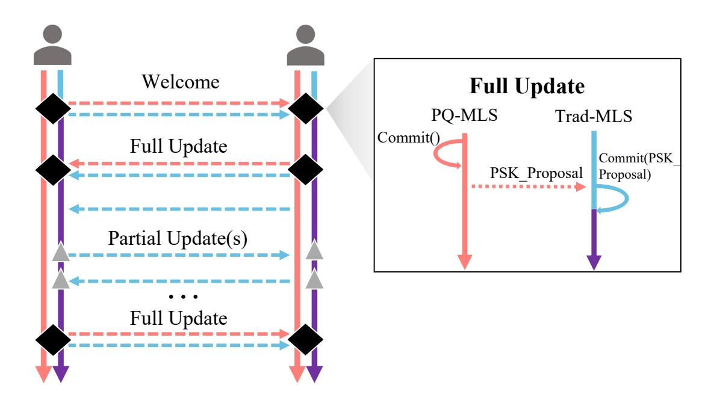
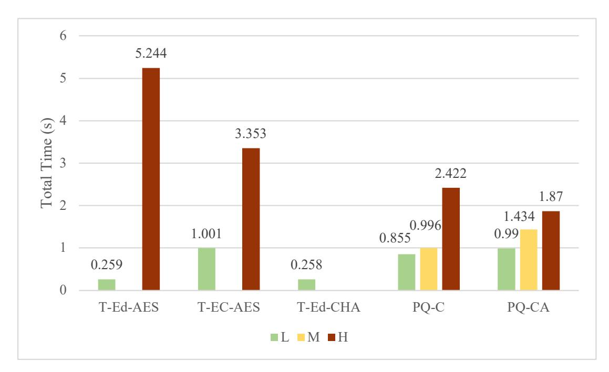
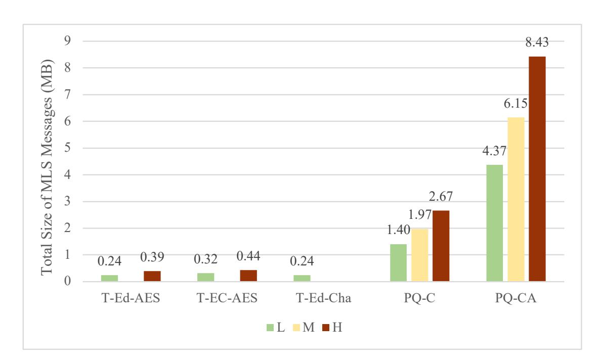
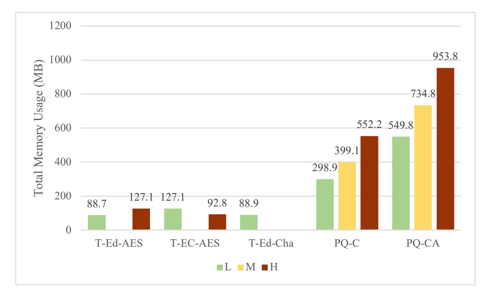
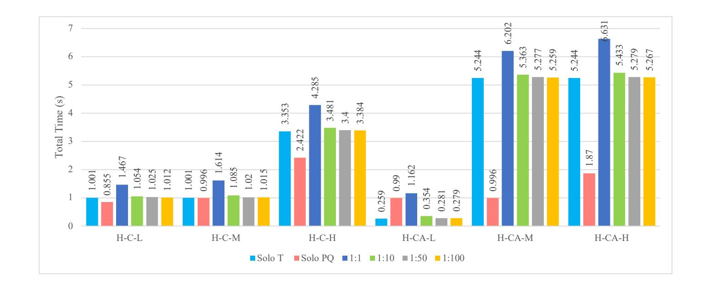
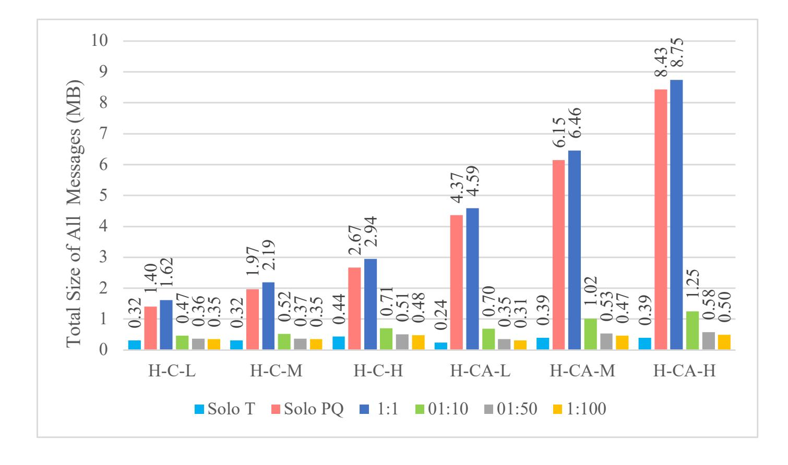
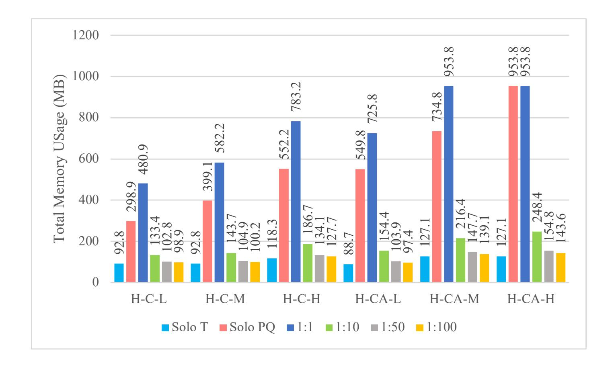
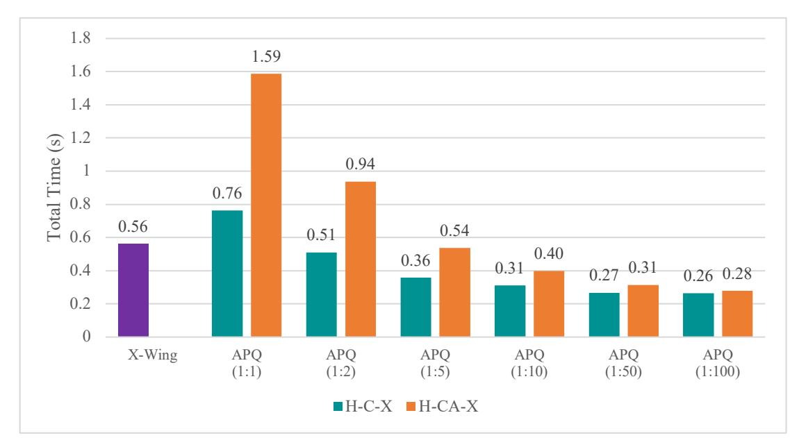
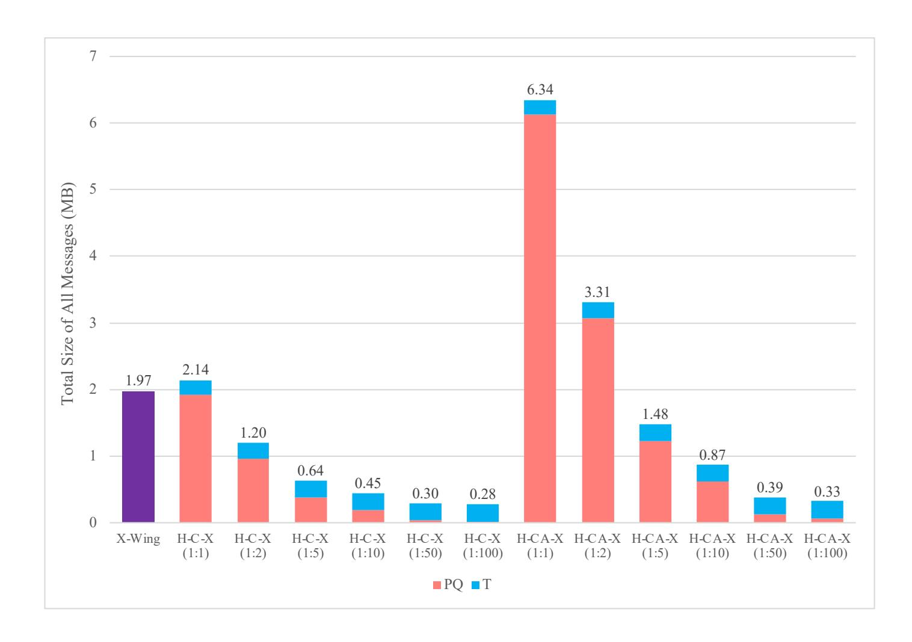
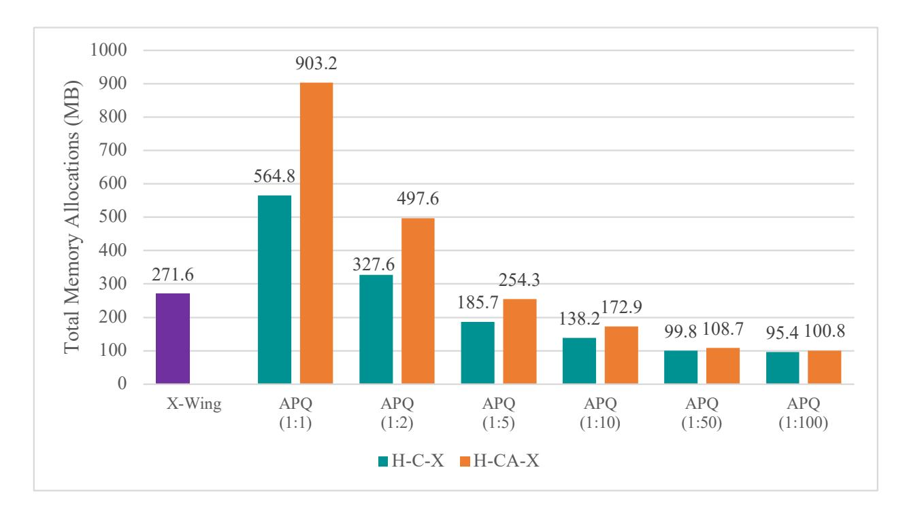

{0}------------------------------------------------

# Benchmarking of the Amortized Post Quantum Combiner for MLS

Britta Hale1[0000−0003−1131−2109], Xisen Tian1[0000−0001−6171−2309], and Lee Wang2[0009−0009−8034−0892]

1 Naval Postgraduate School, {britta.hale, xisen.tian1}@nps.edu 2 Defense Language Institute, lee.wang@dliflc.edu

Abstract. Overhead costs associated with post quantum (PQ) algorithms, especially digital signatures, create a significant barrier to incorporation and adoption of post quantum cryptographic protocols in various settings. To counter this, the working group for the Messaging Layer Security (MLS) protocol under the Internet Engineering Task Force has proposed an approach where traditional and PQ sessions of the protocol are strategically combined in such a way as to amortize PQ-associated overhead, i.e., an Amortized Post Quantum (APQ) combiner. In this work, we implement and benchmark APQ using standardized NIST algorithms (ML-KEM and ML-DSA) integrated into OpenMLS with native Rust cryptographic libraries, presenting the first comprehensive performance evaluation of APQ to include PQ authenticity. Our evaluation encompasses execution run-time, message size, and memory consumption across various security levels and amortization ratios to compare and contrast MLS with traditional-only, APQ confidentiality-only, APQ confidentiality+authenticity, and an alternative hybrid ciphersuite. We demonstrate that APQ achieves exponential improvements in message size and memory efficiency as amortization traditional:PQ ratios decrease from 1:1 to 1:100, with optimal performance observed around 1:50 ratios. These findings establish APQ as a practical solution for deploying post quantum security in resource constrained settings.

Keywords: Post Quantum · Messaging Layer Security · Amortized PQC

### 1 Introduction

The rapid advancements in quantum computing pose an imminent threat to the cryptographic foundations that secure modern digital communications. While practical quantum computers capable of executing Shor's Algorithm at scale remain under development, the cryptography community has proactively developed post quantum (PQ) cryptography, which is based on alternative, quantumresistant hardness assumptions. Standardized PQ algorithms, under National Institute of Standards and Technology (NIST), exist [\[11\]](#page-20-0) and integration into various protocols is ongoing [\[22,](#page-20-1)[3,](#page-19-0)[20\]](#page-20-2). Among these, early efforts in PQ migration have been focused on hybrid approaches, which aim to attain PQ security 

{1}------------------------------------------------

while integrating PQ and traditional asymmetric cryptographic algorithms. Because PQ algorithms are relatively nascent and fledging, the hybrid approach allows adopters to maintain classical security even if the PQ algorithm is broken, e.g., [\[8,](#page-19-1)[6\]](#page-19-2).

Notably, the incorporation PQ cryptographic algorithms is not without challenges. Post quantum key encapsulation and signature operations incur significantly higher computational and bandwidth costs compared to their classical counterparts. For example, according to prior work [\[21\]](#page-20-3) on TLS, Dilithium (ML-DSA) signature sizes are approximately forty times larger (48B vs 2044B) than ECDSA with private key sizes nearly sixty times larger (48B vs 2800B) than ECDSA. For KEMs, slowdown factors of 1.05 to 2.55 are also to be anticipated in TLS [\[1\]](#page-19-3) when using PQ KEMs versus ECDHE and ciphertext sizes can be eleven times larger (64B for ECDH vs 736B for ML-KEM512) [\[18\]](#page-20-4). These increased costs can be prohibitive for resource-constrained devices with limited compute, power, or bandwidth, creating a challenge even under the necessity for PQ. Use of hybrid approaches further exacerbates this overhead.

Recognizing the different risk tolerance levels of adopters, the Internet Engineering Task Force (IETF), under the Messaging Layer Security (MLS) Working Group, has considered two distinct approaches for integrating quantum resistance, both providing variant hybrid guarantees: 1) use of direct hybrid ciphersuites and 2) strategic integration of traditional and PQ sessions to amortize the PQ overhead. The first approach follows a typical hybrid process, namely the combination of traditional and PQ key encapsulation mechanisms (KEMs) for every key update [\[16\]](#page-20-5). Meanwhile, the second approach combines two parallel sessions, one with PQ ciphersuites and one with traditional ciphersuites, where randomness from the PQ session is injected in the traditional session at controllable intervals. This is called the Amortized Post Quantum (APQ) combiner method [\[23\]](#page-20-6). The APQ approach aims to reduce the overall frequency of PQ operations, and therefore bandwidth overhead, while offering PQ confidentiality and optionally PQ authenticity as well. While much work has looked at the performance of PQ protocols using hybrid ciphersuites such as in (1), in this work, we provide the first comprehensive benchmarking of performance across amortized alternatives, comparing various ciphersuites, modes of operation for the APQ combiner (including PQ confidentiality-only and PQ confidentiality+authenticity), and show comparison vs. other normalized hybrid approaches (e.g., X-Wing [\[12\]](#page-20-7)) and simple PQ ciphersuites. We cross-compare APQ for amortization ratios of traditional:PQ from 1:1 to 1:100 with metrics for message size, memory efficiency, and time. This work demonstrates the feasibility of achieving not only PQ-confidentiality but also PQ authenticity even on resource constrained devices.

Contributions This work provides a comprehensive benchmarking of the APQ combiner for MLS from [\[23\]](#page-20-6) using NIST-standardized algorithms. Our contributions include:

{2}------------------------------------------------

- 1. Amortized Post Quantum Combiner Analysis: We conduct benchmarking of the APQ combiner for time (in seconds), random access memory (RAM) usage (in bytes), and message output size (in bytes) in its two modes (PQ Confidentiality-Only and PQ Confidentiality+Authenticity) and provide analysis of amortization strategies overall protocol performance.
- 2. Amortized Combiner vs Hybrid Combiner We provide the first benchmarking of the APQ combiner in its two modes against the hybrid KEM combiner, X-Wing.

The remainder of this paper is organized as follows. Section 2 provides background on the MLS protocol and related work, hybridization approaches in MLS, and details on the APQ combiner. Section 3 details the implementation approach, ciphersuites used, and metrics considered. Section 4 presents performance results for time, memory usage, and message size. Finally, Section 5 concludes the paper with implications for PQ MLS deployment.

### 2 The Messaging Layer Security Protocol, Hybrids, and the APQ Combiner

Messaging Layer Security MLS provides end-to-end encryption to communicating parties. It is a type of Continuous Key Agreement (CKA), which also encompasses Signal [\[10\]](#page-19-4) and other ratcheted protocols. Unlike its predecessors, MLS is built to be extensible to groups of larger sizes than typical 1:1 channels while also achieving lower scaling overhead. While we provide a general introduction to MLS here, inclusive of the group scenario, the functional design of the protocol provides scaling performance improvements relative to the number of participants. Consequently, our testing focuses on the simple two-party case to demonstrate the overhead cost-savings of the flexible hybrid combiner even under the worst case scenario.

CKAs "ratchet" or update keys throughout the lifetime of communications. In MLS, this is facilitated by a subfunctionality called TreeKEM [\[2\]](#page-19-5) which manages keys as a binary tree that is updated via a series of KEM operations. The root of the tree is used to compute the shared secret from which data encryption keys are derived. To evolve the state (or add/remove communication parties), members update keys through a propose-and-commit sequence. Proposals, which can be made by any member, are suggestions to modify the ratchet tree through adding, removing, or updating of nodes. A commit message is sent by a group member to ratify the proposal(s) and enter a new epoch. An empty commit, is when a member updates their own representative binary tree leaf node and unilaterally commits to it. All proposals and commits are authenticated through the use of digital signature algorithm (DSA) operations.

As a result of the CKA construct and epochal key evolution, the protocol achieves forward secrecy (FS) and post compromise security (PCS). FS ensures past communications remain secure upon compromise of security keys while PCS allows security to be regained after a compromise using fresh keys. Crucial for APQ, entropy can be added to or exported from the cryptographic state via

{3}------------------------------------------------

#### 4 Hale et al.

pre-shared keys (PSK). When evolving the state, a proposal can include a PSK identifier, indicating that it should be included into the next commit. Thus, a PSK can be added to the key derivation function (KDF) along with the new shared secret to derive keys. PSKs can be derived to be exported from the shared secret as an *exporter key*. The PSK functionality and optional inclusion in proposals and commits will become useful in the APQ combiner mechanism, described later.

A variety of MLS implementations exist across major programming languages [9]. Relevant to this work, this includes a Rust version called OpenMLS that offers memory safety features and integrates with widely available PQ libraries. We use OpenMLS due to its clear and thorough documentation [19].

MLS Hybrids X-Wing has been proposed to the IETF as a hybrid KEM combiner [4]. It provides indcca security based on the indcca of its component KEMs, MLKEM and X25519. The IETF MLS working group has adopted X-Wing as a post quantum security option among the set of new PQ ciphersuites in [17]. As an example of a typical hybridization approach, we include X-Wing for cross-comparison with the APQ combiner.

Fig. 1: Overview of the APQ protocol using PQ and traditional MLS sessions (solid lines). Left user adds right user via Welcome messages sent in both sessions (thick dashed lines). ◆ underscores the state changes in both sessions via Full Commits while ▲ highlights state change in just one session via Partial Commits. After a Full Commit, the traditional session is imbued with PQ entropy (solid line). MLS Welcome and Commit mechanics are detailed in [5]. APQ PSK\_Proposal generation is defined in [23].

APQ Combiner The APQ combiner [23], illustrated in Figure 1, combines two MLS sessions, one with PQ algorithms, A, and the other with traditional algo-

{4}------------------------------------------------

rithms, B. These two sessions run in parallel, with the same set of communication participants.

The traditional session B operates according to normal MLS functionality: updates to the shared keying material are proposed and committed, effectively ratcheting the state forward. These are performed using a traditional KEM (e.g., DHKEM), and signed with a traditional signature. We call such traditional-only commits Partial Commits, and the overall key update performed a Partial Update. The new state is used to derive data encryption keys. Application messages are then encrypted with one of a selection of Authenticated Encryption with Associated Data (AEAD) schemes, and also signed to ensure uniqueness and non-repudiation inside the session.

The PQ session A operates in two possible ways, dependent on the combiner mode selected, PQ/T Confidentiality-Only or PQ/T Confidentiality+Authenticity:

- PQ/T Confidentiality Only Mode: Within the PQ session, updates to the shared keying material are performed using PQ KEM algorithm but signed with a traditional signature algorithm. No application messages are sent in the PQ session. Rather, it is used for maintaining and updating a PQ key schedule.
  - From A's PQ key schedule an exporter secret can be derived using an established label. The PQ PSK is then injected in B using a PSK proposal message that is committed to yield a new B state. As this mixes the PQ PSK into the traditional session B state using a KDF within the MLS key schedule, the resultant B key schedule is also PQ. Thus when data encryption keys are derived within B, they provide for PQ confidentiality. When a proposal-commit sequence in the traditional session B uses the PQ PSK in as described here, we call the overall commit a Full Commit and the overall key update a Full Update.
- PQ/T Confidentiality+Authenticity Mode: This mode follows that of the PQ/T Confidentiality-Only mode, with the exception that key updates in the PQ session are signed with a PQ digital signature algorithm.

Thus, session A uses PQ KEM in the PQ/T Confidentiality-Only (PQ-Conf) mode and a combination of PQ KEM and PQ DSA in the PQ/T Confidentiality+Authenticity (Conf+Auth) mode. Session B uses traditional KEM and DSAs in both modes.

Full Commits can be interspersed or scheduled on a less frequent basis than Partial Commits, thus spreading the associated overhead over a longer period, i.e., amortizing the cost of A operations. Note that Partial Commits update the keying state (which is already PQ, based on the last Full Commit). Thus, a quantum attack on the Partial Commit does not lead to leakage of the session secrets, but only reduces the relative window of PQ key update to that of a Full Commit, i.e., PQ PCS is determined by Full Commits. Meanwhile, PQ FS is still achieved under Partial Commits.

The overall security depends on the frequency of the Full Commits and the mode of operation. In the PT/T Confidentiality+Authenticity Mode, the fact 

{5}------------------------------------------------

that PQ signatures are used to sign key updates in A enforces PQ authenticity on the overall PQ/T key schedule, which is then used to derive AEAD keys, resulting in PQ authenticity on application data sent in B. [3](#page-0-0) The full APQ description and additional bookkeeping mechanisms for signaling Full or Partial updates (to curtail running the two sessions independently, e.g., using the APQMLSInfo object) can be found in [\[23\]](#page-20-6).

Amortization is a key feature of the APQ combiner and is accomplished through interspersing Full key updates with one or more Partial key updates. In our testing, we denote amortization with ratios i : j to refer to i number of Full Updates for every j number of Partial Updates.

Other Related Work Prior work provided a proof of concept implementation and initial metrics for the APQ combiner [\[13\]](#page-20-10), focusing on the PQ Confidentiality-Only Mode across various group sizes. In contrast, we provide cross comparison with other hybrid options as well as accounting for efficiency under the combined PQ confidentiality and authentication (PQ-Conf-Auth) mode.

Simultaneous to our implementation is that of PheonixIM [\[15\]](#page-20-11), which also implemented the amortized combiner from [\[23\]](#page-20-6). While that work focused on meeting the specifications of the proposed standard in the context of interoperability with OpenMLS, we provide formal benchmarking of performance.

### 3 Implementation

Our implementation, extending that of [\[13\]](#page-20-10), is available publicly on GitHub.[4](#page-0-0) It is written in Rust, utilizing and modifying open-source Rust crates OpenMLS, hpke, and RustCrypto. OpenMLS implements MLS as promulgated by RFC9240. The cryptographic operations used by MLS (encryption, signing, etc.) are incorporated in a modular fashion using crypto-providers like OpenMLS-RustCrypto and OpenMLS-LibcruxCrypto. Crypto-providers are modular interfaces of underlying cryptographic libraries that specify how those libraries interact with OpenMLS. We chose to use OpenMLS-RustCrypto because RustCrypto, as a cryptographic library, is more widely used and does not require more modern x86 and amd64 CPUs [\[19\]](#page-20-8). like the high-assurance LibcruxCrypto library. In total, we utilized three additional cryptographic libraries: the RustCrypto MLDSA crate, RustCrypto MLKEM, and the HPKE crate (which generally implements KEMs). Tests were completed on a MacBook Pro with M2 Max (ARM CPU/GPU Combo), 64GB RAM, and macOS Ventura.

While ML-DSA is incorporated via RustCrypto's MLDSA and OpenMLS traits, support for ML-KEM required further customization of the HPKE li-

3 Digital signatures over the AEAD inside the B session are still traditional, meaning that there is no session-internal non-repudiation. An inside attacker that possesses a quantum computer and wishes to frame another session participant can forge the requisite traditional signature. This is, however, a niche threat model, and unrelated to the PQ authenticity provided against external quantum adversaries.

4 <github.com/lwerrors/SSR2025-Tian-APQ-MLS>

{6}------------------------------------------------

brary used by RustCrypto. Following the structure of the existing KEM implementation in hpke, we created a ml-kem handler to interface with the generic RustCrypto ML-KEM crate.

After incorporation of all levels of ML-DSA and ML-KEM, we implemented the APQ combiner and tested it in sessions with two parties to measure performance across various amortization strategies. Generally, by varying the frequency of full-commits, the cost of PQ operations can be spread across the lifespan of a group session. Concretely, we tested with full-commits in occurring every 10, 50, and 100 commits to gain a sense of amortization effects. Moreover these tests were conducted across the two modes operation, PQ Confidentiality-Only and PQ Confidentiality+Authentication. To establish a baseline of comparison, we measured the performance costs of standard MLS (i.e. individual session) with all levels and appropriate combinations of PQ and traditional ciphersuites as specified by [\[17\]](#page-20-9) and [\[5\]](#page-19-8), respectively. Finally, we measured the performance of an MLS session running the X-Wing hybrid KEM to provide a comparison against hybridization strategies. In those tests, we compare across Full:Partial commit ratios of 1:1, 1:2, 1:5, 1:10, 1:50, and 1:100 to provide more granular comparisons against X-Wing.

#### 3.1 Ciphersuites Tested

We detail which ciphersuites were selected for testing and provide rationale for their selection in this section.

Notation Table [1](#page-8-0) shows the ciphersuites used in our tests. For readability purposes, we assign aliases to the ciphersuites. Each alias begins with a prefix letter denoting which ciphersuite category they belong to: T for traditional, PQ for post quantum, and H for combinations thereof. Within the traditional category, the second prefix represents the underlying curves used (i.e. EC for P256 and P384 and Ed for Ed25519 and Ed448) and the third prefix is an abbreviation of the authenticated encryption algorithm (i.e. AES vs CHACHA20POLY1305). For readability, we give all of the ciphersuites suffixes based on the roughly associated security level (i.e., Low, Medium, High).

Rationale We chose ciphersuites for benchmarking based on the existing list of supported traditional ciphersuites from [\[5\]](#page-19-8) as well as the list of proposed PQ ciphersuites from [\[17\]](#page-20-9). Following the guidance from [\[23\]](#page-20-6), we selected to implement 'pure PQ' ciphersuites out of the proposed ciphersuites from [\[17\]](#page-20-9) which also included PQ and Traditional combined KEMs that redundant in the APQ context. Absent from [\[17\]](#page-20-9) is support for the lowest security levels of ML-KEM and ML-DSA: ML-KEM512 and ML-DSA44, due to lack of demand. For completeness, we constructed additional ciphersuites (listed in orange in Table [1\)](#page-8-0). As there were no corresponding PQ ciphersuite which uses P521, we rejected the traditional counterpart from testing.

{7}------------------------------------------------

#### 8 Hale et al.

For a fair comparison with X-Wing, we add traditional and PQ ciphersuites (also in orange) that correspond to the existing X-Wing ciphersuite, as supported by OpenMLS (T-Ed-Cha-L and PQ-C-X in Table [1\)](#page-8-0). To test X-Wing against APQ in the PQ Confidentiality+Authenticity mode, we added an additional PQ ciphersuite with comparable security level components (PQ-CA-X in Table [1\)](#page-8-0).

To establish baselines of comparison, we test single (uncombined) MLS sessions across the traditional (T) and post quantum (PQ) ciphersuite classes in Table [1.](#page-8-0) For ciphersuite choices for APQ, we pair sessions based on their approximate security level and ciphersuites from each class as also shown in Table [1.](#page-8-0)

{8}------------------------------------------------

| H-C-L | H-C-M | Н-С-Н | H-CA-L | Н-СА-М | Н-СА-Н | X-Wing | H-C-X | H-CA-X | Alias               | Ciphersuite                                         |  |  |  |  |
|-------|-------|-------|--------|--------|--------|--------|-------|--------|---------------------|-----------------------------------------------------|--|--|--|--|
|       |       |       |        |        |        |        |       |        | Traditional         |                                                     |  |  |  |  |
| *     | *     |       |        |        |        |        |       |        | T-EC-AES-L          | MLS_128_DHKEMP256_AES128GCM_SHA256_P256             |  |  |  |  |
|       |       | *     |        |        |        |        |       |        | T-EC-AES-H          | MLS_256_DHKEMP384_AES256GCM_SHA384_P384             |  |  |  |  |
|       |       |       | *      |        |        |        |       |        | T-Ed-AES-L          | MLS_128_DHKEMX25519_AES128GCM_SHA256_Ed25519        |  |  |  |  |
|       |       |       |        | *      | *      |        |       |        | T-Ed-AES-H          | MLS_256_DHKEMX448_AES256GCM_SHA512_Ed448            |  |  |  |  |
|       |       |       |        |        |        | $\sim$ | *     | *      | T-Ed-Cha-L          | MLS_128_DHKEMX25519_CHACHA20POLY1305_SHA256_Ed25519 |  |  |  |  |
|       |       |       |        |        |        |        |       |        |                     | PQ Conf-only                                        |  |  |  |  |
| *     |       |       |        |        |        |        |       |        | PQ-C-L              | MLS_128_ML-KEM512_AES128GCM_SHA256_P256             |  |  |  |  |
|       | *     |       |        |        |        |        |       |        | PQ-C-M              | MLS_128_ML-KEM768_AES256GCM_SHA384_P256             |  |  |  |  |
|       |       | *     |        |        |        |        |       |        | PQ-C-H              | MLS_192_ML-KEM1024_AES256GCM_SHA384_P384            |  |  |  |  |
|       |       |       |        |        |        | $\sim$ | *     |        | PQ-C-X              | MLS_192_ML-KEM768_CHACHA20P0LY1305_SHA256_Ed25519   |  |  |  |  |
|       |       |       |        |        |        |        |       |        |                     | PQ Conf+Auth                                        |  |  |  |  |
|       |       |       | *      |        |        |        |       |        | PQ-CA-L             | MLS_128_ML-KEM512_AES128GCM_SHA256_MLDSA44          |  |  |  |  |
|       |       |       |        | *      |        |        |       |        | PQ-CA-M             | MLS_192_ML-KEM768_AES256GCM_SHA384_MLDSA65          |  |  |  |  |
|       |       |       |        |        | *      |        |       |        | PQ-CA-H             | MLS_256_ML-KEM1024_AES256GCM_SHA512_MLDSA87         |  |  |  |  |
|       |       |       |        |        |        |        |       | *      | PQ-CA-X             | MLS_192_ML-KEM768_CHACHA20POLY1305_SHA384_MLDSA65   |  |  |  |  |
|       |       |       |        |        |        |        |       |        | Hybrid KEM-Combiner |                                                     |  |  |  |  |
|       |       |       |        |        |        | *      |       |        | X-Wing              | MLS_256_XWING_CHACHA20POLY1305_SHA256_Ed25519       |  |  |  |  |

Table 1: Selected standardized traditional ciphersuites [5], draft standard PQ ciphersuites [17], and additional ciphersuites (notated in orange) for comparison. The various hybrid combinations used in APQ testing are indicated on the left side, with  $\sim$  representing the component combinations for comparison with X-Wing.

{9}------------------------------------------------

For selection of appropriate traditional ciphersuites to pair with a PQ counterpart, we generally defer to the security levels of the PQ ciphersuite components and selected a traditional to match. Since PQ Confidentiality-Only ciphersuites use ECDSA signature algorithms for signing in the PQ session, we also choose the matching ECDSA counterpart in the traditional ciphersuite category. For the full PQ (confidentiality and authenticity) ciphersuites which uses SUF-CMA DSAs (stipulated by NIST [\[11\]](#page-20-0)), we select classical ciphersuites that have EdDSA (which is known to be SUF-CMA [\[7\]](#page-19-10)) and the appropriate parametersets (e.g. Curve25519, Curve448). For the H-C-X combiner we create PQ and traditional ciphersuites based on the ML-KEM768 and EdDSAs used in X-Wing. These combinations are summarized in Table [1.](#page-8-0)

#### 3.2 Performance Metrics

Tests are conducted using a two-participant session size across 500 epochs which are updated via empty commits (one commit per epoch) from a single party.[5](#page-0-0) Amortization was tested by varying the ratio of Full to Partial APQ updates.

Time is a direct usability metric that is especially relevant for delay sensitive applications (e.g., secure messaging, media streaming, VoIP). Our time measurements are composed solely of the overhead of cryptographic operations (we do not send packets across a network). Most importantly, our time measurements provide insight into the cost of certain classical ciphersuites that had cascading effects in usage in APQ that would not be revealed by message size and memory usage alone. We measure the total time for 500 epochs, based on an average of 10 samples (i.e., 500 epochs are run 10 times, with the average taken across the 10). This is to mitigate for an spurious interference on time from background processes. Time values are derived using the Rust Criterion [\[14\]](#page-20-13) microbenching tool which runs 10 iterations of the 500 epoch test and outputs the expected (average) total time for a single 500-epoch sample. As opposed to a single sample, the average of 10 iterations mitigates the effects of background processes effects on timing.

Message sizes offer another perspective in examining the impacts of implementing PQ algorithms. It is well established that PQ signatures and ciphertexts can be several orders of magnitude higher than their traditional counterparts [\[21\]](#page-20-3). For use of PQ in bandwidth limited settings, amortization effects of APQ on cumulative message sizes over time are especially important. MLS message sizes were calculated as a byte summation of the total PSK proposals, Welcome messages, and Commit messages sent between the two parties over 500 epochs.

Peak memory (RAM) consumption helps to determine the minimum RAM requirements for deployment of the various ciphersuites. Total memory measurements across the session run enables fair comparative analysis between the

5 For clarity and simplicity of measurement, all commits are performed by a single party. In normal operation, commits are performed by the various parties in the session.

{10}------------------------------------------------

ciphersuites and the amortization ratios due to the clarity provided by the sizes of their overall memory footprint. Memory considerations are relevant for embedded systems and other resource constrained devices that are especially impacted by memory usage. Memory (RAM) usage was measured using the Rust Hotpath [\[24\]](#page-20-14) process profiling tool which calculates granular peak RAM usage during certain function calls (e.g. encrypt, sign, verify, etc.) as well as the total memory footprint of a program. We measure memory usage as a total across 500 epochs.

### 3.3 Limitations

Our APQ implementation achieves the core functionality of the combiner (e.g., two MLS sessions tied together via use of an exported/injected PSK via the full commit mechanism from [\[23\]](#page-20-6)). Our implementation does not include the APQInfo structure and the related bookkeeping mechanisms of Extensions Specification from [\[23\]](#page-20-6). Furthermore, our exported PSK uses the export\_secret as opposed to the epoch\_secret which is not accessible via the OpenMLS API. These limitations and deviations ultimately have negligible effects to our performance measurements: the APQInfo is a small fixed length byte string that gets added to encryption and signing operations and the secret used for PSK generation are the same sizes. As Github and mailing list discussion on the APQ draft is on-going as of the time of this writing, we leave high fidelity testing using a fully compliant APQ implementation to future work.

### 4 Results

To establish baselines, we first compare the performance of individual MLS sessions using the traditional, PQ Confidentiality, and PQ Conf+Auth ciphersuites from Table [1.](#page-8-0) Then we compare the performance of the two modes of APQ across various Full:Partial update ratios to observe the effects of amortization. Finally, we compare hybrid combiners with the X-Wing KEM combiner and our APQ combiner.

In all cases we provide performance metrics as totals across the 500 epochs to clearly illustrate the differences in overall performance. Supplemental tables for per-epoch averages of commit message sizes can be found in Table [3,](#page-21-0) Table [4,](#page-21-1) and data summary in Table [5](#page-22-0) of Appendix [A.](#page-21-2)

#### 4.1 Baseline Testing

In terms of cumulative total run time, base-line comparisons in Figure [2](#page-11-0) show that MLS sessions using PQ ciphersuites may perform no worse than comparable traditional ciphersuites. Our results indicate that at low security levels, Edwards Curve based DSA and KEM ciphersuites (T-Ed-AES and T-Ed-Cha) are faster than the lowest security level PQ ciphersuites. At high (256-bit) security levels, shown in red in fig. [2,](#page-11-0) both classes of PQ ciphersuites (PQ-C-H and PQ-CA-H) outperformed their traditional counterparts.

{11}------------------------------------------------

There is also high variation within traditional and PQ ciphersuite classes. Within the traditional class of ciphersuites, MLS sessions using ECDSA and ECDHKEM based ciphersuite were about four times as slow as the Edwards Curve ciphersuites. Additionally, at the high security level, the MLS session using a fully PQ ciphersuite (PQ-CA-H) ran 23% faster than the PQ confidentialityonly ciphersuite (PQ-C-H).

Fig. 2: Total time comparison of individual MLS sessions (group size of 2) across 500 epochs (via empty commits). Clusters (Green-Yellow-Red) based on respective security level (Low, Medium, and High). Absence of a color in a cluster corresponds to a ciphersuite that was not included in testing. Calculations are based on an average of ten 500-epoch samples.

In terms of message sizes, our baseline results shown in Figure [3](#page-12-0) indicate that comparative PQ ciphersuites are several orders of magnitude higher than their traditional counterparts. This is consistent with the stated outputs on the ciphertext sizes of ML-KEM and signature sizes of ML-DSA from prior research [\[21\]](#page-20-3) [\[18\]](#page-20-4) as well as empirical analysis [\[25\]](#page-20-15). It is worth noting that out of the class of traditional ciphersuites the ECDSA and ECDHKEM based ciphersuite has the largest ciphertext sizes.

We measure memory allocation by recording the peak RAM consumption (see Table [2\)](#page-16-0) as well as total (cumulative across all 500 epochs) RAM consumption (see Figure [4\)](#page-12-1). Peak memory usage reveals that classical ciphersuites across all security levels and DSA/KEM types have a ceiling of 1.2MB of peak memory usage. Meanwhile, the PQ ciphersuites increase in peak memory usage with the incorporation of larger KEMs and DSAs, as expected. These impacts are exacerbated when examined using total memory measurements collected across 500 MLS epochs. They reveal that PQ ciphersuites can be several orders of magnitude higher than their traditional counterparts. The difference is smaller for low security level ciphersuites (i.e. only 235% difference between T-EC-AES

{12}------------------------------------------------

Fig. 3: Total message size comparison of individual MLS sessions (group size of 2) for various traditional-only or PQ-only key update methods, totaled across 500 epochs (via empty commits). Clusters (Green-Yellow-Red) based on respective security level (Low, Medium, and High). Absence of a color in a cluster corresponds to a ciphersuite that was not included in testing.

Fig. 4: Total memory (RAM) comparison of individual MLS sessions (group size of 2) for various traditional-only or PQ-only key update methods, totaled across 500 epochs (via empty commits). Clusters (Green-Yellow-Red) based on respective security level (Low, Medium, and High). Absence of a color in a cluster corresponds to a ciphersuite that was not included in testing.

{13}------------------------------------------------

and PQ-C-L) than high security level ciphersuites (i.e., 750% difference between T-Ed-AES and PQ-CA-L). We expect these differences to increase further with larger group sizes and more epochs.

### 4.2 Amortization Testing using APQ

Results from amortization tests show that as the ratio of Full Updates to Partial Updates decreases, total run time, message size, and memory usage decreases which is consistent with amortization claims made in [\[23\]](#page-20-6). However, across all APQ modes and ratio, we observe diminishing returns of efficiency gains as the ratio goes beyond 1:50 with a limit based on the less performant component ciphersuite.

In all except H-CA-L and H-C-X, the total runtime exhibited by APQ is generally higher than just running the respective component PQ sessions solo – even at the lowest Full:Partial amortization ratios. This contradicts the intuition of APQ reducing the PQ costs over singular PQ sessions. However, the amortization effect of APQ is working as intended. Because partial updates are applied to the traditional session resulting in far more calls to the traditional ciphersuite components, the amortization effects of APQ likely skew toward the performance of the those traditional ciphersuites. The medium and high security APQ (in both C and CA modes) utilize the slower high security elliptic curve based KEM (X448 and P384) and DSAs (Ed448 and P384), so they set a floor for amortization that is higher than the PQ component alone. On the other hand, low security APQ (in both modes) used traditional KEM and DSAs that were faster than their PQ counterparts so the run-time performances for H-CA-L and H-C-X likely trended toward their traditional ciphersuite performance levels. In summary, because results from our solo session baselines showed PQ sessions performing faster than some of their traditional session counterparts, the APQ combiner also had mixed but correlated results. We leave testing alternative implementations of traditional ciphersuites across alternative crypto-providers and crypto-libraries to address the discrepancies to future work.

For both message size and memory usage, shown in Figure [6](#page-14-0) and Figure [7,](#page-15-0) respectively, the effects of amortization are as expected. For message size, using the worst amortization strategy (1:1) results in producing a total bandwidth roughly equal to the sum of running the individual sessions separately. However, we observe an exponential decrease in message size and memory usage in all APQ modes as we decrease the frequency of Full:Partial commits to 1:10 which are on par with the solo traditional sessions in magnitude. At higher ratios beyond 1:50 Full:Partial commit ratios, this equates to a 94% cumulative message size reduction in comparison to a singular MLS session running the same PQ ciphersuite. This is similarly so for the total memory usage which sees up to an 85% reduction.

The peak RAM usage for Solo T, Solo PQ, and APQ combined MLS sessions, across the full 500-epoch test, are shown in Table [2.](#page-16-0) Results indicate consistent peak memory usage across all individual traditional ciphersuites. For the PQ sessions, peak memory usage generally increased with security level. This carries

{14}------------------------------------------------

Fig. 5: Total time comparison of APQ for Confidentiality-Only and Confidentiality+Authenticity at various security levels (Low, Medium, and High) across 500-epochs. Full:Partial key update ratios shown at variants of 1:1, 1:10, 1:50, and 1:100. Solo T and Solo PQ refer to individual components of the APQ mode and security level (see Table [1\)](#page-8-0) that are ran in a non-combined configuration (e.g. the sky blue bar in H-C-L refers to T-EC-AES-L but the sky blue bar in H-CA-L refers to T-Ed-AES-L). Calculations are based on an average of ten 500-epoch samples.

Fig. 6: Total message size of all APQ messages for Confidentiality-Only and Confidentiality+Authenticity at various security levels (Low, Medium, and High), totaled across 500 epochs. Full:Partial key update ratios shown at variants of 1:1, 1:10, 1:50, and 1:100. Solo T and Solo PQ refer to individual components of APQ that are ran in a non-combined configuration.

{15}------------------------------------------------

Fig. 7: Total memory (RAM) comparison of APQ for Confidentiality-Only and Confidentiality+Authenticity at various security levels (Low, Medium, and High), totaled across 500 epochs. Full:Partial key update ratios shown at variants of 1:1, 1:10, 1:50, and 1:100. Solo T and Solo PQ refer to individual components of APQ that are ran in a non-combined configuration.

{16}------------------------------------------------

over to the amortized sessions, where results start high for the 1:1 Full:Partial update ratio but trend down toward their Solo PQ component peak memory measurements at lower ratios.

| Solo Traditional                |     | Solo PQ                         | Combined (H-C / H-CA) |             |               |     |     |                     |
|---------------------------------|-----|---------------------------------|-----------------------|-------------|---------------|-----|-----|---------------------|
| Ciphersuite Peak Mem (MB) |     | Ciphersuite Peak Mem (MB) |                       | Ciphersuite | Peak Mem (MB) |     |     |                     |
|                                 |     |                                 |                       |             |               |     |     | 1:1 1:10 1:50 1:100 |
| T-Ed-AES-L 1.2                  |     | PQ-C-L                          | 1.3                   | H-C-L       | 1.9           | 1.3 | 1.3 | 1.3                 |
| T-Ed-AES-H 1.2                  |     | PQ-C-M                          | 1.3                   | H-C-M       | 1.9           | 1.4 | 1.4 | 1.4                 |
| T-EC-AES-L 1.2                  |     | PQ-C-H                          | 1.4                   | H-C-H       | 2.1           | 1.4 | 1.4 | 1.4                 |
| T-EC-AES-H 1.2                  |     | PQ-CA-L                         | 1.5                   | H-CA-L      | 2.0           | 1.5 | 1.5 | 1.5                 |
| T-Ed-Cha-L                      | 1.2 | PQ-CA-M                         | 1.6                   | H-CA-M      | 2.5           | 1.6 | 1.6 | 1.6                 |
|                                 |     | PQ-CA-H                         | 1.8                   | H-CA-H      | 2.6           | 1.8 | 1.8 | 1.8                 |

Table 2: Peak Memory (RAM) usage across the 500 epoch test for solo traditional, solo PQ, and APQ for PQ Confidentiality-Only and PQ Confidentiality+Authenticity at various security levels (Low, Medium, and High). Full:Partial key update ratios shown at variants of 1:1, 1:10, 1:50, and 1:100.

#### 4.3 Hybrid Combiners Comparison

In a head-on comparison between X-Wing and H-C-X (see purple and teal bars in Figure [8\)](#page-17-0), which both offer PQ Confidentiality only, the APQ amortization quickly outpaces X-Wing which must call on ML-KEM768 operations for every commit (e.g. a 1:1 ratio using our terminology). As seen in Figure [8,](#page-17-0) at Full to Partial Update ratios smaller than 1:2, the APQ speed-ups exhibited over X-Wing range from 26% improvement at a 1:5 ratio to upwards of 50% (diminishing) speed-ups after further reductions past 1:50. Both message size and total memory metrics follow a similar trend as shown in Figures [9](#page-18-0) and [10,](#page-18-1) respectively.

When X-Wing run-time is compared with H-CA-X APQ variant (see purple and dark-orange bars in Figure [8\)](#page-17-0), which has additional PQ-Authenticity with use of ML-DSA65, APQ is slower to outpace X-Wing. The eclipse in run-time performance over X-Wing occurs at 1:5 Full:Partial commit ratio for H-CA-X instead of the 1:2 ratio for H-C-X. This is notable as the the APQ combiner at 1:5 outperforms X-Wing even with PQ authenticity included, which X-Wing does not provide. The run-time floor of H-CA-X is, as expected, approaching the solo run-time of T-Ed-Cha (see Figure [2\)](#page-11-0), which provides the approximate floor for amortization.

As shown in Figures [9](#page-18-0) and [10,](#page-18-1) APQ becomes drastically more efficient than X-Wing in terms of message size and compute cost (total RAM usage) starting at Full:Partial commit ratios of 1:2 for H-C-X and at 1:5 for H-CA-X. The latter point is particularly significant. These results show that not only can APQ use the same ciphersuite security level as hybrids such as X-Wing (albeit with larger windows between PQ updates) for less 'bytes on the wire' and lower compute costs, but it can also provide support PQ-authenticity under such performance 

{17}------------------------------------------------

advantages. In fact, the message size and memory costs decrease exponentially toward a floor limit imposed by the classical ciphersuite component performance in each metric.

Fig. 8: **Total execution time** comparison of Confidentiality-Only APQ vs X-Wing, at similar security levels, across 500 epochs. Full:Partial key update ratios shown at variants of 1:1, 1:10, 1:2, 1:5, 1:50, and 1:100. Calculations are based on an average of ten 500-epoch samples.

Although the amortization metrics shown in Figures 9 and 10 with performance advantages over X-Wing style hybrids use larger windows between PQ commits, they maintains an identical traditional key update frequency. In practice, this provides for a great deal of flexibility for system developers and owners, especially as the needed frequency of quantum resistant key rotation may not be the same as for traditional in all cases. For resource constrained settings, this notably provides options for achieving quantum resistance which can still be tailored according to device constraints.

{18}------------------------------------------------

Fig. 9: **Total size** of all APQ messages for Confidentiality-Only and Confidentiality+Authenticity APQ vs X-Wing, at similar security levels, across 500 epochs. Full:Partial key update ratios shown at variants of 1:1, 1:2, 1:5, 1:10, 1:50, and 1:100, totaled across 500 epochs. Component contributions (stacked) are shown in **pink** for PQ messages and **blue** for traditional messages.

Fig. 10: **Total memory (RAM)** comparison of Confidentiality-Only APQ vs X-Wing, at similar security levels, totaled across 500 epochs. Full:Partial key update ratios shown at variants of 1:1, 1:2, 1:5, 1:10, 1:50, and 1:100.

{19}------------------------------------------------

### 5 Conclusion

Our comprehensive benchmark evaluation of the APQ combiner demonstrates the effects of ciphersuite and amortization ratio selection on the protocol performance across time, bandwidth, and memory usage, including significant performance enhancements. Notably our results show that hybrid protocol combiner approaches for overhead amortization can, if strategically defined, substantially outperform simple PQ and hybrid KEM approaches alike. Moreover, this work points a way forward for achieving both PQ confidentiality and authenticity in resource limited use cases.

## References

- 1. Alnahawi, N., Müller, J., Oupický, J., Wiesmaier, A.: A Comprehensive Survey on Post-Quantum TLS. IACR Communications in Cryptology 1(2) (2024). [https:](https://doi.org/10.62056/ahee0iuc) [//doi.org/10.62056/ahee0iuc](https://doi.org/10.62056/ahee0iuc)
- 2. Alwen, J., Coretti, S., Dodis, Y., Tselekounis, Y.: Security Analysis and Improvements for the IETF MLS Standard for Group Messaging. In: Advances in Cryptology – CRYPTO 2020. p. 248–277. Springer-Verlag (2020). [https://doi.org/10.](https://doi.org/10.1007/978-3-030-56784-2_9) [1007/978-3-030-56784-2\\_9](https://doi.org/10.1007/978-3-030-56784-2_9), [https://doi.org/10.1007/978-3-030-56784-2\\_9](https://doi.org/10.1007/978-3-030-56784-2_9)
- 3. Banerjee, A., Reddy.K, T., Schoinianakis, D., Hollebeek, T., Ounsworth, M.: Post-Quantum Cryptography for Engineers. Internet-Draft draft-ietf-pquip-pqcengineers-14, Internet Engineering Task Force (Aug 2025), [https://datatracker.](https://datatracker.ietf.org/doc/draft-ietf-pquip-pqc-engineers/14/) [ietf.org/doc/draft-ietf-pquip-pqc-engineers/14/](https://datatracker.ietf.org/doc/draft-ietf-pquip-pqc-engineers/14/)
- 4. Barbosa, M., Connolly, D., Duarte, J.D., Kaiser, A., Schwabe, P., Varner, K., Westerbaan, B.: X-Wing: The Hybrid KEM You've Been Looking For. Cryptology ePrint Archive, Paper 2024/039 (2024). <https://doi.org/10.62056/a3qj89n4e>, <https://eprint.iacr.org/2024/039>
- 5. Barnes, R., Beurdouche, B., Robert, R., Millican, J., Omara, E., Cohn-Gordon, K.: The Messaging Layer Security (MLS) Protocol. RFC 9420 (Jul 2023). [https:](https://doi.org/10.17487/RFC9420) [//doi.org/10.17487/RFC9420](https://doi.org/10.17487/RFC9420), <https://www.rfc-editor.org/info/rfc9420>
- 6. Beullens, W.: Breaking Rainbow Takes a Weekend on a Laptop. In: Advances in Cryptology – CRYPTO 2022. p. 464–479. Springer-Verlag (2022). [https://doi.org/10.1007/978-3-031-15979-4\\_16](https://doi.org/10.1007/978-3-031-15979-4_16), [https://doi.org/10.1007/](https://doi.org/10.1007/978-3-031-15979-4_16) [978-3-031-15979-4\\_16](https://doi.org/10.1007/978-3-031-15979-4_16)
- 7. Brendel, J., Cremers, C., Jackson, D., Zhao, M.: The provable security of ed25519: Theory and practice. Cryptology ePrint Archive, Paper 2020/823 (2020), [https:](https://eprint.iacr.org/2020/823) [//eprint.iacr.org/2020/823](https://eprint.iacr.org/2020/823)
- 8. Castryck, W., Decru, T.: An Efficient Key Recovery Attack on SIDH. In: Advances in Cryptology – EUROCRYPT 2023. p. 423–447. Springer-Verlag (2023). [https://doi.org/10.1007/978-3-031-30589-4\\_15](https://doi.org/10.1007/978-3-031-30589-4_15), [https://doi.org/10.1007/](https://doi.org/10.1007/978-3-031-30589-4_15) [978-3-031-30589-4\\_15](https://doi.org/10.1007/978-3-031-30589-4_15)
- 9. Cohn-Gordon, K., Beurdouche, B., Robert, R.: MLS Implementations (2024), available at: <https://github.com/mlswg/mls-implementations>
- 10. Cohn-Gordon, K., Cremers, C., Dowling, B., Garratt, L., Stebila, D.: A Formal Security Analysis of the Signal Messaging Protocol. Journal of Cryptology 33, 1914–1983 (2020)

{20}------------------------------------------------

- 11. Computer Security Division, I.T.L.: Post-Quantum Cryptography FIPS Approved | CSRC. https://csrc.nist.gov/News/2024/postquantum-cryptography-fipsapproved (Aug 2024)
- 12. Connolly, D., Schwabe, P., Westerbaan, B.: X-Wing: General-Purpose Hybrid Post-Quantum KEM. Internet-Draft draft-connolly-cfrg-xwing-kem-09, Internet Engineering Task Force (Sep 2025), [https://datatracker.ietf.org/doc/](https://datatracker.ietf.org/doc/draft-connolly-cfrg-xwing-kem/09/) [draft-connolly-cfrg-xwing-kem/09/](https://datatracker.ietf.org/doc/draft-connolly-cfrg-xwing-kem/09/)
- 13. Greene, N., Hale, B.: Making post quantum key exchange efficient: An implementation with the MLS protocol. Cryptology ePrint Archive, Paper 2025/1881 (2025), <https://eprint.iacr.org/2025/1881>
- 14. Heisler, B.: bheisler/criteron. https://github.com/bheisler/criterion.rs
- 15. Kohbrok, K.: Phnx-im/hpqmls. https://github.com/phnx-im/hpqmls
- 16. Mahy, R.: Messaging Layer Security Ciphersuite using XWing Key Exchange Mechanism. Internet-Draft draft-mahy-mls-xwing-00, Internet Engineering Task Force (Mar 2024), <https://datatracker.ietf.org/doc/draft-mahy-mls-xwing/00/>
- 17. Mahy, R., Barnes, R.: ML-KEM and Hybrid Cipher Suites for Messaging Layer Security. Internet-Draft draft-ietf-mls-pq-ciphersuites-00, Internet Engineering Task Force (Jul 2025), [https://datatracker.ietf.org/doc/](https://datatracker.ietf.org/doc/draft-ietf-mls-pq-ciphersuites/00/) [draft-ietf-mls-pq-ciphersuites/00/](https://datatracker.ietf.org/doc/draft-ietf-mls-pq-ciphersuites/00/)
- 18. Paquin, C., Stebila, D., Tamvada, G.: Benchmarking post-quantum cryptography in TLS. In: International Conference on Post-Quantum Cryptography. pp. 72–91. Springer (2020)
- 19. R&D, P., Cryspen: OpenMLS Book. https://book.openmls.tech/
- 20. Reddy.K, T., Wing, D., S, B., Kwiatkowski, K.: Adapting Constrained Devices for Post-Quantum Cryptography. Internet-Draft draft-ietf-pquip-pqchsm-constrained-01, Internet Engineering Task Force (Jul 2025), [https://](https://datatracker.ietf.org/doc/draft-ietf-pquip-pqc-hsm-constrained/01/) [datatracker.ietf.org/doc/draft-ietf-pquip-pqc-hsm-constrained/01/](https://datatracker.ietf.org/doc/draft-ietf-pquip-pqc-hsm-constrained/01/)
- 21. Sikeridis, D., Kampanakis, P., Devetsikiotis, M.: Post-Quantum Authentication in TLS 1.3: A Performance Study. Network and Distributed Systems Security (NDSS) Symposium 2020 (2020). <https://doi.org/10.14722/ndss.2020.24203>
- 22. Stebila, D., Fluhrer, S., Gueron, S.: Hybrid Key Exchange in TLS 1.3. Internet-Draft draft-ietf-tls-hybrid-design-16, Internet Engineering Task Force (Sep 2025), <https://datatracker.ietf.org/doc/draft-ietf-tls-hybrid-design/16/>
- 23. Tian, X., Hale, B., Mularczyk, M., Joël: Amortized PQ MLS Combiner. Internet-Draft draft-ietf-mls-combiner-02, Internet Engineering Task Force (Oct 2025), <https://datatracker.ietf.org/doc/draft-ietf-mls-combiner/02/>, work in Progress
- 24. Urbanek, P.: pawurb/hotpath. https://github.com/pawurb/hotpath
- 25. Westerbaan, B., Valenta, L.: A Look at the Latest Post-Quantum Signature Standardization Candidates. https://blog.cloudflare.com/another-look-at-pqsignatures/ (Nov 2024)

{21}------------------------------------------------

### A Summary Data Tables

We provide additional summary tables corresponding to our graphs here.

Table 3: Average per-epoch commit message size (in bytes) across 500 epochs. This is the averaged number of bytes per epoch specifically for commit messages.

|            | Ciphersuite Avg Commit Size (B) |
|------------|---------------------------------|
| T-Ed-AES-L | 484                             |
| T-EC-AES-L | 634                             |
| T-Ed-Cha-L | 484                             |
| T-Ed-AES-H | 780                             |
| T-EC-AES-H | 875                             |
| PQ-C-X     | 3,847                           |
| PQ-C-L     | 2,807                           |
| PQ-C-M     | 3,944                           |
| PQ-C-H     | 5,338                           |
| PQ-CA-L    | 8,752                           |
| PQ-CA-M    | 12,307                          |
| PQ-CA-H    | 16,883                          |
| X-wing     | 3,943                           |

Table 4: Average per-epoch commit message size (in bytes) for all APQ PQ and T ciphersuite combinations across 500 epochs. This is the averaged number of bytes per epoch specifically for commit messages.

| Ciphersuite Pair                    | Avg PQ Commit Size (B) |       |                                                           |       |       |                                        | Avg T Commit Size (B) |  |  |  |     |     |
|-------------------------------------|------------------------|-------|-----------------------------------------------------------|-------|-------|----------------------------------------|-----------------------|--|--|--|-----|-----|
|                                     | 1:1                    | 1:2   | 1:5                                                       | 1:10  |       | 1:50 1:100 1:1 1:2 1:5 1:10 1:50 1:100 |                       |  |  |  |     |     |
| PQ Confidentiality Only             |                        |       |                                                           |       |       |                                        |                       |  |  |  |     |     |
| H-C-L                               | 2,809                  | 2,809 | 2,808                                                     | 2,809 | 2,808 | 2,808 220 444 579 624                  |                       |  |  |  | 660 | 664 |
| H-C-M                               | 3,945                  | 3,946 | 3,946                                                     | 3,946 | 3,946 | 3,946 220 444 579 624                  |                       |  |  |  | 660 | 664 |
| H-C-H                               | 5,340                  | 5,339 | 5,340                                                     | 5,340 | 5,339 | 5,341 284 596 784 847                  |                       |  |  |  | 897 | 903 |
| H-C-X                               | 3,849                  | 3,849 | 3,849                                                     | 3,849 | 3,849 | 3,849 213 366 458 488                  |                       |  |  |  | 513 | 516 |
| PQ Confidentiality + Authentication |                        |       |                                                           |       |       |                                        |                       |  |  |  |     |     |
| H-CA-L                              | 8,754                  | 8,754 | 8,754                                                     | 8,754 | 8,754 | 8,754 213 366 458 488                  |                       |  |  |  | 513 | 516 |
| H-CA-M                              |                        |       | 12,309 12,309 12,309 12,309 12,309 12,309 330 572 718 766 |       |       |                                        |                       |  |  |  | 805 | 810 |
| H-CA-H                              |                        |       | 16,885 16,885 16,885 16,885 16,885 16,885 330 572 718 766 |       |       |                                        |                       |  |  |  | 805 | 810 |
| H-CA-X                              |                        |       | 12,260 12,260 12,260 12,260 12,260 12,260 213 366 458 488 |       |       |                                        |                       |  |  |  | 513 | 516 |

{22}------------------------------------------------

Table 5: Performance metrics by ciphersuite, totaled across 500 epochs. Data summary from Figures [2](#page-11-0) to [10.](#page-18-1)

| Ciphersuite             |                                     | Time (s) RAM Allocations (MB) Message Size (B) |           |  |  |  |  |  |  |  |  |  |
|-------------------------|-------------------------------------|------------------------------------------------|-----------|--|--|--|--|--|--|--|--|--|
| T                       |                                     |                                                |           |  |  |  |  |  |  |  |  |  |
| T-Ed-AES-L              | 0.259                               | 88.7                                           | 241,894   |  |  |  |  |  |  |  |  |  |
| T-EC-AES-L              | 1.001                               | 92.8                                           | 316,789   |  |  |  |  |  |  |  |  |  |
| T-Ed-Cha-L              | 0.258                               | 88.9                                           | 241,894   |  |  |  |  |  |  |  |  |  |
| T-Ed-AES-H              | 5.244                               | 92.8                                           | 389,870   |  |  |  |  |  |  |  |  |  |
| T-EC-AES-H              | 3.353                               | 118.3                                          | 437,216   |  |  |  |  |  |  |  |  |  |
| PQ Confidentiality Only |                                     |                                                |           |  |  |  |  |  |  |  |  |  |
| PQ-C-X                  | 0.567                               | 388.4                                          | 1,921,088 |  |  |  |  |  |  |  |  |  |
| PQ-C-L                  | 0.855                               | 298.9                                          | 1,401,817 |  |  |  |  |  |  |  |  |  |
| PQ-C-M                  | 0.996                               | 399.1                                          | 1,969,631 |  |  |  |  |  |  |  |  |  |
| PQ-C-H                  | 2.422                               | 552.2                                          | 2,665,805 |  |  |  |  |  |  |  |  |  |
|                         | PQ Confidentiality + Authentication |                                                |           |  |  |  |  |  |  |  |  |  |
| PQ-CA-L                 | 0.990                               | 549.8                                          | 4,370,719 |  |  |  |  |  |  |  |  |  |
| PQ-CA-M                 | 1.434                               | 734.8                                          | 6,145,969 |  |  |  |  |  |  |  |  |  |
| PQ-CA-H                 | 1.870                               | 953.8                                          | 8,431,293 |  |  |  |  |  |  |  |  |  |
|                         |                                     | Hybrid and APQ Combiner                        |           |  |  |  |  |  |  |  |  |  |
| X-wing                  | 0.563                               | 271.6                                          | 1,969,024 |  |  |  |  |  |  |  |  |  |
| H-C-X (1:1)             | 0.764                               | 564.8                                          | 2,135,464 |  |  |  |  |  |  |  |  |  |
| H-C-X (1:2)             | 0.510                               | 327.6                                          | 1,200,989 |  |  |  |  |  |  |  |  |  |
| H-C-X (1:5)             | 0.359                               | 185.7                                          | 637,739   |  |  |  |  |  |  |  |  |  |
| H-C-X (1:10)            | 0.310                               | 138.2                                          | 449,989   |  |  |  |  |  |  |  |  |  |
| H-C-X (1:50)            | 0.267                               | 99.8                                           | 299,789   |  |  |  |  |  |  |  |  |  |
| H-C-X (1:100)           | 0.263                               | 95.4                                           | 281,014   |  |  |  |  |  |  |  |  |  |
| H-CA-X (1:1)            | 1.588                               | 903.2                                          | 6,335,798 |  |  |  |  |  |  |  |  |  |
| H-CA-X (1:2)            | 0.936                               | 497.6                                          | 3,306,984 |  |  |  |  |  |  |  |  |  |
| H-CA-X (1:5)            | 0.538                               | 254.3                                          | 1,482,084 |  |  |  |  |  |  |  |  |  |
| H-CA-X (1:10)           | 0.399                               | 172.9                                          | 873,784   |  |  |  |  |  |  |  |  |  |
| H-CA-X (1:50)           | 0.313                               | 108.7                                          | 387,144   |  |  |  |  |  |  |  |  |  |
| H-CA-X (1:100)          | 0.279                               | 100.8                                          | 326,314   |  |  |  |  |  |  |  |  |  |