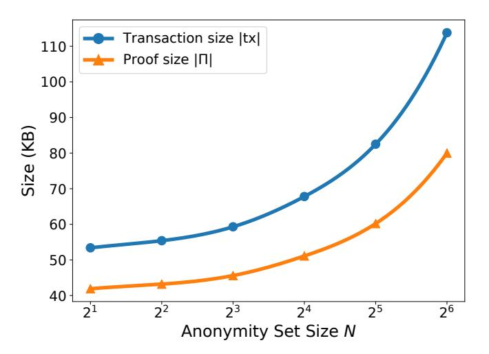
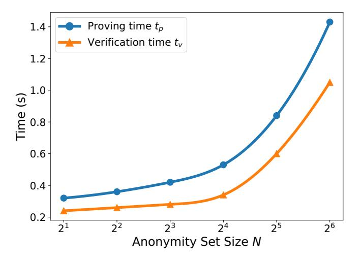

{0}------------------------------------------------

# Lether: Practical Post-Quantum Account-Based Private Blockchain Payments

Hongxiao Wang
The University of Hong Kong
Hong Kong, China
hxwang@cs.hku.hk

Ron Steinfeld

Monash University

Melbourne, Australia

Ron.Steinfeld@monash.edu

#### **Abstract**

We introduce Lether, the *first* practical account-based private block-chain payment protocol based on *post-quantum* lattice assumptions, following the paradigm of Anonymous Zether (FC '19, IEEE S&P '21). The main challenge in building such a protocol from lattices lies in the absence of core building blocks: unbounded-level additively-homomorphic multi-message multi-recipient public key encryption (mmPKE), and event-oriented linkable ring signatures with support for multiple tags (events). To address these issues, we propose a verifiable refreshable additively-homomorphic mmPKE scheme and a plug-and-play event-oriented linkable tag scheme from lattices. We believe both to be of independent interest.

To achieve unbounded-level homomorphic evaluation in the lattice-based setting *without* relying on heavy techniques such as bootstrapping or large moduli (e.g., over 60 bits) in fully homomorphic encryption (FHE), we introduce a lightweight and blockchain-friendly mechanism called *refresh*. Namely, each user is required to verifiably refresh their account after a certain number of transactions. With our tailored parameter settings, the amortized perrefresh costs of communication and computation are only about 1.3% and 1.5%, respectively, of the cost of a transaction.

We also optimize the implementations of LNP22 lattice-based zero-knowledge proof system (Crypto '22) in the LaZer library (CCS '24), to support efficient batching of various proof components. Overall, for a typical transaction, the total communication cost becomes about 68 KB, with the associated zero-knowledge proof accounting for about 51 KB of this total. Each of proof generation and verification take a fraction of a second on a standard PC.

As an additional contribution, we formalize new definitions for Anonymous Zether-like protocols that more accurately capture real-world blockchain settings. These definitions are generic and are expected to benefit the broader development of account-based private blockchain payment protocols, beyond just lattice settings.

#### **CCS Concepts**

• **Security and privacy** → *Privacy-preserving protocols.* 

# **Keywords**

Post-Quantum, Lattices, Zero-Knowledge, Account-Based Blockchain

Muhammed F. Esgin

Monash University

Melbourne, Australia

Muhammed.Esgin@monash.edu

Siu-Ming Yiu
The University of Hong Kong
Hong Kong, China
smyiu@cs.hku.hk

#### 1 Introduction

Rapid progress in quantum computing [10] has led to a global shift towards post-quantum cryptography. Consequently, cryptographic applications in blockchain systems are also being re-evaluated in the post-quantum setting. For example, recently, the Ethereum Foundation [20] is exploring the integration of post-quantum signature schemes into the Ethereum platform.

Blockchain-based cryptocurrencies such as Bitcoin and Ethereum enable mutually distrustful users to reach consensus on the balances and the transactions that affect them. In general, there are two models of blockchain: the Unspent Transaction Output (UTXO) model and the account-based model. Both models have been extensively studied for their potential to support privacy-preserving payments, offering confidentiality and anonymity features.

In the UTXO model, many privacy-preserving blockchain payment protocols have been proposed, including ZCash [39], Monero [37] (with a series of RingCT protocols [15, 16, 27, 41, 45, 48, 49]), and Quisquis [18]. Among them, only MatRiCT [16] and MatRiCT<sup>+</sup> [15] operate in the post-quantum setting, where the communication cost per transaction is about 50–110 KB at an anonymity level of 1/11.<sup>1</sup>

On the other hand, the first privacy-preserving payment protocol for *account-based* blockchains was proposed in [7], named Zether, which provided a blueprint for achieving privacy and anonymity. Building on this, Anonymous Zether [11] refined the underlying zero-knowledge proof and identified potential insider attacks. To mitigate these, they introduced a "register" phase, requiring each user to prove the well-formedness of their public key. This line of work has since attracted significant attention and has been extended in multiple directions, including forward security [24] and full anonymity [36, 38].<sup>2</sup> As discussed in [7, 11, 18, 24], account-based protocols offer advantages in terms of *wallet efficiency*, as users only need to maintain their private key and account information to transact—unlike UTXO-based systems, which require scanning the entire transaction history. Moreover, account-based protocols

<span id="page-0-0"></span> $<sup>^1</sup>$ An anonymity level of 1/N indicates that a real spender's account is hidden within an anonymity set of size N.

<span id="page-0-1"></span><sup>&</sup>lt;sup>2</sup>However, to date, works such as [36, 38] that achieve full anonymity in account-based blockchain payments remain largely *theoretical* and lack *practical implementations*, even in the classical (quantum-vulnerable) setting, let alone in post-quantum settings, due to their reliance on somewhat inefficient building blocks such as FHE, accumulators, or complex NIZKs.

{1}------------------------------------------------

support *richer functionalities* such as sealed-bid auctions and stake voting, as demonstrated in [7].

To the best of our knowledge, there is currently *no* private payment scheme for *account-based* blockchains in the *post-quantum* setting. As detailed below, the main reason is the lack of essential building blocks: (i) unbounded-level additively-homomorphic multimessage multi-recipient public key encryption (mmPKE), and (ii) event-oriented linkable ring signatures with support for multiple tags (events).

# 1.1 Paradigm of Anonymous Zether

We first recall the paradigm of Anonymous Zether [7, 11] that we also follow. Originally, Anonymous Zether was not presented in a modular fashion, and the core building blocks with all of their required features were not as explicit. Here, we identify three core components needed for Anonymous Zether and make their required features explicit:

- A multi-message multi-recipient public key encryption (mmPKE) scheme [5, 26] that supports unbounded-level additive homomorphism, verifiable multi-encryption, and verifiable decryption. In general, mmPKE enables the batch encryption of multiple messages for multiple recipients in a single operation, significantly reducing bandwidth compared to the trivial approach of encrypting each message individually. This compactness feature is critical in keeping the transactions efficient, particularly in the lattice setting where ciphertexts/proofs are large.
- An event-oriented linkable ring signature [3, 43] (also known as a prefix/scoped linkable ring signature [6, 25]) that allows signers to anonymously produce *at most* one signature for each *event* using their long-term private keys.<sup>3</sup>
- A highly modular non-interactive zero-knowledge (NIZK) proof system that integrates the verifiable mmPKE, the event-oriented linkable ring signature, a proof that the spender's amount equals the recipient's amount (i.e., a balance proof), and a proof that spender's post-transaction balance together with the transaction amount lies within a valid range (i.e., a range proof).

In Anonymous Zether, the balance bal of each account is encrypted under the account public key pk, yielding a ciphertext  $acc[pk] \leftarrow Enc(pk, bal)$ . The ciphertext is stored on the blockchain and can be indexed by the corresponding public key. We outline how the spender makes a transaction as follows:

- First, the spender selects a set of public keys  $(pk_i)_{i \in [N]}$  as the *anonymity set*, including her own public key  $pk_s$  and the recipient's public key  $pk_r$ .
- Second, the spender performs a verifiable multi-encryption of the amount vector as  $\mathbf{ct} := (\mathsf{ct}_i)_{i \in [N]} \leftarrow \mathsf{mmEnc}((\mathsf{pk}_i)_{i \in [N]}, (\mathsf{m}_i)_{i \in [N]}),$  where  $\mathsf{m}_s = -\mathsf{amt}, \, \mathsf{m}_r = \mathsf{amt}, \, \mathsf{m}_i = 0$  for all  $i \in [N] \setminus \{s, r\},$  and the amount  $\mathsf{amt} \in [0, \mathsf{MAX}].$  The security of mmPKE ensures that no one—including the decoy users in the anonymity set—can determine which ciphertext encrypts a non-zero message, thereby preventing identification of the spender's or recipient's public key.

- Third, the spender proves via verifiable decryption that the updated balance of her account is non-negative, i.e.,  $0 \le \text{bal}'_s \leftarrow \text{Dec}(\text{acc}[\text{pk}_s] + \text{ct}_s, \text{sk}_s)$ . This ensures that the spender is not overdrawn, i.e., her initial balance satisfies  $\text{bal}_s \ge \text{amt}$ .
- Fourth, the spender produce an *event-oriented* linkable ring signature for the current *epoch*  $H^4$  to anonymously authorizes the transaction, which can be linked using a tag tag<sub>H</sub>. Specifically, the spender must prove knowledge of her private key sk<sub>s</sub> in the anonymity set  $(pk_i)_{i \in [N]}$  and demonstrate that the tag tag<sub>H</sub> is correctly formed. This ensures that the spender cannot *double-spend* in the current epoch H.
- Finally, the spender outputs a proof  $\Pi$  attesting that all the above conditions hold, along with the multi-recipient ciphertext **ct** and the linkable tag tag<sub>H</sub>.

Once the proof  $\Pi$  is verified,<sup>5</sup> the system updates all accounts in the anonymity set by homomorphically evaluating acc[pk<sub>i</sub>] := acc[pk<sub>i</sub>] + ct<sub>i</sub> for all  $i \in [N]$ . Here, the unbounded-level homomorphism property ensures that every account is updated correctly.

# <span id="page-1-4"></span>1.2 Existing Challenges

In attempting to build a post-quantum account-based private block-chain payment protocol following the paradigm of Anonymous Zether [7, 11], we identify several significant challenges, as summarized below.

Challenge I: construct lattice-based unbounded-level additively homomorphic mmPKE along with efficient verification **mechanisms.** Currently, the only existing mmPKE scheme based on standard lattice assumptions, proposed in [44], does not support additive homomorphism and lacks efficient mechanisms for verifiable multi-encryption and decryption. What's more, generally, lattice-based (mm)PKE schemes do not support unbounded-level additive homomorphic evaluation without resorting to expensive operations such as bootstrapping [21]. This limitation is inherent to lattice-based setting, as noise accumulates with each homomorphic operation. Moreover, the message encoding techniques employed in lattice-based RingCT protocols [15, 16] to avoid homomorphic evaluation are not applicable in our setting, as the spender cannot compute the so-called "corrector" terms without knowing the recipient's balance. Therefore, designing a lattice-based mmPKE scheme that enables unbounded-level additively-homomorphic evaluation in an efficient manner—while also supporting efficient range proofs, verifiable multi-encryption, and verifiable decryption—has been a significant open problem.

<span id="page-1-0"></span><sup>&</sup>lt;sup>3</sup>As shown in [46], event-oriented linkability is the *most general* form: by setting the event as a fixed string, the ring, or the message, one can obtain one-time, ring-based, or message-based linkability, respectively.

<span id="page-1-1"></span> $<sup>^4</sup>$ Here, the epoch H is the "event" of the event-oriented linkable ring signature. In Anonymous Zether [7, 11], time is divided into epochs. To prevent *front-running attacks*, each involved account, including the spender's, is updated at the end of the epoch. However, because the spender's update amount is *negative*, to prevent *double-spending attacks* within each epoch, the spender is allowed to spend *at most one transaction per epoch*. This "locking" mechanism is achieved by requiring the spender to generate an "epoch-based" linkable ring signature for each transaction. As discussed in [7, 11], with a carefully chosen epoch length, usability is expected to remain largely unaffected. We refer the reader to [7, 11] for further details.

<span id="page-1-2"></span> $<sup>^5</sup>$ In Anonymous Zether [7, 11], it is assumed that the proof  $\Pi$  is verified before the end of the current epoch. We note that delayed validation may affect liveness; however, it does not compromise balance correctness or enable double spending.

<span id="page-1-3"></span><sup>&</sup>lt;sup>6</sup>We also note that [28] proposes a lattice-based multi-message multi-recipient key encapsulation mechanism (mmKEM) but based on *non-standard* lattice assumption, named Oracle-MLWE.

{2}------------------------------------------------

<span id="page-2-0"></span>

| Blockchain    | Scheme                    |          | Anony. | 7. Transaction |      |       |        | Refresh |          |       | Eval. Level |    |
|---------------|---------------------------|----------|--------|----------------|------|-------|--------|---------|----------|-------|-------------|----|
| Model         | SUMUME                    | PQ       | N      | tx             | Π    | $t_p$ | $t_v$  | ref     | $ \pi' $ | $t_p$ | $t_v$       | T  |
| Account-Based | Lether (this paper)       | <b>√</b> | 16     | 67.8           | 51.1 | 0.53  | 0.34   | 54.9    | 43.8     | 0.42  | 0.32        | 60 |
|               | Anony. Zether [11]        | ×        | 16     | 6.0            | 3.7  | 2.50  | 0.15   | _       | _        | _     | _           | _  |
| LITYO D       | MatRiCT <sup>+</sup> [15] | <b>√</b> | 11     | 43.0           | 29.0 | 0.10  | ≤ 0.01 | _       | _        | _     | _           | _  |
| UTXO-Based    | Monero [37]               | ×        | 16     | 2.1            | 2.0  | 0.08  | 0.02   | _       | _        | _     | _           | _  |

Table 1: Summary of private blockchain payment protocols (sizes in KB, times in seconds). '-' denotes not applicable. PQ indicates post-quantum security. For the Transaction and Refresh phases, we present the communication sizes (|tx|, |ref|), the sizes of the associated proofs ( $|\Pi|$ ,  $|\pi'|$ )—already included in the communication sizes—as well as the corresponding proving time  $t_p$  and verification time  $t_v$ . The anonymity set size is fixed at N = 16 (Anony.), following the current Monero [37] setting. The evaluation level for additively-homomorphic operations on fresh or refreshed accounts is fixed at T = 60 (Eval. Level).

Challenge II: construct lattice-based event-oriented linkable ring signatures for multiple events. To the best of our knowledge, there exists no *practical* lattice-based event-oriented linkable ring or group signature that supports many events (i.e., tags). The only existing constructions support only a single event (i.e., onetime) or a very limited number of events, as in [42], where the tag takes the form tag := As with  $A \leftarrow \text{hash(event)}$  and the secret s is committed in advance. The main limitation of such constructions arises from the contradiction between the need for fresh noise (to ensure indistinguishability from random values) and the uniqueness required for tag linkability. Specifically, to argue indistinguishability between  $\ell$  tags  $(\mathbf{A}_i \cdot \mathbf{s})_{i \in [\ell]}$  and random values, the secret **s** must include at least  $\ell$  fresh noise components and be committed in advance—leading to the linear cost with the tag/event number, which is highly inefficient. Therefore, constructing a practical lattice-based event-oriented linkable ring or group signature that supports multiple events remains a significant challenge.

#### <span id="page-2-1"></span>1.3 Our Contributions

Lether: a practical post-quantum account-based private block-chain payment system. In this work, we propose *Lether*, the *first* practical post-quantum account-based private blockchain payment system based on lattice assumptions. To build such a system, we develop two novel building blocks: (i) a verifiable refreshable additively-homomorphic mmPKE (Ref-AH mmPKE) scheme, and (ii) a plug-and-play event-oriented linkable tag scheme. We further optimize the implementation of the lattice-based NIZK scheme LNP22 [31] in the LaZer library [35] to efficiently combine these building blocks with other proofs (e.g., range proofs). These tools may also be of independent interest.

We emphasize that our contributions go beyond merely shifting Anonymous Zether [7, 11] to the post-quantum setting. Being the *first* post-quantum account-based private blockchain payment scheme, our work also paves the way for post-quantum secure counterparts of other practical yet quantum-vulnerable account-based blockchain payment protocols, such as the forward-secure variant *Pride CT* [24].

To accommodate the constraints of the lattice-based setting, we introduce a lightweight *refresh* mechanism where each account

ciphertext (representing the account balance) periodically get refreshed to support indefinite number of transactions via homomorphic evaluations. This mechanism is particularly well-suited for blockchain environments, providing an efficient alternative to bootstrapping or large-modulus schemes in FHE. By a careful choice of parameters, the amortized overhead of a refresh operation is minimized to be below 1.5% in terms of both communication and computation. Furthermore, we believe that under a deployment where a sufficiently large fraction of registered accounts stay active and periodically refresh, the refresh mechanism has negligible impact on forming an effective anonymity set for transactions.

**Optimized implementations of NIZK for Lether.** We also optimize the implementations of LNP22 [31] in the LaZer library [35] that are tailored to Lether. Briefly, our optimized NIZK implementation supports batching/aggregating various proofs (e.g., verifiable multi-encryption, integer proofs, and tag proofs). Overall, these optimizations reduce the proof size by about 20% and achieve roughly a 4× speedup, compared to the original LNP22 implementation in the LaZer library.

We provide a summary of private blockchain payment protocols across both post-quantum and traditional settings in Table 1. The number of bits supported for the balances and amounts in Lether is fixed at k = 32, which is the same as in (Anonymous) Zether [7, 11] and Pride CT [24], and can be extended to 64 bits by applying a simple transformation from [7]. Considering that the size of post-quantum constructions is often at least an order of magnitude larger than that of their traditional counterparts [4], we believe that Lether is already practical for real-world applications, particularly in terms of computational cost. We further note that although account-based blockchain payments are a bit less efficient than UTXO-based blockchain payments (even in the pre-quantum setting) due to differences in their underlying techniques, the former offers unique advantages, such as wallet efficiency and extensive functionalities, as discussed above, which typically UTXO-based schemes cannot provide.

We summarize our main building blocks below. For technical overview, we refer the reader to Section 2.

**Verifiable Ref-AH mmPKE.** We construct the *first* verifiable Ref-AH mmPKE scheme from lattices, extending the basic mmPKE in [44]. Our scheme supports *T*-level additive homomorphism, meaning that a fresh ciphertext can undergo up to *T* homomorphic additions. Here, we introduce the notion of *refreshability*, which

{3}------------------------------------------------

<span id="page-3-1"></span>

| Scheme   | Recip. N | ct  | $ \pi $ | Add-Hom      | Dec-Ind      |
|----------|----------|-----|---------|--------------|--------------|
| Cons 3.5 | 16       | 17  | 28      | <b>√</b>     | <b>✓</b>     |
| [31]     | 16       | 16  | 304     | ×            | $\checkmark$ |
| [30]     | 16       | 144 | 144     | $\checkmark$ | ×            |

Table 2: Comparison of verifiable encryption schemes for N=16 recipients (Recip.). We report the sizes of the multi-recipient ciphertext  $|\mathbf{ct}|$  and its well-formedness proof  $|\pi|$  in kilobytes (KB). We further indicate whether the schemes support additive homomorphism (Add-Hom) and decryption-time independent of adversary's runtime (Dec-Ind).

<span id="page-3-3"></span>

| Scheme   | $ \pi $                           | Add-Hom  | Exa-Pro      |
|----------|-----------------------------------|----------|--------------|
| Cons 3.7 | 31 KB                             | <b>✓</b> | <b>✓</b>     |
| [33]     | $\approx 50 \text{ KB}$           | ×        | $\checkmark$ |
| [22]     | $\geq 1 \text{ MB}^*$             | ×        | ×            |
| [2]      | $\approx 50 \text{ KB}^{\dagger}$ | ×        | ×            |

We choose the same security parameter, i.e.  $\lambda = 128$ 

Table 3: Comparison of verifiable decryption schemes. For a fair comparison, we adapt other works to support unforgeability and estimate the proof size  $|\pi|$  for valid decryption. We further indicate whether the schemes support additive homomorphism (Add-Hom) and an exact-norm proof (Exa-Pro).

allows a user to convert a fully evaluated ciphertext into a fresh one using their private key—thereby enabling the refresh mechanism in Lether.

We further formalize and realize three types of verifiability for Ref-AH mmPKE: *verifiable multi-encryption*, *verifiable decryption*, and *verifiable refresh*, where the resulting proof and ciphertext sizes are the primary contributors to the transaction communication.

For verifiable multi-encryption, as shown in Table 2, our construction outperforms the state-of-the-art in communication size for N=16 recipients, achieving an order-of-magnitude reduction. Moreover, our scheme uniquely supports both additive homomorphism and decryption-time independence, ensuring that ciphertexts—including those generated by adversaries—can be additively evaluated and subsequently decrypted efficiently by honest users.

For verifiable decryption, we introduce a new *unforgeability* notion, which strengthens the standard soundness definitions in prior work [2, 22, 33]. Informally, unforgeability ensures that no adversary can generate two valid proofs for different decryption outputs of the same (honestly generated) ciphertext under a *legitimate* private key. This property is *missing* in prior works but is crucial in practice, particularly under lattice-based assumptions. For example, in existing works [2, 22, 33], an adversary can use a *mismatching* private key to decrypt a ciphertext, resulting in an *incorrect* plaintext. Since these works do not check the *validity* of the input private key during verifiable decryption, an adversary can honestly run the decryption algorithm with a *mismatching* 

<span id="page-3-4"></span>

| Scheme           | Sign. Size   | <b>Event-Link</b> | Multi-Tag |
|------------------|--------------|-------------------|-----------|
| Cons 3.12 + [31] | <b>93</b> KB | ✓                 | ✓         |
| [31]             | 92 KB        | ×                 | ×         |
| [16]             | 148 KB       | ×                 | ×         |
| [42]             | 386 KB       | $\checkmark$      | ×         |

**Table 4:** Comparison of group signature schemes for group size over 2<sup>20</sup>. We indicate whether the schemes support event-oriented linkability (Event-Link) in the case of multiple tags (Multi-Tag).

key and still generate a valid proof, thereby misleading others into accepting an *incorrect* plaintext.

To this end, we present a generic transformation that upgrades existing schemes to satisfy this stronger notion by incorporating a proof of knowledge of the private key corresponding to the associated public key. As shown in Table 3, our construction achieves at least a 40% reduction in proof size while supporting additive homomorphism and exact-norm proofs for the decryption error—both crucial for maximizing the level of homomorphic evaluations.

For verifiable refresh, we construct the scheme by combining verifiable encryption and verifiable decryption in a way that achieves unforgeability and guarantees consistency between the input ciphertext and the refreshed ciphertext.

**Plug-and-play event-oriented linkable tag scheme.** We propose a plug-and-play event-oriented linkable tag scheme from lattices that can transform most existing lattice-based ring or group signature schemes including [13, 15, 16, 31, 32, 34, 47] to support event-oriented linkability—the *most general* form of linkability (as introduced above)—with *many* tags (events), and with *negligible* overhead. To the best of our knowledge, no existing lattice-based ring/group signature scheme supports such property.

We demonstrate the effectiveness of our technique by extending the state-of-the-art lattice-based group signature scheme from [31] to support event-oriented linkability. As shown in Table 4, our extended scheme increases the signature size by only about 1%, while supporting many tags.

New formal definitions for account-based private blockchain payments. As an additional contribution, we propose new formal definitions for account-based private blockchain payment protocols. Our definitions aim to balance the complexity of real-world blockchain systems with the abstraction required for rigorous security analysis, improving upon previous attempts [7, 11].

# <span id="page-3-0"></span>2 Technical Overview

In this section, we provide an overview of our techniques to address the challenges listed in Section 1.2. We begin by showing how to extend the basic mmPKE scheme [44] to support additive homomorphism and refreshability, and how to realize its verifiability using LNP22 [31]. We then present the construction of a plug-and-play event-oriented linkable tag scheme based on Learning with Rounding (LWR), which is also instantiated via LNP22. Finally, we outline how to optimize the implementations of LNP22 to efficiently integrate these components and build the Lether system.

**Ref-AH mmPKE.** We start by recalling the basic mmPKE construction in [44], named mmCipher. In the setup, the public matrix

<sup>&</sup>lt;sup>†</sup> This work is distributed verifiable decryption and the undistributed version is implied in [40]

<span id="page-3-2"></span> $<sup>^7\</sup>mathrm{Our}$  scheme also demonstrates a similar advantage over related constructions such as [14].

{4}------------------------------------------------

is sampled as  $\mathbf{A} \leftarrow \mathcal{U}(\mathcal{R}_q^{m \times n})$  where  $\mathcal{R}_q = \mathbb{Z}_q[X]/(X^d+1)$  and  $\mathcal{R} = \mathbb{Z}[X]/(X^d+1)$ . Each public key  $\mathbf{b}_i$  for  $i \in [N]$  is generated by

<span id="page-4-0"></span>
$$\mathbf{b}_i := \mathbf{A}^\top \mathbf{s}_i + \mathbf{e}_i \tag{2.1}$$

where  $(\mathbf{s}_i, \mathbf{e}_i) \leftarrow \mathcal{U}(\mathbb{S}_{\nu}^m) \times \mathcal{U}(\mathbb{S}_{\nu}^n)$  are uniformly sampled from  $[-\nu, ..., \nu]$ . To encrypt N messages  $(\hat{m}_i \in \{0, 1\}^d \subseteq \mathcal{R}_2)_{i \in [N]}$  for N recipients with public keys  $(\mathbf{b}_i)_{i \in [N]}$ , the multi-recipient ciphertext  $(\mathbf{c}, (c_i)_{i \in [N]})$  is computed as

<span id="page-4-2"></span>
$$\mathbf{c} := \mathbf{Ar} + \mathbf{e}_u, \tag{2.2}$$

<span id="page-4-1"></span>
$$c_i = \langle \mathbf{b}_i, \mathbf{r} \rangle + y_i + \lfloor q/2 \rceil \cdot \hat{m}_i, \tag{2.3}$$

where  $(\mathbf{r}, \mathbf{e}_u) \leftarrow \mathcal{D}_{\sigma_0}^n \times \mathcal{D}_{\sigma_0}^m$  and  $y_i \leftarrow \mathcal{D}_{\sigma_1}$  are sampled independently from the discrete Gaussian distributions with widths  $\sigma_0$  and  $\sigma_1$ , respectively. With suitable parameters, under MLWE assumption, the adversary (even the malicious recipients) cannot break the other recipients' ciphertext.

For an individual ciphertext  $(\mathbf{c}, c_i)$ , decryption is computed as  $[c_i - \langle \mathbf{c}, \mathbf{s}_i \rangle]_2$ . Using Equations (2.1) to (2.3), we obtain:

<span id="page-4-4"></span>
$$c_i - \langle \mathbf{c}, \mathbf{s}_i \rangle = \langle -\mathbf{s}_i || \mathbf{e}_i, \mathbf{e}_u || \mathbf{r} \rangle + y_i + \lfloor q/2 \rfloor \cdot \hat{m}_i,$$
 (2.4)

where || denotes concatenation. Correctness holds when the decryption error  $h_i := \langle -\mathbf{s}_i || \mathbf{e}_i, \mathbf{e}_u || \mathbf{r} \rangle + y_i$  satisfies  $||h_i||_{\infty} \leq \lfloor q/4 \rceil$ .

The basic mmPKE [44] only supports binary messages in  $\{0, 1\}^d$ , and thereby cannot satisfy additive homomorphism.

Here, we adopt a lightweight technique to address this limitation. Without loss of generality, we first set the integer message m (as well as the integer used in the Lether system) satisfying  $m \in [0, MAX]$ , where  $MAX = 2^k - 1$  and  $32 \le k \le d$ . We then encode each integer message m in binary form  $\hat{m} \in \mathcal{R}_2$  such that  $m = \langle \vec{0}^{d-k} || \vec{2}^k, \vec{m} \rangle$ , where  $\vec{2}^k = (2^0, \dots, 2^{k-1})$  and  $\vec{m}$  is an integer vector consisting of the coefficients of  $\hat{m}$ . Next, we extend the message space to  $\mathcal{M} := \{-T, \dots, T+1\}^d$  by modifying the ciphertexts as follows:

<span id="page-4-3"></span>
$$c_i = \langle \mathbf{b}_i, \mathbf{r} \rangle + y_i + \lfloor q/(2T+2) \rceil \cdot \hat{m}_i. \tag{2.5}$$

Thus, the homomorphic addition can be performed in coefficientwise. For example,

$$m_2 = \langle \vec{0}^{d-k} || \vec{2}^k, \vec{\hat{m}}_0 + \vec{\hat{m}}_1 \rangle = m_0 + m_1,$$

and the same principle applies to subtraction. Now, our scheme supports up to T levels of additive homomorphism with fresh/refreshed ciphertexts, as long as the accumulated noise remains within required bounds, i.e.,  $||h||_{\infty} \leq \lfloor q/(4T+4) \rfloor$ .

Finally, while unbounded-level homomorphism cannot be achieved due to possible message overflow and the accumulation of noise beyond the correctness bound, we circumvent this limitation by introducing a *refresh* mechanism. Roughly speaking, each recipient decrypts the evaluated ciphertext to obtain  $\hat{m} \in \mathcal{R}_{2T+2}$ , and then decodes it to an integer message  $m := \langle \vec{0}^{d-k} \parallel \vec{2}^k, \vec{m} \rangle$ . Subsequently, the integer message m is re-encoded into binary form and re-encrypted with fresh randomness, yielding a refreshed ciphertext, which can again support T levels of homomorphic evaluation.

Looking ahead to the Lether scheme, our Ref-AH mmPKE offers several advantages: (i) The multi-recipient ciphertext size is significantly smaller (e.g., only 17 KB for N=16 recipients). (ii) The ciphertext has a linear structure, which enables efficient proofs of well-formedness, especially when the modulus of the LNP22 matches that of Ref-AH mmPKE, as demonstrated later. (iii) The

encoded message format supports efficient range proofs via LNP22, where only binary proofs are required and can be batched. (iv) Any fresh/refreshed ciphertext (account) supports at least *T* homomorphic evaluations with fresh ciphertexts (transactions).

**Verifiability of Ref-AH mmPKE.** We classify the verifiability of Ref-AH mmPKE used in Lether system into three types: *verifiable multi-encryption*, *verifiable decryption*, and *verifiable refresh*.

In our work, we employ LNP22 as a black box to achieve these verifiability properties. At a high level, LNP22 supports proving linear and quadratic relations over both  $\mathcal{R}_q$  and  $\mathbb{Z}_q$  with respect to the witness. It also enables both exact and approximate range proofs (ARP) for the  $\ell_2$ -norm of linear combinations of the witness. As shown in [31, 35] and summarized in Appendix B.3, these capabilities can be extended to prove integers (e.g., binary bits), polynomials with binary coefficients, and range proofs for  $\ell_{\infty}$ -norms (since  $\|\cdot\|_2 \geq \|\cdot\|_{\infty}$ ). Typically, the proof size of LNP22 is linear in both the witness size and the number of norm/range proofs.

<u>Towards verifiable multi-encryption</u>, we must prove that Equations (2.2) and (2.5) hold, together with the bounds

$$\|(\mathbf{r}, \mathbf{e})\|_{\infty} \le \beta_0$$
,  $\|(y_1||\cdots||y_N)\|_{\infty} \le \beta_1$ , and  $\hat{m}_i \in \{0, 1\}^d \subseteq \mathcal{R}_2$ ,

where  $\beta_0$  and  $\beta_1$  are the randomness bounds determined by the parameters of Ref-AH mmPKE scheme.

We define the witness as wit :=  $(\mathbf{r}, (\hat{m}_i)_{i \in [N]})$  and the statement as stat :=  $((\mathbf{b}_i)_{i \in [N]}, (\mathbf{c}, (c_i)_{i \in [N]}))$ . After setting the modulus of LNP22 equal to that of Ref-AH mmPKE in the implementation, we only need to prove the relations:  $\|\mathbf{r}\| (\mathbf{c} - \mathbf{A}\mathbf{r})\|_{\infty} \leq \beta_0$  and

<span id="page-4-6"></span>
$$\begin{vmatrix} c_{1} - \langle \mathbf{b}_{1}, \mathbf{r} \rangle - \lfloor q/(2T+2) \rceil \cdot \hat{m}_{1} \\ \vdots \\ c_{N} - \langle \mathbf{b}_{N}, \mathbf{r} \rangle - \lfloor q/(2T+2) \rceil \cdot \hat{m}_{N} \end{vmatrix}_{\infty} \leq \beta_{1}.$$
 (2.6)

As mentioned before, under this setting, commitments/witnesses are required only for  $\mathbf{r}$ ,  $\{\hat{m}_i\}_{i\in[N]}$ , without requiring any other randomness such as  $\mathbf{e}_u$  or  $\{y_i\}_{i\in[N]}$ , which significantly reduces the proof size. In particular, this design yields a proof size for verifiable multi-encryption that is *independent* of the size of anonymity set in Lether, since only  $m_s$  and  $m_r$  (for spender and recipients, respectively) need to be committed, while all other messages (for decoy accounts) are fixed to zero.

Notably, to guarantee the security of Ref-AH mmPKE, the  $\ell_{\infty}$ -norms of the randomness values, particularly  $y_i$ , are relatively large. As a result, we cannot prove their exact  $\ell_2$ -norms. Instead, we carefully adopt ARP to ensure soundness and correctness, and set  $\beta_0 := \psi \cdot \sqrt{(m+n)d} \cdot \tau \sigma_0$  and  $\beta_1 := \psi \cdot \sqrt{Nd} \cdot \tau \sigma_1$ , where  $\psi$  is the relaxation factor of ARP and  $\tau$  is the Gaussian tail bound. These randomness bounds are also used to derive the decryption error bound and the supported level of homomorphic evaluation.

<u>Towards verifiable decryption</u>, we need to guarantee the uniqueness of the decrypted message under the correct private key to ensure our stronger *unforgeability* notion. To achieve this, we add a proof of knowledge of the private key corresponding to the public key, i.e.,  $\|(\mathbf{s}, \mathbf{b} - \mathbf{A}^{\mathsf{T}}\mathbf{s})\|_{\infty} \leq \nu$ . This approach can be applied to existing schemes [2, 22, 33] to enhance them with unforgeability.

To construct verifiable decryption, we prove Equation (2.4), i.e.,

<span id="page-4-5"></span>
$$c - \langle \mathbf{c}, \mathbf{s} \rangle = h + \lfloor q/(2T + 2) \rceil \cdot \hat{m}, \tag{2.7}$$

{5}------------------------------------------------

with  $||h||_{\infty} \leq \lfloor q/(4T+4) \rceil$ . Since the  $\ell_{\infty}$ -norm bound on h is quite large—close to Ref-AH mmPKE modulus—we cannot use ARP when LNP22 shares the same modulus as Ref-AH mmPKE. Instead, we decompose h to its bits and prove the well-formedness of the bits and the reconstruction of h satisfying Equation (2.7).

Towards verifiable refresh, this construction combines verifiable decryption and multi-encryption with a consistency check on the message. Rather than directly revealing the decrypted message  $\hat{m}$  during verifiable decryption, we (i) prove that each coefficient of  $\hat{m}$  lies in the range [-T, T+1] using its binary decomposition  $\mathbf{b}_m$ ; (ii) show that  $\langle \vec{0}^{d-k} || \vec{2}^k, \hat{m} \rangle = \langle \vec{0}^{d-k} || \vec{2}^k, \hat{m}' \rangle$  and  $\hat{m}' \in \{0, 1\}^d \subseteq \mathcal{R}_2$ ; and (iii) use  $\hat{m}'$  for the subsequent verifiable encryption.

**Plug-and-Play Event-Oriented Linkable Tag Scheme.** In general, the tag scheme outputs a pair  $(\pi, \text{tag})$ , where  $\pi$  is a proof of knowledge of a private key used to generate both a public key and a linkable tag tag for a specific event. We construct the tag scheme from an LWR-based pseudorandom function (PRF), such as the one in [12]. Specifically, the tag tag is defined as

<span id="page-5-0"></span>
$$\mathbf{v}_H = \lfloor \mathbf{A}_H \cdot \mathbf{s} \bmod \hat{q} \rfloor_{\hat{p}}, \tag{2.8}$$

where  $A_H \in \mathcal{R}_{\hat{q}}^{n' \times m} \leftarrow \text{hash(event)}$  is derived from the event string, and **s** is the private key from Ref-AH mmPKE in Equation (2.1). We require that  $v \ll \hat{q}$  such that  $\|\mathbf{s}\|_{\infty} \leq v$  and that  $\hat{p}$  divides  $\hat{q}$ .

Regarding security, we show that: (i) the pseudorandomness of the tag is guaranteed under the Module Learning with Rounding (MLWR) assumption. Furthermore, as analyzed in [12], a single private key can generate a (practically) unbounded number of tags (e.g., more than 2<sup>128</sup>) for different events with suitable parameters; (ii) the non-frameability of the tag—namely, the inability of an adversary to produce a valid proof for another user's tag without knowing the corresponding private key—is ensured by the Module Short Integer Solutions (MSIS) assumption.

Then, we outline how to prove the well-formedness of the tag in Equation (2.8) (i.e., the proof of rounding) via LNP22. We first rewrite Equation (2.8) as

<span id="page-5-1"></span>
$$\hat{q}/\hat{p} \cdot \mathbf{v}_H \mod \hat{q} \equiv \mathbf{A}_H \cdot \mathbf{s} - \mathbf{e}_H \mod \hat{q},$$
 (2.9)

where  $\|(\mathbf{s}, \mathbf{b} - \mathbf{A}^{\top} \mathbf{s})\|_{\infty} \leq \nu$  and  $\mathbf{e}_H \in \{0, \dots, \hat{q}/\hat{p} - 1\}^{n'd}$  is the rounding error.

Here, the challenge is that  $\hat{q}$  is not prime and does not match the modulus q of LNP22 or Ref-AH mmPKE, and therefore we cannot directly prove this relation modulo  $\hat{q}$ . To address this issue, we set  $\hat{q} \ll q$  and transform Equation (2.9) into the following relation over modulus q, which is equivalent to the relation over the integers:

$$\hat{q}/\hat{p}\cdot\mathbf{v}_H - \mathbf{A}_H\cdot\mathbf{s} + \mathbf{e}_H + \hat{q}\cdot\mathbf{v} = 0,$$

where  $\|\mathbf{v}\|_{\infty} \leq \hat{\beta}$  for  $\hat{\beta} := (\hat{q}/\hat{p} \cdot \hat{p} + dm\hat{q}v + \hat{q}/\hat{p} - 1)/\hat{q}$ .

Therefore, the proof of the well-formedness of the tag is reduced to the following conditions, which can be efficiently realized using LNP22:

<span id="page-5-3"></span>
$$\|(-\hat{q}/\hat{p}\cdot\mathbf{v}_H + \mathbf{A}_H\cdot\mathbf{s} - \mathbf{e}_H)/\hat{q}\|_{\infty} \le \hat{\beta}',\tag{2.10}$$

together with  $\|(\mathbf{s}, \mathbf{b} - \mathbf{A}^{\top} \mathbf{s})\|_{\infty} \leq v'$  and  $\mathbf{e}_{H} \in \{0, \dots, \hat{q}/\hat{p} - 1\}^{n'd}$ , where  $\hat{\beta}' := \psi \sqrt{n'd}\hat{\beta}$  and  $v' := \psi \sqrt{(m+n)d}v$  are the corresponding  $\ell_2$ -norm bounds,<sup>8</sup> and  $\psi$  is the relaxation factor of ARP.

Looking ahead to the Lether system, with carefully chosen parameters, we can batch the ARP for Equation (2.10) into the ARP for Equation (2.6) as follows:

$$\begin{vmatrix} c_{1} - \langle \mathbf{b}_{1}, \mathbf{r} \rangle - \lfloor q/(2T+2) \rceil \cdot \hat{m}_{1} \\ \vdots \\ c_{N} - \langle \mathbf{b}_{N}, \mathbf{r} \rangle - \lfloor q/(2T+2) \rceil \cdot \hat{m}_{N} \\ (-\hat{q}/\hat{p} \cdot \mathbf{v}_{H} + \mathbf{A}_{H} \cdot \mathbf{s} - \mathbf{e}_{H})/\hat{q} \end{vmatrix} \leq \beta',$$

where the new bound satisfies  $\beta' \approx \sqrt{\hat{\beta}'^2 + \beta_1^2}$ . Moreover, we set  $\hat{q}/\hat{p} := 2$  to reduce the range proof of  $\mathbf{e}_H$  to binary proofs. These optimizations allow the well-formedness of the linkable tag to be proven at essentially *no additional cost*, without affecting the security or usability of either the tag scheme or other components; hence, we refer to our tag scheme as "plug-and-play".

Building Lether via optimized implementations of LNP22. At a high level, Lether follows the paradigm of Anonymous Zether [7, 11], combining our verifiable Ref-AH mmPKE with event-oriented linkable ring signature, unified through our optimized implementations of LNP22. The overall structure of the system is as follows.

Each user generates a public-private key pair  $(\mathbf{b}, \mathbf{s})$  for Ref-AH mmPKE and registers in the system by submitting  $(\mathbf{b}, \pi)$ , where  $\pi$  is a proof of knowledge of the private key  $\mathbf{s}$  corresponding to  $\mathbf{b}$ , generated using LNP22.

Each account  $(\mathbf{u}, v)$ , indexed by the associated public key  $\mathbf{b}$ , is initialized with balance m = 0 or funded with an amount  $m \in [0, MAX]$  as an individual ciphertext:

$$\mathbf{u} := \mathbf{Ar} + \mathbf{e}_u, \quad v := \langle \mathbf{b}, \mathbf{r} \rangle + y + \lfloor q/(2T+2) \rceil \cdot (\hat{m} + T_d),$$

where  $\hat{m} \in \mathcal{R}_2$  is a binary polynomial satisfying  $\langle \vec{0}^{d-k} | | \vec{2}^k, \vec{\hat{m}} \rangle = m$ , and  $T_d$  is a shift offset, i.e., a polynomial whose coefficients are all equal to T. For compatibility, we shift the message space of Ref-AH mmPKE from  $\{-T, \ldots, T+1\}^d$  to  $\{0, \ldots, 2T+1\}^d$  by adding  $T_d$  to the encoded balance.

To transact an amount  $m \in [0, MAX]$ , the spender first selects N public keys  $(\mathbf{b}_i)_{i \in [N]}$ , including her own public key  $\mathbf{b}_s$ , the recipient's public key  $\mathbf{b}_r$ , and additional decoy accounts' public keys  $(\mathbf{b}_i)_{i \in [N] \setminus \{r,s\}}$ , forming an anonymity set that hides both the spender's and the recipient's identities.

The spender then selects two binary indicator vectors  $\mathbf{b}^{(s)}, \mathbf{b}^{(r)} \in \{0,1\}^N \subset \mathbb{Z}_q^N$ , where  $b_s^{(s)} = 1$ ,  $b_r^{(r)} = 1$ , and all other entries are set to zero. These indicator vectors are used to index the spender and recipient in the transaction proof. Accordingly, the spender must prove the well-formedness of these vectors, namely that they are binary *integer* vectors whose entries sum to 1.

Subsequently, the spender verifiably multi-encrypts the amount m into a multi-recipient ciphertext  $(\mathbf{c}, (c_i)_{i \in [N]})$  for  $(\mathbf{b}_i)_{i \in [N]}$  via Ref-AH mmPKE, where  $\mathbf{c} := \mathbf{Ar} + \mathbf{e}_u$  and for  $i \in [N]$ ,

$$c_i := \langle \mathbf{b}_i, \mathbf{r} \rangle + y_i + \lfloor q/(2T+2) \rceil \cdot (b_i^{(r)} - b_i^{(s)}) \cdot \hat{m}. \tag{2.11}$$

Here,  $\hat{m} \in \mathcal{R}_2$  satisfies  $\langle \vec{0}^{d-k} | | \vec{2}^k, \vec{\hat{m}} \rangle = m$ .

This construction induces a *quadratic* relation among the witnesses  $\mathbf{b}^{(s)}$ ,  $\mathbf{b}^{(r)}$ , and  $\hat{m}$ . Each message of  $c_i$  is defined as  $\hat{m}_i := (b_i^{(r)} - b_i^{(s)}) \cdot \hat{m}$ , which guarantee balance correctness, i.e.,  $\hat{m}_s + \hat{m}_r = 0$  and  $\hat{m}_i = 0$  for all  $i \in [N] \setminus \{s, r\}$ , even including the special case s = r (i.e., the spender is the recipient).

<span id="page-5-2"></span> $<sup>^8</sup>As$  in our verifiable multi-encryption, we use  $\ell_2\text{-norms}$  to bound  $\ell_\infty\text{-norms},$  i.e.,  $\|\cdot\|_2\geq\|\cdot\|_\infty$  during the proof.

{6}------------------------------------------------

To prevent overdraft attacks, the spender must further provide a verifiable decryption showing that the resulting balance  $\hat{m}'$  of her account, computed as  $\sum_{i=1}^{N} b_i^{(s)} \cdot (\mathbf{u}_i + \mathbf{c}, v_i + c_i)$ , is non-negative, i.e.,  $\langle \vec{0}^{d-k} | | \vec{2}^k, \vec{\hat{m}}' - \vec{T}_d \rangle \in [0, \text{MAX}]$  and  $\hat{m}' \in [0, 2T+1]^d$ .

Finally, to authorize the transaction and prevent double-spending attacks, the spender generates an event-oriented (epoch-based) ring signature, proving knowledge of the private key  $\mathbf{s}_s$  corresponding to the public key  $\sum_{i=1}^N b_i^{(s)} \cdot \mathbf{b}_i$ , together with the well-formedness of the linkable tag  $\mathbf{v}_H := \lfloor \mathbf{A}_H \cdot \mathbf{s}_s \mod \hat{q} \rfloor_{\hat{p}}$ , where  $\mathbf{A}_H \leftarrow \text{hash}(\text{Lether} \parallel H)$  and H denotes the current epoch obtained from the blockchain state.

To manage additive homomorphism depth, the system maintains a counter for each account, tracking the number of transactions since its last refresh or initialization. Once the counter reaches T, subsequent transactions are suspended until the user performs a verifiable refresh, after which the counter is reset. We provide implementation details in Section 4.2.

# <span id="page-6-2"></span>3 Novel Building Blocks of Lether

In this section, we develop the novel building blocks of Lether, including a verifiable Ref-AH mmPKE scheme and a plug-and-play event-oriented linkable tag scheme. Due to space constraints, we defer the full preliminaries to Appendix B.

**Preliminaries.** Let  $[n] = \{1, \ldots, n\}$  and  $\mathcal{R}_q = \mathbb{Z}_q[X]/(X^d+1)$ . Bold lowercase/uppercase letters denote vectors/matrices over  $\mathcal{R}_q$  (e.g.,  $\mathbf{A} \in \mathcal{R}_q^{m \times n}$ ). For  $\mathbf{a} \in \mathcal{R}_q^m$ , we let  $\vec{a} \in \mathbb{Z}_q^{md}$  denote its coefficient embedding. We use  $\langle \cdot, \cdot \rangle$  for the inner product and  $\| \cdot \|_2, \| \cdot \|_1, \| \cdot \|_{\infty}$  for the usual norms (applied coefficient-wise to polynomial elements/vectors). We write x := y for assignment and  $x \leftarrow \mathcal{D}$  for sampling. We use  $\mathcal{U}(\mathbb{S}_v)$  to denote the uniform distribution over  $\mathbb{S}_v := \{-v, \ldots, v\}$  (or  $\{0, \ldots, \bar{v}\}$  when a support  $0 < \bar{v} \leq 2v + 1$  is specified), and  $\mathcal{D}_\sigma$  to denote the discrete Gaussian distribution. We write  $\lfloor \cdot \rfloor$  for rounding. We use standard encoding/decoding operators as in the lattice literature. In particular, an integer message is encoded as a binary polynomial in  $\mathcal{R}_2$  via a deterministic map BinPoly(·), and a polynomial element is encoded as a binary polynomial vector in  $\mathcal{R}_2$  via a deterministic map Bit(·); both encodings can be decoded using the corresponding gadget vector.

Lattice assumptions. We rely on standard lattice hardness assumptions, including MLWE, MLWR, and MSIS, as well as Matrix Hint-MLWE. At a high level, Matrix Hint-MLWE models leakage/hints of the secret through a sampled matrix and admits reductions from standard MLWE under appropriate parameter choices.

LNP22 *interface*. We use LNP22 = (LNP22.Setup, LNP22.P, LNP22.V) as a black-box lattice-based NIZK proof system for proving and verifying relations R in this paper. We rely on the completeness, knowledge soundness, and simulatability guarantees established in LNP22 [31].

#### 3.1 Verifiable Ref-AH mmPKE

We propose the *first* lattice-based verifiable Ref-AH mmPKE scheme. Compared to the basic mmPKE [44], we additionally introduce the properties of additive homomorphism, refreshability, and verifiability. The syntax of Ref-AH mmPKE is defined below, and the formal security properties are deferred to Appendix C.1.

**Definition 3.1** (Ref-AH mmPKE). A Ref-AH mmPKE scheme with a public-private key pair space  $\mathcal{K}$ , a message space  $\mathcal{M}$ , a multirecipient ciphertext space  $\mathcal{C}$ , and an individual ciphertext space  $\mathcal{C}_s$  consists of the following algorithms.

- $pp_{Enc} \leftarrow mmSetup(1^{\lambda}, N)$ : On input a security parameter  $1^{\lambda}$  and a recipient number N, it outputs a public parameter  $pp_{Enc}$  (which is an implicit input to all remaining algorithms).
- (pk, sk) ← mmKGen(): It outputs a public-private key pair (pk, sk) ∈ K.
- $\mathbf{ct} := (\widehat{\mathsf{ct}}, (\widehat{\mathsf{ct}}_i)_{i \in [N]}) \leftarrow \mathsf{mmEnc}((\mathsf{pk}_i)_{i \in [N]}, (\mathsf{m}_i)_{i \in [N]}; \mathsf{r}, (\mathsf{r}_i)_{i \in [N]})$ : On input N public keys  $(\mathsf{pk}_i)_{i \in [N]}$ , N messages  $(\mathsf{m}_i)_{i \in [N]}$ , (N+1) randomnesses  $\mathsf{r}, (\mathsf{r}_i)_{i \in [N]}$ , it outputs the multi-recipient ciphertext  $\mathbf{ct} := (\widehat{\mathsf{ct}}, (\widehat{\mathsf{ct}}_i)_{i \in [N]})$ .
- $\operatorname{ct}_i := (\widehat{\operatorname{ct}}, \widehat{\operatorname{ct}}_i) / \bot \leftarrow \operatorname{mmExt}(i, \operatorname{\mathbf{ct}})$ : On input a multi-recipient ciphertext  $\operatorname{\mathbf{ct}} \in C$ , and an index  $i \in [N]$ , it deterministically outputs the individual ciphertext  $\operatorname{\mathbf{ct}}_i \in C_s$  or a symbol  $\bot$  to indicate extraction failure.
- $m/\bot \leftarrow mmDec(sk, ct)$ : On input a private key sk, and an individual ciphertext  $ct \in C_s$ , it outputs a message  $m \in \mathcal{M}$  or a symbol  $\bot$  to indicate decryption failure.
- $ct'/\bot \leftarrow mmRef(pk, sk, ct)$ : On input a public-private key pair (pk, sk), and an individual ciphertext  $ct \in C_s$ , it outputs a refreshed individual ciphertext  $ct' \in C_s$  or a symbol  $\bot$  to indicate refresh failure.

Correctness requires that ciphertexts decrypt correctly for all intended recipients. Chosen-plaintext security (CPA) guarantees security even in the presence of corrupted recipients. Additive homomorphism enables ciphertexts to be combined to obtain an encryption of the sum of the underlying messages, while refreshability enables ciphertext re-randomization without affecting decryption.

<span id="page-6-1"></span>The lattice-based constructions of Ref-AH mmPKE are as follows. **Construction 3.2** (Ref-AH mmPKE). Let  $\lambda$  be a security parameter. Let m, n, d, q, N, v, T be positive integers. Let  $\sigma_0$ ,  $\sigma_1$  be Gaussian widths. For the message space  $\mathcal{M} = [0, 2^k - 1]$ , our refreshable T-level additively-homomorphic mmPKE is shown in Algorithm 1. mmExt is defined by picking  $(\mathbf{c}, c_i)$  from  $(\mathbf{c}, (c_i)_{i \in [N]})$ .

Our Ref-AH mmPKE scheme shares the same correctness and security analysis as  $[44]^9$ ; we therefore only state the following lemmas. Additive homomorphism and refreshability are also easy to realize. In particular, for appropriate parameter settings (i.e., when the accumulated noise remains within bounds), our Ref-AH mmPKE supports additive homomorphism for at least T levels.

**Lemma 3.3** (Correctness). Let  $\mathbf{e}_i$ ,  $\mathbf{s}_i$ ,  $\mathbf{r}$ ,  $\mathbf{e}_u$ ,  $y_i$  be random variables that have the corresponding distribution as in Construction 3.2. Denote  $\zeta := \sum_{i \in [N]} \Pr \left[ \| \langle \mathbf{e}_i, \mathbf{r} \rangle + y_i - \langle \mathbf{s}_i, \mathbf{e}_u \rangle \|_{\infty} \ge \lfloor q/(4T+4) \rceil \right]$ . We say our Ref-AH mmPKE in Construction 3.2 is  $\zeta$ -correct.

**Lemma 3.4** (Security). Define the distribution  $\chi := \mathcal{U}(\mathbb{S}_{\nu}), \chi_0 := \mathcal{D}_{\mathbb{Z}^{(m+n+1)d},\sqrt{\Sigma_1}}, and \chi_1 := \mathcal{D}_{\mathbb{Z}^{Nd},\sqrt{\Sigma_y}}, where \Sigma_1 = \begin{pmatrix} \sigma_1 I_d & 0 \\ 0 & \sigma_0 I_{(m+n)d} \end{pmatrix}, \Sigma_y = \sigma_1 I_{Nd}.$  Define the distribution S such that the matrix  $\mathbf{R} \leftarrow S$  can be sampled as  $\mathbf{R} = \begin{pmatrix} 0^{\mathsf{T}}, & -(\mathbf{s}_0||\cdots||\mathbf{s}_{N-1})^{\mathsf{T}}, & (\mathbf{e}_0||\cdots||\mathbf{e}_{N-1})^{\mathsf{T}} \end{pmatrix} \in \mathcal{R}^{N\times(1+m+n)}$  where  $\mathbf{s}_i \leftarrow \mathcal{U}(\mathbb{S}^n_{\nu}), \mathbf{e}_i \leftarrow \mathcal{U}(\mathbb{S}^m_{\nu})$  for each  $i \in [N]$ . Our Ref-AH mmPKE in Construction 3.2 is mmIND-CPA<sup>KOSK</sup> secure under MLWE $_{\mathcal{R},n,m,q,\chi}$  and MatrixHint-MLWE $_{\mathcal{R},m,n,q,\chi}^{N,\chi_1,\mathcal{S}}$  assumptions.

<span id="page-6-0"></span><sup>&</sup>lt;sup>9</sup>The analysis is obtained by combining that of extended reproducible PKE with the mmPKE compiler.

{7}------------------------------------------------

#### <span id="page-7-2"></span>**Algorithm 1** Ref-AH mmPKE

```
1: procedure mmSetup(1^{\lambda}, N)
          \mathbf{A} \leftarrow \mathcal{U}(\mathcal{R}_q^{m \times n})
 2:
          return pp_{Enc} := A
 3:
 4: end procedure
     procedure mmKGen()
 5:
          s, e \leftarrow \mathcal{U}(\mathbb{S}_{\nu}^m) \times \mathcal{U}(\mathbb{S}_{\nu}^n)
          \mathbf{b} := \mathbf{A}^{\mathsf{T}} \mathbf{s} + \mathbf{e}
 7:
          return (pk := b, sk := s)
 8:
 9: end procedure
10: procedure mmEnc((\mathsf{pk}_i = \mathsf{b}_i)_{i \in [N]}, (\mathsf{m}_i = m_i \in \mathbb{Z}_{2^k})_{i \in [N]})
          \mathbf{r}, \mathbf{e}_u \leftarrow \mathcal{D}_{\sigma_0}^n \times \mathcal{D}_{\sigma_0}^m
11:
          c := Ar + e_u
12:
          for all i \in [N]
13:
               y_i \leftarrow \mathcal{D}_{\sigma_1}
14:
               \hat{m}_i \in \mathcal{R}_2 \leftarrow \mathsf{BinPoly}(m_i)
15:
               c_i := \langle \mathbf{b}_i, \mathbf{r} \rangle + y_i + \lfloor q/(2T+2) \rceil \cdot \hat{m}_i
16:
          end for
17:
          return ct := (\mathbf{c}, (c_i)_{i \in [N]})
18:
19: end procedure
20: procedure mmDec(ct = (c, c), sk = s)
          \hat{m} \leftarrow \lfloor c - \langle \mathbf{c}, \mathbf{s} \rangle \rceil_{2T+2}
21:
          return m := \langle \vec{0}^{d-k} | | \vec{2}^k, \hat{m} \rangle
22:
23: end procedure
24: procedure mmRef(ct = (c, c), (pk, sk) = (b, s))
          m \leftarrow \mathsf{mmDec}((\mathbf{c}, c), \mathbf{s})
25:
          return ct' := (\mathbf{c}', \mathbf{c}') \leftarrow \mathsf{mmEnc}(\mathbf{b}, m)
26:
27: end procedure
```

We then use LNP22 as a black-box NIZK to realize the three types of verifiability supported by our Ref-AH mmPKE : verifiable multi-encryption, verifiable decryption, and verifiable refresh.

Verifiable multi-encryption for mmPKE. The verifiable multi-encryption for (Ref-AH) mmPKE is a batched verifiable encryption that offers significant savings in both bandwidth and computation, compared to the naive approach of applying separate PKE and NIZK for each recipient. As in standard verifiable encryption, it produces a proof  $\pi$  to guarantee the well-formedness of the multi-recipient ciphertext  $\mathbf{ct}$ .

In general, a verifiable (multi-)encryption scheme must satisfy three properties: completeness, simulatability, and soundness. Completeness requires that any honestly generated ciphertext and its proof, is always accepted by the verifier. Simulatability ensures the existence of a simulator such that no adversary can distinguish between real and simulated ciphertext. Soundness guarantees that no adversary can convince the verifier of an invalid ciphertext. We defer the formal definition of soundness to Appendix C.1.

We present the constructions of verifiable multi-encryption for (Ref-AH) mmPKE as follows.

<span id="page-7-0"></span>Construction 3.5 (Verifiable Multi-Encryption for mmPKE). Suppose the (Ref-AH) mmPKE shares the modulus with LNP22. After generating the multi-recipient ciphertext  $(\mathbf{c}, (c_i)_{i \in [N]})$  using mmEnc(  $(\mathbf{b}_i)_{i \in [N]}, (m_i)_{i \in [N]}; (\mathbf{r}, \mathbf{e}_u), (y_i)_{i \in [N]})$ , the prover takes as input the witness wit  $:= ((\hat{m}_i)_{i \in [N]}, \mathbf{r})$  where each  $\hat{m}_i \leftarrow \text{BinPoly}(m_i)$  denotes the binary decomposition of message  $m_i$  for all  $i \in [N]$ , and the statement stat  $:= (\mathbf{A}, (\mathbf{b}_i)_{i \in [N]}, (\mathbf{c}, (c_i)_{i \in [N]}))$ . The proof is generated as  $\pi \leftarrow \text{LNP22.P}(R_{\text{enc}}, \text{stat}, \text{wit})$  and verified by  $0/1 \leftarrow$ 

LNP22.V( $R_{\rm enc}$ , stat,  $\pi$ ), where the proof relation  $R_{\rm enc}$  is defined as follows:

<span id="page-7-3"></span>
$$R_{\text{enc}} = \begin{cases} (\mathbf{A}, (\mathbf{b}_{i})_{i \in [N]}, (\mathbf{c}, (c_{i})_{i \in [N]})); ((\hat{m}_{i})_{i \in [N]}, \mathbf{r}) : \\ \| \mathbf{r} \|_{\mathbf{c} - \mathbf{A}\mathbf{r}} \|_{\infty} \leq \psi \cdot \beta_{0}, \\ \| c_{1} - \langle \mathbf{b}_{1}, \mathbf{r} \rangle - \lfloor \frac{q}{2T+2} \rceil \cdot \hat{m}_{1} \\ \vdots \\ \| c_{N} - \langle \mathbf{b}_{N}, \mathbf{r} \rangle - \lfloor \frac{q}{2T+2} \rceil \cdot \hat{m}_{N} \|_{\infty} \\ (\hat{m}_{1} || \cdot \cdot \cdot \cdot || \hat{m}_{N}) \in \{0, 1\}^{Nd} \end{cases}$$

$$(3.1)$$

where  $\psi$  is the relaxation factor, and  $\beta_0 = \sqrt{(m+n)d} \cdot \tau \sigma_0$ ,  $\beta_1 = \sqrt{Nd} \cdot \tau \sigma_1$  with Gaussian tail bound factor  $\tau$ .

Its completeness and simulatability follow directly from those of LNP22. We establish its soundness through the following lemma and defer its proof to Appendix C.1.

**Lemma 3.6** (Soundness in Verifiable Multi-Encryption). Suppose LNP22 is knowledge sound. Then, our verifiable multi-encryption in Construction 3.5 is sound if the probability  $\sum_{i \in [N]} \Pr[\|\langle \mathbf{e}_i, \bar{\mathbf{r}} \rangle + \bar{y}_i - \langle \mathbf{s}_i, \bar{\mathbf{e}}_u \rangle\|_{\infty} \ge \lfloor q/(4T+4) \rceil$  is negligible, where  $(\mathbf{e}_i, \mathbf{s}_i)$  is the private key in mmPKE and  $(\bar{\mathbf{r}}, \hat{m}_i)$  is the extracted witness along with  $\bar{\mathbf{e}}_u := \mathbf{c} - \mathbf{A}\bar{\mathbf{r}}, \bar{y}_i := c_i - \langle \mathbf{b}_i, \bar{\mathbf{r}} \rangle - \lfloor q/(2T+2) \rceil \cdot \hat{m}_i$ .

**Verifiable decryption for mmPKE.** The verifiable decryption for (Ref-AH) mmPKE follows the same structure as that for standard PKE. Here, we introduce a stronger security, called *unforgeability*, which enhances the original soundness. Briefly, unforgeability guarantees the *uniqueness* of the decrypted message *m* under the *correct* private key. We defer its formal definition to Appendix C.1.

Here, its completeness requires that a proof generated for an honestly decrypted message is always accepted. Its simulatability ensures the existence of a simulator such that no adversary can distinguish between real and simulated decrypted messages.

We present the constructions of verifiable decryption as follows.

<span id="page-7-1"></span>Construction 3.7 (Verifiable Decryption for mmPKE). Suppose the (Ref-AH) mmPKE shares the modulus with LNP22. Suppose v = 1,  $\bar{v} = 2$ . After decrypting the individual ciphertext  $(\mathbf{c}, c)$  under the public key  $\mathbf{b}$  using mmDec $((\mathbf{c}, c), \mathbf{s})$  to the encoded message  $\hat{m}$  and obtain the decryption error  $h := c - \langle \mathbf{c}, \mathbf{s} \rangle - \lfloor q/(2T+2) \rceil \cdot \hat{m}$ , the prover takes as input the witness wit  $:= (\mathbf{s}, \mathbf{b}_h)$  and the statement stat  $:= (\mathbf{A}, \mathbf{b}, (\mathbf{c}, c), \hat{m})$ , where  $\mathbf{b}_h \leftarrow \text{Bit}(h)$  is the coefficientwise binary decomposition of h. The proof is generated as  $\pi \leftarrow \text{LNP22.P}(R_{\text{dec}}, \text{stat}, \text{wit})$  and verified by  $0/1 \leftarrow \text{LNP22.V}(R_{\text{dec}}, \text{stat}, \pi)$ , where the proof relation  $R_{\text{dec}}$  is defined as follows:

<span id="page-7-4"></span>
$$R_{\text{dec}} = \begin{cases} (\mathbf{A}, \mathbf{b}, (\mathbf{c}, c), \hat{m}); (\mathbf{s}, \mathbf{b}_h) : \\ c - \langle \mathbf{c}, \mathbf{s} \rangle - \lfloor q/(2T+2) \rceil \cdot \hat{m} = \sum_{i \in [o]} \delta_i \cdot b_h^{(i)}, \\ (\mathbf{s}||(\mathbf{b} - \mathbf{A}^\top \mathbf{s})||\mathbf{b}_h) \in \{0, 1\}^{(m+n+o) \cdot d} \end{cases}$$
(3.2)

where 
$$o = \lceil \log(\lfloor q/(4T+4) \rceil) \rceil$$
,  $\mathbf{b}_h = (b_h^{(1)}, ..., b_h^{(o)})$ ,  $\boldsymbol{\delta} = (\delta_1, \delta_2, ..., \delta_o) = (2^0, 2^1, ..., \lfloor q/(4T+4) \rceil - 2^{\lfloor \log(q/(4T+4)-1) \rfloor})$ .

The completeness and simulatability of our verifiable decryption follow directly from those of LNP22. We establish its unforgeability through the following lemma and defer its proof to Appendix C.1.

**Lemma 3.8** (Unforgeability in Verifiable Decryption). Suppose LNP22 is knowledge sound. Then, our verifiable decryption in Construction 3.7 is unforgeable if  $MSIS_{\mathcal{R},m,(m+n),q,v}$  assumption is hard.

{8}------------------------------------------------

**Verifiable Refresh for mmPKE.** After at most T additively homomorphic evaluations, one can decrypt a ciphertext  $(\mathbf{c}, c)$  to obtain the message m, and then re-encrypt it into a fresh ciphertext  $(\mathbf{c}', c')$  using fresh randomness  $(\mathbf{r}', \mathbf{e}'_u) \leftarrow \mathcal{D}^n_{\sigma_0} \times \mathcal{D}^m_{\sigma_1}$ . Informally, verifiable refresh ensures that the message embedded in the refreshed ciphertext is identical to that in the evaluated ciphertext, and that the randomness used in the refreshed ciphertext is fresh (i.e., short).

The completeness of verifiable refresh requires that a proof for an honestly refreshed ciphertext is always accepted. Simulatability guarantees the existence of a simulator whose output is indistinguishable from a real refreshed ciphertext. Unforgeability ensures the well-formedness of the refreshed ciphertext and the consistency of the underlying messages. The formal definition of unforgeability is deferred to Appendix C.1.

<span id="page-8-3"></span>**Construction 3.9** (Verifiable Refresh for mmPKE). Suppose the (Ref-AH) mmPKE shares the modulus with LNP22. Suppose  $\nu = 1$  and  $\bar{\nu} = 2$ . The verifiable refresh is shown in Algorithm 2. The proof is verified by  $0/1 \leftarrow \text{LNP22.V}(R_{\text{ref}}, \text{stat}, \pi)$ , where the proof relation  $R_{\text{ref}}$  is defined as follows:

<span id="page-8-2"></span>
$$R_{\text{ref}} = \begin{cases} \text{stat} = (\mathbf{A}, \mathbf{b}, (\mathbf{c}, c), (\mathbf{c}', \mathbf{c}')); \\ \text{wit} = (\mathbf{s}, \mathbf{r}', \hat{m}, \hat{m}', \mathbf{b}_{m}, \mathbf{b}_{h}) : \\ c - \langle \mathbf{c}, \mathbf{s} \rangle - \lfloor q/(2T+2) \rceil \cdot \hat{m} = \sum_{i \in [o]} \delta_{i} b_{h}^{(i)}, \\ \left\| \begin{matrix} \mathbf{r}' \\ \mathbf{c}' - \mathbf{A} \mathbf{r}' \end{matrix} \right\|_{\infty} \leq \psi \cdot \beta_{0}, \\ \left\| \begin{matrix} c' - \langle \mathbf{b}, \mathbf{r}' \rangle - \lfloor q/(2T+2) \rceil \cdot (\hat{m}' + T_{d}) \right\|_{\infty} \leq \psi \cdot \beta_{1}, \\ \langle \vec{0}^{d-k} | | \vec{2}^{k}, \hat{m} - \vec{T}_{d} \rangle = \langle \vec{0}^{d-k} | | \vec{2}^{k}, \hat{m}' \rangle, \\ \hat{m} = \sum_{i \in [o']} \delta'_{i} \cdot b_{m}^{(i)}, \\ bin \in \{0, 1\}^{(m+n+o'+o+1)d} \end{cases}$$

$$\text{The solution factor bin := } (\mathbf{c} \parallel \langle \mathbf{b}, \mathbf{A}^{\top} \mathbf{c} \rangle \parallel \mathbf{b}, \parallel \mathbf{b}, \parallel \mathbf{c} \rangle)$$

where  $\psi$  is the relaxation factor, bin :=  $(\mathbf{s} \parallel (\mathbf{b} - \mathbf{A}^{\top} \mathbf{s}) \parallel \mathbf{b}_m \parallel \mathbf{b}_h \parallel \hat{m}')$ ,  $\mathbf{b}_m = (b_m^{(1)}, \dots, b_m^{(o')})$ , and  $\boldsymbol{\delta}' = (\delta_1', \delta_2', \dots, \delta_{o'}') = (1, 2, \dots, 2T + 2 - 2^{\lfloor \log(2T+1) \rfloor})$ . Moreover,  $\beta_1$  is defined as in Equation (3.1), while  $\boldsymbol{\delta}$  and  $\mathbf{b}_h$  are defined as in Equation (3.2).

To fit the Lether setting, as discussed in Section 2, the message space is defined as  $\mathcal{M} = [0, \dots, 2^k - 1]$ , and the encoding space is shifted from  $\{-T, \dots, T+1\}^d$  to  $\{0, \dots, 2T+1\}^d$  by adding the constant offset  $T_d$ . Thus, we modify the message/encoding-related part of the proof relation  $R_{\text{ref}}$ .

#### <span id="page-8-1"></span>Algorithm 2 VRefresh

```
Input: pk = b, sk = s, ct = (c, c)

1: \hat{m} := \lfloor c - \langle c, s \rangle \rceil_{2T+2}

2: h := c - \langle c, s \rangle - \lfloor q/(2T+2) \rceil \cdot \hat{m}

3: b_m \leftarrow \text{Bit}(\hat{m})

4: b_h \leftarrow \text{Bit}(h)

5: m := \langle \vec{0}^{d-k} || \vec{2}^k, \vec{m} - \vec{T}_d \rangle

6: \hat{m}' \leftarrow \text{BinPoly}(m)

7: (\mathbf{r}', \mathbf{e}'_u) \leftarrow \mathcal{D}^n_{\sigma_0} \times \mathcal{D}^m_{\sigma_0}

8: y' \leftarrow \mathcal{D}_{\sigma_1}

9: \mathbf{c}' := \mathbf{A}\mathbf{r}' + \mathbf{e}'_u

10: c' := \langle \mathbf{b}, \mathbf{r}' \rangle + y' + \lfloor q/(2T+2) \rceil \cdot (\hat{m}' + T_d)

11: \pi' \leftarrow \text{LNP22.P}(R_{\text{ref}}, \text{stat}, \text{wit}) \text{ where } R_{\text{ref}} \text{ is defined in Equation (3.3)}

12: return \text{ref} := (ct' := (\mathbf{c}', c'), \pi')
```

Its completeness and simulatability follow directly from those of LNP22. We establish its unforgeability through the following lemma and defer its proof to Appendix C.1.

**Lemma 3.10** (Unforgeability in Verifiable Refresh). Suppose LNP22 is knowledge sound. Then, our verifiable refresh in Construction 3.9 is unforgeable if MSIS<sub>R,m,(m+n),q,v</sub> assumption is hard and the probability  $\Pr[ \|\langle \mathbf{e}, \bar{\mathbf{r}}' \rangle + \bar{y}' - \langle \mathbf{s}, \bar{\mathbf{e}}'_u \rangle \| \ge \lfloor q/(4T+4) \rceil ]$  is negligible, where  $(\mathbf{e}, \mathbf{s})$  is the private key in mmPKE and  $(\bar{\mathbf{r}}', \bar{m}')$  is the extracted witness along with  $\bar{\mathbf{e}}'_u := \mathbf{c}' - A\bar{\mathbf{r}}', \bar{y}' := \mathbf{c}' - \langle \mathbf{b}, \bar{\mathbf{r}}' \rangle - \lfloor q/(2T+2) \rceil \cdot \bar{m}'$ .

#### 3.2 Event-Oriented Linkable Tag

In this subsection, we propose the *first* plug-and-play event-oriented linkable tag scheme based on lattices. Our construction directly enables a lattice-based event-oriented ring signature for Lether, where the private key is derived from our Ref-AH mmPKE. We present the details of this ring signature in the next section and define the syntax of our tag scheme below.

**Definition 3.11** (Tag Scheme). A tag scheme with a public-private key pair space  $\mathcal{K}$ , a tag space  $\mathcal{T}$  consists of the following algorithms.

- $(pp_{tag}, pk, sk) \leftarrow Setup(1^{\lambda})$ : On input a security parameter, it outputs a public parameter (which is an implicit input to other algorithms) and a public-private key pair.
- tag ← TagGen(sk, event): On input a private key and an event string, it outputs the linkability tag.
- 0/1 ← Link(tag, tag') : On input two tags, it outputs 1 if they are linked, and 0 otherwise.
- π ← Prove(pk, tag, event, sk) : On input the statement and witness, it proves knowledge of a private key that was used to create both a linkable tag for a specific event and a public key.
- $0/1 \leftarrow \text{Verify}(\text{pk}, \text{tag}, \text{event}, \pi) : \text{On input the statement and proof, it outputs 1 if the proof is valid, and 0 otherwise.}$

Following [6], we model the tag proof algorithm Prove as a *signature of knowledge* and omit the signed message for simplicity. In general, a signature of knowledge should satisfy *completeness*, *simulatability*, and *extractability*. Completeness requires that any honestly generated signature on a statement with a valid witness is always accepted. Simulatability ensures that there exists a simulator whose output is computationally indistinguishable from real signatures. Extractability requires an efficient extractor that can extract a witness from any accepting signature. For formal definitions of these properties, we refer the reader to [6, 8] for details.

We further formalize additional security properties for our tag scheme, namely *event-oriented linkability*, *multi-tag anonymity*, and *non-frameability*, adapted from [25]. Event-oriented linkability requires that any two valid tags generated by the same user for the same event are publicly linkable, while tags generated for different events remain unlinkable. Multi-tag anonymity ensures that, even given many tags generated across different events, no adversary can determine which user generates a particular tag, beyond what is trivially revealed by linkability within the same event. Non-frameability guarantees that no adversary can produce a valid tag that is linkable to an honest user's tag for a given event without possessing the corresponding private key. In particular, we explicitly capture anonymity in the setting where *many tags* are generated for different events. We defer these formal definitions of tag scheme in Appendix C.2.

<span id="page-8-0"></span>Then, using LNP22 as a black-box NIZK proof system, we construct our tag scheme for our Ref-AH mmPKE as follows.

{9}------------------------------------------------

**Construction 3.12** (Tag Scheme for mmPKE). Let mmKGen be a sub-algorithm of Ref-AH mmPKE scheme. Suppose v = 1 and  $\bar{v} = 2$ . Suppose  $\hat{p}$  divides  $\hat{q}$  and  $\hat{q}/\hat{p} = 2$ . Suppose  $\hat{q} \ll q$ , where q is the modulus for LNP22 and Ref-AH mmPKE.

- Setup(1 $^{\lambda}$ ): It outputs a hash function hash :  $\{0,1\}^* \to \mathcal{R}_{\hat{q}}^{n' \times m}$  (modeled as a random oracle in the security analysis) and a private-public key pair (b, s)  $\leftarrow$  mmKGen().
- TagGen(s, event): It outputs a linkable tag  $\mathbf{v}_H := \lfloor \mathbf{A}_H \cdot \mathbf{s} \mod \hat{q} \rfloor_{\hat{p}}$ , where  $\mathbf{A}_H \leftarrow \mathsf{hash}(\mathsf{event})$ .
- Link( $\mathbf{v}, \mathbf{v}'$ ): It outputs 1 if  $\mathbf{v}_H = \mathbf{v}_H'$ , and 0 otherwise.
- Prove and Verify: On input the witness wit :=  $(\mathbf{s}, \mathbf{e}_H)$ , where  $\mathbf{e}_H := \mathbf{A}_H \cdot \mathbf{s} \hat{q}/\hat{p} \cdot \mathbf{v}_H \mod \hat{q}$  is the rounding error, and the statement stat :=  $(\mathbf{A}_H, \mathbf{b}, \mathbf{v}_H)$ , the tag proof is generated by  $\pi \leftarrow \text{LNP22.P}(R_{\text{tag}}, \text{stat}, \text{wit})$  and verified by  $0/1 \leftarrow \text{LNP22.V}(R_{\text{tag}}, \text{stat}, \pi)$ , where the proof relation  $R_{\text{tag}}$  is defined as:

<span id="page-9-1"></span>
$$R_{\text{tag}} = \begin{cases} (\mathbf{A}_{H}, \mathbf{b}, \mathbf{v}_{H}); (\mathbf{s}, \mathbf{e}_{H}) : \\ \|(\hat{q}/\hat{p} \cdot \mathbf{v}_{H} + \mathbf{e}_{H} - \mathbf{A}_{H} \cdot \mathbf{s})/\hat{q}\|_{\infty} \le \psi \cdot \beta, \\ (\mathbf{s}||(\mathbf{b} - \mathbf{A}^{\top}\mathbf{s})||\mathbf{e}_{H}) \in \{0, 1\}^{(m+n+n')d} \end{cases}$$
(3.4)

where  $\psi$  is the relaxation factor, and  $\beta = \sqrt{n'd} \cdot (dm\hat{q}v + \hat{q}/\hat{p} - 1 + \hat{q}/\hat{p} \cdot \hat{p})/\hat{q}$ .

As discussed in Section 2, we prove the rounding relation  $\mathbf{v}_H = \lfloor \mathbf{A}_H \cdot \mathbf{s} \mod \hat{q} \rfloor_{\hat{p}}$  by showing  $\|(\hat{q}/\hat{p} \cdot \mathbf{v}_H + \mathbf{e}_H - \mathbf{A}_H \cdot \mathbf{s})/\hat{q}\|_{\infty} \le \psi \cdot \beta$  via LNP22 through a series of transformations.

The completeness, simulatability, and extractability of our tag proof algorithm follow directly from LNP22. We demonstrate the remaining properties through the following lemmas and defer their proofs to Appendix C.2.

**Lemma 3.13** (Event-Oriented Linkability in Tag Scheme). Suppose LNP22 is knowledge sound. Then our tag scheme in Construction 3.12 is event-oriented linkable if  $MSIS_{\mathcal{R},m,(m+n),q,v}$  assumption is hard.

**Lemma 3.14** (Multi-Tag-Anonymity in Tag Scheme). Our tag scheme in Construction 3.12 is multi-tag-anonymous if MLWR<sub> $\mathcal{R},n,n',\hat{q},\hat{p},\chi$ </sub> assumption for  $\chi = \mathcal{U}(\mathbb{S}_{\nu})$  is hard.

**Lemma 3.15** (Non-Frameability in Tag Scheme). Suppose LNP22 is knowledge sound. Then our tag scheme in Construction 3.12 is non-frameable if  $\mathsf{MLWE}_{\mathcal{R},n,m,q,\bar{\chi}}$  assumption for  $\bar{\chi} := \mathcal{U}(\mathbb{S}_{\nu})$  and  $\mathsf{MSIS}_{\mathcal{R},n',(m+n'),\hat{q},\beta}$  assumption for  $\beta = \max(\hat{q}/\hat{p}-1,\nu)$  are hard.

# <span id="page-9-4"></span>4 Lether: Account-Based Private Blockchain Payments from Lattices

In this section, we provide the full details of Lether. Due to space constraints, we defer the formal definitions of Lether to Appendix D. Here, we specify the algorithms Setup, AddrGen, AnTransfer, and Verify as follows. The algorithms TagGen and AmtGen are invoked within AnTransfer, where TagGen corresponds to the tag scheme in Construction 3.12, and AmtGen is instantiated by mmEnc of the Ref-AH mmPKE in Construction 3.2.

The remaining algorithms are straightforward. The Register algorithm is from LNP22.V. The RollOver algorithm consists of mmExt and the additively-homomorphic evaluation of Ref-AH mmPKE from Construction 3.2. The LinkTag algorithm is from the tag scheme in Construction 3.12. The ReadBalance algorithm is built using mmDec from Ref-AH mmPKE, followed by subtracting the constant offset  $\langle \vec{0}^{d-k} || \vec{2}^k, \vec{T}_d \rangle$ .

When a fresh or refreshed account has undergone *T* homomorphic evaluations, its owner can refresh the account by running the VRefresh algorithm from Construction 3.9, which can then be publicly verified by the system.

As in other account-based private blockchain payment systems, including (Anonymous) Zether [7, 11] and Pride CT [24], we set k := 32 as the bit-length of the maximum value supported in the payment system, i.e.,  $MAX = 2^{32} - 1$ . As noted in Zether [7], a larger range of values can be represented by composing smaller ones—for example, using two 32-bit amounts to support 64-bit payments. To prevent integer overflow attacks, we ensure that the actual message space supports values larger than MAX.

#### <span id="page-9-0"></span>**Algorithm 3** Setup( $1^{\lambda}$ )

 $\lambda$  is the security parameter

- 1: Choose an anonymity set size  $N \in \mathbb{Z}_q$
- 2: Pick a hash function  $\mathcal{H}:\{0,1\}^* \to \mathcal{R}_{\hat{q}}^{n' \times m}$
- 3:  $\operatorname{pp}_{\mathsf{Enc}} := \mathbf{A} \leftarrow \operatorname{mmSetup}(1^{\lambda}, N)$
- 4:  $pp_{LNP} \leftarrow LNP22.Setup(1^{\lambda})$
- 5: **return** pp :=  $(pp_{Enc}, pp_{LNP}, \mathcal{H})$

Algorithm 3 initializes the system parameters. It first selects an anonymity set size  $N \in \mathbb{N}$  and a hash function  $\mathcal{H}: \{0,1\}^* \to \mathcal{R}_{\hat{q}}^{n' \times m}$ . Then, it generates the public parameters for the Ref-AH mmPKE scheme and LNP22, and combines them to form the system-wide public parameters, which are treated as implicit inputs to the later algorithms.

Algorithm 4 generates a public-private key pair along with a corresponding proof. Suppose  $\nu=1$  and  $\bar{\nu}=2$ . It first runs mmKGen from the Ref-AH mmPKE scheme to obtain the public-private key pair, and then executes LNP22.P( $R_{\rm pk}$ , stat = ( $\bf A$ ,  $\bf b$ ), wit =  $\bf s$ ) to generate the proof  $\pi$ , where the proof relation  $R_{\rm pk}$  is defined as follows:

<span id="page-9-2"></span>
$$R_{\text{pk}} = \left\{ (\mathbf{s} || \mathbf{b} - \mathbf{A}^{\top} \mathbf{s}) \in \{0, 1\}^{(m+n)d} \right\}.$$
 (4.1)

Later, the public key **b** together with the proof  $\pi$  can be verified in the Register algorithm via  $0/1 \leftarrow \mathsf{LNP22.V}(R_{\mathsf{pk}}, (\mathbf{A}, \mathbf{b}), \pi)$ .

Algorithm 5 generates an anonymous transaction. In the anonymous transfer, the spender uses an anonymity set to hide the identity of herself and the recipient. Thus, each account in the anonymity set should be treated as the spender and recipient. We begin by defining the proof relation  $R_{\rm an}$  along with its statement and witness as follows,

<span id="page-9-3"></span>
$$R_{\text{an}} = \begin{cases} \text{stat} = (\mathbf{A}, \mathbf{A}_{H}, (\mathbf{b}_{i}, \mathbf{u}_{i}, v_{i})_{i \in [N]}, (\mathbf{c}, (c_{i})_{i \in [N]}), \mathbf{v}_{H}); \\ \text{wit} = (\mathbf{s}_{s}, \mathbf{r}, \mathbf{b}^{(s)}, \mathbf{b}^{(r)}, \hat{m}, \mathbf{b}_{m'}, bt_{m'}, \mathbf{e}_{H}, \mathbf{b}_{h}) : \\ \mathbf{b}^{(s)}, \mathbf{b}^{(r)} \in \{0, 1\}^{N} \subseteq \mathbb{Z}_{q}^{N}, \sum_{i \in [N]} b_{i}^{(s)} = 1, \sum_{i \in [N]} b_{i}^{(r)} = 1, \\ \text{bin} \in \{0, 1\}^{(m+n+2+n'+o+o')d}, \\ \begin{vmatrix} \mathbf{r} \\ \mathbf{c} - \mathbf{A}\mathbf{r} \end{vmatrix}_{\infty} \le \psi \cdot \beta_{0}, \\ \begin{vmatrix} \mathbf{r} \\ \mathbf{c} - \mathbf{A}\mathbf{r} \end{vmatrix}_{\infty} \le \psi \cdot \beta_{0}, \\ \begin{vmatrix} \mathbf{r} \\ \mathbf{c} - \mathbf{A}\mathbf{r} \end{vmatrix}_{\infty} \le \psi \cdot \beta_{1}, \\ \vdots \\ \begin{vmatrix} c_{N} - \langle \mathbf{b}_{1}, \mathbf{r} \rangle - \lfloor \frac{q}{2T+2} \rceil (b_{1}^{(r)} - b_{1}^{(s)}) \hat{m} \\ (2 \cdot \mathbf{v}_{H} + \mathbf{e}_{H} - \mathbf{A}_{H} \cdot \mathbf{s}_{\ell_{0}}) / \hat{q} \end{vmatrix} \le \psi \cdot \beta_{1}, \\ \langle \vec{0}^{d-k} | | \vec{2}^{k}, \vec{m}' - \vec{T}_{d} \rangle = \langle \vec{0}^{d-k} | | \vec{2}^{k}, \vec{b}t_{m'} \rangle, \\ \sum_{i \in [N]} b_{i}^{(s)} (v_{i} + c_{i} - \langle \mathbf{u}_{i} + \mathbf{c}, \mathbf{s}_{\ell_{0}} \rangle) - \lfloor q/(2T+2) \rceil \cdot \hat{m}' = h \end{cases}$$

$$(4.2)$$

{10}------------------------------------------------

where  $h := \sum_{i \in [o]} \delta_i \cdot b_h^{(i)}$ ,  $\hat{m}' := \sum_{i = [o']} \delta_i' \cdot b_{m'}^{(i)}$  are the same as in Equation (3.3) and

$$\mathsf{bin} \coloneqq (\mathsf{s}_s \mid\mid \sum_{i \in [N]} b_i^{(\mathsf{s})} \mathsf{b}_i - \mathsf{A}^\top \mathsf{s}_{\ell_0} \mid\mid \hat{m} \mid\mid bt_{m'} \mid\mid \mathsf{e}_H \mid\mid \mathsf{b}_{m'} \mid\mid \mathsf{b}_h).$$

The statement includes the public parameters A,  $A_H := \mathcal{H}(\text{Lether}||H)$  for the current epoch H, the anonymity set  $(\mathbf{b}_i)_{i \in [N]}$  with the corresponding accounts  $(\mathbf{u}_i, v_i)_{i \in [N]}$ , the set of amount ciphertexts  $(\mathbf{c}, (c_i)_{i \in [N]})$ , and the linkable tag  $\mathbf{v}_H$ .

The witness contains:

- the private key  $s_s$  of the spender;
- the randomness **r** used in the amount ciphertexts  $(\mathbf{c}, (c_i)_{i \in [N]})$ ;
- the binary integer vector  $\mathbf{b}^{(s)}$ ,  $\mathbf{b}^{(r)}$  indicating the indices of the spender and recipient, respectively, where only  $b_s^{(s)} = 1$ ,  $b_r^{(r)} = 1$ , and all other elements are 0;
- a binary polynomial  $\hat{m} \leftarrow \text{BinPoly}(m)$  whose coefficients represent the binary decomposition of the integer amount m;
- a polynomial vector  $\mathbf{b}_{m'} \leftarrow \text{Bin}(\hat{m}')$  representing the coefficient-wise binary decomposition of the polynomial-encoded balance  $\hat{m}' \in \mathcal{R}_{2T+2}$  in the spender's account *after* the transaction;
- a binary polynomial  $bt_{m'} \leftarrow \text{BinPoly}(m')$  whose coefficients are the binary decomposition of the integer-encoded balance  $m' := \langle \vec{0}^{d-k} || \vec{2}^k, \vec{\hat{m}}' \rangle$  in the spender's account *after* the transaction;
- the rounding error  $e_H$  related to the linkable tag  $v_H$ ;
- a polynomial vector  $\mathbf{b}_h \leftarrow \text{Bin}(h)$  which is the coefficient-wise binary decomposition of the decryption error h during the decryption of the spender's account *after* the transaction.

The proof relation consists of four parts, detailed below.

First, to guarantee the uniqueness of spender and recipient, we must ensure that both  $\mathbf{b}^{(s)}$  and  $\mathbf{b}^{(r)}$  are binary *integer* vectors whose entries sum to 1. We use  $\mathbf{b}^{(s)}$  as an example: we first show that  $\mathbf{b}^{(s)} \in \{0,1\}^N \subseteq \mathbb{Z}_q^N$ , and then prove that  $\sum_{i \in [N]} b_i^{(s)} = 1$ .

Second, we prove that a concatenation of several vectors, specifically,  $\mathbf{b}_{m'}$ ,  $\mathbf{b}_h$ ,  $\hat{m}$ ,  $bt_{m'}$ ,  $\mathbf{e}_H$ ,  $\mathbf{s}_s$ , and  $\mathbf{e}_s := (\mathbf{b}_s - \mathbf{A}^{\top} \mathbf{s}_s)$ , forms a polynomial vector with binary coefficients. This not only proves knowledge of the spender's private key  $(\mathbf{s}_s, \mathbf{e}_s)$ , but also guarantees that the transaction amount  $\hat{m}$ , the spender's balance  $(\mathbf{b}_{m'}, bt_{m'})$ , the decryption error  $\mathbf{b}_h$ , and the rounding error in the linkable tag  $\mathbf{e}_H$  each lie within a suitable range. Specifically, we choose parameters such that  $\hat{q}/\hat{p} = 2$ , v = 1, and  $\bar{v} = 2$ , which guarantees that the rounding error  $\mathbf{e}_H \in \{0,1\}^{n'd}$  in the tag generation and that the private key  $(\mathbf{s},\mathbf{e}) \in \{0,1\}^{(m+n)d}$  are the binary polynomials. This setting is motivated by the fact that LNP22 can efficiently prove that polynomials are composed of binary coefficients.

Third, we batch the proofs of the well-formedness of the multi-recipient ciphertext in Equation (3.1) and the linkable tag in Equation (3.4) to improve efficiency. This ensures that the decrease in the spender's amount equals the increase in the recipient's amount, while the amounts of all decoy accounts are zero. Specifically, we leverage the binary strings  $\mathbf{b}^{(s)}$  and  $\mathbf{b}^{(r)}$  to implicitly encode the messages in the ciphertexts as  $\hat{m}_i := (b_i^{(r)} - b_i^{(s)}) \cdot \hat{m}$ . For decoy accounts,  $b_i^{(s)} = b_i^{(r)} = 0$ , so  $\hat{m}_i = 0$ ; for the spender,  $b_s^{(s)} = 1$ ,  $b_r^{(r)} = 0$ , thus  $\hat{m}_s = -\hat{m}$ ; and for the recipient,  $\hat{m}_r = \hat{m}$ . Our protocol also supports the special case where the spender and recipient are the same one, i.e., s = r, in which case  $\hat{m}_s = \hat{m}_r = 0$ , which does not affect the balance property. Additionally, we slightly increase the bound to

 $\beta_1 := \sqrt{Nd \cdot (\tau \sigma_1)^2 + \beta^2}$  for  $\beta = \sqrt{n'd} \cdot (dm\hat{q}v + \hat{q}/\hat{p} - 1 + \hat{q}/\hat{p} \cdot \hat{p})/\hat{q}$  to accommodate the batched proof.

Fourth, we use verifiable decryption to show that the decrypted balance of the spender's account after the transaction is non-negative (i.e., the spender is not *overdrawn*). Since the message space for balances is shifted from  $\{-T, \ldots, T+1\}$  to  $\{0, \ldots, 2T+1\}$  by adding the constant offset  $T_d$ , we need to shift it back by subtracting  $T_d$  during the range proof.

#### <span id="page-10-0"></span>**Algorithm 4** AddrGen()

```
1: (pk := b, sk := s) \leftarrow mmKGen()

2: \pi \leftarrow LNP22.P(R_{pk}, (\mathbf{A}, \mathbf{b}), \mathbf{s}) where R_{pk} is defined in Equation (4.1)

3: return (reg := (pk, \pi), sk)
```

#### <span id="page-10-1"></span>Algorithm 5 AnTransfer

```
Input: (pk_i = b_i)_{i \in [N]}, s, r, sk_s = s_s, amt = m, S
  1: H \leftarrow \mathbb{S}
   2: \mathcal{H} \leftarrow pp
   3: \mathbf{A}_H := \mathcal{H}(\text{Lether}||H)
   4: \mathbf{v}_H := [\mathbf{A}_H \cdot \mathbf{s}_s \mod \hat{q}]_{\hat{p}}
   5: \mathbf{e}_H := \mathbf{A}_H \cdot \mathbf{s} - \hat{q}/p \cdot \mathbf{v}_H \mod \hat{q}
   6: (\mathbf{r}, \mathbf{e}_u) \leftarrow \mathcal{D}_{\sigma_0}^n \times \mathcal{D}_{\sigma_0}^m
   7: (y_i)_{i \in [N]} \leftarrow \mathcal{D}_{\sigma_1}^N
   8: \hat{m} \leftarrow \text{BinPoly}(m)
   9: \hat{m}_s := -\hat{m}, \, \hat{m}_r := \hat{m}, \, \hat{m}_i := 0 \text{ for } i \in [N]/\{s, r\}
 10: (\mathbf{c}, (c_i)_{i \in [N]}) \leftarrow \mathsf{mmEnc}(\mathbf{A}, (\mathbf{b}_i)_{i \in [N]}, (\hat{m}_i)_{i \in [N]}; (\mathbf{r}, \mathbf{e}_u), (y_i)_{i \in [N]})
 11: \mathbf{b}^{(s)} := (b_1^{(s)}, ..., b_N^{(s)}) \in \{0, 1\}^N, where b_s^{(s)} := 1, b_i^{(s)} := 0 for i \in [N]/\{s\}
 12: \mathbf{b^{(r)}} := (b_1^{(r)}, ..., b_N^{(r)}) \in \{0, 1\}^N, where b_r^{(r)} := 1, b_i^{(r)} := 0 for i \in [N]/\{r\}
 13: acc ← S
 14: for i \in [N], do (\mathbf{u}_i, v_i) \leftarrow \mathrm{acc}[\mathsf{pk}_i]
 15: (\mathbf{u}_s', v_s') := (\mathbf{u}_s + \mathbf{c}, v_s + c_s)
 16: \hat{m}' := \lfloor v_s' - \langle \mathbf{u}_s', \mathbf{s}_s \rangle \rceil_{2T+2}
 17: h := v'_s - \langle \mathbf{u}'_s, \mathbf{s}_s \rangle - \lfloor q/(2T+2) \rceil \cdot \hat{m}'
 18: \mathbf{b}_{m'} \leftarrow \mathrm{Bit}(\hat{m}')
 19: \mathbf{b}_h \leftarrow \mathrm{Bit}(h)
 20: m' := \langle \vec{0}^{d-k} || \vec{2}^k, \vec{\hat{m}}' - \vec{T}_d \rangle
 21: bt_{m'} \leftarrow \mathsf{BinPoly}(m')
 22: \Pi \leftarrow \mathsf{LNP22.P}(R_{\mathsf{an}},\mathsf{stat},\mathsf{wit}) where R_{\mathsf{an}} is defined in Equation (4.2)
 23: return tx = ((pk_i := b_i)_{i \in [N]}, ct := (c, (c_i)_{i \in [N]}), tag := v_H, \Pi)
```

#### <span id="page-10-2"></span>**Algorithm 6** Verify( $\mathsf{tx}, \mathbb{S}$ )

```
1: Phrase ((pk_i = b_i)_{i \in [N]}, ct = (c, (c_i)_{i \in [N]}), tag = v_H, \Pi) \leftarrow tx

2: H \leftarrow \mathbb{S}

3: \mathcal{H} \leftarrow pp

4: A_H := \mathcal{H}(Lether||H)

5: acc \leftarrow \mathbb{S}

6: for i \in [N], (u_i, v_i) \leftarrow acc[pk_i]

7: return \ 0/1 \leftarrow LNP22.V(R_{an}, stat, \Pi) where R_{an} is defined in Equ. (4.2)
```

Algorithm 6 verifies the transaction generated by Algorithm 5. It first constructs the corresponding statement and then validates the proof included in the transaction using the LNP22.V algorithm.

The correctness of Lether follows from the completeness of LNP22 and the correctness of Ref-AH mmPKE. Under our parameter selection, the probability that decryption succeeds is at least  $1-2^{-128}$ , implying that Lether achieves statistical correctness. We defer the security proof to Appendix E.

**Denial of Service.** We further consider the probability of a *denial-of-service attack*, i.e., the likelihood that an adversary, given a linkable tag  $\mathbf{v}_H$ , can generate a valid transaction with the same tag without knowing the associated private key. We note that such an attack reduces to the non-frameability property of the tag scheme.

{11}------------------------------------------------

# 4.1 Parameter Setting

We first present the parameter setting for Lether. At a high level, the parameters must satisfy not only the requirements of the verifiable Ref-AH mmPKE and the tag scheme (as discussed in Section 3), but also the conditions required by LNP22 when these components are combined. We summarize the requirements as follows:

- The Ref-AH mmPKE scheme must be mmIND-CPA<sup>KOSK</sup> secure, support *T*-level additive homomorphism, and achieve  $\zeta$ -correctness for  $\zeta \leq 2^{-128}$
- Verifiable multi-encryption, verifiable decryption, and verifiable refresh must satisfy completeness, soundness (or unforgeability), and simulatability.
- The tag scheme must satisfy event-oriented linkability, multi-tag anonymity, and non-frameability.
- LNP22 must satisfy completeness, knowledge soundness and simulatability.

Following prior work [12, 13, 15, 31], we use the Lattice Estimator (a.k.a. LWE Estimator [1]) to estimate the practical hardness of the lattice problems appearing in our Ref-AH mmPKE and tag scheme. These include  $\mathsf{MLWE}_{\mathcal{R},n,m,q,\bar{\chi}}$  for  $\bar{\chi} := \mathcal{U}(\mathbb{S}_{\nu})$ , MatrixHint-MLWE $_{\mathcal{R},m+N,n,q,\chi_0}^{N,\chi_1,\mathcal{S}}$ , MSIS $_{\mathcal{R},m,(m+n),q,\nu}$ , MLWR $_{\mathcal{R},n,n',\hat{q},\hat{p},\chi}$  for  $\chi = \mathcal{U}(\mathbb{S}_{\nu})$ , and MSIS $_{\mathcal{R},n',(m+n'),\hat{q},\beta}$  for  $\beta = \max(\hat{q}/\hat{p}-1,\nu)$ , all targeting the 128-bit security level.

In addition, following the parameter selection strategy of the basic mmPKE [44] and LNP22 [31, 35], we choose parameters to guarantee sufficient correctness of Ref-AH mmPKE, as well as completeness, simulatability, and soundness of LNP22 as used in Lether. We also carefully select parameters to minimize the amortized cost of refresh operations. We defer the detailed parameter selection to Appendix A.1 and summarize the concrete parameters below.

Specifically, we set k:=32 for Lether. For Ref-AH mmPKE, we choose  $q\approx 2^{46}$ , d=64, N=16, m=30, n=26, T=60, v=1,  $\bar{v}=2$ ,  $\sigma_0=15.9$ , and  $\sigma_1=30560$ . For the tag scheme, we set d=64,  $\hat{q}\approx 2^{11}$ ,  $\hat{p}\approx 2^{10}$  with  $\hat{q}/\hat{p}=2$ , and n'=2. Note that the modulus q and degree d are also used in LNP22 to maintain compatibility across components.

# <span id="page-11-0"></span>4.2 Implementation and Evaluation

We implement Lether in  $C^{10}$  on a standard desktop machine equipped with an Intel i7-11850H CPU running at 2.50 GHz. Our implementation is based on the LaZer library [35].

Although the LaZer library provides a user-friendly Python interface, it only supports proving simple linear relations in a fixed manner, and the moduli used by the NIZK system and the target relations do not match. Therefore, as discussed in Section 1.3 and Section 2, to make Lether practical and efficiently prove the required relations, we optimize the LNP22 implementation in the LaZer library to support: (i) using the same modulus as the proof relations; (ii) batching proofs (e.g., verifiable multi-encryption and tag proofs); (iii) aggregating integer proofs (e.g., those arising in ring signatures); and (iv) proving quadratic relations (e.g., those arising in balance proofs). To realize these optimizations, we extensively restructure internal functions and parameter generation scripts. The

newly added or modified code exceeds 3,000 lines. Implementation details are deferred to Appendix A.2.

Results for typical Lether transactions appear in Table 1. Figure 1 and Figure 2 show the communication size of transactions |tx| and the associated proof size  $|\Pi|$ , together with the proving time  $t_p$  and verification time  $t_v$ , for anonymity set sizes N ranging from 2 to 64. Each runtime value is averaged over 100 runs. We observe that all costs scale linearly with the anonymity set size N, which is consistent with (Anonymous) Zether [7, 11] and Pride CT [24]. These results demonstrate that Lether remains efficient for  $N \leq 64$ .

Table 5 reports the results of the registration phase in Lether. The communication cost for each user during registration is about 37 KB, and the computation cost is only a few milliseconds. Moreover, these costs are *one-time* for each user.

<span id="page-11-2"></span>

Figure 1: Transaction and proof size growth with anonymity set size. The evaluation level is fixed at T := 60.

<span id="page-11-3"></span>

Figure 2: Proving and verification time growth with anonymity set size. The evaluation level is fixed at T := 60.

<span id="page-11-4"></span>

| Anony. | Eval. Level |      |         |                  |       |
|--------|-------------|------|---------|------------------|-------|
| N      | T           | reg  | $ \pi $ | $\overline{t_p}$ | $t_v$ |
| 16     | 60          | 37.2 | 27.5    | 0.12             | 0.08  |

Table 5: Results of the Lether registration phase. Sizes are reported in KB and times in seconds. We report the communication size |reg| (including proofs  $|\pi|$ ), the proving time  $t_p$ , and the verification time  $t_v$ . The anonymity set size is N:=16 (Anony.), and the evaluation level is T:=60 (Eval. Level).

<span id="page-11-1"></span> $<sup>^{10}\</sup>mathrm{Our}$  implementation: https://github.com/LetherSub/Lether-artifact

{12}------------------------------------------------

# Acknowledgments

This work was supported in part by Australian Research Council Discovery Grants DP250100229 and DP220101234. Siu-Ming Yiu was supported by HKU-SCF FinTech Academy, Shenzhen-Hong Kong-Macao Science and Technology Plan Project (Category C Project: SGDX20210823103537030), Theme-based Research Scheme of RGC, Hong Kong (T35-710/20-R).

#### References

- <span id="page-12-36"></span>[1] Martin R Albrecht, Rachel Player, and Sam Scott. 2015. On the concrete hardness of learning with errors. *Journal of Mathematical Cryptology* 9, 3 (2015), 169–203.
- <span id="page-12-28"></span>[2] Diego F Aranha, Carsten Baum, Kristian Gjøsteen, and Tjerand Silde. 2023. Verifiable mix-nets and distributed decryption for voting from lattice-based assumptions. In *Proceedings of the 2023 ACM SIGSAC Conference on Computer and Communications Security*. 1467–1481.
- <span id="page-12-16"></span>[3] Man Ho Au, Joseph K Liu, Willy Susilo, and Tsz Hon Yuen. 2013. Secure ID-based linkable and revocable-iff-linked ring signature with constant-size construction. *Theoretical Computer Science* 469 (2013), 1–14.
- <span id="page-12-24"></span>[4] Elaine Barker, Lily Chen, Sharon Keller, Allen Roginsky, Apostol Vassilev, and Richard Davis. 2017. *Recommendation for pair-wise key-establishment schemes using discrete logarithm cryptography*. Technical Report. National Institute of Standards and Technology.
- <span id="page-12-14"></span>[5] Mihir Bellare, Alexandra Boldyreva, and Jessica Staddon. 2002. Randomness Re-use in Multi-recipient Encryption Schemeas. In *Public Key Cryptography — PKC 2003*, Yvo G. Desmedt (Ed.). Springer Berlin Heidelberg, Berlin, Heidelberg, 85–99.
- <span id="page-12-17"></span>[6] Jonathan Bootle, Kaoutar Elkhiyaoui, Julia Hesse, and Yacov Manevich. 2022. DualDory: logarithmic-verifier linkable ring signatures through preprocessing. In *European Symposium on Research in Computer Security*. Springer, 427–446.
- <span id="page-12-9"></span>[7] Benedikt Bünz, Shashank Agrawal, Mahdi Zamani, and Dan Boneh. 2020. Zether: Towards privacy in a smart contract world. In *International Conference on Financial Cryptography and Data Security*. Springer, 423–443.
- <span id="page-12-35"></span>[8] Melissa Chase and Anna Lysyanskaya. 2006. On signatures of knowledge. In Advances in Cryptology-CRYPTO 2006: 26th Annual International Cryptology Conference, Santa Barbara, California, USA, August 20-24, 2006. Proceedings 26. Springer, 78-96.
- <span id="page-12-41"></span>[9] Rafael del Pino and Shuichi Katsumata. 2022. A New Framework for More Efficient Round-Optimal Lattice-Based (Partially) Blind Signature via Trapdoor Sampling. In *Advances in Cryptology – CRYPTO 2022*, Yevgeniy Dodis and Thomas Shrimpton (Eds.). Springer Nature Switzerland, Cham, 306–336.
- <span id="page-12-0"></span>[10] Michel H Devoret and Robert J Schoelkopf. 2013. Superconducting circuits for quantum information: an outlook. *Science* 339, 6124 (2013), 1169–1174.
- <span id="page-12-10"></span>[11] Benjamin E Diamond. 2021. Many-out-of-many proofs and applications to anonymous zether. In 2021 IEEE Symposium on Security and Privacy (SP). IEEE, 1800–1817.
- <span id="page-12-34"></span>[12] Muhammed F Esgin, Ron Steinfeld, Dongxi Liu, and Sushmita Ruj. 2023. Efficient hybrid exact/relaxed lattice proofs and applications to rounding and VRFs. In *Annual International Cryptology Conference*. Springer, 484–517.
- <span id="page-12-31"></span>[13] Muhammed F Esgin, Ron Steinfeld, Joseph K Liu, and Dongxi Liu. 2019. Lattice-based zero-knowledge proofs: new techniques for shorter and faster constructions and applications. In *Annual International Cryptology Conference*. Springer, 115–146.
- <span id="page-12-30"></span>[14] Muhammed F Esgin, Ron Steinfeld, and Raymond K Zhao. 2022. Efficient verifiable partially-decryptable commitments from lattices and applications. In *IACR International Conference on Public-Key Cryptography*. Springer, 317–348.
- <span id="page-12-4"></span>[15] Muhammed F Esgin, Ron Steinfeld, and Raymond K Zhao. 2022. MatRiCT+: More efficient post-quantum private blockchain payments. In *2022 IEEE Symposium on Security and Privacy (SP)*. IEEE, 1281–1298.
- <span id="page-12-5"></span>[16] Muhammed F Esgin, Raymond K Zhao, Ron Steinfeld, Joseph K Liu, and Dongxi Liu. 2019. MatRiCT: efficient, scalable and post-quantum blockchain confidential transactions protocol. In *Proceedings of the 2019 ACM SIGSAC Conference on Computer and Communications Security*. 567–584.
- <span id="page-12-40"></span>[17] Thomas Espitau, Guilhem Niot, and Thomas Prest. 2024. Flood and Submerse: Distributed Key Generation and Robust Threshold Signature from Lattices. In *Advances in Cryptology – CRYPTO 2024*, Leonid Reyzin and Douglas Stebila (Eds.). Springer Nature Switzerland, Cham, 425–458.
- <span id="page-12-8"></span>[18] Prastudy Fauzi, Sarah Meiklejohn, Rebekah Mercer, and Claudio Orlandi. 2019. Quisquis: A new design for anonymous cryptocurrencies. In *Advances in Cryptology–ASIACRYPT 2019: 25th International Conference on the Theory and Application of Cryptology and Information Security, Kobe, Japan, December 8–12, 2019, Proceedings, Part I 25.* Springer, 649–678.
- <span id="page-12-38"></span>[19] Amos Fiat and Adi Shamir. 1986. How to prove yourself: Practical solutions to identification and signature problems. In *Conference on the theory and application of cryptographic techniques*. Springer, 186–194.

- <span id="page-12-1"></span>[20] Ethereum Foundation. 2025. *Introducing ZKnox*. https://x.com/ethereumfndn/status/1896592240228893072 Posted on X (formerly Twitter), March 26, 2025.
- <span id="page-12-19"></span>[21] Craig Gentry. 2009. Fully homomorphic encryption using ideal lattices. In *Proceedings of the forty-first annual ACM symposium on Theory of computing*. 169–178.
- <span id="page-12-27"></span>[22] Kristian Gjøsteen, Thomas Haines, Johannes Müller, Peter Rønne, and Tjerand Silde. 2022. Verifiable decryption in the head. In *Australasian Conference on Information Security and Privacy*. Springer, 355–374.
- <span id="page-12-39"></span>[23] Jens Groth, Rafail Ostrovsky, and Amit Sahai. 2006. Perfect Non-interactive Zero Knowledge for NP. In *Advances in Cryptology - EUROCRYPT 2006*, Serge Vaudenay (Ed.). Springer Berlin Heidelberg, Berlin, Heidelberg, 339–358.
- <span id="page-12-11"></span>[24] Yue Guo, Harish Karthikeyan, Antigoni Polychroniadou, and Chaddy Huussin. 2024. Pride ct: Towards public consensus, private transactions, and forward secrecy in decentralized payments. In 2024 IEEE Symposium on Security and Privacy (SP). IEEE, 3904–3922.
- <span id="page-12-18"></span>[25] Abida Haque, Stephan Krenn, Daniel Slamanig, and Christoph Striecks. 2022. Logarithmic-size (linkable) threshold ring signatures in the plain model. In *IACR International Conference on Public-Key Cryptography*. Springer, 437–467.
- <span id="page-12-15"></span>[26] Kaoru Kurosawa. 2002. Multi-recipient Public-Key Encryption with Shortened Ciphertext. In *Public Key Cryptography*, David Naccache and Pascal Paillier (Eds.). Springer Berlin Heidelberg, Berlin, Heidelberg, 48–63.
- <span id="page-12-6"></span>[27] Russell WF Lai, Viktoria Ronge, Tim Ruffing, Dominique Schröder, Sri Aravinda Krishnan Thyagarajan, and Jiafan Wang. 2019. Omniring: Scaling private payments without trusted setup. In Proceedings of the 2019 ACM SIGSAC Conference on Computer and Communications Security. 31–48.
- <span id="page-12-20"></span>[28] Zeyu Liu, Katerina Sotiraki, Eran Tromer, and Yunhao Wang. 2025. Lattice-based Multi-message Multi-recipient KEM/PKE with Malicious Security. *Cryptology ePrint Archive* (2025).
- <span id="page-12-37"></span>[29] Vadim Lyubashevsky. 2012. Lattice signatures without trapdoors. In *Annual International Conference on the Theory and Applications of Cryptographic Techniques*. Springer, 738–755.
- <span id="page-12-25"></span>[30] Vadim Lyubashevsky and Gregory Neven. 2017. One-shot verifiable encryption from lattices. In *Advances in Cryptology–EUROCRYPT 2017: 36th Annual International Conference on the Theory and Applications of Cryptographic Techniques, Paris, France, April 30–May 4, 2017, Proceedings, Part I 36.* Springer, 293–323.
- <span id="page-12-22"></span>[31] Vadim Lyubashevsky, Ngoc Khanh Nguyen, and Maxime Plançon. 2022. Lattice-based zero-knowledge proofs and applications: Shorter, simpler, and more general. In *Annual International Cryptology Conference*. Springer, 71–101.
- <span id="page-12-32"></span>[32] Vadim Lyubashevsky, Ngoc Khanh Nguyen, Maxime Plançon, and Gregor Seiler. 2021. Shorter lattice-based group signatures via "almost free" encryption and other optimizations. In *International Conference on the Theory and Application of Cryptology and Information Security*. Springer, 218–248.
- <span id="page-12-26"></span>[33] Vadim Lyubashevsky, Ngoc Khanh Nguyen, and Gregor Seiler. 2021. Shorter lattice-based zero-knowledge proofs via one-time commitments. In *IACR International Conference on Public-Key Cryptography*. Springer, 215–241.
- <span id="page-12-33"></span>[34] Vadim Lyubashevsky, Ngoc Khanh Nguyen, and Gregor Seiler. 2021. SMILE: set membership from ideal lattices with applications to ring signatures and confidential transactions. In *Annual International Cryptology Conference*. Springer, 611–640.
- <span id="page-12-23"></span>[35] Vadim Lyubashevsky, Gregor Seiler, and Patrick Steuer. 2024. The LaZer Library: Lattice-Based Zero Knowledge and Succinct Proofs for Quantum-Safe Privacy. In *Proceedings of the 2024 on ACM SIGSAC Conference on Computer and Communications Security*. 3125–3137.
- <span id="page-12-12"></span>[36] Varun Madathil and Alessandra Scafuro. 2025. Pri FHE te: Achieving Full-Privacy in Account-Based Cryptocurrencies is Possible. In *International Conference on the Theory and Application of Cryptology and Information Security*. Springer, 199–229.
- <span id="page-12-3"></span>[37] Shen Noether, Adam Mackenzie, et al. 2016. Ring confidential transactions. *Ledger* 1 (2016), 1–18. Source code available at: https://github.com/monero-project/monero (accessed on branch release-v0.18).
- <span id="page-12-13"></span>[38] Amirreza Sarencheh, Hamidreza Khoshakhlagh, Alireza Kavousi, and Aggelos Kiayias. 2025. DART: Decentralized, Anonymous, and Regulation-friendly Tokenization. *Cryptology ePrint Archive* (2025).
- <span id="page-12-2"></span>[39] Eli Ben Sasson, Alessandro Chiesa, Christina Garman, Matthew Green, Ian Miers, Eran Tromer, and Madars Virza. 2014. Zerocash: Decentralized anonymous payments from bitcoin. In 2014 IEEE symposium on security and privacy. IEEE, 459–474.
- <span id="page-12-29"></span>[40] Tjerand Silde. 2022. Short Paper: Verifiable Decryption for BGV. In *International Conference on Financial Cryptography and Data Security*. Springer, 381–390.
- <span id="page-12-7"></span>[41] Shi-Feng Sun, Man Ho Au, Joseph K Liu, and Tsz Hon Yuen. 2017. Ringct 2.0: A compact accumulator-based (linkable ring signature) protocol for blockchain cryptocurrency monero. In *Computer Security–ESORICS 2017: 22nd European Symposium on Research in Computer Security, Oslo, Norway, September 11-15, 2017, Proceedings, Part II 22.* Springer, 456–474.
- <span id="page-12-21"></span>[42] Yongli Tang, Deng Pan, Qing Ye, Yuanhong Li, and Jinxia Yu. 2024. Event-oriented linkable group signature from lattice. *IEEE Transactions on Consumer Electronics* (2024).

{13}------------------------------------------------

- <span id="page-13-3"></span>[43] Patrick P Tsang, Victor K Wei, Tony K Chan, Man Ho Au, Joseph K Liu, and Duncan S Wong. 2004. Separable linkable threshold ring signatures. In *International Conference on Cryptology in India*. Springer, 384–398.
- <span id="page-13-5"></span>[44] Hongxiao Wang, Ron Steinfeld, Markku-Juhani O. Saarinen, Muhammed F. Esgin, and Siu-Ming Yiu. 2026. mmCipher: Batching Post-Quantum Public Key Encryption Made Bandwidth-Optimal. In 35th USENIX Security Symposium, USENIX Security 2026, Baltimore, MD, USA, August 12-14, 2026. USENIX Association, (to appear). https://eprint.iacr.org/2025/1000
- <span id="page-13-0"></span>[45] Nan Wang, Qianhui Wang, Dongxi Liu, Muhammed F. Esgin, and Alsharif Abuadbba. 2025. BulletCT: towards more scalable ring confidential transactions with transparent setup. In *Proceedings of the 34th USENIX Conference on Security Symposium* (Seattle, WA, USA) (*USENIX Security 2025*). USENIX Association, USA, Article 172, 20 pages.
- <span id="page-13-4"></span>[46] Yuxi Xue, Xingye Lu, Man Ho Au, and Chengru Zhang. 2024. Efficient linkable ring signatures: new framework and post-quantum instantiations. In *European symposium on research in computer security*. Springer, 435–456.
- <span id="page-13-6"></span>[47] Tsz Hon Yuen, Muhammed F Esgin, Joseph K Liu, Man Ho Au, and Zhimin Ding. 2021. DualRing: generic construction of ring signatures with efficient instantiations. In *Annual International Cryptology Conference*. Springer, 251–281.
- <span id="page-13-1"></span>[48] Tsz Hon Yuen, Shi-feng Sun, Joseph K Liu, Man Ho Au, Muhammed F Esgin, Qingzhao Zhang, and Dawu Gu. 2020. Ringct 3.0 for blockchain confidential transaction: Shorter size and stronger security. In Financial Cryptography and Data Security: 24th International Conference, FC 2020, Kota Kinabalu, Malaysia, February 10–14, 2020 Revised Selected Papers 24. Springer, 464–483.
- <span id="page-13-2"></span>[49] Tianyu Zheng, Shang Gao, Yubo Song, and Bin Xiao. 2023. Leaking Arbitrarily Many Secrets: Any-out-of-Many Proofs and Applications to RingCT Protocols. In 2023 IEEE Symposium on Security and Privacy (SP). IEEE, 2533–2550.

# A Detailed Parameter Settings and Implementations

In this section, we detail the parameter settings and implementation aspects of Lether.

# <span id="page-13-7"></span>A.1 Detailed Parameter Setting

We demonstrate how to choose the parameters for the Lether system, including the verifiable Ref-AH mmPKE, the event-oriented linkable tag scheme, and LNP22, as follows.

**Verifiable Ref-AH mmPKE.** To parameterize our verifiable Ref-AH mmPKE scheme, we require the following properties to be satisfied:

- The Ref-AH mmPKE scheme must be mmIND-CPA<sup>KOSK</sup> secure, support *T*-level additive homomorphism, and achieve  $\zeta$ -correctness for  $\zeta \leq 2^{-128}$ .
- The verifiable multi-encryption must satisfy completeness, soundness, and simulatability.
- The verifiable decryption must satisfy completeness, unforgeability, and simulatability.
- The verifiable refresh must satisfy completeness, unforgeability, and simulatability.

Following a similar strategy to [44], we describe the parameter selection step by step below.

First, we set v = 1 and  $\bar{v} = 2$  so that the proof of the private key can be efficiently generated using the binary proof of LNP22. For example, in the verifiable decryption scheme, the public key **b** is proven to satisfy  $\mathbf{b} = \mathbf{A}^{\mathsf{T}}\mathbf{s} + \mathbf{e}$  where  $(\mathbf{s}||\mathbf{e}) \in \{0,1\}^{(m+n)d}$ .

Second, in the verifiable multi-encryption scheme, the multirecipient ciphertext  $(\mathbf{c}, (c_i)_{i \in [N]})$  is proven to satisfy

$$\mathbf{c} = \mathbf{Ar} + \mathbf{e}_u, \quad c_i = \langle \mathbf{b}_i, \mathbf{r} \rangle + y_i + \lfloor q/(2T+2) \rfloor \cdot m_i,$$

where  $\|(\mathbf{r}, \mathbf{e}_u)\|_{\infty} \leq \psi \cdot \sqrt{(m+n)d} \cdot \tau \sigma_0$  and  $\|y_i\|_{\infty} \leq \psi \cdot \sqrt{Nd} \cdot \tau \sigma_1$ . Therefore, to ensure the soundness of verifiable multi-encryption, the unforgeability of verifiable refresh, and to guarantee at least T-level additive homomorphism for a verified fresh or refreshed

ciphertext, we must ensure that the accumulated decryption error remains below the bound  $\lfloor q/(4T+4) \rceil$ . That is, the following inequality should hold with overwhelming probability:

$$T \cdot \|\langle \mathbf{e}_i, \mathbf{r} \rangle - \langle \mathbf{s}_i, \mathbf{e}_u \rangle + y_i \|_{\infty} < \lfloor q/(4T+4) \rfloor$$
.

Third, we fix the parameters as d=64, N=16, and  $\psi=189$  (see Appendix B.3). Following Lemma B.1, we fix  $\tau=1.6$  to bound the Gaussian tail. To ensure the security of our Ref-AH mmPKE and its verifiability, we use the parameter-generation script from [44] to instantiate the hardness assumptions  $\mathsf{MLWE}_{\mathcal{R},n,m,q,\bar{\chi}}$  for  $\bar{\chi}:=\mathcal{U}(\mathbb{S}_{\nu})$ , MatrixHint-MLWE $_{\mathcal{R},m+N,n,q,\chi_0}^{N,\chi_1,S}$ , and  $\mathsf{MSIS}_{\mathcal{R},m,(m+n),q,\nu}$  at the 128-bit security level. This yields the concrete parameters  $\sigma_0=15.9$ ,

Finally, we verify that the above parameters also satisfy the soundness conditions of LNP22 when the modulus of LNP22 matches that of our Ref-AH mmPKE, as detailed later.

 $\sigma_1 = 30560$ ,  $q \approx 2^{46}$ , m = 30, and n = 26 when T = 60.

**Plug-and-Play Event-Oriented Linkable Tag.** To parameterize our tag scheme, in addition to the requirements already specified for our verifiable Ref-AH mmPKE, we require the following additional assumptions to hold:

- The MLWR<sub> $\mathcal{R},n,n',\hat{q},\hat{p},\chi$ </sub> problem for  $\chi = \mathcal{U}(\mathbb{S}_{\nu})$  is hard at the 128-bit security level.
- The MSIS<sub> $\mathcal{R},n',(m+n'),\hat{q},\beta$ </sub> problem for  $\beta = \max(\hat{q}/\hat{p}-1,\nu)$  is hard at the 128-bit security level.

We briefly outline our parameter selection as follows.

First, we adopt the same parameters used in our Ref-AH mmPKE scheme, including v = 1, m = 30,  $\bar{v} = 2$ , d = 64, and  $q \approx 2^{46}$ . Here, we must ensure that  $\hat{q} \ll q$ , namely that  $q \geq (\psi + 1) \cdot \beta$ , where  $\beta := (dm\hat{q}v + \hat{q}/\hat{p} - 1 + \hat{q}/\hat{p} \cdot \hat{p})/\hat{q}$ , as discussed below.

Next, we set  $\hat{q}/\hat{p}=2$ . To minimize the tag size, we choose  $\hat{q}\approx 2^{11}$  and  $\hat{p}\approx 2^{10}$ . Following prior work [12, 13, 15, 31], we use the Lattice Estimator (a.k.a. LWE Estimator [1]) to estimate the practical hardness of MLWR and MSIS at the 128-bit security level, which yields n':=2.

In what follows, we show how to choose the parameters for LNP22 that enable the integration of the tag proof and the verifiable Ref-AH mmPKE into the transaction proof.

**LNP22 in Lether.** We further summarize the LNP22 requirements as follows:

• **Switched modulus condition:** As discussed in Section 2, to prove the well-formedness of the linkable tag via LNP22, we must ensure that the equation

$$\hat{q}/\hat{p}\cdot\mathbf{v}_H - \mathbf{A}_H\cdot\mathbf{s}_{\ell_0} - \mathbf{e}_H + \hat{q}\cdot\mathbf{v} = 0$$

does not wrap around modulo q, where  $\|\mathbf{v}\|_{\infty} \leq \beta_1$  as defined in  $R_{\rm an}$  (Equation (4.2)). This leads to the requirement that

$$q \ge (\hat{q}/\hat{p} \cdot \hat{p} + md \cdot \hat{q}\nu + \hat{q}/\hat{p} - 1) + \hat{q} \cdot \beta_1.$$

- **Binary proof condition:** To prove that a polynomial vector  $\mathbf{b} \in \{0,1\}^{m'd}$  has binary coefficients, LNP22 reduces this to checking  $\langle \vec{b}, \vec{b} \vec{1}^{m'd} \rangle = 0$  over  $\mathbb{Z}_q$ . To avoid wraparound modulo q, suppose  $\|\mathbf{b}\|_{\infty} \leq B$ , we must ensure  $q \geq dm' \cdot B^2 + dm' \cdot B$ . In our setting,  $B \leq \psi \cdot \sqrt{m'd}$  and  $m' \leq m + n + 2 + n' + o + o'$ .
- **ARP condition:** Following [31, Lemma 2.9], to ensure the soundness of ARP proofs in  $R_{an}$ , we must satisfy

$$q \ge 41 \cdot (N + n') \cdot d \cdot \psi \cdot \beta_1$$
, and  $q \ge 41 \cdot (m + n) \cdot d \cdot \psi \cdot \beta_0$ .

{14}------------------------------------------------

<span id="page-14-2"></span>

| Eval. Level | Transaction |         | Ref  | resh     | Amortization  |
|-------------|-------------|---------|------|----------|---------------|
| T           | tx          | $ \Pi $ | ref  | $ \pi' $ | tx  +  ref /T |
| 1           | 62.3        | 48.2    | 49.9 | 40.7     | 112.2         |
| 20          | 66.7        | 50.4    | 53.5 | 42.9     | 69.3          |
| 40          | 67.8        | 51.1    | 54.9 | 43.8     | 69.0          |
| 60          | 67.8        | 51.1    | 54.9 | 43.8     | 68.7          |
| 80          | 68.7        | 51.8    | 55.7 | 44.3     | 69.4          |
| 100         | 70.7        | 53.1    | 57.6 | 45.6     | 71.3          |

Table 6: Additional Lether results for different evaluation levels  $T \in \{1, 20, 40, 60, 80, 100\}$  (Eval. Level) for additively homomorphic operations on fresh or refreshed accounts. Sizes are in KB. For the Transaction and Refresh phases, we report the communication sizes (|tx|, |ref|), including the associated proofs ( $|\Pi|$ ,  $|\pi'|$ ), as well as the amortized communication per level, computed as |tx| + |ref|/T. The anonymity set size is fixed at N := 16.

• **Inner product condition:** To ensure that the inner product in  $R_{\text{an}}$  does not wrap around modulo q, we require  $q \ge 2^k \cdot (2T + 1)$ .

After verifying that the above requirements are satisfied, we obtain all parameters for LNP22 in Lether using our modified parameter selection scripts from [29, 35]. Overall, fixing N := 16 and T := 60, the resulting sizes are as follows.

For Ref-AH mmPKE, we have  $|\mathbf{b}_i| = 9.34$  KB,  $|\mathbf{c}| = 10.78$  KB,  $|c_i| = 0.36$  KB, and  $|\mathbf{ct}| = 16.53$  KB. For the tag scheme, the tag size is  $|\mathbf{v}_H| = 0.16$  KB. For LNP22, the proof size for  $R_{\rm pk}$  (Equation (4.1)) in the registration phase is about  $|\pi| = 27.5$  KB, the proof size for  $R_{\rm ref}$  (Equation (3.3)) in the refresh phase is about  $|\pi'| = 43.8$  KB, and the proof size for  $R_{\rm an}$  (Equation (4.2)) in the transaction phase is about  $|\Pi| = 51.1$  KB.

The total communication cost of a *verifiable refresh* is  $|\text{ref}| = |\pi'| + |\mathbf{c}| + |c_i| = 54.9$  KB. The total communication cost of *registration* is  $|\text{reg}| = |\pi| + |\mathbf{b}_i| = 37.2$  KB, which is a one-time cost for each user. The total communication cost of a *transaction* is  $|\text{tx}| = |\Pi| + |\mathbf{ct}| + |\mathbf{v}_H| = 67.8$  KB.

Following the above strategies, we further present the results of Lether under different homomorphic evaluation levels  $T \in \{1, ..., 100\}$  in Table 6. We observe that as T increases, both the transaction and refresh costs increase accordingly, mainly due to larger parameter sizes required by Ref-AH mmPKE and LNP22. However, the amortized cost is minimized when T = 60, which is why we set T := 60 in our implementation.

### <span id="page-14-1"></span>A.2 Detailed Implementation

We first recall the workflow of the implementations of LNP22 in the LaZer library [35]. The user first executes the *code-generation* scripts to obtain a *header file* containing the parameters required by the LaZer library, given a description of the proving relation. Next, the user develops a *front-end* program (in C or Python) that generates or loads the witness and statement, and invokes the generic proving and verification functions provided by the LaZer library to produce or verify a proof. When these functions are invoked by the front-end, the LaZer library calls the LNP22 C implementation with the parameters specified in the header file, together with the statement and witness supplied by the front-end.

To implement the Lether scheme, we first modify the original *code-generation* scripts. Specifically, we fix the modulus q of LNP22 to match that of the statement (i.e., that of Ref-AH mmPKE), and predefine  $\lceil \log q \rceil$  and the statement dimensions m, n (as discussed above and evaluated for security and soundness). Following the standard LaZer workflow, we then execute the modified code-generation scripts to determine the concrete modulus q and other parameters required by LNP22 to generate the header file, where the LWE estimator  $\lceil 1 \rceil$  is invoked as a subroutine to ensure 128-bit security.

With the resulting modulus q, we use SageMath scripts to generate the witness and statement, and employ a front-end C program to load them and invoke the generic proving and verification functions. Since the original LNP22 implementation in the LaZer library supports only linear relations, we reconstruct its C library to extend its functionality. Specifically, we introduce three ARPs (for binary proofs, verifiable multi-encryption, and other relations, respectively, as described above) and implement both quadratic and linear relations over  $\mathbb{Z}_q$  and  $\mathcal{R}_q$  to support verifiable decryption, balance proofs, sign-bit proofs, integer proofs, and Hamming-weight proofs for spender–recipient indicator bit strings.

We now describe how to aggregate the integer proofs for the spender–recipient indicator bit strings. Specifically, we set the number of repetitions to  $M := \lceil \lambda/\log q \rceil$  to ensure that the soundness error of the aggregation is negligible (i.e.,  $(1/q)^M \leq 2^{-\lambda}$ ). We then aggregate the spender–recipient indicator bit strings  $\mathbf{b}^{(s)} = \{b_i^{(s)}\}_{i \in [N]}$  and  $\mathbf{b}^{(r)} = \{b_i^{(r)}\}_{i \in [N]}$  using integer challenges  $\{\gamma_{i,u} \in \mathbb{Z}_q\}_{i \in [2N], u \in [M]}$ , derived via a hash function following the Fiat-Shamir transform [19], into M aggregated integers  $\{b_u\}_{u \in [M]}$ , defined as

$$b_{u} := \sum_{i=0}^{N-1} \gamma_{i,u} \cdot b_{i}^{(s)} + \sum_{i=0}^{N-1} \gamma_{i+N,u} \cdot b_{i}^{(r)}.$$

Next, we prove that each  $b_u$  is an integer via LNP22. This optimization reduces the cost of integer proofs from 2N instances to a small constant M (where 2N:=32, M:=3 in our implementations), reducing the runtime in practice from a few seconds to a fraction of a second. After establishing that  $\mathbf{b}^{(s)}$  and  $\mathbf{b}^{(r)}$  are integer vectors, we further apply binary proofs to show that  $\mathbf{b}^{(s)}$ ,  $\mathbf{b}^{(r)} \in \{0,1\}^N$ , and linear proofs to show that  $\sum_{i \in [N]} b_i^{(s)} = \sum_{i \in [N]} b_i^{(r)} = 1$ . Together, these proofs establish the well-formedness of the spender-recipient indicator vectors.

#### <span id="page-14-0"></span>**B** Preliminaries

#### **B.1** Notation

Let  $\lambda \in \mathbb{N}$  denote the security parameter. For a positive integer n, we denote the set  $\{1,...,n\}$  by [n]. For positive integers b,t, we denote the integer vector  $(b^0,b^1,...,b^{t-1})$  by  $\vec{b}^t$ . For a positive integer q, we denote  $\mathbb{Z}_q$  as the integers modulo q and  $\mathcal{R}_q = \mathbb{Z}_q[X]/(X^d+1)$  as the polynomials modulo q and  $X^d+1$ . For a positive integer b, we denote a polynomial with all coefficients equal to b as  $b_d \in \mathcal{R}_q$ . For positive integer v, we write  $\mathbb{S}_v$  to denote the set of polynomials in  $\mathcal{R}_q$  with infinity norm bounded by v. The size of the  $\mathbb{S}_v$  coefficient support is denoted  $\bar{v} \leq 2v+1$ ; for example  $v=1, \bar{v}=2$  indicates binary polynomials. We denote bold lowercase letters as vectors of polynomial elements, e.g.,  $\mathbf{u} \in \mathcal{R}_q^m$ , bold uppercase letters as matrices of polynomial elements, e.g.,  $\mathbf{u} \in \mathcal{R}_q^m$ , and lowercase

{15}------------------------------------------------

letters with an arrow as vectors of integers or reals, e.g.,  $\vec{a} \in \mathbb{Z}_q^m$ . For a polynomial vector (or element when m=1), e.g.,  $\mathbf{a} \in \mathbb{R}_q^m$ , we define  $\vec{a} \in \mathbb{Z}_q^{md}$  as the integer vector concatenated by the coefficients of each polynomial in  $\mathbf{a}$ . For the vectors over integers/polynomials, we denote their inner product as  $\langle \cdot, \cdot \rangle$ , e.g.,  $\langle \vec{a}, \vec{b} \rangle$  and  $\langle \mathbf{a}, \mathbf{b} \rangle$ .

We denote rounding operation as  $\lfloor \cdot \rfloor$ , e.g.,  $\lfloor a \rfloor$  rounds the result to the nearest integer of a. We denote assignment as :=, e.g., x := y assigns the value of y to x. We denote sampling or output as  $\leftarrow$ , e.g.,  $x \leftarrow \mathcal{D}$  indicates that x is sampled from the distribution  $\mathcal{D}$ , and  $x \leftarrow A(y)$  denotes that x is the output of probabilistic polynomial time (PPT) algorithm A given input y. Particularly, we write  $x \leftarrow S$  when  $x \in S$  is sampled uniformly randomly from the finite set S. We denote the uniform distribution on a set S as  $\mathcal{U}(S)$ . We denote  $\mathcal{D}_{\sigma}$  as a discrete Gaussian distribution with Gaussian width  $\sigma$ , where  $\sigma := \sqrt{2\pi} \cdot \mathfrak{s}$  corresponds to the standard deviation  $\mathfrak{s}$ . For a vector  $\mathfrak{a}$  (or  $\vec{a}$ ), we write  $\|\mathfrak{a}\|$ ,  $\|\mathfrak{a}\|_1$ , and  $\|\mathfrak{a}\|_{\infty}$  to denote its  $\ell_2$ -norm,  $\ell_1$ -norm and  $\ell_{\infty}$ -norm, respectively.

Here, we define some useful functions and lemmas as follows:

- $\hat{m} \in \mathcal{R}_2 \leftarrow \text{BinPoly}(m \in \mathbb{Z}_q)$ : Given an integer  $m \in \mathbb{Z}_q$  with  $m < 2^d$ , this function outputs a binary polynomial  $\hat{m} \in \mathcal{R}_2$  whose coefficients represent the binary decomposition of m.
- $\mathbf{b}_h \in \mathcal{R}_2^m \leftarrow \mathrm{Bit}(h \in \mathcal{R}_q)$ : Given a polynomial  $h \in \mathcal{R}_q$  with  $\|h\|_{\infty} \leq \beta$  and  $m = \lceil \log(\beta + 1) \rceil$ , this function outputs a binary polynomial vector  $\mathbf{b}_h \in \mathcal{R}_2^m$  representing the coefficient-wise binary decomposition of h, i.e.,  $h = \sum_{i \in [m]} \delta_i \cdot b_h^{(i)}$ , where  $\boldsymbol{\delta} = (\delta_1, \delta_2, \ldots, \delta_m) = (1, 2, \ldots, \beta + 1 2^{\lfloor \log \beta \rfloor})$ .

<span id="page-15-1"></span>**Lemma B.1** (Gaussian tail bound [29, Lemma 4.4]). For any  $\tau > 0$ ,  $\Pr[\|\mathbf{z}\| > \tau \Im \sqrt{n}; \mathbf{z} \leftarrow \mathcal{D}_{\Im}^n] < \tau^n e^{\frac{n}{2}(1-\tau^2)}$ , where  $\mathcal{D}_{\Im}^n$  denotes the discrete Gaussian distribution over  $\mathbb{Z}^n$  with standard deviation  $\Im$  and  $\tau$  is Gaussian tail bound factor.

#### **B.2** Non-Interactive Zero Knowledge Protocol

We define non-interactive zero knowledge (NIZK) protocol as follows.

**Definition B.2** (Non-Interactive Zero Knowledge Protocol). Let  $R_{\mathcal{L}}$  be a polynomial-time verifiable relation of statement-witness (x, w). Denote a language  $\mathcal{L}$  as a set of statements where there exists a witness w with  $(x, w) \in R_{\mathcal{L}}$ . A NIZK protocol  $\widehat{\Pi}$  is defined as follows.

- $pp_{\widehat{\Pi}} \leftarrow \widehat{\Pi}$ . Setup $(1^{\lambda})$ : Input a security parameter  $1^{\lambda}$ , it outputs a public parameter  $pp_{\widehat{\Pi}}$ .
- $\pi \leftarrow \widehat{\Pi}$ . Prove $(pp_{\widehat{\Pi}}, x, w)$ : Input the public parameter  $pp_{\widehat{\Pi}}$ , a statement x and a witness w such that  $(x, w) \in R_{\mathcal{L}}$ , it outputs a proof  $\pi$
- $0/1 \leftarrow \widehat{\Pi}$ . Verify $(pp_{\widehat{\Pi}}, x, \pi)$ : Input the public parameter  $pp_{\widehat{\Pi}}$ , a statement x and a proof  $\pi$ , it output 1 if accepts, otherwise, it outputs 0.

We then define the properties of computational completeness, computational zero knowledge, and computational knowledge soundness for NIZK argument system following [12, 23].

Computational Completeness. A NIZK argument system  $\widehat{\Pi}$  is computational completeness if for any  $(x, w) \in R_{\mathcal{L}}$ , the following probability holds overwhelming,

$$\Pr\left[\widehat{\Pi}.\mathsf{Verify}(\mathsf{pp}_{\widehat{\Pi}},x,\pi) = 1 \middle| \begin{array}{c} \mathsf{pp}_{\widehat{\Pi}} \leftarrow \widehat{\Pi}.\mathsf{Setup}(1^{\lambda}); \\ \pi \leftarrow \widehat{\Pi}.\mathsf{Prove}(\mathsf{pp}_{\widehat{\Pi}},x,w) \end{array} \right].$$

Computational Zero Knowledge. A NIZK argument system  $\widehat{\Pi}$  is computational zero knowledge if for any PPT adversary  $\mathcal{A}$ , there exists a PPT simulator  $\widehat{\Pi}$ . Sim = (Sim<sub>0</sub>, Sim<sub>1</sub>) such that the following is negligible with  $\lambda$ ,

$$\left| \Pr \left[ \begin{array}{c} (x, w) \in R_{\mathcal{L}}; \\ \mathcal{A}(\mathsf{pp}_{\widehat{\Pi}}, \pi) = 1 \end{array} \right| \begin{array}{c} \mathsf{pp}_{\widehat{\Pi}} \leftarrow \widehat{\Pi}.\mathsf{Setup}(1^{\lambda}); \\ (x, w) \leftarrow \mathcal{A}(\mathsf{pp}_{\widehat{\Pi}}); \\ \pi \leftarrow \widehat{\Pi}.\mathsf{Prove}(\mathsf{pp}_{\widehat{\Pi}}, x, w) \end{array} \right]$$
 
$$- \Pr \left[ \begin{array}{c} (x, w) \in R_{\mathcal{L}}; \\ \mathcal{A}(\mathsf{pp}_{\widehat{\Pi}}, \pi) = 1 \end{array} \right| \begin{array}{c} (\mathsf{pp}_{\widehat{\Pi}}, \tau) \leftarrow \mathsf{Sim}_{0}(1^{\lambda}); \\ (x, w) \leftarrow \mathcal{A}(\mathsf{pp}_{\widehat{\Pi}}); \\ \pi \leftarrow \mathsf{Sim}_{1}(\mathsf{pp}_{\widehat{\Pi}}, x, \tau) \end{array} \right] \right| .$$

Computational Knowledge Soundness. A NIZK argument system  $\widehat{\Pi}$  is computational knowledge soundness if for any PPT adversary  $\mathcal{A}$ , there exists an expected PPT extractor  $\widehat{\Pi}.\mathcal{E}$  having full access to the adversary's state, such that the following probability is negligible with  $\lambda$ ,

$$\Pr\left[\begin{array}{cc} \widehat{\Pi}.\mathsf{Verify}(\mathsf{pp}_{\widehat{\Pi}},x,\pi) = 1 \\ \wedge (x,\bar{w}) \notin R_{\mathcal{L}} \end{array} \right| \begin{array}{c} \mathsf{pp}_{\widehat{\Pi}} \leftarrow \widehat{\Pi}.\mathsf{Setup}(1^{\lambda}); \\ (x,\pi) \leftarrow \mathcal{A}(\mathsf{pp}_{\widehat{\Pi}}); \\ \bar{w} \leftarrow \widehat{\Pi}.\mathcal{E}(\mathsf{pp}_{\widehat{\Pi}},\mathcal{A},x,\pi) \end{array} \right].$$

# <span id="page-15-0"></span>**B.3** NIZK Protocol in LNP22 [31]

We recall one of the most efficient lattice-based NIZK protocols proposed in [31], denoted as LNP22. We treat it as a black-box throughout this paper and do not delve into its technical details.

We first define the proof relation  $R_{\mathcal{L}}$  in LNP22 as follows:

<span id="page-15-2"></span>
$$R_{\mathcal{L}} = \begin{cases} \text{wit = s, stat} = (\phi, \Psi, \Theta, \Omega) : \\ \forall f \in \phi, f(\mathbf{s}) = 0 \text{ over } \mathcal{R}_{q}, \\ \forall F \in \Psi, F(\mathbf{s}) = 0 \text{ over } \mathbb{Z}_{q}, \\ \forall (\mathbf{E}, \mathbf{v}, \beta) \in \Theta, \|\mathbf{E}\mathbf{s} - \mathbf{v}\|_{2} \le \beta, \\ \forall (\mathbf{D}, \mathbf{u}, \beta) \in \Omega, \|\mathbf{D}\mathbf{s} - \mathbf{u}\|_{2} \le \psi \cdot \beta \end{cases}.$$
(B.1)

For clarity, we omit the public parameters of LNP22 and their relation to the witness in  $R_{\mathcal{L}}$ . The witness in  $R_{\mathcal{L}}$  is a vector  $\mathbf{s}$  over  $\mathcal{R}_q$ . The statement consists of:

- a set  $\phi$  of linear and quadratic functions over  $\mathcal{R}_q$ ,
- a set  $\Psi$  of linear and quadratic functions over  $\mathbb{Z}_q$ ,
- a set  $\Theta$  of exact  $\ell_2$ -norm bounds on linear functions,
- a set  $\Omega$  of approximate  $\ell_2$ -norm bounds with relaxation factor  $\psi \approx 189\gamma$  where  $\gamma$  is a rejection sampling constant. As a typical choice, in this paper, we set  $\gamma := 1$  and omit it in subsequent expressions for simplicity.

Notably, LNP22 can also support:

- Proving an (integer) bit  $b \in \{0, 1\}$  by first proving  $b \in \mathbb{Z}$  via the relation  $\langle \vec{b}, \vec{\delta}^{(i)} \rangle = 0$  for all  $i \in \{1, ..., d-1\}$  where  $\delta^{(i)} := X^i \in \mathcal{R}_q$ , then proving b(b-1) = 0 over  $\mathcal{R}_q$ ;
- Proving that a polynomial  $a \in \mathcal{R}_q$  has binary coefficients by showing  $\langle \vec{a}, \vec{a} \vec{1}^d \rangle = 0$  over  $\mathbb{Z}$ ;
- Proving an approximate  $\ell_{\infty}$ -norm bound via the corresponding  $\ell_2$ -norm, i.e.,  $\|\mathbf{Ds} \mathbf{u}\|_{\infty} \leq \|\mathbf{Ds} \mathbf{u}\|_2 \leq \psi \cdot \beta$ .

We define the construction of LNP22 as follows.

{16}------------------------------------------------

**Construction B.3** (LNP22 from [31]). Let  $\lambda$  be the security parameter. The LNP22 protocol consists of the following algorithms:

- $pp_{LNP} \leftarrow LNP22.Setup(1^{\lambda})$ : Given the security parameter  $\lambda$ , output the public parameters  $pp_{LNP}$ .
- $\pi \leftarrow \text{LNP22.P}(\text{pp}_{\text{LNP}}, R_{\mathcal{L}}, \text{stat, wit})$ : Given  $\text{pp}_{\text{LNP}}$ , a proof relation  $R_{\mathcal{L}}$ , statement stat, and witness wit as defined in Equation (B.1), output a proof  $\pi$ .
- $0/1 \leftarrow \text{LNP22.V}(\text{pp}_{\text{LNP}}, R_{\mathcal{L}}, \text{stat}, \pi)$ : Given  $\text{pp}_{\text{LNP}}$ , the relation  $R_{\mathcal{L}}$  and statement stat, and a proof  $\pi$ , output 1 if the proof is valid, otherwise output 0.

The completeness, knowledge soundness, and simulatability of LNP22 are analyzed in detail in [31]; we refer the reader to the original paper for further information.

#### **B.4** Lattice Preliminaries

We show the definition of the standard lattice-based hard problems.

**Definition B.4** (MLWE Problem). Let m, n > 0 be positive integers. Let  $\chi$  be an error distribution over  $\mathcal{R}$ . The MLWE problem, denoted by MLWE $_{\mathcal{R},m,n,q,\chi}$ , asks an adversary  $\mathcal{R}$  to distinguish the following two case: (1) (A, Ar + e) for A  $\leftarrow \mathcal{U}(\mathcal{R}_q^{m \times n})$ ,  $\mathbf{r} \leftarrow \chi^n$ ,  $\mathbf{e} \leftarrow \chi^m$ , and (2) (A, u) for A  $\leftarrow \mathcal{U}(\mathcal{R}_q^{m \times n})$ ,  $\mathbf{u} \leftarrow \mathcal{U}(\mathcal{R}_q^m)$ .

**Definition B.5** (Matrix Hint-MLWE Problem [17, 44]). Let  $m, n, \ell > 0$  be positive integers. Let S be a distribution over  $\mathcal{R}^{\ell \times (m+n)}$  and let  $\chi_0, \chi_1$  be distributions over  $\mathcal{R}^{m+n}$  and  $\mathcal{R}^{\ell}$ , respectively. The Matrix Hint-MLWE problem, denoted by Matrix Hint-MLWE  $_{\mathcal{R},m,n,q,\chi_0}^{\ell,\chi_1,S}$ , asks an adversary  $\mathcal{A}$  to distinguish between the following two cases: (1)  $(A, [I_m \mid A]r, R, h)$ , where  $A \leftarrow \mathcal{U}(\mathcal{R}_q^{m \times n})$ ,  $r \leftarrow \chi_0, R \leftarrow \mathcal{S}$ ,  $r \leftarrow \chi_1$ , and  $r \leftarrow \mathcal{L}(\mathcal{R}_q^{m \times n})$ , where  $r \leftarrow \mathcal{L}(\mathcal{R}_q^{m \times n})$ ,  $r \leftarrow \mathcal{L}(\mathcal{R}_q^{m \times n})$ ,  $r \leftarrow \mathcal{L}(\mathcal{R}_q^{m \times n})$ ,  $r \leftarrow \mathcal{L}(\mathcal{R}_q^{m \times n})$ ,  $r \leftarrow \mathcal{L}(\mathcal{R}_q^{m \times n})$ ,  $r \leftarrow \mathcal{L}(\mathcal{R}_q^{m \times n})$ ,  $r \leftarrow \mathcal{L}(\mathcal{R}_q^{m \times n})$ ,  $r \leftarrow \mathcal{L}(\mathcal{R}_q^{m \times n})$ ,  $r \leftarrow \mathcal{L}(\mathcal{R}_q^{m \times n})$ ,  $r \leftarrow \mathcal{L}(\mathcal{R}_q^{m \times n})$ ,  $r \leftarrow \mathcal{L}(\mathcal{R}_q^{m \times n})$ ,  $r \leftarrow \mathcal{L}(\mathcal{R}_q^{m \times n})$ ,  $r \leftarrow \mathcal{L}(\mathcal{R}_q^{m \times n})$ ,  $r \leftarrow \mathcal{L}(\mathcal{R}_q^{m \times n})$ ,  $r \leftarrow \mathcal{L}(\mathcal{R}_q^{m \times n})$ ,  $r \leftarrow \mathcal{L}(\mathcal{R}_q^{m \times n})$ ,  $r \leftarrow \mathcal{L}(\mathcal{R}_q^{m \times n})$ ,  $r \leftarrow \mathcal{L}(\mathcal{R}_q^{m \times n})$ ,  $r \leftarrow \mathcal{L}(\mathcal{R}_q^{m \times n})$ ,  $r \leftarrow \mathcal{L}(\mathcal{R}_q^{m \times n})$ ,  $r \leftarrow \mathcal{L}(\mathcal{R}_q^{m \times n})$ ,  $r \leftarrow \mathcal{L}(\mathcal{R}_q^{m \times n})$ ,  $r \leftarrow \mathcal{L}(\mathcal{R}_q^{m \times n})$ ,  $r \leftarrow \mathcal{L}(\mathcal{R}_q^{m \times n})$ ,  $r \leftarrow \mathcal{L}(\mathcal{R}_q^{m \times n})$ ,  $r \leftarrow \mathcal{L}(\mathcal{R}_q^{m \times n})$ ,  $r \leftarrow \mathcal{L}(\mathcal{R}_q^{m \times n})$ ,  $r \leftarrow \mathcal{L}(\mathcal{R}_q^{m \times n})$ ,  $r \leftarrow \mathcal{L}(\mathcal{R}_q^{m \times n})$ ,  $r \leftarrow \mathcal{L}(\mathcal{R}_q^{m \times n})$ ,  $r \leftarrow \mathcal{L}(\mathcal{R}_q^{m \times n})$ ,  $r \leftarrow \mathcal{L}(\mathcal{R}_q^{m \times n})$ ,  $r \leftarrow \mathcal{L}(\mathcal{R}_q^{m \times n})$ ,  $r \leftarrow \mathcal{L}(\mathcal{L}(\mathcal{R}_q^{m \times n})$ ,  $r \leftarrow \mathcal{L}(\mathcal{L}(\mathcal{L}(\mathcal{L}(\mathcal{L}(\mathcal{L}(\mathcal{L}(\mathcal{L}($ 

We note that there exists a reduction from standard MLWE to Matrix Hint-MLWE with appropriate parameters.

**Definition B.6** (MLWR Problem). Let m, n, p, q > 0 be positive integers. Let  $\chi$  be an error distribution over  $\mathcal{R}$ . The MLWR problem, denoted by MLWR $_{\mathcal{R},m,n,q,p,\chi}$ , asks an adversary  $\mathcal{A}$  to distinguish the following two case: (1)  $(\mathbf{A}, \lfloor \mathbf{Ar} \rfloor_p)$  for  $\mathbf{A} \leftarrow \mathcal{U}(\mathcal{R}_q^{m \times n})$ ,  $\mathbf{r} \leftarrow \chi^n$ , and (2)  $(\mathbf{A}, \lfloor \mathbf{u} \rfloor_p)$  for  $\mathbf{A} \leftarrow \mathcal{U}(\mathcal{R}_q^{m \times n})$ ,  $\mathbf{u} \leftarrow \mathcal{U}(\mathcal{R}_q^m)$ . Note that if p divides q,  $\lfloor \mathbf{u} \rfloor_p$  is itself uniform over  $\mathcal{R}_p^m$ .

**Definition B.7** (MSIS Problem). Let  $m, n, \beta > 0$  be positive integers with n > m, given  $\mathbf{A} := [\mathbf{I}_m || \mathbf{A}'] \in \mathcal{R}_q^{m \times n}$  with  $\mathbf{A}' \in \mathcal{R}_q^{m \times (n-m)}$ , the MSIS problem, denoted by  $\mathsf{MSIS}_{\mathcal{R},m,n,q,\beta}$ , asks an adversary  $\mathcal{A}$  to find a short non-zero vector  $\mathbf{v} \in \mathcal{R}^n$  such that  $\mathbf{A}\mathbf{v} = \mathbf{0} \in \mathcal{R}_q^m$  and  $\|\mathbf{v}\|_{\infty} \leq \beta$ .

# C Definitions and Proofs for Building Blocks

In this section, we present the formal definitions of our building blocks, including verifiable Ref-AH mmPKE and an event-oriented linkable tag scheme, and provide the security proofs for these constructions.

For convenience, we summarize the notations used in the Ref-AH mmPKE construction (and Lether) in Table 7 and restate the syntax of Ref-AH mmPKE and the event-oriented linkable tag scheme.

<span id="page-16-1"></span>Table 7: Summary of main notations used in Lether, including Ref-AH mmPKE and tag scheme.

| Notation          | Description                                                                         |
|-------------------|-------------------------------------------------------------------------------------|
| λ                 | security parameter                                                                  |
| ζ                 | correctness parameter                                                               |
| N                 | # of recipients, size of anonymity set                                              |
| m, n              | # of rows of A, # of columns of A                                                   |
| n'                | dimension of linkable tag $\mathbf{v}_H$                                            |
| q                 | modulus in Ref-AH mmPKE and LNP22                                                   |
| d                 | ring dimension of $\mathcal{R} = \mathbb{Z}[X]/(X^d + 1)$                           |
| ν                 | $\ell_{\infty}$ -norm bound on private key $(\mathbf{s}_i, \mathbf{e}_i)$           |
| $\bar{\nu}$       | support size $\bar{\nu} \le 2\nu + 1$ of private key $(\mathbf{s}_i, \mathbf{e}_i)$ |
| $\sigma_0$        | Gaussian width of $(\mathbf{r}, \mathbf{e}_u)$ in the ciphertext                    |
| $\sigma_1$        | Gaussian width of $y_i$ in the ciphertext                                           |
| $\hat{q},\hat{p}$ | moduli in tag scheme                                                                |
| T                 | levels of additively-homomorphic evaluation in mmPKE                                |
| k                 | # of bits of the integer message and the amount.                                    |

# <span id="page-16-0"></span>C.1 Verifiable Ref-AH mmPKE

**Definition C.1** (Ref-AH mmPKE). A Ref-AH mmPKE scheme with a public-private key pair space  $\mathcal{K}$ , a message space  $\mathcal{M}$ , a multirecipient ciphertext space  $\mathcal{C}$ , and an individual ciphertext space  $\mathcal{C}_s$  consists of the following algorithms.

- $pp_{Enc} \leftarrow mmSetup(1^{\lambda}, N)$ : On input a security parameter  $1^{\lambda}$  and a recipient number N, it outputs a public parameter  $pp_{Enc}$  (which is an implicit input to all remaining algorithms).
- $(pk, sk) \leftarrow mmKGen()$ : It outputs a public-private key pair  $(pk, sk) \in \mathcal{K}$ .
- ct := (ct, (ct<sub>i</sub>)<sub>i∈[N]</sub>) ← mmEnc((pk<sub>i</sub>)<sub>i∈[N]</sub>, (m<sub>i</sub>)<sub>i∈[N]</sub>; r, (r<sub>i</sub>)<sub>i∈[N]</sub>)
  : On input N public keys (pk<sub>i</sub>)<sub>i∈[N]</sub>, N messages (m<sub>i</sub>)<sub>i∈[N]</sub>, (N + 1) randomnesses r, (r<sub>i</sub>)<sub>i∈[N]</sub>, it outputs the multi-recipient ciphertext ct := (ct, (ct<sub>i</sub>)<sub>i∈[N]</sub>).
- $\operatorname{ct}_i := (\widehat{\operatorname{ct}}, \widehat{\operatorname{ct}}_i) / \bot \leftarrow \operatorname{mmExt}(i, \operatorname{\mathbf{ct}})$ : On input a multi-recipient ciphertext  $\operatorname{\mathbf{ct}} \in C$ , and an index  $i \in [N]$ , it deterministically outputs the individual ciphertext  $\operatorname{\mathbf{ct}}_i \in C_s$  or a symbol  $\bot$  to indicate extraction failure.
- $m/\bot \leftarrow mmDec(sk, ct)$ : On input a private key sk, and an individual ciphertext  $ct \in C_s$ , it outputs a message  $m \in \mathcal{M}$  or a symbol  $\bot$  to indicate decryption failure.
- $ct'/\bot \leftarrow mmRef(pk, sk, ct)$ : On input a public-private key pair (pk, sk), and an individual ciphertext  $ct \in C_s$ , it outputs a refreshed individual ciphertext  $ct' \in C_s$  or a symbol  $\bot$  to indicate refresh failure.

Remark C.2 (Correctness). Let  $\zeta : \mathbb{N} \to [0, 1]$ . We say a Ref-AH mmPKE scheme is  $\zeta$ -correct, if for all  $\lambda, N \in \mathbb{N}$  and  $i \in [N]$ , message  $m_i \in \mathcal{M}$ , the following probability is at most  $\zeta(\lambda)$ ,

$$\Pr \left[ \begin{array}{c|c} \exists i \in [N]: & \mathsf{pp} \leftarrow \mathsf{mmSetup}(1^{\lambda}, N); \\ \mathsf{mmDec}(\mathsf{pp}, \mathsf{sk}_i, \mathsf{ct}_i) \neq \mathsf{m}_i & \forall i \in [N]: (\mathsf{pk}_i, \mathsf{sk}_i) \leftarrow \mathsf{mmKGen}(\mathsf{pp}); \\ \mathsf{ct} \leftarrow \mathsf{mmEnc}(\mathsf{pp}, (\mathsf{pk}_i)_{i \in [N]}, (\mathsf{m}_i)_{i \in [N]}); \\ \mathsf{ct}_i \leftarrow \mathsf{mmExt}(\mathsf{pp}, i, \mathsf{ct}) \end{array} \right]$$

<span id="page-16-2"></span>Remark C.3 (Security). Let RA-mmPKE be a Ref-AH mmPKE scheme, let  $N \in \mathbb{N}$ , and let  $\lambda$  denote the security parameter. We define the chosen-plaintext attack (CPA) security of Ref-AH mmPKE under the *knowledge-of-secret-key* (KOSK) assumption and the standard CPA security via the mmIND-CPA<sup>KOSK</sup> and mmIND-CPA security games, respectively, as shown in Figure 3.

{17}------------------------------------------------

For all PPT adversaries  $\mathcal{A}$ , we say that RA-mmPKE is mmIND-CPA<sup>KOSK</sup> secure if the advantage

$$\mathsf{Adv}^{\mathsf{mmIND-CPA}^{\mathsf{KOSK}}}_{\mathsf{RA-mmPKE},N,\mathcal{A}}(\lambda) := \left| \mathsf{Pr} \Big[ \mathsf{GAME}^{\mathsf{mmIND-CPA}^{\mathsf{KOSK}}}_{\mathsf{RA-mmPKE},N,\mathcal{A}}(\lambda) = 1 \Big] - \tfrac{1}{2} \right|$$

is negligible in  $\lambda$ . Similarly, we say that RA-mmPKE is mmIND-CPA secure if the advantage

$$\mathsf{Adv}^{\mathsf{mmIND-CPA}}_{\mathsf{RA-mmPKE},N,\mathcal{A}}(\lambda) := \left| \mathsf{Pr} \big[ \mathsf{GAME}^{\mathsf{mmIND-CPA}}_{\mathsf{RA-mmPKE},N,\mathcal{A}}(\lambda) = 1 \big] - \tfrac{1}{2} \right|$$
 is negligible in  $\lambda$ .

We note that, using the KOSK compiler from [44] (i.e., requiring each recipient to prove knowledge of the corresponding private key), an mmIND-CPA<sup>KOSK</sup> secure (Ref-AH) mmPKE can be generically transformed into an mmIND-CPA secure scheme.

Looking ahead to the construction of Ref-AH mmPKE in Construction 3.2 and Lether system, here the KOSK assumption can be removed by requiring each recipient to prove knowledge of its private key during a *registration* phase, specifically by demonstrating that  $\|(\mathbf{s}, \mathbf{b} - \mathbf{A}^{\top} \mathbf{s})\|_{\infty} \leq \nu$ . Note that, since here the number of recipients N is polylogarithmic in the security parameter, we can directly apply LNP22 without incurring for exponential soundness degradation, as discussed in [9, 44].

```
\textbf{Game} \; \mathsf{GAME}^{\mathsf{mmIND-CPA}^{\mathsf{KOSK}}}_{\mathsf{RA-mmPKE},N,\mathcal{A}}(\lambda)
     (\mathcal{A}_0, \mathcal{A}_1, \mathcal{A}_2) \leftarrow \mathcal{A}
     pp \leftarrow mmSetup(1^{\lambda}, N)
     (\ell, st) \leftarrow \mathcal{A}_0(pp)
     for i \in [\ell] do (pk_i, sk_i) \leftarrow mmKGen(pp)
     ((\mathsf{m}_i^0, \mathsf{m}_i^1)_{i \in [\ell]}, (\mathsf{m}_i)_{i \in [\ell:N]}, (\mathsf{pk}_i, \mathsf{sk}_i)_{i \in [\ell:N]}, \mathsf{st}) \leftarrow \mathcal{A}_1((\mathsf{pk}_i)_{i \in [\ell]}, \mathsf{st})
     req: \forall i \in [\ell], |m_i^0| = |m_i^1|
     req: \forall i \in [\ell : N], (pk_i, sk_i) \in \mathcal{K}
     b \leftarrow \{0, 1\}
     \mathbf{ct} \leftarrow \mathsf{mmEnc}(\mathsf{pp}, (\mathsf{pk}_i)_{i \in [N]}, (\mathsf{m}_i^b)_{i \in [\ell]}, (\mathsf{m}_i)_{i \in [\ell:N]})
     b' \leftarrow \mathcal{A}_2(\mathbf{ct}, \mathsf{st})
     return [b = b']
Game GAME_{\mathsf{RA-mmPKE},N,\mathcal{A}}^{\mathsf{mmIND-CPA}}(\lambda)
     (\mathcal{A}_0, \mathcal{A}_1, \mathcal{A}_2) \leftarrow \mathcal{A}
     pp \leftarrow mmSetup(1^{\lambda}, N)
     (\ell, st) \leftarrow \mathcal{A}_0(pp)
     for i \in [\ell] do (pk_i, sk_i) \leftarrow mmKGen(pp)
     ((\mathsf{m}_{i}^{0}, \mathsf{m}_{i}^{1})_{i \in [\ell]}, (\mathsf{m}_{i})_{i \in [\ell:N]}, (\mathsf{pk}_{i})_{i \in [\ell:N]}, \mathsf{st}) \leftarrow \mathcal{A}_{1}((\mathsf{pk}_{i})_{i \in [\ell]}, \mathsf{st})
     req: \forall i \in [\ell], |m_i^0| = |m_i^1|
     b \leftarrow \{0,1\}
     \mathbf{ct} \leftarrow \mathsf{mmEnc}(\mathsf{pp}, (\mathsf{pk}_i)_{i \in [N]}, (\mathsf{m}_i^b)_{i \in [\ell]}, (\mathsf{m}_i)_{i \in [\ell:N]})
     b' \leftarrow \mathcal{A}_2(\mathbf{ct}, \mathsf{st})
     return [b = b']
```

Figure 3: The CPA security games for Ref-AH mmPKE.

Remark C.4 (Additive Homomorphism). Let T be a positive integer. We say an mmPKE scheme is T-level additively-homomorphic, if for any  $\lambda, N \in \mathbb{N}$ , any  $\mathsf{pp}_{\mathsf{Enc}} \leftarrow \mathsf{mmSetup}(1^{\lambda})$ , any  $(\mathsf{pk}_i, \mathsf{sk}_i) \leftarrow \mathsf{mmKGen}()$  and  $\mathsf{m}_i^{(j)} \in \mathcal{M}$  for all  $i \in [N]$ ,  $j \in [T]$ , the following holds,

$$\Pr\left[\begin{array}{c} \forall j \in [T], \ \mathbf{ct}^{(j)} \leftarrow \mathsf{mmEnc}((\mathsf{pk}_i)_{i \in [N]}, (\mathsf{m}_i^{(j)})_{i \in [N]}); \\ \forall i \in [N], \ \mathsf{ct}_i^{(j)} \leftarrow \mathsf{mmExt}(i, \mathbf{ct}^{(j)}): \\ \mathsf{mmDec}(\mathsf{sk}_i, \mathsf{ct}_i^{(0)} \oplus \cdots \oplus \mathsf{ct}_i^{(T-1)}) \\ = \mathsf{m}_i^{(0)} + \cdots + \mathsf{m}_i^{(T-1)} \end{array}\right] = 1.$$

where  $\oplus$  denotes the additively-homomorphic evaluation.

Remark C.5 (Refreshability). Suppose an mmPKE scheme is T-level additively-homomorphic. We say that the mmPKE is refreshable, if for any  $\lambda, N \in \mathbb{N}$ , any  $\mathsf{pp}_{\mathsf{Enc}} \leftarrow \mathsf{mmSetup}(1^{\lambda})$ , any  $(\mathsf{pk}, \mathsf{sk}) \leftarrow \mathsf{mmKGen}()$ , any individual ciphertext  $\mathsf{ct} \in \mathcal{C}_\mathsf{s}$  encrypted under  $\mathsf{pk}$  and evaluated additively at most T times, there exists a PPT algorithm  $\mathsf{ct'} \leftarrow \mathsf{mmRef}((\mathsf{pk}, \mathsf{sk}), \mathsf{ct})$  such that  $\mathsf{mmDec}(\mathsf{sk}, \mathsf{ct'}) = \mathsf{mmDec}(\mathsf{sk}, \mathsf{ct})$  and  $\mathsf{ct'}$  is a fresh ciphertext that supports at least T further additive homomorphic evaluations with other fresh or refreshed ciphertexts.

**Definition C.6** (Soundness in Verifiable Multi-Encryption). Let mmPKE = (mmSetup, mmKGen, mmEnc, mmDec, mmExt) be a (Ref-AH) mmPKE scheme for message space  $\mathcal{M}$ . Let  $\widehat{\Pi} = (\widehat{\Pi}.Setup, \widehat{\Pi}.Prove, \widehat{\Pi}.Verify)$  be a verifiable multi-encryption scheme for mmPKE.

We say that  $\Pi$  is sound if for any PPT adversary  $\mathcal{A}$ , any  $\mathsf{pp}_{\mathsf{Enc}} \leftarrow \mathsf{mmSetup}(1^{\lambda}, N)$ , any  $\mathsf{pp}_{\widehat{\Pi}} \leftarrow \widehat{\Pi}.\mathsf{Setup}(1^{\lambda})$ , any  $(\mathsf{pk}_i, \mathsf{sk}_i) \leftarrow \mathsf{mmKGen}()$  for all  $i \in [N]$ , the following probability is negligible in  $\lambda$ ,

$$\Pr\left[\begin{array}{c} (\pi,\mathbf{ct}) \leftarrow \mathcal{A}(\mathsf{pp}_{\mathsf{Enc}},\mathsf{pp}_{\widehat{\Pi}},(\mathsf{pk}_i,\mathsf{sk}_i)_{i \in [N]}): \\ \widehat{\Pi}.\mathsf{Verify}((\mathsf{pk}_i)_{i \in [N]},\mathbf{ct},\pi) = 1 \land \\ \exists i \in [N],\ \mathsf{ct}_i \leftarrow \mathsf{mmExt}(\mathsf{ct},i),\ \mathsf{such}\ \mathsf{that} \\ \mathsf{mmDec}(\mathsf{ct}_i,\mathsf{sk}_i) = \bot \lor \mathsf{mmDec}(\mathsf{ct}_i,\mathsf{sk}_i) \notin \mathcal{M} \end{array}\right].$$

**Definition C.7** (Unforgeability in Verifiable Decryption). Let mmPKE = (mmSetup, mmKGen, mmEnc, mmDec, mmExt) be a (Ref-AH) mmPKE scheme. Let  $\widehat{\Pi} = (\widehat{\Pi}.Setup, \widehat{\Pi}.Prove, \widehat{\Pi}.Verify)$  be a verifiable decryption scheme for mmPKE.

We say that  $\Pi$  is unforgeable if for any PPT adversary  $\mathcal{A} = (\mathcal{A}_0, \mathcal{A}_1)$ , any  $\mathsf{pp}_{\mathsf{Enc}} \leftarrow \mathsf{mmSetup}(1^{\lambda}, N)$ , any  $\mathsf{pp}_{\widehat{\Pi}} \leftarrow \widehat{\Pi}.\mathsf{Setup}(1^{\lambda})$ , the following probability is negligible in  $\lambda$ ,

$$\Pr\left[\begin{array}{c} ((\mathsf{pk}_i)_{i \in [N]}, (\mathsf{m}_i)_{i \in [N]}, \mathsf{st}) \leftarrow \mathcal{A}_0(\mathsf{pp}_{\mathsf{Enc}}, \mathsf{pp}_{\widehat{\Pi}}); \\ \mathsf{ct} \leftarrow \mathsf{mmEnc}((\mathsf{pk}_i)_{i \in [N]}, (\mathsf{m}_i)_{i \in [N]}); \\ (\pi, \mathsf{m}_i') \leftarrow \mathcal{A}_1(\mathsf{ct}, \mathsf{st}); \ \mathsf{ct}_i \leftarrow \mathsf{mmExt}(\mathsf{ct}, i): \\ \widehat{\Pi}. \mathsf{Verify}(\mathsf{pk}_i, \mathsf{ct}_i, \mathsf{m}_i', \pi) = 1 \ \land \ \mathsf{m}_i' \neq \mathsf{m}_i \end{array}\right]$$

**Definition C.8** (Unforgeability in Verifiable Refresh). Let mmPKE = (mmSetup, mmKGen, mmEnc, mmDec, mmExt ) be a (Ref-AH) mmPKE scheme. Let  $\widehat{\Pi} = (\widehat{\Pi}.Setup, \widehat{\Pi}.Prove, \widehat{\Pi}.Verify)$  be a verifiable refresh scheme for mmPKE.

We say that  $\Pi$  is unforgeable if for any PPT adversary  $\mathcal{A} = (\mathcal{A}_0, \mathcal{A}_1)$ , any  $\mathsf{pp}_{\mathsf{Enc}} \leftarrow \mathsf{mmSetup}(1^{\lambda}, N)$ , any  $\mathsf{pp}_{\widehat{\Pi}} \leftarrow \widehat{\Pi}.\mathsf{Setup}(1^{\lambda})$ , any  $(\mathsf{pk}_i, \mathsf{sk}_i) \leftarrow \mathsf{mmKGen}(\mathsf{pp})$  for all  $i \in [N]$  the following probability is negligible in  $\lambda$ ,

$$\Pr\left[\begin{array}{c} ((\mathsf{m}_i)_{i \in [N]}, \mathsf{st}) \leftarrow \mathcal{A}_0(\mathsf{pp}_{\mathsf{Enc}}, \mathsf{pp}_{\widehat{\Pi}}, (\mathsf{pk}_i, \mathsf{sk}_i)_{i \in [N]}); \\ \mathsf{ct} \leftarrow \mathsf{mmEnc}((\mathsf{pk}_i)_{i \in [N]}, (\mathsf{m}_i)_{i \in [N]}); \\ (\pi, \mathsf{ct}_i') \leftarrow \mathcal{A}_1(\mathsf{ct}, \mathsf{st}); \ \mathsf{ct}_i \leftarrow \mathsf{mmExt}(\mathsf{ct}, i): \\ \widehat{\Pi}. \mathsf{Verify}(\mathsf{pk}_i, \mathsf{ct}_i, \mathsf{ct}_i', \pi) = 1 \land \\ (\mathsf{mmDec}(\mathsf{sk}_i, \mathsf{ct}_i') = \bot \lor \mathsf{mmDec}(\mathsf{sk}_i, \mathsf{ct}_i') \neq \mathsf{m}_i) \end{array}\right].$$

<span id="page-17-1"></span>**Lemma C.9** (Soundness in Verifiable Multi-Encryption). *Suppose* LNP22 is knowledge sound. Then, our verifiable multi-encryption in Construction 3.5 is sound if the following probability is negligible,

$$\sum_{i \in [N]} \Pr[ \|\langle \mathbf{e}_i, \bar{\mathbf{r}} \rangle + \bar{y}_i - \langle \mathbf{s}_i, \bar{\mathbf{e}}_u \rangle \|_{\infty} \ge \lfloor q/(4T+4) \rceil ]$$
 (C.1)

where  $(\mathbf{e}_i, \mathbf{s}_i)$  is the private key in mmPKE and  $(\bar{\mathbf{r}}, \bar{\hat{m}}_i)$  is the extracted witness along with  $\bar{\mathbf{e}}_u := \mathbf{c} - A\bar{\mathbf{r}}, \bar{y}_i := c_i - \langle \mathbf{b}_i, \bar{\mathbf{r}} \rangle - \lfloor q/(2T+2) \rceil \cdot \bar{\hat{m}}_i$ .

{18}------------------------------------------------

PROOF. If LNP22 is knowledge sound, there exists a PPT extractor that can extract the witness  $(\bar{\mathbf{r}}, (\hat{m}_i)_{i \in [N]})$  satisfying the relation  $R_{\text{enc}}$  in Equation (3.1).

Denote  $\bar{\mathbf{e}}_u := \mathbf{c} - \mathbf{A}\bar{\mathbf{r}}$  and  $\bar{y}_i := c_i - \langle \mathbf{b}_i, \bar{\mathbf{r}} \rangle - \lfloor q/(2T+2) \rceil \cdot \hat{m}_i$ . The value  $(\mathbf{c}, c_i)$  in mmDec algorithm is

$$\mathbf{c} = \mathbf{A}\bar{\mathbf{r}} + \bar{\mathbf{e}}_u, \qquad c_i = \langle \mathbf{b}_i, \bar{\mathbf{r}} \rangle + \bar{y}_i + \lfloor q/(2T+2) \rfloor \cdot \hat{m}_i.$$

Since the public key  $\mathbf{b}_i = \mathbf{A}^{\top} \mathbf{s}_i + \mathbf{e}_i$ , we can obtain

$$c_i - \langle \mathbf{c}, \mathbf{s}_i \rangle = \langle \mathbf{e}_i, \bar{\mathbf{r}} \rangle + \bar{y}_i - \langle \mathbf{s}_i, \bar{\mathbf{e}}_u \rangle + |q/(2T+2)| \cdot \hat{m}_i$$

Therefore, the decryption will fail if the decryption error satisfies  $\|\langle \mathbf{e}_i, \bar{\mathbf{r}} \rangle + \bar{y}_i - \langle \mathbf{s}_i, \bar{\mathbf{e}}_u \rangle\|_{\infty} \ge \lfloor q/(4T+4) \rceil$ .

<span id="page-18-3"></span>**Lemma C.10** (Unforgeability in Verifiable Decryption). *Suppose* LNP22 *is knowledge sound. Then, our verifiable decryption in Construction 3.7 is unforgeable if*  $MSIS_{\mathcal{R},m,(m+n),q,v}$  *assumption is hard.* 

PROOF. Suppose there exists an adversary  $\mathcal{A}$  that can generate a valid proof  $\pi$  for a different message  $\hat{m}'$ , where  $\hat{m} \neq \hat{m}'$  for the original message  $\hat{m}$  encrypted by the challenger. If LNP22 is knowledge sound, there exists a PPT extractor that can extract the witness  $(\bar{\mathbf{s}}, \bar{\mathbf{b}}_h)$  from the proofs satisfying the relation  $R_{\text{dec}}$  in Equation (3.2).

Denote  $\bar{\mathbf{e}} := \mathbf{b} - \mathbf{A}^{\top}\bar{\mathbf{s}}$  and  $\mathbf{e} := \mathbf{b} - \mathbf{A}^{\top}\mathbf{s}$ , where  $\mathbf{s}$  is the correct private key of  $\mathbf{b}$  honestly generated by the challenger. We first argue that  $\bar{\mathbf{s}} = \mathbf{s}$ . Otherwise, the adversary can break the MSIS $_{\mathcal{R},m,(m+n),q,\nu}$  assumption for the instance of  $[\mathbf{I}|\mathbf{A}]$  with the solution  $[(\bar{\mathbf{e}} - \mathbf{e})|(\bar{\mathbf{s}} - \mathbf{s})]^{\top}$ .

<span id="page-18-2"></span>Denote 
$$\bar{h} := \sum_{i=1}^{o} \delta_i \cdot \bar{b}_h^{(i)}$$
 for  $\bar{\mathbf{b}}_h \in \{0, 1\}^{od}$ , and 
$$h := c - \langle \mathbf{c}, \bar{\mathbf{s}}' \rangle - \lfloor q/(2T+2) \rfloor \cdot \hat{m}, \tag{C.2}$$

where the ciphertext  $(\mathbf{c}, c)$  is honestly generated by the challenger. Thus, we have  $\bar{h}$ ,  $h < \lfloor q/(4T+4) \rceil$  and  $||\bar{h} - h||_{\infty} < \lfloor q/(2T+2) \rceil$ . Next, we can obtain from  $R_{\text{dec}}$ :

<span id="page-18-1"></span>
$$c - \langle \mathbf{c}, \bar{\mathbf{s}} \rangle - \lfloor q/(2T+2) \rceil \cdot \hat{m} = \bar{h}, \tag{C.3}$$

After subtracting Equation (C.3) and Equation (C.2), we can obtain  $\lfloor q/(2T+2) \rceil \cdot (\hat{m}-\hat{m}') = h-\bar{h}$ . Since  $\hat{m} \neq \hat{m}'$  and  $\|\lfloor q/(2T+2) \rceil \cdot (\hat{m}-\hat{m}')\|_{\infty} \geq \lfloor q/(2T+2) \rceil$ , it contradicts the soundness of LNP22.

**Lemma C.11** (Unforgeability in Verifiable Refresh). Suppose LNP22 is knowledge sound. Then, our verifiable refresh in Construction 3.9 is unforgeable if  $MSIS_{\mathcal{R},m,(m+n),q,\nu}$  assumption is hard and the following probability is negligible,

$$\Pr[ \|\langle \mathbf{e}, \bar{\mathbf{r}}' \rangle + \bar{y}' - \langle \mathbf{s}, \bar{\mathbf{e}}'_u \rangle \| \ge \lfloor q/(4T+4) \rceil ]$$
 (C.4)

where  $(\mathbf{e}, \mathbf{s})$  is the private key in mmPKE and  $(\bar{\mathbf{r}}', \bar{m}')$  is the extracted witness along with  $\bar{\mathbf{e}}'_u := \mathbf{c}' - A\bar{\mathbf{r}}', \bar{y}' := c' - \langle \mathbf{b}, \bar{\mathbf{r}}' \rangle - \lfloor q/(2T+2) \rceil \cdot \bar{m}'$ .

PROOF SKETCH. The proof combines the arguments from Lemma C.9 and Lemma C.10. Briefly, the unforgeability of the verifiable decryption ensures that the decrypted message  $\hat{m}$  is valid, while the soundness of the verifiable multi-encryption guarantees that the refreshed ciphertext is well-formed. Moreover, the relation  $\hat{m} \in \{0,\ldots,2T+1\}^d$  together with  $\langle \vec{0}^{d-k}||\vec{2}^k,\vec{\hat{m}}-\vec{T}_d\rangle=\langle \vec{0}^{d-k}||\vec{2}^k,\vec{\hat{m}}'\rangle$  ensures the consistency between the messages in the evaluated and refreshed ciphertexts.

# <span id="page-18-0"></span>**C.2** Event-Oriented Linkable Tag

**Definition C.12** (Tag Scheme). A tag scheme with a public-private key pair space  $\mathcal{K}$ , a tag space  $\mathcal{T}$  consists of the following algorithms.

- (pp<sub>tag</sub>, pk, sk) ← Setup(1<sup>λ</sup>): On input a security parameter, it outputs a public parameter (which is an implicit input to other algorithms) and a public-private key pair.
- tag ← TagGen(sk, event): On input a private key and an event string, it outputs the linkability tag.
- 0/1 ← Link(tag, tag') : On input two tags, it outputs 1 if they are linked, and 0 otherwise.
- π ← Prove(pk, tag, event, sk) : On input the statement and witness, it proves knowledge of a private key that was used to create both a linkable tag for a specific event and a public key.
- $0/1 \leftarrow \text{Verify}(pk, \text{tag, event}, \pi) : \text{On input the statement and proof, it outputs 1 if the proof is valid, and 0 otherwise.}$

**Definition C.13** (Event-Oriented Linkability). Let Tag be a tag scheme. We say that Tag is event-oriented linkable if for any PPT adversary  $\mathcal{A}$ , any  $(pp_{tag}, pk, sk) \leftarrow Setup(1^{\lambda})$ , the following probability is negligible in  $\lambda$ ,

$$\Pr \left[ \begin{array}{c} (\mathsf{event}, (\mathsf{tag}_i, \pi_i)_{i \in \{0,1\}}) \leftarrow \mathcal{A}(\mathsf{pp}_{\mathsf{tag}}, \mathsf{pk}, \mathsf{sk}) : \\ \forall i \in \{0,1\}, \, \mathsf{Verify}(\mathsf{pk}, \mathsf{event}, \mathsf{tag}_i, \pi_i) = 1 \\ \land \, \mathsf{Link}(\mathsf{tag}_0, \mathsf{tag}_1) = 0 \end{array} \right].$$

**Definition C.14** (Multi-Tag Anonymity). Let Tag be a tag scheme. We say that Tag is multi-tag anonymous if for any PPT adversary  $\mathcal{A} = (\mathcal{A}_0, \mathcal{A}_1)$ , any  $(\mathsf{pp}_{\mathsf{tag}}, \mathsf{pk}, \mathsf{sk}) \leftarrow \mathsf{Setup}(1^{\lambda})$ , any  $\ell \in \mathbb{N}$ , the following probability is negligible in  $\lambda$ ,

$$\Pr\left[\begin{array}{c} ((\mathsf{event}_i)_{i \in [\ell]}, \mathsf{st}) \leftarrow \mathcal{A}_0(\mathsf{pp}_\mathsf{tag}, \mathsf{pk}); \\ \forall i \in [\ell], \ \mathsf{tag}_i^0 \leftarrow \mathsf{TagGen}(\mathsf{sk}, \mathsf{event}_i), \ \mathsf{tag}_i^1 \leftarrow \mathcal{T}; \\ b \leftarrow \{0, 1\}; \ b' \leftarrow \mathcal{A}_1((\mathsf{tag}_i^b)_{i \in [\ell]}, \mathsf{st}): \\ b = b' \end{array}\right] - \frac{1}{2}.$$

**Definition C.15** (Non-Frameability). Let Tag be a tag scheme. We say that Tag is non-frameable if for any PPT adversary  $\mathcal{A} = (\mathcal{A}_0, \mathcal{A}_1)$ , any  $(\mathsf{pp}_{\mathsf{tag}}, \mathsf{pk}, \mathsf{sk}) \leftarrow \mathsf{Setup}(1^\lambda)$ , the following probability is negligible in  $\lambda$ ,

$$Pr \left[ \begin{array}{c} (\mathsf{event},\mathsf{st}) \leftarrow \mathcal{R}_0(\mathsf{pp}_\mathsf{tag},\mathsf{pk}); \\ \mathsf{tag} \leftarrow \mathsf{TagGen}(\mathsf{sk},\mathsf{event}); \\ (\mathsf{tag}',\pi',\mathsf{pk}') \leftarrow \mathcal{R}_1(\mathsf{tag},\mathsf{st}): \\ \mathsf{Verify}(\mathsf{pk}',\mathsf{event},\mathsf{tag}',\pi') = 1 \land \mathsf{Link}(\mathsf{tag}',\mathsf{tag}) = 1 \end{array} \right].$$

<span id="page-18-5"></span>**Lemma C.16** (Event-Oriented Linkability in Tag Scheme). Suppose LNP22 is knowledge sound. Then our tag scheme in Construction 3.12 is event-oriented linkable if  $MSIS_{\mathcal{R},m,(m+n),q,v}$  assumption is hard.

PROOF. Suppose there exists an adversary  $\mathcal{A}$  can generate two valid proofs  $\pi_0$ ,  $\pi_0$  along with different tags  $\mathbf{v}_H^0 \neq \mathbf{v}_H^1$  for the same event, towards the same public key **b**. Thus, if LNP22 is knowledge soundness, there exists a PPT extractor that can extract two witnesses  $(\bar{\mathbf{s}}_0, \bar{\mathbf{e}}_H^0)$ ,  $(\bar{\mathbf{s}}_1, \bar{\mathbf{e}}_H^1)$  satisfying the relation  $R_{\text{tag}}$  in Equation (3.4).

Similar to Lemma C.10, we can argue that  $\bar{\mathbf{s}}_0 = \bar{\mathbf{s}}_1$  holds if the  $MSIS_{\mathcal{R},m,(m+n),q,\nu}$  assumption is hard.

Denote  $\bar{\mathbf{v}}_i := (\hat{q}/\hat{p} \cdot \mathbf{v}_H^i + \bar{\mathbf{e}}_H^i - \mathbf{A}_H \cdot \bar{\mathbf{s}}_i)/\hat{q}$  for  $i \in \{0, 1\}$ . Thus, for  $i \in \{0, 1\}$ , we have

$$\mathbf{A}_H \cdot \bar{\mathbf{s}}_i - \bar{\mathbf{e}}_H^i - \hat{q}/\hat{p} \cdot \mathbf{v}_H^i + \hat{q} \cdot \bar{\mathbf{v}}_i \bmod q \equiv 0 \bmod q.$$

Then, we moduli  $\hat{q}$  for the both sides of the above equation to obtain, for  $i \in \{0, 1\}$ ,

<span id="page-18-4"></span>
$$\mathbf{A}_{H} \cdot \bar{\mathbf{s}}_{i} - \bar{\mathbf{e}}_{H}^{i} - \hat{q}/\hat{p} \cdot \mathbf{v}_{H}^{i} \bmod \hat{q} \equiv 0 \bmod \hat{q}. \tag{C.5}$$

{19}------------------------------------------------

Later, we subtract Equation (C.5) for  $i = \{0, 1\}$  to get

$$\bar{\mathbf{e}}_H^1 - \bar{\mathbf{e}}_H^0 \bmod \hat{q} \equiv \hat{q}/\hat{p} \cdot (\mathbf{v}_H^0 - \mathbf{v}_H^1) \bmod \hat{q}.$$

Since  $\mathbf{v}_H^0 \neq \mathbf{v}_H^1$ ,  $\hat{q}/\hat{p} = 2$ , and  $\bar{\mathbf{e}}_H^0$ ,  $\bar{\mathbf{e}}_H^1 \in \{0,1\}^{n'd}$ , we have  $\|\hat{q}/\hat{p}\cdot(\mathbf{v}_H^0 - \mathbf{v}_H^1)\|_{\infty} \geq \hat{q}/\hat{p}$  and  $\|\bar{\mathbf{e}}_H^1 - \bar{\mathbf{e}}_H^0\|_{\infty} \leq \hat{q}/\hat{p} - 1$ . Therefore, it contradicts the knowledge soundness of LNP22.

**Lemma C.17** (Multi-Tag-Anonymity in Tag Scheme). Our tag scheme in Construction 3.12 is multi-tag-anonymous if MLWR<sub> $\mathcal{R},n,n',\hat{q},\hat{p},\chi$ </sub> assumption for  $\chi = \mathcal{U}(\mathbb{S}_{\nu})$  is hard.

PROOF SKETCH. The tags are generated as  $\mathbf{v}_H^i := \lfloor \mathbf{A}_H^i \cdot \mathbf{s} \mod \hat{q} \rfloor_{\hat{p}}$  for  $i \in [\ell]$ , which are instances of the MLWR assumption. Therefore, as demonstrated in [12], when  $\ell$  is polynomial (or even exponential) in  $\lambda$ , the honestly generated tags are indistinguishable from uniformly random values under the hardness of the MLWR assumption.

**Lemma C.18** (Non-Frameability in Tag Scheme). Suppose LNP22 is knowledge sound. Then our tag scheme in Construction 3.12 is non-frameable if MLWE<sub> $R,n,m,q,\bar{\chi}$ </sub> assumption for  $\bar{\chi} := \mathcal{U}(\mathbb{S}_{\nu})$  and MSIS<sub> $R,n',(m+n'),\hat{q},\beta$ </sub> assumption for  $\beta = \max(\hat{q}/\hat{p} - 1, \nu)$  are hard.

PROOF. Given the honestly-generated tag  $\mathbf{v}_H$  for the event, suppose there exists an adversary  $\mathcal{A}$  can generate a valid proofs  $\pi'$  with the same tag  $\mathbf{v}_H$  for the same event, towards the different public key  $\mathbf{b}'$ . Thus, if LNP22 is knowledge soundness, there exists a PPT extractor that can extract a witness  $(\bar{\mathbf{s}}', \bar{\mathbf{e}}'_H)$  satisfying the relation in Equation (3.4).

Therefore, we have

<span id="page-19-2"></span>
$$\mathbf{v}_H \mod \hat{q} \equiv \mathbf{A}_H \cdot \mathbf{s} + \mathbf{e}_H \mod \hat{q}$$
 (C.6)

where **s** is the private key provided by the challenger bounded by  $\|\mathbf{s}\|_{\infty} \le v$  and  $\mathbf{e}_H \in \{0, ..., \hat{q}/\hat{p} - 1\}^{n'd}$ .

Since  $\hat{q}/\hat{p} = 2$ ,  $\nu = 1$ , we have

<span id="page-19-1"></span>
$$\mathbf{v}_H \bmod \hat{q} \equiv \mathbf{A}_H \cdot \bar{\mathbf{s}}' + \bar{\mathbf{e}}_H' \tag{C.7}$$

where  $(\bar{\mathbf{s}}||\mathbf{e}_H) \in \{0,1\}^{(n+n')d}$ .

Then, we subtract Equation (C.7) from Equation (C.6) to obtain a short solution  $[\mathbf{s} - \bar{\mathbf{s}} \mid \mathbf{e}_H - \bar{\mathbf{e}}_H]$  to the  $\mathsf{MSIS}_{\mathcal{R},m,(m+n),\hat{q},\beta}$  instance defined by  $[\mathbf{A}_H \mid \mathbf{I}_{n'}]^\top$  for  $\beta = \max(\hat{q}/\hat{p} - 1, \nu)$ . If the solution  $[\mathbf{s} - \bar{\mathbf{s}} \mid \mathbf{e}_H - \bar{\mathbf{e}}_H]$  is zero, then the adversary can break the  $\mathsf{MLWE}_{\mathcal{R},n,m,q,\bar{\chi}}$  instance defined by  $\mathbf{A}^\top \mathbf{s} + \mathbf{e}$ .

# <span id="page-19-0"></span>D Formal Definitions for Account-Based Private Blockchain Payments

In this section, we present a new formal definition for account-based private blockchain payment systems that captures Anonymous Zether-like protocols, e.g., [7, 11]. We also highlight the key differences between our model and RingCT-like protocols used in UTXO-based blockchains, such as [15, 16, 27, 41, 45, 48, 49].

The main advantage of our definition is it explicitly captures the inherent stateful nature of blockchain environments and incorporates the notion of epochs, which is not considered in [11].

Similar to [11], here we focus primarily on transfer security; for the security of funding and withdrawal (burn), we refer the reader to [7]. **Definition D.1** (Account-Based Private Blockchain Payment). We first introduce the notation used specifically for the security model in Table 8. The blockchain state  $\mathbb{S}$  consists of: (1) a table acc $[\cdot]$  of registered accounts, where each public key pk indexes an account as acc[pk]; (2) a table of all verified transactions; and (3) the current epoch H, computed from the block height h and a system constant E as  $\lfloor h/E \rfloor$ . The epoch serves as a logical time slot in the blockchain.

The algorithms of the account-based private blockchain payment protocol are defined as follows:

- pp  $\leftarrow$  Setup(1 $^{\lambda}$ ): On input a security parameter  $\lambda$ , it outputs the system public parameters pp. We assume pp is an implicit input to all remaining algorithms.
- (pk, sk, π) ← AddrGen(): It generates a public-private key pair (pk, sk) and a proof π of correct key generation. The public key pk serves as the account *address*.
- $\mathbb{S} \leftarrow \text{Register}(pk, \pi, \mathbb{S})$ : On input a public key pk and a proof  $\pi$ , it updates the state by initializing acc[pk] if the proof is valid.
- $tag_H \leftarrow TagGen(sk, H)$ : On input a private key sk and the current epoch H, it outputs a linkable  $tag_H$ .
- ct ← AmtGen((amt<sub>i</sub>)<sub>i∈[N]</sub>, (pk<sub>i</sub>)<sub>i∈[N]</sub>): On input a set of amounts (amt<sub>i</sub>)<sub>i∈[N]</sub> and corresponding public keys (pk<sub>i</sub>)<sub>i∈[N]</sub>, it outputs a set of amount ciphertexts ct.
- $\mathbb{S} \leftarrow \text{RollOver}((\mathsf{pk}_i)_{i \in [N]}, \mathsf{ct}, \mathbb{S})$ : On input a set of addresses  $(\mathsf{pk}_i)_{i \in [N]}$ , a set of amount ciphertexts  $\mathsf{ct}$ , and the blockchain state  $\mathbb{S}$ , it updates the state by setting  $\mathsf{acc}[\mathsf{pk}_i] := \mathsf{ct}_i \oplus \mathsf{acc}[\mathsf{pk}_i]$  where  $\oplus$  denotes the additively-homomorphic evaluation.
- $\mathsf{tx} \leftarrow \mathsf{AnTransfer}((\mathsf{pk}_i)_{i \in [N]}, s, r, \mathsf{sk}_s, \mathsf{amt}, \mathbb{S})$ : On input an anonymity set of public keys  $(\mathsf{pk}_i)_{i \in [N]}$ , spender index s, recipient index r, the spender's private key  $\mathsf{sk}_s$ , the transfer amount  $\mathsf{amt}$ , and the current state  $\mathbb{S}$ , it generates amount ciphertexts  $\mathsf{ct} \leftarrow \mathsf{AmtGen}((\mathsf{amt}_i)_{i \in [N]}, (\mathsf{pk}_i)_{i \in [N]})$  such that  $\mathsf{amt}_s = -\mathsf{amt}$ ,  $\mathsf{amt}_r = \mathsf{amt}$ , and  $\mathsf{amt}_i = 0$  for all  $i \in [N] \setminus \{s, r\}$ , a tag  $\mathsf{tag}_H \leftarrow \mathsf{TagGen}(\mathsf{sk}_s, H)$  and a proof  $\Pi$ . It outputs the transaction  $\mathsf{tx} = ((\mathsf{pk}_i)_{i \in [N]}, \mathsf{ct}, \mathsf{tag}_H, \Pi)$ .
- 0/1 ← LinkTag(tag, S): On input a tag tag and the blockchain state S, it outputs 1 if the tag already appears in S, and 0 otherwise.
- $0/\mathbb{S} \leftarrow \text{Verify}(\mathsf{tx}, \mathbb{S})$ : On input a transaction  $\mathsf{tx}$  and the blockchain state  $\mathbb{S}$ , if the proof  $\Pi$  is valid and  $\text{LinkTag}(\mathsf{Tag}, \mathbb{S}) = 0$ , it updates the state by recording  $\mathsf{tx}$  and running  $\text{RollOver}((\mathsf{pk}_i)_{i \in [N]}, \mathsf{ct}, \mathbb{S})$  with the associated public keys and ciphertexts<sup>11</sup>; otherwise, output 0.
- m ← ReadBalance((pk, sk), S): On input a public-private key pair (pk, sk) and the blockchain state S, it outputs the balance m of the account acc[pk].

Like [16], we use the blockchain state S to capture the nature of a blockchain environment and clarify how an (account-based) private blockchain payment system operates.

We highlight the main differences between (Anonymous Zetherlike) account-based private blockchain payments and UTXO-based RingCT-like protocols as follows:

• All public-private key pairs generated by the AddrGen algorithm and used in the AnTransfer algorithm are *long-term* keys (addresses), which must be verified for well-formedness due to

<span id="page-19-3"></span> $<sup>^{11}</sup>$ Similar to [11], we assume for simplicity that each transaction takes effect immediately.

{20}------------------------------------------------

<span id="page-20-0"></span>Table 8: Notations for the account-based private blockchain payment formal model.

| Symbol               | Description                                                        |
|----------------------|--------------------------------------------------------------------|
| S                    | the blockchain state                                               |
| acc[pk]              | an account indexed by the address (public key) pk                  |
| N                    | # of public keys in the anonymity set                              |
| $(pk_i)_{i \in [N]}$ | anonymity set of public keys with $ (pk_i)_{i \in [N]}  = N$       |
| ct                   | set of ciphertext with $ \mathbf{ct}  = N$                         |
| s, r                 | the indices to indicate the spender and recipient                  |
| amt                  | the transaction amount                                             |
| $\pi,\Pi$            | the proofs for the public key and the transaction                  |
| $tag_H$              | the linkable tag of the transaction at epoch ${\cal H}$            |
| tx                   | a transaction $tx = ((pk_i)_{i \in [N]}, \mathbf{ct}, tag_H, \Pi)$ |
| V                    | a set of all valid balances/amounts, $V \subseteq [0,, MAX]$       |

the requirements of mmPKE. In contrast, UTXO-based RingCT uses *one-time* keys (stealth addresses).

- The linkable tag  $tag_H \leftarrow TagGen(sk, H)$  is derived from the long-term private key and the current epoch in the blockchain state. In UTXO-based RingCT, the tag (or serial number) typically depends only on a one-time private key.
- The input to the AmtGen algorithm can be *negative*, thereby allowing a non-negative transaction amount to be "subtracted" from the spender's balance when the ciphertext is added to the account. In UTXO-based RingCT, the input to the Mint algorithm must be non-negative, as it represents the value of a coin.
- Once a transaction tx is approved, the set of ciphertexts  $\operatorname{ct}$  is added to all involved accounts  $(\operatorname{acc}[\operatorname{pk}_i])_{i\in[N]}$ . In UTXO-based RingCT, the output coins (with one-time public keys) are validated and stored on the blockchain and can later be spent by the recipients.

It can be observed that the communication cost in (Anonymous Zether-like) account-based private blockchain payment is linear in the size of the anonymity set. As stated in (Anonymous) Zether [7, 11], this is difficult to avoid in their paradigm due to the nature of account-based blockchains, where each account in the anonymity set must be treated as both a potential spender and recipient, and its balance updated with the corresponding amount ciphertext if the transaction is valid. In contrast, UTXO-based RingCT typically achieves communication cost logarithmic in the size of the anonymity set and linear in the number of input/output coins, except for the *any-out-of-many proof* in [49], which requires publishing auxiliary data for all coins in the anonymity set to hide the number of input coins.

#### **D.1** Security Definition

We define the list  $\mathcal{U}$  in Table 9. Following [16], the list  $\mathcal{U}$  can be viewed as a database. A public key pk, a secret key sk, and a linkable tag tag<sub>H</sub> in  $\mathcal{U}$  can serve as unique identifiers for rows to retrieve associated information. For example,  $\mathcal{U}[pk]$  acc denotes the account associated with the public key pk. tag<sub>H</sub> denotes the linkable tag of the account for the current epoch H. PreBal denotes the previous balance, i.e., the balance before the last transaction

involving the account. CurBal denotes the current balance. IsCrpt denotes the "is corrupted" flag.

<span id="page-20-1"></span>

Table 9: Structure of the list  $\mathcal U$  used in the security model

**Oracles.** The oracles O accessed by an adversary  $\mathcal A$  are defined below.

- AdGen(i): On input a query number i, it runs  $(pk_i, sk_i, \pi_i) \leftarrow AddrGen()$  and outputs  $pk_i$ . It adds  $(pk_i, sk_i)$  to  $\mathcal{U}$  where IsCrpt is set to 0, automatically updates the linkable tag tag<sub>H</sub> to  $\mathcal{U}$  as the epoch H increases and the remaining fields are left empty.
- Corrupt(pk): On input a public key pk, if U[pk] cannot be found, it returns ⊥ indicating failure. Otherwise, it sets U[pk].lsCrpt to 1 and outputs U[pk].sk, U[pk].acc and U[pk].balance.
- $Transfer((pk_i)_{i \in [N]}, s, r, amt, \mathbb{S})$ : On input an anonymity set  $(pk_i)_{i \in [N]}$  including the spender public key  $pk_s$ , the recipient public key  $pk_r$ , a transaction amount amt, and the blockchain state  $\mathbb{S}$ . It first retrieve  $sk_s$  from  $\mathcal{U}$ , runs  $tx \leftarrow AnTransfer((pk_i)_{i \in [N]}, s, r, sk_s, amt, \mathbb{S})$  and  $B \leftarrow Verify(tx, \mathbb{S})$ . If B = 0 indicating the verification fails, it outputs  $\bot$ . Otherwise, it sets  $\mathcal{U}[pk_i]$ .acc :=  $\mathcal{U}[pk_i]$ .acc +  $ct_i$ ,  $\mathcal{U}[pk_i]$ .PreBal :=  $\mathcal{U}[pk_i]$ .CurBal for all  $i \in [N]$ , and sets  $\mathcal{U}[pk_s]$ .CurBal :=  $\mathcal{U}[pk_s]$ .CurBal amt,  $\mathcal{U}[pk_r]$ . CurBal :=  $\mathcal{U}[pk_r]$ .

**Correctness.** Informally, correctness requires that any user is able to spend her honestly generated account if the account has sufficient balance. An account-based private blockchain protocol is said to be  $\epsilon$ -correct if for any pp  $\leftarrow$  Setup(1 $^{\lambda}$ ), any  $N \in \mathbb{Z}^{+}$ , any blockchain state  $\mathbb{S}$ , any (pk $_s$ , sk $_s$ ,  $\pi_s$ )  $\leftarrow$  AddrGen() that has been appropriately funded or received transferred funds for m  $\leftarrow$  ReadBalance(sk $_s$ ,  $\mathbb{S}$ ), at any epoch  $H \leftarrow \mathbb{S}$ , any amount amt  $\in$  V for amt  $\leq$  m, and any set (pk $_i$ ) $_{i \in [N] \setminus \{s\}}$  of arbitrarily registered decoy public keys along with the recipient's public key pk $_r$ , the following probability holds

$$\Pr\left[\begin{array}{c} \mathsf{tx} \leftarrow \mathsf{AnTransfer}((\mathsf{pk}_i)_{i \in [N]}, s, r, \mathsf{sk}_s, \mathsf{amt}, \mathbb{S}) : \\ \mathsf{Verify}(\mathsf{tx}, \mathbb{S}) \neq 0 \end{array}\right] \geq 1 - \epsilon$$

If  $\epsilon = 0$ , then the protocol is said to be *perfectly correct*. If  $\epsilon = \text{negl}(\lambda)$ , then it is said to be *statistically correct*.

Anonymity. Unlike UTXO-based RingCT, where the recipient's anonymity is guaranteed by using a one-time public key (stealth address), in the account-based setting, the identities of both the spender and the recipient are hidden among uncorrupted decoy accounts. Therefore, we adapt the anonymity security model from [16] to the account-based blockchain setting and divide it into two cases as follows.

Anonymity against non-recipient. The anonymity against non-recipient requires that towards the non-recipient users, including the outsiders who do not involve the anonymity set and the insiders who involve the anonymity set but not recipients, the addresses of both the spender and recipient are hidden among all the uncorrupted addresses in the anonymity set.

**Definition D.2** (Anonymity against Non-Recipient). An account-based private blockchain protocol is anonymous against non-recipient

{21}------------------------------------------------

if the following holds for all PPT adversaries  $\mathcal{A}$  and pp  $\leftarrow$  Setup(1 $^{\lambda}$ )

 $\Pr[\mathcal{A} \text{ wins the game } \operatorname{Exp}_{AN}(S)] \leq 1/2 + \operatorname{negl}(\lambda),$ 

 $\Pr[\mathcal{A} \text{ wins the game } \operatorname{Exp}_{AN}(R)] \le 1/2 + \operatorname{negl}(\lambda)$ 

where the game Exp<sub>AN</sub> is defined as follows:

- (1)  $((pk_i)_{i \in [N]}, s^0, s^1, r^0, r^1, st) \leftarrow \mathcal{A}^O(pp)$ :  $\mathcal{A}$  is given pp and access to all oracles, and then it outputs a set of registered public keys  $(pk_i)_{i \in [N]}$ , the target spender indices  $s^0, s^1 \in [N]$ , the target recipient indices  $r^0, r^1 \in [N]$ , and some state information st to be used by  $\mathcal{A}$  in the next stage.
- (2) amt  $\leftarrow$  V: The challenger samples an amount from set V.
- (3)  $\mathsf{tx}_{i,j} \leftarrow \mathsf{AnTransfer}((\mathsf{pk}_i)_{i \in [N]}, s^i, r^j, \mathsf{sk}_{s^i}, \mathsf{amt}, \mathbb{S}) \text{ for } i, j \in \{0, 1\}:$  Both  $s^0$  and  $s^1$  are spent to both  $r^0$  and  $r^1$  respectively, where  $\mathsf{sk}_{s^0}, \mathsf{sk}_{s^1}$  are retrieved from  $\mathcal{U}$ . If  $\mathsf{Verify}(\mathsf{tx}_{i,j}, \mathbb{S}) = 0$  for some  $i, j \in \{0, 1\}$ , then set all  $\mathsf{tx}_{i,j} := \bot$ .
- (4)  $b_s, b_r \stackrel{\$}{\leftarrow} \{0, 1\}.$
- (5)  $b'_s, b'_r \leftarrow \mathcal{A}^O(\mathsf{tx}_{b_s,b_r}, \mathsf{st}, \mathbb{S})$ :  $\mathcal{A}$  is given access to all the oracles, the state st, the blockchain state  $\mathbb{S}$  and one of the AnTransfer outputs. Then  $\mathcal{A}$  outputs a guess for the real spender and recipient of  $\mathsf{tx}_{b_s,b_r}$ .

 $\mathcal{A}$  wins the game  $\operatorname{Exp}_{\mathsf{AN}}(\mathsf{S})$  if  $b'_s = b_s$  and wins the game  $\operatorname{Exp}_{\mathsf{AN}}(\mathsf{R})$  if  $b'_r = b_r$  if the following conditions hold:

- all public keys in  $(pk_i)_{i \in [N]}$  are honestly generated and verified in register algorithm,
- all accounts of  $\mathsf{pk}_{s^i}$ ,  $\mathsf{pk}_{r^i}$  for  $i \in \{0,1\}$  are not be corrupted (i.e. not queried to Corrupt),
- $\operatorname{tx}_{i,j} \neq \bot \text{ for all } i, j \in \{0,1\},$
- $pk_{s^i}$  for all  $i \in \{0, 1\}$  are never queried to *Transfer* at this epoch.

Anonymity against recipient. The anonymity against recipient property requires that towards the recipient, the address of spender is hidden among all the uncorrupted addresses in the anonymity set.

**Definition D.3** (Anonymity against Recipient). An account-based private blockchain payment protocol is anonymous against recipient if the following holds for all PPT adversaries  $\mathcal{A}$  and pp  $\leftarrow$  Setup( $1^{\lambda}$ )

$$\Pr[\mathcal{A} \text{ wins the game } \mathsf{Exp}_{\mathsf{AR}}] \leq 1/2 + \mathsf{negl}(\lambda)$$

where the game  $Exp_{AR}$  is defined as follows:

- (1)  $((pk_i)_{i\in[N]}, s^0, s^1, r, st) \leftarrow \mathcal{A}^O(pp)$ :  $\mathcal{A}$  is given pp and access to all oracles, and then it outputs a set of registered public keys  $(pk_i)_{i\in[N]}$ , the target spender indices  $s^0, s^1 \in [N]$ , a recipient index  $r \in [N]$ , and some state information st to be used by  $\mathcal{A}$  in the next stage.
- (2) amt  $\leftarrow$  V: The challenger samples an amount from set V.
- (3)  $\mathsf{tx}_i \leftarrow \mathsf{AnTransfer}((\mathsf{pk}_i)_{i \in [N]}, s^i, r, \mathsf{sk}_{s^i}, \mathsf{amt}, \mathbb{S}) \text{ for } i \in \{0, 1\}:$  Both  $s^0$  and  $s^1$  are spent to r respectively, where  $\mathsf{sk}_{s^0}, \mathsf{sk}_{s^1}$  are retrieved from  $\mathcal{U}$ . If  $\mathsf{Verify}(\mathsf{tx}_i, \mathbb{S}) = 0$  for some  $i \in \{0, 1\}$ , then set all  $\mathsf{tx}_i := \bot$ .
- (4)  $b \stackrel{\$}{\leftarrow} \{0, 1\}.$
- (5)  $b' \leftarrow \mathcal{A}^O(\mathsf{tx}_b, \mathsf{st}, \mathbb{S})$ :  $\mathcal{A}$  is given access to all the oracles, the state  $\mathsf{st}$ , the blockchain state  $\mathbb{S}$  and one of the AnTransfer outputs. Then  $\mathcal{A}$  outputs a guess bit b' for the real spender of  $\mathsf{tx}_b$ .

 $\mathcal{A}$  wins the game  $Exp_{AR}$  if the following holds:

- all public keys in  $(pk_i)_{i \in [N]}$  are honestly generated and verified in register algorithm,
- both accounts of  $pk_{s^i}$  for  $i \in \{0, 1\}$  are not be corrupted,
- $\operatorname{tx}_i \neq \bot$  for all  $i \in \{0, 1\}$ ,
- $pk_{s^i}$  for all  $i \in \{0, 1\}$  are never queried to *Transfer* at this epoch.
- b' = b.

**Confidentiality.** Informally, confidentiality requires that no party other than the spender and the recipient can learn the transaction amount, even if the identities of the spender and recipient are revealed.

**Definition D.4** (Confidentiality). An account-based private blockchain payment protocol is confidential if the following holds for all PPT adversaries  $\mathcal{A}$  and pp  $\leftarrow$  Setup( $1^{\lambda}$ )

$$\Pr[\mathcal{A} \text{ wins the game } \mathsf{Exp}_{\mathsf{CON}}] \leq 1/2 + \mathsf{negl}(\lambda)$$

where the game  $Exp_{CON}$  is defined as follows:

- (1)  $((pk_i)_{i\in[N]}, amt^0, amt^1, s, r, st) \leftarrow \mathcal{A}^O(pp)$ :  $\mathcal{A}$  is given pp and access to all oracles, and then it outputs a set of registered public keys  $(pk_i)_{i\in[N]}$ , the target amounts  $amt^0$ ,  $amt^1 \in V$ , a spender index  $s \in [N]$ , a recipient index  $r \in [N]$ , and some state information st to be used by  $\mathcal{A}$  in the next stage.
- (2)  $\mathsf{tx}_i \leftarrow \mathsf{AnTransfer}((\mathsf{pk}_i)_{i \in [N]}, s, r, \mathsf{sk}_s, \mathsf{amt}_i, \mathbb{S})$  for  $i \in \{0, 1\}$ :  $\mathsf{amt}^0$  and  $\mathsf{amt}^1$  are transferred from s to r respectively, where  $\mathsf{sk}_s$  is retrieved from  $\mathcal{U}$ . If  $\mathsf{Verify}(\mathsf{tx}_i, \mathbb{S}) = 0$  for some  $i \in \{0, 1\}$ , then set all  $\mathsf{tx}_i = \bot$ .
- $(3) \ b \stackrel{\$}{\leftarrow} \{0,1\}$
- (4)  $b' \leftarrow \mathcal{A}^O(\mathsf{tx}_b, \mathsf{st}, \mathbb{S})$ :  $\mathcal{A}$  is given access to all the oracles, the state  $\mathsf{st}$ , the blockchain state  $\mathbb{S}$  and one of the AnTransfer outputs. Then  $\mathcal{A}$  outputs a guess bit b' for the real amount of  $\mathsf{tx}_b$ .

 $\mathcal{A}$  wins the game  $\mathsf{Exp}_\mathsf{CON}$  if the following holds:

- all public keys in  $(pk_i)_{i \in [N]}$  are honestly generated and verified in register algorithm,
- both accounts of pk<sub>s</sub>, pk<sub>r</sub> are not be corrupted,
- $\operatorname{tx}_i \neq \bot$  for all  $i \in \{0, 1\}$ ,
- pk<sub>s</sub> is never queried to *Transfer* at this epoch.
- b' = b.

**Balance.** Here, we adapt the balance security model from [16, 48] to the account-based blockchain setting. Informally, balance requires that an adversary cannot:

- (1) spend an inappropriate account, including an honestly generated account or an *unlinked* account;
- (2) spend her own account with an amount inconsistent with the sum of the transaction amounts of the other accounts in the anonymity set;
- (3) overdraft her own account;
- (4) double spend her *own* account within the same epoch.

**Definition D.5** (Balance). An account-based private blockchain payment protocol is balanced if the following holds for all PPT adversaries  $\mathcal{A}$  and pp  $\leftarrow$  Setup(1 $^{\lambda}$ )

$$\Pr[\mathcal{A} \text{ wins the game } \mathsf{Exp}_{\mathsf{BAL}}] \leq \mathsf{negl}(\lambda)$$

where the game  $Exp_{BAL}$  is defined as follows:

{22}------------------------------------------------

- (1)  $(tx^1, ..., tx^t) \leftarrow \mathcal{A}^O(pp)$ : the adversary  $\mathcal{A}$  is given access to all the oracles together with pp and outputs a set of T transactions  $(tx^1, ..., tx^t)$ , where  $tx^i = ((pk_j^i)_{j \in [N]}, \mathbf{ct}^i, tag^i, \Pi^i)$ . Without loss of generality, we suppose the T transactions are all in the same epoch. <sup>12</sup>
- (2)  $B^i \leftarrow \text{Verify}(\mathsf{tx}^i, \mathbb{S}) \text{ for } i = 1, ..., t.$

 ${\mathcal A}$  wins the game  $\mathsf{Exp}_\mathsf{BAL}$  if the following holds

- for all  $i \in \{1, ..., t\}$ , all public keys in  $(\mathsf{pk}_j^i)_{j \in [N]}$  are honestly-generated and verified in register algorithm. And all associated accounts are honestly maintained, i.e. the balance of each account in  $(\mathsf{acc}[\mathsf{pk}_j^i])_{j \in [N]}$  is non-negative before all transactions of  $\mathcal{A}$ ,
- $\nexists \operatorname{tag}^{i} = \operatorname{tag}^{j}$  for all  $i, j \in [N]$  and  $i \neq j$ ,
- $B^i \neq 0$  for all i = 1, ..., t,
- for all  $j^* \in \{1, ..., t\}$ , there exists at least one of the following cases after each RollOver( $(pk_i^{j^*})_{i \in [N]}, \mathbf{ct}^{j^*}, \mathbb{S}$ ):
  - Case 1: for all  $i \in [N]$ , there exists  $\operatorname{amt}_{i}^{j^{*}} < 0$  where  $\operatorname{amt}_{i}^{j^{*}} := \mathcal{U}[\operatorname{pk}_{i}^{j^{*}}]$ . CurBal- $\mathcal{U}[\operatorname{pk}_{i}^{j^{*}}]$ . PreBal, such that  $\mathcal{U}[\operatorname{pk}_{i}^{j^{*}}]$ . Is Crpt = 0 or  $\operatorname{pk}_{i}^{j^{*}} \neq \mathcal{U}[\operatorname{tag}^{j^{*}}]$ . pk.
  - Case 2:  $\sum_{i \in [N]} \operatorname{amt}_{i}^{j^{*}} \neq 0$  where  $\operatorname{amt}_{i}^{j^{*}} := \mathcal{U}[\operatorname{pk}_{i}^{j^{*}}]$ . CurBal  $\mathcal{U}[\operatorname{pk}_{i}^{j^{*}}]$ . PreBal.
  - Case 3: for all  $i \in [N]$ , there exists  $\mathcal{U}[\mathsf{pk}_i^{j^*}]$ . CurBal < 0.
  - Case 4:  $tag^{j^*} \notin (\mathcal{U}[pk_i^{j^*}].tag)_{i \in [N]}$ .

#### Attack scenarios of the balance model.

- (1) **Forgery**: The attacker attempts to create a transaction that either steals from *uncorrupted* accounts or spends from *unlinked* accounts, regardless of whether the latter are corrupted or not. The latter scenario can also be interpreted as a potential double-spending attack, since the attacker could later generate a valid proof as the legitimate spender and spend the same account again. This is captured by Case 1.
- (2) **Unbalanced amounts**: The attacker attempts to create a transaction in which the sum of the spender's and recipient's amounts (including amounts associated with other accounts in the anonymity set) does not equal zero. This is captured by Case 2.
- (3) **Overdraft**: The attacker attempts to create a transaction in which the amount transferred to the recipient exceeds the spender's available balance. In other words, the transaction causes at least one account in the anonymity set to have a negative balance after execution. This is captured by Case 3.
- (4) **Double spending**: The attacker attempts to spend the same account more than once during the same epoch by generating distinct linkable tags. This is captured by Case 4.

Like [15, 16], our balance definition is presented as a single experiment. Moreover, our definition captures multiple attack scenarios and allows the adversary to output a set of transactions—where one transaction may serve as input to another—while Anonymous Zether [11] only allows the adversary to produce a single transaction.

In our formal definition, we explicitly state our modeling assumptions to facilitate future extensions that relax them. One possible enhancement is to remove the assumption in  $\mathsf{Exp}_\mathsf{BAL}$  that all accounts

in the anonymity set correspond to well-formed and correctly maintained states. In the current model, this assumption follows from the correctness of the registration phase and the validity of previous transactions from earlier epochs. Relaxing this assumption would require substantially more involved balance analyses and is left for future work. We note that a similar assumption is made, either explicitly or implicitly, in prior account-based private payment systems such as (Anonymous) Zether [7, 11].

# <span id="page-22-0"></span>**E** Security Proofs for Lether

# **E.1** Anonymity

<span id="page-22-2"></span>**Theorem E.1** (Anonymity against Non-Recipients). Lether in Section 4 is anonymous against non-recipients if LNP22 is simulatable, tag scheme is tag-anonymous, and Ref-AH mmPKE is mmIND-CPA<sup>KOSK</sup> secure. More precisely, for any PPT adversary  $\mathcal A$  against Exp<sub>AN</sub>, there exists PPT adversaries  $\mathcal B_0$ ,  $\mathcal B_1$ ,  $\mathcal B_2$  against simulatability of LNP22, tag-anonymity of tag scheme, and mmIND-CPA<sup>KOSK</sup> security of Ref-AH mmPKE, such that

$$Adv_{\mathcal{A}}^{\mathsf{Exp}_{\mathsf{AN}}} = Adv_{\mathcal{B}_0}^{\mathsf{Sim}} + Adv_{\mathcal{B}_1}^{\mathsf{Tag-An}} + Adv_{\mathcal{B}_2}^{\mathsf{mmIND-CPA}}.$$

PROOF. Let  $\mathcal A$  be a PPT adversary against anonymity with respect to non-recipients. We define the following sequence of games. Denote  $\operatorname{Adv}_{\mathcal A}^{\operatorname{Game}_i}$  as the advantage of  $\mathcal A$  in winning  $\operatorname{Game}_i$ .

**Game**<sub>0</sub>: This is identical to  $Exp_{AN}$ . Thus, we have  $Adv_{\mathcal{A}}^{Game_0} = Adv_{\mathcal{A}}^{Exp_{AN}}$ .

**Game**<sub>1</sub>: This game is the same as  $Game_0$ , except that the challenger replaces the proof  $\Pi$  with a simulated proof generated by the simulator of LNP22.

Therefore, there exists a PPT adversary  $\mathcal{B}_0$  whose running time is approximately that of  $\mathcal{A}$  such that

$$\left| Adv_{\mathcal{A}}^{Game_0} - Adv_{\mathcal{A}}^{Game_1} \right| = Adv_{\mathcal{B}_0}^{Sim}.$$

**Game**<sub>2</sub>: This game is the same as Game<sub>1</sub>, except that the challenger replaces the linkable tag tag with a uniformly random tag sampled from the tag space.

Note that no queries of *Corrupt* or *Transfer* at the current epoch is allowed for the challenge spender public keys  $pk_s^0$  and  $pk_s^1$ . Thus, there exists a PPT adversary  $\mathcal{B}_1$  whose running time is approximately that of  $\mathcal{A}$  such that

$$\left| Adv_{\mathcal{H}}^{Game_1} - Adv_{\mathcal{H}}^{Game_2} \right| = Adv_{\mathcal{B}_1}^{Tag-An}.$$

**Game**<sub>3</sub>: This game is the same as Game<sub>2</sub>, except that the challenger modifies the amount ciphertext **ct**.

Specifically, the challenger changes the ciphertext  $\mathbf{ct} = (\mathbf{c}, (c_i)_{i \in [N]})$  to  $(\mathbf{u}, (v_i)_{i \in [N]})$ , where  $\mathbf{u} \leftarrow \mathcal{U}(\mathcal{R}_q^n)$  is sampled uniformly at random. For the uncorrupted accounts (i.e.,  $i \in \{s^0, s^1, r^0, r^1\}$ ), each  $v_i \leftarrow \mathcal{U}(\mathcal{R}_q)$  is also uniformly sampled. For the other account (i.e., possible corrupted accounts), the ciphertext is reproduced as  $v_i := \langle \mathbf{u}, \mathbf{s}_i \rangle + h_i + \lfloor q/(2T+2) \rceil \cdot m_i$  where  $h_i := \langle -\mathbf{s}_i || \mathbf{e}_i, \mathbf{e}_u || \mathbf{r} \rangle + y_i$  is decryption error and  $m_i = 0$  because the corrupted accounts are all decoys. Here, the challenger can obtain each private key  $(\mathbf{s}_i, \mathbf{e}_i)$  under the KOSK assumption. We note that the KOSK assumption can be removed if each user is required to provide a proof of knowledge of the private key during the registration phase (as demonstrated in [44] and Remark C.3).

<span id="page-22-1"></span> $<sup>^{12}\</sup>mathrm{As}$  (Anonymous) Zether [7, 11] stated, after carefully choosing the constant E, it can be supposed that the transactions generated in any epoch will be verified in the same epoch.

{23}------------------------------------------------

Therefore, based on the security of (Ref-AH) mmPKE established in [44], there exists a PPT adversary  $\mathcal{B}_2$  whose running time is approximately that of  $\mathcal{A}$  such that

$$\left| Adv_{\mathcal{A}}^{Game_2} - Adv_{\mathcal{A}}^{Game_3} \right| = Adv_{\mathcal{B}_2}^{mmIND-CPA}.$$

Note that the ciphertexts for the accounts of the challenge senders and recipients  $\mathsf{pk}_s^i$ ,  $\mathsf{pk}_r^i$  for  $i \in \{0,1\}$  are uniformly random. Furthermore, the output of AnTransfer is independent of  $\mathsf{pk}_s^i$  and  $\mathsf{pk}_r^i$  for  $i \in \{0,1\}$ , and also independent of  $b_s$  and  $b_r$ . Thus,  $\mathcal{A}$  has advantage at most 1/2 in guessing  $b_s$  or  $b_r$  in Game<sub>3</sub>.

Collecting all the games from  $Game_0$  to  $Game_3$ , we obtain the anonymity against non-recipients.

**Theorem E.2** (Anonymity against Recipient). Lether in Section 4 is anonymous against recipient if LNP22 is simulatable, tag scheme is tag-anonymous, and Ref-AH mmPKE is mmIND-CPA<sup>KOSK</sup> secure. More precisely, for any PPT adversary  $\mathcal{A}$  against Exp<sub>AR</sub>, there exists PPT adversaries  $\mathcal{B}_0$ ,  $\mathcal{B}_1$ ,  $\mathcal{B}_2$  against simulatability of LNP22, tag-anonymity of tag scheme, and mmIND-CPA<sup>KOSK</sup> security of Ref-AH mmPKE, such that

$$\mathsf{Adv}^{\mathsf{Exp}_{\mathsf{AR}}}_{\mathscr{A}} = \mathsf{Adv}^{\mathsf{Sim}}_{\mathscr{B}_0} + \mathsf{Adv}^{\mathsf{Tag-An}}_{\mathscr{B}_1} + \mathsf{Adv}^{\mathsf{mmIND-CPA}}_{\mathscr{B}_2}.$$

PROOF SKETCH. The proof is analogous to Theorem E.1; so we provide only a sketch. **Game**<sub>0</sub> is identical to  $\text{Exp}_{AR}$ . **Game**<sub>1</sub>, **Game**<sub>2</sub>, and **Game**<sub>3</sub> are the same as those in Theorem E.1, except that in **Game**<sub>3</sub>, since the recipient is corrupted, the challenger constructs its ciphertext as  $v_i = \langle \mathbf{u}, \mathbf{s}_r \rangle + h_i + \lfloor q/(2T+2) \rceil m$ . Thus, in **Game**<sub>3</sub>, the adversary  $\mathcal A$  has a success probability of 1/2 in outputting b' = b.

#### **E.2** Confidentiality

**Theorem E.3** (Confidentiality). Lether in Section 4 is confidential if LNP22 is simulatable and Ref-AH mmPKE is mmIND-CPA<sup>KOSK</sup> secure. More precisely, for any PPT adversary  $\mathcal{A}$  against  $\text{Exp}_{\text{CON}}$ , there exists PPT adversaries  $\mathcal{B}_0$ ,  $\mathcal{B}_1$  against simulatability of LNP22, and mmIND-CPA<sup>KOSK</sup> security of Ref-AH mmPKE, such that

$$Adv_{\mathcal{A}}^{\mathsf{Exp}_{\mathsf{CON}}} = Adv_{\mathcal{B}_0}^{\mathsf{Sim}} + Adv_{\mathcal{B}_1}^{\mathsf{mmIND-CPA}}.$$

PROOF SKETCH. The proof is analogous to Theorem E.1, so we provide only a sketch. **Game**<sub>0</sub> is identical to  $\text{Exp}_{\text{CON}}$ . **Game**<sub>1</sub> is the same as **Game**<sub>1</sub> in Theorem E.1. **Game**<sub>2</sub> corresponds to **Game**<sub>3</sub> in Theorem E.1. Thus, in **Game**<sub>2</sub>, the adversary  $\mathcal{A}$  has a success probability of 1/2 in outputting b' = b.

#### E.3 Balance

**Theorem E.4** (Balance). Lether in Section 4 is balanced if LNP22 is sound, tag scheme is event-oriented linkable, and MLWE<sub> $R,n,m,q,\bar{\chi}$ </sub> assumption for  $\bar{\chi} := \mathcal{U}(\mathbb{S}_{\nu})$  is hard.

PROOF. Let  $\mathcal A$  be a PPT adversary against the balance property in the game  $\mathsf{Exp}_\mathsf{BAL}$ . We argue that the probability that  $\mathcal A$  wins this game is negligible. We divide the proof into the following four cases.

**Case 1 (Forgery)**: Let  $\mathcal{E}_{\text{forge}}$  denote the event where  $\mathcal{A}$  wins the game such that there exists a transaction  $\text{tx}^{j^*}$  for some  $j^* \in \{1, ..., t\}$ , and for all  $i \in [N]$ , there exists  $\text{amt}_i^{j^*} < 0$ , where  $\text{amt}_i^{j^*} :=$ 

 $\mathcal{U}[\mathsf{pk}_i^{j^*}]$ .CurBal –  $\mathcal{U}[\mathsf{pk}_i^{j^*}]$ .PreBal, and either  $\mathcal{U}[\mathsf{pk}_i^{j^*}]$ .IsCrpt = 0 or  $\mathsf{pk}_i^{j^*} \neq \mathcal{U}[\mathsf{tag}^{j^*}]$ .pk.

Since  $\mathcal{A}$  is able to generate a valid proof  $\Pi$ , the extractability of LNP22 implies the existence of an extractor that can extract a witness satisfying  $R_{\rm an}$  in Equation (4.2).

For the first situation (i.e.,  $\mathcal{U}[\mathsf{pk}_i^{j^*}]$ .IsCrpt = 0), from the soundness of verifiable encryption for mmPKE (Lemma C.9), we obtain that each amount in the ciphertext satisfies  $\mathsf{amt}_i^{j^*} = (b_i^{(\mathsf{r})} - b_i^{(\mathsf{s})}) \cdot \hat{m}$ , where  $\langle \vec{0}^{d-k} || \vec{2}^k, \vec{m} \rangle \geq 0$ . Therefore, for some  $i^* \in [N]$  such that  $\mathsf{amt}_{i^*}^{j^*} < 0$ , it must hold that  $b_{i^*}^{(\mathsf{s})} = 1$ . The extracted private key  $\bar{\mathbf{s}}_s$  must satisfy  $\|(\bar{\mathbf{s}}_s||\sum_{i\in[N]}b_i^{(\mathsf{s})}\cdot\mathbf{b}_i-\mathbf{A}^{\mathsf{T}}\bar{\mathbf{s}}_s)\|_{\infty} \leq \nu$ . Given that  $\mathcal{U}[\mathsf{pk}_{i^*}^{j^*}]$ .IsCrpt = 0, i.e.,  $\mathcal{A}$  does not possess the private key corresponding to  $\mathbf{b}_{i^*}$ , and  $b_{i^*}^{(\mathsf{s})} = 1$ ,  $b_i^{(\mathsf{s})} = 0$  for all  $i \in [N] \setminus \{i^*\}$ , the adversary can solve the MLWE $_{\mathcal{R},n,m,q,\bar{\chi}}$  instance on input  $([I|A],b_{i^*})$ , where  $\bar{\chi} := \mathcal{U}(\mathbb{S}_{\nu})$ —leading to a contradiction.

In the second situation (i.e.,  $\mathsf{pk}_i^{j^*} \neq \mathcal{U}[\mathsf{tag}^{j^*}].\mathsf{pk}$ ), it reduces to breaking the event-oriented linkability property of the tag scheme, as formalized in Lemma C.16. Specifically, for some  $i^* \in [N]$  such that  $\mathsf{amt}_{i^*}^{j^*} < 0$  and  $\mathsf{pk}_{i^*}^{j^*} \neq \mathcal{U}[\mathsf{tag}^{j^*}].\mathsf{pk}$ , it implies that  $\mathcal{A}$  is able to use the private key corresponding to  $\mathsf{pk}_{i^*}^{j^*}$  to generate a valid tag that is unlinkable to  $\mathsf{pk}_{i^*}^{j^*}$ , which contradicts the event-oriented linkability of the tag scheme.

Case 2 (Unbalanced Amounts): Let  $\mathcal{E}_{\text{unbalance}}$  denote the event where  $\mathcal{A}$  wins the game such that there exists a transaction  $\mathsf{tx}^{j^*}$  for some  $j^* \in \{1, ..., t\}$  satisfying  $\sum_{i \in [N]} \mathsf{amt}_i^{j^*} \neq 0$ , where  $\mathsf{amt}_i^{j^*} := \mathcal{U}[\mathsf{pk}_i^{j^*}].\mathsf{CurBal} - \mathcal{U}[\mathsf{pk}_i^{j^*}].\mathsf{PreBal}.$ 

Since the adversary  $\mathcal{A}$  is able to generate a valid proof  $\Pi$ , the extractability of LNP22 ensures that there exists an extractor that can extract a witness satisfying  $R_{\rm an}$  as defined in Equation (4.2).

From the soundness of verifiable encryption in mmPKE (Lemma C.9), we know that each amount in the ciphertext satisfies  $\operatorname{amt}_{i}^{j^{*}} = (b_{i}^{(r)} - b_{i}^{(s)}) \cdot \hat{m}$ , where  $\langle \vec{0}^{d-k} | | \vec{2}^{k}, \hat{\vec{m}} \rangle \geq 0$ . Summing over all  $i \in [N]$ , we obtain:

$$\sum_{i \in [N]} \operatorname{amt}_{i}^{j^{*}} = \sum_{i \in [N]} (b_{i}^{(r)} - b_{i}^{(s)}) \cdot \hat{m} = (\sum_{i \in [N]} b_{i}^{(r)} - \sum_{i \in [N]} b_{i}^{(s)}) \cdot \hat{m}.$$

Since both  $\sum_{i \in [N]} b_i^{(r)} = 1$  and  $\sum_{i \in [N]} b_i^{(s)} = 1$ , we have  $\sum_{i \in [N]} \operatorname{amt}_i^{j^*} = (1-1) \cdot \hat{m} = 0$ . This contradicts the assumption that the sum is non-zero and thus violates the soundness of LNP22.

**Case 3 (Overdraft)**: Let  $\mathcal{E}_{\text{overdraft}}$  denote the event where  $\mathcal{A}$  wins the game such that there exists a transaction  $\text{tx}^{j^*}$  for some  $j^* \in \{1, \ldots, t\}$  satisfying  $\mathcal{U}[\text{pk}_i^{j^*}]$ . CurBal < 0 for some  $i \in [N]$ .

Since  $\mathcal{A}$  can produce a valid proof  $\Pi$ , the extractability of LNP22 ensures that an extractor can recover a witness satisfying  $R_{\rm an}$  as defined in Equation (4.2).

From the soundness of verifiable encryption in mmPKE (Lemma C.9), each amount in the ciphertext satisfies  $\operatorname{amt}_i^{j^*} = (b_i^{(r)} - b_i^{(s)}) \cdot \hat{m}$ , with  $\langle \vec{0}^{d-k} | | \vec{2}^k, \vec{\hat{m}} \rangle \geq 0$ . Let  $s := i^*$  be the index such that  $b_{i^*}^{(s)} = 1$ . Then, only the balance of account  $\operatorname{acc}[\operatorname{pk}_s^{j^*}]$  will be decremented by the transaction.

Assuming that all accounts have non-negative balances before the transaction, it suffices to argue that the post-transaction balance of  $acc[pk_s^{j^*}]$  remains non-negative.

{24}------------------------------------------------

From the unforgeability of verifiable decryption in mmPKE (Lemma C.10), the decrypted balance satisfies  $\langle \vec{0}^{d-k} || \vec{2}^k, \vec{\hat{m}}' - \vec{T}_d \rangle \in \{0, \dots, 2^k-1\}$  which implies that the balance is non-negative. This contradicts the assumption in  $\mathcal{E}_{\text{overdraft}}$  and therefore violates the soundness of LNP22.

**Case 4 (Double-Spend)**: Let  $\mathcal{E}_{\text{dspend}}$  denote the event where  $\mathcal{A}$  wins the game such that there exists a transaction  $\operatorname{tx}^{j^*}$  for some  $j^* \in \{1, \ldots, t\}$  satisfying  $\operatorname{tag}^{j^*} \notin (\mathcal{U}[\operatorname{pk}_i^{j^*}].\operatorname{tag})_{i \in [N]}$ .

Since  $\mathcal{A}$  can produce a valid proof  $\Pi$ , the extractability of LNP22 ensures that an extractor can recover a witness satisfying  $R_{\rm an}$  as

defined in Equation (4.2). In particular, the extracted binary vector  $\mathbf{b}^{(s)}$  has Hamming weight 1. Let  $s:=i^*$  be the unique index such that  $b_{i^*}^{(s)}=1$ .

Hence, the adversary effectively generates a valid tag  $tag^{j^*}$  using the private key of  $pk_s^{j^*}$  that is not linked to the corresponding account in the system state. This directly contradicts the event-oriented linkability property of the tag scheme established in Lemma C.16.