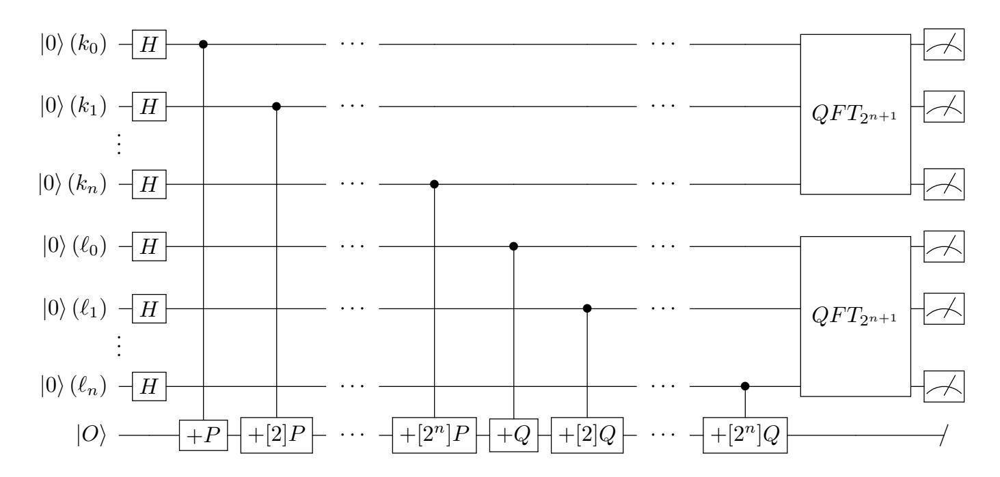
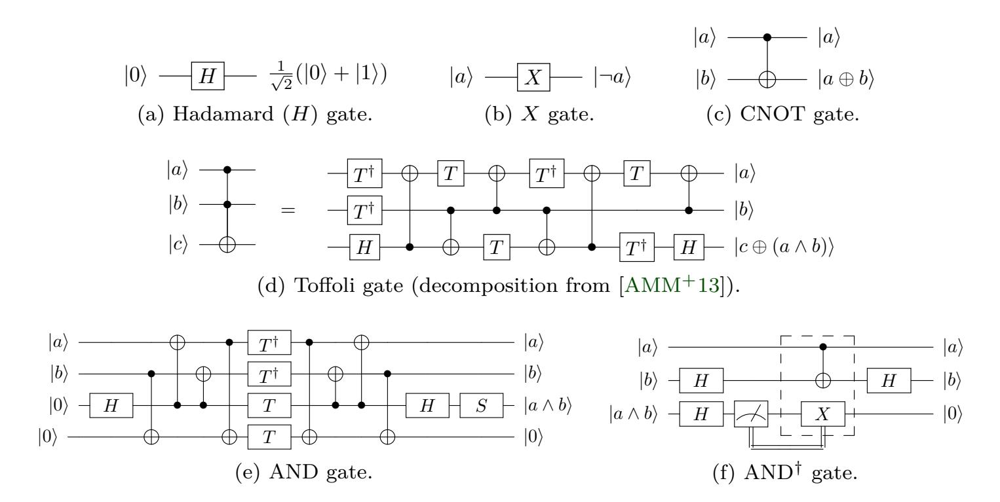
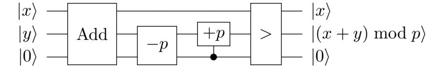
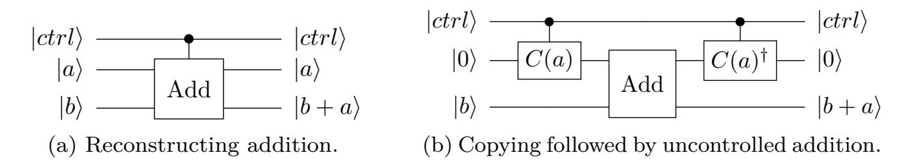
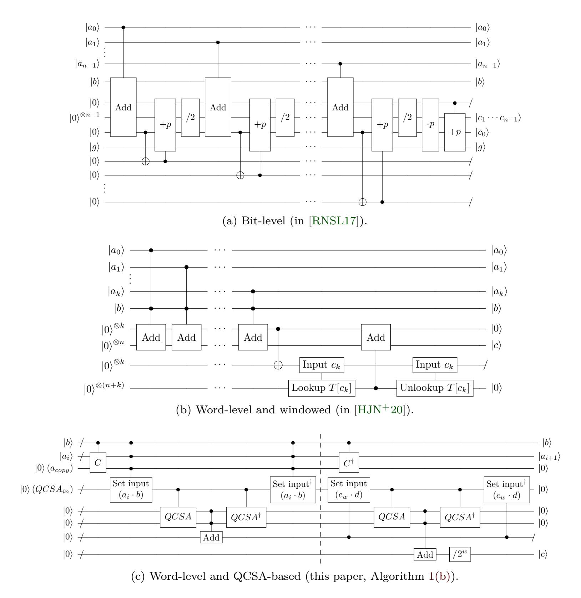
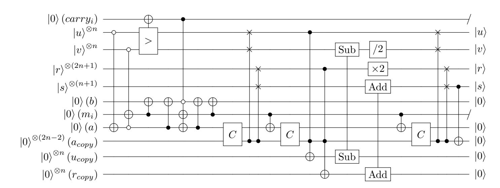
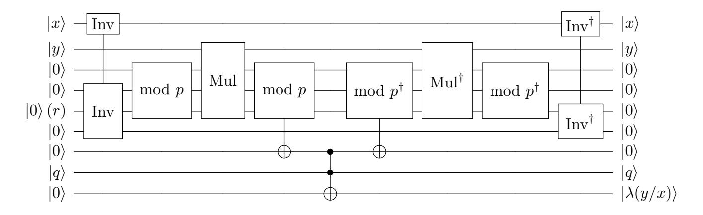
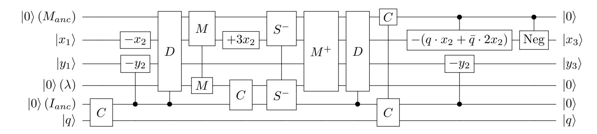

{0}------------------------------------------------

# <span id="page-0-0"></span>New Quantum Circuits for ECDLP: Breaking Prime Elliptic Curve Cryptography in Minutes

Hyunji Kim<sup>1</sup>, Kyungbae Jang<sup>1</sup>, Siyi Wang<sup>2</sup>, Anubhab Baksi<sup>3</sup>, Gyeongju Song<sup>1</sup>, Hwajeong Seo<sup>1</sup> and Anupam Chattopadhyay<sup>2</sup>\*

Division of IT Convergence Engineering, Hansung University, Seoul, South Korea
 College of Computing and Data Science, Nanyang Technological University, Singapore
 Elektro- och informationsteknik, Lund University, Lund, Sweden
 khj1594012@gmail.com, starj1023@gmail.com, siyi002@e.ntu.edu.sg,

khj1594012@gmail.com, starj1023@gmail.com, siyi002@e.ntu.edu.sg, anubhab.baksi@eit.lth.se, thdrudwn98@gmail.com, hwajeong84@gmail.com, anupam@ntu.edu.sg

**Abstract.** This paper improves quantum circuits for realizing Shor's algorithm on elliptic curves. We present optimized quantum point addition circuits that primarily focus on reducing circuit depth, while also taking the qubit count into consideration. Our implementations significantly reduce circuit depth and achieve up to 40% improvement in the qubit count - depth product compared to previous works, including those by M. Roetteler et al. (Asiacrypt'17) and T. Häner et al. (PQCrypto'20).

Using our quantum circuits, we newly assess the post-quantum security of elliptic curve cryptography. Under the MAXDEPTH constraint proposed by NIST, which limits the maximum circuit depth to  $2^{40}$ , the maximum depth in our work is  $2^{28}$  for the P-521 curve (well below this threshold). For the total gate count and full depth product, a metric defined by NIST for evaluating quantum attack resistance, the maximum complexity for the same curve is  $2^{65}$ , far below the post-quantum security level 1 requirement of  $2^{157}$ .

Beyond these logical analyses, we estimate the fault-tolerant costs (i.e., at the level of physical resources) for breaking elliptic curve cryptography. As one of our results, the P-224 curve (comparable to RSA-2048 in security) can be broken in 34 minutes using 19.1 million physical qubits, or in 96 minutes using 6.9 million physical qubits under our two optimization approaches.

**Keywords:** Shor's Algorithm · Elliptic Curves · Quantum Cryptanalysis

# 1 Introduction

Elliptic Curve Cryptography (ECC) [Kob87] stands as a cornerstone of modern cryptography, widely adopted for its ability to provide robust security with smaller key sizes than RSA [RSA78]. Its arithmetic structure over finite fields enables efficient implementations for key exchange, digital signatures, and other standardized protocols. Widely deployed elliptic curve standards comprise the NIST P-curves (e.g., P-256 and P-521), Curve25519, and the Brainpool curves, each targeting a distinct level of cryptographic strength.

The security of ECC relies on the computational hardness of the elliptic curve discrete logarithm problem (ECDLP). However, the advent of large-scale quantum computers undermines this hardness, as Shor's algorithm [Sho94] can solve the ECDLP in polynomial time, thereby breaking the security of elliptic curves. The same quantum threat also

<sup>\*:</sup> Corresponding author.

{1}------------------------------------------------

<span id="page-1-1"></span>applies to RSA, whose security is based on the hardness of integer factorization. As a result of this quantum threat, the research community has been driven to seek quantum resistant alternatives to existing public key cryptosystems, giving rise to the field now known as post quantum cryptography (see the NIST competition[1](#page-1-0) ).

Alongside the development of post-quantum cryptography, it remains important to assess the security of deployed public key cryptographic systems. From a quantum cryptanalysis perspective, it is natural to ask how costly it would be to break ECC. Accordingly, several studies have been conducted to evaluate the quantum resources required for breaking prime field ECC using Shor's algorithm. Proos and Zalka [\[PZ03\]](#page-22-3) presented the first detailed analysis of Shor's algorithm applied to elliptic curves. Building upon this groundwork, Roetteler et al. [\[RNSL17\]](#page-22-4) presented a comprehensive implementation of Shor's algorithm for ECC, establishing a solid foundation for subsequent quantum resource analyses. Following this, Häner et al. [\[HJN](#page-21-0)<sup>+</sup>20] significantly improved efficiency through refined quantum circuit designs and further analyzed trade-offs across various metrics. Based on the quantum circuits from [\[HJN](#page-21-0)<sup>+</sup>20], Gouzien et al. [\[GRLR](#page-21-1)<sup>+</sup>23] presented physical-level optimizations for breaking elliptic curves. As a side note, studies on binary field ECC [\[BBvHL20,](#page-20-0) [TT23,](#page-22-5) [JSB](#page-21-2)<sup>+</sup>25] and Ed25519 [\[HZH](#page-21-3)<sup>+</sup>25] have also been conducted.

In this paper, we contribute to this body of work by presenting new quantum circuits for breaking ECC. We estimate the logical resources required to break ECC, including quantum gates, the number of qubits, and circuit depth (the number of sequential gate layers). Furthermore, we analyze physical costs such as runtime and the number of physical qubits required for error correction under fault-tolerant computation.

## **Contribution**

This paper presents new quantum circuits for elliptic curve computations, prioritizing circuit depth while also considering qubit usage. We propose two types of quantum point addition circuits (the main cost contributor in Shor's algorithm): *qubit-optimized* and *depth-optimized* versions. Our depth-optimized version achieves the lowest circuit depth with additional ancilla qubits. In terms of the product of qubit count and full depth, our qubit-optimized version achieves a 37%–40% improvement compared to the previous best result by Häner et al. [\[HJN](#page-21-0)+20]. Further, we reduce the total gate count by 52%–54%. These results are achieved through improvements at the following component and architecture levels:

- We present depth- and qubit-optimized modular multiplications (Section [3.2\)](#page-5-0) based on the Montgomery algorithm. For the depth-optimized multiplication, we employ a Quantum Carry-Save Adder (QCSA) [\[KLJ](#page-22-6)<sup>+</sup>25] and reformulate the Montgomery reduction into an alternative form that enables the use of the QCSA. In contrast, our qubit-optimized multiplication performs additions sequentially without the QCSA.
- We develop quantum inversion circuits (Section [3.3.1\)](#page-9-0) based on the binary Extended Euclidean Algorithm (EEA). Our inversion circuits introduce a low-depth round operation with unconditional execution and a postponed modular reduction strategy. For the depth-optimized inversion, the QCSA is employed for modular reduction, while for the qubit-optimized inversion, it is replaced with sequential controlled additions to reduce the number of qubits.
- We construct quantum point addition circuits at the architecture level (Section [3.4\)](#page-12-0), which consist of multiple components such as addition, multiplication, and division. For inner controlled arithmetic, we adopt a control-qubit copying method and merge two operations in the final step into a single operation.

<span id="page-1-0"></span><sup>1</sup>[https://csrc.nist.gov/projects/post-quantum-cryptography/post-quantum-cryptography-sta](https://csrc.nist.gov/projects/post-quantum-cryptography/post-quantum-cryptography-standardization/call-for-proposals) [ndardization/call-for-proposals](https://csrc.nist.gov/projects/post-quantum-cryptography/post-quantum-cryptography-standardization/call-for-proposals)

{2}------------------------------------------------

<span id="page-2-0"></span>By constructing Shor's attack using our point addition circuits, we estimate the required quantum resources for breaking elliptic curve cryptography (Section 5.1). Unsurprisingly, ECC does not satisfy NIST post-quantum security [NIS22, pp. 15–17] under our analysis (see Table 7) and can be attacked with significantly lower depth than the NIST MAXDEPTH [NIS22, p. 17].

Further, we provide fault-tolerant costs (to be more realistic) by estimating the required number of physical qubits and the actual runtime (Section 5.2) in the Noisy Intermediate-Scale Quantum (NISQ) era. This paper shows that ECC can be broken within 26 minutes to 10 hours, depending on the curve field size and the optimization strategy (see Table 6).

# 2 Background

## 2.1 Prime Elliptic Curves

For a prime p > 3, elliptic curves over the finite field  $\mathbb{F}_p$  are typically represented in short Weierstrass form. Specifically, an elliptic curve over  $\mathbb{F}_p$  is given by  $E(\mathbb{F}_p): y^2 = x^3 + ax + b$  where constants  $a, b \in \mathbb{F}_p$ , together with a point at infinity  $\infty$ . For two distinct finite points  $P_1 = (x_1, y_1)$  and  $P_2 = (x_2, y_2)$  on  $E(\mathbb{F}_p)$ , where  $P_2 \neq \pm P_1$  and neither point is  $\infty$ ,  $P_3 = P_1 + P_2 = (x_3, y_3)$  is given by  $x_3 = \lambda^2 - x_1 - x_2$ ,  $y_3 = (x_1 - x_3)\lambda - y_1$ , with  $\lambda = (y_2 - y_1)/(x_2 - x_1)$ . In this representation (affine coordinates), point addition is implemented using field operations over  $\mathbb{F}_p$ , including addition, multiplication, and division.

#### 2.2 Elliptic Curve Cryptography vs. Shor's Algorithm

With the advent of quantum computing, the hardness assumption of the ECDLP is fundamentally challenged. Shor's algorithm [Sho94] can solve this problem efficiently on a quantum computer, thereby threatening the security of ECC. The algorithm takes advantage of quantum parallelism and the Quantum Fourier Transform (QFT), which together enable exponential speedup over classical methods. Its quantum procedure can be summarized as follows:

**Quantum Register Preparation:** Initialize two quantum registers, k and  $\ell$ , each consisting of n+1 qubits, along with a third register for group element computations. All registers start in the  $|0\rangle$  state, where the third register is initialized to  $|O\rangle$ , the elliptic curve identity:  $|0\rangle^{\otimes n+1} \otimes |0\rangle^{\otimes n+1} \otimes |O\rangle$ . Next, apply Hadamard gates to every qubit in the first two registers, creating a uniform superposition over all possible values of k and  $\ell$ :

$$\frac{1}{2^{n+1}} \sum_{k=0}^{2^{n+1}-1} \sum_{\ell=0}^{2^{n+1}-1} |k\rangle |\ell\rangle |O\rangle.$$

**Oracle Mapping (Point Addition):** For each pair  $(k, \ell)$ , compute the linear combination of the two base points in the third register, yielding

$$\frac{1}{2^{n+1}} \sum_{k,\ell} |k\rangle |\ell\rangle |O\rangle \longrightarrow \frac{1}{2^{n+1}} \sum_{k,\ell} |k\rangle |\ell\rangle |[k]P + [\ell]Q\rangle.$$

**Quantum Fourier Transform (QFT):** A QFT is applied on both the k and  $\ell$  registers, mapping the computational basis to the frequency domain. This transformation is essential for period finding:

$$|x\rangle \longrightarrow \frac{1}{2^{n+1}} \sum_{y=0}^{2^{n+1}-1} e^{2\pi i xy/2^{n+1}} |y\rangle.$$

{3}------------------------------------------------

<span id="page-3-2"></span><span id="page-3-0"></span>

Figure 1: Circuit of Shor's algorithm for solving ECDLP.

**Measurement and Post-processing:** Measure the first two registers to obtain output values, which are used in classical post-processing to recover the discrete logarithm m. The third register is unmeasured and discarded at the end.

Figure 1 shows a schematic of this quantum circuit, including initialization, oracle application, QFT, and measurement stages. Shor's algorithm can also be implemented using a single control qubit via the semi-classical Fourier transform [GN96], and this approach is adopted in our work (see [GN96] for details). It is important to note that Ekerå [Eke19] showed (heuristically) that using the semi-classical Fourier transform reduces the single-run success probability of Shor's algorithm for the discrete logarithm problem to about 60%-82%, and proposed two strategies to recover a high success rate (above 99%): slightly increasing the quantum computation and performing a single limited search in the classical post-processing, or performing two limited searches in the classical post-processing. In this work, the latter setting is assumed throughout our analysis without increasing the quantum cost (for details, see [Eke19]).

#### <span id="page-3-1"></span>2.3 Quantum Gates

Figure 2 illustrates the quantum gates employed to construct quantum circuits in this work, where the symbols '¬', ' $\oplus$ ' and ' $\wedge$ ' denote the NOT, XOR, and AND operations respectively. The Hadamard (H) gate (Figure 2(a)) creates superposition by assigning equal probability amplitudes to the  $|0\rangle$  and  $|1\rangle$  states. The X gate (Figure 2(b)) flips a qubit state between  $|0\rangle$  and  $|1\rangle$ , corresponding to the classical NOT operation ( $\neg$ ). The CNOT gate (Figure 2(c)) flips the target qubit (b) conditioned on the control qubit (a) being in the  $|1\rangle$  state, realizing the classical XOR operation ( $\oplus$ ).

The Toffoli gate (Figure 2(d)) flips the target qubit (c) only when both control qubits (a and b) are in the  $|1\rangle$  state, corresponding to the classical AND operation  $(\land)$ . Due to its high quantum cost, various optimized constructions of the Toffoli gate have been proposed [AMM<sup>+</sup>13, Sel13a]. In this work, we adopt a decomposition consisting of 8 Clifford gates and 7 T gates, yielding a full depth of 8 with a T-depth of 4 [AMM<sup>+</sup>13].

**AND Gates** Replacing Toffoli gates with AND gates [Gid18, JNRV19] can further reduce the T-depth. To the best of our knowledge, the most efficient AND gate constructions were proposed by Jaques et al. [JNRV19], and the corresponding circuits are illustrated in Figures 2(e) and 2(f). The AND gate is decomposed into 11 Clifford gates and 4 T gates, achieving a T-depth of 1 and a full depth of 8, while requiring one ancilla qubit. Its reverse operation, the AND<sup>†</sup> gate, consists of 7 Clifford gates and a single measurement

{4}------------------------------------------------

<span id="page-4-8"></span><span id="page-4-5"></span><span id="page-4-4"></span><span id="page-4-2"></span><span id="page-4-1"></span><span id="page-4-0"></span>

<span id="page-4-6"></span><span id="page-4-3"></span>Figure 2: Quantum gates.

gate, providing a notable advantage in reverse operations. Note that the target qubit of the AND gate must be initialized in a clean state  $|0\rangle$ , in contrast to the Toffoli gate, whose target qubit does not require such initialization.

# 3 Quantum Circuit Construction for Elliptic Curves

In this section, we present quantum modular arithmetic circuits for Shor's attack on elliptic curve cryptography over prime fields. Building on these circuits, we introduce point addition circuits, considering both depth-optimized and qubit-optimized designs. Throughout our implementations, we adopt the AND gates presented in [JNRV19] (see Figures 2(e) and 2(f)). When the AND gates are not applicable in our implementations (such as in certain steps of Draper's adder [DKRS04]), we instead use the Toffoli gate decomposition from [AMM<sup>+</sup>13] (Figure 2(d)).

## 3.1 Modular Addition

Elliptic curve arithmetic operates on n-bit integers modulo a prime p, and efficient implementations of addition are crucial. We employ the in-place and out-of-place Draper adders [DKRS04], which are effective in reducing depth. Modular addition is implemented using a combination of these adders, as illustrated in Figure 3. After an addition, the modulus p is subtracted, followed by a conditional addition of p to keep the result in [0, p-1], as in  $[HJN^+20]$ .



<span id="page-4-7"></span>Figure 3: Modular addition (used in [HJN<sup>+</sup>20] and this paper).

**Controlled Addition** Controlled addition is required for the point addition circuit to realize an in-place structure (see Figure 8). There are two approaches to controlled addition, reconstructing the adder or using the copying method, as shown in Figures 4(a) and 4(b),

{5}------------------------------------------------

<span id="page-5-4"></span>respectively. In both [RNSL17] and [HJN<sup>+</sup>20], the first approach (Figure 4(a)) is adopted, which promotes the CNOT gates used except for the carry-propagation to Toffoli gates. In contrast, we adopt the second approach (Figure 4(b)), which copies the operand to ancilla qubits in a clean state  $|0\rangle$  conditioned on the control qubit. An uncontrolled addition is then performed without incurring additional Toffoli gates. The reason for this choice is the availability of sufficient ancilla qubits (in the idle state) in our implementation. We describe this in Section 3.2.1.

<span id="page-5-2"></span><span id="page-5-1"></span>

<span id="page-5-3"></span>Figure 4: Comparison of two controlled addition methods.

## <span id="page-5-0"></span>3.2 Modular Multiplication

Both [RNSL17] and [HJN<sup>+</sup>20] adopted the Montgomery algorithm for quantum modular multiplication, however, they constructed different circuit structures. Montgomery multiplication can be divided into two steps: *general multiplication* and *Montgomery reduction*. Figures 5(a) and 5(b) illustrate the quantum circuits for modular multiplication proposed in [RNSL17] and [HJN<sup>+</sup>20], respectively.

The authors of [RNSL17] presented a bit-level Montgomery multiplication circuit, where each round performs a controlled addition for the general multiplication (i.e.,  $c(x) + a_i(x)b(x)$ , i = 0, ..., n-1) and a controlled addition for the Montgomery reduction (i.e.,  $c(x) + c_0(x)p(x)$ ). Note that  $a_i(x)$  and  $c_0(x)$  each serve as a control qubit.

In contrast, the authors of [HJN<sup>+</sup>20] implemented a word-level Montgomery multiplication (with word size w), given in Algorithm 1(a), using a quantum lookup table (called windowing arithmetic). For the word size w, the w-qubit value  $a_i(x)$  (i = 0, ..., s - 1, where s = n/w) is multiplied by b(x), resulting in a multiplication of size  $w \times n$ . Thus, for the general multiplication, w controlled additions of n-qubit operands are performed. For the Montgomery reduction, the least significant w qubits of c(x) (i.e.,  $c_w(x)$ ) are used as the index for the quantum lookup table, which then loads the corresponding multiple of the modulus p(x) (i.e., M(x)p(x)). As a result, the w controlled additions for the Montgomery reduction are replaced by a single uncontrolled addition with the quantum lookup table. It is important to note that although the w controlled additions are replaced to a single uncontrolled addition, the cost of constructing the quantum lookup table must be considered. We discuss this trade-off in detail in Section 3.2.2.

#### 3.2.1 QCSA-based Montgomery Multiplication

In this work, we present a word-level (of size w) Montgomery multiplication using the Quantum Carry-Save Adder (QCSA) [KLJ<sup>+</sup>25], which is similar to the approach in [HJN<sup>+</sup>20] but differs in key aspects. Depending on the word size w, Montgomery multiplication is performed between each input  $a_i(x)$  ( $0 \le i \le s - 1$ , s = n/w) and b(x). Here, the sizes of  $a_i(x)$  and b(x) are w and n, respectively.

Figure 5(c) illustrates a single loop (iterated s times) of our QCSA-based Montgomery multiplication (C denotes a copy operation). The left and right sides of the dashed line correspond to the general multiplication and the Montgomery reduction, respectively. In our implementation, we employ the QCSA, a quantum adder optimized for multi-operand addition (e.g., a + b + c corresponds to a three-operand addition).

{6}------------------------------------------------

<span id="page-6-5"></span><span id="page-6-1"></span><span id="page-6-0"></span>

<span id="page-6-2"></span>Figure 5: Montgomery multiplication circuits.

<span id="page-6-3"></span>Input Setting As a preparatory step, we prepare w registers, each consisting of n qubits, and store b(x) in each register based on the corresponding control qubits (i.e.,  $a_i(x)$ ) using AND gates<sup>2</sup>. Each of the w registers is set to b(x) (if  $a_i = |1\rangle$ ) or to  $|0\rangle$  (if  $a_i = |0\rangle$ ). To improve the parallelization of AND gates in this step, we copy (C) the input  $a_i(x)$  into additional ancilla qubits  $(a_{copy})$  using CNOT gates. Assuming the input is not copied, only w AND gates can be executed in parallel; however, if l instances of the input  $a_i(x)$  are prepared using the copy method, lw gates can be performed in parallel. Depending on the input  $a_i$ , each of the w registers is loaded with b(x) if  $a_i = |1\rangle$ , or with  $|0\rangle$  if  $a_i = |0\rangle$ .

Multi-Operand Addition Using QCSA Using the prepared inputs (i.e., the w registers), we perform multi-operand addition with the QCSA, which computes the result of  $a_i(x)b(x)$ . The QCSA efficiently adds multiple operands without requiring carry propagation at each stage. It generates partial sum and carry values, enabling multiple additions to be performed in parallel. This process continues until only two operands remain (QCSA in Figure 5(c)), which are then added using a regular adder (e.g., ripple-carry or carry-

<span id="page-6-4"></span><sup>&</sup>lt;sup>2</sup>The control qubits are  $a_i(x)$  and b(x), and the w registers serve as the target qubits.

{7}------------------------------------------------

<span id="page-7-5"></span>lookahead adder) with carry propagation. For the final two-operand addition (Add $^3$  in Figure 5(c)), we adopt Draper's out-of-place adder [DKRS04].

In contrast to [RNSL17, HJN<sup>+</sup>20], where sequential quantum additions are designed for general multiplication a(x)b(x), a low-depth parallelized structure is constructed in our implementation utilizing the QCSA.

<span id="page-7-0"></span>Reuse of Ancilla Qubits The QCSA is effective for reducing circuit depth, but it requires more ancilla qubits compared to the sequential use of two-operand adders. To balance circuit depth and qubit count, we initialize the ancilla qubits used in the QCSA to the clean state by applying its reverse operation (QCSA $^{\dagger}$ ). The initialized ancilla qubits are then reused in subsequent QCSA. In the same context, we reverse the input setting operation using AND $^{\dagger}$  gates ( $Set\ input^{\dagger}$ ) to reuse the w registers by initializing them. Recall that we adopt Figure 4(b) for controlled addition, which requires ancilla qubits. Since the ancilla qubits for our multiplication are available, we reuse them for the controlled additions.

Alternative Formulation of Montgomery Reduction After the general multiplication, the Montgomery reduction is performed, corresponding to the right side of the dashed line in Figure 5(c). We utilize the QCSA for the Montgomery reduction as well. To do this, we modify the word-level Montgomery multiplication into an alternative formulation. We reformulate Algorithm 1(a) into Algorithm 1(b) by precomputing the reduction factor  $d(x) \leftarrow (p'_0(x) \mod x^w)p(x)$  (line 2 of Algorithm 1(b)). This allows us to combine  $M(x) \leftarrow c_w(x)p'_w(x) \mod x^w$  and c(x) + M(x)p(x), which correspond to lines 4 and 5 of Algorithm 1(a), into a single expression  $c(x) + c_w(x)d(x)$ , which corresponds to line 5 of Algorithm 1(b). Note that d(x) can be precomputed classically. Thus, similar to the general multiplication  $a_i(x)b(x)$ , we apply the QCSA to the multiplication  $c_w(x)d(x)$  as well. Depending on the input  $c_w(x)$ , the precomputed reduction factor d(x) is loaded into the w registers. Then, the result of the multiplication  $c_w(x)d(x)$  is computed using the QCSA and Draper's out-of-place adder.

In the final step, a logical shift that requires no quantum resources ( $/2^w$  in Figure 5(c)) is performed on the result c(x). Then, the reverse operations of the QCSA and the input setting are applied. Figure 5(c) illustrates a single loop of our Montgomery multiplication, which is iterated s times depending on the word size (n = sw).

<span id="page-7-1"></span>**Algorithm 1:** Word-level Montgomery multiplication (of size n = sw) and its equivalent formulation (this paper).

```
(a) Word-level Montgomery Multiplication.
                                                             (b) Equivalent formulation.
                                                             Input: a(x), b(x), p(x), p'_w(x)

Output: c(x) = a(x)b(x)r^{-1}(x) \mod p(x)
Input: a(x), b(x), p(x), p'_{w}(x)
Output: c(x) = a(x)b(x)r^{-1}(x) \mod p(x)
 1: c(x) \leftarrow 0
                                                               1: c(x) \leftarrow 0
                                                               2: d(x) \leftarrow (p'_w(x) \mod x^w)p(x)
 2: for i = 0 to s - 1 do
 3: c(x) \leftarrow c(x) + a_i(x)b(x)
                                                               3: for i = 0 to s - 1 do
         M(x) \leftarrow c_w(x) p'_w(x) \mod x^w
                                                                       c(x) \leftarrow c(x) + a_i(x)b(x)
 4:
                                                               4:
                                                                       c(x) \leftarrow c(x) + c_w(x)d(x)
         c(x) \leftarrow c(x) + M(x)p(x)
 5:
                                                               5:
         c(x) \leftarrow c(x)/x^w
                                                                       c(x) \leftarrow c(x)/x^w
 6:
                                                               6:
 7: end for
                                                               7: end for
 8: return c(x)
                                                               8: return c(x)
```

Table 1 presents the quantum resources required for modular multiplication in [HJN<sup>+</sup>20] and in this work. We exclude [RNSL17] from the comparison, as [HJN<sup>+</sup>20] is a follow-up work that reports improved performance. Due to a lower bound estimation issue in [HJN<sup>+</sup>20] (see Section 4 for details), our comparisons are based on reimplemented

<span id="page-7-4"></span><sup>&</sup>lt;sup>3</sup>Note that the connected dots represent operands for out-of-place addition, not controlled addition.

{8}------------------------------------------------

<span id="page-8-2"></span>versions of their quantum circuits. Similarly, the work by Gouzien et al. [GRLR<sup>+</sup>23] is excluded from the comparison because it is affected by the same issue as [HJN<sup>+</sup>20], since their implementation is based on that of [HJN<sup>+</sup>20].

Both [RNSL17] and [HJN<sup>+</sup>20] compute the result by accumulating the intermediate results into the same register (i.e., c(x), see Figures 5(a) and 5(b)). In contrast, we parallelize the quantum additions in Montgomery multiplication by using the QCSA (thanks to Algorithm 1(b)) with additional ancilla qubits. Consequently, we achieve the lowest circuit depth, at the cost of a high qubit count. In this trade-off, our multiplication achieves a performance improvement of approximately 44 - 80% in terms of the qubit count - full depth product, compared to the depth-optimized multiplication in [HJN<sup>+</sup>20] (the previous best result), as shown in Table 1.

<span id="page-8-1"></span>

|     | Table 1. Comparison of the quantum resources required for multiplication. |        |           |          |          |              |         |                   |                  |
|-----|---------------------------------------------------------------------------|--------|-----------|----------|----------|--------------|---------|-------------------|------------------|
| n   | Source                                                                    | Source |           | #Measure | #T       | #Qubit $(M)$ | T-depth | Full depth $(FD)$ | FD-M cost*       |
|     | H <sup>+</sup> [HJN <sup>+</sup> 20]                                      | Q opt. | 4506240   | 24384    | 1819200  | 984          | 981726  | 3438746           | 3383726064       |
| 192 | H ' [HJN ' 20]                                                            | D opt. | 26503872  | 270768   | 5511936  | 1697         | 76272   | 722400            | 1225912800       |
| 192 | This paper                                                                | Q opt. | 10637184  | 646224   | 7127952  | 2005         | 86850   | 199648            | 400294240 (67%)  |
|     | This paper {                                                              | D opt. | 4210254   | 280206   | 1123128  | 14772        | 2676    | 18560             | 274168320 (77%)  |
|     | H <sup>+</sup> [HJN <sup>+</sup> 20]                                      | Q opt. | 6447336   | 28448    | 2448544  | 1144         | 1331630 | 4795758           | 5486347152       |
| 224 | 11. [11914. 70]                                                           | D opt. | 33761168  | 363272   | 7466032  | 1967         | 93016   | 842688            | 1657567296       |
| 224 | This paper $\left\{ \right.$                                              | Q opt. | 14373240  | 873936   | 9628864  | 2324         | 108552  | 241976            | 562352224 (66%)  |
|     |                                                                           | D opt. | 5659544   | 382520   | 1535144  | 17691        | 3160    | 21080             | 372926280 (77%)  |
|     | $H^{+}[HJN^{+}20]$                                                        | Q opt. | 7759552   | 32512    | 3171072  | 1304         | 1734782 | 5906966           | 7702683664       |
| 256 | n . [uhin , 50]                                                           | D opt. | 43128320  | 471616   | 9741312  | 2363         | 108608  | 1037842           | 2452420646       |
| 230 | This paper                                                                | Q opt. | 18732608  | 1140096  | 12550656 | 2903         | 128140  | 295360            | 857430080 (65%)  |
|     | This paper {                                                              | D opt. | 7325336   | 508700   | 1992944  | 21423        | 3660    | 22752             | 487416096 (80%)  |
|     | H <sup>+</sup> [HJN <sup>+</sup> 20]                                      | Q opt. | 22993440  | 48768    | 6993024  | 1944         | 3879870 | 13278176          | 25812774144      |
| 201 | 11. [1111. 70]                                                            | D opt. | 102208704 | 1037472  | 21769152 | 3265         | 166368  | 1570752           | 5128505280       |
| 384 | This paper                                                                | Q opt. | 41701920  | 2542464  | 27932352 | 3924         | 198292  | 469248            | 1841329152 (64%) |
|     | This paper {                                                              | D opt. | 16477080  | 1078012  | 4414608  | 37330        | 5428    | 51640             | 1927721200 (62%) |
|     | $H^{+}[HJN^{+}20]$                                                        | Q opt. | 48709924  | 67056    | 12752248 | 2636         | 7127894 | 24338714          | 64156850104      |
| 501 | n . [uhin , 50]                                                           | D opt. | 196636836 | 1912944  | 40473312 | 4368         | 245622  | 2314884           | 10111413312      |
| 521 | This paper                                                                | Q opt. | 77437404  | 4725996  | 51865836 | 5292         | 302260  | 682308            | 3610773936 (64%) |
|     | This paper {                                                              | D opt. | 30575354  | 1988028  | 8097528  | 59809        | 7684    | 94168             | 5632093912 (44%) |

Table 1: Comparison of the quantum resources required for multiplication.

**☆**: Improvement percentages are relative to the D opt. results in [HJN<sup>+</sup>20].

#### <span id="page-8-0"></span>3.2.2 Quantum Lookup Table vs. Quantum Circuit Synthesis

Both [RNSL17] and [HJN<sup>+</sup>20] perform the general multiplication a(x)b(x) using sequential additions. However, the key difference is that [HJN<sup>+</sup>20] uses a quantum lookup table for the Montgomery reduction, whereas [RNSL17] does not. For the Montgomery reduction in [HJN<sup>+</sup>20], depending on the size of the quantum lookup table w, w sequential quantum additions are replaced with two quantum lookup tables (one for reversal) and one quantum addition. It is important to note that, in some cases, replacing arithmetic with a quantum lookup table (as done by the authors in [HJN<sup>+</sup>20]) can be more efficient than synthesizing it into quantum circuits. As one example, there is no doubt that using a quantum lookup table to replace quantum point additions at the level of Shor's algorithm is effective, given the high cost of point additions. However, if the logic or arithmetic replaced by a quantum lookup table can instead be implemented through circuit synthesis with low quantum resource overhead, circuit synthesis is preferable (e.g., the AES S-box [LL25, JNRV19, JBK<sup>+</sup>22]). We believe that our quantum circuit for the Montgomery reduction (which consists of w quantum additions based on Algorithm 1(b)) using the QCSA is more efficient than using a quantum lookup table. The depth of a lookup table is determined by the window size w. For a window size of w = 8, the full depth of a quantum lookup table with fan-out is approximately 7000. Under the same condition, our approach yields a full depth of 386 at n = 256.

{9}------------------------------------------------

#### <span id="page-9-2"></span>3.2.3 Qubit-Optimized Version

In addition to the QCSA-based multiplication (depth-optimized version), we also consider a qubit-optimized version. In this version, the general multiplication follows the sequential controlled addition structure of  $[HJN^+20]$ , while the Montgomery reduction is implemented using sequential controlled additions (whereas  $[HJN^+20]$  employs a quantum lookup table). Our qubit-optimized version achieves an improvement of approximately 64 - 67% in the qubit count – full depth product, compared to the depth-optimized multiplication in  $[HJN^+20]$  (the previous best result; see Table 1).

#### 3.3 Modular Division

This section presents our quantum division circuit that restructures the inversion process. For inversion, we adopt the binary Extended Euclidean Algorithm (EEA) and Kaliski's algorithm [Kal02]. This approach was adopted in [RNSL17], and further improved in [HJN<sup>+</sup>20].

#### <span id="page-9-0"></span>3.3.1 Inversion Using Binary EEA

The binary EEA extends the classical Euclidean algorithm by computing not only gcd(x, p) but also integer coefficients s and t that satisfy Bézout's identity: sx + tp = gcd(x, p). When gcd(x, p) = 1, which holds for all nonzero elements in a prime field, the coefficient s satisfies  $s \equiv x^{-1} \pmod{p}$ . Hence, the modular inverse of x can be directly obtained from this identity.

<span id="page-9-1"></span>**Full-Circuit Execution without Conditionals** We adopt the swap-based Kaliski algorithm specified in Algorithm 2, a refined version of the binary EEA presented in [HJN<sup>+</sup>20, Figure 7]. The round operations proceed by updating two pairs of integer variables, (u, r) and (v, s), which are initialized to (p, 0) and (x, 1), respectively. At each round, the variables (u, r, v, s) are updated according to the values of u and v. This process continues until v = 0, at which point u = 1 and s = p, and r contains a pseudo-inverse of x. A key difference in our implementation is the removal of the check step for whether v = 0, resulting in unconditional execution.

Formally (or classically), each round is executed only if the condition  $v_i \neq 0$  holds, and the state  $v_i$  is updated according to Kaliski's algorithm. In [HJN<sup>+</sup>20], the round operation performs conditional checks over the range  $n \leq i < 2n$  to determine whether the state needs to be updated (for details, refer to Section 4). In contrast, we execute all 2n rounds without any conditional checks (at low cost). Under the unconditional execution, the variable r continues to be doubled even after v = 0. The 2n doublings caused by this process result in the value being represented on 2n qubits. Although this may appear counterintuitive, this yields the correct inverse rather than a pseudo-inverse. We discuss this in detail in Section 3.3.1.

**Low-Depth Round Operation** The round operation is structurally similar to that in  $[HJN^+20]$ ; however, we improve the circuit depth by enhancing parallelism. Figure 6 illustrates a round operation of our inversion quantum circuit. We copy (C) the control qubit a (which checks the state of u and v) into a sufficient number of ancilla qubits  $(a_{copy})$  and parallelize all controlled operations that use the control qubit a. Similarly, the operands u and r are also copied to ancilla qubits (i.e.,  $u_{copy}$  and  $r_{copy}$ ), and the uncontrolled addition and subtraction with copying are implemented (see Figure 4(a)). Note that the ancilla qubits used for copying  $(a_{copy}, u_{copy}, r_{copy})$  are borrowed from the idle qubits reserved for the subsequent multiplication following the inversion (a characteristic of division); thus, this does not increase the overall qubit count.

{10}------------------------------------------------

<span id="page-10-5"></span><span id="page-10-0"></span>**Algorithm 2:** Kaliski's algorithm based on swaps (equivalent formulation by [HJN<sup>+</sup>20]).

```
Input: u, v, r, s
                                                                    if u and v both odd then
                                                              9:
Output: Pseudo-inverse r
                                                             10:
                                                                       v \leftarrow v - u
                                                                       s \leftarrow r + s
                                                             11:
 1: while v \neq 0 do
                                                             12:
                                                                    end if
       b_{swap} \leftarrow \text{false}
 2:
                                                                    v \leftarrow v/2
                                                             13:
       if u even and v odd, or u and v
 3:
                                                                    r \leftarrow 2 \cdot r
                                                             14:
 4:
          both odd and u > v then
                                                                    if b_{swap} then
                                                             15:
          swap u and v
 5:
                                                                       swap u and v
                                                             16:
 6:
          swap r and s
                                                                       swap r and s
                                                             17:
          b_{swap} \leftarrow \text{true}
 7:
                                                             18:
                                                                    end if
       end if
 8:
                                                             19: end while
                                                             20: return r
```

<span id="page-10-2"></span>

Figure 6: Round operation of inversion (one round).

**Postponed Modular Reduction Strategy** For the subtraction (v - u, Line 10), addition (r+s, Line 11), halving (v/2, Line 13), and doubling  $(2 \cdot r, \text{Line } 14)$  operations in Algorithm 2, we do not perform modular reduction (mod p) immediately after each operation. Instead, we postpone these modular reductions by accumulating the results into a 2n-bit inverse. Thanks to this strategy, the cost of modular reduction is excluded from each round and instead incurred only at the final stage<sup>4</sup>, where it can be performed efficiently using the QCSA<sup>5</sup> in the depth-optimized version. Note that, in our qubit-optimized version, the QCSA is replaced with sequential controlled additions.

One might wonder about the possibility of further postponing the modular reductions and performing them together after division. However, this would increase the size of the multiplication (i.e.,  $y \cdot x^{-1}$ ) to  $n \times 2n$ , which increases the cost; therefore, we do not adopt this approach.

<span id="page-10-1"></span>**Omission of Pseudo-Inverse Correction** In [HJN<sup>+</sup>20], the pseudo-inverse is given by  $x^{-1} \cdot 2^{-n+k} \pmod{p}$ , where k denotes the number of activated round updates (i.e., the rounds that are actually executed). Accordingly, the result is scaled by  $2^{2n-k} \pmod{p}$  to recover the correct Montgomery inverse,  $x^{-1} \cdot 2^n \pmod{p}$ . The 2n-k doublings are performed with the counter holding the information on the number of activated rounds (k) in the inversion, which incurs additional costs. On the other hand, since our round operations are unconditional (see Section 3.3.1), the resulting value is already given as  $x^{-1} \cdot 2^n$  (i.e.,  $x^{-1} \cdot 2^{-n} \cdot 2^{2n}$ ), which is in Montgomery inverse form.

<span id="page-10-3"></span><sup>&</sup>lt;sup>4</sup>The reduction consists of constant additions controlled by the upper n bits, leveraging the generalized Mersenne structure [S<sup>+</sup>99].

<span id="page-10-4"></span><sup>&</sup>lt;sup>5</sup>The ancilla qubits for the QCSA are borrowed from the subsequent multiplication.

{11}------------------------------------------------

#### <span id="page-11-3"></span><span id="page-11-2"></span>3.3.2 Quantum Circuit for Division

The division is given by  $\lambda = y \cdot x^{-1}$ , which consists of one inversion, one multiplication, and two modular reductions. Figure 7 illustrates the quantum circuit diagram for the division. The output of the inversion is used as the input to the multiplication, and the division result  $\lambda$  is obtained via modular reduction from n+w bits to n bits. Note that  $\lambda$  is conditionally stored in the result register depending on the control qubit q, after which the reverse operations of the modular reduction, multiplication, and inversion are performed.

Table 2 compares the quantum resources required for division (including its reverse). We compare our results with the previous best result, the depth-optimized division in  $[HJN^+20]$ . In terms of the product of full depth and qubit count (FD-M), our qubit-optimized division achieves an improvement of 35–38%. Our depth-optimized division achieves the lowest circuit depth, but it provides degraded FD-M performance. This is because depth-optimized multiplication within the division increases the total number of qubits, while the overall depth is dominated by the inversion, resulting in a higher FD-M cost. Nevertheless, the depth-optimized division is retained as an option, as it provides the lowest circuit depth.

<span id="page-11-0"></span>

Figure 7: Modular division.

<span id="page-11-1"></span>

|     |                                                                                                                             |        |           |          |           |              |          |                   | - 1 - 1 - 1 - 1 - 1 - 1 - 1 - 1 - 1 - 1 |
|-----|-----------------------------------------------------------------------------------------------------------------------------|--------|-----------|----------|-----------|--------------|----------|-------------------|-----------------------------------------|
| n   | Source                                                                                                                      | Source |           | #Measure | #T        | #Qubit $(M)$ | T-depth  | Full depth $(FD)$ | FD-M cost*                              |
|     | $H^{+}[HJN^{+}20]$                                                                                                          | Q opt. | 24211043  | 24384    | 20499351  | 1559         | 8843886  | 19049769          | 29698589871                             |
| 192 | $\left[\begin{array}{cc} \mathbf{H} \cdot \left[\mathbf{H}\mathbf{J}\mathbf{W} \cdot \mathbf{Z}0\right] \end{array}\right]$ | D opt. | 129017865 | 2484819  | 50141358  | 2500         | 538836   | 1730007           | 4325017500                              |
| 192 | This paper $\left\{ \right.$                                                                                                | Q opt. | 50687412  | 2160724  | 24447728  | 4972         | 188490   | 543922            | 2704380184 (37%)                        |
|     | I ms paper                                                                                                                  | D opt. | 44260482  | 1794706  | 18442904  | 16179        | 104226   | 362834            | 5870291286 (-36%)                       |
|     | H <sup>+</sup> [HJN <sup>+</sup> 20]                                                                                        | Q opt. | 33249675  | 28448    | 27854743  | 1815         | 12009886 | 26213666          | 47577803790                             |
| 224 |                                                                                                                             | D opt. | 173477660 | 3385346  | 68280123  | 2915         | 668380   | 2050230           | 5976420450                              |
| 224 | This paper $\left\{ \right.$                                                                                                | Q opt. | 67603996  | 2784426  | 32708280  | 5708         | 234256   | 652812            | $3726250896 \ (37\%)$                   |
|     |                                                                                                                             | D opt. | 58890300  | 2293010  | 24614560  | 19600        | 128774   | 431916            | 8465553600 (-42%)                       |
|     | $H^{+}[HJN^{+}20] \left\{$                                                                                                  | Q opt. | 42748963  | 32512    | 36335511  | 2071         | 15667022 | 33879498          | 70164440358                             |
| 256 |                                                                                                                             | D opt. | 225921768 | 4433946  | 89312843  | 3332         | 786996   | 2452293           | 8171040276                              |
| 250 | This paper {                                                                                                                | Q opt. | 87079688  | 3500148  | 42240104  | 6467         | 277908   | 772722            | 4997193174 (38%)                        |
|     |                                                                                                                             | D opt. | 75672416  | 2868752  | 31682392  | 23720        | 153338   | 500114            | $11862704080 \ (-46\%)$                 |
|     | H+[HJN+20] {                                                                                                                | Q opt. | 101651075 | 48768    | 81537687  | 3086         | 35149326 | 76181972          | 235097565592                            |
| 384 | H - [HJN + 20]                                                                                                              | D opt. | 514874541 | 10016994 | 201381933 | 4996         | 1217028  | 3828606           | 19127715576                             |
| 304 | This paper $\left\{ \right.$                                                                                                | Q opt. | 203812532 | 8625388  | 98103296  | 9900         | 428956   | 1234890           | $12225411000 \ (36\%)$                  |
|     | Ims paper                                                                                                                   | D opt. | 178587692 | 7160936  | 74585552  | 41624        | 236002   | 817282            | $34018545968 \ (-78\%)$                 |
|     | H+[HJN+20] {                                                                                                                | Q opt. | 193436273 | 67056    | 149900704 | 4195         | 64613944 | 140111794         | 587768975830                            |
| 521 | 11. [11914 . 70]                                                                                                            | D opt. | 958782052 | 18554734 | 372200622 | 6776         | 1839562  | 5618047           | 38067886472                             |
| 021 | This paper                                                                                                                  | Q opt. | 400582124 | 13234146 | 192340276 | 13591        | 652636   | 1805894           | 24543905354~(35%)                       |
|     | This paper {                                                                                                                | D opt. | 353720074 | 10496178 | 148571968 | 63978        | 357970   | 1217754           | 77909465412 (-105%)                     |

Table 2: Comparison of the quantum resources required for division.

\*: Improvement percentages are relative to the D opt. results in [HJN<sup>+</sup>20].

{12}------------------------------------------------

# <span id="page-12-4"></span><span id="page-12-0"></span>**3.4 Point Addition**

In Shor's algorithm, point addition *P*(*x*1*, y*1) +*P*(*x*2*, y*2) is performed if the control qubit *q* is 1; otherwise the input *P*1(*x*1*, y*1) is preserved (i.e., conditional). Algorithm [3](#page-12-1) and Figure [8](#page-13-0) show our in-place point addition circuit, adapted from [\[HJN](#page-21-0)<sup>+</sup>20] with two modifications (Sections [3.4](#page-12-2) and [3.4\)](#page-12-3). As shown in Figure [8,](#page-13-0) the point addition circuit is composed of several arithmetic subroutines, including additions, two divisions (*D*), multiplication (*M*) and a negation. Here, *S* <sup>−</sup> and *M*<sup>+</sup> denote the square-then-subtract and multiply-then-add operations, respectively, and Neg denotes modular negation, (−*a*) mod *p* = (*p* − *a*) mod *p*.

<span id="page-12-2"></span>**Control Qubit Copying** For the point addition in Figure [8,](#page-13-0) three subtractions, two divisions, and one negation are performed depending on the control qubit *q*. These controlled operations share a single control qubit, which causes a significant increase in circuit depth. To address this depth overhead, we copy *q* into the ancilla registers for multiplication and inversion (*Manc* and *Ianc*) to parallelize the controlled operations (Algorithm [3,](#page-12-1) Steps [2,](#page-12-1) [12,](#page-12-1) and [14\)](#page-12-1). Because these ancilla qubits remain idle, we use them as storage registers for copying the control qubit.

<span id="page-12-3"></span>**Merging Technique** We optimize the final steps of [\[HJN](#page-21-0)<sup>+</sup>20], which consists of an uncontrolled subtraction followed by a controlled addition. In [\[HJN](#page-21-0)<sup>+</sup>20, Figure 9], a subtraction of 2*x*<sup>2</sup> is first performed on *x*<sup>1</sup> (uncontrolled), followed by a controlled addition of *x*<sup>2</sup> (i.e., if *q* = 1, then *x*<sup>1</sup> = *x*<sup>1</sup> − *x*2; otherwise, *x*<sup>1</sup> = *x*<sup>1</sup> − 2*x*2). In our implementation, these steps are merged into a single controlled subtraction. Recall that an ancilla register storing the operand is used for our controlled addition (see Figure [4](#page-5-1)[\(b\)\)](#page-5-3). We set the ancilla register to 2*x*<sup>2</sup> if *q* = 0 or to *x*<sup>2</sup> if *q* = 1, and then perform only one uncontrolled subtraction (Step [15](#page-12-1) in Algorithm [3\)](#page-12-1).

## <span id="page-12-1"></span>**Algorithm 3:** Quantum circuit of in-place point addition.

**Classical input:** A fixed point *P*2(*x*2*, y*2) and a prime *p*.

**Quantum input:** A control qubit *q*, a point *P*1(*x*1*, y*1) on the elliptic curve, ancilla qubits *Ianc* for inversion, and ancilla qubits *Manc* for multiplication.

**Output:** *P*3(*x*3*, y*3) if *q* = 1, *P*1(*x*1*, y*1) if *q* = 0, and all the clean ancilla qubits.

```
1: x1 ← Const_Sub(x2, x1) ▷ x1 = x1 − x2
2: Ianc ← Copy(q, Ianc) ▷ Copy q to Ianc
3: y1 ← Ctrl_Sub(Ianc, y2, y1) ▷ y1 = y1 − q · y2
4: λ = Ctrl_Div(Ianc, x1, y1) ▷ λ = y1/x1
5: y1 = Mul(x1, λ) ▷ y1 = x1 · λ to clear y1
6: x1 ← Const_Add(3x2, x1) ▷ x1 = x1 + 3 · x2
7: Ianc ← Copy(λ, Ianc) ▷ Copy λ to Ianc
8: t0 ← Sqr(λ, Ianc) ▷ t0 = λ · λ
9: x1 ← Sub(t0, x1) ▷ x1 = x1 − t0
10: t1 ← Mul(x1, λ) ▷ t1 = x1 · λ
11: y1 ← Add(t1, y1) ▷ y1 = y1 + t1
12: Ianc ← Copy(q, Ianc) ▷ Copy q to Ianc
13: λ ← Ctrl_Div(Ianc, x1, y1) ▷ λ = 0
14: Manc ← Copy(q, Manc) ▷ Copy q to Manc
15: x1 ← Ctrl_Const_Sub(Manc, q · x2 + ¯q · 2x2, x1) ▷ x1 = x1 − (q · x2 + ¯q · 2x2)
16: y3 ← Ctrl_Const_Sub(Ianc, y2, y1) ▷ y3 = y1 − q · y2
17: x3 ← Neg(Manc, x1, p) ▷ x3 = −x1 mod p
```

Table [3](#page-13-1) shows the quantum resources required for point addition. Our implementations achieve the lowest circuit depth with a reasonable increase in the number of qubits. In terms of the product of qubit count and full depth (*F D*-*M*), our qubit-optimized version achieves 37% − −40% improvement while using fewer quantum gates (see also Table [4\)](#page-16-1) compared to 

{13}------------------------------------------------

<span id="page-13-3"></span>the previous best result, the depth-optimized version of [HJN<sup>+</sup>20]. Our depth-optimized version achieves the lowest circuit depth. However, it exhibits similar FD-M performance for n=192,224, and 256, and degraded performance for the remaining parameters. As we pointed out in Section 3.3.2, this is because our depth-optimized multiplication consumes a high number of qubits, but the overall cost of division is determined by the inversion.

<span id="page-13-0"></span>

Figure 8: In-place point addition (Algorithm 3, modified from [HJN<sup>+</sup>20, Figure 9] by us).

<span id="page-13-1"></span>

|     | rable 5:                                                   | Comp   | arison or  | me quan  | tum resc  | ources i     | required  | tor point         | addition.             |
|-----|------------------------------------------------------------|--------|------------|----------|-----------|--------------|-----------|-------------------|-----------------------|
| n   | Source                                                     | Source |            | #Measure | #T        | #Qubit $(M)$ | T-depth   | Full depth $(FD)$ | FD-M cost*            |
|     | $_{\rm H^{+}[HJN^{+}20]}$                                  | Q opt. | 62037209   | 121920   | 46546105  | 1568         | 20684294  | 48517967          | 76076172256           |
| 192 | 11 [1131( 20]                                              | D opt. | 338112175  | 5800657  | 117063246 | 2509         | 1309740   | 5606213           | 14065988417           |
| 192 | This paper $\left\{ \right.$                               | Q opt. | 133661856  | 6282422  | 70516740  | 4980         | 640507    | 1693717           | 8434710660 (40%)      |
|     | This paper                                                 | D opt. | 101667816  | 4456801  | 40492952  | 16187        | 219457    | 788550            | $12764258850 \ (9\%)$ |
|     | H <sup>+</sup> [HJN <sup>+</sup> 20] {                     | Q opt. | 85953889   | 142240   | 63159929  | 1824         | 28074582  | 66933878          | 122087393472          |
| 224 | 11 [1131( 20]                                              | D opt. | 448887000  | 7881214  | 159239525 | 2924         | 1619284   | 6603454           | 19308499496           |
| 224 | This paper $\left\{ \right.$                               | Q opt. | 178753962  | 8215440  | 94575966  | 5716         | 797345    | 2038773           | 11653626468 (39%)     |
|     |                                                            | D opt. | 135353928  | 5800985  | 54107808  | 19608        | 270205    | 934831            | 18330166248 (5%)      |
|     | $H^{+}[HJN^{+}20]$                                         | Q opt. | 108905241  | 162560   | 82304057  | 2080         | 36606886  | 85616254          | 178081808320          |
| 256 | $H \cdot [HJW \cdot 20]$                                   | D opt. | 581960676  | 10305470 | 208167629 | 3341         | 1903404   | 7986843           | 26684042463           |
| 200 | This paper $\bigg\{$                                       | Q opt. | 230834330  | 10447844 | 122440398 | 6475         | 943529    | 2438870           | 15791683250 (40%)     |
|     |                                                            | D opt. | 173988372  | 7379861  | 69652392  | 23728        | 320949    | 1076644           | 25546608832 (4%)      |
|     | H <sup>+</sup> [HJN <sup>+</sup> 20] {                     | Q opt. | 272475641  | 243840   | 184234297 | 3095         | 82041062  | 192403184         | 595487854480          |
| 201 | $\left[\begin{array}{cccccccccccccccccccccccccccccccccccc$ | D opt. | 1337513519 | 23184310 | 468564427 | 5005         | 2936860   | 12314710          | 61635123550           |
| 384 | This paper                                                 | Q opt. | 533493048  | 24923536 | 280486338 | 9908         | 1456181   | 3885430           | 38496840440 (37%)     |
|     | This paper $\left\{ \right.$                               | D opt. | 407656364  | 17710466 | 162898632 | 41632        | 491681    | 1798715           | 74884102880 (-22%)    |
|     | H <sup>+</sup> [HJN <sup>+</sup> 20] {                     | Q opt. | 533264537  | 335280   | 338302256 | 4204         | 150751086 | 353517600         | 1486187990400         |
| F01 | n . [H1M , 20] {                                           | D opt. | 2509116462 | 42909206 | 866529366 | 6785         | 4420138   | 18097833          | 122793796905          |
| 521 | TDL:                                                       | Q opt. | 1034622318 | 40718812 | 540979608 | 13599        | 2215861   | 5667469           | 77071910931 (37%)     |
|     | This paper $\left\{ \right.$                               | D opt. | 800519285  | 27091177 | 322055732 | 63986        | 742801    | 2725439           | 174389939854 (-42%)   |

Table 3: Comparison of the quantum resources required for point addition

#### <span id="page-13-2"></span>3.5 Windowing Technique

In Shor's algorithm, a total of 2n+2 conditional point additions are required, each controlled by q (see Figure 1). The windowing technique presented in [GE21] groups the control qubits into w-qubit registers, where w denotes the window size. These registers serve as addresses to look up the precomputed points  $T, T + [1]P_2, T + [2]P_2, \ldots, T + [2^w - 1]P_2$  in superposition (with a fixed point T to avoid infinity). As a result, the windowed approach only needs  $2 \cdot \lceil (n+1)/w \rceil$  point additions (i.e., one point addition per window), thereby saving w-1 additions in each window. Unsurprisingly, the choice of the window size w involves a trade-off. For a window size w, each lookup table requires  $(2^{w-1}-1)$  Toffoli gates. Hence, the optimal window size must be chosen to minimize Shor's cost (see Section 5.1).

**Signed Point Addition** As described in [HJN<sup>+</sup>20], a slight modification is required to integrate the windowing technique into point addition. A single point addition involves three signed lookups for the point  $P_2(x_2, y_2)$  (i.e.,  $(x_2, y_2)$ ,  $3x_2$ , and  $(q \cdot x_2 + \bar{q} \cdot 2x_2, y_2)$ )

<sup>\*:</sup> Improvement percentages are relative to the D opt. results in [HJN<sup>+</sup>20].

{14}------------------------------------------------

<span id="page-14-4"></span>and three reverse lookups to reuse ancilla qubits, for a total of six lookups. Following  $[HJN^+20, Figure 10]$ , we employ a signed point addition to handle negative points (i.e., -P = (x, -y)). Using only w - 1 qubits for the lookup table address b in the windowing technique, with the most significant bit  $b_{w-1}$  serving as a sign bit, reduces the lookup table range by half. Let  $b = b_{w-1}2^{w-1} + b_0$  with  $b_0 \in [0, 2^{w-1} - 1]$ , and interpret the signed value as  $b - 2^{w-1}$  as in  $[HJN^+20]$ . Therefore, we look up  $[b_0]P$  when  $b_{w-1} = 1$ , and otherwise query  $[(2^{w-1} - b_0)]P$  and negate it to obtain the signed point  $[(b_0 - 2^{w-1})]P$ .

# <span id="page-14-0"></span>4 Reimplementation of HJNRS (PQCrypto'20) ECC

In the ECC implementations by Hänner, Jaques, Naehrig, Roetteler and Soeken in PQCrypto'20 [HJN<sup>+</sup>20], the quantum circuits and resource estimations were carried out using Microsoft's quantum programming tool, Q# [Mic20]. However, as noted in their open-source project<sup>6</sup> and in the second author's thesis [Jaq23], the version of Microsoft Q# available at that time had issues with lower bound estimation (which have since been addressed in subsequent releases).

In this part, we provide an in-depth analysis of [HJN<sup>+</sup>20] and report the correct quantum resource requirements by porting their quantum circuits to ProjectQ [SHT18]. In our analysis, the most critical errors arise from unrealizable parallelization of circuit operations and from qubits that are ignored in the resource counting. To correct the lower bound estimates in [HJN<sup>+</sup>20], we reimplement the core modules, following their algorithmic structure while keeping the depth and qubit usage within a reasonable range.

<span id="page-14-3"></span>**Observation** The lower bound estimation issues are observed in the depth-optimized version of [HJN<sup>+</sup>20] rather than in the qubit-optimized version. In [Jaq23], the author also points out that this issue is evident in the depth-optimized version, while it is negligible in the qubit-optimized version. The issue is particularly observed in controlled arithmetic operations.

For the controlled addition in their depth-optimized version, [HJN<sup>+</sup>20, Table 3] reports qubit counts that differ from uncontrolled addition only by a constant additive term (e.g., 5n-3.7 vs. 5n-0.8), although an additional n qubits are required for fan-out (i.e., copying the control qubit to multiple ancilla qubits).

Another issue is observed in their Montgomery multiplication. In Figure 5(b), the controlled additions for the general multiplication are performed sequentially. For the modular reduction, two quantum lookup tables (including the reverse lookup table) and an uncontrolled addition are performed. This pair of steps is iterated sequentially according to the multiplication size n and the lookup table size w.

Let us manually calculate the circuit depth of the Montgomery multiplication for n=256 with a window size of w=8 (thus, the word size is 8 and the number of windows is 32), as chosen by the authors of [HJN<sup>+</sup>20]. They employ Draper's in-place adder, where each controlled addition of size n=256 requires a circuit depth of approximately 250. A total of 256 sequential additions are performed for the general multiplication, resulting in a depth of 64000 (=  $250 \times 256$ ). For the Montgomery reduction, one round requires a full depth of approximately 7000 for a single lookup table in their depth-optimized version (for n=256 and w=8). The expected depth over all rounds is 448000 (=  $7000 \times 2 \times 32$  rounds), even when excluding an uncontrolled addition. Thus, the full depth of Montgomery multiplication is estimated as 1024000 (=  $(64000 + 448000) \times 2$ ), since their estimation also includes the reverse operation (i.e., Mul + Mul<sup>†</sup>). However, a full depth of 176579 for their Montgomery multiplication is reported in [HJN<sup>+</sup>20, Table 4].

<span id="page-14-2"></span><span id="page-14-1"></span> $<sup>^6 {\</sup>rm https://github.com/microsoft/QuantumEllipticCurves}$ 

<sup>&</sup>lt;sup>7</sup>In our analysis, the estimation in Table 4 includes the reverse operation, although this point is not clarified in [HJN<sup>+</sup>20].

{15}------------------------------------------------

<span id="page-15-2"></span>**Reimplementation of Controlled Addition** For controlled addition, the qubit-optimized version of [\[HJN](#page-21-0)<sup>+</sup>20] uses a single control qubit. In contrast, the depth-optimized version appears to parallelize the inner controlled operations by introducing an additional *n* qubits. In our analysis, these qubits are not counted accurately due to the lower bound estimation issue. Consequently, we reimplement the controlled addition using the correct number of additional qubits.

**Reimplementation of Multiplication** In our reimplementation, as noted in Section [4,](#page-14-3) the general multiplication is implemented by a sequence of controlled additions, and the Montgomery reduction is implemented using quantum lookup tables. The first lookup writes the lookup value indexed by the address register (which is then added using an uncontrolled addition), followed by the second lookup to uncompute the written data. For the quantum lookup table, the method of Gidney [\[Gid19\]](#page-21-10) is used, and we reimplement it by following the source code provided in [\[HJN](#page-21-0)<sup>+</sup>20]. In the depth-optimized version, logical AND and AND† [\[Sel13b,](#page-22-14) [Jon13\]](#page-21-11) are used for address comparison, and the data writing step is implemented using fan-out with ancilla qubits.

<span id="page-15-0"></span>**Reimplementation of Inversion** Following the methodology of [\[HJN](#page-21-0)<sup>+</sup>20], we reimplement the inversion. As described in Section [3.3.1,](#page-9-1) in their implementation, the first *n* iterations of the inversion are executed unconditionally, while the remaining *n* iterations include a check for whether *v* = 0 (serving as a flag; see Algorithm [2\)](#page-10-0). If *v* = 0, the flag disables the round operation. After the condition *v* = 0 is reached, a counter register operates in counter mode[8](#page-15-1) . It is implemented as a controlled in-place incrementer (i.e., *x* → *x* + 1) by the flag. The counter register is used to correct the pseudo-inverse (corresponding to *k* in Section [3.3.1\)](#page-10-1).

**Reimplementation of Point Addition** Using the reimplemented modules by us, we reconstruct the point addition circuit shown in [\[HJN](#page-21-0)<sup>+</sup>20, Figure 9]. We replace the modules affected by the lower bound estimation issue with our reimplementations.

## **4.1 Benchmarking**

Throughout this paper, the reported results corresponding to [\[HJN](#page-21-0)+20] (Tables [1,](#page-8-1) [2,](#page-11-1) [3,](#page-13-1) [4,](#page-16-1) and [5\)](#page-17-1) are derived from our reimplementations. We adopt the same AND gates [\[JNRV19\]](#page-21-6) and Toffoli gate decomposition [\[AMM](#page-20-2)<sup>+</sup>13] used in our implementation (see Section [2.3\)](#page-3-1). As discussed in Section [4,](#page-14-3) the lower bound estimation issue appears not to be significant for the qubit-optimized version in [\[HJN](#page-21-0)<sup>+</sup>20]. Nevertheless, we also reimplement this version (although it is not described in detail here) for a strict comparison. Notably, the required quantum resources for the qubit-optimized version are reduced even further in our reimplementation.

# **5 Results**

This section presents quantum resource estimates for solving the ECDLP using Shor's algorithm. Our quantum circuits up to point addition are implemented and validated using the quantum programming framework ProjectQ [\[SHT18\]](#page-22-13) with the *ClassicalSimulator*, and the required quantum resources are estimated using the *ResourceCounter*. The overall quantum attack costs, including Shor's algorithm and physical costs, are then derived theoretically.

<span id="page-15-1"></span><sup>8</sup>We refer the reader to [\[RNSL17,](#page-22-4) Figure 9], as the counter mode is not illustrated in [\[HJN](#page-21-0)+20, Figure 6].

{16}------------------------------------------------

## <span id="page-16-3"></span><span id="page-16-0"></span>5.1 Resource Estimates for Shor's Algorithm

<span id="page-16-1"></span>

| TD 11 4  | $\sim$ | •      | c                         | ı <b>1</b> | 1           |              |      | . 1    | C   | $\alpha_1$ | 1.1  | 1     |       | 11      |        |         |
|----------|--------|--------|---------------------------|------------|-------------|--------------|------|--------|-----|------------|------|-------|-------|---------|--------|---------|
| Table 4  | (Com)  | arisan | $\Omega$ t                | the        | auantum     | resources    | rean | ired   | tor | Shor       | satt | .ack  | on    | ellinti | c curv | res -   |
| rabic i. | $\sim$ |        | $\mathbf{O}_{\mathbf{I}}$ | UIIC '     | qualitudili | 1 CDO GI CCD | roqu | .II Ou | 101 |            | J au | CUCIL | OII ' | CILIPUI | Cuiv   | $\circ$ |

| C   |                               |        | T-4-1*                  | #Qubit | T 141-         | Full depth   | FD-M cost*             |
|-----|-------------------------------|--------|-------------------------|--------|----------------|--------------|------------------------|
| n   | Source                        |        | Total gates*            | (M)    | T-depth        | (FD)         | F D-M COST             |
|     | R <sup>+</sup> [RNSL17]       | Q opt. | N/A                     | 1754   | 48600000000    | N/A          | N/A                    |
| 192 | $H^{+}[HJN^{+}20]$            | Q opt. | 41960220324             | 1569   | 7984137484     | 18727935262  | 29384130426078         |
|     | 11 - [1131 - 20]              | D opt. | 177936766108            | 2510   | 505559640      | 2163998218   | 5431635527180          |
|     | This paper $\left\{\right.$   | Q opt. | 81237952948~(54%)       | 4981   | 247235702      | 653774762    | 3256452089522 (40%)    |
|     | This paper                    | D opt. | 56594381634~(68%)       | 16188  | 84710402       | 304380300    | 4927308296400 (9%)     |
|     | R <sup>+</sup> [RNSL17]       | Q opt. | N/A                     | 2042   | 77300000000    | N/A          | N/A                    |
|     | $H^{+}[HJN^{+}20]$            | Q opt. | 67165226100             | 1825   | 12633561900    | 30120245100  | 54969447307500         |
| 224 | 11 [1131( 20]                 | D opt. | 277203482550            | 2925   | 728677800      | 2971554300   | 8691796327500          |
|     | This paper                    | Q opt. | $126695415600\ (54\%)$  | 5717   | 358805250      | 917447850    | 5245049358450 (39%)    |
|     | This paper {                  | D opt. | 87868224450~(68%)       | 19609  | 121592250      | 420673950    | 8248995485550 (5%)     |
|     | R <sup>+</sup> [RNSL17] Q opt |        | N/A                     | 2330   | 116000000000   | N/A          | N/A                    |
|     | $H^{+}[HJN^{+}20] \left\{$    | Q opt. | 98365135012             | 2081   | 18815939404    | 44006754556  | 91578056231036         |
| 256 |                               | D opt. | 411422960350            | 3342   | 978349656      | 4105237302   | 13719703063284         |
|     | This paper                    | Q opt. | $186953402008\ (54\%)$  | 6476   | 484973906      | 1253579180   | 8118178769680 (40%)    |
|     | This paper {                  | D opt. | $129024601250\ (68\%)$  | 23729  | 164967786      | 553395016    | 13131510334664 (4%)    |
|     | R <sup>+</sup> [RNSL17]       | Q opt. | N/A                     | 3484   | 4150000000000  | N/A          | N/A                    |
|     | $H^{+}[HJN^{+}20]$            | Q opt. | 351854409060            | 3096   | 63171617740    | 148150451680 | 458673798401280        |
| 384 | 11 [11311 20]                 | D opt. | 1408531937120           | 5006   | 2261382200     | 9482326700   | 47468527460200         |
|     | This paper                    | Q opt. | 645955249940~(54%)      | 9909   | 1121259370     | 2991781100   | 29645558919900 (37%)   |
|     | This paper {                  | D opt. | $452964405740\ (67\%)$  | 41633  | 378594370      | 1385010550   | 57662144228150 (-22%)  |
|     | R <sup>+</sup> [RNSL17]       | Q opt. | N/A                     | 4719   | 10500000000000 | N/A          | N/A                    |
|     | $H^{+}[HJN^{+}20]$            | Q opt. | 910265764212            | 4205   | 157384133784   | 369072374400 | 1551949334352000       |
| 521 | 11 - [11314 - 20]             | D opt. | 3568971455496           | 6786   | 4614624072     | 18894137652  | 128215618106472        |
|     | This paper $\left\{ \right.$  | Q opt. | $1687438850472\ (52\%)$ | 13600  | 2313358884     | 5916837636   | 80468991849600 (37%)   |
|     | 1 ms paper                    | D opt. | $1200251506536\ (66\%)$ | 63987  | 775484244      | 2845358316   | 182065942565892 (-42%) |

N/A: Results are not reported in [RNSL17].

 $\star$ : Improvement percentages are relative to the D opt. results in [HJN<sup>+</sup>20].

Table 4 shows the quantum resources required for Shor's attack on ECDLP. For a complete comparison, we also include the results of [RNSL17], in addition to those of [HJN $^+$ 20]. In Shor's circuit (Figure 1), 2n+2 point additions are performed sequentially. Thus, the performance of point addition determines the overall efficiency. We obtain FD-M improvements of 37-40% with our qubit-optimized version while using fewer quantum gates (reductions of 52-54%) compared to the previous best result, the depth-optimized version of [HJN $^+$ 20]. As can be expected from Section 3.4, our depth-optimized version provides the lowest circuit depth and gate count, although it is not superior in terms of the FD-M metric, offering an alternative option.

<span id="page-16-2"></span>Windowing As discussed in Section 3.5, the window size w determines a trade-off between fewer point additions and additional Toffoli gates for quantum lookup tables (in our implementation, Toffoli gates are replaced with AND gates). For example, with w=3, windowed point addition reduces the number of point additions to  $2 \cdot \lceil (n+1)/3 \rceil$ , and each point addition requires six lookup tables, incurring  $(2^2-1)=3$  AND gates per table. In this case, increasing w reduces the number of point additions more significantly than it increases the lookup table cost. In our case, based on Tables 3 and 4, window sizes of w=11-15 are optimal. Table 5 summarizes the quantum resources for Shor's algorithm with windowing using these window sizes. Compared to Shor's attack without windowing (Table 4), the required quantum resources are significantly reduced. When comparing Tables 4 and 5 without and with windowing, respectively, we observe 80-96% improvements in terms of the FD-M metric for our results.

{17}------------------------------------------------

## <span id="page-17-2"></span><span id="page-17-0"></span>5.2 Fault-Tolerant Estimation: Runtime and Physical Qubits

In this section, we estimate the physical costs of fault-tolerant computation, including the number of physical qubits and the runtime. Overall, our estimation follows the methodology used in [ADMG<sup>+</sup>17]. We assume surface-code-based error correction, and T gate incurs a high cost. In general, T gate on a surface code is implemented by magic state distillation and we adopt the Reed-Muller 15-to-1 distillation method presented in [BK05]. We assume several physical parameters; the state injection error rate is set to  $e_{in} = 10^{-3}$ , and the physical error rate per gate,  $e_g$ , is given by  $e_g = e_{in}/10$ .

Following Algorithm 4, we obtain two distillation layers with code distances  $\{d_1, d_2\} = \{13, 7\}$  for ECC-224. The output error rate,  $e_{out}$ , should satisfy  $e_{out} < 1/T_c$ , where the total numbers of T gates,  $T_c$ , is 3314203690 (qubit-optimized version, see Table 5).

<span id="page-17-1"></span>

| Table 5: Comparison of the quantum | n resources required | for Shor's attack | on elliptic curves |
|------------------------------------|----------------------|-------------------|--------------------|
| with windowing technique.          |                      |                   |                    |

|     | Source                    |        | Window     | ,i.                     | #Qubit |            | Full depth  | a.                    |  |
|-----|---------------------------|--------|------------|-------------------------|--------|------------|-------------|-----------------------|--|
| n   |                           |        | size $(w)$ | Total gates*            | (M)    | T-depth    | (FD)        | $FD-M \cos t^*$       |  |
| 192 | $H^{+}[HJN^{+}20]$        | Q opt. | 17         | 6009481170              | 1569   | 484782776  | 1233623791  | 1935555728079         |  |
|     | 11 - [1131 - 20]          | D opt. | 14         | 13442534224             | 2510   | 38050656   | 174875876   | 438938448760          |  |
| 192 | This paper {              | Q opt. | 13         | $6601198800 \ (50\%)$   | 4981   | 19954290   | 60407490    | 300889707690 (31%)    |  |
|     |                           | D opt. | 11         | $5365616220 \ (60\%)$   | 16188  | 8123796    | 31276800    | 506308838400 (-16%)   |  |
|     | $H^{+}[HJN^{+}20]\left\{$ | Q opt. | 18         | 12618338550             | 1825   | 721525400  | 1929114000  | 3520633050000         |  |
| 224 |                           | D opt. | 15         | 19814762430             | 2925   | 51529500   | 236454060   | 691628125500          |  |
|     | This paper {              | Q opt. | 13         | $10244662890 \ (48\%)$  | 5717   | 28769405   | 82552995    | 471955472415 (31%)    |  |
|     |                           | D opt. | 12         | 7632977578~(61%)        | 19609  | 10737090   | 41608898    | 815908880882 (-18%)   |  |
|     | $H^{+}[HJN^{+}20]\left\{$ | Q opt. | 18         | 17318291398             | 2081   | 1084406280 | 2779590840  | 5784328538040         |  |
| 256 |                           | D opt. | 15         | 29792599375             | 3342   | 70062020   | 324282105   | 1083750794910         |  |
| 230 | This paper {              | Q opt. | 13         | $15058490960 \ (49\%)$  | 6476   | 38726760   | 110350640   | 714630744640 (34%)    |  |
|     |                           | D opt. | 12         | $11069047917 \; (62\%)$ | 23729  | 14331943   | 53182228    | 1261961088212 (-17%)  |  |
|     | $H^{+}[HJN^{+}20]\left\{$ | Q opt. | 18         | 45756165066             | 3096   | 3561582328 | 8713476398  | 26976922928208        |  |
| 384 |                           | D opt. | 15         | 99072557688             | 5006   | 157832064  | 706841200   | 3538447047200         |  |
| 304 | This paper {              | Q opt. | 14         | $48231524880 \ (51\%)$  | 9909   | 82797055   | 248866420   | 2466017355780 (30%)   |  |
|     |                           | D opt. | 13         | 36439601040~(63%)       | 41633  | 30979500   | 127118460   | 5292322845180 (-50%)  |  |
|     | $H^{+}[HJN^{+}20]\left\{$ | Q opt. | 19         | 138442793445            | 4205   | 8377817360 | 20568977000 | 86492548285000        |  |
| 501 |                           | D opt. | 15         | 246505148120            | 6786   | 316296120  | 1356339250  | 9204118150500         |  |
| 521 | This paper {              | Q opt. | 15         | 120348747400 (51%)      | 13600  | 161996730  | 486213770   | 6612507272000 (28%)   |  |
|     |                           | D opt. | 13         | $95214996828 \ (61\%)$  | 63987  | 62163531   | 246678777   | 15784234903899 (-72%) |  |

\*: Improvement percentages are relative to the D opt. results in [HJN<sup>+</sup>20].

With two distillation layers, generating a single magic state requires  $16 \times 15 = 240$  input states. These input states are encoded using a code distance  $d_2 = 7$ , corresponding to approximately  $2.5 \times 1.25 \times d_2^2 = 153.125$  physical qubits per logical qubit. Consequently, the total footprint of the distillation is  $240 \times 153.125 = 36750$  physical qubits, and the round of distillation completes in  $10 \cdot d_2 = 70$  surface code cycles. Similarly, the top distillation layer requires approximately 8450 physical qubits and 130 surface code cycles using a code distance  $d_1 = 13$ . However, since the physical qubits of the bottom layer can be reused in the top layer, the total number of physical qubits required for distillation is 36750. Therefore,  $36750/8450 \approx 4$  magic states are produced in parallel.

A single magic state distillation requires 200 surface code cycles, assuming 1 microsecond per cycle in our estimation. To generate the magic states for  $T_c = 3314203690$ , the estimated time is  $(T_c/4) \times 200 \times 1$  microseconds ( $\approx 46$  hours). The ratio between the required number of T gates and the T-depth (based on Table 5) is  $T_c/T_d \approx 116$ . To obtain 116 magic states within 200 surface code cycles, we require  $116/4 \approx 29$  distillation factories operating in parallel. This increases the number of physical qubits to  $36750 \times 29 = 1065750$ , while reducing the distillation time to  $(T_c/116) \times 200 \times 1$  microseconds  $\approx 96$  minutes.

We also estimate the physical overhead for Clifford gates in the surface code. For ECC-224, the logical qubit count is 5717, and the total number of Clifford gates,  $C_q$ ,

{18}------------------------------------------------

<span id="page-18-2"></span>is 9128571568. To compute the required code distance, we determine the smallest  $d_c$  satisfying  $\left(\frac{e_{in}}{0.0125}\right)^{\frac{d_c+1}{2}} < 1/C_g$ . This yields  $d_c = 18$ , thus, the physical qubit counts required for Clifford gates is  $5717 \times 2.5 \times 1.25 \times d_c^2 \approx 5788463$ .

<span id="page-18-1"></span>**Algorithm 4:** Procedure for calculating the number of distillation layers and code distances (as restated in [ADMG<sup>+</sup>17], based on [FDJ13]).

```
1: Input: e_{in}, e_g (= e_{in}/10), e_{out} (= 1/T_c), \varepsilon (= 1)
2: d \leftarrow \text{empty list } [\ ], \ e \leftarrow e_{out}, \ i \leftarrow 0
3: repeat
4: i \leftarrow i+1, \ e_i \leftarrow e
5: Find minimum d_i such that 192d_i (100e_g)^{\frac{d_i+1}{2}} < \frac{\varepsilon e_i}{1+\varepsilon}
6: e \leftarrow \sqrt[3]{e_i/(35(1+\varepsilon))}
7: d.\text{append}(d_i)
8: until e > e_{in}
9: Output: d = [d_1, \dots, d_i]
```

The estimated physical costs of a quantum attack on ECC are summarized in Table 6. For brevity, we omit detailed estimations for other parameters, and they are derived in the same manner as for ECC-224. Breaking ECC-224 with Shor's algorithm is estimated to require  $\approx 1.6$  hours or  $\approx 34$  minutes, assuming that 6854213 or 19142629 physical qubits are available. Overall, although the depth-optimized design takes less time, the qubit-optimized design appears more practical for realizing quantum attacks, as it substantially reduces the physical qubit overhead. For breaking ECC, our qubit-optimized design requires  $\approx 5.3-19.9$  million physical qubits and completes within 1.1-9.5 hours.

| Table 6. Estimated number of physical qubits and fundine for Shor's algorithm on ECC. |        |                   |           |           |          |           |           |              |           |
|---------------------------------------------------------------------------------------|--------|-------------------|-----------|-----------|----------|-----------|-----------|--------------|-----------|
|                                                                                       | Source | Distilleries      |           |           | Shor     |           | Total     |              |           |
| n                                                                                     |        | Code<br>distances | Factories | #Physical | Code     | #Physical | #Physical | Code         | Runtime   |
|                                                                                       |        |                   | ractories | qubits    | distance | qubits    | qubits    | cycles       | (minutes) |
| 192                                                                                   | Q opt. | {12, 7}           | 22        | 36750     | 17       | 4498466   | 5306966   | 3791315100   | 64        |
| 192                                                                                   | D opt. |                   | 36        |           |          | 14619788  | 15942788  | 1543521240   | 26        |
| 224                                                                                   | Q opt. | {13, 7}           | 29        | 36750     | 18       | 5788463   | 6854213   | 5753881000   | 96        |
| 224                                                                                   | D opt. | {12, 7}           | 39        |           | 17       | 17709379  | 19142629  | 2040047100   | 34        |
| 256                                                                                   | Q opt. | {13, 7}           | 32        | 36750     | 18       | 6556950   | 7732950   | 7745352000   | 130       |
| 250                                                                                   | D opt. | {13, 7}           | 53        |           |          | 24025613  | 25973363  | 2866388600   | 48        |
| 384                                                                                   | Q opt. | {13, 7}           | 47        | 36750     | 19       | 11178591  | 12905841  | 16559411,000 | 276       |
| 304                                                                                   | D opt. |                   | 79        |           |          | 46967229  | 49870479  | 6195900000   | 104       |
| 521                                                                                   | Q opt. | {14, 7}           | 78        | 36750     | 20       | 17000000  | 19866500  | 34019313300  | 567       |
| 521                                                                                   | D opt. |                   | 140       |           | 19       | 72185335  | 77330335  | 13054341510  | 218       |

<span id="page-18-0"></span>Table 6: Estimated number of physical qubits and runtime for Shor's algorithm on ECC.

#### 5.3 NIST Post-Quantum Security

NIST established five security levels [NIS16, NIS22] with corresponding resource requirements to evaluate resilience against quantum attacks (based on logical estimation, not fault-tolerant). Level 1 (corresponding to AES-128) requires that the product of the total number of gates and the full depth (G-FD) exceeds  $2^{157}$ . However, as shown in Table 7 (derived from Table 5), the G-FD for breaking ECC is well below this threshold. This indicates that prime elliptic curves do not achieve post-quantum security as defined by NIST. In addition, NIST specifies criteria for quantum attacks in terms of the maximum circuit depth, MAXDEPTH, which is defined by a lower bound of  $2^{40}$  and an upper bound of  $2^{96}$ . Notably, the FD required for breaking prime field ECC does not exceed the lower bound.

{19}------------------------------------------------

| n   | Method                     | #Qubit              | Total Gates $(G)$   | T-depth             | Full depth $(FD)$   | Cost $(G-FD)$       | MAXDEPTH                   | NIST security                 |
|-----|----------------------------|---------------------|---------------------|---------------------|---------------------|---------------------|----------------------------|-------------------------------|
| 192 | Q opt.                     | $1.22 \cdot 2^{12}$ | $1.54 \cdot 2^{32}$ | $1.19\cdot 2^{24}$  | $1.80 \cdot 2^{25}$ | $1.38 \cdot 2^{58}$ |                            |                               |
|     | D opt.                     | $1.98 \cdot 2^{13}$ | $1.25 \cdot 2^{32}$ | $1.94\cdot 2^{22}$  | $1.86 \cdot 2^{24}$ | $1.16 \cdot 2^{57}$ |                            |                               |
| 224 | Q opt.                     | $1.40 \cdot 2^{12}$ | $1.19 \cdot 2^{33}$ | $1.71 \cdot 2^{24}$ | $1.23 \cdot 2^{26}$ | $1.46 \cdot 2^{59}$ | $\checkmark (\leq 2^{40})$ | $\checkmark \ (\leq 2^{157})$ |
|     | D opt.                     | $1.20 \cdot 2^{14}$ | $1.78 \cdot 2^{32}$ | $1.28\cdot 2^{23}$  | $1.24 \cdot 2^{25}$ | $1.10 \cdot 2^{58}$ |                            |                               |
| 256 | Q opt.                     | $1.58 \cdot 2^{12}$ | $1.75 \cdot 2^{33}$ | $1.15 \cdot 2^{25}$ | $1.64 \cdot 2^{26}$ | $1.44 \cdot 2^{60}$ |                            |                               |
|     | _                          | $1.45 \cdot 2^{14}$ |                     | $1.71\cdot 2^{23}$  | $1.58 \cdot 2^{25}$ | $1.02 \cdot 2^{59}$ |                            |                               |
| 384 | Q opt.                     | $1.21 \cdot 2^{13}$ | $1.40 \cdot 2^{35}$ | $1.23 \cdot 2^{26}$ | $1.85 \cdot 2^{27}$ | $1.30 \cdot 2^{63}$ |                            |                               |
|     | D opt.                     | $1.27 \cdot 2^{15}$ | $1.06 \cdot 2^{35}$ | $1.85 \cdot 2^{24}$ | $1.89 \cdot 2^{26}$ | $1.00 \cdot 2^{62}$ |                            |                               |
| 521 | Q opt.                     | $1.66 \cdot 2^{13}$ | $1.75 \cdot 2^{36}$ | $1.21 \cdot 2^{27}$ | $1.81 \cdot 2^{28}$ | $1.59 \cdot 2^{65}$ |                            |                               |
|     | D opt. $1.95 \cdot 2^{15}$ |                     | $1.39 \cdot 2^{36}$ | $1.85 \cdot 2^{25}$ | $1.84 \cdot 2^{27}$ | $1.27 \cdot 2^{64}$ |                            |                               |

<span id="page-19-2"></span><span id="page-19-0"></span>Table 7: Quantum resources and post-quantum security for Shor's algorithm on ECC.

#### 5.4 Comparison with RSA

In this section, we compare the quantum complexity of breaking RSA [GE21, Gid25] and ECC based on our results. For a consistent comparison, we assume the same physical parameters as in [Gid17, Gid25], with only the physical error rate per gate changed to  $e_g = 10^{-3}$  (instead of  $e_g = 10^{-4}$  in Section 5.2). Note that the same calculation method as in Section 5.2 is used for our results.

As summarized in Table 8, it takes more quantum resources to break RSA-2048 [GE21] than to break ECC-224 (although both are at the same classical security level). Similar trends have been reported in [RNSL17] and [JSB+25], showing that solving ECDLP requires fewer quantum resources than RSA factoring (at equivalent classical security).

Very recently, Gidney [Gid25] significantly reduced the required number of physical qubits for breaking RSA, at the cost of increased resources in other metrics such as Toffoli count and runtime. Compared to [Gid25], our results require more physical qubits  $(M_p)$  but achieve a shorter runtime  $(D_p)$  and a lower cost  $(M_p-D_p)$ , the physical qubit and runtime product).

<span id="page-19-1"></span>

| Scheme       | Source        | #Toffoli   | #Logical qubit | #Physical qubit $(M_p)$ | Runtime $(D_p)$ | Cost $(M_p - D_p)$ |  |  |
|--------------|---------------|------------|----------------|-------------------------|-----------------|--------------------|--|--|
| RSA-2048     | $G^{+}[GE21]$ | 2624225018 | 6189           | 20000000                | 8 hours         | 160000000          |  |  |
| 113A-2046    | G [Gid25]     | 6500000000 | 1399           | 897864                  | 120 hours       | 107743680          |  |  |
| ECC-224      | Q opt.        | 473457670  | 5717           | 10682213                | 3.4 hours       | 36319525           |  |  |
| (This paper) | D opt.        | 294088645  | 19609          | 24765379                | 1.2 hour        | 29718455           |  |  |

Table 8: Comparison of approximated physical costs for breaking RSA and ECC.

# 6 Conclusion

As practical quantum computing continues to advance, a natural question emerges: How difficult will it truly be to break elliptic curve cryptography? This paper humbly sheds light to this question by presenting new results on the quantum cryptanalysis of elliptic curves.

In this work, we significantly reduce the circuit depth required to break elliptic curves. We reformulate Montgomery reduction, adopt QCSA and design a depth-efficient inversion using a condition-independent round operation. Our point addition achieves the lowest circuit depth compared to previous best results and improves the product of circuit depth and qubit count by more than 37% - 40%, with total gate count reductions of 52% - 54% (as shown in Tables 3 and 4).

Based on our quantum circuits, we estimate the quantum resources required to break elliptic curves using Shor's algorithm (Table 4, and including windowing in Table 5). These results are analyzed with respect to NIST security levels and the MAXDEPTH constraint

{20}------------------------------------------------

<span id="page-20-9"></span>(Table [7\)](#page-19-0). Further, to bridge the gap to practical scenarios (inspired from [\[GE21,](#page-21-8) [Gid25\]](#page-21-13)), we evaluate our results at fault-tolerant level and provide corresponding physical resource estimates, such as runtime and the number of physical qubits (see Table [6\)](#page-18-0). Our results show that elliptic curves can be broken in minutes to hours using 5*.*3 millions to 77*.*3 millions physical qubits.

For future work, extending our implementation techniques to other coordinate systems (such as projective and Jacobian coordinates) remains an important direction. Another promising target is Curve-25519 [\[Ber06\]](#page-20-6) (recently explored in [\[HZH](#page-21-3)<sup>+</sup>25]), which is commonly represented in Montgomery or Edwards form and employs a different point addition formulation. Furthermore, in Gidney's recent work [\[Gid25\]](#page-21-13), optimizations such as approximate residue arithmetic (based on [\[CFS25\]](#page-20-7)), Ekerå-Håstad's period finding [\[EH17\]](#page-20-8), and yoked surface codes [\[GNBJ25\]](#page-21-15) further reduce quantum costs; and consequently adapting these techniques to break elliptic curves will be interesting.

# **References**

- <span id="page-20-4"></span>[ADMG<sup>+</sup>17] Matthew Amy, Olivia Di Matteo, Vlad Gheorghiu, Michele Mosca, Alex Parent, and John Schanck. Estimating the cost of generic quantum pre-image attacks on SHA-2 and SHA-3. In Roberto Avanzi and Howard Heys, editors, *Selected Areas in Cryptography – SAC 2016*, pages 317–337, Cham, 2017. Springer International Publishing. [18,](#page-17-2) [19](#page-18-2)
- <span id="page-20-2"></span>[AMM+13] Matthew Amy, Dmitri Maslov, Michele Mosca, Martin Roetteler, and Martin Roetteler. A meet-in-the-middle algorithm for fast synthesis of depth-optimal quantum circuits. *IEEE Transactions on Computer-Aided Design of Integrated Circuits and Systems*, 32(6):818–830, Jun 2013. [4,](#page-3-2) [5,](#page-4-8) [16](#page-15-2)
- <span id="page-20-0"></span>[BBvHL20] Gustavo Banegas, Daniel J. Bernstein, Iggy van Hoof, and Tanja Lange. Concrete quantum cryptanalysis of binary elliptic curves. *IACR Transactions on Cryptographic Hardware and Embedded Systems*, 2021:451–472, 12 2020. [2](#page-1-1)
- <span id="page-20-6"></span>[Ber06] Daniel J. Bernstein. Curve25519: New diffie-hellman speed records. In *Public Key Cryptography-PKC 2006: 9th International Conference on Theory and Practice in Public-Key Cryptography, New York, NY, USA, April 24-26, 2006. Proceedings 9*, pages 207–228. Springer, 2006. [21](#page-20-9)
- <span id="page-20-5"></span>[BK05] Sergey Bravyi and Alexei Kitaev. Universal quantum computation with ideal clifford gates and noisy ancillas. *Physical Review A—Atomic, Molecular, and Optical Physics*, 71(2):022316, 2005. [18](#page-17-2)
- <span id="page-20-7"></span>[CFS25] Clémence Chevignard, Pierre-Alain Fouque, and André Schrottenloher. Reducing the number of qubits in quantum factoring. In *Annual International Cryptology Conference*, pages 384–415. Springer, 2025. [21](#page-20-9)
- <span id="page-20-3"></span>[DKRS04] Thomas G Draper, Samuel A Kutin, Eric M Rains, and Krysta M Svore. A logarithmic-depth quantum carry-lookahead adder. *arXiv preprint quantph/0406142*, 2004. [5,](#page-4-8) [8](#page-7-5)
- <span id="page-20-8"></span>[EH17] Martin Ekerå and Johan Håstad. Quantum algorithms for computing short discrete logarithms and factoring rsa integers. In *Post-Quantum Cryptography: 8th International Workshop, PQCrypto 2017, Utrecht, The Netherlands, June 26-28, 2017, Proceedings 8*, pages 347–363. Springer, 2017. [21](#page-20-9)
- <span id="page-20-1"></span>[Eke19] Martin Ekerå. Revisiting shor's quantum algorithm for computing general discrete logarithms. *arXiv preprint arXiv:1905.09084*, 2019. [4](#page-3-2)

{21}------------------------------------------------

- <span id="page-21-12"></span>[FDJ13] Austin G Fowler, Simon J Devitt, and Cody Jones. Surface code implementation of block code state distillation. *Scientific reports*, 3(1):1939, 2013. [19](#page-18-2)
- <span id="page-21-8"></span>[GE21] Craig Gidney and Martin Ekerå. How to factor 2048 bit rsa integers in 8 hours using 20 million noisy qubits. *Quantum*, 5:433, 2021. [14,](#page-13-3) [20,](#page-19-2) [21](#page-20-9)
- <span id="page-21-14"></span>[Gid17] Craig Gidney. Factoring with n+ 2 clean qubits and n-1 dirty qubits. *arXiv preprint arXiv:1706.07884*, 2017. [20](#page-19-2)
- <span id="page-21-5"></span>[Gid18] Craig Gidney. Halving the cost of quantum addition. *Quantum*, 2:74, 2018. [4](#page-3-2)
- <span id="page-21-10"></span>[Gid19] Craig Gidney. Windowed quantum arithmetic. *arXiv preprint arXiv:1905.07682*, 2019. [16](#page-15-2)
- <span id="page-21-13"></span>[Gid25] Craig Gidney. How to factor 2048 bit rsa integers with less than a million noisy qubits. *arXiv preprint arXiv:2505.15917*, 2025. [20,](#page-19-2) [21](#page-20-9)
- <span id="page-21-4"></span>[GN96] Robert B Griffiths and Chi-Sheng Niu. Semiclassical fourier transform for quantum computation. *Physical Review Letters*, 76(17):3228, 1996. [4](#page-3-2)
- <span id="page-21-15"></span>[GNBJ25] Craig Gidney, Michael Newman, Peter Brooks, and Cody Jones. Yoked surface codes. *Nature Communications*, 16(1):4498, 2025. [21](#page-20-9)
- <span id="page-21-1"></span>[GRLR+23] Élie Gouzien, Diego Ruiz, Francois-Marie Le Régent, Jérémie Guillaud, and Nicolas Sangouard. Performance analysis of a repetition cat code architecture: Computing 256-bit elliptic curve logarithm in 9 hours with 126 133 cat qubits. *Physical review letters*, 131(4):040602, 2023. [2,](#page-1-1) [9](#page-8-2)
- <span id="page-21-0"></span>[HJN+20] Thomas Häner, Samuel Jaques, Michael Naehrig, Martin Roetteler, and Mathias Soeken. Improved quantum circuits for elliptic curve discrete logarithms. In *Post-Quantum Cryptography: 11th International Conference, PQCrypto 2020, Paris, France, April 15–17, 2020, Proceedings 11*, pages 425–444. Springer, 2020. [2,](#page-1-1) [5,](#page-4-8) [6,](#page-5-4) [7,](#page-6-5) [8,](#page-7-5) [9,](#page-8-2) [10,](#page-9-2) [11,](#page-10-5) [12,](#page-11-3) [13,](#page-12-4) [14,](#page-13-3) [15,](#page-14-4) [16,](#page-15-2) [17,](#page-16-3) [18](#page-17-2)
- <span id="page-21-3"></span>[HZH+25] Yan Huang, Fangguo Zhang, Zhi Hu, Zijian Zhou, and Longjiang Qu. Improved quantum circuits for elliptic curve discrete logarithm problems on ed25519: Y. huang et al. *Quantum Information Processing*, 24(10):311, 2025. [2,](#page-1-1) [21](#page-20-9)
- <span id="page-21-9"></span>[Jaq23] Samuel Jaques. *The do's and don'ts of quantum memory in cryptanalysis*. PhD thesis, University of Oxford, 2023. [15](#page-14-4)
- <span id="page-21-7"></span>[JBK+22] Kyungbae Jang, Anubhab Baksi, Hyunji Kim, Gyeongju Song, Hwajeong Seo, and Anupam Chattopadhyay. Quantum analysis of aes. Cryptology ePrint Archive, Paper 2022/683, 2022. <https://eprint.iacr.org/2022/683>. [9](#page-8-2)
- <span id="page-21-6"></span>[JNRV19] Samuel Jaques, Michael Naehrig, Martin Roetteler, and Fernando Virdia. Implementing grover oracles for quantum key search on AES and LowMC. Cryptology ePrint Archive, Report 2019/1146, 2019. [https://eprint.iac](https://eprint.iacr.org/2019/1146) [r.org/2019/1146](https://eprint.iacr.org/2019/1146). [4,](#page-3-2) [5,](#page-4-8) [9,](#page-8-2) [16](#page-15-2)
- <span id="page-21-11"></span>[Jon13] Cody Jones. Low-overhead constructions for the fault-tolerant toffoli gate. *Physical Review A—Atomic, Molecular, and Optical Physics*, 87(2):022328, 2013. [16](#page-15-2)
- <span id="page-21-2"></span>[JSB<sup>+</sup>25] Kyungbae Jang, Vikas Srivastava, Anubhab Baksi, Santanu Sarkar, and Hwajeong Seo. New quantum cryptanalysis of binary elliptic curves (extended version). Cryptology ePrint Archive, Paper 2025/017, 2025. [2,](#page-1-1) [20](#page-19-2)

{22}------------------------------------------------

<span id="page-22-10"></span>[Kal02] Burton S Kaliski. The montgomery inverse and its applications. *IEEE transactions on computers*, 44(8):1064–1065, 2002. [10](#page-9-2)

- <span id="page-22-6"></span>[KLJ<sup>+</sup>25] Hyunjun Kim, Sejin Lim, Kyungbae Jang, Siyi Wang, Anubhab Baksi, Anupam Chattopadhyay, and Hwajeong Seo. Tree-based quantum carry-save adder. *Cryptology ePrint Archive*, 2025. [2,](#page-1-1) [6](#page-5-4)
- <span id="page-22-0"></span>[Kob87] Neal Koblitz. Elliptic curve cryptosystems. *Mathematics of computation*, 48(177):203–209, 1987. [1](#page-0-0)
- <span id="page-22-9"></span>[LL25] Haoyu Liao and Qingbin Luo. Quantum circuit synthesis for aes with low dw-cost. In *International Conference on the Theory and Application of Cryptology and Information Security*, pages 475–507. Springer, 2025. [9](#page-8-2)
- <span id="page-22-12"></span>[Mic20] Microsoft. *Q# Language Specification*, 2020. [15](#page-14-4)
- <span id="page-22-15"></span>[NIS16] NIST. Submission requirements and evaluation criteria for the post-quantum cryptography standardization process, 2016. [https://csrc.nist.gov/CS](https://csrc.nist.gov/CSRC/media/Projects/Post-Quantum-Cryptography/documents/call-for-proposals-final-dec-2016.pdf) [RC/media/Projects/Post-Quantum-Cryptography/documents/call-for](https://csrc.nist.gov/CSRC/media/Projects/Post-Quantum-Cryptography/documents/call-for-proposals-final-dec-2016.pdf) [-proposals-final-dec-2016.pdf](https://csrc.nist.gov/CSRC/media/Projects/Post-Quantum-Cryptography/documents/call-for-proposals-final-dec-2016.pdf). [19](#page-18-2)
- <span id="page-22-7"></span>[NIS22] NIST. Call for additional digital signature schemes for the post-quantum cryptography standardization process, 2022. [https://csrc.nist.gov/cs](https://csrc.nist.gov/csrc/media/Projects/pqc-dig-sig/documents/call-for-proposals-dig-sig-sept-2022.pdf) [rc/media/Projects/pqc-dig-sig/documents/call-for-proposals-dig](https://csrc.nist.gov/csrc/media/Projects/pqc-dig-sig/documents/call-for-proposals-dig-sig-sept-2022.pdf) [-sig-sept-2022.pdf](https://csrc.nist.gov/csrc/media/Projects/pqc-dig-sig/documents/call-for-proposals-dig-sig-sept-2022.pdf). [3,](#page-2-0) [19](#page-18-2)
- <span id="page-22-3"></span>[PZ03] John Proos and Christof Zalka. Shor's discrete logarithm quantum algorithm for elliptic curves. *arXiv preprint quant-ph/0301141*, 2003. [2](#page-1-1)
- <span id="page-22-4"></span>[RNSL17] Martin Roetteler, Michael Naehrig, Krysta M Svore, and Kristin Lauter. Quantum resource estimates for computing elliptic curve discrete logarithms. In *Advances in Cryptology–ASIACRYPT 2017: 23rd International Conference on the Theory and Applications of Cryptology and Information Security, Hong Kong, China, December 3-7, 2017, Proceedings, Part II 23*, pages 241–270. Springer, 2017. [2,](#page-1-1) [6,](#page-5-4) [7,](#page-6-5) [8,](#page-7-5) [9,](#page-8-2) [10,](#page-9-2) [16,](#page-15-2) [17,](#page-16-3) [20](#page-19-2)
- <span id="page-22-1"></span>[RSA78] Ronald L Rivest, Adi Shamir, and Leonard Adleman. A method for obtaining digital signatures and public-key cryptosystems. *Communications of the ACM*, 21(2):120–126, 1978. [1](#page-0-0)
- <span id="page-22-11"></span>[S+99] Jerome A Solinas et al. *Generalized mersenne numbers*. Faculty of Mathematics, University of Waterloo, 1999. [11](#page-10-5)
- <span id="page-22-8"></span>[Sel13a] Peter Selinger. Quantum circuits of t-depth one. *Physical Review A*, 87(4):042302, 2013. [4](#page-3-2)
- <span id="page-22-14"></span>[Sel13b] Peter Selinger. Quantum circuits of t-depth one. *Physical Review A—Atomic, Molecular, and Optical Physics*, 87(4):042302, 2013. [16](#page-15-2)
- <span id="page-22-2"></span>[Sho94] Peter W Shor. Algorithms for quantum computation: discrete logarithms and factoring. In *Proceedings 35th annual symposium on foundations of computer science*, pages 124–134. Ieee, 1994. [1,](#page-0-0) [3](#page-2-0)
- <span id="page-22-13"></span>[SHT18] Damian S Steiger, Thomas Häner, and Matthias Troyer. Projectq: an open source software framework for quantum computing. *Quantum*, 2:49, 2018. [15,](#page-14-4) [16](#page-15-2)
- <span id="page-22-5"></span>[TT23] Ren Taguchi and Atsushi Takayasu. Concrete quantum cryptanalysis of binary elliptic curves via addition chain. In *Cryptographers' Track at the RSA Conference*, pages 57–83. Springer, 2023. [2](#page-1-1)