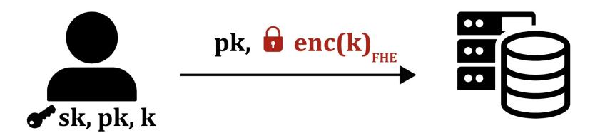
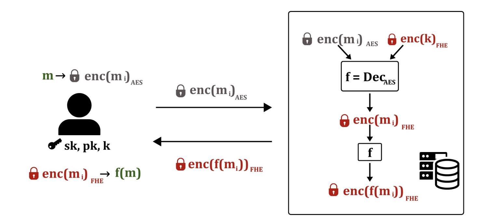

{0}------------------------------------------------

# PETCHA: Post-quantum Ecient Transciphering with ChaCha

Antonio Guimarães<sup>1</sup> [,](https://orcid.org/0000-0001-5110-6639) Gabriela M. Jacob<sup>2</sup> [,](https://orcid.org/0009-0007-6827-2810) and Hilder V. L. Pereira[2](https://orcid.org/0000-0003-1303-3760)

- 1 IMDEA Software Institute, Madrid, Spain
- <sup>2</sup> University of Campinas, Campinas, Brazil

antonio.guimaraes@imdea.org g186087@dac.unicamp.br, hilder@unicamp.br

Abstract. Fully Homomorphic Encryption (FHE) is a powerful primitive which allows a computationally weak client to outsource computation to a powerful server while maintaining privacy. However, FHE typically suers from high ciphertext expansion, meaning that the amount of data the client has to send to the server increases by many orders of magnitude after it is encrypted. To solve this problem, the approach known as transciphering consists in combining symmetric encryption with FHE. The most common choice of cipher in this context is the AES, which has been used as a benchmark for transciphering. However, although FHE is typically post-quantum secure, existing transciphering protocols only use AES-128, failing thus to oer security against quantum adversaries. In this work, we construct transciphering protocols based on standard ciphers that oer post-quantum security. For this, we propose algorithms to eciently evaluate the ChaCha cipher with FHE. We notice that ChaCha is a well-established cipher which even has a standardized version in TLS oering 256 bits of security against classic attackers, thus, 128 bits of security in the quantum world. We show that our solutions have both better latency and throughput than the state-of-the-art transciphering protocol based on AES. Namely, compared with an extended (128-bit PQ secure) version of Hippogryph (Belaïd et al., IACR CiC 2025), in single-core experiments, our running times are up to 11.7 times faster while our throughput is more than 50 times higher.

# 1 Introduction

Fully homomorphic encryption (FHE) [\[Gen09\]](#page-27-0) is a very powerful and general cryptographic primitive that simultaneously oers data secrecy and the possibility of computing on encrypted data. Thus, it is the standard tool to obtain secure outsourced computation, where a computationally strong server receives encrypted data from a client, performs computation, and sends back to the client the encrypted result. In this scenario, 

{1}------------------------------------------------

the server does not know the client's input data or the output, thus, the privacy is preserved.

Although having many applications, like electronic voting [\[BNS25\]](#page-25-0), federated learning [\[ZLX](#page-29-0)+20], and privacy-preserving machine learning as a service [\[CDKS19,](#page-26-0)[ZS21,](#page-30-0)[CDPP22\]](#page-26-1), FHE still faces many practical challenges. Those include, for example, the diculty in using existing FHE libraries to write applications; the computational overhead that FHE brings, increasing by many orders of magnitude the running times; the memory usage in the server side; and the communication cost, especially the amount of data sent from the client to the server.

Trying to solve one of those limitations, transciphering (or hybrid homomorphic encryption) has been proposed [\[NLV11\]](#page-29-1). The main idea is to allow the client to encrypt its data with a regular symmetric cipher, which does not increase the amount of data sent through the network, then, the server has to use FHE to execute the decryption circuit of the symmetric cipher, obtaining FHE ciphertexts, which can then be processed normally. This idea represents a communication-time tradeo that is usually very worthwhile. For instance, imagine a scenario where a client has a data set m of 1 GB. Then, to allow the server to compute some function f on m using FHE, the client would encrypt m under FHE, obtaining a set of ciphertexts c. However, because FHE's ciphertext expansion can reach the order of 10<sup>3</sup> for some schemes [\[CGGI20\]](#page-26-2), the size of the value c sent to the server would be at least 1 TB. This represents a huge cost and would even be very slow considering common network speeds. On the other hand, if m were encrypted with, say, AES, then c would still have 1 GB, thus, the amount of data the client would send to the server would not increase. The cost we have to pay with this solution is the transformation of the AES-encrypted data into FHE-encrypted data, in other words, the homomorphic evaluation of the AES decryption function.

In more detail, transciphering is done in two phases. The rst one is the setup, which is executed one single time. In this phase, the client sends to the server both the key of the homomorphic encryption scheme pk and the key k of the traditional cipher, but encrypted under FHE. After the setup, the client can send any data encrypted under k. Then, the server evaluates the decryption circuit of the block cipher using FHE, that is, it homomorphically decrypts the data, obtaining it reencrypted under pk, the key of the FHE scheme. After that, the server can evaluate any function on the data and send the result to the client. This step can be repeated as much as needed. We illustrate this process in Figure [1.](#page-2-0)

{2}------------------------------------------------

<span id="page-2-0"></span>



Fig. 1: Example of a typical transciphering protocol using AES as the block cipher. During the setup (top) the client only sends the FHE public key and the AES key encrypted under FHE. During the online phase (bottom), AES-encrypted data is homomorphically decrypted in the server.

To further optimize this trade-o between communication and computation, it is important to minimize the time spent by the server on the homomorphic decryption. Aiming at this, several works [\[ARS](#page-24-0)+15[,CCF](#page-25-1)+16[,DEG](#page-26-3)+18[,HKL](#page-28-0)+22[,CHMS22\]](#page-26-4) have proposed ciphers whose decryption circuit can be evaluated homomorphically using little memory and time. We call them FHE-friendly ciphers. The main downside to these ciphers is the lack of extensive cryptanalysis, meaning that we are less sure about the existence of weaknesses in their designs. In fact, there are attacks showing that some of those ciphers are indeed insecure [\[LSMI21](#page-28-1)[,LMSI22,](#page-28-2)[LAW](#page-28-3)+23]. Moreover, none of them has been standardized, therefore, it may not even be clear to the clients how to implement them to attain desired security levels and guarantee interoperability with other applications.

{3}------------------------------------------------

A dierent approach to solve this problem is trying to minimize the homomorphic evaluation time of standardized ciphers, such as AES, which were not created to be FHE-friendly, but are well-established, well-studied and oer stronger security guarantees. For a long time, AES has been considered the reference benchmark when it comes to transciphering based on standard ciphers, with many studies improving its execution times over the years [\[GHS12,](#page-27-1)[WWL](#page-29-2)+23[,BBB](#page-24-1)+25b]. Only recently other standard ciphers, such as the stream cipher Trivium [\[BOS23\]](#page-25-2), have started to gain attention and to be used in transciphering protocols.

Although the security of standard ciphers is better understood, current works on transciphering have neglected the threat imposed by quantum computers. Namely, works usually only try to achieve classic security and fail to achieve acceptable post-quantum (PQ) security levels. For instance, [\[GHS12](#page-27-1)[,WWL](#page-29-2)+23[,BBB](#page-24-1)+25b] only implement transciphering using AES-128, which means 64 bits of PQ security due to Grover's algorithm. Even worse, Trivium [\[BOS23\]](#page-25-2) only oers 80 bits of classic security, thus, 40 bits of PQ security. For the best of our knowledge, no previous work has implemented transciphering protocols based on standard ciphers targeting 128 bits of PQ security. This is possibly due to the fact that standard ciphers are already somehow slow to evaluate homomorphically even at 128 bits of classic security. Then, since achieving 256 bits of security usually requires increasing the number of rounds, the existing solutions would be even slower. Additionally, since transciphering also involves FHE, both the standard cipher and the FHE scheme would have to be instantiated at 128-bit PQ security. As FHE is typically based on lattice problems, one can make it post-quantum secure by simply choosing slightly larger parameters, but this also implies another slowdown.

In other words, to be considered quantum-safe, these protocols should be adapted to AES-256, which will increase execution times. This transition oers an opportunity to reevaluate the eciency of AES on transciphering protocols and, especially, to study and analyze the behavior of other symmetric ciphers, which oer the same level of security, when applied to transciphering protocols. This brings us to ChaCha, a standard cipher [\[NL15\]](#page-29-3) designed by Bernstein [\[Ber08a\]](#page-25-3) that is even used in the TLS protocol [\[Res18\]](#page-29-4). ChaCha has a simple design, using only ordinary 32-bit integer operations, like addition, bitwise exclusive or, and bit shifts, instead of nite eld operations, as AES. More importantly, it was already designed to oer 256 bits of (classic) security, therefore, it naturally achieves 128 bits of PQ security. Finally, it has a wider state when compared to AES, namely, 512 bits instead of 128, which helps us 

{4}------------------------------------------------

to obtain a transciphering protocol with higher throughput, as one homomorphic execution of ChaCha produces 512 encrypted bits, 4 times more than AES. Thus, this work focuses on constructing post-quantum secure transciphering using ChaCha.

## Our Contributions

We propose dierent algorithms to evaluate ChaCha with FHE and construct the rst transciphering protocol based on standard ciphers and secure against quantum computers, oering 128 bits of post-quantum (PQ) security. To obtain ecient implementations of ChaCha, we propose new ways to evaluate the 32-bit adder and XOR operations, which allow us to instantiate FHE schemes with message spaces smaller than what natural homomorphic versions of ChaCha would require. We then instantiate the TFHE scheme with 128 bits of security against quantum adversaries and execute ChaCha homomorphically.

We also provide a public proof-of-concept implementation[3](#page-4-0) using the MOSFHET library [\[GBA24\]](#page-27-2) and show that our algorithms are very competitive in practice. Comparing them with transciphering with AES, which is the state-of-art in transciphering protocols based in standard ciphers, our running times for ChaCha20 on a single core are up to 11.7 times faster and our throughput, that is, the number of encrypted bits produced per second, is more than 50 times higher. We also provide a multi-threaded implementation, which homomorphically evaluates ChaCha8, ChaCha12, and ChaCha20 on 4 threads in 13.4, 17.5, and 25.8 seconds, respectively. This is a signicant improvement even over the fastest homomorphic evaluation of the AES-128 [\[BBB](#page-24-1)+25b], which takes 42.3 seconds using 32 threads on the same machine.

# 2 Preliminaries

## 2.1 Vectors, matrices, distributions

Notation: We use lower-case bold letters for vectors and upper-case bold letters for matrices. The inner product of two vectors a and b is denoted by a · b. For any vector u, ∥u∥ denotes the innity norm. In some cases, we may also use the Euclidean norm, which we denote by ∥u∥<sup>2</sup> . For a vector x, x[i] or x<sup>i</sup> denotes the i-th entry of x. We use the Euclidean

<span id="page-4-0"></span><sup>3</sup> GitLab repository with our C code: [https://gitlab.ic.unicamp.br/hilder/](https://gitlab.ic.unicamp.br/hilder/transciphering-with-chacha) [transciphering-with-chacha](https://gitlab.ic.unicamp.br/hilder/transciphering-with-chacha)

{5}------------------------------------------------

norm as a default norm for a vector  $\mathbf{x}$ . The power-of-two cyclotomic ring is represented by  $\mathcal{R} := \mathbb{Z}[X]/\langle X^N + 1 \rangle$ . All its elements can be seen as polynomials of degree up to N-1. Then, for any  $g \in \mathcal{R}$ , the norm of g is defined as the norm of the vector consisting of the coefficients of g. For  $Q \in \mathbb{N}^*$ ,  $\mathcal{R}_Q$  denotes  $\mathbb{Z}_Q[X]/\langle X^N + 1 \rangle$ .

Subgaussian distribution. A random variable X over  $\mathbb{R}$  is  $\sigma$ -subgaussian if for all  $t \in \mathbb{R}$ , it holds that  $\mathbb{E}[\exp(t \cdot V)] \leq \frac{1}{2} \exp(\sigma^2 \cdot t^2)$ . This implies that the variance of V, denoted by  $\mathsf{Var}(X)$  is bounded by  $\sigma^2$ , i.e.  $\mathsf{Var}(V) \leq \sigma^2$ . Informally, the tails of V are dominated by a Gaussian function with standard deviation  $\sigma$ . A vector (or a polynomial) is subgaussian with parameter  $\sigma$  with all its entries (respective coefficients) are subgaussians with parameter less than or equal to  $\sigma$ . Given a  $\alpha$ -subgaussian X and an independent  $\beta$ -subgaussian Y, and  $a, b \in \mathbb{Z}$ , the random variable  $a \cdot X + b \cdot Y$  is  $\sqrt{a^2 \cdot \alpha^2 + b^2 \cdot \beta^2}$ -subgaussian (this is known as Pythagorean additivity). If X is  $\alpha$ -subgaussian, then for any positivie  $t \in \mathbb{R}$ , we can bound |X| as  $\Pr[|X| \geq t] \leq 2 \cdot e^{-t^2/(2\sigma^2)}$ .

#### <span id="page-5-0"></span>2.2 Fully homomorphic encryption

Our construction can be instantiated with basically any of the so-called 3rd-generation FHE schemes, such as FHEW [DM15], TFHE [CGGI16], FHE over the integers [Per21], and FINAL [BIP+22], as long as they are implemented supporting functional bootstrappings [BGGJ19]. Hence, in the following, we present an abstract definition of this type of scheme, adapted from [MPP24].

Consider three types of ciphertexts:

- Integer ciphertext: for a ciphertext modulus q, a secret key  $\mathbf{z}$ , and a plaintext modulus p, IntCtxt $_{\mathbf{z}}^{q/p}(m, E)$  is the set of integer ciphertexts encrypting  $m \in \mathbb{Z}_p$ , under key  $\mathbf{s}$ , and with E-subgaussian noise.
- Ring ciphertext: for  $Q, N \in \mathbb{N}$ , where N is a power of two, a ring ciphertext is a pair or a single element of  $\mathcal{R}_Q := \mathbb{Z}_Q[X]/\langle X^N + 1 \rangle$ . We denote by  $\mathsf{RingCtxt}_s^{Q/p}(m, E)$  the set of ring ciphertexts encrypting  $m \in \mathcal{R}_p$ , under key s, and with E-subgaussian noise.
- Gadget ciphertext: for integers  $Q, N, \ell$ , we define GadgetCtxt $_s^{Q,\ell}(m, E)$  as the set of gadget ciphertexts encrypting  $m \in \mathcal{R}$ , under key  $s \in \mathcal{R}$ , and with E-subgaussian noise. An element of GadgetCtxt $_s^{Q,\ell}(m, E)$  is typically a matrix with  $\ell$  rows or a vector of dimension  $\ell$  where each entry is an element of  $\mathcal{R}_Q$ .

{6}------------------------------------------------

We may omit the noise (subgaussian) parameter if it is clear from the context. This abstract scheme can then be defined by the following algorithms:

- FHE.ParamGen( $1^{\lambda}$ , p): generate parameters achieving  $\lambda$  bits of security and allowing us to work with plaintext space  $\mathbb{Z}_p$ . The parameters also include the ring  $\mathcal{R}$  an integer  $B_g$ , called the decomposition base, and  $\ell := \lceil \log Q \rceil$ , which defines the dimension of the gadget ciphertexts. The parameters are denoted by params.
- FHE.KeyGen(params): generate the secret key  $sk := (\mathbf{z}, s)$ , a keyswitching key ksk from  $\mathbf{s}$  to  $\mathbf{z}$ , where  $\mathbf{s}$  is the vector of coefficients of s, and the bootstrapping key bk.
- FHE.EncInt( $\mathbf{z}, m$ ): using params, output  $c \in \text{IntCtxt}_{\mathbf{z}}^{q/p}(m, E_{in})$  with small noise, typically  $E_{in} = O(q/p)$ .
- FHE.DecInt( $\mathbf{z}, \mathbf{c}$ ): output the message  $m \in \mathbb{Z}_p$  encrypted by  $\mathbf{c}$  under the secret key  $\mathbf{z}$ .
- FHE.EncRing(s, m): using params, output  $\mathbf{c} \in \mathsf{RingCtxt}_s^{Q/p}(m, E_{in})$  for some  $E_{in} = O(q/p)$ .
- FHE.EncGadget(s, m): using params, output  $\mathbf{C} \in \mathsf{GadgetCtxt}_s^{Q,\ell}(m, E_{in})$  for some  $E_{in} = O(q/p)$ .

We define a trivial-noiseless ciphertext as an FHE ciphertext (of any of the 3 types defined above) where the secret key and the noise are set to 0. Moreover, we can perform the following operations over ciphertexts.

- FHE.Add: homomorphically add two ciphertexts of the same type, e.g., maps  $\mathsf{RingCtxt}_s^{Q/p}(m_0, E_0) \times \mathsf{RingCtxt}_s^{Q/p}(m_1, E_1)$  to  $\mathsf{RingCtxt}_s^{Q/p}\left(m_0 + m_1, \sqrt{E_0^2 + E_1^2}\right)$ .
- FHE.AddPtxt: given a plaintext  $m_1 \in \mathbb{Z}_p$  and a ciphertext of any type encrypting some message  $m_0 \in \mathbb{Z}_p$ , this operation outputs a ciphertext of the same type encrypting  $m_0 + m_1 \mod p$ . The noise is unchanged, i.e., both input and output have the same noise.
- FHE.MultPtxt: given a message  $m_0 \in \mathcal{R}_p$  and a ciphertext  $\mathbf{c}_1 \in \mathsf{RingCtxt}_s^{Q/p}(m_1, E_1)$ , outputs  $\mathbf{c} \in \mathsf{RingCtxt}_s^{Q/p}(m_0 \cdot m_1, E)$ . If instead of a ring ciphertext, we have  $\mathbf{C}_1 \in \mathsf{GadgetCtxt}_s^{Q,\ell}(m_1, E_1)$ , it outputs  $\mathbf{C} \in \mathsf{GadgetCtxt}_s^{Q,\ell}(m_0 \cdot m_1, E)$ . In both cases,  $E = \|m_0\|_2 \cdot E_1$ .
- FHE.ExtProd: given ciphertexts  $\mathbf{c}_0 \in \mathsf{RingCtxt}_s^{Q/p}(m_0, E_0)$  and  $\mathbf{C}_1 \in \mathsf{GadgetCtxt}_s^{Q,\ell}(m_1, E_1)$ , it outputs  $\mathbf{c} \in \mathsf{RingCtxt}_s^{Q/p}(m_0 \cdot m_1, E)$  where  $E \leq \sqrt{\ell N \cdot \mathsf{B}_g^2 \cdot E_1^2 + \|m_1\|_2^2 \cdot E_0^2}$ , where  $\mathsf{B}_g$  is the decomposition base. For succinctness, we can write  $\mathbf{c}_0 \odot_{i=1}^k \mathbf{C}_i$  to denote

{7}------------------------------------------------

FHE.ExtProd(...(FHE.ExtProd( $\mathbf{c}_0, \mathbf{C}_1$ ),  $\mathbf{C}_2$ ), ...,  $\mathbf{C}_k$ ). In this case, assuming that  $||m_i||_2 = 1$  for  $1 \le i \le k$ , the resulting ciphertext has E-gaussian noise with  $E \le \sqrt{\sum_{i=1}^k \ell \cdot N \cdot \mathsf{B}_g^2 \cdot E_i^2 + E_0^2}$ ,

- FHE.ModSwt: Given  $\hat{c} \in \operatorname{IntCtxt}_{\mathbf{s}}^{q/p}(m, \hat{E})$  and  $q \in \mathbb{N}$ , output  $c \in \operatorname{IntCtxt}_{\mathbf{s}}^{q/p}(m, E)$ , with  $E \leq \sqrt{(\hat{E} \cdot (q/Q))^2 + (\|\mathbf{s}\|_2/2)^2}$ .
- FHE.KeySwt: Given  $\hat{c} \in \operatorname{IntCtxt}_{\mathbf{s}}^{q/p}(m, \hat{E})$ , and a key-switching key ksk from  $\mathbf{s} \in \mathbb{Z}^N$  to  $\mathbf{z} \in \mathbb{Z}^n$ , output  $c \in \operatorname{IntCtxt}_{\mathbf{z}}^{q/p}(m, E)$ , with  $E \leq \sqrt{\hat{E}^2 + N \cdot \log_{\mathsf{B}_{\mathsf{ksk}}} q \cdot \mathsf{B}_{\mathsf{ksk}}^2 \cdot E_k^2}$ , where  $\mathsf{B}_{\mathsf{ksk}}$  is the decomposition base used during the key-switching.
- FHE.Bootstrap: Given  $c' \in IntCtxt_{\mathbf{z}}^{q/p}(m, E')$ , and a function  $f : \mathbb{Z}_p \to \mathbb{Z}_p$ , output,  $c \in IntCtxt_{\mathbf{z}}^{q/p}(f(m), E_{in})$  where  $E_{in} < E'$ .
- FHE.MultValBoot: Given  $c \in \operatorname{IntCtxt}_{\mathbf{z}}^{q/p}(m, E)$  and functions  $f_1, ..., f_L$  from  $\mathbb{Z}_p$  to  $\mathbb{Z}_p$ , output,  $c_1, ..., c_L$  where  $c_i \in \operatorname{IntCtxt}_{\mathbf{z}}^{q/p}(f_i(m), E_{in})$  and  $E_{in} < E$ . Executing FHE.MultValBoot for L functions runs in essentially the same time as executing FHE.Bootstrap one single time.

#### 2.3 Homomorphic evaluation of Look-up-tables (k-LUT)

The plaintext space  $\mathbb{Z}_p$  is typically defined during the parameter and key generation. Usually, p is a power of two, that is,  $p = 2^k$  for some k and, hence, the message space is composed by k bits, i.e.,  $\{0,1\}^k$ . This means that with the functional bootstrapping [BGGJ19] and the multivalue bootstrapping [CIM19], we can evaluate arbitrary functions from  $\{0,1\}^k$  to  $\{0,1\}^k$ . In this case, we say that the bootstrapping evaluates a k-LUT, which stands for look-up-table on k bits.

In 3rd-generation FHE schemes, the running time of the bootstrapping is typically exponential in k, thus, one can only work directly with messages having very few bits. For k ranging from 2 to 4, the bootstrapping typically becomes only slightly slower, but for  $k \geq 5$ , as we increase k, costs quickly become prohibitive. For instance, the OpenFHE library [ABBB<sup>+</sup>22] typically handles  $k \leq 4$  and Zama's TFHE-rs [Zam22] provides bootstrapping for messages of up to 8 bits. For larger messages, for example, 32-bit integers, one has to decompose them in k-bit words and operate with them separately [BST20,GBA21,CLOT21].

#### <span id="page-7-0"></span>2.4 ChaCha

ChaCha [Ber08a,NL15] is a stream cipher designed to offer 256 bits of (classic) security. It is a variant of Salsa20, but with extra diffusion, and

{8}------------------------------------------------

it is built around a 512-bit state, which initially is composed of a 128-bit constant, a 256-bit key, a 64-bit counter, and a 64-bit nonce, in this order. The state is then represented as a sequence of 16 integers (with 32 bits each). The core function of ChaCha is the quarter-round (QR), consisting of 3 operations: 32-bit integer addition, bitwise XOR, and circular left shift. ChaCha20 is a standardized cipher used in Transport Layer Security (TLS [\[Res18\]](#page-29-4)), consisting of 20 rounds, each of which applies the quarterround function four times. Every execution of the QR function operates on distinct portions of the internal state to ensure thorough diusion. By seeing the state as a 4×4 matrix, the odd rounds apply the QR function to the columns and the even rounds apply the QR function to the diagonals. Given four 32-bit words of the state, denoted as a, b, c, and d, a single iteration of QR(a, b, c, d) is composed of 4 lines, each one performing one addition, one bitwise XOR, and one circular shift, as shown in Algoritm [1.](#page-8-0)

```
Algorithm 1: QR(a, b, c, d)  ChaCha's quarter round
```

```
Input: 32-bit integers a, b, c, and d
  Output: Updated values of a, b, c, and d
1 a = (a + b); d = XOR(d, a); d = (d ≪ 16);
2 c = (c + d); b = XOR(b, c); b = (b ≪ 12);
3 a = (a + b); d = XOR(d, a) d = (d ≪ 8);
4 c = (c + d); b = XOR(b, c); b = (b ≪ 7);
```

<span id="page-8-0"></span>To obtain the nal state, one last step is performed: the diused state, obtained after all the executions of QR, is added to the initial state. This is shown in detail in Algorithm [2.](#page-9-0)

Then, to encrypt any message, one needs to XOR the plaintext to the nal state, obtaining the ciphertext. The same is done to decrypt messages, by XOR'ring the ciphertext to the nal state, obtaining the original message.

Since we use 3rd-generation FHE schemes to evaluate ChaCha, we operate with bits, thus, the 32-bit addition used in the QR function was implemented using a Ripple Carry Adder. This adder performs a sequential bitwise addition, where each stage depends on the carry propagated from the previous one. Given input bits x<sup>i</sup> , y<sup>i</sup> , and the carry input carry<sup>i</sup> , the output sum bit sum<sup>i</sup> and the output carry bit carryi+1 are computed as specied in Equation [\(1\)](#page-8-1), where ⊕ denotes the XOR operation.

<span id="page-8-1"></span>
$$\operatorname{\mathsf{sum}}_i = x_i \oplus y_i \oplus \operatorname{\mathsf{carry}}_i \ \text{ and } \ \operatorname{\mathsf{carrry}}_{i+1} = (x_i \wedge y_i) \vee (\operatorname{\mathsf{carry}}_i \wedge (x_i \oplus y_i)) \ (1)$$

{9}------------------------------------------------

#### Algorithm 2: ChaCha(E) ChaCha block

```
Input: State E ∈ Z
                    16
                    232 composed of 16 integers of 32 bits each
  Output: Updated state E
1 T = E ▷ Copy the state
2 for 1 ≤ j ≤ ROUNDS do
3 if j is odd then
          ▷ Odd round (columns of the state)
 4 QR(T[0], T[4], T[8], T[12]);
 5 QR(T[1], T[5], T[9], T[13]);
 6 QR(T[2], T[6], T[10], T[14]);
 7 QR(T[3], T[7], T[11], T[15]);
8 else
          ▷ Even round (diagonals of the state)
 9 QR(T[0], T[5], T[10], T[15]);
10 QR(T[1], T[6], T[11], T[12]);
11 QR(T[2], T[7], T[8], T[13]);
12 QR(T[3], T[4], T[9], T[14]);
13 for 0 ≤ i < 16 do
14 E[i] = E[i] + T[i];
```

<span id="page-9-0"></span>ChaCha's cryptanalysis ChaCha was designed already considering a quantum attacker, thus, it oers 128 bits of PQ security, or, equivalently, 256 bits of classic security. Soon after its appearance, researchers started to analyze it and a rst attack against a round-reduced version of ChaCha, i.e., ChaCha considering fewer rounds than what is recommended, appeared. Namely, in [\[AFK](#page-24-3)+08], it was proposed an attack against ChaCha with 6 rounds running in about 2 <sup>139</sup> operations and against ChaCha with 7 rounds (ChaCha7) costing about 2 <sup>248</sup> operations, thus, less than 2 256 , which is the expected cost of attacking the full-round ChaCha. After that, new attacks against ChaCha7 started to appear, each one reducing a little the security level, culminating in [\[GM24\]](#page-27-5) claiming a distinguisher attack on ChaCha7 with time 2 <sup>135</sup>. However, it seems that attacking ChaCha with 8 rounds (ChaCha8) is much harder. Indeed, there is no known attack against ChaCha8 running in less than 2 <sup>256</sup> operations, that is, better than brute forcing it. Instead, there are some attacks considering fractions of the eighth round. For example, [\[GWHH24\]](#page-27-6) shows an attack against ChaCha with 7.25 rounds running in time 2 <sup>236</sup> and [\[FT25\]](#page-27-7) attacks ChaCha with 7.5 rounds in time 2 <sup>250</sup>, i.e., degrading ChaCha's security in just 6 bits.

It is worth noticing that many of those attacks need more pairs of plaintext/ciphertext than a normal user would ever be able to produce. 

{10}------------------------------------------------

For instance, this attack on ChaCha with 7.5 rounds requires around 2 <sup>127</sup> pairs [\[FT25\]](#page-27-7), but producing this amount of ciphertexts is far above the computational power available for anyone (for example, if one could execute that amount of operations, then one could even break AES-128 by brute forcing it).

In summary, ChaCha has been the target of a lot of cryptanalysis, but there are still no realistic attacks. Even with only 8 rounds, it already oers 256 bits of security. Indeed, Aumasson argues that we should use ChaCha8 for this security level [\[Aum19\]](#page-24-4). Nevertheless, the authors of the postquantum signature scheme SPHINCS were more conservative and used ChaCha with 12 rounds (ChaCha12) targeting 256 bits of security. Even more conservative, TLS 1.3 standardized ChaCha20 (with 20 rounds) for 256 bits of security [\[Res18\]](#page-29-4).

## 3 Our Transciphering Protocols

In this section, we propose two ways of evaluating ChaCha homomorphically using very small message spaces in FHE, that is, by instantiating FHE schemes with small parameters so that each ciphertext only encrypts 2 or 3 bits. It is worth noticing that increasing the message space in 3rdgeneration FHE schemes can bring severe slowdowns to the homomorphic computation, since the running time of the bootstrapping in these schemes is exponential in the bit length of the encrypted messages. Basically, to evaluate ChaCha homomorphically, one can choose to perform the additions then perform the XOR gates separately, or one can try to perform them together. The rst strategy is more natural and, at rst glance, would require a message space of 3 bits, since computing the i-th bit of the sum requires two input bits and one carry bit. However, we show how to do it using a message space of only 2 bits instead of 3.

The second strategy, namely, evaluating the full-adder and the bitwise XOR simultaneously is less natural, but by analyzing the output bits of the QR, we see that it is possible to evaluate them together with a message space of 4 bits. We go beyond that and propose a way to evaluate them using only 3 bits. Thus, this allows us to save all the bootstrappings that would be used to evaluate the XOR gates at the cost of increasing a little the running time of each bootstrapping, since bootstrappings over {0, 1} 3 are not much slower than over {0, 1} 2 .

{11}------------------------------------------------

#### <span id="page-11-1"></span>3.1 Evaluating ChaCha using 2-LUT

The natural way to use k-LUTs to evaluate a function  $f(x_1, ..., x_k)$  where each  $x_i \in \{0, 1\}$  is as follows. Firstly, given ciphertexts  $\mathbf{c}_0, ..., \mathbf{c}_{k-1}$  encrypting bits  $m_0, ..., m_{k-1}$ , respectively, one multiplies the i-th ciphertext by  $2^i$ , then adds all of them together, that is, one computes

$$\mathbf{c} := \sum_{i=0}^{k-1} \mathsf{FHE}.\mathsf{MultPtxt}(\mathbf{c}_i, 2^i)$$

Then, given  $\mathbf{c}$  encrypting  $m := \sum_{i=0}^{k-1} m_i \cdot 2^i$ , one defines the function  $g : \{0,1\}^k \to \{0,1\}^k$  as a function which firstly computes the binary decomposition of x, that is,  $x_0 = x \mod 2$ ,  $x_1 = (x - x_0) \mod 2$ ,  $x_2 = (x - x_0 - 2 \cdot x_1) \mod 2$ , etc, then outputs  $f(x_1, ..., x_{k-1})$ . Finally, one uses the bootstrapping to evaluate the k-LUT on  $\mathbf{c}$ , obtaining  $\mathbf{c}' \in \mathsf{IntCtxt}_{\mathbf{z}}^{q/p}(g(m)) = \mathsf{IntCtxt}_{\mathbf{z}}^{q/p}(f(m_1, ..., m_{k-1}))$ .

Applying this natural strategy to the ripple carry adder to compute the *i*-th sum bit and the (i+1)-th carry bit, as given by Equation (1), one would need to aggregate 3 bits, that is, to compute an encryption of  $x_i + 2 \cdot y_i + 4 \cdot \mathsf{carry}_i$ , then use the multivalue bootstrapping to extract encryptions of  $f_1(x_i, y_i, \mathsf{carry}_i) := \mathsf{sum}_i$  and  $f_2(x_i, y_i, \mathsf{carry}_i) := \mathsf{carry}_{i+1}$ . Of course, that means that we would need to instantiate FHE with a message space of 3 bits. Instead, we propose to aggregate the bits by simply adding them together, which just requires 2-bit message space, and show that it is still possible to extract  $\mathsf{sum}_i$  and  $\mathsf{carry}_{i+1}$ . In more detail, let  $S = x_i + y_i + \mathsf{carry}_i$ , then we notice that  $\mathsf{sum}_i = S \mod 2$ ,  $\mathsf{carry}_{i+1} = 0$  if S < 2, and  $\mathsf{carry}_{i+1} = 1$  if  $S \ge 2$ . Therefore, we can firstly generate an encryption of S, then use the multivalue bootstrapping to extract the sum bit and the next carry. This is shown formally in Lemma 1.

<span id="page-11-0"></span>**Lemma 1.** Define two functions  $f_1$  and  $f_2$  from  $\mathbb{N}$  to  $\{0,1\}$  as

$$f_1(x) = x \mod 2$$
 and  $f_2(x) = \begin{cases} 0 & \text{if } 0 \le x < 2 \\ 1 & \text{if } x \ge 2 \end{cases}$ 

Let  $x_i, y_i, \mathsf{carry}_i \in \{0, 1\}$ , and  $S = x_i + y_i + \mathsf{carry}_i$ . Then,  $f_1(S)$  and  $f_2(S)$  give us the sum bit and the next carry bit, as described in Equation (1), that is,  $f_1(S) = x_i \oplus y_i \oplus \mathsf{carry}_i$  and  $f_2(S) = (x_i \wedge y_i) \vee (\mathsf{carry}_i \wedge (x_i \oplus y_i))$ .

*Proof.* Since the XOR operation is equivalent to addition in  $\mathbb{Z}_2$ , it is trivial that  $x_i \oplus y_i \oplus \mathsf{carry}_i = f_1(S) = (x_i + y_i + \mathsf{carry}_i \bmod 2)$ .

{12}------------------------------------------------

#### Algorithm 3: 2-LUT-FullAdder

```
Input: Functions f_1 and f_2 as defined in Lemma 1. A bootstrapping key bk for 2-LUTs. For 0 \le i < 32, \mathbf{x}_i \in \mathsf{IntCtxt}_{\mathbf{s}}^{q/p}(x_i), \mathbf{y}_i \in \mathsf{IntCtxt}_{\mathbf{s}}^{q/p}(y_i).

Output: For 0 \le i \le 31, \mathbf{u}_i \in \mathsf{IntCtxt}_{\mathbf{s}}^{q/p}(\mathsf{sum}_i)

1 Let \mathbf{c}^{\mathsf{carry}_0} be a trivial and noiseless encryption of 0

2 for 0 \le i \le 31 do

3 \mathbf{c} \leftarrow \mathsf{FHE}.\mathsf{Add}(\mathbf{x}_i, \mathbf{y}_i)

4 \mathbf{c} \leftarrow \mathsf{FHE}.\mathsf{Add}(\mathbf{c}, \mathbf{c}^{\mathsf{carry}_i}); \triangleright \mathsf{IntCtxt}_{\mathbf{s}}^{q/p}(x_i + y_i + \mathsf{carry}_i)

5 \mathbf{u}_i, \mathbf{c}^{\mathsf{carry}_{i+1}} \leftarrow \mathsf{FHE}.\mathsf{MultValBoot}(\mathbf{c}, f_1, f_2)

6 return \mathbf{u}_0, \mathbf{u}_1, ..., \mathbf{u}_{31}; \triangleright \mathbf{u}_i \in \mathsf{IntCtxt}_{\mathbf{s}}^{q/p}(\mathsf{sum}_i)
```

<span id="page-12-0"></span>Also, let  $\mathsf{carry}_{i+1} = (x_i \wedge y_i) \vee (\mathsf{carry}_i \wedge (x_i \oplus y_i))$ . Let's check that  $f_2(S) = \mathsf{carry}_{i+1}$  in the two following cases.

- When  $\mathsf{carry}_i = 0$ : Then  $\mathsf{carry}_{i+1} = 1$  if, and only if,  $x_i = y_i = 1$ . In other words,  $\mathsf{carry}_{i+1} = 1 \Leftrightarrow S = 2$ . Thus, if  $0 \leq S < 1$ , then  $\mathsf{carry}_{i+1} = 0$ . Since S < 3 in this case, we have that  $f_2(S) = \mathsf{carry}_{i+1}$ .
- When  $\mathsf{carry}_i = 1$ : Then  $\mathsf{carry}_{i+1} = 0$  if, and only if  $x_i = y_i = 0$ . In other words,  $\mathsf{carry}_{i+1} = 0 \Leftrightarrow S = 1$ . Thus, for other values of  $x_i$  and  $y_i$ , we have  $\mathsf{carry}_{i+1} = 1$  and  $S \geq 2$ . Therefore,  $f_2(S) = \mathsf{carry}_{i+1}$ .

By using Lemma 1, we design Algorithm 3, which homomorphically evaluates a 32-bit full adder using FHE with only 2-bit message space. We prove its correctness in Lemma 2.

<span id="page-12-1"></span>**Lemma 2.** Let x and y be two 32-bit integers with binary representation  $(x_0,...,x_{31})$  and  $(y_0,...,y_{31})$ , with  $x_0$  and  $y_0$  being the least significant bits. Let  $z = x + y \mod 2^{32}$ , that is, the 32-bit integer resulting from adding x and y. Finally, let  $(z_0,...,z_{31}) \in \{0,1\}^{32}$  be the binary representation of z, i.e.,  $z = \sum_{i=0}^{31} z_i \cdot 2^i$ . Then, Algorithm 3 returns encryptions of  $z_0$ , ...,  $z_{31}$ .

Proof. Let  $S_i = x_i + y_i + \mathsf{carry}_i$ . By the correctness of the homomorphic addition,  $\mathbf{c} \in \mathsf{IntCtxt}_{\mathbf{s}}^{q/p}(x_i + y_i + \mathsf{carry}_i)$ . By the correctness of the multivalue bootstrapping,  $\mathbf{u}_i \in \mathsf{IntCtxt}_{\mathbf{s}}^{q/p}(f_1(S_i))$  and  $\mathbf{c}^{\mathsf{carry}_{i+1}} \in \mathsf{IntCtxt}_{\mathbf{s}}^{q/p}(f_2(S_i))$ . By Lemma 1,  $f_1(S_i) = z_i$  and  $f_2(S_i) = \mathsf{carry}_{i+1}$ , thus,  $\mathbf{u}_i$  encrypts the correct value and the next iteration happens with correct carry. Therefore, at the end of the algorithm, for all  $i \in [0, 31]$ ,  $\mathbf{u}_i \in \mathsf{IntCtxt}_{\mathbf{s}}^{q/p}(z_i)$ .

{13}------------------------------------------------

Once we have a homomorphic 32-bit full adder using 2-LUTs, it is straightforward to implement the whole ChaCha. We start by Algorithm 4, which homomorphically evaluates a single line of the QR function. To do so, it firstly calls the homomorphic full adder, then it uses the programmable bootstrapping to perform the bitwise XOR, executing thus the bootstrapping 32 times, and finally, it applies the rotations essentially for free, by simply relabeling the ciphertexts.

#### Algorithm 4: 2-LUT-QRLine

```
Input: Functions f_1 and f_2 as defined in Lemma 1. A bootstrapping key bk
                    for 2-LUTs. A rotation index r \in \{7, 8, 12, 16\}. For 0 \le i < 32,
                    \mathbf{a}_i \in \mathsf{IntCtxt}_{\mathbf{s}}^{q/p}(a_i), \ \mathbf{b}_i \in \mathsf{IntCtxt}_{\mathbf{s}}^{q/p}(b_i), \ \mathrm{and} \ \mathbf{c}_i \in \mathsf{IntCtxt}_{\mathbf{s}}^{q/p}(c_i), \ \mathrm{where}
                    a_i, b_i, c_i \in \{0, 1\}.
    Output: For 0 \le i < 32, \mathbf{a}_i \in \mathsf{IntCtxt}_{\mathbf{s}}^{q/p}(a_i'), and \mathbf{c}_i \in \mathsf{IntCtxt}_{\mathbf{s}}^{q/p}(c_i'), where
                        a_i', c_i' \in \{0, 1\}.
1 \mathbf{a}_0,...,\mathbf{a}_{31} \leftarrow 2-LUT-FullAdder(\mathbf{a}_0,...,\mathbf{a}_{31},\mathbf{b}_0,...,\mathbf{b}_{31},f_1,f_2,\mathsf{bk})
2 for 0 \le i \le 31 do
          \hat{\mathbf{c}}_i = \mathsf{FHE}.\mathsf{Add}(\mathbf{c}_i, \mathbf{a}_i)
                                                                                                             \triangleright \mathsf{IntCtxt}_{\mathbf{s}}^{q/p}(\mathsf{XOR}(a_i',c_i))
        \hat{\mathbf{c}}_i \leftarrow \mathsf{FHE}.\mathsf{Bootstrap}(\hat{\mathbf{c}}_i, f_1) \; ;
4
5 for 0 \le i \le 31 do
      \mathbf{c}_i \leftarrow \hat{\mathbf{c}}_{(i+r) \bmod 32}
6
7 return a_0, ..., a_{31}, c_0, ..., c_{31}
```

<span id="page-13-0"></span>To implement the QR function, one just has to execute Algorithm 4 four times, with r assuming the values 16, 12, 8, and 7, as in the description of the plaintext QR function in Algorithm 1. Finally, after R rounds which execute the QR function  $4 \cdot R$  times in total, we just execute one more time the homomorphic full adder, Algorithm 3.

Computational cost of ChaCha using 2-LUT The running time of the homomorphic evaluation of ChaCha is dominated by the executions of the programmable and multivalue bootstrappings. As they run in basically the same time, we count them as the same. Hence, we obtain the following. To execute one line of the QR function, we need 64 bootstrappings, 32 for the adder and 32 for the bitwise XOR. Therefore, one execution of the QR function requires  $4 \cdot 64 = 256$  bootstrappings. Considering ChaCha with R rounds, the QR function is executed  $4 \cdot R$  times, which gives us then  $4 \cdot R \cdot 256 = 1024 \cdot R$  bootstrappings. Finally, the updated state is added to the initial state, thus, in total, we have  $1024 \cdot R + 32$  bootstrappings evaluating LUTs on 2-bit messages.

{14}------------------------------------------------

## 3.2 Evaluating ChaCha using 3-LUT

The main advantage of instantiating FHE with 3-bit message space instead of just using 2 bits is that it allows us to merge the computation of the XORs in each line of the QR function into the full adder, that is, with one single MVB we can extract the i-th sum bit, the next carry, and the i-th bit of the subsequent XOR. This means that we can save half of bootstrappings per line of the QR function, evaluating it with 32 bootstrappings instead of 64.

For this, rst notice that the QR always stores the sum into a variable, then uses this same variable to compute the XOR with a third variable. In the binary level, this means that we can look at the bits x<sup>i</sup> , y<sup>i</sup> , and carry<sup>i</sup> , which are used to compute the i-th sum bit, say, sum<sup>i</sup> , and the bit that will be XORed, say, z<sup>i</sup> . Thus, given (x<sup>i</sup> , y<sup>i</sup> , carry<sup>i</sup> , zi), we want to compute sum<sup>i</sup> , carryi+1, and w<sup>i</sup> := sum<sup>i</sup> ⊕ z<sup>i</sup> . Of course, we could easily compute it using 4-LUTs by accumulating the four input bits in the natural way and using the MVB to extract each of the three output bits. However, as in Section [3.1,](#page-11-1) we want to gain one bit and perform this computation with 3-LUTs. To do so, we compute S = x<sup>i</sup> + y<sup>i</sup> + carry<sup>i</sup> + 4 · z<sup>i</sup> . Notice that 0 ≤ S ≤ 7, hence, it can be encrypted with 3 bits. Then, we dene three functions f1, f2, and f3, where the rst two reduce S modulo 4, then compute the sum and the next carry bits as described in Section [3.1,](#page-11-1) while f3(S) rstly extracts the most signicant bit of S, then computes its XOR with f1(S). We present it in detail in Lemma [3](#page-14-0)

<span id="page-14-0"></span>Lemma 3. Dene three functions f1, f2, and f<sup>3</sup> from N to {0, 1} as

$$-f_1(x) = x \mod 2$$

$$-f_2(x) = \begin{cases} 0 & \text{if } 0 \le (x \mod 4) < 2 \\ 1 & \text{if } (x \mod 4) \ge 2 \\ -f_3(x) = (f_1(x) + \lfloor x/4 \rfloor) \mod 2 \end{cases}$$

Let x<sup>i</sup> , y<sup>i</sup> , carry<sup>i</sup> , z<sup>i</sup> ∈ {0, 1}, and S = x<sup>i</sup> + y<sup>i</sup> + carry<sup>i</sup> + 4 · zi. Then, f1(S) and f2(S) give us the sum bit and the next carry bit, as described in Equation [\(1\)](#page-8-1), that is, f1(S) = x<sup>i</sup> ⊕ y<sup>i</sup> ⊕ carry<sup>i</sup> and f2(S) = (x<sup>i</sup> ∧ yi) ∨ (carry<sup>i</sup> ∧ (x<sup>i</sup> ⊕ yi)). Moreover, f3(S) = f1(S) ⊕ zi.

Proof. We have f1(S) = (x<sup>i</sup> + y<sup>i</sup> + carry<sup>i</sup> + 4 · zi) mod 2 = (x<sup>i</sup> + y<sup>i</sup> + carry<sup>i</sup> ) mod 2 = x<sup>i</sup> ⊕ y<sup>i</sup> ⊕ carry<sup>i</sup> .

Also, notice that (S mod 4) = x<sup>i</sup> + y<sup>i</sup> + carry<sup>i</sup> , thus, by the same argument used in the proof of Lemma [1,](#page-11-0) we have f2(S) = carryi+1.

Finally, since f1(S) = sum<sup>i</sup> and ⌊S/4⌋ = z<sup>i</sup> + ⌊(x<sup>i</sup> + y<sup>i</sup> + carry<sup>i</sup> )/4⌋ = z<sup>i</sup> + 0, it holds that f3(S) = sum<sup>i</sup> ⊕ z<sup>i</sup> , as expected.

{15}------------------------------------------------

Finally, evaluating one line of the QR function boils down to using the multivalue bootstrapping (MVB) to apply the three functions defined in Lemma 3. Namely, for each triple of encrypted bits  $a_i$ ,  $b_i$  and  $c_i$ , and the current encrypted carry  $carry_i$ , we just use the cheap homomorphic addition to generate an encryption of  $S = a_i + b_i + carry_i + 4 \cdot c_i$ , then apply the MVB to obtain encryptions of  $f_1(S)$ ,  $f_2(S)$ , and  $f_3(S)$ , which are the *i*-th sum bit, the (i + 1)-th carry bit, and the sum bit xored with  $c_i$ , respectively. We describe this in detail in Algorithm 5.

#### Algorithm 5: 3-LUT-QRLine

```
Input: Functions f_1, f_2, and f_3 as defined in Lemma 3. A bootstrapping key
                        bk for 3-LUTs. A rotation index r \in \{7, 8, 12, 16\}. For 0 \le i < 32,
                       \mathbf{a}_i \in \mathsf{IntCtxt}_{\mathbf{s}}^{q/p}(a_i), \ \mathbf{b}_i \in \mathsf{IntCtxt}_{\mathbf{s}}^{q/p}(b_i), \ \mathrm{and} \ \mathbf{c}_i \in \mathsf{IntCtxt}_{\mathbf{s}}^{q/p}(c_i), \ \mathrm{where}
                       a_i, b_i, c_i \in \{0, 1\}.
      Output: For 0 \le i < 32, \mathbf{u}_i \in \mathsf{IntCtxt}_{\mathbf{s}}^{q/p}(u_i'), and \mathbf{x}_i \in \mathsf{IntCtxt}_{\mathbf{s}}^{q/p}(x_i'), where
                           u_i', x_i' \in \{0, 1\}.
  1 Let \mathbf{c}^{\mathsf{carry}_0} be a trivial and noiseless encryption of 0
  2 for 0 \le i \le 31 do
               \mathbf{w} \leftarrow \mathsf{FHE}.\mathsf{Add}(\mathbf{c}_i, \mathbf{c}_i)
  3
                                                                                                                                    \triangleright \mathsf{IntCtxt}^{q/p}_{\mathbf{s}}(4 \cdot c_i)
               \mathbf{w} \leftarrow \mathsf{FHE}.\mathsf{Add}(\mathbf{w},\mathbf{w});
  4
               \mathbf{w} \leftarrow \mathsf{FHE}.\mathsf{Add}(\mathbf{w}, \mathbf{a}_i)
  5
               \mathbf{w} \leftarrow \mathsf{FHE}.\mathsf{Add}(\mathbf{w}, \mathbf{b}_i)
  6
                                                                                               \triangleright IntCtxt<sub>s</sub><sup>q/p</sup>(a_i + b_i + carry_i + 4 \cdot c_i)
               \mathbf{w} \leftarrow \mathsf{FHE}.\mathsf{Add}(\mathbf{w}, \mathbf{c}^{\mathsf{carry}_i}) \; ;
  7
               \mathbf{u}_i, \mathbf{c}^{\mathsf{carry}_{i+1}}, \hat{\mathbf{x}}_i \leftarrow \mathsf{FHE}.\mathsf{MultValBoot}(\mathbf{c}, f_1, f_2, f_3)
  9 for 0 < i < 31 do
           \mathbf{x}_i \leftarrow \hat{\mathbf{x}}_{(i+r) \bmod 32};
                                                                              ▷ Apply the rotation to the xored bits
10
11 return \mathbf{u}_0, ..., \mathbf{u}_{31}, \mathbf{x}_0, ..., \mathbf{x}_{31}
```

<span id="page-15-0"></span>As for the 2-LUT case, once we have Algorithm 5 to evaluate one line of the QR function, we just need to execute it four times, with r assuming the values 16, 12, 8, and 7, to execute the full QR. And to evaluate one block of ChaCha with R rounds, we just have to call the QR function 4 times per round and, at the very end, use the same adder as Algorithm 3, which, of course, also works with a 3-bit instead of a 2-bit message space.

Computational cost of 3-LUT ChaCha As for ChaCha with 2-LUTs, the running time is dominated by the executions of the multivalue bootstrapping (MVB), as it is orders of magnitude slower than the homomorphic additions and the bit rotations. One execution of the QR function requires 128 bootstrappings, being 32 for each line, which are evaluated

{16}------------------------------------------------

with Algorithm [5.](#page-15-0) Therefore, to evaluate ChaCha with R rounds, we need 4 · R · 128 = 512 · R bootstrappings, as each round makes 4 calls to the quarter round. Counting the nal addition on the state, we have then a total of 512 · R + 32 bootstrappings on 3-bit messages to completely evaluate ChaCha with R rounds producing one block of 512 encrypted bits.

## 4 Related work

To the best of our knowledge, this is the rst paper to consider and implement post-quantum secure transciphering based on standard ciphers. Even among works that proposed FHE-friendly ciphers for transciphering, most of them do not consider post-quantum security and some of them discuss 256-bit secure versions of their ad hoc ciphers, but end up focusing on transciphering with 128 bits of security.

Among works that studied non-standard ciphers, designed specically to be FHE-friendly, Rasta [\[DEG](#page-26-3)+18] raised the discussion on 256-bit security transciphering, but almost all their implementations used the FHE scheme BGV [\[BGV12\]](#page-25-7) with security level 128 or less, sometimes even together with Rasta-256, which shows that providing quantum security was not in the scope of the paper. Moreover, the only instantiation of Rasta together with BGV both with 128 bits of PQ security is much slower than the other instantiations, running in about 23 minutes in their experiments. Dasta [\[HL20\]](#page-28-4), a variation of Rasta, only implements its transciphering protocol with 80 and 128 bits of security. LowMC [\[ARS](#page-24-0)+15] also only shows implementation using 128 bits of classic security both for their symmetric cipher and for BVG. Kreyvium [\[CCF](#page-25-1)+16] was designed with only 128-bit security. There are many other examples of recent studies that propose ecient evaluations of FHE-friendly ciphers but do not discuss post-quantum security [\[MPP24](#page-29-6)[,CCH](#page-25-8)+24[,AGHM25](#page-24-5)[,BBB](#page-24-6)+25a]. For example, [\[MCJS19\]](#page-28-5) and [\[HKL](#page-28-0)+22] only present parameters for their ciphers achieving 80 or 128 bits of security, while [\[CHMS22\]](#page-26-4) only presents a 128-bit secure version of its cipher.

Considering works that studied transciphering with standard ciphers, we could not nd any oering at least 256 bits of security. Gentry, Halevi and Smart used the BGV scheme to evaluate AES-128 homomorphically [\[GHS12\]](#page-27-1). Later, Mella and Susella [\[MS13\]](#page-29-8) discussed the homomorphic evaluation of dierent families of ciphers (AES-128, SHA-256 [\[Nat15\]](#page-29-9), Salsa20 [\[Ber08b\]](#page-25-9) and Keccak [\[BDPA13\]](#page-24-7)) using BGV, but all of their implementations used a security level equivalent to AES-128. 

{17}------------------------------------------------

Wei et al. [\[WWL](#page-29-2)+23] optimized the homomorphic evaluation of AES with TFHE, but instantiating both AES and TFHE with only 128 bits of security. In a follow-up work, Wei et al. proposed Thunderbird [\[WLW](#page-29-10)+24], an evaluation framework, but only implemented the evaluation of SNOW 3G, ZUC, and AES-128, all providing 128-bit security. Finally, Hippogryph [\[BBB](#page-24-1)+25b] only discusses AES-128.

This reveals the growing academic interest in transciphering and in the optimization of this method, but also the lack of works that consider post-quantum security.

## <span id="page-17-1"></span>5 Experimental Results and Comparisons

We implement our homomorphic evaluation approach using the MOSFHET library [\[GBA24\]](#page-27-2) and benchmarked it on an r7i.metal-24xl instance on AWS (Intel Xeon Platinum 8488C at 2.4GHz/3.8GHz-boost and 768GB of memory, supporting up to with 96 threads). For multithreaded results, we parallelized our implementation using OpenMP with 4 threads. Our main comparison baselines are the state-of-the-art homomorphic evaluations of the AES from [\[BPR24\]](#page-25-10) and [\[BBB](#page-24-1)+25b], which we run in the same environment described above. Since these works originally only provide AES-128, we extend them to evaluate the AES-256 by increasing the number of rounds from 10 to 14. As an additional result, in Appendix [A,](#page-30-1) we also provide a comparison between ChaCha8 and the original (AES-128) implementations from [\[BPR24,](#page-25-10)[BBB](#page-24-1)+25b]. We defer comparisons with FHE-friendly ciphers to Section [5.4.](#page-20-0)

#### 5.1 Parameters

We selected 4 sets of parameters which are provided by the TFHE-rs library [\[Zam22\]](#page-29-7) [4](#page-17-0) for evaluating bootstrappings with 2 and 3 bits of precision, as required by our two evaluations approaches (2-LUT and 3-LUT). For each case, we experiment with parameters that provide both negligible (≈ 2 <sup>−</sup>128) and nonnegligible (2 <sup>−</sup><sup>34</sup> ∼ 2 <sup>−</sup>40) probabilities of failure (FP) for the homomorphic evaluation. All parameters achieve around 128-bit PQ security according to the Lattice Estimator [\[APS15\]](#page-24-8). Table [1](#page-18-0) presents them.

<span id="page-17-0"></span><sup>4</sup> We consider parameters from commit 4cc2df42ed8a617a49da8797b1f2f9de88c11e2d for [negligible](https://github.com/zama-ai/tfhe-rs/blob/4cc2df42ed8a617a49da8797b1f2f9de88c11e2d/tfhe/src/shortint/parameters/v1_4/classic/gaussian/p_fail_2_minus_128/ks_pbs.rs) and [nonnegligible](https://github.com/zama-ai/tfhe-rs/blob/4cc2df42ed8a617a49da8797b1f2f9de88c11e2d/tfhe/src/shortint/parameters/v1_1/classic/gaussian/p_fail_2_minus_40/ks_pbs.rs) FP.

{18}------------------------------------------------

<span id="page-18-0"></span>Table 1: TFHE parameters. The ciphertext modulus q is always 2 64 . n and N · k are the dimension of the LWE and the module-LWE problems, respectively. The parameters of the noise distributions are σLWE and σRLWE. As explained in Section [2.2\)](#page-5-0), the decomposition base and dimension of the GSW ciphertexts are B<sup>g</sup> and ℓg, while the ones of the key-switching key are Bksk and ℓksk.

|               | n   | σLWE       | N    | k | σRLWE      | Bksk   | ℓksk | Bg      | ℓg |
|---------------|-----|------------|------|---|------------|--------|------|---------|----|
| 2-LUTFP=2−40  | 779 | 47.27<br>2 | 512  | 3 | 28.42<br>2 | 3<br>2 | 4    | 17<br>2 | 1  |
| 2-LUTFP=2−128 | 837 | 45.82<br>2 | 512  | 4 | 15.68<br>2 | 3<br>2 | 5    | 23<br>2 | 1  |
| 3-LUTFP=2−34  | 837 | 45.82<br>2 | 512  | 4 | 15.68<br>2 | 3<br>2 | 5    | 23<br>2 | 1  |
| 3-LUTFP=2−128 | 885 | 44.63<br>2 | 1024 | 2 | 15.68<br>2 | 3<br>2 | 5    | 23<br>2 | 1  |

## 5.2 Results

Table [2](#page-19-0) presents our main results and compares them with the extended (AES-256) version of Hippogryph [\[BBB](#page-24-1)+25b]. As discussed in Section [2.4,](#page-7-0) current state-of-the-art cryptanalysis on ChaCha considers 8 rounds to be enough for 128-bit post-quantum security. Nevertheless, we focus on more conservative choices and present results for ChaCha20 and ChaCha12 (ChaCha8 is presented in Appendix [A](#page-30-1) and compared with AES-128). On a single thread, our implementation of ChaCha20 is 11.7 times faster than Hippogryph in latency while providing a more than 50 times higher throughput. For ChaCha12, the latency improvement goes up to 18.3 times while throughput is 86 times higher. Hippogryph's latency improves signicantly in the multi-threaded experiment, since their code is highly parallelizable, and we are using a very large machine (with 96 virtual cores). Their throughput, however, is still more than 10 times smaller than what our evaluation of ChaCha12 provides. Furthermore, our implementation is parallelized to use only 4 threads, which would allows us to run several instances in parallel to further increase throughput. In all cases, we note that our 3-LUT evaluation approach was signicantly faster than 2-LUT, which was expected based on our cost analysis and typical bootstrapping performance. Nonetheless, the results for 2-LUT remain relevant, as future bootstrapping performance improvements may favor dierent bit lengths.

#### 5.3 Results for higher probability of failure

Although it is generally accepted that a negligible probability of failure (FP) is required [\[CCP](#page-25-11)+24], higher probabilities of failure are still accept-

{19}------------------------------------------------

<span id="page-19-0"></span>Table 2: Homomorphic evaluation results with negligible (≈ 2 <sup>−</sup>128) probability of failure. Latency in seconds; Throughput in bits per second. Multi-thread version of Hippogryph uses 32 threads while ChaCha20 and ChaCha12 uses 4 threads.

|                                |         | Single-thread | Multi-thread |            |  |
|--------------------------------|---------|---------------|--------------|------------|--|
| Cipher                         | Latency | Throughput    | Latency      | Throughput |  |
| AES-256 (Hippogryph [BBB+25b]) | 1087.7  | 0.1           | 59.3         | 2.2        |  |
| ChaCha20 (2-LUT)               | 179.2   | 2.9           | 54.2         | 9.4        |  |
| ChaCha20 (3-LUT)               | 92.7    | 5.5           | 25.8         | 19.9       |  |
| ChaCha12 (2-LUT)               | 117.2   | 4.4           | 33.5         | 15.3       |  |
| ChaCha12 (3-LUT)               | 59.5    | 8.6           | 17.5         | 29.2       |  |

able in some scenarios, particularly if one can bound the number of allowed decryptions. Considering that, and the fact that several previous works used FP of about 2 <sup>−</sup>40, we also benchmark our implementation for this higher probability of failure (FP ≈ 2 <sup>−</sup>40). In this case, we compare with the work of Bon et al. [\[BPR24\]](#page-25-10), which has the lowest monothread latency among the AES-based transciphering protocols with similar failure probability.[5](#page-19-1) Table [3](#page-20-1) presents our results. In this case, our best monothreaded latency with ChaCha20 is about 4 times smaller while our throughout is about 19 times higher. When considering ChaCha12, the latency is approximately 6.5 times lower while the throughput is about 30 times higher. Interestingly, notice that while we can observe small improvements in our single-threaded performance, our multi-threaded results for 3-LUT become worse than what we previously achieved. This is likely explained by the fact that the parameter set for 3-LUT with higher FP (See Table [1\)](#page-18-0) enables improvements in computation, but it also increases the size of bootstrapping keys (which takes 8nℓ(k + 1)2N bytes), which increases the memory bottleneck for the multi-threaded evaluation.

<span id="page-19-1"></span><sup>5</sup> We note that Hippogryph also provides HE parameters for FP ≈ 2 <sup>−</sup><sup>40</sup> (Perr = 2<sup>−</sup><sup>40</sup> in Table 2 of [\[BBB](#page-24-1)<sup>+</sup>25b]), but we do not compare to this specic parameter set because they seem to oer less than 128 bits of security. Indeed, by checking those parameters in the Lattice Estimator [\[APS15\]](#page-24-8), we could only obtain around 70 bits of security. It is also not possible to update it to 128-bit security without aecting their performance or claimed probability of failure.

{20}------------------------------------------------

<span id="page-20-1"></span>Table 3: Homomorphic evaluation results with higher probability of failure (≈ 2 <sup>−</sup>40). Latency in seconds; Throughput in bits per second.

| Cipher           |         | Single-thread | Multi-thread |            |  |
|------------------|---------|---------------|--------------|------------|--|
|                  | Latency | Throughput    | Latency      | Throughput |  |
| AES-256 [BPR24]  | 371.8   | 0.3           | 178.8        | 0.7        |  |
| ChaCha20 (2-LUT) | 117.7   | 4.4           | 35.2         | 14.5       |  |
| ChaCha20 (3-LUT) | 86.2    | 5.9           | 27.6         | 18.5       |  |
| ChaCha12 (2-LUT) | 74.1    | 6.9           | 22.3         | 23.0       |  |
| ChaCha12 (3-LUT) | 56.7    | 9.0           | 19.1         | 26.8       |  |

## <span id="page-20-0"></span>5.4 Comparison with transciphering protocols based on FHE-friendly ciphers

Traditional ciphers such as ChaCha and AES follow well-established design principals to guarantee security. On the other hand, FHE-friendly ciphers are designed to be eciently evaluated by FHE and it is not uncommon that vulnerabilities are found after some independent cryptanalysis [\[LIM21](#page-28-6)[,LSMI21,](#page-28-1)[GBJR23](#page-27-8)[,GAH](#page-27-9)+23]. Therefore, comparing those two types of transciphering protocols is complicated, as ad hoc ciphers tend to perform much better, but they lack extensive cryptanalysis. Despite that, we present a comparison between the main transciphering based on ad hoc ciphers and our solutions with ChaCha.

To select the ciphers we are comparing to, we proceeded as follows: rstly notice that FHE-friendly ciphers can be subdivided in two categories, the ones designed to be eciently evaluated with TFHE-like schemes (which we call latency-oriented), and the ones designed for BGV, FV, and CKKS, that is, FHE schemes that use SIMD techniques (we call this category of transciphering throughput-oriented). Thus, we analyzed recent surveys and SoKs, such as [\[TKLP25](#page-29-11)[,NWH](#page-29-12)+25], and selected the ones with either lowest latency or the highest throughput in each of the two categories, of course, only considering the ones that are still secure, as many of them have already been broken. Finally, we also searched for FHE-friendly ciphers published after those surveys to make sure we are not missing any secure and competitive cipher. Hence, we selected ve ad hoc ciphers: we compare with the Latency-oriented Margrethe [\[HMS23\]](#page-28-7), Transistor [\[BBB](#page-24-6)+25a], and Nostalgia [\[CGM](#page-26-8)+25], and with the Throughput-oriented Pasta [\[DGH](#page-27-10)+23] and Rubato [\[HKL](#page-28-0)+22]. We briey describe those ve ciphers below.

{21}------------------------------------------------

- Margrethe [\[HMS23\]](#page-28-7) is an FHE-friendly cipher designed to take advantage of the LUT-evaluations possible with 3rd-generation FHE schemes. It is based on lter permutations (FP), a stream cipher design introduced together with the ad hoc cipher FiLIP [\[MJSC16\]](#page-28-8), where a stream is generated by applying to the key a non-linear function f whose domain consists of several bits but the output has only few bits (hence, f is called a ltering function). At each cycle, the key is updated with simple operations, such as permutations, and it is given as input to f. Aiming to improve FiLIP's eciency, a new FP-based cipher was proposed, Elisabeth [\[CHMS22\]](#page-26-4). However, about one year later, a key-recovery attack against Elisabeth appeared, lowering its security from 128 to 88 bits [\[GBJR23\]](#page-27-8). Finally, Margrethe was proposed as a secure variant of Elisabeth, where the lter function f is dened in a way that avoids the weaknesses found in [\[GBJR23\]](#page-27-8). In our comparison, we use the only public implementation of Margrethe we are aware of, which was presented in [\[AGHM25\]](#page-24-5).
- Transistor [\[BBB](#page-24-6)+25a] is another ad hoc cipher designed to be compatible with 3rd-generation FHE schemes. Its design mixes classic stream ciphers with classic block ciphers. Namely, it uses two LSFRs, one that generates whitening strings with 4 elements of F<sup>17</sup> each and another acting as the key schedule and outputting strings with 16 elements of F<sup>17</sup> each. The output of the key schedule is added to the previous state and it is processed by AES-like operations, that is, the 16 elements are represented as a matrix in F 4×4 <sup>17</sup> which is processed by an S-box, a MixColumns and a ShiftRows. The resulting 16 elements are then ltered by a function that outputs only 4 elements, which are nally added to the current whitening string and then output as the result keystream. To argue that Transistor is secure, the authors rstly present an information-theoretic argument showing that it is not possible to recover information about the output of the key schedule LSFR if one only has access to 3 or less consecutive keystream outputs. Using this, they can nd upper-bounds on the linear relation of the LSFR output and the output of the whole cipher, arguing thus that Transistor is secure against linear distinguishing attacks and other correlation attacks.
- Nostalgia [\[CGM](#page-26-8)+25] is based on ltered LFSRs, arguing that this is a well-studied design choice and it is suitable to obtain secure ciphers. Moreover, LFSRs can be evaluated eciently with 3rd-generation FHE schemes, as they typically only use simple operations, such as shifts and XORs. The remaining obstacle is the ltering function, but Nostal-

{22}------------------------------------------------

- gia chooses one that can be computed as an inner-product. Therefore, at the end, Nostalgia can be completely evaluated only with external products and so-called internal products (multiplications of GSW ciphertexts), without even using bootstrapping, which makes its running time very competitive with other latency-oriented ciphers while having an apparently more conservative design.
- Pasta [\[DGH](#page-27-10)+23] is a cipher designed specically to schemes like BGV and FV, as those schemes can encrypt a vector of messages in a single ciphertext (instead of a single message, as in 3rd-gen schemes) and can operate on each entry of that vector in parallel with a single homomorphic operation (this is known as SIMD). Also, using SIMD and homomorphic rotations, one can use BGV/FV to perform more e cient matrix operations, such as multiplication. With that in mind, Pasta (and the previous works along the same line, Rasta [\[DEG](#page-26-3)+18] and Masta [\[HKC](#page-28-9)+20]) uses matrix operations over F<sup>p</sup> to update the internal state. Each round in Pasta applies an ane layer where the state is multiplied by random matrices added to random vectors (sampled using an XOF), then a non-linear operation that multiplies the values and mixes them using a Feistel-like structure is performed.
- Rubato [\[HKL](#page-28-0)+22] takes advantage of the eciency of CKKS, an FHE scheme that encrypts real numbers up to some precision and oers homomorphic operations with approximate results. Thus, it is suitable for applications where the client's data is composed of oating-point values instead of exact values, like integers or strings. Inspired by the FHE schemes themselves and by the LWE problem, at the end of the encryption process, Rubato adds Gaussian noise to its ciphertexts, aiming to increase its non-linearity. As a result, the authors of Rubato argue that they can use low-degree non-linear functions, reducing thus the multiplicative depth, and therefore making the cipher more e cient to evaluate with FHE. This novelty in its design also makes it an approximate cipher, where encrypting then decrypting a message m yields m′ that is close but not equal to m. Just like in many FHE schemes, ciphertexts produced by Rubato are composed by elements of Zq. While the hardness of the LWE problem only depends on the size of q, but not on its format, Rubato was shown to be insecure if it uses composite q [\[GAH](#page-27-9)+23].

We measure execution time for the selected ciphers in the same environment described at the beginning of Section [5,](#page-17-1) using the benchmarking tools provided by the respective implementations. Table [4](#page-23-0) shows the results.

{23}------------------------------------------------

<span id="page-23-0"></span>Table 4: Comparison with HE-friendly ciphers. We indicate multithreaded executions with (nT), where n is the number of threads.

| Cipher                         | Latency (ms) | Throughput (bits/s) |
|--------------------------------|--------------|---------------------|
| Margrethe [HMS23,AGHM25] (14T) | 2.9          | 1398.6              |
| Margrethe [HMS23,AGHM25]       | 20.4         | 196.0               |
| Nostalgia [CGM+25]             | 41.0         | 24.4                |
| Transistor [BBB+25a]           | 207.0        | 82.1                |
| Pasta 4 [DGH+23] (HELib)       | 8178.0       | 62.6                |
| Pasta 4 [DGH+23] (Seal)        | 2495.0       | 205.2               |
| Rubato 128S [HKL+22]           | 15042.7      | 9208.4              |
| ChaCha12                       | 59538.0      | 8.6                 |
| ChaCha12 (4T)                  | 17511.0      | 29.2                |
| ChaCha20                       | 92660.7      | 5.5                 |
| ChaCha20 (4T)                  | 25780.7      | 19.9                |

## 6 Conclusion

In this article, we presented a new transciphering method using ChaCha, a standard and well-established cipher. We developed optimizations to lower the execution times of the homomorphic evaluation, proposing techniques to use message space with less bits than natural implementations would require, thus reducing the number of bootstrappings by nearly half. This led to a major reduction in execution times, and a substancial increase in throughput. With this work, we intended to raise the discussion on studying and implementing transciphering methods that are post-quantum secure, since almost all previous literature on this topic seeks to improve execution times of existing implementations or to implement new methods, but none considering the rising importance of using constructions that are post-quantum secure.

## Acknowledgments

We thank the anonymous reviewers of PQCrypto for their valuable feedback. This work was partly supported by the São Paulo Research Foundation (FAPESP), Brasil, under process number 2023/12755-8 and process number 2024/11006-4; by Teaching, Research and Extension Support Fund (FAEPEX) under the Incentive Program for New Professors (PIND), process number 3389/23; by grant JDC2024-055789-I, funded by MCIN/AEI/10.13039/501100011033 and the ESF+; by grant CEX2024- 001471-M funded by MICIU/AEI/10.13039/501100011033; and by the 

{24}------------------------------------------------

PICOCRYPT project, funded by the European Research Council (ERC) under the European Unions Horizon 2020 research and innovation programme (Grant agreement No.101001283).

## References

- <span id="page-24-2"></span>ABBB<sup>+</sup>22. Ahmad Al Badawi, Jack Bates, Flavio Bergamaschi, David Bruce Cousins, Saroja Erabelli, Nicholas Genise, Shai Halevi, Hamish Hunt, Andrey Kim, Yongwoo Lee, Zeyu Liu, Daniele Micciancio, Ian Quah, Yuriy Polyakov, Saraswathy R.V., Kurt Rohlo, Jonathan Saylor, Dmitriy Suponitsky, Matthew Triplett, Vinod Vaikuntanathan, and Vincent Zucca. Openfhe: Open-source fully homomorphic encryption library. In Proceedings of the 10th Workshop on Encrypted Computing & Applied Homomorphic Cryptography, WAHC'22, page 5363, New York, NY, USA, 2022. Association for Computing Machinery.
- <span id="page-24-3"></span>AFK<sup>+</sup>08. Jean-Philippe Aumasson, Simon Fischer, Shahram Khazaei, Willi Meier, and Christian Rechberger. New features of latin dances: Analysis of Salsa, ChaCha, and Rumba. In Kaisa Nyberg, editor, Fast Software Encryption FSE 2008, volume 5086 of Lecture Notes in Computer Science, pages 470488, Lausanne, Switzerland, February 1013, 2008. Springer Berlin Heidelberg, Germany.
- <span id="page-24-5"></span>AGHM25. Diego F. Aranha, Antonio Guimarães, Clément Homann, and Pierrick Méaux. Secure and ecient transciphering for FHE-based MPC. IACR Transactions on Cryptographic Hardware and Embedded Systems, 2025(3):745780, 2025.
- <span id="page-24-8"></span>APS15. Martin R. Albrecht, Rachel Player, and Sam Scott. On the concrete hardness of learning with errors. Journal of Mathematical Cryptology, 9(3):169 203, 2015.
- <span id="page-24-0"></span>ARS<sup>+</sup>15. Martin R. Albrecht, Christian Rechberger, Thomas Schneider, Tyge Tiessen, and Michael Zohner. Ciphers for MPC and FHE. In Elisabeth Oswald and Marc Fischlin, editors, Advances in Cryptology EU-ROCRYPT 2015, Part I, volume 9056 of Lecture Notes in Computer Science, pages 430454, Soa, Bulgaria, April 2630, 2015. Springer Berlin Heidelberg, Germany.
- <span id="page-24-4"></span>Aum19. Jean-Philippe Aumasson. Too much crypto. Cryptology ePrint Archive, Report 2019/1492, 2019.
- <span id="page-24-6"></span>BBB<sup>+</sup>25a. Jules Baudrin, Sonia Belaïd, Nicolas Bon, Christina Boura, Anne Canteaut, Gaëtan Leurent, Pascal Paillier, Léo Perrin, Matthieu Rivain, Yann Rotella, and Samuel Tap. Transistor: a TFHE-friendly stream cipher. In Yael Tauman Kalai and Seny F. Kamara, editors, Advances in Cryptology CRYPTO 2025, Part V, volume 16004 of Lecture Notes in Computer Science, pages 530565, Santa Barbara, CA, USA, August 1721, 2025. Springer, Cham, Switzerland.
- <span id="page-24-1"></span>BBB<sup>+</sup>25b. Sonia Belaïd, Nicolas Bon, Aymen Boudguiga, Renaud Sirdey, Daphné Trama, and Nicolas Ye. Further improvements in AES execution over TFHE. IACR Communications in Cryptology (CiC), 2(1):39, 2025.
- <span id="page-24-7"></span>BDPA13. Guido Bertoni, Joan Daemen, Michael Peeters, and Gilles Van Assche. Keccak. In Advances in Cryptology - EUROCRYPT 2013, volume 7881 of

{25}------------------------------------------------

- Lecture Notes in Computer Science, pages 313314. Springer, 2013. Invited paper.
- <span id="page-25-3"></span>Ber08a. Daniel J. Bernstein. Chacha, a variant of salsa20. Workshop Record of SASC 2008: The State of the Art of Stream Ciphers, 2008.
- <span id="page-25-9"></span>Ber08b. Daniel J. Bernstein. The salsa20 family of stream ciphers. In New Stream Cipher Designs, volume 4986 of Lecture Notes in Computer Science, pages 8497. Springer, Berlin, Heidelberg, 2008.
- <span id="page-25-5"></span>BGGJ19. Christina Boura, Nicolas Gama, Mariya Georgieva, and Dimitar Jetchev. Simulating homomorphic evaluation of deep learning predictions. Cryptology ePrint Archive, Report 2019/591, 2019.
- <span id="page-25-7"></span>BGV12. Zvika Brakerski, Craig Gentry, and Vinod Vaikuntanathan. (Leveled) fully homomorphic encryption without bootstrapping. In Sha Goldwasser, editor, ITCS 2012: 3rd Innovations in Theoretical Computer Science, pages 309325, Cambridge, MA, USA, January 810, 2012. Association for Computing Machinery.
- <span id="page-25-4"></span>BIP<sup>+</sup>22. Charlotte Bonte, Ilia Iliashenko, Jeongeun Park, Hilder V. L. Pereira, and Nigel P. Smart. FINAL: Faster FHE instantiated with NTRU and LWE. In Shweta Agrawal and Dongdai Lin, editors, Advances in Cryptology ASIACRYPT 2022, Part II, volume 13792 of Lecture Notes in Computer Science, pages 188215, Taipei, Taiwan, December 59, 2022. Springer, Cham, Switzerland.
- <span id="page-25-0"></span>BNS25. Charlotte Bonte, Georgio Nicolas, and Nigel P. Smart. Complex elections via threshold (fully) homomorphic encryption. Cryptology ePrint Archive, Paper 2025/1482, 2025.
- <span id="page-25-2"></span>BOS23. Thibault Balenbois, Jean-Baptiste Orla, and Nigel Smart. Trivial transciphering with trivium and tfhe. In Proceedings of the 11th Workshop on Encrypted Computing & Applied Homomorphic Cryptography, WAHC '23, page 6978, New York, NY, USA, 2023. Association for Computing Machinery.
- <span id="page-25-10"></span>BPR24. Nicolas Bon, David Pointcheval, and Matthieu Rivain. Optimized homomorphic evaluation of boolean functions. IACR Transactions on Cryptographic Hardware and Embedded Systems, 2024(3):302341, 2024.
- <span id="page-25-6"></span>BST20. Florian Bourse, Olivier Sanders, and Jacques Traoré. Improved secure integer comparison via homomorphic encryption. In Stanislaw Jarecki, editor, Topics in Cryptology CT-RSA 2020, volume 12006 of Lecture Notes in Computer Science, pages 391416, San Francisco, CA, USA, February 24 28, 2020. Springer, Cham, Switzerland.
- <span id="page-25-1"></span>CCF<sup>+</sup>16. Anne Canteaut, Sergiu Carpov, Caroline Fontaine, Tancrède Lepoint, María Naya-Plasencia, Pascal Paillier, and Renaud Sirdey. Stream ciphers: A practical solution for ecient homomorphic-ciphertext compression. In Thomas Peyrin, editor, Fast Software Encryption FSE 2016, volume 9783 of Lecture Notes in Computer Science, pages 313333, Bochum, Germany, March 2023, 2016. Springer Berlin Heidelberg, Germany.
- <span id="page-25-8"></span>CCH<sup>+</sup>24. Mingyu Cho, Woohyuk Chung, Jincheol Ha, Jooyoung Lee, Eun-Gyeol Oh, and Mincheol Son. FRAST: TFHE-friendly cipher based on random Sboxes. IACR Transactions on Symmetric Cryptology, 2024(3):143, 2024.
- <span id="page-25-11"></span>CCP<sup>+</sup>24. Jung Hee Cheon, Hyeongmin Choe, Alain Passelègue, Damien Stehlé, and Elias Suvanto. Attacks against the IND-CPA<sup>D</sup> security of exact FHE schemes. In Bo Luo, Xiaojing Liao, Jun Xu, Engin Kirda, and David Lie,

{26}------------------------------------------------

- editors, ACM CCS 2024: 31st Conference on Computer and Communications Security, pages 25052519, Salt Lake City, UT, USA, October 1418, 2024. ACM Press.
- <span id="page-26-0"></span>CDKS19. Hao Chen, Wei Dai, Miran Kim, and Yongsoo Song. Ecient multi-key homomorphic encryption with packed ciphertexts with application to oblivious neural network inference. In Lorenzo Cavallaro, Johannes Kinder, XiaoFeng Wang, and Jonathan Katz, editors, ACM CCS 2019: 26th Conference on Computer and Communications Security, pages 395412, London, UK, November 1115, 2019. ACM Press.
- <span id="page-26-1"></span>CDPP22. Kelong Cong, Debajyoti Das, Jeongeun Park, and Hilder V.L. Pereira. Sortinghat: Ecient private decision tree evaluation via homomorphic encryption and transciphering. In Proceedings of the 2022 ACM SIGSAC Conference on Computer and Communications Security, CCS '22, page 563577, New York, NY, USA, 2022. Association for Computing Machinery.
- <span id="page-26-5"></span>CGGI16. Ilaria Chillotti, Nicolas Gama, Mariya Georgieva, and Malika Izabachène. Faster fully homomorphic encryption: Bootstrapping in less than 0.1 seconds. In Jung Hee Cheon and Tsuyoshi Takagi, editors, Advances in Cryptology ASIACRYPT 2016, Part I, volume 10031 of Lecture Notes in Computer Science, pages 333, Hanoi, Vietnam, December 48, 2016. Springer Berlin Heidelberg, Germany.
- <span id="page-26-2"></span>CGGI20. Ilaria Chillotti, Nicolas Gama, Mariya Georgieva, and Malika Izabachène. TFHE: Fast fully homomorphic encryption over the torus. Journal of Cryptology, 33(1):3491, January 2020.
- <span id="page-26-8"></span>CGM<sup>+</sup>25. Nabil Chacal, Antonio Guimarães, Ange Martinelli, Pierrick Méaux, and Romain Poussier. Nostalgia Cipher: Can Filtered LFSRs Be Secure Again? An Application to Hybrid Homomorphic Encryption with Sub-50 ms Latency. IACR Transactions on Symmetric Cryptology, 2025(4):130, Dec. 2025.
- <span id="page-26-4"></span>CHMS22. Orel Cosseron, Clément Homann, Pierrick Méaux, and François-Xavier Standaert. Towards case-optimized hybrid homomorphic encryption - featuring the elisabeth stream cipher. In Shweta Agrawal and Dongdai Lin, editors, Advances in Cryptology ASIACRYPT 2022, Part III, volume 13793 of Lecture Notes in Computer Science, pages 3267, Taipei, Taiwan, December 59, 2022. Springer, Cham, Switzerland.
- <span id="page-26-6"></span>CIM19. Sergiu Carpov, Malika Izabachène, and Victor Mollimard. New techniques for multi-value input homomorphic evaluation and applications. In Mitsuru Matsui, editor, Topics in Cryptology CT-RSA 2019, volume 11405 of Lecture Notes in Computer Science, pages 106126, San Francisco, CA, USA, March 48, 2019. Springer, Cham, Switzerland.
- <span id="page-26-7"></span>CLOT21. Ilaria Chillotti, Damien Ligier, Jean-Baptiste Orla, and Samuel Tap. Improved programmable bootstrapping with larger precision and ecient arithmetic circuits for TFHE. In Mehdi Tibouchi and Huaxiong Wang, editors, Advances in Cryptology ASIACRYPT 2021, Part III, volume 13092 of Lecture Notes in Computer Science, pages 670699, Singapore, December 610, 2021. Springer, Cham, Switzerland.
- <span id="page-26-3"></span>DEG<sup>+</sup>18. Christoph Dobraunig, Maria Eichlseder, Lorenzo Grassi, Virginie Lallemand, Gregor Leander, Eik List, Florian Mendel, and Christian Rechberger. Rasta: A cipher with low ANDdepth and few ANDs per bit. In Hovav Shacham and Alexandra Boldyreva, editors, Advances in Cryptol-

{27}------------------------------------------------

- ogy CRYPTO 2018, Part I, volume 10991 of Lecture Notes in Computer Science, pages 662692, Santa Barbara, CA, USA, August 1923, 2018. Springer, Cham, Switzerland.
- <span id="page-27-10"></span>DGH<sup>+</sup>23. Christoph Dobraunig, Lorenzo Grassi, Lukas Helminger, Christian Rechberger, Markus Schofnegger, and Roman Walch. Pasta: A case for hybrid homomorphic encryption. IACR Transactions on Cryptographic Hardware and Embedded Systems, 2023(3):3073, 2023.
- <span id="page-27-3"></span>DM15. Léo Ducas and Daniele Micciancio. FHEW: Bootstrapping homomorphic encryption in less than a second. In Elisabeth Oswald and Marc Fischlin, editors, Advances in Cryptology EUROCRYPT 2015, Part I, volume 9056 of Lecture Notes in Computer Science, pages 617640, Soa, Bulgaria, April 2630, 2015. Springer Berlin Heidelberg, Germany.
- <span id="page-27-7"></span>FT25. Antonio Flórez-Gutiérrez and Yosuke Todo. Improved cryptanalysis of ChaCha: Beating PNBs with bit puncturing. In Serge Fehr and Pierre-Alain Fouque, editors, Advances in Cryptology EUROCRYPT 2025, Part I, volume 15601 of Lecture Notes in Computer Science, pages 427 457, Madrid, Spain, May 48, 2025. Springer, Cham, Switzerland.
- <span id="page-27-9"></span>GAH<sup>+</sup>23. Lorenzo Grassi, Irati Manterola Ayala, Martha Norberg Hovd, Morten Øygarden, Håvard Raddum, and Qingju Wang. Cryptanalysis of symmetric primitives over rings and a key recovery attack on rubato. In Helena Handschuh and Anna Lysyanskaya, editors, Advances in Cryptology CRYPTO 2023, Part III, volume 14083 of Lecture Notes in Computer Science, pages 305339, Santa Barbara, CA, USA, August 2024, 2023. Springer, Cham, Switzerland.
- <span id="page-27-4"></span>GBA21. Antonio Guimarães, Edson Borin, and Diego F. Aranha. Revisiting the functional bootstrap in TFHE. IACR Transactions on Cryptographic Hardware and Embedded Systems, 2021(2):229253, 2021.
- <span id="page-27-2"></span>GBA24. Antonio Guimarães, Edson Borin, and Diego F. Aranha. MOSFHET: Optimized Software for FHE over the Torus. Journal of Cryptographic Engineering, July 2024.
- <span id="page-27-8"></span>GBJR23. Henri Gilbert, Rachelle Heim Boissier, Jérémy Jean, and Jean-René Reinhard. Cryptanalysis of elisabeth-4. In Jian Guo and Ron Steinfeld, editors, Advances in Cryptology ASIACRYPT 2023, Part III, volume 14440 of Lecture Notes in Computer Science, pages 256284, Guangzhou, China, December 48, 2023. Springer, Singapore, Singapore.
- <span id="page-27-0"></span>Gen09. Craig Gentry. A fully homomorphic encryption scheme. PhD thesis, Stanford University, 2009. [crypto.stanford.edu/craig.](crypto.stanford.edu/craig)
- <span id="page-27-1"></span>GHS12. Craig Gentry, Shai Halevi, and Nigel P. Smart. Homomorphic evaluation of the AES circuit. In Reihaneh Safavi-Naini and Ran Canetti, editors, Advances in Cryptology CRYPTO 2012, volume 7417 of Lecture Notes in Computer Science, pages 850867, Santa Barbara, CA, USA, August 19 23, 2012. Springer Berlin Heidelberg, Germany.
- <span id="page-27-5"></span>GM24. Nasratullah Ghafoori and Atsuko Miyaji. Higher-order dierential-linear cryptanalysis of chacha stream cipher. IEEE Access, 12:1338613399, 2024.
- <span id="page-27-6"></span>GWHH24. Yiming Gao, Jinghui Wang, Honggang Hu, and Binang He. Attacking ECDSA with nonce leakage by lattice sieving: Bridging the gap with fourier analysis-based attacks. In Kai-Min Chung and Yu Sasaki, editors, Advances in Cryptology ASIACRYPT 2024, Part VIII, volume 15491 of Lecture Notes in Computer Science, pages 334, Kolkata, India, December 913, 2024. Springer, Singapore, Singapore.

{28}------------------------------------------------

- <span id="page-28-9"></span>HKC<sup>+</sup>20. Jincheol Ha, Seongkwang Kim, Wonseok Choi, Jooyoung Lee, Dukjae Moon, Hyojin Yoon, and Jihoon Cho. Masta: An he-friendly cipher using modular arithmetic. IEEE Access, 8:194741194751, 2020.
- <span id="page-28-0"></span>HKL<sup>+</sup>22. Jincheol Ha, Seongkwang Kim, ByeongHak Lee, Jooyoung Lee, and Mincheol Son. Rubato: Noisy ciphers for approximate homomorphic encryption. In Orr Dunkelman and Stefan Dziembowski, editors, Advances in Cryptology EUROCRYPT 2022, Part I, volume 13275 of Lecture Notes in Computer Science, pages 581610, Trondheim, Norway, May 30 June 3, 2022. Springer, Cham, Switzerland.
- <span id="page-28-4"></span>HL20. Phil Hebborn and Gregor Leander. Dasta alternative linear layer for Rasta. IACR Transactions on Symmetric Cryptology, 2020(3):4686, 2020.
- <span id="page-28-7"></span>HMS23. Clément Homann, Pierrick Méaux, and François-Xavier Standaert. The patching landscape of elisabeth-4 and the mixed lter permutator paradigm. In Anupam Chattopadhyay, Shivam Bhasin, Stjepan Picek, and Chester Rebeiro, editors, Progress in Cryptology - INDOCRYPT 2023: 24th International Conference in Cryptology in India, Part I, volume 14459 of Lecture Notes in Computer Science, pages 134156, Goa, India, December 1013, 2023. Springer, Cham, Switzerland.
- <span id="page-28-3"></span>LAW<sup>+</sup>23. Fukang Liu, Ravi Anand, Libo Wang, Willi Meier, and Takanori Isobe. Coecient grouping: Breaking chaghri and more. In Carmit Hazay and Martijn Stam, editors, Advances in Cryptology EUROCRYPT 2023, Part IV, volume 14007 of Lecture Notes in Computer Science, pages 287317, Lyon, France, April 2327, 2023. Springer, Cham, Switzerland.
- <span id="page-28-6"></span>LIM21. Fukang Liu, Takanori Isobe, and Willi Meier. Cryptanalysis of full LowMC and LowMC-M with algebraic techniques. In Tal Malkin and Chris Peikert, editors, Advances in Cryptology CRYPTO 2021, Part III, volume 12827 of Lecture Notes in Computer Science, pages 368401, Virtual Event, August 1620, 2021. Springer, Cham, Switzerland.
- <span id="page-28-2"></span>LMSI22. Fukang Liu, Willi Meier, Santanu Sarkar, and Takanori Isobe. New lowmemory algebraic attacks on LowMC in the Picnic setting. IACR Transactions on Symmetric Cryptology, 2022(3):102122, 2022.
- <span id="page-28-1"></span>LSMI21. Fukang Liu, Santanu Sarkar, Willi Meier, and Takanori Isobe. Algebraic attacks on rasta and dasta using low-degree equations. In Mehdi Tibouchi and Huaxiong Wang, editors, Advances in Cryptology ASI-ACRYPT 2021, Part I, volume 13090 of Lecture Notes in Computer Science, pages 214240, Singapore, December 610, 2021. Springer, Cham, Switzerland.
- <span id="page-28-5"></span>MCJS19. Pierrick Méaux, Claude Carlet, Anthony Journault, and François-Xavier Standaert. Improved lter permutators for ecient FHE: Better instances and implementations. In Feng Hao, Sushmita Ruj, and Sourav Sen Gupta, editors, Progress in Cryptology - INDOCRYPT 2019: 20th International Conference in Cryptology in India, volume 11898 of Lecture Notes in Computer Science, pages 6891, Hyderabad, India, December 1518, 2019. Springer, Cham, Switzerland.
- <span id="page-28-8"></span>MJSC16. Pierrick Méaux, Anthony Journault, François-Xavier Standaert, and Claude Carlet. Towards stream ciphers for ecient FHE with low-noise ciphertexts. In Marc Fischlin and Jean-Sébastien Coron, editors, Advances in Cryptology EUROCRYPT 2016, Part I, volume 9665 of Lecture Notes in Computer Science, pages 311343, Vienna, Austria, May 812, 2016. Springer Berlin Heidelberg, Germany.

{29}------------------------------------------------

- <span id="page-29-6"></span>MPP24. Pierrick Méaux, Jeongeun Park, and Hilder V. L. Pereira. Towards practical transciphering for FHE with setup independent of the plaintext space. IACR Communications in Cryptology (CiC), 1(1):20, 2024.
- <span id="page-29-8"></span>MS13. Silvia Mella and Ruggero Susella. On the homomorphic computation of symmetric cryptographic primitives. In Martijn Stam, editor, 14th IMA International Conference on Cryptography and Coding, volume 8308 of Lecture Notes in Computer Science, pages 2844, Oxford, UK, December 1719, 2013. Springer Berlin Heidelberg, Germany.
- <span id="page-29-9"></span>Nat15. National Institute of Standards and Technology. Secure hash standard (shs). Technical Report FIPS PUB 180-4, U.S. Department of Commerce, Gaithersburg, MD, August 2015. Accessed: 2025-11-07.
- <span id="page-29-3"></span>NL15. Yoav Nir and Adam Langley. ChaCha20 and Poly1305 for IETF Protocols. RFC 7539, May 2015.
- <span id="page-29-1"></span>NLV11. Michael Naehrig, Kristin Lauter, and Vinod Vaikuntanathan. Can homomorphic encryption be practical? In Proceedings of the 3rd ACM Workshop on Cloud Computing Security Workshop, CCSW '11, page 113124, New York, NY, USA, 2011. Association for Computing Machinery.
- <span id="page-29-12"></span>NWH<sup>+</sup>25. Chao Niu, Benqiang Wei, Zhicong Huang, Zhaomin Yang, Cheng Hong, Meiqin Wang, and Tao Wei. SoK: FHE-Friendly Symmetric Ciphers and Transciphering. IACR Transactions on Cryptographic Hardware and Embedded Systems, 2025(3):583613, Jun. 2025.
- <span id="page-29-5"></span>Per21. Hilder Vitor Lima Pereira. Bootstrapping fully homomorphic encryption over the integers in less than one second. In Juan Garay, editor, PKC 2021: 24th International Conference on Theory and Practice of Public Key Cryptography, Part I, volume 12710 of Lecture Notes in Computer Science, pages 331359, Virtual Event, May 1013, 2021. Springer, Cham, Switzerland.
- <span id="page-29-4"></span>Res18. Eric Rescorla. The Transport Layer Security (TLS) Protocol Version 1.3. RFC 8446, August 2018.
- <span id="page-29-11"></span>TKLP25. Indranil Thakur, Angshuman Karmakar, Chaoyun Li, and Bart Preneel. A survey on transciphering and symmetric ciphers for homomorphic encryption. Cryptology ePrint Archive, Report 2025/093, 2025.
- <span id="page-29-10"></span>WLW<sup>+</sup>24. Benqiang Wei, Xianhui Lu, Ruida Wang, Kun Liu, Zhihao Li, and Kunpeng Wang. Thunderbird: Ecient homomorphic evaluation of symmetric ciphers in 3GPP by combining two modes of TFHE. IACR Transactions on Cryptographic Hardware and Embedded Systems, 2024(3):530573, 2024.
- <span id="page-29-2"></span>WWL<sup>+</sup>23. Benqiang Wei, Ruida Wang, Zhihao Li, Qinju Liu, and Xianhui Lu. Fregata: Faster homomorphic evaluation of AES via TFHE. In Elias Athanasopoulos and Bart Mennink, editors, ISC 2023: 26th International Conference on Information Security, volume 14411 of Lecture Notes in Computer Science, pages 392412, Groningen, The Netherlands, November 1517, 2023. Springer, Cham, Switzerland.
- <span id="page-29-7"></span>Zam22. Zama. TFHE-rs: A Pure Rust Implementation of the TFHE Scheme for Boolean and Integer Arithmetics Over Encrypted Data, 2022. [https:](https://github.com/zama-ai/tfhe-rs) [//github.com/zama-ai/tfhe-rs.](https://github.com/zama-ai/tfhe-rs)
- <span id="page-29-0"></span>ZLX<sup>+</sup>20. Chengliang Zhang, Suyi Li, Junzhe Xia, Wei Wang, Feng Yan, and Yang Liu. BatchCrypt: Ecient homomorphic encryption for Cross-Silo federated learning. In 2020 USENIX Annual Technical Conference (USENIX ATC 20), pages 493506. USENIX Association, July 2020.

{30}------------------------------------------------

<span id="page-30-0"></span>ZS21. Martin Zuber and Renaud Sirdey. Ecient homomorphic evaluation of k-nn classiers. Proceedings on Privacy Enhancing Technologies, 2021:111 129, 2021.

## <span id="page-30-1"></span>A Results for ChaCha8 and comparison with AES-128

While the focus of this work is to show the performance of quantum resistant transciphering protocols, we consider that it is also benecial for the academic community to know how ChaCha would compare with transciphering based on AES-128, thus, not quantum secure, since that is the scenario considered in all previous works. For this, we used ChaCha8, i.e., ChaCha with 256-bit key but reduced to 8 rounds. Although, as discussed in Section [2.4,](#page-7-0) ChaCha8 still oers 256 bits of security, thus, giving us a large security margin compared to 128 bits.

As in Section [5,](#page-17-1) we run all the experiments on a r7i.metal-24xl instance on AWS (Intel Xeon Platinum 8488C at 2.4GHz/3.8GHz-boost and 768GB of memory, supporting up to with 96 threads). Our multithread versions of homomorphic ChaCha8 use 4 threads. We compare our results to previous works in the tables below. One can see that considering negligible failure probability (FP), around 2 <sup>−</sup>128, our best single thread latency is about 19 times lower and our best throughput is about 62 times higher. For higher FP, about 2 <sup>−</sup>40, our best single thread latency is about 6.6 times lower and our best throughput is about 26 times higher.

Table 5: Homomorphic evaluation results for 128-bit security and negligible (≈ 2 <sup>−</sup>128) probability of failure. Latency in seconds; Throughput in bits per second.

|                                    | Single-thread |             | Multi-thread |              |
|------------------------------------|---------------|-------------|--------------|--------------|
| Cipher                             | Latency       | Throughput  | Latency      | Throughput   |
| AES-128 (Hippogryph [BBB+25b])     | 784.4         | 0.2         | 42.3         | 3.0          |
| ChaCha8 (2 LUT)<br>ChaCha8 (3 LUT) | 76.7<br>41.0  | 6.7<br>12.5 | 24.6<br>13.4 | 20.8<br>38.3 |

{31}------------------------------------------------

Table 6: Homomorphic evaluation results for higher probability of failure (≈ 2 <sup>−</sup>40). Latency in seconds; Throughput in bits per second.

|                                    |              | Single-thread | Multi-thread |              |  |
|------------------------------------|--------------|---------------|--------------|--------------|--|
| Cipher                             | Latency      | Throughput    | Latency      | Throughput   |  |
| AES-128 [BPR24]                    | 259.9        | 0.5           | 126.2        | 1.0          |  |
| ChaCha8 (2 LUT)<br>ChaCha8 (3 LUT) | 50.4<br>39.4 | 10.2<br>13.0  | 15.6<br>14.1 | 32.8<br>36.4 |  |